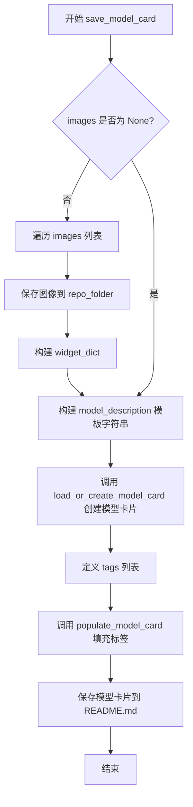
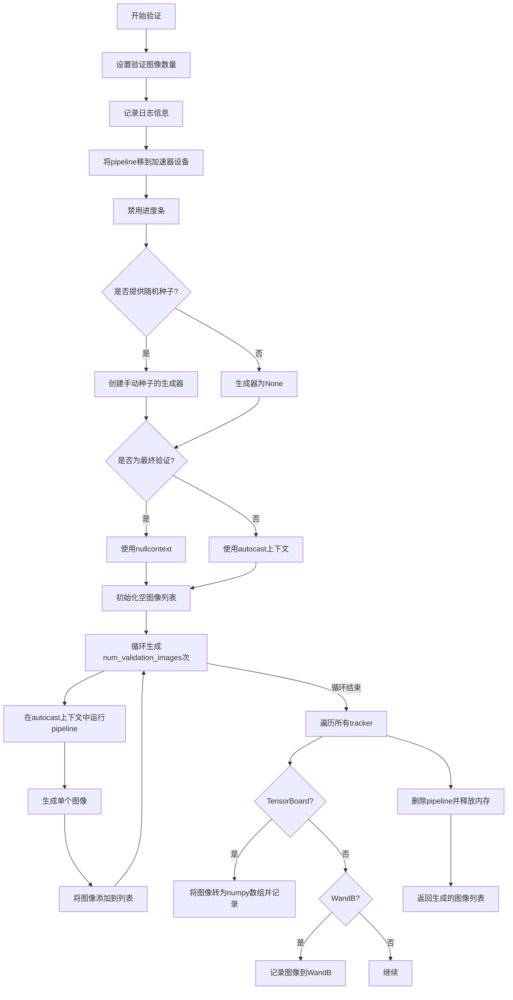
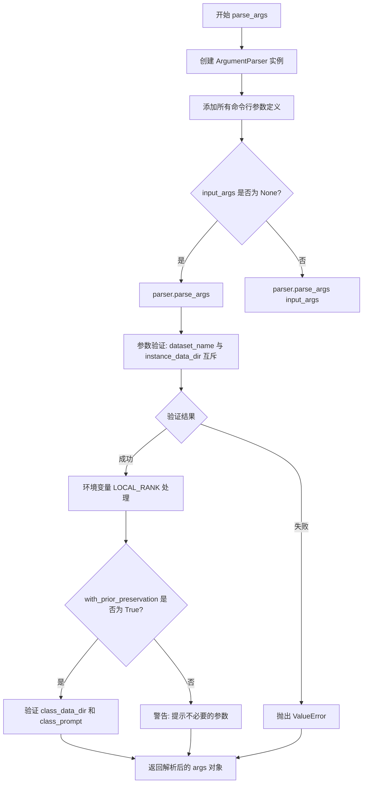
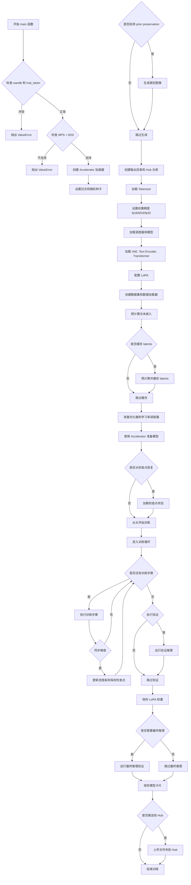
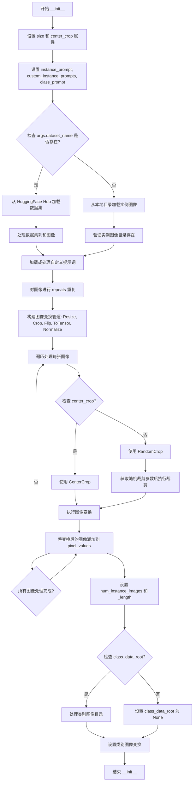
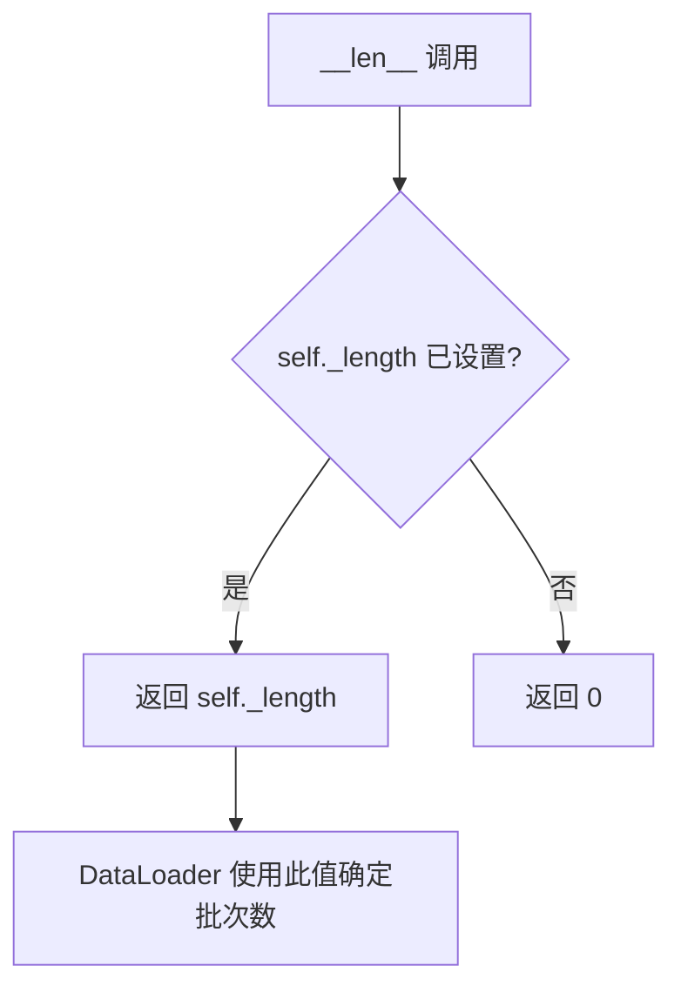
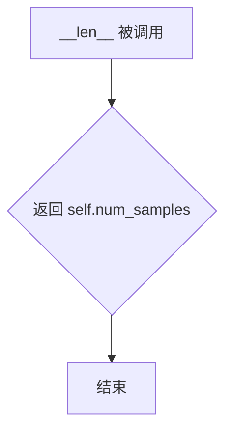

# `diffusers\examples\dreambooth\train_dreambooth_lora_qwen_image.py` 详细设计文档

A DreamBooth training script for fine-tuning the Qwen Image diffusion model using LoRA, featuring prior preservation, text encoder handling, and support for various optimization and quantization strategies.

## 整体流程

```mermaid
graph TD
    Start[Start: Parse Args] --> InitAccel[Initialize Accelerator & Logging]
    InitAccel --> CheckPrior[Check Prior Preservation]
    CheckPrior -- Yes --> GenClassImg[Generate Class Images with Pipeline]
    CheckPrior -- No --> LoadModels[Load VAE, Transformer, Text Encoder]
    GenClassImg --> LoadModels
    LoadModels --> SetupLoRA[Setup LoRA Adapter & Optimizer]
    SetupLoRA --> CreateData[Create DreamBoothDataset & DataLoader]
    CreateData --> Precompute[Precompute Embeddings (Optional)]
    Precompute --> TrainLoop[Training Loop]
    TrainLoop --> Batch[Get Batch]
    Batch --> EncodeImg[Encode Images to Latents]
    Batch --> EncodePrompt[Encode Prompts]
    EncodeImg --> Noise[Add Noise (Flow Matching)]
    EncodePrompt --> Noise
    Noise --> Forward[Forward Pass (Transformer)]
    Forward --> Loss[Compute Loss (MSE + Prior)]
    Loss --> Backward[Backward Pass]
    Backward --> Optim[Optimizer Step]
    Optim --> Checkpoint[Save Checkpoint (Periodic)]
    Checkpoint --> Validate[Run Validation (Periodic)]
    Validate --> TrainLoop
    TrainLoop -- Finished --> SaveFinal[Save LoRA Weights & Model Card]
    SaveFinal --> Push[Push to Hub (Optional)]
    Push --> End[End]
```

## 类结构

```
Global Scope
├── Class DreamBoothDataset (Dataset)
├── Class PromptDataset (Dataset)
├── Function save_model_card
├── Function log_validation
├── Function parse_args
├── Function collate_fn
└── Function main
```

## 全局变量及字段


### `logger`
    
Logging instance for outputting training information and debug messages.

类型：`logging.Logger`
    


### `is_wandb_available`
    
Function to check if wandb is installed and available for logging.

类型：`function`
    


### `check_min_version`
    
Function to ensure the correct version of diffusers is installed.

类型：`function`
    


### `DreamBoothDataset.size`
    
Target resolution for images.

类型：`int`
    


### `DreamBoothDataset.center_crop`
    
Whether to center crop images.

类型：`bool`
    


### `DreamBoothDataset.instance_prompt`
    
Prompt for instance images.

类型：`str`
    


### `DreamBoothDataset.class_prompt`
    
Prompt for class images.

类型：`str`
    


### `DreamBoothDataset.instance_data_root`
    
Path to instance images.

类型：`Path`
    


### `DreamBoothDataset.class_data_root`
    
Path to class images.

类型：`Path`
    


### `DreamBoothDataset.instance_images`
    
List of loaded instance images.

类型：`list`
    


### `DreamBoothDataset.pixel_values`
    
List of preprocessed image tensors.

类型：`list`
    


### `DreamBoothDataset.custom_instance_prompts`
    
User-provided captions.

类型：`list`
    


### `PromptDataset.prompt`
    
The prompt to generate images.

类型：`str`
    


### `PromptDataset.num_samples`
    
Number of samples to generate.

类型：`int`
    
    

## 全局函数及方法


### `save_model_card`

该函数用于在 DreamBooth LoRA 训练完成后，生成并保存 HuggingFace Hub 模型卡片（README.md），包括模型描述、训练信息、触发词、使用示例以及验证图像，并将其上传到模型仓库。

参数：

- `repo_id`：`str`，HuggingFace Hub 仓库 ID，用于标识模型
- `images`：可选的 `list[PIL.Image.Image]`，训练过程中生成的验证图像列表，默认为 None
- `base_model`：`str`，基础预训练模型的名称或路径，默认为 None
- `instance_prompt`：`str`，实例提示词，用于触发模型生成特定实例的图像，默认为 None
- `validation_prompt`：`str`，验证提示词，用于生成验证图像的提示，默认为 None
- `repo_folder`：`str`，本地仓库文件夹路径，用于保存模型卡片和图像，默认为 None

返回值：`None`，该函数不返回任何值，仅执行文件保存操作

#### 流程图



#### 带注释源码

```python
def save_model_card(
    repo_id: str,
    images=None,
    base_model: str = None,
    instance_prompt=None,
    validation_prompt=None,
    repo_folder=None,
):
    """
    生成并保存 HuggingFace Hub 模型卡片（README.md）
    
    参数:
        repo_id: HuggingFace Hub 仓库 ID
        images: 验证图像列表（PIL Image 对象）
        base_model: 基础预训练模型名称
        instance_prompt: 实例提示词
        validation_prompt: 验证提示词
        repo_folder: 本地仓库文件夹路径
    """
    # 初始化 widget 字典，用于 HuggingFace Hub 上的交互式展示
    widget_dict = []
    
    # 如果提供了验证图像，则保存图像并构建 widget 字典
    if images is not None:
        for i, image in enumerate(images):
            # 将图像保存到本地仓库文件夹
            image.save(os.path.join(repo_folder, f"image_{i}.png"))
            # 构建 widget 字典，包含提示词和图像 URL
            widget_dict.append(
                {"text": validation_prompt if validation_prompt else " ", 
                 "output": {"url": f"image_{i}.png"}}
            )

    # 构建模型描述的 Markdown 模板
    model_description = f"""
# HiDream Image DreamBooth LoRA - {repo_id}

<Gallery />

## Model description

These are {repo_id} DreamBooth LoRA weights for {base_model}.

The weights were trained using [DreamBooth](https://dreambooth.github.io/) with the [Qwen Image diffusers trainer](https://github.com/huggingface/diffusers/blob/main/examples/dreambooth/README_qwen.md).

## Trigger words

You should use `{instance_prompt}` to trigger the image generation.

## Download model

[Download the *.safetensors LoRA]({repo_id}/tree/main) in the Files & versions tab.

## Use it with the [🧨 diffusers library](https://github.com/huggingface/diffusers)

```py
    >>> import torch
    >>> from diffusers import QwenImagePipeline

    >>> pipe = QwenImagePipeline.from_pretrained(
    ...     "Qwen/Qwen-Image",
    ...     torch_dtype=torch.bfloat16,
    ... )
    >>> pipe.enable_model_cpu_offload()
    >>> pipe.load_lora_weights(f"{repo_id}")
    >>> image = pipe(f"{instance_prompt}").images[0]


```

For more details, including weighting, merging and fusing LoRAs, check the [documentation on loading LoRAs in diffusers](https://huggingface.co/docs/diffusers/main/en/using-diffusers/loading_adapters)
"""
    
    # 加载或创建模型卡片，包含训练元数据
    model_card = load_or_create_model_card(
        repo_id_or_path=repo_id,
        from_training=True,
        license="apache-2.0",
        base_model=base_model,
        prompt=instance_prompt,
        model_description=model_description,
        widget=widget_dict,
    )
    
    # 定义模型标签，用于分类和搜索
    tags = [
        "text-to-image",
        "diffusers-training",
        "diffusers",
        "lora",
        "qwen-image",
        "qwen-image-diffusers",
        "template:sd-lora",
    ]

    # 填充模型卡片标签并保存为 README.md
    model_card = populate_model_card(model_card, tags=tags)
    model_card.save(os.path.join(repo_folder, "README.md"))
```


### `log_validation`

该函数用于在训练过程中运行验证，通过加载训练好的模型生成验证图像，并将生成的图像记录到TensorBoard或WandB跟踪器中，以监控模型在验证集上的表现。

参数：

-  `pipeline`：`QwenImagePipeline`，用于图像生成的diffusers pipeline对象
-  `args`：Namespace，包含验证提示词、验证图像数量、随机种子等配置的命令行参数对象
-  `accelerator`：Accelerator，HuggingFace Accelerate库提供的分布式训练加速器，用于设备管理和数据同步
-  `pipeline_args`：Dict，包含预先计算好的`prompt_embeds`和`prompt_embeds_mask`的字典，用于文本编码
-  `epoch`：int，当前训练轮次编号，用于记录日志
-  `torch_dtype`：torch.dtype，模型权重的数据类型（如torch.float16或torch.bfloat16）
-  `is_final_validation`：bool，是否为训练结束后的最终验证，默认为False

返回值：`List[PIL.Image]`，生成的验证图像列表

#### 流程图



#### 带注释源码

```python
def log_validation(
    pipeline,          # QwenImagePipeline: 用于生成图像的diffusers pipeline
    args,              # Namespace: 包含验证配置的命令行参数
    accelerator,       # Accelerator: HuggingFace Accelerate加速器对象
    pipeline_args,     # Dict: 包含prompt_embeds和prompt_embeds_mask的字典
    epoch,             # int: 当前训练轮次
    torch_dtype,       # torch.dtype: 模型权重的数据类型
    is_final_validation=False,  # bool: 是否为最终验证
):
    """
    在训练过程中运行验证，生成图像并记录到日志跟踪器
    
    参数:
        pipeline: 图像生成pipeline
        args: 训练参数对象
        accelerator: 分布式训练加速器
        pipeline_args: 预先编码的文本嵌入
        epoch: 当前训练轮次
        torch_dtype: 数据类型
        is_final_validation: 是否为最终验证
    
    返回:
        images: 生成的PIL图像列表
    """
    # 设置验证图像数量，如果未指定则默认为1
    args.num_validation_images = args.num_validation_images if args.num_validation_images else 1
    
    # 记录验证日志信息，包括提示词和图像数量
    logger.info(
        f"Running validation... \n Generating {args.num_validation_images} images with prompt:"
        f" {args.validation_prompt}."
    )
    
    # 将pipeline移到指定设备并转换为指定数据类型
    pipeline = pipeline.to(accelerator.device, dtype=torch_dtype)
    pipeline.set_progress_bar_config(disable=True)

    # 创建随机数生成器，用于可重现的图像生成
    # 如果提供了seed则使用手动种子，否则为None
    generator = torch.Generator(device=accelerator.device).manual_seed(args.seed) if args.seed is not None else None
    
    # 根据是否为最终验证选择不同的上下文管理器
    # 最终验证时使用nullcontext避免autocast带来的精度问题
    autocast_ctx = torch.autocast(accelerator.device.type) if not is_final_validation else nullcontext()

    # 初始化图像列表用于存储生成的图像
    images = []
    
    # 循环生成指定数量的验证图像
    for _ in range(args.num_validation_images):
        # 在autocast上下文中运行pipeline进行推理
        with autocast_ctx:
            image = pipeline(
                prompt_embeds=pipeline_args["prompt_embeds"],
                prompt_embeds_mask=pipeline_args["prompt_embeds_mask"],
                generator=generator,  # 使用相同的生成器以确保可重现性
            ).images[0]
            images.append(image)

    # 遍历所有注册的日志跟踪器（TensorBoard、WandB等）
    for tracker in accelerator.trackers:
        # 确定阶段名称：最终验证用"test"，中间验证用"validation"
        phase_name = "test" if is_final_validation else "validation"
        
        # 如果是TensorBoard跟踪器，将图像转为numpy数组后记录
        if tracker.name == "tensorboard":
            np_images = np.stack([np.asarray(img) for img in images])
            tracker.writer.add_images(phase_name, np_images, epoch, dataformats="NHWC")
        
        # 如果是WandB跟踪器，使用WandB的Image功能记录
        if tracker.name == "wandb":
            tracker.log(
                {
                    phase_name: [
                        wandb.Image(image, caption=f"{i}: {args.validation_prompt}") for i, image in enumerate(images)
                    ]
                }
            )

    # 清理pipeline以释放GPU内存
    del pipeline
    free_memory()

    # 返回生成的图像列表供调用者使用
    return images
```


### parse_args

该函数是训练脚本的命令行参数解析器，负责定义并解析所有与DreamBooth LoRA训练相关的命令行参数，包括模型路径、数据集配置、训练超参数、优化器设置、验证选项等，同时对参数进行合法性校验和冲突检测。

参数：

- `input_args`：`Optional[List[str]]`，可选参数，用于指定要解析的参数列表（主要供测试使用），如果为`None`则从系统命令行参数`sys.argv`中解析

返回值：`Namespace`，返回一个包含所有解析后参数的命名空间对象，其中包含超过80个训练相关的配置属性

#### 流程图



#### 带注释源码

```python
def parse_args(input_args=None):
    """
    解析训练脚本的命令行参数。
    
    参数:
        input_args: 可选的参数列表，如果为None则从sys.argv解析。
                   主要用于单元测试场景。
    
    返回:
        argparse.Namespace: 包含所有训练配置参数的命名空间对象。
    """
    # 1. 创建 ArgumentParser 实例，设置脚本描述
    parser = argparse.ArgumentParser(description="Simple example of a training script.")
    
    # 2. 添加模型相关参数
    parser.add_argument(
        "--pretrained_model_name_or_path",
        type=str,
        default=None,
        required=True,
        help="Path to pretrained model or model identifier from huggingface.co/models.",
    )
    parser.add_argument(
        "--pretrained_tokenizer_4_name_or_path",
        type=str,
        default="meta-llama/Meta-Llama-3.1-8B-Instruct",
        help="Path to pretrained model or model identifier from huggingface.co/models.",
    )
    parser.add_argument(
        "--pretrained_text_encoder_4_name_or_path",
        type=str,
        default="meta-llama/Meta-Llama-3.1-8B-Instruct",
        help="Path to pretrained model or model identifier from huggingface.co/models.",
    )
    parser.add_argument(
        "--bnb_quantization_config_path",
        type=str,
        default=None,
        help="Quantization config in a JSON file that will be used to define the bitsandbytes quant config of the DiT.",
    )
    parser.add_argument(
        "--revision",
        type=str,
        default=None,
        required=False,
        help="Revision of pretrained model identifier from huggingface.co/models.",
    )
    parser.add_argument(
        "--variant",
        type=str,
        default=None,
        help="Variant of the model files of the pretrained model identifier from huggingface.co/models, 'e.g.' fp16",
    )
    
    # 3. 添加数据集相关参数
    parser.add_argument(
        "--dataset_name",
        type=str,
        default=None,
        help=(
            "The name of the Dataset (from the HuggingFace hub) containing the training data of instance images (could be your own, possibly private,"
            " dataset). It can also be a path pointing to a local copy of a dataset in your filesystem,"
            " or to a folder containing files that 🤗 Datasets can understand."
        ),
    )
    parser.add_argument(
        "--dataset_config_name",
        type=str,
        default=None,
        help="The config of the Dataset, leave as None if there's only one config.",
    )
    parser.add_argument(
        "--instance_data_dir",
        type=str,
        default=None,
        help=("A folder containing the training data. "),
    )
    parser.add_argument(
        "--cache_dir",
        type=str,
        default=None,
        help="The directory where the downloaded models and datasets will be stored.",
    )
    parser.add_argument(
        "--image_column",
        type=str,
        default="image",
        help="The column of the dataset containing the target image. By "
        "default, the standard Image Dataset maps out 'file_name' "
        "to 'image'.",
    )
    parser.add_argument(
        "--caption_column",
        type=str,
        default=None,
        help="The column of the dataset containing the instance prompt for each image",
    )
    parser.add_argument("--repeats", type=int, default=1, help="How many times to repeat the training data.")
    parser.add_argument(
        "--class_data_dir",
        type=str,
        default=None,
        required=False,
        help="A folder containing the training data of class images.",
    )
    parser.add_argument(
        "--instance_prompt",
        type=str,
        default=None,
        required=True,
        help="The prompt with identifier specifying the instance, e.g. 'photo of a TOK dog', 'in the style of TOK'",
    )
    parser.add_argument(
        "--class_prompt",
        type=str,
        default=None,
        help="The prompt to specify images in the same class as provided instance images.",
    )
    parser.add_argument(
        "--max_sequence_length",
        type=int,
        default=512,
        help="Maximum sequence length to use with the Qwen2.5 VL as text encoder.",
    )
    
    # 4. 添加验证相关参数
    parser.add_argument(
        "--validation_prompt",
        type=str,
        default=None,
        help="A prompt that is used during validation to verify that the model is learning.",
    )
    parser.add_argument(
        "--skip_final_inference",
        default=False,
        action="store_true",
        help="Whether to skip the final inference step with loaded lora weights upon training completion. This will run intermediate validation inference if `validation_prompt` is provided. Specify to reduce memory.",
    )
    parser.add_argument(
        "--final_validation_prompt",
        type=str,
        default=None,
        help="A prompt that is used during a final validation to verify that the model is learning. Ignored if `--validation_prompt` is provided.",
    )
    parser.add_argument(
        "--num_validation_images",
        type=int,
        default=4,
        help="Number of images that should be generated during validation with `validation_prompt`.",
    )
    parser.add_argument(
        "--validation_epochs",
        type=int,
        default=50,
        help=(
            "Run dreambooth validation every X epochs. Dreambooth validation consists of running the prompt"
            " `args.validation_prompt` multiple times: `args.num_validation_images`."
        ),
    )
    
    # 5. 添加 LoRA 相关参数
    parser.add_argument(
        "--rank",
        type=int,
        default=4,
        help=("The dimension of the LoRA update matrices."),
    )
    parser.add_argument(
        "--lora_alpha",
        type=int,
        default=4,
        help="LoRA alpha to be used for additional scaling.",
    )
    parser.add_argument("--lora_dropout", type=float, default=0.0, help="Dropout probability for LoRA layers")
    parser.add_argument(
        "--with_prior_preservation",
        default=False,
        action="store_true",
        help="Flag to add prior preservation loss.",
    )
    parser.add_argument("--prior_loss_weight", type=float, default=1.0, help="The weight of prior preservation loss.")
    parser.add_argument(
        "--num_class_images",
        type=int,
        default=100,
        help=(
            "Minimal class images for prior preservation loss. If there are not enough images already present in"
            " class_data_dir, additional images will be sampled with class_prompt."
        ),
    )
    parser.add_argument(
        "--lora_layers",
        type=str,
        default=None,
        help=(
            'The transformer modules to apply LoRA training on. Please specify the layers in a comma separated. E.g. - "to_k,to_q,to_v" will result in lora training of attention layers only'
        ),
    )
    
    # 6. 添加输出和训练相关参数
    parser.add_argument(
        "--output_dir",
        type=str,
        default="hidream-dreambooth-lora",
        help="The output directory where the model predictions and checkpoints will be written.",
    )
    parser.add_argument("--seed", type=int, default=None, help="A seed for reproducible training.")
    parser.add_argument(
        "--resolution",
        type=int,
        default=512,
        help=(
            "The resolution for input images, all the images in the train/validation dataset will be resized to this"
            " resolution"
        ),
    )
    parser.add_argument(
        "--center_crop",
        default=False,
        action="store_true",
        help=(
            "Whether to center crop the input images to the resolution. If not set, the images will be randomly"
            " cropped. The images will be resized to the resolution first before cropping."
        ),
    )
    parser.add_argument(
        "--random_flip",
        action="store_true",
        help="whether to randomly flip images horizontally",
    )
    parser.add_argument(
        "--train_batch_size", type=int, default=4, help="Batch size (per device) for the training dataloader."
    )
    parser.add_argument(
        "--sample_batch_size", type=int, default=4, help="Batch size (per device) for sampling images."
    )
    parser.add_argument("--num_train_epochs", type=int, default=1)
    parser.add_argument(
        "--max_train_steps",
        type=int,
        default=None,
        help="Total number of training steps to perform.  If provided, overrides num_train_epochs.",
    )
    parser.add_argument(
        "--checkpointing_steps",
        type=int,
        default=500,
        help=(
            "Save a checkpoint of the training state every X updates. These checkpoints can be used both as final"
            " checkpoints in case they are better than the last checkpoint, and are also suitable for resuming"
            " training using `--resume_from_checkpoint`."
        ),
    )
    parser.add_argument(
        "--checkpoints_total_limit",
        type=int,
        default=None,
        help=("Max number of checkpoints to store."),
    )
    parser.add_argument(
        "--resume_from_checkpoint",
        type=str,
        default=None,
        help=(
            "Whether training should be resumed from a previous checkpoint. Use a path saved by"
            ' `--checkpointing_steps`, or `"latest"` to automatically select the last available checkpoint.'
        ),
    )
    parser.add_argument(
        "--gradient_accumulation_steps",
        type=int,
        default=1,
        help="Number of updates steps to accumulate before performing a backward/update pass.",
    )
    parser.add_argument(
        "--gradient_checkpointing",
        action="store_true",
        help="Whether or not to use gradient checkpointing to save memory at the expense of slower backward pass.",
    )
    
    # 7. 添加学习率调度器参数
    parser.add_argument(
        "--learning_rate",
        type=float,
        default=1e-4,
        help="Initial learning rate (after the potential warmup period) to use.",
    )
    parser.add_argument(
        "--scale_lr",
        action="store_true",
        default=False,
        help="Scale the learning rate by the number of GPUs, gradient accumulation steps, and batch size.",
    )
    parser.add_argument(
        "--lr_scheduler",
        type=str,
        default="constant",
        help=(
            'The scheduler type to use. Choose between ["linear", "cosine", "cosine_with_restarts", "polynomial",'
            ' "constant", "constant_with_warmup"]'
        ),
    )
    parser.add_argument(
        "--lr_warmup_steps", type=int, default=500, help="Number of steps for the warmup in the lr scheduler."
    )
    parser.add_argument(
        "--lr_num_cycles",
        type=int,
        default=1,
        help="Number of hard resets of the lr in cosine_with_restarts scheduler.",
    )
    parser.add_argument("--lr_power", type=float, default=1.0, help="Power factor of the polynomial scheduler.")
    
    # 8. 添加数据加载和优化器参数
    parser.add_argument(
        "--dataloader_num_workers",
        type=int,
        default=0,
        help=(
            "Number of subprocesses to use for data loading. 0 means that the data will be loaded in the main process."
        ),
    )
    parser.add_argument(
        "--weighting_scheme",
        type=str,
        default="none",
        choices=["sigma_sqrt", "logit_normal", "mode", "cosmap", "none"],
        help=('We default to the "none" weighting scheme for uniform sampling and uniform loss'),
    )
    parser.add_argument(
        "--logit_mean", type=float, default=0.0, help="mean to use when using the `'logit_normal'` weighting scheme."
    )
    parser.add_argument(
        "--logit_std", type=float, default=1.0, help="std to use when using the `'logit_normal'` weighting scheme."
    )
    parser.add_argument(
        "--mode_scale",
        type=float,
        default=1.29,
        help="Scale of mode weighting scheme. Only effective when using the `'mode'` as the `weighting_scheme`.",
    )
    parser.add_argument(
        "--optimizer",
        type=str,
        default="AdamW",
        help=('The optimizer type to use. Choose between ["AdamW", "prodigy"]'),
    )
    parser.add_argument(
        "--use_8bit_adam",
        action="store_true",
        help="Whether or not to use 8-bit Adam from bitsandbytes. Ignored if optimizer is not set to AdamW",
    )
    parser.add_argument(
        "--adam_beta1", type=float, default=0.9, help="The beta1 parameter for the Adam and Prodigy optimizers."
    )
    parser.add_argument(
        "--adam_beta2", type=float, default=0.999, help="The beta2 parameter for the Adam and Prodigy optimizers."
    )
    parser.add_argument(
        "--prodigy_beta3",
        type=float,
        default=None,
        help="coefficients for computing the Prodigy stepsize using running averages. If set to None, "
        "uses the value of square root of beta2. Ignored if optimizer is adamW",
    )
    parser.add_argument("--prodigy_decouple", type=bool, default=True, help="Use AdamW style decoupled weight decay")
    parser.add_argument("--adam_weight_decay", type=float, default=1e-04, help="Weight decay to use for unet params")
    parser.add_argument(
        "--adam_epsilon",
        type=float,
        default=1e-08,
        help="Epsilon value for the Adam optimizer and Prodigy optimizers.",
    )
    parser.add_argument(
        "--prodigy_use_bias_correction",
        type=bool,
        default=True,
        help="Turn on Adam's bias correction. True by default. Ignored if optimizer is adamW",
    )
    parser.add_argument(
        "--prodigy_safeguard_warmup",
        type=bool,
        default=True,
        help="Remove lr from the denominator of D estimate to avoid issues during warm-up stage. True by default. "
        "Ignored if optimizer is adamW",
    )
    parser.add_argument("--max_grad_norm", default=1.0, type=float, help="Max gradient norm.")
    
    # 9. 添加日志和推送相关参数
    parser.add_argument("--push_to_hub", action="store_true", help="Whether or not to push the model to the Hub.")
    parser.add_argument("--hub_token", type=str, default=None, help="The token to use to push to the Model Hub.")
    parser.add_argument(
        "--hub_model_id",
        type=str,
        default=None,
        help="The name of the repository to keep in sync with the local `output_dir`.",
    )
    parser.add_argument(
        "--logging_dir",
        type=str,
        default="logs",
        help=(
            "[TensorBoard](https://www.tensorflow.org/tensorboard) log directory. Will default to"
            " *output_dir/runs/**CURRENT_DATETIME_HOSTNAME***."
        ),
    )
    parser.add_argument(
        "--allow_tf32",
        action="store_true",
        help=(
            "Whether or not to allow TF32 on Ampere GPUs. Can be used to speed up training. For more information, see"
            " https://pytorch.org/docs/stable/notes/cuda.html#tensorfloat-32-tf32-on-ampere-devices"
        ),
    )
    parser.add_argument(
        "--cache_latents",
        action="store_true",
        default=False,
        help="Cache the VAE latents",
    )
    parser.add_argument(
        "--report_to",
        type=str,
        default="tensorboard",
        help=(
            'The integration to report the results and logs to. Supported platforms are `"tensorboard"`'
            ' (default), `"wandb"` and `"comet_ml"`. Use `"all"` to report to all integrations.'
        ),
    )
    parser.add_argument(
        "--mixed_precision",
        type=str,
        default=None,
        choices=["no", "fp16", "bf16"],
        help=(
            "Whether to use mixed precision. Choose between fp16 and bf16 (bfloat16). Bf16 requires PyTorch >="
            " 1.10.and an Nvidia Ampere GPU.  Default to the value of accelerate config of the current system or the"
            " flag passed with the `accelerate.launch` command. Use this argument to override the accelerate config."
        ),
    )
    parser.add_argument(
        "--upcast_before_saving",
        action="store_true",
        default=False,
        help=(
            "Whether to upcast the trained transformer layers to float32 before saving (at the end of training). "
            "Defaults to precision dtype used for training to save memory"
        ),
    )
    parser.add_argument(
        "--offload",
        action="store_true",
        help="Whether to offload the VAE and the text encoder to CPU when they are not used.",
    )
    parser.add_argument("--local_rank", type=int, default=-1, help="For distributed training: local_rank")
    
    # 10. 解析参数
    if input_args is not None:
        args = parser.parse_args(input_args)
    else:
        args = parser.parse_args()
    
    # 11. 参数验证逻辑
    
    # 验证数据集参数：必须指定 dataset_name 或 instance_data_dir 之一
    if args.dataset_name is None and args.instance_data_dir is None:
        raise ValueError("Specify either `--dataset_name` or `--instance_data_dir`")

    # 验证数据集参数：不能同时指定两者
    if args.dataset_name is not None and args.instance_data_dir is not None:
        raise ValueError("Specify only one of `--dataset_name` or `--instance_data_dir`")

    # 从环境变量覆盖 local_rank（用于分布式训练）
    env_local_rank = int(os.environ.get("LOCAL_RANK", -1))
    if env_local_rank != -1 and env_local_rank != args.local_rank:
        args.local_rank = env_local_rank

    # Prior Preservation 验证
    if args.with_prior_preservation:
        if args.class_data_dir is None:
            raise ValueError("You must specify a data directory for class images.")
        if args.class_prompt is None:
            raise ValueError("You must specify prompt for class images.")
    else:
        # logger 尚未初始化，使用 warnings 模块
        if args.class_data_dir is not None:
            warnings.warn("You need not use --class_data_dir without --with_prior_preservation.")
        if args.class_prompt is not None:
            warnings.warn("You need not use --class_prompt without --with_prior_preservation.")

    return args
```


### `collate_fn`

该函数是DreamBooth训练脚本中的数据整理函数，负责将数据加载器返回的样本列表整理成适合模型输入的批次格式。它从每个样本中提取图像像素值和文本提示词，如果启用了先验保留（prior preservation）功能，还会同时包含类别图像和类别提示词，最后将像素值堆叠成张量并添加模型所需的帧维度。

参数：

- `examples`：`List[Dict]` ，从Dataset返回的样本列表，每个字典包含"instance_images"、"instance_prompt"等键
- `with_prior_preservation`：`bool` ，是否启用先验保留，默认为False，启用时会将类别图像和提示词也加入批次

返回值：`Dict`，包含以下键值对：
- `"pixel_values"`：`torch.Tensor` ，形状为(batch_size, channels, frames, height, width)的图像像素值张量
- `"prompts"`：`List[str]` ，对应的文本提示词列表

#### 流程图

```mermaid
flowchart TD
    A[开始 collate_fn] --> B[从examples提取instance_images和instance_prompt]
    B --> C{with_prior_preservation?}
    C -->|True| D[添加class_images和class_prompt到批次]
    C -->|False| E[跳过添加类别数据]
    D --> F[torch.stack将pixel_values堆叠成张量]
    E --> F
    F --> G{张量维度是否为4?}
    G -->|是| H[添加unsqueeze(2)添加frames维度]
    G -->|否| I[保持当前形状]
    H --> J[转换为连续内存格式并转为float]
    I --> J
    J --> K[构建batch字典]
    K --> L[返回batch]
```

#### 带注释源码

```python
def collate_fn(examples, with_prior_preservation=False):
    """
    整理数据批次，将样本列表转换为模型输入格式
    
    参数:
        examples: 从Dataset返回的样本列表，每个元素是包含图像和提示词的字典
        with_prior_preservation: 是否启用先验保留，用于保留原始类别分布
    """
    # 从每个样本中提取实例图像和实例提示词
    pixel_values = [example["instance_images"] for example in examples]
    prompts = [example["instance_prompt"] for example in examples]

    # 先验保留处理：将类别图像和类别提示词添加到批次中
    # 这样可以避免进行两次前向传播，提高训练效率
    if with_prior_preservation:
        pixel_values += [example["class_images"] for example in examples]
        prompts += [example["class_prompt"] for example in examples]

    # 将像素值列表堆叠成PyTorch张量
    pixel_values = torch.stack(pixel_values)
    
    # Qwen模型期望有一个num_frames维度
    # 如果当前是4维张量(batch, channels, height, width)，添加frames维度变成5维
    if pixel_values.ndim == 4:
        pixel_values = pixel_values.unsqueeze(2)
    
    # 确保内存连续并转换为float32类型
    pixel_values = pixel_values.to(memory_format=torch.contiguous_format).float()

    # 构建最终批次字典
    batch = {"pixel_values": pixel_values, "prompts": prompts}
    return batch
```


### `main`

该函数是DreamBooth LoRA训练脚本的核心入口，负责协调整个训练流程，包括参数解析、模型加载、数据集准备、训练循环执行、检查点保存、验证推理以及模型权重的最终保存与推送。

参数：

- `args`：`argparse.Namespace`，命令行参数对象，包含所有训练配置（如模型路径、数据路径、超参数等）

返回值：`None`，该函数执行完整的训练流程，不返回任何值

#### 流程图



#### 带注释源码

```python
def main(args):
    # 检查是否同时使用了 wandb 报告和 hub_token，这存在安全风险
    if args.report_to == "wandb" and args.hub_token is not None:
        raise ValueError(
            "You cannot use both --report_to=wandb and --hub_token due to a security risk of exposing your token."
            " Please use `hf auth login` to authenticate with the Hub."
        )

    # 检查 MPS (Apple Silicon) 是否支持 bf16 混合精度
    if torch.backends.mps.is_available() and args.mixed_precision == "bf16":
        # 由于 pytorch#99272，MPS 尚不支持 bfloat16
        raise ValueError(
            "Mixed precision training with bfloat16 is not supported on MPS. Please use fp16 (recommended) or fp32 instead."
        )

    # 构建日志目录路径
    logging_dir = Path(args.output_dir, args.logging_dir)

    # 配置 Accelerator 项目设置
    accelerator_project_config = ProjectConfiguration(project_dir=args.output_dir, logging_dir=logging_dir)
    # 配置分布式训练参数，启用 find_unused_parameters 以处理可能的未使用参数
    kwargs = DistributedDataParallelKwargs(find_unused_parameters=True)
    # 创建 Accelerator 实例，负责管理分布式训练、混合精度等
    accelerator = Accelerator(
        gradient_accumulation_steps=args.gradient_accumulation_steps,
        mixed_precision=args.mixed_precision,
        log_with=args.report_to,
        project_config=accelerator_project_config,
        kwargs_handlers=[kwargs],
    )

    # MPS 设备禁用 AMP
    if torch.backends.mps.is_available():
        accelerator.native_amp = False

    # 检查 wandb 是否安装
    if args.report_to == "wandb":
        if not is_wandb_available():
            raise ImportError("Make sure to install wandb if you want to use it for logging during training.")

    # 配置日志记录格式
    logging.basicConfig(
        format="%(asctime)s - %(levelname)s - %(name)s - %(message)s",
        datefmt="%m/%d/%Y %H:%M:%S",
        level=logging.INFO,
    )
    # 打印分布式训练状态
    logger.info(accelerator.state, main_process_only=False)
    # 仅在主进程设置 transformers 和 diffusers 的日志级别
    if accelerator.is_local_main_process:
        transformers.utils.logging.set_verbosity_warning()
        diffusers.utils.logging.set_verbosity_info()
    else:
        transformers.utils.logging.set_verbosity_error()
        diffusers.utils.logging.set_verbosity_error()

    # 设置训练随机种子以确保可重复性
    if args.seed is not None:
        set_seed(args.seed)

    # 如果启用了 prior preservation，生成类别图像
    if args.with_prior_preservation:
        class_images_dir = Path(args.class_data_dir)
        if not class_images_dir.exists():
            class_images_dir.mkdir(parents=True)
        # 计算当前已有的类别图像数量
        cur_class_images = len(list(class_images_dir.iterdir()))

        # 如果类别图像数量不足，则生成更多
        if cur_class_images < args.num_class_images:
            # 从预训练模型加载图像生成管道
            pipeline = QwenImagePipeline.from_pretrained(
                args.pretrained_model_name_or_path,
                torch_dtype=torch.bfloat16 if args.mixed_precision == "bf16" else torch.float16,
                revision=args.revision,
                variant=args.variant,
            )
            pipeline.set_progress_bar_config(disable=True)

            num_new_images = args.num_class_images - cur_class_images
            logger.info(f"Number of class images to sample: {num_new_images}.")

            # 创建用于生成类别图像的数据集和数据加载器
            sample_dataset = PromptDataset(args.class_prompt, num_new_images)
            sample_dataloader = torch.utils.data.DataLoader(sample_dataset, batch_size=args.sample_batch_size)

            sample_dataloader = accelerator.prepare(sample_dataloader)
            pipeline.to(accelerator.device)

            # 生成类别图像并保存
            for example in tqdm(
                sample_dataloader, desc="Generating class images", disable=not accelerator.is_local_main_process
            ):
                images = pipeline(example["prompt"]).images

                for i, image in enumerate(images):
                    # 使用不安全哈希生成唯一文件名
                    hash_image = insecure_hashlib.sha1(image.tobytes()).hexdigest()
                    image_filename = class_images_dir / f"{example['index'][i] + cur_class_images}-{hash_image}.jpg"
                    image.save(image_filename)

            # 释放管道内存
            pipeline.to("cpu")
            del pipeline
            free_memory()

    # 处理输出目录和 Hub 仓库创建
    if accelerator.is_main_process:
        if args.output_dir is not None:
            os.makedirs(args.output_dir, exist_ok=True)

        # 如果需要推送到 Hub，创建仓库
        if args.push_to_hub:
            repo_id = create_repo(
                repo_id=args.hub_model_id or Path(args.output_dir).name,
                exist_ok=True,
            ).repo_id

    # 加载分词器
    tokenizer = Qwen2Tokenizer.from_pretrained(
        args.pretrained_model_name_or_path,
        subfolder="tokenizer",
        revision=args.revision,
    )

    # 设置权重精度：对于非可训练权重（vae, text_encoder, transformer），根据混合精度设置
    weight_dtype = torch.float32
    if accelerator.mixed_precision == "fp16":
        weight_dtype = torch.float16
    elif accelerator.mixed_precision == "bf16":
        weight_dtype = torch.bfloat16

    # 加载调度器和模型
    # 使用 FlowMatchEulerDiscreteScheduler 作为噪声调度器
    noise_scheduler = FlowMatchEulerDiscreteScheduler.from_pretrained(
        args.pretrained_model_name_or_path, subfolder="scheduler", revision=args.revision, shift=3.0
    )
    # 创建调度器副本用于采样计算
    noise_scheduler_copy = copy.deepcopy(noise_scheduler)
    
    # 加载 VAE（变分自编码器）
    vae = AutoencoderKLQwenImage.from_pretrained(
        args.pretrained_model_name_or_path,
        subfolder="vae",
        revision=args.revision,
        variant=args.variant,
    )
    # 计算 VAE 缩放因子
    vae_scale_factor = 2 ** len(vae.temperal_downsample)
    # 计算潜在空间的均值和标准差，用于归一化
    latents_mean = (torch.tensor(vae.config.latents_mean).view(1, vae.config.z_dim, 1, 1, 1)).to(accelerator.device)
    latents_std = 1.0 / torch.tensor(vae.config.latents_std).view(1, vae.config.z_dim, 1, 1, 1).to(accelerator.device)
    
    # 加载文本编码器
    text_encoder = Qwen2_5_VLForConditionalGeneration.from_pretrained(
        args.pretrained_model_name_or_path, subfolder="text_encoder", revision=args.revision, torch_dtype=weight_dtype
    )
    
    # 如果提供了量化配置，加载 BitsAndBytes 量化配置
    quantization_config = None
    if args.bnb_quantization_config_path is not None:
        with open(args.bnb_quantization_config_path, "r") as f:
            config_kwargs = json.load(f)
            if "load_in_4bit" in config_kwargs and config_kwargs["load_in_4bit"]:
                config_kwargs["bnb_4bit_compute_dtype"] = weight_dtype
        quantization_config = BitsAndBytesConfig(**config_kwargs)

    # 加载 Transformer 主模型
    transformer = QwenImageTransformer2DModel.from_pretrained(
        args.pretrained_model_name_or_path,
        subfolder="transformer",
        revision=args.revision,
        variant=args.variant,
        quantization_config=quantization_config,
        torch_dtype=weight_dtype,
    )
    
    # 如果使用量化，对模型进行 kbit 训练准备
    if args.bnb_quantization_config_path is not None:
        transformer = prepare_model_for_kbit_training(transformer, use_gradient_checkpointing=False)

    # 设置模型为不可训练（仅训练 LoRA 适配器）
    transformer.requires_grad_(False)
    vae.requires_grad_(False)
    text_encoder.requires_grad_(False)

    # 再次检查 MPS + bf16 兼容性
    if torch.backends.mps.is_available() and weight_dtype == torch.bfloat16:
        raise ValueError(
            "Mixed precision training with bfloat16 is not supported on MPS. Please use fp16 (recommended) or fp32 instead."
        )

    # 将 VAE 和文本编码器移动到指定设备
    to_kwargs = {"dtype": weight_dtype, "device": accelerator.device} if not args.offload else {"dtype": weight_dtype}
    vae.to(**to_kwargs)
    text_encoder.to(**to_kwargs)
    # Transformer 不 offload 到 CPU，使用 accelerator device
    transformer_to_kwargs = (
        {"device": accelerator.device}
        if args.bnb_quantization_config_path is not None
        else {"device": accelerator.device, "dtype": weight_dtype}
    )
    transformer.to(**transformer_to_kwargs)

    # 初始化文本编码管道（保留在 CPU 上）
    text_encoding_pipeline = QwenImagePipeline.from_pretrained(
        args.pretrained_model_name_or_path,
        vae=None,
        transformer=None,
        tokenizer=tokenizer,
        text_encoder=text_encoder,
        scheduler=None,
    )

    # 如果启用梯度检查点，节省显存
    if args.gradient_checkpointing:
        transformer.enable_gradient_checkpointing()

    # 配置 LoRA 目标层
    if args.lora_layers is not None:
        target_modules = [layer.strip() for layer in args.lora_layers.split(",")]
    else:
        target_modules = ["to_k", "to_q", "to_v", "to_out.0"]

    # 为 Transformer 添加 LoRA 适配器
    transformer_lora_config = LoraConfig(
        r=args.rank,
        lora_alpha=args.lora_alpha,
        lora_dropout=args.lora_dropout,
        init_lora_weights="gaussian",
        target_modules=target_modules,
    )
    transformer.add_adapter(transformer_lora_config)

    # 解包模型的辅助函数
    def unwrap_model(model):
        model = accelerator.unwrap_model(model)
        model = model._orig_mod if is_compiled_module(model) else model
        return model

    # 定义保存模型的钩子函数
    def save_model_hook(models, weights, output_dir):
        if accelerator.is_main_process:
            transformer_lora_layers_to_save = None
            modules_to_save = {}

            for model in models:
                if isinstance(unwrap_model(model), type(unwrap_model(transformer))):
                    model = unwrap_model(model)
                    transformer_lora_layers_to_save = get_peft_model_state_dict(model)
                    modules_to_save["transformer"] = model
                else:
                    raise ValueError(f"unexpected save model: {model.__class__}")

                # 弹出权重避免重复保存
                if weights:
                    weights.pop()

            # 保存 LoRA 权重
            QwenImagePipeline.save_lora_weights(
                output_dir,
                transformer_lora_layers=transformer_lora_layers_to_save,
                **_collate_lora_metadata(modules_to_save),
            )

    # 定义加载模型的钩子函数
    def load_model_hook(models, input_dir):
        transformer_ = None

        if not accelerator.distributed_type == DistributedType.DEEPSPEED:
            while len(models) > 0:
                model = models.pop()

                if isinstance(unwrap_model(model), type(unwrap_model(transformer))):
                    model = unwrap_model(model)
                    transformer_ = model
                else:
                    raise ValueError(f"unexpected save model: {model.__class__}")
        else:
            # DeepSpeed 特殊处理
            transformer_ = QwenImageTransformer2DModel.from_pretrained(
                args.pretrained_model_name_or_path, subfolder="transformer"
            )
            transformer_.add_adapter(transformer_lora_config)

        # 加载 LoRA 状态字典
        lora_state_dict = QwenImagePipeline.lora_state_dict(input_dir)

        transformer_state_dict = {
            f"{k.replace('transformer.', '')}": v for k, v in lora_state_dict.items() if k.startswith("transformer.")
        }
        transformer_state_dict = convert_unet_state_dict_to_peft(transformer_state_dict)
        incompatible_keys = set_peft_model_state_dict(transformer_, transformer_state_dict, adapter_name="default")
        if incompatible_keys is not None:
            unexpected_keys = getattr(incompatible_keys, "unexpected_keys", None)
            if unexpected_keys:
                logger.warning(
                    f"Loading adapter weights from state_dict led to unexpected keys not found in the model: "
                    f" {unexpected_keys}. "
                )

        # 确保可训练参数为 float32
        if args.mixed_precision == "fp16":
            models = [transformer_]
            cast_training_params(models)

    # 注册保存和加载钩子
    accelerator.register_save_state_pre_hook(save_model_hook)
    accelerator.register_load_state_pre_hook(load_model_hook)

    # 启用 TF32 加速（ Ampere GPU）
    if args.allow_tf32 and torch.cuda.is_available():
        torch.backends.cuda.matmul.allow_tf32 = True

    # 根据 GPU 数量、梯度累积步数和批量大小缩放学习率
    if args.scale_lr:
        args.learning_rate = (
            args.learning_rate * args.gradient_accumulation_steps * args.train_batch_size * accelerator.num_processes
        )

    # 确保可训练参数为 float32（LoRA 参数）
    if args.mixed_precision == "fp16":
        models = [transformer]
        cast_training_params(models, dtype=torch.float32)

    # 获取可训练的 LoRA 参数
    transformer_lora_parameters = list(filter(lambda p: p.requires_grad, transformer.parameters()))

    # 优化参数配置
    transformer_parameters_with_lr = {"params": transformer_lora_parameters, "lr": args.learning_rate}
    params_to_optimize = [transformer_parameters_with_lr]

    # 选择优化器
    if not (args.optimizer.lower() == "prodigy" or args.optimizer.lower() == "adamw"):
        logger.warning(
            f"Unsupported choice of optimizer: {args.optimizer}.Supported optimizers include [adamW, prodigy]."
            "Defaulting to adamW"
        )
        args.optimizer = "adamw"

    if args.use_8bit_adam and not args.optimizer.lower() == "adamw":
        logger.warning(
            f"use_8bit_adam is ignored when optimizer is not set to 'AdamW'. Optimizer was "
            f"set to {args.optimizer.lower()}"
        )

    # 配置 AdamW 优化器
    if args.optimizer.lower() == "adamw":
        if args.use_8bit_adam:
            try:
                import bitsandbytes as bnb
            except ImportError:
                raise ImportError(
                    "To use 8-bit Adam, please install the bitsandbytes library: `pip install bitsandbytes`."
                )

            optimizer_class = bnb.optim.AdamW8bit
        else:
            optimizer_class = torch.optim.AdamW

        optimizer = optimizer_class(
            params_to_optimize,
            betas=(args.adam_beta1, args.adam_beta2),
            weight_decay=args.adam_weight_decay,
            eps=args.adam_epsilon,
        )

    # 配置 Prodigy 优化器
    if args.optimizer.lower() == "prodigy":
        try:
            import prodigyopt
        except ImportError:
            raise ImportError("To use Prodigy, please install the prodigyopt library: `pip install prodigyopt`")

        optimizer_class = prodigyopt.Prodigy

        if args.learning_rate <= 0.1:
            logger.warning(
                "Learning rate is too low. When using prodigy, it's generally better to set learning rate around 1.0"
            )

        optimizer = optimizer_class(
            params_to_optimize,
            betas=(args.adam_beta1, args.adam_beta2),
            beta3=args.prodigy_beta3,
            weight_decay=args.adam_weight_decay,
            eps=args.adam_epsilon,
            decouple=args.prodigy_decouple,
            use_bias_correction=args.prodigy_use_bias_correction,
            safeguard_warmup=args.prodigy_safeguard_warmup,
        )

    # 创建训练数据集
    train_dataset = DreamBoothDataset(
        instance_data_root=args.instance_data_dir,
        instance_prompt=args.instance_prompt,
        class_prompt=args.class_prompt,
        class_data_root=args.class_data_dir if args.with_prior_preservation else None,
        class_num=args.num_class_images,
        size=args.resolution,
        repeats=args.repeats,
        center_crop=args.center_crop,
    )

    # 创建训练数据加载器
    train_dataloader = torch.utils.data.DataLoader(
        train_dataset,
        batch_size=args.train_batch_size,
        shuffle=True,
        collate_fn=lambda examples: collate_fn(examples, args.with_prior_preservation),
        num_workers=args.dataloader_num_workers,
    )

    # 文本嵌入预计算函数
    def compute_text_embeddings(prompt, text_encoding_pipeline):
        with torch.no_grad():
            prompt_embeds, prompt_embeds_mask = text_encoding_pipeline.encode_prompt(
                prompt=prompt, max_sequence_length=args.max_sequence_length
            )
        return prompt_embeds, prompt_embeds_mask

    # 如果没有自定义实例提示，预计算实例提示嵌入以避免重复编码
    if not train_dataset.custom_instance_prompts:
        with offload_models(text_encoding_pipeline, device=accelerator.device, offload=args.offload):
            instance_prompt_embeds, instance_prompt_embeds_mask = compute_text_embeddings(
                args.instance_prompt, text_encoding_pipeline
            )

    # 处理 prior-preservation 的类别提示
    if args.with_prior_preservation:
        with offload_models(text_encoding_pipeline, device=accelerator.device, offload=args.offload):
            class_prompt_embeds, class_prompt_embeds_mask = compute_text_embeddings(
                args.class_prompt, text_encoding_pipeline
            )

    # 验证嵌入预计算
    validation_embeddings = {}
    if args.validation_prompt is not None:
        with offload_models(text_encoding_pipeline, device=accelerator.device, offload=args.offload):
            (validation_embeddings["prompt_embeds"], validation_embeddings["prompt_embeds_mask"]) = (
                compute_text_embeddings(args.validation_prompt, text_encoding_pipeline)
            )

    # 如果没有自定义提示，将静态计算的变量打包
    if not train_dataset.custom_instance_prompts:
        prompt_embeds = instance_prompt_embeds
        prompt_embeds_mask = instance_prompt_embeds_mask
        # 合并实例和类别提示嵌入
        if args.with_prior_preservation:
            prompt_embeds = torch.cat([prompt_embeds, class_prompt_embeds], dim=0)
            prompt_embeds_mask = torch.cat([prompt_embeds_mask, class_prompt_embeds_mask], dim=0)

    # 如果启用 latents 缓存，提前编码图像
    precompute_latents = args.cache_latents or train_dataset.custom_instance_prompts
    if precompute_latents:
        prompt_embeds_cache = []
        prompt_embeds_mask_cache = []
        latents_cache = []
        for batch in tqdm(train_dataloader, desc="Caching latents"):
            with torch.no_grad():
                if args.cache_latents:
                    with offload_models(vae, device=accelerator.device, offload=args.offload):
                        batch["pixel_values"] = batch["pixel_values"].to(
                            accelerator.device, non_blocking=True, dtype=vae.dtype
                        )
                        latents_cache.append(vae.encode(batch["pixel_values"]).latent_dist)
                if train_dataset.custom_instance_prompts:
                    with offload_models(text_encoding_pipeline, device=accelerator.device, offload=args.offload):
                        prompt_embeds, prompt_embeds_mask = compute_text_embeddings(
                            batch["prompts"], text_encoding_pipeline
                        )
                    prompt_embeds_cache.append(prompt_embeds)
                    prompt_embeds_mask_cache.append(prompt_embeds_mask)

    # 将 VAE 移回 CPU 并删除以释放内存
    if args.cache_latents:
        vae = vae.to("cpu")
        del vae

    # 释放文本编码管道和文本编码器内存
    text_encoding_pipeline = text_encoding_pipeline.to("cpu")
    del text_encoder, tokenizer
    free_memory()

    # 计算训练步数
    overrode_max_train_steps = False
    num_update_steps_per_epoch = math.ceil(len(train_dataloader) / args.gradient_accumulation_steps)
    if args.max_train_steps is None:
        args.max_train_steps = args.num_train_epochs * num_update_steps_per_epoch
        overrode_max_train_steps = True

    # 创建学习率调度器
    lr_scheduler = get_scheduler(
        args.lr_scheduler,
        optimizer=optimizer,
        num_warmup_steps=args.lr_warmup_steps * accelerator.num_processes,
        num_training_steps=args.max_train_steps * accelerator.num_processes,
        num_cycles=args.lr_num_cycles,
        power=args.lr_power,
    )

    # 使用 Accelerator 准备所有组件
    transformer, optimizer, train_dataloader, lr_scheduler = accelerator.prepare(
        transformer, optimizer, train_dataloader, lr_scheduler
    )

    # 重新计算训练步数（数据加载器大小可能改变）
    num_update_steps_per_epoch = math.ceil(len(train_dataloader) / args.gradient_accumulation_steps)
    if overrode_max_train_steps:
        args.max_train_steps = args.num_train_epochs * num_update_steps_per_epoch
    args.num_train_epochs = math.ceil(args.max_train_steps / num_update_steps_per_epoch)

    # 初始化训练跟踪器
    if accelerator.is_main_process:
        tracker_name = "dreambooth-qwen-image-lora"
        accelerator.init_trackers(tracker_name, config=vars(args))

    # 训练信息日志
    total_batch_size = args.train_batch_size * accelerator.num_processes * args.gradient_accumulation_steps

    logger.info("***** Running training *****")
    logger.info(f"  Num examples = {len(train_dataset)}")
    logger.info(f"  Num batches each epoch = {len(train_dataloader)}")
    logger.info(f"  Num Epochs = {args.num_train_epochs}")
    logger.info(f"  Instantaneous batch size per device = {args.train_batch_size}")
    logger.info(f"  Total train batch size (w. parallel, distributed & accumulation) = {total_batch_size}")
    logger.info(f"  Gradient Accumulation steps = {args.gradient_accumulation_steps}")
    logger.info(f"  Total optimization steps = {args.max_train_steps}")
    
    global_step = 0
    first_epoch = 0

    # 从检查点恢复训练
    if args.resume_from_checkpoint:
        if args.resume_from_checkpoint != "latest":
            path = os.path.basename(args.resume_from_checkpoint)
        else:
            # 获取最新的检查点
            dirs = os.listdir(args.output_dir)
            dirs = [d for d in dirs if d.startswith("checkpoint")]
            dirs = sorted(dirs, key=lambda x: int(x.split("-")[1]))
            path = dirs[-1] if len(dirs) > 0 else None

        if path is None:
            accelerator.print(
                f"Checkpoint '{args.resume_from_checkpoint}' does not exist. Starting a new training run."
            )
            args.resume_from_checkpoint = None
            initial_global_step = 0
        else:
            accelerator.print(f"Resuming from checkpoint {path}")
            accelerator.load_state(os.path.join(args.output_dir, path))
            global_step = int(path.split("-")[1])

            initial_global_step = global_step
            first_epoch = global_step // num_update_steps_per_epoch

    else:
        initial_global_step = 0

    # 创建进度条
    progress_bar = tqdm(
        range(0, args.max_train_steps),
        initial=initial_global_step,
        desc="Steps",
        disable=not accelerator.is_local_main_process,
    )

    # 计算 sigmas 的辅助函数
    def get_sigmas(timesteps, n_dim=4, dtype=torch.float32):
        sigmas = noise_scheduler_copy.sigmas.to(device=accelerator.device, dtype=dtype)
        schedule_timesteps = noise_scheduler_copy.timesteps.to(accelerator.device)
        timesteps = timesteps.to(accelerator.device)
        step_indices = [(schedule_timesteps == t).nonzero().item() for t in timesteps]

        sigma = sigmas[step_indices].flatten()
        while len(sigma.shape) < n_dim:
            sigma = sigma.unsqueeze(-1)
        return sigma

    # ==================== 训练循环 ====================
    for epoch in range(first_epoch, args.num_train_epochs):
        transformer.train()

        for step, batch in enumerate(train_dataloader):
            models_to_accumulate = [transformer]
            prompts = batch["prompts"]

            with accelerator.accumulate(models_to_accumulate):
                # 如果有自定义提示，编码批次提示
                if train_dataset.custom_instance_prompts:
                    prompt_embeds = prompt_embeds_cache[step]
                    prompt_embeds_mask = prompt_embeds_mask_cache[step]
                else:
                    num_repeat_elements = len(prompts)
                    prompt_embeds = prompt_embeds.repeat(num_repeat_elements, 1, 1)
                    if prompt_embeds_mask is not None:
                        prompt_embeds_mask = prompt_embeds_mask.repeat(num_repeat_elements, 1)
                
                # 将图像转换为潜在空间
                if args.cache_latents:
                    model_input = latents_cache[step].sample()
                else:
                    with offload_models(vae, device=accelerator.device, offload=args.offload):
                        pixel_values = batch["pixel_values"].to(dtype=vae.dtype)
                    model_input = vae.encode(pixel_values).latent_dist.sample()

                # 归一化潜在向量
                model_input = (model_input - latents_mean) * latents_std
                model_input = model_input.to(dtype=weight_dtype)

                # 采样噪声
                noise = torch.randn_like(model_input)
                bsz = model_input.shape[0]

                # 为每个图像采样随机时间步
                u = compute_density_for_timestep_sampling(
                    weighting_scheme=args.weighting_scheme,
                    batch_size=bsz,
                    logit_mean=args.logit_mean,
                    logit_std=args.logit_std,
                    mode_scale=args.mode_scale,
                )
                indices = (u * noise_scheduler_copy.config.num_train_timesteps).long()
                timesteps = noise_scheduler_copy.timesteps[indices].to(device=model_input.device)

                # Flow matching: zt = (1 - texp) * x + texp * z1
                sigmas = get_sigmas(timesteps, n_dim=model_input.ndim, dtype=model_input.dtype)
                noisy_model_input = (1.0 - sigmas) * model_input + sigmas * noise

                # 预测噪声残差
                img_shapes = [
                    (1, args.resolution // vae_scale_factor // 2, args.resolution // vae_scale_factor // 2)
                ] * bsz
                # 置换维度
                noisy_model_input = noisy_model_input.permute(0, 2, 1, 3, 4)
                packed_noisy_model_input = QwenImagePipeline._pack_latents(
                    noisy_model_input,
                    batch_size=model_input.shape[0],
                    num_channels_latents=model_input.shape[1],
                    height=model_input.shape[3],
                    width=model_input.shape[4],
                )
                model_pred = transformer(
                    hidden_states=packed_noisy_model_input,
                    encoder_hidden_states=prompt_embeds,
                    encoder_hidden_states_mask=prompt_embeds_mask,
                    timestep=timesteps / 1000,
                    img_shapes=img_shapes,
                    return_dict=False,
                )[0]
                model_pred = QwenImagePipeline._unpack_latents(
                    model_pred, args.resolution, args.resolution, vae_scale_factor
                )

                # 计算损失权重
                weighting = compute_loss_weighting_for_sd3(weighting_scheme=args.weighting_scheme, sigmas=sigmas)

                target = noise - model_input
                
                # 如果启用 prior preservation，分别计算损失
                if args.with_prior_preservation:
                    model_pred, model_pred_prior = torch.chunk(model_pred, 2, dim=0)
                    target, target_prior = torch.chunk(target, 2, dim=0)

                    # 计算先验损失
                    prior_loss = torch.mean(
                        (weighting.float() * (model_pred_prior.float() - target_prior.float()) ** 2).reshape(
                            target_prior.shape[0], -1
                        ),
                        1,
                    )
                    prior_loss = prior_loss.mean()

                # 计算常规损失
                loss = torch.mean(
                    (weighting.float() * (model_pred.float() - target.float()) ** 2).reshape(target.shape[0], -1),
                    1,
                )
                loss = loss.mean()

                # 添加先验损失
                if args.with_prior_preservation:
                    loss = loss + args.prior_loss_weight * prior_loss

                # 反向传播
                accelerator.backward(loss)
                # 梯度裁剪
                if accelerator.sync_gradients:
                    params_to_clip = transformer.parameters()
                    accelerator.clip_grad_norm_(params_to_clip, args.max_grad_norm)

                # 优化器步骤
                optimizer.step()
                lr_scheduler.step()
                optimizer.zero_grad()

            # 检查是否执行了优化步骤
            if accelerator.sync_gradients:
                progress_bar.update(1)
                global_step += 1

                # 定期保存检查点
                if accelerator.is_main_process or accelerator.distributed_type == DistributedType.DEEPSPEED:
                    if global_step % args.checkpointing_steps == 0:
                        # 检查是否超过最大检查点数量限制
                        if args.checkpoints_total_limit is not None:
                            checkpoints = os.listdir(args.output_dir)
                            checkpoints = [d for d in checkpoints if d.startswith("checkpoint")]
                            checkpoints = sorted(checkpoints, key=lambda x: int(x.split("-")[1]))

                            if len(checkpoints) >= args.checkpoints_total_limit:
                                num_to_remove = len(checkpoints) - args.checkpoints_total_limit + 1
                                removing_checkpoints = checkpoints[0:num_to_remove]

                                logger.info(
                                    f"{len(checkpoints)} checkpoints already exist, removing {len(removing_checkpoints)} checkpoints"
                                )
                                logger.info(f"removing checkpoints: {', '.join(removing_checkpoints)}")

                                for removing_checkpoint in removing_checkpoints:
                                    removing_checkpoint = os.path.join(args.output_dir, removing_checkpoint)
                                    shutil.rmtree(removing_checkpoint)

                        save_path = os.path.join(args.output_dir, f"checkpoint-{global_step}")
                        accelerator.save_state(save_path)
                        logger.info(f"Saved state to {save_path}")

            # 记录日志
            logs = {"loss": loss.detach().item(), "lr": lr_scheduler.get_last_lr()[0]}
            progress_bar.set_postfix(**logs)
            accelerator.log(logs, step=global_step)

            if global_step >= args.max_train_steps:
                break

    # ==================== 训练后处理 ====================
    # 验证
    if accelerator.is_main_process:
        if args.validation_prompt is not None and epoch % args.validation_epochs == 0:
            # 创建管道
            pipeline = QwenImagePipeline.from_pretrained(
                args.pretrained_model_name_or_path,
                tokenizer=None,
                text_encoder=None,
                transformer=accelerator.unwrap_model(transformer),
                revision=args.revision,
                variant=args.variant,
                torch_dtype=weight_dtype,
            )
            images = log_validation(
                pipeline=pipeline,
                args=args,
                accelerator=accelerator,
                pipeline_args=validation_embeddings,
                torch_dtype=weight_dtype,
                epoch=epoch,
            )
            del pipeline
            images = None
            free_memory()

    # 保存 LoRA 权重
    accelerator.wait_for_everyone()
    if accelerator.is_main_process:
        modules_to_save = {}
        transformer = unwrap_model(transformer)
        if args.bnb_quantization_config_path is None:
            if args.upcast_before_saving:
                transformer.to(torch.float32)
            else:
                transformer = transformer.to(weight_dtype)
        transformer_lora_layers = get_peft_model_state_dict(transformer)
        modules_to_save["transformer"] = transformer

        # 保存 LoRA 权重
        QwenImagePipeline.save_lora_weights(
            save_directory=args.output_dir,
            transformer_lora_layers=transformer_lora_layers,
            **_collate_lora_metadata(modules_to_save),
        )

        images = []
        # 是否运行最终推理
        run_validation = (args.validation_prompt and args.num_validation_images > 0) or (args.final_validation_prompt)
        should_run_final_inference = not args.skip_final_inference and run_validation
        
        if should_run_final_inference:
            # 加载之前的管道
            pipeline = QwenImagePipeline.from_pretrained(
                args.pretrained_model_name_or_path,
                tokenizer=None,
                text_encoder=None,
                revision=args.revision,
                variant=args.variant,
                torch_dtype=weight_dtype,
            )
            # 加载 LoRA 权重
            pipeline.load_lora_weights(args.output_dir)

            # 运行推理
            images = log_validation(
                pipeline=pipeline,
                args=args,
                accelerator=accelerator,
                pipeline_args=validation_embeddings,
                epoch=epoch,
                is_final_validation=True,
                torch_dtype=weight_dtype,
            )
            del pipeline
            free_memory()

        # 保存模型卡片
        validation_prompt = args.validation_prompt if args.validation_prompt else args.final_validation_prompt
        save_model_card(
            (args.hub_model_id or Path(args.output_dir).name) if not args.push_to_hub else repo_id,
            images=images,
            base_model=args.pretrained_model_name_or_path,
            instance_prompt=args.instance_prompt,
            validation_prompt=validation_prompt,
            repo_folder=args.output_dir,
        )

        # 推送到 Hub
        if args.push_to_hub:
            upload_folder(
                repo_id=repo_id,
                folder_path=args.output_dir,
                commit_message="End of training",
                ignore_patterns=["step_*", "epoch_*"],
            )

        images = None

    # 结束训练
    accelerator.end_training()
```


### DreamBoothDataset.__init__

初始化DreamBooth数据集，用于准备微调模型所需的实例图像和类别图像及其对应的提示词。该方法支持从HuggingFace Hub或本地目录加载图像数据，并进行预处理（包括大小调整、裁剪、翻转和归一化），同时处理先验保留（prior preservation）所需的类别图像。

参数：

- `instance_data_root`：`str`，实例图像所在的根目录路径
- `instance_prompt`：`str`，用于描述实例图像的提示词
- `class_prompt`：`str`，用于描述类别图像的提示词
- `class_data_root`：`str | None`，类别图像所在的根目录路径，默认为None
- `class_num`：`int | None`，类别图像的最大数量，默认为None
- `size`：`int`，图像的目标分辨率，默认为1024
- `repeats`：`int`，每个图像的重复次数，默认为1
- `center_crop`：`bool`，是否进行中心裁剪，默认为False

返回值：`None`，该方法为构造函数，不返回任何值

#### 流程图



#### 带注释源码

```python
def __init__(
    self,
    instance_data_root,
    instance_prompt,
    class_prompt,
    class_data_root=None,
    class_num=None,
    size=1024,
    repeats=1,
    center_crop=False,
):
    # 设置图像目标分辨率和中心裁剪标志
    self.size = size
    self.center_crop = center_crop

    # 设置实例提示词和类别提示词
    self.instance_prompt = instance_prompt
    self.custom_instance_prompts = None  # 用于存储自定义提示词
    self.class_prompt = class_prompt

    # 判断数据加载方式：从Hub加载或从本地目录加载
    if args.dataset_name is not None:
        try:
            from datasets import load_dataset
        except ImportError:
            raise ImportError(
                "You are trying to load your data using the datasets library. If you wish to train using custom "
                "captions please install the datasets library: `pip install datasets`. If you wish to load a "
                "local folder containing images only, specify --instance_data_dir instead."
            )
        
        # 从HuggingFace Hub下载并加载数据集
        dataset = load_dataset(
            args.dataset_name,
            args.dataset_config_name,
            cache_dir=args.cache_dir,
        )
        
        # 获取数据集列名
        column_names = dataset["train"].column_names

        # 确定图像列名（默认使用第一列）
        if args.image_column is None:
            image_column = column_names[0]
            logger.info(f"image column defaulting to {image_column}")
        else:
            image_column = args.image_column
            if image_column not in column_names:
                raise ValueError(
                    f"`--image_column` value '{args.image_column}' not found in dataset columns. Dataset columns are: {', '.join(column_names)}"
                )
        
        # 获取实例图像
        instance_images = dataset["train"][image_column]

        # 处理自定义提示词列
        if args.caption_column is None:
            logger.info(
                "No caption column provided, defaulting to instance_prompt for all images. If your dataset "
                "contains captions/prompts for the images, make sure to specify the "
                "column as --caption_column"
            )
            self.custom_instance_prompts = None
        else:
            if args.caption_column not in column_names:
                raise ValueError(
                    f"`--caption_column` value '{args.caption_column}' not found in dataset columns. Dataset columns are: {', '.join(column_names)}"
                )
            custom_instance_prompts = dataset["train"][args.caption_column]
            # 根据repeats参数创建最终的自定义提示词列表
            self.custom_instance_prompts = []
            for caption in custom_instance_prompts:
                self.custom_instance_prompts.extend(itertools.repeat(caption, repeats))
    else:
        # 从本地目录加载实例图像
        self.instance_data_root = Path(instance_data_root)
        if not self.instance_data_root.exists():
            raise ValueError("Instance images root doesn't exists.")

        instance_images = [Image.open(path) for path in list(Path(instance_data_root).iterdir())]
        self.custom_instance_prompts = None

    # 根据repeats参数重复图像
    self.instance_images = []
    for img in instance_images:
        self.instance_images.extend(itertools.repeat(img, repeats))

    # 初始化像素值列表和变换操作
    self.pixel_values = []
    train_resize = transforms.Resize(size, interpolation=transforms.InterpolationMode.BILINEAR)
    train_crop = transforms.CenterCrop(size) if center_crop else transforms.RandomCrop(size)
    train_flip = transforms.RandomHorizontalFlip(p=1.0)
    train_transforms = transforms.Compose(
        [
            transforms.ToTensor(),
            transforms.Normalize([0.5], [0.5]),
        ]
    )
    
    # 遍历处理每张实例图像
    for image in self.instance_images:
        # 处理EXIF方向并转换为RGB模式
        image = exif_transpose(image)
        if not image.mode == "RGB":
            image = image.convert("RGB")
        
        # 调整图像大小
        image = train_resize(image)
        
        # 随机水平翻转（如果启用）
        if args.random_flip and random.random() < 0.5:
            image = train_flip(image)
        
        # 裁剪图像
        if args.center_crop:
            y1 = max(0, int(round((image.height - args.resolution) / 2.0)))
            x1 = max(0, int(round((image.width - args.resolution) / 2.0)))
            image = train_crop(image)
        else:
            y1, x1, h, w = train_crop.get_params(image, (args.resolution, args.resolution))
            image = crop(image, y1, x1, h, w)
        
        # 应用变换（ToTensor + Normalize）
        image = train_transforms(image)
        self.pixel_values.append(image)

    # 设置数据集长度相关信息
    self.num_instance_images = len(self.instance_images)
    self._length = self.num_instance_images

    # 处理类别图像数据（用于prior preservation）
    if class_data_root is not None:
        self.class_data_root = Path(class_data_root)
        self.class_data_root.mkdir(parents=True, exist_ok=True)
        self.class_images_path = list(self.class_data_root.iterdir())
        if class_num is not None:
            self.num_class_images = min(len(self.class_images_path), class_num)
        else:
            self.num_class_images = len(self.class_images_path)
        self._length = max(self.num_class_images, self.num_instance_images)
    else:
        self.class_data_root = None

    # 定义类别图像的变换管道
    self.image_transforms = transforms.Compose(
        [
            transforms.Resize(size, interpolation=transforms.InterpolationMode.BILINEAR),
            transforms.CenterCrop(size) if center_crop else transforms.RandomCrop(size),
            transforms.ToTensor(),
            transforms.Normalize([0.5], [0.5]),
        ]
    )
```


### DreamBoothDataset.__len__

返回数据集的样本数量，供 DataLoader 确定迭代次数使用。

参数：

- `self`：DreamBoothDataset，隐式参数，指向数据集实例本身

返回值：`int`，数据集包含的样本总数

#### 流程图



#### 带注释源码

```python
def __len__(self):
    """
    返回数据集中的样本数量。
    
    _length 在 __init__ 中被设置为 max(num_class_images, num_instance_images)，
    以确保在使用 prior preservation 时数据集足够大，能够同时包含实例图像和类别图像。
    
    Returns:
        int: 数据集的样本总数
    """
    return self._length
```


### `DreamBoothDataset.__getitem__`

该方法是 DreamBooth 数据集类的核心索引方法，负责根据给定的索引返回单个训练样本。它从预处理后的像素值中获取实例图像，处理自定义提示词，并在启用先验保留时加载相应的类图像，最终打包成包含图像和提示词的字典返回给训练流程。

参数：

- `index`：`int`，用于从数据集获取样本的索引值

返回值：`dict`，包含以下键值对的字典：
- `"instance_images"`：实例图像的张量数据
- `"instance_prompt"`：实例提示词文本
- `"class_images"`（可选）：类图像的张量数据，当 `class_data_root` 不为 None 时存在
- `"class_prompt"`（可选）：类提示词文本，当 `class_data_root` 不为 None 时存在

#### 流程图

```mermaid
flowchart TD
    A[开始 __getitem__] --> B[创建空字典 example]
    B --> C[计算实例图像索引: index % self.num_instance_images]
    C --> D[从 pixel_values 获取实例图像]
    D --> E[将实例图像存入 example['instance_images']]
    E --> F{是否有自定义提示词?}
    F -->|是| G[获取自定义提示词 caption]
    G --> H{caption 是否有内容?}
    H -->|是| I[设置 example['instance_prompt'] = caption]
    H -->|否| J[设置 example['instance_prompt'] = self.instance_prompt]
    F -->|否| J
    J --> K{是否有 class_data_root?}
    K -->|是| L[打开类图像文件]
    L --> M[使用 exif_transpose 处理图像方向]
    M --> N{图像模式是否为 RGB?}
    N -->|否| O[转换图像为 RGB 模式]
    N -->|是| P[跳过转换]
    O --> P
    P --> Q[应用图像变换]
    Q --> R[存入 example['class_images']]
    R --> S[存入 example['class_prompt']]
    K -->|否| T[跳过类图像处理]
    S --> T
    T --> U[返回 example 字典]
    U --> V[结束]
```

#### 带注释源码

```python
def __getitem__(self, index):
    """
    根据索引获取数据集中的单个训练样本。
    
    参数:
        index: int - 数据集中的索引位置
    
    返回:
        dict: 包含实例图像、提示词以及可选的类图像和提示词的字典
    """
    # 创建用于存储样本数据的字典
    example = {}
    
    # 使用取模运算处理索引，确保索引在有效范围内循环
    # 这支持数据集长度与实际图像数量不一致的情况
    instance_image = self.pixel_values[index % self.num_instance_images]
    
    # 将实例图像添加到返回字典中
    example["instance_images"] = instance_image

    # 检查是否提供了自定义实例提示词
    if self.custom_instance_prompts:
        # 获取对应索引的自定义提示词
        caption = self.custom_instance_prompts[index % self.num_instance_images]
        
        # 如果自定义提示词存在且非空，则使用自定义提示词
        if caption:
            example["instance_prompt"] = caption
        else:
            # 否则回退到默认的实例提示词
            example["instance_prompt"] = self.instance_prompt

    else:  
        # 当没有提供自定义提示词时，使用默认实例提示词
        # 这对应于使用 --instance_data_dir 方式加载本地图像的情况
        example["instance_prompt"] = self.instance_prompt

    # 如果配置了类数据根目录（先验保留模式）
    if self.class_data_root:
        # 根据索引打开对应的类图像
        class_image = Image.open(self.class_images_path[index % self.num_class_images])
        
        # 处理图像的 EXIF 方向信息，确保图像方向正确
        class_image = exif_transpose(class_image)

        # 确保类图像为 RGB 模式（处理可能的 RGBA 或灰度图）
        if not class_image.mode == "RGB":
            class_image = class_image.convert("RGB")
        
        # 应用图像变换（调整大小、裁剪、归一化）
        example["class_images"] = self.image_transforms(class_image)
        
        # 添加类提示词
        example["class_prompt"] = self.class_prompt

    # 返回包含所有样本数据的字典
    return example
```


### `PromptDataset.__len__`

返回数据集中样本的数量，用于确定数据集的大小，使 DataLoader 能够知道迭代的总数。

参数：

- `self`：PromptDataset 实例本身，不需要显式传递

返回值：`int`，返回数据集中样本的总数

#### 流程图



#### 带注释源码

```python
def __len__(self):
    """
    返回数据集中样本的数量。
    
    这是 Python 特殊方法，使 Dataset 对象可以使用 len() 函数获取长度。
    DataLoader 需要此方法来确定每个 epoch 的批次数。
    
    Returns:
        int: 数据集中样本的数量，等于初始化时传入的 num_samples 参数
    """
    return self.num_samples
```


### `PromptDataset.__getitem__`

该方法是 `PromptDataset` 类的核心实例方法，用于根据给定索引返回包含提示词和索引的样本字典。主要功能是支持数据加载器按索引获取数据，为生成类图像的扩散模型提供批处理数据。

参数：

- `index`：`int`，索引值，用于指定获取数据集中的第几个样本

返回值：`dict`，返回包含 "prompt"（提示词内容）和 "index"（样本索引）的字典对象

#### 流程图

```mermaid
flowchart TD
    A[开始 __getitem__] --> B[创建空字典 example]
    B --> C[设置 example['prompt'] = self.prompt]
    C --> D[设置 example['index'] = index]
    D --> E[返回 example 字典]
```

#### 带注释源码

```python
def __getitem__(self, index):
    """
    根据索引获取数据集中的单个样本
    
    参数:
        index: int - 样本的索引位置，用于数据加载器迭代
    
    返回:
        dict: 包含以下键的字典:
            - 'prompt': str - 生成类图像使用的提示词
            - 'index': int - 当前样本的索引值
    """
    # 步骤1: 创建用于存储样本数据的空字典
    example = {}
    
    # 步骤2: 将预设的提示词存入字典
    # self.prompt 在 __init__ 中初始化，为生成类图像的文本提示
    example["prompt"] = self.prompt
    
    # 步骤3: 将当前样本的索引值存入字典
    # 该索引用于后续追踪和标识生成的类图像
    example["index"] = index
    
    # 步骤4: 返回构建好的样本字典
    # 该字典将作为批次中的一个元素被 collate_fn 处理
    return example
```

## 关键组件


### 张量索引与惰性加载

代码通过`latents_cache`和条件编码实现张量索引与惰性加载。当`cache_latents`为True时，VAE编码被延迟执行，仅在训练循环中按需计算latents，避免了训练前的内存占用。

### 反量化支持

通过`BitsAndBytesConfig`和`prepare_model_for_kbit_training`实现反量化支持，支持4位量化加载transformer模型，并提供8位Adam优化器选项(`bitsandbytes`库)以降低显存占用。

### 量化策略

采用多层量化策略：混合精度训练(fp16/bf16)、LoRA参数fp32强制转换、以及可选的4位量化配置，结合梯度检查点技术最大化内存效率。

### DreamBooth数据集处理

`DreamBoothDataset`类负责实例和类别图像的预处理，包括图像大小调整、中心裁剪/随机裁剪、随机翻转、EXIF转置和归一化，并支持自定义提示词。

### Flow Matching噪声调度

使用`FlowMatchEulerDiscreteScheduler`实现Flow Matching训练范式，通过`compute_density_for_timestep_sampling`进行非均匀时间步采样，计算sigmas并使用加权损失函数。

### LoRA适配器管理

通过`LoraConfig`配置LoRA参数，使用`transformer.add_adapter()`添加可训练适配器，配合自定义的`save_model_hook`和`load_model_hook`实现分布式训练下的权重保存与加载。

### 文本嵌入预计算

`compute_text_embeddings`函数将提示词编码为prompt_embeds，当使用固定提示词时在训练前预计算，避免每个训练步骤的冗余编码计算。

### 检查点管理

实现基于`checkpoints_total_limit`的检查点数量控制，自动清理旧检查点，支持从任意检查点恢复训练，使用`accelerator.save_state()`和`load_state()`保存完整训练状态。

### 验证与推理流程

`log_validation`函数在指定epoch执行验证推理，使用TensorBoard和WandB记录生成的图像，支持中间验证和最终验证两种模式。


## 问题及建议


### 已知问题

- **全局变量依赖**: `DreamBoothDataset`类中直接引用全局`args`变量，违反封装原则，导致类的可测试性和可复用性降低
- **硬编码配置**: 噪声调度器的`shift=3.0`被硬编码，无法通过命令行参数自定义
- **函数参数设计缺陷**: `collate_fn`函数使用闭包捕获外部变量`with_prior_preservation`，而非作为函数参数传入，违反函数式编程最佳实践
- **类型注解缺失**: 大量函数和方法缺少返回类型注解，影响代码可读性和类型检查
- **内存管理不一致**: VAE和文本编码管道在多处被重复offload/onload，可能导致不必要的性能开销
- **错误处理不足**: 缺少对关键操作（如模型加载、数据集验证）的异常捕获和详细错误信息
- **潜在变量泄露**: `instance_prompt_embeds`、`class_prompt_embeds`等变量在条件分支中定义，但可能未在所有分支中初始化
- **配置冗余**: `pretrained_tokenizer_4_name_or_path`和`pretrained_text_encoder_4_name_or_path`参数未实际使用

### 优化建议

- **重构Dataset类**: 将`args`作为构造参数传入，消除对全局变量的依赖
- **参数化配置**: 将`shift`等关键超参数暴露为命令行参数
- **优化collate_fn**: 将`with_prior_preservation`改为函数参数，使用functools.partial或其他方式传递
- **完善类型注解**: 为所有公开方法添加完整的类型注解
- **统一内存管理**: 创建统一的上下文管理器处理模型的设备切换
- **增加输入验证**: 在`parse_args`后添加更详细的参数校验逻辑
- **变量初始化**: 使用Optional类型并显式初始化所有条件变量
- **移除冗余参数**: 删除未使用的tokenizer和text encoder路径参数，或实现其功能
- **缓存优化**: 考虑使用torch.cuda.empty_cache()更积极地释放显存
- **日志增强**: 在关键路径添加更详细的日志，便于问题排查


## 其它


### 设计目标与约束

本脚本的核心设计目标是通过DreamBooth方法对Qwen Image模型进行LoRA微调，使用户能够使用少量自定义图像训练出具有特定风格的图像生成模型。主要约束包括：1）仅训练LoRA适配器层，保留原始模型权重；2）支持prior preservation防止模型过拟合；3）支持多GPU分布式训练和混合精度训练；4）模型推理时可通过load_lora_weights加载训练好的适配器权重。

### 错误处理与异常设计

代码中的错误处理主要包括：1）参数验证阶段检查数据集路径、prior preservation配置等必要参数，缺少时抛出ValueError；2）依赖库导入检查，如bitsandbytes、prodigyopt、wandb等可选库缺失时给出明确安装提示；3）分布式训练环境检查，如MPS不支持bf16时阻止训练并给出替代方案；4）模型加载失败的异常捕获，如lora权重加载时的unexpected keys警告处理；5）文件系统操作异常处理，如checkpoint删除、目录创建等。

### 数据流与状态机

训练流程主要包含以下状态：初始化状态（加载tokenizer、VAE、text_encoder、transformer）→ 数据准备状态（创建数据集、DataLoader、预计算embeddings/latents）→ 训练循环状态（前向传播、噪声预测、loss计算、反向传播、参数更新、checkpoint保存）→ 验证状态（定期生成验证图像）→ 结束状态（保存LoRA权重、最终验证、推送至Hub）。数据从原始图像→pixel_values→latent space→noisy latent→model prediction→loss的完整流向。

### 外部依赖与接口契约

主要外部依赖包括：diffusers（核心训练框架和模型）、transformers（Qwen2.5 VL文本编码器）、torch（深度学习后端）、accelerate（分布式训练加速）、peft（LoRA配置和模型管理）、bitsandbytes（8位量化优化器）、datasets（HuggingFace数据集加载）、PIL/opencv-python（图像处理）。接口契约方面，pipeline需要支持save_lora_weights和load_lora_weights方法，模型需要符合QwenImagePipeline、QwenImageTransformer2DModel的接口规范。

### 配置管理

所有训练超参通过命令行参数传入，由parse_args函数统一解析管理。关键配置项包括：模型路径（pretrained_model_name_or_path）、数据集配置（dataset_name/instance_data_dir）、LoRA参数（rank、lora_alpha、lora_layers）、优化器配置（optimizer、learning_rate、weight_decay）、训练策略（gradient_checkpointing、mixed_precision、gradient_accumulation_steps）、验证配置（validation_prompt、validation_epochs）、checkpoint管理（checkpointing_steps、checkpoints_total_limit、resume_from_checkpoint）。

### 资源管理与优化

代码实现了多层次的资源管理：1）内存优化：cache_latents选项预计算并缓存VAE latents；gradient_checkpointing减少训练内存占用；offload机制在不使用时将VAE和text_encoder卸载到CPU；free_memory函数显式释放GPU内存。2）计算优化：支持TF32加速；mixed precision（fp16/bf16）减少显存和加速训练；8-bit Adam优化器减少优化器状态内存。3）分布式支持：Accelerator自动处理多GPU数据并行和梯度同步。

### 并发与分布式训练

通过Accelerator实现分布式训练支持：1）数据并行：自动将batch分配到多个GPU；2）梯度累积：gradient_accumulation_steps支持大batch训练；3）DeepSpeed支持：注册save/load_model_hook适配DeepSpeed的模型保存格式；4）MPS支持：检测Apple Silicon GPU并禁用AMP。分布式类型通过accelerator.distributed_type判断（NO、DEEPSPEED、MULTI_GPU等）。

### 版本兼容性

代码要求diffusers最低版本0.37.0.dev0，通过check_min_version函数检查。PyTorch版本要求>=2.0.0。transformers>=4.41.2以支持Qwen2.5 VL模型。CUDA相关：TF32需要Ampere架构GPU；bf16需要PyTorch>=1.10和Ampere GPU。不同硬件平台的限制通过代码中的条件检查处理（MPS不支持bf16等）。

### 安全考虑

1）hub_token安全：同时指定--report_to=wandb和--hub_token时抛出安全警告，要求使用hf auth login认证；2）权重安全：save_lora_weights使用safetensors格式安全保存；3）推理安全：验证阶段使用nullcontext()避免final validation时的自动类型转换问题；4）模型下载安全：支持revision和variant参数确保加载指定版本模型。

### 性能优化空间

当前代码的潜在优化方向包括：1）预热阶段优化：prodigy优化器的safeguard_warmup默认开启但可调优；2）验证频率：validation_epochs固定间隔，可考虑自适应验证频率；3）Checkpoint管理：checkpoints_total_limit采用先进先出策略，可考虑基于验证loss的智能保留策略；4）Latent缓存：当前cache_latents实现可进一步优化内存与计算权衡；5）文本编码：custom_instance_prompts情况下逐batch编码，可考虑预编码并持久化。

### 测试与验证

代码包含完整的验证机制：1）训练过程中定期validation生成图像；2）支持tensorboard和wandb两种日志backend记录训练指标和验证图像；3）支持prior preservation验证确保模型未过拟合；4）支持resume_from_checkpoint从中断恢复；5）训练完成后可选的final_inference验证LoRA效果。

### 模型保存与部署

训练完成后输出：1）LoRA权重文件（adapter_model.safetensors等）；2）包含训练元数据的README.md模型卡片；3）可选推送至HuggingFace Hub。部署时通过QwenImagePipeline.load_lora_weights加载权重，支持lora权重合并、fusing等高级用法，文档中通过save_model_card生成的模型描述包含完整的使用示例。


    