# `diffusers\examples\dreambooth\train_dreambooth_lora_sana.py` 详细设计文档

这是一个用于Sana文本到图像模型的DreamBooth LoRA微调训练脚本，通过DreamBooth技术结合LoRA（Low-Rank Adaptation）来训练自定义主题的图像生成模型，支持_prior preservation_、分布式训练、混合精度训练和模型验证。

## 整体流程

```mermaid
graph TD
A[开始] --> B[parse_args 解析命令行参数]
B --> C[初始化 Accelerator 加速器]
C --> D{是否使用 prior preservation?}
D -- 是 --> E[生成类图像]
D -- 否 --> F[加载预训练模型]
E --> F
F --> G[加载 tokenizer, noise_scheduler, text_encoder, vae, transformer]
G --> H[配置 LoRA 适配器]
H --> I[创建优化器和学习率调度器]
I --> J[创建数据集和数据加载器]
J --> K[训练循环开始]
K --> L{是否完成所有训练步骤?}
L -- 否 --> M[前向传播和反向传播]
M --> N{是否需要保存 checkpoint?}
N -- 是 --> O[保存模型状态]
N -- 否 --> P[验证阶段]
O --> L
P --> L
L -- 是 --> Q[保存 LoRA 权重]
Q --> R[最终推理验证]
R --> S[推送到 HuggingFace Hub (可选)]
S --> T[结束]
```

## 类结构

```
DreamBoothDataset (数据集类)
PromptDataset (提示数据集类)
main (主训练函数)
├── parse_args (参数解析)
├── save_model_card (模型卡片保存)
├── log_validation (验证日志)
└── collate_fn (批次整理)
```

## 全局变量及字段


### `logger`
    
用于记录训练过程中的日志信息

类型：`logging.Logger`
    


### `args`
    
存储从命令行解析的所有参数配置

类型：`argparse.Namespace`
    


### `check_min_version`
    
检查diffusers库的最小版本要求

类型：`function`
    


### `is_wandb_available`
    
检查wandb可视化工具是否可用

类型：`function`
    


### `DreamBoothDataset.size`
    
目标图像的尺寸大小

类型：`int`
    


### `DreamBoothDataset.center_crop`
    
是否对图像进行中心裁剪

类型：`bool`
    


### `DreamBoothDataset.instance_prompt`
    
用于描述实例图像的提示词

类型：`str`
    


### `DreamBoothDataset.custom_instance_prompts`
    
自定义的实例提示词列表

类型：`Optional[List[str]]`
    


### `DreamBoothDataset.class_prompt`
    
用于生成类图像的提示词

类型：`Optional[str]`
    


### `DreamBoothDataset.instance_data_root`
    
实例数据所在的根目录路径

类型：`Path`
    


### `DreamBoothDataset.class_data_root`
    
类数据所在的根目录路径

类型：`Optional[Path]`
    


### `DreamBoothDataset.instance_images`
    
加载的实例图像对象列表

类型：`List[Image.Image]`
    


### `DreamBoothDataset.pixel_values`
    
预处理后的图像像素值张量列表

类型：`List[torch.Tensor]`
    


### `DreamBoothDataset.num_instance_images`
    
实例图像的总数量

类型：`int`
    


### `DreamBoothDataset.class_images_path`
    
类图像文件的路径列表

类型：`List[Path]`
    


### `DreamBoothDataset.num_class_images`
    
类图像的总数量

类型：`int`
    


### `DreamBoothDataset._length`
    
数据集的总长度

类型：`int`
    


### `DreamBoothDataset.image_transforms`
    
用于类图像的图像变换组合

类型：`transforms.Compose`
    


### `PromptDataset.prompt`
    
用于生成类图像的提示词

类型：`str`
    


### `PromptDataset.num_samples`
    
需要生成的样本数量

类型：`int`
    
    

## 全局函数及方法


### `save_model_card`

该函数用于在模型训练完成后，生成并保存 HuggingFace Hub 的模型卡片（Model Card），包括模型描述、触发词、使用说明等信息，同时将验证过程中生成的示例图像保存到指定目录。

参数：

- `repo_id`：`str`，HuggingFace Hub 上的模型仓库 ID
- `images`：`Optional[List[PIL.Image]]`，验证时生成的示例图像列表，默认为 None
- `base_model`：`Optional[str]，基础预训练模型的名称或路径，默认为 None
- `instance_prompt`：`Optional[str]`，用于触发模型生成实例的提示词，默认为 None
- `validation_prompt`：`Optional[str]`，验证时使用的提示词，默认为 None
- `repo_folder`：`Optional[str]`，本地保存模型文件的文件夹路径，默认为 None

返回值：`None`，该函数不返回任何值，仅执行文件写入操作

#### 流程图

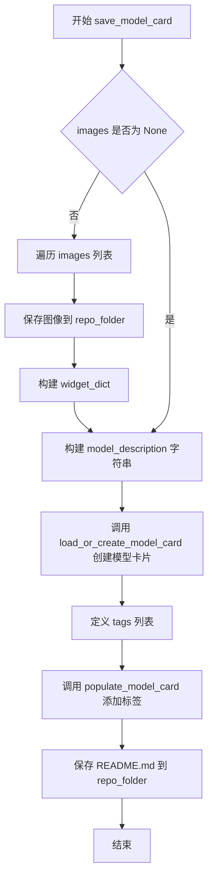

#### 带注释源码

```python
def save_model_card(
    repo_id: str,
    images=None,
    base_model: str = None,
    instance_prompt=None,
    validation_prompt=None,
    repo_folder=None,
):
    """
    生成并保存 HuggingFace 模型卡片（README.md）
    
    该函数完成以下工作：
    1. 将验证图像保存到本地文件夹
    2. 构建模型描述的 Markdown 内容
    3. 创建或加载模型卡片并添加标签
    4. 将模型卡片保存为 README.md
    """
    
    # 初始化 widget 字典列表，用于 HuggingFace Hub 的图像预览组件
    widget_dict = []
    
    # 如果提供了验证图像，则保存图像并构建 widget 字典
    if images is not None:
        for i, image in enumerate(images):
            # 将图像保存为 PNG 格式到指定目录
            image.save(os.path.join(repo_folder, f"image_{i}.png"))
            
            # 构建 widget 字典，包含提示词和图像 URL
            # 用于 HuggingFace Hub 上的交互式预览
            widget_dict.append(
                {"text": validation_prompt if validation_prompt else " ", "output": {"url": f"image_{i}.png"}}
            )

    # 构建模型的 Markdown 描述内容
    # 包含模型名称、描述、触发词、下载链接和使用说明
    model_description = f"""
# Sana DreamBooth LoRA - {repo_id}

<Gallery />

## Model description

These are {repo_id} DreamBooth LoRA weights for {base_model}.

The weights were trained using [DreamBooth](https://dreambooth.github.io/) with the [Sana diffusers trainer](https://github.com/huggingface/diffusers/blob/main/examples/dreambooth/README_sana.md).


## Trigger words

You should use `{instance_prompt}` to trigger the image generation.

## Download model

[Download the *.safetensors LoRA]({repo_id}/tree/main) in the Files & versions tab.

## Use it with the [🧨 diffusers library](https://github.com/huggingface/diffusers)

```py
TODO
```

For more details, including weighting, merging and fusing LoRAs, check the [documentation on loading LoRAs in diffusers](https://huggingface.co/docs/diffusers/main/en/using-diffusers/loading_adapters)

## License

TODO
"""
    
    # 使用 diffusers 工具函数加载或创建模型卡片
    # from_training=True 表示从训练结果创建
    # license 设置为 "other" 表示自定义许可证
    model_card = load_or_create_model_card(
        repo_id_or_path=repo_id,
        from_training=True,
        license="other",
        base_model=base_model,
        prompt=instance_prompt,
        model_description=model_description,
        widget=widget_dict,
    )
    
    # 定义模型的标签列表，用于分类和搜索
    tags = [
        "text-to-image",
        "diffusers-training",
        "diffusers",
        "lora",
        "sana",
        "sana-diffusers",
        "template:sd-lora",
    ]

    # 使用 populate_model_card 函数为模型卡片添加标签
    model_card = populate_model_card(model_card, tags=tags)
    
    # 将模型卡片保存为 README.md 文件
    model_card.save(os.path.join(repo_folder, "README.md"))
```


### `log_validation`

**描述**：该函数是 Sana DreamBooth LoRA 训练脚本中的核心验证环节。它负责在训练过程中（或训练结束时）实例化扩散管道（Pipeline），根据指定的验证提示词（`validation_prompt`）生成一组图像，并将这些图像记录到实验跟踪工具（如 TensorBoard 或 WandB）中。同时，该函数还负责管理显存清理，以确保验证过程不会耗尽训练资源。

#### 参数

- `pipeline`：`SanaPipeline`，需要执行推理的扩散管道对象，包含文本编码器、VAE 和 Transformer 模型。
- `args`：`Namespace`（ argparse 命名空间），包含训练配置，如 `num_validation_images`（生成数量）、`validation_prompt`（验证提示词）、`seed`（随机种子）、`enable_vae_tiling`（VAE 瓦片化）等。
- `accelerator`：`Accelerate.Accelerator`，分布式训练加速器，用于设备管理和获取日志记录器（trackers）。
- `pipeline_args`：`Dict`，传递给 pipeline `__call__` 方法的字典参数，主要包含 `prompt` 和可能的 `complex_human_instruction`。
- `epoch`：`int`，当前的训练轮次（Epoch），用于在日志中标记图像。
- `is_final_validation`：`bool`，布尔标志，标识是否为最终验证。若为 `True`，日志阶段名称设为 "test"；否则为 "validation"。

#### 返回值

- `List[PIL.Image]`：生成的验证图像列表，每个元素为 PIL 图像对象。

#### 流程图

```mermaid
flowchart TD
    A([Start log_validation]) --> B[Log Info: Running validation...]
    B --> C{args.enable_vae_tiling?}
    C -->|Yes| D[Enable VAE Tiling on pipeline]
    C -->|No| E[Skip Tiling]
    D --> E
    E --> F[Set text_encoder to bfloat16]
    F --> G[Move pipeline to accelerator.device]
    G --> H[Set progress bar disable=True]
    H --> I{args.seed is not None?}
    I -->|Yes| J[Create Generator with seed]
    I -->|No| K[Set Generator to None]
    J --> L
    K --> L
    L[Loop for _ in range(args.num_validation_images)] --> M[Call pipeline(**pipeline_args, generator=generator)]
    M --> N[Extract .images[0] and append to list]
    N --> O{Loop end?}
    O -->|No| L
    O -->|Yes| P[Iterate over accelerator.trackers]
    P --> Q{Tracker is TensorBoard?}
    Q -->|Yes| R[Convert images to Numpy, add_images to TensorBoard]
    Q -->|No| S{Tracker is WandB?}
    S -->|Yes| T[Log images with wandb.Image]
    S -->|No| U[End Tracker Loop]
    R --> U
    T --> U
    U --> V[Delete pipeline object]
    V --> W[torch.cuda.empty_cache]
    W --> X([Return images list])
```

#### 带注释源码

```python
def log_validation(
    pipeline,             # SanaPipeline: 预训练的扩散管道
    args,                # Namespace: 包含验证配置的命令行参数
    accelerator,         # Accelerator: 分布式训练加速器
    pipeline_args,       # Dict: 传递给管道调用的参数 (如 prompt)
    epoch,               # int: 当前训练轮次
    is_final_validation=False, # bool: 是否为最终验证阶段
):
    """
    运行验证生成图像，并记录到 TensorBoard 或 WandB。
    """
    logger.info(
        f"Running validation... \n Generating {args.num_validation_images} images with prompt:"
        f" {args.validation_prompt}."
    )
    
    # 如果启用了 VAE Tiling，减少大图像生成的显存占用
    if args.enable_vae_tiling:
        pipeline.vae.enable_tiling(tile_sample_min_height=1024, tile_sample_stride_width=1024)

    # 将文本编码器转换为 bfloat16 以平衡精度和速度
    pipeline.text_encoder = pipeline.text_encoder.to(torch.bfloat16)
    
    # 将整个管道移至加速器指定的设备上
    pipeline = pipeline.to(accelerator.device)
    
    # 禁用管道的进度条，避免在验证时输出冗余日志
    pipeline.set_progress_bar_config(disable=True)

    # 设置随机种子生成器，确保验证结果可复现
    generator = torch.Generator(device=accelerator.device).manual_seed(args.seed) if args.seed is not None else None

    # 执行推理：循环生成指定数量的图像
    images = [pipeline(**pipeline_args, generator=generator).images[0] for _ in range(args.num_validation_images)]

    # 将生成的图像记录到对应的 trackers (TensorBoard 或 WandB)
    for tracker in accelerator.trackers:
        # 确定日志阶段名称：如果是最终验证则为 "test"，否则为 "validation"
        phase_name = "test" if is_final_validation else "validation"
        
        if tracker.name == "tensorboard":
            # TensorBoard 需要 numpy 数组格式的图像
            np_images = np.stack([np.asarray(img) for img in images])
            tracker.writer.add_images(phase_name, np_images, epoch, dataformats="NHWC")
        if tracker.name == "wandb":
            # WandB 需要 wandb.Image 对象，并附带提示词作为 caption
            tracker.log(
                {
                    phase_name: [
                        wandb.Image(image, caption=f"{i}: {args.validation_prompt}") for i, image in enumerate(images)
                    ]
                }
            )

    # 清理：删除 pipeline 对象释放显存
    del pipeline
    if torch.cuda.is_available():
        torch.cuda.empty_cache()

    return images
```


### `parse_args`

该函数是 Sana DreamBooth LoRA 训练脚本的命令行参数解析器，负责定义、解析和验证所有训练相关的配置参数。

参数：

- `input_args`：可选的 `List[str]` 类型，当需要通过代码传递参数而非从命令行读取时使用，默认为 `None`

返回值：`argparse.Namespace`，包含所有解析后的命令行参数对象

#### 流程图

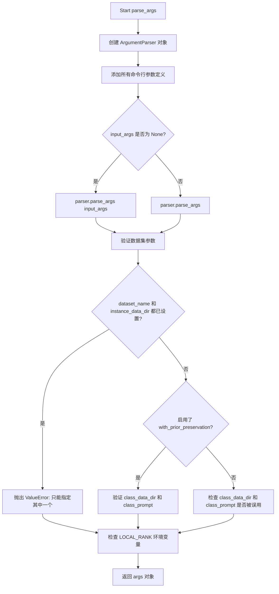

#### 带注释源码

```python
def parse_args(input_args=None):
    """
    解析命令行参数，配置 Sana DreamBooth LoRA 训练脚本的所有选项
    
    参数:
        input_args: 可选的命令行参数列表，用于程序化调用而非从 sys.argv 解析
    
    返回:
        argparse.Namespace: 包含所有配置参数的命名空间对象
    """
    # 创建参数解析器，设置脚本描述
    parser = argparse.ArgumentParser(description="Simple example of a training script.")
    
    # ==================== 模型配置参数 ====================
    # 添加预训练模型路径或模型标识符参数（必填）
    parser.add_argument(
        "--pretrained_model_name_or_path",
        type=str,
        default=None,
        required=True,
        help="Path to pretrained model or model identifier from huggingface.co/models.",
    )
    # 添加模型版本修订参数
    parser.add_argument(
        "--revision",
        type=str,
        default=None,
        required=False,
        help="Revision of pretrained model identifier from huggingface.co/models.",
    )
    # 添加模型变体参数（如 fp16）
    parser.add_argument(
        "--variant",
        type=str,
        default=None,
        help="Variant of the model files of the pretrained model identifier from huggingface.co/models, 'e.g.' fp16",
    )
    
    # ==================== 数据集配置参数 ====================
    # 添加数据集名称参数（支持 HF Hub 数据集或本地路径）
    parser.add_argument(
        "--dataset_name",
        type=str,
        default=None,
        help=(
            "The name of the Dataset (from the HuggingFace hub) containing the training data of instance images (could be your own, possibly private,"
            " dataset). It can also be a path pointing to a local copy of a dataset in your filesystem,"
            " or to a folder containing files that 🤗 Datasets can understand."
        ),
    )
    # 添加数据集配置名称参数
    parser.add_argument(
        "--dataset_config_name",
        type=str,
        default=None,
        help="The config of the Dataset, leave as None if there's only one config.",
    )
    # 添加实例数据目录参数
    parser.add_argument(
        "--instance_data_dir",
        type=str,
        default=None,
        help=("A folder containing the training data. "),
    )
    # 添加缓存目录参数
    parser.add_argument(
        "--cache_dir",
        type=str,
        default=None,
        help="The directory where the downloaded models and datasets will be stored.",
    )
    # 添加数据集图像列名参数
    parser.add_argument(
        "--image_column",
        type=str,
        default="image",
        help="The column of the dataset containing the target image. By "
        "default, the standard Image Dataset maps out 'file_name' "
        "to 'image'.",
    )
    # 添加数据集描述列名参数
    parser.add_argument(
        "--caption_column",
        type=str,
        default=None,
        help="The column of the dataset containing the instance prompt for each image",
    )
    # 添加数据重复次数参数
    parser.add_argument("--repeats", type=int, default=1, help="How many times to repeat the training data.")
    
    # ==================== DreamBooth prior preservation 参数 ====================
    # 添加类别数据目录参数
    parser.add_argument(
        "--class_data_dir",
        type=str,
        default=None,
        required=False,
        help="A folder containing the training data of class images.",
    )
    # 添加实例提示词参数（必填）
    parser.add_argument(
        "--instance_prompt",
        type=str,
        default=None,
        required=True,
        help="The prompt with identifier specifying the instance, e.g. 'photo of a TOK dog', 'in the style of TOK'",
    )
    # 添加类别提示词参数
    parser.add_argument(
        "--class_prompt",
        type=str,
        default=None,
        help="The prompt to specify images in the same class as provided instance images.",
    )
    
    # ==================== 模型配置参数 ====================
    # 添加最大序列长度参数（用于 Gemma 模型）
    parser.add_argument(
        "--max_sequence_length",
        type=int,
        default=300,
        help="Maximum sequence length to use with with the Gemma model"
    )
    # 添加复杂人类指令参数
    parser.add_argument(
        "--complex_human_instruction",
        type=str,
        default=None,
        help="Instructions for complex human attention: https://github.com/NVlabs/Sana/blob/main/configs/sana_app_config/Sana_1600M_app.yaml#L55.",
    )
    
    # ==================== 验证参数 ====================
    # 添加验证提示词参数
    parser.add_argument(
        "--validation_prompt",
        type=str,
        default=None,
        help="A prompt that is used during validation to verify that the model is learning.",
    )
    # 添加验证图像数量参数
    parser.add_argument(
        "--num_validation_images",
        type=int,
        default=4,
        help="Number of images that should be generated during validation with `validation_prompt`.",
    )
    # 添加验证轮数间隔参数
    parser.add_argument(
        "--validation_epochs",
        type=int,
        default=50,
        help=(
            "Run dreambooth validation every X epochs. Dreambooth validation consists of running the prompt"
            " `args.validation_prompt` multiple times: `args.num_validation_images`."
        ),
    )
    
    # ==================== LoRA 训练参数 ====================
    # 添加 LoRA 秩维度参数
    parser.add_argument(
        "--rank",
        type=int,
        default=4,
        help=("The dimension of the LoRA update matrices."),
    )
    # 添加 LoRA alpha 缩放参数
    parser.add_argument(
        "--lora_alpha",
        type=int,
        default=4,
        help="LoRA alpha to be used for additional scaling.",
    )
    # 添加 LoRA dropout 概率参数
    parser.add_argument("--lora_dropout", type=float, default=0.0, help="Dropout probability for LoRA layers")
    # 添加 prior preservation 标志参数
    parser.add_argument(
        "--with_prior_preservation",
        default=False,
        action="store_true",
        help="Flag to add prior preservation loss.",
    )
    # 添加 prior loss 权重参数
    parser.add_argument("--prior_loss_weight", type=float, default=1.0, help="The weight of prior preservation loss.")
    # 添加类别图像数量参数
    parser.add_argument(
        "--num_class_images",
        type=int,
        default=100,
        help=(
            "Minimal class images for prior preservation loss. If there are not enough images already present in"
            " class_data_dir, additional images will be sampled with class_prompt."
        ),
    )
    
    # ==================== 输出和训练控制参数 ====================
    # 添加输出目录参数
    parser.add_argument(
        "--output_dir",
        type=str,
        default="sana-dreambooth-lora",
        help="The output directory where the model predictions and checkpoints will be written.",
    )
    # 添加随机种子参数
    parser.add_argument("--seed", type=int, default=None, help="A seed for reproducible training.")
    # 添加分辨率参数
    parser.add_argument(
        "--resolution",
        type=int,
        default=512,
        help=(
            "The resolution for input images, all the images in the train/validation dataset will be resized to this"
            " resolution"
        ),
    )
    # 添加中心裁剪标志参数
    parser.add_argument(
        "--center_crop",
        default=False,
        action="store_true",
        help=(
            "Whether to center crop the input images to the resolution. If not set, the images will be randomly"
            " cropped. The images will be resized to the resolution first before cropping."
        ),
    )
    # 添加随机翻转标志参数
    parser.add_argument(
        "--random_flip",
        action="store_true",
        help="whether to randomly flip images horizontally",
    )
    # 添加训练批次大小参数
    parser.add_argument(
        "--train_batch_size", type=int, default=4, help="Batch size (per device) for the training dataloader."
    )
    # 添加采样批次大小参数
    parser.add_argument(
        "--sample_batch_size", type=int, default=4, help="Batch size (per device) for sampling images."
    )
    # 添加训练轮数参数
    parser.add_argument("--num_train_epochs", type=int, default=1)
    # 添加最大训练步数参数
    parser.add_argument(
        "--max_train_steps",
        type=int,
        default=None,
        help="Total number of training steps to perform.  If provided, overrides num_train_epochs.",
    )
    # 添加检查点保存间隔参数
    parser.add_argument(
        "--checkpointing_steps",
        type=int,
        default=500,
        help=(
            "Save a checkpoint of the training state every X updates. These checkpoints can be used both as final"
            " checkpoints in case they are better than the last checkpoint, and are also suitable for resuming"
            " training using `--resume_from_checkpoint`."
        ),
    )
    # 添加检查点总数限制参数
    parser.add_argument(
        "--checkpoints_total_limit",
        type=int,
        default=None,
        help=("Max number of checkpoints to store."),
    )
    # 添加从检查点恢复训练参数
    parser.add_argument(
        "--resume_from_checkpoint",
        type=str,
        default=None,
        help=(
            "Whether training should be resumed from a previous checkpoint. Use a path saved by"
            ' `--checkpointing_steps`, or `"latest"` to automatically select the last available checkpoint.'
        ),
    )
    # 添加梯度累积步数参数
    parser.add_argument(
        "--gradient_accumulation_steps",
        type=int,
        default=1,
        help="Number of updates steps to accumulate before performing a backward/update pass.",
    )
    # 添加梯度检查点标志参数
    parser.add_argument(
        "--gradient_checkpointing",
        action="store_true",
        help="Whether or not to use gradient checkpointing to save memory at the expense of slower backward pass.",
    )
    
    # ==================== 优化器和学习率参数 ====================
    # 添加学习率参数
    parser.add_argument(
        "--learning_rate",
        type=float,
        default=1e-4,
        help="Initial learning rate (after the potential warmup period) to use.",
    )
    # 添加学习率缩放标志参数
    parser.add_argument(
        "--scale_lr",
        action="store_true",
        default=False,
        help="Scale the learning rate by the number of GPUs, gradient accumulation steps, and batch size.",
    )
    # 添加学习率调度器类型参数
    parser.add_argument(
        "--lr_scheduler",
        type=str,
        default="constant",
        help=(
            'The scheduler type to use. Choose between ["linear", "cosine", "cosine_with_restarts", "polynomial",'
            ' "constant", "constant_with_warmup"]'
        ),
    )
    # 添加学习率预热步数参数
    parser.add_argument(
        "--lr_warmup_steps", type=int, default=500, help="Number of steps for the warmup in the lr scheduler."
    )
    # 添加学习率循环次数参数
    parser.add_argument(
        "--lr_num_cycles",
        type=int,
        default=1,
        help="Number of hard resets of the lr in cosine_with_restarts scheduler.",
    )
    # 添加学习率幂次参数
    parser.add_argument("--lr_power", type=float, default=1.0, help="Power factor of the polynomial scheduler.")
    # 添加数据加载器工作进程数参数
    parser.add_argument(
        "--dataloader_num_workers",
        type=int,
        default=0,
        help=(
            "Number of subprocesses to use for data loading. 0 means that the data will be loaded in the main process."
        ),
    )
    
    # ==================== 采样加权方案参数 ====================
    # 添加加权方案参数
    parser.add_argument(
        "--weighting_scheme",
        type=str,
        default="none",
        choices=["sigma_sqrt", "logit_normal", "mode", "cosmap", "none"],
        help=('We default to the "none" weighting scheme for uniform sampling and uniform loss'),
    )
    # 添加 logit 均值参数
    parser.add_argument(
        "--logit_mean", type=float, default=0.0, help="mean to use when using the `'logit_normal'` weighting scheme."
    )
    # 添加 logit 标准差参数
    parser.add_argument(
        "--logit_std", type=float, default=1.0, help="std to use when using the `'logit_normal'` weighting scheme."
    )
    # 添加模式缩放参数
    parser.add_argument(
        "--mode_scale",
        type=float,
        default=1.29,
        help="Scale of mode weighting scheme. Only effective when using the `'mode'` as the `weighting_scheme`.",
    )
    
    # ==================== 优化器参数 ====================
    # 添加优化器类型参数
    parser.add_argument(
        "--optimizer",
        type=str,
        default="AdamW",
        help=('The optimizer type to use. Choose between ["AdamW", "prodigy"]'),
    )
    # 添加 8-bit Adam 标志参数
    parser.add_argument(
        "--use_8bit_adam",
        action="store_true",
        help="Whether or not to use 8-bit Adam from bitsandbytes. Ignored if optimizer is not set to AdamW"
    )
    # 添加 Adam beta1 参数
    parser.add_argument(
        "--adam_beta1", type=float, default=0.9, help="The beta1 parameter for the Adam and Prodigy optimizers."
    )
    # 添加 Adam beta2 参数
    parser.add_argument(
        "--adam_beta2", type=float, default=0.999, help="The beta2 parameter for the Adam and Prodigy optimizers."
    )
    # 添加 Prodigy beta3 参数
    parser.add_argument(
        "--prodigy_beta3",
        type=float,
        default=None,
        help="coefficients for computing the Prodigy stepsize using running averages. If set to None, "
        "uses the value of square root of beta2. Ignored if optimizer is adamW",
    )
    # 添加 Prodigy 解耦权重衰减参数
    parser.add_argument("--prodigy_decouple", type=bool, default=True, help="Use AdamW style decoupled weight decay")
    # 添加权重衰减参数（用于 unet 参数）
    parser.add_argument("--adam_weight_decay", type=float, default=1e-04, help="Weight decay to use for unet params")
    # 添加权重衰减参数（用于 text_encoder）
    parser.add_argument(
        "--adam_weight_decay_text_encoder", type=float, default=1e-03, help="Weight decay to use for text_encoder"
    )
    # 添加 LoRA 层参数
    parser.add_argument(
        "--lora_layers",
        type=str,
        default=None,
        help=(
            'The transformer modules to apply LoRA training on. Please specify the layers in a comma separated. E.g. - "to_k,to_q,to_v" will result in lora training of attention layers only'
        ),
    )
    # 添加 Adam epsilon 参数
    parser.add_argument(
        "--adam_epsilon",
        type=float,
        default=1e-08,
        help="Epsilon value for the Adam optimizer and Prodigy optimizers.",
    )
    # 添加 Prodigy 偏差校正参数
    parser.add_argument(
        "--prodigy_use_bias_correction",
        type=bool,
        default=True,
        help="Turn on Adam's bias correction. True by default. Ignored if optimizer is adamW",
    )
    # 添加 Prodigy 预热保护参数
    parser.add_argument(
        "--prodigy_safeguard_warmup",
        type=bool,
        default=True,
        help="Remove lr from the denominator of D estimate to avoid issues during warm-up stage. True by default. "
        "Ignored if optimizer is adamW",
    )
    # 添加最大梯度范数参数
    parser.add_argument("--max_grad_norm", default=1.0, type=float, help="Max gradient norm.")
    
    # ==================== Hub 相关参数 ====================
    # 添加推送到 Hub 标志参数
    parser.add_argument("--push_to_hub", action="store_true", help="Whether or not to push the model to the Hub.")
    # 添加 Hub token 参数
    parser.add_argument("--hub_token", type=str, default=None, help="The token to use to push to the Model Hub.")
    # 添加 Hub 模型 ID 参数
    parser.add_argument(
        "--hub_model_id",
        type=str,
        default=None,
        help="The name of the repository to keep in sync with the local `output_dir`.",
    )
    
    # ==================== 日志和监控参数 ====================
    # 添加日志目录参数
    parser.add_argument(
        "--logging_dir",
        type=str,
        default="logs",
        help=(
            "[TensorBoard](https://www.tensorflow.org/tensorboard) log directory. Will default to"
            " *output_dir/runs/**CURRENT_DATETIME_HOSTNAME***."
        ),
    )
    # 添加 TF32 允许标志参数
    parser.add_argument(
        "--allow_tf32",
        action="store_true",
        help=(
            "Whether or not to allow TF32 on Ampere GPUs. Can be used to speed up training. For more information, see"
            " https://pytorch.org/docs/stable/notes/cuda.html#tensorfloat-32-tf32-on-ampere-devices"
        ),
    )
    # 添加缓存 VAE 潜在向量标志参数
    parser.add_argument(
        "--cache_latents",
        action="store_true",
        default=False,
        help="Cache the VAE latents",
    )
    # 添加报告目标参数
    parser.add_argument(
        "--report_to",
        type=str,
        default="tensorboard",
        help=(
            'The integration to report the results and logs to. Supported platforms are `"tensorboard"`'
            ' (default), `"wandb"` and `"comet_ml"`. Use `"all"` to report to all integrations.'
        ),
    )
    # 添加混合精度类型参数
    parser.add_argument(
        "--mixed_precision",
        type=str,
        default=None,
        choices=["no", "fp16", "bf16"],
        help=(
            "Whether to use mixed precision. Choose between fp16 and bf16 (bfloat16). Bf16 requires PyTorch >="
            " 1.10.and an Nvidia Ampere GPU.  Default to the value of accelerate config of the current system or the"
            " flag passed with the `accelerate.launch` command. Use this argument to override the accelerate config."
        ),
    )
    # 添加保存前向上转换标志参数
    parser.add_argument(
        "--upcast_before_saving",
        action="store_true",
        default=False,
        help=(
            "Whether to upcast the trained transformer layers to float32 before saving (at the end of training). "
            "Defaults to precision dtype used for training to save memory"
        ),
    )
    # 添加卸载标志参数
    parser.add_argument(
        "--offload",
        action="store_true",
        help="Whether to offload the VAE and the text encoder to CPU when they are not used.",
    )
    # 添加本地排名参数（用于分布式训练）
    parser.add_argument("--local_rank", type=int, default=-1, help="For distributed training: local_rank")
    # 添加 VAE tiling 启用标志参数
    parser.add_argument("--enable_vae_tiling", action="store_true", help="Enabla vae tiling in log validation")
    # 添加 NPU Flash Attention 启用标志参数
    parser.add_argument("--enable_npu_flash_attention", action="store_true", help="Enabla Flash Attention for NPU")

    # ==================== 解析参数 ====================
    # 根据 input_args 是否存在决定解析方式
    if input_args is not None:
        args = parser.parse_args(input_args)
    else:
        args = parser.parse_args()

    # ==================== 参数验证 ====================
    # 验证数据集参数：必须指定 dataset_name 或 instance_data_dir 之一
    if args.dataset_name is None and args.instance_data_dir is None:
        raise ValueError("Specify either `--dataset_name` or `--instance_data_dir`")

    # 验证不能同时指定两者
    if args.dataset_name is not None and args.instance_data_dir is not None:
        raise ValueError("Specify only one of `--dataset_name` or `--instance_data_dir`")

    # 检查环境变量中的 LOCAL_RANK，并同步到 args.local_rank
    env_local_rank = int(os.environ.get("LOCAL_RANK", -1))
    if env_local_rank != -1 and env_local_rank != args.local_rank:
        args.local_rank = env_local_rank

    # 验证 prior preservation 相关参数
    if args.with_prior_preservation:
        # 必须指定 class_data_dir
        if args.class_data_dir is None:
            raise ValueError("You must specify a data directory for class images.")
        # 必须指定 class_prompt
        if args.class_prompt is None:
            raise ValueError("You must specify prompt for class images.")
    else:
        # logger is not available yet
        # 如果未启用 prior preservation 但提供了这些参数，发出警告
        if args.class_data_dir is not None:
            warnings.warn("You need not use --class_data_dir without --with_prior_preservation.")
        if args.class_prompt is not None:
            warnings.warn("You need not use --class_prompt without --with_prior_preservation.")

    # 返回解析后的参数对象
    return args
```


### `collate_fn`

该函数是 DreamBooth 数据加载器的批处理整理函数，用于将多个数据样本（包含实例图像和类别图像）整理为训练所需的批次格式，支持先验保持（prior preservation）功能以防止模型过拟合。

参数：

- `examples`：`List[Dict]`，从数据集返回的样本列表，每个字典包含 `instance_images`、`instance_prompt`（可选 `class_images`、`class_prompt`）
- `with_prior_preservation`：`bool`，是否启用先验保持，启用时将实例样本与类别样本合并为单一批次以减少前向传播次数

返回值：`Dict`，包含处理后的像素值张量和文本提示，其中 `pixel_values` 为 `torch.Tensor`（形状为 `[batch_size, channels, height, width]`），`prompts` 为 `List[str]`

#### 流程图

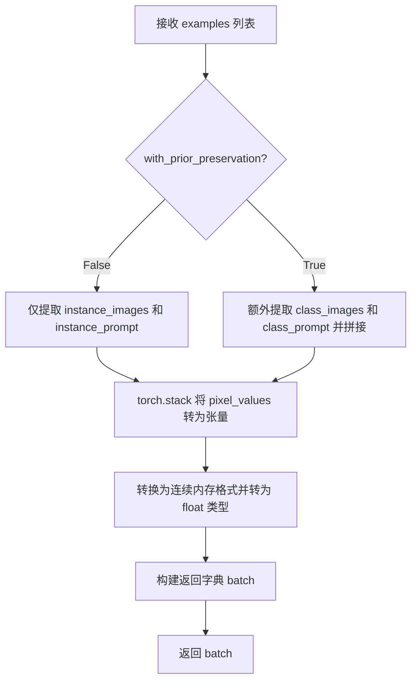

#### 带注释源码

```python
def collate_fn(examples, with_prior_preservation=False):
    """
    整理训练批次数据，将样本列表合并为可用于模型训练的批次格式。
    
    参数:
        examples: 数据加载器返回的样本列表，每个元素为包含图像和提示词的字典
        with_prior_preservation: 是否在批次中包含类别图像以实现先验保持 loss
    
    返回:
        包含 pixel_values 和 prompts 的字典，供模型前向传播使用
    """
    # 从所有样本中提取实例图像的像素值
    pixel_values = [example["instance_images"] for example in examples]
    # 从所有样本中提取实例提示词
    prompts = [example["instance_prompt"] for example in examples]

    # 当启用先验保持时，将类别图像和类别提示词追加到批次中
    # 这样做是为了在单次前向传播中同时计算实例 loss 和类别 prior loss
    if with_prior_preservation:
        pixel_values += [example["class_images"] for example in examples]
        prompts += [example["class_prompt"] for example in examples]

    # 将像素值列表堆叠为 4D 张量 [batch, channels, height, width]
    pixel_values = torch.stack(pixel_values)
    # 确保内存连续并转换为 float32 精度（兼容训练精度要求）
    pixel_values = pixel_values.to(memory_format=torch.contiguous_format).float()

    # 构建最终批次字典返回给训练循环
    batch = {"pixel_values": pixel_values, "prompts": prompts}
    return batch
```


### `main`

这是DreamBooth LoRA训练脚本的核心主函数，负责协调整个Sana模型LoRA适配器的训练流程。函数接受命令行参数集，依次完成环境验证、加速器初始化、预训练模型加载、LoRA配置、训练数据准备、训练循环执行、模型保存以及最终推理验证等完整生命周期。

参数：

- `args`：`Namespace`（argparse.Namespace），通过`parse_args()`解析后的命令行参数对象，包含所有训练配置如模型路径、数据目录、学习率、LoRA参数等

返回值：`None`，该函数执行完整的训练流程后直接退出，不返回任何值

#### 流程图

```mermaid
flowchart TD
    A[开始 main 函数] --> B{检查 wandb 和 hub_token 安全风险}
    B --> C{检查 MPS + bf16 兼容性}
    C --> D[创建 Accelerator 加速器]
    D --> E[配置日志系统]
    E --> F{设置随机种子}
    F --> G{with_prior_preservation 是否启用}
    G -->|是| H[生成类别图像]
    G -->|否| I[跳过类别图像生成]
    H --> J[创建输出目录]
    I --> J
    J --> K[加载 tokenizer 和预训练模型]
    K --> L[配置模型参数和权重精度]
    L --> M[设置 LoRA 适配器]
    M --> N[创建优化器]
    N --> O[创建训练数据集和数据加载器]
    O --> P[编码提示词嵌入]
    P --> Q[缓存 VAE 潜在向量]
    Q --> R[计算训练步骤数]
    R --> S[初始化学习率调度器]
    S --> T[准备模型和优化器]
    T --> U[初始化训练跟踪器]
    U --> V[加载检查点恢复训练]
    V --> W[训练循环 - 外层 epoch]
    W --> X{检查是否超过最大训练步骤}
    X -->|是| Y[跳出训练循环]
    X -->|否| Z[训练循环 - 内层 step]
    Z --> AA[累积梯度]
    AA --> AB[编码提示词]
    AB --> AC[将图像编码到潜在空间]
    AC --> AD[采样噪声和时间步]
    AD --> AE[根据 flow matching 添加噪声]
    AE --> AF[Transformer 前向传播]
    AF --> AG[计算损失权重]
    AG --> AH{启用 prior preservation}
    AH -->|是| AI[分离先验损失计算]
    AH -->|否| AJ[计算主损失]
    AI --> AJ
    AJ --> AK[反向传播和梯度裁剪]
    AK --> AL[优化器更新和学习率调度]
    AL --> AM{同步梯度}
    AM -->|是| AN[更新进度条和检查点]
    AM -->|否| AO[继续下一步]
    AN --> AP{验证条件满足}
    AP -->|是| AQ[运行验证推理]
    AP -->|否| AR[继续训练]
    AQ --> AR
    AO --> Z
    AR --> AS{检查最大训练步骤}
    AS -->|未达到| Z
    AS -->|达到| AT[训练结束]
    Z --> W
    AT --> AU[保存 LoRA 权重]
    AU --> AV[运行最终验证推理]
    AV --> AW{push_to_hub 启用}
    AW -->|是| AX[保存模型卡片并上传]
    AW -->|否| AY[结束训练]
    AX --> AY
    Y --> AU
```

#### 带注释源码

```python
def main(args):
    """
    DreamBooth LoRA 训练主函数
    
    完整流程：
    1. 参数验证与安全检查
    2. Accelerator 分布式训练配置
    3. 预训练模型加载（tokenizer, text_encoder, vae, transformer）
    4. LoRA 适配器配置与模型准备
    5. 数据集创建与数据加载器配置
    6. 优化器与学习率调度器设置
    7. 训练循环执行（前向、损失计算、反向传播）
    8. 模型权重保存与验证推理
    """
    
    # ==== 安全检查：wandb 与 hub_token 不能同时使用 ====
    if args.report_to == "wandb" and args.hub_token is not None:
        raise ValueError(
            "You cannot use both --report_to=wandb and --hub_token due to a security risk of exposing your token."
            " Please use `hf auth login` to authenticate with the Hub."
        )

    # ==== MPS 设备检查：bf16 在 MPS 上不支持 ====
    if torch.backends.mps.is_available() and args.mixed_precision == "bf16":
        raise ValueError(
            "Mixed precision training with bfloat16 is not supported on MPS. Please use fp16 (recommended) or fp32 instead."
        )

    # ==== 配置日志输出目录 ====
    logging_dir = Path(args.output_dir, args.logging_dir)

    # ==== 初始化 Accelerator（分布式训练、混合精度、日志记录）====
    accelerator_project_config = ProjectConfiguration(project_dir=args.output_dir, logging_dir=logging_dir)
    kwargs = DistributedDataParallelKwargs(find_unused_parameters=True)
    accelerator = Accelerator(
        gradient_accumulation_steps=args.gradient_accumulation_steps,
        mixed_precision=args.mixed_precision,
        log_with=args.report_to,
        project_config=accelerator_project_config,
        kwargs_handlers=[kwargs],
    )

    # ==== MPS 设备禁用原生 AMP ====
    if torch.backends.mps.is_available():
        accelerator.native_amp = False

    # ==== WandB 可用性检查 ====
    if args.report_to == "wandb":
        if not is_wandb_available():
            raise ImportError("Make sure to install wandb if you want to use it for logging during training.")

    # ==== 配置日志格式（每个进程）====
    logging.basicConfig(
        format="%(asctime)s - %(levelname)s - %(name)s - %(message)s",
        datefmt="%m/%d/%Y %H:%M:%S",
        level=logging.INFO,
    )
    logger.info(accelerator.state, main_process_only=False)
    
    # ==== 主进程设置详细日志，子进程设置错误日志 ====
    if accelerator.is_local_main_process:
        transformers.utils.logging.set_verbosity_warning()
        diffusers.utils.logging.set_verbosity_info()
    else:
        transformers.utils.logging.set_verbosity_error()
        diffusers.utils.logging.set_verbosity_error()

    # ==== 设置随机种子确保可复现性 ====
    if args.seed is not None:
        set_seed(args.seed)

    # ==== Prior Preservation：生成类别图像 ====
    if args.with_prior_preservation:
        class_images_dir = Path(args.class_data_dir)
        if not class_images_dir.exists():
            class_images_dir.mkdir(parents=True)
        cur_class_images = len(list(class_images_dir.iterdir()))

        # 如果类别图像数量不足，则生成更多
        if cur_class_images < args.num_class_images:
            # 加载 SanaPipeline 用于生成类别图像
            pipeline = SanaPipeline.from_pretrained(
                args.pretrained_model_name_or_path,
                torch_dtype=torch.float32,
                revision=args.revision,
                variant=args.variant,
            )
            pipeline.text_encoder = pipeline.text_encoder.to(torch.bfloat16)
            pipeline.transformer = pipeline.transformer.to(torch.float16)
            pipeline.set_progress_bar_config(disable=True)

            num_new_images = args.num_class_images - cur_class_images
            logger.info(f"Number of class images to sample: {num_new_images}.")

            # 创建提示词数据集并生成图像
            sample_dataset = PromptDataset(args.class_prompt, num_new_images)
            sample_dataloader = torch.utils.data.DataLoader(sample_dataset, batch_size=args.sample_batch_size)
            sample_dataloader = accelerator.prepare(sample_dataloader)
            pipeline.to(accelerator.device)

            for example in tqdm(
                sample_dataloader, desc="Generating class images", disable=not accelerator.is_local_main_process
            ):
                images = pipeline(example["prompt"]).images

                # 保存生成的图像并用哈希命名
                for i, image in enumerate(images):
                    hash_image = insecure_hashlib.sha1(image.tobytes()).hexdigest()
                    image_filename = class_images_dir / f"{example['index'][i] + cur_class_images}-{hash_image}.jpg"
                    image.save(image_filename)

            # 释放内存
            del pipeline
            free_memory()

    # ==== 创建输出目录（主进程）====
    if accelerator.is_main_process:
        if args.output_dir is not None:
            os.makedirs(args.output_dir, exist_ok=True)

        # ==== 推送模型到 Hub（可选）====
        if args.push_to_hub:
            repo_id = create_repo(
                repo_id=args.hub_model_id or Path(args.output_dir).name,
                exist_ok=True,
            ).repo_id

    # ==== 加载 Tokenizer ====
    tokenizer = AutoTokenizer.from_pretrained(
        args.pretrained_model_name_or_path,
        subfolder="tokenizer",
        revision=args.revision,
    )

    # ==== 加载调度器和预训练模型 ====
    noise_scheduler = FlowMatchEulerDiscreteScheduler.from_pretrained(
        args.pretrained_model_name_or_path, subfolder="scheduler", revision=args.revision
    )
    noise_scheduler_copy = copy.deepcopy(noise_scheduler)  # 备份用于采样
    
    text_encoder = Gemma2Model.from_pretrained(
        args.pretrained_model_name_or_path, subfolder="text_encoder", revision=args.revision, variant=args.variant
    )
    vae = AutoencoderDC.from_pretrained(
        args.pretrained_model_name_or_path,
        subfolder="vae",
        revision=args.revision,
        variant=args.variant,
    )
    transformer = SanaTransformer2DModel.from_pretrained(
        args.pretrained_model_name_or_path, subfolder="transformer", revision=args.revision, variant=args.variant
    )

    # ==== 冻结所有模型参数（只训练 LoRA）====
    transformer.requires_grad_(False)
    vae.requires_grad_(False)
    text_encoder.requires_grad_(False)

    # ==== 设置混合精度权重类型 ====
    weight_dtype = torch.float32
    if accelerator.mixed_precision == "fp16":
        weight_dtype = torch.float16
    elif accelerator.mixed_precision == "bf16":
        weight_dtype = torch.bfloat16

    # MPS + bf16 检查
    if torch.backends.mps.is_available() and weight_dtype == torch.bfloat16:
        raise ValueError(
            "Mixed precision training with bfloat16 is not supported on MPS. Please use fp16 (recommended) or fp32 instead."
        )

    # ==== VAE 保持 fp32，Transformer 和 Text Encoder 设置精度 ====
    vae.to(dtype=torch.float32)
    transformer.to(accelerator.device, dtype=weight_dtype)
    text_encoder.to(dtype=torch.bfloat16)  # Gemma2 适合 bf16

    # ==== NPU Flash Attention 支持（可选）====
    if args.enable_npu_flash_attention:
        if is_torch_npu_available():
            logger.info("npu flash attention enabled.")
            for block in transformer.transformer_blocks:
                block.attn2.set_use_npu_flash_attention(True)
        else:
            raise ValueError("npu flash attention requires torch_npu extensions and is supported only on npu device ")

    # ==== 创建文本编码 Pipeline（用于编码提示词）====
    text_encoding_pipeline = SanaPipeline.from_pretrained(
        args.pretrained_model_name_or_path,
        vae=None,
        transformer=None,
        text_encoder=text_encoder,
        tokenizer=tokenizer,
    )

    # ==== 梯度检查点（节省显存）====
    if args.gradient_checkpointing:
        transformer.enable_gradient_checkpointing()

    # ==== 配置 LoRA 目标模块 ====
    if args.lora_layers is not None:
        target_modules = [layer.strip() for layer in args.lora_layers.split(",")]
    else:
        target_modules = ["to_k", "to_q", "to_v"]

    # ==== 添加 LoRA 适配器到 Transformer ====
    transformer_lora_config = LoraConfig(
        r=args.rank,
        lora_alpha=args.lora_alpha,
        lora_dropout=args.lora_dropout,
        init_lora_weights="gaussian",
        target_modules=target_modules,
    )
    transformer.add_adapter(transformer_lora_config)

    # ==== 辅助函数：解包模型 ====
    def unwrap_model(model):
        model = accelerator.unwrap_model(model)
        model = model._orig_mod if is_compiled_module(model) else model
        return model

    # ==== 注册模型保存/加载 Hook ====
    def save_model_hook(models, weights, output_dir):
        """保存 LoRA 权重"""
        if accelerator.is_main_process:
            transformer_lora_layers_to_save = None
            modules_to_save = {}
            for model in models:
                if isinstance(model, type(unwrap_model(transformer))):
                    transformer_lora_layers_to_save = get_peft_model_state_dict(model)
                    modules_to_save["transformer"] = model
                else:
                    raise ValueError(f"unexpected save model: {model.__class__}")
                weights.pop()

            SanaPipeline.save_lora_weights(
                output_dir,
                transformer_lora_layers=transformer_lora_layers_to_save,
                **_collate_lora_metadata(modules_to_save),
            )

    def load_model_hook(models, input_dir):
        """加载 LoRA 权重"""
        transformer_ = None

        while len(models) > 0:
            model = models.pop()

            if isinstance(model, type(unwrap_model(transformer))):
                transformer_ = model
            else:
                raise ValueError(f"unexpected save model: {model.__class__}")

        lora_state_dict = SanaPipeline.lora_state_dict(input_dir)

        transformer_state_dict = {
            f"{k.replace('transformer.', '')}": v for k, v in lora_state_dict.items() if k.startswith("transformer.")
        }
        transformer_state_dict = convert_unet_state_dict_to_peft(transformer_state_dict)
        incompatible_keys = set_peft_model_state_dict(transformer_, transformer_state_dict, adapter_name="default")
        if incompatible_keys is not None:
            unexpected_keys = getattr(incompatible_keys, "unexpected_keys", None)
            if unexpected_keys:
                logger.warning(
                    f"Loading adapter weights from state_dict led to unexpected keys not found in the model: "
                    f" {unexpected_keys}. "
                )

        # 确保可训练参数为 fp32
        if args.mixed_precision == "fp16":
            models = [transformer_]
            cast_training_params(models)

    accelerator.register_save_state_pre_hook(save_model_hook)
    accelerator.register_load_state_pre_hook(load_model_hook)

    # ==== TF32 加速（Ampere GPU）====
    if args.allow_tf32 and torch.cuda.is_available():
        torch.backends.cuda.matmul.allow_tf32 = True

    # ==== 缩放学习率（根据 GPU 数量、梯度累积、batch size）====
    if args.scale_lr:
        args.learning_rate = (
            args.learning_rate * args.gradient_accumulation_steps * args.train_batch_size * accelerator.num_processes
        )

    # ==== 确保可训练参数为 fp32 ====
    if args.mixed_precision == "fp16":
        models = [transformer]
        cast_training_params(models, dtype=torch.float32)

    # ==== 获取 LoRA 可训练参数 ====
    transformer_lora_parameters = list(filter(lambda p: p.requires_grad, transformer.parameters()))

    # ==== 配置优化器参数 ====
    transformer_parameters_with_lr = {"params": transformer_lora_parameters, "lr": args.learning_rate}
    params_to_optimize = [transformer_parameters_with_lr]

    # ==== 选择优化器（AdamW / 8-bit AdamW / Prodigy）====
    if not (args.optimizer.lower() == "prodigy" or args.optimizer.lower() == "adamw"):
        logger.warning(
            f"Unsupported choice of optimizer: {args.optimizer}.Supported optimizers include [adamW, prodigy]."
            "Defaulting to adamW"
        )
        args.optimizer = "adamw"

    if args.use_8bit_adam and not args.optimizer.lower() == "adamw":
        logger.warning(
            f"use_8bit_adam is ignored when optimizer is not set to 'AdamW'. Optimizer was "
            f"set to {args.optimizer.lower()}"
        )

    # AdamW 优化器
    if args.optimizer.lower() == "adamw":
        if args.use_8bit_adam:
            try:
                import bitsandbytes as bnb
            except ImportError:
                raise ImportError(
                    "To use 8-bit Adam, please install the bitsandbytes library: `pip install bitsandbytes`."
                )
            optimizer_class = bnb.optim.AdamW8bit
        else:
            optimizer_class = torch.optim.AdamW

        optimizer = optimizer_class(
            params_to_optimize,
            betas=(args.adam_beta1, args.adam_beta2),
            weight_decay=args.adam_weight_decay,
            eps=args.adam_epsilon,
        )

    # Prodigy 优化器
    if args.optimizer.lower() == "prodigy":
        try:
            import prodigyopt
        except ImportError:
            raise ImportError("To use Prodigy, please install the prodigyopt library: `pip install prodigyopt`")

        optimizer_class = prodigyopt.Prodigy

        if args.learning_rate <= 0.1:
            logger.warning(
                "Learning rate is too low. When using prodigy, it's generally better to set learning rate around 1.0"
            )

        optimizer = optimizer_class(
            params_to_optimize,
            betas=(args.adam_beta1, args.adam_beta2),
            beta3=args.prodigy_beta3,
            weight_decay=args.adam_weight_decay,
            eps=args.adam_epsilon,
            decouple=args.prodigy_decouple,
            use_bias_correction=args.prodigy_use_bias_correction,
            safeguard_warmup=args.prodigy_safeguard_warmup,
        )

    # ==== 创建训练数据集和数据加载器 ====
    train_dataset = DreamBoothDataset(
        instance_data_root=args.instance_data_dir,
        instance_prompt=args.instance_prompt,
        class_prompt=args.class_prompt,
        class_data_root=args.class_data_dir if args.with_prior_preservation else None,
        class_num=args.num_class_images,
        size=args.resolution,
        repeats=args.repeats,
        center_crop=args.center_crop,
    )

    train_dataloader = torch.utils.data.DataLoader(
        train_dataset,
        batch_size=args.train_batch_size,
        shuffle=True,
        collate_fn=lambda examples: collate_fn(examples, args.with_prior_preservation),
        num_workers=args.dataloader_num_workers,
    )

    # ==== 编码提示词嵌入的辅助函数 ====
    def compute_text_embeddings(prompt, text_encoding_pipeline):
        text_encoding_pipeline = text_encoding_pipeline.to(accelerator.device)
        with torch.no_grad():
            prompt_embeds, prompt_attention_mask, _, _ = text_encoding_pipeline.encode_prompt(
                prompt,
                max_sequence_length=args.max_sequence_length,
                complex_human_instruction=args.complex_human_instruction,
            )
        if args.offload:
            text_encoding_pipeline = text_encoding_pipeline.to("cpu")
        prompt_embeds = prompt_embeds.to(transformer.dtype)
        return prompt_embeds, prompt_attention_mask

    # ==== 预计算实例提示词嵌入（如果没有自定义提示词）====
    if not train_dataset.custom_instance_prompts:
        instance_prompt_hidden_states, instance_prompt_attention_mask = compute_text_embeddings(
            args.instance_prompt, text_encoding_pipeline
        )

    # ==== 预计算类别提示词嵌入（prior preservation）====
    if args.with_prior_preservation:
        class_prompt_hidden_states, class_prompt_attention_mask = compute_text_embeddings(
            args.class_prompt, text_encoding_pipeline
        )

    # ==== 释放 Text Encoder 和 Tokenizer 内存 ====
    if not train_dataset.custom_instance_prompts:
        del text_encoder, tokenizer
        free_memory()

    # ==== 打包提示词嵌入（合并实例和类别）====
    if not train_dataset.custom_instance_prompts:
        prompt_embeds = instance_prompt_hidden_states
        prompt_attention_mask = instance_prompt_attention_mask
        if args.with_prior_preservation:
            prompt_embeds = torch.cat([prompt_embeds, class_prompt_hidden_states], dim=0)
            prompt_attention_mask = torch.cat([prompt_attention_mask, class_prompt_attention_mask], dim=0)

    # ==== 获取 VAE 缩放因子 ====
    vae_config_scaling_factor = vae.config.scaling_factor

    # ==== 可选：缓存 VAE 潜在向量 ====
    if args.cache_latents:
        latents_cache = []
        vae = vae.to(accelerator.device)
        for batch in tqdm(train_dataloader, desc="Caching latents"):
            with torch.no_grad():
                batch["pixel_values"] = batch["pixel_values"].to(
                    accelerator.device, non_blocking=True, dtype=vae.dtype
                )
                latents_cache.append(vae.encode(batch["pixel_values"]).latent)

        if args.validation_prompt is None:
            del vae
            free_memory()

    # ==== 计算训练步骤 ====
    overrode_max_train_steps = False
    num_update_steps_per_epoch = math.ceil(len(train_dataloader) / args.gradient_accumulation_steps)
    if args.max_train_steps is None:
        args.max_train_steps = args.num_train_epochs * num_update_steps_per_epoch
        overrode_max_train_steps = True

    # ==== 创建学习率调度器 ====
    lr_scheduler = get_scheduler(
        args.lr_scheduler,
        optimizer=optimizer,
        num_warmup_steps=args.lr_warmup_steps * accelerator.num_processes,
        num_training_steps=args.max_train_steps * accelerator.num_processes,
        num_cycles=args.lr_num_cycles,
        power=args.lr_power,
    )

    # ==== 使用 Accelerator 准备模型和优化器 ====
    transformer, optimizer, train_dataloader, lr_scheduler = accelerator.prepare(
        transformer, optimizer, train_dataloader, lr_scheduler
    )

    # ==== 重新计算训练步骤（因为 dataloader 可能变化）====
    num_update_steps_per_epoch = math.ceil(len(train_dataloader) / args.gradient_accumulation_steps)
    if overrode_max_train_steps:
        args.max_train_steps = args.num_train_epochs * num_update_steps_per_epoch
    args.num_train_epochs = math.ceil(args.max_train_steps / num_update_steps_per_epoch)

    # ==== 初始化训练跟踪器（TensorBoard / WandB）====
    if accelerator.is_main_process:
        tracker_name = "dreambooth-sana-lora"
        accelerator.init_trackers(tracker_name, config=vars(args))

    # ==== 训练信息日志输出 ====
    total_batch_size = args.train_batch_size * accelerator.num_processes * args.gradient_accumulation_steps

    logger.info("***** Running training *****")
    logger.info(f"  Num examples = {len(train_dataset)}")
    logger.info(f"  Num batches each epoch = {len(train_dataloader)}")
    logger.info(f"  Num Epochs = {args.num_train_epochs}")
    logger.info(f"  Instantaneous batch size per device = {args.train_batch_size}")
    logger.info(f"  Total train batch size (w. parallel, distributed & accumulation) = {total_batch_size}")
    logger.info(f"  Gradient Accumulation steps = {args.gradient_accumulation_steps}")
    logger.info(f"  Total optimization steps = {args.max_train_steps}")

    global_step = 0
    first_epoch = 0

    # ==== 检查点恢复（可选）====
    if args.resume_from_checkpoint:
        if args.resume_from_checkpoint != "latest":
            path = os.path.basename(args.resume_from_checkpoint)
        else:
            dirs = os.listdir(args.output_dir)
            dirs = [d for d in dirs if d.startswith("checkpoint")]
            dirs = sorted(dirs, key=lambda x: int(x.split("-")[1]))
            path = dirs[-1] if len(dirs) > 0 else None

        if path is None:
            accelerator.print(
                f"Checkpoint '{args.resume_from_checkpoint}' does not exist. Starting a new training run."
            )
            args.resume_from_checkpoint = None
            initial_global_step = 0
        else:
            accelerator.print(f"Resuming from checkpoint {path}")
            accelerator.load_state(os.path.join(args.output_dir, path))
            global_step = int(path.split("-")[1])
            initial_global_step = global_step
            first_epoch = global_step // num_update_steps_per_epoch
    else:
        initial_global_step = 0

    # ==== 创建进度条 ====
    progress_bar = tqdm(
        range(0, args.max_train_steps),
        initial=initial_global_step,
        desc="Steps",
        disable=not accelerator.is_local_main_process,
    )

    # ==== 计算 sigma 值的辅助函数（flow matching）====
    def get_sigmas(timesteps, n_dim=4, dtype=torch.float32):
        sigmas = noise_scheduler_copy.sigmas.to(device=accelerator.device, dtype=dtype)
        schedule_timesteps = noise_scheduler_copy.timesteps.to(accelerator.device)
        timesteps = timesteps.to(accelerator.device)
        step_indices = [(schedule_timesteps == t).nonzero().item() for t in timesteps]
        sigma = sigmas[step_indices].flatten()
        while len(sigma.shape) < n_dim:
            sigma = sigma.unsqueeze(-1)
        return sigma

    # ==== 训练循环：外层 epoch ====
    for epoch in range(first_epoch, args.num_train_epochs):
        transformer.train()

        # ==== 训练循环：内层 step ====
        for step, batch in enumerate(train_dataloader):
            models_to_accumulate = [transformer]
            with accelerator.accumulate(models_to_accumulate):
                prompts = batch["prompts"]

                # 如果有自定义提示词，则逐个编码
                if train_dataset.custom_instance_prompts:
                    prompt_embeds, prompt_attention_mask = compute_text_embeddings(prompts, text_encoding_pipeline)

                # ==== 将图像编码到潜在空间 ====
                if args.cache_latents:
                    model_input = latents_cache[step]
                else:
                    vae = vae.to(accelerator.device)
                    pixel_values = batch["pixel_values"].to(dtype=vae.dtype)
                    model_input = vae.encode(pixel_values).latent
                    if args.offload:
                        vae = vae.to("cpu")
                
                model_input = model_input * vae_config_scaling_factor
                model_input = model_input.to(dtype=weight_dtype)

                # ==== 采样噪声 ====
                noise = torch.randn_like(model_input)
                bsz = model_input.shape[0]

                # ==== 采样时间步（非均匀采样）====
                u = compute_density_for_timestep_sampling(
                    weighting_scheme=args.weighting_scheme,
                    batch_size=bsz,
                    logit_mean=args.logit_mean,
                    logit_std=args.logit_std,
                    mode_scale=args.mode_scale,
                )
                indices = (u * noise_scheduler_copy.config.num_train_timesteps).long()
                timesteps = noise_scheduler_copy.timesteps[indices].to(device=model_input.device)

                # ==== Flow Matching 添加噪声：zt = (1 - texp) * x + texp * z1 ====
                sigmas = get_sigmas(timesteps, n_dim=model_input.ndim, dtype=model_input.dtype)
                noisy_model_input = (1.0 - sigmas) * model_input + sigmas * noise

                # ==== Transformer 前向预测 ====
                model_pred = transformer(
                    hidden_states=noisy_model_input,
                    encoder_hidden_states=prompt_embeds,
                    encoder_attention_mask=prompt_attention_mask,
                    timestep=timesteps,
                    return_dict=False,
                )[0]

                # ==== 计算损失权重 ====
                weighting = compute_loss_weighting_for_sd3(weighting_scheme=args.weighting_scheme, sigmas=sigmas)

                # Flow Matching 目标：noise - model_input
                target = noise - model_input

                # ==== Prior Preservation 损失计算 ====
                if args.with_prior_preservation:
                    model_pred, model_pred_prior = torch.chunk(model_pred, 2, dim=0)
                    target, target_prior = torch.chunk(target, 2, dim=0)

                    prior_loss = torch.mean(
                        (weighting.float() * (model_pred_prior.float() - target_prior.float()) ** 2).reshape(
                            target_prior.shape[0], -1
                        ),
                        1,
                    )
                    prior_loss = prior_loss.mean()

                # ==== 主损失计算 ====
                loss = torch.mean(
                    (weighting.float() * (model_pred.float() - target.float()) ** 2).reshape(target.shape[0], -1),
                    1,
                )
                loss = loss.mean()

                # 添加 prior loss
                if args.with_prior_preservation:
                    loss = loss + args.prior_loss_weight * prior_loss

                # ==== 反向传播 ====
                accelerator.backward(loss)

                # ==== 梯度裁剪 ====
                if accelerator.sync_gradients:
                    params_to_clip = transformer.parameters()
                    accelerator.clip_grad_norm_(params_to_clip, args.max_grad_norm)

                # ==== 优化器更新 ====
                optimizer.step()
                lr_scheduler.step()
                optimizer.zero_grad()

            # ==== 同步点：检查优化步骤和保存检查点 ====
            if accelerator.sync_gradients:
                progress_bar.update(1)
                global_step += 1

                # ==== 检查点保存 ====
                if accelerator.is_main_process:
                    if global_step % args.checkpointing_steps == 0:
                        # 检查并删除旧检查点
                        if args.checkpoints_total_limit is not None:
                            checkpoints = os.listdir(args.output_dir)
                            checkpoints = [d for d in checkpoints if d.startswith("checkpoint")]
                            checkpoints = sorted(checkpoints, key=lambda x: int(x.split("-")[1]))

                            if len(checkpoints) >= args.checkpoints_total_limit:
                                num_to_remove = len(checkpoints) - args.checkpoints_total_limit + 1
                                removing_checkpoints = checkpoints[0:num_to_remove]

                                logger.info(
                                    f"{len(checkpoints)} checkpoints already exist, removing {len(removing_checkpoints)} checkpoints"
                                )
                                for removing_checkpoint in removing_checkpoints:
                                    removing_checkpoint = os.path.join(args.output_dir, removing_checkpoint)
                                    shutil.rmtree(removing_checkpoint)

                        save_path = os.path.join(args.output_dir, f"checkpoint-{global_step}")
                        accelerator.save_state(save_path)
                        logger.info(f"Saved state to {save_path}")

                # ==== 日志记录 ====
                logs = {"loss": loss.detach().item(), "lr": lr_scheduler.get_last_lr()[0]}
                progress_bar.set_postfix(**logs)
                accelerator.log(logs, step=global_step)

                # ==== 提前终止检查 ====
                if global_step >= args.max_train_steps:
                    break

        # ==== 验证（可选）====
        if accelerator.is_main_process:
            if args.validation_prompt is not None and epoch % args.validation_epochs == 0:
                pipeline = SanaPipeline.from_pretrained(
                    args.pretrained_model_name_or_path,
                    transformer=accelerator.unwrap_model(transformer),
                    revision=args.revision,
                    variant=args.variant,
                    torch_dtype=torch.float32,
                )
                pipeline_args = {
                    "prompt": args.validation_prompt,
                    "complex_human_instruction": args.complex_human_instruction,
                }
                images = log_validation(
                    pipeline=pipeline,
                    args=args,
                    accelerator=accelerator,
                    pipeline_args=pipeline_args,
                    epoch=epoch,
                )
                free_memory()
                images = None
                del pipeline

    # ==== 保存最终 LoRA 权重 ====
    accelerator.wait_for_everyone()
    if accelerator.is_main_process:
        transformer = unwrap_model(transformer)
        modules_to_save = {}
        if args.upcast_before_saving:
            transformer.to(torch.float32)
        else:
            transformer = transformer.to(weight_dtype)
        transformer_lora_layers = get_peft_model_state_dict(transformer)
        modules_to_save["transformer"] = transformer

        SanaPipeline.save_lora_weights(
            save_directory=args.output_dir,
            transformer_lora_layers=transformer_lora_layers,
            **_collate_lora_metadata(modules_to_save),
        )

        # ==== 最终推理验证 ====
        pipeline = SanaPipeline.from_pretrained(
            args.pretrained_model_name_or_path,
            revision=args.revision,
            variant=args.variant,
            torch_dtype=torch.float32,
        )
        pipeline.transformer = pipeline.transformer.to(torch.float16)
        pipeline.load_lora_weights(args.output_dir)

        if args.validation_prompt and args.num_validation_images > 0:
            pipeline_args = {
                "prompt": args.validation_prompt,
                "complex_human_instruction": args.complex_human_instruction,
            }
            images = log_validation(
                pipeline=pipeline,
                args=args,
                accelerator=accelerator,
                pipeline_args=pipeline_args,
                epoch=epoch,
                is_final_validation=True,
            )

        # ==== 推送到 Hub（可选）====
        if args.push_to_hub:
            save_model_card(
                repo_id,
                images=images,
                base_model=args.pretrained_model_name_or_path,
                instance_prompt=args.instance_prompt,
                validation_prompt=args.validation_prompt,
                repo_folder=args.output_dir,
            )
            upload_folder(
                repo_id=repo_id,
                folder_path=args.output_dir,
                commit_message="End of training",
                ignore_patterns=["step_*", "epoch_*"],
            )

        images = None
        del pipeline

    # ==== 结束训练 ====
    accelerator.end_training()
```


### `unwrap_model`

该函数是训练脚本中的一个嵌套辅助函数，用于将模型从Accelerator包装中解包出来，同时处理PyTorch编译模块（torch.compile）的情况，确保返回原始模型对象以便正确保存或进行其他操作。

参数：

-  `model`：`torch.nn.Module`，需要解包的模型对象，通常是经过Accelerator包装的Transformer模型

返回值：`torch.nn.Module`，解包后的模型对象，如果模型是torch.compile编译过的模块，则返回其原始模块（`_orig_mod`）

#### 流程图

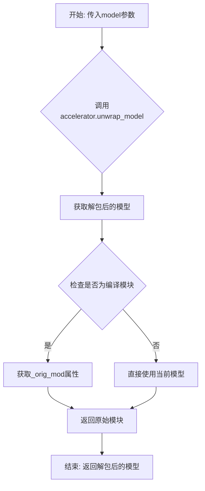

#### 带注释源码

```python
def unwrap_model(model):
    """
    解包模型函数
    
    该函数执行以下操作：
    1. 首先调用accelerator.unwrap_model()将模型从分布式训练包装中解包出来
    2. 检查模型是否经过了torch.compile编译
    3. 如果是编译模块，则返回._orig_mod属性指向的原始未编译模块
    4. 否则直接返回解包后的模型
    
    这样做是为了确保在保存模型权重或进行模型推理时使用的是正确的模型对象，
    因为经过torch.compile编译的模块与原始模块在结构上可能有所不同。
    """
    # 第一步：使用Accelerator的unwrap_model方法解包模型
    # 这会移除DistributedDataParallel等分布式训练包装
    model = accelerator.unwrap_model(model)
    
    # 第二步：检查模型是否是编译模块（torch.compile的结果）
    # is_compiled_module是diffusers.utils.torch_utils提供的辅助函数
    # 如果是编译模块，需要获取其原始模块（_orig_mod）才能正确保存/加载
    model = model._orig_mod if is_compiled_module(model) else model
    
    # 返回最终解包后的模型对象
    return model
```

#### 关键组件信息

| 组件名称 | 描述 |
|---------|------|
| `accelerator.unwrap_model()` | HuggingFace Accelerate库提供的方法，用于从分布式包装中提取原始模型 |
| `is_compiled_module()` | Diffusers库提供的工具函数，用于检测模型是否经过了torch.compile编译 |
| `._orig_mod` | PyTorch编译模块的属性，指向原始未编译的模型对象 |

#### 潜在的技术债务与优化空间

1. **嵌套函数位置问题**：`unwrap_model` 定义在 `main` 函数内部，导致其作用域受限且难以单独测试。建议将其提取为模块级函数或放入工具类中。

2. **重复代码**：该函数的功能在代码中多次被隐式调用（如在 `save_model_hook` 和 `load_model_hook` 中使用 `unwrap_model(transformer)`），可以考虑统一封装。

3. **缺少类型注解**：函数参数和返回值都缺少类型注解，不利于代码可读性和静态分析。

4. **错误处理缺失**：未对 `model` 参数为 `None` 或无效类型的情况进行处理。


### `save_model_hook` (定义于 `main` 函数内部)

#### 描述

`save_model_hook` 是一个在分布式训练环境下由 HuggingFace `Accelerator` 调用的回调函数（钩子）。它专为 Sana 模型的 DreamBooth LoRA 训练流程设计，**核心功能**是在保存检查点（Checkpoint）时，拦截模型列表，筛选出训练好的 Transformer LoRA 适配器权重，将其转换为 PEFT 格式的状态字典，并调用 `SanaPipeline.save_lora_weights` 方法将其持久化到磁盘，同时确保基础模型权重不被重复保存。

#### 参数

- `models`：`List[torch.nn.Module]`，由 Accelerator 传递的模型列表，通常包含被封装（wrapped）的 Transformer 模型。
- `weights`：`List`， Accelerator 内部维护的权重列表。该函数通过 `weights.pop()` 移除已处理的权重，以防止 Accelerator 再次尝试保存它们（因为我们手动处理了保存逻辑）。
- `output_dir`：`Union[str, Path]`，检查点的输出目录路径。

#### 返回值

- `None`。该函数执行直接的 I/O 操作（保存文件），不返回任何数据。

#### 流程图

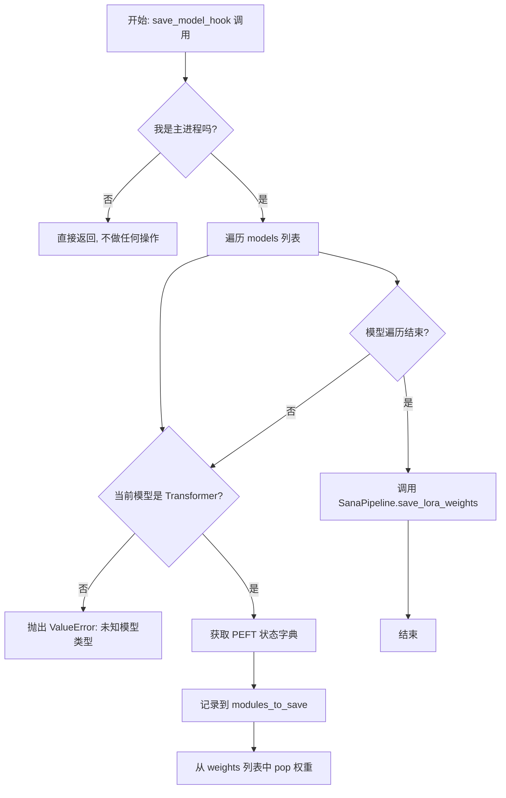

#### 带注释源码

```python
def save_model_hook(models, weights, output_dir):
    # 仅在主进程（rank 0）执行保存操作，避免文件冲突或IO瓶颈
    if accelerator.is_main_process:
        transformer_lora_layers_to_save = None
        modules_to_save = {}
        
        # 遍历 Accelerator 传来的模型列表
        for model in models:
            # unwrap_model 用于移除 Accelerator 的封装（如 DDP），获取原始模型
            if isinstance(model, type(unwrap_model(transformer))):
                # 从模型中提取 LoRA 可训练参数的状态字典
                transformer_lora_layers_to_save = get_peft_model_state_dict(model)
                modules_to_save["transformer"] = model
            else:
                # 如果出现非预期的模型（例如同时训练了 VAE 或 Text Encoder），则报错
                raise ValueError(f"unexpected save model: {model.__class__}")

            # 重要：必须将对应的 weight 从列表中 pop 掉，否则 Accelerator 会尝试再次保存
            # 这会导致重复保存或序列化错误
            weights.pop()

        # 调用 diffusers 提供的工具函数，将 LoRA 权重保存为 safetensors 格式
        # 同时处理元数据（如 rank, alpha 等）
        SanaPipeline.save_lora_weights(
            output_dir,
            transformer_lora_layers=transformer_lora_layers_to_save,
            **_collate_lora_metadata(modules_to_save),
        )
```

#### 关键组件交互

1.  **Accelerator (加速器)**: 负责管理分布式训练状态。当调用 `accelerator.save_state()` 时，它会触发此钩子。
2.  **unwrap_model**: 辅助函数，用于剥离模型的外层封装（如 `DistributedDataParallel`），确保能获取到真实的模型结构进行类型检查。
3.  **get_peft_model_state_dict (PEFT 库)**: 专门用于从包含 LoRA 适配器的模型中提取仅包含 LoRA 权重（adapter weights）的字典，忽略冻结的基础模型参数。
4.  **SanaPipeline.save_lora_weights (Diffusers 库)**: 负责将提取出的权重写入磁盘，并创建必要的配置文件（如 `adapter_config.json`）。

#### 潜在的技术债务与优化空间

1.  **硬编码的模型类型检查**: 代码中使用了 `isinstance(model, type(unwrap_model(transformer)))` 进行严格的类型匹配。如果训练脚本扩展支持了 Text Encoder 的 LoRA 训练（当前代码仅训练 Transformer），此钩子需要大幅修改，缺乏一定的通用性。
2.  **权重列表操作的风险**: 依赖 `weights.pop()` 同步模型顺序是一个脆弱的约定。如果 Accelerator 未来改变传入 `models` 和 `weights` 的顺序或机制，此处代码可能会出现索引错位或异常。理想情况下，应完全接管保存逻辑而不依赖这种隐式的顺序同步。
3.  **I/O 效率**: 虽然仅在主进程运行，但在超大规模训练（如 DeepSpeed Stage 3）中，CPU 序列化可能成为瓶颈。目前看起来是标准的 Safetensors 写入，暂无明显性能问题。

#### 其它项目

- **设计约束**: 此钩子必须与 `load_model_hook` 配对使用，以确保保存的检查点可以通过 `accelerator.load_state` 正确恢复。两者共同构成了自定义状态序列化逻辑。
- **错误处理**: 包含基本的类型检查错误抛出（`ValueError`），防止保存错误的模型权重导致后续加载失败。


### `load_model_hook`

该函数是 Accelerate 框架的模型加载钩子（hook），用于在分布式训练恢复时从检查点加载模型状态。它负责从磁盘读取 LoRA 权重，将状态字典转换为 PEFT 格式，并将其应用到 Transformer 模型上，同时处理可能的精度转换。

参数：

- `models`：`list`，模型列表，由 Accelerate 框架传入，包含待恢复的模型对象
- `input_dir`：`str`，检查点目录路径，指向包含模型权重的磁盘位置

返回值：`None`，该函数通过修改 `models` 列表中的模型对象来直接更新状态

#### 流程图

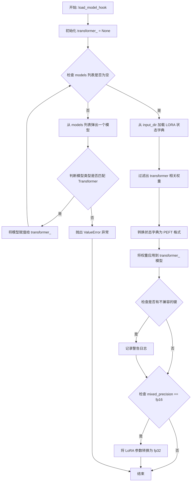

#### 带注释源码

```python
def load_model_hook(models, input_dir):
    """
    从检查点目录加载模型权重的钩子函数。
    用于 Accelerate 框架的分布式训练状态恢复。
    
    参数:
        models: Accelerate 传入的模型列表
        input_dir: 包含检查点权重的目录路径
    """
    # 初始化 transformer 模型变量为 None
    transformer_ = None

    # 遍历模型列表，提取出 transformer 模型
    # Accelerate 会将待恢复的模型传入 models 列表
    while len(models) > 0:
        model = models.pop()

        # 检查模型类型是否与原始 transformer 匹配
        if isinstance(model, type(unwrap_model(transformer))):
            transformer_ = model
        else:
            # 遇到未知模型类型时抛出异常
            raise ValueError(f"unexpected save model: {model.__class__}")

    # 从指定目录加载 LORA 权重状态字典
    lora_state_dict = SanaPipeline.lora_state_dict(input_dir)

    # 过滤出仅与 transformer 相关的权重键
    # 并移除键名中的 'transformer.' 前缀
    transformer_state_dict = {
        f"{k.replace('transformer.', '')}": v 
        for k, v in lora_state_dict.items() 
        if k.startswith("transformer.")
    }
    
    # 将状态字典转换为 PEFT 兼容格式
    transformer_state_dict = convert_unet_state_dict_to_peft(transformer_state_dict)
    
    # 将权重应用到 transformer 模型
    # adapter_name="default" 指定使用默认适配器名称
    incompatible_keys = set_peft_model_state_dict(
        transformer_, 
        transformer_state_dict, 
        adapter_name="default"
    )
    
    # 检查是否存在不兼容的键（如模型中未定义的权重）
    if incompatible_keys is not None:
        # 仅检查意外键（unexpected keys）
        unexpected_keys = getattr(incompatible_keys, "unexpected_keys", None)
        if unexpected_keys:
            logger.warning(
                f"Loading adapter weights from state_dict led to unexpected keys not found in the model: "
                f" {unexpected_keys}. "
            )

    # 确保可训练参数（LoRA）为 float32 格式
    # 这是必要的，因为基础模型可能使用 mixed_precision 精度（如 fp16）
    # 详情参考: https://github.com/huggingface/diffusers/pull/6514#discussion_r1449796804
    if args.mixed_precision == "fp16":
        models = [transformer_]
        # 仅将可训练参数（LoRA）转换为 fp32
        cast_training_params(models)
```


### `compute_text_embeddings`

该函数用于计算文本提示的嵌入向量（embeddings）和注意力掩码（attention mask）。它接收文本提示和文本编码pipeline作为输入，调用pipeline的`encode_prompt`方法生成文本的隐藏状态表示，并返回嵌入向量和注意力掩码供后续的transformer模型使用。

参数：

- `prompt`：`str`，需要编码的文本提示（prompt），可以是实例提示或类别提示
- `text_encoding_pipeline`：`SanaPipeline`，文本编码管道，包含tokenizer和text_encoder，用于将文本转换为嵌入向量

返回值：`Tuple[torch.Tensor, torch.Tensor]`，返回一个元组，包含：
- `prompt_embeds`：`torch.Tensor`，文本的嵌入向量，形状为`(batch_size, seq_len, hidden_dim)`
- `prompt_attention_mask`：`torch.Tensor`，文本的注意力掩码，形状为`(batch_size, seq_len)`，用于标识有效token位置

#### 流程图

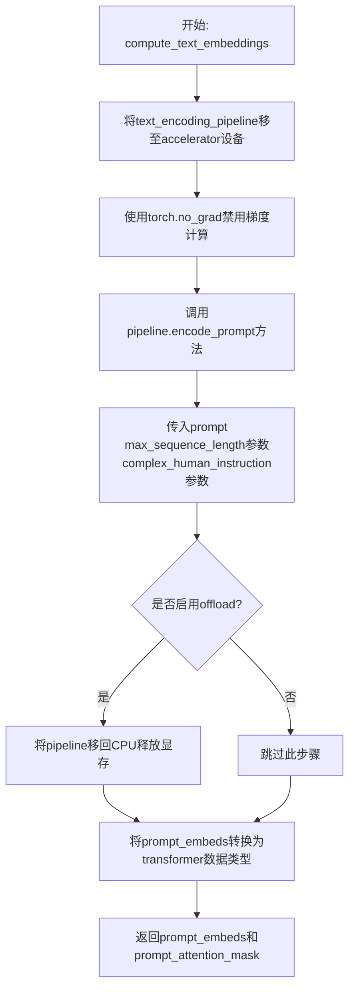

#### 带注释源码

```python
def compute_text_embeddings(prompt, text_encoding_pipeline):
    """
    计算文本提示的嵌入向量和注意力掩码
    
    参数:
        prompt: 要编码的文本字符串
        text_encoding_pipeline: 包含文本编码器的SanaPipeline实例
    
    返回:
        prompt_embeds: 文本的嵌入向量
        prompt_attention_mask: 文本的注意力掩码
    """
    # 将文本编码pipeline移动到accelerator设备上（GPU/NPU等）
    text_encoding_pipeline = text_encoding_pipeline.to(accelerator.device)
    
    # 使用torch.no_grad()上下文管理器，禁用梯度计算
    # 这是因为在推理阶段不需要计算梯度，可以节省显存和提高速度
    with torch.no_grad():
        # 调用pipeline的encode_prompt方法进行文本编码
        # 返回四个值，但我们只需要前两个：embeddings和attention_mask
        # 第三个和第四个返回值是被忽略的附加嵌入
        prompt_embeds, prompt_attention_mask, _, _ = text_encoding_pipeline.encode_prompt(
            prompt,  # 要编码的文本提示
            max_sequence_length=args.max_sequence_length,  # 最大序列长度，默认300
            complex_human_instruction=args.complex_human_instruction,  # 复杂人类指令参数
        )
    
    # 如果启用了offload选项，将pipeline移回CPU以释放显存
    if args.offload:
        text_encoding_pipeline = text_encoding_pipeline.to("cpu")
    
    # 将prompt_embeds转换为transformer模型所需的数据类型
    # 这样可以确保数据类型一致，避免类型不匹配错误
    prompt_embeds = prompt_embeds.to(transformer.dtype)
    
    # 返回文本嵌入和注意力掩码，供后续训练使用
    return prompt_embeds, prompt_attention_mask
```


### `get_sigmas`

该函数用于根据给定的时间步（timesteps）从噪声调度器中获取对应的sigma值（噪声水平）。在扩散模型的训练过程中，sigma值用于控制噪声的添加程度，实现从干净图像到噪声图像的线性插值。

参数：

- `timesteps`：torch.Tensor，时间步张量，表示需要获取sigma值的时间步
- `n_dim`：int，默认为4，指定输出张量的目标维度数
- `dtype`：torch.dtype，默认为torch.float32，指定输出张量的数据类型

返回值：`torch.Tensor`，返回与输入时间步对应的sigma值张量，形状会根据n_dim参数进行扩展

#### 流程图

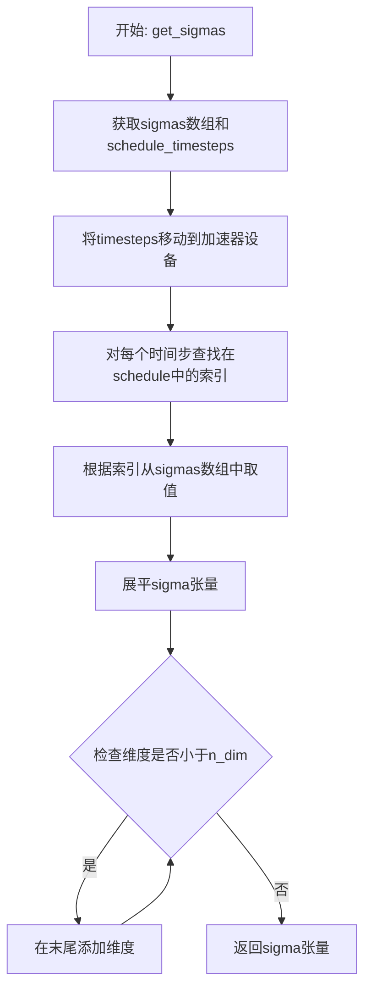

#### 带注释源码

```python
def get_sigmas(timesteps, n_dim=4, dtype=torch.float32):
    # 从噪声调度器的副本中获取sigma值数组，并移动到指定设备和数据类型
    sigmas = noise_scheduler_copy.sigmas.to(device=accelerator.device, dtype=dtype)
    
    # 获取调度器的时间步序列，并移动到指定设备
    schedule_timesteps = noise_scheduler_copy.timesteps.to(accelerator.device)
    
    # 将输入的时间步也移动到加速器设备上
    timesteps = timesteps.to(accelerator.device)
    
    # 对于每个时间步，找到它在调度时间步序列中的索引位置
    # 这里使用nonzero()找到True值的索引，然后取第一个元素
    step_indices = [(schedule_timesteps == t).nonzero().item() for t in timesteps]
    
    # 根据找到的索引，从sigma数组中取出对应的sigma值
    sigma = sigmas[step_indices].flatten()
    
    # 如果sigma的维度少于目标维度n_dim，则在末尾添加维度
    # 这是为了匹配后续计算中所需的张量形状
    while len(sigma.shape) < n_dim:
        sigma = sigma.unsqueeze(-1)
    
    return sigma
```


### `DreamBoothDataset.__init__`

该构造函数用于初始化DreamBoothDataset数据集对象，准备用于微调模型的实例图像和类别图像（含先验保留），并进行图像预处理（resize、裁剪、翻转、归一化）。

参数：

- `instance_data_root`：`str`，实例图像的根目录路径
- `instance_prompt`：`str`，实例提示词，用于指定实例图像
- `class_prompt`：`str`，类别提示词，用于生成类别图像
- `class_data_root`：`str | None`，类别图像的根目录路径，默认为None
- `class_num`：`int | None`，类别图像的最大数量，默认为None
- `size`：`int`，目标图像分辨率，默认为1024
- `repeats`：`int`，实例图像的重复次数，默认为1
- `center_crop`：`bool`，是否使用中心裁剪，默认为False

返回值：`None`，构造函数无显式返回值

#### 流程图

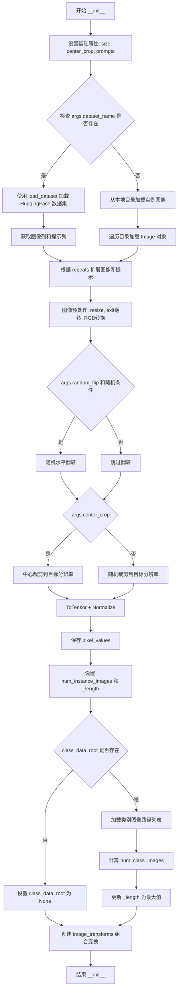

#### 带注释源码

```python
def __init__(
    self,
    instance_data_root,
    instance_prompt,
    class_prompt,
    class_data_root=None,
    class_num=None,
    size=1024,
    repeats=1,
    center_crop=False,
):
    """
    初始化 DreamBoothDataset 数据集
    
    参数:
        instance_data_root: 实例图像根目录
        instance_prompt: 实例提示词
        class_prompt: 类别提示词
        class_data_root: 类别图像根目录（可选，用于先验保留）
        class_num: 类别图像数量限制（可选）
        size: 目标图像尺寸
        repeats: 图像重复次数
        center_crop: 是否中心裁剪
    """
    # 1. 设置基础属性
    self.size = size
    self.center_crop = center_crop
    
    self.instance_prompt = instance_prompt
    self.custom_instance_prompts = None  # 自定义提示词（从数据集列读取）
    self.class_prompt = class_prompt
    
    # 2. 加载实例数据（两种来源：HuggingFace Hub 或本地目录）
    if args.dataset_name is not None:
        # 方式A: 从 HuggingFace 数据集加载
        try:
            from datasets import load_dataset
        except ImportError:
            raise ImportError("需要安装 datasets 库")
        
        # 下载并加载数据集
        dataset = load_dataset(
            args.dataset_name,
            args.dataset_config_name,
            cache_dir=args.cache_dir,
        )
        
        # 获取列名
        column_names = dataset["train"].column_names
        
        # 确定图像列（默认为第一列）
        if args.image_column is None:
            image_column = column_names[0]
        else:
            image_column = args.image_column
        
        # 获取实例图像
        instance_images = dataset["train"][image_column]
        
        # 处理提示词列
        if args.caption_column is None:
            self.custom_instance_prompts = None
        else:
            # 从数据集列获取自定义提示词
            custom_instance_prompts = dataset["train"][args.caption_column]
            # 根据 repeats 扩展提示词列表
            self.custom_instance_prompts = []
            for caption in custom_instance_prompts:
                self.custom_instance_prompts.extend(itertools.repeat(caption, repeats))
    else:
        # 方式B: 从本地目录加载
        self.instance_data_root = Path(instance_data_root)
        if not self.instance_data_root.exists():
            raise ValueError("实例图像根目录不存在")
        
        # 遍历目录加载所有图像
        instance_images = [Image.open(path) for path in list(Path(instance_data_root).iterdir())]
        self.custom_instance_prompts = None
    
    # 3. 根据 repeats 扩展实例图像列表
    self.instance_images = []
    for img in instance_images:
        self.instance_images.extend(itertools.repeat(img, repeats))
    
    # 4. 图像预处理：创建变换操作
    self.pixel_values = []
    train_resize = transforms.Resize(size, interpolation=transforms.InterpolationMode.BILINEAR)
    train_crop = transforms.CenterCrop(size) if center_crop else transforms.RandomCrop(size)
    train_flip = transforms.RandomHorizontalFlip(p=1.0)
    train_transforms = transforms.Compose([
        transforms.ToTensor(),           # 转换为张量 [0,1]
        transforms.Normalize([0.5], [0.5])  # 归一化到 [-1,1]
    ])
    
    # 5. 对每张图像应用变换
    for image in self.instance_images:
        # 纠正图像方向（根据 EXIF）
        image = exif_transpose(image)
        
        # 转换为 RGB 模式
        if not image.mode == "RGB":
            image = image.convert("RGB")
        
        # 调整大小
        image = train_resize(image)
        
        # 随机水平翻转
        if args.random_flip and random.random() < 0.5:
            image = train_flip(image)
        
        # 裁剪到目标分辨率
        if args.center_crop:
            y1 = max(0, int(round((image.height - args.resolution) / 2.0)))
            x1 = max(0, int(round((image.width - args.resolution) / 2.0)))
            image = train_crop(image)
        else:
            y1, x1, h, w = train_crop.get_params(image, (args.resolution, args.resolution))
            image = crop(image, y1, x1, h, w)
        
        # 应用 ToTensor 和 Normalize
        image = train_transforms(image)
        self.pixel_values.append(image)
    
    # 6. 设置数据集长度属性
    self.num_instance_images = len(self.instance_images)
    self._length = self.num_instance_images
    
    # 7. 处理类别数据（用于先验保留损失）
    if class_data_root is not None:
        self.class_data_root = Path(class_data_root)
        self.class_data_root.mkdir(parents=True, exist_ok=True)
        
        # 获取类别图像路径列表
        self.class_images_path = list(self.class_data_root.iterdir())
        
        # 计算可用类别图像数量
        if class_num is not None:
            self.num_class_images = min(len(self.class_images_path), class_num)
        else:
            self.num_class_images = len(self.class_images_path)
        
        # 更新数据集长度（取实例和类别图像数量的最大值）
        self._length = max(self.num_class_images, self.num_instance_images)
    else:
        self.class_data_root = None
    
    # 8. 创建用于类别图像的变换组合
    self.image_transforms = transforms.Compose([
        transforms.Resize(size, interpolation=transforms.InterpolationMode.BILINEAR),
        transforms.CenterCrop(size) if center_crop else transforms.RandomCrop(size),
        transforms.ToTensor(),
        transforms.Normalize([0.5], [0.5]),
    ])
```


### `DreamBoothDataset.__len__`

该方法返回 DreamBooth 数据集的长度（样本总数），用于 PyTorch DataLoader 确定每个 epoch 的迭代次数。在启用 prior preservation 时，返回实例图像数量与类别图像数量的最大值，以确保数据加载器能同时处理两种类型的图像。

参数：

- （无参数）

返回值：`int`，返回数据集的总样本数，即 `self._length` 的值。该值在数据集初始化时确定：如果提供了 `class_data_root`，则 `_length` 为 `num_instance_images` 和 `num_class_images` 中的较大者；否则为实例图像的数量。

#### 流程图

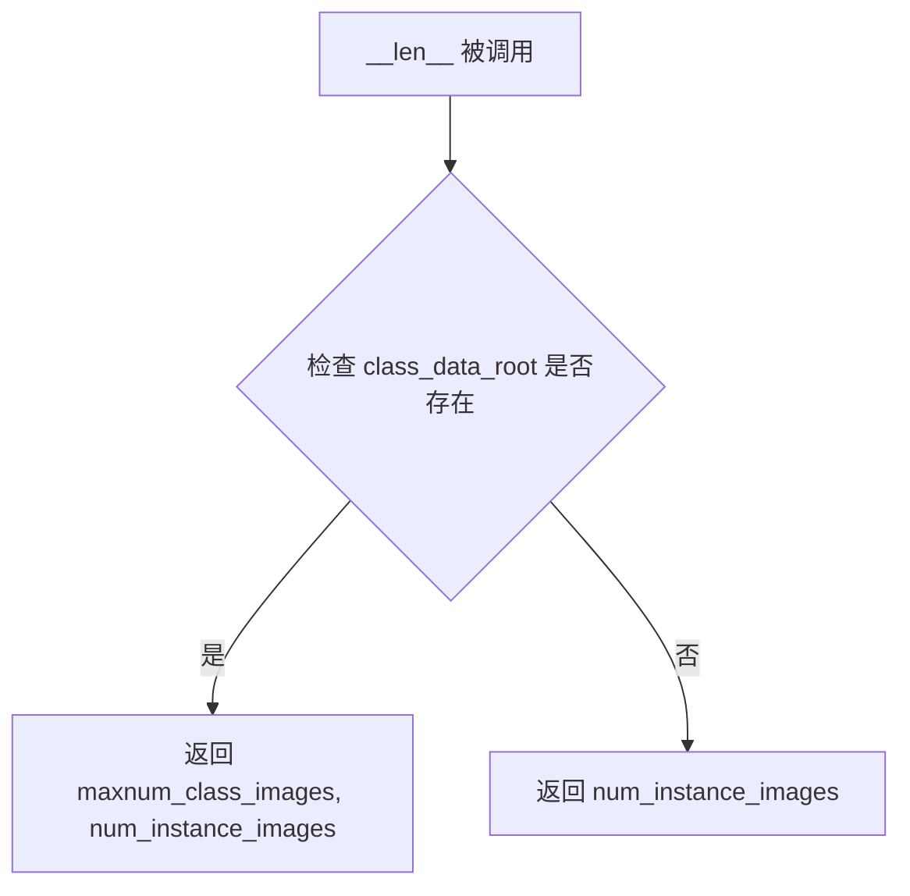

#### 带注释源码

```python
def __len__(self):
    """
    返回数据集的长度（总样本数），用于 DataLoader 确定每个 epoch 的迭代次数。
    
    返回值逻辑：
    - 如果传入了 class_data_root（用于 prior preservation），则返回类别图像数量和实例图像数量的最大值，
      以确保 DataLoader 能同时迭代两种类型的图像
    - 如果没有传入 class_data_root，则返回实例图像的数量
    """
    return self._length
```


### `DreamBoothDataset.__getitem__`

获取数据集中指定索引位置的训练样本，包括实例图像、实例提示词以及可选的类别图像和类别提示词。

参数：

-  `index`：`int`，数据集中的索引位置，用于获取对应的图像和提示词

返回值：`dict`，包含以下键值对的字典：
  - `instance_images`：预处理后的实例图像张量
  - `instance_prompt`：实例提示词字符串
  - `class_images`（可选）：预处理后的类别图像张量（当启用先验保留时存在）
  - `class_prompt`（可选）：类别提示词字符串（当启用先验保留时存在）

#### 流程图

```mermaid
flowchart TD
    A[__getitem__ 被调用] --> B[创建空字典 example]
    B --> C[获取实例图像: pixel_values[index % num_instance_images]]
    C --> D{是否有自定义实例提示词?}
    D -->|是| E[使用自定义提示词]
    D -->|否| F[使用默认实例提示词]
    E --> G{自定义提示词是否为空?}
    G -->|否| H[设置 instance_prompt 为自定义提示词]
    G -->|是| I[设置 instance_prompt 为默认提示词]
    F --> I
    I --> J{是否有类别数据根目录?}
    J -->|是| K[打开类别图像并处理]
    K --> L[添加 class_images 和 class_prompt]
    J -->|否| M[返回 example 字典]
    L --> M
    H --> J
```

#### 带注释源码

```python
def __getitem__(self, index):
    """
    获取指定索引的训练样本。
    
    参数:
        index: 数据集中的索引位置
        
    返回:
        包含图像和提示词的字典
    """
    # 初始化返回字典
    example = {}
    
    # 通过取模运算处理索引，确保索引在有效范围内循环
    # pixel_values 已预处理为张量格式
    instance_image = self.pixel_values[index % self.num_instance_images]
    example["instance_images"] = instance_image

    # 检查是否提供了自定义实例提示词
    if self.custom_instance_prompts:
        # 获取对应索引的自定义提示词
        caption = self.custom_instance_prompts[index % self.num_instance_images]
        if caption:
            # 如果自定义提示词非空，使用自定义提示词
            example["instance_prompt"] = caption
        else:
            # 如果自定义提示词为空，回退到默认实例提示词
            example["instance_prompt"] = self.instance_prompt
    else:
        # 未提供自定义提示词，使用默认实例提示词
        example["instance_prompt"] = self.instance_prompt

    # 如果配置了先验保留（class_data_root），加载类别图像
    if self.class_data_root:
        # 打开类别图像文件
        class_image = Image.open(self.class_images_path[index % self.num_class_images])
        # 根据EXIF信息调整图像方向
        class_image = exif_transpose(class_image)

        # 确保图像为RGB模式
        if not class_image.mode == "RGB":
            class_image = class_image.convert("RGB")
        
        # 应用图像变换并添加到返回字典
        example["class_images"] = self.image_transforms(class_image)
        example["class_prompt"] = self.class_prompt

    return example
```


### `PromptDataset.__init__`

这是 `PromptDataset` 类的构造函数，用于初始化数据集的提示词和样本数量，简化了为多GPU生成类图像准备提示词的过程。

参数：

- `prompt`：`str`，用于生成类图像的提示词
- `num_samples`：`int`，要生成的样本数量

返回值：`None`，构造函数不返回值

#### 流程图

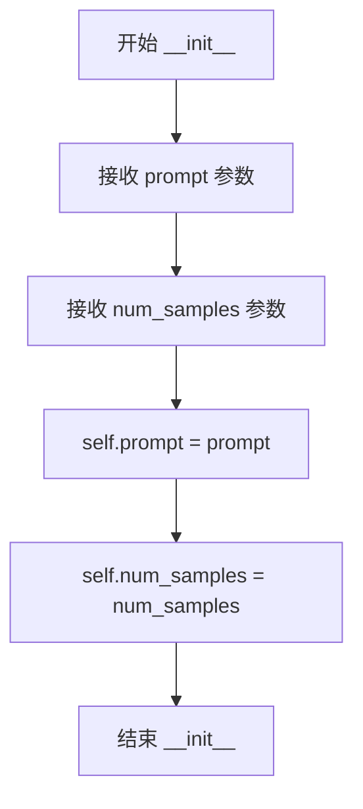

#### 带注释源码

```python
class PromptDataset(Dataset):
    "A simple dataset to prepare the prompts to generate class images on multiple GPUs."

    def __init__(self, prompt, num_samples):
        """
        初始化 PromptDataset 数据集
        
        参数:
            prompt: str - 用于生成类图像的提示词
            num_samples: int - 要生成的样本数量
        """
        # 将传入的提示词存储为实例变量
        self.prompt = prompt
        # 将传入的样本数量存储为实例变量
        self.num_samples = num_samples
```


### `PromptDataset.__len__`

返回数据集的长度（样本数量）

参数：
- `self`：无（Python隐含参数），代表类的实例本身

返回值：`int`，返回数据集中要生成的样本数量，即 `num_samples`

#### 流程图

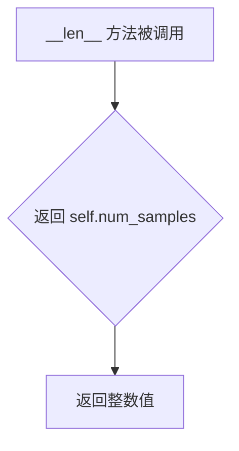

#### 带注释源码

```python
def __len__(self):
    """
    返回数据集的长度
    
    这是一个特殊方法（dunder method），使得数据集可以被 len() 函数调用。
    返回在初始化时设置的 num_samples 值，表示需要生成的提示词数量。
    
    Returns:
        int: 数据集中包含的样本数量，等于初始化时传入的 num_samples 参数
    """
    return self.num_samples
```

---

### 附加信息

#### 类信息：`PromptDataset`

| 属性 | 类型 | 描述 |
|------|------|------|
| `prompt` | `str` | 要生成的提示词文本 |
| `num_samples` | `int` | 要生成的样本数量 |

| 方法 | 描述 |
|------|------|
| `__init__(self, prompt, num_samples)` | 初始化数据集，设置提示词和样本数量 |
| `__len__(self)` | 返回数据集长度 |
| `__getitem__(self, index)` | 根据索引返回包含提示词和索引的字典 |

#### 设计目的
`PromptDataset` 是一个简单的数据集类，用于在多 GPU 环境下准备生成类图像的提示词。它继承自 PyTorch 的 `Dataset` 类，实现了必要的数据集接口，使得可以与 `DataLoader` 配合使用进行批量数据加载。


### `PromptDataset.__getitem__`

获取数据集中指定索引位置的样本，返回包含提示词（prompt）和索引（index）的字典对象。该方法是PyTorch Dataset类的核心接口，用于DataLoader按需加载数据。

参数：

- `index`：`int`，数据集中样本的索引位置

返回值：`dict`，返回包含以下键的字典：
  - `"prompt"`：提示词字符串（来自初始化时设置的类属性）
  - `"index"`：当前样本的索引值

#### 流程图

```mermaid
flowchart TD
    A[开始 __getitem__] --> B[创建空字典 example]
    B --> C[设置 example['prompt'] = self.prompt]
    C --> D[设置 example['index'] = index]
    D --> E[返回 example 字典]
```

#### 带注释源码

```python
def __getitem__(self, index):
    """
    获取指定索引位置的数据样本
    
    参数:
        index: int - 数据集中的索引位置
        
    返回:
        dict: 包含'prompt'和'index'键的字典
    """
    # 创建一个空字典用于存储样本数据
    example = {}
    
    # 将类初始化时保存的提示词（class_prompt）存入字典
    example["prompt"] = self.prompt
    
    # 将当前请求的索引位置存入字典
    example["index"] = index
    
    # 返回包含提示词和索引的字典，供DataLoader使用
    return example
```

## 关键组件


### 张量索引与惰性加载

在训练循环中，当未提供自定义实例提示时，文本嵌入会在首次计算后缓存并在后续迭代中复用，避免重复编码。同时支持`--cache_latents`选项，将VAE编码的潜在表示预先缓存到内存中，减少训练过程中的重复计算。

### 反量化支持

代码支持多种精度的模型权重转换：VAE始终保持fp32精度，文本编码器使用bfloat16，Transformer根据训练配置使用fp16或bf16。训练过程中通过`cast_training_params`函数将可训练参数（LoRA层）提升为float32以确保数值稳定性，并在保存前可通过`--upcast_before_saving`选项将Transformer层转换为float32。

### 量化策略

通过`--mixed_precision`参数支持fp16和bf16两种混合精度训练模式，并可选启用8位Adam优化器（`--use_8bit_adam`）通过bitsandbytes库实现量化。TF32加速可通过`--allow_tf32`参数在Ampere GPU上启用，以提升矩阵运算性能。

### DreamBooth数据集类

负责加载和预处理训练图像，支持从HuggingFace Hub或本地目录读取数据，实现图像的缩放、裁剪、翻转和数据增强，并处理EXIF方向信息。

### 文本嵌入计算

提供`compute_text_embeddings`函数用于将文本提示编码为潜在表示，支持最大序列长度配置和复杂人类指令，可选择性地将文本编码管道卸载到CPU以节省显存。

### 噪声调度与流匹配

使用FlowMatchEulerDiscreteScheduler实现流匹配训练，支持多种加权采样方案（sigma_sqrt、logit_normal、mode、cosmap），通过`compute_density_for_timestep_sampling`和`get_sigmas`函数实现非均匀时间步采样。

### LoRA适配器配置

通过`LoraConfig`配置低秩适配器，支持自定义目标模块（默认包括to_k、to_q、to_v注意力层），可配置rank、alpha和dropout参数，并在保存和加载时正确序列化适配器权重。

### 验证与推理流程

`log_validation`函数在指定周期执行推理验证，支持VAE瓦片处理以处理高分辨率图像，使用TensorBoard和WandB记录生成的样本图像，支持设置随机种子以确保可复现性。

### 检查点管理

实现完整的检查点保存和恢复机制，支持按步数保存、总数限制和最新检查点自动恢复，包含LoRA权重和训练状态的序列化与反序列化。

### 优化器配置

支持AdamW和Prodigy两种优化器，Prodigy优化器提供偏差校正和预热阶段保护机制，可配置权重衰减、epsilon和beta参数，支持学习率调度器（linear、cosine、polynomial等）。

## 问题及建议


### 已知问题

-   **全局变量耦合**: `DreamBoothDataset` 类中直接引用全局 `args` 变量（`args.dataset_name`, `args.random_flip`, `args.center_crop`, `args.resolution` 等），违反了对依赖注入的最佳实践，导致类难以测试和复用，且当 `args` 未初始化时会出错。

-   **内存泄漏风险**: 在使用 `args.cache_latents=True` 时，`latents_cache` 列表在训练过程中持续占用显存，训练结束后未显式释放；且在每个训练step中VAE被频繁地 `.to(accelerator.device)` 和 `.to("cpu")` 移动（当 `args.offload=True` 时），这种频繁的设备间数据迁移会影响性能并可能导致显存碎片化。

-   **缺少数据验证**: 代码未检查训练数据集是否为空，也未验证 `instance_data_dir` 目录中是否存在有效的图像文件，若提供空目录可能导致静默失败或难以追踪的错误。

-   **硬编码值不一致**: `parse_args` 中默认 `resolution=512`，但 `DreamBoothDataset` 构造函数默认 `size=1024`，且在 `DreamBoothDataset.__init__` 中也使用了 `args.resolution`，这种不一致可能导致意外行为。

-   **错误处理不足**: 图像保存操作（`image.save(image_filename)`）缺少异常处理，若磁盘空间不足或权限问题导致保存失败，训练可能中断；同样，加载预训练模型失败时的错误信息不够详细。

-   **类型提示缺失**: 关键函数如 `collate_fn`、`compute_text_embeddings` 以及 `DreamBoothDataset` 的部分方法缺少完整的类型提示，影响代码可维护性和IDE支持。

### 优化建议

-   **解耦全局依赖**: 将 `args` 作为参数传递给 `DreamBoothDataset` 构造函数，而不是直接引用全局变量；创建配置对象或dataclass来封装训练参数。

-   **优化内存管理**: 在训练结束后显式释放 `latents_cache`（如 `del latents_cache; torch.cuda.empty_cache()`）；考虑使用 `torch.cuda.empty_cache()` 的更激进策略或在关键节点使用上下文管理器管理显存；对于offload场景，可使用 `accelerator` 的自动offload功能而非手动迁移。

-   **增加数据验证**: 在数据集初始化时检查图像列表是否为空；添加对图像文件完整性的验证（如尝试解码而非仅检查文件存在）。

-   **统一配置默认值**: 统一 `resolution` 和 `size` 的默认值或确保它们始终通过参数传递一致地传递；将魔法数字提取为常量。

-   **增强错误处理**: 为文件I/O操作添加try-except块并提供有意义的错误信息；为模型加载添加重试逻辑和更详细的错误日志。

-   **完善类型提示**: 为所有公共函数和类方法添加完整的类型注解，包括泛型类型；考虑使用 `typing.Optional` 明确标识可选参数。

-   **性能优化**: 考虑对transformer使用 `torch.compile()` 进一步优化（如果兼容）；检查是否可对text_encoder也启用gradient_checkpointing以节省更多显存；在验证阶段复用训练时的VAE而非重新加载。

-   **代码重构**: 抽取训练循环中的日志记录逻辑到独立函数以减少主循环复杂度；合并重复的模型保存/加载钩子逻辑。

## 其它


### 设计目标与约束

本代码的设计目标是实现Sana模型的DreamBooth LoRA训练框架，支持个性化图像生成微调。核心约束包括：1）仅训练LoRA适配器层，保持预训练模型权重不变；2）支持Prior Preservation损失以防止模型遗忘；3）支持分布式训练和混合精度计算；4）必须满足最小diffusers版本0.37.0.dev0。

### 错误处理与异常设计

代码采用多层错误处理机制：1）参数验证阶段通过parse_args函数检查必需参数（如必须指定dataset_name或instance_data_dir）；2）导入依赖时检查可选库（如datasets、bitsandbytes、wandb）并提供明确的安装指引；3）训练过程中对MPS+bf16、TF32等不支持的配置组合抛出ValueError；4）使用warning.warn提示非关键配置问题（如class_data_dir与with_prior_preservation不匹配）；5）模型加载失败时提供回退机制和内存释放。

### 数据流与状态机

训练数据流分为两条路径：实例数据流和类数据流（可选）。实例数据经过DreamBoothDataset的图像预处理（resize、crop、flip、normalize），通过collate_fn组装batch；若启用Prior Preservation，类图像通过SanaPipeline生成后同样进行预处理。训练循环状态机包含：初始化→数据加载→前向传播→噪声采样→flow matching计算→损失计算→反向传播→参数更新→检查点保存→验证（按配置周期）。

### 外部依赖与接口契约

核心依赖包括：diffusers（模型加载和pipeline）、transformers（Gemma2文本编码器）、peft（LoRA配置）、accelerate（分布式训练）、torch。输入接口通过命令行参数定义，输出接口包括：检查点文件、LoRA权重文件、验证生成的图像、ModelHub推送（可选）。与HuggingFace Hub的契约包括：模型卡生成、仓库创建、文件上传。

### 配置参数详解

关键训练参数包括：learning_rate默认1e-4，rank默认4（LoRA维度），train_batch_size默认4，max_train_steps由epochs和batch计算得出，gradient_accumulation_steps默认1，lr_scheduler默认constant。模型参数包括：weight_dtype根据mixed_precision设置（fp16/bf16/fp32），vae固定为fp32，text_encoder固定为bf16（适配Gemma2），transformer使用weight_dtype。

### 性能优化建议

当前代码可优化的方向包括：1）latent缓存（cache_latents）可减少重复VAE编码但占用大量显存；2）gradient_checkpointing可降低内存占用但增加计算时间；3）enable_vae_tiling在验证时启用瓦片编码降低显存；4）offload参数可将VAE和文本编码器卸载到CPU；5）可考虑使用xFormers或NPU Flash Attention加速注意力计算。

### 兼容性说明

代码兼容性：1）CUDA设备支持TF32加速（需要Ampere架构GPU）；2）NPU设备支持Flash Attention（需torch_npu扩展）；3）MPS后端不支持bf16混合精度；4）支持CPU-only训练但性能受限；5）Python版本未明确限制但建议3.8+。分布式支持通过Accelerator实现，支持单卡、多卡及DeepSpeed集成。

### 版本与兼容性矩阵

| 特性 | 要求 | 说明 |
|------|------|------|
| diffusers版本 | ≥0.37.0.dev0 | check_min_version验证 |
| torch版本 | ≥2.0.0 | 脚本依赖 |
|  transformers版本 | ≥4.47.0 | Gemma2Model需要 |
| peft版本 | ≥0.14.0 | LoRA配置需要 |
| CUDA TF32 | Ampere+ | A100, RTX30xx系列 |
| bf16训练 | Nvidia Ampere+ | MPS不支持 |


    