# `diffusers\examples\dreambooth\train_dreambooth_lora_sd3.py` 详细设计文档

这是一个Stable Diffusion 3 (SD3)模型的DreamBooth LoRA训练脚本，用于通过LoRA技术对SD3的transformer和可选的text encoder进行微调，支持prior preservation loss、分布式训练、多种优化器和学习率调度器。

## 整体流程

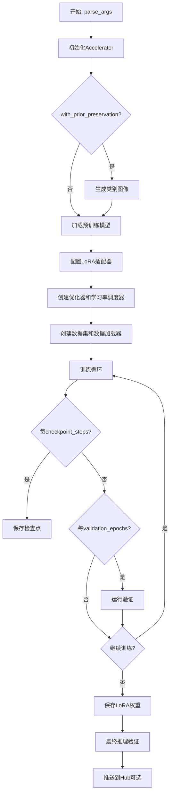

## 类结构

```
Dataset (抽象基类)
├── DreamBoothDataset (训练数据集)
└── PromptDataset (类别图像生成数据集)
```

## 全局变量及字段


### `logger`
    
日志记录器，用于输出训练过程中的调试信息和状态

类型：`logging.Logger`
    


### `args`
    
命令行参数对象，包含所有训练配置参数

类型：`argparse.Namespace`
    


### `DreamBoothDataset.size`
    
图像分辨率，训练图像将resize到该尺寸

类型：`int`
    


### `DreamBoothDataset.center_crop`
    
是否对图像进行中心裁剪，为True时使用CenterCrop，否则使用RandomCrop

类型：`bool`
    


### `DreamBoothDataset.instance_prompt`
    
实例提示词，用于描述要训练的主体概念

类型：`str`
    


### `DreamBoothDataset.custom_instance_prompts`
    
自定义提示词列表，如果提供则为每张图像使用不同的提示词

类型：`list`
    


### `DreamBoothDataset.class_prompt`
    
类别提示词，用于prior preservation损失计算

类型：`str`
    


### `DreamBoothDataset.instance_data_root`
    
实例数据根目录，包含要训练的主体图像

类型：`Path`
    


### `DreamBoothDataset.class_data_root`
    
类别数据根目录，包含用于prior preservation的类别图像

类型：`Path`
    


### `DreamBoothDataset.instance_images`
    
实例图像列表，存储从数据目录加载的PIL图像对象

类型：`list`
    


### `DreamBoothDataset.pixel_values`
    
处理后的像素值列表，包含经过transforms处理后的图像tensor

类型：`list`
    


### `DreamBoothDataset.num_instance_images`
    
实例图像数量，用于__getitem__中的索引取模计算

类型：`int`
    


### `DreamBoothDataset.class_images_path`
    
类别图像路径列表，包含class_data_dir中所有图像的Path对象

类型：`list`
    


### `DreamBoothDataset.num_class_images`
    
类别图像数量，用于prior preservation时的数据采样

类型：`int`
    


### `DreamBoothDataset._length`
    
数据集长度，取instance和class图像数量的最大值

类型：`int`
    


### `PromptDataset.prompt`
    
提示词，用于生成类别图像的文本描述

类型：`str`
    


### `PromptDataset.num_samples`
    
样本数量，要生成的类别图像数量

类型：`int`
    
    

## 全局函数及方法


### `save_model_card`

该函数用于在DreamBooth训练完成后，将训练好的LoRA模型信息生成并保存为HuggingFace Hub的模型卡片（Model Card），包括模型描述、使用方法、许可证信息和示例图像等。

参数：

- `repo_id`：`str`，HuggingFace Hub上的仓库ID，格式为`{username}/{repo_name}`
- `images`：`Optional[List[PIL.Image]]`，验证阶段生成的样本图像列表，用于展示模型效果
- `base_model`：`str`，用于训练的基础模型名称或路径（如`stabilityai/stable-diffusion-3-medium`）
- `train_text_encoder`：`bool`，标记是否对文本编码器进行了LoRA训练
- `instance_prompt`：`str`，实例提示词，用于触发特定的训练主体
- `validation_prompt`：`Optional[str]`，验证时使用的提示词，用于生成展示图像
- `repo_folder`：`str`，本地仓库文件夹路径，用于保存模型卡片和图像文件

返回值：`None`，函数直接写入文件，不返回任何值

#### 流程图

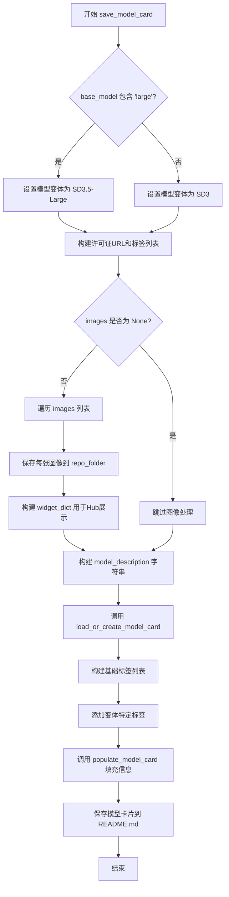

#### 带注释源码

```python
def save_model_card(
    repo_id: str,              # HuggingFace仓库ID
    images=None,               # 验证生成的图像列表
    base_model: str = None,    # 基础模型名称/路径
    train_text_encoder=False,  # 是否训练了文本编码器
    instance_prompt=None,      # 实例提示词
    validation_prompt=None,   # 验证提示词
    repo_folder=None,          # 本地仓库文件夹
):
    """
    生成并保存DreamBooth LoRA模型的模型卡片到HuggingFace Hub
    
    该函数执行以下操作：
    1. 根据base_model确定模型变体(SD3或SD3.5-Large)
    2. 保存验证图像到本地文件夹
    3. 构建Markdown格式的模型描述
    4. 创建并填充Hub所需的模型卡片
    5. 添加适当的标签以便搜索
    """
    
    # 根据base_model判断模型变体并设置相应的许可证和标签
    if "large" in base_model:
        model_variant = "SD3.5-Large"
        license_url = "https://huggingface.co/stabilityai/stable-diffusion-3.5-large/blob/main/LICENSE.md"
        variant_tags = ["sd3.5-large", "sd3.5", "sd3.5-diffusers"]
    else:
        model_variant = "SD3"
        license_url = "https://huggingface.co/stabilityai/stable-diffusion-3-medium/blob/main/LICENSE.md"
        variant_tags = ["sd3", "sd3-diffusers"]

    widget_dict = []  # 用于HuggingFace Hub的widget配置
    
    # 如果有验证图像，保存到本地并构建widget配置
    if images is not None:
        for i, image in enumerate(images):
            # 保存图像到repo_folder，文件名格式为 image_{i}.png
            image.save(os.path.join(repo_folder, f"image_{i}.png"))
            # 构建widget字典，包含提示词和图像URL
            widget_dict.append(
                {"text": validation_prompt if validation_prompt else " ", "output": {"url": f"image_{i}.png"}}
            )

    # 构建模型描述（Markdown格式），包含模型信息、使用说明和示例代码
    model_description = f"""
# {model_variant} DreamBooth LoRA - {repo_id}

<Gallery />

## Model description

These are {repo_id} DreamBooth LoRA weights for {base_model}.

The weights were trained using [DreamBooth](https://dreambooth.github.io/) with the [SD3 diffusers trainer](https://github.com/huggingface/diffusers/blob/main/examples/dreambooth/README_sd3.md).

Was LoRA for the text encoder enabled? {train_text_encoder}.

## Trigger words

You should use `{instance_prompt}` to trigger the image generation.

## Download model

[Download the *.safetensors LoRA]({repo_id}/tree/main) in the Files & versions tab.

## Use it with the [🧨 diffusers library](https://github.com/huggingface/diffusers)

```py
from diffusers import AutoPipelineForText2Image
import torch
pipeline = AutoPipelineForText2Image.from_pretrained({base_model}, torch_dtype=torch.float16).to('cuda')
pipeline.load_lora_weights('{repo_id}', weight_name='pytorch_lora_weights.safetensors')
image = pipeline('{validation_prompt if validation_prompt else instance_prompt}').images[0]
```

### Use it with UIs such as AUTOMATIC1111, Comfy UI, SD.Next, Invoke

- **LoRA**: download **[`diffusers_lora_weights.safetensors` here 💾](/{repo_id}/blob/main/diffusers_lora_weights.safetensors)**.
    - Rename it and place it on your `models/Lora` folder.
    - On AUTOMATIC1111, load the LoRA by adding `<lora:your_new_name:1>` to your prompt. On ComfyUI just [load it as a regular LoRA](https://comfyanonymous.github.io/ComfyUI_examples/lora/).

For more details, including weighting, merging and fusing LoRAs, check the [documentation on loading LoRAs in diffusers](https://huggingface.co/docs/diffusers/main/en/using-diffusers/loading_adapters)

## License

Please adhere to the licensing terms as described [here]({license_url}).
"""
    
    # 加载或创建模型卡片，包含训练信息和基础模型信息
    model_card = load_or_create_model_card(
        repo_id_or_path=repo_id,
        from_training=True,         # 标记为训练产生的模型
        license="other",
        base_model=base_model,
        prompt=instance_prompt,
        model_description=model_description,
        widget=widget_dict,
    )
    
    # 构建标签列表，用于Hub搜索和分类
    tags = [
        "text-to-image",           # 任务类型
        "diffusers-training",      # 训练框架
        "diffusers",               # 库标签
        "lora",                    # LoRA方法
        "template:sd-lora",        # 模板标签
    ]

    tags += variant_tags  # 添加变体特定标签

    # 填充模型卡片信息并保存到README.md
    model_card = populate_model_card(model_card, tags=tags)
    model_card.save(os.path.join(repo_folder, "README.md"))
```


### `load_text_encoders`

该函数用于从预训练模型中加载三个文本编码器（分别对应 SD3 模型的不同文本编码器组件：text_encoder、text_encoder_2 和 text_encoder_3），并返回这三个文本编码器实例。

参数：

- `class_one`：`type`，第一个文本编码器类（通常为 CLIPTextModel 或 CLIPTextModelWithProjection），用于从预训练模型路径加载主文本编码器
- `class_two`：`type`，第二个文本编码器类，用于从预训练模型路径加载第二个文本编码器
- `class_three`：`type`，第三个文本编码器类（通常为 T5EncoderModel），用于从预训练模型路径加载第三个文本编码器

返回值：`tuple`，包含三个文本编码器实例的元组 (text_encoder_one, text_encoder_two, text_encoder_three)

#### 流程图

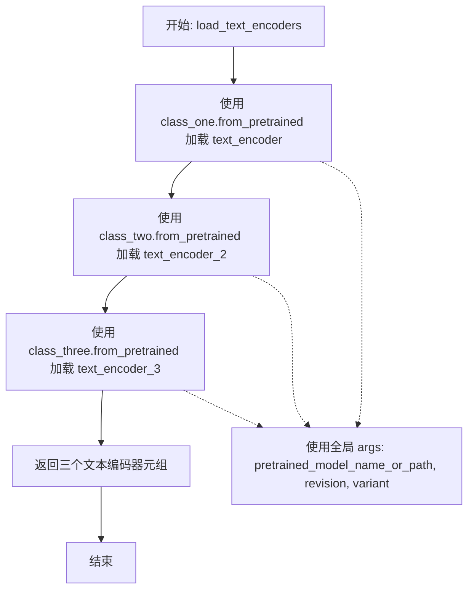

#### 带注释源码

```python
def load_text_encoders(class_one, class_two, class_three):
    """
    从预训练模型加载三个文本编码器
    
    参数:
        class_one: 第一个文本编码器类（如 CLIPTextModelWithProjection）
        class_two: 第二个文本编码器类（如 CLIPTextModelWithProjection）
        class_three: 第三个文本编码器类（如 T5EncoderModel）
    
    返回:
        包含三个文本编码器实例的元组
    """
    # 加载主文本编码器（text_encoder），从预训练模型的 text_encoder 子文件夹
    text_encoder_one = class_one.from_pretrained(
        args.pretrained_model_name_or_path,  # 预训练模型路径或 HuggingFace 模型 ID
        subfolder="text_encoder",             # 指定子文件夹名称
        revision=args.revision,               # Git revision 版本
        variant=args.variant                  # 模型变体（如 fp16）
    )
    
    # 加载第二个文本编码器（text_encoder_2）
    text_encoder_two = class_two.from_pretrained(
        args.pretrained_model_name_or_path,
        subfolder="text_encoder_2",           # 第二个编码器的子文件夹
        revision=args.revision,
        variant=args.variant
    )
    
    # 加载第三个文本编码器（text_encoder_3，通常为 T5）
    text_encoder_three = class_three.from_pretrained(
        args.pretrained_model_name_or_path,
        subfolder="text_encoder_3",           # 第三个编码器的子文件夹
        revision=args.revision,
        variant=args.variant
    )
    
    # 返回三个编码器实例
    return text_encoder_one, text_encoder_two, text_encoder_three
```


### `log_validation`

该函数是DreamBooth训练脚本中的验证函数，用于在训练过程中生成并记录验证图像。它将Stable Diffusion 3 pipeline移动到指定设备，根据验证prompt生成指定数量的图像，并将这些图像记录到TensorBoard或WandB等追踪工具中，最后释放内存并返回生成的图像列表。

参数：

- `pipeline`：`StableDiffusion3Pipeline`，用于生成图像的Stable Diffusion 3 pipeline实例
- `args`：包含训练和验证配置的对象，如`num_validation_images`（验证图像数量）、`validation_prompt`（验证提示词）、`seed`（随机种子）等
- `accelerator`：`Accelerator`，HuggingFace Accelerate库提供的分布式训练加速器，用于设备管理和追踪器访问
- `pipeline_args`：`dict`，传递给pipeline的额外生成参数，如`prompt`等
- `epoch`：`int`，当前训练轮次编号，用于记录图像到追踪器时标记
- `torch_dtype`：`torch.dtype`，pipeline使用的数据类型（如float16、float32等）
- `is_final_validation`：`bool`，可选参数，默认为`False`，标识是否为最终验证（影响记录时的phase名称）

返回值：`list[PIL.Image]`，生成的验证图像列表

#### 流程图

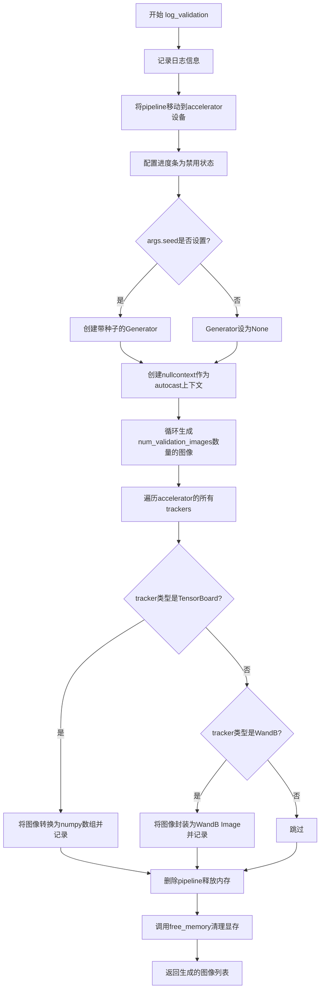

#### 带注释源码

```python
def log_validation(
    pipeline,
    args,
    accelerator,
    pipeline_args,
    epoch,
    torch_dtype,
    is_final_validation=False,
):
    """
    运行验证流程，生成验证图像并记录到追踪器
    
    参数:
        pipeline: Stable Diffusion 3 pipeline实例
        args: 训练参数配置对象
        accelerator: Accelerate加速器实例
        pipeline_args: 传递给pipeline的生成参数字典
        epoch: 当前训练轮次
        torch_dtype: 使用的数据类型
        is_final_validation: 是否为最终验证阶段的标志
    """
    # 打印验证信息日志，包含要生成的图像数量和验证提示词
    logger.info(
        f"Running validation... \n Generating {args.num_validation_images} images with prompt:"
        f" {args.validation_prompt}."
    )
    
    # 将pipeline移动到accelerator管理的设备上（GPU或CPU）
    pipeline = pipeline.to(accelerator.device)
    
    # 禁用进度条显示，避免在验证时输出冗余信息
    pipeline.set_progress_bar_config(disable=True)

    # 创建随机数生成器，如果设置了种子则使用种子确保可重复性
    # 这对于调试和结果复现非常重要
    generator = torch.Generator(device=accelerator.device).manual_seed(args.seed) if args.seed is not None else None
    
    # 注意：这里保留了nullcontext，虽然原代码有注释掉的autocast选项
    # autocast_ctx = torch.autocast(accelerator.device.type) if not is_final_validation else nullcontext()
    autocast_ctx = nullcontext()

    # 在autocast上下文中运行推理生成图像
    # 循环生成指定数量的验证图像
    with autocast_ctx:
        images = [pipeline(**pipeline_args, generator=generator).images[0] for _ in range(args.num_validation_images)]

    # 遍历所有注册的追踪器（TensorBoard、WandB等）并记录图像
    for tracker in accelerator.trackers:
        # 确定phase名称：最终验证用"test"，中间验证用"validation"
        phase_name = "test" if is_final_validation else "validation"
        
        # TensorBoard追踪器处理：将PIL图像转为numpy数组并添加图像
        if tracker.name == "tensorboard":
            # 将图像堆叠为numpy数组，形状为(N, H, W, C)
            np_images = np.stack([np.asarray(img) for img in images])
            tracker.writer.add_images(phase_name, np_images, epoch, dataformats="NHWC")
        
        # WandB追踪器处理：将图像封装为WandB Image对象并记录
        if tracker.name == "wandb":
            tracker.log(
                {
                    phase_name: [
                        wandb.Image(image, caption=f"{i}: {args.validation_prompt}") for i, image in enumerate(images)
                    ]
                }
            )

    # 显式删除pipeline对象以释放内存
    del pipeline
    
    # 调用free_memory进一步清理GPU显存
    free_memory()

    # 返回生成的图像列表，供调用者使用（如保存或进一步处理）
    return images
```


### `import_model_class_from_model_name_or_path`

该函数用于根据预训练模型的名称或路径，动态导入对应的文本编码器类（CLIPTextModelWithProjection 或 T5EncoderModel）。它通过读取模型配置文件中的 `architectures` 字段来确定需要导入的具体模型类。

参数：

- `pretrained_model_name_or_path`：`str`，预训练模型的名称或路径（支持本地路径或 HuggingFace Hub 上的模型标识符）
- `revision`：`str`，预训练模型的版本号（用于从 Hub 获取特定版本）
- `subfolder`：`str`，模型子文件夹路径，默认为 `"text_encoder"`（用于指定加载 text_encoder、text_encoder_2 或 text_encoder_3）

返回值：`type`，返回对应的文本编码器类（`CLIPTextModelWithProjection` 或 `T5EncoderModel`），如果遇到不支持的模型架构则抛出 `ValueError` 异常。

#### 流程图

```mermaid
flowchart TD
    A[开始] --> B[调用 PretrainedConfig.from_pretrained 加载配置]
    B --> C[从配置中获取 architectures[0]]
    C --> D{判断 model_class}
    D -->|CLIPTextModelWithProjection| E[导入 CLIPTextModelWithProjection]
    D -->|T5EncoderModel| F[导入 T5EncoderModel]
    D -->|其他| G[抛出 ValueError 异常]
    E --> H[返回 CLIPTextModelWithProjection 类]
    F --> I[返回 T5EncoderModel 类]
    G --> J[结束]
    H --> J
    I --> J
```

#### 带注释源码

```python
def import_model_class_from_model_name_or_path(
    pretrained_model_name_or_path: str, revision: str, subfolder: str = "text_encoder"
):
    """
    从预训练模型路径导入对应的文本编码器类
    
    参数:
        pretrained_model_name_or_path: 预训练模型名称或路径
        revision: 模型版本号
        subfolder: 模型子文件夹，默认为 "text_encoder"
    
    返回:
        对应的文本编码器类 (CLIPTextModelWithProjection 或 T5EncoderModel)
    """
    # 使用 PretrainedConfig 从预训练模型加载配置
    # subfolder 指定加载哪个文本编码器 (text_encoder, text_encoder_2, text_encoder_3)
    # revision 指定从哪个分支/版本加载
    text_encoder_config = PretrainedConfig.from_pretrained(
        pretrained_model_name_or_path, subfolder=subfolder, revision=revision
    )
    
    # 从配置中获取模型架构名称 (e.g., "CLIPTextModelWithProjection" 或 "T5EncoderModel")
    model_class = text_encoder_config.architectures[0]
    
    # 根据架构名称动态导入并返回对应的模型类
    if model_class == "CLIPTextModelWithProjection":
        # 导入 CLIP 文本编码器 (带 projection 层)
        from transformers import CLIPTextModelWithProjection

        return CLIPTextModelWithProjection
    elif model_class == "T5EncoderModel":
        # 导入 T5 文本编码器
        from transformers import T5EncoderModel

        return T5EncoderModel
    else:
        # 如果遇到不支持的模型架构，抛出明确的错误信息
        raise ValueError(f"{model_class} is not supported.")
```


### `parse_args`

该函数是训练脚本的参数解析器，使用Python的`argparse`模块定义并解析命令行参数，包括模型路径、数据集配置、训练超参数、LoRA配置、验证设置等近70个参数，并进行必要的参数校验（如数据集来源必须指定、prior preservation相关参数的一致性检查等），最终返回包含所有配置参数的`Namespace`对象。

参数：

- `input_args`：`List[str] | None`，可选参数，用于测试或脚本内部调用时直接传入参数列表而非从sys.argv解析，传入时解析该列表，未传入时从命令行解析

返回值：`argparse.Namespace`，包含所有解析后的命令行参数对象，通过属性访问（如args.learning_rate）

#### 流程图

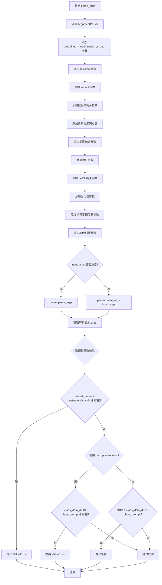

#### 带注释源码

```python
def parse_args(input_args=None):
    """
    解析命令行参数并返回配置对象
    
    参数:
        input_args: 可选的参数列表，用于测试或脚本内部调用。
                   如果为None，则从sys.argv解析命令行参数。
    
    返回:
        argparse.Namespace: 包含所有解析后命令行参数的命名空间对象
    """
    
    # 创建ArgumentParser实例，设置脚本描述
    # 这是Python标准库中用于解析命令行参数的核心类
    parser = argparse.ArgumentParser(description="Simple example of a training script.")
    
    # ============================================
    # 模型相关参数
    # ============================================
    
    # pretrained_model_name_or_path: 预训练模型的路径或HuggingFace模型标识符
    # 这是必需参数，训练脚本必须指定要使用的基础模型
    parser.add_argument(
        "--pretrained_model_name_or_path",
        type=str,
        default=None,
        required=True,
        help="Path to pretrained model or model identifier from huggingface.co/models.",
    )
    
    # revision: 预训练模型的Git修订版本号，用于从Hub加载特定版本
    parser.add_argument(
        "--revision",
        type=str,
        default=None,
        required=False,
        help="Revision of pretrained model identifier from huggingface.co/models.",
    )
    
    # variant: 模型文件的变体，如fp16表示半精度版本
    parser.add_argument(
        "--variant",
        type=str,
        default=None,
        help="Variant of the model files of the pretrained model identifier from huggingface.co/models, 'e.g.' fp16",
    )
    
    # ============================================
    # 数据集相关参数
    # ============================================
    
    # dataset_name: HuggingFace Hub上的数据集名称
    parser.add_argument(
        "--dataset_name",
        type=str,
        default=None,
        help=(
            "The name of the Dataset (from the HuggingFace hub) containing the training data of instance images (could be your own, possibly private,"
            " dataset). It can also be a path pointing to a local copy of a dataset in your filesystem,"
            " or to a folder containing files that 🤗 Datasets can understand."
        ),
    )
    
    # dataset_config_name: 数据集的配置名称，当数据集有多个配置时使用
    parser.add_argument(
        "--dataset_config_name",
        type=str,
        default=None,
        help="The config of the Dataset, leave as None if there's only one config.",
    )
    
    # instance_data_dir: 本地实例图像目录的路径
    parser.add_argument(
        "--instance_data_dir",
        type=str,
        default=None,
        help=("A folder containing the training data. "),
    )
    
    # cache_dir: 下载模型和数据集的缓存目录
    parser.add_argument(
        "--cache_dir",
        type=str,
        default=None,
        help="The directory where the downloaded models and datasets will be stored.",
    )
    
    # image_column: 数据集中包含图像的列名
    parser.add_argument(
        "--image_column",
        type=str,
        default="image",
        help="The column of the dataset containing the target image. By "
        "default, the standard Image Dataset maps out 'file_name' "
        "to 'image'.",
    )
    
    # caption_column: 数据集中包含提示词的列名
    parser.add_argument(
        "--caption_column",
        type=str,
        default=None,
        help="The column of the dataset containing the instance prompt for each image",
    )
    
    # repeats: 训练数据重复次数，用于数据增强
    parser.add_argument("--repeats", type=int, default=1, help="How many times to repeat the training data.")
    
    # ============================================
    # DreamBooth Prior Preservation 相关参数
    # ============================================
    
    # class_data_dir: 类图像目录，用于prior preservation技术
    parser.add_argument(
        "--class_data_dir",
        type=str,
        default=None,
        required=False,
        help="A folder containing the training data of class images.",
    )
    
    # instance_prompt: 实例提示词，用于标识特定实例（如"photo of a TOK dog"）
    parser.add_argument(
        "--instance_prompt",
        type=str,
        default=None,
        required=True,
        help="The prompt with identifier specifying the instance, e.g. 'photo of a TOK dog', 'in the style of TOK'",
    )
    
    # class_prompt: 类提示词，用于prior preservation
    parser.add_argument(
        "--class_prompt",
        type=str,
        default=None,
        help="The prompt to specify images in the same class as provided instance images.",
    )
    
    # max_sequence_length: T5文本编码器的最大序列长度
    parser.add_argument(
        "--max_sequence_length",
        type=int,
        default=77,
        help="Maximum sequence length to use with with the T5 text encoder",
    )
    
    # ============================================
    # 验证相关参数
    # ============================================
    
    # validation_prompt: 验证时使用的提示词
    parser.add_argument(
        "--validation_prompt",
        type=str,
        default=None,
        help="A prompt that is used during validation to verify that the model is learning.",
    )
    
    # num_validation_images: 验证时生成的图像数量
    parser.add_argument(
        "--num_validation_images",
        type=int,
        default=4,
        help="Number of images that should be generated during validation with `validation_prompt`.",
    )
    
    # validation_epochs: 验证间隔（以epoch为单位）
    parser.add_argument(
        "--validation_epochs",
        type=int,
        default=50,
        help=(
            "Run dreambooth validation every X epochs. Dreambooth validation consists of running the prompt"
            " `args.validation_prompt` multiple times: `args.num_validation_images`."
        ),
    )
    
    # ============================================
    # LoRA 相关参数
    # ============================================
    
    # rank: LoRA更新矩阵的维度
    parser.add_argument(
        "--rank",
        type=int,
        default=4,
        help=("The dimension of the LoRA update matrices."),
    )
    
    # lora_dropout: LoRA层的dropout概率
    parser.add_argument("--lora_dropout", type=float, default=0.0, help="Dropout probability for LoRA layers")
    
    # with_prior_preservation: 是否启用prior preservation损失
    parser.add_argument(
        "--with_prior_preservation",
        default=False,
        action="store_true",
        help="Flag to add prior preservation loss.",
    )
    
    # prior_loss_weight: prior preservation损失的权重
    parser.add_argument("--prior_loss_weight", type=float, default=1.0, help="The weight of prior preservation loss.")
    
    # num_class_images: prior preservation所需的最少类图像数量
    parser.add_argument(
        "--num_class_images",
        type=int,
        default=100,
        help=(
            "Minimal class images for prior preservation loss. If there are not enough images already present in"
            " class_data_dir, additional images will be sampled with class_prompt."
        ),
    )
    
    # lora_layers: 要应用LoRA的transformer块层（逗号分隔的字符串）
    parser.add_argument(
        "--lora_layers",
        type=str,
        default=None,
        help=(
            "The transformer block layers to apply LoRA training on. Please specify the layers in a comma separated string."
            "For examples refer to https://github.com/huggingface/diffusers/blob/main/examples/dreambooth/README_SD3.md"
        ),
    )
    
    # lora_blocks: 要应用LoRA的transformer块编号（逗号分隔）
    parser.add_argument(
        "--lora_blocks",
        type=str,
        default=None,
        help=(
            "The transformer blocks to apply LoRA training on. Please specify the block numbers in a comma separated manner."
            'E.g. - "--lora_blocks 12,30" will result in lora training of transformer blocks 12 and 30. For more examples refer to https://github.com/huggingface/diffusers/blob/main/examples/dreambooth/README_SD3.md'
        ),
    )
    
    # ============================================
    # 输出和检查点相关参数
    # ============================================
    
    # output_dir: 模型预测和检查点的输出目录
    parser.add_argument(
        "--output_dir",
        type=str,
        default="sd3-dreambooth",
        help="The output directory where the model predictions and checkpoints will be written.",
    )
    
    # seed: 随机种子，用于可重复训练
    parser.add_argument("--seed", type=int, default=None, help="A seed for reproducible training.")
    
    # resolution: 输入图像的分辨率
    parser.add_argument(
        "--resolution",
        type=int,
        default=512,
        help=(
            "The resolution for input images, all the images in the train/validation dataset will be resized to this"
            " resolution"
        ),
    )
    
    # center_crop: 是否中心裁剪图像
    parser.add_argument(
        "--center_crop",
        default=False,
        action="store_true",
        help=(
            "Whether to center crop the input images to the resolution. If not set, the images will be randomly"
            " cropped. The images will be resized to the resolution first before cropping."
        ),
    )
    
    # random_flip: 是否随机水平翻转图像
    parser.add_argument(
        "--random_flip",
        action="store_true",
        help="whether to randomly flip images horizontally",
    )
    
    # train_text_encoder: 是否训练文本编码器
    parser.add_argument(
        "--train_text_encoder",
        action="store_true",
        help="Whether to train the text encoder (clip text encoders only). If set, the text encoder should be float32 precision.",
    )
    
    # ============================================
    # 训练批处理和epoch参数
    # ============================================
    
    # train_batch_size: 训练数据加载器的批大小（每设备）
    parser.add_argument(
        "--train_batch_size", type=int, default=4, help="Batch size (per device) for the training dataloader."
    )
    
    # sample_batch_size: 采样图像的批大小（每设备）
    parser.add_argument(
        "--sample_batch_size", type=int, default=4, help="Batch size (per device) for sampling images."
    )
    
    # num_train_epochs: 训练epoch数量
    parser.add_argument("--num_train_epochs", type=int, default=1)
    
    # max_train_steps: 总训练步数，如果提供会覆盖num_train_epochs
    parser.add_argument(
        "--max_train_steps",
        type=int,
        default=None,
        help="Total number of training steps to perform.  If provided, overrides num_train_epochs.",
    )
    
    # checkpointing_steps: 保存检查点的间隔步数
    parser.add_argument(
        "--checkpointing_steps",
        type=int,
        default=500,
        help=(
            "Save a checkpoint of the training state every X updates. These checkpoints can be used both as final"
            " checkpoints in case they are better than the last checkpoint, and are also suitable for resuming"
            " training using `--resume_from_checkpoint`."
        ),
    )
    
    # checkpoints_total_limit: 最多保存的检查点数量
    parser.add_argument(
        "--checkpoints_total_limit",
        type=int,
        default=None,
        help=("Max number of checkpoints to store."),
    )
    
    # resume_from_checkpoint: 从哪个检查点恢复训练
    parser.add_argument(
        "--resume_from_checkpoint",
        type=str,
        default=None,
        help=(
            "Whether training should be resumed from a previous checkpoint. Use a path saved by"
            ' `--checkpointing_steps`, or `"latest"` to automatically select the last available checkpoint.'
        ),
    )
    
    # gradient_accumulation_steps: 梯度累积步数
    parser.add_argument(
        "--gradient_accumulation_steps",
        type=int,
        default=1,
        help="Number of updates steps to accumulate before performing a backward/update pass.",
    )
    
    # gradient_checkpointing: 是否使用梯度检查点以节省内存
    parser.add_argument(
        "--gradient_checkpointing",
        action="store_true",
        help="Whether or not to use gradient checkpointing to save memory at the expense of slower backward pass.",
    )
    
    # ============================================
    # 学习率和优化器参数
    # ============================================
    
    # learning_rate: 初始学习率
    parser.add_argument(
        "--learning_rate",
        type=float,
        default=1e-4,
        help="Initial learning rate (after the potential warmup period) to use.",
    )
    
    # text_encoder_lr: 文本编码器的学习率
    parser.add_argument(
        "--text_encoder_lr",
        type=float,
        default=5e-6,
        help="Text encoder learning rate to use.",
    )
    
    # scale_lr: 是否根据GPU数量、梯度累积步数和批大小缩放学习率
    parser.add_argument(
        "--scale_lr",
        action="store_true",
        default=False,
        help="Scale the learning rate by the number of GPUs, gradient accumulation steps, and batch size.",
    )
    
    # lr_scheduler: 学习率调度器类型
    parser.add_argument(
        "--lr_scheduler",
        type=str,
        default="constant",
        help=(
            'The scheduler type to use. Choose between ["linear", "cosine", "cosine_with_restarts", "polynomial",'
            ' "constant", "constant_with_warmup"]'
        ),
    )
    
    # lr_warmup_steps: 学习率预热步数
    parser.add_argument(
        "--lr_warmup_steps", type=int, default=500, help="Number of steps for the warmup in the lr scheduler."
    )
    
    # lr_num_cycles: cosine_with_restarts调度器的硬重置次数
    parser.add_argument(
        "--lr_num_cycles",
        type=int,
        default=1,
        help="Number of hard resets of the lr in cosine_with_restarts scheduler.",
    )
    
    # lr_power: 多项式调度器的幂因子
    parser.add_argument("--lr_power", type=float, default=1.0, help="Power factor of the polynomial scheduler.")
    
    # dataloader_num_workers: 数据加载使用的子进程数
    parser.add_argument(
        "--dataloader_num_workers",
        type=int,
        default=0,
        help=(
            "Number of subprocesses to use for data loading. 0 means that the data will be loaded in the main process."
        ),
    )
    
    # weighting_scheme: 时间步采样权重方案
    parser.add_argument(
        "--weighting_scheme",
        type=str,
        default="logit_normal",
        choices=["sigma_sqrt", "logit_normal", "mode", "cosmap"],
    )
    
    # logit_mean: logit_normal权重方案的均值
    parser.add_argument(
        "--logit_mean", type=float, default=0.0, help="mean to use when using the `'logit_normal'` weighting scheme."
    )
    
    # logit_std: logit_normal权重方案的标准差
    parser.add_argument(
        "--logit_std", type=float, default=1.0, help="std to use when using the `'logit_normal'` weighting scheme."
    )
    
    # mode_scale: mode权重方案的缩放因子
    parser.add_argument(
        "--mode_scale",
        type=float,
        default=1.29,
        help="Scale of mode weighting scheme. Only effective when using the `'mode'` as the `weighting_scheme`.",
    )
    
    # precondition_outputs: 是否对模型输出进行预处理（EDM中的做法）
    parser.add_argument(
        "--precondition_outputs",
        type=int,
        default=1,
        help="Flag indicating if we are preconditioning the model outputs or not as done in EDM. This affects how "
        "model `target` is calculated.",
    )
    
    # optimizer: 优化器类型
    parser.add_argument(
        "--optimizer",
        type=str,
        default="AdamW",
        help=('The optimizer type to use. Choose between ["AdamW", "prodigy"]'),
    )
    
    # use_8bit_adam: 是否使用8位Adam
    parser.add_argument(
        "--use_8bit_adam",
        action="store_true",
        help="Whether or not to use 8-bit Adam from bitsandbytes. Ignored if optimizer is not set to AdamW",
    )
    
    # adam_beta1: Adam优化器的beta1参数
    parser.add_argument(
        "--adam_beta1", type=float, default=0.9, help="The beta1 parameter for the Adam and Prodigy optimizers."
    )
    
    # adam_beta2: Adam优化器的beta2参数
    parser.add_argument(
        "--adam_beta2", type=float, default=0.999, help="The beta2 parameter for the Adam and Prodigy optimizers."
    )
    
    # prodigy_beta3: Prodigy优化器的beta3参数
    parser.add_argument(
        "--prodigy_beta3",
        type=float,
        default=None,
        help="coefficients for computing the Prodigy stepsize using running averages. If set to None, "
        "uses the value of square root of beta2. Ignored if optimizer is adamW",
    )
    
    # prodigy_decouple: 是否使用AdamW风格的解耦权重衰减
    parser.add_argument("--prodigy_decouple", type=bool, default=True, help="Use AdamW style decoupled weight decay")
    
    # adam_weight_decay: UNet参数的权重衰减
    parser.add_argument("--adam_weight_decay", type=float, default=1e-04, help="Weight decay to use for unet params")
    
    # adam_weight_decay_text_encoder: 文本编码器的权重衰减
    parser.add_argument(
        "--adam_weight_decay_text_encoder", type=float, default=1e-03, help="Weight decay to use for text_encoder"
    )
    
    # adam_epsilon: Adam和Prodigy优化器的epsilon值
    parser.add_argument(
        "--adam_epsilon",
        type=float,
        default=1e-08,
        help="Epsilon value for the Adam optimizer and Prodigy optimizers.",
    )
    
    # prodigy_use_bias_correction: 是否启用Adam的偏差校正
    parser.add_argument(
        "--prodigy_use_bias_correction",
        type=bool,
        default=True,
        help="Turn on Adam's bias correction. True by default. Ignored if optimizer is adamW",
    )
    
    # prodigy_safeguard_warmup: 是否在预热阶段保护学习率
    parser.add_argument(
        "--prodigy_safeguard_warmup",
        type=bool,
        default=True,
        help="Remove lr from the denominator of D estimate to avoid issues during warm-up stage. True by default. "
        "Ignored if optimizer is adamW",
    )
    
    # max_grad_norm: 最大梯度范数
    parser.add_argument("--max_grad_norm", default=1.0, type=float, help="Max gradient norm.")
    
    # ============================================
    # Hub 相关参数
    # ============================================
    
    # push_to_hub: 是否将模型推送到Hub
    parser.add_argument("--push_to_hub", action="store_true", help="Whether or not to push the model to the Hub.")
    
    # hub_token: 推送到Hub使用的token
    parser.add_argument("--hub_token", type=str, default=None, help="The token to use to push to the Model Hub.")
    
    # hub_model_id: Hub上的模型仓库名称
    parser.add_argument(
        "--hub_model_id",
        type=str,
        default=None,
        help="The name of the repository to keep in sync with the local `output_dir`.",
    )
    
    # logging_dir: TensorBoard日志目录
    parser.add_argument(
        "--logging_dir",
        type=str,
        default="logs",
        help=(
            "[TensorBoard](https://www.tensorflow.org/tensorboard) log directory. Will default to"
            " *output_dir/runs/**CURRENT_DATETIME_HOSTNAME***."
        ),
    )
    
    # ============================================
    # 精度和性能相关参数
    # ============================================
    
    # allow_tf32: 是否允许在Ampere GPU上使用TF32
    parser.add_argument(
        "--allow_tf32",
        action="store_true",
        help=(
            "Whether or not to allow TF32 on Ampere GPUs. Can be used to speed up training. For more information, see"
            " https://pytorch.org/docs/stable/notes/cuda.html#tensorfloat-32-tf32-on-ampere-devices"
        ),
    )
    
    # cache_latents: 是否缓存VAE latent
    parser.add_argument(
        "--cache_latents",
        action="store_true",
        default=False,
        help="Cache the VAE latents",
    )
    
    # report_to: 日志报告目标
    parser.add_argument(
        "--report_to",
        type=str,
        default="tensorboard",
        help=(
            'The integration to report the results and logs to. Supported platforms are `"tensorboard"`'
            ' (default), `"wandb"` and `"comet_ml"`. Use `"all"` to report to all integrations.'
        ),
    )
    
    # mixed_precision: 混合精度类型
    parser.add_argument(
        "--mixed_precision",
        type=str,
        default=None,
        choices=["no", "fp16", "bf16"],
        help=(
            "Whether to use mixed precision. Choose between fp16 and bf16 (bfloat16). Bf16 requires PyTorch >="
            " 1.10.and an Nvidia Ampere GPU.  Default to the value of accelerate config of the current system or the"
            " flag passed with the `accelerate.launch` command. Use this argument to override the accelerate config."
        ),
    )
    
    # upcast_before_saving: 保存前是否将训练层转换为float32
    parser.add_argument(
        "--upcast_before_saving",
        action="store_true",
        default=False,
        help=(
            "Whether to upcast the trained transformer layers to float32 before saving (at the end of training). "
            "Defaults to precision dtype used for training to save memory"
        ),
    )
    
    # prior_generation_precision: 类图像生成的精度
    parser.add_argument(
        "--prior_generation_precision",
        type=str,
        default=None,
        choices=["no", "fp32", "fp16", "bf16"],
        help=(
            "Choose prior generation precision between fp32, fp16 and bf16 (bfloat16). Bf16 requires PyTorch >="
            " 1.10.and an Nvidia Ampere GPU.  Default to  fp16 if a GPU is available else fp32."
        ),
    )
    
    # local_rank: 分布式训练的本地rank
    parser.add_argument("--local_rank", type=int, default=-1, help="For distributed training: local_rank")
    
    # ============================================
    # 参数解析
    # ============================================
    
    # 根据input_args是否为空决定如何解析参数
    # 这样设计便于单元测试，可以直接传入参数列表而不是从sys.argv解析
    if input_args is not None:
        args = parser.parse_args(input_args)
    else:
        args = parser.parse_args()
    
    # ============================================
    # 参数校验
    # ============================================
    
    # 检查数据集参数：dataset_name和instance_data_dir必须且只能指定一个
    if args.dataset_name is None and args.instance_data_dir is None:
        raise ValueError("Specify either `--dataset_name` or `--instance_data_dir`")

    if args.dataset_name is not None and args.instance_data_dir is not None:
        raise ValueError("Specify only one of `--dataset_name` or `--instance_data_dir`")

    # 检查环境变量LOCAL_RANK，如果设置了就用它覆盖命令行参数
    env_local_rank = int(os.environ.get("LOCAL_RANK", -1))
    if env_local_rank != -1 and env_local_rank != args.local_rank:
        args.local_rank = env_local_rank

    # Prior Preservation参数校验
    if args.with_prior_preservation:
        # 如果启用了prior preservation，必须提供class_data_dir和class_prompt
        if args.class_data_dir is None:
            raise ValueError("You must specify a data directory for class images.")
        if args.class_prompt is None:
            raise ValueError("You must specify prompt for class images.")
    else:
        # 如果没有启用prior preservation但提供了相关参数，给出警告
        # logger is not available yet
        if args.class_data_dir is not None:
            warnings.warn("You need not use --class_data_dir without --with_prior_preservation.")
        if args.class_prompt is not None:
            warnings.warn("You need not use --class_prompt without --with_prior_preservation.")

    # 返回解析后的参数对象
    return args
```


### `tokenize_prompt`

对提示词（Prompt）进行分词处理，将其转换为模型可用的token ID序列。

参数：

- `tokenizer`：`transformers.PreTrainedTokenizer`，用于对文本进行分词的分词器对象（如CLIPTokenizer或T5TokenizerFast）
- `prompt`：`str`，需要进行分词处理的文本提示词

返回值：`torch.Tensor`，分词后的输入ID张量，形状为(batch_size, seq_len)，通常为(1, 77)

#### 流程图

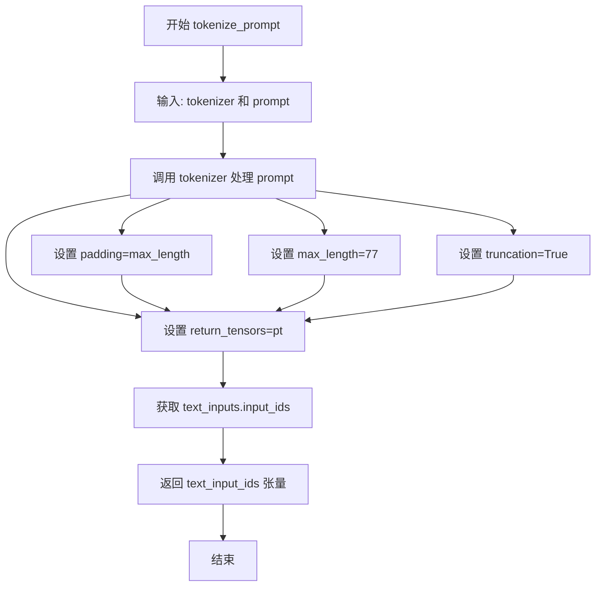

#### 带注释源码

```python
def tokenize_prompt(tokenizer, prompt):
    """
    对提示词进行分词处理
    
    参数:
        tokenizer: 分词器对象，用于将文本转换为token ID
        prompt: 要分词的文本提示词
    
    返回:
        text_input_ids: 分词后的token ID张量
    """
    # 使用tokenizer对prompt进行分词
    # padding="max_length": 将序列填充到最大长度(77)
    # max_length=77: 最大序列长度设为77 (CLIP标准长度)
    # truncation=True: 如果序列超过最大长度则截断
    # return_tensors="pt": 返回PyTorch张量
    text_inputs = tokenizer(
        prompt,
        padding="max_length",
        max_length=77,
        truncation=True,
        return_tensors="pt",
    )
    # 从分词结果中提取input_ids
    text_input_ids = text_inputs.input_ids
    # 返回token ID序列
    return text_input_ids
```


### `_encode_prompt_with_t5`

该函数使用T5文本编码器对输入的提示（prompt）进行编码，生成文本嵌入向量（prompt embeddings），支持批量生成时的嵌入复制。

参数：

- `text_encoder`：`torch.nn.Module`，T5文本编码器模型，用于将文本token转换为嵌入向量
- `tokenizer`：`T5TokenizerFast`，T5分词器，用于将文本分割为token ID
- `max_sequence_length`：`int`，最大序列长度，用于控制编码后的token序列长度
- `prompt`：`str` 或 `List[str]`，要编码的提示文本，可以是单个字符串或字符串列表
- `num_images_per_prompt`：`int`，每个提示生成的图像数量，用于复制嵌入向量以适配批量生成
- `device`：`torch.device`，计算设备（CPU/CUDA），指定模型运行的硬件设备
- `text_input_ids`：`torch.Tensor`，预先分词后的文本输入ID张量，当tokenizer为None时必须提供

返回值：`torch.Tensor`，编码后的提示嵌入向量，形状为 `(batch_size * num_images_per_prompt, seq_len, hidden_dim)`

#### 流程图

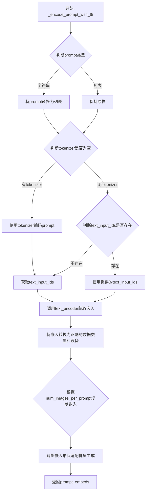

#### 带注释源码

```python
def _encode_prompt_with_t5(
    text_encoder,
    tokenizer,
    max_sequence_length,
    prompt=None,
    num_images_per_prompt=1,
    device=None,
    text_input_ids=None,
):
    """
    使用T5编码器对提示进行编码，生成文本嵌入向量。
    
    参数:
        text_encoder: T5文本编码器模型
        tokenizer: T5分词器
        max_sequence_length: 最大序列长度
        prompt: 要编码的提示文本
        num_images_per_prompt: 每个提示生成的图像数量
        device: 计算设备
        text_input_ids: 预先分词的文本输入ID
    """
    # 如果prompt是字符串，转换为列表；否则保持原样
    # 这样可以统一处理单文本和多文本批量输入
    prompt = [prompt] if isinstance(prompt, str) else prompt
    # 获取批量大小
    batch_size = len(prompt)

    # 分词处理：使用tokenizer将文本转换为token ID
    if tokenizer is not None:
        text_inputs = tokenizer(
            prompt,
            padding="max_length",          # 填充到最大长度
            max_length=max_sequence_length, # 使用指定的最大序列长度
            truncation=True,               # 截断超长文本
            add_special_tokens=True,       # 添加特殊tokens（如bos/eos）
            return_tensors="pt",          # 返回PyTorch张量
        )
        text_input_ids = text_inputs.input_ids
    else:
        # 如果没有tokenizer，必须提供预先分词的text_input_ids
        if text_input_ids is None:
            raise ValueError("text_input_ids must be provided when the tokenizer is not specified")

    # 使用T5编码器前向传播，获取文本嵌入
    # text_encoder输出形状: (batch_size, seq_len, hidden_dim)
    prompt_embeds = text_encoder(text_input_ids.to(device))[0]

    # 获取编码器的数据类型，并将嵌入转换为该类型
    dtype = text_encoder.dtype
    prompt_embeds = prompt_embeds.to(dtype=dtype, device=device)

    # 获取嵌入的序列长度
    _, seq_len, _ = prompt_embeds.shape

    # 复制文本嵌入和注意力掩码，以适配批量生成
    # 每个prompt生成多个图像时，需要复制对应的嵌入
    # repeat(1, num_images_per_prompt, 1) 在序列维度之前复制
    prompt_embeds = prompt_embeds.repeat(1, num_images_per_prompt, 1)
    # view 重塑张量形状: (batch_size, num_images_per_prompt, seq_len, hidden_dim)
    # -> (batch_size * num_images_per_prompt, seq_len, hidden_dim)
    prompt_embeds = prompt_embeds.view(batch_size * num_images_per_prompt, seq_len, -1)

    return prompt_embeds
```


### `_encode_prompt_with_clip`

该函数使用CLIP文本编码器将文本提示（prompt）编码为文本嵌入向量（prompt embeddings）和池化后的提示嵌入（pooled prompt embeddings）。支持批量处理和每个提示生成多张图像的场景。

参数：

- `text_encoder`：对象，CLIP文本编码器模型，用于将token IDs转换为文本嵌入
- `tokenizer`：对象，CLIP分词器，用于将文本提示转换为token IDs
- `prompt`：字符串，输入的文本提示，可以是单个字符串或字符串列表
- `device`：设备对象（可选），指定计算设备，默认为文本编码器所在设备
- `text_input_ids`：张量（可选），预先分词好的token IDs，当tokenizer为None时必须提供
- `num_images_per_prompt`：整数，每个提示要生成的图像数量，用于复制文本嵌入，默认为1

返回值：元组`(prompt_embeds, pooled_prompt_embeds)`

- `prompt_embeds`：张量，形状为`(batch_size * num_images_per_prompt, seq_len, hidden_dim)`的文本嵌入矩阵
- `pooled_prompt_embeds`：张量，池化后的提示嵌入，用于后续的交叉注意力计算

#### 流程图

```mermaid
flowchart TD
    A[开始: _encode_prompt_with_clip] --> B{判断prompt是否为字符串}
    B -->|是| C[将单个字符串转换为列表: prompt = [prompt]]
    B -->|否| D[保持原样]
    C --> E
    D --> E
    E{判断tokenizer是否为空}
    E -->|不为空| F[使用tokenizer对prompt进行分词]
    F --> G[获取text_input_ids]
    E -->|为空| H{判断text_input_ids是否提供}
    H -->|未提供| I[抛出ValueError异常]
    H -->|已提供| G
    G --> J[调用text_encoder获取hidden_states]
    J --> K[提取pooled_prompt_embeds = outputs[0]]
    K --> L[提取倒数第二层hidden_states作为prompt_embeds]
    L --> M[将embeddings转移到正确设备和数据类型]
    M --> N{根据num_images_per_prompt复制embeddings}
    N --> O[reshape为batch_size * num_images_per_prompt]
    O --> P[返回prompt_embeds和pooled_prompt_embeds]
```

#### 带注释源码

```python
def _encode_prompt_with_clip(
    text_encoder,           # CLIP文本编码器模型（如CLIPTextModel）
    tokenizer,             # CLIP分词器（CLIPTokenizer）
    prompt: str,           # 输入的文本提示字符串
    device=None,           # 计算设备，默认为None则使用text_encoder的设备
    text_input_ids=None,   # 可选的预分词token IDs
    num_images_per_prompt: int = 1,  # 每个提示生成的图像数量
):
    # 将输入prompt标准化为列表形式，支持批量处理
    prompt = [prompt] if isinstance(prompt, str) else prompt
    # 计算批次大小
    batch_size = len(prompt)

    # 如果提供了tokenizer，则使用它对prompt进行分词
    if tokenizer is not None:
        text_inputs = tokenizer(
            prompt,
            padding="max_length",        # 填充到最大长度
            max_length=77,               # CLIP模型的标准最大长度
            truncation=True,             # 截断超长序列
            return_tensors="pt",         # 返回PyTorch张量
        )
        # 获取输入token IDs
        text_input_ids = text_inputs.input_ids
    else:
        # 如果没有tokenizer，则必须提供预分词的text_input_ids
        if text_input_ids is None:
            raise ValueError("text_input_ids must be provided when the tokenizer is not specified")

    # 调用文本编码器，output_hidden_states=True要求返回所有隐藏状态
    prompt_embeds = text_encoder(text_input_ids.to(device), output_hidden_states=True)

    # 从输出元组中提取池化的提示嵌入（通常是第一层的pooler输出）
    pooled_prompt_embeds = prompt_embeds[0]
    # CLIP的SD3使用倒数第二层的hidden states作为prompt embeddings
    # 最后一层通常用于pooled output
    prompt_embeds = prompt_embeds.hidden_states[-2]
    # 确保embedings的数据类型和设备正确
    prompt_embeds = prompt_embeds.to(dtype=text_encoder.dtype, device=device)

    # 获取序列长度
    _, seq_len, _ = prompt_embeds.shape
    
    # 为每个prompt生成多个图像而复制文本嵌入
    # 使用repeat方法以兼容MPS设备
    prompt_embeds = prompt_embeds.repeat(1, num_images_per_prompt, 1)
    # reshape为 (batch_size * num_images_per_prompt, seq_len, hidden_dim)
    prompt_embeds = prompt_embeds.view(batch_size * num_images_per_prompt, seq_len, -1)

    # 返回文本嵌入和池化嵌入，供后续扩散模型使用
    return prompt_embeds, pooled_prompt_embeds
```


### `encode_prompt`

该函数是 Stable Diffusion 3 模型训练流程中的核心组件，负责将文本提示（prompt）编码为模型可理解的嵌入向量（embeddings）。它组合了三个文本编码器的输出：两个 CLIP 文本编码器（CLIPTextModel 和 CLIPTextModelWithProjection）以及一个 T5 编码器（T5EncoderModel），并将它们拼接为最终的提示嵌入，用于后续的扩散模型生成过程。

参数：

- `text_encoders`：`List[CLIPTextModel | CLIPTextModelWithProjection | T5EncoderModel]`，包含三个文本编码器对象的列表，分别对应 tokenizer、tokenizer_2 和 tokenizer_3
- `tokenizers`：`List[CLIPTokenizer | T5TokenizerFast]`，包含三个分词器对象的列表，用于将文本转换为 token ID
- `prompt`：`str | List[str]`，需要编码的文本提示，可以是单个字符串或字符串列表
- `max_sequence_length`：`int`，T5 编码器使用的最大序列长度（通常为 77 或更大）
- `device`：`torch.device | None`，指定计算设备，如果为 None 则使用编码器所在的设备
- `num_images_per_prompt`：`int`，默认值 1，每个提示生成的图像数量，用于复制嵌入向量以匹配批量大小
- `text_input_ids_list`：`List[torch.Tensor] | None`，可选的预计算 token ID 列表，如果提供则跳过对应编码器的分词步骤

返回值：`Tuple[torch.Tensor, torch.Tensor]`，返回一个元组包含：
- `prompt_embeds`：`torch.Tensor`，形状为 `(batch_size * num_images_per_prompt, seq_len, hidden_dim)` 的拼接后提示嵌入
- `pooled_prompt_embeds`：`torch.Tensor`，CLIP 模型的池化后嵌入，用于后续的交叉注意力机制

#### 流程图

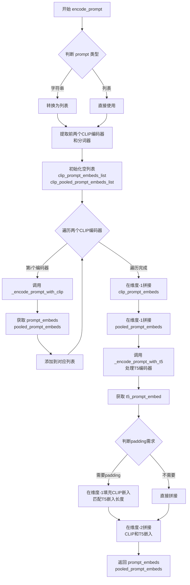

#### 带注释源码

```python
def encode_prompt(
    text_encoders,
    tokenizers,
    prompt: str,
    max_sequence_length,
    device=None,
    num_images_per_prompt: int = 1,
    text_input_ids_list=None,
):
    """
    将文本提示编码为组合的嵌入向量，整合CLIP和T5文本编码器的输出。
    
    参数:
        text_encoders: 包含三个文本编码器的列表 [clip1, clip2, t5]
        tokenizers: 包含三个分词器的列表 [tokenizer1, tokenizer2, tokenizer3]
        prompt: 输入的文本提示
        max_sequence_length: T5编码器的最大序列长度
        device: 计算设备
        num_images_per_prompt: 每个提示生成的图像数量
        text_input_ids_list: 可选的预计算token ID列表
    """
    # 标准化prompt为列表格式，支持批量处理
    prompt = [prompt] if isinstance(prompt, str) else prompt

    # 分离CLIP和T5的编码器与分词器
    # CLIP编码器处理短文本（固定77个token），T5支持可变长序列
    clip_tokenizers = tokenizers[:2]        # 前两个是CLIP分词器
    clip_text_encoders = text_encoders[:2]  # 前两个是CLIP文本编码器

    # 存储两个CLIP编码器的输出结果
    clip_prompt_embeds_list = []            # 存储CLIP的文本嵌入
    clip_pooled_prompt_embeds_list = []     # 存储CLIP的池化嵌入

    # 依次处理两个CLIP文本编码器
    # CLIPTextModel 和 CLIPTextModelWithProjection
    for i, (tokenizer, text_encoder) in enumerate(zip(clip_tokenizers, clip_text_encoders)):
        # 调用内部函数进行CLIP编码
        # 返回: prompt_embeds (隐藏状态), pooled_prompt_embeds (池化输出)
        prompt_embeds, pooled_prompt_embeds = _encode_prompt_with_clip(
            text_encoder=text_encoder,
            tokenizer=tokenizer,
            prompt=prompt,
            # 设备优先使用传入参数，否则使用编码器所在设备
            device=device if device is not None else text_encoder.device,
            num_images_per_prompt=num_images_per_prompt,
            # 如果提供了预计算的token ID则直接使用
            text_input_ids=text_input_ids_list[i] if text_input_ids_list else None,
        )
        clip_prompt_embeds_list.append(prompt_embeds)
        clip_pooled_prompt_embeds_list.append(pooled_prompt_embeds)

    # 在特征维度拼接两个CLIP编码器的输出
    # 结果形状: (batch_size * num_images_per_prompt, seq_len, hidden_dim_1 + hidden_dim_2)
    clip_prompt_embeds = torch.cat(clip_prompt_embeds_list, dim=-1)
    # 池化嵌入同样拼接
    pooled_prompt_embeds = torch.cat(clip_pooled_prompt_embeds_list, dim=-1)

    # 使用T5编码器处理提示
    # T5支持更长的序列（由max_sequence_length指定）
    t5_prompt_embed = _encode_prompt_with_t5(
        text_encoders[-1],       # 第三个编码器是T5
        tokenizers[-1],           # 第三个分词器是T5TokenizerFast
        max_sequence_length,     # T5的最大序列长度
        prompt=prompt,
        num_images_per_prompt=num_images_per_prompt,
        text_input_ids=text_input_ids_list[-1] if text_input_ids_list else None,
        device=device if device is not None else text_encoders[-1].device,
    )

    # 对CLIP嵌入进行padding，使其与T5嵌入在序列维度匹配
    # T5的序列长度通常大于CLIP的77，需要对齐后才能拼接
    if t5_prompt_embed.shape[-1] > clip_prompt_embeds.shape[-1]:
        clip_prompt_embeds = torch.nn.functional.pad(
            clip_prompt_embeds, 
            (0, t5_prompt_embed.shape[-1] - clip_prompt_embeds.shape[-1])
        )
    
    # 最终拼接: [CLIP_embed, T5_embed]
    # 形状: (batch_size * num_images_per_prompt, seq_len_CLIP + seq_len_T5, hidden_dim_total)
    prompt_embeds = torch.cat([clip_prompt_embeds, t5_prompt_embed], dim=-2)

    # 返回组合后的嵌入供扩散模型使用
    # prompt_embeds 用于 cross-attention
    # pooled_prompt_embeds 用于 AdaLN 条件注入
    return prompt_embeds, pooled_prompt_embeds
```


### `collate_fn`

该函数是 DreamBooth 数据加载器的批处理整理函数，负责将数据集中的一批样本整理成训练所需的格式，支持可选的先验保留（prior preservation）功能，将类别图像与实例图像合并处理以避免两次前向传播。

**参数：**

- `examples`：`List[Dict]`，来自数据集的一批样本列表，每个样本包含实例图像和提示词等字段
- `with_prior_preservation`：`bool`，是否启用先验保留模式，若为 true 则同时包含类别图像和提示词

**返回值：** `Dict`，包含以下键值的字典：
  - `pixel_values`：`torch.Tensor`，堆叠后的像素值张量，形状为 (batch_size, channels, height, width)
  - `prompts`：`List[str]`，对应的文本提示词列表

#### 流程图

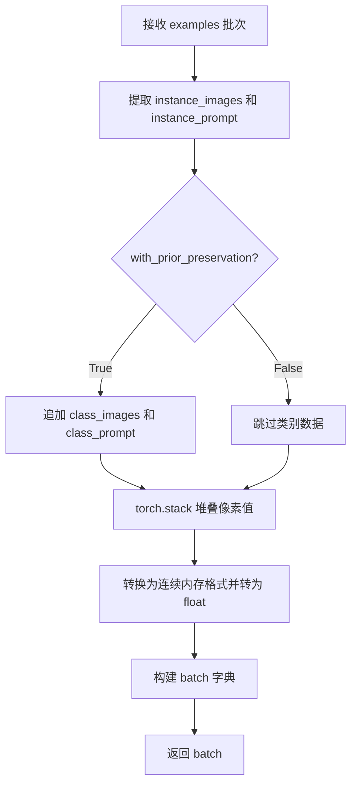

#### 带注释源码

```python
def collate_fn(examples, with_prior_preservation=False):
    """
    批处理数据整理函数，将数据集样本整理为训练所需的格式
    
    参数:
        examples: 来自DataLoader的一批样本列表
        with_prior_preservation: 是否启用先验保留（class图像辅助训练）
    """
    # 从每个样本中提取实例图像和实例提示词
    pixel_values = [example["instance_images"] for example in examples]
    prompts = [example["instance_prompt"] for example in examples]

    # 如果启用先验保留，将类别图像和类别提示词也加入批处理
    # 这样可以避免进行两次前向传播，提高训练效率
    if with_prior_preservation:
        pixel_values += [example["class_images"] for example in examples]
        prompts += [example["class_prompt"] for example in examples]

    # 将像素值列表堆叠为张量，转换为连续内存格式并转为float32
    pixel_values = torch.stack(pixel_values)
    pixel_values = pixel_values.to(memory_format=torch.contiguous_format).float()

    # 构建最终的批处理字典
    batch = {"pixel_values": pixel_values, "prompts": prompts}
    return batch
```


### `main`

主训练函数，负责执行 Stable Diffusion 3 DreamBooth LoRA 训练的完整流程，包括模型加载、LoRA 配置、数据集准备、训练循环、模型保存和验证。

参数：

- `args`：`argparse.Namespace`，包含所有训练配置参数（如模型路径、训练超参数、LoRA 配置等）

返回值：`None`，训练完成后直接退出

#### 流程图

```mermaid
flowchart TD
    A[开始 main 函数] --> B{检查 wandb 和 hub_token}
    B -->|安全检查| C[检查 MPS + bf16 兼容性]
    C --> D[创建 Accelerator]
    D --> E[设置日志和种子]
    E --> F{with_prior_preservation?}
    F -->|是| G[生成类别图像]
    F -->|否| H[跳过类别图像生成]
    G --> I[加载 tokenizers 和 text encoders]
    H --> I
    I --> J[加载 scheduler, VAE, transformer]
    J --> K[冻结非训练参数]
    K --> L[配置 LoRA adapters]
    L --> M[创建优化器]
    M --> N[准备数据集和 DataLoader]
    N --> O{train_text_encoder?}
    O -->|是| P[准备 text encoder 训练]
    O -->|否| Q[预计算 text embeddings]
    P --> R[初始化 trackers]
    Q --> R
    R --> S[训练循环 - 遍历 epochs]
    S --> T{遍历 batch}
    T --> U[计算 text embeddings]
    U --> V[编码图像到 latent 空间]
    V --> W[采样噪声和时间步]
    W --> X[计算噪声预测]
    X --> Y{with_prior_preservation?}
    Y -->|是| Z[计算 prior loss]
    Y -->|否| AA[计算损失]
    Z --> AB[反向传播和优化]
    AA --> AB
    AB --> AC{检查点保存?}
    AC -->|是| AD[保存检查点]
    AC -->|否| AE[继续训练]
    AD --> AE
    AE --> AF{验证?}
    AF -->|是| AG[运行验证]
    AG --> AH[训练完成]
    AF -->|否| AH
    T -->|训练结束| AH
    S -->|epochs 结束| AH
    AH --> AI[保存 LoRA 权重]
    AI --> AJ[最终推理验证]
    AJ --> AK{推送到 Hub?}
    AK -->|是| AL[保存模型卡片并上传]
    AK -->|否| AM[结束训练]
    AL --> AM
```

#### 带注释源码

```python
def main(args):
    """
    主训练函数，执行 Stable Diffusion 3 DreamBooth LoRA 训练的完整流程。
    
    该函数包含以下主要步骤：
    1. 验证参数安全性（wandb/hub_token 冲突检查）
    2. 初始化 Accelerator 分布式训练环境
    3. 设置日志系统和随机种子
    4. 生成类别图像（当启用 prior preservation 时）
    5. 加载预训练模型：tokenizers、text encoders、VAE、transformer
    6. 配置 LoRA adapters 并冻结非训练参数
    7. 创建优化器和学习率调度器
    8. 准备数据集和 DataLoader
    9. 执行训练循环，包括前向传播、损失计算、反向传播
    10. 定期保存检查点和验证模型
    11. 保存训练好的 LoRA 权重
    12. 可选：推送到 HuggingFace Hub
    """
    
    # ==================== 1. 参数安全性检查 ====================
    # 检查是否同时使用 wandb 报告和 hub_token（安全风险）
    if args.report_to == "wandb" and args.hub_token is not None:
        raise ValueError(
            "You cannot use both --report_to=wandb and --hub_token due to a security risk of exposing your token."
            " Please use `hf auth login` to authenticate with the Hub."
        )

    # 检查 MPS 是否支持 bf16（PyTorch 限制）
    if torch.backends.mps.is_available() and args.mixed_precision == "bf16":
        raise ValueError(
            "Mixed precision training with bfloat16 is not supported on MPS. Please use fp16 (recommended) or fp32 instead."
        )

    # ==================== 2. 初始化 Accelerator ====================
    # 创建输出目录和日志目录
    logging_dir = Path(args.output_dir, args.logging_dir)
    
    # 配置 Accelerator 项目设置
    accelerator_project_config = ProjectConfiguration(project_dir=args.output_dir, logging_dir=logging_dir)
    # 配置分布式训练参数，find_unused_parameters 用于处理 LoRA 等模块
    kwargs = DistributedDataParallelKwargs(find_unused_parameters=True)
    accelerator = Accelerator(
        gradient_accumulation_steps=args.gradient_accumulation_steps,
        mixed_precision=args.mixed_precision,
        log_with=args.report_to,
        project_config=accelerator_project_config,
        kwargs_handlers=[kwargs],
    )

    # MPS 设备禁用原生 AMP
    if torch.backends.mps.is_available():
        accelerator.native_amp = False

    # 检查 wandb 可用性
    if args.report_to == "wandb":
        if not is_wandb_available():
            raise ImportError("Make sure to install wandb if you want to use it for logging during training.")

    # ==================== 3. 设置日志系统 ====================
    # 配置日志格式
    logging.basicConfig(
        format="%(asctime)s - %(levelname)s - %(name)s - %(message)s",
        datefmt="%m/%d/%Y %H:%M:%S",
        level=logging.INFO,
    )
    logger.info(accelerator.state, main_process_only=False)
    # 根据进程类型设置日志级别
    if accelerator.is_local_main_process:
        transformers.utils.logging.set_verbosity_warning()
        diffusers.utils.logging.set_verbosity_info()
    else:
        transformers.utils.logging.set_verbosity_error()
        diffusers.utils.logging.set_verbosity_error()

    # 设置随机种子以确保可重复性
    if args.seed is not None:
        set_seed(args.seed)

    # ==================== 4. 生成类别图像（可选）====================
    if args.with_prior_preservation:
        # 创建类别图像目录
        class_images_dir = Path(args.class_data_dir)
        if not class_images_dir.exists():
            class_images_dir.mkdir(parents=True)
        cur_class_images = len(list(class_images_dir.iterdir()))

        # 如果类别图像数量不足，则生成更多
        if cur_class_images < args.num_class_images:
            # 确定数据类型
            has_supported_fp16_accelerator = torch.cuda.is_available() or torch.backends.mps.is_available()
            torch_dtype = torch.float16 if has_supported_fp16_accelerator else torch.float32
            if args.prior_generation_precision == "fp32":
                torch_dtype = torch.float32
            elif args.prior_generation_precision == "fp16":
                torch_dtype = torch.float16
            elif args.prior_generation_precision == "bf16":
                torch_dtype = torch.bfloat16
            
            # 加载推理 pipeline
            pipeline = StableDiffusion3Pipeline.from_pretrained(
                args.pretrained_model_name_or_path,
                torch_dtype=torch_dtype,
                revision=args.revision,
                variant=args.variant,
            )
            pipeline.set_progress_bar_config(disable=True)

            # 生成缺失的类别图像
            num_new_images = args.num_class_images - cur_class_images
            logger.info(f"Number of class images to sample: {num_new_images}.")

            sample_dataset = PromptDataset(args.class_prompt, num_new_images)
            sample_dataloader = torch.utils.data.DataLoader(sample_dataset, batch_size=args.sample_batch_size)
            sample_dataloader = accelerator.prepare(sample_dataloader)
            pipeline.to(accelerator.device)

            # 批量生成图像
            for example in tqdm(
                sample_dataloader, desc="Generating class images", disable=not accelerator.is_local_main_process
            ):
                images = pipeline(example["prompt"]).images

                for i, image in enumerate(images):
                    # 使用不安全哈希命名图像文件
                    hash_image = insecure_hashlib.sha1(image.tobytes()).hexdigest()
                    image_filename = class_images_dir / f"{example['index'][i] + cur_class_images}-{hash_image}.jpg"
                    image.save(image_filename)

            # 释放 pipeline 内存
            del pipeline
            free_memory()

    # ==================== 5. 创建输出目录和 Hub 仓库 ====================
    if accelerator.is_main_process:
        if args.output_dir is not None:
            os.makedirs(args.output_dir, exist_ok=True)

        if args.push_to_hub:
            repo_id = create_repo(
                repo_id=args.hub_model_id or Path(args.output_dir).name,
                exist_ok=True,
            ).repo_id

    # ==================== 6. 加载 Tokenizers ====================
    tokenizer_one = CLIPTokenizer.from_pretrained(
        args.pretrained_model_name_or_path,
        subfolder="tokenizer",
        revision=args.revision,
    )
    tokenizer_two = CLIPTokenizer.from_pretrained(
        args.pretrained_model_name_or_path,
        subfolder="tokenizer_2",
        revision=args.revision,
    )
    tokenizer_three = T5TokenizerFast.from_pretrained(
        args.pretrained_model_name_or_path,
        subfolder="tokenizer_3",
        revision=args.revision,
    )

    # ==================== 7. 导入 Text Encoder 类 ====================
    text_encoder_cls_one = import_model_class_from_model_name_or_path(
        args.pretrained_model_name_or_path, args.revision
    )
    text_encoder_cls_two = import_model_class_from_model_name_or_path(
        args.pretrained_model_name_or_path, args.revision, subfolder="text_encoder_2"
    )
    text_encoder_cls_three = import_model_class_from_model_name_or_path(
        args.pretrained_model_name_or_path, args.revision, subfolder="text_encoder_3"
    )

    # ==================== 8. 加载预训练模型 ====================
    # 加载噪声调度器
    noise_scheduler = FlowMatchEulerDiscreteScheduler.from_pretrained(
        args.pretrained_model_name_or_path, subfolder="scheduler"
    )
    # 保存调度器副本用于采样
    noise_scheduler_copy = copy.deepcopy(noise_scheduler)
    
    # 加载三个 text encoders
    text_encoder_one, text_encoder_two, text_encoder_three = load_text_encoders(
        text_encoder_cls_one, text_encoder_cls_two, text_encoder_cls_three
    )
    
    # 加载 VAE
    vae = AutoencoderKL.from_pretrained(
        args.pretrained_model_name_or_path,
        subfolder="vae",
        revision=args.revision,
        variant=args.variant,
    )
    
    # 加载 Transformer 主模型
    transformer = SD3Transformer2DModel.from_pretrained(
        args.pretrained_model_name_or_path, subfolder="transformer", revision=args.revision, variant=args.variant
    )

    # ==================== 9. 冻结非训练参数 ====================
    transformer.requires_grad_(False)
    vae.requires_grad_(False)
    text_encoder_one.requires_grad_(False)
    text_encoder_two.requires_grad_(False)
    text_encoder_three.requires_grad_(False)

    # ==================== 10. 设置混合精度 ====================
    weight_dtype = torch.float32
    if accelerator.mixed_precision == "fp16":
        weight_dtype = torch.float16
    elif accelerator.mixed_precision == "bf16":
        weight_dtype = torch.bfloat16

    # 检查 MPS + bf16 兼容性
    if torch.backends.mps.is_available() and weight_dtype == torch.bfloat16:
        raise ValueError(
            "Mixed precision training with bfloat16 is not supported on MPS."
        )

    # 将模型移动到设备并设置数据类型
    vae.to(accelerator.device, dtype=torch.float32)
    transformer.to(accelerator.device, dtype=weight_dtype)
    text_encoder_one.to(accelerator.device, dtype=weight_dtype)
    text_encoder_two.to(accelerator.device, dtype=weight_dtype)
    text_encoder_three.to(accelerator.device, dtype=weight_dtype)

    # ==================== 11. 启用梯度检查点 ====================
    if args.gradient_checkpointing:
        transformer.enable_gradient_checkpointing()
        if args.train_text_encoder:
            text_encoder_one.gradient_checkpointing_enable()
            text_encoder_two.gradient_checkpointing_enable()

    # ==================== 12. 配置 LoRA ====================
    # 解析 LoRA 目标模块
    if args.lora_layers is not None:
        target_modules = [layer.strip() for layer in args.lora_layers.split(",")]
    else:
        # 默认 SD3 LoRA 目标模块
        target_modules = [
            "attn.add_k_proj",
            "attn.add_q_proj",
            "attn.add_v_proj",
            "attn.to_add_out",
            "attn.to_k",
            "attn.to_out.0",
            "attn.to_q",
            "attn.to_v",
        ]
    
    # 如果指定了特定 transformer blocks
    if args.lora_blocks is not None:
        target_blocks = [int(block.strip()) for block in args.lora_blocks.split(",")]
        target_modules = [
            f"transformer_blocks.{block}.{module}" for block in target_blocks for module in target_modules
        ]

    # 创建 Transformer LoRA 配置并添加 adapter
    transformer_lora_config = LoraConfig(
        r=args.rank,
        lora_alpha=args.rank,
        lora_dropout=args.lora_dropout,
        init_lora_weights="gaussian",
        target_modules=target_modules,
    )
    transformer.add_adapter(transformer_lora_config)

    # 如果训练 text encoder，添加 LoRA
    if args.train_text_encoder:
        text_lora_config = LoraConfig(
            r=args.rank,
            lora_alpha=args.rank,
            lora_dropout=args.lora_dropout,
            init_lora_weights="gaussian",
            target_modules=["q_proj", "k_proj", "v_proj", "out_proj"],
        )
        text_encoder_one.add_adapter(text_lora_config)
        text_encoder_two.add_adapter(text_lora_config)

    # ==================== 13. 模型保存/加载 Hooks ====================
    def unwrap_model(model):
        """解包模型，处理编译模块"""
        model = accelerator.unwrap_model(model)
        model = model._orig_mod if is_compiled_module(model) else model
        return model

    def save_model_hook(models, weights, output_dir):
        """保存 LoRA 权重到指定目录"""
        if accelerator.is_main_process:
            transformer_lora_layers_to_save = None
            text_encoder_one_lora_layers_to_save = None
            text_encoder_two_lora_layers_to_save = None

            for model in models:
                if isinstance(unwrap_model(model), type(unwrap_model(transformer))):
                    model = unwrap_model(model)
                    if args.upcast_before_saving:
                        model = model.to(torch.float32)
                    transformer_lora_layers_to_save = get_peft_model_state_dict(model)
                elif args.train_text_encoder and isinstance(
                    unwrap_model(model), type(unwrap_model(text_encoder_one))
                ):
                    model = unwrap_model(model)
                    hidden_size = model.config.hidden_size
                    if hidden_size == 768:
                        text_encoder_one_lora_layers_to_save = get_peft_model_state_dict(model)
                    elif hidden_size == 1280:
                        text_encoder_two_lora_layers_to_save = get_peft_model_state_dict(model)
                else:
                    raise ValueError(f"unexpected save model: {model.__class__}")

                if weights:
                    weights.pop()

            StableDiffusion3Pipeline.save_lora_weights(
                output_dir,
                transformer_lora_layers=transformer_lora_layers_to_save,
                text_encoder_lora_layers=text_encoder_one_lora_layers_to_save,
                text_encoder_2_lora_layers=text_encoder_two_lora_layers_to_save,
            )

    def load_model_hook(models, input_dir):
        """从检查点加载 LoRA 权重"""
        transformer_ = None
        text_encoder_one_ = None
        text_encoder_two_ = None

        if not accelerator.distributed_type == DistributedType.DEEPSPEED:
            while len(models) > 0:
                model = models.pop()

                if isinstance(unwrap_model(model), type(unwrap_model(transformer))):
                    transformer_ = unwrap_model(model)
                elif isinstance(unwrap_model(model), type(unwrap_model(text_encoder_one))):
                    text_encoder_one_ = unwrap_model(model)
                elif isinstance(unwrap_model(model), type(unwrap_model(text_encoder_two))):
                    text_encoder_two_ = unwrap_model(model)
                else:
                    raise ValueError(f"unexpected save model: {model.__class__}")
        else:
            # DeepSpeed 特殊处理
            transformer_ = SD3Transformer2DModel.from_pretrained(
                args.pretrained_model_name_or_path, subfolder="transformer"
            )
            transformer_.add_adapter(transformer_lora_config)
            if args.train_text_encoder:
                text_encoder_one_ = text_encoder_cls_one.from_pretrained(
                    args.pretrained_model_name_or_path, subfolder="text_encoder"
                )
                text_encoder_two_ = text_encoder_cls_two.from_pretrained(
                    args.pretrained_model_name_or_path, subfolder="text_encoder_2"
                )

        # 加载 LoRA 状态字典
        lora_state_dict = StableDiffusion3Pipeline.lora_state_dict(input_dir)

        # 处理 transformer LoRA 权重
        transformer_state_dict = {
            f"{k.replace('transformer.', '')}": v for k, v in lora_state_dict.items() if k.startswith("transformer.")
        }
        transformer_state_dict = convert_unet_state_dict_to_peft(transformer_state_dict)
        incompatible_keys = set_peft_model_state_dict(transformer_, transformer_state_dict, adapter_name="default")
        
        if args.train_text_encoder:
            _set_state_dict_into_text_encoder(lora_state_dict, prefix="text_encoder.", text_encoder=text_encoder_one_)
            _set_state_dict_into_text_encoder(
                lora_state_dict, prefix="text_encoder_2.", text_encoder=text_encoder_two_
            )

        # 确保可训练参数为 float32
        if args.mixed_precision == "fp16":
            models = [transformer_]
            if args.train_text_encoder:
                models.extend([text_encoder_one_, text_encoder_two_])
            cast_training_params(models)

    accelerator.register_save_state_pre_hook(save_model_hook)
    accelerator.register_load_state_pre_hook(load_model_hook)

    # ==================== 14. TF32 加速 ====================
    if args.allow_tf32 and torch.cuda.is_available():
        torch.backends.cuda.matmul.allow_tf32 = True

    # ==================== 15. 学习率缩放 ====================
    if args.scale_lr:
        args.learning_rate = (
            args.learning_rate * args.gradient_accumulation_steps * args.train_batch_size * accelerator.num_processes
        )

    # ==================== 16. 确保可训练参数为 float32 ====================
    if args.mixed_precision == "fp16":
        models = [transformer]
        if args.train_text_encoder:
            models.extend([text_encoder_one, text_encoder_two])
        cast_training_params(models, dtype=torch.float32)

    # ==================== 17. 收集可训练参数 ====================
    transformer_lora_parameters = list(filter(lambda p: p.requires_grad, transformer.parameters()))
    if args.train_text_encoder:
        text_lora_parameters_one = list(filter(lambda p: p.requires_grad, text_encoder_one.parameters()))
        text_lora_parameters_two = list(filter(lambda p: p.requires_grad, text_encoder_two.parameters()))

    # ==================== 18. 配置优化器 ====================
    transformer_parameters_with_lr = {"params": transformer_lora_parameters, "lr": args.learning_rate}
    if args.train_text_encoder:
        text_lora_parameters_one_with_lr = {
            "params": text_lora_parameters_one,
            "weight_decay": args.adam_weight_decay_text_encoder,
            "lr": args.text_encoder_lr if args.text_encoder_lr else args.learning_rate,
        }
        text_lora_parameters_two_with_lr = {
            "params": text_lora_parameters_two,
            "weight_decay": args.adam_weight_decay_text_encoder,
            "lr": args.text_encoder_lr if args.text_encoder_lr else args.learning_rate,
        }
        params_to_optimize = [
            transformer_parameters_with_lr,
            text_lora_parameters_one_with_lr,
            text_lora_parameters_two_with_lr,
        ]
    else:
        params_to_optimize = [transformer_parameters_with_lr]

    # 选择优化器类型
    if not (args.optimizer.lower() == "prodigy" or args.optimizer.lower() == "adamw"):
        logger.warning(
            f"Unsupported choice of optimizer: {args.optimizer}. Supported optimizers include [adamW, prodigy]."
            "Defaulting to adamW"
        )
        args.optimizer = "adamw"

    # 创建优化器
    if args.optimizer.lower() == "adamw":
        if args.use_8bit_adam:
            try:
                import bitsandbytes as bnb
            except ImportError:
                raise ImportError(
                    "To use 8-bit Adam, please install the bitsandbytes library: `pip install bitsandbytes`."
                )
            optimizer_class = bnb.optim.AdamW8bit
        else:
            optimizer_class = torch.optim.AdamW

        optimizer = optimizer_class(
            params_to_optimize,
            betas=(args.adam_beta1, args.adam_beta2),
            weight_decay=args.adam_weight_decay,
            eps=args.adam_epsilon,
        )
    elif args.optimizer.lower() == "prodigy":
        try:
            import prodigyopt
        except ImportError:
            raise ImportError("To use Prodigy, please install the prodigyopt library: `pip install prodigyopt`")

        optimizer_class = prodigyopt.Prodigy
        # ... (prodigy 配置)

        optimizer = optimizer_class(
            params_to_optimize,
            betas=(args.adam_beta1, args.adam_beta2),
            beta3=args.prodigy_beta3,
            weight_decay=args.adam_weight_decay,
            eps=args.adam_epsilon,
            decouple=args.prodigy_decouple,
            use_bias_correction=args.prodigy_use_bias_correction,
            safeguard_warmup=args.prodigy_safeguard_warmup,
        )

    # ==================== 19. 准备数据集 ====================
    train_dataset = DreamBoothDataset(
        instance_data_root=args.instance_data_dir,
        instance_prompt=args.instance_prompt,
        class_prompt=args.class_prompt,
        class_data_root=args.class_data_dir if args.with_prior_preservation else None,
        class_num=args.num_class_images,
        size=args.resolution,
        repeats=args.repeats,
        center_crop=args.center_crop,
    )

    train_dataloader = torch.utils.data.DataLoader(
        train_dataset,
        batch_size=args.train_batch_size,
        shuffle=True,
        collate_fn=lambda examples: collate_fn(examples, args.with_prior_preservation),
        num_workers=args.dataloader_num_workers,
    )

    # ==================== 20. 预计算 Text Embeddings ====================
    if not args.train_text_encoder:
        tokenizers = [tokenizer_one, tokenizer_two, tokenizer_three]
        text_encoders = [text_encoder_one, text_encoder_two, text_encoder_three]

        def compute_text_embeddings(prompt, text_encoders, tokenizers):
            with torch.no_grad():
                prompt_embeds, pooled_prompt_embeds = encode_prompt(
                    text_encoders, tokenizers, prompt, args.max_sequence_length
                )
                prompt_embeds = prompt_embeds.to(accelerator.device)
                pooled_prompt_embeds = pooled_prompt_embeds.to(accelerator.device)
            return prompt_embeds, pooled_prompt_embeds

    # 预计算实例 prompt embeddings
    if not args.train_text_encoder and not train_dataset.custom_instance_prompts:
        instance_prompt_hidden_states, instance_pooled_prompt_embeds = compute_text_embeddings(
            args.instance_prompt, text_encoders, tokenizers
        )

    # 预计算类别 prompt embeddings
    if args.with_prior_preservation:
        if not args.train_text_encoder:
            class_prompt_hidden_states, class_pooled_prompt_embeds = compute_text_embeddings(
                args.class_prompt, text_encoders, tokenizers
            )

    # 释放 text encoders 内存
    if not args.train_text_encoder and not train_dataset.custom_instance_prompts:
        del tokenizers, text_encoders
        del text_encoder_one, text_encoder_two, text_encoder_three
        free_memory()

    # ==================== 21. 缓存 Latents（可选）====================
    vae_config_shift_factor = vae.config.shift_factor
    vae_config_scaling_factor = vae.config.scaling_factor
    if args.cache_latents:
        latents_cache = []
        for batch in tqdm(train_dataloader, desc="Caching latents"):
            with torch.no_grad():
                batch["pixel_values"] = batch["pixel_values"].to(
                    accelerator.device, non_blocking=True, dtype=weight_dtype
                )
                latents_cache.append(vae.encode(batch["pixel_values"]).latent_dist)

        if args.validation_prompt is None:
            del vae
            free_memory()

    # ==================== 22. 学习率调度器 ====================
    overrode_max_train_steps = False
    num_update_steps_per_epoch = math.ceil(len(train_dataloader) / args.gradient_accumulation_steps)
    if args.max_train_steps is None:
        args.max_train_steps = args.num_train_epochs * num_update_steps_per_epoch
        overrode_max_train_steps = True

    lr_scheduler = get_scheduler(
        args.lr_scheduler,
        optimizer=optimizer,
        num_warmup_steps=args.lr_warmup_steps * accelerator.num_processes,
        num_training_steps=args.max_train_steps * accelerator.num_processes,
        num_cycles=args.lr_num_cycles,
        power=args.lr_power,
    )

    # ==================== 23. 使用 Accelerator 准备模型 ====================
    if args.train_text_encoder:
        (
            transformer,
            text_encoder_one,
            text_encoder_two,
            optimizer,
            train_dataloader,
            lr_scheduler,
        ) = accelerator.prepare(
            transformer, text_encoder_one, text_encoder_two, optimizer, train_dataloader, lr_scheduler
        )
    else:
        transformer, optimizer, train_dataloader, lr_scheduler = accelerator.prepare(
            transformer, optimizer, train_dataloader, lr_scheduler
        )

    # 重新计算训练步数
    num_update_steps_per_epoch = math.ceil(len(train_dataloader) / args.gradient_accumulation_steps)
    if overrode_max_train_steps:
        args.max_train_steps = args.num_train_epochs * num_update_steps_per_epoch
    args.num_train_epochs = math.ceil(args.max_train_steps / num_update_steps_per_epoch)

    # ==================== 24. 初始化 Trackers ====================
    if accelerator.is_main_process:
        tracker_name = "dreambooth-sd3-lora"
        accelerator.init_trackers(tracker_name, config=vars(args))

    # ==================== 25. 训练循环 ====================
    total_batch_size = args.train_batch_size * accelerator.num_processes * args.gradient_accumulation_steps

    logger.info("***** Running training *****")
    logger.info(f"  Num examples = {len(train_dataset)}")
    logger.info(f"  Num batches each epoch = {len(train_dataloader)}")
    logger.info(f"  Num Epochs = {args.num_train_epochs}")
    logger.info(f"  Instantaneous batch size per device = {args.train_batch_size}")
    logger.info(f"  Total train batch size (w. parallel, distributed & accumulation) = {total_batch_size}")
    logger.info(f"  Gradient Accumulation steps = {args.gradient_accumulation_steps}")
    logger.info(f"  Total optimization steps = {args.max_train_steps}")
    
    global_step = 0
    first_epoch = 0

    # 从检查点恢复（可选）
    if args.resume_from_checkpoint:
        # ... (检查点恢复逻辑)
        pass

    # 进度条
    progress_bar = tqdm(
        range(0, args.max_train_steps),
        initial=initial_global_step,
        desc="Steps",
        disable=not accelerator.is_local_main_process,
    )

    # 辅助函数：获取 sigmas
    def get_sigmas(timesteps, n_dim=4, dtype=torch.float32):
        sigmas = noise_scheduler_copy.sigmas.to(device=accelerator.device, dtype=dtype)
        schedule_timesteps = noise_scheduler_copy.timesteps.to(accelerator.device)
        timesteps = timesteps.to(accelerator.device)
        step_indices = [(schedule_timesteps == t).nonzero().item() for t in timesteps]
        sigma = sigmas[step_indices].flatten()
        while len(sigma.shape) < n_dim:
            sigma = sigma.unsqueeze(-1)
        return sigma

    # ==================== 训练主循环 ====================
    for epoch in range(first_epoch, args.num_train_epochs):
        transformer.train()
        if args.train_text_encoder:
            text_encoder_one.train()
            text_encoder_two.train()
            # 启用 text encoder embeddings 的梯度
            accelerator.unwrap_model(text_encoder_one).text_model.embeddings.requires_grad_(True)
            accelerator.unwrap_model(text_encoder_two).text_model.embeddings.requires_grad_(True)

        for step, batch in enumerate(train_dataloader):
            models_to_accumulate = [transformer]
            if args.train_text_encoder:
                models_to_accumulate.extend([text_encoder_one, text_encoder_two])
            
            with accelerator.accumulate(models_to_accumulate):
                prompts = batch["prompts"]

                # 根据是否使用自定义 prompts 编码
                if train_dataset.custom_instance_prompts:
                    if not args.train_text_encoder:
                        prompt_embeds, pooled_prompt_embeds = compute_text_embeddings(
                            prompts, text_encoders, tokenizers
                        )
                    else:
                        # 动态编码 prompts
                        tokens_one = tokenize_prompt(tokenizer_one, prompts)
                        tokens_two = tokenize_prompt(tokenizer_two, prompts)
                        tokens_three = tokenize_prompt(tokenizer_three, prompts)
                        prompt_embeds, pooled_prompt_embeds = encode_prompt(
                            text_encoders=[text_encoder_one, text_encoder_two, text_encoder_three],
                            tokenizers=[None, None, None],
                            prompt=prompts,
                            max_sequence_length=args.max_sequence_length,
                            text_input_ids_list=[tokens_one, tokens_two, tokens_three],
                        )
                else:
                    if args.train_text_encoder:
                        prompt_embeds, pooled_prompt_embeds = encode_prompt(
                            text_encoders=[text_encoder_one, text_encoder_two, text_encoder_three],
                            tokenizers=[None, None, tokenizer_three],
                            prompt=args.instance_prompt,
                            max_sequence_length=args.max_sequence_length,
                            text_input_ids_list=[tokens_one, tokens_two, tokens_three],
                        )

                # 将图像编码到 latent 空间
                if args.cache_latents:
                    model_input = latents_cache[step].sample()
                else:
                    pixel_values = batch["pixel_values"].to(dtype=vae.dtype)
                    model_input = vae.encode(pixel_values).latent_dist.sample()

                # 应用 VAE 缩放
                model_input = (model_input - vae_config_shift_factor) * vae_config_scaling_factor
                model_input = model_input.to(dtype=weight_dtype)

                # 采样噪声
                noise = torch.randn_like(model_input)
                bsz = model_input.shape[0]

                # 基于加权方案采样时间步
                u = compute_density_for_timestep_sampling(
                    weighting_scheme=args.weighting_scheme,
                    batch_size=bsz,
                    logit_mean=args.logit_mean,
                    logit_std=args.logit_std,
                    mode_scale=args.mode_scale,
                )
                indices = (u * noise_scheduler_copy.config.num_train_timesteps).long()
                timesteps = noise_scheduler_copy.timesteps[indices].to(device=model_input.device)

                # Flow matching 添加噪声
                # zt = (1 - texp) * x + texp * z1
                sigmas = get_sigmas(timesteps, n_dim=model_input.ndim, dtype=model_input.dtype)
                noisy_model_input = (1.0 - sigmas) * model_input + sigmas * noise

                # 预测噪声残差
                model_pred = transformer(
                    hidden_states=noisy_model_input,
                    timestep=timesteps,
                    encoder_hidden_states=prompt_embeds,
                    pooled_projections=pooled_prompt_embeds,
                    return_dict=False,
                )[0]

                # EDM 预条件化输出
                if args.precondition_outputs:
                    model_pred = model_pred * (-sigmas) + noisy_model_input

                # 计算损失权重
                weighting = compute_loss_weighting_for_sd3(weighting_scheme=args.weighting_scheme, sigmas=sigmas)

                # Flow matching 目标
                if args.precondition_outputs:
                    target = model_input
                else:
                    target = noise - model_input

                # Prior preservation loss
                if args.with_prior_preservation:
                    model_pred, model_pred_prior = torch.chunk(model_pred, 2, dim=0)
                    target, target_prior = torch.chunk(target, 2, dim=0)

                    prior_loss = torch.mean(
                        (weighting.float() * (model_pred_prior.float() - target_prior.float()) ** 2).reshape(
                            target_prior.shape[0], -1
                        ),
                        1,
                    )
                    prior_loss = prior_loss.mean()

                # 计算主损失
                loss = torch.mean(
                    (weighting.float() * (model_pred.float() - target.float()) ** 2).reshape(target.shape[0], -1),
                    1,
                )
                loss = loss.mean()

                # 添加 prior loss
                if args.with_prior_preservation:
                    loss = loss + args.prior_loss_weight * prior_loss

                # 反向传播
                accelerator.backward(loss)

                # 梯度裁剪
                if accelerator.sync_gradients:
                    params_to_clip = (
                        itertools.chain(
                            transformer_lora_parameters, text_lora_parameters_one, text_lora_parameters_two
                        )
                        if args.train_text_encoder
                        else transformer_lora_parameters
                    )
                    accelerator.clip_grad_norm_(params_to_clip, args.max_grad_norm)

                # 优化器步骤
                optimizer.step()
                lr_scheduler.step()
                optimizer.zero_grad()

            # 检查点保存
            if accelerator.sync_gradients:
                progress_bar.update(1)
                global_step += 1

                if accelerator.is_main_process or accelerator.distributed_type == DistributedType.DEEPSPEED:
                    if global_step % args.checkpointing_steps == 0:
                        # 检查点数量限制
                        if args.checkpoints_total_limit is not None:
                            checkpoints = os.listdir(args.output_dir)
                            checkpoints = [d for d in checkpoints if d.startswith("checkpoint")]
                            checkpoints = sorted(checkpoints, key=lambda x: int(x.split("-")[1]))

                            if len(checkpoints) >= args.checkpoints_total_limit:
                                num_to_remove = len(checkpoints) - args.checkpoints_total_limit + 1
                                removing_checkpoints = checkpoints[0:num_to_remove]
                                # ... 删除旧检查点

                        save_path = os.path.join(args.output_dir, f"checkpoint-{global_step}")
                        accelerator.save_state(save_path)
                        logger.info(f"Saved state to {save_path}")

                # 记录日志
                logs = {"loss": loss.detach().item(), "lr": lr_scheduler.get_last_lr()[0]}
                progress_bar.set_postfix(**logs)
                accelerator.log(logs, step=global_step)

            if global_step >= args.max_train_steps:
                break

    # ==================== 26. 训练后处理 ====================
    # 验证
    if accelerator.is_main_process:
        if args.validation_prompt is not None and epoch % args.validation_epochs == 0:
            # ... 验证逻辑

    # ==================== 27. 保存 LoRA 权重 ====================
    accelerator.wait_for_everyone()
    if accelerator.is_main_process:
        transformer = unwrap_model(transformer)
        if args.upcast_before_saving:
            transformer.to(torch.float32)
        else:
            transformer = transformer.to(weight_dtype)
        transformer_lora_layers = get_peft_model_state_dict(transformer)

        if args.train_text_encoder:
            text_encoder_one = unwrap_model(text_encoder_one)
            text_encoder_lora_layers = get_peft_model_state_dict(text_encoder_one.to(torch.float32))
            text_encoder_two = unwrap_model(text_encoder_two)
            text_encoder_2_lora_layers = get_peft_model_state_dict(text_encoder_two.to(torch.float32))
        else:
            text_encoder_lora_layers = None
            text_encoder_2_lora_layers = None

        StableDiffusion3Pipeline.save_lora_weights(
            save_directory=args.output_dir,
            transformer_lora_layers=transformer_lora_layers,
            text_encoder_lora_layers=text_encoder_lora_layers,
            text_encoder_2_lora_layers=text_encoder_2_lora_layers,
        )

        # 最终推理验证
        pipeline = StableDiffusion3Pipeline.from_pretrained(
            args.pretrained_model_name_or_path,
            revision=args.revision,
            variant=args.variant,
            torch_dtype=weight_dtype,
        )
        pipeline.load_lora_weights(args.output_dir)

        if args.validation_prompt and args.num_validation_images > 0:
            images = log_validation(
                pipeline=pipeline,
                args=args,
                accelerator=accelerator,
                pipeline_args={"prompt": args.validation_prompt},
                epoch=epoch,
                is_final_validation=True,
                torch_dtype=weight_dtype,
            )

        # 推送到 Hub
        if args.push_to_hub:
            save_model_card(...)
            upload_folder(...)

    accelerator.end_training()
```


### `DreamBoothDataset.__init__`

该方法是 `DreamBoothDataset` 类的初始化方法，用于准备 DreamBooth 微调训练所需的实例图像和类别图像数据。它支持从 HuggingFace 数据集或本地目录加载图像，并应用图像预处理变换（调整大小、裁剪、翻转、归一化），同时处理先验保留（prior preservation）所需的类别图像。

参数：

- `instance_data_root`：`str`，实例图像所在的根目录路径或 HuggingFace 数据集名称
- `instance_prompt`：`str`，用于实例图像的提示词，通常包含特殊标识符（如 "sks dog"）
- `class_prompt`：`str`，用于类别图像的提示词，用于先验保留损失
- `class_data_root`：`str`（可选），类别图像所在的目录路径，默认为 None
- `class_num`：`int`（可选），类别图像的数量限制，默认为 None
- `size`：`int`，目标图像分辨率，默认为 1024
- `repeats`：`int`，数据集重复次数，默认为 1
- `center_crop`：`bool`，是否使用中心裁剪，默认为 False

返回值：`None`，构造函数不返回任何值

#### 流程图

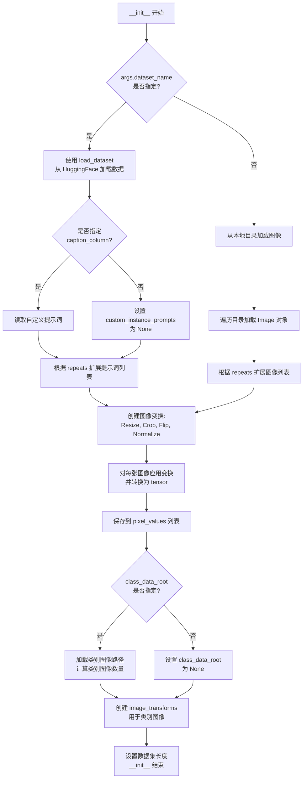

#### 带注释源码

```python
def __init__(
    self,
    instance_data_root,      # str: 实例图像根目录或数据集名称
    instance_prompt,         # str: 实例提示词
    class_prompt,            # str: 类别提示词
    class_data_root=None,    # str: 类别图像目录（可选）
    class_num=None,          # int: 类别图像数量限制（可选）
    size=1024,               # int: 目标图像尺寸
    repeats=1,              # int: 数据重复次数
    center_crop=False,       # bool: 是否中心裁剪
):
    """
    初始化 DreamBooth 数据集，加载实例和类别图像并应用预处理变换。
    
    参数:
        instance_data_root: 实例图像的根目录或 HuggingFace 数据集名称
        instance_prompt: 实例提示词（带特殊标识符）
        class_prompt: 类别提示词（用于先验保留）
        class_data_root: 类别图像目录路径（可选）
        class_num: 类别图像最大数量（可选）
        size: 输出图像的目标尺寸
        repeats: 每个图像重复加载的次数
        center_crop: 是否使用中心裁剪（否则随机裁剪）
    """
    self.size = size                      # 保存目标尺寸
    self.center_crop = center_crop        # 保存裁剪模式
    
    self.instance_prompt = instance_prompt      # 保存实例提示词
    self.custom_instance_prompts = None          # 初始化自定义提示词为 None
    self.class_prompt = class_prompt              # 保存类别提示词
    
    # 判断数据加载方式：从 HuggingFace 数据集或本地目录
    if args.dataset_name is not None:
        try:
            from datasets import load_dataset   # 动态导入 datasets 库
        except ImportError:
            raise ImportError(
                "You are trying to load your data using the datasets library. "
                "If you wish to train using custom captions please install the datasets library: "
                "`pip install datasets`. If you wish to load a local folder containing images only, "
                "specify --instance_data_dir instead."
            )
        
        # 从 HuggingFace Hub 下载并加载数据集
        dataset = load_dataset(
            args.dataset_name,
            args.dataset_config_name,
            cache_dir=args.cache_dir,
        )
        
        # 获取训练集列名
        column_names = dataset["train"].column_names
        
        # 确定图像列名（默认为第一列）
        if args.image_column is None:
            image_column = column_names[0]
            logger.info(f"image column defaulting to {image_column}")
        else:
            image_column = args.image_column
            if image_column not in column_names:
                raise ValueError(
                    f"`--image_column` value '{args.image_column}' not found in dataset columns. "
                    f"Dataset columns are: {', '.join(column_names)}"
                )
        
        # 获取实例图像
        instance_images = dataset["train"][image_column]
        
        # 处理提示词列
        if args.caption_column is None:
            logger.info(
                "No caption column provided, defaulting to instance_prompt for all images. "
                "If your dataset contains captions/prompts for the images, make sure to specify "
                "the column as --caption_column"
            )
            self.custom_instance_prompts = None
        else:
            if args.caption_column not in column_names:
                raise ValueError(
                    f"`--caption_column` value '{args.caption_column}' not found in dataset columns. "
                    f"Dataset columns are: {', '.join(column_names)}"
                )
            
            # 读取自定义提示词并根据 repeats 扩展
            custom_instance_prompts = dataset["train"][args.caption_column]
            self.custom_instance_prompts = []
            for caption in custom_instance_prompts:
                self.custom_instance_prompts.extend(itertools.repeat(caption, repeats))
    else:
        # 从本地目录加载图像
        self.instance_data_root = Path(instance_data_root)
        if not self.instance_data_root.exists():
            raise ValueError("Instance images root doesn't exists.")
        
        # 遍历目录加载所有图像
        instance_images = [Image.open(path) for path in list(Path(instance_data_root).iterdir())]
        self.custom_instance_prompts = None
    
    # 根据 repeats 扩展实例图像列表
    self.instance_images = []
    for img in instance_images:
        self.instance_images.extend(itertools.repeat(img, repeats))
    
    # 初始化像素值列表
    self.pixel_values = []
    
    # 创建图像变换操作
    train_resize = transforms.Resize(size, interpolation=transforms.InterpolationMode.BILINEAR)
    train_crop = transforms.CenterCrop(size) if center_crop else transforms.RandomCrop(size)
    train_flip = transforms.RandomHorizontalFlip(p=1.0)
    train_transforms = transforms.Compose([
        transforms.ToTensor(),                    # 转换为 tensor [0, 1]
        transforms.Normalize([0.5], [0.5]),       # 归一化到 [-1, 1]
    ])
    
    # 遍历所有图像并应用变换
    for image in self.instance_images:
        # 处理 EXIF 旋转问题
        image = exif_transpose(image)
        
        # 确保图像为 RGB 模式
        if not image.mode == "RGB":
            image = image.convert("RGB")
        
        # 调整图像大小
        image = train_resize(image)
        
        # 随机水平翻转（如果启用）
        if args.random_flip and random.random() < 0.5:
            image = train_flip(image)
        
        # 裁剪图像
        if args.center_crop:
            y1 = max(0, int(round((image.height - args.resolution) / 2.0)))
            x1 = max(0, int(round((image.width - args.resolution) / 2.0)))
            image = train_crop(image)
        else:
            y1, x1, h, w = train_crop.get_params(image, (args.resolution, args.resolution))
            image = crop(image, y1, x1, h, w)
        
        # 应用变换并转换为 tensor
        image = train_transforms(image)
        self.pixel_values.append(image)
    
    # 记录实例图像数量
    self.num_instance_images = len(self.instance_images)
    self._length = self.num_instance_images
    
    # 处理类别数据（先验保留）
    if class_data_root is not None:
        self.class_data_root = Path(class_data_root)
        self.class_data_root.mkdir(parents=True, exist_ok=True)
        
        # 获取类别图像路径列表
        self.class_images_path = list(self.class_data_root.iterdir())
        
        # 确定类别图像数量
        if class_num is not None:
            self.num_class_images = min(len(self.class_images_path), class_num)
        else:
            self.num_class_images = len(self.class_images_path)
        
        # 更新数据集长度（取实例和类别图像数量的最大值）
        self._length = max(self.num_class_images, self.num_instance_images)
    else:
        self.class_data_root = None
    
    # 创建用于类别图像的变换组合
    self.image_transforms = transforms.Compose([
        transforms.Resize(size, interpolation=transforms.InterpolationMode.BILINEAR),
        transforms.CenterCrop(size) if center_crop else transforms.RandomCrop(size),
        transforms.ToTensor(),
        transforms.Normalize([0.5], [0.5]),
    ])
```


### DreamBoothDataset.__len__

该方法返回 DreamBooth 数据集的总长度，用于让 DataLoader 知道数据集包含多少个样本。如果启用了先验保留（prior preservation）功能，数据集长度将取实例图像数量和类别图像数量的最大值，以确保训练时每个类别都有足够的样本。

参数：

- `self`：DreamBoothDataset 实例，不需要显式传递

返回值：`int`，返回数据集的总样本数

#### 流程图

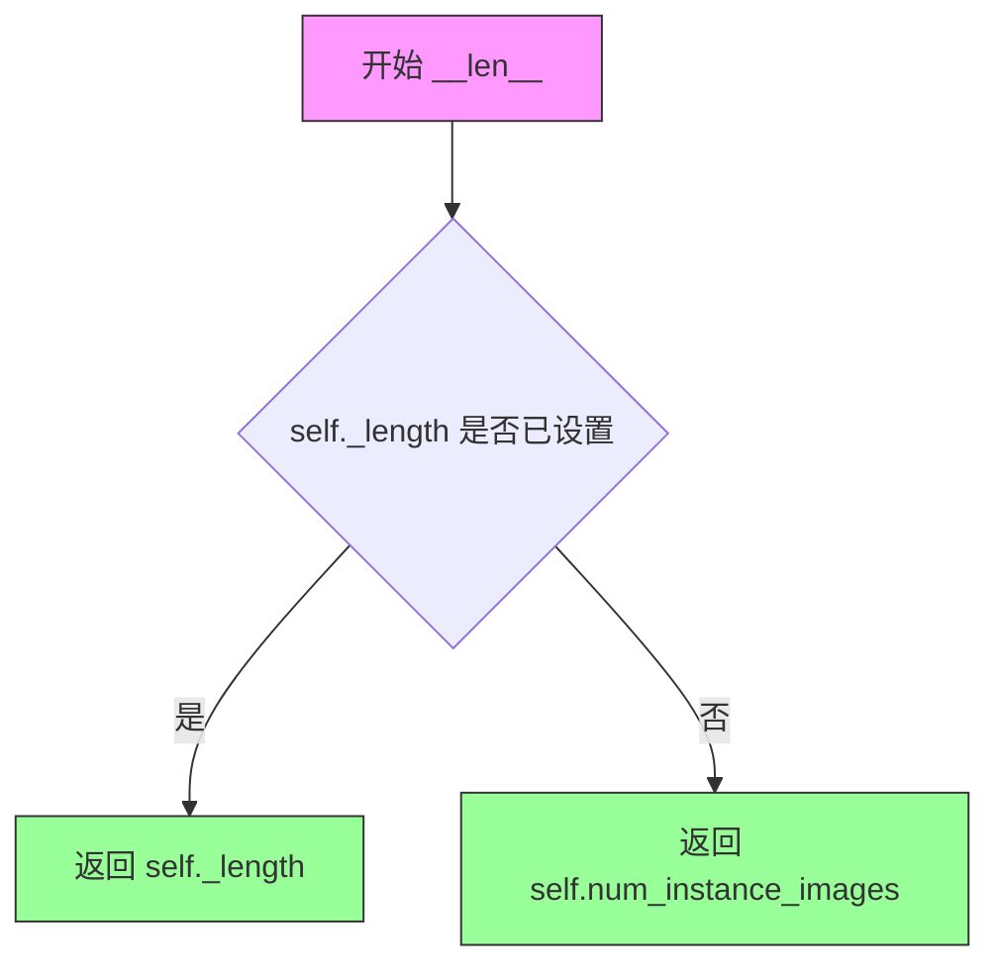

#### 带注释源码

```python
def __len__(self):
    """
    返回数据集的长度。
    
    该方法实现了 Python 的特殊方法 len()，使数据集可以被 DataLoader 使用。
    _length 在 __init__ 中被设置为 max(num_class_images, num_instance_images)，
    如果没有类别数据则为 num_instance_images。
    
    Returns:
        int: 数据集中的样本总数
    """
    return self._length
```


### `DreamBoothDataset.__getitem__`

获取数据集中指定索引位置的数据项，包含处理过的实例图像、实例提示词，以及可选的类别图像和类别提示词（用于先验保留）。

参数：

-  `index`：`int`，数据集中的索引位置，用于检索对应的图像和提示词

返回值：`dict`，包含以下键值的字典：
  - `instance_images`：处理后的实例图像张量
  - `instance_prompt`：实例提示词文本
  - `class_images`（可选）：处理后的类别图像张量（当 `class_data_root` 存在时）
  - `class_prompt`（可选）：类别提示词文本（当 `class_data_root` 存在时）

#### 流程图

```mermaid
flowchart TD
    A[开始 __getitem__] --> B[创建空字典 example]
    B --> C[计算实例图像索引: index % self.num_instance_images]
    C --> D[从 pixel_values 获取 instance_image]
    D --> E[将 instance_image 添加到 example['instance_images']]
    F{是否有自定义实例提示词?}
    F -->|是| G[获取自定义提示词 caption]
    G --> H{caption 非空?}
    H -->|是| I[设置 example['instance_prompt'] = caption]
    H -->|否| J[设置 example['instance_prompt'] = self.instance_prompt]
    F -->|否| K[设置 example['instance_prompt'] = self.instance_prompt]
    L{是否有 class_data_root?}
    L -->|是| M[打开类别图像]
    M --> N[执行 exif_transpose 旋转校正]
    N --> O{图像模式是否为 RGB?}
    O -->|否| P[转换为 RGB 模式]
    O -->|是| Q[直接使用]
    P --> R[应用 image_transforms 变换]
    Q --> R
    R --> S[添加到 example['class_images']]
    S --> T[添加 class_prompt 到 example]
    L -->|否| U[返回 example]
    I --> U
    J --> U
    K --> U
    T --> U
```

#### 带注释源码

```python
def __getitem__(self, index):
    """
    获取数据集中指定索引位置的数据项
    
    参数:
        index: 数据集中的索引位置
        
    返回:
        包含图像和提示词的字典
    """
    # 创建一个空字典来存储样本数据
    example = {}
    
    # 使用模运算处理索引，实现数据集的循环遍历
    # 这样可以处理数据集长度不整除batch size的情况
    instance_image = self.pixel_values[index % self.num_instance_images]
    
    # 将处理后的实例图像添加到返回字典
    # pixel_values 已经在 __init__ 中经过预处理（resize, crop, normalize）
    example["instance_images"] = instance_image

    # 检查是否提供了自定义实例提示词
    # 自定义提示词允许每个图像有独特的描述
    if self.custom_instance_prompts:
        # 获取对应索引的自定义提示词
        caption = self.custom_instance_prompts[index % self.num_instance_images]
        
        # 如果自定义提示词非空则使用，否则使用默认实例提示词
        if caption:
            example["instance_prompt"] = caption
        else:
            example["instance_prompt"] = self.instance_prompt
    else:
        # 未提供自定义提示词时，使用统一的实例提示词
        example["instance_prompt"] = self.instance_prompt

    # 先验保留（Prior Preservation）处理
    # 如果提供了类别数据目录，则加载对应的类别图像
    if self.class_data_root:
        # 打开类别图像文件
        class_image = Image.open(self.class_images_path[index % self.num_class_images])
        
        # 根据EXIF信息自动旋转图像（处理手机拍摄的照片方向问题）
        class_image = exif_transpose(class_image)

        # 确保图像为RGB模式（处理PNG的RGBA或灰度图等情况）
        if not class_image.mode == "RGB":
            class_image = class_image.convert("RGB")
            
        # 应用图像变换（resize, crop, normalize）
        example["class_images"] = self.image_transforms(class_image)
        
        # 添加类别提示词
        example["class_prompt"] = self.class_prompt

    return example
```


### `PromptDataset.__init__`

初始化 PromptDataset 数据集类，用于准备在多个 GPU 上生成类图像的提示词。

参数：

- `self`：隐式参数，表示数据集实例本身
- `prompt`：`str`，用于生成类图像的提示词
- `num_samples`：`int`，要生成的样本数量

返回值：`None`，构造函数无返回值，用于初始化对象状态

#### 流程图

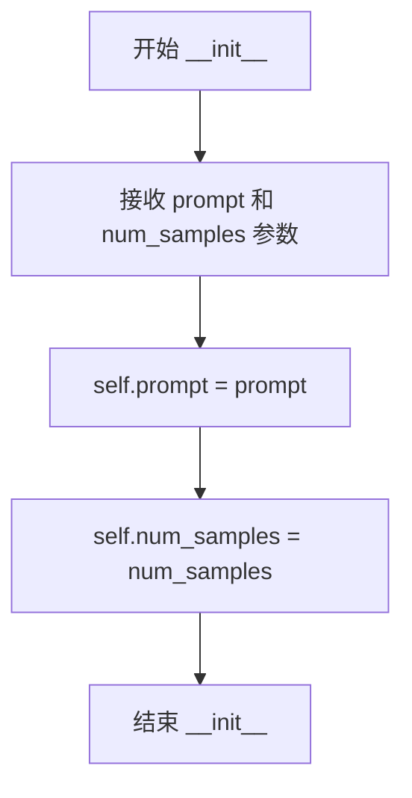

#### 带注释源码

```python
class PromptDataset(Dataset):
    "A simple dataset to prepare the prompts to generate class images on multiple GPUs."

    def __init__(self, prompt, num_samples):
        """
        初始化 PromptDataset 实例
        
        Args:
            prompt (str): 用于生成类图像的文本提示词
            num_samples (int): 需要生成的样本数量
        """
        self.prompt = prompt                      # 存储提示词，供 __getitem__ 使用
        self.num_samples = num_samples           # 存储样本数量，供 __len__ 返回

    def __len__(self):
        """返回数据集的样本数量"""
        return self.num_samples

    def __getitem__(self, index):
        """
        根据索引获取单个样本
        
        Args:
            index (int): 样本索引
            
        Returns:
            dict: 包含 prompt 和 index 的字典
        """
        example = {}
        example["prompt"] = self.prompt
        example["index"] = index
        return example
```


### `PromptDataset.__len__`

返回数据集中要生成的样本数量，用于 DataLoader 确定迭代次数。

参数：
- 无

返回值：`int`，返回 `num_samples`，即数据集包含的样本总数。

#### 流程图

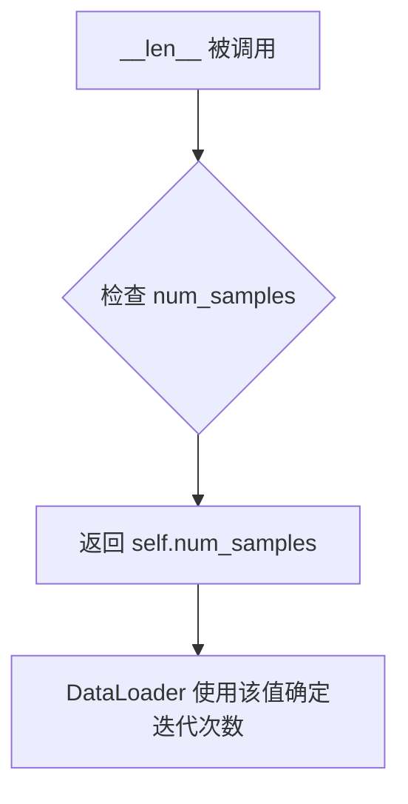

#### 带注释源码

```python
def __len__(self):
    """
    返回数据集中样本的数量。

    此方法由 PyTorch DataLoader 调用，以确定每个 epoch 中的批次数。
    当 DataLoader 使用此数据集时，它会迭代 len(dataset) // batch_size 次。

    Returns:
        int: 数据集中要生成的样本数量，等于初始化时传入的 num_samples。
    """
    return self.num_samples
```


### `PromptDataset.__getitem__`

获取数据集中指定索引位置的样本数据，用于在生成类图像时提供提示词。

参数：

- `index`：`int`，数据集中的索引位置，用于获取对应位置的样本

返回值：`Dict`，包含以下键的字典：
  - `"prompt"`：`str`，预先设置的提示词
  - `"index"`：`int`，当前样本的索引位置

#### 流程图

```mermaid
flowchart TD
    A[开始 __getitem__] --> B[创建空字典 example]
    B --> C[设置 example['prompt'] = self.prompt]
    C --> D[设置 example['index'] = index]
    D --> E[返回 example 字典]
```

#### 带注释源码

```python
def __getitem__(self, index):
    """
    获取指定索引位置的样本数据。
    
    参数:
        index: int
            数据集中的索引位置，用于从数据集中获取对应样本
    
    返回:
        dict: 包含 'prompt' 和 'index' 键的字典
              - 'prompt': 预先设置的提示词，用于生成类图像
              - 'index': 当前样本的索引位置，用于标识样本
    """
    # 创建一个空字典用于存放样本数据
    example = {}
    
    # 将预设的提示词存入字典
    example["prompt"] = self.prompt
    
    # 将当前索引存入字典，用于标识样本
    example["index"] = index
    
    # 返回包含提示词和索引的字典
    return example
```

## 关键组件


### 张量索引与惰性加载

代码通过`latents_cache`列表实现VAE latents的缓存，支持训练时的惰性加载。当启用`args.cache_latents`时，会在训练开始前将所有batch的latents预计算并缓存到内存中，后续训练循环直接使用缓存的latents，避免重复编码。

### 反量化支持

代码支持多种精度模式，通过`weight_dtype`变量管理。训练时非可训练权重（VAE、非LoRA的text_encoder和transformer）被转换为半精度以节省显存，而可训练参数（LoRA权重）在`fp16`混合精度下会被强制转换为`fp32`以保证训练稳定性。同时提供`args.upcast_before_saving`选项控制保存时是否将transformer层转换为float32。

### 量化策略

代码实现了多层量化策略：1）混合精度训练支持fp16和bf16两种模式；2）先验图像生成精度可通过`prior_generation_precision`参数单独设置（fp32/fp16/bf16）；3）支持使用bitsandbytes库的8-bit Adam优化器（`use_8bit_adam`选项）；4）TF32加速可通过`allow_tf32`选项在Ampere GPU上启用。

### DreamBoothDataset类

负责准备fine-tuning所需的instance和class图像数据，包含图像预处理（resize、crop、flip、normalize）、自定义caption支持、以及prior preservation所需的class图像管理。

### PromptDataset类

一个简单的数据集用于在多GPU上生成class图像，仅存储prompt和索引信息。

### LoRA配置与管理

通过`LoraConfig`为transformer和text_encoder添加LoRA适配器，支持自定义`lora_layers`和`lora_blocks`参数指定要应用LoRA的transformer模块，提供`save_model_hook`和`load_model_hook`处理LoRA权重的保存与加载。

### 文本编码器管理

支持三个文本编码器（两个CLIP encoder和一个T5 encoder），通过`encode_prompt`函数整合多encoder的embeddings，提供`train_text_encoder`选项决定是否训练text encoder。

### 分布式训练支持

使用Accelerator实现分布式训练，支持DeepSpeed、MPS等多种分布式后端，通过`DistributedDataParallelKwargs`处理DDP相关配置。

### 检查点管理

实现自定义的save/load hooks，支持检查点总数限制（`checkpoints_total_limit`），自动清理旧检查点，支持从最新检查点恢复训练。

### 验证与日志

`log_validation`函数在验证阶段生成图像并记录到TensorBoard或WandB，支持自定义验证prompt和生成图像数量。


## 问题及建议


### 已知问题

- **全局变量依赖**: `DreamBoothDataset` 类中直接引用全局 `args` 变量，这违反了封装原则，使得类难以独立测试和复用
- **内存泄漏风险**: `latents_cache` 在启用缓存后没有显式释放，且验证完成后删除 VAE 的逻辑不够清晰
- **硬编码默认值**: 许多超参数（如 `max_sequence_length=77`、`resolution=512`）硬编码在各处，分散在参数解析和数据处理中
- **代码重复**: 文本编码器的加载逻辑、提示编码流程在不同分支中重复出现，缺乏统一抽象
- **深度复制开销**: `noise_scheduler_copy = copy.deepcopy(noise_scheduler)` 对整个调度器进行深度复制，增加了内存开销
- **类型注解缺失**: 整个脚本几乎没有类型注解，降低了代码的可维护性和可读性
- **异常处理不足**: 数据集加载、模型加载等关键操作缺少充分的异常捕获和错误提示
- **验证逻辑冗余**: 验证时重新加载完整模型管道，即使只使用了部分组件，造成资源浪费

### 优化建议

- **重构 Dataset 类**: 将 `args` 作为参数传入 `DreamBoothDataset.__init__`，消除对全局变量的依赖
- **统一超参数管理**: 创建配置类或字典集中管理所有默认超参数，便于调整和维护
- **提取编码器逻辑**: 将文本编码器的加载和提示编码逻辑封装为独立函数或类，减少重复代码
- **优化内存管理**: 使用上下文管理器或显式清理函数管理 VAE 缓存和临时对象，验证后及时释放资源
- **添加类型注解**: 为关键函数和类添加完整的类型注解，提升代码质量
- **改进错误处理**: 为文件读取、模型加载、数据集处理等操作添加具体的异常捕获和友好的错误信息
- **缓存优化**: 考虑使用 `torch.cuda.empty_cache()` 定期清理 GPU 缓存，并在验证阶段采用更轻量的推理方式

## 其它


### 设计目标与约束

本代码的设计目标是实现Stable Diffusion 3 (SD3)模型的DreamBooth LoRA微调训练框架，支持用户使用少量自定义图像（instance images）结合特定提示词（instance prompt）来训练能够生成特定主体或风格的模型变体。核心约束包括：必须使用SD3系列模型架构（包含3个文本编码器CLIP×2+T5和1个Transformer主网络）；LoRA rank参数默认值为4，支持通过命令行调整；训练数据必须通过`--instance_data_dir`或`--dataset_name`指定；文本编码器训练仅支持CLIP文本编码器不支持T5；混合精度训练仅支持fp16和bf16（bf16需Ampere GPU）；MPS设备不支持bf16训练。该设计遵循DreamBooth论文的核心思想，通过prior preservation机制防止模型遗忘先验知识。

### 错误处理与异常设计

代码在多个关键节点实现了错误处理机制。在参数解析阶段（parse_args函数），通过断言检查确保用户必须指定数据集来源（`--dataset_name`或`--instance_data_dir`）且只能指定其一；对于prior preservation模式，强制要求`--class_data_dir`和`--class_prompt`参数。导入依赖时使用try-except捕获ImportError并提供明确的安装指引（如datasets、bitsandbytes、prodigyopt、wandb等）。运行时错误处理包括：MPS设备不支持bf16时抛出ValueError并建议使用fp16或fp32；检查点恢复时验证路径有效性，无效时提示并启动新训练；分布式训练环境变量LOCAL_RANK自动同步到args.local_rank。日志记录采用分级机制，通过accelerator.trackers支持tensorboard和wandb可视化训练过程。

### 数据流与状态机

训练数据流分为两条路径：instance数据流和class数据流（当启用prior preservation时）。Instance数据流：用户指定instance_data_dir → DreamBoothDataset类加载图像 → 图像经过Resize/CenterCrop/RandomCrop → ToTensor → Normalize([0.5],[0.5])标准化 → 存储pixel_values；提示词处理：若提供custom_instance_prompts则使用自定义提示词，否则使用instance_prompt。Class数据流：在main函数中若启用prior preservation，先使用StableDiffusion3Pipeline生成class_images → 存储到class_data_dir → DreamBoothDataset加载class_images。训练时通过collate_fn函数将instance和class数据合并为单一batch，pixel_values和prompts分别堆叠。训练循环状态机：初始化 → 生成class images（如需要） → 加载tokenizers和models → 配置LoRA → 创建optimizer和scheduler → 遍历epoch和step → 每个step执行：encode prompt → vae encode → sample noise/timestep → forward transformer → compute loss → backward → optimizer step → checkpointing/validation → 训练完成保存LoRA weights。

### 外部依赖与接口契约

本代码依赖以下核心外部库：diffusers（≥0.37.0.dev0）提供StableDiffusion3Pipeline、FlowMatchEulerDiscreteScheduler、AutoencoderKL、SD3Transformer2DModel等模型类；transformers提供CLIPTokenizer、CLIPTextModelWithProjection、T5EncoderModelFast、T5EncoderModel；peft提供LoraConfig和LoRA相关工具函数；accelerate提供分布式训练、混合精度、自动日志记录等基础设施；torch、numpy、pillow提供基础计算和图像处理；huggingface_hub提供模型卡生成和上传功能；可选依赖包括wandb（可视化）、bitsandbytes（8-bit Adam优化器）、prodigyopt（Prodigy优化器）、datasets（从HF Hub加载数据集）。接口契约方面：输入必须符合argparse定义的命令行参数规范；pretrained_model_name_or_path必须指向包含tokenizer_1/2/3、text_encoder_1/2/3、vae、scheduler、transformer子文件夹的SD3模型目录；输出目录结构包含logs/（训练日志）、checkpoint-{step}/（中间检查点）、README.md（模型卡）、*.safetensors（LoRA权重文件）。

### 版本兼容性要求

代码最低要求diffusers版本0.37.0.dev0，通过check_min_version函数在导入时验证。PyTorch版本需支持bf16计算（≥1.10），CUDA版本需支持TF32 Ampere架构。Python版本未明确限制但推荐3.8+。对于Apple MPS设备，由于PyTorch #99272issue，bf16混合精度不被支持。transformers库版本需支持CLIPTextModelWithProjection和T5EncoderModel架构。LoRA训练针对SD3的Transformer模块设计，target_modules默认包含attn层的q/k/v投影和输出投影，针对text encoder的LoRA仅支持q_proj、k_proj、v_proj、out_proj。

### 资源配置与性能优化

代码支持多种性能优化策略。内存优化：gradient_checkpointing通过减少中间激活值存储降低显存占用；cache_latents选项预计算VAE latent避免重复编码；mixed_precision支持fp16/bf16减少显存占用和加速计算；Freeze非训练参数（vae、text_encoder、transformer）仅对LoRA参数更新。计算优化：TF32 on Ampere GPUs通过torch.backends.cuda.matmul.allow_tf32加速矩阵运算；分布式训练通过Accelerator支持多GPU/DDP/DeepSpeed。训练效率：gradient_accumulation_steps允许大effective batch size；lr_scheduler支持cosine/linear/polynomial等多种学习率调度策略；checkpointing_steps控制检查点保存频率；checkpoints_total_limit管理检查点数量防止磁盘占满。

### 模型保存与加载机制

模型保存采用自定义hook机制：save_model_hook通过accelerator.register_save_state_pre_hook注册，在保存时提取transformer和text encoder的LoRA权重，调用StableDiffusion3Pipeline.save_lora_weights保存为safetensors格式。加载机制：load_model_hook通过register_load_state_pre_hook注册，支持从检查点恢复训练，处理DeepSpeed和普通分布式场景，从lora_state_dict中解析transformer和text encoder权重并通过set_peft_model_state_dict加载。推理时通过pipeline.load_lora_weights加载训练好的LoRA权重。模型卡生成：save_model_card函数自动生成包含模型描述、使用方法、许可证信息的README.md，支持push_to_hub自动上传到HuggingFace Hub。


    