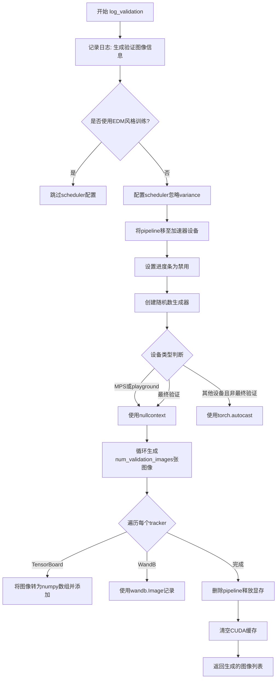
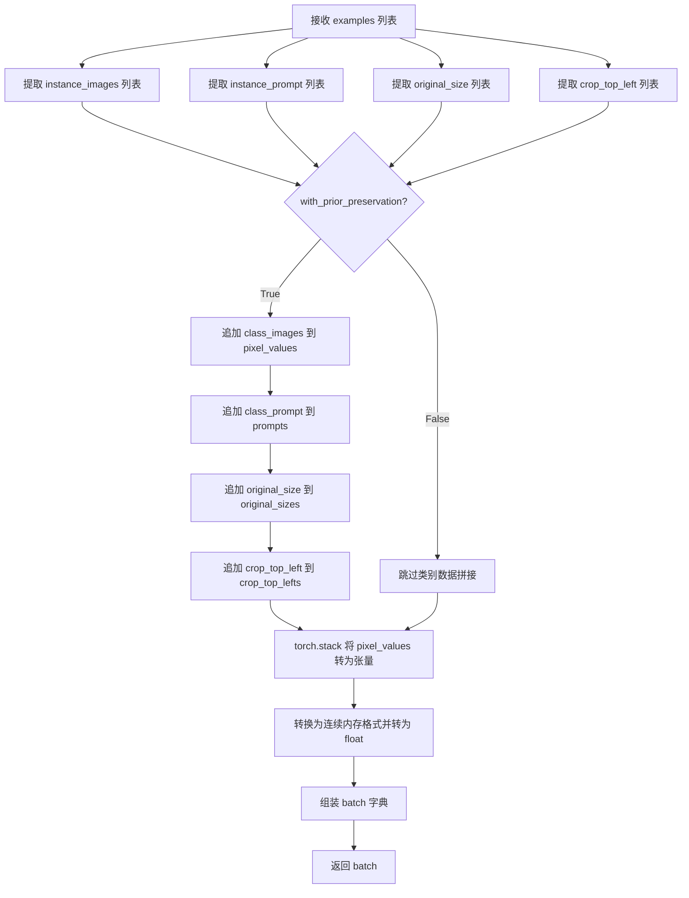
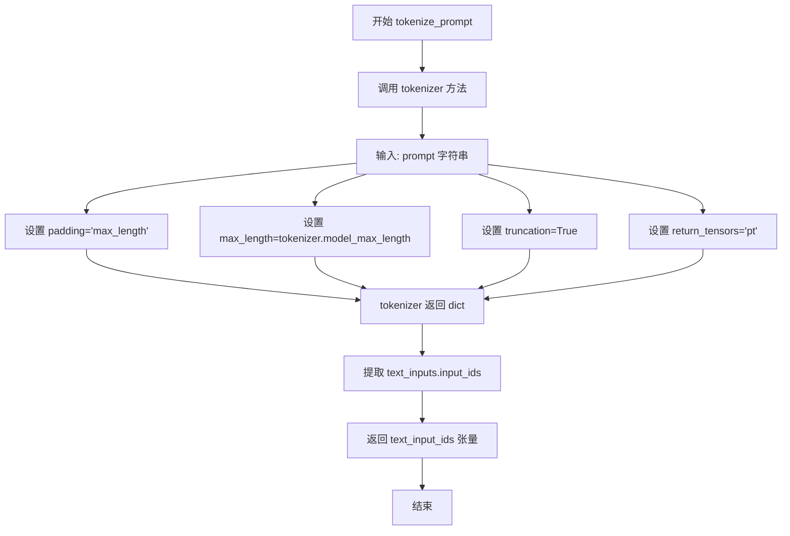
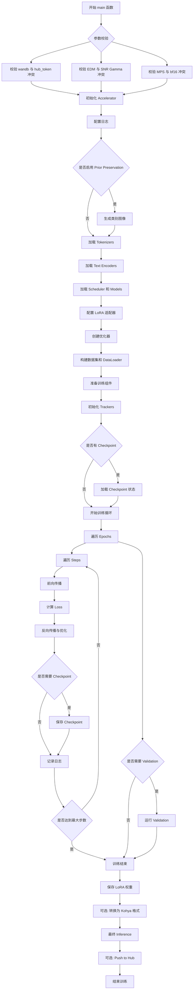
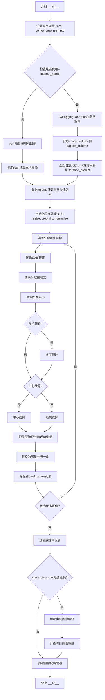
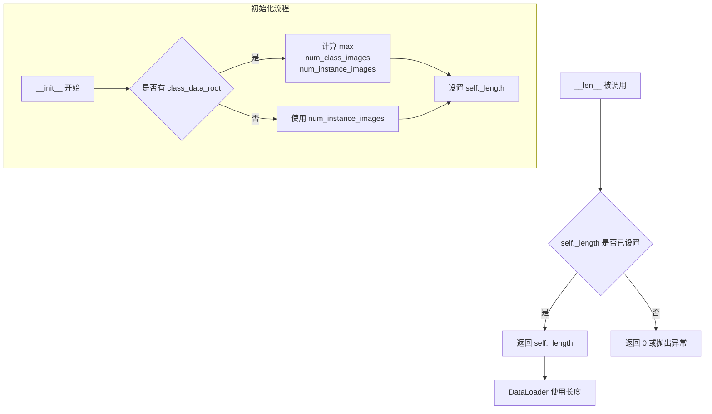
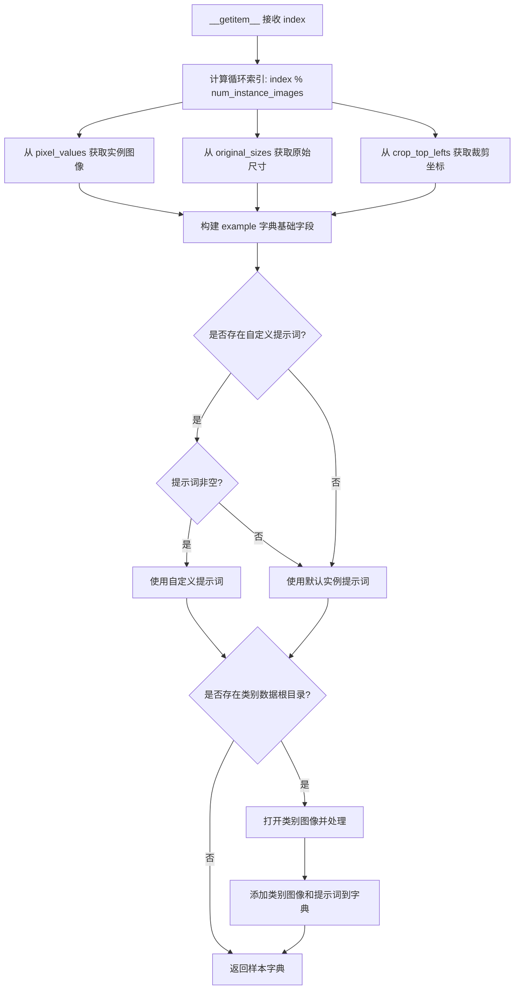
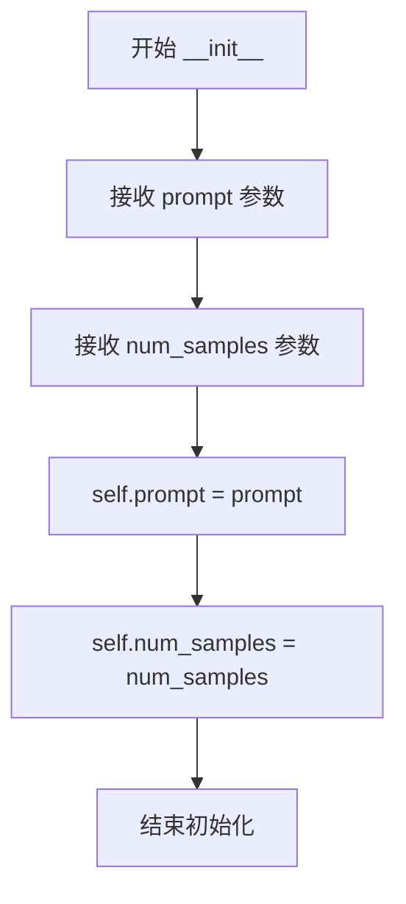
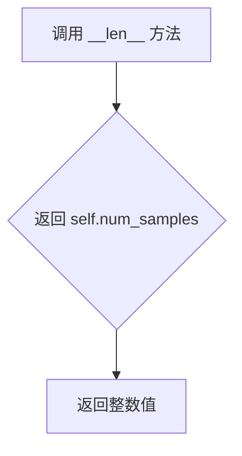

# `diffusers\examples\dreambooth\train_dreambooth_lora_sdxl.py` 详细设计文档

这是一个用于训练 Stable Diffusion XL (SDXL) 模型的 DreamBooth LoRA 训练脚本。核心功能包括：加载预训练模型（UNet、VAE、文本编码器），配置 LoRA 适配器，处理实例图像和类别图像（支持先验保留），执行前向扩散和反向去噪训练过程，计算损失并更新权重，最后保存兼容 Diffusers 和 Kohya 格式的 LoRA 权重。脚本集成了 Accelerate 库以支持分布式训练和混合精度。

## 整体流程

```mermaid
graph TD
    A[开始] --> B[解析参数 parse_args]
    B --> C[执行 main 函数]
    C --> D[初始化 Accelerator, 设置随机种子和日志]
    D --> E{是否启用先验保留?}
    E -- 是 --> F[生成类别图像 PromptDataset]
    F --> G[加载数据集 DreamBoothDataset]
    E -- 否 --> G
    G --> H[加载预训练模型 (UNet, VAE, TextEncoder)]
    H --> I[配置 LoRA (LoraConfig) 并添加到模型]
    I --> J[设置优化器 (AdamW/Prodigy) 和学习率调度器]
    J --> K[训练循环: 遍历 Epochs 和 Steps]
    K --> L[数据预处理: 编码图像和文本]
    L --> M[前向过程: 加噪 (noise_scheduler.add_noise)]
    M --> N[预测噪声: UNet 模型推理]
    N --> O[计算损失: MSE Loss 或 EDM Loss]
    O --> P[反向传播与参数更新]
    P --> Q{是否需要保存检查点?}
    Q -- 是 --> R[保存 Accelerator 状态]
    Q -- 否 --> S{是否到达验证周期?}
    S -- 是 --> T[运行验证 log_validation]
    S -- 否 --> K
    R --> K
    T --> U[训练结束]
    U --> V[保存 LoRA 权重 (Diffusers/Kohya 格式)]
    V --> W[结束]
```

## 类结构

```
torch.utils.data.Dataset (基类)
├── DreamBoothDataset (处理训练图像的加载、预处理和增强)
└── PromptDataset (用于生成类别图像的简易数据集)
```

## 全局变量及字段


### `logger`
    
全局日志记录器对象，用于记录训练过程中的信息

类型：`Logger`
    


### `is_wandb_available`
    
检查wandb是否安装的标志函数 (引用)

类型：`function`
    


### `DreamBoothDataset.size`
    
图像的目标分辨率

类型：`int`
    


### `DreamBoothDataset.center_crop`
    
是否进行中心裁剪

类型：`bool`
    


### `DreamBoothDataset.instance_prompt`
    
实例图像的提示词

类型：`str`
    


### `DreamBoothDataset.custom_instance_prompts`
    
自定义实例提示词列表

类型：`list`
    


### `DreamBoothDataset.class_prompt`
    
类别图像的提示词

类型：`str`
    


### `DreamBoothDataset.instance_data_root`
    
实例图像根目录

类型：`Path`
    


### `DreamBoothDataset.instance_images`
    
实例图像对象列表

类型：`list`
    


### `DreamBoothDataset.original_sizes`
    
原始图像尺寸列表

类型：`list`
    


### `DreamBoothDataset.crop_top_lefts`
    
裁剪坐标列表

类型：`list`
    


### `DreamBoothDataset.pixel_values`
    
处理后的像素张量列表

类型：`list`
    


### `DreamBoothDataset.num_instance_images`
    
实例图像数量

类型：`int`
    


### `DreamBoothDataset._length`
    
数据集长度（取实例和类别图像数的最大值）

类型：`int`
    


### `DreamBoothDataset.class_data_root`
    
类别图像目录

类型：`Path`
    


### `DreamBoothDataset.class_images_path`
    
类别图像路径列表

类型：`list`
    


### `DreamBoothDataset.num_class_images`
    
类别图像数量

类型：`int`
    


### `DreamBoothDataset.image_transforms`
    
图像变换组合

类型：`Compose`
    


### `PromptDataset.prompt`
    
生成用的提示词

类型：`str`
    


### `PromptDataset.num_samples`
    
需要生成的样本总数

类型：`int`
    
    

## 全局函数及方法


### `determine_scheduler_type`

该函数用于根据预训练模型的本地路径或HuggingFace Hub ID，从模型的 `model_index.json` 配置文件中提取调度器（Scheduler）类型信息。这是Diffusers训练流程中的关键步骤，用于确定模型使用的噪声调度器，从而正确配置训练参数。

参数：

- `pretrained_model_name_or_path`：`str`，预训练模型的本地路径或HuggingFace Hub上的模型ID
- `revision`：`str`，模型的具体版本/提交ID，用于从Hub获取特定版本的模型索引文件

返回值：`str`，返回调度器的类型名称（如 "DDPMScheduler"、"DPMSolverMultistepScheduler" 等）

#### 流程图

```mermaid
flowchart TD
    A[开始: determine_scheduler_type] --> B[定义 model_index_filename = 'model_index.json']
    B --> C{pretrained_model_name_or_path 是本地目录?}
    C -->|是| D[构建本地路径: os.path.join]
    C -->|否| E[从HuggingFace Hub下载: hf_hub_download]
    D --> F[打开 model_index.json 文件]
    E --> F
    F --> G[解析JSON获取 scheduler 字段]
    G --> H[提取 scheduler[1] 第二个元素]
    H --> I[返回 scheduler_type 字符串]
```

#### 带注释源码

```python
def determine_scheduler_type(pretrained_model_name_or_path, revision):
    """
    根据预训练模型的路径或Hub ID确定使用的调度器类型
    
    参数:
        pretrained_model_name_or_path: 模型本地路径或HuggingFace Hub模型ID
        revision: 模型版本号
    
    返回:
        调度器类型字符串
    """
    # 模型索引文件名，存在于每个Diffusers模型目录中
    model_index_filename = "model_index.json"
    
    # 判断是否为本地目录路径
    if os.path.isdir(pretrained_model_name_or_path):
        # 本地路径：直接拼接文件路径
        model_index = os.path.join(pretrained_model_name_or_path, model_index_filename)
    else:
        # 远程Hub路径：从HuggingFace Hub下载模型索引文件
        model_index = hf_hub_download(
            repo_id=pretrained_model_name_or_path, 
            filename=model_index_filename, 
            revision=revision
        )

    # 打开并读取JSON格式的模型索引文件
    with open(model_index, "r") as f:
        # JSON结构示例: {"scheduler": ["package_name", "SchedulerClassName"]}
        # scheduler字段是一个列表，第一个元素是包名，第二个是调度器类名
        scheduler_type = json.load(f)["scheduler"][1]
    
    # 返回调度器类型名称字符串
    return scheduler_type
```


### `save_model_card`

该函数用于生成并保存 DreamBooth LoRA 训练的模型卡片（Markdown 格式）到 HuggingFace Hub，包含模型描述、训练信息、触发词、许可证等关键信息，并支持添加验证图像的 widget 预览功能。

参数：

- `repo_id`：`str`，HuggingFace Hub 上的仓库标识符，用于指定模型上传目标
- `use_dora`：`bool`，标识是否使用了 DoRA（Weight-Decomposed Low-Rank Adaptation）技术训练 LoRA
- `images`：`Optional[List[PIL.Image]]`，验证阶段生成的图像列表，用于模型卡片展示和 widget 预览，可为 None
- `base_model`：`str`，原始预训练的基础模型名称或路径（如 "stabilityai/stable-diffusion-xl-base-1.0"）
- `train_text_encoder`：`bool`，标识训练过程中是否同时训练了文本编码器
- `instance_prompt`：`str`，实例提示词，用于触发模型生成特定实例的图像
- `validation_prompt`：`Optional[str]`，验证时使用的提示词，用于生成验证图像，可为 None
- `repo_folder`：`Optional[str]`，本地仓库文件夹路径，用于保存模型卡片和图像文件，可为 None
- `vae_path`：`Optional[str]`，训练时使用的 VAE（变分自编码器）模型路径，可为 None

返回值：`None`，该函数无返回值，直接将模型卡片写入文件系统

#### 流程图

```mermaid
flowchart TD
    A[开始 save_model_card] --> B{images 是否为 None?}
    B -->|否| C[遍历 images 列表]
    C --> D[保存图像到 repo_folder/image_{i}.png]
    D --> E[构建 widget_dict: text + output url]
    E --> B
    B -->|是| F[初始化空 widget_dict]
    F --> G{base_model 是否包含 'playground'?}
    G -->|是| H[设置模型标题为 Playground]
    G -->|否| I[设置模型标题为 SDXL]
    H --> J[构建 model_description 基础模板]
    I --> J
    J --> K{base_model 包含 'playground'?}
    K -->|是| L[添加 license 说明段落]
    K -->|否| M[调用 load_or_create_model_card]
    L --> M
    M --> N[创建 tags 列表]
    N --> O{use_dora 为 True?}
    O -->|是| P[tag 添加 'dora']
    O -->|否| Q[tag 添加 'lora']
    P --> R[base_model 包含 'playground'?]
    Q --> R
    R -->|是| S[添加 playground 相关 tags]
    R -->|否| T[添加 stable-diffusion-xl 相关 tags]
    S --> U[调用 populate_model_card 填充 tags]
    T --> U
    U --> V[保存模型卡片到 repo_folder/README.md]
    V --> W[结束]
```

#### 带注释源码

```python
def save_model_card(
    repo_id: str,
    use_dora: bool,
    images=None,
    base_model: str = None,
    train_text_encoder=False,
    instance_prompt=None,
    validation_prompt=None,
    repo_folder=None,
    vae_path=None,
):
    """
    生成并保存模型卡片（README.md）到指定文件夹，并上传至 HuggingFace Hub
    
    参数:
        repo_id: HuggingFace Hub 仓库 ID
        use_dora: 是否使用 DoRA 训练
        images: 验证图像列表（可选）
        base_model: 基础预训练模型路径
        train_text_encoder: 是否训练文本编码器
        instance_prompt: 实例提示词
        validation_prompt: 验证提示词
        repo_folder: 本地仓库文件夹
        vae_path: VAE 模型路径
    """
    
    # 初始化 widget 字典列表，用于 HuggingFace Hub 上的交互式预览
    widget_dict = []
    
    # 如果提供了验证图像，将其保存到本地并构建 widget 字典
    if images is not None:
        for i, image in enumerate(images):
            # 保存图像到 repo_folder 目录，文件名格式为 image_{i}.png
            image.save(os.path.join(repo_folder, f"image_{i}.png"))
            # 构建 widget 字典，包含提示词和图像 URL
            widget_dict.append(
                {"text": validation_prompt if validation_prompt else " ", "output": {"url": f"image_{i}.png"}}
            )

    # 构建模型描述文本，根据 base_model 判断是 SDXL 还是 Playground 模型
    model_description = f"""
# {"SDXL" if "playground" not in base_model else "Playground"} LoRA DreamBooth - {repo_id}

<Gallery />

## Model description

These are {repo_id} LoRA adaption weights for {base_model}.

The weights were trained  using [DreamBooth](https://dreambooth.github.io/).

LoRA for the text encoder was enabled: {train_text_encoder}.

Special VAE used for training: {vae_path}.

## Trigger words

You should use {instance_prompt} to trigger the image generation.

## Download model

Weights for this model are available in Safetensors format.

[Download]({repo_id}/tree/main) them in the Files & versions tab.

"""
    
    # 如果是 Playground 模型，添加许可证说明
    if "playground" in base_model:
        model_description += """\n
## License

Please adhere to the licensing terms as described [here](https://huggingface.co/playgroundai/playground-v2.5-1024px-aesthetic/blob/main/LICENSE.md).
"""
    
    # 使用 diffusers 工具函数加载或创建模型卡片
    # from_training=True 表示这是训练产出的模型卡片
    model_card = load_or_create_model_card(
        repo_id_or_path=repo_id,
        from_training=True,
        license="openrail++" if "playground" not in base_model else "playground-v2dot5-community",
        base_model=base_model,
        prompt=instance_prompt,
        model_description=model_description,
        widget=widget_dict,
    )
    
    # 构建标签列表，用于模型的分类和搜索
    tags = [
        "text-to-image",
        "text-to-image",
        "diffusers-training",
        "diffusers",
        "lora" if not use_dora else "dora",  # 根据是否使用 DoRA 选择标签
        "template:sd-lora",
    ]
    
    # 根据基础模型类型添加额外的标签
    if "playground" in base_model:
        tags.extend(["playground", "playground-diffusers"])
    else:
        tags.extend(["stable-diffusion-xl", "stable-diffusion-xl-diffusers"])

    # 使用 populate_model_card 填充标签信息
    model_card = populate_model_card(model_card, tags=tags)
    
    # 保存模型卡片为 README.md 文件
    model_card.save(os.path.join(repo_folder, "README.md"))
```


### `log_validation`

在验证集上运行推理并记录日志，生成指定数量的图像用于验证训练效果，支持 TensorBoard 和 WandB 可视化。

参数：

-  `pipeline`：`StableDiffusionXLPipeline`，用于生成图像的扩散 pipeline 对象
-  `args`：命令行参数对象，包含验证提示词、种子、生成图像数量等配置
-  `accelerator`：`Accelerator`，HuggingFace Accelerate 库提供的分布式训练加速器
-  `pipeline_args`：字典类型，包含传递给 pipeline 的额外参数（如 prompt）
-  `epoch`：整数，当前训练的 epoch 编号
-  `torch_dtype`：torch.dtype，模型权重的数据类型（fp16/bf16/fp32）
-  `is_final_validation`：布尔值，标识是否为最终验证（决定是否使用混合精度）

返回值：列表（`List[PIL.Image]`），生成的验证图像列表

#### 流程图



#### 带注释源码

```python
def log_validation(
    pipeline,
    args,
    accelerator,
    pipeline_args,
    epoch,
    torch_dtype,
    is_final_validation=False,
):
    # 记录验证开始的日志信息，包括生成图像数量和验证提示词
    logger.info(
        f"Running validation... \n Generating {args.num_validation_images} images with prompt:"
        f" {args.validation_prompt}."
    )

    # 初始化scheduler参数字典，用于配置噪声调度器
    scheduler_args = {}

    # 如果不是EDM风格训练，需要处理scheduler的variance_type参数
    # 因为我们使用的是简化版学习目标，如果之前预测variance，需要让scheduler忽略它
    if not args.do_edm_style_training:
        if "variance_type" in pipeline.scheduler.config:
            variance_type = pipeline.scheduler.config["variance_type"]

            # 如果variance_type是learned或learned_range，改为fixed_small以避免问题
            if variance_type in ["learned", "learned_range"]:
                variance_type = "fixed_small"

            scheduler_args["variance_type"] = variance_type

        # 使用DPM Solver多步调度器替换当前scheduler
        pipeline.scheduler = DPMSolverMultistepScheduler.from_config(pipeline.scheduler.config, **scheduler_args)

    # 将pipeline移至加速器设备（GPU/CPU）
    pipeline = pipeline.to(accelerator.device)
    # 禁用进度条显示
    pipeline.set_progress_bar_config(disable=True)

    # 创建随机数生成器，如果设置了seed则使用它以确保可重复性
    generator = torch.Generator(device=accelerator.device).manual_seed(args.seed) if args.seed is not None else None
    
    # 决定使用哪种自动混合精度上下文
    # MPS设备或playground模型使用nullcontext，其他设备在非最终验证时使用autocast
    # 参考: https://github.com/huggingface/diffusers/pull/7126#issuecomment-1968523051
    if torch.backends.mps.is_available() or "playground" in args.pretrained_model_name_or_path:
        autocast_ctx = nullcontext()
    else:
        autocast_ctx = torch.autocast(accelerator.device.type) if not is_final_validation else nullcontext()

    # 在自动混合精度上下文中生成验证图像
    with autocast_ctx:
        images = [pipeline(**pipeline_args, generator=generator).images[0] for _ in range(args.num_validation_images)]

    # 遍历所有tracker（TensorBoard或WandB）记录生成的图像
    for tracker in accelerator.trackers:
        # 确定阶段名称：最终验证为"test"，中间验证为"validation"
        phase_name = "test" if is_final_validation else "validation"
        
        if tracker.name == "tensorboard":
            # 将PIL图像转换为numpy数组并添加到TensorBoard
            np_images = np.stack([np.asarray(img) for img in images])
            tracker.writer.add_images(phase_name, np_images, epoch, dataformats="NHWC")
        if tracker.name == "wandb":
            # 使用WandB记录图像，带有标题说明
            tracker.log(
                {
                    phase_name: [
                        wandb.Image(image, caption=f"{i}: {args.validation_prompt}") for i, image in enumerate(images)
                    ]
                }
            )

    # 删除pipeline对象释放显存
    del pipeline
    if torch.cuda.is_available():
        torch.cuda.empty_cache()

    # 返回生成的图像列表供后续使用（如保存模型卡片）
    return images
```


### `import_model_class_from_model_name_or_path`

该函数是一个动态类导入工具，用于根据预训练模型的配置文件自动识别并返回对应的文本编码器类（CLIPTextModel 或 CLIPTextModelWithProjection）。它通过读取模型配置中的架构信息，消除硬编码依赖，提高代码对不同 SDXL 模型的兼容性。

参数：

- `pretrained_model_name_or_path`：`str`，预训练模型的名称或路径（本地路径或 Hugging Face Hub 模型 ID）
- `revision`：`str`，要加载的模型版本（Git revision）
- `subfolder`：`str`，模型子文件夹路径，默认为 `"text_encoder"`（用于指定 text_encoder_2 时可为 `"text_encoder_2"`）

返回值：`type`，返回对应的文本编码器类（`CLIPTextModel` 或 `CLIPTextModelWithProjection`）

#### 流程图

```mermaid
flowchart TD
    A[开始] --> B[加载 PretrainedConfig]
    B --> C{读取 architectures[0]}
    C --> D{判断 model_class}
    D -->|CLIPTextModel| E[import CLIPTextModel]
    D -->|CLIPTextModelWithProjection| F[import CLIPTextModelWithProjection]
    D -->|其他| G[raise ValueError]
    E --> H[返回 CLIPTextModel 类]
    F --> I[返回 CLIPTextModelWithProjection 类]
    G --> J[结束 - 抛出异常]
    H --> J
    I --> J
```

#### 带注释源码

```python
def import_model_class_from_model_name_or_path(
    pretrained_model_name_or_path: str, revision: str, subfolder: str = "text_encoder"
):
    """
    从预训练模型路径动态导入文本编码器类
    
    Args:
        pretrained_model_name_or_path: 预训练模型名称或本地路径
        revision: Git revision 版本号
        subfolder: 模型子文件夹（默认 "text_encoder"，SDXL 有两个文本编码器）
    
    Returns:
        CLIPTextModel 或 CLIPTextModelWithProjection 类对象
    """
    # 步骤1: 加载预训练模型的配置文件（包含架构信息）
    text_encoder_config = PretrainedConfig.from_pretrained(
        pretrained_model_name_or_path, subfolder=subfolder, revision=revision
    )
    
    # 步骤2: 从配置中获取模型架构名称（第一个元素）
    model_class = text_encoder_config.architectures[0]

    # 步骤3: 根据架构名称动态导入并返回对应的类
    if model_class == "CLIPTextModel":
        # 标准 CLIP 文本编码器（SDXL 主文本编码器）
        from transformers import CLIPTextModel

        return CLIPTextModel
    elif model_class == "CLIPTextModelWithProjection":
        # 带投影层的 CLIP 文本编码器（SDXL 第二文本编码器，用于图像描述嵌入）
        from transformers import CLIPTextModelWithProjection

        return CLIPTextModelWithProjection
    else:
        # 不支持的架构类型，抛出明确的错误信息
        raise ValueError(f"{model_class} is not supported.")
```


### `parse_args`

解析命令行输入参数，支持训练 Stable Diffusion XL LoRA (DreamBooth) 模型的所有配置选项，包括模型路径、数据集配置、训练超参数、优化器设置、验证选项等，并进行参数校验和冲突检测。

参数：

- `input_args`：`Optional[List[str]]`，可选参数列表，用于测试或从代码内部调用时传入；若为 `None`，则从 `sys.argv` 解析

返回值：`Namespace`，包含所有命令行参数的命名空间对象

#### 流程图

```mermaid
flowchart TD
    A[开始 parse_args] --> B[创建 ArgumentParser]
    B --> C[添加所有命令行参数定义]
    C --> D{input_args is not None?}
    D -->|是| E[parser.parse_args(input_args)]
    D -->|否| F[parser.parse_args()]
    E --> G[获取 args 命名空间]
    F --> G
    G --> H{校验数据集配置}
    H --> I1[dataset_name 和 instance_data_dir 互斥]
    H --> I2[LOCAL_RANK 环境变量覆盖]
    I1 --> J{with_prior_preservation?}
    J -->|是| K1[检查 class_data_dir]
    J -->|是| K2[检查 class_prompt]
    J -->|否| L[警告不使用 class_data_dir 和 class_prompt]
    K1 --> M[返回 args]
    K2 --> M
    L --> M
    M --> N[结束 parse_args]
```

#### 带注释源码

```python
def parse_args(input_args=None):
    """
    解析命令行输入参数，返回包含所有训练配置的命名空间对象。
    
    参数:
        input_args: 可选的参数列表，用于单元测试或从代码内部调用。
                   若为 None，则从 sys.argv 解析。
    
    返回:
        argparse.Namespace: 包含所有命令行参数的配置对象
    """
    # 创建 ArgumentParser 实例，设置程序描述
    parser = argparse.ArgumentParser(description="Simple example of a training script.")
    
    # ==================== 模型相关参数 ====================
    parser.add_argument(
        "--pretrained_model_name_or_path",
        type=str,
        default=None,
        required=True,
        help="Path to pretrained model or model identifier from huggingface.co/models.",
    )
    parser.add_argument(
        "--pretrained_vae_model_name_or_path",
        type=str,
        default=None,
        help="Path to pretrained VAE model with better numerical stability.",
    )
    parser.add_argument(
        "--revision",
        type=str,
        default=None,
        required=False,
        help="Revision of pretrained model identifier from huggingface.co/models.",
    )
    parser.add_argument(
        "--variant",
        type=str,
        default=None,
        help="Variant of the model files, e.g. 'fp16'",
    )
    
    # ==================== 数据集相关参数 ====================
    parser.add_argument(
        "--dataset_name",
        type=str,
        default=None,
        help="The name of the Dataset from HuggingFace hub.",
    )
    parser.add_argument(
        "--dataset_config_name",
        type=str,
        default=None,
        help="The config of the Dataset, leave as None if there's only one config.",
    )
    parser.add_argument(
        "--instance_data_dir",
        type=str,
        default=None,
        help="A folder containing the training data.",
    )
    parser.add_argument(
        "--cache_dir",
        type=str,
        default=None,
        help="The directory where the downloaded models and datasets will be stored.",
    )
    parser.add_argument(
        "--image_column",
        type=str,
        default="image",
        help="The column of the dataset containing the target image.",
    )
    parser.add_argument(
        "--caption_column",
        type=str,
        default=None,
        help="The column of the dataset containing the instance prompt for each image",
    )
    parser.add_argument(
        "--repeats",
        type=int,
        default=1,
        help="How many times to repeat the training data.",
    )
    
    # ==================== DreamBooth 相关参数 ====================
    parser.add_argument(
        "--class_data_dir",
        type=str,
        default=None,
        required=False,
        help="A folder containing the training data of class images.",
    )
    parser.add_argument(
        "--instance_prompt",
        type=str,
        default=None,
        required=True,
        help="The prompt with identifier specifying the instance, e.g. 'photo of a TOK dog'",
    )
    parser.add_argument(
        "--class_prompt",
        type=str,
        default=None,
        help="The prompt to specify images in the same class as provided instance images.",
    )
    parser.add_argument(
        "--validation_prompt",
        type=str,
        default=None,
        help="A prompt that is used during validation to verify that the model is learning.",
    )
    parser.add_argument(
        "--num_validation_images",
        type=int,
        default=4,
        help="Number of images that should be generated during validation.",
    )
    parser.add_argument(
        "--validation_epochs",
        type=int,
        default=50,
        help="Run dreambooth validation every X epochs.",
    )
    parser.add_argument(
        "--do_edm_style_training",
        default=False,
        action="store_true",
        help="Flag to conduct training using the EDM formulation.",
    )
    parser.add_argument(
        "--with_prior_preservation",
        default=False,
        action="store_true",
        help="Flag to add prior preservation loss.",
    )
    parser.add_argument(
        "--prior_loss_weight",
        type=float,
        default=1.0,
        help="The weight of prior preservation loss.",
    )
    parser.add_argument(
        "--num_class_images",
        type=int,
        default=100,
        help="Minimal class images for prior preservation loss.",
    )
    
    # ==================== 输出相关参数 ====================
    parser.add_argument(
        "--output_dir",
        type=str,
        default="lora-dreambooth-model",
        help="The output directory where the model predictions and checkpoints will be written.",
    )
    parser.add_argument(
        "--output_kohya_format",
        action="store_true",
        help="Flag to additionally generate final state dict in the Kohya format.",
    )
    parser.add_argument(
        "--seed",
        type=int,
        default=None,
        help="A seed for reproducible training.",
    )
    parser.add_argument(
        "--resolution",
        type=int,
        default=1024,
        help="The resolution for input images.",
    )
    parser.add_argument(
        "--center_crop",
        default=False,
        action="store_true",
        help="Whether to center crop the input images to the resolution.",
    )
    parser.add_argument(
        "--random_flip",
        action="store_true",
        help="whether to randomly flip images horizontally",
    )
    
    # ==================== 训练相关参数 ====================
    parser.add_argument(
        "--train_text_encoder",
        action="store_true",
        help="Whether to train the text encoder.",
    )
    parser.add_argument(
        "--train_batch_size",
        type=int,
        default=4,
        help="Batch size (per device) for the training dataloader.",
    )
    parser.add_argument(
        "--sample_batch_size",
        type=int,
        default=4,
        help="Batch size (per device) for sampling images.",
    )
    parser.add_argument(
        "--num_train_epochs",
        type=int,
        default=1,
        help="Number of training epochs.",
    )
    parser.add_argument(
        "--max_train_steps",
        type=int,
        default=None,
        help="Total number of training steps to perform. If provided, overrides num_train_epochs.",
    )
    parser.add_argument(
        "--checkpointing_steps",
        type=int,
        default=500,
        help="Save a checkpoint of the training state every X updates.",
    )
    parser.add_argument(
        "--checkpoints_total_limit",
        type=int,
        default=None,
        help="Max number of checkpoints to store.",
    )
    parser.add_argument(
        "--resume_from_checkpoint",
        type=str,
        default=None,
        help="Whether training should be resumed from a previous checkpoint.",
    )
    parser.add_argument(
        "--gradient_accumulation_steps",
        type=int,
        default=1,
        help="Number of updates steps to accumulate before performing a backward/update pass.",
    )
    parser.add_argument(
        "--gradient_checkpointing",
        action="store_true",
        help="Whether or not to use gradient checkpointing to save memory.",
    )
    parser.add_argument(
        "--learning_rate",
        type=float,
        default=1e-4,
        help="Initial learning rate.",
    )
    parser.add_argument(
        "--text_encoder_lr",
        type=float,
        default=5e-6,
        help="Text encoder learning rate to use.",
    )
    parser.add_argument(
        "--scale_lr",
        action="store_true",
        default=False,
        help="Scale the learning rate by the number of GPUs, gradient accumulation steps, and batch size.",
    )
    parser.add_argument(
        "--lr_scheduler",
        type=str,
        default="constant",
        help='The scheduler type to use. Choose between ["linear", "cosine", "cosine_with_restarts", "polynomial", "constant", "constant_with_warmup"]',
    )
    parser.add_argument(
        "--snr_gamma",
        type=float,
        default=None,
        help="SNR weighting gamma to be used if rebalancing the loss. Recommended value is 5.0.",
    )
    parser.add_argument(
        "--lr_warmup_steps",
        type=int,
        default=500,
        help="Number of steps for the warmup in the lr scheduler.",
    )
    parser.add_argument(
        "--lr_num_cycles",
        type=int,
        default=1,
        help="Number of hard resets of the lr in cosine_with_restarts scheduler.",
    )
    parser.add_argument(
        "--lr_power",
        type=float,
        default=1.0,
        help="Power factor of the polynomial scheduler.",
    )
    parser.add_argument(
        "--dataloader_num_workers",
        type=int,
        default=0,
        help="Number of subprocesses to use for data loading.",
    )
    
    # ==================== 优化器相关参数 ====================
    parser.add_argument(
        "--optimizer",
        type=str,
        default="AdamW",
        help='The optimizer type to use. Choose between ["AdamW", "prodigy"]',
    )
    parser.add_argument(
        "--use_8bit_adam",
        action="store_true",
        help="Whether or not to use 8-bit Adam from bitsandbytes.",
    )
    parser.add_argument(
        "--adam_beta1",
        type=float,
        default=0.9,
        help="The beta1 parameter for the Adam and Prodigy optimizers.",
    )
    parser.add_argument(
        "--adam_beta2",
        type=float,
        default=0.999,
        help="The beta2 parameter for the Adam and Prodigy optimizers.",
    )
    parser.add_argument(
        "--prodigy_beta3",
        type=float,
        default=None,
        help="coefficients for computing the Prodigy stepsize.",
    )
    parser.add_argument(
        "--prodigy_decouple",
        type=bool,
        default=True,
        help="Use AdamW style decoupled weight decay",
    )
    parser.add_argument(
        "--adam_weight_decay",
        type=float,
        default=1e-04,
        help="Weight decay to use for unet params",
    )
    parser.add_argument(
        "--adam_weight_decay_text_encoder",
        type=float,
        default=1e-03,
        help="Weight decay to use for text_encoder",
    )
    parser.add_argument(
        "--adam_epsilon",
        type=float,
        default=1e-08,
        help="Epsilon value for the Adam optimizer and Prodigy optimizers.",
    )
    parser.add_argument(
        "--prodigy_use_bias_correction",
        type=bool,
        default=True,
        help="Turn on Adam's bias correction.",
    )
    parser.add_argument(
        "--prodigy_safeguard_warmup",
        type=bool,
        default=True,
        help="Remove lr from the denominator of D estimate to avoid issues during warm-up stage.",
    )
    parser.add_argument(
        "--max_grad_norm",
        default=1.0,
        type=float,
        help="Max gradient norm.",
    )
    
    # ==================== Hub 和日志相关参数 ====================
    parser.add_argument(
        "--push_to_hub",
        action="store_true",
        help="Whether or not to push the model to the Hub.",
    )
    parser.add_argument(
        "--hub_token",
        type=str,
        default=None,
        help="The token to use to push to the Model Hub.",
    )
    parser.add_argument(
        "--hub_model_id",
        type=str,
        default=None,
        help="The name of the repository to keep in sync with the local output_dir.",
    )
    parser.add_argument(
        "--logging_dir",
        type=str,
        default="logs",
        help="TensorBoard log directory.",
    )
    parser.add_argument(
        "--allow_tf32",
        action="store_true",
        help="Whether or not to allow TF32 on Ampere GPUs.",
    )
    parser.add_argument(
        "--report_to",
        type=str,
        default="tensorboard",
        help='The integration to report the results and logs to. Supported platforms are "tensorboard", "wandb" and "comet_ml".',
    )
    parser.add_argument(
        "--mixed_precision",
        type=str,
        default=None,
        choices=["no", "fp16", "bf16"],
        help="Whether to use mixed precision.",
    )
    parser.add_argument(
        "--prior_generation_precision",
        type=str,
        default=None,
        choices=["no", "fp32", "fp16", "bf16"],
        help="Choose prior generation precision between fp32, fp16 and bf16.",
    )
    parser.add_argument(
        "--local_rank",
        type=int,
        default=-1,
        help="For distributed training: local_rank",
    )
    parser.add_argument(
        "--enable_xformers_memory_efficient_attention",
        action="store_true",
        help="Whether or not to use xformers.",
    )
    parser.add_argument(
        "--rank",
        type=int,
        default=4,
        help="The dimension of the LoRA update matrices.",
    )
    parser.add_argument(
        "--lora_dropout",
        type=float,
        default=0.0,
        help="Dropout probability for LoRA layers",
    )
    parser.add_argument(
        "--use_dora",
        action="store_true",
        default=False,
        help="Whether to train a DoRA (Weight-Decomposed Low-Rank Adaptation).",
    )
    parser.add_argument(
        "--image_interpolation_mode",
        type=str,
        default="lanczos",
        choices=[
            f.lower() for f in dir(transforms.InterpolationMode) 
            if not f.startswith("__") and not f.endswith("__")
        ],
        help="The image interpolation method to use for resizing images.",
    )
    
    # ==================== 解析参数 ====================
    # 根据 input_args 是否为空决定解析方式
    if input_args is not None:
        args = parser.parse_args(input_args)
    else:
        args = parser.parse_args()
    
    # ==================== 参数校验 ====================
    # 检查数据集配置：dataset_name 和 instance_data_dir 只能指定一个
    if args.dataset_name is None and args.instance_data_dir is None:
        raise ValueError("Specify either `--dataset_name` or `--instance_data_dir`")
    
    if args.dataset_name is not None and args.instance_data_dir is not None:
        raise ValueError("Specify only one of `--dataset_name` or `--instance_data_dir`")
    
    # 处理分布式训练的环境变量 LOCAL_RANK
    env_local_rank = int(os.environ.get("LOCAL_RANK", -1))
    if env_local_rank != -1 and env_local_rank != args.local_rank:
        args.local_rank = env_local_rank
    
    # 检查 prior preservation 相关参数
    if args.with_prior_preservation:
        if args.class_data_dir is None:
            raise ValueError("You must specify a data directory for class images.")
        if args.class_prompt is None:
            raise ValueError("You must specify prompt for class images.")
    else:
        # logger is not available yet, use warnings
        if args.class_data_dir is not None:
            warnings.warn("You need not use --class_data_dir without --with_prior_preservation.")
        if args.class_prompt is not None:
            warnings.warn("You need not use --class_prompt without --with_prior_preservation.")
    
    # 返回解析后的参数对象
    return args
```


### `collate_fn`

该函数是数据加载器的批处理整理函数，负责将从数据集中采样的样本（包含实例图像、提示词、原始尺寸和裁剪坐标）进行组装和预处理。当启用先验保留（prior preservation）时，该函数还会将类别图像和类别提示词拼接到批次中，以在单次前向传播中同时计算实例损失和先验损失，从而提高训练效率。

参数：

- `examples`：`List[Dict]`，从 `DreamBoothDataset` 返回的样本列表，每个样本是一个包含 `instance_images`、`instance_prompt`、`original_size`、`crop_top_left`，以及可选的 `class_images` 和 `class_prompt` 的字典
- `with_prior_preservation`：`bool`，是否启用先验保留损失的标志，默认为 `False`

返回值：`Dict`，返回一个包含以下键的字典：
  - `pixel_values`：`torch.Tensor`，形状为 `(batch_size, channels, height, width)` 的图像张量
  - `prompts`：`List[str]`，实例和类别提示词的列表
  - `original_sizes`：`List[Tuple[int, int]]`，原始图像尺寸列表
  - `crop_top_lefts`：`List[Tuple[int, int]]`，裁剪左上角坐标列表

#### 流程图



#### 带注释源码

```python
def collate_fn(examples, with_prior_preservation=False):
    """
    整理批次数据，处理先验保留的图像和提示词拼接。
    
    参数:
        examples: 从Dataset返回的样本列表
        with_prior_preservation: 是否启用先验保留
    """
    # 从每个样本中提取实例图像、提示词、原始尺寸和裁剪坐标
    pixel_values = [example["instance_images"] for example in examples]
    prompts = [example["instance_prompt"] for example in examples]
    original_sizes = [example["original_size"] for example in examples]
    crop_top_lefts = [example["crop_top_left"] for example in examples]

    # 如果启用先验保留，将类别图像和提示词也加入批次
    # 这样可以在一次前向传播中同时计算实例损失和先验损失
    if with_prior_preservation:
        pixel_values += [example["class_images"] for example in examples]
        prompts += [example["class_prompt"] for example in examples]
        original_sizes += [example["original_size"] for example in examples]
        crop_top_lefts += [example["crop_top_left"] for example in examples]

    # 将像素值列表堆叠为PyTorch张量，并确保内存连续且为float32
    pixel_values = torch.stack(pixel_values)
    pixel_values = pixel_values.to(memory_format=torch.contiguous_format).float()

    # 组装最终的批次字典供模型训练使用
    batch = {
        "pixel_values": pixel_values,
        "prompts": prompts,
        "original_sizes": original_sizes,
        "crop_top_lefts": crop_top_lefts,
    }
    return batch
```


### `tokenize_prompt`

使用分词器将文本提示转换为 token IDs 张量。

参数：

- `tokenizer`：`transformers.AutoTokenizer`，分词器对象，用于将文本编码为 token 序列
- `prompt`：`str`，要分词的文本提示（prompt）

返回值：`torch.Tensor`，形状为 `(1, tokenizer.model_max_length)` 的 token IDs 张量

#### 流程图



#### 带注释源码

```python
def tokenize_prompt(tokenizer, prompt):
    """
    使用分词器将文本提示转换为 token IDs。
    
    参数:
        tokenizer: 分词器对象 (AutoTokenizer)
        prompt: 要分词的文本提示字符串
    
    返回:
        text_input_ids: 包含 token IDs 的 PyTorch 张量
    """
    # 调用分词器的 __call__ 方法进行分词
    # padding="max_length": 将序列填充到最大长度
    # max_length=tokenizer.model_max_length: 使用模型的最大长度限制
    # truncation=True: 如果序列超过最大长度则截断
    # return_tensors="pt": 返回 PyTorch 张量格式
    text_inputs = tokenizer(
        prompt,
        padding="max_length",
        max_length=tokenizer.model_max_length,
        truncation=True,
        return_tensors="pt",
    )
    # 从分词结果字典中提取 input_ids 张量
    text_input_ids = text_inputs.input_ids
    # 返回 token IDs 张量
    return text_input_ids
```


### `encode_prompt`

该函数负责将文本提示（prompt）编码为文本嵌入（text embeddings），支持 SDXL 模型的多个文本编码器（text encoder），返回合并后的 prompt embeddings 和 pooled prompt embeddings，用于后续 UNet 的噪声预测。

参数：

- `text_encoders`：`List[nn.Module]`，文本编码器列表，通常包含 CLIPTextModel 和 CLIPTextModelWithProjection 两个编码器
- `tokenizers`：`List[PreTrainedTokenizer]`，分词器列表，与 text_encoders 对应，用于将文本 prompt 转换为 token IDs
- `prompt`：`str`，要编码的文本提示（prompt）
- `text_input_ids_list`：`List[torch.Tensor]`，可选参数，预分词的 token IDs 列表，当 tokenizers 为 None 时使用

返回值：`Tuple[torch.Tensor, torch.Tensor]`，返回一个元组：
- `prompt_embeds`：`torch.Tensor`，形状为 `(batch_size, seq_len, hidden_size)` 的合并后文本嵌入
- `pooled_prompt_embeds`：`torch.Tensor`，形状为 `(batch_size, hidden_size)` 的池化文本嵌入

#### 流程图

```mermaid
flowchart TD
    A[开始 encode_prompt] --> B{tokenizers 是否为 None?}
    B -->|否| C[使用 tokenizers[i] 进行分词]
    B -->|是| D[使用预提供的 text_input_ids_list[i]]
    C --> E[调用 tokenize_prompt 获取 text_input_ids]
    D --> F[将 text_input_ids 移动到 text_encoder 设备]
    E --> G[调用 text_encoder 获取 hidden states]
    F --> G
    G --> H[提取 pooled_prompt_embeds = prompt_embeds[0]]
    H --> I[提取倒数第二层 hidden states = prompt_embeds[-1][-2]]
    I --> J{是否还有更多 text_encoder?}
    J -->|是| K[遍历下一个 text_encoder]
    J -->|否| L[沿最后一维 concat 所有 prompt_embeds]
    K --> C
    L --> M[reshape pooled_prompt_embeds]
    M --> N[返回 prompt_embeds 和 pooled_prompt_embeds]
```

#### 带注释源码

```python
# Adapted from pipelines.StableDiffusionXLPipeline.encode_prompt
def encode_prompt(text_encoders, tokenizers, prompt, text_input_ids_list=None):
    """
    将文本 prompt 编码为文本嵌入向量
    
    参数:
        text_encoders: 文本编码器列表 (如 CLIPTextModel, CLIPTextModelWithProjection)
        tokenizers: 分词器列表，与 text_encoders 对应
        prompt: 要编码的文本提示
        text_input_ids_list: 可选的预分词 token IDs 列表
    
    返回:
        prompt_embeds: 合并后的文本嵌入 (batch_size, seq_len, hidden_size)
        pooled_prompt_embeds: 池化后的文本嵌入 (batch_size, hidden_size)
    """
    prompt_embeds_list = []

    # 遍历所有文本编码器 (SDXL 通常有2个: tokenizer 和 tokenizer_2)
    for i, text_encoder in enumerate(text_encoders):
        if tokenizers is not None:
            # 使用分词器将 prompt 转换为 token IDs
            tokenizer = tokenizers[i]
            text_input_ids = tokenize_prompt(tokenizer, prompt)
        else:
            # 使用预提供的 token IDs
            assert text_input_ids_list is not None
            text_input_ids = text_input_ids_list[i]

        # 调用文本编码器获取隐藏状态
        # output_hidden_states=True 确保返回所有层的隐藏状态
        # return_dict=False 返回元组格式
        prompt_embeds = text_encoder(
            text_input_ids.to(text_encoder.device), 
            output_hidden_states=True, 
            return_dict=False
        )

        # 我们始终只关心最后一个文本编码器的池化输出
        # prompt_embeds[0] 是池化后的输出 (pooled output)
        pooled_prompt_embeds = prompt_embeds[0]
        
        # prompt_embeds[-1] 是最后一层的所有隐藏状态
        # [-2] 表示倒数第二层 (通常是 CLIPTextModelWithProjection 的投影层输入)
        prompt_embeds = prompt_embeds[-1][-2]
        
        bs_embed, seq_len, _ = prompt_embeds.shape
        # 重新整理形状确保维度正确
        prompt_embeds = prompt_embeds.view(bs_embed, seq_len, -1)
        prompt_embeds_list.append(prompt_embeds)

    # 沿最后一维 (hidden_size) 拼接所有编码器的输出
    prompt_embeds = torch.concat(prompt_embeds_list, dim=-1)
    
    # 池化后的嵌入也需要展平
    pooled_prompt_embeds = pooled_prompt_embeds.view(bs_embed, -1)
    
    return prompt_embeds, pooled_prompt_embeds
```


### `main`

主训练流程函数，负责SDXL LoRA DreamBooth训练的完整生命周期管理，包括参数校验、模型初始化与加载、LoRA适配器配置、优化器设置、数据集构建、训练循环执行、模型保存与验证。

参数：

-  `args`：命令行参数对象（argparse.Namespace），包含所有训练配置参数，如模型路径、训练超参数、数据路径等

返回值：无返回值（`None`），函数通过副作用完成模型训练和保存

#### 流程图



#### 带注释源码

```python
def main(args):
    """
    主训练流程函数
    
    负责SDXL LoRA DreamBooth训练的完整生命周期：
    1. 参数校验与初始化
    2. 模型加载与配置
    3. LoRA适配器设置
    4. 训练循环执行
    5. 模型保存与验证
    """
    
    # ==================== 1. 参数校验 ====================
    # 校验 wandb 与 hub_token 冲突（安全考虑）
    if args.report_to == "wandb" and args.hub_token is not None:
        raise ValueError(
            "You cannot use both --report_to=wandb and --hub_token due to a security risk of exposing your token."
            " Please use `hf auth login` to authenticate with the Hub."
        )

    # 校验 EDM 风格训练与 SNR Gamma 冲突（不兼容）
    if args.do_edm_style_training and args.snr_gamma is not None:
        raise ValueError("Min-SNR formulation is not supported when conducting EDM-style training.")

    # 校验 MPS 后端与 bf16 兼容性（MPS 不支持 bfloat16）
    if torch.backends.mps.is_available() and args.mixed_precision == "bf16":
        raise ValueError(
            "Mixed precision training with bfloat16 is not supported on MPS. Please use fp16 (recommended) or fp32 instead."
        )

    # ==================== 2. 初始化 Accelerator ====================
    # 创建日志目录
    logging_dir = Path(args.output_dir, args.logging_dir)
    
    # 配置 Accelerator 项目参数
    accelerator_project_config = ProjectConfiguration(project_dir=args.output_dir, logging_dir=logging_dir)
    # 配置分布式数据并行参数（处理未使用的参数）
    kwargs = DistributedDataParallelKwargs(find_unused_parameters=True)
    
    # 初始化 Accelerator（核心训练协调器）
    accelerator = Accelerator(
        gradient_accumulation_steps=args.gradient_accumulation_steps,
        mixed_precision=args.mixed_precision,
        log_with=args.report_to,
        project_config=accelerator_project_config,
        kwargs_handlers=[kwargs],
    )

    # 禁用 MPS 的 AMP（自动混合精度）
    if torch.backends.mps.is_available():
        accelerator.native_amp = False

    # 检查 wandb 可用性
    if args.report_to == "wandb":
        if not is_wandb_available():
            raise ImportError("Make sure to install wandb if you want to use it for logging during training.")

    # ==================== 3. 配置日志 ====================
    logging.basicConfig(
        format="%(asctime)s - %(levelname)s - %(name)s - %(message)s",
        datefmt="%m/%d/%Y %H:%M:%S",
        level=logging.INFO,
    )
    logger.info(accelerator.state, main_process_only=False)
    
    # 主进程设置详细日志，子进程设置错误日志
    if accelerator.is_local_main_process:
        transformers.utils.logging.set_verbosity_warning()
        diffusers.utils.logging.set_verbosity_info()
    else:
        transformers.utils.logging.set_verbosity_error()
        diffusers.utils.logging.set_verbosity_error()

    # 设置随机种子（确保可重复性）
    if args.seed is not None:
        set_seed(args.seed)

    # ==================== 4. 生成类别图像（Prior Preservation）====================
    if args.with_prior_preservation:
        class_images_dir = Path(args.class_data_dir)
        if not class_images_dir.exists():
            class_images_dir.mkdir(parents=True)
        cur_class_images = len(list(class_images_dir.iterdir()))

        # 需要生成额外的类别图像
        if cur_class_images < args.num_class_images:
            # 确定精度类型
            has_supported_fp16_accelerator = torch.cuda.is_available() or torch.backends.mps.is_available()
            torch_dtype = torch.float16 if has_supported_fp16_accelerator else torch.float32
            if args.prior_generation_precision == "fp32":
                torch_dtype = torch.float32
            elif args.prior_generation_precision == "fp16":
                torch_dtype = torch.float16
            elif args.prior_generation_precision == "bf16":
                torch_dtype = torch.bfloat16
            
            # 加载预训练 pipeline 用于生成类别图像
            pipeline = StableDiffusionXLPipeline.from_pretrained(
                args.pretrained_model_name_or_path,
                torch_dtype=torch_dtype,
                revision=args.revision,
                variant=args.variant,
            )
            pipeline.set_progress_bar_config(disable=True)

            num_new_images = args.num_class_images - cur_class_images
            logger.info(f"Number of class images to sample: {num_new_images}.")

            # 创建提示词数据集并生成图像
            sample_dataset = PromptDataset(args.class_prompt, num_new_images)
            sample_dataloader = torch.utils.data.DataLoader(sample_dataset, batch_size=args.sample_batch_size)
            sample_dataloader = accelerator.prepare(sample_dataloader)
            pipeline.to(accelerator.device)

            for example in tqdm(
                sample_dataloader, desc="Generating class images", disable=not accelerator.is_local_main_process
            ):
                images = pipeline(example["prompt"]).images

                for i, image in enumerate(images):
                    # 使用不安全哈希命名图像文件
                    hash_image = insecure_hashlib.sha1(image.tobytes()).hexdigest()
                    image_filename = class_images_dir / f"{example['index'][i] + cur_class_images}-{hash_image}.jpg"
                    image.save(image_filename)

            # 清理生成 pipeline，释放 GPU 内存
            del pipeline
            if torch.cuda.is_available():
                torch.cuda.empty_cache()

    # ==================== 5. 处理仓库创建 ====================
    if accelerator.is_main_process:
        if args.output_dir is not None:
            os.makedirs(args.output_dir, exist_ok=True)

        if args.push_to_hub:
            repo_id = create_repo(
                repo_id=args.hub_model_id or Path(args.output_dir).name, exist_ok=True, token=args.hub_token
            ).repo_id

    # ==================== 6. 加载 Tokenizers ====================
    tokenizer_one = AutoTokenizer.from_pretrained(
        args.pretrained_model_name_or_path,
        subfolder="tokenizer",
        revision=args.revision,
        use_fast=False,
    )
    tokenizer_two = AutoTokenizer.from_pretrained(
        args.pretrained_model_name_or_path,
        subfolder="tokenizer_2",
        revision=args.revision,
        use_fast=False,
    )

    # 导入正确的 Text Encoder 类
    text_encoder_cls_one = import_model_class_from_model_name_or_path(
        args.pretrained_model_name_or_path, args.revision
    )
    text_encoder_cls_two = import_model_class_from_model_name_or_path(
        args.pretrained_model_name_or_path, args.revision, subfolder="text_encoder_2"
    )

    # ==================== 7. 加载 Scheduler 和 Models ====================
    # 根据模型配置确定 scheduler 类型
    scheduler_type = determine_scheduler_type(args.pretrained_model_name_or_path, args.revision)
    
    # 加载相应的噪声调度器
    if "EDM" in scheduler_type:
        args.do_edm_style_training = True
        noise_scheduler = EDMEulerScheduler.from_pretrained(args.pretrained_model_name_or_path, subfolder="scheduler")
        logger.info("Performing EDM-style training!")
    elif args.do_edm_style_training:
        noise_scheduler = EulerDiscreteScheduler.from_pretrained(
            args.pretrained_model_name_or_path, subfolder="scheduler"
        )
        logger.info("Performing EDM-style training!")
    else:
        noise_scheduler = DDPMScheduler.from_pretrained(args.pretrained_model_name_or_path, subfolder="scheduler")

    # 加载 Text Encoders
    text_encoder_one = text_encoder_cls_one.from_pretrained(
        args.pretrained_model_name_or_path, subfolder="text_encoder", revision=args.revision, variant=args.variant
    )
    text_encoder_two = text_encoder_cls_two.from_pretrained(
        args.pretrained_model_name_or_path, subfolder="text_encoder_2", revision=args.revision, variant=args.variant
    )
    
    # 加载 VAE（支持自定义 VAE 路径）
    vae_path = (
        args.pretrained_model_name_or_path
        if args.pretrained_vae_model_name_or_path is None
        else args.pretrained_vae_model_name_or_path
    )
    vae = AutoencoderKL.from_pretrained(
        vae_path,
        subfolder="vae" if args.pretrained_vae_model_name_or_path is None else None,
        revision=args.revision,
        variant=args.variant,
    )
    
    # 获取 VAE 的 latents 统计信息（用于标准化）
    latents_mean = latents_std = None
    if hasattr(vae.config, "latents_mean") and vae.config.latents_mean is not None:
        latents_mean = torch.tensor(vae.config.latents_mean).view(1, 4, 1, 1)
    if hasattr(vae.config, "latents_std") and vae.config.latents_std is not None:
        latents_std = torch.tensor(vae.config.latents_std).view(1, 4, 1, 1)

    # 加载 UNet
    unet = UNet2DConditionModel.from_pretrained(
        args.pretrained_model_name_or_path, subfolder="unet", revision=args.revision, variant=args.variant
    )

    # 冻结所有模型参数（只训练 LoRA）
    vae.requires_grad_(False)
    text_encoder_one.requires_grad_(False)
    text_encoder_two.requires_grad_(False)
    unet.requires_grad_(False)

    # 确定权重精度类型
    weight_dtype = torch.float32
    if accelerator.mixed_precision == "fp16":
        weight_dtype = torch.float16
    elif accelerator.mixed_precision == "bf16":
        weight_dtype = torch.bfloat16

    # 再次检查 MPS 与 bfloat16 兼容性
    if torch.backends.mps.is_available() and weight_dtype == torch.bfloat16:
        raise ValueError(
            "Mixed precision training with bfloat16 is not supported on MPS. Please use fp16 (recommended) or fp32 instead."
        )

    # 移动模型到设备并转换类型
    unet.to(accelerator.device, dtype=weight_dtype)
    vae.to(accelerator.device, dtype=torch.float32)  # VAE 始终使用 float32 避免 NaN
    text_encoder_one.to(accelerator.device, dtype=weight_dtype)
    text_encoder_two.to(accelerator.device, dtype=weight_dtype)

    # ==================== 8. 配置高效注意力 ====================
    if args.enable_xformers_memory_efficient_attention:
        if is_xformers_available():
            import xformers
            xformers_version = version.parse(xformers.__version__)
            if xformers_version == version.parse("0.0.16"):
                logger.warning(
                    "xFormers 0.0.16 cannot be used for training in some GPUs. If you observe problems during training, "
                    "please update xFormers to at least 0.0.17."
                )
            unet.enable_xformers_memory_efficient_attention()
        else:
            raise ValueError("xformers is not available.")

    # ==================== 9. 配置梯度检查点 ====================
    if args.gradient_checkpointing:
        unet.enable_gradient_checkpointing()
        if args.train_text_encoder:
            text_encoder_one.gradient_checkpointing_enable()
            text_encoder_two.gradient_checkpointing_enable()

    # ==================== 10. 配置 LoRA 适配器 ====================
    def get_lora_config(rank, dropout, use_dora, target_modules):
        """创建 LoRA 配置的辅助函数"""
        base_config = {
            "r": rank,
            "lora_alpha": rank,
            "lora_dropout": dropout,
            "init_lora_weights": "gaussian",
            "target_modules": target_modules,
        }
        if use_dora:
            if is_peft_version("<", "0.9.0"):
                raise ValueError("You need `peft` 0.9.0 at least to use DoRA-enabled LoRAs.")
            else:
                base_config["use_dora"] = True
        return LoraConfig(**base_config)

    # 为 UNet 添加 LoRA 适配器
    unet_target_modules = ["to_k", "to_q", "to_v", "to_out.0"]
    unet_lora_config = get_lora_config(
        rank=args.rank,
        dropout=args.lora_dropout,
        use_dora=args.use_dora,
        target_modules=unet_target_modules,
    )
    unet.add_adapter(unet_lora_config)

    # 为 Text Encoder 添加 LoRA 适配器（可选）
    if args.train_text_encoder:
        text_target_modules = ["q_proj", "k_proj", "v_proj", "out_proj"]
        text_lora_config = get_lora_config(
            rank=args.rank,
            dropout=args.lora_dropout,
            use_dora=args.use_dora,
            target_modules=text_target_modules,
        )
        text_encoder_one.add_adapter(text_lora_config)
        text_encoder_two.add_adapter(text_lora_config)

    # ==================== 11. 配置模型保存/加载钩子 ====================
    def unwrap_model(model):
        """解包加速器包装的模型"""
        model = accelerator.unwrap_model(model)
        model = model._orig_mod if is_compiled_module(model) else model
        return model

    def save_model_hook(models, weights, output_dir):
        """保存模型状态的钩子"""
        if accelerator.is_main_process:
            unet_lora_layers_to_save = None
            text_encoder_one_lora_layers_to_save = None
            text_encoder_two_lora_layers_to_save = None

            for model in models:
                if isinstance(model, type(unwrap_model(unet))):
                    unet_lora_layers_to_save = convert_state_dict_to_diffusers(get_peft_model_state_dict(model))
                elif isinstance(model, type(unwrap_model(text_encoder_one))):
                    text_encoder_one_lora_layers_to_save = convert_state_dict_to_diffusers(
                        get_peft_model_state_dict(model)
                    )
                elif isinstance(model, type(unwrap_model(text_encoder_two))):
                    text_encoder_two_lora_layers_to_save = convert_state_dict_to_diffusers(
                        get_peft_model_state_dict(model)
                    )
                else:
                    raise ValueError(f"unexpected save model: {model.__class__}")
                weights.pop()

            StableDiffusionXLPipeline.save_lora_weights(
                output_dir,
                unet_lora_layers=unet_lora_layers_to_save,
                text_encoder_lora_layers=text_encoder_one_lora_layers_to_save,
                text_encoder_2_lora_layers=text_encoder_two_lora_layers_to_save,
            )

    def load_model_hook(models, input_dir):
        """加载模型状态的钩子"""
        unet_ = None
        text_encoder_one_ = None
        text_encoder_two_ = None

        while len(models) > 0:
            model = models.pop()
            if isinstance(model, type(unwrap_model(unet))):
                unet_ = model
            elif isinstance(model, type(unwrap_model(text_encoder_one))):
                text_encoder_one_ = model
            elif isinstance(model, type(unwrap_model(text_encoder_two))):
                text_encoder_two_ = model
            else:
                raise ValueError(f"unexpected save model: {model.__class__}")

        lora_state_dict, network_alphas = StableDiffusionLoraLoaderMixin.lora_state_dict(input_dir)

        # 加载 UNet LoRA 权重
        unet_state_dict = {f"{k.replace('unet.', '')}": v for k, v in lora_state_dict.items() if k.startswith("unet.")}
        unet_state_dict = convert_unet_state_dict_to_peft(unet_state_dict)
        incompatible_keys = set_peft_model_state_dict(unet_, unet_state_dict, adapter_name="default")

        # 加载 Text Encoder LoRA 权重
        if args.train_text_encoder:
            _set_state_dict_into_text_encoder(lora_state_dict, prefix="text_encoder.", text_encoder=text_encoder_one_)
            _set_state_dict_into_text_encoder(lora_state_dict, prefix="text_encoder_2.", text_encoder=text_encoder_two_)

        # 确保可训练参数为 float32
        if args.mixed_precision == "fp16":
            models = [unet_]
            if args.train_text_encoder:
                models.extend([text_encoder_one_, text_encoder_two_])
            cast_training_params(models)

    accelerator.register_save_state_pre_hook(save_model_hook)
    accelerator.register_load_state_pre_hook(load_model_hook)

    # ==================== 12. 配置 TF32 和学习率 ====================
    if args.allow_tf32 and torch.cuda.is_available():
        torch.backends.cuda.matmul.allow_tf32 = True

    # 缩放学习率（根据 GPU 数量、梯度累积和批次大小）
    if args.scale_lr:
        args.learning_rate = (
            args.learning_rate * args.gradient_accumulation_steps * args.train_batch_size * accelerator.num_processes
        )

    # 确保可训练参数为 float32
    if args.mixed_precision == "fp16":
        models = [unet]
        if args.train_text_encoder:
            models.extend([text_encoder_one, text_encoder_two])
        cast_training_params(models, dtype=torch.float32)

    # ==================== 13. 收集可训练参数 ====================
    unet_lora_parameters = list(filter(lambda p: p.requires_grad, unet.parameters()))

    if args.train_text_encoder:
        text_lora_parameters_one = list(filter(lambda p: p.requires_grad, text_encoder_one.parameters()))
        text_lora_parameters_two = list(filter(lambda p: p.requires_grad, text_encoder_two.parameters()))

    # 构建优化器参数列表（支持不同学习率）
    unet_lora_parameters_with_lr = {"params": unet_lora_parameters, "lr": args.learning_rate}
    if args.train_text_encoder:
        text_lora_parameters_one_with_lr = {
            "params": text_lora_parameters_one,
            "weight_decay": args.adam_weight_decay_text_encoder,
            "lr": args.text_encoder_lr if args.text_encoder_lr else args.learning_rate,
        }
        text_lora_parameters_two_with_lr = {
            "params": text_lora_parameters_two,
            "weight_decay": args.adam_weight_decay_text_encoder,
            "lr": args.text_encoder_lr if args.text_encoder_lr else args.learning_rate,
        }
        params_to_optimize = [
            unet_lora_parameters_with_lr,
            text_lora_parameters_one_with_lr,
            text_lora_parameters_two_with_lr,
        ]
    else:
        params_to_optimize = [unet_lora_parameters_with_lr]

    # ==================== 14. 创建优化器 ====================
    if not (args.optimizer.lower() == "prodigy" or args.optimizer.lower() == "adamw"):
        logger.warning(f"Unsupported optimizer: {args.optimizer}. Defaulting to adamW")
        args.optimizer = "adamw"

    if args.optimizer.lower() == "adamw":
        if args.use_8bit_adam:
            try:
                import bitsandbytes as bnb
            except ImportError:
                raise ImportError("To use 8-bit Adam, please install bitsandbytes.")
            optimizer_class = bnb.optim.AdamW8bit
        else:
            optimizer_class = torch.optim.AdamW

        optimizer = optimizer_class(
            params_to_optimize,
            betas=(args.adam_beta1, args.adam_beta2),
            weight_decay=args.adam_weight_decay,
            eps=args.adam_epsilon,
        )
    elif args.optimizer.lower() == "prodigy":
        try:
            import prodigyopt
        except ImportError:
            raise ImportError("To use Prodigy, please install prodigyopt.")
        
        optimizer_class = prodigyopt.Prodigy
        optimizer = optimizer_class(
            params_to_optimize,
            betas=(args.adam_beta1, args.adam_beta2),
            beta3=args.prodigy_beta3,
            weight_decay=args.adam_weight_decay,
            eps=args.adam_epsilon,
            decouple=args.prodigy_decouple,
            use_bias_correction=args.prodigy_use_bias_correction,
            safeguard_warmup=args.prodigy_safeguard_warmup,
        )

    # ==================== 15. 创建数据集和 DataLoader ====================
    train_dataset = DreamBoothDataset(
        instance_data_root=args.instance_data_dir,
        instance_prompt=args.instance_prompt,
        class_prompt=args.class_prompt,
        class_data_root=args.class_data_dir if args.with_prior_preservation else None,
        class_num=args.num_class_images,
        size=args.resolution,
        repeats=args.repeats,
        center_crop=args.center_crop,
    )

    train_dataloader = torch.utils.data.DataLoader(
        train_dataset,
        batch_size=args.train_batch_size,
        shuffle=True,
        collate_fn=lambda examples: collate_fn(examples, args.with_prior_preservation),
        num_workers=args.dataloader_num_workers,
    )

    # ==================== 16. 预计算文本嵌入 ====================
    def compute_time_ids(original_size, crops_coords_top_left):
        """计算 SDXL 需要的时间 ID"""
        target_size = (args.resolution, args.resolution)
        add_time_ids = list(original_size + crops_coords_top_left + target_size)
        add_time_ids = torch.tensor([add_time_ids])
        add_time_ids = add_time_ids.to(accelerator.device, dtype=weight_dtype)
        return add_time_ids

    if not args.train_text_encoder:
        tokenizers = [tokenizer_one, tokenizer_two]
        text_encoders = [text_encoder_one, text_encoder_two]

        def compute_text_embeddings(prompt, text_encoders, tokenizers):
            with torch.no_grad():
                prompt_embeds, pooled_prompt_embeds = encode_prompt(text_encoders, tokenizers, prompt)
                prompt_embeds = prompt_embeds.to(accelerator.device)
                pooled_prompt_embeds = pooled_prompt_embeds.to(accelerator.device)
            return prompt_embeds, pooled_prompt_embeds

    # 预计算实例提示词嵌入（避免每个 step 重复计算）
    if not args.train_text_encoder and not train_dataset.custom_instance_prompts:
        instance_prompt_hidden_states, instance_pooled_prompt_embeds = compute_text_embeddings(
            args.instance_prompt, text_encoders, tokenizers
        )

    # 预计算类别提示词嵌入（Prior Preservation）
    if args.with_prior_preservation:
        if not args.train_text_encoder:
            class_prompt_hidden_states, class_pooled_prompt_embeds = compute_text_embeddings(
                args.class_prompt, text_encoders, tokenizers
            )

    # 清理不再需要的 tokenizers 和 text_encoders
    if not args.train_text_encoder and not train_dataset.custom_instance_prompts:
        del tokenizers, text_encoders
        gc.collect()
        if torch.cuda.is_available():
            torch.cuda.empty_cache()

    # 准备静态变量以避免重复传递
    if not train_dataset.custom_instance_prompts:
        if not args.train_text_encoder:
            prompt_embeds = instance_prompt_hidden_states
            unet_add_text_embeds = instance_pooled_prompt_embeds
            if args.with_prior_preservation:
                prompt_embeds = torch.cat([prompt_embeds, class_prompt_hidden_states], dim=0)
                unet_add_text_embeds = torch.cat([unet_add_text_embeds, class_pooled_prompt_embeds], dim=0)
        else:
            tokens_one = tokenize_prompt(tokenizer_one, args.instance_prompt)
            tokens_two = tokenize_prompt(tokenizer_two, args.instance_prompt)
            if args.with_prior_preservation:
                class_tokens_one = tokenize_prompt(tokenizer_one, args.class_prompt)
                class_tokens_two = tokenize_prompt(tokenizer_two, args.class_prompt)
                tokens_one = torch.cat([tokens_one, class_tokens_one], dim=0)
                tokens_two = torch.cat([tokens_two, class_tokens_two], dim=0)

    # ==================== 17. 配置学习率调度器 ====================
    num_warmup_steps_for_scheduler = args.lr_warmup_steps * accelerator.num_processes
    if args.max_train_steps is None:
        len_train_dataloader_after_sharding = math.ceil(len(train_dataloader) / accelerator.num_processes)
        num_update_steps_per_epoch = math.ceil(len_train_dataloader_after_sharding / args.gradient_accumulation_steps)
        num_training_steps_for_scheduler = (
            args.num_train_epochs * accelerator.num_processes * num_update_steps_per_epoch
        )
    else:
        num_training_steps_for_scheduler = args.max_train_steps * accelerator.num_processes

    lr_scheduler = get_scheduler(
        args.lr_scheduler,
        optimizer=optimizer,
        num_warmup_steps=num_warmup_steps_for_scheduler,
        num_training_steps=num_training_steps_for_scheduler,
        num_cycles=args.lr_num_cycles,
        power=args.lr_power,
    )

    # ==================== 18. 准备训练组件 ====================
    if args.train_text_encoder:
        unet, text_encoder_one, text_encoder_two, optimizer, train_dataloader, lr_scheduler = accelerator.prepare(
            unet, text_encoder_one, text_encoder_two, optimizer, train_dataloader, lr_scheduler
        )
    else:
        unet, optimizer, train_dataloader, lr_scheduler = accelerator.prepare(
            unet, optimizer, train_dataloader, lr_scheduler
        )

    # 重新计算总训练步数
    num_update_steps_per_epoch = math.ceil(len(train_dataloader) / args.gradient_accumulation_steps)
    if args.max_train_steps is None:
        args.max_train_steps = args.num_train_epochs * num_update_steps_per_epoch
        args.max_train_steps = args.num_train_epochs * num_update_steps_per_epoch
    args.num_train_epochs = math.ceil(args.max_train_steps / num_update_steps_per_epoch)

    # ==================== 19. 初始化 Trackers ====================
    if accelerator.is_main_process:
        tracker_name = (
            "dreambooth-lora-sd-xl"
            if "playground" not in args.pretrained_model_name_or_path
            else "dreambooth-lora-playground"
        )
        accelerator.init_trackers(tracker_name, config=vars(args))

    # ==================== 20. 打印训练信息 ====================
    total_batch_size = args.train_batch_size * accelerator.num_processes * args.gradient_accumulation_steps

    logger.info("***** Running training *****")
    logger.info(f"  Num examples = {len(train_dataset)}")
    logger.info(f"  Num batches each epoch = {len(train_dataloader)}")
    logger.info(f"  Num Epochs = {args.num_train_epochs}")
    logger.info(f"  Instantaneous batch size per device = {args.train_batch_size}")
    logger.info(f"  Total train batch size (w. parallel, distributed & accumulation) = {total_batch_size}")
    logger.info(f"  Gradient Accumulation steps = {args.gradient_accumulation_steps}")
    logger.info(f"  Total optimization steps = {args.max_train_steps}")
    
    global_step = 0
    first_epoch = 0

    # ==================== 21. 加载 Checkpoint（可选）====================
    if args.resume_from_checkpoint:
        if args.resume_from_checkpoint != "latest":
            path = os.path.basename(args.resume_from_checkpoint)
        else:
            dirs = os.listdir(args.output_dir)
            dirs = [d for d in dirs if d.startswith("checkpoint")]
            dirs = sorted(dirs, key=lambda x: int(x.split("-")[1]))
            path = dirs[-1] if len(dirs) > 0 else None

        if path is None:
            accelerator.print(f"Checkpoint '{args.resume_from_checkpoint}' does not exist. Starting a new training run.")
            args.resume_from_checkpoint = None
            initial_global_step = 0
        else:
            accelerator.print(f"Resuming from checkpoint {path}")
            accelerator.load_state(os.path.join(args.output_dir, path))
            global_step = int(path.split("-")[1])
            initial_global_step = global_step
            first_epoch = global_step // num_update_steps_per_epoch
    else:
        initial_global_step = 0

    # ==================== 22. 创建进度条 ====================
    progress_bar = tqdm(
        range(0, args.max_train_steps),
        initial=initial_global_step,
        desc="Steps",
        disable=not accelerator.is_local_main_process,
    )

    def get_sigmas(timesteps, n_dim=4, dtype=torch.float32):
        """获取 EDM 风格的 sigma 值"""
        sigmas = noise_scheduler.sigmas.to(device=accelerator.device, dtype=dtype)
        schedule_timesteps = noise_scheduler.timesteps.to(accelerator.device)
        timesteps = timesteps.to(accelerator.device)
        step_indices = [(schedule_timesteps == t).nonzero().item() for t in timesteps]
        sigma = sigmas[step_indices].flatten()
        while len(sigma.shape) < n_dim:
            sigma = sigma.unsqueeze(-1)
        return sigma

    # ==================== 23. 训练循环 ====================
    for epoch in range(first_epoch, args.num_train_epochs):
        unet.train()
        if args.train_text_encoder:
            text_encoder_one.train()
            text_encoder_two.train()
            accelerator.unwrap_model(text_encoder_one).text_model.embeddings.requires_grad_(True)
            accelerator.unwrap_model(text_encoder_two).text_model.embeddings.requires_grad_(True)

        for step, batch in enumerate(train_dataloader):
            with accelerator.accumulate(unet):
                # ----- 数据准备 -----
                pixel_values = batch["pixel_values"].to(dtype=vae.dtype)
                prompts = batch["prompts"]

                # 编码自定义提示词
                if train_dataset.custom_instance_prompts:
                    if not args.train_text_encoder:
                        prompt_embeds, unet_add_text_embeds = compute_text_embeddings(
                            prompts, text_encoders, tokenizers
                        )
                    else:
                        tokens_one = tokenize_prompt(tokenizer_one, prompts)
                        tokens_two = tokenize_prompt(tokenizer_two, prompts)

                # ----- 图像编码到 Latent 空间 -----
                model_input = vae.encode(pixel_values).latent_dist.sample()

                if latents_mean is None and latents_std is None:
                    model_input = model_input * vae.config.scaling_factor
                    if args.pretrained_vae_model_name_or_path is None:
                        model_input = model_input.to(weight_dtype)
                else:
                    latents_mean = latents_mean.to(device=model_input.device, dtype=model_input.dtype)
                    latents_std = latents_std.to(device=model_input.device, dtype=model_input.dtype)
                    model_input = (model_input - latents_mean) * vae.config.scaling_factor / latents_std
                    model_input = model_input.to(dtype=weight_dtype)

                # ----- 采样噪声 -----
                noise = torch.randn_like(model_input)
                bsz = model_input.shape[0]

                # ----- 采样时间步 -----
                if not args.do_edm_style_training:
                    timesteps = torch.randint(
                        0, noise_scheduler.config.num_train_timesteps, (bsz,), device=model_input.device
                    )
                    timesteps = timesteps.long()
                else:
                    indices = torch.randint(0, noise_scheduler.config.num_train_timesteps, (bsz,))
                    timesteps = noise_scheduler.timesteps[indices].to(device=model_input.device)

                # ----- 添加噪声（ Forward Diffusion ）-----
                noisy_model_input = noise_scheduler.add_noise(model_input, noise, timesteps)
                
                # EDM 风格训练的预处理
                if args.do_edm_style_training:
                    sigmas = get_sigmas(timesteps, len(noisy_model_input.shape), noisy_model_input.dtype)
                    if "EDM" in scheduler_type:
                        inp_noisy_latents = noise_scheduler.precondition_inputs(noisy_model_input, sigmas)
                    else:
                        inp_noisy_latents = noisy_model_input / ((sigmas**2 + 1) ** 0.5)

                # ----- 时间 ID -----
                add_time_ids = torch.cat(
                    [
                        compute_time_ids(original_size=s, crops_coords_top_left=c)
                        for s, c in zip(batch["original_sizes"], batch["crop_top_lefts"])
                    ]
                )

                # ----- 确定文本嵌入重复次数 -----
                if not train_dataset.custom_instance_prompts:
                    elems_to_repeat_text_embeds = bsz // 2 if args.with_prior_preservation else bsz
                else:
                    elems_to_repeat_text_embeds = 1

                # ----- 预测噪声 -----
                if not args.train_text_encoder:
                    unet_added_conditions = {
                        "time_ids": add_time_ids,
                        "text_embeds": unet_add_text_embeds.repeat(elems_to_repeat_text_embeds, 1),
                    }
                    prompt_embeds_input = prompt_embeds.repeat(elems_to_repeat_text_embeds, 1, 1)
                    model_pred = unet(
                        inp_noisy_latents if args.do_edm_style_training else noisy_model_input,
                        timesteps,
                        prompt_embeds_input,
                        added_cond_kwargs=unet_added_conditions,
                        return_dict=False,
                    )[0]
                else:
                    unet_added_conditions = {"time_ids": add_time_ids}
                    prompt_embeds, pooled_prompt_embeds = encode_prompt(
                        text_encoders=[text_encoder_one, text_encoder_two],
                        tokenizers=None,
                        prompt=None,
                        text_input_ids_list=[tokens_one, tokens_two],
                    )
                    unet_added_conditions.update(
                        {"text_embeds": pooled_prompt_embeds.repeat(elems_to_repeat_text_embeds, 1)}
                    )
                    prompt_embeds_input = prompt_embeds.repeat(elems_to_repeat_text_embeds, 1, 1)
                    model_pred = unet(
                        inp_noisy_latents if args.do_edm_style_training else noisy_model_input,
                        timesteps,
                        prompt_embeds_input,
                        added_cond_kwargs=unet_added_conditions,
                        return_dict=False,
                    )[0]

                # ----- 后处理预测结果 -----
                weighting = None
                if args.do_edm_style_training:
                    if "EDM" in scheduler_type:
                        model_pred = noise_scheduler.precondition_outputs(noisy_model_input, model_pred, sigmas)
                    else:
                        if noise_scheduler.config.prediction_type == "epsilon":
                            model_pred = model_pred * (-sigmas) + noisy_model_input
                        elif noise_scheduler.config.prediction_type == "v_prediction":
                            model_pred = model_pred * (-sigmas / (sigmas**2 + 1) ** 0.5) + (
                                noisy_model_input / (sigmas**2 + 1)
                            )
                    if "EDM" not in scheduler_type:
                        weighting = (sigmas**-2.0).float()

                # ----- 确定目标 -----
                if noise_scheduler.config.prediction_type == "epsilon":
                    target = model_input if args.do_edm_style_training else noise
                elif noise_scheduler.config.prediction_type == "v_prediction":
                    target = (
                        model_input
                        if args.do_edm_style_training
                        else noise_scheduler.get_velocity(model_input, noise, timesteps)
                    )
                else:
                    raise ValueError(f"Unknown prediction type {noise_scheduler.config.prediction_type}")

                # ----- Prior Preservation Loss -----
                if args.with_prior_preservation:
                    model_pred, model_pred_prior = torch.chunk(model_pred, 2, dim=0)
                    target, target_prior = torch.chunk(target, 2, dim=0)

                    if weighting is not None:
                        prior_loss = torch.mean(
                            (weighting.float() * (model_pred_prior.float() - target_prior.float()) ** 2).reshape(
                                target_prior.shape[0], -1
                            ),
                            1,
                        )
                        prior_loss = prior_loss.mean()
                    else:
                        prior_loss = F.mse_loss(model_pred_prior.float(), target_prior.float(), reduction="mean")

                # ----- 计算主 Loss -----
                if args.snr_gamma is None:
                    if weighting is not None:
                        loss = torch.mean(
                            (weighting.float() * (model_pred.float() - target.float()) ** 2).reshape(
                                target.shape[0], -1
                            ),
                            1,
                        )
                        loss = loss.mean()
                    else:
                        loss = F.mse_loss(model_pred.float(), target.float(), reduction="mean")
                else:
                    # SNR Gamma 加权
                    snr = compute_snr(noise_scheduler, timesteps)
                    base_weight = (
                        torch.stack([snr, args.snr_gamma * torch.ones_like(timesteps)], dim=1).min(dim=1)[0] / snr
                    )

                    if noise_scheduler.config.prediction_type == "v_prediction":
                        mse_loss_weights = base_weight + 1
                    else:
                        mse_loss_weights = base_weight

                    loss = F.mse_loss(model_pred.float(), target.float(), reduction="none")
                    loss = loss.mean(dim=list(range(1, len(loss.shape)))) * mse_loss_weights
                    loss = loss.mean()

                # ----- 添加 Prior Loss -----
                if args.with_prior_preservation:
                    loss = loss + args.prior_loss_weight * prior_loss

                # ----- 反向传播 -----
                accelerator.backward(loss)
                if accelerator.sync_gradients:
                    params_to_clip = (
                        itertools.chain(unet_lora_parameters, text_lora_parameters_one, text_lora_parameters_two)
                        if args.train_text_encoder
                        else unet_lora_parameters
                    )
                    accelerator.clip_grad_norm_(params_to_clip, args.max_grad_norm)

                # ----- 更新参数 -----
                optimizer.step()
                lr_scheduler.step()
                optimizer.zero_grad()

            # ----- 记录进度 -----
            if accelerator.sync_gradients:
                progress_bar.update(1)
                global_step += 1

                # ----- 保存 Checkpoint -----
                if accelerator.is_main_process:
                    if global_step % args.checkpointing_steps == 0:
                        # 检查 checkpoint 数量限制
                        if args.checkpoints_total_limit is not None:
                            checkpoints = os.listdir(args.output_dir)
                            checkpoints = [d for d in checkpoints if d.startswith("checkpoint")]
                            checkpoints = sorted(checkpoints, key=lambda x: int(x.split("-")[1]))

                            if len(checkpoints) >= args.checkpoints_total_limit:
                                num_to_remove = len(checkpoints) - args.checkpoints_total_limit + 1
                                removing_checkpoints = checkpoints[0:num_to_remove]

                                for removing_checkpoint in removing_checkpoints:
                                    removing_checkpoint = os.path.join(args.output_dir, removing_checkpoint)
                                    shutil.rmtree(removing_checkpoint)

                        save_path = os.path.join(args.output_dir, f"checkpoint-{global_step}")
                        accelerator.save_state(save_path)
                        logger.info(f"Saved state to {save_path}")

                # ----- 记录日志 -----
                logs = {"loss": loss.detach().item(), "lr": lr_scheduler.get_last_lr()[0]}
                progress_bar.set_postfix(**logs)
                accelerator.log(logs, step=global_step)

                if global_step >= args.max_train_steps:
                    break

        # ----- 验证 -----
        if accelerator.is_main_process:
            if args.validation_prompt is not None and epoch % args.validation_epochs == 0:
                # 重新加载 text encoders（如果未训练）
                if not args.train_text_encoder:
                    text_encoder_one = text_encoder_cls_one.from_pretrained(
                        args.pretrained_model_name_or_path,
                        subfolder="text_encoder",
                        revision=args.revision,
                        variant=args.variant,
                    )
                    text_encoder_two = text_encoder_cls_two.from_pretrained(
                        args.pretrained_model_name_or_path,
                        subfolder="text_encoder_2",
                        revision=args.revision,
                        variant=args.variant,
                    )
                
                # 创建 pipeline
                pipeline = StableDiffusionXLPipeline.from_pretrained(
                    args.pretrained_model_name_or_path,
                    vae=vae,
                    text_encoder=accelerator.unwrap_model(text_encoder_one),
                    text_encoder_2=accelerator.unwrap_model(text_encoder_two),
                    unet=accelerator.unwrap_model(unet),
                    revision=args.revision,
                    variant=args.variant,
                    torch_dtype=weight_dtype,
                )
                pipeline_args = {"prompt": args.validation_prompt}

                images = log_validation(
                    pipeline,
                    args,
                    accelerator,
                    pipeline_args,
                    epoch,
                    torch_dtype=weight_dtype,
                )

    # ==================== 24. 保存模型 ====================
    accelerator.wait_for_everyone()
    if accelerator.is_main_process:
        # 解包并保存 LoRA 权重
        unet = unwrap_model(unet)
        unet = unet.to(torch.float32)
        unet_lora_layers = convert_state_dict_to_diffusers(get_peft_model_state_dict(unet))

        if args.train_text_encoder:
            text_encoder_one = unwrap_model(text_encoder_one)
            text_encoder_lora_layers = convert_state_dict_to_diffusers(
                get_peft_model_state_dict(text_encoder_one.to(torch.float32))
            )
            text_encoder_two = unwrap_model(text_encoder_two)
            text_encoder_2_lora_layers = convert_state_dict_to_diffusers(
                get_peft_model_state_dict(text_encoder_two.to(torch.float32))
            )
        else:
            text_encoder_lora_layers = None
            text_encoder_2_lora_layers = None

        # 保存 LoRA 权重
        StableDiffusionXLPipeline.save_lora_weights(
            save_directory=args.output_dir,
            unet_lora_layers=unet_lora_layers,
            text_encoder_lora_layers=text_encoder_lora_layers,
            text_encoder_2_lora_layers=text_encoder_2_lora_layers,
        )
        
        # 可选：转换为 Kohya 格式
        if args.output_kohya_format:
            lora_state_dict = load_file(f"{args.output_dir}/pytorch_lora_weights.safetensors")
            peft_state_dict = convert_all_state_dict_to_peft(lora_state_dict)
            kohya_state_dict = convert_state_dict_to_kohya(peft_state_dict)
            save_file(kohya_state_dict, f"{args.output_dir}/pytorch_lora_weights_kohya.safetensors")

        # ----- 最终推理 -----
        vae = AutoencoderKL.from_pretrained(
            vae_path,
            subfolder="vae" if args.pretrained_vae_model_name_or_path is None else None,
            revision=args.revision,
            variant=args.variant,
            torch_dtype=weight_dtype,
        )
        pipeline = StableDiffusionXLPipeline.from_pretrained(
            args.pretrained_model_name_or_path,
            vae=vae,
            revision=args.revision,
            variant=args.variant,
            torch_dtype=weight_dtype,
        )

        # 加载 LoRA 权重
        pipeline.load_lora_weights(args.output_dir)

        # 运行推理
        images = []
        if args.validation_prompt and args.num_validation_images > 0:
            pipeline_args = {"prompt": args.validation_prompt, "num_inference_steps": 25}
            images = log_validation(
                pipeline,
                args,
                accelerator,
                pipeline_args,
                epoch,
                is_final_validation=True,
                torch_dtype=weight_dtype,
            )

        # ----- 推送到 Hub -----
        if args.push_to_hub:
            save_model_card(
                repo_id,
                use_dora=args.use_dora,
                images=images,
                base_model=args.pretrained_model_name_or_path,
                train_text_encoder=args.train_text_encoder,
                instance_prompt=args.instance_prompt,
                validation_prompt=args.validation_prompt,
                repo_folder=args.output_dir,
                vae_path=args.pretrained_vae_model_name_or_path,
            )
            upload_folder(
                repo_id=repo_id,
                folder_path=args.output_dir,
                commit_message="End of training",
                ignore_patterns=["step_*", "epoch_*"],
            )

    accelerator.end_training()
```


### `DreamBoothDataset.__init__`

初始化DreamBooth数据集，加载实例图像和类别图像（如果存在），并对图像进行预处理（大小调整、裁剪、归一化），为DreamBooth微调训练准备数据。

参数：

- `instance_data_root`：`str`，实例图像的根目录路径或HuggingFace数据集名称
- `instance_prompt`：`str`，用于实例图像的提示词
- `class_prompt`：`str`，用于类别图像的提示词（用于先验保留）
- `class_data_root`：`str`，可选，类别图像的根目录路径
- `class_num`：`int`，可选，类别图像的数量限制
- `size`：`int`，可选，目标图像分辨率，默认为1024
- `repeats`：`int`，可选，训练数据重复次数，默认为1
- `center_crop`：`bool`，可选，是否进行中心裁剪，默认为False

返回值：`None`，构造函数无返回值

#### 流程图



#### 带注释源码

```python
def __init__(
    self,
    instance_data_root,
    instance_prompt,
    class_prompt,
    class_data_root=None,
    class_num=None,
    size=1024,
    repeats=1,
    center_crop=False,
):
    """
    初始化DreamBooth数据集
    
    参数:
        instance_data_root: 实例图像的根目录或HuggingFace数据集名称
        instance_prompt: 实例图像的提示词
        class_prompt: 类别图像的提示词（用于先验保留损失）
        class_data_root: 类别图像的目录（可选）
        class_num: 类别图像的最大数量（可选）
        size: 目标图像尺寸
        repeats: 每个图像重复的次数
        center_crop: 是否进行中心裁剪
    """
    # 1. 设置基本属性
    self.size = size  # 目标图像分辨率
    self.center_crop = center_crop  # 是否中心裁剪

    self.instance_prompt = instance_prompt  # 实例提示词
    self.custom_instance_prompts = None  # 自定义提示词（从数据集列加载）
    self.class_prompt = class_prompt  # 类别提示词

    # 2. 加载数据集（两种方式：从Hub或本地）
    if args.dataset_name is not None:
        # 方式A: 从HuggingFace Hub加载数据集
        try:
            from datasets import load_dataset
        except ImportError:
            raise ImportError("需要datasets库...")
        
        # 下载并加载数据集
        dataset = load_dataset(
            args.dataset_name,
            args.dataset_config_name,
            cache_dir=args.cache_dir,
        )
        
        # 获取列名
        column_names = dataset["train"].column_names
        
        # 确定图像列（默认为第一列）
        if args.image_column is None:
            image_column = column_names[0]
        else:
            image_column = args.image_column
        
        # 获取实例图像
        instance_images = dataset["train"][image_column]
        
        # 确定提示词列
        if args.caption_column is None:
            # 没有提供提示词列，使用默认instance_prompt
            self.custom_instance_prompts = None
        else:
            # 从数据集列获取自定义提示词
            custom_instance_prompts = dataset["train"][args.caption_column]
            # 根据repeats创建提示词列表
            self.custom_instance_prompts = []
            for caption in custom_instance_prompts:
                self.custom_instance_prompts.extend(itertools.repeat(caption, repeats))
    else:
        # 方式B: 从本地目录加载图像
        self.instance_data_root = Path(instance_data_root)
        if not self.instance_data_root.exists():
            raise ValueError("实例图像根目录不存在")
        
        # 打开目录中的所有图像
        instance_images = [Image.open(path) for path in list(Path(instance_data_root).iterdir())]
        self.custom_instance_prompts = None

    # 3. 根据repeats参数重复图像
    self.instance_images = []
    for img in instance_images:
        self.instance_images.extend(itertools.repeat(img, repeats))

    # 4. 初始化图像处理所需的列表
    self.original_sizes = []  # 原始图像尺寸
    self.crop_top_lefts = []  # 裁剪左上角坐标
    self.pixel_values = []    # 处理后的像素值

    # 5. 创建图像变换
    # 获取插值模式
    interpolation = getattr(transforms.InterpolationMode, args.image_interpolation_mode.upper(), None)
    if interpolation is None:
        raise ValueError(f"不支持的插值模式 {interpolation=}")
    
    # 调整大小变换
    train_resize = transforms.Resize(size, interpolation=interpolation)
    
    # 裁剪变换
    train_crop = transforms.CenterCrop(size) if center_crop else transforms.RandomCrop(size)
    
    # 水平翻转变换
    train_flip = transforms.RandomHorizontalFlip(p=1.0)
    
    # 转换为张量并归一化（归一化到[-1, 1]）
    train_transforms = transforms.Compose([
        transforms.ToTensor(),
        transforms.Normalize([0.5], [0.5]),
    ])

    # 6. 遍历处理每张图像
    for image in self.instance_images:
        # EXIF转正（处理手机拍摄的照片方向）
        image = exif_transpose(image)
        
        # 转换为RGB模式
        if not image.mode == "RGB":
            image = image.convert("RGB")
        
        # 记录原始尺寸
        self.original_sizes.append((image.height, image.width))
        
        # 调整图像大小
        image = train_resize(image)
        
        # 随机水平翻转
        if args.random_flip and random.random() < 0.5:
            image = train_flip(image)
        
        # 裁剪图像
        if args.center_crop:
            y1 = max(0, int(round((image.height - args.resolution) / 2.0)))
            x1 = max(0, int(round((image.width - args.resolution) / 2.0)))
            image = train_crop(image)
        else:
            y1, x1, h, w = train_crop.get_params(image, (args.resolution, args.resolution))
            image = crop(image, y1, x1, h, w)
        
        # 记录裁剪坐标
        crop_top_left = (y1, x1)
        self.crop_top_lefts.append(crop_top_left)
        
        # 转换为张量并归一化
        image = train_transforms(image)
        self.pixel_values.append(image)

    # 7. 设置数据集长度
    self.num_instance_images = len(self.instance_images)
    self._length = self.num_instance_images

    # 8. 处理类别数据（先验保留）
    if class_data_root is not None:
        self.class_data_root = Path(class_data_root)
        self.class_data_root.mkdir(parents=True, exist_ok=True)
        
        # 获取类别图像路径列表
        self.class_images_path = list(self.class_data_root.iterdir())
        
        # 确定类别图像数量
        if class_num is not None:
            self.num_class_images = min(len(self.class_images_path), class_num)
        else:
            self.num_class_images = len(self.class_images_path)
        
        # 数据集长度为实例图像和类别图像的最大值
        self._length = max(self.num_class_images, self.num_instance_images)
    else:
        self.class_data_root = None

    # 9. 创建类别图像的变换管道
    self.image_transforms = transforms.Compose([
        transforms.Resize(size, interpolation=interpolation),
        transforms.CenterCrop(size) if center_crop else transforms.RandomCrop(size),
        transforms.ToTensor(),
        transforms.Normalize([0.5], [0.5]),
    ])
```


### `DreamBoothDataset.__len__`

返回数据集的样本数量，用于支持 Python 的 `len()` 函数和 DataLoader 的迭代。

参数：该方法没有显式参数（使用 Python 特殊方法协议）

-  `self`：`DreamBoothDataset`，隐式参数，指向数据集实例本身

返回值：`int`，返回数据集中的总样本数量（取实例图像数量和类图像数量中的较大值，以确保 DataLoader 能够遍历所有数据）

#### 流程图



#### 带注释源码

```python
def __len__(self):
    """
    返回数据集的长度（样本数量）。
    
    该方法实现了 Python 的 Sized 协议，使数据集能够与 DataLoader 兼容。
    _length 在 __init__ 中被设置为 max(num_class_images, num_instance_images)，
    这样可以确保在使用 prior preservation 时，DataLoader 能够遍历所有数据。
    
    Returns:
        int: 数据集中的样本总数
    """
    return self._length
```


### `DreamBoothDataset.__getitem__`

该方法是 DreamBooth 数据集类的核心实例方法，负责根据给定索引返回单个训练样本。它从预处理好的图像像素值、原始尺寸、裁剪坐标中提取实例数据，并根据是否存在自定义提示词或类别数据来构建完整的训练样本字典。

参数：

-  `index`：`int`，数据集中样本的索引位置，用于从存储的数据中检索对应样本

返回值：`dict`，包含训练样本的字典，键值包括：
-  `instance_images`：处理后的实例图像张量
-  `original_size`：原始图像尺寸元组
-  `crop_top_left`：裁剪左上角坐标
-  `instance_prompt`：实例提示词字符串
-  `class_images`（可选）：类别图像张量（当启用先验保存时）
-  `class_prompt`（可选）：类别提示词（当启用先验保存时）

#### 流程图



#### 带注释源码

```python
def __getitem__(self, index):
    """
    根据索引获取单个训练样本。
    
    该方法实现了 PyTorch Dataset 所需的 __getitem__ 接口，
    用于数据加载器按需获取训练样本。
    
    参数:
        index: int - 样本在数据集中的索引
        
    返回:
        dict - 包含以下键的字典:
            - instance_images: 处理后的实例图像张量
            - original_size: 原始图像尺寸 (height, width)
            - crop_top_left: 裁剪左上角坐标 (y, x)
            - instance_prompt: 实例提示词
            - class_images: 类别图像张量（可选，仅当 class_data_root 存在时）
            - class_prompt: 类别提示词（可选）
    """
    # 初始化示例字典
    example = {}
    
    # 使用取模运算实现数据集循环，当索引超出实例图像数量时自动循环
    instance_image = self.pixel_values[index % self.num_instance_images]
    original_size = self.original_sizes[index % self.num_instance_images]
    crop_top_left = self.crop_top_lefts[index % self.num_instance_images]
    
    # 将实例图像相关数据存入字典
    example["instance_images"] = instance_image
    example["original_size"] = original_size
    example["crop_top_left"] = crop_top_left

    # 处理提示词：优先使用自定义提示词（如果提供）
    if self.custom_instance_prompts:
        # 获取对应索引的自定义提示词
        caption = self.custom_instance_prompts[index % self.num_instance_images]
        if caption:
            # 如果自定义提示词非空则使用
            example["instance_prompt"] = caption
        else:
            # 空提示词则回退到默认实例提示词
            example["instance_prompt"] = self.instance_prompt
    else:
        # 未提供自定义提示词时使用默认实例提示词
        example["instance_prompt"] = self.instance_prompt

    # 处理类别数据（先验保存Prior Preservation）
    if self.class_data_root:
        # 打开类别图像文件
        class_image = Image.open(self.class_images_path[index % self.num_class_images])
        # 根据EXIF信息调整图像方向
        class_image = exif_transpose(class_image)

        # 确保图像为RGB模式
        if not class_image.mode == "RGB":
            class_image = class_image.convert("RGB")
        
        # 应用图像变换并添加到输出字典
        example["class_images"] = self.image_transforms(class_image)
        example["class_prompt"] = self.class_prompt

    return example
```


### `PromptDataset.__init__`

该方法是一个轻量级数据集初始化函数，用于创建一个简单的数据集对象，以便在分布式训练环境中生成类图像。核心功能是存储提示词和样本数量，为后续的数据加载提供基础结构。

参数：

- `prompt`：`str`，用于生成类图像的提示文本（prompt）
- `num_samples`：`int`，要生成的样本数量

返回值：`None`，构造函数不返回任何值

#### 流程图



#### 带注释源码

```python
class PromptDataset(Dataset):
    """A simple dataset to prepare the prompts to generate class images on multiple GPUs."""

    def __init__(self, prompt, num_samples):
        """
        初始化 PromptDataset 实例。
        
        参数:
            prompt: str, 用于生成类图像的提示文本
            num_samples: int, 要生成的样本数量
        """
        # 将传入的提示文本存储为实例属性
        self.prompt = prompt
        
        # 将传入的样本数量存储为实例属性
        self.num_samples = num_samples
```

#### 补充说明

| 项目 | 说明 |
|------|------|
| **类总览** | `PromptDataset` 继承自 `torch.utils.data.Dataset`，是一个简单数据集类 |
| **设计目的** | 在 DreamBooth 训练的 prior preservation 阶段，用于生成类图像的提示数据集，支持多 GPU 并行生成 |
| **配套方法** | `__len__` 返回样本数量；`__getitem__` 根据索引返回包含 prompt 和 index 的字典 |
| **使用场景** | 在 `main()` 函数中用于生成 class images：`sample_dataset = PromptDataset(args.class_prompt, num_new_images)` |


### `PromptDataset.__len__`

该方法返回数据集中的样本数量，用于PyTorch的DataLoader确定数据集的大小，以便进行批量加载和训练迭代。

参数：无

返回值：`int`，返回数据集中存储的样本数量（即初始化时传入的`num_samples`值）。

#### 流程图



#### 带注释源码

```python
def __len__(self):
    """
    返回数据集中的样本数量。
    
    此方法是 Python 的特殊方法（魔术方法），在调用 len(dataset) 时自动触发。
    PyTorch 的 DataLoader 会使用此方法来确定数据集的大小，
    从而计算 epoch 数量和每个 epoch 的批次数。
    
    Returns:
        int: 数据集中包含的样本总数，等于初始化时传入的 num_samples 参数。
    """
    return self.num_samples
```


### `PromptDataset.__getitem__`

该方法是 `PromptDataset` 类的核心方法，用于根据给定的索引返回数据集中单个样本的数据。它返回一个包含提示词(prompt)和索引(index)的字典，用于在生成类别图像时为多个GPU提供数据。

参数：

-  `index`：`int`，要检索的样本索引

返回值：`Dict[str, Union[str, int]]`，返回一个字典，包含键 "prompt"（字符串类型，存储的提示词）和 "index"（整数类型，当前的样本索引）

#### 流程图

```mermaid
flowchart TD
    A[开始 __getitem__] --> B[创建空字典 example]
    B --> C[设置 example['prompt'] = self.prompt]
    C --> D[设置 example['index'] = index]
    D --> E[返回 example 字典]
```

#### 带注释源码

```python
def __getitem__(self, index):
    """
    根据索引获取数据集中的单个样本。
    
    参数:
        index: int - 要检索的样本索引
        
    返回:
        dict: 包含 'prompt' 和 'index' 键的字典
    """
    # 1. 初始化一个空字典用于存储样本数据
    example = {}
    
    # 2. 将预先存储的提示词存入字典
    #    这个提示词在数据集初始化时设置，用于生成类别图像
    example["prompt"] = self.prompt
    
    # 3. 将当前样本的索引存入字典
    #    这个索引用于追踪当前处理的是第几个样本
    example["index"] = index
    
    # 4. 返回包含提示词和索引的字典
    #    调用者可以使用这个字典来获取生成图像所需的提示词
    return example
```

## 关键组件


### DreamBoothDataset

数据集类，用于准备 DreamBooth 训练所需的实例图像和类图像，包含图像预处理和提示词管理。

### PromptDataset

简单的提示词数据集，用于在多个 GPU 上生成类图像。

### LoRA 配置与训练

使用 PEFT 库配置 LoRA (Low-Rank Adaptation) 或 DoRA (Weight-Decomposed Low-Rank Adaptation) 适配器，支持 UNet 和 Text Encoder 的训练。

### 训练流程

主训练循环，包含噪声调度、潜在空间转换、噪声预测和损失计算，支持 EDM 风格训练和先验保留损失。

### 模型加载与保存

处理 Stable Diffusion XL 各组件 (UNet、VAE、Text Encoder、Tokenizer) 的加载，以及 LoRA 权重的保存与恢复。

### 验证流程

log_validation 函数用于在训练过程中生成验证图像，支持 TensorBoard 和 WandB 可视化。

### 图像预处理

包含图像大小调整、中心裁剪、随机翻转、EXIF 处理和归一化等 transforms 组合。

### 文本编码

encode_prompt 函数处理文本提示的编码，支持双文本编码器 (CLIPTextModel 和 CLIPTextModelWithProjection)。


## 问题及建议


```xml
### 已知问题
- **巨型主函数与代码可读性**: `main()` 函数代码量超过1500行，包含过于复杂的逻辑（模型加载、训练循环、验证、保存），导致难以调试、维护和扩展。
- **数据集类紧耦合**: `DreamBoothDataset` 类在 `__init__` 方法中直接读取全局 `args` 变量（如 `args.random_flip`, `args.image_interpolation_mode`），破坏了类的封装性，使其难以独立实例化和测试。
- **内存与磁盘占用风险**: `DreamBoothDataset` 在初始化时将所有图像预处理（resize, normalize, crop）并存储在内存（`self.pixel_values`）中。对于大规模训练数据，这会导致内存溢出或过度的磁盘/内存I/O。
- **验证流程效率低下**: `log_validation` 函数在每次验证 epoch 时都重新实例化整个 `StableDiffusionXLPipeline`，这是非常耗时且消耗显存的操作。
- **训练循环嵌套过深**: 计算 loss 的逻辑包含了大量嵌套的 `if-else`（处理 `prior_preservation`, `snr_gamma`, `do_edm_style_training`, `weighting` 等），导致代码行文冗长且容易出错。
- **硬编码与魔法数字**: 大量配置项（如 `unet_target_modules`, `text_target_modules`, 分辨率默认值）直接硬编码在逻辑中，缺乏统一的配置管理。
- **类型提示缺失**: 整个代码库几乎未使用 Python 类型注解（Type Hints），降低了代码的自文档化程度和 IDE 辅助支持。

### 优化建议
- **重构主函数**: 将 `main()` 拆分为多个独立模块：`setup_models()`（负责加载模型）, `setup_optimizer_scheduler()`, `train_loop()`, `validate()`。建议将训练循环内部逻辑封装为 `training_step()` 函数。
- **解耦数据集类**: 修改 `DreamBoothDataset.__init__`，接收所有必要的参数（如 `size`, `center_crop`, `interpolation_mode` 等）作为显式参数，而非读取全局 `args`。
- **优化数据预处理**: 移除 `__init__` 中的全量图像预处理，改为在 `__getitem__` 中使用 `torchvision.transforms` 动态处理，或使用 `WebDataset` 等流式处理库。
- **缓存验证 Pipeline**: 在训练开始前初始化验证用的 Pipeline 并保持其存在，仅在需要时更新权重（如果内存允许），或者大幅简化验证逻辑（例如仅推理几个 step 而非完整的 validation loop，如果目的是快速检查梯度）。
- **提取 Loss 计算逻辑**: 创建 `compute_loss(model_pred, target, ...)` 辅助函数，将 EDM 风格训练、Prior Preservation、SNR Gamma 等复杂分支逻辑封装进去，提高可读性。
- **引入配置管理**: 使用 `dataclass` 或 `pydantic` 定义 `TrainingConfig`，或引入 `hydra` 来管理命令行参数，将默认配置集中化。
- **增加类型注解**: 为所有函数签名、类方法、关键变量添加类型提示，提升代码质量。
```

## 其它


### 设计目标与约束

本脚本的设计目标是实现Stable Diffusion XL (SDXL) 模型的DreamBooth LoRA微调训练，主要约束包括：1) 支持文本编码器可选训练；2) 支持先验 preservation 损失；3) 支持EDM风格训练；4) 支持DoRA (Weight-Decomposed Low-Rank Adaptation)；5) 遵循HuggingFace diffusers库的设计规范；6) 支持分布式训练和混合精度训练；7) 支持模型推送到HuggingFace Hub。

### 错误处理与异常设计

代码中的错误处理主要包括：1) 参数校验（如dataset_name和instance_data_dir互斥）；2) 环境变量LOCAL_RANK的自动处理；3) 先验 preservation模式下class_data_dir和class_prompt的必填校验；4) MPS设备不支持bf16的显式检查；5) xformers可用性检查；6) 依赖库缺失时抛出ImportError；7) Checkpoint目录限制的自动清理；8) wandb和hub_token不能同时使用的安全检查。

### 数据流与状态机

训练流程的状态机包含以下主要状态：初始化状态（解析参数、加载模型）→ 数据准备状态（生成类别图像、创建数据集）→ 训练前状态（配置优化器、学习率调度器）→ 训练循环状态（每个epoch遍历dataloader进行前向传播、反向传播、参数更新）→ 验证状态（定期执行验证）→ 保存状态（保存LoRA权重和可选的Kohya格式）→ 结束状态。数据流从原始图像→VAE编码→潜在空间→添加噪声→UNet预测→损失计算→参数更新。

### 外部依赖与接口契约

主要外部依赖包括：diffusers≥0.37.0.dev0、transformers、accelerate、peft、bitsandbytes（可选）、prodigyopt（可选）、PIL、numpy、torch、huggingface_hub、safetensors、packaging、xformers（可选）、wandb（可选）。接口契约包括：1) parse_args()返回argparse.Namespace对象；2) main(args)接收参数并执行完整训练流程；3) DreamBoothDataset和PromptDataset遵循PyTorch Dataset协议；4) collate_fn处理批次数据；5) log_validation返回生成的图像列表；6) save_model_card生成模型卡片。

### 性能优化策略

代码中包含的性能优化策略包括：1) 梯度累积(gradient_accumulation_steps)；2) 梯度_checkpointing(gradient_checkpointing)；3) xformers_memory_efficient_attention；4) 混合精度训练(fp16/bf16)；5) TF32加速；6) 8-bit Adam优化器；7) 分布式训练支持；8) 文本嵌入的预计算和缓存；9) VAE编码的潜在空间复用；10) MPS设备的特殊处理。

### 安全性考虑

安全性设计包括：1) wandb和hub_token不能同时使用以防止token泄露；2) 使用safetensors格式存储权重；3) 训练过程中权重以float32保存，推理时转换；4) 支持model card的自动生成和验证；5) 分布式训练中的主进程检查；6) 文件系统操作的安全性检查（如checkpoint目录限制）。

### 配置管理与参数设计

关键配置参数分为以下几类：1) 模型路径类：pretrained_model_name_or_path、pretrained_vae_model_name_or_path；2) 数据类：instance_data_dir、class_data_dir、dataset_name、resolution；3) 训练类：train_batch_size、learning_rate、num_train_epochs、max_train_steps、gradient_accumulation_steps；4) LoRA类：rank、lora_dropout、use_dora；5) 优化器类：optimizer、adam/ prodify相关参数；6) 输出类：output_dir、push_to_hub、logging_dir、checkpointing_steps。

### 版本兼容性要求

版本兼容性要求包括：1) diffusers≥0.37.0.dev0；2) peft≥0.9.0（使用DoRA时）；3) PyTorch≥1.10（使用bf16时）；4) xformers≥0.0.17（推荐）；5) 支持Python 3.8+；6) CUDA Ampere+GPU（使用TF32或bf16）；7) 兼容HuggingFace Hub模型格式。

### 资源管理与清理

资源管理策略包括：1) 使用gc.collect()和torch.cuda.empty_cache()清理未使用的GPU内存；2) 定期删除超出的checkpoint；3) 使用accelerator.prepare()管理分布式训练资源；4) 验证完成后删除pipeline对象；5) 使用torch.no_grad()处理不需要梯度的计算；6) 训练结束后调用accelerator.end_training()。

    