# `diffusers\examples\dreambooth\train_dreambooth_lora_z_image.py` 详细设计文档

这是一个基于 HuggingFace diffusers 库的训练脚本，用于训练 Z-Image 模型的 DreamBooth LoRA。该脚本支持自定义实例图像和类别图像的微调，使用 Flow Match 调度器和 Qwen2Tokenizer/Qwen3Model 文本编码器，支持混合精度训练、梯度检查点、8位Adam优化器、FSDP分布式训练等功能，并可通过 Weights & Biases 或 TensorBoard 进行训练监控。

## 整体流程

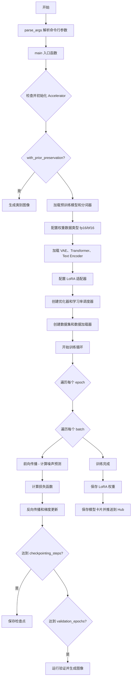

## 类结构

```
DreamBoothDataset (数据集类)
├── __init__ 初始化数据集
├── __len__ 获取数据集长度
├── __getitem__ 获取数据项
└── train_transform 训练图像变换
BucketBatchSampler (批次采样器)
├── __init__ 初始化采样器
├── __iter__ 迭代生成批次
└── __len__ 获取采样器长度
PromptDataset (提示数据集)
├── __init__ 初始化
├── __len__ 获取长度
└── __getitem__ 获取数据项
```

## 全局变量及字段


### `logger`
    
日志记录器，用于输出训练过程中的日志信息

类型：`logging.Logger`
    


### `args`
    
命令行参数对象，包含所有训练配置参数

类型：`argparse.Namespace`
    


### `accelerator`
    
分布式训练加速器，管理多GPU/TPU训练和混合精度

类型：`Accelerate.Accelerator`
    


### `tokenizer`
    
Qwen2分词器，用于文本编码

类型：`transformers.Qwen2Tokenizer`
    


### `vae`
    
变分自编码器，用于图像到潜在空间的编码和解码

类型：`diffusers.AutoencoderKL`
    


### `transformer`
    
Z-Image图像变换器模型，用于生成图像预测

类型：`diffusers.ZImageTransformer2DModel`
    


### `text_encoder`
    
Qwen3文本编码器模型，用于将文本提示编码为嵌入向量

类型：`transformers.Qwen3Model`
    


### `noise_scheduler`
    
流匹配欧拉离散噪声调度器，用于扩散模型的去噪调度

类型：`diffusers.FlowMatchEulerDiscreteScheduler`
    


### `train_dataset`
    
DreamBooth训练数据集，加载实例图像和类别图像

类型：`DreamBoothDataset`
    


### `train_dataloader`
    
训练数据加载器，按批次提供训练数据

类型：`torch.utils.data.DataLoader`
    


### `optimizer`
    
优化器，用于更新模型参数

类型：`torch.optim.Optimizer`
    


### `lr_scheduler`
    
学习率调度器，用于动态调整学习率

类型：`torch.optim.lr_scheduler._LRScheduler`
    


### `weight_dtype`
    
权重数据类型，决定模型参数的数据精度

类型：`torch.dtype`
    


### `DreamBoothDataset.size`
    
图像分辨率大小

类型：`int`
    


### `DreamBoothDataset.center_crop`
    
是否中心裁剪

类型：`bool`
    


### `DreamBoothDataset.instance_prompt`
    
实例提示词

类型：`str`
    


### `DreamBoothDataset.class_prompt`
    
类别提示词

类型：`str`
    


### `DreamBoothDataset.buckets`
    
宽高比桶配置

类型：`list`
    


### `DreamBoothDataset.instance_images`
    
实例图像列表

类型：`list`
    


### `DreamBoothDataset.pixel_values`
    
像素值列表

类型：`list`
    


### `DreamBoothDataset.num_instance_images`
    
实例图像数量

类型：`int`
    


### `DreamBoothDataset.class_data_root`
    
类别数据根目录

类型：`Path`
    


### `DreamBoothDataset.class_images_path`
    
类别图像路径列表

类型：`list`
    


### `DreamBoothDataset.num_class_images`
    
类别图像数量

类型：`int`
    


### `DreamBoothDataset.image_transforms`
    
图像变换组合

类型：`torchvision.transforms.Compose`
    


### `BucketBatchSampler.dataset`
    
数据集引用

类型：`DreamBoothDataset`
    


### `BucketBatchSampler.batch_size`
    
批次大小

类型：`int`
    


### `BucketBatchSampler.drop_last`
    
是否丢弃最后不完整批次

类型：`bool`
    


### `BucketBatchSampler.bucket_indices`
    
桶索引列表

类型：`list`
    


### `BucketBatchSampler.sampler_len`
    
采样器长度

类型：`int`
    


### `BucketBatchSampler.batches`
    
预生成的批次列表

类型：`list`
    


### `PromptDataset.prompt`
    
生成提示词

类型：`str`
    


### `PromptDataset.num_samples`
    
样本数量

类型：`int`
    
    

## 全局函数及方法


### `save_model_card`

该函数用于在 DreamBooth LoRA 训练完成后，将模型元信息生成并保存为 HuggingFace Hub 兼容的 README.md 模型卡片文件，包含模型描述、使用方法、许可证等信息，同时可选地将验证时生成的图片保存到本地仓库文件夹中。

参数：

- `repo_id`：`str`，模型在 HuggingFace Hub 上的仓库唯一标识符
- `images`：`Optional[List[PIL.Image]]`，训练过程中生成的验证图片列表，默认为 None
- `base_model`：`Optional[str]，基础预训练模型的名称或路径，默认为 None
- `instance_prompt`：`Optional[str`，用于触发模型生成实例图像的提示词，默认为 None
- `validation_prompt`：`Optional[str]`，验证时使用的提示词，默认为 None
- `repo_folder`：`Optional[str]`，本地仓库文件夹路径，用于保存模型卡片和图片，默认为 None
- `quant_training`：`Optional[str]`，量化训练方法（如 "FP8 TorchAO" 或 "BitsandBytes"），默认为 None

返回值：`None`，函数直接操作文件系统，无返回值

#### 流程图

```mermaid
flowchart TD
    A[开始 save_model_card] --> B{images 是否为 None?}
    B -->|否| C[遍历 images 列表]
    C --> D[保存每张图片到 repo_folder/image_{i}.png]
    E[构建 widget_dict 用于 Hub 组件] --> F{每张图片}
    F -->|是| D
    F -->|否| G[构建 model_description 字符串]
    B -->|是| G
    
    G --> H[生成模型描述文本]
    H --> I[包含模型名称、基础模型、训练方法、触发词、使用示例等]
    
    I --> J[调用 load_or_create_model_card]
    J --> K[创建或加载模型卡片对象]
    K --> L[设置标签列表]
    L --> M[调用 populate_model_card 填充标签]
    M --> N[保存模型卡片到 repo_folder/README.md]
    
    N --> O[结束]
    
    style A fill:#f9f,stroke:#333
    style O fill:#9f9,stroke:#333
    style N fill:#ff9,stroke:#333
```

#### 带注释源码

```python
def save_model_card(
    repo_id: str,
    images=None,
    base_model: str = None,
    instance_prompt=None,
    validation_prompt=None,
    repo_folder=None,
    quant_training=None,
):
    """
    保存模型卡片到 README.md 文件
    
    该函数在 DreamBooth LoRA 训练完成后被调用，用于生成包含模型描述、
    使用说明和验证样例的 HuggingFace Hub 兼容模型卡片。
    
    参数:
        repo_id: 模型仓库的唯一标识符
        images: 验证时生成的图片列表
        base_model: 基础预训练模型路径或名称
        instance_prompt: 实例提示词，用于触发 LoRA 效果
        validation_prompt: 验证时使用的提示词
        repo_folder: 本地输出目录路径
        quant_training: 量化训练方法标识
    """
    widget_dict = []  # 初始化 Widget 字典列表，用于 Hub 页面展示
    
    # 如果有验证图片，保存到本地并构建 widget 字典
    if images is not None:
        for i, image in enumerate(images):
            # 保存图片到指定路径
            image.save(os.path.join(repo_folder, f"image_{i}.png"))
            # 构建 widget 字典，包含提示词和图片 URL
            widget_dict.append(
                {"text": validation_prompt if validation_prompt else " ", "output": {"url": f"image_{i}.png"}}
            )

    # 构建模型描述文本，包含 Markdown 格式的完整说明
    model_description = f"""
# Z Image DreamBooth LoRA - {repo_id}

<Gallery />

## Model description

These are {repo_id} DreamBooth LoRA weights for {base_model}.

The weights were trained using [DreamBooth](https://dreambooth.github.io/) with the [Z Image diffusers trainer](https://github.com/huggingface/diffusers/blob/main/examples/dreambooth/README_z_image.md).

Quant training? {quant_training}

## Trigger words

You should use `{instance_prompt}` to trigger the image generation.

## Download model

[Download the *.safetensors LoRA]({repo_id}/tree/main) in the Files & versions tab.

## Use it with the [🧨 diffusers library](https://github.com/huggingface/diffusers)

```py
from diffusers import AutoPipelineForText2Image
import torch
pipeline = AutoPipelineForText2Image.from_pretrained("Tongyi-MAI/Z-Image", torch_dtype=torch.bfloat16).to('cuda')
pipeline.load_lora_weights('{repo_id}', weight_name='pytorch_lora_weights.safetensors')
image = pipeline('{validation_prompt if validation_prompt else instance_prompt}').images[0]
```

For more details, including weighting, merging and fusing LoRAs, check the [documentation on loading LoRAs in diffusers](https://huggingface.co/docs/diffusers/main/en/using-diffusers/loading_adapters)

## License

Apace License 2.0
"""
    # 调用 diffusers 工具函数加载或创建模型卡片
    model_card = load_or_create_model_card(
        repo_id_or_path=repo_id,
        from_training=True,  # 标记为训练模式
        license="apache-2.0",
        base_model=base_model,
        prompt=instance_prompt,
        model_description=model_description,
        widget=widget_dict,
    )
    
    # 定义模型标签列表，用于 Hub 分类和搜索
    tags = [
        "text-to-image",
        "diffusers-training",
        "diffusers",
        "lora",
        "z-image",
        "template:sd-lora",
    ]

    # 填充模型卡片标签并保存到 README.md
    model_card = populate_model_card(model_card, tags=tags)
    model_card.save(os.path.join(repo_folder, "README.md"))
```


### `log_validation`

运行验证并生成图像日志，将生成的图像记录到TensorBoard或WandB跟踪器，并清理内存。

参数：

- `pipeline`：`diffusers.pipeline.ZImagePipeline`，用于生成图像的diffusers pipeline对象
- `args`：命令行参数命名空间，包含`validation_prompt`、`num_validation_images`、`seed`等配置
- `accelerator`：`accelerate.Accelerator`，分布式训练加速器，用于设备管理和跟踪器
- `pipeline_args`：`Dict`，包含pipeline的其他参数，如预计算的`prompt_embeds`
- `epoch`：`int`，当前训练的轮次，用于记录图像的步骤索引
- `torch_dtype`：`torch.dtype`，模型推理使用的数据类型（如float16、bfloat16）
- `is_final_validation`：`bool`，标识是否为最终验证（最终推理时为True），默认`False`

返回值：`List[PIL.Image]`，生成的验证图像列表

#### 流程图

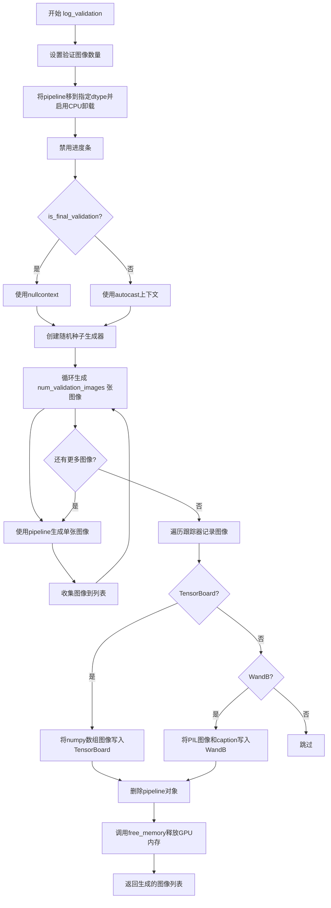

#### 带注释源码

```python
def log_validation(
    pipeline,           # diffusers pipeline对象，用于图像生成
    args,               # 包含验证相关配置的参数对象
    accelerator,       # accelerate加速器，用于设备管理和跟踪器
    pipeline_args,     # 包含prompt_embeds等预计算嵌入的字典
    epoch,             # 当前训练轮次，用于记录日志
    torch_dtype,       # torch数据类型，控制推理精度
    is_final_validation=False,  # 标识是否为最终验证阶段
):
    # 确定验证图像数量，默认值为1
    args.num_validation_images = args.num_validation_images if args.num_validation_images else 1
    
    # 记录验证开始信息
    logger.info(
        f"Running validation... \n Generating {args.num_validation_images} images with prompt:"
        f" {args.validation_prompt}."
    )
    
    # 将pipeline移到指定的数据类型设备
    pipeline = pipeline.to(dtype=torch_dtype)
    
    # 启用模型CPU卸载以节省显存
    pipeline.enable_model_cpu_offload()
    
    # 禁用进度条显示
    pipeline.set_progress_bar_config(disable=True)

    # 创建随机生成器，确保可复现性
    generator = torch.Generator(device=accelerator.device).manual_seed(args.seed) if args.seed is not None else None
    
    # 根据是否为最终验证选择上下文管理器
    # 最终验证时使用nullcontext避免autocast精度问题
    autocast_ctx = torch.autocast(accelerator.device.type) if not is_final_validation else nullcontext()

    # 初始化图像列表
    images = []
    
    # 循环生成指定数量的验证图像
    for _ in range(args.num_validation_images):
        with autocast_ctx:
            # 调用pipeline生成图像
            image = pipeline(
                prompt=args.validation_prompt,              # 验证提示词
                prompt_embeds=pipeline_args["prompt_embeds"],  # 预计算的提示词嵌入
                generator=generator,                        # 随机生成器
            ).images[0]  # 获取第一张图像
            images.append(image)  # 添加到图像列表

    # 遍历所有注册的跟踪器记录图像
    for tracker in accelerator.trackers:
        # 确定阶段名称：最终验证为"test"，常规验证为"validation"
        phase_name = "test" if is_final_validation else "validation"
        
        # TensorBoard跟踪器处理
        if tracker.name == "tensorboard":
            # 将PIL图像转换为numpy数组并堆叠
            np_images = np.stack([np.asarray(img) for img in images])
            # 添加图像到TensorBoard
            tracker.writer.add_images(phase_name, np_images, epoch, dataformats="NHWC")
        
        # WandB跟踪器处理
        if tracker.name == "wandb":
            tracker.log(
                {
                    phase_name: [
                        # 为每张图像创建WandB Image对象，带caption
                        wandb.Image(image, caption=f"{i}: {args.validation_prompt}") 
                        for i, image in enumerate(images)
                    ]
                }
            )

    # 清理pipeline对象
    del pipeline
    
    # 释放GPU显存
    free_memory()

    # 返回生成的图像列表供调用者使用
    return images
```


### `module_filter_fn`

该函数是 FP8 训练转换中的模块过滤器，用于决定哪些 PyTorch 模块需要被转换为 FP8 训练格式。具体逻辑为：排除名为 `proj_out` 的输出模块，同时排除输入或输出维度不能被 16 整除的线性层（因为 FP8 训练要求维度是 16 的倍数）。

参数：

- `mod`：`torch.nn.Module`，需要检查的模块对象
- `fqn`：`str`，模块的全限定名称（Fully Qualified Name）

返回值：`bool`，如果模块应该被转换为 FP8 训练格式返回 `True`，否则返回 `False`

#### 流程图

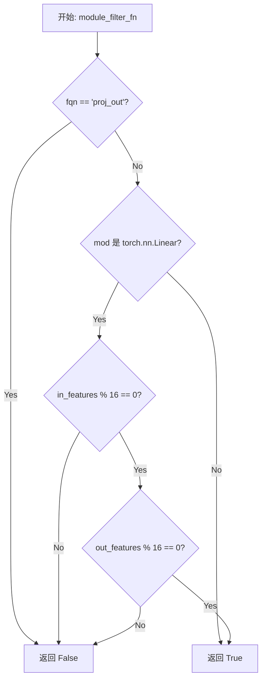

#### 带注释源码

```python
def module_filter_fn(mod: torch.nn.Module, fqn: str):
    # 排除输出模块 proj_out，不进行 FP8 转换
    # 因为输出层通常不需要或不适合进行量化
    if fqn == "proj_out":
        return False
    
    # 仅对 Linear 层进行检查
    # FP8 量化要求线性层的输入输出维度是 16 的倍数
    if isinstance(mod, torch.nn.Linear):
        # 检查输入特征维度是否能被 16 整除
        if mod.in_features % 16 != 0:
            return False
        # 检查输出特征维度是否能被 16 整除
        if mod.out_features % 16 != 0:
            return False
    
    # 其他模块或满足条件的 Linear 层返回 True，表示可以进行 FP8 转换
    return True
```


### `parse_args`

该函数是Z-Image DreamBooth LoRA训练脚本的核心参数解析模块，使用Python的`argparse`库构建完整的命令行参数接口，支持模型路径、数据集配置、训练超参数、LoRA设置、优化器配置、验证选项、分布式训练、混合精度训练等数十项配置的灵活指定，并通过一系列验证逻辑确保参数合法性与一致性，最终返回一个包含所有解析结果的`Namespace`对象供主训练流程使用。

参数：

- `input_args`：`Optional[List[str]]`，可选参数列表。当需要从非命令行（如测试或脚本内部）传入参数时使用，默认为`None`，此时函数会从`sys.argv`自动读取命令行参数。

返回值：`argparse.Namespace`，返回一个命名空间对象，其中包含所有通过命令行指定或使用默认值的配置参数。该对象用于后续的`main(args)`函数，驱动整个训练流程。

#### 流程图

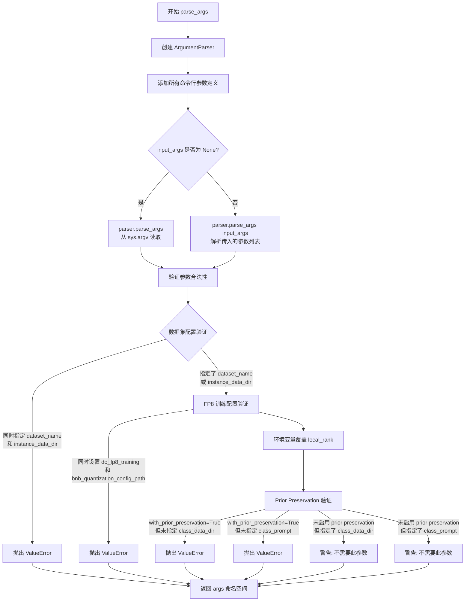

#### 带注释源码

```python
def parse_args(input_args=None):
    """
    解析命令行参数并返回包含所有配置项的命名空间对象。
    
    参数:
        input_args: 可选的参数列表，用于非命令行场景（如测试）
    返回:
        包含所有解析后配置项的 argparse.Namespace 对象
    """
    # 创建 ArgumentParser 实例，设置脚本描述
    parser = argparse.ArgumentParser(description="Simple example of a training script.")
    
    # ============ 模型相关参数 ============
    # 预训练模型路径或 HuggingFace 模型标识符（必需）
    parser.add_argument(
        "--pretrained_model_name_or_path",
        type=str,
        default=None,
        required=True,
        help="Path to pretrained model or model identifier from huggingface.co/models.",
    )
    # 预训练模型的版本修订号
    parser.add_argument(
        "--revision",
        type=str,
        default=None,
        required=False,
        help="Revision of pretrained model identifier from huggingface.co/models.",
    )
    # bitsandbytes 量化配置文件路径（用于 4bit/8bit 量化）
    parser.add_argument(
        "--bnb_quantization_config_path",
        type=str,
        default=None,
        help="Quantization config in a JSON file that will be used to define the bitsandbytes quant config of the DiT.",
    )
    # 是否启用 FP8 训练（标志参数）
    parser.add_argument(
        "--do_fp8_training",
        action="store_true",
        help="if we are doing FP8 training.",
    )
    # 模型变体（如 fp16）
    parser.add_argument(
        "--variant",
        type=str,
        default=None,
        help="Variant of the model files of the pretrained model identifier from huggingface.co/models, 'e.g.' fp16",
    )
    
    # ============ 数据集相关参数 ============
    # 数据集名称（可从 HuggingFace Hub 加载）
    parser.add_argument(
        "--dataset_name",
        type=str,
        default=None,
        help=(
            "The name of the Dataset (from the HuggingFace hub) containing the training data of instance images (could be your own, possibly private,"
            " dataset). It can also be a path pointing to a local copy of a dataset in your filesystem,"
            " or to a folder containing files that 🤗 Datasets can understand."
        ),
    )
    # 数据集配置名称
    parser.add_argument(
        "--dataset_config_name",
        type=str,
        default=None,
        help="The config of the Dataset, leave as None if there's only one config.",
    )
    # 本地实例数据目录
    parser.add_argument(
        "--instance_data_dir",
        type=str,
        default=None,
        help=("A folder containing the training data. "),
    )
    # 缓存目录
    parser.add_argument(
        "--cache_dir",
        type=str,
        default=None,
        help="The directory where the downloaded models and datasets will be stored.",
    )
    # 数据集中图像列名
    parser.add_argument(
        "--image_column",
        type=str,
        default="image",
        help="The column of the dataset containing the target image. By "
        "default, the standard Image Dataset maps out 'file_name' "
        "to 'image'.",
    )
    # 数据集中标题/提示词列名
    parser.add_argument(
        "--caption_column",
        type=str,
        default=None,
        help="The column of the dataset containing the instance prompt for each image",
    )
    # 训练数据重复次数
    parser.add_argument("--repeats", type=int, default=1, help="How many times to repeat the training data.")
    
    # ============ DreamBooth Prior Preservation 参数 ============
    # 类别图像数据目录
    parser.add_argument(
        "--class_data_dir",
        type=str,
        default=None,
        required=False,
        help="A folder containing the training data of class images.",
    )
    # 实例提示词（必需，用于标识特定实例）
    parser.add_argument(
        "--instance_prompt",
        type=str,
        default=None,
        required=True,
        help="The prompt with identifier specifying the instance, e.g. 'photo of a TOK dog', 'in the style of TOK'",
    )
    # 类别提示词
    parser.add_argument(
        "--class_prompt",
        type=str,
        default=None,
        help="The prompt to specify images in the same class as provided instance images.",
    )
    # T5 文本编码器的最大序列长度
    parser.add_argument(
        "--max_sequence_length",
        type=int,
        default=512,
        help="Maximum sequence length to use with with the T5 text encoder"
    )
    
    # ============ 验证相关参数 ============
    # 验证提示词
    parser.add_argument(
        "--validation_prompt",
        type=str,
        default=None,
        help="A prompt that is used during validation to verify that the model is learning.",
    )
    # 训练完成后是否跳过最终推理
    parser.add_argument(
        "--skip_final_inference",
        default=False,
        action="store_true",
        help="Whether to skip the final inference step with loaded lora weights upon training completion. This will run intermediate validation inference if `validation_prompt` is provided. Specify to reduce memory.",
    )
    # 最终验证提示词（当未提供 validation_prompt 时使用）
    parser.add_argument(
        "--final_validation_prompt",
        type=str,
        default=None,
        help="A prompt that is used during a final validation to verify that the model is learning. Ignored if `--validation_prompt` is provided.",
    )
    # 验证时生成的图像数量
    parser.add_argument(
        "--num_validation_images",
        type=int,
        default=4,
        help="Number of images that should be generated during validation with `validation_prompt`.",
    )
    # 验证间隔（按轮次）
    parser.add_argument(
        "--validation_epochs",
        type=int,
        default=50,
        help=(
            "Run dreambooth validation every X epochs. Dreambooth validation consists of running the prompt"
            " `args.validation_prompt` multiple times: `args.num_validation_images`."
        ),
    )
    
    # ============ LoRA 参数 ============
    # LoRA 秩（更新矩阵的维度）
    parser.add_argument(
        "--rank",
        type=int,
        default=4,
        help=("The dimension of the LoRA update matrices."),
    )
    # LoRA alpha（用于缩放）
    parser.add_argument(
        "--lora_alpha",
        type=int,
        default=4,
        help="LoRA alpha to be used for additional scaling.",
    )
    # LoRA 层的 dropout 概率
    parser.add_argument("--lora_dropout", type=float, default=0.0, help="Dropout probability for LoRA layers")
    # 是否启用 prior preservation loss
    parser.add_argument(
        "--with_prior_preservation",
        default=False,
        action="store_true",
        help="Flag to add prior preservation loss.",
    )
    # prior preservation loss 的权重
    parser.add_argument("--prior_loss_weight", type=float, default=1.0, help="The weight of prior preservation loss.")
    # prior preservation 所需的最小类别图像数量
    parser.add_argument(
        "--num_class_images",
        type=int,
        default=100,
        help=(
            "Minimal class images for prior preservation loss. If there are not enough images already present in"
            " class_data_dir, additional images will be sampled with class_prompt."
        ),
    )
    # 指定要应用 LoRA 训练的层
    parser.add_argument(
        "--lora_layers",
        type=str,
        default=None,
        help=(
            'The transformer modules to apply LoRA training on. Please specify the layers in a comma separated. E.g. - "to_k,to_q,to_v,to_out.0" will result in lora training of attention layers only'
        ),
    )
    
    # ============ 输出和保存参数 ============
    # 输出目录
    parser.add_argument(
        "--output_dir",
        type=str,
        default="z-image-dreambooth-lora",
        help="The output directory where the model predictions and checkpoints will be written.",
    )
    # 随机种子（用于可重复训练）
    parser.add_argument("--seed", type=int, default=None, help="A seed for reproducible training.")
    # 输入图像分辨率
    parser.add_argument(
        "--resolution",
        type=int,
        default=512,
        help=(
            "The resolution for input images, all the images in the train/validation dataset will be resized to this"
            " resolution"
        ),
    )
    # 宽高比桶（用于不同尺寸图像的训练）
    parser.add_argument(
        "--aspect_ratio_buckets",
        type=str,
        default=None,
        help=(
            "Aspect ratio buckets to use for training. Define as a string of 'h1,w1;h2,w2;...'. "
            "e.g. '1024,1024;768,1360;1360,768;880,1168;1168,880;1248,832;832,1248'"
            "Images will be resized and cropped to fit the nearest bucket. If provided, --resolution is ignored."
        ),
    )
    # 是否居中裁剪
    parser.add_argument(
        "--center_crop",
        default=False,
        action="store_true",
        help=(
            "Whether to center crop the input images to the resolution. If not set, the images will be randomly"
            " cropped. The images will be resized to the resolution first before cropping."
        ),
    )
    # 是否随机水平翻转
    parser.add_argument(
        "--random_flip",
        action="store_true",
        help="whether to randomly flip images horizontally",
    )
    
    # ============ 训练批处理参数 ============
    # 训练批大小（每设备）
    parser.add_argument(
        "--train_batch_size", type=int, default=4, help="Batch size (per device) for the training dataloader."
    )
    # 采样批大小（每设备）
    parser.add_argument(
        "--sample_batch_size", type=int, default=4, help="Batch size (per device) for sampling images."
    )
    # 训练轮数
    parser.add_argument("--num_train_epochs", type=int, default=1)
    # 最大训练步数（覆盖 num_train_epochs）
    parser.add_argument(
        "--max_train_steps",
        type=int,
        default=None,
        help="Total number of training steps to perform.  If provided, overrides num_train_epochs.",
    )
    # 检查点保存间隔
    parser.add_argument(
        "--checkpointing_steps",
        type=int,
        default=500,
        help=(
            "Save a checkpoint of the training state every X updates. These checkpoints can be used both as final"
            " checkpoints in case they are better than the last checkpoint, and are also suitable for resuming"
            " training using `--resume_from_checkpoint`."
        ),
    )
    # 最多保存的检查点数量
    parser.add_argument(
        "--checkpoints_total_limit",
        type=int,
        default=None,
        help=("Max number of checkpoints to store."),
    )
    # 从检查点恢复训练
    parser.add_argument(
        "--resume_from_checkpoint",
        type=str,
        default=None,
        help=(
            "Whether training should be resumed from a previous checkpoint. Use a path saved by"
            ' `--checkpointing_steps`, or `"latest"` to automatically select the last available checkpoint.'
        ),
    )
    # 梯度累积步数
    parser.add_argument(
        "--gradient_accumulation_steps",
        type=int,
        default=1,
        help="Number of updates steps to accumulate before performing a backward/update pass.",
    )
    # 是否启用梯度检查点（以内存换速度）
    parser.add_argument(
        "--gradient_checkpointing",
        action="store_true",
        help="Whether or not to use gradient checkpointing to save memory at the expense of slower backward pass.",
    )
    
    # ============ 学习率相关参数 ============
    # 初始学习率
    parser.add_argument(
        "--learning_rate",
        type=float,
        default=1e-4,
        help="Initial learning rate (after the potential warmup period) to use.",
    )
    # 引导比例（用于 FLUX.1 dev 变体）
    parser.add_argument(
        "--guidance_scale",
        type=float,
        default=3.5,
        help="the FLUX.1 dev variant is a guidance distilled model",
    )
    # 文本编码器学习率
    parser.add_argument(
        "--text_encoder_lr",
        type=float,
        default=5e-6,
        help="Text encoder learning rate to use.",
    )
    # 是否按 GPU/累积/批大小比例缩放学习率
    parser.add_argument(
        "--scale_lr",
        action="store_true",
        default=False,
        help="Scale the learning rate by the number of GPUs, gradient accumulation steps, and batch size.",
    )
    # 学习率调度器类型
    parser.add_argument(
        "--lr_scheduler",
        type=str,
        default="constant",
        help=(
            'The scheduler type to use. Choose between ["linear", "cosine", "cosine_with_restarts", "polynomial",'
            ' "constant", "constant_with_warmup"]'
        ),
    )
    # 预热步数
    parser.add_argument(
        "--lr_warmup_steps", type=int, default=500, help="Number of steps for the warmup in the lr scheduler."
    )
    # cosine_with_restarts 调度器的周期数
    parser.add_argument(
        "--lr_num_cycles",
        type=int,
        default=1,
        help="Number of hard resets of the lr in cosine_with_restarts scheduler.",
    )
    # 多项式调度器的幂因子
    parser.add_argument("--lr_power", type=float, default=1.0, help="Power factor of the polynomial scheduler.")
    
    # ============ 数据加载参数 ============
    # 数据加载的工作进程数
    parser.add_argument(
        "--dataloader_num_workers",
        type=int,
        default=0,
        help=(
            "Number of subprocesses to use for data loading. 0 means that the data will be loaded in the main process."
        ),
    )
    
    # ============ 采样权重方案参数 ============
    # 采样权重方案
    parser.add_argument(
        "--weighting_scheme",
        type=str,
        default="none",
        choices=["sigma_sqrt", "logit_normal", "mode", "cosmap", "none"],
        help=('We default to the "none" weighting scheme for uniform sampling and uniform loss'),
    )
    # logit_normal 方案的均值
    parser.add_argument(
        "--logit_mean", type=float, default=0.0, help="mean to use when using the `'logit_normal'` weighting scheme."
    )
    # logit_normal 方案的标准差
    parser.add_argument(
        "--logit_std", type=float, default=1.0, help="std to use when using the `'logit_normal'` weighting scheme."
    )
    # mode 方案的缩放因子
    parser.add_argument(
        "--mode_scale",
        type=float,
        default=1.29,
        help="Scale of mode weighting scheme. Only effective when using the `'mode'` as the `weighting_scheme`.",
    )
    
    # ============ 优化器参数 ============
    # 优化器类型
    parser.add_argument(
        "--optimizer",
        type=str,
        default="AdamW",
        help=('The optimizer type to use. Choose between ["AdamW", "prodigy"]'),
    )
    # 是否使用 8-bit Adam
    parser.add_argument(
        "--use_8bit_adam",
        action="store_true",
        help="Whether or not to use 8-bit Adam from bitsandbytes. Ignored if optimizer is not set to AdamW"
    )
    # Adam 的 beta1 参数
    parser.add_argument(
        "--adam_beta1", type=float, default=0.9, help="The beta1 parameter for the Adam and Prodigy optimizers."
    )
    # Adam 的 beta2 参数
    parser.add_argument(
        "--adam_beta2", type=float, default=0.999, help="The beta2 parameter for the Adam and Prodigy optimizers."
    )
    # Prodigy 的 beta3 参数
    parser.add_argument(
        "--prodigy_beta3",
        type=float,
        default=None,
        help="coefficients for computing the Prodigy stepsize using running averages. If set to None, "
        "uses the value of square root of beta2. Ignored if optimizer is adamW",
    )
    # Prodigy 是否使用解耦权重衰减
    parser.add_argument("--prodigy_decouple", type=bool, default=True, help="Use AdamW style decoupled weight decay")
    # unet 参数的权重衰减
    parser.add_argument("--adam_weight_decay", type=float, default=1e-04, help="Weight decay to use for unet params")
    # text_encoder 的权重衰减
    parser.add_argument(
        "--adam_weight_decay_text_encoder", type=float, default=1e-03, help="Weight decay to use for text_encoder"
    )
    # Adam 的 epsilon 值
    parser.add_argument(
        "--adam_epsilon",
        type=float,
        default=1e-08,
        help="Epsilon value for the Adam optimizer and Prodigy optimizers.",
    )
    # Prodigy 是否使用偏置校正
    parser.add_argument(
        "--prodigy_use_bias_correction",
        type=bool,
        default=True,
        help="Turn on Adam's bias correction. True by default. Ignored if optimizer is adamW",
    )
    # Prodigy 是否保护预热阶段
    parser.add_argument(
        "--prodigy_safeguard_warmup",
        type=bool,
        default=True,
        help="Remove lr from the denominator of D estimate to avoid issues during warm-up stage. True by default. "
        "Ignored if optimizer is adamW",
    )
    # 最大梯度范数
    parser.add_argument("--max_grad_norm", default=1.0, type=float, help="Max gradient norm.")
    
    # ============ Hub 和日志参数 ============
    # 是否推送到 Hub
    parser.add_argument("--push_to_hub", action="store_true", help="Whether or not to push the model to the Hub.")
    # Hub token
    parser.add_argument("--hub_token", type=str, default=None, help="The token to use to push to the Model Hub.")
    # Hub 模型 ID
    parser.add_argument(
        "--hub_model_id",
        type=str,
        default=None,
        help="The name of the repository to keep in sync with the local `output_dir`.",
    )
    # 日志目录
    parser.add_argument(
        "--logging_dir",
        type=str,
        default="logs",
        help=(
            "[TensorBoard](https://www.tensorflow.org/tensorboard) log directory. Will default to"
            " *output_dir/runs/**CURRENT_DATETIME_HOSTNAME***."
        ),
    )
    # 是否允许 TF32
    parser.add_argument(
        "--allow_tf32",
        action="store_true",
        help=(
            "Whether or not to allow TF32 on Ampere GPUs. Can be used to speed up training. For more information, see"
            " https://pytorch.org/docs/stable/notes/cuda.html#tensorfloat-32-tf32-on-ampere-devices"
        ),
    )
    # 是否缓存 VAE 潜变量
    parser.add_argument(
        "--cache_latents",
        action="store_true",
        default=False,
        help="Cache the VAE latents",
    )
    # 报告目标
    parser.add_argument(
        "--report_to",
        type=str,
        default="tensorboard",
        help=(
            'The integration to report the results and logs to. Supported platforms are `"tensorboard"`'
            ' (default), `"wandb"` and `"comet_ml"`. Use `"all"` to report to all integrations.'
        ),
    )
    # 混合精度类型
    parser.add_argument(
        "--mixed_precision",
        type=str,
        default=None,
        choices=["no", "fp16", "bf16"],
        help=(
            "Whether to use mixed precision. Choose between fp16 and bf16 (bfloat16). Bf16 requires PyTorch >="
            " 1.10.and an Nvidia Ampere GPU.  Default to the value of accelerate config of the current system or the"
            " flag passed with the `accelerate.launch` command. Use this argument to override the accelerate config."
        ),
    )
    # 保存前是否转换为 float32
    parser.add_argument(
        "--upcast_before_saving",
        action="store_true",
        default=False,
        help=(
            "Whether to upcast the trained transformer layers to float32 before saving (at the end of training). "
            "Defaults to precision dtype used for training to save memory"
        ),
    )
    # 是否将 VAE 和文本编码器卸载到 CPU
    parser.add_argument(
        "--offload",
        action="store_true",
        help="Whether to offload the VAE and the text encoder to CPU when they are not used.",
    )
    # prior 生成精度
    parser.add_argument(
        "--prior_generation_precision",
        type=str,
        default=None,
        choices=["no", "fp32", "fp16", "bf16"],
        help=(
            "Choose prior generation precision between fp32, fp16 and bf16 (bfloat16). Bf16 requires PyTorch >="
            " 1.10.and an Nvidia Ampere GPU.  Default to  fp16 if a GPU is available else fp32."
        ),
    )
    # 分布式训练本地排名
    parser.add_argument("--local_rank", type=int, default=-1, help="For distributed training: local_rank")
    # 启用 NPU Flash Attention
    parser.add_argument("--enable_npu_flash_attention", action="store_true", help="Enabla Flash Attention for NPU")
    # 是否对文本编码器使用 FSDP
    parser.add_argument("--fsdp_text_encoder", action="store_true", help="Use FSDP for text encoder")

    # ============ 解析参数 ============
    # 根据 input_args 是否存在决定解析方式
    if input_args is not None:
        args = parser.parse_args(input_args)
    else:
        args = parser.parse_args()

    # ============ 参数验证逻辑 ============
    # 验证数据集配置：必须指定 dataset_name 或 instance_data_dir 之一
    if args.dataset_name is None and args.instance_data_dir is None:
        raise ValueError("Specify either `--dataset_name` or `--instance_data_dir`")

    # 不能同时指定两者
    if args.dataset_name is not None and args.instance_data_dir is not None:
        raise ValueError("Specify only one of `--dataset_name` or `--instance_data_dir`")
    
    # FP8 训练与量化配置不能同时使用
    if args.do_fp8_training and args.bnb_quantization_config_path:
        raise ValueError("Both `do_fp8_training` and `bnb_quantization_config_path` cannot be passed.")

    # 环境变量 LOCAL_RANK 覆盖命令行传入的 local_rank（用于分布式训练）
    env_local_rank = int(os.environ.get("LOCAL_RANK", -1))
    if env_local_rank != -1 and env_local_rank != args.local_rank:
        args.local_rank = env_local_rank

    # Prior Preservation 验证
    if args.with_prior_preservation:
        if args.class_data_dir is None:
            raise ValueError("You must specify a data directory for class images.")
        if args.class_prompt is None:
            raise ValueError("You must specify prompt for class images.")
    else:
        # logger 尚未初始化，使用 warnings 模块
        if args.class_data_dir is not None:
            warnings.warn("You need not use --class_data_dir without --with_prior_preservation.")
        if args.class_prompt is not None:
            warnings.warn("You need not use --class_prompt without --with_prior_preservation.")

    # 返回解析后的参数命名空间
    return args
```


### `collate_fn`

该函数是 DreamBooth 数据加载器的批处理整理函数，用于将数据集中多个样本整理成一个训练批次。主要功能是收集实例图像和文本提示，并在启用先验保存（prior preservation）时同时整合类别图像和类别提示，以支持 DreamBooth 训练中的保先损失计算。

参数：

- `examples`：`List[Dict]`，从 `DreamBoothDataset` 返回的样本列表，每个样本包含图像数据和提示词
- `with_prior_preservation`：`bool`，是否启用先验保存，启用时会在批次中同时包含实例和类别数据以计算保先损失

返回值：`Dict`，包含以下键值对的字典：
- `pixel_values`：`torch.Tensor`，形状为 `(batch_size, C, H, W)` 的图像张量
- `prompts`：`List[str]`，对应的文本提示列表

#### 流程图

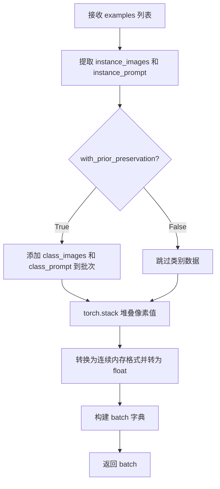

#### 带注释源码

```python
def collate_fn(examples, with_prior_preservation=False):
    """
    整理批次数据，用于 DataLoader
    
    参数:
        examples: 从 DreamBoothDataset 获取的样本列表
        with_prior_preservation: 是否启用先验保存（DreamBooth 技术）
    
    返回:
        包含 pixel_values 和 prompts 的字典
    """
    # 从所有样本中提取实例图像和实例提示
    pixel_values = [example["instance_images"] for example in examples]
    prompts = [example["instance_prompt"] for example in examples]

    # Concat class and instance examples for prior preservation.
    # We do this to avoid doing two forward passes.
    # 如果启用先验保存，将类别图像和类别提示也加入批次
    # 这样可以避免进行两次前向传播
    if with_prior_preservation:
        pixel_values += [example["class_images"] for example in examples]
        prompts += [example["class_prompt"] for example in examples]

    # 将像素值列表堆叠成张量，并确保内存连续且为 float 类型
    pixel_values = torch.stack(pixel_values)
    pixel_values = pixel_values.to(memory_format=torch.contiguous_format).float()

    # 构建最终的批次字典
    batch = {"pixel_values": pixel_values, "prompts": prompts}
    return batch
```


### `main`

主训练函数，负责执行完整的 DreamBooth LoRA 训练流程，包括模型加载、数据集准备、优化器配置、训练循环、验证以及模型保存。

参数：

- `args`：命令行参数对象（Namespace类型），包含所有训练配置，如模型路径、数据路径、训练超参数等

返回值：`None`，函数执行完成后直接退出

#### 流程图

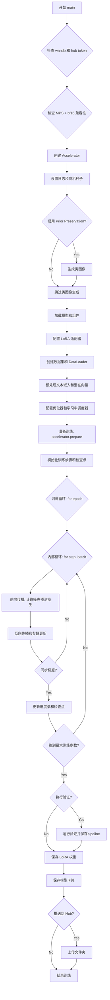

#### 带注释源码

```python
def main(args):
    """主训练函数，执行完整的 DreamBooth LoRA 训练流程"""
    
    # 1. 安全检查：不能同时使用 wandb 和 hub_token
    if args.report_to == "wandb" and args.hub_token is not None:
        raise ValueError(
            "You cannot use both --report_to=wandb and --hub_token due to a security risk of exposing your token."
            " Please use `hf auth login` to authenticate with the Hub."
        )

    # 2. MPS 设备不支持 bfloat16 混合精度训练
    if torch.backends.mps.is_available() and args.mixed_precision == "bf16":
        raise ValueError(
            "Mixed precision training with bfloat16 is not supported on MPS. Please use fp16 (recommended) or fp32 instead."
        )
    
    # 3. 如果启用 FP8 训练，导入 Float8 转换工具
    if args.do_fp8_training:
        from torchao.float8 import Float8LinearConfig, convert_to_float8_training

    # 4. 设置日志目录
    logging_dir = Path(args.output_dir, args.logging_dir)

    # 5. 创建 Accelerator：负责分布式训练、混合精度、模型保存加载等
    accelerator_project_config = ProjectConfiguration(project_dir=args.output_dir, logging_dir=logging_dir)
    kwargs = DistributedDataParallelKwargs(find_unused_parameters=True)
    accelerator = Accelerator(
        gradient_accumulation_steps=args.gradient_accumulation_steps,
        mixed_precision=args.mixed_precision,
        log_with=args.report_to,
        project_config=accelerator_project_config,
        kwargs_handlers=[kwargs],
    )

    # 6. MPS 设备禁用 AMP
    if torch.backends.mps.is_available():
        accelerator.native_amp = False

    # 7. 检查 wandb 可用性
    if args.report_to == "wandb":
        if not is_wandb_available():
            raise ImportError("Make sure to install wandb if you want to use it for logging during training.")

    # 8. 配置日志格式
    logging.basicConfig(
        format="%(asctime)s - %(levelname)s - %(name)s - %(message)s",
        datefmt="%m/%d/%Y %H:%M:%S",
        level=logging.INFO,
    )
    logger.info(accelerator.state, main_process_only=False)
    
    # 9. 主进程设置详细日志，其他进程只显示错误
    if accelerator.is_local_main_process:
        transformers.utils.logging.set_verbosity_warning()
        diffusers.utils.logging.set_verbosity_info()
    else:
        transformers.utils.logging.set_verbosity_error()
        diffusers.utils.logging.set_verbosity_error()

    # 10. 设置随机种子以确保可复现性
    if args.seed is not None:
        set_seed(args.seed)

    # 11. 生成类图像（如果启用先验保留）
    if args.with_prior_preservation:
        class_images_dir = Path(args.class_data_dir)
        if not class_images_dir.exists():
            class_images_dir.mkdir(parents=True)
        cur_class_images = len(list(class_images_dir.iterdir()))

        # 如果类图像数量不足，则生成更多
        if cur_class_images < args.num_class_images:
            has_supported_fp16_accelerator = torch.cuda.is_available() or torch.backends.mps.is_available()
            torch_dtype = torch.float16 if has_supported_fp16_accelerator else torch.float32
            if args.prior_generation_precision == "fp32":
                torch_dtype = torch.float32
            elif args.prior_generation_precision == "fp16":
                torch_dtype = torch.float16
            elif args.prior_generation_precision == "bf16":
                torch_dtype = torch.bfloat16

            # 创建推理 pipeline 用于生成类图像
            pipeline = ZImagePipeline.from_pretrained(
                args.pretrained_model_name_or_path,
                torch_dtype=torch_dtype,
                revision=args.revision,
                variant=args.variant,
            )
            pipeline.set_progress_bar_config(disable=True)

            num_new_images = args.num_class_images - cur_class_images
            logger.info(f"Number of class images to sample: {num_new_images}.")

            sample_dataset = PromptDataset(args.class_prompt, num_new_images)
            sample_dataloader = torch.utils.data.DataLoader(sample_dataset, batch_size=args.sample_batch_size)

            sample_dataloader = accelerator.prepare(sample_dataloader)
            pipeline.to(accelerator.device)

            # 使用 pipeline 生成类图像并保存
            for example in tqdm(
                sample_dataloader, desc="Generating class images", disable=not accelerator.is_local_main_process
            ):
                with torch.autocast(device_type=accelerator.device.type, dtype=torch_dtype):
                    images = pipeline(prompt=example["prompt"]).images

                for i, image in enumerate(images):
                    hash_image = insecure_hashlib.sha1(image.tobytes()).hexdigest()
                    image_filename = class_images_dir / f"{example['index'][i] + cur_class_images}-{hash_image}.jpg"
                    image.save(image_filename)

            del pipeline
            free_memory()

    # 12. 处理 Hub 仓库创建
    if accelerator.is_main_process:
        if args.output_dir is not None:
            os.makedirs(args.output_dir, exist_ok=True)

        if args.push_to_hub:
            repo_id = create_repo(
                repo_id=args.hub_model_id or Path(args.output_dir).name,
                exist_ok=True,
            ).repo_id

    # 13. 加载分词器
    tokenizer = Qwen2Tokenizer.from_pretrained(
        args.pretrained_model_name_or_path,
        subfolder="tokenizer",
        revision=args.revision,
    )

    # 14. 设置权重数据类型（用于推理组件）
    weight_dtype = torch.float32
    if accelerator.mixed_precision == "fp16":
        weight_dtype = torch.float16
    elif accelerator.mixed_precision == "bf16":
        weight_dtype = torch.bfloat16

    # 15. 加载调度器和模型
    noise_scheduler = FlowMatchEulerDiscreteScheduler.from_pretrained(
        args.pretrained_model_name_or_path,
        subfolder="scheduler",
        revision=args.revision,
    )
    noise_scheduler_copy = copy.deepcopy(noise_scheduler)
    vae = AutoencoderKL.from_pretrained(
        args.pretrained_model_name_or_path,
        subfolder="vae",
        revision=args.revision,
        variant=args.variant,
    )
    vae_config_shift_factor = vae.config.shift_factor
    vae_config_scaling_factor = vae.config.scaling_factor

    # 16. 配置量化（如果使用 bitsandbytes）
    quantization_config = None
    if args.bnb_quantization_config_path is not None:
        with open(args.bnb_quantization_config_path, "r") as f:
            config_kwargs = json.load(f)
            if "load_in_4bit" in config_kwargs and config_kwargs["load_in_4bit"]:
                config_kwargs["bnb_4bit_compute_dtype"] = weight_dtype
        quantization_config = BitsAndBytesConfig(**config_kwargs)

    # 17. 加载 transformer 主模型
    transformer = ZImageTransformer2DModel.from_pretrained(
        args.pretrained_model_name_or_path,
        subfolder="transformer",
        revision=args.revision,
        variant=args.variant,
        quantization_config=quantization_config,
        torch_dtype=weight_dtype,
    )
    if args.bnb_quantization_config_path is not None:
        transformer = prepare_model_for_kbit_training(transformer, use_gradient_checkpointing=False)

    # 18. 加载文本编码器
    text_encoder = Qwen3Model.from_pretrained(
        args.pretrained_model_name_or_path,
        subfolder="text_encoder",
        revision=args.revision,
        variant=args.variant,
    )
    text_encoder.requires_grad_(False)

    # 19. 设置模型为可训练状态（冻结基础模型，只训练 LoRA）
    transformer.requires_grad_(False)
    vae.requires_grad_(False)

    # 20. 启用 NPU Flash Attention（如果支持）
    if args.enable_npu_flash_attention:
        if is_torch_npu_available():
            logger.info("npu flash attention enabled.")
            transformer.set_attention_backend("_native_npu")
        else:
            raise ValueError("npu flash attention requires torch_npu extensions and is supported only on npu device ")

    # 21. 将模型移动到加速器设备
    to_kwargs = {"dtype": weight_dtype, "device": accelerator.device} if not args.offload else {"dtype": weight_dtype}
    vae.to(**to_kwargs)
    
    # 22. Transformer 设备配置
    transformer_to_kwargs = (
        {"device": accelerator.device}
        if args.bnb_quantization_config_path is not None
        else {"device": accelerator.device, "dtype": weight_dtype}
    )

    is_fsdp = getattr(accelerator.state, "fsdp_plugin", None) is not None
    if not is_fsdp:
        transformer.to(**transformer_to_kwargs)

    # 23. FP8 训练转换
    if args.do_fp8_training:
        convert_to_float8_training(
            transformer, module_filter_fn=module_filter_fn, config=Float8LinearConfig(pad_inner_dim=True)
        )

    text_encoder.to(**to_kwargs)
    
    # 24. 创建文本编码 pipeline（用于编码提示词）
    text_encoding_pipeline = ZImagePipeline.from_pretrained(
        args.pretrained_model_name_or_path,
        vae=None,
        transformer=None,
        tokenizer=tokenizer,
        text_encoder=text_encoder,
        scheduler=None,
        revision=args.revision,
    )

    # 25. 启用梯度检查点（节省显存）
    if args.gradient_checkpointing:
        transformer.enable_gradient_checkpointing()

    # 26. 配置 LoRA 目标层
    if args.lora_layers is not None:
        target_modules = [layer.strip() for layer in args.lora_layers.split(",")]
    else:
        target_modules = ["to_k", "to_q", "to_v", "to_out.0"]

    # 27. 添加 LoRA 适配器到 transformer
    transformer_lora_config = LoraConfig(
        r=args.rank,
        lora_alpha=args.lora_alpha,
        lora_dropout=args.lora_dropout,
        init_lora_weights="gaussian",
        target_modules=target_modules,
    )
    transformer.add_adapter(transformer_lora_config)

    # 28. 解包模型的辅助函数
    def unwrap_model(model):
        model = accelerator.unwrap_model(model)
        model = model._orig_mod if is_compiled_module(model) else model
        return model

    # 29. 注册模型保存/加载钩子
    def save_model_hook(models, weights, output_dir):
        """自定义模型保存钩子"""
        transformer_cls = type(unwrap_model(transformer))
        modules_to_save: dict[str, Any] = {}
        transformer_model = None

        for model in models:
            if isinstance(unwrap_model(model), transformer_cls):
                transformer_model = model
                modules_to_save["transformer"] = model
            else:
                raise ValueError(f"unexpected save model: {model.__class__}")

        if transformer_model is None:
            raise ValueError("No transformer model found in 'models'")

        state_dict = accelerator.get_state_dict(model) if is_fsdp else None

        transformer_lora_layers_to_save = None
        if accelerator.is_main_process:
            peft_kwargs = {}
            if is_fsdp:
                peft_kwargs["state_dict"] = state_dict

            transformer_lora_layers_to_save = get_peft_model_state_dict(
                unwrap_model(transformer_model) if is_fsdp else transformer_model,
                **peft_kwargs,
            )

            if is_fsdp:
                transformer_lora_layers_to_save = _to_cpu_contiguous(transformer_lora_layers_to_save)

            if weights:
                weights.pop()

            ZImagePipeline.save_lora_weights(
                output_dir,
                transformer_lora_layers=transformer_lora_layers_to_save,
                **_collate_lora_metadata(modules_to_save),
            )

    def load_model_hook(models, input_dir):
        """自定义模型加载钩子"""
        transformer_ = None

        if not is_fsdp:
            while len(models) > 0:
                model = models.pop()

                if isinstance(unwrap_model(model), type(unwrap_model(transformer))):
                    transformer_ = unwrap_model(model)
                else:
                    raise ValueError(f"unexpected save model: {model.__class__}")
        else:
            transformer_ = ZImageTransformer2DModel.from_pretrained(
                args.pretrained_model_name_or_path,
                subfolder="transformer",
            )
            transformer_.add_adapter(transformer_lora_config)

        lora_state_dict = ZImagePipeline.lora_state_dict(input_dir)

        transformer_state_dict = {
            f"{k.replace('transformer.', '')}": v for k, v in lora_state_dict.items() if k.startswith("transformer.")
        }
        transformer_state_dict = convert_unet_state_dict_to_peft(transformer_state_dict)
        incompatible_keys = set_peft_model_state_dict(transformer_, transformer_state_dict, adapter_name="default")
        if incompatible_keys is not None:
            unexpected_keys = getattr(incompatible_keys, "unexpected_keys", None)
            if unexpected_keys:
                logger.warning(
                    f"Loading adapter weights from state_dict led to unexpected keys not found in the model: "
                    f" {unexpected_keys}. "
                )

        # 确保可训练参数为 float32
        if args.mixed_precision == "fp16":
            models = [transformer_]
            cast_training_params(models)

    accelerator.register_save_state_pre_hook(save_model_hook)
    accelerator.register_load_state_pre_hook(load_model_hook)

    # 30. 启用 TF32 加速
    if args.allow_tf32 and torch.cuda.is_available():
        torch.backends.cuda.matmul.allow_tf32 = True

    # 31. 缩放学习率（根据 GPU 数量、梯度累积和批量大小）
    if args.scale_lr:
        args.learning_rate = (
            args.learning_rate * args.gradient_accumulation_steps * args.train_batch_size * accelerator.num_processes
        )

    # 32. 确保可训练参数为 float32
    if args.mixed_precision == "fp16":
        models = [transformer]
        cast_training_params(models, dtype=torch.float32)

    # 33. 获取可训练参数
    transformer_lora_parameters = list(filter(lambda p: p.requires_grad, transformer.parameters()))

    # 34. 配置优化器参数
    transformer_parameters_with_lr = {"params": transformer_lora_parameters, "lr": args.learning_rate}
    params_to_optimize = [transformer_parameters_with_lr]

    # 35. 创建优化器
    if not (args.optimizer.lower() == "prodigy" or args.optimizer.lower() == "adamw"):
        logger.warning(
            f"Unsupported choice of optimizer: {args.optimizer}.Supported optimizers include [adamW, prodigy]."
            "Defaulting to adamW"
        )
        args.optimizer = "adamw"

    if args.use_8bit_adam and not args.optimizer.lower() == "adamw":
        logger.warning(
            f"use_8bit_adam is ignored when optimizer is not set to 'AdamW'. Optimizer was "
            f"set to {args.optimizer.lower()}"
        )

    # 选择并创建优化器
    if args.optimizer.lower() == "adamw":
        if args.use_8bit_adam:
            try:
                import bitsandbytes as bnb
            except ImportError:
                raise ImportError(
                    "To use 8-bit Adam, please install the bitsandbytes library: `pip install bitsandbytes`."
                )
            optimizer_class = bnb.optim.AdamW8bit
        else:
            optimizer_class = torch.optim.AdamW

        optimizer = optimizer_class(
            params_to_optimize,
            betas=(args.adam_beta1, args.adam_beta2),
            weight_decay=args.adam_weight_decay,
            eps=args.adam_epsilon,
        )

    if args.optimizer.lower() == "prodigy":
        try:
            import prodigyopt
        except ImportError:
            raise ImportError("To use Prodigy, please install the prodigyopt library: `pip install prodigyopt`")

        optimizer_class = prodigyopt.Prodigy

        if args.learning_rate <= 0.1:
            logger.warning(
                "Learning rate is too low. When using prodigy, it's generally better to set learning rate around 1.0"
            )

        optimizer = optimizer_class(
            params_to_optimize,
            betas=(args.adam_beta1, args.adam_beta2),
            beta3=args.prodigy_beta3,
            weight_decay=args.adam_weight_decay,
            eps=args.adam_epsilon,
            decouple=args.prodigy_decouple,
            use_bias_correction=args.prodigy_use_bias_correction,
            safeguard_warmup=args.prodigy_safeguard_warmup,
        )

    # 36. 配置 aspect ratio buckets
    if args.aspect_ratio_buckets is not None:
        buckets = parse_buckets_string(args.aspect_ratio_buckets)
    else:
        buckets = [(args.resolution, args.resolution)]
    logger.info(f"Using parsed aspect ratio buckets: {buckets}")

    # 37. 创建数据集和 DataLoader
    train_dataset = DreamBoothDataset(
        instance_data_root=args.instance_data_dir,
        instance_prompt=args.instance_prompt,
        class_prompt=args.class_prompt,
        class_data_root=args.class_data_dir if args.with_prior_preservation else None,
        class_num=args.num_class_images,
        size=args.resolution,
        repeats=args.repeats,
        center_crop=args.center_crop,
        buckets=buckets,
    )
    batch_sampler = BucketBatchSampler(train_dataset, batch_size=args.train_batch_size, drop_last=True)
    train_dataloader = torch.utils.data.DataLoader(
        train_dataset,
        batch_sampler=batch_sampler,
        collate_fn=lambda examples: collate_fn(examples, args.with_prior_preservation),
        num_workers=args.dataloader_num_workers,
    )

    # 38. 文本嵌入计算函数
    def compute_text_embeddings(prompt, text_encoding_pipeline):
        with torch.no_grad():
            prompt_embeds, _ = text_encoding_pipeline.encode_prompt(
                prompt=prompt,
                max_sequence_length=args.max_sequence_length,
            )
        return prompt_embeds

    # 39. 预处理文本嵌入（如果没有自定义 instance prompts）
    if not train_dataset.custom_instance_prompts:
        with offload_models(text_encoding_pipeline, device=accelerator.device, offload=args.offload):
            instance_prompt_hidden_states = compute_text_embeddings(args.instance_prompt, text_encoding_pipeline)

    # 40. 处理 class prompt（先验保留）
    if args.with_prior_preservation:
        with offload_models(text_encoding_pipeline, device=accelerator.device, offload=args.offload):
            class_prompt_hidden_states = compute_text_embeddings(args.class_prompt, text_encoding_pipeline)
    
    # 41. 处理验证 prompt
    validation_embeddings = {}
    if args.validation_prompt is not None:
        with offload_models(text_encoding_pipeline, device=accelerator.device, offload=args.offload):
            validation_embeddings["prompt_embeds"] = compute_text_embeddings(
                args.validation_prompt, text_encoding_pipeline
            )

    # 42. FSDP 配置文本编码器（如果启用）
    if args.fsdp_text_encoder:
        fsdp_kwargs = get_fsdp_kwargs_from_accelerator(accelerator)
        text_encoder_fsdp = wrap_with_fsdp(
            model=text_encoding_pipeline.text_encoder,
            device=accelerator.device,
            offload=args.offload,
            limit_all_gathers=True,
            use_orig_params=True,
            fsdp_kwargs=fsdp_kwargs,
        )
        text_encoding_pipeline.text_encoder = text_encoder_fsdp
        dist.barrier()

    # 44. 准备静态嵌入数据
    if not train_dataset.custom_instance_prompts:
        prompt_embeds = instance_prompt_hidden_states
        if args.with_prior_preservation:
            prompt_embeds = torch.cat([prompt_embeds, class_prompt_hidden_states], dim=0)

    # 45. 缓存 latents（如果启用）
    precompute_latents = args.cache_latents or train_dataset.custom_instance_prompts
    if precompute_latents:
        prompt_embeds_cache = []
        latents_cache = []
        for batch in tqdm(train_dataloader, desc="Caching latents"):
            with torch.no_grad():
                if args.cache_latents:
                    with offload_models(vae, device=accelerator.device, offload=args.offload):
                        batch["pixel_values"] = batch["pixel_values"].to(
                            accelerator.device, non_blocking=True, dtype=vae.dtype
                        )
                        latents_cache.append(vae.encode(batch["pixel_values"]).latent_dist)
                if train_dataset.custom_instance_prompts:
                    if args.fsdp_text_encoder:
                        prompt_embeds = compute_text_embeddings(batch["prompts"], text_encoding_pipeline)
                    else:
                        with offload_models(text_encoding_pipeline, device=accelerator.device, offload=args.offload):
                            prompt_embeds = compute_text_embeddings(batch["prompts"], text_encoding_pipeline)
                    prompt_embeds_cache.append(prompt_embeds)

    # 46. 释放 VAE 内存
    if args.cache_latents:
        vae = vae.to("cpu")
        del vae

    # 47. 释放文本编码 pipeline 内存
    text_encoding_pipeline = text_encoding_pipeline.to("cpu")
    del text_encoder, tokenizer
    free_memory()

    # 48. 配置学习率调度器
    num_warmup_steps_for_scheduler = args.lr_warmup_steps * accelerator.num_processes
    if args.max_train_steps is None:
        len_train_dataloader_after_sharding = math.ceil(len(train_dataloader) / accelerator.num_processes)
        num_update_steps_per_epoch = math.ceil(len_train_dataloader_after_sharding / args.gradient_accumulation_steps)
        num_training_steps_for_scheduler = (
            args.num_train_epochs * accelerator.num_processes * num_update_steps_per_epoch
        )
    else:
        num_training_steps_for_scheduler = args.max_train_steps * accelerator.num_processes

    lr_scheduler = get_scheduler(
        args.lr_scheduler,
        optimizer=optimizer,
        num_warmup_steps=num_warmup_steps_for_scheduler,
        num_training_steps=num_training_steps_for_scheduler,
        num_cycles=args.lr_num_cycles,
        power=args.lr_power,
    )

    # 49. 使用 Accelerator 准备所有组件
    transformer, optimizer, train_dataloader, lr_scheduler = accelerator.prepare(
        transformer, optimizer, train_dataloader, lr_scheduler
    )

    # 50. 重新计算总训练步数
    num_update_steps_per_epoch = math.ceil(len(train_dataloader) / args.gradient_accumulation_steps)
    if args.max_train_steps is None:
        args.max_train_steps = args.num_train_epochs * num_update_steps_per_epoch
        if num_training_steps_for_scheduler != args.max_train_steps:
            logger.warning(
                f"The length of the 'train_dataloader' after 'accelerator.prepare' ({len(train_dataloader)}) does not match "
                f"the expected length ({len_train_dataloader_after_sharding}) when the learning rate scheduler was created. "
                f"This inconsistency may result in the learning rate scheduler not functioning properly."
            )
    args.num_train_epochs = math.ceil(args.max_train_steps / num_update_steps_per_epoch)

    # 51. 初始化训练追踪器
    if accelerator.is_main_process:
        tracker_name = "dreambooth-z-image-lora"
        args_cp = vars(args).copy()
        accelerator.init_trackers(tracker_name, config=args_cp)

    # 52. 打印训练信息
    total_batch_size = args.train_batch_size * accelerator.num_processes * args.gradient_accumulation_steps

    logger.info("***** Running training *****")
    logger.info(f"  Num examples = {len(train_dataset)}")
    logger.info(f"  Num batches each epoch = {len(train_dataloader)}")
    logger.info(f"  Num Epochs = {args.num_train_epochs}")
    logger.info(f"  Instantaneous batch size per device = {args.train_batch_size}")
    logger.info(f"  Total train batch size (w. parallel, distributed & accumulation) = {total_batch_size}")
    logger.info(f"  Gradient Accumulation steps = {args.gradient_accumulation_steps}")
    logger.info(f"  Total optimization steps = {args.max_train_steps}")
    
    global_step = 0
    first_epoch = 0

    # 53. 从检查点恢复训练
    if args.resume_from_checkpoint:
        if args.resume_from_checkpoint != "latest":
            path = os.path.basename(args.resume_from_checkpoint)
        else:
            dirs = os.listdir(args.output_dir)
            dirs = [d for d in dirs if d.startswith("checkpoint")]
            dirs = sorted(dirs, key=lambda x: int(x.split("-")[1]))
            path = dirs[-1] if len(dirs) > 0 else None

        if path is None:
            accelerator.print(
                f"Checkpoint '{args.resume_from_checkpoint}' does not exist. Starting a new training run."
            )
            args.resume_from_checkpoint = None
            initial_global_step = 0
        else:
            accelerator.print(f"Resuming from checkpoint {path}")
            accelerator.load_state(os.path.join(args.output_dir, path))
            global_step = int(path.split("-")[1])
            initial_global_step = global_step
            first_epoch = global_step // num_update_steps_per_epoch
    else:
        initial_global_step = 0

    # 54. 创建进度条
    progress_bar = tqdm(
        range(0, args.max_train_steps),
        initial=initial_global_step,
        desc="Steps",
        disable=not accelerator.is_local_main_process,
    )

    # 55. 获取 sigma 值的辅助函数
    def get_sigmas(timesteps, n_dim=4, dtype=torch.float32):
        sigmas = noise_scheduler_copy.sigmas.to(device=accelerator.device, dtype=dtype)
        schedule_timesteps = noise_scheduler_copy.timesteps.to(accelerator.device)
        timesteps = timesteps.to(accelerator.device)
        step_indices = [(schedule_timesteps == t).nonzero().item() for t in timesteps]

        sigma = sigmas[step_indices].flatten()
        while len(sigma.shape) < n_dim:
            sigma = sigma.unsqueeze(-1)
        return sigma

    # 56. 训练循环
    for epoch in range(first_epoch, args.num_train_epochs):
        transformer.train()

        for step, batch in enumerate(train_dataloader):
            models_to_accumulate = [transformer]
            prompts = batch["prompts"]

            with accelerator.accumulate(models_to_accumulate):
                # 获取 prompt embeddings
                if train_dataset.custom_instance_prompts:
                    prompt_embeds = prompt_embeds_cache[step]
                else:
                    num_repeat_elements = len(prompts)
                    prompt_embeds = [pe for pe in prompt_embeds for _ in range(num_repeat_elements)]

                # 将图像转换为 latent 空间
                if args.cache_latents:
                    model_input = latents_cache[step].mode()
                else:
                    with offload_models(vae, device=accelerator.device, offload=args.offload):
                        pixel_values = batch["pixel_values"].to(dtype=vae.dtype)
                    model_input = vae.encode(pixel_values).latent_dist.mode()

                model_input = (model_input - vae_config_shift_factor) * vae_config_scaling_factor
                
                # 采样噪声
                noise = torch.randn_like(model_input)
                bsz = model_input.shape[0]

                # 采样随机时间步（用于加权采样）
                u = compute_density_for_timestep_sampling(
                    weighting_scheme=args.weighting_scheme,
                    batch_size=bsz,
                    logit_mean=args.logit_mean,
                    logit_std=args.logit_std,
                    mode_scale=args.mode_scale,
                )
                indices = (u * noise_scheduler_copy.config.num_train_timesteps).long()
                timesteps = noise_scheduler_copy.timesteps[indices].to(device=model_input.device)

                # Flow matching 添加噪声: zt = (1 - texp) * x + texp * z1
                sigmas = get_sigmas(timesteps, n_dim=model_input.ndim, dtype=model_input.dtype)
                noisy_model_input = (1.0 - sigmas) * model_input + sigmas * noise

                timestep_normalized = (1000 - timesteps) / 1000

                # 模型预测
                noisy_model_input_5d = noisy_model_input.unsqueeze(2)  # (B, C, H, W) -> (B, C, 1, H, W)
                noisy_model_input_list = list(noisy_model_input_5d.unbind(dim=0))

                model_pred_list = transformer(
                    noisy_model_input_list,
                    timestep_normalized,
                    prompt_embeds,  # Z-Image 使用 List[torch.Tensor]
                    return_dict=False,
                )[0]
                model_pred = torch.stack(model_pred_list, dim=0)  # (B, C, 1, H, W)
                model_pred = model_pred.squeeze(2)  # (B, C, H, W)
                model_pred = -model_pred  # Z-Image 需要取反预测

                # 计算权重
                weighting = compute_loss_weighting_for_sd3(weighting_scheme=args.weighting_scheme, sigmas=sigmas)

                # Flow matching 目标: 噪声 - 原始输入
                target = noise - model_input

                # 先验保留损失计算
                if args.with_prior_preservation:
                    model_pred, model_pred_prior = torch.chunk(model_pred, 2, dim=0)
                    target, target_prior = torch.chunk(target, 2, dim=0)

                    prior_loss = torch.mean(
                        (weighting.float() * (model_pred_prior.float() - target_prior.float()) ** 2).reshape(
                            target_prior.shape[0], -1
                        ),
                        1,
                    )
                    prior_loss = prior_loss.mean()

                # 计算常规损失
                loss = torch.mean(
                    (weighting.float() * (model_pred.float() - target.float()) ** 2).reshape(target.shape[0], -1),
                    1,
                )
                loss = loss.mean()

                # 添加先验保留损失
                if args.with_prior_preservation:
                    loss = loss + args.prior_loss_weight * prior_loss

                # 反向传播
                accelerator.backward(loss)
                
                # 梯度裁剪
                if accelerator.sync_gradients:
                    params_to_clip = transformer.parameters()
                    accelerator.clip_grad_norm_(params_to_clip, args.max_grad_norm)

                # 优化器更新
                optimizer.step()
                lr_scheduler.step()
                optimizer.zero_grad()

            # 梯度同步后的操作
            if accelerator.sync_gradients:
                progress_bar.update(1)
                global_step += 1

                # 检查点保存
                if accelerator.is_main_process or is_fsdp:
                    if global_step % args.checkpointing_steps == 0:
                        # 限制检查点数量
                        if args.checkpoints_total_limit is not None:
                            checkpoints = os.listdir(args.output_dir)
                            checkpoints = [d for d in checkpoints if d.startswith("checkpoint")]
                            checkpoints = sorted(checkpoints, key=lambda x: int(x.split("-")[1]))

                            if len(checkpoints) >= args.checkpoints_total_limit:
                                num_to_remove = len(checkpoints) - args.checkpoints_total_limit + 1
                                removing_checkpoints = checkpoints[0:num_to_remove]

                                logger.info(
                                    f"{len(checkpoints)} checkpoints already exist, removing {len(removing_checkpoints)} checkpoints"
                                )
                                logger.info(f"removing checkpoints: {', '.join(removing_checkpoints)}")

                                for removing_checkpoint in removing_checkpoints:
                                    removing_checkpoint = os.path.join(args.output_dir, removing_checkpoint)
                                    shutil.rmtree(removing_checkpoint)

                        save_path = os.path.join(args.output_dir, f"checkpoint-{global_step}")
                        accelerator.save_state(save_path)
                        logger.info(f"Saved state to {save_path}")

                # 记录日志
                logs = {"loss": loss.detach().item(), "lr": lr_scheduler.get_last_lr()[0]}
                progress_bar.set_postfix(**logs)
                accelerator.log(logs, step=global_step)

                # 检查是否达到最大训练步数
                if global_step >= args.max_train_steps:
                    break

        # 验证
        if accelerator.is_main_process:
            if args.validation_prompt is not None and epoch % args.validation_epochs == 0:
                pipeline = ZImagePipeline.from_pretrained(
                    args.pretrained_model_name_or_path,
                    transformer=unwrap_model(transformer),
                    revision=args.revision,
                    variant=args.variant,
                    torch_dtype=weight_dtype,
                )
                images = log_validation(
                    pipeline=pipeline,
                    args=args,
                    accelerator=accelerator,
                    pipeline_args=validation_embeddings,
                    epoch=epoch,
                    torch_dtype=weight_dtype,
                )

                del pipeline
                free_memory()

    # 57. 保存最终 LoRA 权重
    accelerator.wait_for_everyone()

    if is_fsdp:
        transformer = unwrap_model(transformer)
        state_dict = accelerator.get_state_dict(transformer)
    if accelerator.is_main_process:
        modules_to_save = {}
        if is_fsdp:
            if args.bnb_quantization_config_path is None:
                if args.upcast_before_saving:
                    state_dict = {
                        k: v.to(torch.float32) if isinstance(v, torch.Tensor) else v for k, v in state_dict.items()
                    }
                else:
                    state_dict = {
                        k: v.to(weight_dtype) if isinstance(v, torch.Tensor) else v for k, v in state_dict.items()
                    }

            transformer_lora_layers = get_peft_model_state_dict(
                transformer,
                state_dict=state_dict,
            )
            transformer_lora_layers = {
                k: v.detach().cpu().contiguous() if isinstance(v, torch.Tensor) else v
                for k, v in transformer_lora_layers.items()
            }

        else:
            transformer = unwrap_model(transformer)
            if args.bnb_quantization_config_path is None:
                if args.upcast_before_saving:
                    transformer.to(torch.float32)
                else:
                    transformer = transformer.to(weight_dtype)
            transformer_lora_layers = get_peft_model_state_dict(transformer)

        modules_to_save["transformer"] = transformer

        ZImagePipeline.save_lora_weights(
            save_directory=args.output_dir,
            transformer_lora_layers=transformer_lora_layers,
            **_collate_lora_metadata(modules_to_save),
        )

        # 最终验证
        images = []
        run_validation = (args.validation_prompt and args.num_validation_images > 0) or (args.final_validation_prompt)
        should_run_final_inference = not args.skip_final_inference and run_validation
        if should_run_final_inference:
            pipeline = ZImagePipeline.from_pretrained(
                args.pretrained_model_name_or_path,
                revision=args.revision,
                variant=args.variant,
                torch_dtype=weight_dtype,
            )
            pipeline.load_lora_weights(args.output_dir)

            if args.validation_prompt and args.num_validation_images > 0:
                images = log_validation(
                    pipeline=pipeline,
                    args=args,
                    accelerator=accelerator,
                    pipeline_args=validation_embeddings,
                    epoch=epoch,
                    is_final_validation=True,
                    torch_dtype=weight_dtype,
                )
            images = None
            del pipeline
            free_memory()

        # 58. 保存模型卡片
        validation_prompt = args.validation_prompt if args.validation_prompt else args.final_validation_prompt
        quant_training = None
        if args.do_fp8_training:
            quant_training = "FP8 TorchAO"
        elif args.bnb_quantization_config_path:
            quant_training = "BitsandBytes"
        save_model_card(
            (args.hub_model_id or Path(args.output_dir).name) if not args.push_to_hub else repo_id,
            images=images,
            base_model=args.pretrained_model_name_or_path,
            instance_prompt=args.instance_prompt,
            validation_prompt=validation_prompt,
            repo_folder=args.output_dir,
            quant_training=quant_training,
        )

        # 59. 推送到 Hub
        if args.push_to_hub:
            upload_folder(
                repo_id=repo_id,
                folder_path=args.output_dir,
                commit_message="End of training",
                ignore_patterns=["step_*", "epoch_*"],
            )

    accelerator.end_training()
```


### `unwrap_model`

该函数用于解包 Accelerator 包装的模型，处理模型可能被 TorchCompile 编译的情况，返回原始模型对象。

参数：

- `model`：`torch.nn.Module`，需要解包的模型对象，通常是经过 Accelerator 包装的模型

返回值：`torch.nn.Module`，解包后的模型对象，如果模型经过 TorchCompile 编译则返回 `_orig_mod`，否则返回原模型

#### 流程图

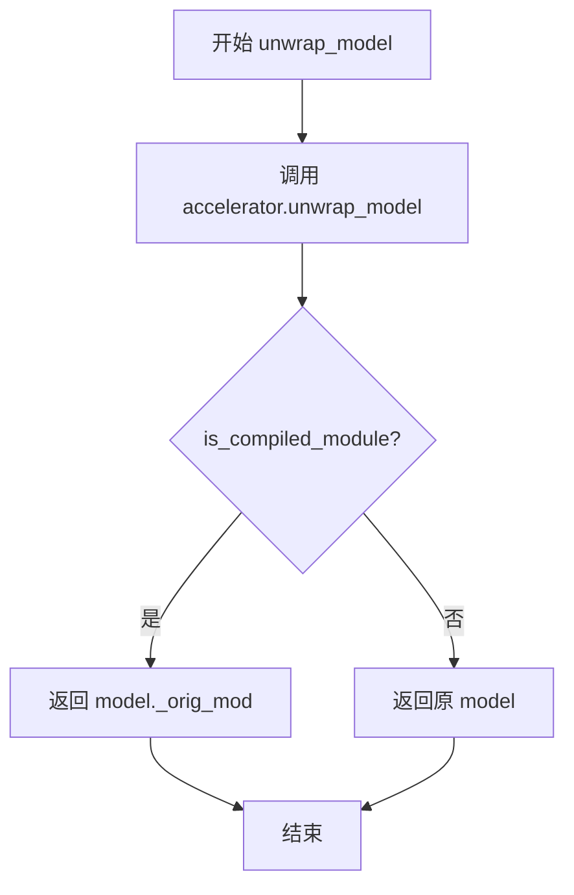

#### 带注释源码

```python
def unwrap_model(model):
    """
    解包加速器包装的模型，处理可能的 TorchCompile 编译模型
    
    参数:
        model: 需要解包的模型对象
        
    返回:
        解包后的模型对象
    """
    # 首先通过 Accelerator 的 unwrap_model 方法去除其包装层
    model = accelerator.unwrap_model(model)
    
    # 检查模型是否经过 TorchCompile 编译
    # 如果是编译过的模块，通过 _orig_mod 属性获取原始未编译的模型
    # 否则直接返回原模型
    model = model._orig_mod if is_compiled_module(model) else model
    
    return model
```


### `save_model_hook`

这是一个自定义的模型保存钩子函数，用于在分布式训练过程中保存模型的LoRA权重。该函数在accelerator保存状态时被调用，专门处理transformer模型的LoRA适配器权重，支持FSDP分布式训练场景，并将权重保存为safetensors格式。

参数：

- `models`：`List[torch.nn.Module]`，待保存的模型列表，通常包含transformer模型
- `weights`：`List[Any]`，权重列表，用于追踪已保存的权重以避免重复保存
- `output_dir`：`str`，保存输出的目录路径

返回值：`None`，该函数无返回值，直接将模型权重保存到磁盘

#### 流程图

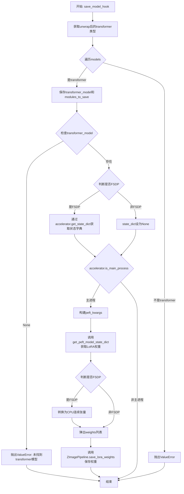

#### 带注释源码

```python
def save_model_hook(models, weights, output_dir):
    """
    自定义模型保存钩子，用于在分布式训练中保存LoRA权重
    
    参数:
        models: 包含待保存模型的列表
        weights: 权重列表，用于追踪已保存的权重
        output_dir: 保存输出的目录路径
    """
    # 获取unwrap后的transformer类型，用于类型判断
    transformer_cls = type(unwrap_model(transformer))

    # 1) 验证并选取transformer模型
    modules_to_save: dict[str, Any] = {}  # 用于存储需要保存额外权重的模块
    transformer_model = None  # 存储找到的transformer模型

    # 遍历所有传入的模型，找到transformer模型
    for model in models:
        if isinstance(unwrap_model(model), transformer_cls):
            transformer_model = model
            modules_to_save["transformer"] = model  # 保存transformer引用
        else:
            # 如果遇到非预期的模型类型，抛出错误
            raise ValueError(f"unexpected save model: {model.__class__}")

    # 确保找到了transformer模型
    if transformer_model is None:
        raise ValueError("No transformer model found in 'models'")

    # 2) 如果使用FSDP，提前获取一次state dict
    # FSDP情况下需要特殊处理state dict获取
    state_dict = accelerator.get_state_dict(model) if is_fsdp else None

    # 3) 仅主进程执行LoRA state dict的物化
    transformer_lora_layers_to_save = None
    if accelerator.is_main_process:
        # 构建peft相关参数
        peft_kwargs = {}
        if is_fsdp:
            # FSDP模式下传入预先获取的state dict
            peft_kwargs["state_dict"] = state_dict

        # 获取PEFT模型的LoRA权重字典
        # FSDP模式需要unwrap后的模型，普通模式直接使用
        transformer_lora_layers_to_save = get_peft_model_state_dict(
            unwrap_model(transformer_model) if is_fsdp else transformer_model,
            **peft_kwargs,
        )

        # 如果是FSDP，转换为CPU连续张量以便序列化
        if is_fsdp:
            transformer_lora_layers_to_save = _to_cpu_contiguous(transformer_lora_layers_to_save)

        # 确保弹出权重，避免重复保存
        if weights:
            weights.pop()

        # 调用Pipeline的静态方法保存LoRA权重
        # 同时会保存modules_to_save中的元数据（如base_model等）
        ZImagePipeline.save_lora_weights(
            output_dir,
            transformer_lora_layers=transformer_lora_layers_to_save,
            **_collate_lora_metadata(modules_to_save),
        )
```


### `load_model_hook`

该函数是一个用于加载模型状态的钩子函数（Hook），通常与 `accelerator.register_load_state_pre_hook` 配合使用，在恢复训练时从检查点加载 LoRA（Low-Rank Adaptation）权重到 Transformer 模型中。

参数：

- `models`：`List[torch.nn.Module]`，包含待加载的模型列表，在非 FSDP 模式下由 accelerator 自动传入
- `input_dir`：`str`，检查点目录的路径，从中读取 LoRA 权重文件

返回值：`None`，该函数直接修改传入的模型对象，不返回任何值

#### 流程图

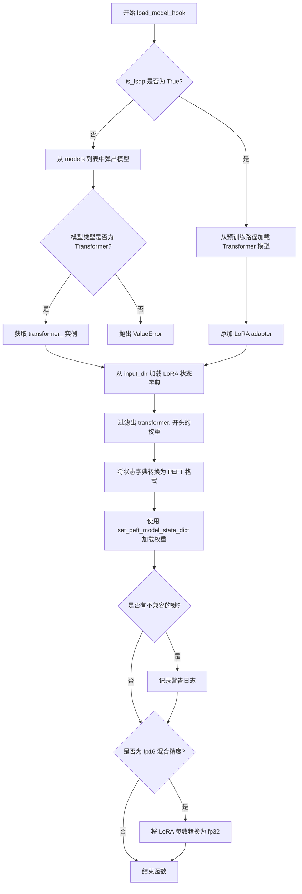

#### 带注释源码

```python
def load_model_hook(models, input_dir):
    """
    加载模型状态的钩子函数，用于从检查点恢复训练时加载 LoRA 权重。
    
    参数:
        models: 模型列表，在非 FSDP 模式下由 accelerator 传入
        input_dir: 检查点目录路径
    """
    transformer_ = None

    # 非 FSDP 模式：直接从传入的模型列表中获取 transformer
    if not is_fsdp:
        while len(models) > 0:
            model = models.pop()  # 弹出模型

            # 检查是否为 Transformer 模型
            if isinstance(unwrap_model(model), type(unwrap_model(transformer))):
                transformer_ = unwrap_model(model)
            else:
                raise ValueError(f"unexpected save model: {model.__class__}")
    else:
        # FSDP 模式：需要重新从预训练模型加载基础结构
        transformer_ = ZImageTransformer2DModel.from_pretrained(
            args.pretrained_model_name_or_path,
            subfolder="transformer",
        )
        # 添加 LoRA adapter 配置
        transformer_.add_adapter(transformer_lora_config)

    # 从指定目录加载 LoRA 权重状态字典
    lora_state_dict = ZImagePipeline.lora_state_dict(input_dir)

    # 过滤出 transformer 相关的权重键，并移除 "transformer." 前缀
    transformer_state_dict = {
        f"{k.replace('transformer.', '')}": v for k, v in lora_state_dict.items() if k.startswith("transformer.")
    }
    # 转换为 PEFT 格式的状态字典
    transformer_state_dict = convert_unet_state_dict_to_peft(transformer_state_dict)
    
    # 将 LoRA 权重加载到模型中
    incompatible_keys = set_peft_model_state_dict(transformer_, transformer_state_dict, adapter_name="default")
    
    # 检查并处理不兼容的键
    if incompatible_keys is not None:
        # 只检查意外键
        unexpected_keys = getattr(incompatible_keys, "unexpected_keys", None)
        if unexpected_keys:
            logger.warning(
                f"Loading adapter weights from state_dict led to unexpected keys not found in the model: "
                f" {unexpected_keys}. "
            )

    # 确保可训练参数为 float32。
    # 这在基础模型使用 weight_dtype 时是必需的。
    # 详情见: https://github.com/huggingface/diffusers/pull/6514#discussion_r1449796804
    if args.mixed_precision == "fp16":
        models = [transformer_]
        # 只将可训练参数（LoRA）转换为 fp32
        cast_training_params(models)
```


### `compute_text_embeddings`

该函数用于将文本提示（prompt）编码为模型可使用的嵌入向量（embeddings），通过文本编码管道对输入的文本进行向量化处理，生成用于后续图像生成模型的条件输入。

参数：

- `prompt`：`str`，需要编码的文本提示（prompt）
- `text_encoding_pipeline`：`ZImagePipeline`，文本编码管道，包含分词器和文本编码器

返回值：`torch.Tensor`，编码后的文本嵌入向量，形状为 `[batch_size, seq_len, hidden_dim]`

#### 流程图

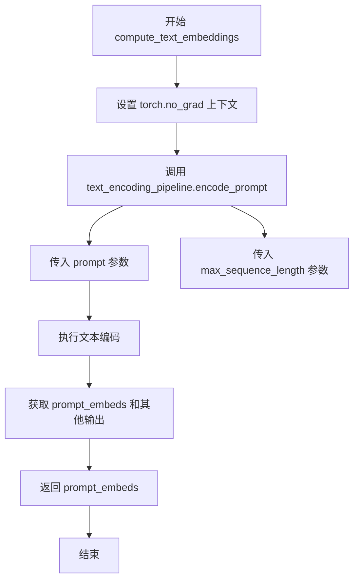

#### 带注释源码

```python
def compute_text_embeddings(prompt, text_encoding_pipeline):
    """
    计算文本嵌入向量
    
    将输入的文本提示编码为模型可使用的嵌入向量表示。
    该函数在推理时调用，不计算梯度以节省显存。
    
    参数:
        prompt: str - 要编码的文本提示
        text_encoding_pipeline: ZImagePipeline - 包含文本编码器的管道对象
    
    返回:
        prompt_embeds: torch.Tensor - 编码后的文本嵌入向量
    """
    # 使用 torch.no_grad() 上下文管理器，禁用梯度计算
    # 这样可以节省显存并加速推理，因为该函数仅用于编码而不需要反向传播
    with torch.no_grad():
        # 调用文本编码管道的 encode_prompt 方法进行编码
        # 返回的 prompt_embeds 是编码后的文本嵌入向量
        # 第二个返回值被忽略（用 _ 表示）
        prompt_embeds, _ = text_encoding_pipeline.encode_prompt(
            prompt=prompt,                                    # 输入的文本提示
            max_sequence_length=args.max_sequence_length,     # 最大序列长度，默认512
        )
    # 返回编码后的文本嵌入向量，供后续模型使用
    return prompt_embeds
```


### `get_sigmas`

获取噪声调度器的 sigma 值，用于在扩散模型的噪声调度过程中根据给定的时间步获取对应的 sigma（噪声水平）值。

参数：

- `timesteps`：`torch.Tensor`，需要获取 sigma 值的时间步张量
- `n_dim`：`int`，目标输出张量的维度数，默认为 4
- `dtype`：`torch.dtype`，返回张量的数据类型，默认为 torch.float32

返回值：`torch.Tensor`，与输入时间步对应的 sigma 值，形状会被扩展到 n_dim 维度

#### 流程图

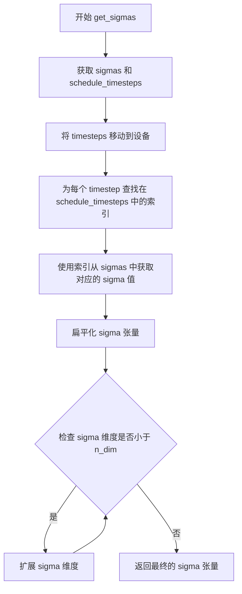

#### 带注释源码

```python
def get_sigmas(timesteps, n_dim=4, dtype=torch.float32):
    # 从噪声调度器的副本中获取 sigma 值，并将其移动到指定设备和数据类型
    sigmas = noise_scheduler_copy.sigmas.to(device=accelerator.device, dtype=dtype)
    
    # 获取调度器的时间步，并移动到指定设备
    schedule_timesteps = noise_scheduler_copy.timesteps.to(accelerator.device)
    
    # 将输入的时间步也移动到指定设备
    timesteps = timesteps.to(accelerator.device)
    
    # 为每个输入的时间步查找其在调度时间步中的索引
    # 通过比较 schedule_timesteps 和每个 t，找到匹配的位置
    step_indices = [(schedule_timesteps == t).nonzero().item() for t in timesteps]
    
    # 使用找到的索引从 sigma 数组中获取对应的 sigma 值，然后扁平化
    sigma = sigmas[step_indices].flatten()
    
    # 如果 sigma 的维度小于目标维度 n_dim，则扩展其维度
    # 通过在最后添加维度来达到目标维度
    while len(sigma.shape) < n_dim:
        sigma = sigma.unsqueeze(-1)
    
    # 返回最终的 sigma 张量
    return sigma
```


### DreamBoothDataset.__init__

该方法是`DreamBoothDataset`类的初始化方法，用于准备DreamBooth训练所需的实例图像和类图像数据集。它支持从HuggingFace数据集或本地目录加载图像，并应用图像变换（包括宽高比桶、中心裁剪、随机翻转等）以适配模型输入。

参数：

- `instance_data_root`：`str`，实例图像的根目录路径或HuggingFace数据集名称
- `instance_prompt`：`str`，实例提示词，用于标识特定实例
- `class_prompt`：`str`，类提示词，用于指定与实例图像同类的图像
- `class_data_root`：`str | None`，类图像的根目录路径，默认为None
- `class_num`：`int | None`，类图像的最大数量，默认为None
- `size`：`int`，图像目标尺寸，默认为1024
- `repeats`：`int`，训练数据重复次数，默认为1
- `center_crop`：`bool`，是否进行中心裁剪，默认为False
- `buckets`：`list[tuple[int, int]] | None`，宽高比桶列表，用于动态图像尺寸训练

返回值：`None`，该方法为构造函数，不返回任何值

#### 流程图

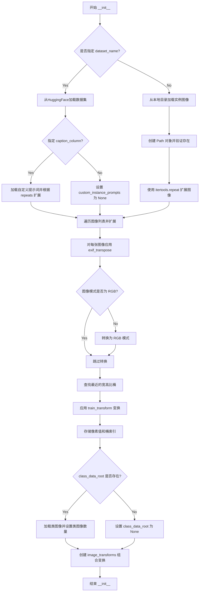

#### 带注释源码

```python
def __init__(
    self,
    instance_data_root,
    instance_prompt,
    class_prompt,
    class_data_root=None,
    class_num=None,
    size=1024,
    repeats=1,
    center_crop=False,
    buckets=None,
):
    """
    初始化DreamBooth数据集，用于准备实例和类图像及其提示词以微调模型。
    
    参数:
        instance_data_root: 实例图像的根目录或HuggingFace数据集名称
        instance_prompt: 实例提示词，用于标识特定实例
        class_prompt: 类提示词，用于指定与实例图像同类的图像
        class_data_root: 类图像的根目录路径
        class_num: 类图像的最大数量
        size: 图像目标尺寸
        repeats: 训练数据重复次数
        center_crop: 是否进行中心裁剪
        buckets: 宽高比桶列表，用于动态图像尺寸训练
    """
    # 1. 设置基础属性
    self.size = size
    self.center_crop = center_crop

    self.instance_prompt = instance_prompt
    self.custom_instance_prompts = None
    self.class_prompt = class_prompt

    self.buckets = buckets

    # 2. 根据数据来源加载训练数据
    # 如果提供了 --dataset_name 或本地目录中有 metadata jsonl 文件，使用 load_dataset 加载
    if args.dataset_name is not None:
        try:
            from datasets import load_dataset
        except ImportError:
            raise ImportError(
                "You are trying to load your data using the datasets library. If you wish to train using custom "
                "captions please install the datasets library: `pip install datasets`. If you wish to load a "
                "local folder containing images only, specify --instance_data_dir instead."
            )
        
        # 从Hub下载并加载数据集
        dataset = load_dataset(
            args.dataset_name,
            args.dataset_config_name,
            cache_dir=args.cache_dir,
        )
        
        # 获取列名
        column_names = dataset["train"].column_names

        # 获取图像列名
        if args.image_column is None:
            image_column = column_names[0]
            logger.info(f"image column defaulting to {image_column}")
        else:
            image_column = args.image_column
            if image_column not in column_names:
                raise ValueError(
                    f"`--image_column` value '{args.image_column}' not found in dataset columns. Dataset columns are: {', '.join(column_names)}"
                )
        
        # 获取实例图像
        instance_images = dataset["train"][image_column]

        # 处理提示词列
        if args.caption_column is None:
            logger.info(
                "No caption column provided, defaulting to instance_prompt for all images. If your dataset "
                "contains captions/prompts for the images, make sure to specify the "
                "column as --caption_column"
            )
            self.custom_instance_prompts = None
        else:
            if args.caption_column not in column_names:
                raise ValueError(
                    f"`--caption_column` value '{args.caption_column}' not found in dataset columns. Dataset columns are: {', '.join(column_names)}"
                )
            
            # 获取自定义提示词并根据 repeats 扩展
            custom_instance_prompts = dataset["train"][args.caption_column]
            self.custom_instance_prompts = []
            for caption in custom_instance_prompts:
                self.custom_instance_prompts.extend(itertools.repeat(caption, repeats))
    else:
        # 从本地目录加载实例图像
        self.instance_data_root = Path(instance_data_root)
        if not self.instance_data_root.exists():
            raise ValueError("Instance images root doesn't exists.")

        # 打开目录中的所有图像文件
        instance_images = [Image.open(path) for path in Path(instance_data_root).iterdir()]
        self.custom_instance_prompts = None

    # 3. 使用 itertools.repeat 扩展实例图像列表
    self.instance_images = []
    for img in instance_images:
        self.instance_images.extend(itertools.repeat(img, repeats))

    # 4. 预处理图像：应用变换并存储像素值
    self.pixel_values = []
    for i, image in enumerate(self.instance_images):
        # 调整图像方向（根据EXIF数据）
        image = exif_transpose(image)
        
        # 确保图像为RGB模式
        if not image.mode == "RGB":
            image = image.convert("RGB")

        width, height = image.size

        # 查找最近的宽高比桶
        bucket_idx = find_nearest_bucket(height, width, self.buckets)
        target_height, target_width = self.buckets[bucket_idx]
        self.size = (target_height, target_width)

        # 根据桶分配定义变换
        image = self.train_transform(
            image,
            size=self.size,
            center_crop=args.center_crop,
            random_flip=args.random_flip,
        )
        self.pixel_values.append((image, bucket_idx))

    # 5. 设置数据集长度
    self.num_instance_images = len(self.instance_images)
    self._length = self.num_instance_images

    # 6. 处理类图像（用于先验保留）
    if class_data_root is not None:
        self.class_data_root = Path(class_data_root)
        self.class_data_root.mkdir(parents=True, exist_ok=True)
        self.class_images_path = list(self.class_data_root.iterdir())
        
        if class_num is not None:
            self.num_class_images = min(len(self.class_images_path), class_num)
        else:
            self.num_class_images = len(self.class_images_path)
        
        # 数据集长度为类图像和实例图像中的较大者
        self._length = max(self.num_class_images, self.num_instance_images)
    else:
        self.class_data_root = None

    # 7. 创建图像变换组合（用于类图像）
    self.image_transforms = transforms.Compose(
        [
            transforms.Resize(size, interpolation=transforms.InterpolationMode.BILINEAR),
            transforms.CenterCrop(size) if center_crop else transforms.RandomCrop(size),
            transforms.ToTensor(),
            transforms.Normalize([0.5], [0.5]),
        ]
    )
```


### DreamBoothDataset.__len__

返回数据集中的样本数量，用于支持 PyTorch DataLoader 的迭代。

参数：

- 无

返回值：`int`，返回数据集中的总样本数量

#### 流程图

```mermaid
flowchart TD
    A[__len__ 被调用] --> B{class_data_root 是否存在}
    B -->|是| C[返回 max&#40;num_class_images, num_instance_images&#41;]
    B -->|否| D[返回 num_instance_images]
    C --> E[返回 self._length]
    D --> E
```

#### 带注释源码

```python
def __len__(self):
    """
    返回数据集中可用的样本数量。
    
    该方法使得 DreamBoothDataset 与 PyTorch 的 DataLoader 兼容，
    DataLoader 需要知道数据集的大小来确定迭代的 epoch 数量。
    
    Returns:
        int: 数据集中的总样本数量。如果提供了 class_data_root（用于先验保留），
             则返回实例图像数量和类图像数量中的较大值；
             否则返回实例图像的数量。
    """
    return self._length
```


### DreamBoothDataset.__getitem__

该方法是 DreamBoothDataset 数据集类的核心方法，用于根据给定的索引返回训练样本。它从预处理后的像素值中检索实例图像，处理实例提示词，并在启用先验保留的情况下加载类别图像，最终返回一个包含图像数据和提示词的字典供模型训练使用。

参数：

- `index`：`int`，数据集中的索引位置，用于检索对应的训练样本

返回值：`dict`，包含以下键值对：
  - `instance_images`：处理后的实例图像张量
  - `instance_prompt`：实例提示词文本
  - `bucket_idx`：用于分桶的桶索引
  - `class_images`（可选）：类别图像张量（当启用先验保留时）
  - `class_prompt`（可选）：类别提示词文本（当启用先验保留时）

#### 流程图

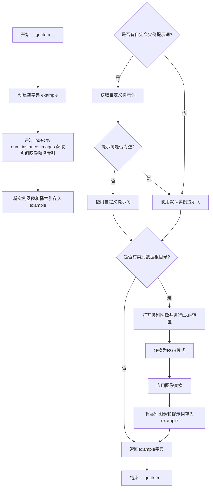

#### 带注释源码

```python
def __getitem__(self, index):
    """
    根据索引获取数据集中的单个样本。
    
    参数:
        index: 数据集中的索引位置
        
    返回:
        包含图像数据和提示词的字典
    """
    # 创建一个空字典来存储样本数据
    example = {}
    
    # 使用取模运算处理索引，实现数据集的循环遍历
    # 获取预处理后的实例图像和对应的桶索引
    instance_image, bucket_idx = self.pixel_values[index % self.num_instance_images]
    
    # 将实例图像存入字典
    example["instance_images"] = instance_image
    # 将桶索引存入字典，用于后续的批处理
    example["bucket_idx"] = bucket_idx
    
    # 检查是否提供了自定义实例提示词
    if self.custom_instance_prompts:
        # 获取对应索引的自定义提示词
        caption = self.custom_instance_prompts[index % self.num_instance_images]
        if caption:
            # 如果自定义提示词非空，则使用自定义提示词
            example["instance_prompt"] = caption
        else:
            # 如果自定义提示词为空，则使用默认的实例提示词
            example["instance_prompt"] = self.instance_prompt
    else:
        # 如果没有提供自定义提示词，使用默认的实例提示词
        example["instance_prompt"] = self.instance_prompt

    # 如果配置了类别数据根目录（用于先验保留损失）
    if self.class_data_root:
        # 打开对应索引的类别图像
        class_image = Image.open(self.class_images_path[index % self.num_class_images])
        # 根据EXIF信息调整图像方向
        class_image = exif_transpose(class_image)

        # 确保类别图像为RGB模式
        if not class_image.mode == "RGB":
            class_image = class_image.convert("RGB")
        
        # 应用图像变换并存储类别图像
        example["class_images"] = self.image_transforms(class_image)
        # 存储类别提示词
        example["class_prompt"] = self.class_prompt

    # 返回包含所有样本数据的字典
    return example
```


### `DreamBoothDataset.train_transform`

该方法实现了DreamBooth训练数据集的图像预处理流程，包括图像 resize、裁剪、随机水平翻转以及转换为张量并归一化。

参数：

- `self`：`DreamBoothDataset` 实例本身
- `image`：`PIL.Image`，输入的待处理图像
- `size`：`tuple`，目标尺寸，默认为 (224, 224)
- `center_crop`：`bool`，是否进行中心裁剪，默认为 False
- `random_flip`：`bool`，是否进行随机水平翻转，默认为 False

返回值：`torch.Tensor`，处理后的图像张量，形状为 (C, H, W)，已归一化到 [-1, 1]

#### 流程图

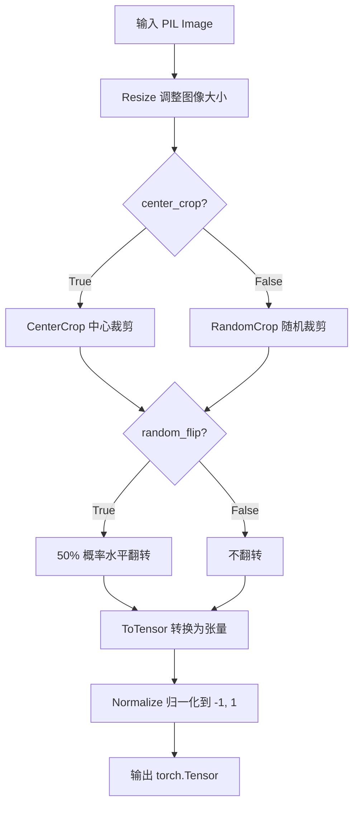

#### 带注释源码

```python
def train_transform(self, image, size=(224, 224), center_crop=False, random_flip=False):
    # 1. Resize (deterministic) - 调整图像大小到目标尺寸，使用双线性插值
    resize = transforms.Resize(size, interpolation=transforms.InterpolationMode.BILINEAR)
    image = resize(image)

    # 2. Crop: either center or SAME random crop
    # 根据参数决定裁剪方式：中心裁剪或随机裁剪
    if center_crop:
        crop = transforms.CenterCrop(size)
        image = crop(image)
    else:
        # get_params returns (i, j, h, w) - 获取随机裁剪参数
        i, j, h, w = transforms.RandomCrop.get_params(image, output_size=size)
        image = TF.crop(image, i, j, h, w)

    # 3. Random horizontal flip with the SAME coin flip
    # 随机水平翻转，默认 50% 概率
    if random_flip:
        do_flip = random.random() < 0.5
        if do_flip:
            image = TF.hflip(image)

    # 4. ToTensor + Normalize (deterministic)
    # 将 PIL Image 转换为张量，并归一化到 [-1, 1]
    to_tensor = transforms.ToTensor()
    normalize = transforms.Normalize([0.5], [0.5])
    image = normalize(to_tensor(image))

    return image
```


### `BucketBatchSampler.__init__`

该方法是 `BucketBatchSampler` 类的初始化方法，用于根据数据集的 bucket 策略创建批处理器。它首先验证 `batch_size` 和 `drop_last` 参数的有效性，然后根据数据集中每个图像所属的 bucket 对索引进行分组，对每个 bucket 内的索引进行随机打乱，并预先生成所有批次。

参数：

- `dataset`：`DreamBoothDataset`，训练数据集实例，包含图像数据和 bucket 配置信息
- `batch_size`：`int`，每个批次的样本数量，必须为正整数
- `drop_last`：`bool`，是否丢弃最后一个不完整的批次，默认为 `False`

返回值：`None`，该方法无返回值，仅初始化对象状态

#### 流程图

```mermaid
flowchart TD
    A[开始 __init__] --> B{验证 batch_size}
    B -->|无效| C[抛出 ValueError]
    B -->|有效| D{验证 drop_last}
    C --> D
    D -->|无效| E[抛出 ValueError]
    D -->|有效| F[保存 dataset, batch_size, drop_last]
    F --> G[初始化 bucket_indices 列表]
    G --> H{遍历 dataset.pixel_values}
    H -->|对于每个 idx, bucket_idx| I[将 idx 添加到对应 bucket]
    I --> H
    H --> J[初始化 sampler_len=0, batches=空列表]
    J --> K{遍历每个 bucket]}
    K -->|对于 indices_in_bucket| L[随机打乱 bucket 内索引]
    L --> M[按 batch_size 切分索引]
    M --> N{检查批次大小}
    N -->|len(batch) < batch_size 且 drop_last=True| O[跳过该批次]
    N -->|其他| P[将批次添加到 batches 列表]
    O --> Q[sampler_len 加 1]
    P --> Q
    Q --> K
    K --> R[结束]
```

#### 带注释源码

```python
def __init__(self, dataset: DreamBoothDataset, batch_size: int, drop_last: bool = False):
    """
    初始化 BucketBatchSampler，根据数据集的 bucket 策略创建批处理器。
    
    参数:
        dataset: DreamBoothDataset 实例，包含图像数据和 bucket 配置
        batch_size: 每个批次的样本数量，必须为正整数
        drop_last: 是否丢弃最后一个不完整的批次，默认为 False
    """
    # 验证 batch_size 参数：必须是正整数
    if not isinstance(batch_size, int) or batch_size <= 0:
        raise ValueError("batch_size should be a positive integer value, but got batch_size={}".format(batch_size))
    # 验证 drop_last 参数：必须是布尔值
    if not isinstance(drop_last, bool):
        raise ValueError("drop_last should be a boolean value, but got drop_last={}".format(drop_last))

    # 保存传入的参数到实例属性
    self.dataset = dataset
    self.batch_size = batch_size
    self.drop_last = drop_last

    # 初始化 bucket 索引列表，长度等于 bucket 的数量
    self.bucket_indices = [[] for _ in range(len(self.dataset.buckets))]
    # 遍历数据集中所有图像的索引和对应的 bucket 索引
    for idx, (_, bucket_idx) in enumerate(self.dataset.pixel_values):
        # 将图像索引添加到对应的 bucket 列表中
        self.bucket_indices[bucket_idx].append(idx)

    # 初始化批次计数器和批次列表
    self.sampler_len = 0
    self.batches = []

    # 预生成每个 bucket 的批次
    for indices_in_bucket in self.bucket_indices:
        # 随机打乱每个 bucket 内的索引顺序，增加数据多样性
        random.shuffle(indices_in_bucket)
        # 按 batch_size 大小切分索引，生成批次
        for i in range(0, len(indices_in_bucket), self.batch_size):
            # 提取当前批次的索引切片
            batch = indices_in_bucket[i : i + self.batch_size]
            # 如果批次不完整且 drop_last 为 True，则跳过该批次
            if len(batch) < self.batch_size and self.drop_last:
                continue  # Skip partial batch if drop_last is True
            # 将有效批次添加到批次列表中
            self.batches.append(batch)
            # 累加批次计数器
            self.sampler_len += 1  # Count the number of batches
```


### BucketBatchSampler.__iter__

该方法是 `BucketBatchSampler` 类的迭代器实现，用于在训练过程中按桶（bucket）分组并批量返回样本索引，确保每个批次内的图像具有相似的宽高比，从而减少训练过程中的填充浪费并提高内存效率。

参数：
- 无显式参数（继承自 `BatchSampler` 的 `__iter__` 接口）

返回值：`Iterator[List[int]]`，返回一个迭代器，每次迭代返回一个批次的样本索引列表

#### 流程图

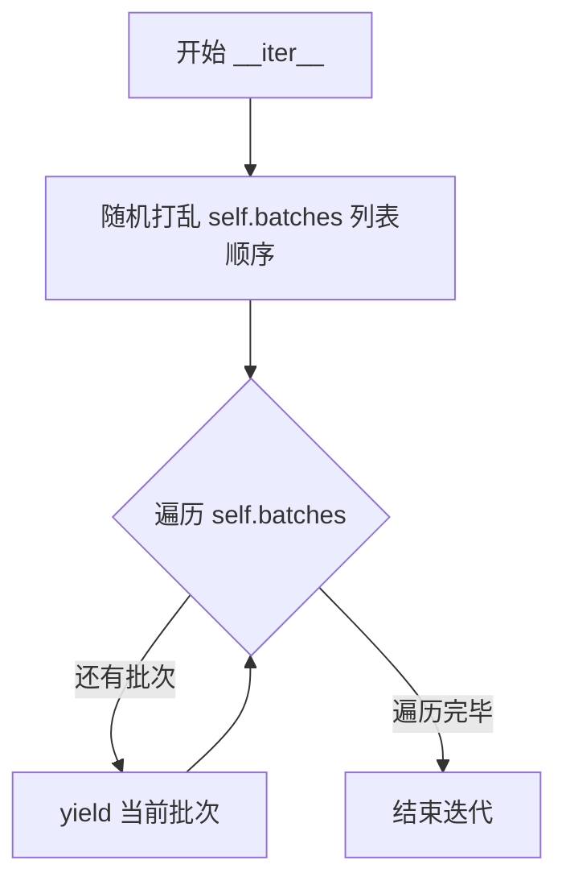

#### 带注释源码

```python
def __iter__(self):
    """
    迭代器方法，用于在训练循环中生成批次。
    
    该方法执行以下操作：
    1. 随机打乱预先创建的批次顺序（实现每个 epoch 的随机性）
    2. 逐个 yield 返回批次索引列表
    
    Returns:
        Iterator[List[int]]: 每次返回一批样本索引的列表
    """
    # Shuffle the order of the batches each epoch
    # 每次 epoch 开始时打乱批次顺序，确保数据顺序随机化
    random.shuffle(self.batches)
    
    # 遍历打乱后的批次列表，yield 返回每个批次
    for batch in self.batches:
        yield batch
```


### `BucketBatchSampler.__len__`

返回 BucketBatchSampler 中预生成批次的总数，使得 DataLoader 能够确定数据集的大小。

参数： 无

返回值： `int`，返回预生成批次的总数

#### 流程图

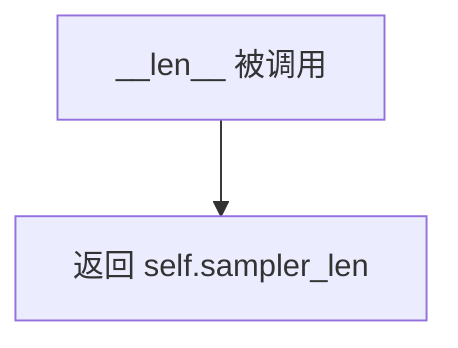

#### 带注释源码

```python
def __len__(self):
    """
    返回 BucketBatchSampler 中预生成批次的总数。
    
    这个方法允许 DataLoader 确定数据集的大小，从而支持 len(dataloader) 操作。
    sampler_len 在 __init__ 方法中被计算，基于每个 bucket 中能够完整组成的 batch 数量。
    
    Returns:
        int: 预生成批次的总数
    """
    return self.sampler_len
```


### `PromptDataset.__init__`

初始化一个简单的数据集，用于准备在多个GPU上生成类图像的提示词。

参数：

- `prompt`：`str`，用于生成类图像的提示词
- `num_samples`：`int`，要生成的样本数量

返回值：`None`，构造函数不返回值，仅初始化实例属性

#### 流程图

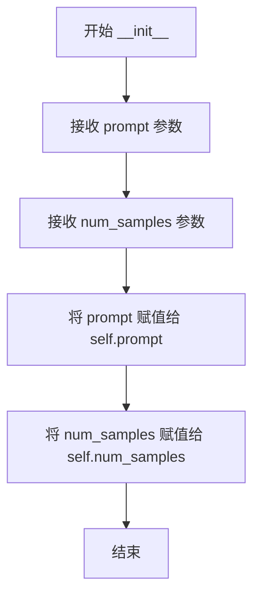

#### 带注释源码

```python
def __init__(self, prompt, num_samples):
    """
    初始化 PromptDataset 实例。
    
    该数据集用于在 DreamBooth 训练流程中准备类图像生成的提示词。
    在 prior preservation（先验保留）模式下，需要生成类图像来帮助模型
    学习同一类别的一般特征，而不是过拟合到特定实例。
    
    参数:
        prompt (str): 用于生成类图像的文本提示词
        num_samples (int): 需要生成的类图像样本数量
    """
    # 存储提示词，供 __getitem__ 方法返回
    self.prompt = prompt
    # 存储样本数量，决定数据集长度
    self.num_samples = num_samples
```


### `PromptDataset.__len__`

该方法实现了 Python 协议的 `__len__` 特殊方法，用于返回 `PromptDataset` 数据集中可供采样的样本数量，使该数据集能够与 `len()` 函数以及 `DataLoader` 等需要知道数据集大小的 PyTorch 组件配合使用。

参数：

- `self`：`PromptDataset` 实例本身，无需显式传递，Python 会自动注入

返回值：`int`，返回数据集中预定义的样本数量 `self.num_samples`

#### 流程图

```mermaid
flowchart TD
    A[__len__ 方法被调用] --> B{返回 self.num_samples}
    B --> C[数据集长度获取完成]
    
    style A fill:#f9f,stroke:#333
    style B fill:#ff9,stroke:#333
    style C fill:#9f9,stroke:#333
```

#### 带注释源码

```python
def __len__(self):
    """
    返回数据集中样本的数量。
    
    该方法实现了 Python 的 len() 协议，使得数据集对象可以直接被 len() 函数调用，
    同时也是 PyTorch DataLoader 正常工作所必需的方法。DataLoader 需要知道数据集
    的大小来确定迭代的 epoch 数量和生成批次的索引。
    
    Returns:
        int: 数据集中预定义的样本数量。该值在 __init__ 方法中被设置为 num_samples 参数。
    """
    return self.num_samples
```


### `PromptDataset.__getitem__`

该方法用于根据给定的索引返回对应的提示词和索引信息，主要用于在多个GPU上生成类别图像时准备提示词数据。

参数：

- `index`：`int`，索引参数，用于指定获取第几个样本

返回值：`dict`，返回一个包含 "prompt" 和 "index" 键的字典，其中 "prompt" 是提示词文本，"index" 是样本索引

#### 流程图

```mermaid
flowchart TD
    A[开始 __getitem__] --> B[创建空字典 example]
    B --> C[将 self.prompt 存入 example['prompt']]
    C --> D[将 index 存入 example['index']]
    D --> E[返回 example 字典]
```

#### 带注释源码

```python
def __getitem__(self, index):
    """
    根据索引获取数据集中的样本。
    
    参数:
        index: int - 样本的索引位置
        
    返回:
        dict - 包含 'prompt' 和 'index' 键的字典
    """
    # 创建一个空字典来存储样本数据
    example = {}
    
    # 将初始化时设置的提示词存入字典
    example["prompt"] = self.prompt
    
    # 将当前样本的索引存入字典
    example["index"] = index
    
    # 返回包含提示词和索引的字典
    return example
```

## 关键组件


### 张量索引与惰性加载

代码通过预计算和缓存机制实现张量索引与惰性加载优化。在 `precompute_latents` 分支中，使用 `latents_cache` 存储 VAE 编码后的潜在变量，使用 `prompt_embeds_cache` 存储文本嵌入。训练循环中通过 `latents_cache[step].mode()` 和 `prompt_embeds_cache[step]` 进行索引访问，避免了每个训练步骤重复编码图像和文本，显著降低显存占用和计算开销。

### 反量化支持

代码集成 BitsAndBytes 量化框架支持 4bit 量化训练。通过 `bnb_quantization_config_path` 参数加载量化配置文件，设置 `load_in_4bit` 和 `bnb_4bit_compute_dtype`。使用 `prepare_model_for_kbit_training` 将 transformer 模型转换为量化兼容格式，配合 `module_filter_fn` 过滤不支持量化的层（如输出层和维度不满足 16 倍数的 Linear 层）。

### 量化策略

代码支持两种量化训练策略：FP8 训练（通过 `torchao.float8` 的 `convert_to_float8_training`）和 BitsAndBytes 4bit 量化。FP8 训练使用 `Float8LinearConfig(pad_inner_dim=True)` 配置，并通过 `module_filter_fn` 排除特定层。量化训练可通过 `do_fp8_training` 和 `bnb_quantization_config_path` 参数启用，两者互斥。

### 宽高比桶（Aspect Ratio Buckets）

代码实现动态图像尺寸处理机制。通过 `parse_buckets_string` 解析用户定义的宽高比字符串（如 '1024,1024;768,1360'），`DreamBoothDataset` 使用 `find_nearest_bucket` 为每张图像分配最近的桶，`BucketBatchSampler` 按桶分组索引以优化批量加载效率，避免同一批次内图像尺寸差异过大。

### Flow Match 噪声调度

代码采用 FlowMatchEulerDiscreteScheduler 实现基于流匹配的噪声调度。训练中通过 `compute_density_for_timestep_sampling` 进行非均匀时间步采样，使用 `get_sigmas` 获取对应 sigma 值，遵循公式 `noisy_model_input = (1.0 - sigmas) * model_input + sigmas * noise` 进行噪声添加，预测目标为 `target = noise - model_input`。

### LoRA 训练架构

代码使用 PEFT 框架实现 LoRA 训练。通过 `LoraConfig` 配置 rank、alpha、dropout 和目标模块（默认 'to_k,to_q,to_v,to_out.0'）。`save_model_hook` 和 `load_model_hook` 封装 accelerator 的状态保存/加载逻辑，使用 `get_peft_model_state_dict` 和 `set_peft_model_state_dict` 处理 LoRA 权重，支持 FSDP 分布式场景下的状态字典收集。

### 文本编码优化

代码实现文本嵌入的预计算和缓存。当使用固定实例提示时，通过 `compute_text_embeddings` 一次性编码提示词，存储在 `instance_prompt_hidden_states` 中。对于 prior preservation，预先编码 class prompt。验证嵌入也进行预计算存储在 `validation_embeddings` 字典中，减少训练循环中的重复编码开销。

### 模型卸载与内存管理

代码通过 `offload_models` 上下文管理器和 `free_memory` 函数实现显存优化。VAE 和文本编码器可选择卸载到 CPU（`--offload` 参数），transformer 始终保留在加速器设备。缓存潜在变量后主动将 VAE 移至 CPU 并删除，文本编码管道也进行类似处理，最大化训练阶段可用显存。

### 验证与推理管道

`log_validation` 函数负责训练过程中的图像生成验证。使用 `ZImagePipeline` 进行推理，支持 TensorBoard 和 WandB 可视化。验证图像通过 `accelerator.device` 生成，可配置生成数量和验证频率。训练结束后支持最终推理验证，用于生成示例图像和模型卡片。

### 检查点管理

代码实现完整的检查点生命周期管理。包括按 `checkpointing_steps` 定期保存、保持 `checkpoints_total_limit` 数量限制、自动清理旧检查点。支持通过 `resume_from_checkpoint` 从特定检查点或最新检查点恢复训练。保存内容包括 accelerator 完整状态和 LoRA 权重。

### 数据增强与预处理

`DreamBoothDataset` 实现多阶段图像预处理流程：EXIF 转置、RGB 转换、桶匹配 resize、随机裁剪（或中心裁剪）、随机水平翻转、ToTensor 和归一化。`train_transform` 方法确保训练和验证阶段的数据增强一致性，支持 center_crop 和 random_flip 参数控制。

### 分布式训练支持

代码通过 Accelerator 框架支持多 GPU 分布式训练。集成 FSDP（Federated Data Parallel）用于 transformer 和文本编码器，使用 `get_fsdp_kwargs_from_accelerator` 和 `wrap_with_fsdp` 配置。支持 TF32 加速、混合精度训练（fp16/bf16）、梯度累积等优化技术。

### 优化器配置

代码支持 AdamW、8-bit Adam（bitsandbytes）和 Prodigy 三种优化器。提供详细的学习率调度选项（constant、cosine、polynomial 等）和预热步数配置。支持分别设置 transformer 和文本编码器的学习率，通过 `scale_lr` 参数自动按 GPU 数量和批次大小缩放。


## 问题及建议


### 已知问题

-   **main函数体积过大**: `main()`函数超过1000行代码，包含所有训练逻辑，缺乏模块化设计，导致代码难以维护和测试。
-   **隐式全局变量依赖**: `DreamBoothDataset`类中直接访问全局`args`变量（如`args.dataset_name`、`args.center_crop`等），违反封装原则，造成隐式依赖和潜在的bug。
-   **变量未初始化检查**: `instance_prompt_hidden_states`和`class_prompt_hidden_states`在特定条件下才被定义，但在后续代码中可能被使用前未进行充分检查。
-   **log_validation函数逻辑错误**: 在训练结束后的最终推理代码块中，存在`images = None`语句，会覆盖之前成功生成的验证图像，导致最终保存的图像丢失。
-   **BucketBatchSampler效率问题**: 每次迭代都对所有batches进行shuffle（`random.shuffle(self.batches)`），对于大批量训练可能带来不必要的开销。
-   **get_sigmas函数性能**: 内部使用列表推导式和循环来查找timestep索引，在每个训练步骤中调用，高频调用时可能成为瓶颈。
-   **训练循环中的重复条件检查**: `train_dataset.custom_instance_prompts`的检查在每个batch中都执行多次，可以通过循环外预处理优化。
-   **内存释放不彻底**: VAE和text_encoder移到CPU后立即删除，但未显式调用垃圾回收，在长时间训练中可能导致内存碎片积累。
-   **缺少类型注解**: 整个代码中几乎没有任何类型注解（Type Hints），降低了代码的可读性和IDE支持。
-   **魔法数字硬编码**: 时间归一化中的`1000`、默认值等硬编码在代码中，缺乏配置化或常量定义。

### 优化建议

-   **重构main函数**: 将main函数拆分为多个独立函数或类，如数据准备、模型加载、训练循环、验证等模块。
-   **消除隐式依赖**: 将`args`作为参数传递给`DreamBoothDataset`构造函数，明确依赖关系。
-   **修复图像保存bug**: 移除`log_validation`调用后不必要的`images = None`赋值语句。
-   **优化BucketBatchSampler**: 改为在每个epoch开始时shuffle，而不是每次迭代都shuffle。
-   **添加类型注解**: 为所有函数和变量添加完整的类型注解，提升代码质量。
-   **提取常量**: 将硬编码的魔法数字提取为模块级常量，如`TIMESTEP_NORMALIZATION_FACTOR = 1000`。
-   **优化条件检查**: 将不变的条件判断提前到循环外部，减少运行时开销。
-   **增强错误处理**: 为关键操作（模型加载、数据集加载）添加try-except异常处理和友好的错误提示。
-   **添加单元测试**: 将核心逻辑抽取为可测试的函数，并添加相应的单元测试。
-   **优化内存管理**: 在删除大对象后考虑显式调用`gc.collect()`，或在关键阶段调用`torch.cuda.empty_cache()`。

## 其它


### 设计目标与约束

本项目旨在实现一个基于DreamBooth方法的Z-Image模型LoRA训练流水线，核心目标是让用户能够使用少量自定义图像（instance images）训练出能够生成特定主体或风格图像的LoRA适配器。主要设计约束包括：1）仅训练LoRA adapter层，保留原始预训练模型权重；2）支持prior preservation技术以防止模型遗忘；3）支持分布式训练和混合精度训练；4）兼容多种优化器（AdamW、Prodigy）和量化配置（bitsandbytes、FP8）；5）必须遵循Apache 2.0许可证。

### 错误处理与异常设计

代码采用分层错误处理策略。在参数解析阶段（parse_args函数），通过ValueError显式检查互斥参数（如dataset_name与instance_data_dir不能同时指定、do_fp8_training与bnb_quantization_config_path不能同时指定），并通过warnings.warn提醒用户未正确使用的参数（如class_data_dir但未启用prior_preservation）。在模型加载阶段，使用ImportError捕获可选依赖缺失（如datasets库、bitsandbytes、wandb），并提供清晰的安装指引。在分布式训练场景下，通过try-except捕获torch.distributed的导入错误。在训练循环中，checkpoint保存前会检查checkpoints_total_limit限制，自动清理旧checkpoint防止磁盘空间耗尽。

### 数据流与状态机

训练数据流经过以下阶段：1）数据准备阶段：DreamBoothDataset从本地目录或HuggingFace Hub加载instance images，通过exif_transpose纠正图像方向并转换为RGB模式，根据aspect_ratio_buckets计算最接近的目标分辨率，应用train_transform进行resize、crop、flip、normalize；2）数据加载阶段：BucketBatchSampler按bucket分组索引以保证batch内图像尺寸一致，避免VAE重复编码不同尺寸图像的开销；3）文本编码阶段：使用Qwen2Tokenizer编码prompts得到prompt_embeds，支持custom_instance_prompts或统一的instance_prompt；4）latent编码阶段：VAE将pixel_values编码为latent空间表示，支持cache_latents优化；5）噪声调度阶段：FlowMatchEulerDiscreteScheduler根据weighting_scheme采样timesteps；6）模型推理阶段：ZImageTransformer2DModel接收noisy_model_input、timestep_normalized和prompt_embeds预测噪声；7）损失计算阶段：计算flow matching loss并根据with_prior_preservation添加prior loss。

### 外部依赖与接口契约

核心依赖包括：diffusers>=0.37.0.dev0（提供ZImagePipeline、FlowMatchEulerDiscreteScheduler、AutoencoderKL等组件）、torch>=2.0.0、transformers>=4.41.2（提供Qwen2Tokenizer、Qwen3Model）、accelerate>=0.31.0（分布式训练抽象）、peft>=0.11.1（LoRA配置与状态字典管理）、bitsandbytes（可选，4bit量化）、prodigyopt（可选，Prodigy优化器）、datasets（可选，从Hub加载数据集）。外部接口契约包括：1）模型输入：支持从pretrained_model_name_or_path加载Z-Image系列模型（包含tokenizer、vae、transformer、text_encoder子目录）；2）数据集格式：支持本地目录（仅含图像文件）或HuggingFace Hub数据集（需指定image_column和caption_column）；3）输出格式：save_lora_weights生成pytorch_lora_weights.safetensors和adapter_config.json，save_model_card生成README.md。

### 性能考量与基准测试

代码包含多项性能优化：1）梯度累积：通过gradient_accumulation_steps实现大effective batch size；2）梯度检查点：通过gradient_checkpointing减少显存占用；3）模型offload：通过enable_model_cpu_offload和offload_models函数在推理间隙将VAE/TextEncoder卸载到CPU；4）Latent缓存：通过cache_latents预计算并缓存VAE latent，避免重复编码；5）混合精度：支持fp16和bf16训练，通过cast_training_params确保LoRA参数在fp32下更新；6）分布式优化：支持FSDP（Federated Distributed Data Parallel）加速大模型训练；7）Aspect Ratio Buckets：减少图像resize带来的信息损失同时保持batch内尺寸一致。性能基准测试应关注：1）单GPU vs 多GPU scaling efficiency；2）不同batch size下的显存占用峰值；3）cache_latents vs non-cache的训练速度对比；4）gradient_checkpointing对训练速度和显存的影响。

### 安全考虑

代码包含以下安全措施：1）hub_token验证：当report_to=wandb且hub_token存在时抛出异常，防止token泄露风险，建议使用hf auth login认证；2）权重安全：支持从safetensors格式加载/保存权重，防止pickle反序列化漏洞；3）输入验证：检查dataset路径存在性、column名称有效性；4）分布式安全：使用torch.distributed.barrier同步FSDP初始化。

### 配置管理

所有训练超参通过argparse统一管理，分为以下类别：1）模型配置（pretrained_model_name_or_path、revision、variant）；2）数据配置（dataset_name、instance_data_dir、instance_prompt、class_prompt、with_prior_preservation）；3）LoRA配置（rank、lora_alpha、lora_dropout、lora_layers）；4）训练配置（learning_rate、lr_scheduler、optimizer、gradient_accumulation_steps、max_train_steps）；5）优化器配置（adam_beta1/2、adam_weight_decay、prodigy_decouple）；6）采样配置（weighting_scheme、guidance_scale）；7）资源配置（mixed_precision、gradient_checkpointing、cache_latents、offload）；8）输出配置（output_dir、checkpointing_steps、push_to_hub）。配置文件可通过命令行传递或保存为JSON供复现使用。

### 版本兼容性

代码对以下版本有明确要求：1）diffusers>=0.37.0.dev0（使用ZImagePipeline、FlowMatchEulerDiscreteScheduler）；2）torch>=2.0.0（使用torch.compile、torch.cuda.is_available等）；3）transformers>=4.41.2（使用Qwen2Tokenizer、Qwen3Model）；4）peft>=0.11.1（LoraConfig、get_peft_model_state_dict）；5）accelerate>=0.31.0（Accelerator、DistributedDataParallelKwargs）。对于可选功能：bitsandbytes用于8bit Adam和4bit量化；prodigyopt用于Prodigy优化器；wandb用于实验跟踪；datasets用于从Hub加载数据集。

### 测试策略

建议的测试覆盖包括：1）单元测试：parse_args参数解析、DreamBoothDataset数据加载、BucketBatchSampler分桶逻辑、collate_fn批处理组装；2）集成测试：使用小规模数据集（10-20张图像）验证完整训练流程（1-2个epoch），检查checkpoint保存/加载、LoRA权重合并；3）分布式测试：验证多GPU环境下的梯度同步、checkpoint保存恢复；4）量化测试：验证bnb_quantization_config加载、FP8训练转换；5）回归测试：对比不同版本的训练loss曲线和生成质量。
    