# `diffusers\examples\dreambooth\train_dreambooth_sd3.py` 详细设计文档

这是一个用于Stable Diffusion 3 (SD3) 模型的DreamBooth训练脚本，通过微调预训练的SD3模型（包含Transformer、VAE和三个文本编码器）来学习特定概念或主题，使其能够根据文本提示生成包含该概念的图像。

## 整体流程

```mermaid
graph TD
    A[开始] --> B[parse_args 解析命令行参数]
    B --> C[main 函数入口]
    C --> D[初始化 Accelerator 分布式训练环境]
    D --> E{是否启用 prior preservation?}
    E -- 是 --> F[生成类别图像]
    E -- 否 --> G[跳过类别图像生成]
    F --> G
    G --> H[加载 Tokenizers 和 Text Encoders]
    H --> I[加载 Scheduler, VAE, Transformer]
    I --> J[创建 DreamBoothDataset 数据集]
    J --> K[创建 DataLoader]
    K --> L[初始化 Optimizer 和 LR Scheduler]
    L --> M{是否训练 Text Encoder?}
    M -- 是 --> N[准备 Text Encoder 参与训练]
    M -- 否 --> O[仅准备 Transformer]
    N --> P
    O --> P[开始训练循环]
    P --> Q[遍历每个 epoch]
    Q --> R[对每个 batch: 编码提示词 -> 编码图像到潜空间 -> 加噪 -> 预测噪声 -> 计算损失 -> 反向传播]
    R --> S{达到 checkpoint 保存步数?}
    S -- 是 --> T[保存模型检查点]
    S -- 否 --> U
    T --> U
    U{达到最大训练步数?}
    U -- 否 --> R
    U -- 是 --> V[训练完成]
    V --> W{需要验证?]
    W -- 是 --> X[执行验证生成图像]
    W -- 否 --> Y
    X --> Y[保存最终模型和 pipeline]
    Y --> Z[可选: 推送到 Hub]
```

## 类结构

```
Global Functions (模块级函数)
├── parse_args (参数解析)
├── save_model_card (保存模型卡片)
├── load_text_encoders (加载文本编码器)
├── import_model_class_from_model_name_or_path (导入模型类)
├── log_validation (验证函数)
├── tokenize_prompt (分词提示词)
├── _encode_prompt_with_t5 (T5编码提示词)
├── _encode_prompt_with_clip (CLIP编码提示词)
├── encode_prompt (编码提示词统一入口)
├── collate_fn (批次整理函数)
└── main (主训练函数)
Classes
├── DreamBoothDataset (数据集类)
│   ├── __init__
│   ├── __len__
│   └── __getitem__
└── PromptDataset (提示词数据集类)
    ├── __init__
    ├── __len__
    └── __getitem__
```

## 全局变量及字段


### `logger`
    
全局日志记录器，用于输出训练过程中的日志信息

类型：`logging.Logger`
    


### `DreamBoothDataset.size`
    
图像目标分辨率

类型：`int`
    


### `DreamBoothDataset.center_crop`
    
是否中心裁剪

类型：`bool`
    


### `DreamBoothDataset.instance_prompt`
    
实例提示词

类型：`str`
    


### `DreamBoothDataset.custom_instance_prompts`
    
自定义实例提示词列表

类型：`list`
    


### `DreamBoothDataset.class_prompt`
    
类别提示词

类型：`str`
    


### `DreamBoothDataset.instance_data_root`
    
实例数据根目录

类型：`Path`
    


### `DreamBoothDataset.class_data_root`
    
类别数据根目录

类型：`Path`
    


### `DreamBoothDataset.instance_images`
    
实例图像列表

类型：`list`
    


### `DreamBoothDataset.pixel_values`
    
预处理后的像素值列表

类型：`list`
    


### `DreamBoothDataset.num_instance_images`
    
实例图像数量

类型：`int`
    


### `DreamBoothDataset.class_images_path`
    
类别图像路径列表

类型：`list`
    


### `DreamBoothDataset.num_class_images`
    
类别图像数量

类型：`int`
    


### `DreamBoothDataset._length`
    
数据集长度

类型：`int`
    


### `DreamBoothDataset.image_transforms`
    
图像变换组合

类型：`Compose`
    


### `PromptDataset.prompt`
    
提示词

类型：`str`
    


### `PromptDataset.num_samples`
    
样本数量

类型：`int`
    
    

## 全局函数及方法


### `parse_args`

解析命令行参数，构建并返回一个包含所有训练配置参数的 Namespace 对象。

参数：

- `input_args`：`Optional[List[str]]`，可选的命令行参数列表。如果为 `None`，则从 `sys.argv` 解析。该参数主要用于测试场景，允许传入自定义参数列表进行解析。

返回值：`argparse.Namespace`，包含所有配置参数的命名空间对象，包括模型路径、数据路径、训练超参数、优化器设置等。

#### 流程图

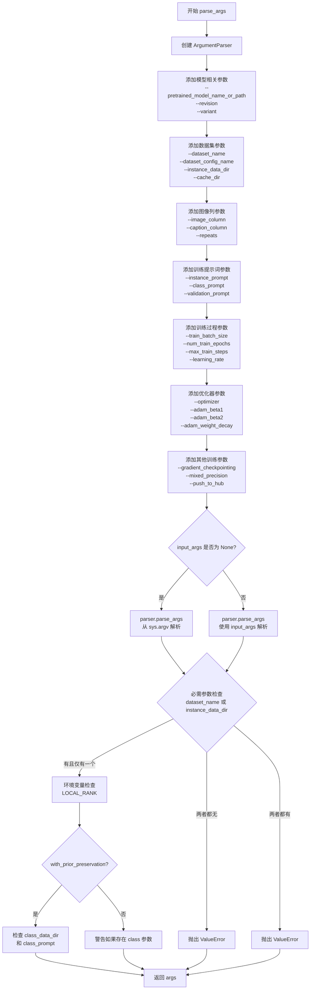

#### 带注释源码

```python
def parse_args(input_args=None):
    """
    解析命令行参数，返回包含所有训练配置的 Namespace 对象。
    
    参数:
        input_args: 可选的命令行参数列表，用于测试；为 None 时从 sys.argv 解析
    
    返回:
        args: 包含所有命令行参数的 argparse.Namespace 对象
    """
    # 创建 ArgumentParser 实例，描述为训练脚本示例
    parser = argparse.ArgumentParser(description="Simple example of a training script.")
    
    # ==================== 模型相关参数 ====================
    # 添加预训练模型路径或模型标识符（必需）
    parser.add_argument(
        "--pretrained_model_name_or_path",
        type=str,
        default=None,
        required=True,
        help="Path to pretrained model or model identifier from huggingface.co/models.",
    )
    # 添加模型版本修订号（可选）
    parser.add_argument(
        "--revision",
        type=str,
        default=None,
        required=False,
        help="Revision of pretrained model identifier from huggingface.co/models.",
    )
    # 添加模型变体参数（如 fp16）
    parser.add_argument(
        "--variant",
        type=str,
        default=None,
        help="Variant of the model files of the pretrained model identifier from huggingface.co/models, 'e.g.' fp16",
    )
    
    # ==================== 数据集相关参数 ====================
    # 添加数据集名称（来自 HuggingFace Hub）
    parser.add_argument(
        "--dataset_name",
        type=str,
        default=None,
        help=(
            "The name of the Dataset (from the HuggingFace hub) containing the training data of instance images (could be your own, possibly private,"
            " dataset). It can also be a path pointing to a local copy of a dataset in your filesystem,"
            " or to a folder containing files that 🤗 Datasets can understand."
        ),
    )
    # 添加数据集配置名称
    parser.add_argument(
        "--dataset_config_name",
        type=str,
        default=None,
        help="The config of the Dataset, leave as None if there's only one config.",
    )
    # 添加本地实例数据目录
    parser.add_argument(
        "--instance_data_dir",
        type=str,
        default=None,
        help=("A folder containing the training data. "),
    )
    # 添加缓存目录
    parser.add_argument(
        "--cache_dir",
        type=str,
        default=None,
        help="The directory where the downloaded models and datasets will be stored.",
    )
    
    # ==================== 图像列和提示词列参数 ====================
    # 添加图像列名称（默认 "image"）
    parser.add_argument(
        "--image_column",
        type=str,
        default="image",
        help="The column of the dataset containing the target image. By "
        "default, the standard Image Dataset maps out 'file_name' "
        "to 'image'.",
    )
    # 添加提示词列名称
    parser.add_argument(
        "--caption_column",
        type=str,
        default=None,
        help="The column of the dataset containing the instance prompt for each image",
    )
    # 添加数据重复次数
    parser.add_argument("--repeats", type=int, default=1, help="How many times to repeat the training data.")
    
    # ==================== 类别图像和提示词参数 ====================
    # 添加类别数据目录（用于 prior preservation）
    parser.add_argument(
        "--class_data_dir",
        type=str,
        default=None,
        required=False,
        help="A folder containing the training data of class images.",
    )
    # 添加实例提示词（必需）
    parser.add_argument(
        "--instance_prompt",
        type=str,
        default=None,
        required=True,
        help="The prompt with identifier specifying the instance, e.g. 'photo of a TOK dog', 'in the style of TOK'",
    )
    # 添加类别提示词
    parser.add_argument(
        "--class_prompt",
        type=str,
        default=None,
        help="The prompt to specify images in the same class as provided instance images.",
    )
    # 添加 T5 编码器的最大序列长度
    parser.add_argument(
        "--max_sequence_length",
        type=int,
        default=77,
        help="Maximum sequence length to use with with the T5 text encoder",
    )
    
    # ==================== 验证参数 ====================
    # 添加验证提示词
    parser.add_argument(
        "--validation_prompt",
        type=str,
        default=None,
        help="A prompt that is used during validation to verify that the model is learning.",
    )
    # 添加验证图像数量
    parser.add_argument(
        "--num_validation_images",
        type=int,
        default=4,
        help="Number of images that should be generated during validation with `validation_prompt`.",
    )
    # 添加验证周期
    parser.add_argument(
        "--validation_epochs",
        type=int,
        default=50,
        help=(
            "Run dreambooth validation every X epochs. Dreambooth validation consists of running the prompt"
            " `args.validation_prompt` multiple times: `args.num_validation_images`."
        ),
    )
    
    # ==================== Prior Preservation 参数 ====================
    # 添加 prior preservation 标志
    parser.add_argument(
        "--with_prior_preservation",
        default=False,
        action="store_true",
        help="Flag to add prior preservation loss.",
    )
    # 添加 prior loss 权重
    parser.add_argument("--prior_loss_weight", type=float, default=1.0, help="The weight of prior preservation loss.")
    # 添加类别图像数量
    parser.add_argument(
        "--num_class_images",
        type=int,
        default=100,
        help=(
            "Minimal class images for prior preservation loss. If there are not enough images already present in"
            " class_data_dir, additional images will be sampled with class_prompt."
        ),
    )
    
    # ==================== 输出和随机种子参数 ====================
    # 添加输出目录
    parser.add_argument(
        "--output_dir",
        type=str,
        default="sd3-dreambooth",
        help="The output directory where the model predictions and checkpoints will be written.",
    )
    # 添加随机种子
    parser.add_argument("--seed", type=int, default=None, help="A seed for reproducible training.")
    
    # ==================== 图像预处理参数 ====================
    # 添加分辨率
    parser.add_argument(
        "--resolution",
        type=int,
        default=512,
        help=(
            "The resolution for input images, all the images in the train/validation dataset will be resized to this"
            " resolution"
        ),
    )
    # 添加中心裁剪标志
    parser.add_argument(
        "--center_crop",
        default=False,
        action="store_true",
        help=(
            "Whether to center crop the input images to the resolution. If not set, the images will be randomly"
            " cropped. The images will be resized to the resolution first before cropping."
        ),
    )
    # 添加随机翻转标志
    parser.add_argument(
        "--random_flip",
        action="store_true",
        help="whether to randomly flip images horizontally",
    )
    
    # ==================== 文本编码器训练参数 ====================
    # 添加文本编码器训练标志
    parser.add_argument(
        "--train_text_encoder",
        action="store_true",
        help="Whether to train the text encoder. If set, the text encoder should be float32 precision.",
    )
    
    # ==================== 批处理大小参数 ====================
    # 添加训练批处理大小
    parser.add_argument(
        "--train_batch_size", type=int, default=4, help="Batch size (per device) for the training dataloader."
    )
    # 添加采样批处理大小
    parser.add_argument(
        "--sample_batch_size", type=int, default=4, help="Batch size (per device) for sampling images."
    )
    
    # ==================== 训练轮数和步数参数 ====================
    # 添加训练轮数
    parser.add_argument("--num_train_epochs", type=int, default=1)
    # 添加最大训练步数
    parser.add_argument(
        "--max_train_steps",
        type=int,
        default=None,
        help="Total number of training steps to perform.  If provided, overrides num_train_epochs.",
    )
    
    # ==================== 检查点参数 ====================
    # 添加检查点保存步数
    parser.add_argument(
        "--checkpointing_steps",
        type=int,
        default=500,
        help=(
            "Save a checkpoint of the training state every X updates. These checkpoints can be used both as final"
            " checkpoints in case they are better than the last checkpoint, and are also suitable for resuming"
            " training using `--resume_from_checkpoint`."
        ),
    )
    # 添加检查点总数限制
    parser.add_argument(
        "--checkpoints_total_limit",
        type=int,
        default=None,
        help=("Max number of checkpoints to store."),
    )
    # 添加从检查点恢复参数
    parser.add_argument(
        "--resume_from_checkpoint",
        type=str,
        default=None,
        help=(
            "Whether training should be resumed from a previous checkpoint. Use a path saved by"
            ' `--checkpointing_steps`, or `"latest"` to automatically select the last available checkpoint.'
        ),
    )
    
    # ==================== 梯度累积参数 ====================
    # 添加梯度累积步数
    parser.add_argument(
        "--gradient_accumulation_steps",
        type=int,
        default=1,
        help="Number of updates steps to accumulate before performing a backward/update pass.",
    )
    # 添加梯度检查点标志
    parser.add_argument(
        "--gradient_checkpointing",
        action="store_true",
        help="Whether or not to use gradient checkpointing to save memory at the expense of slower backward pass.",
    )
    
    # ==================== 学习率参数 ====================
    # 添加学习率
    parser.add_argument(
        "--learning_rate",
        type=float,
        default=1e-4,
        help="Initial learning rate (after the potential warmup period) to use.",
    )
    # 添加文本编码器学习率
    parser.add_argument(
        "--text_encoder_lr",
        type=float,
        default=5e-6,
        help="Text encoder learning rate to use.",
    )
    # 添加学习率缩放标志
    parser.add_argument(
        "--scale_lr",
        action="store_true",
        default=False,
        help="Scale the learning rate by the number of GPUs, gradient accumulation steps, and batch size.",
    )
    # 添加学习率调度器类型
    parser.add_argument(
        "--lr_scheduler",
        type=str,
        default="constant",
        help=(
            'The scheduler type to use. Choose between ["linear", "cosine", "cosine_with_restarts", "polynomial",'
            ' "constant", "constant_with_warmup"]'
        ),
    )
    # 添加预热步数
    parser.add_argument(
        "--lr_warmup_steps", type=int, default=500, help="Number of steps for the warmup in the lr scheduler."
    )
    # 添加学习率循环次数
    parser.add_argument(
        "--lr_num_cycles",
        type=int,
        default=1,
        help="Number of hard resets of the lr in cosine_with_restarts scheduler.",
    )
    # 添加学习率幂次
    parser.add_argument("--lr_power", type=float, default=1.0, help="Power factor of the polynomial scheduler.")
    
    # ==================== 数据加载参数 ====================
    # 添加数据加载工作进程数
    parser.add_argument(
        "--dataloader_num_workers",
        type=int,
        default=0,
        help=(
            "Number of subprocesses to use for data loading. 0 means that the data will be loaded in the main process."
        ),
    )
    
    # ==================== 采样加权参数 ====================
    # 添加加权方案
    parser.add_argument(
        "--weighting_scheme",
        type=str,
        default="logit_normal",
        choices=["sigma_sqrt", "logit_normal", "mode", "cosmap"],
    )
    # 添加 logit 均值
    parser.add_argument(
        "--logit_mean", type=float, default=0.0, help="mean to use when using the `'logit_normal'` weighting scheme."
    )
    # 添加 logit 标准差
    parser.add_argument(
        "--logit_std", type=float, default=1.0, help="std to use when using the `'logit_normal'` weighting scheme."
    )
    # 添加模式缩放
    parser.add_argument(
        "--mode_scale",
        type=float,
        default=1.29,
        help="Scale of mode weighting scheme. Only effective when using the `'mode'` as the `weighting_scheme`.",
    )
    # 添加预处理输出标志
    parser.add_argument(
        "--precondition_outputs",
        type=int,
        default=1,
        help="Flag indicating if we are preconditioning the model outputs or not as done in EDM. This affects how "
        "model `target` is calculated.",
    )
    
    # ==================== 优化器参数 ====================
    # 添加优化器类型
    parser.add_argument(
        "--optimizer",
        type=str,
        default="AdamW",
        help=('The optimizer type to use. Choose between ["AdamW", "prodigy"]'),
    )
    # 添加 8-bit Adam 标志
    parser.add_argument(
        "--use_8bit_adam",
        action="store_true",
        help="Whether or not to use 8-bit Adam from bitsandbytes. Ignored if optimizer is not set to AdamW",
    )
    # 添加 Adam beta1
    parser.add_argument(
        "--adam_beta1", type=float, default=0.9, help="The beta1 parameter for the Adam and Prodigy optimizers."
    )
    # 添加 Adam beta2
    parser.add_argument(
        "--adam_beta2", type=float, default=0.999, help="The beta2 parameter for the Adam and Prodigy optimizers."
    )
    # 添加 Prodigy beta3
    parser.add_argument(
        "--prodigy_beta3",
        type=float,
        default=None,
        help="coefficients for computing the Prodigy stepsize using running averages. If set to None, "
        "uses the value of square root of beta2. Ignored if optimizer is adamW",
    )
    # 添加 Prodigy 解耦标志
    parser.add_argument("--prodigy_decouple", type=bool, default=True, help="Use AdamW style decoupled weight decay")
    # 添加权重衰减（UNet）
    parser.add_argument("--adam_weight_decay", type=float, default=1e-04, help="Weight decay to use for unet params")
    # 添加文本编码器权重衰减
    parser.add_argument(
        "--adam_weight_decay_text_encoder", type=float, default=1e-03, help="Weight decay to use for text_encoder"
    )
    # 添加 Adam epsilon
    parser.add_argument(
        "--adam_epsilon",
        type=float,
        default=1e-08,
        help="Epsilon value for the Adam optimizer and Prodigy optimizers.",
    )
    # 添加 Prodigy 偏置校正标志
    parser.add_argument(
        "--prodigy_use_bias_correction",
        type=bool,
        default=True,
        help="Turn on Adam's bias correction. True by default. Ignored if optimizer is adamW",
    )
    # 添加 Prodigy 预热保护标志
    parser.add_argument(
        "--prodigy_safeguard_warmup",
        type=bool,
        default=True,
        help="Remove lr from the denominator of D estimate to avoid issues during warm-up stage. True by default. "
        "Ignored if optimizer is adamW",
    )
    # 添加梯度裁剪范数
    parser.add_argument("--max_grad_norm", default=1.0, type=float, help="Max gradient norm.")
    
    # ==================== Hub 相关参数 ====================
    # 添加推送到 Hub 标志
    parser.add_argument("--push_to_hub", action="store_true", help="Whether or not to push the model to the Hub.")
    # 添加 Hub token
    parser.add_argument("--hub_token", type=str, default=None, help="The token to use to push to the Model Hub.")
    # 添加 Hub 模型 ID
    parser.add_argument(
        "--hub_model_id",
        type=str,
        default=None,
        help="The name of the repository to keep in sync with the local `output_dir`.",
    )
    
    # ==================== 日志和监控参数 ====================
    # 添加日志目录
    parser.add_argument(
        "--logging_dir",
        type=str,
        default="logs",
        help=(
            "[TensorBoard](https://www.tensorflow.org/tensorboard) log directory. Will default to"
            " *output_dir/runs/**CURRENT_DATETIME_HOSTNAME***."
        ),
    )
    # 添加 TF32 允许标志
    parser.add_argument(
        "--allow_tf32",
        action="store_true",
        help=(
            "Whether or not to allow TF32 on Ampere GPUs. Can be used to speed up training. For more information, see"
            " https://pytorch.org/docs/stable/notes/cuda.html#tensorfloat-32-tf32-on-ampere-devices"
        ),
    )
    # 添加报告目标
    parser.add_argument(
        "--report_to",
        type=str,
        default="tensorboard",
        help=(
            'The integration to report the results and logs to. Supported platforms are `"tensorboard"`'
            ' (default), `"wandb"` and `"comet_ml"`. Use `"all"` to report to all integrations.'
        ),
    )
    
    # ==================== 精度相关参数 ====================
    # 添加混合精度类型
    parser.add_argument(
        "--mixed_precision",
        type=str,
        default=None,
        choices=["no", "fp16", "bf16"],
        help=(
            "Whether to use mixed precision. Choose between fp16 and bf16 (bfloat16). Bf16 requires PyTorch >="
            " 1.10.and an Nvidia Ampere GPU.  Default to the value of accelerate config of the current system or the"
            " flag passed with the `accelerate.launch` command. Use this argument to override the accelerate config."
        ),
    )
    # 添加先验生成精度
    parser.add_argument(
        "--prior_generation_precision",
        type=str,
        default=None,
        choices=["no", "fp32", "fp16", "bf16"],
        help=(
            "Choose prior generation precision between fp32, fp16 and bf16 (bfloat16). Bf16 requires PyTorch >="
            " 1.10.and an Nvidia Ampere GPU.  Default to  fp16 if a GPU is available else fp32."
        ),
    )
    
    # ==================== 分布式训练参数 ====================
    # 添加本地排名
    parser.add_argument("--local_rank", type=int, default=-1, help="For distributed training: local_rank")
    
    # ==================== 解析参数 ====================
    # 根据 input_args 是否为空选择解析来源
    if input_args is not None:
        args = parser.parse_args(input_args)
    else:
        args = parser.parse_args()
    
    # ==================== 参数验证 ====================
    # 验证数据集参数：必须指定 dataset_name 或 instance_data_dir 之一
    if args.dataset_name is None and args.instance_data_dir is None:
        raise ValueError("Specify either `--dataset_name` or `--instance_data_dir`")
    
    # 验证数据集参数：不能同时指定两者
    if args.dataset_name is not None and args.instance_data_dir is not None:
        raise ValueError("Specify only one of `--dataset_name` or `--instance_data_dir`")
    
    # 检查环境变量 LOCAL_RANK，如果存在则覆盖 local_rank
    env_local_rank = int(os.environ.get("LOCAL_RANK", -1))
    if env_local_rank != -1 and env_local_rank != args.local_rank:
        args.local_rank = env_local_rank
    
    # 验证 prior preservation 相关参数
    if args.with_prior_preservation:
        # 必须指定类别数据目录
        if args.class_data_dir is None:
            raise ValueError("You must specify a data directory for class images.")
        # 必须指定类别提示词
        if args.class_prompt is None:
            raise ValueError("You must specify prompt for class images.")
    else:
        # 如果没有启用 prior preservation 但提供了相关参数，发出警告
        if args.class_data_dir is not None:
            warnings.warn("You need not use --class_data_dir without --with_prior_preservation.")
        if args.class_prompt is not None:
            warnings.warn("You need not use --class_prompt without --with_prior_preservation.")
    
    # 返回解析后的参数对象
    return args
```


### `save_model_card`

该函数用于生成并保存模型卡片（Model Card）到Hub，包含模型描述、使用说明、许可证信息以及验证图像widget，并将其保存为README.md文件。

参数：

- `repo_id`：`str`，HuggingFace Hub上的仓库标识符
- `images`：`Optional[List[PIL.Image]]`，验证过程中生成的图像列表，用于在模型卡片上展示
- `base_model`：`str`，预训练基础模型的名称或路径
- `train_text_encoder`：`bool`，标识是否对文本编码器进行了微调训练
- `instance_prompt`：`str`，用于触发图像生成的触发词提示词
- `validation_prompt`：`str`，验证时使用的提示词
- `repo_folder`：`str`，本地仓库文件夹路径，用于保存模型卡片文件

返回值：`None`，函数直接操作文件系统，不返回任何值

#### 流程图

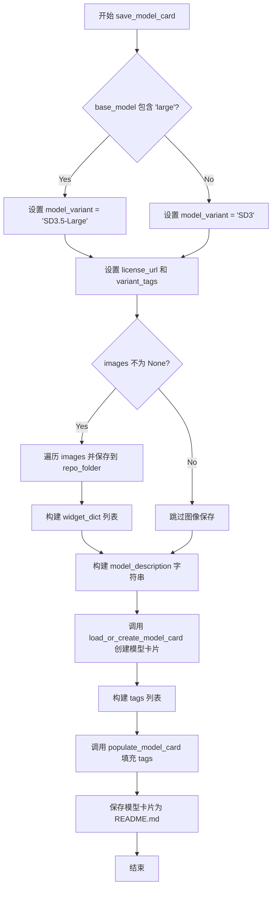

#### 带注释源码

```python
def save_model_card(
    repo_id: str,
    images=None,
    base_model: str = None,
    train_text_encoder=False,
    instance_prompt=None,
    validation_prompt=None,
    repo_folder=None,
):
    """
    生成并保存模型卡片到指定的仓库文件夹。
    
    参数:
        repo_id: HuggingFace Hub上的仓库标识符
        images: 验证时生成的图像列表（可选）
        base_model: 预训练基础模型名称
        train_text_encoder: 是否训练了文本编码器
        instance_prompt: 实例触发词
        validation_prompt: 验证提示词
        repo_folder: 本地仓库文件夹路径
    """
    
    # 根据 base_model 确定模型变体版本和许可证信息
    if "large" in base_model:
        model_variant = "SD3.5-Large"  # 大模型版本标识
        license_url = "https://huggingface.co/stabilityai/stable-diffusion-3.5-large/blob/main/LICENSE.md"
        variant_tags = ["sd3.5-large", "sd3.5", "sd3.5-diffusers"]  # 变体相关标签
    else:
        model_variant = "SD3"  # 标准版本标识
        license_url = "https://huggingface.co/stabilityai/stable-diffusion-3-medium/blob/main/LICENSE.md"
        variant_tags = ["sd3", "sd3-diffusers"]

    widget_dict = []  # 初始化 widget 字典列表，用于 HuggingFace Hub 上的图像展示组件
    
    # 如果提供了验证图像，则保存图像并构建 widget 字典
    if images is not None:
        for i, image in enumerate(images):
            # 将图像保存到本地仓库文件夹
            image.save(os.path.join(repo_folder, f"image_{i}.png"))
            # 构建 widget 字典，包含提示词和图像URL
            widget_dict.append(
                {"text": validation_prompt if validation_prompt else " ", "output": {"url": f"image_{i}.png"}}
            )

    # 构建模型描述的 Markdown 文本
    model_description = f"""
# {model_variant} DreamBooth - {repo_id}

<Gallery />

## Model description

These are {repo_id} DreamBooth weights for {base_model}.

The weights were trained using [DreamBooth](https://dreambooth.github.io/) with the [SD3 diffusers trainer](https://github.com/huggingface/diffusers/blob/main/examples/dreambooth/README_sd3.md).

Was the text encoder fine-tuned? {train_text_encoder}.

## Trigger words

You should use `{instance_prompt}` to trigger the image generation.

## Use it with the [🧨 diffusers library](https://github.com/huggingface/diffusers)

```py
from diffusers import AutoPipelineForText2Image
import torch
pipeline = AutoPipelineForText2Image.from_pretrained('{repo_id}', torch_dtype=torch.float16).to('cuda')
image = pipeline('{validation_prompt if validation_prompt else instance_prompt}').images[0]
```

## License

Please adhere to the licensing terms as described `[here]({license_url})`.
"""
    
    # 使用 diffusers 工具函数加载或创建模型卡片
    model_card = load_or_create_model_card(
        repo_id_or_path=repo_id,
        from_training=True,  # 标记为训练产出的模型卡片
        license="other",
        base_model=base_model,
        prompt=instance_prompt,
        model_description=model_description,
        widget=widget_dict,
    )
    
    # 定义模型标签列表
    tags = [
        "text-to-image",
        "diffusers-training",
        "diffusers",
        "template:sd-lora",
    ]
    tags += variant_tags  # 添加版本相关标签

    # 填充模型卡片的标签信息
    model_card = populate_model_card(model_card, tags=tags)
    # 保存模型卡片为 README.md 文件
    model_card.save(os.path.join(repo_folder, "README.md"))
```


### `load_text_encoders`

该函数用于从预训练模型路径加载三个文本编码器模型（text_encoder、text_encoder_2、text_encoder_3），分别对应 CLIPTextModelWithProjection 或 T5EncoderModel 等不同类型的文本编码器。

参数：

- `class_one`：`Type`，第一个文本编码器类（通常为 CLIPTextModelWithProjection）
- `class_two`：`Type`，第二个文本编码器类（通常为 CLIPTextModelWithProjection）
- `class_three`：`Type`，第三个文本编码器类（通常为 T5EncoderModel）

返回值：`Tuple[CLIPTextModelWithProjection, CLIPTextModelWithProjection, T5EncoderModel]`，返回加载后的三个文本编码器实例

#### 流程图

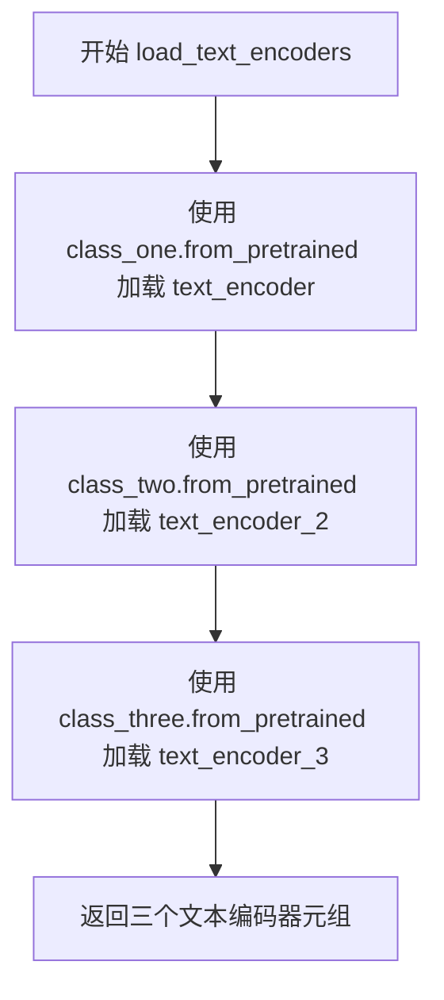

#### 带注释源码

```python
def load_text_encoders(class_one, class_two, class_three):
    """
    加载三个文本编码器模型
    
    参数:
        class_one: 第一个文本编码器类（从 pretrained_model_name_or_path 的 text_encoder 子文件夹加载）
        class_two: 第二个文本编码器类（从 text_encoder_2 子文件夹加载）
        class_three: 第三个文本编码器类（从 text_encoder_3 子文件夹加载）
    
    返回:
        三个文本编码器实例的元组
    """
    # 加载第一个文本编码器（通常是 CLIPTextModelWithProjection）
    text_encoder_one = class_one.from_pretrained(
        args.pretrained_model_name_or_path,  # 预训练模型路径或 HuggingFace Hub 模型ID
        subfolder="text_encoder",            # 子文件夹路径
        revision=args.revision,              # 模型版本
        variant=args.variant                 # 模型变体（如 fp16）
    )
    
    # 加载第二个文本编码器（通常是另一个 CLIPTextModelWithProjection）
    text_encoder_two = class_two.from_pretrained(
        args.pretrained_model_name_or_path,
        subfolder="text_encoder_2",          # 第二个文本编码器的子文件夹
        revision=args.revision,
        variant=args.variant
    )
    
    # 加载第三个文本编码器（通常是 T5EncoderModel）
    text_encoder_three = class_three.from_pretrained(
        args.pretrained_model_name_or_path,
        subfolder="text_encoder_3",          # 第三个文本编码器的子文件夹
        revision=args.revision,
        variant=args.variant
    )
    
    # 返回三个编码器实例
    return text_encoder_one, text_encoder_two, text_encoder_three
```


### `import_model_class_from_model_name_or_path`

该函数根据预训练模型的配置信息，动态导入并返回对应的文本编码器类（CLIPTextModelWithProjection 或 T5EncoderModel），用于后续加载文本编码器模型。

参数：

- `pretrained_model_name_or_path`：`str`，预训练模型的名称或路径，可以是 Hugging Face Hub 上的模型 ID 或本地模型目录
- `revision`：`str`，模型版本号，用于从指定版本加载配置
- `subfolder`：`str`，可选参数，指定模型子文件夹路径，默认为 "text_encoder"

返回值：`type`，返回对应的文本编码器类（CLIPTextModelWithProjection 或 T5EncoderModel），如果不支持则抛出 ValueError 异常

#### 流程图

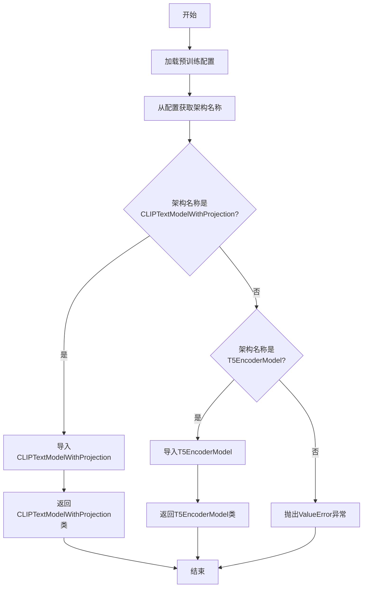

#### 带注释源码

```python
def import_model_class_from_model_name_or_path(
    pretrained_model_name_or_path: str, revision: str, subfolder: str = "text_encoder"
):
    """
    根据预训练模型配置动态导入文本编码器类
    
    参数:
        pretrained_model_name_or_path: 预训练模型路径或Hub模型ID
        revision: 模型版本/提交哈希值
        subfolder: 模型子目录，默认"text_encoder"
    
    返回:
        对应的文本编码器类(CLIPTextModelWithProjection或T5EncoderModel)
    
    异常:
        ValueError: 当架构不支持时抛出
    """
    # 步骤1: 从预训练模型加载文本编码器配置
    # 使用transformers库的PretrainedConfig类读取模型配置
    text_encoder_config = PretrainedConfig.from_pretrained(
        pretrained_model_name_or_path, 
        subfolder=subfolder, 
        revision=revision
    )
    
    # 步骤2: 从配置中获取模型架构名称
    # 配置文件中的architectures字段包含了模型的实际类名
    model_class = text_encoder_config.architectures[0]
    
    # 步骤3: 根据架构名称返回对应的类
    if model_class == "CLIPTextModelWithProjection":
        # 处理CLIP文本编码器(带投影层)
        from transformers import CLIPTextModelWithProjection
        
        return CLIPTextModelWithProjection
    elif model_class == "T5EncoderModel":
        # 处理T5文本编码器
        from transformers import T5EncoderModel
        
        return T5EncoderModel
    else:
        # 不支持的架构类型，抛出异常
        raise ValueError(f"{model_class} is not supported.")
```


### `log_validation`

该函数是 Stable Diffusion 3 DreamBooth 训练脚本中的验证函数，用于在训练过程中生成验证图像并将结果记录到 TensorBoard 或 WandB 等追踪工具中。

参数：

- `pipeline`：`StableDiffusion3Pipeline`，用于生成图像的扩散管道实例
- `args`：命名空间对象，包含训练参数（如 `num_validation_images`、`validation_prompt`、`seed` 等）
- `accelerator`：`Accelerator`，Hugging Face Accelerate 库提供的分布式训练加速器，用于设备管理和追踪器访问
- `pipeline_args`：字典，传递给管道的额外生成参数（如 `prompt`）
- `epoch`：整数，当前训练轮次，用于记录日志
- `torch_dtype`：torch数据类型，用于指定管道的数据类型（如 `torch.float16`）
- `is_final_validation`：布尔值，默认为 False，标识是否为最终验证（若是则阶段名称为 "test"，否则为 "validation"）

返回值：`List[PIL.Image]`，生成的验证图像列表（PIL Image 对象）

#### 流程图

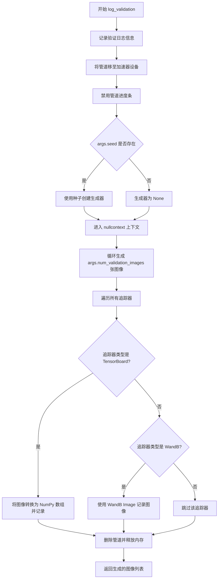

#### 带注释源码

```python
def log_validation(
    pipeline,           # StableDiffusion3Pipeline: 用于图像生成的扩散管道
    args,                # Namespace: 包含训练配置参数的命名空间对象
    accelerator,         # Accelerator: Hugging Face Accelerate 加速器实例
    pipeline_args,      # Dict: 传递给管道的生成参数（如 prompt）
    epoch,               # int: 当前训练的轮次（epoch）编号
    torch_dtype,         # torch.dtype: 管道使用的数据类型
    is_final_validation=False,  # bool: 是否为最终验证阶段
):
    """
    运行验证：生成验证图像并记录到追踪工具（TensorBoard/WandB）
    
    该函数在每个验证周期被调用，用于：
    1. 使用当前训练的模型生成指定数量的验证图像
    2. 将生成的图像记录到实验追踪工具
    3. 清理管道以释放 GPU 内存
    """
    # 记录验证开始信息，包括生成图像数量和验证提示词
    logger.info(
        f"Running validation... \n Generating {args.num_validation_images} images with prompt:"
        f" {args.validation_prompt}."
    )
    
    # 将扩散管道移至加速器所在的设备（GPU/CPU）
    pipeline = pipeline.to(accelerator.device)
    
    # 禁用管道的进度条显示，减少日志输出噪音
    pipeline.set_progress_bar_config(disable=True)

    # 创建随机生成器以确保可重复性
    # 如果提供了 seed，则使用该种子创建生成器；否则为 None
    generator = torch.Generator(device=accelerator.device).manual_seed(args.seed) if args.seed is not None else None
    
    # 注意：此处原本计划使用 torch.autocast 进行混合精度推理，
    # 但目前使用 nullcontext() 跳过自动混合精度
    # autocast_ctx = torch.autocast(accelerator.device.type) if not is_final_validation else nullcontext()
    autocast_ctx = nullcontext()

    # 在指定上下文中运行推理，生成验证图像
    # 循环生成 args.num_validation_images 数量的图像
    with autocast_ctx:
        images = [pipeline(**pipeline_args, generator=generator).images[0] for _ in range(args.num_validation_images)]

    # 遍历所有注册的追踪器，记录生成的图像
    for tracker in accelerator.trackers:
        # 确定阶段名称：最终验证为 "test"，中间验证为 "validation"
        phase_name = "test" if is_final_validation else "validation"
        
        # TensorBoard 追踪器处理
        if tracker.name == "tensorboard":
            # 将 PIL 图像转换为 NumPy 数组并堆叠
            np_images = np.stack([np.asarray(img) for img in images])
            # 使用 add_images 方法记录图像，支持网格显示
            tracker.writer.add_images(phase_name, np_images, epoch, dataformats="NHWC")
        
        # WandB 追踪器处理
        if tracker.name == "wandb":
            # 使用 WandB Image 记录图像，支持标题显示
            tracker.log(
                {
                    phase_name: [
                        wandb.Image(image, caption=f"{i}: {args.validation_prompt}") for i, image in enumerate(images)
                    ]
                }
            )

    # 清理管道对象以释放 GPU 内存
    del pipeline
    free_memory()

    # 返回生成的图像列表，供调用者使用（如保存到 Hub）
    return images
```


### `tokenize_prompt`

使用tokenizer对提示词进行分词，将文本提示转换为token IDs张量，以便后续编码处理。

参数：

- `tokenizer`：`CLIPTokenizer` 或 `T5TokenizerFast`，用于对文本进行分词的tokenizer实例
- `prompt`：`str`，要分词的文本提示词

返回值：`torch.Tensor`，分词后的输入ID张量，形状为 (batch_size, 77)

#### 流程图

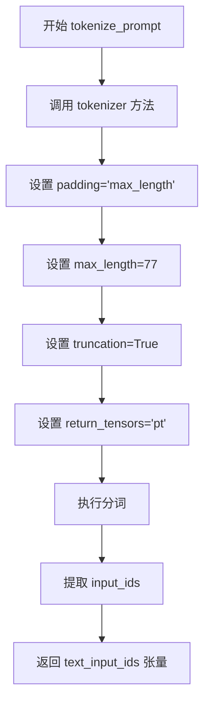

#### 带注释源码

```python
def tokenize_prompt(tokenizer, prompt):
    """
    使用给定的tokenizer对提示词进行分词
    
    参数:
        tokenizer: CLIPTokenizer或T5TokenizerFast实例，用于文本分词
        prompt: str，要分词的文本提示
    
    返回:
        torch.Tensor: 分词后的token IDs，形状为 (batch_size, max_length)
    """
    # 使用tokenizer对prompt进行分词，转换为PyTorch张量
    text_inputs = tokenizer(
        prompt,                # 输入的文本提示
        padding="max_length", # 填充到最大长度，确保输出长度一致
        max_length=77,        # 最大序列长度（CLIP模型标准长度）
        truncation=True,      # 超过最大长度的序列进行截断
        return_tensors="pt",  # 返回PyTorch张量格式
    )
    # 提取input_ids，这是分词后的token ID序列
    text_input_ids = text_inputs.input_ids
    # 返回token IDs供后续编码使用
    return text_input_ids
```

#### 使用场景

该函数在训练过程中被多次调用：

1. **文本编码器训练时**：当 `args.train_text_encoder=True` 时，在训练循环中需要对每个batch的prompts进行分词
2. **实例提示词和类别提示词**：在训练前对instance_prompt和class_prompt进行分词处理，以便后续的编码操作

```python
# 典型调用示例（来自main函数）
tokens_one = tokenize_prompt(tokenizer_one, args.instance_prompt)
tokens_two = tokenize_prompt(tokenizer_two, args.instance_prompt)
tokens_three = tokenize_prompt(tokenizer_three, args.instance_prompt)
```


### `_encode_prompt_with_t5`

使用T5编码器对文本提示进行编码，将文本提示转换为嵌入向量（prompt embeddings），支持批量处理和每提示生成多张图像的功能。

参数：

- `text_encoder`：`T5EncoderModel`，T5文本编码器模型，用于将文本token转换为嵌入向量
- `tokenizer`：`T5TokenizerFast`，T5分词器，用于将文本提示转换为token IDs
- `max_sequence_length`：`int`，文本序列的最大长度，控制tokenization时的截断长度
- `prompt`：`Union[str, List[str]]`，要编码的文本提示，可以是单个字符串或字符串列表
- `num_images_per_prompt`：`int`，每个提示要生成的图像数量，用于复制embeddings以支持多次生成
- `device`：`torch.device`，可选参数，指定计算设备，默认使用编码器所在的设备

返回值：`torch.Tensor`，形状为 `(batch_size * num_images_per_prompt, seq_len, hidden_size)` 的文本嵌入向量张量

#### 流程图

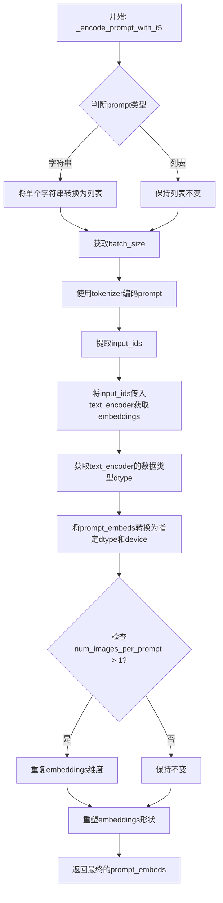

#### 带注释源码

```python
def _encode_prompt_with_t5(
    text_encoder,
    tokenizer,
    max_sequence_length,
    prompt=None,
    num_images_per_prompt=1,
    device=None,
):
    # 将prompt转换为列表，统一处理逻辑
    # 如果是单个字符串，则包装为列表；如果是列表则保持不变
    prompt = [prompt] if isinstance(prompt, str) else prompt
    # 获取批次大小
    batch_size = len(prompt)

    # 使用tokenizer对prompt进行tokenization
    # padding="max_length": 填充到最大长度
    # max_length: 使用指定的最大序列长度
    # truncation=True: 超过最大长度的序列进行截断
    # add_special_tokens=True: 添加特殊的token（如EOS、BOS等）
    # return_tensors="pt": 返回PyTorch张量
    text_inputs = tokenizer(
        prompt,
        padding="max_length",
        max_length=max_sequence_length,
        truncation=True,
        add_special_tokens=True,
        return_tensors="pt",
    )
    # 提取input_ids，用于后续编码
    text_input_ids = text_inputs.input_ids
    
    # 将token IDs传入text_encoder获取嵌入向量
    # text_encoder输出的第一个元素是隐藏状态
    prompt_embeds = text_encoder(text_input_ids.to(device))[0]

    # 获取text_encoder的默认数据类型（通常是float32）
    dtype = text_encoder.dtype
    # 将prompt_embeds转换为与text_encoder相同的数据类型，并移动到指定设备
    prompt_embeds = prompt_embeds.to(dtype=dtype, device=device)

    # 获取embeddings的形状信息：batch_size, sequence_length, hidden_dim
    _, seq_len, _ = prompt_embeds.shape

    # 复制text embeddings和attention mask以适配每提示生成多张图像的场景
    # 使用MPS友好的方法（.repeat而非torch.repeat_interleave）
    # 将batch维度扩展num_images_per_prompt倍
    prompt_embeds = prompt_embeds.repeat(1, num_images_per_prompt, 1)
    # 重塑张量形状：从 [batch, seq_len, hidden] 
    # 变为 [batch * num_images_per_prompt, seq_len, hidden]
    prompt_embeds = prompt_embeds.view(batch_size * num_images_per_prompt, seq_len, -1)

    # 返回编码后的prompt embeddings
    return prompt_embeds
```


### `_encode_prompt_with_clip`

该函数使用CLIP文本编码器对输入的文本提示进行编码，返回文本嵌入（prompt_embeds）和池化后的文本嵌入（pooled_prompt_embeds），支持批量处理和每个提示生成多张图像的场景。

参数：

- `text_encoder`：`torch.nn.Module`，CLIP文本编码器模型，用于将token IDs转换为文本嵌入表示
- `tokenizer`：`CLIPTokenizer`，CLIP分词器，用于将文本提示转换为token IDs
- `prompt`：`str`，要编码的文本提示，可以是单个字符串或字符串列表
- `device`：`torch.device`，可选，指定计算设备，默认为None
- `text_input_ids`：`torch.Tensor`，可选，已分词的文本输入IDs，当tokenizer为None时必须提供
- `num_images_per_prompt`：`int`，可选，默认值为1，每个提示需要生成的图像数量，用于复制文本嵌入

返回值：`Tuple[torch.Tensor, torch.Tensor]`，返回元组包含两个张量：
- `prompt_embeds`：`torch.Tensor`，形状为`(batch_size * num_images_per_prompt, seq_len, hidden_dim)`的文本嵌入序列
- `pooled_prompt_embeds`：`torch.Tensor`，形状为`(batch_size * num_images_per_prompt, hidden_dim)`的池化后的文本嵌入

#### 流程图

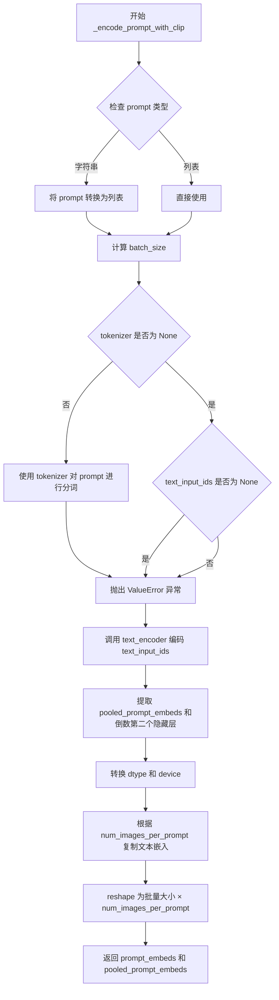

#### 带注释源码

```python
def _encode_prompt_with_clip(
    text_encoder,
    tokenizer,
    prompt: str,
    device=None,
    text_input_ids=None,
    num_images_per_prompt: int = 1,
):
    """
    使用CLIP文本编码器对提示词进行编码
    
    参数:
        text_encoder: CLIP文本编码器模型
        tokenizer: CLIP分词器
        prompt: 要编码的文本提示
        device: 计算设备
        text_input_ids: 预分词的文本IDs（可选）
        num_images_per_prompt: 每个提示生成的图像数量
    
    返回:
        (prompt_embeds, pooled_prompt_embeds): 文本嵌入和池化嵌入
    """
    # 如果prompt是单个字符串，转换为列表以支持批量处理
    prompt = [prompt] if isinstance(prompt, str) else prompt
    batch_size = len(prompt)

    # 使用tokenizer对prompt进行分词（如果提供了tokenizer）
    if tokenizer is not None:
        text_inputs = tokenizer(
            prompt,
            padding="max_length",
            max_length=77,  # CLIP模型的标准最大序列长度
            truncation=True,
            return_tensors="pt",
        )
        # 获取token IDs
        text_input_ids = text_inputs.input_ids
    else:
        # 如果没有tokenizer，则必须提供预分词的text_input_ids
        if text_input_ids is None:
            raise ValueError("text_input_ids must be provided when the tokenizer is not specified")

    # 调用CLIP文本编码器进行编码，获取隐藏状态
    prompt_embeds = text_encoder(text_input_ids.to(device), output_hidden_states=True)

    # 从编码结果中提取池化后的嵌入（第一个输出）
    pooled_prompt_embeds = prompt_embeds[0]
    # 获取倒数第二个隐藏层作为文本嵌入（通常效果更好）
    prompt_embeds = prompt_embeds.hidden_states[-2]
    # 转换为与文本编码器相同的dtype和设备
    prompt_embeds = prompt_embeds.to(dtype=text_encoder.dtype, device=device)

    # 获取嵌入的序列长度
    _, seq_len, _ = prompt_embeds.shape
    
    # 为每个提示生成的图像数量复制文本嵌入
    # 使用MPS友好的方法
    prompt_embeds = prompt_embeds.repeat(1, num_images_per_prompt, 1)
    # reshape为(batch_size * num_images_per_prompt, seq_len, hidden_dim)
    prompt_embeds = prompt_embeds.view(batch_size * num_images_per_prompt, seq_len, -1)

    return prompt_embeds, pooled_prompt_embeds
```


### `encode_prompt`

统一入口函数，组合CLIP和T5的提示词编码，输出融合后的提示词嵌入和CLIP池化嵌入。

参数：

- `text_encoders`：`List[Union[CLIPTextModelWithProjection, T5EncoderModel]]`，文本编码器列表，包含两个CLIP文本编码器和一个T5编码器
- `tokenizers`：`List[Union[CLIPTokenizer, T5TokenizerFast]]`，分词器列表，对应三个文本编码器
- `prompt`：`str`，待编码的提示词文本
- `max_sequence_length`：`int`，T5编码器的最大序列长度
- `device`：`torch.device`，可选，指定计算设备，默认为None（使用编码器所在设备）
- `num_images_per_prompt`：`int`，可选，每个提示词生成的图像数量，用于复制嵌入，默认为1
- `text_input_ids_list`：`List[torch.Tensor]`，可选，预分词的文本输入ID列表，用于文本编码器训练时直接使用，默认为None

返回值：`Tuple[torch.Tensor, torch.Tensor]`，返回一个元组：
- `prompt_embeds`：`torch.Tensor`，组合后的提示词嵌入，形状为`(batch_size * num_images_per_prompt, seq_len, hidden_dim)`
- `pooled_prompt_embeds`：`torch.Tensor`，CLIP模型的池化提示词嵌入，用于SD3的pooled projections

#### 流程图

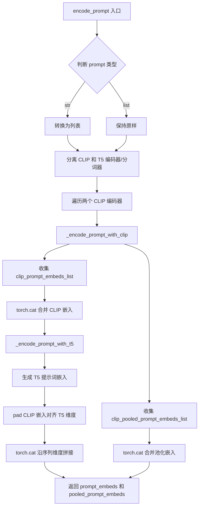

#### 带注释源码

```python
def encode_prompt(
    text_encoders,
    tokenizers,
    prompt: str,
    max_sequence_length,
    device=None,
    num_images_per_prompt: int = 1,
    text_input_ids_list=None,
):
    """
    统一入口函数，组合 CLIP 和 T5 的提示词编码
    
    参数:
        text_encoders: 文本编码器列表 [clip_encoder_1, clip_encoder_2, t5_encoder]
        tokenizers: 分词器列表 [clip_tokenizer_1, clip_tokenizer_2, t5_tokenizer]
        prompt: 待编码的提示词
        max_sequence_length: T5 最大序列长度
        device: 计算设备
        num_images_per_prompt: 每个提示词生成的图像数量
        text_input_ids_list: 预分词的文本ID列表
    """
    # 将单个字符串转换为列表，统一处理
    prompt = [prompt] if isinstance(prompt, str) else prompt

    # 分离 CLIP 和 T5 编码器/分词器
    clip_tokenizers = tokenizers[:2]      # 前两个是 CLIP 分词器
    clip_text_encoders = text_encoders[:2]  # 前两个是 CLIP 编码器

    clip_prompt_embeds_list = []
    clip_pooled_prompt_embeds_list = []
    
    # 遍历两个 CLIP 编码器分别编码
    for i, (tokenizer, text_encoder) in enumerate(zip(clip_tokenizers, clip_text_encoders)):
        # 调用 CLIP 编码函数
        prompt_embeds, pooled_prompt_embeds = _encode_prompt_with_clip(
            text_encoder=text_encoder,
            tokenizer=tokenizer,
            prompt=prompt,
            # 确定设备，优先使用传入的 device，否则使用编码器当前设备
            device=device if device is not None else text_encoder.device,
            num_images_per_prompt=num_images_per_prompt,
            # 训练文本编码器时使用预分词的输入
            text_input_ids=text_input_ids_list[i] if text_input_ids_list else None,
        )
        clip_prompt_embeds_list.append(prompt_embeds)
        clip_pooled_prompt_embeds_list.append(pooled_prompt_embeds)

    # 沿最后一维拼接两个 CLIP 的提示词嵌入 (batch, seq, hidden1+hidden2)
    clip_prompt_embeds = torch.cat(clip_prompt_embeds_list, dim=-1)
    # 拼接池化嵌入
    pooled_prompt_embeds = torch.cat(clip_pooled_prompt_embeds_list, dim=-1)

    # 使用 T5 编码器处理提示词 (支持更长序列)
    t5_prompt_embed = _encode_prompt_with_t5(
        text_encoders[-1],       # 第三个编码器是 T5
        tokenizers[-1],          # 第三个分词器是 T5
        max_sequence_length,
        prompt=prompt,
        num_images_per_prompt=num_images_per_prompt,
        device=device if device is not None else text_encoders[-1].device,
    )

    # 将 CLIP 嵌入 padding 到与 T5 相同维度 (填充右侧)
    # T5 通常有更大的序列长度，需要对齐
    clip_prompt_embeds = torch.nn.functional.pad(
        clip_prompt_embeds, 
        (0, t5_prompt_embed.shape[-1] - clip_prompt_embeds.shape[-1])
    )
    
    # 沿序列维度拼接 CLIP 和 T5 的嵌入
    # 最终形状: (batch, clip_seq + t5_seq, hidden)
    prompt_embeds = torch.cat([clip_prompt_embeds, t5_prompt_embed], dim=-2)

    return prompt_embeds, pooled_prompt_embeds
```


### `collate_fn`

该函数是Stable Diffusion 3 DreamBooth训练脚本中的数据整理函数，负责将多个样本数据整理成一个批次，用于DataLoader。它会提取实例图像和提示词，并根据需要合并类别图像以实现先验保留损失。

参数：

- `examples`：`List[Dict]` ，从数据集中获取的样本列表，每个字典包含实例图像、实例提示词以及可选的类别图像和类别提示词
- `with_prior_preservation`：`bool`，是否启用先验保留，如果为True则将类别图像和提示词也纳入批次

返回值：`Dict`，包含以下键值的字典：
- `pixel_values`：`torch.Tensor`，形状为`(batch_size, channels, height, width)`的图像张量
- `prompts`：`List[str]`，提示词列表

#### 流程图

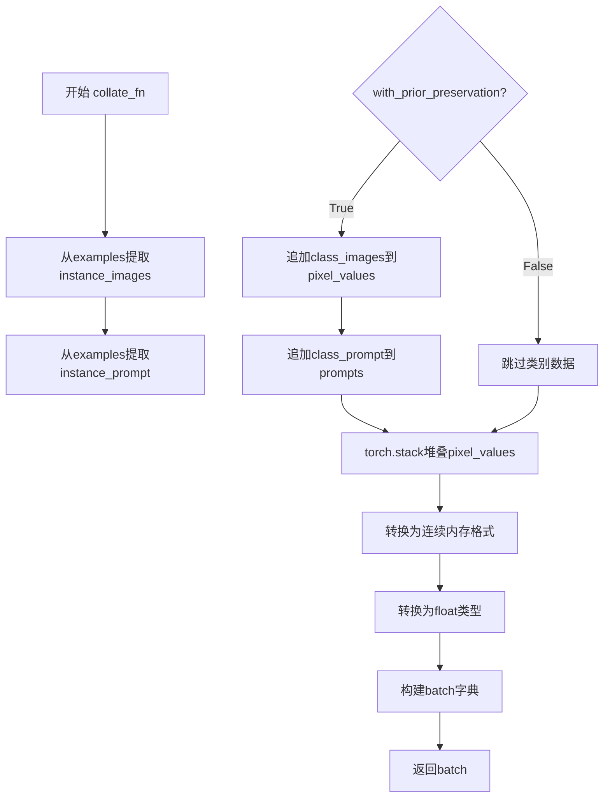

#### 带注释源码

```python
def collate_fn(examples, with_prior_preservation=False):
    """
    整理训练批次数据，将样本列表转换为模型可用的批次字典
    
    参数:
        examples: 样本列表，每个元素是包含图像和提示词的字典
        with_prior_preservation: 是否包含类别数据用于先验保留损失
    """
    # 从所有样本中提取实例图像
    pixel_values = [example["instance_images"] for example in examples]
    # 从所有样本中提取实例提示词
    prompts = [example["instance_prompt"] for example in examples]

    # 如果启用先验保留，将类别图像和提示词也加入批次
    # 这样做可以避免进行两次前向传播
    if with_prior_preservation:
        pixel_values += [example["class_images"] for example in examples]
        prompts += [example["class_prompt"] for example in examples]

    # 将像素值列表堆叠为张量
    pixel_values = torch.stack(pixel_values)
    # 转换为连续内存格式以提高访问效率，并转换为float类型
    pixel_values = pixel_values.to(memory_format=torch.contiguous_format).float()

    # 构建最终的批次字典
    batch = {"pixel_values": pixel_values, "prompts": prompts}
    return batch
```


### `main`

主训练循环函数，负责执行SD3模型的DreamBooth训练全流程，包括环境初始化、数据准备、模型加载、训练循环、验证、模型保存和上传。

参数：

- `args`：命令行参数对象（argparse.Namespace），包含所有训练配置，如模型路径、数据路径、学习率、批量大小、训练步数等。

返回值：无返回值（None），函数直接执行训练流程并在结束时调用`accelerator.end_training()`。

#### 流程图

```mermaid
flowchart TD
    A[开始 main 函数] --> B[检查 wandb 和 hub_token 安全性]
    B --> C{检查 MPS + bf16}
    C -->|是| D[抛出错误: MPS不支持bf16]
    C -->|否| E[创建 Accelerator]
    E --> F[配置日志和种子]
    F --> G{with_prior_preservation?}
    G -->|是| H[生成类别图像]
    G -->|否| I[跳过类别图像生成]
    H --> I
    I --> J[创建输出目录]
    J --> K{push_to_hub?}
    K -->|是| L[创建 Hub 仓库]
    K -->|否| M[跳过仓库创建]
    L --> M
    M --> N[加载 Tokenizers]
    N --> O[加载 Text Encoders 类]
    O --> P[加载 Scheduler 和 Models]
    P --> Q[设置模型梯度]
    Q --> R[设置权重精度]
    R --> S[启用 Gradient Checkpointing]
    S --> T[注册模型保存/加载 Hooks]
    T --> U[配置优化器参数]
    U --> V[创建数据集和数据加载器]
    V --> W{训练 Text Encoder?}
    W -->|是| X[在每步编码 Prompt]
    W -->|否| Y[预计算 Embeddings]
    X --> Z
    Y --> Z[配置学习率调度器]
    Z --> AA[使用 Accelerator 准备模型]
    AA --> AB[初始化 Trackers]
    AB --> AC[加载 Checkpoint 如需要]
    AC --> AD[开始训练循环 - Epoch]
    AD --> AE[设置模型为训练模式]
    AE --> AF[遍历训练数据]
    AF --> AG[累积梯度]
    AG --> AH[编码图像到 Latent 空间]
    AH --> AI[采样噪声和时间步]
    AI --> AJ[添加噪声到输入]
    AJ --> AK[预测噪声残差]
    AK --> AL{with_prior_preservation?}
    AL -->|是| AM[计算 Prior Loss]
    AL -->|否| AN[跳过 Prior Loss]
    AM --> AO[计算总 Loss]
    AN --> AO
    AO --> AP[反向传播]
    AP --> AQ[梯度裁剪]
    AQ --> AR[优化器更新]
    AR --> AS[学习率调度器更新]
    AS --> AT{同步梯度?}
    AT -->|是| AU[更新进度条和全局步数]
    AT -->|否| AW
    AU --> AV{到达 checkpoint 步数?}
    AV -->|是| AX[保存 Checkpoint]
    AV -->|否| AW
    AX --> AW{达到最大训练步数?}
    AW --> AY[记录日志]
    AY --> AZ{validation_prompt 存在?}
    AZ -->|是| BA[执行验证]
    AZ -->|否| BB
    BA --> BB{还有更多数据?}
    BB -->|是| AF
    BB -->|否| BC[训练循环结束]
    BC --> BD{is_main_process?}
    BD -->|是| BE[保存最终模型]
    BD -->|否| BH
    BE --> BF[保存 Pipeline]
    BF --> BG[最终推理验证]
    BG --> BH{push_to_hub?}
    BH -->|是| BI[保存模型 Card 并上传]
    BH -->|否| BJ[结束训练]
    BI --> BJ
```

#### 带注释源码

```python
def main(args):
    """
    主训练循环函数，执行 SD3 模型的 DreamBooth 训练。
    
    参数:
        args: 包含所有训练配置的命令行参数对象
    """
    
    # --- 1. 安全检查和初始化 ---
    # 检查 wandb 和 hub_token 同时使用的安全风险
    if args.report_to == "wandb" and args.hub_token is not None:
        raise ValueError(
            "You cannot use both --report_to=wandb and --hub_token due to a security risk of exposing your token."
            " Please use `hf auth login` to authenticate with the Hub."
        )

    # 检查 MPS (Apple Silicon) 是否支持 bf16
    if torch.backends.mps.is_available() and args.mixed_precision == "bf16":
        raise ValueError(
            "Mixed precision training with bfloat16 is not supported on MPS. Please use fp16 (recommended) or fp32 instead."
        )

    # --- 2. 配置 Accelerator ---
    # 创建日志目录
    logging_dir = Path(args.output_dir, args.logging_dir)
    
    # 配置分布式训练参数
    accelerator_project_config = ProjectConfiguration(project_dir=args.output_dir, logging_dir=logging_dir)
    kwargs = DistributedDataParallelKwargs(find_unused_parameters=True)
    accelerator = Accelerator(
        gradient_accumulation_steps=args.gradient_accumulation_steps,
        mixed_precision=args.mixed_precision,
        log_with=args.report_to,
        project_config=accelerator_project_config,
        kwargs_handlers=[kwargs],
    )

    # MPS 上禁用 AMP
    if torch.backends.mps.is_available():
        accelerator.native_amp = False

    # 检查 wandb 可用性
    if args.report_to == "wandb":
        if not is_wandb_available():
            raise ImportError("Make sure to install wandb if you want to use it for logging during training.")

    # --- 3. 日志配置 ---
    # 配置日志格式
    logging.basicConfig(
        format="%(asctime)s - %(levelname)s - %(name)s - %(message)s",
        datefmt="%m/%d/%Y %H:%M:%S",
        level=logging.INFO,
    )
    logger.info(accelerator.state, main_process_only=False)
    
    # 主进程设置详细日志，其他进程设置错误日志
    if accelerator.is_local_main_process:
        transformers.utils.logging.set_verbosity_warning()
        diffusers.utils.logging.set_verbosity_info()
    else:
        transformers.utils.logging.set_verbosity_error()
        diffusers.utils.logging.set_verbosity_error()

    # 设置随机种子
    if args.seed is not None:
        set_seed(args.seed)

    # --- 4. 生成类别图像 (Prior Preservation) ---
    if args.with_prior_preservation:
        class_images_dir = Path(args.class_data_dir)
        if not class_images_dir.exists():
            class_images_dir.mkdir(parents=True)
        
        # 检查现有类别图像数量
        cur_class_images = len(list(class_images_dir.iterdir()))

        if cur_class_images < args.num_class_images:
            # 确定精度类型
            has_supported_fp16_accelerator = torch.cuda.is_available() or torch.backends.mps.is_available()
            torch_dtype = torch.float16 if has_supported_fp16_accelerator else torch.float32
            
            if args.prior_generation_precision == "fp32":
                torch_dtype = torch.float32
            elif args.prior_generation_precision == "fp16":
                torch_dtype = torch.float16
            elif args.prior_generation_precision == "bf16":
                torch_dtype = torch.bfloat16
            
            # 加载推理用的 Pipeline
            pipeline = StableDiffusion3Pipeline.from_pretrained(
                args.pretrained_model_name_or_path,
                torch_dtype=torch_dtype,
                revision=args.revision,
                variant=args.variant,
            )
            pipeline.set_progress_bar_config(disable=True)

            # 生成缺失的类别图像
            num_new_images = args.num_class_images - cur_class_images
            logger.info(f"Number of class images to sample: {num_new_images}.")

            sample_dataset = PromptDataset(args.class_prompt, num_new_images)
            sample_dataloader = torch.utils.data.DataLoader(sample_dataset, batch_size=args.sample_batch_size)
            sample_dataloader = accelerator.prepare(sample_dataloader)
            pipeline.to(accelerator.device)

            # 生成并保存类别图像
            for example in tqdm(
                sample_dataloader, desc="Generating class images", disable=not accelerator.is_local_main_process
            ):
                images = pipeline(example["prompt"]).images

                for i, image in enumerate(images):
                    # 使用不安全哈希命名图像文件
                    hash_image = insecure_hashlib.sha1(image.tobytes()).hexdigest()
                    image_filename = class_images_dir / f"{example['index'][i] + cur_class_images}-{hash_image}.jpg"
                    image.save(image_filename)

            # 清理 Pipeline 释放内存
            del pipeline
            free_memory()

    # --- 5. 创建输出目录和 Hub 仓库 ---
    if accelerator.is_main_process:
        if args.output_dir is not None:
            os.makedirs(args.output_dir, exist_ok=True)

        if args.push_to_hub:
            repo_id = create_repo(
                repo_id=args.hub_model_id or Path(args.output_dir).name,
                exist_ok=True,
            ).repo_id

    # --- 6. 加载 Tokenizers ---
    tokenizer_one = CLIPTokenizer.from_pretrained(
        args.pretrained_model_name_or_path,
        subfolder="tokenizer",
        revision=args.revision,
    )
    tokenizer_two = CLIPTokenizer.from_pretrained(
        args.pretrained_model_name_or_path,
        subfolder="tokenizer_2",
        revision=args.revision,
    )
    tokenizer_three = T5TokenizerFast.from_pretrained(
        args.pretrained_model_name_or_path,
        subfolder="tokenizer_3",
        revision=args.revision,
    )

    # --- 7. 确定 Text Encoder 类 ---
    text_encoder_cls_one = import_model_class_from_model_name_or_path(
        args.pretrained_model_name_or_path, args.revision
    )
    text_encoder_cls_two = import_model_class_from_model_name_or_path(
        args.pretrained_model_name_or_path, args.revision, subfolder="text_encoder_2"
    )
    text_encoder_cls_three = import_model_class_from_model_name_or_path(
        args.pretrained_model_name_or_path, args.revision, subfolder="text_encoder_3"
    )

    # --- 8. 加载 Scheduler 和 Models ---
    # 加载噪声调度器
    noise_scheduler = FlowMatchEulerDiscreteScheduler.from_pretrained(
        args.pretrained_model_name_or_path, subfolder="scheduler"
    )
    noise_scheduler_copy = copy.deepcopy(noise_scheduler)
    
    # 加载文本编码器
    text_encoder_one, text_encoder_two, text_encoder_three = load_text_encoders(
        text_encoder_cls_one, text_encoder_cls_two, text_encoder_cls_three
    )
    
    # 加载 VAE
    vae = AutoencoderKL.from_pretrained(
        args.pretrained_model_name_or_path,
        subfolder="vae",
        revision=args.revision,
        variant=args.variant,
    )
    
    # 加载 Transformer 主模型
    transformer = SD3Transformer2DModel.from_pretrained(
        args.pretrained_model_name_or_path, subfolder="transformer", revision=args.revision, variant=args.variant
    )

    # --- 9. 设置模型梯度 ---
    transformer.requires_grad_(True)
    vae.requires_grad_(False)
    
    if args.train_text_encoder:
        text_encoder_one.requires_grad_(True)
        text_encoder_two.requires_grad_(True)
        text_encoder_three.requires_grad_(True)
    else:
        text_encoder_one.requires_grad_(False)
        text_encoder_two.requires_grad_(False)
        text_encoder_three.requires_grad_(False)

    # --- 10. 设置权重精度 ---
    weight_dtype = torch.float32
    if accelerator.mixed_precision == "fp16":
        weight_dtype = torch.float16
    elif accelerator.mixed_precision == "bf16":
        weight_dtype = torch.bfloat16

    # MPS 不支持 bf16
    if torch.backends.mps.is_available() and weight_dtype == torch.bfloat16:
        raise ValueError(
            "Mixed precision training with bfloat16 is not supported on MPS. Please use fp16 (recommended) or fp32 instead."
        )

    # 将模型移动到设备并设置精度
    vae.to(accelerator.device, dtype=torch.float32)
    if not args.train_text_encoder:
        text_encoder_one.to(accelerator.device, dtype=weight_dtype)
        text_encoder_two.to(accelerator.device, dtype=weight_dtype)
        text_encoder_three.to(accelerator.device, dtype=weight_dtype)

    # --- 11. Gradient Checkpointing ---
    if args.gradient_checkpointing:
        transformer.enable_gradient_checkpointing()
        if args.train_text_encoder:
            text_encoder_one.gradient_checkpointing_enable()
            text_encoder_two.gradient_checkpointing_enable()
            text_encoder_three.gradient_checkpointing_enable()

    # --- 12. 模型解包辅助函数 ---
    def unwrap_model(model):
        """解包加速器包装的模型，处理编译模块"""
        model = accelerator.unwrap_model(model)
        model = model._orig_mod if is_compiled_module(model) else model
        return model

    # --- 13. 注册模型保存/加载 Hooks ---
    def save_model_hook(models, weights, output_dir):
        """自定义模型保存钩子"""
        if accelerator.is_main_process:
            for i, model in enumerate(models):
                if isinstance(unwrap_model(model), SD3Transformer2DModel):
                    unwrap_model(model).save_pretrained(os.path.join(output_dir, "transformer"))
                elif isinstance(unwrap_model(model), (CLIPTextModelWithProjection, T5EncoderModel)):
                    if isinstance(unwrap_model(model), CLIPTextModelWithProjection):
                        hidden_size = unwrap_model(model).config.hidden_size
                        if hidden_size == 768:
                            unwrap_model(model).save_pretrained(os.path.join(output_dir, "text_encoder"))
                        elif hidden_size == 1280:
                            unwrap_model(model).save_pretrained(os.path.join(output_dir, "text_encoder_2"))
                else:
                    raise ValueError(f"Wrong model supplied: {type(model)=}.")
                weights.pop()

    def load_model_hook(models, input_dir):
        """自定义模型加载钩子"""
        for _ in range(len(models)):
            model = models.pop()
            if isinstance(unwrap_model(model), SD3Transformer2DModel):
                load_model = SD3Transformer2DModel.from_pretrained(input_dir, subfolder="transformer")
                model.register_to_config(**load_model.config)
                model.load_state_dict(load_model.state_dict())
            elif isinstance(unwrap_model(model), (CLIPTextModelWithProjection, T5EncoderModel)):
                # 尝试加载不同的 text encoder
                try:
                    load_model = CLIPTextModelWithProjection.from_pretrained(input_dir, subfolder="text_encoder")
                    model(**load_model.config)
                    model.load_state_dict(load_model.state_dict())
                except Exception:
                    try:
                        load_model = CLIPTextModelWithProjection.from_pretrained(input_dir, subfolder="text_encoder_2")
                        model(**load_model.config)
                        model.load_state_dict(load_model.state_dict())
                    except Exception:
                        try:
                            load_model = T5EncoderModel.from_pretrained(input_dir, subfolder="text_encoder_3")
                            model(**load_model.config)
                            model.load_state_dict(load_model.state_dict())
                        except Exception:
                            raise ValueError(f"Couldn't load the model of type: ({type(model)}).")
            else:
                raise ValueError(f"Unsupported model found: {type(model)=}")
            del load_model

    accelerator.register_save_state_pre_hook(save_model_hook)
    accelerator.register_load_state_pre_hook(load_model_hook)

    # --- 14. TF32 配置 ---
    if args.allow_tf32 and torch.cuda.is_available():
        torch.backends.cuda.matmul.allow_tf32 = True

    # --- 15. 学习率缩放 ---
    if args.scale_lr:
        args.learning_rate = (
            args.learning_rate * args.gradient_accumulation_steps * args.train_batch_size * accelerator.num_processes
        )

    # --- 16. 优化器参数配置 ---
    transformer_parameters_with_lr = {"params": transformer.parameters(), "lr": args.learning_rate}
    
    if args.train_text_encoder:
        text_parameters_one_with_lr = {
            "params": text_encoder_one.parameters(),
            "weight_decay": args.adam_weight_decay_text_encoder,
            "lr": args.text_encoder_lr if args.text_encoder_lr else args.learning_rate,
        }
        text_parameters_two_with_lr = {
            "params": text_encoder_two.parameters(),
            "weight_decay": args.adam_weight_decay_text_encoder,
            "lr": args.text_encoder_lr if args.text_encoder_lr else args.learning_rate,
        }
        text_parameters_three_with_lr = {
            "params": text_encoder_three.parameters(),
            "weight_decay": args.adam_weight_decay_text_encoder,
            "lr": args.text_encoder_lr if args.text_encoder_lr else args.learning_rate,
        }
        params_to_optimize = [
            transformer_parameters_with_lr,
            text_parameters_one_with_lr,
            text_parameters_two_with_lr,
            text_parameters_three_with_lr,
        ]
    else:
        params_to_optimize = [transformer_parameters_with_lr]

    # --- 17. 创建优化器 ---
    if not (args.optimizer.lower() == "prodigy" or args.optimizer.lower() == "adamw"):
        logger.warning(
            f"Unsupported choice of optimizer: {args.optimizer}.Supported optimizers include [adamW, prodigy]."
            "Defaulting to adamW"
        )
        args.optimizer = "adamw"

    if args.use_8bit_adam and not args.optimizer.lower() == "adamw":
        logger.warning(f"use_8bit_adam is ignored when optimizer is not set to 'AdamW'.")

    if args.optimizer.lower() == "adamw":
        if args.use_8bit_adam:
            try:
                import bitsandbytes as bnb
            except ImportError:
                raise ImportError("To use 8-bit Adam, please install the bitsandbytes library.")
            optimizer_class = bnb.optim.AdamW8bit
        else:
            optimizer_class = torch.optim.AdamW

        optimizer = optimizer_class(
            params_to_optimize,
            betas=(args.adam_beta1, args.adam_beta2),
            weight_decay=args.adam_weight_decay,
            eps=args.adam_epsilon,
        )

    if args.optimizer.lower() == "prodigy":
        try:
            import prodigyopt
        except ImportError:
            raise ImportError("To use Prodigy, please install the prodigyopt library.")

        optimizer_class = prodigyopt.Prodigy

        if args.learning_rate <= 0.1:
            logger.warning("Learning rate is too low for Prodigy.")
        
        # 统一学习率
        if args.train_text_encoder and args.text_encoder_lr:
            params_to_optimize[1]["lr"] = args.learning_rate
            params_to_optimize[2]["lr"] = args.learning_rate
            params_to_optimize[3]["lr"] = args.learning_rate

        optimizer = optimizer_class(
            params_to_optimize,
            betas=(args.adam_beta1, args.adam_beta2),
            beta3=args.prodigy_beta3,
            weight_decay=args.adam_weight_decay,
            eps=args.adam_epsilon,
            decouple=args.prodigy_decouple,
            use_bias_correction=args.prodigy_use_bias_correction,
            safeguard_warmup=args.prodigy_safeguard_warmup,
        )

    # --- 18. 创建数据集和数据加载器 ---
    train_dataset = DreamBoothDataset(
        instance_data_root=args.instance_data_dir,
        instance_prompt=args.instance_prompt,
        class_prompt=args.class_prompt,
        class_data_root=args.class_data_dir if args.with_prior_preservation else None,
        class_num=args.num_class_images,
        size=args.resolution,
        repeats=args.repeats,
        center_crop=args.center_crop,
    )

    train_dataloader = torch.utils.data.DataLoader(
        train_dataset,
        batch_size=args.train_batch_size,
        shuffle=True,
        collate_fn=lambda examples: collate_fn(examples, args.with_prior_preservation),
        num_workers=args.dataloader_num_workers,
    )

    # --- 19. 文本嵌入预计算 ---
    if not args.train_text_encoder:
        tokenizers = [tokenizer_one, tokenizer_two, tokenizer_three]
        text_encoders = [text_encoder_one, text_encoder_two, text_encoder_three]

        def compute_text_embeddings(prompt, text_encoders, tokenizers):
            """计算文本嵌入的辅助函数"""
            with torch.no_grad():
                prompt_embeds, pooled_prompt_embeds = encode_prompt(
                    text_encoders, tokenizers, prompt, args.max_sequence_length
                )
                prompt_embeds = prompt_embeds.to(accelerator.device)
                pooled_prompt_embeds = pooled_prompt_embeds.to(accelerator.device)
            return prompt_embeds, pooled_prompt_embeds

    # 如果不使用自定义实例提示，则预计算实例提示嵌入
    if not args.train_text_encoder and not train_dataset.custom_instance_prompts:
        instance_prompt_hidden_states, instance_pooled_prompt_embeds = compute_text_embeddings(
            args.instance_prompt, text_encoders, tokenizers
        )

    # 处理类别提示
    if args.with_prior_preservation:
        if not args.train_text_encoder:
            class_prompt_hidden_states, class_pooled_prompt_embeds = compute_text_embeddings(
                args.class_prompt, text_encoders, tokenizers
            )

    # 释放内存
    if not args.train_text_encoder and not train_dataset.custom_instance_prompts:
        del tokenizers, text_encoders
        del text_encoder_one, text_encoder_two, text_encoder_three
        free_memory()

    # --- 20. 准备静态变量 ---
    if not train_dataset.custom_instance_prompts:
        if not args.train_text_encoder:
            prompt_embeds = instance_prompt_hidden_states
            pooled_prompt_embeds = instance_pooled_prompt_embeds
            if args.with_prior_preservation:
                prompt_embeds = torch.cat([prompt_embeds, class_prompt_hidden_states], dim=0)
                pooled_prompt_embeds = torch.cat([pooled_prompt_embeds, class_pooled_prompt_embeds], dim=0)
        else:
            # 训练 text encoder 时需要 tokenize
            tokens_one = tokenize_prompt(tokenizer_one, args.instance_prompt)
            tokens_two = tokenize_prompt(tokenizer_two, args.instance_prompt)
            tokens_three = tokenize_prompt(tokenizer_three, args.instance_prompt)
            if args.with_prior_preservation:
                class_tokens_one = tokenize_prompt(tokenizer_one, args.class_prompt)
                class_tokens_two = tokenize_prompt(tokenizer_two, args.class_prompt)
                class_tokens_three = tokenize_prompt(tokenizer_three, args.class_prompt)
                tokens_one = torch.cat([tokens_one, class_tokens_one], dim=0)
                tokens_two = torch.cat([tokens_two, class_tokens_two], dim=0)
                tokens_three = torch.cat([tokens_three, class_tokens_three], dim=0)

    # --- 21. 调度器和训练步数配置 ---
    overrode_max_train_steps = False
    num_update_steps_per_epoch = math.ceil(len(train_dataloader) / args.gradient_accumulation_steps)
    
    if args.max_train_steps is None:
        args.max_train_steps = args.num_train_epochs * num_update_steps_per_epoch
        overrode_max_train_steps = True

    lr_scheduler = get_scheduler(
        args.lr_scheduler,
        optimizer=optimizer,
        num_warmup_steps=args.lr_warmup_steps * accelerator.num_processes,
        num_training_steps=args.max_train_steps * accelerator.num_processes,
        num_cycles=args.lr_num_cycles,
        power=args.lr_power,
    )

    # --- 22. 使用 Accelerator 准备所有组件 ---
    if args.train_text_encoder:
        (
            transformer,
            text_encoder_one,
            text_encoder_two,
            text_encoder_three,
            optimizer,
            train_dataloader,
            lr_scheduler,
        ) = accelerator.prepare(
            transformer,
            text_encoder_one,
            text_encoder_two,
            text_encoder_three,
            optimizer,
            train_dataloader,
            lr_scheduler,
        )
    else:
        transformer, optimizer, train_dataloader, lr_scheduler = accelerator.prepare(
            transformer, optimizer, train_dataloader, lr_scheduler
        )

    # 重新计算训练步数
    num_update_steps_per_epoch = math.ceil(len(train_dataloader) / args.gradient_accumulation_steps)
    if overrode_max_train_steps:
        args.max_train_steps = args.num_train_epochs * num_update_steps_per_epoch
    args.num_train_epochs = math.ceil(args.max_train_steps / num_update_steps_per_epoch)

    # --- 23. 初始化 Trackers ---
    if accelerator.is_main_process:
        tracker_name = "dreambooth-sd3"
        accelerator.init_trackers(tracker_name, config=vars(args))

    # --- 24. 训练信息日志 ---
    total_batch_size = args.train_batch_size * accelerator.num_processes * args.gradient_accumulation_steps

    logger.info("***** Running training *****")
    logger.info(f"  Num examples = {len(train_dataset)}")
    logger.info(f"  Num batches each epoch = {len(train_dataloader)}")
    logger.info(f"  Num Epochs = {args.num_train_epochs}")
    logger.info(f"  Instantaneous batch size per device = {args.train_batch_size}")
    logger.info(f"  Total train batch size (w. parallel, distributed & accumulation) = {total_batch_size}")
    logger.info(f"  Gradient Accumulation steps = {args.gradient_accumulation_steps}")
    logger.info(f"  Total optimization steps = {args.max_train_steps}")
    
    global_step = 0
    first_epoch = 0

    # --- 25. 从 Checkpoint 恢复 ---
    if args.resume_from_checkpoint:
        if args.resume_from_checkpoint != "latest":
            path = os.path.basename(args.resume_from_checkpoint)
        else:
            dirs = os.listdir(args.output_dir)
            dirs = [d for d in dirs if d.startswith("checkpoint")]
            dirs = sorted(dirs, key=lambda x: int(x.split("-")[1]))
            path = dirs[-1] if len(dirs) > 0 else None

        if path is None:
            accelerator.print(f"Checkpoint '{args.resume_from_checkpoint}' does not exist. Starting a new training run.")
            args.resume_from_checkpoint = None
            initial_global_step = 0
        else:
            accelerator.print(f"Resuming from checkpoint {path}")
            accelerator.load_state(os.path.join(args.output_dir, path))
            global_step = int(path.split("-")[1])
            initial_global_step = global_step
            first_epoch = global_step // num_update_steps_per_epoch
    else:
        initial_global_step = 0

    # --- 26. 进度条 ---
    progress_bar = tqdm(
        range(0, args.max_train_steps),
        initial=initial_global_step,
        desc="Steps",
        disable=not accelerator.is_local_main_process,
    )

    # --- 27. Sigma 计算辅助函数 ---
    def get_sigmas(timesteps, n_dim=4, dtype=torch.float32):
        """从噪声调度器获取 sigma 值"""
        sigmas = noise_scheduler_copy.sigmas.to(device=accelerator.device, dtype=dtype)
        schedule_timesteps = noise_scheduler_copy.timesteps.to(accelerator.device)
        timesteps = timesteps.to(accelerator.device)
        step_indices = [(schedule_timesteps == t).nonzero().item() for t in timesteps]
        sigma = sigmas[step_indices].flatten()
        while len(sigma.shape) < n_dim:
            sigma = sigma.unsqueeze(-1)
        return sigma

    # --- 28. 训练循环 ---
    for epoch in range(first_epoch, args.num_train_epochs):
        transformer.train()
        if args.train_text_encoder:
            text_encoder_one.train()
            text_encoder_two.train()
            text_encoder_three.train()

        for step, batch in enumerate(train_dataloader):
            models_to_accumulate = [transformer]
            if args.train_text_encoder:
                models_to_accumulate.extend([text_encoder_one, text_encoder_two, text_encoder_three])
            
            with accelerator.accumulate(models_to_accumulate):
                # 获取批次数据
                pixel_values = batch["pixel_values"].to(dtype=vae.dtype)
                prompts = batch["prompts"]

                # 如果使用自定义提示，则编码
                if train_dataset.custom_instance_prompts:
                    if not args.train_text_encoder:
                        prompt_embeds, pooled_prompt_embeds = compute_text_embeddings(
                            prompts, text_encoders, tokenizers
                        )
                    else:
                        tokens_one = tokenize_prompt(tokenizer_one, prompts)
                        tokens_two = tokenize_prompt(tokenizer_two, prompts)
                        tokens_three = tokenize_prompt(tokenizer_three, prompts)

                # 将图像编码到 latent 空间
                model_input = vae.encode(pixel_values).latent_dist.sample()
                model_input = (model_input - vae.config.shift_factor) * vae.config.scaling_factor
                model_input = model_input.to(dtype=weight_dtype)

                # 采样噪声
                noise = torch.randn_like(model_input)
                bsz = model_input.shape[0]

                # 非均匀时间步采样
                u = compute_density_for_timestep_sampling(
                    weighting_scheme=args.weighting_scheme,
                    batch_size=bsz,
                    logit_mean=args.logit_mean,
                    logit_std=args.logit_std,
                    mode_scale=args.mode_scale,
                )
                indices = (u * noise_scheduler_copy.config.num_train_timesteps).long()
                timesteps = noise_scheduler_copy.timesteps[indices].to(device=model_input.device)

                # Flow matching: zt = (1 - texp) * x + texp * z1
                sigmas = get_sigmas(timesteps, n_dim=model_input.ndim, dtype=model_input.dtype)
                noisy_model_input = (1.0 - sigmas) * model_input + sigmas * noise

                # 预测噪声残差
                if not args.train_text_encoder:
                    model_pred = transformer(
                        hidden_states=noisy_model_input,
                        timestep=timesteps,
                        encoder_hidden_states=prompt_embeds,
                        pooled_projections=pooled_prompt_embeds,
                        return_dict=False,
                    )[0]
                else:
                    prompt_embeds, pooled_prompt_embeds = encode_prompt(
                        text_encoders=[text_encoder_one, text_encoder_two, text_encoder_three],
                        tokenizers=None,
                        prompt=None,
                        text_input_ids_list=[tokens_one, tokens_two, tokens_three],
                    )
                    model_pred = transformer(
                        hidden_states=noisy_model_input,
                        timestep=timesteps,
                        encoder_hidden_states=prompt_embeds,
                        pooled_projections=pooled_prompt_embeds,
                        return_dict=False,
                    )[0]

                # EDM preconditioning
                if args.precondition_outputs:
                    model_pred = model_pred * (-sigmas) + noisy_model_input

                # 计算损失权重
                weighting = compute_loss_weighting_for_sd3(weighting_scheme=args.weighting_scheme, sigmas=sigmas)

                # Flow matching loss
                if args.precondition_outputs:
                    target = model_input
                else:
                    target = noise - model_input

                # Prior preservation loss
                if args.with_prior_preservation:
                    model_pred, model_pred_prior = torch.chunk(model_pred, 2, dim=0)
                    target, target_prior = torch.chunk(target, 2, dim=0)

                    prior_loss = torch.mean(
                        (weighting.float() * (model_pred_prior.float() - target_prior.float()) ** 2).reshape(
                            target_prior.shape[0], -1
                        ),
                        1,
                    )
                    prior_loss = prior_loss.mean()

                # 计算主损失
                loss = torch.mean(
                    (weighting.float() * (model_pred.float() - target.float()) ** 2).reshape(target.shape[0], -1),
                    1,
                )
                loss = loss.mean()

                if args.with_prior_preservation:
                    loss = loss + args.prior_loss_weight * prior_loss

                # 反向传播
                accelerator.backward(loss)
                
                if accelerator.sync_gradients:
                    params_to_clip = (
                        itertools.chain(
                            transformer.parameters(),
                            text_encoder_one.parameters(),
                            text_encoder_two.parameters(),
                            text_encoder_three.parameters(),
                        )
                        if args.train_text_encoder
                        else transformer.parameters()
                    )
                    accelerator.clip_grad_norm_(params_to_clip, args.max_grad_norm)

                optimizer.step()
                lr_scheduler.step()
                optimizer.zero_grad()

            # 同步后更新进度条
            if accelerator.sync_gradients:
                progress_bar.update(1)
                global_step += 1

                # Checkpoint 保存
                if accelerator.is_main_process:
                    if global_step % args.checkpointing_steps == 0:
                        # 检查 checkpoint 数量限制
                        if args.checkpoints_total_limit is not None:
                            checkpoints = os.listdir(args.output_dir)
                            checkpoints = [d for d in checkpoints if d.startswith("checkpoint")]
                            checkpoints = sorted(checkpoints, key=lambda x: int(x.split("-")[1]))

                            if len(checkpoints) >= args.checkpoints_total_limit:
                                num_to_remove = len(checkpoints) - args.checkpoints_total_limit + 1
                                removing_checkpoints = checkpoints[0:num_to_remove]

                                logger.info(
                                    f"{len(checkpoints)} checkpoints already exist, removing {len(removing_checkpoints)} checkpoints"
                                )
                                logger.info(f"removing checkpoints: {', '.join(removing_checkpoints)}")

                                for removing_checkpoint in removing_checkpoints:
                                    removing_checkpoint = os.path.join(args.output_dir, removing_checkpoint)
                                    shutil.rmtree(removing_checkpoint)

                        save_path = os.path.join(args.output_dir, f"checkpoint-{global_step}")
                        accelerator.save_state(save_path)
                        logger.info(f"Saved state to {save_path}")

                # 记录日志
                logs = {"loss": loss.detach().item(), "lr": lr_scheduler.get_last_lr()[0]}
                progress_bar.set_postfix(**logs)
                accelerator.log(logs, step=global_step)

                if global_step >= args.max_train_steps:
                    break

        # --- 29. 验证循环 ---
        if accelerator.is_main_process:
            if args.validation_prompt is not None and epoch % args.validation_epochs == 0:
                # 创建 pipeline 进行验证
                if not args.train_text_encoder:
                    text_encoder_one, text_encoder_two, text_encoder_three = load_text_encoders(
                        text_encoder_cls_one, text_encoder_cls_two, text_encoder_cls_three
                    )
                    text_encoder_one.to(weight_dtype)
                    text_encoder_two.to(weight_dtype)
                    text_encoder_three.to(weight_dtype)
                
                pipeline = StableDiffusion3Pipeline.from_pretrained(
                    args.pretrained_model_name_or_path,
                    vae=vae,
                    text_encoder=accelerator.unwrap_model(text_encoder_one),
                    text_encoder_2=accelerator.unwrap_model(text_encoder_two),
                    text_encoder_3=accelerator.unwrap_model(text_encoder_three),
                    transformer=accelerator.unwrap_model(transformer),
                    revision=args.revision,
                    variant=args.variant,
                    torch_dtype=weight_dtype,
                )
                pipeline_args = {"prompt": args.validation_prompt}
                images = log_validation(
                    pipeline=pipeline,
                    args=args,
                    accelerator=accelerator,
                    pipeline_args=pipeline_args,
                    epoch=epoch,
                    torch_dtype=weight_dtype,
                )
                if not args.train_text_encoder:
                    del text_encoder_one, text_encoder_two, text_encoder_three
                    free_memory()

    # --- 30. 最终保存和上传 ---
    accelerator.wait_for_everyone()
    if accelerator.is_main_process:
        transformer = unwrap_model(transformer)

        if args.train_text_encoder:
            text_encoder_one = unwrap_model(text_encoder_one)
            text_encoder_two = unwrap_model(text_encoder_two)
            text_encoder_three = unwrap_model(text_encoder_three)
            pipeline = StableDiffusion3Pipeline.from_pretrained(
                args.pretrained_model_name_or_path,
                transformer=transformer,
                text_encoder=text_encoder_one,
                text_encoder_2=text_encoder_two,
                text_encoder_3=text_encoder_three,
            )
        else:
            pipeline = StableDiffusion3Pipeline.from_pretrained(
                args.pretrained_model_name_or_path, transformer=transformer
            )

        # 保存 pipeline
        pipeline.save_pretrained(args.output_dir)

        # 最终推理验证
        pipeline = StableDiffusion3Pipeline.from_pretrained(
            args.output_dir,
            revision=args.revision,
            variant=args.variant,
            torch_dtype=weight_dtype,
        )

        images = []
        if args.validation_prompt and args.num_validation_images > 0:
            pipeline_args = {"prompt": args.validation_prompt}
            images = log_validation(
                pipeline=pipeline,
                args=args,
                accelerator=accelerator,
                pipeline_args=pipeline_args,
                epoch=epoch,
                is_final_validation=True,
                torch_dtype=weight_dtype,
            )

        # 上传到 Hub
        if args.push_to_hub:
            save_model_card(
                repo_id,
                images=images,
                base_model=args.pretrained_model_name_or_path,
                train_text_encoder=args.train_text_encoder,
                instance_prompt=args.instance_prompt,
                validation_prompt=args.validation_prompt,
                repo_folder=args.output_dir,
            )
            upload_folder(
                repo_id=repo_id,
                folder_path=args.output_dir,
                commit_message="End of training",
                ignore_patterns=["step_*", "epoch_*"],
            )

    accelerator.end_training()
```


### DreamBoothDataset.__init__

该方法是 DreamBoothDataset 类的构造函数，用于初始化 DreamBooth 数据集。它负责加载实例图像和类别图像，进行图像预处理（调整大小、裁剪、翻转、归一化），并设置数据增强管道。

参数：

- `instance_data_root`：`str`，实例图像所在的根目录路径
- `instance_prompt`：`str`，用于实例图像的提示词
- `class_prompt`：`str`，用于类别图像的提示词
- `class_data_root`：`str | None`，类别图像所在的根目录路径，默认为 None
- `class_num`：`int | None`，类别图像的数量限制，默认为 None
- `size`：`int`，输出图像的尺寸，默认为 1024
- `repeats`：`int`，图像重复次数，默认为 1
- `center_crop`：`bool`，是否进行中心裁剪，默认为 False

返回值：`None`，该方法无返回值，直接初始化实例属性

#### 流程图

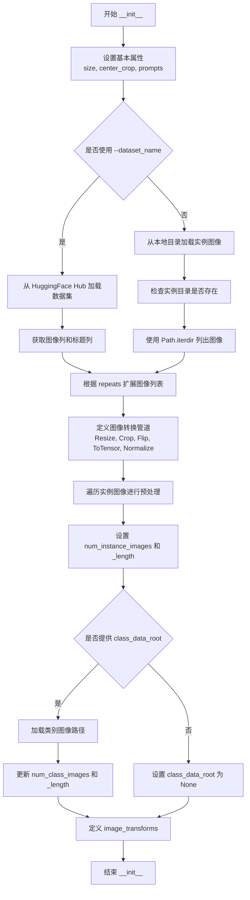

#### 带注释源码

```python
def __init__(
    self,
    instance_data_root,
    instance_prompt,
    class_prompt,
    class_data_root=None,
    class_num=None,
    size=1024,
    repeats=1,
    center_crop=False,
):
    # 设置图像尺寸和裁剪方式
    self.size = size
    self.center_crop = center_crop

    # 保存实例和类别提示词
    self.instance_prompt = instance_prompt
    self.custom_instance_prompts = None  # 用于存储自定义提示词
    self.class_prompt = class_prompt

    # 判断数据加载方式：从 HuggingFace Hub 或本地目录
    if args.dataset_name is not None:
        try:
            from datasets import load_dataset
        except ImportError:
            raise ImportError(
                "You are trying to load your data using the datasets library. If you wish to train using custom "
                "captions please install the datasets library: `pip install datasets`. If you wish to load a "
                "local folder containing images only, specify --instance_data_dir instead."
            )
        
        # 从 Hub 下载并加载数据集
        dataset = load_dataset(
            args.dataset_name,
            args.dataset_config_name,
            cache_dir=args.cache_dir,
        )
        
        # 获取训练集的列名
        column_names = dataset["train"].column_names

        # 确定图像列名
        if args.image_column is None:
            image_column = column_names[0]
            logger.info(f"image column defaulting to {image_column}")
        else:
            image_column = args.image_column
            if image_column not in column_names:
                raise ValueError(
                    f"`--image_column` value '{args.image_column}' not found in dataset columns. Dataset columns are: {', '.join(column_names)}"
                )
        
        # 获取实例图像
        instance_images = dataset["train"][image_column]

        # 处理标题列
        if args.caption_column is None:
            logger.info(
                "No caption column provided, defaulting to instance_prompt for all images. If your dataset "
                "contains captions/prompts for the images, make sure to specify the "
                "column as --caption_column"
            )
            self.custom_instance_prompts = None
        else:
            if args.caption_column not in column_names:
                raise ValueError(
                    f"`--caption_column` value '{args.caption_column}' not found in dataset columns. Dataset columns are: {', '.join(column_names)}"
                )
            # 获取自定义提示词并根据 repeats 扩展
            custom_instance_prompts = dataset["train"][args.caption_column]
            self.custom_instance_prompts = []
            for caption in custom_instance_prompts:
                self.custom_instance_prompts.extend(itertools.repeat(caption, repeats))
    else:
        # 从本地目录加载实例图像
        self.instance_data_root = Path(instance_data_root)
        if not self.instance_data_root.exists():
            raise ValueError("Instance images root doesn't exists.")

        instance_images = [Image.open(path) for path in list(Path(instance_data_root).iterdir())]
        self.custom_instance_prompts = None

    # 根据 repeats 扩展实例图像列表
    self.instance_images = []
    for img in instance_images:
        self.instance_images.extend(itertools.repeat(img, repeats))

    # 初始化像素值列表
    self.pixel_values = []
    
    # 定义图像转换操作
    train_resize = transforms.Resize(size, interpolation=transforms.InterpolationMode.BILINEAR)
    train_crop = transforms.CenterCrop(size) if center_crop else transforms.RandomCrop(size)
    train_flip = transforms.RandomHorizontalFlip(p=1.0)
    train_transforms = transforms.Compose(
        [
            transforms.ToTensor(),
            transforms.Normalize([0.5], [0.5]),  # 归一化到 [-1, 1]
        ]
    )
    
    # 预处理每张实例图像
    for image in self.instance_images:
        # 修正图像方向（根据 EXIF 数据）
        image = exif_transpose(image)
        # 转换为 RGB 模式
        if not image.mode == "RGB":
            image = image.convert("RGB")
        # 调整大小
        image = train_resize(image)
        # 随机水平翻转
        if args.random_flip and random.random() < 0.5:
            image = train_flip(image)
        # 裁剪
        if args.center_crop:
            y1 = max(0, int(round((image.height - args.resolution) / 2.0)))
            x1 = max(0, int(round((image.width - args.resolution) / 2.0)))
            image = train_crop(image)
        else:
            y1, x1, h, w = train_crop.get_params(image, (args.resolution, args.resolution))
            image = crop(image, y1, x1, h, w)
        # 转换为张量并归一化
        image = train_transforms(image)
        self.pixel_values.append(image)

    # 设置数据集长度
    self.num_instance_images = len(self.instance_images)
    self._length = self.num_instance_images

    # 处理类别图像
    if class_data_root is not None:
        self.class_data_root = Path(class_data_root)
        self.class_data_root.mkdir(parents=True, exist_ok=True)
        self.class_images_path = list(self.class_data_root.iterdir())
        if class_num is not None:
            self.num_class_images = min(len(self.class_images_path), class_num)
        else:
            self.num_class_images = len(self.class_images_path)
        self._length = max(self.num_class_images, self.num_instance_images)
    else:
        self.class_data_root = None

    # 定义类别图像的转换管道
    self.image_transforms = transforms.Compose(
        [
            transforms.Resize(size, interpolation=transforms.InterpolationMode.BILINEAR),
            transforms.CenterCrop(size) if center_crop else transforms.RandomCrop(size),
            transforms.ToTensor(),
            transforms.Normalize([0.5], [0.5]),
        ]
    )
```


### `DreamBoothDataset.__len__`

返回 DreamBooth 数据集的长度，用于 PyTorch DataLoader 确定数据集的样本总数。

参数：

- `self`：隐式参数，`DreamBoothDataset` 实例本身

返回值：`int`，数据集的样本数量（取实例图像数量和类别图像数量的最大值）

#### 流程图

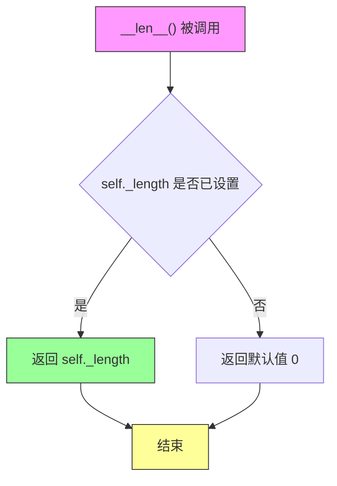

#### 带注释源码

```python
def __len__(self):
    """
    返回数据集的长度。
    
    该方法由 PyTorch DataLoader 自动调用，用于确定：
    - 每个 epoch 的批次数
    - 数据加载的迭代次数
    
    _length 在 __init__ 中被设置为：
    - 如果存在类别数据（class_data_root）：max(num_class_images, num_instance_images)
    - 否则：num_instance_images
    
    Returns:
        int: 数据集的样本总数
    """
    return self._length
```

---

### 上下文信息补充

#### 1. `_length` 字段的设置逻辑

在 `DreamBoothDataset.__init__` 中，`_length` 的计算逻辑如下：

```python
# 实例图像数量
self.num_instance_images = len(self.instance_images)
self._length = self.num_instance_images

# 如果提供了类别数据，取两者的最大值
if class_data_root is not None:
    # ...
    self._length = max(self.num_class_images, self.num_instance_images)
else:
    self.class_data_root = None
```

#### 2. 设计意图

- **先验保留（Prior Preservation）**：当使用 `with_prior_preservation` 模式时，需要同时加载实例图像和类别图像，数据集长度取两者的最大值以确保所有图像都能被遍历
- **循环索引**：`__getitem__` 中使用 `index % self.num_instance_images` 实现循环访问，确保 DataLoader 可以正常工作

#### 3. 潜在的技术债务或优化空间

- **缓存优化**：可以在 `__init__` 中预计算并缓存所有图像的像素值（`pixel_values`），但这会占用大量内存。当前实现采用了空间换时间的策略
- **懒加载**：可以考虑实现懒加载机制，在 `__getitem__` 时才加载和处理图像，以减少初始化时的内存占用


### DreamBoothDataset.__getitem__

该方法实现 DreamBooth 数据集的数据加载逻辑，根据给定的索引返回训练样本。它从预处理好的像素值中获取实例图像，并根据配置加载类别图像（用于先验保留损失），同时返回对应的文本提示符。

参数：

- `index`：`int`，数据集中的样本索引，用于检索对应的图像和提示符

返回值：`dict`，包含以下键值对的字典：
  - `instance_images`：处理后的实例图像张量
  - `instance_prompt`：实例图像对应的文本提示符
  - `class_images`（可选）：类别图像张量（当配置了 class_data_root 时存在）
  - `class_prompt`（可选）：类别图像的文本提示符（当配置了 class_data_root 时存在）

#### 流程图

```mermaid
flowchart TD
    A[__getitem__ 开始] --> B[创建空字典 example]
    B --> C[获取 instance_image = pixel_values[index % num_instance_images]]
    C --> D[设置 example['instance_images'] = instance_image]
    D --> E{self.custom_instance_prompts 是否存在?}
    E -->|是| F[caption = custom_instance_prompts[index % num_instance_images]]
    F --> G{caption 是否为真值?}
    G -->|是| H[example['instance_prompt'] = caption]
    G -->|否| I[example['instance_prompt'] = self.instance_prompt]
    E -->|否| J[example['instance_prompt'] = self.instance_prompt]
    H --> K{self.class_data_root 是否存在?}
    I --> K
    J --> K
    K -->|是| L[class_image = Image.open(class_images_path[index % num_class_images])]
    L --> M[应用 exif_transpose 校正图像方向]
    M --> N{class_image.mode == 'RGB'?]
    N -->|否| O[class_image = class_image.convert('RGB')]
    N -->|是| P[跳过转换]
    O --> Q[class_image = image_transforms(class_image)]
    P --> Q
    Q --> R[example['class_images'] = class_image]
    R --> S[example['class_prompt'] = self.class_prompt]
    K -->|否| T[返回 example 字典]
    S --> T
```

#### 带注释源码

```python
def __getitem__(self, index):
    """
    获取指定索引的训练样本。
    
    参数:
        index: 数据集中的样本索引
        
    返回:
        包含图像和提示符的字典
    """
    # 1. 初始化返回字典
    example = {}
    
    # 2. 获取实例图像：使用模运算实现数据循环
    #    当 index 超过实例图像数量时循环使用
    instance_image = self.pixel_values[index % self.num_instance_images]
    example["instance_images"] = instance_image

    # 3. 处理实例提示符
    if self.custom_instance_prompts:
        # 如果存在自定义提示符（来自数据集的 caption 列）
        caption = self.custom_instance_prompts[index % self.num_instance_images]
        if caption:
            # 使用自定义 caption（如果非空）
            example["instance_prompt"] = caption
        else:
            # 自定义 caption 为空时，回退到默认 instance_prompt
            example["instance_prompt"] = self.instance_prompt
    else:
        # 没有自定义提示符时，使用默认 instance_prompt
        example["instance_prompt"] = self.instance_prompt

    # 4. 处理类别图像（用于先验保留损失）
    if self.class_data_root:
        # 打开类别图像文件
        class_image = Image.open(self.class_images_path[index % self.num_class_images])
        
        # 应用 EXIF 方向校正（处理相机方向信息）
        class_image = exif_transpose(class_image)

        # 确保图像为 RGB 模式（处理 RGBA 或灰度图）
        if not class_image.mode == "RGB":
            class_image = class_image.convert("RGB")
        
        # 应用图像变换（resize、crop、归一化）
        example["class_images"] = self.image_transforms(class_image)
        # 添加类别提示符
        example["class_prompt"] = self.class_prompt

    # 5. 返回样本字典
    return example
```


### `PromptDataset.__init__`

初始化 PromptDataset 数据集类，用于准备提示词以在多个 GPU 上生成类别图像。该类继承自 PyTorch 的 Dataset，是 DreamBooth 训练流程中用于生成类别图像的简单数据集。

参数：

- `prompt`：`str`，类别提示词（class prompt），用于生成类别图像的文本描述
- `num_samples`：`int`，要生成的样本数量，决定了数据集的长度

返回值：`None`，构造函数不返回任何值，仅初始化实例属性

#### 流程图

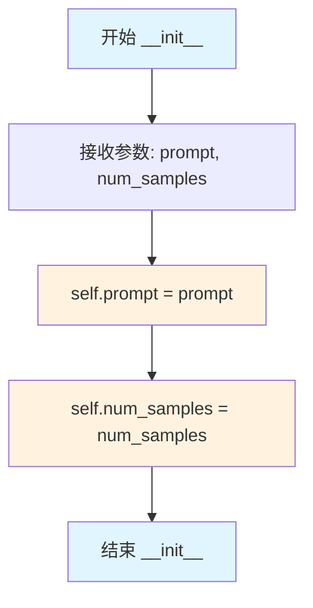

#### 带注释源码

```python
class PromptDataset(Dataset):
    """
    A simple dataset to prepare the prompts to generate class images on multiple GPUs.
    这是一个简单的数据集类，用于准备提示词以便在多个GPU上生成类别图像。
    """

    def __init__(self, prompt, num_samples):
        """
        初始化 PromptDataset
        
        Args:
            prompt (str): 类别提示词，用于生成类别图像的文本描述
            num_samples (int): 要生成的样本数量
        """
        # 将传入的 prompt 保存为实例属性
        self.prompt = prompt
        
        # 将传入的 num_samples 保存为实例属性，用于确定数据集长度
        self.num_samples = num_samples
```


### `PromptDataset.__len__`

该方法用于返回数据集中样本的数量，使数据集能够与 PyTorch 的 DataLoader 配合使用，实现标准化的大小查询功能。

参数：
- 无参数（Python 魔术方法，self 为隐式参数）

返回值：`int`，返回数据集的样本数量

#### 流程图

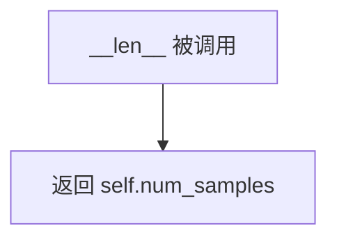

#### 带注释源码

```python
def __len__(self):
    """
    返回数据集中样本的数量。
    
    该方法使数据集对象支持 len() 操作，
    从而能够被 PyTorch DataLoader 正确处理。
    
    Returns:
        int: 数据集的样本数量，等于初始化时传入的 num_samples 参数
    """
    return self.num_samples
```


### `PromptDataset.__getitem__`

该方法实现了一个简单的数据getitem接口，根据给定的索引返回对应的提示词和索引信息，用于在生成类图像时为多个GPU准备提示词数据。

参数：

- `index`：`int`，要访问的数据样本的索引位置

返回值：`Dict[str, Any]`，返回一个包含提示词和索引的字典，键为 "prompt"（提示词内容）和 "index"（样本索引）

#### 流程图

```mermaid
flowchart TD
    A[开始 __getitem__] --> B[创建空字典 example]
    B --> C[将 self.prompt 赋值给 example['prompt']]
    C --> D[将 index 赋值给 example['index']]
    D --> E[返回 example 字典]
```

#### 带注释源码

```python
def __getitem__(self, index):
    """
    根据索引获取数据集中的单个样本。
    
    参数:
        index: int - 样本的索引位置
        
    返回:
        dict: 包含 'prompt' 和 'index' 键的字典
    """
    # 步骤1: 初始化一个空字典用于存储样本数据
    example = {}
    
    # 步骤2: 将数据集中存储的提示词赋值给字典的 'prompt' 键
    # self.prompt 在 __init__ 中被设置为类图像生成的提示词
    example["prompt"] = self.prompt
    
    # 步骤3: 将当前样本的索引赋值给字典的 'index' 键
    # 这个索引用于追踪生成的类图像文件名
    example["index"] = index
    
    # 步骤4: 返回包含提示词和索引的字典
    # 该字典随后会被 DataLoader 处理，用于批量生成类图像
    return example
```

## 关键组件


### 张量索引与惰性加载

代码中使用了多种张量索引技术来管理训练过程中的数据流动。在数据加载部分，`DreamBoothDataset`类通过`__getitem__`方法实现惰性加载，仅在需要时才从磁盘读取图像并转换为张量。训练循环中，通过`model_input = vae.encode(pixel_values).latent_dist.sample()`将图像编码为潜在表示，并在后续步骤中使用索引操作如`noisy_model_input = (1.0 - sigmas) * model_input + sigmas * noise`进行噪声混合。此外，使用`torch.chunk`函数对模型预测和目标进行分块处理以支持先验保留损失。

### 反量化支持

代码支持多种精度训练模式，通过`weight_dtype`变量动态设置权重精度。在mixed precision训练中，根据`accelerator.mixed_precision`的配置（fp16或bf16），将非训练参数（VAE、文本编码器）转换为相应精度，同时保持训练参数（如transformer）的精度设置。先验图像生成时也支持通过`prior_generation_precision`参数指定精度（fp32、fp16或bf16），确保跨组件的精度一致性。

### 量化策略

训练脚本采用分层量化策略：对于推理组件（VAE和非LoRA文本编码器）在mixed precision模式下自动转换为半精度，而transformer参数则根据训练配置灵活处理。`enable_gradient_checkpointing`方法用于梯度检查点技术，通过在反向传播时重新计算中间激活值来节省显存。此外，代码通过`free_memory()`函数显式管理GPU内存，包括删除pipeline对象和释放先验生成过程中占用的资源。

### DreamBooth数据集管理

`DreamBoothDataset`类实现了完整的数据准备流程，支持从HuggingFace Hub或本地文件系统加载训练图像。类中包含实例提示词和类提示词的管理，通过`custom_instance_prompts`属性支持自定义描述。图像预处理流程包括调整大小、中心裁剪或随机裁剪、随机翻转和归一化，最终将图像转换为-1到1范围的张量。类还处理先验保留（prior preservation）所需的类图像数据。

### 文本编码管道

代码实现了复杂的多编码器文本编码管道，支持CLIP和T5两种文本编码器。`_encode_prompt_with_clip`函数处理两个CLIP文本编码器，`_encode_prompt_with_t5`函数处理T5编码器，`encode_prompt`函数将三部分输出拼接为最终的prompt embeddings。对于不训练文本编码器的场景，通过预计算和缓存提示词嵌入来避免冗余编码，提升训练效率。

### 训练调度与优化

主训练循环实现了完整的SD3模型训练流程，包括噪声调度（FlowMatchEulerDiscreteScheduler）、时间步采样（compute_density_for_timestep_sampling）和损失加权（compute_loss_weighting_for_sd3）。优化器配置支持AdamW和Prodigy两种选择，并可通过`--gradient_accumulation_steps`和`--gradient_checkpointing`参数平衡训练速度和显存使用。学习率调度器支持线性、余弦、多项式等多种策略。

### 模型保存与恢复

代码实现了自定义的模型保存和加载钩子（save_model_hook和load_model_hook），通过`accelerator.register_save_state_pre_hook`注册。这些钩子分别保存transformer和三个文本编码器的权重，并在加载时根据模型类型（SD3Transformer2DModel、CLIPTextModelWithProjection或T5EncoderModel）进行对应处理。检查点管理包括自动清理超出限制的旧检查点，支持从最新检查点恢复训练。

### 验证与推理

`log_validation`函数负责在训练过程中生成验证图像，支持TensorBoard和WandB两种日志记录方式。该函数创建临时pipeline进行推理，使用指定的验证提示词生成图像，并将结果记录到对应的跟踪器中。训练完成后，通过`StableDiffusion3Pipeline.from_pretrained`加载最终模型进行推理验证。


## 问题及建议


### 已知问题

- **全局变量依赖**：代码中多处直接访问 `args` 全局变量（如 `args.dataset_name`, `args.random_flip`, `args.center_crop` 等），违反函数式编程原则，降低了代码的可测试性和可复用性
- **硬编码值**：`max_length=77` 在多个位置硬编码，`resolution` 处理逻辑在 Dataset 类中与外部参数耦合
- **图像预处理瓶颈**：在 `DreamBoothDataset.__getitem__` 中进行实时图像变换（Resize、Crop、Flip、Normalize），增加了数据加载时间
- **文本嵌入重复计算**：当启用自定义实例提示时，每个 batch 都重新调用 `compute_text_embeddings`，未充分利用缓存机制
- **异常处理不足**：模型加载失败时使用通用 `Exception` 捕获，且只尝试备选方案，缺乏明确的错误诊断信息
- **类型注解缺失**：大量函数缺少参数类型和返回值类型注解，影响代码可维护性和 IDE 支持
- **检查点管理复杂**：`save_model_hook` 和 `load_model_hook` 中包含大量重复的模型判断和加载逻辑
- **潜在的内存泄漏**：删除对象后调用 `free_memory()`，但某些对象引用可能未被完全释放

### 优化建议

- **依赖注入**：将 `args` 参数显式传递给需要的函数，避免直接依赖全局变量
- **配置集中管理**：创建配置类或 dataclass 封装训练参数，在 Dataset 初始化时传入
- **数据预处理优化**：在数据集初始化时完成图像预处理，将处理后的 tensor 直接存储在内存中
- **提示缓存**：对于固定提示，预计算并缓存文本嵌入，避免重复编码
- **完善类型注解**：为所有函数添加完整的类型注解，提升代码质量
- **异常处理细化**：区分不同异常类型，提供具体的错误信息和恢复策略
- **检查点逻辑重构**：将模型保存/加载逻辑抽象为独立的工具类或函数
- **资源管理**：使用上下文管理器或 try-finally 确保资源正确释放

## 其它


### 设计目标与约束

**设计目标：**
- 实现 Stable Diffusion 3 (SD3) 模型的 DreamBooth 微调训练
- 支持个性化图像生成，通过少量实例图像学习特定概念
- 支持先验保留（Prior Preservation）技术，防止模型过拟合

**约束条件：**
- 显存要求：建议至少 16GB GPU 显存（使用 fp16）
- 分布式支持：支持多 GPU 分布式训练（Accelerator）
- 精度支持：支持 fp32、fp16、bf16 混合精度（bf16 需要 Ampere 架构 GPU）
- 平台限制：MPS 不支持 bfloat16

### 错误处理与异常设计

**参数校验错误：**
- `parse_args()` 中对必要参数进行校验：
  - `dataset_name` 和 `instance_data_dir` 互斥，只能指定一个
  - 使用先验保留时必须指定 `class_data_dir` 和 `class_prompt`
- 参数缺失或冲突时抛出 `ValueError`

**模型加载错误：**
- `import_model_class_from_model_name_or_path()`: 无法识别文本编码器架构时抛出 `ValueError`
- `load_text_encoders()`: 模型文件缺失时 `from_pretrained()` 抛出异常

**训练过程中的错误处理：**
- `accelerator.register_save_state_pre_hook` 和 `register_load_state_pre_hook`：模型加载失败时逐级尝试不同文本编码器格式
- 显存不足时调用 `free_memory()` 释放资源
- Checkpoint 加载失败时自动跳过，从头开始训练

**环境兼容性检查：**
- `check_min_version("0.37.0.dev0")`: 检查 diffusers 最低版本
- MPS 设备检查：`torch.backends.mps.is_available()`

### 数据流与状态机

**训练数据流：**
```
数据集加载 → 图像预处理 → VAE编码 → 潜在空间采样 → 添加噪声 → 模型预测 → 损失计算 → 反向传播
```

**主要状态转换：**
1. **初始化阶段**：解析参数 → 加载模型 → 准备数据 → 初始化 Accelerator
2. **先验生成阶段**（可选）：使用预训练 pipeline 生成类别图像
3. **训练循环阶段**：
   - 设置模型为训练模式 (`train()`)
   - 对每个 batch：编码 → 加噪 → 预测 → 计算损失 → 反向传播 → 优化器更新
4. **验证阶段**：定期执行验证（生成样本图像）
5. **保存阶段**：保存模型权重和状态

**Epoch/Step 状态管理：**
- `global_step`: 全局训练步数
- `first_epoch`: 起始 epoch（从 checkpoint 恢复时）
- `overrode_max_train_steps`: 标记是否手动覆盖了 max_train_steps

### 外部依赖与接口契约

**核心依赖库：**
| 库名 | 版本要求 | 用途 |
|------|----------|------|
| torch | >=1.10 | 深度学习框架 |
| diffusers | >=0.37.0.dev0 | SD3 模型和 pipeline |
| transformers | 最新版 | CLIP/T5 文本编码器 |
| accelerate | 最新版 | 分布式训练加速 |
| huggingface_hub | 最新版 | 模型上传 |
| bitsandbytes | 可选 | 8-bit Adam 优化器 |
| prodigyopt | 可选 | Prodigy 优化器 |
| wandb | 可选 | 实验追踪 |

**关键接口：**
- `parse_args()`: 命令行参数解析，返回 argparse.Namespace
- `DreamBoothDataset`: PyTorch Dataset 子类，支持 `__len__` 和 `__getitem__`
- `collate_fn()`: DataLoader 批处理整理函数
- `encode_prompt()`: 编码文本提示为 embedding
- `log_validation()`: 验证函数，生成样本图像并记录

### 版本兼容性说明

**Python 版本：** 推荐 Python 3.8+

**硬件兼容性：**
- CUDA GPU：支持 TF32、fp16、bf16
- Apple MPS：仅支持 fp32/fp16，不支持 bf16
- CPU：仅支持 fp32 训练（极慢）

**模型兼容性：**
- SD3 Medium (stabilityai/stable-diffusion-3-medium)
- SD3.5 Large (stabilityai/stable-diffusion-3.5-large)
- 需匹配对应版本的 tokenizer 和 text encoder

### 性能优化建议

**训练速度优化：**
- 启用 `gradient_checkpointing` 减少显存占用
- 使用 `allow_tf32` 加速 Ampere GPU 计算
- 启用 `scale_lr` 自动缩放学习率

**显存优化：**
- 使用混合精度训练（fp16/bf16）
- 梯度累积减少单卡显存压力
- 及时调用 `free_memory()` 释放未使用模型

**Checkpoints 管理：**
- `checkpoints_total_limit` 限制保存的 checkpoint 数量
- 定期清理旧 checkpoint 避免磁盘占满

### 安全考虑

- `hub_token` 和 `report_to=wandb` 不能同时使用（安全风险）
- 敏感信息不记录到日志
- 模型上传需遵守 Hugging Face Hub 许可证

### 配置示例

**典型训练命令：**
```bash
python train_sd3_dreambooth.py \
  --pretrained_model_name_or_path="stabilityai/stable-diffusion-3-medium" \
  --instance_data_dir="./data/instance_images" \
  --instance_prompt="a photo of TOK" \
  --class_prompt="a photo of person" \
  --class_data_dir="./data/class_images" \
  --with_prior_preservation \
  --output_dir="./output" \
  --train_batch_size=1 \
  --gradient_checkpointing \
  --mixed_precision="fp16"
```

### 参考文档

- DreamBooth 原始论文：https://dreambooth.github.io/
- Diffusers DreamBooth 教程：https://github.com/huggingface/diffusers/blob/main/examples/dreambooth/README_sd3.md
- EDM 采样策略：https://huggingface.co/papers/2206.00364


    