# `diffusers\examples\flux-control\train_control_flux.py` 详细设计文档

A comprehensive PyTorch training script for fine-tuning the Flux Control (ControlNet) model using Hugging Face Diffusers, handling dataset loading, VAE encoding, flow-matching noise scheduling, training loops with gradient checkpointing, validation inference, and model Hub submission.

## 整体流程

```mermaid
graph TD
    Start[Start] --> ParseArgs[parse_args]
    ParseArgs --> Main[main function]
    Main --> InitAcc[Initialize Accelerator & Logging]
    Main --> LoadModels[Load VAE & FluxTransformer]
    Main --> GetData[get_train_dataset]
    GetData --> PrepData[prepare_train_dataset]
    PrepData --> CreateLoader[Create DataLoader]
    CreateLoader --> TrainLoop[Training Loop]
    TrainLoop --> EpochLoop[For Epoch in num_train_epochs]
    EpochLoop --> StepLoop[For Step, Batch in DataLoader]
    StepLoop --> Encode[encode_images (VAE)]
    Encode --> Noise[Sample Noise & Timesteps]
    Noise --> Forward[FluxTransformer Forward Pass]
    Forward --> Loss[Compute Flow Matching Loss]
    Loss --> Backward[Accelerator Backward]
    Backward --> Optim[Optimizer Step]
    Optim --> Clip[Gradient Clipping]
    Clip --> Checkpoint{Checkpointing Steps?}
    Checkpoint -- Yes --> SaveState[Save Accelerator State]
    Checkpoint -- No --> Validate{Validation Steps?}
    Validate -- Yes --> LogVal[log_validation]
    Validate -- No --> Continue
    SaveState --> Continue
    LogVal --> Continue
    Continue --> StepLoop
    StepLoop -- End Data --> EpochLoop
    EpochLoop -- End Epochs --> Finalize[Save Final Model & Push to Hub]
    Finalize --> End[End]
```

## 类结构

```
Functional Script (No Custom Class Inheritance)
├── Imports (diffusers, accelerate, torch, transformers)
├── Global Variables (logger, NORM_LAYER_PREFIXES)
├── Utility Functions (encode_images, log_validation, save_model_card)
├── Data Functions (get_train_dataset, prepare_train_dataset, collate_fn)
└── Core Logic (parse_args, main)
```

## 全局变量及字段


### `logger`
    
用于记录训练过程中的日志信息，包括调试、信息、警告和错误等级别的消息

类型：`logging.Logger`
    


### `NORM_LAYER_PREFIXES`
    
定义归一化层的前缀列表，用于匹配和识别 Flux transformer 模块中的特定归一化层（norm_q, norm_k, norm_added_q, norm_added_k）

类型：`List[str]`
    


    

## 全局函数及方法


### `encode_images`

该函数是Flux图像控制训练流程中的图像编码核心函数，负责将输入的像素图像转换为潜在空间表示。它使用VAE编码器对图像进行编码，通过采样潜在分布并应用缩放因子和偏移因子进行归一化，最后将潜在表示转换为目标权重数据类型以匹配训练精度要求。

参数：

- `pixels`：`torch.Tensor`，输入的图像像素值张量，通常为经过预处理的图像张量（shape: [batch, channels, height, width]，值域通常在[-1, 1]或[0, 1]）
- `vae`：`torch.nn.Module`，预训练的AutoencoderKL模型，用于将像素空间图像编码到潜在空间
- `weight_dtype`：`torch.dtype`，目标权重数据类型，用于将编码后的潜在表示转换为指定的精度（如torch.float16用于混合精度训练）

返回值：`torch.Tensor`，编码并归一化后的图像潜在表示张量，已转换为指定的weight_dtype

#### 流程图

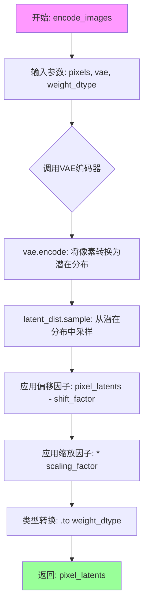

#### 带注释源码

```python
def encode_images(pixels: torch.Tensor, vae: torch.nn.Module, weight_dtype):
    """
    将输入的像素图像编码为潜在空间表示
    
    参数:
        pixels: 输入的图像像素张量，shape为 [batch, channels, height, width]
        vae: 预训练的AutoencoderKL模型
        weight_dtype: 目标数据类型，用于控制输出精度
    
    返回:
        编码并归一化后的潜在表示张量
    """
    
    # 步骤1: 使用VAE编码器将像素转换为潜在分布
    # .to(vae.dtype) 确保输入数据类型与VAE模型权重类型一致
    # latent_dist 是潜在分布对象，包含mean和logvar参数
    pixel_latents = vae.encode(pixels.to(vae.dtype)).latent_dist.sample()
    
    # 步骤2: 应用VAE配置中的缩放因子和偏移因子进行归一化
    # 这是将潜在表示从VAE的标准空间转换到Diffusion模型所需的空间
    # shift_factor: 偏移因子，用于调整潜在表示的中心位置
    # scaling_factor: 缩放因子，用于调整潜在表示的尺度
    pixel_latents = (pixel_latents - vae.config.shift_factor) * vae.config.scaling_factor
    
    # 步骤3: 将潜在表示转换为目标权重数据类型
    # 这确保了潜在表示与训练配置中的精度要求一致
    # 支持混合精度训练（如fp16或bf16）
    return pixel_latents.to(weight_dtype)
```

#### 技术细节说明

1. **VAE编码流程**：函数首先调用`vae.encode()`方法，该方法返回一个`DiagonalGaussianDistribution`对象，包含潜在空间的均值和方差。随后通过`.sample()`方法从该分布中采样得到潜在表示。

2. **归一化处理**：Flux模型使用特定的潜在空间参数配置，通过`shift_factor`和`scaling_factor`对VAE输出进行线性变换，确保潜在表示符合Flow Matching模型的输入要求。

3. **精度管理**：输入像素首先转换为VAE权重类型（通常为float32以保持稳定性），输出则转换为目标训练精度（weight_dtype），支持混合精度训练以提升性能并降低显存占用。

4. **调用场景**：该函数在训练循环中被调用两次，分别用于处理主图像（pixel_values）和控制图像（conditioning_pixel_values），生成两组潜在表示用于后续的噪声预测训练。


### `log_validation`

该函数用于在训练过程中或训练结束后运行验证，通过加载 FluxControlPipeline 并使用给定的验证图像和提示词生成图像，然后将生成的图像记录到 TensorBoard 或 WandB 等日志追踪器中。

参数：

- `flux_transformer`：`FluxTransformer2DModel`，要验证的 Flux Transformer 模型，如果是非最终验证则从 accelerator 解包获取
- `args`：命名空间对象，包含所有训练参数（如模型路径、分辨率、验证图像路径、验证提示词等）
- `accelerator`：`Accelerator`，HuggingFace Accelerate 加速器实例，用于模型管理和设备操作
- `weight_dtype`：`torch.dtype`，模型权重的数据类型（fp16/bf16/fp32）
- `step`：`int`，当前训练的全局步数，用于日志记录
- `is_final_validation`：`bool`，布尔值，标识是否为训练结束后的最终验证

返回值：`list`，返回包含验证图像、生成图像和对应提示词的日志列表，每个元素为字典包含 `validation_image`、`images` 和 `validation_prompt` 键

#### 流程图

```mermaid
flowchart TD
    A[开始 log_validation] --> B{is_final_validation?}
    B -->|否| C[从 accelerator 解包 flux_transformer]
    B -->|是| D[从 output_dir 加载 Transformer]
    C --> E[创建 FluxControlPipeline]
    D --> E
    E --> F[将 Pipeline 移到设备并禁用进度条]
    G{args.seed 是否为 None?}
    G -->|是| H[generator = None]
    G -->|否| I[使用 seed 创建随机生成器]
    H --> J[处理验证图像和提示词长度匹配]
    I --> J
    J --> K[确定 autocast 上下文]
    K --> L{遍历每个验证图像和提示词}
    L --> M[加载并调整验证图像大小]
    N[循环生成 num_validation_images 张图像]
    M --> N
    N --> O[使用 pipeline 生成图像]
    O --> P[收集生成的图像到 images 列表]
    L --> P
    Q{遍历所有 tracker]
    P --> Q
    Q --> R{tracker.name == 'tensorboard'}
    R -->|是| S[添加图像到 tensorboard]
    R -->|否| T{tracker.name == 'wandb'}
    T -->|是| U[记录图像到 wandb]
    T -->|否| V[记录警告日志]
    S --> W[释放 pipeline 内存]
    U --> W
    V --> W
    W --> X[返回 image_logs]
```

#### 带注释源码

```python
def log_validation(flux_transformer, args, accelerator, weight_dtype, step, is_final_validation=False):
    """
    运行验证流程，生成图像并记录到日志追踪器
    
    参数:
        flux_transformer: Flux Transformer 模型
        args: 训练参数配置
        accelerator: Accelerate 加速器
        weight_dtype: 模型权重数据类型
        step: 当前训练步数
        is_final_validation: 是否为最终验证
    """
    logger.info("Running validation... ")

    # 根据是否为最终验证来决定模型来源
    if not is_final_validation:
        # 从 accelerator 解包当前训练的模型
        flux_transformer = accelerator.unwrap_model(flux_transformer)
        pipeline = FluxControlPipeline.from_pretrained(
            args.pretrained_model_name_or_path,
            transformer=flux_transformer,
            torch_dtype=weight_dtype,
        )
    else:
        # 从输出目录加载保存的模型用于最终验证
        transformer = FluxTransformer2DModel.from_pretrained(args.output_dir, torch_dtype=weight_dtype)
        pipeline = FluxControlPipeline.from_pretrained(
            args.pretrained_model_name_or_path,
            transformer=transformer,
            torch_dtype=weight_dtype,
        )

    # 将 pipeline 移到指定设备并禁用进度条
    pipeline.to(accelerator.device)
    pipeline.set_progress_bar_config(disable=True)

    # 根据 seed 创建随机生成器以确保可重复性
    if args.seed is None:
        generator = None
    else:
        generator = torch.Generator(device=accelerator.device).manual_seed(args.seed)

    # 处理验证图像和提示词的数量匹配问题
    # 支持三种情况：数量相等、单一图像对应多提示词、单一提示词对应多图像
    if len(args.validation_image) == len(args.validation_prompt):
        validation_images = args.validation_image
        validation_prompts = args.validation_prompt
    elif len(args.validation_image) == 1:
        validation_images = args.validation_image * len(args.validation_prompt)
        validation_prompts = args.validation_prompt
    elif len(args.validation_prompt) == 1:
        validation_images = args.validation_image
        validation_prompts = args.validation_prompt * len(args.validation_image)
    else:
        raise ValueError(
            "number of `args.validation_image` and `args.validation_prompt` should be checked in `parse_args`"
        )

    # 存储验证日志
    image_logs = []
    # 根据设备和是否为最终验证选择 autocast 上下文
    # MPS 设备或最终验证时使用 nullcontext 避免自动混合精度问题
    if is_final_validation or torch.backends.mps.is_available():
        autocast_ctx = nullcontext()
    else:
        autocast_ctx = torch.autocast(accelerator.device.type, weight_dtype)

    # 遍历每个验证图像和提示词对
    for validation_prompt, validation_image in zip(validation_prompts, validation_images):
        # 加载验证图像并调整大小
        validation_image = load_image(validation_image)
        validation_image = validation_image.resize((args.resolution, args.resolution))

        images = []

        # 生成多张验证图像
        for _ in range(args.num_validation_images):
            with autocast_ctx:
                # 调用 pipeline 生成图像
                image = pipeline(
                    prompt=validation_prompt,
                    control_image=validation_image,
                    num_inference_steps=50,
                    guidance_scale=args.guidance_scale,
                    generator=generator,
                    max_sequence_length=512,
                    height=args.resolution,
                    width=args.resolution,
                ).images[0]
            # 调整生成的图像大小
            image = image.resize((args.resolution, args.resolution))
            images.append(image)
        
        # 记录当前验证对的图像日志
        image_logs.append(
            {"validation_image": validation_image, "images": images, "validation_prompt": validation_prompt}
        )

    # 根据是否为最终验证选择 tracker key
    tracker_key = "test" if is_final_validation else "validation"
    
    # 遍历所有注册的 tracker 记录图像
    for tracker in accelerator.trackers:
        if tracker.name == "tensorboard":
            # TensorBoard 记录方式：先将图像转为 numpy 数组再堆叠
            for log in image_logs:
                images = log["images"]
                validation_prompt = log["validation_prompt"]
                validation_image = log["validation_image"]
                formatted_images = []
                formatted_images.append(np.asarray(validation_image))
                for image in images:
                    formatted_images.append(np.asarray(image))
                formatted_images = np.stack(formatted_images)
                tracker.writer.add_images(validation_prompt, formatted_images, step, dataformats="NHWC")

        elif tracker.name == "wandb":
            # WandB 记录方式：使用 wandb.Image 封装
            formatted_images = []
            for log in image_logs:
                images = log["images"]
                validation_prompt = log["validation_prompt"]
                validation_image = log["validation_image"]
                # 首先添加条件图像（control image）
                formatted_images.append(wandb.Image(validation_image, caption="Conditioning"))
                # 然后添加生成的图像
                for image in images:
                    image = wandb.Image(image, caption=validation_prompt)
                    formatted_images.append(image)

            tracker.log({tracker_key: formatted_images})
        else:
            logger.warning(f"image logging not implemented for {tracker.name}")

    # 清理：删除 pipeline 并释放显存
    del pipeline
    free_memory()
    return image_logs
```


### `save_model_card`

该函数用于在模型训练完成后，生成并保存模型的 Model Card（模型卡片），包括模型描述、验证图像、标签等信息，并将其推送到 Hugging Face Hub。

参数：

- `repo_id`：`str`，Hugging Face Hub 上的仓库 ID，用于标识模型仓库
- `image_logs`：可选参数，验证日志列表，包含验证过程中生成的图像和提示词信息，默认为 `None`
- `base_model`：`str`，基础预训练模型的名称或路径，用于描述训练所基于的模型
- `repo_folder`：可选参数，本地文件夹路径，用于保存模型文件和相关输出，默认为 `None`

返回值：无（`None`），该函数直接将生成的 Model Card 保存到指定文件夹，不返回任何值

#### 流程图

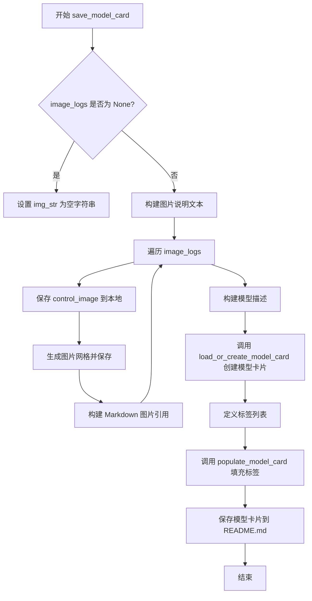

#### 带注释源码

```python
def save_model_card(repo_id: str, image_logs=None, base_model=str, repo_folder=None):
    """
    生成并保存模型的 Model Card（模型卡片），包含训练元信息和验证图像。
    
    参数:
        repo_id: HuggingFace Hub 仓库 ID
        image_logs: 验证日志列表，包含验证图像和提示词
        base_model: 基础预训练模型名称
        repo_folder: 本地输出文件夹路径
    """
    
    # 初始化图片说明字符串
    img_str = ""
    
    # 如果存在验证日志，处理验证图像
    if image_logs is not None:
        # 添加验证图像说明标题
        img_str = "You can find some example images below.\n\n"
        
        # 遍历每条验证日志
        for i, log in enumerate(image_logs):
            # 提取图像、提示词和条件图像
            images = log["images"]
            validation_prompt = log["validation_prompt"]
            validation_image = log["validation_image"]
            
            # 保存控制/条件图像到本地文件夹
            validation_image.save(os.path.join(repo_folder, "image_control.png"))
            
            # 添加验证提示词到说明文本
            img_str += f"prompt: {validation_prompt}\n"
            
            # 将条件图像与生成的图像合并
            images = [validation_image] + images
            
            # 创建图像网格并保存（1行，N列）
            make_image_grid(images, 1, len(images)).save(os.path.join(repo_folder, f"images_{i}.png"))
            
            # 添加 Markdown 图片引用
            img_str += f"\n"

    # 构建模型描述的 Markdown 内容
    model_description = f"""
# flux-control-{repo_id}

These are Control weights trained on {base_model} with new type of conditioning.
{img_str}

## License

Please adhere to the licensing terms as described [here](https://huggingface.co/black-forest-labs/FLUX.1-dev/blob/main/LICENSE.md)
"""

    # 加载或创建模型卡片（从训练状态创建）
    model_card = load_or_create_model_card(
        repo_id_or_path=repo_id,
        from_training=True,
        license="other",
        base_model=base_model,
        model_description=model_description,
        inference=True,
    )

    # 定义模型标签，用于 Hub 上的分类和搜索
    tags = [
        "flux",
        "flux-diffusers",
        "text-to-image",
        "diffusers",
        "control",
        "diffusers-training",
    ]
    
    # 填充模型卡片的标签信息
    model_card = populate_model_card(model_card, tags=tags)

    # 保存模型卡片为 README.md（Hub 会自动将其渲染为模型页面）
    model_card.save(os.path.join(repo_folder, "README.md"))
```


### `parse_args`

该函数是 Flux Control 训练脚本的命令行参数解析器，通过 ArgumentParser 定义了模型路径、训练超参数、数据配置、验证设置等大量训练相关参数，并对参数进行合法性校验，最终返回包含所有配置参数的 Namespace 对象。

参数：

- `input_args`：`Optional[List[str]]`，可选参数，用于手动传入命令行参数列表（主要服务于单元测试），若为 `None` 则从 `sys.argv` 自动读取

返回值：`argparse.Namespace`，包含所有已定义命令行参数的命名空间对象，属性包括模型路径、训练批次大小、学习率、验证配置等数十个训练相关参数

#### 流程图

```mermaid
flowchart TD
    A[开始 parse_args] --> B[创建 ArgumentParser]
    B --> C[添加 pretrained_model_name_or_path 参数]
    C --> D[添加 variant 参数]
    D --> E[添加 revision 参数]
    E --> F[添加 output_dir 参数]
    F --> G[添加各类训练超参数]
    G --> H[添加数据集相关参数]
    H --> I[添加验证相关参数]
    I --> J{input_args 是否为 None?}
    J -->|是| K[parser.parse_args]
    J -->|否| L[parser.parse_args(input_args)]
    K --> M[参数校验: dataset_name 与 jsonl_for_train 互斥]
    M --> N{校验 proportion_empty_prompts 范围}
    N --> O{校验 validation_prompt 与 validation_image}
    O --> P{校验 validation_image 与 validation_prompt 长度}
    P --> Q{校验 resolution 是否能被 8 整除}
    Q --> R[返回 args 命名空间]
```

#### 带注释源码

```python
def parse_args(input_args=None):
    """
    解析命令行参数，构建训练配置。
    
    参数:
        input_args: 可选的命令行参数列表，用于手动传递参数（测试用）
    
    返回:
        argparse.Namespace: 包含所有训练配置参数的命名空间对象
    """
    # 创建 ArgumentParser 实例，设置脚本描述
    parser = argparse.ArgumentParser(description="Simple example of a Flux Control training script.")
    
    # ============================================
    # 模型相关参数
    # ============================================
    parser.add_argument(
        "--pretrained_model_name_or_path",
        type=str,
        default=None,
        required=True,  # 必须提供
        help="Path to pretrained model or model identifier from huggingface.co/models.",
    )
    parser.add_argument(
        "--variant",
        type=str,
        default=None,
        help="Variant of the model files of the pretrained model identifier from huggingface.co/models, 'e.g.' fp16",
    )
    parser.add_argument(
        "--revision",
        type=str,
        default=None,
        required=False,
        help="Revision of pretrained model identifier from huggingface.co/models.",
    )
    
    # ============================================
    # 输出与缓存目录
    # ============================================
    parser.add_argument(
        "--output_dir",
        type=str,
        default="flux-control",
        help="The output directory where the model predictions and checkpoints will be written.",
    )
    parser.add_argument(
        "--cache_dir",
        type=str,
        default=None,
        help="The directory where the downloaded models and datasets will be stored.",
    )
    
    # ============================================
    # 随机种子与图像分辨率
    # ============================================
    parser.add_argument("--seed", type=int, default=None, help="A seed for reproducible training.")
    parser.add_argument(
        "--resolution",
        type=int,
        default=1024,
        help="The resolution for input images, all the images in the train/validation dataset will be resized to this resolution",
    )
    
    # ============================================
    # 训练批次与轮数
    # ============================================
    parser.add_argument(
        "--train_batch_size", type=int, default=4, help="Batch size (per device) for the training dataloader."
    )
    parser.add_argument("--num_train_epochs", type=int, default=1)
    parser.add_argument(
        "--max_train_steps",
        type=int,
        default=None,
        help="Total number of training steps to perform. If provided, overrides num_train_epochs.",
    )
    
    # ============================================
    # 检查点与恢复训练
    # ============================================
    parser.add_argument(
        "--checkpointing_steps",
        type=int,
        default=500,
        help="Save a checkpoint of the training state every X updates.",
    )
    parser.add_argument(
        "--checkpoints_total_limit",
        type=int,
        default=None,
        help=("Max number of checkpoints to store."),
    )
    parser.add_argument(
        "--resume_from_checkpoint",
        type=str,
        default=None,
        help="Whether training should be resumed from a previous checkpoint.",
    )
    
    # ============================================
    # 提示词与梯度配置
    # ============================================
    parser.add_argument(
        "--proportion_empty_prompts",
        type=float,
        default=0,
        help="Proportion of image prompts to be replaced with empty strings. Defaults to 0 (no prompt replacement).",
    )
    parser.add_argument(
        "--gradient_accumulation_steps",
        type=int,
        default=1,
        help="Number of updates steps to accumulate before performing a backward/update pass.",
    )
    parser.add_argument(
        "--gradient_checkpointing",
        action="store_true",
        help="Whether or not to use gradient checkpointing to save memory at the expense of slower backward pass.",
    )
    
    # ============================================
    # 学习率与调度器
    # ============================================
    parser.add_argument(
        "--learning_rate",
        type=float,
        default=5e-6,
        help="Initial learning rate (after the potential warmup period) to use.",
    )
    parser.add_argument(
        "--scale_lr",
        action="store_true",
        default=False,
        help="Scale the learning rate by the number of GPUs, gradient accumulation steps, and batch size.",
    )
    parser.add_argument(
        "--lr_scheduler",
        type=str,
        default="constant",
        help='The scheduler type to use. Choose between ["linear", "cosine", "cosine_with_restarts", "polynomial", "constant", "constant_with_warmup"]',
    )
    parser.add_argument(
        "--lr_warmup_steps", type=int, default=500, help="Number of steps for the warmup in the lr scheduler."
    )
    parser.add_argument(
        "--lr_num_cycles",
        type=int,
        default=1,
        help="Number of hard resets of the lr in cosine_with_restarts scheduler.",
    )
    parser.add_argument("--lr_power", type=float, default=1.0, help="Power factor of the polynomial scheduler.")
    
    # ============================================
    # 优化器配置
    # ============================================
    parser.add_argument(
        "--use_8bit_adam", action="store_true", help="Whether or not to use 8-bit Adam from bitsandbytes."
    )
    parser.add_argument(
        "--dataloader_num_workers",
        type=int,
        default=0,
        help="Number of subprocesses to use for data loading. 0 means that the data will be loaded in the main process.",
    )
    parser.add_argument("--adam_beta1", type=float, default=0.9, help="The beta1 parameter for the Adam optimizer.")
    parser.add_argument("--adam_beta2", type=float, default=0.999, help="The beta2 parameter for the Adam optimizer.")
    parser.add_argument("--adam_weight_decay", type=float, default=1e-2, help="Weight decay to use.")
    parser.add_argument("--adam_epsilon", type=float, default=1e-08, help="Epsilon value for the Adam optimizer")
    parser.add_argument("--max_grad_norm", default=1.0, type=float, help="Max gradient norm.")
    
    # ============================================
    # Hub 与日志配置
    # ============================================
    parser.add_argument("--push_to_hub", action="store_true", help="Whether or not to push the model to the Hub.")
    parser.add_argument("--hub_token", type=str, default=None, help="The token to use to push to the Model Hub.")
    parser.add_argument(
        "--hub_model_id",
        type=str,
        default=None,
        help="The name of the repository to keep in sync with the local `output_dir`.",
    )
    parser.add_argument(
        "--logging_dir",
        type=str,
        default="logs",
        help="[TensorBoard] log directory. Will default to output_dir/runs/**CURRENT_DATETIME_HOSTNAME***.",
    )
    parser.add_argument(
        "--allow_tf32",
        action="store_true",
        help="Whether or not to allow TF32 on Ampere GPUs. Can be used to speed up training.",
    )
    parser.add_argument(
        "--report_to",
        type=str,
        default="tensorboard",
        help='The integration to report the results and logs to. Supported platforms are "tensorboard", "wandb" and "comet_ml".',
    )
    parser.add_argument(
        "--mixed_precision",
        type=str,
        default=None,
        choices=["no", "fp16", "bf16"],
        help="Whether to use mixed precision. Choose between fp16 and bf16 (bfloat16).",
    )
    
    # ============================================
    # 数据集配置
    # ============================================
    parser.add_argument(
        "--dataset_name",
        type=str,
        default=None,
        help="The name of the Dataset (from the HuggingFace hub) to train on.",
    )
    parser.add_argument(
        "--dataset_config_name",
        type=str,
        default=None,
        help="The config of the Dataset, leave as None if there's only one config.",
    )
    parser.add_argument("--image_column", type=str, default="image", help="The column of the dataset containing the target image.")
    parser.add_argument(
        "--conditioning_image_column",
        type=str,
        default="conditioning_image",
        help="The column of the dataset containing the control conditioning image.",
    )
    parser.add_argument(
        "--caption_column",
        type=str,
        default="text",
        help="The column of the dataset containing a caption or a list of captions.",
    )
    parser.add_argument("--log_dataset_samples", action="store_true", help="Whether to log somple dataset samples.")
    parser.add_argument(
        "--max_train_samples",
        type=int,
        default=None,
        help="For debugging purposes or quicker training, truncate the number of training examples to this value if set.",
    )
    
    # ============================================
    # 验证配置
    # ============================================
    parser.add_argument(
        "--validation_prompt",
        type=str,
        default=None,
        nargs="+",
        help="A set of prompts evaluated every `--validation_steps` and logged to `--report_to`.",
    )
    parser.add_argument(
        "--validation_image",
        type=str,
        default=None,
        nargs="+",
        help="A set of paths to the control conditioning image be evaluated every `--validation_steps`.",
    )
    parser.add_argument(
        "--num_validation_images",
        type=int,
        default=1,
        help="Number of images to be generated for each `--validation_image`, `--validation_prompt` pair",
    )
    parser.add_argument(
        "--validation_steps",
        type=int,
        default=100,
        help="Run validation every X steps.",
    )
    parser.add_argument(
        "--tracker_project_name",
        type=str,
        default="flux_train_control",
        help="The `project_name` argument passed to Accelerator.init_trackers.",
    )
    parser.add_argument(
        "--jsonl_for_train",
        type=str,
        default=None,
        help="Path to the jsonl file containing the training data.",
    )
    
    # ============================================
    # 模型训练特殊配置
    # ============================================
    parser.add_argument(
        "--only_target_transformer_blocks",
        action="store_true",
        help="If we should only target the transformer blocks to train along with the input layer (`x_embedder`).",
    )
    parser.add_argument(
        "--guidance_scale",
        type=float,
        default=30.0,
        help="the guidance scale used for transformer.",
    )
    parser.add_argument(
        "--upcast_before_saving",
        action="store_true",
        help="Whether to upcast the trained transformer layers to float32 before saving.",
    )
    
    # ============================================
    # 采样权重配置
    # ============================================
    parser.add_argument(
        "--weighting_scheme",
        type=str,
        default="none",
        choices=["sigma_sqrt", "logit_normal", "mode", "cosmap", "none"],
        help='We default to the "none" weighting scheme for uniform sampling and uniform loss',
    )
    parser.add_argument(
        "--logit_mean", type=float, default=0.0, help="mean to use when using the `'logit_normal'` weighting scheme."
    )
    parser.add_argument(
        "--logit_std", type=float, default=1.0, help="std to use when using the `'logit_normal'` weighting scheme."
    )
    parser.add_argument(
        "--mode_scale",
        type=float,
        default=1.29,
        help="Scale of mode weighting scheme. Only effective when using the `'mode'` as the `weighting_scheme`.",
    )
    parser.add_argument(
        "--offload",
        action="store_true",
        help="Whether to offload the VAE and the text encoders to CPU when they are not used.",
    )
    
    # ============================================
    # 参数解析
    # ============================================
    if input_args is not None:
        args = parser.parse_args(input_args)  # 解析传入的参数列表
    else:
        args = parser.parse_args()  # 从 sys.argv 解析
    
    # ============================================
    # 参数合法性校验
    # ============================================
    
    # 校验1: dataset_name 和 jsonl_for_train 必须二选一
    if args.dataset_name is None and args.jsonl_for_train is None:
        raise ValueError("Specify either `--dataset_name` or `--jsonl_for_train`")
    
    # 校验2: dataset_name 和 jsonl_for_train 不能同时设置
    if args.dataset_name is not None and args.jsonl_for_train is not None:
        raise ValueError("Specify only one of `--dataset_name` or `--jsonl_for_train`")
    
    # 校验3: proportion_empty_prompts 必须在 [0, 1] 范围内
    if args.proportion_empty_prompts < 0 or args.proportion_empty_prompts > 1:
        raise ValueError("`--proportion_empty_prompts` must be in the range [0, 1].")
    
    # 校验4: validation_prompt 和 validation_image 必须成对出现
    if args.validation_prompt is not None and args.validation_image is None:
        raise ValueError("`--validation_image` must be set if `--validation_prompt` is set")
    
    if args.validation_prompt is None and args.validation_image is not None:
        raise ValueError("`--validation_prompt` must be set if `--validation_image` is set")
    
    # 校验5: validation_image 和 validation_prompt 长度必须匹配
    if (
        args.validation_image is not None
        and args.validation_prompt is not None
        and len(args.validation_image) != 1
        and len(args.validation_prompt) != 1
        and len(args.validation_image) != len(args.validation_prompt)
    ):
        raise ValueError(
            "Must provide either 1 `--validation_image`, 1 `--validation_prompt`,"
            " or the same number of `--validation_prompt`s and `--validation_image`s"
        )
    
    # 校验6: resolution 必须能被 8 整除（确保 VAE 编码图像尺寸一致）
    if args.resolution % 8 != 0:
        raise ValueError(
            "`--resolution` must be divisible by 8 for consistently sized encoded images between the VAE and the Flux transformer."
        )
    
    return args
```


### `get_train_dataset`

该函数负责加载和预处理训练数据集，支持从HuggingFace Hub加载数据集或从本地JSONL文件加载，并对数据集进行列验证、打乱和可选的样本数量限制。

参数：

- `args`：.Namespace对象，包含所有命令行参数配置，如`dataset_name`、`jsonl_for_train`、`image_column`、`caption_column`、`conditioning_image_column`、`max_train_samples`、`cache_dir`和`seed`等，用于指定数据集来源、列名映射和预处理选项。
- `accelerator`：Accelerator对象，来自accelerate库，用于分布式训练环境下的进程同步和数据分发，确保数据预处理操作在主进程先执行。

返回值：`Dataset`对象，返回经过验证、打乱和切片处理后的训练数据集（`datasets.Dataset`类型），可直接用于后续的数据加载和训练流程。

#### 流程图

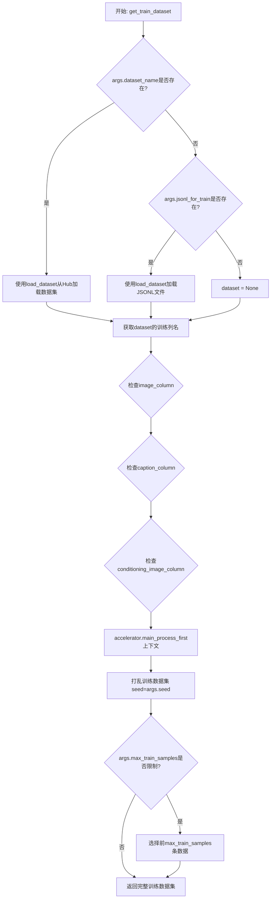

#### 带注释源码

```python
def get_train_dataset(args, accelerator):
    """
    加载并预处理训练数据集。
    
    支持两种数据源：
    1. HuggingFace Hub上的数据集（通过--dataset_name指定）
    2. 本地JSONL文件（通过--jsonl_for_train指定）
    
    返回的数据集已经过列验证、打乱处理，并可根据需要限制样本数量。
    """
    dataset = None
    
    # 情况1：从HuggingFace Hub下载并加载数据集
    if args.dataset_name is not None:
        # Downloading and loading a dataset from the hub.
        dataset = load_dataset(
            args.dataset_name,
            args.dataset_config_name,
            cache_dir=args.cache_dir,
        )
    
    # 情况2：从本地JSONL文件加载数据
    if args.jsonl_for_train is not None:
        # load from json
        dataset = load_dataset("json", data_files=args.jsonl_for_train, cache_dir=args.cache_dir)
        # 扁平化索引以便访问
        dataset = dataset.flatten_indices()
    
    # Preprocessing the datasets.
    # We need to tokenize inputs and targets.
    # 获取训练数据集的所有列名
    column_names = dataset["train"].column_names

    # 6. Get the column names for input/target.
    # 处理image_column：优先使用用户指定的值，否则默认为第一列
    if args.image_column is None:
        image_column = column_names[0]
        logger.info(f"image column defaulting to {image_column}")
    else:
        image_column = args.image_column
        if image_column not in column_names:
            raise ValueError(
                f"`--image_column` value '{args.image_column}' not found in dataset columns. Dataset columns are: {', '.join(column_names)}"
            )

    # 处理caption_column：优先使用用户指定的值，否则默认为第二列
    if args.caption_column is None:
        caption_column = column_names[1]
        logger.info(f"caption column defaulting to {caption_column}")
    else:
        caption_column = args.caption_column
        if caption_column not in column_names:
            raise ValueError(
                f"`--caption_column` value '{args.caption_column}' not found in dataset columns. Dataset columns are: {', '.join(column_names)}"
            )

    # 处理conditioning_image_column：优先使用用户指定的值，否则默认为第三列
    if args.conditioning_image_column is None:
        conditioning_image_column = column_names[2]
        logger.info(f"conditioning image column defaulting to {conditioning_image_column}")
    else:
        conditioning_image_column = args.conditioning_image_column
        if conditioning_image_column not in column_names:
            raise ValueError(
                f"`--conditioning_image_column` value '{args.conditioning_image_column}' not found in dataset columns. Dataset columns are: {', '.join(column_names)}"
            )

    # 使用accelerator确保主进程先完成数据预处理，避免分布式环境下的竞争条件
    with accelerator.main_process_first():
        # 打乱数据集，使用指定的随机种子保证可复现性
        train_dataset = dataset["train"].shuffle(seed=args.seed)
        # 如果指定了最大训练样本数，则截断数据集（用于调试或加速训练）
        if args.max_train_samples is not None:
            train_dataset = train_dataset.select(range(args.max_train_samples))
    
    return train_dataset
```


### `prepare_train_dataset`

该函数负责准备训练数据集，包括定义图像变换（resize、normalize）和预处理函数，将原始图像和条件图像转换为模型所需的像素值格式，并处理文本描述。

参数：

- `dataset`：`datasets.Dataset`，从 `get_train_dataset` 返回的原始训练数据集
- `accelerator`：`Accelerate.Accelerator`，分布式训练加速器实例，用于确保数据处理在主进程完成

返回值：`datasets.Dataset`，经过变换后的数据集，包含了 `pixel_values`（目标图像像素值）、`conditioning_pixel_values`（控制图像像素值）和 `captions`（文本描述）字段

#### 流程图

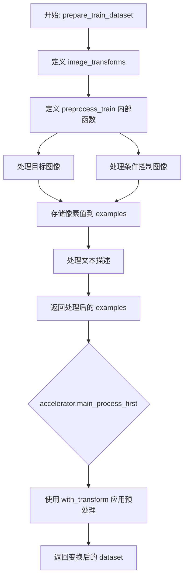

#### 带注释源码

```python
def prepare_train_dataset(dataset, accelerator):
    """
    准备训练数据集，应用图像变换和预处理函数。
    
    参数:
        dataset: 原始训练数据集
        accelerator: Accelerate 分布式训练加速器
    
    返回:
        经过变换处理后的数据集
    """
    # 定义图像变换管道：调整大小、转换为张量、归一化
    image_transforms = transforms.Compose(
        [
            # 将图像 resize 到指定分辨率，使用双线性插值
            transforms.Resize((args.resolution, args.resolution), interpolation=transforms.InterpolationMode.BILINEAR),
            # 将 PIL Image 转换为 tensor
            transforms.ToTensor(),
            # 归一化到 [-1, 1] 范围
            transforms.Normalize(mean=[0.5, 0.5, 0.5], std=[0.5, 0.5, 0.5]),
        ]
    )

    def preprocess_train(examples):
        """
        预处理单个 batch 的训练样本。
        将原始图像和条件图像转换为模型可用的像素值格式。
        """
        # 处理目标图像：支持 PIL Image 对象或文件路径
        images = [
            (image.convert("RGB") if not isinstance(image, str) else Image.open(image).convert("RGB"))
            for image in examples[args.image_column]
        ]
        # 应用图像变换
        images = [image_transforms(image) for image in images]

        # 处理条件控制图像（与目标图像相同的处理流程）
        conditioning_images = [
            (image.convert("RGB") if not isinstance(image, str) else Image.open(image).convert("RGB"))
            for image in examples[args.conditioning_image_column]
        ]
        conditioning_images = [image_transforms(image) for image in conditioning_images]
        
        # 存储处理后的像素值
        examples["pixel_values"] = images
        examples["conditioning_pixel_values"] = conditioning_images

        # 处理文本描述：如果每条记录是列表，选择最长的描述
        is_caption_list = isinstance(examples[args.caption_column][0], list)
        if is_caption_list:
            examples["captions"] = [max(example, key=len) for example in examples[args.caption_column]]
        else:
            examples["captions"] = list(examples[args.caption_column])

        return examples

    # 使用 accelerator 确保数据处理只在主进程完成（分布式训练场景）
    with accelerator.main_process_first():
        # 使用 datasets 库的 with_transform 方法应用预处理函数
        # 这是一个延迟转换，不会立即处理所有数据
        dataset = dataset.with_transform(preprocess_train)

    return dataset
```


### `collate_fn`

该函数是 Flux Control 模型训练脚本中的数据整理函数，用于 PyTorch DataLoader。它接收一批数据样本，将图像像素值和条件图像像素值堆叠成批次张量，并整理对应的文本描述，最终返回包含这三个元素的字典供模型训练使用。

参数：

- `examples`：`List[Dict]` ，从数据集加载的样本列表，每个样本是包含 "pixel_values"、"conditioning_pixel_values" 和 "captions" 键的字典

返回值：`Dict`，返回包含以下键的字典：
  - `pixel_values`：`torch.Tensor`，堆叠并转换后的目标图像像素值，形状为 (batch_size, C, H, W)
  - `conditioning_pixel_values`：`torch.Tensor`，堆叠并转换后的条件图像像素值，形状为 (batch_size, C, H, W)
  - `captions`：`List[str]`，样本对应的文本描述列表

#### 流程图

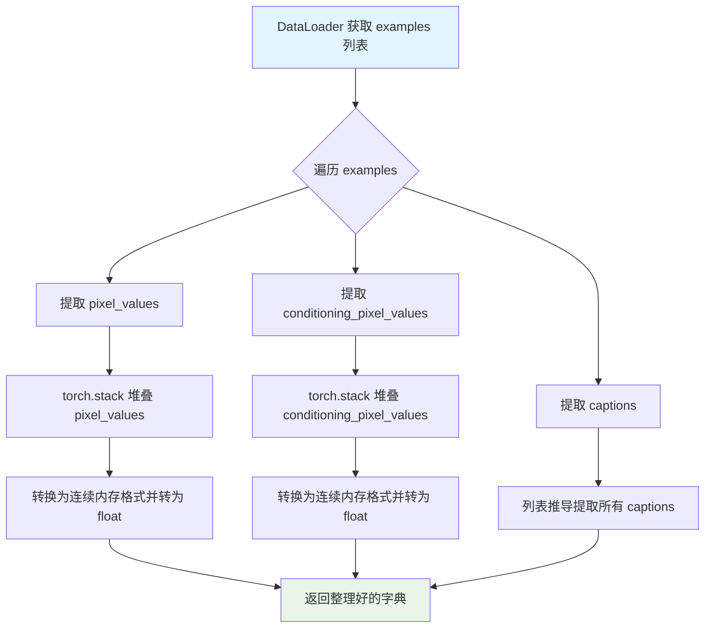

#### 带注释源码

```python
def collate_fn(examples):
    """
    整理一批训练样本，将它们堆叠成批次张量。
    
    参数:
        examples: 从数据集获取的样本列表，每个样本是包含以下键的字典:
            - pixel_values: 目标图像的像素值张量
            - conditioning_pixel_values: 控制/条件图像的像素值张量
            - captions: 对应的文本描述
    
    返回:
        包含以下键的字典:
            - pixel_values: 堆叠后的目标图像张量，形状为 (batch_size, channels, height, width)
            - conditioning_pixel_values: 堆叠后的条件图像张量
            - captions: 文本描述列表
    """
    # 从每个样本中提取 pixel_values 并沿新的维度堆叠
    # 结果张量形状: (batch_size, C, H, W)
    pixel_values = torch.stack([example["pixel_values"] for example in examples])
    
    # 转换为连续内存格式（避免内存碎片），并转换为 float 类型
    # memory_format=torch.contiguous_format 确保张量在内存中连续存储
    pixel_values = pixel_values.to(memory_format=torch.contiguous_format).float()
    
    # 同样处理条件图像像素值
    conditioning_pixel_values = torch.stack([example["conditioning_pixel_values"] for example in examples])
    conditioning_pixel_values = conditioning_pixel_values.to(memory_format=torch.contiguous_format).float()
    
    # 提取所有样本的文本描述，保留为列表形式
    captions = [example["captions"] for example in examples]
    
    # 返回整理好的批次字典，供模型训练使用
    return {
        "pixel_values": pixel_values, 
        "conditioning_pixel_values": conditioning_pixel_values, 
        "captions": captions
    }
```


### `main`

这是Flux Control模型训练脚本的核心入口函数，负责协调整个训练流程：初始化加速器、加载数据集和模型、配置优化器、执行训练循环、进行验证以及保存最终模型。

参数：

- `args`：命名空间（通过`argparse`解析的命令行参数），包含所有训练配置，如模型路径、批次大小、学习率、输出目录等

返回值：无返回值（通过副作用完成功能，如模型保存、日志记录等）

#### 流程图

```mermaid
flowchart TD
    A[开始 main 函数] --> B{检查报告工具与hub token安全性}
    B --> C[检查MPS是否支持bf16]
    C --> D[创建Accelerator加速器]
    D --> E[配置日志系统]
    E --> F[设置随机种子]
    F --> G{是否是主进程}
    G -->|是| H[创建输出目录]
    G -->|否| I[跳过创建目录]
    H --> J
    I --> J[加载VAE模型]
    J --> K[加载Flux Transformer模型]
    K --> L[加载噪声调度器]
    L --> M[配置权重数据类型]
    M --> N[修改Transformer输入通道以支持控制图像]
    N --> O[配置梯度 checkpointing]
    O --> P[配置TF32加速]
    P --> Q[计算学习率]
    Q --> R[配置8-bit Adam优化器]
    R --> S[创建优化器]
    S --> T[准备训练数据集]
    T --> U[创建数据加载器]
    U --> V[配置学习率调度器]
    V --> W[使用 Accelerator 准备模型和优化器]
    W --> X[初始化跟踪器]
    X --> Y[加载文本编码Pipeline]
    Y --> Z{是否有检查点需要恢复}
    Z -->|是| AA[恢复检查点]
    Z -->|否| AB[初始化训练步骤]
    AA --> AC
    AB --> AC[记录数据集样本]
    AC --> AD[创建训练进度条]
    AD --> AE[外层循环: 遍历每个epoch]
    AE --> AF[设置Transformer为训练模式]
    AF --> AG[内层循环: 遍历每个batch]
    AG --> AH[使用accumulate上下文]
    AH --> AI[将图像编码为latent]
    AI --> AJ[采样随机时间步]
    AJ --> AK[根据flow matching添加噪声]
    AK --> AL[连接输入和控制器latent]
    AL --> AM[准备latent图像ID]
    AM --> AN[编码文本提示]
    AN --> AO[预测噪声]
    AO --> AP[计算flow-matching损失]
    AP --> AQ[反向传播]
    AQ --> AR[梯度裁剪与优化器更新]
    AR --> AS{是否同步梯度}
    AS -->|是| AT[更新进度条和全局步数]
    AT --> AU{是否到达checkpoint保存点}
    AU -->|是| AV[保存检查点]
    AU -->|否| AW
    AS -->|否| AW[继续下一个batch]
    AV --> AW{是否进行验证}
    AW -->|是| AX[运行验证]
    AX --> AY
    AW -->|否| AY[记录损失和学习率]
    AY --> AZ{是否达到最大训练步数}
    AZ -->|否| AG
    AZ -->|是| BA[训练结束]
    AX --> AY
    AV --> AX
    
    BA --> BB[等待所有进程完成]
    BB --> BC[主进程保存最终模型]
    BC --> BD[执行最终验证]
    BD --> BE{push_to_hub为真}
    BE -->|是| BF[保存模型卡片并上传]
    BE -->|否| BG[结束训练]
    BF --> BG
```

#### 带注释源码

```python
def main(args):
    """
    Flux Control 模型训练的主入口函数。
    
    负责完整的训练流程：
    1. 初始化加速器和日志系统
    2. 加载预训练模型（VAE、Transformer）
    3. 配置优化器和学习率调度器
    4. 准备数据集和数据加载器
    5. 执行训练循环，包括前向传播、损失计算、反向传播
    6. 定期保存检查点和执行验证
    7. 保存最终模型并可选地推送到Hub
    """
    
    # --- 安全性检查 ---
    # 如果使用wandb报告，则不允许同时使用hub_token（安全风险）
    if args.report_to == "wandb" and args.hub_token is not None:
        raise ValueError(
            "You cannot use both --report_to=wandb and --hub_token due to a security risk of exposing your token."
            " Please use `hf auth login` to authenticate with the Hub."
        )

    # 定义日志输出目录
    logging_out_dir = Path(args.output_dir, args.logging_dir)

    # --- 硬件兼容性检查 ---
    # MPS (Apple Silicon) 不支持 bfloat16，抛出错误
    if torch.backends.mps.is_available() and args.mixed_precision == "bf16":
        raise ValueError(
            "Mixed precision training with bfloat16 is not supported on MPS. Please use fp16 (recommended) or fp32 instead."
        )

    # --- 初始化 Accelerator ---
    # Accelerator 是 HuggingFace Accelerate 库的核心，用于分布式训练和混合精度
    accelerator_project_config = ProjectConfiguration(
        project_dir=args.output_dir, 
        logging_dir=str(logging_out_dir)
    )

    accelerator = Accelerator(
        gradient_accumulation_steps=args.gradient_accumulation_steps,
        mixed_precision=args.mixed_precision,
        log_with=args.report_to,
        project_config=accelerator_project_config,
    )

    # --- MPS 特殊处理 ---
    # 禁用 AMP (Automatic Mixed Precision) 因为 MPS 不完全支持
    if torch.backends.mps.is_available():
        logger.info("MPS is enabled. Disabling AMP.")
        accelerator.native_amp = False

    # --- 配置日志系统 ---
    logging.basicConfig(
        format="%(asctime)s - %(levelname)s - %(name)s - %(message)s",
        datefmt="%m/%d/%Y %H:%M:%S",
        level=logging.INFO,
    )
    logger.info(accelerator.state, main_process_only=False)

    # 主进程设置详细日志，子进程只显示错误
    if accelerator.is_local_main_process:
        transformers.utils.logging.set_verbosity_warning()
        diffusers.utils.logging.set_verbosity_info()
    else:
        transformers.utils.logging.set_verbosity_error()
        diffusers.utils.logging.set_verbosity_error()

    # --- 设置随机种子 ---
    if args.seed is not None:
        set_seed(args.seed)

    # --- 创建输出目录 ---
    if accelerator.is_main_process:
        if args.output_dir is not None:
            os.makedirs(args.output_dir, exist_ok=True)

        # 如果需要推送到Hub，创建远程仓库
        if args.push_to_hub:
            repo_id = create_repo(
                repo_id=args.hub_model_id or Path(args.output_dir).name, 
                exist_ok=True, 
                token=args.hub_token
            ).repo_id

    # --- 加载模型 ---
    # 1. 加载 VAE (变分自编码器) - 用于图像与latent之间的转换
    vae = AutoencoderKL.from_pretrained(
        args.pretrained_model_name_or_path,
        subfolder="vae",
        revision=args.revision,
        variant=args.variant,
    )
    vae_scale_factor = 2 ** (len(vae.config.block_out_channels) - 1)
    
    # 2. 加载 Flux Transformer - 核心扩散模型
    flux_transformer = FluxTransformer2DModel.from_pretrained(
        args.pretrained_model_name_or_path,
        subfolder="transformer",
        revision=args.revision,
        variant=args.variant,
    )
    logger.info("All models loaded successfully")

    # 3. 加载噪声调度器 - 控制扩散过程中的噪声添加
    noise_scheduler = FlowMatchEulerDiscreteScheduler.from_pretrained(
        args.pretrained_model_name_or_path,
        subfolder="scheduler",
    )
    # 创建调度器的深拷贝，用于采样时间步
    noise_scheduler_copy = copy.deepcopy(noise_scheduler)
    
    # --- 设置模型参数可训练性 ---
    # 默认冻结 Transformer，VAE 始终冻结
    if not args.only_target_transformer_blocks:
        flux_transformer.requires_grad_(True)
    vae.requires_grad_(False)

    # --- 配置权重数据类型 ---
    # 根据混合精度设置选择数据类型
    weight_dtype = torch.float32
    if accelerator.mixed_precision == "fp16":
        weight_dtype = torch.float16
    elif accelerator.mixed_precision == "bf16":
        weight_dtype = torch.bfloat16

    # VAE 保持 float32 以确保稳定性
    vae.to(dtype=torch.float32)

    # --- 修改 Transformer 输入层以支持控制图像 ---
    # 原始 Transformer 接收单一图像输入，现在需要同时接收目标图像和控制图像
    with torch.no_grad():
        # 获取原始输入通道数
        initial_input_channels = flux_transformer.config.in_channels
        # 创建新的线性层，输入通道数翻倍（目标图像 + 控制图像）
        new_linear = torch.nn.Linear(
            flux_transformer.x_embedder.in_features * 2,  # 输入特征翻倍
            flux_transformer.x_embedder.out_features,
            bias=flux_transformer.x_embedder.bias is not None,
            dtype=flux_transformer.dtype,
            device=flux_transformer.device,
        )
        # 初始化：将原始权重复制到新层的前半部分
        new_linear.weight.zero_()
        new_linear.weight[:, :initial_input_channels].copy_(flux_transformer.x_embedder.weight)
        if flux_transformer.x_embedder.bias is not None:
            new_linear.bias.copy_(flux_transformer.x_embedder.bias)
        # 替换原始嵌入层
        flux_transformer.x_embedder = new_linear

    # 验证新层的后半部分权重为零
    assert torch.all(flux_transformer.x_embedder.weight[:, initial_input_channels:].data == 0)
    # 更新配置：输入通道翻倍
    flux_transformer.register_to_config(
        in_channels=initial_input_channels * 2, 
        out_channels=initial_input_channels
    )

    # --- 可选：只训练 Transformer 块 ---
    if args.only_target_transformer_blocks:
        # 解冻嵌入层
        flux_transformer.x_embedder.requires_grad_(True)
        # 只解冻 transformer_blocks，其他层冻结
        for name, module in flux_transformer.named_modules():
            if "transformer_blocks" in name:
                module.requires_grad_(True)
            else:
                module.requirs_grad_(False)  # 注意：原文有拼写错误

    # --- 模型解包辅助函数 ---
    def unwrap_model(model):
        """解包加速器包装的模型，处理编译模块"""
        model = accelerator.unwrap_model(model)
        model = model._orig_mod if is_compiled_module(model) else model
        return model

    # --- 注册模型保存/加载钩子 ---
    # 用于自定义模型保存和加载行为
    if version.parse(accelerate.__version__) >= version.parse("0.16.0"):

        def save_model_hook(models, weights, output_dir):
            """保存模型时的钩子"""
            if accelerator.is_main_process:
                for model in models:
                    if isinstance(unwrap_model(model), type(unwrap_model(flux_transformer))):
                        model = unwrap_model(model)
                        model.save_pretrained(os.path.join(output_dir, "transformer"))
                    else:
                        raise ValueError(f"unexpected save model: {model.__class__}")
                    # 弹出权重防止重复保存
                    if weights:
                        weights.pop()

        def load_model_hook(models, input_dir):
            """加载模型时的钩子"""
            transformer_ = None

            if not accelerator.distributed_type == DistributedType.DEEPSPEED:
                while len(models) > 0:
                    model = models.pop()

                    if isinstance(unwrap_model(model), type(unwrap_model(flux_transformer))):
                        transformer_ = model
                    else:
                        raise ValueError(f"unexpected save model: {unwrap_model(model).__class__}")
            else:
                # DeepSpeed 特殊处理
                transformer_ = FluxTransformer2DModel.from_pretrained(
                    input_dir, 
                    subfolder="transformer"
                )

        accelerator.register_save_state_pre_hook(save_model_hook)
        accelerator.register_load_state_pre_hook(load_model_hook)

    # --- 启用梯度 checkpointing ---
    # 以计算换内存，减少显存占用
    if args.gradient_checkpointing:
        flux_transformer.enable_gradient_checkpointing()

    # --- 启用 TF32 加速 ---
    # Ampere GPU 上的矩阵乘法使用 TF32 更快
    if args.allow_tf32:
        torch.backends.cuda.matmul.allow_tf32 = True

    # --- 学习率缩放 ---
    # 根据 GPU 数量、梯度累积步数和批次大小缩放学习率
    if args.scale_lr:
        args.learning_rate = (
            args.learning_rate 
            * args.gradient_accumulation_steps 
            * args.train_batch_size 
            * accelerator.num_processes
        )

    # --- 配置优化器 ---
    # 可选使用 8-bit Adam 减少显存占用
    if args.use_8bit_adam:
        try:
            import bitsandbytes as bnb
        except ImportError:
            raise ImportError(
                "To use 8-bit Adam, please install the bitsandbytes library: `pip install bitsandbytes`."
            )
        optimizer_class = bnb.optim.AdamW8bit
    else:
        optimizer_class = torch.optim.AdamW

    # 创建优化器
    optimizer = optimizer_class(
        flux_transformer.parameters(),
        lr=args.learning_rate,
        betas=(args.adam_beta1, args.adam_beta2),
        weight_decay=args.adam_weight_decay,
        eps=args.adam_epsilon,
    )

    # --- 准备数据集 ---
    train_dataset = get_train_dataset(args, accelerator)
    train_dataset = prepare_train_dataset(train_dataset, accelerator)
    
    # 创建数据加载器
    train_dataloader = torch.utils.data.DataLoader(
        train_dataset,
        shuffle=True,
        collate_fn=collate_fn,
        batch_size=args.train_batch_size,
        num_workers=args.dataloader_num_workers,
    )

    # --- 配置学习率调度器 ---
    # 计算训练步数
    if args.max_train_steps is None:
        len_train_dataloader_after_sharding = math.ceil(
            len(train_dataloader) / accelerator.num_processes
        )
        num_update_steps_per_epoch = math.ceil(
            len_train_dataloader_after_sharding / args.gradient_accumulation_steps
        )
        num_training_steps_for_scheduler = (
            args.num_train_epochs * num_update_steps_per_epoch * accelerator.num_processes
        )
    else:
        num_training_steps_for_scheduler = args.max_train_steps * accelerator.num_processes

    # 创建学习率调度器
    lr_scheduler = get_scheduler(
        args.lr_scheduler,
        optimizer=optimizer,
        num_warmup_steps=args.lr_warmup_steps * accelerator.num_processes,
        num_training_steps=num_training_steps_for_scheduler,
        num_cycles=args.lr_num_cycles,
        power=args.lr_power,
    )

    # --- 使用 Accelerator 准备所有组件 ---
    # 这会自动处理分布式训练、混合精度等
    flux_transformer, optimizer, train_dataloader, lr_scheduler = accelerator.prepare(
        flux_transformer, optimizer, train_dataloader, lr_scheduler
    )

    # --- 重新计算训练步数 ---
    # 因为 DataLoader 可能在准备后改变大小
    num_update_steps_per_epoch = math.ceil(
        len(train_dataloader) / args.gradient_accumulation_steps
    )
    if args.max_train_steps is None:
        args.max_train_steps = args.num_train_epochs * num_update_steps_per_epoch
        if num_training_steps_for_scheduler != args.max_train_steps * accelerator.num_processes:
            logger.warning(
                f"The length of the 'train_dataloader' after 'accelerator.prepare' ({len(train_dataloader)}) does not match "
                f"the expected length ({len_train_dataloader_after_sharding}) when the learning rate scheduler was created. "
                f"This inconsistency may result in the learning rate scheduler not functioning properly."
            )
    args.num_train_epochs = math.ceil(args.max_train_steps / num_update_steps_per_epoch)

    # --- 初始化跟踪器 ---
    # 用于记录训练过程中的指标
    if accelerator.is_main_process:
        tracker_config = dict(vars(args))
        # TensorBoard 不支持列表类型的配置
        tracker_config.pop("validation_prompt")
        tracker_config.pop("validation_image")
        accelerator.init_trackers(args.tracker_project_name, config=tracker_config)

    # --- 打印训练信息 ---
    total_batch_size = (
        args.train_batch_size 
        * accelerator.num_processes 
        * args.gradient_accumulation_steps
    )

    logger.info("***** Running training *****")
    logger.info(f"  Num examples = {len(train_dataset)}")
    logger.info(f"  Num batches each epoch = {len(train_dataloader)}")
    logger.info(f"  Num Epochs = {args.num_train_epochs}")
    logger.info(f"  Instantaneous batch size per device = {args.train_batch_size}")
    logger.info(f"  Total train batch size (w. parallel, distributed & accumulation) = {total_batch_size}")
    logger.info(f"  Gradient Accumulation steps = {args.gradient_accumulation_steps}")
    logger.info(f"  Total optimization steps = {args.max_train_steps}")
    
    global_step = 0
    first_epoch = 0

    # --- 加载文本编码 Pipeline ---
    # 用于编码文本提示为 embedding
    text_encoding_pipeline = FluxControlPipeline.from_pretrained(
        args.pretrained_model_name_or_path, 
        transformer=None, 
        vae=None, 
        torch_dtype=weight_dtype
    )

    # --- 恢复检查点（可选）---
    if args.resume_from_checkpoint:
        if args.resume_from_checkpoint != "latest":
            path = os.path.basename(args.resume_from_checkpoint)
        else:
            # 获取最新的检查点
            dirs = os.listdir(args.output_dir)
            dirs = [d for d in dirs if d.startswith("checkpoint")]
            dirs = sorted(dirs, key=lambda x: int(x.split("-")[1]))
            path = dirs[-1] if len(dirs) > 0 else None

        if path is None:
            logger.info(f"Checkpoint '{args.resume_from_checkpoint}' does not exist. Starting a new training run.")
            args.resume_from_checkpoint = None
            initial_global_step = 0
        else:
            logger.info(f"Resuming from checkpoint {path}")
            accelerator.load_state(os.path.join(args.output_dir, path))
            global_step = int(path.split("-")[1])
            initial_global_step = global_step
            first_epoch = global_step // num_update_steps_per_epoch
    else:
        initial_global_step = 0

    # --- 记录数据集样本（可选）---
    if accelerator.is_main_process and args.report_to == "wandb" and args.log_dataset_samples:
        logger.info("Logging some dataset samples.")
        # ... 记录样本逻辑

    # --- 创建进度条 ---
    progress_bar = tqdm(
        range(0, args.max_train_steps),
        initial=initial_global_step,
        desc="Steps",
        disable=not accelerator.is_local_main_process,
    )

    # --- 辅助函数：获取 sigmas ---
    def get_sigmas(timesteps, n_dim=4, dtype=torch.float32):
        """从噪声调度器获取对应的 sigma 值"""
        sigmas = noise_scheduler_copy.sigmas.to(device=accelerator.device, dtype=dtype)
        schedule_timesteps = noise_scheduler_copy.timesteps.to(accelerator.device)
        timesteps = timesteps.to(accelerator.device)
        step_indices = [(schedule_timesteps == t).nonzero().item() for t in timesteps]
        sigma = sigmas[step_indices].flatten()
        while len(sigma.shape) < n_dim:
            sigma = sigma.unsqueeze(-1)
        return sigma

    image_logs = None
    
    # --- 训练循环 ---
    for epoch in range(first_epoch, args.num_train_epochs):
        flux_transformer.train()
        
        for step, batch in enumerate(train_dataloader):
            # 使用 accelerator.accumulate 实现梯度累积
            with accelerator.accumulate(flux_transformer):
                # 1. 将图像编码为 latent 空间
                pixel_latents = encode_images(
                    batch["pixel_values"], 
                    vae.to(accelerator.device), 
                    weight_dtype
                )
                control_latents = encode_images(
                    batch["conditioning_pixel_values"], 
                    vae.to(accelerator.device), 
                    weight_dtype
                )
                if args.offload:
                    vae.cpu()

                # 2. 采样随机时间步
                bsz = pixel_latents.shape[0]
                noise = torch.randn_like(pixel_latents, device=accelerator.device, dtype=weight_dtype)
                
                # 使用加权采样（可选）
                u = compute_density_for_timestep_sampling(
                    weighting_scheme=args.weighting_scheme,
                    batch_size=bsz,
                    logit_mean=args.logit_mean,
                    logit_std=args.logit_std,
                    mode_scale=args.mode_scale,
                )
                indices = (u * noise_scheduler_copy.config.num_train_timesteps).long()
                timesteps = noise_scheduler_copy.timesteps[indices].to(device=pixel_latents.device)

                # 3. Flow matching 添加噪声
                sigmas = get_sigmas(timesteps, n_dim=pixel_latents.ndim, dtype=pixel_latents.dtype)
                noisy_model_input = (1.0 - sigmas) * pixel_latents + sigmas * noise
                
                # 4. 拼接目标图像和控制器 latent
                concatenated_noisy_model_input = torch.cat(
                    [noisy_model_input, control_latents], 
                    dim=1
                )

                # 5. 打包 latents
                packed_noisy_model_input = FluxControlPipeline._pack_latents(
                    concatenated_noisy_model_input,
                    batch_size=bsz,
                    num_channels_latents=concatenated_noisy_model_input.shape[1],
                    height=concatenated_noisy_model_input.shape[2],
                    width=concatenated_noisy_model_input.shape[3],
                )

                # 6. 准备 latent 图像 ID（用于 RoPE 位置编码）
                latent_image_ids = FluxControlPipeline._prepare_latent_image_ids(
                    bsz,
                    concatenated_noisy_model_input.shape[2] // 2,
                    concatenated_noisy_model_input.shape[3] // 2,
                    accelerator.device,
                    weight_dtype,
                )

                # 7. 处理 guidance
                if unwrap_model(flux_transformer).config.guidance_embeds:
                    guidance_vec = torch.full(
                        (bsz,),
                        args.guidance_scale,
                        device=noisy_model_input.device,
                        dtype=weight_dtype,
                    )
                else:
                    guidance_vec = None

                # 8. 编码文本提示
                captions = batch["captions"]
                text_encoding_pipeline = text_encoding_pipeline.to("cuda")
                with torch.no_grad():
                    prompt_embeds, pooled_prompt_embeds, text_ids = text_encoding_pipeline.encode_prompt(
                        captions, prompt_2=None
                    )
                
                # 可选：随机替换为空提示
                if args.proportion_empty_prompts and random.random() < args.proportion_empty_prompts:
                    prompt_embeds.zero_()
                    pooled_prompt_embeds.zero_()
                if args.offload:
                    text_encoding_pipeline = text_encoding_pipeline.to("cpu")

                # 9. 前向传播 - 预测噪声
                model_pred = flux_transformer(
                    hidden_states=packed_noisy_model_input,
                    timestep=timesteps / 1000,  # 缩放时间步
                    guidance=guidance_vec,
                    pooled_projections=pooled_prompt_embeds,
                    encoder_hidden_states=prompt_embeds,
                    txt_ids=text_ids,
                    img_ids=latent_image_ids,
                    return_dict=False,
                )[0]
                
                # 10. 解包 latents
                model_pred = FluxControlPipeline._unpack_latents(
                    model_pred,
                    height=noisy_model_input.shape[2] * vae_scale_factor,
                    width=noisy_model_input.shape[3] * vae_scale_factor,
                    vae_scale_factor=vae_scale_factor,
                )

                # 11. 计算损失权重
                weighting = compute_loss_weighting_for_sd3(
                    weighting_scheme=args.weighting_scheme, 
                    sigmas=sigmas
                )

                # 12. Flow matching 损失计算
                target = noise - pixel_latents  # flow matching 的目标
                loss = torch.mean(
                    (weighting.float() * (model_pred.float() - target.float()) ** 2).reshape(target.shape[0], -1),
                    1,
                )
                loss = loss.mean()

                # 13. 反向传播
                accelerator.backward(loss)

                # 14. 梯度裁剪和优化器更新
                if accelerator.sync_gradients:
                    params_to_clip = flux_transformer.parameters()
                    accelerator.clip_grad_norm_(params_to_clip, args.max_grad_norm)
                optimizer.step()
                lr_scheduler.step()
                optimizer.zero_grad()

            # --- 同步检查点 ---
            if accelerator.sync_gradients:
                progress_bar.update(1)
                global_step += 1

                # 保存检查点
                if (accelerator.distributed_type == DistributedType.DEEPSPEED 
                        or accelerator.is_main_process):
                    if global_step % args.checkpointing_steps == 0:
                        # 检查点数量限制
                        if args.checkpoints_total_limit is not None:
                            checkpoints = os.listdir(args.output_dir)
                            checkpoints = [d for d in checkpoints if d.startswith("checkpoint")]
                            checkpoints = sorted(checkpoints, key=lambda x: int(x.split("-")[1]))

                            if len(checkpoints) >= args.checkpoints_total_limit:
                                num_to_remove = len(checkpoints) - args.checkpoints_total_limit + 1
                                removing_checkpoints = checkpoints[0:num_to_remove]

                                for removing_checkpoint in removing_checkpoints:
                                    shutil.rmtree(os.path.join(args.output_dir, removing_checkpoint))

                        save_path = os.path.join(args.output_dir, f"checkpoint-{global_step}")
                        accelerator.save_state(save_path)
                        logger.info(f"Saved state to {save_path}")

                    # 运行验证
                    if (args.validation_prompt is not None 
                            and global_step % args.validation_steps == 0):
                        image_logs = log_validation(
                            flux_transformer=flux_transformer,
                            args=args,
                            accelerator=accelerator,
                            weight_dtype=weight_dtype,
                            step=global_step,
                        )

                # 记录日志
                logs = {"loss": loss.detach().item(), "lr": lr_scheduler.get_last_lr()[0]}
                progress_bar.set_postfix(**logs)
                accelerator.log(logs, step=global_step)

                # 检查是否完成训练
                if global_step >= args.max_train_steps:
                    break

    # --- 训练结束 ---
    accelerator.wait_for_everyone()
    
    if accelerator.is_main_process:
        # 保存最终模型
        flux_transformer = unwrap_model(flux_transformer)
        if args.upcast_before_saving:
            flux_transformer.to(torch.float32)
        flux_transformer.save_pretrained(args.output_dir)

        # 释放内存
        del flux_transformer
        del text_encoding_pipeline
        del vae
        free_memory()

        # 最终验证
        image_logs = None
        if args.validation_prompt is not None:
            image_logs = log_validation(
                flux_transformer=None,
                args=args,
                accelerator=accelerator,
                weight_dtype=weight_dtype,
                step=global_step,
                is_final_validation=True,
            )

        # 推送到 Hub
        if args.push_to_hub:
            save_model_card(
                repo_id,
                image_logs=image_logs,
                base_model=args.pretrained_model_name_or_path,
                repo_folder=args.output_dir,
            )
            upload_folder(
                repo_id=repo_id,
                folder_path=args.output_dir,
                commit_message="End of training",
                ignore_patterns=["step_*", "epoch_*", "checkpoint-*"],
            )

    accelerator.end_training()
```


### `FluxControlPipeline.from_pretrained`

该方法是 `diffusers` 库中 `FluxControlPipeline` 类的类方法，用于从预训练的模型路径或 HuggingFace Hub 模型 ID 加载完整的 Flux 控制系统 Pipeline。该方法会自动加载 Pipeline 的所有组件（文本编码器、VAE、调度器等），并允许用户通过参数覆盖特定的组件（如 transformer、vae 等），同时指定推理所需的精度类型（torch_dtype）。

参数：

- `pretrained_model_name_or_path`：`str`，预训练模型的路径或 HuggingFace Hub 上的模型 ID（例如 `"black-forest-labs/FLUX.1-dev"`）
- `transformer`：`FluxTransformer2DModel` 或 `None`，可选参数，用于指定要使用的 FluxTransformer2DModel。如果为 `None`，则从预训练模型中加载默认的 transformer
- `vae`：`AutoencoderKL` 或 `None`，可选参数，用于指定要使用的 VAE 模型。如果为 `None`，则从预训练模型中加载默认的 VAE
- `torch_dtype`：`torch.dtype` 或 `None`，可选参数，指定模型权重的数据类型（例如 `torch.float16` 用于加速推理，`torch.bfloat16` 用于 Ampere GPU）
- `variant`：`str` 或 `None`，可选参数，指定模型文件的变体（例如 `"fp16"`）
- `use_safetensors`：`bool`，可选参数，是否使用 safetensors 格式加载模型
- `revision`：`str` 或 `None`，可选参数，指定要加载的模型版本（commit hash）
- `device`：`str` 或 `None`，可选参数，指定加载后模型应放置的设备
- `pipeline_class`：`type` 或 `None`，可选参数，指定要实例化的 Pipeline 类
- `local_files_only`：`bool`，可选参数，是否仅使用本地文件
- `cache_dir`：`str` 或 `None`，可选参数，模型缓存目录

返回值：`FluxControlPipeline`，返回加载好的 Pipeline 实例，包含所有必要的组件（文本编码器、transformer、VAE、调度器等），可用于图像生成推理。

#### 流程图

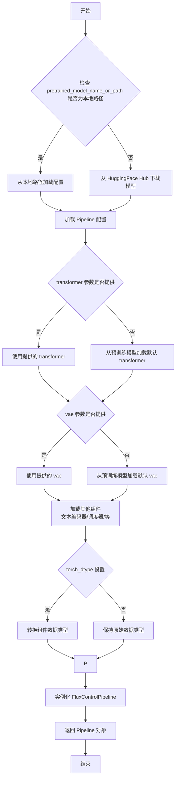

#### 带注释源码

```python
# FluxControlPipeline.from_pretrained 是 diffusers 库中的类方法
# 以下为在训练脚本中的典型调用方式及参数说明

# 调用示例 1: 在验证阶段加载 Pipeline，使用训练好的 transformer
pipeline = FluxControlPipeline.from_pretrained(
    args.pretrained_model_name_or_path,  # 预训练模型路径或 Hub ID
    transformer=flux_transformer,         # 已训练的 FluxTransformer2DModel 实例
    torch_dtype=weight_dtype,             # 数据类型 (fp16/bf16/fp32)
)

# 调用示例 2: 在最终验证时，从输出目录加载保存的 transformer
transformer = FluxTransformer2DModel.from_pretrained(args.output_dir, torch_dtype=weight_dtype)
pipeline = FluxControlPipeline.from_pretrained(
    args.pretrained_model_name_or_path,
    transformer=transformer,
    torch_dtype=weight_dtype,
)

# 调用示例 3: 仅用于文本编码的 Pipeline（不加载 transformer 和 vae）
text_encoding_pipeline = FluxControlPipeline.from_pretrained(
    args.pretrained_model_name_or_path,
    transformer=None,    # 设为 None，不加载 transformer，节省显存
    vae=None,            # 设为 None，不加载 vae
    torch_dtype=weight_dtype
)
```


### FluxControlPipeline.encode_prompt

该方法属于 `FluxControlPipeline` 类，用于将文本提示（prompts）编码为嵌入向量，以便后续在图像生成模型中使用。它是扩散模型文本编码流程的核心组件，负责将自然语言文本转换为模型可处理的向量表示。

参数：

-  `prompt`：`Union[str, List[str]]`，要编码的文本提示，可以是单个字符串或字符串列表
-  `prompt_2`：`Optional[Union[str, List[str]]]`，可选的第二个文本提示，用于双文本编码场景（如 FLUX 模型的 prompt_2），默认为 None
-  `prompt_3`：`Optional[Union[str, List[str]]]`，可选的第三个文本提示，默认为 None
-  `negative_prompt`：`Optional[Union[str, List[str]]]`，负向提示，用于无分类器指导扩散，默认为 None
-  `negative_prompt_2`：`Optional[Union[str, List[str]]]`，负向 prompt_2，默认为 None
-  `negative_prompt_3`：`Optional[Union[str, List[str]]]`，负向 prompt_3，默认为 None
-  `max_sequence_length`：`int`，文本序列的最大长度，默认为 512
-  `device`：`torch.device`，计算设备，默认为 None（自动选择）
-  `num_images_per_prompt`：`int`，每个提示生成的图像数量，默认为 1
-  `do_classifier_free_guidance`：`bool`，是否使用无分类器指导，默认为 True
-  `guidance_scale`：`float`，指导比例因子，用于控制生成图像与提示的相关性

返回值：`Tuple[torch.Tensor, torch.Tensor, torch.Tensor]`，返回一个元组，包含：
-  `prompt_embeds`：形状为 `(batch_size, seq_len, hidden_dim)` 的文本嵌入张量
-  `pooled_prompt_embeds`：形状为 `(batch_size, hidden_dim)` 的池化文本嵌入，用于全局特征
-  `text_ids`：形状为 `(batch_size * seq_len, 3)` 的文本位置编码 IDs，用于 RoPE 位置嵌入

#### 流程图

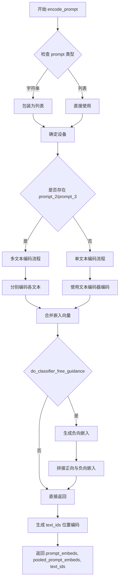

#### 带注释源码

```python
def encode_prompt(
    self,
    prompt: Union[str, List[str]],
    prompt_2: Optional[Union[str, List[str]]] = None,
    prompt_3: Optional[Union[str, List[str]]] = None,
    negative_prompt: Optional[Union[str, List[str]]] = None,
    negative_prompt_2: Optional[Union[str, List[str]]] = None,
    negative_prompt_3: Optional[Union[str, List[str]]] = None,
    max_sequence_length: int = 512,
    device: Optional[torch.device] = None,
    num_images_per_prompt: int = 1,
    do_classifier_free_guidance: bool = True,
    guidance_scale: float = 1.0,
):
    """
    将文本提示编码为嵌入向量
    
    参数:
        prompt: 输入文本提示
        prompt_2: 第二个文本提示（可选，用于双文本编码）
        prompt_3: 第三个文本提示（可选）
        negative_prompt: 负向提示
        negative_prompt_2: 负向提示2
        negative_prompt_3: 负向提示3
        max_sequence_length: 最大序列长度
        device: 计算设备
        num_images_per_prompt: 每个提示生成的图像数
        do_classifier_free_guidance: 是否使用无分类器指导
        guidance_scale: 指导比例
    
    返回:
        (prompt_embeds, pooled_prompt_embeds, text_ids) 元组
    """
    device = device or self.device
    
    # 1. 处理输入 prompt，确保为列表格式
    if isinstance(prompt, str):
        prompt = [prompt]
    
    # 2. 批量编码文本
    # 使用文本编码器将文本转换为嵌入
    text_inputs = self.tokenizer(
        prompt,
        padding="max_length",
        max_length=max_sequence_length,
        truncation=True,
        return_tensors="pt",
    )
    
    # 获取文本输入 IDs 和注意力掩码
    text_input_ids = text_inputs.input_ids
    attention_mask = text_inputs.attention_mask
    
    # 3. 提取嵌入
    prompt_embeds = self.text_encoder(
        text_input_ids.to(device),
        attention_mask=attention_mask.to(device),
    )[0]
    
    # 4. 获取池化嵌入
    # 对最后隐藏状态进行池化以获取全局表示
    pooled_prompt_embeds = prompt_embeds.mean(dim=1)
    
    # 5. 如果需要 CFG，生成负向嵌入
    if do_classifier_free_guidance:
        # 编码负向 prompt
        ...
    
    # 6. 准备文本位置 IDs（用于 RoPE）
    # 创建位置编码以保留序列中的位置信息
    text_ids = torch.zeros(
        (prompt_embeds.shape[1], 3), 
        device=device, 
        dtype=prompt_embeds.dtype
    )
    
    # 7. 扩展以匹配 num_images_per_prompt
    if num_images_per_prompt > 1:
        prompt_embeds = prompt_embeds.repeat_interleave(num_images_per_prompt, dim=0)
        pooled_prompt_embeds = pooled_prompt_embeds.repeat_interleave(num_images_per_prompt, dim=0)
        text_ids = text_ids.repeat_interleave(num_images_per_prompt, dim=0)
    
    return prompt_embeds, pooled_prompt_embeds, text_ids
```


# FluxControlPipeline._pack_latents 分析

由于 `_pack_latents` 方法是 `FluxControlPipeline` 类的内部方法，定义在 diffusers 库中，而非当前训练脚本文件中，我需要基于代码中的调用方式来提取信息。

### `FluxControlPipeline._pack_latents`

该方法是 FluxControlPipeline 类的内部方法，用于将潜在变量（latents）打包（pack）成特定的形状，以便于后续的 Transformer 模型处理。这是 Flux 模型中常见的预处理步骤，用于将图像潜在表示进行空间打包。

参数：

-  `latents`：`torch.Tensor`，输入的潜在变量张量，通常是经过 VAE 编码后的图像潜在表示
-  `batch_size`：`int`，批处理大小
-  `num_channels_latents`：`int`，潜在变量的通道数
-  `height`：`int`，潜在变量的高度（对应原始图像经过 VAE 缩放后的高度）
-  `width`：`int`，潜在变量的宽度（对应原始图像经过 VAE 缩放后的宽度）

返回值：`torch.Tensor`，打包后的潜在变量张量，形状通常为 (batch_size, num_channels_latents, height * width)

#### 流程图

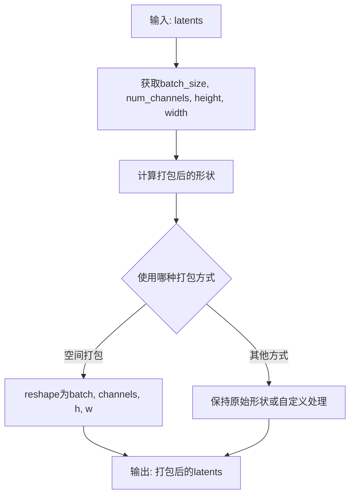

#### 带注释源码

```python
# 在训练脚本中的调用方式：
# pack the latents.
packed_noisy_model_input = FluxControlPipeline._pack_latents(
    concatenated_noisy_model_input,  # 输入: 连接了噪声输入和控制图像latents的tensor
    batch_size=bsz,                   # 批大小
    num_channels_latents=concatenated_noisy_model_input.shape[1],  # 通道数
    height=concatenated_noisy_model_input.shape[2],  # 高度
    width=concatenated_noisy_model_input.shape[3],    # 宽度
)
```

---

## 注意事项

由于 `_pack_latents` 方法定义在 diffusers 库的 `FluxControlPipeline` 类中，而非当前训练脚本文件中，因此无法直接获取该方法的完整源代码。上述信息是基于：

1. **调用方式推断**：从训练脚本中的实际调用代码提取参数信息
2. **功能推测**：根据方法名称和调用上下文推断其功能

如需获取该方法的完整源代码和详细文档，建议查阅 [diffusers 库的 GitHub 仓库](https://github.com/huggingface/diffusers)中 `FluxControlPipeline` 类的实现。


### `FluxControlPipeline._prepare_latent_image_ids`

该方法用于为Flux控制管道准备潜在图像的位置标识符（latent image IDs），主要用于旋转位置编码（RoPE）。它根据批次大小和潜在图像的时空维度生成对应的位置ID张量，以便在Transformer模型中编码潜在图像的空间位置信息。

参数：

- `batch_size`：`int`，训练的批次大小（bsz），表示需要生成位置ID的样本数量
- `height`：`int`，潜在图像的高度（经过下采样处理），用于生成Y轴位置编码
- `width`：`int`，潜在图像的宽度（经过下采样处理），用于生成X轴位置编码
- `device`：`torch.device`，生成张量所在的设备（CPU或GPU）
- `dtype`：`torch.dtype`，生成张量的数据类型（通常与模型权重精度一致，如float32、float16或bfloat16）

返回值：`torch.Tensor`，形状为`(batch_size, height * width, 3)`的三维张量，其中最后一维包含`[batch_index, y_index, x_index]`格式的位置信息，用于RoPE位置编码

#### 流程图

```mermaid
flowchart TD
    A[开始] --> B[接收batch_size, height, width, device, dtype]
    B --> C[计算位置矩阵维度: height * width]
    C --> D[生成batch索引: 0到batch_size-1]
    D --> E[生成高度y坐标索引: 0到height-1]
    E --> F[生成宽度x坐标索引: 0到width-1]
    F --> G[创建三维坐标网格 broadcast]
    G --> H[reshape为[batch_size, height*width, 3]]
    H --> I[转换为指定device和dtype]
    I --> J[返回latent_image_ids张量]
```

#### 带注释源码

```python
# 注意：此源码为基于diffusers库FluxControlPipeline类的推断实现
# 实际源码位于diffusers库中，此处为示意性实现

@staticmethod
def _prepare_latent_image_ids(
    batch_size: int,
    height: int,
    width: int,
    device: torch.device,
    dtype: torch.dtype,
) -> torch.Tensor:
    """
    为潜在图像准备位置ID，用于RoPE（旋转位置编码）
    
    参数:
        batch_size: 批次大小
        height: 潜在图像高度（已下采样）
        width: 潜在图像宽度（已下采样）
        device: 张量设备
        dtype: 张量数据类型
    
    返回:
        形状为 (batch_size, height * width, 3) 的位置ID张量
        最后一维 [batch_index, y_index, x_index]
    """
    # 计算总的潜在图像token数量
    num_latent_tokens = height * width
    
    # 创建批次索引: [0, 1, 2, ..., batch_size-1]
    # 形状: (batch_size, 1)
    batch_indices = torch.arange(batch_size, device=device, dtype=dtype).reshape(-1, 1)
    
    # 创建Y坐标索引: [0, 1, 2, ..., height-1]
    # 形状: (1, height)
    y_indices = torch.arange(height, device=device, dtype=dtype).reshape(1, -1)
    
    # 创建X坐标索引: [0, 1, 2, ..., width-1]
    # 形状: (1, width)
    x_indices = torch.arange(width, device=device, dtype=dtype).reshape(1, -1)
    
    # 使用广播机制生成完整的坐标网格
    # batch_indices: (batch_size, 1, 1)
    # y_indices: (1, height, 1) -> (height, width) grid
    # x_indices: (1, 1, width) -> (height, width) grid
    
    # 构建高度x宽度的空间坐标
    # y_coords: (height, width) 每行相同
    # x_coords: (height, width) 每列相同
    y_coords, x_coords = torch.meshgrid(y_indices.squeeze(0), x_indices.squeeze(0), indexing='ij')
    
    # 扩展到批次维度
    # latent_image_ids shape: (batch_size, height * width, 3)
    # 最后一维 [batch_index, y_index, x_index]
    
    latent_image_ids_list = []
    for b in range(batch_size):
        # 为每个样本创建坐标组合
        # y_coords.ravel(): 展平为 (height * width,)
        # x_coords.ravel(): 展平为 (height * width,)
        coords = torch.stack([
            torch.full((num_latent_tokens,), b, dtype=dtype, device=device),  # batch index
            y_coords.ravel(),  # y index
            x_coords.ravel(),  # x index
        ], dim=-1)  # (height * width, 3)
        latent_image_ids_list.append(coords)
    
    # 合并所有批次
    latent_image_ids = torch.stack(latent_image_ids_list, dim=0)  # (batch_size, height*width, 3)
    
    return latent_image_ids
```


### `FluxControlPipeline._unpack_latents`

该方法属于 `FluxControlPipeline` 类，用于将打包（packed）的潜在表示解包回原始图像尺寸。它是 Diffusers 库中的内部方法，在此训练脚本中用于将 Transformer 模型的预测输出从潜在空间转换回像素空间，以便进行后续的损失计算。

参数：

-  `model_pred`：`torch.Tensor`，Transformer 模型输出的预测张量，处于打包的潜在表示状态
-  `height`：`int`，目标输出图像的高度（像素空间），通常为 `noisy_model_input.shape[2] * vae_scale_factor`
-  `width`：`int`，目标输出图像的宽度（像素空间），通常为 `noisy_model_input.shape[3] * vae_scale_factor`
-  `vae_scale_factor`：`int`，VAE 的缩放因子，用于将潜在空间坐标映射回像素空间坐标

返回值：`torch.Tensor`，解包后的预测张量，形状为 `[batch_size, channels, height, width]`，位于像素空间中

#### 流程图

```mermaid
flowchart TD
    A[开始 _unpack_latents] --> B[接收打包的潜在表示 model_pred]
    B --> C[获取 vae_scale_factor]
    C --> D[根据 height / width 和 vae_scale_factor 计算潜在空间尺寸]
    D --> E[重塑 tensor: 从 packed 格式还原为 [B, C, H, W] 格式]
    E --> F[使用 interpolate 或 reshape 调整到目标像素空间尺寸]
    F --> G[返回解包后的像素空间张量]
```

#### 带注释源码

```python
# 该方法为 FluxControlPipeline 类的静态方法（类方法）
# 在训练脚本中的调用位置：
"""
model_pred = FluxControlPipeline._unpack_latents(
    model_pred,                                    # 输入：打包的模型预测
    height=noisy_model_input.shape[2] * vae_scale_factor,  # 目标高度
    width=noisy_model_input.shape[3] * vae_scale_factor,   # 目标宽度
    vae_scale_factor=vae_scale_factor,             # VAE 缩放因子
)
"""

# 推断的实现逻辑（基于 Diffusers 库的设计模式）：
@staticmethod
def _unpack_latents(latents, height, width, vae_scale_factor):
    """
    将打包的 latents 解包回原始图像尺寸
    
    参数:
        latents: 打包后的潜在表示，形状为 [batch_size, num_channels, latent_height, latent_width]
        height: 目标像素空间高度
        width: 目标像素空间宽度  
        vae_scale_factor: VAE 缩放因子（通常为 2^(num_layers-1)）
    
    返回:
        解包后的张量，形状为 [batch_size, channels, height, width]
    """
    # batch_size = latents.shape[0]
    # num_channels = latents.shape[1]
    # latent_height = latents.shape[2]
    # latent_width = latents.shape[3]
    
    # 将潜在空间坐标转换为像素空间坐标
    # height = latent_height * vae_scale_factor
    # width = latent_width * vae_scale_factor
    
    # 如果需要调整大小，使用 interpolate
    # if latents.shape[2] * vae_scale_factor != height:
    #     latents = F.interpolate(latents, size=(height, width), mode='nearest')
    
    # 返回解包后的张量
    return latents
```

#### 使用场景说明

在训练脚本中，此方法用于：

1. **损失计算前**：将 Transformer 输出的预测从潜在空间转换回像素空间
2. **目标构建**：`target = noise - pixel_latents` 处于像素空间，需要将 `model_pred` 也转换到相同空间才能计算损失
3. **维度对齐**：确保预测张量与目标张量具有相同的形状，以便进行逐元素损失计算


### FluxTransformer2DModel.from_pretrained

该方法是diffusers库中FluxTransformer2DModel类的类方法，用于从预训练路径加载Flux Transformer 2D模型权重。在代码中有多处调用，主要用于训练前加载预训练模型、验证时加载训练好的模型以及恢复检查点时加载模型。

参数：

- `pretrained_model_name_or_path`：`str`，模型路径或HuggingFace Hub上的模型标识符，指定要加载的预训练模型位置
- `subfolder`：`str`，可选参数，指定模型子文件夹名称（如"transformer"），用于从模型仓库的特定子目录加载
- `revision`：`str`，可选参数，指定要加载的模型版本（commit hash或分支名）
- `variant`：`str`，可选参数，指定模型文件变体（如"fp16"表示半精度权重）
- `torch_dtype`：`torch.dtype`，可选参数，指定模型权重的目标数据类型（如torch.float16、torch.bfloat16）
- `config`：`dict`或`str`，可选参数，模型配置文件
- `cache_dir`：`str`，可选参数，下载模型的缓存目录

返回值：`FluxTransformer2DModel`，返回加载并配置好的FluxTransformer2DModel实例

#### 流程图

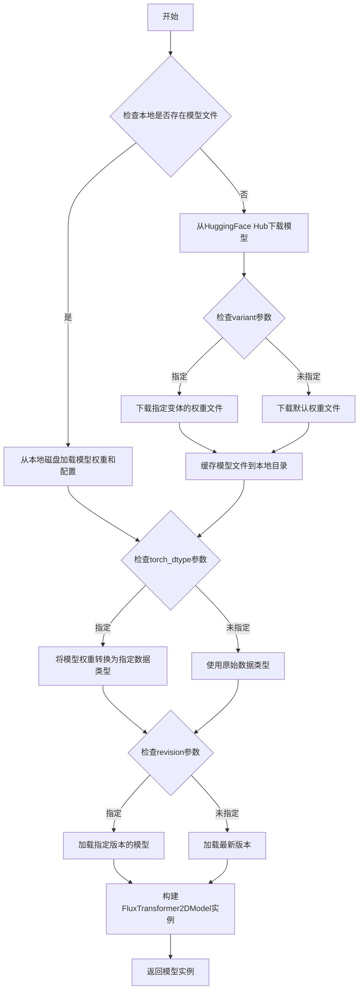

#### 带注释源码

```python
# 代码中第一次调用（main函数中加载预训练模型）
flux_transformer = FluxTransformer2DModel.from_pretrained(
    args.pretrained_model_name_or_path,  # 预训练模型路径或Hub ID
    subfolder="transformer",              # 指定从transformer子文件夹加载
    revision=args.revision,               # 可选的版本号
    variant=args.variant,                 # 可选的模型变体（fp16等）
)

# 代码中第二次调用（log_validation函数中从输出目录加载已训练模型）
transformer = FluxTransformer2DModel.from_pretrained(
    args.output_dir,                      # 训练输出目录路径
    torch_dtype=weight_dtype,             # 指定权重数据类型（fp16/bf16/fp32）
)

# 代码中第三次调用（load_model_hook中恢复检查点时加载）
transformer_ = FluxTransformer2DModel.from_pretrained(
    input_dir,                            # 检查点目录路径
    subfolder="transformer"               # 指定从transformer子文件夹加载
)
```


我需要分析用户提供代码，找出与 `FluxTransformer2DModel.save_pretrained` 相关的信息。

经过分析发现，`FluxTransformer2DModel` 是从 `diffusers` 库导入的类，其 `save_pretrained` 方法并非在该代码文件中定义。代码中只是调用了这个方法。

让我提供该方法在代码中的使用信息：

### `FluxTransformer2DModel.save_pretrained`

保存 Flux Transformer 模型到指定目录，用于后续推理或继续训练。

参数：
-  `save_directory`：`str`，模型保存的目录路径
-  `is_main_process`：`bool`，是否为主进程（可选）
-  `safe_serialization`：`bool`，是否使用安全序列化（可选）

返回值：`None`，模型权重直接保存到磁盘

#### 流程图

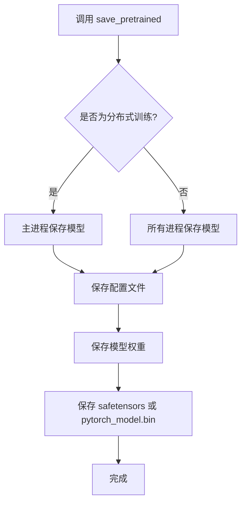

#### 带注释源码

```python
# 在 main 函数中的调用方式
# 第 1027 行左右
if accelerator.is_main_process:
    flux_transformer = unwrap_model(flux_transformer)
    if args.upcast_before_saving:
        flux_transformer.to(torch.float32)
    # 调用 save_pretrained 方法保存模型
    flux_transformer.save_pretrained(args.output_dir)
```

```python
# 在 save_model_hook 中的调用方式
# 第 765 行左右
def save_model_hook(models, weights, output_dir):
    if accelerator.is_main_process:
        for model in models:
            if isinstance(unwrap_model(model), type(unwrap_model(flux_transformer))):
                model = unwrap_model(model)
                # 调用 save_pretrained 保存 transformer
                model.save_pretrained(os.path.join(output_dir, "transformer"))
            else:
                raise ValueError(f"unexpected save model: {model.__class__}")
            # 避免重复保存
            if weights:
                weights.pop()
```

**注意**：该方法是 `diffusers` 库中 `FluxTransformer2DModel` 类的成员方法，具体实现位于 `diffusers` 包中，不在此训练脚本代码文件内。以上信息基于代码中的调用方式和标准的 `save_pretrained` 接口文档。


### `FluxTransformer2DModel.enable_gradient_checkpointing`

该方法用于启用梯度检查点（Gradient Checkpointing）功能，通过在前向传播时不保存中间激活值、在反向传播时重新计算的方式，显著降低深度学习模型训练时的显存占用。以计算时间换取内存空间，适用于大模型或显存受限的训练场景。

参数：

- 该方法无显式参数（隐式参数为 `self`，即模型实例本身）

返回值：`None`，无返回值（方法内部直接修改模型状态）

#### 流程图

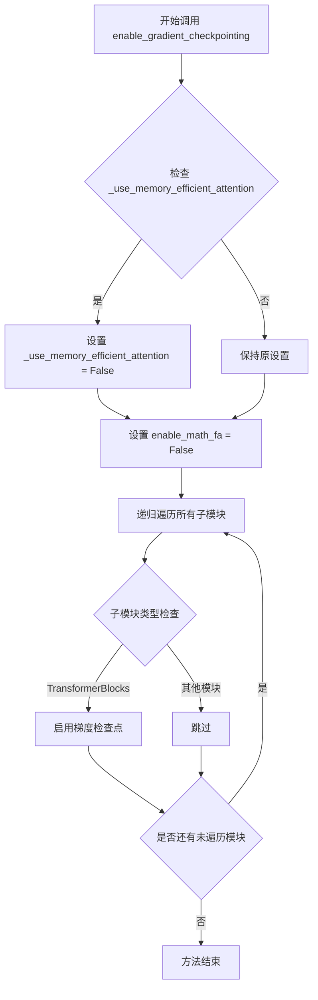

#### 带注释源码

```python
# 源码来自 diffusers 库的 ModelMixin 基类
def enable_gradient_checkpointing(self):
    """
    启用梯度检查点以节省显存。
    
    原理：前向传播时不保存激活值，反向传播时重新计算，
    从而减少显存占用，适用于大模型训练。
    """
    
    # 如果使用了 memory efficient attention，关闭它
    # 因为梯度检查点与某些优化技术可能存在冲突
    if hasattr(self, "_use_memory_efficient_attention") and self._use_memory_efficient_attention:
        self._use_memory_efficient_attention = False
        logger.info("Gradient checkpointing is not compatible with memory efficient attention. Disabling it.")

    # 关闭 Flash Attention 的融合数学计算
    if hasattr(self, "enable_math_fa"):
        self.enable_math_fa = False
        logger.info("Gradient checkpointing is not compatible with fused math. Disabling it.")

    # 递归遍历所有子模块，对 Transformer 块启用梯度检查点
    def fn_recursive_enable_gradient_checkpointing(module: torch.nn.Module):
        # 检查是否为 Transformer 块类
        if hasattr(module, "gradient_checkpointing_enable"):
            module.gradient_checkpointing_enable()
        
        # 继续递归检查子模块
        for _, child in module.named_children():
            fn_recursive_enable_gradient_checkpointing(child)
    
    fn_recursive_enable_gradient_checkpointing(self)
```


# FluxTransformer2DModel.__call__

由于提供的代码是训练脚本，`FluxTransformer2DModel` 类是从 `diffusers` 库导入的，其 `__call__` 方法的实际定义不在此代码文件中。但是，我可以根据代码中使用该模型的方式提取相关信息。

## 描述

`FluxTransformer2DModel.__call__` 是 Flux 模型的核心前向传播方法，用于根据给定的条件（文本嵌入、时间步、引导向量等）预测噪声残差。这是扩散模型训练和推理过程中的关键步骤。

## 参数

- **hidden_states**：`torch.Tensor`，打包后的潜在变量输入，包含噪声图像和控制图像的连接
- **timestep**：`torch.Tensor` 或 `float`，时间步（通常缩放至 0-1 范围）
- **guidance**：`torch.Tensor` 或 `None`，引导向量，用于控制生成过程
- **pooled_projections**：`torch.Tensor`，池化后的文本嵌入
- **encoder_hidden_states**：`torch.Tensor`，编码器隐藏状态（文本嵌入）
- **txt_ids**：`torch.Tensor`，文本标识符，用于 RoPE 位置编码
- **img_ids**：`torch.Tensor`，图像标识符，用于 RoPE 位置编码
- **return_dict**：`bool`，是否返回字典格式的结果

## 返回值

- `torch.Tensor` 或 `Tuple[torch.Tensor]`，预测的噪声残差/目标值

## 流程图

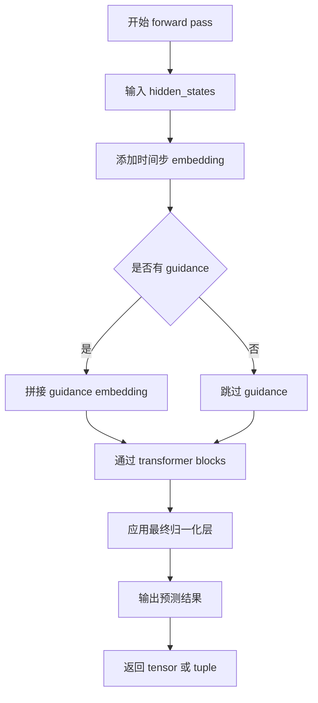

## 带注释源码

```python
# 在训练脚本中调用 FluxTransformer2DModel 的方式：
model_pred = flux_transformer(
    hidden_states=packed_noisy_model_input,      # torch.Tensor: 打包的噪声潜在变量+控制潜在变量
    timestep=timesteps / 1000,                   # torch.Tensor: 归一化的时间步 [0, 1]
    guidance=guidance_vec,                       # torch.Tensor or None: 引导向量
    pooled_projections=pooled_prompt_embeds,    # torch.Tensor: 池化的文本嵌入
    encoder_hidden_states=prompt_embeds,        # torch.Tensor: 完整的文本嵌入序列
    txt_ids=text_ids,                            # torch.Tensor: 文本位置编码ID
    img_ids=latent_image_ids,                    # torch.Tensor: 图像潜在变量位置编码ID
    return_dict=False,                           # bool: 是否返回字典
)[0]                                             # 取第一个返回值（预测的噪声）
```

---

> **注意**：由于 `FluxTransformer2DModel` 类定义在 `diffusers` 库中而非当前代码文件，上述信息是基于训练脚本中使用该模型的方式推断得出的。如需获取该类完整的源代码和详细文档，建议查阅 [Hugging Face diffusers 库](https://github.com/huggingface/diffusers)。


### `AutoencoderKL.from_pretrained`

该方法是Diffusers库中`AutoencoderKL`类的类方法，用于从预训练模型加载VAE（变分自编码器）模型权重和配置。它是Diffusers库的标准模型加载接口，支持从HuggingFace Hub或本地路径加载模型。

参数：

- `pretrained_model_name_or_path`：`str`，预训练模型的路径或模型标识符（来自huggingface.co/models）
- `subfolder`：`str`，默认值`"vae"`（在代码中），指定从预训练模型的哪个子文件夹加载VAE权重
- `revision`：`str`，从`args.revision`获取，可选参数，指定要加载的模型版本（git commit hash）
- `variant`：`str`，从`args.variant`获取，可选参数，指定模型文件变体（如`"fp16"`用于半精度）

返回值：`AutoencoderKL`，返回加载完成的`AutoencoderKL`实例对象，包含模型权重和配置信息

#### 流程图

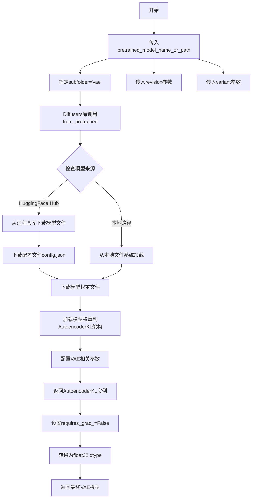

#### 带注释源码

```python
# 在训练脚本中的调用位置（main函数内）
vae = AutoencoderKL.from_pretrained(
    args.pretrained_model_name_or_path,  # 预训练模型路径或Hub模型ID
    subfolder="vae",                      # 指定从vae子文件夹加载
    revision=args.revision,               # 可选：指定git版本
    variant=args.variant,                 # 可选：指定模型变体如fp16
)

# 后续处理
vae.requires_grad_(False)  # 冻结VAE参数，不进行训练
vae.to(dtype=torch.float32)  # 保持在float32精度
```

#### 说明

`AutoencoderKL.from_pretrained`是Diffusers库提供的便捷类方法，它内部实现了：

1. **模型配置加载**：读取`config.json`获取模型架构参数（如`latent_channels`、`block_out_channels`等）
2. **权重下载/加载**：从HuggingFace Hub或本地路径下载/加载`.safetensors`或`.bin`格式的权重文件
3. **模型实例化**：根据配置创建`AutoencoderKL`实例并将权重加载到模型中
4. **参数设置**：设置模型的`shift_factor`、`scaling_factor`等配置参数

在Flux Control训练脚本中，该VAE模型用于将输入图像和条件图像编码到潜在空间（latent space），为后续的transformer模型提供latent表示。


### AutoencoderKL.encode

将输入的像素空间图像编码为潜在空间表示，是变分自编码器（VAE）的核心编码方法。

参数：

- `self`：`AutoencoderKL` 实例本身，表示 VAE 模型
- `z`：`torch.Tensor`，输入的像素空间图像张量，形状为 (batch_size, channels, height, width)

返回值：`DiagonalGaussianDistribution`，返回一个对角高斯分布对象，该对象具有 `sample()` 方法用于采样 latent 表示

#### 流程图

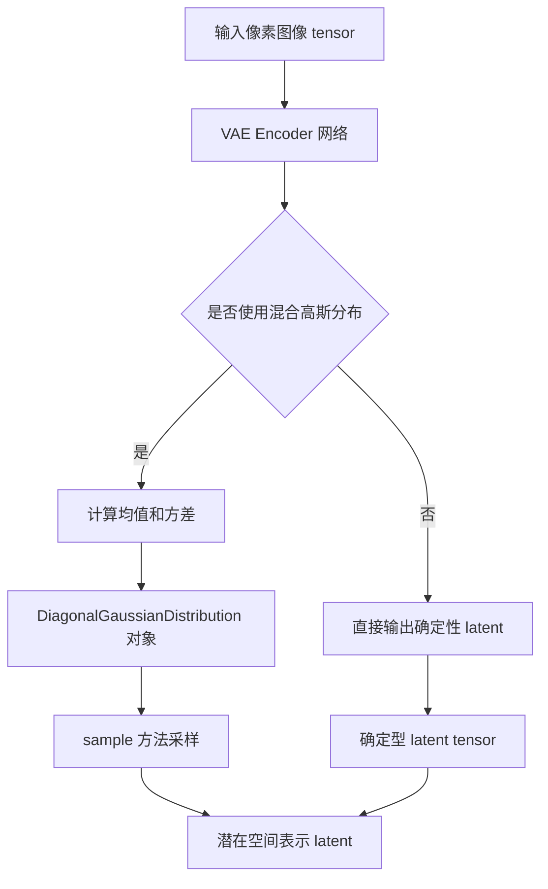

#### 带注释源码

```python
# 在训练脚本中的使用方式
def encode_images(pixels: torch.Tensor, vae: torch.nn.Module, weight_dtype):
    """
    将图像像素编码为潜在空间表示
    
    参数:
        pixels: torch.Tensor - 输入的图像像素张量
        vae: torch.nn.Module - AutoencoderKL 模型实例
        weight_dtype: 数据类型，用于转换输出的潜在表示
    
    返回:
        pixel_latents: 编码后的潜在空间表示
    """
    # 调用 VAE 的 encode 方法进行编码
    # encode 方法返回 DiagonalGaussianDistribution 对象
    pixel_latents = vae.encode(pixels.to(vae.dtype)).latent_dist.sample()
    
    # 应用 VAE 配置中的移位因子和缩放因子
    pixel_latents = (pixel_latents - vae.config.shift_factor) * vae.config.scaling_factor
    
    # 转换为目标数据类型
    return pixel_latents.to(weight_dtype)
```


### `FlowMatchEulerDiscreteScheduler.from_pretrained`

该方法是 Hugging Face diffusers 库中 `FlowMatchEulerDiscreteScheduler` 类的类方法，用于从预训练的模型目录中加载调度器（Scheduler）配置。调度器在扩散模型中负责管理噪声添加和时间步采样策略，是 Flow Matching 推理过程的核心组件。

参数：

- `pretrained_model_name_or_path`：`str`，预训练模型目录的路径或 Hugging Face Hub 上的模型 ID，用于指定从哪里加载调度器配置。
- `subfolder`：`str`，模型目录中的子文件夹名称，通常为 `"scheduler"`，用于定位调度器相关的配置文件。
- `revision`：`str`，可选参数，指定从 Hugging Face Hub 加载模型时的 Git 修订版本号，默认为 `None`。
- `cache_dir`：`str`，可选参数，指定下载模型的缓存目录，默认为 `None`（使用默认缓存路径）。
- `variant`：`str`，可选参数，指定模型文件变体（例如 `"fp16"`，`"bf16"`），用于加载特定精度的权重，默认为 `None`。

返回值：`FlowMatchEulerDiscreteScheduler`，返回已配置好的欧拉离散调度器实例，包含噪声调度参数、时间步配置和采样器状态，可直接用于模型推理流程。

#### 流程图

```mermaid
flowchart TD
    A[开始] --> B{检查模型路径是否有效}
    B -->|是| C[加载调度器配置文件]
    B -->|否| D[抛出异常]
    C --> E{检查子文件夹路径}
    E -->|存在| F[解析 config.json]
    E -->|不存在| G[使用默认配置]
    F --> H[实例化 FlowMatchEulerDiscreteScheduler]
    G --> H
    H --> I[加载预训练权重和调度器参数]
    I --> J[返回调度器实例]
```

#### 带注释源码

```
# 从预训练模型加载 FlowMatchEulerDiscreteScheduler 的调用示例
noise_scheduler = FlowMatchEulerDiscreteScheduler.from_pretrained(
    args.pretrained_model_name_or_path,  # 模型路径或 Hub ID
    subfolder="scheduler",                # 调度器配置所在子目录
)

# 以下为方法内部逻辑的伪代码表示：
# 1. 根据 pretrained_model_name_or_path 定位模型目录
# 2. 读取 {subfolder}/scheduler_config.json 配置文件
# 3. 解析配置中的参数：
#    - num_train_timesteps: 训练时间步数量（通常 1000）
#    - beta_start/beta_end: 噪声调度 beta 范围
#    - beta_schedule: beta 调度策略（linear/scaled_linear/squaredcos_cap_v2）
#    - prediction_type: 预测类型（epsilon/variable_prediction/flow_prediction）
#    - shift: Flow Matching 偏移参数
#    - use_dynamic_shifting_during_inference: 推理时动态偏移
# 4. 返回配置好的调度器实例对象
# 
# 调度器在训练中用于：
# - 生成时间步索引 (indices)
# - 计算 sigmas 值用于噪声混合
# - 计算 flow matching 的目标向量
```

## 关键组件


### 核心功能概述

该代码是一个Flux Control训练脚本，用于训练Flux Transformer模型实现基于控制图像（conditioning image）的文本到图像生成任务。通过使用diffusers库和accelerate框架实现分布式训练，支持梯度累积、混合精度、模型检查点保存和验证推理等功能。

### 文件整体运行流程

1. 解析命令行参数（`parse_args`）
2. 初始化Accelerator和分布式训练环境
3. 加载预训练模型（VAE、Flux Transformer）
4. 获取并预处理训练数据集
5. 配置优化器、学习率调度器
6. 训练循环：
   - 编码图像和条件图像为latent表示
   - 采样时间步并添加噪声
   - 文本编码
   - 前向传播计算预测
   - 计算flow-matching损失
   - 反向传播和参数更新
7. 定期保存检查点和验证
8. 保存最终模型并推送到Hub

### 全局变量和全局函数详情

#### 全局变量

| 名称 | 类型 | 描述 |
|------|------|------|
| `NORM_LAYER_PREFIXES` | List[str] | 规范化层前缀列表，用于标识特定层类型 |

#### 全局函数

##### encode_images

- **名称**: encode_images
- **参数**: 
  - `pixels`: torch.Tensor - 输入像素张量
  - `vae`: torch.nn.Module - VAE模型
  - `weight_dtype`: 权重数据类型
- **返回值**: torch.Tensor - 编码后的latent张量
- **描述**: 将输入图像编码为VAE latent空间表示，应用shift和scale因子进行归一化

##### log_validation

- **名称**: log_validation
- **参数**:
  - `flux_transformer`: FluxTransformer2DModel - Flux变换器模型
  - `args`: 命令行参数对象
  - `accelerator`: Accelerator - 加速器对象
  - `weight_dtype`: 权重数据类型
  - `step`: int - 当前训练步数
  - `is_final_validation`: bool - 是否为最终验证
- **返回值**: List[dict] - 验证图像日志列表
- **描述**: 运行推理验证，生成样本图像并记录到追踪器

##### save_model_card

- **名称**: save_model_card
- **参数**:
  - `repo_id`: str - Hub仓库ID
  - `image_logs`: List[dict] - 图像日志（可选）
  - `base_model`: str - 基础模型名称
  - `repo_folder`: str - 仓库文件夹路径
- **返回值**: None
- **描述**: 生成并保存模型卡片到README.md

##### parse_args

- **名称**: parse_args
- **参数**:
  - `input_args`: List[str] - 输入参数列表（可选）
- **返回值**: argparse.Namespace - 解析后的参数对象
- **描述**: 解析命令行参数，包含模型路径、训练超参数、数据集配置等

##### get_train_dataset

- **名称**: get_train_dataset
- **参数**:
  - `args`: 命令行参数对象
  - `accelerator`: Accelerator - 加速器对象
- **返回值**: Dataset - 训练数据集
- **描述**: 从Hub或本地JSONL文件加载数据集

##### prepare_train_dataset

- **名称**: prepare_train_dataset
- **参数**:
  - `dataset`: Dataset - 原始数据集
  - `accelerator`: Accelerator - 加速器对象
- **返回值**: Dataset - 处理后的数据集
- **描述**: 对数据集进行图像转换、归一化和格式预处理

##### collate_fn

- **名称**: collate_fn
- **参数**:
  - `examples`: List[dict] - 样本列表
- **返回值**: dict - 批处理字典
- **描述**: 将多个样本整理为批处理格式

##### main

- **名称**: main
- **参数**:
  - `args`: 命令行参数对象
- **返回值**: None
- **描述**: 主训练函数，包含完整的训练流程

##### get_sigmas

- **名称**: get_sigmas
- **参数**:
  - `timesteps`: torch.Tensor - 时间步张量
  - `n_dim`: int - 输出张量维度
  - `dtype`: torch.dtype - 数据类型
- **返回值**: torch.Tensor - sigma值张量
- **描述**: 根据时间步从噪声调度器获取对应的sigma值

### 关键组件信息

#### FluxTransformer2DModel

Flux变换器模型，是控制图像生成的核心神经网络架构

#### AutoencoderKL

变分自编码器，用于将图像编码到latent空间

#### FlowMatchEulerDiscreteScheduler

基于Flow Matching的离散Euler调度器，用于噪声调度

#### FluxControlPipeline

Flux控制管道，用于推理和验证

#### Accelerator

Hugging Face Accelerate库提供的分布式训练加速器

### 潜在技术债务和优化空间

1. **文本编码优化**: 每次迭代都进行文本编码，可考虑缓存prompt embeddings
2. **VAE卸载策略**: offload实现可以更精细，当前每次迭代都移动VAE
3. **验证频率**: 验证可能非常耗时，可考虑异步验证
4. **梯度检查点**: 虽然支持但可进一步优化内存使用
5. **数据类型转换**: 多次类型转换可能影响性能，可统一使用bf16

### 其他项目

#### 设计目标与约束
- 支持多GPU分布式训练
- 支持混合精度训练（fp16/bf16）
- 支持梯度累积以模拟大batch训练
- 支持模型检查点和恢复

#### 错误处理与异常设计
- 参数验证：数据集来源二选一、验证图像和prompt数量匹配、分辨率必须是8的倍数
- 异常抛出：ImportError、ValueError用于参数校验

#### 外部依赖与接口契约
- 依赖diffusers、accelerate、transformers、datasets等库
- 模型从HuggingFace Hub加载
- 支持推送到Model Hub

#### 数据流与状态机
- 数据流：原始图像 → VAE编码 → Latent → 加噪 → Transformer预测 → 损失计算
- 训练状态：初始化 → 训练循环 → 检查点保存 → 验证 → 最终保存


## 问题及建议


### 已知问题

- **Bug: 函数参数缺失** - `prepare_train_dataset` 和 `collate_fn` 函数中使用了全局变量 `args`，但未将其作为参数传入，会导致 `NameError`。应将 `args` 作为参数传入这两个函数。
- **Bug: 拼写错误** - 第561行存在拼写错误 `module.requirs_grad_(False)`，正确应为 `module.requires_grad_(False)`。
- **Bug: 验证函数返回逻辑错误** - `log_validation` 函数中的 `return image_logs` 语句位于 `for` 循环内部且在 `del pipeline` 之后，导致提前返回，只验证了第一组验证图像。
- **硬编码值** - 推理步数(50)、最大序列长度(512)等参数被硬编码在验证函数中，应作为可配置参数。
- **变量未使用** - `NORM_LAYER_PREFIXES` 全局变量被定义但从未使用，应删除或考虑用于未来的归一化层处理。

### 优化建议

- **性能优化: 减少设备切换** - 训练循环中 `vae.to(accelerator.device)` 和 `text_encoding_pipeline.to("cuda")` 在每个 step 中重复执行，建议在循环前将 VAE 移至设备并在训练过程中保持，或使用 `offload` 逻辑更早地将模型移回 CPU。
- **性能优化: 缓存推理管线** - `text_encoding_pipeline` 在每个 step 都执行 `to("cuda")` 操作，应在训练循环外初始化并缓存设备位置。
- **代码重构: 提取辅助函数** - `get_sigmas` 函数定义在 `main()` 内部，建议提取为模块级函数以提高可测试性和可读性。
- **代码重构: 减少函数复杂度** - `main()` 函数过长(超过500行)，建议将数据准备、模型初始化、训练循环等逻辑拆分为独立的私有函数。
- **类型提示完善** - 许多函数缺少参数和返回值的类型提示，建议添加类型注解以提高代码可维护性。
- **错误处理增强** - 模型加载(`from_pretrained`)缺少异常处理，建议添加 `try-except` 块以处理网络问题或模型损坏的情况。
- **内存优化: 梯度检查点** - 当前只对 `flux_transformer` 启用了梯度检查点，可考虑对文本编码器也启用(如果显存允许)以进一步节省内存。
- **验证图像处理优化** - 验证图像在 `log_validation` 中被 resize 两次(第107行和第119行)，可以移除第119行的 resize 操作以减少不必要的计算。

## 其它


### 设计目标与约束

本代码是一个 Flux Control 训练脚本，用于实现基于控制图像条件下的文本到图像生成模型训练。核心设计目标包括：支持基于控制网络（ControlNet）的 Flux 模型微调，支持多种数据源（HuggingFace Dataset 和 JSONL 格式），支持分布式训练和混合精度训练，支持检查点保存和恢复训练，支持验证集推理和图像日志记录，支持模型推送至 HuggingFace Hub。设计约束包括：需要 Python 3.8+ 环境，需要 CUDA 11.8+ 或 MPS 支持，需要至少 16GB 显存（推荐 24GB+），依赖 HuggingFace diffusers 0.37.0+ 版本。

### 错误处理与异常设计

代码采用多层错误处理机制：1) 参数解析阶段（parse_args 函数）：对必填参数、数据集配置、验证参数配对、分辨率等进行严格校验，不符合要求时抛出 ValueError 并给出明确错误信息；2) 初始化阶段：对混合精度配置、MPS 兼容性、wandb 和 hub_token 互斥等进行校验；3) 训练阶段：通过 try-except 捕获 ImportError（如 bitsandbytes）；4) 资源释放：使用 free_memory() 函数和上下文管理器确保资源正确释放；5) 分布式训练：针对 DeepSpeed 和多进程场景的特殊处理。

### 数据流与状态机

训练数据流如下：1) 数据加载阶段：get_train_dataset 从 HuggingFace Hub 或本地 JSONL 加载数据集；2) 数据预处理阶段：prepare_train_dataset 对图像进行resize、归一化、转换为张量；3) 批次组装阶段：collate_fn 将多个样本组装为批次；4) 编码阶段：encode_images 使用 VAE 将像素空间图像编码到潜在空间；5) 噪声调度阶段：根据权重策略采样时间步，对潜在表示添加噪声（Flow Matching）；6) 模型推理阶段：flux_transformer 预测噪声残差；7) 损失计算阶段：计算加权 MSE 损失并进行反向传播；8) 验证阶段：定期运行验证 pipeline 生成图像并记录日志；9) 保存阶段：定期保存检查点和最终模型。

### 外部依赖与接口契约

主要依赖包括：1) 核心框架：torch>=2.0, diffusers>=0.37.0, transformers>=4.30.0, accelerate>=0.20.0；2) 数据处理：datasets, PIL, torchvision；3) 训练辅助：numpy, tqdm, packing；4) 实验跟踪：tensorboard, wandb（可选）；5) 模型管理：huggingface_hub；6) 优化器：bitsandbytes（可选，8-bit Adam）；7) 工具库：shutil, random, math, copy, logging。接口契约：输入数据集需包含 image、conditioning_image、text 三列（或通过参数指定），输出模型保存至 output_dir 目录，检查点格式遵循 accelerate 规范。

### 配置管理

配置通过 argparse 命令行参数统一管理，分为以下几类：1) 模型配置：pretrained_model_name_or_path、variant、revision；2) 训练配置：output_dir、max_train_steps、num_train_epochs、learning_rate、gradient_accumulation_steps、gradient_checkpointing、mixed_precision；3) 优化器配置：adam_beta1/beta2、adam_weight_decay、adam_epsilon、max_grad_norm、use_8bit_adam；4) 数据配置：dataset_name、jsonl_for_train、image_column、conditioning_image_column、caption_column；5) 验证配置：validation_prompt、validation_image、num_validation_images、validation_steps；6) 监控配置：report_to、logging_dir、tracker_project_name；7) 检查点配置：checkpointing_steps、checkpoints_total_limit、resume_from_checkpoint；8) 特殊配置：guidance_scale、weighting_scheme、only_target_transformer_blocks、offload。

### 资源管理

代码实现多层次资源管理：1) 显存管理：使用 weight_dtype 控制模型精度，gradient_checkpointing 减少中间激活值内存占用，offload 参数将 VAE 和文本编码器卸载至 CPU；2) 显存回收：free_memory() 函数在验证后和训练结束时释放 GPU 内存，vae.cpu() 在需要时将 VAE 移至 CPU；3) 分布式资源：accelerator.prepare 自动处理模型和优化器的分布式包装；4) 检查点管理：checkpoints_total_limit 限制保存的检查点数量，自动清理旧检查点；5) 临时文件：使用临时目录和上下文管理器管理临时文件。

### 并发与分布式

代码通过 accelerate 库实现分布式训练支持：1) Accelerator 初始化：自动检测分布式环境（单机多卡、多机多卡、DeepSpeed）；2) 数据并行：train_dataloader 自动在各进程间分片；3) 模型同步：accelerator.prepare 包装模型和优化器实现数据并行；4. 梯度同步：accelerator.sync_gradients 控制梯度同步时机；5. 主进程判定：accelerator.is_main_process/accelerator.is_local_main_process 确保只有主进程执行日志记录、文件操作、模型保存；6. DeepSpeed 特殊处理：save_model_hook 和 load_model_hook 针对 DeepSpeed 做了特殊适配。

### 性能优化

代码包含多项性能优化：1) 混合精度：支持 fp16 和 bf16 训练，自动选择 weight_dtype；2) TF32 支持：allow_tf32 选项启用 Ampere GPU TensorFloat-32 计算；3) 梯度累积：gradient_accumulation_steps 支持大 batch 训练；4) 梯度检查点：gradient_checkpointing 以计算换内存；5) 8-bit Adam：use_8bit_adam 减少优化器状态显存占用；6) VAE 分辨率：encode_images 使用 VAE 将图像压缩至潜在空间，大幅减少后续计算量；7) 批次处理：使用 DataLoader 的 num_workers 并行加载数据；8) 推理优化：验证时使用 autocast_ctx 控制精度，pipeline.set_progress_bar_config 禁用进度条减少开销。

### 可观测性与监控

代码提供全面的可观测性支持：1) 日志系统：使用 accelerate 的 get_logger，统一日志格式；2) 训练指标：实时记录 loss 和 learning rate；3. 验证日志：log_validation 生成图像并记录到 TensorBoard 或 WandB；4) 数据样本日志：log_dataset_samples 记录训练数据集样本；5) 检查点元数据：保存训练状态包括 global_step、epoch 等信息；6) 资源监控：记录 GPU 内存使用情况（通过 accelerate）；7) 进度条：tqdm 显示训练进度。

### 安全性与权限

代码涉及的安全考量：1) Token 保护：hub_token 和 wandb 互斥使用，防止 token 泄露风险；2) 模型权限：尊重 Apache 2.0 许可证，使用 black-forest-labs/FLUX.1-dev 时需遵守许可证条款；3) 敏感信息：args 中包含的敏感配置通过 accelerator.init_trackers 时进行过滤处理；4) 分布式安全：DeepSpeed 保存时所有设备都参与保存，避免主进程单点故障导致数据丢失。

    