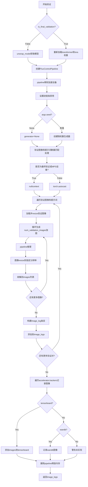
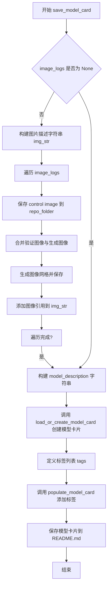
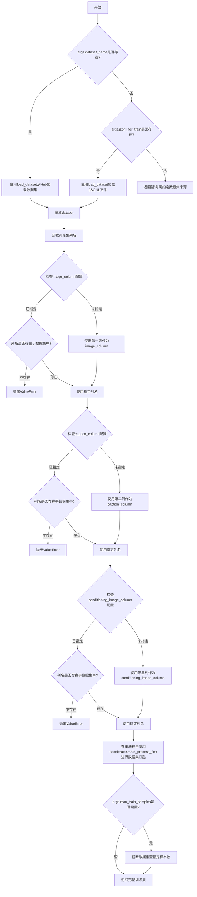
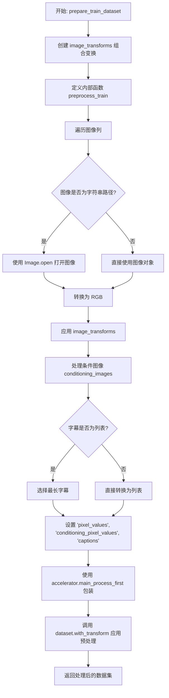

# `diffusers\examples\flux-control\train_control_lora_flux.py` 详细设计文档

A PyTorch training script for fine-tuning the FLUX text-to-image diffusion model using LoRA to support conditional control images (e.g., Canny, Depth), enabling controlled generation via the Hugging Face Diffusers framework.

## 整体流程

```mermaid
graph TD
    Start[Start] --> ParseArgs[parse_args]
    ParseArgs --> Main[main function]
    Main --> Init[Initialize Accelerator & Logging]
    Init --> LoadModels[Load VAE, Transformer, Scheduler]
    LoadModels --> ModifyInput[Modify Transformer Input (Control Image Support)]
    ModifyInput --> SetupLoRA[Configure & Add LoRA Adapter]
    SetupLoRA --> PrepareData[Load Dataset & Create DataLoader]
    PrepareData --> TrainLoop[Training Loop]
    TrainLoop --> Encode[Encode Pixel & Condition Images]
    Encode --> TextEnc[Encode Text Prompts]
    TextEnc --> Forward[Flux Transformer Forward]
    Forward --> Loss[Compute Flow Matching Loss]
    Loss --> Backward[Backward & Optimizer Step]
    Backward --> Checkpoint{Checkpoint Save?}
    Checkpoint -- Yes --> Save[Save Checkpoint]
    Checkpoint --> Validate{Validation Step?}
    Validate -- Yes --> LogVal[Run log_validation]
    Validate --> Next[Next Step]
    Next --> TrainLoop
    LogVal --> Next
    Save --> Next
    TrainLoop -.-> End[End Training]
    End --> Finalize[Save LoRA Weights & Push to Hub]
```

## 类结构

```
train_control_lora.py (Main Script)
├── Global Variables
│   ├── logger
│   └── NORM_LAYER_PREFIXES
└── Functions
    ├── parse_args (CLI Argument Parser)
    ├── encode_images (VAE Encoding Helper)
    ├── get_train_dataset (Data Loading)
    ├── prepare_train_dataset (Data Preprocessing)
    ├── collate_fn (DataLoader Collate)
    ├── log_validation (Inference & Logging)
    ├── save_model_card (Model Card Generation)
    └── main (Training Pipeline)
```

## 全局变量及字段


### `logger`
    
用于记录训练过程中各类信息的日志记录器

类型：`logging.Logger`
    


### `NORM_LAYER_PREFIXES`
    
定义需要训练的归一化层前缀列表，包含norm_q、norm_k、norm_added_q、norm_added_k

类型：`List[str]`
    


    

## 全局函数及方法


### `encode_images`

该函数负责将输入的图像像素张量编码为VAE潜在空间中的表示，通过采样潜在分布、调整移位因子和缩放因子将像素转换为适合后续处理的潜在向量。

参数：

- `pixels`：`torch.Tensor`，输入的图像像素值张量，形状为 (batch_size, channels, height, width)，值域通常在 [-1, 1] 或 [0, 1] 范围内
- `vae`：`torch.nn.Module`，预训练的 VAE 模型（AutoencoderKL），用于将像素空间映射到潜在空间
- `weight_dtype`：`torch.dtype`，目标数据类型，用于将编码后的潜在向量转换为此数据类型（通常为 float16 或 bfloat16）

返回值：`torch.Tensor`，编码后的潜在表示向量，经过移位和缩放处理，可直接用于后续的模型推理或训练

#### 流程图

```mermaid
flowchart TD
    A[输入 pixels 像素张量] --> B[调用 vae.encode 将像素编码为潜在分布]
    B --> C[从潜在分布中采样 latent_dist.sample]
    C --> D[应用移位和缩放: (latents - shift_factor) * scaling_factor]
    D --> E[转换数据类型到 weight_dtype]
    E --> F[返回 pixel_latents 潜在向量]
```

#### 带注释源码

```python
def encode_images(pixels: torch.Tensor, vae: torch.nn.Module, weight_dtype):
    """
    将图像像素编码为 VAE 潜在空间表示
    
    参数:
        pixels: 图像像素张量，形状为 (batch_size, channels, height, width)
        vae: 预训练的 AutoencoderKL 模型
        weight_dtype: 目标数据类型 (float16/bfloat16)
    
    返回:
        pixel_latents: 编码后的潜在表示张量
    """
    # 1. 使用 VAE 编码器将像素转换为潜在分布
    #    vae.encode 返回一个 LatentDistribution 对象
    #    .sample() 从该分布中采样得到潜在向量
    pixel_latents = vae.encode(pixels.to(vae.dtype)).latent_dist.sample()
    
    # 2. 应用 VAE 配置中的移位因子和缩放因子进行归一化
    #    这是 Flow Match 模型所需的标准预处理步骤
    #    shift_factor: 潜在空间的均值偏移量
    #    scaling_factor: 潜在空间的缩放因子
    pixel_latents = (pixel_latents - vae.config.shift_factor) * vae.config.scaling_factor
    
    # 3. 转换为训练所需的数据类型 (通常是 fp16 或 bf16)
    return pixel_latents.to(weight_dtype)
```


### `log_validation`

该函数用于在训练过程中运行验证，生成带控制条件的图像并记录到跟踪器（如TensorBoard或WandB），支持中间验证和最终验证两种模式。

参数：

- `flux_transformer`：`FluxTransformer2DModel`，训练中的FluxTransformer模型，非最终验证时使用
- `args`：命令行参数对象，包含模型路径、验证图像、提示词等配置
- `accelerator`：Accelerator实例，用于设备管理和模型解包
- `weight_dtype`：torch.dtype，推理时使用的数据类型
- `step`：int，当前训练步数，用于日志记录
- `is_final_validation`：bool，标识是否为最终验证（训练结束后的验证）

返回值：`list`，包含验证图像日志的列表，每个元素为字典，含验证图像、生成图像和提示词

#### 流程图



#### 带注释源码

```python
def log_validation(flux_transformer, args, accelerator, weight_dtype, step, is_final_validation=False):
    """
    运行验证流程，生成带控制条件的图像并记录到跟踪器
    
    参数:
        flux_transformer: 训练中的FluxTransformer模型
        args: 包含所有训练和验证配置的参数对象
        accelerator: HuggingFace Accelerate加速器实例
        weight_dtype: 推理使用的权重数据类型(fp16/bf16/fp32)
        step: 当前训练步数
        is_final_validation: 是否为训练结束后的最终验证
    """
    logger.info("Running validation... ")

    # 根据是否为最终验证采用不同的模型加载策略
    if not is_final_validation:
        # 中间验证: 直接使用训练中的模型(已通过accelerator包装)
        flux_transformer = accelerator.unwrap_model(flux_transformer)
        pipeline = FluxControlPipeline.from_pretrained(
            args.pretrained_model_name_or_path,
            transformer=flux_transformer,
            torch_dtype=weight_dtype,
        )
    else:
        # 最终验证: 重新加载基础模型并加载训练好的LoRA权重
        transformer = FluxTransformer2DModel.from_pretrained(
            args.pretrained_model_name_or_path, subfolder="transformer", torch_dtype=weight_dtype
        )
        initial_channels = transformer.config.in_channels
        pipeline = FluxControlPipeline.from_pretrained(
            args.pretrained_model_name_or_path,
            transformer=transformer,
            torch_dtype=weight_dtype,
        )
        # 加载训练过程中保存的LoRA权重
        pipeline.load_lora_weights(args.output_dir)
        # 验证输入通道数是否正确加倍(原通道数*2)
        assert pipeline.transformer.config.in_channels == initial_channels * 2, (
            f"{pipeline.transformer.config.in_channels=}"
        )

    # 将pipeline移到指定设备并禁用进度条
    pipeline.to(accelerator.device)
    pipeline.set_progress_bar_config(disable=True)

    # 设置随机数生成器以确保可复现性
    if args.seed is None:
        generator = None
    else:
        generator = torch.Generator(device=accelerator.device).manual_seed(args.seed)

    # 处理验证图像和提示词数量的匹配逻辑
    # 支持: 1对1, 1对多, 多对1的情况
    if len(args.validation_image) == len(args.validation_prompt):
        validation_images = args.validation_image
        validation_prompts = args.validation_prompt
    elif len(args.validation_image) == 1:
        # 单图像配多提示词: 复制图像
        validation_images = args.validation_image * len(args.validation_prompt)
        validation_prompts = args.validation_prompt
    elif len(args.validation_prompt) == 1:
        # 单提示词配多图像: 复制提示词
        validation_images = args.validation_image
        validation_prompts = args.validation_prompt * len(args.validation_image)
    else:
        raise ValueError(
            "number of `args.validation_image` and `args.validation_prompt` should be checked in `parse_args`"
        )

    image_logs = []
    # 选择自动类型转换上下文: MPS设备或最终验证时使用nullcontext
    if is_final_validation or torch.backends.mps.is_available():
        autocast_ctx = nullcontext()
    else:
        autocast_ctx = torch.autocast(accelerator.device.type, weight_dtype)

    # 遍历每个验证图像-提示词对进行推理
    for validation_prompt, validation_image in zip(validation_prompts, validation_images):
        validation_image = load_image(validation_image)
        # 调整图像分辨率以匹配训练设置
        validation_image = validation_image.resize((args.resolution, args.resolution))

        images = []

        # 生成多张验证图像
        for _ in range(args.num_validation_images):
            with autocast_ctx:
                image = pipeline(
                    prompt=validation_prompt,
                    control_image=validation_image,
                    num_inference_steps=50,  # 固定推理步数
                    guidance_scale=args.guidance_scale,
                    generator=generator,
                    max_sequence_length=512,
                    height=args.resolution,
                    width=args.resolution,
                ).images[0]
            # 统一图像尺寸
            image = image.resize((args.resolution, args.resolution))
            images.append(image)
        
        # 记录该验证对的生成结果
        image_logs.append(
            {"validation_image": validation_image, "images": images, "validation_prompt": validation_prompt}
        )

    # 根据跟踪器类型选择合适的日志记录方式
    tracker_key = "test" if is_final_validation else "validation"
    for tracker in accelerator.trackers:
        if tracker.name == "tensorboard":
            # TensorBoard记录: 将图像转为numpy数组堆叠
            for log in image_logs:
                images = log["images"]
                validation_prompt = log["validation_prompt"]
                validation_image = log["validation_image"]
                formatted_images = []
                formatted_images.append(np.asarray(validation_image))
                for image in images:
                    formatted_images.append(np.asarray(image))
                formatted_images = np.stack(formatted_images)
                tracker.writer.add_images(validation_prompt, formatted_images, step, dataformats="NHWC")

        elif tracker.name == "wandb":
            # WandB记录: 使用wandb.Image封装
            formatted_images = []
            for log in image_logs:
                images = log["images"]
                validation_prompt = log["validation_prompt"]
                validation_image = log["validation_image"]
                formatted_images.append(wandb.Image(validation_image, caption="Conditioning"))
                for image in images:
                    image = wandb.Image(image, caption=validation_prompt)
                    formatted_images.append(image)

            tracker.log({tracker_key: formatted_images})
        else:
            logger.warning(f"image logging not implemented for {tracker.name}")

    # 清理: 删除pipeline实例并释放GPU内存
    del pipeline
    free_memory()
    return image_logs
```


### `save_model_card`

该函数用于在训练完成后生成并保存模型卡片（Model Card）到 HuggingFace Hub，包括模型描述、示例图像和标签信息。

参数：

- `repo_id`：`str`，HuggingFace Hub 的仓库标识符
- `image_logs`：`Optional[list]`，验证日志列表，包含验证图像、提示词等信息，默认为 `None`
- `base_model`：`str`，基础预训练模型的名称或路径
- `repo_folder`：`Optional[str]`：本地仓库文件夹路径，用于保存模型卡片和示例图像，默认为 `None`

返回值：`None`，该函数直接保存文件，不返回任何内容

#### 流程图



#### 带注释源码

```python
def save_model_card(repo_id: str, image_logs=None, base_model=str, repo_folder=None):
    """
    生成并保存 HuggingFace Hub 模型卡片
    
    参数:
        repo_id: HuggingFace Hub 仓库 ID
        image_logs: 验证日志列表，包含图像和提示词
        base_model: 基础预训练模型名称
        repo_folder: 本地保存路径
    """
    # 初始化图片描述字符串
    img_str = ""
    
    # 如果有验证日志，处理示例图像
    if image_logs is not None:
        img_str = "You can find some example images below.\n\n"
        
        # 遍历每个验证日志
        for i, log in enumerate(image_logs):
            images = log["images"]
            validation_prompt = log["validation_prompt"]
            validation_image = log["validation_image"]
            
            # 保存控制图像
            validation_image.save(os.path.join(repo_folder, "image_control.png"))
            
            # 添加 prompt 描述
            img_str += f"prompt: {validation_prompt}\n"
            
            # 合并验证图像和生成图像，创建图像网格
            images = [validation_image] + images
            make_image_grid(images, 1, len(images)).save(os.path.join(repo_folder, f"images_{i}.png"))
            
            # 添加图像引用到描述
            img_str += f"\n"

    # 构建模型描述
    model_description = f"""
# control-lora-{repo_id}

These are Control LoRA weights trained on {base_model} with new type of conditioning.
{img_str}

## License

Please adhere to the licensing terms as described [here](https://huggingface.co/black-forest-labs/FLUX.1-dev/blob/main/LICENSE.md)
"""

    # 加载或创建模型卡片
    model_card = load_or_create_model_card(
        repo_id_or_path=repo_id,
        from_training=True,
        license="other",
        base_model=base_model,
        model_description=model_description,
        inference=True,
    )

    # 定义模型标签
    tags = [
        "flux",
        "flux-diffusers",
        "text-to-image",
        "diffusers",
        "control-lora",
        "diffusers-training",
        "lora",
    ]
    
    # 填充模型卡片标签
    model_card = populate_model_card(model_card, tags=tags)

    # 保存模型卡片到 README.md
    model_card.save(os.path.join(repo_folder, "README.md"))
```


### `parse_args`

该函数是命令行参数解析器，使用 `argparse` 模块定义并解析控制 LoRA 训练脚本的各种超参数和配置选项，包括模型路径、训练参数、数据集配置、验证设置等，并在解析后进行一系列参数有效性验证。

参数：

-  `input_args`：`Optional[List[str]]`，可选参数，用于指定要解析的参数列表（主要用于测试），如果为 `None`，则从命令行 `sys.argv` 解析

返回值：`argparse.Namespace`，包含所有解析后的命令行参数及其值的命名空间对象

#### 流程图

```mermaid
flowchart TD
    A[开始 parse_args] --> B[创建 ArgumentParser 对象]
    B --> C[添加 --pretrained_model_name_or_path 参数]
    C --> D[添加模型相关参数: --variant, --revision, --output_dir 等]
    D --> E[添加训练参数: --train_batch_size, --num_train_epochs, --max_train_steps 等]
    E --> F[添加优化器参数: --learning_rate, --lr_scheduler, --adam_* 等]
    F --> G[添加数据相关参数: --dataset_name, --image_column, --caption_column 等]
    G --> H[添加验证参数: --validation_prompt, --validation_image 等]
    H --> I[添加其他参数: --mixed_precision, --report_to 等]
    I --> J{input_args 是否为 None?}
    J -->|是| K[parser.parse_args() 从命令行解析]
    J -->|否| L[parser.parse_args(input_args) 解析指定列表]
    K --> M[验证数据集参数: dataset_name 或 jsonl_for_train 必须指定且只能指定一个]
    M --> N[验证 proportion_empty_prompts 范围]
    N --> O[验证 validation_prompt 和 validation_image 配对]
    O --> P[验证 resolution 可被 8 整除]
    P --> Q[返回解析后的 args 命名空间对象]
    L --> M
```

#### 带注释源码

```python
def parse_args(input_args=None):
    """
    解析命令行参数，定义训练脚本的所有配置选项
    
    参数:
        input_args: 可选的参数列表，用于测试目的。如果为 None，则从 sys.argv 解析。
    
    返回:
        argparse.Namespace: 包含所有解析后参数的对象
    """
    # 创建参数解析器，添加描述信息
    parser = argparse.ArgumentParser(description="Simple example of a Control LoRA training script.")
    
    # ==================== 模型相关参数 ====================
    # 预训练模型路径或 HuggingFace 模型标识符（必需）
    parser.add_argument(
        "--pretrained_model_name_or_path",
        type=str,
        default=None,
        required=True,
        help="Path to pretrained model or model identifier from huggingface.co/models.",
    )
    # 模型变体（如 fp16）
    parser.add_argument(
        "--variant",
        type=str,
        default=None,
        help="Variant of the model files of the pretrained model identifier from huggingface.co/models, 'e.g.' fp16",
    )
    # 预训练模型版本
    parser.add_argument(
        "--revision",
        type=str,
        default=None,
        required=False,
        help="Revision of pretrained model identifier from huggingface.co/models.",
    )
    # 输出目录
    parser.add_argument(
        "--output_dir",
        type=str,
        default="control-lora",
        help="The output directory where the model predictions and checkpoints will be written.",
    )
    # 缓存目录
    parser.add_argument(
        "--cache_dir",
        type=str,
        default=None,
        help="The directory where the downloaded models and datasets will be stored.",
    )
    # 随机种子
    parser.add_argument("--seed", type=int, default=None, help="A seed for reproducible training.")
    
    # ==================== 图像处理参数 ====================
    # 输入图像分辨率
    parser.add_argument(
        "--resolution",
        type=int,
        default=1024,
        help="The resolution for input images, all the images in the train/validation dataset will be resized to this resolution",
    )
    
    # ==================== 训练参数 ====================
    # 训练批次大小
    parser.add_argument(
        "--train_batch_size", type=int, default=4, help="Batch size (per device) for the training dataloader."
    )
    # 训练轮数
    parser.add_argument("--num_train_epochs", type=int, default=1)
    # 最大训练步数
    parser.add_argument(
        "--max_train_steps",
        type=int,
        default=None,
        help="Total number of training steps to perform.  If provided, overrides num_train_epochs.",
    )
    # 检查点保存步数
    parser.add_argument(
        "--checkpointing_steps",
        type=int,
        default=500,
        help="Save a checkpoint of the training state every X updates.",
    )
    # 检查点总数限制
    parser.add_argument(
        "--checkpoints_total_limit",
        type=int,
        default=None,
        help=("Max number of checkpoints to store."),
    )
    # 从检查点恢复训练
    parser.add_argument(
        "--resume_from_checkpoint",
        type=str,
        default=None,
        help="Whether training should be resumed from a previous checkpoint.",
    )
    # 空提示词比例
    parser.add_argument(
        "--proportion_empty_prompts",
        type=float,
        default=0,
        help="Proportion of image prompts to be replaced with empty strings. Defaults to 0.",
    )
    
    # ==================== LoRA 相关参数 ====================
    # LoRA 秩（维度）
    parser.add_argument(
        "--rank",
        type=int,
        default=4,
        help=("The dimension of the LoRA update matrices."),
    )
    # 是否使用 LoRA bias
    parser.add_argument("--use_lora_bias", action="store_true", help="If training the bias of lora_B layers.")
    # LoRA 目标层
    parser.add_argument(
        "--lora_layers",
        type=str,
        default=None,
        help="The transformer modules to apply LoRA training on.",
    )
    # 是否使用高斯初始化 LoRA
    parser.add_argument(
        "--gaussian_init_lora",
        action="store_true",
        help="If using the Gaussian init strategy.",
    )
    # 是否训练归一化层
    parser.add_argument("--train_norm_layers", action="store_true", help="Whether to train the norm scales.")
    
    # ==================== 梯度相关参数 ====================
    # 梯度累积步数
    parser.add_argument(
        "--gradient_accumulation_steps",
        type=int,
        default=1,
        help="Number of updates steps to accumulate before performing a backward/update pass.",
    )
    # 梯度检查点
    parser.add_argument(
        "--gradient_checkpointing",
        action="store_true",
        help="Whether or not to use gradient checkpointing to save memory.",
    )
    
    # ==================== 学习率调度器参数 ====================
    # 学习率
    parser.add_argument(
        "--learning_rate",
        type=float,
        default=5e-6,
        help="Initial learning rate (after the potential warmup period) to use.",
    )
    # 是否缩放学习率
    parser.add_argument(
        "--scale_lr",
        action="store_true",
        default=False,
        help="Scale the learning rate by the number of GPUs, gradient accumulation steps, and batch size.",
    )
    # 学习率调度器类型
    parser.add_argument(
        "--lr_scheduler",
        type=str,
        default="constant",
        help='The scheduler type to use. Choose between ["linear", "cosine", "cosine_with_restarts", "polynomial", "constant", "constant_with_warmup"]',
    )
    # 预热步数
    parser.add_argument(
        "--lr_warmup_steps", type=int, default=500, help="Number of steps for the warmup in the lr scheduler."
    )
    # 余弦调度器重置次数
    parser.add_argument(
        "--lr_num_cycles",
        type=int,
        default=1,
        help="Number of hard resets of the lr in cosine_with_restarts scheduler.",
    )
    # 多项式调度器幂次
    parser.add_argument("--lr_power", type=float, default=1.0, help="Power factor of the polynomial scheduler.")
    
    # ==================== 优化器参数 ====================
    # 8-bit Adam
    parser.add_argument(
        "--use_8bit_adam", action="store_true", help="Whether or not to use 8-bit Adam from bitsandbytes."
    )
    # 数据加载器工作进程数
    parser.add_argument(
        "--dataloader_num_workers",
        type=int,
        default=0,
        help="Number of subprocesses to use for data loading.",
    )
    # Adam 参数
    parser.add_argument("--adam_beta1", type=float, default=0.9, help="The beta1 parameter for the Adam optimizer.")
    parser.add_argument("--adam_beta2", type=float, default=0.999, help="The beta2 parameter for the Adam optimizer.")
    parser.add_argument("--adam_weight_decay", type=float, default=1e-2, help="Weight decay to use.")
    parser.add_argument("--adam_epsilon", type=float, default=1e-08, help="Epsilon value for the Adam optimizer")
    # 梯度裁剪
    parser.add_argument("--max_grad_norm", default=1.0, type=float, help="Max gradient norm.")
    
    # ==================== Hub 相关参数 ====================
    # 推送到 Hub
    parser.add_argument("--push_to_hub", action="store_true", help="Whether or not to push the model to the Hub.")
    # Hub token
    parser.add_argument("--hub_token", type=str, default=None, help="The token to use to push to the Model Hub.")
    # Hub 模型 ID
    parser.add_argument(
        "--hub_model_id",
        type=str,
        default=None,
        help="The name of the repository to keep in sync with the local `output_dir`.",
    )
    # 日志目录
    parser.add_argument(
        "--logging_dir",
        type=str,
        default="logs",
        help="[TensorBoard] log directory.",
    )
    
    # ==================== 硬件和精度参数 ====================
    # TF32 支持
    parser.add_argument(
        "--allow_tf32",
        action="store_true",
        help="Whether or not to allow TF32 on Ampere GPUs.",
    )
    # 报告工具
    parser.add_argument(
        "--report_to",
        type=str,
        default="tensorboard",
        help='The integration to report the results and logs to. Supported platforms are "tensorboard", "wandb", "comet_ml".',
    )
    # 混合精度
    parser.add_argument(
        "--mixed_precision",
        type=str,
        default=None,
        choices=["no", "fp16", "bf16"],
        help="Whether to use mixed precision. Choose between fp16 and bf16.",
    )
    
    # ==================== 数据集参数 ====================
    # 数据集名称
    parser.add_argument(
        "--dataset_name",
        type=str,
        default=None,
        help="The name of the Dataset (from the HuggingFace hub) to train on.",
    )
    # 数据集配置名称
    parser.add_argument(
        "--dataset_config_name",
        type=str,
        default=None,
        help="The config of the Dataset, leave as None if there's only one config.",
    )
    # 图像列名
    parser.add_argument(
        "--image_column", type=str, default="image", help="The column of the dataset containing the target image."
    )
    # 条件图像列名
    parser.add_argument(
        "--conditioning_image_column",
        type=str,
        default="conditioning_image",
        help="The column of the dataset containing the control conditioning image.",
    )
    # 标题列名
    parser.add_argument(
        "--caption_column",
        type=str,
        default="text",
        help="The column of the dataset containing a caption or a list of captions.",
    )
    # 记录数据集样本
    parser.add_argument("--log_dataset_samples", action="store_true", help="Whether to log somple dataset samples.")
    # 最大训练样本数
    parser.add_argument(
        "--max_train_samples",
        type=int,
        default=None,
        help="For debugging purposes or quicker training, truncate the number of training examples to this value if set.",
    )
    # 训练用 JSONL 文件路径
    parser.add_argument(
        "--jsonl_for_train",
        type=str,
        default=None,
        help="Path to the jsonl file containing the training data.",
    )
    
    # ==================== 验证参数 ====================
    # 验证提示词
    parser.add_argument(
        "--validation_prompt",
        type=str,
        default=None,
        nargs="+",
        help="A set of prompts evaluated every `--validation_steps` and logged to `--report_to`.",
    )
    # 验证图像
    parser.add_argument(
        "--validation_image",
        type=str,
        default=None,
        nargs="+",
        help="A set of paths to the control conditioning image be evaluated every `--validation_steps`.",
    )
    # 验证图像数量
    parser.add_argument(
        "--num_validation_images",
        type=int,
        default=1,
        help="Number of images to be generated for each `--validation_image`, `--validation_prompt` pair",
    )
    # 验证步数
    parser.add_argument(
        "--validation_steps",
        type=int,
        default=100,
        help="Run validation every X steps.",
    )
    
    # ==================== 其他参数 ====================
    # 跟踪器项目名称
    parser.add_argument(
        "--tracker_project_name",
        type=str,
        default="flux_train_control_lora",
        help="The `project_name` argument passed to Accelerator.init_trackers.",
    )
    # 引导尺度
    parser.add_argument(
        "--guidance_scale",
        type=float,
        default=30.0,
        help="the guidance scale used for transformer.",
    )
    # 保存前是否上浮
    parser.add_argument(
        "--upcast_before_saving",
        action="store_true",
        help="Whether to upcast the trained transformer layers to float32 before saving.",
    )
    # 加权方案
    parser.add_argument(
        "--weighting_scheme",
        type=str,
        default="none",
        choices=["sigma_sqrt", "logit_normal", "mode", "cosmap", "none"],
        help='We default to the "none" weighting scheme for uniform sampling and uniform loss',
    )
    # logit 均值
    parser.add_argument(
        "--logit_mean", type=float, default=0.0, help="mean to use when using the `'logit_normal'` weighting scheme."
    )
    # logit 标准差
    parser.add_argument(
        "--logit_std", type=float, default=1.0, help="std to use when using the `'logit_normal'` weighting scheme."
    )
    # 模式尺度
    parser.add_argument(
        "--mode_scale",
        type=float,
        default=1.29,
        help="Scale of mode weighting scheme. Only effective when using the `'mode'` as the `weighting_scheme`.",
    )
    # 卸载 VAE 和文本编码器到 CPU
    parser.add_argument(
        "--offload",
        action="store_true",
        help="Whether to offload the VAE and the text encoders to CPU when they are not used.",
    )
    
    # ==================== 解析参数 ====================
    # 根据 input_args 是否为空决定解析方式
    if input_args is not None:
        args = parser.parse_args(input_args)
    else:
        args = parser.parse_args()
    
    # ==================== 参数验证 ====================
    # 验证：必须指定数据集名称或 JSONL 文件之一
    if args.dataset_name is None and args.jsonl_for_train is None:
        raise ValueError("Specify either `--dataset_name` or `--jsonl_for_train`")

    # 验证：不能同时指定数据集名称和 JSONL 文件
    if args.dataset_name is not None and args.jsonl_for_train is not None:
        raise ValueError("Specify only one of `--dataset_name` or `--jsonl_for_train`")

    # 验证：空提示词比例必须在 [0, 1] 范围内
    if args.proportion_empty_prompts < 0 or args.proportion_empty_prompts > 1:
        raise ValueError("`--proportion_empty_prompts` must be in the range [0, 1].")

    # 验证：如果设置了验证提示词，必须设置验证图像
    if args.validation_prompt is not None and args.validation_image is None:
        raise ValueError("`--validation_image` must be set if `--validation_prompt` is set")

    # 验证：如果设置了验证图像，必须设置验证提示词
    if args.validation_prompt is None and args.validation_image is not None:
        raise ValueError("`--validation_prompt` must be set if `--validation_image` is set")

    # 验证：验证图像和验证提示词的数量匹配关系
    if (
        args.validation_image is not None
        and args.validation_prompt is not None
        and len(args.validation_image) != 1
        and len(args.validation_prompt) != 1
        and len(args.validation_image) != len(args.validation_prompt)
    ):
        raise ValueError(
            "Must provide either 1 `--validation_image`, 1 `--validation_prompt`,"
            " or the same number of `--validation_prompt`s and `--validation_image`s"
        )

    # 验证：分辨率必须能被 8 整除（确保 VAE 和 Flux transformer 之间的编码图像尺寸一致）
    if args.resolution % 8 != 0:
        raise ValueError(
            "`--resolution` must be divisible by 8 for consistently sized encoded images between the VAE and the Flux transformer."
        )
    
    # 返回解析后的参数对象
    return args
```


### `get_train_dataset`

该函数用于加载和准备训练数据集，支持从HuggingFace Hub或本地JSONL文件加载数据，并根据参数配置验证和返回训练数据集。

参数：

-  `args`：命名空间（argparse.Namespace），包含数据集配置参数，如dataset_name、dataset_config_name、cache_dir、jsonl_for_train、image_column、caption_column、conditioning_image_column、max_train_samples、seed等
-  `accelerator`：Accelerator对象，用于分布式训练环境下的进程同步

返回值：`datasets.Dataset`，返回处理后的训练数据集对象

#### 流程图



#### 带注释源码

```python
def get_train_dataset(args, accelerator):
    """
    加载并准备训练数据集。
    
    支持两种数据源:
    1. HuggingFace Hub上的数据集 (通过dataset_name指定)
    2. 本地JSONL文件 (通过jsonl_for_train指定)
    
    函数会验证数据集中是否存在所需的列,
    并在需要时进行数据打乱和采样。
    """
    dataset = None
    
    # 优先检查是否从Hub加载数据集
    if args.dataset_name is not None:
        # 从HuggingFace Hub下载并加载数据集
        # 参数: 数据集名称、配置名称、缓存目录
        dataset = load_dataset(
            args.dataset_name,
            args.dataset_config_name,
            cache_dir=args.cache_dir,
        )
    
    # 检查是否从本地JSONL文件加载
    if args.jsonl_for_train is not None:
        # 从JSONL文件加载数据
        dataset = load_dataset("json", data_files=args.jsonl_for_train, cache_dir=args.cache_dir)
        # 展平索引以便后续处理
        dataset = dataset.flatten_indices()
    
    # 获取训练集的列名
    column_names = dataset["train"].column_names

    # ========== 验证image_column配置 ==========
    # 如果未指定image_column，默认使用第一列
    if args.image_column is None:
        image_column = column_names[0]
        logger.info(f"image column defaulting to {image_column}")
    else:
        image_column = args.image_column
        # 验证指定的列是否存在于数据集中
        if image_column not in column_names:
            raise ValueError(
                f"`--image_column` value '{args.image_column}' not found in dataset columns. Dataset columns are: {', '.join(column_names)}"
            )

    # ========== 验证caption_column配置 ==========
    # 如果未指定caption_column，默认使用第二列
    if args.caption_column is None:
        caption_column = column_names[1]
        logger.info(f"caption column defaulting to {caption_column}")
    else:
        caption_column = args.caption_column
        if caption_column not in column_names:
            raise ValueError(
                f"`--caption_column` value '{args.caption_column}' not found in dataset columns. Dataset columns are: {', '.join(column_names)}"
            )

    # ========== 验证conditioning_image_column配置 ==========
    # 如果未指定conditioning_image_column，默认使用第三列
    if args.conditioning_image_column is None:
        conditioning_image_column = column_names[2]
        logger.info(f"conditioning image column defaulting to {conditioning_image_column}")
    else:
        conditioning_image_column = args.conditioning_image_column
        if conditioning_image_column not in column_names:
            raise ValueError(
                f"`--conditioning_image_column` value '{args.conditioning_image_column}' not found in dataset columns. Dataset columns are: {', '.join(column_names)}"
            )

    # ========== 数据集预处理 ==========
    # 使用accelerator.main_process_first确保只在主进程执行一次
    # 打乱数据集以保证训练随机性
    with accelerator.main_process_first():
        train_dataset = dataset["train"].shuffle(seed=args.seed)
        
        # 如果设置了max_train_samples，则截断数据集
        # 用于调试或加快训练速度
        if args.max_train_samples is not None:
            train_dataset = train_dataset.select(range(args.max_train_samples))
    
    return train_dataset
```


### `prepare_train_dataset`

该函数负责将原始数据集转换为训练所需的格式，包括图像预处理（调整大小、归一化）、条件图像处理以及字幕处理。通过 `accelerator.main_process_first` 确保数据预处理在主进程完成，并返回带有转换函数的 datasets.Dataset 对象。

参数：

- `dataset`：`datasets.Dataset`，原始的训练数据集对象
- `accelerator`：`Accelerate` 库的 Accelerator 实例，用于管理分布式训练和同步

返回值：`datasets.Dataset`，经过预处理的数据集，已应用 `with_transform` 包含像素值、条件像素值和字幕

#### 流程图



#### 带注释源码

```python
def prepare_train_dataset(dataset, accelerator):
    """
    准备训练数据集，应用图像预处理和转换函数。
    
    参数:
        dataset: 原始的HuggingFace datasets.Dataset对象
        accelerator: Accelerate库的Accelerator实例，用于分布式训练管理
    
    返回:
        处理后的datasets.Dataset对象，已应用transform函数
    """
    
    # 定义图像变换管道：调整大小、转换为张量、归一化
    image_transforms = transforms.Compose(
        [
            # 将图像调整为目标分辨率，使用双线性插值
            transforms.Resize((args.resolution, args.resolution), interpolation=transforms.InterpolationMode.BILINEAR),
            # 将PIL图像转换为PyTorch张量
            transforms.ToTensor(),
            # 使用均值0.5、标准差0.5进行归一化（将像素值映射到[-1, 1]范围）
            transforms.Normalize(mean=[0.5, 0.5, 0.5], std=[0.5, 0.5, 0.5]),
        ]
    )

    def preprocess_train(examples):
        """
        预处理单个batch的样本。
        
        参数:
            examples: 包含一个batch数据的字典
        
        返回:
            添加了pixel_values、conditioning_pixel_values和captions的字典
        """
        
        # 处理主图像：将原始图像转换为RGB并应用变换
        images = [
            # 判断是否为字符串路径（本地文件）还是已加载的图像对象
            (image.convert("RGB") if not isinstance(image, str) else Image.open(image).convert("RGB"))
            for image in examples[args.image_column]
        ]
        # 对每个图像应用变换管道
        images = [image_transforms(image) for image in images]

        # 处理条件图像（控制图像/引导图像）
        conditioning_images = [
            (image.convert("RGB") if not isinstance(image, str) else Image.open(image).convert("RGB"))
            for image in examples[args.conditioning_image_column]
        ]
        conditioning_images = [image_transforms(image) for image in conditioning_images]
        
        # 将处理后的图像存入examples字典
        examples["pixel_values"] = images
        examples["conditioning_pixel_values"] = conditioning_images

        # 处理字幕/文本提示
        # 检查字幕列的第一个元素是否为列表（多caption情况）
        is_caption_list = isinstance(examples[args.caption_column][0], list)
        if is_caption_list:
            # 如果有多个caption，选择最长的那个
            examples["captions"] = [max(example, key=len) for example in examples[args.caption_column]]
        else:
            # 直接转换为列表
            examples["captions"] = list(examples[args.caption_column])

        return examples

    # 确保数据预处理只在主进程执行（分布式训练场景）
    with accelerator.main_process_first():
        # 应用transform函数到数据集
        # 这样每次访问数据时才会调用preprocess_train进行即时处理（延迟处理）
        dataset = dataset.with_transform(preprocess_train)

    return dataset
```


### `collate_fn`

该函数是 PyTorch DataLoader 的回调函数，用于将数据集中的多个样本整理成一个批次。它从每个样本中提取像素值、条件像素值和标题，并将它们堆叠成张量返回。

参数：

- `examples`：`List[Dict]`，数据集中的一批样本列表，每个样本是包含 "pixel_values"、"conditioning_pixel_values" 和 "captions" 键的字典

返回值：`Dict[str, Union[torch.Tensor, List[str]]]`，返回包含批次数据的字典，包含 "pixel_values"（堆叠后的像素值张量）、"conditioning_pixel_values"（堆叠后的条件像素值张量）和 "captions"（标题列表）

#### 流程图

```mermaid
flowchart TD
    A[接收 examples 列表] --> B[提取 pixel_values 列表]
    B --> C[torch.stack 堆叠张量]
    C --> D[转换为连续内存格式并转为 float]
    E[提取 conditioning_pixel_values 列表] --> F[torch.stack 堆叠张量]
    F --> G[转换为连续内存格式并转为 float]
    H[提取 captions 列表] --> I[构建字典]
    D --> I
    G --> I
    I --> J[返回 {"pixel_values": ..., "conditioning_pixel_values": ..., "captions": ...}]
```

#### 带注释源码

```python
def collate_fn(examples):
    """
    数据整理函数，用于将多个样本整理成一个批次
    
    参数:
        examples: 样本列表，每个样本包含:
            - pixel_values: 图像像素值 (torch.Tensor)
            - conditioning_pixel_values: 控制图像像素值 (torch.Tensor)
            - captions: 文本描述 (str)
    
    返回:
        包含批次数据的字典
    """
    # 从所有样本中提取 pixel_values 并堆叠成批次张量
    pixel_values = torch.stack([example["pixel_values"] for example in examples])
    # 转换为连续内存格式并确保为 float 类型
    pixel_values = pixel_values.to(memory_format=torch.contiguous_format).float()
    
    # 同样处理条件图像像素值
    conditioning_pixel_values = torch.stack([example["conditioning_pixel_values"] for example in examples])
    conditioning_pixel_values = conditioning_pixel_values.to(memory_format=torch.contiguous_format).float()
    
    # 提取所有标题文本
    captions = [example["captions"] for example in examples]
    
    # 返回整理好的批次数据字典
    return {
        "pixel_values": pixel_values, 
        "conditioning_pixel_values": conditioning_pixel_values, 
        "captions": captions
    }
```


### `main`

该函数是Flux Control LoRA训练脚本的核心入口点，负责协调整个训练流程，包括模型加载、LoRA配置、数据集准备、训练循环执行、检查点保存以及最终模型权重导出。

参数：

- `args`：`argparse.Namespace`，包含所有训练配置参数（如模型路径、输出目录、学习率、LoRA配置等）

返回值：`None`，该函数无返回值，执行完成后直接退出

#### 流程图

```mermaid
flowchart TD
    A[开始 main 函数] --> B{参数验证}
    B --> C[检查 wandb 与 hub_token 组合}
    B --> D[检查 lora_bias 与 gaussian_init 组合]
    B --> E[检查 MPS + bf16 兼容性]
    
    C --> F[初始化 Accelerator]
    D --> F
    E --> F
    
    F --> G[配置日志系统]
    G --> H[设置随机种子]
    H --> I{创建输出目录}
    I --> J[可选: 创建 Hub 仓库]
    
    J --> K[加载 VAE 模型]
    K --> L[加载 Flux Transformer 模型]
    L --> M[加载噪声调度器]
    
    M --> N[冻结模型参数]
    N --> O[设置权重数据类型]
    O --> P[扩展 x_embedder 输入维度]
    
    P --> Q[配置 LoRA 目标模块]
    Q --> R[添加 LoRA adapter]
    R --> S{是否训练 norm 层}
    S --> T[启用 norm 层梯度]
    S --> U[注册 save/load hook]
    
    U --> V[配置优化器]
    V --> W[准备数据集]
    W --> X[创建 DataLoader]
    X --> Y[配置学习率调度器]
    
    Y --> Z[使用 Accelerator 准备模型]
    Z --> AA[计算总训练步数]
    AA --> AB[初始化 trackers]
    
    AB --> AC[创建文本编码 Pipeline]
    AC --> AD{是否从 checkpoint 恢复}
    AD --> AE[加载 checkpoint 状态]
    AD --> AF[初始化训练状态]
    
    AE --> AG[开始训练循环]
    AF --> AG
    
    AG --> AH[遍历训练 epoch]
    AH --> AI[遍历 batch]
    AI --> AJ[前向传播与损失计算]
    AJ --> AK[反向传播与参数更新]
    
    AK --> AL{检查是否执行优化}
    AL --> AM[更新全局步数]
    AM --> AN{是否保存 checkpoint}
    AN --> AO[保存训练状态]
    AN --> AP{是否执行验证}
    
    AO --> AP
    AP --> AQ[执行验证]
    AQ --> AR[记录日志]
    AR --> AS{是否达到最大训练步数}
    
    AS --> AT[结束训练]
    AT --> AU[同步所有进程]
    
    AU --> AV{是否为主进程}
    AV --> AW[解包模型]
    AW --> AX[保存 LoRA 权重]
    AX --> AY[释放内存]
    AY --> AZ[执行最终验证]
    
    AV --> BA[其他进程等待]
    BA --> BB[结束训练]
    
    AZ --> BC{是否推送至 Hub}
    BC --> BD[保存模型卡片]
    BD --> BE[上传文件夹]
    BC --> BB
    
    BE --> BB
```

#### 带注释源码

```python
def main(args):
    """
    Flux Control LoRA 训练脚本的主入口函数。
    负责协调整个训练流程：模型加载、LoRA配置、数据准备、训练循环、模型保存。
    """
    # ============================================================
    # 阶段 1: 参数验证与安全检查
    # ============================================================
    
    # 检查 wandb 与 hub_token 的安全组合（防止token泄露）
    if args.report_to == "wandb" and args.hub_token is not None:
        raise ValueError(
            "You cannot use both --report_to=wandb and --hub_token due to a security risk of exposing your token."
            " Please use `hf auth login` to authenticate with the Hub."
        )
    
    # LoRA bias 与高斯初始化不能同时使用
    if args.use_lora_bias and args.gaussian_init_lora:
        raise ValueError("`gaussian` LoRA init scheme isn't supported when `use_lora_bias` is True.")

    # 构建日志输出目录
    logging_out_dir = Path(args.output_dir, args.logging_dir)

    # ============================================================
    # 阶段 2: MPS 设备检查
    # ============================================================
    
    # MPS (Apple Silicon) 不支持 bfloat16 混合精度
    if torch.backends.mps.is_available() and args.mixed_precision == "bf16":
        raise ValueError(
            "Mixed precision training with bfloat16 is not supported on MPS. Please use fp16 (recommended) or fp32 instead."
        )

    # ============================================================
    # 阶段 3: Accelerator 初始化
    # ============================================================
    
    # 配置 Accelerator 项目参数
    accelerator_project_config = ProjectConfiguration(
        project_dir=args.output_dir, 
        logging_dir=str(logging_out_dir)
    )

    # 创建 Accelerator 实例
    accelerator = Accelerator(
        gradient_accumulation_steps=args.gradient_accumulation_steps,
        mixed_precision=args.mixed_precision,
        log_with=args.report_to,
        project_config=accelerator_project_config,
    )

    # MPS 设备禁用 AMP 加速
    if torch.backends.mps.is_available():
        logger.info("MPS is enabled. Disabling AMP.")
        accelerator.native_amp = False

    # ============================================================
    # 阶段 4: 日志系统配置
    # ============================================================
    
    # 配置基础日志格式
    logging.basicConfig(
        format="%(asctime)s - %(levelname)s - %(name)s - %(message)s",
        datefmt="%m/%d/%Y %H:%M:%S",
        level=logging.INFO,
    )
    logger.info(accelerator.state, main_process_only=False)

    # 主进程设置详细日志，子进程设置错误日志
    if accelerator.is_local_main_process:
        transformers.utils.logging.set_verbosity_warning()
        diffusers.utils.logging.set_verbosity_info()
    else:
        transformers.utils.logging.set_verbosity_error()
        diffusers.utils.logging.set_verbosity_error()

    # 设置随机种子以确保可复现性
    if args.seed is not None:
        set_seed(args.seed)

    # ============================================================
    # 阶段 5: 输出目录与仓库创建
    # ============================================================
    
    if accelerator.is_main_process:
        if args.output_dir is not None:
            os.makedirs(args.output_dir, exist_ok=True)

        # 如果需要推送到 Hub，创建远程仓库
        if args.push_to_hub:
            repo_id = create_repo(
                repo_id=args.hub_model_id or Path(args.output_dir).name, 
                exist_ok=True, 
                token=args.hub_token
            ).repo_id

    # ============================================================
    # 阶段 6: 模型加载
    # ============================================================
    
    # 加载 VAE 模型（用于图像编码到潜在空间）
    vae = AutoencoderKL.from_pretrained(
        args.pretrained_model_name_or_path,
        subfolder="vae",
        revision=args.revision,
        variant=args.variant,
    )
    vae_scale_factor = 2 ** (len(vae.config.block_out_channels) - 1)
    
    # 加载 Flux Transformer 主模型
    flux_transformer = FluxTransformer2DModel.from_pretrained(
        args.pretrained_model_name_or_path,
        subfolder="transformer",
        revision=args.revision,
        variant=args.variant,
    )
    logger.info("All models loaded successfully")

    # 加载噪声调度器（用于_flow matching_训练）
    noise_scheduler = FlowMatchEulerDiscreteScheduler.from_pretrained(
        args.pretrained_model_name_or_path,
        subfolder="scheduler",
    )
    # 创建调度器副本用于采样计算
    noise_scheduler_copy = copy.deepcopy(noise_scheduler)
    
    # 冻结所有模型参数（后续只为 LoRA 解冻）
    vae.requires_grad_(False)
    flux_transformer.requires_grad_(False)

    # ============================================================
    # 阶段 7: 数据类型配置
    # ============================================================
    
    weight_dtype = torch.float32
    if accelerator.mixed_precision == "fp16":
        weight_dtype = torch.float16
    elif accelerator.mixed_precision == "bf16":
        weight_dtype = torch.bfloat16

    # VAE 保持在 float32 以确保数值稳定
    vae.to(dtype=torch.float32)
    # Transformer 移动到指定设备和数据类型
    flux_transformer.to(dtype=weight_dtype, device=accelerator.device)

    # ============================================================
    # 阶段 8: 扩展输入维度以支持 Control Image
    # ============================================================
    
    with torch.no_grad():
        initial_input_channels = flux_transformer.config.in_channels
        # 创建一个新的线性层，输入维度翻倍（原始图像 + 控制图像）
        new_linear = torch.nn.Linear(
            flux_transformer.x_embedder.in_features * 2,
            flux_transformer.x_embedder.out_features,
            bias=flux_transformer.x_embedder.bias is not None,
            dtype=flux_transformer.dtype,
            device=flux_transformer.device,
        )
        # 初始化新权重，复制原始权重到前一半
        new_linear.weight.zero_()
        new_linear.weight[:, :initial_input_channels].copy_(flux_transformer.x_embedder.weight)
        if flux_transformer.x_embedder.bias is not None:
            new_linear.bias.copy_(flux_transformer.x_embedder.bias)
        # 替换原始嵌入层
        flux_transformer.x_embedder = new_linear

    # 验证新权重后一半为零
    assert torch.all(flux_transformer.x_embedder.weight[:, initial_input_channels:].data == 0)
    # 更新配置中的输入通道数
    flux_transformer.register_to_config(in_channels=initial_input_channels * 2, out_channels=initial_input_channels)

    # ============================================================
    # 阶段 9: LoRA 配置
    # ============================================================
    
    # 确定 LoRA 目标模块
    if args.lora_layers is not None:
        if args.lora_layers != "all-linear":
            target_modules = [layer.strip() for layer in args.lora_layers.split(",")]
            # 添加输入嵌入层到目标模块
            if "x_embedder" not in target_modules:
                target_modules.append("x_embedder")
        elif args.lora_layers == "all-linear":
            # 自动收集所有线性层
            target_modules = set()
            for name, module in flux_transformer.named_modules():
                if isinstance(module, torch.nn.Linear):
                    target_modules.add(name)
            target_modules = list(target_modules)
    else:
        # 默认的 Flux LoRA 目标模块列表
        target_modules = [
            "x_embedder",
            "attn.to_k", "attn.to_q", "attn.to_v", "attn.to_out.0",
            "attn.add_k_proj", "attn.add_q_proj", "attn.add_v_proj", "attn.to_add_out",
            "ff.net.0.proj", "ff.net.2",
            "ff_context.net.0.proj", "ff_context.net.2",
        ]
    
    # 配置 LoRA 参数
    transformer_lora_config = LoraConfig(
        r=args.rank,
        lora_alpha=args.rank,
        init_lora_weights="gaussian" if args.gaussian_init_lora else True,
        target_modules=target_modules,
        lora_bias=args.use_lora_bias,
    )
    # 为 Transformer 添加 LoRA adapter
    flux_transformer.add_adapter(transformer_lora_config)

    # 可选：训练归一化层
    if args.train_norm_layers:
        for name, param in flux_transformer.named_parameters():
            if any(k in name for k in NORM_LAYER_PREFIXES):
                param.requires_grad = True

    # ============================================================
    # 阶段 10: 模型保存/加载 Hook
    # ============================================================
    
    def unwrap_model(model):
        """解包模型，处理 compiled module 情况"""
        model = accelerator.unwrap_model(model)
        model = model._orig_mod if is_compiled_module(model) else model
        return model

    # 根据 accelerate 版本注册 hook
    if version.parse(accelerate.__version__) >= version.parse("0.16.0"):

        def save_model_hook(models, weights, output_dir):
            """保存模型时的 hook"""
            if accelerator.is_main_process:
                transformer_lora_layers_to_save = None

                for model in models:
                    if isinstance(unwrap_model(model), type(unwrap_model(flux_transformer))):
                        model = unwrap_model(model)
                        # 获取 PEFT 模型状态字典
                        transformer_lora_layers_to_save = get_peft_model_state_dict(model)
                        # 如果训练 norm 层，一并保存
                        if args.train_norm_layers:
                            transformer_norm_layers_to_save = {
                                f"transformer.{name}": param
                                for name, param in model.named_parameters()
                                if any(k in name for k in NORM_LAYER_PREFIXES)
                            }
                            transformer_lora_layers_to_save = {
                                **transformer_lora_layers_to_save,
                                **transformer_norm_layers_to_save,
                            }
                    else:
                        raise ValueError(f"unexpected save model: {model.__class__}")

                    if weights:
                        weights.pop()

                # 保存 LoRA 权重
                FluxControlPipeline.save_lora_weights(
                    output_dir,
                    transformer_lora_layers=transformer_lora_layers_to_save,
                )

        def load_model_hook(models, input_dir):
            """加载模型时的 hook"""
            transformer_ = None

            if not accelerator.distributed_type == DistributedType.DEEPSPEED:
                while len(models) > 0:
                    model = models.pop()

                    if isinstance(model, type(unwrap_model(flux_transformer))):
                        transformer_ = model
                    else:
                        raise ValueError(f"unexpected save model: {model.__class__}")
            else:
                # DeepSpeed 特殊情况：需要重新加载完整模型
                transformer_ = FluxTransformer2DModel.from_pretrained(
                    args.pretrained_model_name_or_path, subfolder="transformer"
                ).to(accelerator.device, weight_dtype)

                # 重新配置输入维度扩展
                with torch.no_grad():
                    initial_input_channels = transformer_.config.in_channels
                    new_linear = torch.nn.Linear(
                        transformer_.x_embedder.in_features * 2,
                        transformer_.x_embedder.out_features,
                        bias=transformer_.x_embedder.bias is not None,
                        dtype=transformer_.dtype,
                        device=transformer_.device,
                    )
                    new_linear.weight.zero_()
                    new_linear.weight[:, :initial_input_channels].copy_(transformer_.x_embedder.weight)
                    if transformer_.x_embedder.bias is not None:
                        new_linear.bias.copy_(transformer_.x_embedder.bias)
                    transformer_.x_embedder = new_linear
                    transformer_.register_to_config(in_channels=initial_input_channels * 2)

                transformer_.add_adapter(transformer_lora_config)

            # 加载 LoRA 状态字典
            lora_state_dict = FluxControlPipeline.lora_state_dict(input_dir)
            transformer_lora_state_dict = {
                f"{k.replace('transformer.', '')}": v
                for k, v in lora_state_dict.items()
                if k.startswith("transformer.") and "lora" in k
            }
            # 设置 PEFT 模型状态
            incompatible_keys = set_peft_model_state_dict(
                transformer_, transformer_lora_state_dict, adapter_name="default"
            )
            if incompatible_keys is not None:
                unexpected_keys = getattr(incompatible_keys, "unexpected_keys", None)
                if unexpected_keys:
                    logger.warning(
                        f"Loading adapter weights from state_dict led to unexpected keys not found in the model: "
                        f" {unexpected_keys}. "
                    )
            
            # 加载 norm 层权重
            if args.train_norm_layers:
                transformer_norm_state_dict = {
                    k: v
                    for k, v in lora_state_dict.items()
                    if k.startswith("transformer.") and any(norm_k in k for norm_k in NORM_LAYER_PREFIXES)
                }
                transformer_._transformer_norm_layers = FluxControlPipeline._load_norm_into_transformer(
                    transformer_norm_state_dict,
                    transformer=transformer_,
                    discard_original_layers=False,
                )

            # 确保可训练参数为 float32
            if args.mixed_precision == "fp16":
                models = [transformer_]
                cast_training_params(models)

        accelerator.register_save_state_pre_hook(save_model_hook)
        accelerator.register_load_state_pre_hook(load_model_hook)

    # 确保 LoRA 参数为 float32
    if args.mixed_precision == "fp16":
        models = [flux_transformer]
        cast_training_params(models, dtype=torch.float32)

    # ============================================================
    # 阶段 11: 梯度检查点配置
    # ============================================================
    
    if args.gradient_checkpointing:
        flux_transformer.enable_gradient_checkpointing()

    # 启用 TF32 加速（Ampere GPU）
    if args.allow_tf32:
        torch.backends.cuda.matmul.allow_tf32 = True

    # ============================================================
    # 阶段 12: 学习率缩放
    # ============================================================
    
    if args.scale_lr:
        args.learning_rate = (
            args.learning_rate * args.gradient_accumulation_steps * args.train_batch_size * accelerator.num_processes
        )

    # ============================================================
    # 阶段 13: 优化器配置
    # ============================================================
    
    # 可选：使用 8-bit Adam 减少显存
    if args.use_8bit_adam:
        try:
            import bitsandbytes as bnb
        except ImportError:
            raise ImportError(
                "To use 8-bit Adam, please install the bitsandbytes library: `pip install bitsandbytes`."
            )

        optimizer_class = bnb.optim.AdamW8bit
    else:
        optimizer_class = torch.optim.AdamW

    # 获取可训练参数（LoRA 参数）
    transformer_lora_parameters = list(filter(lambda p: p.requires_grad, flux_transformer.parameters()))
    
    # 创建优化器
    optimizer = optimizer_class(
        transformer_lora_parameters,
        lr=args.learning_rate,
        betas=(args.adam_beta1, args.adam_beta2),
        weight_decay=args.adam_weight_decay,
        eps=args.adam_epsilon,
    )

    # ============================================================
    # 阶段 14: 数据集准备
    # ============================================================
    
    train_dataset = get_train_dataset(args, accelerator)
    train_dataset = prepare_train_dataset(train_dataset, accelerator)
    train_dataloader = torch.utils.data.DataLoader(
        train_dataset,
        shuffle=True,
        collate_fn=collate_fn,
        batch_size=args.train_batch_size,
        num_workers=args.dataloader_num_workers,
    )

    # ============================================================
    # 阶段 15: 学习率调度器配置
    # ============================================================
    
    # 计算训练步数
    if args.max_train_steps is None:
        len_train_dataloader_after_sharding = math.ceil(len(train_dataloader) / accelerator.num_processes)
        num_update_steps_per_epoch = math.ceil(len_train_dataloader_after_sharding / args.gradient_accumulation_steps)
        num_training_steps_for_scheduler = (
            args.num_train_epochs * num_update_steps_per_epoch * accelerator.num_processes
        )
    else:
        num_training_steps_for_scheduler = args.max_train_steps * accelerator.num_processes

    # 创建学习率调度器
    lr_scheduler = get_scheduler(
        args.lr_scheduler,
        optimizer=optimizer,
        num_warmup_steps=args.lr_warmup_steps * accelerator.num_processes,
        num_training_steps=num_training_steps_for_scheduler,
        num_cycles=args.lr_num_cycles,
        power=args.lr_power,
    )
    
    # 使用 Accelerator 准备所有组件
    flux_transformer, optimizer, train_dataloader, lr_scheduler = accelerator.prepare(
        flux_transformer, optimizer, train_dataloader, lr_scheduler
    )

    # 重新计算总训练步数（dataloader 大小可能改变）
    num_update_steps_per_epoch = math.ceil(len(train_dataloader) / args.gradient_accumulation_steps)
    if args.max_train_steps is None:
        args.max_train_steps = args.num_train_epochs * num_update_steps_per_epoch
        if num_training_steps_for_scheduler != args.max_train_steps * accelerator.num_processes:
            logger.warning(
                f"The length of the 'train_dataloader' after 'accelerator.prepare' ({len(train_dataloader)}) does not match "
                f"the expected length ({len_train_dataloader_after_sharding}) when the learning rate scheduler was created. "
                f"This inconsistency may result in the learning rate scheduler not functioning properly."
            )
    args.num_train_epochs = math.ceil(args.max_train_steps / num_update_steps_per_epoch)

    # ============================================================
    # 阶段 16: Trackers 初始化
    # ============================================================
    
    if accelerator.is_main_process:
        tracker_config = dict(vars(args))

        # 移除不可序列化的配置
        tracker_config.pop("validation_prompt")
        tracker_config.pop("validation_image")

        accelerator.init_trackers(args.tracker_project_name, config=tracker_config)

    # ============================================================
    # 阶段 17: 训练信息输出
    # ============================================================
    
    total_batch_size = args.train_batch_size * accelerator.num_processes * args.gradient_accumulation_steps

    logger.info("***** Running training *****")
    logger.info(f"  Num examples = {len(train_dataset)}")
    logger.info(f"  Num batches each epoch = {len(train_dataloader)}")
    logger.info(f"  Num Epochs = {args.num_train_epochs}")
    logger.info(f"  Instantaneous batch size per device = {args.train_batch_size}")
    logger.info(f"  Total train batch size (w. parallel, distributed & accumulation) = {total_batch_size}")
    logger.info(f"  Gradient Accumulation steps = {args.gradient_accumulation_steps}")
    logger.info(f"  Total optimization steps = {args.max_train_steps}")
    
    global_step = 0
    first_epoch = 0

    # ============================================================
    # 阶段 18: 文本编码 Pipeline 创建
    # ============================================================
    
    text_encoding_pipeline = FluxControlPipeline.from_pretrained(
        args.pretrained_model_name_or_path, 
        transformer=None, 
        vae=None, 
        torch_dtype=weight_dtype
    )

    # ============================================================
    # 阶段 19: Checkpoint 恢复
    # ============================================================
    
    if args.resume_from_checkpoint:
        if args.resume_from_checkpoint != "latest":
            path = os.path.basename(args.resume_from_checkpoint)
        else:
            # 获取最新的 checkpoint
            dirs = os.listdir(args.output_dir)
            dirs = [d for d in dirs if d.startswith("checkpoint")]
            dirs = sorted(dirs, key=lambda x: int(x.split("-")[1]))
            path = dirs[-1] if len(dirs) > 0 else None

        if path is None:
            logger.info(f"Checkpoint '{args.resume_from_checkpoint}' does not exist. Starting a new training run.")
            args.resume_from_checkpoint = None
            initial_global_step = 0
        else:
            logger.info(f"Resuming from checkpoint {path}")
            accelerator.load_state(os.path.join(args.output_dir, path))
            global_step = int(path.split("-")[1])

            initial_global_step = global_step
            first_epoch = global_step // num_update_steps_per_epoch
    else:
        initial_global_step = 0

    # ============================================================
    # 阶段 20: 数据集样本日志（可选）
    # ============================================================
    
    if accelerator.is_main_process and args.report_to == "wandb" and args.log_dataset_samples:
        logger.info("Logging some dataset samples.")
        formatted_images = []
        formatted_control_images = []
        all_prompts = []
        for i, batch in enumerate(train_dataloader):
            images = (batch["pixel_values"] + 1) / 2
            control_images = (batch["conditioning_pixel_values"] + 1) / 2
            prompts = batch["captions"]

            if len(formatted_images) > 10:
                break

            for img, control_img, prompt in zip(images, control_images, prompts):
                formatted_images.append(img)
                formatted_control_images.append(control_img)
                all_prompts.append(prompt)

        logged_artifacts = []
        for img, control_img, prompt in zip(formatted_images, formatted_control_images, all_prompts):
            logged_artifacts.append(wandb.Image(control_img, caption="Conditioning"))
            logged_artifacts.append(wandb.Image(img, caption=prompt))

        wandb_tracker = [tracker for tracker in accelerator.trackers if tracker.name == "wandb"]
        wandb_tracker[0].log({"dataset_samples": logged_artifacts})

    # ============================================================
    # 阶段 21: 进度条初始化
    # ============================================================
    
    progress_bar = tqdm(
        range(0, args.max_train_steps),
        initial=initial_global_step,
        desc="Steps",
        disable=not accelerator.is_local_main_process,
    )

    # ============================================================
    # 阶段 22: 辅助函数定义
    # ============================================================
    
    def get_sigmas(timesteps, n_dim=4, dtype=torch.float32):
        """获取给定时间步的 sigma 值"""
        sigmas = noise_scheduler_copy.sigmas.to(device=accelerator.device, dtype=dtype)
        schedule_timesteps = noise_scheduler_copy.timesteps.to(accelerator.device)
        timesteps = timesteps.to(accelerator.device)
        step_indices = [(schedule_timesteps == t).nonzero().item() for t in timesteps]

        sigma = sigmas[step_indices].flatten()
        while len(sigma.shape) < n_dim:
            sigma = sigma.unsqueeze(-1)
        return sigma

    image_logs = None
    
    # ============================================================
    # 阶段 23: 训练主循环
    # ============================================================
    
    for epoch in range(first_epoch, args.num_train_epochs):
        flux_transformer.train()
        for step, batch in enumerate(train_dataloader):
            with accelerator.accumulate(flux_transformer):
                # ------------------- 图像编码 -------------------
                # 将图像编码到潜在空间
                pixel_latents = encode_images(batch["pixel_values"], vae.to(accelerator.device), weight_dtype)
                control_latents = encode_images(
                    batch["conditioning_pixel_values"], vae.to(accelerator.device), weight_dtype
                )

                if args.offload:
                    # VAE offload 到 CPU
                    vae.cpu()

                # ------------------- 时间步采样 -------------------
                bsz = pixel_latents.shape[0]
                noise = torch.randn_like(pixel_latents, device=accelerator.device, dtype=weight_dtype)
                
                # 根据加权方案采样时间步
                u = compute_density_for_timestep_sampling(
                    weighting_scheme=args.weighting_scheme,
                    batch_size=bsz,
                    logit_mean=args.logit_mean,
                    logit_std=args.logit_std,
                    mode_scale=args.mode_scale,
                )
                indices = (u * noise_scheduler_copy.config.num_train_timesteps).long()
                timesteps = noise_scheduler_copy.timesteps[indices].to(device=pixel_latents.device)

                # ------------------- Flow Matching 噪声添加 -------------------
                sigmas = get_sigmas(timesteps, n_dim=pixel_latents.ndim, dtype=pixel_latents.dtype)
                noisy_model_input = (1.0 - sigmas) * pixel_latents + sigmas * noise
                
                # 沿通道维度拼接：原始潜在 + 控制潜在
                concatenated_noisy_model_input = torch.cat([noisy_model_input, control_latents], dim=1)

                # ------------------- Latent Packing -------------------
                packed_noisy_model_input = FluxControlPipeline._pack_latents(
                    concatenated_noisy_model_input,
                    batch_size=bsz,
                    num_channels_latents=concatenated_noisy_model_input.shape[1],
                    height=concatenated_noisy_model_input.shape[2],
                    width=concatenated_noisy_model_input.shape[3],
                )

                # 准备 RoPE 位置编码 ID
                latent_image_ids = FluxControlPipeline._prepare_latent_image_ids(
                    bsz,
                    concatenated_noisy_model_input.shape[2] // 2,
                    concatenated_noisy_model_input.shape[3] // 2,
                    accelerator.device,
                    weight_dtype,
                )

                # ------------------- Guidance 处理 -------------------
                if unwrap_model(flux_transformer).config.guidance_embeds:
                    guidance_vec = torch.full(
                        (bsz,),
                        args.guidance_scale,
                        device=noisy_model_input.device,
                        dtype=weight_dtype,
                    )
                else:
                    guidance_vec = None

                # ------------------- 文本编码 -------------------
                captions = batch["captions"]
                text_encoding_pipeline = text_encoding_pipeline.to("cuda")
                with torch.no_grad():
                    prompt_embeds, pooled_prompt_embeds, text_ids = text_encoding_pipeline.encode_prompt(
                        captions, prompt_2=None
                    )
                
                # 可选：空提示词替换
                if args.proportion_empty_prompts and random.random() < args.proportion_empty_prompts:
                    prompt_embeds.zero_()
                    pooled_prompt_embeds.zero_()
                if args.offload:
                    text_encoding_pipeline = text_encoding_pipeline.to("cpu")

                # ------------------- 模型前向传播 -------------------
                model_pred = flux_transformer(
                    hidden_states=packed_noisy_model_input,
                    timestep=timesteps / 1000,
                    guidance=guidance_vec,
                    pooled_projections=pooled_prompt_embeds,
                    encoder_hidden_states=prompt_embeds,
                    txt_ids=text_ids,
                    img_ids=latent_image_ids,
                    return_dict=False,
                )[0]
                
                # 解包 latents
                model_pred = FluxControlPipeline._unpack_latents(
                    model_pred,
                    height=noisy_model_input.shape[2] * vae_scale_factor,
                    width=noisy_model_input.shape[3] * vae_scale_factor,
                    vae_scale_factor=vae_scale_factor,
                )

                # ------------------- 损失计算（Flow Matching）-------------------
                weighting = compute_loss_weighting_for_sd3(
                    weighting_scheme=args.weighting_scheme, 
                    sigmas=sigmas
                )

                # Flow matching 目标: noise - pixel_latents
                target = noise - pixel_latents
                loss = torch.mean(
                    (weighting.float() * (model_pred.float() - target.float()) ** 2).reshape(target.shape[0], -1),
                    1,
                )
                loss = loss.mean()
                
                # ------------------- 反向传播 -------------------
                accelerator.backward(loss)

                if accelerator.sync_gradients:
                    params_to_clip = flux_transformer.parameters()
                    accelerator.clip_grad_norm_(params_to_clip, args.max_grad_norm)
                
                optimizer.step()
                lr_scheduler.step()
                optimizer.zero_grad()

            # ------------------- 同步与检查点保存 -------------------
            if accelerator.sync_gradients:
                progress_bar.update(1)
                global_step += 1

                # 检查点保存（主进程或 DeepSpeed）
                if accelerator.distributed_type == DistributedType.DEEPSPEED or accelerator.is_main_process:
                    if global_step % args.checkpointing_steps == 0:
                        # 检查点数量限制
                        if args.checkpoints_total_limit is not None:
                            checkpoints = os.listdir(args.output_dir)
                            checkpoints = [d for d in checkpoints if d.startswith("checkpoint")]
                            checkpoints = sorted(checkpoints, key=lambda x: int(x.split("-")[1]))

                            if len(checkpoints) >= args.checkpoints_total_limit:
                                num_to_remove = len(checkpoints) - args.checkpoints_total_limit + 1
                                removing_checkpoints = checkpoints[0:num_to_remove]

                                logger.info(
                                    f"{len(checkpoints)} checkpoints already exist, removing {len(removing_checkpoints)} checkpoints"
                                )
                                logger.info(f"removing checkpoints: {', '.join(removing_checkpoints)}")

                                for removing_checkpoint in removing_checkpoints:
                                    removing_checkpoint = os.path.join(args.output_dir, removing_checkpoint)
                                    shutil.rmtree(removing_checkpoint)

                        # 保存状态
                        save_path = os.path.join(args.output_dir, f"checkpoint-{global_step}")
                        accelerator.save_state(save_path)
                        logger.info(f"Saved state to {save_path}")

                    # 验证（可选）
                    if args.validation_prompt is not None and global_step % args.validation_steps == 0:
                        image_logs = log_validation(
                            flux_transformer=flux_transformer,
                            args=args,
                            accelerator=accelerator,
                            weight_dtype=weight_dtype,
                            step=global_step,
                        )

            # ------------------- 日志记录 -------------------
            logs = {"loss": loss.detach().item(), "lr": lr_scheduler.get_last_lr()[0]}
            progress_bar.set_postfix(**logs)
            accelerator.log(logs, step=global_step)

            if global_step >= args.max_train_steps:
                break

    # ============================================================
    # 阶段 24: 模型保存与清理
    # ============================================================
    
    accelerator.wait_for_everyone()
    if accelerator.is_main_process:
        flux_transformer = unwrap_model(flux_transformer)
        
        # 可选：保存前转换为 float32
        if args.upcast_before_saving:
            flux_transformer.to(torch.float32)
        
        # 获取 LoRA 权重
        transformer_lora_layers = get_peft_model_state_dict(flux_transformer)
        if args.train_norm_layers:
            transformer_norm_layers = {
                f"transformer.{name}": param
                for name, param in flux_transformer.named_parameters()
                if any(k in name for k in NORM_LAYER_PREFIXES)
            }
            transformer_lora_layers = {**transformer_lora_layers, **transformer_norm_layers}
        
        # 保存 LoRA 权重
        FluxControlPipeline.save_lora_weights(
            save_directory=args.output_dir,
            transformer_lora_layers=transformer_lora_layers,
        )

        # 释放内存
        del flux_transformer
        del text_encoding_pipeline
        del vae
        free_memory()

        # ------------------- 最终验证 -------------------
        image_logs = None
        if args.validation_prompt is not None:
            image_logs = log_validation(
                flux_transformer=None,
                args=args,
                accelerator=accelerator,
                weight_dtype=weight_dtype,
                step=global_step,
                is_final_validation=True,
            )

        # ------------------- 推送到 Hub -------------------
        if args.push_to_hub:
            save_model_card(
                repo_id,
                image_logs=image_logs,
                base_model=args.pretrained_model_name_or_path,
                repo_folder=args.output_dir,
            )
            upload_folder(
                repo_id=repo_id,
                folder_path=args.output_dir,
                commit_message="End of training",
                ignore_patterns=["step_*", "epoch_*", "*.pt", "*.bin"],
            )

    # 结束训练
    accelerator.end_training()
```

## 关键组件


### FluxTransformer2DModel
Flux变换器2D模型，用于图像生成的核心神经网络架构

### AutoencoderKL
变分自编码器(VAE)模型，负责将图像编码到潜在空间以及从潜在空间解码重建图像

### FlowMatchEulerDiscreteScheduler
流匹配欧拉离散调度器，用于生成训练和推理过程中的噪声调度

### LoraConfig
LoRA配置类，定义低秩适配器的秩、目标模块、初始化策略等参数

### FluxControlPipeline
Flux控制管线，封装了完整的文本到图像生成流程，支持LoRA权重加载和条件图像控制

### encode_images
图像编码函数，将像素值编码为潜在表示，包含缩放和偏移处理

### get_sigmas
从调度器获取特定时间步的sigma值，包含张量索引和形状调整逻辑

### log_validation
验证函数，执行推理并记录验证图像到跟踪器（tensorboard/wandb）

### parse_args
命令行参数解析函数，定义所有训练超参数和配置选项

### get_train_dataset
从HuggingFace Hub或本地JSONL文件加载训练数据集

### prepare_train_dataset
数据预处理函数，应用图像变换包括Resize、ToTensor和Normalize

### collate_fn
数据整理函数，将样本批次组装成张量并处理内存格式

### weight_dtype
训练权重数据类型，根据mixed_precision参数动态设置为fp16/bf16/fp32

### cast_training_params
训练参数类型转换工具函数，将可训练参数（LoRA）转换为float32

### gradient_checkpointing
梯度检查点技术，通过反向传播重新计算前向传播结果来节省显存

### text_encoding_pipeline
文本编码管线，惰性加载到CUDA设备，用于编码文本提示为embeddings

### target_modules
LoRA应用的目标模块列表，包括注意力层和前馈网络层

### compute_density_for_timestep_sampling
时间步采样密度计算函数，支持多种加权方案（sigma_sqrt、logit_normal、mode等）

### compute_loss_weighting_for_sd3
SD3损失加权计算，根据sigma值计算每步的损失权重

### unwrap_model
模型解包函数，处理accelerator包装和torch编译的模型

### accelerate
分布式训练加速器，管理多GPU/TPU训练和混合精度训练

## 问题及建议


### 已知问题

-   **全局变量泄漏**：`prepare_train_dataset`函数使用外部变量`args`但未将其作为参数传入，违反函数纯化原则，容易产生作用域混淆。
-   **重复代码**：在`log_validation`函数与主训练流程中存在重复的transformer初始化和LoRA adapter添加逻辑，应提取为独立函数。
-   **硬编码值**：推理步数`num_inference_steps=50`、最大序列长度`max_sequence_length=512`等参数被硬编码在验证函数中，缺乏灵活性。
-   **设备管理低效**：训练循环内频繁调用`vae.to(accelerator.device)`和`text_encoding_pipeline.to("cuda")`，这些操作可在循环外预先完成，避免不必要的设备数据传输开销。
-   **数据集处理冗余**：`get_train_dataset`中对整个数据集执行`shuffle`后再进行`select`截断，对于大规模数据集会导致不必要的内存和计算开销。
-   **变量作用域错误**：在`prepare_train_dataset`中定义的`image_transforms`使用了`args.resolution`，但该函数签名中并未接收`args`参数，导致隐式依赖全局状态。
-   **类型转换潜在风险**：VAE被强制转换为float32后再用于encode，与weight_dtype可能不一致，且在训练循环中反复移动VAE设备可能导致显存碎片化。
-   **验证逻辑重复**：`args.validation_image`和`args.validation_prompt`的长度校验逻辑在`parse_args`和`log_validation`两处重复实现。

### 优化建议

-   **重构设备管理**：将VAE和text_encoding_pipeline的设备管理提取到训练循环外部，使用上下文管理器或预处理步骤完成一次设备分配。
-   **函数参数化**：为`prepare_train_dataset`添加`args`参数，明确数据依赖关系；将`image_transforms`定义移至函数内部或使用闭包绑定参数。
-   **提取公共逻辑**：将transformer初始化和LoRA adapter配置抽取为独立函数`create_transformer_with_lora`，减少代码重复。
-   **优化数据加载**：修改`get_train_dataset`逻辑，先截断再shuffle，或使用`select`配合随机索引避免全量 shuffle。
-   **配置外部化**：将硬编码的验证参数（步数、分辨率上限等）通过命令行参数暴露，提高脚本灵活性。
-   **添加数据校验**：在数据加载后立即检查数据集是否为空或缺少必要列，提供明确的错误信息。
-   **类型注解完善**：为关键函数添加完整的类型注解，提高代码可维护性和IDE支持。

## 其它


### 设计目标与约束

本代码旨在实现Flux模型的Control LoRA训练功能，核心目标是让用户能够通过LoRA（Low-Rank Adaptation）技术对Flux模型进行微调，以实现基于控制图像的条件生成能力。设计约束包括：遵循Apache 2.0开源许可证；支持单GPU及多GPU分布式训练（通过Accelerator）；支持混合精度训练（fp16/bf16）；内存优化策略包括gradient checkpointing、模型offload等；数据集支持HuggingFace Hub数据集和本地JSONL格式。

### 错误处理与异常设计

代码采用多层错误处理机制。在参数解析阶段（parse_args函数），对互斥参数进行验证，包括：dataset_name和jsonl_for_train互斥、proportion_empty_prompts范围检查、validation_prompt和validation_image必须成对出现、resolution必须能被8整除等。在依赖库检查方面，对bitsandbytes（8-bit Adam优化器）、wandb等可选库进行ImportError捕获。在运行时检查方面，包括MPS设备不支持bf16的检查、checkpoint目录合法性验证等。异常处理策略采用快速失败（fail-fast）原则，在训练开始前尽可能发现配置错误。

### 数据流与状态机

训练数据流遵循以下路径：首先通过get_train_dataset加载原始数据集（支持HuggingFace Hub或JSONL格式），然后在prepare_train_dataset中进行图像预处理（Resize、ToTensor、Normalize），接着通过collate_fn构建batch。在训练循环中，数据流为：batch → VAE编码为latent → 与control latent拼接 → 添加噪声（flow matching）→ Transformer前向传播 → 计算loss → 反向传播更新参数。状态机包括：训练状态（train/eval模式切换）、checkpoint保存状态（定期保存与清理）、validation状态（中间验证与最终验证）。关键状态转换点包括：epoch开始、step完成、checkpoint保存触发、validation触发、训练结束。

### 外部依赖与接口契约

核心依赖包括：diffusers（提供FluxControlPipeline、AutoencoderKL、FlowMatchEulerDiscreteScheduler等组件）、peft（提供LoraConfig和LoRA权重管理）、accelerate（提供分布式训练抽象）、transformers（提供日志级别控制）、torch（核心计算）、PIL和torchvision（图像处理）、huggingface_hub（模型上传）、datasets（数据集加载）。外部接口契约包括：预训练模型需符合FLUX架构（包含vae、transformer、scheduler子文件夹）；数据集必须包含image、conditioning_image、text三列（或通过参数指定）；LoRA权重保存格式遵循peft规范；支持从checkpoint恢复训练。

### 配置管理与超参数策略

超参数通过命令行argparse统一管理，分为以下类别：模型路径配置（pretrained_model_name_or_path、variant、revision）、输出控制（output_dir、logging_dir、checkpointing_steps）、训练参数（num_train_epochs、max_train_steps、learning_rate、gradient_accumulation_steps）、LoRA配置（rank、lora_layers、gaussian_init_lora、train_norm_layers）、优化器配置（adam_beta1/2、adam_weight_decay、use_8bit_adam）、调度器配置（lr_scheduler、lr_warmup_steps、lr_num_cycles）、数据增强（resolution、proportion_empty_prompts）、验证配置（validation_prompt、validation_image、validation_steps）。Learning rate支持scale_lr自动根据GPU数量和batch size调整。

### 资源管理与性能优化

代码实现多层次资源优化策略。显存优化方面：gradient_checkpointing以计算换显存、vae和text_encoder可offload到CPU、混合精度训练减少显存占用、LoRA仅更新少量参数。计算优化方面：TF32加速（在Ampere GPU上）、Accelerator自动处理分布式训练、packed latents减少计算开销。内存管理方面：通过free_memory()释放不需要的pipeline、checkpoint总数限制防止磁盘占满、delete无用对象加速GC。性能监控方面：通过tqdm进度条、tensorboard/wandb日志记录loss和lr变化。

### 分布式训练与多进程协调

代码基于Accelerator实现分布式训练支持，兼容多种分布式方案：单卡训练、DataParallel多卡、DistributedDataParallel、DeepSpeed。关键同步点包括：accelerator.sync_gradients判断是否执行optimizer.step和checkpoint保存、accelerator.wait_for_everyone()确保所有进程到达训练结束点、main_process_first上下文用于数据预处理和数据集shuffle。Checkpoint保存采用主进程统一保存策略，DeepSpeed特殊处理需在每个设备保存。日志记录仅在主进程执行，避免重复。

### 版本兼容性与API稳定性

代码对以下组件有版本要求：diffusers最小版本0.37.0.dev0（通过check_min_version检查）、accelerate推荐0.16.0+（用于自定义save/load hook）、torch推荐支持TF32的版本。兼容性处理包括：is_compiled_module检查处理torch.compile包装的模型、is_wandb_available条件导入wandb、torch.backends.mps.is_available()处理Apple Silicon。代码遵循diffusers生态的API约定，FluxControlPipeline的_load_norm_into_transformer、_pack_latents等方法为框架内部接口。
    