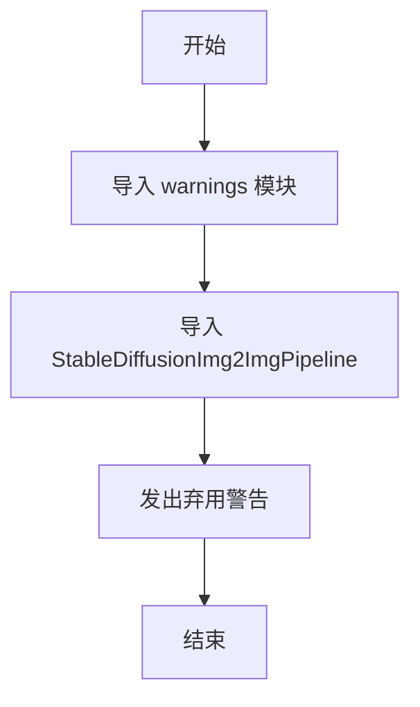
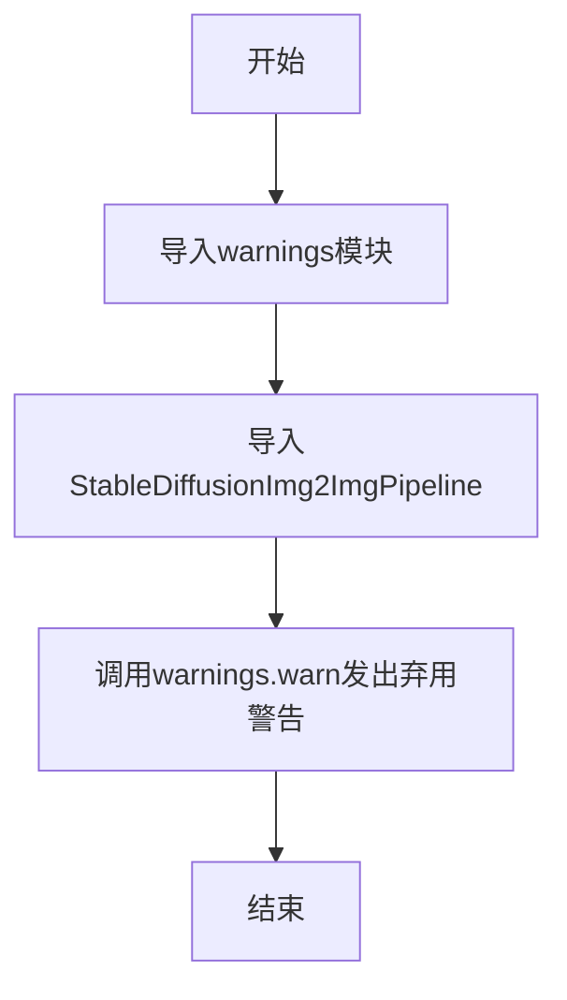

# `diffusers\examples\inference\image_to_image.py` 详细设计文档

这是一个过时的图像到图像（Image-to-Image）脚本，通过发出警告信息提示用户已弃用此脚本，建议直接使用 diffusers 库中的 StableDiffusionImg2ImgPipeline 类。

## 整体流程



## 类结构

```
此脚本为简单模块，无类层次结构
```

## 全局变量及字段


### `warnings`
    
Python内置的警告控制模块，用于发出警告信息

类型：`module`
    


### `StableDiffusionImg2ImgPipeline`
    
Diffusers库中的图像到图像扩散管道类，用于生成图像

类型：`class`
    


    

## 全局函数及方法


## 关键组件


### 1. 一段话描述

该代码是一个已废弃的图像到图像（Image-to-Image）脚本，旨在提醒用户直接使用 `diffusers` 库中的 `StableDiffusionImg2ImgPipeline` 类，而非通过此脚本导入。

### 2. 文件的整体运行流程

该脚本在导入时即触发警告机制，流程极为简单：
1. 导入必要的模块（warnings、StableDiffusionImg2ImgPipeline）
2. 立即发出弃用警告信息，告知用户该脚本已过时

### 3. 类的详细信息

代码中不存在自定义类，仅包含标准库的导入。

### 4. 全局变量和全局函数详细信息

#### 4.1 全局导入

- **名称**: `StableDiffusionImg2ImgPipeline`
- **类型**: 类（from diffusers library）
- **描述**: Stable Diffusion 图像到图像生成的流水线类

- **名称**: `warnings`
- **类型**: 模块（Python标准库）
- **描述**: 用于发出警告信息的标准库模块

#### 4.2 全局函数/方法

- **函数名称**: `warnings.warn`
- **参数名称**: message
- **参数类型**: str
- **参数描述**: 弃用警告信息文本
- **返回值类型**: None
- **返回值描述**: 无返回值，仅输出警告信息到标准错误流

**mermaid 流程图**:


**带注释源码**:
```python
import warnings  # 导入Python标准库的警告模块

from diffusers import StableDiffusionImg2ImgPipeline  # noqa F401
# 从diffusers库导入StableDiffusionImg2ImgPipeline类
# noqa F401 表示忽略F401未使用导入的linting警告

warnings.warn(
    "The `image_to_image.py` script is outdated. Please use directly `from diffusers import"
    " StableDiffusionImg2ImgPipeline` instead."
)
# 调用warnings.warn发出弃用警告
# 告知用户应直接使用 from diffusers import StableDiffusionImg2ImgPipeline
```

### 5. 关键组件信息

- **StableDiffusionImg2ImgPipeline**: Stable Diffusion模型的图像到图像生成流水线，用于将一张图像转换为另一张图像（如图生图、风格迁移等）

- **warnings.warn()**: Python标准库函数，用于向用户发出警告信息，此处用于发出弃用警告（Deprecation Warning）

### 6. 潜在的技术债务或优化空间

- **完全废弃脚本**: 该脚本已标记为过时（outdated），可以考虑完全移除，避免维护负担
- **无实际功能**: 该脚本除了发出警告外不提供任何实际功能，属于"传递脚本"（pass-through script），设计价值有限
- **linting注释**: `# noqa F401` 表明存在未使用导入的代码异味，可通过移除导入或重构消除

### 7. 其它项目

#### 设计目标与约束
- **目标**: 发出弃用警告，引导用户使用新的导入方式
- **约束**: 保持向后兼容，避免直接移除导致现有代码崩溃

#### 错误处理与异常设计
- 本代码不涉及运行时错误处理，仅在模块加载时发出警告
- 无异常抛出机制

#### 数据流与状态机
- 数据流简单：导入 → 警告发出 → 结束
- 不涉及状态机设计

#### 外部依赖与接口契约
- **外部依赖**: `diffusers` 库（需预先安装）
- **接口契约**: 提供 `StableDiffusionImg2ImgPipeline` 类的导入能力


## 问题及建议


### 已知问题

-   **导入未使用的模块**：导入了 `StableDiffusionImg2ImgPipeline` 但未在代码中实际使用，仅用于触发模块加载
-   **过时的遗留代码**：整个脚本已被标记为过时（outdated），但仍保留在代码库中，未被清理
-   **无实际功能**：除了显示警告信息外，该文件不提供任何实际功能
-   **模块级别副作用**：在模块导入时即显示警告，可能影响导入该模块的其他代码
-   **废弃流程不完整**：仅发出警告，未提供任何替代方案或迁移指引

### 优化建议

-   **完全移除该文件**：既然已有更优的替代方案（直接导入），应删除此遗留脚本
-   **清理导入**：如必须保留，至少应移除未使用的导入语句，避免不必要的模块加载开销
-   **添加迁移文档**：若需保留作为迁移指引，应在警告信息中提供新用法的完整示例
-   **考虑完全弃用策略**：若项目有废弃策略，应按照流程进行（如先警告再删除）

## 其它


### 设计目标与约束

本模块的设计目标是通过warnings模块向用户发出弃用警告，告知用户image_to_image.py脚本已过时，应直接使用StableDiffusionImg2ImgPipeline。约束条件是仅显示警告信息，不影响程序正常运行。

### 错误处理与异常设计

本模块不涉及错误处理逻辑，仅使用Python标准库的warnings模块发出DeprecationWarning类型的警告，警告信息为静态字符串常量，不涉及运行时异常。

### 外部依赖与接口契约

本模块依赖两个外部模块：
1. Python标准库warnings模块 - 用于发出弃用警告
2. diffusers库的StableDiffusionImg2ImgPipeline - 被导入但实际未使用，仅用于向用户提示正确的导入路径

接口契约：模块级别导入该文件时会在控制台输出警告信息，无返回值，无函数调用接口。

### 性能考虑

本模块对性能无影响，仅在导入时执行一次警告输出操作，属于轻量级初始化代码。

### 安全性考虑

本模块不涉及安全敏感操作，仅为提示性警告信息，无用户输入处理，无数据传递，安全性风险较低。

### 版本兼容性

本模块使用Python标准库warnings和第三方库diffusers，需要Python 3.7+环境，diffusers库版本需支持StableDiffusionImg2ImgPipeline类。

### 测试策略

由于模块功能简单，可通过以下方式测试：
1. 验证警告信息内容正确性
2. 验证警告类别为DeprecationWarning
3. 验证导入不抛出异常
4. 验证模块可正常被导入

### 配置管理

本模块无配置参数，警告信息为硬编码字符串常量，如需修改警告内容需直接修改源码。


    