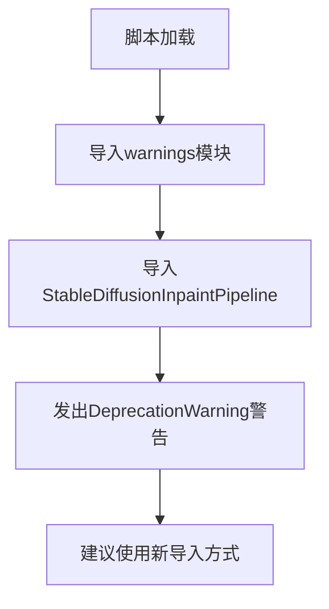
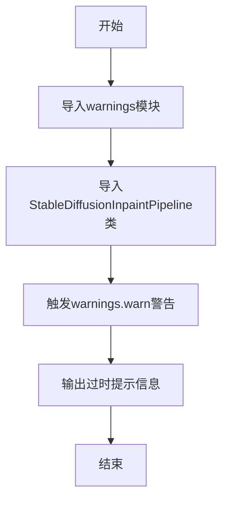

# `diffusers\examples\inference\inpainting.py` 详细设计文档

这是一个兼容性警告脚本，用于通知用户旧的inpainting.py导入方式已过时，并引导用户使用新的直接导入方式from diffusers import StableDiffusionInpaintPipeline。

## 整体流程



## 类结构

```
无类结构 - 这是一个简单的模块级脚本
```

## 全局变量及字段


    

## 全局函数及方法


## 关键组件


### 核心功能概述

该代码是一个弃用兼容性脚本，用于从 `diffusers` 库导入 `StableDiffusionInpaintPipeline` 类，同时通过警告机制提示用户该导入方式已过时，应直接使用 `from diffusers import StableDiffusionInpaintPipeline`。

### 文件运行流程

1. 导入 `warnings` 模块用于显示警告信息
2. 从 `diffusers` 库导入 `StableDiffusionInpaintPipeline` 类（并重命名，实质无变化）
3. 触发 `warnings.warn()` 发出弃用警告消息，告知用户脚本已过时

### 全局变量与函数详细信息

#### 全局变量/常量

| 名称 | 类型 | 描述 |
|------|------|------|
| StableDiffusionInpaintPipeline | class | 从diffusers库导入的图像修复Pipeline类 |

#### 全局函数

| 名称 | 参数 | 参数类型 | 参数描述 | 返回值类型 | 返回值描述 |
|------|------|----------|----------|------------|------------|
| warnings.warn | message, category=UserWarning, stacklevel=2 | message: str, category: Warning, stacklevel: int | 发出弃用警告消息 | None | 无返回值，直接输出警告到stderr |

**Mermaid流程图：**



**带注释源码：**

```python
import warnings  # 导入Python标准库warnings模块，用于发出警告

# 从diffusers库导入StableDiffusionInpaintPipeline类
# 使用别名导入（实质无变化），并标记为 noqa F401 以忽略flake8未使用导入警告
from diffusers import StableDiffusionInpaintPipeline as StableDiffusionInpaintPipeline  # noqa F401

# 发出弃用警告，提示用户使用新的导入方式
# 警告信息指出该脚本已过时，建议用户直接使用 'from diffusers import StableDiffusionInpaintPipeline'
warnings.warn(
    "The `inpainting.py` script is outdated. Please use directly `from diffusers import"
    " StableDiffusionInpaintPipeline` instead."
)
```

### 关键组件信息

| 组件名称 | 描述 |
|----------|------|
| warnings模块 | Python标准库模块，用于发出警告信息 |
| StableDiffusionInpaintPipeline | diffusers库中的图像修复（inpainting）Pipeline类，用于根据掩码对图像进行修复生成 |
| 弃用警告机制 | 通过warnings.warn向用户传达API变更信息 |

### 潜在技术债务与优化空间

1. **可完全移除**：该脚本功能已被 `from diffusers import StableDiffusionInpaintPipeline` 完全替代，随着用户迁移完成，该文件可从项目中移除
2. **无版本检查**：警告信息未包含版本信息，无法让用户知道从哪个版本开始需要使用新的导入方式
3. **缺少迁移路径说明**：警告消息未提供具体的迁移示例代码

### 其它项目

#### 设计目标与约束

- **设计目标**：提供向后兼容性的同时引导用户使用新的导入方式
- **约束**：必须保持导入功能正常工作，以确保依赖此文件的现有代码不立即崩溃

#### 错误处理与异常设计

- 无错误处理逻辑，依赖Python的模块导入机制和warnings模块的默认行为

#### 外部依赖与接口契约

- **外部依赖**：`diffusers` 库（必须安装）
- **接口契约**：导出 `StableDiffusionInpaintPipeline` 类供外部使用


## 问题及建议


### 已知问题

-   过时脚本仍保留在代码库中，可能导致维护负担和混淆
-   每次导入该模块都会显示警告，可能影响用户体验和日志清洁度
-   代码仅作为兼容性桥接使用，无实际功能实现
-   缺少模块级文档字符串（docstring）
-   导入语句中的别名导入（import ... as ...）虽然在代码中使用# noqa F401跳过F401检查，但实际未被使用
-   警告信息硬编码，未使用日志系统而是直接使用warnings.warn

### 优化建议

-   如果不再需要向后兼容，建议完全移除此文件，并发布迁移指南
-   如需保留兼容性桥接，考虑使用Python的__getattr__机制实现延迟警告，或使用DeprecationWarning而非UserWarning
-   添加模块级文档字符串说明此模块的目的和弃用状态
-   考虑使用logging模块替代warnings.warn以提供更灵活的错误级别控制
-   可以添加版本号或目标移除版本信息到警告消息中
-   检查其他模块是否存在类似模式，统一处理弃用模块的方式


## 其它


### 设计目标与约束

本模块的设计目标是为已废弃的`inpainting.py`脚本提供向后兼容性，将用户从旧的导入路径重定向到新的官方API，同时通过警告信息引导用户迁移到新的导入方式。设计约束包括：仅作为兼容层存在，不包含任何实际实现逻辑，不引入新的依赖，保持极简设计以降低维护成本。

### 错误处理与异常设计

本模块不涉及复杂的错误处理机制，主要通过Python标准库的`warnings.warn()`函数发出UserWarning级别的弃用警告。若需要捕获该警告，可使用`warnings.catch_warnings()`上下文管理器。模块本身不会抛出任何自定义异常，所有异常处理依赖上游模块`diffusers`的实现。

### 数据流与状态机

数据流极为简单：模块导入时触发警告输出→尝试从diffusers库导入StableDiffusionInpaintPipeline→导出给下游使用。不存在状态机设计，因为模块为无状态模块，仅包含导入和警告逻辑。

### 外部依赖与接口契约

外部依赖：`warnings`模块（Python标准库）和`diffusers`库中的`StableDiffusionInpaintPipeline`类。接口契约：导出`StableDiffusionInpaintPipeline`类供外部使用，接口与diffusers官方版本保持一致，不添加任何额外的参数或方法。

### 版本兼容性

本模块兼容Python 3.7+版本（warnings模块和import语法通用要求）。与diffusers库的版本兼容性取决于上游库导出的`StableDiffusionInpaintPipeline`类，建议配合diffusers 0.21.0及以上版本使用以确保功能正常。

### 弃用策略与生命周期

该模块已被正式弃用，建议用户迁移至`from diffusers import StableDiffusionInpaintPipeline`的导入方式。计划在未来主要版本（如diffusers 1.0.0）中完全移除此模块，届时将直接删除该文件而非继续发出警告。

### 安全性考虑

本模块不涉及用户数据处理、敏感信息访问或网络通信，安全性风险极低。唯一需要注意的是通过`import *`导入时可能存在的命名空间污染风险，但通过明确导出`StableDiffusionInpaintPipeline`规避了此问题。

### 性能影响

模块本身仅包含导入语句和警告输出，对运行时性能无实质影响。首次导入时会触发警告输出，可能对日志系统产生轻微I/O开销。建议在实际使用前通过配置抑制弃用警告以优化CI/CD流程。

### 测试策略

由于模块功能简单，测试重点应包括：验证警告信息内容正确性、验证类成功导入且可用、验证与旧版本的行为一致性。建议添加单元测试确保警告触发，并可通过mock测试验证导入路径正确性。

### 配置与使用说明

用户无需额外配置。如需抑制弃用警告，可在导入前执行`warnings.filterwarnings("ignore", category=UserWarning, module="inpainting")`或设置环境变量`PYTHONWARNINGS="ignore::UserWarning"`。


    