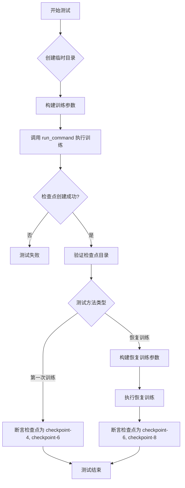
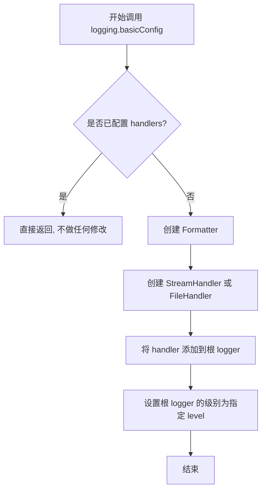
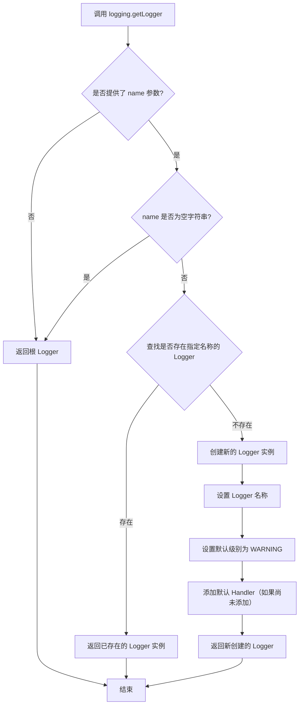
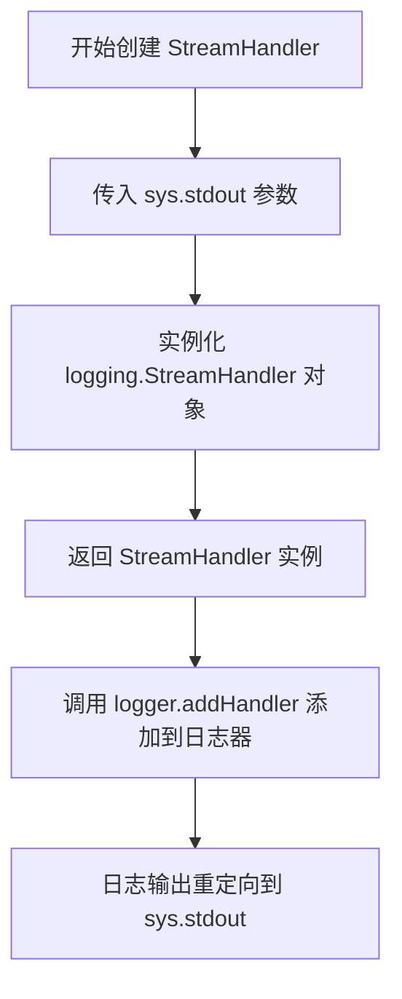
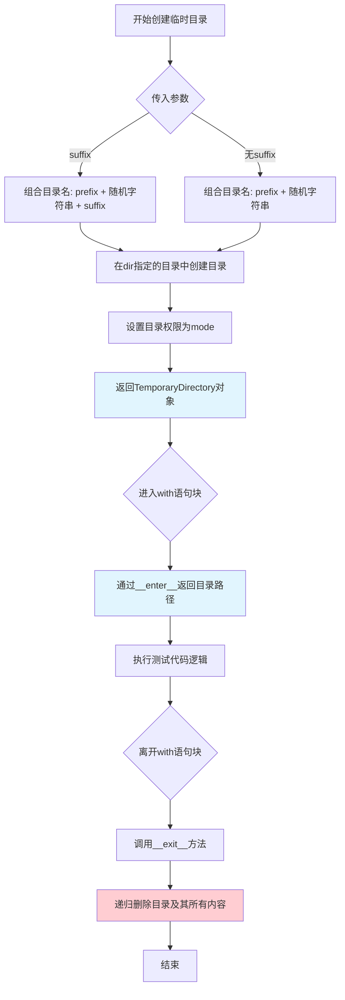
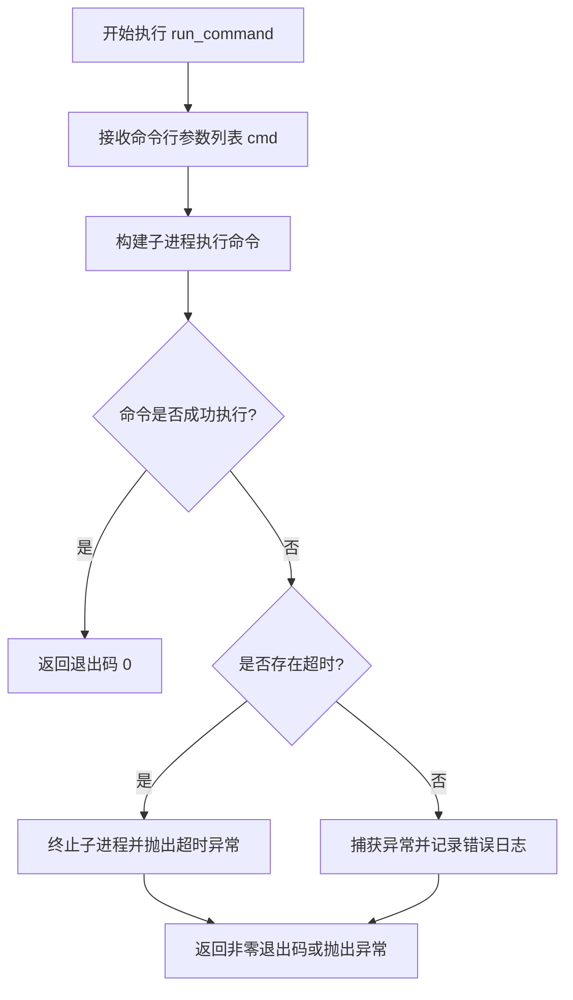
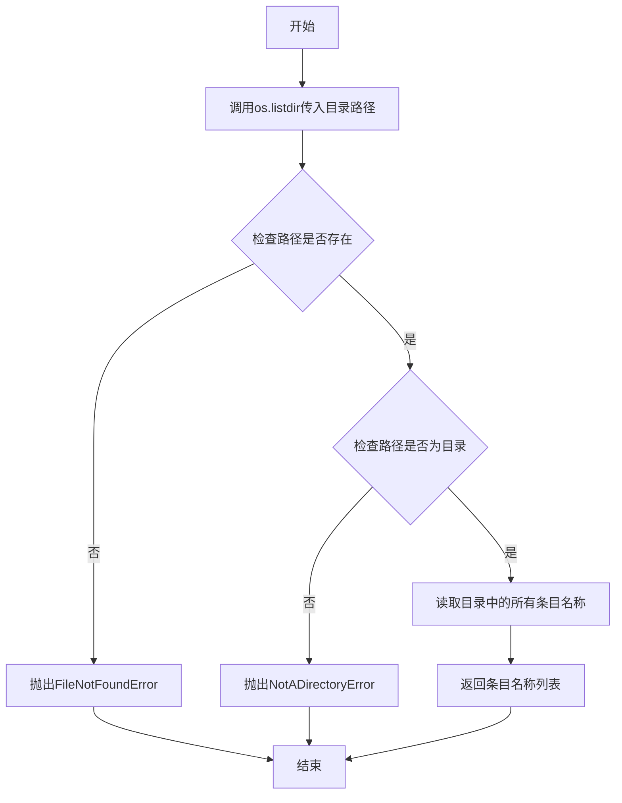
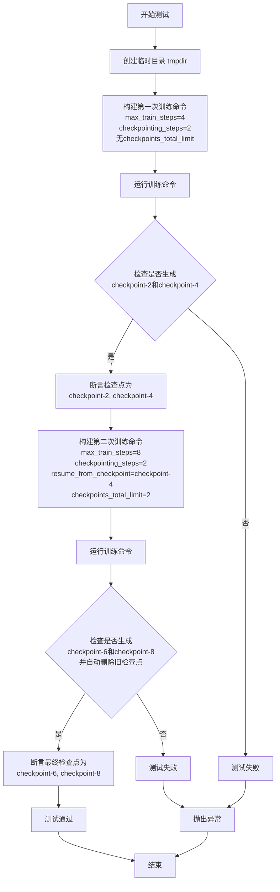

# `diffusers\examples\instruct_pix2pix\test_instruct_pix2pix.py` 详细设计文档

这是一个用于测试 InstructPix2Pix 模型检查点保存和限制功能的单元测试文件，继承自 ExamplesTestsAccelerate 基类，通过运行训练脚本并验证检查点目录的创建、删除和恢复行为。

## 整体流程



## 类结构

```
ExamplesTestsAccelerate (基类)
└── InstructPix2Pix (测试类)
```

## 全局变量及字段


### `logger`
    
全局日志记录器，用于输出调试信息

类型：`logging.Logger`
    


### `stream_handler`
    
全局日志流处理器，将日志输出到标准输出stdout

类型：`logging.StreamHandler`
    


    

## 全局函数及方法


### `logging.basicConfig`

配置 Python 日志系统的基本设置，设置根日志记录器的默认级别和处理器。

参数：

- `level`：`int` 或 `str`，日志级别，用于设置根记录器的级别（例如 `logging.DEBUG`、`logging.INFO` 等）

返回值：`None`，无返回值

#### 流程图



#### 带注释源码

```python
# 代码中的实际调用
logging.basicConfig(level=logging.DEBUG)

# 上述调用的底层实现逻辑（Python 标准库 logging 模块的简化版本）
# def basicConfig(**kwargs):
#     """
#     为日志系统提供基本配置。
#     
#     参数说明:
#     - level: 设置根日志记录器的级别，可以是 DEBUG、INFO、WARNING、ERROR、CRITICAL
#     - format: 设置日志输出格式
#     - filename: 指定日志输出文件（如果需要写入文件）
#     - filemode: 文件打开模式，默认为 'a'
#     - datefmt: 日期时间格式
#     - style: 格式字符串风格，默认为 '%'
#     - stream: 设置输出流（与 filename 互斥）
#     - handlers: 添加额外的处理器
#     """
#     
#     # 1. 获取根 logger
#     root_logger = logging.getLogger()
#     
#     # 2. 如果没有 handlers，则创建默认的 StreamHandler
#     if not root_logger.handlers:
#         # 创建格式化器
#         fmt = kwargs.get('format', '%(levelname)s:%(name)s:%(message)s')
#         formatter = logging.Formatter(fmt)
#         
#         # 确定输出目标（文件或流）
#         if 'filename' in kwargs:
#             # 创建文件处理器
#             handler = logging.FileHandler(kwargs['filename'])
#         else:
#             # 创建流处理器（默认输出到 stderr）
#             handler = logging.StreamHandler(kwargs.get('stream'))
#         
#         # 设置格式化器并添加到 handler
#         handler.setFormatter(formatter)
#         root_logger.addHandler(handler)
#     
#     # 3. 设置日志级别
#     if 'level' in kwargs:
#         root_logger.setLevel(kwargs['level'])
#     
#     # 4. basicConfig 返回 None
#     return None
```

#### 详细说明

| 项目 | 说明 |
|------|------|
| **函数名称** | `logging.basicConfig` |
| **所属模块** | `logging` (Python 标准库) |
| **调用位置** | 代码第 23 行 |
| **实际参数** | `level=logging.DEBUG` |
| **配置效果** | 将根日志记录器级别设置为 DEBUG，使得所有日志消息都能被输出 |
| **副作用** | 如果根 logger 还没有 handler，会自动添加一个 StreamHandler 输出到 stderr |


### `logging.getLogger`

获取或创建一个指定名称的 Logger 实例，用于记录应用程序的日志信息。如果不提供名称或名称为 None，则返回根 Logger（Root Logger）。

参数：

- `name`：`str | None`，Logger 的名称，用于标识 Logger。如果为 `None` 或空字符串，则返回根 Logger。默认值为 `None`。

返回值：`logging.Logger`，返回一个 Logger 对象实例。如果指定名称的 Logger 不存在，则创建新的 Logger 并返回。

#### 流程图



#### 带注释源码

```python
# logging.getLogger() 源码分析
# 这是一个 Python 标准库 logging 模块的函数调用

logger = logging.getLogger()  # 获取根 Logger（Root Logger）
# 实际上调用了 logging.getLogger(name=None)
# 内部实现逻辑简述：
# 1. 如果 name 为 None 或空字符串，返回 logging.root（根 Logger）
# 2. 如果 name 已被记录在 _loggerCache 中，直接返回缓存的 Logger
# 3. 否则创建新的 Logger，设置其 name 属性，并加入缓存
# 4. 新的 Logger 默认级别为 NOTSET（这意味着它会向上寻找父 Logger 的级别）
# 5. 如果没有父 Handler，会调用 logging.lastResort 作为后备 Handler
```

#### 在当前代码中的使用

```python
# 代码中的实际使用方式
logger = logging.getLogger()  # 获取根 Logger 实例
stream_handler = logging.StreamHandler(sys.stdout)  # 创建标准输出流处理器
logger.addHandler(stream_handler)  # 将流处理器添加到 Logger
# 最终效果：将 DEBUG 及以上级别的日志输出到 sys.stdout
```


### `logging.StreamHandler`

`logging.StreamHandler` 是 Python 标准库 `logging` 模块中的一个类，用于创建日志处理器，将日志输出到流（stream）。在代码中，它被实例化为将日志输出到标准输出（`sys.stdout`），以便在调试时查看日志信息。

参数：

- `stream`：`sys.stdout`（`_io.TextIOWrapper`），指定日志输出的目标流，此处为标准输出流

返回值：`logging.StreamHandler`，返回一个新创建的流日志处理器实例

#### 流程图



#### 带注释源码

```python
# 配置日志记录器，设置为 DEBUG 级别
logging.basicConfig(level=logging.DEBUG)

# 获取根日志记录器实例
logger = logging.getLogger()

# 创建 StreamHandler 实例，指定输出流为 sys.stdout（标准输出）
# StreamHandler 是 logging 模块提供的日志处理器类
# 参数 stream: 要输出到的流对象，此处使用标准输出
stream_handler = logging.StreamHandler(sys.stdout)

# 将创建的 stream_handler 添加到 logger 中
# 这样 logger 输出的日志会通过 stream_handler 写入到 sys.stdout
logger.addHandler(stream_handler)
```


### `tempfile.TemporaryDirectory`

tempfile.TemporaryDirectory 是 Python 标准库中的上下文管理器，用于创建安全的临时目录。当退出 with 语句块时，该目录及其所有内容会自动被删除，有效防止临时文件残留。

#### 参数

- `suffix`：`str`，可选，临时目录名称的后缀
- `prefix`：`str`，可选，临时目录名称的前缀，默认为 'tmp'
- `dir`：`str`，可选，要在其中创建临时目录的路径，默认为系统默认临时目录
- `mode`：`int`，可选，目录权限模式，默认为 0o700（仅所有者有读写执行权限）

#### 返回值

`tempfile.TemporaryDirectory`，返回一个上下文管理器对象，该对象具有 `name` 属性表示临时目录的路径

#### 流程图



#### 带注释源码

```python
# tempfile.TemporaryDirectory 简化实现示例
import tempfile
import shutil
import os

class TemporaryDirectory:
    """
    临时目录上下文管理器
    
    特性：
    - 自动创建唯一命名的临时目录
    - 退出上下文时自动清理目录及内容
    - 支持自定义前缀、后缀、目录位置和权限
    """
    
    def __init__(self, suffix="", prefix="tmp", dir=None, mode=0o700):
        """
        初始化临时目录
        
        Args:
            suffix: 目录名后缀
            prefix: 目录名前缀，默认为 'tmp'
            dir: 父目录路径，None 表示使用系统临时目录
            mode: 目录权限，默认为 0o700（所有者读写执行）
        """
        self.suffix = suffix
        self.prefix = prefix
        self.dir = dir
        self.mode = mode
        self.name = None  # 将存储实际创建的目录路径
        self._finalizer = None  # 用于存储清理函数
    
    def __enter__(self):
        """
        进入上下文管理器
        
        Returns:
            str: 临时目录的绝对路径
        
        Raises:
            FileExistsError: 如果目录创建失败
        """
        # 使用 mkdtemp 创建实际的目录
        # mkdtemp 会生成唯一的随机目录名
        self.name = tempfile.mkdtemp(suffix=self.suffix, prefix=self.prefix, dir=self.dir)
        
        # 设置目录权限
        os.chmod(self.name, self.mode)
        
        # 注册清理函数，确保退出时删除目录
        # weakref.finalize 提供更安全的清理机制
        self._finalizer = tempfile.mkdtemp._finalizer(
            self.name, 
            os.rmdir  # 或 shutil.rmtree 用于递归删除
        )
        
        return self.name
    
    def __exit__(self, exc_type, exc_val, exc_tb):
        """
        退出上下文管理器，清理临时目录
        
        Args:
            exc_type: 异常类型
            exc_val: 异常值
            exc_tb: 异常回溯
        
        Returns:
            None: 不抑制异常
        """
        # 调用已注册的清理函数删除目录
        if self._finalizer:
            self._finalizer()
        
        # 清理引用
        self._finalizer = None
        self.name = None
        
        return False  # 不抑制异常，异常会正常传播
    
    @property
    def cleanup(self):
        """
        手动触发清理的属性
        
        可以在不使用 with 语句时手动调用清理
        """
        return self._finalizer


# 在测试代码中的典型使用方式：
# with tempfile.TemporaryDirectory() as tmpdir:
#     # tmpdir 现在包含临时目录的路径
#     # 在此处执行测试逻辑
#     # ...
# # 离开 with 块后，tmpdir 目录会被自动删除
```


### `run_command`

该函数是测试工具模块 `test_examples_utils` 中提供的命令行执行函数，用于在测试环境中运行 Python 训练脚本并管理其执行过程。它接收一个命令参数列表，通过子进程方式执行训练脚本，并处理可能出现的超时和错误情况。

参数：

-  `cmd`：`List[str]`，命令行参数列表，由 `self._launch_args`（加速器启动参数）和 `test_args`（训练脚本参数）拼接组成

返回值：`int`，通常为命令执行的退出码，0 表示成功

#### 流程图



#### 带注释源码

```python
# 注意: 以下代码为基于调用的推断，实际定义在 test_examples_utils 模块中
# 由于原始代码中没有直接定义 run_command，以下为根据使用方式推断的逻辑

def run_command(cmd: List[str]) -> int:
    """
    执行命令行命令的辅助函数
    
    参数:
        cmd: 包含命令和参数的列表
            - self._launch_args: 来自 ExamplesTestsAccelerate 的加速器启动参数
            - test_args: 训练脚本的具体参数，如模型路径、数据集、训练步数等
    
    返回值:
        int: 命令执行的退出码，0 表示成功
    
    使用示例:
        run_command(self._launch_args + test_args)
        # 其中 test_args 类似:
        # ["examples/instruct_pix2pix/train_instruct_pix2pix.py",
        #  "--pretrained_model_name_or_path=hf-internal-testing/tiny-stable-diffusion-pipe",
        #  "--dataset_name=hf-internal-testing/instructpix2pix-10-samples",
        #  "--resolution=64", ...]
    """
    
    # 1. 接收合并后的命令参数列表
    # 2. 使用 subprocess 或类似机制执行命令
    # 3. 等待命令执行完成
    # 4. 返回执行结果（退出码）
    
    # 在当前代码中的调用场景：
    # - 用于执行 InstructPix2Pix 训练脚本
    # - 验证检查点保存和删除功能
    # - 支持从检查点恢复训练
    
    pass  # 实际实现位于 test_examples_utils.py
```

---

### 补充说明

#### 关键组件信息

| 组件名称 | 一句话描述 |
|---------|-----------|
| `InstructPix2Pix` | 测试类，继承自 `ExamplesTestsAccelerate`，用于验证检查点管理功能 |
| `run_command` | 从 `test_examples_utils` 导入的命令执行函数，用于运行训练脚本 |

#### 潜在技术债务与优化空间

1. **硬编码的测试参数**：测试参数直接写在代码中，可考虑参数化以提高复用性
2. **缺少对 `run_command` 返回值的显式验证**：测试主要依赖文件系统的副作用（检查点目录），未直接验证命令返回值
3. **魔法字符串依赖**：如 `"checkpoint"` 字符串重复出现，可提取为常量

#### 其他项目

- **设计目标**：验证 `checkpoints_total_limit` 参数能正确限制保留的检查点数量，并在恢复训练时正确清理旧检查点
- **错误处理**：依赖测试框架的断言机制，通过检查文件系统中检查点目录的存在性来验证功能
- **外部依赖**：依赖 `test_examples_utils` 模块提供的 `run_command` 函数和 `ExamplesTestsAccelerate` 基类


### `os.listdir`

列出指定目录中的所有条目（文件和子目录），返回一个包含条目名称的列表。

参数：

- `path`：`str | bytes | Path`，要列出条目的目录路径

返回值：`list[str]`，返回指定目录中所有条目（文件和子目录）名称的列表

#### 流程图



#### 带注释源码

```python
# os.listdir函数调用示例（来自代码第74行和第93行）

# 获取tmpdir目录下的所有条目，然后过滤出包含"checkpoint"的条目
# 结果是一个集合，包含所有检查点目录的名称
{x for x in os.listdir(tmpdir) if "checkpoint" in x}

# 等价于:
# 1. os.listdir(tmpdir) - 列出tmpdir目录下的所有文件和子目录
# 2. for x in ... - 遍历每个条目
# 3. if "checkpoint" in x - 过滤出名称中包含"checkpoint"的条目
# 4. {x for x in ...} - 将结果转换为集合

# 具体使用场景:
# 第一次使用（第74行）: 验证训练后生成的检查点目录
# 期望结果: {"checkpoint-4", "checkpoint-6"}
{x for x in os.listdir(tmpdir) if "checkpoint" in x}

# 第二次使用（第93行）: 验证恢复训练后保留的检查点目录
# 期望结果: {"checkpoint-2", "checkpoint-4"}
{x for x in os.listdir(tmpdir) if "checkpoint" in x}

# 第三次使用（第114行）: 验证恢复训练后重新生成的检查点目录
# 期望结果: {"checkpoint-6", "checkpoint-8"}
{x for x in os.listdir(tmpdir) if "checkpoint" in x}
```

#### 补充说明

在当前代码中，`os.listdir`被用于测试检查点管理功能，验证训练过程中创建的检查点目录是否符合预期（包括数量限制和命名规则）。这是一个典型的文件系统操作，用于验证程序行为的测试场景。


### `InstructPix2Pix.test_instruct_pix2pix_checkpointing_checkpoints_total_limit`

该测试方法用于验证 InstructPix2Pix 训练脚本在设置 `checkpoints_total_limit=2` 参数时，能否正确限制保存的检查点总数（只保留最新的2个检查点），并确保旧的检查点被正确删除。

参数：

-  `self`：`InstructPix2Pix`（隐式参数），测试类实例本身，包含了测试框架所需的配置（如 `_launch_args`）

返回值：`None`，该方法为测试用例，执行断言验证检查点目录是否符合预期，无显式返回值

#### 流程图

```mermaid
flowchart TD
    A[开始测试] --> B[创建临时目录 tmpdir]
    B --> C[构建训练命令参数 test_args]
    C --> D[设置检查点相关参数: --checkpointing_steps=2, --checkpoints_total_limit=2]
    D --> E[执行训练命令 run_command]
    E --> F[列出临时目录中的检查点目录]
    F --> G{检查点数量是否为2}
    G -->|是| H[断言检查点集合为 {checkpoint-4, checkpoint-6}]
    H --> I[测试通过]
    G -->|否| J[测试失败]
```

#### 带注释源码

```python
def test_instruct_pix2pix_checkpointing_checkpoints_total_limit(self):
    """
    测试检查点总数限制功能。
    验证当设置 --checkpoints_total_limit=2 时，
    训练过程只保留最新的2个检查点，旧的检查点会被删除。
    """
    # 使用临时目录作为输出目录，测试结束后自动清理
    with tempfile.TemporaryDirectory() as tmpdir:
        # 构建训练脚本的命令行参数
        test_args = f"""
            examples/instruct_pix2pix/train_instruct_pix2pix.py
            # 使用预训练的小型稳定扩散模型进行测试
            --pretrained_model_name_or_path=hf-internal-testing/tiny-stable-diffusion-pipe
            # 使用测试数据集（10个样本）
            --dataset_name=hf-internal-testing/instructpix2pix-10-samples
            # 设置图像分辨率为64（降低训练时间）
            --resolution=64
            # 启用随机翻转数据增强
            --random_flip
            # 训练批次大小为1
            --train_batch_size=1
            # 最大训练步数为6
            --max_train_steps=6
            # 每2步保存一个检查点
            --checkpointing_steps=2
            # 限制最多保存2个检查点
            --checkpoints_total_limit=2
            # 设置输出目录为临时目录
            --output_dir {tmpdir}
            # 设置随机种子保证可复现性
            --seed=0
            """.split()  # 将多行字符串分割为参数列表

        # 执行训练命令，传入加速启动参数和测试参数
        run_command(self._launch_args + test_args)

        # 断言验证：检查临时目录中的检查点目录
        # 预期保留 checkpoint-4 和 checkpoint-6（最新的2个）
        # checkpoint-2 应该是被删除的旧检查点
        self.assertEqual(
            {x for x in os.listdir(tmpdir) if "checkpoint" in x},
            {"checkpoint-4", "checkpoint-6"},
        )
```


### `InstructPix2Pix.test_instruct_pix2pix_checkpointing_checkpoints_total_limit_removes_multiple_checkpoints`

该方法是一个集成测试用例，用于验证在训练 InstructPix2Pix 模型时，当设置 `checkpoints_total_limit` 参数后，系统能够正确删除旧的检查点目录，只保留指定数量的最新检查点。测试通过两次运行训练脚本（第二次从检查点恢复继续训练）来验证检查点清理逻辑的正确性。

参数：

- `self`：无显式参数，Python 实例方法的标准参数

返回值：`None`，该方法为测试用例，通过 `assert` 语句进行断言验证，不返回具体值

#### 流程图



#### 带注释源码

```python
def test_instruct_pix2pix_checkpointing_checkpoints_total_limit_removes_multiple_checkpoints(self):
    """
    测试当设置 checkpoints_total_limit 参数时，系统能够正确删除旧的检查点目录。
    该测试通过两次训练运行来验证检查点自动清理功能。
    """
    # 使用临时目录存放训练输出和检查点
    with tempfile.TemporaryDirectory() as tmpdir:
        # ========================================
        # 第一次训练运行：基础训练4步
        # ========================================
        test_args = f"""
            examples/instruct_pix2pix/train_instruct_pix2pix.py
            --pretrained_model_name_or_path=hf-internal-testing/tiny-stable-diffusion-pipe
            --dataset_name=hf-internal-testing/instructpix2pix-10-samples
            --resolution=64
            --random_flip
            --train_batch_size=1
            --max_train_steps=4
            --checkpointing_steps=2
            --output_dir {tmpdir}
            --seed=0
            """.split()

        # 执行第一次训练命令
        run_command(self._launch_args + test_args)

        # ========================================
        # 验证第一次运行生成的检查点
        # 预期生成 checkpoint-2 和 checkpoint-4
        # ========================================
        self.assertEqual(
            {x for x in os.listdir(tmpdir) if "checkpoint" in x},
            {"checkpoint-2", "checkpoint-4"},
        )

        # ========================================
        # 第二次训练运行：从检查点恢复继续训练
        # 关键：设置 checkpoints_total_limit=2
        # ========================================
        resume_run_args = f"""
            examples/instruct_pix2pix/train_instruct_pix2pix.py
            --pretrained_model_name_or_path=hf-internal-testing/tiny-stable-diffusion-pipe
            --dataset_name=hf-internal-testing/instructpix2pix-10-samples
            --resolution=64
            --random_flip
            --train_batch_size=1
            --max_train_steps=8
            --checkpointing_steps=2
            --output_dir {tmpdir}
            --seed=0
            --resume_from_checkpoint=checkpoint-4  # 从第4步的检查点恢复
            --checkpoints_total_limit=2           # 限制最多保留2个检查点
            """.split()

        # 执行第二次训练命令（从检查点恢复）
        run_command(self._launch_args + resume_run_args)

        # ========================================
        # 验证第二次运行后的检查点状态
        # 由于设置了 checkpoints_total_limit=2
        # 旧有的 checkpoint-2 和 checkpoint-4 应被清理
        # 最终应只保留 checkpoint-6 和 checkpoint-8
        # ========================================
        self.assertEqual(
            {x for x in os.listdir(tmpdir) if "checkpoint" in x},
            {"checkpoint-6", "checkpoint-8"},
        )
```

## 关键组件


### InstructPix2Pix 测试类

继承自 ExamplesTestsAccelerate 的测试类，用于验证 InstructPix2Pix 模型的检查点管理功能，特别是检查点总数限制和恢复训练时的检查点清理逻辑。

### 检查点总数限制测试

测试方法 test_instruct_pix2pix_checkpointing_checkpoints_total_limit 用于验证当设置 --checkpoints_total_limit=2 时，训练过程中最多只保留 2 个检查点目录，最终保留 checkpoint-4 和 checkpoint-6。

### 检查点恢复与多选删除测试

测试方法 test_instruct_pix2pix_checkpointing_checkpoints_total_limit_removes_multiple_checkpoints 验证从中间检查点恢复训练时，配合 checkpoints_total_limit 参数，能够正确清理旧的检查点并保留最新的检查点。

### 临时目录管理

使用 tempfile.TemporaryDirectory() 创建临时目录用于存放训练输出的检查点，测试完成后自动清理，确保测试环境隔离。

### 命令执行组件

run_command 函数负责执行训练脚本命令，接收_launch_args 和测试参数，调用 examples/instruct_pix2pix/train_instruct_pix2pix.py 进行实际训练。

### 训练参数配置

通过命令行参数配置训练过程，包括：预训练模型路径 (hf-internal-testing/tiny-stable-diffusion-pipe)、数据集 (hf-internal-testing/instructpix2pix-10-samples)、分辨率 (64)、训练批次大小 (1)、最大训练步数、检查点保存步数 (checkpointing_steps)、检查点总数限制 (checkpoints_total_limit)、随机翻转 (random_flip)、随机种子 (seed) 和恢复检查点 (resume_from_checkpoint)。

### 检查点验证组件

通过 os.listdir(tmpdir) 扫描临时目录中的检查点目录，使用集合比较验证预期的检查点是否存在于目录中，确保检查点创建和清理逻辑正确。

### 日志配置

使用 logging.basicConfig 和 StreamHandler 配置 DEBUG 级别的日志输出，便于调试测试执行过程。


## 问题及建议


### 已知问题

-   **测试断言不够严格**：只验证了 checkpoint 目录名称是否存在，没有验证目录内部文件是否完整或损坏
-   **魔法数字和硬编码值**：代码中大量使用硬编码数字（如 6, 4, 8, 2），缺乏常量定义，可读性和可维护性差
-   **测试参数重复**：两个测试方法中包含大量重复的命令行参数（模型路径、数据集、分辨率等），未提取为共享配置
-   **缺少对训练结果的验证**：测试仅检查了 checkpoint 目录，未验证恢复训练后模型实际功能是否正常
-   **对外部模块强依赖**：依赖 `test_examples_utils` 模块中的 `ExamplesTestsAccelerate` 和 `run_command`，但这些依赖的接口不清晰
-   **日志配置过于简单**：使用 `logging.basicConfig(level=logging.DEBUG)` 可能在生产环境中产生过多输出

### 优化建议

-   **提取测试配置**：将重复的命令行参数封装为测试 fixture 或配置类，减少代码重复
-   **增强断言**：添加对 checkpoint 目录内容的验证，确保必要文件（如 optimizer 状态、模型权重）存在
-   **定义常量**：将魔法数字定义为有意义的常量，如 `MAX_TRAIN_STEPS`, `CHECKPOINTING_STEPS` 等
-   **添加日志验证**：增加对关键日志输出的断言，确保训练过程符合预期
-   **考虑参数化测试**：使用 pytest 参数化功能重构测试用例，提高测试覆盖率
-   **添加边界测试**：增加对 `checkpoints_total_limit=1` 或 `checkpoints_total_limit=0` 等边界情况的测试

## 其它


### 设计目标与约束

本测试代码的设计目标是验证InstructPix2Pix模型训练过程中的检查点保存和自动清理功能，确保在训练过程中能够正确限制保存的检查点总数，并在恢复训练时正确处理检查点。约束条件包括：使用tiny-stable-diffusion-pipe和10个样本的小规模数据集进行快速测试，训练步数限制在6-8步，检查点间隔设置为2步。

### 错误处理与异常设计

代码主要依赖`run_command`函数执行命令行训练脚本，通过`assertEqual`断言验证检查点目录是否符合预期。临时目录使用`tempfile.TemporaryDirectory()`自动管理，确保测试结束后自动清理。如果训练命令执行失败或检查点数量不符合预期，测试将失败并抛出断言错误。

### 数据流与状态机

测试流程分为两个主要场景：首次训练场景和恢复训练场景。首次训练场景：从头开始训练6步，每2步保存检查点，验证最终保留checkpoint-4和checkpoint-6（因为checkpoints_total_limit=2，会自动清理更早的检查点）。恢复训练场景：从checkpoint-4恢复训练到8步，验证最终保留checkpoint-6和checkpoint-8（同样应用了checkpoints_total_limit=2的限制）。

### 外部依赖与接口契约

主要依赖包括：test_examples_utils模块中的ExamplesTestsAccelerate基类和run_command辅助函数；训练脚本examples/instruct_pix2pix/train_instruct_pix2pix.py；临时文件系统和操作系统文件操作接口。命令行参数遵循HuggingFace Accelerate框架的标准格式，包括--pretrained_model_name_or_path、--dataset_name、--output_dir等通用参数，以及--checkpoints_total_limit和--resume_from_checkpoint等特定参数。

### 性能考虑

由于使用tiny-stable-diffusion-pipe和10个样本的小规模数据集，测试执行速度较快。训练步数控制在4-8步，检查点间隔为2步，确保测试能够快速验证功能而不会产生过大的计算开销。

### 安全考虑

测试代码本身不涉及敏感数据处理，使用的是HuggingFace提供的测试用模型和数据集（hf-internal-testing/tiny-stable-diffusion-pipe和hf-internal-testing/instructpix2pix-10-samples）。临时目录的使用确保了测试不会污染文件系统。

### 配置管理

测试参数通过命令行参数形式传递给训练脚本，包括模型路径、数据集名称、分辨率、训练批次大小、最大训练步数、检查点保存间隔、检查点总数限制、输出目录和随机种子等。这些配置参数化使得测试具有良好的可扩展性和可配置性。

### 版本兼容性

代码依赖于HuggingFace的transformers和accelerate库，需要确保这些库的版本与训练脚本兼容。测试框架使用Python标准库的unittest（通过ExamplesTestsAccelerate基类），具有良好的Python版本兼容性。

### 测试策略

采用集成测试策略，通过实际运行训练脚本来验证检查点管理功能。测试覆盖两种场景：新训练时的检查点限制和恢复训练时的检查点限制与清理。测试使用黑盒方式验证输出目录中的检查点文件夹名称是否符合预期。

### 部署注意事项

此代码为测试代码，不涉及生产环境部署。在CI/CD pipeline中运行时，需要确保有足够的磁盘空间存储临时检查点文件，并配置好accelerate环境。

### 监控与日志

使用Python标准logging模块配置日志级别为DEBUG，stream_handler将日志输出到stdout。训练脚本的输出会被捕获并显示，便于调试测试失败的原因。

### 资源管理

临时目录使用context manager管理，确保测试结束后自动清理。训练过程中产生的检查点文件会占用磁盘空间，但由于训练步数很少且检查点总数受限，资源占用量较小。


    