# `diffusers\examples\instruct_pix2pix\train_instruct_pix2pix.py` 详细设计文档

这是一个用于微调 InstructPix2Pix 模型的训练脚本，通过使用原始图像、编辑指令和目标编辑图像的数据集来训练 Stable Diffusion 模型，使其能够根据文本指令对图像进行编辑。

## 整体流程

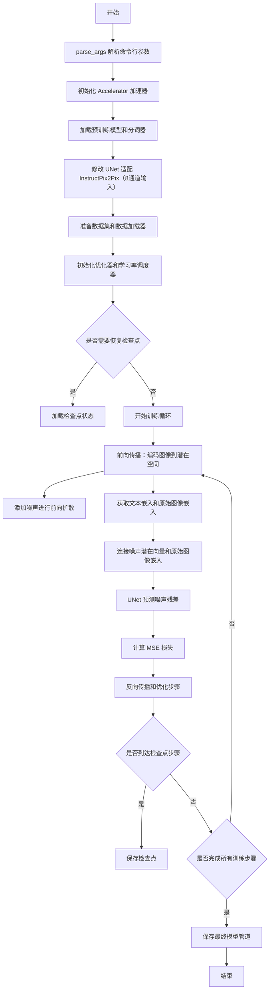

## 类结构

```
无自定义类（主要使用第三方库类）
├── 使用的外部库类:
│   ├── DDPMScheduler (diffusers)
│   ├── CLIPTokenizer (transformers)
│   ├── CLIPTextModel (transformers)
│   ├── AutoencoderKL (diffusers)
│   ├── UNet2DConditionModel (diffusers)
│   ├── StableDiffusionInstructPix2PixPipeline (diffusers)
│   ├── EMAModel (diffusers)
│   └── Accelerator (accelerate)
```

## 全局变量及字段


### `DATASET_NAME_MAPPING`
    
数据集名称到列名的映射字典，用于指定 InstructPix2Pix 数据集中的输入图像、编辑提示和编辑后图像的列名

类型：`Dict[str, Tuple[str, str, str]]`
    


### `WANDB_TABLE_COL_NAMES`
    
WandB 表格的列名列表，包含原始图像、编辑后图像和编辑提示三个列

类型：`List[str]`
    


### `logger`
    
使用 Accelerate 库获取的日志记录器，用于输出训练过程中的信息日志

类型：`logging.Logger`
    


### `args`
    
通过 parse_args() 解析的命令行参数对象，包含模型路径、数据集配置、训练参数等所有可配置选项

类型：`argparse.Namespace`
    


    

## 全局函数及方法


### `log_validation`

该函数用于在微调训练过程中执行验证任务，通过使用训练好的模型生成编辑后的图像，并将结果记录到可视化工具（如 wandb）中，以监控模型在验证集上的表现。

参数：

- `pipeline`：`StableDiffusionInstructPix2PixPipeline`，预训练的 InstructPix2Pix 推理管道，用于执行图像编辑推理
- `args`：命名空间对象，包含训练配置参数，如验证图像数量、验证提示词、验证图像 URL 等
- `accelerator`：`Accelerate` 库中的 Accelerator 对象，用于管理设备、混合精度和跟踪器
- `generator`：`torch.Generator`，用于确保推理过程的可重现性

返回值：`None`，该函数仅执行验证推理和日志记录，不返回任何值

#### 流程图

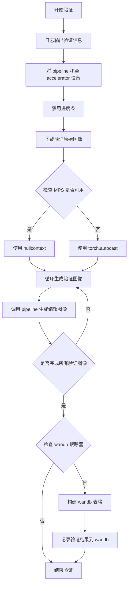

#### 带注释源码

```python
def log_validation(
    pipeline,      # StableDiffusionInstructPix2PixPipeline: 预训练的 InstructPix2Pix 推理管道
    args,          # argparse.Namespace: 包含训练和验证参数的对象
    accelerator,  # Accelerator: HuggingFace Accelerate 库提供的加速器对象
    generator,     # torch.Generator: 用于确保推理可重现性的随机数生成器
):
    """
    在训练过程中运行验证，生成并记录验证图像。
    
    该函数执行以下操作：
    1. 将模型移至指定设备
    2. 下载验证用的原始图像
    3. 使用模型生成多张编辑后的图像
    4. 将结果记录到 wandb（如果可用）
    """
    
    # 输出验证日志信息，包括要生成的图像数量和验证提示词
    logger.info(
        f"Running validation... \n Generating {args.num_validation_images} images with prompt:"
        f" {args.validation_prompt}."
    )
    
    # 将推理管道移至加速器所在的设备（CPU/CUDA/MPS）
    pipeline = pipeline.to(accelerator.device)
    
    # 禁用推理过程中的进度条，减少日志输出
    pipeline.set_progress_bar_config(disable=True)

    # 从 URL 下载验证用的原始图像
    original_image = download_image(args.val_image_url)
    
    # 用于存储生成的编辑图像列表
    edited_images = []
    
    # 根据设备类型选择自动混合精度上下文
    # MPS (Apple Silicon) 使用 nullcontext，CUDA/CPU 使用 autocast
    if torch.backends.mps.is_available():
        autocast_ctx = nullcontext()
    else:
        autocast_ctx = torch.autocast(accelerator.device.type)

    # 在自动混合精度上下文中运行推理
    with autocast_ctx:
        # 循环生成指定数量的验证图像
        for _ in range(args.num_validation_images):
            edited_images.append(
                pipeline(
                    args.validation_prompt,      # 编辑指令提示词
                    image=original_image,         # 要编辑的原始图像
                    num_inference_steps=20,       # 推理步数
                    image_guidance_scale=1.5,     # 图像引导尺度
                    guidance_scale=7,             # 文本引导尺度（CFG）
                    generator=generator,          # 随机生成器确保可重现性
                ).images[0]                       # 取第一张生成的图像
            )

    # 遍历所有跟踪器，查找 wandb 并记录结果
    for tracker in accelerator.trackers:
        if tracker.name == "wandb":
            # 创建 wandb 表格，指定列名
            wandb_table = wandb.Table(columns=WANDB_TABLE_COL_NAMES)
            
            # 将每张编辑后的图像添加到表格中
            for edited_image in edited_images:
                wandb_table.add_data(
                    wandb.Image(original_image),      # 原始图像列
                    wandb.Image(edited_image),        # 编辑后图像列
                    args.validation_prompt            # 编辑提示词列
                )
            
            # 记录验证表格到 wandb
            tracker.log({"validation": wandb_table})
```


### `parse_args`

该函数是训练脚本的入口配置函数，负责初始化命令行参数解析器，定义并添加模型路径、数据集配置、训练超参数、优化器选项、分布式训练设置等数十项配置项，解析命令行传入的参数，进行环境变量兼容性检查（如 `LOCAL_RANK`）和业务逻辑校验（如数据集必填项检查），最终返回一个包含所有配置信息的 `Namespace` 对象供主训练流程使用。

参数：
- （无显式参数，函数内部通过 `sys.argv` 隐式获取命令行输入）

返回值：
- `args`：`argparse.Namespace`，包含所有命令行参数配置的对象（例如 `args.pretrained_model_name_or_path`, `args.train_batch_size` 等），用于后续的模型加载和训练流程控制。

#### 流程图

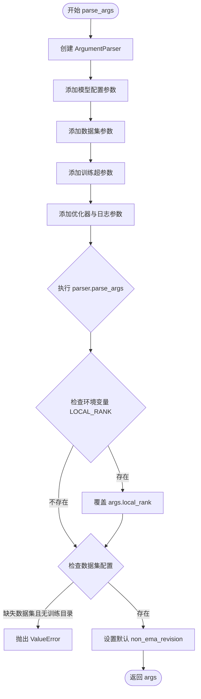

#### 带注释源码

```python
def parse_args():
    # 初始化 ArgumentParser，描述脚本用途
    parser = argparse.ArgumentParser(description="Simple example of a training script for InstructPix2Pix.")
    
    # --- 模型路径与版本配置 ---
    parser.add_argument(
        "--pretrained_model_name_or_path",
        type=str,
        default=None,
        required=True,
        help="Path to pretrained model or model identifier from huggingface.co/models.",
    )
    parser.add_argument(
        "--revision",
        type=str,
        default=None,
        required=False,
        help="Revision of pretrained model identifier from huggingface.co/models.",
    )
    parser.add_argument(
        "--variant",
        type=str,
        default=None,
        help="Variant of the model files of the pretrained model identifier from huggingface.co/models, 'e.g.' fp16",
    )
    
    # --- 数据集配置 ---
    parser.add_argument(
        "--dataset_name",
        type=str,
        default=None,
        help="The name of the Dataset (from the HuggingFace hub) to train on...",
    )
    parser.add_argument(
        "--dataset_config_name",
        type=str,
        default=None,
        help="The config of the Dataset, leave as None if there's only one config.",
    )
    parser.add_argument(
        "--train_data_dir",
        type=str,
        default=None,
        help="A folder containing the training data...",
    )
    parser.add_argument(
        "--original_image_column",
        type=str,
        default="input_image",
        help="The column of the dataset containing the original image...",
    )
    parser.add_argument(
        "--edited_image_column",
        type=str,
        default="edited_image",
        help="The column of the dataset containing the edited image.",
    )
    parser.add_argument(
        "--edit_prompt_column",
        type=str,
        default="edit_prompt",
        help="The column of the dataset containing the edit instruction.",
    )
    
    # --- 验证与输出配置 ---
    parser.add_argument(
        "--val_image_url",
        type=str,
        default=None,
        help="URL to the original image that you would like to edit...",
    )
    parser.add_argument(
        "--validation_prompt", type=str, default=None, help="A prompt that is sampled during training for inference."
    )
    parser.add_argument(
        "--num_validation_images",
        type=int,
        default=4,
        help="Number of images that should be generated during validation...",
    )
    parser.add_argument(
        "--validation_epochs",
        type=int,
        default=1,
        help="Run fine-tuning validation every X epochs.",
    )
    parser.add_argument(
        "--output_dir",
        type=str,
        default="instruct-pix2pix-model",
        help="The output directory where the model predictions and checkpoints will be written.",
    )
    
    # ... (省略其余大量参数定义，如 resolution, train_batch_size, learning_rate 等) ...
    
    # --- 解析命令行参数 ---
    args = parser.parse_args()
    
    # --- 环境变量处理 ---
    # 检查分布式训练环境变量，如果存在则覆盖命令行传入的 local_rank
    env_local_rank = int(os.environ.get("LOCAL_RANK", -1))
    if env_local_rank != -1 and env_local_rank != args.local_rank:
        args.local_rank = env_local_rank

    # --- 业务逻辑校验 (Sanity Checks) ---
    # 必须指定数据集名称或本地训练文件夹
    if args.dataset_name is None and args.train_data_dir is None:
        raise ValueError("Need either a dataset name or a training folder.")

    # 如果未指定 non_ema_revision，则默认使用与主模型相同的 revision
    if args.non_ema_revision is None:
        args.non_ema_revision = args.revision

    # 返回包含所有配置的对象
    return args
```


### `convert_to_np`

该函数用于将 PIL 图像对象转换为 NumPy 数组，并将图像调整为指定的分辨率，同时将数组维度从 HWC 转换为 CHW 格式以适应深度学习模型的输入要求。

参数：

- `image`：`PIL.Image.Image`，输入的 PIL 图像对象
- `resolution`：`int`，目标分辨率，用于将图像调整为 resolution×resolution 的大小

返回值：`np.ndarray`，返回转换后的 NumPy 数组，形状为 (C, H, W)，即通道维度在最前面的数组

#### 流程图

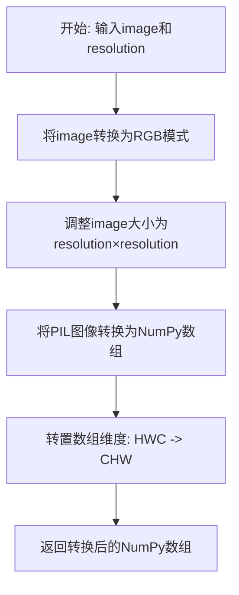

#### 带注释源码

```python
def convert_to_np(image, resolution):
    """
    将 PIL 图像转换为 NumPy 数组
    
    参数:
        image: PIL 图像对象
        resolution: 目标分辨率
        
    返回:
        转换后的 NumPy 数组，形状为 (C, H, W)
    """
    # 步骤1: 确保图像为 RGB 模式（处理 RGBA、灰度等不同模式）
    # 步骤2: 调整图像大小为指定的分辨率
    image = image.convert("RGB").resize((resolution, resolution))
    
    # 步骤3: 将 PIL 图像转换为 NumPy 数组
    # 步骤4: 转置数组维度，从 (H, W, C) 转换为 (C, H, W)
    # 这样可以适配 PyTorch 等深度学习框架的输入格式要求
    return np.array(image).transpose(2, 0, 1)
```


### `download_image`

该函数用于从指定的 URL 下载图片并进行基本的图像处理，包括处理 EXIF 方向信息和将图片转换为 RGB 格式。

参数：

- `url`：`str`，图片的网络 URL 地址

返回值：`PIL.Image.Image`，处理后的 PIL Image 对象

#### 流程图

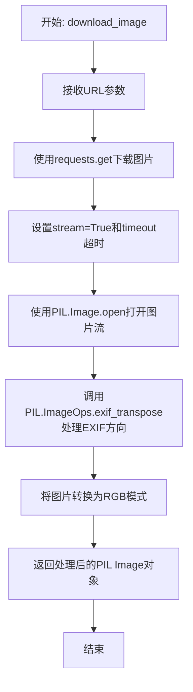

#### 带注释源码

```python
def download_image(url):
    """
    从指定URL下载图片并进行处理
    
    Args:
        url: 图片的网络URL地址
        
    Returns:
        处理后的PIL Image对象 (RGB模式)
    """
    # 使用requests库从URL下载图片，设置stream=True以流式获取
    # timeout参数使用DIFFUSERS_REQUEST_TIMEOUT常量定义请求超时时间
    image = PIL.Image.open(requests.get(url, stream=True, timeout=DIFFUSERS_REQUEST_TIMEOUT).raw)
    
    # 处理图片的EXIF方向信息，确保图片方向正确
    # exif_transpose会自动根据EXIF元数据旋转/翻转图片
    image = PIL.ImageOps.exif_transpose(image)
    
    # 将图片转换为RGB模式，确保输出格式一致
    # 这对于后续处理（如转换为PyTorch张量）是必要的
    image = image.convert("RGB")
    
    # 返回处理后的PIL Image对象
    return image
```


### `main`

这是用于微调Stable Diffusion InstructPix2Pix模型的主训练函数，负责解析命令行参数、初始化分布式训练环境、加载预训练模型和数据集、配置优化器和学习率调度器、执行训练循环（包括前向传播、反向传播、梯度累积、检查点保存和验证）、并在训练完成后保存最终模型管道。

参数：

- 该函数无显式参数，依赖全局函数`parse_args()`通过命令行获取所有配置

返回值：`None`，无返回值

#### 流程图

```mermaid
flowchart TD
    A[开始main函数] --> B[parse_args解析命令行参数]
    B --> C[配置Accelerator分布式训练环境]
    C --> D[设置随机种子set_seed]
    D --> E[创建输出目录]
    E --> F[加载预训练模型: DDPMScheduler, CLIPTokenizer, CLIPTextModel, AutoencoderKL, UNet2DConditionModel]
    F --> G[修改UNet: 增加in_channels从4到8以适应双图像条件]
    G --> H[冻结VAE和TextEncoder参数]
    H --> I{是否启用EMA?}
    I -->|是| J[创建EMAModel]
    I -->|否| K[跳过EMA]
    J --> K
    K --> L{启用xformers?}
    L -->|是| M[启用内存高效注意力]
    L -->|否| N[跳过xformers]
    M --> N
    N --> O[配置梯度检查点]
    O --> P[初始化优化器AdamW]
    P --> Q[加载数据集]
    Q --> R[预处理数据集: 图像转换和tokenization]
    R --> S[创建DataLoader]
    S --> T[创建学习率调度器]
    T --> U[使用accelerator.prepare准备所有组件]
    U --> V[配置混合精度权重类型]
    V --> W[初始化训练 trackers]
    W --> X[训练循环: 遍历每个epoch]
    
    X --> Y[外循环: epoch迭代]
    Y --> Z[内循环: step迭代]
    Z --> AA{是否需要跳过该step?}
    AA -->|是| AB[更新progress_bar并continue]
    AA -->|否| AC[前向传播: encode图像到latent空间]
    AC --> AD[添加噪声到latents]
    AD --> AE[获取text encoder hidden states]
    AF[获取original image embeddings] --> AE
    AE --> AG{启用conditioning_dropout?}
    AG -->|是| AH[应用conditioning dropout掩码]
    AG -->|否| AI[跳过dropout]
    AH --> AI
    AI --> AJ[拼接noisy_latents和original_image_embeds]
    AJ --> AK[计算噪声预测和MSE损失]
    AK --> AL[反向传播loss]
    AL --> AM{是否同步梯度?}
    AM -->|是| AN[梯度裁剪]
    AM -->|否| AO[不裁剪]
    AN --> AO
    AO --> AP[优化器更新参数]
    AP --> AQ[学习率调度器更新]
    AQ --> AR[optimizer.zero_grad]
    AR --> AS{是优化步骤?}
    AS -->|是| AT[更新EMA模型]
    AT --> AU[保存检查点]
    AS -->|否| AV[不保存]
    AT --> AW
    AV --> AW
    AW --> AX{达到max_train_steps?}
    AX -->|是| AY[跳出训练循环]
    AX -->|否| AZ[继续下一个step]
    AZ --> Z
    Z --> AY
    
    AY --> BA{需要验证?}
    BA -->|是| BB[执行validation: log_validation函数]
    BA -->|否| BC[跳过验证]
    BB --> BC
    
    BC --> BD[保存最终模型到output_dir]
    BD --> BE[可选: push到Hub]
    BE --> BF[结束训练]
```

#### 带注释源码

```python
def main():
    """
    主训练函数：用于微调Stable Diffusion InstructPix2Pix模型
    流程：解析参数 -> 初始化环境 -> 加载模型 -> 准备数据 -> 训练循环 -> 保存模型
    """
    # 1. 解析命令行参数
    args = parse_args()
    
    # 2. 安全检查：不允许同时使用wandb和hub_token（安全风险）
    if args.report_to == "wandb" and args.hub_token is not None:
        raise ValueError(
            "You cannot use both --report_to=wandb and --hub_token due to a security risk of exposing your token."
            " Please use `hf auth login` to authenticate with the Hub."
        )

    # 3. 弃用警告：如果使用了non_ema_revision，建议改用variant参数
    if args.non_ema_revision is not None:
        deprecate(
            "non_ema_revision!=None",
            "0.15.0",
            message=(
                "Downloading 'non_ema' weights from revision branches of the Hub is deprecated. Please make sure to"
                " use `--variant=non_ema` instead."
            ),
        )
    
    # 4. 配置Accelerator：分布式训练、混合精度、日志记录
    logging_dir = os.path.join(args.output_dir, args.logging_dir)
    accelerator_project_config = ProjectConfiguration(project_dir=args.output_dir, logging_dir=logging_dir)
    accelerator = Accelerator(
        gradient_accumulation_steps=args.gradient_accumulation_steps,
        mixed_precision=args.mixed_precision,
        log_with=args.report_to,
        project_config=accelerator_project_config,
    )

    # 5. MPS设备特殊处理：禁用原生AMP
    if torch.backends.mps.is_available():
        accelerator.native_amp = False

    # 6. 创建随机数生成器（用于可重复性训练）
    generator = torch.Generator(device=accelerator.device).manual_seed(args.seed)

    # 7. 配置日志系统
    logging.basicConfig(
        format="%(asctime)s - %(levelname)s - %(name)s - %(message)s",
        datefmt="%m/%d/%Y %H:%M:%S",
        level=logging.INFO,
    )
    logger.info(accelerator.state, main_process_only=False)
    # 主进程设置详细日志，其他进程设置错误日志
    if accelerator.is_local_main_process:
        datasets.utils.logging.set_verbosity_warning()
        transformers.utils.logging.set_verbosity_warning()
        diffusers.utils.logging.set_verbosity_info()
    else:
        datasets.utils.logging.set_verbosity_error()
        transformers.utils.logging.set_verbosity_error()
        diffusers.utils.logging.set_verbosity_error()

    # 8. 设置随机种子以确保可重复性
    if args.seed is not None:
        set_seed(args.seed)

    # 9. 创建输出目录（仅主进程）
    if accelerator.is_main_process:
        if args.output_dir is not None:
            os.makedirs(args.output_dir, exist_ok=True)

        # 10. 如果需要push到Hub，创建远程仓库
        if args.push_to_hub:
            repo_id = create_repo(
                repo_id=args.hub_model_id or Path(args.output_dir).name, exist_ok=True, token=args.hub_token
            ).repo_id

    # 11. 加载预训练模型组件
    noise_scheduler = DDPMScheduler.from_pretrained(args.pretrained_model_name_or_path, subfolder="scheduler")
    tokenizer = CLIPTokenizer.from_pretrained(
        args.pretrained_model_name_or_path, subfolder="tokenizer", revision=args.revision
    )
    text_encoder = CLIPTextModel.from_pretrained(
        args.pretrained_model_name_or_path, subfolder="text_encoder", revision=args.revision, variant=args.variant
    )
    vae = AutoencoderKL.from_pretrained(
        args.pretrained_model_name_or_path, subfolder="vae", revision=args.revision, variant=args.variant
    )
    unet = UNet2DConditionModel.from_pretrained(
        args.pretrained_model_name_or_path, subfolder="unet", revision=args.non_ema_revision
    )

    # 12. InstructPix2Pix特殊处理：修改UNet以接受8通道输入（原始图像+编辑图像）
    # 这需要在第一个卷积层添加额外通道，从4通道扩展到8通道
    logger.info("Initializing the InstructPix2Pix UNet from the pretrained UNet.")
    in_channels = 8  # InstructPix2Pix使用8通道（4通道噪声 + 4通道原始图像）
    out_channels = unet.conv_in.out_channels
    unet.register_to_config(in_channels=in_channels)

    # 新卷积层初始化：额外通道设为零，复制原有4通道权重
    with torch.no_grad():
        new_conv_in = nn.Conv2d(
            in_channels, out_channels, unet.conv_in.kernel_size, unet.conv_in.stride, unet.conv_in.padding
        )
        new_conv_in.weight.zero_()
        new_conv_in.weight[:, :4, :, :].copy_(unet.conv_in.weight)  # 复制原有权重
        unet.conv_in = new_conv_in

    # 13. 冻结VAE和TextEncoder（训练时只更新UNet）
    vae.requires_grad_(False)
    text_encoder.requires_grad_(False)

    # 14. 可选：创建EMA模型用于稳定训练
    if args.use_ema:
        ema_unet = EMAModel(unet.parameters(), model_cls=UNet2DConditionModel, model_config=unet.config)

    # 15. 可选：启用xFormers内存高效注意力机制
    if args.enable_xformers_memory_efficient_attention:
        if is_xformers_available():
            import xformers
            # 版本检查警告
            xformers_version = version.parse(xformers.__version__)
            if xformers_version == version.parse("0.0.16"):
                logger.warning(
                    "xFormers 0.0.16 cannot be used for training in some GPUs..."
                )
            unet.enable_xformers_memory_efficient_attention()
        else:
            raise ValueError("xformers is not available.")

    # 16. 定义模型解包辅助函数（处理编译模块）
    def unwrap_model(model):
        model = accelerator.unwrap_model(model)
        model = model._orig_mod if is_compiled_module(model) else model
        return model

    # 17. 配置自定义保存/加载钩子（accelerate 0.16.0+）
    if version.parse(accelerate.__version__) >= version.parse("0.16.0"):
        def save_model_hook(models, weights, output_dir):
            """自定义保存钩子：保存EMA和UNet模型"""
            if accelerator.is_main_process:
                if args.use_ema:
                    ema_unet.save_pretrained(os.path.join(output_dir, "unet_ema"))
                for i, model in enumerate(models):
                    model.save_pretrained(os.path.join(output_dir, "unet"))
                    if weights:
                        weights.pop()

        def load_model_hook(models, input_dir):
            """自定义加载钩子：加载EMA和UNet模型"""
            if args.use_ema:
                load_model = EMAModel.from_pretrained(os.path.join(input_dir, "unet_ema"), UNet2DConditionModel)
                ema_unet.load_state_dict(load_model.state_dict())
                ema_unet.to(accelerator.device)
                del load_model
            for i in range(len(models)):
                model = models.pop()
                load_model = UNet2DConditionModel.from_pretrained(input_dir, subfolder="unet")
                model.register_to_config(**load_model.config)
                model.load_state_dict(load_model.state_dict())
                del load_model

        accelerator.register_save_state_pre_hook(save_model_hook)
        accelerator.register_load_state_pre_hook(load_model_hook)

    # 18. 启用梯度检查点（节省显存）
    if args.gradient_checkpointing:
        unet.enable_gradient_checkpointing()

    # 19. 启用TF32加速（Ampere GPU）
    if args.allow_tf32:
        torch.backends.cuda.matmul.allow_tf32 = True

    # 20. 缩放学习率（根据GPU数量、梯度累积步数、批量大小）
    if args.scale_lr:
        args.learning_rate = (
            args.learning_rate * args.gradient_accumulation_steps * args.train_batch_size * accelerator.num_processes
        )

    # 21. 初始化优化器（可选8-bit Adam）
    if args.use_8bit_adam:
        try:
            import bitsandbytes as bnb
        except ImportError:
            raise ImportError("Please install bitsandbytes to use 8-bit Adam.")
        optimizer_cls = bnb.optim.AdamW8bit
    else:
        optimizer_cls = torch.optim.AdamW

    optimizer = optimizer_cls(
        unet.parameters(),
        lr=args.learning_rate,
        betas=(args.adam_beta1, args.adam_beta2),
        weight_decay=args.adam_weight_decay,
        eps=args.adam_epsilon,
    )

    # 22. 加载数据集（从Hub或本地目录）
    if args.dataset_name is not None:
        dataset = load_dataset(
            args.dataset_name,
            args.dataset_config_name,
            cache_dir=args.cache_dir,
        )
    else:
        data_files = {}
        if args.train_data_dir is not None:
            data_files["train"] = os.path.join(args.train_data_dir, "**")
        dataset = load_dataset(
            "imagefolder",
            data_files=data_files,
            cache_dir=args.cache_dir,
        )

    # 23. 确定数据集列名（支持自定义列名映射）
    column_names = dataset["train"].column_names
    dataset_columns = DATASET_NAME_MAPPING.get(args.dataset_name, None)
    
    # 设置原始图像列名
    if args.original_image_column is None:
        original_image_column = dataset_columns[0] if dataset_columns is not None else column_names[0]
    else:
        original_image_column = args.original_image_column
        if original_image_column not in column_names:
            raise ValueError(f"--original_image_column' value '{args.original_image_column}' needs to be one of: {', '.join(column_names)}")
    
    # 设置编辑提示列名
    if args.edit_prompt_column is None:
        edit_prompt_column = dataset_columns[1] if dataset_columns is not None else column_names[1]
    else:
        edit_prompt_column = args.edit_prompt_column
        if edit_prompt_column not in column_names:
            raise ValueError(f"--edit_prompt_column' value '{args.edit_prompt_column}' needs to be one of: {', '.join(column_names)}")
    
    # 设置编辑后图像列名
    if args.edited_image_column is None:
        edited_image_column = dataset_columns[2] if dataset_columns is not None else column_names[2]
    else:
        edited_image_column = args.edited_image_column
        if edited_image_column not in column_names:
            raise ValueError(f"--edited_image_column' value '{args.edited_image_column}' needs to be one of: {', '.join(column_names)}")

    # 24. 定义预处理函数：tokenize captions
    def tokenize_captions(captions):
        inputs = tokenizer(
            captions, max_length=tokenizer.model_max_length, padding="max_length", truncation=True, return_tensors="pt"
        )
        return inputs.input_ids

    # 25. 定义图像变换：中心裁剪/随机裁剪 + 随机翻转
    train_transforms = transforms.Compose(
        [
            transforms.CenterCrop(args.resolution) if args.center_crop else transforms.RandomCrop(args.resolution),
            transforms.RandomHorizontalFlip() if args.random_flip else transforms.Lambda(lambda x: x),
        ]
    )

    # 26. 图像预处理函数：将PIL图像转换为归一化tensor
    def preprocess_images(examples):
        original_images = np.concatenate(
            [convert_to_np(image, args.resolution) for image in examples[original_image_column]]
        )
        edited_images = np.concatenate(
            [convert_to_np(image, args.resolution) for image in examples[edited_image_column]]
        )
        # 确保原始图像和编辑图像应用相同的增强变换
        images = np.stack([original_images, edited_images])
        images = torch.tensor(images)
        images = 2 * (images / 255) - 1  # 归一化到[-1, 1]
        return train_transforms(images)

    # 27. 完整预处理函数：处理图像和文本
    def preprocess_train(examples):
        preprocessed_images = preprocess_images(examples)
        # 分离原始图像和编辑图像并reshape
        original_images, edited_images = preprocessed_images
        original_images = original_images.reshape(-1, 3, args.resolution, args.resolution)
        edited_images = edited_images.reshape(-1, 3, args.resolution, args.resolution)

        examples["original_pixel_values"] = original_images
        examples["edited_pixel_values"] = edited_images

        # Tokenize编辑指令
        captions = list(examples[edit_prompt_column])
        examples["input_ids"] = tokenize_captions(captions)
        return examples

    # 28. 应用预处理到数据集
    with accelerator.main_process_first():
        if args.max_train_samples is not None:
            dataset["train"] = dataset["train"].shuffle(seed=args.seed).select(range(args.max_train_samples))
        train_dataset = dataset["train"].with_transform(preprocess_train)

    # 29. 自定义collate函数：批量整理数据
    def collate_fn(examples):
        original_pixel_values = torch.stack([example["original_pixel_values"] for example in examples])
        original_pixel_values = original_pixel_values.to(memory_format=torch.contiguous_format).float()
        edited_pixel_values = torch.stack([example["edited_pixel_values"] for example in examples])
        edited_pixel_values = edited_pixel_values.to(memory_format=torch.contiguous_format).float()
        input_ids = torch.stack([example["input_ids"] for example in examples])
        return {
            "original_pixel_values": original_pixel_values,
            "edited_pixel_values": edited_pixel_values,
            "input_ids": input_ids,
        }

    # 30. 创建DataLoader
    train_dataloader = torch.utils.data.DataLoader(
        train_dataset,
        shuffle=True,
        collate_fn=collate_fn,
        batch_size=args.train_batch_size,
        num_workers=args.dataloader_num_workers,
    )

    # 31. 计算训练步数和warmup步数
    num_warmup_steps_for_scheduler = args.lr_warmup_steps * accelerator.num_processes
    if args.max_train_steps is None:
        len_train_dataloader_after_sharding = math.ceil(len(train_dataloader) / accelerator.num_processes)
        num_update_steps_per_epoch = math.ceil(len_train_dataloader_after_sharding / args.gradient_accumulation_steps)
        num_training_steps_for_scheduler = (
            args.num_train_epochs * num_update_steps_per_epoch * accelerator.num_processes
        )
    else:
        num_training_steps_for_scheduler = args.max_train_steps * accelerator.num_processes

    # 32. 创建学习率调度器
    lr_scheduler = get_scheduler(
        args.lr_scheduler,
        optimizer=optimizer,
        num_warmup_steps=num_warmup_steps_for_scheduler,
        num_training_steps=num_training_steps_for_scheduler,
    )

    # 33. 使用accelerator准备所有组件（分布式训练）
    unet, optimizer, train_dataloader, lr_scheduler = accelerator.prepare(
        unet, optimizer, train_dataloader, lr_scheduler
    )

    # 34. 将EMA模型移到设备
    if args.use_ema:
        ema_unet.to(accelerator.device)

    # 35. 设置混合精度权重类型
    weight_dtype = torch.float32
    if accelerator.mixed_precision == "fp16":
        weight_dtype = torch.float16
    elif accelerator.mixed_precision == "bf16":
        weight_dtype = torch.bfloat16

    # 36. 将text_encoder和vae移到设备并转换为目标dtype
    text_encoder.to(accelerator.device, dtype=weight_dtype)
    vae.to(accelerator.device, dtype=weight_dtype)

    # 37. 重新计算训练步数（因为DataLoader大小可能改变）
    num_update_steps_per_epoch = math.ceil(len(train_dataloader) / args.gradient_accumulation_steps)
    if args.max_train_steps is None:
        args.max_train_steps = args.num_train_epochs * num_update_steps_per_epoch
        if num_training_steps_for_scheduler != args.max_train_steps * accelerator.num_processes:
            logger.warning("The length of the 'train_dataloader' does not match...")
    args.num_train_epochs = math.ceil(args.max_train_steps / num_update_steps_per_epoch)

    # 38. 初始化trackers（wandb/tensorboard等）
    if accelerator.is_main_process:
        accelerator.init_trackers("instruct-pix2pix", config=vars(args))

    # 39. 训练前的日志输出
    total_batch_size = args.train_batch_size * accelerator.num_processes * args.gradient_accumulation_steps

    logger.info("***** Running training *****")
    logger.info(f"  Num examples = {len(train_dataset)}")
    logger.info(f"  Num Epochs = {args.num_train_epochs}")
    logger.info(f"  Instantaneous batch size per device = {args.train_batch_size}")
    logger.info(f"  Total train batch size = {total_batch_size}")
    logger.info(f"  Gradient Accumulation steps = {args.gradient_accumulation_steps}")
    logger.info(f"  Total optimization steps = {args.max_train_steps}")

    global_step = 0
    first_epoch = 0

    # 40. 可选：从检查点恢复训练
    if args.resume_from_checkpoint:
        if args.resume_from_checkpoint != "latest":
            path = os.path.basename(args.resume_from_checkpoint)
        else:
            dirs = os.listdir(args.output_dir)
            dirs = [d for d in dirs if d.startswith("checkpoint")]
            dirs = sorted(dirs, key=lambda x: int(x.split("-")[1]))
            path = dirs[-1] if len(dirs) > 0 else None

        if path is None:
            accelerator.print(f"Checkpoint does not exist. Starting new training run.")
            args.resume_from_checkpoint = None
        else:
            accelerator.print(f"Resuming from checkpoint {path}")
            accelerator.load_state(os.path.join(args.output_dir, path))
            global_step = int(path.split("-")[1])

            resume_global_step = global_step * args.gradient_accumulation_steps
            first_epoch = global_step // num_update_steps_per_epoch
            resume_step = resume_global_step % (num_update_steps_per_epoch * args.gradient_accumulation_steps)

    # 41. 创建进度条
    progress_bar = tqdm(range(global_step, args.max_train_steps), disable=not accelerator.is_local_main_process)
    progress_bar.set_description("Steps")

    # 42. 训练循环开始
    for epoch in range(first_epoch, args.num_train_epochs):
        unet.train()
        train_loss = 0.0
        
        for step, batch in enumerate(train_dataloader):
            # 跳过已完成的steps（恢复训练时）
            if args.resume_from_checkpoint and epoch == first_epoch and step < resume_step:
                if step % args.gradient_accumulation_steps == 0:
                    progress_bar.update(1)
                continue

            # 使用accumulate进行梯度累积
            with accelerator.accumulate(unet):
                # 前向传播：将编辑后图像编码到latent空间
                latents = vae.encode(batch["edited_pixel_values"].to(weight_dtype)).latent_dist.sample()
                latents = latents * vae.config.scaling_factor

                # 采样噪声
                noise = torch.randn_like(latents)
                bsz = latents.shape[0]
                # 随机采样timestep
                timesteps = torch.randint(0, noise_scheduler.config.num_train_timesteps, (bsz,), device=latents.device)
                timesteps = timesteps.long()

                # 前向扩散：添加噪声到latents
                noisy_latents = noise_scheduler.add_noise(latents, noise, timesteps)

                # 获取文本嵌入
                encoder_hidden_states = text_encoder(batch["input_ids"])[0]

                # 获取原始图像嵌入（用于条件）
                original_image_embeds = vae.encode(batch["original_pixel_values"].to(weight_dtype)).latent_dist.mode()

                # 条件dropout（支持classifier-free guidance）
                if args.conditioning_dropout_prob is not None:
                    random_p = torch.rand(bsz, device=latents.device, generator=generator)
                    # 提示词掩码
                    prompt_mask = random_p < 2 * args.conditioning_dropout_prob
                    prompt_mask = prompt_mask.reshape(bsz, 1, 1)
                    null_conditioning = text_encoder(tokenize_captions([""]).to(accelerator.device))[0]
                    encoder_hidden_states = torch.where(prompt_mask, null_conditioning, encoder_hidden_states)

                    # 图像掩码
                    image_mask_dtype = original_image_embeds.dtype
                    image_mask = 1 - (
                        (random_p >= args.conditioning_dropout_prob).to(image_mask_dtype)
                        * (random_p < 3 * args.conditioning_dropout_prob).to(image_mask_dtype)
                    )
                    image_mask = image_mask.reshape(bsz, 1, 1, 1)
                    original_image_embeds = image_mask * original_image_embeds

                # 拼接噪声latents和原始图像嵌入
                concatenated_noisy_latents = torch.cat([noisy_latents, original_image_embeds], dim=1)

                # 确定目标（根据预测类型）
                if noise_scheduler.config.prediction_type == "epsilon":
                    target = noise
                elif noise_scheduler.config.prediction_type == "v_prediction":
                    target = noise_scheduler.get_velocity(latents, noise, timesteps)
                else:
                    raise ValueError(f"Unknown prediction type {noise_scheduler.config.prediction_type}")

                # 预测噪声残差并计算损失
                model_pred = unet(concatenated_noisy_latents, timesteps, encoder_hidden_states, return_dict=False)[0]
                loss = F.mse_loss(model_pred.float(), target.float(), reduction="mean")

                # 收集所有进程的损失用于日志
                avg_loss = accelerator.gather(loss.repeat(args.train_batch_size)).mean()
                train_loss += avg_loss.item() / args.gradient_accumulation_steps

                # 反向传播
                accelerator.backward(loss)
                if accelerator.sync_gradients:
                    accelerator.clip_grad_norm_(unet.parameters(), args.max_grad_norm)
                optimizer.step()
                lr_scheduler.step()
                optimizer.zero_grad()

            # 检查是否执行了优化步骤
            if accelerator.sync_gradients:
                if args.use_ema:
                    ema_unet.step(unet.parameters())
                progress_bar.update(1)
                global_step += 1
                accelerator.log({"train_loss": train_loss}, step=global_step)
                train_loss = 0.0

                # 定期保存检查点
                if global_step % args.checkpointing_steps == 0:
                    if accelerator.is_main_process:
                        # 检查是否超过保存限制
                        if args.checkpoints_total_limit is not None:
                            checkpoints = os.listdir(args.output_dir)
                            checkpoints = [d for d in checkpoints if d.startswith("checkpoint")]
                            checkpoints = sorted(checkpoints, key=lambda x: int(x.split("-")[1]))

                            if len(checkpoints) >= args.checkpoints_total_limit:
                                num_to_remove = len(checkpoints) - args.checkpoints_total_limit + 1
                                removing_checkpoints = checkpoints[0:num_to_remove]

                                for removing_checkpoint in removing_checkpoints:
                                    removing_checkpoint = os.path.join(args.output_dir, removing_checkpoint)
                                    shutil.rmtree(removing_checkpoint)

                        save_path = os.path.join(args.output_dir, f"checkpoint-{global_step}")
                        accelerator.save_state(save_path)
                        logger.info(f"Saved state to {save_path}")

            # 更新进度条后缀
            logs = {"step_loss": loss.detach().item(), "lr": lr_scheduler.get_last_lr()[0]}
            progress_bar.set_postfix(**logs)

            if global_step >= args.max_train_steps:
                break

        # 验证阶段（可选）
        if accelerator.is_main_process:
            if (
                (args.val_image_url is not None)
                and (args.validation_prompt is not None)
                and (epoch % args.validation_epochs == 0)
            ):
                if args.use_ema:
                    ema_unet.store(unet.parameters())
                    ema_unet.copy_to(unet.parameters())
                
                pipeline = StableDiffusionInstructPix2PixPipeline.from_pretrained(
                    args.pretrained_model_name_or_path,
                    unet=unwrap_model(unet),
                    text_encoder=unwrap_model(text_encoder),
                    vae=unwrap_model(vae),
                    revision=args.revision,
                    variant=args.variant,
                    torch_dtype=weight_dtype,
                )

                log_validation(pipeline, args, accelerator, generator)

                if args.use_ema:
                    ema_unet.restore(unet.parameters())

                del pipeline
                torch.cuda.empty_cache()

    # 43. 训练完成：保存最终模型
    accelerator.wait_for_everyone()
    if accelerator.is_main_process:
        if args.use_ema:
            ema_unet.copy_to(unet.parameters())

        pipeline = StableDiffusionInstructPix2PixPipeline.from_pretrained(
            args.pretrained_model_name_or_path,
            text_encoder=unwrap_model(text_encoder),
            vae=unwrap_model(vae),
            unet=unwrap_model(unet),
            revision=args.revision,
            variant=args.variant,
        )
        pipeline.save_pretrained(args.output_dir)

        # 可选：推送到Hub
        if args.push_to_hub:
            upload_folder(
                repo_id=repo_id,
                folder_path=args.output_dir,
                commit_message="End of training",
                ignore_patterns=["step_*", "epoch_*"],
            )

        # 最终验证
        if (args.val_image_url is not None) and (args.validation_prompt is not None):
            log_validation(pipeline, args, accelerator, generator)
    
    accelerator.end_training()
```


### `tokenize_captions`

该函数是定义在 `main` 函数内部的局部函数，主要用于将数据集原始的文本描述（字符串列表）转换为模型能够理解的 token ID 序列（PyTorch 张量），并处理填充（padding）和截断（truncation）以保证输入维度一致。

参数：

-  `captions`：`List[str]`，需要被编码的文本描述列表（例如训练数据中的 `edit_prompt`）。

返回值：`torch.Tensor`，包含文本 token IDs 的 PyTorch 张量，形状通常为 `(batch_size, max_length)`。

#### 流程图

```mermaid
graph LR
    A([输入: captions List[str]]) --> B{调用 tokenizer}
    B -->|编码并填充/截断| C[inputs 对象]
    C -->|提取 input_ids| D[torch.Tensor]
    D --> E([返回: token IDs])
```

#### 带注释源码

```python
def tokenize_captions(captions):
    # 使用预加载的 CLIPTokenizer (来自 main 函数的全局变量 tokenizer) 对文本进行编码
    # 参数说明:
    #   captions: 输入的文本列表
    #   max_length: 序列的最大长度，取自 tokenizer 的模型配置
    #   padding: 填充方式，"max_length" 表示填充到指定的最大长度
    #   truncation: 截断策略，True 表示超过最大长度时截断
    #   return_tensors: 返回的张量类型，"pt" 表示返回 PyTorch 张量
    inputs = tokenizer(
        captions, max_length=tokenizer.model_max_length, padding="max_length", truncation=True, return_tensors="pt"
    )
    # 返回编码后的 input_ids 张量，作为模型的输入
    return inputs.input_ids
```


### `preprocess_images`

该函数负责将数据集中的原始图像和编辑图像转换为模型可用的张量格式，并应用统一的数据增强变换。它首先将PIL图像转换为numpy数组并调整到指定分辨率，然后堆叠原始图像和编辑图像以确保它们应用相同的数据增强，最后将像素值归一化到[-1, 1]范围并应用训练转换。

参数：

-  `examples`：`Dict[str, Any]`，包含原始图像和编辑图像的批次数据字典，通过数据集的`with_transform`传递

返回值：`torch.Tensor`，经过数据增强和归一化处理的图像张量，形状为(2, batch_size, 3, resolution, resolution)

#### 流程图

```mermaid
flowchart TD
    A[开始: preprocess_images] --> B[获取原始图像列]
    B --> C[遍历原始图像列表]
    C --> D[convert_to_np转换并调整大小]
    D --> E{所有图像处理完成?}
    E -->|否| C
    E -->|是| F[concatenate合并为numpy数组]
    F --> G[获取编辑图像列]
    G --> H[遍历编辑图像列表]
    H --> I[convert_to_np转换并调整大小]
    I --> J{所有图像处理完成?}
    J -->|否| H
    J -->|是| K[concatenate合并为numpy数组]
    K --> L[stack堆叠原始和编辑图像]
    L --> M[转为torch.Tensor]
    M --> N[像素值归一化: 2*(images/255)-1]
    N --> O[应用train_transforms数据增强]
    O --> P[返回处理后的图像张量]
```

#### 带注释源码

```python
def preprocess_images(examples):
    """
    预处理图像数据，将原始图像和编辑图像转换为模型可用的格式
    
    参数:
        examples: 包含原始图像和编辑图像的数据批次字典
        
    返回:
        经过数据增强和归一化处理的图像张量
    """
    # 从数据批次中提取原始图像列
    # 使用列表推导式将每个PIL图像转换为numpy数组并调整到指定分辨率
    # 然后使用np.concatenate将所有图像合并为一个大的numpy数组
    original_images = np.concatenate(
        [convert_to_np(image, args.resolution) for image in examples[original_image_column]]
    )
    
    # 同样方式处理编辑后的图像
    edited_images = np.concatenate(
        [convert_to_np(image, args.resolution) for image in examples[edited_image_column]]
    )
    
    # 为了确保原始图像和编辑图像应用相同的数据增强变换
    # 将两组图像堆叠在一起（2, batch*channels, height, width）
    # 这样后续的RandomCrop、RandomHorizontalFlip等增强会对两者应用完全相同的变换
    images = np.stack([original_images, edited_images])
    
    # 将numpy数组转换为PyTorch张量
    images = torch.tensor(images)
    
    # 像素值归一化：将[0, 255]范围的像素值转换到[-1, 1]范围
    # 这是Stable Diffusion模型期望的输入格式
    images = 2 * (images / 255) - 1
    
    # 应用训练数据增强变换
    # 这些变换（CenterCrop/RandomCrop + RandomHorizontalFlip）是在数据加载时应用的
    return train_transforms(images)
```


### `preprocess_train`

该函数是训练数据预处理的核心环节，负责将原始图像、编辑后的图像和编辑提示词转换为模型可处理的格式，包括图像归一化、维度变换和文本tokenization。

参数：

- `examples`：`Dict`，包含原始图像列、编辑后图像列和编辑提示列的样本字典

返回值：`Dict`，处理后的样本字典，包含 `original_pixel_values`（原始图像像素值）、`edited_pixel_values`（编辑后图像像素值）和 `input_ids`（tokenized的编辑提示）

#### 流程图

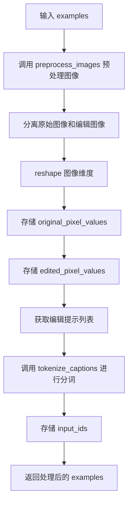

#### 带注释源码

```python
def preprocess_train(examples):
    """
    预处理训练数据样本。
    
    该函数执行以下操作：
    1. 预处理图像（归一化、变换）
    2. 分离原始图像和编辑后图像
    3. 将图像转换为张量并存储
    4. 对编辑提示进行tokenization
    
    参数:
        examples: 包含原始图像、编辑后图像和编辑提示的字典
        
    返回:
        添加了像素值和input_ids的字典
    """
    # 预处理图像：包括转换、归一化和数据增强
    preprocessed_images = preprocess_images(examples)
    
    # 由于原始图像和编辑后图像在应用变换之前被连接在一起，
    # 我们需要将它们分开并相应地重塑
    original_images, edited_images = preprocessed_images
    # 将图像reshape为 (-1, 3, resolution, resolution) 格式
    # 其中3为RGB通道数
    original_images = original_images.reshape(-1, 3, args.resolution, args.resolution)
    edited_images = edited_images.reshape(-1, 3, args.resolution, args.resolution)

    # 将预处理后的图像整理到 examples 中
    examples["original_pixel_values"] = original_images
    examples["edited_pixel_values"] = edited_images

    # 预处理编辑提示文本
    # 从examples中提取编辑提示列并转换为列表
    captions = list(examples[edit_prompt_column])
    # 对captions进行tokenization，转换为模型输入ID
    examples["input_ids"] = tokenize_captions(captions)
    return examples
```


### `collate_fn`

该函数是 PyTorch DataLoader 的回调函数，用于将数据集中的样本批次（batch）整理成模型训练所需的格式。它从每个样本中提取原始图像像素值、编辑后图像像素值和输入ID，将其堆叠成张量，并转换为连续内存格式以提高训练效率。

参数：

- `examples`：`List[Dict]`，`examples` 参数是一个列表，其中每个元素是一个字典，代表数据集中的一个样本。样本字典包含预处理后的图像数据（original_pixel_values、edited_pixel_values）和文本标记（input_ids）。

返回值：`Dict[str, torch.Tensor]`，返回一个字典，包含三个键值对：
- `original_pixel_values`：`torch.Tensor`，原始图像的像素值，形状为 (batch_size, channels, height, width)
- `edited_pixel_values`：`torch.Tensor`，编辑后图像的像素值，形状为 (batch_size, channels, height, width)
- `input_ids`：`torch.Tensor`，文本提示的标记ID，形状为 (batch_size, sequence_length)

#### 流程图

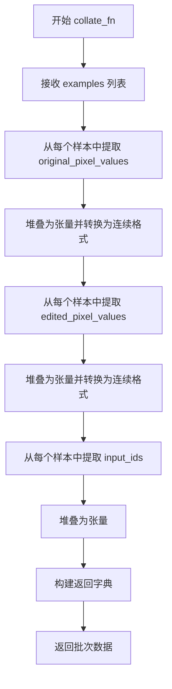

#### 带注释源码

```python
def collate_fn(examples):
    """
    自定义 collate 函数，用于将数据集中的样本整理成训练批次的张量格式。
    
    参数:
        examples: 数据样本列表，每个样本包含预处理后的图像和文本标记
        
    返回:
        包含原始图像、编辑后图像和文本标记的字典
    """
    
    # 从每个样本中提取原始图像的像素值，并堆叠成批处理张量
    # original_pixel_values 来自 preprocess_train 函数，存储原始图像的像素值
    original_pixel_values = torch.stack([example["original_pixel_values"] for example in examples])
    
    # 转换为连续内存格式以提高访问效率，并确保数据类型为 float32
    # torch.contiguous_format 确保张量在内存中是连续存储的
    original_pixel_values = original_pixel_values.to(memory_format=torch.contiguous_format).float()
    
    # 从每个样本中提取编辑后图像的像素值，并堆叠成批处理张量
    # edited_pixel_values 存储经过编辑后的目标图像像素值
    edited_pixel_values = torch.stack([example["edited_pixel_values"] for example in examples])
    
    # 同样转换为连续内存格式并转换为 float32
    edited_pixel_values = edited_pixel_values.to(memory_format=torch.contiguous_format).float()
    
    # 从每个样本中提取文本输入的 token ID，并堆叠成批处理张量
    # input_ids 是经过 tokenizer 处理后的文本标记序列
    input_ids = torch.stack([example["input_ids"] for example in examples])
    
    # 返回整理好的批次数据字典，供模型训练使用
    return {
        "original_pixel_values": original_pixel_values,  # 原始图像张量，形状: (batch_size, 3, 256, 256)
        "edited_pixel_values": edited_pixel_values,      # 编辑后图像张量，形状: (batch_size, 3, 256, 256)
        "input_ids": input_ids,                           # 文本标记张量，形状: (batch_size, max_length)
    }
```


### `unwrap_model`

该函数是定义在 `main()` 函数内部的嵌套函数，用于在分布式训练环境中安全地解包模型，以便获取原始模型对象。它首先通过 `accelerator.unwrap_model()` 移除分布式训练包装，然后处理 PyTorch 编译模块（TorchCompile）的特殊情况，确保返回的是可序列化的原始模型。

参数：

- `model`：`torch.nn.Module`，需要进行解包处理的模型对象，通常是经过 `accelerator.prepare()` 包装后的模型

返回值：`torch.nn.Module`，返回解包后的模型对象，可以是原始模型或编译模块的原始模型

#### 流程图

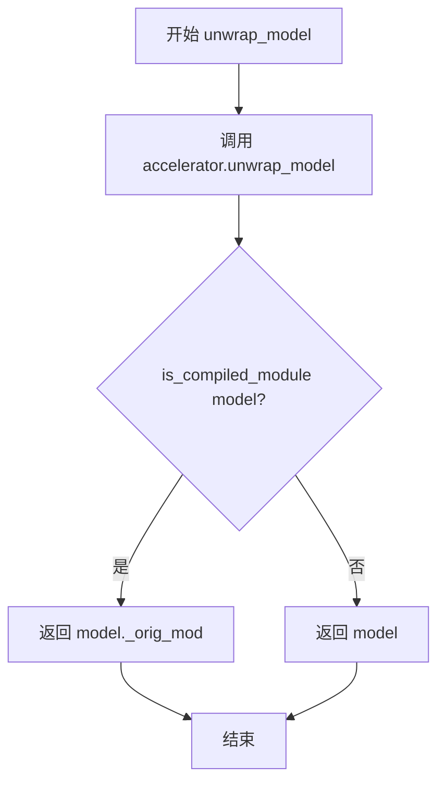

#### 带注释源码

```python
def unwrap_model(model):
    """
    解包模型以获取原始模型对象。
    
    在分布式训练中，模型会被 Accelerator 包装。此函数用于：
    1. 移除 Accelerator 的包装
    2. 处理 TorchCompile 编译的模块（如果使用了 torch.compile）
    
    参数:
        model: 经过 Accelerator 包装的模型
        
    返回:
        原始模型对象，用于保存或推理
    """
    # 第一步：使用 Accelerator 的 unwrap_model 移除分布式训练包装
    # 这会处理 DataParallel/DistributedDataParallel 等包装器
    model = accelerator.unwrap_model(model)
    
    # 第二步：处理 TorchCompile 的特殊情况
    # 如果模型是通过 torch.compile() 编译的，需要获取原始模块
    # is_compiled_module() 检查模型是否是编译模块
    # model._orig_mod 是 PyTorch 编译器存储原始模块的属性
    model = model._orig_mod if is_compiled_module(model) else model
    
    return model
```


### `save_model_hook`

在分布式训练场景中，该函数作为 `Accelerator` 的保存状态前置钩子（`register_save_state_pre_hook`）被调用，用于在保存训练检查点时自动保存 EMA（指数移动平均）模型和 UNet 模型的权重。它确保只有主进程执行保存操作，避免多进程同时写入文件系统导致冲突或数据损坏。

参数：

- `models`：`List[torch.nn.Module]`，需要保存的模型列表，通常包含 UNet 模型
- `weights`：`List[torch.Tensor]` 或 `None`，权重列表，用于跟踪已保存的权重条目，保存后需要弹出以防止重复保存
- `output_dir`：`str`，保存检查点的输出目录路径

返回值：`None`，该函数无返回值，通过修改 `weights` 列表实现副作用

#### 流程图

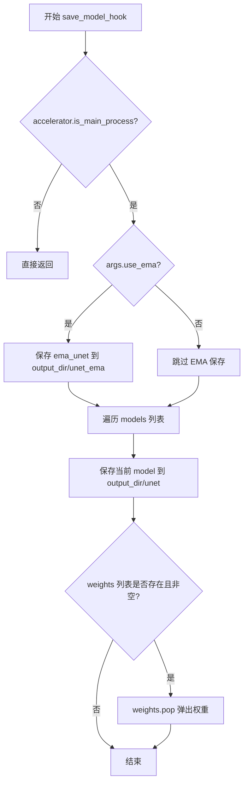

#### 带注释源码

```python
def save_model_hook(models, weights, output_dir):
    """
    保存模型检查点的钩子函数
    在 accelerator.save_state() 时自动调用
    用于保存 EMA 模型（如果启用）和 UNet 模型
    
    参数:
        models: 要保存的模型列表
        weights: 权重列表，用于跟踪已保存的权重
        output_dir: 保存目录
    """
    # 仅在主进程执行保存操作，避免多进程写入冲突
    if accelerator.is_main_process:
        # 如果启用了 EMA，保存 EMA 模型到指定目录
        if args.use_ema:
            ema_unet.save_pretrained(os.path.join(output_dir, "unet_ema"))

        # 遍历所有模型并保存
        for i, model in enumerate(models):
            # 保存模型权重到 output_dir/unet 目录
            model.save_pretrained(os.path.join(output_dir, "unet"))

            # 确保弹出权重，防止模型被重复保存
            # weights 列表会被 accelerator 用于跟踪已保存的模型
            if weights:
                weights.pop()
```


### `load_model_hook`

该函数是 Accelerate 框架的模型加载钩子，用于在恢复训练时加载模型检查点。它负责加载 EMA 模型（如果启用）和 UNet 模型，并将权重加载到对应的模型对象中。

参数：

- `models`：`list`，待加载的模型列表，由 Accelerate 框架传入
- `input_dir`：`str`，检查点目录路径，表示要加载的检查点所在的目录

返回值：`None`，该函数直接修改传入的 `models` 列表，不返回任何值

#### 流程图

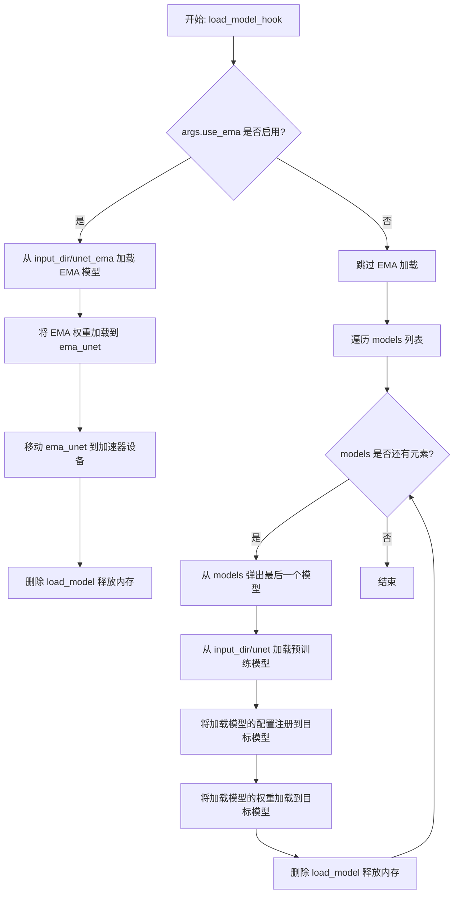

#### 带注释源码

```python
def load_model_hook(models, input_dir):
    """
    加载模型检查点的钩子函数。
    用于在训练恢复时加载 EMA 模型（如果启用）和 UNet 模型的权重。
    
    参数:
        models: 模型列表，由 Accelerate 框架传入
        input_dir: 检查点目录路径
    """
    # 如果启用了 EMA（指数移动平均），则加载 EMA 模型
    if args.use_ema:
        # 从预训练路径加载 EMA 模型的权重
        load_model = EMAModel.from_pretrained(os.path.join(input_dir, "unet_ema"), UNet2DConditionModel)
        
        # 将 EMA 权重加载到 ema_unet 对象中
        ema_unet.load_state_dict(load_model.state_dict())
        
        # 将 EMA 模型移动到加速器设备上
        ema_unet.to(accelerator.device)
        
        # 删除临时加载的模型对象以释放内存
        del load_model

    # 遍历模型列表，加载 UNet 模型权重
    for i in range(len(models)):
        # 弹出模型列表中的最后一个模型（避免重复加载）
        model = models.pop()

        # 从检查点目录加载预训练风格的 UNet 模型
        load_model = UNet2DConditionModel.from_pretrained(input_dir, subfolder="unet")
        
        # 将加载模型的配置注册到目标模型
        model.register_to_config(**load_model.config)

        # 将加载模型的权重加载到目标模型
        model.load_state_dict(load_model.state_dict())
        
        # 删除临时加载的模型对象以释放内存
        del load_model
```

## 关键组件


### 张量索引与惰性加载

该模块负责数据的批量加载和预处理，包括图像的转换、规范化以及数据增强。核心实现包括 `convert_to_np` 用于图像格式转换、`preprocess_images` 用于批量图像预处理、`preprocess_train` 用于训练数据的完整预处理流程，以及 `collate_fn` 用于批次数据的组装。

### 反量化支持

该模块实现了混合精度训练的反量化逻辑，通过 `weight_dtype` 变量动态选择计算精度（fp16/bf16/fp32），并在使用 EMA 时通过 `ema_unet.copy_to()` 和 `ema_unet.restore()` 实现模型参数在完整精度和目标精度之间的切换。

### 量化策略

该模块实现了多种量化相关的优化策略：8-bit Adam 优化器支持（通过 `bitsandbytes` 库）、TF32 计算加速支持、以及 xformers 内存高效注意力机制。

### 条件dropout机制

该模块实现了 InstructPix2Pix 论文中提到的条件dropout技术，通过 `conditioning_dropout_prob` 参数控制文本提示和原始图像条件的随机丢弃，以支持无分类器引导推理。

### UNet模型修改

该模块对预训练的 UNet2DConditionModel 进行了特殊修改，将输入通道从4个扩展到8个，以适应 InstructPix2Pix 的双图像条件输入（原图+编辑图）。

### EMA指数移动平均

该模块使用 `EMAModel` 对 UNet 参数进行指数移动平均，以提高训练稳定性和最终模型性能。

### 图像编码与潜在空间

该模块实现了图像到潜在空间的编码器（VAE），包括对原始图像和编辑后图像的编码，以及对应的 `original_image_embeds` 和 `latents` 处理逻辑。

### 噪声调度与扩散过程

该模块实现了扩散模型的噪声调度器（DDPMScheduler），包括前向扩散过程（`noise_scheduler.add_noise`）和目标噪声计算（支持 epsilon 和 v_prediction 预测类型）。

### 验证与推理管道

该模块包含验证阶段的推理逻辑，包括 `StableDiffusionInstructPix2PixPipeline` 的构建、图像生成参数配置（image_guidance_scale、guidance_scale）以及 wandb 日志记录。

### 检查点管理与恢复

该模块实现了训练检查点的保存、加载和自动管理，包括 `checkpoints_total_limit` 限制和 `resume_from_checkpoint` 恢复功能。


## 问题及建议


### 已知问题

- **EMA 模型精度不匹配**: EMA 模型在 `ema_unet.to(accelerator.device)` 时未转换为 `weight_dtype`（fp16/bf16），导致混合精度训练时内存占用不一致
- **验证图像未缓存**: `download_image` 在每个验证 epoch 都会重新下载验证图像，无本地缓存机制，网络异常会导致训练中断
- **checkpoint 数量限制逻辑不完整**: 当启用 EMA 时，`checkpoints_total_limit` 只计算普通 checkpoint，EMA checkpoint 不计入，可能导致磁盘空间溢出
- **数据预处理内存效率低**: `preprocess_images` 中 `np.concatenate` 和 `torch.tensor` 多次转换数据，可优化为单次操作减少内存拷贝
- **验证图像列表无界增长**: `log_validation` 函数中 `edited_images` 列表持续增长，大规模验证时会占用大量内存
- **恢复训练步骤计算可能出错**: `resume_step` 计算在 `gradient_accumulation_steps` 大于 1 时可能不准确，导致跳过步骤不符合预期
- **MPS 后端禁用 AMP 但未全局通知**: 仅禁用 `accelerator.native_amp`，但未对其他使用 AMP 的组件（如 optimizer）做相应处理

### 优化建议

- 将 EMA 模型转换为 `weight_dtype` 后再移至设备：`ema_unet.to(accelerator.device, dtype=weight_dtype)`
- 添加验证图像本地缓存或使用 PIL.Image.open 本地文件，避免重复网络请求
- 在 checkpoint 限制检查中同时考虑 EMA checkpoint 数量
- 验证完成后显式释放 `edited_images` 列表：`del edited_images; torch.cuda.empty_cache()`
- 将大块代码重构为独立函数（如数据预处理、模型构建、训练循环等），提高可维护性
- 添加图像加载失败时的容错处理（如跳过损坏样本或使用占位图）
- 将硬编码的超参数（如 `num_inference_steps=20`）提取为命令行参数或配置文件
- 考虑使用 `torch.compile` 或 JIT 编译加速推理验证阶段

## 其它


### 设计目标与约束

本脚本的设计目标是实现InstructPix2Pix模型的微调训练，使得预训练的Stable Diffusion模型能够根据文本指令编辑图像。核心约束包括：支持分布式训练（Accelerator）、支持混合精度训练（fp16/bf16）、支持梯度累积以处理大batch、支持EMA模型提升训练稳定性、支持断点续训、支持模型推送至HuggingFace Hub。训练过程需要GPU显存至少16GB（单卡），推荐使用多卡分布式训练以提升效率。

### 错误处理与异常设计

代码中的错误处理主要体现在以下几个方面：
1. 参数校验：`parse_args()`函数中对必要参数进行校验，如`dataset_name`和`train_data_dir`必须提供一个，否则抛出`ValueError`。
2. 依赖检查：使用`check_min_version`检查diffusers最低版本要求；使用`is_xformers_available()`检查xformers是否可用。
3. 导入异常：8-bit Adam优化器`bitsandbytes`未安装时提示安装方法。
4. 废弃警告：使用`deprecate`函数提示`non_ema_revision`参数即将废弃。
5. 异常传播：网络请求超时使用`DIFFUSERS_REQUEST_TIMEOUT`常量控制，图像下载失败会导致训练中断。

### 数据流与状态机

训练数据流如下：
1. 数据加载：从HuggingFace Hub或本地文件夹加载图像数据集
2. 数据预处理：图像resize、center crop/random crop、horizontal flip、归一化到[-1,1]
3. 图像编码：VAE编码器将原始图像和编辑后图像转换为latent空间
4. 噪声调度：DDPMscheduler在前向扩散过程中添加噪声
5. 文本编码：CLIPTokenizer将编辑指令编码为token ids，CLIPTextModel生成文本embedding
6. UNet预测：UNet2DConditionModel基于noisy latents、timesteps和text embedding预测噪声
7. 损失计算：MSE Loss计算预测噪声与真实噪声的差异
8. 反向传播与优化：梯度累积、梯度裁剪、学习率调度、EMA更新

状态机主要体现在训练循环中：
- 初始状态 → 数据加载 → 前向传播 → 损失计算 → 反向传播 → 参数更新 → 检查点保存 → 验证（可选） → 循环或结束
- 断点续训时从checkpoint恢复global_step、epoch、optimizer、lr_scheduler状态

### 外部依赖与接口契约

主要外部依赖包括：
1. `diffusers`：模型加载、训练、推理（StableDiffusionInstructPix2PixPipeline、DDPMScheduler、UNet2DConditionModel、AutoencoderKL、CLIPTextModel、CLIPTokenizer、EMAModel）
2. `accelerate`：分布式训练、混合精度、模型保存/加载钩子
3. `transformers`：CLIP模型、tokenizer
4. `torch`：深度学习框架、神经网络模块
5. `datasets`：数据集加载
6. `huggingface_hub`：模型推送
7. `wandb`/`tensorboard`：训练日志记录（可选）
8. `xformers`：高效注意力机制（可选）

接口契约：
- 输入：预训练模型路径、数据集（支持HuggingFace Hub或本地imagefolder格式）、训练超参数
- 输出：微调后的UNet模型、验证生成的图像（可选）、推送至Hub的模型（可选）
- 模型保存格式：HuggingFace diffusers格式（包含scheduler、text_encoder、vae、unet、model_index.json等文件）
- Checkpoint保存格式：Accelerator格式，包含optimizer、scheduler、random state、epoch/step信息

### 配置文件与参数管理

脚本使用argparse进行命令行参数解析，支持超过50个训练参数。主要参数分类：
1. 模型相关：`--pretrained_model_name_or_path`、`--revision`、`--variant`
2. 数据相关：`--dataset_name`、`--train_data_dir`、图像列名参数
3. 训练相关：`--num_train_epochs`、`--max_train_steps`、`--learning_rate`、`--gradient_accumulation_steps`
4. 优化器相关：`--use_8bit_adam`、`--adam_beta1/2`、`--adam_weight_decay`、`--adam_epsilon`
5. 验证相关：`--val_image_url`、`--validation_prompt`、`--num_validation_images`
6. 保存与推送：`--output_dir`、`--push_to_hub`、`--hub_token`、`--checkpointing_steps`
7. 性能相关：`--mixed_precision`、`--gradient_checkpointing`、`--enable_xformers_memory_efficient_attention`

### 版本兼容性考虑

代码对多个库的版本有兼容性处理：
1. `accelerate` >= 0.16.0：使用新的`register_save_state_pre_hook`和`register_load_state_pre_hook`接口
2. xformers 0.0.16存在已知问题，训练可能出现问题
3. PyTorch TF32支持需要Ampere架构GPU
4. MPS后端需要禁用原生AMP混合精度
5. 不同预测类型（epsilon/v_prediction）的目标噪声计算方式不同

    