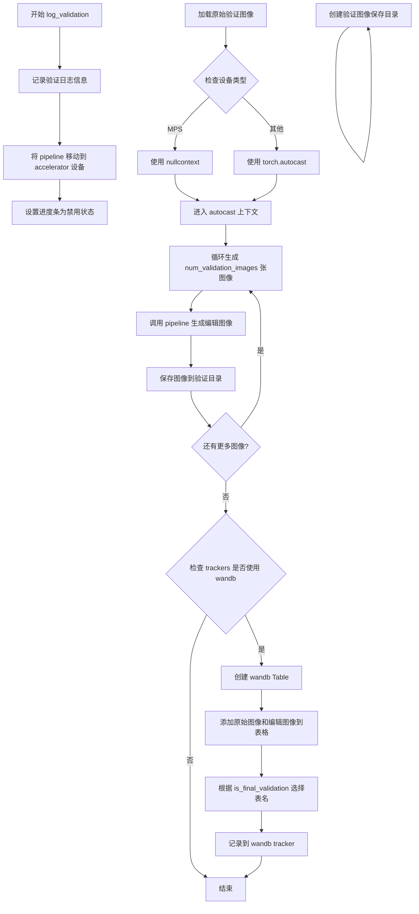
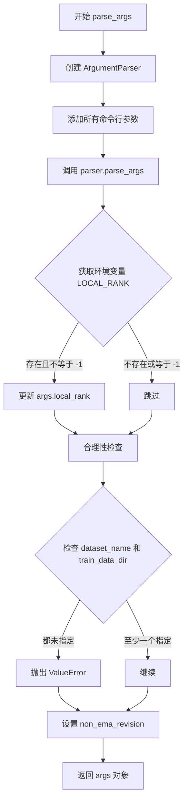

```mermaid
flowchart TD
    A[开始 main] --> B[parse_args 解析命令行参数]
    B --> C[初始化 Accelerator]
    C --> D[加载 VAE 模型]
    D --> E[加载 UNet2DConditionModel]
    E --> F[修改 UNet 适配 InstructPix2Pix<br/>添加8通道输入层]
    F --> G[可选: 初始化 EMA 模型]
    G --> H[可选: 启用 xformers 注意力]
    H --> I[注册模型保存/加载钩子]
    I --> J[启用梯度检查点]
    J --> K[初始化 AdamW 优化器]
    K --> L[加载数据集]
    L --> M[预处理数据集<br/>图像转换和tokenization]
    M --> N[加载 Tokenizer 和 Text Encoder]
    N --> O[创建 DataLoader]
    O --> P[初始化学习率调度器]
    P --> Q[使用 Accelerator 准备模型和优化器]
    Q --> R[初始化训练 trackers]
    R --> S{检查是否从checkpoint恢复}
    S -->|是| T[加载 checkpoint 状态]
    S -->|否| U[初始化训练步骤]
    T --> V[进入训练循环]
    U --> V
    
    V --> W[遍历每个 epoch]
    W --> X[遍历每个 batch]
    X --> Y[VAE 编码图像到 latent 空间]
    Y --> Z[采样噪声并添加到 latents]
    Z --> AA[编码原始图像作为条件]
    AA --> AB[可选: 条件dropout]
    AB --> AC[拼接 noisy_latents 和 original_image_embeds]
    AC --> AD[UNet 预测噪声残差]
    AD --> AE[计算 MSE 损失]
    AE --> AF[反向传播]
    AF --> AG[梯度裁剪和优化器更新]
    AG --> AH{是否同步梯度}
    AH -->|是| AI[更新 EMA 模型]
    AI --> AJ[更新全局步骤]
    AJ --> AK[记录训练日志]
    AK --> AL{是否达到 checkpoint 步骤}
    AL -->|是| AM[保存检查点]
    AL -->|否| AN
    AM --> AO{是否达到验证步骤}
    AN --> AO
    AO -->|是| AP[执行验证生成图像]
    AO -->|否| AQ
    AP --> AQ
    AQ --> AR{是否达到最大训练步骤}
    AR -->|否| X
    AR -->|是| AS[等待所有进程完成]
    
    AS --> AT[最终 EMA 复制到 UNet]
    AT --> AU[创建 Pipeline]
    AU --> AV[保存模型到输出目录]
    AV --> AW{是否 push_to_hub}
    AW -->|是| AX[上传到 HuggingFace Hub]
    AW -->|否| AY
    AX --> AY
    AY --> AZ[执行最终验证]
    AZ --> BA[结束训练]
```

# `diffusers\examples\instruct_pix2pix\train_instruct_pix2pix_sdxl.py` 详细设计文档

这是一个用于训练Stable Diffusion XL (SDXL) InstructPix2Pix模型的脚本。该脚本实现了图像编辑模型的微调训练，通过原始图像和编辑指令（edit prompt）来生成编辑后的图像。模型使用DDPM调度器进行噪声预测训练，支持EMA、梯度检查点、混合精度训练等优化技术，并集成了验证和模型保存功能。

## 整体流程

```mermaid
graph TD
    A[开始] --> B[parse_args 解析命令行参数]
B --> C[初始化 Accelerator 加速器]
C --> D[加载预训练模型: VAE, UNet, TextEncoders]
D --> E[修改 UNet 适配 InstructPix2Pix (8通道输入)]
E --> F[可选: 初始化 EMA 模型]
F --> G[准备数据集和 DataLoader]
G --> H[训练循环开始]
H --> I{遍历每个 batch}
I --> J[编码图像到 latent 空间]
J --> K[添加噪声 (前向扩散)]
K --> L[编码文本提示]
L --> M[计算原始图像 embedding]
M --> N[条件丢失 (可选)]
N --> O[UNet 预测噪声残差]
O --> P[计算 MSE 损失]
P --> Q[反向传播和优化步骤]
Q --> R{检查是否需要验证?}
R -- 是 --> S[执行验证 (log_validation)]
R -- 否 --> T{检查是否需要保存checkpoint?}
S --> T
T -- 是 --> U[保存 checkpoint]
T --> V{训练是否结束?}
V -- 否 --> I
V -- 是 --> W[保存最终模型]
W --> X[结束]
```

## 类结构

```
Global Functions
├── log_validation (验证函数)
├── import_model_class_from_model_name_or_path (模型类导入)
├── parse_args (参数解析)
├── convert_to_np (图像转换)
└── main (主训练函数)
    ├── Nested Functions in main
    │   ├── encode_prompt (编码单个提示)
    │   ├── encode_prompts (编码多个提示)
    │   ├── compute_embeddings_for_prompts (计算提示embeddings)
    │   ├── compute_null_conditioning (计算空条件)
    │   ├── compute_time_ids (计算时间ID)
    │   ├── preprocess_train (预处理训练数据)
    │   ├── collate_fn (批处理整理)
    │   ├── save_model_hook (保存模型钩子)
    │   ├── load_model_hook (加载模型钩子)
    │   └── unwrap_model (解包模型)
```

## 全局变量及字段


### `DATASET_NAME_MAPPING`
    
数据集列名映射，指定特定数据集的原始图像、编辑图像和编辑提示的列名

类型：`dict`
    


### `WANDB_TABLE_COL_NAMES`
    
WandB日志表格的列名，用于记录验证过程中的文件名、编辑后的图像和编辑提示

类型：`list[str]`
    


### `TORCH_DTYPE_MAPPING`
    
torch数据类型映射，将字符串标识符(fp32/fp16/bf16)转换为对应的torch数据类型对象

类型：`dict[str, torch.dtype]`
    


### `logger`
    
日志记录器，用于输出训练过程中的信息和调试日志

类型：`logging.Logger`
    


    

## 全局函数及方法


### `log_validation`

该函数在训练过程中执行验证任务，运行推理生成编辑后的图像，保存到验证目录，并可选地将结果记录到 wandb 跟踪器。

参数：

-  `pipeline`：`StableDiffusionXLInstructPix2PixPipeline`，用于生成图像的 Stable Diffusion XL InstructPix2Pix 推理管道
-  `args`：`argparse.Namespace`，包含所有命令行参数的配置对象（如输出目录、验证图像数量、验证提示词等）
-  `accelerator`：`Accelerator`，HuggingFace Accelerate 加速器对象，用于设备管理和跟踪
-  `generator`：`torch.Generator`，用于可重现随机生成的 PyTorch 随机数生成器
-  `global_step`：`int`，当前训练的全局步数，用于命名验证图像文件
-  `is_final_validation`：`bool`，标记是否为最终验证（训练结束后的验证），影响日志表名

返回值：`None`，无返回值

#### 流程图



#### 带注释源码

```python
def log_validation(pipeline, args, accelerator, generator, global_step, is_final_validation=False):
    """
    运行验证：生成验证图像并记录到跟踪器
    
    参数:
        pipeline: StableDiffusionXLInstructPix2PixPipeline - 推理管道
        args: 命令行参数对象
        accelerator: Accelerate 加速器
        generator: 随机数生成器
        global_step: 当前训练步数
        is_final_validation: 是否为最终验证
    """
    # 记录验证开始信息，包含要生成的图像数量和提示词
    logger.info(
        f"Running validation... \n Generating {args.num_validation_images} images with prompt:"
        f" {args.validation_prompt}."
    )

    # 将管道移动到加速器设备（CPU/GPU）
    pipeline = pipeline.to(accelerator.device)
    # 禁用进度条以减少验证过程中的日志输出
    pipeline.set_progress_bar_config(disable=True)

    # 构建验证图像保存目录路径
    val_save_dir = os.path.join(args.output_dir, "validation_images")
    # 如果目录不存在则创建
    if not os.path.exists(val_save_dir):
        os.makedirs(val_save_dir)

    # 加载原始图像，支持 URL 或本地路径
    # 如果是 URL 使用 load_image，否则使用 PIL 打开并转换为 RGB
    original_image = (
        lambda image_url_or_path: load_image(image_url_or_path)
        if urlparse(image_url_or_path).scheme
        else Image.open(image_url_or_path).convert("RGB")
    )(args.val_image_url_or_path)

    # 根据设备类型选择 autocast 上下文
    # MPS (Apple Silicon) 不支持 autocast，使用 nullcontext
    if torch.backends.mps.is_available():
        autocast_ctx = nullcontext()
    else:
        # 对其他设备使用标准的 autocast
        autocast_ctx = torch.autocast(accelerator.device.type)

    # 在 autocast 上下文中运行推理
    with autocast_ctx:
        edited_images = []
        # 运行推理循环，生成指定数量的验证图像
        for val_img_idx in range(args.num_validation_images):
            # 调用 pipeline 生成编辑后的图像
            a_val_img = pipeline(
                args.validation_prompt,      # 验证提示词
                image=original_image,        # 原始图像
                num_inference_steps=20,      # 推理步数
                image_guidance_scale=1.5,    # 图像引导强度
                guidance_scale=7,            # 文本引导强度
                generator=generator,         # 随机生成器
            ).images[0]
            # 将生成的图像添加到列表
            edited_images.append(a_val_img)
            # 保存验证图像，文件名包含步数和索引
            a_val_img.save(os.path.join(val_save_dir, f"step_{global_step}_val_img_{val_img_idx}.png"))

    # 遍历所有 tracker，检查是否使用 wandb
    for tracker in accelerator.trackers:
        if tracker.name == "wandb":
            # 创建 wandb 表格用于记录
            wandb_table = wandb.Table(columns=WANDB_TABLE_COL_NAMES)
            # 添加原始图像和编辑图像到表格
            for edited_image in edited_images:
                wandb_table.add_data(wandb.Image(original_image), wandb.Image(edited_image), args.validation_prompt)
            # 根据是否为最终验证选择表名
            logger_name = "test" if is_final_validation else "validation"
            # 记录到 wandb
            tracker.log({logger_name: wandb_table})
```


### `import_model_class_from_model_name_or_path`

该函数用于从预训练模型路径动态导入文本编码器（Text Encoder）类。它通过读取预训练模型的配置文件获取模型架构信息，根据架构类型返回对应的 transformers 库中的文本编码器类（CLIPTextModel 或 CLIPTextModelWithProjection），从而支持不同类型文本编码器的灵活加载。

参数：

- `pretrained_model_name_or_path`：`str`，预训练模型的名称（如 "stabilityai/stable-diffusion-xl-base-1.0"）或本地模型路径
- `revision`：`str`，预训练模型的 Git 版本标识符，用于指定从哪个分支或标签加载模型
- `subfolder`：`str`，模型子文件夹路径，默认为 `"text_encoder"`，用于定位配置文件

返回值：`type`，返回对应的文本编码器类（`CLIPTextModel` 或 `CLIPTextModelWithProjection`），如果不支持则抛出 `ValueError` 异常

#### 流程图

```mermaid
flowchart TD
    A[开始] --> B[加载 PretrainedConfig]
    B --> C[从配置中获取 architectures[0]]
    D{Check model_class} -->|CLIPTextModel| E[导入 CLIPTextModel]
    D -->|CLIPTextModelWithProjection| F[导入 CLIPTextModelWithProjection]
    D -->|其他| G[抛出 ValueError]
    E --> H[返回 CLIPTextModel 类]
    F --> I[返回 CLIPTextModelWithProjection 类]
```

#### 带注释源码

```python
def import_model_class_from_model_name_or_path(
    pretrained_model_name_or_path: str, revision: str, subfolder: str = "text_encoder"
):
    """
    从预训练模型导入文本编码器类
    
    Args:
        pretrained_model_name_or_path: 预训练模型名称或路径
        revision: Git版本标识符
        subfolder: 模型子文件夹路径，默认为"text_encoder"
    
    Returns:
        文本编码器类 (CLIPTextModel 或 CLIPTextModelWithProjection)
    """
    # 使用 HuggingFace PretrainedConfig 从预训练模型加载配置文件
    text_encoder_config = PretrainedConfig.from_pretrained(
        pretrained_model_name_or_path, 
        subfolder=subfolder, 
        revision=revision
    )
    # 从配置中获取模型架构名称（第一个架构）
    model_class = text_encoder_config.architectures[0]

    # 根据模型架构类型返回对应的类
    if model_class == "CLIPTextModel":
        # 导入 transformers 库中的 CLIPTextModel 类
        from transformers import CLIPTextModel

        return CLIPTextModel
    elif model_class == "CLIPTextModelWithProjection":
        # 导入 transformers 库中的 CLIPTextModelWithProjection 类
        from transformers import CLIPTextModelWithProjection

        return CLIPTextModelWithProjection
    else:
        # 如果遇到不支持的模型架构，抛出异常
        raise ValueError(f"{model_class} is not supported.")
```


### `parse_args`

该函数是命令行参数解析器，使用Python的`argparse`模块解析训练Stable Diffusion XL for InstructPix2Pix模型所需的所有命令行参数，并对环境变量进行兼容性处理和基础合理性检查，最终返回一个包含所有配置参数的`Namespace`对象。

参数：该函数不接受任何外部参数，它通过`argparse.ArgumentParser`内部定义命令行参数。

返回值：`args`（类型：`argparse.Namespace`），包含所有解析后的命令行参数对象。

#### 流程图



#### 带注释源码

```python
def parse_args():
    """
    解析命令行参数，返回包含所有训练配置的参数对象。
    
    该函数定义了大量用于训练 Stable Diffusion XL InstructPix2Pix 模型的参数，
    包括模型路径、数据集配置、训练超参数、优化器设置、验证选项等。
    """
    # 创建 ArgumentParser 实例，设置脚本描述
    parser = argparse.ArgumentParser(description="Script to train Stable Diffusion XL for InstructPix2Pix.")
    
    # ==================== 模型相关参数 ====================
    parser.add_argument(
        "--pretrained_model_name_or_path",
        type=str,
        default=None,
        required=True,
        help="Path to pretrained model or model identifier from huggingface.co/models.",
    )
    parser.add_argument(
        "--pretrained_vae_model_name_or_path",
        type=str,
        default=None,
        help="Path to an improved VAE to stabilize training.",
    )
    parser.add_argument(
        "--vae_precision",
        type=str,
        choices=["fp32", "fp16", "bf16"],
        default="fp32",
        help="VAE 精度选择，用于稳定训练",
    )
    parser.add_argument(
        "--revision",
        type=str,
        default=None,
        required=False,
        help="Revision of pretrained model identifier from huggingface.co/models.",
    )
    parser.add_argument(
        "--variant",
        type=str,
        default=None,
        help="Variant of the model files of the pretrained model identifier.",
    )
    
    # ==================== 数据集相关参数 ====================
    parser.add_argument(
        "--dataset_name",
        type=str,
        default=None,
        help="The name of the Dataset (from the HuggingFace hub) to train on.",
    )
    parser.add_argument(
        "--dataset_config_name",
        type=str,
        default=None,
        help="The config of the Dataset, leave as None if there's only one config.",
    )
    parser.add_argument(
        "--train_data_dir",
        type=str,
        default=None,
        help="A folder containing the training data.",
    )
    parser.add_argument(
        "--original_image_column",
        type=str,
        default="input_image",
        help="The column of the dataset containing the original image.",
    )
    parser.add_argument(
        "--edited_image_column",
        type=str,
        default="edited_image",
        help="The column of the dataset containing the edited image.",
    )
    parser.add_argument(
        "--edit_prompt_column",
        type=str,
        default="edit_prompt",
        help="The column of the dataset containing the edit instruction.",
    )
    
    # ==================== 验证相关参数 ====================
    parser.add_argument(
        "--val_image_url_or_path",
        type=str,
        default=None,
        help="URL to the original image that you would like to edit.",
    )
    parser.add_argument(
        "--validation_prompt", type=str, default=None, help="A prompt that is sampled during training for inference."
    )
    parser.add_argument(
        "--num_validation_images",
        type=int,
        default=4,
        help="Number of images that should be generated during validation.",
    )
    parser.add_argument(
        "--validation_steps",
        type=int,
        default=100,
        help="Run fine-tuning validation every X steps.",
    )
    
    # ==================== 训练输出和调试参数 ====================
    parser.add_argument(
        "--max_train_samples",
        type=int,
        default=None,
        help="For debugging purposes or quicker training, truncate the number of training examples.",
    )
    parser.add_argument(
        "--output_dir",
        type=str,
        default="instruct-pix2pix-model",
        help="The output directory where the model predictions and checkpoints will be written.",
    )
    parser.add_argument(
        "--cache_dir",
        type=str,
        default=None,
        help="The directory where the downloaded models and datasets will be stored.",
    )
    parser.add_argument("--seed", type=int, default=None, help="A seed for reproducible training.")
    
    # ==================== 图像预处理参数 ====================
    parser.add_argument(
        "--resolution",
        type=int,
        default=256,
        help="The resolution for input images.",
    )
    parser.add_argument(
        "--crops_coords_top_left_h",
        type=int,
        default=0,
        help="Coordinate for (the height) to be included in the crop coordinate embeddings needed by SDXL UNet.",
    )
    parser.add_argument(
        "--crops_coords_top_left_w",
        type=int,
        default=0,
        help="Coordinate for (the height) to be included in the crop coordinate embeddings needed by SDXL UNet.",
    )
    parser.add_argument(
        "--center_crop",
        default=False,
        action="store_true",
        help="Whether to center crop the input images to the resolution.",
    )
    parser.add_argument(
        "--random_flip",
        action="store_true",
        help="whether to randomly flip images horizontally",
    )
    
    # ==================== 训练超参数 ====================
    parser.add_argument(
        "--train_batch_size", type=int, default=16, help="Batch size (per device) for the training dataloader."
    )
    parser.add_argument("--num_train_epochs", type=int, default=100)
    parser.add_argument(
        "--max_train_steps",
        type=int,
        default=None,
        help="Total number of training steps to perform. If provided, overrides num_train_epochs.",
    )
    parser.add_argument(
        "--gradient_accumulation_steps",
        type=int,
        default=1,
        help="Number of updates steps to accumulate before performing a backward/update pass.",
    )
    parser.add_argument(
        "--gradient_checkpointing",
        action="store_true",
        help="Whether or not to use gradient checkpointing to save memory.",
    )
    parser.add_argument(
        "--learning_rate",
        type=float,
        default=1e-4,
        help="Initial learning rate (after the potential warmup period) to use.",
    )
    parser.add_argument(
        "--scale_lr",
        action="store_true",
        default=False,
        help="Scale the learning rate by the number of GPUs, gradient accumulation steps, and batch size.",
    )
    parser.add_argument(
        "--lr_scheduler",
        type=str,
        default="constant",
        help='The scheduler type to use. Choose between ["linear", "cosine", "cosine_with_restarts", "polynomial", "constant", "constant_with_warmup"].',
    )
    parser.add_argument(
        "--lr_warmup_steps", type=int, default=500, help="Number of steps for the warmup in the lr scheduler."
    )
    parser.add_argument(
        "--conditioning_dropout_prob",
        type=float,
        default=None,
        help="Conditioning dropout probability. See section 3.2.1 in the paper: https://huggingface.co/papers/2211.09800.",
    )
    
    # ==================== 优化器参数 ====================
    parser.add_argument(
        "--use_8bit_adam", action="store_true", help="Whether or not to use 8-bit Adam from bitsandbytes."
    )
    parser.add_argument(
        "--allow_tf32",
        action="store_true",
        help="Whether or not to allow TF32 on Ampere GPUs. Can be used to speed up training.",
    )
    parser.add_argument("--use_ema", action="store_true", help="Whether to use EMA model.")
    parser.add_argument(
        "--non_ema_revision",
        type=str,
        default=None,
        required=False,
        help="Revision of pretrained non-ema model identifier.",
    )
    parser.add_argument(
        "--dataloader_num_workers",
        type=int,
        default=0,
        help="Number of subprocesses to use for data loading.",
    )
    parser.add_argument("--adam_beta1", type=float, default=0.9, help="The beta1 parameter for the Adam optimizer.")
    parser.add_argument("--adam_beta2", type=float, default=0.999, help="The beta2 parameter for the Adam optimizer.")
    parser.add_argument("--adam_weight_decay", type=float, default=1e-2, help="Weight decay to use.")
    parser.add_argument("--adam_epsilon", type=float, default=1e-08, help="Epsilon value for the Adam optimizer")
    parser.add_argument("--max_grad_norm", default=1.0, type=float, help="Max gradient norm.")
    
    # ==================== Hub 和日志相关参数 ====================
    parser.add_argument("--push_to_hub", action="store_true", help="Whether or not to push the model to the Hub.")
    parser.add_argument("--hub_token", type=str, default=None, help="The token to use to push to the Model Hub.")
    parser.add_argument(
        "--hub_model_id",
        type=str,
        default=None,
        help="The name of the repository to keep in sync with the local `output_dir`.",
    )
    parser.add_argument(
        "--logging_dir",
        type=str,
        default="logs",
        help="[TensorBoard] log directory.",
    )
    parser.add_argument(
        "--mixed_precision",
        type=str,
        default=None,
        choices=["no", "fp16", "bf16"],
        help="Whether to use mixed precision.",
    )
    parser.add_argument(
        "--report_to",
        type=str,
        default="tensorboard",
        help='The integration to report the results and logs to. Supported platforms are "tensorboard", "wandb" and "comet_ml".',
    )
    parser.add_argument("--local_rank", type=int, default=-1, help="For distributed training: local_rank")
    
    # ==================== 检查点相关参数 ====================
    parser.add_argument(
        "--checkpointing_steps",
        type=int,
        default=500,
        help="Save a checkpoint of the training state every X updates.",
    )
    parser.add_argument(
        "--checkpoints_total_limit",
        type=int,
        default=None,
        help="Max number of checkpoints to store.",
    )
    parser.add_argument(
        "--resume_from_checkpoint",
        type=str,
        default=None,
        help="Whether training should be resumed from a previous checkpoint.",
    )
    parser.add_argument(
        "--enable_xformers_memory_efficient_attention", action="store_true", help="Whether or not to use xformers."
    )

    # 解析命令行参数
    args = parser.parse_args()
    
    # 处理分布式训练的环境变量兼容性
    # 如果环境变量 LOCAL_RANK 存在且与 args.local_rank 不同，则使用环境变量的值
    env_local_rank = int(os.environ.get("LOCAL_RANK", -1))
    if env_local_rank != -1 and env_local_rank != args.local_rank:
        args.local_rank = env_local_rank

    # ==================== 合理性检查 ====================
    # 检查：必须提供数据集名称或训练数据目录之一
    if args.dataset_name is None and args.train_data_dir is None:
        raise ValueError("Need either a dataset name or a training folder.")

    # 默认使用与主模型相同的 revision 作为 non_ema_revision
    if args.non_ema_revision is None:
        args.non_ema_revision = args.revision

    # 返回解析后的参数对象
    return args
```


### `convert_to_np`

该函数将输入的图像（可以是文件路径或PIL Image对象）转换为numpy数组格式，并调整为目标分辨率。输出数组为通道优先(channel-first)格式，形状为 (3, resolution, resolution)，适用于深度学习模型输入。

参数：

- `image`：`Union[str, PIL.Image.Image]`，输入的图像，可以是文件路径字符串或PIL Image对象
- `resolution`：`int`，目标分辨率，图像将被调整为此尺寸（宽x高）

返回值：`numpy.ndarray`，返回形状为 (3, resolution, resolution) 的numpy数组，表示RGB图像的通道优先格式

#### 流程图

```mermaid
flowchart TD
    A[开始 convert_to_np] --> B{image 是否为字符串?}
    B -- 是 --> C[PIL.Image.open 打开图像文件]
    B -- 否 --> D[直接使用 image 对象]
    C --> E[image.convert('RGB')]
    D --> E
    E --> F[resize 到 resolution x resolution]
    F --> G[np.array 转换为numpy数组]
    G --> H[transpose(2, 0, 1) 通道重排]
    H --> I[返回numpy数组]
```

#### 带注释源码

```python
def convert_to_np(image, resolution):
    """
    将图像转换为numpy数组格式（通道优先）
    
    参数:
        image: 输入图像，类型为str(文件路径)或PIL.Image.Image
        resolution: 目标分辨率(整数)
    
    返回:
        numpy.ndarray: 形状为(3, resolution, resolution)的数组
    """
    # 检查image是否为文件路径字符串
    if isinstance(image, str):
        # 如果是字符串路径，使用PIL打开图像文件
        image = PIL.Image.open(image)
    
    # 将图像转换为RGB模式，并调整大小到指定的分辨率
    # 确保图像为3通道RGB格式，去除alpha通道等
    image = image.convert("RGB").resize((resolution, resolution))
    
    # 将PIL图像转换为numpy数组
    # 然后转置数组维度从 (H, W, C) 变为 (C, H, W)
    # 这是深度学习框架常用的通道优先( channel-first)格式
    return np.array(image).transpose(2, 0, 1)
```


### `main`

主训练函数，负责执行 Stable Diffusion XL InstructPix2Pix 模型的完整训练流程，包括数据加载、模型初始化、训练循环、验证和模型保存。

参数：该函数无显式参数，通过 `parse_args()` 函数从命令行获取配置参数

返回值：`None`，函数执行完成后直接退出

#### 流程图



#### 带注释源码

```python
def main():
    # 1. 解析命令行参数
    args = parse_args()

    # 检查 wandb 和 hub_token 不能同时使用（安全考虑）
    if args.report_to == "wandb" and args.hub_token is not None:
        raise ValueError(
            "You cannot use both --report_to=wandb and --hub_token due to a security risk of exposing your token."
            " Please use `hf auth login` to authenticate with the Hub."
        )

    # 废弃警告：非EMA模型的revision参数
    if args.non_ema_revision is not None:
        deprecate(
            "non_ema_revision!=None",
            "0.15.0",
            message=(
                "Downloading 'non_ema' weights from revision branches of the Hub is deprecated. Please make sure to"
                " use `--variant=non_ema` instead."
            ),
        )
    
    # 设置日志目录
    logging_dir = os.path.join(args.output_dir, args.logging_dir)

    # MPS设备不支持bf16混合精度检查
    if torch.backends.mps.is_available() and args.mixed_precision == "bf16":
        raise ValueError(
            "Mixed precision training with bfloat16 is not supported on MPS. Please use fp16 (recommended) or fp32 instead."
        )

    # 2. 初始化 Accelerator（分布式训练支持）
    accelerator_project_config = ProjectConfiguration(project_dir=args.output_dir, logging_dir=logging_dir)
    accelerator = Accelerator(
        gradient_accumulation_steps=args.gradient_accumulation_steps,
        mixed_precision=args.mixed_precision,
        log_with=args.report_to,
        project_config=accelerator_project_config,
    )

    # MPS 禁用 AMP
    if torch.backends.mps.is_available():
        accelerator.native_amp = False

    # 设置随机种子生成器
    generator = torch.Generator(device=accelerator.device).manual_seed(args.seed)

    # 配置日志系统
    logging.basicConfig(
        format="%(asctime)s - %(levelname)s - %(name)s - %(message)s",
        datefmt="%m/%d/%Y %H:%M:%S",
        level=logging.INFO,
    )
    logger.info(accelerator.state, main_process_only=False)
    if accelerator.is_local_main_process:
        datasets.utils.logging.set_verbosity_warning()
        transformers.utils.logging.set_verbosity_warning()
        diffusers.utils.logging.set_verbosity_info()
    else:
        datasets.utils.logging.set_verbosity_error()
        transformers.utils.logging.set_verbosity_error()
        diffusers.utils.logging.set_verbosity_error()

    # 设置训练随机种子
    if args.seed is not None:
        set_seed(args.seed)

    # 3. 处理输出目录创建
    if accelerator.is_main_process:
        if args.output_dir is not None:
            os.makedirs(args.output_dir, exist_ok=True)

        # 可选：推送到 HuggingFace Hub
        if args.push_to_hub:
            repo_id = create_repo(
                repo_id=args.hub_model_id or Path(args.output_dir).name, exist_ok=True, token=args.hub_token
            ).repo_id

    # 4. 加载 VAE 模型
    vae_path = (
        args.pretrained_model_name_or_path
        if args.pretrained_vae_model_name_or_path is None
        else args.pretrained_vae_model_name_or_path
    )
    vae = AutoencoderKL.from_pretrained(
        vae_path,
        subfolder="vae" if args.pretrained_vae_model_name_or_path is None else None,
        revision=args.revision,
        variant=args.variant,
    )
    
    # 5. 加载 UNet 模型
    unet = UNet2DConditionModel.from_pretrained(
        args.pretrained_model_name_or_path, subfolder="unet", revision=args.revision, variant=args.variant
    )

    # 6. 修改 UNet 适配 InstructPix2Pix
    # InstructPix2Pix 使用额外图像作为条件，需要8通道（而非4通道）
    logger.info("Initializing the XL InstructPix2Pix UNet from the pretrained UNet.")
    in_channels = 8  # 原始图像 + 编辑后图像
    out_channels = unet.conv_in.out_channels
    unet.register_to_config(in_channels=in_channels)

    # 用零初始化新添加的通道，从预训练权重复制前4通道
    with torch.no_grad():
        new_conv_in = nn.Conv2d(
            in_channels, out_channels, unet.conv_in.kernel_size, unet.conv_in.stride, unet.conv_in.padding
        )
        new_conv_in.weight.zero_()
        new_conv_in.weight[:, :4, :, :].copy_(unet.conv_in.weight)
        unet.conv_in = new_conv_in

    # 7. 可选：创建 EMA 模型
    if args.use_ema:
        ema_unet = EMAModel(unet.parameters(), model_cls=UNet2DConditionModel, model_config=unet.config)

    # 8. 可选：启用 xformers 高效注意力
    if args.enable_xformers_memory_efficient_attention:
        if is_xformers_available():
            import xformers

            xformers_version = version.parse(xformers.__version__)
            if xformers_version == version.parse("0.0.16"):
                logger.warning(
                    "xFormers 0.0.16 cannot be used for training in some GPUs. If you observe problems during training, please update xFormers to at least 0.0.17. See https://huggingface.co/docs/diffusers/main/en/optimization/xformers for more details."
                )
            unet.enable_xformers_memory_efficient_attention()
        else:
            raise ValueError("xformers is not available. Make sure it is installed correctly")

    # 解包模型的辅助函数
    def unwrap_model(model):
        model = accelerator.unwrap_model(model)
        model = model._orig_mod if is_compiled_module(model) else model
        return model

    # 9. 注册自定义模型保存/加载钩子（accelerate 0.16.0+）
    if version.parse(accelerate.__version__) >= version.parse("0.16.0"):
        def save_model_hook(models, weights, output_dir):
            if accelerator.is_main_process:
                if args.use_ema:
                    ema_unet.save_pretrained(os.path.join(output_dir, "unet_ema"))

                for i, model in enumerate(models):
                    model.save_pretrained(os.path.join(output_dir, "unet"))
                    weights.pop()

        def load_model_hook(models, input_dir):
            if args.use_ema:
                load_model = EMAModel.from_pretrained(os.path.join(input_dir, "unet_ema"), UNet2DConditionModel)
                ema_unet.load_state_dict(load_model.state_dict())
                ema_unet.to(accelerator.device)
                del load_model

            for i in range(len(models)):
                model = models.pop()
                load_model = UNet2DConditionModel.from_pretrained(input_dir, subfolder="unet")
                model.register_to_config(**load_model.config)
                model.load_state_dict(load_model.state_dict())
                del load_model

        accelerator.register_save_state_pre_hook(save_model_hook)
        accelerator.register_load_state_pre_hook(load_model_hook)

    # 10. 启用梯度检查点以节省显存
    if args.gradient_checkpointing:
        unet.enable_gradient_checkpointing()

    # 11. 启用 TF32 加速（Ampere GPU）
    if args.allow_tf32:
        torch.backends.cuda.matmul.allow_tf32 = True

    # 12. 缩放学习率（根据 GPU 数量、梯度累积步数和 batch size）
    if args.scale_lr:
        args.learning_rate = (
            args.learning_rate * args.gradient_accumulation_steps * args.train_batch_size * accelerator.num_processes
        )

    # 13. 初始化优化器
    if args.use_8bit_adam:
        try:
            import bitsandbytes as bnb
        except ImportError:
            raise ImportError(
                "Please install bitsandbytes to use 8-bit Adam. You can do so by running `pip install bitsandbytes`"
            )

        optimizer_cls = bnb.optim.AdamW8bit
    else:
        optimizer_cls = torch.optim.AdamW

    optimizer = optimizer_cls(
        unet.parameters(),
        lr=args.learning_rate,
        betas=(args.adam_beta1, args.adam_beta2),
        weight_decay=args.adam_weight_decay,
        eps=args.adam_epsilon,
    )

    # 14. 加载数据集
    if args.dataset_name is not None:
        dataset = load_dataset(
            args.dataset_name,
            args.dataset_config_name,
            cache_dir=args.cache_dir,
        )
    else:
        data_files = {}
        if args.train_data_dir is not None:
            data_files["train"] = os.path.join(args.train_data_dir, "**")
        dataset = load_dataset(
            "imagefolder",
            data_files=data_files,
            cache_dir=args.cache_dir,
        )

    # 15. 确定数据集列名映射
    column_names = dataset["train"].column_names
    dataset_columns = DATASET_NAME_MAPPING.get(args.dataset_name, None)
    
    # 设置原始图像列名
    if args.original_image_column is None:
        original_image_column = dataset_columns[0] if dataset_columns is not None else column_names[0]
    else:
        original_image_column = args.original_image_column
        if original_image_column not in column_names:
            raise ValueError(
                f"--original_image_column' value '{args.original_image_column}' needs to be one of: {', '.join(column_names)}"
            )
    
    # 设置编辑提示列名
    if args.edit_prompt_column is None:
        edit_prompt_column = dataset_columns[1] if dataset_columns is not None else column_names[1]
    else:
        edit_prompt_column = args.edit_prompt_column
        if edit_prompt_column not in column_names:
            raise ValueError(
                f"--edit_prompt_column' value '{args.edit_prompt_column}' needs to be one of: {', '.join(column_names)}"
            )
    
    # 设置编辑图像列名
    if args.edited_image_column is None:
        edited_image_column = dataset_columns[2] if dataset_columns is not None else column_names[2]
    else:
        edited_image_column = args.edited_image_column
        if edited_image_column not in column_names:
            raise ValueError(
                f"--edited_image_column' value '{args.edited_image_column}' needs to be one of: {', '.join(column_names)}"
            )

    # 确定权重数据类型（用于 VAE 和文本编码器）
    weight_dtype = torch.float32
    if accelerator.mixed_precision == "fp16":
        weight_dtype = torch.float16
        warnings.warn(f"weight_dtype {weight_dtype} may cause nan during vae encoding", UserWarning)

    elif accelerator.mixed_precision == "bf16":
        weight_dtype = torch.bfloat16
        warnings.warn(f"weight_dtype {weight_dtype} may cause nan during vae encoding", UserWarning)

    # 定义 tokenize 辅助函数
    def tokenize_captions(captions, tokenizer):
        inputs = tokenizer(
            captions,
            max_length=tokenizer.model_max_length,
            padding="max_length",
            truncation=True,
            return_tensors="pt",
        )
        return inputs.input_ids

    # 定义图像变换
    train_transforms = transforms.Compose(
        [
            transforms.CenterCrop(args.resolution) if args.center_crop else transforms.RandomCrop(args.resolution),
            transforms.RandomHorizontalFlip() if args.random_flip else transforms.Lambda(lambda x: x),
        ]
    )

    # 图像预处理函数
    def preprocess_images(examples):
        original_images = np.concatenate(
            [convert_to_np(image, args.resolution) for image in examples[original_image_column]]
        )
        edited_images = np.concatenate(
            [convert_to_np(image, args.resolution) for image in examples[edited_image_column]]
        )
        # 确保原始图像和编辑图像应用相同的增强
        images = np.stack([original_images, edited_images])
        images = torch.tensor(images)
        images = 2 * (images / 255) - 1
        return train_transforms(images)

    # 16. 加载 Tokenizer 和 Text Encoder
    tokenizer_1 = AutoTokenizer.from_pretrained(
        args.pretrained_model_name_or_path,
        subfolder="tokenizer",
        revision=args.revision,
        use_fast=False,
    )
    tokenizer_2 = AutoTokenizer.from_pretrained(
        args.pretrained_model_name_or_path,
        subfolder="tokenizer_2",
        revision=args.revision,
        use_fast=False,
    )
    text_encoder_cls_1 = import_model_class_from_model_name_or_path(args.pretrained_model_name_or_path, args.revision)
    text_encoder_cls_2 = import_model_class_from_model_name_or_path(
        args.pretrained_model_name_or_path, args.revision, subfolder="text_encoder_2"
    )

    # 加载调度器和模型
    noise_scheduler = DDPMScheduler.from_pretrained(args.pretrained_model_name_or_path, subfolder="scheduler")
    text_encoder_1 = text_encoder_cls_1.from_pretrained(
        args.pretrained_model_name_or_path, subfolder="text_encoder", revision=args.revision, variant=args.variant
    )
    text_encoder_2 = text_encoder_cls_2.from_pretrained(
        args.pretrained_model_name_or_path, subfolder="text_encoder_2", revision=args.revision, variant=args.variant
    )

    # 将文本编码器移到设备并转换数据类型
    text_encoder_1.to(accelerator.device, dtype=weight_dtype)
    text_encoder_2.to(accelerator.device, dtype=weight_dtype)
    tokenizers = [tokenizer_1, tokenizer_2]
    text_encoders = [text_encoder_1, text_encoder_2]

    # 冻结 VAE 和文本编码器
    vae.requires_grad_(False)
    text_encoder_1.requires_grad_(False)
    text_encoder_2.requires_grad_(False)

    # 设置 UNet 为训练模式
    unet.train()

    # 编码提示词函数
    def encode_prompt(text_encoders, tokenizers, prompt):
        prompt_embeds_list = []

        for tokenizer, text_encoder in zip(tokenizers, text_encoders):
            text_inputs = tokenizer(
                prompt,
                padding="max_length",
                max_length=tokenizer.model_max_length,
                truncation=True,
                return_tensors="pt",
            )
            text_input_ids = text_inputs.input_ids
            untruncated_ids = tokenizer(prompt, padding="longest", return_tensors="pt").input_ids

            if untruncated_ids.shape[-1] >= text_input_ids.shape[-1] and not torch.equal(
                text_input_ids, untruncated_ids
            ):
                removed_text = tokenizer.batch_decode(untruncated_ids[:, tokenizer.model_max_length - 1 : -1])
                logger.warning(
                    "The following part of your input was truncated because CLIP can only handle sequences up to"
                    f" {tokenizer.model_max_length} tokens: {removed_text}"
                )

            prompt_embeds = text_encoder(
                text_input_ids.to(text_encoder.device),
                output_hidden_states=True,
            )

            pooled_prompt_embeds = prompt_embeds[0]
            prompt_embeds = prompt_embeds.hidden_states[-2]
            bs_embed, seq_len, _ = prompt_embeds.shape
            prompt_embeds = prompt_embeds.view(bs_embed, seq_len, -1)
            prompt_embeds_list.append(prompt_embeds)

        prompt_embeds = torch.concat(prompt_embeds_list, dim=-1)
        pooled_prompt_embeds = pooled_prompt_embeds.view(bs_embed, -1)
        return prompt_embeds, pooled_prompt_embeds

    # 编码多个提示词
    def encode_prompts(text_encoders, tokenizers, prompts):
        prompt_embeds_all = []
        pooled_prompt_embeds_all = []

        for prompt in prompts:
            prompt_embeds, pooled_prompt_embeds = encode_prompt(text_encoders, tokenizers, prompt)
            prompt_embeds_all.append(prompt_embeds)
            pooled_prompt_embeds_all.append(pooled_prompt_embeds)

        return torch.stack(prompt_embeds_all), torch.stack(pooled_prompt_embeds_all)

    # 计算提示词嵌入
    def compute_embeddings_for_prompts(prompts, text_encoders, tokenizers):
        with torch.no_grad():
            prompt_embeds_all, pooled_prompt_embeds_all = encode_prompts(text_encoders, tokenizers, prompts)
            add_text_embeds_all = pooled_prompt_embeds_all

            prompt_embeds_all = prompt_embeds_all.to(accelerator.device)
            add_text_embeds_all = add_text_embeds_all.to(accelerator.device)
        return prompt_embeds_all, add_text_embeds_all

    # 计算空条件（用于 classifier-free guidance）
    def compute_null_conditioning():
        null_conditioning_list = []
        for a_tokenizer, a_text_encoder in zip(tokenizers, text_encoders):
            null_conditioning_list.append(
                a_text_encoder(
                    tokenize_captions([""], tokenizer=a_tokenizer).to(accelerator.device),
                    output_hidden_states=True,
                ).hidden_states[-2]
            )
        return torch.concat(null_conditioning_list, dim=-1)

    null_conditioning = compute_null_conditioning()

    # 计算时间 ID（SDXL 额外条件）
    def compute_time_ids():
        crops_coords_top_left = (args.crops_coords_top_left_h, args.crops_coords_top_left_w)
        original_size = target_size = (args.resolution, args.resolution)
        add_time_ids = list(original_size + crops_coords_top_left + target_size)
        add_time_ids = torch.tensor([add_time_ids], dtype=weight_dtype)
        return add_time_ids.to(accelerator.device).repeat(args.train_batch_size, 1)

    add_time_ids = compute_time_ids()

    # 训练数据预处理函数
    def preprocess_train(examples):
        # 预处理图像
        preprocessed_images = preprocess_images(examples)
        # 分离原始图像和编辑图像
        original_images, edited_images = preprocessed_images
        original_images = original_images.reshape(-1, 3, args.resolution, args.resolution)
        edited_images = edited_images.reshape(-1, 3, args.resolution, args.resolution)

        examples["original_pixel_values"] = original_images
        examples["edited_pixel_values"] = edited_images

        # 预处理提示词
        captions = list(examples[edit_prompt_column])
        prompt_embeds_all, add_text_embeds_all = compute_embeddings_for_prompts(captions, text_encoders, tokenizers)
        examples["prompt_embeds"] = prompt_embeds_all
        examples["add_text_embeds"] = add_text_embeds_all
        return examples

    # 设置训练数据集
    with accelerator.main_process_first():
        if args.max_train_samples is not None:
            dataset["train"] = dataset["train"].shuffle(seed=args.seed).select(range(args.max_train_samples))
        train_dataset = dataset["train"].with_transform(preprocess_train)

    # 批处理整理函数
    def collate_fn(examples):
        original_pixel_values = torch.stack([example["original_pixel_values"] for example in examples])
        original_pixel_values = original_pixel_values.to(memory_format=torch.contiguous_format).float()
        edited_pixel_values = torch.stack([example["edited_pixel_values"] for example in examples])
        edited_pixel_values = edited_pixel_values.to(memory_format=torch.contiguous_format).float()
        prompt_embeds = torch.concat([example["prompt_embeds"] for example in examples], dim=0)
        add_text_embeds = torch.concat([example["add_text_embeds"] for example in examples], dim=0)
        return {
            "original_pixel_values": original_pixel_values,
            "edited_pixel_values": edited_pixel_values,
            "prompt_embeds": prompt_embeds,
            "add_text_embeds": add_text_embeds,
        }

    # 创建 DataLoader
    train_dataloader = torch.utils.data.DataLoader(
        train_dataset,
        shuffle=True,
        collate_fn=collate_fn,
        batch_size=args.train_batch_size,
        num_workers=args.dataloader_num_workers,
    )

    # 计算训练步骤数
    overrode_max_train_steps = False
    num_update_steps_per_epoch = math.ceil(len(train_dataloader) / args.gradient_accumulation_steps)
    if args.max_train_steps is None:
        args.max_train_steps = args.num_train_epochs * num_update_steps_per_epoch
        overrode_max_train_steps = True

    # 创建学习率调度器
    lr_scheduler = get_scheduler(
        args.lr_scheduler,
        optimizer=optimizer,
        num_warmup_steps=args.lr_warmup_steps * args.gradient_accumulation_steps,
        num_training_steps=args.max_train_steps * args.gradient_accumulation_steps,
    )

    # 使用 Accelerator 准备所有组件
    unet, optimizer, train_dataloader, lr_scheduler = accelerator.prepare(
        unet, optimizer, train_dataloader, lr_scheduler
    )

    if args.use_ema:
        ema_unet.to(accelerator.device)

    # 移动 VAE 到设备
    if args.pretrained_vae_model_name_or_path is not None:
        vae.to(accelerator.device, dtype=weight_dtype)
    else:
        vae.to(accelerator.device, dtype=TORCH_DTYPE_MAPPING[args.vae_precision])

    # 重新计算训练步骤（可能因 DataLoader 大小变化）
    num_update_steps_per_epoch = math.ceil(len(train_dataloader) / args.gradient_accumulation_steps)
    if overrode_max_train_steps:
        args.max_train_steps = args.num_train_epochs * num_update_steps_per_epoch
    args.num_train_epochs = math.ceil(args.max_train_steps / num_update_steps_per_epoch)

    # 初始化 trackers
    if accelerator.is_main_process:
        accelerator.init_trackers("instruct-pix2pix-xl", config=vars(args))

    # 打印训练信息
    total_batch_size = args.train_batch_size * accelerator.num_processes * args.gradient_accumulation_steps

    logger.info("***** Running training *****")
    logger.info(f"  Num examples = {len(train_dataset)}")
    logger.info(f"  Num Epochs = {args.num_train_epochs}")
    logger.info(f"  Instantaneous batch size per device = {args.train_batch_size}")
    logger.info(f"  Total train batch size (w. parallel, distributed & accumulation) = {total_batch_size}")
    logger.info(f"  Gradient Accumulation steps = {args.gradient_accumulation_steps}")
    logger.info(f"  Total optimization steps = {args.max_train_steps}")
    global_step = 0
    first_epoch = 0

    # 17. 恢复训练（从 checkpoint）
    if args.resume_from_checkpoint:
        if args.resume_from_checkpoint != "latest":
            path = os.path.basename(args.resume_from_checkpoint)
        else:
            dirs = os.listdir(args.output_dir)
            dirs = [d for d in dirs if d.startswith("checkpoint")]
            dirs = sorted(dirs, key=lambda x: int(x.split("-")[1]))
            path = dirs[-1] if len(dirs) > 0 else None

        if path is None:
            accelerator.print(
                f"Checkpoint '{args.resume_from_checkpoint}' does not exist. Starting a new training run."
            )
            args.resume_from_checkpoint = None
            initial_global_step = 0
        else:
            accelerator.print(f"Resuming from checkpoint {path}")
            accelerator.load_state(os.path.join(args.output_dir, path))
            global_step = int(path.split("-")[1])

            initial_global_step = global_step
            first_epoch = global_step // num_update_steps_per_epoch
    else:
        initial_global_step = 0

    # 创建进度条
    progress_bar = tqdm(
        range(0, args.max_train_steps),
        initial=initial_global_step,
        desc="Steps",
        disable=not accelerator.is_local_main_process,
    )

    # ==================== 18. 训练循环 ====================
    for epoch in range(first_epoch, args.num_train_epochs):
        train_loss = 0.0
        for step, batch in enumerate(train_dataloader):
            with accelerator.accumulate(unet):
                # 编码编辑后的图像到 latent 空间
                if args.pretrained_vae_model_name_or_path is not None:
                    edited_pixel_values = batch["edited_pixel_values"].to(dtype=weight_dtype)
                else:
                    edited_pixel_values = batch["edited_pixel_values"]
                latents = vae.encode(edited_pixel_values).latent_dist.sample()
                latents = latents * vae.config.scaling_factor
                if args.pretrained_vae_model_name_or_path is None:
                    latents = latents.to(weight_dtype)

                # 采样噪声
                noise = torch.randn_like(latents)
                bsz = latents.shape[0]
                # 随机采样时间步
                timesteps = torch.randint(0, noise_scheduler.config.num_train_timesteps, (bsz,), device=latents.device)
                timesteps = timesteps.long()

                # 前向扩散过程：添加噪声到 latents
                noisy_latents = noise_scheduler.add_noise(latents, noise, timesteps)

                # SDXL 额外输入
                encoder_hidden_states = batch["prompt_embeds"]
                add_text_embeds = batch["add_text_embeds"]

                # 编码原始图像作为条件
                if args.pretrained_vae_model_name_or_path is not None:
                    original_pixel_values = batch["original_pixel_values"].to(dtype=weight_dtype)
                else:
                    original_pixel_values = batch["original_pixel_values"]
                original_image_embeds = vae.encode(original_pixel_values).latent_dist.sample()
                if args.pretrained_vae_model_name_or_path is None:
                    original_image_embeds = original_image_embeds.to(weight_dtype)

                # 条件 dropout（支持 classifier-free guidance）
                if args.conditioning_dropout_prob is not None:
                    random_p = torch.rand(bsz, device=latents.device, generator=generator)
                    # 提示词 mask
                    prompt_mask = random_p < 2 * args.conditioning_dropout_prob
                    prompt_mask = prompt_mask.reshape(bsz, 1, 1)
                    encoder_hidden_states = torch.where(prompt_mask, null_conditioning, encoder_hidden_states)

                    # 原始图像 mask
                    image_mask_dtype = original_image_embeds.dtype
                    image_mask = 1 - (
                        (random_p >= args.conditioning_dropout_prob).to(image_mask_dtype)
                        * (random_p < 3 * args.conditioning_dropout_prob).to(image_mask_dtype)
                    )
                    image_mask = image_mask.reshape(bsz, 1, 1, 1)
                    original_image_embeds = image_mask * original_image_embeds

                # 拼接 noisy_latents 和 original_image_embeds
                concatenated_noisy_latents = torch.cat([noisy_latents, original_image_embeds], dim=1)

                # 确定目标（根据预测类型）
                if noise_scheduler.config.prediction_type == "epsilon":
                    target = noise
                elif noise_scheduler.config.prediction_type == "v_prediction":
                    target = noise_scheduler.get_velocity(latents, noise, timesteps)
                else:
                    raise ValueError(f"Unknown prediction type {noise_scheduler.config.prediction_type}")

                # UNet 预测噪声残差
                added_cond_kwargs = {"text_embeds": add_text_embeds, "time_ids": add_time_ids}

                model_pred = unet(
                    concatenated_noisy_latents,
                    timesteps,
                    encoder_hidden_states,
                    added_cond_kwargs=added_cond_kwargs,
                    return_dict=False,
                )[0]
                
                # 计算 MSE 损失
                loss = F.mse_loss(model_pred.float(), target.float(), reduction="mean")

                # 收集损失用于日志
                avg_loss = accelerator.gather(loss.repeat(args.train_batch_size)).mean()
                train_loss += avg_loss.item() / args.gradient_accumulation_steps

                # 反向传播
                accelerator.backward(loss)
                if accelerator.sync_gradients:
                    accelerator.clip_grad_norm_(unet.parameters(), args.max_grad_norm)
                optimizer.step()
                lr_scheduler.step()
                optimizer.zero_grad()

            # 检查是否执行了优化步骤
            if accelerator.sync_gradients:
                if args.use_ema:
                    ema_unet.step(unet.parameters())
                progress_bar.update(1)
                global_step += 1
                accelerator.log({"train_loss": train_loss}, step=global_step)
                train_loss = 0.0

                # 保存检查点
                if global_step % args.checkpointing_steps == 0:
                    if accelerator.is_main_process:
                        # 检查是否需要删除旧检查点
                        if args.checkpoints_total_limit is not None:
                            checkpoints = os.listdir(args.output_dir)
                            checkpoints = [d for d in checkpoints if d.startswith("checkpoint")]
                            checkpoints = sorted(checkpoints, key=lambda x: int(x.split("-")[1]))

                            if len(checkpoints) >= args.checkpoints_total_limit:
                                num_to_remove = len(checkpoints) - args.checkpoints_total_limit + 1
                                removing_checkpoints = checkpoints[0:num_to_remove]

                                logger.info(
                                    f"{len(checkpoints)} checkpoints already exist, removing {len(removing_checkpoints)} checkpoints"
                                )
                                logger.info(f"removing checkpoints: {', '.join(removing_checkpoints)}")

                                for removing_checkpoint in removing_checkpoints:
                                    removing_checkpoint = os.path.join(args.output_dir, removing_checkpoint)
                                    shutil.rmtree(removing_checkpoint)

                        save_path = os.path.join(args.output_dir, f"checkpoint-{global_step}")
                        accelerator.save_state(save_path)
                        logger.info(f"Saved state to {save_path}")

                # 记录日志
                logs = {"step_loss": loss.detach().item(), "lr": lr_scheduler.get_last_lr()[0]}
                progress_bar.set_postfix(**logs)

                # 执行验证
                if global_step % args.validation_steps == 0:
                    if (args.val_image_url_or_path is not None) and (args.validation_prompt is not None):
                        if args.use_ema:
                            ema_unet.store(unet.parameters())
                            ema_unet.copy_to(unet.parameters())

                        pipeline = StableDiffusionXLInstructPix2PixPipeline.from_pretrained(
                            args.pretrained_model_name_or_path,
                            unet=unwrap_model(unet),
                            text_encoder=text_encoder_1,
                            text_encoder_2=text_encoder_2,
                            tokenizer=tokenizer_1,
                            tokenizer_2=tokenizer_2,
                            vae=vae,
                            revision=args.revision,
                            variant=args.variant,
                            torch_dtype=weight_dtype,
                        )

                        log_validation(
                            pipeline,
                            args,
                            accelerator,
                            generator,
                            global_step,
                            is_final_validation=False,
                        )

                        if args.use_ema:
                            ema_unet.restore(unet.parameters())

                        del pipeline
                        torch.cuda.empty_cache()

                if global_step >= args.max_train_steps:
                    break

    # 19. 保存最终模型
    accelerator.wait_for_everyone()
    if accelerator.is_main_process:
        if args.use_ema:
            ema_unet.copy_to(unet.parameters())

        pipeline = StableDiffusionXLInstructPix2PixPipeline.from_pretrained(
            args.pretrained_model_name_or_path,
            text_encoder=text_encoder_1,
            text_encoder_2=text_encoder_2,
            tokenizer=tokenizer_1,
            tokenizer_2=tokenizer_2,
            vae=vae,
            unet=unwrap_model(unet),
            revision=args.revision,
            variant=args.variant,
        )

        pipeline.save_pretrained(args.output_dir)

        # 可选：推送到 Hub
        if args.push_to_hub:
            upload_folder(
                repo_id=repo_id,
                folder_path=args.output_dir,
                commit_message="End of training",
                ignore_patterns=["step_*", "epoch_*"],
            )

        # 最终验证
        if (args.val_image_url_or_path is not None) and (args.validation_prompt is not None):
            log_validation(
                pipeline,
                args,
                accelerator,
                generator,
                global_step,
                is_final_validation=True,
            )

    accelerator.end_training()
```

## 关键组件


### 核心功能概述

该代码是一个用于训练 Stable Diffusion XL InstructPix2Pix 模型的完整训练脚本，通过对预训练的 SDXL 模型进行微调，使其能够根据文本指令编辑原始图像。

### 关键组件

### 张量索引与惰性加载

该组件负责高效地加载和处理训练数据。数据加载器使用 `collate_fn` 函数将批次数据整理为张量形式，其中 `original_pixel_values` 和 `edited_pixel_values` 通过 `torch.stack` 和 `.to(memory_format=torch.contiguous_format).float()` 进行连续内存布局优化，避免内存碎片化。图像预处理采用惰性加载策略，仅在需要时进行图像转换和增强。

### 反量化支持

该组件处理模型权重的精度转换。代码支持三种精度模式：fp32 (torch.float32)、fp16 (torch.float16) 和 bf16 (torch.bfloat16)，通过 `TORCH_DTYPE_MAPPING` 字典进行映射。在训练过程中，文本编码器和 VAE 根据 `weight_dtype` 进行精度转换，同时对 UNet 保持全精度训练以确保训练稳定性。VAE 精度可通过 `--vae_precision` 参数单独控制，以解决 SDXL 1.0 VAE 可能产生的 NaN 问题。

### 量化策略

该组件实现了多层次的混合精度训练策略。`accelerator` 对象根据 `--mixed_precision` 参数配置自动混合精度，包括 TF32 支持（通过 `--allow_tf32` 启用）和 AMP 自动混合精度。对于 MPS 设备，明确禁用 bfloat16 支持以避免兼容性问题。优化器支持 8-bit Adam（通过 `--use_8bit_adam` 启用），显著减少显存占用。

### EMA 模型

该组件实现指数移动平均机制以稳定训练过程。`EMAModel` 对 UNet 参数进行指数移动平均，通过 `ema_unet.step(unet.parameters())` 在每个优化步骤后更新 EMA 参数。验证时使用 EMA 模型进行推理以获得更稳定的生成结果，通过 `store`/`copy_to`/`restore` 方法在 EMA 和原始模型间切换。

### UNet 通道扩展

该组件修改标准 SDXL UNet 以支持 InstructPix2Pix 的双图像条件输入。通过 `unet.register_to_config(in_channels=8)` 将输入通道从 4 扩展到 8，并使用零初始化新增通道权重，同时复制预训练的 4 通道权重到新卷积层，保持原始能力的同时支持原始图像和编辑图像的联合输入。

### 文本编码与嵌入

该组件处理文本提示的编码和嵌入计算。支持双文本编码器架构（CLIPTextModel 和 CLIPTextModelWithProjection），通过 `encode_prompt` 函数分别编码并连接两个编码器的输出。`compute_embeddings_for_prompts` 预计算所有文本嵌入以加速训练，`compute_null_conditioning` 实现无分类器引导的空条件嵌入。

### 条件丢弃策略

该组件实现 InstructPix2Pix 论文中的条件丢弃机制以支持推理时的分类器自由引导。通过 `conditioning_dropout_prob` 参数控制丢弃概率，随机丢弃文本条件（替换为空条件）和原始图像条件（置零），使模型能够同时学习有条件和无条件的噪声预测，实现推理时的引导效果。

### 时间 ID 计算

该组件为 SDXL 模型计算额外的条件嵌入。`compute_time_ids` 函数生成包含原始尺寸、裁剪坐标和目标尺寸的时间 ID，用于增强模型对图像分辨率和裁剪位置的理解，确保生成图像的尺寸和构图符合预期。

### 噪声调度与扩散过程

该组件实现 DDPM 扩散过程。`noise_scheduler` 管理前向扩散（添加噪声）和反向去噪过程，支持 epsilon 和 v_prediction 两种预测类型。训练时在前向过程中对潜在表示添加噪声，在反向过程中预测噪声残差。

### 验证与推理管道

该组件在训练过程中执行模型验证。使用 `StableDiffusionXLInstructPix2PixPipeline` 进行推理，生成编辑后的图像样本并保存到验证目录，同时支持 wandb 日志记录以可视化训练过程中的生成效果。

### 梯度检查点

该组件通过牺牲计算速度换取显存优化。`unet.enable_gradient_checkpointing()` 启用梯度检查点，在反向传播时重新计算中间激活值而非存储，显著减少大模型训练的显存需求。

### 检查点管理

该组件处理训练状态的安全保存和恢复。支持定期保存检查点（通过 `--checkpointing_steps` 配置），自动管理检查点数量（通过 `--checkpoints_total_limit` 限制），并在保存新检查点前自动清理旧检查点。支持从最新检查点恢复训练（`--resume_from_checkpoint latest`）。

### 潜在技术债务与优化空间

1. **硬编码推理参数**: 验证时使用硬编码的 `num_inference_steps=20`、`image_guidance_scale=1.5`、`guidance_scale=7`，应考虑将其提取为可配置参数
2. **数据预处理效率**: `preprocess_images` 中多次调用 `convert_to_np` 可能存在优化空间，可使用批量处理
3. **验证频率**: 验证逻辑嵌入训练循环中，可能影响训练速度，可考虑异步验证
4. **错误处理**: 部分关键操作缺少异常捕获和详细错误信息，如模型加载失败时的处理

## 问题及建议


### 已知问题

- **硬编码的超参数**：验证函数中 `num_inference_steps=20`、`image_guidance_scale=1.5`、`guidance_scale=7` 被硬编码，缺乏灵活性，应该通过命令行参数或配置文件传入
- **静态计算的 `add_time_ids`**：在 main 函数开始时只计算一次 `add_time_ids`，但在训练循环中 `train_batch_size` 可能因数据加载器重置而保持不变，但如果用户修改了批次大小或重启训练，静态计算的值可能导致形状不匹配
- **EMA 模型验证时的参数切换风险**：在验证时使用 `ema_unet.store()` 和 `copy_to()` 切换参数，但训练中断时可能发生 EMA 参数与 UNet 参数状态不一致的情况
- **验证 pipeline 重复创建**：每次验证都通过 `StableDiffusionXLInstructPix2PixPipeline.from_pretrained()` 创建新的 pipeline，消耗大量内存和时间，建议缓存并在训练结束后释放
- **缺少图像加载异常处理**：`convert_to_np` 函数和 `preprocess_images` 中没有处理损坏或格式错误的图像，可能导致训练崩溃
- **Checkpoint 清理逻辑错误**：在删除旧 checkpoint 时，使用 `len(checkpoints) >= args.checkpoints_total_limit` 作为判断条件，但实际应该当 `len(checkpoints) > args.checkpoints_total_limit` 时就开始删除，否则会保留超过限制数量的 checkpoint

### 优化建议

- 将验证相关的超参数提取为命令行参数，如 `--validation_inference_steps`、`--validation_image_guidance_scale` 等
- 在每个训练 batch 前重新计算 `add_time_ids`，确保与当前批次大小匹配
- 使用 context manager 或 try-finally 块确保 EMA 参数在验证失败时正确恢复
- 在验证前创建一次 pipeline 并在验证结束后显式删除，使用 `torch.cuda.empty_cache()` 释放 GPU 内存
- 在数据预处理阶段添加图像有效性检查（如 try-except 捕获 PIL 异常），跳过或替换损坏样本
- 修正 checkpoint 数量检查逻辑为 `if len(checkpoints) > args.checkpoints_total_limit:` 并相应调整删除数量
- 考虑使用 `torch.compile` 或 `gradient_checkpointing` 之外的更多内存优化技术，如启用 `cpu_offload` 进行模型卸载

## 其它


### 设计目标与约束

本代码的设计目标是实现Stable Diffusion XL模型的InstructPix2Pix微调训练，使其能够根据文本指令对图像进行编辑。核心约束包括：支持单GPU和多GPU分布式训练，需要至少16GB显存的GPU，支持FP16/BF16混合精度训练，要求输入图像分辨率为256x256或512x512，训练过程中使用EMA提升模型稳定性，必须使用HuggingFace Diffusers库0.37.0以上版本。

### 错误处理与异常设计

代码采用多层错误处理机制：参数校验阶段检查数据集和训练路径合法性；模型加载阶段捕获ImportError和文件缺失异常；训练阶段通过accelerator的梯度同步检查确保分布式一致性；验证阶段隔离推理过程防止单次失败影响整体训练。关键异常包括：VAE编码NaN问题（通过混合精度警告提示）、MPS不支持BF16（显式抛出ValueError）、xformers版本兼容性检查（0.0.16版本警告）。

### 数据流与状态机

训练数据流：原始图像和编辑图像→图像预处理（Resize/Crop/Flip）→VAE编码为latent→噪声调度器添加噪声→UNet预测噪声→MSE损失计算反向传播。状态机包含：数据加载态（DataLoader迭代）、梯度累积态（accumulate上下文）、检查点保存态（每500步）、验证态（每100步）、训练结束态（保存最终模型）。主循环通过accelerator.sync_gradients判断优化步骤完成。

### 外部依赖与接口契约

核心依赖：diffusers≥0.37.0、transformers、accelerate、torch≥2.0、torchvision、PIL、numpy、huggingface_hub、bitsandbytes（可选8bit优化）、xformers（可选高效注意力）。外部接口：HuggingFace Hub数据集加载（dataset_name或本地train_data_dir）、模型仓库（pretrained_model_name_or_path）、检查点保存恢复（checkpoint-{step}格式）、WandB/TensorBoard日志报告、Hub模型推送（push_to_hub）。

### 配置管理与参数说明

命令行参数按功能分组：模型路径（pretrained_model_name_or_path等3个）、数据配置（dataset_name等7个）、训练超参（learning_rate等15个）、优化配置（adam_beta1等5个）、检查点与日志（checkpointing_steps等6个）、分布式控制（local_rank）。重要参数默认值：train_batch_size=16、learning_rate=1e-4、max_train_steps由epochs推导、validation_steps=100、gradient_accumulation_steps=1。

### 性能优化策略

代码实现多层次性能优化：梯度检查点（gradient_checkpointing）降低显存占用约30%；xformers Memory Efficient Attention降低注意力计算复杂度；混合精度训练（fp16/bf16）提升训练速度2-3倍；TF32加速Ampere架构GPU矩阵运算；EMA模型参数平滑替代真实权重更新；分布式训练自动支持DataParallel。显存优化：VAE独立 dtype 控制（支持fp32避免NaN）、CLIP文本编码器梯度冻结、梯度累积模拟大batch。

### 安全与合规性考虑

代码包含安全检查：hub_token与wandb不能同时使用（防止token泄露风险）；MPS设备明确不支持BF16混合精度；xformers版本兼容性警告；敏感操作（模型推送）需明确确认。License遵循Apache 2.0，需保留版权声明头。

### 版本控制与兼容性

代码明确要求diffusers≥0.37.0.dev0；accelerate≥0.16.0支持自定义保存钩子；torch推荐≥2.0支持TF32；xformers≥0.0.17修复训练问题。向后兼容：非EMA权重下载通过revision分支实现（已deprecated提醒）；旧版检查点可通过resume_from_checkpoint恢复。

### 测试策略与验证

内置验证机制：训练中间隔validation_steps执行推理验证；使用log_validation函数生成验证图像并保存；wandb tracker记录验证表格（原始图像/编辑图像/prompt）；最终验证生成is_final_validation标记。验证参数：固定20步推理、image_guidance_scale=1.5、guidance_scale=7。

### 资源清理与生命周期

代码实现完善资源管理：accelerator.wait_for_everyone()确保分布式同步；训练结束显式调用del pipeline和torch.cuda.empty_cache()释放显存；checkpoints_total_limit自动清理旧检查点；EMA模型临时存储和恢复机制。模型保存：UNet权重、EMA副本（如启用）、完整Pipeline（from_pretrained格式）、可选Hub推送。

### 关键超参影响分析

conditioning_dropout_prob控制Classifier-Free Guidance训练策略，推荐值0.1-0.3；vae_precision默认fp32防止NaN，自定义VAE可用fp16；gradient_accumulation_steps模拟大batch，推荐4-8；learning_rate=1e-4配合cosine scheduler效果最佳；max_train_steps建议10000-50000步收敛。
    