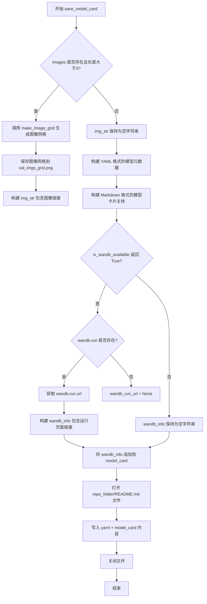
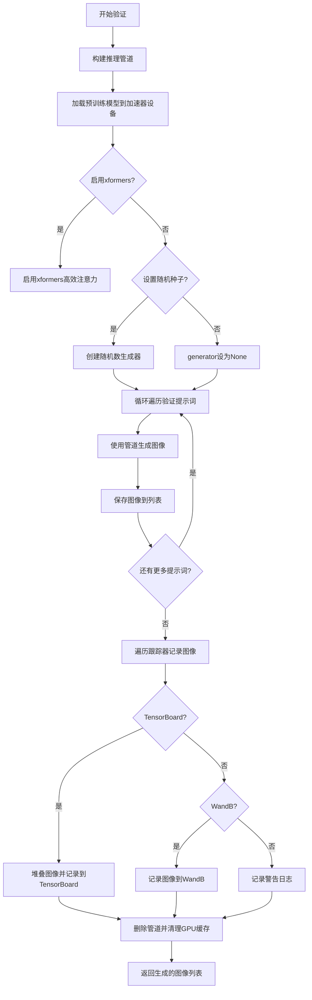
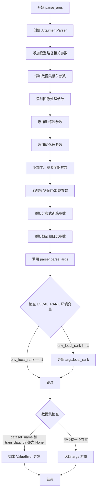

```mermaid
flowchart TD
    A[开始 main 函数] --> B[解析命令行参数 parse_args]
    B --> C{检查 wandb 和 hub_token 冲突}
    C -->|冲突| D[抛出 ValueError]
    C -->|无冲突| E[创建 Accelerator 分布式训练器]
    E --> F[配置日志系统]
    F --> G[设置随机种子]
    G --> H{是否为 main process}
    H -->|是| I[创建输出目录]
    H -->|否| J[跳过目录创建]
    I --> K{是否推送到 Hub}
    K -->|是| L[创建远程仓库]
    K -->|否| M[加载 DDPMScheduler 和 CLIPImageProcessor]
    L --> M
    M --> N[处理 DeepSpeed Zero 初始化上下文]
    N --> O[加载 VQModel VAE 和 CLIPVisionModelWithProjection]
    O --> P[冻结 VAE 和 image_encoder]
    P --> Q[设置 UNet 为训练模式]
    Q --> R{是否使用 EMA}
    R -->|是| S[创建 EMA 模型]
    R -->|否| T[启用 xformers 优化]
    S --> T
    T --> U[启用梯度检查点]
    U --> V[启用 TF32 加速]
    V --> W{是否使用 8-bit Adam}
    W -->|是| X[导入 bitsandbytes]
    W -->|否| Y[使用标准 AdamW]
    X --> Z[创建优化器]
    Y --> Z
    Z --> AA[加载数据集]
    AA --> AB[定义图像预处理函数]
    AB --> AC[创建 DataLoader]
    AC --> AD[创建学习率调度器]
    AD --> AE[使用 Accelerator 准备模型]
    AE --> AF[初始化 trackers 监控]
    AF --> AG[进入训练循环 for epoch]
    AG --> AH[遍历训练数据 batches]
    AH --> AI{accumulate 上下文}
    AI --> AJ[编码图像为 latents]
    AJ --> AK[编码 CLIP 图像特征]
    AK --> AL[采样噪声和 timestep]
    AL --> AM[添加噪声到 latents]
    AM --> AN[UNet 预测噪声残差]
    AN --> AO[计算 MSE Loss]
    AO --> AP[反向传播和梯度裁剪]
    AP --> AQ[更新优化器和学习率]
    AQ --> AR{是否同步梯度}
    AR -->|是| AS[更新 EMA 模型]
    AS --> AT[更新进度条和记录日志]
    AR -->|否| AU[跳过 EMA 更新]
    AT --> AV{是否保存 checkpoint}
    AV -->|是| AW[保存训练状态]
    AV -->|否| AX[继续训练]
    AW --> AX
    AX --> AY{是否达到最大训练步数}
    AY -->|否| AH
    AY -->|是| AZ[结束训练循环]
    AH --> AZ
    AZ --> BA{是否为 validation epoch}
    BA -->|是| BB[执行验证 log_validation]
    BA -->|否| BC[保存最终模型]
    BB --> BC
    BC --> BD{是否有验证 prompts}
    BD -->|是| BE[运行推理生成图像]
    BD -->|否| BF{是否推送到 Hub}
    BE --> BF
    BF -->|是| BG[保存模型卡片并上传]
    BF -->|否| BH[结束训练 accelerator.end_training]
    BG --> BH
```

# `diffusers\examples\kandinsky2_2\text_to_image\train_text_to_image_decoder.py` 详细设计文档

A comprehensive fine-tuning script for the Kandinsky 2.2 text-to-image diffusion model, utilizing Hugging Face Diffusers and Accelerate to train the UNet model on custom datasets with support for EMA, gradient checkpointing, and mixed precision training.

## 整体流程

```mermaid
graph TD
    Start([开始]) --> ParseArgs[Parse Args]
    ParseArgs --> InitAccel[Initialize Accelerator]
    InitAccel --> SetSeed[Set Random Seed]
    SetSeed --> LoadModels[Load Pre-trained Models (VQ, CLIP, UNet)]
    LoadModels --> LoadData[Load & Preprocess Dataset]
    LoadData --> TrainLoop[Training Loop]
    TrainLoop --> Encode[Encode Images to Latents]
    Encode --> Noise[Add Noise to Latents]
    Noise --> Predict[Predict Noise Residua]
    Predict --> Loss[Compute MSE Loss]
    Loss --> Backprop[Backward & Optimizer Step]
    Backprop --> CheckGrad[Gradient Sync?]
    CheckGrad -- Yes --> UpdateEMA[Update EMA Model]
    UpdateEMA --> Checkpoint[Save Checkpoint?]
    Checkpoint -- Yes --> SaveCkpt[Save State]
    Checkpoint -- No --> CheckVal{Validation Epoch?}
    SaveCkpt --> CheckVal
    CheckVal -- Yes --> Validation[Run Validation (Log Images)]
    Validation --> CheckMaxSteps{Max Steps Reached?}
    CheckVal -- No --> CheckMaxSteps
    CheckMaxSteps -- No --> TrainLoop
    CheckMaxSteps -- Yes --> SaveFinal[Save Final Pipeline]
    SaveFinal --> End([结束])
```

## 类结构

```
Script Entry Point (Procedural)
└── main()
    ├── Nested Functions (Data Processing)
    │   ├── center_crop()
    │   ├── train_transforms()
    │   ├── preprocess_train()
    │   └── collate_fn()
    ├── Nested Functions (Training Hooks)
    │   ├── deepspeed_zero_init_disabled_context_manager()
    │   ├── save_model_hook()
    │   └── load_model_hook()
    └── Library Components (No Custom Class Hierarchy)
        ├── VQModel (Decoder)
        ├── CLIPVisionModelWithProjection (Prior)
        └── UNet2DConditionModel (Trainable)
```

## 全局变量及字段


### `logger`
    
日志记录器，用于输出训练过程中的信息

类型：`logging.Logger`
    


### `args`
    
命令行参数命名空间，包含所有训练配置参数

类型：`argparse.Namespace`
    


### `accelerator`
    
分布式训练和混合精度训练的加速器

类型：`accelerate.Accelerator`
    


### `noise_scheduler`
    
DDPM噪声调度器，用于生成训练噪声时间步

类型：`diffusers.DDPMScheduler`
    


### `image_processor`
    
CLIP图像预处理器，用于验证图像的预处理

类型：`transformers.CLIPImageProcessor`
    


### `weight_dtype`
    
模型权重的数据类型，决定混合精度精度（fp16/bf16/fp32）

类型：`torch.dtype`
    


### `vae`
    
VAE变分自编码器模型，用于将图像编码到潜在空间

类型：`diffusers.VQModel`
    


### `image_encoder`
    
CLIP视觉编码器，用于提取图像嵌入向量

类型：`transformers.CLIPVisionModelWithProjection`
    


### `unet`
    
条件UNet模型，用于根据图像嵌入和时间步预测噪声残差

类型：`diffusers.UNet2DConditionModel`
    


### `ema_unet`
    
指数移动平均版本的UNet，用于稳定训练和提升模型性能

类型：`diffusers.training_utils.EMAModel`
    


### `optimizer`
    
AdamW优化器，用于更新模型参数

类型：`torch.optim.AdamW`
    


### `train_dataloader`
    
训练数据加载器，提供批量训练数据

类型：`torch.utils.data.DataLoader`
    


### `lr_scheduler`
    
学习率调度器，用于动态调整学习率

类型：`torch.optim.lr_scheduler._LRScheduler`
    


### `global_step`
    
全局训练步数计数器，记录已执行的优化步骤

类型：`int`
    


### `first_epoch`
    
起始训练轮数，用于从检查点恢复训练

类型：`int`
    


### `train_loss`
    
累积训练损失，用于监控训练过程

类型：`float`
    


    

## 全局函数及方法


### `save_model_card`

该函数用于在模型训练完成后生成并保存模型卡片（Model Card），包括模型元数据、训练配置信息和验证图像，并将其写入 README.md 文件以便分享和复现实验结果。

参数：

- `args`：命令行参数对象（argparse.Namespace），包含所有训练超参数和配置信息，如 `pretrained_decoder_model_name_or_path`、`dataset_name`、`num_train_epochs`、`learning_rate` 等
- `repo_id: str`，HuggingFace Hub 上的仓库 ID，用于标识模型
- `images=None`：List[Image]，训练过程中生成的验证图像列表，用于展示模型效果
- `repo_folder=None`：str，模型仓库的本地文件夹路径，用于保存模型卡文件

返回值：`None`，该函数直接写入文件，不返回任何值

#### 流程图



#### 带注释源码

```python
def save_model_card(
    args,
    repo_id: str,
    images=None,
    repo_folder=None,
):
    """
    生成并保存模型的 README.md 文件（Model Card）
    
    Args:
        args: 包含训练配置的命名空间对象
        repo_id: HuggingFace Hub 仓库 ID
        images: 验证生成的图像列表
        repo_folder: 本地仓库文件夹路径
    """
    # 初始化图像字符串，用于在 Markdown 中显示图像
    img_str = ""
    
    # 如果有验证图像，则生成图像网格并保存
    if len(images) > 0:
        # 使用 diffusers 工具生成图像网格（1行N列）
        image_grid = make_image_grid(images, 1, len(args.validation_prompts))
        # 保存图像网格到指定路径
        image_grid.save(os.path.join(repo_folder, "val_imgs_grid.png"))
        # 构建 Markdown 图像引用字符串
        img_str += "\n"

    # 构建 YAML 格式的模型元数据（包含许可证、基础模型、数据集等信息）
    yaml = f"""
---
license: creativeml-openrail-m
base_model: {args.pretrained_decoder_model_name_or_path}
datasets:
- {args.dataset_name}
prior:
- {args.pretrained_prior_model_name_or_path}
tags:
- kandinsky
- text-to-image
- diffusers
- diffusers-training
inference: true
---
    """
    
    # 构建 Markdown 格式的模型卡片主体内容
    # 包含模型介绍、使用方法、训练超参数等信息
    model_card = f"""
# Finetuning - {repo_id}

This pipeline was finetuned from **{args.pretrained_decoder_model_name_or_path}** on the **{args.dataset_name}** dataset. Below are some example images generated with the finetuned pipeline using the following prompts: {args.validation_prompts}: \n
{img_str}

## Pipeline usage

You can use the pipeline like so:

```python
from diffusers import DiffusionPipeline
import torch

pipeline = AutoPipelineForText2Image.from_pretrained("{repo_id}", torch_dtype=torch.float16)
prompt = "{args.validation_prompts[0]}"
image = pipeline(prompt).images[0]
image.save("my_image.png")
```

## Training info

These are the key hyperparameters used during training:

* Epochs: {args.num_train_epochs}
* Learning rate: {args.learning_rate}
* Batch size: {args.train_batch_size}
* Gradient accumulation steps: {args.gradient_accumulation_steps}
* Image resolution: {args.resolution}
* Mixed-precision: {args.mixed_precision}

"""
    
    # 初始化 wandb 信息字符串
    wandb_info = ""
    
    # 检查 wandb 是否可用
    if is_wandb_available():
        wandb_run_url = None
        # 如果当前有 wandb 运行，获取其 URL
        if wandb.run is not None:
            wandb_run_url = wandb.run.url

    # 如果存在 wandb 运行 URL，则添加相关信息到模型卡片
    if wandb_run_url is not None:
        wandb_info = f"""
More information on all the CLI arguments and the environment are available on your [`wandb` run page]({wandb_run_url}).
"""
    # 将 wandb 信息追加到模型卡片
    model_card += wandb_info

    # 将完整的模型卡片内容写入 README.md 文件
    with open(os.path.join(repo_folder, "README.md"), "w") as f:
        f.write(yaml + model_card)
```


### `log_validation`

该函数在训练过程中执行验证任务，通过使用当前模型权重生成验证集图像，并将其记录到日志跟踪器（TensorBoard或WandB）中，以监控模型在训练过程中的性能变化。

参数：

- `vae`：`torch.nn.Module`， variational autoencoder模型，用于将图像编码到潜在空间
- `image_encoder`：`CLIPVisionModelWithProjection`， CLIP图像编码器，用于编码CLIP图像特征
- `image_processor`：`CLIPImageProcessor`， CLIP图像处理器，用于预处理图像
- `unet`：`UNet2DConditionModel`， UNet条件模型，用于去噪生成图像
- `args`：命令行参数对象，包含预训练模型路径、xformers配置、随机种子等配置信息
- `accelerator`：`Accelerator`， HuggingFace Accelerate库提供的分布式训练加速器
- `weight_dtype`：`torch.dtype`， 模型权重的数据类型（fp16/bf16/fp32）
- `epoch`：`int`， 当前训练轮次，用于日志记录

返回值：`list[PIL.Image]`， 返回生成的验证图像列表

#### 流程图



#### 带注释源码

```python
def log_validation(vae, image_encoder, image_processor, unet, args, accelerator, weight_dtype, epoch):
    """
    在训练过程中运行验证，生成验证集图像并记录到日志跟踪器
    
    参数:
        vae: VAE模型
        image_encoder: CLIP图像编码器
        image_processor: CLIP图像处理器
        unet: UNet去噪模型
        args: 命令行参数配置
        accelerator: Accelerate分布式训练加速器
        weight_dtype: 模型权重数据类型
        epoch: 当前训练轮次
    """
    logger.info("Running validation... ")

    # 从预训练模型构建文本到图像推理管道
    # 使用accelerator.unwrap_model获取原始模型（去除分布式包装）
    pipeline = AutoPipelineForText2Image.from_pretrained(
        args.pretrained_decoder_model_name_or_path,
        vae=accelerator.unwrap_model(vae),
        prior_image_encoder=accelerator.unwrap_model(image_encoder),
        prior_image_processor=image_processor,
        unet=accelerator.unwrap_model(unet),
        torch_dtype=weight_dtype,
    )
    
    # 将管道移至加速器设备（GPU）
    pipeline = pipeline.to(accelerator.device)
    
    # 禁用进度条以减少日志输出
    pipeline.set_progress_bar_config(disable=True)

    # 如果启用了xformers，启用高效注意力机制以减少显存使用
    if args.enable_xformers_memory_efficient_attention:
        pipeline.enable_xformers_memory_efficient_attention()

    # 根据种子设置随机数生成器，确保推理可复现
    if args.seed is None:
        generator = None
    else:
        generator = torch.Generator(device=accelerator.device).manual_seed(args.seed)

    # 存储生成的图像
    images = []
    
    # 遍历所有验证提示词生成图像
    for i in range(len(args.validation_prompts)):
        # 使用torch.autocast启用混合精度推理
        with torch.autocast("cuda"):
            image = pipeline(
                args.validation_prompts[i],  # 验证提示词
                num_inference_steps=20,       # 推理步数
                generator=generator           # 随机数生成器
            ).images[0]

        images.append(image)

    # 将生成的图像记录到各个跟踪器
    for tracker in accelerator.trackers:
        if tracker.name == "tensorboard":
            # 将PIL图像转换为numpy数组并堆叠
            np_images = np.stack([np.asarray(img) for img in images])
            tracker.writer.add_images("validation", np_images, epoch, dataformats="NHWC")
        elif tracker.name == "wandb":
            # 使用WandB记录图像（带标题）
            tracker.log(
                {
                    "validation": [
                        wandb.Image(image, caption=f"{i}: {args.validation_prompts[i]}")
                        for i, image in enumerate(images)
                    ]
                }
            )
        else:
            # 对于不支持的跟踪器记录警告
            logger.warning(f"image logging not implemented for {tracker.name}")

    # 显式删除管道并清理GPU缓存，释放验证阶段占用的显存
    del pipeline
    torch.cuda.empty_cache()

    # 返回生成的图像列表，供后续使用（如保存或展示）
    return images
```


### `parse_args`

该函数是命令行参数解析器，用于定义并解析训练 Kandinsky 2.2 文本到图像模型的所有超参数和配置选项，包括模型路径、数据集配置、训练超参数、优化器设置、日志记录等，最终返回一个包含所有解析后参数的 `Namespace` 对象。

参数：此函数无输入参数。

返回值：`args`（`argparse.Namespace`），包含所有命令行参数解析后的值，用于后续的训练流程配置。

#### 流程图



#### 带注释源码

```python
def parse_args():
    """
    解析命令行参数并返回包含所有配置选项的 Namespace 对象。
    
    该函数定义了训练 Kandinsky 2.2 模型所需的所有命令行参数，
    包括模型路径、数据集配置、训练超参数、优化器设置等。
    """
    # 创建 ArgumentParser 实例，描述脚本用途
    parser = argparse.ArgumentParser(description="Simple example of finetuning Kandinsky 2.2.")
    
    # ==================== 模型路径参数 ====================
    parser.add_argument(
        "--pretrained_decoder_model_name_or_path",
        type=str,
        default="kandinsky-community/kandinsky-2-2-decoder",
        required=False,
        help="Path to pretrained model or model identifier from huggingface.co/models.",
    )
    parser.add_argument(
        "--pretrained_prior_model_name_or_path",
        type=str,
        default="kandinsky-community/kandinsky-2-2-prior",
        required=False,
        help="Path to pretrained model or model identifier from huggingface.co/models.",
    )
    
    # ==================== 数据集参数 ====================
    parser.add_argument(
        "--dataset_name",
        type=str,
        default=None,
        help=(
            "The name of the Dataset (from the HuggingFace hub) to train on (could be your own, possibly private,"
            " dataset). It can also be a path pointing to a local copy of a dataset in your filesystem,"
            " or to a folder containing files that 🤗 Datasets can understand."
        ),
    )
    parser.add_argument(
        "--dataset_config_name",
        type=str,
        default=None,
        help="The config of the Dataset, leave as None if there's only one config.",
    )
    parser.add_argument(
        "--train_data_dir",
        type=str,
        default=None,
        help=(
            "A folder containing the training data. Folder contents must follow the structure described in"
            " https://huggingface.co/docs/datasets/image_dataset#imagefolder. In particular, a `metadata.jsonl` file"
            " must exist to provide the captions for the images. Ignored if `dataset_name` is specified."
        ),
    )
    parser.add_argument(
        "--image_column", type=str, default="image", help="The column of the dataset containing an image."
    )
    parser.add_argument(
        "--max_train_samples",
        type=int,
        default=None,
        help=(
            "For debugging purposes or quicker training, truncate the number of training examples to this "
            "value if set."
        ),
    )
    parser.add_argument(
        "--validation_prompts",
        type=str,
        default=None,
        nargs="+",
        help=("A set of prompts evaluated every `--validation_epochs` and logged to `--report_to`."),
    )
    
    # ==================== 输出和存储参数 ====================
    parser.add_argument(
        "--output_dir",
        type=str,
        default="kandi_2_2-model-finetuned",
        help="The output directory where the model predictions and checkpoints will be written.",
    )
    parser.add_argument(
        "--cache_dir",
        type=str,
        default=None,
        help="The directory where the downloaded models and datasets will be stored.",
    )
    parser.add_argument("--seed", type=int, default=None, help="A seed for reproducible training.")
    
    # ==================== 图像处理参数 ====================
    parser.add_argument(
        "--resolution",
        type=int,
        default=512,
        help=(
            "The resolution for input images, all the images in the train/validation dataset will be resized to this"
            " resolution"
        ),
    )
    
    # ==================== 训练超参数 ====================
    parser.add_argument(
        "--train_batch_size", type=int, default=1, help="Batch size (per device) for the training dataloader."
    )
    parser.add_argument("--num_train_epochs", type=int, default=100)
    parser.add_argument(
        "--max_train_steps",
        type=int,
        default=None,
        help="Total number of training steps to perform.  If provided, overrides num_train_epochs.",
    )
    parser.add_argument(
        "--gradient_accumulation_steps",
        type=int,
        default=1,
        help="Number of updates steps to accumulate before performing a backward/update pass.",
    )
    parser.add_argument(
        "--gradient_checkpointing",
        action="store_true",
        help="Whether or not to use gradient checkpointing to save memory at the expense of slower backward pass.",
    )
    parser.add_argument(
        "--learning_rate",
        type=float,
        default=1e-4,
        help="learning rate",
    )
    
    # ==================== 学习率调度器参数 ====================
    parser.add_argument(
        "--lr_scheduler",
        type=str,
        default="constant",
        help=(
            'The scheduler type to use. Choose between ["linear", "cosine", "cosine_with_restarts", "polynomial",'
            ' "constant", "constant_with_warmup"]'
        ),
    )
    parser.add_argument(
        "--lr_warmup_steps", type=int, default=500, help="Number of steps for the warmup in the lr scheduler."
    )
    parser.add_argument(
        "--snr_gamma",
        type=float,
        default=None,
        help="SNR weighting gamma to be used if rebalancing the loss. Recommended value is 5.0. "
        "More details here: https://huggingface.co/papers/2303.09556.",
    )
    
    # ==================== 优化器参数 ====================
    parser.add_argument(
        "--use_8bit_adam", action="store_true", help="Whether or not to use 8-bit Adam from bitsandbytes."
    )
    parser.add_argument(
        "--allow_tf32",
        action="store_true",
        help=(
            "Whether or not to allow TF32 on Ampere GPUs. Can be used to speed up training. For more information, see"
            " https://pytorch.org/docs/stable/notes/cuda.html#tensorfloat-32-tf32-on-ampere-devices"
        ),
    )
    parser.add_argument("--use_ema", action="store_true", help="Whether to use EMA model.")
    parser.add_argument(
        "--dataloader_num_workers",
        type=int,
        default=0,
        help=(
            "Number of subprocesses to use for data loading. 0 means that the data will be loaded in the main process."
        ),
    )
    parser.add_argument("--adam_beta1", type=float, default=0.9, help="The beta1 parameter for the Adam optimizer.")
    parser.add_argument("--adam_beta2", type=float, default=0.999, help="The beta2 parameter for the Adam optimizer.")
    parser.add_argument(
        "--adam_weight_decay",
        type=float,
        default=0.0,
        required=False,
        help="weight decay_to_use",
    )
    parser.add_argument("--adam_epsilon", type=float, default=1e-08, help="Epsilon value for the Adam optimizer")
    parser.add_argument("--max_grad_norm", default=1.0, type=float, help="Max gradient norm.")
    
    # ==================== 模型推送参数 ====================
    parser.add_argument("--push_to_hub", action="store_true", help="Whether or not to push the model to the Hub.")
    parser.add_argument("--hub_token", type=str, default=None, help="The token to use to push to the Model Hub.")
    parser.add_argument(
        "--hub_model_id",
        type=str,
        default=None,
        help="The name of the repository to keep in sync with the local `output_dir`.",
    )
    
    # ==================== 日志记录参数 ====================
    parser.add_argument(
        "--logging_dir",
        type=str,
        default="logs",
        help=(
            "[TensorBoard](https://www.tensorflow.org/tensorboard) log directory. Will default to"
            " *output_dir/runs/**CURRENT_DATETIME_HOSTNAME***."
        ),
    )
    parser.add_argument(
        "--mixed_precision",
        type=str,
        default=None,
        choices=["no", "fp16", "bf16"],
        help=(
            "Whether to use mixed precision. Choose between fp16 and bf16 (bfloat16). Bf16 requires PyTorch >="
            " 1.10.and an Nvidia Ampere GPU.  Default to the value of accelerate config of the current system or the"
            " flag passed with the `accelerate.launch` command. Use this argument to override the accelerate config."
        ),
    )
    parser.add_argument(
        "--report_to",
        type=str,
        default="tensorboard",
        help=(
            'The integration to report the results and logs to. Supported platforms are `"tensorboard"`'
            ' (default), `"wandb"` and `"comet_ml"`. Use `"all"` to report to all integrations.'
        ),
    )
    parser.add_argument("--local_rank", type=int, default=-1, help="For distributed training: local_rank")
    
    # ==================== 检查点参数 ====================
    parser.add_argument(
        "--checkpointing_steps",
        type=int,
        default=500,
        help=(
            "Save a checkpoint of the training state every X updates. These checkpoints are only suitable for resuming"
            " training using `--resume_from_checkpoint`."
        ),
    )
    parser.add_argument(
        "--checkpoints_total_limit",
        type=int,
        default=None,
        help=("Max number of checkpoints to store."),
    )
    parser.add_argument(
        "--resume_from_checkpoint",
        type=str,
        default=None,
        help=(
            "Whether training should be resumed from a previous checkpoint. Use a path saved by"
            ' `--checkpointing_steps`, or `"latest"` to automatically select the last available checkpoint.'
        ),
    )
    
    # ==================== 高级功能参数 ====================
    parser.add_argument(
        "--enable_xformers_memory_efficient_attention", action="store_true", help="Whether or not to use xformers."
    )
    parser.add_argument(
        "--validation_epochs",
        type=int,
        default=5,
        help="Run validation every X epochs.",
    )
    parser.add_argument(
        "--tracker_project_name",
        type=str,
        default="text2image-fine-tune",
        help=(
            "The `project_name` argument passed to Accelerator.init_trackers for"
            " more information see https://huggingface.co/docs/accelerate/v0.17.0/en/package_reference/accelerator#accelerate.Accelerator"
        ),
    )

    # 解析命令行参数
    args = parser.parse_args()
    
    # 检查环境变量 LOCAL_RANK，用于分布式训练
    env_local_rank = int(os.environ.get("LOCAL_RANK", -1))
    if env_local_rank != -1 and env_local_rank != args.local_rank:
        args.local_rank = env_local_rank

    # 合理性检查：确保提供了数据集名称或训练数据目录
    if args.dataset_name is None and args.train_data_dir is None:
        raise ValueError("Need either a dataset name or a training folder.")

    # 返回解析后的参数对象
    return args
```


### `main`

这是 Kandinsky 2.2 模型的微调训练主函数，负责完整的文本到图像扩散模型训练流程，包括数据加载、模型初始化、分布式训练配置、训练循环、验证、模型保存和推送到 Hub。

参数：

- 无参数（函数内部通过 `parse_args()` 获取命令行参数）

返回值：`None`，无返回值

#### 流程图



#### 带注释源码

```python
def main():
    """
    Kandinsky 2.2 模型微调训练主函数
    完整的文本到图像扩散模型训练流程
    """
    # 1. 解析命令行参数
    args = parse_args()

    # 2. 安全检查：不能同时使用 wandb 和 hub_token（安全风险）
    if args.report_to == "wandb" and args.hub_token is not None:
        raise ValueError(
            "You cannot use both --report_to=wandb and --hub_token due to a security risk of exposing your token."
            " Please use `hf auth login` to authenticate with the Hub."
        )

    # 3. 配置日志目录和项目
    logging_dir = os.path.join(args.output_dir, args.logging_dir)
    accelerator_project_config = ProjectConfiguration(
        total_limit=args.checkpoints_total_limit, project_dir=args.output_dir, logging_dir=logging_dir
    )
    # 4. 初始化 Accelerator（分布式训练支持）
    accelerator = Accelerator(
        gradient_accumulation_steps=args.gradient_accumulation_steps,
        mixed_precision=args.mixed_precision,
        log_with=args.report_to,
        project_config=accelerator_project_config,
    )

    # 5. MPS 设备禁用 AMP
    if torch.backends.mps.is_available():
        accelerator.native_amp = False

    # 6. 配置日志格式
    logging.basicConfig(
        format="%(asctime)s - %(levelname)s - %(name)s - %(message)s",
        datefmt="%m/%d/%Y %H:%M:%S",
        level=logging.INFO,
    )
    logger.info(accelerator.state, main_process_only=False)
    # 主进程设置不同日志级别
    if accelerator.is_local_main_process:
        datasets.utils.logging.set_verbosity_warning()
        transformers.utils.logging.set_verbosity_warning()
        diffusers.utils.logging.set_verbosity_info()
    else:
        datasets.utils.logging.set_verbosity_error()
        transformers.utils.logging.set_verbosity_error()
        diffusers.utils.logging.set_verbosity_error()

    # 7. 设置随机种子
    if args.seed is not None:
        set_seed(args.seed)

    # 8. 处理输出目录创建
    if accelerator.is_main_process:
        if args.output_dir is not None:
            os.makedirs(args.output_dir, exist_ok=True)

        # 9. 推送到 Hub
        if args.push_to_hub:
            repo_id = create_repo(
                repo_id=args.hub_model_id or Path(args.output_dir).name, exist_ok=True, token=args.hub_token
            ).repo_id

    # 10. 加载噪声调度器和图像处理器
    noise_scheduler = DDPMScheduler.from_pretrained(args.pretrained_decoder_model_name_or_path, subfolder="scheduler")
    image_processor = CLIPImageProcessor.from_pretrained(
        args.pretrained_prior_model_name_or_path, subfolder="image_processor"
    )

    # 11. DeepSpeed Zero 初始化上下文管理器
    def deepspeed_zero_init_disabled_context_manager():
        """
        返回禁用 zero.Init 的上下文列表
        """
        deepspeed_plugin = AcceleratorState().deepspeed_plugin if accelerate.state.is_initialized() else None
        if deepspeed_plugin is None:
            return []
        return [deepspeed_plugin.zero3_init_context_manager(enable=False)]

    # 12. 设置权重数据类型（fp16/bf16/fp32）
    weight_dtype = torch.float32
    if accelerator.mixed_precision == "fp16":
        weight_dtype = torch.float16
    elif accelerator.mixed_precision == "bf16":
        weight_dtype = torch.bfloat16

    # 13. 加载 VAE 和图像编码器
    with ContextManagers(deepspeed_zero_init_disabled_context_manager()):
        vae = VQModel.from_pretrained(
            args.pretrained_decoder_model_name_or_path, subfolder="movq", torch_dtype=weight_dtype
        ).eval()
        image_encoder = CLIPVisionModelWithProjection.from_pretrained(
            args.pretrained_prior_model_name_or_path, subfolder="image_encoder", torch_dtype=weight_dtype
        ).eval()

    # 14. 加载 UNet
    unet = UNet2DConditionModel.from_pretrained(args.pretrained_decoder_model_name_or_path, subfolder="unet")

    # 15. 冻结 VAE 和图像编码器
    vae.requires_grad_(False)
    image_encoder.requires_grad_(False)

    # 16. 设置 UNet 为训练模式
    unet.train()

    # 17. 创建 EMA 模型（可选）
    if args.use_ema:
        ema_unet = UNet2DConditionModel.from_pretrained(args.pretrained_decoder_model_name_or_path, subfolder="unet")
        ema_unet = EMAModel(ema_unet.parameters(), model_cls=UNet2DConditionModel, model_config=ema_unet.config)
        ema_unet.to(accelerator.device)

    # 18. 启用 xformers 内存高效注意力（可选）
    if args.enable_xformers_memory_efficient_attention:
        if is_xformers_available():
            import xformers
            xformers_version = version.parse(xformers.__version__)
            if xformers_version == version.parse("0.0.16"):
                logger.warning(
                    "xFormers 0.0.16 cannot be used for training in some GPUs..."
                )
            unet.enable_xformers_memory_efficient_attention()
        else:
            raise ValueError("xformers is not available.")

    # 19. 注册自定义模型保存/加载钩子
    if version.parse(accelerate.__version__) >= version.parse("0.16.0"):
        def save_model_hook(models, weights, output_dir):
            if args.use_ema:
                ema_unet.save_pretrained(os.path.join(output_dir, "unet_ema"))
            for i, model in enumerate(models):
                model.save_pretrained(os.path.join(output_dir, "unet"))
                weights.pop()

        def load_model_hook(models, input_dir):
            if args.use_ema:
                load_model = EMAModel.from_pretrained(os.path.join(input_dir, "unet_ema"), UNet2DConditionModel)
                ema_unet.load_state_dict(load_model.state_dict())
                ema_unet.to(accelerator.device)
                del load_model
            for i in range(len(models)):
                model = models.pop()
                load_model = UNet2DConditionModel.from_pretrained(input_dir, subfolder="unet")
                model.register_to_config(**load_model.config)
                model.load_state_dict(load_model.state_dict())
                del load_model

        accelerator.register_save_state_pre_hook(save_model_hook)
        accelerator.register_load_state_pre_hook(load_model_hook)

    # 20. 启用梯度检查点
    if args.gradient_checkpointing:
        unet.enable_gradient_checkpointing()

    # 21. 启用 TF32 加速
    if args.allow_tf32:
        torch.backends.cuda.matmul.allow_tf32 = True

    # 22. 选择优化器（8-bit Adam 或标准 AdamW）
    if args.use_8bit_adam:
        try:
            import bitsandbytes as bnb
        except ImportError:
            raise ImportError("Please install bitsandbytes...")
        optimizer_cls = bnb.optim.AdamW8bit
    else:
        optimizer_cls = torch.optim.AdamW

    # 23. 创建优化器
    optimizer = optimizer_cls(
        unet.parameters(),
        lr=args.learning_rate,
        betas=(args.adam_beta1, args.adam_beta2),
        weight_decay=args.adam_weight_decay,
        eps=args.adam_epsilon,
    )

    # 24. 加载数据集
    if args.dataset_name is not None:
        dataset = load_dataset(
            args.dataset_name,
            args.dataset_config_name,
            cache_dir=args.cache_dir,
        )
    else:
        data_files = {}
        if args.train_data_dir is not None:
            data_files["train"] = os.path.join(args.train_data_dir, "**")
        dataset = load_dataset(
            "imagefolder",
            data_files=data_files,
            cache_dir=args.cache_dir,
        )

    # 25. 图像预处理函数
    column_names = dataset["train"].column_names
    image_column = args.image_column
    if image_column not in column_names:
        raise ValueError(f"--image_column' value '{args.image_column}' needs to be one of: {', '.join(column_names)}")

    def center_crop(image):
        """中心裁剪图像"""
        width, height = image.size
        new_size = min(width, height)
        left = (width - new_size) / 2
        top = (height - new_size) / 2
        right = (width + new_size) / 2
        bottom = (height + new_size) / 2
        return image.crop((left, top, right, bottom))

    def train_transforms(img):
        """训练图像转换：裁剪、缩放、归一化"""
        img = center_crop(img)
        img = img.resize((args.resolution, args.resolution), resample=Image.BICUBIC, reducing_gap=1)
        img = np.array(img).astype(np.float32) / 127.5 - 1
        img = torch.from_numpy(np.transpose(img, [2, 0, 1]))
        return img

    def preprocess_train(examples):
        """预处理训练数据"""
        images = [image.convert("RGB") for image in examples[image_column]]
        examples["pixel_values"] = [train_transforms(image) for image in images]
        examples["clip_pixel_values"] = image_processor(images, return_tensors="pt").pixel_values
        return examples

    # 26. 应用数据转换
    with accelerator.main_process_first():
        if args.max_train_samples is not None:
            dataset["train"] = dataset["train"].shuffle(seed=args.seed).select(range(args.max_train_samples))
        train_dataset = dataset["train"].with_transform(preprocess_train)

    # 27. 自定义 collate 函数
    def collate_fn(examples):
        pixel_values = torch.stack([example["pixel_values"] for example in examples])
        pixel_values = pixel_values.to(memory_format=torch.contiguous_format).float()
        clip_pixel_values = torch.stack([example["clip_pixel_values"] for example in examples])
        clip_pixel_values = clip_pixel_values.to(memory_format=torch.contiguous_format).float()
        return {"pixel_values": pixel_values, "clip_pixel_values": clip_pixel_values}

    # 28. 创建 DataLoader
    train_dataloader = torch.utils.data.DataLoader(
        train_dataset,
        shuffle=True,
        collate_fn=collate_fn,
        batch_size=args.train_batch_size,
        num_workers=args.dataloader_num_workers,
    )

    # 29. 计算训练步数
    overrode_max_train_steps = False
    num_update_steps_per_epoch = math.ceil(len(train_dataloader) / args.gradient_accumulation_steps)
    if args.max_train_steps is None:
        args.max_train_steps = args.num_train_epochs * num_update_steps_per_epoch
        overrode_max_train_steps = True

    # 30. 创建学习率调度器
    lr_scheduler = get_scheduler(
        args.lr_scheduler,
        optimizer=optimizer,
        num_warmup_steps=args.lr_warmup_steps * args.gradient_accumulation_steps,
        num_training_steps=args.max_train_steps * args.gradient_accumulation_steps,
    )

    # 31. 使用 Accelerator 准备模型和优化器
    unet, optimizer, train_dataloader, lr_scheduler = accelerator.prepare(
        unet, optimizer, train_dataloader, lr_scheduler
    )

    # 32. 移动图像编码器和 VAE 到设备
    image_encoder.to(accelerator.device, dtype=weight_dtype)
    vae.to(accelerator.device, dtype=weight_dtype)

    # 33. 重新计算训练步数
    num_update_steps_per_epoch = math.ceil(len(train_dataloader) / args.gradient_accumulation_steps)
    if overrode_max_train_steps:
        args.max_train_steps = args.num_train_epochs * num_update_steps_per_epoch
    args.num_train_epochs = math.ceil(args.max_train_steps / num_update_steps_per_epoch)

    # 34. 初始化 trackers
    if accelerator.is_main_process:
        tracker_config = dict(vars(args))
        tracker_config.pop("validation_prompts")
        accelerator.init_trackers(args.tracker_project_name, tracker_config)

    # 35. 打印训练信息
    total_batch_size = args.train_batch_size * accelerator.num_processes * args.gradient_accumulation_steps
    logger.info("***** Running training *****")
    logger.info(f"  Num examples = {len(train_dataset)}")
    logger.info(f"  Num Epochs = {args.num_train_epochs}")
    logger.info(f"  Instantaneous batch size per device = {args.train_batch_size}")
    logger.info(f"  Total train batch size = {total_batch_size}")
    logger.info(f"  Gradient Accumulation steps = {args.gradient_accumulation_steps}")
    logger.info(f"  Total optimization steps = {args.max_train_steps}")

    # 36. 检查点恢复
    global_step = 0
    first_epoch = 0
    if args.resume_from_checkpoint:
        if args.resume_from_checkpoint != "latest":
            path = os.path.basename(args.resume_from_checkpoint)
        else:
            dirs = os.listdir(args.output_dir)
            dirs = [d for d in dirs if d.startswith("checkpoint")]
            dirs = sorted(dirs, key=lambda x: int(x.split("-")[1]))
            path = dirs[-1] if len(dirs) > 0 else None

        if path is None:
            accelerator.print(f"Checkpoint does not exist. Starting new training.")
            args.resume_from_checkpoint = None
            initial_global_step = 0
        else:
            accelerator.print(f"Resuming from checkpoint {path}")
            accelerator.load_state(os.path.join(args.output_dir, path))
            global_step = int(path.split("-")[1])
            initial_global_step = global_step
            first_epoch = global_step // num_update_steps_per_epoch
    else:
        initial_global_step = 0

    # 37. 创建进度条
    progress_bar = tqdm(
        range(0, args.max_train_steps),
        initial=initial_global_step,
        desc="Steps",
        disable=not accelerator.is_local_main_process,
    )

    # 38. ========== 训练循环 ==========
    for epoch in range(first_epoch, args.num_train_epochs):
        train_loss = 0.0
        for step, batch in enumerate(train_dataloader):
            # 38.1 梯度累积
            with accelerator.accumulate(unet):
                # 38.2 图像编码为 latent 空间
                images = batch["pixel_values"].to(weight_dtype)
                clip_images = batch["clip_pixel_values"].to(weight_dtype)
                latents = vae.encode(images).latents
                image_embeds = image_encoder(clip_images).image_embeds

                # 38.3 采样噪声
                noise = torch.randn_like(latents)
                bsz = latents.shape[0]
                timesteps = torch.randint(0, noise_scheduler.config.num_train_timesteps, (bsz,), device=latents.device)
                timesteps = timesteps.long()

                # 38.4 添加噪声
                noisy_latents = noise_scheduler.add_noise(latents, noise, timesteps)
                target = noise

                # 38.5 UNet 预测
                added_cond_kwargs = {"image_embeds": image_embeds}
                model_pred = unet(noisy_latents, timesteps, None, added_cond_kwargs=added_cond_kwargs).sample[:, :4]

                # 38.6 计算损失
                if args.snr_gamma is None:
                    loss = F.mse_loss(model_pred.float(), target.float(), reduction="mean")
                else:
                    # SNR 加权损失
                    snr = compute_snr(noise_scheduler, timesteps)
                    mse_loss_weights = torch.stack([snr, args.snr_gamma * torch.ones_like(timesteps)], dim=1).min(dim=1)[0]
                    if noise_scheduler.config.prediction_type == "epsilon":
                        mse_loss_weights = mse_loss_weights / snr
                    elif noise_scheduler.config.prediction_type == "v_prediction":
                        mse_loss_weights = mse_loss_weights / (snr + 1)

                    loss = F.mse_loss(model_pred.float(), target.float(), reduction="none")
                    loss = loss.mean(dim=list(range(1, len(loss.shape)))) * mse_loss_weights
                    loss = loss.mean()

                # 38.7 收集损失用于日志
                avg_loss = accelerator.gather(loss.repeat(args.train_batch_size)).mean()
                train_loss += avg_loss.item() / args.gradient_accumulation_steps

                # 38.8 反向传播
                accelerator.backward(loss)
                if accelerator.sync_gradients:
                    accelerator.clip_grad_norm_(unet.parameters(), args.max_grad_norm)
                optimizer.step()
                lr_scheduler.step()
                optimizer.zero_grad()

            # 38.9 同步后处理
            if accelerator.sync_gradients:
                if args.use_ema:
                    ema_unet.step(unet.parameters())
                progress_bar.update(1)
                global_step += 1
                accelerator.log({"train_loss": train_loss}, step=global_step)
                train_loss = 0.0

                # 38.10 保存 checkpoint
                if global_step % args.checkpointing_steps == 0:
                    if accelerator.is_main_process:
                        # 清理旧 checkpoint
                        if args.checkpoints_total_limit is not None:
                            checkpoints = os.listdir(args.output_dir)
                            checkpoints = [d for d in checkpoints if d.startswith("checkpoint")]
                            checkpoints = sorted(checkpoints, key=lambda x: int(x.split("-")[1]))
                            if len(checkpoints) >= args.checkpoints_total_limit:
                                num_to_remove = len(checkpoints) - args.checkpoints_total_limit + 1
                                removing_checkpoints = checkpoints[0:num_to_remove]
                                for removing_checkpoint in removing_checkpoints:
                                    shutil.rmtree(os.path.join(args.output_dir, removing_checkpoint))

                        save_path = os.path.join(args.output_dir, f"checkpoint-{global_step}")
                        accelerator.save_state(save_path)
                        logger.info(f"Saved state to {save_path}")

            # 38.11 更新进度条
            logs = {"step_loss": loss.detach().item(), "lr": lr_scheduler.get_last_lr()[0]}
            progress_bar.set_postfix(**logs)

            if global_step >= args.max_train_steps:
                break

        # 39. 验证阶段
        if accelerator.is_main_process:
            if args.validation_prompts is not None and epoch % args.validation_epochs == 0:
                if args.use_ema:
                    ema_unet.store(unet.parameters())
                    ema_unet.copy_to(unet.parameters())
                log_validation(
                    vae,
                    image_encoder,
                    image_processor,
                    unet,
                    args,
                    accelerator,
                    weight_dtype,
                    global_step,
                )
                if args.use_ema:
                    ema_unet.restore(unet.parameters())

    # 40. 保存最终模型
    accelerator.wait_for_everyone()
    if accelerator.is_main_process:
        unet = accelerator.unwrap_model(unet)
        if args.use_ema:
            ema_unet.copy_to(unet.parameters())

        # 41. 创建 pipeline 并保存
        pipeline = AutoPipelineForText2Image.from_pretrained(
            args.pretrained_decoder_model_name_or_path,
            vae=vae,
            unet=unet,
        )
        pipeline.decoder_pipe.save_pretrained(args.output_dir)

        # 42. 最终推理（生成样本图像）
        images = []
        if args.validation_prompts is not None:
            logger.info("Running inference for collecting generated images...")
            pipeline.torch_dtype = weight_dtype
            pipeline.set_progress_bar_config(disable=True)
            pipeline.enable_model_cpu_offload()

            if args.enable_xformers_memory_efficient_attention:
                pipeline.enable_xformers_memory_efficient_attention()

            if args.seed is None:
                generator = None
            else:
                generator = torch.Generator(device=accelerator.device).manual_seed(args.seed)

            for i in range(len(args.validation_prompts)):
                with torch.autocast("cuda"):
                    image = pipeline(args.validation_prompts[i], num_inference_steps=20, generator=generator).images[0]
                images.append(image)

        # 43. 推送到 Hub
        if args.push_to_hub:
            save_model_card(args, repo_id, images, repo_folder=args.output_dir)
            upload_folder(
                repo_id=repo_id,
                folder_path=args.output_dir,
                commit_message="End of training",
                ignore_patterns=["step_*", "epoch_*"],
            )

    # 44. 结束训练
    accelerator.end_training()
```

## 关键组件


### 张量索引操作

在噪声预测过程中，代码使用切片操作`model_pred.sample[:, :4]`从UNet输出的完整预测中提取前4个通道（对应RGB图像的噪声预测），这是因为Kandinsky模型输出的通道数可能多于实际需要的通道数。

### 惰性加载与权重数据类型

代码中通过`weight_dtype`变量控制模型权重的精度，支持`torch.float32`（默认）、`torch.float16`（fp16）和`torch.bfloat16`（bf16）三种精度。模型加载时使用`torch_dtype=weight_dtype`参数实现延迟转换，避免不必要的数据类型转换开销。

### 混合精度训练策略

通过Accelerator的`mixed_precision`参数配置，支持fp16和bf16两种混合精度训练模式。代码根据配置动态设置`weight_dtype`，在训练过程中自动进行FP16/BF16计算以提升训练速度，同时保持关键权重为FP32精度以保证数值稳定性。

### 梯度累积与检查点

使用`gradient_accumulation_steps`参数实现梯度累积，突破单卡显存限制实现大effective batch size。通过`unet.enable_gradient_checkpointing()`启用梯度检查点，以计算时间换取显存空间，适用于训练大模型。

### EMA (指数移动平均)

代码实现了EMA模型用于稳定训练和提升模型质量。`EMAModel`类维护UNet参数的指数移动平均副本，在验证和保存时使用EMA权重，能够有效平滑训练过程中的参数波动。

### SNR加权损失

在计算损失时，代码根据论文"Simple and Scalable Uncertainty Estimation"的思想实现了SNR加权策略。通过`compute_snr()`函数计算信噪比，并根据`noise_scheduler.config.prediction_type`（epsilon或v_prediction）调整损失权重，以改进去噪训练效果。

### xFormers高效注意力

通过`enable_xformers_memory_efficient_attention()`启用xFormers库的高效注意力实现，显著降低注意力机制的记忆体占用和计算成本，适用于大分辨率图像的训练场景。

### 分布式训练与加速

利用HuggingFace Accelerate库实现多GPU分布式训练，支持梯度同步、模型保存/加载hook、自定义优化器等高级功能。通过`accelerator.prepare()`自动处理数据并行和模型分布。

### 噪声调度器

使用DDPMScheduler实现DDPM风格的噪声调度，在训练过程中逐步向latent添加噪声，并通过`noise_scheduler.add_noise()`和`timesteps`控制噪声注入过程，支持自定义噪声步数和预测类型。

### 验证流程与推理

`log_validation()`函数在训练过程中定期执行验证，通过`AutoPipelineForText2Image`加载最新模型权重进行推理，使用TensorBoard或WandB记录生成的验证图像，支持图像质量监控。


## 问题及建议


### 已知问题

- **硬编码的推理步数**：代码中 `num_inference_steps=20` 在验证和最终推理时硬编码，多次重复出现，应提取为命令行参数或配置常量
- **模型保存方法错误**：在主函数末尾使用 `pipeline.decoder_pipe.save_pretrained(args.output_dir)`，但 `decoder_pipe` 不是有效属性，应使用 `pipeline.save_pretrained(args.output_dir)`
- **缺失的异常处理**：模型加载、数据集加载、训练循环等关键操作均无 try-except 异常捕获，可能导致训练中断时无法优雅清理资源
- **CLIP图像预处理效率低下**：在 `preprocess_train` 中对所有图像批量调用 `image_processor`，将所有图像同时加载到内存中处理，大批量训练时可能导致内存溢出
- **变量定义但未充分使用**：`column_names` 变量在数据预处理部分定义后仅用于验证列名存在性，可直接内联简化
- **验证循环无梯度禁用**：验证时使用 `torch.autocast("cuda")` 但未显式禁用梯度计算，理论上可能产生不必要的显存占用
- **checkpoint删除逻辑竞态条件**：checkpoint清理仅在主进程执行，但在分布式训练中可能存在同步问题

### 优化建议

- 将 `num_inference_steps`、`image_resolution` 等可配置参数提取为全局常量或配置类，提升可维护性
- 为模型加载、数据集加载、训练循环添加完整的异常处理和资源清理逻辑，确保训练中断时能正确保存状态
- 将 CLIP 图像预处理改为流式处理或使用数据集的 `map` 函数分批处理，减少峰值内存占用
- 在验证和推理代码块外添加 `with torch.no_grad():` 上下文，明确禁用梯度计算
- 修复 `pipeline.decoder_pipe.save_pretrained` 为正确的 `pipeline.save_pretrained`
- 考虑将 `save_model_card` 函数中的 wandb 相关逻辑抽离为独立模块，提高代码内聚性
- 添加训练过程的断点续训完整性检查，验证恢复的 checkpoint 与当前配置是否兼容

## 其它


### 设计目标与约束

本脚本的设计目标是提供一个用于微调Kandinsky 2.2文生图模型的完整训练流程。核心约束包括：支持分布式训练（通过Accelerator）、支持混合精度训练（fp16/bf16）、支持梯度累积以实现大Batch训练、支持EMA模型以稳定训练、支持xformers优化注意力计算、支持从检查点恢复训练、支持模型推送到HuggingFace Hub。模型架构采用VQVAE + CLIP图像编码器 + UNet的条件扩散模型架构。

### 错误处理与异常设计

主要错误处理包括：1）数据集参数校验：如果未指定dataset_name或train_data_dir则抛出ValueError；2）xformers依赖检查：未安装时抛出ImportError；3）bitsandbytes依赖检查：使用8bit Adam时未安装则抛出ImportError；4）Wandb与Hub Token冲突检测：同时使用会抛出安全警告；5）MPS后端处理：自动禁用AMP以兼容Apple Silicon；6）DeepSpeed Zero3上下文管理：防止模型在分布式训练中重复初始化。

### 数据流与状态机

训练数据流：加载数据集 → 图像预处理（中心裁剪、缩放、归一化） → CLIP图像编码 → VQVAE编码到潜在空间 → 添加噪声 → UNet预测噪声残差 → 计算MSE Loss（含可选SNR加权） → 反向传播 → 参数更新。状态机包括：主训练循环（epoch → step → batch）、检查点保存触发条件（每N步）、验证触发条件（每N个epoch）、EMA更新同步点（每优化器步）。

### 外部依赖与接口契约

核心依赖：diffusers（提供VQModel、UNet2DConditionModel、AutoPipelineForText2Image、DDPMScheduler、EMAModel等）、transformers（提供CLIPImageProcessor、CLIPVisionModelWithProjection）、accelerate（分布式训练和混合精度）、datasets（数据集加载）、torch、numpy、PIL、tqdm、wandb（可选）、xformers（可选）、bitsandbytes（可选）。预训练模型接口：需要从HuggingFace Hub加载kandinsky-community/kandinsky-2-2-decoder和kandinsky-community/kandinsky-2-2-prior。

### 配置参数详细说明

关键训练参数：learning_rate默认1e-4、train_batch_size默认1、num_train_epochs默认100、gradient_accumulation_steps默认1、mixed_precision支持no/fp16/bf16、resolution默认512、lr_scheduler支持linear/cosine/cosine_with_restarts/polynomial/constant/constant_with_warmup。优化器参数：adam_beta1默认0.9、adam_beta2默认0.999、adam_epsilon默认1e-8、adam_weight_decay默认0.0、max_grad_norm默认1.0。检查点参数：checkpointing_steps默认500、checkpoints_total_limit默认None、resume_from_checkpoint支持路径或latest。

### 训练流程详解

完整训练流程：1）参数解析与校验；2）初始化Accelerator分布式环境；3）设置日志级别；4）加载预训练模型（VQVAE、CLIP图像编码器、UNet）；5）冻结VAE和图像编码器；6）可选创建EMA模型；7）配置xformers优化；8）注册检查点保存/加载钩子；9）配置优化器；10）加载和预处理数据集；11）创建DataLoader；12）配置学习率调度器；13）初始化 trackers；14）主训练循环（包含梯度累积、损失计算、反向传播、参数更新、EMA更新、检查点保存）；15）验证流程（可选）；16）保存最终模型和推理。

### 模型架构说明

该训练脚本针对Kandinsky 2.2的双阶段文生图模型：1）Prior模型：CLIP图像编码器将图像映射到嵌入空间；2）Decoder模型：VQVAE将潜在空间解码为图像；3）条件UNet：在噪声预测任务中以图像嵌入为条件进行训练。训练仅微调UNet部分，VAE和图像编码器保持冻结以节省显存和计算资源。

### 性能优化策略

脚本支持多种性能优化：1）混合精度训练：减少显存占用并加速计算；2）梯度检查点：以计算换显存；3）xformers高效注意力：降低显存和计算开销；4）梯度累积：实现有效大Batch；5）EMA滑动平均：稳定训练且无需额外前向传播；6）Model CPU Offload：推理时节省显存；7）TF32张量核心加速：Ampere GPU专用优化。

### 分布式训练支持

通过Accelerator实现全面的分布式训练支持：1）自动处理多GPU通信；2）支持DeepSpeed ZeRO优化；3）仅在主进程执行日志记录和模型保存；4）跨进程梯度聚合用于日志记录；5）检查点在所有进程间同步保存；6）训练状态可跨分布式环境恢复。

### 检查点管理机制

检查点管理包含：1）定期保存：每checkpointing_steps保存完整训练状态；2）总数限制：通过checkpoints_total_limit控制保存数量，自动清理旧检查点；3）恢复训练：支持从latest或指定路径恢复；4）EMA整合：EMA参数与主模型参数分别保存；5）保存钩子：使用accelerator.register_save_state_pre_hook自定义保存格式。

### 验证和推理流程

验证流程：1）可选的周期性验证（每validation_epochs个epoch）；2）使用EMA模型进行推理（如果启用EMA）；3）生成验证集图像并记录到TensorBoard或Wandb；4）推理使用AutoPipelineForText2Image，支持自定义推理步数和随机种子。最终推理：训练完成后，使用保存的UNet和原始VAE构建推理pipeline，支持生成图像并可选推送到HuggingFace Hub。

    