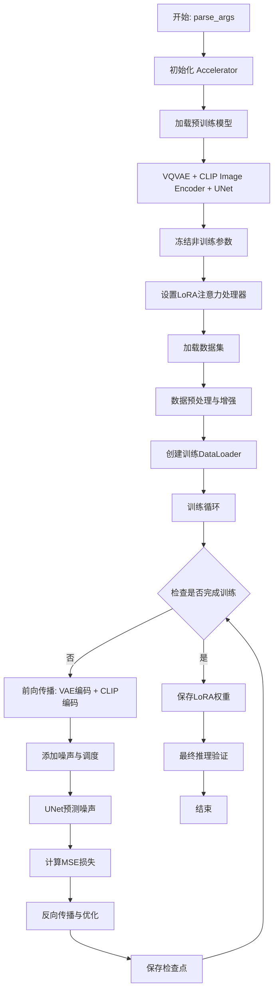
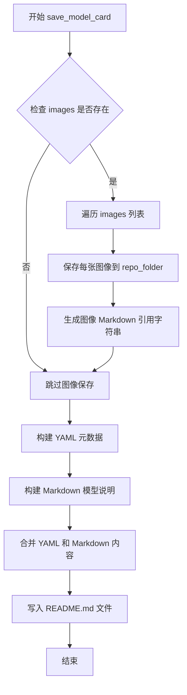
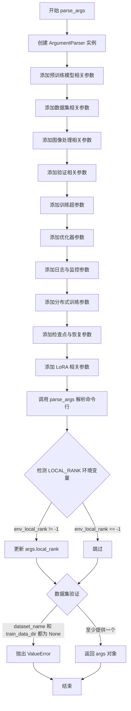
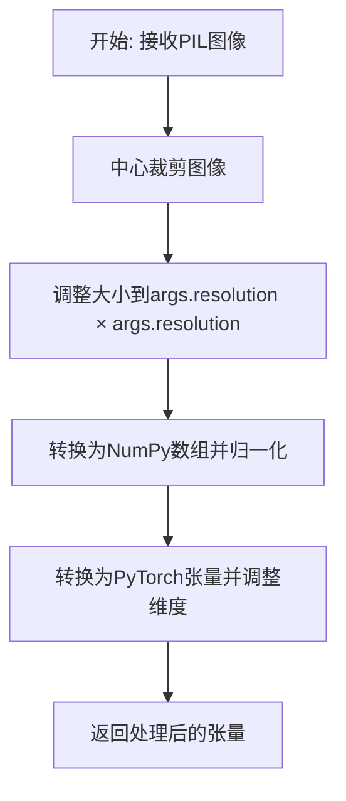
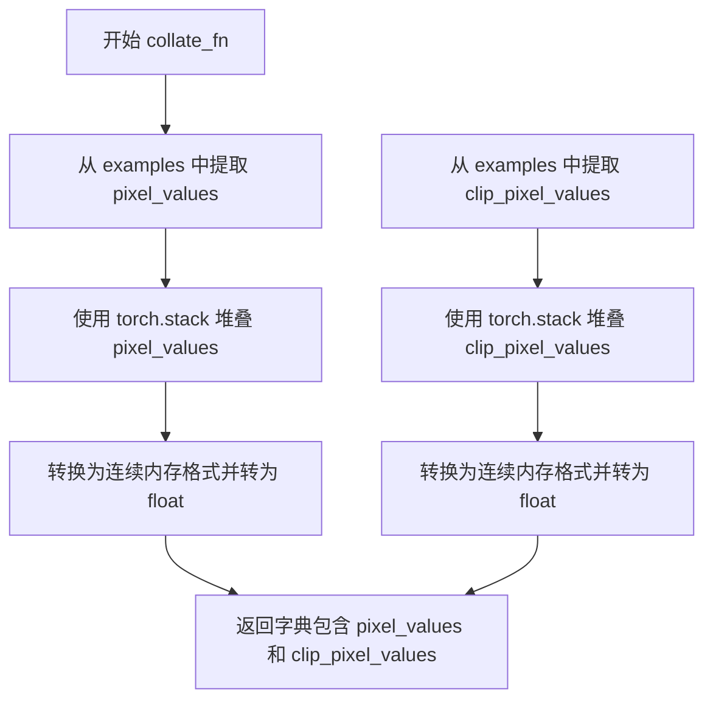

# `diffusers\examples\kandinsky2_2\text_to_image\train_text_to_image_lora_decoder.py` 详细设计文档

这是一个用于Kandinsky 2.2文本到图像模型的LoRA微调脚本，支持通过LoRA技术对UNet进行轻量级微调，实现个性化图像生成。

## 整体流程



## 类结构

```
脚本型代码 (无类定义)
├── 全局函数
│   ├── save_model_card (保存模型卡片)
│   ├── parse_args (解析命令行参数)
│   └── main (主训练函数)
└── 内部嵌套函数
    ├── center_crop (中心裁剪)
    ├── train_transforms (训练数据转换)
    ├── preprocess_train (训练数据预处理)
    └── collate_fn (批次整理)
```

## 全局变量及字段


### `logger`
    
用于记录训练过程中的日志信息

类型：`logging.Logger`
    


### `args`
    
存储所有命令行参数的配置对象

类型：`argparse.Namespace`
    


### `accelerator`
    
负责分布式训练、混合精度和模型状态管理的加速器

类型：`Accelerate Accelerator`
    


### `noise_scheduler`
    
DDPM噪声调度器，用于在扩散模型中添加和去除噪声

类型：`diffusers DDPMScheduler`
    


### `image_processor`
    
CLIP图像预处理器，用于对输入图像进行标准化和转换

类型：`transformers CLIPImageProcessor`
    


### `image_encoder`
    
CLIP视觉编码器模型，用于提取图像特征嵌入

类型：`transformers CLIPVisionModelWithProjection`
    


### `vae`
    
矢量量化变分自编码器，用于将图像编码到潜在空间

类型：`diffusers VQModel`
    


### `unet`
    
条件UNet2D模型，用于在给定条件下预测噪声残差

类型：`diffusers UNet2DConditionModel`
    


### `lora_attn_procs`
    
存储UNet中各注意力层的LoRA处理器映射字典

类型：`dict`
    


### `lora_layers`
    
封装LoRA注意力处理器参数的集合，用于训练和优化

类型：`diffusers AttnProcsLayers`
    


### `optimizer`
    
AdamW优化器，用于更新LoRA层的训练参数

类型：`torch.optim AdamW`
    


### `train_dataset`
    
经过预处理和转换后的训练数据集

类型：`datasets Dataset`
    


### `train_dataloader`
    
训练数据加载器，负责批量加载和预处理训练数据

类型：`torch DataLoader`
    


### `lr_scheduler`
    
学习率调度器，用于动态调整训练过程中的学习率

类型：`transformers lr_scheduler`
    


### `weight_dtype`
    
混合精度训练中使用的张量数据类型（fp16/bf16/fp32）

类型：`torch dtype`
    


### `global_step`
    
全局训练步数计数器，记录已执行的优化更新次数

类型：`int`
    


### `first_epoch`
    
起始训练轮次，用于从检查点恢复训练时确定开始轮数

类型：`int`
    


### `train_loss`
    
当前训练周期内的累积损失值，用于监控训练进度

类型：`float`
    


### `progress_bar`
    
训练进度条，用于可视化显示训练进度

类型：`tqdm ProgressBar`
    


    

## 全局函数及方法


### `save_model_card`

该函数用于在模型训练完成后生成并保存模型的文档卡片（Model Card），包含模型元数据、训练信息和示例图像，并将其写入README.md文件。

参数：

- `repo_id`：`str`，Hugging Face Hub上的仓库ID，用于标识模型仓库
- `images`：`list`，训练过程中生成的示例图像列表，用于展示模型效果
- `base_model`：`str`，用于微调的基础模型名称或路径
- `dataset_name`：`str`，用于微训练的数据集名称
- `repo_folder`：`str`，输出目录的路径，用于保存README.md和示例图像

返回值：`None`，该函数无返回值，直接将模型卡片写入文件系统

#### 流程图



#### 带注释源码

```python
def save_model_card(repo_id: str, images=None, base_model=str, dataset_name=str, repo_folder=None):
    """
    生成并保存模型的文档卡片（Model Card）
    
    参数:
        repo_id: Hugging Face Hub上的仓库ID
        images: 训练过程中生成的示例图像列表
        base_model: 用于微调的基础模型名称
        dataset_name: 训练使用的数据集名称
        repo_folder: 输出目录路径
    """
    
    # 初始化图像引用字符串
    img_str = ""
    
    # 遍历所有示例图像并保存到本地
    for i, image in enumerate(images):
        # 将每张图像保存为 PNG 格式，文件名格式为 image_{i}.png
        image.save(os.path.join(repo_folder, f"image_{i}.png"))
        # 构建 Markdown 格式的图像引用
        img_str += f"\n"

    # 构建 YAML 格式的模型元数据
    yaml = f"""
---
license: creativeml-openrail-m
base_model: {base_model}
tags:
- kandinsky
- text-to-image
- diffusers
- diffusers-training
- lora
inference: true
---
    """
    
    # 构建 Markdown 格式的模型说明
    model_card = f"""
# LoRA text2image fine-tuning - {repo_id}
These are LoRA adaption weights for {base_model}. The weights were fine-tuned on the {dataset_name} dataset. You can find some example images in the following. \n
{img_str}
"""
    
    # 将完整的模型卡片内容写入 README.md 文件
    with open(os.path.join(repo_folder, "README.md"), "w") as f:
        f.write(yaml + model_card)
```


### `parse_args`

该函数是 Kandinsky 2.2 LoRA 微调脚本的命令行参数解析器，通过 `argparse` 模块定义并收集所有训练相关的配置选项，包括模型路径、数据集参数、训练超参数、优化器设置、分布式训练配置等，最终返回一个包含所有解析参数的 `Namespace` 对象。

参数：

该函数没有显式参数，内部使用 `argparse.ArgumentParser()` 自动从命令行读取参数。

返回值：`Namespace`，一个 argparse 解析后的命名空间对象，包含所有定义的超参数和配置选项，供 `main()` 函数使用。

#### 流程图



#### 带注释源码

```python
def parse_args():
    """
    解析命令行参数并返回包含所有训练配置的 Namespace 对象。
    
    该函数定义了 Kandinsky 2.2 LoRA 微调脚本的所有可配置选项，
    包括模型路径、数据集配置、训练超参数、优化器设置等。
    """
    # 创建 ArgumentParser 实例，description 用于命令行帮助信息
    parser = argparse.ArgumentParser(description="Simple example of finetuning Kandinsky 2.2 with LoRA.")
    
    # ==================== 预训练模型参数 ====================
    parser.add_argument(
        "--pretrained_decoder_model_name_or_path",
        type=str,
        default="kandinsky-community/kandinsky-2-2-decoder",
        required=False,
        help="Path to pretrained model or model identifier from huggingface.co/models.",
    )
    parser.add_argument(
        "--pretrained_prior_model_name_or_path",
        type=str,
        default="kandinsky-community/kandinsky-2-2-prior",
        required=False,
        help="Path to pretrained model or model identifier from huggingface.co/models.",
    )
    
    # ==================== 数据集参数 ====================
    parser.add_argument(
        "--dataset_name",
        type=str,
        default=None,
        help=(
            "The name of the Dataset (from the HuggingFace hub) to train on (could be your own, possibly private,"
            " dataset). It can also be a path pointing to a local copy of a dataset in your filesystem,"
            " or to a folder containing files that 🤗 Datasets can understand."
        ),
    )
    parser.add_argument(
        "--dataset_config_name",
        type=str,
        default=None,
        help="The config of the Dataset, leave as None if there's only one config.",
    )
    parser.add_argument(
        "--train_data_dir",
        type=str,
        default=None,
        help=(
            "A folder containing the training data. Folder contents must follow the structure described in"
            " https://huggingface.co/docs/datasets/image_dataset#imagefolder. In particular, a `metadata.jsonl` file"
            " must exist to provide the captions for the images. Ignored if `dataset_name` is specified."
        ),
    )
    
    # ==================== 图像与验证参数 ====================
    parser.add_argument(
        "--image_column", type=str, default="image", help="The column of the dataset containing an image."
    )
    parser.add_argument(
        "--validation_prompt", type=str, default=None, help="A prompt that is sampled during training for inference."
    )
    parser.add_argument(
        "--num_validation_images",
        type=int,
        default=4,
        help="Number of images that should be generated during validation with `validation_prompt`.",
    )
    parser.add_argument(
        "--validation_epochs",
        type=int,
        default=1,
        help=(
            "Run fine-tuning validation every X epochs. The validation process consists of running the prompt"
            " `args.validation_prompt` multiple times: `args.num_validation_images`."
        ),
    )
    
    # ==================== 训练过程控制参数 ====================
    parser.add_argument(
        "--max_train_samples",
        type=int,
        default=None,
        help=(
            "For debugging purposes or quicker training, truncate the number of training examples to this "
            "value if set."
        ),
    )
    parser.add_argument(
        "--output_dir",
        type=str,
        default="kandi_2_2-model-finetuned-lora",
        help="The output directory where the model predictions and checkpoints will be written.",
    )
    parser.add_argument(
        "--cache_dir",
        type=str,
        default=None,
        help="The directory where the downloaded models and datasets will be stored.",
    )
    parser.add_argument("--seed", type=int, default=None, help="A seed for reproducible training.")
    parser.add_argument(
        "--resolution",
        type=int,
        default=512,
        help=(
            "The resolution for input images, all the images in the train/validation dataset will be resized to this"
            " resolution"
        ),
    )
    parser.add_argument(
        "--train_batch_size", type=int, default=1, help="Batch size (per device) for the training dataloader."
    )
    parser.add_argument("--num_train_epochs", type=int, default=100)
    parser.add_argument(
        "--max_train_steps",
        type=int,
        default=None,
        help="Total number of training steps to perform.  If provided, overrides num_train_epochs.",
    )
    parser.add_argument(
        "--gradient_accumulation_steps",
        type=int,
        default=1,
        help="Number of updates steps to accumulate before performing a backward/update pass.",
    )
    parser.add_argument(
        "--gradient_checkpointing",
        action="store_true",
        help="Whether or not to use gradient checkpointing to save memory at the expense of slower backward pass.",
    )
    
    # ==================== 学习率与调度器参数 ====================
    parser.add_argument(
        "--learning_rate",
        type=float,
        default=1e-4,
        help="Initial learning rate (after the potential warmup period) to use.",
    )
    parser.add_argument(
        "--lr_scheduler",
        type=str,
        default="constant",
        help=(
            'The scheduler type to use. Choose between ["linear", "cosine", "cosine_with_restarts", "polynomial",'
            ' "constant", "constant_with_warmup"]'
        ),
    )
    parser.add_argument(
        "--lr_warmup_steps", type=int, default=500, help="Number of steps for the warmup in the lr scheduler."
    )
    parser.add_argument(
        "--snr_gamma",
        type=float,
        default=None,
        help="SNR weighting gamma to be used if rebalancing the loss. Recommended value is 5.0. "
        "More details here: https://huggingface.co/papers/2303.09556.",
    )
    
    # ==================== 优化器参数 ====================
    parser.add_argument(
        "--use_8bit_adam", action="store_true", help="Whether or not to use 8-bit Adam from bitsandbytes."
    )
    parser.add_argument(
        "--allow_tf32",
        action="store_true",
        help=(
            "Whether or not to allow TF32 on Ampere GPUs. Can be used to speed up training. For more information, see"
            " https://pytorch.org/docs/stable/notes/cuda.html#tensorfloat-32-tf32-on-ampere-devices"
        ),
    )
    parser.add_argument(
        "--dataloader_num_workers",
        type=int,
        default=0,
        help=(
            "Number of subprocesses to use for data loading. 0 means that the data will be loaded in the main process."
        ),
    )
    parser.add_argument("--adam_beta1", type=float, default=0.9, help="The beta1 parameter for the Adam optimizer.")
    parser.add_argument("--adam_beta2", type=float, default=0.999, help="The beta2 parameter for the Adam optimizer.")
    parser.add_argument("--adam_weight_decay", type=float, default=0.0, help="Weight decay to use.")
    parser.add_argument("--adam_epsilon", type=float, default=1e-08, help="Epsilon value for the Adam optimizer")
    parser.add_argument("--max_grad_norm", default=1.0, type=float, help="Max gradient norm.")
    
    # ==================== Hub 推送参数 ====================
    parser.add_argument("--push_to_hub", action="store_true", help="Whether or not to push the model to the Hub.")
    parser.add_argument("--hub_token", type=str, default=None, help="The token to use to push to the Model Hub.")
    parser.add_argument(
        "--hub_model_id",
        type=str,
        default=None,
        help="The name of the repository to keep in sync with the local `output_dir`.",
    )
    
    # ==================== 日志与监控参数 ====================
    parser.add_argument(
        "--logging_dir",
        type=str,
        default="logs",
        help=(
            "[TensorBoard](https://www.tensorflow.org/tensorboard) log directory. Will default to"
            " *output_dir/runs/**CURRENT_DATETIME_HOSTNAME***."
        ),
    )
    parser.add_argument(
        "--mixed_precision",
        type=str,
        default=None,
        choices=["no", "fp16", "bf16"],
        help=(
            "Whether to use mixed precision. Choose between fp16 and bf16 (bfloat16). Bf16 requires PyTorch >="
            " 1.10.and an Nvidia Ampere GPU.  Default to the value of accelerate config of the current system or the"
            " flag passed with the `accelerate.launch` command. Use this argument to override the accelerate config."
        ),
    )
    parser.add_argument(
        "--report_to",
        type=str,
        default="tensorboard",
        help=(
            'The integration to report the results and logs to. Supported platforms are `"tensorboard"`'
            ' (default), `"wandb"` and `"comet_ml"`. Use `"all"` to report to all integrations.'
        ),
    )
    parser.add_argument("--local_rank", type=int, default=-1, help="For distributed training: local_rank")
    
    # ==================== 检查点参数 ====================
    parser.add_argument(
        "--checkpointing_steps",
        type=int,
        default=500,
        help=(
            "Save a checkpoint of the training state every X updates. These checkpoints are only suitable for resuming"
            " training using `--resume_from_checkpoint`."
        ),
    )
    parser.add_argument(
        "--checkpoints_total_limit",
        type=int,
        default=None,
        help=("Max number of checkpoints to store."),
    )
    parser.add_argument(
        "--resume_from_checkpoint",
        type=str,
        default=None,
        help=(
            "Whether training should be resumed from a previous checkpoint. Use a path saved by"
            ' `--checkpointing_steps`, or `"latest"` to automatically select the last available checkpoint.'
        ),
    )
    
    # ==================== LoRA 特定参数 ====================
    parser.add_argument(
        "--rank",
        type=int,
        default=4,
        help=("The dimension of the LoRA update matrices."),
    )

    # 解析命令行参数为 Namespace 对象
    args = parser.parse_args()
    
    # 从环境变量获取 LOCAL_RANK，用于分布式训练场景下自动同步
    # 确保环境变量中的 rank 与命令行参数一致
    env_local_rank = int(os.environ.get("LOCAL_RANK", -1))
    if env_local_rank != -1 and env_local_rank != args.local_rank:
        args.local_rank = env_local_rank

    # 合理性检查：必须提供数据集名称或训练数据目录之一
    if args.dataset_name is None and args.train_data_dir is None:
        raise ValueError("Need either a dataset name or a training folder.")

    # 返回包含所有解析后参数的 Namespace 对象
    return args
```


### main

该函数是脚本的核心入口，负责协调整个LoRA微调流程。它首先解析命令行参数并初始化Accelerator环境，随后加载并冻结预训练的Kandinsky模型组件（Decoder、Prior、VAE、UNet、ImageEncoder），并为UNet注入LoRA注意力处理器。接着，它负责加载图像数据集、构建DataLoader，并执行包含前向传播、噪声预测、损失计算、反向梯度更新及模型检查点保存的完整训练周期。训练结束后，函数保存LoRA权重并运行最终推理以验证模型质量。

参数： 无（参数通过内部调用 `parse_args()` 获取）

返回值： 无

#### 流程图

```mermaid
graph TD
    A([开始 main]) --> B[解析命令行参数: parse_args]
    B --> C[初始化 Accelerator: 混合精度、分布式配置]
    C --> D[配置日志与随机种子]
    D --> E[加载预训练组件]
    E --> E1[加载 DDPMScheduler]
    E --> E2[加载 CLIPImageProcessor & ImageEncoder]
    E --> E3[加载 VQModel (VAE)]
    E --> E4[加载 UNet2DConditionModel]
    E --> F[冻结模型参数: requires_grad_(False)]
    F --> G[配置 LoRA 注意力处理器]
    G --> H[设置优化器: AdamW (或 8bit Adam)]
    H --> I[加载与预处理数据集]
    I --> J[构建 DataLoader]
    J --> K[准备学习率调度器 LR Scheduler]
    K --> L[accelerator.prepare 准备训练组件]
    L --> M{进入训练循环}
    
    M --> N[遍历 Epochs]
    N --> O[遍历 Steps]
    O --> P[前向传播: VAE 编码, ImageEncoder 编码]
    P --> Q[添加噪声: noise_scheduler.add_noise]
    Q --> R[UNet 预测噪声残差]
    R --> S[计算损失: MSE (或 SNR 加权)]
    S --> T[反向传播: accelerator.backward]
    T --> U{检查梯度同步}
    U -->|Yes| V[梯度裁剪与参数更新]
    U -->|No| V
    V --> W[学习率调度器步进 & 清空梯度]
    W --> X{检查是否需要保存 Checkpoint}
    X -->|Yes| Y[保存 Accelerator State]
    X -->|No| Z
    
    Y --> Z[更新 Progress Bar]
    Z --> AA{检查 Validation 设置}
    AA -->|Yes| AB[运行验证: 生成图像]
    AA -->|No| AC
    
    AB --> AC{是否结束训练}
    AC -->|No| N
    AC -->|Yes| AD[保存 LoRA 权重到本地]
    
    AD --> AE{检查是否 Push to Hub}
    AE -->|Yes| AF[上传模型到 Hub]
    AE -->|No| AG
    
    AF --> AG[加载完整管道进行最终推理]
    AG --> AH([结束])
```

#### 带注释源码

```python
def main():
    # 1. 解析命令行参数
    args = parse_args()

    # 安全检查：防止同时使用 wandb 和 hub_token
    if args.report_to == "wandb" and args.hub_token is not None:
        raise ValueError(
            "You cannot use both --report_to=wandb and --hub_token due to a security risk of exposing your token."
            " Please use `hf auth login` to authenticate with the Hub."
        )

    # 2. 配置输出目录和 Accelerator
    logging_dir = Path(args.output_dir, args.logging_dir)
    accelerator_project_config = ProjectConfiguration(
        total_limit=args.checkpoints_total_limit, project_dir=args.output_dir, logging_dir=logging_dir
    )
    accelerator = Accelerator(
        gradient_accumulation_steps=args.gradient_accumulation_steps,
        mixed_precision=args.mixed_precision,
        log_with=args.report_to,
        project_config=accelerator_project_config,
    )

    # 禁用 AMP for MPS (Apple Silicon)
    if torch.backends.mps.is_available():
        accelerator.native_amp = False

    # 3. 设置日志记录器
    logging.basicConfig(
        format="%(asctime)s - %(levelname)s - %(name)s - %(message)s",
        datefmt="%m/%d/%Y %H:%M:%S",
        level=logging.INFO,
    )
    logger.info(accelerator.state, main_process_only=False)
    # 根据进程主次设置不同级别的日志
    if accelerator.is_local_main_process:
        datasets.utils.logging.set_verbosity_warning()
        transformers.utils.logging.set_verbosity_warning()
        diffusers.utils.logging.set_verbosity_info()
    else:
        datasets.utils.logging.set_verbosity_error()
        transformers.utils.logging.set_verbosity_error()
        diffusers.utils.logging.set_verbosity_error()

    # 设置随机种子
    if args.seed is not None:
        set_seed(args.seed)

    # 4. 处理输出目录和 Hub 仓库创建
    if accelerator.is_main_process:
        if args.output_dir is not None:
            os.makedirs(args.output_dir, exist_ok=True)

        if args.push_to_hub:
            repo_id = create_repo(
                repo_id=args.hub_model_id or Path(args.output_dir).name, exist_ok=True, token=args.hub_token
            ).repo_id

    # 5. 加载预训练模型和组件
    noise_scheduler = DDPMScheduler.from_pretrained(args.pretrained_decoder_model_name_or_path, subfolder="scheduler")
    image_processor = CLIPImageProcessor.from_pretrained(
        args.pretrained_prior_model_name_or_path, subfolder="image_processor"
    )
    image_encoder = CLIPVisionModelWithProjection.from_pretrained(
        args.pretrained_prior_model_name_or_path, subfolder="image_encoder"
    )
    vae = VQModel.from_pretrained(args.pretrained_decoder_model_name_or_path, subfolder="movq")
    unet = UNet2DConditionModel.from_pretrained(args.pretrained_decoder_model_name_or_path, subfolder="unet")

    # 冻结模型参数以节省显存
    unet.requires_grad_(False)
    vae.requires_grad_(False)
    image_encoder.requires_grad_(False)

    # 确定权重数据类型 (float32, fp16, bf16)
    weight_dtype = torch.float32
    if accelerator.mixed_precision == "fp16":
        weight_dtype = torch.float16
    elif accelerator.mixed_precision == "bf16":
        weight_dtype = torch.bfloat16

    # 将模型移至设备并转换数据类型
    unet.to(accelerator.device, dtype=weight_dtype)
    vae.to(accelerator.device, dtype=weight_dtype)
    image_encoder.to(accelerator.device, dtype=weight_dtype)

    # 6. 配置 LoRA 注意力处理器
    lora_attn_procs = {}
    for name in unet.attn_processors.keys():
        cross_attention_dim = None if name.endswith("attn1.processor") else unet.config.cross_attention_dim
        # 获取对应层的隐藏大小
        if name.startswith("mid_block"):
            hidden_size = unet.config.block_out_channels[-1]
        elif name.startswith("up_blocks"):
            block_id = int(name[len("up_blocks.")])
            hidden_size = list(reversed(unet.config.block_out_channels))[block_id]
        elif name.startswith("down_blocks"):
            block_id = int(name[len("down_blocks.")])
            hidden_size = unet.config.block_out_channels[block_id]

        lora_attn_procs[name] = LoRAAttnAddedKVProcessor(
            hidden_size=hidden_size,
            cross_attention_dim=cross_attention_dim,
            rank=args.rank,
        )

    unet.set_attn_processor(lora_attn_procs)
    lora_layers = AttnProcsLayers(unet.attn_processors)

    # 允许 TF32 加速
    if args.allow_tf32:
        torch.backends.cuda.matmul.allow_tf32 = True

    # 7. 准备优化器
    if args.use_8bit_adam:
        try:
            import bitsandbytes as bnb
        except ImportError:
            raise ImportError("Please install bitsandbytes to use 8-bit Adam.")
        optimizer_cls = bnb.optim.AdamW8bit
    else:
        optimizer_cls = torch.optim.AdamW

    optimizer = optimizer_cls(
        lora_layers.parameters(),
        lr=args.learning_rate,
        betas=(args.adam_beta1, args.adam_beta2),
        weight_decay=args.adam_weight_decay,
        eps=args.adam_epsilon,
    )

    # 8. 加载数据集
    if args.dataset_name is not None:
        dataset = load_dataset(
            args.dataset_name,
            args.dataset_config_name,
            cache_dir=args.cache_dir,
        )
    else:
        data_files = {}
        if args.train_data_dir is not None:
            data_files["train"] = os.path.join(args.train_data_dir, "**")
        dataset = load_dataset(
            "imagefolder",
            data_files=data_files,
            cache_dir=args.cache_dir,
        )

    # 数据预处理函数定义
    def center_crop(image):
        width, height = image.size
        new_size = min(width, height)
        left = (width - new_size) / 2
        top = (height - new_size) / 2
        right = (width + new_size) / 2
        bottom = (height + new_size) / 2
        return image.crop((left, top, right, bottom))

    def train_transforms(img):
        img = center_crop(img)
        img = img.resize((args.resolution, args.resolution), resample=Image.BICUBIC, reducing_gap=1)
        img = np.array(img).astype(np.float32) / 127.5 - 1
        img = torch.from_numpy(np.transpose(img, [2, 0, 1]))
        return img

    def preprocess_train(examples):
        images = [image.convert("RGB") for image in examples[image_column]]
        examples["pixel_values"] = [train_transforms(image) for image in images]
        examples["clip_pixel_values"] = image_processor(images, return_tensors="pt").pixel_values
        return examples

    # 应用预处理
    with accelerator.main_process_first():
        if args.max_train_samples is not None:
            dataset["train"] = dataset["train"].shuffle(seed=args.seed).select(range(args.max_train_samples))
        train_dataset = dataset["train"].with_transform(preprocess_train)

    # 批处理整理函数
    def collate_fn(examples):
        pixel_values = torch.stack([example["pixel_values"] for example in examples])
        pixel_values = pixel_values.to(memory_format=torch.contiguous_format).float()
        clip_pixel_values = torch.stack([example["clip_pixel_values"] for example in examples])
        clip_pixel_values = clip_pixel_values.to(memory_format=torch.contiguous_format).float()
        return {"pixel_values": pixel_values, "clip_pixel_values": clip_pixel_values}

    train_dataloader = torch.utils.data.DataLoader(
        train_dataset,
        shuffle=True,
        collate_fn=collate_fn,
        batch_size=args.train_batch_size,
        num_workers=args.dataloader_num_workers,
    )

    # 9. 配置学习率调度器
    overrode_max_train_steps = False
    num_update_steps_per_epoch = math.ceil(len(train_dataloader) / args.gradient_accumulation_steps)
    if args.max_train_steps is None:
        args.max_train_steps = args.num_train_epochs * num_update_steps_per_epoch
        overrode_max_train_steps = True

    lr_scheduler = get_scheduler(
        args.lr_scheduler,
        optimizer=optimizer,
        num_warmup_steps=args.lr_warmup_steps * args.gradient_accumulation_steps,
        num_training_steps=args.max_train_steps * args.gradient_accumulation_steps,
    )

    # 10. 使用 Accelerator 准备所有组件
    lora_layers, optimizer, train_dataloader, lr_scheduler = accelerator.prepare(
        lora_layers, optimizer, train_dataloader, lr_scheduler
    )

    # 重新计算训练步数
    num_update_steps_per_epoch = math.ceil(len(train_dataloader) / args.gradient_accumulation_steps)
    if overrode_max_train_steps:
        args.max_train_steps = args.num_train_epochs * num_update_steps_per_epoch
    args.num_train_epochs = math.ceil(args.max_train_steps / num_update_steps_per_epoch)

    # 初始化追踪器
    if accelerator.is_main_process:
        accelerator.init_trackers("text2image-fine-tune", config=vars(args))

    # 11. 训练循环
    total_batch_size = args.train_batch_size * accelerator.num_processes * args.gradient_accumulation_steps
    logger.info("***** Running training *****")
    logger.info(f"  Num examples = {len(train_dataset)}")
    logger.info(f"  Num Epochs = {args.num_train_epochs}")
    logger.info(f"  Instantaneous batch size per device = {args.train_batch_size}")
    logger.info(f"  Total train batch size = {total_batch_size}")
    logger.info(f"  Gradient Accumulation steps = {args.gradient_accumulation_steps}")
    logger.info(f"  Total optimization steps = {args.max_train_steps}")

    global_step = 0
    first_epoch = 0

    # 检查是否从 checkpoint 恢复
    if args.resume_from_checkpoint:
        # ... (恢复逻辑: 查找最新checkpoint并加载)
        pass 
    else:
        initial_global_step = 0

    progress_bar = tqdm(
        range(0, args.max_train_steps),
        initial=initial_global_step,
        desc="Steps",
        disable=not accelerator.is_local_main_process,
    )

    for epoch in range(first_epoch, args.num_train_epochs):
        unet.train()
        train_loss = 0.0
        for step, batch in enumerate(train_dataloader):
            with accelerator.accumulate(unet):
                # 数据准备
                images = batch["pixel_values"].to(weight_dtype)
                clip_images = batch["clip_pixel_values"].to(weight_dtype)
                
                # 编码到潜在空间
                latents = vae.encode(images).latents
                image_embeds = image_encoder(clip_images).image_embeds
                
                # 采样噪声和时间步
                noise = torch.randn_like(latents)
                bsz = latents.shape[0]
                timesteps = torch.randint(0, noise_scheduler.config.num_train_timesteps, (bsz,), device=latents.device).long()

                # 添加噪声
                noisy_latents = noise_scheduler.add_noise(latents, noise, timesteps)
                target = noise

                # 预测噪声残差
                added_cond_kwargs = {"image_embeds": image_embeds}
                model_pred = unet(noisy_latents, timesteps, None, added_cond_kwargs=added_cond_kwargs).sample[:, :4]

                # 计算损失
                if args.snr_gamma is None:
                    loss = F.mse_loss(model_pred.float(), target.float(), reduction="mean")
                else:
                    # SNR 加权损失逻辑
                    snr = compute_snr(noise_scheduler, timesteps)
                    mse_loss_weights = torch.stack([snr, args.snr_gamma * torch.ones_like(timesteps)], dim=1).min(dim=1)[0]
                    if noise_scheduler.config.prediction_type == "epsilon":
                        mse_loss_weights = mse_loss_weights / snr
                    elif noise_scheduler.config.prediction_type == "v_prediction":
                        mse_loss_weights = mse_loss_weights / (snr + 1)

                    loss = F.mse_loss(model_pred.float(), target.float(), reduction="none")
                    loss = loss.mean(dim=list(range(1, len(loss.shape)))) * mse_loss_weights
                    loss = loss.mean()

                # 反向传播
                avg_loss = accelerator.gather(loss.repeat(args.train_batch_size)).mean()
                train_loss += avg_loss.item() / args.gradient_accumulation_steps

                accelerator.backward(loss)
                
                # 梯度裁剪
                if accelerator.sync_gradients:
                    params_to_clip = lora_layers.parameters()
                    accelerator.clip_grad_norm_(params_to_clip, args.max_grad_norm)
                
                optimizer.step()
                lr_scheduler.step()
                optimizer.zero_grad()

            # 同步与日志
            if accelerator.sync_gradients:
                progress_bar.update(1)
                global_step += 1
                accelerator.log({"train_loss": train_loss}, step=global_step)
                train_loss = 0.0

                # Checkpoint 保存逻辑
                if global_step % args.checkpointing_steps == 0:
                    if accelerator.is_main_process:
                        # ... (保存和清理旧checkpoint的逻辑)
                        save_path = os.path.join(args.output_dir, f"checkpoint-{global_step}")
                        accelerator.save_state(save_path)
                        logger.info(f"Saved state to {save_path}")

            progress_bar.set_postfix({"step_loss": loss.detach().item(), "lr": lr_scheduler.get_last_lr()[0]})

            if global_step >= args.max_train_steps:
                break

        # 验证流程
        if accelerator.is_main_process:
            if args.validation_prompt is not None and epoch % args.validation_epochs == 0:
                # ... (生成验证图像并记录)
                pass

    # 12. 保存 LoRA 权重
    accelerator.wait_for_everyone()
    if accelerator.is_main_process:
        unet = unet.to(torch.float32)
        unet.save_attn_procs(args.output_dir)

        if args.push_to_hub:
            # ... (上传逻辑)
            pass

    # 13. 最终推理
    # ... (加载pipeline，进行推理，保存结果)
    accelerator.end_training()
```


### `center_crop`

对输入图像进行中心裁剪，使其成为正方形图像（取宽高中较小的值作为边长，从中心点向四周扩展裁剪）。

参数：

- `image`：`PIL.Image`，需要裁剪的原始图像

返回值：`PIL.Image`，裁剪后的正方形图像

#### 流程图

```mermaid
flowchart TD
    A[开始] --> B[获取图像宽度 width 和高度 height]
    B --> C[计算新尺寸 new_size = min width, height]
    C --> D[计算左边距 left = (width - new_size) / 2]
    D --> E[计算上边距 top = (height - new_size) / 2]
    E --> F[计算右边距 right = (width + new_size) / 2]
    F --> G[计算下边距 bottom = (height + new_size) / 2]
    G --> H[调用 image.crop 裁剪图像]
    H --> I[返回裁剪后的图像]
```

#### 带注释源码

```python
def center_crop(image):
    """
    对输入图像进行中心裁剪，使其成为正方形图像
    
    参数:
        image: PIL.Image 对象，输入的原始图像
    
    返回:
        PIL.Image 对象，裁剪后的正方形图像
    """
    # 获取输入图像的宽度和高度
    width, height = image.size
    
    # 计算新尺寸（取宽高中较小的值，确保裁剪后为正方形）
    new_size = min(width, height)
    
    # 计算裁剪框的左边坐标（从中心向左偏移）
    left = (width - new_size) / 2
    
    # 计算裁剪框的上边坐标（从中心向上偏移）
    top = (height - new_size) / 2
    
    # 计算裁剪框的右边坐标（从中心向右偏移）
    right = (width + new_size) / 2
    
    # 计算裁剪框的下边坐标（从中心向下偏移）
    bottom = (height + new_size) / 2
    
    # 使用 PIL 的 crop 方法进行中心裁剪
    # crop 接收一个元组 (left, top, right, bottom)
    return image.crop((left, top, right, bottom))
```


### `train_transforms`

该函数用于对训练图像进行预处理，包括中心裁剪、调整大小到指定分辨率、归一化到[-1, 1]范围，并将PIL图像转换为PyTorch张量格式。

参数：

- `img`：`PIL.Image`，输入的PIL图像对象

返回值：`torch.Tensor`，处理后的图像张量，形状为(C, H, W)，值域为[-1, 1]

#### 流程图



#### 带注释源码

```python
def train_transforms(img):
    """
    对训练图像进行预处理变换
    
    参数:
        img: PIL.Image对象，输入的原始图像
        
    返回值:
        torch.Tensor: 处理后的图像张量，形状为(C, H, W)，值域为[-1, 1]
    """
    # 1. 中心裁剪图像 - 裁剪为正方形，取中间区域
    img = center_crop(img)
    
    # 2. 调整图像大小到指定分辨率
    # 使用BICUBIC插值，reducing_gap=1表示不进行额外的下采样优化
    img = img.resize((args.resolution, args.resolution), resample=Image.BICUBIC, reducing_gap=1)
    
    # 3. 转换为NumPy数组并归一化
    # 将像素值从[0, 255]映射到[-1, 1]范围
    # np.float32 / 127.5 - 1 等价于 (pixel / 255.0) * 2 - 1
    img = np.array(img).astype(np.float32) / 127.5 - 1
    
    # 4. 转换为PyTorch张量并调整维度
    # 从(H, W, C)转换为(C, H, W)格式，符合PyTorch的通道优先格式
    img = torch.from_numpy(np.transpose(img, [2, 0, 1]))
    
    return img
```


### `preprocess_train`

该函数负责对训练数据集中的图像进行预处理，包括将图像转换为RGB格式、应用训练转换（中心裁剪、调整大小、归一化）以及使用CLIP图像处理器提取CLIP像素值，最终返回包含处理后像素值的样本字典。

参数：

- `examples`：`Dict`，包含数据集样本的字典，必须包含`image_column`指定的图像列（如"image"列），每个样本包含原始PIL图像

返回值：`Dict`，返回处理后的样本字典，包含以下键：
- `pixel_values`：经过预处理（中心裁剪、调整大小、归一化）的图像张量，类型为`torch.Tensor`
- `clip_pixel_values`：经过CLIP图像处理器处理的像素值，类型为`torch.Tensor`

#### 流程图

```mermaid
flowchart TD
    A[开始: preprocess_train] --> B[从examples获取image_column指定的图像列表]
    B --> C[对每个图像执行convert&#40;'RGB'&#41;转换为RGB格式]
    C --> D[对每个RGB图像应用train_transforms变换]
    D --> E{变换步骤}
    E --> F1[center_crop: 中心裁剪为正方形]
    F1 --> F2[resize: 调整大小为args.resolution]
    F2 --> F3[转换为numpy数组并归一化到-1到1]
    F3 --> F4[转换为torch.Tensor并调整通道顺序]
    E --> G[将处理后的图像列表赋值给examples['pixel_values']]
    G --> H[使用image_processor处理原始RGB图像列表]
    H --> I[提取processor返回的pixel_values赋值给examples['clip_pixel_values']]
    I --> J[返回处理后的examples字典]
    J --> K[结束]
```

#### 带注释源码

```python
def preprocess_train(examples):
    """
    对训练数据集中的图像进行预处理
    
    处理流程:
    1. 从输入样本中提取图像列并转换为RGB格式
    2. 对图像进行中心裁剪、调整大小和归一化处理
    3. 使用CLIP图像处理器提取CLIP特征所需的像素值
    
    参数:
        examples: Dict类型，包含数据集样本的字典
                 必须包含由args.image_column指定的图像列
                 图像格式为PIL.Image.Image
    
    返回:
        Dict类型，包含处理后的样本:
        - pixel_values: 经过预处理的图像张量，用于VAE编码
                       形状为[batch, 3, resolution, resolution]
        - clip_pixel_values: CLIP图像处理器输出的像素值
                           用于CLIP图像编码器提取图像嵌入
    """
    # 从样本中获取指定列的图像列表，并将每张图像转换为RGB格式
    # 统一转换为RGB确保通道一致性（处理RGBA、灰度等格式）
    images = [image.convert("RGB") for image in examples[image_column]]
    
    # 对每个RGB图像应用训练变换（中心裁剪、调整大小、归一化）
    # train_transforms函数包含以下步骤:
    #   1. center_crop: 从图像中心裁剪出正方形区域
    #   2. resize: 将图像调整为目标分辨率(args.resolution)
    #   3. 归一化: 将像素值从[0,255]映射到[-1,1]
    #   4. 转换为torch.Tensor并调整通道顺序HWC->CHW
    examples["pixel_values"] = [train_transforms(image) for image in images]
    
    # 使用CLIP图像处理器处理原始RGB图像列表
    # image_processor是CLIPImageProcessor的实例
    # return_tensors="pt"指定返回PyTorch张量
    # 处理包括: 调整大小、中心裁剪、归一化等CLIP所需的预处理
    examples["clip_pixel_values"] = image_processor(images, return_tensors="pt").pixel_values
    
    # 返回包含处理后像素值的样本字典
    # 这些值将用于后续的VAE编码和CLIP图像编码
    return examples
```


### `collate_fn`

该函数是PyTorch DataLoader的回调函数，用于将多个样本数据整理成批量数据。它从数据集中获取图像样本，堆叠像素值和CLIP像素值，转换为连续内存格式并转换为浮点类型，最后返回包含这两种像素值的字典供模型训练使用。

参数：

- `examples`：`List[Dict]`，数据集中的样本列表，每个样本包含"pixel_values"和"clip_pixel_values"键

返回值：`Dict[str, torch.Tensor]`，返回包含"pixel_values"和"clip_pixel_values"两个键的字典，分别表示堆叠后的图像像素值和CLIP处理的图像像素值

#### 流程图



#### 带注释源码

```python
def collate_fn(examples):
    """
    DataLoader的整理函数，将多个样本整理成批量数据
    
    参数:
        examples: 数据集中的样本列表，每个样本是一个字典，包含:
                 - "pixel_values": 预处理后的图像张量
                 - "clip_pixel_values": CLIP处理器处理后的图像张量
    
    返回:
        包含批量像素值数据的字典
    """
    # 从所有样本中提取pixel_values并堆叠成批处理张量
    pixel_values = torch.stack([example["pixel_values"] for example in examples])
    # 转换为连续内存格式以提高内存访问效率，并转换为float32类型
    pixel_values = pixel_values.to(memory_format=torch.contiguous_format).float()
    
    # 从所有样本中提取clip_pixel_values并堆叠成批处理张量
    clip_pixel_values = torch.stack([example["clip_pixel_values"] for example in examples])
    # 同样转换为连续内存格式并转换为float32类型
    clip_pixel_values = clip_pixel_values.to(memory_format=torch.contiguous_format).float()
    
    # 返回包含两种像素值的字典，供模型训练使用
    return {"pixel_values": pixel_values, "clip_pixel_values": clip_pixel_values}
```

## 关键组件


### 张量索引

使用切片操作从UNet输出中提取前4个通道，用于噪声预测。代码中通过`model_pred = unet(...).sample[:, :4]`实现精确的张量维度控制，确保只处理必要的通道数据。

### 惰性加载

通过`vae.encode(images).latents`和`image_encoder(clip_images).image_embeds`实现延迟计算，仅在训练循环需要时才计算VAE潜在空间表示和CLIP图像嵌入，避免不必要的内存占用。

### 反量化支持

通过`weight_dtype`变量动态管理模型精度，支持fp16和bf16混合精度训练。在推理时使用`.float()`方法将预测结果和目标张量转换回float32，确保损失计算的数值稳定性。

### 量化策略

使用`LoRAAttnAddedKVProcessor`实现LoRA注意力机制的量化适配，通过`rank`参数控制LoRA更新矩阵的维度，支持低秩矩阵分解来减少可训练参数数量。

### SNR权重调整

在损失计算中集成信噪比(SNR)加权机制，根据`noise_scheduler.config.prediction_type`（epsilon或v_prediction）动态调整损失权重，实现更稳定的噪声预测训练。

### 梯度累积

通过`gradient_accumulation_steps`参数实现梯度累积，允许在小批量GPU内存下模拟更大的训练批量，同时保持相同的优化效果。

### 检查点管理

实现基于`checkpoints_total_limit`的检查点自动清理机制，保存训练状态包括optimizer、lr_scheduler和随机种子，支持从任意检查点恢复训练。

## 问题及建议


### 已知问题

- **main() 函数过长**：main() 函数超过 700 行，违反单一职责原则，将数据加载、模型初始化、训练循环、验证和保存逻辑全部混在一起，难以维护和测试。
- **硬编码的超参数**：分辨率默认 512、推理步数 30、SNR gamma 等关键超参数在代码中硬编码，缺乏灵活性。
- **缺失的类型注解**：save_model_card、center_crop、train_transforms、preprocess_train、collate_fn 等关键函数缺少参数和返回值的类型注解。
- **center_crop 函数缺陷**：当图像尺寸小于目标尺寸时，计算的新尺寸可能小于等于 0，导致 left/top 为负值或图像裁剪异常。
- **验证逻辑重复**：验证时每次都重新创建 pipeline，训练结束后的最终推理也重新创建了 pipeline，未复用已创建的 pipeline 对象。
- **推理缺少 no_grad**：验证和最终推理阶段未使用 `torch.no_grad()` 或 `torch.inference_mode()`，导致不必要的显存占用和计算开销。
- **MPS 支持不完整**：虽然检测到 MPS 时禁用了 native_amp，但未考虑 MPS 后端的其他兼容性问题和性能优化。
- **缺少早停机制**：没有基于验证损失或监控指标的早停 (early stopping) 功能，可能导致过拟合或浪费训练资源。
- **checkpoint 清理逻辑缺陷**：清理旧 checkpoint 时使用 `shutil.rmtree()` 同步删除大量文件，可能在分布式训练中造成竞争条件和性能瓶颈。

### 优化建议

- **重构 main() 函数**：将 main() 拆分为独立的模块函数，如 `load_models()`、`prepare_dataset()`、`train_loop()`、`validate()`、`save_model()`，提高代码可读性和可测试性。
- **配置对象化**：使用 dataclass 或 Pydantic 模型封装训练配置，将零散的 argparse 参数组织为结构化的配置对象。
- **添加类型注解**：为所有自定义函数添加完整的类型注解，提升代码可维护性和 IDE 支持。
- **修复 center_crop**：添加边界检查，当图像尺寸小于目标尺寸时先进行 padding 或缩放，避免负值索引。
- **复用 pipeline 对象**：将验证时创建的 pipeline 保存下来用于最终推理，避免重复加载模型权重。
- **添加推理上下文管理器**：在验证和最终推理代码块外包裹 `with torch.no_grad():` 或使用 `@torch.no_grad()` 装饰器。
- **添加早停机制**：实现基于验证损失或自定义指标的早停功能，支持patience参数。
- **异步 checkpoint 清理**：使用后台线程或 asyncio 异步删除旧 checkpoint，避免阻塞主训练流程。
- **增强日志和监控**：添加更详细的训练指标日志、内存使用监控、GPU 利用率追踪，便于调试和性能分析。

## 其它


### 设计目标与约束

本脚本的设计目标是通过 LoRA（Low-Rank Adaptation）技术对 Kandinsky 2.2 文本到图像模型进行高效微调，使模型能够适配特定数据集并生成个性化图像。核心约束包括：1）必须使用 diffusers 0.37.0.dev0 及以上版本；2）仅支持 CUDA 或 MPS 后端进行训练；3）混合精度训练仅支持 FP16 和 BF16；4）LoRA rank 参数默认为 4，可通过 --rank 参数调整；5）训练过程中 VAE、Image Encoder 和非 LoRA 部分的 UNet 参数被冻结以节省显存。

### 错误处理与异常设计

代码中的错误处理主要体现在以下几个方面：1）参数校验：parse_args() 函数中检查 dataset_name 和 train_data_dir 必须至少提供一个，否则抛出 ValueError；2）依赖检查：使用 check_min_version() 验证 diffusers 版本，使用 try-except 捕获 bitsandbytes 导入失败并提示安装；3）checkpoint 恢复：resume_from_checkpoint 时检查路径是否存在，不存在则从头开始训练；4）MPS 后端处理：检测到 MPS 可用时自动禁用原生 AMP 以避免兼容性问题；5）分布式训练：使用 accelerator.wait_for_everyone() 确保所有进程同步后再执行保存操作。

### 数据流与状态机

训练数据流遵循以下路径：原始图像 → CenterCrop 裁剪 → 调整分辨率至 512x512 → 归一化至 [-1, 1] 范围 → 转换为 PyTorch Tensor → VAE Encoder 编码为潜在空间表示 → CLIP Image Encoder 生成图像嵌入 → 与噪声混合 → UNet 预测噪声残差 → 计算 MSE Loss → 反向传播更新 LoRA 参数。状态机主要包含：初始化状态（模型加载、参数冻结）→ 训练状态（epoch 循环内的 step 循环）→ 验证状态（定期生成验证图像）→ 保存状态（checkpoint 保存、LoRA 权重导出）→ 推理状态（最终图像生成）。

### 外部依赖与接口契约

本脚本依赖以下核心外部库：transformers（CLIP 模型加载）、diffusers（UNet、VAE、Scheduler、Pipeline）、accelerate（分布式训练加速）、datasets（数据集加载）、huggingface_hub（模型上传）、PIL（图像处理）、numpy（数值计算）、torch（深度学习框架）、bitsandbytes（可选，8-bit Adam 优化器）、wandb/tensorboard（可选，日志记录）。主要接口包括：1）命令行参数接口，通过 argparse 定义 40+ 个训练超参数；2）模型加载接口，from_pretrained() 加载预训练模型；3）数据集接口，load_dataset() 支持 HF Hub 和本地文件夹两种模式；4）输出接口，save_attn_procs() 导出 LoRA 权重，upload_folder() 推送至 Hub。

### 性能考量与优化空间

代码包含多项性能优化：1）梯度累积，通过 gradient_accumulation_steps 实现大 batch 训练；2）梯度检查点，gradient_checkpointing 选项以时间换显存；3）混合精度，FP16/BF16 自动选择；4）TF32 支持，Ampere GPU 上启用 TensorFloat-32 加速矩阵运算；5）参数冻结，VAE 和 Image Encoder 不参与梯度计算；6）动态学习率调度，支持 cosine、linear、polynomial 等多种调度策略；7）Checkpoint 限流，checkpoints_total_limit 自动清理旧 checkpoint。优化空间包括：可增加 DeepSpeed 集成支持、可添加强制加载（force_suffix）避免缓存问题、可实现更细粒度的梯度裁剪策略。

### 安全性与合规性

代码遵循以下安全实践：1）API Token 管理，hub_token 参数可选，避免在命令行中明文传递敏感信息，提示用户使用 hf auth login 认证；2）模型许可证，生成 model card 时使用 creativeml-openrail-m 许可证；3）输入验证，对数据集列名进行校验，确保 image_column 存在；4）分布式安全，使用 accelerator.is_main_process() 确保只有主进程执行文件系统操作（创建目录、上传模型）。

### 配置管理与扩展性

脚本配置管理采用分层设计：1）默认配置，内置在 argparse 的 default 参数中（如 learning_rate=1e-4、rank=4、resolution=512）；2）运行时覆盖，通过命令行参数动态调整；3）配置文件，可通过 accelerate 的配置文件进行全局设置；4）环境变量，支持 LOCAL_RANK 自动检测。扩展性设计：1）模块化处理器，LoRAAttnAddedKVProcessor 可替换为其他 Attention Processor；2）调度器可替换，DDPMScheduler 可替换为 DDIMScheduler 或其他噪声调度器；3）数据增强可扩展，train_transforms 函数可添加更多图像预处理逻辑；4）验证流程可定制，validation_prompt 和 num_validation_images 控制验证频率和数量。

### 版本兼容性说明

本脚本明确要求的版本兼容性：1）diffusers >= 0.37.0.dev0，通过 check_min_version() 强制校验；2）PyTorch >= 1.10（支持 BF16），3）CUDA >= 11.0（支持 TF32），4）Python 版本未明确限制但建议 3.8+。模型兼容性：1）Kandinsky 2.2 Decoder（kandinsky-community/kandinsky-2-2-decoder），2）Kandinsky 2.2 Prior（kandinsky-community/kandinsky-2-2-prior），3）支持其他遵循相同架构的文本到图像模型。第三方库兼容性：bitsandbytes 用于 8-bit Adam（可选）、wandb 用于实验跟踪（可选）、tensorboard 作为默认日志后端。

    