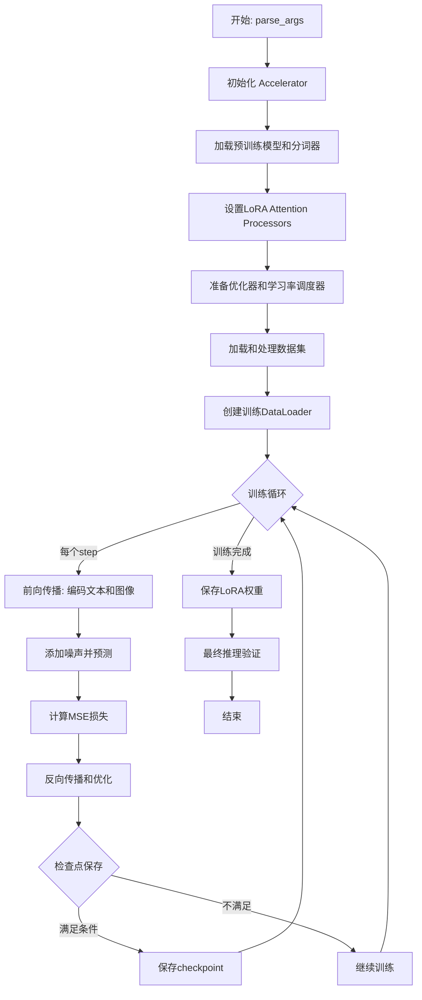
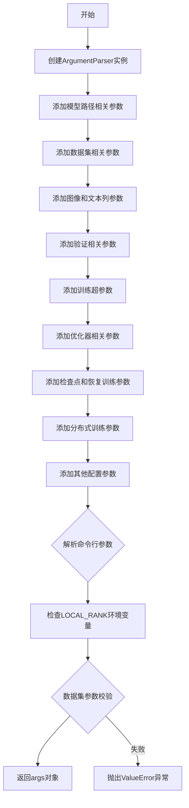
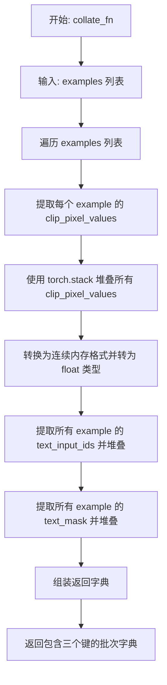

```mermaid
flowchart TD
    A[开始 main 函数] --> B[解析命令行参数 args]
    B --> C[验证报告工具配置]
    C --> D[初始化 Accelerator 加速器]
    D --> E[配置日志系统]
    E --> F[设置随机种子]
    F --> G{是否是主进程?}
    G -->|是| H[创建输出目录]
    G -->|否| I[跳过目录创建]
    H --> J[加载预训练模型和分词器]
    I --> J
    J --> K[冻结不需要梯度的模型参数]
    K --> L[设置混合精度权重类型]
    L --> M[将模型移到设备并转换数据类型]
    M --> N[初始化 LoRA 注意力处理器]
    N --> O[配置优化器 AdamW/8bit Adam]
    O --> P[加载数据集]
    P --> Q[预处理数据集和创建数据加载器]
    Q --> R[配置学习率调度器]
    R --> S[准备训练组件 Accelerator.prepare]
    S --> T[初始化训练跟踪器]
    T --> U[训练循环: 遍历每个 epoch]
    U --> V[遍历每个 batch]
    V --> W[计算噪声并添加到图像嵌入]
    W --> X[前向传播预测噪声残差]
    X --> Y[计算 MSE 损失]
    Y --> Z[反向传播和梯度更新]
    Z --> AA{是否同步梯度?}
    AA -->|是| AB[更新进度条和记录日志]
    AA -->|否| AC[继续下一个 batch]
    AB --> AD{是否需要保存 checkpoint?}
    AD -->|是| AE[保存训练状态]
    AD -->|否| AF{是否完成所有训练步骤?}
    AC --> AF
    AE --> AF
    AF -->|否| V
    AF -->|是| AG{是否需要验证?}
    AG -->|是| AH[运行验证生成图像]
    AG -->|否| AI{是否还有更多 epoch?}
    AH --> AI
    AI -->|是| U
    AI -->|否| AJ[保存 LoRA 权重]
    AJ --> AK{是否推送到 Hub?}
    AK -->|是| AL[保存模型卡片并上传]
    AK -->|否| AM[运行最终推理]
    AL --> AM
    AM --> AN[结束训练]
```

# `diffusers\examples\kandinsky2_2\text_to_image\train_text_to_image_lora_prior.py` 详细设计文档

这是一个用于Stable Diffusion Kandinsky 2.2模型的LoRA微调脚本，支持通过LoRA技术对text2image模型进行轻量级微调，实现个性化的文本到图像生成能力。

## 整体流程



## 类结构

```
该脚本为扁平化结构，无自定义类
主要依赖以下外部模块：
├── diffusers (模型和训练工具)
│   ├── AutoPipelineForText2Image
│   ├── DDPMScheduler
PriorTransformer
│   ├── LoRAAttnProcessor
│   ├── AttnProcsLayers
│   └── get_scheduler
├── transformers (文本处理)
│   ├── CLIPTokenizer
│   ├── CLIPTextModelWithProjection
│   └── CLIPVisionModelWithProjection
├── accelerate (分布式训练)
│   └── Accelerator
└── datasets (数据加载)
```

## 全局变量及字段


### `logger`
    
用于记录训练过程信息的日志记录器

类型：`logging.Logger`
    


### `DATASET_NAME_MAPPING`
    
数据集名称到图像和文本列名的映射字典

类型：`Dict[str, Tuple[str, str]]`
    


### `noise_scheduler`
    
DDPM噪声调度器，用于在扩散过程中添加和移除噪声

类型：`DDPMScheduler`
    


### `image_processor`
    
CLIP图像预处理器，用于处理输入图像

类型：`CLIPImageProcessor`
    


### `tokenizer`
    
CLIP文本分词器，用于将文本转换为token ID

类型：`CLIPTokenizer`
    


### `image_encoder`
    
CLIP视觉编码器，将图像编码为嵌入向量

类型：`CLIPVisionModelWithProjection`
    


### `text_encoder`
    
CLIP文本编码器，将文本编码为嵌入向量

类型：`CLIPTextModelWithProjection`
    


### `prior`
    
先验Transformer模型，用于生成图像嵌入

类型：`PriorTransformer`
    


### `lora_attn_procs`
    
LoRA注意力处理器字典，用于存储各层的LoRA处理器

类型：`Dict[str, LoRAAttnProcessor]`
    


### `lora_layers`
    
LoRA层的包装器，方便参数管理和优化

类型：`AttnProcsLayers`
    


### `optimizer`
    
AdamW优化器，用于更新LoRA参数

类型：`torch.optim.AdamW`
    


### `lr_scheduler`
    
学习率调度器，用于动态调整学习率

类型：`torch.optim.lr_scheduler._LRScheduler`
    


### `train_dataset`
    
经过预处理后的训练数据集

类型：`datasets.Dataset`
    


### `train_dataloader`
    
训练数据加载器，用于批量加载数据

类型：`torch.utils.data.DataLoader`
    


### `accelerator`
    
分布式训练加速器，用于管理混合精度和分布式训练

类型：`Accelerate.Accelerator`
    


    

## 全局函数及方法


### `save_model_card`

该函数用于将训练完成的 LoRA 模型元数据生成一个标准的 HuggingFace 模型卡片（Model Card）并保存为 README.md 文件，同时将示例图像保存到指定目录。

参数：

- `repo_id`：`str`，HuggingFace Hub 上的仓库 ID，用于标识模型
- `images`：可选的图像列表，包含训练过程中生成的示例图像，用于展示模型效果
- `base_model`：字符串，基础预训练模型的名称或路径
- `dataset_name`：字符串，用于微调的数据集名称
- `repo_folder`：可选的参数，指定模型文件保存的本地目录路径

返回值：`None`，该函数无返回值，直接将模型卡片写入文件

#### 流程图

```mermaid
flowchart TD
    A[开始 save_model_card] --> B{images 是否存在且不为空}
    B -->|是| C[遍历 images 列表]
    C --> D[保存图像到 repo_folder/image_{i}.png]
    E[构建图像 Markdown 链接字符串 img_str] --> B
    B -->|否| F[跳过图像保存步骤]
    F --> G[构建 YAML 头部信息]
    G --> H[构建模型描述 Markdown 内容]
    H --> I[合并 YAML 和 Markdown 内容]
    I --> J[写入 README.md 文件]
    J --> K[结束]
```

#### 带注释源码

```python
def save_model_card(repo_id: str, images=None, base_model=str, dataset_name=str, repo_folder=None):
    """
    生成并保存模型卡片到 README.md 文件
    
    参数:
        repo_id: HuggingFace Hub 仓库 ID
        images: 训练过程中生成的示例图像列表
        base_model: 基础预训练模型名称
        dataset_name: 训练数据集名称
        repo_folder: 模型保存目录
    """
    
    # 初始化图像描述字符串
    img_str = ""
    
    # 遍历所有示例图像，将其保存到本地文件夹并生成 Markdown 链接
    for i, image in enumerate(images):
        # 保存图像文件到指定目录，文件名为 image_0.png, image_1.png 等
        image.save(os.path.join(repo_folder, f"image_{i}.png"))
        # 构建 Markdown 格式的图像链接，用于在 README 中展示
        img_str += f"\n"

    # 构建 YAML 格式的模型元数据头部，包含许可证、基础模型、标签等信息
    yaml = f"""
---
license: creativeml-openrail-m
base_model: {base_model}
tags:
- kandinsky
- text-to-image
- diffusers
- diffusers-training
- lora
inference: true
---
    """
    
    # 构建模型描述的 Markdown 内容，包含模型用途、基础模型和数据集信息
    model_card = f"""
# LoRA text2image fine-tuning - {repo_id}
These are LoRA adaption weights for {base_model}. The weights were fine-tuned on the {dataset_name} dataset. You can find some example images in the following. \n
{img_str}
"""
    
    # 将 YAML 元数据和 Markdown 内容合并，写入 README.md 文件
    with open(os.path.join(repo_folder, "README.md"), "w") as f:
        f.write(yaml + model_card)
```


### `parse_args`

解析命令行参数并返回包含所有训练配置的配置对象。

参数：该函数无显式参数。

返回值：`Namespace`，包含所有解析后的命令行参数对象，用于配置训练流程。

#### 流程图



#### 带注释源码

```python
def parse_args():
    """
    解析命令行参数并返回配置对象。
    
    该函数创建argparse.ArgumentParser实例，定义所有训练相关参数，
    包括模型路径、数据集配置、训练超参数、优化器设置等，并进行基本的参数校验。
    """
    # 创建ArgumentParser实例，设置程序描述
    parser = argparse.ArgumentParser(description="Simple example of finetuning Kandinsky 2.2.")
    
    # ============ 模型路径参数 ============
    # 添加预训练解码器模型路径参数
    parser.add_argument(
        "--pretrained_decoder_model_name_or_path",
        type=str,
        default="kandinsky-community/kandinsky-2-2-decoder",
        required=False,
        help="Path to pretrained model or model identifier from huggingface.co/models.",
    )
    # 添加预训练先验模型路径参数
    parser.add_argument(
        "--pretrained_prior_model_name_or_path",
        type=str,
        default="kandinsky-community/kandinsky-2-2-prior",
        required=False,
        help="Path to pretrained model or model identifier from huggingface.co/models.",
    )
    
    # ============ 数据集参数 ============
    # 添加数据集名称参数
    parser.add_argument(
        "--dataset_name",
        type=str,
        default=None,
        help=(
            "The name of the Dataset (from the HuggingFace hub) to train on (could be your own, possibly private,"
            " dataset). It can also be a path pointing to a local copy of a dataset in your filesystem,"
            " or to a folder containing files that 🤗 Datasets can understand."
        ),
    )
    # 添加数据集配置名称参数
    parser.add_argument(
        "--dataset_config_name",
        type=str,
        default=None,
        help="The config of the Dataset, leave as None if there's only one config.",
    )
    # 添加训练数据目录参数
    parser.add_argument(
        "--train_data_dir",
        type=str,
        default=None,
        help=(
            "A folder containing the training data. Folder contents must follow the structure described in"
            " https://huggingface.co/docs/datasets/image_dataset#imagefolder. In particular, a `metadata.jsonl` file"
            " must exist to provide the captions for the images. Ignored if `dataset_name` is specified."
        ),
    )
    
    # ============ 数据列参数 ============
    # 添加图像列名参数
    parser.add_argument(
        "--image_column", type=str, default="image", help="The column of the dataset containing an image."
    )
    # 添加标题/文本列名参数
    parser.add_argument(
        "--caption_column",
        type=str,
        default="text",
        help="The column of the dataset containing a caption or a list of captions.",
    )
    
    # ============ 验证参数 ============
    # 添加验证提示词参数
    parser.add_argument(
        "--validation_prompt", type=str, default=None, help="A prompt that is sampled during training for inference."
    )
    # 添加验证图像数量参数
    parser.add_argument(
        "--num_validation_images",
        type=int,
        default=4,
        help="Number of images that should be generated during validation with `validation_prompt`.",
    )
    # 添加验证轮数间隔参数
    parser.add_argument(
        "--validation_epochs",
        type=int,
        default=1,
        help=(
            "Run fine-tuning validation every X epochs. The validation process consists of running the prompt"
            " `args.validation_prompt` multiple times: `args.num_validation_images`."
        ),
    )
    
    # ============ 训练样本参数 ============
    # 添加最大训练样本数参数（用于调试或加速训练）
    parser.add_argument(
        "--max_train_samples",
        type=int,
        default=None,
        help=(
            "For debugging purposes or quicker training, truncate the number of training examples to this "
            "value if set."
        ),
    )
    
    # ============ 输出和缓存目录参数 ============
    # 添加输出目录参数
    parser.add_argument(
        "--output_dir",
        type=str,
        default="kandi_2_2-model-finetuned-lora",
        help="The output directory where the model predictions and checkpoints will be written.",
    )
    # 添加缓存目录参数
    parser.add_argument(
        "--cache_dir",
        type=str,
        default=None,
        help="The directory where the downloaded models and datasets will be stored.",
    )
    # 添加随机种子参数
    parser.add_argument("--seed", type=int, default=None, help="A seed for reproducible training.")
    
    # ============ 图像分辨率参数 ============
    # 添加图像分辨率参数
    parser.add_argument(
        "--resolution",
        type=int,
        default=512,
        help=(
            "The resolution for input images, all the images in the train/validation dataset will be resized to this"
            " resolution"
        ),
    )
    
    # ============ 训练批处理参数 ============
    # 添加训练批处理大小参数
    parser.add_argument(
        "--train_batch_size", type=int, default=1, help="Batch size (per device) for the training dataloader."
    )
    # 添加训练轮数参数
    parser.add_argument("--num_train_epochs", type=int, default=100)
    # 添加最大训练步数参数
    parser.add_argument(
        "--max_train_steps",
        type=int,
        default=None,
        help="Total number of training steps to perform.  If provided, overrides num_train_epochs.",
    )
    # 添加梯度累积步数参数
    parser.add_argument(
        "--gradient_accumulation_steps",
        type=int,
        default=1,
        help="Number of updates steps to accumulate before performing a backward/update pass.",
    )
    
    # ============ 学习率参数 ============
    # 添加学习率参数
    parser.add_argument(
        "--learning_rate",
        type=float,
        default=1e-4,
        help="learning rate",
    )
    # 添加学习率调度器类型参数
    parser.add_argument(
        "--lr_scheduler",
        type=str,
        default="constant",
        help=(
            'The scheduler type to use. Choose between ["linear", "cosine", "cosine_with_restarts", "polynomial",'
            ' "constant", "constant_with_warmup"]'
        ),
    )
    # 添加学习率预热步数参数
    parser.add_argument(
        "--lr_warmup_steps", type=int, default=500, help="Number of steps for the warmup in the lr scheduler."
    )
    
    # ============ SNR参数 ============
    # 添加SNR gamma参数
    parser.add_argument(
        "--snr_gamma",
        type=float,
        default=None,
        help="SNR weighting gamma to be used if rebalancing the loss. Recommended value is 5.0. "
        "More details here: https://huggingface.co/papers/2303.09556.",
    )
    
    # ============ 优化器高级参数 ============
    # 添加使用8位Adam优化器参数
    parser.add_argument(
        "--use_8bit_adam", action="store_true", help="Whether or not to use 8-bit Adam from bitsandbytes."
    )
    # 添加允许TF32参数
    parser.add_argument(
        "--allow_tf32",
        action="store_true",
        help=(
            "Whether or not to allow TF32 on Ampere GPUs. Can be used to speed up training. For more information, see"
            " https://pytorch.org/docs/stable/notes/cuda.html#tensorfloat-32-tf32-on-ampere-devices"
        ),
    )
    # 添加数据加载器工作进程数参数
    parser.add_argument(
        "--dataloader_num_workers",
        type=int,
        default=0,
        help=(
            "Number of subprocesses to use for data loading. 0 means that the data will be loaded in the main process."
        ),
    )
    
    # ============ Adam优化器参数 ============
    # 添加Adam beta1参数
    parser.add_argument("--adam_beta1", type=float, default=0.9, help="The beta1 parameter for the Adam optimizer.")
    # 添加Adam beta2参数
    parser.add_argument("--adam_beta2", type=float, default=0.999, help="The beta2 parameter for the Adam optimizer.")
    # 添加Adam权重衰减参数
    parser.add_argument(
        "--adam_weight_decay",
        type=float,
        default=0.0,
        required=False,
        help="weight decay_to_use",
    )
    # 添加Adam epsilon参数
    parser.add_argument("--adam_epsilon", type=float, default=1e-08, help="Epsilon value for the Adam optimizer")
    # 添加最大梯度范数参数
    parser.add_argument("--max_grad_norm", default=1.0, type=float, help="Max gradient norm.")
    
    # ============ Hub推送参数 ============
    # 添加推送到Hub参数
    parser.add_argument("--push_to_hub", action="store_true", help="Whether or not to push the model to the Hub.")
    # 添加Hub令牌参数
    parser.add_argument("--hub_token", type=str, default=None, help="The token to use to push to the Model Hub.")
    # 添加Hub模型ID参数
    parser.add_argument(
        "--hub_model_id",
        type=str,
        default=None,
        help="The name of the repository to keep in sync with the local `output_dir`.",
    )
    
    # ============ 日志和报告参数 ============
    # 添加日志目录参数
    parser.add_argument(
        "--logging_dir",
        type=str,
        default="logs",
        help=(
            "[TensorBoard](https://www.tensorflow.org/tensorboard) log directory. Will default to"
            " *output_dir/runs/**CURRENT_DATETIME_HOSTNAME***."
        ),
    )
    # 添加混合精度训练参数
    parser.add_argument(
        "--mixed_precision",
        type=str,
        default=None,
        choices=["no", "fp16", "bf16"],
        help=(
            "Whether to use mixed precision. Choose between fp16 and bf16 (bfloat16). Bf16 requires PyTorch >="
            " 1.10.and an Nvidia Ampere GPU.  Default to the value of accelerate config of the current system or the"
            " flag passed with the `accelerate.launch` command. Use this argument to override the accelerate config."
        ),
    )
    # 添加报告平台参数
    parser.add_argument(
        "--report_to",
        type=str,
        default="tensorboard",
        help=(
            'The integration to report the results and logs to. Supported platforms are `"tensorboard"`'
            ' (default), `"wandb"` and `"comet_ml"`. Use `"all"` to report to all integrations.'
        ),
    )
    
    # ============ 分布式训练参数 ============
    # 添加本地排名参数
    parser.add_argument("--local_rank", type=int, default=-1, help="For distributed training: local_rank")
    
    # ============ 检查点参数 ============
    # 添加检查点保存步数参数
    parser.add_argument(
        "--checkpointing_steps",
        type=int,
        default=500,
        help=(
            "Save a checkpoint of the training state every X updates. These checkpoints are only suitable for resuming"
            " training using `--resume_from_checkpoint`."
        ),
    )
    # 添加检查点总数限制参数
    parser.add_argument(
        "--checkpoints_total_limit",
        type=int,
        default=None,
        help=("Max number of checkpoints to store."),
    )
    # 添加从检查点恢复训练参数
    parser.add_argument(
        "--resume_from_checkpoint",
        type=str,
        default=None,
        help=(
            "Whether training should be resumed from a previous checkpoint. Use a path saved by"
            ' `--checkpointing_steps`, or `"latest"` to automatically select the last available checkpoint.'
        ),
    )
    
    # ============ LoRA特定参数 ============
    # 添加LoRA秩参数
    parser.add_argument(
        "--rank",
        type=int,
        default=4,
        help=("The dimension of the LoRA update matrices."),
    )

    # 解析命令行参数
    args = parser.parse_args()
    
    # 检查环境变量LOCAL_RANK，如果存在则覆盖命令行参数
    env_local_rank = int(os.environ.get("LOCAL_RANK", -1))
    if env_local_rank != -1 and env_local_rank != args.local_rank:
        args.local_rank = env_local_rank

    # ============ 完整性检查 ============
    # 检查是否提供了数据集名称或训练数据目录
    if args.dataset_name is None and args.train_data_dir is None:
        raise ValueError("Need either a dataset name or a training folder.")

    # 返回解析后的参数对象
    return args
```


### `tokenize_captions`

该函数对数据集中的文本描述（captions）进行分词处理，将文本转换为模型可接受的token IDs和attention mask。它是数据预处理管道中的关键组件，负责将原始文本转换为神经网络所需的数值表示形式。

参数：

- `examples`：`dict`，包含数据集样本的字典，通过 `caption_column` 键访问 caption 数据
- `is_train`：`bool`，训练模式标志，True 时从多个 caption 中随机选择，False 时选择第一个 caption（默认值为 True）

返回值：`tuple`，返回包含两个元素的元组 `(text_input_ids, text_mask)`，其中 `text_input_ids` 是分词后的输入 ID 序列，`text_mask` 是对应的注意力掩码（布尔类型）

#### 流程图

```mermaid
flowchart TD
    A[开始 tokenize_captions] --> B{遍历 examples[caption_column]}
    B --> C[获取单个 caption]
    C --> D{isinstance caption, str?}
    D -->|是| E[直接添加到 captions 列表]
    D -->|否| F{isinstance caption, list or np.ndarray?}
    F -->|是| G{is_train?}
    G -->|是| H[random.choice 随机选择一个 caption]
    G -->|否| I[选择 caption[0] 第一个]
    H --> E
    I --> E
    F -->|否| J[抛出 ValueError 异常]
    E --> K{所有 caption 处理完成?}
    K -->|否| B
    K -->|是| L[调用 tokenizer 进行分词]
    L --> M[设置 max_length=tokenizer.model_max_length]
    L --> N[设置 padding=max_length]
    L --> O[设置 truncation=True]
    L --> P[设置 return_tensors=pt]
    M --> Q[获取 text_input_ids]
    Q --> R[获取 attention_mask 并转为布尔类型]
    R --> S[返回 text_input_ids 和 text_mask]
```

#### 带注释源码

```python
def tokenize_captions(examples, is_train=True):
    """
    对数据集中的文本描述进行分词处理
    
    参数:
        examples: 数据集样本字典，包含caption_column指定的文本列
        is_train: 训练模式标志，决定如何处理多caption情况
    """
    captions = []
    # 遍历数据集中的每个caption
    for caption in examples[caption_column]:
        # 如果caption是字符串，直接使用
        if isinstance(caption, str):
            captions.append(caption)
        # 如果caption是列表或数组（多caption情况）
        elif isinstance(caption, (list, np.ndarray)):
            # 训练时随机选择一个caption，验证/推理时选择第一个
            captions.append(random.choice(caption) if is_train else caption[0])
        else:
            # Caption类型无效，抛出异常
            raise ValueError(
                f"Caption column `{caption_column}` should contain either strings or lists of strings."
            )
    
    # 使用CLIP tokenizer对captions进行分词
    inputs = tokenizer(
        captions,                          # 要分词的文本列表
        max_length=tokenizer.model_max_length,  # 最大长度（通常是77 for CLIP）
        padding="max_length",              # 填充到最大长度
        truncation=True,                   # 截断超长文本
        return_tensors="pt"                # 返回PyTorch张量
    )
    
    # 提取input_ids和attention_mask
    text_input_ids = inputs.input_ids
    # 将attention_mask转换为布尔类型（用于后续处理）
    text_mask = inputs.attention_mask.bool()
    
    # 返回分词后的文本IDs和注意力掩码
    return text_input_ids, text_mask
```


### `main.preprocess_train`

预处理训练数据，将图像转换为RGB格式并通过CLIP图像处理器提取像素值，同时对文本描述进行tokenize处理，生成模型所需的输入格式。

参数：

- `examples`：`Dict`，来自数据集的批次数据，包含图像和文本描述

返回值：`Dict`，处理后的示例数据，包含 `clip_pixel_values`（CLIP像素值）、`text_input_ids`（文本输入ID）和 `text_mask`（文本注意力掩码）

#### 流程图

```mermaid
flowchart TD
    A[输入 examples] --> B[获取图像列]
    B --> C{遍历每个图像}
    C --> D[转换为RGB格式]
    D --> E[通过image_processor提取pixel_values]
    E --> F[添加到examples['clip_pixel_values']]
    F --> G[调用tokenize_captions处理文本]
    G --> H[获取text_input_ids和text_mask]
    H --> I[添加到examples]
    I --> J[返回处理后的examples]
```

#### 带注释源码

```python
def preprocess_train(examples):
    """
    预处理训练数据
    
    参数:
        examples: 数据集批次, 包含image_column指定的图像列和caption_column指定的文本列
    
    返回:
        examples: 添加了clip_pixel_values, text_input_ids, text_mask后的批次数据
    """
    # 1. 从examples中获取图像列,并将每张图像转换为RGB格式
    #    (有些图像可能是RGBA或其他格式,需要统一转换为RGB)
    images = [image.convert("RGB") for image in examples[image_column]]
    
    # 2. 使用CLIP图像处理器将图像列表转换为PyTorch张量
    #    返回的pixel_values形状为[batch_size, channels, height, width]
    examples["clip_pixel_values"] = image_processor(images, return_tensors="pt").pixel_values
    
    # 3. 对文本描述进行tokenize处理
    #    返回text_input_ids和text_mask(注意力掩码)
    examples["text_input_ids"], examples["text_mask"] = tokenize_captions(examples)
    
    # 4. 返回处理后的批次数据
    return examples
```


### `collate_fn`

该函数是 PyTorch DataLoader 的批处理整理函数（collate function），负责将数据集中多个样本（examples）整理成一个批次（batch），包括对 CLIP 图像像素值进行堆栈和格式转换，以及对文本输入 ID 和注意力掩码进行堆栈处理，最终返回一个包含批次元数据的字典供模型训练使用。

参数：

- `examples`：`List[Dict]`，数据集中的一组样本列表，每个字典包含 "clip_pixel_values"（CLIP 图像像素值）、"text_input_ids"（文本输入 ID）和 "text_mask"（文本注意力掩码）三个键

返回值：`Dict[str, torch.Tensor]`，返回包含以下键的字典：
- `clip_pixel_values`：`torch.Tensor`，形状为 (batch_size, ...) 的 CLIP 图像像素值张量
- `text_input_ids`：`torch.Tensor`，形状为 (batch_size, seq_len) 的文本输入 ID 张量
- `text_mask`：`torch.Tensor`，形状为 (batch_size, seq_len) 的文本注意力掩码张量

#### 流程图



#### 带注释源码

```python
def collate_fn(examples):
    """
    批处理数据整理函数，将多个样本整理成一个批次
    
    参数:
        examples: 数据样本列表，每个样本包含 clip_pixel_values, text_input_ids, text_mask
        
    返回:
        包含批次数据的字典
    """
    # 从所有样本中提取 clip_pixel_values 并沿新的维度堆叠
    # 结果形状: (batch_size, channels, height, width)
    clip_pixel_values = torch.stack([example["clip_pixel_values"] for example in examples])
    
    # 将像素值转换为连续内存格式并转换为 float 类型
    # contiguous_format 确保内存布局连续以提高访问效率
    clip_pixel_values = clip_pixel_values.to(memory_format=torch.contiguous_format).float()
    
    # 从所有样本中提取 text_input_ids 并沿新的维度堆叠
    # 结果形状: (batch_size, max_seq_len)
    text_input_ids = torch.stack([example["text_input_ids"] for example in examples])
    
    # 从所有样本中提取 text_mask 并沿新的维度堆叠
    # 结果形状: (batch_size, max_seq_len)
    text_mask = torch.stack([example["text_mask"] for example in examples])
    
    # 返回整理好的批次字典，供模型训练使用
    return {"clip_pixel_values": clip_pixel_values, "text_input_ids": text_input_ids, "text_mask": text_mask}
```


### `main`

这是主训练函数，用于使用LoRA对Stable Diffusion的Prior模型进行文本到图像（text2image）的微调。该函数负责整个训练流程，包括数据加载、模型初始化、训练循环、验证、模型保存和最终推理。

参数：

- `args`：通过`parse_args()`解析的命令行参数对象（类型：` argparse.Namespace`），包含所有训练配置如学习率、批次大小、数据路径等

返回值：`None`，该函数执行完整的训练流程但不返回任何值

#### 流程图



#### 带注释源码

```python
def main():
    """主训练函数，用于LoRA微调Stable Diffusion Prior模型"""
    # 1. 解析命令行参数
    args = parse_args()

    # 2. 验证report_to和hub_token的冲突（安全考虑）
    if args.report_to == "wandb" and args.hub_token is not None:
        raise ValueError(
            "You cannot use both --report_to=wandb and --hub_token due to a security risk of exposing your token."
            " Please use `hf auth login` to authenticate with the Hub."
        )

    # 3. 设置日志目录
    logging_dir = Path(args.output_dir, args.logging_dir)

    # 4. 配置Accelerator项目设置
    accelerator_project_config = ProjectConfiguration(
        total_limit=args.checkpoints_total_limit, project_dir=args.output_dir, logging_dir=logging_dir
    )
    # 5. 初始化Accelerator（处理分布式训练、混合精度等）
    accelerator = Accelerator(
        gradient_accumulation_steps=args.gradient_accumulation_steps,
        mixed_precision=args.mixed_precision,
        log_with=args.report_to,
        project_config=accelerator_project_config,
    )

    # 6. 禁用MPS设备的AMP（Apple Silicon）
    if torch.backends.mps.is_available():
        accelerator.native_amp = False

    # 7. 检查并导入wandb（如果使用）
    if args.report_to == "wandb":
        if not is_wandb_available():
            raise ImportError("Make sure to install wandb if you want to use it for logging during training.")
        import wandb

    # 8. 配置日志系统
    logging.basicConfig(
        format="%(asctime)s - %(levelname)s - %(name)s - %(message)s",
        datefmt="%m/%d/%Y %H:%M:%S",
        level=logging.INFO,
    )
    logger.info(accelerator.state, main_process_only=False)
    # 根据进程类型设置不同日志级别
    if accelerator.is_local_main_process:
        datasets.utils.logging.set_verbosity_warning()
        transformers.utils.logging.set_verbosity_warning()
        diffusers.utils.logging.set_verbosity_info()
    else:
        datasets.utils.logging.set_verbosity_error()
        transformers.utils.logging.set_verbosity_error()
        diffusers.utils.logging.set_verbosity_error()

    # 9. 设置随机种子（如果提供）
    if args.seed is not None:
        set_seed(args.seed)

    # 10. 处理输出目录创建（仅主进程）
    if accelerator.is_main_process:
        if args.output_dir is not None:
            os.makedirs(args.output_dir, exist_ok=True)

        # 11. 如果需要推送到Hub，创建仓库
        if args.push_to_hub:
            repo_id = create_repo(
                repo_id=args.hub_model_id or Path(args.output_dir).name, exist_ok=True, token=args.hub_token
            ).repo_id

    # 12. 加载调度器、图像处理器、分词器和模型
    noise_scheduler = DDPMScheduler(beta_schedule="squaredcos_cap_v2", prediction_type="sample")
    image_processor = CLIPImageProcessor.from_pretrained(
        args.pretrained_prior_model_name_or_path, subfolder="image_processor"
    )
    tokenizer = CLIPTokenizer.from_pretrained(args.pretrained_prior_model_name_or_path, subfolder="tokenizer")
    image_encoder = CLIPVisionModelWithProjection.from_pretrained(
        args.pretrained_prior_model_name_or_path, subfolder="image_encoder"
    )
    text_encoder = CLIPTextModelWithProjection.from_pretrained(
        args.pretrained_prior_model_name_or_path, subfolder="text_encoder"
    )
    prior = PriorTransformer.from_pretrained(args.pretrained_prior_model_name_or_path, subfolder="prior")

    # 13. 冻结模型参数以节省显存
    image_encoder.requires_grad_(False)
    prior.requires_grad_(False)
    text_encoder.requires_grad_(False)

    # 14. 设置混合精度权重类型
    weight_dtype = torch.float32
    if accelerator.mixed_precision == "fp16":
        weight_dtype = torch.float16
    elif accelerator.mixed_precision == "bf16":
        weight_dtype = torch.bfloat16

    # 15. 将模型移到设备并转换数据类型
    prior.to(accelerator.device, dtype=weight_dtype)
    image_encoder.to(accelerator.device, dtype=weight_dtype)
    text_encoder.to(accelerator.device, dtype=weight_dtype)

    # 16. 为Prior模型设置LoRA注意力处理器
    lora_attn_procs = {}
    for name in prior.attn_processors.keys():
        lora_attn_procs[name] = LoRAAttnProcessor(hidden_size=2048, rank=args.rank)

    prior.set_attn_procs(lora_attn_procs)
    lora_layers = AttnProcsLayers(prior.attn_processors)

    # 17. 启用TF32（如果允许）
    if args.allow_tf32:
        torch.backends.cuda.matmul.allow_tf32 = True

    # 18. 配置优化器（8bit Adam或标准AdamW）
    if args.use_8bit_adam:
        try:
            import bitsandbytes as bnb
        except ImportError:
            raise ImportError(
                "Please install bitsandbytes to use 8-bit Adam. You can do so by running `pip install bitsandbytes`"
            )
        optimizer_cls = bnb.optim.AdamW8bit
    else:
        optimizer_cls = torch.optim.AdamW

    optimizer = optimizer_cls(
        lora_layers.parameters(),
        lr=args.learning_rate,
        betas=(args.adam_beta1, args.adam_beta2),
        weight_decay=args.adam_weight_decay,
        eps=args.adam_epsilon,
    )

    # 19. 加载数据集
    if args.dataset_name is not None:
        # 从Hub下载数据集
        dataset = load_dataset(
            args.dataset_name,
            args.dataset_config_name,
            cache_dir=args.cache_dir,
        )
    else:
        # 从本地文件夹加载
        data_files = {}
        if args.train_data_dir is not None:
            data_files["train"] = os.path.join(args.train_data_dir, "**")
        dataset = load_dataset(
            "imagefolder",
            data_files=data_files,
            cache_dir=args.cache_dir,
        )

    # 20. 获取数据集列名
    column_names = dataset["train"].column_names

    # 21. 确定图像和文本列名
    dataset_columns = DATASET_NAME_MAPPING.get(args.dataset_name, None)
    if args.image_column is None:
        image_column = dataset_columns[0] if dataset_columns is not None else column_names[0]
    else:
        image_column = args.image_column
        if image_column not in column_names:
            raise ValueError(
                f"--image_column' value '{args.image_column}' needs to be one of: {', '.join(column_names)}"
            )
    if args.caption_column is None:
        caption_column = dataset_columns[1] if dataset_columns is not None else column_names[1]
    else:
        caption_column = args.caption_column
        if caption_column not in column_names:
            raise ValueError(
                f"--caption_column' value '{args.caption_column}' needs to be one of: {', '.join(column_names)}"
            )

    # 22. 定义分词函数
    def tokenize_captions(examples, is_train=True):
        captions = []
        for caption in examples[caption_column]:
            if isinstance(caption, str):
                captions.append(caption)
            elif isinstance(caption, (list, np.ndarray)):
                # 训练时随机选择，验证时选择第一个
                captions.append(random.choice(caption) if is_train else caption[0])
            else:
                raise ValueError(
                    f"Caption column `{caption_column}` should contain either strings or lists of strings."
                )
        inputs = tokenizer(
            captions, max_length=tokenizer.model_max_length, padding="max_length", truncation=True, return_tensors="pt"
        )
        text_input_ids = inputs.input_ids
        text_mask = inputs.attention_mask.bool()
        return text_input_ids, text_mask

    # 23. 定义训练数据预处理函数
    def preprocess_train(examples):
        images = [image.convert("RGB") for image in examples[image_column]]
        examples["clip_pixel_values"] = image_processor(images, return_tensors="pt").pixel_values
        examples["text_input_ids"], examples["text_mask"] = tokenize_captions(examples)
        return examples

    # 24. 应用数据预处理转换
    with accelerator.main_process_first():
        if args.max_train_samples is not None:
            dataset["train"] = dataset["train"].shuffle(seed=args.seed).select(range(args.max_train_samples))
        train_dataset = dataset["train"].with_transform(preprocess_train)

    # 25. 定义批处理整理函数
    def collate_fn(examples):
        clip_pixel_values = torch.stack([example["clip_pixel_values"] for example in examples])
        clip_pixel_values = clip_pixel_values.to(memory_format=torch.contiguous_format).float()
        text_input_ids = torch.stack([example["text_input_ids"] for example in examples])
        text_mask = torch.stack([example["text_mask"] for example in examples])
        return {"clip_pixel_values": clip_pixel_values, "text_input_ids": text_input_ids, "text_mask": text_mask}

    # 26. 创建数据加载器
    train_dataloader = torch.utils.data.DataLoader(
        train_dataset,
        shuffle=True,
        collate_fn=collate_fn,
        batch_size=args.train_batch_size,
        num_workers=args.dataloader_num_workers,
    )

    # 27. 计算训练步数
    overrode_max_train_steps = False
    num_update_steps_per_epoch = math.ceil(len(train_dataloader) / args.gradient_accumulation_steps)
    if args.max_train_steps is None:
        args.max_train_steps = args.num_train_epochs * num_update_steps_per_epoch
        overrode_max_train_steps = True

    # 28. 配置学习率调度器
    lr_scheduler = get_scheduler(
        args.lr_scheduler,
        optimizer=optimizer,
        num_warmup_steps=args.lr_warmup_steps * args.gradient_accumulation_steps,
        num_training_steps=args.max_train_steps * args.gradient_accumulation_steps,
    )

    # 29. 保存Prior的clip统计量
    clip_mean = prior.clip_mean.clone()
    clip_std = prior.clip_std.clone()

    # 30. 使用Accelerator准备训练组件
    lora_layers, optimizer, train_dataloader, lr_scheduler = accelerator.prepare(
        lora_layers, optimizer, train_dataloader, lr_scheduler
    )

    # 31. 重新计算训练步数（因为dataloader大小可能改变）
    num_update_steps_per_epoch = math.ceil(len(train_dataloader) / args.gradient_accumulation_steps)
    if overrode_max_train_steps:
        args.max_train_steps = args.num_train_epochs * num_update_steps_per_epoch
    args.num_train_epochs = math.ceil(args.max_train_steps / num_update_steps_per_epoch)

    # 32. 初始化跟踪器
    if accelerator.is_main_process:
        accelerator.init_trackers("text2image-fine-tune", config=vars(args))

    # 33. 打印训练信息
    total_batch_size = args.train_batch_size * accelerator.num_processes * args.gradient_accumulation_steps

    logger.info("***** Running training *****")
    logger.info(f"  Num examples = {len(train_dataset)}")
    logger.info(f"  Num Epochs = {args.num_train_epochs}")
    logger.info(f"  Instantaneous batch size per device = {args.train_batch_size}")
    logger.info(f"  Total train batch size (w. parallel, distributed & accumulation) = {total_batch_size}")
    logger.info(f"  Gradient Accumulation steps = {args.gradient_accumulation_steps}")
    logger.info(f"  Total optimization steps = {args.max_train_steps}")

    global_step = 0
    first_epoch = 0

    # 34. 处理checkpoint恢复
    if args.resume_from_checkpoint:
        if args.resume_from_checkpoint != "latest":
            path = os.path.basename(args.resume_from_checkpoint)
        else:
            # 获取最新的checkpoint
            dirs = os.listdir(args.output_dir)
            dirs = [d for d in dirs if d.startswith("checkpoint")]
            dirs = sorted(dirs, key=lambda x: int(x.split("-")[1]))
            path = dirs[-1] if len(dirs) > 0 else None

        if path is None:
            accelerator.print(
                f"Checkpoint '{args.resume_from_checkpoint}' does not exist. Starting a new training run."
            )
            args.resume_from_checkpoint = None
            initial_global_step = 0
        else:
            accelerator.print(f"Resuming from checkpoint {path}")
            accelerator.load_state(os.path.join(args.output_dir, path))
            global_step = int(path.split("-")[1])
            initial_global_step = global_step
            first_epoch = global_step // num_update_steps_per_epoch
    else:
        initial_global_step = 0

    # 35. 创建进度条
    progress_bar = tqdm(
        range(0, args.max_train_steps),
        initial=initial_global_step,
        desc="Steps",
        disable=not accelerator.is_local_main_process,
    )

    # 36. 将clip统计量移到设备
    clip_mean = clip_mean.to(weight_dtype).to(accelerator.device)
    clip_std = clip_std.to(weight_dtype).to(accelerator.device)

    # 37. 训练循环开始
    for epoch in range(first_epoch, args.num_train_epochs):
        prior.train()
        train_loss = 0.0
        for step, batch in enumerate(train_dataloader):
            with accelerator.accumulate(prior):
                # 获取批次数据
                text_input_ids, text_mask, clip_images = (
                    batch["text_input_ids"],
                    batch["text_mask"],
                    batch["clip_pixel_values"].to(weight_dtype),
                )

                # 使用no_grad进行编码（不计算梯度）
                with torch.no_grad():
                    # 文本编码
                    text_encoder_output = text_encoder(text_input_ids)
                    prompt_embeds = text_encoder_output.text_embeds
                    text_encoder_hidden_states = text_encoder_output.last_hidden_state

                    # 图像编码
                    image_embeds = image_encoder(clip_images).image_embeds
                    
                    # 采样噪声
                    noise = torch.randn_like(image_embeds)
                    bsz = image_embeds.shape[0]
                    
                    # 随机采样时间步
                    timesteps = torch.randint(
                        0, noise_scheduler.config.num_train_timesteps, (bsz,), device=image_embeds.device
                    )
                    timesteps = timesteps.long()
                    
                    # 归一化图像嵌入并添加噪声
                    image_embeds = (image_embeds - clip_mean) / clip_std
                    noisy_latents = noise_scheduler.add_noise(image_embeds, noise, timesteps)
                    target = image_embeds

                # 前向传播：预测噪声残差
                model_pred = prior(
                    noisy_latents,
                    timestep=timesteps,
                    proj_embedding=prompt_embeds,
                    encoder_hidden_states=text_encoder_hidden_states,
                    attention_mask=text_mask,
                ).predicted_image_embedding

                # 计算损失
                if args.snr_gamma is None:
                    # 标准MSE损失
                    loss = F.mse_loss(model_pred.float(), target.float(), reduction="mean")
                else:
                    # 使用SNR加权的损失
                    snr = compute_snr(noise_scheduler, timesteps)
                    mse_loss_weights = torch.stack([snr, args.snr_gamma * torch.ones_like(timesteps)], dim=1).min(
                        dim=1
                    )[0]
                    if noise_scheduler.config.prediction_type == "epsilon":
                        mse_loss_weights = mse_loss_weights / snr
                    elif noise_scheduler.config.prediction_type == "v_prediction":
                        mse_loss_weights = mse_loss_weights / (snr + 1)

                    loss = F.mse_loss(model_pred.float(), target.float(), reduction="none")
                    loss = loss.mean(dim=list(range(1, len(loss.shape)))) * mse_loss_weights
                    loss = loss.mean()

                # 收集损失用于日志记录
                avg_loss = accelerator.gather(loss.repeat(args.train_batch_size)).mean()
                train_loss += avg_loss.item() / args.gradient_accumulation_steps

                # 反向传播
                accelerator.backward(loss)
                if accelerator.sync_gradients:
                    accelerator.clip_grad_norm_(lora_layers.parameters(), args.max_grad_norm)
                optimizer.step()
                lr_scheduler.step()
                optimizer.zero_grad()

            # 检查是否执行了优化步骤
            if accelerator.sync_gradients:
                progress_bar.update(1)
                global_step += 1
                accelerator.log({"train_loss": train_loss}, step=global_step)
                train_loss = 0.0

                # 定期保存checkpoint
                if global_step % args.checkpointing_steps == 0:
                    if accelerator.is_main_process:
                        # 检查checkpoint数量限制
                        if args.checkpoints_total_limit is not None:
                            checkpoints = os.listdir(args.output_dir)
                            checkpoints = [d for d in checkpoints if d.startswith("checkpoint")]
                            checkpoints = sorted(checkpoints, key=lambda x: int(x.split("-")[1]))

                            if len(checkpoints) >= args.checkpoints_total_limit:
                                num_to_remove = len(checkpoints) - args.checkpoints_total_limit + 1
                                removing_checkpoints = checkpoints[0:num_to_remove]

                                logger.info(
                                    f"{len(checkpoints)} checkpoints already exist, removing {len(removing_checkpoints)} checkpoints"
                                )
                                logger.info(f"removing checkpoints: {', '.join(removing_checkpoints)}")

                                for removing_checkpoint in removing_checkpoints:
                                    removing_checkpoint = os.path.join(args.output_dir, removing_checkpoint)
                                    shutil.rmtree(removing_checkpoint)

                        save_path = os.path.join(args.output_dir, f"checkpoint-{global_step}")
                        accelerator.save_state(save_path)
                        logger.info(f"Saved state to {save_path}")

            # 更新进度条后缀
            logs = {"step_loss": loss.detach().item(), "lr": lr_scheduler.get_last_lr()[0]}
            progress_bar.set_postfix(**logs)

            if global_step >= args.max_train_steps:
                break

        # 验证阶段
        if accelerator.is_main_process:
            if args.validation_prompt is not None and epoch % args.validation_epochs == 0:
                logger.info(
                    f"Running validation... \n Generating {args.num_validation_images} images with prompt:"
                    f" {args.validation_prompt}."
                )
                # 创建推理pipeline
                pipeline = AutoPipelineForText2Image.from_pretrained(
                    args.pretrained_decoder_model_name_or_path,
                    prior_prior=accelerator.unwrap_model(prior),
                    torch_dtype=weight_dtype,
                )
                pipeline = pipeline.to(accelerator.device)
                pipeline.set_progress_bar_config(disable=True)

                # 运行推理
                generator = torch.Generator(device=accelerator.device)
                if args.seed is not None:
                    generator = generator.manual_seed(args.seed)
                images = []
                for _ in range(args.num_validation_images):
                    images.append(
                        pipeline(args.validation_prompt, num_inference_steps=30, generator=generator).images[0]
                    )

                # 记录验证图像
                for tracker in accelerator.trackers:
                    if tracker.name == "tensorboard":
                        np_images = np.stack([np.asarray(img) for img in images])
                        tracker.writer.add_images("validation", np_images, epoch, dataformats="NHWC")
                    if tracker.name == "wandb":
                        tracker.log(
                            {
                                "validation": [
                                    wandb.Image(image, caption=f"{i}: {args.validation_prompt}")
                                    for i, image in enumerate(images)
                                ]
                            }
                        )

                del pipeline
                torch.cuda.empty_cache()

    # 38. 保存LoRA权重
    accelerator.wait_for_everyone()
    if accelerator.is_main_process:
        prior = prior.to(torch.float32)
        prior.save_attn_procs(args.output_dir)

        # 推送到Hub
        if args.push_to_hub:
            save_model_card(
                repo_id,
                images=images,
                base_model=args.pretrained_prior_model_name_or_path,
                dataset_name=args.dataset_name,
                repo_folder=args.output_dir,
            )
            upload_folder(
                repo_id=repo_id,
                folder_path=args.output_dir,
                commit_message="End of training",
                ignore_patterns=["step_*", "epoch_*"],
            )

    # 39. 最终推理
    pipeline = AutoPipelineForText2Image.from_pretrained(
        args.pretrained_decoder_model_name_or_path, torch_dtype=weight_dtype
    )
    pipeline = pipeline.to(accelerator.device)

    # 加载注意力处理器
    pipeline.prior_prior.load_attn_procs(args.output_dir)

    # 运行推理
    generator = torch.Generator(device=accelerator.device)
    if args.seed is not None:
        generator = generator.manual_seed(args.seed)
    images = []
    for _ in range(args.num_validation_images):
        images.append(pipeline(args.validation_prompt, num_inference_steps=30, generator=generator).images[0])

    # 记录最终推理结果
    if accelerator.is_main_process:
        for tracker in accelerator.trackers:
            if len(images) != 0:
                if tracker.name == "tensorboard":
                    np_images = np.stack([np.asarray(img) for img in images])
                    tracker.writer.add_images("test", np_images, epoch, dataformats="NHWC")
                if tracker.name == "wandb":
                    tracker.log(
                        {
                            "test": [
                                wandb.Image(image, caption=f"{i}: {args.validation_prompt}")
                                for i, image in enumerate(images)
                            ]
                        }
                    )

    # 40. 结束训练
    accelerator.end_training()
```

## 关键组件


### LoRA (Low-Rank Adaptation) 注意力处理器

用于在PriorTransformer中注入可训练的低秩矩阵，实现高效参数微调，通过替换原始注意力处理器为LoRAAttnProcessor来达成模型定制化。

### PriorTransformer

Kandinsky 2.2的prior模型，负责根据文本嵌入生成图像嵌入，是文生图流程中的关键桥梁，支持噪声预测和图像嵌入预测。

### DDPMScheduler

扩散模型噪声调度器，采用squaredcos_cap_v2调度策略，负责在训练过程中添加噪声和逆向去噪过程，支持epsilon和v_prediction两种预测类型。

### 混合精度训练引擎

支持fp16和bf16两种混合精度模式，通过weight_dtype动态转换模型权重，在保持训练精度的同时显著降低显存占用和加速训练。

### CLIP多模态编码器

包含CLIPTextModelWithProjection和CLIPVisionModelWithProjection，分别负责将文本和图像编码到统一的向量空间，为prior模型提供文本提示嵌入和图像条件嵌入。

### SNR损失权重计算

根据论文2303.09556实现的信号噪声比加权损失，通过compute_snr函数计算时间步对应的SNR值，动态调整各时间步的损失权重以优化训练效果。

### 分布式训练加速器

基于Accelerator实现的分布式训练框架，支持多GPU并行、梯度累积、混合精度训练，提供统一的检查点保存恢复和日志记录接口。

### 检查点管理系统

实现训练状态定期保存和选择性恢复功能，支持checkpoints_total_limit限制保留检查点数量，自动清理旧检查点以控制磁盘空间。

### 数据预处理管道

包含tokenize_captions进行文本token化、preprocess_train进行图像预处理，将原始数据转换为模型所需的tensor格式，支持多种数据来源和本地/远程数据集。

### 验证推理流程

在训练过程中周期性使用验证提示生成样本图像，通过AutoPipelineForText2Image加载decoder模型进行推理，支持TensorBoard和WandB可视化。

### 优化器配置

支持标准AdamW和8-bit AdamW(bitsandbytes)两种优化器选择，提供学习率、beta参数、weight_decay和epsilon等超参数配置接口。

### 学习率调度器

支持linear、cosine、cosine_with_restarts、polynomial、constant、constant_with_warmup等多种调度策略，配合梯度累积步数进行学习率预热和衰减。

### 图像嵌入标准化

使用预训练的clip_mean和clip_std对图像嵌入进行标准化处理，确保prior模型接收到的输入分布稳定。

### LoRA层级提取器

AttnProcsLayers用于统一管理prior模型中所有LoRA注意力处理器的参数，便于优化器批量参数更新和梯度裁剪操作。


## 问题及建议


### 已知问题

- **LoRA hidden_size硬编码**：代码中`lora_attn_procs[name] = LoRAAttnProcessor(hidden_size=2048, rank=args.rank)`的hidden_size被硬编码为2048，应该从prior模型的配置中动态获取，否则当模型架构不匹配时会出错。
- **训练阶段未加载decoder模型**：虽然定义了`pretrained_decoder_model_name_or_path`参数并在验证/推理时加载decoder，但在训练循环中只使用了prior模型，导致训练过程中的validation无法正确执行（生成的图像可能不符合预期）。
- **图像预处理未使用GPU加速**：图像的`convert("RGB")`和`image_processor`处理在CPU上进行，当数据集很大时可能成为性能瓶颈。
- **checkpoint清理后缺少验证**：删除checkpoint目录后没有检查`shutil.rmtree`是否成功执行，可能导致磁盘空间未能正确释放。
- **tokenizer.model_max_length潜在问题**：代码直接使用`tokenizer.model_max_length`，但在某些版本的tokenizer中该值可能为None或0，导致后续处理异常。
- **缺少早停机制**：训练过程中没有基于验证损失或训练损失的早停策略，可能导致过度训练或浪费计算资源。
- **验证pipeline创建未复用**：训练结束后的推理代码与validation阶段的pipeline创建代码重复，未进行函数封装。
- **checkpoint恢复路径解析不健壮**：在`resume_from_checkpoint="latest"`时使用`int(x.split("-")[1])`解析checkpoint名称，如果checkpoint命名不符合规范会导致ValueError。
- **Mixed Precision处理对MPS不完整**：仅检查了`torch.backends.mps.is_available()`并禁用native_amp，但未处理MPS设备上的其他兼容性细节。
- **缺少分布式训练环境验证**：未检查NCCL等分布式库是否可用，直接使用`accelerator.num_processes`可能在不支持的环境中失败。

### 优化建议

- **动态获取LoRA参数**：使用`prior.config.hidden_size`替代硬编码的2048，确保与实际模型配置一致。
- **加载完整pipeline用于训练验证**：在训练开始时也加载decoder模型（或至少在validation时重新构建pipeline），确保验证生成的图像质量正确。
- **使用torch.data.DataLoader的pin_memory**：在collate_fn中将数据移到pinned memory以加速GPU数据传输。
- **封装验证/推理逻辑**：将pipeline创建和图像生成逻辑封装为独立函数，减少代码重复并提高可维护性。
- **添加早停机制**：基于训练损失或验证损失添加可选的early stopping功能。
- **改进checkpoint恢复逻辑**：使用正则表达式或更健壮的方式解析checkpoint名称，并添加异常处理。
- **添加更多错误处理**：对文件操作、网络请求、资源加载等添加try-except块和重试机制。
- **优化内存管理**：在验证完成后显式删除pipeline并调用`gc.collect()`，更积极地释放显存。
- **增加梯度裁剪前的NaN/Inf检查**：在backward后、clip_grad_norm前检查梯度有效性，便于调试。
- **添加训练进度指标**：记录并保存梯度范数、学习率、GPU显存使用情况等更详细的训练指标。

## 其它


### 设计目标与约束

本脚本旨在实现Kandinsky 2.2模型的LoRA微调，用于文本到图像生成任务。设计目标包括：支持分布式训练、混合精度训练、检查点保存与恢复、验证推理、以及可选的模型上传至HuggingFace Hub。约束条件包括：需要至少24GB显存的GPU、支持PyTorch 1.10+和CUDA 11.0+、依赖diffusers 0.37.0.dev0及以上版本。

### 错误处理与异常设计

代码采用分层错误处理策略：命令行参数解析阶段进行必需参数校验（如dataset_name和train_data_dir互斥检查）；模型加载阶段捕获ImportError（如bitsandbytes未安装时提示安装）；分布式训练阶段通过accelerator.is_main_process控制主进程执行关键操作（如模型保存、验证推理）；训练循环中通过try-except捕获潜在运行时异常。关键检查点包括：图像列和文本列存在性验证、混合精度兼容性检查、WandB与hub_token安全风险警告。

### 数据流与状态机

训练数据流：数据集加载→图像预处理（RGB转换）→CLIP像素值提取→文本tokenization→DataLoader批处理→GPU数据传输。模型前向传播：文本编码器生成prompt_embeds和hidden_states→CLIP图像编码器生成image_embeds→噪声调度器添加噪声→PriorTransformer预测噪声残差→MSE损失计算。状态转换：初始化→数据准备→训练循环（accumulate→前向→损失计算→反向传播→优化器更新）→验证→检查点保存→最终推理。

### 外部依赖与接口契约

核心依赖包括：transformers（CLIP模型）、diffusers（扩散模型和调度器）、accelerate（分布式训练）、datasets（数据加载）、torch（深度学习框架）、numpy（数值计算）、tqdm（进度条）、huggingface_hub（模型上传）。可选依赖：bitsandbytes（8位Adam优化器）、wandb（实验跟踪）。接口契约：模型输入为图像和文本提示，输出为LoRA权重文件；检查点格式遵循accelerator保存规范；模型卡片生成遵循HuggingFace标准格式。

### 配置管理

所有超参数通过命令行参数传入，包括学习率（默认1e-4）、训练轮数（默认100）、批量大小（默认1）、LoRA rank（默认4）、梯度累积步数（默认1）、噪声调度器类型（squaredcos_cap_v2）、Mixed Precision模式（fp16/bf16/none）。配置初始化在parse_args()中完成，环境变量LOCAL_RANK用于分布式训练场景下的自动覆盖。

### 资源管理

显存优化策略：冻结image_encoder、prior、text_encoder参数；根据mixed_precision动态转换weight_dtype（float32/fp16/bf16）；使用gradient_accumulation减少单次显存占用；MPS后端禁用原生AMP。内存管理：定期调用torch.cuda.empty_cache()清理缓存；验证完成后删除pipeline对象释放资源。

### 并发与分布式训练

支持数据并行和模型并行：accelerator处理多进程协调；Dataloader通过dataloader_num_workers配置多进程数据加载；checkpoints_total_limit限制保存的检查点数量防止磁盘溢出；resume_from_checkpoint支持从任意检查点恢复训练。

### 模型持久化与恢复

检查点包含：accelerator完整状态（优化器、学习率调度器、随机状态）、LoRA注意力处理器权重。保存频率由checkpointing_steps控制，默认每500步保存一次。恢复机制支持指定路径或自动选择latest检查点。

### 性能优化与基准测试

性能优化手段：TF32矩阵乘法加速（allow_tf32）、混合精度训练、梯度累积、CPU数据加载优化。基准测试指标：训练损失（train_loss）、单步损失（step_loss）、学习率（lr）、验证图像质量。日志输出包含每GPU批量大小、梯度累积步数、总优化步数等关键信息。

### 安全与隐私

hub_token使用安全检查：禁止与wandb同时使用以防止token泄露；推荐使用hf auth login认证。敏感信息不写入日志或模型卡片。分布式训练中仅主进程执行模型上传操作。

### 测试策略

单元测试覆盖：命令行参数解析、tokenize_captions函数、数据预处理流程。集成测试：完整训练流程（小规模数据）、检查点保存与恢复、模型推理生成。

### 部署与运维

输出目录结构：logs/（TensorBoard日志）、checkpoint-*（检查点）、模型权重文件。部署要求：Python 3.8+、CUDA 11.0+、24GB+ GPU显存。运维脚本支持：--resume_from_checkpoint恢复训练、--push_to_hub自动上传模型。

### 版本兼容性

最低版本要求：diffusers 0.37.0.dev0、PyTorch 1.10+（bf16）、transformers、datasets。CUDA版本要求：11.0+（TF32支持）。Python版本：3.8+。

### 监控与日志

日志系统：使用accelerate的get_logger；分层日志级别控制（INFO/DEBUG）；TensorBoard记录训练损失和验证图像；WandB可选集成记录图像和指标。监控指标：global_step、train_loss、step_loss、learning_rate。


    