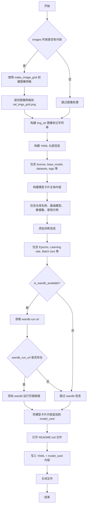
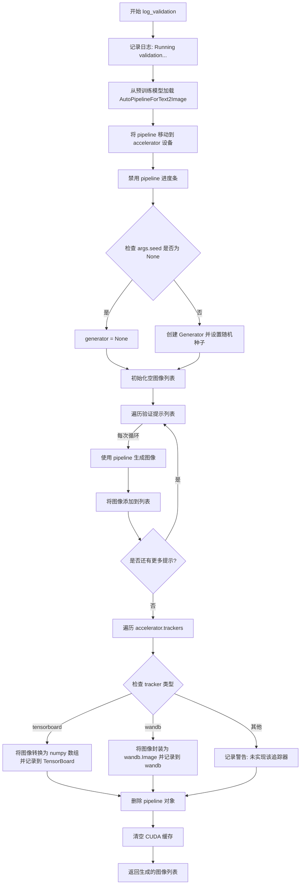
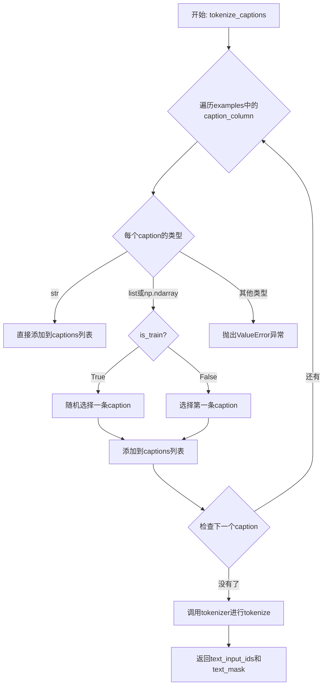
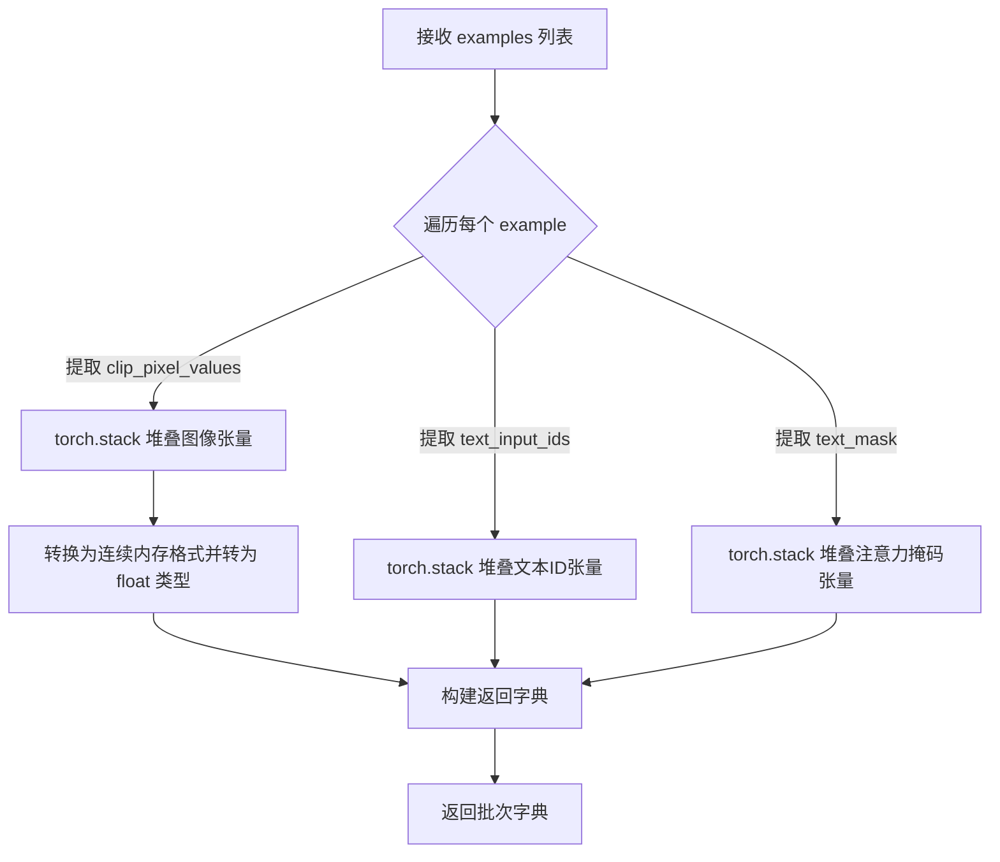

```mermaid
flowchart TD
    A[开始 parse_args] --> B[创建 ArgumentParser 实例]
    B --> C[添加 pretrained_decoder_model_name_or_path 参数]
    C --> D[添加 pretrained_prior_model_name_or_path 参数]
    D --> E[添加 dataset_name 参数]
    E --> F[添加 dataset_config_name 参数]
    F --> G[添加 train_data_dir 参数]
    G --> H[添加图像和文本列名参数]
    H --> I[添加训练样本数限制参数]
    I --> J[添加验证提示词参数]
    J --> K[添加输出和缓存目录参数]
    K --> L[添加随机种子参数]
    L --> M[添加图像分辨率参数]
    M --> N[添加训练批次和轮数参数]
    N --> O[添加梯度累积和学习率参数]
    O --> P[添加学习率调度器参数]
    P --> Q[添加 SNR gamma 参数]
    Q --> R[添加优化器相关参数]
    R --> S[添加 EMA 和 TF32 参数]
    S --> T[添加数据加载器参数]
    T --> U[添加模型推送和 Hub 参数]
    U --> V[添加日志和报告参数]
    V --> W[添加分布式训练参数]
    W --> X[添加检查点相关参数]
    X --> Y[添加验证周期参数]
    Y --> Z[添加 Tracker 项目名称参数]
    Z --> AA{解析命令行参数}
    AA --> AB[获取环境变量 LOCAL_RANK]
    AB --> AC{检查 local_rank 冲突}
    AC -->|是| AD[同步 local_rank]
    AC -->|否| AE[跳过]
    AD --> AF{验证必要参数}
    AE --> AF
    AF -->|dataset_name 和 train_data_dir 都为空| AG[抛出 ValueError]
    AF -->|参数验证通过| AH[返回 args 对象]
    AG -->|异常| AI[结束]
    AH --> AI[结束]
```

```mermaid
flowchart TD
    A[开始 main 函数] --> B[parse_args 解析命令行参数]
    B --> C[验证 wandb 与 hub_token 安全性]
    C --> D[创建 Accelerator 分布式训练环境]
    D --> E[配置日志系统]
    E --> F{args.seed 是否设置}
    F -->|是| G[set_seed 设置随机种子]
    F -->|否| H[跳过]
    G --> H
    H --> I[创建输出目录]
    I --> J[加载 DDPMScheduler 和 CLIP 处理器]
    J --> K[加载 tokenizer]
    K --> L[根据 mixed_precision 设置 weight_dtype]
    L --> M[加载 image_encoder 和 text_encoder]
    M --> N[加载 PriorTransformer]
    N --> O[冻结 text_encoder 和 image_encoder]
    O --> P[prior.train 设置为训练模式]
    P --> Q{是否使用 EMA}
    Q -->|是| R[创建 EMA 模型]
    Q -->|否| S[跳过]
    R --> S
    S --> T[注册模型保存/加载 hooks]
    T --> U[创建优化器 AdamW/AdamW8bit]
    U --> V[加载数据集]
    V --> W[预处理数据集 - tokenize 和 transform]
    W --> X[创建 DataLoader]
    X --> Y[创建 lr_scheduler]
    Y --> Z[accelerator.prepare 准备模型和优化器]
    Z --> AA[初始化 trackers]
    AA --> AB[计算总训练步数]
    AB --> AC[加载 checkpoint 如果需要 resume]
    AC --> AD[创建 progress_bar]
    AD --> AE[进入训练循环 - for epoch]
    AE --> AF[训练循环 - for step, batch]
    AF --> AG[accelerator.accumulate 累积梯度]
    AG --> AH[提取 batch 数据]
    AH --> AI[text_encoder 和 image_encoder 前向传播获取 embeddings]
    AI --> AJ[添加噪声到 image_embeds]
    AJ --> AK[prior 模型预测噪声残差]
    AK --> AL[计算 MSE 损失]
    AL --> AM[accelerator.backward 反向传播]
    AM --> AN[clip_grad_norm 梯度裁剪]
    AN --> AO[optimizer.step 更新参数]
    AO --> AP[lr_scheduler.step 更新学习率]
    AP --> AQ[optimizer.zero_grad 梯度清零]
    AQ --> AR{sync_gradients 检查是否同步}
    AR -->|是| AS[ema_prior.step 更新 EMA]
    AR -->|否| AT
    AS --> AT[progress_bar.update 更新进度条]
    AT --> AU[accelerator.log 记录训练日志]
    AU --> AV{是否到达 checkpointing_steps}
    AV -->|是| AW[保存 checkpoint]
    AV -->|否| AX
    AX --> AY{是否到达 max_train_steps}
    AY -->|否| AF
    AY -->|是| AZ
    AW --> AX
    AZ --> BA{是否执行 validation}
    BA -->|是| BB[log_validation 执行验证]
    BA -->|否| BC
    BB --> BC
    BC --> DD{是否还有更多 epoch}
    DD -->|是| AE
    DD -->|是| BE
    BE --> BF[accelerator.wait_for_everyone 同步]
    BF --> BG[保存最终模型]
    BG --> BH[运行最终推理收集图像]
    BH --> BI{push_to_hub}
    BI -->|是| BJ[保存 model_card 并上传]
    BI -->|否| BK
    BK --> BL[accelerator.end_training 结束训练]
    BL --> ZA[结束]
```

# `diffusers\examples\kandinsky2_2\text_to_image\train_text_to_image_prior.py` 详细设计文档

这是一个用于微调Kandinsky 2.2先验模型（Prior Transformer）的训练脚本，核心功能是通过CLIP图像和文本编码器处理输入数据，训练先验模型预测图像嵌入（image embeddings），支持分布式训练、混合精度、EMA等优化技术，可用于文本到图像生成任务的模型微调。

## 整体流程

```mermaid
graph TD
    A[开始: parse_args] --> B[初始化Accelerator加速器]
    B --> C[设置日志和随机种子]
    C --> D[创建输出目录]
    D --> E[加载CLIPImageProcessor, CLIPTokenizer, DDPMScheduler]
    E --> F[加载image_encoder和text_encoder模型]
    F --> G[加载PriorTransformer先验模型]
    G --> H[冻结text_encoder和image_encoder, 设置prior为训练模式]
    H --> I{是否使用EMA?}
    I -- 是 --> J[创建EMAModel用于指数移动平均]
    I -- 否 --> K[创建优化器AdamW]
    J --> K
    K --> L[加载数据集]
    L --> M[预处理数据: tokenize_captions和preprocess_train]
    M --> N[创建DataLoader]
    N --> O[创建lr_scheduler]
    O --> P[accelerator.prepare准备模型、优化器、数据加载器、调度器]
    P --> Q[初始化 trackers 用于监控训练]
    Q --> R{是否有checkpoint?}
    R -- 是 --> S[加载checkpoint恢复训练]
    R -- 否 --> T[开始训练循环]
    T --> U[遍历每个epoch]
    U --> V[遍历每个batch]
    V --> W[accelerator.accumulate上下文]
    W --> X[获取text_embeds和image_embeds]
    X --> Y[添加噪声创建noisy_latents]
    Y --> Z[prior模型预测noise residual]
    Z --> AA[计算MSE loss]
    AA --> AB[accelerator.backward反向传播]
    AB --> AC[optimizer.step和lr_scheduler.step更新参数]
    AC --> AD{需要保存checkpoint?}
    AD -- 是 --> AE[保存accelerator state]
    AD -- 否 --> AF[继续训练]
    AE --> AF
    AF --> AG{达到max_train_steps?}
    AG -- 是 --> AH[退出训练循环]
    AG -- 否 --> V
    AH --> AI{需要validation?]
    AI -- 是 --> AJ[调用log_validation生成验证图像]
    AI -- 否 --> AK[保存最终模型和pipeline]
    AJ --> AK
    AK --> AL[结束训练]
```

## 类结构

```
无显式类定义 - 脚本型程序
└── 主要模块组件:
    ├── diffusers.PriorTransformer (先验模型)
    ├── transformers.CLIPTextModelWithProjection (文本编码器)
    ├── transformers.CLIPVisionModelWithProjection (图像编码器)
    ├── diffusers.training_utils.EMAModel (指数移动平均)
    ├── diffusers.DDPMScheduler (噪声调度器)
    └── accelerate.Accelerator (分布式训练加速器)
```

## 全局变量及字段


### `DATASET_NAME_MAPPING`
    
数据集名称到列名的映射配置，用于指定图像和文本列

类型：`dict`
    


### `logger`
    
日志记录器，用于输出训练过程中的信息

类型：`logging.Logger`
    


### `args`
    
命令行参数对象，包含所有训练配置选项

类型：`Namespace`
    


### `accelerator`
    
分布式训练加速器实例，管理混合精度、分布式训练和模型保存

类型：`Accelerator`
    


### `noise_scheduler`
    
噪声调度器，用于DDPM训练过程中的噪声添加和去噪调度

类型：`DDPMScheduler`
    


### `image_processor`
    
CLIP图像处理器，用于预处理输入图像

类型：`CLIPImageProcessor`
    


### `tokenizer`
    
CLIP分词器，用于将文本转换为token ID序列

类型：`CLIPTokenizer`
    


### `image_encoder`
    
CLIP图像编码器模型，用于提取图像特征嵌入

类型：`CLIPVisionModelWithProjection`
    


### `text_encoder`
    
CLIP文本编码器模型，用于提取文本特征嵌入

类型：`CLIPTextModelWithProjection`
    


### `prior`
    
先验Transformer模型，用于预测图像嵌入的噪声残差

类型：`PriorTransformer`
    


### `ema_prior`
    
指数移动平均模型，用于稳定训练和提升模型性能

类型：`EMAModel`
    


### `optimizer`
    
AdamW优化器，用于更新模型参数

类型：`AdamW`
    


### `train_dataset`
    
训练数据集，包含预处理后的图像和文本数据

类型：`Dataset`
    


### `train_dataloader`
    
训练数据加载器，用于批量加载训练数据

类型：`DataLoader`
    


### `lr_scheduler`
    
学习率调度器，用于动态调整学习率

类型：`Scheduler`
    


### `weight_dtype`
    
权重数据类型，根据混合精度配置确定（float32/float16/bfloat16）

类型：`torch.dtype`
    


### `clip_mean`
    
CLIP图像嵌入的均值，用于归一化处理

类型：`Tensor`
    


### `clip_std`
    
CLIP图像嵌入的标准差，用于归一化处理

类型：`Tensor`
    


### `global_step`
    
全局训练步数，记录已执行的优化步骤总数

类型：`int`
    


### `first_epoch`
    
起始epoch，从检查点恢复训练时的起始轮数

类型：`int`
    


    

## 全局函数及方法


### `save_model_card`

该函数负责生成并保存模型的模型卡片（Model Card）到 README.md 文件，包含模型的基本信息、训练参数、示例图像以及使用说明，方便用户了解模型的来源、训练细节和使用方法。

参数：

- `args`：命令行参数对象（argparse.Namespace），包含所有训练配置，如预训练模型路径、数据集名称、验证提示词等
- `repo_id`：`str`，HuggingFace Hub 上的仓库 ID，用于标识模型
- `images`：`list`，默认为 None，训练过程中生成的示例图像列表，用于展示模型效果
- `repo_folder`：`str`，默认为 None，本地仓库文件夹路径，用于保存 README.md 和示例图像

返回值：`None`，该函数直接将生成的模型卡片内容写入文件，不返回任何值

#### 流程图



#### 带注释源码

```python
def save_model_card(
    args,
    repo_id: str,
    images=None,
    repo_folder=None,
):
    """
    保存模型卡片到 README.md 文件
    
    参数:
        args: 训练配置参数对象
        repo_id: HuggingFace Hub 仓库 ID
        images: 验证时生成的示例图像列表
        repo_folder: 本地仓库文件夹路径
    """
    # 初始化图像字符串为空
    img_str = ""
    
    # 检查是否有图像需要处理
    if len(images) > 0:
        # 创建图像网格（1行，多列）
        image_grid = make_image_grid(images, 1, len(args.validation_prompts))
        # 保存图像网格到指定文件夹
        image_grid.save(os.path.join(repo_folder, "val_imgs_grid.png"))
        # 构建 Markdown 图像标记字符串
        img_str += "\n"

    # 构建 YAML 格式的元数据头部
    yaml = f"""
---
license: creativeml-openrail-m
base_model: {args.pretrained_prior_model_name_or_path}
datasets:
- {args.dataset_name}
tags:
- kandinsky
- text-to-image
- diffusers
- diffusers-training
inference: true
---
    """
    
    # 构建模型卡片主体内容
    model_card = f"""
# Finetuning - {repo_id}

This pipeline was finetuned from **{args.pretrained_prior_model_name_or_path}** on the **{args.dataset_name}** dataset. Below are some example images generated with the finetuned pipeline using the following prompts: {args.validation_prompts}: \n
{img_str}

## Pipeline usage

You can use the pipeline like so:

```python
from diffusers import DiffusionPipeline
import torch

pipe_prior = DiffusionPipeline.from_pretrained("{repo_id}", torch_dtype=torch.float16)
pipe_t2i = DiffusionPipeline.from_pretrained("{args.pretrained_decoder_model_name_or_path}", torch_dtype=torch.float16)
prompt = "{args.validation_prompts[0]}"
image_embeds, negative_image_embeds = pipe_prior(prompt, guidance_scale=1.0).to_tuple()
image = pipe_t2i(image_embeds=image_embeds, negative_image_embeds=negative_image_embeds).images[0]
image.save("my_image.png")
```

## Training info

These are the key hyperparameters used during training:

* Epochs: {args.num_train_epochs}
* Learning rate: {args.learning_rate}
* Batch size: {args.train_batch_size}
* Gradient accumulation steps: {args.gradient_accumulation_steps}
* Image resolution: {args.resolution}
* Mixed-precision: {args.mixed_precision}

"""
    
    # 初始化 wandb_info 为空字符串
    wandb_info = ""
    
    # 检查 wandb 是否可用
    if is_wandb_available():
        # 初始化运行 URL 为 None
        wandb_run_url = None
        # 如果 wandb 运行存在，获取运行 URL
        if wandb.run is not None:
            wandb_run_url = wandb.run.url

    # 如果 wandb 运行 URL 存在，添加 wandb 信息
    if wandb_run_url is not None:
        wandb_info = f"""
More information on all the CLI arguments and the environment are available on your [`wandb` run page]({wandb_run_url}).
"""

    # 将 wandb 信息追加到模型卡片
    model_card += wandb_info

    # 打开 README.md 文件并写入内容
    with open(os.path.join(repo_folder, "README.md"), "w") as f:
        f.write(yaml + model_card)
```


### `log_validation`

该函数用于在训练过程中运行验证流程，通过加载预训练的解码器模型并结合已训练的先验模型（Prior）生成验证图像，然后将生成的图像记录到 TensorBoard 或 Weights & Biases (wandb) 日志系统中，以便可视化训练效果和监控模型性能。

参数：

- `image_encoder`：`CLIPVisionModelWithProjection`，图像编码器模型，用于将图像转换为嵌入向量
- `image_processor`：`CLIPImageProcessor`，CLIP 图像预处理器，负责对输入图像进行标准化和预处理
- `text_encoder`：`CLIPTextModelWithProjection`，文本编码器模型，用于将文本提示转换为文本嵌入
- `tokenizer`：`CLIPTokenizer`，CLIP 分词器，用于将文本提示 token 化
- `prior`：`PriorTransformer`，先验Transformer模型，已训练的图像嵌入生成模型
- `args`：`Namespace`，命令行参数对象，包含预训练模型路径、验证提示等配置
- `accelerator`：`Accelerator`，HuggingFace Accelerate 加速器对象，用于模型管理和设备分配
- `weight_dtype`：`torch.dtype`，模型权重的数据类型（如 float16、bfloat16）
- `epoch`：`int`，当前训练轮次或全局步数，用于记录日志的时间戳

返回值：`List[PIL.Image]`，验证生成的图像列表，每个元素为一张 PIL 格式的图像

#### 流程图



#### 带注释源码

```python
def log_validation(
    image_encoder, image_processor, text_encoder, tokenizer, prior, args, accelerator, weight_dtype, epoch
):
    """
    运行验证流程，生成验证图像并记录到日志系统
    
    参数:
        image_encoder: CLIPVisionModelWithProjection, 图像编码器
        image_processor: CLIPImageProcessor, 图像处理器
        text_encoder: CLIPTextModelWithProjection, 文本编码器
        tokenizer: CLIPTokenizer, 分词器
        prior: PriorTransformer, 训练好的先验模型
        args: Namespace, 包含模型路径和验证提示等配置
        accelerator: Accelerator, 加速器对象
        weight_dtype: torch.dtype, 权重数据类型
        epoch: int, 当前训练轮次
    返回:
        List[PIL.Image], 生成的验证图像列表
    """
    # 记录验证开始日志
    logger.info("Running validation... ")

    # 构建完整的文本到图像 pipeline
    # 使用预训练的解码器模型，结合训练好的先验模型组件
    pipeline = AutoPipelineForText2Image.from_pretrained(
        args.pretrained_decoder_model_name_or_path,  # 预训练解码器路径
        prior_image_encoder=accelerator.unwrap_model(image_encoder),  # 解包后的图像编码器
        prior_image_processor=image_processor,  # 图像处理器
        prior_text_encoder=accelerator.unwrap_model(text_encoder),  # 解包后的文本编码器
        prior_tokenizer=tokenizer,  # 分词器
        prior_prior=accelerator.unwrap_model(prior),  # 解包后的先验模型
        torch_dtype=weight_dtype,  # 设置计算精度
    )
    
    # 将 pipeline 移动到加速器管理的设备上（GPU）
    pipeline = pipeline.to(accelerator.device)
    
    # 禁用进度条以减少验证过程中的输出噪音
    pipeline.set_progress_bar_config(disable=True)

    # 根据 seed 参数决定是否使用确定性生成
    if args.seed is None:
        generator = None  # 无 seed，每次生成随机结果
    else:
        # 创建随机数生成器并设置种子，确保可复现性
        generator = torch.Generator(device=accelerator.device).manual_seed(args.seed)

    # 存储所有生成的验证图像
    images = []
    
    # 遍历所有验证提示词，为每个提示生成图像
    for i in range(len(args.validation_prompts)):
        # 使用 autocast 开启混合精度计算，提升推理速度
        with torch.autocast("cuda"):
            # 调用 pipeline 生成图像，固定 20 步推理
            image = pipeline(args.validation_prompts[i], num_inference_steps=20, generator=generator).images[0]

        # 将生成的图像添加到列表
        images.append(image)

    # 遍历所有注册的 tracker（TensorBoard 或 wandb）
    for tracker in accelerator.trackers:
        if tracker.name == "tensorboard":
            # TensorBoard 记录：将 PIL 图像转换为 numpy 数组
            # NHWC 格式：[数量, 高度, 宽度, 通道]
            np_images = np.stack([np.asarray(img) for img in images])
            tracker.writer.add_images("validation", np_images, epoch, dataformats="NHWC")
        elif tracker.name == "wandb":
            # wandb 记录：将图像封装为 wandb.Image 对象
            # 添加标题说明使用的验证提示
            tracker.log(
                {
                    "validation": [
                        wandb.Image(image, caption=f"{i}: {args.validation_prompts[i]}")
                        for i, image in enumerate(images)
                    ]
                }
            )
        else:
            # 其他类型的 tracker 暂不支持，记录警告
            logger.warning(f"image logging not implemented for {tracker.name}")

    # 清理资源：删除 pipeline 对象释放显存
    del pipeline
    
    # 清空 CUDA 缓存，确保显存被正确释放
    torch.cuda.empty_cache()

    # 返回生成的图像列表，供调用者使用
    return images
```


### `parse_args`

解析命令行参数，返回包含所有训练配置选项的 `argparse.Namespace` 对象，用于后续的模型微调流程。

参数：

- 该函数不接受任何显式参数（通过 `sys.argv` 隐式获取命令行输入）

返回值：`argparse.Namespace`，包含所有解析后的命令行参数

#### 流程图



#### 带注释源码

```python
def parse_args():
    # 创建 ArgumentParser 实例，描述脚本用途
    parser = argparse.ArgumentParser(description="Simple example of finetuning Kandinsky 2.2.")
    
    # ==================== 模型路径参数 ====================
    # 添加预训练解码器模型路径或模型标识符参数
    parser.add_argument(
        "--pretrained_decoder_model_name_or_path",
        type=str,
        default="kandinsky-community/kandinsky-2-2-decoder",
        required=False,
        help="Path to pretrained model or model identifier from huggingface.co/models.",
    )
    # 添加预训练先验模型路径或模型标识符参数
    parser.add_argument(
        "--pretrained_prior_model_name_or_path",
        type=str,
        default="kandinsky-community/kandinsky-2-2-prior",
        required=False,
        help="Path to pretrained model or model identifier from huggingface.co/models.",
    )
    
    # ==================== 数据集参数 ====================
    # 添加数据集名称参数（支持 HuggingFace Hub 数据集或本地数据集）
    parser.add_argument(
        "--dataset_name",
        type=str,
        default=None,
        help=(
            "The name of the Dataset (from the HuggingFace hub) to train on (could be your own, possibly private,"
            " dataset). It can also be a path pointing to a local copy of a dataset in your filesystem,"
            " or to a folder containing files that 🤗 Datasets can understand."
        ),
    )
    # 添加数据集配置名称参数
    parser.add_argument(
        "--dataset_config_name",
        type=str,
        default=None,
        help="The config of the Dataset, leave as None if there's only one config.",
    )
    # 添加训练数据目录参数
    parser.add_argument(
        "--train_data_dir",
        type=str,
        default=None,
        help=(
            "A folder containing the training data. Folder contents must follow the structure described in"
            " https://huggingface.co/docs/datasets/image_dataset#imagefolder. In particular, a `metadata.jsonl` file"
            " must exist to provide the captions for the images. Ignored if `dataset_name` is specified."
        ),
    )
    
    # ==================== 数据列参数 ====================
    # 添加图像列名参数
    parser.add_argument(
        "--image_column", type=str, default="image", help="The column of the dataset containing an image."
    )
    # 添加标题/文本列名参数
    parser.add_argument(
        "--caption_column",
        type=str,
        default="text",
        help="The column of the dataset containing a caption or a list of captions.",
    )
    
    # ==================== 训练样本限制参数 ====================
    # 添加最大训练样本数参数（用于调试或加速训练）
    parser.add_argument(
        "--max_train_samples",
        type=int,
        default=None,
        help=(
            "For debugging purposes or quicker training, truncate the number of training examples to this "
            "value if set."
        ),
    )
    
    # ==================== 验证参数 ====================
    # 添加验证提示词参数（支持多个提示词）
    parser.add_argument(
        "--validation_prompts",
        type=str,
        default=None,
        nargs="+",
        help=("A set of prompts evaluated every `--validation_epochs` and logged to `--report_to`."),
    )
    # 添加验证周期参数
    parser.add_argument(
        "--validation_epochs",
        type=int,
        default=5,
        help="Run validation every X epochs.",
    )
    
    # ==================== 输出和缓存参数 ====================
    # 添加输出目录参数
    parser.add_argument(
        "--output_dir",
        type=str,
        default="kandi_2_2-model-finetuned",
        help="The output directory where the model predictions and checkpoints will be written.",
    )
    # 添加缓存目录参数
    parser.add_argument(
        "--cache_dir",
        type=str,
        default=None,
        help="The directory where the downloaded models and datasets will be stored.",
    )
    # 添加日志目录参数
    parser.add_argument(
        "--logging_dir",
        type=str,
        default="logs",
        help=(
            "[TensorBoard](https://www.tensorflow.org/tensorboard) log directory. Will default to"
            " *output_dir/runs/**CURRENT_DATETIME_HOSTNAME***."
        ),
    )
    
    # ==================== 随机种子参数 ====================
    # 添加随机种子参数（用于可重复训练）
    parser.add_argument("--seed", type=int, default=None, help="A seed for reproducible training.")
    
    # ==================== 数据处理参数 ====================
    # 添加图像分辨率参数
    parser.add_argument(
        "--resolution",
        type=int,
        default=512,
        help=(
            "The resolution for input images, all the images in the train/validation dataset will be resized to this"
            " resolution"
        ),
    )
    
    # ==================== 训练批处理参数 ====================
    # 添加训练批次大小参数
    parser.add_argument(
        "--train_batch_size", type=int, default=1, help="Batch size (per device) for the training dataloader."
    )
    # 添加训练轮数参数
    parser.add_argument("--num_train_epochs", type=int, default=100)
    # 添加最大训练步数参数
    parser.add_argument(
        "--max_train_steps",
        type=int,
        default=None,
        help="Total number of training steps to perform.  If provided, overrides num_train_epochs.",
    )
    # 添加梯度累积步数参数
    parser.add_argument(
        "--gradient_accumulation_steps",
        type=int,
        default=1,
        help="Number of updates steps to accumulate before performing a backward/update pass.",
    )
    
    # ==================== 学习率参数 ====================
    # 添加学习率参数
    parser.add_argument(
        "--learning_rate",
        type=float,
        default=1e-4,
        help="learning rate",
    )
    # 添加学习率调度器类型参数
    parser.add_argument(
        "--lr_scheduler",
        type=str,
        default="constant",
        help=(
            'The scheduler type to use. Choose between ["linear", "cosine", "cosine_with_restarts", "polynomial",'
            ' "constant", "constant_with_warmup"]'
        ),
    )
    # 添加学习率预热步数参数
    parser.add_argument(
        "--lr_warmup_steps", type=int, default=500, help="Number of steps for the warmup in the lr scheduler."
    )
    
    # ==================== SNR 权重参数 ====================
    # 添加 SNR gamma 参数（用于损失重加权）
    parser.add_argument(
        "--snr_gamma",
        type=float,
        default=None,
        help="SNR weighting gamma to be used if rebalancing the loss. Recommended value is 5.0. "
        "More details here: https://huggingface.co/papers/2303.09556.",
    )
    
    # ==================== 优化器高级参数 ====================
    # 添加使用 8-bit Adam 优化器参数
    parser.add_argument(
        "--use_8bit_adam", action="store_true", help="Whether or not to use 8-bit Adam from bitsandbytes."
    )
    # 添加允许 TF32 参数
    parser.add_argument(
        "--allow_tf32",
        action="store_true",
        help=(
            "Whether or not to allow TF32 on Ampere GPUs. Can be used to speed up training. For more information, see"
            " https://pytorch.org/docs/stable/notes/cuda.html#tensorfloat-32-tf32-on-ampere-devices"
        ),
    )
    # 添加使用 EMA 参数
    parser.add_argument("--use_ema", action="store_true", help="Whether to use EMA model.")
    
    # ==================== 数据加载器参数 ====================
    # 添加数据加载器工作进程数参数
    parser.add_argument(
        "--dataloader_num_workers",
        type=int,
        default=0,
        help=(
            "Number of subprocesses to use for data loading. 0 means that the data will be loaded in the main process."
        ),
    )
    
    # ==================== Adam 优化器参数 ====================
    # 添加 Adam beta1 参数
    parser.add_argument("--adam_beta1", type=float, default=0.9, help="The beta1 parameter for the Adam optimizer.")
    # 添加 Adam beta2 参数
    parser.add_argument("--adam_beta2", type=float, default=0.999, help="The beta2 parameter for the Adam optimizer.")
    # 添加 Adam 权重衰减参数
    parser.add_argument(
        "--adam_weight_decay",
        type=float,
        default=0.0,
        required=False,
        help="weight decay_to_use",
    )
    # 添加 Adam epsilon 参数
    parser.add_argument("--adam_epsilon", type=float, default=1e-08, help="Epsilon value for the Adam optimizer")
    # 添加最大梯度范数参数
    parser.add_argument("--max_grad_norm", default=1.0, type=float, help="Max gradient norm.")
    
    # ==================== 模型推送参数 ====================
    # 添加推送到 Hub 参数
    parser.add_argument("--push_to_hub", action="store_true", help="Whether or not to push the model to the Hub.")
    # 添加 Hub token 参数
    parser.add_argument("--hub_token", type=str, default=None, help="The token to use to push to the Model Hub.")
    # 添加 Hub 模型 ID 参数
    parser.add_argument(
        "--hub_model_id",
        type=str,
        default=None,
        help="The name of the repository to keep in sync with the local `output_dir`.",
    )
    
    # ==================== 混合精度和日志参数 ====================
    # 添加混合精度训练参数
    parser.add_argument(
        "--mixed_precision",
        type=str,
        default=None,
        choices=["no", "fp16", "bf16"],
        help=(
            "Whether to use mixed precision. Choose between fp16 and bf16 (bfloat16). Bf16 requires PyTorch >="
            " 1.10.and an Nvidia Ampere GPU.  Default to the value of accelerate config of the current system or the"
            " flag passed with the `accelerate.launch` command. Use this argument to override the accelerate config."
        ),
    )
    # 添加日志报告目标参数
    parser.add_argument(
        "--report_to",
        type=str,
        default="tensorboard",
        help=(
            'The integration to report the results and logs to. Supported platforms are `"tensorboard"`'
            ' (default), `"wandb"` and `"comet_ml"`. Use `"all"` to report to all integrations.'
        ),
    )
    
    # ==================== 分布式训练参数 ====================
    # 添加本地排名参数（用于分布式训练）
    parser.add_argument("--local_rank", type=int, default=-1, help="For distributed training: local_rank")
    
    # ==================== 检查点参数 ====================
    # 添加检查点保存步数参数
    parser.add_argument(
        "--checkpointing_steps",
        type=int,
        default=500,
        help=(
            "Save a checkpoint of the training state every X updates. These checkpoints are only suitable for resuming"
            " training using `--resume_from_checkpoint`."
        ),
    )
    # 添加检查点总数限制参数
    parser.add_argument(
        "--checkpoints_total_limit",
        type=int,
        default=None,
        help=("Max number of checkpoints to store."),
    )
    # 添加从检查点恢复参数
    parser.add_argument(
        "--resume_from_checkpoint",
        type=str,
        default=None,
        help=(
            "Whether training should be resumed from a previous checkpoint. Use a path saved by"
            ' `--checkpointing_steps`, or `"latest"` to automatically select the last available checkpoint.'
        ),
    )
    
    # ==================== Tracker 参数 ====================
    # 添加 tracker 项目名称参数
    parser.add_argument(
        "--tracker_project_name",
        type=str,
        default="text2image-fine-tune",
        help=(
            "The `project_name` argument passed to Accelerator.init_trackers for"
            " more information see https://huggingface.co/docs/accelerate/v0.17.0/en/package_reference/accelerator#accelerate.Accelerator"
        ),
    )

    # 解析命令行参数
    args = parser.parse_args()
    
    # 从环境变量获取 LOCAL_RANK 并同步到 args
    env_local_rank = int(os.environ.get("LOCAL_RANK", -1))
    if env_local_rank != -1 and env_local_rank != args.local_rank:
        args.local_rank = env_local_rank

    # ==================== 合理性检查 ====================
    # 检查是否提供了数据集名称或训练数据目录
    if args.dataset_name is None and args.train_data_dir is None:
        raise ValueError("Need either a dataset name or a training folder.")

    # 返回解析后的参数对象
    return args
```


### `main` - 主训练函数

该函数是 Kandinsky 2.2 Prior 模型微调训练的主入口函数，负责完整的训练流程，包括参数解析、分布式训练环境初始化、模型和数据加载、训练循环执行、验证推理以及最终模型保存。

参数：

- 该函数无显式参数，通过内部调用 `parse_args()` 获取命令行参数

返回值：`None`，函数执行完成后直接退出

#### 流程图



#### 带注释源码

```python
def main():
    """
    Kandinsky 2.2 Prior 模型微调训练主函数
    包含完整的训练流程：参数解析 -> 模型加载 -> 数据处理 -> 训练循环 -> 模型保存
    """
    # ========== 步骤1: 解析命令行参数 ==========
    args = parse_args()

    # ========== 步骤2: 安全检查 ==========
    # wandb 和 hub_token 不能同时使用，存在安全风险
    if args.report_to == "wandb" and args.hub_token is not None:
        raise ValueError(
            "You cannot use both --report_to=wandb and --hub_token due to a security risk of exposing your token."
            " Please use `hf auth login` to authenticate with the Hub."
        )

    # ========== 步骤3: 配置日志目录和 Accelerator ==========
    logging_dir = os.path.join(args.output_dir, args.logging_dir)
    accelerator_project_config = ProjectConfiguration(
        total_limit=args.checkpoints_total_limit, project_dir=args.output_dir, logging_dir=logging_dir
    )
    accelerator = Accelerator(
        gradient_accumulation_steps=args.gradient_accumulation_steps,
        mixed_precision=args.mixed_precision,
        log_with=args.report_to,
        project_config=accelerator_project_config,
    )

    # ========== 步骤4: MPS 设备特殊处理 ==========
    # 禁用 Apple Silicon MPS 的 AMP 混合精度
    if torch.backends.mps.is_available():
        accelerator.native_amp = False

    # ========== 步骤5: 配置日志系统 ==========
    logging.basicConfig(
        format="%(asctime)s - %(levelname)s - %(name)s - %(message)s",
        datefmt="%m/%d/%Y %H:%M:%S",
        level=logging.INFO,
    )
    logger.info(accelerator.state, main_process_only=False)
    # 主进程显示详细日志，其他进程只显示错误
    if accelerator.is_local_main_process:
        datasets.utils.logging.set_verbosity_warning()
        transformers.utils.logging.set_verbosity_warning()
        diffusers.utils.logging.set_verbosity_info()
    else:
        datasets.utils.logging.set_verbosity_error()
        transformers.utils.logging.set_verbosity_error()
        diffusers.utils.logging.set_verbosity_error()

    # ========== 步骤6: 设置随机种子 ==========
    if args.seed is not None:
        set_seed(args.seed)

    # ========== 步骤7: 创建输出目录 ==========
    if accelerator.is_main_process:
        if args.output_dir is not None:
            os.makedirs(args.output_dir, exist_ok=True)
        # 如果需要推送到 Hub，创建远程仓库
        if args.push_to_hub:
            repo_id = create_repo(
                repo_id=args.hub_model_id or Path(args.output_dir).name, exist_ok=True, token=args.hub_token
            ).repo_id

    # ========== 步骤8: 加载 scheduler 和预处理器 ==========
    noise_scheduler = DDPMScheduler(beta_schedule="squaredcos_cap_v2", prediction_type="sample")
    image_processor = CLIPImageProcessor.from_pretrained(
        args.pretrained_prior_model_name_or_path, subfolder="image_processor"
    )
    tokenizer = CLIPTokenizer.from_pretrained(args.pretrained_prior_model_name_or_path, subfolder="tokenizer")

    # DeepSpeed 禁用零初始化上下文管理器
    def deepspeed_zero_init_disabled_context_manager():
        """
        返回一个上下文列表，用于禁用 DeepSpeed 的零初始化
        """
        deepspeed_plugin = AcceleratorState().deepspeed_plugin if accelerate.state.is_initialized() else None
        if deepspeed_plugin is None:
            return []
        return [deepspeed_plugin.zero3_init_context_manager(enable=False)]

    # ========== 步骤9: 设置权重数据类型 ==========
    weight_dtype = torch.float32
    if accelerator.mixed_precision == "fp16":
        weight_dtype = torch.float16
    elif accelerator.mixed_precision == "bf16":
        weight_dtype = torch.bfloat16

    # ========== 步骤10: 加载图像编码器和文本编码器 ==========
    with ContextManagers(deepspeed_zero_init_disabled_context_manager()):
        image_encoder = CLIPVisionModelWithProjection.from_pretrained(
            args.pretrained_prior_model_name_or_path, subfolder="image_encoder", torch_dtype=weight_dtype
        ).eval()
        text_encoder = CLIPTextModelWithProjection.from_pretrained(
            args.pretrained_prior_model_name_or_path, subfolder="text_encoder", torch_dtype=weight_dtype
        ).eval()

    # ========== 步骤11: 加载 PriorTransformer ==========
    prior = PriorTransformer.from_pretrained(args.pretrained_prior_model_name_or_path, subfolder="prior")

    # ========== 步骤12: 冻结编码器，只训练 prior ==========
    text_encoder.requires_grad_(False)
    image_encoder.requires_grad_(False)
    # 设置 prior 为训练模式
    prior.train()

    # ========== 步骤13: 创建 EMA 模型（可选）==========
    if args.use_ema:
        ema_prior = PriorTransformer.from_pretrained(args.pretrained_prior_model_name_or_path, subfolder="prior")
        ema_prior = EMAModel(ema_prior.parameters(), model_cls=PriorTransformer, model_config=ema_prior.config)
        ema_prior.to(accelerator.device)

    # ========== 步骤14: 注册自定义模型保存/加载 hooks ==========
    if version.parse(accelerate.__version__) >= version.parse("0.16.0"):
        def save_model_hook(models, weights, output_dir):
            """自定义保存 hook"""
            if args.use_ema:
                ema_prior.save_pretrained(os.path.join(output_dir, "prior_ema"))
            for i, model in enumerate(models):
                model.save_pretrained(os.path.join(output_dir, "prior"))
                weights.pop()  # 避免重复保存

        def load_model_hook(models, input_dir):
            """自定义加载 hook"""
            if args.use_ema:
                load_model = EMAModel.from_pretrained(os.path.join(input_dir, "prior_ema"), PriorTransformer)
                ema_prior.load_state_dict(load_model.state_dict())
                ema_prior.to(accelerator.device)
                del load_model
            for i in range(len(models)):
                model = models.pop()
                load_model = PriorTransformer.from_pretrained(input_dir, subfolder="prior")
                model.register_to_config(**load_model.config)
                model.load_state_dict(load_model.state_dict())
                del load_model

        accelerator.register_save_state_pre_hook(save_model_hook)
        accelerator.register_load_state_pre_hook(load_model_hook)

    # ========== 步骤15: TF32 优化 ==========
    if args.allow_tf32:
        torch.backends.cuda.matmul.allow_tf32 = True

    # ========== 步骤16: 创建优化器 ==========
    if args.use_8bit_adam:
        try:
            import bitsandbytes as bnb
        except ImportError:
            raise ImportError("Please install bitsandbytes to use 8-bit Adam.")
        optimizer_cls = bnb.optim.AdamW8bit
    else:
        optimizer_cls = torch.optim.AdamW
    
    optimizer = optimizer_cls(
        prior.parameters(),
        lr=args.learning_rate,
        betas=(args.adam_beta1, args.adam_beta2),
        weight_decay=args.adam_weight_decay,
        eps=args.adam_epsilon,
    )

    # ========== 步骤17: 加载数据集 ==========
    if args.dataset_name is not None:
        # 从 HuggingFace Hub 加载数据集
        dataset = load_dataset(
            args.dataset_name,
            args.dataset_config_name,
            cache_dir=args.cache_dir,
        )
    else:
        # 从本地文件夹加载
        data_files = {}
        if args.train_data_dir is not None:
            data_files["train"] = os.path.join(args.train_data_dir, "**")
        dataset = load_dataset(
            "imagefolder",
            data_files=data_files,
            cache_dir=args.cache_dir,
        )

    # ========== 步骤18: 获取数据集列名 ==========
    column_names = dataset["train"].column_names
    dataset_columns = DATASET_NAME_MAPPING.get(args.dataset_name, None)
    
    # 确定图像和文本列名
    if args.image_column is None:
        image_column = dataset_columns[0] if dataset_columns is not None else column_names[0]
    else:
        image_column = args.image_column
        if image_column not in column_names:
            raise ValueError(f"--image_column' value '{args.image_column}' needs to be one of: {', '.join(column_names)}")
    
    if args.caption_column is None:
        caption_column = dataset_columns[1] if dataset_columns is not None else column_names[1]
    else:
        caption_column = args.caption_column
        if caption_column not in column_names:
            raise ValueError(f"--caption_column' value '{args.caption_column}' needs to be one of: {', '.join(column_names)}")

    # ========== 步骤19: 定义数据预处理函数 ==========
    def tokenize_captions(examples, is_train=True):
        """
        对 captions 进行 tokenize
        """
        captions = []
        for caption in examples[caption_column]:
            if isinstance(caption, str):
                captions.append(caption)
            elif isinstance(caption, (list, np.ndarray)):
                captions.append(random.choice(caption) if is_train else caption[0])
            else:
                raise ValueError(f"Caption column `{caption_column}` should contain either strings or lists of strings.")
        inputs = tokenizer(
            captions, max_length=tokenizer.model_max_length, padding="max_length", truncation=True, return_tensors="pt"
        )
        text_input_ids = inputs.input_ids
        text_mask = inputs.attention_mask.bool()
        return text_input_ids, text_mask

    def preprocess_train(examples):
        """
        训练数据预处理：转换图像为 RGB 并提取 pixel values
        """
        images = [image.convert("RGB") for image in examples[image_column]]
        examples["clip_pixel_values"] = image_processor(images, return_tensors="pt").pixel_values
        examples["text_input_ids"], examples["text_mask"] = tokenize_captions(examples)
        return examples

    # ========== 步骤20: 应用数据预处理 ==========
    with accelerator.main_process_first():
        if args.max_train_samples is not None:
            dataset["train"] = dataset["train"].shuffle(seed=args.seed).select(range(args.max_train_samples))
        train_dataset = dataset["train"].with_transform(preprocess_train)

    # ========== 步骤21: 定义 collate 函数 ==========
    def collate_fn(examples):
        """
        批处理整理函数
        """
        clip_pixel_values = torch.stack([example["clip_pixel_values"] for example in examples])
        clip_pixel_values = clip_pixel_values.to(memory_format=torch.contiguous_format).float()
        text_input_ids = torch.stack([example["text_input_ids"] for example in examples])
        text_mask = torch.stack([example["text_mask"] for example in examples])
        return {"clip_pixel_values": clip_pixel_values, "text_input_ids": text_input_ids, "text_mask": text_mask}

    # ========== 步骤22: 创建 DataLoader ==========
    train_dataloader = torch.utils.data.DataLoader(
        train_dataset,
        shuffle=True,
        collate_fn=collate_fn,
        batch_size=args.train_batch_size,
        num_workers=args.dataloader_num_workers,
    )

    # ========== 步骤23: 计算训练步数并创建学习率调度器 ==========
    overrode_max_train_steps = False
    num_update_steps_per_epoch = math.ceil(len(train_dataloader) / args.gradient_accumulation_steps)
    if args.max_train_steps is None:
        args.max_train_steps = args.num_train_epochs * num_update_steps_per_epoch
        overrode_max_train_steps = True

    lr_scheduler = get_scheduler(
        args.lr_scheduler,
        optimizer=optimizer,
        num_warmup_steps=args.lr_warmup_steps * args.gradient_accumulation_steps,
        num_training_steps=args.max_train_steps * args.gradient_accumulation_steps,
    )

    # ========== 步骤24: 保存 prior 的统计参数 ==========
    clip_mean = prior.clip_mean.clone()
    clip_std = prior.clip_std.clone()

    # ========== 步骤25: 使用 accelerator 准备模型、优化器、数据加载器和调度器 ==========
    prior, optimizer, train_dataloader, lr_scheduler = accelerator.prepare(
        prior, optimizer, train_dataloader, lr_scheduler
    )

    # 将编码器移动到设备
    image_encoder.to(accelerator.device, dtype=weight_dtype)
    text_encoder.to(accelerator.device, dtype=weight_dtype)

    # 重新计算训练步数（dataloader 大小可能改变）
    num_update_steps_per_epoch = math.ceil(len(train_dataloader) / args.gradient_accumulation_steps)
    if overrode_max_train_steps:
        args.max_train_steps = args.num_train_epochs * num_update_steps_per_epoch
    args.num_train_epochs = math.ceil(args.max_train_steps / num_update_steps_per_epoch)

    # ========== 步骤26: 初始化 trackers ==========
    if accelerator.is_main_process:
        tracker_config = dict(vars(args))
        tracker_config.pop("validation_prompts")
        accelerator.init_trackers(args.tracker_project_name, tracker_config)

    # ========== 步骤27: 打印训练信息 ==========
    total_batch_size = args.train_batch_size * accelerator.num_processes * args.gradient_accumulation_steps
    logger.info("***** Running training *****")
    logger.info(f"  Num examples = {len(train_dataset)}")
    logger.info(f"  Num Epochs = {args.num_train_epochs}")
    logger.info(f"  Instantaneous batch size per device = {args.train_batch_size}")
    logger.info(f"  Total train batch size = {total_batch_size}")
    logger.info(f"  Gradient Accumulation steps = {args.gradient_accumulation_steps}")
    logger.info(f"  Total optimization steps = {args.max_train_steps}")

    # ========== 步骤28: 初始化训练状态 ==========
    global_step = 0
    first_epoch = 0
    initial_global_step = 0

    # ========== 步骤29: 恢复 checkpoint（如果指定）==========
    if args.resume_from_checkpoint:
        if args.resume_from_checkpoint != "latest":
            path = os.path.basename(args.resume_from_checkpoint)
        else:
            dirs = os.listdir(args.output_dir)
            dirs = [d for d in dirs if d.startswith("checkpoint")]
            dirs = sorted(dirs, key=lambda x: int(x.split("-")[1]))
            path = dirs[-1] if len(dirs) > 0 else None

        if path is None:
            accelerator.print(f"Checkpoint does not exist. Starting new training.")
            args.resume_from_checkpoint = None
            initial_global_step = 0
        else:
            accelerator.print(f"Resuming from checkpoint {path}")
            accelerator.load_state(os.path.join(args.output_dir, path))
            global_step = int(path.split("-")[1])
            initial_global_step = global_step
            first_epoch = global_step // num_update_steps_per_epoch

    # ========== 步骤30: 创建进度条 ==========
    progress_bar = tqdm(
        range(0, args.max_train_steps),
        initial=initial_global_step,
        desc="Steps",
        disable=not accelerator.is_local_main_process,
    )

    # ========== 步骤31: 转换统计参数的数据类型和设备 ==========
    clip_mean = clip_mean.to(weight_dtype).to(accelerator.device)
    clip_std = clip_std.to(weight_dtype).to(accelerator.device)

    # ========== 步骤32: 训练循环 ==========
    for epoch in range(first_epoch, args.num_train_epochs):
        train_loss = 0.0
        for step, batch in enumerate(train_dataloader):
            # 梯度累积
            with accelerator.accumulate(prior):
                # 提取批次数据
                text_input_ids, text_mask, clip_images = (
                    batch["text_input_ids"],
                    batch["text_mask"],
                    batch["clip_pixel_values"].to(weight_dtype),
                )
                
                # 编码器前向传播（冻结，不计算梯度）
                with torch.no_grad():
                    text_encoder_output = text_encoder(text_input_ids)
                    prompt_embeds = text_encoder_output.text_embeds
                    text_encoder_hidden_states = text_encoder_output.last_hidden_state
                    image_embeds = image_encoder(clip_images).image_embeds
                    
                    # 采样噪声
                    noise = torch.randn_like(image_embeds)
                    bsz = image_embeds.shape[0]
                    timesteps = torch.randint(
                        0, noise_scheduler.config.num_train_timesteps, (bsz,), device=image_embeds.device
                    ).long()
                    
                    # 标准化 image_embeds 并添加噪声
                    image_embeds = (image_embeds - clip_mean) / clip_std
                    noisy_latents = noise_scheduler.add_noise(image_embeds, noise, timesteps)
                    target = image_embeds

                # Prior 模型预测
                model_pred = prior(
                    noisy_latents,
                    timestep=timesteps,
                    proj_embedding=prompt_embeds,
                    encoder_hidden_states=text_encoder_hidden_states,
                    attention_mask=text_mask,
                ).predicted_image_embedding

                # 计算损失
                if args.snr_gamma is None:
                    loss = F.mse_loss(model_pred.float(), target.float(), reduction="mean")
                else:
                    # SNR 加权损失
                    snr = compute_snr(noise_scheduler, timesteps)
                    mse_loss_weights = torch.stack([snr, args.snr_gamma * torch.ones_like(timesteps)], dim=1).min(dim=1)[0]
                    if noise_scheduler.config.prediction_type == "epsilon":
                        mse_loss_weights = mse_loss_weights / snr
                    elif noise_scheduler.config.prediction_type == "v_prediction":
                        mse_loss_weights = mse_loss_weights / (snr + 1)
                    
                    loss = F.mse_loss(model_pred.float(), target.float(), reduction="none")
                    loss = loss.mean(dim=list(range(1, len(loss.shape)))) * mse_loss_weights
                    loss = loss.mean()

                # 聚合损失用于日志记录
                avg_loss = accelerator.gather(loss.repeat(args.train_batch_size)).mean()
                train_loss += avg_loss.item() / args.gradient_accumulation_steps

                # 反向传播
                accelerator.backward(loss)
                
                # 梯度裁剪
                if accelerator.sync_gradients:
                    accelerator.clip_grad_norm_(prior.parameters(), args.max_grad_norm)
                
                # 优化器更新
                optimizer.step()
                lr_scheduler.step()
                optimizer.zero_grad()

            # 同步后的操作
            if accelerator.sync_gradients:
                if args.use_ema:
                    ema_prior.step(prior.parameters())
                progress_bar.update(1)
                global_step += 1
                accelerator.log({"train_loss": train_loss}, step=global_step)
                train_loss = 0.0

                # 定期保存 checkpoint
                if global_step % args.checkpointing_steps == 0:
                    if accelerator.is_main_process:
                        # 限制保存的 checkpoint 数量
                        if args.checkpoints_total_limit is not None:
                            checkpoints = os.listdir(args.output_dir)
                            checkpoints = [d for d in checkpoints if d.startswith("checkpoint")]
                            checkpoints = sorted(checkpoints, key=lambda x: int(x.split("-")[1]))
                            if len(checkpoints) >= args.checkpoints_total_limit:
                                num_to_remove = len(checkpoints) - args.checkpoints_total_limit + 1
                                removing_checkpoints = checkpoints[0:num_to_remove]
                                for removing_checkpoint in removing_checkpoints:
                                    shutil.rmtree(os.path.join(args.output_dir, removing_checkpoint))
                        
                        save_path = os.path.join(args.output_dir, f"checkpoint-{global_step}")
                        accelerator.save_state(save_path)
                        logger.info(f"Saved state to {save_path}")

            # 更新进度条
            logs = {"step_loss": loss.detach().item(), "lr": lr_scheduler.get_last_lr()[0]}
            progress_bar.set_postfix(**logs)

            if global_step >= args.max_train_steps:
                break

        # ========== 步骤33: 验证循环 ==========
        if accelerator.is_main_process:
            if args.validation_prompts is not None and epoch % args.validation_epochs == 0:
                if args.use_ema:
                    # 临时保存 EMA 参数用于推理
                    ema_prior.store(prior.parameters())
                    ema_prior.copy_to(prior.parameters())
                
                log_validation(
                    image_encoder,
                    image_processor,
                    text_encoder,
                    tokenizer,
                    prior,
                    args,
                    accelerator,
                    weight_dtype,
                    global_step,
                )
                
                if args.use_ema:
                    # 恢复原始参数
                    ema_prior.restore(prior.parameters())

    # ========== 步骤34: 保存最终模型 ==========
    accelerator.wait_for_everyone()
    if accelerator.is_main_process:
        prior = accelerator.unwrap_model(prior)
        if args.use_ema:
            ema_prior.copy_to(prior.parameters())

        # 创建 pipeline 并保存
        pipeline = AutoPipelineForText2Image.from_pretrained(
            args.pretrained_decoder_model_name_or_path,
            prior_image_encoder=image_encoder,
            prior_text_encoder=text_encoder,
            prior_prior=prior,
        )
        pipeline.prior_pipe.save_pretrained(args.output_dir)

        # 最终推理（收集生成图像）
        images = []
        if args.validation_prompts is not None:
            logger.info("Running inference for collecting generated images...")
            pipeline = pipeline.to(accelerator.device)
            pipeline.torch_dtype = weight_dtype
            pipeline.set_progress_bar_config(disable=True)

            generator = None
            if args.seed is not None:
                generator = torch.Generator(device=accelerator.device).manual_seed(args.seed)

            for i in range(len(args.validation_prompts)):
                with torch.autocast("cuda"):
                    image = pipeline(args.validation_prompts[i], num_inference_steps=20, generator=generator).images[0]
                images.append(image)

        # 推送到 Hub
        if args.push_to_hub:
            save_model_card(args, repo_id, images, repo_folder=args.output_dir)
            upload_folder(
                repo_id=repo_id,
                folder_path=args.output_dir,
                commit_message="End of training",
                ignore_patterns=["step_*", "epoch_*"],
            )

    accelerator.end_training()
```


### `deepspeed_zero_init_disabled_context_manager`

这是一个上下文管理器函数，用于在加载模型时禁用DeepSpeed ZeRO初始化。当DeepSpeed插件存在时，返回一个上下文管理器列表以禁用ZeRO初始化；否则返回空列表。

参数：
- （无参数）

返回值：`list`，返回一个包含上下文管理器的列表（如果DeepSpeed插件存在且启用），否则返回空列表。

#### 流程图

```mermaid
flowchart TD
    A[开始] --> B{accelerate.state.is_initialized?}
    B -->|否| C[返回空列表 []]
    B -->|是| D[获取 AcceleratorState().deepspeed_plugin]
    D --> E{deepspeed_plugin is None?}
    E -->|是| C
    E -->|否| F[返回 [deepspeed_plugin.zero3_init_context_manager(enable=False)]]
    C --> G[结束]
    F --> G
```

#### 带注释源码

```python
def deepspeed_zero_init_disabled_context_manager():
    """
    返回一个上下文列表，其中包含一个用于禁用zero.Init的上下文管理器，
    或者返回一个空的上下文列表。
    
    这个函数用于在加载预训练模型时临时禁用DeepSpeed的ZeRO优化，
    以避免在某些特定场景下出现兼容性问题。
    """
    # 检查accelerate状态是否已初始化
    # 如果未初始化，则deep_speed_plugin为None
    # 如果已初始化，则尝试获取DeepSpeed插件实例
    deepspeed_plugin = AcceleratorState().deepspeed_plugin if accelerate.state.is_initialized() else None
    
    # 如果DeepSpeed插件不存在，返回空列表
    # 这意味着不会应用任何特殊的上下文管理器
    if deepspeed_plugin is None:
        return []
    
    # 返回一个包含禁用ZeRO初始化的上下文管理器的列表
    # enable=False 表示在上下文管理器作用域内禁用ZeRO初始化
    # 这样可以确保模型在特定范围内以标准方式加载
    return [deepspeed_plugin.zero3_init_context_manager(enable=False)]
```


### `tokenize_captions`

该函数用于将数据集中的文本描述（captions）转换为模型可处理的token ID和attention mask。它是训练流程中数据预处理的关键步骤，处理单条 caption 或多条 caption（训练时随机选择，验证时取第一条）。

参数：

- `examples`：`dict`，包含一个批次的数据样本，通常包含从数据集列中提取的文本描述
- `is_train`：`bool`，指示当前是否为训练模式。训练时如果有多条 caption 会随机选择一条，验证时则固定选择第一条

返回值：`tuple`，返回两个张量 - `text_input_ids`（tokenized后的输入ID）和 `text_mask`（attention mask的布尔值）

#### 流程图



#### 带注释源码

```python
def tokenize_captions(examples, is_train=True):
    """
    将数据集中的文本描述转换为token ID和attention mask
    
    参数:
        examples: 包含一个批次数据的字典，从数据集的caption_column列提取
        is_train: 训练模式标志，训练时随机选择caption，验证时取第一个
    
    返回:
        text_input_ids: tokenized后的输入ID张量
        text_mask: attention mask的布尔值张量
    """
    captions = []
    # 遍历该批次中所有的caption
    for caption in examples[caption_column]:
        # 如果caption是字符串，直接添加
        if isinstance(caption, str):
            captions.append(caption)
        # 如果caption是列表或数组（多条caption）
        elif isinstance(caption, (list, np.ndarray)):
            # 训练模式：随机选择一条caption
            # 验证模式：选择第一条caption
            captions.append(random.choice(caption) if is_train else caption[0])
        else:
            # caption类型不合法，抛出异常
            raise ValueError(
                f"Caption column `{caption_column}` should contain either strings or lists of strings."
            )
    
    # 使用tokenizer对captions进行tokenize
    # max_length: 最大长度
    # padding: 填充到最大长度
    # truncation: 超过最大长度进行截断
    # return_tensors: 返回PyTorch张量
    inputs = tokenizer(
        captions, 
        max_length=tokenizer.model_max_length, 
        padding="max_length", 
        truncation=True, 
        return_tensors="pt"
    )
    
    # 提取input_ids和attention_mask
    text_input_ids = inputs.input_ids
    # 将attention_mask转换为布尔值（True表示有效token，False表示padding）
    text_mask = inputs.attention_mask.bool()
    
    return text_input_ids, text_mask
```


### `preprocess_train`

该函数是 Kandinsky 2.2 prior 模型训练流程中的数据预处理函数，负责将原始数据集中的图像和文本转换为模型所需的格式：图像被转换为 RGB 格式并通过 CLIP 图像处理器提取像素值，文本 captions 被分词为 token IDs 和注意力掩码，最终返回包含这些预处理结果的样本字典。

**参数：**

- `examples`：`Dict`，来自 Hugging Face datasets 的样本字典，包含 `image_column` 指定的图像数据和 `caption_column` 指定的文本数据

**返回值：**`Dict`，处理后的样本字典，包含以下键值对：
- `clip_pixel_values`：`torch.Tensor`，CLIP 图像处理器输出的像素值张量，形状为 `[batch_size, 3, height, width]`
- `text_input_ids`：`torch.Tensor`，文本的 token IDs，形状为 `[batch_size, max_length]`
- `text_mask`：`torch.Tensor`，文本的注意力掩码（布尔类型），形状为 `[batch_size, max_length]`

#### 流程图

```mermaid
flowchart TD
    A[开始: preprocess_train] --> B[获取图像列表<br/>examples[image_column]]
    B --> C{遍历每张图像}
    C -->|对每张图像| D[转换为RGB格式<br/>image.convert('RGB')]
    D --> E[收集所有RGB图像]
    E --> F[调用image_processor<br/>提取像素值]
    F --> G[存储到examples<br/>'clip_pixel_values']
    G --> H[调用tokenize_captions<br/>处理文本]
    H --> I[获取text_input_ids<br/>和text_mask]
    I --> J[存储到examples<br/>'text_input_ids'和'text_mask']
    J --> K[返回处理后的examples]
    K --> L[结束]
```

#### 带注释源码

```python
def preprocess_train(examples):
    """
    预处理训练数据：将图像转换为CLIP像素值，将文本captions转换为token IDs和注意力掩码
    
    参数:
        examples: 来自Hugging Face datasets的样本字典，
                 包含image_column指定的图像列和caption_column指定的文本列
    
    返回:
        examples: 添加了clip_pixel_values、text_input_ids和text_mask的样本字典
    """
    
    # 步骤1: 提取并转换图像数据
    # 获取数据集中image_column列的所有图像
    images = [image.convert("RGB") for image in examples[image_column]]
    # 将PIL图像列表转换为CLIP图像处理器所需的格式
    # 返回的pixel_values形状为 [batch_size, 3, height, width]
    examples["clip_pixel_values"] = image_processor(images, return_tensors="pt").pixel_values
    
    # 步骤2: 处理文本数据
    # 调用tokenize_captions函数将文本captions转换为token IDs和注意力掩码
    examples["text_input_ids"], examples["text_mask"] = tokenize_captions(examples)
    
    # 步骤3: 返回处理后的样本字典
    # 返回的字典将用于DataLoader的collate_fn进行批次整理
    return examples
```


### `collate_fn`

该函数是 PyTorch DataLoader 的整理函数（collate function），用于将数据集中多个独立的样本字典合并为一个批次（batch），通过对各个样本的张量进行堆叠（stack）操作，形成适合模型批量处理的数据格式。

参数：

- `examples`：`List[Dict]`，从训练数据集中获取的样本列表，每个样本是一个字典，包含 `"clip_pixel_values"`（CLIP 图像像素值）、`"text_input_ids"`（文本输入ID）和 `""text_mask"`（文本注意力掩码）三个键。

返回值：`Dict[str, torch.Tensor]`，返回一个字典，包含三个键：
- `clip_pixel_values`：`torch.Tensor`，形状为 `(batch_size, ...)` 的图像像素值张量
- `text_input_ids`：`torch.Tensor`，形状为 `(batch_size, seq_len)` 的文本输入ID张量
- `text_mask`：`torch.Tensor`，形状为 `(batch_size, seq_len)` 的文本注意力掩码张量

#### 流程图



#### 带注释源码

```python
def collate_fn(examples):
    """
    DataLoader 的整理函数，将多个样本合并为一个批次
    
    参数:
        examples: 从数据集获取的样本列表，每个样本是包含
                 clip_pixel_values、text_input_ids、text_mask 的字典
    
    返回:
        包含批次数据的字典
    """
    
    # 从每个样本中提取 clip_pixel_values 并堆叠成 batch 维度
    # torch.stack 会在新维度上拼接张量，输出形状: (batch_size, C, H, W)
    clip_pixel_values = torch.stack([example["clip_pixel_values"] for example in examples])
    
    # 将像素值转换为连续内存格式以优化显存访问，并确保为 float32 类型
    # memory_format=torch.contiguous_format 确保张量在内存中是连续的
    clip_pixel_values = clip_pixel_values.to(memory_format=torch.contiguous_format).float()
    
    # 从每个样本中提取 text_input_ids 并堆叠，输出形状: (batch_size, seq_len)
    text_input_ids = torch.stack([example["text_input_ids"] for example in examples])
    
    # 从每个样本中提取 text_mask 并堆叠，输出形状: (batch_size, seq_len)
    text_mask = torch.stack([example["text_mask"] for example in examples])
    
    # 返回整理好的批次字典，供模型训练使用
    return {
        "clip_pixel_values": clip_pixel_values,  # CLIP 图像编码器的像素值
        "text_input_ids": text_input_ids,        # 文本 token IDs
        "text_mask": text_mask                   # 文本注意力掩码
    }
```

## 关键组件


### PriorTransformer

Kandinsky 2.2的核心先验模型，负责将文本嵌入和图像嵌入映射到潜在空间，是整个pipeline的决策中心。

### CLIPTextModelWithProjection

文本编码器，将输入文本转换为文本嵌入向量，为先验模型提供文本条件信息。

### CLIPVisionModelWithProjection

图像编码器，将输入图像转换为图像嵌入向量，用于训练过程中的图像表示。

### DDPMScheduler

噪声调度器，负责在训练过程中向图像嵌入添加噪声，以及在推理时去除噪声生成图像。

### EMAModel

指数移动平均模块，用于维护先验模型参数的滑动平均值，提升模型的稳定性和泛化能力。

### weight_dtype

训练权重的数据类型控制，支持fp16、bf16和fp32，用于混合精度训练以提升训练效率并降低显存占用。

### accelerate

分布式训练框架，提供自动混合精度、梯度累积、模型并行等核心训练加速能力。

### log_validation

验证函数，负责在训练过程中定期生成验证图像并记录到跟踪器，用于监控模型训练效果。

### train_dataloader

训练数据加载器，负责批量加载和预处理训练数据，包含图像tokenization和文本嵌入提取。

### optimizer_cls

优化器选择逻辑，支持标准AdamW和8-bit Adam两种优化器，用于模型参数更新。

### save_model_hook

自定义模型保存钩子，配合accelerator实现检查点的高效序列化和EMA模型的保存。

### load_model_hook

自定义模型加载钩子，配合accelerator实现检查点的恢复和EMA模型权重的加载。

### tokenize_captions

文本tokenization函数，将输入文本转换为模型所需的token ID和attention mask。

### preprocess_train

训练数据预处理函数，将原始图像转换为CLIP像素值，处理训练数据的格式转换。

### collate_fn

数据批处理函数，将多个训练样本组合成批次，处理tensor的堆叠和内存格式转换。

### noise_scheduler.add_noise

噪声添加函数，向图像嵌入添加随机高斯噪声，用于训练去噪预测任务。

### compute_snr

信噪比计算函数，用于SNR加权损失计算，根据论文2303.09556的方法调整损失权重。

### accelerator.prepare

模型和数据的分布式准备函数，将模型、优化器、数据加载器和学习率调度器分配到不同设备。

### check_min_version

版本检查函数，确保安装的diffusers版本满足最低要求，避免兼容性问题。

### set_seed

随机种子设置函数，确保训练过程的可复现性。

### deepspeed_zero_init_disabled_context_manager

DeepSpeed零初始化上下文管理器，用于在加载预训练模型时禁用zero初始化以避免内存问题。

### image_processor

CLIP图像处理器，将原始图像转换为模型所需的像素值格式。

### tokenizer

CLIP文本tokenizer，将文本转换为token ID序列。

### lr_scheduler

学习率调度器，根据预设策略动态调整学习率，支持warmup和多种衰减策略。

### prior

PriorTransformer模型实例，作为主要的训练目标进行参数更新和优化。

### image_encoder

CLIPVisionModelWithProjection模型实例，用于将图像编码为嵌入向量。

### text_encoder

CLIPTextModelWithProjection模型实例，用于将文本编码为嵌入向量。

### text_encoder_output.text_embeds

文本嵌入向量，作为先验模型的文本条件输入。

### text_encoder_output.last_hidden_state

文本编码器的隐藏状态，提供更细粒度的文本特征表示。

### image_embeds

图像嵌入向量，经过标准化处理后用于训练。

### noisy_latents

加噪后的潜在表示，用于训练先验模型的噪声预测能力。

### model_pred

先验模型预测的噪声残差，用于计算损失并进行反向传播。

### clip_mean

图像嵌入的均值，用于标准化处理。

### clip_std

图像嵌入的标准差，用于标准化处理。

## 问题及建议


### 已知问题

-   **硬编码的配置映射**：`DATASET_NAME_MAPPING` 只支持单一数据集 "lambdalabs/nariko-blip-captions"，扩展性差
-   **缺失的参数校验**：未对 `validation_prompts`、`max_train_samples` 等关键参数进行充分校验
-   **资源未正确释放**：EMA模型在训练结束后未显式删除，可能占用GPU显存
-   **重复代码逻辑**：验证阶段的推理代码与训练循环中的推理逻辑重复（pipeline调用部分）
-   **类型注解不完整**：大量函数缺少参数和返回值的类型注解，影响代码可维护性
-   **异常处理薄弱**：模型加载、数据集加载等关键操作缺少 try-except 包裹，失败时信息不足
-   **魔法数字**：噪声调度器的 `num_inference_steps=20`、分辨率默认值等以魔法数字形式分散在代码中
-   **变量命名不一致**：部分变量如 `ema_prior` 在不同位置的命名和初始化逻辑存在差异

### 优化建议

-   将 `DATASET_NAME_MAPPING` 改为可配置的外部文件或支持运行时注册机制
-   为关键函数添加完整的类型注解和文档字符串，说明参数含义、返回值及可能的异常
-   提取验证推理逻辑为独立函数 `run_inference`，避免代码重复
-   将魔法数字提取为命令行参数的默认值或配置文件常量
-   增加上下文管理器或 finally 块确保 EMA 模型等资源在异常时也能正确释放
-   添加数据加载、模型加载的异常捕获，提供更友好的错误信息
-   考虑使用 Pydantic 或 dataclass 对训练参数进行结构化封装，提升可读性和校验能力
-   补充单元测试或集成测试框架，特别是对数据预处理和模型加载部分

## 其它


### 设计目标与约束

本代码的设计目标是微调Kandinsky 2.2的PriorTransformer模型，使其能够根据文本提示生成相应的图像嵌入。主要约束包括：1）仅微调prior模型，保持text_encoder和image_encoder冻结；2）支持分布式训练和混合精度训练；3）必须在PyTorch 1.10+和Nvidia Ampere GPU上支持bf16精度；4）数据集必须包含image和text列或遵循imagefolder格式。

### 错误处理与异常设计

代码中的错误处理主要体现在以下几个方面：1）数据集参数校验：当dataset_name和train_data_dir都未提供时抛出ValueError；2）列名校验：验证image_column和caption_column存在于数据集列中；3）依赖检查：使用check_min_version验证diffusers最小版本，使用try-except处理bitsandbytes导入失败；4）checkpoint恢复校验：验证resume_from_checkpoint路径是否存在；5）wandb安全检查：禁止同时使用--report_to=wandb和--hub_token以防止token泄露。

### 数据流与状态机

训练数据流如下：原始图像→CLIPImageProcessor处理为pixel_values→冻结的image_encoder生成image_embeds→噪声调度器添加噪声→PriorTransformer预测噪声残差→计算MSE损失。验证流程：validation_prompts→冻结的text_encoder生成prompt_embeds→微调的prior生成image_embeds→decoder生成最终图像→记录到tensorboard/wandb。状态机包含：训练态（prior.train()）、推理态（prior.eval()）、EMA更新态、checkpoint保存态。

### 外部依赖与接口契约

核心依赖包括：diffusers>=0.37.0.dev0、transformers、accelerate、datasets、torch、numpy、bitsandbytes（可选）、wandb（可选）。外部接口契约：1）load_dataset支持HuggingFace hub数据集或本地imagefolder格式；2）模型保存遵循HuggingFace safetensors格式；3）AutoPipelineForText2Image接口需要prior_image_encoder、prior_text_encoder、prior_prior三组件；4）日志系统通过accelerator.trackers支持tensorboard和wandb。

### 配置管理

所有训练超参通过argparse统一管理，分为以下几类：1）模型路径配置（pretrained_decoder_model_name_or_path、pretrained_prior_model_name_or_path）；2）数据配置（dataset_name、train_data_dir、image_column、caption_column）；3）训练配置（num_train_epochs、learning_rate、train_batch_size、gradient_accumulation_steps）；4）优化器配置（adam_beta1/2、adam_weight_decay、adam_epsilon、max_grad_norm）；5）调度器配置（lr_scheduler、lr_warmup_steps）；6）验证配置（validation_prompts、validation_epochs）；7）保存配置（output_dir、checkpointing_steps、checkpoints_total_limit）。

### 性能优化策略

代码采用多种性能优化：1）混合精度训练：通过weight_dtype（fp16/bf16）减少显存占用；2）梯度累积：gradient_accumulation_steps允许大有效batch size；3）TF32加速：在Ampere GPU上启用TF32矩阵运算；4）梯度检查点：torch.utils.checkpoint（虽然代码中未显式使用，但import了）；5）EMA平滑：使用指数移动平均稳定训练；6）内存优化：使用accelerator.prepare()自动分片模型；7）MPS后端特殊处理：禁用MPS设备的native_amp。

### 资源管理

GPU资源管理：1）通过accelerator自动处理设备分配；2）定时调用torch.cuda.empty_cache()释放显存；3）checkpoint限制：checkpoints_total_limit控制保存的checkpoint数量，自动清理旧checkpoint；4）数据加载：dataloader_num_workers控制子进程数；5）验证后清理：del pipeline释放验证时创建的pipeline资源。

### 模型保存与加载

模型保存策略：1）定期保存：每checkpointing_steps保存一次完整训练状态；2）最终保存：训练完成后保存微调的prior模型和完整pipeline；3）EMA保存：当use_ema=True时同时保存EMA版本；4）格式：使用HuggingFace的save_pretrained方法保存为safetensors格式；5）README生成：自动生成包含训练超参的模型卡片。加载策略：支持通过resume_from_checkpoint恢复训练，支持EMA参数的加载钩子。

### 分布式训练支持

代码通过accelerate库全面支持分布式训练：1）自动检测并初始化AcceleratorState；2）使用accelerator.prepare()自动分发模型、优化器、数据加载器；3）主进程判断：accelerator.is_main_process控制日志、checkpoint保存、hub上传等操作；4）梯度同步：accelerator.sync_gradients确保多进程梯度同步；5）日志聚合：accelerator.gather()收集各进程loss用于监控；6）多进程barrier：accelerator.wait_for_everyone()确保所有进程同步。

### 安全性考虑

安全措施包括：1）token保护：禁止同时使用wandb和hub_token；2）模型验证：使用from_pretrained加载预训练模型确保完整性；3）路径安全：使用Path对象处理文件路径防止路径遍历；4）环境变量隔离：local_rank优先读取环境变量而非命令行参数。

### 监控与日志

监控体系包含多层次：1）训练指标：train_loss、step_loss、lr通过accelerator.log记录；2）验证可视化：validation images通过tensorboard/wandb记录；3）进度条：tqdm显示训练进度；4）日志级别：主进程INFO级别，其他进程ERROR级别；5）超参记录：tracker_config记录所有命令行参数（除validation_prompts）；6） wandb集成：自动上传run URL到模型卡片。

### 版本兼容性

版本兼容性要求：1）diffusers>=0.37.0.dev0；2）accelerate>=0.16.0支持自定义保存钩子；3）PyTorch>=1.10支持bf16；4）CUDA>=11.0支持TF32；5）Python版本未明确但通常需要3.8+；6）可选依赖：bitsandbytes（8-bit Adam）、wandb（可视化）、tensorboard（默认）。

### 测试策略建议

当前代码缺乏单元测试，建议补充：1）参数解析测试：验证parse_args()正确解析各参数；2）数据预处理测试：验证tokenize_captions和preprocess_train函数输出格式；3）模型加载测试：验证各模型组件能正确加载；4）训练步骤测试：验证单步训练loss计算和梯度更新；5）checkpoint保存/加载测试：验证训练状态能正确持久化和恢复。

### 潜在扩展方向

未来可扩展的方向包括：1）LoRA微调：添加LoRA支持减少显存占用；2）DeepSpeed集成：进一步优化大规模训练；3）FSDP支持：使用FullyShardedDataParallel；4）自定义噪声调度器：支持更多采样策略；5）多模态验证：添加更多评估指标如FID、CLIP Score；6）Web UI：添加Gradio演示界面；7）推理优化：支持ONNX导出和模型量化。


    