# `diffusers\examples\model_search\pipeline_easy.py` 详细设计文档

An automated diffusion model loading library that provides unified pipelines for text-to-image, image-to-image, and inpainting tasks, supporting model retrieval and loading from both Hugging Face Hub and Civitai with automatic format detection and pipeline selection.

## 整体流程

```mermaid
graph TD
    A[User calls from_huggingface or from_civitai] --> B[Call search_huggingface or search_civitai]
    B --> C{Source}
    C -->|HuggingFace| D[search_huggingface]
    C -->|Civitai| E[search_civitai]
    D --> F[get_keyword_types - Determine model type]
    E --> F
    F --> G{Model Exists?}
    G -->|No| H[Raise ValueError]
    G -->|Yes| I{download?]
    I -->|Yes| J[Download model file]
    I -->|No| K[Return model path/URL]
    J --> L{Format}
    L -->|single_file| M[load_pipeline_from_single_file]
    L -->|diffusers| N[from_pretrained]
    M --> O[add_methods - Add AutoConfig methods]
    N --> O
    K --> P[Return model path]
```

## 类结构

```
Data Classes ( dataclass )
├── RepoStatus - Repository status info
├── ModelStatus - Model status info
├── ExtraStatus - Extra status info (trained words)
└── SearchResult - Complete search result

AutoConfig (class)
├── auto_load_textual_inversion - Load textual inversion embeddings
└── auto_load_lora_weights - Load LoRA weights

EasyPipelineForText2Image (extends AutoPipelineForText2Image)
├── from_huggingface - Load from HF Hub
└── from_civitai - Load from Civitai

EasyPipelineForImage2Image (extends AutoPipelineForImage2Image)
├── from_huggingface - Load from HF Hub
└── from_civitai - Load from Civitai

EasyPipelineForInpainting (extends AutoPipelineForInpainting)
├── from_huggingface - Load from HF Hub
└── from_civitai - Load from Civitai
```

## 全局变量及字段


### `SINGLE_FILE_CHECKPOINT_TEXT2IMAGE_PIPELINE_MAPPING`
    
OrderedDict mapping text2image model types to pipeline classes

类型：`OrderedDict`
    


### `SINGLE_FILE_CHECKPOINT_IMAGE2IMAGE_PIPELINE_MAPPING`
    
OrderedDict mapping image2image model types to pipeline classes

类型：`OrderedDict`
    


### `SINGLE_FILE_CHECKPOINT_INPAINT_PIPELINE_MAPPING`
    
OrderedDict mapping inpaint model types to pipeline classes

类型：`OrderedDict`
    


### `CONFIG_FILE_LIST`
    
List of config file names for model checking

类型：`List[str]`
    


### `DIFFUSERS_CONFIG_DIR`
    
List of diffusers config subdirectories

类型：`List[str]`
    


### `TOKENIZER_SHAPE_MAP`
    
Mapping of tokenizer dimensions to compatible model families

类型：`Dict[int, List[str]]`
    


### `EXTENSION`
    
List of supported checkpoint file extensions (.safetensors, .ckpt, .bin)

类型：`List[str]`
    


### `CACHE_HOME`
    
Default cache directory path (~/.cache)

类型：`str`
    


### `RepoStatus.repo_id`
    
The repository name

类型：`str`
    


### `RepoStatus.repo_hash`
    
The repository hash

类型：`str`
    


### `RepoStatus.version`
    
The version ID

类型：`str`
    


### `ModelStatus.search_word`
    
The search query

类型：`str`
    


### `ModelStatus.download_url`
    
Download URL

类型：`str`
    


### `ModelStatus.file_name`
    
File name

类型：`str`
    


### `ModelStatus.local`
    
Local flag

类型：`bool`
    


### `ModelStatus.site_url`
    
Site URL

类型：`str`
    


### `ExtraStatus.trained_words`
    
Trigger words

类型：`Union[List[str], None]`
    


### `SearchResult.model_path`
    
Model path

类型：`str`
    


### `SearchResult.loading_method`
    
Loading method

类型：`Union[str, None]`
    


### `SearchResult.checkpoint_format`
    
Checkpoint format

类型：`Union[str, None]`
    


### `SearchResult.repo_status`
    
Repository status

类型：`RepoStatus`
    


### `SearchResult.model_status`
    
Model status

类型：`ModelStatus`
    


### `SearchResult.extra_status`
    
Extra status

类型：`ExtraStatus`
    


### `EasyPipelineForText2Image.config_name`
    
Configuration filename for pipeline

类型：`str`
    


### `EasyPipelineForImage2Image.config_name`
    
Configuration filename for pipeline

类型：`str`
    


### `EasyPipelineForInpainting.config_name`
    
Configuration filename for pipeline

类型：`str`
    
    

## 全局函数及方法


### `load_pipeline_from_single_file`

该函数用于从单个文件检查点（如 `.ckpt` 或 `.safetensors` 格式）实例化 `DiffusionPipeline`。它首先加载检查点文件，推断模型类型，然后根据提供的管道映射选择合适的管道类，最后通过 `from_single_file` 方法加载并返回配置好的管道实例。

参数：

- `pretrained_model_or_path`：`str` 或 `os.PathLike`，可选 - 可以是指向 `.ckpt` 文件的链接（如 `"https://huggingface.co/<repo_id>/blob/main/<path_to_file>.ckpt"`），也可以是包含所有管道权重的文件路径
- `pipeline_mapping`：`dict` - 模型类型到相应管道类的映射，用于根据检查点推断的模型类型确定要实例化的管道类
- `torch_dtype`：`str` 或 `torch.dtype`，可选 - 覆盖默认的 `torch.dtype` 并以其他数据类型加载模型
- `force_download`：`bool`，可选，默认 `False` - 是否强制（重新）下载模型权重和配置文件
- `cache_dir`：`Union[str, os.PathLike]`，可选 - 缓存下载的预训练模型配置的目录
- `proxies`：`Dict[str, str]`，可选 - 代理服务器字典
- `local_files_only`：`bool`，可选，默认 `False` - 是否仅加载本地模型权重和配置
- `token`：`str` 或 `bool`，可选 - 用于远程文件的 HTTP 承载授权令牌
- `revision`：`str`，可选，默认 `"main"` - 使用的特定模型版本
- `original_config_file`：`str`，可选 - 用于训练模型的原始配置文件路径
- `config`：`str`，可选 - 预训练管道的 repo id 或包含管道组件配置的目录路径
- `checkpoint`：`dict`，可选 - 模型的已加载状态字典
- `kwargs`：剩余的关键字参数，可选 - 用于覆盖管道的可加载和可保存变量

返回值：`DiffusionPipeline`（具体类型取决于 `pipeline_class`），从单个文件检查点加载并配置好的管道实例

#### 流程图

```mermaid
flowchart TD
    A[开始] --> B[加载检查点<br/>load_single_file_checkpoint]
    B --> C[推断模型类型<br/>infer_diffusers_model_type]
    C --> D{从映射获取管道类<br/>pipeline_mapping[model_type]}
    D --> E{管道类是否存在?}
    E -->|是| F[调用 from_single_file<br/>实例化管道]
    E -->|否| G[抛出 ValueError<br/>不支持的模型类型]
    F --> H[返回管道实例]
    G --> I[结束]
    
    style F fill:#90EE90
    style H fill:#90EE90
    style G fill:#FFB6C1
```

#### 带注释源码

```python
@validate_hf_hub_args
def load_pipeline_from_single_file(pretrained_model_or_path, pipeline_mapping, **kwargs):
    r"""
    Instantiate a [`DiffusionPipeline`] from pretrained pipeline weights saved in the `.ckpt` or `.safetensors`
    format. The pipeline is set in evaluation mode (`model.eval()`) by default.

    Parameters:
        pretrained_model_or_path (`str` or `os.PathLike`, *optional*):
            Can be either:
                - A link to the `.ckpt` file (for example
                  `"https://huggingface.co/<repo_id>/blob/main/<path_to_file>.ckpt"`) on the Hub.
                - A path to a *file* containing all pipeline weights.
        pipeline_mapping (`dict`):
            A mapping of model types to their corresponding pipeline classes. This is used to determine
            which pipeline class to instantiate based on the model type inferred from the checkpoint.
        torch_dtype (`str` or `torch.dtype`, *optional*):
            Override the default `torch.dtype` and load the model with another dtype.
        force_download (`bool`, *optional*, defaults to `False`):
            Whether or not to force the (re-)download of the model weights and configuration files, overriding the
            cached versions if they exist.
        cache_dir (`Union[str, os.PathLike]`, *optional*):
            Path to a directory where a downloaded pretrained model configuration is cached if the standard cache
            is not used.
        proxies (`Dict[str, str]`, *optional*):
            A dictionary of proxy servers to use by protocol or endpoint, for example, `{'http': 'foo.bar:3128',
            'http://hostname': 'foo.bar:4012'}`. The proxies are used on each request.
        local_files_only (`bool`, *optional*, defaults to `False`):
            Whether to only load local model weights and configuration files or not. If set to `True`, the model
            won't be downloaded from the Hub.
        token (`str` or *bool*, *optional*):
            The token to use as HTTP bearer authorization for remote files. If `True`, the token generated from
            `diffusers-cli login` (stored in `~/.huggingface`) is used.
        revision (`str`, *optional*, defaults to `"main"`):
            The specific model version to use. It can be a branch name, a tag name, a commit id, or any identifier
            allowed by Git.
        original_config_file (`str`, *optional*):
            The path to the original config file that was used to train the model. If not provided, the config file
            will be inferred from the checkpoint file.
        config (`str`, *optional*):
            Can be either:
                - A string, the *repo id* (for example `CompVis/ldm-text2im-large-256`) of a pretrained pipeline
                  hosted on the Hub.
                - A path to a *directory* (for example `./my_pipeline_directory/`) containing the pipeline
                  component configs in Diffusers format.
        checkpoint (`dict`, *optional*):
            The loaded state dictionary of the model.
        kwargs (remaining dictionary of keyword arguments, *optional*):
            Can be used to overwrite load and saveable variables (the pipeline components of the specific pipeline
            class). The overwritten components are passed directly to the pipelines `__init__` method.
    """

    # Load the checkpoint from the provided link or path
    # 使用提供的链接或路径加载检查点
    checkpoint = load_single_file_checkpoint(pretrained_model_or_path)

    # Infer the model type from the loaded checkpoint
    # 从加载的检查点推断模型类型
    model_type = infer_diffusers_model_type(checkpoint)

    # Get the corresponding pipeline class from the pipeline mapping
    # 从管道映射中获取相应的管道类
    pipeline_class = pipeline_mapping[model_type]

    # For tasks not supported by this pipeline
    # 如果该管道不支持此任务类型
    if pipeline_class is None:
        raise ValueError(
            f"{model_type} is not supported in this pipeline."
            "For `Text2Image`, please use `AutoPipelineForText2Image.from_pretrained`, "
            "for `Image2Image` , please use `AutoPipelineForImage2Image.from_pretrained`, "
            "and `inpaint` is only supported in `AutoPipelineForInpainting.from_pretrained`"
        )

    else:
        # Instantiate and return the pipeline with the loaded checkpoint and any additional kwargs
        # 使用加载的检查点和任何额外的关键字参数实例化并返回管道
        return pipeline_class.from_single_file(pretrained_model_or_path, **kwargs)
```


### `get_keyword_types`

该函数用于根据给定的关键字（可以是本地路径、URL或模型标识符）判断模型类型和加载方式。函数通过检测关键字的格式特征（文件路径、目录、HTTP URL、特定平台URL、HuggingFace仓库格式等），返回一个包含检查点格式、加载方法和类型标识的状态字典，用于后续的模型加载决策。

参数：

- `keyword`：`str`，输入的关键字，用于分类和判断模型类型

返回值：`dict`，包含模型格式、加载方法和各种类型标志的字典

#### 流程图

```mermaid
flowchart TD
    A[开始] --> B[初始化status字典]
    B --> C{检查是否为HTTP/HTTPS URL}
    C -->|是| D[设置extra_type.url=True]
    D --> E{检查是否为本地文件}
    C -->|否| E
    E -->|是| F[设置type.local=True<br/>checkpoint_format='single_file'<br/>loading_method='from_single_file']
    F --> Z[返回status]
    E -->|否| G{检查是否为本地目录}
    G -->|是| H[设置type.local=True<br/>checkpoint_format='diffusers'<br/>loading_method='from_pretrained']
    H --> I{检查model_index.json是否存在}
    I -->|否| J[设置missing_model_index=True]
    I -->|是| Z
    J --> Z
    G -->|否| K{检查是否为Civitai URL}
    K -->|是| L[设置type.civitai_url=True<br/>checkpoint_format='single_file'<br/>loading_method=None]
    L --> Z
    K -->|否| M{检查是否匹配有效URL前缀}
    M -->|是| N{提取repo_id和weights_name}
    N -->|有weights_name| O[设置type.hf_url=True<br/>checkpoint_format='single_file'<br/>loading_method='from_single_file']
    N -->|无weights_name| P[设置type.hf_repo=True<br/>checkpoint_format='diffusers'<br/>loading_method='from_pretrained']
    O --> Z
    P --> Z
    M -->|否| Q{检查是否匹配HuggingFace仓库格式<br/>^[^/]+/[^/]+$}
    Q -->|是| R[设置type.hf_repo=True<br/>checkpoint_format='diffusers'<br/>loading_method='from_pretrained']
    R --> Z
    Q -->|否| S[设置type.other=True<br/>checkpoint_format=None<br/>loading_method=None]
    S --> Z
```

#### 带注释源码

```python
def get_keyword_types(keyword):
    r"""
    Determine the type and loading method for a given keyword.

    Parameters:
        keyword (`str`):
            The input keyword to classify.

    Returns:
        `dict`: A dictionary containing the model format, loading method,
                and various types and extra types flags.
    """

    # Initialize the status dictionary with default values
    status = {
        "checkpoint_format": None,  # 检查点格式：single_file 或 diffusers
        "loading_method": None,      # 加载方法：from_single_file 或 from_pretrained
        "type": {
            "other": False,         # 是否为其他类型
            "hf_url": False,        # 是否为HuggingFace URL
            "hf_repo": False,       # 是否为HuggingFace仓库
            "civitai_url": False,   # 是否为Civitai URL
            "local": False,         # 是否为本地路径
        },
        "extra_type": {
            "url": False,           # 是否为URL（包括HTTP/HTTPS）
            "missing_model_index": None,  # 是否缺少model_index.json
        },
    }

    # Check if the keyword is an HTTP or HTTPS URL
    status["extra_type"]["url"] = bool(re.search(r"^(https?)://", keyword))

    # Check if the keyword is a local file
    # 本地文件（如.ckpt, .safetensors等）使用single_file方式加载
    if os.path.isfile(keyword):
        status["type"]["local"] = True
        status["checkpoint_format"] = "single_file"
        status["loading_method"] = "from_single_file"

    # Check if the keyword is a local directory
    # 本地目录通常包含完整的diffusers格式模型
    elif os.path.isdir(keyword):
        status["type"]["local"] = True
        status["checkpoint_format"] = "diffusers"
        status["loading_method"] = "from_pretrained"
        # 检查是否缺少model_index.json（diffusers格式的必需文件）
        if not os.path.exists(os.path.join(keyword, "model_index.json")):
            status["extra_type"]["missing_model_index"] = True

    # Check if the keyword is a Civitai URL
    # Civitai是模型分享平台，URL以https://civitai.com/开头
    elif keyword.startswith("https://civitai.com/"):
        status["type"]["civitai_url"] = True
        status["checkpoint_format"] = "single_file"
        status["loading_method"] = None  # Civitai需要特殊处理

    # Check if the keyword starts with any valid URL prefixes
    # VALID_URL_PREFIXES包含HuggingFace的有效URL前缀
    # 进一步判断是HF URL还是HF仓库
    elif any(keyword.startswith(prefix) for prefix in VALID_URL_PREFIXES):
        repo_id, weights_name = _extract_repo_id_and_weights_name(keyword)
        if weights_name:
            # 带有具体文件名（如.safetensors），使用single_file加载
            status["type"]["hf_url"] = True
            status["checkpoint_format"] = "single_file"
            status["loading_method"] = "from_single_file"
        else:
            # 仅指向仓库，使用from_pretrained加载
            status["type"]["hf_repo"] = True
            status["checkpoint_format"] = "diffusers"
            status["loading_method"] = "from_pretrained"

    # Check if the keyword matches a Hugging Face repository format
    # 格式如：user/repo 或 org/repo
    elif re.match(r"^[^/]+/[^/]+$", keyword):
        status["type"]["hf_repo"] = True
        status["checkpoint_format"] = "diffusers"
        status["loading_method"] = "from_pretrained"

    # If none of the above apply
    # 无法识别的格式，标记为other
    else:
        status["type"]["other"] = True
        status["checkpoint_format"] = None
        status["loading_method"] = None

    return status
```


### file_downloader

该函数是一个全局文件下载工具函数，用于从给定的URL下载文件并保存到指定的本地路径。支持断点续传、强制下载、自定义HTTP头和代理设置。

参数：

- `url`：`str`，要下载的文件的URL地址
- `save_path`：`str`，文件保存的本地路径
- `resume`：`bool`，可选，是否恢复未完成的下载，默认为False
- `headers`：`dict`，可选，HTTP请求头字典，默认为None
- `proxies`：`dict`，可选，代理服务器字典，默认为None
- `force_download`：`bool`，可选，是否强制重新下载，默认为False
- `displayed_filename`：`str`，可选，用于显示下载进度的文件名，默认为None

返回值：`None`，无返回值

#### 流程图

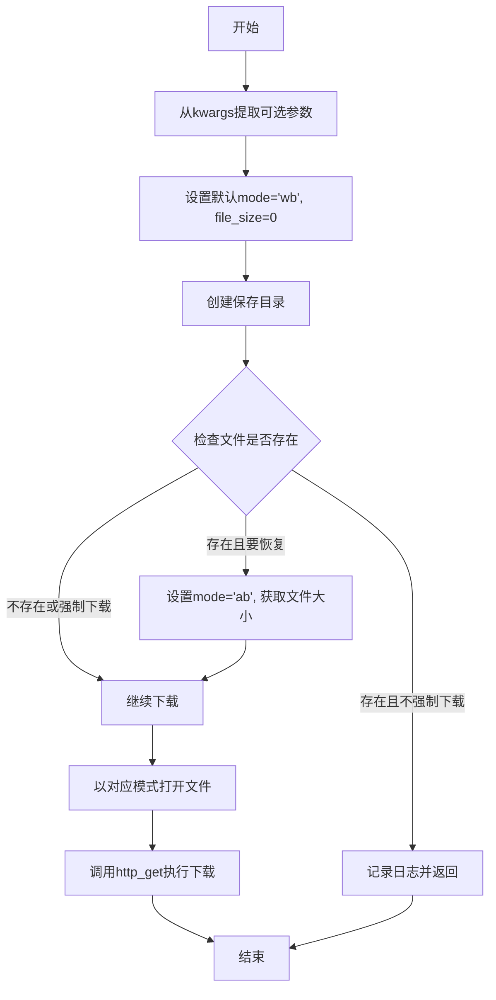

#### 带注释源码

```python
def file_downloader(
    url,
    save_path,
    **kwargs,
) -> None:
    """
    Downloads a file from a given URL and saves it to the specified path.

    parameters:
        url (`str`):
            The URL of the file to download.
        save_path (`str`):
            The local path where the file will be saved.
        resume (`bool`, *optional*, defaults to `False`):
            Whether to resume an incomplete download.
        headers (`dict`, *optional*, defaults to `None`):
            Dictionary of HTTP Headers to send with the request.
        proxies (`dict`, *optional*, defaults to `None`):
            Dictionary mapping protocol to the URL of the proxy passed to `requests.request`.
        force_download (`bool`, *optional*, defaults to `False`):
            Whether to force the download even if the file already exists.
        displayed_filename (`str`, *optional*):
            The filename of the file that is being downloaded. Value is used only to display a nice progress bar. If
            not set, the filename is guessed from the URL or the `Content-Disposition` header.

    returns:
        None
    """

    # 从kwargs中提取可选参数，设置默认值
    resume = kwargs.pop("resume", False)
    headers = kwargs.pop("headers", None)
    proxies = kwargs.pop("proxies", None)
    force_download = kwargs.pop("force_download", False)
    displayed_filename = kwargs.pop("displayed_filename", None)

    # 默认文件写入模式为二进制写入，初始文件大小为0
    mode = "wb"
    file_size = 0

    # 创建保存目录（如果不存在）
    os.makedirs(os.path.dirname(save_path), exist_ok=True)

    # 检查文件是否已存在于保存路径
    if os.path.exists(save_path):
        if not force_download:
            # 如果文件存在且不强制下载，跳过下载并记录日志
            logger.info(f"File already exists: {save_path}, skipping download.")
            return None
        elif resume:
            # 如果要恢复下载，设置为追加模式并获取当前文件大小
            mode = "ab"
            file_size = os.path.getsize(save_path)

    # 以适当模式打开文件（写入或追加）
    with open(save_path, mode) as model_file:
        # 调用huggingface_hub的http_get函数执行文件下载
        return http_get(
            url=url,
            temp_file=model_file,
            resume_size=file_size,
            displayed_filename=displayed_filename,
            headers=headers,
            proxies=proxies,
            **kwargs,
        )
```


### `search_huggingface`

该函数用于在 Hugging Face Hub 上搜索模型并可选择下载，根据关键字类型（HF仓库、HF URL、本地路径或搜索关键词）执行不同的逻辑，最终返回模型路径或包含详细信息的 `SearchResult` 对象。

参数：

- `search_word`：`str`，搜索查询字符串，用于指定要搜索的模型名称、URL 或路径
- `revision`：`str | None`，可选参数，指定要下载模型的特定版本
- `checkpoint_format`：`str`，可选参数，默认值为 `"single_file"`，指定模型检查点的格式（single_file 或 diffusers）
- `download`：`bool`，可选参数，默认值为 `False`，是否下载模型到本地
- `force_download`：`bool`，可选参数，默认值为 `False`，是否强制重新下载已存在的模型
- `include_params`：`bool`，可选参数，默认值为 `False`，是否在返回数据中包含详细参数信息
- `pipeline_tag`：`str | None`，可选参数，用于按管道类型过滤模型
- `token`：`str | None`，可选参数，Hugging Face 认证的 API token
- `gated`：`bool`，可选参数，默认值为 `False`，是否过滤 gated 模型
- `skip_error`：`bool`，可选参数，默认值为 `False`，是否在出错时跳过并返回 None

返回值：`Union[str, SearchResult, None]`，返回模型路径字符串、或包含完整信息的 SearchResult 对象、或 None（当 skip_error 为 True 且未找到匹配模型时）

#### 流程图

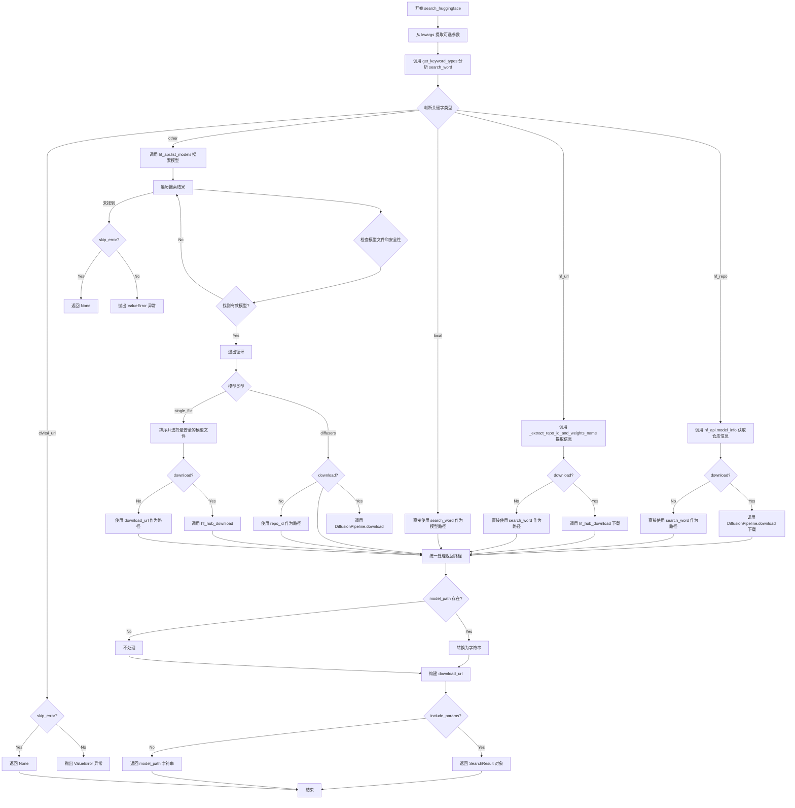

#### 带注释源码

```python
def search_huggingface(search_word: str, **kwargs) -> Union[str, SearchResult, None]:
    r"""
    Downloads a model from Hugging Face.

    Parameters:
        search_word (`str`):
            The search query string.
        revision (`str`, *optional*):
            The specific version of the model to download.
        checkpoint_format (`str`, *optional*, defaults to `"single_file"`):
            The format of the model checkpoint.
        download (`bool`, *optional*, defaults to `False`):
            Whether to download the model.
        force_download (`bool`, *optional*, defaults to `False`):
            Whether to force the download if the model already exists.
        include_params (`bool`, *optional*, defaults to `False`):
            Whether to include parameters in the returned data.
        pipeline_tag (`str`, *optional*):
            Tag to filter models by pipeline.
        token (`str`, *optional*):
            API token for Hugging Face authentication.
        gated (`bool`, *optional*, defaults to `False` ):
            A boolean to filter models on the Hub that are gated or not.
        skip_error (`bool`, *optional*, defaults to `False`):
            Whether to skip errors and return None.

    Returns:
        `Union[str,  SearchResult, None]`: The model path or  SearchResult or None.
    """
    # 从 kwargs 中提取可选参数，使用默认值
    revision = kwargs.pop("revision", None)
    checkpoint_format = kwargs.pop("checkpoint_format", "single_file")
    download = kwargs.pop("download", False)
    force_download = kwargs.pop("force_download", False)
    include_params = kwargs.pop("include_params", False)
    pipeline_tag = kwargs.pop("pipeline_tag", None)
    token = kwargs.pop("token", None)
    gated = kwargs.pop("gated", False)
    skip_error = kwargs.pop("skip_error", False)

    # 初始化局部变量
    file_list = []
    hf_repo_info = {}
    hf_security_info = {}
    model_path = ""
    repo_id, file_name = "", ""
    diffusers_model_exists = False

    # 调用 get_keyword_types 分析搜索关键字的类型
    # 返回包含 checkpoint_format, loading_method, type 等信息的字典
    search_word_status = get_keyword_types(search_word)

    # 分支处理：根据关键字类型执行不同逻辑
    if search_word_status["type"]["hf_repo"]:
        # 情况1：Hugging Face 仓库格式 (如 "username/model")
        # 获取仓库信息和安全状态
        hf_repo_info = hf_api.model_info(repo_id=search_word, securityStatus=True)
        
        if download:
            # 如果需要下载，调用 DiffusionPipeline.download
            model_path = DiffusionPipeline.download(
                search_word,
                revision=revision,
                token=token,
                force_download=force_download,
                **kwargs,
            )
        else:
            # 不下载则直接使用搜索词作为路径
            model_path = search_word
            
    elif search_word_status["type"]["hf_url"]:
        # 情况2：Hugging Face URL 格式
        # 从 URL 中提取仓库 ID 和权重文件名
        repo_id, weights_name = _extract_repo_id_and_weights_name(search_word)
        
        if download:
            # 调用 hf_hub_download 直接下载指定文件
            model_path = hf_hub_download(
                repo_id=repo_id,
                filename=weights_name,
                force_download=force_download,
                token=token,
            )
        else:
            model_path = search_word
            
    elif search_word_status["type"]["local"]:
        # 情况3：本地路径（文件或目录）
        model_path = search_word
        
    elif search_word_status["type"]["civitai_url"]:
        # 情况4：Civitai URL（不支持）
        if skip_error:
            return None
        else:
            raise ValueError("The URL for Civitai is invalid with `for_hf`. Please use `for_civitai` instead.")
    else:
        # 情况5：普通搜索关键词，需要通过 API 搜索模型
        # 调用 Hugging Face API 列出模型
        hf_models = hf_api.list_models(
            search=search_word,
            direction=-1,  # 按下载量降序
            limit=100,     # 最多返回100个结果
            fetch_config=True,
            pipeline_tag=pipeline_tag,
            full=True,
            gated=gated,
            token=token,
        )
        # 将模型对象转换为字典列表
        model_dicts = [asdict(value) for value in list(hf_models)]

        # 遍历搜索结果寻找符合条件的模型
        for repo_info in model_dicts:
            repo_id = repo_info["id"]
            file_list = []
            # 获取每个模型的详细信息和安全状态
            hf_repo_info = hf_api.model_info(repo_id=repo_id, securityStatus=True)
            # 获取安全扫描信息
            hf_security_info = hf_repo_info.security_repo_status
            # 获取有安全问题的文件列表（用于排除）
            exclusion = [issue["path"] for issue in hf_security_info["filesWithIssues"]]

            # 检查是否存在 multi-folder diffusers 模型或有效文件
            if hf_security_info["scansDone"]:
                for info in repo_info["siblings"]:
                    file_path = info["rfilename"]
                    
                    # 检查是否是 diffusers 格式的 model_index.json
                    if "model_index.json" == file_path and checkpoint_format in [
                        "diffusers",
                        "all",
                    ]:
                        diffusers_model_exists = True
                        break

                    # 检查是否是有效的单文件 checkpoint
                    elif (
                        any(file_path.endswith(ext) for ext in EXTENSION)  # 文件扩展名匹配
                        and not any(config in file_path for config in CONFIG_FILE_LIST)  # 排除配置文件
                        and not any(exc in file_path for exc in exclusion)  # 排除有安全问题的文件
                        and os.path.basename(os.path.dirname(file_path)) not in DIFFUSERS_CONFIG_DIR  # 排除子目录模型
                    ):
                        file_list.append(file_path)

            # 找到有效模型后退出循环
            if diffusers_model_exists or file_list:
                break
        else:
            # 未找到匹配模型的处理
            if skip_error:
                return None
            else:
                raise ValueError("No models matching your criteria were found on huggingface.")

        # 根据模型类型决定如何处理
        if diffusers_model_exists:
            if download:
                # 下载 diffusers 格式模型
                model_path = DiffusionPipeline.download(
                    repo_id,
                    token=token,
                    **kwargs,
                )
            else:
                model_path = repo_id

        elif file_list:
            # 处理单文件 checkpoint
            # 排序文件列表，优先选择包含 "safe" 或 "sfw" 的文件（更安全）
            file_name = next(
                (model for model in sorted(file_list, reverse=True) if re.search(r"(?i)[-_](safe|sfw)", model)),
                file_list[0],  # 如果没找到安全的，默认选择第一个
            )

            if download:
                # 下载选中的模型文件
                model_path = hf_hub_download(
                    repo_id=repo_id,
                    filename=file_name,
                    revision=revision,
                    token=token,
                    force_download=force_download,
                )

    # pathlib.PosixPath 可能被返回，转换为字符串
    if model_path:
        model_path = str(model_path)

    # 构建下载/站点 URL
    if file_name:
        download_url = f"https://huggingface.co/{repo_id}/blob/main/{file_name}"
    else:
        download_url = f"https://huggingface.co/{repo_id}"

    # 再次调用 get_keyword_types 获取输出信息
    output_info = get_keyword_types(model_path)

    # 根据 include_params 决定返回格式
    if include_params:
        # 返回完整的 SearchResult 对象（包含详细元数据）
        return SearchResult(
            model_path=model_path or download_url,
            loading_method=output_info["loading_method"],
            checkpoint_format=output_info["checkpoint_format"],
            repo_status=RepoStatus(repo_id=repo_id, repo_hash=hf_repo_info.sha, version=revision),
            model_status=ModelStatus(
                search_word=search_word,
                site_url=download_url,
                download_url=download_url,
                file_name=file_name,
                local=download,
            ),
            extra_status=ExtraStatus(trained_words=None),
        )
    else:
        # 仅返回模型路径字符串
        return model_path
```


### `search_civitai`

在 Civitai 平台上搜索模型并可选择下载，支持按模型类型、基础模型、排序方式等条件筛选，返回模型路径或包含详细信息的 SearchResult 对象。

参数：

- `search_word`：`str`，搜索关键词，用于在 Civitai 上查询模型。
- `model_type`：`str`，可选，默认值为 `"Checkpoint"`，要搜索的模型类型（如 Checkpoint、TextualInversion、LORA 等）。
- `sort`：`str`，可选，排序方式（如 `"Highest Rated"`、`"Most Downloaded"`、`"Newest"` 等）。
- `download`：`bool`，可选，默认值为 `False`，是否下载模型到本地。
- `base_model`：`str`，可选，基础模型名称，用于筛选兼容的模型。
- `force_download`：`bool`，可选，默认值为 `False`，是否强制重新下载已存在的模型。
- `token`：`str`，可选，Civitai API 认证令牌。
- `include_params`：`bool`，可选，默认值为 `False`，是否在返回结果中包含模型参数信息。
- `resume`：`bool`，可选，默认值为 `False`，是否恢复未完成的下载。
- `cache_dir`：`str` 或 `Path`，可选，缓存目录路径，默认为 `~/.cache/Civitai`。
- `skip_error`：`bool`，可选，默认值为 `False`，是否在出错时跳过并返回 None。

返回值：`Union[str, SearchResult, None]`，返回模型本地路径、SearchResult 对象（包含模型路径、加载方式、格式、仓库状态、模型状态、额外状态等信息）或 None。

#### 流程图

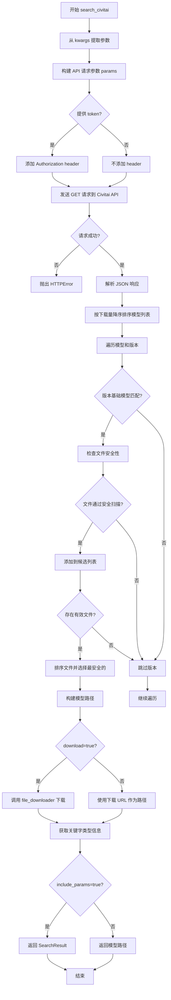

#### 带注释源码

```python
def search_civitai(search_word: str, **kwargs) -> Union[str, SearchResult, None]:
    r"""
    Downloads a model from Civitai.

    Parameters:
        search_word (`str`):
            The search query string.
        model_type (`str`, *optional*, defaults to `Checkpoint`):
            The type of model to search for.
        sort (`str`, *optional*):
            The order in which you wish to sort the results(for example, `Highest Rated`, `Most Downloaded`, `Newest`).
        base_model (`str`, *optional*):
            The base model to filter by.
        download (`bool`, *optional*, defaults to `False`):
            Whether to download the model.
        force_download (`bool`, *optional*, defaults to `False`):
            Whether to force the download if the model already exists.
        token (`str`, *optional*):
            API token for Civitai authentication.
        include_params (`bool`, *optional*, defaults to `False`):
            Whether to include parameters in the returned data.
        cache_dir (`str`, `Path`, *optional*):
            Path to the folder where cached files are stored.
        resume (`bool`, *optional*, defaults to `False`):
            Whether to resume an incomplete download.
        skip_error (`bool`, *optional*, defaults to `False`):
            Whether to skip errors and return None.

    Returns:
        `Union[str,  SearchResult, None]`: The model path or ` SearchResult` or None.
    """

    # 从 kwargs 中提取可选参数，设置默认值
    model_type = kwargs.pop("model_type", "Checkpoint")
    sort = kwargs.pop("sort", None)
    download = kwargs.pop("download", False)
    base_model = kwargs.pop("base_model", None)
    force_download = kwargs.pop("force_download", False)
    token = kwargs.pop("token", None)
    include_params = kwargs.pop("include_params", False)
    resume = kwargs.pop("resume", False)
    cache_dir = kwargs.pop("cache_dir", None)
    skip_error = kwargs.pop("skip_error", False)

    # 初始化搜索结果变量
    model_path = ""
    repo_name = ""
    repo_id = ""
    version_id = ""
    trainedWords = ""
    models_list = []
    selected_repo = {}
    selected_model = {}
    selected_version = {}
    # 设置 Civitai 缓存目录，默认为 ~/.cache/Civitai
    civitai_cache_dir = cache_dir or os.path.join(CACHE_HOME, "Civitai")

    # 构建 API 请求参数
    params = {
        "query": search_word,
        "types": model_type,
        "limit": 20,
    }
    # 如果提供了基础模型，添加到参数中
    if base_model is not None:
        if not isinstance(base_model, list):
            base_model = [base_model]
        params["baseModel"] = base_model

    # 添加排序参数
    if sort is not None:
        params["sort"] = sort

    # 设置请求头，包含认证令牌
    headers = {}
    if token:
        headers["Authorization"] = f"Bearer {token}"

    try:
        # 向 Civitai API 发送 GET 请求
        response = requests.get("https://civitai.com/api/v1/models", params=params, headers=headers)
        response.raise_for_status()
    except requests.exceptions.HTTPError as err:
        raise requests.HTTPError(f"Could not get elements from the URL: {err}")
    else:
        try:
            # 解析 JSON 响应
            data = response.json()
        except AttributeError:
            if skip_error:
                return None
            else:
                raise ValueError("Invalid JSON response")

    # 按下载量降序排序模型列表
    sorted_repos = sorted(data["items"], key=lambda x: x["stats"]["downloadCount"], reverse=True)

    # 遍历排序后的模型
    for selected_repo in sorted_repos:
        repo_name = selected_repo["name"]
        repo_id = selected_repo["id"]

        # 对模型的版本按下载量降序排序
        sorted_versions = sorted(
            selected_repo["modelVersions"],
            key=lambda x: x["stats"]["downloadCount"],
            reverse=True,
        )
        for selected_version in sorted_versions:
            version_id = selected_version["id"]
            trainedWords = selected_version["trainedWords"]
            models_list = []
            # 检查基础模型是否匹配（对于 Textual Inversion 特别重要）
            if base_model is None or selected_version["baseModel"] in base_model:
                # 遍历版本中的所有文件
                for model_data in selected_version["files"]:
                    # 检查文件是否通过安全扫描且扩展名有效
                    file_name = model_data["name"]
                    if (
                        model_data["pickleScanResult"] == "Success"
                        and model_data["virusScanResult"] == "Success"
                        and any(file_name.endswith(ext) for ext in EXTENSION)
                        and os.path.basename(os.path.dirname(file_name)) not in DIFFUSERS_CONFIG_DIR
                    ):
                        # 添加通过检查的文件到候选列表
                        file_status = {
                            "filename": file_name,
                            "download_url": model_data["downloadUrl"],
                        }
                        models_list.append(file_status)

            # 如果存在有效文件
            if models_list:
                # 按文件名排序并选择最安全的模型（优先选择包含 safe/sfw 的文件名）
                sorted_models = sorted(models_list, key=lambda x: x["filename"], reverse=True)
                selected_model = next(
                    (
                        model_data
                        for model_data in sorted_models
                        if bool(re.search(r"(?i)[-_](safe|sfw)", model_data["filename"]))
                    ),
                    sorted_models[0],
                )

                break
        else:
            continue
        break

    # 如果未找到匹配的模型，处理错误
    if not selected_model:
        if skip_error:
            return None
        else:
            raise ValueError("No model found. Please try changing the word you are searching for.")

    # 获取选中的文件名和下载 URL
    file_name = selected_model["filename"]
    download_url = selected_model["download_url"]

    # 根据 download 参数决定是下载还是返回 URL
    if download:
        # 构建本地模型保存路径
        model_path = os.path.join(str(civitai_cache_dir), str(repo_id), str(version_id), str(file_name))
        # 调用文件下载器
        file_downloader(
            url=download_url,
            save_path=model_path,
            resume=resume,
            force_download=force_download,
            displayed_filename=file_name,
            headers=headers,
            **kwargs,
        )

    else:
        model_path = download_url

    # 获取关键字类型信息
    output_info = get_keyword_types(model_path)

    # 根据 include_params 参数决定返回格式
    if not include_params:
        return model_path
    else:
        # 返回完整的 SearchResult 对象
        return SearchResult(
            model_path=model_path,
            loading_method=output_info["loading_method"],
            checkpoint_format=output_info["checkpoint_format"],
            repo_status=RepoStatus(repo_id=repo_name, repo_hash=repo_id, version=version_id),
            model_status=ModelStatus(
                search_word=search_word,
                site_url=f"https://civitai.com/models/{repo_id}?modelVersionId={version_id}",
                download_url=download_url,
                file_name=file_name,
                local=output_info["type"]["local"],
            ),
            extra_status=ExtraStatus(trained_words=trainedWords or None),
        )
```


### add_methods

将 `AutoConfig` 类中的方法动态添加到指定的 pipeline 实例中，使 pipeline 能够使用 `AutoConfig` 中定义的自动加载方法（如 `auto_load_textual_inversion` 和 `auto_load_lora_weights`）。

参数：

- `pipeline`：`Pipeline`，需要添加方法的 pipeline 实例

返回值：`Pipeline`，返回添加方法后的 pipeline 实例

#### 流程图

```mermaid
flowchart TD
    A[Start add_methods] --> B[获取 AutoConfig 的所有属性名<br>attr_names = dir(AutoConfig)]
    B --> C{遍历每个属性名}
    C -->|还有属性| D[获取属性值<br>attr_value = getattr<br>AutoConfig, attr_name]
    D --> E{attr_value 是可调用的?}
    E -->|否| C
    E -->|是| F{attr_name 以 '__' 开头?}
    F -->|是| C
    F -->|否| G[绑定方法到 pipeline<br>setattr pipeline, attr_name<br>types.MethodType attr_value, pipeline]
    G --> C
    C -->|遍历完成| H[返回 pipeline]
    H --> I[End]
```

#### 带注释源码

```python
def add_methods(pipeline):
    r"""
    Add methods from `AutoConfig` to the pipeline.

    Parameters:
        pipeline (`Pipeline`):
            The pipeline to which the methods will be added.
    """
    # 遍历 AutoConfig 类的所有属性（包括方法）
    for attr_name in dir(AutoConfig):
        # 获取属性值
        attr_value = getattr(AutoConfig, attr_name)
        # 检查是否为可调用的方法，且不是 Python 内置的双下划线方法
        if callable(attr_value) and not attr_name.startswith("__"):
            # 使用 types.MethodType 将方法绑定到 pipeline 实例
            # 这样方法中的 self 会指向 pipeline 本身
            setattr(pipeline, attr_name, types.MethodType(attr_value, pipeline))
    # 返回添加了方法的 pipeline
    return pipeline
```


### AutoConfig.auto_load_textual_inversion

该方法用于将 Textual Inversion（文本反转）嵌入加载到 Stable Diffusion Pipeline 的文本编码器中，支持从 Hugging Face Diffusers 和 Automatic1111 格式加载文本反转权重，并自动从 Civitai 下载兼容的文本反转模型。

参数：

- `self`：`AutoConfig`，AutoConfig 类实例本身
- `pretrained_model_name_or_path`：`Union[str, List[str]]`，预训练模型名称或路径，支持关键字搜索、模型 ID、目录路径、文件路径或 torch state dict，可为字符串或列表
- `token`：`Optional[Union[str, List[str]]] = None`，用于文本反转权重的令牌，当与列表形式的路径配合使用时需保持相同长度
- `base_model`：`Optional[Union[str, List[str]]] = None`，基础模型，用于过滤与分词器兼容的文本反转模型
- `tokenizer`：`Optional[CLIPTokenizer] = None`，CLIP 分词器，如未指定则使用 self.tokenizer
- `text_encoder`：`Optional[CLIPTextModel] = None`，冻结的 CLIP 文本编码器，如未指定则使用 self.text_encoder
- `**kwargs`：剩余关键字参数，包括 weight_name、cache_dir、force_download、proxies、local_files_only、token、revision、subfolder、mirror 等

返回值：`None`，该方法直接操作管道对象，无返回值

#### 流程图

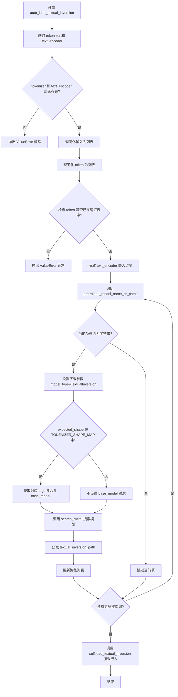

#### 带注释源码

```python
def auto_load_textual_inversion(
    self,
    pretrained_model_name_or_path: Union[str, List[str]],
    token: Optional[Union[str, List[str]]] = None,
    base_model: Optional[Union[str, List[str]]] = None,
    tokenizer=None,
    text_encoder=None,
    **kwargs,
):
    r"""
    Load Textual Inversion embeddings into the text encoder of [`StableDiffusionPipeline`] (both 🤗 Diffusers and
    Automatic1111 formats are supported).

    Parameters:
        pretrained_model_name_or_path (`str` or `os.PathLike` or `List[str or os.PathLike]` or `Dict` or `List[Dict]`):
            Can be either one of the following or a list of them:
                - Search keywords for pretrained model (for example `EasyNegative`).
                - A string, the *model id* (for example `sd-concepts-library/low-poly-hd-logos-icons`) of a
                  pretrained model hosted on the Hub.
                - A path to a *directory* (for example `./my_text_inversion_directory/`) containing the textual
                  inversion weights.
                - A path to a *file* (for example `./my_text_inversions.pt`) containing textual inversion weights.
                - A [torch state
                  dict](https://pytorch.org/tutorials/beginner/saving_loading_models.html#what-is-a-state-dict).
        token (`str` or `List[str]`, *optional*):
            Override the token to use for the textual inversion weights. If `pretrained_model_name_or_path` is a
            list, then `token` must also be a list of equal length.
        text_encoder ([`~transformers.CLIPTextModel`], *optional*):
            Frozen text-encoder ([clip-vit-large-patch14](https://huggingface.co/openai/clip-vit-large-patch14)).
            If not specified, function will take self.tokenizer.
        tokenizer ([`~transformers.CLIPTokenizer`], *optional*):
            A `CLIPTokenizer` to tokenize text. If not specified, function will take self.tokenizer.
        weight_name (`str`, *optional*):
            Name of a custom weight file. This should be used when:
                - The saved textual inversion file is in 🤗 Diffusers format, but was saved under a specific weight
                  name such as `text_inv.bin`.
                - The saved textual inversion file is in the Automatic1111 format.
        cache_dir (`Union[str, os.PathLike]`, *optional*):
            Path to a directory where a downloaded pretrained model configuration is cached if the standard cache
            is not used.
        force_download (`bool`, *optional*, defaults to `False`):
            Whether or not to force the (re-)download of the model weights and configuration files, overriding the
            cached versions if they exist.
        proxies (`Dict[str, str]`, *optional*):
            A dictionary of proxy servers to use by protocol or endpoint, for example, `{'http': 'foo.bar:3128',
            'http://hostname': 'foo.bar:4012'}`. The proxies are used on each request.
        local_files_only (`bool`, *optional*, defaults to `False`):
            Whether to only load local model weights and configuration files or not. If set to `True`, the model
            won't be downloaded from the Hub.
        token (`str` or *bool*, *optional*):
            The token to use as HTTP bearer authorization for remote files. If `True`, the token generated from
            `diffusers-cli login` (stored in `~/.huggingface`) is used.
        revision (`str`, *optional*, defaults to `"main"`):
            The specific model version to use. It can be a branch name, a tag name, a commit id, or any identifier
            allowed by Git.
        subfolder (`str`, *optional*, defaults to `""`):
            The subfolder location of a model file within a larger model repository on the Hub or locally.
        mirror (`str`, *optional*):
            Mirror source to resolve accessibility issues if you're downloading a model in China. We do not
            guarantee the timeliness or safety of the source, and you should refer to the mirror site for more
            information.
    """
    # 1. Set tokenizer and text encoder
    # 从参数获取 tokenizer，如未提供则尝试从 self 获取
    tokenizer = tokenizer or getattr(self, "tokenizer", None)
    # 从参数获取 text_encoder，如未提供则尝试从 self 获取
    text_encoder = text_encoder or getattr(self, "text_encoder", None)

    # Check if tokenizer and text encoder are provided
    # 验证 tokenizer 和 text_encoder 必须同时存在
    if tokenizer is None or text_encoder is None:
        raise ValueError("Tokenizer and text encoder must be provided.")

    # 2. Normalize inputs
    # 将输入统一转换为列表格式以便统一处理
    pretrained_model_name_or_paths = (
        [pretrained_model_name_or_path]
        if not isinstance(pretrained_model_name_or_path, list)
        else pretrained_model_name_or_path
    )

    # 2.1 Normalize tokens
    # 将 token 统一转换为列表格式
    tokens = [token] if not isinstance(token, list) else token
    # 如果 token 为 None，则使用默认 token 填充所有路径
    if tokens[0] is None:
        tokens = tokens * len(pretrained_model_name_or_paths)

    # 验证每个 token 是否已存在于分词器词汇表中
    for check_token in tokens:
        if check_token in tokenizer.get_vocab():
            raise ValueError(
                f"Token {token} already in tokenizer vocabulary. Please choose a different token name or remove {token} and embedding from the tokenizer and text encoder."
            )

    # 获取 text_encoder 输入嵌入的维度，用于匹配兼容的文本反转模型
    expected_shape = text_encoder.get_input_embeddings().weight.shape[-1]  # Expected shape of tokenizer

    # 遍历每个搜索词，从 Civitai 下载兼容的文本反转模型
    for search_word in pretrained_model_name_or_paths:
        if isinstance(search_word, str):
            # Update kwargs to ensure the model is downloaded and parameters are included
            # 设置下载参数：强制下载、包含参数、模型类型为 TextualInversion
            _status = {
                "download": True,
                "include_params": True,
                "skip_error": False,
                "model_type": "TextualInversion",
            }
            # Get tags for the base model of textual inversion compatible with tokenizer.
            # If the tokenizer is 768-dimensional, set tags for SD 1.x and SDXL.
            # If the tokenizer is 1024-dimensional, set tags for SD 2.x.
            # 根据分词器维度获取兼容的基础模型标签
            if expected_shape in TOKENIZER_SHAPE_MAP:
                # Retrieve the appropriate tags from the TOKENIZER_SHAPE_MAP based on the expected shape
                tags = TOKENIZER_SHAPE_MAP[expected_shape]
                # 如果用户指定了 base_model，则合并到过滤标签中
                if base_model is not None:
                    if isinstance(base_model, list):
                        tags.extend(base_model)
                    else:
                        tags.append(base_model)
                _status["base_model"] = tags

            kwargs.update(_status)
            # Search for the model on Civitai and get the model status
            # 调用 search_civitai 从 Civitai 下载文本反转模型
            textual_inversion_path = search_civitai(search_word, **kwargs)
            logger.warning(
                f"textual_inversion_path: {search_word} -> {textual_inversion_path.model_status.site_url}"
            )

            # 用下载后的实际路径替换搜索词
            pretrained_model_name_or_paths[pretrained_model_name_or_paths.index(search_word)] = (
                textual_inversion_path.model_path
            )

    # 3. 调用管道内置的 load_textual_inversion 方法加载嵌入
    self.load_textual_inversion(
        pretrained_model_name_or_paths, token=tokens, tokenizer=tokenizer, text_encoder=text_encoder, **kwargs
    )
```


### `AutoConfig.auto_load_lora_weights`

该方法用于将指定的LoRA权重加载到pipeline的`self.unet`和`self.text_encoder`中，支持从Civitai自动搜索下载LoRA模型，并调用底层`load_lora_weights`方法完成权重加载。

参数：

- `self`：调用该方法的pipeline实例对象
- `pretrained_model_name_or_path_or_dict`：`Union[str, Dict[str, torch.Tensor]]`，LoRA权重的路径、URL或包含权重张量的字典
- `adapter_name`：`Optional[str]`，可选的适配器名称，用于引用加载的适配器模型，若未指定则使用`default_{i}`格式（i为已加载适配器总数）
- `**kwargs`：`dict`，其他关键字参数，会传递给`self.lora_state_dict`方法

返回值：无明确返回值（通过修改self的状态来加载LoRA权重）

#### 流程图

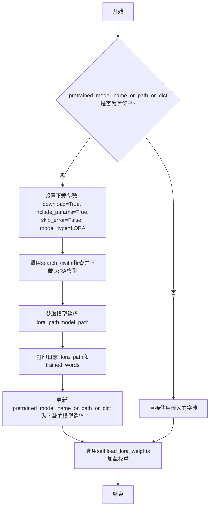

#### 带注释源码

```python
def auto_load_lora_weights(
    self,
    pretrained_model_name_or_path_or_dict: Union[str, Dict[str, torch.Tensor]],
    adapter_name=None,
    **kwargs,
):
    r"""
    Load LoRA weights specified in `pretrained_model_name_or_path_or_dict` into `self.unet` and
    `self.text_encoder`.

    All kwargs are forwarded to `self.lora_state_dict`.

    See [`~loaders.StableDiffusionLoraLoaderMixin.lora_state_dict`] for more details on how the state dict is
    loaded.

    See [`~loaders.StableDiffusionLoraLoaderMixin.load_lora_into_unet`] for more details on how the state dict is
    loaded into `self.unet`.

    See [`~loaders.StableDiffusionLoraLoaderMixin.load_lora_into_text_encoder`] for more details on how the state
    dict is loaded into `self.text_encoder`.

    Parameters:
        pretrained_model_name_or_path_or_dict (`str` or `os.PathLike` or `dict`):
            See [`~loaders.StableDiffusionLoraLoaderMixin.lora_state_dict`].
        adapter_name (`str`, *optional*):
            Adapter name to be used for referencing the loaded adapter model. If not specified, it will use
            `default_{i}` where i is the total number of adapters being loaded.
        low_cpu_mem_usage (`bool`, *optional*):
            Speed up model loading by only loading the pretrained LoRA weights and not initializing the random
            weights.
        kwargs (`dict`, *optional*):
            See [`~loaders.StableDiffusionLoraLoaderMixin.lora_state_dict`].
    """
    # 判断传入的是否为字符串路径（需要下载的情况）
    if isinstance(pretrained_model_name_or_path_or_dict, str):
        # 更新kwargs以确保模型被下载且包含参数
        _status = {
            "download": True,           # 启用下载
            "include_params": True,     # 包含参数信息
            "skip_error": False,        # 不跳过错误
            "model_type": "LORA",        # 指定模型类型为LORA
        }
        kwargs.update(_status)
        # 调用search_civitai在Civitai上搜索并下载LoRA模型
        lora_path = search_civitai(pretrained_model_name_or_path_or_dict, **kwargs)
        # 记录下载的LoRA模型URL
        logger.warning(f"lora_path: {lora_path.model_status.site_url}")
        # 记录训练词（trigger words）
        logger.warning(f"trained_words: {lora_path.extra_status.trained_words}")
        # 使用下载后的本地模型路径替换原始搜索词
        pretrained_model_name_or_path_or_dict = lora_path.model_path

    # 调用pipeline内置的load_lora_weights方法完成权重加载
    self.load_lora_weights(pretrained_model_name_or_path_or_dict, adapter_name=adapter_name, **kwargs)
```


### `EasyPipelineForText2Image.__init__`

这是 `EasyPipelineForText2Image` 类的构造函数，用于初始化文本到图像的管道实例。该方法继承自 `AutoPipelineForText2Image`，通过调用父类的初始化方法来创建管道对象。

参数：

- `*args`：可变位置参数，传递给父类 `AutoPipelineForText2Image` 的初始化参数
- `**kwargs`：可变关键字参数，传递给父类 `AutoPipelineForText2Image` 的初始化参数

返回值：无（构造函数返回 `None`）

#### 流程图

```mermaid
flowchart TD
    A[开始 __init__] --> B[调用 super().__init__]
    B --> C[调用 AutoPipelineForText2Image 的 __init__]
    C --> D[结束]
```

#### 带注释源码

```python
def __init__(self, *args, **kwargs):
    """
    初始化 EasyPipelineForText2Image 实例。
    
    该构造函数继承自 AutoPipelineForText2Image，用于创建文本到图像的扩散管道。
    由于 EasyPipelineForText2Image 是一个通用的管道类包装器，其 __init__ 方法
    主要是调用父类的初始化方法，不进行额外的自定义初始化。
    
    Parameters:
        *args: 可变位置参数，传递给父类
        **kwargs: 可变关键字参数，传递给父类
    """
    # EnvironmentError is returned
    # 调用父类 AutoPipelineForText2Image 的初始化方法
    super().__init__()
```


### `EasyPipelineForText2Image.from_huggingface`

该方法是一个类方法，用于从 Hugging Face Hub 或本地路径加载文本到图像的扩散管道。它支持多种输入形式（关键词、URL、repo ID 或本地目录），并根据模型检查点格式自动选择合适的加载方式（单文件或 Diffusers 格式）。

参数：

- `cls`：类方法隐含的类参数
- `pretrained_model_link_or_path`：`str` 或 `os.PathLike`，主要输入参数，可以是 Hugging Face 搜索关键词、`.ckpt` 或 `.safetensors` 文件链接、repo ID 或本地目录路径
- `**kwargs`：其他可选关键字参数，包括 `checkpoint_format`（检查点格式，默认 `"single_file"`）、`pipeline_tag`（管道标签）、`torch_dtype`（张量数据类型）、`force_download`（是否强制下载）、`cache_dir`（缓存目录）、`proxies`（代理服务器）、`output_loading_info`（是否返回加载信息）、`local_files_only`（仅使用本地文件）、`token`（认证令牌）、`revision`（版本）、`custom_revision`（自定义版本）、`mirror`（镜像源）、`device_map`（设备映射）、`max_memory`（最大内存）、`offload_folder`（权重卸载目录）、`offload_state_dict`（卸载状态字典）、`low_cpu_mem_usage`（低 CPU 内存使用）、`use_safetensors`（使用 safetensors）、`gated`（门控模型）、`variant`（变体）

返回值：`DiffusionPipeline`，返回加载完成的扩散管道实例，并添加了额外的方法

#### 流程图

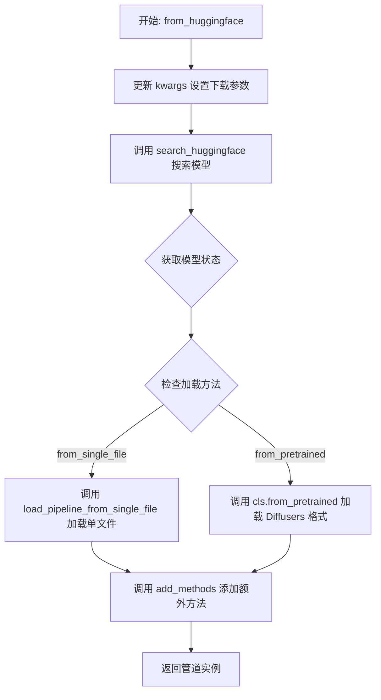

#### 带注释源码

```python
@classmethod
@validate_hf_hub_args
def from_huggingface(cls, pretrained_model_link_or_path, **kwargs):
    r"""
    Parameters:
        pretrained_model_or_path (`str` or `os.PathLike`, *optional*):
            Can be either:
                - A keyword to search for Hugging Face (for example `Stable Diffusion`)
                - Link to `.ckpt` or `.safetensors` file (for example
                  `"https://huggingface.co/<repo_id>/blob/main/<path_to_file>.safetensors"`) on the Hub.
                - A string, the *repo id* (for example `CompVis/ldm-text2im-large-256`) of a pretrained pipeline
                  hosted on the Hub.
                - A path to a *directory* (for example `./my_pipeline_directory/`) containing pipeline weights
                  saved using
                [`~DiffusionPipeline.save_pretrained`].
        ... (其他参数省略，详见上方参数列表)
    """
    # 步骤1: 更新 kwargs，确保模型被下载并包含参数
    _status = {
        "download": True,           # 启用下载
        "include_params": True,     # 包含参数信息
        "skip_error": False,        # 不跳过错误
        "pipeline_tag": "text-to-image",  # 设置管道标签为文本到图像
    }
    kwargs.update(_status)

    # 步骤2: 在 Hugging Face 上搜索模型，获取模型状态信息
    hf_checkpoint_status = search_huggingface(pretrained_model_link_or_path, **kwargs)
    # 记录下载 URL 到日志
    logger.warning(f"checkpoint_path: {hf_checkpoint_status.model_status.download_url}")
    # 获取模型路径
    checkpoint_path = hf_checkpoint_status.model_path

    # 步骤3: 根据模型检查点格式选择加载方式
    if hf_checkpoint_status.loading_method == "from_single_file":
        # 方式A: 从单文件加载（.ckpt 或 .safetensors 格式）
        pipeline = load_pipeline_from_single_file(
            pretrained_model_or_path=checkpoint_path,
            pipeline_mapping=SINGLE_FILE_CHECKPOINT_TEXT2IMAGE_PIPELINE_MAPPING,
            **kwargs,
        )
    else:
        # 方式B: 从 Diffusers 格式目录加载
        pipeline = cls.from_pretrained(checkpoint_path, **kwargs)
    
    # 步骤4: 添加额外的方法到管道对象并返回
    return add_methods(pipeline)
```


### `EasyPipelineForText2Image.from_civitai`

该方法是一个类方法，用于从 Civitai 模型平台搜索并加载文本到图像（Text-to-Image）扩散模型管道。它通过调用 `search_civitai` 函数查找模型，获取模型路径后使用 `load_pipeline_from_single_file` 加载单文件检查点，最后通过 `add_methods` 添加额外的方法到管道实例中并返回。

参数：

- `cls`：类型，当前类本身（类方法的隐含参数）
- `pretrained_model_link_or_path`：`str` 或 `os.PathLike`，要加载的模型链接、路径或搜索关键词，可以是 Civitai URL、HuggingFace 链接、本地路径或搜索关键字
- `**kwargs`：字典，可选的关键字参数，包括 model_type（模型类型，默认 "Checkpoint"）、base_model（基础模型）、cache_dir（缓存目录）、resume（是否恢复下载）、torch_dtype（张量数据类型）、force_download（强制下载）、output_loading_info（是否返回加载信息）、local_files_only（仅使用本地文件）、token（API 认证令牌）、device_map（设备映射）、max_memory（最大内存）、offload_folder（卸载文件夹）、offload_state_dict（卸载状态字典）、low_cpu_mem_usage（低 CPU 内存使用）、use_safetensors（使用 safetensors）等

返回值：`DiffusionPipeline`（具体为 `StableDiffusionPipeline` 或其子类），加载并配置好的扩散管道对象

#### 流程图

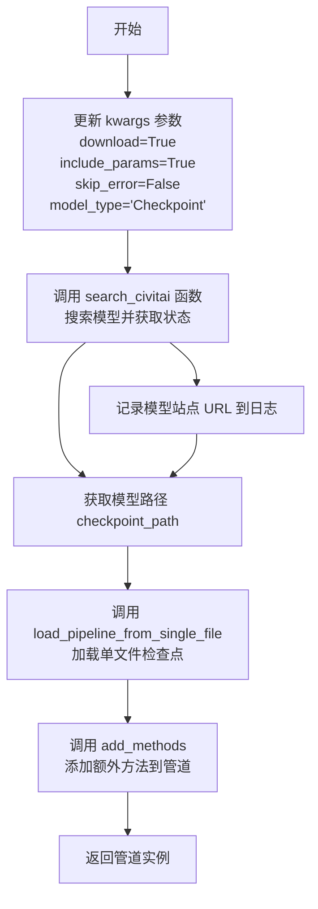

#### 带注释源码

```python
@classmethod
def from_civitai(cls, pretrained_model_link_or_path, **kwargs):
    r"""
    从 Civitai 加载模型管道。
    
    参数:
        pretrained_model_link_or_path: 模型链接、路径或搜索关键词
        model_type: 模型类型，默认 "Checkpoint"
        base_model: 基础模型筛选
        cache_dir: 缓存目录
        resume: 是否恢复下载
        torch_dtype: 张量数据类型
        force_download: 强制下载
        output_loading_info: 返回加载信息
        local_files_only: 仅使用本地文件
        token: API 认证令牌
        device_map: 设备映射
        max_memory: 最大内存
        offload_folder: 卸载文件夹
        offload_state_dict: 卸载状态字典
        low_cpu_mem_usage: 低 CPU 内存使用
        use_safetensors: 使用 safetensors
    """
    # 1. 设置默认参数，确保模型被下载并包含参数信息
    _status = {
        "download": True,           # 立即下载模型
        "include_params": True,     # 返回完整参数信息
        "skip_error": False,        # 遇到错误时抛出异常
        "model_type": "Checkpoint", # 默认搜索 Checkpoint 类型
    }
    kwargs.update(_status)

    # 2. 调用 search_civitai 函数在 Civitai 平台搜索模型
    #    返回 SearchResult 对象，包含模型路径、下载链接等信息
    checkpoint_status = search_civitai(pretrained_model_link_or_path, **kwargs)
    
    # 3. 记录模型在 Civitai 上的页面 URL 到日志
    logger.warning(f"checkpoint_path: {checkpoint_status.model_status.site_url}")
    
    # 4. 获取模型文件的本地路径或下载 URL
    checkpoint_path = checkpoint_status.model_path

    # 5. 使用单文件加载方式创建管道
    #    根据模型类型从 SINGLE_FILE_CHECKPOINT_TEXT2IMAGE_MAPPING 选择对应管道类
    pipeline = load_pipeline_from_single_file(
        pretrained_model_or_path=checkpoint_path,
        pipeline_mapping=SINGLE_FILE_CHECKPOINT_TEXT2IMAGE_PIPELINE_MAPPING,
        **kwargs,
    )
    
    # 6. 添加额外的自动化配置方法到管道实例
    return add_methods(pipeline)
```


### `EasyPipelineForImage2Image.__init__`

初始化 `EasyPipelineForImage2Image` 类的实例。该方法是类的构造函数，继承自 `AutoPipelineForImage2Image`，用于创建图像到图像（Image-to-Image）扩散管道对象。

参数：

- `self`：实例本身，无需显式传递
- `*args`：可变位置参数，用于传递给父类的初始化参数
- `**kwargs`：可变关键字参数，用于传递给父类的初始化参数

返回值：`None`，构造函数不返回任何值

#### 流程图

```mermaid
flowchart TD
    A[开始 __init__] --> B[调用 super().__init__]
    B --> C[继承自 AutoPipelineForImage2Image 的初始化逻辑]
    C --> D[结束]
    
    style A fill:#f9f,stroke:#333
    style D fill:#9ff,stroke:#333
```

#### 带注释源码

```python
def __init__(self, *args, **kwargs):
    r"""
    构造函数初始化 EasyPipelineForImage2Image 实例。
    
    注意：根据类文档说明，该类不能使用 __init__() 直接实例化，
    而应使用 from_pretrained、from_huggingface 或 from_civitai 等类方法。
    """
    # EnvironmentError is returned
    # 调用父类 AutoPipelineForImage2Image 的初始化方法
    # 根据类文档说明，直接调用 __init__ 会抛出错误
    super().__init__()
```


### `EasyPipelineForImage2Image.from_huggingface`

该方法是一个类方法，用于从 Hugging Face Hub 自动搜索并加载图像到图像（Image-to-Image）Diffusion Pipeline。它支持多种模型格式（单文件checkpoint或完整diffusers格式），并通过内部搜索机制自动识别最合适的模型，同时提供自动加载额外方法的功能。

参数：

- `cls`：类方法隐式参数，表示类本身
- `pretrained_model_link_or_path`：`str` 或 `os.PathLike`，要加载的模型标识符，可以是 Hugging Face 搜索关键字、`.ckpt`/`.safetensors` 文件链接、repo ID 或本地目录路径
- `**kwargs`：其他可选关键字参数，包括 `checkpoint_format`（模型格式，默认为 "single_file"）、`pipeline_tag`（管道标签，用于过滤模型）、`torch_dtype`（数据类型）、`force_download`（是否强制下载）、`cache_dir`（缓存目录）、`proxies`（代理服务器）、`output_loading_info`（是否返回加载信息）、`local_files_only`（是否仅使用本地文件）、`token`（认证令牌）、`revision`（版本）、`custom_revision`（自定义版本）、`mirror`（镜像源）、`device_map`（设备映射）、`max_memory`（最大内存）、`offload_folder`（卸载目录）、`offload_state_dict`（是否卸载状态字典）、`low_cpu_mem_usage`（低内存使用）、`use_safetensors`（使用 safetensors）、`gated`（是否过滤 gated 模型）等

返回值：`DiffusionPipeline`，返回加载完成的图像到图像 pipeline 实例

#### 流程图

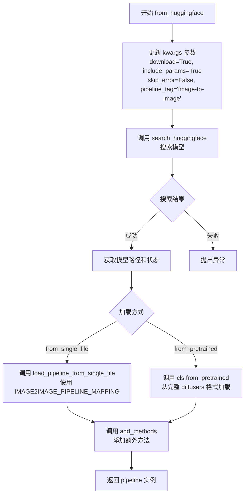

#### 带注释源码

```python
@classmethod
@validate_hf_hub_args
def from_huggingface(cls, pretrained_model_link_or_path, **kwargs):
    r"""
    从 Hugging Face 加载图像到图像 pipeline 的类方法。
    
    参数:
        pretrained_model_link_or_path: 模型标识符，支持关键字、链接、repo ID 或本地路径
        **kwargs: 其他加载参数（如 torch_dtype, force_download 等）
    """
    # 1. 设置默认参数，确保模型被下载并包含完整参数信息
    _parmas = {
        "download": True,           # 强制下载模型
        "include_params": True,    # 返回完整参数信息
        "skip_error": False,        # 遇到错误时不跳过
        "pipeline_tag": "image-to-image",  # 指定为图像到图像类型
    }
    kwargs.update(_parmas)

    # 2. 使用搜索函数在 Hugging Face 上查找模型
    # 该函数会自动处理各种输入格式（关键字、URL、repo ID 等）
    hf_checkpoint_status = search_huggingface(pretrained_model_link_or_path, **kwargs)
    
    # 记录下载 URL 用于调试
    logger.warning(f"checkpoint_path: {hf_checkpoint_status.model_status.download_url}")
    
    # 获取实际的模型路径
    checkpoint_path = hf_checkpoint_status.model_path

    # 3. 根据模型格式选择不同的加载方式
    if hf_checkpoint_status.loading_method == "from_single_file":
        # 方式一：从单文件 checkpoint 加载（.ckpt 或 .safetensors）
        pipeline = load_pipeline_from_single_file(
            pretrained_model_or_path=checkpoint_path,
            pipeline_mapping=SINGLE_FILE_CHECKPOINT_IMAGE2IMAGE_PIPELINE_MAPPING,
            **kwargs,
        )
    else:
        # 方式二：从完整的 diffusers 格式目录加载
        pipeline = cls.from_pretrained(checkpoint_path, **kwargs)

    # 4. 添加 AutoConfig 中的方法到 pipeline 实例
    return add_methods(pipeline)
```


### `EasyPipelineForImage2Image.from_civitai`

该方法是一个类方法，用于从 Civitai 模型平台加载图像到图像（Image-to-Image）扩散管道。它通过搜索 Civitai 获取模型信息，下载模型检查点，并使用单文件加载方式初始化相应的管道实例。

参数：

-  `pretrained_model_link_or_path`：`str` 或 `os.PathLike`，模型搜索关键词、Civitai URL、Hugging Face 仓库 ID 或本地路径
-  `model_type`：`str`，可选，要搜索的模型类型（默认值为 `Checkpoint`，支持 `TextualInversion`、`LORA`、`Controlnet` 等）
-  `base_model`：`str`，可选，用于过滤的基准模型
-  `cache_dir`：`str` 或 `Path`，可选，缓存目录路径
-  `resume`：`bool`，可选，是否恢复未完成的下载（默认 `False`）
-  `torch_dtype`：`str` 或 `torch.dtype`，可选，覆盖默认的 torch 数据类型
-  `force_download`：`bool`，可选，是否强制重新下载（默认 `False`）
-  `output_loading_info`：`bool`，可选，是否返回加载信息字典（默认 `False`）
-  `local_files_only`：`bool`，可选，是否仅使用本地文件（默认 `False`）
-  `token`：`str`，可选，Hugging Face 认证令牌
-  `device_map`：`str` 或 `Dict`，可选，设备映射配置
-  `max_memory`：`Dict`，可选，最大内存配置
-  `offload_folder`：`str` 或 `os.PathLike`，可选，权重卸载文件夹
-  `offload_state_dict`：`bool`，可选，是否临时卸载 CPU 状态字典到硬盘
-  `low_cpu_mem_usage`：`bool`，可选，是否降低 CPU 内存使用（默认 `True`，PyTorch >= 1.9.0）
-  `use_safetensors`：`bool`，可选，是否使用 safetensors 格式加载权重
-  `checkpoint_format`：`str`，可选，检查点格式
-  `pipeline_tag`：`str`，可选，管道标签筛选
-  `variant`：`str`，可选，加载的权重变体
-  `custom_revision`：`str`，可选，自定义版本
-  `mirror`：`str`，可选，镜像源
-  `proxies`：`Dict[str, str]`，可选，代理服务器配置
-  `gated`：`bool`，可选，是否过滤 gated 模型
-  `kwargs`：剩余的关键字参数，用于覆盖管道的可加载变量

返回值：`DiffusionPipeline`，返回加载了方法扩展的图像到图像管道实例

#### 流程图

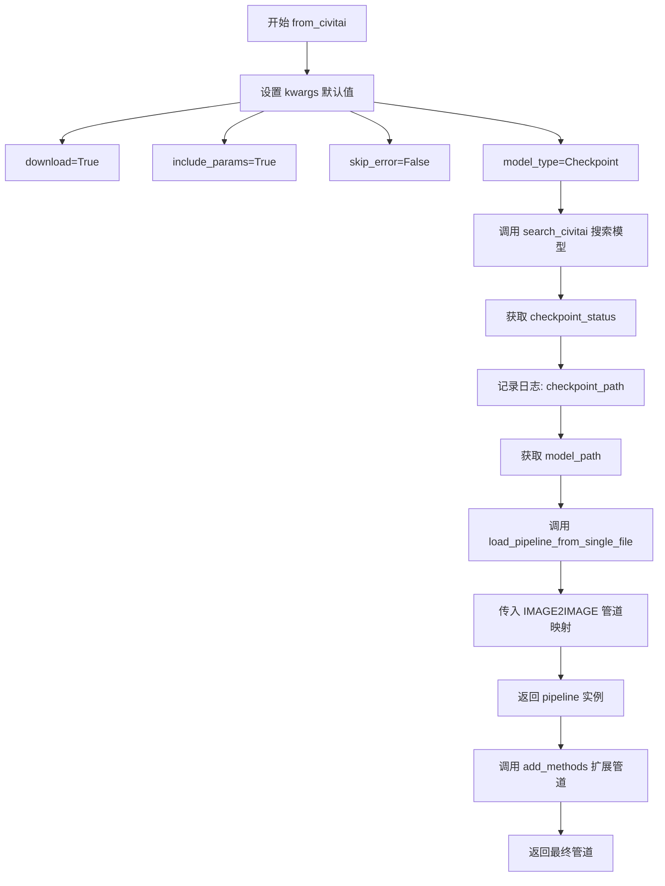

#### 带注释源码

```python
@classmethod
def from_civitai(cls, pretrained_model_link_or_path, **kwargs):
    r"""
    从 Civitai 加载图像到图像扩散管道。
    
    参数:
        pretrained_model_link_or_path: 模型标识符，可以是关键词、URL 或路径
        model_type: 模型类型，默认Checkpoint
        base_model: 基准模型筛选
        cache_dir: 缓存目录
        resume: 恢复下载
        torch_dtype: 数据类型覆盖
        force_download: 强制下载
        output_loading_info: 返回加载信息
        local_files_only: 仅本地文件
        token: 认证令牌
        device_map: 设备映射
        max_memory: 最大内存
        offload_folder: 卸载文件夹
        offload_state_dict: 卸载状态字典
        low_cpu_mem_usage: 低内存使用
        use_safetensors: 使用safetensors
        kwargs: 其他参数
    
    返回:
        加载了方法扩展的管道实例
    """
    # 步骤1: 更新 kwargs 以确保模型被下载并包含参数
    _status = {
        "download": True,           # 启用下载
        "include_params": True,     # 包含参数信息
        "skip_error": False,        # 不跳过错误
        "model_type": "Checkpoint", # 默认模型类型
    }
    kwargs.update(_status)

    # 步骤2: 在 Civitai 上搜索模型并获取模型状态
    # search_civitai 函数会处理 API 请求、模型筛选、文件下载等逻辑
    checkpoint_status = search_civitai(pretrained_model_link_or_path, **kwargs)
    
    # 步骤3: 记录日志，显示模型的站点 URL
    logger.warning(f"checkpoint_path: {checkpoint_status.model_status.site_url}")
    
    # 步骤4: 获取模型路径（本地路径或下载后的路径）
    checkpoint_path = checkpoint_status.model_path

    # 步骤5: 从单文件检查点加载管道
    # 使用 IMAGE2IMAGE 专用的管道映射表来选择正确的管道类
    pipeline = load_pipeline_from_single_file(
        pretrained_model_or_path=checkpoint_path,
        pipeline_mapping=SINGLE_FILE_CHECKPOINT_IMAGE2IMAGE_PIPELINE_MAPPING,
        **kwargs,
    )
    
    # 步骤6: 添加额外的方法扩展到管道对象
    # add_methods 会将 AutoConfig 的方法绑定到管道实例
    return add_methods(pipeline)
```


### `EasyPipelineForInpainting.__init__`

该方法是 `EasyPipelineForInpainting` 类的构造函数，用于初始化一个通用的图像修复（Inpainting）管道实例。该类继承自 `AutoPipelineForInpainting`，是一个通用的图像修复管道类，可以从不同的方法（如 `from_pretrained`、`from_pipe`、`from_huggingface` 或 `from_civitai`）自动选择具体的底层管道类。需要注意的是，该类不能直接使用 `__init__()` 实例化（会抛出错误）。

参数：

-  `*args`：可变位置参数，接收任意数量的位置参数，传递给父类的初始化方法
-  `**kwargs`：可变关键字参数，接收任意数量的关键字参数，以字典形式传递给父类的初始化方法

返回值：无返回值（`None`），该方法是一个构造函数，通过 `super().__init__()` 调用父类初始化器

#### 流程图

```mermaid
flowchart TD
    A[开始 __init__] --> B{检查参数}
    B -->|args 为空| C[调用 super().__init__]
    B -->|有 args | D[传递 args 和 kwargs 给父类]
    D --> C
    C --> E[初始化 EasyPipelineForInpainting 实例]
    E --> F[结束]
```

#### 带注释源码

```python
def __init__(self, *args, **kwargs):
    # 调用父类 AutoPipelineForInpainting 的初始化方法
    # 根据文档说明，该类的 __init__ 会返回 EnvironmentError
    # 但实际代码只是简单调用父类初始化器
    super().__init__()
```


### `EasyPipelineForInpainting.from_huggingface`

该方法是一个类方法，用于从HuggingFace Hub加载图像修复（Inpainting）模型管道。它支持多种模型来源格式（单文件检查点或Diffusers格式），自动搜索模型并根据检查点格式选择合适的加载方式，最后返回配置好的pipeline实例。

参数：

- `cls`：类型本身（类方法隐式参数），表示调用该方法的类
- `pretrained_model_link_or_path`：`str` 或 `os.PathLike`，模型链接或路径，可以是HuggingFace模型ID、`.ckpt`/`.safetensors`文件URL、本地目录路径或搜索关键词
- `**kwargs`：其他可选参数，包括`checkpoint_format`（检查点格式，默认`"single_file"`）、`pipeline_tag`（管道标签）、`torch_dtype`（数据类型）、`force_download`（强制下载）、`cache_dir`（缓存目录）、`token`（认证令牌）等

返回值：`DiffusionPipeline`，加载并配置好的图像修复pipeline实例

#### 流程图

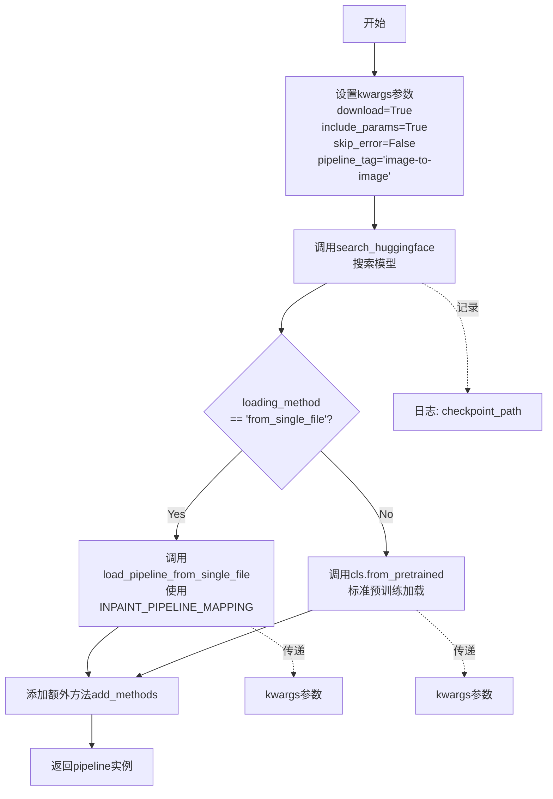

#### 带注释源码

```python
@classmethod
@validate_hf_hub_args
def from_huggingface(cls, pretrained_model_link_or_path, **kwargs):
    r"""
    从HuggingFace加载图像修复pipeline的类方法。
    
    参数:
        pretrained_model_link_or_path: 模型链接或路径，支持多种格式
        **kwargs: 其他传递给pipeline的额外参数
    """
    # 1. 设置默认参数，确保模型被下载并包含参数信息
    _status = {
        "download": True,           # 自动下载模型
        "include_params": True,     # 返回完整参数信息
        "skip_error": False,        # 遇到错误时抛出异常
        "pipeline_tag": "image-to-image",  # 设置管道标签为图像修复
    }
    kwargs.update(_status)

    # 2. 调用search_huggingface在HuggingFace Hub上搜索模型
    hf_checkpoint_status = search_huggingface(pretrained_model_link_or_path, **kwargs)
    
    # 3. 记录模型下载URL到日志
    logger.warning(f"checkpoint_path: {hf_checkpoint_status.model_status.download_url}")
    checkpoint_path = hf_checkpoint_status.model_path

    # 4. 根据检查点格式选择不同的加载方式
    if hf_checkpoint_status.loading_method == "from_single_file":
        # 5a. 单文件格式(.ckpt/.safetensors)使用专用加载函数
        pipeline = load_pipeline_from_single_file(
            pretrained_model_or_path=checkpoint_path,
            pipeline_mapping=SINGLE_FILE_CHECKPOINT_INPAINT_PIPELINE_MAPPING,  # 图像修复专用映射
            **kwargs,
        )
    else:
        # 5b. Diffusers目录格式使用标准from_pretrained加载
        pipeline = cls.from_pretrained(checkpoint_path, **kwargs)
    
    # 6. 添加AutoConfig的方法到pipeline并返回
    return add_methods(pipeline)
```


### `EasyPipelineForInpainting.from_civitai`

从Civitai模型库搜索并加载图像修复（Inpainting）扩散管道模型的类方法。该方法通过搜索词在Civitai平台查找模型，获取模型信息后使用单文件检查点方式加载管道，并自动添加AutoConfig方法到管道实例中。

参数：

- `cls`：类型，当前类本身（EasyPipelineForInpainting），用于类方法调用
- `pretrained_model_link_or_path`：`str`或`os.PathLike`，搜索词，可以是Civitai模型关键词、模型ID或HuggingFace格式的链接
- `model_type`：`str`，可选，默认为`Checkpoint`，要搜索的模型类型（如Checkpoint、TextualInversion、LORA、Controlnet）
- `base_model`：`str`，可选，用于过滤的基础模型
- `cache_dir`：`str`或`Path`，可选，缓存文件夹路径
- `resume`：`bool`，可选，默认为`False`，是否恢复未完成的下载
- `torch_dtype`：`str`或`torch.dtype`，可选，覆盖默认的torch数据类型
- `force_download`：`bool`，可选，默认为`False`，是否强制重新下载
- `output_loading_info`：`bool`，可选，默认为`False`，是否返回加载信息字典
- `local_files_only`：`bool`，可选，默认为`False`，是否仅使用本地文件
- `token`：`str`，可选，用于HuggingFace认证的令牌
- `device_map`：`str`或`Dict`，可选，设备映射配置
- `max_memory`：`Dict`，可选，最大内存配置
- `offload_folder`：`str`或`Path`，可选，权重卸载文件夹
- `offload_state_dict`：`bool`，可选，是否临时卸载CPU状态字典到硬盘
- `low_cpu_mem_usage`：`bool`，可选，默认为`True`（PyTorch>=1.9.0），是否降低CPU内存使用
- `use_safetensors`：`bool`，可选，是否使用safetensors格式加载
- `kwargs`：剩余的关键字参数，用于覆盖管道组件

返回值：`DiffusionPipeline`或类似管道对象，从Civitai加载并添加了AutoConfig方法的图像修复管道实例

#### 流程图

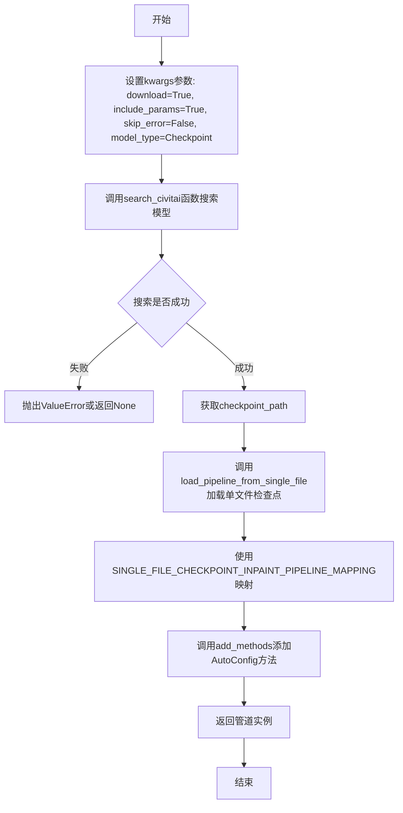

#### 带注释源码

```python
@classmethod
def from_civitai(cls, pretrained_model_link_or_path, **kwargs):
    r"""
    从Civitai加载图像修复管道的类方法。
    
    该方法支持多种输入形式：
    - 搜索关键词（如模型名称）
    - HuggingFace格式的.ckpt或.safetensors文件链接
    - 模型repo ID
    - 本地目录路径
    """
    # 1. 设置默认参数，确保模型被下载并包含参数信息
    _status = {
        "download": True,           # 自动下载模型
        "include_params": True,     # 返回包含参数的SearchResult
        "skip_error": False,        # 遇到错误时抛出异常
        "model_type": "Checkpoint", # 默认搜索Checkpoint类型
    }
    kwargs.update(_status)

    # 2. 调用search_civitai函数在Civitai平台搜索模型
    # 返回SearchResult对象，包含模型路径、下载URL等信息
    checkpoint_status = search_civitai(pretrained_model_link_or_path, **kwargs)
    
    # 3. 记录模型下载链接到日志
    logger.warning(f"checkpoint_path: {checkpoint_status.model_status.site_url}")
    
    # 4. 获取模型本地路径或下载URL
    checkpoint_path = checkpoint_status.model_path

    # 5. 使用单文件检查点方式加载管道
    # 根据模型类型选择对应的pipeline类
    pipeline = load_pipeline_from_single_file(
        pretrained_model_or_path=checkpoint_path,
        pipeline_mapping=SINGLE_FILE_CHECKPOINT_INPAINT_PIPELINE_MAPPING,
        **kwargs,
    )
    
    # 6. 添加AutoConfig中的方法到管道实例
    # 使管道具备auto_load_textual_inversion和auto_load_lora_weights等方法
    return add_methods(pipeline)
```

## 关键组件


### 张量索引与惰性加载

代码中通过`search_huggingface`和`search_civitai`函数实现惰性加载机制，只有在实际调用下载功能时才会获取模型文件，且通过`get_keyword_types`函数对输入进行类型判断后再决定加载策略。

### 反量化支持

代码未包含显式的反量化操作，但支持通过`torch_dtype`参数指定数据类型加载模型，可实现不同精度模型文件的加载。

### 量化策略

代码未包含量化策略相关实现，但通过`checkpoint_format`参数支持单文件和Diffusers格式的模型加载。

### 模型搜索与下载模块

提供从HuggingFace Hub和Civitai双平台搜索下载Diffusion模型的核心功能，包含`search_huggingface`和`search_civitai`两个主要函数，支持按关键词、URL、本地路径等多种方式定位模型资源。

### Pipeline加载器

实现`EasyPipelineForText2Image`、`EasyPipelineForImage2Image`、`EasyPipelineForInpainting`三个通用Pipeline类，封装了从不同源（HF/Civitai）加载模型的具体细节，统一提供from_huggingface和from_civitai类方法。

### 数据模型定义

使用@dataclass定义`RepoStatus`、`ModelStatus`、`ExtraStatus`、`SearchResult`四个数据类，用于结构化存储模型仓库信息、下载状态、训练关键词等搜索结果数据。

### 文件下载器

`file_downloader`函数封装HTTP下载逻辑，支持断点续传、代理配置、强制重下载等功能，调用huggingface_hub的http_get实现底层传输。

### 关键词类型判断

`get_keyword_types`函数通过正则匹配和路径检查，识别输入为HuggingFace仓库URL、Civitai链接、本地文件/目录或其他类型，返回格式和加载方式的判断结果。

### 动态方法注入

`add_methods`函数将AutoConfig类的方法动态绑定到Pipeline实例，实现在不修改原类的情况下为Pipeline添加Textual Inversion和LoRA的自动加载能力。

### Pipeline映射配置

定义`SINGLE_FILE_CHECKPOINT_*_MAPPING`三个OrderedDict，将模型类型（如v1、v2、xl_base等）映射到具体的Pipeline类，用于单文件检查点加载时的Pipeline实例化。

### AutoConfig增强类

`AutoConfig`类封装`auto_load_textual_inversion`和`auto_load_lora_weights`方法，支持从Civitai自动搜索并加载Textual Inversion和LoRA权重到Pipeline的text_encoder和unet。

### 单文件检查点加载

`load_pipeline_from_single_file`函数从.ckpt或.safetensors格式的单文件加载模型，通过infer_diffusers_model_type推断模型类型，从mapping中查找对应Pipeline类并调用from_single_file方法。

### 平台URL前缀验证

`VALID_URL_PREFIXES`定义了HuggingFace支持的URL前缀列表，用于判断输入是否为合法的Hub资源链接。

### 缓存目录配置

`CACHE_HOME`默认指向~/.cache目录，作为模型文件的本地缓存根目录，Civitai模型默认缓存在CACHE_HOME/Civitai子目录下。


## 问题及建议


### 已知问题

- **大量代码重复**：`EasyPipelineForText2Image`、`EasyPipelineForImage2Image`、`EasyPipelineForInpainting` 三个类的 `from_huggingface` 和 `from_civitai` 方法实现几乎完全相同，仅在 `pipeline_tag` 和 `pipeline_mapping` 参数上有差异，应提取为基类或共享方法
- **硬编码的配置数据**：`TOKENIZER_SHAPE_MAP`、`SINGLE_FILE_CHECKPOINT_*_MAPPING` 等全局变量以硬编码方式定义，不利于扩展新模型类型，应考虑从配置文件或远程获取
- **不完整的异常处理**：`search_huggingface` 函数中 `hf_api.model_info` 调用未进行异常捕获，网络不稳定时可能导致整个程序崩溃
- **冗余的变量赋值**：`search_huggingface` 函数中 `hf_repo_info` 在循环外赋值后立即在循环内被覆盖，前置赋值无实际作用
- **API Token 安全风险**：Civitai 的 `Authorization` header 直接使用明文 token 传递，缺乏加密或环境变量管理机制
- **缓存管理缺失**：模型文件下载到 `~/.cache` 目录后无清理机制，长期使用可能导致磁盘空间耗尽
- **类型注解不完整**：部分函数（如 `add_methods`）参数缺少类型注解，降低了代码可维护性
- **Magic Number 散落**：`limit=100`、`limit=20` 等数值散布在代码各处，应提取为常量并赋予语义化名称

### 优化建议

- **重构为通用基类**：创建一个抽象基类 `EasyPipeline` 包含共享的加载逻辑，三个具体 Pipeline 类继承并只需覆盖差异化配置
- **配置外部化**：将模型类型映射表迁移至 JSON/YAML 配置文件或实现插件式注册机制，支持动态扩展
- **增强错误处理与重试**：为所有外部 API 调用添加重试机制（使用 `tenacity` 库），并提供友好的错误提示
- **安全化 Token 管理**：支持从环境变量或加密配置读取 API Token，避免代码中硬编码敏感信息
- **实现缓存清理功能**：添加缓存大小限制和过期清理策略，提供主动清理接口
- **统一常量定义**：建立专门的配置文件集中管理所有 Magic Number，提升代码可读性和可维护性
- **补充类型注解**：完善所有函数和方法的类型注解，便于 IDE 智能提示和静态分析
- **考虑异步加载**：对于大规模模型下载和初始化，可引入异步编程模式提升用户体验

## 其它


### 设计目标与约束

设计目标：
- 提供统一的接口来加载来自HuggingFace和CivitAI的Diffusion模型
- 支持多种模型格式（单文件.checkpoint和Diffusers格式）
- 支持Text2Image、Image2Image和Inpainting三种pipeline类型
- 自动识别模型类型并选择合适的加载方式

约束条件：
- 依赖HuggingFace diffusers库和huggingface_hub库
- 需要网络访问来下载模型
- 仅支持PyTorch作为推理后端
- 模型文件格式限制为.safetensors、.ckpt和.bin

### 错误处理与异常设计

主要异常处理场景：
- ValueError：当模型类型不支持、搜索无结果、JSON解析失败时抛出
- HTTPError：API请求失败时抛出，包含具体错误信息
- FileExistsError：文件已存在且force_download=False时跳过下载
- OSError：目录创建失败、文件路径不存在时抛出
- KeyError：API返回数据格式不符合预期时可能抛出

skip_error参数：部分函数提供skip_error选项，当设为True时遇到错误返回None而非抛出异常

### 数据流与状态机

模型搜索流程：
1. 用户输入keyword（可以是URL、repo_id、文件名或搜索关键词）
2. get_keyword_types()识别输入类型（hf_repo/hf_url/civitai_url/local/other）
3. 根据类型选择对应搜索函数（search_huggingface或search_civitai）
4. 返回模型路径或SearchResult对象

Pipeline加载流程：
1. 调用from_huggingface或from_civitai类方法
2. 搜索并获取模型路径
3. 判断checkpoint_format（single_file或diffusers）
4. 选择对应加载方式（load_pipeline_from_single_file或from_pretrained）
5. 添加AutoConfig方法到pipeline
6. 返回配置完成的pipeline实例

### 外部依赖与接口契约

外部依赖：
- diffusers：DiffusionPipeline基类和具体pipeline实现
- huggingface_hub：模型下载和API调用
- requests：向CivitAI API发送HTTP请求
- torch：PyTorch张量操作
- dataclasses：数据结构定义

接口契约：
- from_huggingface()：接收pretrained_model_link_or_path，返回加载好的pipeline
- from_civitai()：接收pretrained_model_link_or_path和可选参数model_type，返回pipeline
- auto_load_textual_inversion()：向pipeline添加Textual Inversion嵌入
- auto_load_lora_weights()：向pipeline添加LoRA权重

### 安全性考虑

API Token管理：
- 支持通过token参数传入HuggingFace和CivitAI的认证token
- token存储在HTTP请求的Authorization头中

文件安全：
- 检查文件扩展名（.safetensors/.ckpt/.bin）
- 验证CivitAI模型的pickleScanResult和virusScanResult
- 排除有安全问题的模型文件

下载安全：
- 支持force_download强制重新下载
- 支持resume断点续传
- 验证文件完整性

### 性能优化与缓存策略

缓存机制：
- HuggingFace模型默认缓存到~/.cache/huggingface
- CivitAI模型缓存到~/.cache/Civitai（可自定义cache_dir）
- 使用model_index.json判断是否为Diffusers格式

下载优化：
- 支持断点续传（resume参数）
- 支持并行下载（通过proxies配置代理）
- 显示下载进度（displayed_filename参数）

内存优化：
- 支持torch_dtype指定数据类型（float16等）
- 支持device_map自动设备分配
- 支持low_cpu_mem_usage减少内存占用

### 版本兼容性

Python版本：需要Python 3.x
PyTorch版本：建议>=1.9.0（支持low_cpu_mem_usage）
关键依赖版本：
- diffusers：支持多种版本，通过from_pretrained和from_single_file接口兼容
- huggingface_hub：需要支持hf_api和hf_hub_download
- requests：标准库或较新版本
- torch：>=1.0（建议2.0+以获得最佳性能）

### 配置管理

配置来源：
- TOKENIZER_SHAPE_MAP：tokenizer维度到模型版本的映射
- SINGLE_FILE_CHECKPOINT_*_MAPPING：模型类型到pipeline类的映射
- CONFIG_FILE_LIST：Diffusers配置文件的候选列表
- DIFFUSERS_CONFIG_DIR：Diffusers标准子目录列表
- EXTENSION：支持的模型文件扩展名

运行时配置：
- 通过kwargs传递额外参数
- 支持pipeline_tag过滤模型类型
- 支持checkpoint_format指定格式偏好

### 使用示例

Text2Image Pipeline加载：
```python
from auto_diffusers import EasyPipelineForText2Image
pipeline = EasyPipelineForText2Image.from_huggingface("stable-diffusion-v1-5")
image = pipeline("a cat sitting on a desk").images[0]
```

Image2Image Pipeline加载：
```python
from auto_diffusers import EasyPipelineForImage2Image
pipeline = EasyPipelineForImage2Image.from_huggingface("stable-diffusion-v1-5")
image = pipeline("a cat", image=input_image).images[0]
```

从CivitAI加载并添加LoRA：
```python
from auto_diffusers import EasyPipelineForText2Image
pipeline = EasyPipelineForText2Image.from_civitai("v1-5-pruned")
pipeline.auto_load_lora_weights("some_lora")
```

加载Textual Inversion：
```python
pipeline.auto_load_textual_inversion("EasyNegative", token="EasyNegative")
```

### 未来扩展建议

- 添加对更多模型网站的支持（如抱抱脸、HuggingFace企业版）
- 支持更多pipeline类型（如ControlNet、IP-Adapter）
- 添加模型版本管理和回退机制
- 支持分布式推理和模型并行
- 添加更多安全扫描和验证机制


    