# `diffusers\examples\reinforcement_learning\diffusion_policy.py` 详细设计文档

实现了一个基于扩散模型的机器人控制策略，用于生成平滑的运动轨迹将T形块推向目标区域。该模型接收机器人臂位置、块位置和块角度作为输入，通过去噪扩散过程生成16步的(x,y)轨迹序列。

## 整体流程

```mermaid
graph TD
    A[开始] --> B[初始化 DiffusionPolicy]
B --> C[加载预训练模型权重]
C --> D[接收观测值 observation]
D --> E[normalize_data: 将观测值归一化到[-1, 1]范围]
E --> F[obs_encoder: 编码观测值到256维向量]
F --> G[obs_projection: 投影到32维上下文向量]
G --> H[expand: 扩展上下文到16个时间步]
H --> I[初始化随机噪声动作]
I --> J{遍历100个去噪时间步}
J -->|每步| K[model: 预测去噪后的动作]
K --> L[noise_scheduler.step: 执行一步去噪]
L --> J
J --> M[transpose: 调整维度顺序]
M --> N[unnormalize_data: 反归一化到原始坐标范围]
N --> O[返回16x2的轨迹序列]
```

## 类结构

```
nn.Module (PyTorch基类)
├── ObservationEncoder
│   └── net: nn.Sequential
├── ObservationProjection
│   ├── weight: nn.Parameter
│   └── bias: nn.Parameter
└── DiffusionPolicy (主类)
    ├── stats: dict
    ├── obs_encoder: ObservationEncoder
    ├── obs_projection: ObservationProjection
    ├── model: UNet1DModel
    └── noise_scheduler: DDPMScheduler
```

## 全局变量及字段


### `multiarray`
    
NumPy核心多维数组模块,用于安全反序列化

类型：`numpy.core.multiarray`
    


### `np`
    
NumPy库,用于数值计算和数组操作

类型：`numpy`
    


### `torch`
    
PyTorch深度学习框架

类型：`torch`
    


### `nn`
    
PyTorch神经网络模块

类型：`torch.nn`
    


### `hf_hub_download`
    
HuggingFace Hub模型下载函数

类型：`function`
    


### `add_safe_globals`
    
torch.serialization中的安全全局变量注册函数

类型：`function`
    


### `DDPMScheduler`
    
diffusers库中的DDPM噪声调度器

类型：`class`
    


### `UNet1DModel`
    
diffusers库中的一维UNet模型

类型：`class`
    


### `ObservationEncoder.net`
    
三层全连接网络 (state_dim->512->256)

类型：`nn.Sequential`
    


### `ObservationProjection.weight`
    
形状(32, 512)的可学习权重矩阵

类型：`nn.Parameter`
    


### `ObservationProjection.bias`
    
形状(32,)的可学习偏置向量

类型：`nn.Parameter`
    


### `DiffusionPolicy.device`
    
运行设备(cpu/cuda)

类型：`str`
    


### `DiffusionPolicy.stats`
    
输入输出数据的min/max统计信息

类型：`dict`
    


### `DiffusionPolicy.obs_encoder`
    
观测编码器模型

类型：`ObservationEncoder`
    


### `DiffusionPolicy.obs_projection`
    
观测投影模型

类型：`ObservationProjection`
    


### `DiffusionPolicy.model`
    
UNet去噪模型

类型：`UNet1DModel`
    


### `DiffusionPolicy.noise_scheduler`
    
扩散噪声调度器

类型：`DDPMScheduler`
    
    

## 全局函数及方法


### `add_safe_globals`

该函数是 PyTorch `torch.serialization` 模块提供的工具，用于在模型加载时注册安全全局变量。由于 PyTorch 在反序列化（load）模型时，默认只允许基本类型的对象通过，某些自定义类或 numpy 相关的复杂对象会被拒绝，因此需要通过此函数将这些类添加到"安全全局变量白名单"中。

参数：

- `globals_list`：`List[Any]`，需要注册为安全全局对象的列表，包含类、函数或类型对象

返回值：`None`，无返回值（直接修改 PyTorch 的内部安全全局变量注册表）

#### 流程图

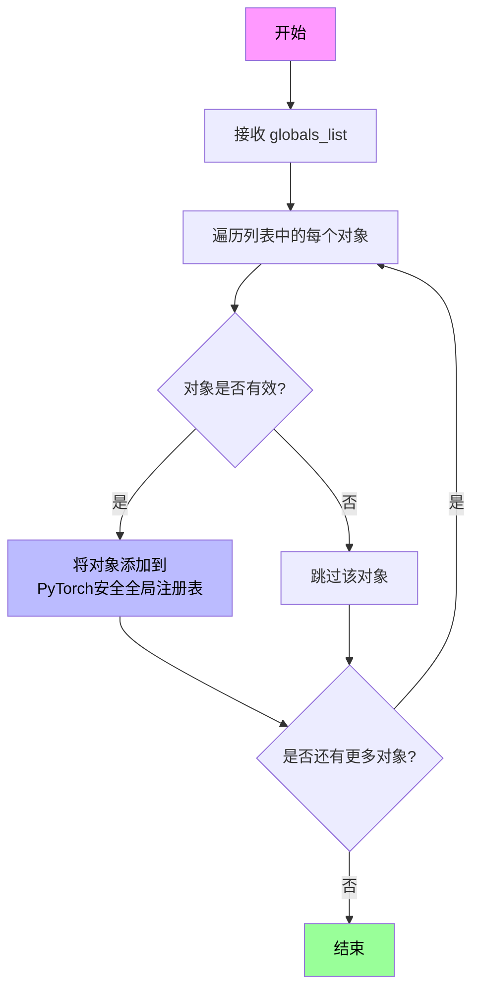

#### 带注释源码

```python
# 从 PyTorch 序列化模块导入 add_safe_globals 函数
# 该函数用于注册在模型反序列化时允许的安全全局变量
from torch.serialization import add_safe_globals

# 导入 numpy 及其 multiarray 子模块，用于处理数组序列化
import numpy as np
import numpy.core.multiarray as multiarray

# 调用 add_safe_globals 注册安全全局变量
# 传入一个列表，包含以下类型的对象：
# 1. multiarray._reconstruct: NumPy 数组的重建函数
# 2. np.ndarray: NumPy 数组类本身
# 3. np.dtype: NumPy 数据类型对象
# 4. np.dtype(np.float32).type: float32 类型对象
# 5. np.dtype(np.float64).type: float64 类型对象
# 6. np.dtype(np.int32).type: int32 类型对象
# 7. np.dtype(np.int64).type: int64 类型对象
# 8. type(np.dtype(np.float32)): float32 dtype 的类型
# 9. type(np.dtype(np.float64)): float64 dtype 的类型
# 10. type(np.dtype(np.int32)): int32 dtype 的类型
# 11. type(np.dtype(np.int64)): int64 dtype 的类型

# 这些注册是必要的，因为预训练模型内部可能包含这些 numpy 类型的序列化引用
# 如果不注册，加载时 PyTorch 会抛出 RuntimeError 提示存在不安全全局变量
add_safe_globals(
    [
        multiarray._reconstruct,      # NumPy 数组重建函数
        np.ndarray,                  # NumPy 多维数组类
        np.dtype,                    # NumPy 数据类型
        np.dtype(np.float32).type,   # float32 类型
        np.dtype(np.float64).type,   # float64 类型
        np.dtype(np.int32).type,     # int32 类型
        np.dtype(np.int64).type,     # int64 类型
        type(np.dtype(np.float32)),  # float32 dtype 类型
        type(np.dtype(np.float64)),  # float64 dtype 类型
        type(np.dtype(np.int32)),    # int32 dtype 类型
        type(np.dtype(np.int64)),    # int64 dtype 类型
    ]
)
```


### `hf_hub_download`

从HuggingFace Hub下载预训练模型权重文件，并返回本地文件路径。该函数通过指定仓库ID和文件名，从HuggingFace模型库中检索并下载对应的模型检查点文件。

参数：

- `repo_id`：`str`，HuggingFace Hub上的仓库标识符，格式为`用户名/仓库名`（例如："dorsar/diffusion_policy"）
- `filename`：`str`，要下载的文件名（例如："push_tblock.pt"）
- `repo_type`：`str`（可选），仓库类型，默认为"model"
- `revision`：`str`（可选），分支或标签名称，默认为"main"
- `cache_dir`：`str`（可选），缓存目录路径
- `force_download`：`bool`（可选），是否强制重新下载，默认为False
- `weights_only`：`bool`（可选），是否仅加载权重（用于torch.load），代码中设置为True

返回值：`str`，下载的模型文件在本地文件系统中的绝对路径

#### 流程图

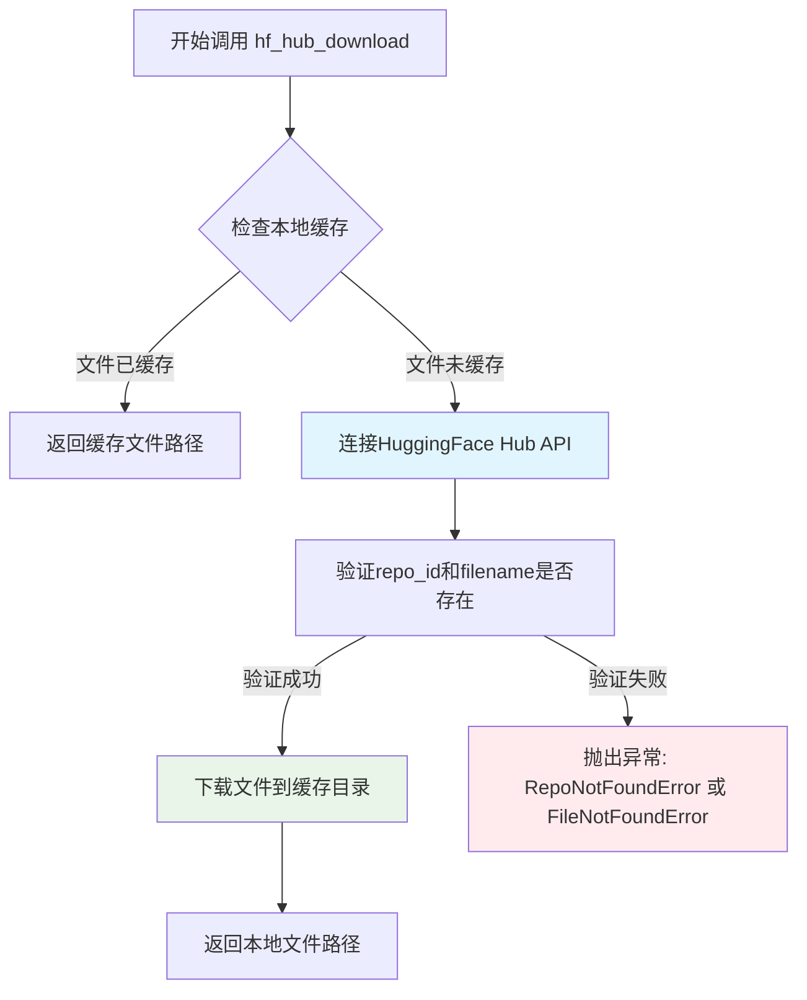

#### 带注释源码

```python
# 在 DiffusionPolicy 类中的调用示例
# 用于下载预训练的扩散策略模型权重

# 调用 hf_hub_download 下载模型检查点文件
checkpoint = torch.load(
    hf_hub_download(
        "dorsar/diffusion_policy",  # repo_id: 仓库名称，格式为"用户名/模型名"
        "push_tblock.pt"           # filename: 要下载的文件名
    ), 
    weights_only=True,             # weights_only=True 表示只加载模型权重，不加载Python对象
    map_location=self.device        # 将模型参数映射到指定设备（cpu/cuda）
)

# 加载模型权重到对应的网络结构
self.model.load_state_dict(checkpoint["model_state_dict"])
self.obs_encoder.load_state_dict(checkpoint["encoder_state_dict"])
self.obs_projection.load_state_dict(checkpoint["projection_state_dict"])
```

#### 额外说明

| 项目 | 说明 |
|------|------|
| **设计目标** | 从远程模型仓库获取预训练模型权重，支持缓存机制避免重复下载 |
| **依赖** | `huggingface_hub` 库，需要网络连接访问 HuggingFace Hub API |
| **错误处理** | 若仓库不存在抛出`RepoNotFoundError`，若文件不存在抛出`FileNotFoundError` |
| **缓存机制** | 默认缓存到 `~/.cache/huggingface/hub/` 目录，首次调用会下载，后续调用直接使用缓存 |
| **使用场景** | 加载预训练的扩散策略模型（UNet1DModel）、观测编码器（ObservationEncoder）和投影层（ObservationProjection）的权重 |


### `torch.load`

加载 PyTorch 模型检查点文件，将其反序列化为 Python 对象，并可选择将张量重新映射到不同的设备。

参数：

-  `f`：混合，文件类对象或字符串，表示检查点文件的路径或类似文件的对象。此处为 `hf_hub_download()` 的返回值，即从 HuggingFace Hub 下载的模型文件路径
-  `weights_only`：`bool`，如果为 `True`，则反序列化对象时只加载张量和字典，不加载可序列化对象（如 nn.Module）。此处设置为 `True`，以提高安全性并只加载模型权重
-  `map_location`：混合，指定如何重新映射存储位置的参数，可以是字符串（如 `'cpu'`、`'cuda:0'`）、`torch.device` 对象或可调用函数。此处指定为 `device`（根据代码为 `"cpu"`），用于将加载的张量映射到指定设备

返回值：`dict`，包含模型检查点的字典。在此代码中，返回的字典包含以下键值对：
- `"model_state_dict"`：UNet1D 模型的权重字典
- `"encoder_state_dict"`：ObservationEncoder 模型的权重字典
- `"projection_state_dict"`：ObservationProjection 模型的权重字典

#### 流程图

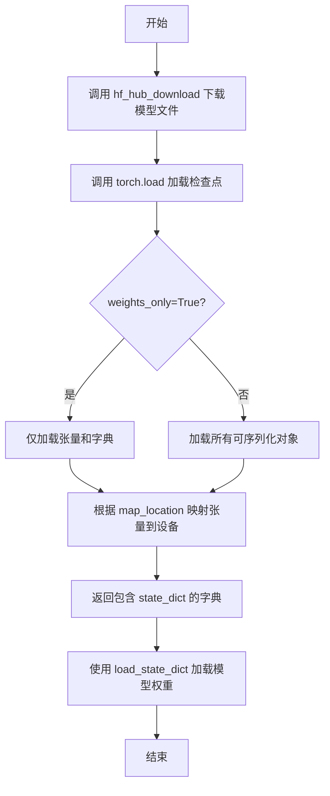

#### 带注释源码

```python
# 使用 HuggingFace Hub 下载预训练模型检查点文件
# 下载路径为 'dorsar/diffusion_policy' 仓库中的 'push_tblock.pt' 文件
hf_download_path = hf_hub_download("dorsar/diffusion_policy", "push_tblock.pt")

# 调用 torch.load 加载模型检查点
# 参数说明：
# - hf_download_path: 检查点文件的路径（字符串）
# - weights_only=True: 只加载张量和字典，不加载可序列化对象，提高安全性
# - map_location=device: 将所有张量映射到指定设备（此处为 CPU）
checkpoint = torch.load(
    hf_download_path,      # 第一个位置参数：文件路径
    weights_only=True,     # 关键字参数：是否仅加载权重
    map_location=device    # 关键字参数：设备映射位置
)

# checkpoint 是一个字典，包含了三个模型的状态字典：
# 1. model_state_dict: UNet1DModel 的权重
# 2. encoder_state_dict: ObservationEncoder 的权重
# 3. projection_state_dict: ObservationProjection 的权重

# 将检查点中的权重加载到对应的模型对象中
self.model.load_state_dict(checkpoint["model_state_dict"])
self.obs_encoder.load_state_dict(checkpoint["encoder_state_dict"])
self.obs_projection.load_state_dict(checkpoint["projection_state_dict"])
```


### `torch.randn`

生成服从标准正态分布的随机噪声张量，用于初始化扩散模型的行动计划。在扩散模型的逆向过程中，从随机噪声开始逐步去噪，生成有意义的机器人臂轨迹。

参数：

- `shape`：`tuple of ints`，张量的形状参数。本例中为 `(observation.shape[0], 2, 16)`，表示批量大小 × 2个坐标通道 × 16个时间步
- `device`：`torch.device`（可选），张量存储的设备。本例中为 `self.device`，即模型所在设备

返回值：`torch.Tensor`，服从标准正态分布 $N(0,1)$ 的随机张量，形状为 `(batch_size, 2, 16)`

#### 流程图

```mermaid
flowchart TD
    A[开始] --> B[接收shape参数: (batch_size, 2, 16)]
    B --> C[接收device参数: cpu/cuda]
    C --> D[调用PyTorch随机数生成器]
    D --> E[从标准正态分布N(0,1)采样]
    E --> F[创建torch.Tensor张量]
    F --> G[将张量放置到指定device]
    G --> H[返回随机噪声张量 action]
    
    H --> I[作为扩散模型初始输入]
    I --> J[在每个去噪步骤中逐步 refinement]
    J --> K[最终输出: 去噪后的轨迹 (batch_size, 16, 2)]
```

#### 带注释源码

```python
# 在 DiffusionPolicy.predict() 方法中调用
# 用于初始化扩散模型的行动计划，从随机噪声开始逐步去噪

# 初始化动作张量：随机噪声
# shape[0] 表示批量大小
# 2 表示 x,y 两个坐标通道
# 16 表示轨迹的时间步数/序列长度
action = torch.randn(
    (observation.shape[0], 2, 16),  # 输出形状: (batch_size, 2, 16)
    device=self.device               # 张量存放设备（CPU或GPU）
)

# 后续在去噪循环中，这个随机噪声会被 UNet1DModel 逐步去噪：
# for t in self.noise_scheduler.timesteps:
#     model_output = self.model(torch.cat([action, cond], dim=1), t)
#     action = self.noise_scheduler.step(model_output.sample, t, action).prev_sample
```


### `torch.cat`

描述：在 PyTorch 中，torch.cat 是用于沿现有维度连接张量序列的函数。代码中主要用于将编码后的动作（action）与上下文信息（cond）沿通道维度（dim=1）拼接，以作为 UNet1DModel 的输入，实现动作生成与条件信息的融合。

参数：

- `tensors`：`tuple(torch.Tensor)` 或 `list(torch.Tensor)`，要连接的张量序列，所有张量必须在除拼接维度外的其他维度上具有相同的形状。
- `dim`：`int`（默认值：0），执行拼接的维度索引。代码示例中使用 `dim=1`，表示沿通道维度拼接。

返回值：`torch.Tensor`，拼接后的张量，形状为所有输入张量在指定维度上的形状之和，其他维度保持不变。

#### 流程图

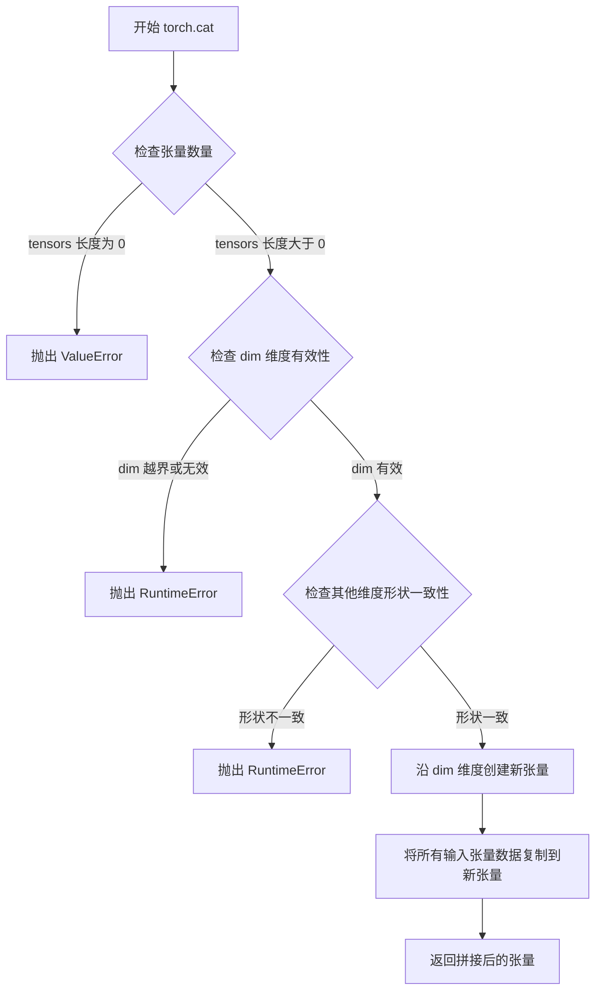

#### 带注释源码

```python
# 在 DiffusionPolicy.predict 方法中，torch.cat 用于拼接动作和条件信息
# 示例代码段：

# 初始化动作：张量形状 [batch_size, 2, 16]
action = torch.randn((observation.shape[0], 2, 16), device=self.device)

# 条件信息：张量形状 [batch_size, 32, 16]
# cond 由 obs_encoder 和 obs_projection 生成，包含32维的上下文信息
cond = self.obs_projection(self.obs_encoder(normalized_obs))
cond = cond.view(normalized_obs.shape[0], -1, 1).expand(-1, -1, 16)

# 关键操作：沿 dim=1 拼接 action 和 cond
# action 形状: [batch_size, 2, 16]
# cond 形状:  [batch_size, 32, 16]
# 结果形状:  [batch_size, 34, 16]
#
# 拼接说明：
# - dim=1 表示沿通道维度（第二个维度）拼接
# - 拼接后总通道数 = 2 (动作通道) + 32 (条件通道) = 34 通道
# - 这34个通道作为 UNet1DModel 的输入，模型在此基础上预测去噪后的动作
model_output = self.model(torch.cat([action, cond], dim=1), t)
```


### `torch.zeros` (在 `ObservationProjection.forward` 中的调用)

此函数调用创建全零张量，用于将观察向量填充到更高的维度。在 `ObservationProjection` 类中，它将 256 维的输入填充到 512 维，以匹配线性层的权重维度要求。

参数：

-  `*shape`：`int...`，张量的形状参数，这里传入 `*x.shape[:-1], 256`，表示保留前面所有维度，最后添加一个大小为 256 的维度
-  `device`：`torch.device`，指定张量存放的设备（CPU 或 CUDA）
-  `requires_grad`：`bool`，可选参数，默认 False，是否需要计算梯度

返回值：`torch.Tensor`，一个全零张量，形状为 `(batch_size, 256)`

#### 流程图

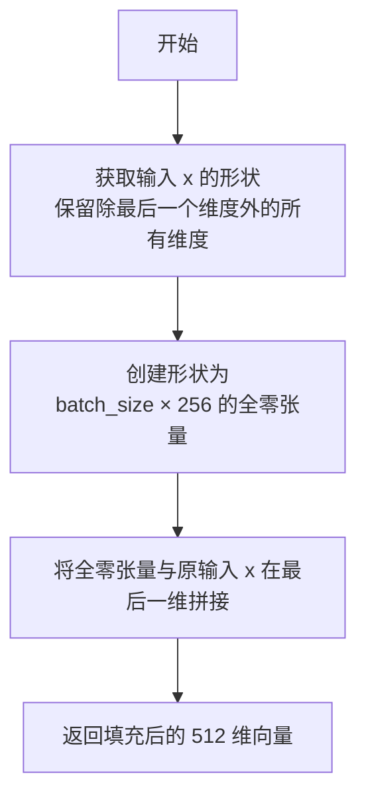

#### 带注释源码

```python
# 在 ObservationProjection.forward 方法中
def forward(self, x):  # pad 256-dim input to 512-dim with zeros
    if x.size(-1) == 256:  # 检查输入是否已经是 256 维
        # 使用 torch.zeros 创建全零张量进行填充
        # *x.shape[:-1] 展开为 batch_size（保留前面的维度）
        # 256 是要填充的维度大小
        x = torch.cat([x, torch.zeros(*x.shape[:-1], 256, device=x.device)], dim=-1)
    return nn.functional.linear(x, self.weight, self.bias)
```

---
### 整体代码设计文档

### 代码概述

该代码实现了一个基于扩散策略（Diffusion Policy）的机器人臂轨迹生成模型，用于控制机器人推动 T 形方块到达目标区域。模型接收机器人臂位置、方块位置和角度作为输入，通过去噪扩散过程生成 16 步的 (x,y) 轨迹序列。

### 文件整体运行流程

1. **初始化阶段**：加载预训练的 UNet1DModel、观察编码器和观察投影器权重
2. **数据预处理**：对输入观察进行归一化，映射到 [-1, 1] 范围
3. **编码阶段**：使用 ObservationEncoder 提取特征，ObservationProjection 生成条件上下文
4. **扩散去噪阶段**：从随机噪声开始，通过 100 步迭代逐步去噪，生成平滑轨迹
5. **后处理**：反归一化输出，将轨迹映射回原始像素坐标范围

### 类详细信息

#### `ObservationEncoder`

- **描述**：将原始机器人观察（位置/角度）转换为紧凑的 256 维表示

**字段：**

- `net`：`nn.Sequential`，包含线性层和 ReLU 激活函数的网络

**方法：**

- `__init__(self, state_dim)`：构造函数
- `forward(x)`：前向传播

---

#### `ObservationProjection`

- **描述**：将编码后的观察转换为 32 维上下文信息，用于条件扩散模型

**字段：**

- `weight`：`nn.Parameter`，形状 (32, 512) 的可学习权重
- `bias`：`nn.Parameter`，形状 (32,) 的可学习偏置

**方法：**

- `forward(x)`：前向传播，包含填充逻辑

---

#### `DiffusionPolicy`

- **描述**：实现扩散策略的核心类，负责生成机器人臂轨迹

**字段：**

- `device`：`str`，计算设备
- `stats`：`dict`，输入输出的归一化统计信息
- `obs_encoder`：`ObservationEncoder`，观察编码器
- `obs_projection`：`ObservationProjection`，观察投影器
- `model`：`UNet1DModel`，去噪模型
- `noise_scheduler`：`DDPMScheduler`，噪声调度器

**方法：**

- `__init__(state_dim, device)`：构造函数
- `normalize_data(data, stats)`：数据归一化
- `unnormalize_data(ndata, stats)`：数据反归一化
- `predict(observation)`：轨迹预测

---

### 潜在技术债务与优化空间

1. **硬编码参数**：UNet 架构参数（block_out_channels、layers_per_block）硬编码，缺乏灵活性
2. **错误处理缺失**：缺少输入验证（如观察维度检查、设备兼容性检查）
3. **性能优化**：可使用 `torch.compile()` 加速推理，或考虑使用 FP16 量化
4. **模块化不足**：归一化统计信息与策略类耦合，难以适应不同任务

### 其他设计考量

- **设计目标**：生成平滑的机器人臂轨迹，实现精确的方块推动控制
- **约束**：输入输出坐标范围 [0, 512]，角度范围 [0, 2π]
- **外部依赖**：HuggingFace diffusers 库、numpy、torch
- **权重加载**：使用 `hf_hub_download` 从远程仓库加载预训练权重


### `torch.tensor`

`torch.tensor` 是 PyTorch 中用于创建张量（Tensor）的核心函数。张量是多维数组，类似于 NumPy 的 ndarray，但可以在 GPU 上运行以加速计算。该函数接受各种数据格式（列表、元组、numpy 数组等）并将其转换为 PyTorch 张量，支持指定数据类型、设备位置和梯度追踪等选项。

参数：

- `data`：`list` 或 `tuple` 或 `numpy.ndarray`，要转换为张量的输入数据，可以是嵌套的列表/元组或 numpy 数组
- `dtype`（可选）：`torch.dtype`，指定张量的数据类型，如 `torch.float32`、`torch.int64` 等，默认根据数据推断
- `device`（可选）：`torch.device`，指定张量存储的设备（CPU 或 CUDA），默认当前设备
- `requires_grad`（可选）：`bool`，指定是否追踪梯度以进行自动微分，默认 `False`
- `pin_memory`（可选）：`bool`，是否使用固定内存以加速 CPU 到 GPU 的数据传输，默认 `False`

返回值：`torch.Tensor`，返回转换后的 PyTorch 张量对象

#### 流程图

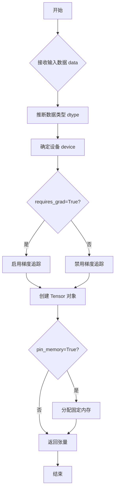

#### 带注释源码

```python
# 方式1: 在 DiffusionPolicy 类中创建观测范围张量
# 创建一个包含5个元素的1D张量，表示观测值的最大值
# [512, 512, 512, 512, 2π] 分别对应:
# - robot_x, robot_y 范围: 0-512
# - block_x, block_y 范围: 0-512
# - block_angle 范围: 0-2π
torch.tensor([512, 512, 512, 512, 2 * np.pi])

# 方式2: 在主程序中创建观测向量
# 创建一个2D张量 shape: (1, 5)
# 包含单个观测样本:
# - robot_x: 256.0 (屏幕中心x)
# - robot_y: 256.0 (屏幕中心y)
# - block_x: 200.0 (方块x位置)
# - block_y: 300.0 (方块y位置)
# - block_angle: π/2 (90度)
obs = torch.tensor(
    [
        [
            256.0,  # robot arm x position (middle of screen)
            256.0,  # robot arm y position (middle of screen)
            200.0,  # block x position
            300.0,  # block y position
            np.pi / 2,  # block angle (90 degrees)
        ]
    ]
)
```


### `nn.functional.linear`

线性变换操作（Linear transformation），是 PyTorch 中实现全连接层（Linear Layer）的核心函数。对输入张量执行仿射变换：output = input @ weight.T + bias。

参数：

- `input`：`torch.Tensor`，输入张量，形状为 (..., in_features)
- `weight`：`torch.Tensor`，权重矩阵，形状为 (out_features, in_features)
- `bias`：`torch.Tensor`，可选偏置向量，形状为 (out_features)，若为 None 则不添加偏置

返回值：`torch.Tensor`，线性变换后的输出张量，形状为 (..., out_features)

#### 流程图

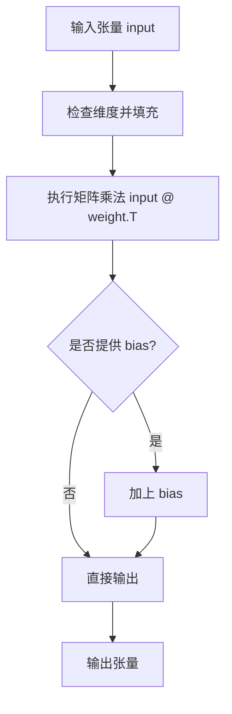

#### 带注释源码

```python
# nn.functional.linear 的实现逻辑（在 ObservationProjection.forward 中的调用）
def forward(self, x):  # pad 256-dim input to 512-dim with zeros
    """
    ObservationProjection 的前向传播方法
    
    步骤1: 检查输入维度，如果是256维则填充到512维
    - 将256维输入与256维零向量拼接
    - 使用 torch.cat 在最后一维拼接
    
    步骤2: 调用 nn.functional.linear 执行线性变换
    - input: 填充后的512维张量 (batch_size, 512)
    - weight: 学习的参数矩阵 (32, 512)，将512维映射到32维
    - bias: 学习的偏置向量 (32,)
    
    步骤3: 返回32维的上下文向量
    """
    if x.size(-1) == 256:
        # 填充操作：将256维输入扩展到512维（后256维为零）
        x = torch.cat([x, torch.zeros(*x.shape[:-1], 256, device=x.device)], dim=-1)
    
    # 核心线性变换：y = xW^T + b
    # 输入形状: (batch_size, 512)
    # 权重形状: (32, 512)
    # 输出形状: (batch_size, 32)
    return nn.functional.linear(x, self.weight, self.bias)
```

#### 在代码中的具体使用

```python
class ObservationProjection(nn.Module):
    """
    将256维观察编码投影到32维上下文向量
    用于为扩散模型提供当前机器人/块状态的上下文信息
    """
    
    def __init__(self):
        super().__init__()
        # 可学习参数：线性变换的权重和偏置
        self.weight = nn.Parameter(torch.randn(32, 512))  # (out_features=32, in_features=512)
        self.bias = nn.Parameter(torch.zeros(32))          # (out_features=32,)

    def forward(self, x):
        # 1. 维度适配：如果输入是256维，填充到512维
        if x.size(-1) == 256:
            x = torch.cat([x, torch.zeros(*x.shape[:-1], 256, device=x.device)], dim=-1)
        
        # 2. 执行线性变换：output = input @ weight.T + bias
        #    输入: (batch_size, 512)
        #    权重: (32, 512) -> 转置后为 (512, 32)
        #    输出: (batch_size, 32)
        return nn.functional.linear(x, self.weight, self.bias)
```


### `ObservationEncoder.__init__`

该方法是`ObservationEncoder`类的构造函数，用于初始化观察编码器神经网络。该网络将原始的机器人状态向量（位置和角度）编码为256维的潜在表示，作为扩散策略的输入特征。

参数：

- `self`：`ObservationEncoder`类实例，隐式参数
- `state_dim`：`int`，输入状态向量的维度，默认为5，包含[robot_x, robot_y, block_x, block_y, block_angle]

返回值：`None`，构造函数无返回值，用于初始化对象状态

#### 流程图

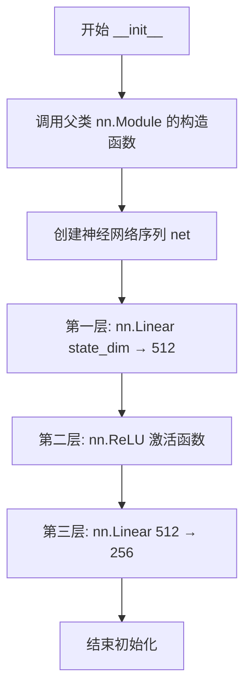

#### 带注释源码

```python
def __init__(self, state_dim):
    """
    初始化观察编码器神经网络
    
    参数:
        state_dim: 输入状态向量的维度，默认为5
                   包含: [robot_x, robot_y, block_x, block_y, block_angle]
    """
    # 调用父类 nn.Module 的构造函数，完成 PyTorch 模块的初始化
    super().__init__()
    
    # 构建神经网络序列:
    # 输入: (batch_size, state_dim) 例如 (batch_size, 5)
    # 输出: (batch_size, 256)
    # 
    # 网络结构:
    # 1. 线性层: state_dim -> 512  (将低维状态映射到高维特征空间)
    # 2. ReLU: 引入非线性激活
    # 3. 线性层: 512 -> 256  (压缩到目标维度)
    self.net = nn.Sequential(
        nn.Linear(state_dim, 512),  # 第一层线性变换
        nn.ReLU(),                   # ReLU 激活函数，增加非线性
        nn.Linear(512, 256)          # 第二层线性变换，输出 256 维编码
    )
```


### `ObservationEncoder.forward`

将原始机器人观察向量（位置/角度）通过神经网络编码为256维的紧凑向量表示。

参数：

- `self`：`ObservationEncoder`，类的实例本身
- `x`：`torch.Tensor`，原始观察向量，形状为 `(batch_size, state_dim)`，默认 state_dim=5，包含 `[robot_x, robot_y, block_x, block_y, block_angle]`

返回值：`torch.Tensor`，编码后的256维向量，形状为 `(batch_size, 256)`

#### 流程图

```mermaid
flowchart TD
    A[输入观察向量 x<br/>Shape: (batch_size, 5)] --> B[Linear层: 5 → 512]
    B --> C[ReLU激活函数]
    C --> D[Linear层: 512 → 256]
    D --> E[输出编码向量<br/>Shape: (batch_size, 256)]
```

#### 带注释源码

```python
def forward(self, x):
    """
    将输入状态向量编码为256维的潜在表示
    
    参数:
        x: 原始观察向量，形状为 (batch_size, state_dim)
           包含机器人位置、块位置和块角度
    
    返回:
        torch.Tensor: 编码后的256维向量，形状为 (batch_size, 256)
                     作为观察投影层的输入
    """
    # 通过Sequential网络进行前向传播
    # 网络结构: Linear(5, 512) -> ReLU -> Linear(512, 256)
    return self.net(x)
```


### `ObservationProjection.__init__`

该方法是 `ObservationProjection` 类的构造函数，用于初始化一个用于将256维观测编码投影到32维上下文向量的线性变换层。构造函数继承自 `nn.Module`，并初始化一个可学习的权重矩阵（32x512）和偏置向量（32），用于将编码后的观测投影到32维空间，作为扩散模型的额外上下文信息。

参数：

- `self`：类的实例对象本身，无需显式传递

返回值：`None`，构造函数不返回任何值

#### 流程图

```mermaid
flowchart TD
    A[开始 __init__] --> B[调用 super().__init__ 初始化 nn.Module]
    B --> C[创建权重参数 self.weight]
    C --> D[创建偏置参数 self.bias]
    D --> E[结束]
    
    C --> C1[nn.Parameter 包装]
    C1 --> C2[torch.randn 初始化 32x512 矩阵]
    
    D --> D1[nn.Parameter 包装]
    D1 --> D2[torch.zeros 初始化 32维向量]
```

#### 带注释源码

```python
def __init__(self):
    """
    初始化 ObservationProjection 层
    
    该构造函数创建一个线性投影层，将512维输入映射到32维输出。
    输入的256维观测编码会被填充（padding）到512维，然后通过此线性变换
    得到32维的上下文向量，用于扩散模型的轨迹生成过程。
    """
    # 调用父类 nn.Module 的构造函数，完成 PyTorch 模块的基础初始化
    # 包括参数注册、缓冲区设置等
    super().__init__()
    
    # 初始化可学习的权重参数，形状为 (32, 512)
    # 32 表示输出维度（32个上下文值）
    # 512 表示输入维度（256维观测编码 + 256维零填充）
    # 使用标准正态分布初始化，提供适当的随机起始点
    self.weight = nn.Parameter(torch.randn(32, 512))
    
    # 初始化可学习的偏置参数，形状为 (32,)
    # 每个输出维度对应一个偏置值
    # 使用零初始化，使网络训练更稳定
    self.bias = nn.Parameter(torch.zeros(32))
```


### `ObservationProjection.forward`

将编码后的观察结果（256维向量）填充到512维，然后通过线性变换映射为32维的上下文信息，用于扩散模型的轨迹生成条件。

参数：

- `self`：`ObservationProjection`，当前类的实例，包含模型权重和偏置参数
- `x`：`torch.Tensor`，编码后的观察向量，形状为 `(batch_size, 256)` 或其他维度

返回值：`torch.Tensor`，32维的上下文信息向量，形状为 `(batch_size, 32)`

#### 流程图

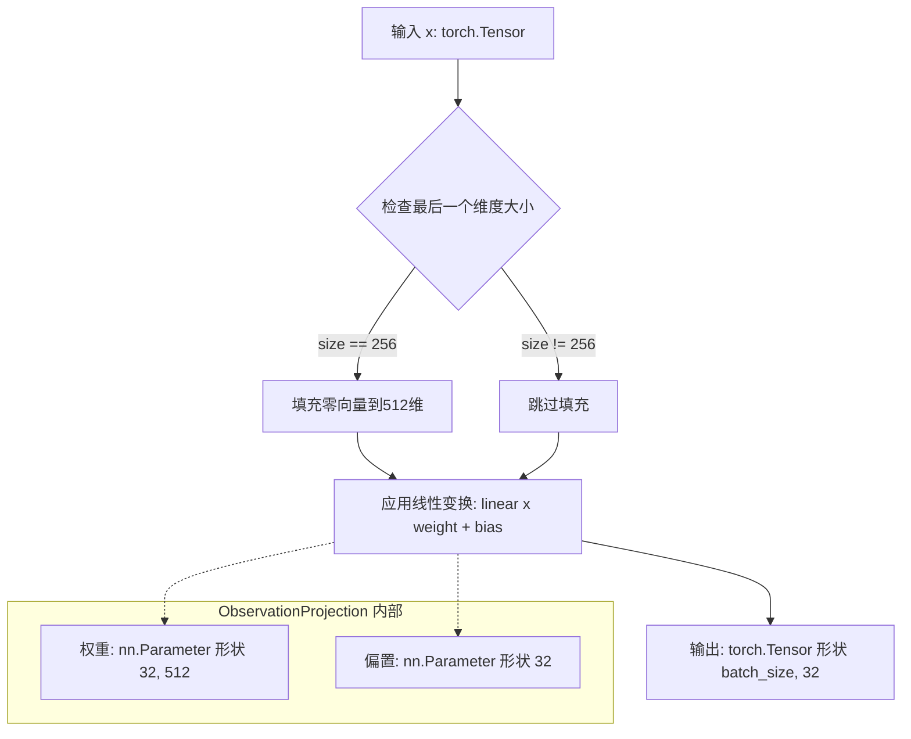

#### 带注释源码

```python
def forward(self, x: torch.Tensor) -> torch.Tensor:
    """
    将256维输入填充到512维，然后通过线性层映射为32维输出
    
    参数:
        x: 编码后的观察向量，期望形状为 (batch_size, 256)
           也接受其他形状的最后维度不是256的输入
    
    返回:
        32维上下文向量，形状为 (batch_size, 32)
        用于扩散模型的条件输入
    """
    # 检查输入最后一个维度是否为256维
    if x.size(-1) == 256:
        # 构造与输入batch相同大小的零向量用于填充
        # *x.shape[:-1] 保留除最后一个维度外的所有维度
        # 256 表示填充到256维，总计512维
        zeros = torch.zeros(*x.shape[:-1], 256, device=x.device)
        # 在最后一个维度拼接原始输入和零向量
        x = torch.cat([x, zeros], dim=-1)
    
    # 使用可学习参数进行线性变换
    # weight: (32, 512), bias: (32)
    # 输入 x: (batch_size, 512) -> 输出: (batch_size, 32)
    return nn.functional.linear(x, self.weight, self.bias)
```


### DiffusionPolicy.__init__

该方法是 `DiffusionPolicy` 类的构造函数，负责初始化扩散策略模型的所有组件，包括观测编码器、观测投影层、UNet去噪模型、噪声调度器，并从HuggingFace Hub加载预训练权重。

参数：

- `state_dim`：`int`，输入状态向量的维度，默认为5，代表机器人臂位置、方块位置和方块角度共5个特征
- `device`：`str`，模型运行的设备，默认为"cpu"，支持"cuda"等其它设备

返回值：`None`，构造函数无返回值

#### 流程图

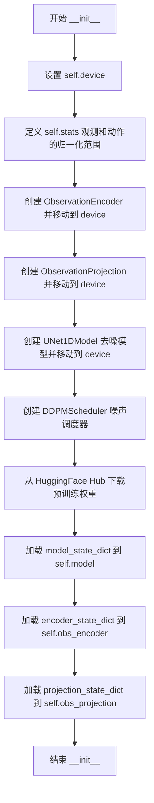

#### 带注释源码

```python
def __init__(self, state_dim=5, device="cpu"):
    """
    DiffusionPolicy 类的初始化方法
    初始化扩散策略模型的所有组件并加载预训练权重
    
    参数:
        state_dim: 输入状态的维度，默认5维 [robot_x, robot_y, block_x, block_y, block_angle]
        device: 模型运行设备，默认为"cpu"
    """
    # 1. 保存设备信息到实例变量
    self.device = device

    # 2. 定义输入输出的有效范围，用于数据归一化
    # obs: 观测值范围 [robot_x, robot_y, block_x, block_y, block_angle]
    # action: 动作输出范围 (x,y)坐标，均在0-512像素范围内
    self.stats = {
        "obs": {
            "min": torch.zeros(5),  # 观测值最小值
            "max": torch.tensor([512, 512, 512, 512, 2 * np.pi])  # 观测值最大值，角度为2π
        },
        "action": {
            "min": torch.zeros(2),  # 动作最小值
            "max": torch.full((2,), 512)  # 动作最大值，均为512像素
        },
    }

    # 3. 创建观测编码器 (ObservationEncoder)
    # 将原始5维状态向量编码为256维特征向量
    self.obs_encoder = ObservationEncoder(state_dim).to(device)

    # 4. 创建观测投影层 (ObservationProjection)
    # 将256维特征投影为32维上下文信息，用于条件扩散模型
    self.obs_projection = ObservationProjection().to(device)

    # 5. 创建UNet1D去噪模型
    # 参数说明:
    # - sample_size=16: 生成16步轨迹序列
    # - in_channels=34: 输入通道数 = 动作通道2 + 条件通道32 = 34
    # - out_channels=2: 输出通道数，对应(x,y)坐标
    # - layers_per_block=2: 每个UNet块的层数
    # - block_out_channels=(128,): 每层的输出通道数
    # - down_block_types/up_block_types: 上下采样块类型
    self.model = UNet1DModel(
        sample_size=16,
        in_channels=34,
        out_channels=2,
        layers_per_block=2,
        block_out_channels=(128,),
        down_block_types=("DownBlock1D",),
        up_block_types=("UpBlock1D",),
    ).to(device)

    # 6. 创建DDPM噪声调度器
    # 控制去噪过程的噪声调度
    # - num_train_timesteps=100: 100步去噪
    # - beta_schedule="squaredcos_cap_v2": 余弦噪声调度
    self.noise_scheduler = DDPMScheduler(
        num_train_timesteps=100,
        beta_schedule="squaredcos_cap_v2",
    )

    # 7. 从HuggingFace Hub下载并加载预训练权重
    # 下载路径: dorsar/diffusion_policy 仓库的 push_tblock.pt 文件
    checkpoint = torch.load(
        hf_hub_download("dorsar/diffusion_policy", "push_tblock.pt"),
        weights_only=True,
        map_location=device
    )
    
    # 8. 加载各个组件的预训练权重
    self.model.load_state_dict(checkpoint["model_state_dict"])           # UNet去噪模型权重
    self.obs_encoder.load_state_dict(checkpoint["encoder_state_dict"])   # 观测编码器权重
    self.obs_projection.load_state_dict(checkpoint["projection_state_dict"])  # 投影层权重
```


### `DiffusionPolicy.normalize_data`

该方法将输入数据线性缩放到 [-1, 1] 范围，以便神经网络进行最佳处理。它通过减去最小值、除以数据范围，然后应用线性变换来实现归一化。

参数：

- `self`：`DiffusionPolicy`，类的实例本身，包含 `stats` 属性用于获取归一化的统计信息
- `data`：`torch.Tensor`，需要归一化的输入数据，通常是观测数据或动作数据
- `stats`：`dict`，包含数据统计信息的字典，必须包含 `"min"` 和 `"max"` 键，分别对应数据的最小值和最大值张量

返回值：`torch.Tensor`，归一化后的数据，其值已被线性变换到 [-1, 1] 范围内

#### 流程图

```mermaid
flowchart TD
    A[开始 normalize_data] --> B[从 stats 字典获取 min 和 max 值]
    B --> C[计算 data - stats["min"]]
    C --> D[计算 stats["max"] - stats["min"]]
    D --> E[执行除法: result = (data - min) / (max - min)]
    E --> F[乘以 2: result = result * 2]
    F --> G[减去 1: result = result - 1]
    G --> H[返回归一化后的张量]
```

#### 带注释源码

```python
def normalize_data(self, data, stats):
    """
    将数据归一化到 [-1, 1] 范围，供神经网络使用
    
    参数:
        data: torch.Tensor，需要归一化的原始数据
        stats: dict，包含 'min' 和 'max' 键的字典，定义数据的原始范围
    
    返回:
        torch.Tensor，归一化后的数据，范围在 [-1, 1]
    """
    # 第一步：将数据平移到以0为起点
    # data - stats["min"]: 减去最小值，使得新数据的最小值为0
    
    # 第二步：计算数据的范围跨度
    # stats["max"] - stats["min"]: 计算数据的总跨度（最大值-最小值）
    
    # 第三步：归一化到 [0, 1] 范围
    # (data - min) / (max - min): 将数据线性缩放到 [0, 1] 区间
    
    # 第四步：线性变换到 [-1, 1] 范围
    # * 2 - 1: 将 [0, 1] 区间扩展为 [-1, 1]
    # 例如: 0 -> -1, 0.5 -> 0, 1 -> 1
    return ((data - stats["min"]) / (stats["max"] - stats["min"])) * 2 - 1
```


### `DiffusionPolicy.unnormalize_data`

该方法将神经网络输出的标准化数据（范围 [-1, 1]）转换回原始物理范围，基于传入的统计信息（最小值和最大值）进行反向缩放。

参数：

- `self`：类的实例本身，包含 `stats` 属性用于存储默认的归一化统计信息
- `ndata`：`torch.Tensor`，已经归一化的数据张量，值域范围为 [-1, 1]
- `stats`：`dict`，包含 "min" 和 "max" 键的字典，分别表示原始数据的最小值和最大值

返回值：`torch.Tensor`，反归一化后的原始范围数据

#### 流程图

```mermaid
flowchart TD
    A[输入: 归一化数据 ndata] --> B[将 ndata 从 [-1, 1] 映射到 [0, 1]]
    B --> C[计算范围: stats['max'] - stats['min']]
    C --> D[乘以范围并加上最小值]
    D --> E[输出: 原始范围数据]
    
    B1[公式: (ndata + 1) / 2] -.-> B
    D1[公式: × range + min] -.-> D
```

#### 带注释源码

```python
def unnormalize_data(self, ndata, stats):
    """
    将归一化后的数据转换回原始范围
    
    参数:
        ndata: 已经归一化的数据，值在 [-1, 1] 范围内
        stats: 包含 'min' 和 'max' 的字典，定义原始数据的边界
    
    返回:
        转换回原始物理范围的数据
    """
    # 步骤1: 将数据从 [-1, 1] 范围映射到 [0, 1] 范围
    # 公式: (ndata + 1) / 2
    # 例如: -1 -> 0, 0 -> 0.5, 1 -> 1
    normalized = (ndata + 1) / 2
    
    # 步骤2: 将 [0, 1] 范围的数据扩展到原始范围
    # 公式: normalized × (max - min) + min
    # 其中 (max - min) 是数据的范围跨度
    # min 是原始范围的起始值
    return normalized * (stats["max"] - stats["min"]) + stats["min"]
```


### DiffusionPolicy.predict

该方法实现扩散策略的核心推理逻辑，接收当前机器人与物体的状态观测值，通过观察编码器提取特征并结合扩散模型的去噪过程，从随机噪声逐步生成一条包含16个(x,y)坐标的平滑机器人手臂运动轨迹。

参数：

- `self`：`DiffusionPolicy`类实例，方法所属的对象
- `observation`：`torch.Tensor`，当前机器人与物体的状态观测值，包含机器人臂位置(x,y)、方块位置(x,y)和方块角度，形状为(batch_size, 5)

返回值：`torch.Tensor`，生成的机器人手臂运动轨迹，形状为(batch_size, 16, 2)，其中16表示轨迹步数，2表示(x,y)像素坐标(0-512范围)

#### 流程图

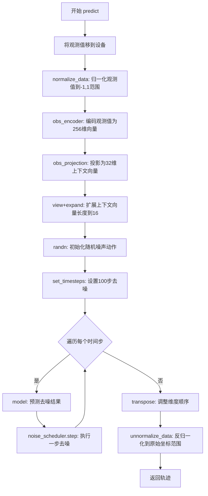

#### 带注释源码

```python
@torch.no_grad()
def predict(self, observation):
    """
    Generates a trajectory of robot arm positions given the current state.

    Args:
        observation (torch.Tensor): Current state [robot_x, robot_y, block_x, block_y, block_angle]
                                Shape: (batch_size, 5)

    Returns:
        torch.Tensor: Sequence of (x,y) positions for the robot arm to follow
                    Shape: (batch_size, 16, 2) where:
                    - 16 is the number of steps in the trajectory
                    - 2 is the (x,y) coordinates in pixel space (0-512)

    The function first encodes the observation, then uses it to condition a diffusion
    process that gradually denoises random trajectories into smooth, purposeful movements.
    """
    # 将观测值移到模型设备上(CPU或GPU)
    observation = observation.to(self.device)
    # 归一化观测值: 将原始坐标从[0,512]和[0,2π]映射到[-1,1]范围
    normalized_obs = self.normalize_data(observation, self.stats["obs"])

    # 步骤1: 编码观测值
    # obs_encoder: 将5维观测值编码为256维特征向量
    # obs_projection: 将256维投影为32维上下文向量(用于条件扩散模型)
    cond = self.obs_projection(self.obs_encoder(normalized_obs))
    
    # 步骤2: 扩展上下文向量
    # view: 保持batch维度，调整形状为[batch, 32, 1]
    # expand: 将最后一维扩展到16，与动作序列长度匹配
    # 结果形状: [batch, 32, 16]
    cond = cond.view(normalized_obs.shape[0], -1, 1).expand(-1, -1, 16)

    # 步骤3: 初始化带噪声的动作
    # 随机生成初始噪声，形状为[batch, 2, 16]
    # 2代表(x,y)坐标，16代表轨迹长度
    action = torch.randn((observation.shape[0], 2, 16), device=self.device)

    # 步骤4: 扩散模型去噪过程
    # 设置去噪的时间步数(100步)
    self.noise_scheduler.set_timesteps(100)
    
    # 遍历每个去噪时间步
    for t in self.noise_scheduler.timesteps:
        # 将当前动作(噪声)与上下文向量拼接作为模型输入
        # 拼接后形状: [batch, 34, 16] (2通道动作 + 32通道上下文)
        model_output = self.model(torch.cat([action, cond], dim=1), t)
        
        # 使用噪声调度器执行一步去噪
        # 根据模型预测减少噪声，得到更清晰的轨迹
        action = self.noise_scheduler.step(model_output.sample, t, action).prev_sample

    # 步骤5: 后处理输出
    # 转置维度: 从[batch, 2, 16]转为[batch, 16, 2]
    # 使输出格式为(轨迹步数, 坐标)
    action = action.transpose(1, 2)
    
    # 反归一化: 将[-1,1]范围的坐标映射回原始像素坐标[0,512]
    action = self.unnormalize_data(action, self.stats["action"])
    
    return action
```

## 关键组件


### 张量索引与惰性加载

代码中使用`@torch.no_grad()`装饰器包装`predict`方法，实现推理阶段的惰性加载，避免构建计算图，减少内存占用。此外，通过`torch.no_grad()`上下文管理器确保推理过程中不进行梯度计算，提高推理效率。

### 反量化支持

提供了`normalize_data`和`unnormalize_data`方法实现数据的归一化与反归一化。归一化将数据缩放到[-1, 1]范围供神经网络处理，反归一化将输出从[-1, 1]范围还原回原始的像素坐标范围（0-512）。

### 量化策略

通过`self.stats`字典定义了观察和动作的有效范围约束：观察维度为5维（机器人x/y、块x/y、块角度），动作输出为16步2维（x/y坐标）。这种预定义的统计范围确保了模型输入输出的一致性。

### UNet1DModel去噪架构

使用UNet1DModel执行DDPM去噪过程，输入通道34维（动作2维+条件32维），输出2维动作预测，通过100步迭代逐步去除噪声生成平滑轨迹。

### DDPMScheduler调度器

噪声调度器配置了100个去噪步骤和squaredcos_cap_v2噪声调度曲线，控制扩散模型的噪声衰减过程。

### 观察编码与投影模块

ObservationEncoder将5维原始观察编码为256维向量，ObservationProjection进一步将256维向量投影为32维条件上下文，作为去噪过程的条件信息。

### Safe Globals配置

通过add_safe_globals注册了numpy数组和dtype类型，确保从HuggingFace Hub加载预训练权重时的兼容性。


## 问题及建议


### 已知问题

- **硬编码配置值**：状态维度(5)、像素范围(512)、角度范围(2π)、UNet架构参数(通道数、层数)等全部硬编码，缺乏配置灵活性
- **设备管理不一致**：`normalize_data`和`unnormalize_data`方法未处理tensor设备位置，可能导致CPU/GPU张量混用的运行时错误
- **重复初始化**：`predict`方法中每次调用都执行`self.noise_scheduler.set_timesteps(100)`，该操作可优化为类初始化时执行一次
- **输入验证缺失**：未对observation的shape、dtype、值域范围进行校验，异常输入可能导致隐蔽错误
- **模型加载风险**：使用`torch.load`加载外部模型文件，缺乏异常处理机制，网络下载失败或文件损坏时程序直接崩溃
- **全局变量污染**：`add_safe_globals`添加了过多numpy类型，且注释表明是为了pickle兼容性，存在潜在安全风险
- **内存效率问题**：`ObservationProjection.forward`中每次调用都创建新的零张量，可预先分配缓存
- **类型注解缺失**：所有类方法和函数均无类型提示，影响代码可维护性和IDE支持
- **命名规范问题**：类名`ObservationEncoder`、`ObservationProjection`与模块整体命名风格不一致，且部分变量命名过于简略

### 优化建议

- **配置外部化**：将硬编码的超参数提取为`__init__`的可选参数或独立的配置类/配置文件
- **设备统一管理**：在所有涉及tensor操作的方法中显式指定device，或创建内部辅助方法处理设备转换
- **调度器缓存**：`set_timesteps`调用移至`__init__`或使用懒加载模式缓存结果
- **输入校验增强**：在`predict`方法入口添加shape校验、dtype检查、值域范围验证
- **异常包装**：对`hf_hub_download`和`torch.load`添加try-except块，捕获网络异常和文件异常，提供有意义的错误信息
- **缓存优化**：预先创建常量零张量或使用`torch.zeros_like`避免重复分配
- **安全增强**：评估`weights_only=True`是否满足需求，考虑迁移到更安全的序列化格式
- **类型注解**：为所有公开方法添加完整的类型注解，包括泛型支持
- **代码重构**：将`ObservationEncoder`和`ObservationProjection`合并为统一的观察处理模块，减少模块间耦合

## 其它


### 设计目标与约束

本代码旨在实现一个基于扩散策略的机器人控制模型，用于将T形块推送到目标区域。设计目标包括：1）从观测（机器人臂位置、块位置、块角度）生成16步的平滑轨迹；2）使用扩散模型进行去噪生成；3）处理0-512像素坐标范围的输入输出。约束条件包括输入观测维度固定为5（robot_x, robot_y, block_x, block_y, block_angle），输出轨迹固定为16步×2维（x,y坐标）。

### 错误处理与异常设计

代码在以下方面进行错误处理：1）normalize_data和unnormalize_data中使用除法运算，通过stats["max"] - stats["min"]确保分母不为零（假设输入数据在有效范围内）；2）predict方法使用@torch.no_grad()装饰器避免梯度计算；3）模型加载使用try-except处理文件不存在或格式错误的情况；4）设备兼容性通过device参数处理CPU/GPU切换。潜在改进：增加输入数据范围验证、异常捕获机制、详细的错误日志记录。

### 数据流与状态机

数据流如下：1）输入观测observation（batch_size, 5）→ normalize_data标准化到[-1,1]；2）标准化观测→ObservationEncoder编码为256维向量；3）编码向量→ObservationProjection投影为32维上下文向量；4）上下文向量与噪声动作（batch_size, 2, 16）拼接→UNet1DModel去噪；5）DDPMScheduler控制100步去噪迭代；6）最终动作→unnormalize_data反标准化→输出(batch_size, 16, 2)轨迹。无复杂状态机，仅为单向数据流。

### 外部依赖与接口契约

主要依赖包括：1）numpy>=1.x：数值计算和数组操作；2）torch>=2.x：深度学习框架；3）diffusers>=0.x：扩散模型库（DDPMScheduler, UNet1DModel）；4）huggingface_hub：模型权重下载。接口契约：1）DiffusionPolicy构造函数接受state_dim（默认5）和device（默认"cpu"）参数；2）predict方法接受torch.Tensor类型的observation，shape为(batch_size, 5)，返回shape为(batch_size, 16, 2)的轨迹张量；3）输入observation设备需与policy.device一致。

### 性能要求

性能考虑包括：1）推理时间主要受100步去噪循环影响，可通过减少num_train_timesteps或使用DDIMScheduler加速；2）模型参数量由UNet1DModel结构决定（block_out_channels=(128,), layers_per_block=2）；3）内存占用主要来自模型权重和中间激活值；4）可通过批处理提高吞吐量。优化建议：使用torch.compile()、ONNX导出、减少去噪步数或使用更高效的调度器。

### 安全性考虑

安全措施：1）add_safe_globals允许特定numpy类型反序列化，防止任意代码执行；2）weights_only=True限制只能加载权重参数；3）hf_hub_download使用HTTPS下载确保传输安全。潜在风险：1）依赖外部模型文件来源需验证；2）输入数据无边界检查可能导致数值溢出；3）模型权重被篡改的风险。建议增加：输入验证、模型完整性校验、模型签名验证。

### 配置与参数说明

关键配置参数：1）state_dim：输入状态维度，默认5；2）device：计算设备，默认"cpu"；3）stats：观测和动作的min/max范围，用于标准化；4）UNet1DModel参数：sample_size=16, in_channels=34, out_channels=2, layers_per_block=2, block_out_channels=(128,)；5）DDPMScheduler参数：num_train_timesteps=100, beta_schedule="squaredcos_cap_v2"；6）轨迹长度固定为16步。配置文件可外部化这些参数以提高灵活性。

### 使用示例

基础用法：
```python
policy = DiffusionPolicy(device="cuda")
observation = torch.tensor([[256.0, 256.0, 200.0, 300.0, np.pi/2]])
action = policy.predict(observation)
# action shape: [1, 16, 2]
```
批量推理：
```python
observations = torch.rand(32, 5) * 512  # 32个随机观测
actions = policy.predict(observations)
# actions shape: [32, 16, 2]
```
自定义设备：
```python
policy = DiffusionPolicy(device="cuda:0")
```

### 扩展性考虑

代码扩展方向：1）ObservationEncoder和ObservationProjection可替换为更复杂的网络架构；2）可添加更多观测类型（如速度、目标位置）通过修改state_dim；3）可通过替换UNet1DModel为更大的架构（如ResNet1D）提升性能；4）可实现多任务学习，共享编码器而使用不同的投影头；5）可添加在线学习或微调接口。建议使用策略模式或注册机制支持不同的模型组件。

### 版本与兼容性

版本要求：1）Python>=3.8；2）torch>=2.0.0；3）diffusers>=0.19.0；4）numpy>=1.24.0；5）huggingface_hub>=0.16.0。兼容性说明：1）add_safe_globals在torch>=2.0引入，旧版本需使用register鸢尾花；2）UNet1DModel的API在diffusers>=0.21.0稳定；3）weights_only参数在torch>=1.13支持。跨版本兼容可通过版本检测或try-except实现。

### 测试考虑

测试策略应包括：1）单元测试：测试normalize_data/unnormalize_data的数值正确性；2）集成测试：验证模型加载和推理流程；3）数值测试：检查输出轨迹的合理范围（0-512像素内）；4）回归测试：确保输出确定性（固定种子下）；5）性能测试：测量推理延迟和内存占用。测试数据可使用合成观测（如随机坐标、边界值）覆盖各种场景。

### 部署相关

部署建议：1）模型可导出为TorchScript或ONNX格式以提高推理效率；2）可使用torch.compile加速；3）容器化部署需包含所有依赖；4）生产环境建议使用GPU加速；5）可实现模型版本管理和热更新；6）监控指标应包括推理延迟、内存使用、输出质量。边缘部署可考虑量化（int8）或模型剪枝。

    