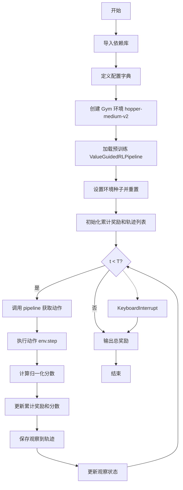
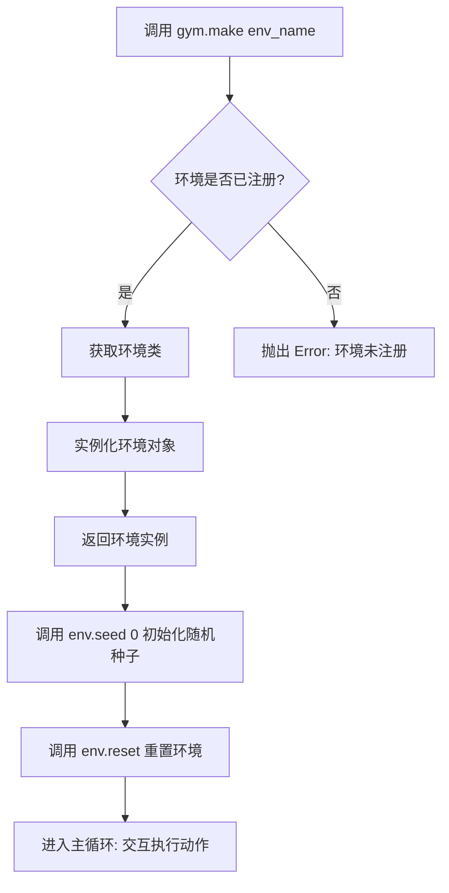
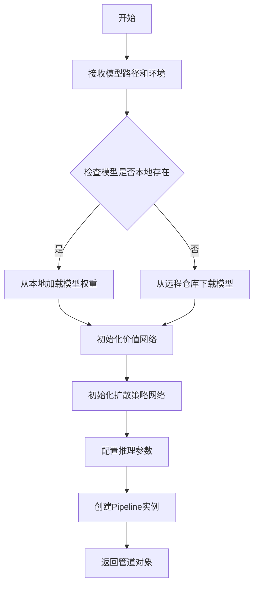
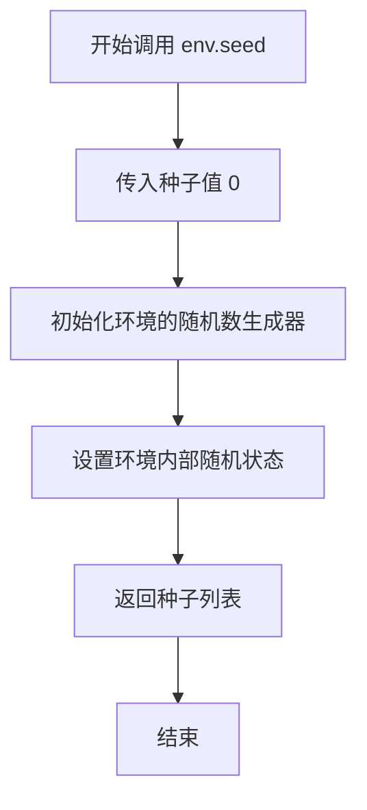
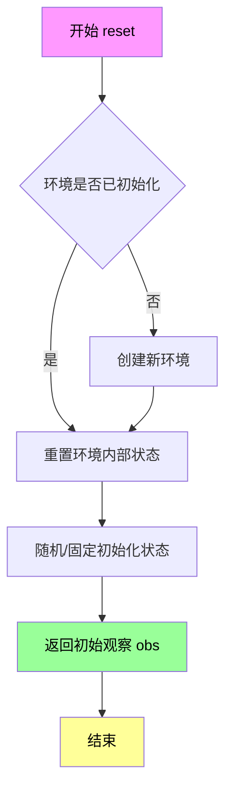
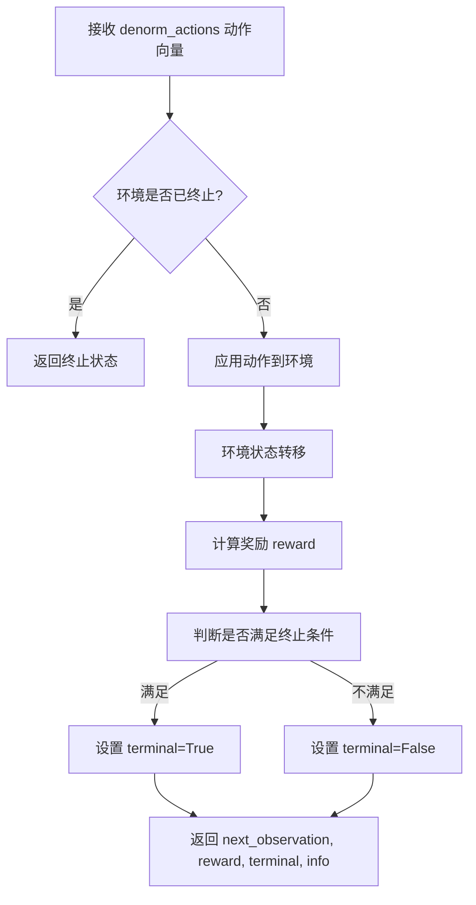
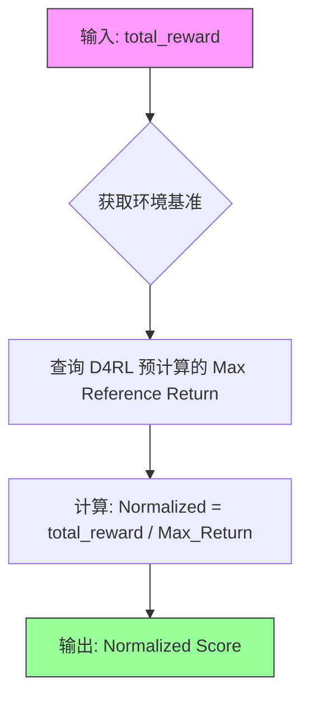
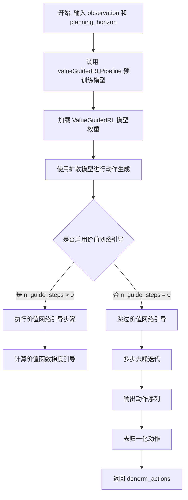
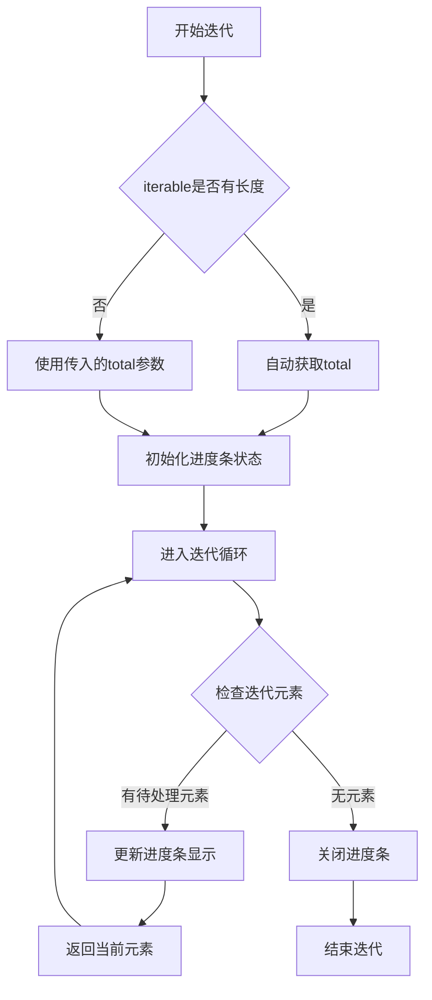

# `diffusers\examples\reinforcement_learning\run_diffuser_locomotion.py` 详细设计文档

该代码实现了一个基于价值导向强化学习策略的机器人 rollout 流程，加载预训练的 ValueGuidedRLPipeline 模型，在 Hoppper 环境中执行 1000 步交互，收集轨迹数据用于后续渲染和分析。

## 整体流程



## 类结构

```
Python 标准库
├── gym (环境模拟器)
├── tqdm (进度条)
└── diffusers.experimental
    └── ValueGuidedRLPipeline (价值导向强化学习管道)
```

## 全局变量及字段


### `config`
    
配置字典，包含采样数量、规划步长、推理步数、引导步数等强化学习采样参数

类型：`Dict[str, Any]`
    


### `env_name`
    
Gym环境名称字符串，指定为hopper-medium-v2（单腿跳跃机器人中等难度数据集）

类型：`str`
    


### `env`
    
Gym环境实例，用于模拟强化学习交互环境并计算奖励和归一化分数

类型：`gym.Env`
    


### `pipeline`
    
值函数引导的强化学习策略管道，基于预训练模型进行动作生成和规划

类型：`ValueGuidedRLPipeline`
    


### `obs`
    
当前环境观察状态向量，包含智能体获取的环境信息用于决策

类型：`np.ndarray`
    


### `total_reward`
    
累计奖励值，记录智能体在整个rollout过程中获得的总回报

类型：`float`
    


### `total_score`
    
累计归一化分数，根据环境标准计算的性能评估指标

类型：`float`
    


### `T`
    
 rollout最大步数，设定为1000步用于控制交互回合长度

类型：`int`
    


### `rollout`
    
轨迹观察列表，用于保存完整的状态序列以便可视化和回放

类型：`List[np.ndarray]`
    


    

## 全局函数及方法


### `gym.make()`

创建指定名称的 Gym 环境实例。该函数根据传入的环境名称在注册表中查找对应的环境类，实例化并返回一个环境对象，供后续的强化学习交互使用。

参数：

-  `env_name`：`str`，要创建的环境名称，注册表中已存在的环境标识符（如 "hopper-medium-v2"）

返回值：`gym.Env`（或 `gymnasium.Env`），创建后的环境实例对象，包含 `reset()`、`step()`、`seed()` 等方法

#### 流程图



#### 带注释源码

```python
# 从代码中提取的 gym.make() 使用示例
# 环境名称字符串
env_name = "hopper-medium-v2"

# 调用 gym.make() 创建环境
# 内部实现逻辑:
# 1. 在注册表中查找 'hopper-medium-v2'
# 2. 找到对应的环境类 (通常是 EnvSpec)
# 3. 实例化该环境类
# 4. 返回环境实例
env = gym.make(env_name)

# 初始化环境随机种子
env.seed(0)

# 重置环境,获取初始观测
obs = env.reset()

# 环境对象可用的方法:
# - env.reset() -> obs: 重置环境返回初始观测
# - env.step(action) -> next_obs, reward, done, info: 执行动作
# - env.seed(seed): 设置随机种子
# - env.get_normalized_score(score): 获取标准化分数 (d4rl扩展)
```


### `ValueGuidedRLPipeline.from_pretrained()`

从预训练模型检查点加载 ValueGuidedRLPipeline 管道，用于基于价值函数的强化学习策略生成。

参数：

- `pretrained_model_name_or_path`：`str`，预训练模型的名称或本地路径，指向模型检查点（例如 "bglick13/hopper-medium-v2-value-function-hor32"）
- `env`：`gym.Env`，Gym 格式的强化学习环境对象，用于提供状态空间和动作空间的规范

返回值：`ValueGuidedRLPipeline`，返回加载后的管道实例，包含价值函数和扩散策略模型

#### 流程图



#### 带注释源码

```python
# 加载预训练模型管道的调用示例
pipeline = ValueGuidedRLPipeline.from_pretrained(
    "bglick13/hopper-medium-v2-value-function-hor32",  # 预训练模型名称或路径
    env=env,  # Gym 环境对象，用于获取状态/动作空间信息
)

# 管道内部主要执行以下操作：
# 1. 加载模型检查点（包含价值函数和策略网络权重）
# 2. 根据 env 参数获取环境的状态空间和动作空间维度
# 3. 初始化扩散模型（用于生成动作序列）
# 4. 初始化价值函数网络（用于评估状态-动作对的长期回报）
# 5. 配置推理参数（采样步数、引导步数等）
# 返回的 pipeline 可直接用于: pipeline(obs, planning_horizon=32) 生成动作
```


### `env.seed(0)`

设置环境的随机种子，以确保实验的可重复性和确定性。

参数：

- `0`：`int`，要设置的随机种子值，用于初始化环境的随机数生成器。

返回值：`list`，返回一个包含设置种子的列表（通常为 `[seed]`）。

#### 流程图



#### 带注释源码

```python
# 在 gym 环境中设置随机种子以确保实验可重复
# env 是通过 gym.make() 创建的 Gym 环境对象
env.seed(0)  # 调用环境的 seed 方法，设置随机种子为 0
             # 参数: 0 (int) - 随机种子值
             # 返回: list - 返回设置的种子列表，如 [0]
             # 作用: 初始化环境的随机数生成器，使环境行为可复现
```


### `gym.Env.reset()`

重置环境状态并返回初始观察（observation），用于开始新的episode。

参数：

- 无（但Gym标准API支持可选的`seed`参数和`options`参数，代码中通过`env.seed(0)`单独设置种子）

返回值：`obs`（观察对象），通常是numpy数组，环境特定的观察空间格式，初始观察值

#### 流程图



#### 带注释源码

```python
# 在代码中的调用方式：
env.seed(0)    # 设置随机种子以确保可重复性
obs = env.reset()  # 重置环境并获取初始观察

# 源码逻辑示意（基于Gym标准实现）：
def reset(self, seed=None, options=None):
    """
    重置环境到初始状态
    
    参数:
        seed: 可选的随机种子，用于重置随机数生成器
        options: 可选的字典，用于指定环境特定的初始化选项
    
    返回:
        observation: 环境的初始观察（numpy数组或类似格式）
    """
    # 1. 如果提供了seed，设置随机数生成器
    if seed is not None:
        self.seed(seed)
    
    # 2. 重置环境的内部状态（位置、速度等）
    self._reset_internal_state()
    
    # 3. 返回初始观察
    observation = self._get_observation()
    
    return observation  # 返回初始观察用于后续策略输入
```


### `env.step()`

执行给定的动作并返回环境的下一状态、奖励、终止标志和附加信息。这是 OpenAI Gym 环境的标准接口方法，用于在强化学习循环中推进环境状态。

参数：

- `denorm_actions`：`numpy.ndarray` 或 `list`，经过反归一化的动作向量，通常由策略网络（pipeline）输出，用于在环境中执行

返回值：

- `next_observation`：`numpy.ndarray`，执行动作后环境返回的下一状态（观测值）
- `reward`：`float`，执行动作后环境返回的即时奖励
- `terminal`：`bool`，表示 episode 是否终止（True 为终止）
- `info`：`dict`（通常），包含附加诊断信息（如是否超时、是否达到目标等）

#### 流程图



#### 带注释源码

```python
# 在主循环中调用 env.step() 的上下文
# pipeline 根据当前观测生成动作
denorm_actions = pipeline(obs, planning_horizon=32)

# 执行动作并获取环境反馈
# 输入: denorm_actions - 由策略网络输出的动作向量
# 输出:
#   - next_observation: 环境的新状态
#   - reward: 执行动作获得的奖励
#   - terminal: episode 是否结束的标志
#   - _: 忽略的 info 字典（包含诊断信息）
next_observation, reward, terminal, _ = env.step(denorm_actions)

# 更新累计奖励用于评估
total_reward += reward

# 获取归一化分数（用于与基准对比）
score = env.get_normalized_score(total_reward)

# 保存观测用于后续渲染
rollout.append(next_observation.copy())

# 将下一状态设为当前状态，进入下一个时间步
obs = next_observation
```


### `env.get_normalized_score`

该函数是 D4RL 库为 Gym 环境扩展的内置方法。在本代码中，它用于将智能体在环境中获得的原始累计奖励（Total Reward）转换为归一化分数（Normalized Score）。这个归一化分数通常是基于该任务下专家数据（Expert Data）的最高回报（Max Return）进行计算的，用于衡量智能体策略表现相对于基准的好坏（通常范围在 0 到 1 之间，1.0 代表达到或超越专家水平）。

参数：

- `total_reward`：`float`，即代码中累积的变量 `total_reward`，表示智能体当前获得的原始累计奖励值。

返回值：`float`，返回归一化后的评分，用于跨环境比较策略性能。

#### 流程图



#### 带注释源码

由于 `env` 对象是由 `gym.make("hopper-medium-v2")` 创建的 D4RL 环境其实例，该方法的实现位于 D4RL 库内部。以下为基于 D4RL 库常见逻辑推断的典型实现（位于 `d4rl.offline_env` 或具体环境类中）：

```python
def get_normalized_score(self, score):
    """
    根据环境的参考最大回报，对原始分数进行归一化处理。
    
    参数:
        score (float): 原始的累计奖励值 (即代码中的 total_reward)。
        
    返回值:
        float: 归一化后的分数。通常为 0 到 1 之间的值。
               在 D4RL 中，如果分数超过专家水平，可以大于 1.0。
    """
    if self.dataset is None:
        # 如果没有数据集（通常 D4RL 环境加载时会自动加载默认数据集），则不进行归一化
        return score
        
    # 获取该环境对应的专家最高回报 (ref_max_score)
    # 例如 hopper-medium-v2 的专家最高回报通常在 3000 左右
    # normalized_score = score / env_ref_max_score
    
    return score / self.ref_max_score
```

**在当前代码中的调用方式：**

```python
# env 是通过 d4rl 加载的 Gym 环境实例
# total_reward 是当前累积的原始奖励
score = env.get_normalized_score(total_reward)
```


### `ValueGuidedRLPipeline.__call__`

这是一个价值引导的强化学习策略管道方法，接收当前环境观察和规划视野参数，通过预训练的价值函数引导的扩散模型生成去归一化的动作序列，供环境执行。

参数：

- `observation`：`Union[np.ndarray, torch.Tensor]` 或 `obs`，当前环境的观察状态（observation），用于作为策略模型的输入
- `planning_horizon`：`int`，规划视野（planning horizon），指定生成动作序列的时间步长，代码中设为 32

返回值：`np.ndarray`，去归一化的动作数组（denorm_actions），可以直接在环境中执行的动作值

#### 流程图



#### 带注释源码

```python
# 从预训练模型加载管道
pipeline = ValueGuidedRLPipeline.from_pretrained(
    "bglick13/hopper-medium-v2-value-function-hor32",
    env=env,
)

# 在主循环中调用策略
# 参数: obs - 当前环境观察, planning_horizon=32 - 规划视野
denorm_actions = pipeline(obs, planning_horizon=32)

# 执行动作获取下一个观察、奖励和终止状态
next_observation, reward, terminal, _ = env.step(denorm_actions)
```

> **说明**：该方法内部使用扩散模型（Diffusion Model）结合价值函数（Value Function）进行动作生成，通过 `n_guide_steps` 控制价值网络引导的迭代次数，使用 `num_inference_steps` 控制去噪采样步数，最终输出符合环境动作空间范围的去归一化动作。


### `tqdm.tqdm`

`tqdm.tqdm` 是 Python 中 `tqdm` 库的核心类，用于包装可迭代对象并在迭代过程中显示进度条。该函数创建一个迭代器包装器，能够实时展示循环的执行进度、预计剩余时间和迭代速度。

参数：

- `iterable`：可迭代对象（`Iterable`），此处传入 `range(T)`，即 0 到 999 的整数序列，用于被进度条包装迭代
- `desc`：字符串（可选），进度条的描述标签，默认为 None
- `total`：整数（可选），预期迭代总数，若 iterable 没有 `__len__` 方法则必须指定
- `leave`：布尔值（可选），迭代完成后是否保留进度条，默认为 True
- `file`：文件对象（可选），进度条输出目标，默认为 sys.stderr
- `ncols`：整数（可选），进度条宽度，默认为自适应
- `mininterval`：浮点数（可选），最小更新间隔（秒），默认为 0.1
- `maxinterval`：浮点数（可选），最大更新间隔（秒），默认为 10
- `miniters`：整数（可选），最小迭代次数触发更新，默认为 1
- `unit`：字符串（可选），迭代单位名称，默认为 "it"
- `unit_scale`：布尔值（可选），是否自动缩放单位，默认为 False
- `dynamic_ncols`：布尔值（可选），是否动态调整列宽，默认为 False
- `smoothing`：浮点数（可选），速度平滑因子，默认为 0.3
- `bar_format`：字符串（可选），进度条格式字符串
- `initial`：整数（可选），初始计数值，默认为 0
- `position`：整数（可选），多行进度条的位置偏移
- `postfix`：字典（可选），用于显示的附加状态信息

返回值：`tqdm` 对象（`tqdm.tqdm` 实例），返回一个可迭代的进度条包装对象，包含 `__iter__` 和 `__next__` 方法，用于在迭代时自动更新进度显示

#### 流程图



#### 带注释源码

```python
# tqdm.tqdm 类的使用示例（基于代码中的实际用法）
# 以下展示了在主循环中如何使用 tqdm.tqdm 包装迭代器

# 导入 tqdm 库
import tqdm

# T = 1000 定义总迭代次数
T = 1000

# 创建进度条迭代器
# tqdm.tqdm(range(T)) 会：
# 1. 包装 range(T) 生成的可迭代对象
# 2. 在每次迭代时更新进度条显示
# 3. 显示当前进度百分比、已用时间、预计剩余时间
progress_bar = tqdm.tqdm(range(T))

# 初始化环境状态
obs = env.reset()
total_reward = 0

# 主循环：通过进度条迭代 T 步
# 每次迭代会：
# 1. 从进度条获取当前迭代索引 t
# 2. 执行策略推理和环境交互
# 3. 自动更新进度条显示（无需手动调用更新方法）
try:
    for t in progress_bar:
        # 调用策略管道获取动作
        # planning_horizon=32 指定规划视野
        denorm_actions = pipeline(obs, planning_horizon=32)

        # 执行动作获取下一状态
        next_observation, reward, terminal, _ = env.step(denorm_actions)

        # 获取归一化得分
        score = env.get_normalized_score(total_reward)

        # 累计奖励
        total_reward += reward
        total_score += score

        # 打印当前步的详细信息
        print(
            f"Step: {t}, Reward: {reward}, Total Reward: {total_reward}, "
            f"Score: {score}, Total Score: {total_score}"
        )

        # 保存观测用于渲染
        rollout.append(next_observation.copy())

        # 更新观测状态
        obs = next_observation

except KeyboardInterrupt:
    # 用户中断时优雅退出
    pass

# 打印总奖励
print(f"Total reward: {total_reward}")
```

---

### 补充说明

**关键组件信息**：
- `tqdm` 库：Python 进度条库，提供快速、可扩展的进度条显示功能
- 进度条更新机制：基于迭代器的 `__next__` 调用自动触发显示更新

**潜在优化空间**：
- `tqdm.tqdm` 在每次迭代时都有一定的 I/O 开销，若对性能要求极高，可考虑使用 `tqdm.tqdm` 的 `miniters` 和 `mininterval` 参数减少更新频率
- 对于大规模训练场景，可将 `n_guide_steps` 设为 0 以加速采样（代码注释中已提及）

**使用注意事项**：
- 当迭代对象没有 `__len__` 方法时，必须显式传入 `total` 参数
- `tqdm` 默认输出到 `sys.stderr`，不影响 `print` 语句的标准输出
- 在 Jupyter Notebook 环境中会自动启用支持中文显示的进度条


### `obs.copy()`

复制观察数组（observation array），创建并返回一个与原始观察数组内容相同的新数组。在代码中用于保存环境的观察状态，以便后续可能的回放或渲染。

参数：无（Python list/array 的内置方法）

返回值：`list` 或 `numpy.ndarray`，返回观察数组的浅拷贝（shallow copy），即创建一个新的数组对象，但其中的元素引用可能与原数组相同。

#### 流程图

```mermaid
flowchart TD
    A[开始 obs.copy()] --> B{检查 obs 类型}
    B -->|list| C[调用列表的 copy 方法]
    B -->|numpy array| D[调用 numpy 的 copy 方法]
    C --> E[创建新列表对象]
    D --> F[创建新数组对象]
    E --> G[返回复制的新对象]
    F --> G
    G --> H[结束]
```

#### 带注释源码

```python
# 在 rollout 列表初始化时复制初始观察
rollout = [obs.copy()]  # 复制初始观察 obs，保存到 rollout 列表中

# 在循环中复制每个时间步的观察
rollout.append(next_observation.copy())  # 复制下一个观察并添加到 rollout 列表
# 这里的 copy() 确保：
# 1. 保存观察的历史记录，不受后续环境变化影响
# 2. 创建一个独立的对象，用于后续可能的渲染或分析
# 3. 避免原始观察被后续操作修改而影响历史记录
```

## 关键组件


### ValueGuidedRLPipeline 策略推理组件

核心决策组件，加载预训练的Decision Transformer模型并使用value function引导生成动作，实现从观测到动作的映射，支持planning_horizon参数控制规划视野。

### 环境交互与Rollout循环

主执行循环组件，负责与Gym环境进行持续交互，包括环境重置、动作执行、观测更新、奖励累计和轨迹记录，实现强化学习的在线推理流程。

### 动作反规范化处理

对pipeline输出的原始动作进行反规范化处理（denorm_actions），将模型输出的标准化动作转换为环境实际可执行的动作值，确保动作符合环境的实际动作空间范围。

### 奖励归一化评估

使用env.get_normalized_score()对累计奖励进行归一化评分，将原始奖励转换为标准化的评估指标，便于与基准数据集（如D4RL）进行性能对比和跨环境比较。

### 配置管理系统

集中管理推理过程的超参数，包括采样数量(64)、规划视野(32)、推理步数(20)、引导步数(2)、梯度缩放因子等，提供灵活的实验配置能力。

### 数据准备与观测处理

观测数据的复制和准备流程(obs.copy())，确保观测数据以正确格式传递给pipeline，并维护rollout轨迹用于后续渲染或分析。

### 异常处理与安全中断

实现KeyboardInterrupt异常捕获机制，允许用户安全中断长时间运行的rollout过程，同时保证最终奖励统计信息的完整输出。


## 问题及建议


### 已知问题

-   **未使用的配置字典**：定义了 `config` 字典包含多个参数（如 `n_samples`, `horizon`, `num_inference_steps` 等），但在主代码中完全未使用，导致配置与实际执行脱节
-   **缺少终止条件检查**：在 for 循环中执行环境步骤后，未检查 `terminal` 状态来提前终止 episode，可能导致智能体在 episode 结束后继续执行无效动作
-   **不正确的评分计算**：`env.get_normalized_score(total_reward)` 传入的是累计奖励总和，而非当前 episode 的实际奖励，导致评分计算逻辑错误
-   **使用废弃的导入路径**：`from diffusers.experimental import ValueGuidedRLPipeline` 使用了 `experimental` 模块，该模块可能不稳定或在未来版本中移除
-   **不完整的异常处理**：仅捕获 `KeyboardInterrupt`，缺乏对其他可能的异常（如模型加载失败、环境创建失败、GPU 内存不足等）的处理
-   **进度条配置不当**：`tqdm.tqdm(range(T))` 未设置 `total=T` 参数，可能导致进度条显示不准确
-   **缺乏类型注解**：代码中没有使用类型注解，降低了代码的可读性和可维护性
-   **资源未显式释放**：使用完毕后未显式关闭环境或释放相关资源

### 优化建议

-   将 `config` 字典中的参数实际应用到 `pipeline` 调用或环境初始化中，或删除未使用的配置
-   在循环中添加 `if terminal: break` 逻辑，确保 episode 结束时及时退出
-   修正评分计算：`score = env.get_normalized_score(reward)` 或累计单 episode 奖励后再计算
-   检查最新版本的 diffamers，替换为稳定的导入路径和 API
-   添加完整的异常处理机制，例如使用 try-except 捕获并记录各类潜在异常
-   为 tqdm 进度条设置正确的 total 参数：`tqdm.tqdm(range(T), total=T)`
-   为函数参数、返回值和关键变量添加类型注解
-   使用上下文管理器或显式调用 `env.close()` 确保资源正确释放
-   考虑将重复使用的配置值提取为命令行参数或配置文件，提高代码灵活性

## 其它


### 1. 核心功能概述

该代码实现了一个基于价值引导的强化学习策略（Value-Guided RL）的推理过程，加载预训练的扩散模型作为策略网络，在MuJoCo的Hopper环境中执行连续控制任务，通过多步去噪生成动作并与环境交互获取奖励。

### 2. 整体运行流程

1. **配置初始化**：定义推理所需的超参数（采样数、规划步数、去噪步数等）
2. **环境创建**：使用Gym创建Hopper-medium-v2环境
3. **模型加载**：从HuggingFace Hub加载预训练的ValueGuidedRLPipeline
4. **环境重置**：设置随机种子并重置环境获取初始观测
5. **主循环执行**：
   - 调用策略管道生成动作
   - 执行动作获取下一观测和奖励
   - 更新累积奖励和归一化分数
   - 保存观测用于可视化
   - 更新观测状态
6. **结果输出**：打印总奖励

### 3. 类详细信息

由于该代码为脚本形式，未定义自定义类，主要使用第三方库类。

#### 3.1 ValueGuidedRLPipeline 类

**来源**：diffusers.experimental.ValueGuidedRLPipeline

**描述**：Diffusers库提供的价值引导强化学习管道，结合扩散模型和价值函数进行动作生成。

**方法**：

- **from_pretrained**
  - 参数：pretrained_model_name_or_path (str), env (gym.Env)
  - 返回值：ValueGuidedRLPipeline实例
  - 描述：从预训练模型加载管道并绑定环境

- **__call__**
  - 参数：obs (np.ndarray), planning_horizon (int)
  - 返回值：np.ndarray
  - 描述：输入当前观测，返回去噪后的动作

#### 3.2 gym.Env 类

**来源**：gym

**描述**：OpenAI Gym强化学习环境接口。

**方法**：

- **reset**
  - 参数：无
  - 返回值：观测
  - 描述：重置环境返回初始观测

- **step**
  - 参数：action (np.ndarray)
  - 返回值：(next_obs, reward, terminal, info)
  - 描述：执行动作返回下一状态、奖励、终止标志

- **get_normalized_score**
  - 参数：reward (float)
  - 返回值：float
  - 描述：返回归一化后的分数

- **seed**
  - 参数：seed (int)
  - 返回值：list
  - 描述：设置环境随机种子

### 4. 全局变量详细信息

#### 4.1 配置变量

| 变量名 | 类型 | 描述 |
|--------|------|------|
| n_samples | int | 扩散模型采样数量 |
| horizon | int | 规划视界长度 |
| num_inference_steps | int | 推理去噪步数 |
| n_guide_steps | int | 价值网络引导步数 |
| scale_grad_by_std | bool | 是否按标准差缩放梯度 |
| scale | float | DDPM缩放因子 |
| eta | float | DDIM eta参数 |
| t_grad_cutoff | float | 梯度时间截断值 |
| device | str | 计算设备 |

#### 4.2 运行时变量

| 变量名 | 类型 | 描述 |
|--------|------|------|
| env_name | str | 环境名称 |
| env | gym.Env | Gym环境实例 |
| pipeline | ValueGuidedRLPipeline | 策略管道实例 |
| obs | np.ndarray | 当前观测 |
| total_reward | float | 累积奖励 |
| total_score | float | 累积归一化分数 |
| T | int | 最大步数 |
| rollout | list | 观测轨迹列表 |
| denorm_actions | np.ndarray | 去归一化后的动作 |
| next_observation | np.ndarray | 下一观测 |
| reward | float | 当前步奖励 |
| terminal | bool | 终止标志 |
| score | float | 当前步归一化分数 |

### 5. 全局函数详细信息

#### 5.1 主函数

**名称**：main

**参数**：无

**返回值**：无

**mermaid流程图**：
```mermaid
flowchart TD
    A[开始] --> B[创建config字典]
    B --> C[创建gym环境hopper-medium-v2]
    C --> D[加载ValueGuidedRLPipeline]
    D --> E[重置环境obs = env.reset]
    E --> F[初始化total_reward=0, total_score=0]
    F --> G[创建rollout列表并添加初始obs]
    G --> H{for t in range(T)}
    H --> I[调用pipeline生成动作]
    I --> J[env.step执行动作]
    J --> K[更新奖励和分数]
    K --> L[保存next_observation到rollout]
    L --> M[更新obs = next_observation]
    M --> N{是否达到T步}
    N -->|否| H
    N -->|是| O[打印总奖励]
    O --> P[结束]
    H -.->|KeyboardInterrupt| O
```

**带注释源码**：
```python
if __name__ == "__main__":
    # 指定环境名称
    env_name = "hopper-medium-v2"
    # 创建Gym环境实例
    env = gym.make(env_name)

    # 从预训练模型加载价值引导RL管道
    pipeline = ValueGuidedRLPipeline.from_pretrained(
        "bglick13/hopper-medium-v2-value-function-hor32",
        env=env,
    )

    # 设置环境随机种子为0，确保可复现性
    env.seed(0)
    # 重置环境获取初始观测
    obs = env.reset()
    # 初始化累积奖励和分数
    total_reward = 0
    total_score = 0
    # 设置最大rollout步数为1000
    T = 1000
    # 创建观测轨迹列表并复制初始观测
    rollout = [obs.copy()]
    
    # 主循环：执行策略与环境交互
    try:
        for t in tqdm.tqdm(range(T)):
            # 调用策略管道，输入当前观测，规划步数32，生成动作
            denorm_actions = pipeline(obs, planning_horizon=32)

            # 在环境中执行生成的动作，获取下一状态、奖励、终止标志
            next_observation, reward, terminal, _ = env.step(denorm_actions)
            # 计算归一化分数
            score = env.get_normalized_score(total_reward)

            # 累加奖励和分数
            total_reward += reward
            total_score += score
            # 打印当前步详细信息
            print(
                f"Step: {t}, Reward: {reward}, Total Reward: {total_reward}, Score: {score}, Total Score:"
                f" {total_score}"
            )

            # 保存观测用于后续渲染
            rollout.append(next_observation.copy())

            # 更新当前观测为下一观测
            obs = next_observation
    except KeyboardInterrupt:
        # 允许用户中断执行
        pass

    # 输出最终累积奖励
    print(f"Total reward: {total_reward}")
```

### 6. 关键组件信息

| 组件名称 | 描述 |
|----------|------|
| ValueGuidedRLPipeline | 核心策略管道，结合扩散模型和价值函数生成动作 |
| gym.make(env_name) | Gym环境工厂，创建MuJoCo Hopper环境 |
| D4RL数据集 | 提供hopper-medium-v2预训练数据和评估基准 |
| Diffusers库 | Hugging Face扩散模型库，提供Pipeline实现 |

### 7. 潜在技术债务与优化空间

1. **配置硬编码**：config字典和env_name被硬编码，应迁移至命令行参数或配置文件
2. **错误处理缺失**：仅捕获KeyboardInterrupt，缺少对环境异常、模型加载失败等的处理
3. **资源管理不当**：未显式管理GPU/CPU资源，未设置torch.cuda.set_device()
4. **无验证输入**：未验证obs维度与模型期望是否匹配
5. **n_guide_steps优化**：代码注释提到可设为0加速但未提供动态调整机制
6. **无状态保存**：rollout数据仅存于内存，无持久化机制
7. **terminal未使用**：step返回的terminal标志未被用于提前终止循环

### 8. 设计目标与约束

- **设计目标**：在资源受限环境下实现高效的强化学习策略推理，生成平稳的机器人控制动作
- **核心约束**：
  - 设备限制：默认使用CPU（device: "cpu"）
  - 推理速度：n_guide_steps=2和num_inference_steps=20是在速度和精度间的折中
  - 规划视界：horizon=32决定了动作生成的前瞻范围
  - 步数限制：单次rollout最多1000步

### 9. 错误处理与异常设计

- **KeyboardInterrupt**：捕获并优雅退出，打印已累积奖励
- **模型加载失败**：from_pretrained可能抛出异常（网络、磁盘空间、模型不存在），当前未处理
- **环境step异常**：可能因动作维度不匹配或环境内部错误抛出，当前未处理
- **内存溢出**：n_samples和horizon较大时可能导致OOM，当前未处理
- **建议改进**：添加try-except包裹关键IO操作，实现重试机制和降级策略

### 10. 数据流与状态机

**数据流**：
```
观测(obs) 
  → pipeline.__call__(obs, planning_horizon=32) 
  → 去噪动作(denorm_actions) 
  → env.step(action) 
  → (next_obs, reward, terminal, _)
  → 更新obs
```

**状态机**：
- 初始状态：env.reset() → obs
- 中间状态：循环执行中，obs不断更新
- 终止条件：达到T=1000步或KeyboardInterrupt

### 11. 外部依赖与接口契约

| 依赖 | 版本要求 | 接口契约 |
|------|----------|----------|
| d4rl | - | 提供get_normalized_score()方法 |
| gym | - | Env接口：reset(), step(action), seed(n), get_normalized_score(r) |
| diffusers | experimental | ValueGuidedRLPipeline.from_pretrained(path, env), __call__(obs, horizon) |
| tqdm | - | tqdm.tqdm(iterable) 进度条 |
| numpy | - | 数组操作 |

### 12. 性能考虑

- **推理瓶颈**：num_inference_steps=20的去噪过程在CPU上较慢，可考虑减少步数或使用GPU
- **采样效率**：n_samples=64可能过多，对于确定性策略可降至1
- **内存占用**：rollout列表存储完整轨迹，1000步*约11维*8字节约88KB尚可
- **建议优化**：
  - 启用n_guide_steps=0可显著加速（不使用价值网络）
  - 使用GPU（device: "cuda"）可加速扩散模型推理

### 13. 安全性考虑

- **输入验证**：未验证obs的shape和dtype，可能导致静默错误
- **模型来源**：从HuggingFace Hub加载模型，存在供应链攻击风险
- **建议改进**：添加模型校验（hash验证）、输入边界检查

### 14. 可扩展性设计

- **多环境支持**：当前硬编码env_name，可通过参数化支持其他D4RL环境
- **超参数调优**：config可外部化，支持网格搜索或贝叶斯优化
- **数据记录**：可扩展保存rollout至文件用于离线分析或训练数据增强

### 15. 测试策略建议

- **单元测试**：验证config参数合法性、obs维度匹配
- **集成测试**：在仿真环境中运行完整rollout，验证奖励收敛
- **回归测试**：确保加载相同模型产生确定性结果
- **性能测试**：测量单步推理延迟、内存峰值

### 16. 配置管理

当前配置存在两处：
1. config字典：推理超参数
2. 硬编码变量：env_name, T, seed

建议使用argparse或hydra统一管理，支持命令行覆盖默认配置。

### 17. 日志与监控

- 当前仅使用print输出，建议迁移至logging模块
- 可添加WandB/TensorBoard记录奖励曲线
- 建议记录推理时间、内存使用等指标

### 18. 版本兼容性

- diffusers.experimental模块可能在未来版本中移除或重构
- gym版本迁移（gym→gymnasium）可能影响接口
- 建议固定依赖版本或使用虚拟环境

### 19. 资源管理建议

- 显式释放模型管道：del pipeline
- 上下文管理器：使用torch.no_grad()减少内存
- 建议添加：pipeline.to("cpu") / pipeline.to("cuda")显式设备管理

### 20. 部署注意事项

- 生产环境应移除tqdm依赖（减少输出开销）
- 考虑将模型预加载至内存避免首次推理延迟
- 建议添加健康检查端点验证模型可用性

    