# `diffusers\examples\research_projects\anytext\anytext.py` 详细设计文档

AnyText 是一个基于 Diffusers 库的多语言视觉文本生成与编辑扩散管道，通过结合 OCR 识别技术、CLIP 文本编码器和 ControlNet 控制网络，在图像中精确渲染指定位置的文本内容，支持文本生成（generate）和图像编辑（edit）两种模式。

## 整体流程

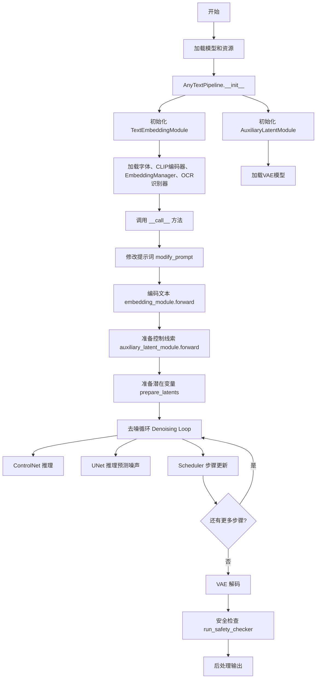

## 类结构

```
Checker (文本验证工具类)
├── _is_chinese_char
├── _clean_text
├── _is_control
└── _is_whitespace

EmbeddingManager (嵌入管理器)
├── __init__
├── encode_text
├── forward
└── embedding_parameters

TextRecognizer (OCR文本识别器)
├── __init__
├── resize_norm_img
├── pred_imglist
├── get_char_dict
├── get_text
├── decode
└── get_ctcloss

AbstractEncoder (抽象编码器基类)
└── encode

FrozenCLIPEmbedderT3 (冻结的CLIP文本编码器)
├── __init__
├── freeze
├── forward
├── encode
└── split_chunks

TextEmbeddingModule (文本嵌入模块)
├── __init__
├── forward
├── arr2tensor
├── separate_pos_imgs
├── find_polygon
├── draw_glyph
├── draw_glyph2
└── insert_spaces

AuxiliaryLatentModule (辅助潜在模块)
├── __init__
├── forward
├── check_channels
├── resize_image
└── insert_spaces

AnyTextPipeline (主扩散管道)
├── __init__
├── modify_prompt
├── is_chinese
├── _encode_prompt
├── encode_prompt
├── encode_image
├── prepare_ip_adapter_image_embeds
├── run_safety_checker
├── decode_latents
├── prepare_extra_step_kwargs
├── check_inputs
├── check_image
├── prepare_image
├── prepare_latents
├── get_guidance_scale_embedding
└── __call__
```

## 全局变量及字段


### `checker`
    
文本清理和验证工具类实例，用于检测CJK字符、清理无效字符和空白字符

类型：`Checker`
    


### `PLACE_HOLDER`
    
用于在提示词中替换待生成文本的占位符字符串，默认为'*'

类型：`str`
    


### `logger`
    
模块级日志记录器，用于输出警告和信息

类型：`logging.Logger`
    


### `EXAMPLE_DOC_STRING`
    
包含AnyTextPipeline使用示例的文档字符串

类型：`str`
    


### `EmbeddingManager.proj`
    
将OCR特征投影到文本嵌入空间的线性层，维度从40*64映射到token_dim

类型：`nn.Linear`
    


### `EmbeddingManager.placeholder_token`
    
占位符令器的token ID，用于在文本嵌入中定位需要替换的位置

类型：`torch.Tensor`
    


### `TextRecognizer.rec_image_shape`
    
OCR识别模型的输入图像形状配置，通常为[3, 48, 320]

类型：`List[int]`
    


### `TextRecognizer.rec_batch_num`
    
OCR识别时的批处理大小，控制每次处理的图像数量

类型：`int`
    


### `TextRecognizer.predictor`
    
OCR文本识别模型，用于从图像中识别文字

类型：`RecModel`
    


### `TextRecognizer.chars`
    
字符字典列表，包含所有支持的识别字符

类型：`List[str]`
    


### `TextRecognizer.char2id`
    
字符到ID的映射字典，用于CTC解码

类型：`Dict[str, int]`
    


### `TextRecognizer.is_onnx`
    
标记预测器是否使用ONNX运行时

类型：`bool`
    


### `TextRecognizer.use_fp16`
    
是否使用半精度浮点数进行推理加速

类型：`bool`
    


### `FrozenCLIPEmbedderT3.tokenizer`
    
CLIP文本分词器，用于将文本转换为token

类型：`CLIPTokenizer`
    


### `FrozenCLIPEmbedderT3.transformer`
    
CLIP文本编码器模型，用于生成文本嵌入

类型：`CLIPTextModel`
    


### `TextEmbeddingModule.frozen_CLIP_embedder_t3`
    
冻结的CLIP文本嵌入器，处理文本编码

类型：`FrozenCLIPEmbedderT3`
    


### `TextEmbeddingModule.embedding_manager`
    
嵌入向量管理器，管理文本嵌入和占位符替换

类型：`EmbeddingManager`
    


### `TextEmbeddingModule.text_predictor`
    
文本识别预测模型，用于OCR识别

类型：`RecModel`
    


### `AnyTextPipeline.vae`
    
变分自编码器，用于编码和解码图像潜在表示

类型：`AutoencoderKL`
    


### `AnyTextPipeline.text_encoder`
    
冻结的文本编码器，用于文本嵌入生成

类型：`CLIPTextModel`
    


### `AnyTextPipeline.tokenizer`
    
CLIP分词器，用于文本token化

类型：`CLIPTokenizer`
    


### `AnyTextPipeline.unet`
    
条件UNet模型，用于去噪潜在表示

类型：`UNet2DConditionModel`
    


### `AnyTextPipeline.controlnet`
    
ControlNet模型，提供文本位置和glyph条件控制

类型：`Union[ControlNetModel, MultiControlNetModel]`
    


### `AnyTextPipeline.scheduler`
    
扩散调度器，控制去噪过程的噪声调度

类型：`KarrasDiffusionSchedulers`
    


### `AnyTextPipeline.safety_checker`
    
安全检查器，用于过滤不当内容

类型：`StableDiffusionSafetyChecker`
    


### `AnyTextPipeline.feature_extractor`
    
CLIP图像特征提取器，用于安全检查

类型：`CLIPImageProcessor`
    


### `AnyTextPipeline.image_encoder`
    
CLIP图像编码器，用于IP-Adapter图像嵌入

类型：`CLIPVisionModelWithProjection`
    


### `AnyTextPipeline.text_embedding_module`
    
文本嵌入模块，处理文本编码和glyph生成

类型：`TextEmbeddingModule`
    


### `AnyTextPipeline.auxiliary_latent_module`
    
辅助潜在模块，处理glyph和position潜在表示

类型：`AuxiliaryLatentModule`
    


### `AnyTextPipeline.vae_scale_factor`
    
VAE缩放因子，用于调整潜在空间维度

类型：`int`
    


### `AnyTextPipeline.image_processor`
    
VAE图像处理器，用于图像预处理和后处理

类型：`VaeImageProcessor`
    


### `AnyTextPipeline.control_image_processor`
    
ControlNet图像处理器，用于控制图像预处理

类型：`VaeImageProcessor`
    
    

## 全局函数及方法


### `get_clip_token_for_string`

该函数用于将输入字符串通过CLIP tokenizer转换为对应的token ID，并验证字符串是否仅映射到单个token（用于占位符等场景）。

参数：

- `tokenizer`：`CLIPTokenizer`，用于对字符串进行tokenize的CLIP分词器
- `string`：`str`，需要转换为token的字符串

返回值：`torch.Tensor`，返回字符串对应的CLIP token ID（位于位置[0, 1]的token，即第一个实际token，不含bos和eos）

#### 流程图

```mermaid
flowchart TD
    A[开始] --> B[调用tokenizer对string进行tokenize]
    B --> C[设置truncation=True, max_length=77]
    B --> D[设置padding='max_length', return_tensors='pt']
    C --> E[获取token IDs]
    D --> E
    E --> F{验证token数量}
    F -->|通过| G[tokens - 49407的非零元素数量 == 2?]
    F -->|失败| H[抛出AssertionError]
    G -->|是| I[返回tokens[0, 1]]
    G -->|否| H
    I --> J[结束]
    H --> K[结束]
    
    style H fill:#ffcccc
    style I fill:#ccffcc
```

#### 带注释源码

```python
def get_clip_token_for_string(tokenizer, string):
    """
    将字符串转换为CLIP token ID
    
    该函数用于获取特定字符串（如占位符字符串'*'）在CLIP tokenizer中的token ID。
    它验证字符串是否恰好映射到一个token（除去标准的bos和eos token后）。
    
    Args:
        tokenizer: CLIPTokenizer实例，用于对文本进行tokenize
        string: 要转换的字符串
    
    Returns:
        torch.Tensor: 字符串对应的token ID（位置[0, 1]的token）
    
    Raises:
        AssertionError: 如果字符串映射到多个token（超过1个有效token）
    """
    # 使用tokenizer对字符串进行编码
    # truncation=True: 截断超过max_length的序列
    # max_length=77: CLIP模型的最大序列长度
    # return_length=True: 返回序列长度
    # return_overflowing_tokens=False: 不返回溢出的token
    # padding="max_length": 填充到最大长度
    # return_tensors="pt": 返回PyTorch tensor
    batch_encoding = tokenizer(
        string,
        truncation=True,
        max_length=77,
        return_length=True,
        return_overflowing_tokens=False,
        padding="max_length",
        return_tensors="pt",
    )
    
    # 获取input_ids tensor，形状为[1, 77]
    tokens = batch_encoding["input_ids"]
    
    # 验证：确保字符串只映射到单个token
    # 49407是CLIP tokenizer的eos token ID
    # 减去49407后应该只有2个非零元素：1个bos token（1）和1个实际token
    # 这确保了字符串是一个单一的token（用于占位符替换等场景）
    assert torch.count_nonzero(tokens - 49407) == 2, (
        f"String '{string}' maps to more than a single token. Please use another string"
    )
    
    # 返回第一个样本中位置1的token ID（跳过bos token）
    return tokens[0, 1]
```


### `get_recog_emb`

该函数是文本嵌入模块的核心组件，负责将图像列表转换为识别特征（Recognition Embeddings）。它通过预处理图像数据、调用OCR识别器的预测功能，提取文本行的颈部特征（neck features），为后续的文本嵌入生成提供特征向量。

参数：

- `encoder`：对象，包含`predictor`属性（TextRecognizer类型）和`pred_imglist`方法，用于执行文本识别预测
- `img_list`：列表，包含一个或多个图像张量（torch.Tensor），形状为[B, C, H, W]，通常为单通道图像

返回值：`torch.Tensor`，返回OCR模型的颈部预测特征，形状为[num_images, ...]，用于后续文本嵌入投影

#### 流程图

```mermaid
flowchart TD
    A[开始: get_recog_emb] --> B{参数 img_list}
    B --> C[遍历 img_list 中的每个图像]
    C --> D[对每个图像执行: img.repeat&#40;1, 3, 1, 1&#41; 扩展为3通道]
    D --> E[乘以 255 转换为 0-255 范围]
    E --> F[取第一个样本: [0]]
    F --> G[将 encoder.predictor 设置为评估模式 .eval&#40;&#41;]
    G --> H[调用 encoder.pred_imglist 处理图像列表]
    H --> I[接收预测结果: _, preds_neck]
    I --> J[返回 preds_neck 颈部特征]
    J --> K[结束]
```

#### 带注释源码

```python
def get_recog_emb(encoder, img_list):
    """
    将图像列表转换为OCR识别特征向量
    
    该函数是AnyText文本嵌入系统的关键组件，负责：
    1. 预处理输入图像（通道扩展、值域转换）
    2. 调用OCR识别器提取文本特征
    3. 返回颈部层（neck layer）的特征用于后续嵌入投影
    
    参数:
        encoder: 包含predictor属性的对象，predictor是TextRecognizer实例
                 负责执行实际的OCR识别推理
        img_list: 图像张量列表，每个元素形状为[1, 1, H, W]的单通道图像
                  通常是从文本位置渲染的glyph图像
    
    返回:
        preds_neck: OCR模型的颈部特征输出，形状为[num_images, feature_dim]
                   将被传递到EmbeddingManager的线性投影层进行维度变换
    """
    
    # 图像预处理：
    # 1. repeat(1, 3, 1, 1): 将单通道图像[1,1,H,W]复制扩展为三通道[1,3,H,W]
    #    这是因为OCR模型通常需要RGB输入
    # 2. * 255: 将归一化图像[0,1]转换回[0,255]像素值范围
    # 3. [0]: 移除批次维度，取第一个样本
    _img_list = [(img.repeat(1, 3, 1, 1) * 255)[0] for img in img_list]
    
    # 设置OCR识别器为评估模式
    # 评估模式会关闭dropout层并使用BatchNorm的移动平均统计
    # 确保推理结果的一致性和确定性
    encoder.predictor.eval()
    
    # 调用OCR模型的图像列表预测方法
    # pred_imglist: TextRecognizer类的方法，批量处理图像列表
    # 返回值:
    #   _: 忽略的CTC输出（字符预测）
    #   preds_neck: 颈部层特征，用于文本嵌入表示
    _, preds_neck = encoder.pred_imglist(_img_list, show_debug=False)
    
    # 返回颈部特征向量
    # 这些特征随后会被EmbeddingManager.proj线性层投影到CLIP token维度
    return preds_neck
```


### min_bounding_rect

该函数用于计算输入图像中轮廓的最小外接矩形（边界框），返回矩形的四个顶点坐标。它首先对图像进行阈值处理以提取轮廓，然后找到最大轮廓并计算其最小面积外接矩形，最后对四个顶点进行排序以确保返回正确的顺序（左上、右上、右下、左下）。

参数：

- `img`：`numpy.ndarray`，输入的灰度图像，用于提取轮廓并计算边界框

返回值：`numpy.ndarray`，形状为 (4, 2) 的数组，包含四个顶点的坐标，依次为左上、右上、右下、左下

#### 流程图

```mermaid
flowchart TD
    A[开始: 输入图像] --> B[阈值分割: cv2.threshold 阈值为127]
    B --> C[查找轮廓: cv2.findContours]
    C --> D{是否有轮廓?}
    D -->|否| E[打印警告信息 'Bad contours, using fake bbox...']
    D -->|是| F[找最大轮廓: max with cv2.contourArea]
    E --> J[返回默认矩形 [[0,0], [100,0], [100,100], [0,100]]]
    F --> G[计算最小外接矩形: cv2.minAreaRect]
    G --> H[获取矩形四个角点: cv2.boxPoints]
    H --> I[类型转换: np.int0 转为整数坐标]
    I --> K[按X坐标排序: sorted by x[0]]
    K --> L[分离左右两组点: left[:2] 和 right[2:]]
    L --> M[分别按Y坐标排序 left 和 right]
    M --> N{检查并调整顶点顺序}
    N --> O[确保 tl[1] <= bl[1], tr[1] <= br[1]]
    O --> P[返回排序后的顶点数组: np.array tl, tr, br, bl]
```

#### 带注释源码

```python
def min_bounding_rect(img):
    """
    计算输入图像中轮廓的最小外接矩形边界框
    
    参数:
        img: 输入的灰度图像 (numpy.ndarray)
    
    返回:
        包含四个顶点坐标的numpy数组，顺序为 [左上, 右上, 右下, 左下]
    """
    # Step 1: 对图像进行阈值分割，使用固定阈值127将图像二值化
    # cv2.threshold 返回阈值和二值化后的图像
    ret, thresh = cv2.threshold(img, 127, 255, 0)
    
    # Step 2: 查找图像中的轮廓
    # cv2.RETR_EXTERNAL: 只检索最外层的轮廓
    # cv2.CHAIN_APPROX_SIMPLE: 压缩水平、垂直和对角线段，只保留端点
    contours, hierarchy = cv2.findContours(thresh, cv2.RETR_EXTERNAL, cv2.CHAIN_APPROX_SIMPLE)
    
    # Step 3: 检查是否找到轮廓
    if len(contours) == 0:
        print("Bad contours, using fake bbox...")
        # 如果没有找到轮廓，返回一个默认的100x100正方形边界框
        return np.array([[0, 0], [100, 0], [100, 100], [0, 100]])
    
    # Step 4: 找到面积最大的轮廓
    max_contour = max(contours, key=cv2.contourArea)
    
    # Step 5: 计算最小外接矩形
    # cv2.minAreaRect 返回 (center (x,y), (width, height), angle)
    rect = cv2.minAreaRect(max_contour)
    
    # Step 6: 获取矩形的四个角点坐标
    # cv2.boxPoints 返回矩形的四个角点，可能不是按顺序排列的
    box = cv2.boxPoints(rect)
    
    # Step 7: 将坐标转换为整数
    box = np.int0(box)
    
    # Step 8: 对角点进行排序，确保返回正确的顺序
    # 先按X坐标排序，将点分为左右两组
    x_sorted = sorted(box, key=lambda x: x[0])
    left = x_sorted[:2]   # X坐标较小的两个点
    right = x_sorted[2:]  # X坐标较大的两个点
    
    # 对左右两组分别按Y坐标排序
    left = sorted(left, key=lambda x: x[1])
    (tl, bl) = left  # tl = top-left, bl = bottom-left
    
    right = sorted(right, key=lambda x: x[1])
    (tr, br) = right  # tr = top-right, br = bottom-right
    
    # Step 9: 确保Y坐标顺序正确（顶部点的Y坐标应小于底部点）
    if tl[1] > bl[1]:
        (tl, bl) = (bl, tl)
    if tr[1] > br[1]:
        (tr, br) = (br, tr)
    
    # Step 10: 返回按顺时针顺序排列的四个顶点
    return np.array([tl, tr, br, bl])
```


### adjust_image

该函数用于对图像进行透视变换，将任意四边形区域映射为标准的矩形区域，并进行裁剪。

参数：

- `box`：numpy.ndarray，四边形边界框的四个顶点坐标，形状为 (4, 2)，包含左上、右上、右下、左下四个点的坐标
- `img`：torch.Tensor，输入图像张量，形状为 (C, H, W)，其中 C 是通道数，H 和 W 分别是图像的高度和宽度

返回值：`torch.Tensor`，变换并裁剪后的图像张量，形状为 (C, height, width)

#### 流程图

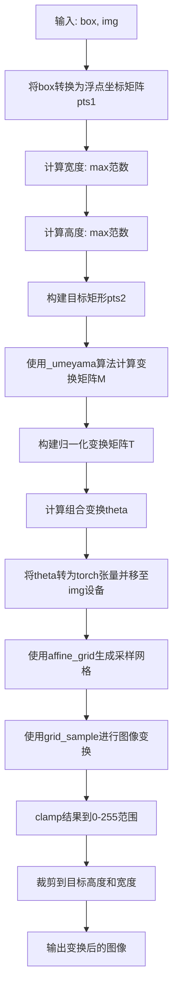

#### 带注释源码

```python
def adjust_image(box, img):
    """
    对图像进行透视变换，将任意四边形区域映射为标准矩形
    
    参数:
        box: 四边形边界框坐标，形状为(4, 2)的numpy数组
        img: 输入图像张量，形状为(C, H, W)
    
    返回:
        变换并裁剪后的图像张量
    """
    # 步骤1: 将边界框转换为浮点坐标矩阵
    pts1 = np.float32([box[0], box[1], box[2], box[3]])
    
    # 步骤2: 计算边界框的宽度（取两组对边距离的最大值）
    width = max(np.linalg.norm(pts1[0] - pts1[1]), np.linalg.norm(pts1[2] - pts1[3]))
    
    # 步骤3: 计算边界框的高度（取两组对边距离的最大值）
    height = max(np.linalg.norm(pts1[0] - pts1[3]), np.linalg.norm(pts1[1] - pts1[2]))
    
    # 步骤4: 构建目标矩形（标准化的矩形区域）
    pts2 = np.float32([[0, 0], [width, 0], [width, height], [0, height]])
    
    # 步骤5: 使用_umeyama算法计算从pts1到pts2的相似变换矩阵
    M = get_sym_mat(pts1, pts2, estimate_scale=True)
    
    # 步骤6: 获取图像的通道数、高度和宽度
    C, H, W = img.shape
    
    # 步骤7: 构建归一化变换矩阵，将坐标从[0, W/H]映射到[-1, 1]
    T = np.array([[2 / W, 0, -1], [0, 2 / H, -1], [0, 0, 1]])
    
    # 步骤8: 计算组合变换矩阵的逆变换
    theta = np.linalg.inv(T @ M @ np.linalg.inv(T))
    
    # 步骤9: 将变换矩阵转换为PyTorch张量，并移到输入图像的设备上
    theta = torch.from_numpy(theta[:2, :]).unsqueeze(0).type(torch.float32).to(img.device)
    
    # 步骤10: 使用affine_grid生成仿射变换的采样网格
    grid = F.affine_grid(theta, torch.Size([1, C, H, W]), align_corners=True)
    
    # 步骤11: 使用grid_sample对图像进行采样变换
    result = F.grid_sample(img.unsqueeze(0), grid, align_corners=True)
    
    # 步骤12: 将结果限制在0-255范围内
    result = torch.clamp(result.squeeze(0), 0, 255)
    
    # 步骤13: 裁剪到目标高度和宽度
    result = result[:, : int(height), : int(width)]
    
    return result
```


### `crop_image`

该函数用于根据掩码图像计算最小外接矩形，并对源图像进行透视变换和裁剪，最终返回裁剪后的图像。

参数：

- `src_img`：`torch.Tensor`，源图像张量
- `mask`：`numpy.ndarray`，掩码图像，用于确定裁剪区域

返回值：`torch.Tensor`，裁剪并调整大小后的图像

#### 流程图

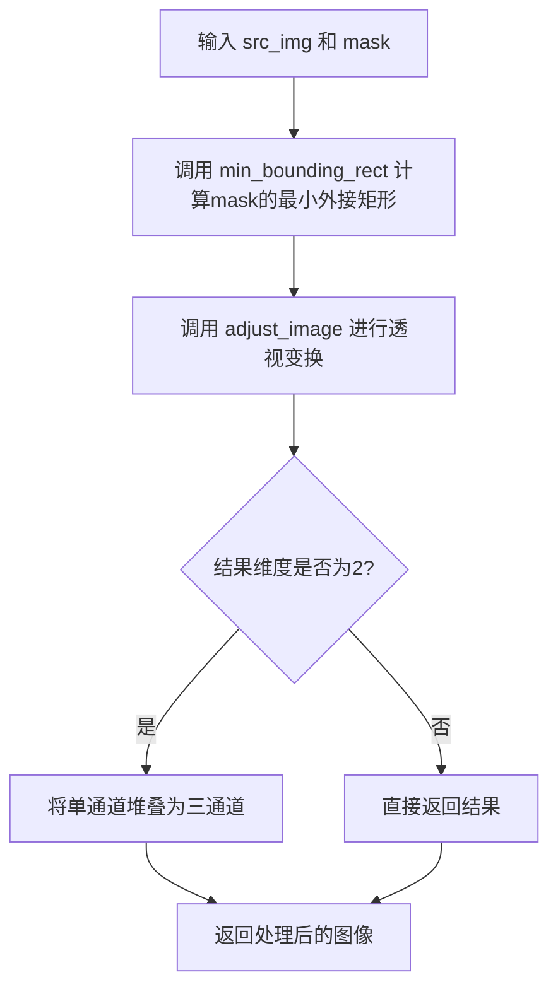

#### 带注释源码

```python
def crop_image(src_img, mask):
    """
    根据掩码图像裁剪并调整源图像。
    
    Args:
        src_img: 源图像张量，形状为 (C, H, W)
        mask: 掩码图像，用于确定裁剪区域
    
    Returns:
        裁剪并调整后的图像张量
    """
    # 第一步：使用 min_bounding_rect 函数计算掩码的最小外接矩形
    # 返回四个顶点坐标 [tl, tr, br, bl]
    box = min_bounding_rect(mask)
    
    # 第二步：使用 adjust_image 函数对源图像进行透视变换
    # 将原始图像的 box 区域变换到标准矩形 (0,0) -> (width,0) -> (width,height) -> (0,height)
    result = adjust_image(box, src_img)
    
    # 第三步：检查结果维度，如果是2维（灰度图）则转换为3通道
    if len(result.shape) == 2:
        # 将单通道灰度图像堆叠为三通道 RGB 图像
        result = torch.stack([result] * 3, axis=-1)
    
    # 返回裁剪后的图像
    return result
```


### `create_predictor`

该函数用于创建OCR文本识别预测器（predictor），根据指定的语言类型（中文或英文）加载相应的预训练模型权重，并返回配置好的`RecModel`模型实例。

参数：

- `model_lang`：`str`，语言类型，默认为"ch"（中文），支持"ch"和"en"（英文）
- `device`：`str`，模型运行的设备，默认为"cpu"
- `use_fp16`：`bool`，是否使用float16精度，默认为False

返回值：`RecModel`，配置好的OCR识别模型实例

#### 流程图

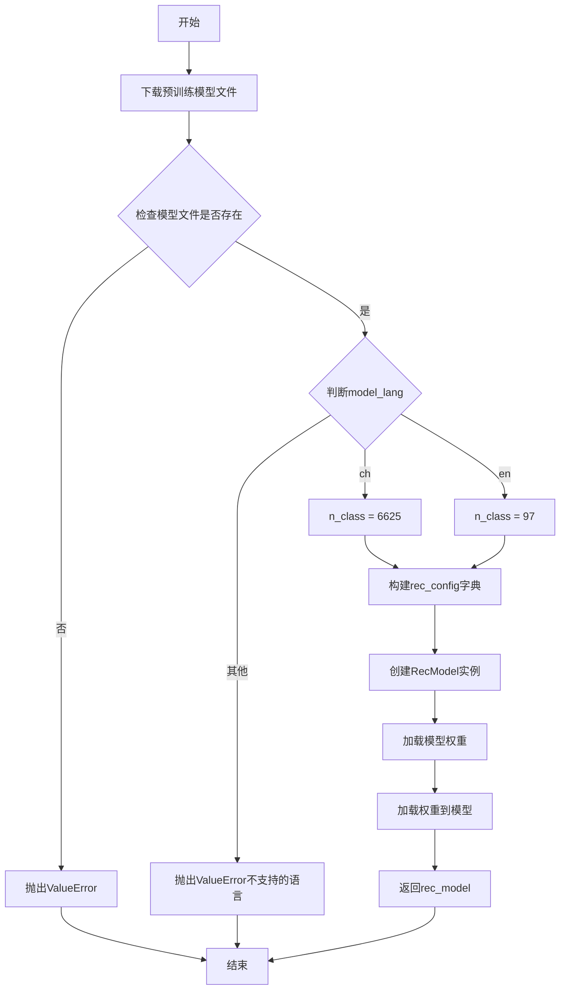

#### 带注释源码

```python
def create_predictor(model_lang="ch", device="cpu", use_fp16=False):
    """
    创建OCR文本识别预测器
    
    Args:
        model_lang: 语言类型，"ch"表示中文，"en"表示英文
        device: 模型运行的设备，"cpu"或"cuda"
        use_fp16: 是否使用float16精度
    
    Returns:
        RecModel: 配置好的OCR识别模型实例
    """
    # 从HuggingFace Hub下载预训练的OCR模型权重文件
    model_dir = hf_hub_download(
        repo_id="tolgancangoz/anytext",  # 模型仓库ID
        filename="text_embedding_module/OCR/ppV3_rec.pth",  # 模型文件名
        cache_dir=HF_MODULES_CACHE,  # 缓存目录
    )
    
    # 检查模型文件是否存在，不存在则抛出异常
    if not os.path.exists(model_dir):
        raise ValueError("not find model file path {}".format(model_dir))

    # 根据语言类型设置分类数量
    if model_lang == "ch":
        n_class = 6625  # 中文字符类别数
    elif model_lang == "en":
        n_class = 97   # 英文字符类别数
    else:
        raise ValueError(f"Unsupported OCR recog model_lang: {model_lang}")
    
    # 构建OCR模型配置字典
    rec_config = {
        "in_channels": 3,  # 输入通道数（RGB图像）
        "backbone": {
            "type": "MobileNetV1Enhance",  # 骨干网络类型
            "scale": 0.5,
            "last_conv_stride": [1, 2],
            "last_pool_type": "avg"
        },
        "neck": {
            "type": "SequenceEncoder",    # 颈部网络类型
            "encoder_type": "svtr",       # SVTR编码器
            "dims": 64,
            "depth": 2,
            "hidden_dims": 120,
            "use_guide": True
        },
        "head": {
            "type": "CTCHead",           # CTC解码头
            "fc_decay": 0.00001,
            "out_channels": n_class,      # 输出类别数
            "return_feats": True         # 返回特征用于后续处理
        },
    }

    # 使用配置创建RecModel模型实例
    rec_model = RecModel(rec_config)
    
    # 加载预训练的模型权重
    state_dict = torch.load(model_dir, map_location=device)
    rec_model.load_state_dict(state_dict)
    
    # 返回配置好的模型
    return rec_model
```


### `_check_image_file`

该函数是一个辅助函数，用于检查给定的文件路径是否指向支持的图像文件。它通过将文件路径转换为小写并检查其扩展名是否匹配预定义的图像格式列表（tiff、tif、bmp、rgb、jpg、png、jpeg）来判断。

参数：

- `path`：`str`，要检查的文件路径

返回值：`bool`，如果路径指向支持的图像文件则返回 `True`，否则返回 `False`

#### 流程图

```mermaid
flowchart TD
    A[开始检查文件路径] --> B[定义支持的图像扩展名元组]
    B --> C[将path转换为小写]
    C --> D{path.lower()是否以图像扩展名结尾?}
    D -->|是| E[返回True]
    D -->|否| F[返回False]
    E --> G[结束]
    F --> G
```

#### 带注释源码

```python
def _check_image_file(path):
    """
    检查给定的文件路径是否指向支持的图像文件。
    
    该函数通过比较文件扩展名与预定义的图像格式列表来判断文件是否为图像。
    支持的格式包括: tiff, tif, bmp, rgb, jpg, png, jpeg
    
    参数:
        path: str, 要检查的文件路径，可以是绝对路径或相对路径
        
    返回:
        bool: 如果文件路径指向支持的图像格式返回True，否则返回False
    """
    # 定义支持的图像文件扩展名元组
    img_end = ("tiff", "tif", "bmp", "rgb", "jpg", "png", "jpeg")
    
    # 将路径转换为小写并检查是否以任何支持的扩展名结尾
    # 使用tuple(img_end)确保endswith方法可以接受元组参数
    return path.lower().endswith(tuple(img_end))
```


### `get_image_file_list`

该函数用于获取指定路径下的所有图片文件列表，支持传入单个图片文件路径或包含图片文件的目录路径，函数会递归扫描目录或直接验证文件，并返回排序后的图片文件完整路径列表。

参数：

- `img_file`：`str`，待检查的图片文件路径或目录路径

返回值：`List[str]`，返回排序后的图片文件完整路径列表

#### 流程图

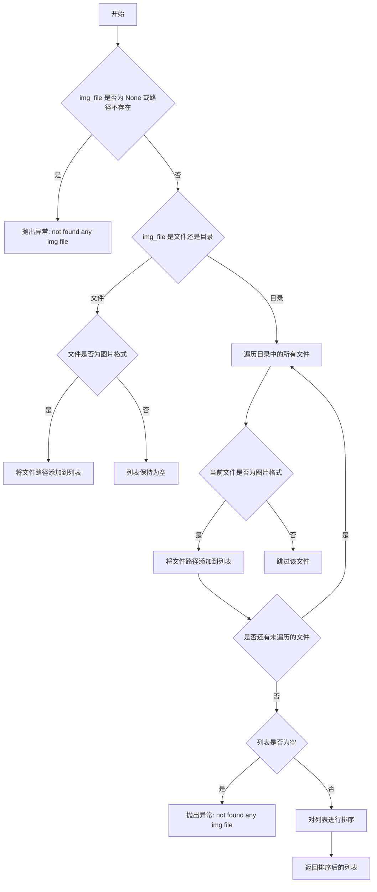

#### 带注释源码

```python
def get_image_file_list(img_file):
    """
    获取指定路径下的所有图片文件列表
    
    参数:
        img_file: 图片文件路径或包含图片的目录路径
    
    返回:
        排序后的图片文件完整路径列表
    """
    imgs_lists = []
    
    # 检查路径是否存在
    if img_file is None or not os.path.exists(img_file):
        raise Exception("not found any img file in {}".format(img_file))
    
    # 判断是文件还是目录
    if os.path.isfile(img_file) and _check_image_file(img_file):
        # 如果是文件且为图片格式，直接添加到列表
        imgs_lists.append(img_file)
    elif os.path.isdir(img_file):
        # 如果是目录，遍历目录中的所有文件
        for single_file in os.listdir(img_file):
            file_path = os.path.join(img_file, single_file)
            # 检查是否为文件且为图片格式
            if os.path.isfile(file_path) and _check_image_file(file_path):
                imgs_lists.append(file_path)
    
    # 如果没有找到任何图片文件，抛出异常
    if len(imgs_lists) == 0:
        raise Exception("not found any img file in {}".format(img_file))
    
    # 对结果进行排序并返回
    imgs_lists = sorted(imgs_lists)
    return imgs_lists
```


### `retrieve_latents`

该函数是用于从 VAE（变分自编码器）的编码器输出中提取潜在向量（latents）的工具函数。它支持两种采样模式：随机采样（sample）和确定性采样（argmax），并能处理不同的 VAE 输出格式（latent_dist 或直接 latents）。

参数：

- `encoder_output`：`torch.Tensor`，VAE 编码器的输出，通常包含 `latent_dist` 属性或 `latents` 属性
- `generator`：`torch.Generator | None`，可选的随机数生成器，用于控制随机采样的随机性
- `sample_mode`：`str`，采样模式，默认为 "sample"，可选值为 "sample"（随机采样）或 "argmax"（取最大值/确定性采样）

返回值：`torch.Tensor`，从编码器输出中提取的潜在向量

#### 流程图

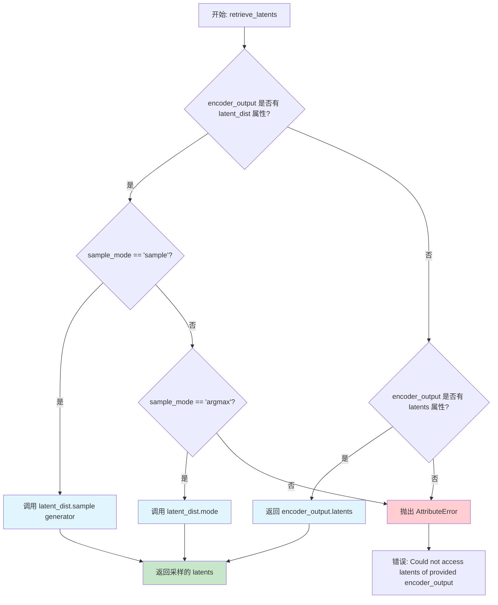

#### 带注释源码

```python
# Copied from diffusers.pipelines.stable_diffusion.pipeline_stable_diffusion_img2img.retrieve_latents
def retrieve_latents(
    encoder_output: torch.Tensor, generator: torch.Generator | None = None, sample_mode: str = "sample"
):
    """
    从 VAE 编码器输出中提取潜在向量。
    
    该函数支持从编码器输出中提取潜在向量，根据 sample_mode 参数决定采样方式：
    - 当 sample_mode="sample" 时，从潜在分布中随机采样
    - 当 sample_mode="argmax" 时，取潜在分布的众数（确定性输出）
    - 如果编码器输出直接包含 latents 属性，则直接返回
    
    Args:
        encoder_output: VAE 编码器的输出，包含 latent_dist 或 latents 属性
        generator: 可选的随机数生成器，用于控制随机采样的随机性
        sample_mode: 采样模式，"sample" 或 "argmax"
    
    Returns:
        torch.Tensor: 提取的潜在向量
    
    Raises:
        AttributeError: 当编码器输出不包含 latent_dist 或 latents 属性时
    """
    # 检查编码器输出是否包含 latent_dist 属性，并且采样模式为随机采样
    if hasattr(encoder_output, "latent_dist") and sample_mode == "sample":
        # 从潜在分布中随机采样，使用 generator 控制随机性
        return encoder_output.latent_dist.sample(generator)
    # 检查编码器输出是否包含 latent_dist 属性，并且采样模式为确定性采样（取众数）
    elif hasattr(encoder_output, "latent_dist") and sample_mode == "argmax":
        # 返回潜在分布的众数（最可能的值）
        return encoder_output.latent_dist.mode()
    # 检查编码器输出是否直接包含 latents 属性
    elif hasattr(encoder_output, "latents"):
        # 直接返回预计算的潜在向量
        return encoder_output.latents
    # 如果都不满足，抛出属性错误
    else:
        raise AttributeError("Could not access latents of provided encoder_output")
```


### `retrieve_timesteps`

该函数用于调用调度器（scheduler）的 `set_timesteps` 方法并从调度器中获取时间步（timesteps），支持自定义时间步或自定义 sigmas 方案。

参数：

- `scheduler`：`SchedulerMixin`，用于获取时间步的调度器对象。
- `num_inference_steps`：`Optional[int]`，生成样本时使用的去噪步数。如果使用此参数，`timesteps` 必须为 `None`。
- `device`：`Optional[Union[str, torch.device]]`，时间步要移动到的设备。如果为 `None`，则不移动时间步。
- `timesteps`：`Optional[List[int]]`，用于覆盖调度器时间步间隔策略的自定义时间步。如果传入 `timesteps`，则 `num_inference_steps` 和 `sigmas` 必须为 `None`。
- `sigmas`：`Optional[List[float]]`，用于覆盖调度器时间步间隔策略的自定义 sigmas。如果传入 `sigmas`，则 `num_inference_steps` 和 `timesteps` 必须为 `None`。
- `**kwargs`：其他关键字参数，将传递给 `scheduler.set_timesteps`。

返回值：`Tuple[torch.Tensor, int]`，元组包含调度器的时间步调度序列和推理步数。

#### 流程图

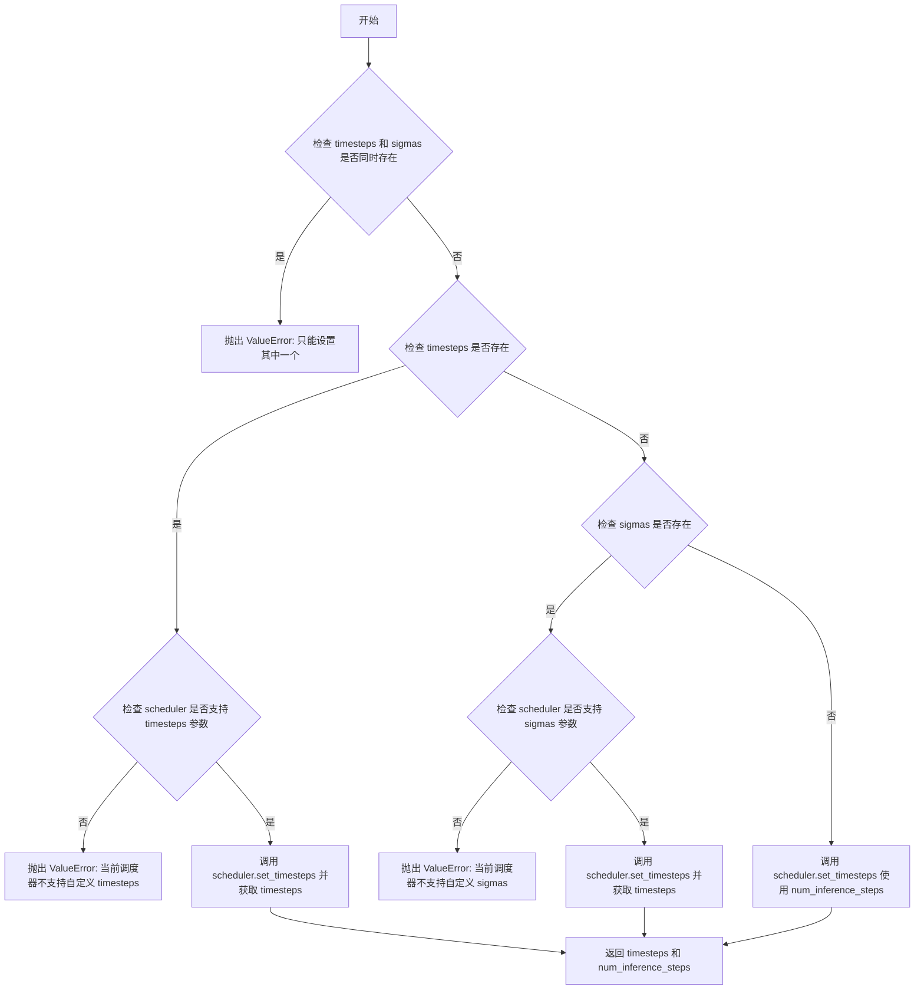

#### 带注释源码

```python
# Copied from diffusers.pipelines.stable_diffusion.pipeline_stable_diffusion.retrieve_timesteps
def retrieve_timesteps(
    scheduler,
    num_inference_steps: Optional[int] = None,
    device: Optional[Union[str, torch.device]] = None,
    timesteps: Optional[List[int]] = None,
    sigmas: Optional[List[float]] = None,
    **kwargs,
):
    """
    Calls the scheduler's `set_timesteps` method and retrieves timesteps from the scheduler after the call. Handles
    custom timesteps. Any kwargs will be supplied to `scheduler.set_timesteps`.

    Args:
        scheduler (`SchedulerMixin`):
            The scheduler to get timesteps from.
        num_inference_steps (`int`):
            The number of diffusion steps used when generating samples with a pre-trained model. If used, `timesteps`
            must be `None`.
        device (`str` or `torch.device`, *optional*):
            The device to which the timesteps should be moved to. If `None`, the timesteps are not moved.
        timesteps (`List[int]`, *optional*):
            Custom timesteps used to override the timestep spacing strategy of the scheduler. If `timesteps` is passed,
            `num_inference_steps` and `sigmas` must be `None`.
        sigmas (`List[float]`, *optional*):
            Custom sigmas used to override the timestep spacing strategy of the scheduler. If `sigmas` is passed,
            `num_inference_steps` and `timesteps` must be `None`.

    Returns:
        `Tuple[torch.Tensor, int]`: A tuple where the first element is the timestep schedule from the scheduler and the
        second element is the number of inference steps.
    """
    # 检查是否同时传入了 timesteps 和 sigmas，两者只能传一个
    if timesteps is not None and sigmas is not None:
        raise ValueError("Only one of `timesteps` or `sigmas` can be passed. Please choose one to set custom values")
    
    # 如果传入了自定义 timesteps
    if timesteps is not None:
        # 检查调度器的 set_timesteps 方法是否接受 timesteps 参数
        accepts_timesteps = "timesteps" in set(inspect.signature(scheduler.set_timesteps).parameters.keys())
        if not accepts_timesteps:
            raise ValueError(
                f"The current scheduler class {scheduler.__class__}'s `set_timesteps` does not support custom"
                f" timestep schedules. Please check whether you are using the correct scheduler."
            )
        # 调用调度器的 set_timesteps 方法设置自定义时间步
        scheduler.set_timesteps(timesteps=timesteps, device=device, **kwargs)
        timesteps = scheduler.timesteps
        num_inference_steps = len(timesteps)
    # 如果传入了自定义 sigmas
    elif sigmas is not None:
        # 检查调度器的 set_timesteps 方法是否接受 sigmas 参数
        accept_sigmas = "sigmas" in set(inspect.signature(scheduler.set_timesteps).parameters.keys())
        if not accept_sigmas:
            raise ValueError(
                f"The current scheduler class {scheduler.__class__}'s `set_timesteps` does not support custom"
                f" sigmas schedules. Please check whether you are using the correct scheduler."
            )
        # 调用调度器的 set_timesteps 方法设置自定义 sigmas
        scheduler.set_timesteps(sigmas=sigmas, device=device, **kwargs)
        timesteps = scheduler.timesteps
        num_inference_steps = len(timesteps)
    # 如果都没有传入，则使用 num_inference_steps 参数
    else:
        scheduler.set_timesteps(num_inference_steps, device=device, **kwargs)
        timesteps = scheduler.timesteps
    
    # 返回时间步序列和推理步数
    return timesteps, num_inference_steps
```


### `Checker._is_chinese_char`

该方法用于检查给定的Unicode码点是否属于CJK（中日韩）统一表意文字的Unicode块。它通过判断码点是否落在预定义的多个CJK区间范围内来识别中文字符，这些区间覆盖了基本汉字以及多个扩展区。

参数：

- `cp`：`int`，要检查的字符的Unicode码点（Code Point）

返回值：`bool`，如果 `cp` 属于CJK统一表意文字的Unicode块则返回 `True`，否则返回 `False`

#### 流程图

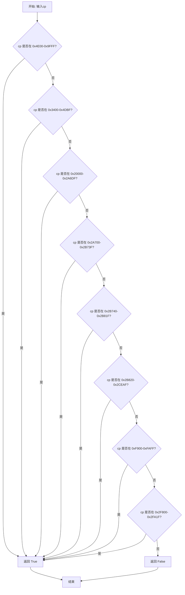

#### 带注释源码

```python
def _is_chinese_char(self, cp):
    """Checks whether CP is the codepoint of a CJK character."""
    # This defines a "chinese character" as anything in the CJK Unicode block:
    #   https://en.wikipedia.org/wiki/CJK_Unified_Ideographs_(Unicode_block)
    #
    # Note that the CJK Unicode block is NOT all Japanese and Korean characters,
    # despite its name. The modern Korean Hangul alphabet is a different block,
    # as is Japanese Hiragana and Katakana. Those alphabets are used to write
    # space-separated words, so they are not treated specially and handled
    # like the all of the other languages.
    
    # 检查码点是否落在CJK统一表意文字的各个区间范围内
    if (
        (cp >= 0x4E00 and cp <= 0x9FFF)      # CJK Unified Ideographs 基本汉字区 (Common)
        or (cp >= 0x3400 and cp <= 0x4DBF)    # CJK Unified Ideographs Extension A 扩展A区
        or (cp >= 0x20000 and cp <= 0x2A6DF) # CJK Unified Ideographs Extension B 扩展B区
        or (cp >= 0x2A700 and cp <= 0x2B73F)  # CJK Unified Ideographs Extension C 扩展C区
        or (cp >= 0x2B740 and cp <= 0x2B81F)  # CJK Unified Ideographs Extension D 扩展D区
        or (cp >= 0x2B820 and cp <= 0x2CEAF)  # CJK Unified Ideographs Extension E 扩展E区
        or (cp >= 0xF900 and cp <= 0xFAFF)    # CJK Compatibility Ideographs 兼容表意文字区
        or (cp >= 0x2F800 and cp <= 0x2FA1F)  # CJK Compatibility Ideographs Supplement 兼容表意文字补充区
    ):
        return True  # 落在任一区间,返回True

    return False  # 不在任何区间,返回False
```


### `Checker._clean_text`

该方法用于对输入文本执行无效字符移除和空白字符清理操作，返回处理后的干净文本字符串。

参数：

- `text`：`str`，需要进行清理的原始文本字符串

返回值：`str`，清理处理后的文本字符串

#### 流程图

```mermaid
flowchart TD
    A[开始 _clean_text] --> B[初始化空列表 output]
    B --> C{遍历 text 中的每个字符}
    C -->|还有字符| D[获取字符的Unicode码点 cp = ord(char)]
    D --> E{cp == 0 或 cp == 0xFFFD 或 _is_control(char)}
    E -->|是| C
    E -->|否| F{_is_whitespace(char)}
    F -->|是| G[output.append]
    F -->|否| H[output.append]
    G --> C
    H --> C
    C -->|遍历结束| I[返回 ''.join(output)]
    I --> J[结束]
```

#### 带注释源码

```python
def _clean_text(self, text):
    """
    Performs invalid character removal and whitespace cleanup on text.
    对输入文本执行无效字符移除和空白字符清理操作。
    """
    # 初始化用于存储处理后字符的列表
    output = []
    
    # 遍历输入文本中的每个字符
    for char in text:
        # 获取当前字符的Unicode码点（codepoint）
        cp = ord(char)
        
        # 检查字符是否为无效字符：
        # - cp == 0: 空字符
        # - cp == 0xFFFD: Unicode替换字符（通常表示无效字符）
        # - self._is_control(char): 控制字符
        if cp == 0 or cp == 0xFFFD or self._is_control(char):
            # 跳过这些无效字符，继续处理下一个
            continue
        
        # 检查是否为空白字符
        if self._is_whitespace(char):
            # 统一将空白字符转换为单个空格
            output.append(" ")
        else:
            # 保留普通字符
            output.append(char)
    
    # 将字符列表重新组合为字符串并返回
    return "".join(output)
```


### Checker._is_control

该方法用于检查给定字符是否为控制字符（control character）。它通过排除常见的空白控制字符（如制表符、换行符、回车符）并检查Unicode类别来确定字符是否为控制字符。

参数：

- `char`：`str`，待检查的单个字符

返回值：`bool`，如果是控制字符则返回True，否则返回False

#### 流程图

```mermaid
flowchart TD
    A[开始检查字符] --> B{char 是 "\t" 或 "\n" 或 "\r"?}
    B -->|是| C[返回 False]
    B -->|否| D[获取字符的Unicode类别]
    D --> E{category 在 ("Cc", "Cf") 中?}
    E -->|是| F[返回 True]
    E -->|否| G[返回 False]
    C --> H[结束]
    F --> H
    G --> H
```

#### 带注释源码

```python
def _is_control(self, char):
    """Checks whether `chars` is a control character."""
    # These are technically control characters but we count them as whitespace
    # characters. 处理常见的控制字符：制表符(\t)、换行符(\n)、回车符(\r)
    # 这些字符虽然技术上属于控制字符，但在文本处理中通常被视为空白字符
    if char == "\t" or char == "\n" or char == "\r":
        return False
    # 使用unicodedata模块获取字符的Unicode类别
    # "Cc" = 控制字符 (Control)
    # "Cf" = 格式控制字符 (Format)
    cat = unicodedata.category(char)
    if cat in ("Cc", "Cf"):
        return True
    return False
```


### `Checker._is_whitespace`

检查给定字符是否为空白字符。该方法将制表符、换行符和回车符视为空白字符，同时使用Unicode分类标准识别其他空白字符（如空格）。

参数：

- `char`：`str`，需要检查是否为空白字符的单个字符

返回值：`bool`，如果输入字符是空白字符则返回 `True`，否则返回 `False`

#### 流程图

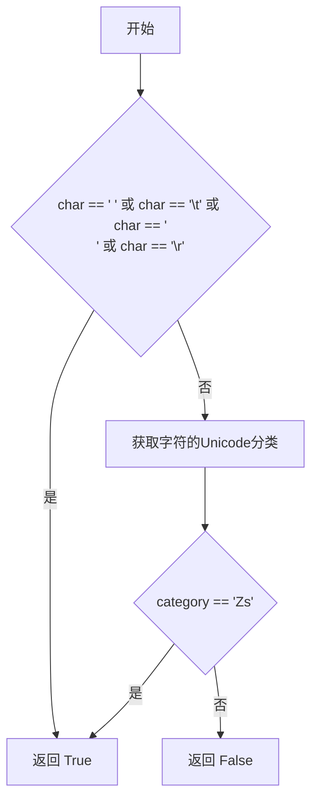

#### 带注释源码

```python
def _is_whitespace(self, char):
    """Checks whether `chars` is a whitespace character."""
    # \t, \n, and \r are technically control characters but we treat them
    # as whitespace since they are generally considered as such.
    # 检查常见空白字符：空格、制表符、换行符、回车符
    if char == " " or char == "\t" or char == "\n" or char == "\r":
        return True
    
    # 使用unicodedata模块获取字符的Unicode分类
    # Unicode的"Zs"类别代表空格字符（Space Separator）
    cat = unicodedata.category(char)
    if cat == "Zs":
        return True
    
    # 所有其他情况返回False
    return False
```


### `EmbeddingManager.encode_text`

该方法是 `EmbeddingManager` 类的核心方法，负责将文本信息（包含字形图像）编码为文本嵌入向量，以便在 AnyText 文本到图像生成过程中使用文本渲染功能。

参数：

- `text_info`：`Dict`，包含以下键值的字典：
  - `n_lines`：每个样本的文本行数列表
  - `gly_line`：字形图像列表，用于 OCR 识别
  - `glyphs`：字形图像（可选）
  - `positions`：位置信息（可选）

返回值：`None`，该方法将编码后的文本嵌入存储在实例属性 `self.text_embs_all` 中。

#### 流程图

```mermaid
flowchart TD
    A[开始 encode_text] --> B{self.config.get_recog_emb 是否存在?}
    B -- 否 --> C[使用 partial 绑定 get_recog_emb 函数]
    C --> D
    B -- 是 --> D[继续]
    D[初始化空列表 gline_list] --> E[遍历 batch 中的每个样本]
    E --> F{当前样本有文本行?}
    F -- 是 --> G[遍历每行文本]
    G --> H[将 gly_line[j][i:i+1] 加入 gline_list]
    H --> I{还有更多行?}
    I -- 是 --> G
    I -- 否 --> J{还有更多样本?}
    F -- 否 --> J
    J -- 是 --> E
    J -- 否 --> K{gline_list 不为空?}
    K -- 是 --> L[调用 get_recog_emb 获取识别嵌入]
    L --> M[使用 proj 投影层编码字形嵌入]
    M --> N[重塑为二维向量]
    K -- 否 --> O[初始化空列表 text_embs_all]
    O --> P[遍历每个样本]
    P --> Q{样本有文本行?}
    Q -- 是 --> R[遍历每行]
    R --> S[从编码字形中提取对应嵌入]
    S --> T[加入当前样本的 text_embs]
    T --> U{还有更多行?}
    U -- 是 --> R
    U -- 否 --> V[将 text_embs 加入 text_embs_all]
    V --> W{还有更多样本?}
    Q -- 否 --> W
    W -- 是 --> P
    W -- 否 --> X[结束]
```

#### 带注释源码

```python
@torch.no_grad()  # 使用 torch.no_grad() 上下文管理器，禁用梯度计算以节省内存
def encode_text(self, text_info):
    """
    将文本信息编码为文本嵌入向量
    
    参数:
        text_info: 包含以下键的字典:
            - n_lines: 每个样本的文本行数列表
            - gly_line: 字形图像列表，用于OCR识别
            - glyphs: 字形图像 (可选)
            - positions: 位置信息 (可选)
    
    返回:
        无返回值，结果存储在 self.text_embs_all 属性中
    """
    
    # 如果 config 中没有 get_recog_emb 函数，使用 partial 绑定 self.recog 创建一个
    # get_recog_emb 是 OCR 识别嵌入的获取函数
    if self.config.get_recog_emb is None:
        self.config.get_recog_emb = partial(get_recog_emb, self.recog)

    # 初始化空列表，用于收集所有样本的字形图像
    gline_list = []
    
    # 遍历 batch 中的每个样本 (i 是样本索引)
    for i in range(len(text_info["n_lines"])):
        n_lines = text_info["n_lines"][i]  # 当前样本的文本行数
        for j in range(n_lines):  # 遍历每行文本
            # 将当前行对应的字形图像添加到列表
            # text_info["gly_line"][j] 包含所有样本的该行字形
            # [i:i+1] 提取当前样本的该行字形 (保持 batch 维度)
            gline_list += [text_info["gly_line"][j][i : i + 1]]

    # 如果有收集到字形图像，进行 OCR 识别和嵌入编码
    if len(gline_list) > 0:
        # 调用 OCR 识别模型获取文本特征嵌入
        # recog_emb 形状: [total_lines, ...] 其中 total_lines 是所有样本的文本行总数
        recog_emb = self.config.get_recog_emb(gline_list)
        
        # 使用投影层将识别嵌入投影到 token 维度
        # recog_emb.reshape(recog_emb.shape[0], -1) 将嵌入展平为二维张量
        # .to(self.proj.weight.dtype) 确保数据类型与投影层权重一致
        # enc_glyph: [total_lines, token_dim]
        enc_glyph = self.proj(recog_emb.reshape(recog_emb.shape[0], -1).to(self.proj.weight.dtype))

    # 初始化存储所有样本文本嵌入的列表
    self.text_embs_all = []
    n_idx = 0  # 用于追踪当前处理的文本行索引
    
    # 再次遍历每个样本，重组文本嵌入
    for i in range(len(text_info["n_lines"])):
        n_lines = text_info["n_lines"][i]  # 当前样本的文本行数
        text_embs = []  # 当前样本的文本嵌入列表
        for j in range(n_lines):  # 遍历当前样本的每行
            # 从编码后的字形嵌入中提取当前行的嵌入
            # enc_glyph[n_idx:n_idx+1] 保持 batch 维度，形状为 [1, token_dim]
            text_embs += [enc_glyph[n_idx : n_idx + 1]]
            n_idx += 1  # 移动到下一行
        # 将当前样本的所有文本行嵌入添加到总列表
        self.text_embs_all += [text_embs]
```


### `EmbeddingManager.forward`

该方法在文本嵌入过程中替换占位符令牌（placeholder tokens），将预计算的手写文本嵌入（通过OCR识别或 glyph 图像生成）插入到CLIP文本嵌入的对应位置，实现可视化文本生成。

参数：

- `tokenized_text`：`torch.Tensor`，分词后的文本令牌张量，形状为 `[batch_size, seq_len]`
- `embedded_text`：`torch.Tensor`，CLIP模型生成的文本嵌入张量，形状为 `[batch_size, seq_len, embed_dim]`

返回值：`torch.Tensor`，替换占位符后的文本嵌入张量，形状与 `embedded_text` 相同

#### 流程图

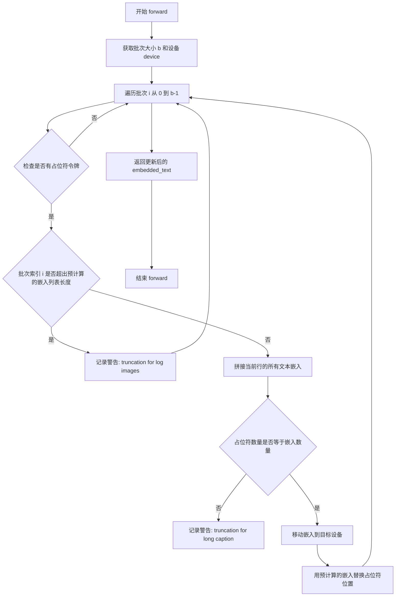

#### 带注释源码

```python
@torch.no_grad()
def forward(
    self,
    tokenized_text,
    embedded_text,
):
    """
    在前向传播中替换文本嵌入中的占位符令牌
    
    参数:
        tokenized_text: 分词后的文本令牌，形状 [batch_size, seq_len]
        embedded_text: 初始 CLIP 文本嵌入，形状 [batch_size, seq_len, embed_dim]
    
    返回:
        替换占位符后的文本嵌入
    """
    # 获取批次大小和计算设备
    b, device = tokenized_text.shape[0], tokenized_text.device
    
    # 遍历批次中的每个样本
    for i in range(b):
        # 查找当前样本中等于占位符令牌的位置
        idx = tokenized_text[i] == self.placeholder_token.to(device)
        
        # 如果存在占位符令牌
        if sum(idx) > 0:
            # 检查是否超出预计算的嵌入列表长度（防止截断）
            if i >= len(self.text_embs_all):
                logger.warning("truncation for log images...")
                break
            
            # 将该行的所有文本嵌入沿第一维拼接
            # text_embs_all[i] 是一个嵌入列表，每个元素形状 [1, embed_dim]
            text_emb = torch.cat(self.text_embs_all[i], dim=0)
            
            # 检查占位符数量与嵌入数量是否匹配
            if sum(idx) != len(text_emb):
                logger.warning("truncation for long caption...")
            
            # 确保嵌入张量与目标嵌入在同一设备上
            text_emb = text_emb.to(embedded_text.device)
            
            # 用预计算的文本嵌入替换占位符位置
            # 只保留与占位符数量相等的嵌入
            embedded_text[i][idx] = text_emb[: sum(idx)]
    
    # 返回更新后的嵌入张量
    return embedded_text
```


### EmbeddingManager.embedding_parameters

该方法是 `EmbeddingManager` 类的成员方法，用于返回模型的所有可训练参数，通常用于优化器配置或模型参数保存等场景。

参数：
- 该方法无参数（除隐含的 `self` 参数）

返回值：`torch.nn.Parameter`，返回模型的所有可训练参数迭代器

#### 流程图

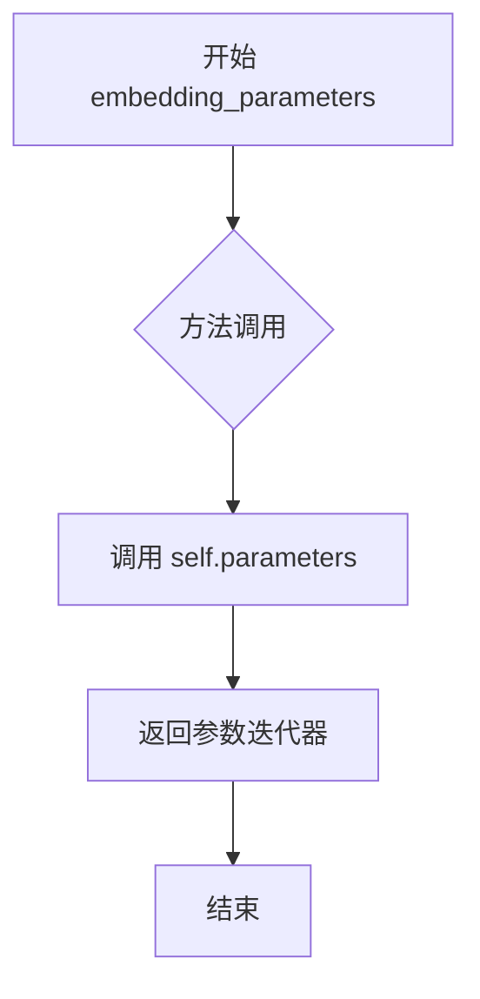

#### 带注释源码

```python
def embedding_parameters(self):
    """
    返回EmbeddingManager模型的所有可训练参数。
    
    此方法是对PyTorch nn.Module自带方法的简单封装，
    通常用于：
    - 获取优化器需要更新的参数列表
    - 保存/加载模型参数
    - 冻结或解冻模型参数
    
    Returns:
        torch.nn.Parameter: 包含模型所有可训练参数的迭代器
    """
    return self.parameters()
```


### TextRecognizer.resize_norm_img

该方法是文本识别器（TextRecognizer）类的核心图像预处理方法，负责将输入图像调整到标准尺寸并进行归一化处理。它根据给定的宽高比限制，使用双线性插值调整图像大小，然后进行像素值归一化（从0-255范围转换到-1到1范围），最后将调整后的图像填充到固定的目标画布尺寸，以满足OCR识别模型的输入要求。

参数：

- `self`：TextRecognizer 实例本身，包含 `rec_image_shape` 等配置属性
- `img`：`torch.Tensor`，输入图像，形状为 (C, H, W)，即通道数、高度、宽度，值为 0-255 的原始像素数据
- `max_wh_ratio`：`float`，目标宽高比上限，用于限制调整后图像的宽度

返回值：`torch.Tensor`，归一化并调整尺寸后的图像张量，形状为 (C, imgH, imgW)，值为 -1 到 1 之间的浮点数

#### 流程图

```mermaid
flowchart TD
    A[开始: resize_norm_img] --> B[获取目标尺寸]
    B --> C[计算输入图像宽高比]
    C --> D{计算的目标宽度是否超过限制?}
    D -->|是| E[resized_w = imgW]
    D -->|否| F[resized_w = ceil(imgH * ratio)]
    E --> G[使用插值调整图像尺寸]
    F --> G
    G --> H[像素值归一化: 除以255]
    H --> I[数据中心化: 减0.5]
    I --> J[像素值缩放: 除以0.5]
    J --> K[创建零填充画布]
    K --> L[将调整后的图像放入画布左侧]
    L --> M[返回填充后的图像]
```

#### 带注释源码

```python
def resize_norm_img(self, img, max_wh_ratio):
    """
    调整图像尺寸并进行归一化处理
    
    参数:
        img: 输入图像张量，形状为 (C, H, W)，像素值范围 0-255
        max_wh_ratio: 允许的最大宽高比，用于限制输出宽度
    返回:
        归一化后的图像张量，形状为 (C, imgH, imgW)，像素值范围 -1 到 1
    """
    # 从配置中获取目标图像的通道数、高度和默认宽度
    imgC, imgH, imgW = self.rec_image_shape
    
    # 断言确保输入图像的通道数与配置一致
    assert imgC == img.shape[0]
    
    # 根据最大宽高比计算目标宽度
    imgW = int((imgH * max_wh_ratio))
    
    # 获取输入图像的原始高度和宽度
    h, w = img.shape[1:]
    
    # 计算原始宽高比
    ratio = w / float(h)
    
    # 根据宽高比计算调整后的宽度，确保不超过目标宽度
    if math.ceil(imgH * ratio) > imgW:
        resized_w = imgW  # 超过限制，使用最大宽度
    else:
        resized_w = int(math.ceil(imgH * ratio))  # 未超过限制，按比例计算
    
    # 使用双线性插值调整图像尺寸到目标高度和计算出的宽度
    resized_image = torch.nn.functional.interpolate(
        img.unsqueeze(0),  # 增加batch维度: (1, C, H, W)
        size=(imgH, resized_w),  # 目标尺寸
        mode="bilinear",  # 双线性插值
        align_corners=True,  # 角点对齐
    )
    
    # 归一化处理第一步: 像素值从 0-255 归一化到 0-1
    resized_image /= 255.0
    
    # 归一化处理第二步: 中心化，从 0-1 转换到 -0.5 到 0.5
    resized_image -= 0.5
    
    # 归一化处理第三步: 缩放，从 -0.5 到 0.5 转换到 -1 到 1
    resized_image /= 0.5
    
    # 创建固定尺寸的零填充画布，形状为 (C, imgH, imgW)
    padding_im = torch.zeros((imgC, imgH, imgW), dtype=torch.float32).to(img.device)
    
    # 将调整后的图像放入画布左侧，保留右侧为填充区域
    padding_im[:, :, 0:resized_w] = resized_image[0]
    
    # 返回填充后的归一化图像
    return padding_im
```


### TextRecognizer.pred_imglist

该方法用于对图像列表进行文本识别预测。它接收一个图像列表，按宽高比排序以加速批处理，对每个图像进行resize和归一化处理，然后通过OCR模型（ONNX或PyTorch）进行推理，最终返回所有图像的CTC预测结果和neck特征。

参数：

- `self`：`TextRecognizer`，TextRecognizer类实例本身
- `img_list`：`List[torch.Tensor]`，待识别的图像列表，每个tensor的shape为CHW，值为0-255
- `show_debug`：`bool`，是否保存调试图像，默认为False

返回值：`Tuple[torch.Tensor, torch.Tensor]`，返回一个元组，包含：
- 第一个元素：所有图像的CTC预测结果，shape为`(img_num, seq_len, n_class)`的tensor
- 第二个元素：所有图像的neck特征，shape为`(img_num, seq_len, feature_dim)`的tensor

#### 流程图

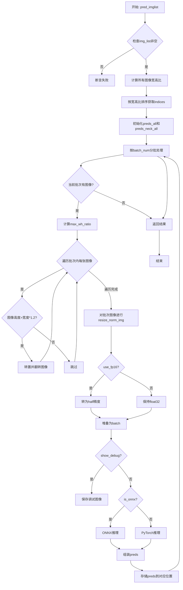

#### 带注释源码

```python
# img_list: list of tensors with shape chw 0-255
def pred_imglist(self, img_list, show_debug=False):
    # 获取图像数量
    img_num = len(img_list)
    # 断言至少有一张图像
    assert img_num > 0
    
    # 计算所有图像的宽高比，用于后续排序
    width_list = []
    for img in img_list:
        width_list.append(img.shape[2] / float(img.shape[1]))
    
    # 按宽高比排序以加速识别过程（相似的宽高比可以一起处理）
    indices = torch.from_numpy(np.argsort(np.array(width_list)))
    
    # 获取批处理大小
    batch_num = self.rec_batch_num
    
    # 初始化结果列表
    preds_all = [None] * img_num
    preds_neck_all = [None] * img_num
    
    # 按批次处理图像
    for beg_img_no in range(0, img_num, batch_num):
        # 计算当前批次的结束索引
        end_img_no = min(img_num, beg_img_no + batch_num)
        norm_img_batch = []

        # 获取图像shape参数
        imgC, imgH, imgW = self.rec_image_shape[:3]
        # 计算最大宽高比
        max_wh_ratio = imgW / imgH
        
        # 第一遍遍历：检查是否需要旋转图像（竖排文字处理）
        for ino in range(beg_img_no, end_img_no):
            h, w = img_list[indices[ino]].shape[1:]
            if h > w * 1.2:
                # 如果图像高度远大于宽度，进行转置和翻转
                img = img_list[indices[ino]]
                img = torch.transpose(img, 1, 2).flip(dims=[1])
                img_list[indices[ino]] = img
                h, w = img.shape[1:]
        
        # 第二遍遍历：归一化图像
        for ino in range(beg_img_no, end_img_no):
            # 对图像进行resize和归一化
            norm_img = self.resize_norm_img(img_list[indices[ino]], max_wh_ratio)
            # 如果使用FP16则转换
            if self.use_fp16:
                norm_img = norm_img.half()
            # 添加batch维度
            norm_img = norm_img.unsqueeze(0)
            norm_img_batch.append(norm_img)
        
        # 拼接为batch
        norm_img_batch = torch.cat(norm_img_batch, dim=0)
        
        # 调试模式：保存归一化后的图像
        if show_debug:
            for i in range(len(norm_img_batch)):
                _img = norm_img_batch[i].permute(1, 2, 0).detach().cpu().numpy()
                _img = (_img + 0.5) * 255
                _img = _img[:, :, ::-1]
                file_name = f"{indices[beg_img_no + i]}"
                if os.path.exists(file_name + ".jpg"):
                    file_name += "_2"  # 如果原图存在则加后缀
                cv2.imwrite(file_name + ".jpg", _img)
        
        # 根据模型类型进行推理
        if self.is_onnx:
            # ONNX模型推理
            input_dict = {}
            input_dict[self.predictor.get_inputs()[0].name] = norm_img_batch.detach().cpu().numpy()
            outputs = self.predictor.run(None, input_dict)
            preds = {}
            preds["ctc"] = torch.from_numpy(outputs[0])
            preds["ctc_neck"] = [torch.zeros(1)] * img_num
        else:
            # PyTorch模型推理
            preds = self.predictor(norm_img_batch.to(next(self.predictor.parameters()).device))
        
        # 将预测结果存回对应位置（按原始顺序）
        for rno in range(preds["ctc"].shape[0]):
            preds_all[indices[beg_img_no + rno]] = preds["ctc"][rno]
            preds_neck_all[indices[beg_img_no + rno]] = preds["ctc_neck"][rno]

    # 返回堆叠后的预测结果
    return torch.stack(preds_all, dim=0), torch.stack(preds_neck_all, dim=0)
```


### `TextRecognizer.get_char_dict`

该方法用于从指定的字符字典文件路径中读取字符列表，并在首尾添加特殊标记（"sos"表示序列开始，" "空格表示序列结束），构建完整的字符映射字典。

参数：

- `character_dict_path`：`str`，字符字典文件的路径

返回值：`List[str]`，返回包含特殊标记的字符字典列表

#### 流程图

```mermaid
flowchart TD
    A[开始] --> B[初始化空列表 character_str]
    B --> C[以二进制模式打开文件 character_dict_path]
    C --> D[读取所有行 lines]
    D --> E[遍历每一行]
    E --> F{遍历完成?}
    F -->|否| G[解码行为UTF-8并去除换行符]
    G --> H[将处理后的字符添加到 character_str]
    H --> E
    F -->|是| I[将列表转为字符列表]
    I --> J[在列表开头添加 'sos']
    J --> K[在列表末尾添加空格 ' ']
    K --> L[返回字典字符列表]
    L --> M[结束]
```

#### 带注释源码

```
def get_char_dict(self, character_dict_path):
    # 初始化存储字符的列表
    character_str = []
    
    # 以二进制模式打开字符字典文件（使用rb以兼容不同编码）
    with open(character_dict_path, "rb") as fin:
        # 读取文件所有行
        lines = fin.readlines()
        # 遍历每一行
        for line in lines:
            # 将字节串解码为UTF-8字符串，并去除行尾的换行符
            line = line.decode("utf-8").strip("\n").strip("\r\n")
            # 将处理后的字符添加到列表中
            character_str.append(line)
    
    # 将字符列表转换为列表（实际上已经是列表，此处为冗余操作）
    dict_character = list(character_str)
    
    # 在字典开头添加序列起始标记"sos"
    # 在字典末尾添加空格作为序列结束标记（eos用空格表示）
    dict_character = ["sos"] + dict_character + [" "]
    
    # 返回完整的字符字典列表
    return dict_character
```


### TextRecognizer.get_text

该方法负责将 OCR 识别输出的字符 ID 序列转换为可读文本字符串，是 OCR 后处理的关键环节，通过字符映射表将数字编码转换回人类可读的文本。

参数：

- `order`：`List[int]` 或 `Iterable[int]`，字符 ID 序列，代表 OCR 模型输出的文本编码

返回值：`str`，转换后的文本字符串

#### 流程图

```mermaid
flowchart TD
    A[开始 get_text] --> B[遍历 order 中的每个 text_id]
    B --> C{text_id 是否在 chars 中}
    C -->|是| D[获取对应字符 self.chars[text_id]]
    C -->|否| E[跳过或使用默认值]
    D --> F[将字符添加到 char_list]
    E --> F
    F --> G{是否还有更多 text_id}
    G -->|是| B
    G -->|否| H[使用 ''.join 连接所有字符]
    H --> I[返回最终文本字符串]
```

#### 带注释源码

```python
def get_text(self, order):
    """
    将 OCR 识别的字符 ID 序列转换为文本字符串
    
    Args:
        order: 字符 ID 序列，来自 OCR 模型的解码输出
        
    Returns:
        str: 转换后的文本字符串
    """
    # 使用列表推导式遍历每个 text_id，从字符映射表中获取对应字符
    char_list = [self.chars[text_id] for text_id in order]
    
    # 将字符列表连接成完整字符串并返回
    return "".join(char_list)
```


### TextRecognizer.decode

该方法实现 CTC（Connectionist Temporal Classification）解码器的核心逻辑，将神经网络输出的概率矩阵转换为文本索引序列，并去除重复的标记和忽略的标记。

参数：
- `mat`：`torch.Tensor`，神经网络输出的 CTC 概率矩阵，形状为 (T, N, C)，其中 T 是时间步数，N 是批次大小，C 是类别数

返回值：
- `text_index`：`numpy.ndarray`，解码后的文本索引数组，已去除重复标记和忽略标记
- `selection`：`numpy.ndarray`，选择数组的索引，用于标记哪些位置被保留

#### 流程图

```mermaid
flowchart TD
    A[开始 decode] --> B[获取输入矩阵 mat]
    B --> C[argmax axis=1 获取最大概率类别索引]
    C --> D[创建全 True 选择数组]
    D --> E[去除连续重复标记<br/>selection[1:] = text_index[1:] != text_index[:-1]]
    E --> F[遍历忽略标记列表 ignored_tokens]
    F --> G[更新选择数组<br/>selection &= text_index != ignored_token]
    G --> H[应用选择数组获取最终文本索引<br/>text_index[selection]]
    H --> I[计算选择数组的索引位置<br/>np.where(selection)]
    I --> J[返回 text_index 和 selection]
```

#### 带注释源码

```python
def decode(self, mat):
    """
    对 CTC 输出进行解码，去除重复标记和忽略标记
    
    参数:
        mat: 神经网络输出的 CTC 概率矩阵，形状为 (T, N, C)
             T: 时间步数
             N: 批次大小  
             C: 类别数（包括空白标签）
    
    返回:
        text_index: 解码后的文本索引数组
        selection: 保留位置索引数组
    """
    # Step 1: 将 CTC 输出矩阵转换为类别索引
    # 使用 argmax 获取每个时间步的最大概率类别
    # detach().cpu().numpy() 将张量转换为 numpy 数组
    text_index = mat.detach().cpu().numpy().argmax(axis=1)
    
    # Step 2: 定义需要忽略的标记
    # CTC 中 0 通常表示空白标签（blank），需要忽略
    ignored_tokens = [0]
    
    # Step 3: 创建选择数组，用于标记需要保留的位置
    # 初始化为全 True，长度与 text_index 相同
    selection = np.ones(len(text_index), dtype=bool)
    
    # Step 4: 去除连续重复的标记
    # 对于 CTC，需要将连续的相同标记合并为一个
    # 例如 [1, 1, 1, 2, 2, 3] -> [1, 2, 3]
    # 比较当前元素与前一个元素，标记位置为 False 如果相同
    selection[1:] = text_index[1:] != text_index[:-1]
    
    # Step 5: 去除忽略的标记
    # 遍历所有需要忽略的标记，将对应位置设为 False
    for ignored_token in ignored_tokens:
        selection &= text_index != ignored_token
    
    # Step 6: 应用选择数组，返回最终的文本索引和保留位置的索引
    return text_index[selection], np.where(selection)[0]
```


### TextRecognizer.get_ctcloss

该方法实现了OCR文本识别的CTC（Connectionist Temporal Classification）损失计算，用于训练文本识别模型。它将模型输出的原始预测转换为对数概率，然后根据真实文本字符串和字符映射表构建目标序列，最后计算加权CTC损失。

参数：

- `preds`：`torch.Tensor`，模型输出的原始预测张量，形状为 [N, B, C]，其中 N 是时间步数，B 是批量大小，C 是类别数
- `gt_text`：`List[str]`，真实文本字符串列表，每个元素对应批量中的一个样本
- `weight`：`float` 或 `torch.Tensor`，损失权重，用于对不同样本的损失进行加权

返回值：`torch.Tensor`，计算得到的加权CTC损失值

#### 流程图

```mermaid
flowchart TD
    A[开始计算CTC损失] --> B{weight是否为Tensor?}
    B -->|否| C[将weight转换为Tensor并移动到preds设备]
    B -->|是| D[直接使用weight Tensor]
    C --> E[创建CTC损失函数 reduction=none]
    D --> E
    E --> F[对preds应用log_softmax并转置: NTC --> TNC]
    F --> G[初始化targets和target_lengths列表]
    G --> H{遍历gt_text中的每个文本}
    H -->|循环| I[将每个字符转换为char2id映射]
    H -->|结束| J[构建targets和target_lengths张量]
    J --> K[计算input_lengths]
    K --> L[调用CTCLoss计算损失]
    L --> M[损失除以input_lengths并乘以weight]
    M --> N[返回最终损失]
```

#### 带注释源码

```python
def get_ctcloss(self, preds, gt_text, weight):
    # 如果weight不是Tensor类型，则将其转换为Tensor并移动到preds所在的设备上
    if not isinstance(weight, torch.Tensor):
        weight = torch.tensor(weight).to(preds.device)
    
    # 创建CTC损失函数，reduction设为none以获得每个样本的损失
    ctc_loss = torch.nn.CTCLoss(reduction="none")
    
    # 对预测结果应用log_softmax得到对数概率
    # 并将维度从NTC转换为TNC（时间步、批量、类别）
    # N: 时间步数, T: 时间步数, N: 批量大小, C: 类别数
    log_probs = preds.log_softmax(dim=2).permute(1, 0, 2)  # NTC-->TNC
    
    # 初始化目标序列和目标长度列表
    targets = []
    target_lengths = []
    
    # 遍历每个真实文本字符串
    for t in gt_text:
        # 将每个字符转换为对应的ID，如果字符不在字典中则使用最后一个字符ID（通常是空格）
        targets += [self.char2id.get(i, len(self.chars) - 1) for i in t]
        # 记录每个文本的长度
        target_lengths += [len(t)]
    
    # 将targets和target_lengths转换为Tensor并移动到preds设备
    targets = torch.tensor(targets).to(preds.device)
    target_lengths = torch.tensor(target_lengths).to(preds.device)
    
    # 创建输入长度张量，所有样本的输入长度相同（log_probs的时间步数）
    input_lengths = torch.tensor([log_probs.shape[0]] * (log_probs.shape[1])).to(preds.device)
    
    # 计算CTC损失
    loss = ctc_loss(log_probs, targets, input_lengths, target_lengths)
    
    # 损失归一化：除以input_lengths，然后乘以权重
    loss = loss / input_lengths * weight
    
    return loss
```


### AbstractEncoder.encode

这是抽象编码器接口的抽象方法，用于定义编码接口，由子类实现具体编码逻辑。

参数：

- `*args`：任意位置参数，表示子类实现时需要的输入参数
- `**kwargs`：任意关键字参数，表示子类实现时需要的可选参数

返回值：`None`，该方法仅抛出 `NotImplementedError` 异常，要求子类必须重写此方法

#### 流程图

```mermaid
graph TD
    A[开始] --> B[抛出 NotImplementedError]
    B --> C[结束]
```

#### 带注释源码

```python
class AbstractEncoder(nn.Module):
    def __init__(self):
        # 调用父类 nn.Module 的初始化方法
        super().__init__()

    def encode(self, *args, **kwargs):
        """
        抽象编码方法，由子类实现具体逻辑
        
        Args:
            *args: 任意位置参数，子类实现时定义
            **kwargs: 任意关键字参数，子类实现时定义
            
        Raises:
            NotImplementedError: 当子类未重写此方法时抛出
        """
        # 抽象方法标记，子类必须实现此方法
        raise NotImplementedError
```

---

### 补充说明

**类字段**：

- 无

**方法特性**：

- 这是一个**抽象方法**，在 Python 中通过抛出 `NotImplementedError` 来模拟抽象方法的行为
- 实际实现位于子类 `FrozenCLIPEmbedderT3` 中，其 `encode` 方法直接调用 `forward` 方法进行处理


### FrozenCLIPEmbedderT3.freeze

该方法用于冻结 FrozenCLIPEmbedderT3 模型的参数，将其设置为评估模式并禁用梯度计算，从而在推理时节省内存和计算资源。

参数：无

返回值：无

#### 流程图

```mermaid
flowchart TD
    A[开始 freeze] --> B[设置 transformer 为 eval 模式]
    B --> C[遍历所有参数]
    C --> D[设置 param.requires_grad = False]
    D --> E[结束 freeze]
```

#### 带注释源码

```python
def freeze(self):
    """
    冻结模型的全部参数，使其在推理时不可训练
    
    实现步骤：
    1. 将 transformer 设置为评估模式（eval mode），这会禁用 dropout 等训练时的随机行为
    2. 遍历模型的所有参数，将 requires_grad 设置为 False，这样可以：
       - 减少内存占用（PyTorch 不会为这些张量构建计算图）
       - 加快推理速度（不需要计算梯度）
       - 避免意外更新模型权重
    """
    # 将 transformer 设置为评估模式
    # eval() 会将 BatchNorm、Dropout 等层切换到推理模式
    self.transformer = self.transformer.eval()
    
    # 遍历模型的所有参数（包括 transformer 和其他子模块）
    # 禁用梯度计算，这些参数将不会在反向传播中更新
    for param in self.parameters():
        param.requires_grad = False
```


### `FrozenCLIPEmbedderT3.forward`

该方法是FrozenCLIPEmbedderT3类的核心前向传播方法，负责将文本输入转换为CLIP文本嵌入向量。方法通过tokenizer对文本进行分词，使用split_chunks方法处理超过最大长度限制的文本（将长文本分割成多个chunk），然后对每个chunk分别通过CLIP transformer编码，最后将所有chunk的输出在序列维度上拼接起来形成完整的文本嵌入。

参数：

- `text`：`Union[str, List[str]]`，待编码的文本输入，可以是单个字符串或字符串列表
- `**kwargs`：可变关键字参数，会传递给内部的transformer调用，用于控制编码行为（如attention_mask等）

返回值：`torch.Tensor`，返回拼接后的文本嵌入向量，形状为(batch_size, total_seq_len, hidden_size)，其中total_seq_len是所有chunk序列长度之和

#### 流程图

```mermaid
flowchart TD
    A[输入文本 text] --> B[tokenizer分词]
    B --> C[batch_encoding]
    C --> D[提取input_ids]
    D --> E[split_chunks分块]
    E --> F{遍历每个token chunk}
    F -->|每块| G[将tokens移到设备]
    G --> H[transformer编码]
    H --> I[收集结果到z_list]
    I --> F
    F -->|完成| J[torch.cat在dim=1拼接]
    J --> K[返回文本嵌入向量]
```

#### 带注释源码

```python
def forward(self, text, **kwargs):
    # 使用tokenizer对文本进行编码
    # 参数说明:
    # - text: 输入文本
    # - truncation: 不进行截断（因为后面会手动分块处理长文本）
    # - max_length: 最大长度，从config中获取（默认77）
    # - return_length: 返回长度信息
    # - return_overflowing_tokens: 不返回溢出的token（因为手动处理）
    # - padding: 使用最长长度填充
    # - return_tensors: 返回PyTorch张量
    batch_encoding = self.tokenizer(
        text,
        truncation=False,
        max_length=self.config.max_length,
        return_length=True,
        return_overflowing_tokens=False,
        padding="longest",
        return_tensors="pt",
    )
    
    # 从batch_encoding中提取input_ids张量
    input_ids = batch_encoding["input_ids"]
    
    # 将input_ids分割成多个chunks（因为CLIP有最大长度限制）
    # split_chunks方法会将长序列分割成75个token一组
    tokens_list = self.split_chunks(input_ids)
    
    # 存储每个chunk的编码结果
    z_list = []
    
    # 遍历每个chunk进行处理
    for tokens in tokens_list:
        # 将当前chunk的tokens移到模型设备上
        tokens = tokens.to(self.device)
        
        # 通过CLIP transformer编码当前chunk
        # **kwargs会传递额外的参数如embedding_manager等
        _z = self.transformer(input_ids=tokens, **kwargs)
        
        # 将结果添加到列表中
        z_list += [_z]
    
    # 将所有chunk的输出在序列维度（dim=1）上拼接
    # 返回最终的文本嵌入向量
    return torch.cat(z_list, dim=1)
```


### FrozenCLIPEmbedderT3.encode

该方法是 FrozenCLIPEmbedderT3 类的编码接口，用于将文本转换为 CLIP 文本嵌入向量。由于文本长度可能超过 CLIP 的最大长度限制（77 tokens），该方法通过分块处理长文本，将每块分别编码后拼接为最终的嵌入向量。

参数：

- `text`：`Union[str, List[str]]`，要编码的文本或文本列表
- `**kwargs`：可选关键字参数，会传递给内部的 transformer 模型

返回值：`torch.Tensor`，拼接后的文本嵌入向量，形状为 `(batch_size, seq_len, hidden_size)`

#### 流程图

```mermaid
flowchart TD
    A[开始 encode] --> B[调用 tokenize 进行分词]
    B --> C[调用 split_chunks 分块]
    C --> D{遍历每个块}
    D -->|是| E[将 token 移到设备]
    E --> F[调用 transformer 编码]
    F --> G[添加到结果列表]
    G --> D
    D -->|否| H[拼接所有块的结果]
    H --> I[返回最终嵌入向量]
```

#### 带注释源码

```python
def encode(self, text, **kwargs):
    """
    将文本编码为 CLIP 文本嵌入向量。
    
    由于 CLIP 模型对文本长度有限制（通常为77个token），
    该方法会将长文本分块处理，分别编码后拼接。
    
    参数:
        text: 要编码的文本，支持单字符串或字符串列表
        **kwargs: 传递给 transformer 的其他参数，如 embedding_manager
        
    返回:
        编码后的文本嵌入向量，形状为 (batch_size, seq_len, hidden_size)
    """
    # 使用分词器将文本转换为 token ID
    # truncation=False: 不截断，允许处理超过最大长度的文本
    # padding="longest": 使用最长序列进行填充
    # return_tensors="pt": 返回 PyTorch 张量
    batch_encoding = self.tokenizer(
        text,
        truncation=False,
        max_length=self.config.max_length,
        return_length=True,
        return_overflowing_tokens=False,
        padding="longest",
        return_tensors="pt",
    )
    
    # 获取 token ID
    input_ids = batch_encoding["input_ids"]
    
    # 将长序列分割成多个块，每块最多 chunk_size 个 token
    # 保留起始和结束 token (BOS 和 EOS)
    tokens_list = self.split_chunks(input_ids)
    
    # 存储每块的编码结果
    z_list = []
    
    # 遍历每个块，分别进行编码
    for tokens in tokens_list:
        # 将 token 移到模型所在的设备上（CPU 或 GPU）
        tokens = tokens.to(self.device)
        
        # 调用 transformer 编码当前块
        # 可能传入 embedding_manager 用于处理文本嵌入
        _z = self.transformer(input_ids=tokens, **kwargs)
        
        # 将编码结果添加到列表
        z_list += [_z]
    
    # 沿序列维度拼接所有块的编码结果
    # 形状: (batch_size, total_seq_len, hidden_size)
    return torch.cat(z_list, dim=1)
```


### FrozenCLIPEmbedderT3.split_chunks

该方法用于将CLIP文本编码器的输入token ID序列分割成多个固定大小的块，以适应CLIP模型的最大序列长度限制（77个token）。由于CLIP模型有最大长度限制，该方法将长文本分割成多个重叠的块进行处理，最后再将各块的编码结果拼接起来。

参数：

- `self`：类实例本身，包含CLIP嵌入器的配置和状态
- `input_ids`：`torch.Tensor`，输入的token ID张量，形状为 [batch_size, sequence_length]
- `chunk_size`：`int`（默认值75），每个分割块的最大token数量

返回值：`List[torch.Tensor]`，返回分割后的token块列表，每个元素的形状为 [batch_size, chunk_size+2]（包含起始和结束token）

#### 流程图

```mermaid
flowchart TD
    A[开始: split_chunks] --> B[获取batch_size和序列长度]
    B --> C[提取起始token和结束token]
    C --> D{序列长度是否为2?}
    D -->|是| E[空标题: 直接填充chunk_size+1个结束token]
    E --> K[返回tokens_list]
    D -->|否| F[去除首尾token得到trimmed_encoding]
    F --> G[计算完整块数量: (n-2) // chunk_size]
    G --> H[循环处理每个完整块]
    H --> I{还有剩余token?}
    I -->|是| J[处理剩余块并填充padding]
    I -->|否| K
    J --> K
    H --> I
    K[返回tokens_list]
```

#### 带注释源码

```python
def split_chunks(self, input_ids, chunk_size=75):
    """
    将输入token ID序列分割成多个固定大小的块
    
    参数:
        input_ids: 输入的token ID张量，形状为 [batch_size, sequence_length]
        chunk_size: 每个块的最大token数量，默认为75
    
    返回:
        tokens_list: 分割后的token块列表
    """
    tokens_list = []  # 存储所有分割后的token块
    bs, n = input_ids.shape  # 获取batch大小和序列长度
    id_start = input_ids[:, 0].unsqueeze(1)  # 提取起始token [bs, 1]
    id_end = input_ids[:, -1].unsqueeze(1)    # 提取结束token [bs, 1]
    
    # 处理空标题情况（序列长度仅为起始和结束token）
    if n == 2:  # empty caption
        # 将起始token与chunk_size+1个结束token拼接
        tokens_list.append(torch.cat((id_start,) + (id_end,) * (chunk_size + 1), dim=1))
        return tokens_list

    # 去除首尾token，获取实际内容部分
    trimmed_encoding = input_ids[:, 1:-1]
    
    # 计算可以完整分割的块数量
    num_full_groups = (n - 2) // chunk_size

    # 遍历处理每个完整的块
    for i in range(num_full_groups):
        # 提取当前块的token
        group = trimmed_encoding[:, i * chunk_size : (i + 1) * chunk_size]
        # 在块的首尾添加起始和结束token
        group_pad = torch.cat((id_start, group, id_end), dim=1)
        tokens_list.append(group_pad)

    # 处理剩余的token（不足以构成完整块的部分）
    remaining_columns = (n - 2) % chunk_size
    if remaining_columns > 0:
        # 获取剩余的token
        remaining_group = trimmed_encoding[:, -remaining_columns:]
        # 计算需要填充的padding数量
        padding_columns = chunk_size - remaining_group.shape[1]
        # 使用结束token进行填充
        padding = id_end.expand(bs, padding_columns)
        # 拼接起始token、内容、padding和结束token
        remaining_group_pad = torch.cat((id_start, remaining_group, padding, id_end), dim=1)
        tokens_list.append(remaining_group_pad)
    
    return tokens_list
```


### TextEmbeddingModule.forward

该方法是 TextEmbeddingModule 类的核心前向传播方法，负责处理文本嵌入、位置信息处理、字形绘制以及生成提示词嵌入和负面提示词嵌入。它支持"generate"和"edit"两种模式，可用于文本到图像的生成或编辑任务。

参数：

- `prompt`：`str`，主提示词，用于生成图像的文本描述
- `texts`：`List[str]`，文本列表，包含需要渲染的文本内容
- `negative_prompt`：`str`，负面提示词，用于指导模型避免生成的内容
- `num_images_per_prompt`：`int`，每个提示词生成的图像数量
- `mode`：`str`，模式选择，值为"generate"（生成模式）或"edit"（编辑模式）
- `draw_pos`：`Union[PIL.Image.Image, str, torch.Tensor, np.ndarray]`，位置图像，指定文本的绘制位置，可以是图像对象、文件路径或张量
- `sort_priority`：`str`，排序优先级，默认为"↕"（上下排序），"↔"表示左右排序
- `max_chars`：`int`，最大字符数，限制每个文本的最大长度，默认为77
- `revise_pos`：`bool`，是否修订位置，启用后会对位置进行形态学处理和轮廓分析
- `h`：`int`，图像高度，默认为512
- `w`：`int`，图像宽度，默认为512

返回值：`Tuple[torch.Tensor, torch.Tensor, Dict, np.ndarray]`，返回一个包含四个元素的元组——prompt_embeds（提示词嵌入）、negative_prompt_embeds（负面提示词嵌入）、text_info（文本信息字典）和 np_hint（numpy 数组形式的提示遮罩）

#### 流程图

```mermaid
flowchart TD
    A[开始 forward] --> B{检查 prompt 和 texts}
    B -->|为空| C[抛出 ValueError]
    B -->|有效| D[预处理 draw_pos]
    D --> E{模式是否为 edit}
    E -->|是| F[调整 pos_imgs 大小为 h×w]
    E -->|否| G[继续处理]
    F --> G
    G --> H[二值化 pos_imgs]
    H --> I[分离 pos_imgs 为独立组件]
    I --> J[排序组件]
    J --> K{检查位置数量与文本数量}
    K -->|不匹配| L[抛出警告或异常]
    K -->|匹配| M[遍历处理每个文本]
    M --> N{文本长度是否超过 max_chars}
    N -->|是| O[截断文本并记录警告]
    N -->|否| P[继续]
    O --> Q[绘制字形 glyphs 和 gly_line]
    P --> Q
    Q --> R[更新 text_info 字典]
    R --> S[调用 embedding_manager.encode_text 编码文本]
    S --> T[调用 frozen_CLIP_embedder_t3.encode 生成 prompt_embeds]
    T --> U[再次调用 embedding_manager.encode_text]
    U --> V[生成 negative_prompt_embeds]
    V --> W[返回 prompt_embeds, negative_prompt_embeds, text_info, np_hint]
```

#### 带注释源码

```python
@torch.no_grad()
def forward(
    self,
    prompt,
    texts,
    negative_prompt,
    num_images_per_prompt,
    mode,
    draw_pos,
    sort_priority="↕",
    max_chars=77,
    revise_pos=False,
    h=512,
    w=512,
):
    """TextEmbeddingModule 的前向传播方法，处理文本嵌入和位置信息"""
    
    # 检查输入：prompt 或 texts 必须至少提供一个
    if prompt is None and texts is None:
        raise ValueError("Prompt or texts must be provided!")
    
    # ============ 预处理位置图像 draw_pos ============
    # 如果没有提供位置图像，则创建全零图像
    if draw_pos is None:
        pos_imgs = np.zeros((w, h, 1))
    
    # 根据不同类型处理位置图像
    if isinstance(draw_pos, PIL.Image.Image):
        # 将 PIL Image 转换为 numpy 数组并反转颜色（白变黑，黑变白）
        pos_imgs = np.array(draw_pos)[..., ::-1]
        pos_imgs = 255 - pos_imgs
    elif isinstance(draw_pos, str):
        # 从文件路径读取图像
        draw_pos = cv2.imread(draw_pos)[..., ::-1]
        if draw_pos is None:
            raise ValueError(f"Can't read draw_pos image from {draw_pos}!")
        pos_imgs = 255 - draw_pos
    elif isinstance(draw_pos, torch.Tensor):
        # 从 PyTorch 张量转换
        pos_imgs = draw_pos.cpu().numpy()
    else:
        if not isinstance(draw_pos, np.ndarray):
            raise ValueError(f"Unknown format of draw_pos: {type(draw_pos)}")
    
    # 编辑模式下调整图像大小
    if mode == "edit":
        pos_imgs = cv2.resize(pos_imgs, (w, h))
    
    # 只取第一个通道并进行二值化处理
    pos_imgs = pos_imgs[..., 0:1]
    pos_imgs = cv2.convertScaleAbs(pos_imgs)
    _, pos_imgs = cv2.threshold(pos_imgs, 254, 255, cv2.THRESH_BINARY)
    
    # 分离位置图像为独立组件并排序
    pos_imgs = self.separate_pos_imgs(pos_imgs, sort_priority)
    
    # 处理空位置图像情况
    if len(pos_imgs) == 0:
        pos_imgs = [np.zeros((h, w, 1))]
    
    # 验证位置数量与文本数量匹配
    n_lines = len(texts)
    if len(pos_imgs) < n_lines:
        if n_lines == 1 and texts[0] == " ":
            pass  # 文本到图像生成，无文本
        else:
            raise ValueError(
                f"Found {len(pos_imgs)} positions that < needed {n_lines} from prompt, check and try again!"
            )
    elif len(pos_imgs) > n_lines:
        str_warning = f"Warning: found {len(pos_imgs)} positions that > needed {n_lines} from prompt."
        logger.warning(str_warning)
    
    # ============ 处理每个文本的位置和字形 ============
    pre_pos = []      # 预处理的位置
    poly_list = []    # 多边形列表
    
    for input_pos in pos_imgs:
        if input_pos.mean() != 0:
            # 非空位置：查找多边形并处理
            input_pos = input_pos[..., np.newaxis] if len(input_pos.shape) == 2 else input_pos
            poly, pos_img = self.find_polygon(input_pos)
            pre_pos += [pos_img / 255.0]
            poly_list += [poly]
        else:
            # 空位置：添加零图像
            pre_pos += [np.zeros((h, w, 1))]
            poly_list += [None]
    
    # 合并所有位置生成提示遮罩
    np_hint = np.sum(pre_pos, axis=0).clip(0, 1)
    
    # 准备文本信息字典
    text_info = {}
    text_info["glyphs"] = []        # 字形图像列表
    text_info["gly_line"] = []      # 字形行列表
    text_info["positions"] = []     # 位置列表
    text_info["n_lines"] = [len(texts)] * num_images_per_prompt
    
    # 遍历处理每个文本
    for i in range(len(texts)):
        text = texts[i]
        
        # 截断过长的文本
        if len(text) > max_chars:
            str_warning = f'"{text}" length > max_chars: {max_chars}, will be cut off...'
            logger.warning(str_warning)
            text = text[:max_chars]
        
        gly_scale = 2  # 字形缩放因子
        
        if pre_pos[i].mean() != 0:
            # 绘制字形
            gly_line = self.draw_glyph(self.config.font, text)
            glyphs = self.draw_glyph2(
                self.config.font, text, poly_list[i], scale=gly_scale, 
                width=w, height=h, add_space=False
            )
            
            # 可选：修订位置
            if revise_pos:
                resize_gly = cv2.resize(glyphs, (pre_pos[i].shape[1], pre_pos[i].shape[0]))
                new_pos = cv2.morphologyEx(
                    (resize_gly * 255).astype(np.uint8),
                    cv2.MORPH_CLOSE,
                    kernel=np.ones((resize_gly.shape[0] // 10, resize_gly.shape[1] // 10), dtype=np.uint8),
                    iterations=1,
                )
                new_pos = new_pos[..., np.newaxis] if len(new_pos.shape) == 2 else new_pos
                contours, _ = cv2.findContours(new_pos, cv2.RETR_EXTERNAL, cv2.CHAIN_APPROX_NONE)
                if len(contours) != 1:
                    str_warning = f"Fail to revise position {i} to bounding rect, remain position unchanged..."
                    logger.warning(str_warning)
                else:
                    rect = cv2.minAreaRect(contours[0])
                    poly = np.int0(cv2.boxPoints(rect))
                    pre_pos[i] = cv2.drawContours(new_pos, [poly], -1, 255, -1) / 255.0
        else:
            # 空位置创建零字形
            glyphs = np.zeros((h * gly_scale, w * gly_scale, 1))
            gly_line = np.zeros((80, 512, 1))
        
        pos = pre_pos[i]
        
        # 转换为张量并添加到 text_info
        text_info["glyphs"] += [self.arr2tensor(glyphs, num_images_per_prompt)]
        text_info["gly_line"] += [self.arr2tensor(gly_line, num_images_per_prompt)]
        text_info["positions"] += [self.arr2tensor(pos, num_images_per_prompt)]
    
    # ============ 编码文本信息 ============
    self.embedding_manager.encode_text(text_info)
    
    # ============ 生成提示词嵌入 ============
    prompt_embeds = self.frozen_CLIP_embedder_t3.encode(
        [prompt], 
        embedding_manager=self.embedding_manager
    )
    
    # 再次编码以确保 embedding_manager 状态正确
    self.embedding_manager.encode_text(text_info)
    
    # 生成负面提示词嵌入
    negative_prompt_embeds = self.frozen_CLIP_embedder_t3.encode(
        [negative_prompt or ""], 
        embedding_manager=self.embedding_manager
    )
    
    # 返回：提示词嵌入、负面提示词嵌入、文本信息、提示遮罩
    return prompt_embeds, negative_prompt_embeds, text_info, np_hint
```


### `TextEmbeddingModule.arr2tensor`

将输入的numpy数组转换为PyTorch张量，并按指定的批处理大小进行复制。

参数：

- `arr`：`numpy.ndarray`，输入的numpy数组，通常是HWC格式的图像数据
- `bs`：`int`，批处理大小，指定需要将数组复制并堆叠多少次

返回值：`torch.Tensor`，返回的PyTorch张量，形状为 (bs, C, H, W)，其中C为通道数，H和W分别为高度和宽度

#### 流程图

```mermaid
flowchart TD
    A[开始: arr2tensor] --> B[转置数组: np.transpose arr from HWC to CHW]
    B --> C[转换为PyTorch张量: torch.from_numpy arr.copy]
    C --> D[转换为float类型: .float]
    D --> E[移至CPU: .cpu]
    E --> F{检查 use_fp16 配置}
    F -->|是| G[转换为float16: .half]
    F -->|否| H[跳过fp16转换]
    G --> I[堆叠张量: torch.stack with bs times]
    H --> I
    I --> J[返回张量]
```

#### 带注释源码

```python
def arr2tensor(self, arr, bs):
    """
    将numpy数组转换为PyTorch张量，并按批处理大小进行复制
    
    参数:
        arr: numpy数组，HWC格式
        bs: 批处理大小
    
    返回:
        torch.Tensor，形状为 (bs, C, H, W)
    """
    # 步骤1: 将数组从HWC格式转置为CHW格式
    # 例如: (H, W, C) -> (C, H, W)
    arr = np.transpose(arr, (2, 0, 1))
    
    # 步骤2: 从numpy数组创建PyTorch张量
    # 使用copy()确保不共享内存
    _arr = torch.from_numpy(arr.copy()).float().cpu()
    
    # 步骤3: 根据配置决定是否使用半精度(FP16)
    if self.config.use_fp16:
        _arr = _arr.half()
    
    # 步骤4: 按批处理大小堆叠张量
    # 将单个图像复制bs次，形成批次
    _arr = torch.stack([_arr for _ in range(bs)], dim=0)
    
    return _arr
```


### TextEmbeddingModule.separate_pos_imgs

该方法用于将输入的位置图像分割成独立的连通组件，并根据指定的排序优先级对这些组件进行排序返回。

参数：

- `self`：`TextEmbeddingModule` 实例本身
- `img`：`numpy.ndarray`，输入的二值图像（位置图像），用于提取连通组件
- `sort_priority`：`str`，排序优先级标识符，`"↕"` 表示先上下后左右（top-down first），`"↔"` 表示先左右后上下（left-right first）
- `gap`：`int`，分组间隙参数（默认值为 102），用于控制排序时的分组粒度

返回值：`List[numpy.ndarray]`，返回排序后的连通组件列表，每个组件为与输入图像形状相同的二值图像

#### 流程图

```mermaid
flowchart TD
    A[开始: 输入位置图像 img] --> B[调用 cv2.connectedComponentsWithStats 提取连通组件]
    B --> C{遍历每个标签 label}
    C -->|每个标签| D[创建与原图同大小的空白二值图像]
    D --> E[将当前标签区域填充为白色]
    E --> F[将组件与质心配对添加到列表]
    F --> C
    C -->|遍历完成| G{判断 sort_priority}
    G -->|↕| H[设置 fir=1, sec=0 上下优先]
    G -->|↔| I[设置 fir=0, sec=1 左右优先]
    G -->|其他| J[抛出异常]
    H --> K[按分组质心排序: c[1][fir] // gap, c[1][sec] // gap]
    I --> K
    K --> L[提取排序后的组件图像列表]
    L --> M[返回排序后的连通组件列表]
    J --> N[结束: 抛出 ValueError]
```

#### 带注释源码

```python
def separate_pos_imgs(self, img, sort_priority, gap=102):
    """
    将输入的位置图像分割成独立的连通组件，并根据排序优先级返回排序后的组件列表。
    
    参数:
        img: numpy.ndarray, 输入的二值图像
        sort_priority: str, 排序方式 ("↕" 先上下后左右, "↔" 先左右后上下)
        gap: int, 排序分组间隙参数, 默认102
    
    返回:
        List[numpy.ndarray]: 排序后的连通组件图像列表
    """
    # 使用 OpenCV 的连通组件分析算法获取标签、统计信息和质心
    # num_labels: 连通组件数量(含背景), labels: 标签图像, stats: 统计信息, centroids: 质心坐标
    num_labels, labels, stats, centroids = cv2.connectedComponentsWithStats(img)
    
    # 存储所有连通组件及其质心的列表
    components = []
    
    # 遍历所有非背景连通组件(label从1开始,0为背景)
    for label in range(1, num_labels):
        # 创建一个与原图形状相同的全零数组
        component = np.zeros_like(img)
        # 将当前标签对应的像素位置填充为白色(255)
        component[labels == label] = 255
        # 将组件图像与其质心坐标配对添加到列表中
        components.append((component, centroids[label]))
    
    # 根据排序优先级确定主、次排序维度
    if sort_priority == "↕":
        # "↕" 表示先按垂直方向(top-down)排序,再按水平方向
        fir, sec = 1, 0  # top-down first
    elif sort_priority == "↔":
        # "↔" 表示先按水平方向(left-right)排序,再按垂直方向
        fir, sec = 0, 1  # left-right first
    else:
        # 非法排序标识符,抛出异常
        raise ValueError(f"Unknown sort_priority: {sort_priority}")
    
    # 对连通组件列表按分组质心进行排序
    # 使用整数除法 gap 进行分组,使得相近位置的组件被分到同一组
    components.sort(key=lambda c: (c[1][fir] // gap, c[1][sec] // gap))
    
    # 从排序后的组件列表中提取只包含图像数据的列表
    sorted_components = [c[0] for c in components]
    
    # 返回排序后的连通组件图像列表
    return sorted_components
```


### `TextEmbeddingModule.find_polygon`

该方法用于从给定的二值图像中提取文本位置的多边形轮廓。它首先使用 OpenCV 的 `findContours` 找到最大轮廓，然后根据 `min_rect` 参数决定是使用最小外接矩形还是多边形近似来获取文本区域的边界。

参数：

- `image`：`numpy.ndarray`，输入的二值图像，用于检测文本区域
- `min_rect`：`bool`，可选参数，默认为 False。如果为 True，则使用最小外接矩形；否则使用多边形近似

返回值：`Tuple[numpy.ndarray, numpy.ndarray]`，返回多边形顶点坐标和处理后的图像

#### 流程图

```mermaid
flowchart TD
    A[开始: find_polygon] --> B[调用 cv2.findContours 查找轮廓]
    B --> C[找到最大面积的轮廓 max_contour]
    C --> D{判断 min_rect 参数}
    D -->|True| E[使用 cv2.minAreaRect 获取最小外接矩形]
    D -->|False| F[使用 cv2.approxPolyDP 进行多边形近似]
    E --> G[将矩形转换为多边形顶点]
    F --> G
    G --> H[用 cv2.drawContours 绘制多边形到图像上]
    H --> I[返回: poly, image]
```

#### 带注释源码

```python
def find_polygon(self, image, min_rect=False):
    """
    从二值图像中提取文本位置的多边形轮廓
    
    参数:
        image: 输入的二值图像 (numpy.ndarray)
        min_rect: 是否使用最小外接矩形，默认为False
    
    返回:
        poly: 多边形顶点坐标 (numpy.ndarray)
        image: 处理后的图像 (numpy.ndarray)
    """
    # 使用 OpenCV 的 findContours 查找外部轮廓
    # cv2.RETR_EXTERNAL: 只检测最外层轮廓
    # cv2.CHAIN_APPROX_NONE: 不进行轮廓近似，保留所有轮廓点
    contours, hierarchy = cv2.findContours(image, cv2.RETR_EXTERNAL, cv2.CHAIN_APPROX_NONE)
    
    # 使用 max 函数和 key=cv2.contourArea 找到面积最大的轮廓
    max_contour = max(contours, key=cv2.contourArea)  # get contour with max area
    
    if min_rect:
        # 如果 min_rect 为 True，获取最小外接矩形
        rect = cv2.minAreaRect(max_contour)
        # 将矩形四个角点转换为整数坐标
        poly = np.int0(cv2.boxPoints(rect))
    else:
        # 否则，使用多边形近似算法
        # epsilon 是近似精度，等于轮廓周长的 1%
        epsilon = 0.01 * cv2.arcLength(max_contour, True)
        # cv2.approxPolyDP 进行多边形近似
        poly = cv2.approxPolyDP(max_contour, epsilon, True)
        # 重新调整数组形状以获取顶点坐标
        n, _, xy = poly.shape
        poly = poly.reshape(n, xy)
    
    # 将多边形绘制到图像上（填充白色）
    cv2.drawContours(image, [poly], -1, 255, -1)
    
    return poly, image
```


### TextEmbeddingModule.draw_glyph

该方法用于将输入的文本渲染为二值图像（glyph），是AnyText文本嵌入模块的核心组件之一。它根据文本的宽高比动态调整字体大小，并将文本绘制在固定尺寸的画布中心，最终返回包含文本的二值化图像数组。

参数：

- `self`：`TextEmbeddingModule` 实例本身
- `font`：`PIL.ImageFont.FreeTypeFont` 或类似字体对象，用于渲染文本的字体
- `text`：`str`，要渲染为图像的文本字符串

返回值：`numpy.ndarray`，形状为 (H, W, 1) 的二值图像数组，dtype为float64，其中白色像素（值为1.0）表示文本区域，黑色像素（值为0.0）表示背景

#### 流程图

```mermaid
flowchart TD
    A[开始 draw_glyph] --> B[设置基础参数: g_size=50, W=512, H=80]
    B --> C[创建空白二值图像 Image.new mode='1']
    C --> D[使用初始字体大小获取文本边界框]
    D --> E[计算文本宽度和高度]
    E --> F[计算缩放比例 ratio = min(W*0.9/width, H*0.9/height)]
    F --> G[根据比例调整字体大小: new_size = g_size * ratio]
    G --> H[使用调整后的字体重新获取边界框]
    H --> I[计算文本在画布中的中心位置]
    I --> J[在图像中心绘制白色文本]
    J --> K[转换为numpy数组并扩展维度]
    K --> L[返回float64类型的图像数组]
```

#### 带注释源码

```python
def draw_glyph(self, font, text):
    """
    将文本渲染为二值图像（glyph）
    
    参数:
        font: PIL字体对象，用于渲染文本
        text: 要渲染的文本字符串
    
    返回:
        numpy.ndarray: 形状为(H, W, 1)的二值图像，dtype=float64
    """
    g_size = 50  # 初始字体大小
    W, H = (512, 80)  # 输出图像的固定尺寸
    
    # 创建调整后的字体对象（初始大小）
    new_font = font.font_variant(size=g_size)
    
    # 创建空白二值图像（黑色背景）
    img = Image.new(mode="1", size=(W, H), color=0)
    draw = ImageDraw.Draw(img)
    
    # 获取文本的边界框
    left, top, right, bottom = new_font.getbbox(text)
    
    # 计算文本的实际宽高
    text_width = max(right - left, 5)  # 最小宽度为5防止除零
    text_height = max(bottom - top, 5)  # 最小高度为5防止除零
    
    # 计算缩放比例，使文本适应画布
    # 取宽高比的较小值，确保文本完全在画布内（90%区域内）
    ratio = min(W * 0.9 / text_width, H * 0.9 / text_height)
    
    # 根据比例调整字体大小
    new_font = font.font_variant(size=int(g_size * ratio))
    
    # 重新获取调整后的文本边界框
    left, top, right, bottom = new_font.getbbox(text)
    text_width = right - left
    text_height = bottom - top
    
    # 计算文本在画布中的中心位置
    # x坐标：画布宽度减去文本宽度除以2（水平居中）
    x = (img.width - text_width) // 2
    # y坐标：画布高度减去文本高度除以2，再减去top的一半（垂直居中微调）
    y = (img.height - text_height) // 2 - top // 2
    
    # 在图像中心绘制白色文本
    draw.text((x, y), text, font=new_font, fill="white")
    
    # 转换为numpy数组，并扩展维度为(H, W, 1)
    # 转换为float64类型
    img = np.expand_dims(np.array(img), axis=2).astype(np.float64)
    
    return img
```


### `TextEmbeddingModule.draw_glyph2`

该方法根据给定的文本和多边形区域，在缩放后的图像中绘制文本glyph（字形），支持水平和垂直文本的布局，并返回二值化的glyph图像。

参数：

- `font`：`PIL.ImageFont.FreeTypeFont`，用于绘制文本的字体对象
- `text`：`str`，需要绘制的文本内容
- `polygon`：`numpy.ndarray`，文本所在的多边形区域坐标，用于确定文本的排列方向和位置
- `vertAng`：`int`，垂直角度判定阈值，默认为10，用于判断文本是否为垂直排列
- `scale`：`int`，缩放因子，默认为1，用于放大图像尺寸
- `width`：`int`，输出图像宽度，默认为512
- `height`：`int`，输出图像高度，默认为512
- `add_space`：`bool`，是否在字符间添加空格，默认为True

返回值：`numpy.ndarray`，返回绘制完成的二值化glyph图像，形状为`(height*scale, width*scale, 1)`

#### 流程图

```mermaid
flowchart TD
    A[开始 draw_glyph2] --> B[缩放多边形: enlarge_polygon = polygon * scale]
    B --> C[计算最小外接矩形和角度]
    C --> D{angle < -45?}
    D -->|Yes| E[angle += 90]
    D -->|No| F{width < height?}
    F -->|Yes| G[angle += 90]
    F -->|No| H{abs(angle) % 90 < vertAng<br/>或 abs(90-abs(angle)%90) % 90 < vertAng?}
    H -->|Yes| I{_h >= _w?}
    I -->|Yes| J[垂直文本: vert = True, angle = 0]
    I -->|No| K[非垂直文本]
    J --> L[创建空白图像和临时图像]
    H -->|No| L
    L --> M[推断字体大小]
    M --> N{text_w <= max(w, h)?}
    N -->|Yes| O[计算基础字体大小<br/>必要时插入空格]
    N -->|No| P[根据宽高比计算字体大小]
    O --> Q[绘制文本到图层]
    P --> Q
    Q --> R{垂直文本?}
    R -->|Yes| S[逐字符垂直绘制]
    R -->|No| T[整体绘制文本]
    S --> U[旋转图层]
    T --> U
    U --> V[居中粘贴旋转后的图层]
    V --> W[转换为二值图像]
    W --> X[返回img]
```

#### 带注释源码

```python
def draw_glyph2(self, font, text, polygon, vertAng=10, scale=1, width=512, height=512, add_space=True):
    # 对输入的多边形进行缩放，以匹配输出图像的尺寸
    enlarge_polygon = polygon * scale
    
    # 计算多边形的最小外接矩形
    rect = cv2.minAreaRect(enlarge_polygon)
    box = cv2.boxPoints(rect)  # 获取矩形的四个顶点
    box = np.int0(box)  # 转换为整数坐标
    
    # 提取矩形的宽度、高度和旋转角度
    w, h = rect[1]
    angle = rect[2]
    
    # 角度标准化处理，确保角度在合理范围内
    if angle < -45:
        angle += 90
    angle = -angle
    if w < h:
        angle += 90

    # 判断是否为垂直文本（竖排文字）
    vert = False
    # 检查角度是否接近垂直方向（0度或90度）
    if abs(angle) % 90 < vertAng or abs(90 - abs(angle) % 90) % 90 < vertAng:
        _w = max(box[:, 0]) - min(box[:, 0])
        _h = max(box[:, 1]) - min(box[:, 1])
        if _h >= _w:  # 如果高度大于宽度，判定为垂直文本
            vert = True
            angle = 0  # 垂直文本不需要旋转

    # 创建空白画布（RGB格式，用于后续绘图操作）
    img = np.zeros((height * scale, width * scale, 3), np.uint8)
    img = Image.fromarray(img)

    # 步骤1：推断合适的字体大小
    # 创建一个临时白色图像用于计算文本尺寸
    image4ratio = Image.new("RGB", img.size, "white")
    draw = ImageDraw.Draw(image4ratio)
    _, _, _tw, _th = draw.textbbox(xy=(0, 0), text=text, font=font)
    text_w = min(w, h) * (_tw / _th)  # 根据宽高比估算文本宽度
    
    if text_w <= max(w, h):
        # 文本较小，可以直接放置
        # 必要时在字符间添加空格以适应宽高比
        if len(text) > 1 and not vert and add_space:
            for i in range(1, 100):
                text_space = self.insert_spaces(text, i)
                _, _, _tw2, _th2 = draw.textbbox(xy=(0, 0), text=text_space, font=font)
                if min(w, h) * (_tw2 / _th2) > max(w, h):
                    break
            text = self.insert_spaces(text, i - 1)
        font_size = min(w, h) * 0.80  # 使用80%的可用空间作为字体大小
    else:
        # 文本较大，需要根据实际尺寸缩放
        shrink = 0.75 if vert else 0.85  # 垂直文本压缩更多
        font_size = min(w, h) / (text_w / max(w, h)) * shrink
    
    # 创建调整后的字体对象
    new_font = font.font_variant(size=int(font_size))

    # 获取实际绘制后的文本边界
    left, top, right, bottom = new_font.getbbox(text)
    text_width = right - left
    text_height = bottom - top

    # 创建透明图层用于绘制文本
    layer = Image.new("RGBA", img.size, (0, 0, 0, 0))
    draw = ImageDraw.Draw(layer)
    
    if not vert:
        # 水平文本绘制：整体绘制在中心位置
        draw.text(
            (rect[0][0] - text_width // 2, rect[0][1] - text_height // 2 - top),
            text,
            font=new_font,
            fill=(255, 255, 255, 255),
        )
    else:
        # 垂直文本绘制：逐字符垂直排列
        x_s = min(box[:, 0]) + _w // 2 - text_height // 2
        y_s = min(box[:, 1])
        for c in text:
            draw.text((x_s, y_s), c, font=new_font, fill=(255, 255, 255, 255))
            _, _t, _, _b = new_font.getbbox(c)
            y_s += _b  # 移动到下一个字符的垂直位置

    # 旋转图层以匹配多边形的角度
    rotated_layer = layer.rotate(angle, expand=1, center=(rect[0][0], rect[0][1]))

    # 将旋转后的图层居中粘贴到主图像
    x_offset = int((img.width - rotated_layer.width) / 2)
    y_offset = int((img.height - rotated_layer.height) / 2)
    img.paste(rotated_layer, (x_offset, y_offset), rotated_layer)
    
    # 转换为二值图像并返回
    img = np.expand_dims(np.array(img.convert("1")), axis=2).astype(np.float64)
    return img
```


### TextEmbeddingModule.insert_spaces

该方法用于在文本字符串的每个字符之间插入指定数量的空格，常用于调整文本在图像中的显示宽度以适应不同的宽高比场景。

参数：

- `self`：`TextEmbeddingModule`，类的实例自身
- `string`：`str`，需要插入空格的原始文本字符串
- `nSpace`：`int`，每个字符之间要插入的空格数量

返回值：`str`，插入空格后的新字符串

#### 流程图

```mermaid
flowchart TD
    A[开始 insert_spaces] --> B{nSpace == 0?}
    B -->|是| C[直接返回原始 string]
    B -->|否| D[初始化空字符串 new_string]
    D --> E{遍历 string 中的每个字符}
    E -->|每个字符 char| F[将 char 和 nSpace 个空格追加到 new_string]
    F --> G{遍历是否完成?}
    G -->|否| E
    G -->|是| H[去除末尾多余的 nSpace 个空格]
    H --> I[返回处理后的 new_string]
```

#### 带注释源码

```python
def insert_spaces(self, string, nSpace):
    """
    在字符串的每个字符之间插入指定数量的空格。
    
    Args:
        string (str): 原始文本字符串
        nSpace (int): 每个字符之间要插入的空格数量
    
    Returns:
        str: 插入空格后的新字符串
    """
    # 如果 nSpace 为 0，不需要插入空格，直接返回原字符串
    if nSpace == 0:
        return string
    
    # 初始化空字符串用于构建结果
    new_string = ""
    
    # 遍历原始字符串的每个字符
    for char in string:
        # 将当前字符和 nSpace 个空格追加到结果字符串
        # 例如: nSpace=1 时，"AB" -> "A B "
        new_string += char + " " * nSpace
    
    # 去除末尾多余插入的空格
    # 因为最后一个字符后面不需要空格，所以切片去掉末尾的 nSpace 个字符
    return new_string[:-nSpace]
```


### `AuxiliaryLatentModule.forward`

该方法是 AnyText 管道中的辅助潜在模块，用于在文本到图像生成或编辑过程中处理位置信息和生成被遮挡的潜在表示。在生成模式下创建空掩码图像，在编辑模式下使用原始图像，然后通过 VAE 编码器获取掩码图像的潜在表示，最后返回字形（glyphs）、位置（positions）和更新后的 text_info 字典。

参数：

- `self`：`AuxiliaryLatentModule` 实例，隐含参数
- `text_info`：`Dict`，包含文本信息的字典，需包含 "glyphs"、"positions" 等键
- `mode`：`str`，操作模式，"generate" 表示生成模式，"edit" 表示编辑模式
- `draw_pos`：`Optional[Union[str, torch.Tensor]]`，文本绘制位置图像，可以是文件路径字符串或张量
- `ori_image`：`Optional[Union[str, torch.Tensor]]`，编辑模式下的原始参考图像，用于文本编辑
- `num_images_per_prompt`：`int`，每个提示词生成的图像数量
- `np_hint`：`numpy.ndarray`，提示信息数组，用于指示文本位置
- `h`：`int`，图像高度，默认为 512
- `w`：`int`，图像宽度，默认为 512

返回值：`Tuple[torch.Tensor, torch.Tensor, Dict]`，返回元组包含：
- `glyphs`：torch.Tensor，聚合后的字形张量
- `positions`：torch.Tensor，聚合后的位置张量
- `text_info`：Dict，更新后的文本信息字典，新增 "masked_x" 键

#### 流程图

```mermaid
flowchart TD
    A[开始 forward] --> B{mode == 'generate'?}
    B -- 是 --> C[创建空掩码图像 edit_image = 127.5]
    B -- 否 --> D{mode == 'edit'?}
    D -- 否 --> E[抛出 ValueError]
    D -- 是 --> F[检查 draw_pos 和 ori_image 是否存在]
    F --> G{ori_image 类型?}
    G -- str --> H[cv2.imread 读取图像]
    G -- torch.Tensor --> I[转换为 numpy]
    G -- PIL.Image --> J[转换为 numpy 数组]
    G -- 其他 --> K[抛出 ValueError]
    H --> L[clip(1, 255) 并检查通道]
    I --> L
    J --> L
    L --> M[resize_image 调整大小]
    C --> N[计算 masked_img]
    M --> N
    N --> O[转换为 torch.Tensor]
    O --> P[获取 VAE device 和 dtype]
    P --> Q[VAE.encode 获取潜在表示]
    Q --> R[乘以 scaling_factor 并 detach]
    R --> S[复制 num_images_per_prompt 次]
    S --> T[更新 text_info['masked_x']]
    T --> U[聚合 glyphs 和 positions]
    U --> V[返回 glyphs, positions, text_info]
```

#### 带注释源码

```python
@torch.no_grad()
def forward(
    self,
    text_info,
    mode,
    draw_pos,
    ori_image,
    num_images_per_prompt,
    np_hint,
    h=512,
    w=512,
):
    # 根据模式准备编辑图像
    if mode == "generate":
        # 生成模式：创建空的灰度图像 (127.5) 作为掩码图像
        edit_image = np.ones((h, w, 3)) * 127.5
    elif mode == "edit":
        # 编辑模式：检查必要参数
        if draw_pos is None or ori_image is None:
            raise ValueError("Reference image and position image are needed for text editing!")
        
        # 处理不同格式的 ori_image
        if isinstance(ori_image, str):
            # 从文件路径读取图像
            ori_image = cv2.imread(ori_image)[..., ::-1]  # BGR 转 RGB
            if ori_image is None:
                raise ValueError(f"Can't read ori_image image from {ori_image}!")
        elif isinstance(ori_image, torch.Tensor):
            # 张量转换为 numpy
            ori_image = ori_image.cpu().numpy()
        elif isinstance(ori_image, PIL.Image.Image):
            # PIL 图像转换为 numpy 数组
            ori_image = np.array(ori_image.convert("RGB"))
        else:
            if not isinstance(ori_image, np.ndarray):
                raise ValueError(f"Unknown format of ori_image: {type(ori_image)}")
        
        # 限制像素范围并检查通道数
        edit_image = ori_image.clip(1, 255)
        edit_image = self.check_channels(edit_image)
        # 调整图像大小，确保宽高是 64 的倍数
        edit_image = self.resize_image(edit_image, max_length=768)

    # 计算被掩码的图像：使用 (1 - np_hint) 作为掩码
    # masked_img = ((edit_image / 127.5) - 1.0) * (1 - np_hint)
    masked_img = ((edit_image.astype(np.float32) / 127.5) - 1.0) * (1 - np_hint)
    # 转换维度从 HWC 到 CHW
    masked_img = np.transpose(masked_img, (2, 0, 1))
    
    # 获取 VAE 的设备和数据类型
    device = next(self.config.vae.parameters()).device
    dtype = next(self.config.vae.parameters()).dtype
    
    # 转换为 PyTorch 张量并移到正确设备
    masked_img = torch.from_numpy(masked_img.copy()).float().to(device)
    if dtype == torch.float16:
        masked_img = masked_img.half()
    
    # 使用 VAE 编码器获取潜在表示，并应用 scaling_factor
    masked_x = (
        retrieve_latents(self.config.vae.encode(masked_img[None, ...])) 
        * self.config.vae.config.scaling_factor
    ).detach()
    
    # 根据 dtype 转换
    if dtype == torch.float16:
        masked_x = masked_x.half()
    
    # 复制 masked_x 以匹配 num_images_per_prompt
    text_info["masked_x"] = torch.cat([masked_x for _ in range(num_images_per_prompt)], dim=0)

    # 聚合字形和位置信息（对批次维度求和）
    glyphs = torch.cat(text_info["glyphs"], dim=1).sum(dim=1, keepdim=True)
    positions = torch.cat(text_info["positions"], dim=1).sum(dim=1, keepdim=True)

    # 返回字形、位置和更新后的 text_info
    return glyphs, positions, text_info


def check_channels(self, image):
    """检查并调整图像通道数"""
    channels = image.shape[2] if len(image.shape) == 3 else 1
    if channels == 1:
        # 灰度图转换为 BGR
        image = cv2.cvtColor(image, cv2.COLOR_GRAY2BGR)
    elif channels > 3:
        # 超过 3 通道只取前 3 个
        image = image[:, :, :3]
    return image


def resize_image(self, img, max_length=768):
    """调整图像大小，确保宽高是 64 的倍数且不超过 max_length"""
    height, width = img.shape[:2]
    max_dimension = max(height, width)

    # 如果超过最大长度，进行缩放
    if max_dimension > max_length:
        scale_factor = max_length / max_dimension
        new_width = int(round(width * scale_factor))
        new_height = int(round(height * scale_factor))
        new_size = (new_width, new_height)
        img = cv2.resize(img, new_size)
    
    # 再次调整，确保宽高是 64 的倍数
    height, width = img.shape[:2]
    img = cv2.resize(img, (width - (width % 64), height - (height % 64)))
    return img
```


### `AuxiliaryLatentModule.check_channels`

该方法用于检查并调整图像的通道数，确保图像符合后续处理的格式要求（3通道BGR图像）。如果输入是灰度图像（单通道），则转换为BGR格式；如果输入超过3通道（如RGBA），则只取前3个通道。

参数：

- `image`：`np.ndarray`，输入的图像数组，可以是单通道灰度图像、3通道BGR图像或4通道RGBA图像

返回值：`np.ndarray`，通道数调整后的图像数组（始终为3通道BGR格式）

#### 流程图

```mermaid
flowchart TD
    A[开始: 输入image] --> B{检查图像维度}
    B -->|len(shape == 2| 单通道| C{判断通道数}
    B -->|len(shape == 3| D{channels == 1?}
    C --> D
    D -->|是| E[使用cv2.cvtColor将GRAY转换为BGR]
    D -->|否| F{channels > 3?}
    F -->|是| G[取前3个通道: image[:, :, :3]
    F -->|否| H[直接返回原图]
    E --> I[返回处理后的图像]
    G --> I
    H --> I
    I --> J[结束: 输出BGR格式图像]
```

#### 带注释源码

```python
def check_channels(self, image):
    """
    检查并调整图像的通道数，确保图像为BGR格式（3通道）。
    
    处理逻辑：
    - 如果是单通道灰度图像，转换为BGR格式
    - 如果是4通道及以上图像，只取前3个通道
    - 如果已是3通道图像，直接返回
    """
    # 获取图像通道数：如果是3维数组（包含高度、宽度、通道），则取第3维；否则为1（灰度图）
    channels = image.shape[2] if len(image.shape) == 3 else 1
    
    # 单通道（灰度图）情况：使用OpenCV转换为BGR三通道图像
    if channels == 1:
        image = cv2.cvtColor(image, cv2.COLOR_GRAY2BGR)
    
    # 超过3通道情况（如RGBA的4通道图像），只取前3个通道（BGR）
    elif channels > 3:
        image = image[:, :, :3]
    
    # 返回处理后的图像（始终为3通道）
    return image
```


### AuxiliaryLatentModule.resize_image

该方法是 `AuxiliaryLatentModule` 类中的一个成员方法，主要用于对输入的图像进行尺寸调整。它首先检查图像的最大边是否超过指定的最大长度阈值，若超过则进行等比例缩放；随后确保图像的宽和高都能被 64 整除，以满足后续模型处理的尺寸要求。

参数：

- `self`：隐式参数，指向类实例本身。
- `img`：`numpy.ndarray`，待调整大小的输入图像。
- `max_length`：`int`，图像允许的最大边长阈值，默认为 768。

返回值：`numpy.ndarray`，调整大小后的图像。

#### 流程图

```mermaid
graph TD
    A[开始: resize_image] --> B[获取图像高度 height, 宽度 width]
    B --> C{检查: max_dimension > max_length?}
    C -- 是 --> D[计算缩放因子 scale_factor]
    D --> E[计算新尺寸 new_width, new_height]
    E --> F[使用 cv2.resize 进行等比例缩放]
    F --> G[重新获取缩放后图像的 height, width]
    C -- 否 --> G
    G --> H[计算能被64整除的尺寸: width - width%64, height - height%64]
    H --> I[使用 cv2.resize 调整至64的倍数]
    I --> J[返回调整后的图像]
```

#### 带注释源码

```python
def resize_image(self, img, max_length=768):
    # 获取输入图像的高度和宽度
    height, width = img.shape[:2]
    # 计算图像的最大边长
    max_dimension = max(height, width)

    # 如果图像的最大边长大于指定的最大长度阈值，则进行等比例缩放
    if max_dimension > max_length:
        # 计算缩放因子
        scale_factor = max_length / max_dimension
        # 根据缩放因子计算新的宽度和高度，并四舍五入取整
        new_width = int(round(width * scale_factor))
        new_height = int(round(height * scale_factor))
        # 定义新的尺寸元组
        new_size = (new_width, new_height)
        # 使用 cv2.resize 进行图像缩放
        img = cv2.resize(img, new_size)
    
    # 重新获取缩放后图像的尺寸（如果上面未缩放，则保持原尺寸）
    height, width = img.shape[:2]
    
    # 确保图像的宽和高都能被 64 整除，以满足后续模型处理的尺寸要求
    # 通过减去模 64 的余数来实现
    img = cv2.resize(img, (width - (width % 64), height - (height % 64)))
    
    # 返回调整大小后的图像
    return img
```


### AuxiliaryLatentModule.insert_spaces

在 `AuxiliaryLatentModule` 类中，`insert_spaces` 方法用于在字符串的每个字符之间插入指定数量的空格，常用于调整文本在图像中的显示间距。

参数：

- `string`：`str`，需要进行空格插入的原始字符串
- `nSpace`：`int`，需要在每个字符之间插入的空格数量

返回值：`str`，返回插入空格后的新字符串

#### 流程图

```mermaid
flowchart TD
    A[开始 insert_spaces] --> B{nSpace == 0?}
    B -->|是| C[直接返回原始 string]
    B -->|否| D[初始化空字符串 new_string]
    D --> E{遍历 string 中的每个字符}
    E -->|每个字符 char| F[将 char 和 nSpace 个空格追加到 new_string]
    F --> G{遍历是否结束?}
    G -->|否| E
    G -->|是| H[移除末尾多余的 nSpace 个空格]
    H --> I[返回处理后的 new_string]
```

#### 带注释源码

```python
def insert_spaces(self, string, nSpace):
    """
    在字符串的每个字符之间插入指定数量的空格。
    
    该方法用于调整文本渲染时的字符间距，常配合 glyph 生成使用，
    确保文本在图像中的显示宽度符合预期。
    
    Args:
        string (str): 需要插入空格的原始字符串
        nSpace (int): 每个字符之间插入的空格数量
    
    Returns:
        str: 插入空格后的新字符串
    """
    # 如果 nSpace 为 0，则不需要插入空格，直接返回原始字符串
    if nSpace == 0:
        return string
    
    # 初始化结果字符串
    new_string = ""
    
    # 遍历原始字符串中的每个字符
    for char in string:
        # 将当前字符与指定数量的空格组合后添加到结果字符串
        # 例如：nSpace=1 时，"abc" -> "a b c "
        new_string += char + " " * nSpace
    
    # 由于最后添加的空格是多余的，需要移除末尾的 nSpace 个空格
    # 例如：nSpace=1 时，"a b c " -> "a b c"
    return new_string[:-nSpace]
```


### `AnyTextPipeline.modify_prompt`

该方法用于预处理用户输入的提示词（prompt），将中文引号转换为英文引号，提取需要嵌入的文本并替换为占位符，同时支持中文文本的翻译处理。

参数：

- `prompt`：`str`，用户输入的提示词文本

返回值：`Tuple[Optional[str], List[str]]`，返回处理后的提示词和提取的文本列表；如果翻译管道不存在且包含中文则返回`(None, None)`

#### 流程图

```mermaid
flowchart TD
    A[开始: modify_prompt] --> B[替换中文引号为英文引号]
    B --> C[使用正则表达式提取双引号内的文本]
    C --> D{是否提取到文本?}
    D -->|否| E[设置文本列表为单个空格]
    D -->|是| F[遍历每个文本]
    F --> G[将文本替换为PLACE_HOLDER占位符]
    G --> H{检查是否包含中文?}
    H -->|否| I[返回处理后的prompt和文本列表]
    H -->|是| J{翻译管道是否存在?}
    J -->|否| K[返回None, None]
    J -->|是| L[调用翻译管道翻译]
    L --> M[打印翻译前后对比]
    M --> I
```

#### 带注释源码

```python
def modify_prompt(self, prompt):
    """
    预处理提示词，提取嵌入文本并替换为占位符，支持中文翻译
    
    Args:
        prompt: 输入的用户提示词
        
    Returns:
        Tuple[Optional[str], List[str]]: 处理后的提示词和提取的文本列表
    """
    # 步骤1: 将中文引号转换为英文引号
    prompt = prompt.replace("“", '"')
    prompt = prompt.replace("”", '"')
    
    # 步骤2: 使用正则表达式提取双引号包围的文本内容
    p = '"(.*?)"'
    strs = re.findall(p, prompt)
    
    # 步骤3: 处理未找到文本的情况
    if len(strs) == 0:
        strs = [" "]
    else:
        # 步骤4: 将每个提取的文本替换为占位符
        for s in strs:
            prompt = prompt.replace(f'"{s}"', f" {PLACE_HOLDER} ", 1)
    
    # 步骤5: 检查是否包含中文，必要时进行翻译
    if self.is_chinese(prompt):
        # 如果翻译管道不存在，返回None
        if self.trans_pipe is None:
            return None, None
        
        # 保存原始提示词用于打印对比
        old_prompt = prompt
        # 调用翻译管道，添加句号确保翻译完整性
        prompt = self.trans_pipe(input=prompt + " .")["translation"][:-1]
        print(f"Translate: {old_prompt} --> {prompt}")
    
    # 步骤6: 返回处理后的提示词和提取的文本列表
    return prompt, strs
```


### `AnyTextPipeline.is_chinese`

该方法用于检测输入文本中是否包含中文字符。它通过清理文本后遍历每个字符，使用 Unicode 码点范围判断是否为 CJK（中日韩）统一表意文字。

参数：

- `text`：`str`，需要检测的文本内容

返回值：`bool`，如果文本中包含至少一个中文字符返回 `True`，否则返回 `False`

#### 流程图

```mermaid
flowchart TD
    A[开始 is_chinese] --> B[调用 checker._clean_text 清理文本]
    B --> C{遍历文本中的每个字符}
    C -->|获取字符| D[获取字符的 Unicode 码点 cp = ord(char)]
    D --> E{调用 checker._is_chinese_char(cp) 检查是否为中文字符}
    E -->|是中文| F[返回 True]
    E -->|不是中文| G{还有更多字符?}
    G -->|是| C
    G -->|否| H[返回 False]
    
    style F fill:#90EE90
    style H fill:#FFB6C1
```

#### 带注释源码

```python
def is_chinese(self, text):
    """
    检测输入文本是否包含中文字符。
    
    该方法通过检查文本中每个字符的 Unicode 码点来判断是否为中文。
    使用 Unicode 的 CJK 统一表意文字范围进行识别。
    
    参数:
        text: str - 需要检测的文本内容
        
    返回:
        bool - 如果文本包含中文字符返回 True，否则返回 False
    """
    # 第一步：清理文本，移除无效字符和多余空白
    # 调用 Checker 类的 _clean_text 方法进行预处理
    text = checker._clean_text(text)
    
    # 第二步：遍历清理后的文本中的每个字符
    for char in text:
        # 获取当前字符的 Unicode 码点（整数表示）
        cp = ord(char)
        
        # 第三步：检查该码点是否落在中文字符的 Unicode 范围内
        # 使用 Checker 类的 _is_chinese_char 方法进行判断
        if checker._is_chinese_char(cp):
            # 如果检测到中文字符，立即返回 True
            return True
    
    # 第四步：遍历完所有字符都没有发现中文，返回 False
    return False
```


### `AnyTextPipeline._encode_prompt`

该方法是 `AnyTextPipeline` 类中的一个已弃用的方法，用于将文本提示编码为文本编码器的隐藏状态。它通过调用新的 `encode_prompt()` 方法并连接结果以保持向后兼容性，同时处理分类器无引导（classifier-free guidance）。

参数：

- `prompt`：`Union[str, List[str]]`，要编码的提示词
- `device`：`torch.device`，torch 设备
- `num_images_per_prompt`：`int`，每个提示词生成的图像数量
- `do_classifier_free_guidance`：`bool`，是否使用分类器无引导
- `negative_prompt`：`Union[str, List[str]]`，不引导图像生成的提示词
- `prompt_embeds`：`Optional[torch.Tensor]`，预生成的文本嵌入
- `negative_prompt_embeds`：`Optional[torch.Tensor]`，预生成的负面文本嵌入
- `lora_scale`：`Optional[float]`，LoRA 缩放因子
- `**kwargs`：其他关键字参数

返回值：`torch.Tensor`，连接后的提示嵌入

#### 流程图

```mermaid
flowchart TD
    A[开始 _encode_prompt] --> B[记录弃用警告]
    B --> C[调用 encode_prompt 方法]
    C --> D[获取返回的元组 prompt_embeds_tuple]
    D --> E[连接负面和正面提示嵌入]
    E --> F[torch.cat negative_prompt_embeds<br/>prompt_embeds]
    F --> G[返回连接后的 prompt_embeds]
```

#### 带注释源码

```python
def _encode_prompt(
    self,
    prompt,
    device,
    num_images_per_prompt,
    do_classifier_free_guidance,
    negative_prompt=None,
    prompt_embeds: Optional[torch.Tensor] = None,
    negative_prompt_embeds: Optional[torch.Tensor] = None,
    lora_scale: Optional[float] = None,
    **kwargs,
):
    """
    已弃用的方法，建议使用 encode_prompt() 代替。
    将提示编码为文本编码器隐藏状态，并处理分类器无引导。
    """
    # 记录弃用警告，提示用户使用 encode_prompt() 方法
    deprecation_message = "`_encode_prompt()` is deprecated and it will be removed in a future version. Use `encode_prompt()` instead. Also, be aware that the output format changed from a concatenated tensor to a tuple."
    deprecate("_encode_prompt()", "1.0.0", deprecation_message, standard_warn=False)

    # 调用新的 encode_prompt 方法获取嵌入元组
    prompt_embeds_tuple = self.encode_prompt(
        prompt=prompt,
        device=device,
        num_images_per_prompt=num_images_per_prompt,
        do_classifier_free_guidance=do_classifier_free_guidance,
        negative_prompt=negative_prompt,
        prompt_embeds=prompt_embeds,
        negative_prompt_embeds=negative_prompt_embeds,
        lora_scale=lora_scale,
        **kwargs,
    )

    # 为了向后兼容，将无条件嵌入和条件嵌入连接起来
    # 顺序为: [negative_prompt_embeds, prompt_embeds]
    prompt_embeds = torch.cat([prompt_embeds_tuple[1], prompt_embeds_tuple[0]])

    return prompt_embeds
```


### `AnyTextPipeline.encode_prompt`

该方法将文本提示（prompt）编码为文本编码器的隐藏状态向量（hidden states），支持文本反转（textual inversion）、LoRA权重调整、clip_skip等高级功能，并可处理分类器自由引导（Classifier-Free Guidance）所需的正向和负向提示嵌入。

参数：

- `prompt`：`str` 或 `List[str]`，要编码的文本提示
- `device`：`torch.device`，PyTorch 设备对象，用于指定计算设备
- `num_images_per_prompt`：`int`，每个提示需要生成的图像数量，用于复制提示嵌入
- `do_classifier_free_guidance`：`bool`，是否启用分类器自由引导，为 True 时会生成无条件嵌入
- `negative_prompt`：`str` 或 `List[str]`，可选，用于指导不生成内容的负向提示
- `prompt_embeds`：`Optional[torch.Tensor]`，可选，预生成的文本嵌入，若提供则直接使用
- `negative_prompt_embeds`：`Optional[torch.Tensor]`，可选，预生成的负向文本嵌入
- `lora_scale`：`Optional[float]`，可选，LoRA 权重缩放因子，用于调整 LoRA 层的影响
- `clip_skip`：`Optional[int]`，可选，CLIP 编码时跳过的层数，用于获取不同层次的特征

返回值：`Tuple[torch.Tensor, torch.Tensor]`，返回元组包含正向提示嵌入和负向提示嵌入，形状均为 `(batch_size * num_images_per_prompt, seq_len, hidden_dim)`

#### 流程图

```mermaid
flowchart TD
    A[开始 encode_prompt] --> B{检查 lora_scale}
    B -->|非 None| C[应用 LoRA 缩放]
    B -->|None| D{检查 prompt_embeds}
    D -->|None| E[处理 textual inversion]
    E --> F[调用 tokenizer 生成 input_ids]
    F --> G{检查 use_attention_mask}
    G -->|是| H[使用 attention_mask]
    G -->|否| I[attention_mask 设为 None]
    H --> J{检查 clip_skip}
    I --> J
    J -->|None| K[直接编码获取 prompt_embeds]
    J -->|非 None| L[获取隐藏状态并应用 final_layer_norm]
    K --> M[转换数据类型和设备]
    L --> M
    M --> N[重复嵌入 num_images_per_prompt 次]
    N --> O{do_classifier_free_guidance 为真<br/>且 negative_prompt_embeds 为空?}
    O -->|是| P[生成负向提示 tokens]
    P --> Q[调用 tokenizer 获取 uncond_input]
    Q --> R[编码获取 negative_prompt_embeds]
    R --> S[重复 negative_prompt_embeds]
    O -->|否| T{negative_prompt_embeds 已提供?}
    T -->|是| U[直接使用提供的嵌入]
    U --> V[结束]
    S --> V
    T -->|否| V
    L --> V
    K --> V
    
    style A fill:#f9f,color:#000
    style V fill:#9f9,color:#000
```

#### 带注释源码

```python
def encode_prompt(
    self,
    prompt,
    device,
    num_images_per_prompt,
    do_classifier_free_guidance,
    negative_prompt=None,
    prompt_embeds: Optional[torch.Tensor] = None,
    negative_prompt_embeds: Optional[torch.Tensor] = None,
    lora_scale: Optional[float] = None,
    clip_skip: Optional[int] = None,
):
    r"""
    Encodes the prompt into text encoder hidden states.

    Args:
        prompt (`str` or `List[str]`, *optional*):
            prompt to be encoded
        device: (`torch.device`):
            torch device
        num_images_per_prompt (`int`):
            number of images that should be generated per prompt
        do_classifier_free_guidance (`bool`):
            whether to use classifier free guidance or not
        negative_prompt (`str` or `List[str]`, *optional*):
            The prompt or prompts not to guide the image generation. If not defined, one has to pass
            `negative_prompt_embeds` instead. Ignored when not using guidance (i.e., ignored if `guidance_scale` is
            less than `1`).
        prompt_embeds (`torch.Tensor`, *optional*):
            Pre-generated text embeddings. Can be used to easily tweak text inputs, *e.g.* prompt weighting. If not
            provided, text embeddings will be generated from `prompt` input argument.
        negative_prompt_embeds (`torch.Tensor`, *optional*):
            Pre-generated negative text embeddings. Can be used to easily tweak text inputs, *e.g.* prompt
            weighting. If not provided, negative_prompt_embeds will be generated from `negative_prompt` input
            argument.
        lora_scale (`float`, *optional*):
            A LoRA scale that will be applied to all LoRA layers of the text encoder if LoRA layers are loaded.
        clip_skip (`int`, *optional*):
            Number of layers to be skipped from CLIP while computing the prompt embeddings. A value of 1 means that
            the output of the pre-final layer will be used for computing the prompt embeddings.
    """
    # 设置 LoRA 缩放值，使文本编码器的 LoRA 函数可以正确访问
    if lora_scale is not None and isinstance(self, StableDiffusionLoraLoaderMixin):
        self._lora_scale = lora_scale

        # 动态调整 LoRA 缩放
        if not USE_PEFT_BACKEND:
            adjust_lora_scale_text_encoder(self.text_encoder, lora_scale)
        else:
            scale_lora_layers(self.text_encoder, lora_scale)

    # 确定批次大小
    if prompt is not None and isinstance(prompt, str):
        batch_size = 1
    elif prompt is not None and isinstance(prompt, list):
        batch_size = len(prompt)
    else:
        batch_size = prompt_embeds.shape[0]

    # 如果未提供 prompt_embeds，则从 prompt 生成
    if prompt_embeds is None:
        # 文本反转：如果需要，处理多向量 token
        if isinstance(self, TextualInversionLoaderMixin):
            prompt = self.maybe_convert_prompt(prompt, self.tokenizer)

        # 使用 tokenizer 将文本转换为 token IDs
        text_inputs = self.tokenizer(
            prompt,
            padding="max_length",
            max_length=self.tokenizer.model_max_length,
            truncation=True,
            return_tensors="pt",
        )
        text_input_ids = text_inputs.input_ids
        
        # 获取未截断的 token IDs 用于警告信息
        untruncated_ids = self.tokenizer(prompt, padding="longest", return_tensors="pt").input_ids

        # 检查是否发生截断
        if untruncated_ids.shape[-1] >= text_input_ids.shape[-1] and not torch.equal(
            text_input_ids, untruncated_ids
        ):
            removed_text = self.tokenizer.batch_decode(
                untruncated_ids[:, self.tokenizer.model_max_length - 1 : -1]
            )
            logger.warning(
                "The following part of your input was truncated because CLIP can only handle sequences up to"
                f" {self.tokenizer.model_max_length} tokens: {removed_text}"
            )

        # 获取 attention mask
        if hasattr(self.text_encoder.config, "use_attention_mask") and self.text_encoder.config.use_attention_mask:
            attention_mask = text_inputs.attention_mask.to(device)
        else:
            attention_mask = None

        # 根据 clip_skip 参数决定如何编码
        if clip_skip is None:
            prompt_embeds = self.text_encoder(text_input_ids.to(device), attention_mask=attention_mask)
            prompt_embeds = prompt_embeds[0]
        else:
            prompt_embeds = self.text_encoder(
                text_input_ids.to(device), attention_mask=attention_mask, output_hidden_states=True
            )
            # 访问 hidden_states 元组，获取所需层的隐藏状态
            prompt_embeds = prompt_embeds[-1][-(clip_skip + 1)]
            # 应用 final_layer_norm 以免破坏表示
            prompt_embeds = self.text_encoder.text_model.final_layer_norm(prompt_embeds)

    # 确定 prompt_embeds 的数据类型
    if self.text_encoder is not None:
        prompt_embeds_dtype = self.text_encoder.dtype
    elif self.unet is not None:
        prompt_embeds_dtype = self.unet.dtype
    else:
        prompt_embeds_dtype = prompt_embeds.dtype

    # 转换数据类型和设备
    prompt_embeds = prompt_embeds.to(dtype=prompt_embeds_dtype, device=device)

    # 复制文本嵌入以匹配每个提示生成的图像数量
    bs_embed, seq_len, _ = prompt_embeds.shape
    prompt_embeds = prompt_embeds.repeat(1, num_images_per_prompt, 1)
    prompt_embeds = prompt_embeds.view(bs_embed * num_images_per_prompt, seq_len, -1)

    # 为分类器自由引导获取无条件嵌入
    if do_classifier_free_guidance and negative_prompt_embeds is None:
        uncond_tokens: List[str]
        if negative_prompt is None:
            uncond_tokens = [""] * batch_size
        elif prompt is not None and type(prompt) is not type(negative_prompt):
            raise TypeError(
                f"`negative_prompt` should be the same type to `prompt`, but got {type(negative_prompt)} !="
                f" {type(prompt)}."
            )
        elif isinstance(negative_prompt, str):
            uncond_tokens = [negative_prompt]
        elif batch_size != len(negative_prompt):
            raise ValueError(
                f"`negative_prompt`: {negative_prompt} has batch size {len(negative_prompt)}, but `prompt`:"
                f" {prompt} has batch size {batch_size}. Please make sure that passed `negative_prompt` matches"
                " the batch size of `prompt`."
            )
        else:
            uncond_tokens = negative_prompt

        # 文本反转：必要时处理多向量 token
        if isinstance(self, TextualInversionLoaderMixin):
            uncond_tokens = self.maybe_convert_prompt(uncond_tokens, self.tokenizer)

        max_length = prompt_embeds.shape[1]
        uncond_input = self.tokenizer(
            uncond_tokens,
            padding="max_length",
            max_length=max_length,
            truncation=True,
            return_tensors="pt",
        )

        if hasattr(self.text_encoder.config, "use_attention_mask") and self.text_encoder.config.use_attention_mask:
            attention_mask = uncond_input.attention_mask.to(device)
        else:
            attention_mask = None

        negative_prompt_embeds = self.text_encoder(
            uncond_input.input_ids.to(device),
            attention_mask=attention_mask,
        )
        negative_prompt_embeds = negative_prompt_embeds[0]

    if do_classifier_free_guidance:
        # 复制无条件嵌入以匹配每个提示生成的图像数量
        seq_len = negative_prompt_embeds.shape[1]

        negative_prompt_embeds = negative_prompt_embeds.to(dtype=prompt_embeds_dtype, device=device)

        negative_prompt_embeds = negative_prompt_embeds.repeat(1, num_images_per_prompt, 1)
        negative_prompt_embeds = negative_prompt_embeds.view(batch_size * num_images_per_prompt, seq_len, -1)

    # 如果使用了 LoRA，恢复原始缩放值
    if self.text_encoder is not None:
        if isinstance(self, StableDiffusionLoraLoaderMixin) and USE_PEFT_BACKEND:
            unscale_lora_layers(self.text_encoder, lora_scale)

    return prompt_embeds, negative_prompt_embeds
```


### `AnyTextPipeline.encode_image`

该方法继承自 Stable Diffusion pipeline，用于将输入图像编码为图像嵌入（image embeddings）或隐藏状态（hidden states），以供后续的 IP-Adapter 图像引导生成过程使用。当启用 IP-Adapter 时，此方法提取图像特征并生成条件和无条件图像嵌入，用于在去噪过程中引导模型生成与参考图像相似的输出。

参数：

- `self`：隐式参数，类型为 `AnyTextPipeline`，表示调用该方法的管道实例本身。
- `image`：类型为 `Union[PipelineImageInput, torch.Tensor, PIL.Image.Image, np.ndarray, List[PipelineImageInput], List[torch.Tensor], List[PIL.Image.Image], List[np.ndarray]]`，需要编码的输入图像。可以是单个图像或图像列表，支持 PIL 图像、PyTorch 张量、NumPy 数组等多种格式。
- `device`：类型为 `torch.device`，用于指定计算设备（CPU 或 CUDA）。
- `num_images_per_prompt`：类型为 `int`，每个 prompt 生成的图像数量，用于对图像嵌入进行重复以匹配批量大小。
- `output_hidden_states`：类型为 `Optional[bool]`，可选参数，指定是否返回图像编码器的隐藏状态而非图像嵌入。默认为 `None`（即返回图像嵌入）。

返回值：`Tuple[torch.Tensor, torch.Tensor]` 或 `Tuple[None, None]`。返回一个元组，包含条件图像嵌入（或隐藏状态）和无条件图像嵌入（或隐藏状态）。当 `output_hidden_states=True` 时，返回倒数第二个隐藏层状态；否则返回图像嵌入。无条件嵌入在有引导时为零张量。

#### 流程图

```mermaid
flowchart TD
    A[开始 encode_image] --> B{image 是否为 torch.Tensor?}
    B -->|否| C[使用 feature_extractor 提取像素值]
    B -->|是| D[直接使用 image]
    C --> E[将 image 移动到指定设备并转换数据类型]
    D --> E
    E --> F{output_hidden_states 为 True?}
    F -->|是| G[调用 image_encoder 获取隐藏状态<br/>取倒数第二层 hidden_states[-2]]
    F -->|否| H[调用 image_encoder 获取 image_embeds]
    G --> I[条件隐藏状态 repeat_interleave num_images_per_prompt 次]
    H --> J[图像嵌入 repeat_interleave num_images_per_prompt 次]
    I --> K[生成零张量作为无条件隐藏状态<br/>repeat_interleave num_images_per_prompt 次]
    J --> L[生成零张量作为无条件嵌入]
    K --> M[返回 Tuple[条件隐藏状态, 无条件隐藏状态]]
    L --> N[返回 Tuple[条件嵌入, 无条件嵌入]]
    M --> O[结束]
    N --> O
```

#### 带注释源码

```python
def encode_image(self, image, device, num_images_per_prompt, output_hidden_states=None):
    """
    Encodes the input image into image embeddings or hidden states for IP-Adapter guidance.
    
    Args:
        image: Input image(s) to encode. Can be PIL Image, torch.Tensor, numpy array, or lists thereof.
        device: The device (torch.device) to run the encoding on.
        num_images_per_prompt: Number of images to generate per prompt (used for embedding repetition).
        output_hidden_states: If True, returns hidden states from encoder instead of pooled embeddings.
    
    Returns:
        Tuple of (image_embeds, uncond_image_embeds) or (hidden_states, uncond_hidden_states).
    """
    # 获取图像编码器的参数数据类型（通常为 float32 或 float16）
    dtype = next(self.image_encoder.parameters()).dtype

    # 如果输入不是 PyTorch 张量，则使用 feature_extractor 提取像素值
    if not isinstance(image, torch.Tensor):
        image = self.feature_extractor(image, return_tensors="pt").pixel_values

    # 将图像移动到指定设备并转换为正确的dtype
    image = image.to(device=device, dtype=dtype)
    
    # 根据 output_hidden_states 标志决定返回类型
    if output_hidden_states:
        # 获取编码器的倒数第二个隐藏状态（通常包含更丰富的特征）
        image_enc_hidden_states = self.image_encoder(image, output_hidden_states=True).hidden_states[-2]
        # 为每个 prompt 重复图像嵌入 num_images_per_prompt 次
        image_enc_hidden_states = image_enc_hidden_states.repeat_interleave(num_images_per_prompt, dim=0)
        
        # 生成零张量作为无条件的图像隐藏状态（用于 classifier-free guidance）
        uncond_image_enc_hidden_states = self.image_encoder(
            torch.zeros_like(image), output_hidden_states=True
        ).hidden_states[-2]
        uncond_image_enc_hidden_states = uncond_image_enc_hidden_states.repeat_interleave(
            num_images_per_prompt, dim=0
        )
        return image_enc_hidden_states, uncond_image_enc_hidden_states
    else:
        # 获取图像嵌入（pooled image embeddings）
        image_embeds = self.image_encoder(image).image_embeds
        # 重复嵌入以匹配批量大小
        image_embeds = image_embeds.repeat_interleave(num_images_per_prompt, dim=0)
        # 创建零张量作为无条件嵌入
        uncond_image_embeds = torch.zeros_like(image_embeds)

        return image_embeds, uncond_image_embeds
```


### `AnyTextPipeline.prepare_ip_adapter_image_embeds`

该方法用于准备IP-Adapter的图像嵌入，处理传入的图像或预计算的图像嵌入，并根据是否启用无分类器引导（classifier-free guidance）来生成正向和负向的图像嵌入。

参数：

- `self`：`AnyTextPipeline`实例本身
- `ip_adapter_image`：`PipelineImageInput`，可选的IP-Adapter图像输入，用于从中提取图像嵌入
- `ip_adapter_image_embeds`：`Optional[List[torch.Tensor]]`，预计算的IP-Adapter图像嵌入列表
- `device`：`torch.device`，用于计算的目标设备
- `num_images_per_prompt`：`int`，每个提示生成的图像数量
- `do_classifier_free_guidance`：`bool`，是否启用无分类器引导

返回值：`List[torch.Tensor]`，处理后的IP-Adapter图像嵌入列表

#### 流程图

```mermaid
flowchart TD
    A[开始] --> B{ip_adapter_image_embeds是否为None}
    B -->|是| C{ip_adapter_image是否为列表}
    B -->|否| D[遍历ip_adapter_image_embeds]
    C -->|否| E[将ip_adapter_image转换为列表]
    C -->|是| F[检查图像数量与IP-Adapter数量是否匹配]
    E --> F
    F --> G{匹配检查}
    G -->|不匹配| H[抛出ValueError异常]
    G -->|匹配| I[遍历每个ip_adapter_image和对应的image_proj_layer]
    D --> J{do_classifier_free_guidance为真?}
    J -->|是| K[将single_image_embeds拆分为两部分]
    J -->|否| L[直接添加single_image_embeds]
    K --> M[添加负向嵌入到negative_image_embeds]
    L --> N[添加嵌入到image_embeds列表]
    I --> O{image_proj_layer是否为ImageProjection]
    O -->|是| P[output_hidden_state为False]
    O -->|否| Q[output_hidden_state为True]
    P --> R[调用encode_image编码图像]
    Q --> R
    R --> S[添加正向嵌入到image_embeds列表]
    S --> T{do_classifier_free_guidance为真?}
    T -->|是| U[添加负向嵌入到negative_image_embeds列表]
    T -->|否| V[遍历image_embeds列表]
    U --> V
    N --> V
    M --> V
    V --> W[将单个嵌入复制num_images_per_prompt份]
    W --> X{do_classifier_free_guidance为真?}
    X -->|是| Y[拼接负向和正向嵌入]
    X -->|否| Z[转移到指定device]
    Y --> Z
    Z --> AA[添加到ip_adapter_image_embeds结果列表]
    AA --> BB[返回处理后的嵌入列表]
    H --> CC[结束]
```

#### 带注释源码

```python
def prepare_ip_adapter_image_embeds(
    self, ip_adapter_image, ip_adapter_image_embeds, device, num_images_per_prompt, do_classifier_free_guidance
):
    """
    准备IP-Adapter图像嵌入。
    
    该方法处理两种输入模式：
    1. 当ip_adapter_image_embeds为None时，从ip_adapter_image编码生成嵌入
    2. 当ip_adapter_image_embeds不为None时，直接使用预计算的嵌入
    
    参数:
        ip_adapter_image: IP-Adapter图像输入，可以是PIL.Image、torch.Tensor、np.ndarray或其列表
        ip_adapter_image_embeds: 预计算的图像嵌入列表
        device: torch设备
        num_images_per_prompt: 每个提示生成的图像数量
        do_classifier_free_guidance: 是否使用无分类器引导
    
    返回:
        处理后的IP-Adapter图像嵌入列表
    """
    # 初始化嵌入列表
    image_embeds = []
    # 如果启用无分类器引导，同时准备负向嵌入列表
    if do_classifier_free_guidance:
        negative_image_embeds = []
    
    # 模式1：需要从图像编码生成嵌入
    if ip_adapter_image_embeds is None:
        # 标准化输入为列表格式
        if not isinstance(ip_adapter_image, list):
            ip_adapter_image = [ip_adapter_image]

        # 验证图像数量与IP-Adapter数量匹配
        if len(ip_adapter_image) != len(self.unet.encoder_hid_proj.image_projection_layers):
            raise ValueError(
                f"`ip_adapter_image` must have same length as the number of IP Adapters. Got {len(ip_adapter_image)} images and {len(self.unet.encoder_hid_proj.image_projection_layers)} IP Adapters."
            )

        # 遍历每个IP-Adapter的图像和对应的投影层
        for single_ip_adapter_image, image_proj_layer in zip(
            ip_adapter_image, self.unet.encoder_hid_proj.image_projection_layers
        ):
            # 判断是否需要输出隐藏状态（非ImageProjection类型需要）
            output_hidden_state = not isinstance(image_proj_layer, ImageProjection)
            # 编码单个图像获取嵌入
            single_image_embeds, single_negative_image_embeds = self.encode_image(
                single_ip_adapter_image, device, 1, output_hidden_state
            )

            # 添加正向嵌入（增加batch维度）
            image_embeds.append(single_image_embeds[None, :])
            # 如果启用无分类器引导，添加负向嵌入
            if do_classifier_free_guidance:
                negative_image_embeds.append(single_negative_image_embeds[None, :])
    # 模式2：使用预计算的嵌入
    else:
        for single_image_embeds in ip_adapter_image_embeds:
            if do_classifier_free_guidance:
                # 将预计算嵌入按chunk拆分为负向和正向
                single_negative_image_embeds, single_image_embeds = single_image_embeds.chunk(2)
                negative_image_embeds.append(single_negative_image_embeds)
            image_embeds.append(single_image_embeds)

    # 处理每个嵌入：复制num_images_per_prompt份并拼接正负向嵌入
    ip_adapter_image_embeds = []
    for i, single_image_embeds in enumerate(image_embeds):
        # 复制嵌入以匹配num_images_per_prompt
        single_image_embeds = torch.cat([single_image_embeds] * num_images_per_prompt, dim=0)
        if do_classifier_free_guidance:
            # 复制负向嵌入并与正向嵌入拼接
            single_negative_image_embeds = torch.cat([negative_image_embeds[i]] * num_images_per_prompt, dim=0)
            single_image_embeds = torch.cat([single_negative_image_embeds, single_image_embeds], dim=0)

        # 移动到指定设备
        single_image_embeds = single_image_embeds.to(device=device)
        ip_adapter_image_embeds.append(single_image_embeds)

    return ip_adapter_image_embeds
```


### `AnyTextPipeline.run_safety_checker`

该方法用于对生成的图像进行安全检查，判断图像是否包含不适合公开的内容（NSFW）。如果启用了安全检查器，则使用特征提取器处理图像并调用安全检查器进行检测；如果未启用安全检查器，则直接返回原始图像和 None。

参数：

- `self`：`AnyTextPipeline` 实例本身，隐式参数
- `image`：需要检查的图像，类型为 `Union[torch.Tensor, np.ndarray, List[Union[torch.Tensor, np.ndarray, PIL.Image.Image]]]`，可以是张量、数组或图像列表
- `device`：执行检查的设备，类型为 `torch.device`，用于将特征提取器的输入移动到指定设备
- `dtype`：输入数据的数据类型，类型为 `torch.dtype`，用于将特征提取器的像素值转换为指定数据类型

返回值：`Tuple[Union[torch.Tensor, np.ndarray], Optional[List[bool]]]`，返回包含两个元素的元组。第一个元素是处理后的图像（可能是原始图像或经过安全检查器处理的图像），第二个元素是一个布尔值列表，表示每张图像是否包含不适合公开的内容（None 表示未启用安全检查器）

#### 流程图

```mermaid
flowchart TD
    A[开始 run_safety_checker] --> B{safety_checker 是否为 None}
    B -->|是| C[设置 has_nsfw_concept = None]
    B -->|否| D{image 是否为 torch.Tensor}
    D -->|是| E[使用 image_processor.postprocess 转换为 PIL]
    D -->|否| F[直接使用 numpy_to_pil 转换]
    E --> G[使用 feature_extractor 提取特征]
    F --> G
    G --> H[将特征移动到指定设备]
    H --> I[调用 safety_checker 进行检查]
    I --> J[返回处理后的图像和 NSFW 检测结果]
    C --> K[返回原始图像和 None]
    J --> L[结束]
    K --> L
```

#### 带注释源码

```python
# 复制自 diffusers.pipelines.stable_diffusion.pipeline_stable_diffusion.StableDiffusionPipeline.run_safety_checker
def run_safety_checker(self, image, device, dtype):
    """
    运行安全检查器来检测生成的图像是否包含不适合公开的内容（NSFW）。
    
    参数:
        image: 需要检查的图像，可以是 torch.Tensor、np.ndarray 或图像列表
        device: 执行检查的设备（CPU/CUDA）
        dtype: 输入数据的数据类型（float32/float16等）
    
    返回:
        Tuple[处理后的图像, NSFW检测结果列表或None]
    """
    # 如果安全检查器未初始化，直接返回 None 表示没有检测到不安全内容
    if self.safety_checker is None:
        has_nsfw_concept = None
    else:
        # 根据图像类型进行不同的预处理
        if torch.is_tensor(image):
            # 如果是张量，使用图像处理器后处理为PIL图像
            feature_extractor_input = self.image_processor.postprocess(image, output_type="pil")
        else:
            # 如果是numpy数组，直接转换为PIL图像
            feature_extractor_input = self.image_processor.numpy_to_pil(image)
        
        # 使用特征提取器提取图像特征，并转换为张量格式
        safety_checker_input = self.feature_extractor(feature_extractor_input, return_tensors="pt").to(device)
        
        # 调用安全检查器进行NSFW检测
        # 将图像和特征提取器的像素值（转换为指定dtype）传入
        image, has_nsfw_concept = self.safety_checker(
            images=image, clip_input=safety_checker_input.pixel_values.to(dtype)
        )
    
    # 返回处理后的图像和NSFW检测结果
    return image, has_nsfw_concept
```


### `AnyTextPipeline.decode_latents`

该方法用于将 VAE 编码后的潜在表示（latents）解码为实际图像。它接收神经网络生成的潜在向量，通过 VAE 解码器进行解码，并进行必要的图像后处理（归一化、格式转换），最终输出可供显示或保存的图像数组。

参数：

- `latents`：`torch.Tensor`，需要解码的 VAE 潜在表示，通常来自 UNet 输出的噪声预测结果

返回值：`np.ndarray`，解码后的图像，形状为 `(batch_size, height, width, channels)`，像素值范围 [0, 1]

#### 流程图

```mermaid
flowchart TD
    A[输入: latents] --> B[除以 scaling_factor 反归一化]
    B --> C[VAE.decode 解码为图像]
    C --> D[图像值从 [-1,1] 映射到 [0,1]]
    D --> E[clamp 限制在 [0,1] 范围]
    E --> F[移动到 CPU]
    F --> G[维度转换: CHW → HWC]
    G --> H[转换为 float32 numpy 数组]
    H --> I[输出: 图像数组]
```

#### 带注释源码

```python
def decode_latents(self, latents):
    # 发出弃用警告，提示用户使用 VaeImageProcessor.postprocess 代替
    deprecation_message = "The decode_latents method is deprecated and will be removed in 1.0.0. Please use VaeImageProcessor.postprocess(...) instead"
    deprecate("decode_latents", "1.0.0", deprecation_message, standard_warn=False)

    # 第一步：反归一化 latent
    # VAE 在编码时会乘以 scaling_factor，解码时需要除以它来恢复原始 scale
    latents = 1 / self.vae.config.scaling_factor * latents
    
    # 第二步：使用 VAE 解码器将 latent 解码为图像
    # 返回元组 (image,)，取第一个元素
    image = self.vae.decode(latents, return_dict=False)[0]
    
    # 第三步：将图像值从 [-1, 1] 范围映射到 [0, 1] 范围
    # 这是因为训练时通常将图像归一化到 [-1, 1]
    image = (image / 2 + 0.5).clamp(0, 1)
    
    # 第四步：转换为 float32 类型的 numpy 数组
    # - 先移动到 CPU（避免 GPU 内存占用）
    # - 维度从 (B, C, H, W) 转换为 (B, H, W, C) 以符合图像约定
    # - 转换为 float32 以保证兼容性（bfloat16 转换无显著开销）
    image = image.cpu().permute(0, 2, 3, 1).float().numpy()
    
    # 返回解码后的图像数组
    return image
```


### `AnyTextPipeline.prepare_extra_step_kwargs`

准备调度器步骤所需的额外关键字参数。由于并非所有调度器都具有相同的签名，此方法会检查调度器的 `step` 方法接受哪些参数，并返回相应的 kwargs 字典。

参数：

- `self`：隐式参数，管道实例本身
- `generator`：`torch.Generator` 或 `List[torch.Generator]` 或 `None`，可选的随机生成器，用于确保生成的可重复性
- `eta`：`float`，DDIM 调度器的 eta (η) 参数，对应 DDIM 论文中的参数，应在 [0, 1] 范围内

返回值：`Dict[str, Any]`，包含调度器步骤所需额外参数（如 `eta` 和 `generator`）的字典

#### 流程图

```mermaid
flowchart TD
    A[开始: prepare_extra_step_kwargs] --> B[检查调度器 step 方法是否接受 eta 参数]
    B --> C{接受 eta?}
    C -->|是| D[将 eta 添加到 extra_step_kwargs 字典]
    C -->|否| E[跳过 eta]
    D --> F[检查调度器 step 方法是否接受 generator 参数]
    E --> F
    F --> G{接受 generator?}
    G -->|是| H[将 generator 添加到 extra_step_kwargs 字典]
    G -->|否| I[跳过 generator]
    H --> J[返回 extra_step_kwargs 字典]
    I --> J
```

#### 带注释源码

```python
# Copied from diffusers.pipelines.stable_diffusion.pipeline_stable_diffusion.StableDiffusionPipeline.prepare_extra_step_kwargs
def prepare_extra_step_kwargs(self, generator, eta):
    """
    准备调度器步骤所需的额外关键字参数。
    
    由于并非所有调度器都具有相同的签名，此方法会检查调度器的 step 方法
    接受哪些参数，并返回相应的 kwargs 字典。
    
    参数:
        generator: 可选的随机生成器，用于确保生成的可重复性
        eta: DDIM 调度器的 eta 参数，对应 DDIM 论文中的 η，应在 [0, 1] 范围内
    
    返回:
        包含调度器步骤所需额外参数的字典
    """
    # 准备调度器的额外参数，因为并非所有调度器都具有相同的签名
    # eta (η) 仅用于 DDIMScheduler，其他调度器会忽略它
    # eta 对应 DDIM 论文 (https://huggingface.co/papers/2010.02502) 中的 η
    # 取值应在 [0, 1] 之间
    
    # 检查调度器的 step 方法是否接受 eta 参数
    accepts_eta = "eta" in set(inspect.signature(self.scheduler.step).parameters.keys())
    extra_step_kwargs = {}
    if accepts_eta:
        extra_step_kwargs["eta"] = eta
    
    # 检查调度器是否接受 generator 参数
    accepts_generator = "generator" in set(inspect.signature(self.scheduler.step).parameters.keys())
    if accepts_generator:
        extra_step_kwargs["generator"] = generator
    
    return extra_step_kwargs
```


### AnyTextPipeline.check_inputs

该方法用于验证 AnyTextPipeline 的输入参数是否合法，包括检查 prompt、negative_prompt、prompt_embeds、controlnet_conditioning_scale、control_guidance_start/end 以及 ip_adapter_image 等参数的合法性，并在参数不合法时抛出相应的 ValueError 或 TypeError。

参数：

- `self`：隐式参数，Pipeline 实例本身
- `prompt`：`str` 或 `list`，要引导图像生成的提示词，若提供则不能与 prompt_embeds 同时提供
- `callback_steps`：`int`，每隔多少步调用一次回调函数，必须为正整数
- `negative_prompt`：`str` 或 `list`，可选，用于指定不希望出现在生成图像中的内容，不能与 negative_prompt_embeds 同时提供
- `prompt_embeds`：`torch.Tensor`，可选，预生成的文本嵌入，不能与 prompt 同时提供
- `negative_prompt_embeds`：`torch.Tensor`，可选，预生成的负面文本嵌入，必须与 prompt_embeds 形状相同
- `ip_adapter_image`：`PipelineImageInput`，可选，IP 适配器图像输入，不能与 ip_adapter_image_embeds 同时提供
- `ip_adapter_image_embeds`：`List[torch.Tensor]`，可选，IP 适配器图像嵌入列表，元素必须是 3D 或 4D 张量
- `controlnet_conditioning_scale`：`float` 或 `List[float]`，ControlNet 输出乘以的缩放因子，单个 ControlNet 时为 float，多个时为 List
- `control_guidance_start`：`float` 或 `List[float]`，ControlNet 开始应用的步骤百分比
- `control_guidance_end`：`float` 或 `List[float]`，ControlNet 停止应用的步骤百分比，必须大于等于 control_guidance_start
- `callback_on_step_end_tensor_inputs`：`List[str]`，可选，步骤结束时回调函数需要接收的张量输入列表

返回值：无返回值，该方法通过抛出异常来报告错误

#### 流程图

```mermaid
flowchart TD
    A[开始 check_inputs] --> B{检查 callback_steps}
    B -->|不是正整数| C[抛出 ValueError]
    B -->|合法| D{检查 callback_on_step_end_tensor_inputs}
    
    D -->|包含非法键| E[抛出 ValueError]
    D -->|合法| F{prompt 和 prompt_embeds 互斥检查}
    
    F -->|同时提供| G[抛出 ValueError]
    F -->|都不是| H[检查是否都未提供]
    H -->|都未提供| I[抛出 ValueError]
    H -->|至少提供一个| J{prompt 类型检查}
    
    J -->|不是 str 或 list| K[抛出 ValueError]
    J -->|合法| L{negative_prompt 和 negative_prompt_embeds 互斥检查}
    
    L -->|同时提供| M[抛出 ValueError]
    L -->|合法| N{prompt_embeds 和 negative_prompt_embeds 形状检查}
    
    N -->|形状不同| O[抛出 ValueError]
    N -->|形状相同| P{controlnet_conditioning_scale 类型检查]
    
    P -->|单 ControlNet 且不为 float| Q[抛出 TypeError]
    P -->|多 ControlNet 且为嵌套 list| R[抛出 ValueError]
    P -->|多 ControlNet 且为 list 但长度不匹配| S[抛出 ValueError]
    P -->|合法| T{control_guidance_start/end 类型检查]
    
    T -->|类型不一致| U[抛出 ValueError]
    T -->|长度不一致| V[抛出 ValueError]
    V --> W{多 ControlNet 时长度检查}
    W -->|长度不匹配| X[抛出 ValueError]
    W -->|匹配| Y{start/end 范围检查]
    
    Y -->|start >= end| Z[抛出 ValueError]
    Y -->|start < 0 或 end > 1| AA[抛出 ValueError]
    Y -->|合法| AB{ip_adapter_image 和 ip_adapter_image_embeds 互斥检查]
    
    AB -->|同时提供| AC[抛出 ValueError]
    AB -->|合法| AD{ip_adapter_image_embeds 类型检查]
    
    AD -->|不是 list| AE[抛出 ValueError]
    AD -->|元素维度不在 3D/4D| AF[抛出 ValueError]
    AD -->|合法| AG[验证通过]
    
    C --> AG
    E --> AG
    G --> AG
    I --> AG
    K --> AG
    M --> AG
    O --> AG
    Q --> AG
    R --> AG
    S --> AG
    X --> AG
    Z --> AG
    AA --> AG
    AC --> AG
    AE --> AG
    AF --> AG
```

#### 带注释源码

```python
def check_inputs(
    self,
    prompt,
    # image,
    callback_steps,
    negative_prompt=None,
    prompt_embeds=None,
    negative_prompt_embeds=None,
    ip_adapter_image=None,
    ip_adapter_image_embeds=None,
    controlnet_conditioning_scale=1.0,
    control_guidance_start=0.0,
    control_guidance_end=1.0,
    callback_on_step_end_tensor_inputs=None,
):
    # 验证 callback_steps 是正整数
    if callback_steps is not None and (not isinstance(callback_steps, int) or callback_steps <= 0):
        raise ValueError(
            f"`callback_steps` has to be a positive integer but is {callback_steps} of type"
            f" {type(callback_steps)}."
        )

    # 验证 callback_on_step_end_tensor_inputs 中的键都是有效的
    if callback_on_step_end_tensor_inputs is not None and not all(
        k in self._callback_tensor_inputs for k in callback_on_step_end_tensor_inputs
    ):
        raise ValueError(
            f"`callback_on_step_end_tensor_inputs` has to be in {self._callback_tensor_inputs}, but found {[k for k in callback_on_step_end_tensor_inputs if k not in self._callback_tensor_inputs]}"
        )

    # prompt 和 prompt_embeds 只能提供一个
    if prompt is not None and prompt_embeds is not None:
        raise ValueError(
            f"Cannot forward both `prompt`: {prompt} and `prompt_embeds`: {prompt_embeds}. Please make sure to"
            " only forward one of the two."
        )
    # 至少要提供一个
    elif prompt is None and prompt_embeds is None:
        raise ValueError(
            "Provide either `prompt` or `prompt_embeds`. Cannot leave both `prompt` and `prompt_embeds` undefined."
        )
    # prompt 必须是 str 或 list 类型
    elif prompt is not None and (not isinstance(prompt, str) and not isinstance(prompt, list)):
        raise ValueError(f"`prompt` has to be of type `str` or `list` but is {type(prompt)}")

    # negative_prompt 和 negative_prompt_embeds 只能提供一个
    if negative_prompt is not None and negative_prompt_embeds is not None:
        raise ValueError(
            f"Cannot forward both `negative_prompt`: {negative_prompt} and `negative_prompt_embeds`:"
            f" {negative_prompt_embeds}. Please make sure to only forward one of the two."
        )

    # prompt_embeds 和 negative_prompt_embeds 形状必须相同
    if prompt_embeds is not None and negative_prompt_embeds is not None:
        if prompt_embeds.shape != negative_prompt_embeds.shape:
            raise ValueError(
                "`prompt_embeds` and `negative_prompt_embeds` must have the same shape when passed directly, but"
                f" got: `prompt_embeds` {prompt_embeds.shape} != `negative_prompt_embeds`"
                f" {negative_prompt_embeds.shape}."
            )

    # 检查是否是编译后的模块
    is_compiled = hasattr(F, "scaled_dot_product_attention") and isinstance(
        self.controlnet, torch._dynamo.eval_frame.OptimizedModule
    )

    # 验证 controlnet_conditioning_scale 的类型和长度
    if (
        isinstance(self.controlnet, ControlNetModel)
        or is_compiled
        and isinstance(self.controlnet._orig_mod, ControlNetModel)
    ):
        # 单个 ControlNet 时必须是 float
        if not isinstance(controlnet_conditioning_scale, float):
            print(controlnet_conditioning_scale)
            raise TypeError("For single controlnet: `controlnet_conditioning_scale` must be type `float`.")
    elif (
        isinstance(self.controlnet, MultiControlNetModel)
        or is_compiled
        and isinstance(self.controlnet._orig_mod, MultiControlNetModel)
    ):
        # 多个 ControlNet 时处理
        if isinstance(controlnet_conditioning_scale, list):
            if any(isinstance(i, list) for i in controlnet_conditioning_scale):
                raise ValueError(
                    "A single batch of varying conditioning scale settings (e.g. [[1.0, 0.5], [0.2, 0.8]]) is not supported at the moment. "
                    "The conditioning scale must be fixed across the batch."
                )
        elif isinstance(controlnet_conditioning_scale, list) and len(controlnet_conditioning_scale) != len(
            self.controlnet.nets
        ):
            raise ValueError(
                "For multiple controlnets: When `controlnet_conditioning_scale` is specified as `list`, it must have"
                " the same length as the number of controlnets"
            )
    else:
        assert False

    # 验证 control_guidance_start 和 control_guidance_end 类型
    if not isinstance(control_guidance_start, (tuple, list)):
        control_guidance_start = [control_guidance_start]

    if not isinstance(control_guidance_end, (tuple, list)):
        control_guidance_end = [control_guidance_end]

    # 长度必须一致
    if len(control_guidance_start) != len(control_guidance_end):
        raise ValueError(
            f"`control_guidance_start` has {len(control_guidance_start)} elements, but `control_guidance_end` has {len(control_guidance_end)} elements. Make sure to provide the same number of elements to each list."
        )

    # 多个 ControlNet 时，长度必须匹配
    if isinstance(self.controlnet, MultiControlNetModel):
        if len(control_guidance_start) != len(self.controlnet.nets):
            raise ValueError(
                f"`control_guidance_start`: {control_guidance_start} has {len(control_guidance_start)} elements but there are {len(self.controlnet.nets)} controlnets available. Make sure to provide {len(self.controlnet.nets)}."
            )

    # 验证 start 和 end 的范围
    for start, end in zip(control_guidance_start, control_guidance_end):
        if start >= end:
            raise ValueError(
                f"control guidance start: {start} cannot be larger or equal to control guidance end: {end}."
            )
        if start < 0.0:
            raise ValueError(f"control guidance start: {start} can't be smaller than 0.")
        if end > 1.0:
            raise ValueError(f"control guidance end: {end} can't be larger than 1.0.")

    # ip_adapter_image 和 ip_adapter_image_embeds 只能提供一个
    if ip_adapter_image is not None and ip_adapter_image_embeds is not None:
        raise ValueError(
            "Provide either `ip_adapter_image` or `ip_adapter_image_embeds`. Cannot leave both `ip_adapter_image` and `ip_adapter_image_embeds` defined."
        )

    # 验证 ip_adapter_image_embeds 的类型和维度
    if ip_adapter_image_embeds is not None:
        if not isinstance(ip_adapter_image_embeds, list):
            raise ValueError(
                f"`ip_adapter_image_embeds` has to be of type `list` but is {type(ip_adapter_image_embeds)}"
            )
        elif ip_adapter_image_embeds[0].ndim not in [3, 4]:
            raise ValueError(
                f"`ip_adapter_image_embeds` has to be a list of 3D or 4D tensors but is {ip_adapter_image_embeds[0].ndim}D"
            )
```


### AnyTextPipeline.check_image

该方法用于验证输入图像和提示（prompt）的类型与批次大小是否匹配，确保图像数据格式符合 Pipeline 的处理要求。

参数：

- `image`：输入的图像数据，支持 PIL.Image.Image、torch.Tensor、np.ndarray 或它们的列表类型，用于条件控制或参考。
- `prompt`：可选的文本提示，类型为 str 或 List[str]，用于指导图像生成。
- `prompt_embeds`：可选的预计算文本嵌入，类型为 torch.Tensor，用于直接传入文本特征。

返回值：无返回值（None），该方法仅执行参数校验，若参数不符合要求则抛出 TypeError 或 ValueError 异常。

#### 流程图

```mermaid
flowchart TD
    A[开始 check_image] --> B{检查 image 类型}
    B --> C{是否是 PIL.Image}
    C -->|Yes| D[设置 image_batch_size = 1]
    C -->|No| E[设置 image_batch_size = len(image)]
    B --> F{检查 prompt 类型}
    F --> G{prompt 是 str}
    G -->|Yes| H[设置 prompt_batch_size = 1]
    G -->|No| I{prompt 是 list}
    I -->|Yes| J[设置 prompt_batch_size = len(prompt)]
    I -->|No| K{prompt_embeds 不为 None}
    K -->|Yes| L[设置 prompt_batch_size = prompt_embeds.shape[0]]
    K -->|No| M[跳过 prompt_batch_size 设置]
    D --> N{校验批次大小一致性}
    E --> N
    H --> N
    J --> N
    L --> N
    M --> N
    N --> O{image_batch_size != 1 且 != prompt_batch_size}
    O -->|Yes| P[抛出 ValueError]
    O -->|No| Q[校验通过，结束]
    B --> R{校验失败}
    R --> S[抛出 TypeError]
```

#### 带注释源码

```python
def check_image(self, image, prompt, prompt_embeds):
    # 判断 image 是否为 PIL.Image.Image 类型
    image_is_pil = isinstance(image, PIL.Image.Image)
    # 判断 image 是否为 torch.Tensor 类型
    image_is_tensor = isinstance(image, torch.Tensor)
    # 判断 image 是否为 np.ndarray 类型
    image_is_np = isinstance(image, np.ndarray)
    # 判断 image 是否为 PIL.Image.Image 列表
    image_is_pil_list = isinstance(image, list) and isinstance(image[0], PIL.Image.Image)
    # 判断 image 是否为 torch.Tensor 列表
    image_is_tensor_list = isinstance(image, list) and isinstance(image[0], torch.Tensor)
    # 判断 image 是否为 np.ndarray 列表
    image_is_np_list = isinstance(image, list) and isinstance(image[0], np.ndarray)

    # 如果 image 不是以上任何一种类型，抛出 TypeError 异常
    if (
        not image_is_pil
        and not image_is_tensor
        and not image_is_np
        and not image_is_pil_list
        and not image_is_tensor_list
        and not image_is_np_list
    ):
        raise TypeError(
            f"image must be passed and be one of PIL image, numpy array, torch tensor, list of PIL images, list of numpy arrays or list of torch tensors, but is {type(image)}"
        )

    # 如果是单张 PIL 图像，批次大小设为 1；否则获取列表长度
    if image_is_pil:
        image_batch_size = 1
    else:
        image_batch_size = len(image)

    # 根据 prompt 的类型确定 prompt_batch_size
    if prompt is not None and isinstance(prompt, str):
        prompt_batch_size = 1
    elif prompt is not None and isinstance(prompt, list):
        prompt_batch_size = len(prompt)
    elif prompt_embeds is not None:
        prompt_batch_size = prompt_embeds.shape[0]

    # 校验 image_batch_size 与 prompt_batch_size 的一致性
    # 如果批次大小均不为 1，则必须相等，否则抛出 ValueError
    if image_batch_size != 1 and image_batch_size != prompt_batch_size:
        raise ValueError(
            f"If image batch size is not 1, image batch size must be same as prompt batch size. image batch size: {image_batch_size}, prompt batch size: {prompt_batch_size}"
        )
```


### `AnyTextPipeline.prepare_image`

该方法用于对 ControlNet 图像条件输入进行预处理，包括图像的缩放、批处理重复、设备转换以及分类器自由引导的图像复制。

参数：

- `self`：隐式参数，类型为 `AnyTextPipeline`，表示类的实例本身
- `image`：类型为 `PipelineImageInput`（可能为 `torch.Tensor`、`PIL.Image.Image`、`np.ndarray` 或它们的列表），待处理的 ControlNet 输入图像
- `width`：类型为 `int`，目标输出图像的宽度（像素）
- `height`：类型为 `int`，目标输出图像的高度（像素）
- `batch_size`：类型为 `int`，批处理大小，用于确定图像重复次数
- `num_images_per_prompt`：类型为 `int`，每个 prompt 生成的图像数量
- `device`：类型为 `torch.device`，目标设备（CPU 或 CUDA）
- `dtype`：类型为 `torch.dtype`，目标数据类型（如 `torch.float32` 或 `torch.float16`）
- `do_classifier_free_guidance`：类型为 `bool`（默认值 `False`），是否启用分类器自由引导，若为 True 则需要返回两倍数量的图像
- `guess_mode`：类型为 `bool`（默认值 `False`），猜测模式标志

返回值：`torch.Tensor`，处理后的图像张量，形状根据输入和参数可能为 `[batch_size * num_images_per_prompt, C, H, W]` 或在分类器自由引导下为 `[2 * batch_size * num_images_per_prompt, C, H, W]`

#### 流程图

```mermaid
flowchart TD
    A[开始 prepare_image] --> B[使用 control_image_processor.preprocess 预处理图像]
    B --> C{图像批大小 == 1?}
    C -->|是| D[repeat_by = batch_size]
    C -->|否| E[repeat_by = num_images_per_prompt]
    D --> F[使用 repeat_interleave 沿维度0重复图像]
    E --> F
    F --> G[将图像转移到指定设备和数据类型]
    G --> H{do_classifier_free_guidance 且非 guess_mode?}
    H -->|是| I[将图像复制两份并连接]
    H -->|否| J[直接返回图像]
    I --> K[返回处理后的图像]
    J --> K
```

#### 带注释源码

```python
def prepare_image(
    self,
    image,
    width,
    height,
    batch_size,
    num_images_per_prompt,
    device,
    dtype,
    do_classifier_free_guidance=False,
    guess_mode=False,
):
    """
    准备 ControlNet 图像输入。
    
    该方法执行以下操作：
    1. 预处理图像（调整大小、归一化等）
    2. 根据批处理参数重复图像
    3. 转移到目标设备和数据类型
    4. 如果需要分类器自由引导，复制图像用于条件/非条件输入
    
    参数:
        image: ControlNet 输入图像
        width: 目标宽度
        height: 目标高度
        batch_size: 批处理大小
        num_images_per_prompt: 每个 prompt 生成的图像数
        device: 目标设备
        dtype: 目标数据类型
        do_classifier_free_guidance: 是否启用 CFG
        guess_mode: 猜测模式
    
    返回:
        处理后的图像张量
    """
    # 使用 ControlNet 的图像处理器预处理图像
    # 将图像调整为指定尺寸并进行归一化
    image = self.control_image_processor.preprocess(image, height=height, width=width).to(dtype=torch.float32)
    
    # 获取预处理后图像的批大小
    image_batch_size = image.shape[0]

    # 确定图像重复次数
    # 如果输入只有一张图像，按 batch_size 重复
    # 如果输入图像批大小与 prompt 批大小相同，按 num_images_per_prompt 重复
    if image_batch_size == 1:
        repeat_by = batch_size
    else:
        # image batch size is the same as prompt batch size
        repeat_by = num_images_per_prompt

    # 沿批次维度重复图像
    image = image.repeat_interleave(repeat_by, dim=0)

    # 将图像转移到目标设备和数据类型
    image = image.to(device=device, dtype=dtype)

    # 如果启用分类器自由引导且不在猜测模式下
    # 需要为无条件输入和条件输入各准备一张图像
    if do_classifier_free_guidance and not guess_mode:
        # 将图像复制两份并在批次维度连接
        # 第一份用于无条件输入（全零/噪声）
        # 第二份用于条件输入（文本引导）
        image = torch.cat([image] * 2)

    return image
```


### `AnyTextPipeline.prepare_latents`

该方法用于在扩散模型的去噪过程开始前，准备初始的噪声潜在向量（latents）。它根据指定的批量大小、图像尺寸和潜在通道数创建适当形状的张量，并使用随机噪声或用户提供的潜在向量进行初始化，最后根据调度器的初始噪声标准差对潜在向量进行缩放。

参数：

- `batch_size`：`int`，批量大小，即一次生成多少个图像样本
- `num_channels_latents`：`int`，潜在向量的通道数，通常对应于 UNet 模型的输入通道数
- `height`：`int`，生成图像的高度（像素单位）
- `width`：`int`，生成图像的宽度（像素单位）
- `dtype`：`torch.dtype`，潜在向量的数据类型（如 torch.float16 或 torch.float32）
- `device`：`torch.device`，潜在向量所在的设备（如 CPU 或 CUDA）
- `generator`：`torch.Generator` 或 `List[torch.Generator]`，可选的随机数生成器，用于确保生成的可重复性
- `latents`：`torch.Tensor`，可选的预生成噪声潜在向量，如果为 None 则随机生成

返回值：`torch.Tensor`，处理后的潜在向量张量，形状为 (batch_size, num_channels_latents, height // vae_scale_factor, width // vae_scale_factor)

#### 流程图

```mermaid
flowchart TD
    A[开始] --> B[计算潜在向量形状]
    B --> C{检查 generator 列表长度}
    C -->|长度不匹配| D[抛出 ValueError]
    C -->|长度匹配| E{latents 是否为 None}
    E -->|是| F[使用 randn_tensor 生成随机潜在向量]
    E -->|否| G[将 latents 移动到指定设备]
    F --> H[使用 scheduler.init_noise_sigma 缩放潜在向量]
    G --> H
    H --> I[返回处理后的 latents]
```

#### 带注释源码

```python
def prepare_latents(self, batch_size, num_channels_latents, height, width, dtype, device, generator, latents=None):
    # 计算潜在向量的形状
    # VAE 的缩放因子会将图像尺寸减小（通常是 2 的幂次方，如 8 倍缩小）
    shape = (
        batch_size,                               # 批量大小
        num_channels_latents,                     # 潜在通道数
        int(height) // self.vae_scale_factor,     # 缩放后的高度
        int(width) // self.vae_scale_factor,     # 缩放后的宽度
    )
    
    # 检查传入的 generator 列表长度是否与批量大小匹配
    if isinstance(generator, list) and len(generator) != batch_size:
        raise ValueError(
            f"You have passed a list of generators of length {len(generator)}, but requested an effective batch"
            f" size of {batch_size}. Make sure the batch size matches the length of the generators."
        )

    # 如果没有提供预生成的潜在向量，则随机生成
    if latents is None:
        latents = randn_tensor(shape, generator=generator, device=device, dtype=dtype)
    else:
        # 如果提供了潜在向量，确保它在指定的设备上
        latents = latents.to(device)

    # 根据调度器的要求缩放初始噪声
    # 不同的调度器可能需要不同的噪声缩放因子
    latents = latents * self.scheduler.init_noise_sigma
    
    return latents
```


### `AnyTextPipeline.get_guidance_scale_embedding`

该方法用于生成基于引导尺度的嵌入向量（Guidance Scale Embedding），通过正弦和余弦函数将标量引导尺度值映射到高维空间，以便在扩散模型的UNet中用于时间条件投影（time condition projection）。

参数：

- `w`：`torch.Tensor`，输入的引导尺度值向量，用于生成嵌入向量
- `embedding_dim`：`int`，嵌入向量的维度，默认为512
- `dtype`：`torch.dtype`，生成嵌入向量的数据类型，默认为torch.float32

返回值：`torch.Tensor`，形状为`(len(w), embedding_dim)`的嵌入向量

#### 流程图

```mermaid
flowchart TD
    A[开始] --> B{验证输入维度}
    B -->|通过| C[将w乘以1000.0]
    C --> D[计算half_dim = embedding_dim // 2]
    D --> E[计算基础频率对数: log10000 / (half_dim - 1)]
    E --> F[生成频率向量: exp.arangehalf_dim * -emb]
    F --> G[计算w与频率的外积: w[:, None] * emb[None, :]]
    G --> H[拼接sin和cos结果: torch.catsin, cos, dim=1]
    H --> I{embedding_dim是否为奇数}
    I -->|是| J[填充零以对齐维度]
    I -->|否| K[验证输出形状]
    J --> K
    K -->|形状匹配| L[返回嵌入向量]
    K -->|形状不匹配| M[抛出断言错误]
```

#### 带注释源码

```python
def get_guidance_scale_embedding(
    self, w: torch.Tensor, embedding_dim: int = 512, dtype: torch.dtype = torch.float32
) -> torch.Tensor:
    """
    实现基于正弦余弦的位置编码方式，将引导尺度映射到高维空间。
    参考: https://github.com/google-research/vdm/blob/dc27b98a554f65cdc654b800da5aa1846545d41b/model_vdm.py#L298
    
    Args:
        w: 输入的引导尺度张量，形状为 (batch_size,)
        embedding_dim: 嵌入向量的维度，默认512
        dtype: 输出张量的数据类型，默认torch.float32
    
    Returns:
        形状为 (batch_size, embedding_dim) 的嵌入张量
    """
    # 验证输入是一维张量
    assert len(w.shape) == 1
    
    # 将引导尺度放大1000倍，以获得更精细的频率变化
    w = w * 1000.0
    
    # 计算半维度，用于正弦和余弦两部分的编码
    half_dim = embedding_dim // 2
    
    # 计算基础频率的对数衰减因子
    # log(10000) / (half_dim - 1) 产生从大到小的频率范围
    emb = torch.log(torch.tensor(10000.0)) / (half_dim - 1)
    
    # 生成指数衰减的频率向量: [0, 1, 2, ..., half_dim-1] * -emb
    # 这创建了从高频到低频的多个正弦波基
    emb = torch.exp(torch.arange(half_dim, dtype=dtype) * -emb)
    
    # 计算输入值与频率的外积
    # 结果形状: (batch_size, half_dim)
    emb = w.to(dtype)[:, None] * emb[None, :]
    
    # 拼接正弦和余弦编码，形成完整的嵌入向量
    # 结果形状: (batch_size, embedding_dim)
    emb = torch.cat([torch.sin(emb), torch.cos(emb)], dim=1)
    
    # 如果embedding_dim为奇数，需要在最后填充一个零
    if embedding_dim % 2 == 1:
        emb = torch.nn.functional.pad(emb, (0, 1))
    
    # 验证输出形状是否符合预期
    assert emb.shape == (w.shape[0], embedding_dim)
    
    return emb
```


### `AnyTextPipeline.__call__`

这是 AnyText 管道的主入口方法，负责根据文本提示和位置信息生成或编辑包含文本的图像。该方法整合了文本嵌入模块、辅助潜变量模块、ControlNet 和 UNet，通过去噪扩散过程完成图像生成。

参数：

- `prompt`：`Union[str, List[str]]`，要引导图像生成的文本提示。如果未定义，则需要传递 `prompt_embeds`。
- `height`：`Optional[int]`，生成图像的高度（像素），默认为 `self.unet.config.sample_size * self.vae_scale_factor`。
- `width`：`Optional[int]`，生成图像的宽度（像素），默认为 `self.unet.config.sample_size * self.vae_scale_factor`。
- `num_inference_steps`：`int`，去噪步数，默认为 50。更多去噪步骤通常会导致更高质量的图像，但推理速度较慢。
- `mode`：`str | None`，生成模式，可选 "generate"（生成）或 "edit"（编辑），默认为 "generate"。
- `draw_pos`：`Optional[Union[str, torch.Tensor]]`，文本位置图像，指定文本应该出现的位置。
- `ori_image`：`Optional[Union[str, torch.Tensor]]`，编辑模式下的原始图像，用于文本编辑任务。
- `timesteps`：`List[int]`，自定义去噪时间步，可覆盖调度器的默认时间步间隔策略。
- `sigmas`：`List[float]`，自定义 sigma 值，用于去噪过程。
- `guidance_scale`：`float`，引导比例，默认为 7.5。值越高生成的图像与文本提示越紧密相关，但质量可能降低。
- `negative_prompt`：`Optional[Union[str, List[str]]]`，负面提示，引导模型避免生成的内容。
- `num_images_per_prompt`：`Optional[int]`，每个提示生成的图像数量，默认为 1。
- `eta`：`float`，DDIM 调度器的 eta 参数，默认为 0.0。
- `generator`：`Optional[Union[torch.Generator, List[torch.Generator]]]`，随机数生成器，用于确保可重现性。
- `latents`：`Optional[torch.Tensor]`，预生成的噪声潜变量，可用于微调相同生成结果。
- `prompt_embeds`：`Optional[torch.Tensor]`，预生成的文本嵌入，可用于调整文本输入。
- `negative_prompt_embeds`：`Optional[torch.Tensor]`，预生成的负面文本嵌入。
- `ip_adapter_image`：`Optional[PipelineImageInput]`，IP-Adapter 的可选图像输入。
- `ip_adapter_image_embeds`：`Optional[List[torch.Tensor]]`，IP-Adapter 的预生成图像嵌入。
- `output_type`：`str | None`，输出格式，可选 "pil" 或 "np.array"，默认为 "pil"。
- `return_dict`：`bool`，是否返回 `StableDiffusionPipelineOutput`，默认为 True。
- `cross_attention_kwargs`：`Optional[Dict[str, Any]]`，传递给注意力处理器的 kwargs 字典。
- `controlnet_conditioning_scale`：`Union[float, List[float]]`，ControlNet 输出与 UNet 残差相加前的缩放因子。
- `guess_mode`：`bool`，ControlNet 编码器尝试识别输入图像内容，默认为 False。
- `control_guidance_start`：`Union[float, List[float]]`，ControlNet 开始应用的总步数百分比。
- `control_guidance_end`：`Union[float, List[float]]`，ControlNet 停止应用的总步数百分比。
- `clip_skip`：`Optional[int]`，CLIP 计算提示嵌入时跳过的层数。
- `callback_on_step_end`：`Optional[Union[Callable, PipelineCallback, MultiPipelineCallbacks]]`，每个去噪步骤结束时的回调函数。
- `callback_on_step_end_tensor_inputs`：`List[str]`，回调函数接受的张量输入列表。

返回值：`Union[StableDiffusionPipelineOutput, Tuple]`，如果 `return_dict` 为 True，返回 `StableDiffusionPipelineOutput`，否则返回包含生成图像列表和 NSFW 检测布尔值的元组。

#### 流程图

```mermaid
flowchart TD
    A[开始 __call__] --> B[检查并处理回调参数]
    B --> C[处理 control_guidance_start/end 格式]
    C --> D[调用 check_inputs 验证输入参数]
    D --> E[设置 guidance_scale, clip_skip, cross_attention_kwargs]
    E --> F[确定 batch_size]
    F --> G[处理 controlnet_conditioning_scale 格式]
    G --> H[判断是否使用全局池化条件]
    H --> I[调用 modify_prompt 处理提示词]
    I --> J[调用 text_embedding_module 生成提示嵌入]
    J --> K[连接负面和正向提示嵌入用于无分类器引导]
    K --> L[准备 IP-Adapter 图像嵌入]
    L --> M[准备 Guidance Scale 嵌入]
    M --> N[调用 auxiliary_latent_module 准备控制潜变量]
    N --> O[准备去噪时间步]
    O --> P[准备潜变量初始噪声]
    P --> Q[准备额外步骤参数]
    Q --> R[添加 IP-Adapter 条件]
    R --> S[创建 controlnet_keep 列表]
    S --> T[进入去噪循环]
    T --> T1{遍历每个时间步}
    T1 --> T2[缩放潜在变量用于无分类器引导]
    T2 --> T3[调用 ControlNet 推理]
    T3 --> T4[连接 ControlNet 输出]
    T4 --> T5[调用 UNet 预测噪声残差]
    T5 --> T6[应用无分类器引导]
    T6 --> T7[调度器步骤计算前一潜在变量]
    T7 --> T8[执行回调函数]
    T8 --> T9{检查是否完成}
    T9 -->|否| T1
    T9 -->|是| U[检查是否需要模型卸载]
    U --> V{output_type 是否为 latent}
    V -->|否| W[VAE 解码潜在变量]
    V -->|是| X[直接使用潜在变量]
    W --> Y[运行安全检查器]
    X --> Y
    Y --> Z[后处理图像]
    Z --> AA[卸载模型]
    AA --> AB[返回结果]
    
    style T fill:#f9f,stroke:#333,stroke-width:2px
    style AB fill:#9f9,stroke:#333,stroke-width:2px
```

#### 带注释源码

```python
@torch.no_grad()
@replace_example_docstring(EXAMPLE_DOC_STRING)
def __call__(
    self,
    prompt: Union[str, List[str]] = None,
    height: Optional[int] = None,
    width: Optional[int] = None,
    num_inference_steps: int = 50,
    mode: str | None = "generate",
    draw_pos: Optional[Union[str, torch.Tensor]] = None,
    ori_image: Optional[Union[str, torch.Tensor]] = None,
    timesteps: List[int] = None,
    sigmas: List[float] = None,
    guidance_scale: float = 7.5,
    negative_prompt: Optional[Union[str, List[str]]] = None,
    num_images_per_prompt: Optional[int] = 1,
    eta: float = 0.0,
    generator: Optional[Union[torch.Generator, List[torch.Generator]]] = None,
    latents: Optional[torch.Tensor] = None,
    prompt_embeds: Optional[torch.Tensor] = None,
    negative_prompt_embeds: Optional[torch.Tensor] = None,
    ip_adapter_image: Optional[PipelineImageInput] = None,
    ip_adapter_image_embeds: Optional[List[torch.Tensor]] = None,
    output_type: str | None = "pil",
    return_dict: bool = True,
    cross_attention_kwargs: Optional[Dict[str, Any]] = None,
    controlnet_conditioning_scale: Union[float, List[float]] = 1.0,
    guess_mode: bool = False,
    control_guidance_start: Union[float, List[float]]] = 0.0,
    control_guidance_end: Union[float, List[float]] = 1.0,
    clip_skip: Optional[int] = None,
    callback_on_step_end: Optional[
        Union[Callable[[int, int, Dict], None], PipelineCallback, MultiPipelineCallbacks]
    ] = None,
    callback_on_step_end_tensor_inputs: List[str] = ["latents"],
    **kwargs,
):
    # 从 kwargs 中提取已废弃的回调参数
    callback = kwargs.pop("callback", None)
    callback_steps = kwargs.pop("callback_steps", None)

    # 处理已废弃的回调参数警告
    if callback is not None:
        deprecate("callback", "1.0.0", "Passing `callback` as an input argument to `__call__` is deprecated...")
    if callback_steps is not None:
        deprecate("callback_steps", "1.0.0", "Passing `callback_steps` as an input argument to `__call__` is deprecated...")

    # 处理回调张量输入格式
    if isinstance(callback_on_step_end, (PipelineCallback, MultiPipelineCallbacks)):
        callback_on_step_end_tensor_inputs = callback_on_step_end.tensor_inputs

    # 获取原始 controlnet（处理编译模块情况）
    controlnet = self.controlnet._orig_mod if is_compiled_module(self.controlnet) else self.controlnet

    # 调整 control_guidance 格式为列表
    if not isinstance(control_guidance_start, list) and isinstance(control_guidance_end, list):
        control_guidance_start = len(control_guidance_end) * [control_guidance_start]
    # ... 更多格式调整逻辑

    # 1. 检查输入参数
    self.check_inputs(
        prompt, callback_steps, negative_prompt, prompt_embeds, negative_prompt_embeds,
        ip_adapter_image, ip_adapter_image_embeds, controlnet_conditioning_scale,
        control_guidance_start, control_guidance_end, callback_on_step_end_tensor_inputs,
    )

    # 2. 设置内部属性
    self._guidance_scale = guidance_scale
    self._clip_skip = clip_skip
    self._cross_attention_kwargs = cross_attention_kwargs

    # 3. 确定批处理大小
    if prompt is not None and isinstance(prompt, str):
        batch_size = 1
    elif prompt is not None and isinstance(prompt, list):
        batch_size = len(prompt)
    else:
        batch_size = prompt_embeds.shape[0]

    device = self._execution_device

    # 4. 处理 ControlNet 条件缩放
    if isinstance(controlnet, MultiControlNetModel) and isinstance(controlnet_conditioning_scale, float):
        controlnet_conditioning_scale = [controlnet_conditioning_scale] * len(controlnet.nets)

    # 5. 判断是否使用全局池化条件
    global_pool_conditions = (
        controlnet.config.global_pool_conditions
        if isinstance(controlnet, ControlNetModel)
        else controlnet.nets[0].config.global_pool_conditions
    )
    guess_mode = guess_mode or global_pool_conditions

    # 6. 处理提示词（提取文本位置信息等）
    prompt, texts = self.modify_prompt(prompt)

    # 7. 编码输入提示
    draw_pos = draw_pos.to(device=device) if isinstance(draw_pos, torch.Tensor) else draw_pos
    # 调用文本嵌入模块生成提示嵌入
    prompt_embeds, negative_prompt_embeds, text_info, np_hint = self.text_embedding_module(
        prompt, texts, negative_prompt, num_images_per_prompt, mode, draw_pos,
    )

    # 8. 无分类器引导：连接无条件嵌入和文本嵌入
    if self.do_classifier_free_guidance:
        prompt_embeds = torch.cat([negative_prompt_embeds, prompt_embeds])

    # 9. 准备 IP-Adapter 图像嵌入
    if ip_adapter_image is not None or ip_adapter_image_embeds is not None:
        image_embeds = self.prepare_ip_adapter_image_embeds(...)

    # 10. 准备 Guidance Scale 嵌入
    timestep_cond = None
    if self.unet.config.time_cond_proj_dim is not None:
        guidance_scale_tensor = torch.tensor(self.guidance_scale - 1).repeat(batch_size * num_images_per_prompt)
        timestep_cond = self.get_guidance_scale_embedding(...)

    # 11. 准备图像（调用辅助潜变量模块）
    if isinstance(controlnet, ControlNetModel):
        guided_hint = self.auxiliary_latent_module(
            text_info=text_info, mode=mode, draw_pos=draw_pos, ori_image=ori_image,
            num_images_per_prompt=num_images_per_prompt, np_hint=np_hint,
        )
        height, width = 512, 512
    else:
        assert False

    # 12. 准备时间步
    timesteps, num_inference_steps = retrieve_timesteps(
        self.scheduler, num_inference_steps, device, timesteps, sigmas
    )
    self._num_timesteps = len(timesteps)

    # 13. 准备潜变量
    num_channels_latents = self.unet.config.in_channels
    latents = self.prepare_latents(...)

    # 14. 准备额外步骤参数
    extra_step_kwargs = self.prepare_extra_step_kwargs(generator, eta)

    # 15. 添加 IP-Adapter 条件
    added_cond_kwargs = (
        {"image_embeds": image_embeds}
        if ip_adapter_image is not None or ip_adapter_image_embeds is not None
        else None
    )

    # 16. 创建 controlnet_keep 列表
    controlnet_keep = []
    for i in range(len(timesteps)):
        keeps = [
            1.0 - float(i / len(timesteps) < s or (i + 1) / len(timesteps) > e)
            for s, e in zip(control_guidance_start, control_guidance_end)
        ]
        controlnet_keep.append(keeps[0] if isinstance(controlnet, ControlNetModel) else keeps)

    # 17. 去噪循环
    with self.progress_bar(total=num_inference_steps) as progress_bar:
        for i, t in enumerate(timesteps):
            # 扩展潜在变量用于无分类器引导
            latent_model_input = torch.cat([latents] * 2) if self.do_classifier_free_guidance else latents
            latent_model_input = self.scheduler.scale_model_input(latent_model_input, t)

            # ControlNet 推理
            if guess_mode and self.do_classifier_free_guidance:
                control_model_input = latents
                # ...
            else:
                control_model_input = latent_model_input
                controlnet_prompt_embeds = prompt_embeds

            # 执行 ControlNet
            down_block_res_samples, mid_block_res_sample = self.controlnet(
                control_model_input.to(self.controlnet.dtype), t,
                encoder_hidden_states=controlnet_prompt_embeds, controlnet_cond=guided_hint,
                conditioning_scale=cond_scale, guess_mode=guess_mode, return_dict=False,
            )

            # UNet 预测噪声残差
            noise_pred = self.unet(
                latent_model_input, t, encoder_hidden_states=prompt_embeds,
                timestep_cond=timestep_cond, cross_attention_kwargs=self.cross_attention_kwargs,
                down_block_additional_residuals=down_block_res_samples,
                mid_block_additional_residual=mid_block_res_sample,
                added_cond_kwargs=added_cond_kwargs, return_dict=False,
            )[0]

            # 应用无分类器引导
            if self.do_classifier_free_guidance:
                noise_pred_uncond, noise_pred_text = noise_pred.chunk(2)
                noise_pred = noise_pred_uncond + self.guidance_scale * (noise_pred_text - noise_pred_uncond)

            # 调度器步骤计算前一时间步
            latents = self.scheduler.step(noise_pred, t, latents, **extra_step_kwargs, return_dict=False)[0]

            # 执行回调
            if callback_on_step_end is not None:
                callback_kwargs = {k: locals()[k] for k in callback_on_step_end_tensor_inputs}
                callback_outputs = callback_on_step_end(self, i, t, callback_kwargs)
                latents = callback_outputs.pop("latents", latents)
                # ...

            # 更新进度条
            if i == len(timesteps) - 1 or ((i + 1) > num_warmup_steps and (i + 1) % self.scheduler.order == 0):
                progress_bar.update()

    # 18. 后处理
    if not output_type == "latent":
        image = self.vae.decode(latents / self.vae.config.scaling_factor, return_dict=False, generator=generator)[0]
        image, has_nsfw_concept = self.run_safety_checker(image, device, prompt_embeds.dtype)
    else:
        image = latents
        has_nsfw_concept = None

    # 19. 图像后处理
    image = self.image_processor.postprocess(image, output_type=output_type, do_denormalize=do_denormalize)

    # 20. 卸载模型
    self.maybe_free_model_hooks()

    # 21. 返回结果
    if not return_dict:
        return (image, has_nsfw_concept)

    return StableDiffusionPipelineOutput(images=image, nsfw_content_detected=has_nsfw_concept)
```


### AnyTextPipeline.to

该方法用于将 AnyTextPipeline 及其子模块（text_embedding_module 和 auxiliary_latent_module）移动到指定的设备和数据类型。

参数：

- `*args`：可变位置参数，传递给父类的 `to` 方法，用于指定目标设备或数据类型
- `**kwargs`：可变关键字参数，传递给父类的 `to` 方法，用于指定目标设备或数据类型

返回值：`self`，返回当前管道实例以支持链式调用

#### 流程图

```mermaid
flowchart TD
    A[开始 to 方法] --> B{检查 args 和 kwargs 参数}
    B --> C[调用父类 DiffusionPipeline.to 方法]
    C --> D[调用 text_embedding_module.to 方法]
    D --> E[调用 auxiliary_latent_module.to 方法]
    E --> F[返回 self 实例]
    
    style A fill:#f9f,stroke:#333
    style F fill:#9f9,stroke:#333
```

#### 带注释源码

```python
def to(self, *args, **kwargs):
    """
    将管道及其所有子模块移动到指定的设备和数据类型。
    
    该方法覆盖了父类的 to 方法，确保 text_embedding_module 和 
    auxiliary_latent_module 这两个自定义模块也能被正确移动到目标设备。
    
    参数:
        *args: 可变位置参数，传递给父类的 to 方法
        **kwargs: 可变关键字参数，传递给父类的 to 方法
    
    返回:
        self: 返回当前管道实例，支持链式调用
    """
    # 调用父类的 to 方法，将基础组件（vae, text_encoder, unet, controlnet 等）移动到目标设备
    super().to(*args, **kwargs)
    
    # 将 TextEmbeddingModule 移动到目标设备，确保文本嵌入模块使用相同的设备和数据类型
    self.text_embedding_module.to(*args, **kwargs)
    
    # 将 AuxiliaryLatentModule 移动到目标设备，确保辅助潜在模块使用相同的设备和数据类型
    self.auxiliary_latent_module.to(*args, **kwargs)
    
    # 返回 self 以支持方法链式调用
    return self
```

## 关键组件


### 张量索引与惰性加载

通过`EmbeddingManager`类实现文本嵌入的动态索引与替换，利用`placeholder_token`进行占位符匹配，支持批处理样本的惰性加载与嵌入更新。

### 反量化支持

通过`use_fp16`参数控制模型精度，支持`torch.float16`和`torch.float32`两种 dtype，实现模型权重的动态量化与反量化操作。

### 量化策略

采用FP16混合精度策略，在`TextEmbeddingModule`、`FrozenCLIPEmbedderT3`等组件中通过`dtype=torch.float16`参数实现权重量化，并使用`half()`方法进行张量转换。

### 文本嵌入管理组件

`EmbeddingManager`负责管理文本嵌入向量，通过`encode_text`方法处理OCR识别结果，结合`get_recog_emb`函数获取字形嵌入，并使用线性投影层`self.proj`将特征映射到目标维度。

### OCR识别模块

`TextRecognizer`类封装了文本识别逻辑，支持中英文识别，通过`pred_imglist`方法批量处理图像列表，利用CTC损失函数进行训练，并在`resize_norm_img`中实现图像归一化。

### 图像处理与字形绘制

`TextEmbeddingModule`中的`draw_glyph`和`draw_glyph2`方法实现了文本到图像的渲染，支持多边形逼近和字体大小自适应调整，`crop_image`函数则处理图像裁剪和几何变换。

### 控制网辅助模块

`AuxiliaryLatentModule`通过`retrieve_latents`函数从VAE编码器中提取潜在表示，在`forward`方法中处理生成模式和编辑模式下的图像遮罩和潜在向量。

### 主Pipeline编排

`AnyTextPipeline`整合了文本编码、图像生成和ControlNet控制，通过`__call__`方法实现完整的推理流程，支持多组件协调和条件生成。


## 问题及建议


### 已知问题

- **代码重复**：`insert_spaces` 方法在 `TextEmbeddingModule` 和 `AuxiliaryLatentModule` 中重复定义，应该提取为共享工具函数。
- **方法过长**：`TextEmbeddingModule.forward` 方法超过200行，职责过多，包含图像预处理、位置检测、文本嵌入等多个功能，建议拆分为更小的方法。
- **Monkey Patching 过度使用**：在 `FrozenCLIPEmbedderT3` 中使用 `__get__` 和直接赋值的方式修改多个 `forward` 方法（`embedding_forward`, `encoder_forward`, `text_encoder_forward`, `transformer_forward`），这种方式难以调试和维护，应考虑子类化或使用 mixin。
- **硬编码值过多**：多处存在魔法数字和硬编码值，如 gap=102、chunk_size=75、max_length=77、图像尺寸512x512等，应该提取为配置常量或类属性。
- **路径操作不规范**：使用 `sys.path.append(os.path.abspath(...))` 来添加路径，容易产生导入问题，应使用包结构或相对导入。
- **模型下载缺少缓存验证**：`hf_hub_download` 下载的模型文件未进行完整性校验，可能导致加载失败或静默损坏。
- **类型提示不完整**：部分方法缺少参数或返回值的类型提示，如 `create_predictor` 的参数定义较为简陋。
- **重复调用编码方法**：在 `TextEmbeddingModule.forward` 中对同一 `text_info` 调用了两次 `encode_text`（一次用于 prompt，一次用于 negative_prompt），存在冗余计算。

### 优化建议

- 将 `insert_spaces` 提取为模块级工具函数或创建 `TextProcessingUtils` 类。
- 重构 `TextEmbeddingModule.forward`，将图像处理、位置检测、glyph 生成等逻辑拆分为独立方法如 `_preprocess_draw_pos`、`_detect_polygons`、`_generate_glyphs` 等。
- 使用继承或组合模式替代 monkey patching 来扩展 `FrozenCLIPEmbedderT3` 的行为，例如创建自定义的 `CLIPTextEncoderWithEmbedding` 类。
- 创建配置类或 dataclass 来集中管理所有配置参数，包括字体路径、图像尺寸、OCR 参数、阈值等。
- 改进模型加载逻辑，添加文件哈希校验或使用 `snapshot_download` 进行完整模型目录下载。
- 完善类型提示，使用 `typing.Optional`、`typing.List` 等为所有公开方法添加完整的类型注解。
- 优化 `encode_text` 调用逻辑，缓存或复用已计算的文本嵌入结果。
- 添加单元测试和集成测试，覆盖核心功能如文本处理、图像裁剪、glyph 生成等。

## 其它


### 设计目标与约束

本项目旨在实现基于Stable Diffusion的多语言视觉文本生成与编辑能力，支持在图像中生成或编辑指定位置的文本内容。设计约束包括：需配合ControlNet使用、依赖特定字体文件、仅支持中英文文本识别、图像尺寸需为64的倍数。

### 错误处理与异常设计

异常处理策略涵盖：文件路径不存在时抛出ValueError；不支持的OCR语言类型触发ValueError；图像格式不支持时提示错误；模型文件加载失败时抛出异常。代码中大量使用assert语句进行参数校验，使用try-except处理文件读写操作。

### 数据流与状态机

数据流主要分为三个阶段：预处理阶段（文本提取、位置检测、字形渲染）、编码阶段（文本嵌入生成、VAE编码）、去噪阶段（UNet推理、ControlNet控制、VAE解码）。状态机主要体现在mode参数切换（generate/edit模式）以及Guidance Scale控制的条件生成。

### 外部依赖与接口契约

主要依赖包括：diffusers库（Pipeline基类）、transformers库（CLIP模型）、PIL/OpenCV（图像处理）、torch（张量运算）、huggingface_hub（模型下载）、safetensors（权重加载）、skimage（几何变换）、ocr_recog（文字识别）。接口契约包括：font_path必须提供、draw_pos为位置图、mode参数限定为generate/edit、图像输入格式支持PIL/numpy/tensor。

### 性能特征与资源需求

显存占用主要来自UNet（~8GB FP16）、ControlNet（~4GB FP16）、VAE和文本编码器。推理速度受num_inference_steps和图像分辨率影响。批处理大小受显存限制，默认单张生成。

### 版本兼容性与依赖要求

需要Python 3.8+、PyTorch 2.0+、diffusers 0.25.0+。transformers库版本需支持CLIPTextModel和CLIPTokenizer。CUDA版本需支持PyTorch混合精度计算。

### 安全性考量与防护机制

包含NSFW内容检查器（StableDiffusionSafetyChecker），可通过requires_safety_checker参数禁用。文本处理过程中包含基础的特殊字符过滤。模型下载来源为HuggingFace Hub，需确保网络安全性。

### 测试方案与质量保障

建议测试场景包括：不同语言文本生成、位置重叠处理、长文本截断处理、多ControlNet串联、LoRA权重加载、IP-Adapter适配。关键边界条件测试：空文本生成、无位置图输入、编辑模式缺少参考图。

    