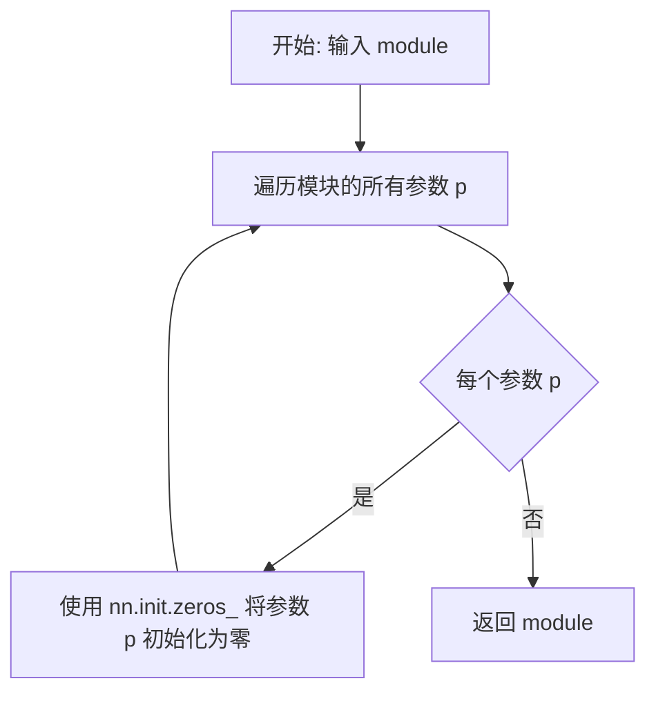
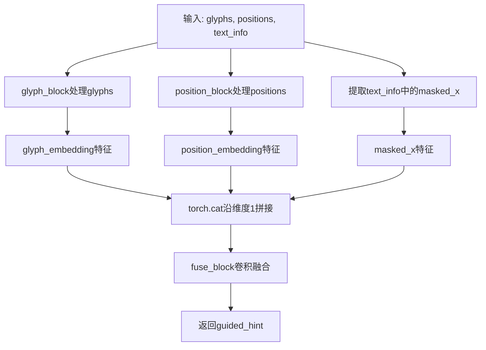
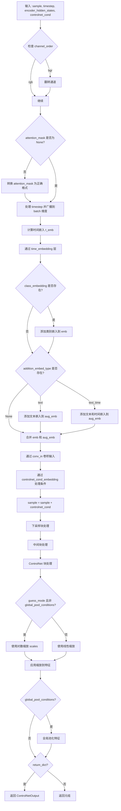

# `diffusers\examples\research_projects\anytext\anytext_controlnet.py` 详细设计文档

该代码实现了AnyText的ControlNet模型，用于视觉文本生成和编辑。它包含一个条件嵌入层（AnyTextControlNetConditioningEmbedding）来处理glyph和position信息，以及一个继承自Diffusers ControlNetModel的主模型（AnyTextControlNetModel），用于在扩散模型中提供文本条件控制。

## 整体流程

```mermaid
graph TD
    A[开始: 输入sample, timestep, encoder_hidden_states, controlnet_cond] --> B[通道顺序检查]
    B --> C[准备attention_mask]
    C --> D[时间嵌入计算: time_proj + time_embedding]
    D --> E{是否有class_embedding?}
    E -- 是 --> F[添加class embedding]
    E -- 否 --> G{是否有addition_embed_type?}
    G -- 是 --> H[添加text/time embedding]
    G -- 否 --> I[conv_in预处理sample]
    I --> J[controlnet_cond_embedding处理条件]
    J --> K[sample = sample + controlnet_cond]
    K --> L[Down Blocks处理]
    L --> M[Mid Block处理]
    M --> N[ControlNet Down Blocks]
    N --> O[ControlNet Mid Block]
    O --> P{guess_mode?}
    P -- 是 --> Q[对down和mid block进行logspace缩放]
    P -- 否 --> R[应用conditioning_scale]
    Q --> S{global_pool_conditions?]
    R --> S
    S -- 是 --> T[全局平均池化]
    S -- 否 --> U[返回ControlNetOutput]
    T --> U
```

## 类结构

```
nn.Module (PyTorch基类)
├── AnyTextControlNetConditioningEmbedding
│   ├── glyph_block (nn.Sequential)
│   ├── position_block (nn.Sequential)
│   └── fuse_block (nn.Conv2d)
└── ControlNetModel (Diffusers基类)
    └── AnyTextControlNetModel
        ├── controlnet_cond_embedding (AnyTextControlNetConditioningEmbedding)
        ├── time_proj
        ├── time_embedding
        ├── class_embedding
        ├── add_embedding
        ├── conv_in
        ├── down_blocks
        ├── mid_block
        ├── controlnet_down_blocks
        └── controlnet_mid_block
```

## 全局变量及字段


### `logger`
    
模块级别的日志记录器，用于输出调试和运行信息

类型：`logging.Logger`
    


### `AnyTextControlNetConditioningEmbedding.glyph_block`
    
处理字形信息的卷积网络，将字形图像编码为特征表示

类型：`nn.Sequential`
    


### `AnyTextControlNetConditioningEmbedding.position_block`
    
处理位置信息的卷积网络，将位置图像编码为特征表示

类型：`nn.Sequential`
    


### `AnyTextControlNetConditioningEmbedding.fuse_block`
    
融合glyph、position和text信息的卷积层，生成最终的条件嵌入

类型：`nn.Conv2d`
    


### `AnyTextControlNetModel.controlnet_cond_embedding`
    
条件嵌入层，用于将控制网络的条件输入编码为特征向量

类型：`AnyTextControlNetConditioningEmbedding`
    


### `AnyTextControlNetModel._supports_gradient_checkpointing`
    
支持梯度检查点，用于减少训练时的显存占用

类型：`bool`
    
    

## 全局函数及方法


### `zero_module`

将 PyTorch 模块的所有参数初始化为零的辅助函数，常用于将 ControlNet 的某些分支权重置零以实现条件控制。

参数：

- `module`：`torch.nn.Module`，需要被初始化为零参数的 PyTorch 模块

返回值：`torch.nn.Module`，返回参数已被置零的输入模块

#### 流程图



#### 带注释源码

```
def zero_module(module):
    """
    将模块的所有参数初始化为零的辅助函数。
    
    该函数遍历输入模块的所有参数，并使用 nn.init.zeros_ 
    将每个参数的张量值设置为零。通常用于 ControlNet 中
    将某些分支的权重置零，以实现条件控制或模型剪枝。
    
    Args:
        module (torch.nn.Module): 需要初始化为零参数的 PyTorch 模块。
        
    Returns:
        torch.nn.Module: 返回参数已被置零的输入模块，便于链式调用。
    """
    # 遍历模块的所有可学习参数（权重和偏置）
    for p in module.parameters():
        # 使用 PyTorch 的零初始化方法将参数值设为零
        nn.init.zeros_(p)
    # 返回已初始化的模块（支持链式调用）
    return module
```


### `AnyTextControlNetConditioningEmbedding.__init__`

这是 AnyTextControlNetConditioningEmbedding 类的初始化方法，用于构建条件嵌入模块的神经网络结构，包括字形特征提取块、位置特征提取块和特征融合块，将输入的字形、位置和文本信息编码为 ControlNet 所需的特征空间。

参数：

- `conditioning_embedding_channels`：`int`，条件嵌入通道数，指定融合后输出特征的通道维度
- `glyph_channels`：`int`（默认值为 1），字形输入通道数，默认为1表示单通道灰度图
- `position_channels`：`int`（默认值为 1），位置输入通道数，默认为1表示单通道位置图

返回值：`None`，无返回值（__init__ 方法）

#### 流程图

```mermaid
flowchart TD
    A[开始 __init__] --> B[调用 super().__init__]
    B --> C[构建 glyph_block 字形特征提取网络]
    C --> D[构建 position_block 位置特征提取网络]
    D --> E[构建 fuse_block 融合层]
    E --> F[结束初始化]

    C -.-> C1[Conv2d 1→8, 3x3, ReLU]
    C1 --> C2[Conv2d 8→8, 3x3, ReLU]
    C2 --> C3[Conv2d 8→16, 3x3, stride=2, ReLU]
    C3 --> C4[Conv2d 16→16, 3x3, ReLU]
    C4 --> C5[Conv2d 16→32, 3x3, stride=2, ReLU]
    C5 --> C6[Conv2d 32→32, 3x3, ReLU]
    C6 --> C7[Conv2d 32→96, 3x3, stride=2, ReLU]
    C7 --> C8[Conv2d 96→96, 3x3, ReLU]
    C8 --> C9[Conv2d 96→256, 3x3, stride=2, ReLU]

    D -.-> D1[Conv2d 1→8, 3x3, ReLU]
    D1 --> D2[Conv2d 8→8, 3x3, ReLU]
    D2 --> D3[Conv2d 8→16, 3x3, stride=2, ReLU]
    D3 --> D4[Conv2d 16→16, 3x3, ReLU]
    D4 --> D5[Conv2d 16→32, 3x3, stride=2, ReLU]
    D5 --> D6[Conv2d 32→32, 3x3, ReLU]
    D6 --> D7[Conv2d 32→64, 3x3, stride=2, ReLU]

    E --> E1[Conv2d 256+64+4→conditioning_embedding_channels, 3x3]
```

#### 带注释源码

```python
def __init__(
    self,
    conditioning_embedding_channels: int,
    glyph_channels=1,
    position_channels=1,
):
    """
    初始化 AnyTextControlNetConditioningEmbedding 模块
    
    参数:
        conditioning_embedding_channels: int - 条件嵌入输出通道数，决定最终融合特征的维度
        glyph_channels: int - 字形图像的输入通道数，默认为1（灰度图）
        position_channels: int - 位置图像的输入通道数，默认为1（灰度图）
    """
    # 调用父类 nn.Module 的初始化方法
    super().__init__()

    # =========================================================
    # 字形特征提取块 (glyph_block)
    # 用于从字形图像中提取文本位置相关的视觉特征
    # 输入: glyph_channels 通道的图像 (如字形掩码图)
    # 输出: 256 通道的特征图
    # 网络结构: 4次卷积 + 4次下采样(步长2)
    # =========================================================
    self.glyph_block = nn.Sequential(
        # 第1层: glyph_channels -> 8 通道，保持分辨率
        nn.Conv2d(glyph_channels, 8, 3, padding=1),
        nn.SiLU(),  # SiLU 激活函数 (Swish)
        
        # 第2层: 8 -> 8 通道，保持分辨率
        nn.Conv2d(8, 8, 3, padding=1),
        nn.SiLU(),
        
        # 第3层: 8 -> 16 通道，分辨率减半 (stride=2)
        nn.Conv2d(8, 16, 3, padding=1, stride=2),
        nn.SiLU(),
        
        # 第4层: 16 -> 16 通道，保持分辨率
        nn.Conv2d(16, 16, 3, padding=1),
        nn.SiLU(),
        
        # 第5层: 16 -> 32 通道，分辨率减半
        nn.Conv2d(16, 32, 3, padding=1, stride=2),
        nn.SiLU(),
        
        # 第6层: 32 -> 32 通道，保持分辨率
        nn.Conv2d(32, 32, 3, padding=1),
        nn.SiLU(),
        
        # 第7层: 32 -> 96 通道，分辨率减半
        nn.Conv2d(32, 96, 3, padding=1, stride=2),
        nn.SiLU(),
        
        # 第8层: 96 -> 96 通道，保持分辨率
        nn.Conv2d(96, 96, 3, padding=1),
        nn.SiLU(),
        
        # 第9层: 96 -> 256 通道，分辨率减半
        nn.Conv2d(96, 256, 3, padding=1, stride=2),
        nn.SiLU(),
    )

    # =========================================================
    # 位置特征提取块 (position_block)
    # 用于从位置图像中提取文本位置信息
    # 输入: position_channels 通道的图像 (如位置坐标图)
    # 输出: 64 通道的特征图
    # 网络结构: 3次卷积 + 3次下采样
    # =========================================================
    self.position_block = nn.Sequential(
        # 第1层: position_channels -> 8 通道
        nn.Conv2d(position_channels, 8, 3, padding=1),
        nn.SiLU(),
        
        # 第2层: 8 -> 8 通道
        nn.Conv2d(8, 8, 3, padding=1),
        nn.SiLU(),
        
        # 第3层: 8 -> 16 通道，下采样
        nn.Conv2d(8, 16, 3, padding=1, stride=2),
        nn.SiLU(),
        
        # 第4层: 16 -> 16 通道
        nn.Conv2d(16, 16, 3, padding=1),
        nn.SiLU(),
        
        # 第5层: 16 -> 32 通道，下采样
        nn.Conv2d(16, 32, 3, padding=1, stride=2),
        nn.SiLU(),
        
        # 第6层: 32 -> 32 通道
        nn.Conv2d(32, 32, 3, padding=1),
        nn.SiLU(),
        
        # 第7层: 32 -> 64 通道，下采样
        nn.Conv2d(32, 64, 3, padding=1, stride=2),
        nn.SiLU(),
    )

    # =========================================================
    # 融合块 (fuse_block)
    # 将字形特征、位置特征和文本信息在通道维度上拼接后融合
    # 输入通道: 256 (glyph) + 64 (position) + 4 (text_info中的masked_x)
    # 输出通道: conditioning_embedding_channels
    # =========================================================
    self.fuse_block = nn.Conv2d(256 + 64 + 4, conditioning_embedding_channels, 3, padding=1)
```


### `AnyTextControlNetConditioningEmbedding.forward`

该方法实现 AnyText 控制网的图像条件嵌入层的前向传播，通过分别处理字形（glyph）、位置（position）和文本信息（text_info）三个分支的输入，使用卷积神经网络提取特征并融合，生成用于引导扩散模型的条件嵌入向量（guided_hint）。

参数：

- `glyphs`：`torch.Tensor`，字形图像张量，包含需要嵌入的视觉文本图像信息
- `positions`：`torch.Tensor`，位置信息张量，包含文本在图像中的位置编码
- `text_info`：`Dict[str, torch.Tensor]`，文本信息字典，必须包含键 `"masked_x"` 对应的掩码处理后的文本特征张量

返回值：`torch.Tensor`，返回融合后的条件嵌入向量（guided_hint），用于后续控制网络的特征处理

#### 流程图



#### 带注释源码

```python
def forward(self, glyphs, positions, text_info):
    """
    前向传播方法，将字形、位置和文本信息融合为条件嵌入向量
    
    参数:
        glyphs: 字形图像张量，形状为 [batch, channels, height, width]
        positions: 位置信息张量，形状为 [batch, channels, height, width]
        text_info: 包含 'masked_x' 键的字典，'masked_x' 形状为 [batch, channels, height, width]
    
    返回:
        guided_hint: 融合后的条件嵌入向量，形状为 [batch, conditioning_embedding_channels, H, W]
    """
    # 步骤1: 处理字形输入
    # 将glyphs移动到glyph_block第一个卷积层的设备上，然后通过glyph_block卷积网络
    # glyph_block是一个包含多个卷积+SiLU激活的序列网络，输出256通道的特征图
    glyph_embedding = self.glyph_block(glyphs.to(self.glyph_block[0].weight.device))
    
    # 步骤2: 处理位置输入
    # 将positions移动到position_block第一个卷积层的设备上，然后通过position_block卷积网络
    # position_block是一个包含多个卷积+SiLU激活的序列网络，输出64通道的特征图
    position_embedding = self.position_block(positions.to(self.position_block[0].weight.device))
    
    # 步骤3: 融合三个特征
    # 使用torch.cat沿通道维度(dim=1)拼接glyph_embedding、position_embedding和text_info["masked_x"]
    # 拼接后的通道数为: 256 + 64 + 4 = 264 (text_info["masked_x"]假设为4通道)
    # 然后通过fuse_block卷积层将通道数转换为conditioning_embedding_channels
    guided_hint = self.fuse_block(torch.cat([glyph_embedding, position_embedding, text_info["masked_x"]], dim=1))
    
    # 步骤4: 返回引导提示向量
    return guided_hint
```


### AnyTextControlNetModel.__init__

这是 `AnyTextControlNetModel` 类的构造函数，用于初始化一个专门用于 AnyText 视觉文本生成与编辑任务的 ControlNet 模型。该方法继承自 `ControlNetModel`，并在此基础上添加了 `AnyTextControlNetConditioningEmbedding` 条件嵌入层，用于处理字形（glyph）和位置（position）信息。

参数：

- `in_channels`：`int`，输入样本的通道数，默认为 4（对应 Latent Diffusion 的潜在空间通道数）
- `conditioning_channels`：`int`，条件输入的通道数，默认为 1（用于 glyph 和 position 条件）
- `flip_sin_to_cos`：`bool`，是否将时间嵌入中的 sin 转换为 cos，默认为 True
- `freq_shift`：`int`，时间嵌入的频率偏移量，默认为 0
- `down_block_types`：`Tuple[str, ...]`，下采样块的类型元组，默认为 `("CrossAttnDownBlock2D", "CrossAttnDownBlock2D", "CrossAttnDownBlock2D", "DownBlock2D")`
- `mid_block_type`：`str | None`，中间块的类型，默认为 `"UNetMidBlock2DCrossAttn"`
- `only_cross_attention`：`Union[bool, Tuple[bool]]`，是否仅使用交叉注意力，默认为 False
- `block_out_channels`：`Tuple[int, ...]`，每个块的输出通道数元组，默认为 `(320, 640, 1280, 1280)`
- `layers_per_block`：`int`，每个块的层数，默认为 2
- `downsample_padding`：`int`，下采样卷积的填充数，默认为 1
- `mid_block_scale_factor`：`float`，中间块的缩放因子，默认为 1
- `act_fn`：`str`，激活函数名称，默认为 `"silu"`
- `norm_num_groups`：`Optional[int]`，归一化的组数，默认为 32，若为 None 则跳过归一化
- `norm_eps`：`float`，归一化的 epsilon 值，默认为 1e-5
- `cross_attention_dim`：`int`，交叉注意力特征的维度，默认为 1280
- `transformer_layers_per_block`：`Union[int, Tuple[int, ...]]`，每个块的 Transformer 层数，默认为 1
- `encoder_hid_dim`：`Optional[int]`，编码器隐藏层维度，默认为 None
- `encoder_hid_dim_type`：`str | None`，编码器隐藏层维度类型，默认为 None
- `attention_head_dim`：`Union[int, Tuple[int, ...]]`，注意力头的维度，默认为 8
- `num_attention_heads`：`Optional[Union[int, Tuple[int, ...]]]`，注意力头的数量，默认为 None
- `use_linear_projection`：`bool`，是否使用线性投影，默认为 False
- `class_embed_type`：`str | None`，类别嵌入类型，默认为 None
- `addition_embed_type`：`str | None`，附加嵌入类型，默认为 None
- `addition_time_embed_dim`：`Optional[int]`，附加时间嵌入维度，默认为 None
- `num_class_embeds`：`Optional[int]`，类别嵌入矩阵的输入维度，默认为 None
- `upcast_attention`：`bool`，是否上转注意力，默认为 False
- `resnet_time_scale_shift`：`str`，ResNet 块的时间缩放偏移配置，默认为 `"default"`
- `projection_class_embeddings_input_dim`：`Optional[int]`，投影类别嵌入的输入维度，默认为 None
- `controlnet_conditioning_channel_order`：`str`，条件图像的通道顺序，默认为 `"rgb"`
- `conditioning_embedding_out_channels`：`Optional[Tuple[int, ...]]`，条件嵌入层每个块的输出通道，默认为 `(16, 32, 96, 256)`
- `global_pool_conditions`：`bool`，是否全局池化条件，默认为 False
- `addition_embed_type_num_heads`：`int`，TextTimeEmbedding 层的注意力头数，默认为 64

返回值：`None`，该方法为构造函数，不返回任何值

#### 流程图

```mermaid
flowchart TD
    A[开始 __init__] --> B[调用父类 ControlNetModel.__init__]
    B --> C[创建 AnyTextControlNetConditioningEmbedding]
    C --> D[设置 conditioning_embedding_channels=block_out_channels[0]]
    C --> E[设置 glyph_channels=conditioning_channels]
    C --> F[设置 position_channels=conditioning_channels]
    D --> G[赋值给 self.controlnet_cond_embedding]
    G --> H[结束 __init__]
```

#### 带注释源码

```python
@register_to_config
def __init__(
    self,
    in_channels: int = 4,
    conditioning_channels: int = 1,
    flip_sin_to_cos: bool = True,
    freq_shift: int = 0,
    down_block_types: Tuple[str, ...] = (
        "CrossAttnDownBlock2D",
        "CrossAttnDownBlock2D",
        "CrossAttnDownBlock2D",
        "DownBlock2D",
    ),
    mid_block_type: str | None = "UNetMidBlock2DCrossAttn",
    only_cross_attention: Union[bool, Tuple[bool]] = False,
    block_out_channels: Tuple[int, ...] = (320, 640, 1280, 1280),
    layers_per_block: int = 2,
    downsample_padding: int = 1,
    mid_block_scale_factor: float = 1,
    act_fn: str = "silu",
    norm_num_groups: Optional[int] = 32,
    norm_eps: float = 1e-5,
    cross_attention_dim: int = 1280,
    transformer_layers_per_block: Union[int, Tuple[int, ...]] = 1,
    encoder_hid_dim: Optional[int] = None,
    encoder_hid_dim_type: str | None = None,
    attention_head_dim: Union[int, Tuple[int, ...]] = 8,
    num_attention_heads: Optional[Union[int, Tuple[int, ...]]] = None,
    use_linear_projection: bool = False,
    class_embed_type: str | None = None,
    addition_embed_type: str | None = None,
    addition_time_embed_dim: Optional[int] = None,
    num_class_embeds: Optional[int] = None,
    upcast_attention: bool = False,
    resnet_time_scale_shift: str = "default",
    projection_class_embeddings_input_dim: Optional[int] = None,
    controlnet_conditioning_channel_order: str = "rgb",
    conditioning_embedding_out_channels: Optional[Tuple[int, ...]] = (16, 32, 96, 256),
    global_pool_conditions: bool = False,
    addition_embed_type_num_heads: int = 64,
):
    # 使用 @register_to_config 装饰器将所有参数注册到配置中
    # 该装饰器会自动将参数保存为 self.config 对象的属性
    
    # 调用父类 ControlNetModel 的初始化方法
    # 继承标准的 Stable Diffusion ControlNet 架构
    super().__init__(
        in_channels,
        conditioning_channels,
        flip_sin_to_cos,
        freq_shift,
        down_block_types,
        mid_block_type,
        only_cross_attention,
        block_out_channels,
        layers_per_block,
        downsample_padding,
        mid_block_scale_factor,
        act_fn,
        norm_num_groups,
        norm_eps,
        cross_attention_dim,
        transformer_layers_per_block,
        encoder_hid_dim,
        encoder_hid_dim_type,
        attention_head_dim,
        num_attention_heads,
        use_linear_projection,
        class_embed_type,
        addition_embed_type,
        addition_time_embed_dim,
        num_class_embeds,
        upcast_attention,
        resnet_time_scale_shift,
        projection_class_embeddings_input_dim,
        controlnet_conditioning_channel_order,
        conditioning_embedding_out_channels,
        global_pool_conditions,
        addition_embed_type_num_heads,
    )

    # 创建 AnyText 专用的条件嵌入层
    # 该层用于处理字形（glyph）和位置（position）信息
    # 这是 AnyText 模型的核心创新点之一
    self.controlnet_cond_embedding = AnyTextControlNetConditioningEmbedding(
        conditioning_embedding_channels=block_out_channels[0],  # 使用第一个下采样块的输出通道数
        glyph_channels=conditioning_channels,  # 字形通道数
        position_channels=conditioning_channels,  # 位置通道数
    )
```


### `AnyTextControlNetModel.forward`

该方法是 `AnyTextControlNetModel` 类的核心前向传播函数，负责处理 AnyText 文本生成模型的 ControlNet 推理流程。它接收噪声样本、时间步、条件嵌入等信息，通过时间嵌入计算、卷积预处理、下采样块处理、中间块处理以及 ControlNet 块处理，最终输出经过条件缩放的下采样特征和中间特征，用于指导主模型的生成过程。

参数：

- `sample`：`torch.Tensor`，噪声输入张量，形状为 `(batch_size, channels, height, width)`
- `timestep`：`Union[torch.Tensor, float, int]`，去噪的时间步，可以是张量或标量
- `encoder_hidden_states`：`torch.Tensor`，编码器的隐藏状态，形状为 `(batch_size, sequence_length, hidden_size)`
- `controlnet_cond`：`torch.Tensor`，ControlNet 条件输入，包含 glyphs、positions 和 text_info 元组
- `conditioning_scale`：`float`，ControlNet 输出的缩放因子，默认为 `1.0`
- `class_labels`：`Optional[torch.Tensor]`，可选的类别标签，用于条件嵌入
- `timestep_cond`：`Optional[torch.Tensor]`，时间步的额外条件嵌入
- `attention_mask`：`Optional[torch.Tensor]`，形状为 `(batch, key_tokens)` 的注意力掩码
- `added_cond_kwargs`：`Optional[Dict[str, torch.Tensor]]`，Stable Diffusion XL UNet 的额外条件，包含 text_embeds 和 time_ids
- `cross_attention_kwargs`：`Optional[Dict[str, Any]]`，注意力处理器的关键字参数字典
- `guess_mode`：`bool`，是否启用猜测模式，默认为 `False`
- `return_dict`：`bool`，是否返回 `ControlNetOutput` 对象，默认为 `True`

返回值：`Union[ControlNetOutput, Tuple[Tuple[torch.Tensor, ...], torch.Tensor]]`，如果 `return_dict` 为 `True`，返回包含下采样块特征和中间块特征的 `ControlNetOutput` 对象；否则返回元组

#### 流程图



#### 带注释源码

```python
def forward(
    self,
    sample: torch.Tensor,
    timestep: Union[torch.Tensor, float, int],
    encoder_hidden_states: torch.Tensor,
    controlnet_cond: torch.Tensor,
    conditioning_scale: float = 1.0,
    class_labels: Optional[torch.Tensor] = None,
    timestep_cond: Optional[torch.Tensor] = None,
    attention_mask: Optional[torch.Tensor] = None,
    added_cond_kwargs: Optional[Dict[str, torch.Tensor]] = None,
    cross_attention_kwargs: Optional[Dict[str, Any]] = None,
    guess_mode: bool = False,
    return_dict: bool = True,
) -> Union[ControlNetOutput, Tuple[Tuple[torch.Tensor, ...], torch.Tensor]]:
    """
    The [`~PromptDiffusionControlNetModel`] forward method.

    Args:
        sample (`torch.Tensor`):
            The noisy input tensor.
        timestep (`Union[torch.Tensor, float, int]`):
            The number of timesteps to denoise an input.
        encoder_hidden_states (`torch.Tensor`):
            The encoder hidden states.
        #controlnet_cond (`torch.Tensor`):
        #    The conditional input tensor of shape `(batch_size, sequence_length, hidden_size)`.
        conditioning_scale (`float`, defaults to `1.0`):
            The scale factor for ControlNet outputs.
        class_labels (`torch.Tensor`, *optional*, defaults to `None`):
            Optional class labels for conditioning. Their embeddings will be summed with the timestep embeddings.
        timestep_cond (`torch.Tensor`, *optional*, defaults to `None`):
            Additional conditional embeddings for timestep. If provided, the embeddings will be summed with the
            timestep_embedding passed through the `self.time_embedding` layer to obtain the final timestep
            embeddings.
        attention_mask (`torch.Tensor`, *optional*, defaults to `None`):
            An attention mask of shape `(batch, key_tokens)` is applied to `encoder_hidden_states`. If `1` the mask
            is kept, otherwise if `0` it is discarded. Mask will be converted into a bias, which adds large
            negative values to the attention scores corresponding to "discard" tokens.
        added_cond_kwargs (`dict`):
            Additional conditions for the Stable Diffusion XL UNet.
        cross_attention_kwargs (`dict[str]`, *optional*, defaults to `None`):
            A kwargs dictionary that if specified is passed along to the `AttnProcessor`.
        guess_mode (`bool`, defaults to `False`):
            In this mode, the ControlNet encoder tries its best to recognize the input content of the input even if
            you remove all prompts. A `guidance_scale` between 3.0 and 5.0 is recommended.
        return_dict (`bool`, defaults to `True`):
            Whether or not to return a [`~models.controlnet.ControlNetOutput`] instead of a plain tuple.

    Returns:
        [`~models.controlnet.ControlNetOutput`] **or** `tuple`:
            If `return_dict` is `True`, a [`~models.controlnet.ControlNetOutput`] is returned, otherwise a tuple is
            returned where the first element is the sample tensor.
    """
    # 检查通道顺序
    channel_order = self.config.controlnet_conditioning_channel_order

    if channel_order == "rgb":
        # in rgb order by default
        ...
    # elif channel_order == "bgr":
    #    controlnet_cond = torch.flip(controlnet_cond, dims=[1])
    else:
        raise ValueError(f"unknown `controlnet_conditioning_channel_order`: {channel_order}")

    # 准备注意力掩码
    if attention_mask is not None:
        # 将掩码转换为注意力偏置格式：1 保持，0 丢弃
        attention_mask = (1 - attention_mask.to(sample.dtype)) * -10000.0
        attention_mask = attention_mask.unsqueeze(1)

    # 1. 时间步处理
    timesteps = timestep
    if not torch.is_tensor(timesteps):
        # TODO: this requires sync between CPU and GPU. So try to pass timesteps as tensors if you can
        # This would be a good case for the `match` statement (Python 3.10+)
        is_mps = sample.device.type == "mps"
        if isinstance(timestep, float):
            dtype = torch.float32 if is_mps else torch.float64
        else:
            dtype = torch.int32 if is_mps else torch.int64
        timesteps = torch.tensor([timesteps], dtype=dtype, device=sample.device)
    elif len(timesteps.shape) == 0:
        timesteps = timesteps[None].to(sample.device)

    # 广播到 batch 维度以兼容 ONNX/Core ML
    timesteps = timesteps.expand(sample.shape[0])

    # 时间嵌入投影
    t_emb = self.time_proj(timesteps)

    # timesteps 不包含权重，始终返回 f32 张量
    # 但 time_embedding 可能在 fp16 下运行，所以需要在这里转换
    t_emb = t_emb.to(dtype=sample.dtype)

    # 通过时间嵌入层
    emb = self.time_embedding(t_emb, timestep_cond)
    aug_emb = None

    # 2. 类别嵌入处理
    if self.class_embedding is not None:
        if class_labels is None:
            raise ValueError("class_labels should be provided when num_class_embeds > 0")

        if self.config.class_embed_type == "timestep":
            class_labels = self.time_proj(class_labels)

        class_emb = self.class_embedding(class_labels).to(dtype=self.dtype)
        emb = emb + class_emb

    # 3. 额外嵌入处理（文本和时间）
    if self.config.addition_embed_type is not None:
        if self.config.addition_embed_type == "text":
            aug_emb = self.add_embedding(encoder_hidden_states)

        elif self.config.addition_embed_type == "text_time":
            if "text_embeds" not in added_cond_kwargs:
                raise ValueError(
                    f"{self.__class__} has the config param `addition_embed_type` set to 'text_time' which requires the keyword argument `text_embeds` to be passed in `added_cond_kwargs`"
                )
            text_embeds = added_cond_kwargs.get("text_embeds")
            if "time_ids" not in added_cond_kwargs:
                raise ValueError(
                    f"{self.__class__} has the config param `addition_embed_type` set to 'text_time' which requires the keyword argument `time_ids` to be passed in `added_cond_kwargs`"
                )
            time_ids = added_cond_kwargs.get("time_ids")
            time_embeds = self.add_time_proj(time_ids.flatten())
            time_embeds = time_embeds.reshape((text_embeds.shape[0], -1))

            add_embeds = torch.concat([text_embeds, time_embeds], dim=-1)
            add_embeds = add_embeds.to(emb.dtype)
            aug_emb = self.add_embedding(add_embeds)

    # 合并主嵌入和额外嵌入
    emb = emb + aug_emb if aug_emb is not None else emb

    # 4. 预处理：卷积输入并添加条件嵌入
    sample = self.conv_in(sample)

    # 通过条件嵌入层处理 ControlNet 条件（glyphs, positions, text_info）
    controlnet_cond = self.controlnet_cond_embedding(*controlnet_cond)
    sample = sample + controlnet_cond

    # 5. 下采样块处理
    down_block_res_samples = (sample,)
    for downsample_block in self.down_blocks:
        if hasattr(downsample_block, "has_cross_attention") and downsample_block.has_cross_attention:
            sample, res_samples = downsample_block(
                hidden_states=sample,
                temb=emb,
                encoder_hidden_states=encoder_hidden_states,
                attention_mask=attention_mask,
                cross_attention_kwargs=cross_attention_kwargs,
            )
        else:
            sample, res_samples = downsample_block(hidden_states=sample, temb=emb)

        down_block_res_samples += res_samples

    # 6. 中间块处理
    if self.mid_block is not None:
        if hasattr(self.mid_block, "has_cross_attention") and self.mid_block.has_cross_attention:
            sample = self.mid_block(
                sample,
                emb,
                encoder_hidden_states=encoder_hidden_states,
                attention_mask=attention_mask,
                cross_attention_kwargs=cross_attention_kwargs,
            )
        else:
            sample = self.mid_block(sample, emb)

    # 7. Control net 块处理
    controlnet_down_block_res_samples = ()

    for down_block_res_sample, controlnet_block in zip(down_block_res_samples, self.controlnet_down_blocks):
        down_block_res_sample = controlnet_block(down_block_res_sample)
        controlnet_down_block_res_samples = controlnet_down_block_res_samples + (down_block_res_sample,)

    down_block_res_samples = controlnet_down_block_res_samples

    mid_block_res_sample = self.controlnet_mid_block(sample)

    # 8. 缩放处理
    if guess_mode and not self.config.global_pool_conditions:
        # 使用对数缩放：0.1 到 1.0
        scales = torch.logspace(-1, 0, len(down_block_res_samples) + 1, device=sample.device)  # 0.1 to 1.0
        scales = scales * conditioning_scale
        down_block_res_samples = [sample * scale for sample, scale in zip(down_block_res_samples, scales)]
        mid_block_res_sample = mid_block_res_sample * scales[-1]  # last one
    else:
        down_block_res_samples = [sample * conditioning_scale for sample in down_block_res_samples]
        mid_block_res_sample = mid_block_res_sample * conditioning_scale

    # 9. 全局池化（可选）
    if self.config.global_pool_conditions:
        down_block_res_samples = [
            torch.mean(sample, dim=(2, 3), keepdim=True) for sample in down_block_res_samples
        ]
        mid_block_res_sample = torch.mean(mid_block_res_sample, dim=(2, 3), keepdim=True)

    # 10. 返回结果
    if not return_dict:
        return (down_block_res_samples, mid_block_res_sample)

    return ControlNetOutput(
        down_block_res_samples=down_block_res_samples, mid_block_res_sample=mid_block_res_sample
    )
```

## 关键组件


### AnyTextControlNetConditioningEmbedding

AnyTextControlNetConditioningEmbedding 是一个神经网络模块，用于将字形（glyph）和位置（position）信息编码为与UNet兼容的特征空间。该模块采用多层级卷积结构分别处理字形和位置信息，并通过融合块将两者与文本掩码信息结合，输出用于ControlNet的条件嵌入。

### AnyTextControlNetModel

AnyTextControlNetModel 是继承自Diffusers库中ControlNetModel的主控制网络模型。该模型在标准ControlNet基础上集成了AnyTextControlNetConditioningEmbedding，用于处理视觉文本生成任务中的图像条件输入，实现文本与图像特征的融合控制。

### zero_module

zero_module 是一个辅助函数，用于将神经网络模块的所有参数初始化为零。该函数常用于ControlNet中输出层的权重初始化，以实现更稳定的训练过程。

### glyph_block

glyph_block 是 AnyTextControlNetConditioningEmbedding 中的卷积神经网络序列，专门用于处理字形（glyph）输入图像。该模块通过多层卷积、SiLU激活和步长操作，将输入的字形图像逐步编码为256维的特征表示。

### position_block

position_block 是 AnyTextControlNetConditioningEmbedding 中的卷积神经网络序列，专门用于处理位置（position）信息。该模块通过多层卷积和步长操作，将位置信息编码为64维的特征表示，与字形特征维度对齐以便后续融合。

### fuse_block

fuse_block 是 AnyTextControlNetConditioning_embedding 中的融合卷积层，负责将字形特征（256维）、位置特征（64维）和文本掩码信息（4维）拼接后的结果进一步处理，输出符合ControlNet要求的条件嵌入通道数。


## 问题及建议


### 已知问题

-   **设备转换冗余**：在 `AnyTextControlNetConditioningEmbedding.forward` 中，使用 `glyphs.to(...)` 和 `positions.to(...)` 强制将输入张量移动到特定设备，这是一种反模式，可能导致不必要的设备间数据拷贝和性能开销。正确做法是在模型初始化时确保所有参数在同一设备上，或依赖框架的设备自动处理机制。
-   **硬编码的通道数**：`fuse_block` 中的 `256 + 64 + 4` 是硬编码的魔法数字，未通过变量或配置定义，降低了代码可读性和可维护性，且与 `glyph_block`/`position_block` 的输出通道数缺乏显式关联。
-   **类型注解缺失**：构造函数中 `glyph_channels` 和 `position_channels` 参数缺少类型注解，影响代码可读性和类型检查。
-   **父类参数冗余传递**：在 `super().__init__()` 调用中传递了大量父类已有默认值的参数（如 `flip_sin_to_cos=True`），这些参数可以从调用中移除，简化代码。
-   **注释与实现不一致**：代码中存在被注释掉的 `controlnet_cond` 参数说明，以及被注释掉的 BGR 通道顺序处理逻辑（`elif channel_order == "bgr"`），这些死代码应被清理。
-   **设备属性重复访问**：在 `forward` 方法中多次访问 `self.glyph_block[0].weight.device`，可缓存以减少属性查找开销。
-   **全局变量与函数重复定义**：`zero_module` 函数被复制到该文件，但 diffusers 库中已存在相同实现，造成代码冗余。

### 优化建议

-   **移除显式设备转换**：删除 `glyphs.to(...)` 和 `positions.to(...)` 调用，依赖 PyTorch 的设备自动传播机制，或在模型 `__init__` 中验证并记录设备一致性。
-   **提取魔法数字**：将 `glyph_block` 和 `position_block` 的输出通道数定义为类属性或配置参数，在 `fuse_block` 中通过变量引用（如 `glyph_channels_out + position_channels_out + text_info_channels`）。
-   **完善类型注解**：为 `glyph_channels` 和 `position_channels` 添加 `int` 类型注解。
-   **简化父类调用**：从 `super().__init__()` 中移除所有具有默认值的参数，仅传递子类特有的配置（如 `conditioning_channels`）。
-   **清理死代码**：删除被注释的参数说明和 BGR 通道处理代码块，保持代码整洁。
-   **缓存设备属性**：在 `forward` 方法开始处添加 `device = self.glyph_block[0].weight.device` 并复用。
-   **移除重复代码**：删除本地的 `zero_module` 函数定义，改为从 `diffusers.models.controlnet` 导入，或确认是否真正需要该函数（代码中未使用）。
-   **添加设备一致性断言**：在 `forward` 入口添加断言验证输入设备与模型设备匹配，提供清晰的错误信息。


## 其它


### 设计目标与约束

本模块旨在为Diffusers库提供AnyText ControlNet支持，实现多语言视觉文本生成与编辑功能。设计目标包括：1）将AnyText的ControlNet conditioning embedding机制集成到Diffusers框架中；2）保持与标准ControlNetModel的接口兼容性；3）支持glyph和position信息的嵌入处理。约束条件包括：必须继承自Diffusers的ControlNetModel类，遵循Diffusers的配置注册机制（@register_to_config），并且需要与Stable Diffusion pipeline兼容。

### 错误处理与异常设计

代码中的错误处理主要包括：1）channel_order参数验证，当controlnet_conditioning_channel_order不是"rgb"时抛出ValueError；2）addition_embed_type为"text_time"时，必须在added_cond_kwargs中提供text_embeds和time_ids参数，否则抛出ValueError；3）当class_embed_type为"timestep"时，class_labels必须提供。潜在改进：可添加更详细的错误信息，建议使用自定义异常类替代通用ValueError，并增加输入形状验证。

### 数据流与状态机

数据流主要分为以下几个阶段：1）预处理阶段：将glyph和position数据通过controlnet_cond_embedding处理；2）时间嵌入阶段：timestep经过time_proj和time_embedding处理；3）条件嵌入阶段：encoder_hidden_states和可选的class_labels、addition_embed处理；4）UNet下采样阶段：sample经过conv_in和down_blocks处理；5）中间块处理：经过mid_block；6）ControlNet块处理：down_block_res_samples和mid_block_res_sample经过controlnet_down_blocks和controlnet_mid_block；7）缩放阶段：根据guess_mode和conditioning_scale进行输出缩放。

### 外部依赖与接口契约

主要依赖包括：1）diffusers.configuration_utils.register_to_config装饰器用于配置注册；2）diffusers.models.controlnets.controlnet中的ControlNetModel和ControlNetOutput基类；3）PyTorch的nn.Module、torch.Tensor等基础组件。接口契约：forward方法接受sample、timestep、encoder_hidden_states、controlnet_cond等参数，返回ControlNetOutput或元组。controlnet_cond参数应为元组（glyphs, positions, text_info），text_info包含masked_x键。

### 配置参数说明

关键配置参数包括：in_channels（默认4，表示latent空间的通道数）；block_out_channels（默认(320, 640, 1280, 1280)，UNet各阶段输出通道）；conditioning_embedding_out_channels（默认(16, 32, 96, 256)，conditioning嵌入各层输出通道）；controlnet_conditioning_channel_order（默认"rgb"，条件图像的通道顺序）；glyph_channels和position_channels（默认1，glyph和position输入通道数）。

### 性能考虑与优化空间

潜在性能优化点：1）glyph_block和position_block的forward中重复调用.to(self.glyph_block[0].weight.device)，每次都进行设备转换，可预先在__init__中保存设备引用；2）可以添加torch.cuda.amp.autocast支持以提升训练速度；3）可以考虑添加gradient checkpointing以节省显存（已支持_supports_gradient_checkpointing=True但未在forward中实现）；4）attention_mask的处理可以优化，避免每次都创建新的tensor。

### 安全考虑

代码本身不涉及用户输入处理，主要安全点包括：1）设备转换时需确保tensor兼容；2）数值计算需防止NaN/Inf传播；3）模型参数初始化需符合预期分布。暂无发现明显安全漏洞。

### 测试策略建议

建议补充的测试包括：1）单元测试：AnyTextControlNetConditioningEmbedding的前向传播测试，验证输出形状；2）集成测试：AnyTextControlNetModel与Diffusers pipeline的集成测试；3）梯度测试：验证gradient checkpointing功能；4）数值测试：与原始AnyText实现的数值一致性对比；5）边界条件测试：空tensor、极端batch_size等情况的处理。


    