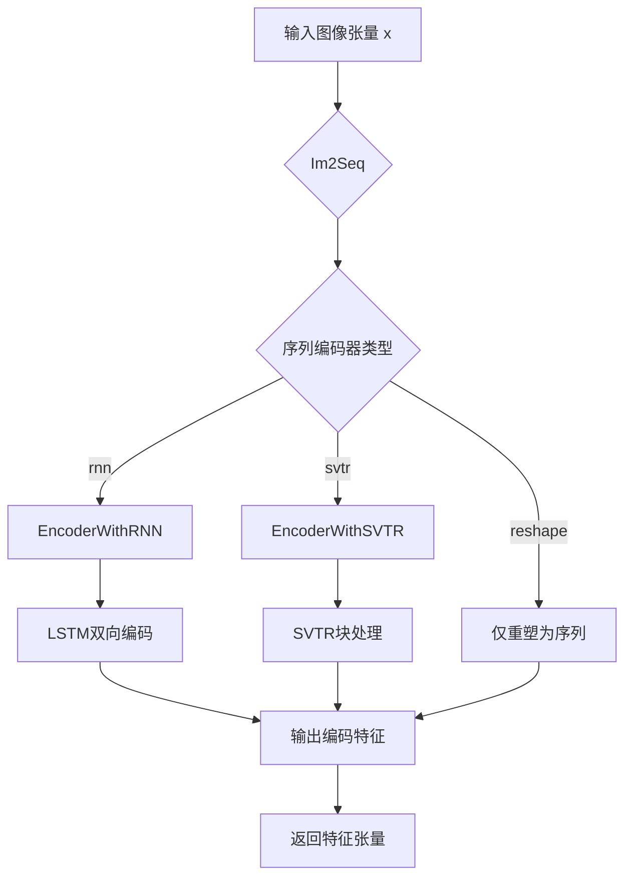
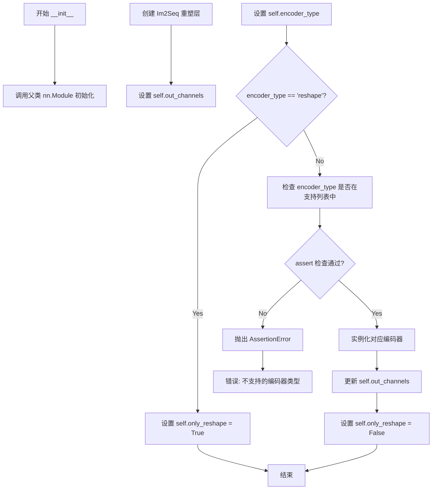
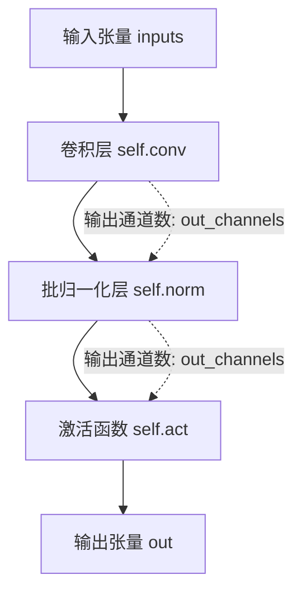
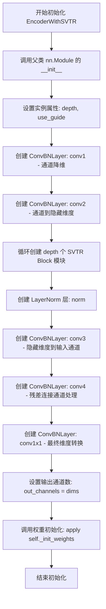
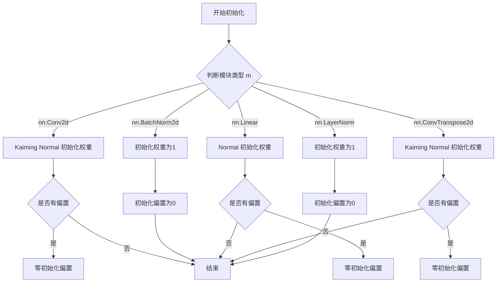

# `diffusers\examples\research_projects\anytext\ocr_recog\RNN.py` 详细设计文档

这是一个基于PyTorch的视觉序列编码器模块，实现了多种图像到序列的编码方案，包括Im2Seq转换、RNN编码器和SVTR（Vision Transformer based Sequence Recognition）编码器，用于OCR或视觉序列识别任务。

## 整体流程



## 类结构

```
nn.Module (PyTorch基类)
├── Swish (激活函数)
├── Im2Im (图像到图像映射)
├── Im2Seq (图像到序列转换)
├── EncoderWithRNN (RNN编码器)
├── SequenceEncoder (序列编码器总控)
│   ├── Im2Seq (内部组件)
│   ├── EncoderWithRNN (rnn模式)
│   └── EncoderWithSVTR (svtr模式)
├── ConvBNLayer (卷积+BN+激活块)
└── EncoderWithSVTR (SVTR编码器)
    └── nn.ModuleList (SVTR Block列表)
```

## 全局变量及字段


### `Im2Im.out_channels`
    
输出通道数，等于输入通道数

类型：`int`
    


### `Im2Seq.out_channels`
    
输出通道数，等于输入通道数

类型：`int`
    


### `EncoderWithRNN.out_channels`
    
输出通道数，为隐藏层大小的两倍（双向LSTM）

类型：`int`
    


### `EncoderWithRNN.lstm`
    
双向两层的LSTM编码器

类型：`nn.LSTM`
    


### `SequenceEncoder.encoder_reshape`
    
图像到序列的reshape模块

类型：`Im2Seq`
    


### `SequenceEncoder.out_channels`
    
编码器输出通道数

类型：`int`
    


### `SequenceEncoder.encoder_type`
    
编码器类型，支持reshape/rnn/svtr

类型：`str`
    


### `SequenceEncoder.encoder`
    
实际的序列编码器实例（EncoderWithRNN或EncoderWithSVTR）

类型：`nn.Module`
    


### `SequenceEncoder.only_reshape`
    
是否仅进行reshape而不使用额外编码器

类型：`bool`
    


### `ConvBNLayer.conv`
    
二维卷积层

类型：`nn.Conv2d`
    


### `ConvBNLayer.norm`
    
批归一化层

类型：`nn.BatchNorm2d`
    


### `ConvBNLayer.act`
    
激活函数（Swish）

类型：`Swish`
    


### `EncoderWithSVTR.depth`
    
SVTR块的深度（堆叠层数）

类型：`int`
    


### `EncoderWithSVTR.use_guide`
    
是否使用guide机制

类型：`bool`
    


### `EncoderWithSVTR.conv1`
    
用于降维的第一个卷积层

类型：`ConvBNLayer`
    


### `EncoderWithSVTR.conv2`
    
用于进一步处理第二个卷积层

类型：`ConvBNLayer`
    


### `EncoderWithSVTR.svtr_block`
    
SVTR块的列表，包含多个Block实例

类型：`nn.ModuleList`
    


### `EncoderWithSVTR.norm`
    
LayerNorm归一化层

类型：`nn.LayerNorm`
    


### `EncoderWithSVTR.conv3`
    
最后一个卷积层用于恢复通道数

类型：`ConvBNLayer`
    


### `EncoderWithSVTR.conv4`
    
卷积层，用于处理shortcut连接后的特征

类型：`ConvBNLayer`
    


### `EncoderWithSVTR.conv1x1`
    
1x1卷积层，用于输出维度转换

类型：`ConvBNLayer`
    


### `EncoderWithSVTR.out_channels`
    
输出通道数，等于dims参数值

类型：`int`
    
    

## 全局函数及方法


### `Swish.__int__`

该方法为 Swish 激活函数类的初始化方法（注意：代码中疑似拼写错误，应为 `__init__`），用于调用父类 nn.Module 的初始化方法。

参数：

- `self`：无类型，Swish 类实例本身

返回值：无返回值（`None`），仅执行父类初始化

#### 流程图

```mermaid
flowchart TD
    A[开始 __int__] --> B[调用父类初始化 super(Swish, self).__int__()]
    B --> C[结束]
```

#### 带注释源码

```
class Swish(nn.Module):
    def __int__(self):  # 注意：疑似拼写错误，应为 __init__
        super(Swish, self).__int__()  # 调用 nn.Module 的初始化方法

    def forward(self, x):
        return x * torch.sigmoid(x)
```

---

### 技术债务与优化建议

1. **拼写错误**：`__int__` 应改为 `__init__`，否则该类无法正常初始化实例
2. **缺少参数**：标准 PyTorch 模块的 `__init__` 方法可以接受 `*args` 和 `**kwargs` 以提高扩展性
3. **缺少文档字符串**：建议添加类和方法级别的文档说明


### `Swish.forward`

Swish.forward 是 Swish 激活函数的前向传播方法，接收输入张量 x，计算 x 与 sigmoid(x) 的乘积，实现 Swish 激活函数（即 x * σ(x)），该激活函数在深度学习模型中用于提供非线性变换。

参数：

- `x`：`torch.Tensor`，输入张量，通常为卷积层或全连接层的输出

返回值：`torch.Tensor`，经过 Swish 激活函数处理后的输出张量

#### 流程图

```mermaid
flowchart TD
    A[输入张量 x] --> B[计算 sigmoid(x)]
    B --> C[计算 x × sigmoid(x)]
    C --> D[返回输出张量]
```

#### 带注释源码

```python
class Swish(nn.Module):
    def __int__(self):
        # 构造函数，调用父类 nn.Module 的初始化方法
        # 注意：这里存在一个拼写错误，应该是 __init__ 而非 __int__
        super(Swish, self).__int__()

    def forward(self, x):
        """
        Swish 激活函数的前向传播
        
        参数:
            x: torch.Tensor - 输入张量
        
        返回:
            torch.Tensor - Swish 激活后的张量，计算公式为 x * sigmoid(x)
        """
        # Swish 激活函数公式: f(x) = x * sigmoid(x)
        # sigmoid(x) = 1 / (1 + exp(-x))
        return x * torch.sigmoid(x)
```


### `Im2Im.__init__`

这是 Im2Im 类的初始化方法，用于创建一个图像到图像（Im2Im）的转换模块。该方法接收输入通道数作为参数，并将输出通道数设置为与输入通道数相同，是一个简单的通道数保存器。

参数：

- `self`：隐式参数，Im2Im 类的实例对象本身
- `in_channels`：`int`，输入图像的通道数（Channel数），用于确定数据的特征维度
- `**kwargs`：可变关键字参数（字典类型），用于接收额外的可选参数，目前未被使用但保留接口扩展性

返回值：无返回值（`None`），`__init__` 方法通常返回 `None`

#### 流程图

```mermaid
flowchart TD
    A[开始 __init__] --> B[调用 super().__init__ 初始化 nn.Module]
    B --> C[设置 self.out_channels = in_channels]
    C --> D[结束 __init__]
```

#### 带注释源码

```python
def __init__(self, in_channels, **kwargs):
    """
    Im2Im 类的初始化方法
    
    参数:
        in_channels (int): 输入图像的通道数
        **kwargs: 额外的关键字参数（可选）
    """
    # 调用父类 nn.Module 的初始化方法
    # 确保 PyTorch 的参数注册机制正常工作
    super().__init__()
    
    # 将输入通道数直接设置为输出通道数
    # 这表明 Im2Im 模块是一个保形（shape-preserving）模块
    # 不改变数据的空间维度和通道数，仅作为接口或基础类使用
    self.out_channels = in_channels
```


### `Im2Im.forward`

该方法是 Im2Im 类的前向传播实现，属于图像到图像的简单传递层，功能为直接返回输入而不进行任何处理。

参数：

- `x`：`torch.Tensor`，输入的张量，通常为四维张量（B, C, H, W）

返回值：`torch.Tensor`，直接返回输入的张量

#### 流程图


#### 带注释源码

```python
def forward(self, x):
    """
    Im2Im 类的前向传播方法
    
    该方法直接返回输入张量，不进行任何处理。
    这是一个身份映射（identity mapping），通常用于：
    - 作为占位符模块
    - 传递特征而不改变
    - 在某些架构中作为跳过连接的基础
    
    参数:
        x: torch.Tensor, 输入的张量，通常为四维张量 [B, C, H, W]
        
    返回:
        torch.Tensor, 直接返回输入的张量，与输入形状和类型相同
    """
    return x
```


### `Im2Seq.__init__`

`Im2Seq.__init__` 是 `Im2Seq` 类的构造函数，用于初始化将2D特征图转换为序列格式的PyTorch神经网络模块。该方法接收输入通道数作为参数，调用父类构造函数，并设置输出通道数属性，为后续的序列编码做好准备。

参数：

- `self`：`Im2Seq`，Im2Seq类的实例自身
- `in_channels`：`int`，输入特征图的通道数，用于确定输出通道数
- `**kwargs`：`dict`，额外的关键字参数（当前方法中未使用，但为保持接口一致性而保留）

返回值：`None`，`__init__` 方法不返回任何值

#### 流程图

```mermaid
flowchart TD
    A[开始 __init__] --> B[调用 super().__init__ 初始化nn.Module]
    B --> C[设置 self.out_channels = in_channels]
    C --> D[结束初始化]
```

#### 带注释源码

```python
def __init__(self, in_channels, **kwargs):
    """
    初始化Im2Seq模块
    
    参数:
        in_channels: 输入特征图的通道数
        **kwargs: 额外的关键字参数(当前未使用)
    """
    # 调用父类nn.Module的构造函数，完成PyTorch模块的初始化
    super().__init__()
    
    # 将输出通道数设置为与输入通道数相同
    # 该属性用于与下游层保持通道数的一致性
    self.out_channels = in_channels
```


### `Im2Seq.forward`

该方法实现图像到序列的转换功能，将输入的4D图像张量 (B, C, H, W) 重塑为3D序列张量 (B, H*W, C)，将空间维度展平为序列长度维度，以便后续序列编码器处理。

参数：

- `x`：`torch.Tensor`，输入的4D张量，形状为 (B, C, H, W)，其中 B 为批量大小，C 为通道数，H 为高度，W 为宽度

返回值：`torch.Tensor`，输出3D张量，形状为 (B, H*W, C)，其中 H*W 为展平后的序列长度，C 为特征维度

#### 流程图

```mermaid
flowchart TD
    A[输入 x: (B, C, H, W)] --> B[解包张量形状<br/>B, C, H, W = x.shape]
    B --> C[reshape 操作<br/>x.reshape(B, C, H * W)]
    C --> D[permute 维度交换<br/>x.permute(0, 2, 1)]
    D --> E[输出: (B, H*W, C)]
```

#### 带注释源码

```python
def forward(self, x):
    """
    将4D图像张量转换为3D序列张量
    
    参数:
        x: 输入张量，形状为 (B, C, H, W)
        
    返回:
        输出张量，形状为 (B, H*W, C)
    """
    # 从输入张量中解包批量大小、通道数、高度和宽度
    B, C, H, W = x.shape
    # assert H == 1  # 原代码中被注释掉的断言，可能用于特定场景
    
    # 将4D张量reshape为3D张量 (B, C, H*W)
    # 将空间维度(H*W)展平为一个维度
    x = x.reshape(B, C, H * W)
    
    # 交换维度顺序从 (B, C, H*W) 变为 (B, H*W, C)
    # 将通道维度的位置从第1位移到最后一位
    x = x.permute((0, 2, 1))
    
    # 返回变换后的序列张量，形状为 (B, H*W, C)
    return x
```


### `EncoderWithRNN.__init__`

这是 `EncoderWithRNN` 类的构造函数，用于初始化一个基于双向LSTM的序列编码器。该方法接收输入通道数和可选的隐藏层大小参数，配置双层双向LSTM网络，并设置输出通道数。

参数：

- `in_channels`：`int`，输入数据的通道数，决定LSTM输入的特征维度
- `**kwargs`：`dict`，可选关键字参数字典，支持传递 `hidden_size`（隐藏层大小，默认256）等配置

返回值：`None`，构造函数不返回任何值，仅初始化对象属性

#### 流程图

```mermaid
flowchart TD
    A[开始 __init__] --> B[调用 super().__init__ 初始化nn.Module]
    B --> C[从 kwargs 获取 hidden_size, 默认值256]
    C --> D[计算 self.out_channels = hidden_size * 2]
    D --> E[创建双层双向LSTM: nn.LSTM]
    E --> F[设置 self.lstm = LSTM实例]
    F --> G[结束 __init__]
```

#### 带注释源码

```
def __init__(self, in_channels, **kwargs):
    """
    初始化 EncoderWithRNN 编码器
    
    参数:
        in_channels: int, 输入特征的通道数/维度
        **kwargs: 关键字参数，支持 hidden_size (默认256)
    """
    # 调用父类 nn.Module 的初始化方法，建立 PyTorch 模块结构
    super(EncoderWithRNN, self).__init__()
    
    # 从 kwargs 中获取隐藏层大小，若未指定则使用默认值 256
    hidden_size = kwargs.get("hidden_size", 256)
    
    # 计算输出通道数：双向LSTM输出为隐藏层大小的2倍
    # 因为双向LSTM会分别从前向和后向产生输出
    self.out_channels = hidden_size * 2
    
    # 创建双层双向LSTM网络
    # 参数说明:
    #   - input_size=in_channels: 输入特征维度
    #   - hidden_size=hidden_size: 每个方向的隐藏层大小
    #   - bidirectional=True: 启用双向机制
    #   - num_layers=2: 双层堆叠
    #   - batch_first=True: 输入输出张量第一维为batch大小
    self.lstm = nn.LSTM(
        in_channels, 
        hidden_size, 
        bidirectional=True, 
        num_layers=2, 
        batch_first=True
    )
```


### `EncoderWithRNN.forward`

该方法是 `EncoderWithRNN` 类的前向传播函数，负责将输入序列通过双向 LSTM 编码为特征表示，通过调用 `flatten_parameters()` 优化 LSTM 计算性能，并返回编码后的序列张量。

参数：

- `x`：`torch.Tensor`，形状为 (batch_size, sequence_length, in_channels)，表示经过 `Im2Seq` 重塑后的输入序列张量

返回值：`torch.Tensor`，形状为 (batch_size, sequence_length, hidden_size * 2)，其中 hidden_size 默认为 256，返回双向 LSTM 的拼接输出

#### 流程图

```mermaid
flowchart TD
    A[输入 x: (B, SeqLen, C)] --> B[调用 lstm.flatten_parameters]
    B --> C[执行 LSTM 前向传播]
    C --> D[输出 x: (B, SeqLen, hidden_size*2)]
    D --> E[返回编码序列]
    
    subgraph EncoderWithRNN
        F[__init__: 初始化 LSTM]
        G[forward: 前向传播]
    end
    
    F --> G
```

#### 带注释源码

```python
def forward(self, x):
    """
    EncoderWithRNN 的前向传播方法，将输入序列通过双向 LSTM 编码
    
    参数:
        x: torch.Tensor, 形状为 (batch_size, sequence_length, in_channels)
           输入序列张量，通常由 Im2Seq 从 (B, C, H, W) 重塑为 (B, H*W, C)
    
    返回:
        torch.Tensor, 形状为 (batch_size, sequence_length, hidden_size * 2)
           双向 LSTM 的输出，每个时间步的特征维度是 hidden_size 的两倍（双向拼接）
    """
    # 优化 LSTM 计算性能，将参数连续存储以加速
    self.lstm.flatten_parameters()
    
    # 执行 LSTM 前向传播
    # 输入 x: (B, SeqLen, in_channels)
    # 输出 x: (B, SeqLen, hidden_size * 2)  # bidirectional=True 时输出维度翻倍
    # 第二个返回值 _ (隐藏状态) 被丢弃
    x, _ = self.lstm(x)
    
    # 返回编码后的序列张量
    return x
```


### SequenceEncoder.__init__

该方法是 SequenceEncoder 类的初始化构造函数，负责根据指定的编码器类型（reshape、rnn 或 svtr）实例化不同的序列编码器模块，并完成通道数转换和属性配置。

参数：

- `self`：隐式参数，SequenceEncoder 实例本身
- `in_channels`：`int`，输入数据的通道数
- `encoder_type`：`str`，编码器类型，默认为 "rnn"，支持 "reshape"、"rnn" 和 "svtr"
- `**kwargs`：`dict`，可变关键字参数，传递给底层编码器的额外配置参数（如 hidden_size、dims 等）

返回值：无（`__init__` 方法返回 `None`）

#### 流程图



#### 带注释源码

```python
class SequenceEncoder(nn.Module):
    def __init__(self, in_channels, encoder_type="rnn", **kwargs):
        """
        SequenceEncoder 类的初始化方法
        
        参数:
            in_channels: 输入特征通道数
            encoder_type: 编码器类型，可选 "reshape", "rnn", "svtr"
            **kwargs: 传递给底层编码器的额外参数
        """
        # 调用父类 nn.Module 的初始化方法
        super(SequenceEncoder, self).__init__()
        
        # 创建 Im2Seq 重塑层，将图像转换为序列格式
        # 输入: (B, C, H, W) -> 输出: (B, H*W, C)
        self.encoder_reshape = Im2Seq(in_channels)
        
        # 初始化输出通道数，先使用重塑层的输出通道数
        self.out_channels = self.encoder_reshape.out_channels
        
        # 保存编码器类型
        self.encoder_type = encoder_type
        
        # 如果只是重塑类型，不需要额外的编码器
        if encoder_type == "reshape":
            self.only_reshape = True
        else:
            # 定义支持的编码器类型字典
            support_encoder_dict = {
                "reshape": Im2Seq, 
                "rnn": EncoderWithRNN, 
                "svtr": EncoderWithSVTR
            }
            
            # 断言检查编码器类型是否支持
            assert encoder_type in support_encoder_dict, \
                "{} must in {}".format(encoder_type, support_encoder_dict.keys())
            
            # 根据类型实例化对应的编码器
            # 将重塑层的输出通道数作为编码器的输入通道数
            self.encoder = support_encoder_dict[encoder_type](
                self.encoder_reshape.out_channels, 
                **kwargs
            )
            
            # 更新输出通道数为实际编码器的输出通道数
            self.out_channels = self.encoder.out_channels
            
            # 标记不是仅仅重塑
            self.only_reshape = False
```


### `SequenceEncoder.forward`

该方法是 `SequenceEncoder` 类的核心前向传播方法，根据不同的编码器类型（"rnn"、"reshape" 或 "svtr"）执行不同的数据处理流程，实现序列特征的编码与维度转换。

参数：

- `x`：`torch.Tensor`，输入的张量，形状为 `(B, C, H, W)`，其中 B 是批次大小，C 是通道数，H 是高度，W 是宽度

返回值：`torch.Tensor`，编码后的张量，形状和通道数取决于 `encoder_type` 的配置

#### 流程图

```mermaid
flowchart TD
    A[开始 forward] --> B{encoder_type == 'svtr'}
    B -- 是 --> C[调用 encoder(x)]
    B -- 否 --> D[调用 encoder_reshape(x)]
    D --> E{only_reshape == True}
    E -- 是 --> F[直接返回 x]
    E -- 否 --> G[调用 encoder(x)]
    G --> F
    C --> H[调用 encoder_reshape(x)]
    H --> I[返回编码后的张量]
    F --> I
```

#### 带注释源码

```python
def forward(self, x):
    """
    SequenceEncoder 的前向传播方法，根据 encoder_type 执行不同的编码流程
    
    参数:
        x: torch.Tensor，输入张量，形状为 (B, C, H, W)
    
    返回:
        torch.Tensor，编码后的张量
    """
    # 判断是否使用 SVTR 编码器
    if self.encoder_type != "svtr":
        # 对于非 SVTR 类型，先进行序列reshape
        # Im2Seq 将 (B, C, H, W) -> (B, H*W, C)
        x = self.encoder_reshape(x)
        
        # 如果不是仅reshape模式，则进一步通过编码器处理
        if not self.only_reshape:
            x = self.encoder(x)
        
        return x
    else:
        # 对于 SVTR 类型，流程不同：
        # 1. 先通过 encoder (EncoderWithSVTR) 处理
        x = self.encoder(x)
        
        # 2. 再通过 encoder_reshape 进行维度变换
        x = self.encoder_reshape(x)
        
        return x
```


### `ConvBNLayer.__init__`

该方法是卷积批量归一化层的初始化方法，用于构建一个包含卷积层、BatchNorm层和激活函数的标准卷积块。

参数：

- `in_channels`：`int`，输入特征图的通道数
- `out_channels`：`int`，输出特征图的通道数
- `kernel_size`：`int`，卷积核大小，默认为3
- `stride`：`int`，卷积步长，默认为1
- `padding`：`int`，卷积填充，默认为0
- `bias_attr`：`bool`，是否使用偏置，默认为False
- `groups`：`int`，分组卷积的组数，默认为1
- `act`：`callable`，激活函数类型，默认为nn.GELU

返回值：`None`，该方法仅初始化对象属性，不返回任何值

#### 流程图

```mermaid
flowchart TD
    A[开始 __init__] --> B[调用 super().__init__ 初始化父类]
    B --> C[创建 nn.Conv2d 卷积层]
    C --> D[配置卷积参数: in_channels, out_channels, kernel_size, stride, padding, groups, bias]
    D --> E[创建 nn.BatchNorm2d 归一化层]
    E --> F[创建 Swish 激活函数实例]
    F --> G[结束 __init__]
```

#### 带注释源码

```python
def __init__(
    self, in_channels, out_channels, kernel_size=3, stride=1, padding=0, bias_attr=False, groups=1, act=nn.GELU
):
    """
    初始化 ConvBNLayer 卷积块
    
    参数:
        in_channels: 输入通道数
        out_channels: 输出通道数  
        kernel_size: 卷积核大小，默认3
        stride: 步长，默认1
        padding: 填充，默认0
        bias_attr: 是否使用偏置，默认False
        groups: 分组卷积组数，默认1
        act: 激活函数，默认nn.GELU
    """
    # 调用父类 nn.Module 的初始化方法
    super().__init__()
    
    # 创建二维卷积层
    # 参数说明:
    # - in_channels: 输入通道数
    # - out_channels: 输出通道数  
    # - kernel_size: 卷积核尺寸
    # - stride: 滑动步长
    # - padding: 边缘填充大小
    # - groups: 分组卷积的组数，用于深度可分离卷积等场景
    # - bias: 是否添加偏置项
    self.conv = nn.Conv2d(
        in_channels=in_channels,
        out_channels=out_channels,
        kernel_size=kernel_size,
        stride=stride,
        padding=padding,
        groups=groups,
        # weight_attr=paddle.ParamAttr(initializer=nn.initializer.KaimingUniform()),
        bias=bias_attr,
    )
    
    # 创建二维批量归一化层
    # 用于稳定和加速神经网络训练，对卷积输出进行归一化处理
    self.norm = nn.BatchNorm2d(out_channels)
    
    # 创建激活函数实例
    # 注意: 这里硬编码使用 Swish()，参数 act 未被使用，存在设计缺陷
    self.act = Swish()
```


### `ConvBNLayer.forward`

该方法是卷积神经网络中卷积-批归一化-激活（Conv-BN-Act）标准结构的前向传播实现，接收输入张量依次经过卷积层、批归一化层和激活函数层，输出处理后的特征张量。

参数：

- `inputs`：`torch.Tensor`，输入的图像特征张量，形状为 [B, C, H, W]，其中 B 为批量大小，C 为通道数，H 和 W 分别为特征图的高度和宽度

返回值：`torch.Tensor`，经过卷积、批归一化和激活函数处理后的输出张量，形状为 [B, out_channels, H', W']，其中 H' 和 W' 由卷积的步长和填充决定

#### 流程图



#### 带注释源码

```python
def forward(self, inputs):
    """
    ConvBNLayer 的前向传播方法
    
    执行流程：
    1. 卷积操作：对输入特征图进行卷积运算
    2. 批归一化：对卷积输出进行标准化处理
    3. 激活函数：对归一化后的结果应用非线性激活
    
    参数:
        inputs: 输入张量，形状为 [batch_size, in_channels, height, width]
        
    返回:
        输出张量，形状为 [batch_size, out_channels, output_height, output_width]
    """
    # 第一步：卷积运算
    # 使用预定义的卷积层对输入进行特征提取
    # 卷积核大小、步长、填充均由构造函数参数指定
    out = self.conv(inputs)
    
    # 第二步：批归一化
    # 对卷积输出进行均值方差归一化，稳定训练过程
    #.BatchNorm2d 会自动学习缩放和偏移参数
    out = self.norm(out)
    
    # 第三步：激活函数
    # 应用 Swish 激活函数 (x * sigmoid(x))
    # Swish 是一种自门控激活函数，在多项任务中表现优于 ReLU
    out = self.act(out)
    
    # 返回最终处理后的特征张量
    return out
```


### `EncoderWithSVTR.__init__`

该方法是`EncoderWithSVTR`类的构造函数，初始化了一个基于SVTR（Self-supervised Visual Text Recognition）架构的编码器，包含卷积层、SVTR块、归一化层和权重初始化逻辑，用于图像特征编码。

参数：

- `self`：实例本身，EncoderWithSVTR类的一个实例对象
- `in_channels`：`int`，输入图像的通道数
- `dims`：`int`，输出维度，默认值为64（XS配置）
- `depth`：`int`，SVTR块的深度（数量），默认值为2
- `hidden_dims`：`int`，隐藏层维度，默认值为120
- `use_guide`：`bool`，是否使用引导机制，默认值为False
- `num_heads`：`int`，多头注意力机制的头数，默认值为8
- `qkv_bias`：`bool`，是否在QKV线性层中使用偏置，默认值为True
- `mlp_ratio`：`float`，MLP扩展比例，默认值为2.0
- `drop_rate`：`float`，Dropout比率，默认值为0.1
- `attn_drop_rate`：`float`，注意力层的Dropout比率，默认值为0.1
- `drop_path`：`float`，随机深度（Drop Path）比率，默认值为0.0
- `qk_scale`：`float`，QK缩放因子，默认为None（使用默认值`head_dim ** -0.5`）

返回值：`None`（`__init__`方法不返回任何值，仅初始化对象状态）

#### 流程图



#### 带注释源码

```python
def __init__(
    self,
    in_channels,
    dims=64,  # XS
    depth=2,
    hidden_dims=120,
    use_guide=False,
    num_heads=8,
    qkv_bias=True,
    mlp_ratio=2.0,
    drop_rate=0.1,
    attn_drop_rate=0.1,
    drop_path=0.0,
    qk_scale=None,
):
    """
    初始化 EncoderWithSVTR 编码器
    
    参数:
        in_channels: 输入特征图的通道数
        dims: 输出通道数，默认64（XS模型配置）
        depth: SVTR block堆叠层数，默认2层
        hidden_dims: 隐藏层维度，用于SVTR block内部
        use_guide: 是否使用guide机制（用于特征引导）
        num_heads: 多头注意力头数
        qkv_bias: 是否使用QKV偏置
        mlp_ratio: MLP前馈网络的扩展比例
        drop_rate: Dropout比率
        attn_drop_rate: 注意力Dropout比率
        drop_path: 随机深度比率
        qk_scale: QK缩放因子，None时使用默认计算
    """
    # 调用父类nn.Module的初始化方法，注册所有子模块
    super(EncoderWithSVTR, self).__init__()
    
    # 保存配置参数
    self.depth = depth  # SVTR block的深度（数量）
    self.use_guide = use_guide  # 是否使用guide机制
    
    # ===== 第一阶段：特征预处理卷积层 =====
    # conv1: 将输入通道数降维到 in_channels//8，添加padding保持尺寸
    self.conv1 = ConvBNLayer(in_channels, in_channels // 8, padding=1, act="swish")
    
    # conv2: 将通道数从 in_channels//8 转换到 hidden_dims，kernel_size=1不改变空间维度
    self.conv2 = ConvBNLayer(in_channels // 8, hidden_dims, kernel_size=1, act="swish")
    
    # ===== 第二阶段：SVTR Transformer块 =====
    # 创建depth个SVTR block组成的ModuleList
    # Block是自定义的Transformer块，包含多头注意力机制和MLP
    self.svtr_block = nn.ModuleList(
        [
            Block(
                dim=hidden_dims,  # 输入维度
                num_heads=num_heads,  # 注意力头数
                mixer="Global",  # 全局混合器
                HW=None,  # 高度宽度（全局注意力不需要）
                mlp_ratio=mlp_ratio,  # MLP扩展比例
                qkv_bias=qkv_bias,  # QKV偏置
                qk_scale=qk_scale,  # QK缩放
                drop=drop_rate,  # Dropout
                act_layer="swish",  # 激活函数
                attn_drop=attn_drop_rate,  # 注意力Dropout
                drop_path=drop_path,  # 随机深度
                norm_layer="nn.LayerNorm",  # 归一化层类型
                epsilon=1e-05,  # 归一化epsilon
                prenorm=False,  # 是否使用pre-norm
            )
            for i in range(depth)  # 循环创建depth个block
        ]
    )
    
    # Transformer块后的归一化层
    self.norm = nn.LayerNorm(hidden_dims, eps=1e-6)
    
    # ===== 第三阶段：特征重建卷积层 =====
    # conv3: 将hidden_dims通道转换回in_channels通道
    self.conv3 = ConvBNLayer(hidden_dims, in_channels, kernel_size=1, act="swish")
    
    # conv4: 处理残差连接
    # 输入是原始特征h和conv3输出z的拼接（2*in_channels），输出到in_channels//8
    # 注意：这里实际是处理shortcut路径
    self.conv4 = ConvBNLayer(2 * in_channels, in_channels // 8, padding=1, act="swish")
    
    # ===== 第四阶段：输出投影 =====
    # conv1x1: 1x1卷积将通道数从in_channels//8转换到目标输出维度dims
    self.conv1x1 = ConvBNLayer(in_channels // 8, dims, kernel_size=1, act="swish")
    
    # 保存输出通道数，供后续模块使用
    self.out_channels = dims
    
    # ===== 第五阶段：权重初始化 =====
    # 应用初始化方法到所有子模块
    # 这是一个递归过程，会遍历所有nn.Conv2d, nn.BatchNorm2d, nn.Linear等
    self.apply(self._init_weights)
```


### `EncoderWithSVTR._init_weights`

该方法是一个权重初始化函数，用于在模型构建时对不同类型的神经网络层（如卷积层、归一化层、线性层等）进行参数初始化，确保模型训练的稳定性和收敛速度。

参数：

- `m`：`nn.Module`，待初始化的神经网络模块（如 Conv2d、BatchNorm2d、Linear、ConvTranspose2d、LayerNorm 等）

返回值：`None`，该方法直接修改传入模块的参数，不返回任何值

#### 流程图



#### 带注释源码

```python
def _init_weights(self, m):
    """
    初始化模型权重的方法，用于对不同类型的层进行参数初始化
    
    参数:
        m: nn.Module - 待初始化的神经网络模块
    
    返回:
        None - 直接修改传入模块的参数，不返回任何值
    """
    # 权重初始化
    if isinstance(m, nn.Conv2d):
        # 对卷积层使用 Kaiming 正态初始化，适用于 ReLU 激活函数
        nn.init.kaiming_normal_(m.weight, mode="fan_out")
        if m.bias is not None:
            # 如果存在偏置，初始化为零
            nn.init.zeros_(m.bias)
    elif isinstance(m, nn.BatchNorm2d):
        # 批归一化层：权重初始化为 1（缩放因子），偏置初始化为 0（平移因子）
        nn.init.ones_(m.weight)
        nn.init.zeros_(m.bias)
    elif isinstance(m, nn.Linear):
        # 全连接层：权重使用均值为 0、标准差为 0.01 的正态分布初始化
        nn.init.normal_(m.weight, 0, 0.01)
        if m.bias is not None:
            nn.init.zeros_(m.bias)
    elif isinstance(m, nn.ConvTranspose2d):
        # 转置卷积层：同样使用 Kaiming 正态初始化
        nn.init.kaiming_normal_(m.weight, mode="fan_out")
        if m.bias is not None:
            nn.init.zeros_(m.bias)
    elif isinstance(m, nn.LayerNorm):
        # 层归一化：权重初始化为 1，偏置初始化为 0
        nn.init.ones_(m.weight)
        nn.init.zeros_(m.bias)
```


### `EncoderWithSVTR.forward`

该方法是 SVTR（Scene Text Recognition with Vision Transformer）编码器的核心前向传播逻辑，负责将输入特征图通过卷积降维、Transformer块处理、特征融合等步骤，输出具有全局上下文信息的编码特征。

参数：

- `x`：`torch.Tensor`，输入的特征图，形状为 (B, C, H, W)，其中 B 为批次大小，C 为通道数，H 和 W 分别为特征图的高度和宽度

返回值：`torch.Tensor`，经过 SVTR 编码后的特征图，形状为 (B, dims, H, W)，其中 dims 是输出通道数（由构造函数中的 dims 参数指定，默认值为 64）

#### 流程图

```mermaid
flowchart TD
    A[输入 x: (B, C, H, W)] --> B{use_guide 是否为 True}
    B -->|是| C[克隆 x 为 z<br/>stop_gradient = True]
    B -->|否| D[z = x]
    D --> E[保存 shortcut: h = z]
    E --> F[z = conv1(z)<br/>通道数: C → C/8]
    F --> G[z = conv2(z)<br/>通道数: C/8 → hidden_dims]
    G --> H[z flatten + permute<br/>(B, hidden_dims, H, W) → (B, H*W, hidden_dims)]
    H --> I[遍历 svtr_block 列表]
    I --> J[z = blk(z)<br/>Transformer 全局注意力]
    J --> K[z = norm(z)<br/>LayerNorm 归一化]
    K --> L[z reshape + permute<br/>(B, H*W, hidden_dims) → (B, hidden_dims, H, W)]
    L --> M[z = conv3(z)<br/>通道数: hidden_dims → C]
    M --> N[z = concat([h, z], dim=1)<br/>通道数: 2C]
    N --> O[z = conv4(z)<br/>通道数: 2C → C/8]
    O --> P[z = conv1x1(z)<br/>通道数: C/8 → dims]
    P --> Q[输出 z: (B, dims, H, W)]
```

#### 带注释源码

```python
def forward(self, x):
    """
    SVTR 编码器的前向传播方法

    处理流程：
    1. 可选的梯度分离（guide 模式）
    2. 卷积降维
    3. Transformer 全局上下文建模
    4. 特征融合与输出
    """
    # 用于特征引导的辅助变量
    # 如果使用 guide，则克隆输入并停止梯度，用于后续特征融合
    if self.use_guide:
        z = x.clone()
        # 停止梯度传播，使 z 成为静态特征引导
        z.stop_gradient = True
    else:
        # 不使用 guide 时，直接使用输入
        z = x

    # 保存原始特征作为 shortcut（残差连接的输入）
    # 用于后续的特征融合，增强梯度流动
    h = z

    # ============ 阶段1: 降维处理 ============
    # 第一次卷积：通道数 C -> C//8，保持空间尺寸
    z = self.conv1(z)
    # 第二次卷积：通道数 C//8 -> hidden_dims，使用 1x1 卷积
    z = self.conv2(z)

    # ============ 阶段2: SVTR Transformer 处理 ============
    # 获取当前特征图形状
    B, C, H, W = z.shape
    # 将特征图展平为序列：(B, hidden_dims, H, W) -> (B, H*W, hidden_dims)
    # 这样可以将 2D 特征图转换为序列形式，便于 Transformer 处理
    z = z.flatten(2).permute(0, 2, 1)

    # 遍历 SVTR 块列表，进行全局自注意力建模
    # 每个 Block 包含多头注意力机制和前馈网络
    for blk in self.svtr_block:
        z = blk(z)

    # LayerNorm 归一化，稳定输出分布
    z = self.norm(z)

    # ============ 阶段3: 特征恢复与融合 ============
    # 将序列形式的特征还原为 2D 特征图
    # (B, H*W, hidden_dims) -> (B, hidden_dims, H, W)
    z = z.reshape([-1, H, W, C]).permute(0, 3, 1, 2)

    # 第三次卷积：通道数 hidden_dims -> C
    z = self.conv3(z)

    # 残差连接：将原始特征 h 与处理后的特征 z 在通道维度上拼接
    # 拼接后通道数为 2*C，增加特征多样性
    z = torch.cat((h, z), dim=1)

    # 第四次卷积：处理拼接后的特征
    # 先通过 conv4（3x3 卷积，通道数 2C -> C//8）
    # 再通过 conv1x1（1x1 卷积，通道数 C//8 -> dims）
    z = self.conv1x1(self.conv4(z))

    # 返回最终编码特征，形状为 (B, dims, H, W)
    return z
```

## 关键组件


### Swish

Swish激活函数模块，继承自nn.Module，实现自门控激活功能，通过x * sigmoid(x)计算输出，用于增强神经网络的非线性表达能力。

### Im2Im

图像到图像的简化模块，继承自nn.Module，输入输出通道数相同，作为占位符或identity映射使用。

### Im2Seq

图像到序列的转换模块，继承自nn.Module，将4D张量(B,C,H,W)重塑为3D序列张量(B,H*W,C)，用于将空间特征转换为序列特征以便后续RNN/Transformer处理。

### EncoderWithRNN

基于LSTM的序列编码器，继承自nn.Module，使用双向双层LSTM将序列特征编码为更高级的表示，输出通道数为hidden_size的2倍。

### SequenceEncoder

通用序列编码器封装模块，继承自nn.Module，支持"reshape"、"rnn"和"svtr"三种编码类型，内部组合Im2Seq和具体编码器实现灵活的编码策略。

### ConvBNLayer

卷积归一化激活组合层，继承自nn.Module，封装了Conv2d、BatchNorm2d和Swish激活函数，提供标准的卷积块结构，支持可配置的卷积参数和分组卷积。

### EncoderWithSVTR

基于SVTR(Spatial Vision Transformer)架构的编码器，继承自nn.Module，采用混合CNN-Transformer结构，包含4个卷积层用于特征提取和多个SVTR Block用于全局建模，支持引导学习机制和多头自注意力。

### Block (RecSVTR)

从外部导入的Transformer块组件，支持全局混合器模式，继承自nn.Module，实现多头自注意力机制和MLP前馈网络，是SVTR编码器的核心Transformer单元。


## 问题及建议


### 已知问题

- **Swish类构造函数拼写错误**：使用了 `__int__` 而非标准的 `__init__`，导致类无法正常实例化，调用时会出现 AttributeError。
- **PyTorch中使用了PaddlePaddle语法**：`EncoderWithSVTR.forward()` 方法中使用了 `z.stop_gradient = True`，这是 PaddlePaddle 的语法，在 PyTorch 中应使用 `z.detach()` 或 `z.requires_grad = False`，会导致运行时错误。
- **ConvBNLayer的act参数处理不一致**：初始化时 `act` 参数既接受字符串（如 "swish"）又接受 nn.Module，但在 `__init__` 中直接赋值 `self.act = Swish()` 而未根据传入的字符串进行映射，导致传入字符串时会出错。
- **EncoderWithSVTR未导入但被引用**：`SequenceEncoder` 中的 `support_encoder_dict` 包含 "svtr": EncoderWithSVTR，但 EncoderWithSVTR 在文件顶部未从 RecSVTR 导入（只导入了 Block），会导致 NameError。
- **EncoderWithSVTR初始化逻辑错误**：在 `EncoderWithSVTR.__init__` 中直接传入 `in_channels=56`（main函数示例），但类定义要求 `in_channels` 作为第一个参数是正确的，然而内部使用 `in_channels // 8` 进行计算时，未检查除法是否会导致通道数为0或负数。
- **SequenceEncoder对svtr类型处理不符合预期**：当 `encoder_type="svtr"` 时，forward 方法先调用 `self.encoder(x)` 再调用 `self.encoder_reshape(x)`，与其他类型（先reshape再encoder）的处理顺序相反，且逻辑不一致。
- **代码风格不统一**：混合使用了 PyTorch 和 PaddlePaddle 的 API 风格（如 `nn.init.kaiming_normal_` vs PaddlePaddle 的初始化方式），增加了维护成本。
- **Im2Im类为无效实现**：该类只是简单返回输入，没有任何实际处理逻辑，属于冗余代码。

### 优化建议

- **修复Swish类**：将 `__int__` 改为标准的 `__init__`。
- **修复PyTorch语法**：将 `z.stop_gradient = True` 改为 `z = z.detach()` 或在需要时使用 `torch.no_grad()` 上下文管理器。
- **统一ConvBNLayer的act参数处理**：添加act类型检查和映射逻辑，例如：
  ```python
  if isinstance(act, str):
      act_map = {"swish": Swish, "gelu": nn.GELU, "relu": nn.ReLU}
      act = act_map.get(act, Swish)
  self.act = act()
  ```
- **确保EncoderWithSVTR正确导入**：在文件顶部添加 `from .RecSVTR import EncoderWithSVTR` 或确认其导出位置。
- **修复SequenceEncoder的svtr处理逻辑**：统一所有encoder类型的处理流程，或明确文档说明svtr类型的特殊处理逻辑。
- **添加输入验证**：在通道数计算前添加有效性检查，防止除零或负数通道错误。
- **清理冗余代码**：移除或重构 Im2Im 类，明确其设计意图。
- **添加类型注解和文档**：为类和方法添加 Python 类型提示（typing）和 docstring，提高代码可读性和可维护性。
- **统一框架风格**：如果项目主要使用 PyTorch，应移除所有 PaddlePaddle 特有的语法和初始化方式。


## 其它


### 设计目标与约束

本模块的设计目标是提供一个灵活的视觉序列编码框架，能够将图像特征转换为序列特征，支持多种编码器类型（reshape、RNN、SVTR），适用于OCR、视觉理解等任务。设计约束包括：输入必须为4D张量(B,C,H,W)，输出通道数需与输入通道数匹配或按配置变换，SVTR编码器深度和隐藏维度可根据场景调整（默认XS规格：depth=2, hidden_dims=120, dims=64）。

### 错误处理与异常设计

代码中主要通过assert语句进行输入校验，例如SequenceEncoder中验证encoder_type是否在support_encoder_dict中。潜在错误包括：encoder_type不支持时抛出AssertionError；输入维度不匹配时在reshape/permute操作时可能抛出RuntimeError；ConvBNLayer中bias_attr参数未正确传递可能引发类型错误。此外，__int__方法名错误（应为__init__）会导致实例化失败。

### 数据流与状态机

数据流主要分为三条路径：reshape路径（Im2Seq直接展平）→ 输出形状[B, H*W, C]；RNN路径（Im2Seq + EncoderWithRNN）→ 通过双向LSTM增强上下文建模；SVTR路径（EncoderWithSVTR）→ 经过4层卷积降维、SVTR块全局注意力、卷积融合后输出。状态机表现为forward方法的条件分支：SequenceEncoder根据encoder_type选择不同的处理流程，EncoderWithSVTR根据use_guide标志决定是否保留梯度。

### 外部依赖与接口契约

主要依赖包括：torch、torch.nn（nn.Module, LSTM, Conv2d, BatchNorm2d, LayerNorm）、.RecSVTR.Block（本地模块）。接口契约要求：所有Module子类需实现__init__和forward方法；输入张量必须为(B,C,H,W)四维；out_channels属性需在初始化时确定并可被外部访问；kwargs字典用于传递可选参数（hidden_size、num_heads、mlp_ratio等）。

### 性能考虑

性能优化点包括：EncoderWithRNN中调用flatten_parameters()以加速LSTM计算；SVTR块使用ModuleList实现层复用而非Sequential以支持梯度流；批量处理时B维度保持第一维。潜在瓶颈：Im2Seq中reshape和permute操作涉及内存拷贝；SVTR块中flatten和reshape操作可能产生中间张量；LayerNorm在序列维度上的归一化计算开销。

### 安全性考虑

代码本身为计算图模块，安全性风险较低。潜在问题：EncoderWithSVTR.forward中z.clone()会额外分配内存；stop_gradient调用需确保PyTorch版本支持；drop_rate和attn_drop_rate参数需防止数值越界。当前实现未包含输入校验和恶意输入防护，建议在生产环境中增加形状校验。

### 测试策略

建议测试用例包括：各模块实例化及前向传播正确性验证；不同encoder_type参数下的输出形状一致性；Im2Seq对不同H,W值的处理；EncoderWithRNN双向LSTM输出维度；EncoderWithSVTR在use_guide=True/False时的梯度流差异；ConvBNLayer中act参数类型兼容性。基准测试应覆盖不同批量大小和通道数的推理速度。

### 版本兼容性

代码基于PyTorch编写，需确认PyTorch版本≥1.9以支持nn.LayerNorm的eps参数。nn.init.kaiming_normal_在早期版本中参数名可能不同。RecSVTR.Block模块需与当前PyTorch版本兼容。__int__方法错误需修正为__init__以确保正常实例化。

### 配置管理

关键可配置参数通过kwargs传递：SequenceEncoder支持encoder_type、hidden_size；EncoderWithSVTR支持dims、depth、hidden_dims、use_guide、num_heads、qkv_bias、mlp_ratio、drop_rate、attn_drop_rate、drop_path、qk_scale。建议使用配置文件（如YAML）集中管理这些参数，避免硬编码。当前代码act参数在ConvBNLayer中传入字符串"swish"但实际使用nn.GELU，存在配置不一致。

### 部署相关

部署时需注意：模型需保存为torch.jit.script或state_dict格式；EncoderWithSVTR的Block模块需一并序列化；推理时可设置torch.no_grad()以节省显存；多GPU部署时需考虑nn.DataParallel兼容性。当前代码未包含模型保存/加载方法，建议添加model.state_dict()和model.load_state_dict()相关文档。

    