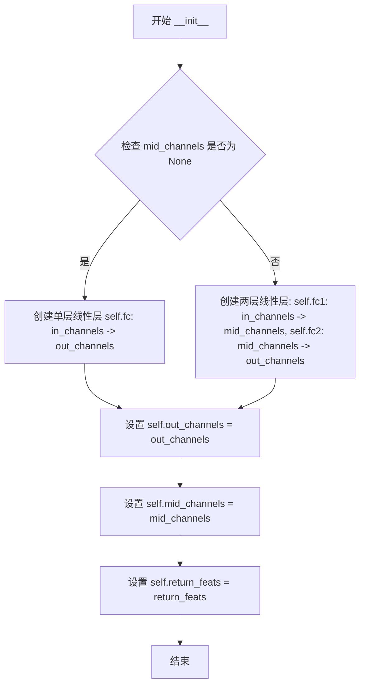

# `diffusers\examples\research_projects\anytext\ocr_recog\RecCTCHead.py` 详细设计文档

实现了一个用于序列到序列模型的CTC（连接时序分类）头部解码器，支持直接线性投影和双层投影两种模式，并可选择返回中间特征。

## 整体流程

```mermaid
graph TD
    A[forward(x, labels)] --> B{mid_channels is None?}
B -- 是 --> C[使用单层fc]
B -- 否 --> D[先使用fc1, 再使用fc2]
C --> E{return_feats?}
D --> E
E -- 是 --> F[返回字典 {ctc: predicts, ctc_neck: x}]
E -- 否 --> G[返回predicts]
```

## 类结构

```
nn.Module (PyTorch基类)
└── CTCHead (CTC预测头)
```

## 全局变量及字段


### `CTCHead.fc`
    
直接输出层,当mid_channels为None时使用

类型：`nn.Linear`
    


### `CTCHead.fc1`
    
第一投影层,当mid_channels不为None时使用

类型：`nn.Linear`
    


### `CTCHead.fc2`
    
第二投影层,当mid_channels不为None时使用

类型：`nn.Linear`
    


### `CTCHead.out_channels`
    
输出通道数,默认为6625

类型：`int`
    


### `CTCHead.mid_channels`
    
中间通道数用于两层投影

类型：`int or None`
    


### `CTCHead.return_feats`
    
是否返回中间特征

类型：`bool`
    


### `CTCHead.__init__`
    
初始化CTC头部,构建线性层

类型：`method`
    


### `CTCHead.forward`
    
前向传播,执行CTC解码

类型：`method`
    
    

## 全局函数及方法


### `CTCHead.__init__`

初始化CTC头部，构建线性层（单层或双层），根据是否指定中间通道决定网络结构，并设置输出通道、中间通道和返回特征标志。

参数：

- `in_channels`：`int`，输入特征维度，即线性层的输入通道数。
- `out_channels`：`int`，输出类别数，默认为6625，对应字符集大小。
- `fc_decay`：`float`，权重衰减系数，默认为0.0004，用于正则化。
- `mid_channels`：`int` 或 `None`，可选的中间层维度，若为None则使用单层线性层，否则使用两层线性层。
- `return_feats`：`bool`，是否返回中间特征，默认为False，若为True则返回包含预测和特征的字典。
- `**kwargs`：可变关键字参数，用于兼容其他参数，当前未使用。

返回值：`None`，该方法为初始化方法，无返回值。

#### 流程图



#### 带注释源码

```python
def __init__(
    self, in_channels, out_channels=6625, fc_decay=0.0004, mid_channels=None, return_feats=False, **kwargs
):
    """
    初始化CTC头部。

    参数:
        in_channels (int): 输入特征维度。
        out_channels (int): 输出类别数，默认为6625。
        fc_decay (float): 权重衰减系数，默认为0.0004。
        mid_channels (int, optional): 中间层维度，若为None则使用单层线性层。
        return_feats (bool): 是否返回中间特征，默认为False。
        **kwargs: 其他关键字参数，用于兼容。
    """
    # 调用父类 nn.Module 的初始化方法
    super(CTCHead, self).__init__()

    # 根据是否指定中间通道构建线性层
    if mid_channels is None:
        # 单层线性层：直接映射到输出类别
        self.fc = nn.Linear(
            in_channels,
            out_channels,
            bias=True,
        )
    else:
        # 双层线性层：先映射到中间维度，再映射到输出类别
        self.fc1 = nn.Linear(
            in_channels,
            mid_channels,
            bias=True,
        )
        self.fc2 = nn.Linear(
            mid_channels,
            out_channels,
            bias=True,
        )

    # 保存输出通道数
    self.out_channels = out_channels
    # 保存中间通道数（可能为None）
    self.mid_channels = mid_channels
    # 保存是否返回特征的标志
    self.return_feats = return_feats
```


### `CTCHead.forward`

该方法执行CTC（Connectionist Temporal Classification）头的前向传播，根据是否配置中间层对输入特征进行一层或两层的线性变换，并根据`return_feats`标志决定返回完整特征字典还是仅返回预测结果。

参数：

- `x`：`torch.Tensor`，输入特征张量，通常形状为`(batch_size, seq_len, in_channels)`
- `labels`：`Optional[torch.Tensor]`，可选的标签参数，当前实现中未使用，保留用于未来训练时的标签处理

返回值：`Union[torch.Tensor, Dict[str, torch.Tensor]]`，当`return_feats=False`时返回预测结果张量；当`return_feats=True`时返回包含"ctc"（预测结果）和"ctc_neck"（中间层特征）的字典

#### 流程图

```mermaid
flowchart TD
    A[开始 forward] --> B{self.mid_channels is None?}
    B -->|是| C[使用单层全连接: predicts = self.fc(x)]
    B -->|否| D[使用双层全连接: x = self.fc1(x)]
    D --> E[predicts = self.fc2(x)]
    C --> F{self.return_feats?}
    E --> F
    F -->|是| G[构建结果字典]
    G --> H[result['ctc'] = predicts]
    H --> I[result['ctc_neck'] = x]
    I --> J[返回 result 字典]
    F -->|否| K[直接返回 predicts]
    J --> L[结束]
    K --> L
```

#### 带注释源码

```python
def forward(self, x, labels=None):
    """
    CTC Head的前向传播方法
    
    参数:
        x: 输入特征张量，形状为 (batch_size, seq_len, in_channels)
        labels: 可选参数，当前未使用，保留用于API兼容性
    
    返回:
        当return_feats=True时返回字典{'ctc': 预测结果, 'ctc_neck': 中间特征}
        当return_feats=False时返回预测结果张量
    """
    
    # 判断是否配置了中间层
    if self.mid_channels is None:
        # 无中间层：单层线性变换
        # input: (batch_size, seq_len, in_channels)
        # output: (batch_size, seq_len, out_channels)
        predicts = self.fc(x)
    else:
        # 有中间层：两层线性变换（先降维再升维）
        # 第一层：input -> middle dimension
        x = self.fc1(x)
        # 第二层：middle dimension -> output
        predicts = self.fc2(x)
    
    # 根据配置决定返回格式
    if self.return_feats:
        # 返回完整特征字典，用于特征提取或多任务学习
        result = {}
        result["ctc"] = predicts          # CTC解码预测结果
        result["ctc_neck"] = x            # 中间层特征（用于特征复用）
    else:
        # 仅返回预测结果
        result = predicts
    
    return result
```


## 关键组件


### CTCHead 类

CTC头部网络，用于序列到序列任务的CTC解码。支持单层或双层全连接层，可选择返回中间特征用于多任务学习。

### 双层全连接结构

通过mid_channels参数控制是否为双层全连接网络。若mid_channels为None，则使用单层fc；否则使用fc1->fc2的两层网络结构。

### return_feats 特性

控制forward方法的返回值格式。当return_feats=True时，返回包含ctc预测结果和ctc_neck中间特征的字典；否则直接返回预测结果。

### forward 前向传播

实现CTC头的前向逻辑：输入特征经过全连接层得到预测结果，可选择返回中间层特征用于多任务学习。


## 问题及建议


### 已知问题

-   **forward方法中变量遮蔽与逻辑不一致**：在`else`分支中`x = self.fc1(x)`会修改原始输入，当`return_feats=True`时`ctc_neck`存储的是`fc1`的输出；但在`if`分支中`ctc_neck`使用的是未经处理的原始输入，导致两种模式下返回的特征语义不一致
-   **fc_decay参数未使用**：构造函数接收`fc_decay`参数但完全没有在权重衰减或正则化中使用，导致该参数形同虚设
-   **kwargs参数未使用**：`__init__`接收`**kwargs`但完全未使用，属于无效参数接收
-   **labels参数未使用**：`forward`方法签名包含`labels`参数但完全未使用，可能导致调用者误解
-   **缺少类型注解**：类字段和方法参数/返回值均无类型注解，影响代码可读性和静态分析
-   **硬编码的超参数默认值**：out_channels=6625是硬编码的具体数值，缺乏注释说明其来源或业务含义
-   **偏置初始化不明确**：虽然设置了`bias=True`，但未说明偏置的初始化策略，PyTorch默认初始化可能不符合业务需求

### 优化建议

-   统一`return_feats=True`时`ctc_neck`返回的特征：无论是单层还是双层结构，都应返回统一的特征层级（如都返回最后一层fc的输入），建议在if分支中也添加`x = self.fc(x)`后的中间结果
-   删除未使用的`fc_decay`参数，或在`nn.Linear`中通过`weight_decay`配置实现L2正则化；若仅用于记录 decay 值，可添加注释说明
-   移除无用的`**kwargs`参数接收，避免接口污染
-   若`labels`参数确实不需要，可从`forward`签名中移除；若计划后续支持teacher forcing等训练策略，建议添加TODO注释说明
-   为所有公共方法添加类型注解（如`x: torch.Tensor`, `labels: Optional[torch.Tensor] -> Union[torch.Tensor, Dict[str, torch.Tensor]]`）
-   为`out_channels=6625`添加注释说明该值的业务含义（如“vocab_size + blank token”）
-   考虑使用`nn.init.zeros_(self.fc.bias)`或显式初始化策略，确保偏置初始化符合预期
-   建议添加`__repr__`方法或利用`nn.Module`的现有机制展示关键配置信息


## 其它


### 设计目标与约束

该模块作为CTC解码的头部网络，主要目标是将特征向量映射到字符类别空间，支持带中间层的两阶段映射或不带中间层的直接映射。设计约束包括：输入通道数必须与前端网络输出匹配，输出通道数通常等于字符类别数+1（blank token），中间层维度需小于输入和输出维度以实现降维。

### 错误处理与异常设计

- 若`in_channels`小于等于0，PyTorch的`nn.Linear`会抛出`RuntimeError`
- 若`out_channels`小于等于0，同样会触发异常
- `mid_channels`必须小于`in_channels`和`out_channels`才能实现有效降维，否则设计失去意义
- 当前未对`labels`参数进行校验，该参数仅用于兼容接口，实际未使用

### 数据流与状态机

数据流为单向流动：输入x（形状为[batch, seq_len, in_channels]或[batch, in_channels]）→ 全连接层映射 → 输出predicts（形状为[batch, seq_len, out_channels]或[batch, out_channels]）。状态机仅有两个状态：返回完整结果（包含ctc和ctc_neck）或仅返回ctc预测，由`return_feats`标志控制。

### 外部依赖与接口契约

- 依赖PyTorch≥1.0，torch.nn模块
- 输入x应为FloatTensor或DoubleTensor，形状需符合[B, T, C]或[B, C]
- 当`return_feats=True`时，返回字典包含"ctc"和"ctc_neck"两个键
- 当`return_feats=False`时，返回torch.Tensor
- 与CTC Loss配合使用时，输出需符合ctc_loss的输入格式要求

### 性能考虑与基准测试

- 单层全连接计算复杂度为O(in_channels * out_channels * batch * seq_len)
- 两层全连接总计算量约为O(in_channels * mid_channels + mid_channels * out_channels) * batch * seq_len
- 建议对大批量场景使用单层全连接以减少内存访问开销
- 中间层维度建议设置为输入维度的1/4到1/2以平衡性能与表达能力

### 安全性考虑

当前实现无用户输入校验，不存在SQL注入、命令注入等传统安全风险。但需注意：当从配置文件加载模型时，`mid_channels`等参数需进行范围校验，防止异常值导致内存溢出或计算资源耗尽。

### 兼容性设计

- `**kwargs`参数用于向前兼容，可接受未来新增的初始化参数
- 接口设计遵循PyTorch惯例，易于集成到现有训练pipeline
- 与主流CTC实现（如warp-ctc、torchCT）保持输出格式兼容

### 测试策略建议

- 单元测试：验证不同参数组合下的输出形状
- 梯度测试：确认反向传播正确计算
- 边界测试：验证极端维度（如最小/最大通道数）下的行为
- 性能测试：对比单层与双层全连接的速度与内存占用

### 部署注意事项

- 模型导出为ONNX时，需注意`return_feats`为True时返回字典，可能需要额外处理
- 推理时建议将`return_feats`设为False以减少内存占用
- 量化部署时需注意全连接层的量化适配

    