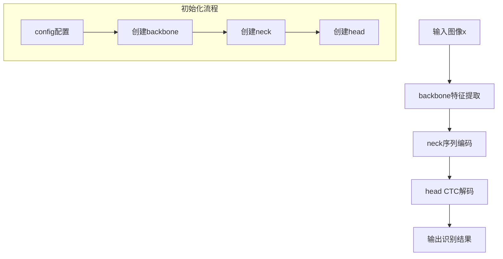
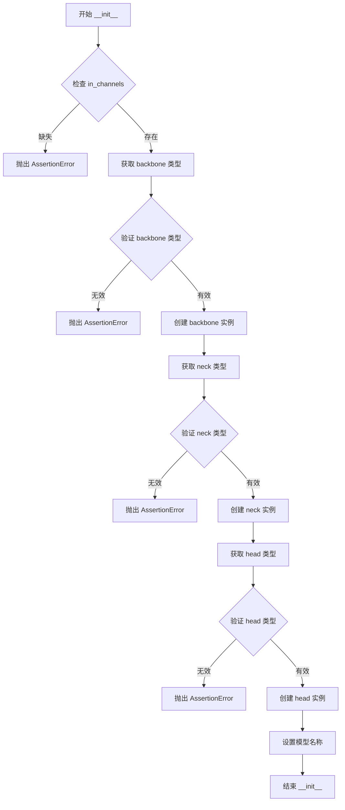
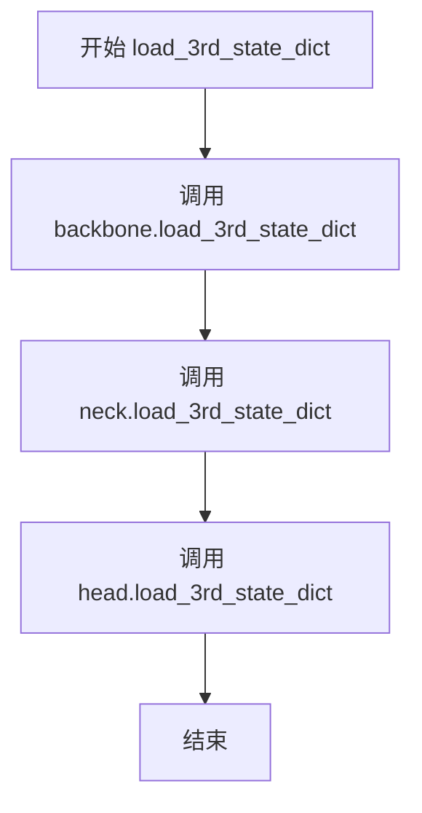
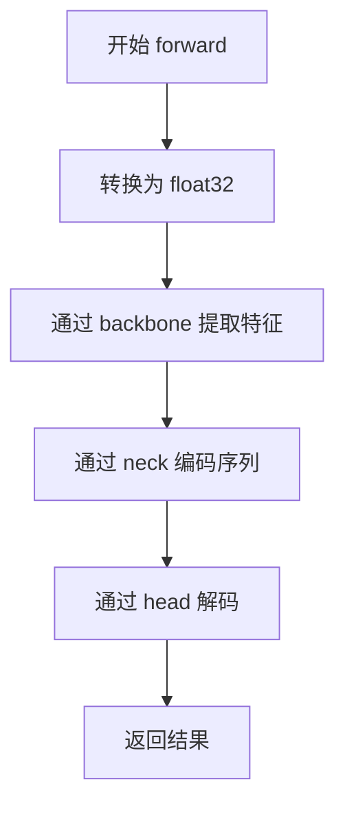
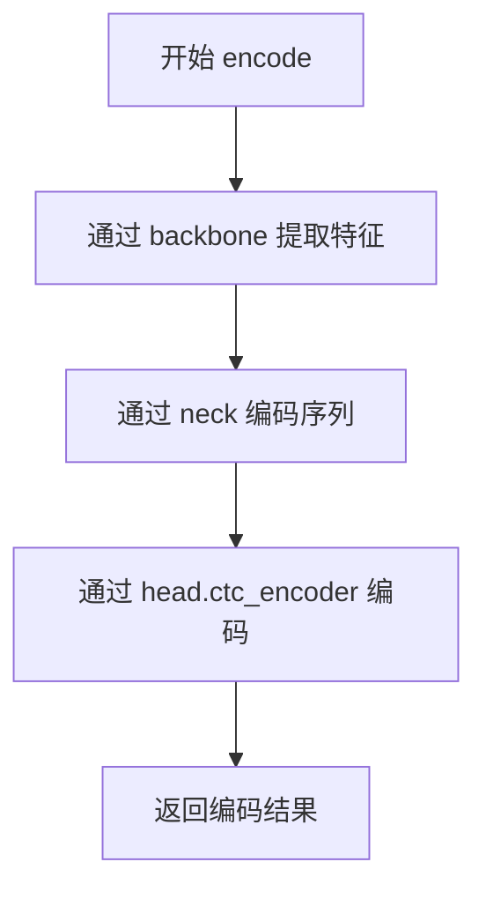
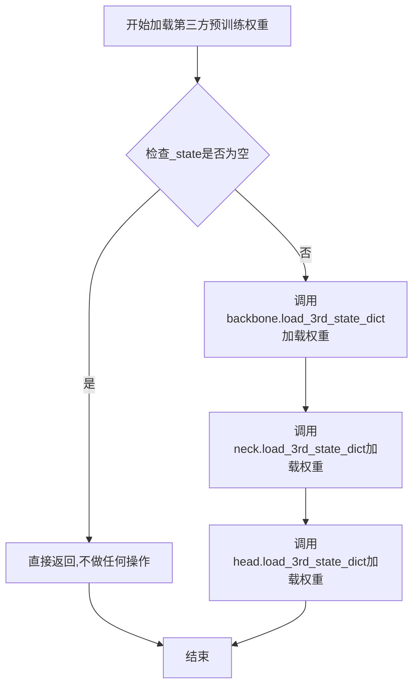
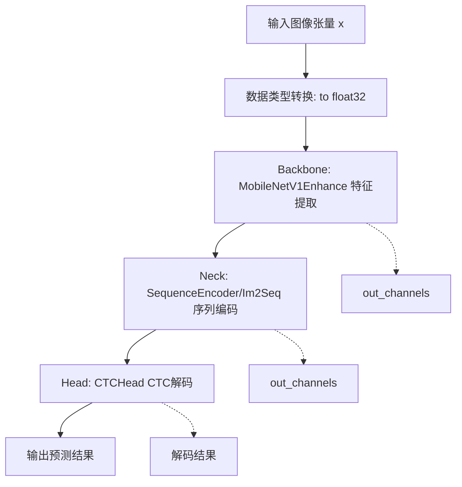
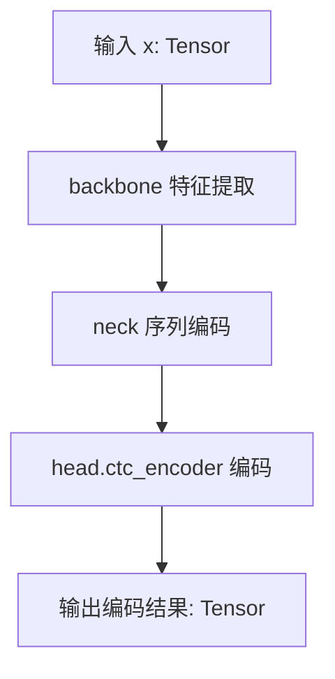

# `diffusers\examples\research_projects\anytext\ocr_recog\RecModel.py` 详细设计文档

这是一个用于场景文字识别（Scene Text Recognition）的深度学习模型，采用Encoder-Decoder架构，包含backbone（特征提取网络）、neck（序列编码器）和head（CTC解码头）三个核心组件，通过配置化方式灵活组合不同类型的网络结构，支持端到端的文本识别推理。

## 整体流程



## 类结构

```
RecModel (识别模型主类)
├── backbone_dict (backbone类型注册表)
├── neck_dict (neck类型注册表)
└── head_dict (head类型注册表)

依赖模块:
├── CTCHead (CTC解码头)
├── MobileNetV1Enhance (增强版MobileNet骨干网络)
├── Im2Im (直通变换)
├── Im2Seq (到序列变换)
└── SequenceEncoder (序列编码器)
```

## 全局变量及字段


### `backbone_dict`
    
backbone类型注册字典，目前支持MobileNetV1Enhance

类型：`Dict[str, Type]`
    


### `neck_dict`
    
neck类型注册字典，支持SequenceEncoder、Im2Seq、Im2Im

类型：`Dict[str, Type]`
    


### `head_dict`
    
head类型注册字典，目前支持CTCHead

类型：`Dict[str, Type]`
    


### `RecModel.backbone`
    
特征提取网络，负责从输入图像中提取特征

类型：`nn.Module`
    


### `RecModel.neck`
    
序列编码网络，负责将特征转换为序列表示

类型：`nn.Module`
    


### `RecModel.head`
    
CTC解码头，负责将序列特征解码为文本输出

类型：`nn.Module`
    


### `RecModel.name`
    
模型名称，格式为RecModel_{backbone_type}_{neck_type}_{head_type}

类型：`str`
    
    

## 全局函数及方法


# RecModel 详细设计文档

## 一段话描述

RecModel 是一个基于深度学习的端到端文本识别（Recognition）模型，采用 Encoder-Decoder 架构，通过 MobileNetV1Enhance 主干网络提取图像特征，经由 SequenceEncoder/Im2Seq 颈部模块进行序列编码，最后利用 CTCHead 解码器实现无词典约束的文本识别。

---

## 文件的整体运行流程

```
输入图像 → 主干网络(backbone)特征提取 → 颈部网络(neck)序列编码 → 头部网络(head)CTC解码 → 识别结果输出
```

1. **初始化阶段**：根据配置文件构建 backbone、neck、head 三个组件
2. **前向传播**：输入图像依次通过三个组件得到 CTC 解码结果
3. **编码模式**：提供 encode 方法仅返回编码器输出，供解码器使用

---

## 类的详细信息

### RecModel

文本识别主模型类，继承自 nn.Module，负责整合主干网络、颈部网络和头部网络。

#### 类字段

- `backbone`：`MobileNetV1Enhance` 类型，主干网络，用于图像特征提取
- `neck`：`SequenceEncoder/Im2Seq/Im2Im` 类型，颈部网络，用于特征序列编码
- `head`：`CTCHead` 类型，头部网络，用于 CTC 解码
- `name`：`str` 类型，模型名称标识

#### 类方法

##### RecModel.__init__

模型初始化方法，根据配置字典构建完整识别 pipeline。

参数：

- `config`：`dict`，包含 in_channels、backbone、neck、head 配置的字典

返回值：无

#### 流程图



#### 带注释源码

```python
def __init__(self, config):
    super().__init__()
    # 断言配置中必须包含 in_channels 参数
    assert "in_channels" in config, "in_channels must in model config"
    
    # 从配置中弹出 backbone 类型并验证有效性
    backbone_type = config["backbone"].pop("type")
    assert backbone_type in backbone_dict, f"backbone.type must in {backbone_dict}"
    # 根据类型实例化 backbone 网络，传入 in_channels 和剩余配置参数
    self.backbone = backbone_dict[backbone_type](config["in_channels"], **config["backbone"])

    # 从配置中弹出 neck 类型并验证有效性
    neck_type = config["neck"].pop("type")
    assert neck_type in neck_dict, f"neck.type must in {neck_dict}"
    # 根据类型实例化 neck 网络，传入 backbone 输出通道数和剩余配置参数
    self.neck = neck_dict[neck_type](self.backbone.out_channels, **config["neck"])

    # 从配置中弹出 head 类型并验证有效性
    head_type = config["head"].pop("type")
    assert head_type in head_dict, f"head.type must in {head_dict}"
    # 根据类型实例化 head 网络，传入 neck 输出通道数和剩余配置参数
    self.head = head_dict[head_type](self.neck.out_channels, **config["head"])

    # 设置模型名称，格式为 RecModel_{backbone_type}_{neck_type}_{head_type}
    self.name = f"RecModel_{backbone_type}_{neck_type}_{head_type}"
```

---

##### RecModel.load_3rd_state_dict

加载第三方预训练权重的方法，将权重同时加载到 backbone、neck、head 三个子模块。

参数：

- `_3rd_name`：`str`，第三方模型名称标识
- `_state`：`dict`，包含预训练权重的状态字典

返回值：无

#### 流程图



#### 带注释源码

```python
def load_3rd_state_dict(self, _3rd_name, _state):
    # 将第三方预训练权重加载到 backbone 网络
    self.backbone.load_3rd_state_dict(_3rd_name, _state)
    # 将第三方预训练权重加载到 neck 网络
    self.neck.load_3rd_state_dict(_3rd_name, _state)
    # 将第三方预训练权重加载到 head 网络
    self.head.load_3rd_state_dict(_3rd_name, _state)
```

---

##### RecModel.forward

模型前向传播方法，执行完整的识别 pipeline。

参数：

- `x`：`torch.Tensor`，输入图像张量

返回值：`torch.Tensor`，CTC 解码后的输出张量

#### 流程图



#### 带注释源码

```python
def forward(self, x):
    import torch  # 延迟导入 torch，避免模块级依赖

    # 将输入张量转换为 float32 类型，确保数值精度
    x = x.to(torch.float32)
    # 通过主干网络提取图像特征
    x = self.backbone(x)
    # 通过颈部网络进行序列编码
    x = self.neck(x)
    # 通过头部网络进行 CTC 解码
    x = self.head(x)
    return x  # 返回识别结果
```

---

##### RecModel.encode

编码器前向传播方法，仅返回编码器输出，供自定义解码逻辑使用。

参数：

- `x`：`torch.Tensor`，输入图像张量

返回值：`torch.Tensor`，编码器（CTC encoder）的输出张量

#### 流程图



#### 带注释源码

```python
def encode(self, x):
    # 通过主干网络提取图像特征
    x = self.backbone(x)
    # 通过颈部网络进行序列编码
    x = self.neck(x)
    # 仅通过头部网络的 CTC encoder 获取编码结果，不进行完整解码
    x = self.head.ctc_encoder(x)
    return x
```

---

## 关键组件信息

| 组件名称 | 类型 | 一句话描述 |
|---------|------|-----------|
| backbone_dict | dict | 骨干网络类型注册字典，包含 MobileNetV1Enhance |
| neck_dict | dict | 颈部网络类型注册字典，包含 SequenceEncoder、Im2Seq、Im2Im |
| head_dict | dict | 头部网络类型注册字典，包含 CTCHead |
| MobileNetV1Enhance | class | 轻量级增强版 MobileNetV1 主干网络 |
| SequenceEncoder | class | 序列编码器颈部网络 |
| Im2Seq | class | 图像转序列颈部网络 |
| Im2Im | class | 图像到图像（无序列转换）颈部网络 |
| CTCHead | class | CTC 文本识别解码头 |

---

## 潜在的技术债务或优化空间

1. **配置修改副作用**：`pop()` 方法直接修改原始 config 字典，导致配置对象在初始化后被破坏，建议使用深拷贝或只读访问
2. **延迟导入位置不当**：`forward()` 方法内部导入 torch 应提升到模块顶部
3. **错误处理不足**：仅使用 assert 进行验证，应改为显式异常处理并提供友好错误信息
4. **硬编码类型映射**：backbone_dict、neck_dict、head_dict 应支持插件式扩展机制
5. **模型名称动态性**：name 属性仅在初始化时设置，无法反映权重加载后的实际状态

---

## 其它项目

### 设计目标与约束

- **设计目标**：构建可配置的端到端文本识别模型，支持不同主干网络、颈部网络和头部网络的灵活组合
- **约束条件**：
  - 必须包含 `in_channels` 配置项
  - 各组件类型必须在对应注册字典中
  - 各组件需实现 `out_channels` 属性和 `load_3rd_state_dict` 方法

### 错误处理与异常设计

- **配置缺失错误**：缺少 `in_channels` 时抛出 AssertionError
- **类型不匹配错误**：backbone/neck/head 类型不在注册字典中时抛出 AssertionError
- **权重加载错误**：由各子模块的 `load_3rd_state_dict` 方法传播

### 数据流与状态机

```
输入 (N, C, H, W)
    ↓ float32 转换
backbone 特征提取 → (N, backbone_out_channels, H', W')
    ↓
neck 序列编码 → (N, seq_len, neck_out_channels) 或 (N, neck_out_channels, H', W')
    ↓
head CTC 解码 → (N, seq_len, num_classes)
    ↓
输出识别结果
```

### 外部依赖与接口契约

- **PyTorch**：依赖 `torch.nn.Module` 基类
- **内部模块**：RecCTCHead、RecMv1_enhance、RNN
- **接口要求**：
  - 各组件必须有 `out_channels` 属性
  - 各组件必须有 `load_3rd_state_dict(_3rd_name, _state)` 方法
  - head 必须有 `ctc_encoder` 属性或方法


### `RecModel.__init__`

初始化识别模型，根据配置字典动态创建backbone（骨干网络）、neck（颈部网络）和head（头部网络）三个组件，并组合为完整的端到端识别模型。

参数：

- `config`：`dict`，模型配置文件，必须包含 `in_channels` 字段，以及 `backbone`、`neck`、`head` 三个子配置项。每个子配置项需包含 `type` 字段以指定具体网络类型，其余字段作为网络初始化参数。

返回值：`None`，无返回值，仅在对象内部完成模型组件的初始化和属性绑定。

#### 流程图

```mermaid
flowchart TD
    A[开始 __init__] --> B{检查 in_channels 是否在 config 中}
    B -->|是| C[从 config['backbone'] 取出 type]
    B -->|否| Z[抛出 AssertionError 异常]
    
    C --> D{验证 backbone_type 是否在 backbone_dict 中}
    D -->|是| E[创建 backbone 实例: backbone_dict[backbone_type]]
    D -->|否| Z
    
    E --> F[从 config['neck'] 取出 type]
    F --> G{验证 neck_type 是否在 neck_dict 中}
    G -->|是| H[创建 neck 实例: neck_dict[neck_type]<br/>使用 backbone.out_channels 作为输入通道]
    G -->|否| Z
    
    H --> I[从 config['head'] 取出 type]
    I --> J{验证 head_type 是否在 head_dict 中}
    J -->|是| K[创建 head 实例: head_dict[head_type]<br/>使用 neck.out_channels 作为输入通道]
    J -->|否| Z
    
    K --> L[设置 self.name = f'RecModel_{backbone_type}_{neck_type}_{head_type}']
    L --> M[结束 __init__]
```

#### 带注释源码

```python
def __init__(self, config):
    """
    初始化识别模型，根据配置创建 backbone、neck、head 三个组件。
    
    参数:
        config: 字典，包含以下必需键值:
            - in_channels: 输入通道数
            - backbone: 字典，必须包含 'type' 键，其余键作为初始化参数
            - neck: 字典，必须包含 'type' 键，其余键作为初始化参数
            - head: 字典，必须包含 'type' 键，其余键作为初始化参数
    """
    # 调用父类 nn.Module 的初始化方法
    super().__init__()
    
    # 验证配置中必须包含 in_channels 字段
    assert "in_channels" in config, "in_channels must in model config"
    
    # ----------- 创建 Backbone（骨干网络）-----------
    # 取出 backbone 配置中的 type 字段，并在 pop 后从配置中移除
    backbone_type = config["backbone"].pop("type")
    # 验证 backbone 类型是否在支持列表中
    assert backbone_type in backbone_dict, f"backbone.type must in {backbone_dict}"
    # 根据类型创建 backbone 实例，传入输入通道数和剩余配置参数
    self.backbone = backbone_dict[backbone_type](config["in_channels"], **config["backbone"])

    # ----------- 创建 Neck（颈部网络）-----------
    # 取出 neck 配置中的 type 字段
    neck_type = config["neck"].pop("type")
    # 验证 neck 类型是否在支持列表中
    assert neck_type in neck_dict, f"neck.type must in {neck_dict}"
    # 根据类型创建 neck 实例，使用 backbone 的输出通道数作为输入通道
    self.neck = neck_dict[neck_type](self.backbone.out_channels, **config["neck"])

    # ----------- 创建 Head（头部网络）-----------
    # 取出 head 配置中的 type 字段
    head_type = config["head"].pop("type")
    # 验证 head 类型是否在支持列表中
    assert head_type in head_dict, f"head.type must in {head_dict}"
    # 根据类型创建 head 实例，使用 neck 的输出通道数作为输入通道
    self.head = head_dict[head_type](self.neck.out_channels, **config["head"])

    # ----------- 设置模型名称 -----------
    # 组合各组件类型生成模型名称，便于日志和可视化识别
    self.name = f"RecModel_{backbone_type}_{neck_type}_{head_type}"
```


### `RecModel.load_3rd_state_dict`

该方法用于加载第三方预训练模型权重，将外部提供的预训练状态字典加载到模型的骨干网络（backbone）、颈部网络（neck）和头部网络（head）三个组件中，实现模型权重的初始化与迁移学习。

参数：

- `_3rd_name`：`str`，第三方模型的名称标识，用于指定预训练来源或版本信息
- `_state`：`dict`，第三方预训练模型的状态字典，包含模型各层的权重参数

返回值：`None`，该方法无返回值，仅执行权重加载操作

#### 流程图



#### 带注释源码

```python
def load_3rd_state_dict(self, _3rd_name, _state):
    """
    加载第三方预训练权重到模型各组件
    
    参数:
        _3rd_name: str, 第三方模型名称标识
        _state: dict, 预训练权重状态字典
    
    返回:
        None
    """
    # 将第三方预训练权重加载到骨干网络(backbone)
    self.backbone.load_3rd_state_dict(_3rd_name, _state)
    
    # 将第三方预训练权重加载到颈部网络(neck)
    self.neck.load_3rd_state_dict(_3rd_name, _state)
    
    # 将第三方预训练权重加载到头部网络(head)
    self.head.load_3rd_state_dict(_3rd_name, _state)
```


### `RecModel.forward`

该方法实现了完整的端到端文字识别前向传播流程，输入图像张量依次经过骨干网络（Backbone）进行特征提取、颈部网络（Neck）进行序列编码、CTC头（Head）进行解码，最终输出识别结果。

参数：

- `x`：`torch.Tensor`，输入的图像张量，通常为批量输入，形状为 (batch_size, channels, height, width)

返回值：`torch.Tensor`，模型输出张量，通常为 CTC 解码后的预测结果，形状为 (seq_len, batch_size, num_classes)

#### 流程图



#### 带注释源码

```python
def forward(self, x):
    """
    执行完整的前向传播流程，完成文字识别任务
    
    参数:
        x: torch.Tensor, 输入图像张量
        
    返回:
        torch.Tensor, CTC解码后的识别结果
    """
    import torch
    
    # 步骤1: 确保输入数据为 float32 类型
    # 处理可能的半精度输入或其他数据类型
    x = x.to(torch.float32)
    
    # 步骤2: 通过骨干网络进行特征提取
    # 使用 MobileNetV1Enhance 从输入图像中提取高级特征
    # 输出形状: (batch, channels, h, w)
    x = self.backbone(x)
    
    # 步骤3: 通过颈部网络进行序列编码
    # 将特征图转换为序列形式，适合后续CTC解码
    # 输出形状: (seq_len, batch, features)
    x = self.neck(x)
    
    # 步骤4: 通过CTC头进行解码
    # 使用CTC(Connectionist Temporal Classification)解码
    # 输出形状: (seq_len, batch, num_classes)
    x = self.head(x)
    
    # 返回最终识别结果
    return x
```


### `RecModel.encode`

该方法为编码器接口，仅返回 CTC 头部的 ctc_encoder 编码结果，适用于需要获取中间编码特征的场景（如特征提取或与其他模块集成）。

参数：

- `x`：`Tensor`，输入的图像张量，通常为批次数据

返回值：`Tensor`，经过 backbone、neck 和 ctc_encoder 编码后的特征张量

#### 流程图



#### 带注释源码

```python
def encode(self, x):
    """
    编码器接口，仅返回 head 的 ctc_encoder 编码结果
    
    该方法与 forward 方法不同，forward 会返回完整的 head 输出（包括 ctc_decoder），
    而 encode 仅返回 ctc_encoder 的部分，适合用于特征提取或中间结果获取
    
    参数:
        x: 输入的图像张量
        
    返回:
        经过 ctc_encoder 编码后的特征张量
    """
    # 第一步：调用 backbone 进行图像特征提取
    x = self.backbone(x)
    
    # 第二步：调用 neck 进行序列编码处理
    x = self.neck(x)
    
    # 第三步：仅调用 head 中的 ctc_encoder 部分进行编码
    # 不经过 ctc_decoder，获取编码器阶段的输出
    x = self.head.ctc_encoder(x)
    
    # 返回编码结果
    return x
```

## 关键组件


### RecModel

RecModel是一个用于OCR（光学字符识别）的深度学习识别模型，通过配置文件动态构建由backbone（骨干网络）、neck（颈部网络）和head（头部网络）组成的三阶段模型架构，支持第三方状态字典加载和张量类型转换。

### MobileNetV1Enhance

MobileNetV1Enhance是轻量级骨干网络，用于从输入图像中提取特征，输出通道数由配置决定。

### SequenceEncoder

SequenceEncoder是序列编码器neck，将特征转换为序列表示，用于处理序列化的特征数据。

### Im2Seq

Im2Seq是将2D特征转换为序列的neck模块。

### Im2Im

Im2Im是直通neck，不做任何转换直接传递特征。

### CTCHead

CTCHead是基于CTC（Connectionist Temporal Classification）的识别头，负责解码序列输出为最终文本。

### load_3rd_state_dict

加载第三方预训练权重的方法，支持backbone、neck、head三个组件的状态字典加载。

### forward

模型前向传播方法，包含将输入转换为float32的反量化处理，然后依次通过backbone、neck、head提取特征并解码。

### encode

编码方法，仅运行backbone和neck，并通过head的ctc_encoder进行编码，不执行完整的解码过程。

### backbone_dict

模型组件注册表，存储可用的backbone类型映射。

### neck_dict

模型组件注册表，存储可用的neck类型映射。

### head_dict

模型组件注册表，存储可用的head类型映射。


## 问题及建议


### 已知问题

-   **直接修改输入配置字典**：使用 `pop()` 方法直接修改传入的 `config` 字典，会破坏原始配置数据，导致配置无法复用或在其他地方使用
-   **forward 方法内导入 torch**：在 `forward` 方法内部导入 `torch` 是不必要的开销，应该在文件顶部统一导入
-   **缺少类型注解**：整个类没有任何类型注解（type hints），降低了代码的可读性和静态类型检查工具的效率
-   **缺乏配置验证**：仅使用 `assert` 进行简单检查，未对 `in_channels` 的类型和有效性进行验证，也未检查子模块是否正确实现了 `out_channels` 属性
-   **load_3rd_state_dict 假设脆弱**：该方法假设所有子模块都实现了 `load_3rd_state_dict` 方法，没有任何容错机制
-   **代码重复**：encode 方法和 forward 方法中存在重复的调用链，可以提取公共逻辑
-   **缺少文档字符串**：类和方法均无文档字符串，降低了代码可维护性和可理解性

### 优化建议

-   **使用深拷贝保护配置**：在初始化时对配置字典进行深拷贝或使用 `.get()` 方法读取而不修改原字典
-   **将 import 移到文件顶部**：将 `import torch` 移到文件顶部统一导入位置
-   **添加类型注解**：为所有方法添加参数和返回值的类型注解，如 `def forward(self, x: torch.Tensor) -> torch.Tensor:`
-   **增强配置验证**：使用更健壮的验证方式，检查配置字段的类型和有效性
-   **添加异常处理**：在 `load_3rd_state_dict` 中使用 `hasattr` 检查方法是否存在，或使用 try-except 捕获异常
-   **提取公共逻辑**：将 forward 中的公共调用链提取为私有方法，减少代码重复
-   **添加文档字符串**：为类和关键方法添加 docstring，描述功能、参数和返回值

## 其它


### 设计目标与约束

本模型旨在构建一个灵活可配置的OCR识别模型，采用经典的backbone-neck-head架构，支持不同类型的骨干网络、颈部特征处理模块和CTC解码头。设计约束包括：输入必须包含in_channels配置；各组件类型必须在对应的字典中注册；模型名称根据组件类型动态生成。

### 错误处理与异常设计

模型初始化时使用assert语句进行关键配置校验，包括：in_channels必须存在、backbone类型必须在backbone_dict中、neck类型必须在neck_dict中、head类型必须在head_dict中。任何配置错误都会抛出AssertionError并携带明确的错误信息。第三方权重加载方法load_3rd_state_dict会调用各组件的同名方法，异常处理由各组件自行负责。

### 数据流与状态机

模型有两种数据流模式：forward模式执行完整的backbone→neck→head流程，输出CTC解码结果；encode模式在head层调用ctc_encoder方法，用于获取编码特征而非解码结果。输入数据会被转换为float32类型。模型无显式状态机设计，推理时根据调用方法决定数据流路径。

### 外部依赖与接口契约

模型依赖PyTorch nn.Module基类，以及RecCTCHead、RecMv1_enhance、RNN三个子模块。各组件需实现out_channels属性、load_3rd_state_dict方法、__call__方法（forward）。backbone输出通道数传递给neck，neck输出通道数传递给head，形成契约式的通道数传递链。

### 配置管理

模型通过config字典配置，各组件配置中的type键指定具体实现类，其余键作为初始化参数传递。配置示例：{"in_channels": 3, "backbone": {"type": "MobileNetV1Enhance", ...}, "neck": {"type": "SequenceEncoder", ...}, "head": {"type": "CTCHead", ...}}。配置在初始化时被pop修改，不保留原始配置。

### 模型初始化与权重加载策略

模型初始化时立即创建backbone、neck、head三个子模块实例。权重加载通过load_3rd_state_dict方法实现，该方法将加载任务委托给各子组件，支持第三方预训练权重。模型默认采用PyTorch标准初始化，未显式定义权重初始化策略。

### 训练与推理模式

模型继承nn.Module，支持train()和eval()模式切换。CTC Head在训练时输出log_probs用于loss计算，在推理时可通过encode方法获取特征。模型本身不区分训练推理模式，由调用方控制。

### 性能考虑

模型使用float32精度进行计算。MobileNetV1Enhance作为轻量级骨干网络，适合资源受限场景。CTC解码为无对齐的贪婪或束搜索方式，计算效率较高。未实现模型剪枝、量化或混合精度等优化策略。

### 版本兼容性

模型依赖PyTorch框架，需确保torch版本兼容。子模块RecCTCHead、RecMv1_enhance、RNN的接口需保持一致，特别是out_channels属性和load_3rd_state_dict方法。配置格式需与子模块版本匹配。

### 使用示例

```python
config = {
    "in_channels": 3,
    "backbone": {"type": "MobileNetV1Enhance", "scale": 1.0},
    "neck": {"type": "SequenceEncoder", "hidden_size": 256},
    "head": {"type": "CTCHead", "class_num": 6625}
}
model = RecModel(config)
# 推理
output = model(input_tensor)
# 获取编码特征
features = model.encode(input_tensor)
```


    