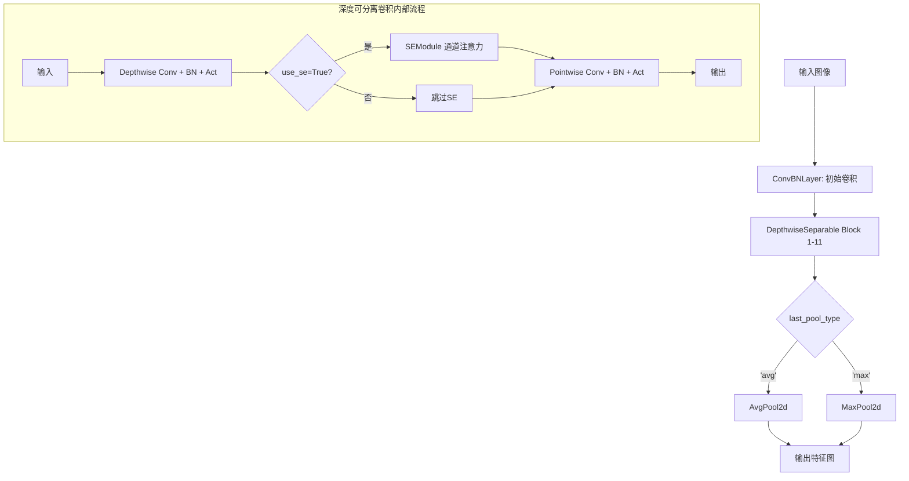
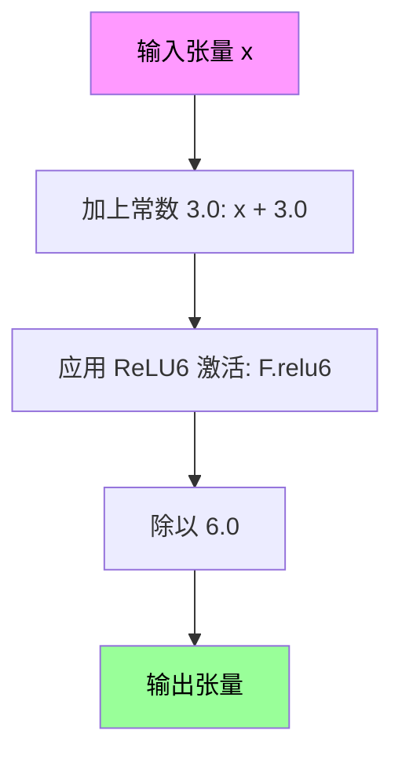
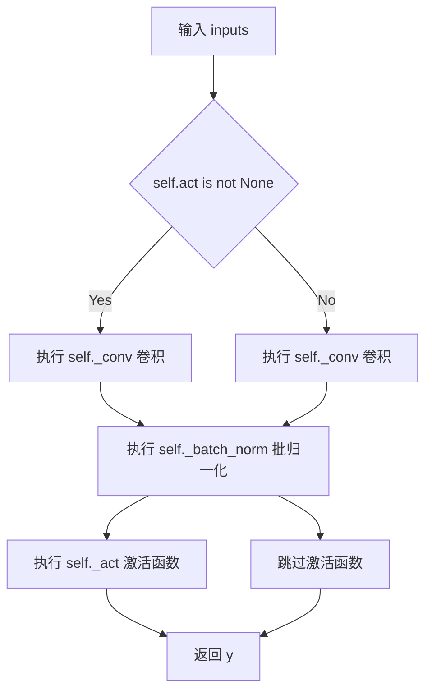
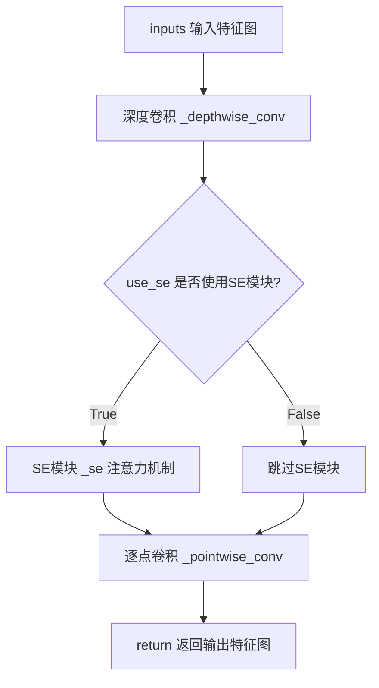
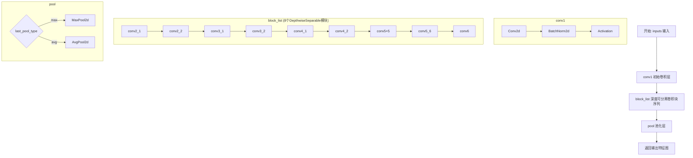
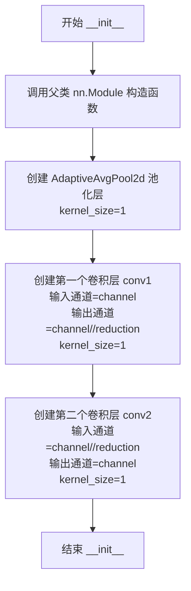
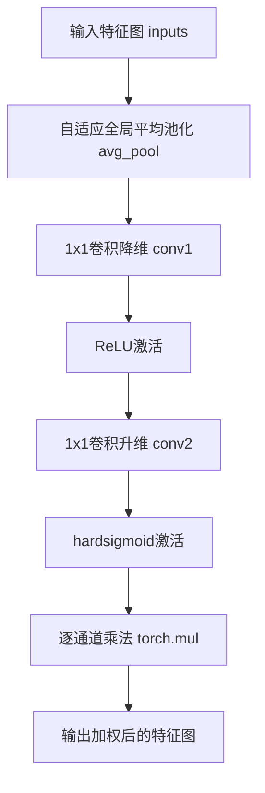

# `diffusers\examples\research_projects\anytext\ocr_recog\RecMv1_enhance.py` 详细设计文档

这是一个增强版的MobileNetV1卷积神经网络实现，包含了ConvBNLayer（卷积+归一化+激活）、DepthwiseSeparable（深度可分离卷积）、SEModule（通道注意力机制）等核心组件，支持可配置的网络缩放因子、卷积步长和池化方式，适用于轻量级图像分类任务。

## 整体流程



## 类结构

```
ConvBNLayer (卷积归一化激活层)
DepthwiseSeparable (深度可分离卷积)
MobileNetV1Enhance (主网络模型)
SEModule (SE注意力模块)
hardsigmoid (全局激活函数)
```

## 全局变量及字段


### `hardsigmoid`
    
实现 hard sigmoid 激活函数的全局函数，用于 SE 模块的注意力权重计算。

类型：`function`
    


### `ConvBNLayer.act`
    
激活函数类型字符串，如 'hard_swish'、'relu' 等。

类型：`str`
    


### `ConvBNLayer._conv`
    
卷积层，负责对输入特征图进行空间卷积以提取特征。

类型：`nn.Conv2d`
    


### `ConvBNLayer._batch_norm`
    
批归一化层，用于在卷积后对特征进行归一化，加速训练并提升稳定性。

类型：`nn.BatchNorm2d`
    


### `ConvBNLayer._act`
    
激活函数实例，根据 act 字段指定的激活类型对特征进行非线性变换。

类型：`Activation`
    


### `DepthwiseSeparable.use_se`
    
标记是否在该深度可分离卷积块中使用 SE 注意力机制。

类型：`bool`
    


### `DepthwiseSeparable._depthwise_conv`
    
深度卷积层，执行逐通道的空间卷积以提取空间特征。

类型：`ConvBNLayer`
    


### `DepthwiseSeparable._se`
    
SE 注意力模块（可选），用于对通道特征进行自适应重标定。

类型：`SEModule`
    


### `DepthwiseSeparable._pointwise_conv`
    
点卷积层，将深度卷积的输出映射到目标通道数，完成特征融合。

类型：`ConvBNLayer`
    


### `MobileNetV1Enhance.scale`
    
网络缩放因子，用于动态调整各层通道数，从而控制模型容量和计算量。

类型：`float`
    


### `MobileNetV1Enhance.block_list`
    
按顺序组合的多个深度可分离卷积块，构成网络的主体特征提取部分。

类型：`nn.Sequential`
    


### `MobileNetV1Enhance.conv1`
    
网络的第一层卷积，负责对原始输入进行初步的特征提取和通道数扩展。

类型：`ConvBNLayer`
    


### `MobileNetV1Enhance.pool`
    
池化层（MaxPool2d 或 AvgPool2d），用于在网络末端对特征图进行空间下采样。

类型：`nn.Module`
    


### `MobileNetV1Enhance.out_channels`
    
网络输出通道数，等于最后一层卷积块的通道数（通常为 1024 * scale）。

类型：`int`
    


### `SEModule.avg_pool`
    
自适应平均池化，将任意大小的特征图全局池化为 1×1，以生成通道统计信息。

类型：`nn.AdaptiveAvgPool2d`
    


### `SEModule.conv1`
    
降维卷积，将通道数压缩到 channel // reduction，以降低后续计算的参数量和计算量。

类型：`nn.Conv2d`
    


### `SEModule.conv2`
    
升维卷积，将压缩后的特征恢复到原始通道数，生成通道注意力权重。

类型：`nn.Conv2d`
    
    

## 全局函数及方法


### `hardsigmoid`

这是一个全局激活函数，实现了 hardsigmoid 激活操作，该操作是 sigmoid 函数的高效近似，常用于移动端深度学习模型中，以减少计算开销。

参数：

-  `x`：`torch.Tensor`，输入的张量，通常是卷积层的输出

返回值：`torch.Tensor`，经过 hardsigmoid 激活后的张量，值域在 [0, 1] 范围内

#### 流程图



#### 带注释源码

```python
def hardsigmoid(x):
    """
    实现 hardsigmoid 激活函数
    
    hardsigmoid 是 sigmoid 函数的高效近似，计算公式为：
    f(x) = max(0, min(1, (x + 3) / 6))
    
    该函数利用 ReLU6 算子实现，计算效率高，适合移动端部署。
    
    参数:
        x: 输入张量，任意形状
        
    返回:
        输出张量，与输入形状相同，值域在 [0, 1] 范围内
    """
    # 第一步：将输入张量加上 3.0，使输出范围偏移到 [0, 6]
    # 第二步：应用 ReLU6 激活，将结果截断到 [0, 6]
    # 第三步：除以 6.0，将结果归一化到 [0, 1]
    return F.relu6(x + 3.0, inplace=True) / 6.0
```

#### 附加说明

| 项目 | 说明 |
|------|------|
| **数学公式** | $f(x) = \max(0, \min(1, \frac{x+3}{6}))$ |
| **计算优势** | 相比原生 sigmoid，hardsigmoid 无需计算指数函数，计算效率更高 |
| **使用场景** | 主要用于 MobileNet 系列等轻量化网络，如 SE 模块中的通道注意力机制 |
| **数值范围** | 输出值被严格限制在 [0, 1] 区间内 |
| **inplace 优化** | 使用 `inplace=True` 减少内存分配开销 |


### `ConvBNLayer.__init__`

该方法是ConvBNLayer类的构造函数，用于初始化一个包含卷积、批归一化和激活函数的神经网络层。ConvBNLayer是MobileNetV1Enhance模型中的基础构建块，封装了卷积操作、批归一化处理和激活函数应用。

参数：

- `num_channels`：`int`，输入特征图的通道数
- `filter_size`：卷积核大小，可以是int或tuple类型
- `num_filters`：`int`，输出特征图的通道数（即卷积核数量）
- `stride`：卷积步长，可以是int或tuple类型
- `padding`：卷积填充大小，可以是int或tuple类型
- `channels`：`int`或`None`，可选参数，输入通道数的别名（代码中传递但未实际使用）
- `num_groups`：`int`，分组卷积的组数，默认为1（标准卷积）
- `act`：`str`，激活函数类型，默认为"hard_swish"，设为None时表示不使用激活函数

返回值：`None`，该方法为构造函数，不返回任何值，仅初始化对象内部状态

#### 流程图

```mermaid
flowchart TD
    A[开始 __init__] --> B[调用 super().__init__()]
    B --> C[保存 act 参数到 self.act]
    C --> D[创建 nn.Conv2d 卷积层]
    D --> E[创建 nn.BatchNorm2d 批归一化层]
    E --> F{self.act is not None?}
    F -->|是| G[创建 Activation 激活层实例]
    F -->|否| H[结束]
    G --> H
```

#### 带注释源码

```python
def __init__(
    self, 
    num_channels,           # 输入特征图的通道数
    filter_size,            # 卷积核大小
    num_filters,            # 输出特征图的通道数（卷积核数量）
    stride,                 # 卷积步长
    padding,                # 卷积填充大小
    channels=None,          # 可选参数，通道数别名（未使用）
    num_groups=1,           # 分组卷积组数，默认为1（标准卷积）
    act="hard_swish"        # 激活函数类型，默认为hard_swish
):
    """
    初始化ConvBNLayer卷积批归一化激活层
    
    参数:
        num_channels: 输入通道数
        filter_size: 卷积核大小
        num_filters: 输出通道数
        stride: 卷积步长
        padding: 填充大小
        channels: 未使用的参数（保留兼容性）
        num_groups: 分组卷积的组数
        act: 激活函数类型
    """
    # 调用父类nn.Module的初始化方法
    super(ConvBNLayer, self).__init__()
    
    # 保存激活函数类型到实例属性
    self.act = act
    
    # 创建二维卷积层
    # in_channels: 输入通道数
    # out_channels: 输出通道数（卷积核数量）
    # kernel_size: 卷积核大小
    # stride: 步长
    # padding: 填充
    # groups: 分组卷积（用于深度可分离卷积）
    # bias: 不使用偏置（因为后面有批归一化）
    self._conv = nn.Conv2d(
        in_channels=num_channels,
        out_channels=num_filters,
        kernel_size=filter_size,
        stride=stride,
        padding=padding,
        groups=num_groups,
        bias=False,
    )

    # 创建二维批归一化层
    # num_features: 特征通道数（与卷积输出通道数相同）
    self._batch_norm = nn.BatchNorm2d(
        num_filters,
    )
    
    # 如果激活函数类型不为None，则创建激活层
    # inplace=True 表示原地操作，节省内存
    if self.act is not None:
        self._act = Activation(act_type=act, inplace=True)
```


### `ConvBNLayer.forward`

该方法实现卷积、批归一化与激活函数的融合操作，接收输入特征图，依次经过卷积层、BatchNorm层及可选激活函数处理后输出特征图。

**参数：**

- `inputs`：`torch.Tensor`，输入的 4D 特征图，形状为 (N, C, H, W)，其中 N 为 batch size，C 为通道数，H、W 为特征图高宽

**返回值：**`torch.Tensor`，经过卷积、批归一化和激活处理后的输出特征图，形状为 (N, num_filters, H', W')，其中 H'、W' 由卷积步长和填充决定

#### 流程图



#### 带注释源码

```python
def forward(self, inputs):
    """
    前向传播方法，执行卷积、批归一化和激活操作
    
    Args:
        inputs: torch.Tensor，输入张量，形状为 (N, C, H, W)
    
    Returns:
        torch.Tensor，经过处理后的输出张量
    """
    # 步骤1：卷积操作
    # 使用预定义的卷积层对输入进行特征提取
    # 参数：in_channels, out_channels, kernel_size, stride, padding, groups
    y = self._conv(inputs)
    
    # 步骤2：批归一化操作
    # 对卷积输出进行标准化处理，稳定训练过程
    y = self._batch_norm(y)
    
    # 步骤3：激活函数处理（可选）
    # 如果定义了激活函数，则对特征进行非线性变换
    # 常见激活函数：hard_swish, relu, sigmoid 等
    if self.act is not None:
        y = self._act(y)
    
    # 返回最终处理后的特征图
    return y
```


### `DepthwiseSeparable.__init__`

该方法用于初始化一个 **DepthwiseSeparable**（深度可分离卷积）模块。这是 MobileNet 系列网络的核心构建块，通常由一个**深度卷积（Depthwise Convolution）**、一个可选的 **SE 注意力模块（Squeeze-and-Excitation）** 以及一个**逐点卷积（Pointwise Convolution）** 组成。该模块通过分组卷积大幅减少参数量和计算量。

参数：

- `num_channels`：`int`，输入特征图的通道数。
- `num_filters1`：`int`，深度卷积（Depthwise Convolution）期望输出的通道数（第一阶段滤波器数）。
- `num_filters2`：`int`，逐点卷积（Pointwise Convolution）期望输出的通道数（第二阶段滤波器数）。
- `num_groups`：`int`，深度卷积的分组数，通常等于 `num_channels`。
- `stride`：`int` 或 `tuple`，深度卷积的步长，用于控制特征图的空间分辨率。
- `scale`：`float`，通道缩放因子，用于根据配置动态调整网络的宽度（通道数）。
- `dw_size`：`int`（默认值=3），深度卷积的核大小（Kernel Size），默认为 3x3。
- `padding`：`int`（默认值=1），深度卷积的填充大小，默认为 1（用于保持空间维度）。
- `use_se`：`bool`（默认值=False），布尔标志位，决定是否在深度卷积后集成 SE 注意力模块以增强特征表达能力。

返回值：`None`。构造函数，不返回任何值。

#### 流程图

```mermaid
graph TD
    A([开始 Init]) --> B[调用 super().__init__()]
    B --> C[保存配置: self.use_se = use_se]
    C --> D[创建深度卷积层 _depthwise_conv]
    D --> E{use_se == True?}
    E -- Yes --> F[创建 SEModule: self._se]
    E -- No --> G[创建逐点卷积层 _pointwise_conv]
    F --> G
    G --> H([结束 Init])
```

#### 带注释源码

```python
def __init__(
    self, num_channels, num_filters1, num_filters2, num_groups, stride, scale, dw_size=3, padding=1, use_se=False
):
    # 1. 调用父类 nn.Module 的初始化方法，注册此模块
    super(DepthwiseSeparable, self).__init__()
    
    # 2. 保存是否启用 SE 模块的标志位
    self.use_se = use_se
    
    # 3. 实例化深度卷积层 (Depthwise Convolution)
    # 根据 scale 缩放通道数和分组数
    self._depthwise_conv = ConvBNLayer(
        num_channels=num_channels,                                 # 输入通道数
        num_filters=int(num_filters1 * scale),                    # 深度卷积输出通道数 (缩放后)
        filter_size=dw_size,                                       # 卷积核大小 (默认3)
        stride=stride,                                             # 步长
        padding=padding,                                           # 填充 (默认1，保持尺寸)
        num_groups=int(num_groups * scale),                        # 分组数 (缩放后)
    )
    
    # 4. (可选) 实例化 SE 模块
    # 如果 use_se 为 True，则添加 Squeeze-and-Excitation 块
    # 用于通道注意力机制，增强特征表征
    if use_se:
        self._se = SEModule(int(num_filters1 * scale))
        
    # 5. 实例化逐点卷积层 (Pointwise Convolution)
    # 1x1 卷积，主要用于改变通道数
    self._pointwise_conv = ConvBNLayer(
        num_channels=int(num_filters1 * scale),                   # 输入通道数 (接深度卷积输出)
        filter_size=1,                                            # 1x1 卷积核
        num_filters=int(num_filters2 * scale),                   # 最终输出通道数 (缩放后)
        stride=1,                                                  # 逐点卷积通常步长为1
        padding=0,                                                 # 1x1 卷积不需要填充
    )
```


### `DepthwiseSeparable.forward`

该方法实现了深度可分离卷积（Depthwise Separable Convolution）的前向传播过程，包含深度卷积、可选的SE注意力模块和逐点卷积三个主要步骤，用于构建轻量级神经网络模块。

参数：

- `inputs`：`torch.Tensor`，输入的特征图张量，形状为 (batch_size, num_channels, height, width)

返回值：`torch.Tensor`，经过深度可分离卷积处理后的输出特征图，形状为 (batch_size, num_filters2 * scale, height', width')

#### 流程图



#### 带注释源码

```python
def forward(self, inputs):
    """
    DepthwiseSeparable卷积前向传播
    
    参数:
        inputs: 输入特征图张量
        
    返回:
        经过深度可分离卷积处理后的特征图
    """
    # 第一步：深度卷积（Depthwise Convolution）
    # 对每个输入通道分别进行卷积操作，大幅减少参数量
    y = self._depthwise_conv(inputs)
    
    # 第二步：可选的SE（Squeeze-and-Excitation）注意力模块
    # 用于捕获通道间的依赖关系，增强特征表达能力
    if self.use_se:
        y = self._se(y)
    
    # 第三步：逐点卷积（Pointwise Convolution）
    # 1x1卷积，融合深度卷积输出的特征
    y = self._pointwise_conv(y)
    
    # 返回最终处理后的特征图
    return y
```


### `MobileNetV1Enhance.__init__`

这是MobileNetV1Enhance模型的构造函数，用于初始化MobileNetV1增强版网络结构。该方法构建了一个包含初始卷积层、多个深度可分离卷积块（DepthwiseSeparable）以及池化层的完整网络架构，支持可配置的输入通道数、模型缩放比例、最后一层卷积步长和池化类型。

参数：

- `in_channels`：`int`，输入图像的通道数，默认为3（RGB图像）
- `scale`：`float`，模型宽度缩放比例，用于控制通道数的缩放，默认为0.5
- `last_conv_stride`：`int`或`tuple`，最后一层深度可分离卷积的步长，默认为1
- `last_pool_type`：`str`，最后一层池化操作的类型，默认为"max"（最大池化），可选"avg"（平均池化）
- `**kwargs`：`dict`，额外的关键字参数，用于传递其他配置选项

返回值：`None`（构造函数无返回值）

#### 流程图

```mermaid
flowchart TD
    A[开始 __init__] --> B[调用父类 nn.Module 的 __init__]
    B --> C[设置 self.scale = scale]
    C --> D[初始化 self.block_list = 空列表]
    D --> E[创建 ConvBNLayer: conv1<br/>输入通道=in_channels<br/>输出通道=32*scale<br/>卷积核=3x3<br/>步长=2<br/>填充=1]
    E --> F[创建 DepthwiseSeparable: conv2_1<br/>通道32*scale → 64*scale]
    F --> G[添加到 block_list]
    G --> H[创建 DepthwiseSeparable: conv2_2<br/>通道64*scale → 128*scale]
    H --> I[添加到 block_list]
    I --> J[创建 DepthwiseSeparable: conv3_1<br/>通道128*scale → 128*scale]
    J --> K[添加到 block_list]
    K --> L[创建 DepthwiseSeparable: conv3_2<br/>步长=(2,1)<br/>通道128*scale → 256*scale]
    L --> M[添加到 block_list]
    M --> N[创建 DepthwiseSeparable: conv4_1<br/>通道256*scale → 256*scale]
    N --> O[添加到 block_list]
    O --> P[创建 DepthwiseSeparable: conv4_2<br/>步长=(2,1)<br/>通道256*scale → 512*scale]
    P --> Q[添加到 block_list]
    Q --> R[循环5次创建conv5块<br/>通道512*scale → 512*scale<br/>dw_size=5, 无SE]
    R --> S[添加到 block_list]
    S --> T[创建 DepthwiseSeparable: conv5_6<br/>步长=(2,1)<br/>通道512*scale → 1024*scale<br/>dw_size=5, use_se=True]
    T --> U[添加到 block_list]
    U --> V[创建 DepthwiseSeparable: conv6<br/>步长=last_conv_stride<br/>通道1024*scale → 1024*scale<br/>use_se=True]
    V --> W[添加到 block_list]
    W --> X[将 block_list 转换为 nn.Sequential]
    X --> Y{last_pool_type == "avg"?}
    Y -->|是| Z[创建 AvgPool2d<br/>kernel_size=2, stride=2]
    Y -->|否| AA[创建 MaxPool2d<br/>kernel_size=2, stride=2]
    Z --> AB[设置 self.out_channels = 1024 * scale]
    AA --> AB
    AB --> AC[结束 __init__]
```

#### 带注释源码

```python
def __init__(self, in_channels=3, scale=0.5, last_conv_stride=1, last_pool_type="max", **kwargs):
    """
    MobileNetV1Enhance 构造函数
    
    参数:
        in_channels: 输入图像通道数，默认3（RGB）
        scale: 模型宽度缩放因子，默认0.5
        last_conv_stride: 最后一层卷积步长，默认1
        last_pool_type: 池化类型，"max"或"avg"，默认"max"
        **kwargs: 其他关键字参数
    """
    # 调用父类 nn.Module 的初始化方法
    super().__init__()
    
    # 保存模型缩放比例，用于控制各层通道数
    self.scale = scale
    
    # 初始化空列表，用于存储网络块
    self.block_list = []

    # -----------------------------
    # 第一层：初始卷积层
    # 将输入图像从 in_channels 通道转换为 32*scale 通道
    # 使用 3x3 卷积核，步长2，填充1（保持空间尺寸减半）
    # -----------------------------
    self.conv1 = ConvBNLayer(
        num_channels=in_channels,    # 输入通道数
        filter_size=3,               # 3x3 卷积核
        channels=3,                  # 输入通道数（冗余参数）
        num_filters=int(32 * scale), # 输出通道数（缩放后）
        stride=2,                    # 步长2，输出尺寸减半
        padding=1                    # 填充1，保持尺寸
    )

    # -----------------------------
    # Stage 2: 第一个深度可分离卷积块
    # 通道: 32*scale -> 64*scale，步长1
    # 输出尺寸不变
    # -----------------------------
    conv2_1 = DepthwiseSeparable(
        num_channels=int(32 * scale),
        num_filters1=32,
        num_filters2=64,
        num_groups=32,
        stride=1,
        scale=scale
    )
    self.block_list.append(conv2_1)

    # -----------------------------
    # Stage 2: 第二个深度可分离卷积块
    # 通道: 64*scale -> 128*scale，步长1
    # 输出尺寸不变
    # -----------------------------
    conv2_2 = DepthwiseSeparable(
        num_channels=int(64 * scale),
        num_filters1=64,
        num_filters2=128,
        num_groups=64,
        stride=1,
        scale=scale
    )
    self.block_list.append(conv2_2)

    # -----------------------------
    # Stage 3: 第一个深度可分离卷积块
    # 通道: 128*scale -> 128*scale，步长1
    # 输出尺寸不变
    # -----------------------------
    conv3_1 = DepthwiseSeparable(
        num_channels=int(128 * scale),
        num_filters1=128,
        num_filters2=128,
        num_groups=128,
        stride=1,
        scale=scale
    )
    self.block_list.append(conv3_1)

    # -----------------------------
    # Stage 3: 第二个深度可分离卷积块
    # 通道: 128*scale -> 256*scale，步长(2,1)
    # 高度方向减半，宽度方向不变（适配人脸识别）
    # -----------------------------
    conv3_2 = DepthwiseSeparable(
        num_channels=int(128 * scale),
        num_filters1=128,
        num_filters2=256,
        num_groups=128,
        stride=(2, 1),              # 高度2，宽度1
        scale=scale,
    )
    self.block_list.append(conv3_2)

    # -----------------------------
    # Stage 4: 第一个深度可分离卷积块
    # 通道: 256*scale -> 256*scale，步长1
    # -----------------------------
    conv4_1 = DepthwiseSeparable(
        num_channels=int(256 * scale),
        num_filters1=256,
        num_filters2=256,
        num_groups=256,
        stride=1,
        scale=scale
    )
    self.block_list.append(conv4_1)

    # -----------------------------
    # Stage 4: 第二个深度可分离卷积块
    # 通道: 256*scale -> 512*scale，步长(2,1)
    # 高度方向减半，宽度方向不变
    # -----------------------------
    conv4_2 = DepthwiseSeparable(
        num_channels=int(256 * scale),
        num_filters1=256,
        num_filters2=512,
        num_groups=256,
        stride=(2, 1),
        scale=scale,
    )
    self.block_list.append(conv4_2)

    # -----------------------------
    # Stage 5: 5个连续的深度可分离卷积块（无SE）
    # 通道: 512*scale -> 512*scale，步长1
    # 使用更大的深度卷积核 5x5
    # -----------------------------
    for _ in range(5):
        conv5 = DepthwiseSeparable(
            num_channels=int(512 * scale),
            num_filters1=512,
            num_filters2=512,
            num_groups=512,
            stride=1,
            dw_size=5,               # 5x5 深度卷积核
            padding=2,               # 填充2
            scale=scale,
            use_se=False,            # 不使用SE模块
        )
        self.block_list.append(conv5)

    # -----------------------------
    # Stage 5_6: 带SE的深度可分离卷积块
    # 通道: 512*scale -> 1024*scale，步长(2,1)
    # 高度方向减半，宽度方向不变
    # 启用SE模块进行通道注意力
    # -----------------------------
    conv5_6 = DepthwiseSeparable(
        num_channels=int(512 * scale),
        num_filters1=512,
        num_filters2=1024,
        num_groups=512,
        stride=(2, 1),
        dw_size=5,
        padding=2,
        scale=scale,
        use_se=True,                # 启用SE模块
    )
    self.block_list.append(conv5_6)

    # -----------------------------
    # Stage 6: 最后一层深度可分离卷积块
    # 通道: 1024*scale -> 1024*scale
    # 步长由 last_conv_stride 参数决定
    # 启用SE模块
    # -----------------------------
    conv6 = DepthwiseSeparable(
        num_channels=int(1024 * scale),
        num_filters1=1024,
        num_filters2=1024,
        num_groups=1024,
        stride=last_conv_stride,    # 可配置的步长
        dw_size=5,
        padding=2,
        use_se=True,                # 启用SE模块
        scale=scale,
    )
    self.block_list.append(conv6)

    # -----------------------------
    # 将块列表转换为 nn.Sequential
    # 便于前向传播的顺序执行
    # -----------------------------
    self.block_list = nn.Sequential(*self.block_list)

    # -----------------------------
    # 池化层配置
    # 根据 last_pool_type 选择池化方式
    # -----------------------------
    if last_pool_type == "avg":
        # 平均池化
        self.pool = nn.AvgPool2d(kernel_size=2, stride=2, padding=0)
    else:
        # 最大池化（默认）
        self.pool = nn.MaxPool2d(kernel_size=2, stride=2, padding=0)
    
    # 设置输出通道数，供后续使用
    self.out_channels = int(1024 * scale)
```


### `MobileNetV1Enhance.forward`

该方法是 MobileNetV1Enhance 网络的前向传播函数，接收输入图像并依次通过初始卷积层、多个深度可分离卷积模块组成的特征提取网络、以及池化层，最终输出提取后的特征图。

参数：

- `inputs`：`torch.Tensor`，输入的图像数据张量，形状为 (batch_size, in_channels, height, width)

返回值：`torch.Tensor`，经过网络前向传播后的输出特征图，形状为 (batch_size, out_channels, h', w')

#### 流程图



#### 带注释源码

```python
def forward(self, inputs):
    """
    MobileNetV1Enhance 网络的前向传播方法
    
    参数:
        inputs: torch.Tensor, 输入图像张量，形状为 (batch_size, channels, height, width)
    
    返回:
        torch.Tensor, 经过网络处理后的特征图
    """
    # 第一步：通过初始卷积层 conv1
    # conv1 是一个 ConvBNLayer，包含 3x3 卷积 + BatchNorm + 激活函数
    # 作用：将输入图像转换为初始特征图，进行初步特征提取
    y = self.conv1(inputs)
    
    # 第二步：通过由多个 DepthwiseSeparable 模块组成的 block_list
    # block_list 是 nn.Sequential，包含了8个深度可分离卷积块
    # 每个块包含：深度卷积(dw) + 可选的SE注意力机制 + 点卷积(pw)
    # 作用：进行多层次特征提取，逐步提取从低级到高级的特征
    y = self.block_list(y)
    
    # 第三步：通过池化层 pool
    # 根据 last_pool_type 选择 MaxPool2d 或 AvgPool2d
    # 作用：对特征图进行空间降采样，减少特征图尺寸
    y = self.pool(y)
    
    # 返回最终的输出特征图
    return y
```


### `SEModule.__init__`

该方法是 SEModule 类的构造函数，用于初始化 SE（Squeeze-and-Excitation）模块的卷积层和池化层。SE 模块通过全局平均池化和两个卷积层来学习通道注意力权重，从而增强特征表示。

参数：

- `self`：隐式参数，SEModule 实例本身
- `channel`：`int`，输入特征图的通道数
- `reduction`：`int`，通道缩减比例，默认为 4，用于减少第一个卷积层的输出通道数

返回值：`None`，构造函数不返回任何值

#### 流程图



#### 带注释源码

```python
def __init__(self, channel, reduction=4):
    """
    初始化 SE 模块
    
    参数:
        channel: int, 输入特征图的通道数
        reduction: int, 通道缩减比例，用于减少第一个卷积层的参数数量，默认为 4
    """
    # 调用父类 nn.Module 的构造函数，初始化模块基础结构
    super(SEModule, self).__init__()
    
    # 创建全局平均池化层，将特征图 spatial 维度池化为 1x1
    # 输出形状: (batch, channel, 1, 1)
    self.avg_pool = nn.AdaptiveAvgPool2d(1)
    
    # 第一个卷积层（降维卷积），将通道数从 channel 降到 channel // reduction
    # 使用 1x1 卷积核，不改变 spatial 维度
    # bias=True 允许学习偏移量
    self.conv1 = nn.Conv2d(
        in_channels=channel,                # 输入通道数
        out_channels=channel // reduction,   # 输出通道数（缩减后）
        kernel_size=1,                       # 1x1 卷积核
        stride=1,                            # 步长为1
        padding=0,                           # 无填充
        bias=True                            # 使用偏置
    )
    
    # 第二个卷积层（升维卷积），将通道数从 channel // reduction 恢复到 channel
    # 使用 1x1 卷积核，不改变 spatial 维度
    # bias=True 允许学习每个通道的缩放因子
    self.conv2 = nn.Conv2d(
        in_channels=channel // reduction,    # 输入通道数（缩减后）
        out_channels=channel,                # 输出通道数（恢复原大小）
        kernel_size=1,                       # 1x1 卷积核
        stride=1,                            # 步长为1
        padding=0,                           # 无填充
        bias=True                            # 使用偏置
    )
```


### `SEModule.forward`

描述：SEModule（Squeeze-and-Excitation Module）实现通道注意力机制，通过全局平均池化压缩空间信息，经过两层全连接层（卷积）学习通道权重，最后使用 hardsigmoid 激活函数将权重归一化到 [0,1] 区间，并与原始输入逐通道相乘实现特征重标定。

参数：

- `self`：隐式参数，SEModule 实例本身
- `inputs`：`torch.Tensor`，输入特征图，形状为 (batch_size, channels, height, width)

返回值：`torch.Tensor`，经过通道注意力加权后的特征图，形状与输入相同 (batch_size, channels, height, width)

#### 流程图



#### 带注释源码

```python
def forward(self, inputs):
    """
    SEModule的前向传播，实现通道注意力机制
    
    参数:
        inputs: 输入特征图，形状为 (batch_size, channels, height, width)
    
    返回值:
        经过通道权重加权后的特征图，形状与输入相同
    """
    
    # 步骤1：自适应全局平均池化
    # 将空间维度(h*w)压缩为1x1，得到全局上下文信息
    # 输出形状: (batch_size, channels, 1, 1)
    outputs = self.avg_pool(inputs)
    
    # 步骤2：第一个1x1卷积（降维）
    # 减少通道数，降低计算量，引入非线性变换
    # 输入通道: channel, 输出通道: channel // reduction
    outputs = self.conv1(outputs)
    
    # 步骤3：ReLU激活
    # 增加非线性表达能力
    outputs = F.relu(outputs)
    
    # 步骤4：第二个1x1卷积（升维）
    # 恢复原始通道数，生成通道权重
    # 输入通道: channel // reduction, 输出通道: channel
    outputs = self.conv2(outputs)
    
    # 步骤5：HardSigmoid激活
    # 将权重归一化到[0,1]区间，比sigmoid更高效
    outputs = hardsigmoid(outputs)
    
    # 步骤6：逐通道乘法
    # 将学习到的通道权重与原始特征图相乘，实现特征重标定
    # inputs: (batch_size, channels, height, width)
    # outputs: (batch_size, channels, 1, 1) - 广播机制自动扩展
    x = torch.mul(inputs, outputs)
    
    return x
```

## 关键组件


### ConvBNLayer

卷积、批归一化与激活函数的组合模块，提供标准卷积块的基础封装，包含卷积层、BatchNorm层和可选激活函数。

### DepthwiseSeparable

深度可分离卷积模块，由Depthwise卷积和Pointwise卷积组成，可选集成SE注意力机制，是MobileNet系列的核心构建块。

### MobileNetV1Enhance

增强版MobileNet V1网络架构，包含多层深度可分离卷积，支持通道缩放、步长配置和池化类型选择，输出特征图经过全局池化。

### SEModule

Squeeze-and-Excitation模块，通过全局平均池化、通道压缩与激活、通道重校准实现通道注意力机制，增强特征表达能力。

### hardsigmoid

硬件友好的sigmoid近似函数，使用ReLU6实现，计算效率高，适用于移动端部署场景。


## 问题及建议


### 已知问题

- **ConvBNLayer中channels参数未使用**: `__init__`方法接收了`channels`参数但在卷积层创建中从未使用，造成参数浪费和代码混淆。
- **dw_size和padding参数传递缺失**: `DepthwiseSeparable`中调用`ConvBNLayer`时传入了`dw_size`和`padding`参数，但`ConvBNLayer.__init__`未接收这些参数，会导致运行时错误或使用默认值。
- **Activation依赖不明确**: 从`.common`导入`Activation`，但代码中实际使用字符串配置，Activation类的实现未知，存在隐藏依赖风险。
- **硬编码的网络结构**: 所有卷积块通过重复代码手动创建，无法通过配置文件调整网络拓扑，扩展性差。
- **stride参数不一致**: 部分DepthwiseSeparable使用元组stride`(2, 1)`，这在深度可分离卷积中不标准，可能导致特征图宽高不对称。
- **池化层硬编码**: 使用固定的kernel_size=2和stride=2，无法适应不同输入分辨率，通用性受限。
- **缺少类型注解和文档字符串**: 所有方法和类都缺乏类型提示和docstring，降低代码可维护性。
- **浮点数通道数转换风险**: 使用`int(num_filters * scale)`进行转换，当scale为浮点数时可能产生非预期通道数。
- **无输入验证**: `forward`方法直接处理输入，无形状或类型校验，可能导致隐蔽的运行时错误。

### 优化建议

- 移除未使用的`channels`参数，或将其用于卷积层的`in_channels`配置。
- 在`ConvBNLayer.__init__`中添加`dw_size`和`padding`参数支持，确保与`DepthwiseSeparable`的接口匹配。
- 将网络结构配置化，使用配置字典或配置文件定义各层参数，提高可维护性和可扩展性。
- 统一stride参数使用标准整数值或(2, 2)形式的元组，避免非对称下采样。
- 添加输入形状验证逻辑，检查通道数是否符合预期，抛出明确的错误信息。
- 使用`math.ceil`或`round`处理通道数计算，确保整数转换的准确性。
- 为所有公共方法添加docstring和类型注解，提高代码可读性。
- 考虑将池化层参数化，允许根据任务需求配置池化策略。
- 添加配置类或数据类管理模型参数，提供默认值和类型检查。
- 实现模型构建的工厂模式或注册机制，便于后续扩展新模块。


## 其它


### 设计目标与约束

本代码实现了一个轻量级卷积神经网络MobileNetV1Enhance，设计目标是在保持较高识别精度的同时大幅降低计算量和参数量，适用于移动端和嵌入式设备的图像分类任务。核心约束包括：模型规模可通过scale参数动态调整（默认0.5），支持自定义输入通道数、最后一层卷积步长和池化类型，网络结构遵循MobileNet系列的标准深度可分离卷积设计范式。

### 错误处理与异常设计

代码主要依赖PyTorch框架的自动异常传播机制。ConvBNLayer在初始化时对act参数进行None检查以决定是否添加激活层；DepthwiseSeparable通过use_se标志控制SE模块的添加；MobileNetV1Enhance在构建网络时对last_pool_type进行条件分支处理。当前实现缺乏显式的参数校验和自定义异常类，建议在后续版本中添加输入shape合法性校验、scale参数范围检查（0 < scale ≤ 1）以及无效卷积stride值的防御性编程。

### 数据流与状态机

网络数据流遵循标准的前向传播流程：输入图像张量 → 初始卷积层(conv1) → 多个DepthwiseSeparable块组成的特征提取网络(block_list) → 池化层(pool) → 输出特征张量。网络不包含显式状态机，所有中间状态通过nn.Module的forward方法临时保存，不维护持久化状态。训练模式下BatchNorm层会启用momentum更新均值和方差，推理模式下使用预计算的统计量。

### 外部依赖与接口契约

代码依赖以下外部模块：(1) torch和torch.nn提供张量运算和神经网络基础组件；(2) torch.nn.functional提供函数式操作如F.relu6和F.relu；(3) 同级模块common中的Activation类用于生成激活函数。输入接口要求传入4D张量(B,C,H,W)，其中C通道数需与in_channels参数匹配；输出接口返回经过池化后的4D张量，通道数为int(1024 * scale)，空间维度取决于输入尺寸和网络步长配置。

### 配置参数说明

ConvBNLayer的关键配置参数包括：num_channels（输入通道数）、filter_size（卷积核尺寸）、num_filters（输出通道数）、stride（卷积步长，可为int或tuple）、padding（填充尺寸）、num_groups（分组卷积数）和act（激活函数类型，默认hard_swish）。DepthwiseSeparable额外包含use_se（是否使用SE模块）和dw_size（深度卷积核尺寸）。MobileNetV1Enhance的核心配置为scale（通道缩放因子，控制模型规模）和last_conv_stride（最后一层卷积步长，影响输出分辨率）。

### 性能考虑与优化空间

当前实现存在以下性能瓶颈和优化机会：(1) DepthwiseSeparable中的条件分支（use_se）在forward中产生轻微的动态调度开销，可通过分离为两个独立模块类消除；(2) ConvBNLayer中act为None时的分支判断在每次前向传播时执行，建议预先判断并构建对应的forward逻辑；(3) hardsigmoid函数可使用torch.nn.functional.hardsigmoid替代以利用底层优化；(4) 建议使用torch.jit.script装饰器对hardsigmoid进行JIT编译加速；(5) block_list使用nn.Sequential包装，可考虑使用nn.ModuleList以获得更清晰的前向传播控制。

### 内存使用分析

模型的内存占用主要由卷积层权重和BatchNorm层参数构成。以scale=1.0为例，conv1包含约2.7K参数（3→32通道，3x3卷积），每个DepthwiseSeparable块包含深度卷积和点卷积两部分，通道数从32逐步增加到1024，总参数量约为2.1M。BatchNorm层每层包含4个参数（gamma、beta、running_mean、running_var），共计约8K参数。建议在实际部署时根据设备内存情况调整scale参数，0.5规模下参数量降至约0.5M。

### 扩展性设计

网络架构具备良好的扩展性：(1) 可通过继承MobileNetV1Enhance并重写forward方法实现特征金字塔或多尺度输出；(2) 激活函数类型由Activation类管理，支持灵活替换为ReLU、Swish等；(3) block_list采用nn.Sequential容器，便于插入额外的注意力模块或特征融合层；(4) 建议未来版本添加dropout层和更多可选的注意力机制（如CBAM）以提升特征表达能力。

### 版本历史与变更记录

当前版本为初始实现，基于MobileNetV1架构进行增强，主要改进包括：引入SE注意力模块、增加网络深度、添加hard_swish激活函数支持。后续可考虑的改进方向包括：添加EfficientNet中的复合缩放策略支持、集成AutoML搜索得到的更优结构、添加混合精度训练支持。

### 测试策略建议

建议补充以下测试用例：(1) 单元测试验证各模块输出的shape正确性；(2) 参数边界测试：scale=0.25/0.75/1.0、last_conv_stride=1/2、last_pool_type="avg"/"max"的各种组合；(3) 前向传播数值稳定性测试：输入全零张量、全1张量、随机张量；(4) 模型保存加载测试：验证state_dict的序列化与反序列化；(5) 梯度流测试：反向传播验证各层梯度有效性。

### 部署注意事项

部署时需注意：(1) BatchNorm层的推理模式依赖running_mean和running_var，需确保模型从训练模式切换到eval模式；(2) hard_swish激活函数在某些边缘设备上可能不如ReLU高效，可考虑替换为ReLU6以提升推理速度；(3) 模型文件较大时建议使用torch.jit.trace生成TorchScript模型以减小体积和加速加载；(4) 移动端部署可考虑转换为ONNX格式后使用NCNN或TensorFlow Lite进行推理。


    