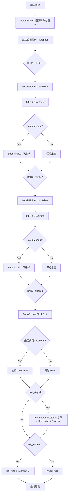
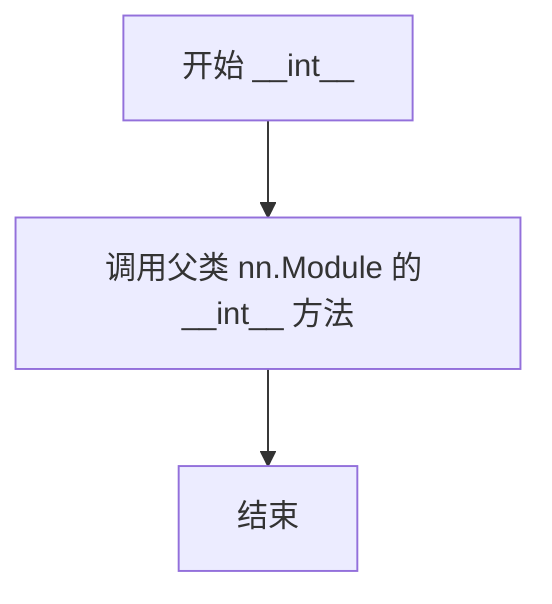
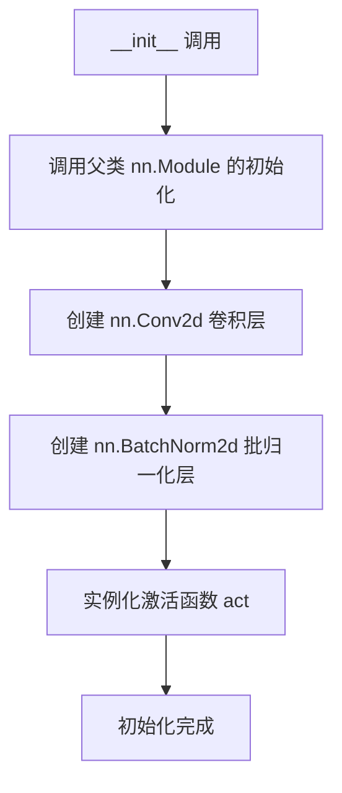
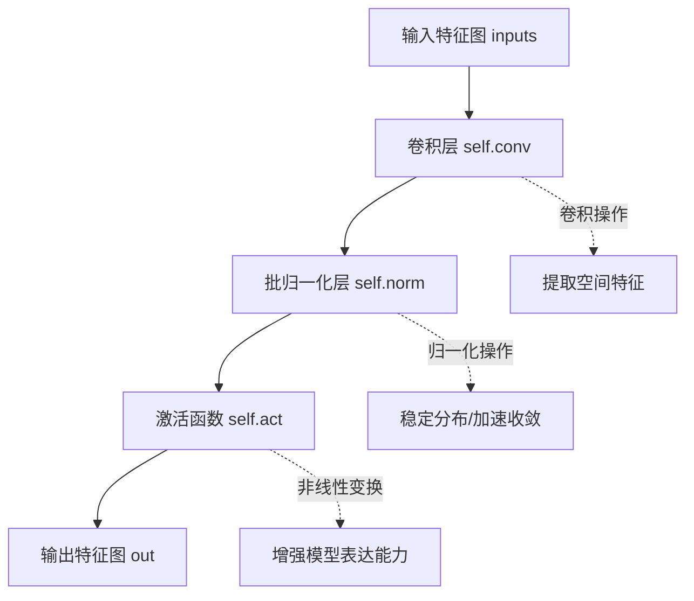
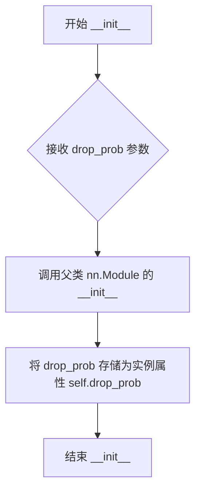
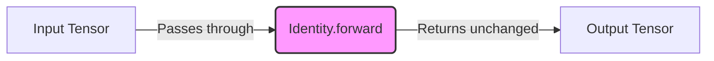
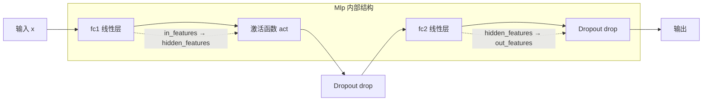
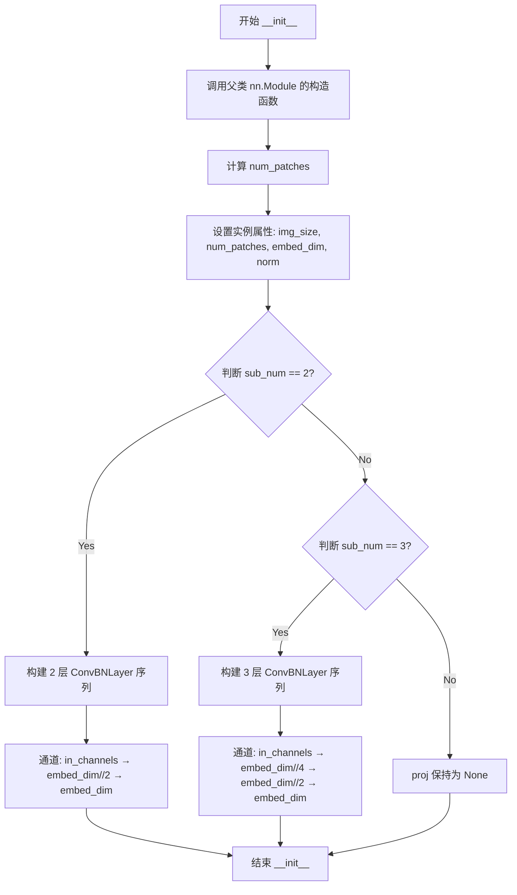

# `diffusers\examples\research_projects\anytext\ocr_recog\RecSVTR.py` 详细设计文档

SVTRNet是一个基于Transformer架构的视觉文本识别网络，通过结合局部注意力、全局注意力和卷积混合器机制，从输入图像中提取序列化的文本特征表示，支持变长文本识别任务。

## 整体流程



## 类结构

```
nn.Module (PyTorch基类)
├── Swish (Swish激活函数)
├── ConvBNLayer (卷积+BatchNorm+激活)
├── DropPath (随机深度Dropout)
├── Identity (恒等映射)
├── Mlp (多层感知机/FFN)
├── ConvMixer (卷积混合器)
├── Attention (注意力机制)
├── Block (Transformer编码器块)
├── PatchEmbed (图像分块嵌入)
├── SubSample (下采样模块)
└── SVTRNet (主网络模型)
```

## 全局变量及字段


### `dpr`
    
Drop path rates for each block, linearly spaced from 0 to drop_path_rate.

类型：`numpy.ndarray`
    


### `num_patches`
    
Number of patches produced by the patch embedding.

类型：`int`
    


### `Block_unit`
    
The Block class used to instantiate transformer blocks.

类型：`type (Block class)`
    


### `hk`
    
Height of the local attention kernel.

类型：`int`
    


### `wk`
    
Width of the local attention kernel.

类型：`int`
    


### `mask`
    
Attention mask for local mixing (flattened).

类型：`torch.Tensor`
    


### `mask_paddle`
    
Padded mask used for local attention computation.

类型：`torch.Tensor`
    


### `mask_inf`
    
Mask filled with negative infinity for invalid positions.

类型：`torch.Tensor`
    


### `head_dim`
    
Dimension of each attention head.

类型：`int`
    


### `mlp_hidden_dim`
    
Hidden layer dimension in the MLP of each block.

类型：`int`
    


### `ConvBNLayer.conv`
    
2D convolutional layer for extracting features.

类型：`torch.nn.Conv2d`
    


### `ConvBNLayer.norm`
    
Batch normalization layer for stabilizing conv output.

类型：`torch.nn.BatchNorm2d`
    


### `ConvBNLayer.act`
    
Activation function applied after normalization (default GELU).

类型：`torch.nn.Module`
    


### `DropPath.drop_prob`
    
Probability of dropping a path (stochastic depth).

类型：`float`
    


### `Mlp.fc1`
    
First fully‑connected layer projecting to hidden dimension.

类型：`torch.nn.Linear`
    


### `Mlp.act`
    
Activation function after the first FC layer.

类型：`torch.nn.Module`
    


### `Mlp.fc2`
    
Second fully‑connected layer projecting to output dimension.

类型：`torch.nn.Linear`
    


### `Mlp.drop`
    
Dropout applied after each fully‑connected layer.

类型：`torch.nn.Dropout`
    


### `ConvMixer.HW`
    
Height and width of the feature maps.

类型：`tuple[int, int]`
    


### `ConvMixer.dim`
    
Number of channels (embedding dimension).

类型：`int`
    


### `ConvMixer.local_mixer`
    
Depthwise convolution mixer for local token interaction.

类型：`torch.nn.Conv2d`
    


### `Attention.num_heads`
    
Number of attention heads.

类型：`int`
    


### `Attention.scale`
    
Scaling factor for attention scores (head_dim⁻⁰·⁵).

类型：`float`
    


### `Attention.qkv`
    
Linear projection producing query, key and value tensors.

类型：`torch.nn.Linear`
    


### `Attention.attn_drop`
    
Dropout layer applied to attention weights.

类型：`torch.nn.Dropout`
    


### `Attention.proj`
    
Linear projection after attention aggregation.

类型：`torch.nn.Linear`
    


### `Attention.proj_drop`
    
Dropout applied to the projected output.

类型：`torch.nn.Dropout`
    


### `Attention.HW`
    
Height and width of the input feature map.

类型：`tuple[int, int]`
    


### `Attention.N`
    
Number of tokens (height × width).

类型：`int`
    


### `Attention.C`
    
Channel dimension of the input.

类型：`int`
    


### `Attention.mask`
    
Local attention mask (used when mixer is 'Local').

类型：`torch.Tensor`
    


### `Attention.mixer`
    
Type of mixer ('Global', 'Local', or 'Conv').

类型：`str`
    


### `Block.norm1`
    
Layer normalization applied before the mixer.

类型：`torch.nn.LayerNorm`
    


### `Block.mixer`
    
Mixing submodule (Attention, ConvMixer, or Identity).

类型：`torch.nn.Module`
    


### `Block.drop_path`
    
Stochastic depth (DropPath) module.

类型：`torch.nn.Module`
    


### `Block.norm2`
    
Layer normalization applied before the MLP.

类型：`torch.nn.LayerNorm`
    


### `Block.mlp`
    
Multilayer perceptron submodule.

类型：`Mlp`
    


### `Block.prenorm`
    
Flag indicating whether to use pre‑norm (norm before residual).

类型：`bool`
    


### `PatchEmbed.img_size`
    
Original image size (height, width).

类型：`tuple[int, int]`
    


### `PatchEmbed.num_patches`
    
Total number of patches after embedding.

类型：`int`
    


### `PatchEmbed.embed_dim`
    
Dimension of the patch token embeddings.

类型：`int`
    


### `PatchEmbed.norm`
    
Optional final normalization (currently None).

类型：`None or torch.nn.Module`
    


### `PatchEmbed.proj`
    
Sequential convolutional layers for patch projection.

类型：`torch.nn.Sequential`
    


### `SubSample.types`
    
Subsampling type ('Pool' or 'Conv').

类型：`str`
    


### `SubSample.avgpool`
    
Average pooling for spatial reduction.

类型：`torch.nn.AvgPool2d`
    


### `SubSample.maxpool`
    
Max pooling for spatial reduction.

类型：`torch.nn.MaxPool2d`
    


### `SubSample.proj`
    
Linear projection after pooling.

类型：`torch.nn.Linear`
    


### `SubSample.conv`
    
Convolutional layer for subsampling (used when types is 'Conv').

类型：`torch.nn.Conv2d`
    


### `SubSample.norm`
    
Layer normalization after subsampling.

类型：`torch.nn.LayerNorm`
    


### `SubSample.act`
    
Optional activation function after normalization.

类型：`torch.nn.Module`
    


### `SVTRNet.img_size`
    
Input image size [height, width].

类型：`list[int]`
    


### `SVTRNet.embed_dim`
    
Embedding dimensions for each of the three stages.

类型：`list[int]`
    


### `SVTRNet.out_channels`
    
Number of output channels for final prediction.

类型：`int`
    


### `SVTRNet.prenorm`
    
Whether to apply pre‑norm in transformer blocks.

类型：`bool`
    


### `SVTRNet.patch_embed`
    
Module that splits image into patches and embeds them.

类型：`PatchEmbed`
    


### `SVTRNet.HW`
    
Height and width of feature maps after patch embedding.

类型：`list[int]`
    


### `SVTRNet.pos_embed`
    
Learnable positional embedding for patch tokens.

类型：`torch.nn.Parameter`
    


### `SVTRNet.pos_drop`
    
Dropout applied to patch tokens and positional embeddings.

类型：`torch.nn.Dropout`
    


### `SVTRNet.blocks1`
    
List of transformer blocks for the first stage.

类型：`torch.nn.ModuleList`
    


### `SVTRNet.blocks2`
    
List of transformer blocks for the second stage.

类型：`torch.nn.ModuleList`
    


### `SVTRNet.blocks3`
    
List of transformer blocks for the third stage.

类型：`torch.nn.ModuleList`
    


### `SVTRNet.sub_sample1`
    
Subsampling (patch merging) module between stage 1 and 2.

类型：`SubSample`
    


### `SVTRNet.sub_sample2`
    
Subsampling (patch merging) module between stage 2 and 3.

类型：`SubSample`
    


### `SVTRNet.patch_merging`
    
Method used for patch merging ('Conv' or 'Pool'), or None.

类型：`str or None`
    


### `SVTRNet.last_stage`
    
Whether to include the final conv, pool, and activation.

类型：`bool`
    


### `SVTRNet.avg_pool`
    
Adaptive average pooling to fixed width.

类型：`torch.nn.AdaptiveAvgPool2d`
    


### `SVTRNet.last_conv`
    
1×1 convolution producing the final output channels.

类型：`torch.nn.Conv2d`
    


### `SVTRNet.hardswish`
    
Hardswish activation after the last convolution.

类型：`torch.nn.Hardswish`
    


### `SVTRNet.dropout`
    
Dropout applied after hardswish.

类型：`torch.nn.Dropout`
    


### `SVTRNet.norm`
    
Final layer normalization (used when prenorm is False).

类型：`torch.nn.LayerNorm`
    


### `SVTRNet.use_lenhead`
    
Whether to predict sequence length with an auxiliary head.

类型：`bool`
    


### `SVTRNet.len_conv`
    
Linear layer for length prediction.

类型：`torch.nn.Linear`
    


### `SVTRNet.hardswish_len`
    
Activation for length prediction head.

类型：`torch.nn.Hardswish`
    


### `SVTRNet.dropout_len`
    
Dropout for length prediction head.

类型：`torch.nn.Dropout`
    
    

## 全局函数及方法


### `drop_path`

该函数实现了随机深度（Stochastic Depth）技术，通过在残差块的主路径上随机丢弃样本来实现正则化效果。它在训练时根据 drop_prob 概率随机将部分样本置零，并在推理时保持原样，从而提高模型的泛化能力和训练稳定性。

参数：

-  `x`：`torch.Tensor`，输入张量，需要进行随机深度处理的特征张量
-  `drop_prob`：`float`，默认值为 `0.0`，丢弃概率，表示每个样本被丢弃的概率
-  `training`：`bool`，默认值为 `False`，训练模式标志，True 表示在训练状态

返回值：`torch.Tensor`，经过随机深度处理后的输出张量，如果 drop_prob 为 0 或不在训练模式则返回原始输入

#### 流程图

```mermaid
flowchart TD
    A[开始 drop_path] --> B{drop_prob == 0.0 或 not training?}
    B -->|Yes| C[直接返回输入 x]
    B -->|No| D[计算 keep_prob = 1 - drop_prob]
    D --> E[构建随机张量形状: (batch_size, 1, ..., 1)]
    E --> F[生成均匀分布随机数 keep_prob + rand(shape)]
    F --> G[floor 操作二值化随机张量]
    G --> H[output = x / keep_prob * random_tensor]
    H --> I[返回 output]
    C --> J[结束]
    I --> J
```

#### 带注释源码

```python
def drop_path(x, drop_prob=0.0, training=False):
    """Drop paths (Stochastic Depth) per sample (when applied in main path of residual blocks).
    the original name is misleading as 'Drop Connect' is a different form of dropout in a separate paper...
    See discussion: https://github.com/tensorflow/tpu/issues/494#issuecomment-532968956 ...
    
    参数:
        x: 输入张量，需要进行随机深度处理的特征张量
        drop_prob: 丢弃概率，值为 0.0 到 1.0 之间，0 表示不丢弃
        training: 训练模式标志，True 时启用随机丢弃
    
    返回:
        经过随机深度处理后的张量
    """
    # 如果丢弃概率为0，或者不在训练模式，则直接返回原始输入，不进行任何处理
    if drop_prob == 0.0 or not training:
        return x
    
    # 计算保留概率 keep_prob，用于后续补偿因丢弃导致的期望值变化
    keep_prob = torch.tensor(1 - drop_prob)
    
    # 构建随机张量的形状：batch_size 保持不变，其余维度变为 1
    # 例如: 如果 x 形状是 (B, C, H, W)，则 shape 为 (B, 1, 1, 1)
    shape = (x.size()[0],) + (1,) * (x.ndim - 1)
    
    # 生成 [keep_prob, 1+keep_prob) 范围内的均匀分布随机数
    # 这样约有 drop_prob 比例的值 >= 1
    random_tensor = keep_prob + torch.rand(shape, dtype=x.dtype)
    
    # 通过 floor 操作将随机数二值化：小于 1 的值为 0，大于等于 1 的值为 1
    # 这样约有 drop_prob 比例的元素被置为 0（即被丢弃）
    random_tensor = torch.floor(random_tensor)  # binarize
    
    # 计算输出：x 除以 keep_prob 是为了补偿（因为只有 keep_prob 比例的元素被保留）
    # 然后乘以二值化的随机张量，实现随机丢弃
    output = x.divide(keep_prob) * random_tensor
    
    return output
```


### 一段话描述

该代码文件实现了一个用于图像文本识别的 Vision Transformer (ViT) 变体模型 SVTRNet，包含多个神经网络组件如 Swish 激活函数、卷积层、注意力机制等，其中 Swish 类定义了一个名为 Swish 的激活函数，但其 `__init__` 方法存在拼写错误（写成了 `__int__`）。

### 文件的整体运行流程

代码首先定义了一些辅助函数（如 `drop_path`）和基础模块类（如 `Swish`、`ConvBNLayer`、`DropPath`、`Identity`、`Mlp`、`ConvMixer`、`Attention`、`Block`、`PatchEmbed`、`SubSample`），然后构建了主要的模型类 `SVTRNet`。在 `SVTRNet` 中，输入图像经过 `PatchEmbed` 划分为补丁，通过多个 `Block`（包含注意力或卷积混合器）进行特征提取，最后通过池化和卷积层输出特征。在整个流程中，`Swish` 激活函数被用于 MLP 等模块中。

### 类的详细信息

#### 类字段

- **无显式类字段**：Swish 类继承自 `nn.Module`，未定义额外的类属性。

#### 类方法

##### Swish.__int__（错误写法，应为 __init__）

- **名称**：`Swish.__int__`（注意：代码中方法名为 `__int__`，是拼写错误，正确应为 `__init__`）
- **参数**：
  - `self`：隐含参数，表示实例本身，无类型，指向 Swish 类的实例。
- **参数描述**：无显式参数，除了隐含的 self。
- **返回值类型**：`None`
- **返回值描述**：`__init__` 方法不返回值，用于初始化实例。
- **mermaid 流程图**：



- **带注释源码**：

```python
def __int__(self):
    """Swish 激活函数的初始化方法（注意：方法名错误，应为 __init__）。
    
    该方法用于初始化 Swish 模块，继承自 nn.Module。
    由于拼写错误，实际调用了不存在的 __int__，会导致运行时错误。
    """
    super(Swish, self).__int__()  # 错误：应调用 __init__()，此处调用 __int__() 会引发 AttributeError
```

##### Swish.forward

- **名称**：`Swish.forward`
- **参数**：
  - `self`：隐含参数，无类型，Swish 实例。
  - `x`：`torch.Tensor`，输入张量，通常为任意形状的神经网络的中间输出。
- **参数描述**：接收一个张量 x，应用 Swish 激活函数并返回。
- **返回值类型**：`torch.Tensor`
- **返回值描述**：返回与输入形状相同的张量，经过 Swish 激活函数处理（即 x * sigmoid(x)）。
- **mermaid 流程图**：

```mermaid
graph TD
    A[接收输入 x] --> B[计算 sigmoid(x)]
    B --> C[计算 x * sigmoid(x)]
    C --> D[返回输出]
```

- **带注释源码**：

```python
def forward(self, x):
    """Swish 激活函数的前向传播。
    
    参数：
        x (torch.Tensor): 输入张量。
    
    返回：
        torch.Tensor: 应用 Swish 激活后的张量，计算公式为 x * sigmoid(x)。
    """
    return x * torch.sigmoid(x)  # Swish 激活函数定义：x * σ(x)
```

### 关键组件信息

- **Swish**：一种自门控激活函数，灵感来自 Swish: A Self-Gated Activation Function，在论文中用于提升模型性能。
- **SVTRNet**：用于场景文本识别的视觉 Transformer 网络，采用混合注意力机制。
- **Block**：Transformer 块，包含注意力（或卷积混合器）和 MLP，支持残差连接和随机深度。
- **Attention**：多头注意力机制，支持全局和局部注意力。

### 潜在的技术债务或优化空间

1. **拼写错误**：Swish 类中的 `__int__` 方法应改为 `__init__`，否则会导致运行时错误（尝试调用不存在的 `__int__` 方法）。这会导致实例化 Swish 时失败。
2. **父类调用错误**：即使方法名纠正，super() 调用中的第二项也应改为 `__init__()`，即 `super(Swish, self).__init__()`。
3. **缺少功能**：Swish 类目前只有继承的默认行为，未添加任何自定义初始化逻辑，可以考虑添加参数（如 beta）以增强灵活性。

### 其它项目

- **设计目标与约束**：Swish 作为激活函数，旨在提供平滑的非线性变换，设计简单高效。
- **错误处理与异常设计**：当前代码在 Swish 实例化时会因方法名错误引发 AttributeError，建议修复拼写。
- **数据流与状态机**：Swish 作为激活函数，无状态，仅对输入进行逐元素变换。
- **外部依赖与接口契约**：依赖 PyTorch 的 nn.Module 接口，forward 方法接收和返回 torch.Tensor。


### Swish.forward

描述：Swish激活函数的前向传播实现，输入张量与自身sigmoid变换的乘积，实现平滑的非线性激活。

参数：
- `x`：`torch.Tensor`，输入的张量数据

返回值：`torch.Tensor`，返回Swish激活后的张量，计算公式为 `x * torch.sigmoid(x)`

#### 流程图

```mermaid
graph LR
    A[输入张量 x] --> B[计算 sigmoid(x)]
    B --> C[计算乘积 x * sigmoid(x)]
    C --> D[返回输出张量]
```

#### 带注释源码

```python
def forward(self, x):
    """
    Swish 激活函数的前向计算
    公式: f(x) = x * sigmoid(x)
    """
    # 计算输入张量的 sigmoid 值
    sigmoid_x = torch.sigmoid(x)
    # 返回输入与 sigmoid 值的逐元素乘积
    return x * sigmoid_x
```


### `ConvBNLayer.__init__`

该方法是 ConvBNLayer 类的构造函数，用于初始化一个包含卷积层、批归一化层和激活函数的基础卷积模块。ConvBNLayer 是 SVTRNet 中用于构建特征提取网络的基础组件，依次通过卷积、批归一化和激活函数处理输入特征图。

参数：

- `in_channels`：`int`，输入特征图的通道数
- `out_channels`：`int`，输出特征图的通道数
- `kernel_size`：`int`（默认值：3），卷积核的大小
- `stride`：`int`（默认值：1），卷积操作的步长
- `padding`：`int`（默认值：0），输入特征图的填充大小
- `bias_attr`：`bool`（默认值：False），是否在卷积层中添加偏置项
- `groups`：`int`（默认值：1），分组卷积的组数，用于控制卷积核的连接方式
- `act`：`nn.Module`（默认值：nn.GELU），激活函数类型，用于对卷积输出进行非线性变换

返回值：`None`，构造函数不返回任何值，仅初始化对象属性

#### 流程图



#### 带注释源码

```python
def __init__(
    self, in_channels, out_channels, kernel_size=3, stride=1, padding=0, bias_attr=False, groups=1, act=nn.GELU
):
    """
    初始化 ConvBNLayer 卷积块
    
    参数:
        in_channels: 输入通道数
        out_channels: 输出通道数
        kernel_size: 卷积核大小，默认3
        stride: 步长，默认1
        padding: 填充，默认0
        bias_attr: 是否使用偏置，默认False
        groups: 分组卷积的组数，默认1
        act: 激活函数类型，默认nn.GELU
    """
    # 调用父类 nn.Module 的初始化方法
    super().__init__()
    
    # 创建二维卷积层
    # 参数:
    #   - in_channels: 输入通道数
    #   - out_channels: 输出通道数
    #   - kernel_size: 卷积核大小
    #   - stride: 步长
    #   - padding: 填充大小
    #   - groups: 分组数
    #   - bias: 是否使用偏置
    self.conv = nn.Conv2d(
        in_channels=in_channels,
        out_channels=out_channels,
        kernel_size=kernel_size,
        stride=stride,
        padding=padding,
        groups=groups,
        # weight_attr=paddle.ParamAttr(initializer=nn.initializer.KaimingUniform()),
        bias=bias_attr,
    )
    
    # 创建二维批归一化层
    # 用于对卷积输出进行归一化，加速训练并提高稳定性
    self.norm = nn.BatchNorm2d(out_channels)
    
    # 实例化激活函数
    # 根据传入的 act 类型创建对应的激活函数实例
    self.act = act()
```


### `ConvBNLayer.forward`

该方法实现了一个典型的卷积神经网络块，包含卷积层、批归一化层和激活函数，接收输入特征图并依次通过这三个子层进行特征提取和变换，最后返回处理后的特征图。

参数：

- `self`：隐式参数，表示 ConvBNLayer 类的实例本身
- `inputs`：`torch.Tensor`，输入的图像/特征数据，形状为 (batch_size, in_channels, height, width)

返回值：`torch.Tensor`，经过卷积、批归一化和激活函数处理后的输出特征图，形状为 (batch_size, out_channels, out_height, out_width)

#### 流程图



#### 带注释源码

```python
def forward(self, inputs):
    """
    ConvBNLayer 的前向传播方法
    
    参数:
        inputs (torch.Tensor): 输入特征图，形状为 (batch_size, in_channels, height, width)
    
    返回:
        torch.Tensor: 经过卷积、批归一化和激活函数处理后的特征图
    """
    # 第一步：卷积操作
    # 使用 nn.Conv2d 对输入进行卷积运算，提取空间特征
    # 输入: (B, C_in, H, W) -> 输出: (B, C_out, H_out, W_out)
    out = self.conv(inputs)
    
    # 第二步：批归一化
    # 对卷积输出的特征图进行归一化处理，稳定分布并加速训练收敛
    out = self.norm(out)
    
    # 第三步：激活函数
    # 应用激活函数（如 GELU、ReLU 等）引入非线性变换，增强模型表达能力
    out = self.act(out)
    
    # 返回最终处理后的特征图
    return out
```


### `DropPath.__init__`

这是 `DropPath` 类的构造函数，用于初始化 DropPath 模块的 drop 概率参数。

参数：

- `drop_prob`：`Optional[float]`，drop path 的概率值，控制随机丢弃路径的比率，默认为 `None`

返回值：无（构造函数无返回值）

#### 流程图



#### 带注释源码

```python
class DropPath(nn.Module):
    """Drop paths (Stochastic Depth) per sample  (when applied in main path of residual blocks)."""

    def __init__(self, drop_prob=None):
        """
        初始化 DropPath 模块
        
        参数:
            drop_prob: 可选的浮点数，表示在残差块主路径中应用随机深度时丢弃路径的概率。
                      如果为 None，则表示不进行 drop path 操作。
        """
        # 调用 nn.Module 父类的初始化方法，建立模块的基本结构
        super(DropPath, self).__init__()
        
        # 将 drop_prob 参数保存为实例属性，供前向传播时使用
        self.drop_prob = drop_prob
```


### `DropPath.forward`

该方法是 `DropPath` 模块的核心执行逻辑，用于实现 Stochastic Depth（随机深度）技术。它接收上一层的输出张量 `x`，并根据实例的 `drop_prob`（丢弃概率）和当前的训练状态（`training`），调用全局函数 `drop_path` 决定是保留原张量还是将其随机置零（并对保留的路径进行缩放以保持期望值一致）。

参数：

- `self`：`DropPath` 实例，隐含参数。
  - `self.drop_prob`：`float` 或 `None`，路径丢弃概率。
  - `self.training`：`bool`，继承自 `nn.Module`，指示模型是否处于训练模式。
- `x`：`torch.Tensor`，输入的张量，通常是残差块主路径的输出。

返回值：`torch.Tensor`，处理后的张量。如果路径被保留，返回按 `1/(1-drop_prob)` 缩放后的张量；如果路径被丢弃，返回全零张量（实际上在 `drop_path` 内部通过掩码实现）。

#### 流程图

```mermaid
graph TD
    A([Input x]) --> B{Check: drop_prob == 0 or not training?}
    B -->|Yes: 保持原样| C[Return x]
    B -->|No: 开始随机丢弃| D[keep_prob = 1 - drop_prob]
    D --> E[shape = x.shape[0], 1, ...]
    E --> F[random_tensor = keep_prob + torch.rand(shape)]
    F --> G[random_tensor = floor(random_tensor) # 二值化]
    G --> H[output = x.divide(keep_prob) * random_tensor]
    C --> I([Output])
    H --> I
```

#### 带注释源码

```python
class DropPath(nn.Module):
    """Drop paths (Stochastic Depth) per sample  (when applied in main path of residual blocks)."""

    def __init__(self, drop_prob=None):
        super(DropPath, self).__init__()
        # 存储随机深度概率
        self.drop_prob = drop_prob

    def forward(self, x):
        """
        前向传播函数。
        :param x: 输入张量
        :return: 经过随机深度处理后的张量
        """
        # 调用全局函数 drop_path，传入输入、概率和训练标志
        return drop_path(x, self.drop_prob, self.training)
```


### `Identity.__init__`

该方法用于初始化 `Identity` 类实例。`Identity` 是一个继承自 `nn.Module` 的简单模块，通常用作占位符或跳跃连接（Skip Connection），其本身不包含任何可学习的参数或层，因此初始化仅调用父类的构造函数。

参数：

-  `self`：`Identity`，调用此方法的类实例本身。

返回值：`None`，构造函数无返回值。

#### 流程图

```mermaid
graph TD
    A[开始 __init__] --> B[调用 super(Identity, self).__init__]
    B --> C[结束]
```

#### 带注释源码

```python
def __init__(self):
    """
    初始化 Identity 模块。

    Identity 模块是一个恒等映射层，不包含任何参数。
    这里只需调用 nn.Module 的基类初始化方法即可。
    """
    # 调用父类 nn.Module 的初始化方法
    super(Identity, self).__init__()
```


### `Identity.forward`

该方法实现了一个“恒等映射”（Identity Mapping），即直接返回输入的张量而不进行任何数学运算或变换。在 SVTRNet 架构中，它主要作为 `DropPath`（随机深度）的备用选项，当不需要进行路径丢弃时，用它来代替 `DropPath` 层，以保持代码结构的统一性。

参数：

- `input`：`torch.Tensor`，网络层接收的输入张量，形状任意。

返回值：`torch.Tensor`，返回与输入完全相同的张量。

#### 流程图



#### 带注释源码

```python
class Identity(nn.Module):
    def __init__(self):
        # 调用父类 nn.Module 的初始化方法
        super(Identity, self).__init__()

    def forward(self, input):
        """
        前向传播函数。
        :param input: 任意形状的 torch.Tensor
        :return: 直接返回输入，不做任何改变
        """
        return input
```


### Mlp.__init__

Mlp类的初始化方法，用于构建多层感知机（MLP）模块，包含两个线性层、激活函数和Dropout层，是Transformer架构中前馈网络的核心组件。

参数：

- `in_features`：`int`，输入特征的维度
- `hidden_features`：`int`（可选），隐藏层特征的维度，默认为None（等于in_features）
- `out_features`：`int`（可选），输出特征的维度，默认为None（等于in_features）
- `act_layer`：`nn.Module`（可选），激活函数层类型，默认为nn.GELU
- `drop`：`float`（可选），Dropout概率，默认为0.0

返回值：`None`，__init__方法不返回值，仅完成对象初始化

#### 流程图

```mermaid
flowchart TD
    A[开始 __init__] --> B[调用 super().__init__]
    B --> C{out_features is None?}
    C -->|Yes| D[out_features = in_features]
    C -->|No| E[保持 out_features 原值]
    D --> F{hidden_features is None?}
    E --> F
    F -->|Yes| G[hidden_features = in_features]
    F -->|No| H[保持 hidden_features 原值]
    G --> I[创建 self.fc1: nn.Linear(in_features, hidden_features)]
    H --> I
    I --> J{act_layer 是字符串类型?}
    J -->|Yes| K[self.act = Swish()]
    J -->|No| L[self.act = act_layer()]
    K --> M[创建 self.fc2: nn.Linear(hidden_features, out_features)]
    L --> M
    M --> N[创建 self.drop: nn.Dropout(drop)]
    N --> O[结束 __init__]
```

#### 带注释源码

```python
def __init__(self, in_features, hidden_features=None, out_features=None, act_layer=nn.GELU, drop=0.0):
    """
    初始化多层感知机模块
    
    参数:
        in_features: 输入特征的维度
        hidden_features: 隐藏层特征的维度，默认为None（等于in_features）
        out_features: 输出特征的维度，默认为None（等于in_features）
        act_layer: 激活函数层类型，默认为nn.GELU
        drop: Dropout概率，默认为0.0
    """
    # 调用父类nn.Module的初始化方法
    super().__init__()
    
    # 如果未指定输出维度，则使用输入维度
    out_features = out_features or in_features
    # 如果未指定隐藏层维度，则使用输入维度
    hidden_features = hidden_features or in_features
    
    # 第一个全连接层：输入维度 -> 隐藏维度
    self.fc1 = nn.Linear(in_features, hidden_features)
    
    # 根据act_layer类型创建激活函数
    # 如果是字符串类型（例如"swish"），则使用自定义的Swish激活函数
    if isinstance(act_layer, str):
        self.act = Swish()
    else:
        # 否则使用传入的激活函数类（如nn.GELU）进行实例化
        self.act = act_layer()
    
    # 第二个全连接层：隐藏维度 -> 输出维度
    self.fc2 = nn.Linear(hidden_features, out_features)
    
    # Dropout层，用于正则化
    self.drop = nn.Dropout(drop)
```


### `Mlp.forward`

该函数实现了一个多层感知机（MLP）模块的前向传播过程，包含两个线性层、激活函数和Dropout层，用于对输入特征进行非线性变换和维度映射。

参数：

- `x`：`torch.Tensor`，输入张量，形状为 (batch_size, seq_len, in_features)

返回值：`torch.Tensor`，输出张量，形状为 (batch_size, seq_len, out_features)

#### 流程图



#### 带注释源码

```python
def forward(self, x):
    """
    Mlp 模块的前向传播方法。
    
    处理流程：
    1. 第一个全连接层 (fc1) 将输入特征从 in_features 投影到 hidden_features
    2. 应用激活函数 (act) 引入非线性
    3. 应用 Dropout (drop) 防止过拟合
    4. 第二个全连接层 (fc2) 将特征从 hidden_features 投影到 out_features
    5. 再次应用 Dropout (drop) 防止过拟合
    
    参数:
        x: 输入张量，形状为 (batch_size, seq_len, in_features)
        
    返回:
        输出张量，形状为 (batch_size, seq_len, out_features)
    """
    # 第一层：线性变换 + 激活 + Dropout
    x = self.fc1(x)           # 将输入特征映射到隐藏层维度 (batch, seq, hidden_features)
    x = self.act(x)           # 应用激活函数引入非线性 (batch, seq, hidden_features)
    x = self.drop(x)          # 应用 Dropout 防止过拟合 (batch, seq, hidden_features)
    
    # 第二层：线性变换 + Dropout
    x = self.fc2(x)           # 将隐藏层特征映射到输出维度 (batch, seq, out_features)
    x = self.drop(x)          # 应用 Dropout 防止过拟合 (batch, seq, out_features)
    
    return x                  # 返回最终输出
```


### `ConvMixer.__init__`

该方法是 ConvMixer 类的构造函数，用于初始化 ConvMixer 模型的卷积混合器模块。它接收模型维度、注意力头数、特征图尺寸和局部卷积核大小等参数，并创建深度可分离卷积（group convolution）作为局部混合器。

参数：

- `self`：`ConvMixer`，ConvMixer 实例本身
- `dim`：`int`，输入特征的通道维度
- `num_heads`：`int`，注意力头数，默认为 8，用于控制深度可分离卷积的分组数
- `HW`：`Tuple[int, int]`，特征图的高度和宽度，默认为 (8, 25)
- `local_k`：`Tuple[int, int]`，局部卷积核的大小，默认为 (3, 3)

返回值：`None`，无返回值（构造函数）

#### 流程图

```mermaid
flowchart TD
    A[开始 __init__] --> B[调用 super().__init__()]
    B --> C[保存 self.HW = HW]
    C --> D[保存 self.dim = dim]
    D --> E[创建 nn.Conv2d: local_mixer]
    E --> F[输入通道: dim]
    F --> G[输出通道: dim]
    G --> H[卷积核: local_k]
    H --> I[步长: 1]
    I --> J[填充: local_k[0]//2, local_k[1]//2]
    J --> K[分组数: num_heads]
    K --> L[结束 __init__]
```

#### 带注释源码

```python
def __init__(
    self,
    dim,              # int: 输入特征的通道维度
    num_heads=8,      # int: 注意力头数，用于深度可分离卷积的分组数
    HW=(8, 25),       # Tuple[int, int]: 特征图的高度和宽度
    local_k=(3, 3),  # Tuple[int, int]: 局部卷积核的大小
):
    """初始化 ConvMixer 模块的卷积混合器。
    
    Args:
        dim: 输入特征的通道维度。
        num_heads: 注意力头数，控制深度可分离卷积的分组数。
        HW: 特征图的高度和宽度元组。
        local_k: 局部卷积核的大小元组。
    """
    # 调用父类 nn.Module 的初始化方法
    super().__init__()
    
    # 保存特征图的高度和宽度到实例属性
    self.HW = HW
    
    # 保存通道维度到实例属性
    self.dim = dim
    
    # 创建深度可分离卷积层作为局部混合器
    # groups=num_heads 实现了深度可分离卷积，每个头处理一个通道组
    self.local_mixer = nn.Conv2d(
        dim,                    # in_channels: 输入通道数
        dim,                    # out_channels: 输出通道数
        local_k,                # kernel_size: 卷积核大小
        1,                      # stride: 步长为1，保持空间分辨率
        (local_k[0] // 2, local_k[1] // 2),  # padding: 自动填充以保持尺寸
        groups=num_heads,       # groups: 分组卷积，实现深度可分离卷积
        # weight_attr=ParamAttr(initializer=KaimingNormal())  # 权重初始化（注释掉）
    )
```


### `ConvMixer.forward`

该方法实现了一个卷积混合器（ConvMixer），用于在特征维度上执行深度可分离卷积操作，实现空间信息的局部混合。它接受一个形状为 `[batch, sequence_length, channels]` 的输入张量，经过维度变换、深度卷积和维度恢复，输出相同形状的张量。

参数：

- `x`：`torch.Tensor`，输入张量，形状为 `[batch_size, sequence_length, dim]`，其中 `dim` 等于 `self.dim`

返回值：`torch.Tensor`，输出张量，形状为 `[batch_size, sequence_length, dim]`，与输入形状相同

#### 流程图

```mermaid
flowchart TD
    A[开始: 输入 x shape=[B, N, C]] --> B[获取高 h 和宽 w 从 self.HW]
    B --> C[维度变换: x.transpose([0, 2, 1]).reshape [0, self.dim, h, w]]
    C --> D[深度卷积: self.local_mixer x]
    D --> E[展平并转置: x.flatten 2 .transpose [0, 2, 1]]
    E --> F[输出: shape=[B, N, C]]
```

#### 带注释源码

```python
def forward(self, x):
    """
    ConvMixer 的前向传播方法，执行深度可分离卷积以实现局部空间混合
    
    参数:
        x: 输入张量，形状为 [batch_size, sequence_length, channels]
           其中 channels 应该等于 self.dim
    
    返回:
        输出张量，形状为 [batch_size, sequence_length, channels]
    """
    # 从 self.HW 获取高度和宽度信息
    h = self.HW[0]
    w = self.HW[1]
    
    # 步骤1: 维度变换
    # 将输入从 [batch, seq_len, dim] 转换为 [batch, dim, height, width]
    # transpose([0, 2, 1]) 将维度从 [B, N, C] 变为 [B, C, N]
    # reshape([0, self.dim, h, w]) 将 [B, C, N] 变为 [B, C, h, w]
    x = x.transpose([0, 2, 1]).reshape([0, self.dim, h, w])
    
    # 步骤2: 应用深度可分离卷积 (local_mixer)
    # 这是一个 depthwise convolution，groups=num_heads
    # 输入 [B, C, h, w] -> 输出 [B, C, h, w]
    x = self.local_mixer(x)
    
    # 步骤3: 维度恢复
    # flatten(2) 将 [B, C, h, w] 展平为 [B, C, h*w]
    # transpose([0, 2, 1]) 将 [B, C, N] 转换回 [B, N, C]
    x = x.flatten(2).transpose([0, 2, 1])
    
    # 返回形状为 [batch_size, sequence_length, channels] 的张量
    return x
```


### `Attention.__init__`

该方法是`Attention`类的初始化方法，用于构建自注意力机制模块，支持全局注意力（Global）、局部注意力（Local）和卷积混合（Conv）三种模式，并初始化QKV投影、注意力dropout、输出投影以及局部注意力的掩码矩阵。

参数：

- `dim`：`int`，输入特征的维度
- `num_heads`：`int`，注意力头的数量，默认为8
- `mixer`：`str`，混合器类型，可选"Global"、"Local"或"Conv"，默认为"Global"
- `HW`：`tuple`，输入特征图的高度和宽度，默认为(8, 25)
- `local_k`：`tuple`，局部注意力的卷积核大小，默认为(7, 11)
- `qkv_bias`：`bool`，是否在QKV线性投影中使用偏置，默认为False
- `qk_scale`：`float`，注意力缩放因子，若为None则使用`head_dim**-0.5`，默认为None
- `attn_drop`：`float`，注意力权重的dropout比率，默认为0.0
- `proj_drop`：`float`，投影输出的dropout比率，默认为0.0

返回值：`None`，该方法为构造函数，不返回任何值

#### 流程图

```mermaid
flowchart TD
    A[开始 __init__] --> B[调用 super().__init__]
    B --> C[设置 self.num_heads]
    C --> D[计算 head_dim = dim // num_heads]
    D --> E[设置 self.scale = qk_scale or head_dim\*\*-0.5]
    E --> F[创建 self.qkv 线性层: Linear(dim, dim*3, bias=qkv_bias)]
    F --> G[创建 self.attn_drop Dropout层: Dropout(attn_drop)]
    G --> H[创建 self.proj 线性层: Linear(dim, dim)]
    H --> I[创建 self.proj_drop Dropout层: Dropout(proj_drop)]
    I --> J[设置 self.HW = HW]
    J --> K{HW is not None?}
    K -->|Yes| L[计算 H, W 并设置 self.N = H*W, self.C = dim]
    K -->|No| M{mixer == 'Local' and HW is not None?}
    L --> M
    M -->|Yes| N[计算 local_k 的 hk, wk]
    N --> O[创建 mask: torch.ones[H*W, H+hk-1, W+wk-1]]
    O --> P[循环设置 mask[h*W+w, h:h+hk, w:w+wk] = 0.0]
    P --> Q[切片 mask_paddle = mask[:, hk//2:H+hk//2, wk//2:W+wk//2].flatten(1)]
    Q --> R[创建 mask_inf: full[H*W, H*W] = -inf]
    R --> S[使用 torch.where 生成最终 mask]
    S --> T[设置 self.mask = mask[None, None, :]]
    M -->|No| U[跳过掩码创建]
    T --> V[设置 self.mixer = mixer]
    U --> V
    V --> W[结束 __init__]
```

#### 带注释源码

```python
def __init__(
    self,
    dim,                    # 输入特征的维度（int类型）
    num_heads=8,            # 注意力头的数量（int类型），默认值为8
    mixer="Global",         # 混合器类型：Global、Local或Conv（str类型），默认值为"Global"
    HW=(8, 25),             # 输入特征图的高度和宽度（tuple类型），默认值为(8, 25)
    local_k=(7, 11),        # 局部注意力的卷积核大小（tuple类型），默认值为(7, 11)
    qkv_bias=False,         # 是否在QKV投影中使用偏置（bool类型），默认值为False
    qk_scale=None,          # 注意力缩放因子，若为None则使用head_dim的-0.5次幂（float或None类型），默认值为None
    attn_drop=0.0,          # 注意力权重的dropout比率（float类型），默认值为0.0
    proj_drop=0.0,          # 输出投影的dropout比率（float类型），默认值为0.0
):
    # 调用父类nn.Module的初始化方法
    super().__init__()
    
    # 设置注意力头数量
    self.num_heads = num_heads
    
    # 计算每个头的维度
    head_dim = dim // num_heads
    
    # 设置注意力缩放因子：如果提供了qk_scale则使用它，否则使用head_dim的-0.5次幂
    self.scale = qk_scale or head_dim**-0.5

    # 创建QKV线性投影层：将输入特征dim映射到dim*3（分别对应Q、K、V）
    self.qkv = nn.Linear(dim, dim * 3, bias=qkv_bias)
    
    # 创建注意力权重的dropout层
    self.attn_drop = nn.Dropout(attn_drop)
    
    # 创建输出投影层：将注意力输出映射回原始维度
    self.proj = nn.Linear(dim, dim)
    
    # 创建输出投影的dropout层
    self.proj_drop = nn.Dropout(proj_drop)
    
    # 保存输入特征图的高宽
    self.HW = HW
    
    # 如果提供了HW（高宽），则计算序列长度N和通道数C
    if HW is not None:
        H = HW[0]  # 高度
        W = HW[1]  # 宽度
        self.N = H * W  # 序列长度 = 高 * 宽
        self.C = dim    # 通道数 = 输入维度
    
    # 如果使用局部注意力（Local）且提供了HW，则创建局部注意力掩码
    if mixer == "Local" and HW is not None:
        hk = local_k[0]  # 局部卷积核高度
        wk = local_k[1]  # 局部卷积核宽度
        
        # 创建一个全1矩阵，后续将非局部区域置为0
        mask = torch.ones([H * W, H + hk - 1, W + wk - 1])
        
        # 遍历每个位置，将该位置对应的局部窗口区域置为0
        for h in range(0, H):
            for w in range(0, W):
                mask[h * W + w, h : h + hk, w : w + wk] = 0.0
        
        # 提取中心区域（去除边缘填充）
        mask_paddle = mask[:, hk // 2 : H + hk // 2, wk // 2 : W + wk // 2].flatten(1)
        
        # 创建一个全负无穷的矩阵，用于掩码掉非局部位置
        mask_inf = torch.full([H * W, H * W], fill_value=float("-inf"))
        
        # 合并mask和mask_inf：将有效位置保留，位置为0的置为负无穷
        mask = torch.where(mask_paddle < 1, mask_paddle, mask_inf)
        
        # 保存最终的掩码，添加batch和head维度
        self.mask = mask[None, None, :]
    
    # 保存混合器类型
    self.mixer = mixer
```


### `Attention.forward`

该方法实现了注意力机制的核心计算，包括QKV（Query、Key、Value）投影、注意力分数计算、Softmax归一化以及最终的输出投影。支持全局注意力和局部注意力（Local）两种模式，局部模式会添加掩码来限制注意力的范围。

参数：

- `x`：`torch.Tensor`，输入的张量，形状为 `(B, N, C)`，其中 B 是 batch size，N 是序列长度（空间位置的乘积），C 是特征维度

返回值：`torch.Tensor`，经过注意力机制处理后的输出张量，形状为 `(B, N, C)`

#### 流程图

```mermaid
flowchart TD
    A[输入 x] --> B{self.HW is not None?}
    B -->|Yes| C[获取 N 和 C]
    B -->|No| D[从 x.shape 获取 N 和 C]
    C --> E[qkv = self.qkv(x)]
    D --> E
    E --> F[reshape 和 permute 调整形状]
    F --> G[q, k, v 分离]
    G --> H[q = q * self.scale]
    H --> I[attn = q @ k.permute]
    I --> J{mixer == 'Local'?}
    J -->|Yes| K[attn += self.mask]
    J -->|No| L[跳过掩码]
    K --> M[attn = softmax]
    L --> M
    M --> N[attn = attn_drop]
    N --> O[x = attn @ v]
    O --> P[reshape 和 permute 恢复形状]
    P --> Q[x = self.proj(x)]
    Q --> R[x = self.proj_drop]
    R --> S[返回 x]
```

#### 带注释源码

```python
def forward(self, x):
    # 根据是否有预定义的HW尺寸来确定N（序列长度）和C（特征维度）
    if self.HW is not None:
        N = self.N  # 预定义的空间位置数量 H * W
        C = self.C  # 特征维度
    else:
        # 从输入张量形状推断: (batch_size, sequence_length, feature_dim)
        _, N, C = x.shape
    
    # 1. QKV投影: 通过线性层将输入x投影为query, key, value
    # reshape将输出调整为 (batch, N, 3, num_heads, head_dim)
    # permute调整维度顺序为 (3, batch, num_heads, N, head_dim)
    qkv = self.qkv(x).reshape((-1, N, 3, self.num_heads, C // self.num_heads)).permute((2, 0, 3, 1, 4))
    
    # 2. 分离Q、K、V，并对Q进行缩放
    q, k, v = qkv[0] * self.scale, qkv[1], qkv[2]
    # scale通常为 head_dim^(-0.5)，用于缩放Query以控制注意力权重的方差
    
    # 3. 计算注意力分数: Q @ K^T
    # 结果形状: (batch, num_heads, N, N)
    attn = q.matmul(k.permute((0, 1, 3, 2)))
    
    # 4. 如果是局部注意力模式，添加掩码限制注意范围
    # 局部注意力通过预先计算的mask限制每个位置只能关注局部邻域
    if self.mixer == "Local":
        attn += self.mask
    
    # 5. Softmax归一化，将注意力分数转换为概率分布
    # dim=-1表示在最后一个维度（每个query对应的所有key）进行归一化
    attn = functional.softmax(attn, dim=-1)
    
    # 6. 应用注意力dropout，增加正则化效果
    attn = self.attn_drop(attn)
    
    # 7. 将注意力权重应用到Value上
    # 先乘以V，然后调整维度顺序恢复原始形状
    x = (attn.matmul(v)).permute((0, 2, 1, 3)).reshape((-1, N, C))
    
    # 8. 输出投影: 通过线性层将特征维度恢复到原始大小
    x = self.proj(x)
    
    # 9. 输出dropout
    x = self.proj_drop(x)
    
    # 返回处理后的特征，形状与输入相同 (B, N, C)
    return x
```


### `Block.__init__`

该方法是 Vision Transformer (ViT) 块（Block）的初始化方法，负责构建一个包含归一化层、注意力/卷积混合器、DropPath 随机深度和 MLP 前馈网络的完整Transformer编码器块。

参数：

- `dim`：`int`，输入特征的维度（通道数）
- `num_heads`：`int`，注意力头的数量
- `mixer`：`str`，混合器类型，可选值为 "Global"、"Local" 或 "Conv"，默认为 "Global"
- `local_mixer`：`tuple`，局部混合器的核大小，默认为 (7, 11)
- `HW`：`tuple`，输入特征图的高度和宽度，默认为 (8, 25)
- `mlp_ratio`：`float`，MLP隐藏层维度与输入维度的比值，默认为 4.0
- `qkv_bias`：`bool`，是否在QKV线性层中使用偏置，默认为 False
- `qk_scale`：`float`，注意力缩放因子，若为 None 则使用 head_dim 的 -0.5 次方，默认为 None
- `drop`：`float`，MLP dropout概率，默认为 0.0
- `attn_drop`：`float`，注意力 dropout概率，默认为 0.0
- `drop_path`：`float`，随机深度（DropPath）的概率，默认为 0.0
- `act_layer`：`nn.Module`，激活函数层类型，默认为 nn.GELU
- `norm_layer`：`str` 或 `nn.Module`，归一化层类型，字符串时会通过 eval() 动态创建，默认为 "nn.LayerNorm"
- `epsilon`：`float`，归一层的 epsilon 参数，默认为 1e-6
- `prenorm`：`bool`，是否为 Pre-Norm 结构（先归一化后残差），默认为 True

返回值：无（`__init__` 方法返回 None）

#### 流程图

```mermaid
flowchart TD
    A[开始 __init__] --> B[调用 super().__init__]
    B --> C{检查 norm_layer 类型}
    C -->|字符串| D[使用 eval 动态创建 norm1]
    C -->|nn.Module| E[直接调用 norm_layer(dim)]
    D --> F[创建 norm1 实例]
    E --> F
    F --> G{检查 mixer 类型}
    G -->|Global 或 Local| H[创建 Attention 混合器]
    G -->|Conv| I[创建 ConvMixer 混合器]
    G -->|其他| J[抛出 TypeError 异常]
    H --> K
    I --> K
    J --> K
    K{检查 drop_path > 0}
    K -->|是| L[创建 DropPath 实例]
    K -->|否| M[创建 Identity 实例]
    L --> N
    M --> N
    N --> O{检查 norm_layer 类型}
    O -->|字符串| P[使用 eval 动态创建 norm2]
    O -->|nn.Module| Q[直接调用 norm_layer(dim)]
    P --> R[创建 norm2 实例]
    Q --> R
    R --> S[计算 mlp_hidden_dim = dim * mlp_ratio]
    S --> T[创建 MLP 实例]
    T --> U[设置 prenorm 标志]
    U --> V[结束 __init__]
```

#### 带注释源码

```python
def __init__(
    self,
    dim,                  # 输入特征的维度（通道数）
    num_heads,            # 注意力头的数量
    mixer="Global",       # 混合器类型：Global、Local 或 Conv
    local_mixer=(7, 11),  # 局部混合器的核大小
    HW=(8, 25),           # 输入特征图的高度和宽度
    mlp_ratio=4.0,        # MLP隐藏层维度与输入维度的比值
    qkv_bias=False,       # 是否在QKV线性层中使用偏置
    qk_scale=None,        # 注意力缩放因子
    drop=0.0,             # MLP dropout概率
    attn_drop=0.0,        # 注意力dropout概率
    drop_path=0.0,        # 随机深度概率
    act_layer=nn.GELU,    # 激活函数层类型
    norm_layer="nn.LayerNorm",  # 归一化层类型（字符串或类）
    epsilon=1e-6,         # 归一层的epsilon参数
    prenorm=True,         # 是否使用Pre-Norm结构
):
    # 调用父类 nn.Module 的初始化方法
    super().__init__()
    
    # ==========================================
    # 步骤1：创建第一个归一化层 (norm1)
    # ==========================================
    if isinstance(norm_layer, str):
        # 如果 norm_layer 是字符串（如 "nn.LayerNorm"），通过 eval 动态创建实例
        self.norm1 = eval(norm_layer)(dim, eps=epsilon)
    else:
        # 如果 norm_layer 已经是 nn.Module 的子类，直接调用初始化
        self.norm1 = norm_layer(dim)
    
    # ==========================================
    # 步骤2：根据 mixer 类型创建混合器模块
    # 混合器负责在 Transformer 块中混合信息
    # ==========================================
    if mixer == "Global" or mixer == "Local":
        # 全局或局部注意力混合器
        self.mixer = Attention(
            dim,
            num_heads=num_heads,
            mixer=mixer,
            HW=HW,
            local_k=local_mixer,
            qkv_bias=qkv_bias,
            qk_scale=qk_scale,
            attn_drop=attn_drop,
            proj_drop=drop,  # 将 drop 参数传递给 proj_drop
        )
    elif mixer == "Conv":
        # 卷积混合器（用于 ConvMixer）
        self.mixer = ConvMixer(dim, num_heads=num_heads, HW=HW, local_k=local_mixer)
    else:
        # 不支持的混合器类型，抛出异常
        raise TypeError("The mixer must be one of [Global, Local, Conv]")
    
    # ==========================================
    # 步骤3：创建 DropPath（随机深度）模块
    # 如果 drop_path > 0，则使用 DropPath；否则使用恒等映射
    # ==========================================
    self.drop_path = DropPath(drop_path) if drop_path > 0.0 else Identity()
    
    # ==========================================
    # 步骤4：创建第二个归一化层 (norm2)
    # 用于 MLP 之前的归一化
    # ==========================================
    if isinstance(norm_layer, str):
        self.norm2 = eval(norm_layer)(dim, eps=epsilon)
    else:
        self.norm2 = norm_layer(dim)
    
    # ==========================================
    # 步骤5：计算 MLP 隐藏层维度并创建 MLP 模块
    # MLP 通常包含两个线性层：升维 -> 激活 -> dropout -> 降维
    # ==========================================
    mlp_hidden_dim = int(dim * mlp_ratio)  # 隐藏层维度 = 输入维度 * mlp_ratio
    self.mlp_ratio = mlp_ratio             # 保存 mlp_ratio 以便后续使用
    self.mlp = Mlp(
        in_features=dim,                    # 输入特征维度
        hidden_features=mlp_hidden_dim,     # 隐藏层特征维度
        act_layer=act_layer,                # 激活函数层
        drop=drop                           # Dropout 概率
    )
    
    # ==========================================
    # 步骤6：保存 prenorm 标志
    # prenorm=True 表示使用 Pre-Norm 结构（先归一化后残差）
    # prenorm=False 表示使用 Post-Norm 结构（先残差后归一化）
    # ==========================================
    self.prenorm = prenorm
```


### `Block.forward`

该方法是 SVTRNet（用于场景文本识别 Vision Transformer）架构中核心 Transformer Block 的前向传播函数，实现了带有残差连接、随机深度（Drop Path）和可切换归一化位置（Pre-norm/Post-norm）的混合注意力块。

参数：

- `x`：`torch.Tensor`，形状为 `(B, N, C)` 的输入张量，其中 B 为批量大小，N 为序列长度（补丁数），C 为特征维度

返回值：`torch.Tensor`，形状同输入，经过注意力机制和 MLP 处理后的输出张量

#### 流程图

```mermaid
flowchart TD
    A[输入 x: Tensor(B, N, C)] --> B{self.prenorm?}
    B -->|True 预归一化| C[执行 Pre-norm 路径]
    B -->|False 后归一化| D[执行 Post-norm 路径]
    
    C --> C1[self.norm1(x + self.drop_path(self.mixer(x)))]
    C1 --> C2[self.norm2(x + self.drop_path(self.mlp(x)))]
    C2 --> G[返回输出 Tensor]
    
    D --> D1[x + self.drop_path(self.mixer(self.norm1(x)))]
    D1 --> D2[x + self.drop_path(self.mlp(self.norm2(x)))]
    D2 --> G
    
    subgraph "Mixer 内部 (Attention 或 ConvMixer)"
        M1[self.mixer = Attention / ConvMixer]
    end
    
    subgraph "MLP 内部"
        M2[self.mlp = Mlp]
    end
    
    subgraph "DropPath"
        DP[drop_path 随机深度]
    end
```

#### 带注释源码

```python
def forward(self, x):
    """
    Block 的前向传播方法
    
    支持两种归一化模式：
    - Pre-norm (prenorm=True): 在残差连接之前应用归一化，训练更稳定
    - Post-norm (prenorm=False): 在残差连接之后应用归一化，传统 Transformer 方式
    
    残差路径包含 DropPath (随机深度) 机制，用于正则化
    """
    if self.prenorm:
        # ========== Pre-norm 路径 ==========
        # 公式: x = norm(x + drop_path(mixer(x)))
        # 特点: 归一化放在残差计算之前，梯度流动更好，训练更稳定
        
        # 第一层: 注意力/卷积混合器 + 残差连接
        # 1. mixer(x): 通过 Attention 或 ConvMixer 进行特征变换
        # 2. drop_path(...): 随机丢弃整个残差路径（训练时）
        # 3. x + ...: 残差连接
        # 4. norm1(...): 归一化
        x = self.norm1(x + self.drop_path(self.mixer(x)))
        
        # 第二层: MLP + 残差连接
        # 结构与第一层相同，使用 mlp 进行特征映射
        x = self.norm2(x + self.drop_path(self.mlp(x)))
    else:
        # ========== Post-norm 路径 ==========
        # 公式: x = x + drop_path(mixer(norm(x)))
        # 特点: 归一化放在残差连接内部，传统 Transformer 架构
        
        # 第一层: 归一化 -> 注意力 -> 残差
        x = x + self.drop_path(self.mixer(self.norm1(x)))
        
        # 第二层: 归一化 -> MLP -> 残差
        x = x + self.drop_path(self.mlp(self.norm2(x)))
    
    return x
```


### `PatchEmbed.__init__`

该方法是 `PatchEmbed` 类的构造函数，用于将输入图像转换为补丁嵌入（Patch Embedding）。它根据 `sub_num` 参数构建不同深度的卷积神经网络（由 `ConvBNLayer` 组成的 `nn.Sequential`），实现对输入图像的空间下采样和通道维度变换，最终输出维度为 `(B, N, embed_dim)` 的补丁序列，其中 N 为补丁数量。

参数：

- `img_size`：`tuple` 或 `int`，输入图像的尺寸，默认为 `(32, 100)`
- `in_channels`：`int`，输入图像的通道数，默认为 `3`（RGB 图像）
- `embed_dim`：`int`，输出补丁嵌入的维度，默认为 `768`
- `sub_num`：`int`，下采样的次数，决定卷积层的深度，默认为 `2`

返回值：`None`，无返回值（构造函数）

#### 流程图



#### 带注释源码

```python
def __init__(self, img_size=(32, 100), in_channels=3, embed_dim=768, sub_num=2):
    """
    初始化 PatchEmbed 层，将图像转换为补丁嵌入
    
    参数:
        img_size: 输入图像的尺寸 (高度, 宽度)，默认为 (32, 100)
        in_channels: 输入图像的通道数，默认为 3
        embed_dim: 输出嵌入向量的维度，默认为 768
        sub_num: 下采样层数，决定卷积网络深度，默认为 2
    """
    # 调用父类 nn.Module 的构造函数，初始化模块
    super().__init__()
    
    # 计算补丁总数：图像尺寸除以下采样比例的平方
    # 例如: img_size=(32,100), sub_num=2 => (100//4) * (32//4) = 25 * 8 = 200
    num_patches = (img_size[1] // (2**sub_num)) * (img_size[0] // (2**sub_num))
    
    # 保存图像尺寸到实例属性
    self.img_size = img_size
    # 保存计算的补丁数量
    self.num_patches = num_patches
    # 保存嵌入维度
    self.embed_dim = embed_dim
    # 初始化 norm 为 None，在外部可选择是否添加归一化层
    self.norm = None
    
    # 根据 sub_num 构建不同深度的卷积下采样网络
    if sub_num == 2:
        # sub_num=2: 使用 2 层卷积进行 4x 下采样 (stride=2 的卷积执行 2 次)
        # 通道变换: in_channels -> embed_dim//2 -> embed_dim
        self.proj = nn.Sequential(
            # 第一层卷积: 通道变换 + 2x 下采样 + 激活
            ConvBNLayer(
                in_channels=in_channels,       # 输入通道数
                out_channels=embed_dim // 2,   # 输出通道数 (embed_dim 的一半)
                kernel_size=3,                 # 卷积核大小 3x3
                stride=2,                      # 步长 2，实现 2x 下采样
                padding=1,                     # 填充 1，保持空间尺寸
                act=nn.GELU,                   # 激活函数: GELU
                bias_attr=False,               # 不使用偏置
            ),
            # 第二层卷积: 通道变换 + 2x 下采样 + 激活
            ConvBNLayer(
                in_channels=embed_dim // 2,    # 输入通道数 (第一层输出)
                out_channels=embed_dim,       # 输出通道数 (目标 embed_dim)
                kernel_size=3,                 # 卷积核大小 3x3
                stride=2,                      # 步长 2，再实现 2x 下采样
                padding=1,                     # 填充 1
                act=nn.GELU,                   # 激活函数: GELU
                bias_attr=False,               # 不使用偏置
            ),
        )
    
    # 如果 sub_num 为 3，构建 3 层卷积网络实现 8x 下采样
    if sub_num == 3:
        # sub_num=3: 使用 3 层卷积进行 8x 下采样 (stride=2 的卷积执行 3 次)
        # 通道变换: in_channels -> embed_dim//4 -> embed_dim//2 -> embed_dim
        self.proj = nn.Sequential(
            # 第一层卷积: 通道压缩 + 2x 下采样
            ConvBNLayer(
                in_channels=in_channels,       # 输入通道数
                out_channels=embed_dim // 4,   # 输出通道数 (embed_dim 的 1/4)
                kernel_size=3,
                stride=2,
                padding=1,
                act=nn.GELU,
                bias_attr=False,
            ),
            # 第二层卷积: 通道变换 + 2x 下采样
            ConvBNLayer(
                in_channels=embed_dim // 4,    # 输入通道数
                out_channels=embed_dim // 2,   # 输出通道数 (embed_dim 的一半)
                kernel_size=3,
                stride=2,
                padding=1,
                act=nn.GELU,
                bias_attr=False,
            ),
            # 第三层卷积: 通道变换 + 2x 下采样
            ConvBNLayer(
                in_channels=embed_dim // 2,    # 输入通道数
                out_channels=embed_dim,       # 输出通道数 (目标 embed_dim)
                kernel_size=3,
                stride=2,
                padding=1,
                act=nn.GELU,
                bias_attr=False,
            ),
        )
```


### `PatchEmbed.forward`

该方法是视觉Transformer (ViT) 架构中的Patch Embedding层的前向传播函数，负责将输入的2D图像转换为patch序列嵌入，并通过卷积神经网络进行下采样，同时进行维度映射以适配后续transformer编码器。

参数：

- `x`：`torch.Tensor`，输入的4D张量，形状为 (B, C, H, W)，其中B为batch_size，C为通道数，H和W分别为图像的高度和宽度

返回值：`torch.Tensor`，输出的3D张量，形状为 (B, num_patches, embed_dim)，其中num_patches是图像分割后的patch数量，embed_dim是嵌入维度

#### 流程图

```mermaid
flowchart TD
    A[输入x: (B, C, H, W)] --> B[获取输入形状: B, C, H, W = x.shape]
    B --> C{检查图像尺寸}
    C -->|尺寸匹配| D[通过proj层: self.proj(x)]
    C -->|尺寸不匹配| E[抛出AssertionError异常]
    D --> F[flatten操作: .flatten(2)]
    F --> G[permute操作: .permute(0, 2, 1)]
    G --> H[输出: (B, num_patches, embed_dim)]
```

#### 带注释源码

```python
def forward(self, x):
    """
    Patch Embedding层的前向传播
    
    参数:
        x: 输入图像张量，形状为 (B, C, H, W)
           - B: batch size
           - C: 输入通道数 (如RGB图像为3)
           - H: 图像高度
           - W: 图像宽度
    
    返回:
        输出张量，形状为 (B, num_patches, embed_dim)
           - B: batch size
           - num_patches: 分割后的patch数量
           - embed_dim: 嵌入维度
    """
    # 步骤1: 获取输入张量的维度信息
    B, C, H, W = x.shape
    
    # 步骤2: 验证输入图像尺寸是否与模型配置的img_size匹配
    # 确保输入图像的高度和宽度与初始化时设定的一致
    assert H == self.img_size[0] and W == self.img_size[1], (
        f"Input image size ({H}*{W}) doesn't match model ({self.img_size[0]}*{self.img_size[1]})."
    )
    
    # 步骤3: 通过proj序列层进行特征提取和下采样
    # - ConvBNLayer包含卷积、批归一化和激活函数
    # - 根据sub_num参数，可能包含2层(sub_num=2)或3层(sub_num=3)
    # - 每次卷积 stride=2 实现2倍下采样
    x = self.proj(x).flatten(2).permute(0, 2, 1)
    # .flatten(2): 将张量从 (B, embed_dim, H', W') 展平为 (B, embed_dim, H'*W')
    # .permute(0, 2, 1): 调整维度顺序从 (B, embed_dim, num_patches) 变为 (B, num_patches, embed_dim)
    
    # 步骤4: 返回最终嵌入结果
    return x
```


### `SubSample.__init__`

该方法是 `SubSample` 类的构造函数，用于初始化一个子采样模块（SubSample），该模块是 SVTRNet 架构中用于特征图下采样的关键组件。它根据 `types` 参数选择不同的下采样策略（池化或卷积），并配置归一化层和激活函数，以实现空间维度的约简和通道维度的转换。

参数：

- `in_channels`：`int`，输入特征图的通道数
- `out_channels`：`int`，输出特征图的通道数
- `types`：`str`，下采样类型，默认为 `"Pool"`（池化），也可选择卷积方式
- `stride`：`tuple`，下采样的步长，默认为 `(2, 1)`，即在高度方向进行 2 倍下采样
- `sub_norm`：`str`，归一化层的类名字符串，默认为 `"nn.LayerNorm"`
- `act`：`可选的激活函数类型`，默认为 `None`，若提供则作为激活函数

返回值：`None`，该方法为构造函数，不返回任何值，仅初始化对象属性

#### 流程图

```mermaid
flowchart TD
    A[开始 __init__] --> B[调用父类初始化 super().__init__]
    B --> C[保存 types 参数]
    C --> D{types == 'Pool'?}
    D -->|是| E[创建 AvgPool2d]
    E --> F[创建 MaxPool2d]
    F --> G[创建 Linear 投影层]
    D -->|否| H[创建 Conv2d 卷积层]
    H --> I[创建归一化层 norm]
    G --> I
    I --> J{act is not None?}
    J -->|是| K[创建激活函数实例]
    J -->|否| L[设置 act 为 None]
    K --> M[结束]
    L --> M
```

#### 带注释源码

```python
def __init__(self, in_channels, out_channels, types="Pool", stride=(2, 1), sub_norm="nn.LayerNorm", act=None):
    """
    初始化 SubSample 子采样模块
    
    参数:
        in_channels: 输入特征图的通道数
        out_channels: 输出特征图的通道数
        types: 下采样类型，"Pool" 使用平均池化和最大池化组合，否则使用卷积
        stride: 步长元组，控制下采样的空间下采样比例
        sub_norm: 归一化层的类名字符串，用于创建归一化层
        act: 激活函数类，若为 None 则不使用激活函数
    """
    # 调用父类 nn.Module 的初始化方法
    super().__init__()
    
    # 保存下采样类型到实例属性
    self.types = types
    
    # 根据 types 参数选择不同的下采样策略
    if types == "Pool":
        # 使用平均池化和最大池化的平均值进行下采样
        # kernel_size=(3, 5) 保持宽度方向不变，仅在高度方向下采样
        self.avgpool = nn.AvgPool2d(kernel_size=(3, 5), stride=stride, padding=(1, 2))
        self.maxpool = nn.MaxPool2d(kernel_size=(3, 5), stride=stride, padding=(1, 2))
        # 线性投影层用于通道维度变换
        self.proj = nn.Linear(in_channels, out_channels)
    else:
        # 使用卷积进行下采样
        self.conv = nn.Conv2d(
            in_channels,
            out_channels,
            kernel_size=3,
            stride=stride,
            padding=1,
            # weight_attr=ParamAttr(initializer=KaimingNormal())
        )
    
    # 创建归一化层，使用 eval 将字符串转换为类并实例化
    self.norm = eval(sub_norm)(out_channels)
    
    # 根据 act 参数决定是否添加激活函数
    if act is not None:
        self.act = act()
    else:
        self.act = None
```


### `SubSample.forward`

该方法实现了一个下采样模块，用于在SVTRNet架构中对特征图进行空间维度的缩减和通道转换，支持基于池化（Pool）或卷积（Conv）两种下采样策略。

参数：
- `x`：`torch.Tensor`，输入张量，形状为(B, C, H, W)，其中B为批量大小，C为通道数，H和W为特征图的高和宽

返回值：`torch.Tensor`，输出张量，形状为(B, new_H*new_W, out_channels)，其中new_H和new_W为下采样后的空间维度，out_channels为输出通道数

#### 流程图

```mermaid
graph TD
    A[输入 x: (B, C, H, W)] --> B{types == 'Pool'?}
    B -- 是 --> C[执行平均池化 avgpool]
    B -- 是 --> D[执行最大池化 maxpool]
    C --> E[x = (x1 + x2) * 0.5]
    D --> E
    B -- 否 --> F[执行卷积 conv]
    E --> G[flatten + permute 维度重排]
    F --> G
    G --> H[Linear 投影: proj]
    H --> I[LayerNorm 归一化: norm]
    I --> J{act 不为空?}
    J -- 是 --> K[应用激活函数: act]
    J -- 否 --> L[输出]
    K --> L
```

#### 带注释源码

```python
def forward(self, x):
    """
    SubSample 模块的前向传播方法，对输入特征图进行下采样和通道转换
    
    参数:
        x: torch.Tensor, 输入张量，形状为 (B, C, H, W)
    
    返回:
        torch.Tensor, 输出张量，形状为 (B, new_H*new_W, out_channels)
    """
    # 根据 types 类型决定下采样策略
    if self.types == "Pool":
        # 策略1：基于池化的下采样
        # 使用平均池化和最大池化分别提取特征
        x1 = self.avgpool(x)  # 平均池化，核大小(3,5)，步长stride
        x2 = self.maxpool(x)  # 最大池化，核大小(3,5)，步长stride
        # 融合两种池化结果，取平均
        x = (x1 + x2) * 0.5
        # 将池化后的特征图展平并调整维度顺序
        # 从 (B, C, H', W') 转换为 (B, H'*W', C)
        out = self.proj(x.flatten(2).permute((0, 2, 1)))
    else:
        # 策略2：基于卷积的下采样
        # 使用卷积核大小为3的卷积进行下采样
        x = self.conv(x)  # 卷积下采样
        # 调整维度从 (B, C, H', W') 到 (B, H'*W', C)
        out = x.flatten(2).permute((0, 2, 1))
    
    # 应用归一化层
    out = self.norm(out)  # LayerNorm 归一化
    
    # 如果定义了激活函数，则应用激活函数
    if self.act is not None:
        out = self.act(out)
    
    return out  # 返回下采样后的特征张量
```


### `SVTRNet.__init__`

这是SVTRNet类的构造函数，负责初始化整个SVTR（Scene Text Recognition）视觉Transformer网络的所有组件，包括patch嵌入层、多阶段Transformer块、位置编码、子采样层以及输出层等。

参数：

- `img_size`：`list`，输入图像的尺寸，默认为 [48, 100]
- `in_channels`：`int`，输入图像的通道数，默认为 3
- `embed_dim`：`list`，各stage的嵌入维度，默认为 [64, 128, 256]
- `depth`：`list`，各stage的Block数量，默认为 [3, 6, 3]
- `num_heads`：`list`，各stage的注意力头数，默认为 [2, 4, 8]
- `mixer`：`list`，各Block的混合器类型，默认为 ["Local"] * 6 + ["Global"] * 6
- `local_mixer`：`list`，本地混合器的窗口大小，默认为 [[7, 11], [7, 11], [7, 11]]
- `patch_merging`：`str`，Patch合并方式，可选 "Conv"、"Pool" 或 None，默认为 "Conv"
- `mlp_ratio`：`float`，MLP隐藏层扩展比率，默认为 4
- `qkv_bias`：`bool`，是否在QKV线性层中使用偏置，默认为 True
- `qk_scale`：`float`，QK缩放因子，默认为 None（使用 head_dim^-0.5）
- `drop_rate`：`float`，Dropout比率，默认为 0.0
- `last_drop`：`float`，最后一层Dropout比率，默认为 0.1
- `attn_drop_rate`：`float`，注意力Dropout比率，默认为 0.0
- `drop_path_rate`：`float`，Stochastic Depth路径丢弃比率，默认为 0.1
- `norm_layer`：`str`，规范化层类型，默认为 "nn.LayerNorm"
- `sub_norm`：`str`，子采样层的规范化类型，默认为 "nn.LayerNorm"
- `epsilon`：`float`，LayerNorm的epsilon参数，默认为 1e-6
- `out_channels`：`int`，输出通道数，默认为 192
- `out_char_num`：`int`，输出字符数量，默认为 25
- `block_unit`：`str`，Block单元类型，默认为 "Block"
- `act`：`str`，激活函数类型，默认为 "nn.GELU"
- `last_stage`：`bool`，是否使用最后阶段，默认为 True
- `sub_num`：`int`，子采样数量，默认为 2
- `prenorm`：`bool`，是否使用Pre-Normalization，默认为 True
- `use_lenhead`：`bool`，是否使用长度预测头，默认为 False
- `**kwargs`：`dict`，其他可选参数

返回值：无（构造函数）

#### 流程图

```mermaid
flowchart TD
    A[__init__ 开始] --> B[调用父类 nn.Module 的 __init__]
    B --> C[设置实例属性]
    C --> D[初始化 PatchEmbed 层]
    D --> E[计算 num_patches 和 HW]
    E --> F[创建 pos_embed 位置编码参数]
    F --> G[创建 pos_drop Dropout层]
    G --> H[计算 drop_path 衰减曲线 dpr]
    H --> I[创建 blocks1 ModuleList]
    I --> J{判断 patch_merging 是否为 None}
    J -->|否| K[创建 sub_sample1 子采样层]
    J -->|是| L[不创建子采样层]
    K --> M[创建 blocks2 ModuleList]
    L --> M
    M --> N{判断 patch_merging 是否为 None}
    N -->|否| O[创建 sub_sample2 子采样层]
    N -->|是| P[不创建子采样层]
    O --> Q[创建 blocks3 ModuleList]
    P --> Q
    Q --> R{判断 last_stage 是否为 True}
    R -->|是| S[创建 avg_pool, last_conv, hardswish, dropout]
    R -->|否| T[不创建最后阶段层]
    S --> U{判断 prenorm 是否为 False}
    T --> U
    U -->|是| V[创建 norm 规范化层]
    U -->|否| W[不创建 norm 层]
    V --> X{判断 use_lenhead 是否为 True}
    W --> X
    X -->|是| Y[创建 len_conv, hardswish_len, dropout_len]
    X -->|否| Z[不创建长度头]
    Y --> AA[初始化 pos_embed 权重]
    AA --> BB[应用 _init_weights 初始化所有模块]
    BB --> CC[__init__ 结束]
```

#### 带注释源码

```python
def __init__(
    self,
    img_size=[48, 100],
    in_channels=3,
    embed_dim=[64, 128, 256],
    depth=[3, 6, 3],
    num_heads=[2, 4, 8],
    mixer=["Local"] * 6 + ["Global"] * 6,  # Local atten, Global atten, Conv
    local_mixer=[[7, 11], [7, 11], [7, 11]],
    patch_merging="Conv",  # Conv, Pool, None
    mlp_ratio=4,
    qkv_bias=True,
    qk_scale=None,
    drop_rate=0.0,
    last_drop=0.1,
    attn_drop_rate=0.0,
    drop_path_rate=0.1,
    norm_layer="nn.LayerNorm",
    sub_norm="nn.LayerNorm",
    epsilon=1e-6,
    out_channels=192,
    out_char_num=25,
    block_unit="Block",
    act="nn.GELU",
    last_stage=True,
    sub_num=2,
    prenorm=True,
    use_lenhead=False,
    **kwargs,
):
    """初始化SVTRNet视觉Transformer网络的所有组件"""
    super().__init__()  # 调用父类nn.Module的初始化方法
    self.img_size = img_size  # 保存输入图像尺寸
    self.embed_dim = embed_dim  # 保存各stage嵌入维度
    self.out_channels = out_channels  # 保存输出通道数
    self.prenorm = prenorm  # 保存是否使用Pre-Normalization
    
    # 根据patch_merging参数决定是否启用patch合并，若既不是Conv也不是Pool则设为None
    patch_merging = None if patch_merging != "Conv" and patch_merging != "Pool" else patch_merging
    
    # 创建PatchEmbed层：将输入图像转换为patch序列
    self.patch_embed = PatchEmbed(
        img_size=img_size, in_channels=in_channels, embed_dim=embed_dim[0], sub_num=sub_num
    )
    # 计算patch数量
    num_patches = self.patch_embed.num_patches
    # 计算经过sub_num次下采样后的特征图高宽
    self.HW = [img_size[0] // (2**sub_num), img_size[1] // (2**sub_num)]
    
    # 创建可学习的位置编码参数，形状为 [1, num_patches, embed_dim[0]]
    self.pos_embed = nn.Parameter(torch.zeros(1, num_patches, embed_dim[0]))
    
    # 创建位置编码的Dropout层
    self.pos_drop = nn.Dropout(p=drop_rate)
    
    # 动态获取Block单元类型（通过eval将字符串转换为类）
    Block_unit = eval(block_unit)
    
    # 计算stochastic depth的衰减曲线：从0到drop_path_rate线性递增
    dpr = np.linspace(0, drop_path_rate, sum(depth))
    
    # 创建第一stage的Block列表（浅层stage，使用Local混合器）
    self.blocks1 = nn.ModuleList(
        [
            Block_unit(
                dim=embed_dim[0],
                num_heads=num_heads[0],
                mixer=mixer[0 : depth[0]][i],  # 取前depth[0]个mixer配置
                HW=self.HW,
                local_mixer=local_mixer[0],
                mlp_ratio=mlp_ratio,
                qkv_bias=qkv_bias,
                qk_scale=qk_scale,
                drop=drop_rate,
                act_layer=eval(act),
                attn_drop=attn_drop_rate,
                drop_path=dpr[0 : depth[0]][i],
                norm_layer=norm_layer,
                epsilon=epsilon,
                prenorm=prenorm,
            )
            for i in range(depth[0])
        ]
    )
    
    # 判断是否需要创建子采样层（patch merging）
    if patch_merging is not None:
        # 创建第一层子采样，将维度从embed_dim[0]映射到embed_dim[1]
        self.sub_sample1 = SubSample(
            embed_dim[0], embed_dim[1], sub_norm=sub_norm, stride=[2, 1], types=patch_merging
        )
        HW = [self.HW[0] // 2, self.HW[1]]  # 更新高宽
    else:
        HW = self.HW
    
    self.patch_merging = patch_merging  # 保存patch_merging类型
    
    # 创建第二stage的Block列表（中层stage）
    self.blocks2 = nn.ModuleList(
        [
            Block_unit(
                dim=embed_dim[1],
                num_heads=num_heads[1],
                mixer=mixer[depth[0] : depth[0] + depth[1]][i],
                HW=HW,
                local_mixer=local_mixer[1],
                mlp_ratio=mlp_ratio,
                qkv_bias=qkv_bias,
                qk_scale=qk_scale,
                drop=drop_rate,
                act_layer=eval(act),
                attn_drop=attn_drop_rate,
                drop_path=dpr[depth[0] : depth[0] + depth[1]][i],
                norm_layer=norm_layer,
                epsilon=epsilon,
                prenorm=prenorm,
            )
            for i in range(depth[1])
        ]
    )
    
    # 第二次子采样（如需要）
    if patch_merging is not None:
        self.sub_sample2 = SubSample(
            embed_dim[1], embed_dim[2], sub_norm=sub_norm, stride=[2, 1], types=patch_merging
        )
        HW = [self.HW[0] // 4, self.HW[1]]
    else:
        HW = self.HW
    
    # 创建第三stage的Block列表（深层stage，使用Global混合器）
    self.blocks3 = nn.ModuleList(
        [
            Block_unit(
                dim=embed_dim[2],
                num_heads=num_heads[2],
                mixer=mixer[depth[0] + depth[1] :][i],
                HW=HW,
                local_mixer=local_mixer[2],
                mlp_ratio=mlp_ratio,
                qkv_bias=qkv_bias,
                qk_scale=qk_scale,
                drop=drop_rate,
                act_layer=eval(act),
                attn_drop=attn_drop_rate,
                drop_path=dpr[depth[0] + depth[1] :][i],
                norm_layer=norm_layer,
                epsilon=epsilon,
                prenorm=prenorm,
            )
            for i in range(depth[2])
        ]
    )
    
    # 保存last_stage配置
    self.last_stage = last_stage
    # 如果使用最后阶段，创建输出层
    if last_stage:
        # 自适应平均池化，将特征图池化到指定尺寸
        self.avg_pool = nn.AdaptiveAvgPool2d((1, out_char_num))
        # 1x1卷积调整通道数
        self.last_conv = nn.Conv2d(
            in_channels=embed_dim[2],
            out_channels=self.out_channels,
            kernel_size=1,
            stride=1,
            padding=0,
            bias=False,
        )
        # Hardswish激活函数
        self.hardswish = nn.Hardswish()
        # Dropout层
        self.dropout = nn.Dropout(p=last_drop)
    
    # 如果不使用Pre-Norm，则创建最终的Norm层
    if not prenorm:
        self.norm = eval(norm_layer)(embed_dim[-1], epsilon=epsilon)
    
    # 保存use_lenhead配置
    self.use_lenhead = use_lenhead
    # 如果使用长度预测头，创建相关层
    if use_lenhead:
        self.len_conv = nn.Linear(embed_dim[2], self.out_channels)
        self.hardswish_len = nn.Hardswish()
        self.dropout_len = nn.Dropout(p=last_drop)
    
    # 使用截断正态分布初始化位置编码
    trunc_normal_(self.pos_embed, std=0.02)
    # 应用权重初始化到所有子模块
    self.apply(self._init_weights)
```


### `SVTRNet._init_weights`

该方法是SVTRNet类的成员方法，用于对网络中的线性层和归一化层进行权重初始化，采用截断正态分布初始化线性层权重，零值初始化偏置，零值初始化LayerNorm的偏置，壹值初始化LayerNorm的权重。

参数：

- `m`：`nn.Module`，待初始化的神经网络模块（可以是Linear或LayerNorm层）

返回值：`None`，该方法直接修改传入模块的参数，无返回值

#### 流程图

```mermaid
flowchart TD
    A[开始初始化权重] --> B{判断模块类型}
    B -->|是 nn.Linear| C[使用截断正态分布初始化权重]
    C --> D{是否存在偏置}
    D -->|是| E[零值初始化偏置]
    D -->|否| F[结束]
    E --> F
    B -->|是 nn.LayerNorm| G[零值初始化偏置]
    G --> H[壹值初始化权重]
    H --> F
    B -->|其他类型| F
```

#### 带注释源码

```python
def _init_weights(self, m):
    """初始化网络权重
    
    Args:
        m: nn.Module类型的模块，用于判断层类型并进行相应初始化
    """
    # 判断是否为线性层
    if isinstance(m, nn.Linear):
        # 使用截断正态分布初始化权重，标准差为0.02
        trunc_normal_(m.weight, std=0.02)
        # 如果线性层存在偏置项
        if isinstance(m, nn.Linear) and m.bias is not None:
            # 将偏置项初始化为零
            zeros_(m.bias)
    # 判断是否为LayerNorm层
    elif isinstance(m, nn.LayerNorm):
        # 将LayerNorm的偏置项初始化为零
        zeros_(m.bias)
        # 将LayerNorm的权重初始化为壹（缩放因子）
        ones_(m.weight)
```


### `SVTRNet.forward_features`

该方法是 SVTRNet（用于场景文本识别的视觉Transformer网络）的核心特征提取模块。它接受原始图像输入，通过补丁嵌入、位置编码、三个阶段的Transformer块（每个阶段包含局部/全局注意力或卷积混合器）以及可选的下采样操作，输出序列化的视觉特征表示。

参数：

-  `x`：`torch.Tensor`，输入图像张量，形状为 [batch_size, channels, height, width]（通常为 [B, 3, 48, 100]）

返回值：`torch.Tensor`，提取的特征张量，形状为 [batch_size, num_patches, embed_dim[-1]]（通常为 [B, 200, 256]），其中 num_patches 是补丁数量，embed_dim[-1] 是最后一个Transformer块的输出维度

#### 流程图

```mermaid
flowchart TD
    A[输入图像 x: [B, C, H, W]] --> B[patch_embed: 图像转补丁序列]
    B --> C[添加位置编码 pos_embed]
    C --> D[pos_drop: Dropout]
    D --> E[blocks1: 第一阶段Transformer块<br/>dim=embed_dim[0]]
    E --> F{patch_merging<br/>是否不为None?}
    F -->|是| G[sub_sample1: 下采样<br/>调整空间维度]
    F -->|否| H[直接传递]
    G --> I[blocks2: 第二阶段Transformer块<br/>dim=embed_dim[1]]
    H --> I
    I --> J{patch_merging<br/>是否不为None?}
    J -->|是| K[sub_sample2: 下采样<br/>调整空间维度]
    J -->|否| L[直接传递]
    K --> M[blocks3: 第三阶段Transformer块<br/>dim=embed_dim[2]]
    L --> M
    M --> N{prenorm=False?}
    N -->|是| O[norm: LayerNorm归一化]
    N -->|否| P[直接传递]
    O --> Q[输出特征: [B, num_patches, embed_dim[-1]]]
    P --> Q
```

#### 带注释源码

```python
def forward_features(self, x):
    """提取输入图像的特征表示
    
    该方法是SVTRNet的核心特征提取流程，包含三个阶段的Transformer块处理。
    每个阶段之间可能包含下采样操作（patch_merging），用于逐步减少空间维度
    同时增加特征维度。
    
    处理流程：
    1. patch_embed: 将输入图像切分成补丁并嵌入到向量空间
    2. 添加可学习的位置编码
    3. 依次通过三个阶段的Transformer块
    4. 可选的下采样操作在阶段之间进行
    5. 可选的最终归一化（取决于prenorm设置）
    
    Args:
        x: 输入图像张量，形状为 [B, C, H, W]
        
    Returns:
        特征张量，形状为 [B, num_patches, embed_dim[-1]]
    """
    # 步骤1: Patch Embedding - 将图像转换为补丁序列
    # 输入: [B, 3, 48, 100] -> 输出: [B, num_patches, embed_dim[0]]
    # num_patches = (img_size[0]//2^sub_num) * (img_size[1]//2^sub_num)
    x = self.patch_embed(x)
    
    # 步骤2: 添加位置编码
    # 位置编码是可学习的参数，用于保留序列中每个补丁的位置信息
    x = x + self.pos_embed
    
    # 步骤3: Dropout - 随机丢弃部分特征以防止过拟合
    x = self.pos_drop(x)
    
    # 步骤4: 第一阶段Transformer块处理
    # embed_dim[0] 维度的特征，depth[0] 个Block
    for blk in self.blocks1:
        x = blk(x)
    
    # 步骤5: 可选的下采样1（patch_merging）
    # 将特征从 [B, num_patches, embed_dim[0]] reshape 回 [B, embed_dim[0], H, W]
    # 然后通过 sub_sample1 进行下采样
    if self.patch_merging is not None:
        # permute: [B, N, C] -> [B, C, N]
        # reshape: [B, C, N] -> [B, C, H, W]
        # 下采样后: [B, embed_dim[1], H//2, W]
        x = self.sub_sample1(x.permute([0, 2, 1]).reshape([-1, self.embed_dim[0], self.HW[0], self.HW[1]]))
    
    # 步骤6: 第二阶段Transformer块处理
    # embed_dim[1] 维度的特征，depth[1] 个Block
    for blk in self.blocks2:
        x = blk(x)
    
    # 步骤7: 可选的下采样2
    if self.patch_merging is not None:
        # 进一步下采样: [B, embed_dim[2], H//4, W]
        x = self.sub_sample2(x.permute([0, 2, 1]).reshape([-1, self.embed_dim[1], self.HW[0] // 2, self.HW[1]]))
    
    # 步骤8: 第三阶段Transformer块处理
    # embed_dim[2] 维度的特征，depth[2] 个Block
    for blk in self.blocks3:
        x = blk(x)
    
    # 步骤9: 可选的最终归一化
    # prenorm=True: 在Block内部已经进行了预归一化，这里不需要再归一化
    # prenorm=False: 需要在这里进行后归一化
    if not self.prenorm:
        x = self.norm(x)
    
    # 返回最终特征表示
    # 形状: [batch_size, num_patches, embed_dim[-1]]
    return x
```


### `SVTRNet.forward`

该方法是SVTRNet模型的前向传播核心方法，负责将输入图像通过特征提取和后处理步骤得到最终的字符特征表示或同时输出长度预测结果。

参数：

-  `self`：实例本身，SVTRNet类的方法隐式参数
-  `x`：`torch.Tensor`，输入图像张量，形状为(batch_size, 3, height, width)，例如(1, 3, 48, 100)

返回值：

-  当`use_lenhead=True`时：`(torch.Tensor, torch.Tensor)`，元组包含(特征张量, 长度预测张量)
-  当`use_lenhead=False`时：`torch.Tensor`，经过最终处理的特征张量，形状为(batch_size, out_channels, 1, out_char_num)

#### 流程图

```mermaid
flowchart TD
    A[开始 forward] --> B[调用 forward_features 提取特征]
    B --> C{use_lenhead 为真?}
    C -->|是| D[计算长度特征: len_x = len_conv(x.mean(1))]
    D --> E[激活: hardswish_len(len_x)]
    E --> F[dropout len_x]
    C -->|否| G{last_stage 为真?}
    G -->|是| H{patch_merging 不为空?}
    H -->|是| I[h = HW[0] // 4]
    H -->|否| J[h = HW[0]]
    I --> K[avg_pool + reshape + last_conv + hardswish + dropout]
    J --> K
    G -->|否| L{use_lenhead 为真?}
    L -->|是| M[返回 (x, len_x)]
    L -->|否| N[返回 x]
    K --> O{use_lenhead 为真?}
    O -->|是| M
    O -->|否| N
```

#### 带注释源码

```python
def forward(self, x):
    """
    SVTRNet 模型的前向传播方法
    
    参数:
        x: 输入图像张量，形状为 (batch_size, 3, height, width)
           例如: (1, 3, 48, 100)
    
    返回值:
        当 use_lenhead=True: (特征张量, 长度预测张量) 的元组
        当 use_lenhead=False: 特征张量
    """
    # 第一步：调用特征提取方法，获取深度特征表示
    # forward_features 包含 patch_embed、多个 Block 堆叠、patch_merging 等操作
    x = self.forward_features(x)
    
    # 第二步：可选的长度预测头
    # 如果启用长度预测头，则计算序列长度的估计值
    if self.use_lenhead:
        # 对特征在序列维度上求平均，然后通过线性层
        # x.mean(1) 对应 batch_size 维之外的序列维度求平均
        len_x = self.len_conv(x.mean(1))
        # 激活函数
        len_x = self.dropout_len(self.hardswish_len(len_x))
    
    # 第三步：最终后处理阶段
    if self.last_stage:
        # 计算特征图的高度 h，用于后续 reshape
        if self.patch_merging is not None:
            # 如果有 patch_merging，高度已被下采样 4 次
            h = self.HW[0] // 4
        else:
            # 没有 patch_merging，保持原始高度
            h = self.HW[0]
        
        # 特征处理流程：
        # 1. 维度重排：从 (B, N, C) -> (B, C, H, W) 便于池化
        # 2. 自适应平均池化：将空间维度池化到指定大小 (1, out_char_num)
        # 3. 1x1 卷积调整通道数到 out_channels
        # 4. Hardswish 激活函数
        # 5. Dropout 正则化
        x = self.avg_pool(x.permute([0, 2, 1]).reshape([-1, self.embed_dim[2], h, self.HW[1]]))
        x = self.last_conv(x)
        x = self.hardswish(x)
        x = self.dropout(x)
    
    # 第四步：返回结果
    # 根据是否使用长度预测头返回不同格式
    if self.use_lenhead:
        return x, len_x
    return x
```

## 关键组件


### Swish

Swish激活函数是一种自门控激活函数，通过sigmoid函数实现自适应门控，可提升模型性能。

### ConvBNLayer

卷积归一化激活层组合模块，将卷积、批归一化和激活函数封装为统一模块，简化网络构建。

### DropPath

随机深度模块，通过在训练时随机丢弃残差路径来正则化网络，减少过拟合。

### Identity

恒等映射模块，作为drop_path为0时的替代Pass-through模块，保持残差连接的正确性。

### Mlp

多层感知机模块，包含两个线性层和激活函数，用于Transformer块中的FFN部分。

### ConvMixer

卷积混合器模块，使用深度可分离卷积实现局部特征混合，作为注意力机制的替代方案。

### Attention

注意力模块，支持全局注意力和局部注意力两种模式，通过QKV注意力计算实现特征交互。

### Block

Transformer编码器块，整合注意力/卷积混合器、MLP和残差连接，支持Pre-Norm和Post-Norm两种架构。

### PatchEmbed

图像分块嵌入模块，将输入图像划分为非重叠patch并映射到高维特征空间。

### SubSample

下采样模块，支持池化（AvgPool+MaxPool融合）和卷积两种下采样方式，用于stage间的特征缩减。

### SVTRNet

主网络架构，基于Vision Transformer的Scene Text Recognition网络，通过多阶段Transformer块提取文字特征。

### drop_path

随机深度函数，实现训练时随机丢弃样本路径的功能，用于深度网络的正则化。


## 问题及建议


### 已知问题

- **Swish类构造函数拼写错误**：`__int__`应为`__init__`，导致实例化时无法正确初始化父类
- **eval()过度使用**：多处使用`eval(norm_layer)`、`eval(act)`、`eval(block_unit)`等，存在安全风险且难以调试，应使用映射字典或直接传入类
- **硬编码mixer参数**：mixer列表长度为12（`["Local"] * 6 + ["Global"] * 6`），若depth总和与12不一致会导致索引越界
- **冗余实现**：`Identity`类与`nn.Identity()`功能重复；`drop_path`函数和`DropPath`类功能重叠
- **命名不一致**：变量`Block_unit`使用大驼峰，与Python风格指南相悖；部分变量命名含义不明确
- **未使用的变量**：`self.patch_merging`赋值后未在后续逻辑中使用
- **维度变换复杂**：多次进行`transpose`和`reshape`操作，可读性差且易引入隐藏bug
- **参数验证缺失**：未对传入的`img_size`、`depth`、`mixer`等参数做合法性校验
- **注释代码残留**：包含PaddlePaddle相关的注释和代码片段，增加维护负担
- **魔法数字**：如`sub_num`只能是2或3的限制未做明确校验，`local_mixer`等参数默认值缺乏说明

### 优化建议

- 修复`Swish`类拼写错误，统一为标准`__init__`写法
- 建立配置映射字典替代eval调用，例如`ACT_LAYERS = {'nn.GELU': nn.GELU, 'Swish': Swish}`
- 对mixer列表长度进行校验或自动生成，确保与depth总和匹配
- 移除冗余代码，直接使用`nn.Identity()`
- 统一代码风格，遵循PEP8命名规范
- 添加参数校验逻辑，在初始化阶段捕获配置错误
- 封装维度变换为独立方法如`reshape_to_bchw`、`flatten_to_bnc`，提升可读性
- 清理注释代码，统一框架风格（Paddle或PyTorch）
- 添加类型注解和详细文档字符串，说明各参数的合法取值范围

## 其它


### 设计目标与约束

本代码实现了一个基于Vision Transformer架构的Scene Text Recognition (STR) 模型SVTR-Net。设计目标包括：（1）通过混合注意力机制（Local、Global、Conv）有效捕获文本图像中的局部和全局特征；（2）支持可变长度的文本识别任务；（3）通过层级化设计实现多尺度特征提取。约束条件包括：输入图像尺寸需与img_size匹配（默认48x100），通道数需与in_channels匹配（默认3），输出序列长度受out_char_num限制（默认25）。

### 错误处理与异常设计

代码中的错误处理主要包括：（1）PatchEmbed.forward()中对输入图像尺寸的断言检查，确保H==img_size[0] and W==img_size[1]，否则抛出AssertionError并显示详细的尺寸不匹配信息；（2）Block.__init__()中对mixer类型的校验，若mixer不是"Global"、"Local"或"Conv"则抛出TypeError；（3）模型构建时对sub_num参数的校验，目前仅支持sub_num=2和sub_num=3两种配置。异常设计较为基础，缺乏细粒度的异常捕获和恢复机制，建议在实际部署中添加更完善的错误处理逻辑。

### 数据流与状态机

数据流主要分为三个阶段：（1）**特征嵌入阶段**：输入图像(1,3,48,100)经过PatchEmbed进行patch划分和嵌入，得到序列数据(1,num_patches,embed_dim)，然后加上位置编码并经过Dropout；（2）**Transformer编码阶段**：数据依次通过三个stage的Block堆栈（blocks1/blocks2/blocks3），每个stage内部可选择性地通过SubSample进行下采样，注意力机制根据mixer类型选择Local（局部注意力）、Global（全局注意力）或Conv（卷积混合）；（3）**输出阶段**：最后一层特征经过可选的lenhead（长度预测头）和last_stage（最终卷积层）产生输出。无显式状态机设计，模型为前馈结构。

### 外部依赖与接口契约

主要依赖包括：（1）numpy：用于生成drop_path_rate的线性间隔序列；（2）torch：深度学习框架核心；（3）torch.nn：神经网络模块；（4）torch.nn.functional：功能性操作如softmax。接口契约方面，SVTRNet的forward()方法接受形状为(B,C,H,W)的张量，其中H和W需与img_size匹配；返回值为形状(B,out_channels,1,out_char_num)的张量（当use_lenhead=True时返回元组）。输入输出均为PyTorch张量，无额外的预处理或后处理接口。

### 性能考虑与基准测试

性能优化点包括：（1）使用nn.Dropout替代手动实现的drop path以利用GPU加速；（2）通过预计算局部注意力的mask避免运行时重复计算；（3）使用AdaptiveAvgPool2d实现可变输出长度。潜在性能瓶颈包括：（1）Local注意力的mask张量较大(H*W, H*W)，当HW较大时占用显著显存；（2）eval()动态调用norm_layer降低效率，建议直接传入类对象。基准测试建议使用固定的随机输入(1,3,48,100)进行forward耗时测量，不同配置（depth、embed_dim、mixer类型）的对比测试，以及显存占用分析。

### 安全性考虑

当前代码未包含敏感数据处理或用户输入验证逻辑。潜在安全风险包括：（1）eval()函数的使用可能导致代码注入风险，建议替换为直接的类对象引用；（2）模型参数文件（若加载外部预训练权重）需进行完整性校验防止篡改。部署建议：若在服务化部署场景中，需对输入图像尺寸进行严格校验防止大尺寸输入导致OOM。

### 配置与参数说明

关键配置参数包括：（1）img_size：输入图像尺寸，默认为[48,100]；（2）in_channels：输入通道数，默认为3（RGB）；（3）embed_dim：各stage嵌入维度列表，默认为[64,128,256]；（4）depth：各stage的Block数量，默认为[3,6,3]；（5）num_heads：各stage的注意力头数，默认为[2,4,8]；（6）mixer：注意力类型列表，支持"Local"、"Global"、"Conv"三种；（7）patch_merging：下采样方式，默认为"Conv"；（8）drop_path_rate：Stochastic Depth概率，默认为0.1；（9）use_lenhead：是否使用长度预测头，默认为False；（10）prenorm：是否使用Pre-LayerNorm，默认为True。

### 使用示例与调用方式

基本调用示例：
```python
import torch
from svtrnet import SVTRNet

# 创建模型
model = SVTRNet(
    img_size=[48, 100],
    in_channels=3,
    embed_dim=[64, 128, 256],
    depth=[3, 6, 3],
    num_heads=[2, 4, 8],
    mixer=["Local"] * 6 + ["Global"] * 6,
    use_lenhead=False
)

# 推理
x = torch.rand(1, 3, 48, 100)
output = model(x)
print(output.size())  # torch.Size([1, 192, 1, 25])

# 带长度预测头的调用
model_with_lenhead = SVTRNet(use_lenhead=True)
output, length = model_with_lenhead(x)
print(output.size(), length.size())
```

### 测试策略建议

建议补充的测试包括：（1）单元测试：各模块（Swish、ConvBNLayer、Mlp、Attention、Block等）的独立功能验证；（2）集成测试：完整模型的forward流程测试，验证输出维度符合预期；（3）边界测试：测试极端输入尺寸、不支持的mixer类型、prenorm不同设置等；（4）梯度测试：验证模型可正常反向传播；（5）一致性测试：对比PyTorch实现与参考实现（如PaddlePaddle版本）的数值一致性。

### 版本历史与变更记录

当前版本为初始实现。基于代码注释推断，原实现可能为PaddlePaddle版本（代码中存在paddle相关的weight_attr和ParamAttr注释）。从PaddlePaddle迁移到PyTorch的过程中，主要变更包括：（1）将paddle.nn相关API替换为torch.nn；（2）将Paddle的初始化方式替换为torch的初始化方式；（3）保持模型结构与超参数的一致性以支持预训练权重加载。

    