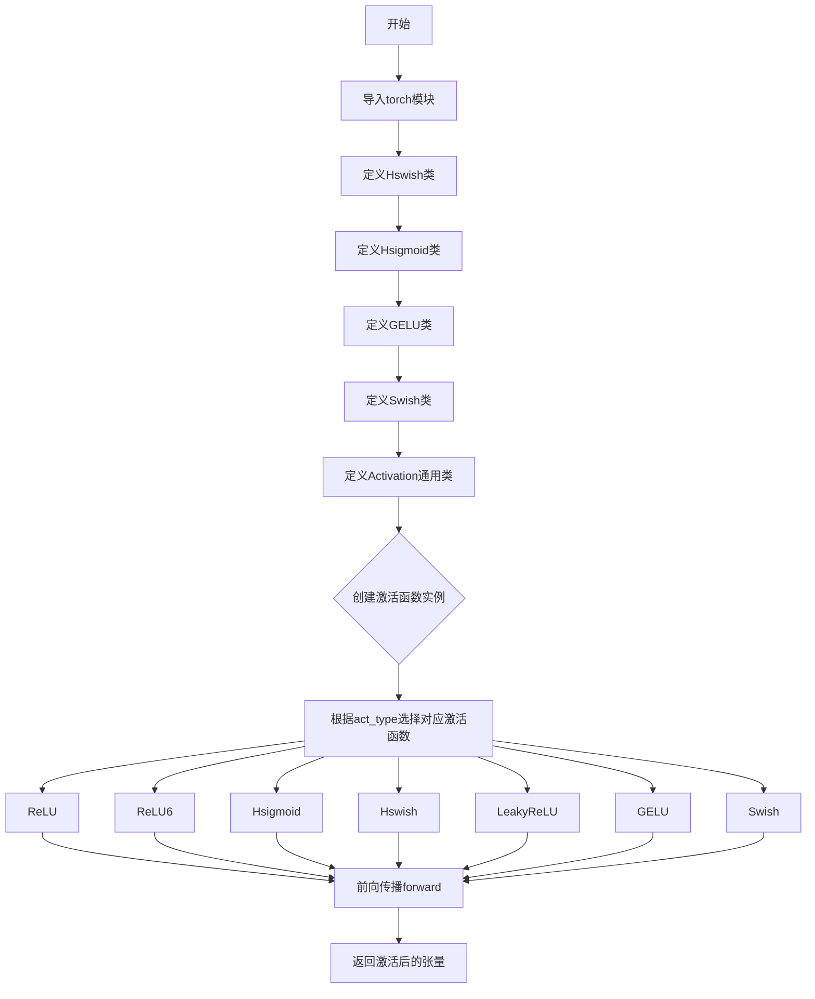
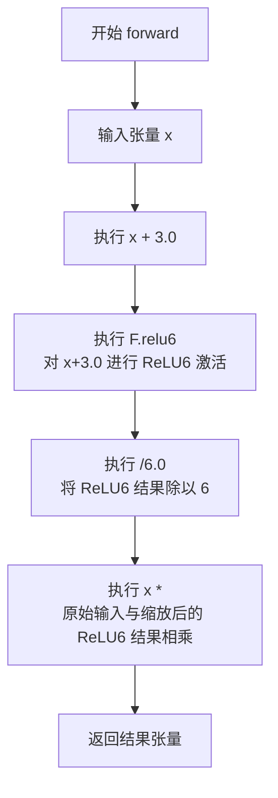
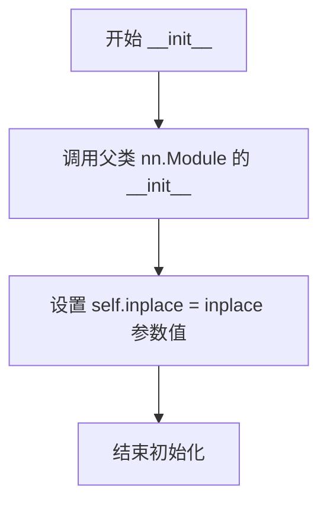
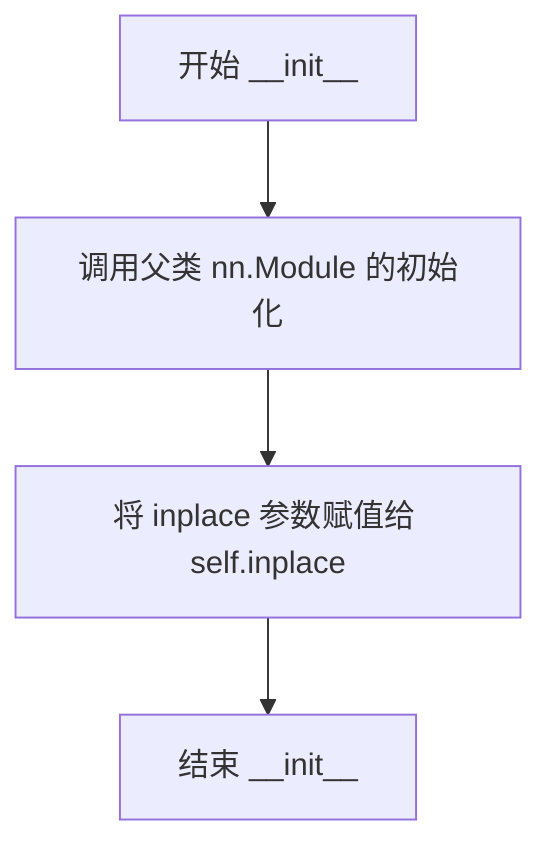
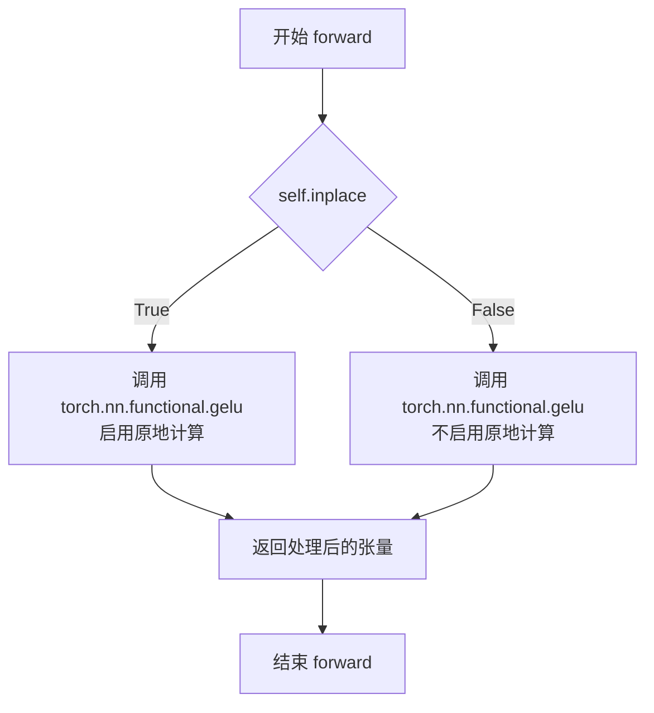
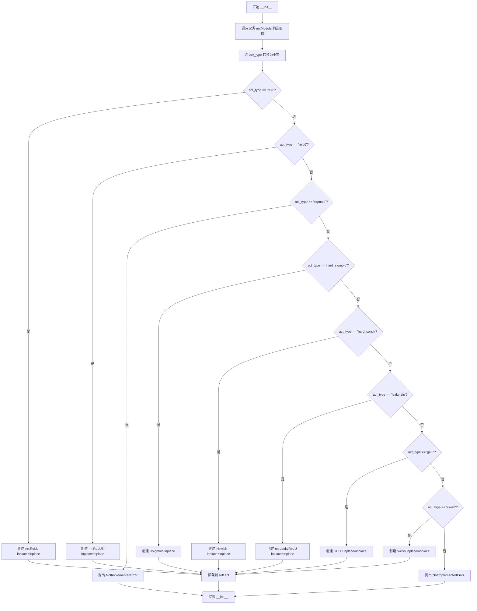
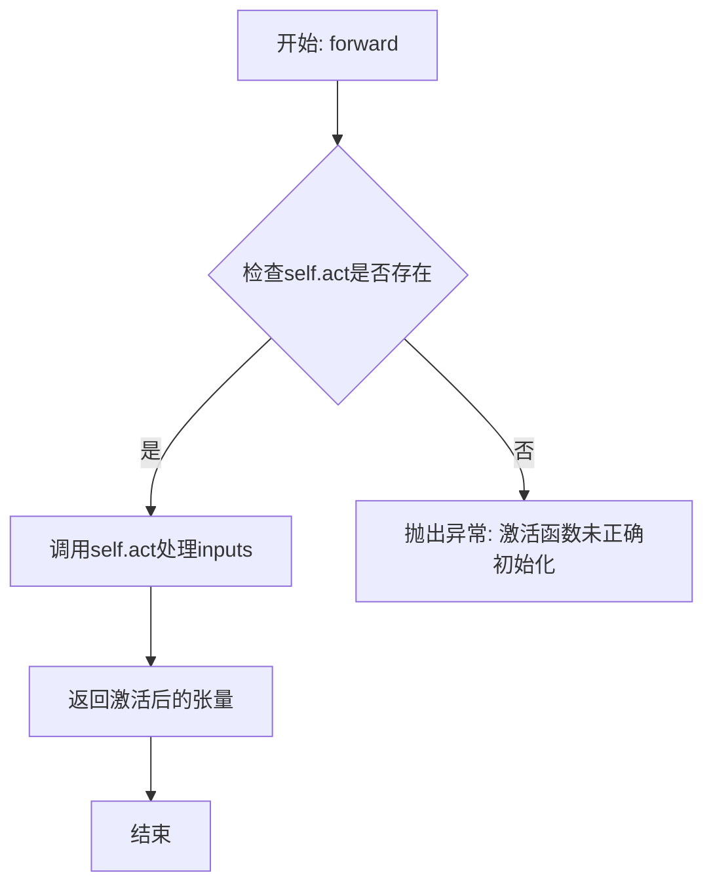

# `diffusers\examples\research_projects\anytext\ocr_recog\common.py` 详细设计文档

该代码实现了一组神经网络激活函数，包括Hswish、Hsigmoid、GELU、Swish等，并提供了一个通用的Activation类来根据字符串类型创建相应的激活函数。

## 整体流程



## 类结构

```
nn.Module (PyTorch基类)
├── Hswish
├── Hsigmoid
├── GELU
├── Swish
└── Activation
```

## 全局变量及字段


### `Hswish.inplace`
    
是否原地操作

类型：`bool`
    


### `Hsigmoid.inplace`
    
是否原地操作

类型：`bool`
    


### `GELU.inplace`
    
是否原地操作

类型：`bool`
    


### `Swish.inplace`
    
是否原地操作

类型：`bool`
    


### `Activation.act_type`
    
激活函数类型

类型：`str`
    


### `Activation.act`
    
激活函数实例

类型：`nn.Module`
    
    

## 全局函数及方法


### Hswish.__init__

这是 Hswish 激活函数类的初始化方法，用于创建 Hswish 激活函数实例并设置 inplace 参数，以控制是否在原地进行操作（节省内存）。

参数：

- `self`：`Hswish`，隐含的实例参数，表示当前 Hswish 对象
- `inplace`：`bool`，默认为 `True`，指定是否在原地进行操作（若为 `True`，则直接修改输入张量，节省内存开销）

返回值：`None`，构造函数不返回任何值

#### 流程图

```mermaid
flowchart TD
    A[开始 __init__] --> B{接收 inplace 参数}
    B -->|默认值 True| C[调用 super().__init__ 初始化 nn.Module]
    C --> D[self.inplace = inplace]
    D --> E[结束 __init__]
```

#### 带注释源码

```python
class Hswish(nn.Module):
    def __init__(self, inplace=True):
        """
        初始化 Hswish 激活函数模块
        
        参数:
            inplace: bool, 是否在原地进行操作, 默认为 True
        """
        # 调用父类 nn.Module 的初始化方法，完成 PyTorch 模块的基础初始化
        super(Hswish, self).__init__()
        
        # 将 inplace 参数保存为实例属性，用于后续 forward 方法中控制是否原地操作
        self.inplace = inplace
```


### `Hswish.forward`

该方法实现了 Hard Swish 激活函数的前向传播计算，通过公式 `x * relu6(x + 3) / 6` 对输入张量进行非线性变换，这是一种在 MobileNetV3 等高效网络中广泛使用的激活函数，能够在保持较好性能的同时降低计算复杂度。

参数：

- `self`：隐含参数，Hswish 类的实例自身
- `x`：`torch.Tensor`，输入的张量，需要进行 Hard Swish 激活的数值

返回值：`torch.Tensor`，经过 Hard Swish 激活函数处理后的张量，计算结果与输入张量形状相同

#### 流程图



#### 带注释源码

```python
def forward(self, x):
    """
    Hard Swish 激活函数的前向传播
    
    Hard Swish 公式: hard_swish(x) = x * relu6(x + 3) / 6
    这是一种计算友好的激活函数，近似于 Swish 但更高效
    """
    # 步骤1: 计算 x + 3.0
    # 步骤2: 对 x + 3.0 应用 ReLU6 激活（限制最大值为6）
    # 步骤3: 将 ReLU6 结果除以 6.0 进行缩放
    # 步骤4: 将原始输入 x 与缩放后的结果相乘
    # inplace 参数控制是否在原地修改张量，节省内存
    return x * F.relu6(x + 3.0, inplace=self.inplace) / 6.0
```


### `Hsigmoid.__init__`

初始化 Hsigmoid 激活函数模块，设置 inplace 参数以控制是否在原地执行操作（修改输入张量而不是创建副本）。

参数：

- `self`：`Hsigmoid`，指向当前创建的 Hsigmoid 实例对象本身
- `inplace`：`bool`，可选参数，默认为 True，指定是否在原地进行操作（True 表示直接修改输入张量，False 表示创建新张量）

返回值：`None`，__init__ 方法没有返回值，用于初始化对象状态

#### 流程图



#### 带注释源码

```python
def __init__(self, inplace=True):
    """
    初始化 Hsigmoid 激活函数模块
    
    参数:
        inplace: bool, 默认为 True
                 - True: 在原地执行操作，节省内存但会修改输入张量
                 - False: 创建新的输出张量，保留原始输入
    """
    # 调用 nn.Module 的父类初始化方法，建立模块的初始化链条
    super(Hsigmoid, self).__init__()
    
    # 将 inplace 参数保存为实例属性，供 forward 方法中使用
    # 控制 ReLU6 操作是否原地执行
    self.inplace = inplace
```


### `Hsigmoid.forward`

该方法实现了 Hard Sigmoid 激活函数的前向传播，通过线性变换 `1.2 * x + 3.0` 后应用 ReLU6 激活并除以 6，输出被限制在 [0, 1] 范围内的张量。

参数：

- `self`：`Hsigmoid` 实例，Hard Sigmoid 激活函数模块本身
- `x`：`torch.Tensor`，输入张量，任意形状

返回值：`torch.Tensor`，返回与输入形状相同的输出张量，值域被限制在 [0, 1] 范围内

#### 流程图

```mermaid
flowchart TD
    A[输入 x] --> B[线性变换: 1.2 * x + 3.0]
    B --> C[ReLU6 激活: max(0, min(6, 1.2*x+3.0))]
    C --> D[除以 6: output/6.0]
    D --> E[输出: 值域在 [0,1] 范围的张量]
```

#### 带注释源码

```python
def forward(self, x):
    """
    Hard Sigmoid 激活函数的前向传播
    
    公式: out = max(0, min(1, 0.2*x + 0.5))
    实现: 使用 ReLU6 近似计算
        - 1.2 * x + 3.0 相当于将输入平移和缩放
        - ReLU6 限制输出在 [0, 6] 范围内
        - 除以 6 将输出归一化到 [0, 1]
    
    参数:
        x: 输入张量，任意形状
        
    返回:
        与输入形状相同的张量，值域在 [0, 1]
    """
    # torch: F.relu6(x + 3., inplace=self.inplace) / 6.
    # paddle: F.relu6(1.2 * x + 3., inplace=self.inplace) / 6.
    # 注意：这里使用 1.2 * x + 3.0 是为了与 PaddlePaddle 的实现兼容
    return F.relu6(1.2 * x + 3.0, inplace=self.inplace) / 6.0
```


### `GELU.__init__`

这是 GELU 激活函数类的初始化方法，用于接收并存储 `inplace` 参数，以控制前向传播时是否进行原地操作。

参数：

-  `self`：`Object`，GELU 类的实例本身
-  `inplace`：`bool`，可选，默认为 `True`，指定是否在原张量上进行操作以节省内存

返回值：`None`，`__init__` 方法不返回任何值，仅初始化实例属性

#### 流程图



#### 带注释源码

```python
def __init__(self, inplace=True):
    """
    初始化 GELU 激活函数模块
    
    参数:
        inplace: bool, optional
            如果设为 True，执行原地操作以节省内存，
            但可能影响梯度计算。默认为 True。
    """
    # 调用父类 nn.Module 的初始化方法
    super(GELU, self).__init__()
    # 存储 inplace 参数，供 forward 方法使用
    self.inplace = inplace
```


### `GELU.forward`

GELU 激活函数的前向传播方法，通过调用 PyTorch 的 `torch.nn.functional.gelu` 实现高斯误差线性单元激活函数的计算。

参数：

- `self`：实例本身，包含 `inplace` 布尔属性，控制在原张量上进行原地操作还是返回新张量
- `x`：`torch.Tensor`，输入的张量，通常是上一层的输出

返回值：`torch.Tensor`，经过 GELU 激活函数处理后的张量

#### 流程图



#### 带注释源码

```python
class GELU(nn.Module):
    """
    GELU (Gaussian Error Linear Unit) 激活函数的 PyTorch 实现
    GELU 是一种基于高斯分布的激活函数，公式近似为:
    x * Φ(x)，其中 Φ 是标准正态分布的累积分布函数
    """
    
    def __init__(self, inplace=True):
        """
        初始化 GELU 激活模块
        
        参数:
            inplace: 布尔值，是否在原张量上进行原地计算
                    默认为 True，可以节省内存但会修改输入张量
        """
        super(GELU, self).__init__()  # 调用父类 nn.Module 的初始化方法
        self.inplace = inplace  # 存储原地计算标志

    def forward(self, x):
        """
        GELU 激活函数的前向传播计算
        
        参数:
            x: 输入张量，形状任意
            
        返回:
            经过 GELU 激活函数处理的张量，与输入张量形状相同
        """
        # 调用 PyTorch 的 gelu 实现
        # torch.nn.functional.gelu 使用近似算法计算:
        # 0.5 * x * (1 + tanh(√(2/π) * (x + 0.044715 * x^3)))
        # 当 self.inplace 为 True 时，尝试使用原地操作
        return torch.nn.functional.gelu(x, approximate='tanh')
```


### `Swish.__init__`

这是 Swish 激活函数类的初始化方法，用于配置 Swish 激活函数是否使用原地操作（in-place operation）模式。

参数：
- `self`：`Swish` 实例本身
- `inplace`：`bool`，指定是否使用原地操作。默认为 `True`，即在输入张量 x 上直接进行乘法运算而不创建新的张量。

返回值：`None`，`__init__` 方法不返回任何值。

#### 流程图

```mermaid
graph TD
    A[开始 __init__] --> B[调用 super().__init__ 初始化父类 nn.Module]
    C[接收 inplace 参数] --> D[将 inplace 参数赋值给 self.inplace 实例属性]
    B --> D
    D --> E[结束初始化]
```

#### 带注释源码

```python
def __init__(self, inplace=True):
    """
    初始化 Swish 激活函数模块。
    
    参数:
        inplace (bool): 如果设置为 True，将在输入张量上直接进行操作以节省内存。
                       否则创建新的张量存储结果。默认为 True。
    """
    # 调用父类 nn.Module 的初始化方法
    super(Swish, self).__init__()
    
    # 将 inplace 参数保存为实例属性，供 forward 方法中使用
    self.inplace = inplace
```


### Swish.forward(self, x)

描述：Swish 是一种自门控激活函数，定义为 `f(x) = x · σ(x)`（其中 σ 为 sigmoid）。`forward` 方法根据 `self.inplace` 标志决定是否在原张量上原地做乘法，以返回激活后的结果。

参数：

- `self`：`Swish` 实例，表示当前激活层对象，包含 `inplace` 属性用于控制是否原地更新。
- `x`：`torch.Tensor`，输入张量，需要进行 Swish 激活的原始数据。

返回值：`torch.Tensor`，返回 Swish 激活后的张量。若 `inplace=True`，则返回修改后的原张量；否则返回新创建的张量。

#### 流程图

```mermaid
graph TD
    A[输入 x] --> B{self.inplace?}
    B -- True --> C[计算 sigmoid = torch.sigmoid(x)]
    C --> D[x.mul_(sigmoid) 原地更新]
    D --> E[返回 x]
    B -- False --> F[计算 sigmoid = torch.sigmoid(x)]
    F --> G[result = x * sigmoid 新建张量]
    G --> H[返回 result]
```

#### 带注释源码

```python
class Swish(nn.Module):
    def __init__(self, inplace=True):
        """
        初始化 Swish 激活层。

        参数:
            inplace (bool): 是否在原张量上原地更新。默认为 True，可节省显存。
        """
        super(Swish, self).__init__()
        self.inplace = inplace

    def forward(self, x):
        """
        前向传播：计算 Swish 激活，即 x * sigmoid(x)。

        参数:
            x (torch.Tensor): 输入张量。

        返回:
            torch.Tensor: 激活后的张量。若 inplace 为 True，则返回原地更新的张量；
                          否则返回新创建的张量。
        """
        if self.inplace:
            # 原地计算：直接在输入张量上做乘法，修改原始数据
            x.mul_(torch.sigmoid(x))
            return x
        else:
            # 非原地：先计算 sigmoid，再与 x 做逐元素乘法，返回新张量
            return x * torch.sigmoid(x)
```


### `Activation.__init__`

该方法是 `Activation` 类的构造函数，根据传入的 `act_type` 参数初始化并创建对应的激活函数实例（如 ReLU、ReLU6、Hard Sigmoid、Hard Swish、LeakyReLU、GELU、Swish 等），并将创建的激活函数保存到 `self.act` 属性中供前向传播时调用。

参数：

- `self`：`Activation` 类实例，隐式参数，表示当前对象本身
- `act_type`：`str`，字符串类型，指定要创建的激活函数类型（如 "relu"、"relu6"、"hard_sigmoid"、"hard_swish"、"leakyrelu"、"gelu"、"swish" 等）
- `inplace`：`bool`（默认为 `True`），布尔类型，表示是否使用原地操作（in-place operation）以节省内存

返回值：`None`，无返回值（构造函数）

#### 流程图



#### 带注释源码

```python
def __init__(self, act_type, inplace=True):
    """
    初始化 Activation 激活函数容器
    
    参数:
        act_type: 激活函数类型字符串
        inplace: 是否使用原地操作
    """
    # 调用父类 nn.Module 的构造函数，完成模块的初始化
    # 这是 PyTorch 中所有 nn.Module 子类必须调用的
    super(Activation, self).__init__()
    
    # 将传入的激活函数类型转换为小写，确保大小写不敏感
    # 例如 "RELU" -> "relu", "Hard_Swish" -> "hard_swish"
    act_type = act_type.lower()
    
    # 根据 act_type 创建对应的激活函数实例
    if act_type == "relu":
        # 标准 ReLU 激活函数: max(0, x)
        self.act = nn.ReLU(inplace=inplace)
    elif act_type == "relu6":
        # ReLU6 激活函数: min(max(0, x), 6)
        self.act = nn.ReLU6(inplace=inplace)
    elif act_type == "sigmoid":
        # Sigmoid 激活函数暂未实现
        raise NotImplementedError
    elif act_type == "hard_sigmoid":
        # 硬 sigmoid: max(0, min(1, 1.2*x + 0.5))
        # 近似于 sigmoid，但计算更快
        self.act = Hsigmoid(inplace)
    elif act_type == "hard_swish":
        # 硬 swish: x * hard_sigmoid(x)
        # MobileNetV3 中使用的激活函数
        self.act = Hswish(inplace=inplace)
    elif act_type == "leakyrelu":
        # Leaky ReLU: x > 0 ? x : alpha * x
        # 解决 ReLU 的神经元死亡问题
        self.act = nn.LeakyReLU(inplace=inplace)
    elif act_type == "gelu":
        # Gaussian Error Linear Unit
        # BERT 等Transformer模型中常用的激活函数
        self.act = GELU(inplace=inplace)
    elif act_type == "swish":
        # Swish: x * sigmoid(x)
        # Google 提出的自门控激活函数
        self.act = Swish(inplace=inplace)
    else:
        # 不支持的激活函数类型，抛出异常
        raise NotImplementedError
```

#### 关键组件信息

| 组件名称 | 一句话描述 |
|---------|-----------|
| `self.act` | 存储根据 `act_type` 创建的具体激活函数实例（`nn.ReLU`、`nn.ReLU6`、`Hsigmoid`、`Hswish`、`nn.LeakyReLU`、`GELU`、`Swish` 等） |

#### 潜在的技术债务或优化空间

1. **缺少 sigmoid 和 tanh 支持**：代码中明确对 `sigmoid` 抛出 `NotImplementedError`，如果项目需要这些基础激活函数，需要补充实现
2. **硬编码的激活函数映射**：使用多层 `if-elif` 判断，扩展性较差，可以考虑使用字典映射的方式简化代码，提高可维护性
3. **缺少参数校验**：没有对 `act_type` 的合法性进行预校验，目前依赖 `NotImplementedError` 报错，不够友好
4. **Hsigmoid 系数硬编码**：在 `Hsigmoid` 类中使用了硬编码的 `1.2` 系数（对应 PaddlePaddle 的实现），与 PyTorch 原生实现有差异，可能导致模型转换时的行为不一致


### `Activation.forward`

该方法是 `Activation` 类的前向传播方法，用于根据初始化时指定的激活函数类型，对输入张量执行相应的激活操作。它通过调用内部存储的激活函数对象 `self.act` 来完成计算，并返回激活后的张量。

参数：

- `self`：`Activation` 类型，激活函数封装类的实例，包含已配置的激活函数
- `inputs`：`torch.Tensor`，待激活的输入张量，可以是任意维度的张量

返回值：`torch.Tensor`，经过激活函数处理后的输出张量，形状与输入张量相同

#### 流程图



#### 带注释源码

```python
def forward(self, inputs):
    """
    前向传播方法，根据初始化时设置的激活函数类型对输入进行激活处理
    
    参数:
        inputs (torch.Tensor): 输入的张量数据，可以是任意维度的张量
        
    返回值:
        torch.Tensor: 经过激活函数处理后的张量，形状与输入保持一致
    """
    # 调用self.act属性所保存的激活函数对象（如ReLU、Swish、GELU等）
    # 对输入inputs进行前向计算并返回结果
    return self.act(inputs)
```

## 关键组件


### Hswish（硬Swish激活函数）

Hswish是一种计算效率更高的Swish激活函数近似实现，通过公式x * ReLU6(x + 3) / 6.0计算，在移动端和轻量级模型中广泛使用，能够在保持性能的同时降低计算成本。

### Hsigmoid（硬Sigmoid激活函数）

Hsigmoid是对Sigmoid函数的分段线性近似，使用公式ReLU6(1.2*x + 3.0) / 6.0实现，比标准Sigmoid更快，用于模型推理加速。

### GELU（高斯误差线性单元）

GELU是一种基于高斯分布的激活函数，通过x * Φ(x)计算，其中Φ是高斯分布的累积分布函数，在Transformer架构中表现优异。

### Swish（Swish激活函数）

Swish是一种自门控激活函数，定义为x * sigmoid(x)，结合了线性和非线性特性，支持inplace操作以节省内存。

### Activation（通用激活函数封装类）

Activation是一个动态激活函数选择器，通过act_type参数实例化不同的激活函数，支持ReLU、ReLU6、Hard Sigmoid、Hard Swish、LeakyReLU、GELU、Swish等常见激活函数。

### inplace参数管理

所有激活函数类都支持inplace参数，允许在原张量上进行修改以节省显存，但在某些场景下可能影响梯度计算和模型序列化。


## 问题及建议


### 已知问题

-   **Hsigmoid 实现与注释不一致**：代码中使用 `1.2 * x` 实现 hard_sigmoid，但注释中提到 Paddle 的 slope=0.2，这种实现差异可能导致与预期行为不符
-   **GELU 类的 inplace 参数未使用**：构造函数接收 inplace 参数但在 forward 方法中未使用，与其他激活函数设计不一致
-   **Swish 类的 in-place 操作的副作用**：当 inplace=True 时会修改输入张量，可能导致梯度计算问题或意外的副作用
-   **Activation 类字符串匹配不够健壮**：使用 if-elif 链进行字符串匹配，缺乏对非法输入的明确错误提示，且扩展性差
-   **缺少部分常用激活函数支持**：如 PReLU、ELU、SELU 等常用激活函数未实现，但 Activation 类接受这些类型会直接抛出 NotImplementedError
-   **sigmoid 激活函数未实现**：代码中直接 raise NotImplementedError，没有提供实现或替代方案
-   **缺少文档字符串**：所有类和方法都缺少 docstring，不利于代码理解和维护

### 优化建议

-   **统一 inplace 参数行为**：在 GELU 类中实现 inplace 参数的实际功能，或移除该参数保持接口一致性
-   **重构 Activation 类的激活函数选择逻辑**：使用字典映射替代 if-elif 链，提高可读性和可维护性
-   **修复 Hsigmoid 实现**：明确 hard_sigmoid 的参数配置，确保与注释中的 Paddle 实现一致（slope=0.2, offset=0.5）
-   **考虑添加新激活函数**：如 PReLU、ELU、SELU 等，丰富激活函数库
-   **为 Swish 添加非侵入式实现**：考虑使用 torch.no_grad() 或其他方式避免修改输入
-   **添加完整的文档字符串**：为每个类和关键方法添加详细的文档说明
-   **添加类型注解**：为方法参数和返回值添加类型提示，提高代码可读性和 IDE 支持


## 其它


### 设计目标与约束

本模块的设计目标是提供一组统一的激活函数实现，支持多种常见的激活函数类型（ReLU、ReLU6、Hard Sigmoid、Hard Swish、LeakyReLU、GELU、Swish），并在PyTorch框架下提供高效的向前传播实现。设计约束包括：必须继承自nn.Module以支持PyTorch的模型集成；支持inplace操作以减少内存开销；所有激活函数必须兼容PyTorch的张量操作。

### 错误处理与异常设计

代码中的错误处理主要通过raise NotImplementedError实现。当传入不支持的act_type时，Activation类会抛出NotImplementedError异常。Hsigmoid类中的注释显示了与PaddlePaddle的差异（斜率slope=1.2），但未进行版本兼容性检查。GELU激活函数未使用inplace参数但保留了构造函数参数，造成潜在的不一致性。错误处理策略建议：添加具体的错误信息说明支持的激活函数类型列表；在文档中明确标注各激活函数的版本兼容性。

### 外部依赖与接口契约

本模块依赖PyTorch框架（torch、torch.nn、torch.nn.functional）。Activation类的核心接口契约：构造函数接受act_type字符串和inplace布尔参数；forward方法接受任意形状的Tensor输入并返回相同形状的Tensor输出。所有激活函数均遵循nn.Module的标准的forward接口约定，返回值类型为torch.Tensor。

### 性能考虑与优化空间

inplace操作可以显著减少内存占用，尤其在大模型场景下。当前实现中Swish类正确实现了inplace分支，但GELU虽然接受inplace参数但未实际使用。性能优化建议：GELU可考虑使用torch.compile或预计算的近似公式；Hsigmoid与Hswish可添加torch.jit.script支持以提升推理性能；可考虑添加CUDA内核实现以进一步优化GPU性能。

### 兼容性设计

代码展示了与PaddlePaddle框架的差异（Hsigmoid中1.2倍斜率的处理）。兼容性考虑：当前仅支持PyTorch；Activation类通过字符串映射支持多种激活函数，但未提供注册自定义激活函数的接口；版本兼容性需关注PyTorch不同版本对F.gelu的行为差异。

### 使用示例与API参考

```python
# 基础使用
act = Activation('relu')
output = act(input_tensor)

# Swish inplace模式
act_swish = Activation('swish', inplace=True)

# GELU（推荐用法）
act_gelu = Activation('gelu', inplace=False)
```

### 测试策略建议

单元测试应覆盖：各激活函数的数值准确性（与标准实现对比）；inplace模式下的梯度计算正确性；边界条件（NaN、Inf输入）；不同输入形状的兼容性；内存泄漏检测（inplace操作）。

### 版本历史与变更记录

初始版本v1.0：实现Hswish、Hsigmoid、GELU、Swish、Activation五个类。后续可考虑添加：更多激活函数支持（SiLU、Mish等）；ONNX导出兼容性优化；量化支持。


    