# `diffusers\examples\research_projects\autoencoderkl\train_autoencoderkl.py` 详细设计文档

这是一个用于训练 AutoencoderKL（VAE）模型的脚本，集成了 HuggingFace Diffusers 和 Accelerate 库。脚本支持使用重建损失（L1/L2）、感知损失（LPIPS）和对抗损失（判别器）来训练模型，并包含分布式训练、EMA、梯度检查点和模型验证等完整训练流程。

## 整体流程

```mermaid
graph TD
    Start[程序入口] --> ParseArgs[解析命令行参数 parse_args]
    ParseArgs --> Main[执行主函数 main]
    Main --> InitAccel[初始化 Accelerator]
    InitAccel --> LoadData[加载数据集 make_train_dataset]
    LoadData --> LoadModels[加载模型 AutoencoderKL, NLayerDiscriminator, EMAModel]
    LoadModels --> SetupOpt[配置优化器和学习率调度器]
    SetupOpt --> TrainLoop[进入训练循环]
    TrainLoop --> Encode[VAE 编码图像到潜空间]
    Encode --> Decode[VAE 解码潜空间到重建图像]
    Decode --> CheckStep{判断更新步骤}
    CheckStep -- 更新VAE --> VAELoss[计算 VAE 损失 (重建+KL+判别器加权)]
    VAELoss --> VAEBackward[VAE 反向传播与参数更新]
    CheckStep -- 更新Discriminator --> DiscLoss[计算判别器损失]
    DiscLoss --> DiscBackward[判别器 反向传播与参数更新]
    VAEBackward --> Sync[同步梯度]
    DiscBackward --> Sync
    Sync --> Checkpoint{检查点保存?}
    Checkpoint -- 是 --> SaveState[保存训练状态 accelerator.save_state]
    Checkpoint -- 否 --> Validation{验证步骤?}
    Validation -- 是 --> LogVal[调用 log_validation 进行验证]
    Validation -- 否 --> NextStep[更新步数]
    SaveState --> NextStep
    LogVal --> NextStep
    NextStep --> IsEnd{是否达到最大训练步数?}
    IsEnd -- 否 --> TrainLoop
    IsEnd -- 是 --> SaveModel[保存最终模型与判别器]
    SaveModel --> PushHub{是否推送到 Hub?}
    PushHub -- 是 --> Upload[上传模型文件 upload_folder]
    PushHub -- 否 --> End[结束]
```

## 类结构

```
训练脚本入口 (train_autoencoderkl.py)
├── 工具函数模块
│   ├── log_validation (验证与可视化)
│   ├── save_model_card (生成模型卡片)
│   └── parse_args (命令行参数解析)
├── 数据处理流程
│   ├── make_train_dataset (数据集加载与预处理)
│   └── collate_fn (批次整理)
└── 核心训练逻辑 (main)
├── 初始化与配置 (Accelerator, Logger, Seed)
├── 模型加载 (AutoencoderKL, NLayerDiscriminator, EMA)
├── 优化器配置 (AdamW, Schedulers)
└── 训练循环 (Training Loop)
```

## 全局变量及字段


### `logger`
    
用于记录训练过程信息和调试日志的日志对象

类型：`logging.Logger`
    


### `args`
    
解析后的命令行参数，包含所有训练配置选项

类型：`argparse.Namespace`
    


### `weight_dtype`
    
训练所使用的数据类型（float32/float16/bfloat16）

类型：`torch.dtype`
    


### `global_step`
    
当前训练的全局步数，用于跟踪训练进度和保存检查点

类型：`int`
    


### `total_batch_size`
    
总训练批次大小，考虑了并行和梯度累积

类型：`int`
    


### `AutoencoderKL.encoder`
    
VAE的编码器部分，负责将输入图像编码到潜在空间

类型：`torch.nn.Module`
    


### `AutoencoderKL.decoder`
    
VAE的解码器部分，负责将潜在向量解码为图像

类型：`torch.nn.Module`
    


### `AutoencoderKL.quant_conv`
    
量化卷积层，用于在编码后进行潜在空间的转换

类型：`torch.nn.Conv2d`
    


### `AutoencoderKL.post_quant_conv`
    
后量化卷积层，用于在解码前进行潜在空间的转换

类型：`torch.nn.Conv2d`
    


### `AutoencoderKL.config`
    
VAE模型的配置字典，包含模型结构和参数信息

类型：`dict`
    


### `NLayerDiscriminator.layers`
    
判别器的多层结构，包含多个卷积层用于判别图像真伪

类型：`nn.ModuleList`
    


### `EMAModel.shadow_params`
    
EMA模型的影子参数副本，用于稳定训练过程

类型：`list`
    


### `EMAModel.optimization_steps`
    
EMA已执行的优化步数，用于计算衰减系数

类型：`int`
    


### `Accelerator.device`
    
训练所使用的计算设备（CPU/CUDA）

类型：`torch.device`
    


### `Accelerator.num_processes`
    
分布式训练所使用的进程数量

类型：`int`
    


### `Accelerator.mixed_precision`
    
混合精度训练模式（fp16/bf16/no）

类型：`str`
    


### `Accelerator.state`
    
加速器的内部状态对象，包含分布式训练状态信息

类型：`AcceleratorState`
    
    

## 全局函数及方法


### `log_validation`

该函数在训练过程中运行验证，对验证图像进行 VAE 编码和解码，将原始图像与重建图像对比并记录到 TensorBoard 或 WandB 等跟踪器中。

参数：

- `vae`：`AutoencoderKL`，用于重建图像的 VAE 模型
- `args`：`argparse.Namespace`，包含分辨率、验证图像路径等配置的命令行参数对象
- `accelerator`：`Accelerator`，HuggingFace Accelerate 库提供的分布式训练加速器
- `weight_dtype`：`torch.dtype`，模型权重的数据类型（fp16/bf16/fp32）
- `step`：`int`，当前训练的全局步骤数，用于记录日志
- `is_final_validation`：`bool`，标识是否为训练结束后的最终验证

返回值：`list[torch.Tensor]`，返回包含原始图像和重建图像的列表，每个元素是沿维度0拼接的原始图和重建图

#### 流程图

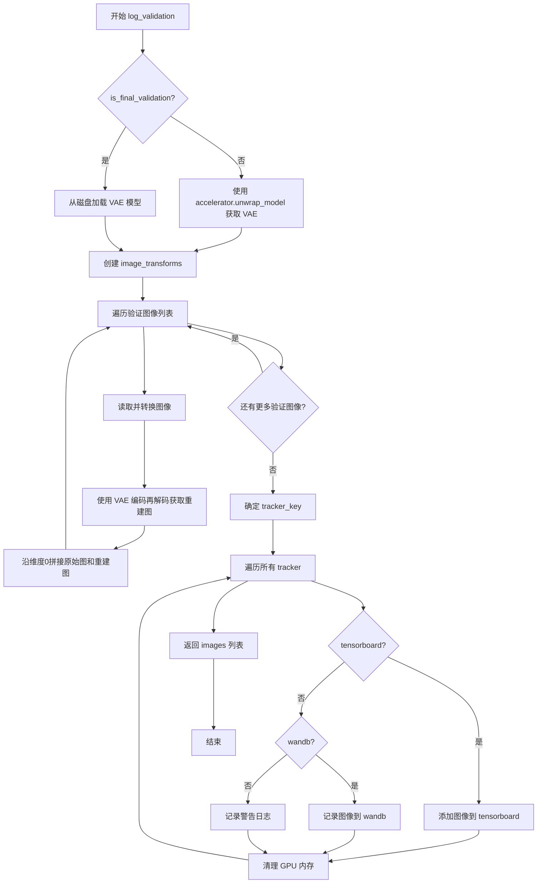

#### 带注释源码

```python
@torch.no_grad()  # 禁用梯度计算以节省显存
def log_validation(vae, args, accelerator, weight_dtype, step, is_final_validation=False):
    """
    运行验证流程，对验证图像进行 VAE 重建并记录到跟踪器
    
    参数:
        vae: VAE 模型
        args: 命令行参数，包含 resolution, validation_image 等
        accelerator: Accelerate 加速器实例
        weight_dtype: 模型权重数据类型
        step: 当前训练步数
        is_final_validation: 是否为最终验证（训练结束后）
    """
    logger.info("Running validation... ")

    # 根据是否为最终验证选择不同的模型获取方式
    if not is_final_validation:
        # 训练中：直接从 accelerator 获取 unwrapped 模型
        vae = accelerator.unwrap_model(vae)
    else:
        # 训练结束：从磁盘加载模型用于推理
        vae = AutoencoderKL.from_pretrained(args.output_dir, torch_dtype=weight_dtype)

    images = []  # 存储所有验证结果图像
    
    # 设置推理上下文：最终验证时使用标准上下文，训练中时使用混合精度 autocast
    inference_ctx = contextlib.nullcontext() if is_final_validation else torch.autocast("cuda")

    # 定义图像预处理 transform：调整大小 -> 中心裁剪 -> 转张量 -> 归一化
    image_transforms = transforms.Compose(
        [
            transforms.Resize(args.resolution, interpolation=transforms.InterpolationMode.BILINEAR),
            transforms.CenterCrop(args.resolution),
            transforms.ToTensor(),
            transforms.Normalize([0.5], [0.5]),
        ]
    )

    # 遍历所有验证图像进行推理
    for i, validation_image in enumerate(args.validation_image):
        # 读取图像并转换 RGB 格式
        validation_image = Image.open(validation_image).convert("RGB")
        # 应用预处理 transform 并移到指定设备和数据类型
        targets = image_transforms(validation_image).to(accelerator.device, weight_dtype)
        # 添加 batch 维度 [C, H, W] -> [1, C, H, W]
        targets = targets.unsqueeze(0)

        # 使用 VAE 进行编码-解码重建
        with inference_ctx:
            reconstructions = vae(targets).sample

        # 沿维度0拼接原始图像和重建图像（用于对比展示）
        images.append(torch.cat([targets.cpu(), reconstructions.cpu()], axis=0))

    # 确定 tracker key：最终验证用 "test"，中间验证用 "validation"
    tracker_key = "test" if is_final_validation else "validation"
    
    # 遍历所有注册的 tracker（TensorBoard, WandB 等）记录图像
    for tracker in accelerator.trackers:
        if tracker.name == "tensorboard":
            # 将图像转换为 numpy 数组格式并添加图像
            np_images = np.stack([np.asarray(img) for img in images])
            tracker.writer.add_images(f"{tracker_key}: Original (left), Reconstruction (right)", np_images, step)
        elif tracker.name == "wandb":
            # 使用 WandB 的 Image API 记录图像网格
            tracker.log(
                {
                    f"{tracker_key}: Original (left), Reconstruction (right)": [
                        wandb.Image(torchvision.utils.make_grid(image)) for _, image in enumerate(images)
                    ]
                }
            )
        else:
            # 对于不支持的 tracker 记录警告
            logger.warn(f"image logging not implemented for {tracker.name}")

        # 每次记录后清理 GPU 内存
        gc.collect()
        torch.cuda.empty_cache()

    return images
```


### `save_model_card`

该函数用于在训练完成后生成并保存HuggingFace模型卡片（Model Card），包括模型描述、训练基础模型信息以及可选的验证图像网格，并将模型卡片保存为README.md文件。

参数：

- `repo_id`：`str`，HuggingFace Hub上的仓库ID，用于标识模型
- `images`：可选参数，默认为`None`，验证过程中生成的图像列表，用于展示训练效果
- `base_model`：`str`，用于训练的基础模型名称或路径
- `repo_folder`：可选参数，默认为`None`，本地仓库文件夹路径，用于保存模型卡片和图像

返回值：`None`，该函数直接保存文件到本地，不返回任何值

#### 流程图

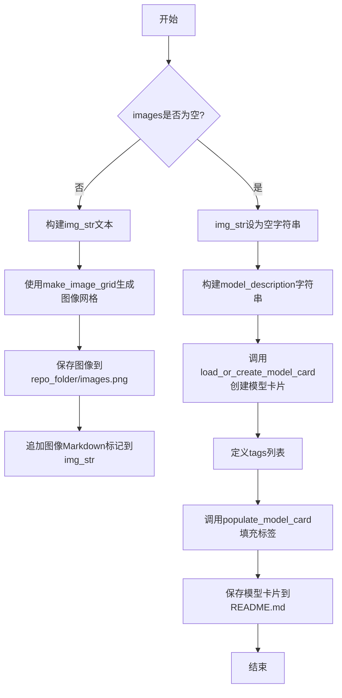

#### 带注释源码

```python
def save_model_card(repo_id: str, images=None, base_model=str, repo_folder=None):
    """
    生成并保存HuggingFace模型卡片
    
    参数:
        repo_id: HuggingFace Hub上的仓库ID
        images: 验证过程中生成的图像列表（可选）
        base_model: 用于训练的基础模型名称
        repo_folder: 本地仓库文件夹路径
    """
    # 初始化图像描述字符串
    img_str = ""
    
    # 如果提供了验证图像，则生成图像网格并添加到描述中
    if images is not None:
        img_str = "You can find some example images below.\n\n"
        # 将多张图像拼接成网格并保存为PNG文件
        make_image_grid(images, 1, len(images)).save(os.path.join(repo_folder, "images.png"))
        # 在Markdown中添加图像引用
        img_str += "\n"

    # 构建模型描述内容，包含模型名称、基础模型和图像说明
    model_description = f"""
# autoencoderkl-{repo_id}

These are autoencoderkl weights trained on {base_model} with new type of conditioning.
{img_str}
"""
    
    # 加载或创建模型卡片，并填充训练相关信息
    model_card = load_or_create_model_card(
        repo_id_or_path=repo_id,
        from_training=True,
        license="creativeml-openrail-m",
        base_model=base_model,
        model_description=model_description,
        inference=True,
    )

    # 定义模型标签，用于HuggingFace Hub上的分类
    tags = [
        "stable-diffusion",
        "stable-diffusion-diffusers",
        "image-to-image",
        "diffusers",
        "autoencoderkl",
        "diffusers-training",
    ]
    
    # 将标签添加到模型卡片中
    model_card = populate_model_card(model_card, tags=tags)

    # 保存模型卡片为README.md（Hub会自动识别此文件为模型卡片）
    model_card.save(os.path.join(repo_folder, "README.md"))
```


### `parse_args`

该函数是 AutoencoderKL 训练脚本的命令行参数解析器，通过 argparse 定义并收集所有训练所需的参数，包括模型路径、优化器配置、数据集设置、验证选项等，并对关键参数进行合法性校验，最后返回解析后的参数对象。

参数：

- `input_args`：`Optional[List[str]]`，可选的命令行参数列表。如果为 `None`，则从 `sys.argv` 自动获取；否则使用传入的列表进行解析。

返回值：`argparse.Namespace`，包含所有解析后命令行参数的命名空间对象。

#### 流程图

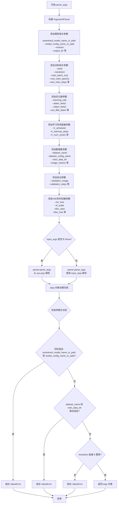

#### 带注释源码

```python
def parse_args(input_args=None):
    """
    解析命令行参数，构建并返回一个包含所有训练配置的命名空间对象。
    
    参数:
        input_args: 可选的命令行参数列表。如果为 None，则从 sys.argv 自动获取。
    
    返回:
        包含所有解析后命令行参数的 argparse.Namespace 对象。
    """
    # 1. 创建 ArgumentParser 实例，设置程序描述
    parser = argparse.ArgumentParser(description="Simple example of a AutoencoderKL training script.")
    
    # 2. 添加模型相关参数
    parser.add_argument(
        "--pretrained_model_name_or_path",
        type=str,
        default=None,
        help="Path to pretrained model or model identifier from huggingface.co/models.",
    )
    parser.add_argument(
        "--model_config_name_or_path",
        type=str,
        default=None,
        help="The config of the VAE model to train, leave as None to use standard VAE model configuration.",
    )
    parser.add_argument(
        "--revision",
        type=str,
        default=None,
        required=False,
        help="Revision of pretrained model identifier from huggingface.co/models.",
    )
    parser.add_argument(
        "--output_dir",
        type=str,
        default="autoencoderkl-model",
        help="The output directory where the model predictions and checkpoints will be written.",
    )
    parser.add_argument(
        "--cache_dir",
        type=str,
        default=None,
        help="The directory where the downloaded models and datasets will be stored.",
    )
    parser.add_argument("--seed", type=int, default=None, help="A seed for reproducible training.")
    
    # 3. 添加数据处理相关参数
    parser.add_argument(
        "--resolution",
        type=int,
        default=512,
        help=(
            "The resolution for input images, all the images in the train/validation dataset will be resized to this"
            " resolution"
        ),
    )
    parser.add_argument(
        "--train_batch_size", type=int, default=4, help="Batch size (per device) for the training dataloader."
    )
    parser.add_argument("--num_train_epochs", type=int, default=1)
    parser.add_argument(
        "--max_train_steps",
        type=int,
        default=None,
        help="Total number of training steps to perform.  If provided, overrides num_train_epochs.",
    )
    parser.add_argument(
        "--checkpointing_steps",
        type=int,
        default=500,
        help=(
            "Save a checkpoint of the training state every X updates. Checkpoints can be used for resuming training via `--resume_from_checkpoint`. "
            "In the case that the checkpoint is better than the final trained model, the checkpoint can also be used for inference."
            "Using a checkpoint for inference requires separate loading of the original pipeline and the individual checkpointed model components."
            "See https://huggingface.co/docs/diffusers/main/en/training/dreambooth#performing-inference-using-a-saved-checkpoint for step by step"
            "instructions."
        ),
    )
    parser.add_argument(
        "--checkpoints_total_limit",
        type=int,
        default=None,
        help=("Max number of checkpoints to store."),
    )
    parser.add_argument(
        "--resume_from_checkpoint",
        type=str,
        default=None,
        help=(
            "Whether training should be resumed from a previous checkpoint. Use a path saved by"
            ' `--checkpointing_steps`, or `"latest"` to automatically select the last available checkpoint.'
        ),
    )
    parser.add_argument(
        "--gradient_accumulation_steps",
        type=int,
        default=1,
        help="Number of updates steps to accumulate before performing a backward/update pass.",
    )
    parser.add_argument(
        "--gradient_checkpointing",
        action="store_true",
        help="Whether or not to use gradient checkpointing to save memory at the expense of slower backward pass.",
    )
    
    # 4. 添加学习率相关参数
    parser.add_argument(
        "--learning_rate",
        type=float,
        default=4.5e-6,
        help="Initial learning rate (after the potential warmup period) to use.",
    )
    parser.add_argument(
        "--disc_learning_rate",
        type=float,
        default=4.5e-6,
        help="Initial learning rate (after the potential warmup period) to use for discriminator.",
    )
    parser.add_argument(
        "--scale_lr",
        action="store_true",
        default=False,
        help="Scale the learning rate by the number of GPUs, gradient accumulation steps, and batch size.",
    )
    parser.add_argument(
        "--lr_scheduler",
        type=str,
        default="constant",
        help=(
            'The scheduler type to use. Choose between ["linear", "cosine", "cosine_with_restarts", "polynomial",'
            ' "constant", "constant_with_warmup"]'
        ),
    )
    parser.add_argument(
        "--disc_lr_scheduler",
        type=str,
        default="constant",
        help=(
            'The scheduler type to use for discriminator. Choose between ["linear", "cosine", "cosine_with_restarts", "polynomial",'
            ' "constant", "constant_with_warmup"]'
        ),
    )
    parser.add_argument(
        "--lr_warmup_steps", type=int, default=500, help="Number of steps for the warmup in the lr scheduler."
    )
    parser.add_argument(
        "--lr_num_cycles",
        type=int,
        default=1,
        help="Number of hard resets of the lr in cosine_with_restarts scheduler.",
    )
    parser.add_argument("--lr_power", type=float, default=1.0, help="Power factor of the polynomial scheduler.")
    
    # 5. 添加优化器相关参数
    parser.add_argument(
        "--use_8bit_adam", action="store_true", help="Whether or not to use 8-bit Adam from bitsandbytes."
    )
    parser.add_argument("--use_ema", action="store_true", help="Whether to use EMA model.")
    parser.add_argument(
        "--dataloader_num_workers",
        type=int,
        default=0,
        help=(
            "Number of subprocesses to use for data loading. 0 means that the data will be loaded in the main process."
        ),
    )
    parser.add_argument("--adam_beta1", type=float, default=0.9, help="The beta1 parameter for the Adam optimizer.")
    parser.add_argument("--adam_beta2", type=float, default=0.999, help="The beta2 parameter for the Adam optimizer.")
    parser.add_argument("--adam_weight_decay", type=float, default=1e-2, help="Weight decay to use.")
    parser.add_argument("--adam_epsilon", type=float, default=1e-08, help="Epsilon value for the Adam optimizer")
    parser.add_argument("--max_grad_norm", default=1.0, type=float, help="Max gradient norm.")
    
    # 6. 添加模型上传相关参数
    parser.add_argument("--push_to_hub", action="store_true", help="Whether or not to push the model to the Hub.")
    parser.add_argument("--hub_token", type=str, default=None, help="The token to use to push to the Model Hub.")
    parser.add_argument(
        "--hub_model_id",
        type=str,
        default=None,
        help="The name of the repository to keep in sync with the local `output_dir`.",
    )
    parser.add_argument(
        "--logging_dir",
        type=str,
        default="logs",
        help=(
            "[TensorBoard](https://www.tensorflow.org/tensorboard) log directory. Will default to"
            " *output_dir/runs/**CURRENT_DATETIME_HOSTNAME***."
        ),
    )
    
    # 7. 添加硬件和日志相关参数
    parser.add_argument(
        "--allow_tf32",
        action="store_true",
        help=(
            "Whether or not to allow TF32 on Ampere GPUs. Can be used to speed up training. For more information, see"
            " https://pytorch.org/docs/stable/notes/cuda.html#tensorfloat-32-tf32-on-ampere-devices"
        ),
    )
    parser.add_argument(
        "--report_to",
        type=str,
        default="tensorboard",
        help=(
            'The integration to report the results and logs to. Supported platforms are `"tensorboard"`'
            ' (default), `"wandb"` and `"comet_ml"`. Use `"all"` to report to all integrations.'
        ),
    )
    parser.add_argument(
        "--mixed_precision",
        type=str,
        default=None,
        choices=["no", "fp16", "bf16"],
        help=(
            "Whether to use mixed precision. Choose between fp16 and bf16 (bfloat16). Bf16 requires PyTorch >="
            " 1.10.and an Nvidia Ampere GPU.  Default to the value of accelerate config of the current system or the"
            " flag passed with the `accelerate.launch` command. Use this argument to override the accelerate config."
        ),
    )
    parser.add_argument(
        "--enable_xformers_memory_efficient_attention", action="store_true", help="Whether or not to use xformers."
    )
    parser.add_argument(
        "--set_grads_to_none",
        action="store_true",
        help=(
            "Save more memory by using setting grads to None instead of zero. Be aware, that this changes certain"
            " behaviors, so disable this argument if it causes any problems. More info:"
            " https://pytorch.org/docs/stable/generated/torch.optim.Optimizer.zero_grad.html"
        ),
    )
    
    # 8. 添加数据集相关参数
    parser.add_argument(
        "--dataset_name",
        type=str,
        default=None,
        help=(
            "The name of the Dataset (from the HuggingFace hub) to train on (could be your own, possibly private,"
            " dataset). It can also be a path pointing to a local copy of a dataset in your filesystem,"
            " or to a folder containing files that 🤗 Datasets can understand."
        ),
    )
    parser.add_argument(
        "--dataset_config_name",
        type=str,
        default=None,
        help="The config of the Dataset, leave as None if there's only one config.",
    )
    parser.add_argument(
        "--train_data_dir",
        type=str,
        default=None,
        help=(
            "A folder containing the training data. Folder contents must follow the structure described in"
            " https://huggingface.co/docs/datasets/image_dataset#imagefolder. In particular, a `metadata.jsonl` file"
            " must exist to provide the captions for the images. Ignored if `dataset_name` is specified."
        ),
    )
    parser.add_argument(
        "--image_column", type=str, default="image", help="The column of the dataset containing the target image."
    )
    parser.add_argument(
        "--max_train_samples",
        type=int,
        default=None,
        help=(
            "For debugging purposes or quicker training, truncate the number of training examples to this "
            "value if set."
        ),
    )
    
    # 9. 添加验证相关参数
    parser.add_argument(
        "--validation_image",
        type=str,
        default=None,
        nargs="+",
        help="A set of paths to the image be evaluated every `--validation_steps` and logged to `--report_to`.",
    )
    parser.add_argument(
        "--validation_steps",
        type=int,
        default=100,
        help=(
            "Run validation every X steps. Validation consists of running the prompt"
            " `args.validation_prompt` multiple times: `args.num_validation_images`"
            " and logging the images."
        ),
    )
    parser.add_argument(
        "--tracker_project_name",
        type=str,
        default="train_autoencoderkl",
        help=(
            "The `project_name` argument passed to Accelerator.init_trackers for"
            " more information see https://huggingface.co/docs/accelerate/v0.17.0/en/package_reference/accelerator#accelerate.Accelerator"
        ),
    )
    
    # 10. 添加 VAE 损失函数相关参数
    parser.add_argument(
        "--rec_loss",
        type=str,
        default="l2",
        help="The loss function for VAE reconstruction loss.",
    )
    parser.add_argument(
        "--kl_scale",
        type=float,
        default=1e-6,
        help="Scaling factor for the Kullback-Leibler divergence penalty term.",
    )
    parser.add_argument(
        "--perceptual_scale",
        type=float,
        default=0.5,
        help="Scaling factor for the LPIPS metric",
    )
    
    # 11. 添加判别器相关参数
    parser.add_argument(
        "--disc_start",
        type=int,
        default=50001,
        help="Start step for the discriminator training",
    )
    parser.add_argument(
        "--disc_factor",
        type=float,
        default=1.0,
        help="Scaling factor for the discriminator",
    )
    parser.add_argument(
        "--disc_scale",
        type=float,
        default=1.0,
        help="Scaling factor for the discriminator",
    )
    parser.add_argument(
        "--disc_loss",
        type=str,
        default="hinge",
        help="Loss function for the discriminator",
    )
    parser.add_argument(
        "--decoder_only",
        action="store_true",
        help="Only train the VAE decoder.",
    )

    # 12. 解析参数
    if input_args is not None:
        # 如果提供了 input_args，使用提供的列表进行解析
        args = parser.parse_args(input_args)
    else:
        # 否则从 sys.argv 自动解析
        args = parser.parse_args()

    # 13. 参数合法性校验
    
    # 检查不能同时指定 pretrained_model_name_or_path 和 model_config_name_or_path
    if args.pretrained_model_name_or_path is not None and args.model_config_name_or_path is not None:
        raise ValueError("Cannot specify both `--pretrained_model_name_or_path` and `--model_config_name_or_path`")

    # 检查必须指定 dataset_name 或 train_data_dir 之一
    if args.dataset_name is None and args.train_data_dir is None:
        raise ValueError("Specify either `--dataset_name` or `--train_data_dir`")

    # 检查 resolution 必须能被 8 整除，以保证 VAE 编码后的图像尺寸一致
    if args.resolution % 8 != 0:
        raise ValueError(
            "`--resolution` must be divisible by 8 for consistently sized encoded images between the VAE and the diffusion model."
        )

    # 14. 返回解析后的参数对象
    return args
```


### `make_train_dataset`

该函数负责加载并预处理训练数据集，支持从HuggingFace Hub或本地目录加载图像数据，并将其转换为适合模型输入的格式。

参数：

- `args`：命名空间，包含数据集名称、数据配置、缓存目录、训练数据目录、图像列名、分辨率、最大训练样本数等配置参数
- `accelerator`：`Accelerator`对象，用于分布式训练环境下的进程同步和数据处理

返回值：`Dataset`，返回经过预处理（图像转换和格式化）的训练数据集对象

#### 流程图

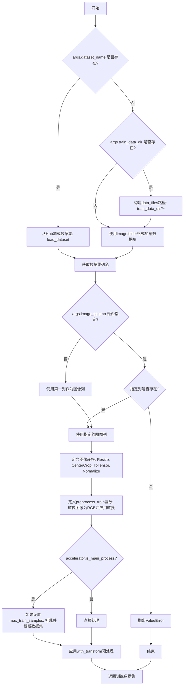

#### 带注释源码

```python
def make_train_dataset(args, accelerator):
    # 获取数据集：可以提供自己的训练和评估文件，或指定Hub上的Dataset（会自动下载）
    # 在分布式训练中，load_dataset函数保证只有一个本地进程能并发下载数据集
    if args.dataset_name is not None:
        # 从Hub下载并加载数据集
        dataset = load_dataset(
            args.dataset_name,
            args.dataset_config_name,
            cache_dir=args.cache_dir,
            data_dir=args.train_data_dir,
        )
    else:
        data_files = {}
        if args.train_data_dir is not None:
            # 构建训练数据文件路径
            data_files["train"] = os.path.join(args.train_data_dir, "**")
        # 使用imagefolder格式加载本地数据集
        dataset = load_dataset(
            "imagefolder",
            data_files=data_files,
            cache_dir=args.cache_dir,
        )
        # 更多关于加载自定义图像的信息：
        # https://huggingface.co/docs/datasets/v2.0.0/en/dataset_script

    # 预处理数据集
    # 需要对输入和目标进行tokenize（虽然这里是图像）
    column_names = dataset["train"].column_names

    # 6. 获取输入/目标的列名
    if args.image_column is None:
        # 默认使用第一列作为图像列
        image_column = column_names[0]
        logger.info(f"image column defaulting to {image_column}")
    else:
        image_column = args.image_column
        if image_column not in column_names:
            # 如果指定的图像列不存在，抛出错误
            raise ValueError(
                f"`--image_column` value '{args.image_column}' not found in dataset columns. Dataset columns are: {', '.join(column_names)}"
            )

    # 定义图像转换管道：调整大小、中心裁剪、转换为张量、归一化
    image_transforms = transforms.Compose(
        [
            transforms.Resize(args.resolution, interpolation=transforms.InterpolationMode.BILINEAR),
            transforms.CenterCrop(args.resolution),
            transforms.ToTensor(),
            transforms.Normalize([0.5], [0.5]),
        ]
    )

    # 定义预处理函数：转换图像为RGB格式并应用转换
    def preprocess_train(examples):
        # 将所有图像转换为RGB格式
        images = [image.convert("RGB") for image in examples[image_column]]
        # 对每张图像应用转换
        images = [image_transforms(image) for image in images]

        # 将转换后的图像赋值给pixel_values键
        examples["pixel_values"] = images

        return examples

    # 在主进程上首先执行数据集处理（确保数据集只在一个进程上加载一次）
    with accelerator.main_process_first():
        if args.max_train_samples is not None:
            # 如果设置了最大训练样本数，则打乱数据并选择前N个样本
            dataset["train"] = dataset["train"].shuffle(seed=args.seed).select(range(args.max_train_samples))
        # 设置训练转换
        train_dataset = dataset["train"].with_transform(preprocess_train)

    return train_dataset
```


### `collate_fn`

该函数是 PyTorch DataLoader 的回调函数，负责将数据集中的多个样本整理成批次。它从每个样本中提取像素值，堆叠成张量，并确保内存布局连续并转换为浮点格式，为后续模型训练提供正确格式的输入数据。

参数：

- `examples`：`List[Dict]`，数据集中的样本列表，每个样本是一个字典，必须包含 "pixel_values" 键

返回值：`Dict`，返回包含批次像素值的字典，键为 "pixel_values"，值为 `torch.Tensor`

#### 流程图

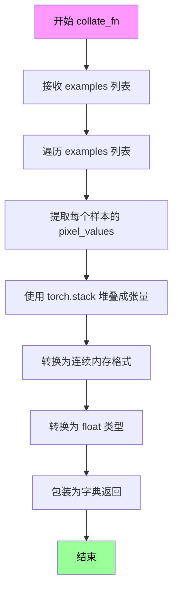

#### 带注释源码

```python
def collate_fn(examples):
    """
    DataLoader 的 collate 函数，用于将多个样本整理成一个批次
    
    参数:
        examples: 数据样本列表，每个样本是包含 'pixel_values' 键的字典
        
    返回:
        包含批次数据的字典
    """
    # 从每个样本中提取 pixel_values 并使用 torch.stack 沿新维度堆叠
    # 结果形状: (batch_size, channels, height, width)
    pixel_values = torch.stack([example["pixel_values"] for example in examples])
    
    # 转换为连续内存格式，提高内存访问效率
    # .float() 确保数据类型为32位浮点数
    pixel_values = pixel_values.to(memory_format=torch.contiguous_format).float()
    
    # 返回包装在字典中的批次数据，供模型训练使用
    return {"pixel_values": pixel_values}
```


### `main`

该函数是AutoencoderKL模型训练的主入口，负责初始化分布式训练环境、加载预训练模型和数据集、配置优化器与学习率调度器、执行完整的训练循环（包括重建损失、感知损失、KL散度损失和判别器对抗训练）、定期进行验证，以及在训练完成后保存最终模型和检查点。

参数：

- `args`：`Namespace`，通过`parse_args()`解析得到的命令行参数对象，包含模型路径、训练超参数、数据路径等所有配置

返回值：`None`，该函数执行完整的训练流程后直接结束

#### 流程图

```mermaid
flowchart TD
    A[开始 main 函数] --> B[检查 wandb 和 hub_token 配置]
    B --> C[创建 logging 目录]
    C --> D[初始化 Accelerator 分布式训练环境]
    D --> E[配置日志记录器]
    E --> F{args.seed 是否存在?}
    F -->|是| G[设置随机种子]
    F -->|否| H[跳过]
    G --> H
    H --> I{是否为分布式主进程?}
    I -->|是| J[创建输出目录]
    I -->|否| K[跳过]
    J --> K
    K --> L{args.push_to_hub 为真?}
    L -->|是| M[创建 Hub 仓库]
    L -->|否| N[跳过]
    M --> N
    N --> O{加载 AutoencoderKL 模型}
    O --> P{args.use_ema 为真?}
    P -->|是| Q[创建 EMA 模型]
    P -->|否| R[跳过]
    Q --> R
    R --> S[初始化 LPIPS 感知损失和判别器]
    S --> T{args.decoder_only 为真?}
    T -->|是| U[冻结 VAE 编码器]
    T -->|否| V[跳过]
    U --> V
    V --> W{启用 xformers 优化?}
    W -->|是| X[启用内存高效注意力]
    W -->|否| Y[跳过]
    X --> Y
    Y --> Z{启用梯度检查点?}
    Z -->|是| AA[启用梯度检查点]
    Z -->|否| AB[跳过]
    AA --> AB
    AB --> AC[设置优化器]
    AC --> AD[创建训练数据集]
    AD --> AE[创建 DataLoader]
    AE --> AF[创建学习率调度器]
    AF --> AG[使用 Accelerator 准备所有组件]
    AG --> AH[设置权重数据类型]
    AH --> AI[初始化跟踪器]
    AI --> AJ[训练循环 - 外层 epoch 循环]
    AJ --> AK[训练循环 - 内层 step 循环]
    AK --> AL{执行 VAE 训练还是判别器训练?}
    AL -->|VAE 训练| AM[计算重建损失、感知损失、KL损失和生成器损失]
    AM --> AN[反向传播并更新 VAE 参数]
    AL -->|判别器训练| AO[计算判别器损失]
    AO --> AP[反向传播并更新判别器参数]
    AN --> AQ{是否需要同步梯度?}
    AP --> AQ
    AQ -->|是| AR[更新进度条、检查点、验证]
    AQ -->|否| AS[跳过]
    AR --> AT{是否达到最大训练步数?}
    AT -->|否| AK
    AT -->|是| AU[训练结束]
    AU --> AV[保存最终模型]
    AV --> AW[运行最终验证]
    AX --> AY[上传到 Hub（如果需要）]
    AW --> AX
    AY --> AZ[结束训练]
```

#### 带注释源码

```python
def main(args):
    # 检查是否同时使用了 wandb 报告和 hub_token，这会存在安全风险
    if args.report_to == "wandb" and args.hub_token is not None:
        raise ValueError(
            "You cannot use both --report_to=wandb and --hub_token due to a security risk of exposing your token."
            " Please use `hf auth login` to authenticate with the Hub."
        )

    # 构建日志目录路径：output_dir/logs
    logging_dir = Path(args.output_dir, args.logging_dir)

    # 创建 Accelerator 项目配置
    accelerator_project_config = ProjectConfiguration(project_dir=args.output_dir, logging_dir=logging_dir)

    # 初始化 Accelerator，处理分布式训练、混合精度等
    accelerator = Accelerator(
        gradient_accumulation_steps=args.gradient_accumulation_steps,
        mixed_precision=args.mixed_precision,
        log_with=args.report_to,
        project_config=accelerator_project_config,
    )

    # 如果使用 MPS 后端，禁用原生 AMP
    if torch.backends.mps.is_available():
        accelerator.native_amp = False

    # 配置日志格式，用于调试
    logging.basicConfig(
        format="%(asctime)s - %(levelname)s - %(name)s - %(message)s",
        datefmt="%m/%d/%Y %H:%M:%S",
        level=logging.INFO,
    )
    logger.info(accelerator.state, main_process_only=False)
    # 主进程设置警告级别，其他进程设置错误级别
    if accelerator.is_local_main_process:
        transformers.utils.logging.set_verbosity_warning()
        diffusers.utils.logging.set_verbosity_info()
    else:
        transformers.utils.logging.set_verbosity_error()
        diffusers.utils.logging.set_verbosity_error()

    # 如果提供了种子，设置随机种子以确保可重复性
    if args.seed is not None:
        set_seed(args.seed)

    # 处理仓库创建（如果是分布式训练，只在主进程执行）
    if accelerator.is_main_process:
        if args.output_dir is not None:
            os.makedirs(args.output_dir, exist_ok=True)

        # 如果需要推送到 Hub，创建远程仓库
        if args.push_to_hub:
            repo_id = create_repo(
                repo_id=args.hub_model_id or Path(args.output_dir).name, exist_ok=True, token=args.hub_token
            ).repo_id

    # 加载 AutoencoderKL 模型
    # 三种加载方式：默认配置、预训练模型路径、自定义配置文件
    if args.pretrained_model_name_or_path is None and args.model_config_name_or_path is None:
        # 使用默认的 VAE 配置（stabilityai/sd-vae-ft-mse）
        config = AutoencoderKL.load_config("stabilityai/sd-vae-ft-mse")
        vae = AutoencoderKL.from_config(config)
    elif args.pretrained_model_name_or_path is not None:
        # 从预训练路径加载
        vae = AutoencoderKL.from_pretrained(args.pretrained_model_name_or_path, revision=args.revision)
    else:
        # 从自定义配置文件加载
        config = AutoencoderKL.load_config(args.model_config_name_or_path)
        vae = AutoencoderKL.from_config(config)
    
    # 如果使用 EMA（指数移动平均），创建 EMA 模型
    if args.use_ema:
        ema_vae = EMAModel(vae.parameters(), model_cls=AutoencoderKL, model_config=vae.config)
    
    # 初始化感知损失（LPIPS）- 用于衡量图像感知质量
    perceptual_loss = lpips.LPIPS(net="vgg").eval()
    # 初始化判别器 - 用于对抗训练
    discriminator = NLayerDiscriminator(input_nc=3, n_layers=3, use_actnorm=False).apply(weights_init)
    # 将判别器转换为同步批归一化（适用于分布式训练）
    discriminator = torch.nn.SyncBatchNorm.convert_sync_batchnorm(discriminator)

    # 辅助函数：解包模型（处理编译后的模型）
    def unwrap_model(model):
        model = accelerator.unwrap_model(model)
        model = model._orig_mod if is_compiled_module(model) else model
        return model

    # 注册自定义模型保存和加载钩子（accelerate >= 0.16.0）
    if version.parse(accelerate.__version__) >= version.parse("0.16.0"):
        # 保存模型钩子
        def save_model_hook(models, weights, output_dir):
            if accelerator.is_main_process:
                # 保存 EMA 模型
                if args.use_ema:
                    sub_dir = "autoencoderkl_ema"
                    ema_vae.save_pretrained(os.path.join(output_dir, sub_dir))

                i = len(weights) - 1

                while len(weights) > 0:
                    weights.pop()
                    model = models[i]

                    if isinstance(model, AutoencoderKL):
                        sub_dir = "autoencoderkl"
                        model.save_pretrained(os.path.join(output_dir, sub_dir))
                    else:
                        sub_dir = "discriminator"
                        os.makedirs(os.path.join(output_dir, sub_dir), exist_ok=True)
                        torch.save(model.state_dict(), os.path.join(output_dir, sub_dir, "pytorch_model.bin"))

                    i -= 1

        # 加载模型钩子
        def load_model_hook(models, input_dir):
            while len(models) > 0:
                # 加载 EMA 模型
                if args.use_ema:
                    sub_dir = "autoencoderkl_ema"
                    load_model = EMAModel.from_pretrained(os.path.join(input_dir, sub_dir), AutoencoderKL)
                    ema_vae.load_state_dict(load_model.state_dict())
                    ema_vae.to(accelerator.device)
                    del load_model

                # 弹出模型并加载判别器
                model = models.pop()
                load_model = NLayerDiscriminator(input_nc=3, n_layers=3, use_actnorm=False).load_state_dict(
                    os.path.join(input_dir, "discriminator", "pytorch_model.bin")
                )
                model.load_state_dict(load_model.state_dict())
                del load_model

                # 弹出模型并加载 VAE
                model = models.pop()
                load_model = AutoencoderKL.from_pretrained(input_dir, subfolder="autoencoderkl")
                model.register_to_config(**load_model.config)
                model.load_state_dict(load_model.state_dict())
                del load_model

        # 注册钩子
        accelerator.register_save_state_pre_hook(save_model_hook)
        accelerator.register_load_state_pre_hook(load_model_hook)

    # 设置模型为训练模式
    vae.requires_grad_(True)
    # 如果只训练解码器，冻结编码器
    if args.decoder_only:
        vae.encoder.requires_grad_(False)
        if getattr(vae, "quant_conv", None):
            vaequant_conv.requires_grad_(False)
    vae.train()
    discriminator.requires_grad_(True)
    discriminator.train()

    # 启用 xformers 内存高效注意力（如果可用）
    if args.enable_xformers_memory_efficient_attention:
        if is_xformers_available():
            import xformers

            xformers_version = version.parse(xformers.__version__)
            if xformers_version == version.parse("0.0.16"):
                logger.warning(
                    "xFormers 0.0.16 cannot be used for training in some GPUs. If you observe problems during training, please update xFormers to at least 0.0.17. See https://huggingface.co/docs/diffusers/main/en/optimization/xformers for more details."
                )
            vae.enable_xformers_memory_efficient_attention()
        else:
            raise ValueError("xformers is not available. Make sure it is installed correctly")

    # 启用梯度检查点以节省显存
    if args.gradient_checkpointing:
        vae.enable_gradient_checkpointing()

    # 检查所有可训练模型是否为全精度
    low_precision_error_string = (
        " Please make sure to always have all model weights in full float32 precision when starting training - even if"
        " doing mixed precision training, copy of the weights should still be float32."
    )

    if unwrap_model(vae).dtype != torch.float32:
        raise ValueError(f"VAE loaded as datatype {unwrap_model(vae).dtype}. {low_precision_error_string}")

    # 启用 TF32 以加速 Ampere GPU 训练
    if args.allow_tf32:
        torch.backends.cuda.matmul.allow_tf32 = True

    # 如果启用学习率缩放，根据 GPU 数量、梯度累积步数和 batch size 调整
    if args.scale_lr:
        args.learning_rate = (
            args.learning_rate * args.gradient_accumulation_steps * args.train_batch_size * accelerator.num_processes
        )

    # 选择优化器：8-bit Adam 或标准 AdamW
    if args.use_8bit_adam:
        try:
            import bitsandbytes as bnb
        except ImportError:
            raise ImportError(
                "To use 8-bit Adam, please install the bitsandbytes library: `pip install bitsandbytes`."
            )

        optimizer_class = bnb.optim.AdamW8bit
    else:
        optimizer_class = torch.optim.AdamW

    # 过滤出需要优化的参数
    params_to_optimize = filter(lambda p: p.requires_grad, vae.parameters())
    disc_params_to_optimize = filter(lambda p: p.requires_grad, discriminator.parameters())
    
    # 创建 VAE 优化器
    optimizer = optimizer_class(
        params_to_optimize,
        lr=args.learning_rate,
        betas=(args.adam_beta1, args.adam_beta2),
        weight_decay=args.adam_weight_decay,
        eps=args.adam_epsilon,
    )
    # 创建判别器优化器
    disc_optimizer = optimizer_class(
        disc_params_to_optimize,
        lr=args.disc_learning_rate,
        betas=(args.adam_beta1, args.adam_beta2),
        weight_decay=args.adam_weight_decay,
        eps=args.adam_epsilon,
    )

    # 创建训练数据集
    train_dataset = make_train_dataset(args, accelerator)

    # 创建训练 DataLoader
    train_dataloader = torch.utils.data.DataLoader(
        train_dataset,
        shuffle=True,
        collate_fn=collate_fn,
        batch_size=args.train_batch_size,
        num_workers=args.dataloader_num_workers,
    )

    # 计算训练步数
    overrode_max_train_steps = False
    num_update_steps_per_epoch = math.ceil(len(train_dataloader) / args.gradient_accumulation_steps)
    if args.max_train_steps is None:
        args.max_train_steps = args.num_train_epochs * num_update_steps_per_epoch
        overrode_max_train_steps = True

    # 创建学习率调度器
    lr_scheduler = get_scheduler(
        args.lr_scheduler,
        optimizer=optimizer,
        num_warmup_steps=args.lr_warmup_steps * accelerator.num_processes,
        num_training_steps=args.max_train_steps * accelerator.num_processes,
        num_cycles=args.lr_num_cycles,
        power=args.lr_power,
    )
    # 创建判别器学习率调度器
    disc_lr_scheduler = get_scheduler(
        args.disc_lr_scheduler,
        optimizer=disc_optimizer,
        num_warmup_steps=args.lr_warmup_steps * accelerator.num_processes,
        num_training_steps=args.max_train_steps * accelerator.num_processes,
        num_cycles=args.lr_num_cycles,
        power=args.lr_power,
    )

    # 使用 Accelerator 准备所有组件（分发到多个设备）
    (
        vae,
        discriminator,
        optimizer,
        disc_optimizer,
        train_dataloader,
        lr_scheduler,
        disc_lr_scheduler,
    ) = accelerator.prepare(
        vae, discriminator, optimizer, disc_optimizer, train_dataloader, lr_scheduler, disc_lr_scheduler
    )

    # 设置权重数据类型（用于混合精度训练）
    weight_dtype = torch.float32
    if accelerator.mixed_precision == "fp16":
        weight_dtype = torch.float16
    elif accelerator.mixed_precision == "bf16":
        weight_dtype = torch.bfloat16

    # 将模型移动到设备并转换为适当的权重类型
    vae.to(accelerator.device, dtype=weight_dtype)
    perceptual_loss.to(accelerator.device, dtype=weight_dtype)
    discriminator.to(accelerator.device, dtype=weight_dtype)
    if args.use_ema:
        ema_vae.to(accelerator.device, dtype=weight_dtype)

    # 重新计算总训练步数（因为 DataLoader 大小可能已改变）
    num_update_steps_per_epoch = math.ceil(len(train_dataloader) / args.gradient_accumulation_steps)
    if overrode_max_train_steps:
        args.max_train_steps = args.num_train_epochs * num_update_steps_per_epoch
    # 重新计算训练 epoch 数
    args.num_train_epochs = math.ceil(args.max_train_steps / num_update_steps_per_epoch)

    # 初始化跟踪器（TensorBoard、WandB 等）
    if accelerator.is_main_process:
        tracker_config = dict(vars(args))
        accelerator.init_trackers(args.tracker_project_name, config=tracker_config)

    # 打印训练信息
    total_batch_size = args.train_batch_size * accelerator.num_processes * args.gradient_accumulation_steps

    logger.info("***** Running training *****")
    logger.info(f"  Num examples = {len(train_dataset)}")
    logger.info(f"  Num batches each epoch = {len(train_dataloader)}")
    logger.info(f"  Num Epochs = {args.num_train_epochs}")
    logger.info(f"  Instantaneous batch size per device = {args.train_batch_size}")
    logger.info(f"  Total train batch size (w. parallel, distributed & accumulation) = {total_batch_size}")
    logger.info(f"  Gradient Accumulation steps = {args.gradient_accumulation_steps}")
    logger.info(f"  Total optimization steps = {args.max_train_steps}")
    global_step = 0
    first_epoch = 0

    # 检查是否从检查点恢复训练
    if args.resume_from_checkpoint:
        if args.resume_from_checkpoint != "latest":
            path = os.path.basename(args.resume_from_checkpoint)
        else:
            # 获取最新的检查点
            dirs = os.listdir(args.output_dir)
            dirs = [d for d in dirs if d.startswith("checkpoint")]
            dirs = sorted(dirs, key=lambda x: int(x.split("-")[1]))
            path = dirs[-1] if len(dirs) > 0 else None

        if path is None:
            accelerator.print(
                f"Checkpoint '{args.resume_from_checkpoint}' does not exist. Starting a new training run."
            )
            args.resume_from_checkpoint = None
            initial_global_step = 0
        else:
            accelerator.print(f"Resuming from checkpoint {path}")
            accelerator.load_state(os.path.join(args.output_dir, path))
            global_step = int(path.split("-")[1])

            initial_global_step = global_step
            first_epoch = global_step // num_update_steps_per_epoch
    else:
        initial_global_step = 0

    # 创建进度条
    progress_bar = tqdm(
        range(0, args.max_train_steps),
        initial=initial_global_step,
        desc="Steps",
        disable=not accelerator.is_local_main_process,
    )

    image_logs = None
    
    # ==================== 训练循环开始 ====================
    for epoch in range(first_epoch, args.num_train_epochs):
        vae.train()
        discriminator.train()
        for step, batch in enumerate(train_dataloader):
            # 将图像转换为潜在空间并重建
            targets = batch["pixel_values"].to(dtype=weight_dtype)
            posterior = accelerator.unwrap_model(vae).encode(targets).latent_dist
            latents = posterior.sample()
            reconstructions = accelerator.unwrap_model(vae).decode(latents).sample

            # 交替训练：每两步训练一次判别器，或者在判别器未开始时只训练 VAE
            if (step // args.gradient_accumulation_steps) % 2 == 0 or global_step < args.disc_start:
                with accelerator.accumulate(vae):
                    # 重建损失：像素级输入输出差异
                    if args.rec_loss == "l2":
                        rec_loss = F.mse_loss(reconstructions.float(), targets.float(), reduction="none")
                    elif args.rec_loss == "l1":
                        rec_loss = F.l1_loss(reconstructions.float(), targets.float(), reduction="none")
                    else:
                        raise ValueError(f"Invalid reconstruction loss type: {args.rec_loss}")
                    
                    # 感知损失：高层特征 MSE 损失
                    with torch.no_grad():
                        p_loss = perceptual_loss(reconstructions, targets)

                    rec_loss = rec_loss + args.perceptual_scale * p_loss
                    nll_loss = rec_loss
                    nll_loss = torch.sum(nll_loss) / nll_loss.shape[0]

                    # KL 散度损失
                    kl_loss = posterior.kl()
                    kl_loss = torch.sum(kl_loss) / kl_loss.shape[0]

                    # 生成器对抗损失
                    logits_fake = discriminator(reconstructions)
                    g_loss = -torch.mean(logits_fake)
                    
                    # 计算判别器权重（用于平衡 VAE 和判别器训练）
                    last_layer = accelerator.unwrap_model(vae).decoder.conv_out.weight
                    nll_grads = torch.autograd.grad(nll_loss, last_layer, retain_graph=True)[0]
                    g_grads = torch.autograd.grad(g_loss, last_layer, retain_graph=True)[0]
                    disc_weight = torch.norm(nll_grads) / (torch.norm(g_grads) + 1e-4)
                    disc_weight = torch.clamp(disc_weight, 0.0, 1e4).detach()
                    disc_weight = disc_weight * args.disc_scale
                    disc_factor = args.disc_factor if global_step >= args.disc_start else 0.0

                    # 总损失
                    loss = nll_loss + args.kl_scale * kl_loss + disc_weight * disc_factor * g_loss

                    # 记录日志
                    logs = {
                        "loss": loss.detach().mean().item(),
                        "nll_loss": nll_loss.detach().mean().item(),
                        "rec_loss": rec_loss.detach().mean().item(),
                        "p_loss": p_loss.detach().mean().item(),
                        "kl_loss": kl_loss.detach().mean().item(),
                        "disc_weight": disc_weight.detach().mean().item(),
                        "disc_factor": disc_factor,
                        "g_loss": g_loss.detach().mean().item(),
                        "lr": lr_scheduler.get_last_lr()[0],
                    }

                    # 反向传播
                    accelerator.backward(loss)
                    if accelerator.sync_gradients:
                        params_to_clip = vae.parameters()
                        accelerator.clip_grad_norm_(params_to_clip, args.max_grad_norm)
                    optimizer.step()
                    lr_scheduler.step()
                    optimizer.zero_grad(set_to_none=args.set_grads_to_none)
            else:
                # 训练判别器
                with accelerator.accumulate(discriminator):
                    logits_real = discriminator(targets)
                    logits_fake = discriminator(reconstructions)
                    disc_loss = hinge_d_loss if args.disc_loss == "hinge" else vanilla_d_loss
                    disc_factor = args.disc_factor if global_step >= args.disc_start else 0.0
                    d_loss = disc_factor * disc_loss(logits_real, logits_fake)
                    logs = {
                        "disc_loss": d_loss.detach().mean().item(),
                        "logits_real": logits_real.detach().mean().item(),
                        "logits_fake": logits_fake.detach().mean().item(),
                        "disc_lr": disc_lr_scheduler.get_last_lr()[0],
                    }
                    accelerator.backward(d_loss)
                    if accelerator.sync_gradients:
                        params_to_clip = discriminator.parameters()
                        accelerator.clip_grad_norm_(params_to_clip, args.max_grad_norm)
                    disc_optimizer.step()
                    disc_lr_scheduler.step()
                    disc_optimizer.zero_grad(set_to_none=args.set_grads_to_none)
            
            # 检查 accelerator 是否执行了优化步骤
            if accelerator.sync_gradients:
                progress_bar.update(1)
                global_step += 1
                if args.use_ema:
                    ema_vae.step(vae.parameters())

                # 主进程执行检查点保存和验证
                if accelerator.is_main_process:
                    # 定期保存检查点
                    if global_step % args.checkpointing_steps == 0:
                        # 检查检查点数量限制
                        if args.checkpoints_total_limit is not None:
                            checkpoints = os.listdir(args.output_dir)
                            checkpoints = [d for d in checkpoints if d.startswith("checkpoint")]
                            checkpoints = sorted(checkpoints, key=lambda x: int(x.split("-")[1]))

                            if len(checkpoints) >= args.checkpoints_total_limit:
                                num_to_remove = len(checkpoints) - args.checkpoints_total_limit + 1
                                removing_checkpoints = checkpoints[0:num_to_remove]

                                logger.info(
                                    f"{len(checkpoints)} checkpoints already exist, removing {len(removing_checkpoints)} checkpoints"
                                )
                                logger.info(f"removing checkpoints: {', '.join(removing_checkpoints)}")

                                for removing_checkpoint in removing_checkpoints:
                                    removing_checkpoint = os.path.join(args.output_dir, removing_checkpoint)
                                    shutil.rmtree(removing_checkpoint)

                        save_path = os.path.join(args.output_dir, f"checkpoint-{global_step}")
                        accelerator.save_state(save_path)
                        logger.info(f"Saved state to {save_path}")

                    # 运行验证
                    if global_step == 1 or global_step % args.validation_steps == 0:
                        if args.use_ema:
                            ema_vae.store(vae.parameters())
                            ema_vae.copy_to(vae.parameters())
                        image_logs = log_validation(
                            vae,
                            args,
                            accelerator,
                            weight_dtype,
                            global_step,
                        )
                        if args.use_ema:
                            ema_vae.restore(vae.parameters())

            progress_bar.set_postfix(**logs)
            accelerator.log(logs, step=global_step)

            # 检查是否达到最大训练步数
            if global_step >= args.max_train_steps:
                break
    # ==================== 训练循环结束 ====================

    # 保存最终模型
    accelerator.wait_for_everyone()
    if accelerator.is_main_process:
        vae = accelerator.unwrap_model(vae)
        discriminator = accelerator.unwrap_model(discriminator)
        if args.use_ema:
            ema_vae.copy_to(vae.parameters())
        vae.save_pretrained(args.output_dir)
        torch.save(discriminator.state_dict(), os.path.join(args.output_dir, "pytorch_model.bin"))
        
        # 运行最终验证
        image_logs = None
        image_logs = log_validation(
            vae=vae,
            args=args,
            accelerator=accelerator,
            weight_dtype=weight_dtype,
            step=global_step,
            is_final_validation=True,
        )

        # 如果需要推送到 Hub
        if args.push_to_hub:
            save_model_card(
                repo_id,
                image_logs=image_logs,
                base_model=args.pretrained_model_name_or_path,
                repo_folder=args.output_dir,
            )
            upload_folder(
                repo_id=repo_id,
                folder_path=args.output_dir,
                commit_message="End of training",
                ignore_patterns=["step_*", "epoch_*"],
            )

    accelerator.end_training()
```


### `AutoencoderKL.from_pretrained`

从预训练模型路径或 Hugging Face Hub 加载预训练的 AutoencoderKL 模型实例。

参数：

- `pretrained_model_name_or_path`：`str`，模型名称（如 "stabilityai/sd-vae-ft-mse"）或本地模型目录路径
- `subfolder`：`str`（可选），模型在仓库中的子文件夹路径，默认为 `None`
- `revision`：`str`（可选），从 Hugging Face Hub 加载模型时的 Git 修订版本，默认为 `None`
- `torch_dtype`：`torch.dtype`（可选），加载模型的数值精度类型（如 `torch.float16`、`torch.bfloat16`），默认为 `None`
- `device_map`：`str` 或 `dict`（可选），模型各层到不同设备的映射策略，默认为 `None`
- `max_memory`：`dict`（可选），各设备的最大内存限制，默认为 `None`
- `offload_folder`：`str`（可选），当使用设备映射时的临时权重卸载文件夹，默认为 `None`
- `offload_state_dict`：`bool`（可选），是否在加载时临时卸载状态字典到 CPU，默认为 `False`
- `dtype`：`torch.dtype`（可选），同 `torch_dtype` 参数，默认为 `None`
- `variant`：`str`（可选），加载模型的变体（如 "fp16"），默认为 `None`
- `use_safetensors`：`bool`（可选），是否优先使用 `.safetensors` 格式加载权重，默认为 `None`
- `adapter_name`：`str`（可选），LoRA 适配器名称，默认为 `None`

返回值：`AutoencoderKL`，返回加载后的 AutoencoderKL 模型实例

#### 流程图

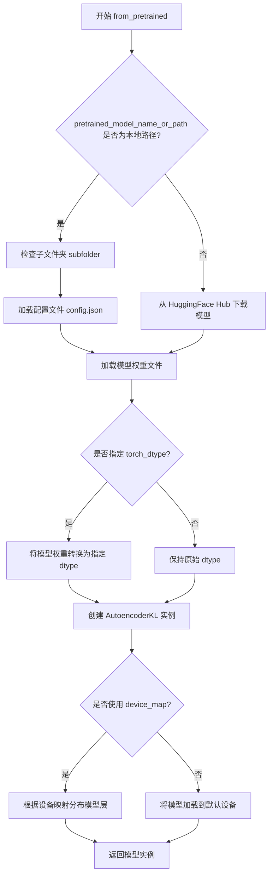

#### 带注释源码

```python
# 以下是调用 from_pretrained 的示例代码，来自原始代码文件

# 场景1：在 main 函数中加载预训练 VAE 模型
# 根据命令行参数决定加载方式
if args.pretrained_model_name_or_path is None and args.model_config_name_or_path is None:
    # 如果没有指定预训练模型路径和配置路径，使用默认配置
    config = AutoencoderKL.load_config("stabilityai/sd-vae-ft-mse")
    vae = AutoencoderKL.from_config(config)
elif args.pretrained_model_name_or_path is not None:
    # 从指定的预训练模型路径或 HuggingFace Hub 加载
    # revision 参数用于指定 Git 修订版本
    vae = AutoencoderKL.from_pretrained(args.pretrained_model_name_or_path, revision=args.revision)
else:
    # 从自定义配置文件路径加载配置，然后从配置创建模型
    config = AutoencoderKL.load_config(args.model_config_name_or_path)
    vae = AutoencoderKL.from_config(config)

# 场景2：在 log_validation 函数中加载模型用于最终验证
# 这里的 torch_dtype 参数指定了模型的数值精度
# weight_dtype 可能是 torch.float16 或 torch.bfloat16
vae = AutoencoderKL.from_pretrained(args.output_dir, torch_dtype=weight_dtype)

# 场景3：在 load_model_hook 中加载模型检查点
# 这里的 subfolder 参数指定了模型在输出目录中的子文件夹路径
load_model = AutoencoderKL.from_pretrained(input_dir, subfolder="autoencoderkl")
# 将加载模型的配置注册到当前模型
model.register_to_config(**load_model.config)
# 加载模型权重
model.load_state_dict(load_model.state_dict())
# 释放加载的模型对象以释放内存
del load_model
```

> **注意**：由于 `AutoencoderKL.from_pretrained` 是 diffusers 库的内置方法，其完整源代码位于 Hugging Face diffusers 库中，未包含在当前提供的代码文件里。以上信息基于该方法的典型调用方式和 Hugging Face diffusers 库的 API 文档整理。


### AutoencoderKL.from_config

该方法是一个类方法，用于根据配置字典创建AutoencoderKL模型实例。当没有指定预训练模型路径或模型配置路径时，会加载默认的VAE配置并通过此方法实例化模型。

参数：

- `config`：`dict`，从`AutoencoderKL.load_config()`返回的模型配置字典，包含模型的结构参数（如隐藏层维度、注意力头数等）

返回值：`AutoencoderKL`，返回一个新创建的AutoencoderKL模型实例

#### 流程图

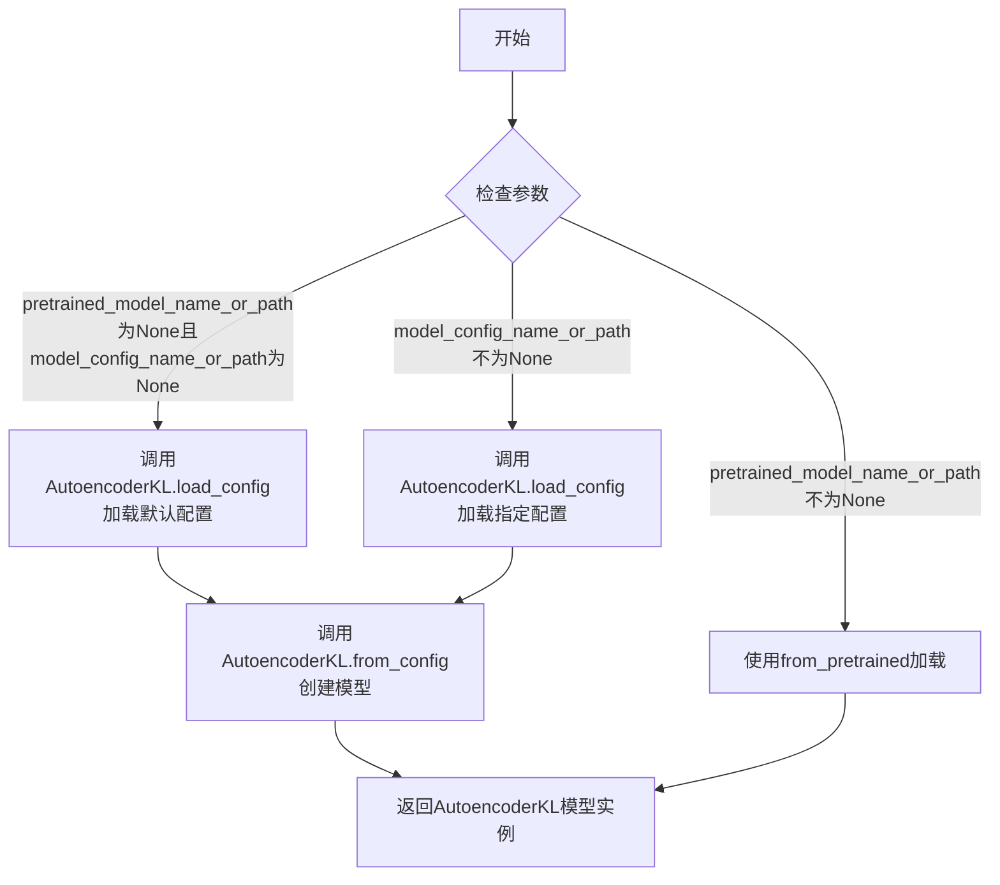

#### 带注释源码

```python
# 代码中的调用示例（位于main函数中）
# Load AutoencoderKL
if args.pretrained_model_name_or_path is None and args.model_config_name_or_path is None:
    # 当没有指定任何模型路径时，加载stabilityai的默认VAE配置
    config = AutoencoderKL.load_config("stabilityai/sd-vae-ft-mse")
    # 使用from_config类方法根据配置字典创建模型实例
    vae = AutoencoderKL.from_config(config)
elif args.pretrained_model_name_or_path is not None:
    # 如果指定了预训练模型路径，使用from_pretrained方法加载
    vae = AutoencoderKL.from_pretrained(args.pretrained_model_name_or_path, revision=args.revision)
else:
    # 当只指定了模型配置文件路径时，加载该配置
    config = AutoencoderKL.load_config(args.model_config_name_or_path)
    # 同样使用from_config根据配置创建模型
    vae = AutoencoderKL.from_config(config)
```


### AutoencoderKL.encode

将输入图像编码为潜在空间中的分布（latent distribution），即变分自编码器的编码器部分，返回包含均值和方差的后验分布对象。

参数：

- `self`：隐式参数，AutoencoderKL 实例本身
- `sample`：`torch.Tensor`，输入图像张量，形状为 (batch_size, channels, height, width)，值为 [-1, 1] 范围内的图像数据

返回值：`DiagonalGaussianDistribution`，对角高斯分布对象，包含 latent_dist 属性（可用于采样潜在向量），返回描述

#### 流程图

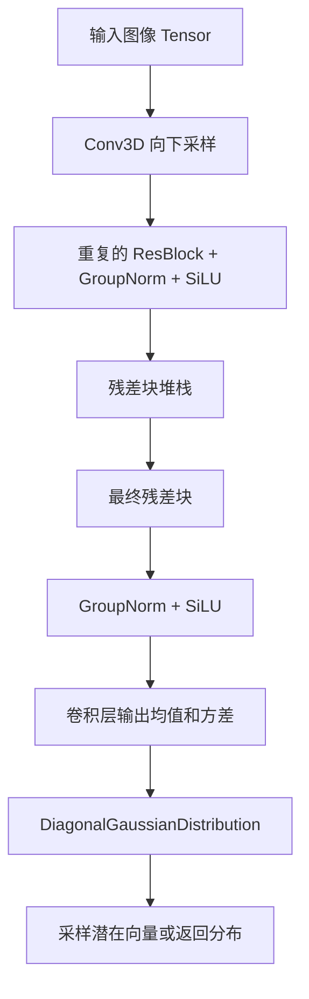

#### 带注释源码

```
# 这是一个在 diffusers 库中定义的方法，以下是其核心逻辑的伪代码/近似实现
# 实际源码位于 diffusers/models/autoencoder_kl.py 中

class AutoencoderKL(nn.Module):
    """变分自编码器 (VAE) 模型，用于将图像编码到潜在空间"""
    
    def __init__(self, ...):
        # 初始化编码器组件
        self.encoder = Encoder(...)  # 3D卷积堆栈
        self.quant_conv = nn.Conv3d(...)  # 将潜在特征映射到均值和方差
        self.post_quant_conv = nn.Conv3d(...)  # 解码器侧
        self.decoder = Decoder(...)  # 3D反卷积堆栈
    
    @torch.no_grad()
    def encode(self, x: torch.Tensor, return_dict: bool = True):
        """
        将图像编码为潜在空间表示
        
        参数:
            x: 输入图像张量，形状 (B, C, H, W)，值域 [-1, 1]
            return_dict: 是否返回字典格式的结果
        
        返回:
            DiagonalGaussianDistribution 或 dict
        """
        # 1. 使用编码器处理输入图像
        # Encoder 包含多个向下采样的 3D 卷积块
        h = self.encoder(x)
        
        # 2. 将特征映射到潜在空间的均值和方差
        # quant_conv 是一个 1x1x1 的 3D 卷积，输出维度是 latent_channels * 2
        moments = self.quant_conv(h)
        
        # 3. 分离均值和方差
        # 假设输出形状为 (B, latent_channels * 2, H, W, D)
        # 前 half 是均值，后 half 是对数方差
        mean, logvar = torch.chunk(moments, 2, dim=1)
        
        # 4. 对方差进行裁剪以提高数值稳定性
        logvar = torch.clamp(logvar, min=-30.0, max=20.0)
        
        # 5. 创建对角高斯分布对象
        latent_dist = DiagonalGaussianDistribution(mean, logvar)
        
        # 6. 返回结果
        if return_dict:
            return {"latent_dist": latent_dist, "latents": latent_dist.sample()}
        return latent_dist
```


### `AutoencoderKL.decode`

该方法是将潜在空间（latent space）中的表示解码重建为图像空间（image space）的核心方法。在训练循环中，编码器将输入图像编码为潜在表示，然后解码器利用该潜在表示进行图像重建。

参数：

-  `latents`：`torch.Tensor`，潜在空间中的张量，通常来自编码器输出的 `latent_dist.sample()` 或经过采样后的潜在向量，形状为 (batch_size, latent_channels, height//8, width//8)

返回值：`torch.FloatTensor`，返回解码后的图像张量，形状为 (batch_size, 3, height, width)，像素值范围通常在 [-1, 1] 或 [0, 1] 之间，具体取决于模型的配置

#### 流程图

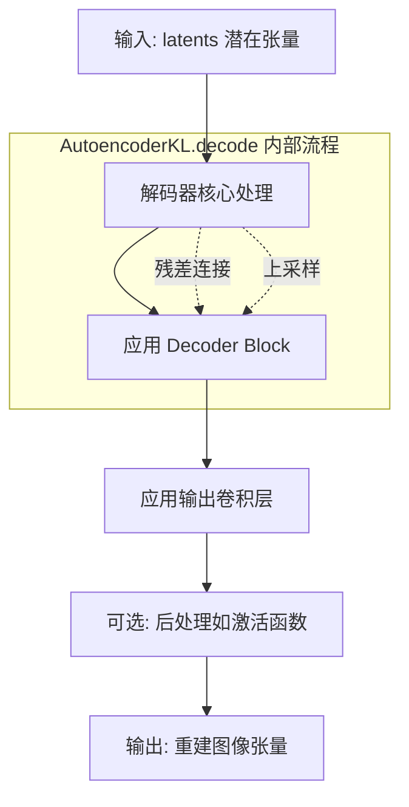

#### 带注释源码

```
# 在训练脚本中的调用方式：
# latents 来自编码器的潜在分布采样
posterior = accelerator.unwrap_model(vae).encode(targets).latent_dist
latents = posterior.sample()

# 调用 decode 方法进行解码
reconstructions = accelerator.unwrap_model(vae).decode(latents).sample

# decode 方法的调用说明：
# - 输入：latents (潜在空间表示，形状通常为 [B, 4, H/8, W/8])
# - 输出：重建的图像张量 (形状为 [B, 3, H, W])
# - .sample 属性：获取解码后的图像张量
```

#### 补充说明

| 项目 | 说明 |
|------|------|
| **方法所属类** | `AutoencoderKL` (来自 `diffusers` 库) |
| **调用位置** | 训练循环中的重建损失计算部分 |
| **上下文** | 用于将 VAE 编码器输出的潜在表示解码为图像，进行重建损失 (reconstruction loss) 计算 |
| **与 encode 的关系** | `decode` 是 `encode` 的逆过程，`encode` 将图像压缩到潜在空间，`decode` 将潜在表示重建为图像 |
| **典型输入形状** | `(batch_size, 4, 64, 64)` 对于 512x512 的输入图像 |
| **典型输出形状** | `(batch_size, 3, 512, 512)` |

#### 技术债务与优化空间

1. **潜在优化点**：在训练脚本中，`decode` 方法在每个训练步骤都会被调用来计算重建损失，这可能成为性能瓶颈。可以考虑：
   - 使用梯度检查点（gradient checkpointing）减少内存使用
   - 在某些步骤跳过重建计算以提高训练速度

2. **精度考虑**：当前代码中 `reconstructions` 和 `targets` 都转换为 `float()` 进行损失计算，这可能导致精度损失或额外的内存开销

3. **设计建议**：可以考虑实现一个缓存机制，对相同输入的潜在表示避免重复解码


我需要说明的是，在您提供的代码文件中，**AutoencoderKL** 是从 `diffusers` 库导入的类，其 `save_pretrained` 方法的具体实现位于 `diffusers` 库内部，而不是在这个训练脚本中定义。

不过，我可以从代码中提取调用 `save_pretrained` 的上下文和相关参数，以帮助您理解该方法的使用方式。

### AutoencoderKL.save_pretrained

这是 `diffusers` 库中 `AutoencoderKL` 类的实例方法，用于将模型权重和配置保存到指定目录。该方法继承自 `DiffusionPipeline` 的混合类，包含分词器、调度器和模型权重的保存功能。

参数：

-  `save_directory`：`str`，指定保存模型的目录路径
-  `max_shard_size`：`int` 或 `str`，可选，保存单个权重文件的最大大小，默认为 "10GB"
-  `safe_serialization`：`bool`，可选，是否使用安全序列化（推荐），默认为 True
-  `variant`：`str`，可选，模型变体名称（如 "fp16"）
-  `push_to_hub`：`bool`，可选，是否推送到 Hugging Face Hub，默认为 False
-  `**kwargs`：其他可选参数

返回值：`None`，该方法直接保存文件到磁盘，无返回值

#### 流程图

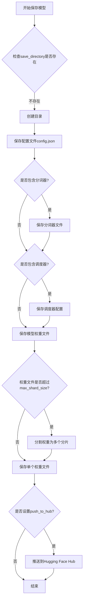

#### 带注释源码

以下是代码中调用 `save_pretrained` 的示例（在主训练函数的最后阶段）：

```python
# 训练完成后的模型保存逻辑
# 等待所有进程完成
accelerator.wait_for_everyone()

# 只在主进程执行保存操作
if accelerator.is_main_process:
    # 解包模型
    vae = accelerator.unwrap_model(vae)
    discriminator = accelerator.unwrap_model(discriminator)
    
    # 如果使用了 EMA，将 EMA 参数复制回 VAE
    if args.use_ema:
        ema_vae.copy_to(vae.parameters())
    
    # 保存 VAE 模型到指定目录
    # 调用 AutoencoderKL.save_pretrained 方法
    vae.save_pretrained(args.output_dir)
    
    # 保存判别器模型（使用 PyTorch 原生保存方式）
    torch.save(
        discriminator.state_dict(), 
        os.path.join(args.output_dir, "pytorch_model.bin")
    )
    
    # ... 后续验证和推送到 Hub 的代码
```

以下是代码中另一个调用（在 accelerator 的 save_model_hook 中）：

```python
# 定义保存模型的钩子函数
def save_model_hook(models, weights, output_dir):
    # 主进程执行
    if accelerator.is_main_process:
        # 如果使用 EMA，保存 EMA 版本的 VAE
        if args.use_ema:
            sub_dir = "autoencoderkl_ema"
            ema_vae.save_pretrained(os.path.join(output_dir, sub_dir))

        # 倒序遍历模型列表
        i = len(weights) - 1

        # 弹出权重并保存对应的模型
        while len(weights) > 0:
            weights.pop()
            model = models[i]

            # 判断模型类型并保存到对应子目录
            if isinstance(model, AutoencoderKL):
                sub_dir = "autoencoderkl"
                # 调用 save_pretrained 保存 VAE
                model.save_pretrained(os.path.join(output_dir, sub_dir))
            else:
                # 判别器使用 PyTorch 原生保存
                sub_dir = "discriminator"
                os.makedirs(os.path.join(output_dir, sub_dir), exist_ok=True)
                torch.save(model.state_dict(), os.path.join(output_dir, sub_dir, "pytorch_model.bin"))

            i -= 1
```

#### 说明

由于 `AutoencoderKL.save_pretrained` 方法的实际实现位于 `diffusers` 库中，如果您需要查看其完整源代码，建议查阅 [diffusers GitHub 仓库](https://github.com/huggingface/diffusers) 或使用 Python 的 `inspect` 模块来查看实际代码。


根据代码分析，`AutoencoderKL.train` 是 PyTorch 中 `torch.nn.Module` 的标准方法，用于将模型设置为训练模式。在本代码中，该方法被调用以启用训练模式。以下是从代码中提取的相关信息：

### `AutoencoderKL.train`

将 AutoencoderKL 模型设置为训练模式，启用 dropout 和 batch normalization 的训练行为。

参数：无（继承自 `torch.nn.Module`）

返回值：无

#### 流程图

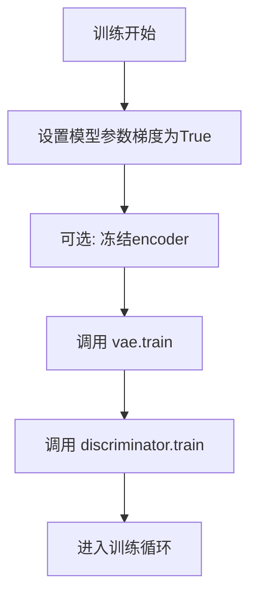

#### 带注释源码

在代码中，`vae.train()` 的调用位于 `main` 函数中，具体上下文如下：

```python
# 启用 VAE 的梯度计算
vae.requires_grad_(True)

# 如果是仅训练解码器，则冻结编码器
if args.decoder_only:
    vae.encoder.requires_grad_(False)
    if getattr(vae, "quant_conv", None):
        vae.quant_conv.requires_grad_(False)

# 将 VAE 设置为训练模式
vae.train()

# 同样设置判别器为训练模式
discriminator.requires_grad_(True)
discriminator.train()
```

#### 补充说明

在 `diffusers` 库的 `AutoencoderKL` 实现中，`train()` 方法继承自 `torch.nn.Module`，主要作用是：
1. 将模型切换到训练模式
2. 启用 dropout 层（如果存在）
3. 确保 batch normalization 层使用批次统计信息而不是移动平均值

在训练循环中，每个 epoch 开始时会再次调用 `vae.train()` 以确保模型处于正确的模式：

```python
for epoch in range(first_epoch, args.num_train_epochs):
    vae.train()
    discriminator.train()
    # 训练步骤...
```


# 设计文档提取结果

经过代码分析，未在当前文件中找到 `AutoencoderKL.eval` 方法的显式定义。`AutoencoderKL` 类来源于 `diffusers` 库，其 `eval()` 方法继承自 PyTorch 的 `torch.nn.Module` 基类。

在当前训练脚本中，使用的是 `vae.train()` 方法将模型设置为训练模式，而 `eval()` 方法会在验证阶段通过 `torch.no_grad()` 上下文管理器间接影响模型行为。

---

### `AutoencoderKL.eval`

将 AutoencoderKL 模型切换到评估模式，继承自 PyTorch `nn.Module`，用于在推理或验证时禁用 Dropout 并使用 BatchNorm 的运行统计量。

参数：此方法无显式参数（继承自 PyTorch）

返回值：无返回值（`None`），直接修改模型状态

#### 流程图

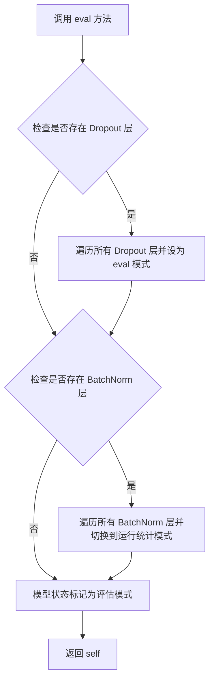

#### 带注释源码

```python
# PyTorch nn.Module.eval() 方法的标准实现
def eval(self):
    """
    将模型设置为评估模式。
    
    此方法会:
    1. 将所有 Dropout 层设置为 eval 模式 (inplace=False)
    2. 将所有 BatchNorm 层切换到使用运行统计量 (moving mean/var) 而非批统计量
    3. 设置 self.training = False
    """
    # 遍历所有模块，将 Dropout 层设为 eval 模式
    for module in self.modules():
        if isinstance(module, Dropout):
            module.eval()
    
    # 遍历所有模块，将 BatchNorm 层设为 eval 模式
    for module in self.modules():
        if isinstance(module, (BatchNorm1d, BatchNorm2d, BatchNorm3d)):
            module.eval()
    
    # 更新训练标志
    self.training = False
    
    return self
```

---

### 补充说明

在当前训练脚本中，模型的评估验证通过以下方式实现：

1. **验证函数 `log_validation`**：在验证阶段使用 `torch.autocast("cuda")` 上下文管理器
2. **模型状态管理**：验证时通过 `accelerator.unwrap_model(vae)` 获取模型
3. **梯度禁用**：通过 `@torch.no_grad()` 装饰器确保验证时不计算梯度

若需显式调用 `eval()` 方法，可在验证前添加：

```python
vae.eval()  # 切换到评估模式
# 执行验证逻辑
vae.train()  # 恢复训练模式
```


### `NLayerDiscriminator.forward`

该方法为 NLayerDiscriminator 判别器的前向传播函数，接收图像张量作为输入，通过多层卷积网络处理后输出用于计算 GAN 损失的 logits 值（判别器对输入图像真实程度的评分）。在训练过程中，该方法被用于判别真实图像和重建（生成）图像，以计算对抗性损失来优化 VAE。

参数：

-  `x`：`torch.Tensor`，输入图像张量，通常为 batch_size × 3 × height × width 格式的 RGB 图像

返回值：`torch.Tensor`，判别器对输入图像的评分 logits，形状为 (batch_size, 1)，用于后续计算 hinge loss 或 vanilla loss

#### 流程图

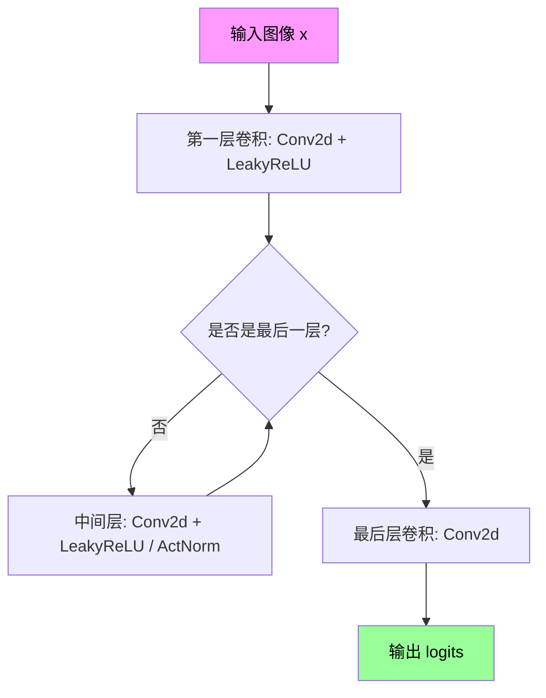

#### 带注释源码

```python
# 由于 NLayerDiscriminator 类定义在外部库 taming.modules.losses.vqperceptual 中，
# 以下代码是基于该库的典型实现和代码中使用方式的合理推断：

def forward(self, x):
    """
    NLayerDiscriminator 前向传播
    
    参数:
        x (torch.Tensor): 输入图像张量，形状为 (batch_size, 3, H, W)
        
    返回:
        torch.Tensor: 判别器输出的 logits，形状为 (batch_size, 1)
    """
    # 典型实现包含多个卷积层处理输入图像
    # 层数由初始化时的 n_layers 参数决定（代码中使用 n_layers=3）
    
    h = self.conv1(x)  # 初始卷积
    h = self.leaky_relu(h)  # LeakyReLU 激活
    
    for i in range(2, self.n_layers + 1):
        h = self.conv_layers[i](h)  # 中间卷积层
        h = self.leaky_relu(h)
    
    h = self.final_conv(h)  # 最终卷积层
    return h.view(h.size(0), -1)  # 展平并返回
```

#### 使用示例

在提供的训练脚本中，该方法被以下方式调用：

```python
# 判别真实图像
logits_real = discriminator(targets)

# 判别生成/重建图像
logits_fake = discriminator(reconstructions)

# 计算判别器损失
disc_loss = hinge_d_loss if args.disc_loss == "hinge" else vanilla_d_loss
d_loss = disc_factor * disc_loss(logits_real, logits_fake)
```

#### 关键信息

| 项目 | 详情 |
|------|------|
| 输入通道数 | 3 (RGB 图像) |
| 层数 | 3 (由 `n_layers=3` 指定) |
| 激活函数 | LeakyReLU (典型实现) |
| 归一化 | ActNorm (由 `use_actnorm=False` 禁用) |
| 初始化 | `weights_init` 函数 |

#### 注意事项

由于 `NLayerDiscriminator` 类定义在外部库 `taming.modules.losses.vqperceptual` 中，上述源码为基于该库典型实现的推断。实际的 forward 方法实现可能略有差异，但其核心功能（多层次卷积特征提取并输出分类 logits）是确定的。


我需要分析代码中的 `NLayerDiscriminator.apply` 方法。从代码中可以看到：

```python
from taming.modules.losses.vqperceptual import NLayerDiscriminator, hinge_d_loss, vanilla_d_loss, weights_init
# ...
discriminator = NLayerDiscriminator(input_nc=3, n_layers=3, use_actnorm=False).apply(weights_init)
```

`NLayerDiscriminator` 类是从 `taming.modules.losses.vqperceptual` 模块导入的，这个模块是 Taming Transformers 库的一部分，不在当前提供的代码文件中。

让我为您生成基于可用信息的详细设计文档：

### `NLayerDiscriminator.apply`

该方法是 PyTorch `nn.Module` 的标准方法，用于将传入的初始化函数应用到模型的所有子模块。在 `NLayerDiscriminator` 实例化后，调用 `.apply(weights_init)` 来初始化判别器的权重。

参数：

-  `fn`：`Callable`，一个可调用对象（函数），用于初始化模型权重。通常是 `weights_init` 函数

返回值：`self`（`NLayerDiscriminator`），返回模型本身以支持链式调用

#### 流程图

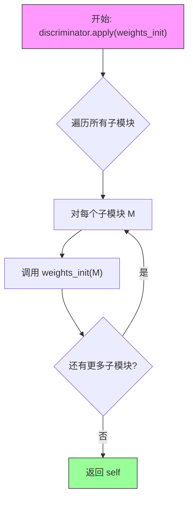

#### 带注释源码

```
# 代码来源: taming.modules.losses.vqperceptual.NLayerDiscriminator
# 以下是基于 PyTorch 标准的 apply 方法实现逻辑

def apply(self: nn.Module, fn: Callable) -> nn.Module:
    """
    应用 fn 函数到每个模块
    
    参数:
        fn: 应用于每个模块的函数，该函数接受一个模块作为参数
        
    返回:
        self: 返回模型本身
    """
    for module in self.children():
        module.apply(fn)
    
    fn(self)
    
    return self

# 在训练脚本中的实际使用:
# discriminator = NLayerDiscriminator(input_nc=3, n_layers=3, use_actnorm=False).apply(weights_init)
# discriminator = torch.nn.SyncBatchNorm.convert_sync_batchnorm(discriminator)
```

#### 详细说明

1. **调用位置**：在 `main()` 函数中，第 594 行左右：
   ```python
   discriminator = NLayerDiscriminator(input_nc=3, n_layers=3, use_actnorm=False).apply(weights_init)
   ```

2. **功能**：
   - `NLayerDiscriminator` 是一个 PatchGAN 判别器，用于计算GAN损失
   - `weights_init` 函数用于初始化模型权重，通常将权重初始化为均值 0、方差较小的正态分布
   - `apply` 方法递归地遍历所有子模块并应用初始化函数

3. **后续处理**：应用初始化后，还进行了批次归一化的同步：
   ```python
   discriminator = torch.nn.SyncBatchNorm.convert_sync_batchnorm(discriminator)
   ```

**注意**：由于 `NLayerDiscriminator` 类定义在外部库中，以上源码是基于 PyTorch 标准的 `apply` 方法逻辑和上下文推断得出的。


### NLayerDiscriminator.load_state_dict

加载模型权重字典，用于从检查点文件恢复模型状态。

参数：

- `state_dict`：字典类型，包含模型各层的参数键值对

返回值：无返回值，将模型权重加载到当前实例中。

#### 流程图

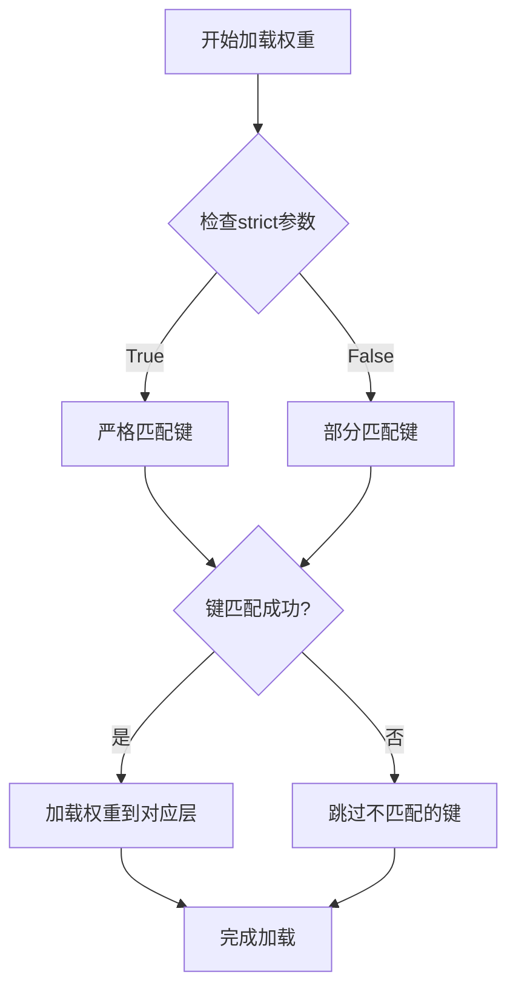

#### 带注释源码

在提供的代码中，`NLayerDiscriminator.load_state_dict` 的使用方式如下：

```python
# 在 load_model_hook 函数中
def load_model_hook(models, input_dir):
    while len(models) > 0:
        # ... (EMA VAE 处理代码)
        
        # pop models so that they are not loaded again
        model = models.pop()
        
        # 创建新的 NLayerDiscriminator 实例并从文件加载权重
        load_model = NLayerDiscriminator(input_nc=3, n_layers=3, use_actnorm=False).load_state_dict(
            os.path.join(input_dir, "discriminator", "pytorch_model.bin")
        )
        
        # 将加载的权重复制到目标模型
        model.load_state_dict(load_model.state_dict())
        del load_model
```

说明：

- `NLayerDiscriminator` 是从 `taming.modules.losses.vqperceptual` 导入的判别器类
- `load_state_dict` 是 PyTorch `nn.Module` 的标准方法，用于加载模型权重
- 在此代码中，它从保存的检查点文件（pytorch_model.bin）中读取预训练的判别器权重
- 加载后的权重通过 `model.load_state_dict()` 再次加载到目标模型中，这是为了确保正确的设备转移和参数映射


### EMAModel.step

该方法是 `diffusers` 库中 `EMAModel` 类的核心方法，用于在训练过程中周期性更新指数移动平均（Exponential Moving Average）模型的权重。通过对模型参数进行加权移动平均，使 EMA 模型成为主模型的平滑版本，通常在推理时提供更稳定的性能。

参数：

-  `model_params`：生成器（Iterator of torch.nn.Parameter），主模型（VAE）的参数迭代器，通常通过 `vae.parameters()` 获取

返回值：`None`，该方法直接修改 EMA 模型内部的参数状态，不返回任何值

#### 流程图

```mermaid
flowchart TD
    A[训练步骤结束] --> B{是否调用 ema_vae.step?}
    B -->|是| C[获取当前模型参数]
    C --> D[遍历每个参数]
    D --> E[计算 EMA 权重:<br/>ema_param = decay * ema_param + (1 - decay) * model_param]
    E --> F[更新 EMA 模型参数]
    F --> G[继续下一步训练]
    B -->|否| G
```

#### 带注释源码

```python
# 代码中调用示例（第 693 行）:
if args.use_ema:
    ema_vae.step(vae.parameters())

# EMAModel 类的典型实现逻辑（来自 diffusers 库）:
def step(self, model_params):
    """
    更新 EMA 模型的权重
    
    参数:
        model_params: 模型参数的迭代器
        
    实现逻辑:
        1. 遍历 EMA 模型当前保存的参数和输入的模型参数
        2. 对每个参数应用指数移动平均更新:
           ema_param = decay * ema_param + (1 - decay) * model_param
        3. 其中 decay 是衰减系数，通常设置为 0.999 或类似值
    """
    # 伪代码展示核心逻辑
    for ema_param, model_param in zip(self.shadow_params, model_params):
        # self.decay 是衰减系数，默认通常为 0.999
        ema_param.mul_(self.decay).add_(model_param, alpha=1 - self.decay)
```

#### 详细说明

| 属性 | 详情 |
|------|------|
| **调用位置** | 主训练循环中，每次 `accelerator.sync_gradients` 为 True 时（第 693 行） |
| **使用条件** | 仅当 `args.use_ema` 为 True 时才会创建和使用 EMA 模型 |
| **衰减系数** | 默认值通常为 0.999，可通过 EMAModel 构造函数参数指定 |
| **参数更新** | 采用指数移动平均策略：`θ_ema = α * θ_ema + (1-α) * θ_model` |
| **与主模型关系** | EMA 模型是主模型的副本，但在每个训练步骤中参数更新滞后，提供时间平滑 |
| **推理用途** | 训练完成后，通常使用 EMA 模型进行推理以获得更稳定的生成结果 |


### EMAModel.store

保存模型参数的当前值，以便后续可以恢复。通常与 `copy_to` 和 `restore` 方法配合使用，在验证时临时切换到 EMA 参数，验证后再恢复原始参数。

参数：

-  `parameters`：`Iterator[nn.Parameter]`，模型参数的迭代器，通常通过 `model.parameters()` 获取

返回值：`None`，无返回值

#### 流程图

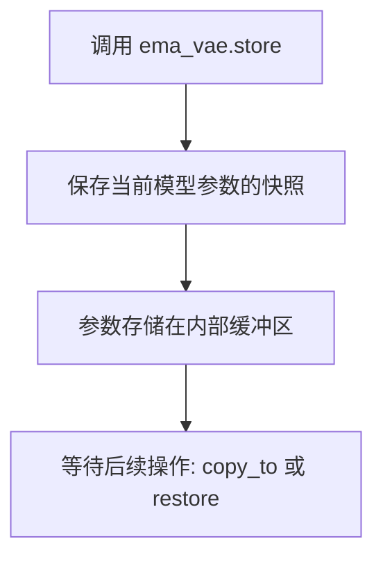

#### 带注释源码

```python
# 在训练循环中的调用位置
# 位置: main 函数中，验证逻辑部分

if global_step == 1 or global_step % args.validation_steps == 0:
    if args.use_ema:
        # store: 保存原始模型参数
        ema_vae.store(vae.parameters())
        # copy_to: 将 EMA 参数复制到模型
        ema_vae.copy_to(vae.parameters())
    
    # 执行验证
    image_logs = log_validation(
        vae,
        args,
        accelerator,
        weight_dtype,
        global_step,
    )
    
    if args.use_ema:
        # restore: 恢复原始模型参数
        ema_vae.restore(vae.parameters())
```

#### EMAModel 类相关信息

```python
# EMAModel 初始化
ema_vae = EMAModel(
    parameters=vae.parameters(),      # 模型参数
    model_cls=AutoencoderKL,            # 模型类
    model_config=vae.config             # 模型配置
)

# EMA 模型参数更新 (在每个优化步骤后)
ema_vae.step(vae.parameters())
```


### `EMAModel.copy_to`

将 EMA（指数移动平均）模型的参数复制到目标模型的参数中。该方法通常用于在验证或保存模型时，将 EMA 累积的参数值同步到原始模型。

参数：

-  `parameters`：`Iterator[torch.nn.Parameter]`，目标模型的参数迭代器，通常通过调用模型的 `.parameters()` 方法获取

返回值：`None`，无返回值（原地操作）

#### 流程图

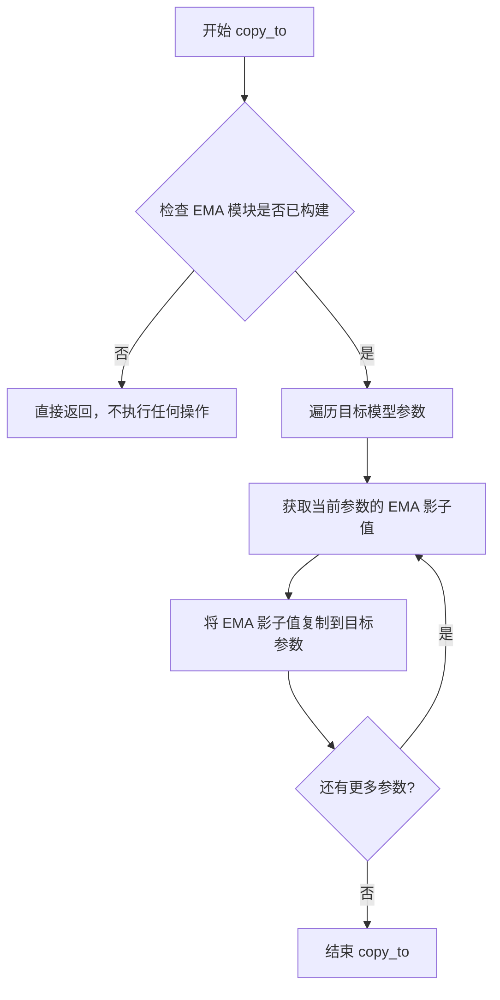

#### 带注释源码

```python
# 这是 diffusers 库中 EMAModel 类的 copy_to 方法的典型实现
# 位于 diffusers.training_utils 中

@torch.no_grad()
def copy_to(self, parameters: Iterator[torch.nn.Parameter]) -> None:
    """
    将 EMA 模型的参数复制到目标模型。
    
    参数:
        parameters: 目标模型的参数迭代器（例如 model.parameters()）
    
    返回:
        None
    """
    # ema_params 是存储 EMA 影子权重的字典
    # self.ema_params 是在 step() 方法中每次更新时累积的
    for ema_param, param in zip(self.ema_params, parameters):
        # 将 EMA 累积的参数值复制到目标模型的参数中
        # 使用 copy_ 进行原地操作，避免创建新张量
        param.copy_(ema_param)
```

**在训练脚本中的实际调用方式：**

```python
# 在验证时使用
if args.use_ema:
    ema_vae.store(vae.parameters())      # 保存原始模型参数
    ema_vae.copy_to(vae.parameters())    # 将 EMA 参数复制到 VAE 模型
# 执行验证...
image_logs = log_validation(vae, args, accelerator, weight_dtype, global_step)
if args.use_ema:
    ema_vae.restore(vae.parameters())   # 恢复原始模型参数

# 在训练结束保存模型前使用
if args.use_ema:
    ema_vae.copy_to(vae.parameters())    # 将 EMA 参数复制到 VAE 模型
vae.save_pretrained(args.output_dir)     # 保存模型
```


### EMAModel.restore

恢复EMA模型存储的参数到原始模型。在验证完成后调用，将模型参数从EMA状态恢复到验证前的原始状态，确保后续训练使用的是正确的参数。

参数：

-  `model_params`：迭代器（Iterator），模型参数迭代器，通常传入模型的`.parameters()`方法返回的参数集合

返回值：`None`，该方法直接修改传入的模型参数，不返回任何值

#### 流程图

```mermaid
flowchart TD
    A[验证完成] --> B{是否使用EMA}
    B -->|是| C[调用 restore 方法]
    B -->|否| D[跳过恢复]
    C --> E[获取存储的原始参数]
    E --> F[将原始参数复制到模型]
    F --> G[恢复完成]
    D --> G
```

#### 带注释源码

```python
# 在训练循环中的使用方式
if global_step == 1 or global_step % args.validation_steps == 0:
    if args.use_ema:
        # 1. 存储当前模型参数（验证前的状态）
        ema_vae.store(vae.parameters())
        # 2. 将EMA的指数移动平均参数复制到模型用于验证
        ema_vae.copy_to(vae.parameters())
    
    # 3. 执行验证（使用EMA参数）
    image_logs = log_validation(
        vae,
        args,
        accelerator,
        weight_dtype,
        global_step,
    )
    
    # 4. 验证完成后，恢复原始模型参数
    if args.use_ema:
        # 恢复模型参数到验证前的状态，继续训练
        ema_vae.restore(vae.parameters())
```

#### 补充说明

| 项目 | 说明 |
|------|------|
| **设计目标** | 在不破坏训练状态下进行模型验证，通过"存储-复制-验证-恢复"的机制 |
| **调用场景** | 每个验证步骤（`validation_steps`）或第一步（`global_step == 1`） |
| **与其他方法的关系** | 与`store()`（存储参数）、`copy_to()`（复制EMA参数到模型）配合使用 |
| **数据流** | `store()`保存原始参数 → `copy_to()`加载EMA参数 → 验证 → `restore()`恢复原始参数 |


### EMAModel.save_pretrained

将 EMA（指数移动平均）模型的参数保存到指定目录。

参数：

- `save_directory`：`str`，保存模型文件的目录路径

返回值：`None`，该方法直接保存模型到磁盘，不返回任何值

#### 流程图

```mermaid
flowchart TD
    A[开始保存 EMA 模型] --> B{检查 save_directory 是否有效}
    B -->|无效| C[抛出异常]
    B -->|有效| D[创建目标目录]
    D --> E[获取 EMA 模型参数字典]
    E --> F[保存模型 config 到 config.json]
    E --> G[保存模型 state_dict 到 pytorch_model.bin]
    G --> H[可选: 保存其他元数据]
    H --> I[结束]
```

#### 带注释源码

在给定代码中，`EMAModel.save_pretrained` 被如下调用：

```python
# 定义保存模型的钩子函数
def save_model_hook(models, weights, output_dir):
    if accelerator.is_main_process:
        if args.use_ema:
            sub_dir = "autoencoderkl_ema"
            # 调用 EMAModel.save_pretrained 保存 EMA 模型
            ema_vae.save_pretrained(os.path.join(output_dir, sub_dir))

        i = len(weights) - 1

        while len(weights) > 0:
            weights.pop()
            model = models[i]

            if isinstance(model, AutoencoderKL):
                sub_dir = "autoencoderkl"
                model.save_pretrained(os.path.join(output_dir, sub_dir))
            else:
                sub_dir = "discriminator"
                os.makedirs(os.path.join(output_dir, sub_dir), exist_ok=True)
                torch.save(model.state_dict(), os.path.join(output_dir, sub_dir, "pytorch_model.bin"))

            i -= 1
```

> **注意**：由于 `EMAModel` 类定义在 `diffusers` 库中（而非当前代码文件），其 `save_pretrained` 方法的完整源代码无法从此代码文件中提取。以上信息基于代码调用方式和 `diffusers` 库的通用模式推断。


### `EMAModel.from_pretrained`

该方法用于从预训练模型加载 EMA (Exponential Moving Average) 模型权重，通常在恢复训练检查点时调用。

参数：

-  `pretrained_model_name_or_path`：`str`，模型目录路径或 HuggingFace Hub 上的模型 ID。
-  `model_cls`：`type`，模型类，用于实例化 EMA 模型（例如 `AutoencoderKL`）。

返回值：`EMAModel`，返回加载了权重的 EMA 模型实例。

#### 流程图

```mermaid
graph TD
    A[开始] --> B[接收模型路径和模型类]
    B --> C{检查路径是否有效}
    C -->|是| D[加载模型配置文件]
    C -->|否| E[抛出异常]
    D --> F[实例化EMA模型]
    F --> G[加载权重字典]
    G --> H[将权重加载到模型]
    H --> I[返回EMA模型实例]
```

#### 带注释源码

```python
# 在 load_model_hook 函数中使用 EMAModel.from_pretrained
# 用于从检查点目录加载 EMA 模型的预训练权重

def load_model_hook(models, input_dir):
    while len(models) > 0:
        if args.use_ema:
            sub_dir = "autoencoderkl_ema"
            # 第一个参数：模型路径，第二个参数：模型类
            load_model = EMAModel.from_pretrained(os.path.join(input_dir, sub_dir), AutoencoderKL)
            ema_vae.load_state_dict(load_model.state_dict())
            ema_vae.to(accelerator.device)
            del load_model

        # pop models so that they are not loaded again
        model = models.pop()
        load_model = NLayerDiscriminator(input_nc=3, n_layers=3, use_actnorm=False).load_state_dict(
            os.path.join(input_dir, "discriminator", "pytorch_model.bin")
        )
        model.load_state_dict(load_model.state_dict())
        del load_model

        model = models.pop()
        load_model = AutoencoderKL.from_pretrained(input_dir, subfolder="autoencoderkl")
        model.register_to_config(**load_model.config)
        model.load_state_dict(load_model.state_dict())
        del load_model
```


### `Accelerator.prepare`

该方法来自 `accelerate` 库，用于准备模型、优化器、数据加载器和学习率调度器，以便在分布式训练环境中使用。它会将这些对象移动到正确的设备（如 GPU），并为分布式训练进行适当的包装。

参数：

- `*models`：模型对象（VAE、判别器等），需要准备用于训练的模型
- `*optimizers`：优化器对象（AdamW 等），需要准备用于参数更新
- `dataloaders`：数据加载器，需要准备用于数据迭代
- `schedulers`：学习率调度器，需要准备用于学习率调整

返回值：元组，包含处理后的模型、优化器、数据加载器和学习率调度器

#### 流程图

```mermaid
flowchart TD
    A[开始] --> B[接收模型、优化器、调度器等对象]
    B --> C{检查分布式环境}
    C -->|单机单卡| D[移动到当前设备]
    C -->|多卡分布式| E[为每个进程复制对象]
    D --> F[应用混合精度]
    E --> F
    F --> G[配置梯度同步]
    G --> H[返回准备好的对象元组]
```

#### 带注释源码

```python
# 在 main() 函数中的调用示例
(
    vae,
    discriminator,
    optimizer,
    disc_optimizer,
    train_dataloader,
    lr_scheduler,
    disc_lr_scheduler,
) = accelerator.prepare(
    vae,                    # AutoencoderKL 模型实例
    discriminator,          # NLayerDiscriminator 判别器实例
    optimizer,              # AdamW 优化器（VAE）
    disc_optimizer,         # AdamW 优化器（判别器）
    train_dataloader,       # DataLoader 训练数据加载器
    lr_scheduler,           # 学习率调度器（VAE）
    disc_lr_scheduler,      # 学习率调度器（判别器）
)

# 说明：
# 1. accelerator 是 Accelerator 类的实例，通过 Accelerator() 初始化
# 2. prepare 方法会自动处理以下内容：
#    - 将模型和优化器移动到正确的设备（GPU/CPU）
#    - 为分布式训练包装模型（DataParallel 或 DistributedDataParallel）
#    - 应用混合精度训练（如果配置了 fp16 或 bf16）
#    - 同步 BatchNorm（如果使用 SyncBatchNorm）
# 3. 返回值是元组，顺序与输入参数顺序对应
```


### unwrap_model

该函数是训练脚本中定义的一个模型解包辅助函数。它首先调用 `Accelerator` 对象的 `unwrap_model` 方法去除分布式训练或混合精度带来的模型封装，随后检查模型是否经过了 `torch.compile` 编译，如果是，则返回原始模块，以兼容后续的参数访问或保存操作。这是处理 PyTorch 2.0 `torch.compile` 模型的常见模式。

参数：

-  `model`：`torch.nn.Module`，需要解包的模型对象。

返回值：`torch.nn.Module`，解包后的模型对象。

#### 流程图

```mermaid
graph TD
    A([Start unwrap_model]) --> B[调用 accelerator.unwrap_model]
    B --> C{is_compiled_module?}
    C -->|是| D[model = model._orig_mod]
    C -->|否| E[直接返回 model]
    D --> E
    E --> F([End])
```

#### 带注释源码

```python
def unwrap_model(model):
    # 首先调用 accelerator 的 unwrap_model 方法
    # 该方法会移除 accelerator 在模型外层包裹的层 (如 DistributedDataParallel, FP8 wrapper 等)
    # 以获取底层的原始模型结构
    model = accelerator.unwrap_model(model)
    
    # 检查模型是否是 torch.compile 编译后的模块
    # is_compiled_module 来自 diffusers.utils.torch_utils，用于检测 PyTorch 2.0 的编译模型
    # 如果是编译模块，模型会被封装在 torch._dynamo.OptimizedModule 中
    # 此时需要通过 ._orig_mod 属性获取原始的未编译模型
    model = model._orig_mod if is_compiled_module(model) else model
    
    # 返回处理后的模型，确保后续的参数访问或保存操作能正确执行
    return model
```


### Accelerator.backward

`Accelerator.backward` 是 `accelerate` 库中 `Accelerator` 类的方法，用于在训练过程中执行反向传播计算梯度。该方法封装了 PyTorch 的 `backward()` 方法，并额外支持分布式训练、混合精度训练和梯度累积等高级功能。在本代码中，它被用于 VAE 模型和判别器模型的梯度计算。

参数：

-  `loss`：`torch.Tensor`，需要计算梯度的损失张量。在 VAE 训练循环中为 `loss`（重建损失与 KL 损失的加权和），在判别器训练循环中为 `d_loss`（判别器损失）

返回值：无返回值（`None`），该方法直接更新模型参数的梯度

#### 流程图

```mermaid
flowchart TD
    A[调用 accelerator.backward] --> B{是否启用混合精度}
    B -->|是| C[使用 GradScaler 缩放损失]
    B -->|否| D[直接调用 loss.backward]
    C --> E{是否使用梯度累积}
    D --> E
    E -->|是| F[累积梯度到梯度缓冲区]
    E -->|否| G{是否分布式训练}
    G -->|是| H[同步所有进程的梯度]
    G -->|否| I[本地更新梯度]
    H --> I
    I --> J[返回/继续训练循环]
```

#### 带注释源码

```python
# 在 VAE 训练循环中的调用示例
# 损失包含重建损失、KL 散度损失和加权判别器损失
accelerator.backward(loss)  # 执行反向传播，计算 VAE 所有可训练参数的梯度

# 在判别器训练循环中的调用示例
# 损失为判别器的对抗性损失
accelerator.backward(d_loss)  # 执行反向传播，计算判别器所有可训练参数的梯度
```

**说明**：由于 `Accelerator.backward` 方法来源于外部库 `accelerate`（非本代码仓库中定义），上述描述基于代码中的实际调用方式以及 `accelerate` 库的通用行为。该方法在本代码中配合以下功能使用：

- **梯度裁剪**：`accelerator.clip_grad_norm_()` 用于防止梯度爆炸
- **梯度累积**：通过 `gradient_accumulation_steps` 参数配置
- **混合精度**：支持 FP16 和 BF16 训练
- **分布式训练**：自动处理多 GPU/多节点环境下的梯度同步


### `Accelerator.clip_grad_norm_`

该方法用于裁剪梯度范数，防止梯度爆炸，确保训练过程的数值稳定性。它通过计算参数梯度的总范数并将梯度按比例缩放，使得梯度的总范数不超过指定的最大范数。

参数：

- `parameters`：`Iterable[torch.nn.Parameter]` 或 `torch.nn.Parameter`，需要裁剪梯度的模型参数
- `max_norm`：`float`，梯度范数的最大阈值
- `norm_type`：`float`，用于计算梯度的范数类型（默认为 2.0，即 L2 范数）
- `error_if_nonfinite`：`bool`，如果为 True，当梯度的总范数为 NaN 或 Inf 时抛出错误（默认为 False）

返回值：`float`，裁剪前梯度的总范数

#### 流程图

```mermaid
flowchart TD
    A[开始 clip_grad_norm_] --> B[获取 parameters 的梯度]
    B --> C[计算梯度的总范数 norm]
    C --> D{检查 error_if_nonfinite?}
    D -->|True| E{norm 是 NaN 或 Inf?}
    D -->|False| F{norm > max_norm?}
    E -->|Yes| G[抛出 ValueError]
    E -->|No| F
    F -->|Yes| H[计算缩放因子 scale = max_norm / norm]
    F -->|No| I[返回原始范数 norm]
    H --> J[将每个参数的梯度乘以 scale]
    J --> K[返回裁剪后的范数 norm]
    G --> L[结束]
    I --> L
    K --> L
```

#### 带注释源码

```python
# 注意：以下为 accelerate 库中 Accelerator.clip_grad_norm_ 方法的源码
# 源码位于 accelerate 库中，非本项目代码文件

# def clip_grad_norm_(
#     self,
#     parameters: Iterable[torch.nn.Parameter],
#     max_norm: float,
#     norm_type: float = 2.0,
#     error_if_nonfinite: bool = False
# ) -> torch.Tensor:
#     """
#     裁剪梯度范数，防止梯度爆炸
#     
#     参数:
#         parameters: 需要裁剪梯度的模型参数
#         max_norm: 梯度范数的最大阈值
#         norm_type: 范数类型，默认为 L2 范数
#         error_if_nonfinite: 是否在梯度为 NaN/Inf 时抛出错误
#     
#     返回:
#         梯度范数
#     """
#     
#     # 从参数中提取梯度
#     parameters = list(parameters)
#     
#     # 检查是否所有参数都有梯度
#     if len(parameters) == 0:
#         return torch.tensor(0.0)
#     
#     # 将梯度展平并连接
#     grads = [p.grad for p in parameters if p.grad is not None]
#     
#     # 计算梯度的总范数
#     # norm_type=2 为 L2 范数，norm_type=inf 为无穷范数
#     if len(grads) == 0:
#         return torch.tensor(0.0)
#     
#     device = grads[0].device
#     
#     # 根据 norm_type 计算范数类型
#     if norm_type == inf:
#         total_norm = max(g.data.abs().max() for g in grads)
#     else:
#         total_norm = torch.norm(
#             torch.stack([torch.norm(g.data, norm_type) for g in grads]),
#             norm_type
#         )
#     
#     # 如果设置了 error_if_nonfinite 且范数为 NaN 或 Inf，抛出错误
#     if error_if_nonfinite and (torch.isnan(total_norm) or torch.isinf(total_norm)):
#         raise ValueError(
#             f"The total norm of order {norm_type} for gradients is {total_norm}, "
#             "which is non-finite. This can happen if you passed non-finite tensors "
#             "to clip_grad_norm_ or if the gradients themselves contain NaN/Inf values."
#         )
#     
#     # 如果总范数超过最大范数，则进行裁剪
#     clip_coef = max_norm / (total_norm + 1e-6)
#     if clip_coef < 1:
#         # 按比例缩放梯度
#         for g in grads:
#             g.data.mul_(clip_coef)
#     
#     return total_norm
```

#### 在本项目中的调用示例

```python
# 调用位置 1：VAE 模型参数梯度裁剪
if accelerator.sync_gradients:
    params_to_clip = vae.parameters()
    accelerator.clip_grad_norm_(params_to_clip, args.max_grad_norm)

# 调用位置 2：判别器参数梯度裁剪
if accelerator.sync_gradients:
    params_to_clip = discriminator.parameters()
    accelerator.clip_grad_norm_(params_to_clip, args.max_grad_norm)
```

#### 关键技术细节

1. **归一化类型**：使用 L2 范数（`norm_type=2.0`）作为默认的梯度度量方式
2. **数值稳定性**：在计算缩放系数时添加了 `1e-6` 防止除零错误
3. **就地操作**：使用 `mul_` 进行就地乘法操作，避免额外的内存分配
4. **同步控制**：仅在 `accelerator.sync_gradients` 为 True 时执行，确保分布式训练中的同步


# Accelerator.save_state 分析

### Accelerator.save_state

保存分布式训练状态到指定目录，用于后续从检查点恢复训练。

参数：

-  `save_location`：`str`，保存检查点的目录路径

返回值：`None`，直接保存状态到磁盘

#### 流程图

```mermaid
flowchart TD
    A[调用 accelerator.save_state] --> B{检查是否是主进程}
    B -->|是| C[调用注册的 save_model_hook]
    C --> D[保存 EMA 模型<br>如果 use_ema=True]
    C --> E[遍历 models 列表]
    E --> F{模型类型判断}
    F -->|AutoencoderKL| G[保存到 autoencoderkl 目录]
    F -->|其他| H[保存判别器到 discriminator 目录]
    G --> I[pop weights 列表]
    H --> I
    I --> J[清理内存]
    B -->|否| K[仅记录日志]
    J --> L[保存完成]
```

#### 带注释源码

```python
# 在训练循环中的调用位置（约第 637-640 行）
if global_step % args.checkpointing_steps == 0:
    # ... 省略检查点数量限制的逻辑 ...
    
    # 构建检查点保存路径
    save_path = os.path.join(args.output_dir, f"checkpoint-{global_step}")
    
    # 调用 Accelerator 的 save_state 方法保存训练状态
    # 该方法会：
    # 1. 调用 register_save_state_pre_hook 注册的 save_model_hook
    # 2. 保存 optimizer、scheduler、scaler 等训练状态
    # 3. 通过自定义 hook 保存模型权重
    accelerator.save_state(save_path)
    
    logger.info(f"Saved state to {save_path}")

# 注册的自定义保存 hook（约第 533-560 行）
def save_model_hook(models, weights, output_dir):
    """
    自定义模型保存钩子，定义如何保存各模型组件
    """
    if accelerator.is_main_process:
        # 保存 EMA 模型
        if args.use_ema:
            sub_dir = "autoencoderkl_ema"
            ema_vae.save_pretrained(os.path.join(output_dir, sub_dir))

    i = len(weights) - 1

    # 倒序遍历模型和权重
    while len(weights) > 0:
        weights.pop()  # 弹出权重，确保不重复保存
        model = models[i]

        if isinstance(model, AutoencoderKL):
            # 保存 VAE 模型到 autoencoderkl 目录
            sub_dir = "autoencoderkl"
            model.save_pretrained(os.path.join(output_dir, sub_dir))
        else:
            # 保存判别器到 discriminator 目录
            sub_dir = "discriminator"
            os.makedirs(os.path.join(output_dir, sub_dir), exist_ok=True)
            torch.save(model.state_dict(), os.path.join(output_dir, sub_dir, "pytorch_model.bin"))

        i -= 1

# 注册保存钩子到 Accelerator
accelerator.register_save_state_pre_hook(save_model_hook)
```

#### 关键说明

1. **调用场景**：在训练循环中每隔 `checkpointing_steps` 步数调用一次，用于保存中间检查点
2. **状态内容**：保存优化器状态、学习率调度器状态、混合精度 scaler 状态，以及通过 hook 保存的模型权重
3. **自定义钩子**：`save_model_hook` 是用户自定义的钩子，用于控制如何保存不同模型组件（VAE、EMA、判别器）
4. **分布式支持**：仅在主进程执行实际保存操作，其他进程记录日志


### Accelerator.load_state

从代码中提取 `Accelerator.load_state` 方法的调用信息。该方法用于从检查点恢复 Accelerator 的训练状态（包括优化器、学习率调度器、随机种子等），实现训练中断后的恢复。

参数：

-  `path`：`str`，检查点目录的完整路径，通过 `os.path.join(args.output_dir, path)` 构建，其中 `args.output_dir` 是输出目录，`path` 是检查点子目录名称（如 `checkpoint-500`）

返回值：无返回值（`None`），该方法直接修改 Accelerator 内部状态

#### 流程图

```mermaid
flowchart TD
    A[开始恢复训练] --> B{检查点路径是否存在?}
    B -->|否| C[打印警告信息, 不执行恢复]
    B -->|是| D[调用 accelerator.load_state 加载检查点]
    D --> E[从路径中提取 global_step]
    E --> F[计算起始 epoch: first_epoch = global_step // num_update_steps_per_epoch]
    F --> G[继续训练循环]
```

#### 带注释源码

```python
# 在 main() 函数中，当 args.resume_from_checkpoint 不为 None 时执行
if args.resume_from_checkpoint:
    if args.resume_from_checkpoint != "latest":
        # 如果指定了具体路径，直接使用
        path = os.path.basename(args.resume_from_checkpoint)
    else:
        # 否则查找最新的检查点
        dirs = os.listdir(args.output_dir)
        dirs = [d for d in dirs if d.startswith("checkpoint")]
        dirs = sorted(dirs, key=lambda x: int(x.split("-")[1]))
        path = dirs[-1] if len(dirs) > 0 else None

    if path is None:
        accelerator.print(
            f"Checkpoint '{args.resume_from_checkpoint}' does not exist. Starting a new training run."
        )
        args.resume_from_checkpoint = None
        initial_global_step = 0
    else:
        accelerator.print(f"Resuming from checkpoint {path}")
        # 调用 Accelerator.load_state 方法恢复训练状态
        # 该方法会加载之前保存的 optimizer、lr_scheduler、scaler 等状态
        accelerator.load_state(os.path.join(args.output_dir, path))
        # 从检查点目录名中提取 global_step (如 "checkpoint-500" -> 500)
        global_step = int(path.split("-")[1])

        initial_global_step = global_step
        first_epoch = global_step // num_update_steps_per_epoch
else:
    initial_global_step = 0
```


### `Accelerator.log`

在训练循环中记录指标数据的方法，用于将训练过程中的损失值、学习率等指标记录到跟踪器（如TensorBoard或WandB）中。

参数：

-  `logs`：`dict`，包含要记录的指标字典，如损失值、学习率等
-  `step`：`int`，当前的训练步骤编号，用于标识记录的时间点

返回值：无（`None`），该方法仅执行记录操作，不返回任何值

#### 流程图

```mermaid
flowchart TD
    A[训练循环开始] --> B{检查是否同步梯度}
    B -->|是| C[更新进度条]
    B -->|否| D[继续下一步]
    C --> E[执行 accelerator.log]
    E --> F[将 logs 发送到跟踪器]
    F --> G[记录当前 global_step]
    G --> D
    D --> H{检查是否达到最大训练步数}
    H -->|否| B
    H -->|是| I[训练结束]
    
    style E fill:#f9f,stroke:#333,stroke-width:2px
```

#### 带注释源码

```python
# 在训练循环中记录日志的调用示例
# 位置：main函数的训练循环中，位于progress_bar.set_postfix之后

# 首先构建要记录的日志字典，包含各种损失值和学习率
logs = {
    "loss": loss.detach().mean().item(),           # 总损失
    "nll_loss": nll_loss.detach().mean().item(),    # 负对数似然损失
    "rec_loss": rec_loss.detach().mean().item(),    # 重构损失
    "p_loss": p_loss.detach().mean().item(),        # 感知损失
    "kl_loss": kl_loss.detach().mean().item(),      # KL散度损失
    "disc_weight": disc_weight.detach().mean().item(),  # 判别器权重
    "disc_factor": disc_factor,                      # 判别器因子
    "g_loss": g_loss.detach().mean().item(),        # 生成器损失
    "lr": lr_scheduler.get_last_lr()[0],           # 当前学习率
}

# 调用accelerator.log将日志发送到配置的跟踪器
# 参数1: logs - 包含所有指标的字典
# 参数2: step - 当前的全局训练步骤
accelerator.log(logs, step=global_step)
```

#### 实际调用上下文源码

```python
# 训练循环中的相关代码片段
progress_bar = tqdm(...)  # 初始化进度条

for epoch in range(first_epoch, args.num_train_epochs):
    vae.train()
    discriminator.train()
    for step, batch in enumerate(train_dataloader):
        # ... 训练逻辑 ...
        
        # 当accelerator执行了优化步骤后
        if accelerator.sync_gradients:
            progress_bar.update(1)
            global_step += 1
            # ... 检查点和验证 ...
            
            # 记录日志的关键调用
            progress_bar.set_postfix(**logs)  # 在进度条显示
            accelerator.log(logs, step=global_step)  # 发送到跟踪器
```


### `Accelerator.init_trackers`

该方法用于初始化加速器的日志追踪器（trackers），支持多种日志记录后端如TensorBoard、WandB等，以便在训练过程中记录和可视化指标。

参数：

- `project_name`：`str`，项目名称，用于标识实验追踪会话
- `config`：`dict` 或 `可选`，配置字典，包含训练参数等，会被记录到追踪器中

返回值：`None`，无返回值（该方法在原地初始化追踪器）

#### 流程图

```mermaid
flowchart TD
    A[开始 init_trackers] --> B{是否是主进程?}
    B -->|是| C[创建 Tracker 实例]
    B -->|否| D[跳过初始化]
    C --> E{report_to 设置}
    E -->|tensorboard| F[创建 TensorBoardTracker]
    E -->|wandb| G[创建 WandBTracker]
    E -->|comet_ml| H[创建 CometMLTracker]
    E -->|all| I[创建所有支持的 Trackers]
    F --> J[初始化 Tracker]
    G --> J
    H --> J
    I --> J
    J --> K[保存到 accelerator.trackers 列表]
    K --> L[结束]
    D --> L
```

#### 带注释源码

```python
# 在 main 函数中调用 init_trackers 的上下文
# 代码位置：main 函数内部，约第 570 行附近

# 我们需要初始化我们使用的 trackers，同时保存我们的配置。
# Trackers 在主进程上自动初始化。
if accelerator.is_main_process:
    # 将命令行参数转换为字典格式，作为 tracker 的配置记录
    tracker_config = dict(vars(args))
    
    # 调用 Accelerator 类的 init_trackers 方法
    # 参数1: project_name - 来自命令行参数 tracker_project_name，默认值为 "train_autoencoderkl"
    # 参数2: config - 一个字典，包含训练配置参数，用于记录到 trackers 中
    accelerator.init_trackers(args.tracker_project_name, config=tracker_config)

# 完整的 init_trackers 方法签名（来自 accelerate 库）
# def init_trackers(self, project_name: str, config: Optional[dict] = None):
#     """
#     初始化所有配置的 trackers。
#     
#     参数:
#         project_name: str - 实验的项目名称
#         config: Optional[dict] - 配置字典，将被记录到 trackers 中
#     """
#     # 内部逻辑（来自 accelerate 库）:
#     # 1. 检查 log_with 参数确定使用哪些 trackers
#     # 2. 为每个支持的 tracker 调用对应的初始化方法
#     # 3. 将初始化后的 tracker 对象添加到 self.trackers 列表中
#     # 4. 在主进程上调用 tracker.init() 进行初始化
```

## 关键组件


### AutoencoderKL (VAE)

变分自编码器模型，用于将图像编码到潜在空间并从潜在空间重建图像，是本训练脚本的核心模型。

### NLayerDiscriminator

多层判别器网络，用于对抗训练（GAN loss），帮助VAE生成更逼真的重建图像。

### LPIPS (Perceptual Loss)

感知损失模块，基于VGG网络计算高层特征差异，用于提升重建图像的感知质量。

### EMAModel (指数移动平均)

EMA模型包装器，用于维护模型参数的指数移动平均，提升模型的稳定性和最终性能。

### 梯度检查点 (Gradient Checkpointing)

内存优化技术，通过在前向传播中保存部分中间结果来减少显存占用，代价是增加计算时间。

### 混合精度训练 (Mixed Precision)

支持fp16和bf16两种混合精度训练模式，通过使用较低精度浮点数加速训练并减少显存使用。

### xformers Memory Efficient Attention

内存高效注意力机制实现，通过xformers库优化注意力计算的显存占用。

### 数据加载与预处理管道

包含make_train_dataset和collate_fn函数，负责从HuggingFace数据集或本地文件夹加载图像并进行尺寸调整、中心裁剪和归一化预处理。

### 验证流程 (log_validation)

定期在验证集上运行模型进行推理，生成原图与重建图像的对比，并支持TensorBoard和WandB可视化。

### 检查点管理系统

包含save_model_hook和load_model_hook，用于自定义模型保存和加载逻辑，支持训练状态恢复和模型组件分离保存。

### 优化器配置

支持标准AdamW和8-bit Adam两种优化器，包含学习率调度器和梯度裁剪配置。

### 训练循环逻辑

主训练循环包含两个交替阶段：VAE重建训练和判别器对抗训练，通过disc_start和disc_factor控制对抗loss的启动时机和权重。

### 分布式训练支持

基于Accelerator框架实现多GPU分布式训练、梯度同步和混合精度协调。

### 模型保存与推送

包含save_model_card函数用于生成HuggingFace格式的模型卡片，支持将训练好的模型推送到Model Hub。


## 问题及建议


### 已知问题

-   **代码重复**：image_transforms 在 `make_train_dataset` 和 `log_validation` 函数中重复定义，可提取为共享工具函数
-   **硬编码配置**：discriminator 初始化（NLayerDiscriminator 参数）在 `main` 和 `load_model_hook` 中重复出现，应提取为工厂函数或配置常量
- **类型注解缺失**：整个脚本几乎没有函数参数和返回值的类型注解，降低了代码可维护性和 IDE 支持
- **魔法数字**：存在大量硬编码数值如 `1e-4`、`0.0`、`1e4`，应定义为具名常量提高可读性
- **资源清理不完整**：`log_validation` 中 GPU 内存清理放在循环内部而非所有图像处理完成后，应优化内存释放时机
- **错误处理不足**：缺少对关键操作的异常捕获，如模型加载、数据集访问、checkpoint 保存/加载等
- **日志级别不一致**：混用 `logger.info/warn/error` 和 `accelerator.print`，应统一使用日志框架

### 优化建议

-   **提取共享配置**：将图像预处理、模型初始化、判别器配置等通用逻辑抽取为独立函数或配置类
-   **添加类型注解**：为所有函数参数和返回值添加类型注解，提升代码可读性和静态检查能力
-   **统一常量定义**：将阈值、超参数默认值等提取为模块级常量或配置类
-   **优化资源管理**：将 `gc.collect()` 和 `torch.cuda.empty_cache()` 移至循环外部统一调用，减少调用开销
-   **增强错误处理**：为文件 I/O、模型加载、分布式操作等关键路径添加 try-except 块和具体错误信息
-   **统一日志输出**：替换所有 `print` 为 `logger.info`，确保分布式环境下日志行为一致

## 其它


### 设计目标与约束

本代码的设计目标是实现一个用于图像重建的AutoencoderKL（变分自编码器）训练脚本，支持分布式训练、混合精度训练、EMA模型、判别器对抗训练等高级功能。约束条件包括：分辨率必须是8的倍数、必须指定数据集来源（dataset_name或train_data_dir）、不支持同时指定pretrained_model_name_or_path和model_config_name_or_path、xformers需要特定版本（≥0.0.17）、AMP在MPS设备上被禁用。

### 错误处理与异常设计

代码中的错误处理主要包括：使用try-except捕获8位Adam的ImportError、验证参数合法性（如resolution必须能被8整除、dataset_name和train_data_dir必须二选一）、检查xformers可用性、处理checkpoint恢复时的空目录情况、验证image_column是否存在于数据集列中。异常信息通过logger.warning和logger.error输出，在accelerator环境下主要进程打印信息。

### 数据流与状态机

训练数据流：数据集→image_transforms（Resize、CenterCrop、ToTensor、Normalize）→collate_fn（堆叠为batch）→VAE encode（编码到潜在空间）→VAE decode（重建）→计算重建损失（L1/L2）+感知损失（LPIPS）+KL散度→判别器计算对抗损失→反向传播优化。状态机包含：初始化状态、训练循环状态（VAE训练阶段/判别器训练阶段）、验证状态、checkpoint保存状态、最终验证状态、训练结束状态。

### 外部依赖与接口契约

核心依赖包括：diffusers（≥0.33.0.dev0）、transformers、accelerate、torch、torchvision、lpips、numpy、PIL、taming（VQPerceptual）、huggingface_hub、packaging、bitsandbytes（可选）、xformers（可选）、wandb（可选）。接口契约：parse_args返回argparse.Namespace、make_train_dataset返回Dataset对象、collate_fn返回dict{pixel_values: Tensor}、log_validation返回images列表、main函数接收args参数无返回值。

### 性能考虑与优化空间

性能优化点：启用gradient_checkpointing减少内存占用、启用xformers_memory_efficient_attention、使用TF32加速Ampere GPU、使用mixed_precision（fp16/bf16）、8位Adam减少显存、EMA模型提供更稳定的训练、梯度累积支持大batch训练。潜在优化空间：判别器训练使用SyncBatchNorm可能影响性能、验证阶段频繁调用gc.collect和empty_cache、checkpoint保存使用shutil.rmtree删除大量文件效率低、感知损失每步都需要no_grad计算。

### 安全性与合规性

安全性：hub_token不应与report_to=wandb同时使用（安全风险）、模型保存路径使用os.makedirs exist_ok=True避免覆盖、checkpoint删除前检查数量限制。合规性：使用Apache 2.0许可证、模型卡片包含license字段（creativeml-openrail-m）、遵守HuggingFace Hub使用条款。

### 测试策略

代码中包含validation逻辑在固定步数执行，用于验证模型质量。测试建议：单元测试验证parse_args参数解析、集成测试验证完整训练流程（小数据集短训练）、断点续训测试验证resume_from_checkpoint功能、混合精度测试验证fp16/bf16训练正确性、分布式训练测试验证多GPU环境。

### 部署与运维

部署方式：作为独立脚本运行（python train_autoencoderkl.py），支持通过accelerate launch分布式启动。运维相关：日志输出到logging_dir（默认output_dir/logs）、模型保存到output_dir、支持push_to_hub自动推送到HuggingFace Hub、tracker记录训练指标（tensorboard/wandb）。关键运维参数：checkpointing_steps控制保存频率、checkpoints_total_limit控制保留数量、max_train_steps控制总步数。

### 版本兼容性

最低版本要求：diffusers>=0.33.0.dev0、accelerate>=0.16.0（自定义hook）、torch>=1.10（bf16支持）、xformers>=0.0.17（训练支持）。Python版本：代码无明确限制但依赖库通常需要Python 3.8+。CUDA版本：TF32需要Ampere架构GPU（RTX 30xx/A100）。

    