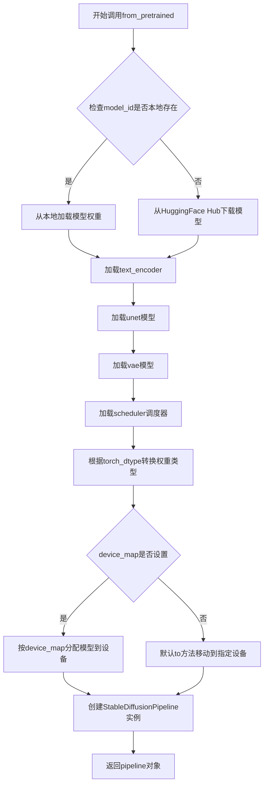
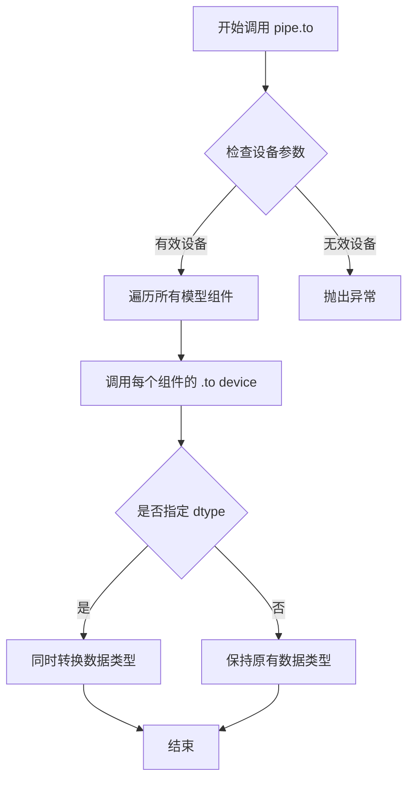
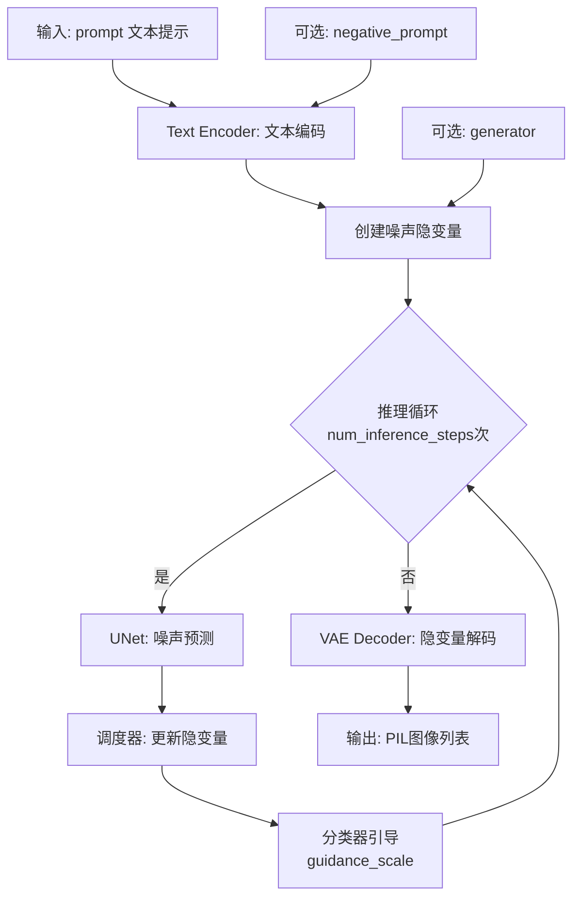
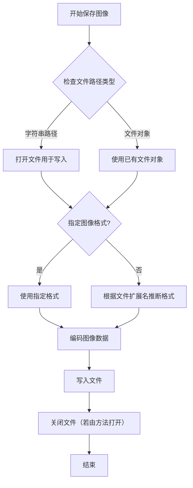

# `diffusers\examples\research_projects\colossalai\inference.py` 详细设计文档

该代码是一个基于Hugging Face Diffusers库的Stable Diffusion模型推理脚本，通过加载预训练的文本到图像扩散模型，根据用户提供的文本提示(prompt)生成对应图像，并保存为PNG文件。

## 整体流程

```mermaid
graph TD
    A[开始] --> B[导入依赖库]
    B --> C[定义模型ID: model_id]
    C --> D[加载StableDiffusionPipeline]
    D --> E[将模型移至GPU: .to('cuda')]
E --> F[定义文本提示: prompt]
F --> G[调用pipeline生成图像]
G --> H[获取生成的图像: .images[0]]
H --> I[保存图像到文件: image.save()]
I --> J[结束]
```

## 类结构

```

```

## 全局变量及字段


### `model_id`
    
预训练模型的路径或模型标识符

类型：`str`
    


### `pipe`
    
加载的Stable Diffusion推理管道对象

类型：`StableDiffusionPipeline`
    


### `prompt`
    
用于生成图像的文本提示词

类型：`str`
    


### `image`
    
生成的图像对象

类型：`PIL.Image`
    


    

## 全局函数及方法


### `StableDiffusionPipeline.from_pretrained`

这是一个类方法，用于从预训练模型加载StableDiffusionPipeline实例。该方法负责下载（如果本地没有）并加载预训练的Stable Diffusion模型权重，初始化完整的图像生成管道，包括UNet模型、VAE、文本编码器和调度器等组件。

参数：

- `pretrained_model_name_or_path`：`str`或`os.PathLike`，预训练模型的模型ID（如"runwayml/stable-diffusion-v1-5"）或本地模型路径
- `torch_dtype`：`torch.dtype`，可选参数，指定模型权重的数据类型（如torch.float16用于GPU加速，torch.float32用于CPU）
- `device_map`：`str`或`dict`，可选参数，指定模型在设备上的映射方式（如"auto"自动分配到可用设备）
- `cache_dir`：`str`，可选参数，模型缓存目录路径
- `use_safetensors`：`bool`，可选参数，是否使用safetensors格式加载模型（更安全的加载方式）
- `variant`：`str`，可选参数，模型变体（如"fp16"）
- `local_files_only`：`bool`，可选参数，是否仅使用本地文件，不尝试下载

返回值：`StableDiffusionPipeline`，返回一个完整的图像生成管道对象，包含text_encoder、unet、vae、scheduler等组件，可用于根据文本提示生成图像

#### 流程图



#### 带注释源码

```python
# 从预训练模型加载StableDiffusionPipeline的类方法
# 这是diffusers库中StableDiffusionPipeline类的核心工厂方法

pipe = StableDiffusionPipeline.from_pretrained(
    model_id,                    # 模型ID或本地路径："path-to-your-trained-model"
    torch_dtype=torch.float16    # 使用float16精度以提高GPU性能
).to("cuda")                     # 将整个pipeline移动到CUDA设备

# 详细流程说明：
# 1. from_pretrained是类方法，通过@classmethod装饰器定义
# 2. 方法内部会检查model_id指向的模型是否存在于本地cache
# 3. 如果不存在，会从HuggingFace Hub自动下载所需的模型文件
# 4. 加载各个组件：text_encoder（文本编码器）、unet（去噪网络）、vae（变分自编码器）
# 5. 根据torch_dtype参数将模型权重转换为指定的数据类型（float16可以减少显存占用）
# 6. 创建PipelineInfo对象存储各组件的配置信息
# 7. 最后返回包含所有组件的StableDiffusionPipeline实例
# 8. 链式调用.to("cuda")将整个pipeline移动到GPU内存

# 使用返回的pipeline进行图像生成
prompt = "A photo of sks dog in a bucket"
image = pipe(
    prompt,                      # 文本提示词
    num_inference_steps=50,     # 推理步数，越多质量越好但越慢
    guidance_scale=7.5         # CFG引导强度，越高越忠于提示词
).images[0]                     # 获取第一张生成的图像
```


### `StableDiffusionPipeline.to`

将 StableDiffusionPipeline 实例中的所有模型组件（通常包括 UNet、VAE、文本编码器等）移至指定的计算设备（GPU、CPU 或其他），以便在该设备上执行推理。

参数：

- `device`：`str`，目标设备标识符，如 `"cuda"` 表示 GPU，`"cpu"` 表示 CPU
- `dtype`（可选）：`torch.dtype`，可选参数，用于指定模型的数据类型（如 `torch.float16`）

返回值：`StableDiffusionPipeline`，返回自身实例，支持链式调用。

#### 流程图



#### 带注释源码

```python
# 原始代码片段
pipe = StableDiffusionPipeline.from_pretrained(
    model_id,           # 预训练模型路径或Hub模型ID
    torch_dtype=torch.float16  # 指定模型权重数据类型为半精度
).to("cuda")           # 将整个pipeline移至CUDA设备

# 完整方法调用形式（伪代码）
def to(self, device: str, dtype: Optional[torch.dtype] = None):
    """
    将pipeline中的所有模型组件移至指定设备
    
    参数:
        device: 目标设备字符串，如'cuda', 'cpu', 'cuda:0'等
        dtype: 可选的目标数据类型
    
    返回:
        self: 返回自身以支持链式调用
    """
    # 1. 获取pipeline中所有模型组件（通常包括unet, vae, text_encoder等）
    components = self.components
    
    # 2. 遍历每个组件并调用其.to()方法
    for name, model in components.items():
        if dtype is not None:
            # 如果指定了dtype，同时转换设备和数据类型
            model = model.to(device=device, dtype=dtype)
        else:
            # 仅转换设备
            model = model.to(device=device)
    
    # 3. 更新pipeline的设备属性
    self._internal_dict["device"] = torch.device(device)
    
    # 4. 返回self以支持链式调用
    return self
```


### `StableDiffusionPipeline.__call__`

该方法是 StableDiffusionPipeline 类的核心推理接口，通过接收文本提示和生成参数，驱动潜在扩散模型完成从文本到图像的生成过程，最终返回包含生成图像的 PipelineOutput 对象。

参数：

- `prompt`：`str` 或 `List[str]`，输入的文本描述，指导图像生成的内容和风格
- `num_inference_steps`：`int`（可选，默认为 50），扩散过程的推理步数，步数越多生成质量越高但耗时更长
- `guidance_scale`：`float`（可选，默认为 7.5），无分类器引导比例，用于平衡文本相关性和生成多样性
- `negative_prompt`：`str` 或 `List[str]`（可选），反向文本提示，指定不希望出现在图像中的元素
- `num_images_per_prompt`：`int`（可选，默认为 1），每个提示生成的图像数量
- `height`：`int`（可选，默认为 512），生成图像的高度像素值
- `width`：`int`（可选，默认为 512），生成图像的宽度像素值
- `eta`：`float`（可选），DDIM 采样器的随机因子
- `generator`：`torch.Generator`（可选），随机数生成器，用于控制生成过程的可重复性

返回值：`PipelineOutput`，包含 `images` 属性（`List[PIL.Image.Image]`），生成的图像列表

#### 流程图



#### 带注释源码

```python
# pipe(...) 调用本质上是 StableDiffusionPipeline.__call__ 方法
# 以下为调用示例及内部逻辑说明

# 1. 加载预训练模型并初始化管道
model_id = "path-to-your-trained-model"
pipe = StableDiffusionPipeline.from_pretrained(
    model_id, 
    torch_dtype=torch.float16  # 使用半精度浮点数加速推理并减少显存占用
).to("cuda")  # 将模型移至 GPU 设备

# 2. 调用 __call__ 方法执行推理
# 实际上调用的是 StableDiffusionPipeline.__call__(self, prompt, ...)
prompt = "A photo of sks dog in a bucket"
result = pipe(
    prompt,                      # 文本提示: 引导图像生成的核心输入
    num_inference_steps=50,      # 推理步数: 扩散模型迭代去噪的次数
    guidance_scale=7.5           # 引导系数: 平衡文本匹配度与图像质量
)

# 3. result 是一个 PipelineOutput 对象，包含:
#    - images: List[PIL.Image.Image] 生成的图像列表
#    - nsfw_content_detected: Optional[List[bool]] 内容安全检测结果
image = result.images[0]  # 获取第一张生成的图像

# 4. 保存图像到本地文件
image.save("dog-bucket.png")

# __call__ 方法内部核心逻辑概述:
# - 将文本 prompt 通过 TextEncoder 转换为 embedding 向量
# - 初始化随机噪声 latent 表示
# - 在 num_inference_steps 次迭代中:
#   a. UNet 预测噪声残差
#   b. Scheduler 根据预测更新 latent
#   c. 应用 classifier-free guidance 增强文本相关性
# - VAE Decoder 将去噪后的 latent 解码为可见图像
```


### `image.save`

保存图像到磁盘的方法，是 PIL (Pillow) 库中 `Image` 类的实例方法。该方法将 PIL 图像对象写入指定路径的文件，支持多种图像格式（如 PNG、JPEG、BMP 等），并根据文件扩展名自动推断格式。

参数：

- `fp`：`str` 或 `file object`，文件路径（如 "dog-bucket.png"）或文件对象，用于指定图像保存的位置
- `format`：`str`（可选），图像格式（如 "PNG"、"JPEG"），若为 None 则根据文件扩展名自动推断
- `quality`：`int`（可选），图像质量（仅对 JPEG 有效），范围 1-100，默认 75
- `optimize`：`bool`（可选），是否优化保存（仅对 JPEG 有效），默认 False
- `compress_level`：`int`（可选），压缩级别（仅对 PNG 有效），范围 0-9，默认 6

返回值：`None`，无返回值（该方法直接写入文件）

#### 流程图



#### 带注释源码

```python
# 假设 image 是由 StableDiffusionPipeline 生成的 PIL Image 对象
# 源代码位于 Pillow 库的 Image.py 中（简化版）

def save(self, fp, format=None, **params):
    """
    保存图像到指定文件
    
    参数:
        fp: 文件路径字符串或文件对象
        format: 图像格式，若为 None 则根据扩展名自动推断
        **params: 其他格式特定参数（如 quality、optimize 等）
    """
    
    # 1. 确定图像格式
    if format is None:
        # 如果未指定格式，从文件扩展名推断（如 .png -> PNG）
        format = Image._get_format_from_filename(fp)
    
    # 2. 打开文件（如果传入的是路径字符串）
    if isinstance(fp, str):
        fp = open(fp, 'wb')  # 以二进制写入模式打开
        close_file = True   # 标记需要关闭文件
    else:
        close_file = False  # 使用传入的文件对象，不关闭
    
    # 3. 根据格式选择合适的保存器（Saver）
    try:
        # 获取格式对应的保存模块（如 PngImagePlugin、JpegImagePlugin 等）
        save_handler = Image._get_save_handler(format)
        
        # 4. 调用格式特定的保存逻辑
        # 对于 PNG：调用 PngImagePlugin.save()
        # 对于 JPEG：调用 JpegImagePlugin.save()
        save_handler(self, fp, **params)
        
    finally:
        # 5. 如果是方法打开的文件，确保关闭
        if close_file:
            fp.close()

# 实际使用示例（来自任务代码）
image.save("dog-bucket.png")  # 保存为 PNG 格式
```


## 关键组件


### StableDiffusionPipeline 推理管道

使用 Hugging Face Diffusers 库加载预训练的 Stable Diffusion 模型，通过 from_pretrained 方法加载模型权重并配置为 float16 精度，移至 CUDA 设备进行 GPU 推理。

### 模型加载与设备转换

通过 from_pretrained 加载模型权重，torch_dtype=torch.float16 指定半精度推理以提升性能并降低显存占用，.to("cuda") 将模型移至 GPU 执行推理运算。

### 文本编码与图像生成

调用 pipe(prompt, num_inference_steps=50, guidance_scale=7.5) 执行文本到图像的生成任务，prompt 为文本提示词，num_inference_steps 控制扩散步数影响生成质量，guidance_scale 控制文本引导强度。

### 图像保存组件

将生成的图像通过 PIL 的 save 方法保存为 PNG 格式文件 "dog-bucket.png"，完成端到端的文生图流程。

### 潜在技术债务与优化空间

当前代码缺少错误处理机制（如模型加载失败、GPU 内存不足、磁盘空间不足等），未实现批量推理支持，推理参数硬编码缺乏灵活性，缺少推理性能监控和日志记录，图像保存路径未做合法性校验。


## 问题及建议


### 已知问题

- **缺少错误处理与异常捕获**：代码未对CUDA可用性、模型加载失败、推理异常等情况进行捕获和处理
- **未使用torch.no_grad()**：推理时未禁用梯度计算，导致不必要的显存占用
- **硬编码参数**：model_id、prompt、num_inference_steps、guidance_scale、输出路径等均为硬编码，缺乏配置管理
- **缺少类型注解**：代码中无任何类型标注，降低可维护性
- **无日志输出**：缺少执行过程的日志记录，难以追踪调试
- **缺少资源清理**：未显式管理GPU内存，推理完成后未清理缓存
- **无参数校验**：未对输入参数进行有效性验证
- **缺少安全检查**：未验证模型路径是否存在、模型文件是否完整
- **无内存优化选项**：未启用attention_slicing、vae_slicing等显存优化技术

### 优化建议

- 添加try-except异常捕获，处理CUDA不可用、模型加载失败、推理异常等情况
- 使用torch.no_grad()上下文管理器包裹推理代码，减少显存占用
- 将参数抽离为配置文件或命令行参数，使用argparse或配置文件管理
- 添加类型注解，提高代码可读性和IDE支持
- 添加日志记录，使用logging模块记录关键步骤
- 推理完成后调用torch.cuda.empty_cache()释放显存
- 添加参数校验逻辑，如检查模型路径、验证prompt非空等
- 启用内存优化选项：pipe.enable_attention_slicing()、pipe.enable_vae_slicing()
- 考虑使用safetensors加载模型，提升安全性和加载速度


## 其它


### 设计目标与约束

该代码的核心目标是将训练好的Stable Diffusion模型加载并用于文本到图像的生成任务。设计约束包括：1) 需要支持FP16精度推理以降低显存占用；2) 必须在CUDA设备上运行；3) 模型路径需预先训练并可通过from_pretrained加载；4) 推理参数（步数、引导系数）可调以平衡生成质量与速度。

### 错误处理与异常设计

1) 模型加载异常：若model_id路径无效或模型文件损坏，from_pretrained会抛出OSError；2) CUDA内存不足：GPU显存不足时torch抛出RuntimeError；3) 管道初始化失败：若diffusers库版本不兼容或缺少必要依赖，导入或初始化时抛出ImportError；4) 推理过程中的数值异常：若prompt包含不支持的字符或参数越界，pipe调用可能返回警告或异常。当前代码缺乏显式的异常捕获机制。

### 数据流与状态机

数据流：用户输入prompt文本 → pipe对象接收prompt和参数 → 文本编码器将prompt转为embedding → UNet执行去噪迭代（50步） → VAE解码潜在向量 → 解码后的PIL.Image对象 → 保存为PNG文件。状态机包含：模型加载状态（初始/加载中/就绪）→ 推理执行状态（空闲/推理中/完成）→ 图像输出状态（已生成/已保存）。

### 外部依赖与接口契约

1) torch：张量计算和CUDA管理，版本需与CUDA版本兼容；2) diffusers库：StableDiffusionPipeline类，版本≥0.10.0；3) 模型权重：需包含config.json、scheduler_config.json及UNet/VAE/Tokenizer/Text Encoder的权重文件；4) CUDA运行时：需支持float16计算的GPU设备。接口契约：pipe(prompt, num_inference_steps, guidance_scale)返回带有images属性的对象，images[0]为PIL.Image类型。

### 性能考量

1) torch_dtype=torch.float16将模型参数和计算降至半精度，显存减少约50%；2) .to("cuda")将模型移至GPU加速推理；3) num_inference_steps=50为折中参数，可降至20-30步以提升速度或增至100步以提升质量；4) guidance_scale=7.5控制文本引导强度，7-8.5为常用范围；5) 首次推理存在模型编译开销，后续推理更快。

### 安全性考虑

1) 模型来源可信性：需确保model_id来源可靠，避免加载恶意权重文件；2) prompt注入风险：用户输入的prompt未经过滤，可能触发不当内容生成；3) CUDA内存安全：需防止显存泄漏导致系统不稳定；4) 文件写入安全：image.save()路径需验证权限，避免任意文件覆盖。

### 配置管理

当前代码采用硬编码配置，改进方向包括：1) 模型路径、推理参数、输出路径应可通过配置文件或环境变量管理；2) 支持命令行参数解析（如argparse）实现灵活调用；3) 关键参数（num_inference_steps、guidance_scale）建议提取为常量或配置类以便统一调整。

### 使用示例与参数说明

基本用法：直接运行脚本生成图像；高级用法：可通过调整pipe的scheduler改变采样算法（如DPMSolverMultistepScheduler加速），或使用negative_prompt排除不需要的元素。参数说明：prompt为文本提示词，num_inference_steps控制去噪迭代次数（越多越精细），guidance_scale控制文本引导强度（越高越忠于prompt）。

### 局限性说明

1) 仅支持单图像生成，批量生成需循环调用；2) 无法直接控制生成图像的具体构图，只能通过prompt调节；3) 模型精度受限于FP16，极端情况下可能出现数值精度问题；4) 依赖特定目录结构，无法处理分布式模型加载；5) 无推理过程中的中间结果输出机制。

### 扩展性考虑

1) 批量推理：可添加batch_size参数支持多prompt并行生成；2) 多GPU支持：可使用accelerate库实现模型并行；3. 自定义调度器：可插拔不同的noise scheduler；4. 中间结果输出：可添加回调函数获取每步的潜空间结果；5. API服务化：可使用FastAPI封装为HTTP服务；6. 模型微调适配：代码结构支持加载LoRA等微调权重。


    