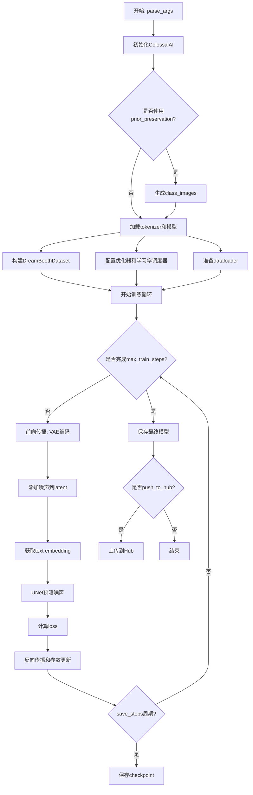
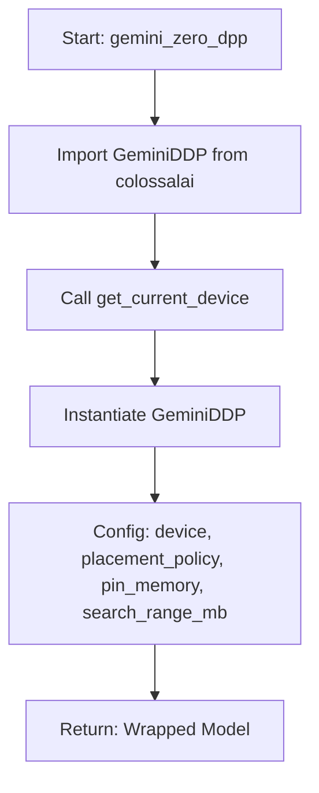
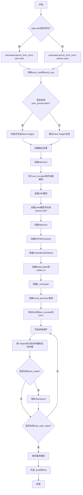
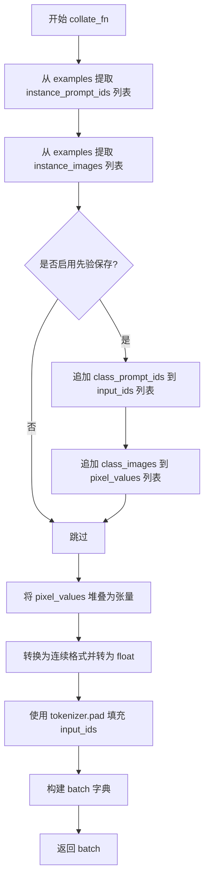
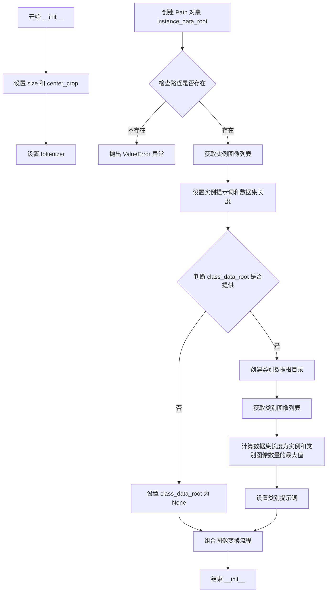
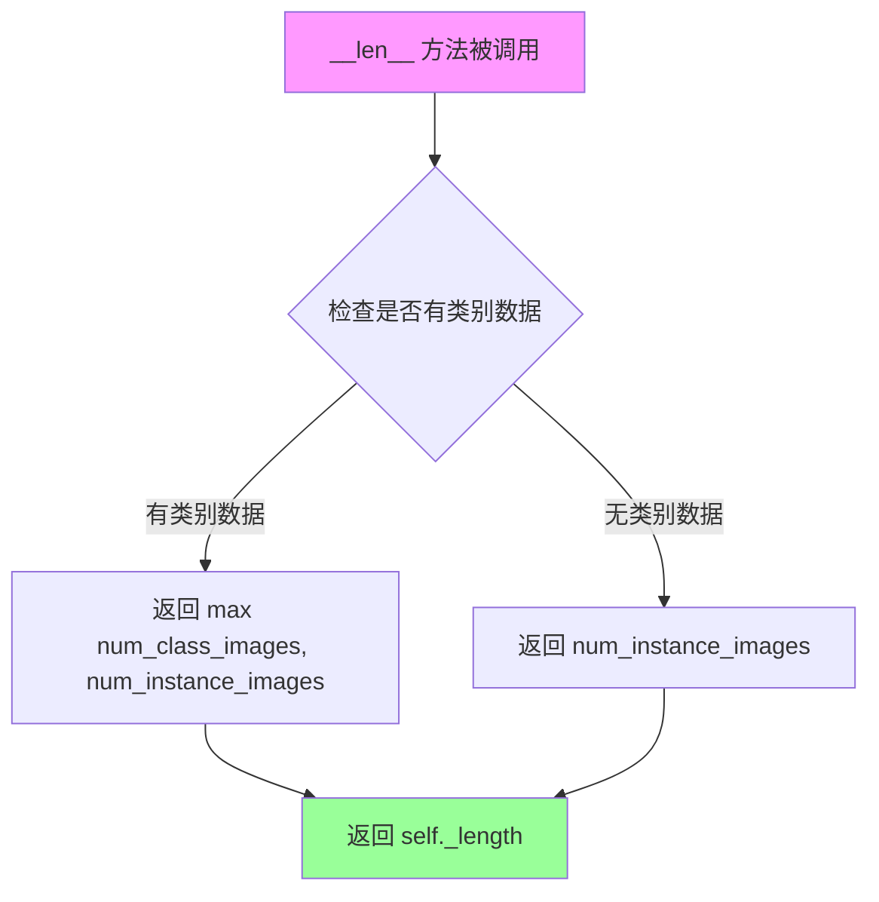
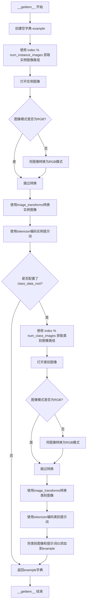
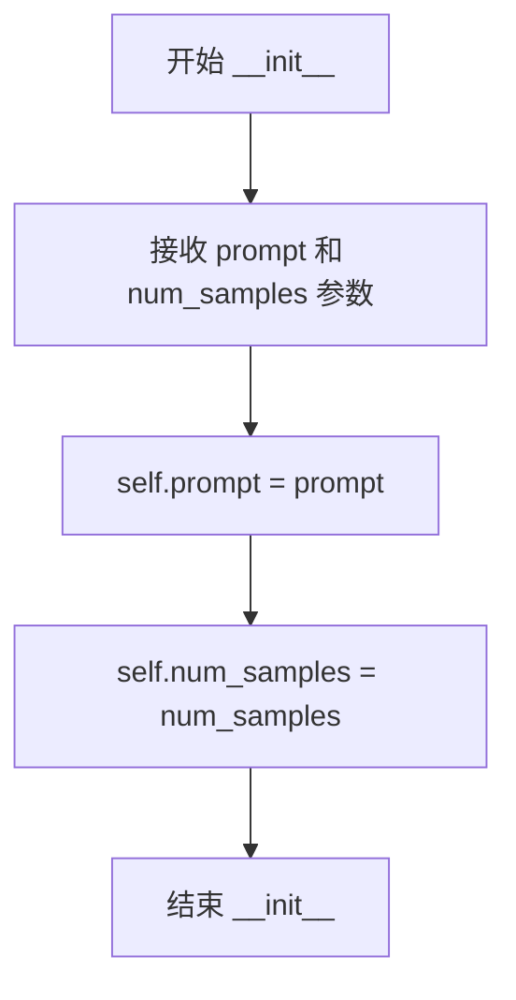
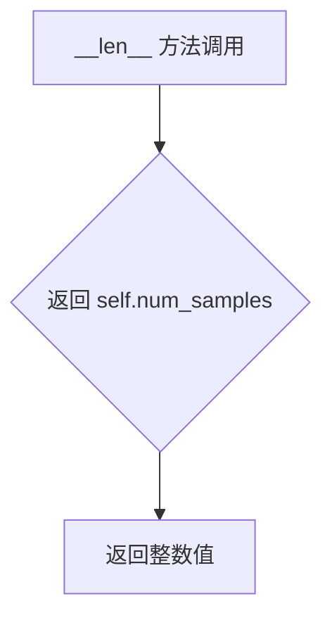

# `diffusers\examples\research_projects\colossalai\train_dreambooth_colossalai.py` 详细设计文档

这是一个基于ColossalAI分布式框架的DreamBooth训练脚本，用于微调Stable Diffusion模型（文本编码器、VAE和UNet），支持先验 preservation loss、混合精度训练、梯度检查点、模型保存和推送到HuggingFace Hub。

## 整体流程



## 类结构

```
DreamBoothDataset (Dataset子类)
├── __init__: 初始化数据集参数和图像变换
├── __len__: 返回数据集长度
└── __getitem__: 获取单个样本

PromptDataset (Dataset子类)
├── __init__: 初始化prompt和样本数
├── __len__: 返回样本数量
└── __getitem__: 获取单个样本
```

## 全局变量及字段


### `logger`
    
分布式日志记录器，用于在多进程训练环境中输出日志信息

类型：`DistributedLogger`
    


### `args`
    
命令行参数对象，包含所有训练配置参数

类型：`argparse.Namespace`
    


### `DreamBoothDataset.size`
    
图像分辨率大小

类型：`int`
    


### `DreamBoothDataset.center_crop`
    
是否中心裁剪

类型：`bool`
    


### `DreamBoothDataset.tokenizer`
    
文本tokenizer

类型：`AutoTokenizer`
    


### `DreamBoothDataset.instance_data_root`
    
实例图像根目录

类型：`Path`
    


### `DreamBoothDataset.instance_images_path`
    
实例图像路径列表

类型：`list`
    


### `DreamBoothDataset.num_instance_images`
    
实例图像数量

类型：`int`
    


### `DreamBoothDataset.instance_prompt`
    
实例提示词

类型：`str`
    


### `DreamBoothDataset.class_data_root`
    
类别图像根目录

类型：`Path`
    


### `DreamBoothDataset.class_images_path`
    
类别图像路径列表

类型：`list`
    


### `DreamBoothDataset.num_class_images`
    
类别图像数量

类型：`int`
    


### `DreamBoothDataset.class_prompt`
    
类别提示词

类型：`str`
    


### `DreamBoothDataset._length`
    
数据集长度

类型：`int`
    


### `DreamBoothDataset.image_transforms`
    
图像变换组合

类型：`transforms.Compose`
    


### `PromptDataset.prompt`
    
生成图像的提示词

类型：`str`
    


### `PromptDataset.num_samples`
    
需要生成的样本数量

类型：`int`
    
    

## 全局函数及方法


### `import_model_class_from_model_name_or_path`

根据模型名称或路径导入正确的文本编码器类。该函数通过加载预训练模型的文本编码器配置文件，提取其中定义的架构名称，然后根据架构名称动态返回对应的文本编码器类（CLIPTextModel 或 RobertaSeriesModelWithTransformation），以支持不同的文本编码器类型。

参数：

- `pretrained_model_name_or_path`：`str`，预训练模型的名称或路径，指向 Hugging Face 模型仓库或本地模型目录

返回值：`type`，返回对应的文本编码器类（CLIPTextModel 或 RobertaSeriesModelWithTransformation），如果架构不支持则抛出 ValueError

#### 流程图

```mermaid
flowchart TD
    A[开始] --> B[加载 PretrainedConfig]
    B --> C[指定 subfolder='text_encoder']
    C --> D[使用 args.revision 作为版本]
    D --> E[从配置中提取 architectures[0]]
    E --> F{判断 model_class}
    F -->|CLIPTextModel| G[导入 CLIPTextModel]
    F -->|RobertaSeriesModelWithTransformation| H[导入 RobertaSeriesModelWithTransformation]
    F -->|其他| I[抛出 ValueError 异常]
    G --> J[返回 CLIPTextModel 类]
    H --> K[返回 RobertaSeriesModelWithTransformation 类]
    I --> L[结束]
    J --> L
    K --> L
```

#### 带注释源码

```python
def import_model_class_from_model_name_or_path(pretrained_model_name_or_path: str):
    """
    根据模型名称或路径导入正确的文本编码器类
    
    参数:
        pretrained_model_name_or_path: 预训练模型的名称或路径
        
    返回:
        对应的文本编码器类 (CLIPTextModel 或 RobertaSeriesModelWithTransformation)
    """
    # 从预训练模型路径加载 text_encoder 的配置文件
    # subfolder="text_encoder" 指定加载 text_encoder 子目录的配置
    # revision=args.revision 指定要加载的模型版本
    text_encoder_config = PretrainedConfig.from_pretrained(
        pretrained_model_name_or_path,
        subfolder="text_encoder",
        revision=args.revision,
    )
    
    # 从配置中提取架构名称，通常配置文件中会定义 architectures 列表
    # 取第一个元素作为要使用的架构
    model_class = text_encoder_config.architectures[0]

    # 根据架构名称返回对应的文本编码器类
    if model_class == "CLIPTextModel":
        # CLIP 文本编码器，导入自 transformers 库
        from transformers import CLIPTextModel

        return CLIPTextModel
    elif model_class == "RobertaSeriesModelWithTransformation":
        # RoBERTa 系列文本编码器，导入自 diffusers 库
        from diffusers.pipelines.alt_diffusion.modeling_roberta_series import RobertaSeriesModelWithTransformation

        return RobertaSeriesModelWithTransformation
    else:
        # 如果遇到不支持的架构类型，抛出 ValueError 异常
        raise ValueError(f"{model_class} is not supported.")
```


### `parse_args`

该函数使用 argparse 库解析命令行参数，定义了大量与训练相关的参数（如模型路径、数据目录、学习率等），并对部分参数进行了基本校验（如 with_prior_preservation 模式下必须指定 class_data_dir 和 class_prompt），最终返回解析后的参数对象。

参数：

- `input_args`：`Optional[List[str]]`，可选的字符串列表，用于指定要解析的参数。若为 `None`，则从系统命令行参数（`sys.argv`）中解析。此参数主要用于单元测试或脚本内部调用时传入特定参数。

返回值：`argparse.Namespace`，包含所有命令行参数值的命名空间对象，可通过 `args.属性名` 访问各参数（如 `args.pretrained_model_name_or_path`、`args.learning_rate` 等）。

#### 流程图

```mermaid
flowchart TD
    A[开始 parse_args] --> B[创建 ArgumentParser]
    B --> C{是否传入 input_args?}
    C -->|是| D[使用 parser.parse_args(input_args) 解析]
    C -->|否| E[使用 parser.parse_args() 解析]
    D --> F[检查环境变量 LOCAL_RANK]
    E --> F
    F --> G{env_local_rank != -1<br/>且 env_local_rank != args.local_rank?}
    G -->|是| H[更新 args.local_rank = env_local_rank]
    G -->|否| I[保持原 args.local_rank]
    H --> J{args.with_prior_preservation?}
    I --> J
    J -->|是| K{class_data_dir 为空?}
    J -->|否| L{class_data_dir 不为空?}
    K -->|是| M[抛出 ValueError]
    K -->|否| N{class_prompt 为空?}
    L --> O[记录警告: 不需要 class_data_dir]
    M --> P[返回 args]
    N -->|是| Q[抛出 ValueError]
    N -->|否| R{class_prompt 不为空?}
    R -->|是| S[记录警告: 不需要 class_prompt]
    R -->|否| P
    O --> P
    S --> P
    Q --> P
```

#### 带注释源码

```python
def parse_args(input_args=None):
    """
    解析命令行参数并进行基本校验。
    
    参数:
        input_args (Optional[List[str]]): 可选的参数列表。如果为 None，则从 sys.argv 解析。
        
    返回:
        argparse.Namespace: 解析后的命令行参数对象。
    """
    # 创建 ArgumentParser 实例，description 参数提供帮助信息的标题
    parser = argparse.ArgumentParser(description="Simple example of a training script.")
    
    # ========== 预训练模型相关参数 ==========
    parser.add_argument(
        "--pretrained_model_name_or_path",
        type=str,
        default=None,
        required=True,
        help="Path to pretrained model or model identifier from huggingface.co/models.",
    )
    parser.add_argument(
        "--revision",
        type=str,
        default=None,
        required=False,
        help="Revision of pretrained model identifier from huggingface.co/models.",
    )
    parser.add_argument(
        "--tokenizer_name",
        type=str,
        default=None,
        help="Pretrained tokenizer name or path if not the same as model_name",
    )
    
    # ========== 数据集相关参数 ==========
    parser.add_argument(
        "--instance_data_dir",
        type=str,
        default=None,
        required=True,
        help="A folder containing the training data of instance images.",
    )
    parser.add_argument(
        "--class_data_dir",
        type=str,
        default=None,
        required=False,
        help="A folder containing the training data of class images.",
    )
    parser.add_argument(
        "--instance_prompt",
        type=str,
        default="a photo of sks dog",
        required=False,
        help="The prompt with identifier specifying the instance",
    )
    parser.add_argument(
        "--class_prompt",
        type=str,
        default=None,
        help="The prompt to specify images in the same class as provided instance images.",
    )
    
    # ========== Prior Preservation 相关参数 ==========
    parser.add_argument(
        "--with_prior_preservation",
        default=False,
        action="store_true",
        help="Flag to add prior preservation loss.",
    )
    parser.add_argument("--prior_loss_weight", type=float, default=1.0, help="The weight of prior preservation loss.")
    parser.add_argument(
        "--num_class_images",
        type=int,
        default=100,
        help=(
            "Minimal class images for prior preservation loss. If there are not enough images already present in"
            " class_data_dir, additional images will be sampled with class_prompt."
        ),
    )
    
    # ========== 输出和训练控制参数 ==========
    parser.add_argument(
        "--output_dir",
        type=str,
        default="text-inversion-model",
        help="The output directory where the model predictions and checkpoints will be written.",
    )
    parser.add_argument("--seed", type=int, default=None, help="A seed for reproducible training.")
    parser.add_argument(
        "--resolution",
        type=int,
        default=512,
        help=(
            "The resolution for input images, all the images in the train/validation dataset will be resized to this"
            " resolution"
        ),
    )
    parser.add_argument(
        "--placement",
        type=str,
        default="cpu",
        help="Placement Policy for Gemini. Valid when using colossalai as dist plan.",
    )
    parser.add_argument(
        "--center_crop",
        default=False,
        action="store_true",
        help=(
            "Whether to center crop the input images to the resolution. If not set, the images will be randomly"
            " cropped. The images will be resized to the resolution first before cropping."
        ),
    )
    
    # ========== 训练批处理参数 ==========
    parser.add_argument(
        "--train_batch_size", type=int, default=4, help="Batch size (per device) for the training dataloader."
    )
    parser.add_argument(
        "--sample_batch_size", type=int, default=4, help="Batch size (per device) for sampling images."
    )
    parser.add_argument("--num_train_epochs", type=int, default=1)
    parser.add_argument(
        "--max_train_steps",
        type=int,
        default=None,
        help="Total number of training steps to perform.  If provided, overrides num_train_epochs.",
    )
    parser.add_argument("--save_steps", type=int, default=500, help="Save checkpoint every X updates steps.")
    parser.add_argument(
        "--gradient_checkpointing",
        action="store_true",
        help="Whether or not to use gradient checkpointing to save memory at the expense of slower backward pass.",
    )
    
    # ========== 学习率相关参数 ==========
    parser.add_argument(
        "--learning_rate",
        type=float,
        default=5e-6,
        help="Initial learning rate (after the potential warmup period) to use.",
    )
    parser.add_argument(
        "--scale_lr",
        action="store_true",
        default=False,
        help="Scale the learning rate by the number of GPUs, gradient accumulation steps, and batch size.",
    )
    parser.add_argument(
        "--lr_scheduler",
        type=str,
        default="constant",
        help=(
            'The scheduler type to use. Choose between ["linear", "cosine", "cosine_with_restarts", "polynomial",'
            ' "constant", "constant_with_warmup"]'
        ),
    )
    parser.add_argument(
        "--lr_warmup_steps", type=int, default=500, help="Number of steps for the warmup in the lr scheduler."
    )
    parser.add_argument(
        "--use_8bit_adam", action="store_true", help="Whether or not to use 8-bit Adam from bitsandbytes."
    )
    parser.add_argument("--max_grad_norm", default=1.0, type=float, help="Max gradient norm.")
    
    # ========== 模型推送和日志参数 ==========
    parser.add_argument("--push_to_hub", action="store_true", help="Whether or not to push the model to the Hub.")
    parser.add_argument("--hub_token", type=str, default=None, help="The token to use to push to the Model Hub.")
    parser.add_argument(
        "--hub_model_id",
        type=str,
        default=None,
        help="The name of the repository to keep in sync with the local `output_dir`.",
    )
    parser.add_argument(
        "--logging_dir",
        type=str,
        default="logs",
        help=(
            "[TensorBoard](https://www.tensorflow.org/tensorboard) log directory. Will default to"
            " *output_dir/runs/**CURRENT_DATETIME_HOSTNAME***."
        ),
    )
    
    # ========== 混合精度和分布式训练参数 ==========
    parser.add_argument(
        "--mixed_precision",
        type=str,
        default=None,
        choices=["no", "fp16", "bf16"],
        help=(
            "Whether to use mixed precision. Choose between fp16 and bf16 (bfloat16). Bf16 requires PyTorch >="
            " 1.10.and an Nvidia Ampere GPU.  Default to the value of accelerate config of the current system or the"
            " flag passed with the `accelerate.launch` command. Use this argument to override the accelerate config."
        ),
    )
    parser.add_argument("--local_rank", type=int, default=-1, help="For distributed training: local_rank")

    # ========== 参数解析 ==========
    # 根据是否有传入 input_args 来决定解析方式
    # input_args 主要用于单元测试场景
    if input_args is not None:
        args = parser.parse_args(input_args)
    else:
        args = parser.parse_args()

    # ========== 环境变量检查 ==========
    # 检查环境变量 LOCAL_RANK，如果存在且与 args.local_rank 不同，则更新 args.local_rank
    # 这是为了兼容分布式训练环境中可能通过环境变量传递 rank 的情况
    env_local_rank = int(os.environ.get("LOCAL_RANK", -1))
    if env_local_rank != -1 and env_local_rank != args.local_rank:
        args.local_rank = env_local_rank

    # ========== 参数校验 ==========
    # 当启用 prior preservation 时，必须指定 class_data_dir 和 class_prompt
    if args.with_prior_preservation:
        if args.class_data_dir is None:
            raise ValueError("You must specify a data directory for class images.")
        if args.class_prompt is None:
            raise ValueError("You must specify prompt for class images.")
    else:
        # 如果未启用 prior preservation 但指定了 class 相关参数，给出警告提示
        if args.class_data_dir is not None:
            logger.warning("You need not use --class_data_dir without --with_prior_preservation.")
        if args.class_prompt is not None:
            logger.warning("You need not use --class_prompt without --with_prior_preservation.")

    return args
```


### `gemini_zero_dpp`

该函数是 DreamBooth 训练脚本中的模型封装模块，通过调用 ColossalAI 框架的 `GeminiDDP` 类，对传入的神经网络模型（通常为 UNet）进行 ZeRO（Zero Redundancy Optimizer）优化和 Gemini 内存管理策略的包装。这使得模型能够在分布式训练环境下高效利用显存，并支持自动的模型参数放置。

参数：

-  `model`：`torch.nn.Module`，需要进行显存优化和分布式包装的原始 PyTorch 模型（如 UNet2DConditionModel）。
-  `placememt_policy`：`str`，指定 Gemini 的放置策略（Placement Policy），用于控制模型参数在 CPU 和 GPU 之间的分布，默认值为 `"auto"`。

返回值：`torch.nn.Module`，返回经过 `GeminiDDP` 封装后的模型对象。该对象继承自 `torch.nn.Module`，可以直接作为模型进行前向传播，并自动处理分片参数和梯度同步。

#### 流程图



#### 带注释源码

```python
# Gemini + ZeRO DDP
def gemini_zero_dpp(model: torch.nn.Module, placememt_policy: str = "auto"):
    """
    使用 GeminiDDP 包装模型以实现 ZeRO 优化。

    参数:
        model (torch.nn.Module): 要包装的模型。
        placememt_policy (str): 放置策略，默认为 "auto"。

    返回:
        torch.nn.Module: 包装后的模型。
    """
    # 延迟导入 ColossalAI 的并行模块，避免循环依赖
    from colossalai.nn.parallel import GeminiDDP

    # 创建 GeminiDDP 包装器
    # device: 模型参数将被放置在的设备
    # placement_policy: 自动管理 CPU-GPU 内存交换
    # pin_memory: 加速 CPU-GPU 数据传输
    # search_range_mb: 内存搜索范围（MB），用于优化内存碎片
    model = GeminiDDP(
        model, 
        device=get_current_device(), 
        placement_policy=placememt_policy, 
        pin_memory=True, 
        search_range_mb=64
    )
    return model
```


### `main`

主训练函数，负责执行完整的DreamBooth训练流程，包括模型加载、数据准备、分布式训练设置、噪声调度、梯度优化、模型保存等核心环节。

参数：

- `args`：`Namespace`（ argparse 解析后的命名空间对象），包含所有训练配置参数，如模型路径、数据目录、学习率、批量大小、训练步数等

返回值：`None`，该函数执行训练流程并保存模型权重，不返回任何值

#### 流程图



#### 带注释源码

```python
def main(args):
    """
    主训练函数，执行完整的DreamBooth训练流程
    
    参数:
        args: 包含所有训练配置的命名空间对象
    """
    # 根据是否指定seed来启动ColossalAI分布式训练环境
    if args.seed is None:
        colossalai.launch_from_torch(config={})
    else:
        colossalai.launch_from_torch(config={}, seed=args.seed)

    # 获取分布式训练相关的进程信息
    local_rank = gpc.get_local_rank(ParallelMode.DATA)
    world_size = gpc.get_world_size(ParallelMode.DATA)

    # 处理prior preservation（先验保留）功能：如果启用且class图片不足则生成class图片
    if args.with_prior_preservation:
        class_images_dir = Path(args.class_data_dir)
        if not class_images_dir.exists():
            class_images_dir.mkdir(parents=True)
        cur_class_images = len(list(class_images_dir.iterdir()))

        if cur_class_images < args.num_class_images:
            # 确定torch数据类型：CUDA用float16，CPU用float32
            torch_dtype = torch.float16 if get_current_device() == "cuda" else torch.float32
            # 加载DiffusionPipeline用于生成class images
            pipeline = DiffusionPipeline.from_pretrained(
                args.pretrained_model_name_or_path,
                torch_dtype=torch_dtype,
                safety_checker=None,
                revision=args.revision,
            )
            pipeline.set_progress_bar_config(disable=True)

            # 计算需要生成的新图片数量
            num_new_images = args.num_class_images - cur_class_images
            logger.info(f"Number of class images to sample: {num_new_images}.")

            # 创建采样数据集和数据加载器
            sample_dataset = PromptDataset(args.class_prompt, num_new_images)
            sample_dataloader = torch.utils.data.DataLoader(sample_dataset, batch_size=args.sample_batch_size)

            pipeline.to(get_current_device())

            # 遍历数据加载器生成class images并保存到指定目录
            for example in tqdm(
                sample_dataloader,
                desc="Generating class images",
                disable=not local_rank == 0,
            ):
                images = pipeline(example["prompt"]).images

                for i, image in enumerate(images):
                    # 使用不安全哈希生成唯一文件名
                    hash_image = insecure_hashlib.sha1(image.tobytes()).hexdigest()
                    image_filename = class_images_dir / f"{example['index'][i] + cur_class_images}-{hash_image}.jpg"
                    image.save(image_filename)

            # 删除pipeline释放GPU内存
            del pipeline

    # 处理输出目录和Hub仓库创建（仅local_rank=0执行）
    if local_rank == 0:
        if args.output_dir is not None:
            os.makedirs(args.output_dir, exist_ok=True)

        if args.push_to_hub:
            # 创建Hub仓库
            repo_id = create_repo(
                repo_id=args.hub_model_id or Path(args.output_dir).name, exist_ok=True, token=args.hub_token
            ).repo_id

    # 加载tokenizer：根据tokenizer_name或从预训练模型加载
    if args.tokenizer_name:
        logger.info(f"Loading tokenizer from {args.tokenizer_name}", ranks=[0])
        tokenizer = AutoTokenizer.from_pretrained(
            args.tokenizer_name,
            revision=args.revision,
            use_fast=False,
        )
    elif args.pretrained_model_name_or_path:
        logger.info("Loading tokenizer from pretrained model", ranks=[0])
        tokenizer = AutoTokenizer.from_pretrained(
            args.pretrained_model_name_or_path,
            subfolder="tokenizer",
            revision=args.revision,
            use_fast=False,
        )
    
    # 导入正确的文本编码器类
    text_encoder_cls = import_model_class_from_model_name_or_path(args.pretrained_model_name_or_path)

    # 加载文本编码器模型
    logger.info(f"Loading text_encoder from {args.pretrained_model_name_or_path}", ranks=[0])
    text_encoder = text_encoder_cls.from_pretrained(
        args.pretrained_model_name_or_path,
        subfolder="text_encoder",
        revision=args.revision,
    )

    # 加载VAE模型
    logger.info(f"Loading AutoencoderKL from {args.pretrained_model_name_or_path}", ranks=[0])
    vae = AutoencoderKL.from_pretrained(
        args.pretrained_model_name_or_path,
        subfolder="vae",
        revision=args.revision,
    )

    # 加载UNet模型（使用ColoInitContext管理内存）
    logger.info(f"Loading UNet2DConditionModel from {args.pretrained_model_name_or_path}", ranks=[0])
    with ColoInitContext(device=get_current_device()):
        unet = UNet2DConditionModel.from_pretrained(
            args.pretrained_model_name_or_path, subfolder="unet", revision=args.revision, low_cpu_mem_usage=False
        )

    # 设置VAE和TextEncoder为不需要梯度（冻结权重）
    vae.requires_grad_(False)
    text_encoder.requires_grad_(False)

    # 根据配置启用梯度检查点以节省显存
    if args.gradient_checkpointing:
        unet.enable_gradient_checkpointing()

    # 如果启用LR缩放，则根据批量大小和GPU数量调整学习率
    if args.scale_lr:
        args.learning_rate = args.learning_rate * args.train_batch_size * world_size

    # 使用Gemini + ZeRO DDP封装UNet模型
    unet = gemini_zero_dpp(unet, args.placement)

    # 配置ColossalAI Zero优化的Adam优化器
    optimizer = GeminiAdamOptimizer(unet, lr=args.learning_rate, initial_scale=2**5, clipping_norm=args.max_grad_norm)

    # 加载噪声调度器
    noise_scheduler = DDPMScheduler.from_pretrained(args.pretrained_model_name_or_path, subfolder="scheduler")

    # 准备训练数据集
    logger.info(f"Prepare dataset from {args.instance_data_dir}", ranks=[0])
    train_dataset = DreamBoothDataset(
        instance_data_root=args.instance_data_dir,
        instance_prompt=args.instance_prompt,
        class_data_root=args.class_data_dir if args.with_prior_preservation else None,
        class_prompt=args.class_prompt,
        tokenizer=tokenizer,
        size=args.resolution,
        center_crop=args.center_crop,
    )

    # 定义collate函数：整理批次数据，处理prior preservation的实例和类图像拼接
    def collate_fn(examples):
        input_ids = [example["instance_prompt_ids"] for example in examples]
        pixel_values = [example["instance_images"] for example in examples]

        # 如果启用prior preservation，拼接类图像和实例图像以避免两次前向传播
        if args.with_prior_preservation:
            input_ids += [example["class_prompt_ids"] for example in examples]
            pixel_values += [example["class_images"] for example in examples]

        # 转换为连续的torch张量并转为float类型
        pixel_values = torch.stack(pixel_values)
        pixel_values = pixel_values.to(memory_format=torch.contiguous_format).float()

        # 使用tokenizer的pad方法填充输入序列
        input_ids = tokenizer.pad(
            {"input_ids": input_ids},
            padding="max_length",
            max_length=tokenizer.model_max_length,
            return_tensors="pt",
        ).input_ids

        batch = {
            "input_ids": input_ids,
            "pixel_values": pixel_values,
        }
        return batch

    # 创建训练数据加载器
    train_dataloader = torch.utils.data.DataLoader(
        train_dataset, batch_size=args.train_batch_size, shuffle=True, collate_fn=collate_fn, num_workers=1
    )

    # 计算每个epoch的更新步数
    overrode_max_train_steps = False
    num_update_steps_per_epoch = math.ceil(len(train_dataloader))
    if args.max_train_steps is None:
        args.max_train_steps = args.num_train_epochs * num_update_steps_per_epoch
        overrode_max_train_steps = True

    # 创建学习率调度器
    lr_scheduler = get_scheduler(
        args.lr_scheduler,
        optimizer=optimizer,
        num_warmup_steps=args.lr_warmup_steps,
        num_training_steps=args.max_train_steps,
    )
    
    # 设置混合精度类型
    weight_dtype = torch.float32
    if args.mixed_precision == "fp16":
        weight_dtype = torch.float16
    elif args.mixed_precision == "bf16":
        weight_dtype = torch.bfloat16

    # 将VAE和TextEncoder移动到GPU，并根据混合精度设置数据类型
    vae.to(get_current_device(), dtype=weight_dtype)
    text_encoder.to(get_current_device(), dtype=weight_dtype)

    # 重新计算训练步数（数据加载器大小可能改变）
    num_update_steps_per_epoch = math.ceil(len(train_dataloader))
    if overrode_max_train_steps:
        args.max_train_steps = args.num_train_epochs * num_update_steps_per_epoch
    args.num_train_epochs = math.ceil(args.max_train_steps / num_update_steps_per_epoch)

    # 记录训练信息日志
    total_batch_size = args.train_batch_size * world_size
    logger.info("***** Running training *****", ranks=[0])
    logger.info(f"  Num examples = {len(train_dataset)}", ranks=[0])
    logger.info(f"  Num batches each epoch = {len(train_dataloader)}", ranks=[0])
    logger.info(f"  Num Epochs = {args.num_train_epochs}", ranks=[0])
    logger.info(f"  Instantaneous batch size per device = {args.train_batch_size}", ranks=[0])
    logger.info(f"  Total train batch size (w. parallel, distributed & accumulation) = {total_batch_size}", ranks=[0])
    logger.info(f"  Total optimization steps = {args.max_train_steps}", ranks=[0])

    # 初始化进度条和训练步数计数器
    progress_bar = tqdm(range(args.max_train_steps), disable=not local_rank == 0)
    progress_bar.set_description("Steps")
    global_step = 0

    # 同步GPU
    torch.cuda.synchronize()
    
    # ========== 训练主循环 ==========
    for epoch in range(args.num_train_epochs):
        unet.train()
        for step, batch in enumerate(train_dataloader):
            # 重置GPU峰值内存统计
            torch.cuda.reset_peak_memory_stats()
            
            # 将batch数据移动到GPU
            for key, value in batch.items():
                batch[key] = value.to(get_current_device(), non_blocking=True)

            # 清零梯度
            optimizer.zero_grad()

            # 将图像编码到潜在空间（VAE encode）
            latents = vae.encode(batch["pixel_values"].to(dtype=weight_dtype)).latent_dist.sample()
            latents = latents * 0.18215  # 缩放因子（Stable Diffusion特定）

            # 采样噪声
            noise = torch.randn_like(latents)
            bsz = latents.shape[0]
            # 为每张图像随机采样一个时间步
            timesteps = torch.randint(0, noise_scheduler.config.num_train_timesteps, (bsz,), device=latents.device)
            timesteps = timesteps.long()

            # 前向扩散过程：向latents添加噪声
            noisy_latents = noise_scheduler.add_noise(latents, noise, timesteps)

            # 获取文本条件嵌入
            encoder_hidden_states = text_encoder(batch["input_ids"])[0]

            # UNet预测噪声残差
            model_pred = unet(noisy_latents, timesteps, encoder_hidden_states).sample

            # 根据噪声调度器的预测类型确定目标值
            if noise_scheduler.config.prediction_type == "epsilon":
                target = noise
            elif noise_scheduler.config.prediction_type == "v_prediction":
                target = noise_scheduler.get_velocity(latents, noise, timesteps)
            else:
                raise ValueError(f"Unknown prediction type {noise_scheduler.config.prediction_type}")

            # 处理prior preservation：分离实例和类图像的预测分别计算损失
            if args.with_prior_preservation:
                # 将预测和目标分成两部分
                model_pred, model_pred_prior = torch.chunk(model_pred, 2, dim=0)
                target, target_prior = torch.chunk(target, 2, dim=0)

                # 计算实例损失
                loss = F.mse_loss(model_pred.float(), target.float(), reduction="none").mean([1, 2, 3]).mean()

                # 计算先验损失
                prior_loss = F.mse_loss(model_pred_prior.float(), target_prior.float(), reduction="mean")

                # 将先验损失加权添加到总损失
                loss = loss + args.prior_loss_weight * prior_loss
            else:
                # 简单MSE损失
                loss = F.mse_loss(model_pred.float(), target.float(), reduction="mean")

            # 反向传播
            optimizer.backward(loss)

            # 优化器更新参数
            optimizer.step()
            
            # 学习率调度器更新
            lr_scheduler.step()
            
            # 记录GPU内存使用情况
            logger.info(f"max GPU_mem cost is {torch.cuda.max_memory_allocated() / 2**20} MB", ranks=[0])
            
            # 更新进度条
            progress_bar.update(1)
            global_step += 1
            
            # 记录日志
            logs = {
                "loss": loss.detach().item(),
                "lr": optimizer.param_groups[0]["lr"],
            }
            progress_bar.set_postfix(**logs)

            # 定期保存checkpoint
            if global_step % args.save_steps == 0:
                torch.cuda.synchronize()
                # 获取静态torch模型
                torch_unet = get_static_torch_model(unet)
                if local_rank == 0:
                    # 创建pipeline并保存
                    pipeline = DiffusionPipeline.from_pretrained(
                        args.pretrained_model_name_or_path,
                        unet=torch_unet,
                        revision=args.revision,
                    )
                    save_path = os.path.join(args.output_dir, f"checkpoint-{global_step}")
                    pipeline.save_pretrained(save_path)
                    logger.info(f"Saving model checkpoint to {save_path}", ranks=[0])
            
            # 检查是否达到最大训练步数
            if global_step >= args.max_train_steps:
                break

    # 训练完成，同步并保存最终模型
    torch.cuda.synchronize()
    unet = get_static_torch_model(unet)

    if local_rank == 0:
        # 创建最终pipeline并保存
        pipeline = DiffusionPipeline.from_pretrained(
            args.pretrained_model_name_or_path,
            unet=unet,
            revision=args.revision,
        )

        pipeline.save_pretrained(args.output_dir)
        logger.info(f"Saving model checkpoint to {args.output_dir}", ranks=[0])

        # 如果启用push to hub，上传模型
        if args.push_to_hub:
            upload_folder(
                repo_id=repo_id,
                folder_path=args.output_dir,
                commit_message="End of training",
                ignore_patterns=["step_*", "epoch_*"],
            )
```


### `collate_fn`

这是一个批处理整理函数，用于将数据加载器中的多个样本整理成一个批次。它从每个样本中提取文本输入ID和图像像素值，如果启用了先验保存（prior preservation），则还会包含类别图像。最后返回包含 `input_ids` 和 `pixel_values` 的字典。

参数：

- `examples`：`List[Dict]` ，一个列表，包含从数据集返回的多个样本字典，每个字典包含 `"instance_prompt_ids"`（实例文本ID）、`"instance_images"`（实例图像张量），可选地包含 `"class_prompt_ids"`（类别文本ID）和 `"class_images"`（类别图像张量）

返回值：`Dict`，返回包含以下键的字典：
- `input_ids`：`torch.Tensor`，形状为 `(batch_size, seq_length)` 的填充后的文本输入ID张量
- `pixel_values`：`torch.Tensor`，形状为 `(batch_size, channels, height, width)` 的图像像素值张量

#### 流程图



#### 带注释源码

```python
def collate_fn(examples):
    """
    批处理整理函数，用于将多个样本整理成一个批次
    
    参数:
        examples: 样本列表，每个样本是一个字典
        
    返回:
        包含 input_ids 和 pixel_values 的批次字典
    """
    # 1. 从每个样本中提取实例的文本输入ID列表
    input_ids = [example["instance_prompt_ids"] for example in examples]
    
    # 2. 从每个样本中提取实例的图像像素值列表
    pixel_values = [example["instance_images"] for example in examples]

    # 3. 如果启用了先验保存（prior preservation），则合并类别数据
    # 这样可以避免进行两次前向传播，提高效率
    if args.with_prior_preservation:
        # 追加类别文本ID到输入ID列表
        input_ids += [example["class_prompt_ids"] for example in examples]
        # 追加类别图像到像素值列表
        pixel_values += [example["class_images"] for example in examples]

    # 4. 将像素值列表堆叠成张量
    # 形状: (batch_size, channels, height, width)
    pixel_values = torch.stack(pixel_values)
    
    # 5. 转换为连续内存格式并转换为 float 类型
    # 这有助于优化内存访问性能
    pixel_values = pixel_values.to(memory_format=torch.contiguous_format).float()

    # 6. 使用 tokenizer 对输入 ID 进行填充
    # 将列表转换为固定长度的张量
    input_ids = tokenizer.pad(
        {"input_ids": input_ids},
        padding="max_length",                    # 填充到最大长度
        max_length=tokenizer.model_max_length,   # 使用模型的最大长度限制
        return_tensors="pt",                     # 返回 PyTorch 张量
    ).input_ids

    # 7. 构建最终的批次字典
    batch = {
        "input_ids": input_ids,       # 文本输入ID
        "pixel_values": pixel_values, # 图像像素值
    }
    return batch
```


### `DreamBoothDataset.__init__`

初始化 DreamBooth 数据集对象，用于准备微调 Stable Diffusion 模型的实例图像和类别图像及其对应提示词。该方法负责图像路径验证、图像变换组合配置以及数据集长度的计算。

参数：

- `instance_data_root`：`str`，实例图像所在的根目录路径
- `instance_prompt`：`str`，用于描述实例图像的提示词文本
- `tokenizer`：`PretrainedTokenizer`，用于对提示词进行分词的预训练分词器
- `class_data_root`：`str`，可选，类别图像所在的根目录路径，用于先验保留损失
- `class_prompt`：`str`，可选，描述类别图像的提示词文本
- `size`：`int`，可选，默认值 512，目标图像的分辨率尺寸
- `center_crop`：`bool`，可选，默认值 False，是否对图像进行中心裁剪

返回值：`None`，该方法为初始化方法，不返回任何值

#### 流程图



#### 带注释源码

```python
def __init__(
    self,
    instance_data_root,
    instance_prompt,
    tokenizer,
    class_data_root=None,
    class_prompt=None,
    size=512,
    center_crop=False,
):
    # 保存目标图像分辨率尺寸
    self.size = size
    # 保存是否进行中心裁剪的标志
    self.center_crop = center_crop
    # 保存分词器实例，用于对提示词进行token化
    self.tokenizer = tokenizer

    # 将实例数据根目录字符串转换为 Path 对象
    self.instance_data_root = Path(instance_data_root)
    # 验证实例图像目录是否存在，不存在则抛出异常
    if not self.instance_data_root.exists():
        raise ValueError("Instance images root doesn't exists.")

    # 获取实例数据目录下所有文件路径列表
    self.instance_images_path = list(Path(instance_data_root).iterdir())
    # 统计实例图像数量
    self.num_instance_images = len(self.instance_images_path)
    # 保存实例提示词
    self.instance_prompt = instance_prompt
    # 初始化数据集长度为基础的实例图像数量
    self._length = self.num_instance_images

    # 如果提供了类别数据根目录
    if class_data_root is not None:
        # 创建类别数据根目录的 Path 对象
        self.class_data_root = Path(class_data_root)
        # 创建目录（如果不存在），parents=True 表示创建多层目录，exist_ok=True 表示已存在时不报错
        self.class_data_root.mkdir(parents=True, exist_ok=True)
        # 获取类别图像路径列表
        self.class_images_path = list(self.class_data_root.iterdir())
        # 统计类别图像数量
        self.num_class_images = len(self.class_images_path)
        # 数据集长度为实例和类别图像数量的较大值，确保训练时两类图像都被完整遍历
        self._length = max(self.num_class_images, self.num_instance_images)
        # 保存类别提示词
        self.class_prompt = class_prompt
    else:
        # 未提供类别数据时，设置为 None
        self.class_data_root = None

    # 构建图像预处理变换组合管道
    self.image_transforms = transforms.Compose(
        [
            # 将图像调整到指定尺寸，使用双线性插值
            transforms.Resize(size, interpolation=transforms.InterpolationMode.BILINEAR),
            # 根据 center_crop 标志选择中心裁剪或随机裁剪到目标尺寸
            transforms.CenterCrop(size) if center_crop else transforms.RandomCrop(size),
            # 将 PIL 图像转换为 PyTorch 张量
            transforms.ToTensor(),
            # 将像素值归一化到 [-1, 1] 范围，均值和标准差均为 0.5
            transforms.Normalize([0.5], [0.5]),
        ]
    )
```


### `DreamBoothDataset.__len__`

返回数据集中样本的总数，使得DataLoader能够确定数据集的大小并正确分批。

参数：

- `self`：`DreamBoothDataset`实例，代表当前的数据集对象本身，隐式参数无需显式传入

返回值：`int`，返回数据集中可用的样本数量，用于PyTorch DataLoader确定每个epoch的批次数。当启用先验保存（prior preservation）时，返回实例图像数量与类别图像数量的最大值；当仅使用实例数据时，返回实例图像数量。

#### 流程图



#### 带注释源码

```python
def __len__(self):
    """
    返回数据集的长度（样本数量）。
    
    此方法使 PyTorch DataLoader 能够确定数据集的大小，
    从而正确计算每个 epoch 的批次数。
    
    Returns:
        int: 数据集中的样本数量。如果存在类别数据（用于先验保存），
             返回类别图像数量和实例图像数量中的较大值；
             否则返回实例图像数量。
    """
    return self._length
```


### `DreamBoothDataset.__getitem__`

该方法是 DreamBoothDataset 类的核心方法，用于根据给定索引返回一个训练样本。它负责加载实例图像和类别图像（如果存在），将图像转换为张量，并使用分词器对对应的提示词进行编码，最终返回一个包含图像和提示词ID的字典。

参数：

- `index`：`int`，数据集索引，用于从实例图像列表中获取对应的图像样本

返回值：`Dict`，返回一个字典，包含以下键值对：
- `instance_images`：`torch.Tensor`，转换后的实例图像张量
- `instance_prompt_ids`：`List[int]`或`torch.Tensor`，实例提示词的token IDs
- `class_images`（可选）：`torch.Tensor`，如果配置了类别数据，则包含转换后的类别图像张量
- `class_prompt_ids`（可选）：`List[int]`或`torch.Tensor`，如果配置了类别数据，则包含类别提示词的token IDs

#### 流程图



#### 带注释源码

```python
def __getitem__(self, index):
    """
    根据给定的索引返回一个训练样本。
    
    参数:
        index (int): 数据集中的索引位置
        
    返回:
        dict: 包含处理后的图像和提示词token IDs的字典
    """
    # 初始化返回字典，用于存储样本数据
    example = {}
    
    # 获取实例图像路径，使用取模运算确保索引在有效范围内循环
    # 这样可以处理数据集长度大于实际图像数量的情况
    instance_image = Image.open(self.instance_images_path[index % self.num_instance_images])
    
    # 检查图像模式，确保图像是RGB格式
    # PNG等格式可能包含Alpha通道，需要转换为RGB才能处理
    if not instance_image.mode == "RGB":
        instance_image = instance_image.convert("RGB")
    
    # 使用预定义的图像变换管道处理实例图像
    # 包含: 调整大小 -> 裁剪(中心或随机) -> 转换为张量 -> 归一化到[-1,1]
    example["instance_images"] = self.image_transforms(instance_image)
    
    # 使用分词器对实例提示词进行编码
    # padding="do_not_pad": 不进行填充，因为每个样本的提示词长度固定
    # truncation=True: 如果超过最大长度则截断
    # max_length: 使用分词器的最大长度限制
    example["instance_prompt_ids"] = self.tokenizer(
        self.instance_prompt,
        padding="do_not_pad",
        truncation=True,
        max_length=self.tokenizer.model_max_length,
    ).input_ids
    
    # 检查是否配置了类别数据根目录（用于先验保存损失）
    if self.class_data_root:
        # 使用与实例图像相同的索引策略获取类别图像
        class_image = Image.open(self.class_images_path[index % self.num_class_images])
        
        # 同样的RGB模式检查和转换
        if not class_image.mode == "RGB":
            class_image = class_image.convert("RGB")
        
        # 处理类别图像
        example["class_images"] = self.image_transforms(class_image)
        
        # 对类别提示词进行编码
        example["class_prompt_ids"] = self.tokenizer(
            self.class_prompt,
            padding="do_not_pad",
            truncation=True,
            max_length=self.tokenizer.model_max_length,
        ).input_ids
    
    # 返回包含所有样本数据的字典
    return example
```


### `PromptDataset.__init__`

该方法是 `PromptDataset` 类的初始化方法，用于创建一个简单的数据集对象，准备用于在多个 GPU 上生成类图像的提示词。该数据集存储提示词文本和样本数量，并提供 PyTorch Dataset 接口所需的长度查询和索引访问功能。

参数：

- `self`：隐式参数，代表数据集实例本身
- `prompt`：`str`，要生成类图像的提示词文本
- `num_samples`：`int`，要生成的样本数量

返回值：无（`None`），该方法仅初始化实例属性

#### 流程图



#### 带注释源码

```python
def __init__(self, prompt, num_samples):
    """
    初始化 PromptDataset 实例。

    参数:
        prompt (str): 用于生成类图像的提示词文本。
        num_samples (int): 要生成的样本数量。
    """
    # 将传入的提示词存储为实例属性，供后续 __getitem__ 方法使用
    self.prompt = prompt
    
    # 将传入的样本数量存储为实例属性，供 __len__ 方法返回数据集长度
    self.num_samples = num_samples
```


### `PromptDataset.__len__`

该方法用于返回数据集中样本的数量，使 DataLoader 能够确定迭代的总数。

参数：

- （无除 `self` 外的参数）

返回值：`int`，返回数据集中要生成的样本数量。

#### 流程图



#### 带注释源码

```python
def __len__(self):
    """
    返回数据集中的样本数量。

    该方法实现了 Dataset 类的标准接口，使 DataLoader
    能够确定遍历整个数据集所需的迭代次数。

    返回值:
        int: 数据集中预定义的样本数量，由初始化时的 num_samples 参数指定。
    """
    return self.num_samples
```


### `PromptDataset.__getitem__`

该方法用于根据给定索引返回一个包含提示词和索引的字典示例，以便在多GPU上生成类图像。

参数：

- `index`：`int`，数据集的索引，用于指定要获取的样本

返回值：`Dict[str, Union[str, int]]`，返回包含提示词（prompt）和索引（index）的字典

#### 流程图

```mermaid
graph TD
    A[开始 __getitem__] --> B[创建空字典 example]
    B --> C[将 self.prompt 存入 example['prompt']]
    C --> D[将 index 存入 example['index']]
    D --> E[返回 example 字典]
```

#### 带注释源码

```python
def __getitem__(self, index):
    """
    根据索引获取数据集中的样本
    
    参数:
        index: 数据集中的索引位置
        
    返回:
        包含提示词和索引的字典
    """
    # 创建一个空字典用于存储样本数据
    example = {}
    
    # 将实例的提示词存入字典
    # 该提示词在数据集初始化时设定，用于生成类图像
    example["prompt"] = self.prompt
    
    # 将当前索引存入字典
    # 用于标识当前生成的图像对应的样本索引
    example["index"] = index
    
    # 返回包含提示词和索引的字典
    # 供数据加载器使用
    return example
```

## 关键组件


### 张量索引与惰性加载

该代码主要使用PyTorch的标准张量操作，通过DreamBoothDataset类实现数据集的惰性加载（仅在`__getitem__`时读取图像），使用索引取模方式循环访问图像，未实现显式的张量索引优化或惰性求值机制。

### 反量化支持

该代码未实现显式的反量化支持，仅通过混合精度训练（fp16/bf16）进行推理加速，VAE和Text Encoder在推理时被转换为指定精度（weight_dtype），但未使用量化模型。

### 量化策略

该代码未实现模型量化策略，但支持混合精度训练（fp16/bf16），通过`args.mixed_precision`参数控制权重精度，以及使用ColossalAI的GeminiAdamOptimizer进行动态梯度缩放。

### 梯度检查点

该代码通过`unet.enable_gradient_checkpointing()`实现梯度检查点技术，以内存换计算时间，支持`--gradient_checkpointing`命令行参数启用。

### 分布式训练与ZeRO优化

该代码使用ColossalAI框架的GeminiDDP包装UNet模型，实现ZeRO优化和Gemini内存管理，通过`gemini_zero_dpp`函数支持分布式训练和自动设备放置。

### 数据集处理

DreamBoothDataset类负责加载实例图像和类图像（可选的prior preservation），支持中心裁剪或随机裁剪，PromptDataset用于生成类图像的提示词数据集。

### 训练流程

main函数实现完整的DreamBooth训练流程，包括噪声调度器配置、VAE潜在空间编码、扩散过程噪声添加、损失计算（支持prior preservation loss）、优化器反向传播和参数更新、学习率调度和模型检查点保存。

### 混合精度训练

该代码通过`args.mixed_precision`参数支持fp16和bf16混合精度训练，自动将VAE和Text Encoder转换为指定精度以加速推理，同时保持UNet全精度训练。

### 模型保存与上传

该代码支持本地模型保存（save_pretrained）和HuggingFace Hub上传（push_to_hub），通过DiffusionPipeline封装训练好的UNet模型，支持分布式环境下的模型导出。


## 问题及建议


### 已知问题

-   **闭包捕获外部变量**：`collate_fn` 函数内部直接使用 `args.with_prior_preservation`，这种闭包捕获方式在多进程 DataLoader 中可能导致序列化问题或行为不可预期
-   **魔法数字缺乏说明**：代码中 `latents = latents * 0.18215` 和 `initial_scale=2**5` 等数值没有注释说明来源和用途，可维护性差
-   **图像路径迭代顺序不确定**：`DreamBoothDataset` 中使用 `list(Path(instance_data_root).iterdir())` 获取图像列表，未进行排序，可能导致训练结果不可复现
-   **图像加载缺乏错误处理**：`Image.open()` 直接打开图像文件，没有 try-except 保护，损坏的图像会导致整个训练中断
-   **未使用的导入**：`import math`、`from pathlib import Path`、`disable_existing_loggers` 等被导入但未使用
-   **函数参数错误引用**：`import_model_class_from_model_name_or_path` 函数内部使用 `args.revision`，但该函数参数中并未传入 `args` 对象
-   **变量命名拼写错误**：`gemini_zero_dpp` 函数参数 `placememt_policy` 应为 `placement_policy`
-   **未完成的代码注释**：第286行注释 "# import correct text encoder class" 后面没有实际代码
-   **内存优化不足**：`optimizer.zero_grad()` 未使用 `set_to_none=True` 参数，这比设置为 False 更消耗内存

### 优化建议

-   将 `collate_fn` 改为接受参数或在数据集类中实现，避免闭包捕获
-   对所有魔法数字添加明确注释说明其含义和来源
-   对图像路径列表进行排序，确保训练可复现：`self.instance_images_path = sorted(list(Path(instance_data_root).iterdir()))`
-   添加图像加载错误处理，使用 try-except 包装 `Image.open()` 并记录警告而非中断训练
-   清理未使用的导入，保持代码整洁
-   修复 `import_model_class_from_model_name_or_path` 函数，正确传入 `revision` 参数
-   修正函数参数拼写错误
-   使用 `optimizer.zero_grad(set_to_none=True)` 优化梯度清零性能
-   移除或完善未完成的代码注释
-   考虑添加断点续训功能，保存训练状态以便中断后恢复

## 其它


### 设计目标与约束

本项目旨在实现DreamBooth算法的分布式训练版本，用于对Stable Diffusion模型进行个性化微调。核心设计目标包括：支持多GPU分布式训练（基于ColossalAI框架）、支持prior preservation loss保持类别先验、支持模型导出到HuggingFace Hub。约束条件包括：需要NVIDIA Ampere GPU或更高版本支持bf16混合精度、至少需要2张GPU卡以支持分布式训练、训练数据需要预先准备instance images和class images。

### 错误处理与异常设计

代码中包含多处错误处理机制：1) 参数校验：parse_args函数中检查with_prior_preservation参数与class_data_dir/class_prompt的一致性，不匹配时抛出ValueError或警告；2) 文件路径检查：DreamBoothDataset中检查instance_data_root是否存在，不存在则抛出ValueError；3) 模型加载异常：import_model_class_from_model_name_or_path函数中处理不支持的text encoder类型，抛出ValueError；4) 推理异常：pipeline生成class images时捕获可能的异常。改进建议：添加更多的try-except块处理分布式训练中的通信异常、GPU内存不足异常、模型保存失败异常等。

### 数据流与状态机

训练数据流如下：1) 初始化阶段：加载tokenizer、text_encoder、vae、unet模型，配置优化器和学习率调度器；2) 数据准备阶段：DreamBoothDataset加载instance和class图像，进行图像预处理和tokenization；3) 训练循环阶段：每个step执行以下操作-从dataloader获取batch->编码图像到latent空间->采样噪声和timestep->执行前向扩散过程->获取text embedding->UNet预测噪声残差->计算loss（含prior preservation loss）->反向传播和参数更新->学习率调度->保存checkpoint；4) 结束阶段：保存最终模型，推送到Hub。状态机包含：模型训练状态（train/eval）、数据预处理状态、混合精度状态（fp16/bf16/fp32）、分布式通信状态。

### 外部依赖与接口契约

主要外部依赖包括：1) colossalai：分布式训练框架，提供GeminiAdamOptimizer、GeminiDDP、launch_from_torch等；2) transformers：提供AutoTokenizer、PretrainedConfig、CLIPTextModel等；3) diffusers：提供AutoencoderKL、DDPMScheduler、DiffusionPipeline、UNet2DConditionModel等；4) huggingface_hub：模型上传和Hub交互；5) torch、torchvision：基础深度学习框架；6) PIL、tqdm：图像处理和进度条。接口契约：输入需要指定pretrained_model_name_or_path、instance_data_dir、instance_prompt等参数；输出为保存到output_dir的微调模型和可选的Hub推送。

### 性能优化与内存管理

代码包含多项性能优化：1) 混合精度训练：支持fp16和bf16两种混合精度，通过weight_dtype控制；2) 梯度检查点：gradient_checkpointing选项以时间换空间；3) Gemini Zero DDP：使用ColossalAI的GeminiDDP实现ZeRO优化器和动态内存管理；4) 内存异步传输：使用non_blocking=True进行GPU数据传输；5) 梯度累积：implicit支持（通过大的train_batch_size）；6) 动态内存统计：每步记录torch.cuda.max_memory_allocated()。优化建议：可添加FlashAttention支持、DeepSpeed集成、梯度裁剪自适应调整、混合图像分辨率训练等。

### 并行策略与分布式训练

采用多层次并行策略：1) 数据并行：使用ColossalAI的分布式数据并行（DDP），通过gpc.get_world_size(ParallelMode.DATA)获取数据并行 world size；2) 模型并行：使用GeminiDDP实现ZeRO Stage 1（优化器状态分片），search_range_mb=64配置分片搜索范围；3) 流水线并行：ColossalAI框架隐式支持；4) 混合精度并行：基于NVIDIA AMP实现。分布式通信：使用torch.distributed进行梯度同步，通过local_rank控制各进程执行权限（仅rank 0执行保存和Hub操作）。placement policy支持"cpu"和"auto"两种模式控制模型参数放置。

### 模型保存与加载机制

模型保存采用HuggingFace Diffusers格式：1) 定期保存：每save_steps保存一次checkpoint，保存内容包含unet、text_encoder、vae等组件；2) 最终保存：训练结束后保存完整pipeline；3) 保存方式：使用DiffusionPipeline.from_pretrained加载预训练权重，然后替换unet为训练好的权重，最后调用save_pretrained保存；4) Hub推送：支持push_to_hub选项，推送时忽略step_*和epoch_*目录。模型加载：从pretrained_model_name_or_path的对应子目录加载text_encoder、vae、unet，使用revision指定Git版本。改进建议：可添加SafeTensors格式支持、增量检查点保存、分布式检查点等。

### 日志与监控

日志系统基于ColossalAI的get_dist_logger：1) 训练日志：记录examples数量、batches数量、epochs数量、batch size、优化步数等；2) 步骤日志：每步记录loss和学习率；3) 资源日志：每步记录GPU内存使用情况（max GPU_mem cost）；4) 进度条：使用tqdm显示训练进度；5) 条件日志：使用ranks=[0]参数确保只在local rank 0打印关键信息。监控指标：loss、lr、GPU内存。改进建议：可集成TensorBoard/WandB进行可视化、添加自定义metrics监控、分布式训练监控（如NCCL通信时间）等。

### 资源配置与环境要求

硬件要求：1) GPU：NVIDIA Ampere或更高架构（支持bf16）；2) 显存：建议每卡至少16GB；3) 多卡：至少2卡用于分布式训练。软件环境：1) Python >= 3.8；2) PyTorch >= 1.10；3) ColossalAI；4) Transformers；5) Diffusers；6) CUDA >= 11.0。环境变量：LOCAL_RANK用于指定本地GPU编号。配置参数：launch_from_torch(config={})使用默认配置，可通过config参数自定义并行度、内存管理策略等。

### 潜在技术债务与优化空间

1) 硬编码常量：latent scaling factor (0.18215)硬编码在代码中，应从配置读取；2) 缺乏配置抽象：大量超参数直接通过argparse传递，缺乏配置文件的统一管理；3) 错误处理不完善：缺少对常见异常（如OOM、CUDA error、分布式通信超时）的处理；4) 测试缺失：没有单元测试和集成测试；5) 文档不足：缺乏API文档和使用说明；6) 代码耦合：main函数过于庞大，包含近300行代码，应拆分；7) 重复代码：模型加载和保存逻辑可抽象为通用函数；8) 缓存利用：可添加预训练模型的本地缓存管理；9) 扩展性：难以扩展到其他微调方法（如LoRA、ControlNet）；10) 资源清理：部分资源（如pipeline）未显式释放。

    