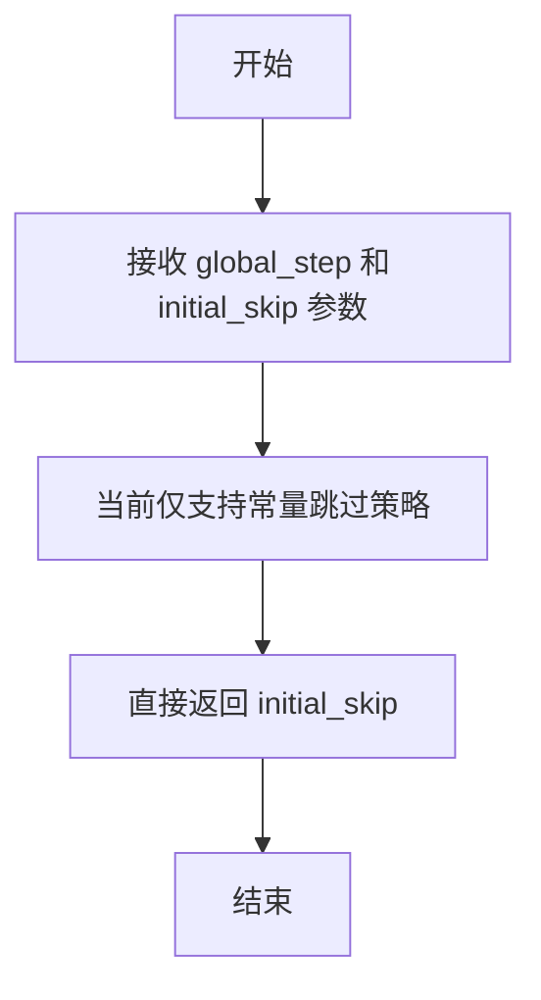
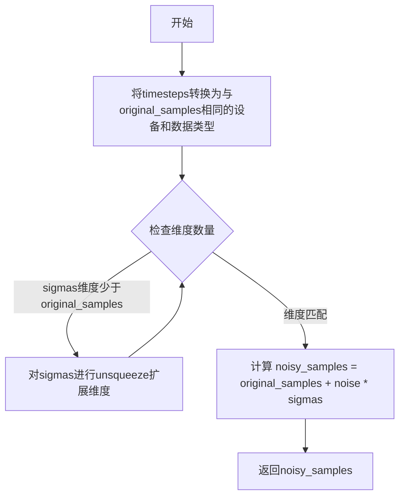
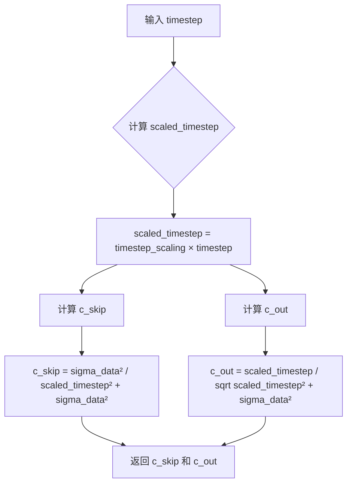
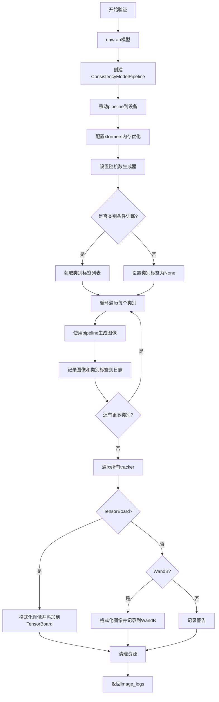
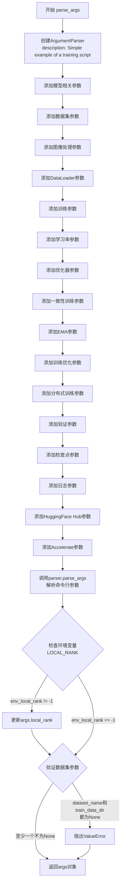

```mermaid
flowchart TD
    A[开始 main] --> B[设置日志目录]
    B --> C{report_to=wandb 且 hub_token 存在?}
    C -->|是| D[抛出安全风险错误]
    C -->|否| E[创建 Accelerator]
    E --> F[配置日志记录]
    F --> G[设置随机种子]
    G --> H{accelerator.is_main_process?}
    H -->|是| I[创建输出目录]
    H -->|否| J[跳过]
    I --> K{push_to_hub?}
    J --> K
    K -->|是| L[创建 HF Hub 仓库]
    K -->|否| M[初始化噪声调度器]
    L --> M
    
    M --> N[初始化学生 U-Net 模型]
    N --> O{use_ema?}
    O -->|是| P[创建 EMA 模型]
    O -->|否| Q[初始化教师 U-Net]
    P --> Q
    
    Q --> R[处理混合精度和设备放置]
    R --> S[注册检查点保存/加载钩子]
    S --> T{启用 xformers?}
    T -->|是| U[启用 xformers 优化]
    T -->|否| V[启用 TF32]
    U --> V
    
    V --> W{gradient_checkpointing?}
    W -->|是| X[启用梯度检查点]
    W -->|否| Y[初始化优化器]
    X --> Y
    
    Y --> Z[加载数据集]
    Z --> AA[数据预处理和 DataLoader]
    AA --> AB[初始化学习率调度器]
    AB --> AC[使用 accelerator.prepare 准备训练]
    AC --> AD[初始化跟踪器]
    AD --> AE{resume_from_checkpoint?}
    AE -->|是| AF[加载检查点状态]
    AE -->|否| AG[计算初始离散化步数]
    AF --> AG
    
    AG --> AH[创建训练进度条]
    AH --> AI[外层循环: 遍历每个 epoch]
    
    AI --> AJ[训练集循环: 获取 batch]
    AJ --> AK[采样时间步和噪声]
    AK --> AL[计算前处理条件]
    AL --> AM[学生模型前向传播]
    AM --> AN[教师模型前向传播]
    AN --> AO[计算 Pseudo-Huber 损失]
    AO --> AP[反向传播和参数更新]
    
    AP --> AQ{同步梯度?}
    AQ -->|是| AR[更新教师和 EMA 模型]
    AR --> AS{checkpointing_steps?}
    AQ -->|否| AT[记录日志]
    
    AS -->|是| AU[保存检查点]
    AS -->|否| AV{validation_steps?}
    AU --> AV
    
    AV -->|是| AW[运行验证]
    AV -->|否| AX[记录日志]
    AW --> AX
    
    AX --> AY[更新进度条]
    AY --> AZ{global_step >= max_train_steps?}
    AZ -->|否| AJ
    AZ -->|是| BA[等待所有进程]
    
    BA --> BB{accelerator.is_main_process?}
    BB -->|是| BC[保存最终模型]
    BB -->|否| BD[结束训练]
    
    BC --> BE{push_to_hub?}
    BE -->|是| BF[上传到 Hub]
    BE -->|否| BD
```

# `diffusers\examples\research_projects\consistency_training\train_cm_ct_unconditional.py` 详细设计文档

这是一个用于通过改进一致性训练(iCT)方法从头训练一致性模型(Consistency Model)的训练脚本,采用了学生-教师架构,支持EMA、混合精度、梯度累积等优化技术,并提供了完整的验证和检查点保存机制。

## 整体流程

```mermaid
graph TD
    A[开始] --> B[解析命令行参数]
B --> C[初始化Accelerator和分布式训练环境]
C --> D[设置随机种子和日志]
D --> E[初始化噪声调度器CMStochasticIterativeScheduler]
E --> F[初始化学生UNet模型]
F --> G{是否使用EMA?}
G -- 是 --> H[创建EMA模型]
G -- 否 --> I[初始化教师UNet模型]
H --> I
I --> J[配置优化器(AdamW/RAdam)]
J --> K[加载和处理数据集]
K --> L[创建DataLoader]
L --> M[初始化学习率调度器]
M --> N[准备训练:accelerator.prepare]
N --> O{是否恢复检查点?}
O -- 是 --> P[加载检查点状态]
O -- 否 --> Q[开始训练循环]
Q --> R[采样噪声和时间步]
R --> S[添加噪声到图像]
S --> T[计算预处理参数]
T --> U[学生模型前向传播]
U --> V[教师模型前向传播]
V --> W[计算Pseudo-Huber损失]
W --> X[反向传播和优化器更新]
X --> Y{是否同步梯度?}
Y -- 是 --> Z[更新教师模型和EMA]
Y -- 否 --> AA[跳过更新]
Z --> AB{是否需要验证?}
AA --> AB
AB -- 是 --> AC[运行验证并记录日志]
AB -- 否 --> AD[是否达到最大训练步数?]
AC --> AD
AD -- 否 --> R
AD -- 是 --> AE[保存最终模型]
AE --> AF[推送到Hub（可选）]
AF --> AG[结束训练]
```

## 类结构

```
全局模块层
├── 导入的第三方库 (diffusers, accelerate, torch, datasets等)
└── 全局函数层
    ├── 工具函数群 (张量操作、离散化、噪声处理)
    ├── 验证函数 (log_validation)
    ├── 参数解析 (parse_args)
    └── 主训练函数 (main)
```

## 全局变量及字段


### `logger`
    
日志记录器对象，用于记录训练过程中的信息

类型：`logging.Logger`
    


    

## 全局函数及方法


### `_extract_into_tensor`

该函数用于从一维数组中根据批次索引提取数值，并将提取的结果广播（broadcast）到指定的多维形状。在一致性训练（Consistency Training）中用于根据时间步索引从预计算的张量权重中提取对应的损失权重或时间步相关参数。

参数：

- `arr`：输入的一维数组，可以是 numpy 数组或 PyTorch 张量
- `timesteps`：torch.Tensor，表示要提取的索引张量，形状为 [batch_size]
- `broadcast_shape`：tuple，目标输出形状，要求其批次维度与 timesteps 长度一致

返回值：`torch.Tensor`，形状为 broadcast_shape 的张量

#### 流程图

```mermaid
flowchart TD
    A[开始: _extract_into_tensor] --> B{arr 是否为 torch.Tensor?}
    B -- 否 --> C[将 arr 转换为 torch.Tensor]
    B -- 是 --> D[直接使用 arr]
    C --> E[使用 timesteps 索引提取 arr 中的值]
    D --> E
    E --> F[转换为 float 类型并移动到 timesteps 所在设备]
    F --> G{res 的维度数量是否小于 broadcast_shape 的维度数量?}
    G -- 是 --> H[在末尾添加维度 res[..., None]]
    H --> G
    G -- 否 --> I[使用 expand 扩展到 broadcast_shape]
    I --> J[返回结果张量]
```

#### 带注释源码

```python
def _extract_into_tensor(arr, timesteps, broadcast_shape):
    """
    Extract values from a 1-D numpy array for a batch of indices.

    :param arr: the 1-D numpy array.
    :param timesteps: a tensor of indices into the array to extract.
    :param broadcast_shape: a larger shape of K dimensions with the batch
                            dimension equal to the length of timesteps.
    :return: a tensor of shape [batch_size, 1, ...] where the shape has K dims.
    """
    # 检查输入是否为 PyTorch 张量，若不是则转换为张量
    # 这样可以统一处理 numpy 数组和 torch.Tensor 两种输入
    if not isinstance(arr, torch.Tensor):
        arr = torch.from_numpy(arr)
    
    # 使用 timesteps 作为索引从 arr 中提取对应位置的数值
    # timesteps 形状为 [batch_size]，提取后 res 形状为 [batch_size]
    res = arr[timesteps].float().to(timesteps.device)
    
    # 通过在末尾添加维度，将 res 的维度扩展到与 broadcast_shape 相同
    # 例如从 [batch_size] 扩展到 [batch_size, 1, 1]（取决于 broadcast_shape）
    while len(res.shape) < len(broadcast_shape):
        res = res[..., None]
    
    # 使用 expand 将张量广播到目标形状 broadcast_shape
    # expand 是内存高效的操作，不会实际复制数据
    return res.expand(broadcast_shape)
```


### `append_dims`

该函数用于向张量的末尾添加维度，直到达到目标维度数为止。主要用于在一致性训练中扩展标量或低维张量以匹配图像张量的维度，以便进行逐元素运算。

参数：

- `x`：`torch.Tensor`，输入的张量，可以是任意维度的张量
- `target_dims`：`int`，目标维度数

返回值：`torch.Tensor`，扩展后的张量，其维度数等于 `target_dims`

#### 流程图

```mermaid
flowchart TD
    A[开始: 输入 x 和 target_dims] --> B{计算 dims_to_append = target_dims - x.ndim}
    B --> C{dims_to_append < 0?}
    C -->|是| D[抛出 ValueError: 输入维度大于目标维度]
    C -->|否| E{ dims_to_append > 0?}
    E -->|是| F[使用 x[..., None, None, ...] 扩展维度]
    E -->|否| G[返回原张量 x]
    F --> H[结束: 返回扩展后的张量]
    G --> H
    D --> I[结束: 异常退出]
```

#### 带注释源码

```python
def append_dims(x, target_dims):
    """
    Appends dimensions to the end of a tensor until it has target_dims dimensions.
    
    该函数用于向张量的末尾添加维度，直到达到目标维度数为止。主要用于在一致性训练中
    扩展标量或低维张量（例如 c_skip, c_out, c_in 等缩放因子）以匹配图像张量的维度，
    以便进行逐元素运算。
    
    参数:
        x: 输入的张量，可以是任意维度的张量
        target_dims: 目标维度数
    
    返回:
        扩展后的张量，其维度数等于 target_dims
    
    示例:
        # 假设 clean_images 是 4D 张量 (B, C, H, W)
        # c_skip 可能是 1D 张量 (N,) 需要扩展到 (1, 1, 1, 1)
        c_skip = append_dims(c_skip, clean_images.ndim)  # 扩展到 4D
    """
    # 计算需要添加的维度数量
    dims_to_append = target_dims - x.ndim
    
    # 如果目标维度小于输入维度，抛出错误
    if dims_to_append < 0:
        raise ValueError(f"input has {x.ndim} dims but target_dims is {target_dims}, which is less")
    
    # 使用索引技巧添加维度:
    # ... (Ellipsis) 保持原有维度
    # (None,) * dims_to_append 在末尾添加 None 维度（广播维度）
    # 例如: x[..., None, None] 将 2D 张量变成 4D 张量
    return x[(...,) + (None,) * dims_to_append]
```


### `extract_into_tensor`

从一维数组中根据索引张量提取值，并将结果重塑为与目标形状兼容的张量。该函数是 Consistency Model 训练中用于从噪声调度表中提取对应时间步的权重的核心工具。

参数：

- `a`：`torch.Tensor`，一维张量，表示噪声调度表或权重数组（如 Karras sigmas 或时间步权重）。
- `t`：`torch.Tensor`，索引张量，包含要提取的索引值，通常表示批次中每个样本对应的时间步索引。
- `x_shape`：`tuple`，目标形状元组，用于确定输出张量的维度数量，通常是输入数据的形状（如图像张量的形状）。

返回值：`torch.Tensor`，重塑后的张量，形状为 `(batch_size, 1, ..., 1)`，其中 1 的数量等于 `len(x_shape) - 1`。

#### 流程图

```mermaid
flowchart TD
    A[开始: extract_into_tensor] --> B[获取batch大小<br/>b, *_ = t.shape]
    C[输入参数] --> B
    B --> D[gather操作<br/>out = a.gather&#40;-1, t&#41;]
    D --> E{计算需要扩展的维度数<br/>len&#40;x_shape&#41; - 1}
    E --> F[生成reshape参数<br/>&#40;b, *((1,) * (len&#40;x_shape&#41; - 1))&#41;]
    F --> G[reshape输出张量<br/>out.reshape&#40;...&#41;]
    G --> H[返回结果张量]
    
    style A fill:#e1f5fe
    style H fill:#e8f5e8
```

#### 带注释源码

```python
def extract_into_tensor(a, t, x_shape):
    """
    从一维数组中根据索引张量提取值，并将结果重塑为与目标形状兼容的张量。
    
    该函数在 Consistency Model 训练中用于:
    - 从噪声调度表 (如 Karras sigmas) 中提取对应时间步的值
    - 从时间步权重数组中提取对应索引的权重
    - 将提取的一维结果广播/重塑为与图像张量兼容的多维形状
    
    参数:
        a: 一维张量，存储噪声调度值或权重
        t: 索引张量，指定从 a 中提取哪些位置的值
        x_shape: 目标形状，用于确定输出的维度数量
    
    返回:
        重塑后的张量，形状为 (batch_size, 1, ..., 1)
    """
    # 从索引张量 t 的形状中获取批次大小 b
    # t.shape 的第一个维度代表批次大小
    b, *_ = t.shape
    
    # 使用 PyTorch 的 gather 方法在 a 的最后一个维度上根据索引 t 取值
    # 这相当于 Python 中的 a[t]，但可以处理更复杂的多维索引情况
    # gather(-1, t) 表示在 a 的最后一个维度上索引，索引值来自 t
    out = a.gather(-1, t)
    
    # 将输出重塑为 (b, 1, 1, ..., 1) 的形式
    # 其中 1 的数量 = len(x_shape) - 1，这样可以将一维结果广播到与输入图像相同的维度
    # 例如：如果 x_shape 是 (batch, channels, height, width)，输出形状就是 (batch, 1, 1, 1)
    return out.reshape(b, *((1,) * (len(x_shape) - 1)))
```

#### 相关函数对比

代码中还存在一个更完整的实现 `_extract_into_tensor`，两者的对比如下：

| 特性 | `extract_into_tensor` | `_extract_into_tensor` |
|------|---------------------|------------------------|
| 位置 | 主函数，直接调用 | 内部实现，带下划线前缀 |
| 类型转换 | 无（假设输入已是 Tensor） | 自动将 numpy 数组转为 Tensor |
| 设备处理 | 无（假设在同一设备） | 自动将结果转到索引张量设备 |
| 维度扩展 | 固定扩展到 `x_shape` 维度 | 循环扩展直到匹配 `broadcast_shape` |
| 用途 | 训练时提取权重 | 损失计算时提取权重 |

`extract_into_tensor` 是简化版本，假设输入已经是正确的 Tensor 类型和设备，主要用于快速索引和形状重塑操作。


### `get_discretization_steps`

计算当前全局训练步骤对应的离散化步数。该函数实现了iCT论文中描述的离散化课程 N(k)，用于在训练过程中逐步增加离散化步数以平衡偏差和方差。

参数：

- `global_step`：`int`，当前全局训练步骤索引
- `max_train_steps`：`int`，总训练步数
- `s_0`：`int`，默认值为10，离散化课程的初始步数参数，控制经过多少步后离散化步数翻倍
- `s_1`：`int`，默认值为1280，离散化课程的最终步数上限
- `constant`：`bool`，默认值为False，是否使用恒定离散化步数（用于测试）

返回值：`int`，当前全局步骤对应的离散化步数

#### 流程图

```mermaid
flowchart TD
    A[开始 get_discretization_steps] --> B{constant == True?}
    B -->|Yes| C[返回 s_0 + 1]
    B -->|No| D[计算 k_prime]
    D --> E[k_prime = floor{max_train_steps / (log2(floor(s_1 / s_0)) + 1)}]
    E --> F[计算 num_discretization_steps]
    F --> G[num_discretization_steps = min(s_0 * 2^{floor(global_step / k_prime)}, s_1) + 1]
    G --> H[返回 num_discretization_steps]
```

#### 带注释源码

```python
def get_discretization_steps(global_step: int, max_train_steps: int, s_0: int = 10, s_1: int = 1280, constant=False):
    """
    使用离散化课程 N(k) 计算全局步骤 k 处的当前离散化步数。
    
    该函数实现了改进一致性训练(iCT)论文中的离散化课程策略：
    - 训练初期使用较少的离散化步数，降低偏差
    - 随着训练进行，逐步增加步数，降低方差
    - 这是一个对数增长的课程策略
    """
    # 如果使用恒定模式，直接返回最小的离散化步数（用于测试或小规模训练）
    if constant:
        return s_0 + 1

    # 计算课程更新周期 k_prime
    # k_prime 表示每隔多少个训练步数，离散化步数翻倍
    # 公式: k_prime = max_train_steps / (log2(s_1/s_0) + 1)
    # 这样可以保证在 max_train_steps 之内完成从 s_0 到 s_1 的增长
    k_prime = math.floor(max_train_steps / (math.log2(math.floor(s_1 / s_0)) + 1))
    
    # 计算当前全局步骤对应的离散化步数
    # 使用指数增长: N(k) = min(s_0 * 2^{floor(k / k_prime)}, s_1) + 1
    # 加上1是因为离散化步数从1开始计数
    num_discretization_steps = min(s_0 * 2 ** math.floor(global_step / k_prime), s_1) + 1

    return num_discretization_steps
```


### `get_skip_steps`

该函数用于计算一致性训练中的跳过步数（skip steps），即学生网络和学生网络之间噪声水平索引的差距。目前该函数仅支持常量跳过课程策略，直接返回初始跳过步数。

参数：

- `global_step`：`int`，当前训练的全局步数，用于确定当前训练阶段
- `initial_skip`：`int`，初始的跳过步数，默认为 1，表示学生和教师网络噪声水平索引相差 1

返回值：`int`，返回跳过的步数，即学生网络与教师网络之间的噪声水平索引差距

#### 流程图



#### 带注释源码

```python
def get_skip_steps(global_step, initial_skip: int = 1):
    """
    计算一致性训练中的跳过步数（skip steps）。
    
    跳过步数定义了学生网络（student）和教师网络（teacher）噪声水平索引之间的差距。
    在 iCT (Improved Consistency Training) 论文中，这个值通常设置为 1，
    但理论上可以大于 1 或根据课程学习策略在训练过程中进行变化。
    
    注意：目前该函数仅实现了常量跳过策略，即在整个训练过程中保持不变的跳过步数。
    未来可以扩展为根据 global_step 动态调整的课程学习策略。
    
    参数:
        global_step (int): 当前训练的全局步数，用于确定当前训练阶段
        initial_skip (int): 初始的跳过步数，默认为 1
    
    返回:
        int: 返回跳过的步数，用于确定学生网络和教师网络之间的噪声水平索引差距
    """
    # Currently only support constant skip curriculum.
    # 当前仅支持常量跳过课程策略，即直接返回初始值
    return initial_skip
```


### `get_karras_sigmas`

该函数实现了Karras等人提出的sigma时间步离散化算法，用于一致性训练（Consistency Training）中生成非线性的噪声水平（sigma）序列。该算法通过幂函数变换将线性间隔的采样点映射到[sigma_min, sigma_max]区间，以更合理地覆盖噪声水平的分布。

参数：

- `num_discretization_steps`：`int`，离散化步骤的数量N，决定生成sigma序列的长度
- `sigma_min`：`float = 0.002`，sigma的最小值，默认为0.002，接近零以避免数值问题
- `sigma_max`：`float = 80.0`，sigma的最大值，默认为80.0，决定高斯先验的方差
- `rho`：`float = 7.0`，Karras离散化公式中的rho参数，控制sigma序列的非线性程度
- `dtype`：`torch.dtype = torch.float32`，输出PyTorch张量的数据类型

返回值：`torch.Tensor`，形状为(num_discretization_steps,)的Karras sigma序列，类型为指定的dtype

#### 流程图

```mermaid
flowchart TD
    A[开始] --> B[创建线性间隔ramp: 0到1共num_discretization_steps个点]
    B --> C[计算min_inv_rho = sigma_min^(1/rho)]
    C --> D[计算max_inv_rho = sigma_max^(1/rho)]
    D --> E[计算sigmas = (max_inv_rho + ramp * (min_inv_rho - max_inv_rho))^rho]
    E --> F[反转sigmas序列: sigmas[::-1].copy]
    F --> G[将numpy数组转换为PyTorch张量]
    G --> H[转换为指定dtype]
    I[返回sigmas张量]
    H --> I
```

#### 带注释源码

```python
def get_karras_sigmas(
    num_discretization_steps: int,
    sigma_min: float = 0.002,
    sigma_max: float = 80.0,
    rho: float = 7.0,
    dtype=torch.float32,
):
    """
    Calculates the Karras sigmas timestep discretization of [sigma_min, sigma_max].
    
    该函数实现了Karras等人提出的sigma时间步离散化算法，
    通过非线性变换将线性间隔的采样点映射到噪声水平空间。
    
    参数:
        num_discretization_steps: 离散化步骤数量N
        sigma_min: sigma最小值，接近0
        sigma_max: sigma最大值
        rho: 非线性控制参数
        dtype: 输出张量的数据类型
    
    返回:
        形状为(num_discretization_steps,)的sigma序列张量
    """
    # 步骤1: 创建从0到1的线性间隔数组，用于后续非线性变换
    # 例如: num_discretization_steps=10时，生成[0, 0.111, 0.222, ..., 1.0]
    ramp = np.linspace(0, 1, num_discretization_steps)
    
    # 步骤2: 计算sigma_min和sigma_max的rho次根倒数
    # 这是Karras离散化公式的核心部分
    # 公式来源: Karras et al. "Elucidating the Design Space of Diffusion Models"
    min_inv_rho = sigma_min ** (1 / rho)
    max_inv_rho = sigma_max ** (1 / rho)
    
    # 步骤3: 应用Karras非线性映射公式
    # sigmas(t) = (max_inv_rho + t * (min_inv_rho - max_inv_rho))^rho
    # 其中t是从0到1的线性间隔
    # 这种映射使得sigma值在靠近0时更加密集（低噪声区域）
    sigmas = (max_inv_rho + ramp * (min_inv_rho - max_inv_rho)) ** rho
    
    # 步骤4: 反转sigma序列顺序
    # 原始计算得到的序列是从大到小（sigma_max到sigma_min），
    # 需要反转成从小到大的递增顺序
    # 参考iCT论文第2节的说明
    sigmas = sigmas[::-1].copy()
    
    # 步骤5: 转换为PyTorch张量并指定数据类型
    # 使用指定的dtype以支持混合精度训练
    sigmas = torch.from_numpy(sigmas).to(dtype=dtype)
    
    return sigmas
```


### `get_discretized_lognormal_weights`

该函数用于根据改进一致性训练(iCT)论文中提出的离散对数正态分布，计算噪声水平（sigma_i）的非归一化权重。这些权重用于从离散化的噪声水平中采样训练时间步。

参数：

- `noise_levels`：`torch.Tensor`，一维张量，表示离散化的噪声水平（sigma值）数组
- `p_mean`：`float`，对数正态分布的均值参数P_mean，控制噪声水平采样的中心位置，默认为-1.1
- `p_std`：`float`，对数正态分布的标准差参数P_std，控制噪声水平采样的分布范围，默认为2.0

返回值：`torch.Tensor`，返回计算得到的非归一化权重数组，长度为`len(noise_levels) - 1`

#### 流程图

```mermaid
flowchart TD
    A[开始: 输入 noise_levels, p_mean, p_std] --> B[提取 noise_levels[1:] 作为上边界]
    A --> C[提取 noise_levels[:-1] 作为下边界]
    B --> D[计算上边界概率: erf<br/>ln(noise_levels[1:]) - p_mean / √2 * p_std]
    C --> E[计算下边界概率: erf<br/>ln(noise_levels[:-1]) - p_mean / √2 * p_std]
    D --> F[权重 = upper_prob - lower_prob]
    E --> F
    F --> G[返回权重张量]
```

#### 带注释源码

```python
def get_discretized_lognormal_weights(noise_levels: torch.Tensor, p_mean: float = -1.1, p_std: float = 2.0):
    """
    计算基于离散对数正态分布的1D噪声水平数组的非归一化权重。
    该方法来源于iCT论文（Equation 10）。
    
    参数:
        noise_levels: 离散化的噪声水平sigma值数组（1D张量）
        p_mean: 对数正态分布的均值参数，控制采样概率分布的中心位置
        p_std: 对数正态分布的标准差参数，控制采样概率分布的扩散程度
    
    返回:
        非归一化的权重张量，长度为输入数组长度减1
    """
    # 计算上边界的累积概率（从noise_levels[1]到noise_levels[-1]的对数正态CDF）
    # 使用误差函数erf计算标准正态分布的累积分布函数
    upper_prob = torch.special.erf(
        (torch.log(noise_levels[1:]) - p_mean) / (math.sqrt(2) * p_std)
    )
    
    # 计算下边界的累积概率（从noise_levels[0]到noise_levels[-2]的对数正态CDF）
    lower_prob = torch.special.erf(
        (torch.log(noise_levels[:-1]) - p_mean) / (math.sqrt(2) * p_std)
    )
    
    # 上边界概率减去下边界概率，得到每个离散噪声水平区间的采样概率权重
    weights = upper_prob - lower_prob
    
    return weights
```


### `get_loss_weighting_schedule`

计算给定噪声水平集合的损失权重调度 lambda 值。该函数通过计算相邻噪声水平之间的差值的倒数来生成时间步长依赖的损失权重，用于改进一致性训练（iCT）中的损失加权。

参数：

- `noise_levels`：`torch.Tensor`，噪声水平（sigma）的一维张量，通常为 Karras 时间步离散化产生的sigmas数组

返回值：`torch.Tensor`，损失权重调度 lambda 值，长度为 `noise_levels` 长度减1，对应相邻噪声水平间隔的倒数

#### 流程图

```mermaid
flowchart TD
    A[开始] --> B[输入 noise_levels 张量]
    B --> C[计算 noise_levels[1:] - noise_levels[:-1]]
    C --> D[计算差值的倒数: 1.0 / 差值]
    D --> E[返回损失权重张量]
    E --> F[结束]
```

#### 带注释源码

```python
def get_loss_weighting_schedule(noise_levels: torch.Tensor):
    """
    Calculates the loss weighting schedule lambda given a set of noise levels.
    
    该函数实现了iCT论文中定义的损失权重调度lambda(sigma_i)，
    用于在训练过程中对不同噪声水平下的损失进行加权。
    
    :param noise_levels: 噪声水平（sigma）的一维张量，通常为Karras sigmas
    :return: 损失权重调度lambda值，长度为len(noise_levels)-1
    """
    # 计算相邻噪声水平之间的差值
    # noise_levels[1:] 获取从第二个元素到最后一个元素
    # noise_levels[:-1] 获取从第一个元素到倒数第二个元素
    # 两者相减得到相邻元素之间的差值数组
    #
    # 例如：如果 noise_levels = [80.0, 40.0, 20.0, 10.0, 5.0, 2.5, 1.0]
    # 则 noise_levels[1:] = [40.0, 20.0, 10.0, 5.0, 2.5, 1.0]
    #     noise_levels[:-1] = [80.0, 40.0, 20.0, 10.0, 5.0, 2.5]
    #     差值 = [-40.0, -20.0, -10.0, -5.0, -2.5, -1.5]
    #
    # 注意：由于Karras sigmas是递减的，差值为负数
    # 取倒数后，权重值也是负数，这在后续计算中会与其它负号抵消
    diff = noise_levels[1:] - noise_levels[:-1]
    
    # 计算差值的倒数，得到损失权重
    # 这确保了在噪声水平间隔较小的区域（噪声水平较低）获得更大的权重
    # 因为低噪声水平下的预测对最终生成质量影响更大
    return 1.0 / diff
```


### `add_noise`

该函数实现了向原始样本添加噪声的核心操作，通过将时间步（Karras sigmas）转换为与输入样本相同的设备和数据类型，然后执行噪声加权求和来生成带噪声的样本。

参数：

- `original_samples`：`torch.Tensor`，原始的干净图像/样本数据
- `noise`：`torch.Tensor`，要添加的高斯噪声
- `timesteps`：`torch.Tensor`，时间步或Karras sigmas，用于控制噪声强度

返回值：`torch.Tensor`，添加噪声后的样本

#### 流程图



#### 带注释源码

```python
def add_noise(original_samples: torch.Tensor, noise: torch.Tensor, timesteps: torch.Tensor):
    # 确保timesteps (Karras sigmas) 与 original_samples 具有相同的设备和数据类型
    # 以保证后续计算可以在同一设备上执行并避免数据类型不匹配
    sigmas = timesteps.to(device=original_samples.device, dtype=original_samples.dtype)
    
    # 如果 sigmas 的维度少于 original_samples，则扩展 sigmas 的维度
    # 这确保了 sigmas 可以正确地与 original_samples 进行逐元素乘法
    # 通过在最后添加维度来匹配广播规则
    while len(sigmas.shape) < len(original_samples.shape):
        sigmas = sigmas.unsqueeze(-1)

    # 根据扩散模型的噪声添加公式计算带噪声的样本
    # noisy_sample = original_sample + noise * sigma
    # 其中 sigma (即 sigmas) 控制噪声的强度/水平
    noisy_samples = original_samples + noise * sigmas

    return noisy_samples
```


### `get_noise_preconditioning`

该函数用于计算噪声预处理函数 c_noise，用于将原始的 Karras sigma 转换为 U-Net 的时间步输入。根据不同的预处理类型（none、edm、cm），对输入的 sigma 值进行相应的数学变换。

参数：

- `sigmas`：`torch.Tensor`，原始的 Karras sigma 值，通常是一个包含多个噪声水平的张量
- `noise_precond_type`：`str`，噪声预处理类型，默认为 "cm"，可选值为 "none"（直接返回 sigma）、"edm"（EDM 公式）、"cm"（一致性模型公式）

返回值：`torch.Tensor`，经过预处理变换后的时间步输入值

#### 流程图

```mermaid
flowchart TD
    A[开始: get_noise_preconditioning] --> B{noise_precond_type == 'none'?}
    B -->|是| C[直接返回 sigmas]
    B -->|否| D{noise_precond_type == 'edm'?}
    D -->|是| E[返回 0.25 * torch.log(sigmas)]
    D -->|否| F{noise_precond_type == 'cm'?}
    F -->|是| G[返回 1000 * 0.25 * torch.log(sigmas + 1e-44)]
    F -->|否| H[抛出 ValueError 异常]
    C --> I[结束: 返回处理后的张量]
    E --> I
    G --> I
    H --> I
```

#### 带注释源码

```python
def get_noise_preconditioning(sigmas, noise_precond_type: str = "cm"):
    """
    计算噪声预处理函数 c_noise，用于将原始 Karras sigmas 转换为 U-Net 的时间步输入。
    
    参数:
        sigmas: 原始的 Karras sigma 值张量
        noise_precond_type: 预处理类型
            - "none": 直接返回原始 sigma 值（恒等变换）
            - "edm": 使用 EDM 论文中的公式 0.25 * log(sigma)
            - "cm": 使用一致性模型公式 1000 * 0.25 * log(sigma + 1e-44)
    
    返回:
        经过预处理变换后的时间步输入张量
    """
    # 恒等变换：不进行任何预处理
    if noise_precond_type == "none":
        return sigmas
    # EDM 公式：将 sigma 转换为对数尺度并乘以缩放因子
    elif noise_precond_type == "edm":
        return 0.25 * torch.log(sigmas)
    # 一致性模型公式：添加小常数避免 log(0) 并使用更大的缩放因子
    elif noise_precond_type == "cm":
        return 1000 * 0.25 * torch.log(sigmas + 1e-44)
    # 不支持的预处理类型，抛出异常
    else:
        raise ValueError(
            f"Noise preconditioning type {noise_precond_type} is not current supported. Currently supported noise"
            f" preconditioning types are `none` (which uses the sigmas as is), `edm`, and `cm`."
        )
```


### `get_input_preconditioning`

该函数用于计算输入预处理因子 c_in，用于缩放 U-Net 的图像输入。它根据不同的预处理类型（"none" 或 "cm"）计算相应的缩放系数，以实现对输入信号的条件化处理。

参数：

- `sigmas`：Tensor Karras sigma 时间步张量，表示扩散过程中的噪声水平
- `sigma_data`：float，默认值为 0.5，数据缩放参数，用于控制输入预处理的尺度
- `input_precond_type`：str，默认值为 "cm"，输入预处理类型，支持 "none"（无预处理）和 "cm"（一致性模型预处理）

返回值：Tensor 或 float，返回输入预处理因子 c_in，用于缩放 U-Net 的图像输入。当类型为 "none" 时返回标量 1，否则返回基于 sigmas 和 sigma_data 计算的张量

#### 流程图

```mermaid
flowchart TD
    A[开始 get_input_preconditioning] --> B{input_precond_type == 'none'?}
    B -->|是| C[返回标量 1]
    B -->|否| D{input_precond_type == 'cm'?}
    D -->|是| E[计算 c_in = 1.0 / (sigmas² + sigma_data²)]
    D -->|否| F[抛出 ValueError 异常]
    E --> G[返回 c_in 张量]
    C --> H[结束]
    G --> H
    F --> H
```

#### 带注释源码

```python
def get_input_preconditioning(sigmas, sigma_data=0.5, input_precond_type: str = "cm"):
    """
    计算输入预处理因子 c_in，用于缩放 U-Net 的图像输入。
    
    该函数实现了一致性模型（Consistency Model）中的输入预处理机制，
    通过对输入信号进行条件化处理，帮助模型更好地学习去噪任务。
    
    参数:
        sigmas: Karras sigma 时间步张量，表示扩散过程中的噪声水平
        sigma_data: 数据缩放参数，默认为 0.5，用于控制预处理强度
        input_precond_type: 输入预处理类型，支持 'none'（无预处理） 和 'cm'（一致性模型预处理）
    
    返回:
        输入预处理因子 c_in，用于缩放 U-Net 的图像输入
    """
    # 无预处理情况：直接返回标量 1，不对输入进行缩放
    if input_precond_type == "none":
        return 1
    # 一致性模型预处理：使用 EDM 论文中的公式计算输入缩放因子
    # c_in = 1 / (sigma^2 + sigma_data^2)，该公式来源于 EDM (Elucidating the Design Space of Diffusion Models)
    elif input_precond_type == "cm":
        return 1.0 / (sigmas**2 + sigma_data**2)
    # 不支持的预处理类型：抛出明确的错误信息
    else:
        raise ValueError(
            f"Input preconditioning type {input_precond_type} is not current supported. Currently supported input"
            f" preconditioning types are `none` (which uses a scaling factor of 1.0) and `cm`."
        )
```


### `scalings_for_boundary_conditions`

该函数用于计算一致性模型（Consistency Model）中的边界条件缩放因子（c_skip 和 c_out），这些因子在模型推理时用于将模型输出从噪声空间映射回数据空间，是 EDM（Elucidating the Design Space of Diffusion Models）和一致性训练中的关键组成部分。

参数：

- `timestep`：`torch.Tensor` 或 `float`，输入的时间步/噪声水平（sigma 值），表示扩散过程中的噪声级别
- `sigma_data`：`float`，数据标准差参数，默认值为 0.5，用于控制边界条件计算的数据尺度
- `timestep_scaling`：`float`，时间步的缩放因子，默认值为 1.0，用于调整时间步的缩放程度

返回值：`Tuple[float, float]`，返回两个缩放因子元组
- `c_skip`：`float`，_skip 缩放因子，用于将噪声样本与原始样本混合
- `c_out`：`float`，_out 缩放因子，用于缩放模型输出

#### 流程图



#### 带注释源码

```python
def scalings_for_boundary_conditions(timestep, sigma_data=0.5, timestep_scaling=1.0):
    """
    计算一致性模型的边界条件缩放因子。
    
    这些缩放因子用于将 U-Net 的输出从噪声空间映射回数据空间，
    是一致性训练中的关键技术，用于确保模型在不同噪声水平下的输出一致性。
    
    参数:
        timestep: 输入的时间步/噪声水平（sigma值），可以是张量或标量
        sigma_data: 数据标准差参数，默认0.5，用于控制边界条件计算的尺度
        timestep_scaling: 时间步缩放因子，默认1.0，用于调整时间步的缩放程度
    
    返回:
        c_skip: skip缩放因子，用于混合噪声样本和原始样本
        c_out: 输出缩放因子，用于缩放模型预测输出
    """
    # 1. 对时间步进行缩放
    # 应用时间步缩放因子来调整时间步的大小
    scaled_timestep = timestep_scaling * timestep
    
    # 2. 计算 c_skip（skip 因子）
    # 这个因子用于在边界条件下将噪声样本与原始样本进行混合
    # 当 scaled_timestep 很大时，c_skip 接近 0（更依赖模型预测）
    # 当 scaled_timestep 很小时，c_skip 接近 1（更依赖原始样本）
    c_skip = sigma_data**2 / (scaled_timestep**2 + sigma_data**2)
    
    # 3. 计算 c_out（输出缩放因子）
    # 这个因子用于缩放模型的输出，确保在不同噪声水平下的一致性
    # 使用平方根来确保输出的尺度正确
    c_out = scaled_timestep / (scaled_timestep**2 + sigma_data**2) ** 0.5
    
    # 4. 返回两个缩放因子
    # c_skip 和 c_out 将用于后续的模型输出计算：
    # output = c_skip * noisy_sample + c_out * model_prediction
    return c_skip, c_out
```


### `log_validation`

该函数用于在训练过程中执行一致性模型的验证，通过使用当前模型生成样本图像，并将生成的图像记录到指定的日志跟踪器（TensorBoard 或 WandB）中，以便监控模型的生成效果。

参数：

- `unet`：`UNet2DModel`，待验证的 UNet 模型，用于图像生成
- `scheduler`：调度器，用于配置生成过程的噪声调度
- `args`：命令行参数对象，包含模型配置和训练超参数
- `accelerator`：Accelerator 实例，用于模型管理和设备操作
- `weight_dtype`：torch.dtype，模型权重的数据类型（如 float32、float16、bfloat16）
- `step`：int，当前的训练步数，用于日志记录
- `name`：str（默认值："teacher"），验证的名称标识，用于区分不同模型（如 teacher 或 ema_student）

返回值：`list[dict]`，返回图像日志列表，每个日志包含生成的图像和对应的类别标签

#### 流程图



#### 带注释源码

```python
def log_validation(unet, scheduler, args, accelerator, weight_dtype, step, name="teacher"):
    """
    在训练过程中运行验证，生成样本图像并记录到日志跟踪器
    
    参数:
        unet: UNet2DModel - 待验证的UNet模型
        scheduler: 噪声调度器
        args: 命令行参数对象
        accelerator: Accelerate库的Accelerator实例
        weight_dtype: torch.dtype - 模型权重数据类型
        step: int - 当前训练步数
        name: str - 验证名称标识，默认为"teacher"
    
    返回:
        list[dict]: 图像日志列表
    """
    logger.info("Running validation... ")

    # 1. 从accelerator中unwrap模型，获取原始模型
    unet = accelerator.unwrap_model(unet)
    
    # 2. 创建一致性模型推理管道
    pipeline = ConsistencyModelPipeline(
        unet=unet,
        scheduler=scheduler,
    )
    
    # 3. 将管道移动到加速设备上
    pipeline = pipeline.to(device=accelerator.device)
    
    # 4. 禁用进度条显示
    pipeline.set_progress_bar_config(disable=True)

    # 5. 如果启用xformers，则开启高效注意力
    if args.enable_xformers_memory_efficient_attention:
        pipeline.enable_xformers_memory_efficient_attention()

    # 6. 设置随机数生成器以确保可重复性
    if args.seed is None:
        generator = None
    else:
        generator = torch.Generator(device=accelerator.device).manual_seed(args.seed)

    # 7. 处理类别标签
    class_labels = [None]
    if args.class_conditional:
        if args.num_classes is not None:
            class_labels = list(range(args.num_classes))
        else:
            logger.warning(
                "The model is class-conditional but the number of classes is not set. The generated images will be"
                " unconditional rather than class-conditional."
            )

    # 8. 为每个类别生成图像
    image_logs = []

    for class_label in class_labels:
        images = []
        # 使用自动混合精度进行推理
        with torch.autocast("cuda"):
            images = pipeline(
                num_inference_steps=1,  # 一致性模型通常只需1步推理
                batch_size=args.eval_batch_size,
                class_labels=[class_label] * args.eval_batch_size,
                generator=generator,
            ).images
        # 记录图像和类别标签
        log = {"images": images}
        if args.class_conditional and class_label is not None:
            log["class_label"] = str(class_label)
        else:
            log["class_label"] = "images"
        image_logs.append(log)

    # 9. 将图像记录到对应的跟踪器
    for tracker in accelerator.trackers:
        if tracker.name == "tensorboard":
            # TensorBoard记录
            for log in image_logs:
                images = log["images"]
                class_label = log["class_label"]
                formatted_images = []
                for image in images:
                    formatted_images.append(np.asarray(image))

                formatted_images = np.stack(formatted_images)
                tracker.writer.add_images(class_label, formatted_images, step, dataformats="NHWC")
        elif tracker.name == "wandb":
            # WandB记录
            formatted_images = []

            for log in image_logs:
                images = log["images"]
                class_label = log["class_label"]
                for image in images:
                    image = wandb.Image(image, caption=class_label)
                    formatted_images.append(image)

            tracker.log({f"validation/{name}": formatted_images})
        else:
            logger.warning(f"image logging not implemented for {tracker.name}")

    # 10. 清理资源
    del pipeline
    gc.collect()
    torch.cuda.empty_cache()

    return image_logs
```


### parse_args

该函数是命令行参数解析器，使用Python的argparse模块定义并解析训练脚本的所有配置参数，包括模型、数据集、训练超参数、优化器、调度器、验证、检查点保存、分布式训练等众多选项，并进行基本的参数校验，最终返回包含所有配置参数的Namespace对象。

参数：该函数无显式输入参数，参数通过命令行传入。

返回值：`argparse.Namespace`，包含所有解析后的命令行参数对象。

#### 流程图



#### 带注释源码

```python
def parse_args():
    """
    解析命令行参数并返回包含所有配置参数的Namespace对象。
    
    该函数使用argparse模块定义了一系列命令行参数，包括：
    - 模型配置参数（模型路径、版本等）
    - 数据集参数（数据集名称、图像列名等）
    - 图像处理参数（分辨率、插值方式、数据增强等）
    - 训练参数（批次大小、训练轮数、学习率等）
    - 优化器参数（Adam/RAdam、权重衰减等）
    - 一致性训练特定参数（噪声调度、Karras sigmas等）
    - EMA参数（EMA衰减率、预热等）
    - 验证和检查点参数
    - 日志和监控参数
    - 分布式训练参数
    
    Returns:
        argparse.Namespace: 包含所有解析后命令行参数的命名空间对象。
        
    Raises:
        ValueError: 当dataset_name和train_data_dir都未指定时抛出。
    """
    # 创建参数解析器，设置脚本描述
    parser = argparse.ArgumentParser(description="Simple example of a training script.")
    
    # ==================== 模型参数 ====================
    # 模型配置文件路径或预训练模型路径
    parser.add_argument(
        "--model_config_name_or_path",
        type=str,
        default=None,
        help="The config of the UNet model to train, leave as None to use standard DDPM configuration.",
    )
    parser.add_argument(
        "--pretrained_model_name_or_path",
        type=str,
        default=None,
        help=(
            "If initializing the weights from a pretrained model, the path to the pretrained model or model identifier"
            " from huggingface.co/models."
        ),
    )
    parser.add_argument(
        "--revision",
        type=str,
        default=None,
        required=False,
        help="Revision of pretrained model identifier from huggingface.co/models.",
    )
    parser.add_argument(
        "--variant",
        type=str,
        default=None,
        help=(
            "Variant of the model files of the pretrained model identifier from huggingface.co/models, e.g. `fp16`,"
            " `non_ema`, etc.",
        ),
    )
    
    # ==================== 数据集参数 ====================
    parser.add_argument(
        "--train_data_dir",
        type=str,
        default=None,
        help=(
            "A folder containing the training data. Folder contents must follow the structure described in"
            " https://huggingface.co/docs/datasets/image_dataset#imagefolder. In particular, a `metadata.jsonl` file"
            " must exist to provide the captions for the images. Ignored if `dataset_name` is specified."
        ),
    )
    parser.add_argument(
        "--dataset_name",
        type=str,
        default=None,
        help=(
            "The name of the Dataset (from the HuggingFace hub) to train on (could be your own, possibly private,"
            " dataset). It can also be a path pointing to a local copy of a dataset in your filesystem,"
            " or to a folder containing files that HF Datasets can understand."
        ),
    )
    parser.add_argument(
        "--dataset_config_name",
        type=str,
        default=None,
        help="The config of the Dataset, leave as None if there's only one config.",
    )
    parser.add_argument(
        "--dataset_image_column_name",
        type=str,
        default="image",
        help="The name of the image column in the dataset to use for training.",
    )
    parser.add_argument(
        "--dataset_class_label_column_name",
        type=str,
        default="label",
        help="If doing class-conditional training, the name of the class label column in the dataset to use.",
    )
    
    # ==================== 图像处理参数 ====================
    parser.add_argument(
        "--resolution",
        type=int,
        default=64,
        help=(
            "The resolution for input images, all the images in the train/validation dataset will be resized to this"
            " resolution"
        ),
    )
    parser.add_argument(
        "--interpolation_type",
        type=str,
        default="bilinear",
        help=(
            "The interpolation function used when resizing images to the desired resolution. Choose between `bilinear`,"
            " `bicubic`, `box`, `nearest`, `nearest_exact`, `hamming`, and `lanczos`."
        ),
    )
    parser.add_argument(
        "--center_crop",
        default=False,
        action="store_true",
        help=(
            "Whether to center crop the input images to the resolution. If not set, the images will be randomly"
            " cropped. The images will be resized to the resolution first before cropping."
        ),
    )
    parser.add_argument(
        "--random_flip",
        default=False,
        action="store_true",
        help="whether to randomly flip images horizontally",
    )
    parser.add_argument(
        "--class_conditional",
        action="store_true",
        help=(
            "Whether to train a class-conditional model. If set, the class labels will be taken from the `label`"
            " column of the provided dataset."
        ),
    )
    parser.add_argument(
        "--num_classes",
        type=int,
        default=None,
        help="The number of classes in the training data, if training a class-conditional model.",
    )
    parser.add_argument(
        "--class_embed_type",
        type=str,
        default=None,
        help=(
            "The class embedding type to use. Choose from `None`, `identity`, and `timestep`. If `class_conditional`"
            " and `num_classes` and set, but `class_embed_type` is `None`, a embedding matrix will be used."
        ),
    )
    
    # ==================== DataLoader参数 ====================
    parser.add_argument(
        "--dataloader_num_workers",
        type=int,
        default=0,
        help=(
            "The number of subprocesses to use for data loading. 0 means that the data will be loaded in the main"
            " process."
        ),
    )
    
    # ==================== 训练参数 ====================
    # 通用训练参数
    parser.add_argument(
        "--output_dir",
        type=str,
        default="ddpm-model-64",
        help="The output directory where the model predictions and checkpoints will be written.",
    )
    parser.add_argument("--overwrite_output_dir", action="store_true")
    parser.add_argument(
        "--cache_dir",
        type=str,
        default=None,
        help="The directory where the downloaded models and datasets will be stored.",
    )
    parser.add_argument("--seed", type=int, default=None, help="A seed for reproducible training.")
    
    # 批次大小和训练长度
    parser.add_argument(
        "--train_batch_size", type=int, default=16, help="Batch size (per device) for the training dataloader."
    )
    parser.add_argument("--num_train_epochs", type=int, default=100)
    parser.add_argument(
        "--max_train_steps",
        type=int,
        default=None,
        help="Total number of training steps to perform.  If provided, overrides num_train_epochs.",
    )
    parser.add_argument(
        "--max_train_samples",
        type=int,
        default=None,
        help=(
            "For debugging purposes or quicker training, truncate the number of training examples to this "
            "value if set."
        ),
    )
    
    # 学习率参数
    parser.add_argument(
        "--learning_rate",
        type=float,
        default=1e-4,
        help="Initial learning rate (after the potential warmup period) to use.",
    )
    parser.add_argument(
        "--scale_lr",
        action="store_true",
        default=False,
        help="Scale the learning rate by the number of GPUs, gradient accumulation steps, and batch size.",
    )
    parser.add_argument(
        "--lr_scheduler",
        type=str,
        default="cosine",
        help=(
            'The scheduler type to use. Choose between ["linear", "cosine", "cosine_with_restarts", "polynomial",'
            ' "constant", "constant_with_warmup"]'
        ),
    )
    parser.add_argument(
        "--lr_warmup_steps", type=int, default=500, help="Number of steps for the warmup in the lr scheduler."
    )
    
    # 优化器(Adam)参数
    parser.add_argument(
        "--optimizer_type",
        type=str,
        default="adamw",
        help=(
            "The optimizer algorithm to use for training. Choose between `radam` and `adamw`. The iCT paper uses"
            " RAdam."
        ),
    )
    parser.add_argument(
        "--use_8bit_adam", action="store_true", help="Whether or not to use 8-bit Adam from bitsandbytes."
    )
    parser.add_argument("--adam_beta1", type=float, default=0.95, help="The beta1 parameter for the Adam optimizer.")
    parser.add_argument("--adam_beta2", type=float, default=0.999, help="The beta2 parameter for the Adam optimizer.")
    parser.add_argument(
        "--adam_weight_decay", type=float, default=1e-6, help="Weight decay magnitude for the Adam optimizer."
    )
    parser.add_argument("--adam_epsilon", type=float, default=1e-08, help="Epsilon value for the Adam optimizer.")
    parser.add_argument("--max_grad_norm", default=1.0, type=float, help="Max gradient norm.")
    
    # ==================== 一致性训练(CT)特定参数 ====================
    parser.add_argument(
        "--prediction_type",
        type=str,
        default="sample",
        choices=["sample"],
        help="Whether the model should predict the 'epsilon'/noise error or directly the reconstructed image 'x0'.",
    )
    parser.add_argument("--ddpm_num_steps", type=int, default=1000)
    parser.add_argument("--ddpm_num_inference_steps", type=int, default=1000)
    parser.add_argument("--ddpm_beta_schedule", type=str, default="linear")
    parser.add_argument(
        "--sigma_min",
        type=float,
        default=0.002,
        help=(
            "The lower boundary for the timestep discretization, which should be set to a small positive value close"
            " to zero to avoid numerical issues when solving the PF-ODE backwards in time."
        ),
    )
    parser.add_argument(
        "--sigma_max",
        type=float,
        default=80.0,
        help=(
            "The upper boundary for the timestep discretization, which also determines the variance of the Gaussian"
            " prior."
        ),
    )
    parser.add_argument(
        "--rho",
        type=float,
        default=7.0,
        help="The rho parameter for the Karras sigmas timestep dicretization.",
    )
    parser.add_argument(
        "--huber_c",
        type=float,
        default=None,
        help=(
            "The Pseudo-Huber loss parameter c. If not set, this will default to the value recommended in the Improved"
            " Consistency Training (iCT) paper of 0.00054 * sqrt(d), where d is the data dimensionality."
        ),
    )
    parser.add_argument(
        "--discretization_s_0",
        type=int,
        default=10,
        help=(
            "The s_0 parameter in the discretization curriculum N(k). This controls the number of training steps after"
            " which the number of discretization steps N will be doubled."
        ),
    )
    parser.add_argument(
        "--discretization_s_1",
        type=int,
        default=1280,
        help=(
            "The s_1 parameter in the discretization curriculum N(k). This controls the upper limit to the number of"
            " discretization steps used. Increasing this value will reduce the bias at the cost of higher variance."
        ),
    )
    parser.add_argument(
        "--constant_discretization_steps",
        action="store_true",
        help=(
            "Whether to set the discretization curriculum N(k) to be the constant value `discretization_s_0 + 1`. This"
            " is useful for testing when `max_number_steps` is small, when `k_prime` would otherwise be 0, causing"
            " a divide-by-zero error."
        ),
    )
    parser.add_argument(
        "--p_mean",
        type=float,
        default=-1.1,
        help=(
            "The mean parameter P_mean for the (discretized) lognormal noise schedule, which controls the probability"
            " of sampling a (discrete) noise level sigma_i."
        ),
    )
    parser.add_argument(
        "--p_std",
        type=float,
        default=2.0,
        help=(
            "The standard deviation parameter P_std for the (discretized) noise schedule, which controls the"
            " probability of sampling a (discrete) noise level sigma_i."
        ),
    )
    parser.add_argument(
        "--noise_precond_type",
        type=str,
        default="cm",
        help=(
            "The noise preconditioning function to use for transforming the raw Karras sigmas into the timestep"
            " argument of the U-Net. Choose between `none` (the identity function), `edm`, and `cm`."
        ),
    )
    parser.add_argument(
        "--input_precond_type",
        type=str,
        default="cm",
        help=(
            "The input preconditioning function to use for scaling the image input of the U-Net. Choose between `none`"
            " (a scaling factor of 1) and `cm`."
        ),
    )
    parser.add_argument(
        "--skip_steps",
        type=int,
        default=1,
        help=(
            "The gap in indices between the student and teacher noise levels. In the iCT paper this is always set to"
            " 1, but theoretically this could be greater than 1 and/or altered according to a curriculum throughout"
            " training, much like the number of discretization steps is."
        ),
    )
    parser.add_argument(
        "--cast_teacher",
        action="store_true",
        help="Whether to cast the teacher U-Net model to `weight_dtype` or leave it in full precision.",
    )
    
    # ==================== EMA参数 ====================
    parser.add_argument(
        "--use_ema",
        action="store_true",
        help="Whether to use Exponential Moving Average for the final model weights.",
    )
    parser.add_argument(
        "--ema_min_decay",
        type=float,
        default=None,
        help=(
            "The minimum decay magnitude for EMA. If not set, this will default to the value of `ema_max_decay`,"
            " resulting in a constant EMA decay rate."
        ),
    )
    parser.add_argument(
        "--ema_max_decay",
        type=float,
        default=0.99993,
        help=(
            "The maximum decay magnitude for EMA. Setting `ema_min_decay` equal to this value will result in a"
            " constant decay rate."
        ),
    )
    parser.add_argument(
        "--use_ema_warmup",
        action="store_true",
        help="Whether to use EMA warmup.",
    )
    parser.add_argument("--ema_inv_gamma", type=float, default=1.0, help="The inverse gamma value for the EMA decay.")
    parser.add_argument("--ema_power", type=float, default=3 / 4, help="The power value for the EMA decay.")
    
    # ==================== 训练优化参数 ====================
    parser.add_argument(
        "--mixed_precision",
        type=str,
        default="no",
        choices=["no", "fp16", "bf16"],
        help=(
            "Whether to use mixed precision. Choose"
            "between fp16 and bf16 (bfloat16). Bf16 requires PyTorch >= 1.10."
            "and an Nvidia Ampere GPU."
        ),
    )
    parser.add_argument(
        "--allow_tf32",
        action="store_true",
        help=(
            "Whether or not to allow TF32 on Ampere GPUs. Can be used to speed up training. For more information, see"
            " https://pytorch.org/docs/stable/notes/cuda.html#tensorfloat-32-tf32-on-ampere-devices"
        ),
    )
    parser.add_argument(
        "--gradient_checkpointing",
        action="store_true",
        help="Whether or not to use gradient checkpointing to save memory at the expense of slower backward pass.",
    )
    parser.add_argument(
        "--gradient_accumulation_steps",
        type=int,
        default=1,
        help="Number of updates steps to accumulate before performing a backward/update pass.",
    )
    parser.add_argument(
        "--enable_xformers_memory_efficient_attention", action="store_true", help="Whether or not to use xformers."
    )
    
    # ==================== 分布式训练参数 ====================
    parser.add_argument("--local_rank", type=int, default=-1, help="For distributed training: local_rank")
    
    # ==================== 验证参数 ====================
    parser.add_argument(
        "--validation_steps",
        type=int,
        default=200,
        help="Run validation every X steps.",
    )
    parser.add_argument(
        "--eval_batch_size",
        type=int,
        default=16,
        help=(
            "The number of images to generate for evaluation. Note that if `class_conditional` and `num_classes` is"
            " set the effective number of images generated per evaluation step is `eval_batch_size * num_classes`."
        ),
    )
    parser.add_argument("--save_images_epochs", type=int, default=10, help="How often to save images during training.")
    
    # ==================== 检查点参数 ====================
    parser.add_argument(
        "--checkpointing_steps",
        type=int,
        default=500,
        help=(
            "Save a checkpoint of the training state every X updates. These checkpoints are only suitable for resuming"
            " training using `--resume_from_checkpoint`."
        ),
    )
    parser.add_argument(
        "--checkpoints_total_limit",
        type=int,
        default=None,
        help=("Max number of checkpoints to store."),
    )
    parser.add_argument(
        "--resume_from_checkpoint",
        type=str,
        default=None,
        help=(
            "Whether training should be resumed from a previous checkpoint. Use a path saved by"
            ' `--checkpointing_steps`, or `"latest"` to automatically select the last available checkpoint.'
        ),
    )
    parser.add_argument(
        "--save_model_epochs", type=int, default=10, help="How often to save the model during training."
    )
    
    # ==================== 日志参数 ====================
    parser.add_argument(
        "--report_to",
        type=str,
        default="tensorboard",
        help=(
            'The integration to report the results and logs to. Supported platforms are `"tensorboard"`'
            ' (default), `"wandb"` and `"comet_ml"`. Use `"all"` to report to all integrations.'
        ),
    )
    parser.add_argument(
        "--logging_dir",
        type=str,
        default="logs",
        help=(
            "[TensorBoard](https://www.tensorflow.org/tensorboard) log directory. Will default to"
            " *output_dir/runs/**CURRENT_DATETIME_HOSTNAME***."
        ),
    )
    
    # ==================== HuggingFace Hub参数 ====================
    parser.add_argument("--push_to_hub", action="store_true", help="Whether or not to push the model to the Hub.")
    parser.add_argument("--hub_token", type=str, default=None, help="The token to use to push to the Model Hub.")
    parser.add_argument(
        "--hub_model_id",
        type=str,
        default=None,
        help="The name of the repository to keep in sync with the local `output_dir`.",
    )
    parser.add_argument(
        "--hub_private_repo", action="store_true", help="Whether or not to create a private repository."
    )
    
    # ==================== Accelerate参数 ====================
    parser.add_argument(
        "--tracker_project_name",
        type=str,
        default="consistency-training",
        help=(
            "The `project_name` argument passed to Accelerator.init_trackers for"
            " more information see https://huggingface.co/docs/accelerate/v0.17.0/en/package_reference/accelerator#accelerate.Accelerator"
        ),
    )

    # 解析命令行参数
    args = parser.parse_args()
    
    # 检查环境变量LOCAL_RANK，如果存在则覆盖命令行参数
    env_local_rank = int(os.environ.get("LOCAL_RANK", -1))
    if env_local_rank != -1 and env_local_rank != args.local_rank:
        args.local_rank = env_local_rank

    # 验证数据集参数：必须指定dataset_name或train_data_dir之一
    if args.dataset_name is None and args.train_data_dir is None:
        raise ValueError("You must specify either a dataset name from the hub or a train data directory.")

    return args
```


### `main`

该函数是一致性模型训练脚本的核心入口，负责协调整个训练流程：初始化模型（学生/教师 U-Net 和可选的 EMA 模型）、数据集加载、优化器、学习率调度器配置，以及主训练循环（包含前向传播、损失计算、反向传播、参数更新和周期性验证与检查点保存）。

参数：

- `args`：`argparse.Namespace`，包含所有训练配置的命令行参数集合，涵盖模型参数、数据路径、训练超参数、优化器设置、验证和检查点策略等。

返回值：`None`，该函数执行完整的训练流程后直接结束，不返回任何值。

#### 流程图



#### 带注释源码

```python
def main(args):
    # ==============================================
    # 第一部分：初始化设置与配置
    # ==============================================
    
    # 1. 设置日志目录，将 logging_dir 放在 output_dir 下
    logging_dir = os.path.join(args.output_dir, args.logging_dir)

    # 2. 安全检查：不能同时使用 wandb 和 hub_token（安全风险）
    if args.report_to == "wandb" and args.hub_token is not None:
        raise ValueError(
            "You cannot use both --report_to=wandb and --hub_token due to a security risk of exposing your token."
            " Please use `hf auth login` to authenticate with the Hub."
        )

    # 3. 创建 Accelerator 实例，用于分布式训练管理
    #    - gradient_accumulation_steps: 梯度累积步数
    #    - mixed_precision: 混合精度训练（fp16/bf16）
    #    - log_with: 日志记录器（tensorboard/wandb）
    #    - project_config: 项目配置
    #    - kwargs_handlers: 进程组初始化参数（设置超时时间为 2 小时）
    accelerator_project_config = ProjectConfiguration(project_dir=args.output_dir, logging_dir=logging_dir)
    kwargs = InitProcessGroupKwargs(timeout=timedelta(seconds=7200))
    accelerator = Accelerator(
        gradient_accumulation_steps=args.gradient_accumulation_steps,
        mixed_precision=args.mixed_precision,
        log_with=args.report_to,
        project_config=accelerator_project_config,
        kwargs_handlers=[kwargs],
    )

    # 4. 检查日志记录工具是否可用
    if args.report_to == "tensorboard":
        if not is_tensorboard_available():
            raise ImportError("Make sure to install tensorboard if you want to use it for logging during training.")
    elif args.report_to == "wandb":
        if not is_wandb_available():
            raise ImportError("Make sure to install wandb if you want to use it for logging during training.")

    # 5. 配置日志格式（每个进程都记录，用于调试）
    logging.basicConfig(
        format="%(asctime)s - %(levelname)s - %(name)s - %(message)s",
        datefmt="%m/%d/%Y %H:%M:%S",
        level=logging.INFO,
    )
    logger.info(accelerator.state, main_process_only=False)
    
    # 6. 设置不同进程的日志级别：主进程显示详细信息，其他进程只显示错误
    if accelerator.is_local_main_process:
        datasets.utils.logging.set_verbosity_warning()
        diffusers.utils.logging.set_verbosity_info()
    else:
        datasets.utils.logging.set_verbosity_error()
        diffusers.utils.logging.set_verbosity_error()

    # 7. 设置随机种子，确保可重复性
    if args.seed is not None:
        set_seed(args.seed)

    # ==============================================
    # 第二部分：仓库创建与模型初始化
    # ==============================================

    # 8. 处理仓库创建（仅在主进程）
    if accelerator.is_main_process:
        if args.output_dir is not None:
            os.makedirs(args.output_dir, exist_ok=True)

        # 如果需要推送到 Hub，创建远程仓库
        if args.push_to_hub:
            repo_id = create_repo(
                repo_id=args.hub_model_id or Path(args.output_dir).name, exist_ok=True, token=args.hub_token
            ).repo_id

    # 9. 初始化噪声调度器（CMStochasticIterativeScheduler）
    #    用于一致性训练的离散化噪声调度
    initial_discretization_steps = get_discretization_steps(
        0,
        args.max_train_steps,
        s_0=args.discretization_s_0,
        s_1=args.discretization_s_1,
        constant=args.constant_discretization_steps,
    )
    noise_scheduler = CMStochasticIterativeScheduler(
        num_train_timesteps=initial_discretization_steps,
        sigma_min=args.sigma_min,
        sigma_max=args.sigma_max,
        rho=args.rho,
    )

    # 10. 初始化学生 U-Net 模型
    #     支持三种方式：预训练模型、自定义配置、默认配置
    if args.pretrained_model_name_or_path is not None:
        logger.info(f"Loading pretrained U-Net weights from {args.pretrained_model_name_or_path}... ")
        unet = UNet2DModel.from_pretrained(
            args.pretrained_model_name_or_path, subfolder="unet", revision=args.revision, variant=args.variant
        )
    elif args.model_config_name_or_path is None:
        # 检查类条件设置的合法性，并进行必要的警告和覆盖
        if not args.class_conditional and (args.num_classes is not None or args.class_embed_type is not None):
            logger.warning(
                f"`--class_conditional` is set to `False` but `--num_classes` is set to {args.num_classes} and"
                f" `--class_embed_type` is set to {args.class_embed_type}. These values will be overridden to `None`."
            )
            args.num_classes = None
            args.class_embed_type = None
        elif args.class_conditional and args.num_classes is None and args.class_embed_type is None:
            logger.warning(
                "`--class_conditional` is set to `True` but neither `--num_classes` nor `--class_embed_type` is set."
                "`class_conditional` will be overridden to `False`."
            )
            args.class_conditional = False
        
        # 使用默认的 U-Net 架构（参考 iCT 论文）
        unet = UNet2DModel(
            sample_size=args.resolution,
            in_channels=3,
            out_channels=3,
            layers_per_block=2,
            block_out_channels=(128, 128, 256, 256, 512, 512),
            down_block_types=(
                "DownBlock2D", "DownBlock2D", "DownBlock2D", "DownBlock2D", "AttnDownBlock2D", "DownBlock2D"
            ),
            up_block_types=(
                "UpBlock2D", "AttnUpBlock2D", "UpBlock2D", "UpBlock2D", "UpBlock2D", "UpBlock2D"
            ),
            class_embed_type=args.class_embed_type,
            num_class_embeds=args.num_classes,
        )
    else:
        # 从自定义配置文件加载
        config = UNet2DModel.load_config(args.model_config_name_or_path)
        unet = UNet2DModel.from_config(config)
    unet.train()

    # 11. 创建 EMA 模型用于学生 U-Net（可选）
    #     EMA 可以提高模型的稳定性和最终性能
    if args.use_ema:
        if args.ema_min_decay is None:
            args.ema_min_decay = args.ema_max_decay
        ema_unet = EMAModel(
            unet.parameters(),
            decay=args.ema_max_decay,
            min_decay=args.ema_min_decay,
            use_ema_warmup=args.use_ema_warmup,
            inv_gamma=args.ema_inv_gamma,
            power=args.ema_power,
            model_cls=UNet2DModel,
            model_config=unet.config,
        )

    # 12. 初始化教师 U-Net（从学生模型复制）
    #     注意：按照 iCT 论文，教师模型不通过 EMA 更新，而是直接复制学生参数
    teacher_unet = UNet2DModel.from_config(unet.config)
    teacher_unet.load_state_dict(unet.state_dict())
    teacher_unet.train()
    teacher_unet.requires_grad_(False)  # 教师模型不参与训练

    # ==============================================
    # 第三部分：设备配置与优化设置
    # ==============================================

    # 13. 处理混合精度和权重数据类型
    weight_dtype = torch.float32
    if accelerator.mixed_precision == "fp16":
        weight_dtype = torch.float16
        args.mixed_precision = accelerator.mixed_precision
    elif accelerator.mixed_precision == "bf16":
        weight_dtype = torch.bfloat16
        args.mixed_precision = accelerator.mixed_precision

    # 确定教师模型的精度（可以与学生模型不同）
    if args.cast_teacher:
        teacher_dtype = weight_dtype
    else:
        teacher_dtype = torch.float32

    # 将模型移到对应设备
    teacher_unet.to(accelerator.device)
    if args.use_ema:
        ema_unet.to(accelerator.device)

    # 14. 注册自定义的模型保存/加载钩子（针对 accelerate 0.16.0+）
    if version.parse(accelerate.__version__) >= version.parse("0.16.0"):
        def save_model_hook(models, weights, output_dir):
            """保存模型状态的钩子"""
            if accelerator.is_main_process:
                # 保存教师 U-Net
                teacher_unet.save_pretrained(os.path.join(output_dir, "unet_teacher"))
                # 保存 EMA 模型（如果使用）
                if args.use_ema:
                    ema_unet.save_pretrained(os.path.join(output_dir, "unet_ema"))
                # 保存学生 U-Net
                for i, model in enumerate(models):
                    model.save_pretrained(os.path.join(output_dir, "unet"))
                    weights.pop()  # 避免重复保存

        def load_model_hook(models, input_dir):
            """加载模型状态的钩子"""
            # 加载教师模型
            load_model = UNet2DModel.from_pretrained(os.path.join(input_dir, "unet_teacher"))
            teacher_unet.load_state_dict(load_model.state_dict())
            teacher_unet.to(accelerator.device)
            del load_model

            # 加载 EMA 模型
            if args.use_ema:
                load_model = EMAModel.from_pretrained(os.path.join(input_dir, "unet_ema"), UNet2DModel)
                ema_unet.load_state_dict(load_model.state_dict())
                ema_unet.to(accelerator.device)
                del load_model

            # 加载学生模型
            for i in range(len(models)):
                model = models.pop()
                load_model = UNet2DModel.from_pretrained(input_dir, subfolder="unet")
                model.register_to_config(**load_model.config)
                model.load_state_dict(load_model.state_dict())
                del load_model

        accelerator.register_save_state_pre_hook(save_model_hook)
        accelerator.register_load_state_pre_hook(load_model_hook)

    # 15. 启用 xformers 高效注意力（可选）
    if args.enable_xformers_memory_efficient_attention:
        if is_xformers_available():
            import xformers
            xformers_version = version.parse(xformers.__version__)
            if xformers_version == version.parse("0.0.16"):
                logger.warning(
                    "xFormers 0.0.16 cannot be used for training in some GPUs..."
                )
            unet.enable_xformers_memory_efficient_attention()
            teacher_unet.enable_xformers_memory_efficient_attention()
            if args.use_ema:
                ema_unet.enable_xformers_memory_efficient_attention()
        else:
            raise ValueError("xformers is not available...")

    # 16. 启用 TF32（ Ampere GPU 加速）
    if args.allow_tf32:
        torch.backends.cuda.matmul.allow_tf32 = True

    # 17. 启用梯度检查点（节省显存）
    if args.gradient_checkpointing:
        unet.enable_gradient_checkpointing()

    # 18. 选择优化器类型（Radam 或 AdamW）
    if args.optimizer_type == "radam":
        optimizer_class = torch.optim.RAdam
    elif args.optimizer_type == "adamw":
        if args.use_8bit_adam:
            try:
                import bitsandbytes as bnb
            except ImportError:
                raise ImportError("To use 8-bit Adam, please install the bitsandbytes library...")
            optimizer_class = bnb.optim.AdamW8bit
        else:
            optimizer_class = torch.optim.AdamW
    else:
        raise ValueError(f"Optimizer type {args.optimizer_type} is not supported...")

    # 19. 初始化优化器
    optimizer = optimizer_class(
        unet.parameters(),
        lr=args.learning_rate,
        betas=(args.adam_beta1, args.adam_beta2),
        weight_decay=args.adam_weight_decay,
        eps=args.adam_epsilon,
    )

    # ==============================================
    # 第四部分：数据集与 DataLoader 准备
    # ==============================================

    # 20. 加载数据集（支持 Hub 数据集或本地文件夹）
    if args.dataset_name is not None:
        dataset = load_dataset(
            args.dataset_name,
            args.dataset_config_name,
            cache_dir=args.cache_dir,
            split="train",
        )
    else:
        dataset = load_dataset("imagefolder", data_dir=args.train_data_dir, cache_dir=args.cache_dir, split="train")

    # 21. 配置图像预处理和增强
    interpolation_mode = resolve_interpolation_mode(args.interpolation_type)
    augmentations = transforms.Compose([
        transforms.Resize(args.resolution, interpolation=interpolation_mode),
        transforms.CenterCrop(args.resolution) if args.center_crop else transforms.RandomCrop(args.resolution),
        transforms.RandomHorizontalFlip() if args.random_flip else transforms.Lambda(lambda x: x),
        transforms.ToTensor(),
        transforms.Normalize([0.5], [0.5]),  # 归一化到 [-1, 1]
    ])

    def transform_images(examples):
        """数据转换函数：将图像转换为张量并归一化"""
        images = [augmentations(image.convert("RGB")) for image in examples[args.dataset_image_column_name]]
        batch_dict = {"images": images}
        if args.class_conditional:
            batch_dict["class_labels"] = examples[args.dataset_class_label_column_name]
        return batch_dict

    logger.info(f"Dataset size: {len(dataset)}")
    dataset.set_transform(transform_images)
    
    # 22. 创建 DataLoader
    train_dataloader = torch.utils.data.DataLoader(
        dataset, batch_size=args.train_batch_size, shuffle=True, num_workers=args.dataloader_num_workers
    )

    # ==============================================
    # 第五部分：学习率调度器与训练准备
    # ==============================================

    # 23. 初始化学习率调度器
    overrode_max_train_steps = False
    num_update_steps_per_epoch = math.ceil(len(train_dataloader) / args.gradient_accumulation_steps)
    if args.max_train_steps is None:
        args.max_train_steps = args.num_train_epochs * num_update_steps_per_epoch
        overrode_max_train_steps = True

    lr_scheduler = get_scheduler(
        args.lr_scheduler,
        optimizer=optimizer,
        num_warmup_steps=args.lr_warmup_steps,
        num_training_steps=args.max_train_steps,
    )

    # 24. 使用 accelerator 准备所有训练组件
    unet, optimizer, train_dataloader, lr_scheduler = accelerator.prepare(
        unet, optimizer, train_dataloader, lr_scheduler
    )

    # 25. 定义重新计算离散化参数的辅助函数
    def recalculate_num_discretization_step_values(discretization_steps, skip_steps):
        """根据新的离散化步数重新计算所有相关量"""
        noise_scheduler = CMStochasticIterativeScheduler(
            num_train_timesteps=discretization_steps,
            sigma_min=args.sigma_min,
            sigma_max=args.sigma_max,
            rho=args.rho,
        )
        # 获取 Karras sigmas 时间离散化
        current_timesteps = get_karras_sigmas(discretization_steps, args.sigma_min, args.sigma_max, args.rho)
        valid_teacher_timesteps_plus_one = current_timesteps[: len(current_timesteps) - skip_steps + 1]
        
        # 计算时间步权重（基于离散化对数正态分布）
        timestep_weights = get_discretized_lognormal_weights(
            valid_teacher_timesteps_plus_one, p_mean=args.p_mean, p_std=args.p_std
        )
        # 计算损失权重调度
        timestep_loss_weights = get_loss_weighting_schedule(valid_teacher_timesteps_plus_one)

        # 移到对应设备
        current_timesteps = current_timesteps.to(accelerator.device)
        timestep_weights = timestep_weights.to(accelerator.device)
        timestep_loss_weights = timestep_loss_weights.to(accelerator.device)

        return noise_scheduler, current_timesteps, timestep_weights, timestep_loss_weights

    # 26. 重新计算训练步数（以防 DataLoader 大小变化）
    num_update_steps_per_epoch = math.ceil(len(train_dataloader) / args.gradient_accumulation_steps)
    if overrode_max_train_steps:
        args.max_train_steps = args.num_train_epochs * num_update_steps_per_epoch
    args.num_train_epochs = math.ceil(args.max_train_steps / num_update_steps_per_epoch)

    # 27. 初始化跟踪器（TensorBoard/WandB）
    if accelerator.is_main_process:
        tracker_config = dict(vars(args))
        accelerator.init_trackers(args.tracker_project_name, config=tracker_config)

    # 28. 定义模型解包函数（处理 torch.compile 的情况）
    def unwrap_model(model):
        model = accelerator.unwrap_model(model)
        model = model._orig_mod if is_compiled_module(model) else model
        return model

    total_batch_size = args.train_batch_size * accelerator.num_processes * args.gradient_accumulation_steps

    logger.info("***** Running training *****")
    logger.info(f"  Num examples = {len(dataset)}")
    logger.info(f"  Num Epochs = {args.num_train_epochs}")
    logger.info(f"  Instantaneous batch size per device = {args.train_batch_size}")
    logger.info(f"  Total train batch size (w. parallel, distributed & accumulation) = {total_batch_size}")
    logger.info(f"  Gradient Accumulation steps = {args.gradient_accumulation_steps}")
    logger.info(f"  Total optimization steps = {args.max_train_steps}")

    # ==============================================
    # 第六部分：检查点恢复与初始离散化设置
    # ==============================================

    global_step = 0
    first_epoch = 0

    # 29. 从检查点恢复训练（如果指定）
    if args.resume_from_checkpoint:
        if args.resume_from_checkpoint != "latest":
            path = os.path.basename(args.resume_from_checkpoint)
        else:
            # 获取最新的检查点
            dirs = os.listdir(args.output_dir)
            dirs = [d for d in dirs if d.startswith("checkpoint")]
            dirs = sorted(dirs, key=lambda x: int(x.split("-")[1]))
            path = dirs[-1] if len(dirs) > 0 else None

        if path is None:
            accelerator.print(f"Checkpoint '{args.resume_from_checkpoint}' does not exist. Starting a new training run.")
            args.resume_from_checkpoint = None
            initial_global_step = 0
        else:
            accelerator.print(f"Resuming from checkpoint {path}")
            accelerator.load_state(os.path.join(args.output_dir, path))
            global_step = int(path.split("-")[1])
            initial_global_step = global_step
            first_epoch = global_step // num_update_steps_per_epoch
    else:
        initial_global_step = 0

    # 30. 解析 Huber 损失参数 c（如果未指定，根据数据维度计算）
    if args.huber_c is None:
        args.huber_c = 0.00054 * args.resolution * math.sqrt(unwrap_model(unet).config.in_channels)

    # 31. 计算初始离散化步数
    current_discretization_steps = get_discretization_steps(
        initial_global_step,
        args.max_train_steps,
        s_0=args.discretization_s_0,
        s_1=args.discretization_s_1,
        constant=args.constant_discretization_steps,
    )
    current_skip_steps = get_skip_steps(initial_global_step, initial_skip=args.skip_steps)
    
    if current_skip_steps >= current_discretization_steps:
        raise ValueError(f"The current skip steps is {current_skip_steps}, but should be smaller...")
    
    # 重新计算所有依赖离散化步数的量
    (
        noise_scheduler,
        current_timesteps,
        timestep_weights,
        timestep_loss_weights,
    ) = recalculate_num_discretization_step_values(current_discretization_steps, current_skip_steps)

    # 32. 创建进度条
    progress_bar = tqdm(
        range(0, args.max_train_steps),
        initial=initial_global_step,
        desc="Steps",
        disable=not accelerator.is_local_main_process,
    )

    # ==============================================
    # 第七部分：主训练循环
    # ==============================================

    # 33. 训练循环
    for epoch in range(first_epoch, args.num_train_epochs):
        unet.train()
        for step, batch in enumerate(train_dataloader):
            # Step 1: 获取 batch 图像
            clean_images = batch["images"].to(weight_dtype)
            if args.class_conditional:
                class_labels = batch["class_labels"]
            else:
                class_labels = None
            bsz = clean_images.shape[0]

            # Step 2: 根据离散化对数正态分布采样随机时间步索引
            timestep_indices = torch.multinomial(timestep_weights, bsz, replacement=True).long()
            teacher_timesteps = current_timesteps[timestep_indices]
            student_timesteps = current_timesteps[timestep_indices + current_skip_steps]

            # Step 3: 采样噪声并添加到干净图像
            noise = torch.randn(clean_images.shape, dtype=weight_dtype, device=clean_images.device)
            teacher_noisy_images = add_noise(clean_images, noise, teacher_timesteps)
            student_noisy_images = add_noise(clean_images, noise, student_timesteps)

            # Step 4: 计算前处理条件和边界条件缩放
            teacher_rescaled_timesteps = get_noise_preconditioning(teacher_timesteps, args.noise_precond_type)
            student_rescaled_timesteps = get_noise_preconditioning(student_timesteps, args.noise_precond_type)

            c_in_teacher = get_input_preconditioning(teacher_timesteps, input_precond_type=args.input_precond_type)
            c_in_student = get_input_preconditioning(student_timesteps, input_precond_type=args.input_precond_type)

            c_skip_teacher, c_out_teacher = scalings_for_boundary_conditions(teacher_timesteps)
            c_skip_student, c_out_student = scalings_for_boundary_conditions(student_timesteps)

            # 扩展维度以匹配图像维度
            c_skip_teacher, c_out_teacher, c_in_teacher = [
                append_dims(x, clean_images.ndim) for x in [c_skip_teacher, c_out_teacher, c_in_teacher]
            ]
            c_skip_student, c_out_student, c_in_student = [
                append_dims(x, clean_images.ndim) for x in [c_skip_student, c_out_student, c_in_student]
            ]

            with accelerator.accumulate(unet):
                # Step 5: 学生模型前向传播
                dropout_state = torch.get_rng_state()  # 同步 dropout
                student_model_output = unet(
                    c_in_student * student_noisy_images, student_rescaled_timesteps, class_labels=class_labels
                ).sample
                student_denoise_output = c_skip_student * student_noisy_images + c_out_student * student_model_output

                # Step 6: 教师模型前向传播（无梯度）
                with torch.no_grad(), torch.autocast("cuda", dtype=teacher_dtype):
                    torch.set_rng_state(dropout_state)  # 确保 dropout 一致
                    teacher_model_output = teacher_unet(
                        c_in_teacher * teacher_noisy_images, teacher_rescaled_timesteps, class_labels=class_labels
                    ).sample
                    teacher_denoise_output = c_skip_teacher * teacher_noisy_images + c_out_teacher * teacher_model_output

                # Step 7: 计算加权 Pseudo-Huber 损失
                if args.prediction_type == "sample":
                    lambda_t = _extract_into_tensor(
                        timestep_loss_weights, timestep_indices, (bsz,) + (1,) * (clean_images.ndim - 1)
                    )
                    loss = lambda_t * (
                        torch.sqrt(
                            (student_denoise_output.float() - teacher_denoise_output.float()) ** 2 + args.huber_c**2
                        )
                        - args.huber_c
                    )
                    loss = loss.mean()
                else:
                    raise ValueError(f"Unsupported prediction type: {args.prediction_type}")

                # Step 8: 反向传播和参数更新
                accelerator.backward(loss)
                if accelerator.sync_gradients:
                    accelerator.clip_grad_norm_(unet.parameters(), args.max_grad_norm)
                optimizer.step()
                lr_scheduler.step()
                optimizer.zero_grad()

            # Step 9: 同步后更新教师模型和 EMA 模型
            if accelerator.sync_gradients:
                # 直接复制学生参数到教师模型（iCT 论文方法）
                teacher_unet.load_state_dict(unet.state_dict())
                if args.use_ema:
                    ema_unet.step(unet.parameters())
                progress_bar.update(1)
                global_step += 1

                # Step 10: 周期性检查和更新
                if accelerator.is_main_process:
                    # 检查是否需要更新离散化步数
                    new_discretization_steps = get_discretization_steps(
                        global_step,
                        args.max_train_steps,
                        s_0=args.discretization_s_0,
                        s_1=args.discretization_s_1,
                        constant=args.constant_discretization_steps,
                    )
                    current_skip_steps = get_skip_steps(global_step, initial_skip=args.skip_steps)
                    
                    if current_skip_steps >= new_discretization_steps:
                        raise ValueError(f"The current skip steps is {current_skip_steps}...")
                    
                    if new_discretization_steps != current_discretization_steps:
                        (
                            noise_scheduler,
                            current_timesteps,
                            timestep_weights,
                            timestep_loss_weights,
                        ) = recalculate_num_discretization_step_values(new_discretization_steps, current_skip_steps)
                        current_discretization_steps = new_discretization_steps

                    # 保存检查点
                    if global_step % args.checkpointing_steps == 0:
                        # 检查并清理旧检查点
                        if args.checkpoints_total_limit is not None:
                            checkpoints = os.listdir(args.output_dir)
                            checkpoints = [d for d in checkpoints if d.startswith("checkpoint")]
                            checkpoints = sorted(checkpoints, key=lambda x: int(x.split("-")[1]))
                            
                            if len(checkpoints) >= args.checkpoints_total_limit:
                                num_to_remove = len(checkpoints) - args.checkpoints_total_limit + 1
                                removing_checkpoints = checkpoints[0:num_to_remove]
                                
                                for removing_checkpoint in removing_checkpoints:
                                    shutil.rmtree(os.path.join(args.output_dir, removing_checkpoint))

                        save_path = os.path.join(args.output_dir, f"checkpoint-{global_step}")
                        accelerator.save_state(save_path)
                        logger.info(f"Saved state to {save_path}")

                    # 运行验证
                    if global_step % args.validation_steps == 0:
                        # 验证教师模型
                        log_validation(unet, noise_scheduler, args, accelerator, weight_dtype, global_step, "teacher")

                        # 如果使用 EMA，验证 EMA 模型
                        if args.use_ema:
                            ema_unet.store(unet.parameters())
                            ema_unet.copy_to(unet.parameters())
                            log_validation(unet, noise_scheduler, args, accelerator, weight_dtype, global_step, "ema_student")
                            ema_unet.restore(unet.parameters())

            # 记录日志
            logs = {"loss": loss.detach().item(), "lr": lr_scheduler.get_last_lr()[0], "step": global_step}
            if args.use_ema:
                logs["ema_decay"] = ema_unet.cur_decay_value
            progress_bar.set_postfix(**logs)
            accelerator.log(logs, step=global_step)

            if global_step >= args.max_train_steps:
                break

    # ==============================================
    # 第八部分：训练结束与模型保存
    # ==============================================

    accelerator.wait_for_everyone()
    
    # 保存最终模型（仅在主进程）
    if accelerator.is_main_process:
        unet = unwrap_model(unet)
        pipeline = ConsistencyModelPipeline(unet=unet, scheduler=noise_scheduler)
        pipeline.save_pretrained(args.output_dir)

        # 如果使用 EMA，单独保存 EMA 权重
        if args.use_ema:
            ema_unet.copy_to(unet.parameters())
            unet.save_pretrained(os.path.join(args.output_dir, "ema_unet"))

        # 如果需要，推送到 Hub
        if args.push_to_hub:
            upload_folder(
                repo_id=repo_id,
                folder_path=args.output_dir,
                commit_message="End of training",
                ignore_patterns=["step_*", "epoch_*"],
            )

    accelerator.end_training()
```

## 关键组件


### 张量索引与惰性加载

代码使用`torch.multinomial`从预先计算的`timestep_weights`（基于离散化对数正态分布）中采样时间步索引，实现按概率选择训练时间步，避免了预先生成所有可能的时间步。

### 反量化支持

通过`weight_dtype`变量支持混合精度训练（fp16/bf16），在数据加载、模型前向传播和优化器步骤中使用不同的精度，以减少显存占用并加速训练。

### 量化策略

代码支持使用`bitsandbytes`库的8-bit Adam优化器（`bnb.optim.AdamW8bit`），通过`--use_8bit_adam`参数启用，可在16GB显存GPU上微调模型。

### 离散化课程N(k)

`get_discretization_steps`函数实现动态离散化步数调整策略，根据训练步数从s_0逐渐增加到s_1，控制训练过程中噪声水平的复杂度。

### 噪声预处理c_noise

`get_noise_preconditioning`函数将Karras sigma转换为U-Net的时间步输入，支持三种预处理类型：none（恒等）、edm和cm（一致性模型专用，通过对数变换）。

### 输入预处理c_in

`get_input_preconditioning`函数计算输入缩放因子，用于调整U-Net的图像输入，cm类型使用sigma^2 + sigma_data^2的倒数进行缩放。

### 边界条件缩放

`scalings_for_boundary_conditions`函数计算c_skip和c_out系数，用于将模型输出从噪声空间映射到数据空间，确保边界条件下的正确预测。

### 学生-教师架构

采用双U-Net架构：学生网络(unet)通过梯度更新，教师网络(teacher_unet)直接复制学生网络权重，实现非EMA的一致性训练方法。

### Pseudo-Huber损失

使用改进的Huber损失函数计算学生和教师网络输出的差异，支持对称和非对称的噪声水平训练，提供更稳定的梯度。

### EMA模型管理

使用`EMAPodel`进行指数移动平均，通过可选的warmup和变decay率策略，在训练后期提供更平滑的模型权重。


## 问题及建议


### 已知问题

- **代码重复**：`extract_into_tensor` 和 `_extract_into_tensor` 功能相似但实现略有不同，造成冗余。
- **函数退化**：`get_skip_steps` 函数目前只返回常量 `initial_skip`，不支持动态 skip 课程策略，与文档描述不符。
- **错误处理不足**：`log_validation` 函数中生成图像时缺少异常捕获，当模型输出无效图像时可能导致训练中断。
- **版本兼容性风险**：代码中使用了 `accelerate >= 0.16.0` 的自定义保存/加载钩子特性，版本兼容性存在风险。
- **EMA 模型内存占用**：EMA 模型在训练过程中始终保留在 GPU 内存中，即使在非验证步骤期间也会占用显存。
- **缺失的数据验证**：训练数据仅在 transform 时处理，没有对损坏或异常图像的检测和处理机制。
- **未使用的参数**：`args.prediction_type` 目前只支持 "sample"，但仍然作为参数传入且没有运行时验证。

### 优化建议

- **重构张量处理函数**：合并 `extract_into_tensor` 和 `_extract_into_tensor` 为统一的工具函数，减少代码重复。
- **增强 skip 步骤策略**：实现真正的动态 skip 课程策略，使 `get_skip_steps` 函数能够根据全局步骤返回变化的 skip 值。
- **添加验证错误处理**：在 `log_validation` 的图像生成循环中添加 try-except 块，处理可能的生成失败情况。
- **优化 EMA 内存使用**：考虑将 EMA 参数在非必要时卸载到 CPU，或使用 `torch.no_grad()` 上下文来减少显存占用。
- **添加数据完整性检查**：在数据预处理阶段添加图像有效性验证，过滤掉损坏的图像文件。
- **统一配置验证**：在 `main` 函数开始时添加参数验证逻辑，确保不兼容的参数组合被提前捕获。
- **增加训练监控指标**：添加梯度范数、参数更新幅度等额外指标到日志记录中，便于调试和性能分析。
- **代码模块化**：将训练循环中的一致性训练核心逻辑抽取为独立函数，提高代码可读性和可维护性。

## 其它


### 设计目标与约束

**设计目标**：实现基于改进一致性训练（iCT）的一致性模型（Consistency Model）从零开始训练，支持单步推理生成高质量图像。一致性模型的核心目标是通过学习一个前向扩散过程的边界条件，使得从任意噪声状态出发都能通过单步前向传播直接生成清晰图像。

**主要约束**：
- 仅支持`prediction_type="sample"`，即模型直接预测去噪后的图像样本
- `skip_steps`必须小于当前离散化步骤数，否则会导致索引越界
- 教师网络（teacher_unet）不通过EMA更新，而是直接复制学生网络参数
- 当启用EMA时，教师网络和EMA模型的参数在验证时需要正确切换
- xFormers 0.0.16版本在某些GPU上存在兼容性问题

### 错误处理与异常设计

**参数校验错误**：
- 数据集参数缺失时抛出`ValueError`（必须指定`dataset_name`或`train_data_dir`）
- `skip_steps >= discretization_steps`时抛出`ValueError`
- `optimizer_type`不支持时抛出`ValueError`
- `noise_precond_type`和`input_precond_type`不支持时抛出`ValueError`
- `prediction_type`不支持时抛出`ValueError`

**环境依赖错误**：
- 缺少tensorboard/wandb时抛出`ImportError`
- 使用8-bit Adam但未安装bitsandbytes时抛出`ImportError`
- xformers未安装时抛出`ValueError`

**训练过程中的错误处理**：
- 检查点恢复时如果指定路径不存在，从头开始训练
- 动态离散化步骤变化时需要重新计算所有相关量
- 梯度裁剪防止梯度爆炸

### 数据流与状态机

**训练状态机**：
```
初始化 → 数据加载 → 前向传播 → 损失计算 → 反向传播 → 参数更新 → 教师网络更新 → (可选)EMA更新 → 检查点保存/验证 → 下一个batch
```

**关键数据流转**：
1. **输入数据流**：原始图像 → 数据增强 → 转换为张量 → 归一化 → 移至设备
2. **噪声调度流**：离散化步骤 → Karras sigmas → 对数正态分布权重 → 时间步索引采样
3. **模型预测流**：学生网络在student_timesteps去噪 → 教师网络在teacher_timesteps去噪 → 计算加权Pseudo-Huber损失
4. **参数更新流**：学生网络参数通过optimizer更新 → 教师网络通过`load_state_dict`复制学生参数 → (可选)EMA更新

**状态变更触发**：
- 每个`checkpointing_steps`：保存训练状态
- 每个`validation_steps`：执行验证推理
- 当`global_step`变化导致离散化步骤数改变时：重新计算noise_scheduler、时间步、权重

### 外部依赖与接口契约

**核心依赖库**：
- `accelerate>=0.16.0`：分布式训练加速
- `diffusers`：提供UNet2DModel、ConsistencyModelPipeline、CMStochasticIterativeScheduler
- `torch`：深度学习框架
- `datasets`：数据集加载
- `numpy`：数值计算
- `packaging`：版本解析
- `torchvision`：图像变换
- `tqdm`：进度条
- 可选：`wandb`、`tensorboard`、`xformers`、`bitsandbytes`

**关键接口契约**：
- `CMStochasticIterativeScheduler`：需要`num_train_timesteps`、`sigma_min`、`sigma_max`、`rho`参数
- `UNet2DModel.from_pretrained`：支持`subfolder`、`revision`、`variant`参数
- `EMAModel`：需要`decay`、`min_decay`、`use_ema_warmup`、`inv_gamma`、`power`参数
- `ConsistencyModelPipeline`：需要`unet`和`scheduler`参数
- `accelerator.prepare`：接受模型、优化器、数据加载器、学习率调度器

**Hub接口**：
- `create_repo`：创建模型仓库
- `upload_folder`：上传训练结果

### 配置管理

**命令行参数管理**：
- 使用`argparse`解析所有训练超参数
- 环境变量`LOCAL_RANK`自动覆盖`--local_rank`
- 默认值遵循iCT论文建议

**配置分类**：
- **模型配置**：`model_config_name_or_path`、`pretrained_model_name_or_path`
- **数据集配置**：`train_data_dir`、`dataset_name`、图像列名、类别列名
- **训练配置**：batch size、learning rate、epochs、max steps
- **优化配置**：optimizer类型、混合精度、梯度裁剪、EMA参数
- **一致性训练特定配置**：离散化参数、噪声调度参数、preconditioning类型
- **日志与保存配置**：checkpointing_steps、validation_steps、report_to

### 性能优化策略

**训练速度优化**：
- 混合精度训练（fp16/bf16）减少显存和加速计算
- 梯度累积支持大effective batch size
- xFormers内存高效注意力机制
- TF32在Ampere GPU上加速矩阵运算
- 梯度检查点以显存换计算

**显存优化**：
- 8-bit Adam减少优化器状态显存
- 梯度累积减少单次前向显存需求
- 教师网络使用`torch.no_grad()`和`autocast`
- 验证后清理pipeline和GPU缓存

**分布式优化**：
- `accelerator`自动处理多GPU通信
- 使用`InitProcessGroupKwargs`设置合理的进程组超时

### 版本兼容性

**最低版本要求**：
- `accelerate>=0.16.0`：支持自定义保存/加载hooks
- `torch>=1.10`：支持bf16和TF32
- `diffusers`：提供CMStochasticIterativeScheduler和ConsistencyModelPipeline

**已知兼容性问题**：
- xFormers 0.0.16在部分GPU上训练有问题
- PyTorch < 1.10不支持bf16
- 需要Nvidia Ampere+ GPU才能使用TF32

### 测试与验证

**验证流程**：
- 使用`log_validation`函数执行推理验证
- 支持tensorboard和wandb记录验证图像
- 支持类别条件生成（根据`class_conditional`和`num_classes`）
- 验证时自动切换EMA权重（如果启用EMA）

**训练监控指标**：
- loss值
- learning rate
- EMA decay值（如果启用EMA）
- 验证图像质量

### 安全性考虑

**Token安全**：
- 检测到`--report_to=wandb`和`--hub_token`同时使用时报错并警告安全风险
- 建议使用`hf auth login`代替直接传递token

**模型保存安全**：
- 检查点限制数量防止磁盘空间耗尽
- 异步删除旧检查点

    