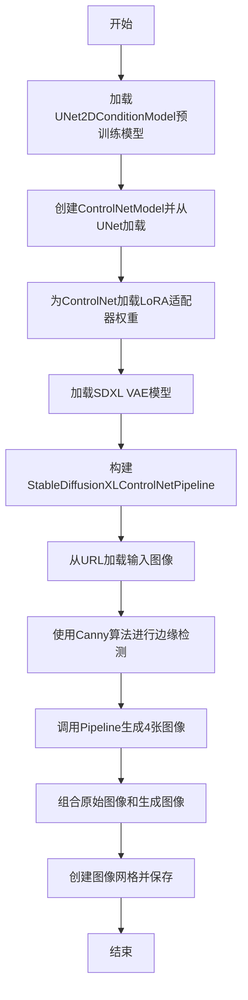
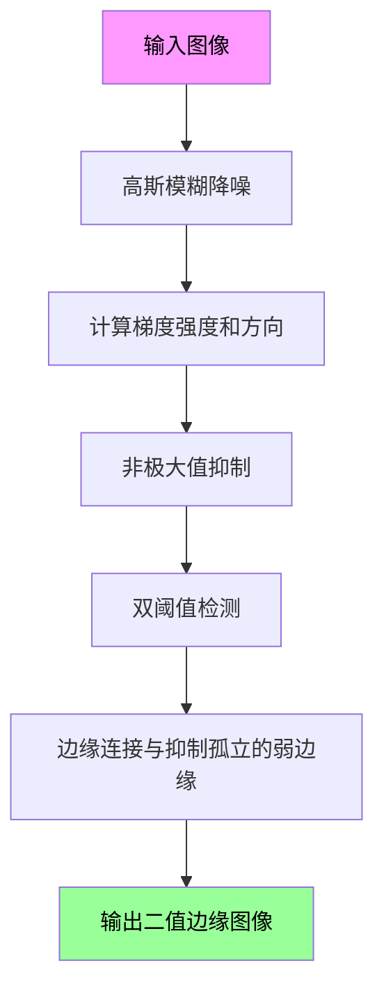
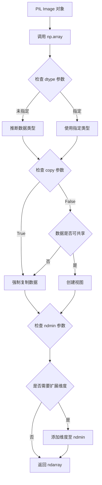
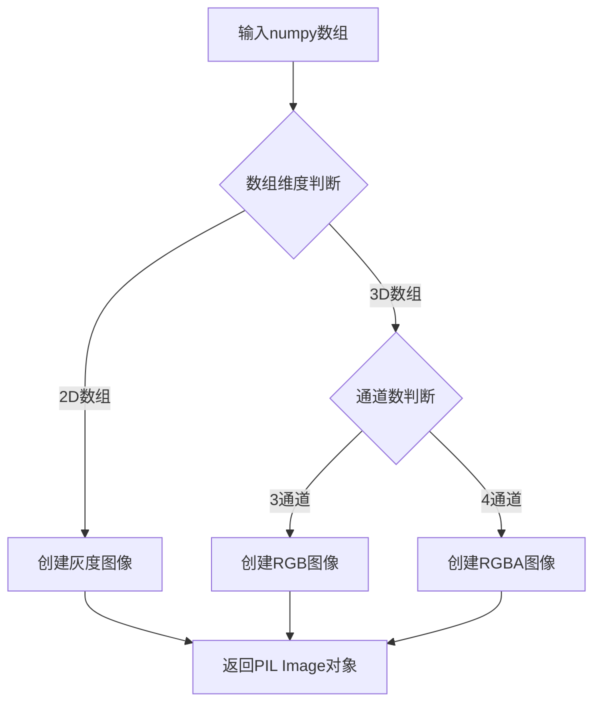
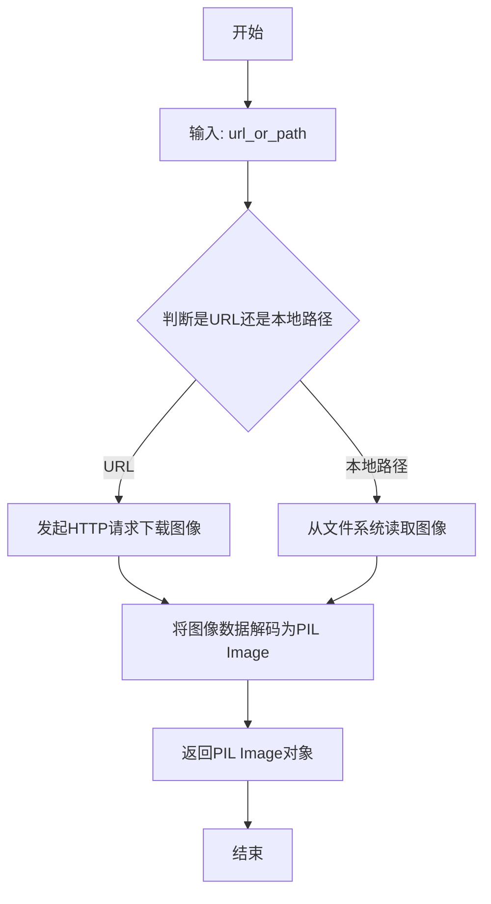
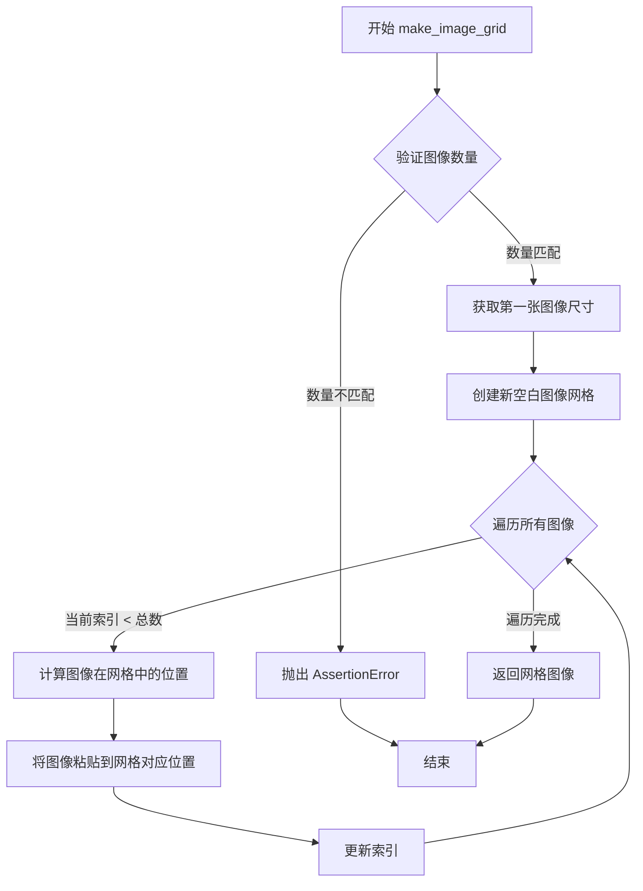
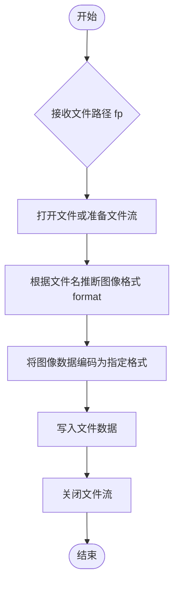

# `diffusers\examples\research_projects\control_lora\control_lora.py` 详细设计文档

该代码实现了一个基于Stable Diffusion XL (SDXL) 和 ControlNet 的图像生成流程，通过加载LoRA适配器增强边缘检测控制能力，使用Canny边缘检测算法作为控制条件，生成符合文本提示的图像，并最终将生成的图像与原始图像组合成网格保存。

## 整体流程



## 类结构

```
无自定义类 (脚本式代码)
主要使用第三方库类:
- UNet2DConditionModel (diffusers)
- ControlNetModel (diffusers)
- AutoencoderKL (diffusers)
- StableDiffusionXLControlNetPipeline (diffusers)
```

## 全局变量及字段


### `pipe_id`
    
预训练SDXL模型ID路径

类型：`str`
    


### `lora_id`
    
LoRA适配器仓库ID

类型：`str`
    


### `lora_filename`
    
LoRA权重文件名

类型：`str`
    


### `unet`
    
SDXL的UNet条件模型实例

类型：`UNet2DConditionModel`
    


### `controlnet`
    
加载了LoRA适配器的ControlNet模型实例

类型：`ControlNetModel`
    


### `prompt`
    
正向提示词

类型：`str`
    


### `negative_prompt`
    
负向提示词

类型：`str`
    


### `image`
    
输入控制图像（边缘检测后）

类型：`PIL.Image`
    


### `controlnet_conditioning_scale`
    
ControlNet条件缩放因子

类型：`float`
    


### `vae`
    
SDXL VAE模型实例

类型：`AutoencoderKL`
    


### `pipe`
    
完整生成管道

类型：`StableDiffusionXLControlNetPipeline`
    


### `images`
    
生成的图像列表

类型：`List[PIL.Image]`
    


### `final_image`
    
用于网格的最终图像列表

类型：`List[PIL.Image]`
    


### `grid`
    
图像网格

类型：`PIL.Image`
    


    

## 全局函数及方法


### `cv2.Canny`

cv2.Canny 是 OpenCV 库中的边缘检测函数，采用 Canny 边缘检测算法对输入图像进行边缘识别。该函数通过高低阈值处理来检测图像中的边缘，返回二值边缘图像。

参数：

- `image`：`numpy.ndarray`，输入的灰度图像或彩色图像（通常为灰度图）
- `threshold1`：`int`，低阈值，用于边缘连接和边缘检测
- `threshold2`：`int`，高阈值，用于初始化边缘检测

返回值：`numpy.ndarray`，返回二值边缘图像，其中边缘像素值为 255，非边缘像素值为 0

#### 流程图



#### 带注释源码

```python
# 将 PIL 图像转换为 NumPy 数组
image = np.array(image)

# 使用 Canny 边缘检测算法
# 参数说明：
# - 100: 低阈值（threshold1），用于边缘连接
# - 200: 高阈值（threshold2），用于检测强边缘
image = cv2.Canny(image, 100, 200)

# 为灰度图添加第三个维度，使其从 (H, W) 变为 (H, W, 1)
image = image[:, :, None]

# 将单通道图像沿第三维度复制三次，转换为三通道图像
# 这是因为后续的 Stable Diffusion pipeline 需要 RGB 图像
image = np.concatenate([image, image, image], axis=2)

# 将 NumPy 数组转换回 PIL Image 对象
image = Image.fromarray(image)
```

#### 技术细节说明

| 项目 | 说明 |
|------|------|
| 算法原理 | Canny 边缘检测是一种多阶段算法，包括高斯滤波、梯度计算、非极大值抑制、双阈值检测和边缘连接 |
| 阈值选择 | 100（低）/ 200（高）的比例通常为 1:2 或 1:3，这是经验性的推荐值 |
| 输入要求 | 建议输入灰度图像，彩色图像会被自动转换为灰度 |
| 输出格式 | 返回 uint8 类型的二值图像，边缘为 255，背景为 0 |

#### 潜在优化空间

1. **阈值参数化**：当前的 100 和 200 是硬编码值，可以考虑将其提取为可配置参数或根据图像特性自适应计算
2. **图像预处理**：可以添加对比度增强或直方图均衡化来提升边缘检测效果
3. **性能优化**：对于大图像，可以考虑使用 GPU 加速的边缘检测实现
4. **多尺度检测**：可以尝试使用 Canny 算子的多尺度版本来检测不同粗细的边缘


### `np.array`

将 Python 对象（如 PIL Image）转换为 NumPy 多维数组，这是计算机视觉处理中的基础数据转换操作。

参数：

- `object`：array_like，要转换的输入对象。此处传入的是从 `load_image()` 返回的 PIL Image 对象
- `dtype`：data_type（可选），指定数组的数据类型，默认为 None（从输入推断）
- `copy`：bool（可选），是否强制复制数据，默认为 True
- `order`：str（可选），内存布局选项，可选 'C'（行优先）或 'F'（列优先），默认 'K'（保持原样）
- `subok`：bool（可选），是否允许子类通过，默认 True
- `ndmin`：int（可选），指定结果数组的最小维度数，默认 0

返回值：`numpy.ndarray`，转换后的 NumPy 数组对象

#### 流程图



#### 带注释源码

```python
# 将 PIL Image 对象转换为 NumPy 数组
# 输入: PIL Image (来自 load_image 的返回值)
# 输出: 形状为 (H, W, C) 的 uint8 类型数组
image = np.array(image)
```

---

### 代码整体运行流程分析

此代码实现了一个基于 Stable Diffusion XL + ControlNet 的图像生成 pipeline，核心流程如下：

1. **模型加载阶段**：加载预训练的 UNet、ControlNet、VAE 模型，并加载 LoRA 权重
2. **条件图像预处理**：使用 Canny 边缘检测算法提取输入图像的边缘作为 ControlNet 条件
3. **图像生成**：使用 StableDiffusionXLControlNetPipeline 进行条件图像生成
4. **结果展示**：将原始图像与生成的多张图像合并为网格图保存

#### 关键组件信息

| 组件名称 | 描述 |
|---------|------|
| `UNet2DConditionModel` | 条件扩散模型的核心去噪网络 |
| `ControlNetModel` | 控制网络，用于引入额外的条件控制 |
| `StableDiffusionXLControlNetPipeline` | 整合了 SDXL、ControlNet 和 VAE 的推理管道 |
| `AutoencoderKL` | VAE 编解码器，用于潜在空间与像素空间的转换 |
| `cv2.Canny` | 边缘检测算法，生成 ControlNet 所需的条件图 |

#### 潜在技术债务与优化空间

1. **硬编码路径与参数**：模型路径、LoRA 文件名、图像 URL 均硬编码，缺乏配置管理
2. **设备与数据类型硬编码**：设备固定为 "cuda"，数据类型固定为 bfloat16，缺乏灵活性
3. **错误处理缺失**：模型加载和推理过程没有异常捕获与处理
4. **资源管理不当**：未显式释放 GPU 内存，缺乏上下文管理器
5. **魔法数字**：Canny 阈值 (100, 200)、controlnet_conditioning_scale (1.0) 等参数缺乏说明

#### 其他项目

**设计目标**：实现基于 ControlNet 的条件图像生成，支持 LoRA 权重加载以提升控制精度

**约束条件**：
- 需要 GPU 显存 >= 16GB（bfloat16 模式下）
- 依赖 Hugging Face Diffusers 库生态

**错误处理**：
- 网络连接失败（模型/图像下载）
- GPU 内存不足
- 模型文件损坏或版本不兼容

**数据流**：
```
URL → load_image → PIL Image → np.array → cv2.Canny → np.concatenate → PIL Image
                                                                    ↓
prompt + negative_prompt ─────────────────────────────────────────→ Pipeline
                                                                    ↓
生成图像列表 → make_image_grid → 网格图 → 保存文件
```

**外部依赖接口契约**：
- `diffusers`: StableDiffusionXLControlNetPipeline.from_pretrained()
- `cv2`: cv2.Canny()
- `PIL`: Image.fromarray()
- `numpy`: np.array(), np.concatenate()


### `np.concatenate`

`np.concatenate` 是 NumPy 库中的数组拼接函数，用于沿指定轴连接两个或多个数组。在本代码中，该函数将单通道的 Canny 边缘检测结果图像沿通道轴（axis=2）复制并拼接三次，将灰度图像转换为伪 RGB 三通道图像，以满足 Stable Diffusion XL ControlNet pipeline 对输入图像格式的要求。

参数：

- `tup`：`tuple of array_like`，需要拼接的数组序列，代码中传入的是 `[image, image, image]`，即将同一张单通道图像复制三份
- `axis`：`int, optional`，指定拼接的轴，代码中传入 `2`，表示沿最后一个轴（通道轴）进行拼接

返回值：`ndarray`，拼接后的新数组，形状为原始图像的高度 x 宽度 x 3（从单通道变为三通道）

#### 流程图

```mermaid
graph TD
    A[开始 np.concatenate] --> B{验证输入数组}
    B -->|数组维度兼容| C[沿指定轴 axis=2 拼接]
    B -->|维度不兼容| D[抛出 ValueError]
    C --> E[创建新数组]
    E --> F[返回拼接后的数组]
    
    G[输入: [image, image, image]] --> B
    H[axis=2] --> B
    
    F --> I[输出: 三通道图像]
    
    style C fill:#e1f5fe
    style E fill:#e1f5fe
    style I fill:#c8e6c9
```

#### 带注释源码

```python
# 将单通道灰度图像复制三次，沿axis=2（最后一个轴/通道轴）拼接
# 原图像shape: (H, W, 1) - 高度 x 宽度 x 1通道
# 拼接后shape: (H, W, 3) - 高度 x 宽度 x 3通道
# 这样可以将Canny边缘检测的灰度图转换为伪RGB图像格式
image = np.concatenate([image, image, image], axis=2)

# 详细解释：
# 1. image[:, :, None] 将2D数组转为3D (H, W, 1)
# 2. [image, image, image] 创建包含3个相同图像的元组
# 3. axis=2 沿通道维度拼接，结果为 (H, W, 3)
# 4. 目的是模拟RGB图像，因为SDXL ControlNet需要3通道输入
```


### `Image.fromarray`

将numpy数组转换为PIL图像对象，是PIL库中用于图像数据类型转换的核心函数。

参数：

- `array`：`numpy.ndarray`，输入的numpy数组，通常是图像的像素数据，可以是灰度图（2D数组）或彩色图（3D数组）

返回值：`PIL.Image.Image`，转换后的PIL图像对象，保留了原始数组的图像数据

#### 流程图



#### 带注释源码

```python
# 在代码中的实际使用
image = np.array(image)  # 将PIL图像转换为numpy数组
image = cv2.Canny(image, 100, 200)  # 使用Canny算法进行边缘检测
image = image[:, :, None]  # 增加一个维度
image = np.concatenate([image, image, image], axis=2)  # 将灰度图复制为3通道
image = Image.fromarray(image)  # 将numpy数组转换回PIL图像对象
# 关键点：将处理后的numpy数组（边缘检测结果）转换为PIL图像
# 以便传递给StableDiffusionXLControlNetPipeline进行图像生成
```

#### 技术说明

在当前代码中的具体作用：

1. **数据来源**：经过Canny边缘检测后的numpy数组（边缘图）
2. **转换目的**：将numpy数组格式的图像数据转换为PIL Image对象，以符合`StableDiffusionXLControlNetPipeline`的输入要求
3. **图像格式**：转换后为RGB格式的PIL图像，可直接用于ControlNet条件输入


### `diffusers.utils.load_image`

从远程URL加载图像到PIL Image对象的工具函数，简化了从网络获取图像并转换为PIL格式的过程。

参数：

-  `url_or_path`：`str`，远程图像的URL地址或本地文件路径

返回值：`PIL.Image.Image`，返回加载后的PIL图像对象

#### 流程图



#### 带注释源码

```python
# 从 diffusers 库的工具模块导入 load_image 函数
from diffusers.utils import load_image, make_image_grid

# 使用 load_image 从远程URL加载图像
# 参数: 远程图像的URL地址
# 返回值: PIL.Image.Image 对象
image = load_image(
    "https://huggingface.co/datasets/hf-internal-testing/diffusers-images/resolve/main/sd_controlnet/hf-logo.png"
)

# 后续处理：将PIL Image转换为numpy数组进行Canny边缘检测
image = np.array(image)
image = cv2.Canny(image, 100, 200)
image = image[:, :, None]
image = np.concatenate([image, image, image], axis=2)
image = Image.fromarray(image)
```


### `make_image_grid`

该函数是 Hugging Face diffusers 库中的一个图像处理工具函数，用于将多个 PIL 图像组合成一个网格形式的图像，方便可视化多张生成的图像结果。

参数：

-  `imgs`：`List[PIL.Image.Image]` 或 `List[torch.Tensor]`，输入的图像列表，需要排列成网格的图像集合
-  `rows`：`int`，网格的行数
-  `cols`：`int`，网格的列数

返回值：`PIL.Image.Image`，返回一个拼接后的网格图像

#### 流程图



#### 带注释源码

```python
def make_image_grid(
    imgs: Union[List[PIL.Image.Image], List[torch.Tensor]],
    rows: int,
    cols: int,
    resample: Optional[str] = None,
) -> PIL.Image.Image:
    """
    将多个图像组合成一个网格形式的图像。
    
    参数:
        imgs: 输入的图像列表，可以是 PIL Image 或 PyTorch Tensor
        rows: 网格的行数
        cols:网格的列数
        resample: 可选的图像重采样方法（如 PIL.Image.NEAREST）
    
    返回:
        拼接后的网格图像（PIL Image 对象）
    
    示例:
        >>> from diffusers.utils import make_image_grid, load_image
        >>> images = [load_image(f"image_{i}.png") for i in range(4)]
        >>> grid = make_image_grid(images, rows=2, cols=2)
        >>> grid.save("grid.png")
    """
    # 验证图像数量是否与行列相匹配
    # 如果不匹配则抛出断言错误
    assert len(imgs) == rows * cols, (
        f"图像数量 ({len(imgs)}) 与网格尺寸 ({rows}x{cols}) 不匹配"
    )
    
    # 获取第一张图像的宽度和高度
    # 作为网格中所有图像的统一尺寸
    if isinstance(imgs[0], PIL.Image.Image):
        w, h = imgs[0].size
    elif isinstance(imgs[0], torch.Tensor):
        # 处理 PyTorch Tensor 格式的图像
        # 假设 Tensor 形状为 (C, H, W) 或 (B, C, H, W)
        h, w = imgs[0].shape[-2:]
    
    # 创建新的空白网格图像
    # 模式根据第一张图像的模式决定（如 'RGB', 'L' 等）
    # 尺寸为 cols * w（总宽度）和 rows * h（总高度）
    grid = PIL.Image.new(imgs[0].mode, size=(cols * w, rows * h))
    
    # 遍历所有图像，将每张图像粘贴到网格的对应位置
    for i, img in enumerate(imgs):
        # 计算当前图像在网格中的列位置和行位置
        # i % cols: 当前列索引（0 到 cols-1）
        # i // cols: 当前行索引（0 到 rows-1）
        row = i // cols
        col = i % cols
        
        # 计算粘贴位置的像素坐标
        # x 坐标 = 列索引 * 图像宽度
        # y 坐标 = 行索引 * 图像高度
        x = col * w
        y = row * h
        
        # 如果是 Tensor 格式，转换为 PIL Image
        if isinstance(img, torch.Tensor):
            # 将 Tensor 转换为 numpy 数组，再转换为 PIL Image
            img = PIL.Image.fromarray(
                img.cpu().numpy().transpose(1, 2, 0)
            )
        
        # 将图像粘贴到网格的对应位置
        # box 参数指定左上角坐标 (x, y)
        grid.paste(img, box=(x, y))
    
    # 返回拼接完成的网格图像
    return grid
```

#### 在主代码中的调用分析

在提供的代码示例中，`make_image_grid` 的调用方式如下：

```python
# 构建最终要显示的图像列表
# 第一张是 Canny 边缘检测后的输入图像，后面是生成的 4 张图像
final_image = [image] + images  # 共 5 张图像

# 创建 1 行 5 列的网格
grid = make_image_grid(final_image, 1, 5)

# 保存网格图像到文件
grid.save("hf-logo_canny.png")
```

这里的调用参数：
- `final_image`: 包含 5 张图像的列表（1 张输入图像 + 4 张生成图像）
- `rows = 1`: 网格有 1 行
- `cols = 5`: 网格有 5 列
- 返回值是一个 PIL Image 对象，表示拼接后的网格图像


### `grid.save`

调用 PIL Image 对象的 `save` 实例方法，将图像网格保存为指定格式的文件到磁盘。

参数：

-  `fp`：`str`，文件路径。代码中传入 `"hf-logo_canny.png"`，表示将图像保存为当前目录下的该文件名。
-  `format`：`str` (可选)，图像格式。代码中未指定，默认为 `None`，PIL 会根据文件扩展名（.png）自动推断为 PNG 格式。
-  `**params`：可变关键字参数，其他保存参数（如质量、压缩级别等）。代码中未传入额外参数，使用默认保存设置。

返回值：`None`，该方法执行保存操作后不返回任何值。

#### 流程图



#### 带注释源码

```python
# grid 是通过 diffusers.utils.make_image_grid 创建的 PIL.Image.Image 对象
# 调用 save 方法将图像网格保存到磁盘
# 参数 "hf-logo_canny.png" 指定了保存路径和文件名
grid.save("hf-logo_canny.png")
```


## 关键组件


### Stable Diffusion XL (SDXL) 基础模型

使用stabilityai/stable-diffusion-xl-base-1.0作为基础文本到图像扩散模型，负责根据文本提示生成图像主体。

### UNet2DConditionModel

SDXL的去噪神经网络核心组件，负责在潜在空间中执行多步去噪过程，接收文本嵌入和ControlNet条件信息作为输入。

### ControlNet 控制器模型

通过ControlNetModel.from_unet方法从UNet初始化，用于引入额外的条件控制信号，增强生成过程的可控性。

### LoRA 适配器加载

使用load_lora_adapter方法加载Control-LoRA权重，使模型能够使用Canny边缘检测作为条件进行可控图像生成，支持128排名的轻量级微调。

### AutoencoderKL (VAE)

从stabilityai/sdxl-vae加载的变分自编码器，负责将图像编码到潜在空间并从潜在表示解码回像素空间，使用bfloat16精度以优化显存占用。

### StableDiffusionXLControlNetPipeline

整合UNet、ControlNet、VAE的推理管道，封装了完整的图像生成流程，支持负面提示、条件尺度控制和单提示多图生成。

### Canny 边缘检测预处理器

使用OpenCV的Canny算法从输入图像提取边缘特征（阈值100-200），将边缘图转换为三通道图像作为ControlNet的条件输入。

### 图像网格生成器

使用diffusers的make_image_grid工具将原始输入与生成的4张图像拼接为1行5列的网格，便于可视化对比效果。


## 问题及建议


### 已知问题

-   **硬编码配置和路径**：模型ID、LoRA路径、URL等直接写在代码中，缺乏配置管理机制，不利于环境迁移和多环境部署
-   **魔法数字**：Canny边缘检测阈值(100, 200)、controlnet_conditioning_scale(1.0)、num_images_per_prompt(4)等数值缺乏常量定义
-   **缺乏错误处理**：整个脚本无任何try-except块，网络加载、图像处理、推理过程均可能抛出异常导致程序崩溃
-   **资源管理不当**：未显式释放CUDA内存，pipeline对象未进行del或垃圾回收处理
-   **缺少日志系统**：无任何日志输出，无法追踪执行状态和问题排查
-   **类型注解缺失**：参数和返回值均无类型提示，降低代码可维护性
-   **单文件脚本**：功能未模块化，难以复用和单元测试
-   **内存占用过高**：加载多个大模型(bfloat16)到单一GPU，未考虑模型并行或量化优化
-   **图像处理链未封装**：Canny边缘检测和图像拼接逻辑散落在主流程中
-   **安全检查器禁用**：显式设置safety_checker=None，需评估合规风险

### 优化建议

-   **引入配置管理**：使用pydantic或dataclass定义配置类，从yaml/env文件加载参数，实现配置与代码分离
-   **定义常量类**：创建constants.py集中管理阈值、路径、提示词模板等配置
-   **添加异常处理**：为网络请求、模型加载、推理过程添加try-except-finally，确保资源释放
-   **实现日志系统**：使用logging模块记录关键节点和错误信息，支持多级别输出
-   **模块化重构**：将模型加载、图像处理、推理逻辑拆分为独立函数或类
-   **添加类型注解**：为函数参数和返回值添加Union、Optional等类型提示
-   **资源清理机制**：使用torch.cuda.empty_cache()显式清理缓存，pipeline使用完成后del释放
-   **模型优化**：考虑使用torch.compile、模型量化或FP16推理提升性能
-   **封装图像处理**：将Canny检测、图像拼接逻辑封装为独立函数并添加单元测试
-   **添加进度条**：使用tqdm显示推理进度，提升用户体验


## 其它


### 设计目标与约束

本项目旨在使用Stable Diffusion XL (SDXL) 结合ControlNet LoRA技术，实现基于Canny边缘检测的图像生成控制。设计目标包括：1) 利用预训练的SDXL基础模型确保生成质量；2) 通过ControlNet实现边缘检测条件的精确控制；3) 使用LoRA适配器实现轻量级模型微调；4) 支持批量生成多张变体图像。性能约束要求GPU显存至少16GB，推理时间控制在合理范围内。

### 错误处理与异常设计

代码在模型加载阶段可能抛出`OSError`（模型文件不存在）、`ValueError`（参数配置错误）、`RuntimeError`（CUDA内存不足）等异常。当前代码未实现显式的异常捕获机制，建议添加：1) 模型加载前的文件存在性检查；2) CUDA内存溢出时的重试机制或降级策略；3) 网络图片加载失败时的备用本地图片方案；4) 图像处理过程中的维度不匹配检查。

### 数据流与状态机

数据流如下：输入URL图片 → PIL Image加载 → OpenCV Canny边缘检测 → 图像通道扩展(单通道→三通道) → PIL Image转换 → SDXL ControlNet Pipeline推理 → 输出图像列表 → 图像网格拼接 → 文件保存。状态机包含：初始化状态(模型加载)、就绪状态(准备生成)、处理中状态(推理执行)、完成状态(结果输出)、异常状态(错误发生)。

### 外部依赖与接口契约

核心依赖包括：1) `diffusers`库 - 提供StableDiffusionXLControlNetPipeline、ControlNetModel等组件；2) `transformers` - 模型加载必需；3) `accelerate` - 加速推理；4) `opencv-python` - Canny边缘检测；5) `pillow` - 图像处理；6) `torch` - 深度学习框架。接口契约：输入图片需为PIL Image或numpy数组，管道输出为PIL Image列表，图片尺寸需匹配模型要求(1024x1024)。

### 性能优化考虑

当前实现存在以下优化空间：1) 启用`enable_attention_slicing`减少显存占用；2) 使用`torch.compile`加速UNet推理；3) 启用`vae_slicing`优化VAE解码；4) 批量推理时使用`guidance_scale`优化；5) 考虑使用`torch.bfloat16`以外的混合精度；6) 可添加推理缓存机制避免重复加载模型。

### 资源管理与生命周期

模型资源管理：1) UNet、ControlNet、VAE模型加载至GPU后需显式释放；2) 推理完成后应清理中间张量；3) 建议使用`torch.cuda.empty_cache()`定期释放显存；4) 长时间运行时应监控显存使用情况防止泄漏。当前代码在脚本结束后自动释放，但无显式资源管理代码。

### 安全性考虑

代码涉及：1) 网络图片加载存在潜在的安全风险，建议添加URL验证；2) 未实现安全检查器(`safety_checker=None`)，生成的图像可能包含不当内容；3) 模型文件来源需验证，建议使用官方huggingface Hub地址；4) 生成的图像应添加水印或元数据标识。

### 配置管理

当前配置通过硬编码方式实现，建议提取为配置对象：1) 模型ID配置 - `pipe_id`, `lora_id`；2) LoRA配置 - `lora_filename`, `controlnet_conditioning_scale`；3) 提示词配置 - `prompt`, `negative_prompt`；4) 生成参数 - `num_images_per_prompt`；5) 文件路径配置 - 输入输出路径。可使用yaml或环境变量管理不同环境的配置。

### 版本兼容性

依赖版本要求：1) `diffusers` >= 0.21.0（支持SDXL和ControlNet）；2) `torch` >= 2.0.0（支持bfloat16）；3) `transformers`根据diffusers自动匹配；4) OpenCV需兼容Canny API。建议在requirements.txt中锁定最低版本，并定期更新以获取最新功能和安全修复。

### 测试策略

建议添加以下测试：1) 单元测试 - 图像预处理函数(Canny检测、通道扩展)；2) 集成测试 - 模型加载和推理流程；3) 回归测试 - 确保生成结果一致性；4) 性能测试 - 推理时间和显存占用；5) 边界测试 - 不同尺寸输入图片的处理。测试数据应包含多种类型的输入图像以验证泛化能力。

### 部署与运维建议

当前代码为单次脚本执行，建议改为：1) 封装为CLI工具或REST API服务；2) 添加日志记录和监控；3) 实现优雅关闭机制；4) 添加健康检查端点；5) 配置容器化部署(Docker)；6) 实现请求队列和限流机制防止GPU过载。生产环境建议使用模型缓存和预热机制。

    