# `diffusers\examples\research_projects\controlnet\train_controlnet_webdataset.py` 详细设计文档

This script is used to fine-tune a Stable Diffusion XL (SDXL) ControlNet model. It utilizes the `diffusers` library for model implementation, `accelerate` for distributed training, and `webdataset` for efficient image data loading. The script supports both Canny edge detection and Depth map conditioning, implementing a full training loop including data preprocessing, model forward/backward passes, logging, validation, and checkpoint saving.

## 整体流程

```mermaid
graph TD
    Start[Parse Arguments] --> InitAccel[Initialize Accelerator & Logging]
    InitAccel --> LoadTokenizers[Load SDXL Tokenizers (1 & 2)]
    LoadTokenizers --> LoadModels[Load VAE, UNet, Text Encoders, ControlNet]
    LoadModels --> InitDataset[Initialize Text2ImageDataset]
    InitDataset --> TrainingLoop{Training Loop}
    TrainingLoop --> Batch[Get Batch from DataLoader]
    Batch --> EncodeText[Encode Text Prompts (CLIP)]
    EncodeText --> EncodeImage[Encode Image to Latents (VAE)]
    EncodeImage --> ProcessControl{Process Control Image}
    ProcessControl -- Canny --> CannyEdge[Apply Canny Edge Detection]
    ProcessControl -- Depth --> DepthMap[Generate Depth Map (DPT)]
    CannyEdge --> AddNoise[Add Noise to Latents (Forward Diff)]
    DepthMap --> AddNoise
    AddNoise --> ControlNetForward[ControlNet Forward (Get Residuals)]
    ControlNetForward --> UNetForward[UNet Forward (Predict Noise)]
    UNetForward --> ComputeLoss[Compute MSE Loss]
    ComputeLoss --> BackwardPass[Backward & Optimizer Step]
    BackwardPass --> Checkpointing{Checkpointing?}
    Checkpointing -- Yes --> SaveState[Save Accelerator State]
    Checkpointing -- No --> Validation{Validation Step?}
    Validation -- Yes --> RunValidation[Run log_validation]
    Validation -- No --> UpdateProgress[Update Progress Bar]
    SaveState --> UpdateProgress
    RunValidation --> UpdateProgress
    UpdateProgress --> TrainingLoop
    TrainingLoop -- Finished --> FinalSave[Save ControlNet Model & Push to Hub]
```

## 类结构

```
Global Configuration & Imports
├── MAX_SEQ_LENGTH (Global Constant)
├── logger (Global Logger)
Data Loading & Processing
├── WebdatasetFilter (Class)
│   ├── __init__(min_size, max_pwatermark)
│   └── __call__(x)
├── Text2ImageDataset (Class)
│   ├── __init__(train_shards, eval_shards, batch_size, resolution, ...)
│   ├── train_dataset (Property)
│   ├── train_dataloader (Property)
│   ├── eval_dataset (Property)
│   └── eval_dataloader (Property)
Image Transformation Functions
├── control_transform (Canny edge detection)
├── canny_image_transform (Pipeline for Canny)
├── depth_image_transform (Pipeline for Depth)
└── image_grid (Visualization helper)
Model & Training Utilities
├── import_model_class_from_model_name_or_path (Dynamic import)
├── save_model_card (Hub metadata generation)
├── encode_prompt (SDXL dual text encoder embedding)
├── log_validation (Inference & logging)
Webdataset Helpers
├── filter_keys
├── group_by_keys_nothrow
└── tarfile_to_samples_nothrow
Main Execution Flow
├── parse_args (CLI Argument Parser)
└── main (Training Orchestration)
```

## 全局变量及字段


### `MAX_SEQ_LENGTH`
    
Fixed at 77, defining the max token length for text encoders

类型：`int`
    


### `logger`
    
Module-level logger initialized via get_logger from accelerate

类型：`logging.Logger`
    


### `is_wandb_available`
    
Boolean check for optional wandb dependency availability

类型：`bool`
    


### `WebdatasetFilter.min_size`
    
Minimum width/height for images

类型：`int`
    


### `WebdatasetFilter.max_pwatermark`
    
Maximum allowed watermark probability

类型：`float`
    


### `Text2ImageDataset._train_dataset`
    
Webdataset pipeline for training

类型：`wds.DataPipeline`
    


### `Text2ImageDataset._train_dataloader`
    
WebLoader for training

类型：`wds.WebLoader`
    


### `Text2ImageDataset._eval_dataset`
    
Webdataset pipeline for evaluation

类型：`wds.DataPipeline`
    


### `Text2ImageDataset._eval_dataloader`
    
WebLoader for evaluation

类型：`wds.WebLoader`
    
    

## 全局函数及方法


### `filter_keys`

这是一个高阶函数，返回一个字典过滤器，用于从字典中提取特定的键值对。

参数：

- `key_set`：`set`，要保留的键的集合

返回值：`function`，返回一个内部函数 `_f`，该函数接收一个字典并返回只包含指定键的过滤后的字典

#### 流程图

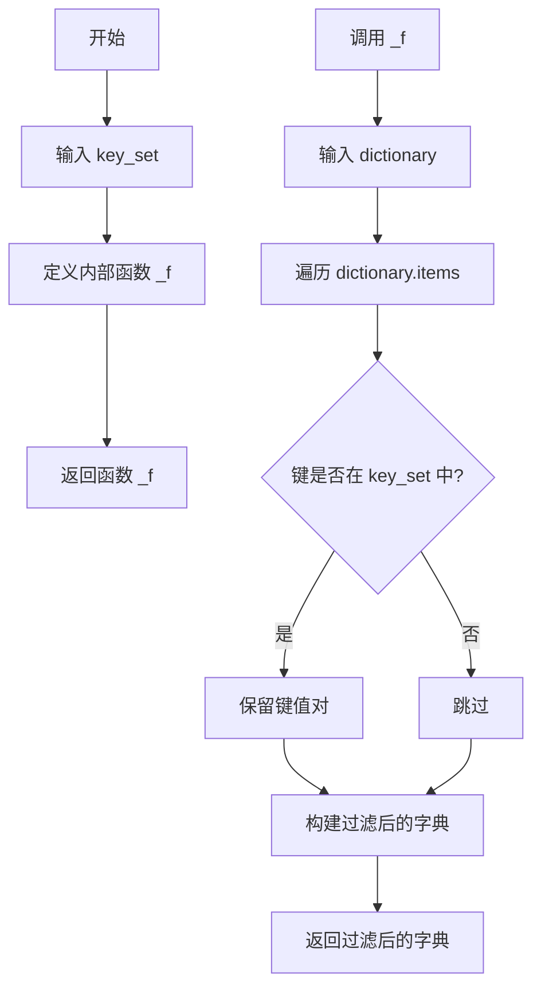

#### 带注释源码

```
def filter_keys(key_set):
    """
    创建一个字典过滤器函数，用于提取指定的键。
    
    参数:
        key_set (set): 包含要保留的键的集合
        
    返回:
        function: 一个接收字典并返回过滤后字典的函数
    """
    def _f(dictionary):
        """
        内部过滤函数，从字典中提取指定的键值对。
        
        参数:
            dictionary (dict): 输入的字典
            
        返回:
            dict: 只包含 key_set 中键的过滤后的字典
        """
        # 使用字典推导式过滤字典，只保留键在 key_set 中的键值对
        return {k: v for k, v in dictionary.items() if k in key_set}

    # 返回内部函数，形成闭包
    return _f
```


### `group_by_keys_nothrow`

该函数是一个自定义迭代器，用于将WebDataset文件按键分组为样本，支持处理键冲突（key collisions）情况，通过graceful方式处理 suffixes 冲突，避免因键重复而抛出异常。

参数：

- `data`：`Iterator`，输入的文件样本迭代器，每个元素是一个包含"fname"和"data"字段的字典
- `keys`：`Callable`，函数，用于将文件名分割为前缀和扩展名（默认为`base_plus_ext`）
- `lcase`：`bool`，是否将后缀转换为小写（默认为`True`）
- `suffixes`：`Optional[Set[str]]`，允许的后缀集合，如果为`None`则接受所有后缀（默认为`None`）
- `handler`：`Optional[Callable]`：错误处理回调函数（默认为`None`）

返回值：`Iterator[Dict]`，生成包含"__key__"、"__url__"和实际数据后缀字段的样本字典迭代器

#### 流程图

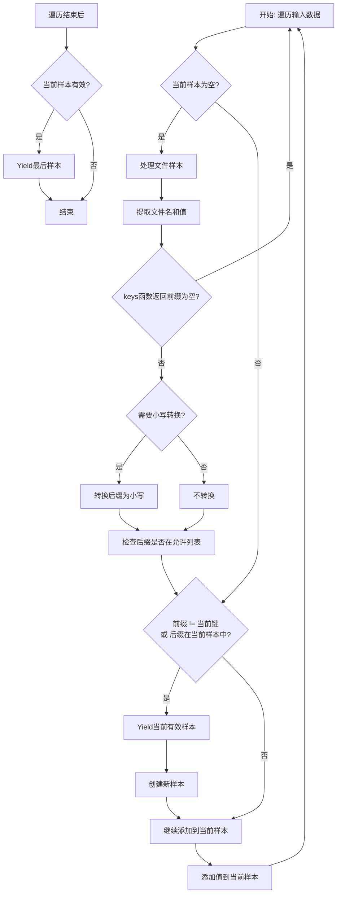

#### 带注释源码

```python
def group_by_keys_nothrow(data, keys=base_plus_ext, lcase=True, suffixes=None, handler=None):
    """Return function over iterator that groups key, value pairs into samples.

    :param keys: function that splits the key into key and extension (base_plus_ext)
    :param lcase: convert suffixes to lower case (Default value = True)
    """
    # current_sample 用于存储当前正在构建的样本
    current_sample = None
    
    # 遍历输入的每个文件样本
    for filesample in data:
        # 确保输入格式正确，每个filesample应该是字典
        assert isinstance(filesample, dict)
        
        # 提取文件名和数据值
        fname, value = filesample["fname"], filesample["data"]
        
        # 使用keys函数将文件名分割为前缀和后缀
        prefix, suffix = keys(fname)
        
        # 如果前缀为空，跳过该样本
        if prefix is None:
            continue
        
        # 根据lcase参数决定是否将后缀转换为小写
        if lcase:
            suffix = suffix.lower()
        
        # FIXME: webdataset版本会在suffix已存在于current_sample时抛出异常
        # 但在LAION400m数据集中可能出现以下情况：
        # 当前tar文件的末尾与下一个tar文件的开头具有相同前缀
        # 这种情况很少见，但在该数据集中可能发生，因为tar文件间前缀不唯一
        
        # 判断是否需要开始新的样本：
        # 1. 当前样本为空
        # 2. 或当前前缀与样本键不匹配
        # 3. 或后缀已存在于当前样本中（键冲突）
        if current_sample is None or prefix != current_sample["__key__"] or suffix in current_sample:
            # 如果当前样本有效，则yield出去
            if valid_sample(current_sample):
                yield current_sample
            
            # 创建新的样本字典
            current_sample = {"__key__": prefix, "__url__": filesample["__url__"]}
        
        # 如果suffixes为None或当前后缀在允许列表中，则添加到当前样本
        if suffixes is None or suffix in suffixes:
            current_sample[suffix] = value
    
    # 遍历结束后，如果还有有效的当前样本，则yield出去
    if valid_sample(current_sample):
        yield current_sample
```


### `tarfile_to_samples_nothrow`

该函数是一个包装器，用于打开 tar 文件并将它们转换为样本迭代器，且不会抛出错误。它是 webdataset 库中 `tarfile_to_samples` 函数的重新实现，通过使用自定义的 `group_by_keys_nothrow` 函数替代原版实现，避免了在处理某些边界情况时可能出现的异常。

参数：

- `src`：Union[str, Iterator]，tar 文件的路径、URL 迭代器或 URL 列表
- `handler`：Callable，错误处理函数，默认为 `wds.warn_and_continue`，用于在处理过程中忽略错误并继续

返回值：`Iterator[dict]`，返回样本字典的迭代器，每个字典包含 `__key__`、`__url__` 和从 tar 文件中提取的文件数据

#### 流程图

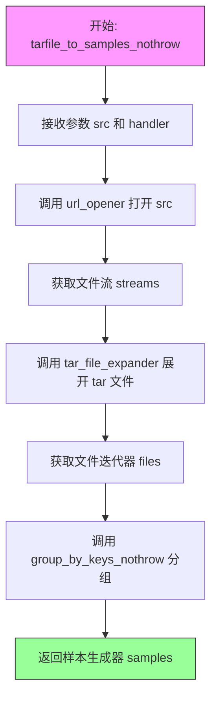

#### 带注释源码

```python
def tarfile_to_samples_nothrow(src, handler=wds.warn_and_continue):
    """
    将 tar 文件转换为样本迭代器的包装器，不会抛出错误。
    
    参数:
        src: tar 文件路径、URL 或 URL 迭代器
        handler: 错误处理函数，默认使用 wds.warn_and_continue
    
    返回:
        样本字典的迭代器
    """
    # NOTE this is a re-impl of the webdataset impl with group_by_keys that doesn't throw
    # 第一步：使用 url_opener 打开源文件/URL，获取文件流
    streams = url_opener(src, handler=handler)
    
    # 第二步：使用 tar_file_expander 将 tar 文件展开为文件迭代器
    files = tar_file_expander(streams, handler=handler)
    
    # 第三步：使用自定义的 group_by_keys_nothrow 函数对文件进行分组
    # 该函数不会在遇到重复键时抛出错误
    samples = group_by_keys_nothrow(files, handler=handler)
    
    # 返回样本生成器
    return samples
```


### `control_transform`

使用 OpenCV (cv2) Canny 边缘检测算法对输入的 PIL Image 进行边缘检测，将灰度边缘图转换为三通道图像，并转换回 PIL Image 格式返回。

参数：

- `image`：`PIL.Image.Image`，输入的原始图像（PIL 格式）

返回值：`PIL.Image.Image`，经过 Canny 边缘检测处理后的图像

#### 流程图

```mermaid
flowchart TD
    A[开始: 接收 PIL Image] --> B[将 PIL Image 转换为 NumPy 数组]
    B --> C[设置 Canny 边缘检测阈值: low=100, high=200]
    C --> D[调用 cv2.Canny 进行边缘检测]
    D --> E[为灰度图添加第三维度: image[:, :, None]
    E --> F[沿 axis=2 拼接三通道: np.concatenate]
    F --> G[将 NumPy 数组转换回 PIL Image]
    G --> H[返回 control_image]
```

#### 带注释源码

```python
def control_transform(image):
    """
    使用 OpenCV Canny 边缘检测将图像转换为控制图像
    
    参数:
        image: PIL.Image.Image 类型的输入图像
        
    返回:
        control_image: PIL.Image.Image 类型的边缘检测结果图像
    """
    # 将 PIL Image 转换为 NumPy 数组，以便使用 OpenCV 进行处理
    image = np.array(image)

    # 定义 Canny 边缘检测的低阈值和高阈值
    # 低阈值: 100, 高阈值: 200
    # 低于 low_threshold 的像素被认为是非边缘
    # 高于 high_threshold 的像素被认为是确定边缘
    # 介于两者之间的像素需要进一步判断
    low_threshold = 100
    high_threshold = 200

    # 使用 cv2.Canny 进行边缘检测
    # 输入为灰度图像，输出为二值边缘图（0 或 255）
    image = cv2.Canny(image, low_threshold, high_threshold)
    
    # 为灰度边缘图添加第三维度
    # 原 shape: (H, W) -> (H, W, 1)
    # 使用切片 [:, :, None] 实现维度扩展
    image = image[:, :, None]
    
    # 将单通道边缘图转换为三通道图像
    # 沿 axis=2 拼接三个相同的通道
    # 原因: Stable Diffusion 需要三通道图像输入
    image = np.concatenate([image, image, image], axis=2)
    
    # 将 NumPy 数组转换回 PIL Image 对象
    control_image = Image.fromarray(image)
    
    # 返回边缘检测后的控制图像
    return control_image
```


### `canny_image_transform`

该函数是ControlNet训练流程中的图像预处理函数，负责将输入图像调整到指定分辨率并进行随机裁剪，然后应用Canny边缘检测算法生成控制图像，最后将处理后的图像和控制图像转换为PyTorch张量并进行归一一化处理。

参数：

- `example`：`Dict`，包含键 "image" 的字典，其中 "image" 是 PIL 图像对象
- `resolution`：`int`，目标分辨率，默认为 1024，用于图像resize和裁剪的尺寸

返回值：`Dict`，返回包含以下键的字典：
- "image"：归一化后的图像张量，形状为 (C, H, W)，范围 [-1, 1]
- "control_image"：Canny边缘检测后的控制图像张量，形状为 (C, H, W)，范围 [0, 1]
- "crop_coords"：裁剪坐标元组 (c_top, c_left)

#### 流程图

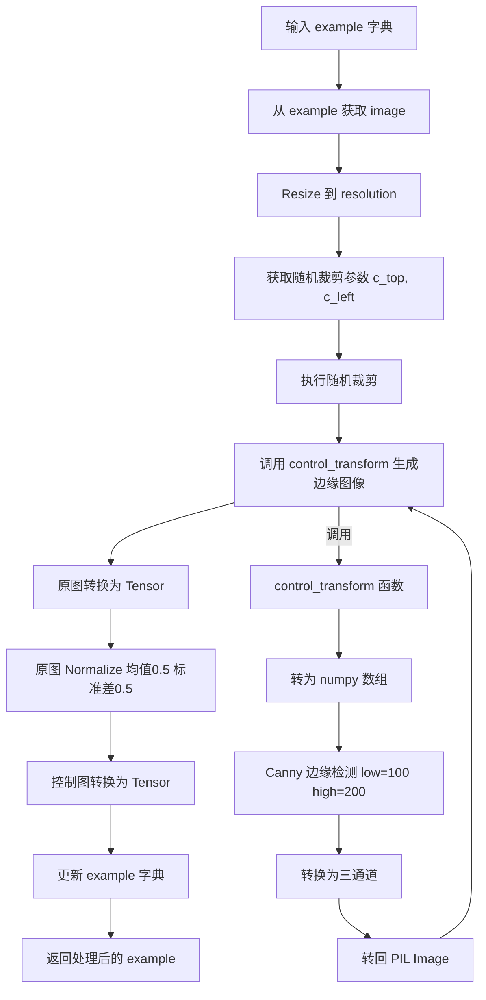

#### 带注释源码

```python
def canny_image_transform(example, resolution=1024):
    """
    对图像进行Canny边缘检测变换：调整大小、随机裁剪、边缘检测、转张量、归一化
    
    参数:
        example: 包含 'image' 键的字典，'image' 是 PIL Image 对象
        resolution: 目标分辨率，默认 1024
    
    返回:
        包含处理后图像、控制图像和裁剪坐标的字典
    """
    # 从example字典中获取原始PIL图像
    image = example["image"]
    
    # 第一步：使用双线性插值将图像resize到指定分辨率
    image = transforms.Resize(resolution, interpolation=transforms.InterpolationMode.BILINEAR)(image)
    
    # 第二步：获取随机裁剪的坐标参数
    # RandomCrop.get_params 返回 (top, left, height, width)
    c_top, c_left, _, _ = transforms.RandomCrop.get_params(image, output_size=(resolution, resolution))
    
    # 第三步：执行随机裁剪，将图像裁剪为 resolution x resolution 大小
    image = transforms.functional.crop(image, c_top, c_left, resolution, resolution)
    
    # 第四步：调用 control_transform 函数进行 Canny 边缘检测
    # 返回的是 PIL Image 类型的控制图像
    control_image = control_transform(image)
    
    # 第五步：将裁剪后的原图转换为 PyTorch 张量
    # ToTensor 会将 PIL Image (H, W, C) 转换为张量 (C, H, W)，并归一化到 [0, 1]
    image = transforms.ToTensor()(image)
    
    # 第六步：对原图进行归一化
    # 均值 [0.5]，标准差 [0.5]，将图像范围从 [0, 1] 映射到 [-1, 1]
    image = transforms.Normalize([0.5], [0.5])(image)
    
    # 第七步：将控制图像（边缘图）转换为张量
    # 注意：边缘图不需要归一化，保留原始 [0, 1] 范围
    control_image = transforms.ToTensor()(control_image)
    
    # 第八步：将处理后的数据更新到 example 字典中
    example["image"] = image                    # 归一化后的原图张量
    example["control_image"] = control_image    # Canny边缘检测后的控制图像张量
    example["crop_coords"] = (c_top, c_left)     # 裁剪坐标，用于后续计算
    
    return example
```


### `depth_image_transform`

该函数用于将输入图像调整为指定分辨率，进行随机裁剪，然后使用 DPT (Dense Prediction Transformer) 特征提取器生成深度图作为控制图像，最后将处理后的图像和深度图转换为张量格式并返回。

参数：

- `example`：`dict`，从 WebDataset 中取出的样本字典，包含 'image' 键（ PIL.Image 对象）
- `feature_extractor`：`DPTImageProcessor`，HuggingFace Transformers 的 DPT 图像处理器，用于生成深度图
- `resolution`：`int`，目标输出分辨率，默认为 1024

返回值：`dict`，处理后的样本字典，包含以下键：
- `image`：归一化后的图像张量（Tensor）
- `control_image`：深度图张量（Tensor）
- `crop_coords`：裁剪坐标元组 ((c_top, c_left))

#### 流程图

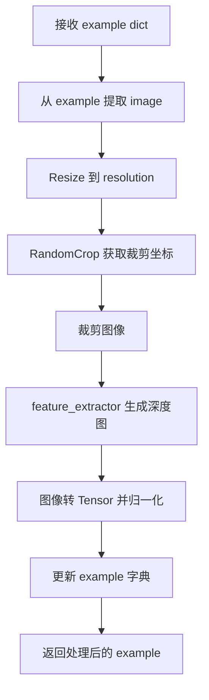

#### 带注释源码

```python
def depth_image_transform(example, feature_extractor, resolution=1024):
    """
    处理图像并生成深度图作为控制图像
    
    参数:
        example: 数据集样本字典，包含 'image' 键（PIL.Image）
        feature_extractor: DPTImageProcessor 实例，用于深度估计
        resolution: 输出图像的目标分辨率
    
    返回:
        更新后的 example 字典，包含 'image', 'control_image', 'crop_coords'
    """
    # 从样本中提取原始图像
    image = example["image"]
    
    # 使用双线性插值将图像 resize 到目标分辨率
    image = transforms.Resize(resolution, interpolation=transforms.InterpolationMode.BILINEAR)(image)
    
    # 获取随机裁剪的坐标参数
    # 返回 (c_top, c_left, height, width)
    c_top, c_left, _, _ = transforms.RandomCrop.get_params(image, output_size=(resolution, resolution))
    
    # 执行裁剪操作
    image = transforms.functional.crop(image, c_top, c_left, resolution, resolution)
    
    # 使用 DPT 特征提取器处理图像生成深度图
    # 返回 tensors 字典，取 pixel_values 并压缩批次维度
    control_image = feature_extractor(images=image, return_tensors="pt").pixel_values.squeeze(0)
    
    # 将 PIL 图像转换为 PyTorch 张量
    image = transforms.ToTensor()(image)
    
    # 归一化图像到 [-1, 1] 范围
    image = transforms.Normalize([0.5], [0.5])(image)
    
    # 更新样本字典
    example["image"] = image
    example["control_image"] = control_image
    example["crop_coords"] = (c_top, c_left)
    
    return example
```


### `image_grid`

该函数用于将多个 PIL 图像拼接成一个网格形式的图像，常用于训练过程中将多张样本图像或验证结果以网格形式可视化展示，便于日志记录和结果观察。

参数：

-  `imgs`：`List[PIL.Image.Image]`，要拼接的 PIL 图像列表
-  `rows`：`int`，网格的行数
-  `cols`：`int`，网格的列数

返回值：`PIL.Image.Image`，拼接后的网格图像对象

#### 流程图

```mermaid
flowchart TD
    A[开始 image_grid] --> B{验证图像数量}
    B -->|len(imgs) == rows * cols| C[获取第一张图像尺寸 w, h]
    B -->|不匹配| D[抛出 AssertionError]
    C --> E[创建新RGB图像网格]
    E --> F{遍历所有图像}
    F -->|i, img in enumerate| G[计算粘贴位置]
    G --> H[box = (i % cols * w, i // cols * h)]
    H --> I[grid.paste img at box]
    I --> F
    F -->|遍历完成| J[返回 grid]
```

#### 带注释源码

```python
def image_grid(imgs, rows, cols):
    """
    将多个 PIL 图像拼接成网格形式
    
    参数:
        imgs: PIL 图像列表
        rows: 网格行数
        cols:网格列数
    返回:
        拼接后的网格图像
    """
    # 验证输入的图像数量是否与行列相匹配
    assert len(imgs) == rows * cols

    # 获取第一张图像的宽度和高度作为基准尺寸
    w, h = imgs[0].size
    # 创建新的 RGB 图像网格，总尺寸为 cols * w（宽度）, rows * h（高度）
    grid = Image.new("RGB", size=(cols * w, rows * h))

    # 遍历所有图像，按照行列顺序粘贴到网格中
    for i, img in enumerate(imgs):
        # 计算粘贴位置：列索引 * 图像宽度，行索引 * 图像高度
        # i % cols 获取列位置，i // cols 获取行位置
        grid.paste(img, box=(i % cols * w, i // cols * h))
    
    # 返回拼接完成的网格图像
    return grid
```


### `log_validation`

该函数执行推理验证，使用 StableDiffusionXLControlNetPipeline 根据给定的验证提示和条件图像生成图像，并将生成的图像记录到 TensorBoard 或 W&B 日志中，同时返回图像日志列表以供后续使用。

参数：

- `vae`：`AutoencoderKL`，用于将图像编码到潜在空间的变分自编码器模型
- `unet`：`UNet2DConditionModel`，用于去噪的 UNet 模型
- `controlnet`：`ControlNetModel`，用于提供条件控制的 ControlNet 模型
- `args`：包含所有训练和验证配置参数的命名空间对象，包括 `pretrained_model_name_or_path`、`revision`、`enable_xformers_memory_efficient_attention`、`seed`、`validation_image`、`validation_prompt`、`num_validation_images`、`resolution` 等
- `accelerator`：`Accelerator`，用于分布式训练和模型管理的加速器对象
- `weight_dtype`：`torch.dtype`，模型权重的数据类型（fp16、bf16 或 fp32）
- `step`：`int`，当前训练步数，用于日志记录

返回值：`List[Dict]`，图像日志列表，每个字典包含 `validation_image`（验证条件图像）、`images`（生成的图像列表）和 `validation_prompt`（验证提示）

#### 流程图

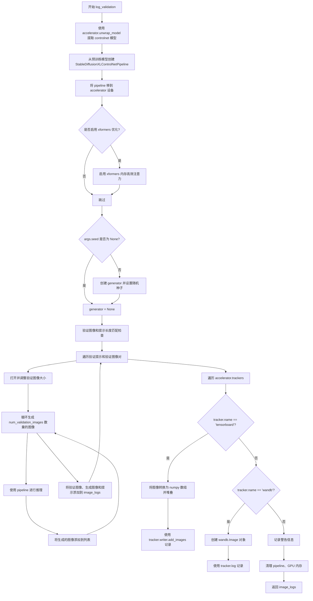

#### 带注释源码

```python
def log_validation(vae, unet, controlnet, args, accelerator, weight_dtype, step):
    """执行验证推理并记录生成的图像到日志系统.
    
    参数:
        vae: 变分自编码器模型，用于图像编码
        unet: 去噪 UNet 模型
        controlnet: ControlNet 条件控制模型
        args: 包含验证配置的参数对象
        accelerator: 分布式训练加速器
        weight_dtype: 模型权重数据类型
        step: 当前训练步数
    
    返回:
        包含验证图像和生成图像的日志列表
    """
    logger.info("Running validation... ")

    # 从 accelerator 中提取原始的 controlnet 模型
    controlnet = accelerator.unwrap_model(controlnet)

    # 使用预训练模型名称或路径创建 StableDiffusionXLControlNetPipeline
    # 传入 vae、unet 和 controlnet 模型，使用指定的权重数据类型
    pipeline = StableDiffusionXLControlNetPipeline.from_pretrained(
        args.pretrained_model_name_or_path,
        vae=vae,
        unet=unet,
        controlnet=controlnet,
        revision=args.revision,
        torch_dtype=weight_dtype,
    )
    # 注释: 可以在这里切换调度器，如 UniPCMultistepScheduler
    # pipeline.scheduler = UniPCMultistepScheduler.from_config(pipeline.scheduler.config)
    
    # 将 pipeline 移到加速器设备上
    pipeline = pipeline.to(accelerator.device)
    # 禁用进度条以减少日志输出
    pipeline.set_progress_bar_config(disable=True)

    # 如果启用 xformers，启用内存高效注意力机制
    if args.enable_xformers_memory_efficient_attention:
        pipeline.enable_xformers_memory_efficient_attention()

    # 如果没有设置种子，generator 为 None；否则创建随机数生成器并设置种子
    if args.seed is None:
        generator = None
    else:
        generator = torch.Generator(device=accelerator.device).manual_seed(args.seed)

    # 处理验证图像和提示的匹配逻辑
    if len(args.validation_image) == len(args.validation_prompt):
        # 数量相同，直接使用
        validation_images = args.validation_image
        validation_prompts = args.validation_prompt
    elif len(args.validation_image) == 1:
        # 单个图像，复制多次匹配多个提示
        validation_images = args.validation_image * len(args.validation_prompt)
        validation_prompts = args.validation_prompt
    elif len(args.validation_prompt) == 1:
        # 单个提示，复制多次匹配多个图像
        validation_images = args.validation_image
        validation_prompts = args.validation_prompt * len(args.validation_image)
    else:
        # 数量不匹配且都不是1，抛出错误
        raise ValueError(
            "number of `args.validation_image` and `args.validation_prompt` should be checked in `parse_args`"
        )

    # 初始化图像日志列表
    image_logs = []

    # 遍历每个验证提示和验证图像对
    for validation_prompt, validation_image in zip(validation_prompts, validation_images):
        # 打开验证图像并转换为 RGB 模式
        validation_image = Image.open(validation_image).convert("RGB")
        # 调整图像到指定分辨率
        validation_image = validation_image.resize((args.resolution, args.resolution))

        # 存储当前提示生成的图像
        images = []

        # 生成多个验证图像
        for _ in range(args.num_validation_images):
            # 使用 autocast 进行混合精度推理
            with torch.autocast("cuda"):
                # 调用 pipeline 生成图像，指定推理步数为 20
                image = pipeline(
                    validation_prompt, image=validation_image, num_inference_steps=20, generator=generator
                ).images[0]
            # 将生成的图像添加到列表
            images.append(image)

        # 将当前验证结果添加到日志
        image_logs.append(
            {"validation_image": validation_image, "images": images, "validation_prompt": validation_prompt}
        )

    # 遍历所有注册的 tracker（TensorBoard 或 W&B）
    for tracker in accelerator.trackers:
        if tracker.name == "tensorboard":
            # 处理 TensorBoard 日志记录
            for log in image_logs:
                images = log["images"]
                validation_prompt = log["validation_prompt"]
                validation_image = log["validation_image"]

                # 将验证图像转换为 numpy 数组
                formatted_images = [np.asarray(validation_image)]

                # 将生成的图像逐个转换为 numpy 数组
                for image in images:
                    formatted_images.append(np.asarray(image))

                # 堆叠所有图像
                formatted_images = np.stack(formatted_images)

                # 添加到 TensorBoard，使用 NHWC 格式
                tracker.writer.add_images(validation_prompt, formatted_images, step, dataformats="NHWC")
        elif tracker.name == "wandb":
            # 处理 W&B 日志记录
            formatted_images = []

            for log in image_logs:
                images = log["images"]
                validation_prompt = log["validation_prompt"]
                validation_image = log["validation_image"]

                # 添加条件图像，带 caption
                formatted_images.append(wandb.Image(validation_image, caption="Controlnet conditioning"))

                # 为每个生成的图像创建 wandb.Image 对象
                for image in images:
                    image = wandb.Image(image, caption=validation_prompt)
                    formatted_images.append(image)

            # 记录到 W&B
            tracker.log({"validation": formatted_images})
        else:
            # 其他 tracker 发出警告
            logger.warning(f"image logging not implemented for {tracker.name}")

        # 删除 pipeline 以释放 GPU 内存
        del pipeline
        # 垃圾回收
        gc.collect()
        # 清空 CUDA 缓存
        torch.cuda.empty_cache()

        # 返回图像日志列表
        return image_logs
```


### `import_model_class_from_model_name_or_path`

该函数用于根据预训练模型的配置信息，动态确定并返回适合的 CLIP 文本编码器类（CLIPTextModel 或 CLIPTextModelWithProjection），以支持 Stable Diffusion XL 等模型的不同文本编码器架构。

参数：

- `pretrained_model_name_or_path`：`str`，预训练模型的名称或路径（例如 "stabilityai/stable-diffusion-xl-base-1.0"）
- `revision`：`str`，模型的版本号或提交哈希
- `subfolder`：`str`，模型子文件夹路径，默认为 "text_encoder"（用于指定文本编码器的配置目录）

返回值：`type`，返回对应的 CLIP 文本模型类（`CLIPTextModel` 或 `CLIPTextModelWithProjection` 类）

#### 流程图

```mermaid
flowchart TD
    A[开始: import_model_class_from_model_name_or_path] --> B[加载 PretrainedConfig]
    B --> C[从配置获取 architectures[0]]
    C --> D{模型类名判断}
    D -->|CLIPTextModel| E[导入 CLIPTextModel 类]
    D -->|CLIPTextModelWithProjection| F[导入 CLIPTextModelWithProjection 类]
    D -->|其他| G[抛出 ValueError 异常]
    E --> H[返回 CLIPTextModel 类]
    F --> I[返回 CLIPTextModelWithProjection 类]
    G --> J[结束: 抛出异常]
    H --> K[结束: 返回类]
    I --> K
```

#### 带注释源码

```python
def import_model_class_from_model_name_or_path(
    pretrained_model_name_or_path: str, revision: str, subfolder: str = "text_encoder"
):
    """
    根据预训练模型的配置动态确定并返回正确的 CLIP 文本编码器类。
    
    参数:
        pretrained_model_name_or_path: 预训练模型的名称或本地路径
        revision: 模型版本（可使用提交哈希或分支名）
        subfolder: 模型子文件夹，默认为 "text_encoder"
    
    返回:
        CLIPTextModel 或 CLIPTextModelWithProjection 类
    
    异常:
        ValueError: 当模型类不被支持时抛出
    """
    # 从预训练模型路径加载文本编码器的配置
    text_encoder_config = PretrainedConfig.from_pretrained(
        pretrained_model_name_or_path, subfolder=subfolder, revision=revision
    )
    
    # 获取配置中定义的模型架构类名（取第一个）
    model_class = text_encoder_config.architectures[0]

    # 根据模型架构名称返回对应的类
    if model_class == "CLIPTextModel":
        # 标准 CLIP 文本编码器（无投影层）
        from transformers import CLIPTextModel

        return CLIPTextModel
    elif model_class == "CLIPTextModelWithProjection":
        # 带投影层的 CLIP 文本编码器（用于 SDXL 等模型）
        from transformers import CLIPTextModelWithProjection

        return CLIPTextModelWithProjection
    else:
        # 不支持的模型类型
        raise ValueError(f"{model_class} is not supported.")
```


### `save_model_card`

该函数用于在训练完成后生成 HuggingFace Hub 的 README.md 模型卡片，包含模型元数据、标签信息以及验证时生成的示例图像（若有），以便用户了解模型的用途和使用方式。

参数：

- `repo_id`：`str`，HuggingFace Hub 上的仓库 ID，用于标识模型
- `image_logs`：`Optional[dict]`，可选参数，包含验证时生成的图像日志字典，若为 None 则不包含示例图像部分
- `base_model`：`str`，基础模型的名称或路径，用于在模型卡片中说明模型是基于哪个基础模型训练的
- `repo_folder`：`Optional[str]`，可选参数，本地仓库文件夹路径，用于将生成的 README.md 和示例图像保存到指定目录

返回值：`None`，该函数无返回值，直接将生成的模型卡片内容写入文件系统的 README.md 文件中

#### 流程图

```mermaid
flowchart TD
    A[开始 save_model_card] --> B{image_logs 是否为 None?}
    B -->|是| C[设置 img_str 为空字符串]
    B -->|否| D[构建示例图像说明文字]
    D --> E[遍历 image_logs 中的每条日志]
    E --> F[保存 validation_image 为 image_control.png]
    F --> G[构建 prompt 说明文字并追加到 img_str]
    G --> H[将 validation_image 与生成的图像列表合并]
    H --> I[使用 image_grid 生成图像网格并保存为 images_{i}.png]
    I --> J[添加 Markdown 图像链接到 img_str]
    J --> K[遍历完成，继续]
    C --> L[构建 YAML 格式的元数据字符串]
    K --> L
    L --> M[构建 Markdown 格式的模型描述内容]
    M --> N[拼接 YAML 和模型描述形成完整 model_card]
    N --> O[打开 repo_folder 下的 README.md 文件]
    O --> P[写入完整 model_card 内容]
    P --> Q[结束]
```

#### 带注释源码

```python
def save_model_card(repo_id: str, image_logs=None, base_model=str, repo_folder=None):
    """
    生成并保存 HuggingFace Hub 所需的 README.md 模型卡片文件
    
    参数:
        repo_id: HuggingFace Hub 仓库 ID，用于标识模型
        image_logs: 可选的验证图像日志字典，包含验证时生成的图像信息
        base_model: 基础模型名称或路径，说明模型基于哪个基础模型训练
        repo_folder: 本地仓库文件夹路径，用于保存生成的 README.md 和示例图像
    
    返回:
        无返回值，直接写入文件
    """
    
    # 初始化图像说明字符串，若无验证日志则为空
    img_str = ""
    
    # 如果提供了验证图像日志，则处理并添加示例图像
    if image_logs is not None:
        # 添加示例图像说明标题
        img_str = "You can find some example images below.\n"
        
        # 遍历每一条验证日志记录
        for i, log in enumerate(image_logs):
            # 从日志中提取生成的图像列表、验证提示词和验证图像
            images = log["images"]
            validation_prompt = log["validation_prompt"]
            validation_image = log["validation_image"]
            
            # 将验证控制图像保存到指定文件夹，文件名固定为 image_control.png
            validation_image.save(os.path.join(repo_folder, "image_control.png"))
            
            # 构建提示词说明并追加到图像说明字符串
            img_str += f"prompt: {validation_prompt}\n"
            
            # 将验证图像与生成的图像列表合并（验证图像放在首位）
            images = [validation_image] + images
            
            # 使用图像网格工具将多张图像拼接成一行，并保存为 images_{i}.png
            image_grid(images, 1, len(images)).save(os.path.join(repo_folder, f"images_{i}.png"))
            
            # 添加 Markdown 格式的图像链接到说明字符串
            img_str += f"\n"

    # 构建 YAML 格式的模型元数据，包含许可证、基础模型、标签等信息
    yaml = f"""
---
license: creativeml-openrail-m
base_model: {base_model}
tags:
- stable-diffusion-xl
- stable-diffusion-xl-diffusers
- text-to-image
- diffusers
- controlnet
- diffusers-training
- webdataset
inference: true
---
    """
    
    # 构建 Markdown 格式的模型描述内容，包含模型名称、训练基础模型说明和示例图像（如有）
    model_card = f"""
# controlnet-{repo_id}

These are controlnet weights trained on {base_model} with new type of conditioning.
{img_str}
"""
    
    # 将 YAML 元数据和 Markdown 内容拼接后写入 README.md 文件
    with open(os.path.join(repo_folder, "README.md"), "w") as f:
        f.write(yaml + model_card)
```


### `parse_args`

该函数定义了超过60个命令行参数，用于配置ControlNet模型训练的各项设置，包括预训练模型路径、训练超参数（学习率、批次大小、优化器参数等）、数据路径、验证设置、日志记录选项等，并返回包含所有解析后参数的Namespace对象。

参数：

- `input_args`：`Optional[List[str]]`，可选参数，用于测试时直接传入参数列表而非从命令行解析

返回值：`argparse.Namespace`，包含所有解析后的命令行参数对象

#### 流程图

```mermaid
flowchart TD
    A[开始 parse_args] --> B[创建 ArgumentParser 对象]
    B --> C[添加模型路径相关参数<br/>pretrained_model_name_or_path<br/>pretrained_vae_model_name_or_path<br/>controlnet_model_name_or_path<br/>revision<br/>tokenizer_name]
    C --> D[添加输出目录相关参数<br/>output_dir<br/>cache_dir<br/>logging_dir]
    D --> E[添加训练超参数<br/>train_batch_size<br/>num_train_epochs<br/>max_train_steps<br/>learning_rate<br/>gradient_accumulation_steps<br/>gradient_checkpointing<br/>lr_scheduler<br/>lr_warmup_steps 等]
    E --> F[添加优化器参数<br/>use_8bit_adam<br/>adam_beta1<br/>adam_beta2<br/>adam_weight_decay<br/>adam_epsilon<br/>max_grad_norm]
    F --> G[添加性能和混合精度参数<br/>mixed_precision<br/>enable_xformers_memory_efficient_attention<br/>allow_tf32<br/>set_grads_to_none]
    G --> H[添加数据集参数<br/>train_shards_path_or_url<br/>eval_shards_path_or_url<br/>image_column<br/>caption_column<br/>max_train_samples 等]
    H --> I[添加验证参数<br/>validation_prompt<br/>validation_image<br/>num_validation_images<br/>validation_steps]
    I --> J[添加Hub和Tracker参数<br/>push_to_hub<br/>hub_token<br/>hub_model_id<br/>tracker_project_name<br/>report_to]
    J --> K[添加ControlNet特定参数<br/>control_type<br/>transformer_layers_per_block<br/>old_style_controlnet<br/>resolution<br/>proportion_empty_prompts]
    K --> L{input_args是否为空?}
    L -->|是| M[parser.parse_args<br/>从sys.argv解析]
    L -->|否| N[parser.parse_args(input_args)<br/>解析传入的参数列表]
    M --> O[参数验证<br/>proportion_empty_prompts范围<br/>validation_prompt和validation_image配对<br/>resolution可被8整除]
    N --> O
    O --> P{验证是否通过?}
    P -->|是| Q[返回args对象]
    P -->|否| R[抛出ValueError异常]
    Q --> S[结束 parse_args]
    R --> S
```

#### 带注释源码

```python
def parse_args(input_args=None):
    """
    定义并解析超过60个命令行参数，用于配置ControlNet模型训练。
    
    参数:
        input_args: 可选的参数列表，用于测试目的。如果为None，则从sys.argv解析。
    
    返回:
        argparse.Namespace: 包含所有解析后命令行参数的命名空间对象。
    """
    # 1. 创建ArgumentParser实例，设定程序描述
    parser = argparse.ArgumentParser(description="Simple example of a ControlNet training script.")
    
    # =============================================================================
    # 模型路径相关参数 (5个)
    # =============================================================================
    # 预训练模型名称或路径，必填参数
    parser.add_argument(
        "--pretrained_model_name_or_path",
        type=str,
        default=None,
        required=True,
        help="Path to pretrained model or model identifier from huggingface.co/models.",
    )
    # 改进的VAE模型路径，用于稳定训练
    parser.add_argument(
        "--pretrained_vae_model_name_or_path",
        type=str,
        default=None,
        help="Path to an improved VAE to stabilize training. For more details check out: https://github.com/huggingface/diffusers/pull/4038.",
    )
    # 预训练ControlNet模型路径或标识符
    parser.add_argument(
        "--controlnet_model_name_or_path",
        type=str,
        default=None,
        help="Path to pretrained controlnet model or model identifier from huggingface.co/models."
        " If not specified controlnet weights are initialized from unet.",
    )
    # 预训练模型的版本修订号
    parser.add_argument(
        "--revision",
        type=str,
        default=None,
        required=False,
        help=(
            "Revision of pretrained model identifier from huggingface.co/models. Trainable model components should be"
            " float32 precision."
        ),
    )
    # 预训练分词器名称或路径
    parser.add_argument(
        "--tokenizer_name",
        type=str,
        default=None,
        help="Pretrained tokenizer name or path if not the same as model_name",
    )
    
    # =============================================================================
    # 输出和缓存目录参数 (3个)
    # =============================================================================
    # 模型预测和检查点的输出目录
    parser.add_argument(
        "--output_dir",
        type=str,
        default="controlnet-model",
        help="The output directory where the model predictions and checkpoints will be written.",
    )
    # 下载模型和数据集的缓存目录
    parser.add_argument(
        "--cache_dir",
        type=str,
        default=None,
        help="The directory where the downloaded models and datasets will be stored.",
    )
    # 随机种子，用于可重复训练
    parser.add_argument("--seed", type=int, default=None, help="A seed for reproducible training.")
    
    # =============================================================================
    # 图像分辨率和处理参数 (4个)
    # =============================================================================
    # 输入图像的分辨率，所有图像将被调整到此分辨率
    parser.add_argument(
        "--resolution",
        type=int,
        default=512,
        help=(
            "The resolution for input images, all the images in the train/validation dataset will be resized to this"
            " resolution"
        ),
    )
    # SDXL UNet需要的裁剪坐标嵌入的高度起始位置
    parser.add_argument(
        "--crops_coords_top_left_h",
        type=int,
        default=0,
        help=("Coordinate for (the height) to be included in the crop coordinate embeddings needed by SDXL UNet."),
    )
    # SDXL UNet需要的裁剪坐标嵌入的宽度起始位置
    parser.add_argument(
        "--crops_coords_top_left_w",
        type=int,
        default=0,
        help=("Coordinate for (the height) to be included in the crop coordinate embeddings needed by SDXL UNet."),
    )
    
    # =============================================================================
    # 训练过程参数 (10个)
    # =============================================================================
    # 训练数据加载器的批次大小（每设备）
    parser.add_argument(
        "--train_batch_size", type=int, default=4, help="Batch size (per device) for the training dataloader."
    )
    # 训练的总轮数
    parser.add_argument("--num_train_epochs", type=int, default=1)
    # 要执行的总训练步数，如果提供则覆盖num_train_epochs
    parser.add_argument(
        "--max_train_steps",
        type=int,
        default=None,
        help="Total number of training steps to perform.  If provided, overrides num_train_epochs.",
    )
    # 保存检查点的步数间隔
    parser.add_argument(
        "--checkpointing_steps",
        type=int,
        default=500,
        help=(
            "Save a checkpoint of the training state every X updates. Checkpoints can be used for resuming training via `--resume_from_checkpoint`. "
            "In the case that the checkpoint is better than the final trained model, the checkpoint can also be used for inference."
            "Using a checkpoint for inference requires separate loading of the original pipeline and the individual checkpointed model components."
            "See https://huggingface.co/docs/diffusers/main/en/training/dreambooth#performing-inference-using-a-saved-checkpoint for step by step"
            "instructions."
        ),
    )
    # 存储的最大检查点数量
    parser.add_argument(
        "--checkpoints_total_limit",
        type=int,
        default=3,
        help=("Max number of checkpoints to store."),
    )
    # 从检查点恢复训练的路径
    parser.add_argument(
        "--resume_from_checkpoint",
        type=str,
        default=None,
        help=(
            "Whether training should be resumed from a previous checkpoint. Use a path saved by"
            ' `--checkpointing_steps`, or `"latest"` to automatically select the last available checkpoint.'
        ),
    )
    # 梯度累积步数
    parser.add_argument(
        "--gradient_accumulation_steps",
        type=int,
        default=1,
        help="Number of updates steps to accumulate before performing a backward/update pass.",
    )
    # 是否使用梯度检查点以节省内存
    parser.add_argument(
        "--gradient_checkpointing",
        action="store_true",
        help="Whether or not to use gradient checkpointing to save memory at the expense of slower backward pass.",
    )
    # 初始学习率
    parser.add_argument(
        "--learning_rate",
        type=float,
        default=5e-6,
        help="Initial learning rate (after the potential warmup period) to use.",
    )
    # 是否按GPU数量、梯度累积步数和批次大小缩放学习率
    parser.add_argument(
        "--scale_lr",
        action="store_true",
        default=False,
        help="Scale the learning rate by the number of GPUs, gradient accumulation steps, and batch size.",
    )
    
    # =============================================================================
    # 学习率调度器参数 (5个)
    # =============================================================================
    # 调度器类型选择
    parser.add_argument(
        "--lr_scheduler",
        type=str,
        default="constant",
        help=(
            'The scheduler type to use. Choose between ["linear", "cosine", "cosine_with_restarts", "polynomial",'
            ' "constant", "constant_with_warmup"]'
        ),
    )
    # 学习率预热步数
    parser.add_argument(
        "--lr_warmup_steps", type=int, default=500, help="Number of steps for the warmup in the lr scheduler."
    )
    # cosine_with_restarts调度器中的硬重置次数
    parser.add_argument(
        "--lr_num_cycles",
        type=int,
        default=1,
        help="Number of hard resets of the lr in cosine_with_restarts scheduler.",
    )
    # 多项式调度器的幂因子
    parser.add_argument("--lr_power", type=float, default=1.0, help="Power factor of the polynomial scheduler.")
    
    # =============================================================================
    # 优化器参数 (6个)
    # =============================================================================
    # 是否使用8位Adam优化器
    parser.add_argument(
        "--use_8bit_adam", action="store_true", help="Whether or not to use 8-bit Adam from bitsandbytes."
    )
    # 数据加载器工作进程数
    parser.add_argument(
        "--dataloader_num_workers",
        type=int,
        default=1,
        help=("Number of subprocesses to use for data loading."),
    )
    # Adam优化器的beta1参数
    parser.add_argument("--adam_beta1", type=float, default=0.9, help="The beta1 parameter for the Adam optimizer.")
    # Adam优化器的beta2参数
    parser.add_argument("--adam_beta2", type=float, default=0.999, help="The beta2 parameter for the Adam optimizer.")
    # 权重衰减系数
    parser.add_argument("--adam_weight_decay", type=float, default=1e-2, help="Weight decay to use.")
    # Adam优化器的epsilon值
    parser.add_argument("--adam_epsilon", type=float, default=1e-08, help="Epsilon value for the Adam optimizer")
    # 最大梯度范数
    parser.add_argument("--max_grad_norm", default=1.0, type=float, help="Max gradient norm.")
    
    # =============================================================================
    # Hub和日志参数 (6个)
    # =============================================================================
    # 是否将模型推送到Hub
    parser.add_argument("--push_to_hub", action="store_true", help="Whether or not to push the model to the Hub.")
    # 用于推送到Model Hub的令牌
    parser.add_argument("--hub_token", type=str, default=None, help="The token to use to push to the Model Hub.")
    # Hub模型ID，用于保持与本地output_dir的同步
    parser.add_argument(
        "--hub_model_id",
        type=str,
        default=None,
        help="The name of the repository to keep in sync with the local `output_dir`.",
    )
    # TensorBoard日志目录
    parser.add_argument(
        "--logging_dir",
        type=str,
        default="logs",
        help=(
            "[TensorBoard](https://www.tensorflow.org/tensorboard) log directory. Will default to"
            " *output_dir/runs/**CURRENT_DATETIME_HOSTNAME***."
        ),
    )
    # 报告目标和集成平台
    parser.add_argument(
        "--report_to",
        type=str,
        default="tensorboard",
        help=(
            'The integration to report the results and logs to. Supported platforms are `"tensorboard"`'
            ' (default), `"wandb"` and `"comet_ml"`. Use `"all"` to report to all integrations.'
        ),
    )
    # Tracker项目名称
    parser.add_argument(
        "--tracker_project_name",
        type=str,
        default="sd_xl_train_controlnet",
        help=(
            "The `project_name` argument passed to Accelerator.init_trackers for"
            " more information see https://huggingface.co/docs/accelerate/v0.17.0/en/package_reference/accelerator#accelerate.Accelerator"
        ),
    )
    
    # =============================================================================
    # 性能优化参数 (4个)
    # =============================================================================
    # 是否允许在Ampere GPU上使用TF32以加速训练
    parser.add_argument(
        "--allow_tf32",
        action="store_true",
        help=(
            "Whether or not to allow TF32 on Ampere GPUs. Can be used to speed up training. For more information, see"
            " https://pytorch.org/docs/stable/notes/cuda.html#tensorfloat-32-tf32-on-ampere-devices"
        ),
    )
    # 混合精度训练选项
    parser.add_argument(
        "--mixed_precision",
        type=str,
        default=None,
        choices=["no", "fp16", "bf16"],
        help=(
            "Whether to use mixed precision. Choose between fp16 and bf16 (bfloat16). Bf16 requires PyTorch >="
            " 1.10.and an Nvidia Ampere GPU.  Default to the value of accelerate config of the current system or the"
            " flag passed with the `accelerate.launch` command. Use this argument to override the accelerate config."
        ),
    )
    # 是否使用xFormers高效注意力机制
    parser.add_argument(
        "--enable_xformers_memory_efficient_attention", action="store_true", help="Whether or not to use xformers."
    )
    # 是否将梯度设置为None以节省内存
    parser.add_argument(
        "--set_grads_to_none",
        action="store_true",
        help=(
            "Save more memory by using setting grads to None instead of zero. Be aware, that this changes certain"
            " behaviors, so disable this argument if it causes any problems. More info:"
            " https://pytorch.org/docs/stable/generated/torch.optim.Optimizer.zero_grad.html"
        ),
    )
    
    # =============================================================================
    # 数据集参数 (12个)
    # =============================================================================
    # 训练数据分片路径或URL
    parser.add_argument(
        "--train_shards_path_or_url",
        type=str,
        default=None,
        help=(
            "The name of the Dataset (from the HuggingFace hub) to train on (could be your own, possibly private,"
            " dataset). It can also be a path pointing to a local copy of a dataset in your filesystem,"
            " or to a folder containing files that 🤗 Datasets can understand."
        ),
    )
    # 评估数据分片路径或URL
    parser.add_argument(
        "--eval_shards_path_or_url",
        type=str,
        default=None,
        help="The config of the Dataset, leave as None if there's only one config.",
    )
    # 训练数据目录
    parser.add_argument(
        "--train_data_dir",
        type=str,
        default=None,
        help=(
            "A folder containing the training data. Folder contents must follow the structure described in"
            " https://huggingface.co/docs/datasets/image_dataset#imagefolder. In particular, a `metadata.jsonl` file"
            " must exist to provide the captions for the images. Ignored if `dataset_name` is specified."
        ),
    )
    # 数据集中目标图像的列名
    parser.add_argument(
        "--image_column", type=str, default="image", help="The column of the dataset containing the target image."
    )
    # 数据集中ControlNet条件图像的列名
    parser.add_argument(
        "--conditioning_image_column",
        type=str,
        default="conditioning_image",
        help="The column of the dataset containing the controlnet conditioning image.",
    )
    # 数据集中标题/文本的列名
    parser.add_argument(
        "--caption_column",
        type=str,
        default="text",
        help="The column of the dataset containing a caption or a list of captions.",
    )
    # 用于调试或更快训练的最大训练样本数
    parser.add_argument(
        "--max_train_samples",
        type=int,
        default=None,
        help=(
            "For debugging purposes or quicker training, truncate the number of training examples to this "
            "value if set."
        ),
    )
    # 空提示词的比例，用于无文本条件的训练
    parser.add_argument(
        "--proportion_empty_prompts",
        type=float,
        default=0,
        help="Proportion of image prompts to be replaced with empty strings. Defaults to 0 (no prompt replacement).",
    )
    
    # =============================================================================
    # 验证参数 (5个)
    # =============================================================================
    # 验证提示词，每隔validation_steps评估一次
    parser.add_argument(
        "--validation_prompt",
        type=str,
        default=None,
        nargs="+",
        help=(
            "A set of prompts evaluated every `--validation_steps` and logged to `--report_to`."
            " Provide either a matching number of `--validation_image`s, a single `--validation_image`"
            " to be used with all prompts, or a single prompt that will be used with all `--validation_image`s."
        ),
    )
    # 验证图像路径
    parser.add_argument(
        "--validation_image",
        type=str,
        default=None,
        nargs="+",
        help=(
            "A set of paths to the controlnet conditioning image be evaluated every `--validation_steps`"
            " and logged to `--report_to`. Provide either a matching number of `--validation_prompt`s, a"
            " a single `--validation_prompt` to be used with all `--validation_image`s, or a single"
            " `--validation_image` that will be used with all `--validation_prompt`s."
        ),
    )
    # 每个验证图像-提示词对生成的图像数量
    parser.add_argument(
        "--num_validation_images",
        type=int,
        default=4,
        help="Number of images to be generated for each `--validation_image`, `--validation_prompt` pair",
    )
    # 运行验证的步数间隔
    parser.add_argument(
        "--validation_steps",
        type=int,
        default=100,
        help=(
            "Run validation every X steps. Validation consists of running the prompt"
            " `args.validation_prompt` multiple times: `args.num_validation_images`"
            " and logging the images."
        ),
    )
    
    # =============================================================================
    # ControlNet特定参数 (3个)
    # =============================================================================
    # ControlNet条件图像类型
    parser.add_argument(
        "--control_type",
        type=str,
        default="canny",
        help=("The type of controlnet conditioning image to use. One of `canny`, `depth` Defaults to `canny`."),
    )
    # 每个块的transformer层数
    parser.add_argument(
        "--transformer_layers_per_block",
        type=str,
        default=None,
        help=("The number of layers per block in the transformer. If None, defaults to `args.transformer_layers`."),
    )
    # 是否使用旧版单层单头ControlNet
    parser.add_argument(
        "--old_style_controlnet",
        action="store_true",
        default=False,
        help=(
            "Use the old style controlnet, which is a single transformer layer with a single head. Defaults to False."
        ),
    )
    
    # =============================================================================
    # 解析参数
    # =============================================================================
    # 根据input_args是否存在决定如何解析
    if input_args is not None:
        # 用于测试：直接解析传入的参数列表
        args = parser.parse_args(input_args)
    else:
        # 正常情况：从命令行参数解析
        args = parser.parse_args()
    
    # =============================================================================
    # 参数验证
    # =============================================================================
    # 验证proportion_empty_prompts在有效范围内 [0, 1]
    if args.proportion_empty_prompts < 0 or args.proportion_empty_prompts > 1:
        raise ValueError("`--proportion_empty_prompts` must be in the range [0, 1].")
    
    # 验证validation_prompt和validation_image必须同时存在
    if args.validation_prompt is not None and args.validation_image is None:
        raise ValueError("`--validation_image` must be set if `--validation_prompt` is set")
    
    if args.validation_prompt is None and args.validation_image is not None:
        raise ValueError("`--validation_prompt` must be set if `--validation_image` is set")
    
    # 验证validation_image和validation_prompt的数量匹配关系
    if (
        args.validation_image is not None
        and args.validation_prompt is not None
        and len(args.validation_image) != 1
        and len(args.validation_prompt) != 1
        and len(args.validation_image) != len(args.validation_prompt)
    ):
        raise ValueError(
            "Must provide either 1 `--validation_image`, 1 `--validation_prompt`,"
            " or the same number of `--validation_prompt`s and `--validation_image`s"
        )
    
    # 验证resolution能被8整除，确保VAE和controlnet编码器之间的图像编码大小一致
    if args.resolution % 8 != 0:
        raise ValueError(
            "`--resolution` must be divisible by 8 for consistently sized encoded images between the VAE and the controlnet encoder."
        )
    
    # 返回解析后的参数对象
    return args
```


### `encode_prompt`

该函数是Stable Diffusion XL (SDXL) ControlNet训练流程中的核心文本编码函数，负责将文本提示词tokenize并使用两个文本编码器（SDXL架构）进行编码，同时处理空提示词替换逻辑。

参数：

- `prompt_batch`：`List[Union[str, List[str], np.ndarray]]`，输入的文本提示批次，可以是单个字符串、字符串列表或numpy数组
- `text_encoders`：`List[PreTrainedModel]`，文本编码器列表，通常包含两个编码器（CLIPTextModel和CLIPTextModelWithProjection）
- `tokenizers`：`List[PreTrainedTokenizer]`，与文本编码器对应的tokenizer列表
- `proportion_empty_prompts`：`float`，空提示词替换的比例，范围[0,1]
- `is_train`：`bool`，训练模式标志，为True时从多个caption中随机选择，为False时选择第一个

返回值：`Tuple[torch.Tensor, torch.Tensor]`，返回元组包含：
- `prompt_embeds`：`torch.Tensor`，形状为(batch_size, seq_len, hidden_dim)，拼接后的文本嵌入
- `pooled_prompt_embeds`：`torch.Tensor`，形状为(batch_size, hidden_dim)，池化后的文本嵌入

#### 流程图

```mermaid
flowchart TD
    A[开始 encode_prompt] --> B[初始化空列表captions和prompt_embeds_list]
    B --> C{遍历prompt_batch中的每个caption}
    C --> D{随机数 < proportion_empty_prompts?}
    D -->|Yes| E[添加空字符串到captions]
    D -->|No| F{ isinstance caption, str?}
    F -->|Yes| G[直接添加caption到captions]
    F -->|No| H{isinstance caption, list or ndarray?}
    H -->|Yes| I{is_train == True?}
    I -->|Yes| J[random.choice选择caption]
    I -->|No| K[选择caption[0]]
    J --> G
    K --> G
    H -->|No| G
    C --> L{遍历完所有caption?}
    L -->|No| C
    L -->|Yes| M[进入torch.no_grad上下文]
    M --> N{遍历tokenizers和text_encoders配对}
    N --> O[tokenizer分词: padding=max_length, truncation=True, return_tensors=pt]
    O --> P[text_encoder编码: output_hidden_states=True]
    P --> Q[获取pooled_prompt_embeds = prompt_embeds[0]]
    P --> R[获取prompt_embeds = prompt_embeds.hidden_states-2]
    R --> S[reshape prompt_embeds: bs_embed x seq_len x -1]
    S --> T[append到prompt_embeds_list]
    N --> U{遍历完所有encoder?}
    U -->|No| N
    U -->|Yes| V[torch.concat合并所有prompt_embeds_list, dim=-1]
    V --> W[reshape pooled_prompt_embeds: bs_embed x -1]
    W --> X[返回prompt_embeds和pooled_prompt_embeds]
```

#### 带注释源码

```python
def encode_prompt(prompt_batch, text_encoders, tokenizers, proportion_empty_prompts, is_train=True):
    """
    Tokenizes and encodes text using two tokenizers/encoders (SDXL architecture),
    handling empty prompt replacement.
    
    参数:
        prompt_batch: 输入的文本提示批次，可以是字符串、字符串列表或numpy数组
        text_encoders: SDXL的两个文本编码器列表
        tokenizers: 对应的tokenizer列表
        proportion_empty_prompts: 空提示词替换的概率
        is_train: 训练模式标志
    
    返回:
        prompt_embeds: 拼接后的文本嵌入
        pooled_prompt_embeds: 池化后的文本嵌入
    """
    prompt_embeds_list = []  # 存储每个encoder的输出嵌入

    captions = []  # 处理后的caption列表
    # 步骤1: 处理prompt批次，根据proportion_empty_prompts决定是否替换为空字符串
    for caption in prompt_batch:
        # 根据比例随机决定是否使用空字符串
        if random.random() < proportion_empty_prompts:
            captions.append("")
        # 如果是字符串，直接添加
        elif isinstance(caption, str):
            captions.append(caption)
        # 如果是列表或数组（多个caption），根据训练模式选择
        elif isinstance(caption, (list, np.ndarray)):
            # take a random caption if there are multiple
            captions.append(random.choice(caption) if is_train else caption[0])

    # 步骤2: 使用torch.no_grad()禁用梯度计算，减少内存占用
    with torch.no_grad():
        # 遍历两个tokenizer和text_encoder对（SDXL架构）
        for tokenizer, text_encoder in zip(tokenizers, text_encoders):
            # 使用tokenizer对captions进行分词
            text_inputs = tokenizer(
                captions,
                padding="max_length",  # 填充到最大长度
                max_length=tokenizer.model_max_length,  # 使用tokenizer的最大长度
                truncation=True,  # 截断超长文本
                return_tensors="pt",  # 返回PyTorch张量
            )
            # 获取input_ids
            text_input_ids = text_inputs.input_ids
            
            # 使用text_encoder编码，获取隐藏状态
            prompt_embeds = text_encoder(
                text_input_ids.to(text_encoder.device),
                output_hidden_states=True,  # 输出所有隐藏状态
            )

            # We are only ALWAYS interested in the pooled output of the final text encoder
            # 获取池化输出（来自第一个元素）
            pooled_prompt_embeds = prompt_embeds[0]
            # 获取倒数第二个隐藏状态层（SDXL特定：使用倒数第二层而非最后一层）
            prompt_embeds = prompt_embeds.hidden_states[-2]
            
            # 获取批次大小、序列长度
            bs_embed, seq_len, _ = prompt_embeds.shape
            # 调整形状以便后续拼接
            prompt_embeds = prompt_embeds.view(bs_embed, seq_len, -1)
            prompt_embeds_list.append(prompt_embeds)

    # 步骤3: 拼接两个encoder的输出（在隐藏维度上）
    prompt_embeds = torch.concat(prompt_embeds_list, dim=-1)
    # 调整pooled_prompt_embeds的形状
    pooled_prompt_embeds = pooled_prompt_embeds.view(bs_embed, -1)
    
    return prompt_embeds, pooled_prompt_embeds
```


### `main`

主入口点函数，负责训练 ControlNet 模型。设置 Accelerator、加载所有模型（VAE、UNet、Text Encoder、ControlNet）、构建数据集、执行训练循环（包括梯度累积）、处理检查点保存和验证逻辑。

参数：

-  `args`：`Namespace`，命令行参数对象，包含所有训练配置（如模型路径、批次大小、学习率等）

返回值：`None`，无返回值

#### 流程图

```mermaid
flowchart TD
    A[开始 main 函数] --> B[检查 wandb 和 hub_token]
    B --> C[创建 logging_dir 和 Accelerator]
    C --> D[设置日志级别]
    D --> E{args.seed 是否设置?}
    E -->|是| F[设置随机种子]
    E -->|否| G[跳过]
    F --> G
    G --> H[创建输出目录]
    H --> I{是否 push_to_hub?}
    I -->|是| J[创建 Hub 仓库]
    I -->|否| K[跳过]
    J --> K
    K --> L[加载 tokenizers 和 text encoders]
    L --> M[加载 noise_scheduler, vae, unet]
    M --> N{controlnet_model_name_or_path 是否存在?}
    N -->|是| O[加载已有 controlnet]
    N -->|否| P[从 unet 初始化 controlnet]
    O --> Q
    P --> Q
    Q --> R{control_type == 'depth'?}
    R -->|是| S[加载 DPT feature_extractor 和 depth_model]
    R -->|否| T[feature_extractor 和 depth_model 设为 None]
    S --> U
    T --> U
    U --> V[注册 save/load model hooks]
    V --> W[冻结 vae, unet, text_encoders]
    W --> X[controlnet 设置为训练模式]
    X --> Y[启用 xformers 和 gradient_checkpointing]
    Y --> Z[创建 optimizer]
    Z --> AA[设置 weight_dtype]
    AA --> AB[移动模型到设备]
    AB --> AC[创建 Text2ImageDataset]
    AC --> AD[创建 compute_embeddings_fn]
    AD --> AE[计算 lr_scheduler]
    AE --> AF[accelerator.prepare]
    AF --> AG[初始化 trackers]
    AG --> AH[训练循环开始]
    AH --> AI{是否有 resume_from_checkpoint?}
    AI -->|是| AJ[加载检查点]
    AI -->|否| AK[从零开始]
    AJ --> AL
    AK --> AL
    AL --> AM[外层循环: 遍历 epochs]
    AM --> AN[内层循环: 遍历 batches]
    AN --> AO[accumulate controlnet]
    AO --> AP[获取 batch 数据]
    AP --> AQ[计算 text embeddings]
    AQ --> AR[VAE 编码图像到 latents]
    AR --> AS{control_type == 'depth'?}
    AS -->|是| AT[计算 depth map]
    AS -->|否| AU
    AT --> AU
    AU --> AV[添加噪声到 latents]
    AV --> AW[ControlNet 前向传播]
    AW --> AX[UNet 预测噪声残差]
    AX --> AY[计算损失]
    AY --> AZ[accelerator.backward]
    AZ --> BA[clip gradients 和 optimizer step]
    BA --> BB[zero gradients]
    BB --> BC{sync_gradients?}
    BC -->|是| BD[更新 progress_bar]
    BD --> BE{是否到 checkpointing_steps?}
    BE -->|是| BF[保存检查点]
    BF --> BG
    BE -->|否| BG
    BG --> BH{是否到 validation_steps?}
    BH -->|是| BI[执行验证]
    BI --> BJ
    BH -->|否| BJ
    BJ --> BK[log 损失和学习率]
    BK --> BL{是否达到 max_train_steps?}
    BL -->|是| BM[退出训练循环]
    BL -->|否| BM
    BM --> BN[等待所有进程]
    BO --> BP[保存 controlnet 模型]
    BP --> BQ{push_to_hub?}
    BQ -->|是| BR[保存 model card 并上传]
    BQ -->|否| BS[结束]
    BR --> BS
    BC -->|否| BJ
```

#### 带注释源码

```python
def main(args):
    """
    主训练入口函数，负责训练 ControlNet 模型。
    
    完整的训练流程：
    1. 初始化 Accelerator 和日志系统
    2. 加载预训练模型（VAE、UNet、Text Encoder、ControlNet）
    3. 准备数据集和数据加载器
    4. 执行训练循环，包含梯度累积、检查点保存和验证
    5. 保存最终模型
    """
    
    # 检查 wandb 和 hub_token 冲突（安全考虑）
    if args.report_to == "wandb" and args.hub_token is not None:
        raise ValueError(
            "You cannot use both --report_to=wandb and --hub_token due to a security risk of exposing your token."
            " Please use `hf auth login` to authenticate with the Hub."
        )

    # 构建日志目录路径
    logging_dir = Path(args.output_dir, args.logging_dir)

    # 创建 Accelerator 项目配置
    accelerator_project_config = ProjectConfiguration(project_dir=args.output_dir, logging_dir=logging_dir)

    # 初始化 Accelerator（处理分布式训练、混合精度等）
    accelerator = Accelerator(
        gradient_accumulation_steps=args.gradient_accumulation_steps,
        mixed_precision=args.mixed_precision,
        log_with=args.report_to,
        project_config=accelerator_project_config,
    )

    # 如果使用 MPS (Apple Silicon)，禁用原生 AMP
    if torch.backends.mps.is_available():
        accelerator.native_amp = False

    # 配置日志格式
    logging.basicConfig(
        format="%(asctime)s - %(levelname)s - %(name)s - %(message)s",
        datefmt="%m/%d/%Y %H:%M:%S",
        level=logging.INFO,
    )
    logger.info(accelerator.state, main_process_only=False)
    
    # 根据是否是主进程设置日志级别
    if accelerator.is_local_main_process:
        transformers.utils.logging.set_verbosity_warning()
        diffusers.utils.logging.set_verbosity_info()
    else:
        transformers.utils.logging.set_verbosity_error()
        diffusers.utils.logging.set_verbosity_error()

    # 如果提供了 seed，则设置随机种子以确保可复现性
    if args.seed is not None:
        set_seed(args.seed)

    # 处理仓库创建（如果需要推送到 Hub）
    if accelerator.is_main_process:
        if args.output_dir is not None:
            os.makedirs(args.output_dir, exist_ok=True)

        if args.push_to_hub:
            repo_id = create_repo(
                repo_id=args.hub_model_id or Path(args.output_dir).name,
                exist_ok=True,
                token=args.hub_token,
                private=True,
            ).repo_id

    # 加载两个 tokenizers（SDXL 有两个文本编码器）
    tokenizer_one = AutoTokenizer.from_pretrained(
        args.pretrained_model_name_or_path, subfolder="tokenizer", revision=args.revision, use_fast=False
    )
    tokenizer_two = AutoTokenizer.from_pretrained(
        args.pretrained_model_name_or_path, subfolder="tokenizer_2", revision=args.revision, use_fast=False
    )

    # 根据模型配置导入正确的文本编码器类
    text_encoder_cls_one = import_model_class_from_model_name_or_path(
        args.pretrained_model_name_or_path, args.revision
    )
    text_encoder_cls_two = import_model_class_from_model_name_or_path(
        args.pretrained_model_name_or_path, args.revision, subfolder="text_encoder_2"
    )

    # 加载噪声调度器（Euler Discrete Scheduler）
    noise_scheduler = EulerDiscreteScheduler.from_pretrained(args.pretrained_model_name_or_path, subfolder="scheduler")
    
    # 加载预训练的文本编码器
    text_encoder_one = text_encoder_cls_one.from_pretrained(
        args.pretrained_model_name_or_path, subfolder="text_encoder", revision=args.revision
    )
    text_encoder_two = text_encoder_cls_two.from_pretrained(
        args.pretrained_model_name_or_path, subfolder="text_encoder_2", revision=args.revision
    )
    
    # 加载 VAE（变分自编码器）
    vae_path = (
        args.pretrained_model_name_or_path
        if args.pretrained_vae_model_name_or_path is None
        else args.pretrained_vae_model_name_or_path
    )
    vae = AutoencoderKL.from_pretrained(
        vae_path,
        subfolder="vae" if args.pretrained_vae_model_name_or_path is None else None,
        revision=args.revision,
    )
    
    # 加载 UNet（扩散模型的核心网络）
    unet = UNet2DConditionModel.from_pretrained(
        args.pretrained_model_name_or_path, subfolder="unet", revision=args.revision
    )

    # 加载或初始化 ControlNet
    if args.controlnet_model_name_or_path:
        logger.info("Loading existing controlnet weights")
        pre_controlnet = ControlNetModel.from_pretrained(args.controlnet_model_name_or_path)
    else:
        logger.info("Initializing controlnet weights from unet")
        pre_controlnet = ControlNetModel.from_unet(unet)

    # 如果指定了 transformer_layers_per_block，重新配置 ControlNet
    if args.transformer_layers_per_block is not None:
        transformer_layers_per_block = [int(x) for x in args.transformer_layers_per_block.split(",")]
        down_block_types = ["DownBlock2D" if l == 0 else "CrossAttnDownBlock2D" for l in transformer_layers_per_block]
        controlnet = ControlNetModel.from_config(
            pre_controlnet.config,
            down_block_types=down_block_types,
            transformer_layers_per_block=transformer_layers_per_block,
        )
        controlnet.load_state_dict(pre_controlnet.state_dict(), strict=False)
        del pre_controlnet
    else:
        controlnet = pre_controlnet

    # 如果使用 depth 控制类型，加载 DPT 深度估计模型
    if args.control_type == "depth":
        feature_extractor = DPTImageProcessor.from_pretrained("Intel/dpt-hybrid-midas")
        depth_model = DPTForDepthEstimation.from_pretrained("Intel/dpt-hybrid-midas")
        depth_model.requires_grad_(False)
    else:
        feature_extractor = None
        depth_model = None

    # 注册自定义的模型保存/加载 hooks（accelerate 0.16.0+ 支持）
    if version.parse(accelerate.__version__) >= version.parse("0.16.0"):
        def save_model_hook(models, weights, output_dir):
            """自定义保存 hook，确保 ControlNet 以正确的格式保存"""
            if accelerator.is_main_process:
                i = len(weights) - 1
                while len(weights) > 0:
                    weights.pop()
                    model = models[i]
                    sub_dir = "controlnet"
                    model.save_pretrained(os.path.join(output_dir, sub_dir))
                    i -= 1

        def load_model_hook(models, input_dir):
            """自定义加载 hook，以 diffusers 格式加载模型"""
            while len(models) > 0:
                model = models.pop()
                load_model = ControlNetModel.from_pretrained(input_dir, subfolder="controlnet")
                model.register_to_config(**load_model.config)
                model.load_state_dict(load_model.state_dict())
                del load_model

        accelerator.register_save_state_pre_hook(save_model_hook)
        accelerator.register_load_state_pre_hook(load_model_hook)

    # 冻结不需要训练的模型（VAE、UNet、Text Encoders）
    vae.requires_grad_(False)
    unet.requires_grad_(False)
    text_encoder_one.requires_grad_(False)
    text_encoder_two.requires_grad_(False)
    
    # ControlNet 设置为训练模式
    controlnet.train()

    # 启用 xformers 内存高效注意力机制
    if args.enable_xformers_memory_efficient_attention:
        if is_xformers_available():
            import xformers
            xformers_version = version.parse(xformers.__version__)
            if xformers_version == version.parse("0.0.16"):
                logger.warning(
                    "xFormers 0.0.16 cannot be used for training in some GPUs..."
                )
            unet.enable_xformers_memory_efficient_attention()
            controlnet.enable_xformers_memory_efficient_attention()
        else:
            raise ValueError("xformers is not available...")

    # 启用梯度检查点以节省显存
    if args.gradient_checkpointing:
        controlnet.enable_gradient_checkpointing()

    # 检查可训练模型是否为全精度（float32）
    if accelerator.unwrap_model(controlnet).dtype != torch.float32:
        raise ValueError("Controlnet must be in full float32 precision when starting training")

    # 启用 TF32 以加速 Ampere GPU 训练
    if args.allow_tf32:
        torch.backends.cuda.matmul.allow_tf32 = True

    # 如果启用 scale_lr，则根据 GPU 数量、梯度累积步数和批次大小缩放学习率
    if args.scale_lr:
        args.learning_rate = (
            args.learning_rate * args.gradient_accumulation_steps * args.train_batch_size * accelerator.num_processes
        )

    # 选择优化器（8-bit Adam 或标准 AdamW）
    if args.use_8bit_adam:
        try:
            import bitsandbytes as bnb
        except ImportError:
            raise ImportError("To use 8-bit Adam, please install the bitsandbytes library...")
        optimizer_class = bnb.optim.AdamW8bit
    else:
        optimizer_class = torch.optim.AdamW

    # 创建优化器
    params_to_optimize = controlnet.parameters()
    optimizer = optimizer_class(
        params_to_optimize,
        lr=args.learning_rate,
        betas=(args.adam_beta1, args.adam_beta2),
        weight_dtype=args.weight_dtype,
        weight_decay=args.adam_weight_decay,
        eps=args.adam_epsilon,
    )

    # 确定权重数据类型（混合精度训练）
    weight_dtype = torch.float32
    if accelerator.mixed_precision == "fp16":
        weight_dtype = torch.float16
    elif accelerator.mixed_precision == "bf16":
        weight_dtype = torch.bfloat16

    # 将模型移动到设备并转换为适当的权重类型
    if args.pretrained_vae_model_name_or_path is not None:
        vae.to(accelerator.device, dtype=weight_dtype)
    else:
        vae.to(accelerator.device, dtype=torch.float32)
    unet.to(accelerator.device, dtype=weight_dtype)
    text_encoder_one.to(accelerator.device, dtype=weight_dtype)
    text_encoder_two.to(accelerator.device, dtype=weight_dtype)
    if args.control_type == "depth":
        depth_model.to(accelerator.device, dtype=weight_dtype)

    # 定义计算嵌入的内部函数（为 SDXL UNet 准备额外嵌入）
    def compute_embeddings(
        prompt_batch, original_sizes, crop_coords, proportion_empty_prompts, text_encoders, tokenizers, is_train=True
    ):
        """计算文本嵌入和额外的时间 IDs"""
        target_size = (args.resolution, args.resolution)
        original_sizes = list(map(list, zip(*original_sizes)))
        crops_coords_top_left = list(map(list, zip(*crop_coords)))

        original_sizes = torch.tensor(original_sizes, dtype=torch.long)
        crops_coords_top_left = torch.tensor(crops_coords_top_left, dtype=torch.long)

        # 编码提示词
        prompt_embeds, pooled_prompt_embeds = encode_prompt(
            prompt_batch, text_encoders, tokenizers, proportion_empty_prompts, is_train
        )
        add_text_embeds = pooled_prompt_embeds

        # 构建额外的时间 IDs（包含原始尺寸和裁剪坐标）
        add_time_ids = list(target_size)
        add_time_ids = torch.tensor([add_time_ids])
        add_time_ids = add_time_ids.repeat(len(prompt_batch), 1)
        add_time_ids = torch.cat([original_sizes, crops_coords_top_left, add_time_ids], dim=-1)
        add_time_ids = add_time_ids.to(accelerator.device, dtype=prompt_embeds.dtype)

        prompt_embeds = prompt_embeds.to(accelerator.device)
        add_text_embeds = add_text_embeds.to(accelerator.device)
        unet_added_cond_kwargs = {"text_embeds": add_text_embeds, "time_ids": add_time_ids}

        return {"prompt_embeds": prompt_embeds, **unet_added_cond_kwargs}

    def get_sigmas(timesteps, n_dim=4, dtype=torch.float32):
        """获取噪声调度器的 sigma 值"""
        sigmas = noise_scheduler.sigmas.to(device=accelerator.device, dtype=dtype)
        schedule_timesteps = noise_scheduler.timesteps.to(accelerator.device)
        timesteps = timesteps.to(accelerator.device)

        step_indices = [(schedule_timesteps == t).nonzero().item() for t in timesteps]
        sigma = sigmas[step_indices].flatten()
        while len(sigma.shape) < n_dim:
            sigma = sigma.unsqueeze(-1)
        return sigma

    # 创建训练数据集
    dataset = Text2ImageDataset(
        train_shards_path_or_url=args.train_shards_path_or_url,
        eval_shards_path_or_url=args.eval_shards_path_or_url,
        num_train_examples=args.max_train_samples,
        per_gpu_batch_size=args.train_batch_size,
        global_batch_size=args.train_batch_size * accelerator.num_processes,
        num_workers=args.dataloader_num_workers,
        resolution=args.resolution,
        center_crop=False,
        random_flip=False,
        shuffle_buffer_size=1000,
        pin_memory=True,
        persistent_workers=True,
        control_type=args.control_type,
        feature_extractor=feature_extractor,
    )
    train_dataloader = dataset.train_dataloader

    # 准备文本编码器和 tokenizers 列表
    text_encoders = [text_encoder_one, text_encoder_two]
    tokenizers = [tokenizer_one, tokenizer_two]

    # 创建计算嵌入的部分应用函数
    compute_embeddings_fn = functools.partial(
        compute_embeddings,
        proportion_empty_prompts=args.proportion_empty_prompts,
        text_encoders=text_encoders,
        tokenizers=tokenizers,
    )

    # 计算训练步数
    overrode_max_train_steps = False
    num_update_steps_per_epoch = math.ceil(train_dataloader.num_batches / args.gradient_accumulation_steps)
    if args.max_train_steps is None:
        args.max_train_steps = args.num_train_epochs * num_update_steps_per_epoch
        overrode_max_train_steps = True

    # 创建学习率调度器
    lr_scheduler = get_scheduler(
        args.lr_scheduler,
        optimizer=optimizer,
        num_warmup_steps=args.lr_warmup_steps * accelerator.num_processes,
        num_training_steps=args.max_train_steps * accelerator.num_processes,
        num_cycles=args.lr_num_cycles,
        power=args.lr_power,
    )

    # 使用 accelerator 准备模型、优化器和调度器
    controlnet, optimizer, lr_scheduler = accelerator.prepare(controlnet, optimizer, lr_scheduler)

    # 重新计算训练步数（因为 dataloader 大小可能改变）
    num_update_steps_per_epoch = math.ceil(train_dataloader.num_batches / args.gradient_accumulation_steps)
    if overrode_max_train_steps:
        args.max_train_steps = args.num_train_epochs * num_update_steps_per_epoch
    args.num_train_epochs = math.ceil(args.max_train_steps / num_update_steps_per_epoch)

    # 初始化 trackers（TensorBoard、WandB 等）
    if accelerator.is_main_process:
        tracker_config = dict(vars(args))
        tracker_config.pop("validation_prompt")
        tracker_config.pop("validation_image")
        accelerator.init_trackers(args.tracker_project_name, config=tracker_config)

    # 训练信息日志
    total_batch_size = args.train_batch_size * accelerator.num_processes * args.gradient_accumulation_steps

    logger.info("***** Running training *****")
    logger.info(f"  Num batches each epoch = {train_dataloader.num_batches}")
    logger.info(f"  Num Epochs = {args.num_train_epochs}")
    logger.info(f"  Instantaneous batch size per device = {args.train_batch_size}")
    logger.info(f"  Total train batch size = {total_batch_size}")
    logger.info(f"  Gradient Accumulation steps = {args.gradient_accumulation_steps}")
    logger.info(f"  Total optimization steps = {args.max_train_steps}")

    global_step = 0
    first_epoch = 0

    # 检查点恢复逻辑
    if args.resume_from_checkpoint:
        if args.resume_from_checkpoint != "latest":
            path = os.path.basename(args.resume_from_checkpoint)
        else:
            dirs = os.listdir(args.output_dir)
            dirs = [d for d in dirs if d.startswith("checkpoint")]
            dirs = sorted(dirs, key=lambda x: int(x.split("-")[1]))
            path = dirs[-1] if len(dirs) > 0 else None

        if path is None:
            accelerator.print(f"Checkpoint '{args.resume_from_checkpoint}' does not exist. Starting new training run.")
            args.resume_from_checkpoint = None
            initial_global_step = 0
        else:
            accelerator.print(f"Resuming from checkpoint {path}")
            accelerator.load_state(os.path.join(args.output_dir, path))
            global_step = int(path.split("-")[1])
            initial_global_step = global_step
            first_epoch = global_step // num_update_steps_per_epoch
    else:
        initial_global_step = 0

    # 创建进度条
    progress_bar = tqdm(
        range(0, args.max_train_steps),
        initial=initial_global_step,
        desc="Steps",
        disable=not accelerator.is_local_main_process,
    )

    image_logs = None
    
    # ===== 训练循环开始 =====
    for epoch in range(first_epoch, args.num_train_epochs):
        for step, batch in enumerate(train_dataloader):
            # 使用 accelerator.accumulate 实现梯度累积
            with accelerator.accumulate(controlnet):
                # 解包 batch 数据
                image, control_image, text, orig_size, crop_coords = batch

                # 计算文本嵌入
                encoded_text = compute_embeddings_fn(text, orig_size, crop_coords)
                image = image.to(accelerator.device, non_blocking=True)
                control_image = control_image.to(accelerator.device, non_blocking=True)

                # VAE 编码图像到潜在空间
                if args.pretrained_vae_model_name_or_path is not None:
                    pixel_values = image.to(dtype=weight_dtype)
                    if vae.dtype != weight_dtype:
                        vae.to(dtype=weight_dtype)
                else:
                    pixel_values = image

                # 分批编码以避免内存问题
                latents = []
                for i in range(0, pixel_values.shape[0], 8):
                    latents.append(vae.encode(pixel_values[i : i + 8]).latent_dist.sample())
                latents = torch.cat(latents, dim=0)

                # 缩放 latents
                latents = latents * vae.config.scaling_factor
                if args.pretrained_vae_model_name_or_path is None:
                    latents = latents.to(weight_dtype)

                # 如果使用 depth 控制类型，处理深度图
                if args.control_type == "depth":
                    control_image = control_image.to(weight_dtype)
                    with torch.autocast("cuda"):
                        depth_map = depth_model(control_image).predicted_depth
                    depth_map = torch.nn.functional.interpolate(
                        depth_map.unsqueeze(1),
                        size=image.shape[2:],
                        mode="bicubic",
                        align_corners=False,
                    )
                    depth_min = torch.amin(depth_map, dim=[1, 2, 3], keepdim=True)
                    depth_max = torch.amax(depth_map, dim=[1, 2, 3], keepdim=True)
                    depth_map = (depth_map - depth_min) / (depth_max - depth_min)
                    control_image = (depth_map * 255.0).to(torch.uint8).float() / 255.0
                    control_image = torch.cat([control_image] * 3, dim=1)

                # 采样噪声
                noise = torch.randn_like(latents)
                bsz = latents.shape[0]

                # 随机采样时间步
                timesteps = torch.randint(0, noise_scheduler.config.num_train_timesteps, (bsz,), device=latents.device)
                timesteps = timesteps.long()

                # 前向扩散过程：添加噪声到 latents
                noisy_latents = noise_scheduler.add_noise(latents, noise, timesteps)
                sigmas = get_sigmas(timesteps, len(noisy_latents.shape), noisy_latents.dtype)
                inp_noisy_latents = noisy_latents / ((sigmas**2 + 1) ** 0.5)

                # ControlNet 前向传播
                controlnet_image = control_image.to(dtype=weight_dtype)
                prompt_embeds = encoded_text.pop("prompt_embeds")
                down_block_res_samples, mid_block_res_sample = controlnet(
                    inp_noisy_latents,
                    timesteps,
                    encoder_hidden_states=prompt_embeds,
                    added_cond_kwargs=encoded_text,
                    controlnet_cond=controlnet_image,
                    return_dict=False,
                )

                # UNet 预测噪声残差
                model_pred = unet(
                    inp_noisy_latents,
                    timesteps,
                    encoder_hidden_states=prompt_embeds,
                    added_cond_kwargs=encoded_text,
                    down_block_additional_residuals=[
                        sample.to(dtype=weight_dtype) for sample in down_block_res_samples
                    ],
                    mid_block_additional_residual=mid_block_res_sample.to(dtype=weight_dtype),
                ).sample

                # 计算预测目标（根据预测类型）
                model_pred = model_pred * (-sigmas) + noisy_latents
                weighing = sigmas**-2.0

                if noise_scheduler.config.prediction_type == "epsilon":
                    target = latents
                elif noise_scheduler.config.prediction_type == "v_prediction":
                    target = noise_scheduler.get_velocity(latents, noise, timesteps)
                else:
                    raise ValueError(f"Unknown prediction type {noise_scheduler.config.prediction_type}")

                # 计算损失
                loss = torch.mean(
                    (weighing.float() * (model_pred.float() - target.float()) ** 2).reshape(target.shape[0], -1), 1
                )
                loss = loss.mean()

                # 反向传播
                accelerator.backward(loss)

                # 梯度裁剪
                if accelerator.sync_gradients:
                    params_to_clip = controlnet.parameters()
                    accelerator.clip_grad_norm_(params_to_clip, args.max_grad_norm)
                
                # 优化器步骤
                optimizer.step()
                lr_scheduler.step()
                optimizer.zero_grad(set_to_none=args.set_grads_to_none)

            # 检查是否执行了优化步骤
            if accelerator.sync_gradients:
                progress_bar.update(1)
                global_step += 1

                # 检查点保存
                if accelerator.is_main_process:
                    if global_step % args.checkpointing_steps == 0:
                        # 检查并清理旧的检查点
                        if args.checkpoints_total_limit is not None:
                            checkpoints = os.listdir(args.output_dir)
                            checkpoints = [d for d in checkpoints if d.startswith("checkpoint")]
                            checkpoints = sorted(checkpoints, key=lambda x: int(x.split("-")[1]))

                            if len(checkpoints) >= args.checkpoints_total_limit:
                                num_to_remove = len(checkpoints) - args.checkpoints_total_limit + 1
                                removing_checkpoints = checkpoints[0:num_to_remove]

                                for removing_checkpoint in removing_checkpoints:
                                    removing_checkpoint = os.path.join(args.output_dir, removing_checkpoint)
                                    shutil.rmtree(removing_checkpoint)

                        save_path = os.path.join(args.output_dir, f"checkpoint-{global_step}")
                        accelerator.save_state(save_path)
                        logger.info(f"Saved state to {save_path}")

                    # 验证
                    if args.validation_prompt is not None and global_step % args.validation_steps == 0:
                        image_logs = log_validation(
                            vae, unet, controlnet, args, accelerator, weight_dtype, global_step
                        )

            # 记录日志
            logs = {"loss": loss.detach().item(), "lr": lr_scheduler.get_last_lr()[0]}
            progress_bar.set_postfix(**logs)
            accelerator.log(logs, step=global_step)

            # 检查是否达到最大训练步数
            if global_step >= args.max_train_steps:
                break

    # ===== 训练结束 =====
    accelerator.wait_for_everyone()
    
    # 保存最终的 ControlNet 模型
    if accelerator.is_main_process:
        controlnet = accelerator.unwrap_model(controlnet)
        controlnet.save_pretrained(args.output_dir)

        # 如果需要推送到 Hub
        if args.push_to_hub:
            save_model_card(
                repo_id,
                image_logs=image_logs,
                base_model=args.pretrained_model_name_or_path,
                repo_folder=args.output_dir,
            )
            upload_folder(
                repo_id=repo_id,
                folder_path=args.output_dir,
                commit_message="End of training",
                ignore_patterns=["step_*", "epoch_*"],
            )

    accelerator.end_training()
```


### `WebdatasetFilter.__call__`

该方法是WebdatasetFilter类的核心过滤逻辑，通过解析样本中的JSON元数据，检查图像的原始尺寸是否大于等于最小尺寸阈值，以及水印概率是否小于等于最大水印阈值，从而过滤掉不符合条件的数据集样本。

参数：

- `self`：隐式参数，WebdatasetFilter实例本身
- `x`：`Dict`，WebDataset样本字典，必须包含"json"键，其值为JSON格式的元数据字符串

返回值：`bool`，如果样本通过尺寸和水印过滤条件返回`True`，否则返回`False`

#### 流程图

```mermaid
flowchart TD
    A[开始 __call__] --> B{尝试解析}
    B --> C{"json" in x?}
    C -->|否| D[返回 False]
    C -->|是| E[json.loads x["json"]]
    E --> F{解析成功?}
    F -->|否| G[捕获异常]
    G --> D
    F -->|是| H[获取 original_width 和 original_height]
    H --> I{尺寸检查: width >= min_size AND height >= min_size?}
    I -->|否| J[filter_size = False]
    I -->|是| K[filter_size = True]
    K --> L[获取 pwatermark]
    L --> M{水印检查: pwatermark <= max_pwatermark?}
    M -->|否| N[filter_watermark = False]
    M -->|是| O[filter_watermark = True]
    J --> P[返回 filter_size AND filter_watermark]
    N --> P
    O --> P
```

#### 带注释源码

```python
def __call__(self, x):
    """
    过滤WebDataset样本基于JSON元数据中的尺寸和水印属性
    
    参数:
        x: WebDataset样本字典，必须包含"json"键
        
    返回:
        bool: 如果样本通过过滤返回True，否则返回False
    """
    try:
        # 检查样本中是否包含JSON元数据
        if "json" in x:
            # 解析JSON元数据字符串为字典
            x_json = json.loads(x["json"])
            
            # 检查原始宽度和高度是否都大于等于最小尺寸要求
            # 使用or 0.0和or 0处理None值和0值的情况
            filter_size = (x_json.get("original_width", 0.0) or 0.0) >= self.min_size and x_json.get(
                "original_height", 0
            ) >= self.min_size
            
            # 检查水印概率是否小于等于最大允许水印阈值
            # 默认水印概率为1.0（假设有水印）
            filter_watermark = (x_json.get("pwatermark", 1.0) or 1.0) <= self.max_pwatermark
            
            # 只有同时满足尺寸和水印条件才保留样本
            return filter_size and filter_watermark
        else:
            # 样本中没有JSON元数据，过滤掉
            return False
    except Exception:
        # 任何异常（解析错误、键不存在等）都视为过滤掉该样本
        return False
```


### Text2ImageDataset.__init__

该方法构建了 WebDataset 数据管道，处理训练和评估数据的 URL 大括号扩展，配置图像变换（canny/depth），并创建了具有特定 worker 批次大小的数据加载器。

参数：

- `train_shards_path_or_url`：`Union[str, List[str]]`，训练数据的分片路径或 URL，支持字符串或字符串列表
- `eval_shards_path_or_url`：`Union[str, List[str]]`，评估数据的分片路径或 URL，支持字符串或字符串列表
- `num_train_examples`：`int`，训练样本总数，用于计算 worker 批次
- `per_gpu_batch_size`：`int`，每个 GPU 的批次大小
- `global_batch_size`：`int`，全局批次大小（所有 GPU）
- `num_workers`：`int`，数据加载器的工作进程数
- `resolution`：`int`，图像分辨率，默认为 256
- `center_crop`：`bool`，是否中心裁剪，默认为 True
- `random_flip`：`bool`，是否随机翻转，默认为 False
- `shuffle_buffer_size`：`int`，洗牌缓冲区大小，默认为 1000
- `pin_memory`：`bool`，是否固定内存，默认为 False
- `persistent_workers`：`bool`，是否保持工作进程，默认为 False
- `control_type`：`str`，控制类型（canny 或 depth），默认为 "canny"
- `feature_extractor`：`Optional[DPTImageProcessor]`，DPT 图像处理器，用于 depth 控制类型的特征提取

返回值：无（`None`），该方法为构造函数，不返回值，仅初始化实例属性

#### 流程图

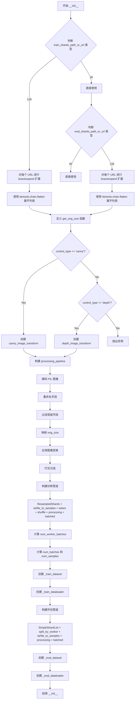

#### 带注释源码

```python
def __init__(
    self,
    train_shards_path_or_url: Union[str, List[str]],
    eval_shards_path_or_url: Union[str, List[str]],
    num_train_examples: int,
    per_gpu_batch_size: int,
    global_batch_size: int,
    num_workers: int,
    resolution: int = 256,
    center_crop: bool = True,
    random_flip: bool = False,
    shuffle_buffer_size: int = 1000,
    pin_memory: bool = False,
    persistent_workers: bool = False,
    control_type: str = "canny",
    feature_extractor: Optional[DPTImageProcessor] = None,
):
    """
    初始化 Text2ImageDataset 类
    
    参数:
        train_shards_path_or_url: 训练数据的分片路径或 URL
        eval_shards_path_or_url: 评估数据的分片路径或 URL
        num_train_examples: 训练样本总数
        per_gpu_batch_size: 每个 GPU 的批次大小
        global_batch_size: 全局批次大小
        num_workers: 数据加载器工作进程数
        resolution: 图像分辨率
        center_crop: 是否中心裁剪
        random_flip: 是否随机翻转
        shuffle_buffer_size: 洗牌缓冲区大小
        pin_memory: 是否固定内存
        persistent_workers: 是否保持工作进程
        control_type: 控制类型 ('canny' 或 'depth')
        feature_extractor: DPT 图像处理器 (用于 depth)
    """
    
    # 处理训练数据 URL 的大括号扩展
    # 如果是列表，对每个 URL 进行 braceexpand 扩展
    if not isinstance(train_shards_path_or_url, str):
        # braceexpand 用于处理类似 url{1,2,3}.tar 的模式
        train_shards_path_or_url = [list(braceexpand(urls)) for urls in train_shards_path_or_url]
        # 使用 itertools.chain 展平嵌套列表
        train_shards_path_or_url = list(itertools.chain.from_iterable(train_shards_path_or_url))

    # 处理评估数据 URL 的大括号扩展
    if not isinstance(eval_shards_path_or_url, str):
        eval_shards_path_or_url = [list(braceexpand(urls)) for urls in eval_shards_path_or_url]
        eval_shards_path_or_url = list(itertools.chain.from_iterable(eval_shards_path_or_url))

    # 定义从 JSON 获取原始尺寸的函数
    def get_orig_size(json):
        return (int(json.get("original_width", 0.0)), int(json.get("original_height", 0.0)))

    # 根据 control_type 选择图像变换方法
    # canny: 使用 Canny 边缘检测生成控制图像
    # depth: 使用 DPT 深度估计生成控制图像
    if control_type == "canny":
        image_transform = functools.partial(canny_image_transform, resolution=resolution)
    elif control_type == "depth":
        image_transform = functools.partial(
            depth_image_transform, feature_extractor=feature_extractor, resolution=resolution
        )

    # 构建数据处理管道
    # 1. wds.decode: 解码 PIL 图像
    # 2. wds.rename: 重命名字段 (image, control_image, text, orig_size)
    # 3. wds.map(filter_keys): 过滤保留指定字段
    # 4. wds.map_dict: 对 orig_size 应用 get_orig_size 函数
    # 5. wds.map: 应用图像变换
    # 6. wds.to_tuple: 打包成元组
    processing_pipeline = [
        wds.decode("pil", handler=wds.ignore_and_continue),
        wds.rename(
            image="jpg;png;jpeg;webp",
            control_image="jpg;png;jpeg;webp",
            text="text;txt;caption",
            orig_size="json",
            handler=wds.warn_and_continue,
        ),
        wds.map(filter_keys({"image", "control_image", "text", "orig_size"})),
        wds.map_dict(orig_size=get_orig_size),
        wds.map(image_transform),
        wds.to_tuple("image", "control_image", "text", "orig_size", "crop_coords"),
    ]

    # 构建训练数据管道
    # 1. wds.ResampledShards: 读取分片列表
    # 2. tarfile_to_samples: 从 tar 文件中提取样本
    # 3. wds.select: 过滤样本 (WebdatasetFilter: 最小尺寸 512)
    # 4. wds.shuffle: 洗牌
    # 5. processing_pipeline: 处理图像
    # 6. wds.batched: 批次化
    pipeline = [
        wds.ResampledShards(train_shards_path_or_url),
        tarfile_to_samples_nothrow,
        wds.select(WebdatasetFilter(min_size=512)),
        wds.shuffle(shuffle_buffer_size),
        *processing_pipeline,
        wds.batched(per_gpu_batch_size, partial=False, collation_fn=default_collate),
    ]

    # 计算每个 worker 的批次数量
    # num_train_examples: 总训练样本数
    # global_batch_size * num_workers: 每个 epoch 的总批次大小
    num_worker_batches = math.ceil(num_train_examples / (global_batch_size * num_workers))
    num_batches = num_worker_batches * num_workers
    num_samples = num_batches * global_batch_size

    # 创建训练数据集和加载器
    # with_epoch: 设置每个 worker 的 epoch 大小
    self._train_dataset = wds.DataPipeline(*pipeline).with_epoch(num_worker_batches)
    self._train_dataloader = wds.WebLoader(
        self._train_dataset,
        batch_size=None,
        shuffle=False,
        num_workers=num_workers,
        pin_memory=pin_memory,
        persistent_workers=persistent_workers,
    )
    # 添加元数据到 dataloader 实例
    self._train_dataloader.num_batches = num_batches
    self._train_dataloader.num_samples = num_samples

    # 构建评估数据管道
    # 使用 SimpleShardList (不需要重采样) + split_by_worker (按 worker 分割)
    pipeline = [
        wds.SimpleShardList(eval_shards_path_or_url),
        wds.split_by_worker,
        wds.tarfile_to_samples(handler=wds.ignore_and_continue),
        *processing_pipeline,
        wds.batched(per_gpu_batch_size, partial=False, collation_fn=default_collate),
    ]
    self._eval_dataset = wds.DataPipeline(*pipeline)
    self._eval_dataloader = wds.WebLoader(
        self._eval_dataset,
        batch_size=None,
        shuffle=False,
        num_workers=num_workers,
        pin_memory=pin_memory,
        persistent_workers=persistent_workers,
    )
```


### `Text2ImageDataset.train_dataset`

这是一个属性方法（Property），用于返回训练阶段使用的数据集对象（DataPipeline）。该属性是 `Text2ImageDataset` 类对外提供的只读访问接口，使得外部代码可以获取内部已经构建好的 `webdataset.DataPipeline` 实例，以便进行训练迭代。

参数：

- `self`：隐含的 `Text2ImageDataset` 实例本身，无需显式传递

返回值：`wds.DataPipeline`，返回训练数据集的 WebDataset 管道对象，该对象包含了数据加载、预处理、过滤和批处理等完整的数据处理流程。

#### 流程图

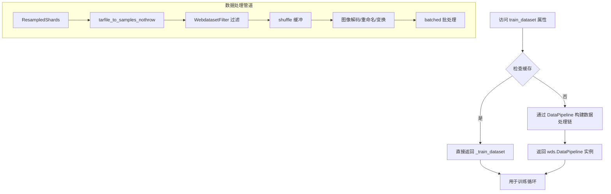

#### 带注释源码

```python
@property
def train_dataset(self):
    """
    属性方法：返回训练数据集的 DataPipeline 对象
    
    该属性提供了对内部私有属性 _train_dataset 的只读访问。
    _train_dataset 是一个 wds.DataPipeline 实例，它封装了完整的数据处理流程：
    1. 从 shard 路径读取数据
    2. 解析 tar 文件中的样本
    3. 根据大小和水印过滤不合格样本
    4. 打乱数据顺序
    5. 应用图像变换（resize、crop、canny/depth 处理）
    6. 批量打包数据
    
    Returns:
        wds.DataPipeline: 训练数据管道对象，可用于创建 DataLoader 或直接迭代
    
    Example:
        >>> dataset = Text2ImageDataset(...)
        >>> train_ds = dataset.train_dataset
        >>> for batch in train_ds:
        ...     # 迭代训练数据
    """
    return self._train_dataset
```


### `Text2ImageDataset.train_dataloader`

这是一个属性方法（Property），用于返回训练数据的 WebLoader 实例。该属性是 `Text2ImageDataset` 类的一部分，它提供了对内部 `_train_dataloader` 属性的只读访问，该 DataLoader 已配置好训练所需的各种参数（元数据如批次数量和样本数量也已附加）。

参数： 无（该方法为属性访问器，不接受任何参数）

返回值：`wds.WebLoader`，返回配置好的 WebLoader 对象，用于迭代训练数据。该 WebLoader 包含了预先设置的批次大小、工作进程数、内存固定选项等，并附加了 `num_batches` 和 `num_samples` 元数据属性，方便训练循环使用。

#### 流程图

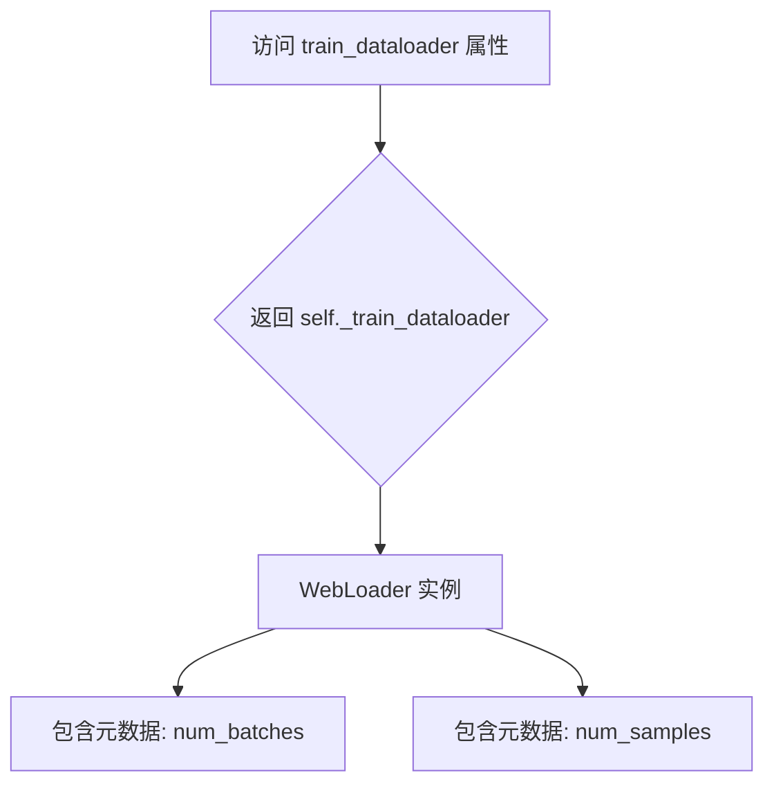

#### 带注释源码

```python
@property
def train_dataloader(self):
    """
    返回训练数据的 WebLoader 实例。
    
    这是一个属性方法（Property），用于提供对内部 _train_dataloader 属性的
    只读访问。该 DataLoader 是在 Text2ImageDataset 构造函数中初始化的，
    包含了完整的数据处理管道和预配置的加载参数。
    
    返回:
        wds.WebLoader: 配置好的 WebLoader 对象，用于训练数据的迭代。
                       该对象附加了 num_batches 和 num_samples 属性，
                       分别表示每个 epoch 的批次数量和总样本数量。
    """
    return self._train_dataloader
```


### `Text2ImageDataset.eval_dataset`

这是一个属性方法，返回评估用的 webdataset DataPipeline。

参数：

- 无（仅 `self` 隐式参数）

返回值：`wds.DataPipeline`，返回评估数据集的 webdataset 管道，用于在验证或评估阶段提供数据。

#### 流程图

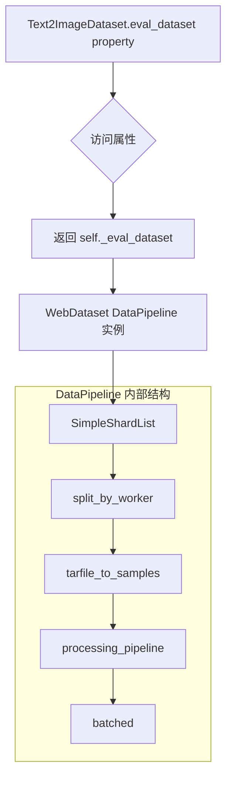

#### 带注释源码

```python
@property
def eval_dataset(self):
    """返回评估数据集的 webdataset DataPipeline。
    
    该属性返回一个 wds.DataPipeline 对象，该对象是在 Text2ImageDataset 构造函数中创建的。
    评估数据集管道包含以下组件：
    1. SimpleShardList: 从 eval_shards_path_or_url 加载评估数据的 shard 列表
    2. split_by_worker: 按 worker 分割数据
    3. tarfile_to_samples: 将 tar 文件展开为样本
    4. processing_pipeline: 图像解码、重命名、过滤、变换等处理步骤
    5. batched: 将样本批处理为 batch
    
    Returns:
        wds.DataPipeline: 评估数据的数据管道，可用于迭代获取评估数据
    """
    return self._eval_dataset
```


### `Text2ImageDataset.eval_dataloader`

该属性是一个只读的Python property，用于返回评估数据集的WebLoader实例，使得外部调用者能够以迭代器方式获取评估批次数数据。

参数：
- 该方法无显式参数（为property装饰器方法，隐式接收`self`参数）

返回值：`wds.WebLoader`，返回预先构建好的评估数据加载器实例，用于遍历评估数据集

#### 流程图

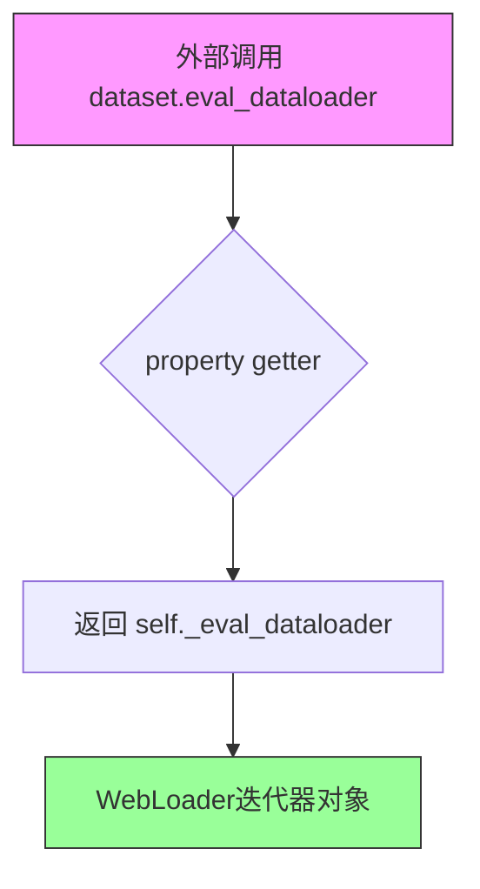

#### 带注释源码

```python
@property
def eval_dataloader(self):
    """
    返回评估数据集的WebLoader迭代器
    
    该属性提供对内部评估数据加载器的只读访问。
    返回的WebLoader对象是由webdataset库创建的，
    已经在Text2ImageDataset.__init__中配置好以下参数:
    - batch_size: None (由wds.batched处理)
    - shuffle: False (保持数据顺序一致)
    - num_workers: 数据加载的工作进程数
    - pin_memory: 是否使用锁页内存
    - persistent_workers: 是否保持工作进程
    
    Returns:
        wds.WebLoader: 配置好的评估数据迭代器，可直接用于训练循环
    """
    return self._eval_dataloader
```

## 关键组件


### 文本到图像数据集 (Text2ImageDataset)

负责从WebDataset加载和预处理训练与评估数据，支持canny边缘图和depth深度图两种控制类型，通过数据管道实现shuffle、过滤、批处理等操作。

### 图像转换器 (canny_image_transform / depth_image_transform)

将原始图像转换为ControlNet所需的条件控制图像，canny使用边缘检测算子生成轮廓图，depth使用DPT模型生成深度估计图，并执行resize、crop、normalize等预处理。

### 嵌入编码器 (encode_prompt / compute_embeddings)

对文本提示进行编码，生成prompt_embeds和pooled_prompt_embeds，用于SDXL UNet的条件输入，同时计算额外的time_ids嵌入以支持图像尺寸和裁剪坐标信息。

### 控制网络 (ControlNet)

基于UNet构建的条件控制模型，通过down_block_res_samples和mid_block_res_sample输出中间特征，用于引导主去噪网络的生成方向，支持canny和depth两种条件类型。

### 噪声调度器与sigma计算 (EulerDiscreteScheduler / get_sigmas)

实现离散时间的噪声调度策略，get_sigmas函数将时间步映射到对应的sigma值，用于前向扩散过程和噪声预测的加权计算。

### 验证日志系统 (log_validation)

在训练过程中定期运行验证，生成ControlNet条件下的SDXL图像，支持TensorBoard和WandB两种日志格式，记录验证图像和prompt用于分析生成效果。

### 模型保存与恢复钩子 (save_model_hook / load_model_hook)

通过accelerate的pre_hook机制实现分布式训练下的模型状态保存与加载，确保ControlNet模型能够正确序列化和恢复。

### 数据集过滤器 (WebdatasetFilter)

基于图像尺寸和水印概率过滤WebDataset样本，仅保留符合最小尺寸要求且水印概率低于阈值的样本，确保训练数据质量。

### 参数解析与配置 (parse_args)

定义超过50个训练相关命令行参数，包括模型路径、批大小、学习率、混合精度、梯度检查点、验证设置等，提供完整的训练配置接口。

### 主训练循环 (main)

核心训练流程：初始化accelerator、加载模型和数据集、构建优化器和学习率调度器、执行多epoch训练、计算损失与反向传播、周期性保存checkpoint和运行验证。


## 问题及建议


### 已知问题

-   **未使用的常量**: `MAX_SEQ_LENGTH = 77` 定义后在整个代码中未被使用。
-   **硬编码的批次大小**: VAE 编码时使用硬编码的批次大小 8 (`for i in range(0, pixel_values.shape[0], 8)`)，无法根据显存动态调整。
-   **重复的图像变换逻辑**: `canny_image_transform` 和 `depth_image_transform` 存在大量重复代码（图像 resize、随机裁剪逻辑），可抽象为通用函数。
-   **Depth 处理的 hack 代码**: `control_image = (depth_map * 255.0).to(torch.uint8).float() / 255.0` 这种转换方式缺乏文档说明，可读性差且容易引入潜在问题。
-   **Canny 阈值硬编码**: `control_transform` 函数中的 `low_threshold=100` 和 `high_threshold=200` 硬编码，无法根据不同数据集调整。
-   **验证循环中的 GPU 资源泄露**: `log_validation` 函数在 tracker 循环内部执行 `del pipeline` 和 `gc.collect()`，导致每个 tracker 都会重复创建和销毁 pipeline。
-   **未清理的预训练模型**: 使用 `transformer_layers_per_block` 时创建了新的 controlnet 但未显式删除 `pre_controlnet` 的引用，可能导致显存占用。
-   **checkpoint 清理逻辑缺陷**: 删除旧 checkpoint 时使用 `shutil.rmtree` 直接删除整个目录，未检查是否为有效的 checkpoint 文件，可能误删其他数据。
-   **缺失的文本编码器缓存**: `encode_prompt` 每次调用都重新计算嵌入，未对相同文本进行缓存，训练时效率较低。
-   **类型转换频繁**: VAE 和模型权重的 `dtype` 在多处反复转换 (`vae.to(dtype=weight_dtype)` / `vae.to(dtype=torch.float32)`)，缺乏统一的类型管理。

### 优化建议

-   **移除未使用常量**: 删除 `MAX_SEQ_LENGTH = 77` 或确认其用途后正确使用。
-   **动态批次大小**: 将 VAE 编码的批次大小 8 提取为配置参数或根据可用显存自动计算。
-   **抽象图像变换逻辑**: 将 resize 和随机裁剪逻辑提取为独立函数，减少 `canny_image_transform` 和 `depth_image_transform` 中的重复代码。
-   **参数化 Canny 阈值**: 将 `low_threshold` 和 `high_threshold` 添加为命令行参数或配置选项。
-   **优化验证循环**: 将 `del pipeline` 和资源清理移至 tracker 循环外部，避免重复创建 pipeline。
-   **添加模型清理**: 在使用 `transformer_layers_per_block` 后显式调用 `del pre_controlnet` 并清理缓存。
-   **改进 checkpoint 管理**: 添加文件类型检查，仅删除以 "checkpoint-" 开头的目录。
-   **实现文本嵌入缓存**: 在训练过程中缓存已计算过的文本嵌入，避免重复编码。
-   **统一类型管理**: 在训练开始前确定各模型的 dtype，避免在训练循环中频繁切换。

## 其它


### 设计目标与约束

本代码旨在实现基于Stable Diffusion XL的ControlNet模型训练，支持canny边缘检测和depth深度图两种控制类型。核心设计约束包括：1) 仅训练ControlNet分支，冻结UNet、VAE和文本编码器以降低显存占用；2) 支持WebDataset分布式数据加载；3) 兼容fp16/bf16混合精度训练；4) 支持梯度检查点和xformers内存高效注意力机制；5) 输出分辨率需能被8整除以保证VAE编码一致性。

### 错误处理与异常设计

代码采用多层异常处理策略：1) **参数校验层**：parse_args函数中对validation_prompt与validation_image数量匹配、resolution可被8整除、proportion_empty_prompts范围等关键参数进行前置验证，不符合条件时抛出ValueError；2) **数据过滤层**：WebdatasetFilter类的__call__方法使用try-except捕获JSON解析异常，返回False实现静默过滤；3) **数据加载层**：webdataset处理使用wds.warn_and_continue和wds.ignore_and_continuehandler实现容错；4) **训练循环层**：accelerate.accumulate上下文管理器自动处理分布式训练异常，checkpoint保存前检查checkpoints_total_limit防止存储溢出；5) **模型加载层**：import_model_class_from_model_name_or_path对不支持的文本编码器架构抛出ValueError。

### 数据流与状态机

训练数据流经过以下阶段：**数据源→数据分片→Tar文件解析→样本分组→图像变换→批次聚合→训练迭代**。Text2ImageDataset构建两条独立管道：train_pipeline使用ResampledShards配合tarfile_to_samples_nothrow，eval_pipeline使用SimpleShardList配合split_by_worker。图像变换根据control_type选择canny_image_transform或depth_image_transform，返回image、control_image、text、orig_size、crop_coords五元组。训练循环状态机包含：初始状态→数据加载→编码文本嵌入→VAE编码→噪声调度→ControlNet前向→UNet预测→损失计算→反向传播→优化器更新→检查点保存→验证（条件触发）→下一轮迭代，直至达到max_train_steps。

### 外部依赖与接口契约

本模块依赖以下核心外部包：1) **diffusers库**：提供StableDiffusionXLControlNetPipeline、AutoencoderKL、ControlNetModel、UNet2DConditionModel、EulerDiscreteScheduler等模型组件；2) **transformers库**：提供AutoTokenizer、DPTForDepthEstimation、DPTImageProcessor及文本编码器类；3) **accelerate库**：提供 Accelerator、ProjectConfiguration、set_seed等分布式训练基础设施；4) **webdataset库**：提供DataPipeline、WebLoader、ResampledShards等大规模网页数据集处理能力；5) **其他依赖**：opencv-python(canny边缘检测)、PIL(图像处理)、braceexpand(URL展开)、bitsandbytes(8-bit优化器，可选)。接口契约方面：训练数据必须遵循webdataset格式（tar文件包含jpg/png/webp图像、json元数据、text/txtcaption），验证图像需为RGB格式并resize至resolution×resolution，模型输入采用EMAX_SEQ_LENGTH=77的文本嵌入。

### 性能优化策略

代码实现多项性能优化：1) **显存优化**：冻结非训练参数、启用xformers_memory_efficient_attention、梯度检查点、8-bit Adam；2) **计算优化**：允许TF32矩阵运算、VAE批量编码(每批8个样本)、mixed precision训练；3) **IO优化**：pin_memory=True、persistent_workers=True、shuffle_buffer_size=1000；4) **分布式支持**：accelerator自动处理多GPU数据并行、梯度同步、checkpoint保存与加载钩子。

### 安全性与合规性

代码包含以下安全考量：1) **Hub令牌保护**：检测到report_to=wandb且hub_token存在时抛出安全风险警告；2) **模型权限**：训练完成后push_to_hub使用create_repo创建私有仓库；3) **数据安全**：WebdatasetFilter过滤含水印图像(pwatermark>0.5)和小尺寸图像(width/height<1024)；4) **许可证合规**：文件头部声明Apache 2.0许可证，model_card生成使用openrail许可证标签。


    