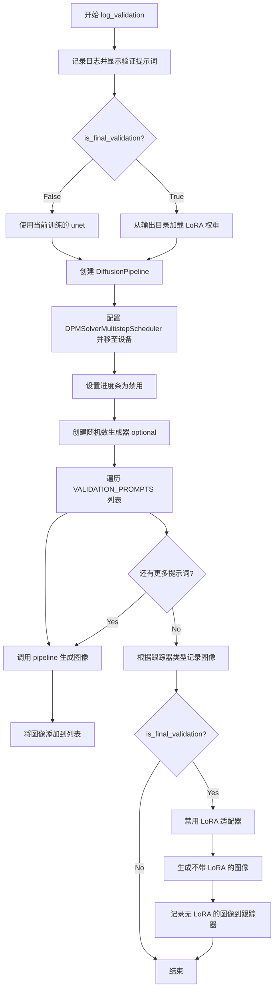
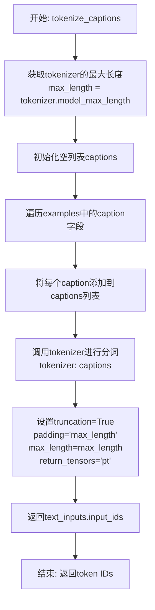

```mermaid
flowchart TD
    A[开始 main 函数] --> B[验证 report_to 和 hub_token 配置]
    B --> C[创建 logging_dir 并配置 Accelerator]
    C --> D[配置日志记录器]
    D --> E{args.seed 是否设置?}
    E -->|是| F[设置随机种子 set_seed]
    E -->|否| G[跳过种子设置]
    F --> G
    G --> H{accelerator.is_main_process?}
    H -->|是| I[创建输出目录]
    H -->|否| J[跳过目录创建]
    I --> K[可选: 创建 Hub 仓库]
    J --> K
    K --> L[加载 Tokenizer]
    L --> M[获取 Text Encoder 类]
    M --> N[加载 DDPMScheduler, Text Encoder, VAE, UNet]
    N --> O[冻结 VAE, Text Encoder, UNet 权重]
    O --> P[根据 mixed_precision 设置 weight_dtype]
    P --> Q[将模型移至设备并转换类型]
    Q --> R[配置 LoRA 参数并添加到 UNet]
    R --> S{是否启用 xformers?}
    S -->|是| T[启用 xformers 内存高效注意力]
    S -->|否| U[检查 gradient_checkpointing]
    T --> U
    U --> V[启用 gradient_checkpointing 如果需要]
    V --> W[注册模型保存和加载钩子]
    W --> X[可选: 启用 TF32 加速]
    X --> Y[计算学习率如果 scale_lr]
    Y --> Z[选择 AdamW 或 8-bit Adam 优化器]
    Z --> AA[创建优化器参数列表]
    AA --> AB[加载训练数据集]
    AB --> AC[定义数据预处理和增强]
    AC --> AD[创建 DataLoader]
    AD --> AE[计算最大训练步数并创建学习率调度器]
    AE --> AF[使用 Accelerator 准备模型和优化器]
    AF --> AG[重新计算训练步数和轮次]
    AG --> AH[初始化 trackers]
    AH --> AI[开始训练循环]
    AI --> AJ[外层循环: 遍历每个 epoch]
    AJ --> AK[内层循环: 遍历每个 batch]
    AK --> AL[执行 DPO 训练前向传播]
    AL --> AM[计算损失和梯度]
    AM --> AN{是否需要同步梯度?}
    AN -->|是| AO[执行优化步骤]
    AN -->|否| AK
    AO --> AP[更新进度条和全局步数]
    AP --> AQ{是否到达检查点保存步?}
    AQ -->|是| AR[保存检查点状态]
    AQ -->|否| AS
    AR --> AS{是否运行验证?}
    AS --> AT{是且到达验证步?}
    AT --> AU[运行验证生成图像]
    AU --> AV[记录训练日志]
    AV --> AW{是否达到最大训练步数?}
    AW -->|否| AK
    AW -->|是| AX[训练循环结束]
    AX --> AY[等待所有进程完成]
    AY --> AZ[保存最终 LoRA 权重]
    AZ --> BA{是否运行最终验证?}
    BA -->|是| BB[运行最终验证]
    BA -->|否| BC
    BB --> BC{是否推送到 Hub?}
    BC -->|是| BD[上传文件夹到 Hub]
    BC -->|否| BE[结束训练]
    BD --> BE
```

# `diffusers\examples\research_projects\diffusion_dpo\train_diffusion_dpo.py` 详细设计文档

这是一个用于使用直接偏好优化（DPO）和 LoRA 对 Stable Diffusion 模型（UNet）进行微调的训练脚本。它包含完整的数据加载、图像编码、噪声预测、参考模型对比以及 DPO 损失计算流程，用于将模型输出与人类偏好对齐。

## 整体流程

```mermaid
graph TD
    A[Start: Parse Args] --> B[Init Accelerator & Logging]
    B --> C[Load Models (UNet, VAE, TextEncoder)]
    C --> D[Setup LoRA Adapters & Optimizer]
    D --> E[Load Dataset & Preprocess]
    E --> F{Loop: Epochs}
    F --> G{Loop: Steps}
    G --> H[Get Batch (Images, Captions)]
    H --> I[VAE Encode Images to Latents]
    I --> J[Add Noise to Latents]
    J --> K[Encode Captions to Embeddings]
    K --> L[Forward Pass: Trainable UNet]
    L --> M[Forward Pass: Reference UNet (no grad)]
    M --> N[Compute DPO Loss (Sigmoid/IPO)]
    N --> O[Backward Pass & Optimizer Step]
    O --> P{Checkpointing Steps?}
    P -- Yes --> Q[Save LoRA Weights]
    P -- No --> R{Validation Steps?}
    Q --> R
    R -- Yes --> S[Run Inference & Log Images]
    R -- No --> G
    S --> G
    F --> T[End: Save Final LoRA]
```

## 类结构

```
训练脚本 (Training Script Module)
├── 配置与解析 (Configuration & Parsing)
│   └── parse_args (命令行参数解析)
├── 数据处理 (Data Pipeline)
│   ├── tokenize_captions (文本编码)
│   ├── encode_prompt (Prompt嵌入生成)
│   └── preprocess_train (图像预处理与组合)
├── 模型架构 (Model Architecture)
│   ├── import_model_class_from_model_name_or_path (文本编码器工厂)
│   └── log_validation (验证流程)
└── 核心逻辑 (Core Logic)
    └── main (主训练循环)
```

## 全局变量及字段


### `VALIDATION_PROMPTS`
    
用于验证的Prompt列表，包含多个用于测试模型生成能力的文本提示

类型：`list[str]`
    


### `logger`
    
全局日志记录器对象，用于记录训练过程中的信息、警告和错误

类型：`logging.Logger`
    


    

## 全局函数及方法


### `import_model_class_from_model_name_or_path`

根据模型路径加载文本编码器类。该函数首先从预训练模型中获取文本编码器配置，然后根据配置的架构类型动态导入并返回对应的文本编码器类，目前仅支持 CLIPTextModel。

参数：

- `pretrained_model_name_or_path`：`str`，预训练模型的名称或本地路径
- `revision`：`str`，模型的版本号（Git revision）

返回值：`type`，返回对应的文本编码器类（CLIPTextModel）

#### 流程图

```mermaid
flowchart TD
    A[开始] --> B[PretrainedConfig.from_pretrained<br/>加载文本编码器配置]
    B --> C[获取 text_encoder_config.architectures[0]]
    C --> D{model_class == "CLIPTextModel"?}
    D -->|是| E[from transformers import CLIPTextModel]
    E --> F[返回 CLIPTextModel 类]
    D -->|否| G[raise ValueError<br/>f"{model_class} is not supported."]
    F --> H[结束]
    G --> H
```

#### 带注释源码

```python
def import_model_class_from_model_name_or_path(pretrained_model_name_or_path: str, revision: str):
    """
    根据模型路径加载文本编码器类
    
    参数:
        pretrained_model_name_or_path: 预训练模型的名称或本地路径
        revision: 模型的版本号（Git revision）
    
    返回:
        返回对应的文本编码器类（目前仅支持 CLIPTextModel）
    
    异常:
        ValueError: 当模型架构不支持时抛出
    """
    # 步骤1: 从预训练模型路径加载文本编码器的配置
    # 使用 PretrainedConfig 类的 from_pretrained 方法加载配置
    # subfolder="text_encoder" 指定加载 text_encoder 子目录下的配置
    # revision 参数指定要加载的 Git 版本
    text_encoder_config = PretrainedConfig.from_pretrained(
        pretrained_model_name_or_path,
        subfolder="text_encoder",
        revision=revision,
    )
    
    # 步骤2: 从配置中获取架构类名
    # PretrainedConfig 对象的 architectures 属性是一个列表
    # 通常第一个元素就是要使用的模型架构类名
    model_class = text_encoder_config.architectures[0]
    
    # 步骤3: 根据架构类型动态导入并返回对应的类
    # 目前 diffusers 库主要支持 CLIP 系列的文本编码器
    if model_class == "CLIPTextModel":
        # 动态导入 transformers 库中的 CLIPTextModel 类
        from transformers import CLIPTextModel
        
        # 返回导入的类对象，供调用者使用
        return CLIPTextModel
    else:
        # 如果遇到不支持的模型架构，抛出 ValueError 异常
        # 这有助于开发者在早期发现不支持的模型类型
        raise ValueError(f"{model_class} is not supported.")
```


### `log_validation`

该函数用于在训练过程中或训练结束后运行推理，生成验证图像并将结果记录到训练跟踪器（如 TensorBoard 或 W&B），以便监控模型在给定提示词下的生成效果。

参数：

- `args`：命名空间（Namespace），包含预训练模型路径（`pretrained_model_name_or_path`）、输出目录（`output_dir`）、修订版本（`revision`）、模型变体（`variant`）和随机种子（`seed`）等配置参数。
- `unet`：`UNet2DConditionModel`，训练中的 UNet 模型实例，用于最终验证前的推理。
- `accelerator`：`Accelerator`，HuggingFace Accelerate 库提供的分布式训练加速器，用于设备管理、模型包装和跟踪器管理。
- `weight_dtype`：`torch.dtype`，模型权重的精度类型（如 `torch.float16`、`torch.bfloat16` 或 `torch.float32`）。
- `epoch`：`int`，当前训练轮次，用于图像日志的标记。
- `is_final_validation`：`bool`（可选，默认为 `False`），标识是否为训练结束后的最终验证，最终验证时会加载保存的 LoRA 权重并与不带 LoRA 的基线进行对比。

返回值：`None`，该函数直接记录图像到跟踪器，无返回值。

#### 流程图



#### 带注释源码

```python
def log_validation(args, unet, accelerator, weight_dtype, epoch, is_final_validation=False):
    """
    运行推理并记录验证图像到训练跟踪器。
    
    参数:
        args: 包含模型路径和配置的命令行参数命名空间
        unet: 训练中的 UNet2DConditionModel 实例
        accelerator: HuggingFace Accelerate 加速器实例
        weight_dtype: torch dtype，指定权重精度
        epoch: 当前训练轮次
        is_final_validation: 是否为最终验证（训练结束后）
    """
    logger.info(f"Running validation... \n Generating images with prompts:\n {VALIDATION_PROMPTS}.")

    # ------------------- 创建 Pipeline -------------------
    # 从预训练模型加载 DiffusionPipeline
    pipeline = DiffusionPipeline.from_pretrained(
        args.pretrained_model_name_or_path,
        revision=args.revision,
        variant=args.variant,
        torch_dtype=weight_dtype,
    )
    
    # 如果不是最终验证，使用训练中加速器包装后的 UNet；否则加载保存的 LoRA 权重
    if not is_final_validation:
        pipeline.unet = accelerator.unwrap_model(unet)
    else:
        pipeline.load_lora_weights(args.output_dir, weight_name="pytorch_lora_weights.safetensors")

    # ------------------- 配置调度器并移至设备 -------------------
    # 使用 DPMSolverMultistepScheduler 替代默认调度器以获得更好的推理质量
    pipeline.scheduler = DPMSolverMultistepScheduler.from_config(pipeline.scheduler.config)
    pipeline = pipeline.to(accelerator.device)
    pipeline.set_progress_bar_config(disable=True)

    # ------------------- 运行推理 -------------------
    # 如果指定了种子则创建确定性生成器，否则为 None
    generator = torch.Generator(device=accelerator.device).manual_seed(args.seed) if args.seed else None
    images = []
    
    # 根据是否为最终验证决定是否使用混合精度自动转换上下文
    # 最终验证时使用 nullcontext（无自动转换），训练中间验证时使用 AMP autocast
    context = contextlib.nullcontext() if is_final_validation else torch.cuda.amp.autocast()

    # 遍历预定义的验证提示词列表进行推理
    for prompt in VALIDATION_PROMPTS:
        with context:
            # 调用 pipeline 生成图像，固定 25 步推理
            image = pipeline(prompt, num_inference_steps=25, generator=generator).images[0]
            images.append(image)

    # ------------------- 记录图像到跟踪器 -------------------
    # 确定跟踪器键名：最终验证用 "test"，中间验证用 "validation"
    tracker_key = "test" if is_final_validation else "validation"
    
    # 遍历所有注册的跟踪器（TensorBoard 或 W&B）
    for tracker in accelerator.trackers:
        if tracker.name == "tensorboard":
            # 将 PIL 图像转换为 numpy 数组并堆叠，格式为 NHWC
            np_images = np.stack([np.asarray(img) for img in images])
            tracker.writer.add_images(tracker_key, np_images, epoch, dataformats="NHWC")
        if tracker.name == "wandb":
            # 使用 W&B 记录图像并附加标题
            tracker.log(
                {
                    tracker_key: [
                        wandb.Image(image, caption=f"{i}: {VALIDATION_PROMPTS[i]}") for i, image in enumerate(images)
                    ]
                }
            )

    # ------------------- 最终验证：额外记录无 LoRA 的对比图像 -------------------
    if is_final_validation:
        # 禁用 LoRA 以生成基线图像（不带适配器）
        pipeline.disable_lora()
        no_lora_images = [
            pipeline(prompt, num_inference_steps=25, generator=generator).images[0] for prompt in VALIDATION_PROMPTS
        ]

        # 记录不带 LoRA 的图像用于对比
        for tracker in accelerator.trackers:
            if tracker.name == "tensorboard":
                np_images = np.stack([np.asarray(img) for img in no_lora_images])
                tracker.writer.add_images("test_without_lora", np_images, epoch, dataformats="NHWC")
            if tracker.name == "wandb":
                tracker.log(
                    {
                        "test_without_lora": [
                            wandb.Image(image, caption=f"{i}: {VALIDATION_PROMPTS[i]}")
                            for i, image in enumerate(no_lora_images)
                        ]
                    }
                )
```


### `parse_args`

该函数是训练脚本的命令行参数解析器，使用 argparse 库定义并解析约50个训练相关参数（如模型路径、数据集配置、学习率、LoRA 参数等），同时进行环境变量 LOCAL_RANK 的检查和设置，最终返回一个包含所有配置参数的 Namespace 对象。

参数：

- `input_args`：`Optional[List[str]]`，可选的字符串列表。如果传入了该参数，则使用该列表来解析命令行参数；否则默认从 sys.argv 解析。

返回值：`argparse.Namespace`，一个包含所有解析后命令行参数的对象，通过属性访问方式获取各参数值（如 args.learning_rate）。

#### 流程图

```mermaid
flowchart TD
    A[开始 parse_args] --> B[创建 ArgumentParser]
    B --> C[添加所有命令行参数]
    C --> D{input_args 是否为 None?}
    D -->|是| E[parser.parse_args<br/>从 sys.argv 解析]
    D -->|否| F[parser.parse_args(input_args)<br/>从指定列表解析]
    E --> G[检查 dataset_name 是否为 None]
    F --> G
    G --> H{dataset_name is None?}
    H -->|是| I[抛出 ValueError]
    H -->|否| J[获取环境变量 LOCAL_RANK]
    J --> K{env_local_rank != -1?}
    K -->|否| L[返回 args]
    K -->|是| M{env_local_rank != args.local_rank?}
    M -->|是| N[更新 args.local_rank]
    M -->|否| L
    N --> L
    I --> O[异常终止]
```

#### 带注释源码

```python
def parse_args(input_args=None):
    """
    解析命令行参数并返回包含所有配置的对象。
    
    参数:
        input_args: 可选的字符串列表，用于解析命令行参数。
                   如果为 None，则从 sys.argv 解析。
    
    返回:
        argparse.Namespace: 包含所有解析后参数的对象。
    """
    # 步骤1: 创建 ArgumentParser 实例，描述脚本用途
    parser = argparse.ArgumentParser(description="Simple example of a training script.")
    
    # 步骤2: 添加所有训练相关的命令行参数
    # 2.1 模型相关参数
    parser.add_argument(
        "--pretrained_model_name_or_path",
        type=str,
        default=None,
        required=True,
        help="Path to pretrained model or model identifier from huggingface.co/models.",
    )
    parser.add_argument(
        "--revision",
        type=str,
        default=None,
        required=False,
        help="Revision of pretrained model identifier from huggingface.co/models.",
    )
    parser.add_argument(
        "--variant",
        type=str,
        default=None,
        help="Variant of the model files of the pretrained model identifier from huggingface.co/models, 'e.g.' fp16",
    )
    
    # 2.2 数据集相关参数
    parser.add_argument(
        "--dataset_name",
        type=str,
        default=None,
        help="The name of the Dataset (from the HuggingFace hub) to train on...",
    )
    parser.add_argument(
        "--dataset_split_name",
        type=str,
        default="validation",
        help="Dataset split to be used during training.",
    )
    parser.add_argument(
        "--max_train_samples",
        type=int,
        default=None,
        help="For debugging purposes or quicker training, truncate the number of training examples...",
    )
    parser.add_argument(
        "--cache_dir",
        type=str,
        default=None,
        help="The directory where the downloaded models and datasets will be stored.",
    )
    
    # 2.3 图像处理相关参数
    parser.add_argument("--seed", type=int, default=None, help="A seed for reproducible training.")
    parser.add_argument(
        "--resolution",
        type=int,
        default=512,
        help="The resolution for input images, all the images in the train/validation dataset will be resized to this resolution",
    )
    parser.add_argument(
        "--vae_encode_batch_size",
        type=int,
        default=8,
        help="Batch size to use for VAE encoding of the images for efficient processing.",
    )
    parser.add_argument(
        "--no_hflip",
        action="store_true",
        help="whether to randomly flip images horizontally",
    )
    parser.add_argument(
        "--random_crop",
        default=False,
        action="store_true",
        help="Whether to random crop the input images to the resolution.",
    )
    
    # 2.4 训练过程相关参数
    parser.add_argument(
        "--train_batch_size", type=int, default=4, help="Batch size (per device) for the training dataloader."
    )
    parser.add_argument("--num_train_epochs", type=int, default=1)
    parser.add_argument(
        "--max_train_steps",
        type=int,
        default=None,
        help="Total number of training steps to perform. If provided, overrides num_train_epochs.",
    )
    parser.add_argument(
        "--gradient_accumulation_steps",
        type=int,
        default=1,
        help="Number of updates steps to accumulate before performing a backward/update pass.",
    )
    parser.add_argument(
        "--gradient_checkpointing",
        action="store_true",
        help="Whether or not to use gradient checkpointing to save memory at the expense of slower backward pass.",
    )
    parser.add_argument(
        "--run_validation",
        default=False,
        action="store_true",
        help="Whether to run validation inference in between training and also after training.",
    )
    parser.add_argument(
        "--validation_steps",
        type=int,
        default=200,
        help="Run validation every X steps.",
    )
    
    # 2.5 检查点相关参数
    parser.add_argument(
        "--checkpointing_steps",
        type=int,
        default=500,
        help="Save a checkpoint of the training state every X updates.",
    )
    parser.add_argument(
        "--checkpoints_total_limit",
        type=int,
        default=None,
        help=("Max number of checkpoints to store."),
    )
    parser.add_argument(
        "--resume_from_checkpoint",
        type=str,
        default=None,
        help="Whether training should be resumed from a previous checkpoint.",
    )
    
    # 2.6 优化器相关参数
    parser.add_argument(
        "--learning_rate",
        type=float,
        default=5e-4,
        help="Initial learning rate (after the potential warmup period) to use.",
    )
    parser.add_argument(
        "--scale_lr",
        action="store_true",
        default=False,
        help="Scale the learning rate by the number of GPUs, gradient accumulation steps, and batch size.",
    )
    parser.add_argument(
        "--lr_scheduler",
        type=str,
        default="constant",
        help='The scheduler type to use. Choose between ["linear", "cosine", "cosine_with_restarts", "polynomial", "constant", "constant_with_warmup"]',
    )
    parser.add_argument(
        "--lr_warmup_steps", type=int, default=500, help="Number of steps for the warmup in the lr scheduler."
    )
    parser.add_argument(
        "--lr_num_cycles",
        type=int,
        default=1,
        help="Number of hard resets of the lr in cosine_with_restarts scheduler.",
    )
    parser.add_argument("--lr_power", type=float, default=1.0, help="Power factor of the polynomial scheduler.")
    parser.add_argument(
        "--use_8bit_adam", action="store_true", help="Whether or not to use 8-bit Adam from bitsandbytes."
    )
    parser.add_argument("--adam_beta1", type=float, default=0.9, help="The beta1 parameter for the Adam optimizer.")
    parser.add_argument("--adam_beta2", type=float, default=0.999, help="The beta2 parameter for the Adam optimizer.")
    parser.add_argument("--adam_weight_decay", type=float, default=1e-2, help="Weight decay to use.")
    parser.add_argument("--adam_epsilon", type=float, default=1e-08, help="Epsilon value for the Adam optimizer")
    parser.add_argument("--max_grad_norm", default=1.0, type=float, help="Max gradient norm.")
    parser.add_argument(
        "--dataloader_num_workers",
        type=int,
        default=0,
        help="Number of subprocesses to use for data loading.",
    )
    
    # 2.7 DPO 相关参数
    parser.add_argument(
        "--beta_dpo",
        type=int,
        default=2500,
        help="DPO KL Divergence penalty.",
    )
    parser.add_argument(
        "--loss_type",
        type=str,
        default="sigmoid",
        help="DPO loss type. Can be one of 'sigmoid' (default), 'ipo', or 'cpo'",
    )
    
    # 2.8 LoRA 相关参数
    parser.add_argument(
        "--rank",
        type=int,
        default=4,
        help=("The dimension of the LoRA update matrices."),
    )
    parser.add_argument(
        "--enable_xformers_memory_efficient_attention", 
        action="store_true", 
        help="Whether or not to use xformers."
    )
    
    # 2.9 分布式训练相关参数
    parser.add_argument("--local_rank", type=int, default=-1, help="For distributed training: local_rank")
    parser.add_argument(
        "--allow_tf32",
        action="store_true",
        help="Whether or not to allow TF32 on Ampere GPUs.",
    )
    
    # 2.10 混合精度相关参数
    parser.add_argument(
        "--mixed_precision",
        type=str,
        default=None,
        choices=["no", "fp16", "bf16"],
        help="Whether to use mixed precision. Choose between fp16 and bf16 (bfloat16).",
    )
    parser.add_argument(
        "--prior_generation_precision",
        type=str,
        default=None,
        choices=["no", "fp32", "fp16", "bf16"],
        help="Choose prior generation precision between fp32, fp16 and bf16.",
    )
    
    # 2.11 输出和日志相关参数
    parser.add_argument(
        "--output_dir",
        type=str,
        default="diffusion-dpo-lora",
        help="The output directory where the model predictions and checkpoints will be written.",
    )
    parser.add_argument(
        "--logging_dir",
        type=str,
        default="logs",
        help="[TensorBoard] log directory.",
    )
    parser.add_argument(
        "--report_to",
        type=str,
        default="tensorboard",
        help='The integration to report the results and logs to. Supported platforms are "tensorboard", "wandb" and "comet_ml".',
    )
    parser.add_argument(
        "--tracker_name",
        type=str,
        default="diffusion-dpo-lora",
        help=("The name of the tracker to report results to."),
    )
    
    # 2.12 Hub 相关参数
    parser.add_argument("--push_to_hub", action="store_true", help="Whether or not to push the model to the Hub.")
    parser.add_argument("--hub_token", type=str, default=None, help="The token to use to push to the Model Hub.")
    parser.add_argument(
        "--hub_model_id",
        type=str,
        default=None,
        help="The name of the repository to keep in sync with the local `output_dir`.",
    )
    
    # 步骤3: 根据 input_args 是否为空决定解析方式
    if input_args is not None:
        # 如果传入了参数列表，则解析该列表（用于测试）
        args = parser.parse_args(input_args)
    else:
        # 默认从 sys.argv 解析（正常运行时使用）
        args = parser.parse_args()
    
    # 步骤4: 验证必需参数
    # dataset_name 是必需参数，如果没有提供则抛出异常
    if args.dataset_name is None:
        raise ValueError("Must provide a `dataset_name`.")
    
    # 步骤5: 处理分布式训练的环境变量
    # 检查环境变量 LOCAL_RANK，用于分布式训练场景
    env_local_rank = int(os.environ.get("LOCAL_RANK", -1))
    # 如果环境变量设置了 LOCAL_RANK 且与命令行参数不一致，以环境变量为准
    if env_local_rank != -1 and env_local_rank != args.local_rank:
        args.local_rank = env_local_rank
    
    # 步骤6: 返回解析后的参数对象
    return args
```


### `tokenize_captions`

该函数用于将文本描述（captions）转换为token ID，以便后续的文本编码处理。它接收一个tokenizer和一个包含caption字段的样本字典，然后返回tokenized后的input IDs。

参数：

- `tokenizer`：`transformers.AutoTokenizer`，用于对文本进行分词（tokenize）的tokenizer实例
- `examples`：`dict`，包含"caption"键的字典，通常是从数据集加载的样本，每个样本包含一个或多个文本描述

返回值：`torch.Tensor`，形状为`(batch_size, max_length)`的token IDs张量

#### 流程图



#### 带注释源码

```python
def tokenize_captions(tokenizer, examples):
    """
    将文本描述转换为token ID
    
    参数:
        tokenizer: 用于对文本进行分词的tokenizer
        examples: 包含"caption"键的字典数据集样本
    
    返回:
        tokenized后的input_ids张量
    """
    # 获取tokenizer支持的最大序列长度
    max_length = tokenizer.model_max_length
    
    # 创建用于存储所有caption的列表
    captions = []
    # 遍历examples中的caption字段（可能包含多个caption）
    for caption in examples["caption"]:
        captions.append(caption)

    # 使用tokenizer对所有captions进行分词
    # truncation=True: 如果序列长度超过max_length则截断
    # padding='max_length': 将所有序列填充到max_length
    # max_length: 使用tokenizer的最大长度
    # return_tensors='pt': 返回PyTorch张量
    text_inputs = tokenizer(
        captions, truncation=True, padding="max_length", max_length=max_length, return_tensors="pt"
    )

    # 返回tokenized后的input_ids
    return text_inputs.input_ids
```


### `encode_prompt`

该函数使用文本编码器（text_encoder）将输入的token IDs转换为文本embedding（向量表示），是Stable Diffusion模型中处理文本条件输入的关键环节，通过将文本转换为高维向量来指导图像生成过程。

参数：

- `text_encoder`：`torch.nn.Module`，文本编码器模型（CLIPTextModel），用于将文本token转换为embedding向量
- `input_ids`：`torch.Tensor`，经过tokenizer处理后的文本token IDs，形状为(batch_size, seq_len)

返回值：`torch.Tensor`，文本的embedding向量，形状为(batch_size, seq_len, hidden_dim)，用于后续扩散模型的 conditioning

#### 流程图

```mermaid
flowchart TD
    A[开始 encode_prompt] --> B[将 input_ids 移动到 text_encoder 设备]
    B --> C[初始化 attention_mask 为 None]
    C --> D[调用 text_encoder 执行前向传播]
    D --> E[提取 embedding 结果 prompt_embeds[0]]
    E --> F[返回 prompt_embeds]
```

#### 带注释源码

```python
@torch.no_grad()  # 禁用梯度计算，减少显存占用，提高推理效率
def encode_prompt(text_encoder, input_ids):
    # 将token IDs移动到文本编码器所在的设备上（GPU/CPU）
    text_input_ids = input_ids.to(text_encoder.device)
    # 初始化attention_mask为None，使用默认值（CLIP默认全为1）
    attention_mask = None

    # 调用文本编码器的前向传播，获取文本embedding
    # 返回值为tuple，第一个元素为hidden states
    prompt_embeds = text_encoder(text_input_ids, attention_mask=attention_mask)
    # 提取第一个元素（hidden states），形状为 (batch_size, seq_len, hidden_dim)
    prompt_embeds = prompt_embeds[0]

    # 返回文本embedding，供后续扩散模型使用
    return prompt_embeds
```


### `main`

该函数是Stable Diffusion LoRA训练脚本的主入口函数，负责初始化分布式训练环境、加载预训练模型和数据集、配置LoRA适配器、执行DPO（Direct Preference Optimization）训练循环、周期性保存检查点与验证模型，以及在训练结束后保存LoRA权重并可选地推送至Hub。

参数：

- `args`：`argparse.Namespace`，通过`parse_args()`解析得到的命令行参数对象，包含模型路径、数据集配置、训练超参数（如学习率、批次大小、LoRA秩等）、验证设置、检查点管理和Hub推送等所有训练配置。

返回值：`None`，该函数执行完整的训练流程，不返回任何值。

#### 流程图



#### 带注释源码

```python
def main(args):
    """
    主训练函数，执行 Stable Diffusion LoRA DPO 训练的完整流程。
    
    参数:
        args: 包含所有训练配置的命令行参数对象
    """
    # 1. 安全检查：不能同时使用 wandb 报告和 hub_token（安全风险）
    if args.report_to == "wandb" and args.hub_token is not None:
        raise ValueError(
            "You cannot use both --report_to=wandb and --hub_token due to a security risk of exposing your token."
            " Please use `hf auth login` to authenticate with the Hub."
        )

    # 2. 配置日志目录
    logging_dir = Path(args.output_dir, args.logging_dir)

    # 3. 创建 Accelerator 实例，用于分布式训练管理
    accelerator_project_config = ProjectConfiguration(project_dir=args.output_dir, logging_dir=logging_dir)

    accelerator = Accelerator(
        gradient_accumulation_steps=args.gradient_accumulation_steps,
        mixed_precision=args.mixed_precision,
        log_with=args.report_to,
        project_config=accelerator_project_config,
    )

    # 4. MPS 设备特殊处理：禁用原生 AMP
    if torch.backends.mps.is_available():
        accelerator.native_amp = False

    # 5. 配置日志记录器
    logging.basicConfig(
        format="%(asctime)s - %(levelname)s - %(name)s - %(message)s",
        datefmt="%m/%d/%Y %H:%M:%S",
        level=logging.INFO,
    )
    logger.info(accelerator.state, main_process_only=False)
    if accelerator.is_local_main_process:
        transformers.utils.logging.set_verbosity_warning()
        diffusers.utils.logging.set_verbosity_info()
    else:
        transformers.utils.logging.set_verbosity_error()
        diffusers.utils.logging.set_verbosity_error()

    # 6. 设置随机种子以确保可重复性
    if args.seed is not None:
        set_seed(args.seed)

    # 7. 处理仓库创建（主进程）
    if accelerator.is_main_process:
        if args.output_dir is not None:
            os.makedirs(args.output_dir, exist_ok=True)

        if args.push_to_hub:
            repo_id = create_repo(
                repo_id=args.hub_model_id or Path(args.output_dir).name, exist_ok=True, token=args.hub_token
            ).repo_id

    # 8. 加载 Tokenizer
    tokenizer = AutoTokenizer.from_pretrained(
        args.pretrained_model_name_or_path,
        subfolder="tokenizer",
        revision=args.revision,
        use_fast=False,
    )

    # 9. 动态导入正确的 Text Encoder 类
    text_encoder_cls = import_model_class_from_model_name_or_path(args.pretrained_model_name_or_path, args.revision)

    # 10. 加载调度器和模型
    noise_scheduler = DDPMScheduler.from_pretrained(args.pretrained_model_name_or_path, subfolder="scheduler")
    text_encoder = text_encoder_cls.from_pretrained(
        args.pretrained_model_name_or_path, subfolder="text_encoder", revision=args.revision, variant=args.variant
    )
    vae = AutoencoderKL.from_pretrained(
        args.pretrained_model_name_or_path, subfolder="vae", revision=args.revision, variant=args.variant
    )
    unet = UNet2DConditionModel.from_pretrained(
        args.pretrained_model_name_or_path, subfolder="unet", revision=args.revision, variant=args.variant
    )

    # 11. 冻结不需要训练的模型权重
    vae.requires_grad_(False)
    text_encoder.requires_grad_(False)
    unet.requires_grad_(False)

    # 12. 根据混合精度配置设置权重数据类型
    weight_dtype = torch.float32
    if accelerator.mixed_precision == "fp16":
        weight_dtype = torch.float16
    elif accelerator.mixed_precision == "bf16":
        weight_dtype = torch.bfloat16

    # 13. 将模型移至设备并转换数据类型
    unet.to(accelerator.device, dtype=weight_dtype)
    vae.to(accelerator.device, dtype=weight_dtype)
    text_encoder.to(accelerator.device, dtype=weight_dtype)

    # 14. 配置 LoRA 适配器
    unet_lora_config = LoraConfig(
        r=args.rank,
        lora_alpha=args.rank,
        init_lora_weights="gaussian",
        target_modules=["to_k", "to_q", "to_v", "to_out.0"],
    )
    # 添加适配器并确保可训练参数为 float32
    unet.add_adapter(unet_lora_config)
    if args.mixed_precision == "fp16":
        for param in unet.parameters():
            # 仅将可训练参数（LoRA）转换为 fp32
            if param.requires_grad:
                param.data = param.to(torch.float32)

    # 15. 配置 xformers 内存高效注意力
    if args.enable_xformers_memory_efficient_attention:
        if is_xformers_available():
            import xformers

            xformers_version = version.parse(xformers.__version__)
            if xformers_version == version.parse("0.0.16"):
                logger.warning(
                    "xFormers 0.0.16 cannot be used for training in some GPUs. If you observe problems during training, please update xFormers to at least 0.0.17. See https://huggingface.co/docs/diffusers/main/en/optimization/xformers for more details."
                )
            unet.enable_xformers_memory_efficient_attention()
        else:
            raise ValueError("xformers is not available. Make sure it is installed correctly")

    # 16. 配置梯度检查点以节省显存
    if args.gradient_checkpointing:
        unet.enable_gradient_checkpointing()

    # 17. 注册自定义模型保存和加载钩子
    def save_model_hook(models, weights, output_dir):
        """保存 LoRA 权重到指定目录"""
        if accelerator.is_main_process:
            unet_lora_layers_to_save = None

            for model in models:
                if isinstance(model, type(accelerator.unwrap_model(unet))):
                    unet_lora_layers_to_save = convert_state_dict_to_diffusers(get_peft_model_state_dict(model))
                else:
                    raise ValueError(f"unexpected save model: {model.__class__}")

                weights.pop()

            StableDiffusionLoraLoaderMixin.save_lora_weights(
                output_dir,
                unet_lora_layers=unet_lora_layers_to_save,
                text_encoder_lora_layers=None,
            )

    def load_model_hook(models, input_dir):
        """从指定目录加载 LoRA 权重"""
        unet_ = None

        while len(models) > 0:
            model = models.pop()

            if isinstance(model, type(accelerator.unwrap_model(unet))):
                unet_ = model
            else:
                raise ValueError(f"unexpected save model: {model.__class__}")

        lora_state_dict, network_alphas = StableDiffusionLoraLoaderMixin.lora_state_dict(input_dir)
        StableDiffusionLoraLoaderMixin.load_lora_into_unet(lora_state_dict, network_alphas=network_alphas, unet=unet_)

    accelerator.register_save_state_pre_hook(save_model_hook)
    accelerator.register_load_state_pre_hook(load_model_hook)

    # 18. 启用 TF32 加速（Ampere GPU）
    if args.allow_tf32:
        torch.backends.cuda.matmul.allow_tf32 = True

    # 19. 根据配置计算学习率
    if args.scale_lr:
        args.learning_rate = (
            args.learning_rate * args.gradient_accumulation_steps * args.train_batch_size * accelerator.num_processes
        )

    # 20. 选择优化器（8-bit Adam 或标准 AdamW）
    if args.use_8bit_adam:
        try:
            import bitsandbytes as bnb
        except ImportError:
            raise ImportError(
                "To use 8-bit Adam, please install the bitsandbytes library: `pip install bitsandbytes`."
            )

        optimizer_class = bnb.optim.AdamW8bit
    else:
        optimizer_class = torch.optim.AdamW

    # 21. 创建优化器
    params_to_optimize = list(filter(lambda p: p.requires_grad, unet.parameters()))
    optimizer = optimizer_class(
        params_to_optimize,
        lr=args.learning_rate,
        betas=(args.adam_beta1, args.adam_beta2),
        weight_decay=args.adam_weight_decay,
        eps=args.adam_epsilon,
    )

    # 22. 加载训练数据集
    train_dataset = load_dataset(
        args.dataset_name,
        cache_dir=args.cache_dir,
        split=args.dataset_split_name,
    )

    # 23. 定义图像预处理和增强流程
    train_transforms = transforms.Compose(
        [
            transforms.Resize(int(args.resolution), interpolation=transforms.InterpolationMode.BILINEAR),
            transforms.RandomCrop(args.resolution) if args.random_crop else transforms.CenterCrop(args.resolution),
            transforms.Lambda(lambda x: x) if args.no_hflip else transforms.RandomHorizontalFlip(),
            transforms.ToTensor(),
            transforms.Normalize([0.5], [0.5]),
        ]
    )

    # 24. 定义数据集预处理函数
    def preprocess_train(examples):
        """处理训练数据：加载图像、转换、组合成对"""
        all_pixel_values = []
        for col_name in ["jpg_0", "jpg_1"]:
            images = [Image.open(io.BytesIO(im_bytes)).convert("RGB") for im_bytes in examples[col_name]]
            pixel_values = [train_transforms(image) for image in images]
            all_pixel_values.append(pixel_values)

        # 组合图像对，根据标签决定顺序
        im_tup_iterator = zip(*all_pixel_values)
        combined_pixel_values = []
        for im_tup, label_0 in zip(im_tup_iterator, examples["label_0"]):
            if label_0 == 0:
                im_tup = im_tup[::-1]
            combined_im = torch.cat(im_tup, dim=0)
            combined_pixel_values.append(combined_im)
        examples["pixel_values"] = combined_pixel_values

        examples["input_ids"] = tokenize_captions(tokenizer, examples)
        return examples

    # 25. 应用数据集转换
    with accelerator.main_process_first():
        if args.max_train_samples is not None:
            train_dataset = train_dataset.shuffle(seed=args.seed).select(range(args.max_train_samples))
        train_dataset = train_dataset.with_transform(preprocess_train)

    # 26. 定义批处理整理函数
    def collate_fn(examples):
        """整理批次数据"""
        pixel_values = torch.stack([example["pixel_values"] for example in examples])
        pixel_values = pixel_values.to(memory_format=torch.contiguous_format).float()
        final_dict = {"pixel_values": pixel_values}
        final_dict["input_ids"] = torch.stack([example["input_ids"] for example in examples])
        return final_dict

    # 27. 创建 DataLoader
    train_dataloader = torch.utils.data.DataLoader(
        train_dataset,
        batch_size=args.train_batch_size,
        shuffle=True,
        collate_fn=collate_fn,
        num_workers=args.dataloader_num_workers,
    )

    # 28. 计算训练步数和学习率调度器
    overrode_max_train_steps = False
    num_update_steps_per_epoch = math.ceil(len(train_dataloader) / args.gradient_accumulation_steps)
    if args.max_train_steps is None:
        args.max_train_steps = args.num_train_epochs * num_update_steps_per_epoch
        overrode_max_train_steps = True

    lr_scheduler = get_scheduler(
        args.lr_scheduler,
        optimizer=optimizer,
        num_warmup_steps=args.lr_warmup_steps * accelerator.num_processes,
        num_training_steps=args.max_train_steps * accelerator.num_processes,
        num_cycles=args.lr_num_cycles,
        power=args.lr_power,
    )

    # 29. 使用 Accelerator 准备模型、优化器、数据加载器和调度器
    unet, optimizer, train_dataloader, lr_scheduler = accelerator.prepare(
        unet, optimizer, train_dataloader, lr_scheduler
    )

    # 30. 重新计算训练步数（因为 DataLoader 大小可能改变）
    num_update_steps_per_epoch = math.ceil(len(train_dataloader) / args.gradient_accumulation_steps)
    if overrode_max_train_steps:
        args.max_train_steps = args.num_train_epochs * num_update_steps_per_epoch
    args.num_train_epochs = math.ceil(args.max_train_steps / num_update_steps_per_epoch)

    # 31. 初始化 trackers
    if accelerator.is_main_process:
        accelerator.init_trackers(args.tracker_name, config=vars(args))

    # 32. 训练信息日志
    total_batch_size = args.train_batch_size * accelerator.num_processes * args.gradient_accumulation_steps

    logger.info("***** Running training *****")
    logger.info(f"  Num examples = {len(train_dataset)}")
    logger.info(f"  Num batches each epoch = {len(train_dataloader)}")
    logger.info(f"  Num Epochs = {args.num_train_epochs}")
    logger.info(f"  Instantaneous batch size per device = {args.train_batch_size}")
    logger.info(f"  Total train batch size (w. parallel, distributed & accumulation) = {total_batch_size}")
    logger.info(f"  Gradient Accumulation steps = {args.gradient_accumulation_steps}")
    logger.info(f"  Total optimization steps = {args.max_train_steps}")
    global_step = 0
    first_epoch = 0

    # 33. 检查是否从检查点恢复训练
    if args.resume_from_checkpoint:
        if args.resume_from_checkpoint != "latest":
            path = os.path.basename(args.resume_from_checkpoint)
        else:
            dirs = os.listdir(args.output_dir)
            dirs = [d for d in dirs if d.startswith("checkpoint")]
            dirs = sorted(dirs, key=lambda x: int(x.split("-")[1]))
            path = dirs[-1] if len(dirs) > 0 else None

        if path is None:
            accelerator.print(
                f"Checkpoint '{args.resume_from_checkpoint}' does not exist. Starting a new training run."
            )
            args.resume_from_checkpoint = None
            initial_global_step = 0
        else:
            accelerator.print(f"Resuming from checkpoint {path}")
            accelerator.load_state(os.path.join(args.output_dir, path))
            global_step = int(path.split("-")[1])

            initial_global_step = global_step
            first_epoch = global_step // num_update_steps_per_epoch
    else:
        initial_global_step = 0

    # 34. 创建进度条
    progress_bar = tqdm(
        range(0, args.max_train_steps),
        initial=initial_global_step,
        desc="Steps",
        disable=not accelerator.is_local_main_process,
    )

    # 35. 开始训练循环
    unet.train()
    for epoch in range(first_epoch, args.num_train_epochs):
        for step, batch in enumerate(train_dataloader):
            with accelerator.accumulate(unet):
                # 准备像素值并连接成对
                pixel_values = batch["pixel_values"].to(dtype=weight_dtype)
                feed_pixel_values = torch.cat(pixel_values.chunk(2, dim=1))

                # VAE 编码获取潜在表示
                latents = []
                for i in range(0, feed_pixel_values.shape[0], args.vae_encode_batch_size):
                    latents.append(
                        vae.encode(feed_pixel_values[i : i + args.vae_encode_batch_size]).latent_dist.sample()
                    )
                latents = torch.cat(latents, dim=0)
                latents = latents * vae.config.scaling_factor

                # 采样噪声
                noise = torch.randn_like(latents).chunk(2)[0].repeat(2, 1, 1, 1)

                # 采样随机时间步
                bsz = latents.shape[0] // 2
                timesteps = torch.randint(
                    0, noise_scheduler.config.num_train_timesteps, (bsz,), device=latents.device, dtype=torch.long
                ).repeat(2)

                # 前向扩散过程：添加噪声
                noisy_model_input = noise_scheduler.add_noise(latents, noise, timesteps)

                # 获取文本嵌入作为条件
                encoder_hidden_states = encode_prompt(text_encoder, batch["input_ids"]).repeat(2, 1, 1)

                # 预测噪声残差
                model_pred = unet(
                    noisy_model_input,
                    timesteps,
                    encoder_hidden_states,
                ).sample

                # 获取损失目标
                if noise_scheduler.config.prediction_type == "epsilon":
                    target = noise
                elif noise_scheduler.config.prediction_type == "v_prediction":
                    target = noise_scheduler.get_velocity(latents, noise, timesteps)
                else:
                    raise ValueError(f"Unknown prediction type {noise_scheduler.config.prediction_type}")

                # 计算模型损失
                model_losses = F.mse_loss(model_pred.float(), target.float(), reduction="none")
                model_losses = model_losses.mean(dim=list(range(1, len(model_losses.shape))))
                model_losses_w, model_losses_l = model_losses.chunk(2)

                # 记录日志用
                raw_model_loss = 0.5 * (model_losses_w.mean() + model_losses_l.mean())
                model_diff = model_losses_w - model_losses_l

                # 参考模型预测（禁用适配器）
                accelerator.unwrap_model(unet).disable_adapters()
                with torch.no_grad():
                    ref_preds = unet(
                        noisy_model_input,
                        timesteps,
                        encoder_hidden_states,
                    ).sample.detach()
                    ref_loss = F.mse_loss(ref_preds.float(), target.float(), reduction="none")
                    ref_loss = ref_loss.mean(dim=list(range(1, len(ref_loss.shape))))

                    ref_losses_w, ref_losses_l = ref_loss.chunk(2)
                    ref_diff = ref_losses_w - ref_losses_l
                    raw_ref_loss = ref_loss.mean()

                # 重新启用适配器
                accelerator.unwrap_model(unet).enable_adapters()

                # 计算 DPO 损失
                logits = ref_diff - model_diff
                if args.loss_type == "sigmoid":
                    loss = -1 * F.logsigmoid(args.beta_dpo * logits).mean()
                elif args.loss_type == "hinge":
                    loss = torch.relu(1 - args.beta_dpo * logits).mean()
                elif args.loss_type == "ipo":
                    losses = (logits - 1 / (2 * args.beta)) ** 2
                    loss = losses.mean()
                else:
                    raise ValueError(f"Unknown loss type {args.loss_type}")

                # 计算隐式准确率
                implicit_acc = (logits > 0).sum().float() / logits.size(0)
                implicit_acc += 0.5 * (logits == 0).sum().float() / logits.size(0)

                # 反向传播
                accelerator.backward(loss)
                if accelerator.sync_gradients:
                    accelerator.clip_grad_norm_(params_to_optimize, args.max_grad_norm)
                optimizer.step()
                lr_scheduler.step()
                optimizer.zero_grad()

            # 同步后处理
            if accelerator.sync_gradients:
                progress_bar.update(1)
                global_step += 1

                # 检查点保存
                if accelerator.is_main_process:
                    if global_step % args.checkpointing_steps == 0:
                        # 检查保存的检查点数量限制
                        if args.checkpoints_total_limit is not None:
                            checkpoints = os.listdir(args.output_dir)
                            checkpoints = [d for d in checkpoints if d.startswith("checkpoint")]
                            checkpoints = sorted(checkpoints, key=lambda x: int(x.split("-")[1]))

                            if len(checkpoints) >= args.checkpoints_total_limit:
                                num_to_remove = len(checkpoints) - args.checkpoints_total_limit + 1
                                removing_checkpoints = checkpoints[0:num_to_remove]

                                logger.info(
                                    f"{len(checkpoints)} checkpoints already exist, removing {len(removing_checkpoints)} checkpoints"
                                )
                                logger.info(f"removing checkpoints: {', '.join(removing_checkpoints)}")

                                for removing_checkpoint in removing_checkpoints:
                                    removing_checkpoint = os.path.join(args.output_dir, removing_checkpoint)
                                    shutil.rmtree(removing_checkpoint)

                        save_path = os.path.join(args.output_dir, f"checkpoint-{global_step}")
                        accelerator.save_state(save_path)
                        logger.info(f"Saved state to {save_path}")

                    # 验证
                    if args.run_validation and global_step % args.validation_steps == 0:
                        log_validation(
                            args, unet=unet, accelerator=accelerator, weight_dtype=weight_dtype, epoch=epoch
                        )

                # 记录日志
                logs = {
                    "loss": loss.detach().item(),
                    "raw_model_loss": raw_model_loss.detach().item(),
                    "ref_loss": raw_ref_loss.detach().item(),
                    "implicit_acc": implicit_acc.detach().item(),
                    "lr": lr_scheduler.get_last_lr()[0],
                }
                progress_bar.set_postfix(**logs)
                accelerator.log(logs, step=global_step)

            # 检查是否达到最大训练步数
            if global_step >= args.max_train_steps:
                break

    # 36. 保存最终 LoRA 权重
    accelerator.wait_for_everyone()
    if accelerator.is_main_process:
        unet = accelerator.unwrap_model(unet)
        unet = unet.to(torch.float32)
        unet_lora_state_dict = convert_state_dict_to_diffusers(get_peft_model_state_dict(unet))

        StableDiffusionLoraLoaderMixin.save_lora_weights(
            save_directory=args.output_dir, unet_lora_layers=unet_lora_state_dict, text_encoder_lora_layers=None
        )

        # 最终验证
        if args.run_validation:
            log_validation(
                args,
                unet=None,
                accelerator=accelerator,
                weight_dtype=weight_dtype,
                epoch=epoch,
                is_final_validation=True,
            )

        # 推送到 Hub
        if args.push_to_hub:
            upload_folder(
                repo_id=repo_id,
                folder_path=args.output_dir,
                commit_message="End of training",
                ignore_patterns=["step_*", "epoch_*"],
            )

    # 37. 结束训练
    accelerator.end_training()
```

## 关键组件


### LoRA配置与量化策略

使用`LoraConfig`配置LoRAAdapter，指定rank维度、lora_alpha、目标模块（to_k, to_q, to_v, to_out.0）和高斯初始化。通过`unet.add_adapter()`注入可训练的低秩适配器权重，实现参数高效微调。训练时仅更新LoRA参数，冻结原始UNet权重。

### 张量分块与索引处理

在训练循环中通过`pixel_values.chunk(2, dim=1)`将双图像对的像素值沿通道维度分割，分别对应偏好与非偏好样本。噪声和损失同样采用`chunk(2)`分块处理，并通过`.repeat(2, 1, 1, 1)`广播扩展以匹配批量维度。VAE编码采用滑动窗口批处理：`for i in range(0, feed_pixel_values.shape[0], args.vae_encode_batch_size)`实现惰性加载，避免内存溢出。

### 混合精度与权重类型转换

根据`accelerator.mixed_precision`动态设置`weight_dtype`（fp16/bf16/fp32），所有非可训练权重（VAE、TextEncoder、非LoRA的UNet）被转换以减少显存。可训练LoRA参数在fp16混合精度下被显式提升为fp32（`param.to(torch.float32)`），确保数值稳定性。训练完成后保存时转换为float32。

### 8-bit Adam优化器

通过`bitsandbytes`库实现8-bit Adam优化器（`bnb.optim.AdamW8bit`），显著降低梯度更新时的显存占用，适用于16GB GPU进行微调。启用方式为`--use_8bit_adam`命令行参数。

### 梯度检查点与xFormers优化

启用`gradient_checkpointing`以时间换空间，存储中间激活而非完整反向传播图。xFormers内存高效注意力通过`unet.enable_xformers_memory_efficient_attention()`激活，配合版本兼容性检查，降低长序列处理的显存峰值。

### DPO损失计算与参考模型

实现Direct Preference Optimization损失：禁用适配器后用参考UNet计算无梯度预测（`ref_preds`），与主模型预测（`model_pred`）比较。通过`sigmoid`/`hinge`/`ipo`损失函数结合`beta_dpo`超参数计算最终损失，同时记录`implicit_acc`隐式准确率指标。


## 问题及建议


### 已知问题

-   **IPO 损失计算错误**：代码第 577 行使用 `args.beta` 计算 IPO 损失，但该参数未定义，应为 `args.beta_dpo`，这会导致运行时错误。
-   **`beta_dpo` 参数类型错误**：`--beta_dpo` 参数定义为 `int` 类型（第 189 行），但实际使用中作为浮点数参与损失计算（第 573、575 行），建议改为 `float` 类型。
-   **硬编码的数据集列名**：数据预处理函数 `preprocess_train` 硬编码假设数据集包含 `"jpg_0"`、`"jpg_1"` 和 `"label_0"` 列（第 470-485 行），缺乏灵活性，无法适配不同数据集。
-   **attention_mask 未正确传递**：`encode_prompt` 函数中 `attention_mask` 始终为 `None`（第 318 行），但 CLIP 文本编码器通常需要此参数，可能影响文本嵌入质量。
-   **验证时 LoRA 加载逻辑缺陷**：`log_validation` 函数在最终验证时加载 LoRA 权重，但使用了可能不存在的权重文件名 `"pytorch_lora_weights.safetensors"`（第 92 行），未考虑其他可能的命名格式。
-   **checkpoint 恢复逻辑假设**：resume_from_checkpoint 假设 checkpoint 目录命名格式为 `checkpoint-{global_step}`（第 559 行），但未验证目录是否存在有效的数字索引。
-   **训练结束条件不完整**：仅检查 `global_step >= args.max_train_steps`（第 619 行），未考虑学习率调度器完成等其他训练终止条件。
-   **缺失数据验证**：数据预处理和训练循环中未检查图像加载失败、空值或数据类型异常等情况。
-   **VAE 编码批处理效率**：VAE 编码在循环中逐批处理（第 508-511 行），虽然使用了批处理但仍有优化空间。
-   **xformers 版本兼容性警告**：代码仅针对 xformers 0.0.16 版本警告（第 388-392 行），但 0.0.17 及以上版本也可能存在未列出的问题。

### 优化建议

-   将 `--beta_dpo` 参数类型从 `int` 改为 `float`，并修复 IPO 损失中的参数引用错误。
-   将硬编码的列名提取为命令行参数或从数据集配置中读取，提高脚本通用性。
-   在 `encode_prompt` 函数中根据 tokenizer 输出正确构建 attention_mask。
-   验证时使用更灵活的 LoRA 权重加载逻辑，尝试多种可能的文件名或使用 `safetensors` 和 `.bin` 格式的兼容加载。
-   添加数据集验证步骤，检查必要的列是否存在并在缺失时提供清晰的错误信息。
-   改进 checkpoint 恢复逻辑，添加目录存在性检查和更健壮的错误处理。
-   考虑在训练结束后验证学习率调度器状态，确保完整训练流程。
-   添加数据加载异常处理，如图像加载失败时的降级策略或跳过机制。
-   扩展 xformers 版本检查逻辑，支持更多版本的兼容性验证。
</think>

## 其它


### 设计目标与约束

**设计目标：**
1. 实现Diffusion模型的LoRA（Low-Rank Adaptation）微调训练，采用DPO（Direct Preference Optimization）算法优化模型对人类偏好的理解
2. 支持分布式训练，利用Accelerator实现多GPU/TPU并行
3. 提供灵活的验证机制，支持在训练过程中生成图像进行质量监控
4. 支持模型权重的保存与恢复，实现断点续训功能
5. 支持将训练好的LoRA权重推送至HuggingFace Hub

**设计约束：**
1. 必须使用PyTorch深度学习框架
2. 必须依赖Hugging Face diffusers库（版本>=0.25.0）
3. 预训练模型必须支持Stable Diffusion架构（UNet2DConditionModel + CLIPTextEncoder + VAE）
4. 训练设备支持CUDA GPU，MPS设备（Apple Silicon）部分功能受限
5. 数据集必须包含jpg_0、jpg_1两个图像列和label_0标签列

### 错误处理与异常设计

**关键异常处理：**
1. **ImportError**：检测到未安装必要库（如bitsandbytes、xformers）时抛出明确安装提示
2. **ValueError**：不支持的模型架构、不支持的loss_type、无效的checkpoint路径等情况抛出
3. **RuntimeError**：分布式训练初始化失败、内存不足等情况
4. **FileNotFoundError**：预训练模型路径不存在、checkpoint目录为空等

**防御性编程：**
- parse_args()中对必需参数dataset_name进行强制检查
- 对LOCAL_RANK环境变量进行兼容性处理
- 在模型加载前检查variant参数有效性
- 训练前验证checkpoints_total_limit与现有checkpoint数量关系

### 数据流与状态机

**训练数据流：**
1. 数据加载：load_dataset() -> preprocess_train() -> train_dataset.with_transform()
2. 数据批处理：collate_fn()组合batch
3. VAE编码：vae.encode()将像素值转为latent space
4. 噪声调度：noise_scheduler.add_noise()执行前向扩散
5. 模型预测：unet()预测噪声残差
6. 损失计算：对比模型预测与参考模型预测，计算DPO loss
7. 反向传播：accelerator.backward() + optimizer.step()

**状态转换：**
- 初始化状态（Accelerator初始化）→ 训练状态（unet.train()）→ 验证状态（log_validation）→ 保存状态（save_state）

**断点续训状态恢复：**
- 从checkpoint恢复：global_step, first_epoch, optimizer, lr_scheduler, train_dataloader状态全量恢复

### 外部依赖与接口契约

**核心依赖：**
- diffusers >= 0.25.0.dev0：Diffusion模型核心库
- transformers：文本编码器
- accelerate：分布式训练框架
- peft：LoRA实现
- torch：深度学习框架
- numpy：数值计算
- PIL：图像处理
- torchvision：图像变换
- wandb/tensorboard：训练可视化（可选）
- bitsandbytes：8-bit Adam优化器（可选）
- xformers：高效注意力机制（可选）

**预训练模型接口：**
- 需提供tokenizer、text_encoder、vae、unet、scheduler子文件夹
- text_encoder需支持CLIPTextModel架构
- 支持从HuggingFace Hub或本地路径加载

**数据集接口：**
- 必须包含"jpg_0"、"jpg_1"图像列（二进制格式）
- 必须包含"caption"文本列
- 必须包含"label_0"标签列（0或1）

### 性能优化与资源管理

**内存优化：**
1. gradient_checkpointing：减少梯度存储内存
2. xformers_memory_efficient_attention：减少注意力机制内存占用
3. mixed_precision：fp16/bf16混合精度训练
4. 8-bit Adam：减少优化器状态内存
5. VAE分批编码：vae_encode_batch_size控制

**计算优化：**
1. TF32 on Ampere GPUs：加速矩阵运算
2. gradient_accumulation_steps：大批次训练效果
3. torch.compile：可选模型编译加速
4. MPS后端特殊处理：禁用AMP

**资源清理：**
1. 定期checkpoint清理：checkpoints_total_limit控制
2. 显式cuda.empty_cache()调用
3. accelerator.end_training()资源释放

### 安全考虑

**敏感信息保护：**
1. hub_token使用安全警告：不允许与wandb同时使用
2. 本地训练优先：推荐使用hf auth login认证

**模型安全：**
1. 仅训练LoRA参数，原始模型权重冻结
2. LoRA权重安全格式：safetensors
3. 训练产物访问控制：output_dir权限管理

### 配置管理

**命令行参数体系：**
- 模型配置：pretrained_model_name_or_path, revision, variant
- 训练配置：num_train_epochs, max_train_steps, learning_rate, lr_scheduler
- LoRA配置：rank, lora_alpha, target_modules
- DPO配置：beta_dpo, loss_type
- 优化器配置：adam_beta1, adam_beta2, adam_weight_decay, adam_epsilon
- 分布式配置：local_rank, mixed_precision, gradient_accumulation_steps

**配置优先级：**
1. 命令行参数 > 环境变量 > 默认值
2. args对象承载所有运行时配置
3. accelerator.init_trackers()记录配置用于复现

### 版本兼容性

**Python版本：**
- 推荐Python 3.8+

**关键库版本约束：**
- diffusers >= 0.25.0.dev0
- torch >= 1.10（支持bf16）
- transformers >= 4.x
- peft >= 0.4.0
- accelerate >= 0.20.0
- xformers >= 0.0.17（如使用）

**硬件兼容性：**
- CUDA >= 11.0（Ampere架构支持TF32）
- MPS（部分功能受限）
- CPU（仅用于推理验证）

### 测试策略

**单元测试覆盖：**
- parse_args()参数解析
- tokenize_captions()文本编码
- preprocess_train()数据预处理
- collate_fn()批处理组合
- encode_prompt()提示编码

**集成测试场景：**
- 单GPU训练一个step
- 断点续训功能
- LoRA权重保存与加载
- 验证流程执行

**验证指标：**
- loss收敛性监控
- implicit_acc（DPO隐式准确率）
- 生成图像质量主观评估

### 部署指南

**部署前提：**
1. 安装所有依赖：pip install -r requirements.txt
2. 准备预训练模型：HuggingFace缓存或本地路径
3. 准备数据集：符合接口契约的HF Dataset

**运行示例：**
```bash
torchrun --nproc_per_node=1 train.py \
  --pretrained_model_name_or_path="runwayml/stable-diffusion-v1-5" \
  --dataset_name="your/dataset" \
  --output_dir="./output" \
  --rank=4 \
  --learning_rate=5e-4 \
  --max_train_steps=1000
```

**生产环境建议：**
1. 使用分布式训练：torchrun --nproc_per_node=N
2. 配置远程存储：push_to_hub=True
3. 启用监控：--report_to=wandb
4. 定期验证：--run_validation --validation_steps=500


    