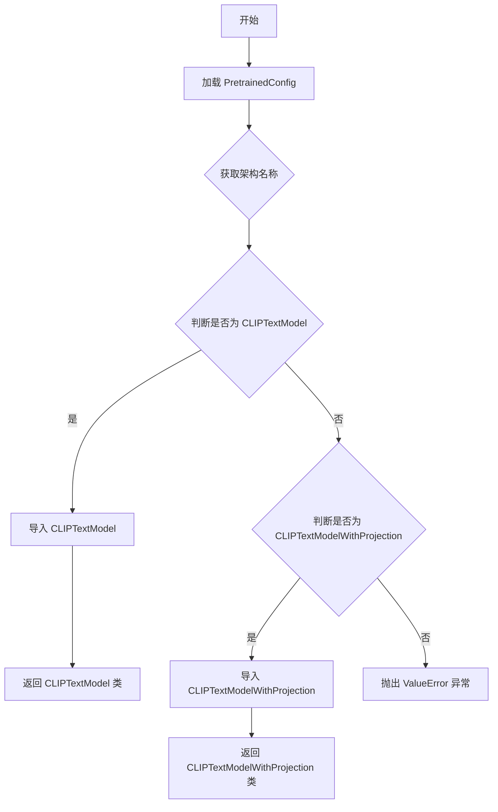
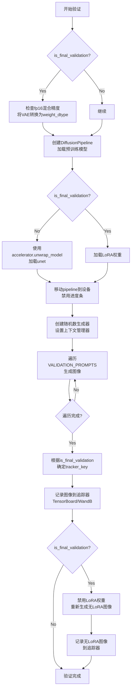
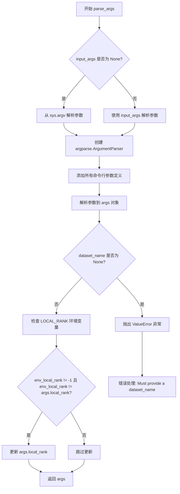

```mermaid
flowchart TD
    A[开始 main 函数] --> B[验证参数: report_to 与 hub_token 冲突检查]
    B --> C[创建 logging_dir 和 ProjectConfiguration]
    C --> D[初始化 Accelerator]
    D --> E{检查 MPS 后端}
    E -->|是| F[禁用 AMP]
    E -->|否| G[继续]
    F --> G
    G --> H[配置日志记录器]
    H --> I[设置随机种子]
    I --> J{是否是主进程}
    J -->|是| K[创建输出目录]
    J -->|否| L[继续]
    K --> L
    L --> M[加载 Tokenizers]
    M --> N[导入 Text Encoder 类]
    N --> O[加载 Scheduler 和 Models]
    O --> P[冻结 VAE 和 Text Encoders]
    P --> Q[设置 weight_dtype]
    Q --> R[配置 LoRA]
    R --> S[启用 xformers 注意力]
    S --> T[启用梯度检查点]
    T --> U[注册模型保存/加载钩子]
    U --> V[配置 TF32]
    V --> W[计算学习率]
    W --> X[创建优化器]
    X --> Y[加载数据集]
    Y --> Z[数据预处理]
    Z --> AA[创建 DataLoader]
    AA --> AB[配置学习率调度器]
    AB --> AC[准备模型和优化器]
    AC --> AD[初始化 Trackers]
    AD --> AE[训练循环开始]
    AE --> AF{检查是否需要恢复训练}
    AF -->|是| AG[加载检查点]
    AF -->|否| AH[初始化 global_step]
    AG --> AH
    AH --> AI[遍历 Epochs]
    AI --> AJ{遍历 Batch}
    AJ -->|是| AK[计算 Loss]
    AK --> AL[反向传播]
    AL --> AM[检查优化步骤]
    AM --> AN{达到检查点步骤}
    AN -->|是| AO[保存检查点]
    AO --> AP
    AN -->|否| AP[继续]
    AP --> AQ{达到验证步骤}
    AQ -->|是| AR[运行验证]
    AR --> AS
    AQ -->|否| AS[更新进度条]
    AS --> AT{是否达到最大训练步数}
    AT -->|否| AJ
    AT -->|是| AU[训练循环结束]
    AU --> AV[等待所有进程]
    AV --> AW{是否是主进程}
    AW -->|是| AX[保存 LoRA 权重]
    AW -->|否| AY[结束]
    AX --> AZ{run_validation}
    AZ -->|是| BA[最终验证]
    BA --> BB
    AZ -->|否| BB
    BB --> BC{push_to_hub}
    BC -->|是| BD[上传到 Hub]
    BC -->|否| BE[结束训练]
    BD --> BE
```

# `diffusers\examples\research_projects\diffusion_orpo\train_diffusion_orpo_sdxl_lora.py` 详细设计文档

这是一个用于使用 ORPO (Odds Ratio Preference Optimization) 算法微调 Stable Diffusion XL (SDXL) 模型的训练脚本。它集成了 Hugging Face Diffusers 库和 Accelerate 库，支持 LoRA 高效微调、分布式训练、验证图像生成以及模型上传至 Hub。

## 整体流程

```mermaid
graph TD
    Start[启动脚本] --> ParseArgs[解析命令行参数]
    ParseArgs --> InitAcc[初始化 Accelerator]
    InitAcc --> LoadModels[加载预训练模型 (UNet, VAE, TextEncoders)]
    LoadModels --> SetupLora[配置并添加 LoRA 适配器]
    SetupLora --> LoadData[加载与预处理数据集]
    LoadData --> TrainLoop[进入训练循环]
    TrainLoop --> EncodeImg[编码图像为 Latents]
    EncodeImg --> AddNoise[添加噪声 (前向扩散)]
    AddNoise --> EncodeText[编码文本提示为 Embeddings]
    EncodeText --> Forward[UNet 预测噪声]
    Forward --> CalcLoss[计算 ORPO 损失 & MSE 损失]
    CalcLoss --> Backward[反向传播与优化更新]
    Backward --> Checkpointing{是否保存检查点?}
    Checkpointing -- 是 --> SaveCkpt[保存 Accelerator 状态与 LoRA 权重]
    Checkpointing -- 否 --> Validation{是否运行验证?}
    Validation -- 是 --> RunVal[运行验证并记录日志]
    Validation -- 否 --> NextStep[下一批次/轮次]
    RunVal --> NextStep
    SaveCkpt --> NextStep
    NextStep --> IsFinished{训练是否结束?}
    IsFinished -- 否 --> TrainLoop
    IsFinished -- 是 --> SaveFinal[保存最终 LoRA 权重并上传 Hub (可选)]
    SaveFinal --> End[结束]
```

## 类结构

```
Script-based Architecture (无自定义类，使用第三方库封装)
├── 核心模块: Diffusers (模型与管道)
├── 训练框架: Accelerate (分布式训练)
├── 微调技术: PEFT (LoRA)
└── 优化器: PyTorch (AdamW)
```

## 全局变量及字段


### `logger`
    
用于记录训练过程信息和调试日志的日志记录器对象

类型：`accelerate.logging.Logger`
    


### `VALIDATION_PROMPTS`
    
用于验证阶段生成图像的文本提示列表，包含4个不同的描述性提示

类型：`List[str]`
    


    

## 全局函数及方法


### `import_model_class_from_model_name_or_path`

该函数是一个工具函数，用于根据预训练模型的配置动态确定文本编码器（Text Encoder）的具体模型类（例如 `CLIPTextModel` 或 `CLIPTextModelWithProjection`），并返回对应的类对象，以便后续进行模型实例化。

参数：
- `pretrained_model_name_or_path`：`str`，预训练模型的路径或来自 huggingface.co/models 的模型标识符。
- `revision`：`str`，来自 huggingface.co/models 的预训练模型标识符的版本（Git revision）。
- `subfolder`：`str`，要从模型仓库中加载配置的子文件夹路径（默认为 "text_encoder"）。

返回值：`type`，返回对应的文本编码器类对象（例如 `CLIPTextModel` 或 `CLIPTextModelWithProjection`）。如果不支持该架构，则抛出 `ValueError`。

#### 流程图



#### 带注释源码

```python
def import_model_class_from_model_name_or_path(
    pretrained_model_name_or_path: str, revision: str, subfolder: str = "text_encoder"
):
    # 步骤1: 根据模型路径和子文件夹加载预训练配置文件
    text_encoder_config = PretrainedConfig.from_pretrained(
        pretrained_model_name_or_path, subfolder=subfolder, revision=revision
    )
    
    # 步骤2: 从配置中获取模型架构名称（通常是一个列表，取第一个元素）
    model_class = text_encoder_config.architectures[0]

    # 步骤3: 根据架构名称进行条件判断，动态导入对应的类
    if model_class == "CLIPTextModel":
        from transformers import CLIPTextModel

        return CLIPTextModel
    elif model_class == "CLIPTextModelWithProjection":
        from transformers import CLIPTextModelWithProjection

        return CLIPTextModelWithProjection
    else:
        # 步骤4: 如果遇到不支持的架构，抛出错误
        raise ValueError(f"{model_class} is not supported.")
```


### `log_validation`

该函数用于在训练过程中运行验证，生成带有指定提示词的图像，并将结果记录到TensorBoard或WandB等追踪工具中，同时支持在最终验证时对比带LoRA权重和不带LoRA权重的生成效果。

参数：

- `args`：`argparse.Namespace`，包含预训练模型路径、输出目录、混合精度设置、随机种子等训练配置参数
- `unet`：`UNet2DConditionModel`，用于去噪的UNet模型，在非最终验证时使用accelerator.unwrap_model()后的版本
- `vae`：`AutoencoderKL`，变分自编码器，用于将图像编码到潜在空间和解码回像素空间
- `accelerator`：`Accelerate`库的Accelerator对象，管理设备分配、混合精度上下文和追踪器
- `weight_dtype`：`torch.dtype`，权重数据类型（fp16、bf16或fp32），用于模型推理
- `epoch`：`int`，当前训练的轮次，用于追踪器记录
- `is_final_validation`：`bool`，标识是否为最终验证（训练结束后的验证），默认为False

返回值：`None`，该函数无返回值，主要通过修改追踪器状态来记录验证结果

#### 流程图



#### 带注释源码

```python
def log_validation(args, unet, vae, accelerator, weight_dtype, epoch, is_final_validation=False):
    """
    运行验证推理，生成图像并记录到追踪器
    
    参数:
        args: 训练参数，包含模型路径等配置
        unet: UNet2DConditionModel模型实例
        vae: AutoencoderKL模型实例  
        accelerator: Accelerator对象，用于设备管理和追踪器
        weight_dtype: 推理时使用的数据类型
        epoch: 当前训练轮次
        is_final_validation: 是否为最终验证（训练结束后）
    """
    logger.info(f"Running validation... \n Generating images with prompts:\n {VALIDATION_PROMPTS}.")

    # 如果是最终验证且使用fp16混合精度，将VAE转换为相应数据类型
    if is_final_validation:
        if args.mixed_precision == "fp16":
            vae.to(weight_dtype)

    # 创建DiffusionPipeline
    pipeline = DiffusionPipeline.from_pretrained(
        args.pretrained_model_name_or_path,
        vae=vae,
        revision=args.revision,
        variant=args.variant,
        torch_dtype=weight_dtype,
    )
    
    # 根据是否为最终验证决定如何加载unet
    if not is_final_validation:
        # 中间验证时使用accelerator管理的unet权重
        pipeline.unet = accelerator.unwrap_model(unet)
    else:
        # 最终验证时从输出目录加载保存的LoRA权重
        pipeline.load_lora_weights(args.output_dir, weight_name="pytorch_lora_weights.safetensors")

    # 将pipeline移至加速器设备并禁用进度条
    pipeline = pipeline.to(accelerator.device)
    pipeline.set_progress_bar_config(disable=True)

    # 创建随机数生成器以确保可复现性
    generator = torch.Generator(device=accelerator.device).manual_seed(args.seed) if args.seed else None
    images = []
    
    # 最终验证使用nullcontext，中间验证使用自动混合精度
    context = contextlib.nullcontext() if is_final_validation else torch.cuda.amp.autocast()

    guidance_scale = 5.0  # guidance scale用于控制生成图像与提示词的相关性
    num_inference_steps = 25  # 推理步数
    
    # 遍历预设的验证提示词列表生成图像
    for prompt in VALIDATION_PROMPTS:
        with context:
            image = pipeline(
                prompt, num_inference_steps=num_inference_steps, guidance_scale=guidance_scale, generator=generator
            ).images[0]
            images.append(image)

    # 确定追踪器键名：最终验证用"test"，中间验证用"validation"
    tracker_key = "test" if is_final_validation else "validation"
    
    # 遍历所有注册的追踪器记录图像
    for tracker in accelerator.trackers:
        if tracker.name == "tensorboard":
            # 将PIL图像转换为numpy数组并堆叠
            np_images = np.stack([np.asarray(img) for img in images])
            tracker.writer.add_images(tracker_key, np_images, epoch, dataformats="NHWC")
        if tracker.name == "wandb":
            tracker.log(
                {
                    tracker_key: [
                        wandb.Image(image, caption=f"{i}: {VALIDATION_PROMPTS[i]}") for i, image in enumerate(images)
                    ]
                }
            )

    # 最终验证时额外生成不带LoRA权重的图像进行对比
    if is_final_validation:
        pipeline.disable_lora()
        generator = torch.Generator(device=accelerator.device).manual_seed(args.seed) if args.seed else None
        no_lora_images = [
            pipeline(
                prompt, num_inference_steps=num_inference_steps, guidance_scale=guidance_scale, generator=generator
            ).images[0]
            for prompt in VALIDATION_PROMPTS
        ]

        # 记录不带LoRA权重的图像
        for tracker in accelerator.trackers:
            if tracker.name == "tensorboard":
                np_images = np.stack([np.asarray(img) for img in no_lora_images])
                tracker.writer.add_images("test_without_lora", np_images, epoch, dataformats="NHWC")
            if tracker.name == "wandb":
                tracker.log(
                    {
                        "test_without_lora": [
                            wandb.Image(image, caption=f"{i}: {VALIDATION_PROMPTS[i]}") 
                            for i, image in enumerate(no_lora_images)
                        ]
                    }
                )
```


### `parse_args`

该函数是命令行参数解析器，用于配置 Stable Diffusion XL LoRA 训练脚本的所有参数。它使用 `argparse` 定义了模型路径、数据集配置、训练超参数、优化器设置、验证选项等大量命令行参数，并对环境变量 `LOCAL_RANK` 进行处理以支持分布式训练。

**参数：**

- `input_args`：`Optional[List[str]]`，可选，用于测试目的的命令行参数列表。如果为 `None`，则从 `sys.argv` 解析。

**返回值：** `Namespace`，返回一个包含所有解析后命令行参数的命名空间对象，属性包括 `pretrained_model_name_or_path`、`dataset_name`、`output_dir`、`learning_rate`、`rank` 等。

#### 流程图



#### 带注释源码

```python
def parse_args(input_args=None):
    """
    解析命令行参数，用于配置 Stable Diffusion XL LoRA 训练脚本。
    
    参数:
        input_args: 可选的命令行参数列表，用于测试目的。如果为 None，则从 sys.argv 解析。
    
    返回:
        argparse.Namespace: 包含所有解析后命令行参数的命名空间对象。
    """
    # 创建 ArgumentParser 实例，设置脚本描述
    parser = argparse.ArgumentParser(description="Simple example of a training script.")
    
    # ============================================
    # 模型配置参数
    # ============================================
    
    # 预训练模型名称或路径 (必填)
    parser.add_argument(
        "--pretrained_model_name_or_path",
        type=str,
        default=None,
        required=True,
        help="Path to pretrained model or model identifier from huggingface.co/models.",
    )
    
    # 预训练 VAE 模型路径 (可选)
    parser.add_argument(
        "--pretrained_vae_model_name_or_path",
        type=str,
        default=None,
        help="Path to pretrained VAE model with better numerical stability. More details: https://github.com/huggingface/diffusers/pull/4038.",
    )
    
    # 模型版本修订号 (可选)
    parser.add_argument(
        "--revision",
        type=str,
        default=None,
        required=False,
        help="Revision of pretrained model identifier from huggingface.co/models.",
    )
    
    # 模型文件变体 (如 fp16)
    parser.add_argument(
        "--variant",
        type=str,
        default=None,
        help="Variant of the model files of the pretrained model identifier from huggingface.co/models, 'e.g.' fp16",
    )
    
    # ============================================
    # 数据集配置参数
    # ============================================
    
    # 数据集名称 (必填)
    parser.add_argument(
        "--dataset_name",
        type=str,
        default=None,
        help=(
            "The name of the Dataset (from the HuggingFace hub) to train on (could be your own, possibly private,"
            " dataset). It can also be a path pointing to a local copy of a dataset in your filesystem,"
            " or to a folder containing files that 🤗 Datasets can understand."
        ),
    )
    
    # 数据集分割名称
    parser.add_argument(
        "--dataset_split_name",
        type=str,
        default="validation",
        help="Dataset split to be used during training. Helpful to specify for conducting experimental runs.",
    )
    
    # 缓存目录
    parser.add_argument(
        "--cache_dir",
        type=str,
        default=None,
        help="The directory where the downloaded models and datasets will be stored.",
    )
    
    # 调试用：限制训练样本数量
    parser.add_argument(
        "--max_train_samples",
        type=int,
        default=None,
        help=(
            "For debugging purposes or quicker training, truncate the number of training examples to this "
            "value if set."
        ),
    )
    
    # ============================================
    # 图像处理参数
    # ============================================
    
    # 输入图像分辨率
    parser.add_argument(
        "--resolution",
        type=int,
        default=1024,
        help=(
            "The resolution for input images, all the images in the train/validation dataset will be resized to this"
            " resolution"
        ),
    )
    
    # VAE 编码批处理大小
    parser.add_argument(
        "--vae_encode_batch_size",
        type=int,
        default=8,
        help="Batch size to use for VAE encoding of the images for efficient processing.",
    )
    
    # 是否禁用水平翻转
    parser.add_argument(
        "--no_hflip",
        action="store_true",
        help="whether to randomly flip images horizontally",
    )
    
    # 是否使用随机裁剪
    parser.add_argument(
        "--random_crop",
        default=False,
        action="store_true",
        help=(
            "Whether to random crop the input images to the resolution. If not set, the images will be center-cropped."
        ),
    )
    
    # ============================================
    # 训练参数
    # ============================================
    
    # 训练批大小
    parser.add_argument(
        "--train_batch_size", type=int, default=4, help="Batch size (per device) for the training dataloader."
    )
    
    # 训练轮数
    parser.add_argument("--num_train_epochs", type=int, default=1)
    
    # 最大训练步数 (可选，会覆盖 num_train_epochs)
    parser.add_argument(
        "--max_train_steps",
        type=int,
        default=None,
        help="Total number of training steps to perform.  If provided, overrides num_train_epochs.",
    )
    
    # 随机种子
    parser.add_argument("--seed", type=int, default=None, help="A seed for reproducible training.")
    
    # 输出目录
    parser.add_argument(
        "--output_dir",
        type=str,
        default="diffusion-orpo-lora-sdxl",
        help="The output directory where the model predictions and checkpoints will be written.",
    )
    
    # ============================================
    # 检查点与恢复训练参数
    # ============================================
    
    # 保存检查点的步数间隔
    parser.add_argument(
        "--checkpointing_steps",
        type=int,
        default=500,
        help=(
            "Save a checkpoint of the training state every X updates. These checkpoints can be used both as final"
            " checkpoints in case they are better than the last checkpoint, and are also suitable for resuming"
            " training using `--resume_from_checkpoint`."
        ),
    )
    
    # 最大保存的检查点数量
    parser.add_argument(
        "--checkpoints_total_limit",
        type=int,
        default=None,
        help=("Max number of checkpoints to store."),
    )
    
    # 从检查点恢复训练
    parser.add_argument(
        "--resume_from_checkpoint",
        type=str,
        default=None,
        help=(
            "Whether training should be resumed from a previous checkpoint. Use a path saved by"
            ' `--checkpointing_steps`, or `"latest"` to automatically select the last available checkpoint.'
        ),
    )
    
    # ============================================
    # 梯度与优化器参数
    # ============================================
    
    # 梯度累积步数
    parser.add_argument(
        "--gradient_accumulation_steps",
        type=int,
        default=1,
        help="Number of updates steps to accumulate before performing a backward/update pass.",
    )
    
    # 梯度检查点 (节省显存)
    parser.add_argument(
        "--gradient_checkpointing",
        action="store_true",
        help="Whether or not to use gradient checkpointing to save memory at the expense of slower backward pass.",
    )
    
    # 学习率
    parser.add_argument(
        "--learning_rate",
        type=float,
        default=5e-4,
        help="Initial learning rate (after the potential warmup period) to use.",
    )
    
    # 是否根据 GPU/梯度累积/批大小缩放学习率
    parser.add_argument(
        "--scale_lr",
        action="store_true",
        default=False,
        help="Scale the learning rate by the number of GPUs, gradient accumulation steps, and batch size.",
    )
    
    # 学习率调度器类型
    parser.add_argument(
        "--lr_scheduler",
        type=str,
        default="constant",
        help=(
            'The scheduler type to use. Choose between ["linear", "cosine", "cosine_with_restarts", "polynomial",'
            ' "constant", "constant_with_warmup"]'
        ),
    )
    
    # 学习率预热步数
    parser.add_argument(
        "--lr_warmup_steps", type=int, default=500, help="Number of steps for the warmup in the lr scheduler."
    )
    
    # 余弦调度器重置次数
    parser.add_argument(
        "--lr_num_cycles",
        type=int,
        default=1,
        help="Number of hard resets of the lr in cosine_with_restarts scheduler.",
    )
    
    # 多项式调度器幂次
    parser.add_argument("--lr_power", type=float, default=1.0, help="Power factor of the polynomial scheduler.")
    
    # 数据加载器工作进程数
    parser.add_argument(
        "--dataloader_num_workers",
        type=int,
        default=0,
        help=(
            "Number of subprocesses to use for data loading. 0 means that the data will be loaded in the main process."
        ),
    )
    
    # 是否使用 8-bit Adam 优化器
    parser.add_argument(
        "--use_8bit_adam", action="store_true", help="Whether or not to use 8-bit Adam from bitsandbytes."
    )
    
    # Adam 优化器参数
    parser.add_argument("--adam_beta1", type=float, default=0.9, help="The beta1 parameter for the Adam optimizer.")
    parser.add_argument("--adam_beta2", type=float, default=0.999, help="The beta2 parameter for the Adam optimizer.")
    parser.add_argument("--adam_weight_decay", type=float, default=1e-2, help="Weight decay to use.")
    parser.add_argument("--adam_epsilon", type=float, default=1e-08, help="Epsilon value for the Adam optimizer")
    
    # 梯度裁剪范数
    parser.add_argument("--max_grad_norm", default=1.0, type=float, help="Max gradient norm.")
    
    # ============================================
    # ORPO 特定参数
    # ============================================
    
    # ORPO beta 参数
    parser.add_argument(
        "--beta_orpo",
        type=float,
        default=0.1,
        help="ORPO contribution factor.",
    )
    
    # LoRA 秩维度
    parser.add_argument(
        "--rank",
        type=int,
        default=4,
        help=("The dimension of the LoRA update matrices."),
    )
    
    # ============================================
    # 验证参数
    # ============================================
    
    # 是否运行验证
    parser.add_argument(
        "--run_validation",
        default=False,
        action="store_true",
        help="Whether to run validation inference in between training and also after training. Helps to track progress.",
    )
    
    # 验证步数间隔
    parser.add_argument(
        "--validation_steps",
        type=int,
        default=200,
        help="Run validation every X steps.",
    )
    
    # ============================================
    # 分布式训练参数
    # ============================================
    
    # 本地排名 (用于分布式训练)
    parser.add_argument("--local_rank", type=int, default=-1, help="For distributed training: local_rank")
    
    # ============================================
    # Hub 与日志记录参数
    # ============================================
    
    # 是否推送到 Hub
    parser.add_argument("--push_to_hub", action="store_true", help="Whether or not to push the model to the Hub.")
    
    # Hub token
    parser.add_argument("--hub_token", type=str, default=None, help="The token to use to push to the Model Hub.")
    
    # Hub 模型 ID
    parser.add_argument(
        "--hub_model_id",
        type=str,
        default=None,
        help="The name of the repository to keep in sync with the local `output_dir`.",
    )
    
    # 日志目录
    parser.add_argument(
        "--logging_dir",
        type=str,
        default="logs",
        help=(
            "[TensorBoard](https://www.tensorflow.org/tensorboard) log directory. Will default to"
            " *output_dir/runs/**CURRENT_DATETIME_HOSTNAME***."
        ),
    )
    
    # 报告目标 (tensorboard, wandb, comet_ml)
    parser.add_argument(
        "--report_to",
        type=str,
        default="tensorboard",
        help=(
            'The integration to report the results and logs to. Supported platforms are `"tensorboard"`'
            ' (default), `"wandb"` and `"comet_ml"`. Use `"all"` to report to all integrations.'
        ),
    )
    
    # 追踪器名称
    parser.add_argument(
        "--tracker_name",
        type=str,
        default="diffusion-orpo-lora-sdxl",
        help=("The name of the tracker to report results to."),
    )
    
    # ============================================
    # 性能与加速参数
    # ============================================
    
    # 是否允许 TF32 (Ampere GPU 加速)
    parser.add_argument(
        "--allow_tf32",
        action="store_true",
        help=(
            "Whether or not to allow TF32 on Ampere GPUs. Can be used to speed up training. For more information, see"
            " https://pytorch.org/docs/stable/notes/cuda.html#tensorfloat-32-tf32-on-ampere-devices"
        ),
    )
    
    # 混合精度类型
    parser.add_argument(
        "--mixed_precision",
        type=str,
        default=None,
        choices=["no", "fp16", "bf16"],
        help=(
            "Whether to use mixed precision. Choose between fp16 and bf16 (bfloat16). Bf16 requires PyTorch >="
            " 1.10.and an Nvidia Ampere GPU.  Default to the value of accelerate config of the current system or the"
            " flag passed with the `accelerate.launch` command. Use this argument to override the accelerate config."
        ),
    )
    
    # 先验生成精度
    parser.add_argument(
        "--prior_generation_precision",
        type=str,
        default=None,
        choices=["no", "fp32", "fp16", "bf16"],
        help=(
            "Choose prior generation precision between fp32, fp16 and bf16 (bfloat16). Bf16 requires PyTorch >="
            " 1.10.and an Nvidia Ampere GPU.  Default to  fp16 if a GPU is available else fp32."
        ),
    )
    
    # 是否启用 xformers 高效注意力
    parser.add_argument(
        "--enable_xformers_memory_efficient_attention", action="store_true", help="Whether or not to use xformers."
    )
    
    # ============================================
    # 参数解析
    # ============================================
    
    # 根据 input_args 是否为空决定解析来源
    if input_args is not None:
        args = parser.parse_args(input_args)
    else:
        args = parser.parse_args()
    
    # ============================================
    # 参数验证
    # ============================================
    
    # 必填参数检查：dataset_name 必须提供
    if args.dataset_name is None:
        raise ValueError("Must provide a `dataset_name`.")
    
    # ============================================
    # 环境变量处理
    # ============================================
    
    # 检查 LOCAL_RANK 环境变量，用于分布式训练
    env_local_rank = int(os.environ.get("LOCAL_RANK", -1))
    if env_local_rank != -1 and env_local_rank != args.local_rank:
        args.local_rank = env_local_rank
    
    # 返回解析后的参数对象
    return args
```


### `tokenize_captions`

该函数用于将文本描述（captions）转换为模型可用的token IDs。它接收一个包含两个tokenizer的列表和一个包含caption数据的字典，依次对每个caption进行tokenize处理，最终返回两个tokenizer分别生成的token ID序列。

参数：

- `tokenizers`：`List[PreTrainedTokenizer]`，包含两个分词器对象的列表，通常分别为SDXL模型的主tokenizer和第二个tokenizer
- `examples`：`Dict`，包含 "caption" 键的字典，其值为文本描述列表

返回值：`Tuple[Tensor, Tensor]`，返回两个torch.Tensor类型的token ID元组，分别是第一个和第二个tokenizer处理后的结果

#### 流程图

```mermaid
flowchart TD
    A[开始 tokenize_captions] --> B[从 examples['caption'] 提取 captions 列表]
    B --> C[调用 tokenizers[0] 对 captions 进行分词]
    C --> D[设置 truncation=True, padding='max_length']
    D --> E[max_length 使用 tokenizers[0].model_max_length]
    E --> F[返回第一个分词器的 input_ids]
    F --> G[调用 tokenizers[1] 对 captions 进行分词]
    G --> H[设置 truncation=True, padding='max_length']
    H --> I[max_length 使用 tokenizers[1].model_max_length]
    I --> J[返回第二个分词器的 input_ids]
    J --> K[返回 (tokens_one, tokens_two) 元组]
```

#### 带注释源码

```python
def tokenize_captions(tokenizers, examples):
    """
    将文本描述转换为token ID序列
    
    参数:
        tokenizers: 包含两个tokenizer的列表 [tokenizer_one, tokenizer_two]
        examples: 包含 'caption' 键的字典，其值为文本描述列表
    
    返回:
        tokens_one: 第一个tokenizer生成的token IDs
        tokens_two: 第二个tokenizer生成的token IDs
    """
    # 初始化空列表用于存储所有caption文本
    captions = []
    # 遍历examples中的caption字段，逐个添加到captions列表
    for caption in examples["caption"]:
        captions.append(caption)

    # 使用第一个tokenizer对captions进行分词处理
    # 参数说明:
    #   - truncation: 超过最大长度时截断
    #   - padding: 填充到最大长度
    #   - max_length: 使用该tokenizer的最大长度限制
    #   - return_tensors: 返回PyTorch张量
    tokens_one = tokenizers[0](
        captions, truncation=True, padding="max_length", max_length=tokenizers[0].model_max_length, return_tensors="pt"
    ).input_ids
    
    # 使用第二个tokenizer对captions进行分词处理（用于SDXL双文本编码器架构）
    tokens_two = tokenizers[1](
        captions, truncation=True, padding="max_length", max_length=tokenizers[1].model_max_length, return_tensors="pt"
    ).input_ids

    # 返回两个tokenizer分别生成的token ID序列
    return tokens_one, tokens_two
```


### `encode_prompt`

该函数用于将文本提示（caption）编码为向量表示。它接受文本编码器和对应的文本输入ID列表，通过每个文本编码器生成提示词嵌入（prompt embeddings）和池化后的嵌入（pooled embeddings），最后将多个编码器的输出在特征维度上拼接，返回用于后续扩散模型条件的完整文本表示。

参数：

- `text_encoders`：`List[Any]`，文本编码器列表，通常包含主文本编码器和可选的第二个文本编码器（如CLIPTextModel和CLIPTextModelWithProjection）
- `text_input_ids_list`：`List[torch.Tensor]`，与文本编码器对应的文本输入ID列表，每个元素为对应编码器的tokenized输入

返回值：`Tuple[torch.Tensor, torch.Tensor]`，包含两个张量：

- `prompt_embeds`：`torch.Tensor`，拼接后的提示词嵌入，形状为 (batch_size, seq_len, hidden_dim)，用于UNet的cross-attention条件
- `pooled_prompt_embeds`：`torch.Tensor`，池化后的提示词嵌入，形状为 (batch_size, hidden_dim)，用于额外的文本条件输入

#### 流程图

```mermaid
flowchart TD
    A[开始 encode_prompt] --> B[初始化空列表 prompt_embeds_list]
    B --> C[遍历 text_encoders 和 text_input_ids_list]
    C --> D[获取当前文本输入 IDs]
    D --> E[调用 text_encoder 编码文本<br/>output_hidden_states=True]
    E --> F[获取池化输出 pooled_prompt_embeds = prompt_embeds[0]]
    F --> G[获取倒数第二个隐藏层 hidden_states[-2]]
    G --> H[重塑 embeddings 形状]
    H --> I[添加 embeddings 到列表]
    I --> J{还有更多编码器?}
    J -->|是| C
    J -->|否| K[沿特征维度拼接所有 embeddings]
    K --> L[重塑 pooled_prompt_embeds]
    L --> M[返回 prompt_embeds 和 pooled_prompt_embeds]
```

#### 带注释源码

```python
@torch.no_grad()  # 禁用梯度计算以减少内存占用
def encode_prompt(text_encoders, text_input_ids_list):
    """
    将文本提示编码为向量表示，用于扩散模型的条件生成。
    
    Args:
        text_encoders: 文本编码器列表（通常为CLIPTextModel和CLIPTextModelWithProjection）
        text_input_ids_list: 对应的tokenized文本输入ID列表
    
    Returns:
        tuple: (prompt_embeds, pooled_prompt_embeds) - 提示嵌入和池化嵌入
    """
    prompt_embeds_list = []  # 存储每个编码器生成的embeddings

    # 遍历每个文本编码器及其对应的输入
    for i, text_encoder in enumerate(text_encoders):
        # 获取当前编码器对应的文本输入IDs
        text_input_ids = text_input_ids_list[i]

        # 使用文本编码器进行前向传播，output_hidden_states=True 返回所有隐藏层
        prompt_embeds = text_encoder(
            text_input_ids.to(text_encoder.device),  # 将输入移动到编码器设备
            output_hidden_states=True,
        )

        # 获取池化输出（CLIP模型的pooled输出，通常是[EOS]token的表示）
        # 注意：通常只使用最后一个编码器的pooled输出
        pooled_prompt_embeds = prompt_embeds[0]
        
        # 获取倒数第二个隐藏层作为prompt embeddings（SDXL的惯例）
        # 最后一层通常包含最多的语义信息，但也可能过于紧凑
        prompt_embeds = prompt_embeds.hidden_states[-2]
        
        # 获取embeddings的形状信息
        bs_embed, seq_len, _ = prompt_embeds.shape
        
        # 重塑 embeddings 以确保正确的形状
        prompt_embeds = prompt_embeds.view(bs_embed, seq_len, -1)
        
        # 将当前编码器的输出添加到列表
        prompt_embeds_list.append(prompt_embeds)

    # 沿特征维度（最后一维）拼接所有编码器的embeddings
    # 例如：CLIP1 (768维) + CLIP2 (1280维) = 2048维
    prompt_embeds = torch.concat(prompt_embeds_list, dim=-1)
    
    # 重塑池化的prompt embeddings
    pooled_prompt_embeds = pooled_prompt_embeds.view(bs_embed, -1)
    
    # 返回完整的提示词嵌入和池化嵌入
    return prompt_embeds, pooled_prompt_embeds
```


### `main`

这是SDXL LoRA训练脚本的核心入口函数，负责完整的模型训练流程，包括参数验证、加速器初始化、数据加载与预处理、模型配置、训练循环执行、模型保存以及最终验证。

参数：

- `args`：`argparse.Namespace`，包含所有训练配置参数，如模型路径、训练批次大小、学习率、LoRA配置等

返回值：`None`，该函数执行完整的训练流程，不返回任何值

#### 流程图



#### 带注释源码

```python
def main(args):
    """
    SDXL LoRA 训练主函数
    
    完整的训练流程包括:
    1. 参数验证与配置初始化
    2. 模型与数据加载
    3. LoRA 配置
    4. 训练循环执行
    5. 模型保存与验证
    """
    
    # ============ 1. 参数验证 ============
    # 检查 wandb 和 hub_token 不能同时使用（安全风险）
    if args.report_to == "wandb" and args.hub_token is not None:
        raise ValueError(
            "You cannot use both --report_to=wandb and --hub_token due to a security risk of exposing your token."
            " Please use `hf auth login` to authenticate with the Hub."
        )

    # ============ 2. 初始化 Accelerator ============
    # 创建日志目录
    logging_dir = Path(args.output_dir, args.logging_dir)

    # 配置项目参数
    accelerator_project_config = ProjectConfiguration(project_dir=args.output_dir, logging_dir=logging_dir)

    # 初始化分布式训练加速器
    accelerator = Accelerator(
        gradient_accumulation_steps=args.gradient_accumulation_steps,
        mixed_precision=args.mixed_precision,
        log_with=args.report_to,
        project_config=accelerator_project_config,
    )

    # 禁用 MPS 后端的 AMP
    if torch.backends.mps.is_available():
        accelerator.native_amp = False

    # ============ 3. 日志配置 ============
    logging.basicConfig(
        format="%(asctime)s - %(levelname)s - %(name)s - %(message)s",
        datefmt="%m/%d/%Y %H:%M:%S",
        level=logging.INFO,
    )
    logger.info(accelerator.state, main_process_only=False)
    
    # 主进程设置详细日志，子进程设置错误日志
    if accelerator.is_local_main_process:
        transformers.utils.logging.set_verbosity_warning()
        diffusers.utils.logging.set_verbosity_info()
    else:
        transformers.utils.logging.set_verbosity_error()
        diffusers.utils.logging.set_verbosity_error()

    # 设置随机种子以确保可重复性
    if args.seed is not None:
        set_seed(args.seed)

    # ============ 4. 创建输出目录 ============
    if accelerator.is_main_process:
        if args.output_dir is not None:
            os.makedirs(args.output_dir, exist_ok=True)

        # 如果需要推送到 Hub，创建仓库
        if args.push_to_hub:
            repo_id = create_repo(
                repo_id=args.hub_model_id or Path(args.output_dir).name, exist_ok=True, token=args.hub_token
            ).repo_id

    # ============ 5. 加载 Tokenizers ============
    # 加载两个 tokenizer (SDXL 使用双文本编码器)
    tokenizer_one = AutoTokenizer.from_pretrained(
        args.pretrained_model_name_or_path,
        subfolder="tokenizer",
        revision=args.revision,
        use_fast=False,
    )
    tokenizer_two = AutoTokenizer.from_pretrained(
        args.pretrained_model_name_or_path,
        subfolder="tokenizer_2",
        revision=args.revision,
        use_fast=False,
    )

    # ============ 6. 导入并加载 Text Encoders ============
    # 根据模型架构类型导入对应的文本编码器类
    text_encoder_cls_one = import_model_class_from_model_name_or_path(
        args.pretrained_model_name_or_path, args.revision
    )
    text_encoder_cls_two = import_model_class_from_model_name_or_path(
        args.pretrained_model_name_or_path, args.revision, subfolder="text_encoder_2"
    )

    # 加载调度器和模型
    noise_scheduler = DDPMScheduler.from_pretrained(args.pretrained_model_name_or_path, subfolder="scheduler")

    # 加载文本编码器
    text_encoder_one = text_encoder_cls_one.from_pretrained(
        args.pretrained_model_name_or_path, subfolder="text_encoder", revision=args.revision, variant=args.variant
    )
    text_encoder_two = text_encoder_cls_two.from_pretrained(
        args.pretrained_model_name_or_path, subfolder="text_encoder_2", revision=args.revision, variant=args.variant
    )
    
    # 加载 VAE
    vae_path = (
        args.pretrained_model_name_or_path
        if args.pretrained_vae_model_name_or_path is None
        else args.pretrained_vae_model_name_or_path
    )
    vae = AutoencoderKL.from_pretrained(
        vae_path,
        subfolder="vae" if args.pretrained_vae_model_name_or_path is None else None,
        revision=args.revision,
        variant=args.variant,
    )
    
    # 加载 UNet
    unet = UNet2DConditionModel.from_pretrained(
        args.pretrained_model_name_or_path, subfolder="unet", revision=args.revision, variant=args.variant
    )

    # ============ 7. 冻结不需要训练的模型 ============
    # 只训练 LoRA 适配器层，其他参数冻结
    vae.requires_grad_(False)
    text_encoder_one.requires_grad_(False)
    text_encoder_two.requires_grad_(False)
    unet.requires_grad_(False)

    # ============ 8. 设置权重数据类型 ============
    weight_dtype = torch.float32
    if accelerator.mixed_precision == "fp16":
        weight_dtype = torch.float16
    elif accelerator.mixed_precision == "bf16":
        weight_dtype = torch.bfloat16

    # 将模型移动到设备并转换数据类型
    unet.to(accelerator.device, dtype=weight_dtype)
    text_encoder_one.to(accelerator.device, dtype=weight_dtype)
    text_encoder_two.to(accelerator.device, dtype=weight_dtype)

    # VAE 始终使用 float32 以避免 NaN 损失
    vae.to(accelerator.device, dtype=torch.float32)

    # ============ 9. 配置 LoRA ============
    unet_lora_config = LoraConfig(
        r=args.rank,
        lora_alpha=args.rank,
        init_lora_weights="gaussian",
        target_modules=["to_k", "to_q", "to_v", "to_out.0"],
    )
    unet.add_adapter(unet_lora_config)
    
    # 确保 LoRA 参数为 float32
    if args.mixed_precision == "fp16":
        for param in unet.parameters():
            if param.requires_grad:
                param.data = param.to(torch.float32)

    # ============ 10. xformers 内存优化 ============
    if args.enable_xformers_memory_efficient_attention:
        if is_xformers_available():
            import xformers
            xformers_version = version.parse(xformers.__version__)
            if xformers_version == version.parse("0.0.16"):
                logger.warning(
                    "xFormers 0.0.16 cannot be used for training in some GPUs..."
                )
            unet.enable_xformers_memory_efficient_attention()
        else:
            raise ValueError("xformers is not available...")

    # ============ 11. 梯度检查点 ============
    if args.gradient_checkpointing:
        unet.enable_gradient_checkpointing()

    # ============ 12. 注册模型保存/加载钩子 ============
    def save_model_hook(models, weights, output_dir):
        """保存模型时的自定义钩子"""
        unet_lora_layers_to_save = None
        for model in models:
            if isinstance(model, type(accelerator.unwrap_model(unet))):
                unet_lora_layers_to_save = convert_state_dict_to_diffusers(get_peft_model_state_dict(model))
            else:
                raise ValueError(f"unexpected save model: {model.__class__}")
            weights.pop()

        StableDiffusionXLLoraLoaderMixin.save_lora_weights(
            output_dir,
            unet_lora_layers=unet_lora_layers_to_save,
            text_encoder_lora_layers=None,
            text_encoder_2_lora_layers=None,
        )

    def load_model_hook(models, input_dir):
        """加载模型时的自定义钩子"""
        unet_ = None
        while len(models) > 0:
            model = models.pop()
            if isinstance(model, type(accelerator.unwrap_model(unet))):
                unet_ = model
            else:
                raise ValueError(f"unexpected save model: {model.__class__}")

        lora_state_dict, network_alphas = StableDiffusionXLLoraLoaderMixin.lora_state_dict(input_dir)
        unet_state_dict = {f"{k.replace('unet.', '')}": v for k, v in lora_state_dict.items() if k.startswith("unet.")}
        unet_state_dict = convert_unet_state_dict_to_peft(unet_state_dict)
        incompatible_keys = set_peft_model_state_dict(unet_, unet_state_dict, adapter_name="default")
        if incompatible_keys is not None:
            unexpected_keys = getattr(incompatible_keys, "unexpected_keys", None)
            if unexpected_keys:
                logger.warning(f"Loading adapter weights led to unexpected keys: {unexpected_keys}")

    accelerator.register_save_state_pre_hook(save_model_hook)
    accelerator.register_load_state_pre_hook(load_model_hook)

    # ============ 13. TF32 加速 ============
    if args.allow_tf32:
        torch.backends.cuda.matmul.allow_tf32 = True

    # ============ 14. 学习率调整 ============
    if args.scale_lr:
        args.learning_rate = (
            args.learning_rate * args.gradient_accumulation_steps * args.train_batch_size * accelerator.num_processes
        )

    # ============ 15. 优化器选择 ============
    if args.use_8bit_adam:
        try:
            import bitsandbytes as bnb
        except ImportError:
            raise ImportError("To use 8-bit Adam, please install bitsandbytes...")
        optimizer_class = bnb.optim.AdamW8bit
    else:
        optimizer_class = torch.optim.AdamW

    # 创建优化器
    params_to_optimize = list(filter(lambda p: p.requires_grad, unet.parameters()))
    optimizer = optimizer_class(
        params_to_optimize,
        lr=args.learning_rate,
        betas=(args.adam_beta1, args.adam_beta2),
        weight_decay=args.adam_weight_decay,
        eps=args.adam_epsilon,
    )

    # ============ 16. 加载数据集 ============
    train_dataset = load_dataset(
        args.dataset_name,
        cache_dir=args.cache_dir,
        split=args.dataset_split_name,
    )

    # 数据预处理转换
    train_resize = transforms.Resize(args.resolution, interpolation=transforms.InterpolationMode.BILINEAR)
    train_crop = transforms.RandomCrop(args.resolution) if args.random_crop else transforms.CenterCrop(args.resolution)
    train_flip = transforms.RandomHorizontalFlip(p=1.0)
    to_tensor = transforms.ToTensor()
    normalize = transforms.Normalize([0.5], [0.5])

    def preprocess_train(examples):
        """训练数据预处理函数"""
        all_pixel_values = []
        images = [Image.open(io.BytesIO(im_bytes)).convert("RGB") for im_bytes in examples["jpg_0"]]
        original_sizes = [(image.height, image.width) for image in images]
        crop_top_lefts = []

        for col_name in ["jpg_0", "jpg_1"]:
            images = [Image.open(io.BytesIO(im_bytes)).convert("RGB") for im_bytes in examples[col_name]]
            if col_name == "jpg_1":
                images = [image.resize(original_sizes[i][::-1]) for i, image in enumerate(images)]
            pixel_values = [to_tensor(image) for image in images]
            all_pixel_values.append(pixel_values)

        # 合并像素值
        im_tup_iterator = zip(*all_pixel_values)
        combined_pixel_values = []
        for im_tup, label_0 in zip(im_tup_iterator, examples["label_0"]):
            # 随机选择
            if label_0 == 0.5:
                label_0 = 0 if random.random() < 0.5 else 1

            if label_0 == 0:
                im_tup = im_tup[::-1]

            combined_im = torch.cat(im_tup, dim=0)
            combined_im = train_resize(combined_im)

            # 翻转
            if not args.no_hflip and random.random() < 0.5:
                combined_im = train_flip(combined_im)

            # 裁剪
            if not args.random_crop:
                y1 = max(0, int(round((combined_im.shape[1] - args.resolution) / 2.0)))
                x1 = max(0, int(round((combined_im.shape[2] - args.resolution) / 2.0)))
                combined_im = train_crop(combined_im)
            else:
                y1, x1, h, w = train_crop.get_params(combined_im, (args.resolution, args.resolution))
                combined_im = crop(combined_im, y1, x1, h, w)

            crop_top_left = (y1, x1)
            crop_top_lefts.append(crop_top_left)
            combined_im = normalize(combined_im)
            combined_pixel_values.append(combined_im)

        examples["pixel_values"] = combined_pixel_values
        examples["original_sizes"] = original_sizes
        examples["crop_top_lefts"] = crop_top_lefts
        tokens_one, tokens_two = tokenize_captions([tokenizer_one, tokenizer_two], examples)
        examples["input_ids_one"] = tokens_one
        examples["input_ids_two"] = tokens_two
        return examples

    # 应用数据预处理
    with accelerator.main_process_first():
        if args.max_train_samples is not None:
            train_dataset = train_dataset.shuffle(seed=args.seed).select(range(args.max_train_samples))
        train_dataset = train_dataset.with_transform(preprocess_train)

    def collate_fn(examples):
        """批次整理函数"""
        pixel_values = torch.stack([example["pixel_values"] for example in examples])
        pixel_values = pixel_values.to(memory_format=torch.contiguous_format).float()
        original_sizes = [example["original_sizes"] for example in examples]
        crop_top_lefts = [example["crop_top_lefts"] for example in examples]
        input_ids_one = torch.stack([example["input_ids_one"] for example in examples])
        input_ids_two = torch.stack([example["input_ids_two"] for example in examples])

        return {
            "pixel_values": pixel_values,
            "input_ids_one": input_ids_one,
            "input_ids_two": input_ids_two,
            "original_sizes": original_sizes,
            "crop_top_lefts": crop_top_lefts,
        }

    # 创建数据加载器
    train_dataloader = torch.utils.data.DataLoader(
        train_dataset,
        batch_size=args.train_batch_size,
        shuffle=True,
        collate_fn=collate_fn,
        num_workers=args.dataloader_num_workers,
    )

    # ============ 17. 学习率调度器配置 ============
    overrode_max_train_steps = False
    num_update_steps_per_epoch = math.ceil(len(train_dataloader) / args.gradient_accumulation_steps)
    if args.max_train_steps is None:
        args.max_train_steps = args.num_train_epochs * num_update_steps_per_epoch
        overrode_max_train_steps = True

    lr_scheduler = get_scheduler(
        args.lr_scheduler,
        optimizer=optimizer,
        num_warmup_steps=args.lr_warmup_steps * accelerator.num_processes,
        num_training_steps=args.max_train_steps * accelerator.num_processes,
        num_cycles=args.lr_num_cycles,
        power=args.lr_power,
    )

    # 准备模型和优化器
    unet, optimizer, train_dataloader, lr_scheduler = accelerator.prepare(
        unet, optimizer, train_dataloader, lr_scheduler
    )

    # 重新计算训练步数
    num_update_steps_per_epoch = math.ceil(len(train_dataloader) / args.gradient_accumulation_steps)
    if overrode_max_train_steps:
        args.max_train_steps = args.num_train_epochs * num_update_steps_per_epoch
    args.num_train_epochs = math.ceil(args.max_train_steps / num_update_steps_per_epoch)

    # ============ 18. 初始化 Trackers ============
    if accelerator.is_main_process:
        accelerator.init_trackers(args.tracker_name, config=vars(args))

    # ============ 19. 训练循环 ============
    total_batch_size = args.train_batch_size * accelerator.num_processes * args.gradient_accumulation_steps

    logger.info("***** Running training *****")
    logger.info(f"  Num examples = {len(train_dataset)}")
    logger.info(f"  Num batches each epoch = {len(train_dataloader)}")
    logger.info(f"  Num Epochs = {args.num_train_epochs}")
    logger.info(f"  Instantaneous batch size per device = {args.train_batch_size}")
    logger.info(f"  Total train batch size (w. parallel, distributed & accumulation) = {total_batch_size}")
    logger.info(f"  Gradient Accumulation steps = {args.gradient_accumulation_steps}")
    logger.info(f"  Total optimization steps = {args.max_train_steps}")
    
    global_step = 0
    first_epoch = 0

    # 恢复检查点
    if args.resume_from_checkpoint:
        if args.resume_from_checkpoint != "latest":
            path = os.path.basename(args.resume_from_checkpoint)
        else:
            dirs = os.listdir(args.output_dir)
            dirs = [d for d in dirs if d.startswith("checkpoint")]
            dirs = sorted(dirs, key=lambda x: int(x.split("-")[1]))
            path = dirs[-1] if len(dirs) > 0 else None

        if path is None:
            accelerator.print(f"Checkpoint '{args.resume_from_checkpoint}' does not exist. Starting new training.")
            args.resume_from_checkpoint = None
            initial_global_step = 0
        else:
            accelerator.print(f"Resuming from checkpoint {path}")
            accelerator.load_state(os.path.join(args.output_dir, path))
            global_step = int(path.split("-")[1])
            initial_global_step = global_step
            first_epoch = global_step // num_update_steps_per_epoch
    else:
        initial_global_step = 0

    # 进度条
    progress_bar = tqdm(
        range(0, args.max_train_steps),
        initial=initial_global_step,
        desc="Steps",
        disable=not accelerator.is_local_main_process,
    )

    unet.train()
    for epoch in range(first_epoch, args.num_train_epochs):
        for step, batch in enumerate(train_dataloader):
            with accelerator.accumulate(unet):
                # 准备像素值
                pixel_values = batch["pixel_values"].to(dtype=vae.dtype)
                feed_pixel_values = torch.cat(pixel_values.chunk(2, dim=1))

                # VAE 编码
                latents = []
                for i in range(0, feed_pixel_values.shape[0], args.vae_encode_batch_size):
                    latents.append(
                        vae.encode(feed_pixel_values[i : i + args.vae_encode_batch_size]).latent_dist.sample()
                    )
                latents = torch.cat(latents, dim=0)
                latents = latents * vae.config.scaling_factor
                if args.pretrained_vae_model_name_or_path is None:
                    latents = latents.to(weight_dtype)

                # 采样噪声
                noise = torch.randn_like(latents).chunk(2)[0].repeat(2, 1, 1, 1)

                # 采样时间步
                bsz = latents.shape[0] // 2
                timesteps = torch.randint(
                    0, noise_scheduler.config.num_train_timesteps, (bsz,), device=latents.device, dtype=torch.long
                ).repeat(2)

                # 前向扩散过程
                noisy_model_input = noise_scheduler.add_noise(latents, noise, timesteps)

                # 计算时间 IDs
                def compute_time_ids(original_size, crops_coords_top_left):
                    target_size = (args.resolution, args.resolution)
                    add_time_ids = list(original_size + crops_coords_top_left + target_size)
                    add_time_ids = torch.tensor([add_time_ids])
                    add_time_ids = add_time_ids.to(accelerator.device, dtype=weight_dtype)
                    return add_time_ids

                add_time_ids = torch.cat(
                    [compute_time_ids(s, c) for s, c in zip(batch["original_sizes"], batch["crop_top_lefts"])]
                ).repeat(2, 1)

                # 编码文本提示
                prompt_embeds, pooled_prompt_embeds = encode_prompt(
                    [text_encoder_one, text_encoder_two], [batch["input_ids_one"], batch["input_ids_two"]]
                )
                prompt_embeds = prompt_embeds.repeat(2, 1, 1)
                pooled_prompt_embeds = pooled_prompt_embeds.repeat(2, 1)

                # 预测噪声残差
                model_pred = unet(
                    noisy_model_input,
                    timesteps,
                    prompt_embeds,
                    added_cond_kwargs={"time_ids": add_time_ids, "text_embeds": pooled_prompt_embeds},
                ).sample

                # 获取目标
                if noise_scheduler.config.prediction_type == "epsilon":
                    target = noise
                elif noise_scheduler.config.prediction_type == "v_prediction":
                    target = noise_scheduler.get_velocity(latents, noise, timesteps)
                else:
                    raise ValueError(f"Unknown prediction type {noise_scheduler.config.prediction_type}")

                # ORPO (Odds-Ratio Preference Optimization) 损失计算
                model_losses = F.mse_loss(model_pred.float(), target.float(), reduction="none")
                model_losses = model_losses.mean(dim=list(range(1, len(model_losses.shape))))
                model_losses_w, model_losses_l = model_losses.chunk(2)
                log_odds = model_losses_w - model_losses_l

                # 比率损失
                ratio = F.logsigmoid(log_odds)
                ratio_losses = args.beta_orpo * ratio

                # 完整 ORPO 损失
                loss = model_losses_w.mean() - ratio_losses.mean()

                # 反向传播
                accelerator.backward(loss)
                if accelerator.sync_gradients:
                    accelerator.clip_grad_norm_(params_to_optimize, args.max_grad_norm)
                optimizer.step()
                lr_scheduler.step()
                optimizer.zero_grad()

            # 检查优化步骤
            if accelerator.sync_gradients:
                progress_bar.update(1)
                global_step += 1

                # 检查点保存
                if accelerator.is_main_process:
                    if global_step % args.checkpointing_steps == 0:
                        # 检查点数量限制
                        if args.checkpoints_total_limit is not None:
                            checkpoints = os.listdir(args.output_dir)
                            checkpoints = [d for d in checkpoints if d.startswith("checkpoint")]
                            checkpoints = sorted(checkpoints, key=lambda x: int(x.split("-")[1]))

                            if len(checkpoints) >= args.checkpoints_total_limit:
                                num_to_remove = len(checkpoints) - args.checkpoints_total_limit + 1
                                removing_checkpoints = checkpoints[0:num_to_remove]

                                logger.info(f"Removing {len(removing_checkpoints)} checkpoints")
                                for removing_checkpoint in removing_checkpoints:
                                    removing_checkpoint = os.path.join(args.output_dir, removing_checkpoint)
                                    shutil.rmtree(removing_checkpoint)

                        save_path = os.path.join(args.output_dir, f"checkpoint-{global_step}")
                        accelerator.save_state(save_path)
                        logger.info(f"Saved state to {save_path}")

                    # 验证
                    if args.run_validation and global_step % args.validation_steps == 0:
                        log_validation(
                            args, unet=unet, vae=vae, accelerator=accelerator, weight_dtype=weight_dtype, epoch=epoch
                        )

            # 记录日志
            logs = {"loss": loss.detach().item(), "lr": lr_scheduler.get_last_lr()[0]}
            progress_bar.set_postfix(**logs)
            accelerator.log(logs, step=global_step)

            if global_step >= args.max_train_steps:
                break

    # ============ 20. 保存模型 ============
    accelerator.wait_for_everyone()
    if accelerator.is_main_process:
        unet = accelerator.unwrap_model(unet)
        unet = unet.to(torch.float32)
        unet_lora_state_dict = convert_state_dict_to_diffusers(get_peft_model_state_dict(unet))

        StableDiffusionXLLoraLoaderMixin.save_lora_weights(
            save_directory=args.output_dir,
            unet_lora_layers=unet_lora_state_dict,
            text_encoder_lora_layers=None,
            text_encoder_2_lora_layers=None,
        )

        # 最终验证
        if args.run_validation:
            log_validation(
                args,
                unet=None,
                vae=vae,
                accelerator=accelerator,
                weight_dtype=weight_dtype,
                epoch=epoch,
                is_final_validation=True,
            )

        # 推送到 Hub
        if args.push_to_hub:
            upload_folder(
                repo_id=repo_id,
                folder_path=args.output_dir,
                commit_message="End of training",
                ignore_patterns=["step_*", "epoch_*"],
            )

    accelerator.end_training()
```

## 关键组件


# 关键组件分析

### 张量索引与惰性加载

在数据预处理和latents处理中使用分块处理实现惰性加载，通过`latents.chunk()`和分批编码减少内存占用。

### 反量化支持

通过`weight_dtype`动态选择精度（fp16/bf16/fp32），在VAE编码后将latents转换回指定精度，实现推理时的精度切换。

### 量化策略

使用LoRA（Low-Rank Adaptation）通过`LoraConfig`配置实现参数高效微调，rank=4维更新矩阵，降低训练参数量。

### 训练数据预处理管道

`preprocess_train`函数实现完整的数据增强流程：图像加载、尺寸调整、随机翻转、中心裁剪/随机裁剪、归一化，并同时处理双图像输入（jpg_0和jpg_1）。

### 双文本编码器支持

`import_model_class_from_model_name_or_path`动态加载CLIPTextModel或CLIPTextModelWithProjection，配合`encode_prompt`实现双文本编码器特征提取与拼接。

### ORPO损失计算

在训练循环中实现Odds Ratio Preference Optimization：通过MSE计算双向损失（win/lose），计算log_odds差异并结合beta_orpo系数得到最终损失，实现偏好优化。

### 分布式训练与混合精度

基于Accelerator实现多GPU分布式训练，配合TF32加速和梯度累积，支持fp16/bf16混合精度训练，通过`weight_dtype`管理模型权重精度。

### 验证与可视化

`log_validation`函数在训练过程中定期生成验证图像，通过TensorBoard和WandB记录，支持对比有/无LoRA的生成效果。

### 检查点管理

实现自定义save/load hook，通过`accelerator.register_save_state_pre_hook`和`register_load_state_pre_hook`管理LoRA权重保存与恢复，支持断点续训。

### VAE批编码优化

使用`vae_encode_batch_size`参数分批编码图像latents，在内存占用和计算效率间取得平衡。

### 时间ID计算

`compute_time_ids`函数计算额外的时间条件嵌入，包含原始尺寸、裁剪坐标和目标尺寸，用于SDXL的条件生成。

## 问题及建议


### 已知问题

-   **数据预处理效率低下**：在`preprocess_train`函数中（行510-519），对同一批次的图像进行了多次加载和解码操作，`"jpg_0"`列的图像被重复处理了两次，造成不必要的I/O和计算开销。
-   **标签随机化逻辑不清晰**：代码行515-519对`label_0`进行随机化处理，但其语义和业务逻辑不明确，且在0.5概率下的处理方式可能导致训练数据分布不一致，增加了调试难度。
-   **VAE编码批处理逻辑冗余**：在训练循环中（行683-688），使用循环手动分批进行VAE编码，完全可以使用`batch_size`参数一次性处理，反而增加了代码复杂度和可能的显存碎片。
-   **缺失的文本编码器LoRA支持**：代码仅对UNet添加了LoRA适配器（行443-453），文本编码器的LoRA层始终为`None`保存（行594-596），这与当前SDXL LoRA训练的常见实践不符，可能限制了模型的表达能力。
-   **验证函数中的dtype处理不完整**：在`log_validation`函数（行98-107）中，仅处理了`fp16`的情况，忽略了`bf16`混合精度下的VAE类型转换，可能导致验证时精度不匹配。
-   **硬编码的推理参数**：推理时的`guidance_scale=5.0`和`num_inference_steps=25`被硬编码在验证函数中（行117-118），这些应该是可配置的超参数。
-   **图像增强与VAE输入尺寸不匹配风险**：代码中`train_resize`使用`BILINEAR`插值，但在预处理中先resize再归一化的顺序可能不是最优的，且未验证输入图像最小尺寸是否满足VAE编码要求。

### 优化建议

-   **重构数据预处理流程**：将`preprocess_train`中的图像加载逻辑提取为独立函数，避免重复读取同一图像；考虑使用`datasets`库的`Dataset.map`进行更高效的流式处理。
-   **显式化配置管理**：将验证参数（`guidance_scale`、`num_inference_steps`）以及ORPO相关的`beta_orpo`等关键超参数通过命令行参数暴露，提高脚本灵活性。
-   **改进VAE编码方式**：移除手动循环分批逻辑，直接利用`vae.encode()`的批次处理能力；若需分批，应使用`torch.no_grad()`块并考虑启用`vae.enable_tiling()`（如果可用）来处理高分辨率图像。
-   **完善dtype转换逻辑**：在`log_validation`函数中补充`bf16`情况下的VAE类型检查和转换逻辑，确保验证过程与训练过程的数值精度一致。
-   **添加文本编码器LoRA支持**：参照UNet LoRA的添加方式，为`text_encoder_one`和`text_encoder_two`配置并添加LoRA适配器，使脚本支持完整的SDXL LoRA微调。
-   **优化损失计算与梯度同步**：当前ORPO损失计算（行726-734）中包含了两次`chunk(2)`操作和重复的`mean()`调用，可以合并计算图以减少内存占用并提高计算效率。
-   **增加输入验证与错误处理**：在数据预处理阶段添加图像尺寸验证，确保输入图像尺寸符合模型要求；对`resume_from_checkpoint`逻辑增加更健壮的异常捕获。


## 其它


### 设计目标与约束

本脚本旨在使用ODDS Ratio Preference Optimization (ORPO)方法对Stable Diffusion XL (SDXL)模型进行LoRA微调。设计目标包括：1）支持分布式训练以加速大规模模型训练；2）通过LoRA技术实现参数高效微调，降低显存占用；3）支持多种精度模式（fp16/bf16/fp32）以适应不同硬件环境；4）提供完整的检查点保存和恢复机制以支持长时间训练。约束条件包括：需要Python 3.8+、PyTorch 2.0+、CUDA 11.8+或MPS后端支持，以及至少16GB显存的GPU。

### 错误处理与异常设计

脚本在多个关键点实现了错误处理机制：1）依赖检查：使用`check_min_version`验证diffusers最小版本，使用`is_xformers_available`检查xformers可用性；2）参数验证：`parse_args`函数对必填参数（如dataset_name）进行校验，不符合要求时抛出`ValueError`；3）模型加载异常：导入8-bit Adam时若`bitsandbytes`库缺失会抛出`ImportError`并提示安装方法；4）检查点恢复：加载检查点时会验证路径有效性，若不存在则新建训练；5）异常上下文管理：使用`contextlib.nullcontext`和`torch.no_grad`装饰器管理计算资源释放。

### 数据流与状态机

训练数据流如下：1）数据加载阶段：`load_dataset`从HuggingFace Hub或本地路径加载数据集，`preprocess_train`函数对图像进行resize、flip、crop和normalize处理，同时使用`tokenize_captions`对文本标题进行分词；2）数据整理阶段：`collate_fn`将批次样本整理为张量格式；3）前向传播阶段：VAE编码图像得到latents，文本编码器生成prompt embeddings，UNet预测噪声残差；4）损失计算阶段：计算MSE损失和ORPO比率损失；5）反向传播阶段：执行梯度累积、梯度裁剪和优化器更新；6）状态保存阶段：按配置的checkpointing_steps保存训练状态。状态转换由`global_step`和`epoch`两个变量追踪。

### 外部依赖与接口契约

核心依赖包括：1）模型框架：`transformers>=4.35.0`、`diffusers>=0.25.0.dev0`、`peft>=0.7.0`；2）训练加速：`accelerate>=0.25.0`、`torch>=2.0.0`；3）优化器：`bitsandbytes`（可选，用于8-bit Adam）；4）日志记录：`wandb`、`tensorboard`；5）数据处理：`datasets>=2.14.0`、`PIL`、`numpy`、`torchvision`；6）内存优化：`xformers`（可选）。接口契约方面：1）模型输入：接受预训练SDXL模型路径或HuggingFace模型ID；2）数据集格式：需要包含"jpg_0"、"jpg_1"图像字段和"caption"文本字段；3）输出：保存LoRA权重到指定output_dir，支持push_to_hub推送到模型仓库。

### 配置文件与参数表

关键配置参数包括：1）模型路径：`pretrained_model_name_or_path`（必填）、`pretrained_vae_model_name_or_path`（可选）；2）训练参数：`train_batch_size`默认4、`learning_rate`默认5e-4、`num_train_epochs`默认1、`max_train_steps`可选；3）LoRA配置：`rank`默认4、`beta_orpo`默认0.1用于ORPO损失权重；4）优化器配置：`adam_beta1`默认0.9、`adam_beta2`默认0.999、`adam_weight_decay`默认1e-2、`max_grad_norm`默认1.0；5）调度器：`lr_scheduler`默认"constant"，支持linear、cosine等；6）验证配置：`validation_steps`默认200、`run_validation`默认False。

### 版本兼容性与依赖管理

脚本对版本有严格要求：1）diffusers最小版本0.25.0.dev0以支持SDXL和StableDiffusionXLLoraLoaderMixin；2）PyTorch 2.0+支持`torch.compile`和更好的AMP支持；3）xformers 0.0.16存在已知问题，建议升级到0.0.17+以避免训练问题；4）MPS后端会禁用原生AMP以避免兼容性问题；5）CUDA TF32支持需要在Ampere架构GPU上显式启用（`--allow_tf32`）。版本检查通过`packaging.version.parse`进行语义化版本比较。

### 测试策略与验收标准

验收标准包括：1）训练成功启动并完成指定步数；2）验证阶段能够生成与prompt匹配的图像；3）LoRA权重正确保存且可被加载恢复训练；4）多GPU分布式训练正常工作；5）检查点总数限制功能正常（`checkpoints_total_limit`）；6）wandb/tensorboard日志正确记录。测试建议：1）使用小数据集（`max_train_samples`限制）快速验证流程；2）验证检查点保存和恢复的完整性；3）验证混合精度训练数值稳定性；4）对比带LoRA和不带LoRA的生成效果差异。

### 安全性与隐私保护

安全考虑包括：1）hub_token安全风险：脚本检测到同时使用`--report_to=wandb`和`--hub_token`时会抛出安全警告，建议使用`hf auth login`认证；2）模型上传：支持`push_to_hub`功能，但可配置忽略临时文件（`ignore_patterns=["step_*", "epoch_*"]`）；3）敏感信息：训练日志默认不记录token等敏感信息，wandb报告需注意不要泄露个人身份信息；4）数据安全：本地数据集路径应设置适当的访问权限。

    