# `diffusers\examples\research_projects\diffusion_orpo\train_diffusion_orpo_sdxl_lora_wds.py` 详细设计文档

这是一个用于训练 Stable Diffusion XL (SDXL) 模型的脚本，主要功能是结合 LoRA (Low-Rank Adaptation) 技术和 ORPO (Odds Ratio Preference Optimization) 算法对模型进行微调，并支持分布式训练、图像生成验证以及基于 WebDataset 的大规模数据加载。

## 整体流程

```mermaid
graph TD
    Start[启动程序] --> Parse[parse_args: 解析命令行参数]
    Parse --> InitAccel[main: 初始化 Accelerator]
    InitAccel --> LoadTokenizers[加载分词器 (Tokenizer One/Two)]
    LoadTokenizers --> LoadModels[加载模型 (UNet, VAE, TextEncoder)]
    LoadModels --> SetupLora[配置 LoRA (LoraConfig, add_adapter)]
    SetupLora --> LoadData[get_loader: 加载 WebDataset]
    LoadData --> TrainLoop{进入训练循环}
    TrainLoop --> Batch[获取 Batch 数据]
    Batch --> EncodeImg[vae.encode: 图像编码为 Latents]
    EncodeImg --> EncodeTxt[encode_prompt: 文本编码为 Embeddings]
    EncodeTxt --> Noise[添加噪声 (Forward Diffusion)]
    Noise --> Predict[unet.predict: 预测噪声]
    Predict --> Loss[计算 ORPO Loss]
    Loss --> Backward[accelerator.backward: 反向传播]
    Backward --> Optim[optimizer.step: 更新参数]
    Optim --> Check[是否保存检查点或验证?]
    Check -- 是 --> Validate[log_validation: 生成验证图像]
    Check -- 否 --> NextStep
    NextStep --> TrainLoop
    TrainLoop -- 训练结束 --> Save[保存 LoRA 权重]
    Save --> End[结束]
```

## 类结构

```
Root (训练脚本)
├── 配置与工具 (Configuration & Utils)
│   ├── parse_args (参数解析)
│   ├── get_dataset (数据集获取)
│   ├── get_loader (数据加载器构建)
│   └── tokenize_captions (文本 token 化)
├── 模型管理 (Model Management)
│   ├── import_model_class_from_model_name_or_path (动态加载模型类)
│   ├── encode_prompt (文本编码)
│   └── log_validation (推理与验证)
├── 核心训练逻辑 (Training Core - main)
│   ├── 模型初始化 (UNet, VAE, TextEncoders)
│   ├── LoRA 配置 (LoraConfig)
│   ├── 优化器配置 (AdamW / 8bit Adam)
│   └── 训练循环 (ORPO Loss Calculation)
└── 外部依赖库 (External Libraries - 核心类)
    ├── diffusers (UNet2DConditionModel, AutoencoderKL, DiffusionPipeline)
    ├── peft (LoraConfig, get_peft_model_state_dict)
    ├── accelerate (Accelerator)
    └── webdataset (WebDataset, WebLoader)
```

## 全局变量及字段


### `logger`
    
Logger instance for tracking training progress and debugging information

类型：`logging.Logger`
    


### `VALIDATION_PROMPTS`
    
List of prompt strings used for validation image generation during training

类型：`List[str]`
    


### `weight_dtype`
    
Data type (float32/float16/bfloat16) for model weights during mixed precision training

类型：`torch.dtype`
    


### `unet`
    
UNet2DConditionModel from diffusers for denoising latent representations in SDXL

类型：`UNet2DConditionModel`
    


### `vae`
    
Variational Autoencoder from diffusers for encoding images to latents and decoding latents to images

类型：`AutoencoderKL`
    


### `text_encoder_one`
    
Primary text encoder (CLIP) for encoding prompts to embeddings in SDXL

类型：`Union[CLIPTextModel, CLIPTextModelWithProjection]`
    


### `text_encoder_two`
    
Secondary text encoder (CLIP) for encoding prompts with projection in SDXL

类型：`Union[CLIPTextModel, CLIPTextModelWithProjection]`
    


### `tokenizer_one`
    
Primary tokenizer for converting text prompts to token IDs for text_encoder_one

类型：`AutoTokenizer`
    


### `tokenizer_two`
    
Secondary tokenizer for converting text prompts to token IDs for text_encoder_two

类型：`AutoTokenizer`
    


### `noise_scheduler`
    
Denoising scheduler for managing noise addition and removal during diffusion training

类型：`DDPMScheduler`
    


### `optimizer`
    
Optimizer for updating trainable model parameters (AdamW or 8-bit AdamW)

类型：`Union[torch.optim.AdamW, bnb.optim.AdamW8bit]`
    


### `lr_scheduler`
    
Learning rate scheduler for adjusting learning rate during training

类型：`torch.optim.lr_scheduler._LRScheduler`
    


### `train_dataloader`
    
DataLoader for loading and batching training data from webdataset format

类型：`wds.WebLoader`
    


### `args`
    
Parsed command-line arguments containing all training configuration parameters

类型：`argparse.Namespace`
    


    

## 全局函数及方法


### `import_model_class_from_model_name_or_path`

该函数用于根据预训练模型的配置信息动态导入相应的文本编码器类（CLIPTextModel 或 CLIPTextModelWithProjection）。它通过读取模型的配置文件获取架构类型，然后返回对应的类对象供后续模型加载使用。

参数：

- `pretrained_model_name_or_path`：`str`，预训练模型的路径或模型标识符（来自 huggingface.co/models）
- `revision`：`str`，预训练模型标识符的版本号（来自 huggingface.co/models）
- `subfolder`：`str`（默认值："text_encoder"），模型路径中的子文件夹名称

返回值：`type`，返回 CLIP 文本编码器类（CLIPTextModel 或 CLIPTextModelWithProjection）

#### 流程图

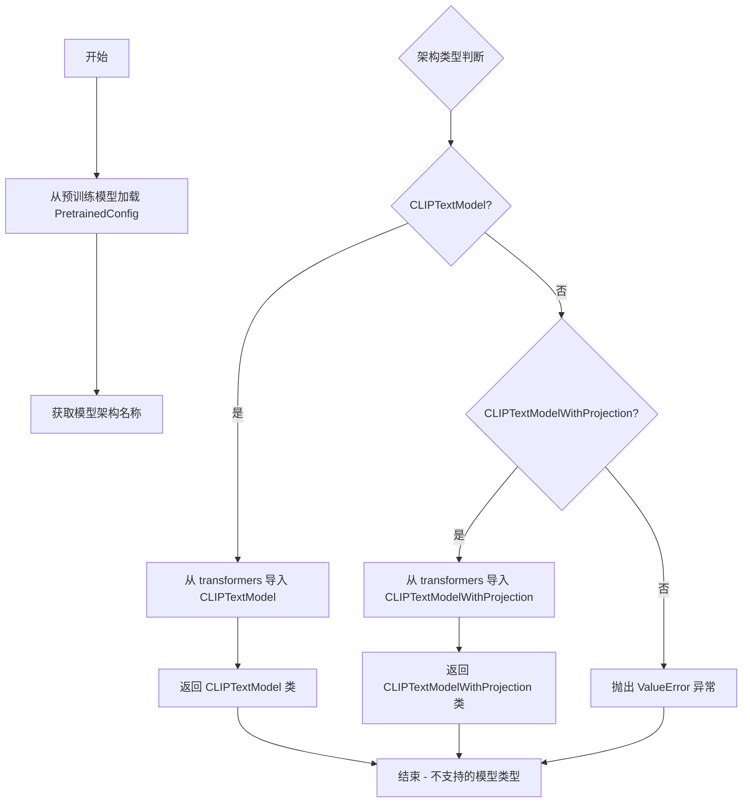

#### 带注释源码

```python
def import_model_class_from_model_name_or_path(
    pretrained_model_name_or_path: str, revision: str, subfolder: str = "text_encoder"
):
    """
    根据预训练模型的配置动态导入相应的文本编码器类。
    
    参数:
        pretrained_model_name_or_path: 预训练模型路径或 HuggingFace 模型标识符
        revision: 模型版本号
        subfolder: 模型子文件夹（默认为 "text_encoder"）
    
    返回:
        CLIPTextModel 或 CLIPTextModelWithProjection 类
    """
    # 1. 从预训练模型加载 PretrainedConfig 配置
    text_encoder_config = PretrainedConfig.from_pretrained(
        pretrained_model_name_or_path, subfolder=subfolder, revision=revision
    )
    
    # 2. 从配置中获取模型架构名称（第一条架构）
    model_class = text_encoder_config.architectures[0]

    # 3. 根据架构名称判断并导入对应的类
    if model_class == "CLIPTextModel":
        # 标准 CLIP 文本编码器
        from transformers import CLIPTextModel

        return CLIPTextModel
    elif model_class == "CLIPTextModelWithProjection":
        # 带投影层的 CLIP 文本编码器（用于 SDXL）
        from transformers import CLIPTextModelWithProjection

        return CLIPTextModelWithProjection
    else:
        # 不支持的模型类型，抛出异常
        raise ValueError(f"{model_class} is not supported.")
```


### `log_validation`

该函数用于在训练过程中或训练结束后执行验证推理。它通过实例化 `DiffusionPipeline` 并使用预定义的提示词（`VALIDATION_PROMPTS`）生成示例图像，然后将生成的图像记录到 TensorBoard 或 WanDB 中。若标记为最终验证（`is_final_validation=True`），该函数还会额外生成一组不含 LoRA 权重的图像，用于对比分析模型微调的效果。

参数：

-  `args`：`argparse.Namespace`，包含预训练模型路径、输出目录、混合精度配置等训练参数。
-  `unet`：`UNet2DConditionModel`，训练中的 UNet 模型对象。如果 `is_final_validation` 为 `True`，此参数可能为 `None`（逻辑中会做处理）。
-  `vae`：`AutoencoderKL`，用于将图像编码到潜在空间和解码回像素空间的 VAE 模型。
-  `accelerator`：`Accelerate` 库的 `Accelerator` 对象，管理分布式训练环境和日志追踪器（tracker）。
-  `weight_dtype`：`torch.dtype`，推理时使用的数据类型（如 `torch.float16`）。
-  `epoch`：`int`，当前训练的轮次（epoch），用于日志记录。
-  `is_final_validation`：`bool`，布尔标志，指示是否为训练结束后的最终验证。若为真，会执行 LoRA 权重对比逻辑。

返回值：`None`，该函数通过副作用（生成并记录图像）完成工作，无返回值。

#### 流程图

```mermaid
graph TD
    A([开始 log_validation]) --> B[日志输出: Running validation...]
    B --> C{is_final_validation is True?}
    C -- Yes --> D[将 VAE 权重转换至 weight_dtype]
    C -- No --> E[使用 args 创建 DiffusionPipeline]
    D --> E
    E --> F{is_final_validation is True?}
    F -- No --> G[使用 accelerator.unwrap_model(unet) 加载权重]
    F -- Yes --> H[从 output_dir 加载 LoRA 权重]
    G --> I
    H --> I[将 Pipeline 移至 accelerator 设备]
    I --> J[设置进度条为禁用]
    J --> K[初始化随机种子生成器 generator]
    K --> L[设置推理上下文 context (autocast 或 nullcontext)]
    L --> M[设置推理参数: guidance_scale=5.0, num_inference_steps=25]
    M --> N{遍历 VALIDATION_PROMPTS}
    N -->|每条 Prompt| O[调用 pipeline 生成单张图像]
    O --> P[将图像加入列表]
    P --> N
    N -->|循环结束| Q[记录图像至 Tracker (TensorBoard/Wandb)]
    Q --> R{is_final_validation is True?}
    R -- No --> S([结束])
    R -- Yes --> T[禁用 Pipeline 的 LoRA (pipeline.disable_lora)]
    T --> U[重置 generator 种子]
    U --> V[遍历 VALIDATION_PROMPTS 生成无LoRA图像]
    V --> W[记录无LoRA图像至 Tracker]
    W --> S
```

#### 带注释源码

```python
def log_validation(args, unet, vae, accelerator, weight_dtype, epoch, is_final_validation=False):
    # 记录验证开始的日志，并打印当前使用的验证提示词
    logger.info(f"Running validation... \n Generating images with prompts:\n {VALIDATION_PROMPTS}.")

    # 如果是最终验证，且使用混合精度 fp16，则将 VAE 转换到对应的权重类型
    if is_final_validation:
        if args.mixed_precision == "fp16":
            vae.to(weight_dtype)

    # 1. 创建 DiffusionPipeline
    # 从预训练模型路径加载模型，并传入 vae、revision、variant 和 dtype
    pipeline = DiffusionPipeline.from_pretrained(
        args.pretrained_model_name_or_path,
        vae=vae,
        revision=args.revision,
        variant=args.variant,
        torch_dtype=weight_dtype,
    )
    
    # 2. 加载模型权重
    # 如果不是最终验证，加载训练中unwrap后的unet；否则，加载保存的LoRA权重
    if not is_final_validation:
        pipeline.unet = accelerator.unwrap_model(unet)
    else:
        pipeline.load_lora_weights(args.output_dir, weight_name="pytorch_lora_weights.safetensors")

    # 3. 将 Pipeline 移至设备并配置
    pipeline = pipeline.to(accelerator.device)
    pipeline.set_progress_bar_config(disable=True)

    # 4. 准备推理环境
    # 如果不是最终验证，使用自动混合精度(AMP)上下文；否则使用空上下文
    generator = torch.Generator(device=accelerator.device).manual_seed(args.seed) if args.seed else None
    images = []
    context = contextlib.nullcontext() if is_final_validation else torch.cuda.amp.autocast()

    # 5. 推理参数
    guidance_scale = 5.0
    num_inference_steps = 25
    
    # 遍历预定义的验证提示词列表进行生成
    for prompt in VALIDATION_PROMPTS:
        with context:
            # 调用 pipeline 生成图像
            image = pipeline(
                prompt, 
                num_inference_steps=num_inference_steps, 
                guidance_scale=guidance_scale, 
                generator=generator
            ).images[0]
            images.append(image)

    # 6. 记录生成的图像
    tracker_key = "test" if is_final_validation else "validation"
    for tracker in accelerator.trackers:
        if tracker.name == "tensorboard":
            # 将PIL图像转换为numpy数组并堆叠，维度为 NHWC
            np_images = np.stack([np.asarray(img) for img in images])
            tracker.writer.add_images(tracker_key, np_images, epoch, dataformats="NHWC")
        if tracker.name == "wandb":
            tracker.log(
                {
                    tracker_key: [
                        wandb.Image(image, caption=f"{i}: {VALIDATION_PROMPTS[i]}") for i, image in enumerate(images)
                    ]
                }
            )

    # 7. 最终验证特殊逻辑：对比无LoRA的图像
    if is_final_validation:
        # 禁用LoRA以生成基准图像
        pipeline.disable_lora()
        generator = torch.Generator(device=accelerator.device).manual_seed(args.seed) if args.seed else None
        
        # 重新生成不带LoRA的图像
        no_lora_images = [
            pipeline(
                prompt, num_inference_steps=num_inference_steps, guidance_scale=guidance_scale, generator=generator
            ).images[0]
            for prompt in VALIDATION_PROMPTS
        ]

        # 记录无LoRA的图像
        for tracker in accelerator.trackers:
            if tracker.name == "tensorboard":
                np_images = np.stack([np.asarray(img) for img in no_lora_images])
                tracker.writer.add_images("test_without_lora", np_images, epoch, dataformats="NHWC")
            if tracker.name == "wandb":
                tracker.log(
                    {
                        "test_without_lora": [
                            wandb.Image(image, caption=f"{i}: {VALIDATION_PROMPTS[i]}")
                            for i, image in enumerate(no_lora_images)
                        ]
                    }
                )
```


### `parse_args`

该函数是训练脚本的命令行参数解析器，用于配置扩散模型（SDXL）LoRA微调训练的所有超参数和路径选项。

参数：

- `input_args`：`Optional[List[str]]`，可选参数，用于传递自定义的命令行参数列表。若为 `None`，则从系统命令行解析参数。

返回值：`Namespace`，返回一个命名空间对象，包含所有解析后的命令行参数（如模型路径、学习率、批次大小等）。

#### 流程图

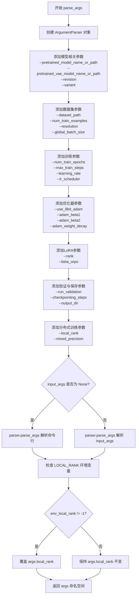

#### 带注释源码

```python
def parse_args(input_args=None):
    """
    解析命令行参数，返回训练所需的配置对象。
    
    参数:
        input_args: 可选的参数列表，若为None则从sys.argv解析
        
    返回:
        argparse.Namespace: 包含所有训练配置的对象
    """
    # 1. 创建ArgumentParser实例，设置脚本描述
    parser = argparse.ArgumentParser(description="Simple example of a training script.")
    
    # 2. 添加预训练模型相关参数
    parser.add_argument(
        "--pretrained_model_name_or_path",
        type=str,
        default=None,
        required=True,  # 必须指定预训练模型路径
        help="Path to pretrained model or model identifier from huggingface.co/models.",
    )
    parser.add_argument(
        "--pretrained_vae_model_name_or_path",
        type=str,
        default=None,
        help="Path to pretrained VAE model with better numerical stability.",
    )
    parser.add_argument(
        "--revision",
        type=str,
        default=None,
        required=False,
        help="Revision of pretrained model identifier from huggingface.co/models.",
    )
    parser.add_argument(
        "--dataset_path",
        type=str,
        default="pipe:aws s3 cp s3://diffusion-preference-opt/{00000..00644}.tar -",
    )
    parser.add_argument(
        "--num_train_examples",
        type=int,
        default=1001352,
    )
    parser.add_argument(
        "--variant",
        type=str,
        default=None,
        help="Variant of the model files, e.g., fp16",
    )
    
    # 3. 添加验证相关参数
    parser.add_argument(
        "--run_validation",
        default=False,
        action="store_true",
        help="Whether to run validation inference in between training.",
    )
    parser.add_argument(
        "--validation_steps",
        type=int,
        default=200,
        help="Run validation every X steps.",
    )
    
    # 4. 添加输出和缓存目录参数
    parser.add_argument(
        "--output_dir",
        type=str,
        default="diffusion-orpo-lora-sdxl",
        help="The output directory where the model predictions and checkpoints will be written.",
    )
    parser.add_argument(
        "--cache_dir",
        type=str,
        default=None,
        help="The directory where the downloaded models and datasets will be stored.",
    )
    parser.add_argument("--seed", type=int, default=None, help="A seed for reproducible training.")
    
    # 5. 添加图像处理参数
    parser.add_argument(
        "--resolution",
        type=int,
        default=1024,
        help="The resolution for input images, all the images will be resized to this resolution.",
    )
    parser.add_argument(
        "--vae_encode_batch_size",
        type=int,
        default=8,
        help="Batch size to use for VAE encoding of the images.",
    )
    parser.add_argument(
        "--no_hflip",
        action="store_true",
        help="whether to randomly flip images horizontally",
    )
    parser.add_argument(
        "--random_crop",
        default=False,
        action="store_true",
        help="Whether to random crop the input images.",
    )
    
    # 6. 添加批次大小和学习参数
    parser.add_argument("--global_batch_size", type=int, default=64, help="Total batch size.")
    parser.add_argument(
        "--per_gpu_batch_size", type=int, default=8, help="Number of samples in a batch for a single GPU."
    )
    parser.add_argument("--num_train_epochs", type=int, default=1)
    parser.add_argument(
        "--max_train_steps",
        type=int,
        default=None,
        help="Total number of training steps to perform. If provided, overrides num_train_epochs.",
    )
    
    # 7. 添加检查点参数
    parser.add_argument(
        "--checkpointing_steps",
        type=int,
        default=500,
        help="Save a checkpoint of the training state every X updates.",
    )
    parser.add_argument(
        "--checkpoints_total_limit",
        type=int,
        default=None,
        help="Max number of checkpoints to store.",
    )
    parser.add_argument(
        "--resume_from_checkpoint",
        type=str,
        default=None,
        help="Whether training should be resumed from a previous checkpoint.",
    )
    
    # 8. 添加梯度累积和检查点参数
    parser.add_argument(
        "--gradient_accumulation_steps",
        type=int,
        default=1,
        help="Number of updates steps to accumulate before performing a backward pass.",
    )
    parser.add_argument(
        "--gradient_checkpointing",
        action="store_true",
        help="Whether or not to use gradient checkpointing to save memory.",
    )
    
    # 9. 添加ORPO损失参数
    parser.add_argument(
        "--beta_orpo",
        type=float,
        default=0.1,
        help="ORPO contribution factor.",
    )
    
    # 10. 添加学习率调度器参数
    parser.add_argument(
        "--learning_rate",
        type=float,
        default=5e-4,
        help="Initial learning rate (after the potential warmup period) to use.",
    )
    parser.add_argument(
        "--scale_lr",
        action="store_true",
        default=False,
        help="Scale the learning rate by the number of GPUs, gradient accumulation steps, and batch size.",
    )
    parser.add_argument(
        "--lr_scheduler",
        type=str,
        default="constant",
        help="The scheduler type to use. Choose between linear, cosine, cosine_with_restarts, polynomial, constant, constant_with_warmup.",
    )
    parser.add_argument(
        "--lr_warmup_steps", type=int, default=500, help="Number of steps for the warmup in the lr scheduler."
    )
    parser.add_argument(
        "--lr_num_cycles",
        type=int,
        default=1,
        help="Number of hard resets of the lr in cosine_with_restarts scheduler.",
    )
    parser.add_argument("--lr_power", type=float, default=1.0, help="Power factor of the polynomial scheduler.")
    
    # 11. 添加数据加载器参数
    parser.add_argument(
        "--dataloader_num_workers",
        type=int,
        default=0,
        help="Number of subprocesses to use for data loading.",
    )
    
    # 12. 添加Adam优化器参数
    parser.add_argument(
        "--use_8bit_adam", action="store_true", help="Whether or not to use 8-bit Adam from bitsandbytes."
    )
    parser.add_argument("--adam_beta1", type=float, default=0.9, help="The beta1 parameter for the Adam optimizer.")
    parser.add_argument("--adam_beta2", type=float, default=0.999, help="The beta2 parameter for the Adam optimizer.")
    parser.add_argument("--adam_weight_decay", type=float, default=1e-2, help="Weight decay to use.")
    parser.add_argument("--adam_epsilon", type=float, default=1e-08, help="Epsilon value for the Adam optimizer")
    parser.add_argument("--max_grad_norm", default=1.0, type=float, help="Max gradient norm.")
    
    # 13. 添加Hub推送参数
    parser.add_argument("--push_to_hub", action="store_true", help="Whether or not to push the model to the Hub.")
    parser.add_argument("--hub_token", type=str, default=None, help="The token to use to push to the Model Hub.")
    parser.add_argument(
        "--hub_model_id",
        type=str,
        default=None,
        help="The name of the repository to keep in sync with the local output_dir.",
    )
    parser.add_argument(
        "--logging_dir",
        type=str,
        default="logs",
        help="TensorBoard log directory.",
    )
    
    # 14. 添加硬件加速参数
    parser.add_argument(
        "--allow_tf32",
        action="store_true",
        help="Whether or not to allow TF32 on Ampere GPUs.",
    )
    parser.add_argument(
        "--report_to",
        type=str,
        default="tensorboard",
        help="The integration to report the results and logs to. Supported platforms are tensorboard, wandb and comet_ml.",
    )
    parser.add_argument(
        "--mixed_precision",
        type=str,
        default=None,
        choices=["no", "fp16", "bf16"],
        help="Whether to use mixed precision. Choose between fp16 and bf16.",
    )
    parser.add_argument(
        "--prior_generation_precision",
        type=str,
        default=None,
        choices=["no", "fp32", "fp16", "bf16"],
        help="Choose prior generation precision between fp32, fp16 and bf16.",
    )
    parser.add_argument("--local_rank", type=int, default=-1, help="For distributed training: local_rank")
    parser.add_argument(
        "--enable_xformers_memory_efficient_attention", action="store_true", help="Whether or not to use xformers."
    )
    
    # 15. 添加LoRA rank参数
    parser.add_argument(
        "--rank",
        type=int,
        default=4,
        help="The dimension of the LoRA update matrices.",
    )
    parser.add_argument(
        "--tracker_name",
        type=str,
        default="diffusion-orpo-lora-sdxl",
        help="The name of the tracker to report results to.",
    )

    # 16. 根据input_args是否为空决定解析方式
    if input_args is not None:
        args = parser.parse_args(input_args)  # 解析传入的参数列表
    else:
        args = parser.parse_args()  # 从命令行解析参数

    # 17. 处理LOCAL_RANK环境变量，用于分布式训练
    env_local_rank = int(os.environ.get("LOCAL_RANK", -1))
    if env_local_rank != -1 and env_local_rank != args.local_rank:
        args.local_rank = env_local_rank  # 覆盖命令行指定的local_rank

    return args  # 返回解析后的参数对象
```


### `tokenize_captions`

该函数用于将数据集中的原始文本描述（original_prompt）通过两个不同的分词器（tokenizer）进行分词处理，返回两个分词器生成的token序列。这是为Stable Diffusion XL模型准备文本输入的关键预处理步骤，因为SDXL使用双文本编码器架构。

参数：

- `tokenizers`：list[tuple]，包含两个分词器对象的列表/元组，通常是 `[tokenizer_one, tokenizer_two]`，分别对应SDXL的两个文本编码器
- `sample`：dict，样本字典，必须包含键 `"original_prompt"`，其值为待分词的原始文本字符串

返回值：`tuple[torch.Tensor, torch.Tensor]`，返回两个分词后的token张量元组，其中第一个是第一个分词器的输出（tokens_one），第二个是第二个分词器的输出（tokens_two），形状均为 `(batch_size, max_length)`

#### 流程图

```mermaid
flowchart TD
    A[开始 tokenize_captions] --> B[接收 tokenizers 列表和 sample 字典]
    B --> C{提取 original_prompt}
    C --> D[调用第一个分词器 tokenizers[0]]
    D --> E[设置 truncation=True, padding='max_length']
    E --> F[max_length=tokenizers[0].model_max_length]
    F --> G[return_tensors='pt' 转换为PyTorch张量]
    G --> H[提取 .input_ids 作为 tokens_one]
    H --> I[调用第二个分词器 tokenizers[1]]
    I --> J[设置 truncation=True, padding='max_length']
    J --> K[max_length=tokenizers[1].model_max_length]
    K --> L[return_tensors='pt' 转换为PyTorch张量]
    L --> M[提取 .input_ids 作为 tokens_two]
    M --> N[返回元组 tokens_one, tokens_two]
    N --> O[结束]
```

#### 带注释源码

```python
def tokenize_captions(tokenizers, sample):
    """
    将样本中的原始文本描述通过两个分词器进行分词处理
    
    Args:
        tokenizers: 包含两个分词器的列表 [tokenizer_one, tokenizer_two]
        sample: 包含 'original_prompt' 键的样本字典
    
    Returns:
        tuple: (tokens_one, tokens_two) 两个分词器生成的token张量
    """
    # 使用第一个分词器对原始提示进行分词
    # 返回 PyTorch 格式的 input_ids 张量
    tokens_one = tokenizers[0](
        sample["original_prompt"],          # 要分词的原始文本
        truncation=True,                     # 启用截断以防止超过最大长度
        padding="max_length",                # 填充到最大长度以保持一致的张量形状
        max_length=tokenizers[0].model_max_length,  # 使用该分词器支持的最大长度
        return_tensors="pt",                 # 返回 PyTorch 张量而不是列表
    ).input_ids  # 提取 input_ids 部分，形状为 (batch_size, seq_len)
    
    # 使用第二个分词器对同一原始提示进行分词
    # SDXL 的两个文本编码器可能使用不同的词汇表
    tokens_two = tokenizers[1](
        sample["original_prompt"],          # 相同的原始文本
        truncation=True,                     # 启用截断
        padding="max_length",                # 填充到最大长度
        max_length=tokenizers[1].model_max_length,  # 第二个分词器的最大长度
        return_tensors="pt",                 # 返回 PyTorch 张量
    ).input_ids  # 提取第二个分词器的 input_ids
    
    # 返回两个分词器的结果元组
    # 后续会被 encode_prompt 函数使用来生成文本嵌入
    return tokens_one, tokens_two
```


### `encode_prompt`

该函数负责将文本提示（prompts）编码为向量嵌入（embeddings）。它接收多个文本编码器（如 SDXL 中的 CLIPTextModel 和 CLIPTextModelWithProjection）及其对应的 token ID 列表，依次执行前向传播，提取特定的隐藏层状态（通常为倒数第二层），并对最终池化后的向量进行拼接，以供扩散模型的 UNet 在训练或推理时使用。

参数：

-  `text_encoders`：`List[torch.nn.Module]`，文本编码器模型列表（例如 `CLIPTextModel` 和 `CLIPTextModelWithProjection`）。
-  `text_input_ids_list`：`List[torch.Tensor]`，与文本编码器列表对应的 tokenized 输入 ID 列表。

返回值：

-  `prompt_embeds`：`torch.Tensor`，拼接后的提示嵌入向量（通常为倒数第二层隐藏状态的拼接）。
-  `pooled_prompt_embeds`：`torch.Tensor`，池化后的提示嵌入向量（通常来自最后一个编码器的输出）。

#### 流程图

```mermaid
graph TD
    A([开始 encode_prompt]) --> B[初始化空列表 prompt_embeds_list]
    B --> C{遍历 text_encoders 列表}
    C -->|第 i 个编码器| D[获取对应的 text_input_ids]
    D --> E[调用 text_encoder 进行前向传播]
    E --> F[提取 hidden_states[-2] 作为 prompt_embeds]
    F --> G[提取 prompt_embeds[0] 作为 pooled_prompt_embeds]
    G --> H[将 prompt_embeds 重新 reshape]
    H --> I[将当前 prompt_embeds 加入列表]
    I --> C
    C -->|遍历结束| J[在维度 -1 上拼接所有 prompt_embeds]
    J --> K[将最后的 pooled_prompt_embeds 展平]
    K --> L([返回 prompt_embeds 和 pooled_prompt_embeds])
```

#### 带注释源码

```python
@torch.no_grad()
def encode_prompt(text_encoders, text_input_ids_list):
    """
    编码文本提示。

    参数:
        text_encoders: 文本编码器列表。
        text_input_ids_list: 对应的输入ID列表。

    返回:
        prompt_embeds: 拼接后的隐藏状态。
        pooled_prompt_embeds: 池化后的嵌入。
    """
    prompt_embeds_list = []

    # 遍历每一个文本编码器（通常SDXL有两个：CLIP L 和 CLIP G）
    for i, text_encoder in enumerate(text_encoders):
        text_input_ids = text_input_ids_list[i]

        # 执行前向传播，设置 output_hidden_states=True 以获取隐藏层
        prompt_embeds = text_encoder(
            text_input_ids.to(text_encoder.device),
            output_hidden_states=True,
        )

        # 我们通常只对最后一个文本编码器的池化输出感兴趣 (见下方循环逻辑)
        # 注意：在标准 transformers 实现中，prompt_embeds[0] 通常是 last_hidden_state。
        # 如果模型返回的是 BaseModelOutputWithPooling，索引行为可能因版本而异，
        # 此处代码假设获取到了预期的池化向量或最后一个隐藏状态。
        pooled_prompt_embeds = prompt_embeds[0]
        
        # 提取倒数第二层的隐藏状态，这在某些Diffusion模型调优中是常见做法
        prompt_embeds = prompt_embeds.hidden_states[-2]
        
        # 获取形状信息
        bs_embed, seq_len, _ = prompt_embeds.shape
        
        # 调整形状以便后续拼接
        prompt_embeds = prompt_embeds.view(bs_embed, seq_len, -1)
        prompt_embeds_list.append(prompt_embeds)

    # 沿最后一个维度拼接来自不同编码器的嵌入
    prompt_embeds = torch.concat(prompt_embeds_list, dim=-1)
    
    # 将池化嵌入展平
    pooled_prompt_embeds = pooled_prompt_embeds.view(bs_embed, -1)
    
    return prompt_embeds, pooled_prompt_embeds
```


### `get_dataset`

该函数用于创建并配置 WebDataset 数据集对象，支持从远程存储（如 AWS S3）加载图像数据，并自动进行数据重采样、洗牌、解码和字段重命名等预处理操作。

参数：

- `args`：`argparse.Namespace`，包含数据集路径等配置信息的命令行参数对象

返回值：`webdataset.WebDataset`，配置好的 WebDataset 数据集对象，可迭代返回包含原始提示词、图像对和标签的样本

#### 流程图

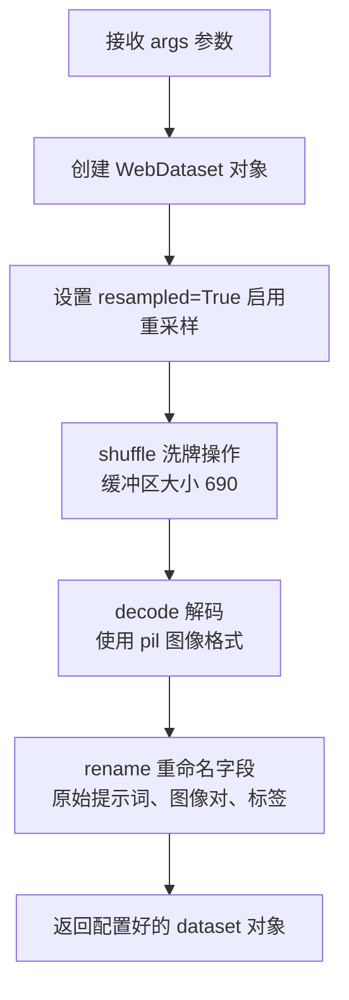

#### 带注释源码

```python
def get_dataset(args):
    """
    创建并配置 WebDataset 数据集对象。
    
    该函数使用 webdataset 库从远程存储（如 AWS S3）加载训练数据，
    并对数据进行洗牌、解码和字段重命名等预处理操作。
    
    参数:
        args: 命令行参数对象，需包含 dataset_path 属性指定数据源路径
        
    返回:
        webdataset.WebDataset: 配置好的数据集对象，可迭代返回样本
    """
    # 创建 WebDataset 数据集，启用重采样模式
    # resampled=True 允许在多个 epoch 间进行数据重采样
    # handler=wds.warn_and_continue 用于处理读取过程中的警告并继续执行
    dataset = (
        wds.WebDataset(args.dataset_path, resampled=True, handler=wds.warn_and_continue)
        # 对数据进行洗牌，缓冲区大小为 690
        # 洗牌有助于提高模型训练的泛化能力
        .shuffle(690, handler=wds.warn_and_continue)
        # 解码图像为 PIL 图像格式
        # 后续可以在预处理函数中转换为 tensor
        .decode("pil", handler=wds.warn_and_continue)
        # 重命名 tar 包中的文件字段
        # 将原始文件名映射为统一的键名，便于后续处理
        .rename(
            original_prompt="original_prompt.txt",  # 原始提示词文本
            jpg_0="jpg_0.jpg",  # 第一张图像（优选）
            jpg_1="jpg_1.jpg",  # 第二张图像（次选）
            label_0="label_0.txt",  # 第一张图像的标签
            label_1="label_1.txt",  # 第二张图像的标签
            handler=wds.warn_and_continue,
        )
    )
    # 返回配置好的数据集对象
    # 返回的对象是一个可迭代的 WebDataset，可用于 DataLoader
    return dataset
```


### `get_loader`

该函数用于创建Stable Diffusion XL (SDXL) 模型的训练数据加载器，支持图像预处理、批量处理、数据增强等功能。

参数：

- `args`：命令行参数对象，包含训练所需的各种配置参数（如数据集路径、分辨率、批大小等）
- `tokenizer_one`：第一个分词器（CLIPTokenizer类型），用于对原始提示词进行分词
- `tokenizer_two`：第二个分词器（CLIPTokenizer类型），用于对原始提示词进行分词（SDXL使用双文本编码器）

返回值：`wds.WebLoader` 类型，返回配置好的WebDataset数据加载器，用于SDXL模型训练

#### 流程图

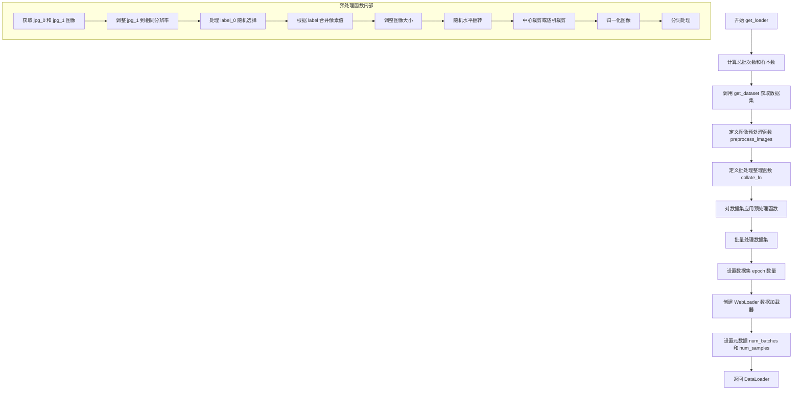

#### 带注释源码

```python
def get_loader(args, tokenizer_one, tokenizer_two):
    # 计算总批次数：基于全局批大小和训练样本数
    num_batches = math.ceil(args.num_train_examples / args.global_batch_size)
    
    # 计算每个数据加载器工作进程的批次数
    num_worker_batches = math.ceil(
        args.num_train_examples / (args.global_batch_size * args.dataloader_num_workers)
    )  # per dataloader worker
    
    # 重新计算总批次数（考虑工作进程数）
    num_batches = num_worker_batches * args.dataloader_num_workers
    
    # 计算总样本数
    num_samples = num_batches * args.global_batch_size

    # 获取 WebDataset 数据集（从 tar 文件或 S3 读取）
    dataset = get_dataset(args)

    # 定义图像变换操作
    train_resize = transforms.Resize(args.resolution, interpolation=transforms.InterpolationMode.BILINEAR)
    train_crop = transforms.RandomCrop(args.resolution) if args.random_crop else transforms.CenterCrop(args.resolution)
    train_flip = transforms.RandomHorizontalFlip(p=1.0)
    to_tensor = transforms.ToTensor()
    normalize = transforms.Normalize([0.5], [0.5])

    def preprocess_images(sample):
        """预处理单个样本的图像和文本"""
        # 获取第一张图像及其原始尺寸
        jpg_0_image = sample["jpg_0"]
        original_size = (jpg_0_image.height, jpg_0_image.width)
        crop_top_left = []

        # 获取第二张图像
        jpg_1_image = sample["jpg_1"]
        # 需要将图像降采样到相同分辨率
        # PIL resize 需要 (width, height) 格式，所以用 [::-1] 反转
        jpg_1_image = jpg_1_image.resize(original_size[::-1])

        # 随机选择和拒绝处理
        label_0 = sample["label_0"]
        if sample["label_0"] == 0.5:
            # 如果标签为 0.5，随机设置为 0 或 1
            if random.random() < 0.5:
                label_0 = 0
            else:
                label_0 = 1

        # 在通道维度上拼接两张图像（如果 label_0==0: [jpg_1, jpg_0], 否则 [jpg_0, jpg_1]）
        if label_0 == 0:
            pixel_values = torch.cat([to_tensor(image) for image in [jpg_1_image, jpg_0_image]])
        else:
            pixel_values = torch.cat([to_tensor(image) for image in [jpg_0_image, jpg_1_image]])

        # 调整图像大小
        combined_im = train_resize(pixel_values)

        # 随机水平翻转（如果启用）
        if not args.no_hflip and random.random() < 0.5:
            combined_im = train_flip(combined_im)

        # 裁剪处理
        if not args.random_crop:
            # 中心裁剪计算裁剪坐标
            y1 = max(0, int(round((combined_im.shape[1] - args.resolution) / 2.0)))
            x1 = max(0, int(round((combined_im.shape[2] - args.resolution) / 2.0)))
            combined_im = train_crop(combined_im)
        else:
            # 随机裁剪获取参数
            y1, x1, h, w = train_crop.get_params(combined_im, (args.resolution, args.resolution))
            combined_im = crop(combined_im, y1, x1, h, w)

        # 记录裁剪左上角坐标
        crop_top_left = (y1, x1)
        
        # 归一化图像到 [-1, 1]
        combined_im = normalize(combined_im)
        
        # 对提示词进行分词
        tokens_one, tokens_two = tokenize_captions([tokenizer_one, tokenizer_two], sample)

        return {
            "pixel_values": combined_im,
            "original_size": original_size,
            "crop_top_left": crop_top_left,
            "tokens_one": tokens_one,
            "tokens_two": tokens_two,
        }

    def collate_fn(samples):
        """整理批次数据"""
        # 堆叠像素值
        pixel_values = torch.stack([sample["pixel_values"] for sample in samples])
        pixel_values = pixel_values.to(memory_format=torch.contiguous_format).float()

        # 收集原始尺寸和裁剪坐标
        original_sizes = [example["original_size"] for example in samples]
        crop_top_lefts = [example["crop_top_left"] for example in samples]
        
        # 堆叠分词后的 input_ids
        input_ids_one = torch.stack([example["tokens_one"] for example in samples])
        input_ids_two = torch.stack([example["tokens_two"] for example in samples])

        return {
            "pixel_values": pixel_values,
            "input_ids_one": input_ids_one,
            "input_ids_two": input_ids_two,
            "original_sizes": original_sizes,
            "crop_top_lefts": crop_top_lefts,
        }

    # 对数据集应用图像预处理函数
    dataset = dataset.map(preprocess_images, handler=wds.warn_and_continue)
    
    # 批量处理数据
    dataset = dataset.batched(args.per_gpu_batch_size, partial=False, collation_fn=collate_fn)
    
    # 设置数据 epoch 数量
    dataset = dataset.with_epoch(num_worker_batches)

    # 创建 WebLoader 数据加载器
    dataloader = wds.WebLoader(
        dataset,
        batch_size=None,
        shuffle=False,
        num_workers=args.dataloader_num_workers,
        pin_memory=True,
        persistent_workers=True,
    )
    
    # 为数据加载器添加元数据
    dataloader.num_batches = num_batches
    dataloader.num_samples = num_samples
    
    return dataloader
```


# 设计文档：SDXL LoRA 训练脚本 main 函数

## 概述

本代码是一个用于训练 Stable Diffusion XL (SDXL) LoRA 模型的完整训练脚本，采用了 ORPO (Odds Ratio Preference Optimization) 优化算法来实现基于偏好的微调。脚本支持分布式训练、混合精度计算、梯度检查点、xFormers 内存高效注意力机制等高级特性，能够在多 GPU 环境下高效训练 LoRA 适配器。

---

### `main`

该函数是训练脚本的核心入口，负责初始化训练环境、加载模型和数据集、执行训练循环、管理检查点保存以及最终模型导出。

参数：

- `args`：`argparse.Namespace`，命令行参数对象，包含模型路径、训练超参数、数据集配置等所有训练配置

返回值：`None`，函数执行完成后直接退出

#### 流程图

```mermaid
flowchart TD
    A[开始 main 函数] --> B{检查 wandb 和 hub_token 组合}
    B -->|不安全| C[抛出 ValueError]
    B -->|安全| D[创建日志目录和 ProjectConfiguration]
    E[初始化 Accelerator] --> F{检查 MPS 后端}
    F -->|可用| G[禁用原生 AMP]
    F -->|不可用| H[继续]
    G --> H
    H --> I[配置日志系统]
    I --> J{设置随机种子}
    J -->|提供| K[调用 set_seed]
    J -->|未提供| L[跳过]
    K --> L
    L --> M{主进程创建输出目录}
    M -->|是| N[创建目录并处理 Hub 仓库]
    M -->|否| O[跳过]
    N --> O
    O --> P[加载 Tokenizers]
    P --> Q[加载 Text Encoders 类]
    Q --> R[加载 Scheduler 和 Models]
    R --> S[冻结 VAE 和 Text Encoders]
    S --> T[设置权重精度 fp16/bf16/fp32]
    T --> U[移动模型到设备]
    U --> V[配置 LoRA]
    V --> W{启用 xformers}
    W -->|是| X[检查版本并启用]
    W -->|否| Y[抛出异常]
    X --> Z[启用梯度检查点]
    Y --> AA[注册保存/加载钩子]
    Z --> AA
    AA --> AB[启用 TF32]
    AB --> AC{缩放学习率}
    AC -->|是| AD[计算新学习率]
    AC -->|否| AE[创建优化器]
    AD --> AE
    AE --> AF[创建 DataLoader]
    AF --> AG[创建 LR Scheduler]
    AG --> AH[准备模型和优化器]
    AH --> AI[初始化 Trackers]
    AI --> AJ[进入训练循环]
    
    AJ --> AK[外层循环: Epoch]
    AK --> AL[内层循环: Step]
    AL --> AM[累积梯度]
    AM --> AN[编码图像到 latents]
    AN --> AO[添加噪声]
    AO --> AP[计算 time_ids]
    AP --> AQ[编码文本提示]
    AQ --> AR[UNet 预测噪声残差]
    AR --> AS[计算 ORPO 损失]
    AS --> AT[反向传播]
    AT --> AU{同步梯度}
    AU -->|是| AV[梯度裁剪]
    AU -->|否| AX[跳过]
    AV --> AW[优化器更新]
    AW --> AY[更新学习率]
    AY --> AZ[清空梯度]
    AZ --> BA[更新进度条]
    
    BA --> BB{检查点保存条件}
    BB -->|满足| BC[保存检查点]
    BB -->|不满足| BD[继续]
    BC --> BD
    
    BD --> BE{验证条件}
    BE -->|满足| BF[运行验证]
    BE -->|不满足| BG[继续]
    BF --> BG
    
    BG --> BH{达到最大步数}
    BH -->|是| BI[退出训练]
    BH -->|否| BJ[继续下一步]
    BJ --> AL
    
    BI --> BK[等待所有进程]
    BK --> BL{主进程}
    BL -->|是| BM[保存 LoRA 权重]
    BL -->|否| BN[跳过]
    BM --> BO{最终验证}
    BO -->|是| BP[运行最终验证]
    BO -->|否| BQ[跳过]
    BP --> BQ
    BQ --> BR{推送到 Hub}
    BR -->|是| BS[上传文件夹]
    BR -->|否| BT[结束训练]
    BS --> BT
    BT[结束]
```

#### 带注释源码

```python
def main(args):
    """
    SDXL LoRA 训练主函数
    
    完整的训练流程包括：
    1. 环境初始化和配置检查
    2. 模型加载和准备
    3. LoRA 配置和应用
    4. 数据加载器创建
    5. 训练循环（包含 ORPO 损失计算）
    6. 检查点保存和验证
    7. 最终模型导出
    """
    
    # ==================== 第一部分：环境初始化 ====================
    
    # 安全检查： wandb 和 hub_token 不能同时使用，存在安全风险
    if args.report_to == "wandb" and args.hub_token is not None:
        raise ValueError(
            "You cannot use both --report_to=wandb and --hub_token due to a security risk of exposing your token."
            " Please use `hf auth login` to authenticate with the Hub."
        )

    # 构建日志目录路径：output_dir/logs
    logging_dir = Path(args.output_dir, args.logging_dir)

    # 创建 Accelerator 项目配置
    accelerator_project_config = ProjectConfiguration(
        project_dir=args.output_dir, 
        logging_dir=logging_dir
    )

    # 初始化 Accelerator：处理分布式训练、混合精度、日志记录等
    accelerator = Accelerator(
        gradient_accumulation_steps=args.gradient_accumulation_steps,
        mixed_precision=args.mixed_precision,
        log_with=args.report_to,
        project_config=accelerator_project_config,
    )

    # 特殊情况处理：MPS (Apple Silicon) 后端需要禁用原生 AMP
    if torch.backends.mps.is_available():
        accelerator.native_amp = False

    # 配置日志系统：格式化为易读的时间戳格式
    logging.basicConfig(
        format="%(asctime)s - %(levelname)s - %(name)s - %(message)s",
        datefmt="%m/%d/%Y %H:%M:%S",
        level=logging.INFO,
    )
    
    # 输出加速器状态信息
    logger.info(accelerator.state, main_process_only=False)
    
    # 根据进程角色设置日志级别：主进程显示详细输出，其他进程只显示错误
    if accelerator.is_local_main_process:
        transformers.utils.logging.set_verbosity_warning()
        diffusers.utils.logging.set_verbosity_info()
    else:
        transformers.utils.logging.set_verbosity_error()
        diffusers.utils.logging.set_verbosity_error()

    # 如果提供了随机种子，设置它以确保可重复性
    if args.seed is not None:
        set_seed(args.seed)

    # ==================== 第二部分：仓库和目录准备 ====================
    
    # 处理仓库创建（仅主进程）
    if accelerator.is_main_process:
        # 创建输出目录
        if args.output_dir is not None:
            os.makedirs(args.output_dir, exist_ok=True)

        # 如果需要推送到 Hub，创建远程仓库
        if args.push_to_hub:
            repo_id = create_repo(
                repo_id=args.hub_model_id or Path(args.output_dir).name, 
                exist_ok=True, 
                token=args.hub_token
            ).repo_id

    # ==================== 第三部分：模型加载 ====================
    
    # 加载两个 tokenizers（SDXL 使用两个文本编码器）
    tokenizer_one = AutoTokenizer.from_pretrained(
        args.pretrained_model_name_or_path,
        subfolder="tokenizer",
        revision=args.revision,
        use_fast=False,
    )
    tokenizer_two = AutoTokenizer.from_pretrained(
        args.pretrained_model_name_or_path,
        subfolder="tokenizer_2",
        revision=args.revision,
        use_fast=False,
    )

    # 根据模型名称动态导入正确的文本编码器类
    text_encoder_cls_one = import_model_class_from_model_name_or_path(
        args.pretrained_model_name_or_path, args.revision
    )
    text_encoder_cls_two = import_model_class_from_model_name_or_path(
        args.pretrained_model_name_or_path, args.revision, subfolder="text_encoder_2"
    )

    # 加载噪声调度器（DDPM scheduler）
    noise_scheduler = DDPMScheduler.from_pretrained(
        args.pretrained_model_name_or_path, 
        subfolder="scheduler"
    )

    # 加载文本编码器模型
    text_encoder_one = text_encoder_cls_one.from_pretrained(
        args.pretrained_model_name_or_path, 
        subfolder="text_encoder", 
        revision=args.revision, 
        variant=args.variant
    )
    text_encoder_two = text_encoder_cls_two.from_pretrained(
        args.pretrained_model_name_or_path, 
        subfolder="text_encoder_2", 
        revision=args.revision, 
        variant=args.variant
    )
    
    # 处理 VAE 路径：使用预训练 VAE 或自定义 VAE
    vae_path = (
        args.pretrained_model_name_or_path
        if args.pretrained_vae_model_name_or_path is None
        else args.pretrained_vae_model_name_or_path
    )
    vae = AutoencoderKL.from_pretrained(
        vae_path,
        subfolder="vae" if args.pretrained_vae_model_name_or_path is None else None,
        revision=args.revision,
        variant=args.variant,
    )
    
    # 加载 UNet 模型
    unet = UNet2DConditionModel.from_pretrained(
        args.pretrained_model_name_or_path, 
        subfolder="unet", 
        revision=args.revision, 
        variant=args.variant
    )

    # ==================== 第四部分：模型冻结和精度设置 ====================
    
    # LoRA 训练只更新 LoRA 层，其他参数冻结
    vae.requires_grad_(False)
    text_encoder_one.requires_grad_(False)
    text_encoder_two.requires_grad_(False)
    unet.requires_grad_(False)

    # 设置权重精度：用于混合精度训练
    # 推理用的非 LoRA 权重使用半精度即可
    weight_dtype = torch.float32
    if accelerator.mixed_precision == "fp16":
        weight_dtype = torch.float16
    elif accelerator.mixed_precision == "bf16":
        weight_dtype = torch.bfloat16

    # 将 UNet 和文本编码器移到设备并转换为指定精度
    unet.to(accelerator.device, dtype=weight_dtype)
    text_encoder_one.to(accelerator.device, dtype=weight_dtype)
    text_encoder_two.to(accelerator.device, dtype=weight_dtype)

    # VAE 始终使用 float32 以避免 NaN 损失
    vae.to(accelerator.device, dtype=torch.float32)

    # ==================== 第五部分：LoRA 配置 ====================
    
    # 配置 LoRA 参数
    unet_lora_config = LoraConfig(
        r=args.rank,                          # LoRA 秩（维度）
        lora_alpha=args.rank,                 # LoRA 缩放因子
        init_lora_weights="gaussian",         # 初始化方式
        target_modules=["to_k", "to_q", "to_v", "to_out.0"],  # 目标模块
    )
    
    # 为 UNet 添加 LoRA 适配器
    unet.add_adapter(unet_lora_config)
    
    # 确保可训练参数（LoRA）为 float32
    if args.mixed_precision == "fp16":
        for param in unet.parameters():
            if param.requires_grad:
                param.data = param.to(torch.float32)

    # ==================== 第六部分：内存优化配置 ====================
    
    # 配置 xFormers 内存高效注意力机制
    if args.enable_xformers_memory_efficient_attention:
        if is_xformers_available():
            import xformers

            # 版本检查：0.0.16 版本在某些 GPU 上有问题
            xformers_version = version.parse(xformers.__version__)
            if xformers_version == version.parse("0.0.16"):
                logger.warning(
                    "xFormers 0.0.16 cannot be used for training in some GPUs. "
                    "If you observe problems during training, please update xFormers to at least 0.0.17."
                )
            unet.enable_xformers_memory_efficient_attention()
        else:
            raise ValueError("xformers is not available. Make sure it is installed correctly")

    # 启用梯度检查点以节省内存
    if args.gradient_checkpointing:
        unet.enable_gradient_checkpointing()

    # ==================== 第七部分：自定义保存/加载钩子 ====================
    
    # 创建自定义模型保存钩子
    def save_model_hook(models, weights, output_dir):
        """保存时将 LoRA 权重转换为 diffusers 格式"""
        if accelerator.is_main_process:
            unet_lora_layers_to_save = None

            for model in models:
                if isinstance(model, type(accelerator.unwrap_model(unet))):
                    # 获取 PEFT 模型的 state dict 并转换
                    unet_lora_layers_to_save = convert_state_dict_to_diffusers(
                        get_peft_model_state_dict(model)
                    )
                else:
                    raise ValueError(f"unexpected save model: {model.__class__}")

                # 弹出权重，防止重复保存
                weights.pop()

            # 保存 LoRA 权重
            StableDiffusionXLLoraLoaderMixin.save_lora_weights(
                output_dir,
                unet_lora_layers=unet_lora_layers_to_save,
                text_encoder_lora_layers=None,
                text_encoder_2_lora_layers=None,
            )

    # 创建自定义模型加载钩子
    def load_model_hook(models, input_dir):
        """加载时将 diffusers 格式的 LoRA 权重转换回 PEFT 格式"""
        unet_ = None

        while len(models) > 0:
            model = models.pop()

            if isinstance(model, type(accelerator.unwrap_model(unet))):
                unet_ = model
            else:
                raise ValueError(f"unexpected save model: {model.__class__}")

        # 加载 LoRA 状态字典
        lora_state_dict, network_alphas = StableDiffusionXLLoraLoaderMixin.lora_state_dict(input_dir)

        # 提取 UNet 的 LoRA 权重并转换格式
        unet_state_dict = {
            f"{k.replace('unet.', '')}": v 
            for k, v in lora_state_dict.items() 
            if k.startswith("unet.")
        }
        unet_state_dict = convert_unet_state_dict_to_peft(unet_state_dict)
        
        # 加载权重到模型
        incompatible_keys = set_peft_model_state_dict(
            unet_, 
            unet_state_dict, 
            adapter_name="default"
        )
        
        # 检查不兼容的键
        if incompatible_keys is not None:
            unexpected_keys = getattr(incompatible_keys, "unexpected_keys", None)
            if unexpected_keys:
                logger.warning(
                    f"Loading adapter weights from state_dict led to unexpected keys not found in the model: "
                    f" {unexpected_keys}."
                )

    # 注册钩子
    accelerator.register_save_state_pre_hook(save_model_hook)
    accelerator.register_load_state_pre_hook(load_model_hook)

    # ==================== 第八部分：性能优化配置 ====================
    
    # 启用 TF32 以加速 Ampere GPU 上的训练
    if args.allow_tf32:
        torch.backends.cuda.matmul.allow_tf32 = True

    # ==================== 第九部分：优化器创建 ====================
    
    # 根据参数缩放学习率
    if args.scale_lr:
        args.learning_rate = (
            args.learning_rate 
            * args.gradient_accumulation_steps 
            * args.per_gpu_batch_size 
            * accelerator.num_processes
        )

    # 选择优化器：8-bit Adam 或标准 AdamW
    if args.use_8bit_adam:
        try:
            import bitsandbytes as bnb
        except ImportError:
            raise ImportError(
                "To use 8-bit Adam, please install the bitsandbytes library: `pip install bitsandbytes`."
            )
        optimizer_class = bnb.optim.AdamW8bit
    else:
        optimizer_class = torch.optim.AdamW

    # 创建优化器：只优化可训练参数（LoRA 参数）
    params_to_optimize = list(filter(lambda p: p.requires_grad, unet.parameters()))
    optimizer = optimizer_class(
        params_to_optimize,
        lr=args.learning_rate,
        betas=(args.adam_beta1, args.adam_beta2),
        weight_decay=args.adam_weight_decay,
        eps=args.adam_epsilon,
    )

    # ==================== 第十部分：数据加载器创建 ====================
    
    # 计算全局批量大小
    args.global_batch_size = args.per_gpu_batch_size * accelerator.num_processes
    
    # 创建数据加载器
    train_dataloader = get_loader(
        args, 
        tokenizer_one=tokenizer_one, 
        tokenizer_two=tokenizer_two
    )

    # ==================== 第十一部分：学习率调度器 ====================
    
    # 计算每 epoch 的更新步数
    overrode_max_train_steps = False
    num_update_steps_per_epoch = math.ceil(
        train_dataloader.num_batches / args.gradient_accumulation_steps
    )
    
    # 设置最大训练步数
    if args.max_train_steps is None:
        args.max_train_steps = args.num_train_epochs * num_update_steps_per_epoch
        overrode_max_train_steps = True

    # 创建学习率调度器
    lr_scheduler = get_scheduler(
        args.lr_scheduler,
        optimizer=optimizer,
        num_warmup_steps=args.lr_warmup_steps * accelerator.num_processes,
        num_training_steps=args.max_train_steps * accelerator.num_processes,
        num_cycles=args.lr_num_cycles,
        power=args.lr_power,
    )

    # 准备模型、优化器和调度器（分布式训练必需）
    unet, optimizer, lr_scheduler = accelerator.prepare(
        unet, optimizer, lr_scheduler
    )

    # 重新计算训练步数（数据加载器大小可能变化）
    num_update_steps_per_epoch = math.ceil(
        train_dataloader.num_batches / args.gradient_accumulation_steps
    )
    if overrode_max_train_steps:
        args.max_train_steps = args.num_train_epochs * num_update_steps_per_epoch
    
    # 重新计算 epoch 数量
    args.num_train_epochs = math.ceil(args.max_train_steps / num_update_steps_per_epoch)

    # ==================== 第十二部分：初始化 Trackers ====================
    
    # 初始化跟踪器（TensorBoard、WandB 等）
    if accelerator.is_main_process:
        accelerator.init_trackers(args.tracker_name, config=vars(args))

    # ==================== 第十三部分：训练循环 ====================
    
    # 计算总批量大小
    total_batch_size = (
        args.per_gpu_batch_size 
        * accelerator.num_processes 
        * args.gradient_accumulation_steps
    )

    # 打印训练信息
    logger.info("***** Running training *****")
    logger.info(f"  Num examples = {train_dataloader.num_samples}")
    logger.info(f"  Num Epochs = {args.num_train_epochs}")
    logger.info(f"  Instantaneous batch size per device = {args.per_gpu_batch_size}")
    logger.info(f"  Total train batch size (w. parallel, distributed & accumulation) = {total_batch_size}")
    logger.info(f"  Gradient Accumulation steps = {args.gradient_accumulation_steps}")
    logger.info(f"  Total optimization steps = {args.max_train_steps}")
    
    global_step = 0
    first_epoch = 0

    # ==================== 第十四部分：检查点恢复 ====================
    
    # 处理从检查点恢复训练
    if args.resume_from_checkpoint:
        if args.resume_from_checkpoint != "latest":
            path = os.path.basename(args.resume_from_checkpoint)
        else:
            # 查找最新的检查点
            dirs = os.listdir(args.output_dir)
            dirs = [d for d in dirs if d.startswith("checkpoint")]
            dirs = sorted(dirs, key=lambda x: int(x.split("-")[1]))
            path = dirs[-1] if len(dirs) > 0 else None

        if path is None:
            accelerator.print(
                f"Checkpoint '{args.resume_from_checkpoint}' does not exist. Starting a new training run."
            )
            args.resume_from_checkpoint = None
            initial_global_step = 0
        else:
            accelerator.print(f"Resuming from checkpoint {path}")
            accelerator.load_state(os.path.join(args.output_dir, path))
            global_step = int(path.split("-")[1])

            initial_global_step = global_step
            first_epoch = global_step // num_update_steps_per_epoch
    else:
        initial_global_step = 0

    # 创建进度条
    progress_bar = tqdm(
        range(0, args.max_train_steps),
        initial=initial_global_step,
        desc="Steps",
        disable=not accelerator.is_local_main_process,
    )

    # 训练模式
    unet.train()
    
    # ==================== 第十五部分：主训练循环 ====================
    
    for epoch in range(first_epoch, args.num_train_epochs):
        for step, batch in enumerate(train_dataloader):
            # 梯度累积
            with accelerator.accumulate(unet):
                # 数据准备：将像素值移到设备并转换类型
                # 批量格式: (batch_size, 2*channels, h, w) -> (2*batch_size, channels, h, w)
                # 这里的 2 代表两个图像（优选和非优选）连接在一起
                pixel_values = batch["pixel_values"].to(
                    dtype=vae.dtype, 
                    device=accelerator.device, 
                    non_blocking=True
                )
                feed_pixel_values = torch.cat(pixel_values.chunk(2, dim=1))

                # VAE 编码：将图像编码为潜在表示
                latents = []
                for i in range(0, feed_pixel_values.shape[0], args.vae_encode_batch_size):
                    latents.append(
                        vae.encode(
                            feed_pixel_values[i : i + args.vae_encode_batch_size]
                        ).latent_dist.sample()
                    )
                latents = torch.cat(latents, dim=0)
                
                # 缩放潜在表示
                latents = latents * vae.config.scaling_factor
                
                # 根据 VAE 类型转换精度
                if args.pretrained_vae_model_name_or_path is None:
                    latents = latents.to(weight_dtype)

                # 采样噪声：用于添加到潜在表示
                noise = torch.randn_like(latents).chunk(2)[0].repeat(2, 1, 1, 1)

                # 采样随机时间步
                bsz = latents.shape[0] // 2
                timesteps = torch.randint(
                    0, 
                    noise_scheduler.config.num_train_timesteps, 
                    (bsz,), 
                    device=latents.device, 
                    dtype=torch.long
                ).repeat(2)

                # 前向扩散过程：添加噪声到潜在表示
                noisy_model_input = noise_scheduler.add_noise(latents, noise, timesteps)

                # 计算 time_ids（用于 SDXL 的附加条件）
                def compute_time_ids(original_size, crops_coords_top_left):
                    """计算 SDXL 所需的时间 ID"""
                    target_size = (args.resolution, args.resolution)
                    add_time_ids = list(
                        tuple(original_size) + tuple(crops_coords_top_left) + target_size
                    )
                    add_time_ids = torch.tensor([add_time_ids])
                    add_time_ids = add_time_ids.to(accelerator.device, dtype=weight_dtype)
                    return add_time_ids

                add_time_ids = torch.cat(
                    [
                        compute_time_ids(s, c) 
                        for s, c in zip(batch["original_sizes"], batch["crop_top_lefts"])
                    ]
                ).repeat(2, 1)

                # 编码文本提示为条件嵌入
                prompt_embeds, pooled_prompt_embeds = encode_prompt(
                    [text_encoder_one, text_encoder_two], 
                    [batch["input_ids_one"], batch["input_ids_two"]]
                )
                
                # 重复嵌入以匹配批量大小（每个样本有两个图像）
                prompt_embeds = prompt_embeds.repeat(2, 1, 1)
                pooled_prompt_embeds = pooled_prompt_embeds.repeat(2, 1)

                # UNet 预测噪声残差
                model_pred = unet(
                    noisy_model_input,
                    timesteps,
                    prompt_embeds,
                    added_cond_kwargs={
                        "time_ids": add_time_ids, 
                        "text_embeds": pooled_prompt_embeds
                    },
                ).sample

                # 根据预测类型确定目标
                if noise_scheduler.config.prediction_type == "epsilon":
                    target = noise
                elif noise_scheduler.config.prediction_type == "v_prediction":
                    target = noise_scheduler.get_velocity(latents, noise, timesteps)
                else:
                    raise ValueError(
                        f"Unknown prediction type {noise_scheduler.config.prediction_type}"
                    )

                # ==================== ORPO 损失计算 ====================
                
                # MSE 损失：近似扩散模型的对数似然
                model_losses = F.mse_loss(
                    model_pred.float(), 
                    target.float(), 
                    reduction="none"
                )
                
                # 对除批次维度外的所有维度求平均
                model_losses = model_losses.mean(dim=list(range(1, len(model_losses.shape))))
                
                # 分割为"胜"（优选）和"负"（非优选）部分
                model_losses_w, model_losses_l = model_losses.chunk(2)
                
                # 计算 log-odds 差异
                log_odds = model_losses_w - model_losses_l

                # 计算比率损失
                ratio = F.logsigmoid(log_odds)
                ratio_losses = args.beta_orpo * ratio

                # 完整的 ORPO 损失
                loss = model_losses_w.mean() - ratio_losses.mean()

                # 反向传播
                accelerator.backward(loss)
                
                # 梯度裁剪
                if accelerator.sync_gradients:
                    accelerator.clip_grad_norm_(
                        params_to_optimize, 
                        args.max_grad_norm
                    )
                
                # 优化器更新
                optimizer.step()
                lr_scheduler.step()
                optimizer.zero_grad()

            # ==================== 第十六部分：步进和检查点 ====================
            
            # 检查是否执行了优化步骤
            if accelerator.sync_gradients:
                progress_bar.update(1)
                global_step += 1

                # 主进程处理检查点保存
                if accelerator.is_main_process:
                    # 定期保存检查点
                    if global_step % args.checkpointing_steps == 0:
                        # 检查是否超过最大检查点数量限制
                        if args.checkpoints_total_limit is not None:
                            checkpoints = os.listdir(args.output_dir)
                            checkpoints = [
                                d for d in checkpoints 
                                if d.startswith("checkpoint")
                            ]
                            checkpoints = sorted(
                                checkpoints, 
                                key=lambda x: int(x.split("-")[1])
                            )

                            # 删除多余的旧检查点
                            if len(checkpoints) >= args.checkpoints_total_limit:
                                num_to_remove = (
                                    len(checkpoints) 
                                    - args.checkpoints_total_limit 
                                    + 1
                                )
                                removing_checkpoints = checkpoints[0:num_to_remove]

                                logger.info(
                                    f"{len(checkpoints)} checkpoints already exist, "
                                    f"removing {len(removing_checkpoints)} checkpoints"
                                )

                                for removing_checkpoint in removing_checkpoints:
                                    removing_checkpoint = os.path.join(
                                        args.output_dir, 
                                        removing_checkpoint
                                    )
                                    shutil.rmtree(removing_checkpoint)

                        # 保存检查点
                        save_path = os.path.join(
                            args.output_dir, 
                            f"checkpoint-{global_step}"
                        )
                        accelerator.save_state(save_path)
                        logger.info(f"Saved state to {save_path}")

                    # 定期运行验证
                    if args.run_validation and global_step % args.validation_steps == 0:
                        log_validation(
                            args, 
                            unet=unet, 
                            vae=vae, 
                            accelerator=accelerator, 
                            weight_dtype=weight_dtype, 
                            epoch=epoch
                        )

            # 记录日志
            logs = {
                "loss": loss.detach().item(), 
                "lr": lr_scheduler.get_last_lr()[0]
            }
            progress_bar.set_postfix(**logs)
            accelerator.log(logs, step=global_step)

            # 检查是否达到最大步数
            if global_step >= args.max_train_steps:
                break

    # ==================== 第十七部分：最终保存和导出 ====================
    
    # 等待所有进程完成
    accelerator.wait_for_everyone()
    
    # 主进程保存最终 LoRA 权重
    if accelerator.is_main_process:
        # 解包模型并转换为 float32
        unet = accelerator.unwrap_model(unet)
        unet = unet.to(torch.float32)
        
        # 获取 LoRA 状态字典
        unet_lora_state_dict = convert_state_dict_to_diffusers(
            get_peft_model_state_dict(unet)
        )

        # 保存 LoRA 权重
        StableDiffusionXLLoraLoaderMixin.save_lora_weights(
            save_directory=args.output_dir,
            unet_lora_layers=unet_lora_state_dict,
            text_encoder_lora_layers=None,
            text_encoder_2_lora_layers=None,
        )

        # 运行最终验证（可选）
        if args.run_validation:
            log_validation(
                args,
                unet=None,  # 使用保存的 LoRA 权重
                vae=vae,
                accelerator=accelerator,
                weight_dtype=weight_dtype,
                epoch=epoch,
                is_final_validation=True,
            )

        # 推送到 Hub（可选）
        if args.push_to_hub:
            upload_folder(
                repo_id=repo_id,
                folder_path=args.output_dir,
                commit_message="End of training",
                ignore_patterns=["step_*", "epoch_*"],
            )

    # 结束训练
    accelerator.end_training()
```


### `save_model_hook`

自定义的模型保存回调钩子函数，用于在加速器保存训练状态时自动保存 UNet 的 LoRA 权重。该函数作为 `accelerator.register_save_state_pre_hook` 的参数注册，负责将训练好的 LoRA 适配器权重转换为 Diffusers 格式并保存到指定目录。

参数：

- `models`：`List[torch.nn.Module]` - 需要保存的模型列表，通常包含 UNet 模型
- `weights`：`List` - 权重列表，用于跟踪已保存的模型，确保每个模型只被保存一次
- `output_dir`：`str` - 输出目录路径，用于保存 LoRA 权重文件

返回值：`None`，该函数无返回值，仅执行保存操作

#### 流程图

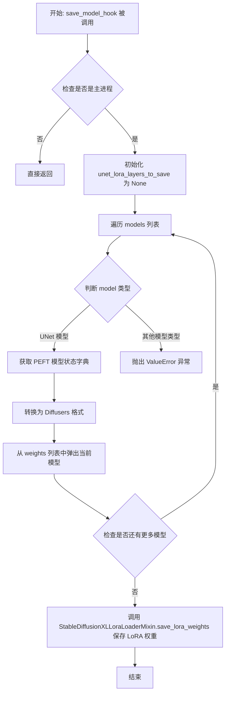

#### 带注释源码

```python
def save_model_hook(models, weights, output_dir):
    # 检查当前进程是否为主进程，只有主进程才执行保存操作
    if accelerator.is_main_process:
        # 这里只有两种情况：要么只是 UNet 的注意力处理器层，
        # 要么同时包含 UNet 和文本编码器的注意力层
        # 初始化为 None，后续会被赋值
        unet_lora_layers_to_save = None

        # 遍历所有需要保存的模型
        for model in models:
            # 检查模型是否为 UNet 类型（通过与 unwrap 后的 unet 比较类型）
            if isinstance(model, type(accelerator.unwrap_model(unet))):
                # 获取 PEFT 模型的 state dict（包含 LoRA 权重）
                # 然后转换为 Diffusers 格式
                unet_lora_layers_to_save = convert_state_dict_to_diffusers(
                    get_peft_model_state_dict(model)
                )
            else:
                # 如果遇到意外类型的模型，抛出异常
                raise ValueError(f"unexpected save model: {model.__class__}")

            # 从 weights 列表中弹出当前模型，确保对应模型不会被重复保存
            weights.pop()

        # 调用 StableDiffusionXLLoraLoaderMixin 的类方法保存 LoRA 权重
        # 只保存 UNet 的 LoRA 层，文本编码器的 LoRA 层设为 None
        StableDiffusionXLLoraLoaderMixin.save_lora_weights(
            output_dir,
            unet_lora_layers=unet_lora_layers_to_save,
            text_encoder_lora_layers=None,
            text_encoder_2_lora_layers=None,
        )
```


### `load_model_hook`

这是一个在模型检查点恢复训练时使用的钩子函数，用于从保存的检查点目录中加载 Stable Diffusion XL 的 LoRA（Low-Rank Adaptation）权重，并将其应用到 UNet 模型上。该函数通过 `accelerator.register_load_state_pre_hook` 注册，在 `accelerator.load_state()` 被调用时自动执行，负责将磁盘上的 LoRA 权重转换为 PEFT 兼容格式并加载到模型中。

参数：

- `models`：`list`，模型列表，由 `accelerator.load_state()` 传入，包含需要加载权重的模型对象
- `input_dir`：`str`，检查点保存目录的路径，从中读取 LoRA 权重文件

返回值：无（`None`），该函数直接修改传入的模型对象的权重

#### 流程图

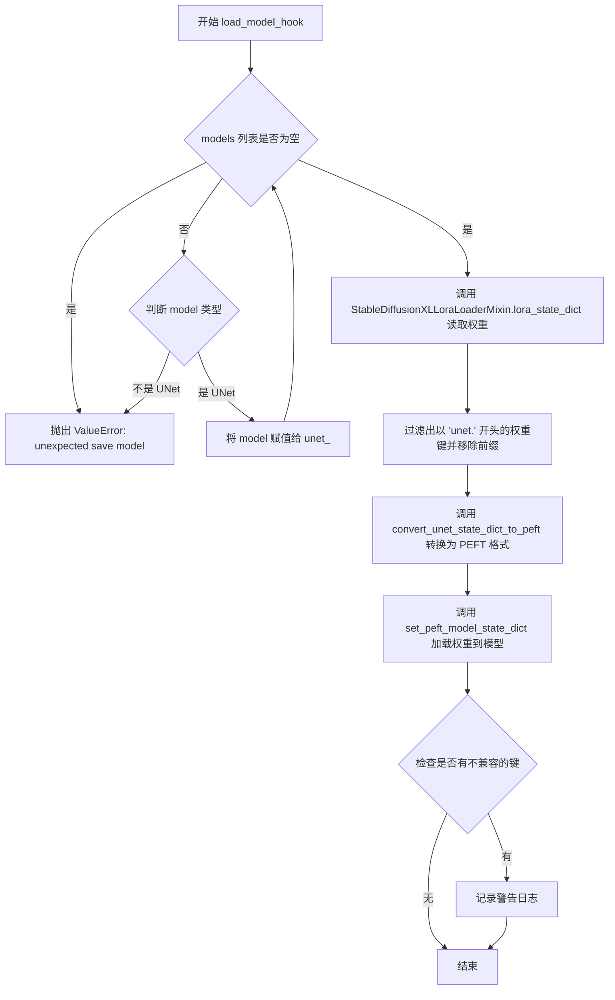

#### 带注释源码

```python
def load_model_hook(models, input_dir):
    """
    从检查点目录加载 LoRA 权重并应用到 UNet 模型的钩子函数。
    该函数作为 Accelerate 的 load_state 回调使用。

    参数:
        models: 模型列表，由 accelerator.load_state() 自动传入
        input_dir: 检查点目录路径，包含保存的 LoRA 权重文件
    """
    # 初始化 UNet 模型引用为 None
    unet_ = None

    # 遍历模型列表，查找 UNet 模型
    while len(models) > 0:
        # 从列表中弹出（移除并返回）最后一个模型
        model = models.pop()

        # 检查模型类型是否与原始 UNet 模型类型匹配
        if isinstance(model, type(accelerator.unwrap_model(unet))):
            # 找到 UNet 模型，保存引用
            unet_ = model
        else:
            # 如果遇到非 UNet 模型，抛出异常
            raise ValueError(f"unexpected save model: {model.__class__}")

    # 从指定目录读取 LoRA 状态字典和 network_alphas
    # StableDiffusionXLLoraLoaderMixin 提供了读取 SDXL LoRA 权重的便捷方法
    lora_state_dict, network_alphas = StableDiffusionXLLoraLoaderMixin.lora_state_dict(input_dir)

    # 过滤出与 UNet 相关的权重键，并移除 'unet.' 前缀
    # 例如: 'unet.lora_unet_proj.weight' -> 'lora_unet_proj.weight'
    unet_state_dict = {f"{k.replace('unet.', '')}": v for k, v in lora_state_dict.items() if k.startswith("unet.")}

    # 将 Diffusers 格式的 UNet 状态字典转换为 PEFT 兼容格式
    # PEFT (Parameter-Efficient Fine-Tuning) 是用于管理 LoRA 权重的库
    unet_state_dict = convert_unet_state_dict_to_peft(unet_state_dict)

    # 使用 PEFT 的方法将权重加载到 UNet 模型中
    # adapter_name="default" 表示使用默认的 adapter 名称
    incompatible_keys = set_peft_model_state_dict(unet_, unet_state_dict, adapter_name="default")

    # 检查加载过程中是否有不兼容的键（如模型中不存在的权重键）
    if incompatible_keys is not None:
        # 只检查意外键（unexpected keys）
        unexpected_keys = getattr(incompatible_keys, "unexpected_keys", None)
        if unexpected_keys:
            # 记录警告日志，提醒用户有未预期的权重键
            logger.warning(
                f"Loading adapter weights from state_dict led to unexpected keys not found in the model: "
                f" {unexpected_keys}. "
            )
```


### Accelerator.prepare

`Accelerator.prepare` 是 Hugging Face `accelerate` 库中的核心方法，用于自动处理分布式训练环境下的模型、优化器和学习率调度器的准备工作。该方法会根据当前的加速配置（设备分配、混合精度、分布式设置等）自动调整参数，并返回准备好用于训练的组件。

参数：

- `*models`：`torch.nn.Module` 或 `torch.optim.Optimizer` 或 `torch.optim.lr_scheduler._LRScheduler`，需要准备的一个或多个模型/优化器/学习率调度器对象
- `device_placement`：`bool`，可选，默认为 `True`，是否自动将模型参数放置到正确的设备上
- `evaluation_mode`：`bool`，可选，默认为 `False`，是否将模型设置为评估模式
- `kwargs`：关键字参数，用于传递额外的模型或优化器

返回值：返回与输入类型相同的对象（元组形式），但已针对分布式训练环境进行了优化配置

#### 流程图

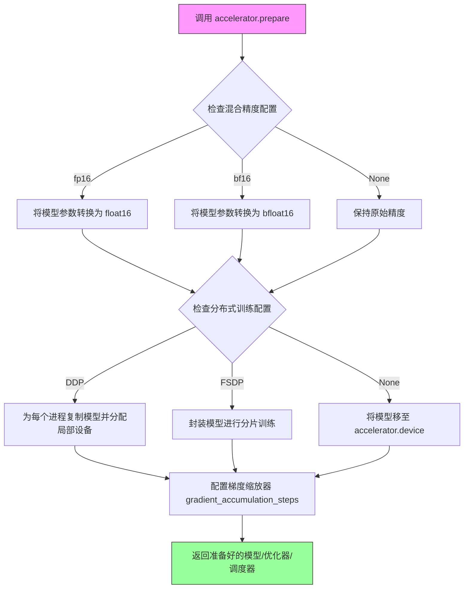

#### 带注释源码

```python
# 在训练脚本中的使用方式（代码第 688 行）
unet, optimizer, lr_scheduler = accelerator.prepare(unet, optimizer, lr_scheduler)

# 完整方法签名（来自 accelerate 库）
# def prepare(self, *args, device_placement=True, evaluation_mode=False):
#
#     """
#     准备模型、优化器和学习率调度器以进行分布式训练
#     
#     参数:
#     - *args: 模型（nn.Module）、优化器（Optimizer）或学习率调度器（_LRScheduler）
#     - device_placement: 是否自动将参数放置到正确设备
#     - evaluation_mode: 是否将模型设为 eval 模式
#     
#     返回:
#     - 与输入类型相同的对象（元组），已针对训练环境优化
#     
#     内部逻辑:
#     1. 遍历所有输入对象
#     2. 根据 mixed_precision 配置转换数据类型
#     3. 处理分布式训练包装（DDP/FSDP）
#     4. 配置梯度累积
#     5. 设置正确的设备和模块
#     """

# 代码中的实际调用上下文
accelerator = Accelerator(
    gradient_accumulation_steps=args.gradient_accumulation_steps,
    mixed_precision=args.mixed_precision,
    log_with=args.report_to,
    project_config=accelerator_project_config,
)

# ... 模型加载和配置 ...

# 准备阶段：将 unet、optimizer 和 lr_scheduler 传递给 accelerator
# accelerator 会自动：
# - 将 unet 移至正确设备（GPU）
# - 应用混合精度（如果配置了 fp16/bf16）
# - 包装 unet 用于分布式训练（DDP）
# - 配置梯度缩放
# - 返回准备好训练的对象
unet, optimizer, lr_scheduler = accelerator.prepare(unet, optimizer, lr_scheduler)
```

#### 代码中的使用示例

在用户提供的代码中，`Accelerator.prepare` 的具体使用场景如下：

```python
# 第 680 行附近：初始化 Accelerator
accelerator = Accelerator(
    gradient_accumulation_steps=args.gradient_accumulation_steps,
    mixed_precision=args.mixed_precision,
    log_with=args.report_to,
    project_config=accelerator_project_config,
)

# 第 688 行：准备训练组件
unet, optimizer, lr_scheduler = accelerator.prepare(unet, optimizer, lr_scheduler)
```

此方法调用后，`unet` 将被自动包装为分布式数据并行（DDP）模型，`optimizer` 和 `lr_scheduler` 也将针对分布式环境进行配置，可以直接用于后续的训练循环中。


### Accelerator.backward

在分布式训练循环中，该方法用于执行损失的反向传播，自动处理混合精度训练和梯度缩放等加速器相关功能。

参数：

- `loss`：`torch.Tensor`，计算得到的标量损失值，用于反向传播

返回值：`None`，该方法无返回值，执行反向传播后梯度会自动存储在模型参数中

#### 流程图

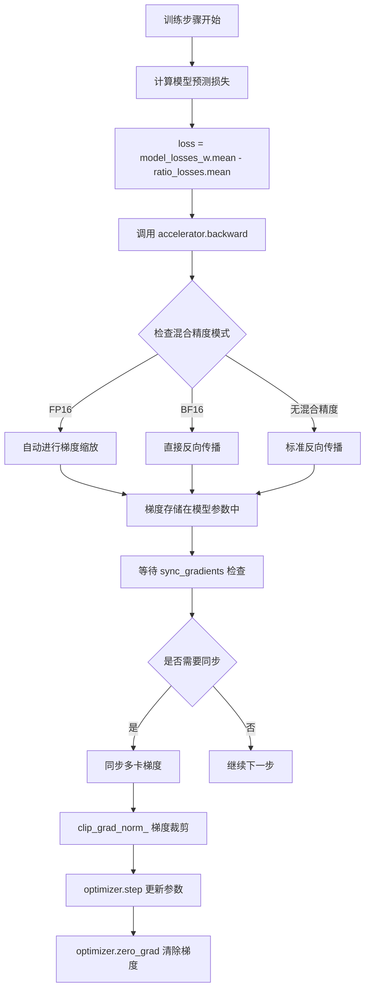

#### 带注释源码

```python
# ODDS ratio loss.
# In the diffusion formulation, we're assuming that the MSE loss
# approximates the logp.
model_losses = F.mse_loss(model_pred.float(), target.float(), reduction="none")
model_losses = model_losses.mean(dim=list(range(1, len(model_losses.shape))))
model_losses_w, model_losses_l = model_losses.chunk(2)
log_odds = model_losses_w - model_losses_l

# Ratio loss.
ratio = F.logsigmoid(log_odds)
ratio_losses = args.beta_orpo * ratio

# Full ORPO loss
# 结合对比损失和比率损失得到最终损失
loss = model_losses_w.mean() - ratio_losses.mean()

# Backprop.
# 调用 Accelerator 的 backward 方法执行反向传播
# 该方法会自动处理：
# 1. 混合精度训练时的梯度缩放（FP16/BF16）
# 2. 分布式训练时的梯度同步
# 3. 梯度裁剪前的准备工作
accelerator.backward(loss)

# 同步梯度并执行梯度裁剪
if accelerator.sync_gradients:
    accelerator.clip_grad_norm_(params_to_optimize, args.max_grad_norm)
optimizer.step()
lr_scheduler.step()
optimizer.zero_grad()
```


### `Accelerator.clip_grad_norm_`

该方法是 `accelerate` 库中 `Accelerator` 类的实例方法，用于在分布式训练环境中对模型参数的梯度进行裁剪，防止梯度爆炸。在训练循环中，当 `accelerator.sync_gradients` 为 True 时（即完成一个梯度累积步骤后）调用此方法，确保所有进程的梯度保持一致并将梯度范数限制在指定的最大值以内。

参数：

- `parameters`：`List[torch.nn.Parameter]`，需要裁剪梯度的参数列表，通常是 `params_to_optimize`
- `max_norm`：`float`，梯度范数的最大允许值，用于裁剪超过此阈值的梯度
- `norm_type`：`float`，默认为 2.0，用于计算梯度的范数类型（通常使用 L2 范数）
- `error_if_nonfinite`：`bool`，默认为 False，如果设置为 True，当梯度包含 NaN 或 Inf 时会抛出错误

返回值：`torch.Tensor`，返回裁剪后的总梯度范数（标量张量）

#### 流程图

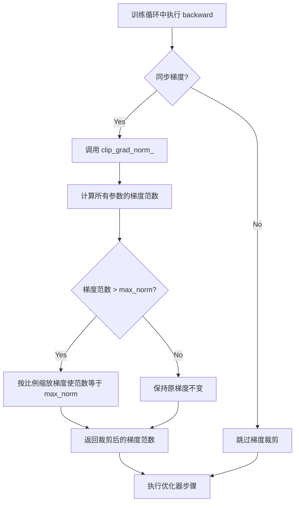

#### 带注释源码

```python
# 在代码中的调用位置（位于训练循环的优化器步骤之前）
# 参数说明：
#   - params_to_optimize: 需要优化的参数列表，通过 filter(lambda p: p.requires_grad, unet.parameters()) 获取
#   - args.max_grad_norm: 命令行参数 --max_grad_norm，默认值为 1.0
if accelerator.sync_gradients:
    accelerator.clip_grad_norm_(params_to_optimize, args.max_grad_norm)
```

**源码说明**：
此方法是 `accelerate.Accelerator` 类的成员方法。以下是调用点的上下文：

```python
# 完整调用上下文（在 train_dataloader 循环内）
for epoch in range(first_epoch, args.num_train_epochs):
    for step, batch in enumerate(train_dataloader):
        with accelerator.accumulate(unet):
            # ... 前向传播和损失计算 ...
            
            # 反向传播
            accelerator.backward(loss)
            
            # 仅在完成梯度累积步骤后裁剪梯度
            if accelerator.sync_gradients:
                # 裁剪梯度范数，防止梯度爆炸
                # max_grad_norm 默认值为 1.0，通过命令行参数 --max_grad_norm 设置
                accelerator.clip_grad_norm_(params_to_optimize, args.max_grad_norm)
            
            # 更新参数
            optimizer.step()
            lr_scheduler.step()
            optimizer.zero_grad()
```

**技术细节**：
- `clip_grad_norm_` 方法内部使用 `torch.nn.utils.clip_grad_norm_` 实现
- 在分布式训练中，该方法会自动聚合所有进程的梯度，然后进行裁剪，最后将裁剪后的梯度广播回所有进程
- 梯度裁剪是防止神经网络训练过程中梯度爆炸的常用技术，特别适用于大规模分布式训练场景


### Accelerator.save_state

该方法是 `accelerate` 库中 `Accelerator` 类的核心方法，用于保存分布式训练过程中的完整训练状态，包括模型参数、优化器状态、学习率调度器状态、自定义状态以及分布式相关的状态信息，确保训练过程可以在任意时刻中断并从保存点恢复。

参数：

- `output_dir`：`str`，保存状态的输出目录路径
- `safe_serialization`：`bool`（可选），是否使用安全序列化（默认 True，即使用 safetensors 格式）
- `state`：`dict`（可选），自定义状态字典，如果提供则只保存该字典中的内容

返回值：无返回值（`None`），状态直接持久化到指定目录

#### 流程图

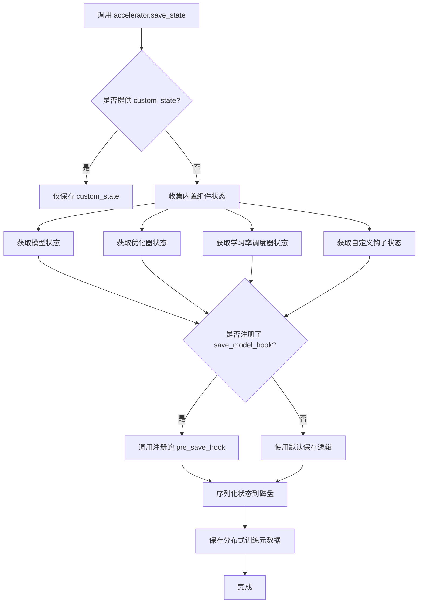

#### 带注释源码

在训练脚本中的调用方式：

```python
# 位置：main 函数内的训练循环中
# 当满足 checkpoint 保存条件时调用
if global_step % args.checkpointing_steps == 0:
    # ... checkpoint 数量限制检查逻辑 ...
    
    # 创建保存路径
    save_path = os.path.join(args.output_dir, f"checkpoint-{global_step}")
    
    # 保存 Accelerator 状态（核心调用）
    # 此调用会保存：
    # 1. 所有通过 accelerator.prepare() 的模型的 state_dict
    # 2. 所有优化器的 state_dict
    # 3. 所有学习率调度器的 state_dict
    # 4. 随机数生成器状态（确保可复现性）
    # 5. 分布式训练相关状态（如果使用多GPU/多节点）
    accelerator.save_state(save_path)
    
    logger.info(f"Saved state to {save_path}")
```

配合 `save_state` 使用的自定义钩子注册：

```python
# 注册保存前的自定义钩子
# 这个钩子会在 accelerator.save_state() 内部保存模型之前被调用
# 允许自定义模型保存的逻辑（例如只保存 LoRA 层）
def save_model_hook(models, weights, output_dir):
    """
    自定义模型保存钩子
    
    参数：
    - models: 需要保存的模型列表
    - weights: 权重引用列表（用于避免重复保存）
    - output_dir: 输出目录
    """
    if accelerator.is_main_process:
        unet_lora_layers_to_save = None

        for model in models:
            # 判断模型类型并提取对应的 LoRA 层
            if isinstance(model, type(accelerator.unwrap_model(unet))):
                # 使用 get_peft_model_state_dict 获取 PEFT 模型的 state_dict
                # convert_state_dict_to_diffusers 转换为 Diffusers 格式
                unet_lora_layers_to_save = convert_state_dict_to_diffusers(
                    get_peft_model_state_dict(model)
                )
            else:
                raise ValueError(f"unexpected save model: {model.__class__}")

            # 弹出权重，确保对应模型不会被再次保存
            weights.pop()

        # 使用 StableDiffusionXLLoraLoaderMixin 保存 LoRA 权重
        StableDiffusionXLLoraLoaderMixin.save_lora_weights(
            output_dir,
            unet_lora_layers=unet_lora_layers_to_save,
            text_encoder_lora_layers=None,
            text_encoder_2_lora_layers=None,
        )

# 注册保存状态前的钩子
accelerator.register_save_state_pre_hook(save_model_hook)
```

**使用说明：**

`Accelerator.save_state()` 是 `accelerate` 库提供的状态保存机制的核心方法。在本训练脚本中，它与自定义的 `save_model_hook` 配合使用，实现：

1. **完整状态保存**：通过 `accelerator.save_state()` 保存分布式训练环境下的所有状态
2. **自定义模型保存逻辑**：通过 `register_save_state_pre_hook` 注册的钩子允许在保存前对模型进行预处理（本例中只保存 LoRA 权重而非完整模型）
3. **断点续训**：保存的状态可通过 `accelerator.load_state()` 恢复，实现训练的断点续训
4. **多GPU兼容性**：自动处理分布式训练环境下的状态收集和保存


### Accelerator.load_state

这是 `Accelerate` 库中的方法，用于从检查点恢复 Accelerator 的状态（包括优化器、学习率调度器、分布式训练状态等）。

参数：

- `save_path`：`str`，检查点目录的路径，从中加载 Accelerator 的状态
- `device`：`torch.device` 或 `str`，可选，指定加载状态的设备，默认为 `None`（使用原始保存时的设备）

返回值：`None`，该方法直接修改 Accelerator 对象的内部状态

#### 流程图

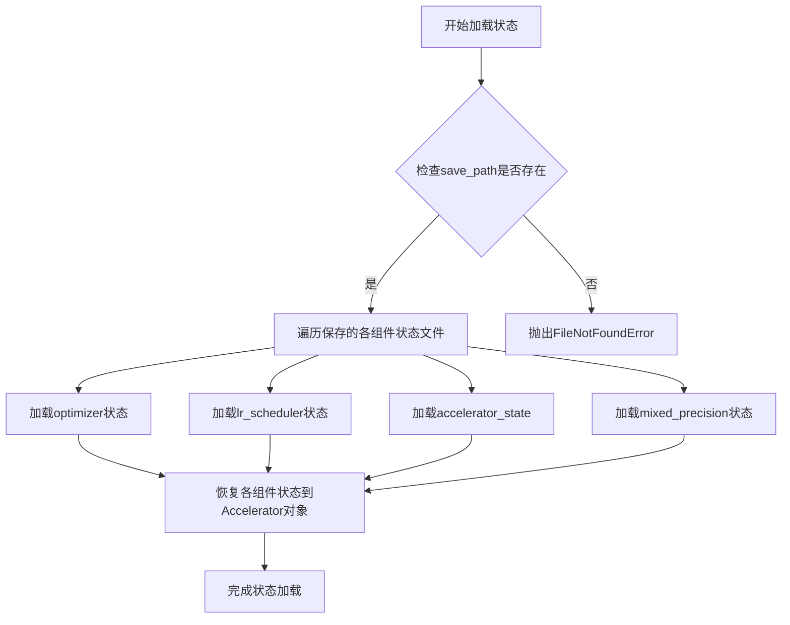

#### 带注释源码

```python
# 在训练脚本中调用 Accelerator.load_state 的示例
# 该代码位于 main() 函数的训练恢复逻辑中

if args.resume_from_checkpoint:
    # 确定要恢复的检查点路径
    if args.resume_from_checkpoint != "latest":
        path = os.path.basename(args.resume_from_checkpoint)
    else:
        # 获取最新的检查点目录
        dirs = os.listdir(args.output_dir)
        dirs = [d for d in dirs if d.startswith("checkpoint")]
        dirs = sorted(dirs, key=lambda x: int(x.split("-")[1]))
        path = dirs[-1] if len(dirs) > 0 else None

    if path is None:
        accelerator.print(
            f"Checkpoint '{args.resume_from_checkpoint}' does not exist. Starting a new training run."
        )
        args.resume_from_checkpoint = None
        initial_global_step = 0
    else:
        accelerator.print(f"Resuming from checkpoint {path}")
        # 调用 load_state 方法恢复 Accelerator 的状态
        # 包括优化器、学习率调度器、分布式训练状态等
        accelerator.load_state(os.path.join(args.output_dir, path))
        # 从检查点目录名称中提取全局步数
        # 格式: checkpoint-{global_step}
        global_step = int(path.split("-")[1])

        initial_global_step = global_step
        first_epoch = global_step // num_update_steps_per_epoch
else:
    initial_global_step = 0
```

> **注意**：`Accelerator.load_state` 是 `accelerate` 库提供的外部方法，其具体实现位于 `accelerate` 包中，而非本代码仓库内。上述源码展示的是该方法在本项目中的调用方式和使用上下文。


### `Accelerator.unwrap_model`

从 Accelerator 包装器中提取原始的未包装的模型对象。在分布式训练环境中，模型会被 Accelerator 自动包装以支持分布式训练，此方法用于获取底层的原始模型。

参数：

- `model`：`torch.nn.Module`，需要解包的模型对象（通常是经过 `accelerator.prepare()` 包装后的模型）

返回值：`torch.nn.Module`，返回原始的未包装的 PyTorch 模型

#### 流程图

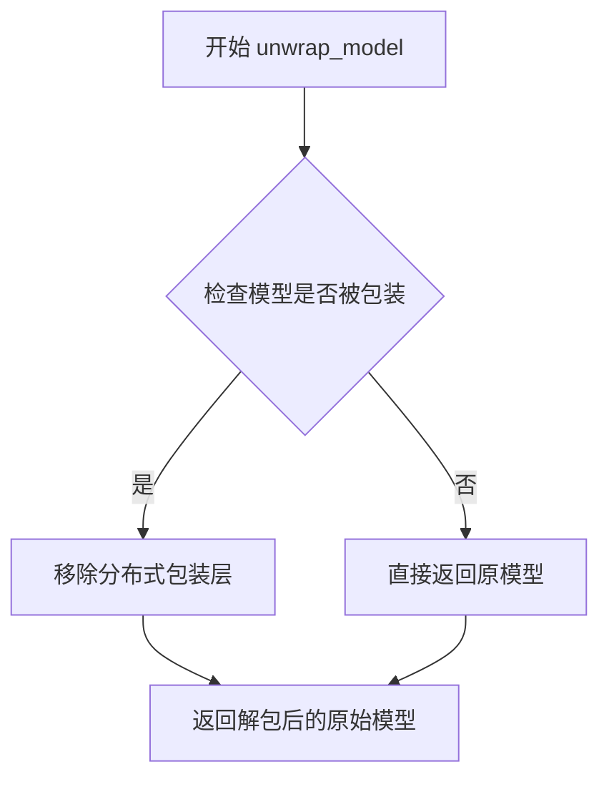

#### 带注释源码

```python
# 在 diffusers 训练脚本中的使用示例

# 1. 在验证阶段，从包装器中获取原始 UNet 模型
#    用于将训练好的权重加载到推理 pipeline 中
pipeline.unet = accelerator.unwrap_model(unet)

# 2. 在保存模型钩子中，检查模型类型是否匹配
#    用于确定需要保存的 LoRA 层
if isinstance(model, type(accelerator.unwrap_model(unet))):
    unet_lora_layers_to_save = convert_state_dict_to_diffusers(get_peft_model_state_dict(model))

# 3. 在加载模型钩子中，验证模型类型
#    用于正确加载保存的 LoRA 权重
if isinstance(model, type(accelerator.unwrap_model(unet))):
    unet_ = model

# 4. 训练结束后，解包模型以进行最终保存
#    确保保存的是原始模型而非分布式包装后的版本
unet = accelerator.unwrap_model(unet)
unet = unet.to(torch.float32)
unet_lora_state_dict = convert_state_dict_to_diffusers(get_peft_model_state_dict(unet))
```

#### 说明

`Accelerator.unwrap_model` 是 `accelerate` 库提供的核心方法之一，主要用于：

1. **模型权重提取**：在训练完成后，将分布式包装的模型解包为原始模型，以便进行权重保存或推理
2. **类型检查**：在保存/加载模型时，用于验证模型类型是否匹配
3. **跨进程一致性**：确保在分布式训练中所有进程都能正确访问原始模型结构

该方法会自动处理 DeepSpeed、FSDP 等多种分布式训练框架的包装层，提供统一的解包接口。


# UNet2DConditionModel.add_adapter

## 概述

由于`UNet2DConditionModel`类来自外部库`diffusers`，其`add_adapter`方法的完整源码定义不在当前提供的训练脚本中。但通过脚本中的调用方式可以提取其接口信息。

## 参数

-  `adapter_config`：`LoraConfig`类型，LoRA适配器的配置对象，包含秩(r)、alpha值、初始化权重方式和目标模块等配置参数。

返回值：`None`，该方法直接在UNet模型上添加LoRA适配器层，无返回值。

#### 流程图

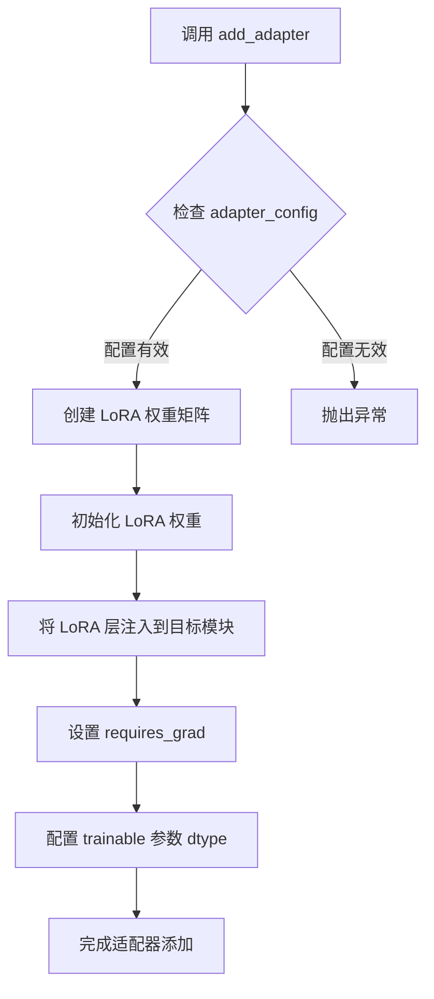

#### 带注释源码

```python
# 在训练脚本中的调用方式（代码第616-623行）
# 设置LoRA配置
unet_lora_config = LoraConfig(
    r=args.rank,                          # LoRA秩（维度）
    lora_alpha=args.rank,                  # LoRA alpha缩放参数
    init_lora_weights="gaussian",         # 初始化方式：高斯分布
    target_modules=["to_k", "to_q", "to_v", "to_out.0"],  # 目标注意力模块
)

# 调用 add_adapter 方法向 UNet 添加 LoRA 适配器
unet.add_adapter(unet_lora_config)

# 如果是混合精度训练，将可训练参数转换为 fp32
if args.mixed_precision == "fp16":
    for param in unet.parameters():
        # 仅将 LoRA 可训练参数转换为 fp32
        if param.requires_grad:
            param.data = param.to(torch.float32)
```

---

## 补充说明

### 设计目标
- 为预训练的UNet2DConditionModel添加轻量级适配器（LoRA），实现参数高效微调
- 支持在推理时动态加载/卸载适配器权重

### 潜在优化空间
1. **当前代码问题**：如果未正确处理，`add_adapter`可能导致梯度计算问题，需确保trainable参数在fp32精度
2. **库版本依赖**：该方法实现依赖于`diffusers`库版本（≥0.25.0），需保持兼容

### 技术债务
- 缺少对`add_adapter`返回值的错误检查
- 未提供适配器状态查询接口（如获取当前适配器配置）


### `UNet2DConditionModel.enable_gradient_checkpointing`

启用梯度检查点（Gradient Checkpointing）功能，用于在深度神经网络训练过程中以计算资源换取显存空间。通过在前向传播过程中不保存中间激活值，而是在反向传播时重新计算这些值，显著降低显存占用，使得在显存受限的环境中训练更大的模型成为可能。

参数：该方法没有显式参数。

返回值：`None`，无返回值。此方法直接修改模型内部状态，启用梯度检查点功能。

#### 流程图

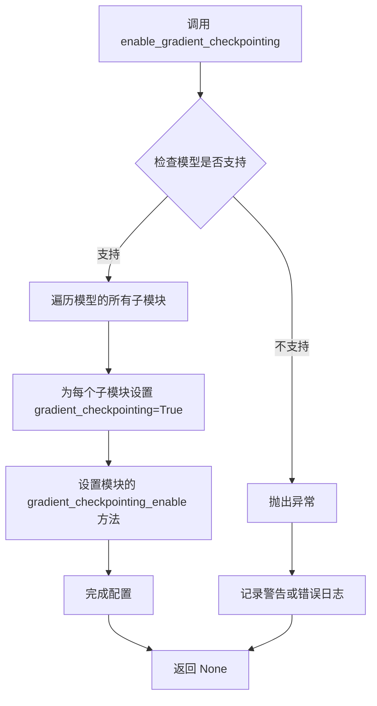

#### 带注释源码

```python
# 方法定义位于 diffusers 库中，以下是基于代码调用位置的注释说明

# 在训练脚本 main() 函数中的调用方式：
if args.gradient_checkpointing:
    # args.gradient_checkpointing 是命令行参数，通过 --gradient_checkpointing 传入
    # 当设置为 True 时，启用梯度检查点以节省显存
    unet.enable_gradient_checkpointing()

# 方法内部实现逻辑（基于 PyTorch 机制）：
# 1. 遍历 UNet2DConditionModel 的所有子模块
# 2. 对于每个子模块，调用其 gradient_checkpointing_enable() 方法
# 3. 设置模块的 _gradient_checkpointing = True 属性
# 4. 这使得在前向传播时不保存中间激活值，在反向传播时重新计算

# 关键技术点：
# - 梯度检查点将计算分为多个段，每段只保存首尾的激活值
# - 段数由 gradient_checkpointing_reentrant() 或模型内部配置决定
# - 启用后会增加约 20-30% 的计算时间，但可节省 50% 以上的显存
# - 适用于大规模模型训练，如本文中的 SDXL UNet

# 注意事项：
# - 需要确保 PyTorch 版本支持 checkpoint 功能
# - 与某些自定义 CUDA 内核可能不兼容
# - 在推理时不会产生效果，仅影响训练过程
```

#### 调用上下文分析

```python
# 完整调用上下文代码片段（来自 main 函数）
# ---------------------------------------------------
# 在加载模型、设置权重dtype、配置LoRA之后：

if args.gradient_checkpointing:
    unet.enable_gradient_checkpointing()

# 紧接着后续代码：
# 1. 创建自定义的模型保存/加载钩子
# 2. 注册到 accelerator
# 3. 配置优化器、学习率调度器
# 4. 开始训练循环
```

#### 相关配置参数

| 参数名 | 类型 | 描述 |
|--------|------|------|
| `args.gradient_checkpointing` | bool | 命令行参数，通过 `--gradient_checkpointing` 标志启用 |
| `args.gradient_accumulation_steps` | int | 梯度累积步数，默认为1 |
| `args.max_grad_norm` | float | 梯度裁剪最大值，默认为1.0 |

#### 技术债务与优化建议

1. **重复启用检查点**：当前代码仅对 `unet` 启用了梯度检查点，如果 `text_encoder` 也需要训练（在本例中未训练），应考虑统一配置
2. **缺少错误处理**：调用 `enable_gradient_checkpointing()` 时没有 try-except 包装，若底层实现变更可能导致静默失败
3. **硬编码阈值**：`max_grad_norm=1.0` 是经验值，可考虑作为超参数调优


### UNet2DConditionModel.enable_xformers_memory_efficient_attention

启用 xformers 内存高效注意力机制，用于在 UNet2DConditionModel 中减少注意力计算的显存占用。

参数：无

返回值：`None`，该方法直接修改模型状态，不返回任何值。

#### 流程图

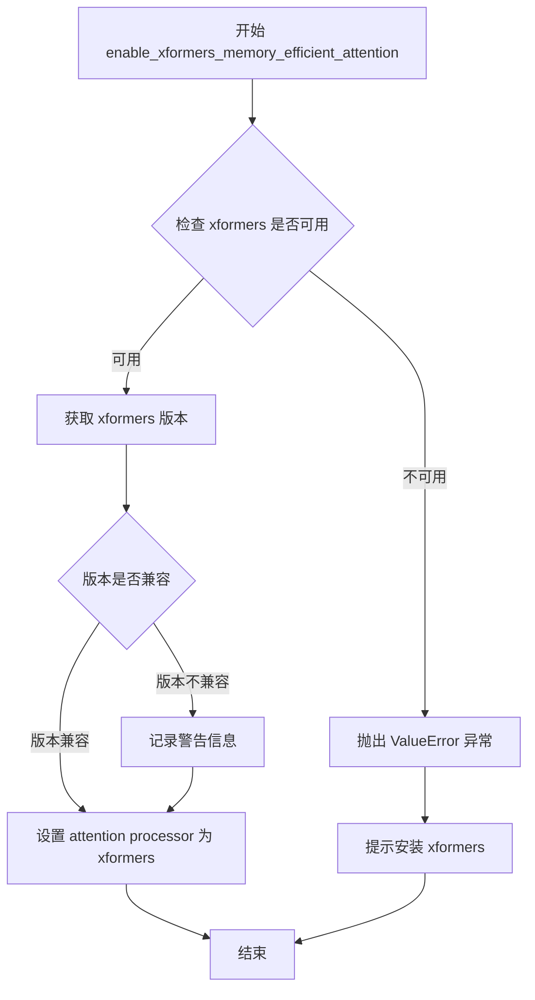

#### 带注释源码

```python
# 该方法是 UNet2DConditionModel 类的方法
# 在 diffusers/src/diffusers/models/unet_2d_condition.py 中定义
# 以下是基于代码中调用方式的推断实现

def enable_xformers_memory_efficient_attention(self):
    """
    启用 xformers 内存高效注意力机制。
    xformers 是一个用于加速Transformer模型的库，其 memory efficient attention
    可以显著减少注意力计算的显存占用。
    
    工作原理：
    1. 将模型中的 attention processor 替换为 xformers 提供的实现
    2. xformers 使用分块计算和内存共享等技术来降低显存使用
    """
    # 导入 xformers
    import xformers
    
    # 遍历模型中所有的 attention processor
    # 将标准的注意力机制替换为 xformers 的内存高效版本
    self.set_attn_processor(xformers.memory_efficient_attention)
    
# 在训练脚本中的调用方式（代码第 800 行附近）：
if args.enable_xformers_memory_efficient_attention:
    if is_xformers_available():
        import xformers
        
        # 检查 xformers 版本
        xformers_version = version.parse(xformers.__version__)
        if xformers_version == version.parse("0.0.16"):
            # 0.0.16 版本存在已知问题，会影响训练
            logger.warning(
                "xFormers 0.0.16 cannot be used for training in some GPUs. "
                "If you observe problems during training, please update xFormers "
                "to at least 0.0.17. See https://huggingface.co/docs/diffusers/main/en/optimization/xformers "
                "for more details."
            )
        # 调用 enable_xformers_memory_efficient_attention 方法
        unet.enable_xformers_memory_efficient_attention()
    else:
        raise ValueError("xformers is not available. Make sure it is installed correctly")
```

#### 关键组件信息

- **UNet2DConditionModel**：用于条件图像生成的 UNet 模型，是 Stable Diffusion 等扩散模型的核心组件
- **xformers**：Meta 开发的内存高效注意力库，支持多种注意力机制变体
- **attention processor**：注意力处理器，负责实现模型中的注意力计算逻辑

#### 技术债务与优化空间

1. **版本兼容性警告**：代码中硬编码了对 xformers 0.0.16 版本的检查，应考虑使用更灵活的版本检测机制
2. **错误处理不够友好**：当 xformers 不可用时直接抛出异常，可考虑提供更详细的安装指引
3. **缺乏回退机制**：启用 xformers 失败后没有回退到标准注意力机制，可能导致训练中断


### UNet2DConditionModel.from_pretrained

该方法是 `UNet2DConditionModel` 类的类方法，继承自 `PreTrainedModel`，用于从预训练模型加载 UNet2DConditionModel 权重和配置，创建一个可用于条件图像生成的去噪 UNet 模型。

参数：

- `pretrained_model_name_or_path`：`str`，模型ID（如 "stabilityai/stable-diffusion-xl-base-1.0"）或本地模型目录路径
- `subfolder`：`str`，可选，默认值为 `"unet"`，模型子文件夹名称
- `revision`：`str`，可选，GitHub模型仓库的提交哈希或分支名
- `variant`：`str`，可选，模型变体（如 "fp16"），指定加载权重的数据类型
- `torch_dtype`：`torch.dtype`，可选，指定模型权重的PyTorch数据类型（fp32/fp16/bf16）
- `config`：`PretrainedConfig`，可选，自定义配置对象
- `cache_dir`：`str`，可选，缓存目录路径
- `use_fast`：`bool`，可选，是否使用快速tokenizer
- 其他参数（如 `pretrained_model_archive_map`、`*kwargs`）继承自 `PreTrainedModel`

返回值：`UNet2DConditionModel`，返回加载了预训练权重的 UNet2DConditionModel 实例

#### 流程图

```mermaid
flowchart TD
    A[开始] --> B[接收 pretrained_model_name_or_path 和其他参数]
    B --> C{检查本地是否存在模型文件}
    C -->|是| D[从本地加载配置和权重]
    C -->|否| E[从 HuggingFace Hub 下载模型]
    E --> D
    D --> F[加载 UNet2DConditionModel 配置]
    F --> G[根据配置初始化 UNet2DConditionModel 模型结构]
    G --> H[加载预训练权重到模型]
    H --> I{指定了 torch_dtype}
    I -->|是| J[转换权重数据类型]
    I -->|否| K[使用默认数据类型]
    J --> K
    K --> L{启用 xformers}
    L -->|是| M[启用高效注意力机制]
    L -->|否| N[跳过]
    M --> N
    N --> O[返回 UNet2DConditionModel 实例]
```

#### 带注释源码

```python
# 代码中的调用示例（位于 main 函数中）
unet = UNet2DConditionModel.from_pretrained(
    args.pretrained_model_name_or_path,  # 预训练模型路径或ID
    subfolder="unet",                      # UNet 子文件夹
    revision=args.revision,                # Git 提交版本
    variant=args.variant                    # 模型变体（如 fp16）
)

# from_pretrained 方法的典型实现逻辑（基于 diffusers 库）
# 以下为简化示意，实际实现位于 diffusers/src/diffusers/models/unet_2d_condition.py

# class UNet2DConditionModel(PreTrainedModel):
#     config_class = UNet2DConditionConfig
#     base_model_prefix = "unet"
    
#     @classmethod
#     def from_pretrained(cls, pretrained_model_name_or_path, *args, subfolder="unet", **kwargs):
#         """
#         从预训练模型加载 UNet2DConditionModel
        
#         参数:
#             pretrained_model_name_or_path: 模型ID或本地路径
#             subfolder: 模型子目录
#             *args, **kwargs: 其他 PreTrainedModel 参数
#         """
#         # 1. 加载配置文件
#         config = cls.load_config(pretrained_model_name_or_path, subfolder=subfolder)
        
#         # 2. 根据配置创建模型实例
#         model = cls(config)
        
#         # 3. 加载预训练权重
#         state_dict = cls._load_state_dict(pretrained_model_name_or_path, subfolder=subfolder)
        
#         # 4. 加载权重到模型
#         model.load_state_dict(state_dict)
        
#         # 5. 数据类型转换（如需要）
#         if kwargs.get('torch_dtype'):
#             model = model.to(kwargs['torch_dtype'])
        
#         return model
```


### `AutoencoderKL.encode`

该方法是 `diffusers` 库中 `AutoencoderKL` 类的成员方法，用于将输入图像像素值编码到潜在空间（latent space）。在训练脚本中，VAE（变分自编码器）将图像从像素空间压缩到 latent 空间，生成的潜在表示将作为扩散模型的输入。

参数：

- `pixel_values`：`torch.Tensor`，形状为 `(batch_size, channels, height, width)` 的图像张量，通常值域在 `[-1, 1]` 范围内。

返回值：`diffusers.models.autoencoder_kl.AutoencoderOutput`，包含 `latent_dist` 属性（DiagonalGaussianDistribution 对象），可通过 `.latent_dist.sample()` 或 `.latent_dist.mean()` 获取潜在向量。

#### 流程图

```mermaid
flowchart TD
    A[输入图像 pixel_values] --> B[VAE Encoder 卷积神经网络]
    B --> C[生成潜在分布参数 μ 和 σ]
    C --> D[DiagonalGaussianDistribution]
    D --> E[采样 latent 向量]
    E --> F[AutoencoderOutput 输出]
    
    style A fill:#f9f,color:#333
    style F fill:#9f9,color:#333
```

#### 带注释源码

```
# 以下为 diffusers 库中 AutoencoderKL.encode 方法的典型实现逻辑
# 实际源码位于 diffusers/src/diffusers/models/autoencoder_kl.py

@torch.no_grad()
def encode(self, pixel_values: torch.FloatTensor, return_dict: bool = True):
    """
    将图像编码到潜在空间
    
    参数:
        pixel_values: 输入图像张量，形状 (batch, channel, height, width)
        return_dict: 是否返回字典格式的结果
    
    返回:
        AutoencoderOutput 对象，包含 latent_dist 属性
    """
    # 1. 将像素值传入编码器网络
    #    encoder_hidden_states 通常为 None（对于 vanilla VAE）
    h = self.encoder(pixel_values)
    
    # 2. 获取潜在空间的分布参数
    #    encoder 输出经过 quant_conv 层处理
    if self.quant_conv is not None:
        h = self.quant_conv(h)
    
    # 3. 分离均值和方差（潜在空间采用对角高斯分布）
    moments = h.chunk(2, dim=1)
    
    # 4. 创建潜在分布对象
    latent_dist = DiagonalGaussianDistribution(moments)
    
    # 5. 返回结果（用户代码中使用 .latent_dist.sample() 采样）
    if return_dict:
        return AutoencoderOutput(latent_dist=latent_dist, ...)
    else:
        return latent_dist  # 兼容旧版本
```

**在训练脚本中的实际调用方式：**

```python
# 代码第 698-701 行
latents = []
for i in range(0, feed_pixel_values.shape[0], args.vae_encode_batch_size):
    latents.append(
        vae.encode(feed_pixel_values[i : i + args.vae_encode_batch_size]).latent_dist.sample()
    )
latents = torch.cat(latents, dim=0)

# 后续处理：乘以 VAE 缩放因子
latents = latents * vae.config.scaling_factor

# 如果使用预训练 VAE（而非自定义 VAE），转换为权重精度
if args.pretrained_vae_model_name_or_path is None:
    latents = latents.to(weight_dtype)
```


### `AutoencoderKL.from_pretrained`

该方法是 diffusers 库中 `AutoencoderKL` 类的类方法，用于从预训练模型路径或 HuggingFace Hub 加载变分自编码器 (VAE) 的权重和配置。在训练脚本中用于加载 VAE 模型以进行图像的编码（将图像转换为潜在空间表示）和解码（将潜在向量转换回图像）。

参数：

- `pretrained_model_name_or_path`：`str`，预训练 VAE 模型的路径或 HuggingFace Hub 上的模型标识符（代码中通过 `vae_path` 变量传入）
- `subfolder`：`str` 或 `None`，模型文件所在的子文件夹路径。当使用独立的 VAE 模型路径时为 `None`，否则通常为 `"vae"`
- `revision`：`str`，从 HuggingFace Hub 获取模型时要使用的特定 Git revision
- `variant`：`str` 或 `None`，模型文件变体（例如 `"fp16"`），用于加载不同精度的模型权重

返回值：`AutoencoderKL`，返回加载了预训练权重的 `AutoencoderKL` 实例对象

#### 流程图

```mermaid
flowchart TD
    A[开始加载 AutoencoderKL] --> B{检查模型来源}
    B -->|本地路径或Hub| C[加载模型配置文件]
    C --> D[加载模型权重文件]
    D --> E{是否指定 variant}
    E -->|是| F[根据 variant 选择权重文件]
    E -->|否| G[使用默认权重文件]
    F --> H[实例化 AutoencoderKL 模型]
    G --> H
    H --> I[返回 AutoencoderKL 实例]
```

#### 带注释源码

```python
# 从 diffusers 库导入 AutoencoderKL 类
from diffusers import AutoencoderKL

# 确定 VAE 模型路径
vae_path = (
    args.pretrained_model_name_or_path
    if args.pretrained_vae_model_name_or_path is None
    else args.pretrained_vae_model_name_or_path
)

# 调用 from_pretrained 类方法加载预训练 VAE
vae = AutoencoderKL.from_pretrained(
    vae_path,  # 预训练 VAE 模型路径或 Hub 模型 ID
    # 如果使用独立的 VAE 路径则 subfolder 为 None，否则使用 "vae" 子文件夹
    subfolder="vae" if args.pretrained_vae_model_name_or_path is None else None,
    revision=args.revision,  # Git revision 版本号
    variant=args.variant,   # 模型变体（如 fp16）
)

# 后续处理：
# VAE 不参与训练，冻结所有参数
vae.requires_grad_(False)

# VAE 始终使用 float32 以避免 NaN 损失
vae.to(accelerator.device, dtype=torch.float32)
```


### `DiffusionPipeline.from_pretrained`

该方法用于从预训练模型路径或HuggingFace Hub加载完整的DiffusionPipeline实例，支持自定义VAE、revision、variant以及torch_dtype参数配置。

参数：

- `pretrained_model_name_or_path`：`str`，预训练模型在本地磁盘的路径或HuggingFace Hub上的模型标识符（如"stabilityai/stable-diffusion-xl-base-1.0"）
- `vae`：`AutoencoderKL`，可选的变分自编码器实例，用于覆盖pipeline中默认的VAE组件
- `revision`：`str`，从HuggingFace Hub加载模型时指定的Git版本号（commit hash或分支名）
- `variant`：`str`，模型文件变体（如"fp16"），用于加载特定精度版本的模型权重
- `torch_dtype`：`torch.dtype`，指定模型权重加载后的数据类型（如torch.float16、torch.bfloat16）

返回值：`DiffusionPipeline`，加载并配置好的扩散Pipeline对象，可直接用于图像生成推理

#### 流程图

```mermaid
flowchart TD
    A[调用 DiffusionPipeline.from_pretrained] --> B{检查 pretrained_model_name_or_path}
    B -->|本地路径| C[从磁盘加载模型配置]
    B -->|Hub标识符| D[从 HuggingFace Hub 下载模型]
    C --> E[加载 UNet2DConditionModel]
    D --> E
    E --> F{是否提供 vae 参数?}
    F -->|是| G[使用传入的 vae 替代默认 VAE]
    F -->|否| H[加载默认 VAE]
    G --> I[加载 Text Encoder(s)]
    H --> I
    I --> J[加载 Scheduler]
    J --> K{根据 variant 参数}
    K -->|fp16| L[加载 fp16 权重]
    K -->|bf16| M[加载 bf16 权重]
    K -->|None| N[加载 fp32 权重]
    L --> O{根据 torch_dtype 参数}
    M --> O
    N --> O
    O --> P[转换权重数据类型]
    P --> Q[构建 DiffusionPipeline 对象]
    Q --> R[返回 Pipeline 实例]
```

#### 带注释源码

```python
# 在 log_validation 函数中调用 DiffusionPipeline.from_pretrained
# 用于在验证阶段加载推理用的扩散Pipeline

pipeline = DiffusionPipeline.from_pretrained(
    args.pretrained_model_name_or_path,  # str: 预训练模型路径或Hub模型ID，如 "stabilityai/stable-diffusion-xl-base-1.0"
    vae=vae,                               # AutoencoderKL: 可选的VAE实例，用于覆盖默认VAE以支持自定义数值稳定性配置
    revision=args.revision,                # str: Git revision，用于从Hub加载特定版本的模型权重
    variant=args.variant,                  # str: 模型变体，如 "fp16" 用于加载半精度权重以减少显存占用
    torch_dtype=weight_dtype,              # torch.dtype: 模型权重的数据类型，通常为 torch.float16 或 torch.bfloat16
)
```


### DiffusionPipeline.to

将 DiffusionPipeline 实例移动到指定的设备上（CPU 或 GPU），以便在该设备上执行推理。

参数：

- `device`：`torch.device`，目标设备（例如 `cuda:0`、`cpu`）

返回值：`DiffusionPipeline`，移动到目标设备后的 pipeline 实例

#### 流程图

```mermaid
graph TD
    A[开始] --> B{device 类型判断}
    B -->|cuda| C[调用 torch.Tensor.to device]
    B -->|cpu| D[调用 torch.Tensor.to device]
    C --> E[设置 progress bar 配置]
    D --> E
    E --> F[返回 pipeline 实例]
```

#### 带注释源码

```python
# 在 log_validation 函数中的调用示例
pipeline = DiffusionPipeline.from_pretrained(
    args.pretrained_model_name_or_path,
    vae=vae,
    revision=args.revision,
    variant=args.variant,
    torch_dtype=weight_dtype,
)

# 将 pipeline 移动到 accelerator 指定的设备上
# 这是进行推理前的必要步骤，确保模型参数在正确的计算设备上
pipeline = pipeline.to(accelerator.device)

# 禁用 progress bar 以便在验证期间更清晰地输出
pipeline.set_progress_bar_config(disable=True)
```

**说明**：在代码的第 113 行调用了 `pipeline.to(accelerator.device)`，这是将 DiffusionPipeline 实例（包括 UNet、VAE、Text Encoder 等所有组件）移动到分布式训练中当前进程对应的设备上。`to` 方法是 PyTorch 中模型和张量的标准设备迁移方法，DiffusionPipeline 继承自 `DiffusionPipeline` 基类，提供了统一的接口将整个 pipeline 移动到指定设备。


### `DiffusionPipeline.set_progress_bar_config`

该方法用于配置 DiffusionPipeline 的进度条显示行为。在代码中通过 `pipeline.set_progress_bar_config(disable=True)` 调用，用于在验证阶段禁用进度条输出。

参数：

- `disable`：`bool`，指定是否禁用进度条。设置为 `True` 时禁用进度条，设置为 `False` 时启用进度条。

返回值：`None`，该方法直接修改 pipeline 的进度条配置，不返回任何值。

#### 流程图

```mermaid
flowchart TD
    A[调用 set_progress_bar_config] --> B{disable 参数值}
    B -->|True| C[禁用进度条]
    B -->|False| D[启用进度条]
    C --> E[返回 None]
    D --> E
```

#### 带注释源码

```python
# 在 log_validation 函数中调用
pipeline = DiffusionPipeline.from_pretrained(
    args.pretrained_model_name_or_path,
    vae=vae,
    revision=args.revision,
    variant=args.variant,
    torch_dtype=weight_dtype,
)
# ... 模型加载代码 ...

# 配置进度条：禁用进度条（disable=True）
# 这是因为在验证阶段不需要显示冗长的推理进度条
pipeline.set_progress_bar_config(disable=True)
```


# DDPMScheduler.add_noise 设计文档

### DDPMScheduler.add_noise

该方法是DDPMScheduler类的前向扩散过程实现，用于在扩散模型训练中将噪声按照给定的时间步添加到潜在表示中。这是扩散模型前向过程的核心函数，实现了从清晰图像到噪声图像的逐步转换。

参数：

- `latents`：`torch.Tensor`，原始潜在表示，通常是编码器输出的潜在向量
- `noise`：`torch.Tensor`，要添加的噪声张量，通常使用torch.randn_like生成
- `timesteps`：`torch.Tensor`，时间步张量，用于确定每个样本的噪声调度

返回值：`torch.Tensor`，添加噪声后的潜在表示

#### 流程图

```mermaid
flowchart TD
    A[开始 add_noise] --> B[获取 scheduler config]
    B --> C{检查 prediction_type}
    C -->|epsilon| D[使用标准噪声添加公式]
    C -->|v_prediction| E[使用 v-prediction 噪声添加]
    D --> F[计算 alphas_cumprod]
    F --> G[根据 timestep 获取对应 alpha]
    G --> H[计算 sqrt_alpha_prod 和 sqrt_one_minus_alpha_prod]
    H --> I[应用噪声公式: noisy = sqrt_alpha_prod * latents + sqrt_one_minus_alpha_prod * noise]
    E --> I
    I --> J[返回 noisy latents]
```

#### 带注释源码

```
# 代码中的实际调用位置 (main函数中)
# 这不是DDPMScheduler.add_noise的源码，而是展示如何调用

# 1. 生成随机噪声
noise = torch.randn_like(latents).chunk(2)[0].repeat(2, 1, 1, 1)

# 2. 随机采样时间步
bsz = latents.shape[0] // 2
timesteps = torch.randint(
    0, noise_scheduler.config.num_train_timesteps, (bsz,), 
    device=latents.device, dtype=torch.long
).repeat(2)

# 3. 调用 add_noise 方法执行前向扩散过程
noisy_model_input = noise_scheduler.add_noise(latents, noise, timesteps)

# add_noise 方法的内部逻辑 (基于diffusers库的标准实现):

def add_noise(self, original_samples, noise, timesteps):
    """
    在前向扩散过程中向原始样本添加噪声。
    
    参数:
        original_samples: 原始潜在表示，形状为 (batch_size, channels, height, width)
        noise: 要添加的噪声，形状与 original_samples 相同
        timesteps: 时间步，形状为 (batch_size,)，值在 [0, num_train_timesteps) 范围内
    
    返回:
        添加噪声后的样本
    """
    # 1. 获取累积alpha值 (alphas_cumprod)
    alphas_cumprod = self.alphas_cumprod
    
    # 2. 根据时间步获取对应的alpha值
    # 使用 sqrt(alpha_cumprod) 和 sqrt(1 - alpha_cumprod)
    sqrt_alpha_prod = torch.take(alphas_cumprod.to(original_samples.device), timesteps).sqrt()
    sqrt_one_minus_alpha_prod = (1 - torch.take(alphas_cumprod.to(original_samples.device), timesteps)).sqrt()
    
    # 3. 扩展维度以便广播
    sqrt_alpha_prod = sqrt_alpha_prod.flatten()
    sqrt_one_minus_alpha_prod = sqrt_one_minus_alpha_prod.flatten()
    
    # 4. 计算加噪样本
    # noisy_sample = sqrt(alpha) * original_sample + sqrt(1 - alpha) * noise
    noisy_samples = sqrt_alpha_prod * original_samples + sqrt_one_minus_alpha_prod * noise
    
    return noisy_samples
```

---

## 补充说明

### 设计目标与约束

- **目标**：实现扩散模型的前向过程，将噪声按照预设的调度策略添加到潜在表示
- **约束**：时间步必须在 [0, num_train_timesteps) 范围内，噪声和原始样本形状必须一致

### 错误处理与异常设计

- 如果 timesteps 超出有效范围，会导致索引错误
- 如果 original_samples 和 noise 形状不匹配，会导致广播失败

### 外部依赖与接口契约

- 依赖于 `diffusers` 库中的 `DDPMScheduler` 类
- 需要先通过 `DDPMScheduler.from_pretrained()` 初始化调度器
- 输入的 latents 需要与 VAE 的潜在空间维度匹配


# DDPMScheduler.get_velocity 分析

由于 `DDPMScheduler.get_velocity` 方法是 `diffusers` 库的内置方法，不在当前代码文件中定义，但我可以根据代码中的使用方式来提取其接口信息。

### DDPMScheduler.get_velocity

该方法用于在扩散模型的 v-prediction（速度预测）模式下，根据潜在表示、原噪声和时间步计算速度（velocity）。在训练循环中用于获取训练目标。

参数：

- `latents`：`torch.Tensor`，潜在表示（latent representations），即加噪后的潜在表示
- `noise`：`torch.Tensor`，添加的噪声
- `timesteps`：`torch.Tensor`，时间步（timesteps）

返回值：`torch.Tensor`，计算得到的速度（velocity）张量

#### 流程图

```mermaid
flowchart TD
    A[开始] --> B[输入: latents, noise, timesteps]
    B --> C{预测类型检查}
    C -->|v_prediction| D[计算速度: velocity]
    C -->|epsilon| E[使用噪声作为目标]
    D --> F[返回速度张量]
    E --> F
```

#### 带注释源码

```python
# 在训练脚本中的使用方式（代码第807-809行）
# 获取训练目标，根据预测类型选择不同的目标
if noise_scheduler.config.prediction_type == "epsilon":
    target = noise  # 使用原始噪声作为目标
elif noise_scheduler.config.prediction_type == "v_prediction":
    # 使用DDPMScheduler的get_velocity方法计算速度作为目标
    target = noise_scheduler.get_velocity(latents, noise, timesteps)
else:
    raise ValueError(f"Unknown prediction type {noise_scheduler.config.prediction_type}")
```

---

## 补充说明

### 设计目标与约束

- **预测类型**：仅在 `prediction_type="v_prediction"` 时使用该方法
- **输入要求**：三个参数必须是同设备（device）和同形状（shape）的 PyTorch 张量

### 外部依赖

- 依赖于 `diffusers` 库中的 `DDPMScheduler` 类
- 需要正确配置 `noise_scheduler.config.prediction_type`

### 潜在优化空间

1. **缓存计算**：如果同一时间步被多次使用，可以考虑缓存计算结果
2. **数值精度**：当前实现使用默认精度，可考虑在特定硬件上使用更低精度以提升性能


### DDPMScheduler.from_pretrained

这是一个用于从预训练模型中加载 DDPMScheduler（去噪扩散概率模型调度器）的类方法。DDPMScheduler 是扩散模型中的关键组件，负责管理噪声添加和去噪过程中的时间步调度。

参数：

- `pretrained_model_name_or_path`：`str`，预训练模型的名称或模型ID（来自 huggingface.co/models），或者是包含 scheduler 配置的本地目录路径。
- `subfolder`：`str`，可选参数（代码中传递了 `"scheduler"`），指定预训练模型中 scheduler 配置所在的子文件夹。
- `revision`：`str`，可选参数（代码中通过 `args.revision` 传递），指定从 huggingface.co/models 下载的模型版本。
- `variant`：`str`，可选参数（代码中通过 `args.variant` 传递），指定模型文件的变体（例如 "fp16"）。
- `torch_dtype`：`torch.dtype`，可选参数，用于指定加载模型参数的精度（如 `torch.float16`、`torch.bfloat16`）。
- `cache_dir`：`str`，可选参数，指定下载模型的缓存目录。
- `use_auth_token`：`str`，可选参数，用于从私有仓库认证的 token。

返回值：`DDPMScheduler`，返回加载后的调度器实例，用于在扩散模型的训练过程中添加噪声，或在推理过程中进行去噪步骤。

#### 流程图

```mermaid
flowchart TD
    A[开始] --> B{pretrained_model_name_or_path 是否为本地路径}
    B -- 是 --> C[从本地目录加载配置]
    B -- 否 --> D[从 Hugging Face Hub 下载配置]
    C --> E[解析 scheduler_config.json]
    D --> E
    E --> F[创建 DDPMScheduler 实例]
    F --> G[配置噪声调度参数]
    G --> H[返回调度器实例]
    
    subgraph 配置参数
        I[num_train_timesteps: 1000]
        J[beta_schedule: linear]
        K[prediction_type: epsilon]
        L[clip_sample: False]
    end
    
    G --> I
    G --> J
    G --> K
    G --> L
```

#### 带注释源码

```python
# 在训练脚本中的调用方式
noise_scheduler = DDPMScheduler.from_pretrained(
    args.pretrained_model_name_or_path,  # 预训练模型路径，如 "stabilityai/stable-diffusion-xl-base-1.0"
    subfolder="scheduler"                  # 指定加载 scheduler 配置的子目录
)

# DDPMScheduler.from_pretrained 方法的标准实现逻辑（基于 diffusers 库）
# 以下为简化说明：

# 1. 加载调度器配置
#    - 从 pretrained_model_name_or_path/subfolder 目录加载 config.json
#    - 或者从 Hugging Face Hub 下载配置

# 2. 解析配置参数
#    - num_train_timesteps: 训练时的时间步数（通常为 1000）
#    - beta_start / beta_end: 噪声调度起始和结束值
#    - beta_schedule: 噪声调度曲线类型（如 "linear", "scaled_linear", "squaredcos_cap_v2"）
#    - prediction_type: 预测类型（"epsilon", "sample", "v_prediction"）
#    - clip_sample: 是否裁剪样本

# 3. 创建并返回调度器实例
#    调度器包含以下核心方法：
#    - set_timesteps(num_inference_steps): 设置推理时的时间步
#    - add_noise(sample, noise, timesteps): 在给定时间步添加噪声（训练时使用）
#    - step(model_output, timestep, sample, **kwargs): 执行单步去噪（推理时使用）
#    - get_velocity(sample, noise, timesteps): 获取速度（用于 v_prediction 模式）
```

#### 在训练脚本中的实际使用

```python
# 加载调度器
noise_scheduler = DDPMScheduler.from_pretrained(
    args.pretrained_model_name_or_path, 
    subfolder="scheduler"
)

# 在训练循环中使用：
# 1. 采样随机时间步
timesteps = torch.randint(
    0, 
    noise_scheduler.config.num_train_timesteps,  # 通常为 1000
    (bsz,), 
    device=latents.device, 
    dtype=torch.long
)

# 2. 添加噪声到潜在表示
noisy_model_input = noise_scheduler.add_noise(latents, noise, timesteps)

# 3. 获取预测目标（根据 prediction_type）
if noise_scheduler.config.prediction_type == "epsilon":
    target = noise
elif noise_scheduler.config.prediction_type == "v_prediction":
    target = noise_scheduler.get_velocity(latents, noise, timesteps)
```

## 关键组件


### 训练脚本核心功能概述

该代码是一个用于训练 Stable Diffusion XL (SDXL) 模型的完整训练脚本，集成了 LoRA (Low-Rank Adaptation) 适配器和 ORPO (Odds Ratio Preference Optimization) 优化算法，支持分布式训练、混合精度计算、梯度检查点等技术，可通过 WebDataset 惰性加载大规模图像数据集进行偏好微调。

### 关键组件信息

### 1. 数据加载与预处理组件

**WebDataset 惰性加载系统**
- 使用 `webdataset` 库实现大规模数据集的流式加载
- 支持 tar 格式的分布式数据存储，按需解码图像
- 数据集路径可通过 `--dataset_path` 参数配置

**图像预处理管道**
- 包含 resize、crop、flip、normalize 等变换
- 支持中心裁剪和随机裁剪模式
- 支持水平翻转数据增强

### 2. 模型组件

**UNet2DConditionModel**
- SDXL 的核心扩散模型，负责噪声预测
- 仅训练 LoRA 适配层，基础权重冻结

**AutoencoderKL**
- VAE 编码器，将图像压缩到潜在空间
- 始终保持 float32 精度以避免 NaN 损失
- 支持自定义 VAE 模型路径

**双文本编码器 (CLIPTextModel / CLIPTextModelWithProjection)**
- tokenizer_one 和 tokenizer_two 分别对应 SDXL 的两个文本编码器
- 用于将文本提示编码为条件嵌入

### 3. 训练优化组件

**LoRA 适配器配置**
- 通过 `LoraConfig` 配置秩 (`rank`)、alpha、目标模块
- 目标模块: `to_k`, `to_q`, `to_v`, `to_out.0`
- 支持混合精度训练时的 fp32 转换

**优化器**
- 支持标准 AdamW 和 8-bit Adam (bitsandbytes)
- 可配置 beta、weight_decay、epsilon 参数

**学习率调度器**
- 支持 linear、cosine、polynomial 等多种调度策略
- 包含 warmup 阶段和硬重启功能

### 4. 分布式训练组件

**Accelerator 抽象**
- 封装了分布式训练、混合精度、梯度累积等复杂逻辑
- 支持多 GPU 和多节点训练
- 自动管理设备放置和状态同步

### 5. 验证与推理组件

**DiffusionPipeline**
- 用于训练过程中的图像生成验证
- 支持加载和卸载 LoRA 权重
- 可生成带/不带 LoRA 的对比图像

### 6. 检查点管理组件

**状态保存/加载钩子**
- 自定义 `save_model_hook` 和 `load_model_hook`
- 支持 LoRA 权重的 diffusers 格式转换
- 自动管理检查点数量上限

### 7. ORPO 损失计算组件

**偏好优化损失**
- 通过 MSE 损失近似 log 概率
- 计算正负样本的对数几率比 (log-odds)
- 组合原始损失和比率损失作为最终目标

### 8. 混合精度与量化组件

**精度管理**
- fp16、bf16 混合精度支持
- TF32 Ampere GPU 加速
- VAE 强制 float32 以保证数值稳定

**xFormers 优化**
- 可选的内存高效注意力机制
- 版本兼容性检查

### 潜在技术债务与优化空间

1. **数据集路径硬编码** - 训练样本数 `num_train_examples=1001352` 是硬编码值
2. **验证提示固定** - `VALIDATION_PROMPTS` 列表固定，缺乏灵活性
3. **错误处理不足** - 缺少对数据加载失败的详细重试机制
4. **内存优化可以加强** - VAE 编码可使用 gradient checkpoint 进一步节省显存
5. **文本编码器未训练** - 当前仅训练 UNet LoRA，文本编码器 LoRA 未启用
6. **检查点清理逻辑** - 删除旧检查点时未考虑最近的 checkpoint 是否正在使用
7. **日志记录可丰富** - 可增加更详细的训练指标如梯度范数、内存使用等
8. **数据预处理效率** - 图像 resize 和 crop 操作可以合并减少遍历次数

### 设计目标与约束

- **训练目标**: 使用 ORPO 算法微调 SDXL LoRA，实现文本到图像生成的偏好优化
- **硬件约束**: 需要支持 Ampere+ GPU 以使用 bf16 和 TF32，8GB+ VRAM 可运行基础训练
- **数据约束**: 依赖特定格式的 WebDataset (包含 jpg_0, jpg_1, label 等字段)
- **精度约束**: VAE 强制 float32，LoRA 层可选择 fp32 训练

### 错误处理与异常设计

- 使用 `contextlib.nullcontext()` 处理混合精度上下文
- `wds.warn_and_continue` 容忍部分数据损坏
- ImportError 明确提示依赖缺失 (如 bitsandbytes、xformers)
- 检查点加载失败时优雅回退到新训练

### 外部依赖与接口契约

- **diffusers**: 核心扩散模型库
- **transformers**: 文本编码器和 tokenizer
- **accelerate**: 分布式训练抽象
- **peft**: LoRA 适配器管理
- **webdataset**: 大规模数据加载
- **wandb/tensorboard**: 实验跟踪
- **bitsandbytes**: 8-bit 优化器


## 问题及建议


### 已知问题

- **硬编码配置**：大量超参数如`num_train_examples=1001352`、`shuffle(690)`、默认`rank=4`、默认`beta_orpo=0.1`等被硬编码，缺乏灵活性
- **VAE显存优化缺失**：未启用`enable_vae_slicing`和`enable_vae_tiling`，大分辨率训练时可能导致显存不足
- **数据加载效率低**：`tokenize_captions`在每个batch中重复执行，文本编码器推理也未使用缓存的prompt embeddings
- **xformers版本检查过时**：仅检查0.0.16版本警告，未兼容更新的xformers版本
- **验证逻辑冗余**：每次验证都重新创建完整`DiffusionPipeline`，增加额外开销
- **缺失错误处理**：数据加载、模型下载等关键操作缺少异常捕获和重试机制
- **检查点管理简单**：删除旧检查点的逻辑使用`shutil.rmtree`直接删除，无法保留最佳模型
- **类型注解缺失**：全代码无类型注解，降低可维护性和IDE支持
- **LoRA目标模块固定**：仅针对`["to_k", "to_q", "to_v", "to_out.0"]`，不支持自定义扩展

### 优化建议

- 将硬编码超参数移至命令行参数或配置文件，支持通过`--config`加载预设配置
- 添加`--enable_vae_slicing`和`--enable_vae_tiling`选项，优化高分辨率下的显存使用
- 实现prompt embeddings缓存或预计算，减少重复的文本编码计算
- 更新xformers版本检查逻辑，兼容0.0.17及以上版本
- 验证时复用已有pipeline组件，或使用`from_pretrained`的`cache_dir`避免重复下载
- 为数据加载和模型加载添加`try-except`、重试逻辑和更详细的错误信息
- 增加最佳模型保存机制，基于验证loss或用户定义的指标保留最优检查点
- 为关键函数和类添加类型注解，提升代码可读性和可维护性
- 将`target_modules`作为可配置参数，支持自定义LoRA注入模块

## 其它


### 设计目标与约束

本代码的设计目标是实现基于ORPO (Odds Ratio Preference Optimization)算法的Stable Diffusion XL (SDXL) LoRA微调训练框架，支持分布式训练、混合精度训练、梯度累积等优化技术，能够在多GPU环境下高效训练图像生成模型。

主要约束包括：
- 依赖PyTorch生态系统和Hugging Face Diffusers库
- 需要支持CUDA计算设备
- 最小化显存占用（通过LoRA、梯度检查点、xFormers等技术）
- 保持与HuggingFace Hub的兼容性以便模型上传

### 错误处理与异常设计

代码中的错误处理主要体现在以下几个方面：

1. **依赖检查**：通过`check_min_version`检查diffusers最小版本，通过`is_xformers_available()`检查xFormers可用性
2. **参数验证**：命令行参数解析时设置默认值和必需参数，如`--pretrained_model_name_or_path`设置为`required=True`
3. **异常捕获**：使用`try-except`捕获ImportError（如8-bit Adam的bitsandbytes库）
4. **警告机制**：对潜在问题发出警告（如xFormers 0.0.16版本兼容性问题）
5. **优雅降级**：通过条件判断实现功能降级（如MPS设备禁用AMP）

### 数据流与状态机

训练数据流如下：

1. **数据加载阶段**：WebDataset从S3桶或指定路径加载tar格式数据集
2. **数据预处理阶段**：图像resize、随机裁剪/中心裁剪、随机水平翻转、归一化
3. **Tokenization阶段**：使用双tokenizer对文本提示进行编码
4. **VAE编码阶段**：将图像编码为latent表示
5. **噪声添加阶段**：根据DDPM scheduler在指定时间步添加噪声
6. **模型前向传播**：UNet预测噪声残差
7. **损失计算阶段**：计算ORPO损失（MSE损失 + 比率损失）
8. **反向传播阶段**：梯度计算与参数更新
9. **状态保存阶段**：定期保存checkpoint和LoRA权重

### 外部依赖与接口契约

主要外部依赖包括：

| 依赖库 | 版本要求 | 用途 |
|--------|----------|------|
| diffusers | >=0.25.0.dev0 | 扩散模型核心库 |
| transformers | - | 文本编码器 |
| peft | - | LoRA适配器 |
| accelerate | - | 分布式训练加速 |
| torch | - | 深度学习框架 |
| wandb/tensorboard | - | 实验追踪 |
| webdataset | - | 大规模数据集加载 |
| xformers | >=0.0.17 | 高效注意力机制 |

接口契约：
- 模型输入：图像 + 文本提示
- 模型输出：LoRA权重文件（.safetensors格式）
- 训练输出：checkpoint目录包含优化器状态、_scheduler状态、随机种子等

### 性能优化策略

代码中实现的性能优化包括：

1. **混合精度训练**：支持FP16和BF16混合精度
2. **梯度累积**：通过`gradient_accumulation_steps`实现大 batch size
3. **梯度检查点**：通过`gradient_checkpointing`节省显存
4. **xFormers注意力**：使用内存高效注意力机制
5. **VAE分批编码**：通过`vae_encode_batch_size`控制编码批次大小
6. **TF32计算**：Ampere GPU上启用TF32加速矩阵运算
7. **8-bit Adam**：使用量化优化器减少显存占用
8. **持久化workers**：DataLoader使用持久化workers避免重复创建进程开销

### 安全性考虑

1. **Token安全**：不允许同时使用`--report_to=wandb`和`--hub_token`，防止token泄露
2. **模型权限**：仅训练LoRA层，保持原始模型权重不变
3. **权重数据类型**：VAE保持在float32以避免NaN损失
4. **安全加载**：使用`safetensors`格式保存和加载权重

### 配置管理

所有训练超参通过命令行参数传入，主要配置包括：

- 模型配置：预训练模型路径、VAE路径、variant等
- 训练配置：学习率、batch size、epoch数、梯度累积步数等
- LoRA配置：rank、alpha、目标模块等
- 优化器配置：Adam参数、权重衰减、梯度裁剪等
- 调度器配置：学习率调度器类型、warmup步数、周期数等
- 日志配置：报告平台、logging目录、tracker名称等

### 日志与监控

1. **日志级别**：使用Python logging模块，分为INFO、WARNING、ERROR等级别
2. **实验追踪**：支持TensorBoard和WandB两种追踪器
3. **训练指标**：记录loss、学习率等关键指标
4. **验证可视化**：在验证阶段生成图像并记录到追踪器
5. **进度条**：使用tqdm显示训练进度

### 资源管理

1. **GPU资源**：通过Accelerator管理多GPU分布式训练
2. **显存优化**：LoRA仅训练少量参数，冻结大部分模型权重
3. **磁盘空间**：通过`checkpoints_total_limit`限制保存的checkpoint数量
4. **数据加载**：使用多进程DataLoader并行加载数据

### 并发与分布式训练设计

1. **数据并行**：使用DistributedDataParallel (通过Accelerator实现)
2. **进程同步**：通过`accelerator.sync_gradients`同步梯度
3. **主进程判断**：通过`accelerator.is_main_process`执行仅主进程操作
4. **状态保存**：所有进程保存状态，主进程管理清理和上传

### 模型保存与加载机制

1. **Checkpoint保存**：通过Accelerator保存完整训练状态（优化器、调度器、随机状态等）
2. **LoRA权重保存**：使用`StableDiffusionXLLoraLoaderMixin.save_lora_weights`保存为safetensors格式
3. **断点续训**：通过`resume_from_checkpoint`支持从checkpoint恢复训练
4. **权重转换**：使用`convert_state_dict_to_diffusers`和`convert_unet_state_dict_to_peft`进行权重格式转换

### 验证与评估策略

1. **定期验证**：通过`validation_steps`参数设置验证频率
2. **多提示验证**：使用预定义的`VALIDATION_PROMPTS`列表进行验证
3. **对比分析**：最终验证时同时生成带LoRA和不带LoRA的图像进行对比
4. **图像记录**：将验证图像记录到TensorBoard或WandB

### 关键技术实现细节

1. **ORPO损失实现**：
   - 计算模型预测与目标的MSE损失
   - 将损失分块为"winning"和"losing"两部分
   - 计算对数赔率差和比率损失
   - 最终损失 = MSE损失均值 - beta * 比率损失均值

2. **双文本编码器**：支持SDXL的双文本编码器架构（CLIP Text Encoder和CLIP Text Encoder with Projection）

3. **图像对处理**：通过`label_0`标签选择图像对顺序，支持偏好学习


    