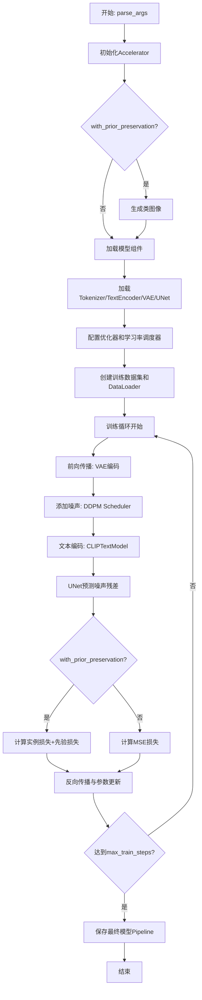
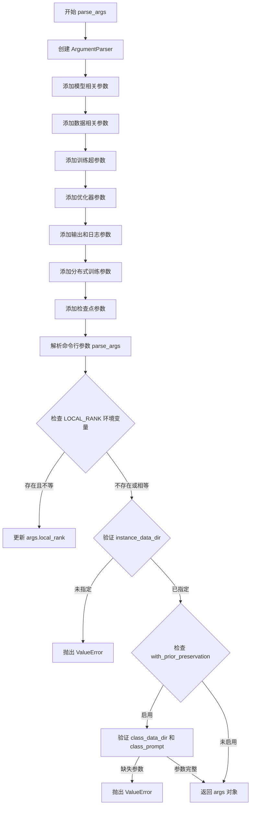
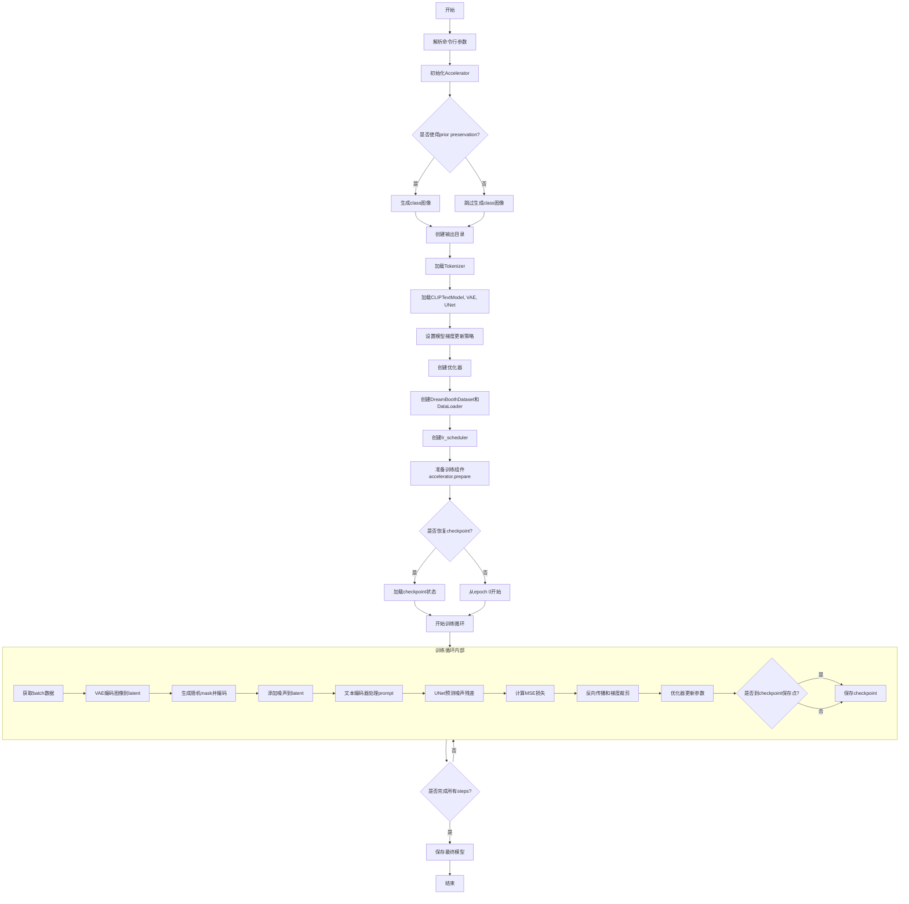
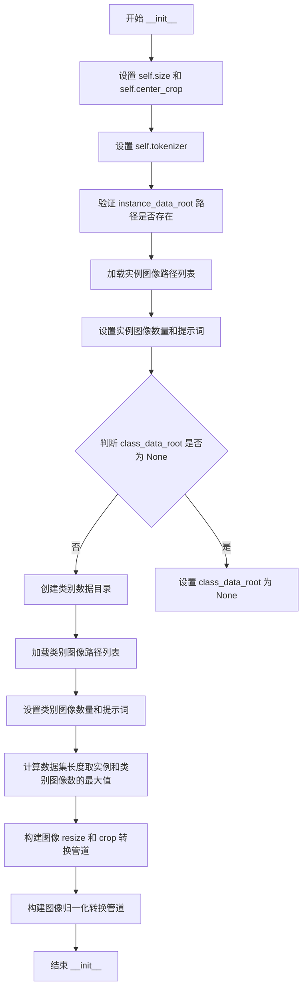
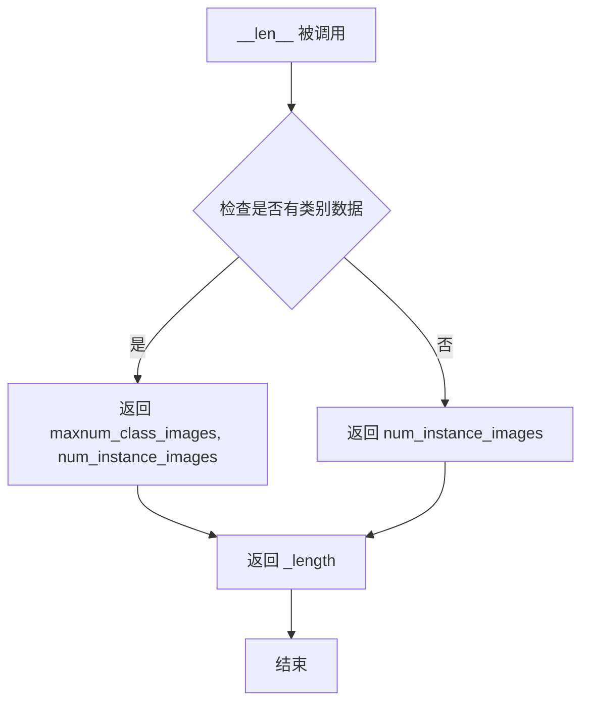
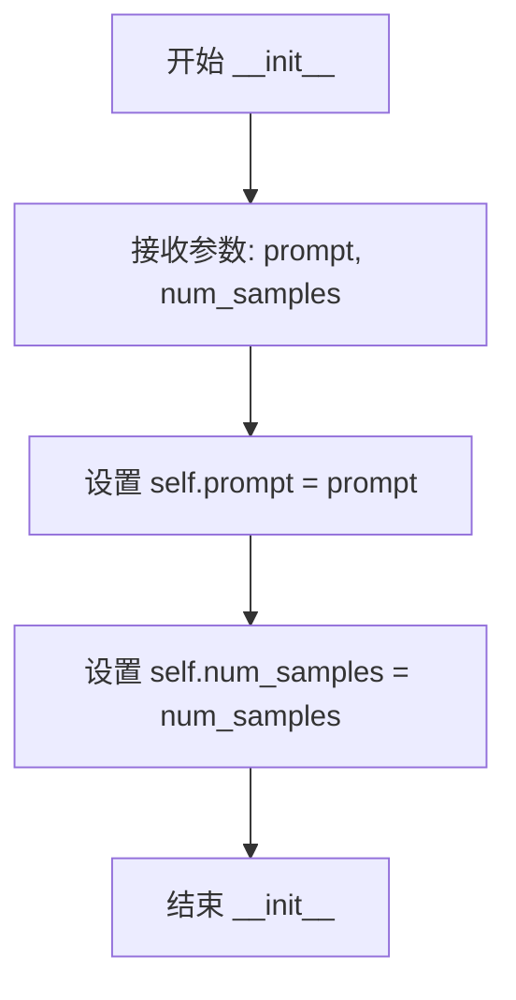
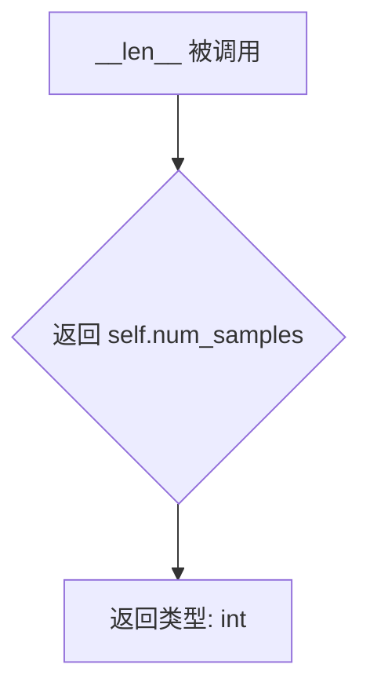

# `diffusers\examples\research_projects\dreambooth_inpaint\train_dreambooth_inpaint.py` 详细设计文档

这是一个DreamBooth训练脚本，用于微调Stable Diffusion模型（包含UNet2DConditionModel和CLIPTextModel），支持Prior Preservation损失来实现个性化图像生成。脚本通过Accelerator实现分布式训练，支持梯度累积、混合精度训练、8-bit Adam优化器、梯度检查点等技术，并具备检查点保存、TensorBoard日志和模型上传至Hub的功能。

## 整体流程



## 类结构

```
Dataset (torch.utils.data.Dataset)
├── DreamBoothDataset
│   - 用于DreamBooth训练的图像和提示数据集
└── PromptDataset
    - 用于生成类图像的简单提示数据集
```

## 全局变量及字段


### `argparse`
    
命令行参数解析模块

类型：`module`
    


### `itertools`
    
迭代器工具模块

类型：`module`
    


### `math`
    
数学函数模块

类型：`module`
    


### `os`
    
操作系统接口模块

类型：`module`
    


### `random`
    
随机数生成模块

类型：`module`
    


### `Path`
    
路径对象类，用于文件路径操作

类型：`class`
    


### `np (numpy)`
    
数值计算库

类型：`module`
    


### `torch`
    
PyTorch深度学习框架

类型：`module`
    


### `F (torch.nn.functional)`
    
PyTorch神经网络功能模块

类型：`module`
    


### `torch.utils.checkpoint`
    
梯度检查点模块，用于节省显存

类型：`module`
    


### `Accelerator`
    
分布式训练加速器类

类型：`class`
    


### `get_logger`
    
获取日志记录器函数

类型：`function`
    


### `ProjectConfiguration`
    
项目配置类

类型：`class`
    


### `set_seed`
    
设置随机种子函数

类型：`function`
    


### `create_repo`
    
创建HuggingFace Hub仓库函数

类型：`function`
    


### `upload_folder`
    
上传文件夹到HuggingFace Hub函数

类型：`function`
    


### `insecure_hashlib`
    
哈希计算模块

类型：`module`
    


### `Image`
    
PIL图像类

类型：`class`
    


### `ImageDraw`
    
PIL图像绘制类

类型：`class`
    


### `Dataset`
    
PyTorch数据集基类

类型：`class`
    


### `transforms`
    
图像变换模块

类型：`module`
    


### `tqdm`
    
进度条类

类型：`class`
    


### `CLIPTextModel`
    
CLIP文本编码器模型类

类型：`class`
    


### `CLIPTokenizer`
    
CLIP分词器类

类型：`class`
    


### `AutoencoderKL`
    
变分自编码器模型类

类型：`class`
    


### `DDPMScheduler`
    
DDPM噪声调度器类

类型：`class`
    


### `UNet2DConditionModel`
    
条件UNet2D模型类

类型：`class`
    


### `StableDiffusionInpaintPipeline`
    
Stable Diffusion图像修复管道类

类型：`class`
    


### `StableDiffusionPipeline`
    
Stable Diffusion管道类

类型：`class`
    


### `get_scheduler`
    
获取学习率调度器函数

类型：`function`
    


### `check_min_version`
    
检查最低版本函数

类型：`function`
    


### `logger`
    
日志记录器实例

类型：`Logger`
    


### `prepare_mask_and_masked_image`
    
准备掩码和被掩码图像的函数

类型：`function`
    


### `random_mask`
    
生成随机掩码的函数

类型：`function`
    


### `parse_args`
    
解析命令行参数的函数

类型：`function`
    


### `DreamBoothDataset`
    
DreamBooth数据集类，用于准备微调模型的实例和类图像

类型：`class`
    


### `PromptDataset`
    
提示数据集类，用于准备生成类图像的提示

类型：`class`
    


### `main`
    
主训练函数

类型：`function`
    


### `DreamBoothDataset.size`
    
图像分辨率大小

类型：`int`
    


### `DreamBoothDataset.center_crop`
    
是否中心裁剪

类型：`bool`
    


### `DreamBoothDataset.tokenizer`
    
CLIP分词器

类型：`CLIPTokenizer`
    


### `DreamBoothDataset.instance_data_root`
    
实例图像根目录

类型：`Path`
    


### `DreamBoothDataset.instance_images_path`
    
实例图像路径列表

类型：`list`
    


### `DreamBoothDataset.num_instance_images`
    
实例图像数量

类型：`int`
    


### `DreamBoothDataset.instance_prompt`
    
实例提示文本

类型：`str`
    


### `DreamBoothDataset.class_data_root`
    
类图像根目录

类型：`Path`
    


### `DreamBoothDataset.class_images_path`
    
类图像路径列表

类型：`list`
    


### `DreamBoothDataset.num_class_images`
    
类图像数量

类型：`int`
    


### `DreamBoothDataset.class_prompt`
    
类提示文本

类型：`str`
    


### `DreamBoothDataset._length`
    
数据集长度

类型：`int`
    


### `DreamBoothDataset.image_transforms_resize_and_crop`
    
图像变换组合，包含Resize和Crop操作

类型：`Compose`
    


### `DreamBoothDataset.image_transforms`
    
图像张量变换，包含ToTensor和Normalize操作

类型：`Compose`
    


### `PromptDataset.prompt`
    
生成图像的提示

类型：`str`
    


### `PromptDataset.num_samples`
    
样本数量

类型：`int`
    
    

## 全局函数及方法


### `prepare_mask_and_masked_image`

该函数用于将输入的图像和掩码转换为PyTorch张量并归一化，将掩码进行二值化处理，同时生成被掩码覆盖的图像（掩码区域置零），最终返回二值化掩码和掩码后的图像张量。

参数：

- `image`：`PIL.Image` 或类似图像对象，待处理的原始RGB图像
- `mask`：`PIL.Image` 或类似图像对象，用于遮盖图像的灰度掩码

返回值：

- `mask`：`torch.Tensor`，形状为 (1, 1, H, W) 的二值化掩码张量，值为0或1
- `masked_image`：`torch.Tensor`，形状为 (1, C, H, W) 的掩码后图像张量，值域为 [-1, 1]

#### 流程图

```mermaid
flowchart TD
    A[开始: 输入image和mask] --> B[将image转换为RGB并转为numpy数组]
    B --> C[调整维度: [None].transpose0<br/>3<br/>1<br/>2]
    C --> D[转为float32张量并归一化到-1到1]
    D --> E[将mask转为灰度numpy数组]
    E --> F[归一化mask到0-1范围]
    F --> G[调整mask维度为4D]
    G --> H[二值化处理: 小于0.5设为0<br/>大于等于0.5设为1]
    H --> I[生成masked_image: image乘以mask取反]
    I --> J[返回mask和masked_image]
```

#### 带注释源码

```python
def prepare_mask_and_masked_image(image, mask):
    """
    准备掩码和被掩码覆盖的图像，将图像和掩码转换为PyTorch张量并归一化
    
    参数:
        image: PIL.Image 或类似图像对象，待处理的RGB图像
        mask: PIL.Image 或类似图像对象，灰度掩码图像
    
    返回值:
        mask: torch.Tensor，二值化后的掩码，形状 (1, 1, H, W)，值为0或1
        masked_image: torch.Tensor，掩码后的图像，形状 (1, C, H, W)，值域 [-1, 1]
    """
    
    # ========== 处理图像 ==========
    # 将PIL图像转换为RGB模式（确保3通道）
    image = np.array(image.convert("RGB"))
    
    # 调整维度顺序: HWC -> NCHW
    # [None] 在开头添加批次维度，transpose 将 (H, W, C) 转为 (C, H, W)
    image = image[None].transpose(0, 3, 1, 2)
    
    # 转换为PyTorch float32张量，并归一化到 [-1, 1] 范围
    # 原图像像素值 [0, 255] -> [0, 2] -> [-1, 1]
    # 除以127.5 将范围从 [0, 255] 映射到 [0, 2]
    # 减1.0 将范围从 [0, 2] 映射到 [-1, 1]
    image = torch.from_numpy(image).to(dtype=torch.float32) / 127.5 - 1.0

    # ========== 处理掩码 ==========
    # 将掩码转换为灰度模式（单通道）
    mask = np.array(mask.convert("L"))
    
    # 转换为float32并归一化到 [0, 1] 范围
    mask = mask.astype(np.float32) / 255.0
    
    # 添加批次和通道维度: (H, W) -> (1, 1, H, W)
    mask = mask[None, None]
    
    # 二值化处理：将掩码转换为0或1
    # 小于0.5的像素设为0（透明/不遮盖区域）
    # 大于等于0.5的像素设为1（遮盖区域）
    mask[mask < 0.5] = 0
    mask[mask >= 0.5] = 1
    
    # 转换为PyTorch张量
    mask = torch.from_numpy(mask)

    # ========== 生成掩码后的图像 ==========
    # 使用 (mask < 0.5) 作为掩码
    # 当 mask 值为0时（不遮盖区域），(mask < 0.5) 为 True，保留原图像
    # 当 mask 值为1时（遮盖区域），(mask < 0.5) 为 False，置零
    masked_image = image * (mask < 0.5)

    # 返回二值化掩码和掩码后的图像
    return mask, masked_image
```


### `random_mask`

该函数是 DreamBooth 训练脚本中用于数据增强的核心辅助函数。它根据传入的图像尺寸和比例参数，随机生成包含矩形或椭圆形状的二进制掩码（Mask）。该掩码主要用于 Stable Diffusion 的图像修复（Inpainting）训练流程中，用于遮盖图像的特定区域。

参数：

- `im_shape`：`tuple`，图像的尺寸，格式为 `(高度, 宽度)`。
- `ratio`：`float`，掩码尺寸相对于图像尺寸的比例因子，用于控制生成掩码的大小，默认为 1.0。
- `mask_full_image`：`bool`，布尔标志位。当设为 `True` 时，强制生成覆盖整个图像的掩码，常用于先验保真（Prior Preservation）步骤；否则生成随机大小的局部掩码，默认为 `False`。

返回值：`PIL.Image.Image`，返回一个 PIL 灰度图像对象。其中像素值为 255 的区域表示需要被模型填充（masked out）的区域，像素值为 0 的区域表示原始图像保留区域。

#### 流程图

```mermaid
graph TD
    A[开始: 输入 im_shape, ratio, mask_full_image] --> B[初始化: 创建黑色 L 模式画布]
    B --> C{判断 mask_full_image?}
    C -- True --> D[设置 size 为全图尺寸]
    C -- False --> E[随机生成 size: 宽高均为 0 到 ratio*对应维度的随机整数]
    D --> F[计算 limits: 图像尺寸减去半个掩码尺寸]
    E --> F
    F --> G[随机生成 center: x 和 y 坐标在 [size/2, limits] 范围内]
    G --> H{随机 draw_type == 0 或 mask_full_image?}
    H -- True --> I[绘制矩形 draw.rectangle]
    H -- False --> J[绘制椭圆 draw.ellipse]
    I --> K[返回生成的 mask 图像]
    J --> K
```

#### 带注释源码

```python
def random_mask(im_shape, ratio=1, mask_full_image=False):
    """
    生成随机形状的掩码（矩形或椭圆），支持掩码全图模式。
    
    参数:
        im_shape: 目标图像的尺寸 (height, width)。
        ratio: 掩码尺寸相对于图像尺寸的比例。
        mask_full_image: 是否生成覆盖全图的掩码。
    
    返回:
        PIL.Image: 生成的二值掩码图像。
    """
    # 1. 创建一个黑色的灰度图像作为底板 (0 表示黑色)
    mask = Image.new("L", im_shape, 0)
    # 2. 创建绘图对象
    draw = ImageDraw.Draw(mask)
    
    # 3. 确定掩码的尺寸
    # 如果不是全图模式，则随机生成一个介于 0 到 图像比例尺寸之间的随机大小
    size = (random.randint(0, int(im_shape[0] * ratio)), random.randint(0, int(im_shape[1] * ratio)))
    
    # 如果是全图模式，则强制将尺寸设定为图像的实际大小
    if mask_full_image:
        size = (int(im_shape[0] * ratio), int(im_shape[1] * ratio))
        
    # 4. 计算掩码中心点的允许范围
    # 中心点必须在图像内部，不能超出边界
    # limits 定义了中心点可以移动的最大边界
    limits = (im_shape[0] - size[0] // 2, im_shape[1] - size[1] // 2)
    # 随机生成中心点坐标
    center = (random.randint(size[0] // 2, limits[0]), random.randint(size[1] // 2, limits[1]))
    
    # 5. 随机选择绘制形状
    # draw_type 0 代表矩形，1 代表椭圆
    # 如果 mask_full_image 为真，强制使用矩形绘制全图
    draw_type = random.randint(0, 1)
    if draw_type == 0 or mask_full_image:
        # 绘制矩形：定义左上角和右下角坐标
        draw.rectangle(
            (center[0] - size[0] // 2, center[1] - size[1] // 2, center[0] + size[0] // 2, center[1] + size[1] // 2),
            fill=255, # 255 表示白色，即掩码区域
        )
    else:
        # 绘制椭圆：定义外接矩形范围
        draw.ellipse(
            (center[0] - size[0] // 2, center[1] - size[1] // 2, center[0] + size[0] // 2, center[1] + size[1] // 2),
            fill=255,
        )

    return mask
```


### `parse_args`

解析命令行参数函数，用于配置DreamBooth训练脚本的所有超参数和路径设置。该函数定义了约40+个命令行参数，包括模型路径、数据目录、训练超参数、优化器设置、输出配置等，并进行环境变量适配和参数校验。

参数：该函数无显式参数，通过`argparse`在函数内部定义所有参数。

返回值：`args`（`argparse.Namespace`），包含所有解析后的命令行参数对象。

#### 流程图



#### 带注释源码

```python
def parse_args():
    """
    解析命令行参数，用于配置DreamBooth训练脚本的所有设置。
    
    该函数创建一个argparse.ArgumentParser实例，定义所有训练所需的
    命令行参数，包括模型路径、数据目录、训练超参数、优化器设置等。
    
    Returns:
        argparse.Namespace: 包含所有解析后参数的对象
    """
    # 创建参数解析器，description用于命令行帮助信息
    parser = argparse.ArgumentParser(description="Simple example of a training script.")
    
    # ===== 模型相关参数 =====
    # 预训练模型路径或模型标识符（huggingface.co/models）
    parser.add_argument(
        "--pretrained_model_name_or_path",
        type=str,
        default=None,
        required=True,
        help="Path to pretrained model or model identifier from huggingface.co/models.",
    )
    # 分词器名称（如果与模型名称不同）
    parser.add_argument(
        "--tokenizer_name",
        type=str,
        default=None,
        help="Pretrained tokenizer name or path if not the same as model_name",
    )
    
    # ===== 数据相关参数 =====
    # 实例图像训练数据目录
    parser.add_argument(
        "--instance_data_dir",
        type=str,
        default=None,
        required=True,
        help="A folder containing the training data of instance images.",
    )
    # 类别图像训练数据目录（用于先验保留损失）
    parser.add_argument(
        "--class_data_dir",
        type=str,
        default=None,
        required=False,
        help="A folder containing the training data of class images.",
    )
    # 实例提示词（带标识符）
    parser.add_argument(
        "--instance_prompt",
        type=str,
        default=None,
        help="The prompt with identifier specifying the instance",
    )
    # 类别提示词
    parser.add_argument(
        "--class_prompt",
        type=str,
        default=None,
        help="The prompt to specify images in the same class as provided instance images.",
    )
    
    # ===== 先验保留损失参数 =====
    # 是否启用先验保留损失
    parser.add_argument(
        "--with_prior_preservation",
        default=False,
        action="store_true",
        help="Flag to add prior preservation loss.",
    )
    # 先验保留损失权重
    parser.add_argument("--prior_loss_weight", type=float, default=1.0, help="The weight of prior preservation loss.")
    # 最少类别图像数量
    parser.add_argument(
        "--num_class_images",
        type=int,
        default=100,
        help=(
            "Minimal class images for prior preservation loss. If not have enough images, additional images will be"
            " sampled with class_prompt."
        ),
    )
    
    # ===== 输出和目录参数 =====
    # 输出目录
    parser.add_argument(
        "--output_dir",
        type=str,
        default="text-inversion-model",
        help="The output directory where the model predictions and checkpoints will be written.",
    )
    # 随机种子
    parser.add_argument("--seed", type=int, default=None, help="A seed for reproducible training.")
    # 日志目录
    parser.add_argument(
        "--logging_dir",
        type=str,
        default="logs",
        help=(
            "[TensorBoard](https://www.tensorflow.org/tensorboard) log directory. Will default to"
            " *output_dir/runs/**CURRENT_DATETIME_HOSTNAME***."
        ),
    )
    
    # ===== 图像处理参数 =====
    # 输入图像分辨率
    parser.add_argument(
        "--resolution",
        type=int,
        default=512,
        help=(
            "The resolution for input images, all the images in the train/validation dataset will be resized to this"
            " resolution"
        ),
    )
    # 是否中心裁剪
    parser.add_argument(
        "--center_crop",
        default=False,
        action="store_true",
        help=(
            "Whether to center crop the input images to the resolution. If not set, the images will be randomly"
            " cropped. The images will be resized to the resolution first before cropping."
        ),
    )
    
    # ===== 训练参数 =====
    # 是否训练文本编码器
    parser.add_argument("--train_text_encoder", action="store_true", help="Whether to train the text encoder")
    # 训练批次大小
    parser.add_argument(
        "--train_batch_size", type=int, default=4, help="Batch size (per device) for the training dataloader."
    )
    # 采样批次大小
    parser.add_argument(
        "--sample_batch_size", type=int, default=4, help="Batch size (per device) for sampling images."
    )
    # 训练轮数
    parser.add_argument("--num_train_epochs", type=int, default=1)
    # 最大训练步数（覆盖num_train_epochs）
    parser.add_argument(
        "--max_train_steps",
        type=int,
        default=None,
        help="Total number of training steps to perform.  If provided, overrides num_train_epochs.",
    )
    # 梯度累积步数
    parser.add_argument(
        "--gradient_accumulation_steps",
        type=int,
        default=1,
        help="Number of updates steps to accumulate before performing a backward/update pass.",
    )
    # 梯度检查点（节省显存）
    parser.add_argument(
        "--gradient_checkpointing",
        action="store_true",
        help="Whether or not to use gradient checkpointing to save memory at the expense of slower backward pass.",
    )
    
    # ===== 学习率调度器参数 =====
    # 初始学习率
    parser.add_argument(
        "--learning_rate",
        type=float,
        default=5e-6,
        help="Initial learning rate (after the potential warmup period) to use.",
    )
    # 是否根据GPU数量等比例缩放学习率
    parser.add_argument(
        "--scale_lr",
        action="store_true",
        default=False,
        help="Scale the learning rate by the number of GPUs, gradient accumulation steps, and batch size.",
    )
    # 学习率调度器类型
    parser.add_argument(
        "--lr_scheduler",
        type=str,
        default="constant",
        help=(
            'The scheduler type to use. Choose between ["linear", "cosine", "cosine_with_restarts", "polynomial",'
            ' "constant", "constant_with_warmup"]'
        ),
    )
    # 预热步数
    parser.add_argument(
        "--lr_warmup_steps", type=int, default=500, help="Number of steps for the warmup in the lr scheduler."
    )
    
    # ===== 优化器参数 =====
    # 是否使用8位Adam优化器
    parser.add_argument(
        "--use_8bit_adam", action="store_true", help="Whether or not to use 8-bit Adam from bitsandbytes."
    )
    # Adam优化器beta1参数
    parser.add_argument("--adam_beta1", type=float, default=0.9, help="The beta1 parameter for the Adam optimizer.")
    # Adam优化器beta2参数
    parser.add_argument("--adam_beta2", type=float, default=0.999, help="The beta2 parameter for the Adam optimizer.")
    # 权重衰减
    parser.add_argument("--adam_weight_decay", type=float, default=1e-2, help="Weight decay to use.")
    # Adam优化器epsilon值
    parser.add_argument("--adam_epsilon", type=float, default=1e-08, help="Epsilon value for the Adam optimizer")
    # 最大梯度范数
    parser.add_argument("--max_grad_norm", default=1.0, type=float, help="Max gradient norm.")
    
    # ===== HuggingFace Hub相关参数 =====
    # 是否推送到Hub
    parser.add_argument("--push_to_hub", action="store_true", help="Whether or not to push the model to the Hub.")
    # Hub令牌
    parser.add_argument("--hub_token", type=str, default=None, help="The token to use to push to the Model Hub.")
    # Hub模型ID
    parser.add_argument(
        "--hub_model_id",
        type=str,
        default=None,
        help="The name of the repository to keep in sync with the local `output_dir`.",
    )
    
    # ===== 混合精度和分布式训练参数 =====
    # 混合精度类型
    parser.add_argument(
        "--mixed_precision",
        type=str,
        default="no",
        choices=["no", "fp16", "bf16"],
        help=(
            "Whether to use mixed precision. Choose"
            "between fp16 and bf16 (bfloat16). Bf16 requires PyTorch >= 1.10."
            "and an Nvidia Ampere GPU."
        ),
    )
    # 本地排名（分布式训练用）
    parser.add_argument("--local_rank", type=int, default=-1, help="For distributed training: local_rank")
    
    # ===== 检查点参数 =====
    # 检查点保存步数
    parser.add_argument(
        "--checkpointing_steps",
        type=int,
        default=500,
        help=(
            "Save a checkpoint of the training state every X updates. These checkpoints can be used both as final"
            " checkpoints in case they are better than the last checkpoint and are suitable for resuming training"
            " using `--resume_from_checkpoint`."
        ),
    )
    # 检查点总数限制
    parser.add_argument(
        "--checkpoints_total_limit",
        type=int,
        default=None,
        help=(
            "Max number of checkpoints to store. Passed as `total_limit` to the `Accelerator` `ProjectConfiguration`."
            " See Accelerator::save_state https://huggingface.co/docs/accelerate/package_reference/accelerator#accelerate.Accelerator.save_state"
            " for more docs"
        ),
    )
    # 从检查点恢复训练
    parser.add_argument(
        "--resume_from_checkpoint",
        type=str,
        default=None,
        help=(
            "Whether training should be resumed from a previous checkpoint. Use a path saved by"
            ' `--checkpointing_steps`, or `"latest"` to automatically select the last available checkpoint.'
        ),
    )
    
    # 解析命令行参数
    args = parser.parse_args()
    
    # ===== 环境变量适配 =====
    # 检查LOCAL_RANK环境变量，如果存在则覆盖args.local_rank
    # 这是为了兼容使用torchrun_launch器时的参数传递
    env_local_rank = int(os.environ.get("LOCAL_RANK", -1))
    if env_local_rank != -1 and env_local_rank != args.local_rank:
        args.local_rank = env_local_rank
    
    # ===== 参数校验 =====
    # 验证实例数据目录必须指定
    if args.instance_data_dir is None:
        raise ValueError("You must specify a train data directory.")
    
    # 验证先验保留相关参数
    if args.with_prior_preservation:
        if args.class_data_dir is None:
            raise ValueError("You must specify a data directory for class images.")
        if args.class_prompt is None:
            raise ValueError("You must specify prompt for class images.")
    
    # 返回解析后的参数对象
    return args
```


### `main`

主训练函数，包含完整的DreamBooth训练流程：数据准备、模型加载、训练循环、模型保存。

参数：
- 该函数无直接传入参数，通过`parse_args()`函数从命令行获取所有训练参数

返回值：`None`，函数执行完成后直接退出

#### 流程图



#### 带注释源码

```python
def main():
    """
    主训练函数，执行完整的DreamBooth训练流程
    """
    # 步骤1: 解析命令行参数
    args = parse_args()
    logging_dir = Path(args.output_dir, args.logging_dir)

    # 步骤2: 配置Accelerator项目配置
    project_config = ProjectConfiguration(
        total_limit=args.checkpoints_total_limit, project_dir=args.output_dir, logging_dir=logging_dir
    )

    # 步骤3: 初始化Accelerator（分布式训练、混合精度等）
    accelerator = Accelerator(
        gradient_accumulation_steps=args.gradient_accumulation_steps,
        mixed_precision=args.mixed_precision,
        log_with="tensorboard",
        project_config=project_config,
    )

    # 检查gradient accumulation与text encoder训练的兼容性
    if args.train_text_encoder and args.gradient_accumulation_steps > 1 and accelerator.num_processes > 1:
        raise ValueError(
            "Gradient accumulation is not supported when training the text encoder in distributed training. "
            "Please set gradient_accumulation_steps to 1. This feature will be supported in the future."
        )

    # 设置随机种子以确保可重复性
    if args.seed is not None:
        set_seed(args.seed)

    # 步骤4: 如果启用prior preservation，生成class图像
    if args.with_prior_preservation:
        class_images_dir = Path(args.class_data_dir)
        if not class_images_dir.exists():
            class_images_dir.mkdir(parents=True)
        cur_class_images = len(list(class_images_dir.iterdir()))

        # 如果现有class图像不足，生成新的
        if cur_class_images < args.num_class_images:
            torch_dtype = torch.float16 if accelerator.device.type == "cuda" else torch.float32
            # 加载inpainting pipeline用于生成class图像
            pipeline = StableDiffusionInpaintPipeline.from_pretrained(
                args.pretrained_model_name_or_path, torch_dtype=torch_dtype, safety_checker=None
            )
            pipeline.set_progress_bar_config(disable=True)

            num_new_images = args.num_class_images - cur_class_images
            logger.info(f"Number of class images to sample: {num_new_images}.")

            # 创建prompt dataset用于生成
            sample_dataset = PromptDataset(args.class_prompt, num_new_images)
            sample_dataloader = torch.utils.data.DataLoader(
                sample_dataset, batch_size=args.sample_batch_size, num_workers=1
            )

            sample_dataloader = accelerator.prepare(sample_dataloader)
            pipeline.to(accelerator.device)
            transform_to_pil = transforms.ToPILImage()
            
            # 使用inpainting生成class图像
            for example in tqdm(
                sample_dataloader, desc="Generating class images", disable=not accelerator.is_local_main_process
            ):
                bsz = len(example["prompt"])
                fake_images = torch.rand((3, args.resolution, args.resolution))
                transform_to_pil = transforms.ToPILImage()
                fake_pil_images = transform_to_pil(fake_images)

                fake_mask = random_mask((args.resolution, args.resolution), ratio=1, mask_full_image=True)

                images = pipeline(prompt=example["prompt"], mask_image=fake_mask, image=fake_pil_images).images

                for i, image in enumerate(images):
                    hash_image = insecure_hashlib.sha1(image.tobytes()).hexdigest()
                    image_filename = class_images_dir / f"{example['index'][i] + cur_class_images}-{hash_image}.jpg"
                    image.save(image_filename)

            del pipeline
            if torch.cuda.is_available():
                torch.cuda.empty_cache()

    # 步骤5: 创建输出目录
    if accelerator.is_main_process:
        if args.output_dir is not None:
            os.makedirs(args.output_dir, exist_ok=True)

        # 如果需要push到Hub，创建repo
        if args.push_to_hub:
            repo_id = create_repo(
                repo_id=args.hub_model_id or Path(args.output_dir).name, exist_ok=True, token=args.hub_token
            ).repo_id

    # 步骤6: 加载Tokenizer
    if args.tokenizer_name:
        tokenizer = CLIPTokenizer.from_pretrained(args.tokenizer_name)
    elif args.pretrained_model_name_or_path:
        tokenizer = CLIPTokenizer.from_pretrained(args.pretrained_model_name_or_path, subfolder="tokenizer")

    # 步骤7: 加载预训练模型
    text_encoder = CLIPTextModel.from_pretrained(args.pretrained_model_name_or_path, subfolder="text_encoder")
    vae = AutoencoderKL.from_pretrained(args.pretrained_model_name_or_path, subfolder="vae")
    unet = UNet2DConditionModel.from_pretrained(args.pretrained_model_name_or_path, subfolder="unet")

    # 步骤8: 设置模型梯度要求
    vae.requires_grad_(False)  # VAE通常不训练
    if not args.train_text_encoder:
        text_encoder.requires_grad_(False)

    # 步骤9: 启用gradient checkpointing以节省显存
    if args.gradient_checkpointing:
        unet.enable_gradient_checkpointing()
        if args.train_text_encoder:
            text_encoder.gradient_checkpointing_enable()

    # 步骤10: 根据参数scale learning rate
    if args.scale_lr:
        args.learning_rate = (
            args.learning_rate * args.gradient_accumulation_steps * args.train_batch_size * accelerator.num_processes
        )

    # 步骤11: 选择优化器（支持8-bit Adam）
    if args.use_8bit_adam:
        try:
            import bitsandbytes as bnb
        except ImportError:
            raise ImportError(
                "To use 8-bit Adam, please install the bitsandbytes library: `pip install bitsandbytes`."
            )

        optimizer_class = bnb.optim.AdamW8bit
    else:
        optimizer_class = torch.optim.AdamW

    # 确定需要优化的参数
    params_to_optimize = (
        itertools.chain(unet.parameters(), text_encoder.parameters()) if args.train_text_encoder else unet.parameters()
    )
    optimizer = optimizer_class(
        params_to_optimize,
        lr=args.learning_rate,
        betas=(args.adam_beta1, args.adam_beta2),
        weight_decay=args.adam_weight_decay,
        eps=args.adam_epsilon,
    )

    # 步骤12: 加载noise scheduler
    noise_scheduler = DDPMScheduler.from_pretrained(args.pretrained_model_name_or_path, subfolder="scheduler")

    # 步骤13: 创建训练数据集
    train_dataset = DreamBoothDataset(
        instance_data_root=args.instance_data_dir,
        instance_prompt=args.instance_prompt,
        class_data_root=args.class_data_dir if args.with_prior_preservation else None,
        class_prompt=args.class_prompt,
        tokenizer=tokenizer,
        size=args.resolution,
        center_crop=args.center_crop,
    )

    # 定义collate函数处理batch
    def collate_fn(examples):
        input_ids = [example["instance_prompt_ids"] for example in examples]
        pixel_values = [example["instance_images"] for example in examples]

        # 如果使用prior preservation，合并class和instance examples
        if args.with_prior_preservation:
            input_ids += [example["class_prompt_ids"] for example in examples]
            pixel_values += [example["class_images"] for example in examples]
            pior_pil = [example["class_PIL_images"] for example in examples]

        masks = []
        masked_images = []
        for example in examples:
            pil_image = example["PIL_images"]
            # 生成随机mask
            mask = random_mask(pil_image.size, 1, False)
            # 准备mask和masked image
            mask, masked_image = prepare_mask_and_masked_image(pil_image, mask)

            masks.append(mask)
            masked_images.append(masked_image)

        if args.with_prior_preservation:
            for pil_image in pior_pil:
                mask = random_mask(pil_image.size, 1, False)
                mask, masked_image = prepare_mask_and_masked_image(pil_image, mask)

                masks.append(mask)
                masked_images.append(masked_image)

        pixel_values = torch.stack(pixel_values)
        pixel_values = pixel_values.to(memory_format=torch.contiguous_format).float()

        input_ids = tokenizer.pad({"input_ids": input_ids}, padding=True, return_tensors="pt").input_ids
        masks = torch.stack(masks)
        masked_images = torch.stack(masked_images)
        batch = {"input_ids": input_ids, "pixel_values": pixel_values, "masks": masks, "masked_images": masked_images}
        return batch

    # 创建DataLoader
    train_dataloader = torch.utils.data.DataLoader(
        train_dataset, batch_size=args.train_batch_size, shuffle=True, collate_fn=collate_fn
    )

    # 步骤14: 计算训练步数
    overrode_max_train_steps = False
    num_update_steps_per_epoch = math.ceil(len(train_dataloader) / args.gradient_accumulation_steps)
    if args.max_train_steps is None:
        args.max_train_steps = args.num_train_epochs * num_update_steps_per_epoch
        overrode_max_train_steps = True

    # 步骤15: 创建lr scheduler
    lr_scheduler = get_scheduler(
        args.lr_scheduler,
        optimizer=optimizer,
        num_warmup_steps=args.lr_warmup_steps * accelerator.num_processes,
        num_training_steps=args.max_train_steps * accelerator.num_processes,
    )

    # 步骤16: 准备训练组件
    if args.train_text_encoder:
        unet, text_encoder, optimizer, train_dataloader, lr_scheduler = accelerator.prepare(
            unet, text_encoder, optimizer, train_dataloader, lr_scheduler
        )
    else:
        unet, optimizer, train_dataloader, lr_scheduler = accelerator.prepare(
            unet, optimizer, train_dataloader, lr_scheduler
        )
    accelerator.register_for_checkpointing(lr_scheduler)

    # 设置混合精度权重类型
    weight_dtype = torch.float32
    if args.mixed_precision == "fp16":
        weight_dtype = torch.float16
    elif args.mixed_precision == "bf16":
        weight_dtype = torch.bfloat16

    # 移动模型到设备
    vae.to(accelerator.device, dtype=weight_dtype)
    if not args.train_text_encoder:
        text_encoder.to(accelerator.device, dtype=weight_dtype)

    # 重新计算训练步数（可能因dataloader准备而改变）
    num_update_steps_per_epoch = math.ceil(len(train_dataloader) / args.gradient_accumulation_steps)
    if overrode_max_train_steps:
        args.max_train_steps = args.num_train_epochs * num_update_steps_per_epoch
    args.num_train_epochs = math.ceil(args.max_train_steps / num_update_steps_per_epoch)

    # 初始化trackers
    if accelerator.is_main_process:
        accelerator.init_trackers("dreambooth", config=vars(args))

    # 步骤17: 开始训练
    total_batch_size = args.train_batch_size * accelerator.num_processes * args.gradient_accumulation_steps

    logger.info("***** Running training *****")
    logger.info(f"  Num examples = {len(train_dataset)}")
    logger.info(f"  Num batches each epoch = {len(train_dataloader)}")
    logger.info(f"  Num Epochs = {args.num_train_epochs}")
    logger.info(f"  Instantaneous batch size per device = {args.train_batch_size}")
    logger.info(f"  Total train batch size (w. parallel, distributed & accumulation) = {total_batch_size}")
    logger.info(f"  Gradient Accumulation steps = {args.gradient_accumulation_steps}")
    logger.info(f"  Total optimization steps = {args.max_train_steps}")
    global_step = 0
    first_epoch = 0

    # 步骤18: 恢复checkpoint（如果指定）
    if args.resume_from_checkpoint:
        if args.resume_from_checkpoint != "latest":
            path = os.path.basename(args.resume_from_checkpoint)
        else:
            # 获取最新的checkpoint
            dirs = os.listdir(args.output_dir)
            dirs = [d for d in dirs if d.startswith("checkpoint")]
            dirs = sorted(dirs, key=lambda x: int(x.split("-")[1]))
            path = dirs[-1] if len(dirs) > 0 else None

        if path is None:
            accelerator.print(
                f"Checkpoint '{args.resume_from_checkpoint}' does not exist. Starting a new training run."
            )
            args.resume_from_checkpoint = None
        else:
            accelerator.print(f"Resuming from checkpoint {path}")
            accelerator.load_state(os.path.join(args.output_dir, path))
            global_step = int(path.split("-")[1])

            resume_global_step = global_step * args.gradient_accumulation_steps
            first_epoch = global_step // num_update_steps_per_epoch
            resume_step = resume_global_step % (num_update_steps_per_epoch * args.gradient_accumulation_steps)

    # 创建进度条
    progress_bar = tqdm(range(global_step, args.max_train_steps), disable=not accelerator.is_local_main_process)
    progress_bar.set_description("Steps")

    # 步骤19: 训练循环
    for epoch in range(first_epoch, args.num_train_epochs):
        unet.train()
        for step, batch in enumerate(train_dataloader):
            # 跳过已完成的steps
            if args.resume_from_checkpoint and epoch == first_epoch and step < resume_step:
                if step % args.gradient_accumulation_steps == 0:
                    progress_bar.update(1)
                continue

            with accelerator.accumulate(unet):
                # 19.1: 将图像编码到latent空间
                latents = vae.encode(batch["pixel_values"].to(dtype=weight_dtype)).latent_dist.sample()
                latents = latents * vae.config.scaling_factor

                # 19.2: 将masked图像编码到latent空间
                masked_latents = vae.encode(
                    batch["masked_images"].reshape(batch["pixel_values"].shape).to(dtype=weight_dtype)
                ).latent_dist.sample()
                masked_latents = masked_latents * vae.config.scaling_factor

                masks = batch["masks"]
                # 调整mask大小以匹配latent
                mask = torch.stack(
                    [
                        torch.nn.functional.interpolate(mask, size=(args.resolution // 8, args.resolution // 8))
                        for mask in masks
                    ]
                )
                mask = mask.reshape(-1, 1, args.resolution // 8, args.resolution // 8)

                # 19.3: 采样噪声
                noise = torch.randn_like(latents)
                bsz = latents.shape[0]
                # 随机采样timestep
                timesteps = torch.randint(0, noise_scheduler.config.num_train_timesteps, (bsz,), device=latents.device)
                timesteps = timesteps.long()

                # 19.4: 前向扩散过程
                noisy_latents = noise_scheduler.add_noise(latents, noise, timesteps)

                # 19.5: 拼接latent, mask, masked_latent
                latent_model_input = torch.cat([noisy_latents, mask, masked_latents], dim=1)

                # 19.6: 文本编码
                encoder_hidden_states = text_encoder(batch["input_ids"])[0]

                # 19.7: UNet预测噪声残差
                noise_pred = unet(latent_model_input, timesteps, encoder_hidden_states).sample

                # 19.8: 获取loss目标
                if noise_scheduler.config.prediction_type == "epsilon":
                    target = noise
                elif noise_scheduler.config.prediction_type == "v_prediction":
                    target = noise_scheduler.get_velocity(latents, noise, timesteps)
                else:
                    raise ValueError(f"Unknown prediction type {noise_scheduler.config.prediction_type}")

                # 19.9: 计算loss
                if args.with_prior_preservation:
                    # 分离instance和prior的预测
                    noise_pred, noise_pred_prior = torch.chunk(noise_pred, 2, dim=0)
                    target, target_prior = torch.chunk(target, 2, dim=0)

                    # 计算instance loss
                    loss = F.mse_loss(noise_pred.float(), target.float(), reduction="none").mean([1, 2, 3]).mean()

                    # 计算prior loss
                    prior_loss = F.mse_loss(noise_pred_prior.float(), target_prior.float(), reduction="mean")

                    # 组合loss
                    loss = loss + args.prior_loss_weight * prior_loss
                else:
                    loss = F.mse_loss(noise_pred.float(), target.float(), reduction="mean")

                # 19.10: 反向传播
                accelerator.backward(loss)
                if accelerator.sync_gradients:
                    params_to_clip = (
                        itertools.chain(unet.parameters(), text_encoder.parameters())
                        if args.train_text_encoder
                        else unet.parameters()
                    )
                    accelerator.clip_grad_norm_(params_to_clip, args.max_grad_norm)
                optimizer.step()
                lr_scheduler.step()
                optimizer.zero_grad()

            # 19.11: 检查是否执行了优化步骤
            if accelerator.sync_gradients:
                progress_bar.update(1)
                global_step += 1

                # 19.12: 保存checkpoint
                if global_step % args.checkpointing_steps == 0:
                    if accelerator.is_main_process:
                        save_path = os.path.join(args.output_dir, f"checkpoint-{global_step}")
                        accelerator.save_state(save_path)
                        logger.info(f"Saved state to {save_path}")

            # 19.13: 记录日志
            logs = {"loss": loss.detach().item(), "lr": lr_scheduler.get_last_lr()[0]}
            progress_bar.set_postfix(**logs)
            accelerator.log(logs, step=global_step)

            if global_step >= args.max_train_steps:
                break

        accelerator.wait_for_everyone()

    # 步骤20: 保存最终模型
    if accelerator.is_main_process:
        pipeline = StableDiffusionPipeline.from_pretrained(
            args.pretrained_model_name_or_path,
            unet=accelerator.unwrap_model(unet),
            text_encoder=accelerator.unwrap_model(text_encoder),
        )
        pipeline.save_pretrained(args.output_dir)

        if args.push_to_hub:
            upload_folder(
                repo_id=repo_id,
                folder_path=args.output_dir,
                commit_message="End of training",
                ignore_patterns=["step_*", "epoch_*"],
            )

    accelerator.end_training()
```


### DreamBoothDataset.__init__

该方法是 DreamBoothDataset 类的构造函数，用于初始化 DreamBooth 微调数据集。它接收实例图像路径、提示词和分词器等参数，验证数据目录有效性，加载实例和类别图像路径列表，并构建图像预处理转换管道（调整大小、裁剪和归一化）。

参数：

- `self`：隐式参数，代表实例对象本身
- `instance_data_root`：`str`，实例图像所在的根目录路径
- `instance_prompt`：`str`，用于描述实例图像的提示词文本
- `tokenizer`：`CLIPTokenizer`，用于将文本提示词转换为 token ID 的分词器
- `class_data_root`：`str` 或 `None`，类别图像所在的根目录路径（用于先验保留 loss），默认为 None
- `class_prompt`：`str` 或 `None`，用于描述类别图像的提示词文本，默认为 None
- `size`：`int`，图像的目标分辨率，默认为 512
- `center_crop`：`bool`，是否使用中心裁剪，默认为 False

返回值：无（`None`），该方法为构造函数，仅初始化对象状态

#### 流程图



#### 带注释源码

```python
def __init__(
    self,
    instance_data_root,
    instance_prompt,
    tokenizer,
    class_data_root=None,
    class_prompt=None,
    size=512,
    center_crop=False,
):
    """
    初始化 DreamBoothDataset 数据集对象
    
    参数:
        instance_data_root: 实例图像根目录路径
        instance_prompt: 实例图像的提示词
        tokenizer: CLIP 分词器用于编码提示词
        class_data_root: 类别图像根目录（可选，用于先验保留）
        class_prompt: 类别图像提示词
        size: 目标图像尺寸
        center_crop: 是否采用中心裁剪
    """
    # 1. 保存图像尺寸和裁剪方式配置
    self.size = size
    self.center_crop = center_crop
    self.tokenizer = tokenizer

    # 2. 将实例数据根路径转换为 Path 对象并验证其存在性
    self.instance_data_root = Path(instance_data_root)
    if not self.instance_data_root.exists():
        raise ValueError("Instance images root doesn't exists.")

    # 3. 获取实例图像目录下所有文件并统计数量
    self.instance_images_path = list(Path(instance_data_root).iterdir())
    self.num_instance_images = len(self.instance_images_path)
    
    # 4. 保存实例提示词并设置数据集长度基准
    self.instance_prompt = instance_prompt
    self._length = self.num_instance_images

    # 5. 处理类别数据（如果提供）
    if class_data_root is not None:
        # 创建类别数据目录（如果不存在）
        self.class_data_root = Path(class_data_root)
        self.class_data_root.mkdir(parents=True, exist_ok=True)
        
        # 获取类别图像列表
        self.class_images_path = list(self.class_data_root.iterdir())
        self.num_class_images = len(self.class_images_path)
        
        # 数据集长度取实例和类别图像数的最大值，确保两者都能被遍历
        self._length = max(self.num_class_images, self.num_instance_images)
        self.class_prompt = class_prompt
    else:
        self.class_data_root = None

    # 6. 构建图像预处理转换管道：先 Resize 再裁剪
    self.image_transforms_resize_and_crop = transforms.Compose(
        [
            # 使用双线性插值调整图像大小到目标尺寸
            transforms.Resize(size, interpolation=transforms.InterpolationMode.BILINEAR),
            # 根据 center_crop 参数选择中心裁剪或随机裁剪
            transforms.CenterCrop(size) if center_crop else transforms.RandomCrop(size),
        ]
    )

    # 7. 构建图像归一化转换管道：转换为 tensor 并归一化到 [-1, 1]
    self.image_transforms = transforms.Compose(
        [
            transforms.ToTensor(),  # 将 PIL Image 转换为 [0, 1] 范围的 tensor
            transforms.Normalize([0.5], [0.5]),  # 归一化到 [-1, 1]
        ]
    )
```


### `DreamBoothDataset.__len__`

该方法返回DreamBoothDataset数据集中样本的数量，用于PyTorch DataLoader确定数据集的大小和迭代次数。

参数：

- `self`：`DreamBoothDataset` 类型，隐式参数，表示数据集实例本身

返回值：`int`，返回数据集中样本的总数，即实例图像数量与类别图像数量（如果存在）中的较大值。

#### 流程图



#### 带注释源码

```python
def __len__(self):
    """
    返回数据集的样本数量。
    
    该方法实现了 Python 的魔术方法 __len__，使 DreamBoothDataset 
    可以与 PyTorch 的 DataLoader 兼容。返回值 _length 在 __init__ 
    方法中被设置为：
    - 如果存在类别数据（class_data_root）：max(类别图像数量, 实例图像数量)
    - 如果不存在类别数据：实例图像数量
    
    这样设置是为了在使用 prior preservation 时，保证每个 epoch 
    能够遍历所有类别图像，即使实例图像数量少于类别图像。
    
    Returns:
        int: 数据集中的样本数量
    """
    return self._length
```


### `DreamBoothDataset.__getitem__`

该方法是 DreamBoothDataset 类的核心数据加载方法，负责根据给定的索引返回训练样本。它加载并处理实例图像和（可选的）类图像，将图像转换为张量格式，对文本提示进行 tokenize，并返回一个包含图像数据和 token IDs 的字典供模型训练使用。

参数：

- `index`：`int`，用于索引数据集中样本的整数索引

返回值：`Dict[str, Any]`，返回一个包含以下键的字典：
  - `instance_images`：处理后的实例图像张量
  - `instance_prompt_ids`：实例提示的 token IDs
  - `class_images`（如果存在）：处理后的类图像张量
  - `class_prompt_ids`（如果存在）：类提示的 token IDs
  - `PIL_images`：PIL 格式的实例图像（用于掩码生成）
  - `class_PIL_images`（如果存在）：PIL 格式的类图像

#### 流程图

```mermaid
flowchart TD
    A[开始 __getitem__] --> B[创建空字典 example]
    B --> C[根据 index 打开实例图像]
    C --> D{图像模式是否为 RGB?}
    D -->|否| E[转换为 RGB 模式]
    D -->|是| F[直接下一步]
    E --> F
    F --> G[应用 resize 和裁剪变换]
    G --> H[保存 PIL 格式图像到 example]
    H --> I[将图像转换为张量并归一化]
    I --> J[保存到 example['instance_images']]
    J --> K[Tokenize 实例提示]
    K --> L[保存 prompt_ids 到 example]
    L --> M{是否存在 class_data_root?}
    M -->|否| N[返回 example 字典]
    M -->|是| O[根据 index 打开类图像]
    O --> P{图像模式是否为 RGB?}
    P -->|否| Q[转换为 RGB 模式]
    P -->|是| R[直接下一步]
    Q --> R
    R --> S[应用 resize 和裁剪变换]
    S --> T[保存类 PIL 图像]
    T --> U[转换为张量并归一化]
    U --> V[保存到 example['class_images']]
    V --> W[Tokenize 类提示]
    W --> X[保存 class_prompt_ids]
    X --> N
```

#### 带注释源码

```python
def __getitem__(self, index):
    """
    根据索引获取训练样本。
    
    Args:
        index: 数据集样本索引
        
    Returns:
        包含图像数据和文本token IDs的字典
    """
    # 初始化返回字典
    example = {}
    
    # 使用取模运算处理索引，确保索引在有效范围内循环
    instance_image = Image.open(self.instance_images_path[index % self.num_instance_images])
    
    # 确保图像为RGB模式（RGBA或灰度图需要转换）
    if not instance_image.mode == "RGB":
        instance_image = instance_image.convert("RGB")
    
    # 应用resize和裁剪变换（根据center_crop配置决定裁剪方式）
    instance_image = self.image_transforms_resize_and_crop(instance_image)
    
    # 保存PIL格式图像（用于后续在collate_fn中生成随机掩码）
    example["PIL_images"] = instance_image
    
    # 将PIL图像转换为张量并归一化到[-1, 1]范围
    example["instance_images"] = self.image_transforms(instance_image)
    
    # 对实例提示进行tokenize
    # padding="do_not_pad": 不进行填充
    # truncation=True: 截断过长的序列
    # max_length: 使用tokenizer的最大长度限制
    example["instance_prompt_ids"] = self.tokenizer(
        self.instance_prompt,
        padding="do_not_pad",
        truncation=True,
        max_length=self.tokenizer.model_max_length,
    ).input_ids
    
    # 如果配置了类图像数据（用于prior preservation）
    if self.class_data_root:
        # 加载类图像
        class_image = Image.open(self.class_images_path[index % self.num_class_images])
        
        # 同样的RGB模式转换
        if not class_image.mode == "RGB":
            class_image = class_image.convert("RGB")
        
        # 应用图像变换
        class_image = self.image_transforms_resize_and_crop(class_image)
        
        # 保存类图像相关数据
        example["class_images"] = self.image_transforms(class_image)
        example["class_PIL_images"] = class_image
        
        # Tokenize类提示
        example["class_prompt_ids"] = self.tokenizer(
            self.class_prompt,
            padding="do_not_pad",
            truncation=True,
            max_length=self.tokenizer.model_max_length,
        ).input_ids
    
    # 返回包含所有样本数据的字典
    return example
```


### `PromptDataset.__init__`

用于初始化PromptDataset数据集类，该类是一个简单的PyTorch数据集，用于准备提示词以在多个GPU上生成类别图像。

参数：

- `prompt`：`str`，提示词，用于生成类别图像的文本描述
- `num_samples`：`int`，要生成的样本数量

返回值：`None`，构造函数无返回值，仅初始化实例属性

#### 流程图



#### 带注释源码

```python
def __init__(self, prompt, num_samples):
    """
    初始化PromptDataset实例。
    
    Args:
        prompt (str): 用于生成类别图像的文本提示词
        num_samples (int): 需要生成的样本数量
    
    Returns:
        None
    """
    # 将传入的提示词存储为实例属性，供__getitem__方法使用
    self.prompt = prompt
    # 将传入的样本数量存储为实例属性，供__len__方法返回数据集大小
    self.num_samples = num_samples
```


### `PromptDataset.__len__`

该方法用于返回数据集中样本的数量，使 DataLoader 能够确定迭代的总数。

参数：

- 无参数（继承自 Python 的特殊方法 `__len__`）

返回值：`int`，返回数据集中要生成的样本数量。

#### 流程图



#### 带注释源码

```python
def __len__(self):
    """
    返回数据集中样本的数量。
    
    该方法是 Python 数据集协议的核心方法之一，
    DataLoader 会调用此方法来确定迭代的总数。
    
    Returns:
        int: 数据集中包含的样本数量，由初始化时的 num_samples 参数决定。
    """
    return self.num_samples
```


### `PromptDataset.__getitem__`

该方法是 `PromptDataset` 类的核心实例方法，负责根据给定的索引返回一个包含提示词和索引的样本字典。主要用于在分布式训练场景下为多个 GPU 生成类别图像提供提示词数据。

参数：

- `index`：`int`，索引参数，指定要获取的样本在数据集中的位置（从 0 开始的整数）

返回值：`Dict[str, Union[str, int]]`，返回一个字典，包含以下键值对：
- `"prompt"`：对应的提示词字符串
- `"index"`：当前样本的索引值

#### 流程图

```mermaid
flowchart TD
    A[__getitem__ 方法被调用] --> B{接收 index 参数}
    B --> C[创建空字典 example]
    C --> D[将 self.prompt 存入 example['prompt']]
    D --> E[将 index 存入 example['index']]
    E --> F[返回 example 字典]
    
    style A fill:#f9f,color:#333
    style F fill:#9f9,color:#333
```

#### 带注释源码

```python
def __getitem__(self, index):
    """
    根据索引返回一个样本。
    
    Args:
        index: int, 样本的索引位置
        
    Returns:
        dict: 包含 'prompt' 和 'index' 键的字典
    """
    # 初始化一个空字典用于存储样本数据
    example = {}
    
    # 将实例的提示词（class_prompt）存入字典
    # 这个提示词将用于生成类别图像
    example["prompt"] = self.prompt
    
    # 将当前样本的索引值存入字典
    # 用于追踪和标识生成的图像
    example["index"] = index
    
    # 返回包含提示词和索引的样本字典
    # 格式: {"prompt": str, "index": int}
    return example
```

## 关键组件


### 张量索引与惰性加载

通过PyTorch的`torch.utils.data.Dataset`实现惰性加载，DreamBoothDataset在`__getitem__`方法中按需加载图像，避免一次性将所有训练数据加载到内存中。张量索引通过`index % self.num_instance_images`实现循环访问，确保数据遍历的连续性。

### 反量化支持

代码支持混合精度训练（FP16/BF16），通过`weight_dtype`变量动态设置权重精度。VAE和文本编码器根据`args.mixed_precision`参数将权重转换为半精度或BFloat16，以减少显存占用同时保持训练稳定性。

### 量化策略

使用`args.use_8bit_adam`参数启用8位Adam优化器（通过bitsandbytes库实现），显著降低显存消耗。梯度检查点通过`gradient_checkpointing`参数启用，以时间换空间，牺牲部分反向传播速度换取更低的显存使用。

### 随机掩码生成

`random_mask`函数生成随机矩形或椭圆掩码，支持自定义掩码比例和全图像掩码模式。配合`prepare_mask_and_masked_image`函数将PIL图像和掩码转换为标准化张量，为图像修复任务提供训练数据。

### DreamBoothDataset类

负责加载实例图像和类图像（用于先验保存），实现数据预处理流程，包括图像Resize、中心裁剪或随机裁剪、归一化，以及提示词的tokenization。支持可选的类图像数据加载以实现先验保存损失。

### PromptDataset类

轻量级数据集类，用于在分布式训练中生成类图像提示，仅存储提示词和样本数量，通过索引返回提示词和索引值。

### 掩码与掩码图像预处理

`prepare_mask_and_masked_image`函数将输入图像和掩码转换为PyTorch张量格式，掩码经过二值化处理（阈值0.5），返回归一化后的掩码和被掩码覆盖的图像，用于UNet的 conditioning 输入。

### 参数解析与配置

`parse_args`函数定义所有训练超参数，包括模型路径、数据目录、提示词、训练批大小、学习率、调度器类型、混合精度选项、梯度累积步数、检查点配置等。包含环境变量LOCAL_RANK的自动检测以支持分布式训练。

### 主训练循环

`main`函数实现完整的DreamBooth训练流程：初始化Accelerator、加载预训练模型、配置优化器和调度器、构建数据加载器、执行噪声预测训练循环、计算MSE损失（含先验保存损失）、执行梯度反向传播与参数更新、保存检查点、最终保存推理管道。

### 加速器配置

通过`accelerate. Accelerator`实现分布式训练支持，自动处理多GPU通信、混合精度训练、梯度累积和模型保存。配置TensorBoard日志记录、项目检查点管理和学习率调度器状态保存。

### 噪声调度器

使用DDPMScheduler实现扩散模型的噪声调度，支持epsilon和v_prediction两种预测类型。根据随机采样的时间步将噪声添加到潜在表示，实现前向扩散过程。

### VAE编码与潜在空间

通过`vae.encode()`将像素值和掩码图像编码到潜在空间，应用`scaling_factor`缩放因子。潜在表示被重采样以匹配UNet输入格式，实现图像到潜在空间的转换。

### UNet2DConditionModel

条件UNet模型接收潜在表示、时间步和文本编码器hidden states作为输入，预测噪声残差。支持梯度检查点以优化显存使用。

### CLIPTextModel

文本编码器将tokenized的提示词转换为条件向量，提供给UNet进行跨模态条件生成。训练时可选启用文本编码器微调。

### 梯度累积与混合精度

通过`gradient_accumulation_steps`实现梯度累积，使小批量训练模拟大批量效果。混合精度训练通过`torch.float16`或`torch.bfloat16`实现，计算时自动转换为半精度以加速训练。

### 检查点保存与恢复

实现定期检查点保存（每`checkpointing_steps`步），支持从最新检查点恢复训练。通过`accelerator.save_state()`和`accelerator.load_state()`保存完整训练状态，包括优化器、学习率调度器和模型权重。

### 先验保存损失

当启用`with_prior_preservation`时，通过分离实例和类图像的噪声预测计算先验保存损失。将噪声预测和目标分块处理，分别计算实例损失和先验损失，通过`prior_loss_weight`权重加权合并。

## 问题及建议


### 已知问题

-   **main函数过于庞大**：main()函数超过500行代码，包含大量训练逻辑，违反单一职责原则，难以维护和测试
-   **变量名拼写错误**：collate_fn中出现`pior_pil`（应为`prior_pil`），这是一个潜在的bug
-   **缺少图像缓存机制**：DreamBoothDataset的`__getitem__`每次都重新打开和处理图像，对于大数据集性能低下
-   **硬编码的分辨率**：代码中多处硬编码`args.resolution // 8`，当分辨率变化时需要多处修改
-   **不安全的随机掩码**：random_mask函数没有使用训练种子，导致即使设置seed也无法完全重现掩码生成结果
- **缺失@torch.no_grad()装饰器**：生成class images时使用pipeline但没有使用torch.no_grad()，导致不必要的显存占用
- **梯度累积检查不完整**：仅在多进程且训练text_encoder时才检查梯度累积兼容性，单机多卡场景可能漏掉
- **缺少输入验证**：没有验证图像文件是否损坏或格式正确，可能导致训练中途失败
- **重复的图像转换逻辑**：image_transforms_resize_and_crop在Dataset中定义，但在collate_fn中又处理了一次
- **错误处理不足**：文件读写操作缺少异常处理，可能导致训练中断

### 优化建议

-   **重构main函数**：将main()拆分为独立函数，如setup_models()、prepare_data()、training_loop()、save_model()等
-   **添加数据集缓存**：在DreamBoothDataset中使用LRUCache或预加载图像到内存，减少IO操作
-   **统一配置管理**：创建配置类或使用dataclass集中管理分辨率、阈值等常量
-   **修复random_mask种子**：在random_mask中使用random模块的种子或传入外部随机状态
-   **添加torch.no_grad()**：在生成class images的pipeline调用外添加梯度禁用上下文
-   **完善梯度累积检查**：扩展检查逻辑覆盖单机多卡场景
-   **添加数据验证**：在Dataset的__getitem__中添加try-except处理损坏图像，提供降级方案
-   **提取公共逻辑**：将collate_fn中的掩码生成和图像处理逻辑统一管理
-   **使用torch.cuda.amp**：手动实现混合精度训练或在VAE编码时使用autocast
-   **添加进度保存**：实现异常中断时的训练状态定期保存机制


## 其它


### 设计目标与约束

本代码的设计目标是实现DreamBooth微调方法，用于个性化文本到图像的Stable Diffusion模型训练。核心约束包括：1）仅支持512x512分辨率输入图像；2）文本编码器训练在分布式环境下不支持梯度累积；3）混合精度仅支持fp16和bf16两种模式；4）模型推理时vae和text_encoder需转换为指定精度；5）训练过程需要至少16GB显存的GPU（使用8-bit Adam可降低至16GB）；6）必须使用diffusers 0.13.0及以上版本。

### 错误处理与异常设计

代码中的错误处理主要包括：1）使用check_min_version检查diffusers最小版本，不满足则抛出异常；2）parse_args函数中对必要参数（instance_data_dir、class_data_dir、class_prompt）进行校验，缺失则抛出ValueError；3）DreamBoothDataset构造函数检查instance_data_root是否存在，不存在则抛出ValueError；4）8-bit Adam导入失败时提示安装bitsandbytes库；5）恢复训练时检查checkpoint是否存在，不存在则从头开始；6）分布式训练参数通过环境变量LOCAL_RANK自动覆盖命令行参数。

### 数据流与状态机

训练数据流如下：1）DreamBoothDataset加载instance图像和class图像（如果启用prior preservation），进行resize和crop处理，转换为tensor并归一化；2）collate_fn对batch进行整理，生成随机mask，使用prepare_mask_and_masked_image处理mask和masked image；3）vae.encode将pixel_values和masked_images编码到latent空间，乘以scaling_factor；4）mask被resize到latent空间尺寸（resolution//8）；5）噪声scheduler生成noisy_latents；6）latent_model_input由noisy_latents、mask、masked_latents拼接而成；7）text_encoder提取文本embedding作为condition；8）unet预测噪声残差；9）根据prediction_type计算loss，prior preservation模式下需要分割噪声预测并加权求和；10）反向传播、梯度裁剪、优化器更新、lr_scheduler步进。

### 外部依赖与接口契约

核心外部依赖包括：1）torch和numpy用于张量计算；2）accelerator（huggingface）用于分布式训练和混合精度管理；3）diffusers库提供StableDiffusionInpaintPipeline、StableDiffusionPipeline、UNet2DConditionModel、AutoencoderKL、DDPMScheduler等模型组件；4）transformers提供CLIPTextModel和CLIPTokenizer；5）huggingface_hub用于模型上传；6）PIL和torchvision用于图像处理；7）bitsandbytes（可选）提供8-bit Adam优化器。接口契约方面：模型通过from_pretrained加载，pipeline通过save_pretrained保存，checkpoint通过accelerator.save_state/load_state管理。

### 性能优化与资源管理

代码包含多项性能优化：1）gradient_checkpointing减少显存占用；2）mixed precision（fp16/bf16）减少显存和加速训练；3）8-bit Adam减少优化器状态显存占用；4）gradient_accumulation_steps实现大batch训练；5）accelerator.prepare自动处理设备分配和分布式训练；6）vae和text_encoder在推理时转换为指定精度以减少显存；7）训练完成后删除pipeline并调用torch.cuda.empty_cache释放显存；8）仅在主进程保存checkpoint和上传模型。

### 配置管理与版本控制

所有超参数通过命令行参数传入，核心配置项包括：1）模型路径（pretrained_model_name_or_path）；2）数据路径（instance_data_dir、class_data_dir）；3）prompt配置（instance_prompt、class_prompt）；4）训练参数（train_batch_size、learning_rate、num_train_epochs、max_train_steps）；5）优化器参数（adam_beta1/2、adam_weight_decay、adam_epsilon）；6）学习率调度（lr_scheduler、lr_warmup_steps）；7）checkpoint配置（checkpointing_steps、checkpoints_total_limit、resume_from_checkpoint）；8）输出配置（output_dir、logging_dir、push_to_hub）。版本要求diffusers>=0.13.0.dev0。

### 安全与隐私考虑

代码中的安全考虑包括：1）safety_checker在生成class图像时被设置为None以避免敏感内容过滤影响生成；2）使用insecure_hashlib进行图像哈希以避免额外安全依赖；3）hub_token用于模型上传认证，需妥善保管；4）本地训练不涉及敏感数据传输；5）随机种子可配置以确保实验可复现性。

### 测试与验证策略

建议的测试策略包括：1）单元测试验证prepare_mask_and_masked_image和random_mask函数正确性；2）集成测试验证DreamBoothDataset数据加载完整性；3）端到端测试使用小数据集验证完整训练流程；4）分布式训练兼容性测试；5）混合精度训练数值稳定性测试；6）checkpoint保存和恢复功能测试；7）模型生成质量主观评估。

### 部署与运维建议

部署建议：1）推荐使用单GPU或单节点多GPU训练，多节点分布式需配置NCCL；2）混合精度训练推荐使用A100或更新GPU；3）定期清理checkpoint避免磁盘空间耗尽；4）使用tensorboard监控训练过程；5）建议配置log_dir便于问题排查；6）训练完成建议测试pipeline生成效果后再上传Hub。


    