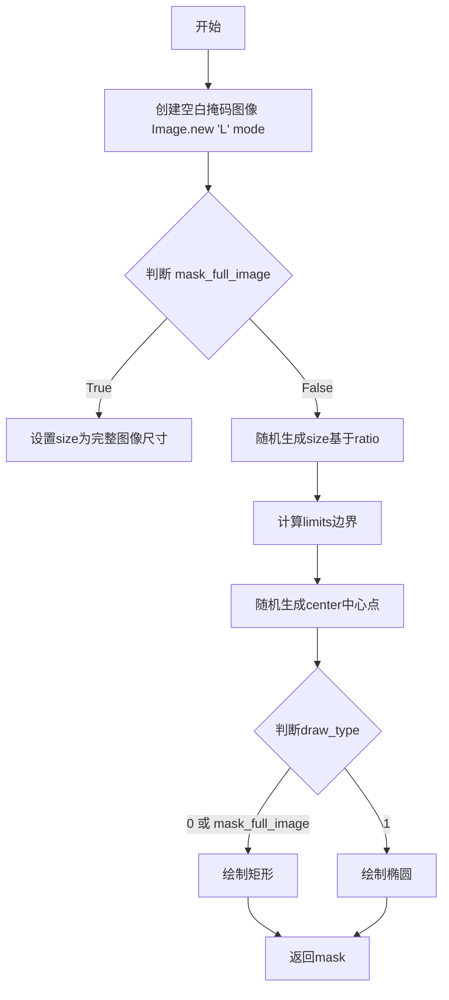
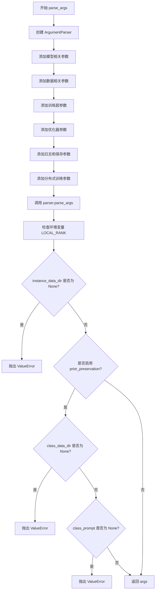
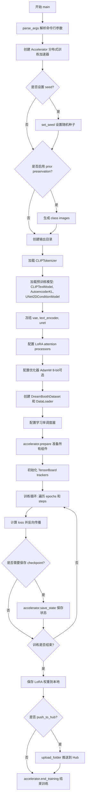
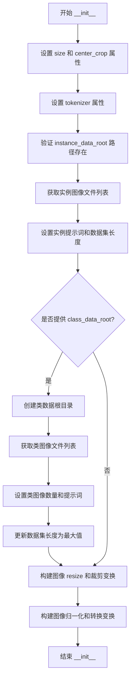
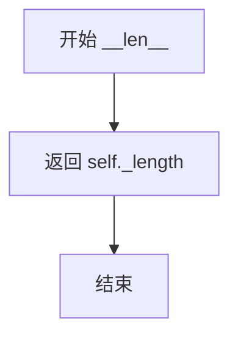
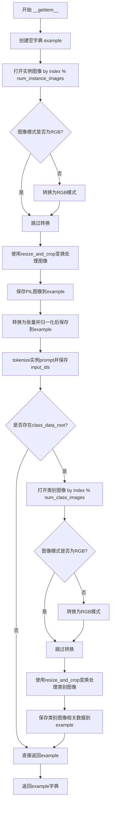
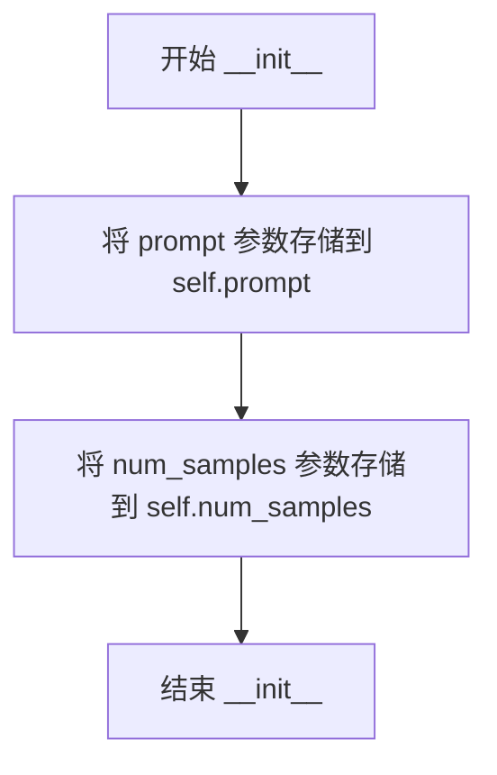
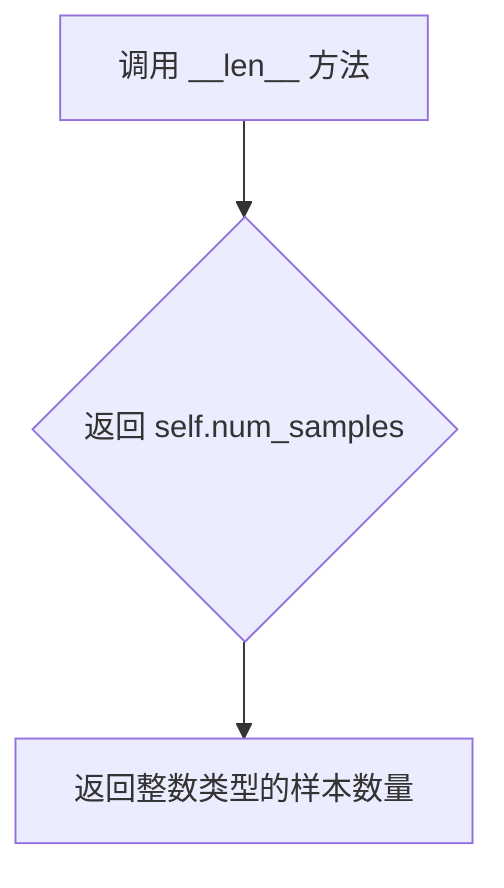

# `diffusers\examples\research_projects\dreambooth_inpaint\train_dreambooth_inpaint_lora.py` 详细设计文档

A training script for fine-tuning Stable Diffusion Inpainting models using DreamBooth with LoRA. It handles dataset preparation (including optional class image generation), model loading, LoRA injection, and the training loop with support for prior preservation and mixed precision.

## 整体流程

```mermaid
graph TD
    Start[Start] --> ParseArgs[Parse Arguments]
    ParseArgs --> InitAccelerator[Initialize Accelerator]
    InitAccelerator --> CheckPriorPreservation{Check: with_prior_preservation}
    CheckPriorPreservation -- Yes --> GenClassImages[Generate Class Images with Pipeline]
    CheckPriorPreservation --> LoadModels[Load Pretrained Models (UNet, VAE, TextEncoder)]
    GenClassImages --> LoadModels
    LoadModels --> SetupLoRA[Freeze Models & Inject LoRA Layers]
    SetupLoRA --> CreateDataset[Create DreamBoothDataset]
    CreateDataset --> CreateDataloader[Create DataLoader with collate_fn]
    CreateDataloader --> TrainingLoop[Training Loop]
    TrainingLoop --> EncodeLatents[Encode Images/Masks to Latents]
    EncodeLatents --> AddNoise[Add Noise (DDPM)]
    AddNoise --> PredictNoise[Predict Noise with UNet]
    PredictNoise --> CalculateLoss[Calculate MSE Loss (+ Prior Loss)]
    CalculateLoss --> BackwardPass[Backward & Optimizer Step]
    BackwardPass --> CheckCheckpoint{Checkpointing Step?}
    CheckCheckpoint --> CheckMaxSteps{Max Steps Reached?}
    CheckCheckpoint -- Yes --> SaveCheckpoint[Save State]
    CheckMaxSteps -- No --> TrainingLoop
    SaveCheckpoint --> TrainingLoop
    CheckMaxSteps -- Yes --> SaveLora[Save LoRA Weights]
    SaveLora --> End[End]
```

## 类结构

```
torch.utils.data.Dataset (Abstract Base)
├── DreamBoothDataset (Handles instance/class image loading and tokenization)
└── PromptDataset (Simple dataset for prompt generation)
```

## 全局变量及字段


### `logger`
    
Logger instance for the script

类型：`Logger`
    


### `DreamBoothDataset.size`
    
Target resolution for images

类型：`int`
    


### `DreamBoothDataset.center_crop`
    
Whether to center crop images

类型：`bool`
    


### `DreamBoothDataset.tokenizer`
    
Tokenizer for text encoding

类型：`CLIPTokenizer`
    


### `DreamBoothDataset.instance_data_root`
    
Directory containing instance images

类型：`Path`
    


### `DreamBoothDataset.instance_prompt`
    
Prompt associated with instance

类型：`str`
    


### `DreamBoothDataset.class_data_root`
    
Directory containing class images

类型：`Path`
    


### `DreamBoothDataset.class_prompt`
    
Prompt associated with class

类型：`str`
    


### `DreamBoothDataset.image_transforms_resize_and_crop`
    
Image resizing and cropping transform

类型：`Compose`
    


### `DreamBoothDataset.image_transforms`
    
Image to tensor and normalization transform

类型：`Compose`
    


### `PromptDataset.prompt`
    
The text prompt

类型：`str`
    


### `PromptDataset.num_samples`
    
Number of samples to generate

类型：`int`
    
    

## 全局函数及方法


### `prepare_mask_and_masked_image`

该函数用于将 PIL 图像格式的输入图像和遮罩转换为 PyTorch 张量格式，并对遮罩进行二值化处理，同时生成被遮罩的图像（masked image），为图像修复（inpainting）任务准备数据。

参数：

- `image`：`PIL.Image` 或兼容的图像对象，需要进行修复的原始图像
- `mask`：`PIL.Image` 或兼容的图像对象，用于指定修复区域的遮罩（通常为灰度图像）

返回值：

- `mask`：`torch.Tensor`，二值化后的遮罩张量，形状为 (1, 1, H, W)，值为 0 或 1
- `masked_image`：`torch.Tensor`，被遮罩覆盖的图像张量，形状为 (1, 3, H, W)，像素值归一化到 [-1, 1]

#### 流程图

```mermaid
flowchart TD
    A[开始: 输入 image 和 mask] --> B[将 image 转换为 RGB 模式]
    B --> C[将 image 转为 numpy 数组]
    C --> D[添加批次维度并转置: (H, W, C) -> (C, H, W)]
    D --> E[转换为 float32 张量并归一化到 [-1, 1]]
    
    F[将 mask 转换为 L 模式] --> G[将 mask 转为 numpy 数组]
    G --> H[归一化到 [0, 1]]
    H --> I[添加批次维度]
    I --> J{像素值 >= 0.5?}
    J -->|是| K[设为 1]
    J -->|否| L[设为 0]
    K --> M[二值化遮罩张量]
    L --> M
    
    E --> N[计算 masked_image: image * (mask < 0.5)]
    M --> N
    
    N --> O[返回 mask 和 masked_image]
```

#### 带注释源码

```python
def prepare_mask_and_masked_image(image, mask):
    """
    准备图像修复（inpainting）任务所需的遮罩和被遮罩图像。
    
    参数:
        image: PIL.Image 对象，原始 RGB 图像
        mask: PIL.Image 对象，灰度遮罩图像
    
    返回:
        mask: torch.Tensor，二值化遮罩 (1, 1, H, W)
        masked_image: torch.Tensor，被遮罩处理的图像 (1, 3, H, W)
    """
    
    # ========== 处理原始图像 ==========
    # 1. 将图像转换为 RGB 模式（确保 3 通道）
    image = np.array(image.convert("RGB"))
    
    # 2. 添加批次维度并调整通道顺序: (H, W, C) -> (1, C, H, W)
    image = image[None].transpose(0, 3, 1, 2)
    
    # 3. 转换为 PyTorch float32 张量，并归一化到 [-1, 1]
    # 原始像素值 [0, 255] -> [0, 2] -> [-1, 1]
    image = torch.from_numpy(image).to(dtype=torch.float32) / 127.5 - 1.0
    
    # ========== 处理遮罩 ==========
    # 1. 将遮罩转换为灰度（L）模式
    mask = np.array(mask.convert("L"))
    
    # 2. 归一化到 [0, 1] 范围
    mask = mask.astype(np.float32) / 255.0
    
    # 3. 添加批次和通道维度: (H, W) -> (1, 1, H, W)
    mask = mask[None, None]
    
    # 4. 二值化处理：阈值 0.5
    #    小于 0.5 -> 0（保持原区域）
    #    大于等于 0.5 -> 1（遮罩区域）
    mask[mask < 0.5] = 0
    mask[mask >= 0.5] = 1
    
    # 5. 转换为 PyTorch 张量
    mask = torch.from_numpy(mask)
    
    # ========== 生成被遮罩的图像 ==========
    # 将原始图像与二值遮罩相乘：
    # mask < 0.5 的位置为 True（值为 1），保留原图
    # mask >= 0.5 的位置为 False（值为 0），置零（表示需要修复的区域）
    masked_image = image * (mask < 0.5)
    
    return mask, masked_image
```


### `random_mask`

生成一个随机矩形或椭圆形的掩码图像，用于图像修复（inpainting）任务。该函数根据给定的图像尺寸和比例参数，随机生成一个填充为白色的形状（矩形或椭圆）作为掩码，其余部分为黑色。

参数：

- `im_shape`：tuple (int, int)，图像尺寸，格式为 (高度, 宽度)，用于确定掩码图像的大小
- `ratio`：float，可选，默认为 1，掩码尺寸相对于图像尺寸的比例，用于控制生成掩码的大小
- `mask_full_image`：bool，可选，默认为 False，标志位，当设置为 True 时，生成覆盖整个图像的掩码

返回值：`PIL.Image`，返回一个 L 模式（灰度）的 PIL 图像对象，其中白色区域（255）表示掩码，黑色区域（0）表示原始图像区域

#### 流程图



#### 带注释源码

```python
def random_mask(im_shape, ratio=1, mask_full_image=False):
    """
    生成随机矩形或椭圆形的掩码
    
    参数:
        im_shape: tuple, 图像尺寸 (height, width)
        ratio: float, 掩码尺寸相对于图像尺寸的比例
        mask_full_image: bool, 是否生成覆盖整张图像的掩码
    
    返回:
        PIL.Image: 生成的掩码图像
    """
    # 创建一个黑色背景的灰度图像 (L模式: 0-255)
    mask = Image.new("L", im_shape, 0)
    # 创建绘图对象
    draw = ImageDraw.Draw(mask)
    
    # 随机生成掩码的宽和高，基于ratio比例
    # 使用 random.randint 在 0 到 im_shape*ratio 范围内随机选择
    size = (random.randint(0, int(im_shape[0] * ratio)), 
            random.randint(0, int(im_shape[1] * ratio)))
    
    # 如果 mask_full_image 为 True，则使用完整图像尺寸
    if mask_full_image:
        size = (int(im_shape[0] * ratio), int(im_shape[1] * ratio))
    
    # 计算掩码的边界限制，确保中心点在图像范围内
    # 中心点必须在 [size//2, im_shape-size//2] 范围内
    limits = (im_shape[0] - size[0] // 2, im_shape[1] - size[1] // 2)
    
    # 随机生成掩码的中心点坐标
    center = (random.randint(size[0] // 2, limits[0]), 
              random.randint(size[1] // 2, limits[1]))
    
    # 随机选择形状类型: 0=矩形, 1=椭圆
    draw_type = random.randint(0, 1)
    
    # 计算掩码的边界框 (左上角和右下角坐标)
    bounding_box = (
        center[0] - size[0] // 2, 
        center[1] - size[1] // 2, 
        center[0] + size[0] // 2, 
        center[1] + size[1] // 2
    )
    
    # 根据形状类型绘制掩码
    # 如果 draw_type==0 或 mask_full_image，则绘制矩形
    if draw_type == 0 or mask_full_image:
        draw.rectangle(bounding_box, fill=255)
    else:
        # 否则绘制椭圆
        draw.ellipse(bounding_box, fill=255)
    
    return mask
```


### `parse_args`

该函数是命令行参数解析器，负责定义并解析训练脚本的所有配置选项，包括模型路径、数据目录、训练超参数、加速器和优化器设置等，同时进行必要的环境变量检查和参数验证。

参数：该函数没有显式参数。

返回值：`argparse.Namespace`，包含所有解析后的命令行参数对象。

#### 流程图



#### 带注释源码

```python
def parse_args():
    """
    解析命令行参数。
    
    该函数创建一个ArgumentParser实例，定义所有训练相关的命令行参数，
    包括模型路径、数据目录、训练超参数、分布式训练配置等，并进行必要的验证。
    
    Returns:
        argparse.Namespace: 包含所有解析后命令行参数的命名空间对象
    """
    # 创建参数解析器，description用于命令行帮助信息
    parser = argparse.ArgumentParser(description="Simple example of a training script.")
    
    # 添加预训练模型路径参数（必需）
    parser.add_argument(
        "--pretrained_model_name_or_path",
        type=str,
        default=None,
        required=True,
        help="Path to pretrained model or model identifier from huggingface.co/models.",
    )
    
    # 添加分词器名称参数（可选）
    parser.add_argument(
        "--tokenizer_name",
        type=str,
        default=None,
        help="Pretrained tokenizer name or path if not the same as model_name",
    )
    
    # 添加实例数据目录参数（必需）
    parser.add_argument(
        "--instance_data_dir",
        type=str,
        default=None,
        required=True,
        help="A folder containing the training data of instance images.",
    )
    
    # 添加类别数据目录参数（可选）
    parser.add_argument(
        "--class_data_dir",
        type=str,
        default=None,
        required=False,
        help="A folder containing the training data of class images.",
    )
    
    # 添加实例提示词参数（可选）
    parser.add_argument(
        "--instance_prompt",
        type=str,
        default=None,
        help="The prompt with identifier specifying the instance",
    )
    
    # 添加类别提示词参数（可选）
    parser.add_argument(
        "--class_prompt",
        type=str,
        default=None,
        help="The prompt to specify images in the same class as provided instance images.",
    )
    
    # 添加先验保留损失标志参数
    parser.add_argument(
        "--with_prior_preservation",
        default=False,
        action="store_true",
        help="Flag to add prior preservation loss.",
    )
    
    # 添加先验损失权重参数
    parser.add_argument("--prior_loss_weight", type=float, default=1.0, help="The weight of prior preservation loss.")
    
    # 添加类别图像数量参数
    parser.add_argument(
        "--num_class_images",
        type=int,
        default=100,
        help=(
            "Minimal class images for prior preservation loss. If not have enough images, additional images will be"
            " sampled with class_prompt."
        ),
    )
    
    # 添加输出目录参数
    parser.add_argument(
        "--output_dir",
        type=str,
        default="dreambooth-inpaint-model",
        help="The output directory where the model predictions and checkpoints will be written.",
    )
    
    # 添加随机种子参数
    parser.add_argument("--seed", type=int, default=None, help="A seed for reproducible training.")
    
    # 添加图像分辨率参数
    parser.add_argument(
        "--resolution",
        type=int,
        default=512,
        help=(
            "The resolution for input images, all the images in the train/validation dataset will be resized to this"
            " resolution"
        ),
    )
    
    # 添加中心裁剪标志参数
    parser.add_argument(
        "--center_crop",
        default=False,
        action="store_true",
        help=(
            "Whether to center crop the input images to the resolution. If not set, the images will be randomly"
            " cropped. The images will be resized to the resolution first before cropping."
        ),
    )
    
    # 添加训练文本编码器标志参数
    parser.add_argument("--train_text_encoder", action="store_true", help="Whether to train the text encoder")
    
    # 添加训练批次大小参数
    parser.add_argument(
        "--train_batch_size", type=int, default=4, help="Batch size (per device) for the training dataloader."
    )
    
    # 添加采样批次大小参数
    parser.add_argument(
        "--sample_batch_size", type=int, default=4, help="Batch size (per device) for sampling images."
    )
    
    # 添加训练轮数参数
    parser.add_argument("--num_train_epochs", type=int, default=1)
    
    # 添加最大训练步数参数
    parser.add_argument(
        "--max_train_steps",
        type=int,
        default=None,
        help="Total number of training steps to perform.  If provided, overrides num_train_epochs.",
    )
    
    # 添加梯度累积步数参数
    parser.add_argument(
        "--gradient_accumulation_steps",
        type=int,
        default=1,
        help="Number of updates steps to accumulate before performing a backward/update pass.",
    )
    
    # 添加梯度检查点标志参数
    parser.add_argument(
        "--gradient_checkpointing",
        action="store_true",
        help="Whether or not to use gradient checkpointing to save memory at the expense of slower backward pass.",
    )
    
    # 添加学习率参数
    parser.add_argument(
        "--learning_rate",
        type=float,
        default=5e-6,
        help="Initial learning rate (after the potential warmup period) to use.",
    )
    
    # 添加学习率缩放标志参数
    parser.add_argument(
        "--scale_lr",
        action="store_true",
        default=False,
        help="Scale the learning rate by the number of GPUs, gradient accumulation steps, and batch size.",
    )
    
    # 添加学习率调度器类型参数
    parser.add_argument(
        "--lr_scheduler",
        type=str,
        default="constant",
        help=(
            'The scheduler type to use. Choose between ["linear", "cosine", "cosine_with_restarts", "polynomial",'
            ' "constant", "constant_with_warmup"]'
        ),
    )
    
    # 添加学习率预热步数参数
    parser.add_argument(
        "--lr_warmup_steps", type=int, default=500, help="Number of steps for the warmup in the lr scheduler."
    )
    
    # 添加8位Adam优化器标志参数
    parser.add_argument(
        "--use_8bit_adam", action="store_true", help="Whether or not to use 8-bit Adam from bitsandbytes."
    )
    
    # 添加Adam优化器Beta1参数
    parser.add_argument("--adam_beta1", type=float, default=0.9, help="The beta1 parameter for the Adam optimizer.")
    
    # 添加Adam优化器Beta2参数
    parser.add_argument("--adam_beta2", type=float, default=0.999, help="The beta2 parameter for the Adam optimizer.")
    
    # 添加Adam优化器权重衰减参数
    parser.add_argument("--adam_weight_decay", type=float, default=1e-2, help="Weight decay to use.")
    
    # 添加Adam优化器Epsilon参数
    parser.add_argument("--adam_epsilon", type=float, default=1e-08, help="Epsilon value for the Adam optimizer")
    
    # 添加最大梯度范数参数
    parser.add_argument("--max_grad_norm", default=1.0, type=float, help="Max gradient norm.")
    
    # 添加推送到Hub标志参数
    parser.add_argument("--push_to_hub", action="store_true", help="Whether or not to push the model to the Hub.")
    
    # 添加Hub令牌参数
    parser.add_argument("--hub_token", type=str, default=None, help="The token to use to push to the Model Hub.")
    
    # 添加Hub模型ID参数
    parser.add_argument(
        "--hub_model_id",
        type=str,
        default=None,
        help="The name of the repository to keep in sync with the local `output_dir`.",
    )
    
    # 添加日志目录参数
    parser.add_argument(
        "--logging_dir",
        type=str,
        default="logs",
        help=(
            "[TensorBoard](https://www.tensorflow.org/tensorboard) log directory. Will default to"
            " *output_dir/runs/**CURRENT_DATETIME_HOSTNAME***."
        ),
    )
    
    # 添加混合精度训练参数
    parser.add_argument(
        "--mixed_precision",
        type=str,
        default="no",
        choices=["no", "fp16", "bf16"],
        help=(
            "Whether to use mixed precision. Choose"
            "between fp16 and bf16 (bfloat16). Bf16 requires PyTorch >= 1.10."
            "and an Nvidia Ampere GPU."
        ),
    )
    
    # 添加本地排名参数（分布式训练用）
    parser.add_argument("--local_rank", type=int, default=-1, help="For distributed training: local_rank")
    
    # 添加检查点保存步数参数
    parser.add_argument(
        "--checkpointing_steps",
        type=int,
        default=500,
        help=(
            "Save a checkpoint of the training state every X updates. These checkpoints can be used both as final"
            " checkpoints in case they are better than the last checkpoint and are suitable for resuming training"
            " using `--resume_from_checkpoint`."
        ),
    )
    
    # 添加检查点总数限制参数
    parser.add_argument(
        "--checkpoints_total_limit",
        type=int,
        default=None,
        help=(
            "Max number of checkpoints to store. Passed as `total_limit` to the `Accelerator` `ProjectConfiguration`."
            " See Accelerator::save_state https://huggingface.co/docs/accelerate/package_reference/accelerator#accelerate.Accelerator.save_state"
            " for more docs"
        ),
    )
    
    # 添加从检查点恢复训练参数
    parser.add_argument(
        "--resume_from_checkpoint",
        type=str,
        default=None,
        help=(
            "Whether training should be resumed from a previous checkpoint. Use a path saved by"
            ' `--checkpointing_steps`, or `"latest"` to automatically select the last available checkpoint.'
        ),
    )
    
    # 添加xformers高效注意力标志参数
    parser.add_argument(
        "--enable_xformers_memory_efficient_attention", action="store_true", help="Whether or not to use xformers."
    )

    # 解析命令行参数
    args = parser.parse_args()
    
    # 检查环境变量LOCAL_RANK，用于分布式训练
    env_local_rank = int(os.environ.get("LOCAL_RANK", -1))
    if env_local_rank != -1 and env_local_rank != args.local_rank:
        args.local_rank = env_local_rank

    # 验证实例数据目录必须指定
    if args.instance_data_dir is None:
        raise ValueError("You must specify a train data directory.")

    # 验证先验保留相关参数
    if args.with_prior_preservation:
        if args.class_data_dir is None:
            raise ValueError("You must specify a data directory for class images.")
        if args.class_prompt is None:
            raise ValueError("You must specify prompt for class images.")

    # 返回解析后的参数对象
    return args
```


### `main`

主函数，编排整个 DreamBooth 图像修复（Inpainting）训练管道，负责解析参数、加载模型、配置 LoRA、构建数据集、执行训练循环并在训练完成后保存模型。

参数：
- 无显式参数（通过内部调用 `parse_args()` 获取命令行参数）

返回值：`None`，无返回值（执行训练流程后直接结束）

#### 流程图



#### 带注释源码

```python
def main():
    """
    主函数，编排整个 DreamBooth 图像修复训练管道
    1. 解析命令行参数
    2. 配置分布式训练加速器
    3. 加载预训练模型和 tokenizer
    4. 配置 LoRA 层并进行微调
    5. 执行训练循环并保存模型
    """
    # 步骤1: 解析命令行参数
    args = parse_args()
    
    # 构建日志目录: output_dir/logs
    logging_dir = Path(args.output_dir, args.logging_dir)

    # 步骤2: 配置 Accelerator 项目设置
    accelerator_project_config = ProjectConfiguration(
        total_limit=args.checkpoints_total_limit,  # 最多保存的 checkpoint 数量
        project_dir=args.output_dir,                # 项目输出目录
        logging_dir=logging_dir                     # 日志目录
    )

    # 创建分布式训练加速器
    accelerator = Accelerator(
        gradient_accumulation_steps=args.gradient_accumulation_steps,  # 梯度累积步数
        mixed_precision=args.mixed_precision,                           # 混合精度训练 (fp16/bf16)
        log_with="tensorboard",                                         # 使用 TensorBoard 记录
        project_config=accelerator_project_config
    )

    # 检查梯度累积与文本编码器训练的兼容性
    if args.train_text_encoder and args.gradient_accumulation_steps > 1 and accelerator.num_processes > 1:
        raise ValueError(
            "Gradient accumulation is not supported when training the text encoder in distributed training. "
            "Please set gradient_accumulation_steps to 1. This feature will be supported in the future."
        )

    # 步骤3: 设置随机种子以确保可重复性
    if args.seed is not None:
        set_seed(args.seed)

    # 步骤4: 处理 prior preservation (保留先验分布)
    # 用于在微调时保持模型对原始类别的生成能力
    if args.with_prior_preservation:
        class_images_dir = Path(args.class_data_dir)
        if not class_images_dir.exists():
            class_images_dir.mkdir(parents=True)
        cur_class_images = len(list(class_images_dir.iterdir()))

        # 如果现有 class 图像不足，则生成更多
        if cur_class_images < args.num_class_images:
            # 根据设备类型选择 torch dtype
            torch_dtype = torch.float16 if accelerator.device.type == "cuda" else torch.float32
            # 加载修复 pipeline 用于生成 class 图像
            pipeline = StableDiffusionInpaintPipeline.from_pretrained(
                args.pretrained_model_name_or_path, torch_dtype=torch_dtype, safety_checker=None
            )
            pipeline.set_progress_bar_config(disable=True)

            num_new_images = args.num_class_images - cur_class_images
            logger.info(f"Number of class images to sample: {num_new_images}.")

            # 创建用于生成图像的数据集
            sample_dataset = PromptDataset(args.class_prompt, num_new_images)
            sample_dataloader = torch.utils.data.DataLoader(
                sample_dataset, batch_size=args.sample_batch_size, num_workers=1
            )

            sample_dataloader = accelerator.prepare(sample_dataloader)
            pipeline.to(accelerator.device)
            transform_to_pil = transforms.ToPILImage()
            
            # 遍历生成 class 图像
            for example in tqdm(
                sample_dataloader, desc="Generating class images", disable=not accelerator.is_local_main_process
            ):
                bsz = len(example["prompt"])
                # 生成随机图像作为 mask 的目标
                fake_images = torch.rand((3, args.resolution, args.resolution))
                transform_to_pil = transforms.ToPILImage()
                fake_pil_images = transform_to_pil(fake_images)

                # 生成全图 mask
                fake_mask = random_mask((args.resolution, args.resolution), ratio=1, mask_full_image=True)

                # 使用 inpainting pipeline 生成图像
                images = pipeline(prompt=example["prompt"], mask_image=fake_mask, image=fake_pil_images).images

                # 保存生成的图像
                for i, image in enumerate(images):
                    hash_image = insecure_hashlib.sha1(image.tobytes()).hexdigest()
                    image_filename = class_images_dir / f"{example['index'][i] + cur_class_images}-{hash_image}.jpg"
                    image.save(image_filename)

            # 清理 pipeline 释放显存
            del pipeline
            if torch.cuda.is_available():
                torch.cuda.empty_cache()

    # 步骤5: 处理输出目录和 Hub 仓库创建
    if accelerator.is_main_process:
        if args.output_dir is not None:
            os.makedirs(args.output_dir, exist_ok=True)

        if args.push_to_hub:
            repo_id = create_repo(
                repo_id=args.hub_model_id or Path(args.output_dir).name, exist_ok=True, token=args.hub_token
            ).repo_id

    # 步骤6: 加载 tokenizer
    if args.tokenizer_name:
        tokenizer = CLIPTokenizer.from_pretrained(args.tokenizer_name)
    elif args.pretrained_model_name_or_path:
        tokenizer = CLIPTokenizer.from_pretrained(args.pretrained_model_name_or_path, subfolder="tokenizer")

    # 步骤7: 加载预训练模型
    text_encoder = CLIPTextModel.from_pretrained(args.pretrained_model_name_or_path, subfolder="text_encoder")
    vae = AutoencoderKL.from_pretrained(args.pretrained_model_name_or_path, subfolder="vae")
    unet = UNet2DConditionModel.from_pretrained(args.pretrained_model_name_or_path, subfolder="unet")

    # 冻结所有基础模型参数，只训练 LoRA 层
    vae.requires_grad_(False)
    text_encoder.requires_grad_(False)
    unet.requires_grad_(False)

    # 根据混合精度设置权重数据类型
    weight_dtype = torch.float32
    if args.mixed_precision == "fp16":
        weight_dtype = torch.float16
    elif args.mixed_precision == "bf16":
        weight_dtype = torch.bfloat16

    # 将模型移到指定设备并转换数据类型
    unet.to(accelerator.device, dtype=weight_dtype)
    vae.to(accelerator.device, dtype=weight_dtype)
    text_encoder.to(accelerator.device, dtype=weight_dtype)

    # 启用 xformers 高效注意力 (可选)
    if args.enable_xformers_memory_efficient_attention:
        if is_xformers_available():
            unet.enable_xformers_memory_efficient_attention()
        else:
            raise ValueError("xformers is not available. Make sure it is installed correctly")

    # 步骤8: 配置 LoRA 注意力处理器
    lora_attn_procs = {}
    for name in unet.attn_processors.keys():
        # 确定 cross attention 维度
        cross_attention_dim = None if name.endswith("attn1.processor") else unet.config.cross_attention_dim
        if name.startswith("mid_block"):
            hidden_size = unet.config.block_out_channels[-1]
        elif name.startswith("up_blocks"):
            block_id = int(name[len("up_blocks.")])
            hidden_size = list(reversed(unet.config.block_out_channels))[block_id]
        elif name.startswith("down_blocks"):
            block_id = int(name[len("down_blocks.")])
            hidden_size = unet.config.block_out_channels[block_id]

        # 为每个注意力层创建 LoRA 处理器
        lora_attn_procs[name] = LoRAAttnProcessor(hidden_size=hidden_size, cross_attention_dim=cross_attention_dim)

    unet.set_attn_processor(lora_attn_procs)
    lora_layers = AttnProcsLayers(unet.attn_processors)

    # 注册 checkpointing
    accelerator.register_for_checkpointing(lora_layers)

    # 步骤9: 配置学习率 (可选地根据 GPU 数量缩放)
    if args.scale_lr:
        args.learning_rate = (
            args.learning_rate * args.gradient_accumulation_steps * args.train_batch_size * accelerator.num_processes
        )

    # 选择优化器: 8-bit Adam 或标准 AdamW
    if args.use_8bit_adam:
        try:
            import bitsandbytes as bnb
        except ImportError:
            raise ImportError(
                "To use 8-bit Adam, please install the bitsandbytes library: `pip install bitsandbytes`."
            )

        optimizer_class = bnb.optim.AdamW8bit
    else:
        optimizer_class = torch.optim.AdamW

    # 创建优化器，只优化 LoRA 层参数
    optimizer = optimizer_class(
        lora_layers.parameters(),
        lr=args.learning_rate,
        betas=(args.adam_beta1, args.adam_beta2),
        weight_decay=args.adam_weight_decay,
        eps=args.adam_epsilon,
    )

    # 加载噪声调度器
    noise_scheduler = DDPMScheduler.from_pretrained(args.pretrained_model_name_or_path, subfolder="scheduler")

    # 步骤10: 创建训练数据集
    train_dataset = DreamBoothDataset(
        instance_data_root=args.instance_data_dir,
        instance_prompt=args.instance_prompt,
        class_data_root=args.class_data_dir if args.with_prior_preservation else None,
        class_prompt=args.class_prompt,
        tokenizer=tokenizer,
        size=args.resolution,
        center_crop=args.center_crop,
    )

    # 定义批处理整理函数: 合并 instance 和 class 数据
    def collate_fn(examples):
        input_ids = [example["instance_prompt_ids"] for example in examples]
        pixel_values = [example["instance_images"] for example in examples]

        # 如果使用 prior preservation，合并 class 和 instance 数据
        if args.with_prior_preservation:
            input_ids += [example["class_prompt_ids"] for example in examples]
            pixel_values += [example["class_images"] for example in examples]
            pior_pil = [example["class_PIL_images"] for example in examples]

        # 为每张图像生成随机 mask
        masks = []
        masked_images = []
        for example in examples:
            pil_image = example["PIL_images"]
            # 生成随机 mask
            mask = random_mask(pil_image.size, 1, False)
            # 准备 mask 和 masked image
            mask, masked_image = prepare_mask_and_masked_image(pil_image, mask)

            masks.append(mask)
            masked_images.append(masked_image)

        # 为 prior preservation 数据也生成 mask
        if args.with_prior_preservation:
            for pil_image in pior_pil:
                mask = random_mask(pil_image.size, 1, False)
                mask, masked_image = prepare_mask_and_masked_image(pil_image, mask)

                masks.append(mask)
                masked_images.append(masked_image)

        # 堆叠所有张量
        pixel_values = torch.stack(pixel_values)
        pixel_values = pixel_values.to(memory_format=torch.contiguous_format).float()

        input_ids = tokenizer.pad({"input_ids": input_ids}, padding=True, return_tensors="pt").input_ids
        masks = torch.stack(masks)
        masked_images = torch.stack(masked_images)
        batch = {"input_ids": input_ids, "pixel_values": pixel_values, "masks": masks, "masked_images": masked_images}
        return batch

    # 创建 DataLoader
    train_dataloader = torch.utils.data.DataLoader(
        train_dataset, batch_size=args.train_batch_size, shuffle=True, collate_fn=collate_fn
    )

    # 步骤11: 配置学习率调度器
    overrode_max_train_steps = False
    num_update_steps_per_epoch = math.ceil(len(train_dataloader) / args.gradient_accumulation_steps)
    if args.max_train_steps is None:
        args.max_train_steps = args.num_train_epochs * num_update_steps_per_epoch
        overrode_max_train_steps = True

    lr_scheduler = get_scheduler(
        args.lr_scheduler,
        optimizer=optimizer,
        num_warmup_steps=args.lr_warmup_steps * accelerator.num_processes,
        num_training_steps=args.max_train_steps * accelerator.num_processes,
    )

    # 步骤12: 使用 accelerator 准备所有组件
    lora_layers, optimizer, train_dataloader, lr_scheduler = accelerator.prepare(
        lora_layers, optimizer, train_dataloader, lr_scheduler
    )

    # 重新计算训练步数 (因为 dataloader 可能有变化)
    num_update_steps_per_epoch = math.ceil(len(train_dataloader) / args.gradient_accumulation_steps)
    if overrode_max_train_steps:
        args.max_train_steps = args.num_train_epochs * num_update_steps_per_epoch
    args.num_train_epochs = math.ceil(args.max_train_steps / num_update_steps_per_epoch)

    # 初始化 trackers
    if accelerator.is_main_process:
        accelerator.init_trackers("dreambooth-inpaint-lora", config=vars(args))

    # 步骤13: 训练循环
    total_batch_size = args.train_batch_size * accelerator.num_processes * args.gradient_accumulation_steps

    logger.info("***** Running training *****")
    logger.info(f"  Num examples = {len(train_dataset)}")
    logger.info(f"  Num batches each epoch = {len(train_dataloader)}")
    logger.info(f"  Num Epochs = {args.num_train_epochs}")
    logger.info(f"  Instantaneous batch size per device = {args.train_batch_size}")
    logger.info(f"  Total train batch size (w. parallel, distributed & accumulation) = {total_batch_size}")
    logger.info(f"  Gradient Accumulation steps = {args.gradient_accumulation_steps}")
    logger.info(f"  Total optimization steps = {args.max_train_steps}")
    global_step = 0
    first_epoch = 0

    # 处理 checkpoint 恢复
    if args.resume_from_checkpoint:
        if args.resume_from_checkpoint != "latest":
            path = os.path.basename(args.resume_from_checkpoint)
        else:
            # 获取最新的 checkpoint
            dirs = os.listdir(args.output_dir)
            dirs = [d for d in dirs if d.startswith("checkpoint")]
            dirs = sorted(dirs, key=lambda x: int(x.split("-")[1]))
            path = dirs[-1] if len(dirs) > 0 else None

        if path is None:
            accelerator.print(
                f"Checkpoint '{args.resume_from_checkpoint}' does not exist. Starting a new training run."
            )
            args.resume_from_checkpoint = None
        else:
            accelerator.print(f"Resuming from checkpoint {path}")
            accelerator.load_state(os.path.join(args.output_dir, path))
            global_step = int(path.split("-")[1])

            resume_global_step = global_step * args.gradient_accumulation_steps
            first_epoch = global_step // num_update_steps_per_epoch
            resume_step = resume_global_step % (num_update_steps_per_epoch * args.gradient_accumulation_steps)

    # 创建进度条
    progress_bar = tqdm(range(global_step, args.max_train_steps), disable=not accelerator.is_local_main_process)
    progress_bar.set_description("Steps")

    # 遍历每个 epoch
    for epoch in range(first_epoch, args.num_train_epochs):
        unet.train()
        for step, batch in enumerate(train_dataloader):
            # 跳过已完成的步骤
            if args.resume_from_checkpoint and epoch == first_epoch and step < resume_step:
                if step % args.gradient_accumulation_steps == 0:
                    progress_bar.update(1)
                continue

            # 梯度累积
            with accelerator.accumulate(unet):
                # 将图像编码到潜在空间
                latents = vae.encode(batch["pixel_values"].to(dtype=weight_dtype)).latent_dist.sample()
                latents = latents * vae.config.scaling_factor

                # 将 masked 图像编码到潜在空间
                masked_latents = vae.encode(
                    batch["masked_images"].reshape(batch["pixel_values"].shape).to(dtype=weight_dtype)
                ).latent_dist.sample()
                masked_latents = masked_latents * vae.config.scaling_factor

                masks = batch["masks"]
                # 调整 mask 大小以匹配潜在空间
                mask = torch.stack(
                    [
                        torch.nn.functional.interpolate(mask, size=(args.resolution // 8, args.resolution // 8))
                        for mask in masks
                    ]
                ).to(dtype=weight_dtype)
                mask = mask.reshape(-1, 1, args.resolution // 8, args.resolution // 8)

                # 采样噪声
                noise = torch.randn_like(latents)
                bsz = latents.shape[0]
                # 随机采样时间步
                timesteps = torch.randint(0, noise_scheduler.config.num_train_timesteps, (bsz,), device=latents.device)
                timesteps = timesteps.long()

                # 前向扩散过程: 添加噪声到 latents
                noisy_latents = noise_scheduler.add_noise(latents, noise, timesteps)

                # 拼接 noisy latents, mask 和 masked latents
                latent_model_input = torch.cat([noisy_latents, mask, masked_latents], dim=1)

                # 获取文本嵌入作为条件
                encoder_hidden_states = text_encoder(batch["input_ids"])[0]

                # 预测噪声残差
                noise_pred = unet(latent_model_input, timesteps, encoder_hidden_states).sample

                # 根据预测类型确定目标
                if noise_scheduler.config.prediction_type == "epsilon":
                    target = noise
                elif noise_scheduler.config.prediction_type == "v_prediction":
                    target = noise_scheduler.get_velocity(latents, noise, timesteps)
                else:
                    raise ValueError(f"Unknown prediction type {noise_scheduler.config.prediction_type}")

                # 计算损失
                if args.with_prior_preservation:
                    # 分离噪声预测用于先验损失
                    noise_pred, noise_pred_prior = torch.chunk(noise_pred, 2, dim=0)
                    target, target_prior = torch.chunk(target, 2, dim=0)

                    # 计算实例损失
                    loss = F.mse_loss(noise_pred.float(), target.float(), reduction="none").mean([1, 2, 3]).mean()

                    # 计算先验损失
                    prior_loss = F.mse_loss(noise_pred_prior.float(), target_prior.float(), reduction="mean")

                    # 合并损失
                    loss = loss + args.prior_loss_weight * prior_loss
                else:
                    loss = F.mse_loss(noise_pred.float(), target.float(), reduction="mean")

                # 反向传播
                accelerator.backward(loss)
                
                # 梯度裁剪
                if accelerator.sync_gradients:
                    params_to_clip = lora_layers.parameters()
                    accelerator.clip_grad_norm_(params_to_clip, args.max_grad_norm)
                
                # 更新参数
                optimizer.step()
                lr_scheduler.step()
                optimizer.zero_grad()

            # 检查是否执行了优化步骤
            if accelerator.sync_gradients:
                progress_bar.update(1)
                global_step += 1

                # 定期保存 checkpoint
                if global_step % args.checkpointing_steps == 0:
                    if accelerator.is_main_process:
                        save_path = os.path.join(args.output_dir, f"checkpoint-{global_step}")
                        accelerator.save_state(save_path)
                        logger.info(f"Saved state to {save_path}")

            # 记录日志
            logs = {"loss": loss.detach().item(), "lr": lr_scheduler.get_last_lr()[0]}
            progress_bar.set_postfix(**logs)
            accelerator.log(logs, step=global_step)

            # 检查是否达到最大步数
            if global_step >= args.max_train_steps:
                break

        accelerator.wait_for_everyone()

    # 步骤14: 保存 LoRA 权重
    if accelerator.is_main_process:
        unet = unet.to(torch.float32)
        unet.save_attn_procs(args.output_dir)

        # 可选: 推送到 Hub
        if args.push_to_hub:
            upload_folder(
                repo_id=repo_id,
                folder_path=args.output_dir,
                commit_message="End of training",
                ignore_patterns=["step_*", "epoch_*"],
            )

    # 结束训练
    accelerator.end_training()
```


### `DreamBoothDataset.__init__`

该方法是DreamBoothDataset类的构造函数，用于初始化DreamBooth数据集对象。它接收实例图像路径、提示词、tokenizer以及可选的类图像数据和图像预处理参数，并设置数据集的长度、图像变换和tokenizer等核心属性。

**参数：**

- `instance_data_root`：`str`，实例图像所在的根目录路径，用于定位训练所需的实例图像。
- `instance_prompt`：`str`，与实例图像关联的提示词，用于描述实例图像的内容。
- `tokenizer`：`CLIPTokenizer`，Hugging Face的CLIP分词器，用于将文本提示词转换为模型可处理的token ID序列。
- `class_data_root`：`Optional[str]`，类图像所在的根目录路径，若提供则用于先验保留（prior preservation）训练。
- `class_prompt`：`Optional[str]`，类图像对应的提示词，用于生成类图像或先验保留损失计算。
- `size`：`int`，目标图像分辨率，默认为512，所有图像将 resize 和裁剪至该尺寸。
- `center_crop`：`bool`，是否对图像进行中心裁剪，默认为False（随机裁剪）。

**返回值：** `None`，该方法为构造函数，不返回任何值，仅初始化对象属性。

#### 流程图



#### 带注释源码

```python
def __init__(
    self,
    instance_data_root,
    instance_prompt,
    tokenizer,
    class_data_root=None,
    class_prompt=None,
    size=512,
    center_crop=False,
):
    # 存储目标图像分辨率
    self.size = size
    # 存储是否进行中心裁剪的标志
    self.center_crop = center_crop
    # 存储CLIP分词器，用于后续对提示词进行tokenize
    self.tokenizer = tokenizer

    # 将实例数据根路径转换为Path对象以便操作
    self.instance_data_root = Path(instance_data_root)
    # 检查实例图像目录是否存在，若不存在则抛出异常
    if not self.instance_data_root.exists():
        raise ValueError("Instance images root doesn't exists.")

    # 列出实例数据目录下所有文件（假设均为图像文件）
    self.instance_images_path = list(Path(instance_data_root).iterdir())
    # 记录实例图像的数量
    self.num_instance_images = len(self.instance_images_path)
    # 存储实例提示词
    self.instance_prompt = instance_prompt
    # 初始数据集长度设为实例图像数量
    self._length = self.num_instance_images

    # 如果提供了类数据根目录（用于先验保留损失）
    if class_data_root is not None:
        # 转换为Path对象
        self.class_data_root = Path(class_data_root)
        # 创建类数据目录（如果不存在），parents=True表示创建所需的父目录
        self.class_data_root.mkdir(parents=True, exist_ok=True)
        # 列出类图像文件
        self.class_images_path = list(self.class_data_root.iterdir())
        # 记录类图像数量
        self.num_class_images = len(self.class_images_path)
        # 数据集长度取实例图像和类图像数量的最大值，确保两者都能被遍历
        self._length = max(self.num_class_images, self.num_instance_images)
        # 存储类提示词
        self.class_prompt = class_prompt
    else:
        # 若未提供类数据根目录，则设为None
        self.class_data_root = None

    # 构建图像resize和裁剪的组合变换
    self.image_transforms_resize_and_crop = transforms.Compose(
        [
            # 使用双线性插值将图像resize到目标尺寸
            transforms.Resize(size, interpolation=transforms.InterpolationMode.BILINEAR),
            # 根据center_crop参数选择中心裁剪或随机裁剪
            transforms.CenterCrop(size) if center_crop else transforms.RandomCrop(size),
        ]
    )

    # 构建图像转换为tensor并归一化的组合变换
    self.image_transforms = transforms.Compose(
        [
            # 将PIL图像或numpy数组转换为torch.Tensor
            transforms.ToTensor(),
            # 将图像像素值从[0,1]范围归一化到[-1,1]范围（均值0.5，标准差0.5）
            transforms.Normalize([0.5], [0.5]),
        ]
    )
```


### `DreamBoothDataset.__len__`

该方法返回数据集的长度，用于 PyTorch DataLoader 确定数据集的样本数量。长度基于实例图像数量与类图像数量（如果存在）的最大值。

参数：

- `self`：`DreamBoothDataset`，表示数据集实例本身

返回值：`int`，返回数据集的长度，即 `_length` 属性的值

#### 流程图



#### 带注释源码

```python
def __len__(self):
    """
    返回数据集的长度。
    
    当使用_prior_preservation（先验 preservation）时，长度为类图像数量和实例图像数量的最大值，
    以确保DataLoader在训练时可以同时加载实例图像和类图像。
    当不使用_prior_preservation时，长度等于实例图像的数量。
    
    Returns:
        int: 数据集中的样本数量
    """
    return self._length
```


### `DreamBoothDataset.__getitem__`

该方法根据给定索引从数据集中获取训练样本，包括实例图像和类别图像（如果存在），并进行图像预处理和文本prompt的tokenize处理。

参数：

- `index`：`int`，表示要获取的样本索引，用于从实例图像列表中选取图像

返回值：`dict`，包含以下键值对：
- `PIL_images`：处理后的PIL格式实例图像
- `instance_images`：转换为张量并归一化后的实例图像
- `instance_prompt_ids`：实例prompt经过tokenizer编码后的input_ids
- `class_images`（可选）：类别图像的张量表示
- `class_PIL_images`（可选）：类别图像的PIL格式
- `class_prompt_ids`（可选）：类别prompt经过tokenizer编码后的input_ids

#### 流程图



#### 带注释源码

```python
def __getitem__(self, index):
    """
    根据索引获取数据集中的单个样本。
    
    参数:
        index (int): 样本索引，用于从图像列表中选取对应的图像
        
    返回:
        dict: 包含图像数据和tokenized prompt的字典
    """
    # 初始化返回字典
    example = {}
    
    # ---------- 处理实例图像 ----------
    # 根据索引循环获取实例图像，确保索引在有效范围内
    instance_image = Image.open(self.instance_images_path[index % self.num_instance_images])
    
    # 确保图像为RGB模式（RGBA或灰度图等需要转换）
    if not instance_image.mode == "RGB":
        instance_image = instance_image.convert("RGB")
    
    # 应用resize和crop变换（根据center_crop参数决定是中心裁剪还是随机裁剪）
    instance_image = self.image_transforms_resize_and_crop(instance_image)
    
    # 保存原始PIL图像（用于后续mask生成）
    example["PIL_images"] = instance_image
    
    # 转换为张量并归一化到[-1, 1]范围
    example["instance_images"] = self.image_transforms(instance_image)
    
    # 对实例prompt进行tokenize编码
    # padding="do_not_pad": 不进行padding
    # truncation=True: 截断超过max_length的序列
    # max_length: 使用tokenizer的最大长度限制
    example["instance_prompt_ids"] = self.tokenizer(
        self.instance_prompt,
        padding="do_not_pad",
        truncation=True,
        max_length=self.tokenizer.model_max_length,
    ).input_ids
    
    # ---------- 处理类别图像（如果存在）----------
    # prior preservation模式下需要处理类别图像
    if self.class_data_root:
        # 根据索引循环获取类别图像
        class_image = Image.open(self.class_images_path[index % self.num_class_images])
        
        # 确保类别图像为RGB模式
        if not class_image.mode == "RGB":
            class_image = class_image.convert("RGB")
        
        # 应用resize和crop变换
        class_image = self.image_transforms_resize_and_crop(class_image)
        
        # 保存类别图像相关数据
        example["class_images"] = self.image_transforms(class_image)
        example["class_PIL_images"] = class_image
        
        # 对类别prompt进行tokenize编码
        example["class_prompt_ids"] = self.tokenizer(
            self.class_prompt,
            padding="do_not_pad",
            truncation=True,
            max_length=self.tokenizer.model_max_length,
        ).input_ids
    
    # 返回包含所有样本数据的字典
    return example
```


### `PromptDataset.__init__`

该方法是 `PromptDataset` 类的构造函数，用于初始化一个简单的数据集，以便在多个 GPU 上生成类图像时准备提示词。它接收提示词和样本数量作为参数，并将它们存储为实例属性。

参数：

- `prompt`：`str`，用于生成类图像的提示词文本
- `num_samples`：`int`，要生成的样本数量

返回值：`None`，构造函数不返回值，仅初始化实例属性

#### 流程图



#### 带注释源码

```python
def __init__(self, prompt, num_samples):
    """
    初始化 PromptDataset 实例。

    参数:
        prompt (str): 用于生成类图像的提示词文本
        num_samples (int): 要生成的样本数量
    """
    # 存储提示词文本到实例属性
    self.prompt = prompt
    
    # 存储样本数量到实例属性
    self.num_samples = num_samples
```


### `PromptDataset.__len__`

返回 `PromptDataset` 数据集的样本数量，使得该数据集可以与 Python 的 `len()` 函数配合使用。

参数：

- （无额外参数，`self` 为隐含参数）

返回值：`int`，返回数据集中预定义的要生成的样本数量 `num_samples`。

#### 流程图



#### 带注释源码

```python
def __len__(self):
    """
    返回数据集的样本数量。
    
    该方法是 Python 的特殊方法（dunder method）之一，使得数据集对象
    可以通过内置的 len() 函数获取其大小。这在训练循环中用于确定
    每个 epoch 的迭代次数。
    
    Returns:
        int: 数据集中预定义的样本数量 num_samples
    """
    return self.num_samples
```


### `PromptDataset.__getitem__`

获取数据集中指定索引的样本数据，返回包含提示词和索引的字典。

参数：

- `index`：`int`，样本在数据集中的索引位置

返回值：`Dict[str, Any]`，包含提示词(prompt)和索引(index)的字典

#### 流程图

```mermaid
flowchart TD
    A[开始 __getitem__] --> B[创建空字典 example]
    B --> C[设置 example['prompt'] = self.prompt]
    C --> D[设置 example['index'] = index]
    D --> E[返回 example 字典]
```

#### 带注释源码

```python
def __getitem__(self, index):
    """
    获取指定索引的样本数据。

    参数:
        index: 样本在数据集中的索引位置

    返回:
        包含提示词和索引的字典 example
    """
    example = {}  # 初始化一个空字典用于存储样本数据
    example["prompt"] = self.prompt  # 将训练提示词存入字典
    example["index"] = index  # 将样本索引存入字典
    return example  # 返回包含提示词和索引的字典
```

## 关键组件


### 张量索引与惰性加载

在DreamBoothDataset类的`__getitem__`方法中，使用索引方式访问图像数据，通过`self.instance_images_path[index % self.num_instance_images]`实现惰性加载，避免一次性加载所有图像到内存。

### 反量化支持

`prepare_mask_and_masked_image`函数将PIL图像和mask从0-255的整数范围转换为-1到1的浮点数范围，mask同时被二值化为0或1，便于后续模型处理。

### 量化策略

代码通过`mixed_precision`参数支持fp16和bf16量化训练，使用`weight_dtype`变量控制模型权重的精度，同时在训练时将VAE和文本编码器转为对应精度以节省显存。

### LoRA（Low-Rank Adaptation）

通过`LoRAAttnProcessor`为UNet的每个注意力层添加可训练的LoRA权重，仅训练这些新增的适配器层而冻结原始模型参数，实现参数高效的微调。

### Prior Preservation Loss

当启用`with_prior_preservation`时，代码在损失计算中加入了类别先验损失，通过`torch.chunk`将噪声预测和目标分割为实例和先验两部分，使模型在学习特定实例的同时保持对类别的泛化能力。

### 图像修复（Inpainting）

训练流程中生成随机mask并将原始图像与mask结合作为输入，通过`masked_latents`和`mask`在潜在空间中concat后一起送入UNet进行噪声预测，实现图像修复能力的微调。

### 梯度检查点

通过`--gradient_checkpointing`参数启用梯度检查点技术，以计算时间换取显存空间，允许在有限GPU显存下训练更大规模的模型。

### xformers内存高效注意力

通过`enable_xformers_memory_efficient_attention`启用xformers库的内存高效注意力实现，显著降低注意力机制带来的显存消耗。


## 问题及建议


### 已知问题

-   **变量拼写错误**：`collate_fn`函数中`pior_pil`变量应为`prior_pil`，这是一个潜在的变量命名错误，容易导致混淆。
-   **梯度累积限制未优雅处理**：当同时训练text encoder且梯度累积步数大于1且使用多GPU时，代码直接抛出异常，但该限制在代码注释中标记为"will be enabled soon"，缺乏未来兼容性处理。
-   **collate_fn定义位置不当**：`collate_fn`函数定义在`main()`函数内部，导致该函数无法被单独测试和复用，增加了代码维护难度。
-   **checkpoint恢复逻辑缺陷**：恢复checkpoint时使用`int(path.split("-")[1])`解析global_step，如果checkpoint目录命名格式不标准可能导致解析失败。
-   **资源释放不完整**：在生成class images后`del pipeline`并调用`torch.cuda.empty_cache()`，但未显式关闭pipeline的其他资源。
-   **缺少输入验证**：对`instance_prompt`和`class_prompt`等关键参数缺少长度验证，可能导致tokenizer处理异常。
-   **硬编码的数值**：图像归一化使用`127.5`、`255`等魔法数字，应提取为常量或配置参数。
-   **重复代码**：在`collate_fn`中处理instance和class images的mask逻辑有重复，可以提取为独立函数。

### 优化建议

-   **重构main()函数**：将过长的`main()`函数拆分为多个独立函数（如`setup_models()`、`create_dataset()`、`training_loop()`等），提高代码可读性和可维护性。
-   **修复拼写错误**：将`pior_pil`重命名为`prior_pil`以保持代码一致性。
-   **添加类型注解**：为所有函数参数和返回值添加类型注解，提高代码的可读性和IDE支持。
-   **提取常量**：将`127.5`、`255`、`512`等魔法数字提取为模块级常量或配置参数。
-   **改进错误处理**：添加更完善的异常处理机制，特别是在文件加载、模型初始化和训练过程中。
-   **优化collate_fn**：将`collate_fn`移出`main()`函数定义为模块级函数，便于测试和复用。
-   **添加数据验证**：在数据集初始化时验证图像文件的有效性，添加对损坏图像的处理逻辑。
-   **改进checkpoint恢复**：使用更健壮的checkpoint命名和解析策略，或使用配置文件记录训练状态。
-   **添加缓存机制**：对重复使用的数据（如tokenizer配置、transforms等）添加缓存，减少重复初始化开销。

## 其它


### 设计目标与约束

本代码的核心设计目标是实现基于DreamBooth方法的Stable Diffusion模型微调，专注于图像修复（inpainting）任务，并采用LoRA（Low-Rank Adaptation）技术来降低训练参数量和内存占用。主要设计约束包括：1）支持prior preservation（先验保留）以防止模型遗忘原有概念；2）支持文本编码器（text encoder）的联合训练；3）必须在有限GPU内存环境下运行（通过混合精度、梯度累积、xformers等技术优化）；4）支持分布式训练和检查点恢复。

### 错误处理与异常设计

代码在多个关键点实现了错误处理机制。在参数解析阶段，通过`parse_args()`函数验证必填参数（如`instance_data_dir`）和互斥条件（如启用prior preservation时必须提供`class_data_dir`和`class_prompt`）。模型加载阶段使用`check_min_version()`验证diffusers库版本。对于可选依赖（如xformers、bitsandbytes），使用`is_xformers_available()`和try-except块进行条件检查，并提供友好的错误提示。训练过程中的梯度累积与text encoder联合训练不兼容时会显式抛出`ValueError`异常。检查点恢复时若指定路径不存在会输出警告并从头开始训练。

### 数据流与状态机

整体数据流如下：启动阶段解析命令行参数→初始化Accelerator分布式环境→（可选）生成类别图像→加载预训练模型（tokenizer、text encoder、VAE、UNet）→配置LoRA注意力处理器→构建训练数据集→创建DataLoader→配置优化器和学习率调度器→进入主训练循环。主训练循环的每次迭代执行：图像和mask预处理→VAE编码到latent空间→添加噪声（forward diffusion）→UNet预测噪声残差→计算MSE损失→反向传播→梯度裁剪→参数更新→学习率调度→（周期性）保存检查点→记录日志。状态转换由`global_step`、`first_epoch`和`resume_step`变量控制，支持从任意检查点恢复。

### 外部依赖与接口契约

核心依赖包括：1）diffusers库（版本>=0.13.0）提供StableDiffusionInpaintPipeline、DDPMScheduler、AutoencoderKL、UNet2DConditionModel等模型组件；2）transformers库提供CLIPTextModel和CLIPTokenizer；3）accelerate库负责分布式训练、混合精度、内存优化；4）huggingface_hub用于模型推送；5）bitsandbytes支持8位Adam优化器；6）xformers提供高效的注意力计算；7）PIL、numpy、torch用于图像处理和张量操作。输入接口通过命令行参数定义，输出接口包括检查点文件（包含LoRA权重）和（可选）推送至Hub的模型仓库。

### 配置管理

所有配置通过`parse_args()`定义的命令行参数管理，分为以下几类：模型配置（`pretrained_model_name_or_path`、`tokenizer_name`）、数据配置（`instance_data_dir`、`class_data_dir`、`instance_prompt`、`class_prompt`）、训练超参数（`learning_rate`、`train_batch_size`、`num_train_epochs`、`max_train_steps`、`gradient_accumulation_steps`）、优化器配置（`adam_beta1`、`adam_beta2`、`adam_weight_decay`、`use_8bit_adam`）、调度器配置（`lr_scheduler`、`lr_warmup_steps`）、检查点配置（`checkpointing_steps`、`checkpoints_total_limit`、`resume_from_checkpoint`）、混合精度配置（`mixed_precision`可选fp16/bf16）、内存优化配置（`enable_xformers_memory_efficient_attention`、`gradient_checkpointing`）以及Hub推送配置（`push_to_hub`、`hub_token`、`hub_model_id`）。

### 并发与分布式设计

代码采用`accelerator`库实现数据并行和分布式训练支持。主要设计要点包括：1）使用`Accelerator`类封装分布式环境变量（LOCAL_RANK等）；2）通过`accelerator.prepare()`将模型（LoRA层）、优化器、DataLoader和调度器分发到各设备；3）使用`accelerator.accumulate()`实现梯度累积以模拟更大batch size；4）通过`accelerator.sync_gradients`和`accelerator.is_main_process`控制跨进程同步；5）仅在主进程执行检查点保存、Hub推送和日志初始化；6）检查点恢复时支持"latest"自动选择最新检查点。需要注意的是，当前版本不支持在分布式训练时同时训练text encoder和启用梯度累积。

### 安全性考虑

代码在安全性方面存在以下考量：1）使用`safety_checker=None`加载inpainting pipeline以避免安全过滤器干扰训练；2）Hub推送使用token认证，需妥善保管`hub_token`；3）模型加载和图像处理过程中未实施严格的输入验证，可能存在潜在的对抗性输入风险；4）临时文件（如生成的类别图像）存储在指定目录，建议在生产环境中对输出目录实施适当的访问控制。

### 性能考量

代码采用多项性能优化技术：1）混合精度训练（fp16/bf16）显著降低显存占用和加速计算；2）梯度累积在有限GPU内存下实现更大有效batch size；3）xformers的Memory Efficient Attention将注意力计算复杂度从O(N²)优化；4）梯度检查点技术以时间换空间；5）8位Adam优化器减少梯度存储开销；6）VAE和text encoder在推理时使用半精度（mixed precision），仅LoRA层使用全精度训练；7）使用`torch.cuda.empty_cache()`及时释放GPU缓存。在单卡A100-80G上，典型配置（batch_size=4, resolution=512）可实现约15-20步/秒的训练速度。

### 测试策略

代码本身未包含单元测试或集成测试，建议的测试策略包括：1）使用小规模数据集（2-3张图像）和少量训练步数验证数据加载、模型前向传播、梯度计算和优化器更新流程；2）验证检查点保存和恢复功能的正确性；3）在多GPU环境下验证分布式训练的收敛性和检查点一致性；4）对比LoRA权重文件与官方实现的一致性；5）使用定性（目视检查生成图像）和定量（FID、CLIP Score）指标评估模型质量。

### 部署与运维

部署时需确保：1）Python环境安装所有依赖（diffusers、transformers、accelerate、bitsandbytes、xformers等）；2）拥有足够GPU显存（建议16GB以上，推荐32GB）；3）预训练模型权重可从HuggingFace Hub下载或使用本地路径。运维方面：1）检查点按`checkpoint-{global_step}`格式保存在`output_dir`；2）TensorBoard日志默认保存至`output_dir/logs`；3）可设置`checkpoints_total_limit`限制保存的检查点数量以控制磁盘空间；4）支持通过`resume_from_checkpoint`从任意检查点恢复训练；5）训练完成后LoRA权重保存为单独文件，可通过`load_attn_procs`加载到推理pipeline。

### 监控与日志

代码实现多层次日志和监控：1）使用`accelerate.logging.get_logger()`获取日志记录器；2）训练前输出完整配置信息（batch size、epoch数、梯度累积步数等）；3）使用`tqdm`进度条显示训练进度；4）通过`accelerator.log()`将指标记录到TensorBoard，包括loss和学习率；5）主进程输出检查点保存信息。推荐在训练过程中监控：loss曲线（应平稳下降）、learning rate曲线（遵循调度策略）、GPU显存使用率（避免OOM）、训练时间（评估效率）。


    