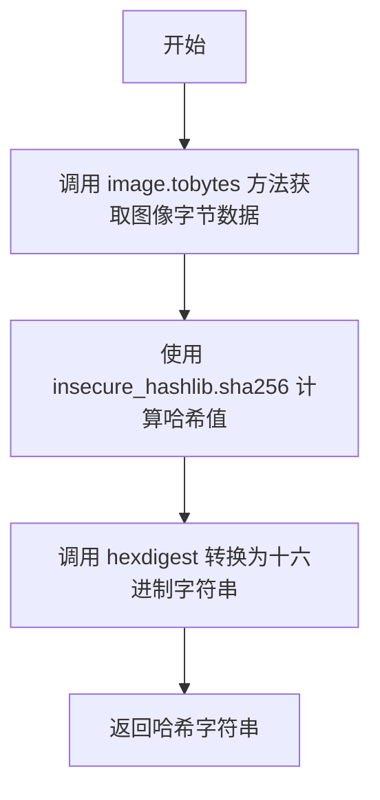
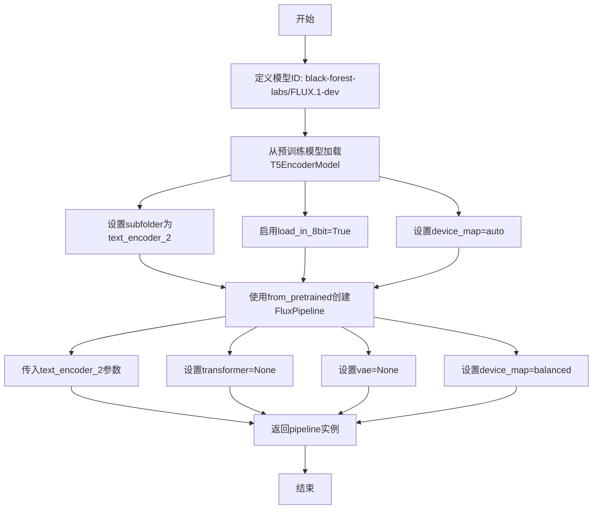
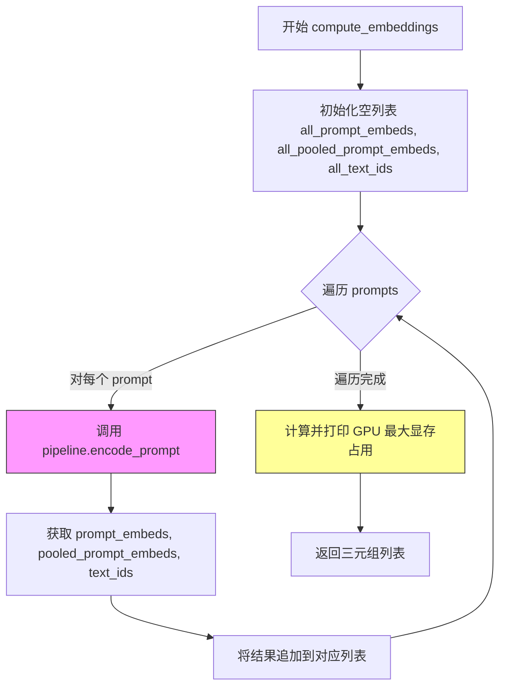
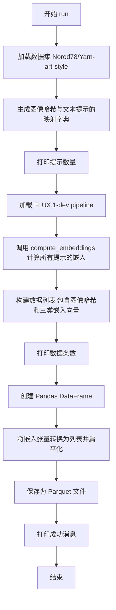
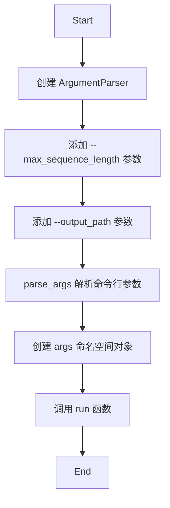

# `diffusers\examples\research_projects\flux_lora_quantization\compute_embeddings.py` 详细设计文档

该脚本从HuggingFace加载FLUX.1-dev模型和Yarn-art-style数据集，对数据集中的文本提示进行编码生成文本嵌入（prompt embeddings），并将嵌入结果与图像哈希映射后保存为Parquet格式文件，用于后续的图像生成或检索任务。

## 整体流程

```mermaid
graph TD
    A[开始] --> B[解析命令行参数]
B --> C[加载Yarn-art-style数据集]
C --> D[生成图像哈希并提取文本提示]
D --> E[加载FLUX.1-dev管道和T5编码器]
E --> F[对所有提示进行编码生成embeddings]
F --> G[构建(image_hash, embeds)数据列表]
G --> H[转换为Pandas DataFrame]
H --> I[将tensor转换为numpy数组并扁平化]
I --> J[保存为Parquet文件]
J --> K[结束]
```

## 类结构

```
无自定义类（基于函数式编程）
全局函数:
├── generate_image_hash(image)
├── load_flux_dev_pipeline()
├── compute_embeddings(pipeline, prompts, max_sequence_length)
└── run(args)
全局变量:
├── MAX_SEQ_LENGTH = 77
└── OUTPUT_PATH = 'embeddings.parquet'
```

## 全局变量及字段


### `MAX_SEQ_LENGTH`
    
最大序列长度常量，默认77，用于控制文本编码的最大token数量

类型：`int`
    


### `OUTPUT_PATH`
    
输出Parquet文件路径，默认为embeddings.parquet

类型：`str`
    


### `image_prompts`
    
图像哈希到文本提示的映射字典，用于关联图像和其对应的文本描述

类型：`dict`
    


### `all_prompts`
    
所有文本提示的列表，从image_prompts字典中提取

类型：`list`
    


### `data`
    
包含(image_hash, prompt_embeds, pooled_prompt_embeds, text_ids)元组的列表，用于存储编码后的嵌入数据

类型：`list`
    


### `embedding_cols`
    
要保存的嵌入列名列表，包含prompt_embeds、pooled_prompt_embeds和text_ids

类型：`list`
    


### `df`
    
存储所有嵌入数据的Pandas数据框，包含image_hash和三个嵌入列

类型：`DataFrame`
    


### `args`
    
解析后的命令行参数对象，包含max_sequence_length和output_path参数

类型：`Namespace`
    


    

## 全局函数及方法


### `generate_image_hash`

对输入的图像对象进行 SHA256 哈希计算，生成唯一的十六进制哈希字符串，用于标识图像内容。

参数：

- `image`：图像对象（需支持 `.tobytes()` 方法，通常为 PIL.Image），输入的图像数据

返回值：`str`，返回 SHA256 哈希值的十六进制字符串表示

#### 流程图



#### 带注释源码

```python
def generate_image_hash(image):
    """
    对图像字节进行 SHA256 哈希计算，返回十六进制字符串
    
    参数:
        image: 图像对象，需支持 .tobytes() 方法（如 PIL.Image）
    
    返回值:
        str: SHA256 哈希值的十六进制表示
    """
    # 将图像对象转换为字节序列
    # image.tobytes() 获取图像的原始像素字节数据
    image_bytes = image.tobytes()
    
    # 使用 SHA256 算法对字节数据进行哈希计算
    # insecure_hashlib 是 huggingface_hub 提供的哈希工具
    hash_object = insecure_hashlib.sha256(image_bytes)
    
    # 将哈希值转换为十六进制字符串格式返回
    return hash_object.hexdigest()
```


### `load_flux_dev_pipeline`

该函数负责加载FLUX.1-dev预训练模型和T5文本编码器（text_encoder_2），并返回一个配置好的FluxPipeline实例，用于后续的文本嵌入计算。

参数：该函数无参数。

返回值：`FluxPipeline`，返回一个配置好的FluxPipeline实例，其中text_encoder_2已加载T5文本编码器，transformer和vae设置为None，device_map为balanced。

#### 流程图



#### 带注释源码

```python
def load_flux_dev_pipeline():
    """
    加载FLUX.1-dev预训练模型和T5文本编码器，返回FluxPipeline实例。
    
    该函数执行以下操作：
    1. 指定FLUX.1-dev模型的HuggingFace Hub ID
    2. 加载T5文本编码器（text_encoder_2），使用8bit量化以减少显存占用
    3. 创建FluxPipeline实例，仅配置text_encoder_2，transformer和vae设为None
    4. 返回配置好的pipeline用于文本嵌入计算
    
    Returns:
        FluxPipeline: 配置好的FluxPipeline实例，其中包含加载的T5文本编码器
    """
    # 定义模型在HuggingFace Hub上的标识符
    id = "black-forest-labs/FLUX.1-dev"
    
    # 加载T5文本编码器模型
    # subfolder="text_encoder_2": 指定从模型仓库的text_encoder_2子目录加载
    # load_in_8bit=True: 启用8bit量化，显著减少显存占用（约为FP16的约一半）
    # device_map="auto": 自动将模型层分配到可用设备（CPU/GPU）
    text_encoder = T5EncoderModel.from_pretrained(
        id, 
        subfolder="text_encoder_2", 
        load_in_8bit=True, 
        device_map="auto"
    )
    
    # 从预训练模型创建FluxPipeline实例
    # text_encoder_2: 传入已加载的T5文本编码器
    # transformer=None: 不加载Transformer组件（用于图像生成，此处仅做文本嵌入）
    # vae=None: 不加载VAE组件（用于图像生成，此处仅做文本嵌入）
    # device_map="balanced": 自动平衡分配模型层到多个GPU（如果有）
    pipeline = FluxPipeline.from_pretrained(
        id, 
        text_encoder_2=text_encoder, 
        transformer=None, 
        vae=None, 
        device_map="balanced"
    )
    
    # 返回配置好的pipeline实例
    return pipeline
```


### `compute_embeddings`

该函数接收一个FluxPipeline管道对象、提示词列表和最大序列长度，遍历提示词列表并调用管道的`encode_prompt`方法对每个提示词进行编码，返回三个列表分别包含所有提示词的嵌入向量、池化嵌入向量和文本ID，同时记录并打印GPU最大显存占用情况。

参数：

- `pipeline`：`FluxPipeline`，Hugging Face Diffusers库中的FLUX管道对象，负责文本编码任务
- `prompts`：`List[str]`，待编码的提示词字符串列表
- `max_sequence_length`：`int`，文本编码的最大序列长度，影响计算资源和嵌入维度

返回值：`Tuple[List, List, List]`，包含三个列表的元组：
- `all_prompt_embeds`：所有提示词的嵌入向量列表
- `all_pooled_prompt_embeds`：所有提示词的池化嵌入向量列表
- `all_text_ids`：所有提示词的文本ID列表

#### 流程图



#### 带注释源码

```python
@torch.no_grad()  # 禁用梯度计算，减少显存占用，提升推理速度
def compute_embeddings(pipeline, prompts, max_sequence_length):
    """
    使用管道对提示列表进行编码，返回嵌入向量元组列表
    
    Args:
        pipeline: FluxPipeline实例，用于文本编码
        prompts: 待编码的提示词列表
        max_sequence_length: 最大序列长度
    
    Returns:
        包含嵌入向量、池化嵌入和文本ID的元组
    """
    # 初始化存储结果的列表
    all_prompt_embeds = []
    all_pooled_prompt_embeds = []
    all_text_ids = []
    
    # 遍历每个提示词，使用tqdm显示进度条
    for prompt in tqdm(prompts, desc="Encoding prompts."):
        # 调用管道的encode_prompt方法进行编码
        # prompt_2=None表示仅使用主文本编码器
        (
            prompt_embeds,        # 文本嵌入向量 [1, seq_len, hidden_dim]
            pooled_prompt_embeds, # 池化后的嵌入向量 [1, hidden_dim]
            text_ids,             # 文本ID用于后续交叉注意力
        ) = pipeline.encode_prompt(
            prompt=prompt, 
            prompt_2=None, 
            max_sequence_length=max_sequence_length
        )
        
        # 将每个提示词的编码结果追加到列表中
        all_prompt_embeds.append(prompt_embeds)
        all_pooled_prompt_embeds.append(pooled_prompt_embeds)
        all_text_ids.append(text_ids)

    # 计算并打印GPU最大显存占用（单位：GB）
    max_memory = torch.cuda.max_memory_allocated() / 1024 / 1024 / 1024
    print(f"Max memory allocated: {max_memory:.3f} GB")
    
    # 返回三个列表的元组
    return all_prompt_embeds, all_pooled_prompt_embeds, all_text_ids
```


### `run(args)`

`run` 函数是整个嵌入生成流程的主入口，负责协调数据加载、模型推理和结果持久化。它首先从 Hugging Face 数据集加载纱线艺术风格图像及其对应文本，然后使用 FLUX.1-dev 模型对所有文本提示进行编码，最后将图像哈希与嵌入向量一起保存为 Parquet 格式文件。

#### 参数

- `args`：`argparse.Namespace`，包含以下属性
  - `max_sequence_length`：`int`，编码提示时的最大序列长度，默认值为 77
  - `output_path`：`str`，输出 Parquet 文件的路径，默认为 "embeddings.parquet"

#### 返回值

`None`，该函数执行完成后将结果直接写入指定文件，无返回值。

#### 流程图



#### 带注释源码

```python
def run(args):
    # 步骤1: 从Hugging Face加载纱线艺术风格数据集
    # 数据集包含图像和对应的文本描述
    dataset = load_dataset("Norod78/Yarn-art-style", split="train")
    
    # 步骤2: 为每张图像生成SHA256哈希作为唯一标识符
    # 并建立哈希到文本提示的映射关系
    # 这里使用字典推导式遍历数据集中的每个样本
    image_prompts = {generate_image_hash(sample["image"]): sample["text"] for sample in dataset}
    
    # 步骤3: 提取所有文本提示用于后续编码
    all_prompts = list(image_prompts.values())
    print(f"{len(all_prompts)=}")  # 打印提示总数用于监控
    
    # 步骤4: 加载FLUX.1-dev文本编码管道
    # 使用8bit量化并自动设备映射以优化内存使用
    pipeline = load_flux_dev_pipeline()
    
    # 步骤5: 批量计算所有文本提示的嵌入向量
    # 返回三类嵌入: prompt_embeds, pooled_prompt_embeds, text_ids
    all_prompt_embeds, all_pooled_prompt_embeds, all_text_ids = compute_embeddings(
        pipeline, all_prompts, args.max_sequence_length
    )
    
    # 步骤6: 将图像哈希与对应的嵌入向量配对
    # 保持与all_prompts相同的顺序
    data = []
    for i, (image_hash, _) in enumerate(image_prompts.items()):
        # 每条记录包含: 图像哈希, 三类嵌入向量
        data.append((image_hash, all_prompt_embeds[i], all_pooled_prompt_embeds[i], all_text_ids[i]))
    print(f"{len(data)=}")  # 打印数据记录数
    
    # 步骤7: 创建Pandas DataFrame进行结构化存储
    # 定义列名: image_hash + 三类嵌入列
    embedding_cols = ["prompt_embeds", "pooled_prompt_embeds", "text_ids"]
    df = pd.DataFrame(data, columns=["image_hash"] + embedding_cols)
    print(f"{len(df)=}")  # 打印DataFrame行数
    
    # 步骤8: 将PyTorch张量转换为Python列表
    # 这是为了能够正确序列化为Parquet格式
    # flatten()确保嵌入被展平为一维数组
    for col in embedding_cols:
        df[col] = df[col].apply(lambda x: x.cpu().numpy().flatten().tolist())
    
    # 步骤9: 将DataFrame持久化为Parquet文件
    # Parquet是一种列式存储格式，适合存储大规模结构化数据
    df.to_parquet(args.output_path)
    print(f"Data successfully serialized to {args.output_path}")
```


### `__main__` 模块

该模块作为脚本入口点，负责解析命令行参数并调用 `run` 函数以启动嵌入生成流程。

参数：

- `max_sequence_length`：`int`，最大序列长度，用于控制嵌入计算的序列长度，默认值为 77
- `output_path`：`str`，输出 Parquet 文件的路径，默认值为 "embeddings.parquet"

返回值：`None`，无返回值，仅执行命令行参数解析和调用 `run` 函数

#### 流程图



#### 带注释源码

```
if __name__ == "__main__":
    # 创建命令行参数解析器
    parser = argparse.ArgumentParser()
    
    # 添加最大序列长度参数
    # 类型: int
    # 默认值: 77 (MAX_SEQ_LENGTH)
    # 用途: 控制嵌入计算的序列长度，越长计算成本越高
    parser.add_argument(
        "--max_sequence_length",
        type=int,
        default=MAX_SEQ_LENGTH,
        help="Maximum sequence length to use for computing the embeddings. The more the higher computational costs.",
    )
    
    # 添加输出路径参数
    # 类型: str
    # 默认值: "embeddings.parquet"
    # 用途: 指定输出 Parquet 文件的保存路径
    parser.add_argument("--output_path", type=str, default=OUTPUT_PATH, help="Path to serialize the parquet file.")
    
    # 解析命令行传入的参数
    args = parser.parse_args()
    
    # 调用主函数 run，传入解析后的参数对象
    run(args)
```

## 关键组件


### 张量索引与惰性加载

代码通过字典推导式 `{generate_image_hash(sample["image"]): sample["text"] for sample in dataset}` 构建 image_prompts 字典，并在后续使用 `enumerate(image_prompts.items())` 进行索引访问。这种方式在处理大型数据集时会一次性加载所有数据到内存，未采用惰性加载策略，可能导致内存峰值较高。

### 反量化支持

`T5EncoderModel.from_pretrained` 使用 `load_in_8bit=True` 参数加载8位量化模型，显著减少显存占用。`device_map="auto"` 和 `device_map="balanced"` 分别用于文本编码器和主流水衡设备分配，实现模型的自动反量化加载与推理。

### 量化策略

代码采用双重量化策略：文本编码器使用 `load_in_8bit` 量化（INT8），transformer 和 vae 被设置为 None 以跳过加载。`torch.no_grad()` 装饰器确保推理过程中不计算梯度，进一步降低显存消耗。

### 数据集加载与处理

使用 Hugging Face `load_dataset` 加载 "Norod78/Yarn-art-style" 数据集，遍历所有样本并通过 `generate_image_hash` 为每张图像生成唯一哈希标识，建立图像到文本描述的映射关系。

### 嵌入计算管道

`compute_embeddings` 函数对每个 prompt 调用 `pipeline.encode_prompt`，使用 `max_sequence_length` 参数控制序列长度。返回的 `prompt_embeds`、`pooled_prompt_embeds` 和 `text_ids` 被收集到列表中，最后通过 `torch.cuda.max_memory_allocated()` 监控显存使用情况。

### 序列化与存储

使用 pandas DataFrame 构建数据，将张量通过 `.apply(lambda x: x.cpu().numpy().flatten().tolist())` 转换为列表格式，最后调用 `to_parquet` 将嵌入向量序列化保存为 Parquet 文件。

### 命令行参数管理

通过 `argparse` 定义 `--max_sequence_length` 和 `--output_path` 两个可配置参数，允许用户自定义序列长度和输出路径，默认值分别为 77 和 "embeddings.parquet"。


## 问题及建议


### 已知问题

- **数据一致性风险**：使用图像哈希作为字典键，如果不同图像产生相同的SHA256哈希值，会导致数据覆盖和丢失
- **顺序依赖问题**：`image_prompts.items()` 与 `all_prompts` 列表的迭代顺序无法保证完全一致，虽然Python 3.7+保持字典插入顺序，但代码逻辑依赖于顺序对应关系，存在隐藏bug风险
- **缺少错误处理**：数据集加载、模型加载、文件写入等关键操作均无异常捕获和错误处理机制
- **资源未及时释放**：GPU内存仅在函数结束时释放，批量处理大数据集时可能导致显存不足
- **模型参数硬编码**：模型ID "black-forest-labs/FLUX.1-dev" 硬编码在函数内部，扩展性差

### 优化建议

- 使用UUID或数据库主键替代图像哈希作为唯一标识，或在哈希冲突时添加后缀区分
- 使用有序数据结构（如列表）存储数据，确保索引对应关系明确
- 添加 try-except 块处理网络异常、磁盘空间不足等场景
- 在每个prompt处理后调用 `torch.cuda.empty_cache()` 或使用 context manager 管理显存
- 将模型ID、默认路径等配置提取为命令行参数或配置文件
- 考虑批量编码prompts而非逐个处理，可显著提升性能
- 添加类型注解提高代码可维护性和IDE支持

## 其它


### 设计目标与约束

**设计目标**：将Norod78/Yarn-art-style数据集中的图像对应的文本提示（text字段）通过FLUX.1-dev模型的T5文本编码器转换为高维向量嵌入（prompt_embeds、pooled_prompt_embeds、text_ids），并以结构化方式存储到Parquet文件中，供后续图像生成流程使用。

**核心约束**：
- 使用black-forest-labs/FLUX.1-dev模型，仅加载text_encoder_2（T5EncoderModel）
- 默认max_sequence_length=77，可通过命令行参数调整
- 仅支持GPU运行（device_map="auto"和"balanced"）
- 输出格式固定为Parquet（Apache Arrow后端）
- 模型加载采用load_in_8bit=True以降低显存占用

### 错误处理与异常设计

**模型加载阶段**：
- `T5EncoderModel.from_pretrained()`若模型不存在或网络超时，diffusers会抛出`OSError`或`EnvironmentError`
- `FluxPipeline.from_pretrained()`若传入None的组件(transformer/vae)导致初始化异常，需捕获并给出明确提示
- GPU内存不足时，load_in_8bit可能导致OOM，应在调用前检查`torch.cuda.get_device_properties(0).total_memory`

**数据集加载阶段**：
- `load_dataset("Norod78/Yarn-art-style")`可能因数据集不存在、HuggingFace Hub连接问题或数据集格式变更失败
- 样本中缺少"image"或"text"字段时，`KeyError`会导致流程中断

**编码处理阶段**：
- `pipeline.encode_prompt()`可能因prompt为空串、包含特殊字符或超出max_sequence_length失败
- CUDA内存耗尽时`torch.cuda.OutOfMemoryError`会导致显存完全溢出

**数据持久化阶段**：
- `df.to_parquet()`可能因磁盘空间不足、路径权限问题或文件被占用失败
- embedding列表转numpy时的设备迁移（.cpu()）若tensor已在CPU可能重复操作

### 数据流与状态机

```
┌─────────────────────────────────────────────────────────────────────────────┐
│                                主流程状态机                                  │
├─────────────────────────────────────────────────────────────────────────────┤
│                                                                             │
│  ┌──────────┐    ┌──────────────┐    ┌─────────────┐    ┌──────────────┐  │
│  │  START   │───▶│ LOAD_DATASET │───▶│ LOAD_PIPELINE│───▶│ ENCODE_PROMPTS│ │
│  └──────────┘    └──────────────┘    └─────────────┘    └──────┬───────┘  │
│                                                                  │          │
│                           ┌──────────────┐    ┌─────────────┐    │          │
│                           │ PARQUET_FILE │◀───│ SAVE_DF    │◀───┘          │
│                           └──────────────┘    └─────────────┘               │
│                                                                             │
│  ┌──────────────────────────────────────────────────────────────────────┐  │
│  │ 异常流程: 任何阶段失败则打印错误信息并以非零状态码退出                 │  │
│  └──────────────────────────────────────────────────────────────────────┘  │
└─────────────────────────────────────────────────────────────────────────────┘

数据变换流程:
┌─────────────────┐    ┌─────────────────┐    ┌─────────────────┐    ┌─────────────────┐
│ HuggingFace     │    │ Dict[hash→text] │    │ List[embeddings]│    │  Pandas DF     │
│ Dataset object  │───▶│                 │───▶│                 │───▶│                │
│ (Sample items)  │    │ image_prompts   │    │ all_*_embeds    │    │ df             │
└─────────────────┘    └─────────────────┘    └─────────────────┘    └─────────────────┘
        │                        │                       │                      │
   Sample["image"]          generate_image_hash     pipeline.encode_prompt    df.to_parquet
   Sample["text"]               映射                    计算                      序列化
```

**关键数据转换点**：
1. `dataset` → `image_prompts`: 从DatasetIterator转为Python字典（key为图像hash，value为文本）
2. `image_prompts.values()` → `all_prompts`: 字典value转list
3. `prompts` → `all_prompt_embeds`: 调用T5Encoder的forward过程，文本→token ids→hidden states
4. `raw embeddings` → `numpy arrays`: `.cpu().numpy().flatten().tolist()`转换以适配Parquet的list类型存储

### 外部依赖与接口契约

**核心依赖库**：
| 依赖库 | 版本要求 | 用途 |
|--------|----------|------|
| torch | ≥2.0.0 | 张量计算与CUDA管理 |
| transformers | ≥4.35.0 | T5EncoderModel加载与编码 |
| diffusers | ≥0.25.0 | FluxPipeline基础架构 |
| datasets | ≥2.14.0 | HuggingFace数据集加载 |
| huggingface_hub | ≥0.19.0 | insecure_hashlib工具函数 |
| pandas | ≥2.0.0 | DataFrame构建与Parquet导出 |
| tqdm | ≥4.65.0 | 进度条显示 |

**外部模型依赖**：
- **black-forest-labs/FLUX.1-dev**: HuggingFace Hub模型，需text_encoder_2子文件夹（FP8/T5-XXL）
- 首次运行需约6-8GB磁盘空间下载模型权重

**命令行接口契约**：
```
python script.py [--max_sequence_length INT] [--output_path STRING]

参数:
  --max_sequence_length: 整数，默认77，范围建议[32, 512]
  --output_path:        字符串路径，默认"embeddings.parquet"

返回值:
  成功: 0，输出"Data successfully serialized to {path}"
  失败: 非0，Python异常栈
```

**输出文件契约**：
- 格式: Parquet (Apache Arrow IPC)
- Schema:
  ```
  image_hash: string (SHA256 hexdigest, 64字符)
  prompt_embeds: list<float> (维度: max_sequence_length × 4096)
  pooled_prompt_embeds: list<float> (维度: 768)
  text_ids: list<int64> (维度: max_sequence_length)
  ```

### 配置与参数设计

**硬编码常量**：
- `MAX_SEQ_LENGTH = 77`: T5模型的默认最大位置编码长度，与GPT-2一致
- `OUTPUT_PATH = "embeddings.parquet"`: 工作目录相对路径

**环境相关配置**（代码中隐式依赖）：
- `torch.cuda.is_available()`: 必须返回True
- `CUDA_VISIBLE_DEVICES`: 若多卡环境需设置以确定device_map行为
- HF_HOME / TRANSFORMERS_CACHE: 模型缓存目录，默认~/.cache/huggingface

### 资源管理与性能优化

**显存优化策略**：
- `load_in_8bit=True`: T5EncoderModel量化到8-bit，约节省50%显存（12GB→6GB）
- `device_map="balanced"`: 多卡自动分载（当前配置transformer/vae为None，实际单卡运行）
- `@torch.no_grad()`: 禁用梯度计算图，节省约20%中间结果显存

**计算优化空间**：
- 批量编码: 当前逐prompt串行处理，可改为`pipeline.encode_prompt(prompts=batch)`批量模式
- 数据集流式处理: `load_dataset(..., streaming=True)`避免全量加载到内存
- 异步IO: 生成hash与encode可并行（ThreadPoolExecutor）

### 可观测性与监控

**关键日志指标**：
- `len(all_prompts)=`: 数据集样本数，用于估算总计算量
- `len(data)=`: 成功编码的样本数（应与prompts数一致）
- `len(df)=`: DataFrame行数（校验点）
- `Max memory allocated: {X.XXX} GB`: CUDA峰值显存，用于性能调优

**建议增强监控**：
- 添加`time.time()`统计各阶段耗时
- 记录每批次编码的平均Latency
- Prometheus/StatsD指标导出

### 安全性与容错边界

**当前缺失的安全检查**：
- 未验证Norod78/Yarn-art-style数据集的完整性或可信度
- 使用`insecure_hashlib`（非标准库hashlib的内部实现），可能存在哈希冲突风险
- 未对prompt长度做截断预处理，可能触发T5的序列长度保护异常

**生产环境建议**：
- 添加数据集hash校验（expected sha256）
- prompt空值过滤与长度上限保护
- 重试机制（tenacity库）应对Hub网络抖动
- 断点续传：已有embedding跳过已处理样本

### 扩展性与演进建议

**短期可扩展点**：
- 支持多模型（T5、CLIP text encoder）
- 添加embedding归一化选项（用于余弦相似度计算）
- 支持增量更新（append模式而非覆盖）

**长期架构演进**：
- 迁移至Ray Data或Spark进行大规模分布式编码
- 引入向量数据库（Milvus/Qdrant）直接入库
- 支持ONNX Runtime加速推理
</content]
    