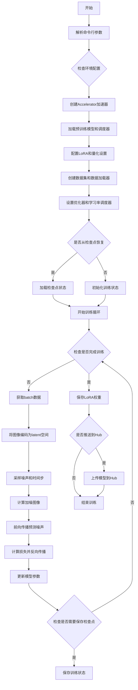
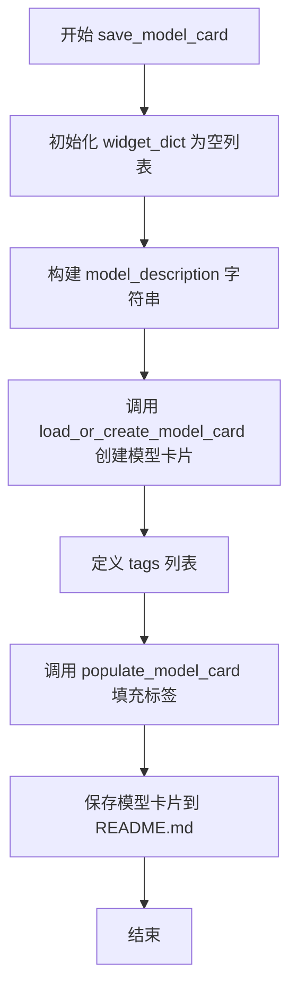
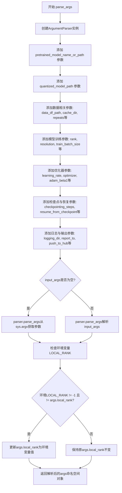
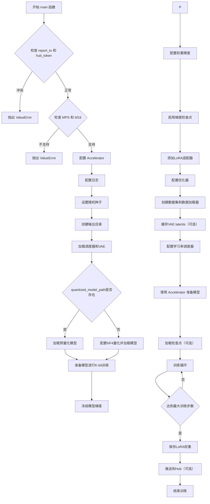
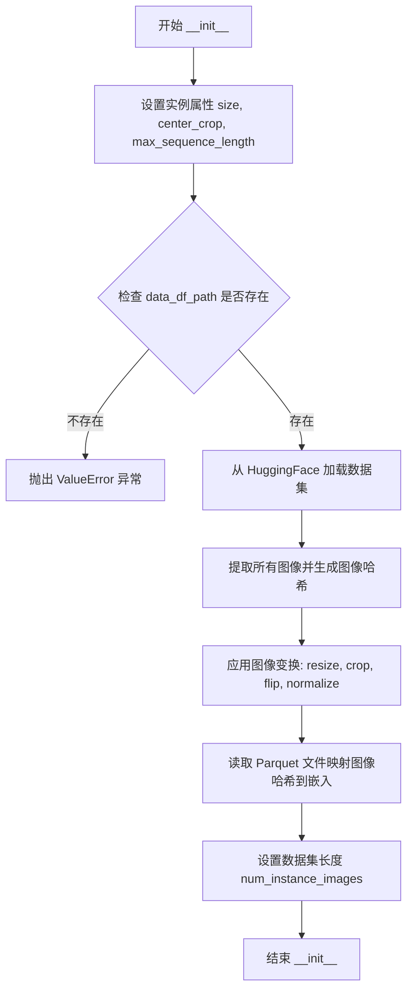
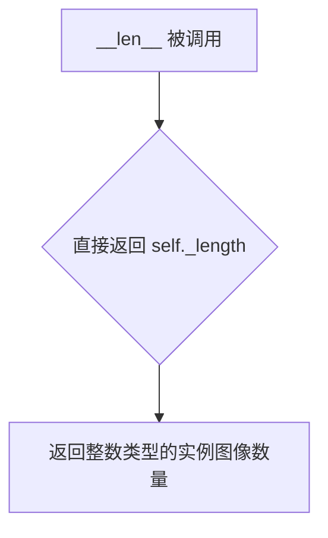
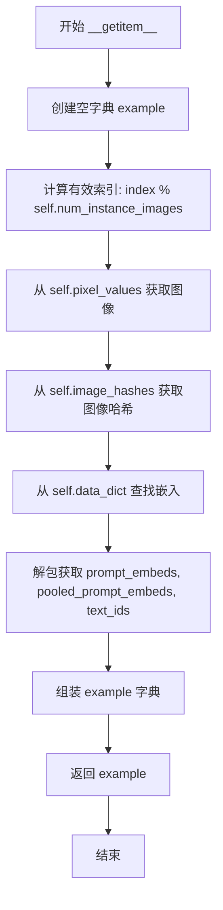
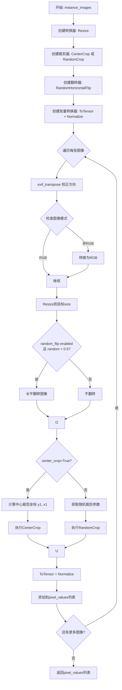
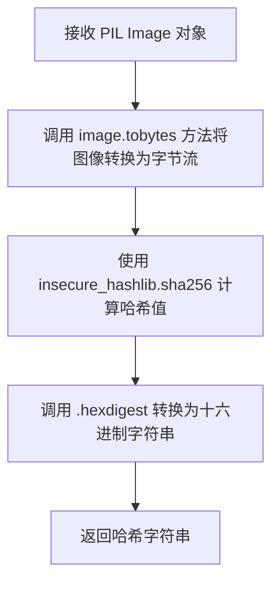

# `diffusers\examples\research_projects\flux_lora_quantization\train_dreambooth_lora_flux_miniature.py` 详细设计文档

这是一个DreamBooth训练脚本，用于使用LoRA（Low-Rank Adaptation）技术对Flux文本到图像扩散模型进行微调。脚本支持4位量化训练（NF4）、分布式训练、梯度累积、混合精度训练，并使用Flow Match Euler离散调度器进行训练，最终生成可用于特定风格或概念定制的LoRA权重。

## 整体流程



## 类结构

```
Global Functions
├── save_model_card (保存模型卡片)
├── parse_args (解析命令行参数)
└── main (主训练函数)
Classes
└── DreamBoothDataset (数据集类)
    ├── __init__ (初始化)
    ├── __len__ (获取长度)
    ├── __getitem__ (获取样本)
    ├── apply_image_transformations (图像变换)
    ├── convert_to_torch_tensor (转换embedding)
    ├── map_image_hash_embedding (映射hash到embedding)
    └── generate_image_hash (生成图像hash)
Helper Functions (not in class)
└── collate_fn (数据整理函数)
```

## 全局变量及字段


### `logger`
    
日志记录器，用于记录训练过程中的信息

类型：`logging.Logger`
    


### `args`
    
命令行参数对象，包含所有训练配置参数

类型：`argparse.Namespace`
    


### `DreamBoothDataset.size`
    
图像分辨率

类型：`int`
    


### `DreamBoothDataset.center_crop`
    
是否居中裁剪

类型：`bool`
    


### `DreamBoothDataset.max_sequence_length`
    
最大序列长度

类型：`int`
    


### `DreamBoothDataset.data_df_path`
    
数据路径

类型：`Path`
    


### `DreamBoothDataset.instance_images`
    
实例图像列表

类型：`list[PIL.Image.Image]`
    


### `DreamBoothDataset.image_hashes`
    
图像hash列表

类型：`list[str]`
    


### `DreamBoothDataset.pixel_values`
    
像素值列表

类型：`list[torch.Tensor]`
    


### `DreamBoothDataset.data_dict`
    
hash到embedding的映射

类型：`dict`
    


### `DreamBoothDataset.num_instance_images`
    
实例图像数量

类型：`int`
    


### `DreamBoothDataset._length`
    
数据集长度

类型：`int`
    
    

## 全局函数及方法


### `save_model_card`

该函数用于在训练完成后生成并保存 DreamBooth LoRA 模型的模型卡片（README.md），包含模型描述、使用说明、许可证等元信息，并将其推送到 HuggingFace Hub。

参数：

- `repo_id`：`str`，HuggingFace Hub 上的仓库标识符
- `base_model`：`str`，可选，用于描述所使用的基础预训练模型
- `instance_prompt`：`任意类型`，可选，用于触发图像生成的提示词
- `repo_folder`：`str`，可选，本地仓库文件夹路径，用于保存模型卡片
- `quantization_config`：`任意类型`，可选，量化配置信息，用于记录模型量化设置

返回值：`None`，该函数直接保存文件到磁盘，不返回任何值

#### 流程图



#### 带注释源码

```python
def save_model_card(
    repo_id: str,
    base_model: str = None,
    instance_prompt=None,
    repo_folder=None,
    quantization_config=None,
):
    """
    生成并保存模型卡片到指定文件夹
    
    参数:
        repo_id: HuggingFace仓库ID
        base_model: 基础模型名称
        instance_prompt: 实例提示词
        repo_folder: 仓库文件夹路径
        quantization_config: 量化配置
    """
    # 初始化 widget 字典列表（用于HuggingFace Spaces widget）
    widget_dict = []

    # 构建模型描述信息，包含标题、模型描述、触发词、下载链接等
    model_description = f"""
# Flux DreamBooth LoRA - {repo_id}

<Gallery />

## Model description

These are {repo_id} DreamBooth LoRA weights for {base_model}.

The weights were trained using [DreamBooth](https://dreambooth.github.io/) with the [Flux diffusers trainer](https://github.com/huggingface/diffusers/blob/main/examples/dreambooth/README_flux.md).

Was LoRA for the text encoder enabled? False.

Quantization config:

```yaml
{quantization_config}
```

## Trigger words

You should use `{instance_prompt}` to trigger the image generation.

## Download model

[Download the *.safetensors LoRA]({repo_id}/tree/main) in the Files & versions tab.

For more details, including weighting, merging and fusing LoRAs, check the [documentation on loading LoRAs in diffusers](https://huggingface.co/docs/diffusers/main/en/using-diffusers/loading_adapters)

## Usage

TODO

## License

Please adhere to the licensing terms as described [here](https://huggingface.co/black-forest-labs/FLUX.1-dev/blob/main/LICENSE.md).
"""
    # 加载或创建模型卡片
    model_card = load_or_create_model_card(
        repo_id_or_path=repo_id,
        from_training=True,
        license="other",
        base_model=base_model,
        prompt=instance_prompt,
        model_description=model_description,
        widget=widget_dict,
    )
    
    # 定义模型标签
    tags = [
        "text-to-image",
        "diffusers-training",
        "diffusers",
        "lora",
        "flux",
        "flux-diffusers",
        "template:sd-lora",
    ]

    # 填充模型卡片的标签信息
    model_card = populate_model_card(model_card, tags=tags)
    
    # 保存模型卡片到README.md文件
    model_card.save(os.path.join(repo_folder, "README.md"))
```


### `parse_args`

该函数是Flux DreamBooth LoRA训练脚本的命令行参数解析器，通过argparse库定义并收集所有训练所需的配置参数，包括模型路径、数据配置、训练超参数、优化器设置等，并返回一个包含所有解析后参数的Namespace对象。

参数：

- `input_args`：`Optional[List[str]]`，可选参数，用于测试目的的命令行参数列表。如果为None，则从sys.argv自动获取命令行输入。

返回值：`argparse.Namespace`，返回一个命名空间对象，包含所有解析后的命令行参数属性（如pretrained_model_name_or_path、rank、output_dir等）。

#### 流程图



#### 带注释源码

```python
def parse_args(input_args=None):
    """
    解析命令行参数，用于配置Flux DreamBooth LoRA训练脚本。
    
    参数:
        input_args: 可选的命令行参数列表，用于测试目的。
                   如果为None，则从系统命令行获取参数。
    
    返回:
        argparse.Namespace: 包含所有训练配置参数的命名空间对象
    """
    # 创建ArgumentParser实例，设置脚本描述
    parser = argparse.ArgumentParser(description="Simple example of a training script.")
    
    # ==================== 模型路径参数 ====================
    # 添加预训练模型路径或模型标识符（必需）
    parser.add_argument(
        "--pretrained_model_name_or_path",
        type=str,
        default=None,
        required=True,
        help="Path to pretrained model or model identifier from huggingface.co/models.",
    )
    # 添加量化模型路径（可选）
    parser.add_argument(
        "--quantized_model_path",
        type=str,
        default=None,
        help="Path to the quantized model.",
    )
    # 添加模型版本修订参数
    parser.add_argument(
        "--revision",
        type=str,
        default=None,
        required=False,
        help="Revision of pretrained model identifier from huggingface.co/models.",
    )
    # 添加模型变体参数（如fp16）
    parser.add_argument(
        "--variant",
        type=str,
        default=None,
        help="Variant of the model files of the pretrained model identifier from huggingface.co/models, 'e.g.' fp16",
    )
    
    # ==================== 数据集参数 ====================
    # 添加parquet文件路径（包含预计算的embeddings）
    parser.add_argument(
        "--data_df_path",
        type=str,
        default=None,
        help=("Path to the parquet file serialized with compute_embeddings.py."),
    )
    # 添加缓存目录
    parser.add_argument(
        "--cache_dir",
        type=str,
        default=None,
        help="The directory where the downloaded models and datasets will be stored.",
    )
    # 添加重复次数
    parser.add_argument("--repeats", type=int, default=1, help="How many times to repeat the training data.")
    # 添加最大序列长度（需与compute_embeddings.py一致）
    parser.add_argument(
        "--max_sequence_length",
        type=int,
        default=77,
        help="Used for reading the embeddings. Needs to be the same as used during `compute_embeddings.py`.",
    )
    # 添加LoRA rank参数
    parser.add_argument(
        "--rank",
        type=int,
        default=4,
        help=("The dimension of the LoRA update matrices."),
    )
    
    # ==================== 输出与随机种子参数 ====================
    parser.add_argument(
        "--output_dir",
        type=str,
        default="flux-dreambooth-lora-nf4",
        help="The output directory where the model predictions and checkpoints will be written.",
    )
    parser.add_argument("--seed", type=int, default=None, help="A seed for reproducible training.")
    
    # ==================== 图像处理参数 ====================
    parser.add_argument(
        "--resolution",
        type=int,
        default=512,
        help=(
            "The resolution for input images, all the images in the train/validation dataset will be resized to this"
            " resolution"
        ),
    )
    parser.add_argument(
        "--center_crop",
        default=False,
        action="store_true",
        help=(
            "Whether to center crop the input images to the resolution. If not set, the images will be randomly"
            " cropped. The images will be resized to the resolution first before cropping."
        ),
    )
    parser.add_argument(
        "--random_flip",
        action="store_true",
        help="whether to randomly flip images horizontally",
    )
    
    # ==================== 训练批处理参数 ====================
    parser.add_argument(
        "--train_batch_size", type=int, default=4, help="Batch size (per device) for the training dataloader."
    )
    parser.add_argument(
        "--sample_batch_size", type=int, default=4, help="Batch size (per device) for sampling images."
    )
    parser.add_argument("--num_train_epochs", type=int, default=1)
    parser.add_argument(
        "--max_train_steps",
        type=int,
        default=None,
        help="Total number of training steps to perform.  If provided, overrides num_train_epochs.",
    )
    
    # ==================== 检查点与恢复参数 ====================
    parser.add_argument(
        "--checkpointing_steps",
        type=int,
        default=500,
        help=(
            "Save a checkpoint of the training state every X updates. These checkpoints can be used both as final"
            " checkpoints in case they are better than the last checkpoint, and are also suitable for resuming"
            " training using `--resume_from_checkpoint`."
        ),
    )
    parser.add_argument(
        "--checkpoints_total_limit",
        type=int,
        default=None,
        help=("Max number of checkpoints to store."),
    )
    parser.add_argument(
        "--resume_from_checkpoint",
        type=str,
        default=None,
        help=(
            "Whether training should be resumed from a previous checkpoint. Use a path saved by"
            ' `--checkpointing_steps`, or `"latest"` to automatically select the last available checkpoint.'
        ),
    )
    
    # ==================== 梯度与学习率参数 ====================
    parser.add_argument(
        "--gradient_accumulation_steps",
        type=int,
        default=1,
        help="Number of updates steps to accumulate before performing a backward/update pass.",
    )
    parser.add_argument(
        "--gradient_checkpointing",
        action="store_true",
        help="Whether or not to use gradient checkpointing to save memory at the expense of slower backward pass.",
    )
    parser.add_argument(
        "--learning_rate",
        type=float,
        default=1e-4,
        help="Initial learning rate (after the potential warmup period) to use.",
    )
    parser.add_argument(
        "--guidance_scale",
        type=float,
        default=3.5,
        help="the FLUX.1 dev variant is a guidance distilled model",
    )
    parser.add_argument(
        "--scale_lr",
        action="store_true",
        default=False,
        help="Scale the learning rate by the number of GPUs, gradient accumulation steps, and batch size.",
    )
    parser.add_argument(
        "--lr_scheduler",
        type=str,
        default="constant",
        help=(
            'The scheduler type to use. Choose between ["linear", "cosine", "cosine_with_restarts", "polynomial",'
            ' "constant", "constant_with_warmup"]'
        ),
    )
    parser.add_argument(
        "--lr_warmup_steps", type=int, default=500, help="Number of steps for the warmup in the lr scheduler."
    )
    parser.add_argument(
        "--lr_num_cycles",
        type=int,
        default=1,
        help="Number of hard resets of the lr in cosine_with_restarts scheduler.",
    )
    parser.add_argument("--lr_power", type=float, default=1.0, help="Power factor of the polynomial scheduler.")
    parser.add_argument(
        "--dataloader_num_workers",
        type=int,
        default=0,
        help=(
            "Number of subprocesses to use for data loading. 0 means that the data will be loaded in the main process."
        ),
    )
    
    # ==================== 采样权重参数 ====================
    parser.add_argument(
        "--weighting_scheme",
        type=str,
        default="none",
        choices=["sigma_sqrt", "logit_normal", "mode", "cosmap", "none"],
        help=('We default to the "none" weighting scheme for uniform sampling and uniform loss'),
    )
    parser.add_argument(
        "--logit_mean", type=float, default=0.0, help="mean to use when using the `'logit_normal'` weighting scheme."
    )
    parser.add_argument(
        "--logit_std", type=float, default=1.0, help="std to use when using the `'logit_normal'` weighting scheme."
    )
    parser.add_argument(
        "--mode_scale",
        type=float,
        default=1.29,
        help="Scale of mode weighting scheme. Only effective when using the `'mode'` as the `weighting_scheme`.",
    )
    
    # ==================== 优化器参数 ====================
    parser.add_argument(
        "--optimizer",
        type=str,
        default="AdamW",
        choices=["AdamW", "Prodigy", "AdEMAMix"],
    )
    parser.add_argument(
        "--use_8bit_adam",
        action="store_true",
        help="Whether or not to use 8-bit Adam from bitsandbytes. Ignored if optimizer is not set to AdamW",
    )
    parser.add_argument(
        "--use_8bit_ademamix",
        action="store_true",
        help="Whether or not to use 8-bit AdEMAMix from bitsandbytes.",
    )
    parser.add_argument(
        "--adam_beta1", type=float, default=0.9, help="The beta1 parameter for the Adam and Prodigy optimizers."
    )
    parser.add_argument(
        "--adam_beta2", type=float, default=0.999, help="The beta2 parameter for the Adam and Prodigy optimizers."
    )
    parser.add_argument(
        "--prodigy_beta3",
        type=float,
        default=None,
        help="coefficients for computing the Prodigy stepsize using running averages. If set to None, "
        "uses the value of square root of beta2. Ignored if optimizer is adamW",
    )
    parser.add_argument("--prodigy_decouple", type=bool, default=True, help="Use AdamW style decoupled weight decay")
    parser.add_argument("--adam_weight_decay", type=float, default=1e-04, help="Weight decay to use for unet params")
    parser.add_argument(
        "--adam_epsilon",
        type=float,
        default=1e-08,
        help="Epsilon value for the Adam optimizer and Prodigy optimizers.",
    )
    parser.add_argument(
        "--prodigy_use_bias_correction",
        type=bool,
        default=True,
        help="Turn on Adam's bias correction. True by default. Ignored if optimizer is adamW",
    )
    parser.add_argument(
        "--prodigy_safeguard_warmup",
        type=bool,
        default=True,
        help="Remove lr from the denominator of D estimate to avoid issues during warm-up stage. True by default. "
        "Ignored if optimizer is adamW",
    )
    parser.add_argument("--max_grad_norm", default=1.0, type=float, help="Max gradient norm.")
    
    # ==================== Hub与日志参数 ====================
    parser.add_argument("--push_to_hub", action="store_true", help="Whether or not to push the model to the Hub.")
    parser.add_argument("--hub_token", type=str, default=None, help="The token to use to push to the Model Hub.")
    parser.add_argument(
        "--hub_model_id",
        type=str,
        default=None,
        help="The name of the repository to keep in sync with the local `output_dir`.",
    )
    parser.add_argument(
        "--logging_dir",
        type=str,
        default="logs",
        help=(
            "[TensorBoard](https://www.tensorflow.org/tensorboard) log directory. Will default to"
            " *output_dir/runs/**CURRENT_DATETIME_HOSTNAME***."
        ),
    )
    
    # ==================== 其他训练配置 ====================
    parser.add_argument(
        "--cache_latents",
        action="store_true",
        default=False,
        help="Cache the VAE latents",
    )
    parser.add_argument(
        "--report_to",
        type=str,
        default="tensorboard",
        help=(
            'The integration to report the results and logs to. Supported platforms are `"tensorboard"`'
            ' (default), `"wandb"` and `"comet_ml"`. Use `"all"` to report to all integrations.'
        ),
    )
    parser.add_argument(
        "--mixed_precision",
        type=str,
        default=None,
        choices=["no", "fp16", "bf16"],
        help=(
            "Whether to use mixed precision. Choose between fp16 and bf16 (bfloat16). Bf16 requires PyTorch >="
            " 1.10.and an Nvidia Ampere GPU.  Default to the value of accelerate config of the current system or the"
            " flag passed with the `accelerate.launch` command. Use this argument to override the accelerate config."
        ),
    )
    parser.add_argument("--local_rank", type=int, default=-1, help="For distributed training: local_rank")
    
    # ==================== 解析参数 ====================
    # 根据input_args是否为空决定解析方式
    if input_args is not None:
        # 用于测试：解析传入的参数列表
        args = parser.parse_args(input_args)
    else:
        # 生产环境：从sys.argv获取命令行参数
        args = parser.parse_args()
    
    # ==================== 处理分布式训练环境变量 ====================
    # 检查环境变量LOCAL_RANK，用于分布式训练场景
    env_local_rank = int(os.environ.get("LOCAL_RANK", -1))
    # 如果环境变量中设置了LOCAL_RANK且与命令行参数不一致，则以环境变量为准
    if env_local_rank != -1 and env_local_rank != args.local_rank:
        args.local_rank = env_local_rank
    
    # 返回解析后的参数命名空间对象
    return args
```


### `collate_fn`

该函数是 PyTorch `DataLoader` 的回调函数（collate function），用于将数据集中获取的单个样本列表合并成一个批次的张量。它负责将从 `DreamBoothDataset` 返回的图像数据、文本嵌入（prompt_embeds）和文本ID（text_ids）堆叠成连续的 PyTorch 张量，以便于后续模型的并行训练。

参数：

- `examples`：`List[Dict]`，从 `DreamBoothDataset` 返回的样本列表。每个字典包含 `"instance_images"`（图像张量）、`"prompt_embeds"`（文本嵌入）、`"pooled_prompt_embeds"`（池化后的文本嵌入）和 `"text_ids"`（文本ID张量）。

返回值：`Dict[str, torch.Tensor]`，返回一个字典，包含以下键值对，用于传递给模型训练：
- `pixel_values`：`torch.Tensor`，堆叠后的图像像素值，形状为 `(batch_size, channels, height, width)`。
- `prompt_embeds`：`torch.Tensor`，堆叠后的文本嵌入，形状为 `(batch_size, sequence_length, embedding_dim)`。
- `pooled_prompt_embeds`：`torch.Tensor`，堆叠后的池化文本嵌入，形状为 `(batch_size, embedding_dim)`。
- `text_ids`：`torch.Tensor`，堆叠后的文本ID张量（取第一个样本），形状为 `(sequence_length, 3)`。

#### 流程图

```mermaid
flowchart TD
    A[输入: examples 列表] --> B{遍历 examples 提取数据}
    B --> C[提取 pixel_values 列表]
    B --> D[提取 prompt_embeds 列表]
    B --> E[提取 pooled_prompt_embeds 列表]
    B --> F[提取 text_ids 列表]
    
    C --> G[torch.stack 转为张量]
    G --> H[转换为连续内存格式并转为 float]
    D --> I[torch.stack 转为张量]
    E --> J[torch.stack 转为张量]
    F --> K[torch.stack 转为张量]
    K --> L[取第一个元素 text_ids[0]]
    
    H --> M[组装 batch 字典]
    I --> M
    J --> M
    L --> M
    
    M --> N[输出: batch 字典]
```

#### 带注释源码

```python
def collate_fn(examples):
    # 1. 从每个样本字典中提取对应的列表
    # examples 是由 DataLoader 返回的 list，每个元素是 dataset[__getitem__] 返回的 dict
    pixel_values = [example["instance_images"] for example in examples]
    prompt_embeds = [example["prompt_embeds"] for example in examples]
    pooled_prompt_embeds = [example["pooled_prompt_embeds"] for example in examples]
    text_ids = [example["text_ids"] for example in examples]

    # 2. 处理图像像素值
    # 将列表中的单个图像张量堆叠成 batch 张量 (B, C, H, W)
    pixel_values = torch.stack(pixel_values)
    # 转换为连续的内存布局（对于某些后端如 MPS/Transformer 优化很重要）并确保为 float32/16 类型
    pixel_values = pixel_values.to(memory_format=torch.contiguous_format).float()

    # 3. 处理文本嵌入
    # 堆叠文本嵌入，通常形状为 (Batch, Seq_Len, 4096)
    prompt_embeds = torch.stack(prompt_embeds)
    # 堆叠池化后的嵌入，通常形状为 (Batch, 768)
    pooled_prompt_embeds = torch.stack(pooled_prompt_embeds)

    # 4. 处理文本 ID
    # 堆叠文本 ID。注意这里取了 [0]，意味着在当前实现中，尽管有 batch 维度，
    # 但 text_ids 通常对于同一个 prompt 的所有图片是相同的，或者仅使用第一个样本的 text_ids。
    # 最终形状变为 (Seq_Len, 3) 而非 (Batch, Seq_Len, 3)。
    text_ids = torch.stack(text_ids)[0]  # just 2D tensor

    # 5. 构造最终的批次字典
    batch = {
        "pixel_values": pixel_values,
        "prompt_embeds": prompt_embeds,
        "pooled_prompt_embeds": pooled_prompt_embeds,
        "text_ids": text_ids,
    }
    return batch
```


### `main`

该函数是Flux DreamBooth LoRA训练脚本的核心入口，负责协调整个训练流程，包括参数验证、模型加载与量化配置、LoRA适配器设置、优化器与学习率调度器配置、数据集准备、训练循环执行以及模型权重的保存。

参数：

- `args`：`Namespace`（由`parse_args()`返回的命令行参数对象），包含所有训练配置，如模型路径、输出目录、学习率、批量大小等

返回值：`None`，该函数执行训练流程但不返回任何值

#### 流程图



#### 带注释源码

```python
def main(args):
    # 安全检查：不允许同时使用 wandb 和 hub_token（存在安全风险）
    if args.report_to == "wandb" and args.hub_token is not None:
        raise ValueError(
            "You cannot use both --report_to=wandb and --hub_token due to a security risk of exposing your token."
            " Please use `hf auth login` to authenticate with the Hub."
        )

    # MPS 后端不支持 bfloat16，抛出错误
    if torch.backends.mps.is_available() and args.mixed_precision == "bf16":
        raise ValueError(
            "Mixed precision training with bfloat16 is not supported on MPS. Please use fp16 (recommended) or fp32 instead."
        )

    # 配置日志目录
    logging_dir = Path(args.output_dir, args.logging_dir)

    # 初始化 Accelerator（分布式训练、混合精度等）
    accelerator_project_config = ProjectConfiguration(project_dir=args.output_dir, logging_dir=logging_dir)
    kwargs = DistributedDataParallelKwargs(find_unused_parameters=True)
    accelerator = Accelerator(
        gradient_accumulation_steps=args.gradient_accumulation_steps,
        mixed_precision=args.mixed_precision,
        log_with=args.report_to,
        project_config=accelerator_project_config,
        kwargs_handlers=[kwargs],
    )

    # MPS 禁用 AMP
    if torch.backends.mps.is_available():
        accelerator.native_amp = False

    # wandb 可用性检查
    if args.report_to == "wandb":
        if not is_wandb_available():
            raise ImportError("Make sure to install wandb if you want to use it for logging during training.")

    # 配置日志格式
    logging.basicConfig(
        format="%(asctime)s - %(levelname)s - %(name)s - %(message)s",
        datefmt="%m/%d/%Y %H:%M:%S",
        level=logging.INFO,
    )
    logger.info(accelerator.state, main_process_only=False)
    if accelerator.is_local_main_process:
        transformers.utils.logging.set_verbosity_warning()
        diffusers.utils.logging.set_verbosity_info()
    else:
        transformers.utils.logging.set_verbosity_error()
        diffusers.utils.logging.set_verbosity_error()

    # 设置随机种子
    if args.seed is not None:
        set_seed(args.seed)

    # 创建输出目录
    if accelerator.is_main_process:
        if args.output_dir is not None:
            os.makedirs(args.output_dir, exist_ok=True)

        # 推送到 Hub
        if args.push_to_hub:
            repo_id = create_repo(
                repo_id=args.hub_model_id or Path(args.output_dir).name,
                exist_ok=True,
            ).repo_id

    # 加载调度器和模型
    noise_scheduler = FlowMatchEulerDiscreteScheduler.from_pretrained(
        args.pretrained_model_name_or_path, subfolder="scheduler"
    )
    noise_scheduler_copy = copy.deepcopy(noise_scheduler)
    vae = AutoencoderKL.from_pretrained(
        args.pretrained_model_name_or_path,
        subfolder="vae",
        revision=args.revision,
        variant=args.variant,
    )

    # 配置量化精度
    bnb_4bit_compute_dtype = torch.float32
    if args.mixed_precision == "fp16":
        bnb_4bit_compute_dtype = torch.float16
    elif args.mixed_precision == "bf16":
        bnb_4bit_compute_dtype = torch.bfloat16

    # 加载 transformer（预量化或使用 NF4 量化）
    if args.quantized_model_path is not None:
        transformer = FluxTransformer2DModel.from_pretrained(
            args.quantized_model_path,
            subfolder="transformer",
            revision=args.revision,
            variant=args.variant,
            torch_dtype=bnb_4bit_compute_dtype,
        )
    else:
        nf4_config = BitsAndBytesConfig(
            load_in_4bit=True,
            bnb_4bit_quant_type="nf4",
            bnb_4bit_compute_dtype=bnb_4bit_compute_dtype,
        )
        transformer = FluxTransformer2DModel.from_pretrained(
            args.pretrained_model_name_or_path,
            subfolder="transformer",
            revision=args.revision,
            variant=args.variant,
            quantization_config=nf4_config,
            torch_dtype=bnb_4bit_compute_dtype,
        )
    transformer = prepare_model_for_kbit_training(transformer, use_gradient_checkpointing=False)

    # 冻结模型梯度（只训练 LoRA）
    transformer.requires_grad_(False)
    vae.requires_grad_(False)

    # 配置权重精度
    weight_dtype = torch.float32
    if accelerator.mixed_precision == "fp16":
        weight_dtype = torch.float16
    elif accelerator.mixed_precision == "bf16":
        weight_dtype = torch.bfloat16

    # 将 VAE 移动到设备并转换类型
    vae.to(accelerator.device, dtype=weight_dtype)

    # 启用梯度检查点
    if args.gradient_checkpointing:
        transformer.enable_gradient_checkpointing()

    # 配置 LoRA
    transformer_lora_config = LoraConfig(
        r=args.rank,
        lora_alpha=args.rank,
        init_lora_weights="gaussian",
        target_modules=["to_k", "to_q", "to_v", "to_out.0"],
    )
    transformer.add_adapter(transformer_lora_config)

    # 定义辅助函数
    def unwrap_model(model):
        model = accelerator.unwrap_model(model)
        model = model._orig_mod if is_compiled_module(model) else model
        return model

    # 保存模型钩子
    def save_model_hook(models, weights, output_dir):
        # 保存 LoRA 权重
        ...

    # 加载模型钩子
    def load_model_hook(models, input_dir):
        # 加载 LoRA 权重
        ...

    accelerator.register_save_state_pre_hook(save_model_hook)
    accelerator.register_load_state_pre_hook(load_model_hook)

    # 缩放学习率
    if args.scale_lr:
        args.learning_rate = (
            args.learning_rate * args.gradient_accumulation_steps * args.train_batch_size * accelerator.num_processes
        )

    # 确保可训练参数为 float32
    if args.mixed_precision == "fp16":
        models = [transformer]
        cast_training_params(models, dtype=torch.float32)

    # 获取 LoRA 参数
    transformer_lora_parameters = list(filter(lambda p: p.requires_grad, transformer.parameters()))

    # 配置优化器参数
    transformer_parameters_with_lr = {"params": transformer_lora_parameters, "lr": args.learning_rate}
    params_to_optimize = [transformer_parameters_with_lr]

    # 创建优化器（支持 AdamW、AdEMAMix、Prodigy）
    if args.optimizer.lower() == "adamw":
        # AdamW 优化器逻辑
        ...
    elif args.optimizer.lower() == "ademamix":
        # AdEMAMix 优化器逻辑
        ...
    elif args.optimizer.lower() == "prodigy":
        # Prodigy 优化器逻辑
        ...

    # 创建数据集和数据加载器
    train_dataset = DreamBoothDataset(
        data_df_path=args.data_df_path,
        dataset_name="Norod78/Yarn-art-style",
        size=args.resolution,
        max_sequence_length=args.max_sequence_length,
        center_crop=args.center_crop,
    )

    train_dataloader = torch.utils.data.DataLoader(
        train_dataset,
        batch_size=args.train_batch_size,
        shuffle=True,
        collate_fn=collate_fn,
        num_workers=args.dataloader_num_workers,
    )

    # 缓存 latents（可选）
    if args.cache_latents:
        latents_cache = []
        for batch in tqdm(train_dataloader, desc="Caching latents"):
            with torch.no_grad():
                batch["pixel_values"] = batch["pixel_values"].to(
                    accelerator.device, non_blocking=True, dtype=weight_dtype
                )
                latents_cache.append(vae.encode(batch["pixel_values"]).latent_dist)

        del vae
        free_memory()

    # 配置学习率调度器
    lr_scheduler = get_scheduler(
        args.lr_scheduler,
        optimizer=optimizer,
        num_warmup_steps=args.lr_warmup_steps * accelerator.num_processes,
        num_training_steps=args.max_train_steps * accelerator.num_processes,
        num_cycles=args.lr_num_cycles,
        power=args.lr_power,
    )

    # 使用 Accelerator 准备所有组件
    transformer, optimizer, train_dataloader, lr_scheduler = accelerator.prepare(
        transformer, optimizer, train_dataloader, lr_scheduler
    )

    # 初始化跟踪器
    if accelerator.is_main_process:
        tracker_name = "dreambooth-flux-dev-lora-nf4"
        accelerator.init_trackers(tracker_name, config=vars(args))

    # 训练循环
    for epoch in range(first_epoch, args.num_train_epochs):
        transformer.train()

        for step, batch in enumerate(train_dataloader):
            models_to_accumulate = [transformer]
            with accelerator.accumulate(models_to_accumulate):
                # 编码图像到 latent 空间
                if args.cache_latents:
                    model_input = latents_cache[step].sample()
                else:
                    pixel_values = batch["pixel_values"].to(dtype=vae.dtype)
                    model_input = vae.encode(pixel_values).latent_dist.sample()
                
                # 标准化 latent
                model_input = (model_input - vae_config_shift_factor) * vae_config_scaling_factor
                model_input = model_input.to(dtype=weight_dtype)

                # 准备 latent image IDs
                latent_image_ids = FluxPipeline._prepare_latent_image_ids(...)

                # 采样噪声
                noise = torch.randn_like(model_input)
                
                # 采样时间步
                u = compute_density_for_timestep_sampling(...)
                indices = (u * noise_scheduler_copy.config.num_train_timesteps).long()
                timesteps = noise_scheduler_copy.timesteps[indices].to(device=model_input.device)

                # Flow matching: 添加噪声
                sigmas = get_sigmas(timesteps, ...)
                noisy_model_input = (1.0 - sigmas) * model_input + sigmas * noise

                # 打包 latents
                packed_noisy_model_input = FluxPipeline._pack_latents(...)

                # 配置 guidance
                if unwrap_model(transformer).config.guidance_embeds:
                    guidance = torch.tensor([args.guidance_scale], device=accelerator.device)
                    guidance = guidance.expand(model_input.shape[0])
                else:
                    guidance = None

                # 模型预测
                model_pred = transformer(
                    hidden_states=packed_noisy_model_input,
                    timestep=timesteps / 1000,
                    guidance=guidance,
                    pooled_projections=pooled_prompt_embeds,
                    encoder_hidden_states=prompt_embeds,
                    txt_ids=text_ids,
                    img_ids=latent_image_ids,
                    return_dict=False,
                )[0]

                # 解包 latents
                model_pred = FluxPipeline._unpack_latents(...)

                # 计算损失权重
                weighting = compute_loss_weighting_for_sd3(...)

                # Flow matching 目标
                target = noise - model_input

                # 计算损失
                loss = torch.mean(
                    (weighting.float() * (model_pred.float() - target.float()) ** 2).reshape(target.shape[0], -1),
                    1,
                )
                loss = loss.mean()

                # 反向传播
                accelerator.backward(loss)

                # 梯度裁剪
                if accelerator.sync_gradients:
                    params_to_clip = transformer.parameters()
                    accelerator.clip_grad_norm_(params_to_clip, args.max_grad_norm)

                # 更新参数
                optimizer.step()
                lr_scheduler.step()
                optimizer.zero_grad()

            # 检查点保存
            if accelerator.sync_gradients:
                progress_bar.update(1)
                global_step += 1

                if global_step % args.checkpointing_steps == 0:
                    # 保存检查点
                    ...

    # 保存最终 LoRA 权重
    accelerator.wait_for_everyone()
    if accelerator.is_main_process:
        transformer = unwrap_model(transformer)
        transformer_lora_layers = get_peft_model_state_dict(transformer)

        FluxPipeline.save_lora_weights(
            save_directory=args.output_dir,
            transformer_lora_layers=transformer_lora_layers,
            text_encoder_lora_layers=None,
        )

        # 推送到 Hub
        if args.push_to_hub:
            save_model_card(...)
            upload_folder(...)

    accelerator.end_training()
```


### DreamBoothDataset.__init__

该方法是 DreamBoothDataset 类的构造函数，负责初始化 DreamBooth 数据集的核心属性，包括图像加载、预处理、嵌入映射等关键步骤，为后续的模型训练提供数据准备。

参数：

- `data_df_path`：`str`，指向包含图像嵌入的 Parquet 文件路径
- `dataset_name`：`str`，HuggingFace 数据集名称，用于加载训练图像
- `size`：`int`，图像 resize 后的目标分辨率，默认为 1024
- `max_sequence_length`：`int`，文本嵌入的最大序列长度，默认为 77
- `center_crop`：`bool`，是否对图像进行中心裁剪，默认为 False

返回值：`None`，该方法为构造函数，不返回任何值

#### 流程图



#### 带注释源码

```
def __init__(
    self,
    data_df_path,
    dataset_name,
    size=1024,
    max_sequence_length=77,
    center_crop=False,
):
    # === 基础属性设置 ===
    # 设置图像分辨率、裁剪方式和最大序列长度
    self.size = size
    self.center_crop = center_crop
    self.max_sequence_length = max_sequence_length

    # === 路径验证 ===
    # 将数据路径转换为 Path 对象并验证文件是否存在
    self.data_df_path = Path(data_df_path)
    if not self.data_df_path.exists():
        raise ValueError("`data_df_path` doesn't exists.")

    # === 图像加载 ===
    # 从 HuggingFace Hub 加载指定名称的数据集
    dataset = load_dataset(dataset_name, split="train")
    # 提取数据集中所有图像样本
    instance_images = [sample["image"] for sample in dataset]
    # 为每张图像生成唯一的 SHA256 哈希值，用于后续嵌入映射
    image_hashes = [self.generate_image_hash(image) for image in instance_images]
    # 保存原始图像和对应哈希值
    self.instance_images = instance_images
    self.image_hashes = image_hashes

    # === 图像预处理 ===
    # 对所有图像应用变换: Resize → Crop → Flip → Normalize
    # 将图像转换为张量并归一化到 [-1, 1]
    self.pixel_values = self.apply_image_transformations(
        instance_images=instance_images, size=size, center_crop=center_crop
    )

    # === 嵌入映射 ===
    # 读取 Parquet 文件，将图像哈希与预计算的文本嵌入关联
    self.data_dict = self.map_image_hash_embedding(data_df_path=data_df_path)

    # === 数据集长度设置 ===
    # 记录实例图像数量，设置数据集长度
    self.num_instance_images = len(instance_images)
    self._length = self.num_instance_images
```


### DreamBoothDataset.__len__

返回数据集中实例图像的数量，使得 DataLoader 能够确定数据集的大小并正确迭代。

参数：

- 无显式参数（Python 特殊方法，隐式接收 self 参数）

返回值：`int`，返回数据集中实例图像的总数

#### 流程图



#### 带注释源码

```python
def __len__(self):
    """
    返回数据集中实例图像的数量。
    此方法使 DataLoader 能够确定数据集的大小，
    以便正确计算 epoch 数量和批次数。
    
    Returns:
        int: 数据集中实例图像的数量
    """
    return self._length
```

#### 说明

该方法是 Python `Dataset` 类的核心接口之一。`_length` 在 `__init__` 方法中被设置为 `num_instance_images`，即从 HuggingFace 数据集加载的实例图像数量。这个方法使得 `torch.utils.data.DataLoader` 能够正确计算需要多少个批次来完成一个 epoch 的训练。


### `DreamBoothDataset.__getitem__`

该方法是 DreamBoothDataset 类的核心实例方法，用于根据给定的索引从数据集中检索单个训练样本。它通过索引获取预处理后的图像像素值、图像哈希，然后根据哈希从预加载的嵌入字典中查找对应的文本嵌入（prompt_embeds、pooled_prompt_embeds 和 text_ids），最终将所有数据组装成字典返回给训练流程。

参数：

- `index`：`int`，数据集中的索引位置，用于指定要获取的样本

返回值：`dict`，包含以下键值的字典：

- `instance_images`：预处理后的图像张量
- `prompt_embeds`：文本 prompt 的嵌入向量
- `pooled_prompt_embeds`：池化后的文本嵌入
- `text_ids`：文本 ID 张量

#### 流程图



#### 带注释源码

```python
def __getitem__(self, index):
    """
    根据索引从数据集中获取单个训练样本。
    
    该方法实现了 PyTorch Dataset 接口的 __getitem__ 方法，
    用于数据加载器按需获取单个数据样本。
    
    参数:
        index: int - 数据集中的索引位置
        
    返回:
        dict: 包含图像和文本嵌入的字典，用于模型训练
    """
    # 1. 初始化一个空字典用于存放样本数据
    example = {}
    
    # 2. 使用模运算确保索引在有效范围内，处理数据重复场景
    #    (当训练轮数 > 1 时，数据集会被重复使用)
    valid_index = index % self.num_instance_images
    
    # 3. 获取预处理后的图像像素值 (Tensor)
    instance_image = self.pixel_values[valid_index]
    
    # 4. 获取对应的图像哈希值 (用于查找文本嵌入)
    image_hash = self.image_hashes[valid_index]
    
    # 5. 根据图像哈希从预加载的嵌入字典中查找对应的文本嵌入
    #    包含三个元素: prompt_embeds, pooled_prompt_embeds, text_ids
    prompt_embeds, pooled_prompt_embeds, text_ids = self.data_dict[image_hash]
    
    # 6. 将所有数据存入字典
    example["instance_images"] = instance_image       # 图像张量
    example["prompt_embeds"] = prompt_embeds         # 文本嵌入
    example["pooled_prompt_embeds"] = pooled_prompt_embeds  # 池化嵌入
    example["text_ids"] = text_ids                   # 文本 ID
    
    # 7. 返回样本字典，供 DataLoader 收集并组成批次
    return example
```


### `DreamBoothDataset.apply_image_transformations`

该方法负责将输入的图像列表转换为可供模型训练的像素值张量，具体包括图像方向校正、RGB转换、尺寸调整、随机翻转（可选）、裁剪（中心裁剪或随机裁剪）以及归一化处理。

参数：

- `self`：`DreamBoothDataset` 实例本身
- `instance_images`：`List[PIL.Image.Image]`（或 `List[Image]`），待转换的PIL图像列表
- `size`：`int`，目标输出尺寸（用于resize和裁剪）
- `center_crop`：`bool`，是否使用中心裁剪；否则使用随机裁剪

返回值：`List[torch.Tensor]`，转换后的图像像素值列表，每个元素为归一化后的张量，形状为 (C, H, W)

#### 流程图



#### 带注释源码

```python
def apply_image_transformations(self, instance_images, size, center_crop):
    """
    将图像列表转换为归一化的像素值张量列表
    
    参数:
        instance_images: 输入的PIL图像列表
        size: 目标尺寸，用于resize和裁剪
        center_crop: 是否使用中心裁剪
    
    返回:
        pixel_values: 归一化后的图像张量列表
    """
    pixel_values = []

    # 1. 创建图像resize转换器，使用双线性插值
    train_resize = transforms.Resize(size, interpolation=transforms.InterpolationMode.BILINEAR)
    
    # 2. 根据center_crop参数创建裁剪器
    # CenterCrop: 从图像中心裁剪出指定大小
    # RandomCrop: 随机位置裁剪出指定大小
    train_crop = transforms.CenterCrop(size) if center_crop else transforms.RandomCrop(size)
    
    # 3. 创建水平翻转转换器，p=1.0表示始终执行翻转（实际是否翻转在后面判断）
    train_flip = transforms.RandomHorizontalFlip(p=1.0)
    
    # 4. 创建组合转换器：将PIL图像转为张量，并归一化到[-1, 1]
    # ToTensor: 将HWC格式转为CHW格式，像素值归一化到[0,1]
    # Normalize: 使用均值0.5和标准差0.5进行归一化，最终范围[-1,1]
    train_transforms = transforms.Compose(
        [
            transforms.ToTensor(),
            transforms.Normalize([0.5], [0.5]),
        ]
    )
    
    # 5. 遍历每张图像进行处理
    for image in instance_images:
        # 5.1 根据EXIF信息校正图像方向（如手机拍摄的图片方向问题）
        image = exif_transpose(image)
        
        # 5.2 确保图像为RGB模式（非RGB如灰度图需要转换）
        if not image.mode == "RGB":
            image = image.convert("RGB")
        
        # 5.3 调整图像大小到目标尺寸
        image = train_resize(image)
        
        # 5.4 随机水平翻转（如果有启用且随机数小于0.5）
        # 注意：这里使用的是外部args参数，存在一定的设计不一致
        if args.random_flip and random.random() < 0.5:
            # flip
            image = train_flip(image)
        
        # 5.5 裁剪处理
        if args.center_crop:
            # 中心裁剪：计算从中心开始的裁剪坐标
            y1 = max(0, int(round((image.height - args.resolution) / 2.0)))
            x1 = max(0, int(round((image.width - args.resolution) / 2.0)))
            image = train_crop(image)
        else:
            # 随机裁剪：获取随机裁剪的参数（top-left坐标和高宽）
            y1, x1, h, w = train_crop.get_params(image, (args.resolution, args.resolution))
            image = crop(image, y1, x1, h, w)
        
        # 5.6 转换为张量并归一化
        image = train_transforms(image)
        
        # 5.7 添加到结果列表
        pixel_values.append(image)

    return pixel_values
```


### `DreamBoothDataset.convert_to_torch_tensor`

该方法将嵌入列表（包含提示词嵌入、池化提示词嵌入和文本ID）从NumPy数组转换为PyTorch张量，用于DreamBooth训练数据集的预处理。

参数：

-  `embeddings`：`list`，包含三个元素的列表，分别是prompt_embeds（提示词嵌入）、pooled_prompt_embeds（池化提示词嵌入）和text_ids（文本ID）

返回值：`tuple[torch.Tensor, torch.Tensor, torch.Tensor]`，返回一个元组，包含三个PyTorch张量：
  - `prompt_embeds`：形状为 `(max_sequence_length, 4096)` 的张量
  - `pooled_prompt_embeds`：形状为 `(768,)` 的张量
  - `text_ids`：形状为 `(77, 3)` 的张量

#### 流程图

```mermaid
flowchart TD
    A[开始: convert_to_torch_tensor] --> B[接收embeddings列表]
    B --> C[提取embeddings[0] = prompt_embeds]
    C --> D[提取embeddings[1] = pooled_prompt_embeds]
    D --> E[提取embeddings[2] = text_ids]
    E --> F[将prompt_embeds转为numpy数组并reshape为max_sequence_length x 4096]
    F --> G[将pooled_prompt_embeds转为numpy数组并reshape为768]
    G --> H[将text_ids转为numpy数组并reshape为77 x 3]
    H --> I[使用torch.from_numpy转换为PyTorch张量]
    I --> J[返回三个张量组成的元组]
```

#### 带注释源码

```python
def convert_to_torch_tensor(self, embeddings: list):
    """
    将嵌入列表转换为PyTorch张量
    
    参数:
        embeddings: 包含三个元素的列表 [prompt_embeds, pooled_prompt_embeds, text_ids]
        
    返回:
        tuple: (prompt_embeds_tensor, pooled_prompt_embeds_tensor, text_ids_tensor)
    """
    # 从嵌入列表中提取三个组成部分
    prompt_embeds = embeddings[0]          # 原始提示词嵌入数据
    pooled_prompt_embeds = embeddings[1]   # 池化后的提示词嵌入
    text_ids = embeddings[2]               # 文本ID数据
    
    # 将prompt_embeds转换为NumPy数组并reshape为(max_sequence_length, 4096)
    # 4096是FLUX模型文本编码器的隐藏层维度
    prompt_embeds = np.array(prompt_embeds).reshape(self.max_sequence_length, 4096)
    
    # 将pooled_prompt_embeds转换为NumPy数组并reshape为(768,)
    # 768是池化嵌入的标准维度
    pooled_prompt_embeds = np.array(pooled_prompt_embeds).reshape(768)
    
    # 将text_ids转换为NumPy数组并reshape为(77, 3)
    # 77是最大序列长度，3表示x, y, position坐标
    text_ids = np.array(text_ids).reshape(77, 3)
    
    # 将NumPy数组转换为PyTorch张量并返回
    return torch.from_numpy(prompt_embeds), torch.from_numpy(pooled_prompt_embeds), torch.from_numpy(text_ids)
```


### `DreamBoothDataset.map_image_hash_embedding`

该方法负责将数据框文件（Parquet格式）中的图像哈希与对应的文本嵌入向量进行映射关联，读取包含图像哈希和嵌入向量的数据文件，遍历每一行数据并将嵌入向量转换为PyTorch张量，最终返回一个以图像哈希为键、嵌入向量元组为值的字典，供数据集的`__getitem__`方法在训练时快速检索对应图像的文本嵌入。

参数：

- `data_df_path`：`str` 或 `Path`，Parquet格式的数据框文件路径，该文件包含图像哈希与对应的嵌入向量列

返回值：`dict`，字典的键为图像哈希字符串（`str`类型），值为包含三个元素的元组 `(prompt_embeds, pooled_prompt_embeds, text_ids)`，均为 `torch.Tensor` 类型，分别表示提示词嵌入向量、池化后的提示词嵌入向量和文本ID

#### 流程图

```mermaid
flowchart TD
    A[开始 map_image_hash_embedding] --> B[读取 Parquet 文件<br/>pd.read_parquet data_df_path]
    B --> C[初始化空字典 data_dict]
    C --> D{遍历 hashes_df 每行}
    D -->|for each row| E[提取当前行数据<br/>row['prompt_embeds']<br/>row['pooled_prompt_embeds']<br/>row['text_ids']]
    E --> F[构建 embeddings 列表]
    F --> G[调用 convert_to_torch_tensor<br/>转换为 PyTorch 张量]
    G --> H{获取 image_hash}
    H --> I[更新 data_dict<br/>key: row['image_hash']<br/>value: (prompt_embeds, pooled_prompt_embeds, text_ids)]
    I --> D
    D -->|遍历完成| J[返回 data_dict]
    J --> K[结束]
    
    style A fill:#e1f5fe
    style J fill:#e8f5e8
    style K fill:#ffebee
```

#### 带注释源码

```python
def map_image_hash_embedding(self, data_df_path):
    """
    将图像哈希映射到对应的文本嵌入向量
    
    该方法读取包含预计算文本嵌入的Parquet文件，
    并将每条记录转换为PyTorch张量格式，构建哈希到嵌入的映射字典
    
    参数:
        data_df_path: Parquet文件的路径，包含image_hash、prompt_embeds、
                     pooled_prompt_embeds和text_ids列
                     
    返回:
        dict: 以image_hash为键，(prompt_embeds, pooled_prompt_embeds, text_ids)
             元组为值的字典，用于训练时快速检索嵌入
    """
    # 使用pandas读取Parquet格式的数据框文件
    # 文件结构应包含: image_hash, prompt_embeds, pooled_prompt_embeds, text_ids
    hashes_df = pd.read_parquet(data_df_path)
    
    # 初始化用于存储哈希-嵌入映射的字典
    data_dict = {}
    
    # 遍历数据框中的每一行（每个图像样本）
    for i, row in hashes_df.iterrows():
        # 从当前行提取三个嵌入向量列
        embeddings = [row["prompt_embeds"], row["pooled_prompt_embeds"], row["text_ids"]]
        
        # 调用convert_toTorch_tensor方法将numpy数组转换为PyTorch张量
        # 该方法还会根据max_sequence_length进行形状reshape
        prompt_embeds, pooled_prompt_embeds, text_ids = self.convert_to_torch_tensor(embeddings=embeddings)
        
        # 以图像哈希为键，嵌入元组为值更新字典
        # image_hash作为唯一标识符用于后续__getitem__中检索对应嵌入
        data_dict.update({row["image_hash"]: (prompt_embeds, pooled_prompt_embeds, text_ids)})
    
    # 返回完整的哈希到嵌入的映射字典
    return data_dict
```


### `DreamBoothDataset.generate_image_hash`

该方法用于为输入的图像生成唯一的 SHA256 哈希标识符，以便在数据加载过程中将图像与其对应的文本嵌入进行关联映射。

参数：

- `image`：`PIL.Image`，需要进行哈希计算的输入图像对象

返回值：`str`，返回 SHA256 哈希值的十六进制字符串表示

#### 流程图



#### 带注释源码

```python
def generate_image_hash(self, image):
    """
    为输入图像生成唯一的 SHA256 哈希标识符
    
    参数:
        image: PIL.Image 对象，需要进行哈希计算的图像
        
    返回值:
        str: SHA256 哈希值的十六进制字符串表示，用于将图像与预计算的文本嵌入进行关联
    """
    # 使用 tobytes() 将 PIL Image 对象转换为原始字节数据
    # 然后通过 SHA256 算法生成哈希值，最后转换为可读的十六进制字符串
    return insecure_hashlib.sha256(image.tobytes()).hexdigest()
```

## 关键组件


### DreamBoothDataset

数据集类，负责加载图像和预计算的文本嵌入，实现惰性加载机制。通过图像哈希映射嵌入，支持图像变换（resize、crop、flip）和潜在缓存。

### BitsAndBytesConfig

量化配置类，支持4位NF4量化。使用bnb_4bit_compute_dtype控制计算精度（fp16/bf16），实现模型量化加载以减少显存占用。

### LoraConfig

LoRA训练配置，配置秩r、alpha、初始化方式和高注意力目标模块（to_k, to_q, to_v, to_out.0），实现参数高效微调。

### FluxTransformer2DModel

Flux变换器模型，支持量化路径和LoRA适配器加载。通过from_pretrained加载，可配置量化config或NF4量化。

### FlowMatchEulerDiscreteScheduler

流匹配欧拉离散调度器，用于噪声调度和sigmas计算，支持多种加权采样策略。

### parse_args

命令行参数解析函数，定义超过50个训练参数，包括模型路径、量化配置、LoRA参数、训练超参数、优化器选项等。

### main

主训练函数，包含完整的训练流程：模型加载与量化、数据准备、LoRA适配器配置、训练循环、检查点管理和模型保存。

### save_model_card

模型卡片生成函数，创建HuggingFace格式的README.md，包含模型描述、触发词、下载链接和使用说明。

### collate_fn

数据整理函数，将样本列表堆叠为批次，处理pixel_values、prompt_embeds、pooled_prompt_embeds和text_ids的张量转换。

### 潜在空间处理模块

在训练循环中实现VAE编码、潜在空间缩放（shift_factor和scaling_factor）、latent_image_ids准备和潜在打包（_pack_latents）。

### 量化与反量化支持

通过BitsAndBytesConfig实现4位量化加载，prepare_model_for_kbit_training准备量化模型，cast_training_params将LoRA参数转换为fp32进行训练。

### 梯度累积与混合精度

使用accelerator.accumulate实现梯度累积，根据mixed_precision参数（fp16/bf16）设置weight_dtype，支持MPS和分布式训练。

### 检查点管理

实现save_model_hook和load_model_hook自定义保存/加载逻辑，支持检查点总数限制、自动恢复训练和LoRA权重保存。

### 优化器配置

支持AdamW、AdEMAMix和Prodigy三种优化器，包含8位变体选项，配置学习率调度器（constant、cosine、polynomial等）。

### 损失计算模块

实现flow matching损失计算，通过compute_density_for_timestep_sampling采样时间步，使用compute_loss_weighting_for_sd3加权损失。


## 问题及建议


### 已知问题

-   **全局变量依赖问题**：`DreamBoothDataset` 类在 `__getitem__` 和 `apply_image_transformations` 方法中直接使用全局变量 `args`（如 `args.random_flip`、`args.center_crop`、`args.resolution`），这导致类与全局状态紧耦合，测试困难，且 `parse_args` 必须在 `DreamBoothDataset` 实例化之前调用。
-   **缺失的参数验证**：对 `data_df_path` 的 parquet 文件结构缺少验证（如检查必需列 `prompt_embeds`、`pooled_prompt_embeds`、`text_ids`、`image_hash` 是否存在），可能导致运行时错误。
-   **内存泄漏风险**：`latents_cache` 将所有 VAE 潜变量存储在内存中，对于大规模训练数据集可能导致内存溢出。
-   **魔法数字**：代码中存在多个硬编码的魔法数字（如 `1000` 用于时间步缩放、`4096` 和 `768` 用于嵌入维度、`77` 用于序列长度），缺乏解释且分散在各处。
-   **数据类型不一致**：`parse_args` 中 `prodigy_decouple` 和 `prodigy_use_bias_correction` 参数声明为 `bool` 类型，但应使用 `str` 类型以保持与命令行解析的一致性。
-   **不完整的占位符**：`save_model_card` 函数中存在 `TODO` 占位符，表示功能未完成。
-   **数据加载器配置**：`train_dataloader` 的 `shuffle=True` 在每次 epoch 后会重新打乱数据，但 `DreamBoothDataset` 的 `__len__` 返回的是实例图像数量，可能导致非预期的采样行为。
-   **缺失的类型提示**：全局函数 `collate_fn` 缺少参数和返回值的类型注解。

### 优化建议

-   **重构类设计**：将 `args.random_flip`、`args.center_crop` 等参数通过构造函数传入 `DreamBoothDataset`，消除对全局 `args` 的依赖，提高类的可测试性和可复用性。
-   **添加数据验证**：在 `DreamBoothDataset.__init__` 中添加对 parquet 文件结构的验证，确保包含必需列，并验证嵌入维度与 `max_sequence_length` 匹配。
-   **优化内存使用**：将 `latents_cache` 改为按需加载或使用磁盘缓存，避免一次性加载所有潜变量到内存。
-   **提取配置常量**：将魔法数字提取为模块级常量或配置类，提供有意义的命名和文档。
-   **完成占位符功能**：实现 `save_model_card` 函数中的 `TODO` 部分，或将其标记为可选功能。
-   **添加类型注解**：为所有全局函数添加完整的类型注解，特别是 `collate_fn` 和 `main` 函数。
-   **修复参数类型**：将 `prodigy_decouple` 和 `prodigy_use_bias_correction` 的类型从 `bool` 改为 `str`，或使用 `type=bool` 的 argparse 动作保持一致。
-   **改进日志记录**：在关键路径（如模型加载、检查点保存、训练异常）添加更详细的日志记录，便于调试和监控。

## 其它


### 设计目标与约束

本代码的设计目标是实现Flux模型的DreamBooth LoRA微调训练，主要约束包括：支持单GPU和多GPU分布式训练；支持NF4/INT8量化以降低显存占用；仅训练LoRA适配器层，保持原始模型参数不变；支持多种优化器（AdamW、AdEMAMix、Prodigy）选择；支持混合精度训练（fp16/bf16）；支持梯度累积和检查点保存；最大支持batch size受限于单卡显存。

### 错误处理与异常设计

代码采用多层错误处理机制。在依赖检查层面，使用try-except捕获bitsandbytes、prodigyopt等可选库的导入错误，并给出明确的安装提示。在参数验证层面，对wandb与hub_token同时使用、bf16混合精度在MPS设备上的使用等场景进行前置检查并抛出ValueError。在文件操作层面，对data_df_path、checkpoint路径等进行存在性检查。异常信息均通过logger.warning或logger.info输出，关键错误则抛出异常终止程序执行。

### 数据流与状态机

训练数据流如下：原始图像数据通过load_dataset加载 → DreamBoothDataset进行图像变换（resize、crop、flip、normalize）→ 根据image_hash匹配预计算的prompt_embeds → DataLoader进行batch组装 → VAE编码为latent空间表示 → 添加噪声并进行flow matching训练 → 计算loss并反向传播 → 优化器更新参数 → 定期保存checkpoint。状态转换包括：初始化状态 → 数据准备状态 → 训练循环状态 → checkpoint保存状态 → 训练结束状态。

### 外部依赖与接口契约

核心依赖包括：diffusers（FluxPipeline、AutoencoderKL、FlowMatchEulerDiscreteScheduler等）；peft（LoraConfig、prepare_model_for_kbit_training等）；accelerate（分布式训练、混合精度、checkpoint管理）；transformers（模型加载、日志设置）；bitsandbytes（量化配置、8bit优化器）；huggingface_hub（模型上传）；datasets（数据加载）；PIL、numpy、torch等基础库。接口契约：数据集需提供image字段；embedding文件需包含image_hash、prompt_embeds、pooled_prompt_embeds、text_ids列；模型需符合FluxTransformer2DModel架构。

### 性能优化策略

代码实现了多层次性能优化。显存优化：使用BitsAndBytesConfig进行NF4量化；gradient_checkpointing减少中间激活值存储；cache_latents选项缓存VAE编码结果；vae/transformer设置requires_grad=False。计算优化：混合精度训练（fp16/bf16）；梯度累积实现大batch效果；accelerator.prepare自动处理设备分配。IO优化：dataloader_num_workers并行加载；checkpoint分页保存管理（checkpoints_total_limit）。

### 安全性考虑

代码包含以下安全考量：wandb与hub_token同时使用会触发安全警告，建议使用hf auth login认证；MPS设备不支持bf16混合精度进行明确检查；分布式训练时local_rank参数正确传递；模型上传时使用insecure_hashlib进行hash计算（仅用于数据索引，非安全hash）。建议进一步增加：敏感信息不写入日志、训练过程加密临时文件、hub_token的权限最小化原则。

### 配置管理

配置通过argparse进行集中管理，共定义50+个命令行参数。参数分类：模型配置（pretrained_model_name_or_path、quantized_model_path、rank等）；训练配置（num_train_epochs、max_train_steps、learning_rate等）；优化配置（optimizer、adam_beta1、adam_weight_decay等）；数据配置（data_df_path、resolution、center_crop等）；输出配置（output_dir、push_to_hub、hub_model_id等）；混合精度与分布式配置（mixed_precision、gradient_accumulation_steps等）。参数默认值遵循最佳实践，可通过命令行或配置文件覆盖。

### 资源管理

资源管理包括：GPU资源通过accelerator统一管理设备分配；内存资源通过free_memory()释放VAE缓存；checkpoint资源通过checkpoints_total_limit控制保存数量；分布式资源通过DistributedDataParallelKwargs处理多进程同步。训练过程中使用torch.cuda.empty_cache()（如有需要可添加）以及torch.backends.mps性能监控。

### 测试策略

当前代码缺少单元测试，建议补充：DreamBoothDataset类的__len__和__getitem__方法测试；parse_args参数解析测试；collate_fn数据组装测试；模型保存/加载hook功能测试；分布式训练初始化测试。集成测试应包括：完整训练流程小规模测试（1-2个epoch）；checkpoint恢复训练测试；多GPU分布式训练测试。

### 版本兼容性

版本要求：diffusers>=0.31.0.dev0（通过check_min_version验证）；PyTorch>=1.10（支持bf16）；transformers、accelerate、peft等库版本需兼容。代码中对版本敏感的API：BitsAndBytesConfig（NF4量化需bitsandbytes 0.41+）；Prodigy优化器（需prodigyopt）；FlowMatchEulerDiscreteScheduler（diffusers 0.30+新增）。建议锁定requirements.txt中的版本。

### 监控与日志

日志体系：使用accelerate.get_logger获取带进程信息的logger；训练前打印完整配置（batch size、epoch、learning rate等）；训练中每step记录loss和learning rate；checkpoint保存时记录详细信息。监控集成：支持TensorBoard（默认）、WandB、CometML；通过accelerator.init_trackers初始化监控；通过accelerator.log记录指标。进度条使用tqdm显示训练进度。

### 部署相关

部署要点：需要预先通过compute_embeddings.py生成embedding parquet文件；需要预先准备训练数据集（HuggingFace dataset格式）；推荐使用accelerate launch进行多GPU启动；支持通过--resume_from_checkpoint恢复训练；模型输出包含LoRA权重文件和README.md模型卡。生产环境建议：使用launcher脚本封装；配置自动清理过期checkpoint；集成监控告警；定期备份训练状态。


    