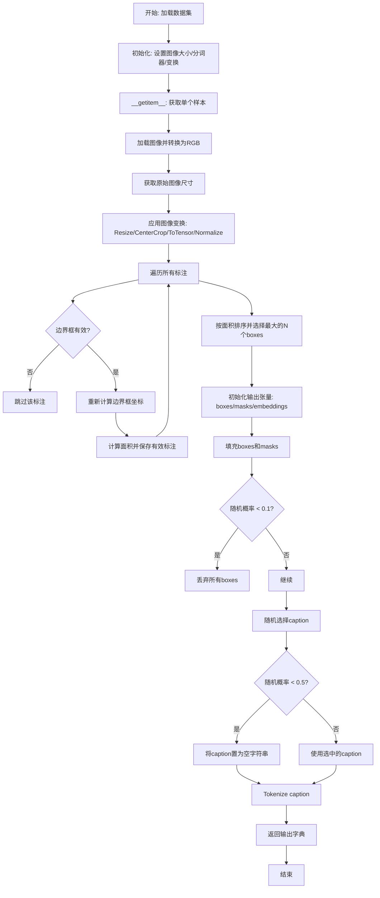
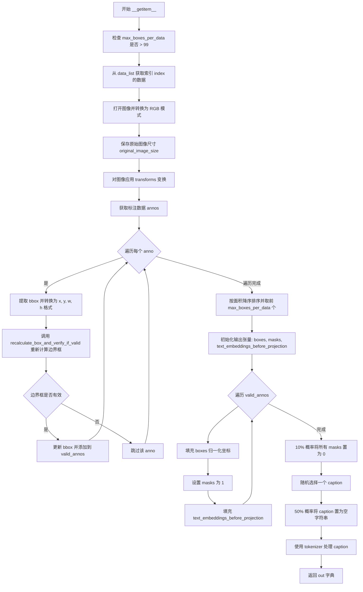

# `diffusers\examples\research_projects\gligen\dataset.py` 详细设计文档

这是一个基于PyTorch的COCO数据集加载类,用于目标检测任务。它负责加载图像、验证和调整边界框、生成文本嵌入,并通过数据增强技术(如随机丢弃boxes和captions)为模型训练提供多样化的输入数据。

## 整体流程



## 类结构

```
COCODataset (torch.utils.data.Dataset)
└── __init__, __getitem__, __len__ 方法

全局函数: recalculate_box_and_verify_if_valid
```

## 全局变量及字段


### `recalculate_box_and_verify_if_valid`
    
根据图像缩放和裁剪重新计算边界框坐标，并验证边界框是否有效

类型：`function`
    


### `COCODataset.min_box_size`
    
最小边界框尺寸阈值

类型：`float`
    


### `COCODataset.max_boxes_per_data`
    
每个图像最大边界框数量

类型：`int`
    


### `COCODataset.image_size`
    
目标图像尺寸

类型：`int`
    


### `COCODataset.image_path`
    
图像文件路径

类型：`str`
    


### `COCODataset.tokenizer`
    
文本分词器

类型：`object`
    


### `COCODataset.transforms`
    
图像变换组合

类型：`transforms.Compose`
    


### `COCODataset.data_list`
    
加载的数据列表

类型：`list`
    


### `recalculate_box_and_verify_if_valid.scale`
    
图像缩放比例

类型：`float`
    


### `recalculate_box_and_verify_if_valid.crop_y`
    
垂直裁剪偏移量

类型：`int`
    


### `recalculate_box_and_verify_if_valid.crop_x`
    
水平裁剪偏移量

类型：`int`
    


### `recalculate_box_and_verify_if_valid.x0`
    
边界框左上角x坐标

类型：`float`
    


### `recalculate_box_and_verify_if_valid.y0`
    
边界框左上角y坐标

类型：`float`
    


### `recalculate_box_and_verify_if_valid.x1`
    
边界框右下角x坐标

类型：`float`
    


### `recalculate_box_and_verify_if_valid.y1`
    
边界框右下角y坐标

类型：`float`
    


### `__getitem__.out`
    
输出字典,包含pixel_values/boxes/masks/text_embeddings_before_projection/caption

类型：`dict`
    


### `__getitem__.data`
    
单个数据项

类型：`dict`
    


### `__getitem__.image`
    
加载的PIL图像

类型：`Image`
    


### `__getitem__.original_image_size`
    
原始图像尺寸

类型：`tuple`
    


### `__getitem__.annos`
    
标注列表

类型：`list`
    


### `__getitem__.areas`
    
有效边界框面积列表

类型：`list`
    


### `__getitem__.valid_annos`
    
有效标注列表

类型：`list`
    


### `__getitem__.wanted_idxs`
    
排序后的索引

类型：`tensor`
    


### `__getitem__.prob_drop_boxes`
    
丢弃所有boxes的概率

类型：`float`
    


### `__getitem__.prob_drop_captions`
    
丢弃caption的概率

类型：`float`
    


### `__getitem__.caption`
    
随机选择的文本描述

类型：`str`
    
    

## 全局函数及方法


### `recalculate_box_and_verify_if_valid`

该函数用于在图像经过缩放和中心裁剪后，重新计算边界框的坐标，并验证裁剪后的边界框面积是否满足最小尺寸要求。如果边界框有效，返回新的坐标 (x0, y0, x1, y1)；否则返回 False 和空值。

参数：

- `x`：`float` 或 `int`，原始边界框左上角的 x 坐标
- `y`：`float` 或 `int`，原始边界框左上角的 y 坐标
- `w`：`float` 或 `int`，原始边界框的宽度
- `h`：`float` 或 `int`，原始边界框的高度
- `image_size`：`int`，目标图像的尺寸（裁剪后的图像大小，通常为正方形边长）
- `original_image_size`：`tuple`，原始图像尺寸，格式为 (width, height)
- `min_box_size`：`float`，最小边界框面积占比阈值（相对于目标图像面积的比例）

返回值：`tuple`，返回值为一个元组，包含两个元素：
- 第一个元素：`bool`，表示边界框是否有效（True 为有效，False 为无效）
- 第二个元素：`tuple`，如果有效则为新的边界框坐标 (x0, y0, x1, y1)，否则为 (None, None, None, None)

#### 流程图

```mermaid
flowchart TD
    A[开始] --> B[计算缩放比例 scale = image_size / min(original_image_size)]
    B --> C[计算裁剪偏移量 crop_x 和 crop_y]
    C --> D[计算新的左上角坐标 x0, y0]
    D --> E[计算新的右下角坐标 x1, y1]
    E --> F{边界框面积是否小于 min_box_size?}
    F -->|是| G[返回 False, (None, None, None, None)]
    F -->|否| H[返回 True, (x0, y0, x1, y1)]
    G --> I[结束]
    H --> I
```

#### 带注释源码

```python
def recalculate_box_and_verify_if_valid(x, y, w, h, image_size, original_image_size, min_box_size):
    """
    重新计算边界框坐标并验证其是否有效
    
    参数:
        x: 原始边界框左上角 x 坐标
        y: 原始边界框左上角 y 坐标
        w: 原始边界框宽度
        h: 原始边界框高度
        image_size: 目标图像尺寸
        original_image_size: 原始图像尺寸 (width, height)
        min_box_size: 最小边界框面积占比阈值
    
    返回:
        (是否有效, 新的边界框坐标或None)
    """
    
    # 计算缩放比例：将原始图像缩放到目标尺寸
    scale = image_size / min(original_image_size)
    
    # 计算中心裁剪的偏移量
    # 缩放后的图像尺寸减去目标尺寸，除以2得到居中裁剪的起始位置
    crop_y = (original_image_size[1] * scale - image_size) // 2
    crop_x = (original_image_size[0] * scale - image_size) // 2
    
    # 将原始边界框坐标映射到缩放和裁剪后的图像坐标系
    # 先乘以缩放比例，再减去裁剪偏移量
    # 使用 max 确保坐标不小于0（不出现在图像左侧/上方）
    x0 = max(x * scale - crop_x, 0)
    y0 = max(y * scale - crop_y, 0)
    
    # 计算右下角坐标：原始位置加宽/高度后再缩放和偏移
    # 使用 min 确保坐标不超过图像边界
    x1 = min((x + w) * scale - crop_x, image_size)
    y1 = min((y + h) * scale - crop_y, image_size)
    
    # 计算边界框面积占比：如果小于最小阈值则判定为无效
    # 面积除以总图像面积得到占比
    if (x1 - x0) * (y1 - y0) / (image_size * image_size) < min_box_size:
        # 边界框太小，返回无效状态
        return False, (None, None, None, None)
    
    # 边界框有效，返回有效状态和新的坐标
    return True, (x0, y0, x1, y1)
```


### `COCODataset.__init__`

初始化 COCO 数据集对象，加载数据列表文件和配置参数，构建图像预处理变换管道。

参数：

- `self`：实例本身
- `data_path`：`str`，数据列表文件路径（通常为 .pt 文件）
- `image_path`：`str`，图像文件所在目录路径
- `image_size`：`int`，目标图像尺寸，默认为 512
- `min_box_size`：`float`，最小边界框尺寸阈值（相对于图像面积的比例），默认为 0.01
- `max_boxes_per_data`：`int`，每张图像最多保留的边界框数量，默认为 8
- `tokenizer`：分词器对象，用于对文本描述进行编码，默认为 None

返回值：`None`，该方法为构造函数，不返回任何值

#### 流程图

```mermaid
flowchart TD
    A[开始 __init__] --> B[调用父类初始化 super().__init__]
    B --> C[设置实例变量: min_box_size, max_boxes_per_data, image_size, image_path, tokenizer]
    C --> D[创建图像变换管道 transforms.Compose]
    D --> E[加载数据列表 torch.load data_path]
    E --> F[结束 __init__]
    
    D --> D1[Resize 到 image_size]
    D1 --> D2[CenterCrop 裁剪]
    D2 --> D3[ToTensor 转为张量]
    D3 --> D4[Normalize 归一化]
```

#### 带注释源码

```python
def __init__(
    self,
    data_path,              # str: 数据列表文件路径（通常为 .pt 格式）
    image_path,             # str: 图像文件所在目录路径
    image_size=512,         # int: 目标图像尺寸，默认为 512x512
    min_box_size=0.01,      # float: 最小边界框尺寸阈值（相对于图像面积的比例）
    max_boxes_per_data=8,  # int: 每张图像最多保留的边界框数量
    tokenizer=None,         # 分词器对象: 用于对文本描述进行编码
):
    # 调用父类 torch.utils.data.Dataset 的初始化方法
    super().__init__()
    
    # 存储最小边界框尺寸阈值，用于后续过滤过小的检测框
    self.min_box_size = min_box_size
    
    # 存储每张图像最大边界框数量，用于控制输出张量维度
    self.max_boxes_per_data = max_boxes_per_data
    
    # 存储目标图像尺寸，用于图像变换和边界框坐标归一化
    self.image_size = image_size
    
    # 存储图像目录路径，用于拼接完整图像文件路径
    self.image_path = image_path
    
    # 存储分词器对象，用于对图像描述进行编码
    self.tokenizer = tokenizer
    
    # 构建图像预处理变换管道：
    # 1. Resize: 将图像缩放到指定尺寸（使用双线性插值）
    # 2. CenterCrop: 从中心裁剪出正方形图像
    # 3. ToTensor: 将 PIL 图像转换为 PyTorch 张量（值域 [0, 1]）
    # 4. Normalize: 归一化到 [-1, 1] 范围（均值 0.5，标准差 0.5）
    self.transforms = transforms.Compose(
        [
            transforms.Resize(image_size, interpolation=transforms.InterpolationMode.BILINEAR),
            transforms.CenterCrop(image_size),
            transforms.ToTensor(),
            transforms.Normalize([0.5], [0.5]),
        ]
    )

    # 从磁盘加载数据列表（.pt 文件），包含图像路径、标注框、文本嵌入等信息
    # map_location="cpu" 确保数据加载到 CPU 内存中
    self.data_list = torch.load(data_path, map_location="cpu")
```


### `COCODataset.__getitem__`

获取指定索引的样本数据，包括图像像素值、边界框、对象掩码、文本嵌入和标题信息，并对边界框进行缩放验证和随机丢弃处理。

参数：

- `self`：`COCODataset` 实例，数据集对象本身
- `index`：`int`，需要获取的样本索引，用于从数据列表中定位具体的数据项

返回值：`Dict[str, Any]`，包含以下字段的字典：
- `pixel_values`：`torch.Tensor`，形状为 (3, image_size, image_size) 的图像张量，已经过Resize、CenterCrop、ToTensor和Normalize变换
- `boxes`：`torch.Tensor`，形状为 (max_boxes_per_data, 4) 的边界框张量坐标已归一化到 [0,1] 范围
- `masks`：`torch.Tensor`，形状为 (max_boxes_per_data,) 的掩码张量，1表示有效对象，0表示无效对象
- `text_embeddings_before_projection`：`torch.Tensor`，形状为 (max_boxes_per_data, 768) 的文本嵌入张量
- `caption`：`Dict`，包含 'input_ids' 和 'attention_mask' 的字典，已被tokenizer处理后的标题文本

#### 流程图



#### 带注释源码

```python
def __getitem__(self, index):
    # 检查是否设置了过大的 boxes 数量上限，防止意外配置
    if self.max_boxes_per_data > 99:
        assert False, "Are you sure setting such large number of boxes per image?"

    # 初始化输出字典，用于存储最终的样本数据
    out = {}

    # 根据索引从预加载的数据列表中获取对应的数据项
    data = self.data_list[index]
    
    # 打开图像文件并转换为 RGB 格式（确保3通道）
    image = Image.open(os.path.join(self.image_path, data["file_path"])).convert("RGB")
    
    # 保存原始图像尺寸，用于后续边界框坐标转换
    original_image_size = image.size
    
    # 对图像应用一系列变换：调整大小、中心裁剪、转为张量、归一化
    out["pixel_values"] = self.transforms(image)

    # 获取该图像的所有标注信息
    annos = data["annos"]

    # 遍历所有标注，重新计算边界框坐标并验证有效性
    areas, valid_annos = [], []
    for anno in annos:
        # 从标注中提取边界框坐标 (x0, y0, x1, y1)
        x0, y0, x1, y1 = anno["bbox"]
        # 转换为 (x, y, w, h) 格式
        x, y, w, h = x0, y0, x1 - x0, y1 - y0
        
        # 调用辅助函数重新计算边界框并验证是否满足最小尺寸要求
        valid, (x0, y0, x1, y1) = recalculate_box_and_verify_if_valid(
            x, y, w, h, self.image_size, original_image_size, self.min_box_size
        )
        
        # 如果边界框有效，则更新坐标并添加到有效标注列表
        if valid:
            anno["bbox"] = [x0, y0, x1, y1]
            # 计算边界框面积用于后续排序
            areas.append((x1 - x0) * (y1 - y0))
            valid_annos.append(anno)

    # 将面积列表转为张量以便排序，获取降序排列的索引
    wanted_idxs = torch.tensor(areas).sort(descending=True)[1]
    # 只保留面积最大的前 max_boxes_per_data 个对象
    wanted_idxs = wanted_idxs[: self.max_boxes_per_data]
    # 根据索引重新排列有效标注列表
    valid_annos = [valid_annos[i] for i in wanted_idxs]

    # 初始化输出张量，默认值为零
    out["boxes"] = torch.zeros(self.max_boxes_per_data, 4)
    out["masks"] = torch.zeros(self.max_boxes_per_data)
    out["text_embeddings_before_projection"] = torch.zeros(self.max_boxes_per_data, 768)

    # 遍历有效标注，填充对应的输出数据
    for i, anno in enumerate(valid_annos):
        # 将边界框坐标归一化到 [0, 1] 范围（除以图像尺寸）
        out["boxes"][i] = torch.tensor(anno["bbox"]) / self.image_size
        # 设置掩码为 1，表示该位置有有效对象
        out["masks"][i] = 1
        # 填充该对象的文本嵌入
        out["text_embeddings_before_projection"][i] = anno["text_embeddings_before_projection"]

    # 10% 的概率将所有对象掩码置为 0（用于训练中的对象丢弃）
    prob_drop_boxes = 0.1
    if random.random() < prob_drop_boxes:
        out["masks"][:] = 0

    # 从该图像的多个标题中随机选择一个
    caption = random.choice(data["captions"])

    # 50% 的概率将标题置为空字符串（用于无条件生成训练）
    prob_drop_captions = 0.5
    if random.random() < prob_drop_captions:
        caption = ""
    
    # 使用 tokenizer 将标题转换为模型输入格式
    caption = self.tokenizer(
        caption,
        max_length=self.tokenizer.model_max_length,
        padding="max_length",
        truncation=True,
        return_tensors="pt",
    )
    out["caption"] = caption

    return out
```


### `COCODataset.__len__`

该方法实现了 Python 数据集类的标准接口，返回 COCO 数据集中包含的样本总数，用于 PyTorch DataLoader 确定迭代次数。

参数：无（仅包含隐式参数 `self`）

返回值：`int`，返回加载的数据列表 `self.data_list` 的长度，即数据集中图像样本的总数。

#### 流程图

```mermaid
flowchart TD
    A[开始 __len__] --> B{self.data_list 存在?}
    B -->|是| C[返回 len(self.data_list)]
    B -->|否| D[返回 0 或抛出异常]
    C --> E[结束]
    D --> E
```

#### 带注释源码

```python
def __len__(self):
    """
    返回数据集的长度。
    
    这是 PyTorch Dataset 类的标准接口方法，允许 DataLoader 
    知道数据集的大小以便进行批量迭代。
    
    Returns:
        int: 数据集中样本的数量，等同于 self.data_list 的长度
    """
    return len(self.data_list)  # 返回加载的数据列表的长度
```

## 关键组件


### COCODataset 类

COCODataset 是核心数据集类，继承自 torch.utils.data.Dataset，用于加载 COCO 格式的目标检测或图像描述数据。该类实现了完整的 PyTorch Dataset 接口，支持图像加载、边界框坐标转换、文本嵌入提取、随机数据增强（框和标题丢弃）等功能。

### recalculate_box_and_verify_if_valid 全局函数

该函数负责将原始图像中的边界框坐标转换到经过 Resize 和 CenterCrop 后的图像坐标系中，并验证转换后的边界框面积是否满足最小尺寸要求。它通过计算缩放比例和裁剪偏移量来实现坐标映射，确保边界框在数据增强后仍能正确对应目标。

### 图像变换管道 (transforms.Compose)

由 transforms.Resize、transforms.CenterCrop、transforms.ToTensor 和 transforms.Normalize 组成的图像预处理管道，将 PIL 图像转换为归一化的张量（均值和标准差均为 0.5）。

### 边界框排序与选择逻辑

通过计算所有有效边界框的面积，使用 torch.tensor 和 sort 方法按面积降序排序，选择最大的 N（max_boxes_per_data）个边界框，实现对最重要目标的优先处理。

### 随机数据丢弃策略

在 __getitem__ 方法中实现了两个随机丢弃机制：以 10% 的概率丢弃所有边界框（prob_drop_boxes），以 50% 的概率丢弃标题文本（prob_drop_captions），用于训练过程中的数据增强。

### 文本编码 (tokenizer)

使用传入的 tokenizer 对选中的标题进行编码，返回填充到最大长度的张量，包含 input_ids 和 attention_mask 等信息，用于后续的文本嵌入提取。

### 数据结构输出

__getitem__ 方法返回一个包含 pixel_values（图像张量）、boxes（归一化边界框）、masks（有效框掩码）、text_embeddings_before_projection（文本嵌入）和 caption（编码后的标题）的字典。


## 问题及建议


### 已知问题

-   **缺少文件存在性检查**：在加载图像时未检查文件路径是否存在，程序会直接抛出异常而不是给出友好提示
-   **空数据处理缺失**：当`areas`列表为空时（即所有标注框都被过滤掉），执行`torch.tensor(areas).sort()`会导致程序崩溃
-   **Tokenizer空值风险**：构造函数中`tokenizer`参数可以为`None`，但在`__getitem__`中直接调用`self.tokenizer()`会抛出`TypeError`
-   **魔法数字硬编码**：`prob_drop_boxes=0.1`和`prob_drop_captions=0.5`作为魔法数字散布在代码中，配置分散且难以调整
-   **无效断言位置**：`max_boxes_per_data > 99`的检查放在`__getitem__`方法中（每次获取数据时都会执行），应该在`__init__`构造函数中检查
-   **边界框验证缺失**：将`x0, y0, x1, y1`转换为`x, y, w, h`时未验证`x1>x0`和`y1>y0`，可能产生负数宽高
-   **图像加载无缓存**：每次调用`__getitem__`都重新从磁盘读取同一张图像，未利用`Dataset`的多epoch特性进行缓存
-   **边界框归一化越界**：除以`self.image_size`后未限制在`[0,1]`范围，可能产生略微超出范围的值

### 优化建议

-   **添加初始化验证**：在`__init__`中检查`data_path`和`image_path`是否存在、`tokenizer`是否为`None`、`max_boxes_per_data`是否合理
-   **处理空标注情况**：在使用`areas`排序前检查其是否为空列表，为空时直接返回全零张量
-   **提取配置参数**：将`prob_drop_boxes`和`prob_drop_captions`提取为`__init__`的可配置参数，或使用类属性常量
-   **添加图像缓存机制**：考虑使用`functools.lru_cache`或预加载热门图像到内存，减少重复IO
-   **添加类型注解**：为函数参数和返回值添加类型提示，提高代码可维护性
-   **边界框范围限制**：在归一化后使用`torch.clamp()`确保边界框坐标在`[0,1]`范围内
-   **数据验证增强**：在处理边界框坐标时验证`x1>x0`和`y1>y0`，过滤无效标注
-   **注释清理**：删除注释掉的代码（`# x, y, w, h = anno['bbox']`），保持代码整洁


## 其它


### 设计目标与约束

本代码实现了一个用于目标检测任务的COCO数据集加载器，支持图像预处理、边界框坐标变换、按面积排序选取最大目标、随机丢弃Boxes和Captions进行数据增强。约束条件包括：image_size必须为正整数，min_box_size为相对面积比例(0-1)，max_boxes_per_data应小于100。

### 错误处理与异常设计

代码中的错误处理主要包括：
1. `__getitem__`方法中对`max_boxes_per_data > 99`进行断言检查，防止配置错误
2. 文件路径不存在时`Image.open`会抛出IOError
3. `torch.load`加载数据失败时抛出异常
4. `recalculate_box_and_verify_if_valid`函数返回(False, (None, None, None, None))表示无效框
5. 随机数据增强导致的空caption场景通过概率控制

建议增加：更详细的错误日志、文件路径验证、数据格式校验、异常类型分类处理。

### 外部依赖与接口契约

外部依赖包括：
- `os`, `random`, `torch`, `torchvision.transforms`, `PIL.Image`

接口契约：
- `data_path`: 必须是通过`torch.save`保存的包含data_list的文件路径
- `data_list`每个元素必须包含`file_path`(str)、`annos`(list of dict)、`captions`(list of str)
- `annos`中每个元素必须包含`bbox`(list [x0,y0,x1,y1])和`text_embeddings_before_projection`(tensor)
- `tokenizer`必须具有`model_max_length`属性和`__call__`方法

### 性能考虑与优化空间

性能瓶颈：
1. `torch.load(data_path, map_location="cpu")`在`__init__`中加载全部数据，内存占用高
2. 每个样本都进行`Image.open`磁盘IO
3. `transforms`中Resize+CenterCrop效率可优化
4. 循环中多次tensor操作可向量化

优化建议：
- 考虑使用内存映射或流式加载
- 增加`__getitem__`中的图像缓存机制
- 考虑使用`interpolation=transforms.InterpolationMode.BICUBIC`提升质量
- 预先计算并缓存sorted indices避免重复计算

### 配置与参数设计

关键配置参数：
- `image_size`: 输出图像尺寸，默认512，建议范围[224, 1024]
- `min_box_size`: 最小框占比，默认0.01，建议范围[0.001, 0.1]
- `max_boxes_per_data`: 每张图最大框数，默认8，建议范围[1, 50]
- `prob_drop_boxes`: 随机丢弃所有框的概率，默认0.1
- `prob_drop_captions`: 随机丢弃caption的概率，默认0.5

### 安全与数据验证

安全考虑：
- `os.path.join`防止路径注入
- `max/min`边界保护防止坐标越界

数据验证建议：
- 验证`bbox`坐标格式和有效性
- 验证`text_embeddings_before_projection`维度为768
- 验证`image_path`目录存在性
- 验证`captions`非空

### 可扩展性与未来改进方向

扩展方向：
1. 支持多种数据增强策略（随机裁剪、旋转等）
2. 支持更多输出格式（COCO, YOLO等）
3. 支持分布式数据加载
4. 支持缓存机制减少重复IO
5. 支持自定义tokenizer
6. 支持加载视频数据
7. 增加预处理器流水线支持


    