# `diffusers\examples\research_projects\gligen\make_datasets.py` 详细设计文档

这是一个自动化图像标注生成流水线，结合了RAM图像标签提取、Grounding DINO零样本目标检测、BLIP-2图像字幕生成和CLIP文本编码等多个视觉-语言模型，为COCO数据集中的图像生成带有边界框和描述的标注数据。

## 整体流程

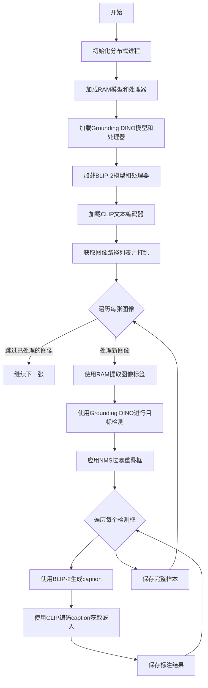

## 类结构

```
无自定义类 (脚本形式运行)
```

## 全局变量及字段


### `box_threshold`
    
目标检测的置信度阈值，用于过滤低置信度的检测框

类型：`float`
    


### `text_threshold`
    
文本匹配的置信度阈值，用于过滤低置信度的文本标签

类型：`float`
    


### `local_rank`
    
当前进程的GPU设备编号，用于多GPU分布式训练时的设备分配

类型：`int`
    


### `device`
    
CUDA设备字符串，格式为cuda:{local_rank}，指定模型运行的GPU设备

类型：`str`
    


### `image_paths`
    
图像文件路径列表，包含数据目录下所有图像的完整路径

类型：`list`
    


### `sample`
    
存储单张图像标注结果的字典，包含文件路径和标注框列表

类型：`dict`
    


    

## 全局函数及方法


### `argparse.ArgumentParser`

用于配置命令行参数解析的核心类，通过创建ArgumentParser实例并添加参数定义，可以方便地解析命令行输入的参数。在本代码中用于定义Caption Generation脚本所需的数据路径、模型路径等配置参数。

参数（`__init__` 方法）：

- `prog`：`str`，程序名称，默认为 `sys.argv[0]`
- `description`：`str`，参数解析器的描述信息，本例中为 `"Caption Generation script"`
- `add_help`：`bool`，是否添加 `-h/--help` 选项，本例中设为 `False`

返回值：`argparse.Namespace`，包含解析后的命令行参数对象，通过属性访问（如 `args.data_root`）

#### 流程图

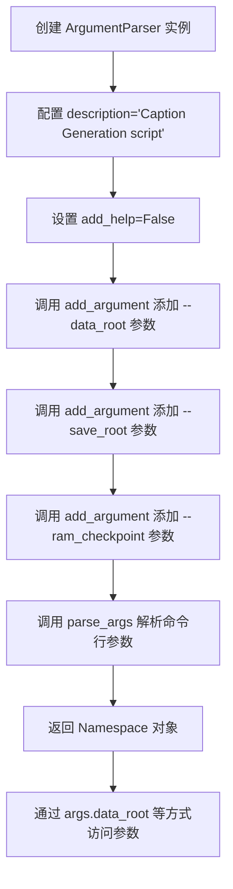

#### 带注释源码

```python
# 导入 argparse 模块
import argparse

# 创建 ArgumentParser 实例
# 参数说明：
#   description: 程序描述信息
#   add_help: False 表示不自动添加 -h/--help 选项
parser = argparse.ArgumentParser("Caption Generation script", add_help=False)

# 添加 --data_root 参数
#   type=str: 参数值为字符串类型
#   required=True: 该参数为必需参数
#   help: 参数的帮助信息描述
parser.add_argument("--data_root", type=str, required=True, help="path to COCO")

# 添加 --save_root 参数
parser.add_argument("--save_root", type=str, required=True, help="path to save")

# 添加 --ram_checkpoint 参数
parser.add_argument("--ram_checkpoint", type=str, required=True, help="path to save")

# 解析命令行参数
# 读取 sys.argv 中的命令行参数
# 返回一个 Namespace 对象，包含所有定义的参数
args = parser.parse_args()

# 访问解析后的参数
# 例如：args.data_root, args.save_root, args.ram_checkpoint
```


### `os.path.join`

`os.path.join` 是 Python 标准库 `os.path` 模块中的路径拼接函数，用于将多个路径组件智能地合并成一个完整的路径。

参数：

- `path`：`str`，基础路径，作为拼接的起始部分
- `*paths`：可变数量的 `str` 参数，后续的路径组件（如文件名、子目录名等）

返回值：`str`，返回拼接后的完整路径字符串

#### 流程图

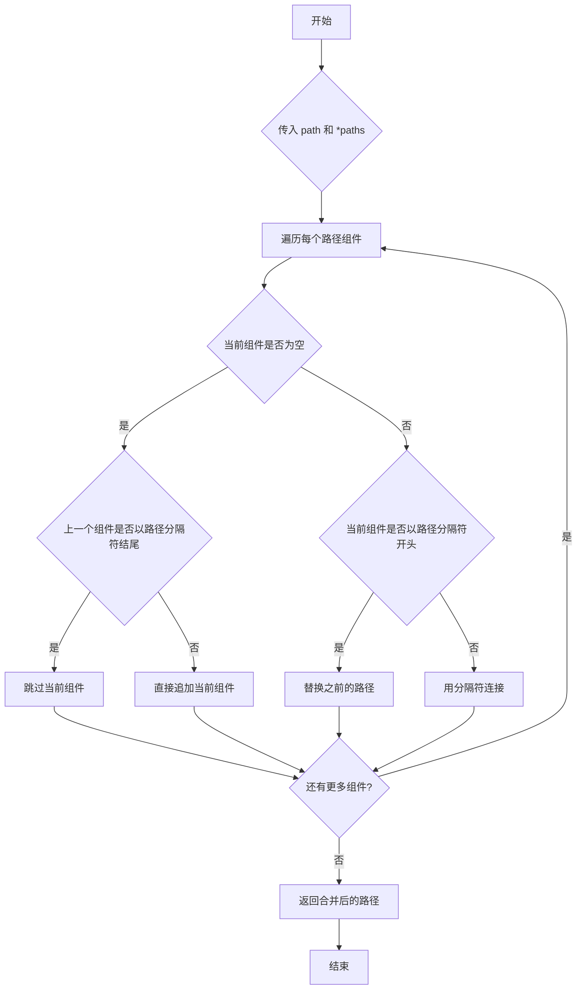

#### 带注释源码

```python
# os.path.join 函数实现原理（Python 标准库）

# 在代码中的实际使用：
# 1. image_paths = [os.path.join(args.data_root, x) for x in os.listdir(args.data_root)]
#    - 将 data_root 目录路径与目录中的每个文件名拼接，形成完整的文件路径列表
#
# 2. pth_path = os.path.join(args.save_root, os.path.basename(image_path))
#    - 先获取 image_path 的文件名（basename），然后与 save_root 拼接形成保存路径

# 示例说明：
# os.path.join('/root/data', 'image.jpg')
# 返回: '/root/data/image.jpg' (在 Linux/Mac 上)
# 返回: '\\root\\data\\image.jpg' (在 Windows 上)

# 关键特性：
# - 自动处理不同操作系统的路径分隔符（/ 或 \）
# - 智能处理多个斜杠、相对路径（如 '..'、'.'）
# - 避免重复的路径分隔符
```


### `os.listdir`

`os.listdir` 是 Python 标准库 os 模块中的一个函数，用于列出指定目录下的所有文件和子目录名称。该函数返回包含文件（和目录）名称的列表，不包含路径前缀。

参数：

- `path`：`str` 或 `os.PathLike`，要列出内容的目录路径。如果未指定或为 `None`，则默认为当前工作目录。

返回值：`list[str]`，返回包含目录中所有文件和子目录名称的列表（仅包含名称，不包含完整路径）。

#### 流程图

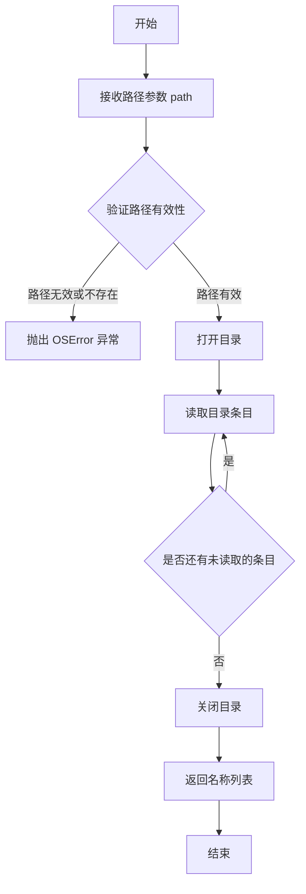

#### 带注释源码

```python
# 在给定代码中的使用方式：
image_paths = [os.path.join(args.data_root, x) for x in os.listdir(args.data_root)]

# os.listdir(args.data_root) 的作用：
# 1. 接收 args.data_root 参数（字符串类型，COCO 数据集目录路径）
# 2. 列出该目录下的所有文件和子目录名称
# 3. 返回一个列表，例如：['0001.jpg', '0002.jpg', 'annotations', ...]

# 示例：
# 假设 args.data_root = '/mnt/workspace/dataset/COCO/train2017'
# os.listdir 返回：['000000000009.jpg', '000000001268.jpg', ...]
# 然后通过列表推导式，为每个文件名添加完整路径前缀
# 结果：['/mnt/workspace/dataset/COCO/train2017/000000000009.jpg', ...]

# 注意事项：
# - 返回的列表不保证任何特定顺序（除非使用 os.scandir 获取的 DirEntry 排序）
# - 不包含 '.' 和 '..' 这两个特殊目录
# - 不递归进入子目录
# - 如果目录不存在，会抛出 FileNotFoundError
# - 如果路径是文件而非目录，也会抛出 OSError
```


### `random.shuffle`

随机打乱列表中的元素顺序（原地修改，不返回新列表）。

参数：

-  `x`：`list`，需要打乱的列表，直接在原列表上进行修改
-  `random`：`optional`，随机数生成器函数，默认为 `random.random`

返回值：`None`，该函数直接修改传入的列表，不返回任何值

#### 流程图

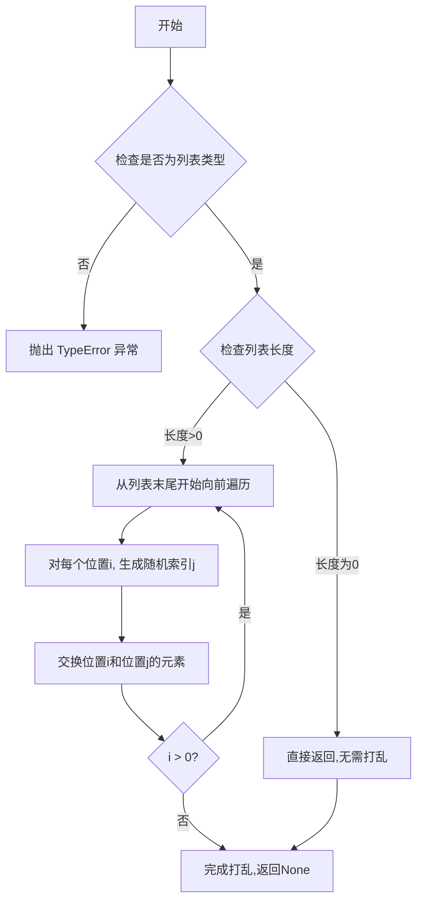

#### 带注释源码

```python
def shuffle(self, x, random=None):
    """
    打乱列表 x 的顺序.
    
    参数:
        x: 需要打乱的列表
        random: 可选的随机数生成函数,默认为 random.random
    
    返回:
        None (原地修改)
    """
    if random is None:
        # 使用默认的随机函数
        randbelow = self._randbelow
        for i in reversed(range(1, len(x))):
            # 生成 0 到 i 之间的随机索引
            j = randbelow(i + 1)
            # 原地交换元素
            x[i], x[j] = x[j], x[i]
    else:
        # 使用自定义的随机函数
        for i in reversed(range(1, len(x))):
            # 调用用户提供的随机函数生成索引
            j = random.randint(0, i)
            # 原地交换元素
            x[i], x[j] = x[j], x[i]
```

#### 在项目中的使用

```python
# 从指定目录获取所有文件路径
image_paths = [os.path.join(args.data_root, x) for x in os.listdir(args.data_root)]
# 随机打乱图像路径顺序,确保数据处理顺序的随机性
random.shuffle(image_paths)
```

**使用场景说明**：在该图像标注生成脚本中，`random.shuffle` 用于随机打乱要处理的图像文件路径列表。这样做的主要目的是：

1. **负载均衡**：在分布式训练或多进程处理时，避免所有进程同时处理同一个目录下的文件
2. **数据多样性**：确保数据处理的顺序具有随机性，不依赖于文件系统返回的顺序
3. **增量处理**：配合后续的 `if os.path.exists(pth_path): continue` 逻辑，可以实现断点续传功能，随机顺序可以更好地利用之前已处理的结果


### `Image.open`

该函数是 Python Imaging Library (PIL) 中的核心函数，用于打开指定路径的图像文件并返回一个 PIL Image 对象，支持多种图像格式（如 JPEG、PNG、BMP 等）。

参数：

- `file`：`str` 或 `file object`，图像文件的路径（字符串）或打开的文件对象
- `mode`：`str`，打开模式，默认为 `"r"`（只读）
- `formats`：`tuple` 或 `None`，允许的图像格式列表，默认为 `None`（支持所有格式）

返回值：`PIL.Image.Image`，返回一个 PIL Image 对象，可对其进行图像处理操作

#### 流程图

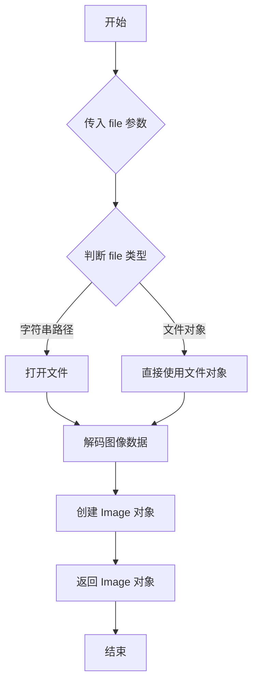

#### 带注释源码

```python
# 代码中的实际调用
raw_image = Image.open(image_path).convert("RGB")

# Image.open 函数原型（简化自 PIL 库源码）
def open(fp, mode="r", formats=None):
    """
    打开并识别给定图像文件。
    
    参数:
        fp: 文件路径（字符串）或文件对象
        mode: 模式，'r' 表示读取
        formats: 支持的格式列表，None 表示自动检测
    
    返回:
        PIL.Image.Image: Image 对象实例
    """
    
    # 1. 根据文件路径或文件对象加载图像数据
    # 2. 根据图像格式自动解码
    # 3. 返回 PIL Image 对象
    
# 在本代码中的具体使用
raw_image = Image.open(image_path)    # 打开图像文件
raw_image = raw_image.convert("RGB")   # 转换为 RGB 模式（确保3通道）
```

#### 技术债务与优化空间

1. **缺少异常处理**：代码中未对 `Image.open` 可能抛出的异常（如文件不存在、格式不支持、文件损坏等）进行处理
2. **未检查文件是否存在**：在调用 `Image.open` 前可先检查文件是否存在，提升代码健壮性
3. **图像加载效率**：对于大规模图像处理，可考虑使用 `Image.open` 的延迟加载特性或缓存机制


### `ram` (加载RAM模型)

该函数用于加载Recognize Anything Model (RAM)预训练模型，支持图像标签识别任务。通过指定预训练权重路径、图像尺寸和视觉Transformer架构，初始化并配置模型用于后续的图像标签提取。

参数：

- `pretrained`：`str`，预训练模型权重文件的路径
- `image_size`：`int`，输入图像的目标尺寸（默认为384）
- `vit`：`str`，视觉Transformer的架构类型（如"swin_l"）

返回值：`torch.nn.Module`，返回加载后的RAM模型实例

#### 流程图

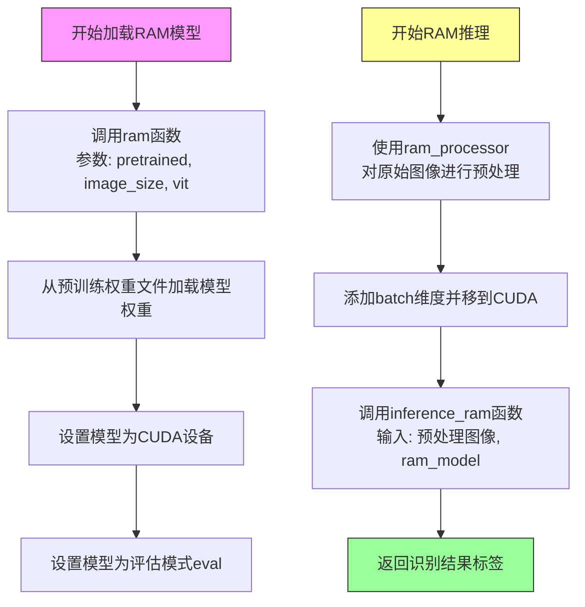

#### 带注释源码

```python
# 加载RAM模型的核心代码

# 方式1: 模型加载函数
ram_model = ram(pretrained=args.ram_checkpoint, image_size=384, vit="swin_l").cuda().eval()
# 参数说明:
#   - pretrained: 从指定路径加载预训练权重
#   - image_size: 将输入图像resize到384x384
#   - vit: 使用swin_large视觉Transformer架构
#   .cuda(): 将模型移至GPU设备
#   .eval(): 设置为评估模式,禁用dropout和batch normalization更新

# 方式2: 图像预处理pipeline
ram_processor = TS.Compose([
    TS.Resize((384, 384)),  # 将图像resize到384x384
    TS.ToTensor(),          # 转换为PyTorch张量 [0,1]范围
    TS.Normalize(           # ImageNet标准化
        mean=[0.485, 0.456, 0.406],  # ImageNet均值
        std=[0.229, 0.224, 0.225]    # ImageNet标准差
    )
])

# 方式3: 模型推理
res = inference_ram(
    ram_processor(raw_image).unsqueeze(0).cuda(),  # 预处理: (1,3,384,384)
    ram_model                                        # RAM模型实例
)
# 返回格式: ["label1 | label2 | label3", ...]
text = res[0].replace(" |", ".")  # 转换为Grounding DINO格式
```


### `inference_ram`

该函数是 Recognize Anything Model (RAM) 的推理接口，用于对输入图像进行自动标签标注，识别并返回图像中的物体类别标签。

参数：

- `image_tensor`：`torch.Tensor`，经过预处理（Resize、ToTensor、Normalize）的图像张量，形状通常为 (batch_size, 3, 384, 384)
- `model`：`ram.models.ram.RAM`，预加载的 RAM 深度学习模型，用于对图像进行推理

返回值：`List[str]`，包含识别到的物体标签列表，通常以 " | " 分隔的字符串形式返回

#### 流程图

```mermaid
graph TD
    A[输入图像] --> B[ram_processor 预处理]
    B --> C[图像张量 unsqueeze 和 cuda 移动]
    C --> D[调用 inference_ram 函数]
    D --> E[RAM 模型推理]
    E --> F[返回标签结果 List[str]]
    F --> G[提取标签文本并替换分隔符]
```

#### 带注释源码

```python
# inference_ram 是从 ram 库导入的推理函数
# 使用方式如下（对应代码中的第 62-63 行）：

# 1. 对原始图像进行预处理
processed_image = ram_processor(raw_image)  # 使用 torchvision transforms 预处理
processed_image = processed_image.unsqueeze(0).cuda()  # 增加 batch 维度并移到 GPU

# 2. 调用 inference_ram 进行推理
res = inference_ram(processed_image, ram_model)

# 3. 处理返回结果
# 返回值 res 是一个 List[str]，第一个元素是标签字符串
# 格式如: "cat | dog | person | car"
text = res[0].replace(" |", ".")  # 替换分隔符为句号
# 结果: "cat. dog. person. car"

# inference_ram 函数原型（来自 ram 库）
# def inference_ram(image_tensor, model):
#     """
#     Perform inference on the input image using RAM model.
    
#     Args:
#         image_tensor: Preprocessed image tensor [B, 3, H, W]
#         model: RAM model instance
    
#     Returns:
#         List of detected tags/labels
#     """
#     ...
```


### `TS.Compose`

该函数是 torchvision.transforms 模块中的图像变换组合函数，用于将多个图像预处理操作（Resize、ToTensor、Normalize）串联成一个完整的图像处理管道，对输入图像依次执行各变换操作并返回处理后的结果。

参数：

- `transforms`：`list`，包含多个变换操作对象的列表（如 TS.Resize、TS.ToTensor、TS.Normalize），这些操作将按顺序依次应用于输入图像

返回值：`torch.nn.Module`，返回一个可调用的组合变换模块，调用时将输入图像依次通过列表中的每个变换操作并返回最终处理结果

#### 流程图

```mermaid
flowchart TD
    A[输入原始图像] --> B[TS.Resize<br/>调整图像尺寸为384x384]
    B --> C[TS.ToTensor<br/>将PIL图像转换为Tensor]
    C --> D[TS.Normalize<br/>使用ImageNet均值和标准差归一化]
    D --> E[输出处理后的Tensor]
    
    B --> B1[保持宽高比的条件下将短边缩放至384]
    B1 --> B2[裁剪或填充至384x384]
    
    C --> C1[将像素值从0-255归一化至0-1]
    C1 --> C2[将HWC格式转换为CHW格式]
    
    D --> D1[减均值: mean=[0.485, 0.456, 0.406]]
    D1 --> D2[除标准差: std=[0.229, 0.224, 0.225]]
```

#### 带注释源码

```python
# 导入图像变换模块
import torchvision.transforms as TS

# 使用 TS.Compose 组合多个图像预处理操作
# 该组合变换将依次执行: Resize -> ToTensor -> Normalize
ram_processor = TS.Compose(
    [
        # 步骤1: TS.Resize - 将图像调整至 (384, 384) 尺寸
        # 输入: PIL Image 或 numpy array
        # 输出: 调整尺寸后的 PIL Image
        TS.Resize((384, 384)),
        
        # 步骤2: TS.ToTensor - 将 PIL Image 转换为 PyTorch Tensor
        # 输入: PIL Image (HWC格式, 像素0-255)
        # 输出: Tensor (CHW格式, 像素0-1)
        TS.ToTensor(),
        
        # 步骤3: TS.Normalize - 使用 ImageNet 数据集的均值和标准差进行标准化
        # 输入: Tensor (已归一化至0-1)
        # 输出: Tensor (均值为0, 标准差为1, 范围大致在-2至2之间)
        # mean: R/G/B通道的均值 [0.485, 0.456, 0.406]
        # std:  R/G/B通道的标准差 [0.229, 0.224, 0.225]
        TS.Normalize(mean=[0.485, 0.456, 0.406], std=[0.229, 0.224, 0.225])
    ]
)

# 使用示例:
# raw_image = Image.open("example.jpg").convert("RGB")
# processed_tensor = ram_processor(raw_image)  # 返回形状为 (3, 384, 384) 的 Tensor
```


### `TS.Resize`

TS.Resize 是 torchvision.transforms 模块中的图像尺寸调整变换，用于将输入图像resize到指定的尺寸(384x384)，以满足后续模型输入的尺寸要求。

参数：

- `size`：`int` 或 `tuple`，目标尺寸，此处为 (384, 384)，表示将图像调整為384x384像素
- `interpolation`：`InterpolationMode`，插值方式，默认为 PIL.Image.BILINEAR
- `max_size`：`int`，可选参数，用于限制最大边
- `antialias`：`bool`，可选参数，是否应用抗锯齿

返回值：`PIL.Image` 或 `Tensor`，返回调整尺寸后的图像对象

#### 流程图

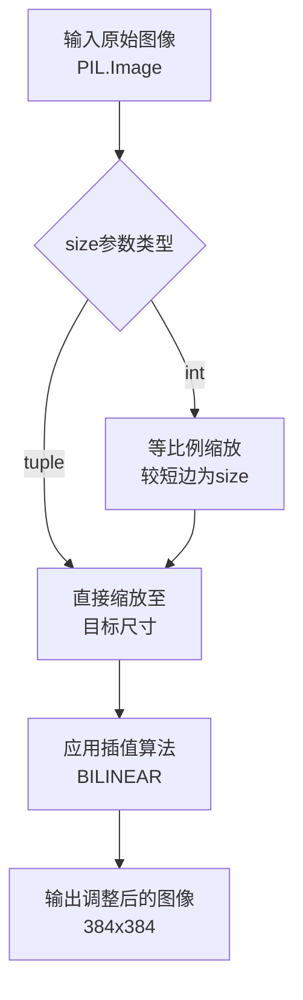

#### 带注释源码

```python
# 代码中的实际使用方式
ram_processor = TS.Compose(
    [
        # TS.Resize: 将图像调整为384x384像素的变换
        # 参数 (384, 384) 表示目标输出宽度和高度均为384像素
        # 该变换会自动处理不同尺寸的输入图像，统一调整为固定尺寸
        # 这对于确保后续深度学习模型输入尺寸一致性至关重要
        TS.Resize((384, 384)), 
        
        # ToTensor: 将PIL Image转换为PyTorch Tensor
        TS.ToTensor(), 
        
        # Normalize: 使用ImageNet标准化参数对图像进行归一化
        TS.Normalize(mean=[0.485, 0.456, 0.406], std=[0.229, 0.224, 0.225])
    ]
)
```

#### 上下文使用说明

在代码中，`TS.Resize` 作为图像预处理流水线的一部分，位于 `ram_processor` 组合变换中：

1. **输入**：原始RGB图像（PIL.Image对象）
2. **处理**：将图像resize到384x384固定尺寸
3. **输出**：调整大小后的PIL.Image，传递给后续的 `ToTensor()` 和 `Normalize()` 变换
4. **目的**：确保RAM模型接收到统一尺寸的输入图像，这是视觉语言模型推理流程中的标准化预处理步骤


### TS.ToTensor

将 PIL 图像或 numpy 数组转换为 PyTorch 张量的图像变换操作，是 torchvision.transforms 模块中的核心转换类。该转换器会自动将输入图像的像素值归一化到 [0, 1] 范围内，并将图像维度从 HWC（高度×宽度×通道）格式转换为 CHW（通道×高度×宽度）格式，以符合 PyTorch 模型的输入要求。

参数：

- 无参数（ToTensor 是无参数的变换类，在 Compose 中作为可调用对象使用）

返回值：`torch.Tensor`，转换后的 PyTorch 张量，形状为 (C, H, W)，像素值范围 [0, 1]

#### 流程图

```mermaid
graph LR
    A[PIL Image<br/>或 numpy array] --> B{判断输入类型}
    B -->|PIL Image| C[torch.from_numpy<br/>转换为张量]
    B -->|numpy array| D[torch.from_numpy<br/>转换为张量]
    C --> E[除以 255<br/>归一化到 [0,1]]
    D --> E
    E --> F{判断维度}
    F -->|3维 HWC| G[permute 2,0,1<br/>转换为 CHW]
    F -->|2维 HW| H[保持不变]
    G --> I[torch.Tensor 输出]
    H --> I
```

#### 带注释源码

```python
# 在项目中的实际使用方式：
ram_processor = TS.Compose(
    [
        TS.Resize((384, 384)),      # 首先调整图像大小为 384x384
        TS.ToTensor(),              # 然后将 PIL Image 转换为张量 (C,H,W)，值范围 [0,1]
        TS.Normalize(mean=[0.485, 0.456, 0.406], std=[0.229, 0.224, 0.225])  # 最后标准化
    ]
)

# 调用示例：
raw_image = Image.open(image_path).convert("RGB")  # 读取为 PIL Image (H, W, C)
tensor_image = ram_processor(raw_image)              # 转换为 torch.Tensor (C, H, W)
# 内部 ToTensor 实际执行：
# 1. 将 PIL Image 转为 numpy 数组
# 2. 归一化：img = img.astype(np.float32) / 255.0
# 3. 维度转换：如果是 (H, W, C) 则 permute 为 (C, H, W)
```


### TS.Normalize

归一化函数，用于将图像张量的像素值从 [0, 1] 范围转换到标准正态分布（均值为0，标准差为1），是深度学习模型输入预处理的标准步骤，确保不同来源的图像数据具有一致的数值分布。

参数：

- `mean`：list[float]，用于每个通道的均值，代码中为 [0.485, 0.456, 0.406]，对应 ImageNet 数据集的 RGB 三通道均值
- `std`：list[float]，用于每个通道的标准差，代码中为 [0.229, 0.224, 0.225]，对应 ImageNet 数据集的 RGB 三通道标准差

返回值：`Tensor`，归一化后的图像张量，形状为 (C, H, W)，其中 C=3（RGB三通道）

#### 流程图

```mermaid
graph LR
    A[输入图像张量<br/>shape: 3xHxW<br/>值范围: [0, 1]] --> B[TS.Normalize]
    B --> C[输出归一化张量<br/>shape: 3xHxW<br/>值范围: 近似 [-2, 2]]
    
    subgraph 归一化公式
    B --> D[output = (input - mean) / std]
    end
    
    style A fill:#e1f5fe
    style B fill:#fff3e0
    style C fill:#e8f5e9
```

#### 带注释源码

```python
# 创建归一化变换管道
ram_processor = TS.Compose(
    [
        TS.Resize((384, 384)),      # 首先将图像 resize 到 384x384
        TS.ToTensor(),               # 将 PIL Image 转换为张量，值范围从 [0, 255] 归一化到 [0, 1]
        TS.Normalize(                # 核心归一化操作
            mean=[0.485, 0.456, 0.406],  # ImageNet RGB 三通道均值
            std=[0.229, 0.224, 0.225]    # ImageNet RGB 三通道标准差
        )
    ]
)

# 实际调用示例
# raw_image: PIL Image, RGB 格式
# 经过 ram_processor(raw_image) 后:
#   1. Resize 到 384x384
#   2. 转换为张量，shape (3, 384, 384)，值范围 [0, 1]
#   3. Normalize 归一化:
#      - R 通道: (r - 0.485) / 0.229
#      - G 通道: (g - 0.456) / 0.224
#      - B 通道: (b - 0.406) / 0.225
#      最终值范围近似 [-2.1, 2.1]
```

#### 补充说明

| 项目 | 说明 |
|------|------|
| **函数类型** | torchvision.transforms.Normalize（PyTorch 标准库函数） |
| **设计目标** | 使图像数据符合预训练模型（ResNet 等）的输入分布 expectation |
| **数值范围** | 输入 [0, 1] → 输出近似 [-2.5, 2.5]（3σ 原则） |
| **逆操作** | Denormalize: `output * std + mean` |
| **在流程中的作用** | 将原始图像转换为 RAM 模型可接受的标准化输入 |


### `AutoProcessor.from_pretrained`

该函数是 Hugging Face Transformers 库中的 `AutoProcessor` 类的类方法，用于从预训练模型或微调模型中加载对应的处理器（Processor）。在代码中，它加载了 Grounding DINO 的处理器，用于对图像和文本进行预处理，以便输入到模型中进行零样本目标检测任务。

参数：

- `pretrained_model_name_or_path`：`str`，指定预训练模型的名称（如 Hugging Face Hub 上的模型 ID）或本地模型目录的路径。在代码中传入的值是 `"IDEA-Research/grounding-dino-base"`，表示从 Hugging Face Hub 加载 IDEA-Research/grounding-dino-base 模型的处理器。
- `*args`：`可选位置参数`，传递给底层处理器加载逻辑。
- `**kwargs`：`可选关键字参数`，可包含如 `cache_dir`（缓存目录）、`force_download`（强制重新下载）、`use_auth_token`（认证令牌）等，用于控制模型下载和行为。

返回值：`ProcessorMixin`，返回具体的处理器对象（如 `GroundingDinoProcessor`），该对象包含图像处理器、文本 tokenizer 等组件，用于将原始图像和文本转换为模型所需的张量格式。

#### 流程图

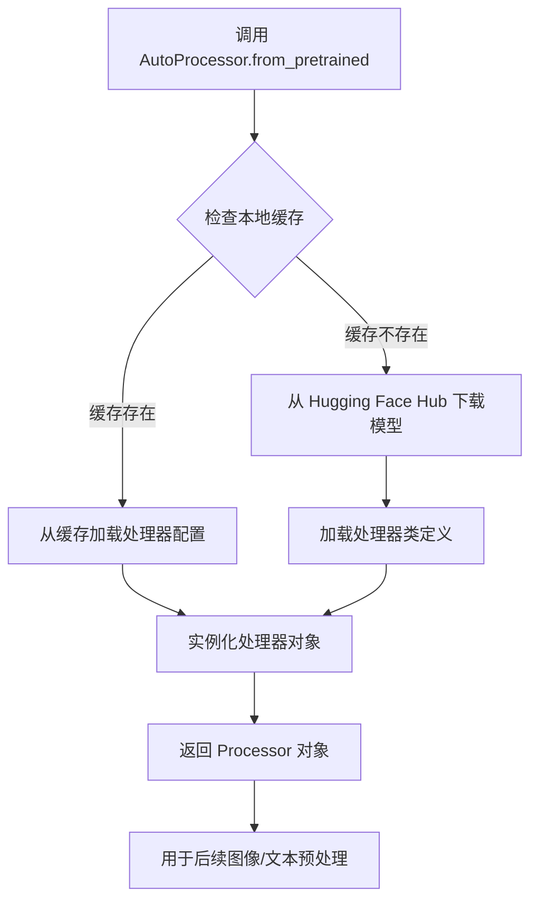

#### 带注释源码

```python
# 从预训练模型加载 Grounding DINO 处理器
# AutoProcessor 是 Hugging Face Transformers 提供的自动加载器
# 它会根据模型名称自动识别并加载对应的处理器类
grounding_dino_processor = AutoProcessor.from_pretrained("IDEA-Research/grounding-dino-base")

# 处理器加载后的使用方式（在代码中）:
# 1. 预处理图像和文本为张量
inputs = grounding_dino_processor(images=raw_image, text=text, return_tensors="pt")

# 2. 后处理模型输出，得到带分数的边界框和标签
results = grounding_dino_processor.post_process_grounded_object_detection(
    outputs,
    inputs["input_ids"],
    box_threshold=box_threshold,
    text_threshold=text_threshold,
    target_sizes=[raw_image.size[::-1]],
)
```


### `AutoModelForZeroShotObjectDetection.from_pretrained`

该函数是 Hugging Face Transformers 库中的一个类方法，用于从预训练模型或本地路径加载零样本目标检测模型（这里是 Grounding DINO）。它会自动下载并加载指定的预训练权重，返回一个配置好的模型实例，可直接用于推理。

参数：

-  `pretrained_model_name_or_path`：`str`，模型名称（HuggingFace Hub 上的模型 ID，如 "IDEA-Research/grounding-dino-base"）或本地模型目录路径
-  `config`：`Optional[PretrainedConfig]`，可选，模型配置对象，默认值为 `None`
-  `cache_dir`：`Optional[str]`，可选，缓存目录路径，默认值为 `None`
-  `torch_dtype`：`Optional[torch.dtype]`，可选，模型参数的 torch 数据类型（如 `torch.float16`），默认值为 `None`
-  `device_map`：`Optional[Union[str, Dict[str, int]]]`，可选，设备映射策略（如 "auto"），默认值为 `None`
-  `force_download`：`bool`，可选，是否强制重新下载模型，默认值为 `False`
-  `resume_download`：`bool`，可选，是否在中断后恢复下载，默认值为 `True`
-  `proxies`：`Optional[Dict[str, str]]`，可选，代理服务器设置，默认值为 `None`
-  `token`：`Optional[str]`，可选，用于认证的 HuggingFace token，默认值为 `None`
-  `revision`：`str`，可选，模型版本/分支，默认值为 `"main"`
-  `use_safetensors`：`Optional[bool]`，可选，是否使用 safetensors 格式，默认值为 `None`

返回值：`PreTrainedModel`，返回一个继承自 `PreTrainedModel` 的模型对象（如 `GroundingDinoForObjectDetection`），该对象已加载预训练权重，可直接用于推理。

#### 流程图

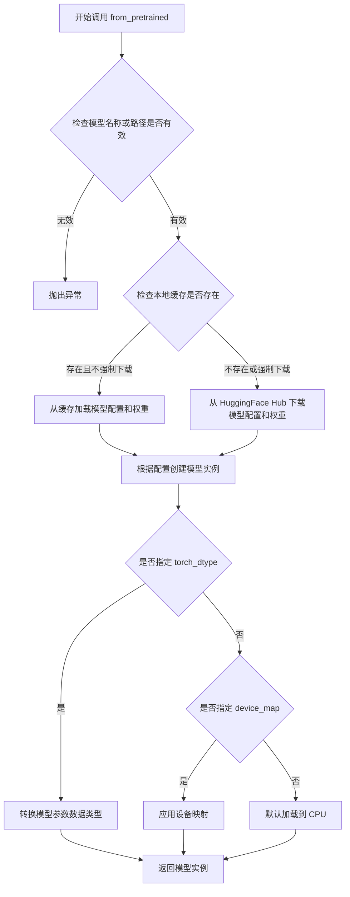

#### 带注释源码

```python
# 从 transformers 库导入的类
# 这是一个自动模型类，用于零样本目标检测任务
# 使用方式：
grounding_dino_model = AutoModelForZeroShotObjectDetection.from_pretrained(
    "IDEA-Research/grounding-dino-base"  # 模型名称或本地路径
).cuda()  # 将模型移动到 GPU

# 详细流程：
# 1. 根据模型名称 "IDEA-Research/grounding-dino-base" 查找预训练模型
# 2. 从 HuggingFace Hub 下载模型配置文件 (config.json) 和模型权重文件 (model.safetensors 或 pytorch_model.bin)
# 3. 根据配置文件创建对应的模型类实例 (GroundingDinoForObjectDetection)
# 4. 加载权重到模型中
# 5. 返回模型对象供后续推理使用
# 6. .cuda() 将模型参数移动到 GPU 内存

# 该函数实际上是 PreTrainedModel 的类方法，由 __class__ 调用
# 底层逻辑位于 transformers/src/transformers/modeling_utils.py 的 PreTrainedModel.from_pretrained 方法
```

#### 实际使用示例

```python
# 代码中的实际调用方式
grounding_dino_processor = AutoProcessor.from_pretrained("IDEA-Research/grounding-dino-base")
grounding_dino_model = AutoModelForZeroShotObjectDetection.from_pretrained(
    "IDEA-Research/grounding-dino-base"
).cuda()

# 推理阶段的使用方式
inputs = grounding_dino_processor(images=raw_image, text=text, return_tensors="pt")
inputs = {k: v.cuda() for k, v in inputs.items()}
outputs = grounding_dino_model(**inputs)

# 后处理获取检测结果
results = grounding_dino_processor.post_process_grounded_object_detection(
    outputs,
    inputs["input_ids"],
    box_threshold=box_threshold,
    text_threshold=text_threshold,
    target_sizes=[raw_image.size[::-1]],
)
```


### `grounding_dino_processor.post_process_grounded_object_detection`

该函数是 Grounding DINO 零样本目标检测模型的后处理方法，负责将模型原始输出转换为带有置信度分数的检测框、标签和分数，并应用 Non-Maximum Suppression (NMS) 过滤重叠框。

参数：

- `outputs`：`ModelOutput` 类型，Grounding DINO 模型的原始输出，包含 logits 和预测的边界框坐标
- `input_ids`：`torch.Tensor` 类型，输入文本的 token IDs，用于关联检测结果与文本标签
- `box_threshold`：`float` 类型，边界框置信度阈值，低于此值的检测结果将被过滤
- `text_threshold`：`float` 类型，文本/类别置信度阈值，用于筛选匹配的文本标签
- `target_sizes`：`List[Tuple[int, int]]` 类型，目标图像尺寸列表，格式为 [(height, width), ...]，用于将归一化坐标转换为原始像素坐标

返回值：`List[Dict]` 类型，返回处理后的检测结果列表，每个元素包含：
- `"boxes"`：检测框坐标 tensor，形状为 [N, 4]，格式为 [x1, y1, x2, y2]
- `"labels"`：对应的文本标签列表
- `"scores"`：对应的置信度分数列表

#### 流程图

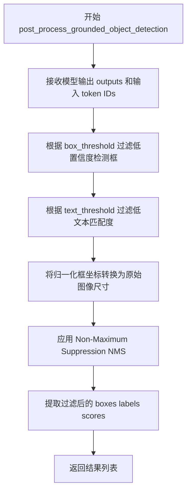

#### 带注释源码

```python
# 调用 post_process_grounded_object_detection 进行后处理
results = grounding_dino_processor.post_process_grounded_object_detection(
    outputs,                           # Grounding DINO 模型输出
    inputs["input_ids"],               # 文本输入的 token IDs
    box_threshold=box_threshold,       # 框置信度阈值 0.25
    text_threshold=text_threshold,     # 文本置信度阈值 0.2
    target_sizes=[raw_image.size[::-1]],  # 原始图像尺寸 (width, height) -> (height, width)
)

# 提取结果
boxes = results[0]["boxes"]           # 检测框坐标
labels = results[0]["labels"]         # 对应标签
scores = results[0]["scores"]         # 置信度分数

# 应用 NMS 进一步过滤重叠框
indices = torchvision.ops.nms(boxes, scores, 0.5)
boxes = boxes[indices]
category_names = [labels[i] for i in indices]
```

#### 上下文使用说明

在代码中，此函数接收 Grounding DINO 模型的原始预测输出，结合输入的文本标签（来自 RAM 模型的识别结果），输出符合阈值条件的检测框。随后使用 NMS 算法去除高度重叠的检测框，最终得到精确的目标检测结果用于后续的 BLIP-2 图像描述生成和 CLIP 文本嵌入提取。


### `torchvision.ops.nms`

非极大值抑制（Non-Maximum Suppression，NMS）是目标检测中常用的后处理算法，用于从多个候选检测框中筛选出最优的检测结果，消除高度重叠的框，保留置信度最高的检测框。

参数：

- `boxes`：`torch.Tensor`，检测框坐标，形状为 (N, 4)，格式为 [x1, y1, x2, y2]，其中 (x1, y1) 为左上角坐标，(x2, y2) 为右下角坐标
- `scores`：`torch.Tensor`，每个检测框的置信度分数，形状为 (N,)，分数越高表示检测结果越可靠
- `iou_threshold`：`float`，IOU（Intersection over Union）阈值，范围 [0, 1]，用于判断两个框是否重叠严重，默认值为 0.5

返回值：`torch.Tensor`，整数类型的 1 维张量，返回保留下来检测框的索引，索引按 scores 降序排列

#### 流程图

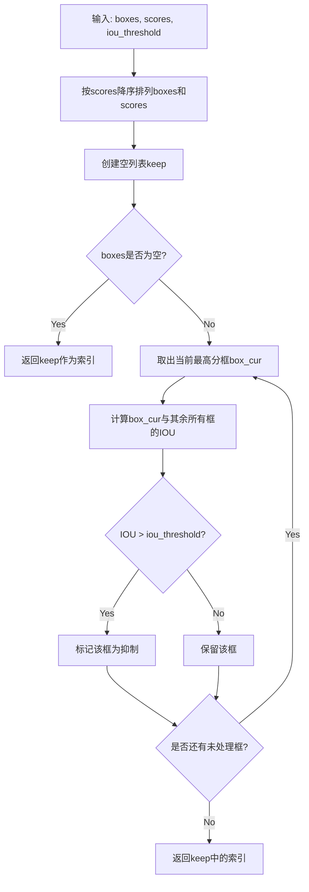

#### 带注释源码

```python
# torchvision.ops.nms 源码实现
# 位置: torchvision/opsboxes.py

import torch
from torchvision.opsboxes import box_iou

def nms(boxes: torch.Tensor, scores: torch.Tensor, iou_threshold: float):
    """
    非极大值抑制算法
    
    参数:
        boxes: 检测框坐标, 形状为 (N, 4), 格式为 [x1, y1, x2, y2]
        scores: 置信度分数, 形状为 (N,)
        iou_threshold: IOU阈值, 用于判断是否抑制重叠框
    
    返回值:
        保留框的索引
    """
    # 确保输入是2D张量
    if boxes.numel() == 0:
        # 如果没有检测框,直接返回空索引
        return torch.empty((0,), dtype=torch.int64, device=boxes.device)
    
    # 获取框的坐标和设备信息
    x1 = boxes[:, 0]  # 左上角x坐标
    y1 = boxes[:, 1]  # 左上角y坐标
    x2 = boxes[:, 2]  # 右下角x坐标
    y2 = boxes[:, 3]  # 右下角y坐标
    
    # 计算每个框的面积
    areas = (x2 - x1) * (y2 - y1)  # 形状: (N,)
    
    # 按置信度分数降序排列,获取排序后的索引
    _, order = scores.sort(0, descending=True)  # order: 降序排列的索引
    
    # 存储保留框的索引
    keep = []
    while order.numel() > 0:
        if order.numel() == 1:
            # 只剩下一个框,直接保留
            i = order.item()
            keep.append(i)
            break
        else:
            # 取出当前最高分的框索引
            i = order[0].item()
            keep.append(i)
        
        # 计算当前框与其余框的IOU
        # 获取当前框坐标
        xx1 = x1[order[1:]].clamp(min=x1[i])  # 与其余框的左上角x最大值
        yy1 = y1[order[1:]].clamp(min=y1[i])  # 与其余框的左上角y最大值
        xx2 = x2[order[1:]].clamp(max=x2[i])  # 与其余框的右下角x最小值
        yy2 = y2[order[1:]].clamp(max=y2[i])  # 与其余框的右下角y最小值
        
        # 计算交集区域面积
        w = (xx2 - xx1).clamp(min=0)  # 交集宽度
        h = (yy2 - yy1).clamp(min=0)  # 交集高度
        inter = w * h  # 交集面积
        
        # 计算IOU: 交集 / (当前框面积 + 其余框面积 - 交集)
        iou = inter / (areas[i] + areas[order[1:]] - inter)
        
        # 保留IOU小于阈值的框(即不重叠的框)
        # 只保留索引在前的框(分数更高的框)
        idx = (iou <= iou_threshold).nonzero(as_tuple=False).squeeze()
        if idx.numel() == 0:
            break
        order = order[idx + 1]  # +1 是因为从 order[1:] 开始比较
    
    # 返回保留框的索引
    return torch.tensor(keep, dtype=torch.int64, device=boxes.device)
```

#### 代码中的调用示例

```python
# 在给定代码中的实际使用方式
indices = torchvision.ops.nms(boxes, scores, 0.5)

# 参数说明:
# - boxes: 从Grounding DINO模型输出的检测框,形状为 (N, 4)
# - scores: 每个检测框的置信度分数,形状为 (N,)
# - 0.5: IOU阈值,表示如果两个框的IOU超过0.5,则保留分数高的那个

# 返回值:
# - indices: 保留的检测框索引,用于从boxes和labels中筛选出最终的检测结果
```

#### 关键组件信息

| 组件名称 | 一句话描述 |
|---------|-----------|
| `box_iou` | 计算两个 bounding box 集合之间的 IOU（Intersection over Union），用于衡量重叠程度 |
| `torch.sort` | 对置信度分数进行降序排列，确保高置信度框优先处理 |

#### 潜在的技术债务或优化空间

1. **硬编码阈值**：代码中 `0.5` 的 IOU 阈值是硬编码的，建议提取为可配置参数
2. **批量处理效率**：当前 NMS 是逐个图像处理的，可以考虑利用批量推理优化
3. **多类别 NMS**：当前实现是全局 NMS，对于多类别场景可能需要类别级别的 NMS

#### 其它项目

- **设计目标**：从目标检测结果中筛选出最优的检测框，消除重复检测
- **约束**：输入的 boxes 必须为 (N, 4) 形状，scores 必须为 (N,) 形状
- **错误处理**：当输入为空时会返回空张量；当 boxes 维度不正确时可能会抛出异常
- **外部依赖**：PyTorch、torchvision
- **算法复杂度**：O(N²)，其中 N 为检测框数量，主要耗时在于两两计算 IOU


### `Blip2Processor.from_pretrained`

该方法是一个类方法，用于从预训练的模型检查点加载BLIP-2处理器（Blip2Processor），包括图像处理器和分词器。在代码中，它通过指定模型名称"Salesforce/blip2-flan-t5-xxl"来加载预训练的处理器，以便后续对图像进行预处理和对模型输出进行后处理。

参数：

- `pretrained_model_name_or_path`：`str`，要加载的预训练模型名称或本地路径，例如"Salesforce/blip2-flan-t5-xxl"

返回值：`Blip2Processor`，返回加载后的BLIP-2处理器对象，包含图像处理器和分词器

#### 流程图

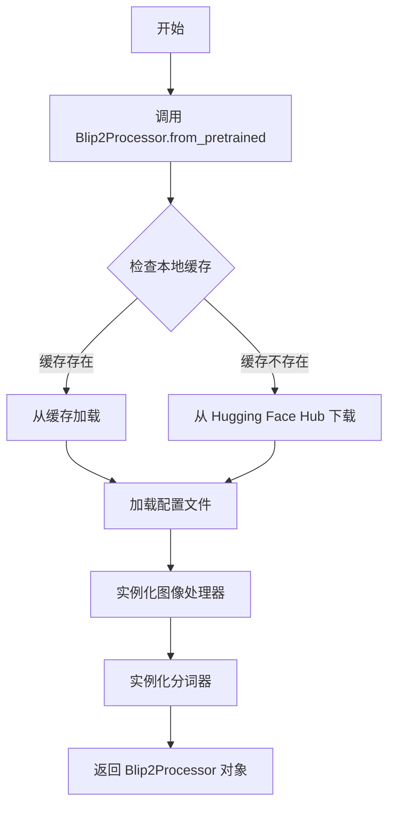

#### 带注释源码

```python
# 从 transformers 库导入 Blip2Processor 类
from transformers import Blip2Processor

# 调用类方法 from_pretrained 加载预训练的 BLIP-2 处理器
# 参数：预训练模型名称或路径 (Salesforce/blip2-flan-t5-xxl)
# 返回值：blip2_processor - Blip2Processor 实例，用于处理图像和文本
blip2_processor = Blip2Processor.from_pretrained("Salesforce/blip2-flan-t5-xxl")
```


### `Blip2ForConditionalGeneration.from_pretrained`

从预训练模型加载 BLIP-2（Bootstrapped Language-Image Pre-training）条件生成模型，该模型结合了视觉编码器与语言模型，可根据图像生成文本描述。

参数：

-  `pretrained_model_name_or_path`：`str`，Hugging Face Hub上的模型ID（如"Salesforce/blip2-flan-t5-xxl"）或本地模型路径
-  `torch_dtype`：`torch.dtype`，可选参数，指定模型权重的精度类型（如`torch.float16`用于混合精度推理以减少显存占用）

返回值：`Blip2ForConditionalGeneration`，加载并初始化后的BLIP-2模型实例，可用于图像到文本的生成任务

#### 流程图

```mermaid
graph TD
    A[开始加载模型] --> B{检查模型是否已缓存}
    B -->|是| C[从本地缓存加载权重]
    B -->|否| D[从HuggingFace Hub下载模型]
    C --> E[创建Blip2ForConditionalGeneration模型实例]
    D --> E
    E --> F[应用torch_dtype类型转换]
    F --> G[调用.cuda()转移到GPU]
    H[返回模型实例]
    G --> H
```

#### 带注释源码

```python
# 加载 BLIP-2 条件生成模型
# 参数1: "Salesforce/blip2-flan-t5-xxl" - Hugging Face Hub上的预训练模型标识符
# 参数2: torch_dtype=torch.float16 - 指定模型权重使用半精度(Float16)存储
#        这对于大模型推理至关重要，可将显存占用减半并提升推理速度
blip2_model = Blip2ForConditionalGeneration.from_pretrained(
    "Salesforce/blip2-flan-t5-xxl",  # 预训练模型名称或路径
    torch_dtype=torch.float16         # 模型权重数据类型：半精度浮点数
).cuda()                              # 将模型从CPU转移到CUDA设备(GPU)
```


### `Blip2ForConditionalGeneration.generate`

该方法是 BLIP-2 条件生成模型的核心生成接口，在此代码中用于根据检测到的图像区域（bounding box 裁剪区域）生成对应的文本描述（caption）。它接收图像特征输入，通过因果语言模型解码器生成 token 序列。

参数：

-  `**inputs`：关键字参数，类型为 `Dict[str, torch.Tensor]`，由 `Blip2Processor` 处理后的输入，包含 `pixel_values`（图像像素张量）和 `input_ids`（可选的输入 token）。在此代码中通过 `blip2_processor(images=raw_image.crop(bbox), return_tensors="pt")` 构建。
-  `pixel_values`：图像张量，形状为 `(batch_size, num_channels, height, width)`，在此代码中为裁剪后的图像区域。
-  `input_ids`：（可选）输入文本的 token ID，用于引导生成或条件生成。

返回值：`torch.Tensor`，生成输出的 token 序列，形状为 `(batch_size, sequence_length)`，在此代码中通过 `blip2_processor.decode` 解码为可读文本。

#### 流程图

```mermaid
flowchart TD
    A[开始] --> B[构建blip2_processor输入]
    B --> C[裁剪图像: raw_image.crop(bbox)]
    C --> D[转换为tensor并移动到CUDA]
    D --> E[调用blip2_model.generate方法]
    E --> F[生成token序列]
    F --> G[通过blip2_processor.decode解码]
    G --> H[获取caption文本]
    H --> I[使用CLIP生成文本嵌入]
    I --> J[结束]
```

#### 带注释源码

```python
# 循环遍历每个检测到的边界框
for i, bbox in enumerate(boxes):
    # 将边界框坐标转换为Python列表
    bbox = bbox.tolist()
    
    # 使用blip2_processor处理裁剪后的图像区域
    # 输入: 裁剪后的图像 (raw_image.crop(bbox))
    # 输出: 包含pixel_values的字典 (return_tensors="pt" 指定返回PyTorch张量)
    inputs = blip2_processor(images=raw_image.crop(bbox), return_tensors="pt")
    
    # 将输入字典中的所有张量移动到CUDA设备并转换为float16精度
    # 这是为了匹配模型权重的数据类型 (torch.float16)
    inputs = {k: v.cuda().to(torch.float16) for k, v in inputs.items()}
    
    # 调用BLIP-2模型的generate方法进行条件生成
    # 输入: 处理后的图像特征张量
    # 输出: 生成的token ID序列 (batch_size=1, sequence_length=模型决定)
    outputs = blip2_model.generate(**inputs)
    
    # 使用blip2_processor的decode方法将token序列解码为文本
    # skip_special_tokens=True 会跳过特殊token(如EOS等),得到纯文本描述
    caption = blip2_processor.decode(outputs[0], skip_special_tokens=True)
    
    # 后续处理: 使用CLIP生成文本嵌入向量
    inputs = clip_tokenizer(
        caption,
        padding="max_length",
        max_length=clip_tokenizer.model_max_length,
        truncation=True,
        return_tensors="pt",
    )
    inputs = {k: v.cuda() for k, v in inputs.items()}
    text_embeddings_before_projection = clip_text_encoder(**inputs).pooler_output.squeeze(0)

    # 将结果添加到样本的标注列表中
    sample["annos"].append(
        {
            "caption": caption,  # 生成的文本描述
            "bbox": bbox,        # 对应的边界框坐标
            "text_embeddings_before_projection": text_embeddings_before_projection,  # CLIP文本嵌入
        }
    )
```


### `blip2_processor.decode`

该方法用于将 BLIP-2 模型生成的 token ID 序列解码为人类可读的文本字符串，是 BLIP-2 图像字幕生成流程中的最后一步，将模型输出转换为最终 caption。

参数：

-  `sequence`：`torch.Tensor`，模型生成的 token ID 序列（来自 `blip2_model.generate()` 的输出）
-  `skip_special_tokens`：`bool`，是否跳过特殊 token（如 pad、eos 等），设为 True 可获得更干净的文本

返回值：`str`，解码后的文本字符串（caption）

#### 流程图

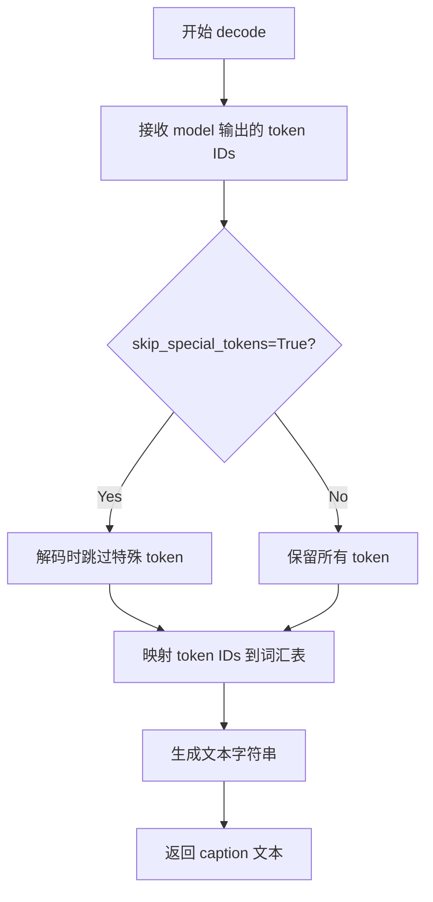

#### 带注释源码

```python
# 调用 blip2_processor.decode 将模型生成的 token IDs 解码为文本
# 参数说明：
#   outputs[0]: blip2_model.generate() 输出的第一个结果（token ID 张量）
#   skip_special_tokens=True: 解码时跳过特殊 token（如 <pad>, </s> 等），获得更干净的文本
caption = blip2_processor.decode(outputs[0], skip_special_tokens=True)
```


### `CLIPTextModel.from_pretrained`

该函数是 Hugging Face Transformers 库中 `CLIPTextModel` 类的类方法，用于从预训练模型或本地模型路径加载 CLIP 文本编码器模型。在本代码中，它负责加载 `openai/clip-vit-large-patch14` 预训练模型，以获得文本嵌入向量，为后续的图像标注和嵌入对比提供文本编码能力。

参数：

-  `pretrained_model_name_or_path`：`str`，预训练模型的名称（如 "openai/clip-vit-large-patch14"）或本地模型目录路径
-  `config`（可选）：`PretrainedConfig`，模型配置对象，默认为 None
-  `cache_dir`（可选）：`str`，模型缓存目录路径，默认为 None
-  `torch_dtype`（可选）：`torch.dtype`，模型权重的 torch 数据类型，默认为 None（从配置中推断）
-  `force_download`（可选）：`bool`，是否强制重新下载模型，默认为 False
-  `resume_download`（可选）：`bool`，是否恢复中断的下载，默认为 True
-  `proxies`（可选）：`Dict`，用于下载的代理服务器配置，默认为 None

返回值：`CLIPTextModel`，返回一个加载好的 CLIP 文本编码器模型实例，可用于将文本转换为嵌入向量。

#### 流程图

```mermaid
flowchart TD
    A[开始调用 CLIPTextModel.from_pretrained] --> B{检查模型是否在本地缓存}
    B -- 是 --> C[从本地缓存加载模型权重和配置]
    B -- 否 --> D{检查 pretrained_model_name_or_path 是否为有效模型标识符}
    D -- 是 --> E[从 Hugging Face Hub 下载模型]
    D -- 否 --> F[从本地目录加载模型]
    E --> G[将下载的模型保存到缓存目录]
    G --> C
    F --> C
    C --> H[创建 CLIPTextModel 实例]
    H --> I[加载配置和权重]
    I --> J[返回 CLIPTextModel 模型实例]
    J --> K[调用 .cuda() 方法]
    K --> L[将模型参数移至 GPU 设备]
    L --> M[返回 GPU 上的 CLIPTextModel 实例]
```

#### 带注释源码

```python
# 从 transformers 库导入 CLIPTextModel 类
from transformers import CLIPTextModel

# 调用 CLIPTextModel 类的类方法 from_pretrained
# 该方法负责加载预训练的 CLIP 文本编码器模型
# 参数 "openai/clip-vit-large-patch14" 指定了预训练模型的名称
# 该模型是 OpenAI 发布的 CLIP ViT-L/14 变体，具有 14x14 的补丁大小
clip_text_encoder = CLIPTextModel.from_pretrained("openai/clip-vit-large-patch14").cuda()

# 详细说明：
# 1. CLIPTextModel.from_pretrained() 执行以下操作：
#    - 下载模型配置文件 (config.json)
#    - 下载模型权重文件 (pytorch_model.bin 或 model.safetensors)
#    - 下载分词器配置文件 (tokenizer_config.json)
#    - 实例化 CLIPTextModel 对象并加载权重
#
# 2. .cuda() 是 PyTorch 模型的方法，将模型的所有参数和缓冲区
#    从 CPU 内存移动到 CUDA 兼容的 GPU 设备上
#    这样可以利用 GPU 的并行计算能力加速文本嵌入的计算
#
# 3. 返回的 clip_text_encoder 对象是一个 torch.nn.Module
#    它包含文本编码器的所有层：嵌入层、Transformer 编码器层等
#    可以通过调用该对象对文本进行编码：model(**inputs)
#    返回的输出包含 pooler_output（池化后的文本嵌入）

# 后续使用示例：
# inputs = clip_tokenizer(
#     caption,
#     padding="max_length",
#     max_length=clip_tokenizer.model_max_length,
#     truncation=True,
#     return_tensors="pt",
# )
# inputs = {k: v.cuda() for k, v in inputs.items()}
# text_embeddings_before_projection = clip_text_encoder(**inputs).pooler_output.squeeze(0)
# 上述代码将文本通过分词器转换为输入张量，移动到 GPU，
# 然后通过 CLIPTextModel 获取文本嵌入的 pooler_output
```


### `CLIPTokenizer.from_pretrained`

该函数是Hugging Face Transformers库中CLIPTokenizer类的类方法，用于从预训练模型路径或模型ID加载CLIP分词器（Tokenizer），支持文本到token序列的转换功能，是视觉-语言模型文本编码的关键组件。

参数：

- `pretrained_model_name_or_path`：`str`，预训练模型名称（如"openai/clip-vit-large-patch14"）或本地模型路径
- `cache_dir`：`Optional[str]`，可选，用于缓存模型的目录路径
- `force_download`：`bool`，是否强制重新下载模型，默认为False
- `local_files_only`：`bool`，是否仅使用本地文件，默认为False
- `token`：`Optional[Union[str, bool]]`，可选的认证token
- `revision`：`str`，模型版本分支，默认为"main"
- `subfolder`：`Optional[str]`，模型目录中的子文件夹路径
- `**kwargs`：其他可选参数

返回值：`CLIPTokenizer`，返回加载后的CLIPTokenizer对象实例

#### 流程图

```mermaid
flowchart TD
    A[开始调用 from_pretrained] --> B{检查本地缓存}
    B -->|缓存存在| C[加载本地模型文件]
    B -->|缓存不存在| D{本地文件存在}
    D -->|是| C
    D -->|否| E[从Hugging Face Hub下载]
    E --> F[解析tokenizer_config.json]
    F --> G[加载vocab.json和merges.txt]
    G --> H[实例化CLIPTokenizer对象]
    C --> H
    H --> I[返回CLIPTokenizer实例]
```

#### 带注释源码

```python
# 从transformers库导入CLIPTokenizer类
from transformers import CLIPTokenizer

# 调用类方法from_pretrained加载预训练的分词器
# 参数为模型名称或路径，返回CLIPTokenizer实例
clip_tokenizer = CLIPTokenizer.from_pretrained("openai/clip-vit-large-patch14")

# 后续使用示例：
# 将文本 caption 进行分词处理
inputs = clip_tokenizer(
    caption,                              # 待分词的文本字符串
    padding="max_length",                 # 填充方式：填充到最大长度
    max_length=clip_tokenizer.model_max_length,  # 最大token长度
    truncation=True,                      # 是否截断超长文本
    return_tensors="pt",                  # 返回PyTorch张量格式
)

# 将处理后的输入移动到GPU
inputs = {k: v.cuda() for k, v in inputs.items()}
```


### `clip_tokenizer`

这是一个全局变量（`CLIPTokenizer` 类的实例），用于对文本描述进行分词处理，将文本转换为 CLIP 模型所需的 token ID 序列，以便后续获取文本嵌入向量。

参数：

- `caption`：`str`，待分词的文本内容（这里是被 BLIP2 模型生成的图像描述）
- `padding`：`str`，填充策略，设置为 `"max_length"` 表示填充到最大长度
- `max_length`：`int`，分词后的最大 token 数量，使用 `clip_tokenizer.model_max_length` 属性获取
- `truncation`：`bool`，是否对超出最大长度的序列进行截断，设置为 `True`
- `return_tensors`：`str`，返回的张量类型，设置为 `"pt"` 表示返回 PyTorch 张量

返回值：`dict`，包含以下键值对的字典：

- `input_ids`：分词后的 token ID 序列
- `attention_mask`：注意力掩码，指示哪些位置是有效的 token

#### 流程图

```mermaid
flowchart TD
    A[开始分词操作] --> B[输入caption文本]
    B --> C[调用clip_tokenizer分词器]
    C --> D[设置padding=max_length]
    C --> E[设置max_length=clip_tokenizer.model_max_length]
    C --> F[设置truncation=True]
    C --> G[设置return_tensors=pt]
    D --> H[执行分词流程]
    E --> H
    F --> H
    G --> H
    H --> I[文本进行tokenization]
    I --> J{序列长度是否超过max_length}
    J -->|是| K[执行truncation截断]
    J -->|否| L[执行padding填充]
    K --> M[生成input_ids和attention_mask]
    L --> M
    M --> N[转换为PyTorch张量]
    N --> O[返回包含input_ids和attention_mask的字典]
```

#### 带注释源码

```python
# 使用 CLIPTokenizer 对 caption 进行分词处理
# 参数说明：
#   caption: 要分词的文本（BLIP2生成的图像描述）
#   padding="max_length": 填充到最大长度
#   max_length: 使用tokenizer的最大模型长度属性
#   truncation=True: 超过最大长度时截断
#   return_tensors="pt": 返回PyTorch张量格式
inputs = clip_tokenizer(
    caption,                          # 输入文本：BLIP2生成的caption
    padding="max_length",             # 填充策略：填充到最大长度
    max_length=clip_tokenizer.model_max_length,  # 最大token长度
    truncation=True,                 # 启用截断
    return_tensors="pt",             # 返回PyTorch张量
)

# 将分词结果（字典）中的所有张量移到GPU上
# inputs 包含: input_ids, attention_mask 等
inputs = {k: v.cuda() for k, v in inputs.items()}

# 传递给CLIP文本编码器获取文本嵌入
# .pooler_output 获取池化后的输出，.squeeze(0) 去除批次维度
text_embeddings_before_projection = clip_text_encoder(**inputs).pooler_output.squeeze(0)
```


### `clip_text_encoder`

该函数用于将文本标题（caption）编码为 CLIP 文本嵌入向量。它接收分词后的文本输入，通过 CLIP 文本编码器模型提取文本特征，并输出池化后的文本表示向量，用于后续的语义匹配或特征存储任务。

参数：

-  `input_ids`：`torch.Tensor`，形状为 `(batch_size, sequence_length)`，分词后的文本 token ID 序列
-  `attention_mask`：`torch.Tensor`，形状为 `(batch_size, sequence_length)`，指示有效 token 位置的注意力掩码（可选，模型内部会自动生成）
-  `position_ids`：`torch.Tensor`，位置编码 ID（可选）
-  `output_attentions`：`bool`，是否返回注意力权重（可选）
-  `output_hidden_states`：`bool`，是否返回所有隐藏状态（可选）
-  `return_dict`：`bool`，是否返回字典格式输出（可选）

返回值：`BaseModelOutputWithPooling`，包含 `pooler_output` 属性，类型为 `torch.Tensor`，形状为 `(batch_size, hidden_size)`，即池化后的文本嵌入向量

#### 流程图

```mermaid
graph TD
    A[开始: clip_text_encoder] --> B[接收分词后的输入: input_ids, attention_mask]
    B --> C[输入嵌入层: 将 token ID 转换为词嵌入向量]
    C --> D[Transformer 编码器层: 堆叠的多头自注意力层和前馈网络]
    D --> E[输出编码序列: sequence_output]
    E --> F[池化层: 对 sequence_output 进行池化]
    F --> G[可选: 投影层到指定维度]
    G --> H[返回 BaseModelOutputWithPooling]
    H --> I[提取 pooler_output 属性]
    I --> J[squeeze 降维去除 batch 维度]
    K[输出: 1D 文本嵌入向量]
    H --> K
```

#### 带注释源码

```python
# clip_text_encoder 是 CLIPTextModel 的实例，通过 from_pretrained 加载预训练权重
# 模型架构: Transformer 编码器 + 池化层
clip_text_encoder = CLIPTextModel.from_pretrained("openai/clip-vit-large-patch14").cuda()

# ------------------- 输入准备阶段 -------------------
# 使用 clip_tokenizer 对 caption (文本标题) 进行分词
# 参数说明:
#   caption: 要编码的文本字符串
#   padding: 填充策略，'max_length' 表示填充到最大长度
#   max_length: 最大序列长度，由 tokenizer 的 model_max_length 属性决定
#   truncation: 是否截断超过最大长度的序列
#   return_tensors: 返回 PyTorch 张量格式
inputs = clip_tokenizer(
    caption,                                    # 输入文本: 当前物体的描述标题
    padding="max_length",                       # 填充到最大长度
    max_length=clip_tokenizer.model_max_length, # 获取模型支持的最大序列长度
    truncation=True,                            # 超过长度则截断
    return_tensors="pt",                       # 返回 PyTorch 张量
)

# 将输入张量移动到 GPU 设备
# inputs 包含: input_ids (token ID), attention_mask (注意力掩码)
inputs = {k: v.cuda() for k, v in inputs.items()}

# ------------------- 模型调用阶段 -------------------
# 调用 CLIP 文本编码器进行前向传播
# **inputs 会解包字典，传递 input_ids 和 attention_mask
# 返回 BaseModelOutputWithPooling 对象
# .pooler_output 获取池化后的 [CLS] token 表示
# .squeeze(0) 移除 batch 维度 (因为 batch=1)
text_embeddings_before_projection = clip_text_encoder(**inputs).pooler_output.squeeze(0)

# ------------------- 输出说明 -------------------
# text_embeddings_before_projection: torch.Tensor, shape (hidden_size,)
# 这是 CLIP 文本编码器的池化输出，通常维度为 768 (对于 clip-vit-large-patch14)
# 'before_projection' 表示尚未经过最终的投影层 (原始模型有投影层映射到对比学习空间)
# 该嵌入向量随后被存储在 sample['annos'] 字典中
```

#### 上下文调用信息

在主循环中被调用的完整上下文：

```python
for i, bbox in enumerate(boxes):
    bbox = bbox.tolist()
    # 1. 使用 BLIP2 模型为检测到的物体生成 caption (文本描述)
    inputs = blip2_processor(images=raw_image.crop(bbox), return_tensors="pt")
    inputs = {k: v.cuda().to(torch.float16) for k, v in inputs.items()}
    outputs = blip2_model.generate(**inputs)
    caption = blip2_processor.decode(outputs[0], skip_special_tokens=True)
    
    # 2. 使用 CLIPTokenizer 对 caption 进行分词
    inputs = clip_tokenizer(
        caption,
        padding="max_length",
        max_length=clip_tokenizer.model_max_length,
        truncation=True,
        return_tensors="pt",
    )
    inputs = {k: v.cuda() for k, v in inputs.items()}
    
    # 3. 使用 CLIPTextModel (clip_text_encoder) 编码文本，获取文本嵌入
    text_embeddings_before_projection = clip_text_encoder(**inputs).pooler_output.squeeze(0)
    
    # 4. 将结果存储到样本 annotation 中
    sample["annos"].append(
        {
            "caption": caption,                              # 物体描述文本
            "bbox": bbox,                                     # 物体边界框坐标 [x1, y1, x2, y2]
            "text_embeddings_before_projection": text_embeddings_before_projection,  # CLIP 文本嵌入
        }
    )
```

#### 技术债务与优化空间

1. **模型加载位置**：clip_text_encoder 在主进程加载后可考虑使用 `torch.nn.DataParallel` 或分布式副本逻辑共享到其他进程，避免重复加载显存
2. **未使用 projection head**：变量名 `text_embeddings_before_projection` 表明获取的是投影前的特征，若需要对比学习空间的嵌入应使用完整投影层
3. **Batch 处理缺失**：当前对每个 bounding box 逐个调用模型，未利用 batch 推理优化速度
4. **硬编码模型名称**：`"openai/clip-vit-large-patch14"` 硬编码在初始化中，应提取为命令行参数或配置
5. **CUDA 内存管理**：未显式调用 `torch.cuda.empty_cache()`，在处理大量图像时可能积累显存碎片

#### 外部依赖与接口契约

- **依赖库**：`transformers` (CLIPTextModel, CLIPTokenizer), torch
- **输入契约**：需要包含 `input_ids` 的字典，可选包含 `attention_mask`
- **输出契约**：返回 `BaseModelOutputWithPooling`，需通过 `.pooler_output` 访问张量
- **设备要求**：模型和数据均需在同一 CUDA 设备上


### `torch.save`

将 Python 对象（通常是张量、字典或模型状态）序列化为字节流并保存到指定路径的磁盘文件中。在本代码中用于保存包含图像标注、边界框和文本嵌入的样本数据。

参数：

- `obj`：`dict`，要保存的 Python 对象（在本代码中为 `sample` 字典，包含 "file_path" 键保存图像文件名，以及 "annos" 键保存标注列表，每个标注包含 caption、bbox 和 text_embeddings_before_projection）
- `f`：`str`，保存文件的路径（在本代码中为 `pth_path`，由 `args.save_root` 和图像文件名拼接而成）

返回值：`None`，无返回值，直接将序列化后的对象写入磁盘文件

#### 流程图

```mermaid
flowchart TD
    A[开始保存样本数据] --> B{检查保存路径是否存在}
    B -->|不存在| C[构建 sample 字典]
    B -->|存在| D[跳过当前图像]
    C --> E[包含 file_path 和 annos 字段]
    E --> F[调用 torch.save 保存到 pth_path]
    F --> G[序列化为字节流]
    G --> H[写入磁盘文件]
    H --> I[保存完成]
    D --> J[处理下一张图像]
    I --> J
```

#### 带注释源码

```python
# sample 是一个字典，包含以下结构：
# {
#     "file_path": "图像文件名",
#     "annos": [
#         {
#             "caption": "图像描述文本",
#             "bbox": [x1, y1, x2, y2],  # 边界框坐标
#             "text_embeddings_before_projection": tensor  # CLIP 文本嵌入向量
#         },
#         ...
#     ]
# }
sample = {"file_path": os.path.basename(image_path), "annos": []}

# ... (中间处理代码，填充 sample["annos"]) ...

# pth_path 是完整的保存路径，格式为：{save_root}/{图像文件名}
pth_path = os.path.join(args.save_root, os.path.basename(image_path))

# 调用 torch.save 将 sample 字典序列化并保存到指定路径
# 参数：
#   - obj: 要保存的对象（sample 字典）
#   - f: 保存路径（pth_path 字符串）
# 默认使用 pickle 协议进行序列化，内部使用 zipfile 格式（.pt 或 .pth 文件）
torch.save(sample, pth_path)
```


### `tqdm.tqdm`

这是 Python 中用于显示迭代进度条的函数/类，用于包装可迭代对象并在终端实时显示处理进度。

参数：

-  `iterable`：可迭代对象，需要遍历的列表或迭代器
-  `desc`：字符串，可选，进度条左侧的描述文本
-  `total`：整数，可选，总迭代次数，默认取 `len(iterable)`
-  `leave`：布尔值，可选，迭代结束后是否保留进度条，默认为 `True`
-  `ncols`：整数，可选，进度条宽度
-  `mininterval`：浮点数，可选，最小更新间隔（秒），默认 `0.1`
-  `maxinterval`：浮点数，可选，最大更新间隔（秒），默认 `10`
-  `unit`：字符串，可选，计数单位，默认 `"it"`
-  `unit_scale`：布尔值，可选，是否自动缩放单位
-  `dynamic_ncols`：布尔值，可选，是否动态调整列数
-  `smoothing`：浮点数，可选，速度平滑因子
-  `bar_format`：字符串，可选，自定义进度条格式
-  `initial`：浮点数，可选，初始值

返回值：返回一个迭代器包装对象，每次迭代返回原可迭代对象的下一个元素，同时更新进度条显示。

#### 流程图

```mermaid
graph TD
    A[开始] --> B[创建 tqdm 迭代器包装 image_paths]
    B --> C{遍历是否完成?}
    C -->|否| D[获取下一个 image_path]
    D --> E[处理图像]
    E --> C
    C -->|是| F[结束/保留进度条]
```

#### 带注释源码

```python
# 导入 tqdm 库
from tqdm import tqdm

# ...

# 随机打乱图像路径列表
random.shuffle(image_paths)

# 使用 tqdm 包装迭代器，在控制台显示处理进度
# image_paths: 需要遍历的图像路径列表
# 返回值: 每次循环迭代返回列表中的一个 image_path
for image_path in tqdm.tqdm(image_paths):
    # 检查输出文件是否已存在
    pth_path = os.path.join(args.save_root, os.path.basename(image_path))
    if os.path.exists(pth_path):
        continue  # 已存在则跳过

    # 构建样本数据结构
    sample = {"file_path": os.path.basename(image_path), "annos": []}

    # 打开并转换图像
    raw_image = Image.open(image_path).convert("RGB")

    # 使用 RAM 模型进行图像标签推理
    res = inference_ram(ram_processor(raw_image).unsqueeze(0).cuda(), ram_model)

    # 处理标签文本
    text = res[0].replace(" |", ".")

    # 使用 Grounding DINO 进行零样本目标检测
    inputs = grounding_dino_processor(images=raw_image, text=text, return_tensors="pt")
    inputs = {k: v.cuda() for k, v in inputs.items()}
    outputs = grounding_dino_model(**inputs)

    # 后处理检测结果
    results = grounding_dino_processor.post_process_grounded_object_detection(
        outputs,
        inputs["input_ids"],
        box_threshold=box_threshold,
        text_threshold=text_threshold,
        target_sizes=[raw_image.size[::-1]],
    )
    boxes = results[0]["boxes"]
    labels = results[0]["labels"]
    scores = results[0]["scores"]
    
    # 应用 NMS 非极大值抑制
    indices = torchvision.ops.nms(boxes, scores, 0.5)
    boxes = boxes[indices]
    category_names = [labels[i] for i in indices]

    # 遍历每个检测到的边界框，生成描述
    for i, bbox in enumerate(boxes):
        bbox = bbox.tolist()
        
        # 使用 BLIP-2 生成图像片段描述
        inputs = blip2_processor(images=raw_image.crop(bbox), return_tensors="pt")
        inputs = {k: v.cuda().to(torch.float16) for k, v in inputs.items()}
        outputs = blip2_model.generate(**inputs)
        caption = blip2_processor.decode(outputs[0], skip_special_tokens=True)
        
        # 使用 CLIP 文本编码器获取文本嵌入
        inputs = clip_tokenizer(
            caption,
            padding="max_length",
            max_length=clip_tokenizer.model_max_length,
            truncation=True,
            return_tensors="pt",
        )
        inputs = {k: v.cuda() for k, v in inputs.items()}
        text_embeddings_before_projection = clip_text_encoder(**inputs).pooler_output.squeeze(0)

        # 将结果添加到样本注释中
        sample["annos"].append(
            {
                "caption": caption,
                "bbox": bbox,
                "text_embeddings_before_projection": text_embeddings_before_projection,
            }
        )
    
    # 保存处理后的样本
    torch.save(sample, pth_path)
```

> **注意**：代码中使用 `tqdm.tqdm` 是非标准写法。标准用法是直接使用 `tqdm`（如 `for image_path in tqdm(image_paths):`），因为已经从 tqdm 模块导入了 tqdm 函数。这里的写法虽然在功能上可行，但不符合 PEP8 规范，可能导致代码阅读混淆。

## 关键组件


### 图像标签识别（RAM）

使用Recognize Anything Model (RAM)对输入图像进行标签识别，生成图像的文本描述标签，用于后续对象检测的文本提示。

### 零样本对象检测（Grounding DINO）

基于RAM生成的图像标签作为文本提示，使用Grounding DINO进行零样本对象检测，输出图像中所有匹配标签的对象边界框、标签和置信度分数。

### 区域图像描述生成（BLIP-2）

对Grounding DINO检测到的每个对象边界框，使用BLIP-2模型对裁剪后的区域图像进行条件生成，产生精确的文本描述（caption）。

### 文本嵌入提取（CLIP）

使用CLIP的文本编码器将BLIP-2生成的caption转换为文本嵌入向量，用于后续的相似度计算或特征匹配任务。

### 分布式推理框架

使用PyTorch的DistributedDataParallel (DDP) 框架进行多GPU分布式推理，通过NCCL后端初始化进程组，实现数据并行的模型推理。

### 边界框去重（NMS）

使用非极大值抑制（Non-Maximum Suppression）算法对Grounding DINO输出的重叠边界框进行筛选，消除重复检测，保留最优的检测结果。

### 图像预处理流水线

集成Resize、ToTensor和Normalize操作的图像预处理流程，将PIL图像转换为标准化的张量格式，供各模型使用。

### 结果持久化

将每个图像的处理结果（包括caption、边界框坐标、文本嵌入）序列化为PyTorch格式文件，存储到指定目录。


## 问题及建议


### 已知问题

-   **分布式初始化缺少检查与清理**：直接调用`dist.init_process_group`且无初始化检查，程序异常退出时无`destroy_process_group`清理，可能导致资源泄漏
-   **硬编码阈值缺乏灵活性**：`box_threshold`、`text_threshold`、NMS的0.5阈值均为魔法数字，未通过命令行参数暴露，无法针对不同数据集调整
- **模型显存压力过大**：四个大模型（RAM、Grounding DINO、BLIP2、CLIP）同时加载到单GPU，无显存管理或模型卸载机制，易导致OOM
- **无错误处理与容错机制**：图像读取、模型推理、结果解析均无try-except，损坏图像或推理失败将导致整批任务中断
- **逐个处理效率低下**：对每个检测到的bbox串行调用BLIP2和CLIP，未利用批量推理，GPU利用率不足
- **重复计算与资源浪费**：transforms在循环外重复创建但未复用；`text_embeddings_before_projection`计算后未释放中间张量
- **代码模块化不足**：所有逻辑堆砌在`if __name__ == "__main__"`块中，无类/函数抽象，难以测试和复用
- **缺少日志与断点续传**：无日志记录，已处理文件仅检查存在性但无状态记录，程序中断后无法得知进度
- **路径与参数校验缺失**：未校验`data_root`、`save_root`目录有效性，未检查模型文件是否下载成功

### 优化建议

-   将阈值、模型路径等配置抽取为命令行参数，添加`--box_threshold`、`--text_threshold`、`--nms_threshold`等选项
-   增加分布式初始化检查：`if not dist.is_initialized(): dist.init_process_group(...)`，并在finally块中调用`destroy_process_group`
-   对每个bbox的推理改为批量处理：收集所有crop的图像后一次性调用BLIP2，减少GPU kernel启动开销
-   添加完整的异常捕获：对图像读取、模型推理、保存结果分别try-except，记录失败路径后continue，保证批量任务完整性
-   重构为类或函数：抽取数据加载、模型推理、后处理逻辑为独立函数或类，提升可测试性
-   引入日志模块（`logging`或`tqdm`结合进度记录），并支持断点续传（如记录已处理文件列表到json）
-   增加输入校验：检查目录存在性、模型文件是否完整，必要时下载或报错提示
-   考虑模型量化或显存优化：BLIP2已使用float16，可对其他模型也启用半精度，或使用`torch.cuda.empty_cache()`定期释放缓存

## 其它


### 设计目标与约束

本脚本的核心设计目标是实现自动化图像标注生成pipeline，通过组合多个多模态AI模型（RAM、Grounding DINO、BLIP2、CLIP）实现：1）识别图像中的物体标签；2）定位物体边界框；3）为每个物体生成描述性caption；4）生成对应的文本嵌入向量。约束条件包括：需要支持分布式GPU推理（使用NCCL后端）、依赖大规模预训练模型（BLIP2-flan-t5-xxl约16GB）、处理流程为串行执行、输入仅为COCO数据集格式的图像目录。

### 错误处理与异常设计

代码中当前几乎未实现错误处理机制，存在以下风险点：1）图像文件读取失败（文件损坏、格式不支持）将导致整个pipeline中断；2）模型推理可能因OOM或CUDA错误崩溃；3）结果文件保存失败（如磁盘空间不足）会造成数据丢失；4）分布式初始化失败无重试机制。建议增加：try-except捕获图像加载异常并跳过该图像、模型推理的显存检查与分批处理、结果文件的原子性写入（先写临时文件再重命名）、分布式初始化重试逻辑。

### 数据流与状态机

数据流遵循以下线性状态机：INIT（初始化解析参数、分布式环境、加载模型）→ LOAD_IMAGE（从data_root加载单张图像）→ INFERENCE_RAM（调用RAM模型获取图像标签）→ GROUNDING（使用Grounding DINO进行零样本检测）→ NMS（Non-Maximum Suppression过滤重叠框）→ CROP_CAPTION（对每个边界框裁剪区域调用BLIP2生成caption）→ EMBED（使用CLIP编码caption获取嵌入向量）→ SAVE（保存结果到pth文件）→ NEXT_IMAGE。状态转移依赖前一阶段的成功输出，任一环节失败则状态机终止当前图像处理。

### 外部依赖与接口契约

本脚本依赖以下外部组件：1）PyTorch（≥2.0，CUDA支持）；2）torchvision（数据增强与NMS操作）；3）PIL（Pillow，图像读取）；4）transformers（HuggingFace，CLIP/BLIP2/Grounding DINO_processor）；5）tqdm（进度条）；6）RAM框架（自定义库，需配套模型权重）。模型接口契约：RAM输入384x384归一化tensor输出标签字符串；Grounding DINO输入原始图像+文本返回检测框和标签；BLIP2输入裁剪图像返回token ids；CLIP输入文本返回pooler嵌入。所有模型需GPU运行，默认使用float16精度（BLIP2）。

### 配置参数说明

关键配置参数包括：box_threshold=0.25（Grounding DINO的检测框置信度阈值，低于此值过滤）、text_threshold=0.2（文本-图像相关性阈值）、NMS阈值=0.5（重叠框过滤）、CLIP max_length=77（文本tokenizer最大长度）、图像尺寸=384x384（RAM模型输入）、分布式后端="nccl"（GPU间通信）、模型精度=torch.float16（BLIP2）、torch_dtype=torch.float32（其他模型）。参数通过命令行argparse传递：data_root（输入图像目录）、save_root（输出目录）、ram_checkpoint（RAM权重路径）。

### 性能优化考量

当前实现存在以下性能瓶颈：1）串行处理每个物体caption，GPU利用率不均；2）每张图像独立加载模型权重（如CLIP encoder未被共享复用）；3）未使用混合精度推理（仅BLIP2使用float16）；4）随机打乱图像列表导致磁盘IO不连续；5）无批处理机制。优化建议：1）将CLIP encoder移至循环外初始化一次；2）实现batch推理（如多张图像或多个bbox批量送入BLIP2）；3）启用torch.cuda.amp.autocast；4）按文件系统顺序处理图像；5）增加结果缓存机制避免重复计算。

### 数据输入输出格式

输入格式：data_root指向包含图像文件的目录，支持JPEG/PNG格式，文件名任意。输出格式：每个图像对应一个.pth文件，文件名为原图像名，结构为字典：{"file_path": str, "annos": [{"caption": str, "bbox": [x1,y1,x2,y2], "text_embeddings_before_projection": torch.Tensor}, ...]}。其中bbox为绝对坐标（未归一化），text_embeddings_before_projection为CLIP的pooler输出（维度768）。输出为PyTorch序列化格式，需使用torch.load()读取。

### 分布式推理设计

使用torch.distributed实现单进程多GPU推理：init_method="env://"从环境变量读取MASTER_ADDR和MASTER_PORT，local_rank通过torch.distributed.get_rank() % torch.cuda.device_count()计算。每个进程处理全部图像列表（未做数据分片），可能导致重复处理或负载不均。设计缺陷：未使用DistributedSampler或数据分片，每个GPU会处理完整列表但随机顺序相同，结果文件会因并发写入产生冲突。正确做法应结合rank分配非重叠图像子集。

### 潜在技术债务

1）硬编码阈值参数（box_threshold、text_threshold、NMS）应配置化；2）模型加载路径无版本锁定（使用latest tag），更换环境可能导致行为不一致；3）进度条使用tqdm但无GPU内存/显存监控；4）结果覆盖逻辑（if os.path.exists(pth_path): continue）在并发场景下存在竞态条件；5）无单元测试或集成测试；6）日志系统缺失，无法追踪失败样本；7）代码未考虑跨平台（Windows路径分隔符兼容性）；8）内存管理缺失（大型模型未显式del或torch.cuda.empty_cache()）。

### 安全性与合规性

模型使用需遵守各模型许可协议：RAM（Apache 2.0）、Grounding DINO（MIT）、BLIP2（BSD-3-Clause）、CLIP（MIT）。输入数据为COCO数据集需确认授权使用范围。输出数据包含图像嵌入向量，需注意数据存储安全。代码无用户输入验证（data_root路径存在性、权限检查），可能被恶意路径遍历攻击。建议增加路径验证、权限检查、输入白名单过滤。


    