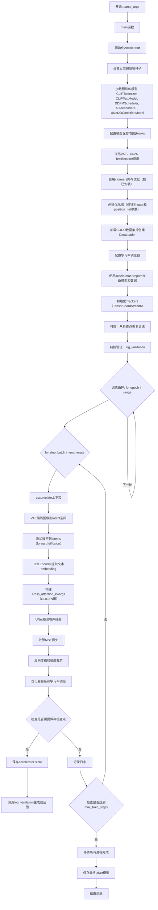
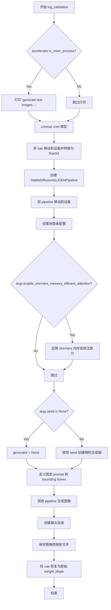
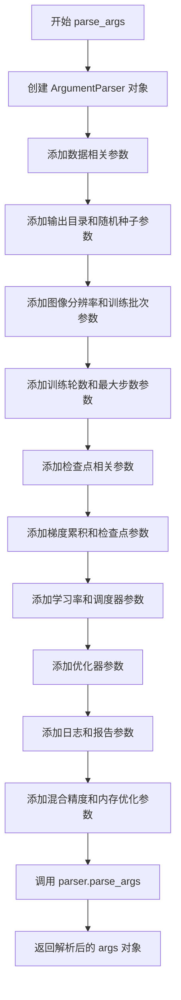
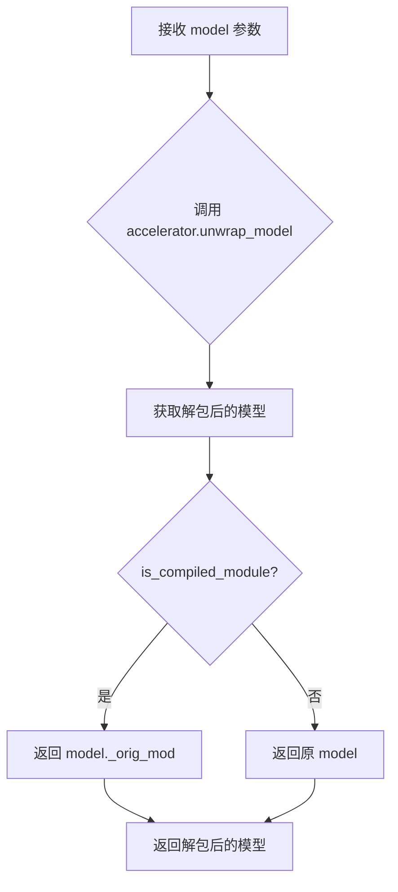
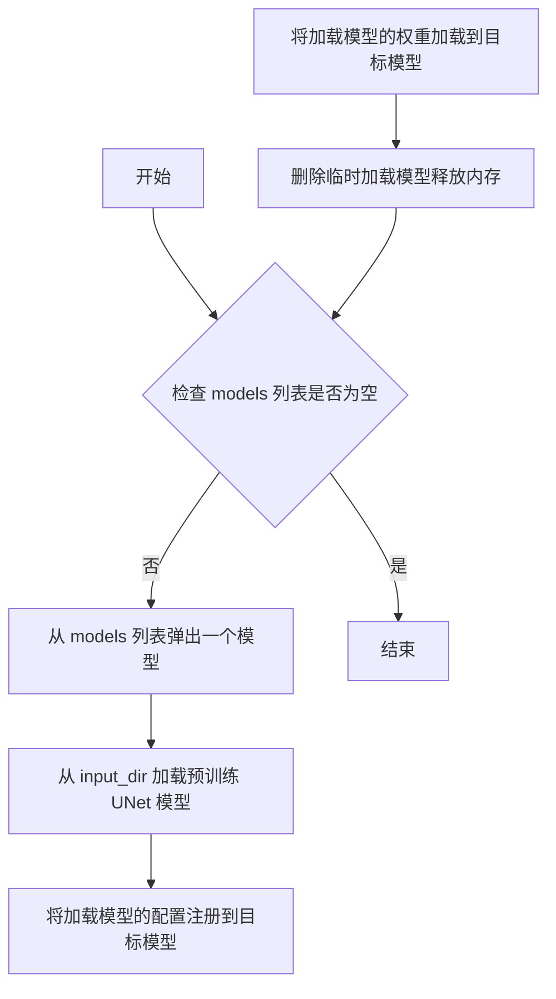
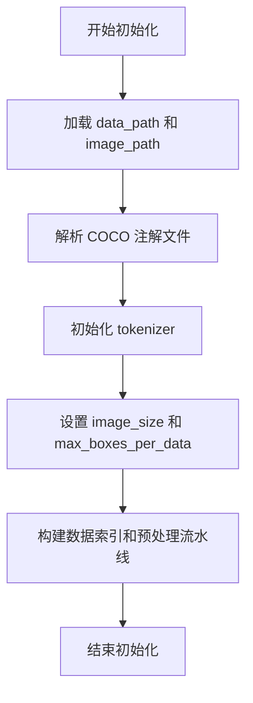

```mermaid
flowchart TD
    A[开始] --> B[解析命令行参数 args]
    B --> C[创建logging_dir和ProjectConfiguration]
    C --> D[初始化Accelerator加速器]
    D --> E{检查MPS可用性}
    E -->|是| F[禁用原生AMP]
    E -->|否| G[继续]
    F --> G
    G --> H[配置日志系统]
    H --> I{args.seed是否设置}
    I -->|是| J[设置随机种子]
    I -->|否| K[继续]
    J --> K
    K --> L{是否为主进程}
    L -->|是| M[创建输出目录]
    L -->|否| N[继续]
    M --> N
    N --> O[加载CLIPTokenizer和DDPMScheduler]
    O --> P[加载CLIPTextModel文本编码器]
    P --> Q[加载AutoencoderKL VAE模型]
    Q --> R[加载UNet2DConditionModel UNet模型]
    R --> S[注册自定义模型保存/加载钩子]
    S --> T[设置模型为不可训练VAE/UNet/TextEncoder]
    T --> U{启用xformers优化}
    U -->|是| V[检查xformers版本并启用优化]
    U -->|否| W[继续]
    V --> W
    W --> X[检查UNet数据类型为float32]
    X --> Y[启用TF32优化（如果允许）]
    Y --> Z[计算并缩放学习率（如果scale_lr）]
    Z --> AA[创建AdamW优化器仅针对fuser和position_net参数]
    AA --> AB[创建COCO训练数据集]
    AB --> AC[创建训练数据加载器]
    AC --> AD[计算训练步数和epoch数]
    AD --> AE[创建学习率调度器]
    AE --> AF[使用accelerator准备模型和优化器]
    AF --> AG[设置权重数据类型fp16/bf16/fp32]
    AG --> AH[移动VAE/UNet/TextEncoder到设备]
    AH --> AI[初始化训练跟踪器TensorBoard/WandB]
    AI --> AJ[加载检查点（如果resume_from_checkpoint）]
    AJ --> AK[创建进度条]
    AK --> AL[初始验证调用]
    AL --> AM[外循环：遍历每个epoch]
    AM --> AN[内循环：遍历每个batch]
    AN --> AO[accumulate上下文]
    AO --> AP[VAE编码图像到潜在空间]
    AP --> AQ[采样噪声]
    AR[采样随机时间步] --> AS[添加到潜在空间形成噪声潜在变量]
    AS --> AT[TextEncoder获取文本嵌入]
    AT --> AU[构建GLIGEN交叉注意力参数]
    AU --> AV[UNet预测噪声残差]
    AV --> AW[计算MSE损失]
    AW --> AX[反向传播损失]
    AX --> AY[梯度裁剪（如果同步）]
    AY --> AZ[优化器更新参数]
    AZ --> BA[学习率调度器更新]
    BA --> BB[优化器梯度清零]
    BB --> BC{是否同步梯度}
    BC -->|是| BD[更新进度条和全局步数]
    BC -->|否| BN
    BD --> BE{检查点保存条件}
    BE -->|是| BF[保存训练状态]
    BE -->|否| BG
    BF --> BH[调用验证函数]
    BH --> BG
    BG --> BI{达到最大训练步数}
    BI -->|否| AN
    BI -->|是| BJ[等待所有进程]
    BJ --> BK[主进程保存最终UNet模型]
    BK --> BL[结束训练]
    BN --> AN
    BM[达到最大训练步数] --> BJ
```

# `diffusers\examples\research_projects\gligen\train_gligen_text.py` 详细设计文档

这是一个用于训练 Stable Diffusion GLIGEN（Grounded Language-to-Image Generation）模型的训练脚本，基于 COCO 数据集进行微调。代码使用 accelerate 库实现分布式训练，支持混合精度、梯度累积、检查点保存和验证图像生成等功能。

## 整体流程



## 类结构

```
无明确类定义（脚本式架构）
├── 全局函数
│   ├── log_validation (验证图像生成)
│   ├── parse_args (命令行参数解析)
│   └── main (主训练函数)
├── 内部嵌套函数（在main内）
│   ├── unwrap_model
│   ├── save_model_hook
│   └── load_model_hook
└── 外部依赖模块
    ├── dataset.COCODataset (自定义数据集类)
    ├── accelerate (分布式训练)
    ├── diffusers (扩散模型相关)
    ├── transformers (CLIP模型)
    └── torch (深度学习框架)
```

## 全局变量及字段


### `logger`
    
日志记录器，用于输出训练过程中的调试和信息日志

类型：`logging.Logger`
    


### `pretrained_model_name_or_path`
    
预训练模型路径，指向GLIGEN-1-4-generation-text-box模型

类型：`str`
    


### `weight_dtype`
    
混合精度训练中的权重数据类型（float32/float16/bfloat16）

类型：`torch.dtype`
    


### `global_step`
    
训练过程中的全局步数计数器

类型：`int`
    


### `first_epoch`
    
训练开始的第一个epoch编号

类型：`int`
    


### `args`
    
命令行参数命名空间，包含所有训练配置参数

类型：`Namespace`
    


### `COCODataset.data_path`
    
COCO数据集的标注文件路径

类型：`str`
    


### `COCODataset.image_path`
    
COCO数据集的图像文件目录路径

类型：`str`
    


### `COCODataset.tokenizer`
    
用于文本编码的CLIP分词器

类型：`CLIPTokenizer`
    


### `COCODataset.image_size`
    
输入图像的目标尺寸（宽度和高度）

类型：`int`
    


### `COCODataset.max_boxes_per_data`
    
每个训练样本中包含的最大边界框数量

类型：`int`
    
    

## 全局函数及方法


### `log_validation`

该函数用于在训练过程中执行验证任务，使用 Stable Diffusion GLIGEN 模型生成包含指定物体（绿色汽车、蓝色卡车、红色热气球、鸟）的测试图像，并将生成的图像保存到指定目录。

参数：

- `vae`：`AutoencoderKL`，变分自编码器模型，用于将图像编码到潜在空间
- `text_encoder`：文本编码器模型，将文本提示转换为嵌入向量
- `tokenizer`：CLIP 分词器，用于对文本进行分词
- `unet`：UNet2DConditionModel 模型，用于去噪潜在表示
- `noise_scheduler`：噪声调度器，控制扩散过程中的噪声添加
- `args`：命令行参数对象，包含输出目录、是否启用 xformers 等配置
- `accelerator`：Accelerator 对象，用于分布式训练和设备管理
- `step`：当前训练步数，用于命名生成的图像文件
- `weight_dtype`：权重数据类型（torch.float32/float16/bfloat16），用于模型推理

返回值：`None`，该函数无返回值，仅执行图像生成和保存操作

#### 流程图



#### 带注释源码

```python
@torch.no_grad()
def log_validation(vae, text_encoder, tokenizer, unet, noise_scheduler, args, accelerator, step, weight_dtype):
    # 仅在主进程打印信息，避免重复输出
    if accelerator.is_main_process:
        print("generate test images...")
    
    # 解包 accelerator 中的模型
    unet = accelerator.unwrap_model(unet)
    
    # 将 VAE 移动到设备并使用 float32 精度（推理时使用更高精度）
    vae.to(accelerator.device, dtype=torch.float32)

    # 创建 Stable Diffusion GLIGEN Pipeline
    # GLIGEN 支持基于边界框的物体定位生成
    pipeline = StableDiffusionGLIGENPipeline(
        vae,
        text_encoder,
        tokenizer,
        unet,
        EulerDiscreteScheduler.from_config(noise_scheduler.config),
        safety_checker=None,  # 禁用安全检查器以加快推理速度
        feature_extractor=None,
    )
    
    # 将整个 pipeline 移动到加速设备
    pipeline = pipeline.to(accelerator.device)
    
    # 设置进度条配置：根据是否为主进程决定是否禁用进度条
    pipeline.set_progress_bar_config(disable=not accelerator.is_main_process)
    
    # 如果启用 xformers，启用内存高效注意力机制
    if args.enable_xformers_memory_efficient_attention:
        pipeline.enable_xformers_memory_efficient_attention()

    # 根据 seed 是否存在创建随机生成器，确保可重复性
    if args.seed is None:
        generator = None
    else:
        generator = torch.Generator(device=accelerator.device).manual_seed(args.seed)

    # 定义验证用的固定 prompt，描述场景中需要生成的物体
    prompt = "A realistic image of landscape scene depicting a green car parking on the left of a blue truck, with a red air balloon and a bird in the sky"
    
    # 定义物体在图像中的边界框坐标 [x1, y1, x2, y2]，归一化到 [0, 1]
    boxes = [
        [0.041015625, 0.548828125, 0.453125, 0.859375],      # 绿色汽车
        [0.525390625, 0.552734375, 0.93359375, 0.865234375], # 蓝色卡车
        [0.12890625, 0.015625, 0.412109375, 0.279296875],    # 红色热气球
        [0.578125, 0.08203125, 0.857421875, 0.27734375],      # 鸟
    ]
    
    # 与边界框对应的文本描述
    gligen_phrases = ["a green car", "a blue truck", "a red air balloon", "a bird"]
    
    # 调用 pipeline 进行图像生成
    images = pipeline(
        prompt=prompt,
        gligen_phrases=gligen_phrases,
        gligen_boxes=boxes,
        gligen_scheduled_sampling_beta=1.0,  # GLIGEN 调度采样 beta 值
        output_type="pil",                   # 输出 PIL 图像
        num_inference_steps=50,              # 推理步数
        # 负面 prompt，用于避免生成不良特征
        negative_prompt="artifacts, blurry, smooth texture, bad quality, distortions, unrealistic, distorted image, bad proportions, duplicate",
        num_images_per_prompt=4,             # 每个 prompt 生成 4 张图像
        generator=generator,                 # 随机生成器
    ).images
    
    # 创建输出目录（如果不存在）
    os.makedirs(os.path.join(args.output_dir, "images"), exist_ok=True)
    
    # 使用 make_image_grid 将 4 张图像拼接成 1x4 的网格并保存
    # 文件名包含步数和进程索引，便于追踪
    make_image_grid(images, 1, 4).save(
        os.path.join(args.output_dir, "images", f"generated-images-{step:06d}-{accelerator.process_index:02d}.png")
    )

    # 验证完成后，将 VAE 恢复为原始权重数据类型（用于后续训练）
    vae.to(accelerator.device, dtype=weight_dtype)
```


### `parse_args`

该函数是命令行参数解析函数，用于定义和解析ControlNet训练脚本的所有命令行参数，包括数据路径、输出目录、训练超参数、优化器设置、混合精度训练配置等，返回包含所有训练配置的Namespace对象。

参数：

- `input_args`：`Optional[List[str]]`，可选参数，用于测试或手动传入命令行参数列表，默认为None（从sys.argv解析）

返回值：`argparse.Namespace`，包含所有解析后的命令行参数对象

#### 流程图



#### 带注释源码

```python
def parse_args(input_args=None):
    """
    解析命令行参数，返回包含训练配置的Namespace对象。
    
    参数:
        input_args: 可选的命令行参数列表，用于测试；默认为None，从sys.argv解析
    
    返回:
        包含所有训练参数的argparse.Namespace对象
    """
    # 创建ArgumentParser实例，设置脚本描述
    parser = argparse.ArgumentParser(description="Simple example of a ControlNet training script.")
    
    # ===== 数据相关参数 =====
    parser.add_argument(
        "--data_path",
        type=str,
        default="coco_train2017.pth",
        help="Path to training dataset.",
    )
    parser.add_argument(
        "--image_path",
        type=str,
        default="coco_train2017.pth",
        help="Path to training images.",
    )
    
    # ===== 输出和随机种子 =====
    parser.add_argument(
        "--output_dir",
        type=str,
        default="controlnet-model",
        help="The output directory where the model predictions and checkpoints will be written.",
    )
    parser.add_argument("--seed", type=int, default=0, help="A seed for reproducible training.")
    
    # ===== 图像处理参数 =====
    parser.add_argument(
        "--resolution",
        type=int,
        default=512,
        help=(
            "The resolution for input images, all the images in the train/validation dataset will be resized to this"
            " resolution"
        ),
    )
    
    # ===== 训练批次参数 =====
    parser.add_argument(
        "--train_batch_size", type=int, default=4, help="Batch size (per device) for the training dataloader."
    )
    parser.add_argument("--num_train_epochs", type=int, default=1)
    parser.add_argument(
        "--max_train_steps",
        type=int,
        default=None,
        help="Total number of training steps to perform.  If provided, overrides num_train_epochs.",
    )
    
    # ===== 检查点保存参数 =====
    parser.add_argument(
        "--checkpointing_steps",
        type=int,
        default=500,
        help=(
            "Save a checkpoint of the training state every X updates. Checkpoints can be used for resuming training via `--resume_from_checkpoint`. "
            "In the case that the checkpoint is better than the final trained model, the checkpoint can also be used for inference."
            "Using a checkpoint for inference requires separate loading of the original pipeline and the individual checkpointed model components."
            "See https://huggingface.co/docs/diffusers/main/en/training/dreambooth#performing-inference-using-a-saved-checkpoint for step by step"
            "instructions."
        ),
    )
    parser.add_argument(
        "--checkpoints_total_limit",
        type=int,
        default=None,
        help=("Max number of checkpoints to store."),
    )
    parser.add_argument(
        "--resume_from_checkpoint",
        type=str,
        default=None,
        help=(
            "Whether training should be resumed from a previous checkpoint. Use a path saved by"
            ' `--checkpointing_steps`, or `"latest"` to automatically select the last available checkpoint.'
        ),
    )
    
    # ===== 梯度相关参数 =====
    parser.add_argument(
        "--gradient_accumulation_steps",
        type=int,
        default=1,
        help="Number of updates steps to accumulate before performing a backward/update pass.",
    )
    parser.add_argument(
        "--gradient_checkpointing",
        action="store_true",
        help="Whether or not to use gradient checkpointing to save memory at the expense of slower backward pass.",
    )
    
    # ===== 学习率相关参数 =====
    parser.add_argument(
        "--learning_rate",
        type=float,
        default=5e-6,
        help="Initial learning rate (after the potential warmup period) to use.",
    )
    parser.add_argument(
        "--scale_lr",
        action="store_true",
        default=False,
        help="Scale the learning rate by the number of GPUs, gradient accumulation steps, and batch size.",
    )
    parser.add_argument(
        "--lr_scheduler",
        type=str,
        default="constant",
        help=(
            'The scheduler type to use. Choose between ["linear", "cosine", "cosine_with_restarts", "polynomial",'
            ' "constant", "constant_with_warmup"]'
        ),
    )
    parser.add_argument(
        "--lr_warmup_steps", type=int, default=500, help="Number of steps for the warmup in the lr scheduler."
    )
    parser.add_argument(
        "--lr_num_cycles",
        type=int,
        default=1,
        help="Number of hard resets of the lr in cosine_with_restarts scheduler.",
    )
    parser.add_argument("--lr_power", type=float, default=1.0, help="Power factor of the polynomial scheduler.")
    
    # ===== 数据加载器参数 =====
    parser.add_argument(
        "--dataloader_num_workers",
        type=int,
        default=0,
        help=(
            "Number of subprocesses to use for data loading. 0 means that the data will be loaded in the main process."
        ),
    )
    
    # ===== 优化器参数 =====
    parser.add_argument("--adam_beta1", type=float, default=0.9, help="The beta1 parameter for the Adam optimizer.")
    parser.add_argument("--adam_beta2", type=float, default=0.999, help="The beta2 parameter for the Adam optimizer.")
    parser.add_argument("--adam_weight_decay", type=float, default=1e-2, help="Weight decay to use.")
    parser.add_argument("--adam_epsilon", type=float, default=1e-08, help="Epsilon value for the Adam optimizer")
    parser.add_argument("--max_grad_norm", default=1.0, type=float, help="Max gradient norm.")
    
    # ===== 日志和监控参数 =====
    parser.add_argument(
        "--logging_dir",
        type=str,
        default="logs",
        help=(
            "[TensorBoard](https://www.tensorflow.org/tensorboard) log directory. Will default to"
            " *output_dir/runs/**CURRENT_DATETIME_HOSTNAME***."
        ),
    )
    parser.add_argument(
        "--allow_tf32",
        action="store_true",
        help=(
            "Whether or not to allow TF32 on Ampere GPUs. Can be used to speed up training. For more information, see"
            " https://pytorch.org/docs/stable/notes/cuda.html#tensorfloat-32-tf32-on-ampere-devices"
        ),
    )
    parser.add_argument(
        "--report_to",
        type=str,
        default="tensorboard",
        help=(
            'The integration to report the results and logs to. Supported platforms are `"tensorboard"`'
            ' (default), `"wandb"` and `"comet_ml"`. Use `"all"` to report to all integrations.'
        ),
    )
    
    # ===== 混合精度和内存优化参数 =====
    parser.add_argument(
        "--mixed_precision",
        type=str,
        default=None,
        choices=["no", "fp16", "bf16"],
        help=(
            "Whether to use mixed precision. Choose between fp16 and bf16 (bfloat16). Bf16 requires PyTorch >="
            " 1.10.and an Nvidia Ampere GPU.  Default to the value of accelerate config of the current system or the"
            " flag passed with the `accelerate.launch` command. Use this argument to override the accelerate config."
        ),
    )
    parser.add_argument(
        "--enable_xformers_memory_efficient_attention", action="store_true", help="Whether or not to use xformers."
    )
    parser.add_argument(
        "--set_grads_to_none",
        action="store_true",
        help=(
            "Save more memory by using setting grads to None instead of zero. Be aware, that this changes certain"
            " behaviors, so disable this argument if it causes any problems. More info:"
            " https://pytorch.org/docs/stable/generated/torch.optim.Optimizer.zero_grad.html"
        ),
    )
    parser.add_argument(
        "--tracker_project_name",
        type=str,
        default="train_controlnet",
        help=(
            "The `project_name` argument passed to Accelerator.init_trackers for"
            " more information see https://huggingface.co/docs/accelerate/v0.17.0/en/package_reference/accelerator#accelerate.Accelerator"
        ),
    )
    
    # 解析参数并返回
    args = parser.parse_args()
    return args
```


### `main`

该函数是Stable Diffusion GLIGEN模型训练脚本的核心入口，负责初始化分布式训练环境、加载预训练模型和数据集、配置优化器和学习率调度器、执行完整的训练循环（包括前向传播、损失计算、反向传播和参数更新）、定期保存检查点并运行验证，最终保存训练好的模型。

参数：

- `args`：`argparse.Namespace`，通过`parse_args()`解析得到的命令行参数，包含训练所需的各种配置（如输出目录、批量大小、学习率等）

返回值：`None`，该函数执行训练流程但不返回任何值

#### 流程图



#### 带注释源码

```python
def main(args):
    """
    训练Stable Diffusion GLIGEN模型的主函数
    
    流程概述：
    1. 初始化分布式训练环境（Accelerator）
    2. 加载预训练模型（Tokenizer, VAE, Text Encoder, UNet）
    3. 配置优化器（仅针对fuser和position_net模块）
    4. 创建数据集和数据加载器
    5. 执行训练循环，包含：
       - 图像编码到潜在空间
       - 前向扩散过程
       - 噪声预测
       - 损失计算和反向传播
       - 模型检查点保存
       - 验证图像生成
    6. 保存最终训练模型
    """
    
    # ======== 1. 配置日志目录和项目配置 ========
    logging_dir = Path(args.output_dir, args.logging_dir)
    accelerator_project_config = ProjectConfiguration(project_dir=args.output_dir, logging_dir=logging_dir)

    # ======== 2. 初始化Accelerator分布式训练加速器 ========
    accelerator = Accelerator(
        gradient_accumulation_steps=args.gradient_accumulation_steps,
        mixed_precision=args.mixed_precision,
        log_with=args.report_to,
        project_config=accelerator_project_config,
    )

    # ======== 3. 禁用MPS设备的AMP混合精度 ========
    if torch.backends.mps.is_available():
        accelerator.native_amp = False

    # ======== 4. 配置日志系统用于调试 ========
    logging.basicConfig(
        format="%(asctime)s - %(levelname)s - %(name)s - %(message)s",
        datefmt="%m/%d/%Y %H:%M:%S",
        level=logging.INFO,
    )
    logger.info(accelerator.state, main_process_only=False)
    
    # 根据进程类型设置日志级别
    if accelerator.is_local_main_process:
        transformers.utils.logging.set_verbosity_warning()
        diffusers.utils.logging.set_verbosity_info()
    else:
        transformers.utils.logging.set_verbosity_error()
        diffusers.utils.logging.set_verbosity_error()

    # ======== 5. 设置随机种子确保可重复性 ========
    if args.seed is not None:
        set_seed(args.seed)

    # ======== 6. 主进程创建输出目录 ========
    if accelerator.is_main_process:
        if args.output_dir is not None:
            os.makedirs(args.output_dir, exist_ok=True)

    # ======== 7. 加载预训练模型和调度器 ========
    from transformers import CLIPTextModel, CLIPTokenizer

    # 使用指定的预训练模型路径
    pretrained_model_name_or_path = "masterful/gligen-1-4-generation-text-box"
    
    # 加载CLIP分词器
    tokenizer = CLIPTokenizer.from_pretrained(pretrained_model_name_or_path, subfolder="tokenizer")
    
    # 加载DDPM噪声调度器
    noise_scheduler = DDPMScheduler.from_pretrained(pretrained_model_name_or_path, subfolder="scheduler")
    
    # 加载CLIP文本编码器
    text_encoder = CLIPTextModel.from_pretrained(pretrained_model_name_or_path, subfolder="text_encoder")

    # 加载VAE自编码器
    vae = AutoencoderKL.from_pretrained(pretrained_model_name_or_path, subfolder="vae")
    
    # 加载UNet条件模型
    unet = UNet2DConditionModel.from_pretrained(pretrained_model_name_or_path, subfolder="unet")

    # ======== 8. 定义模型解包辅助函数 ========
    def unwrap_model(model):
        """解包加速器包装的模型，处理编译模块"""
        model = accelerator.unwrap_model(model)
        model = model._orig_mod if is_compiled_module(model) else model
        return model

    # ======== 9. 注册自定义模型保存/加载钩子（accelerate 0.16.0+）=======
    if version.parse(accelerate.__version__) >= version.parse("0.16.0"):
        
        def save_model_hook(models, weights, output_dir):
            """自定义保存钩子：保存UNet模型"""
            if accelerator.is_main_process:
                i = len(weights) - 1

                while len(weights) > 0:
                    weights.pop()
                    model = models[i]

                    sub_dir = "unet"
                    model.save_pretrained(os.path.join(output_dir, sub_dir))

                    i -= 1

        def load_model_hook(models, input_dir):
            """自定义加载钩子：加载UNet模型"""
            while len(models) > 0:
                # 弹出模型避免重复加载
                model = models.pop()

                # 以diffusers风格加载模型
                load_model = unet.from_pretrained(input_dir, subfolder="unet")
                model.register_to_config(**load_model.config)

                model.load_state_dict(load_model.state_dict())
                del load_model

        accelerator.register_save_state_pre_hook(save_model_hook)
        accelerator.register_load_state_pre_hook(load_model_hook)

    # ======== 10. 设置模型为推理模式（不训练）=======
    vae.requires_grad_(False)
    unet.requires_grad_(False)
    text_encoder.requires_grad_(False)

    # ======== 11. 配置xformers高效注意力机制 ========
    if args.enable_xformers_memory_efficient_attention:
        if is_xformers_available():
            import xformers

            xformers_version = version.parse(xformers.__version__)
            if xformers_version == version.parse("0.0.16"):
                logger.warning(
                    "xFormers 0.0.16 cannot be used for training in some GPUs. If you observe problems during training, please update xFormers to at least 0.0.17. See https://huggingface.co/docs/diffusers/main/en/optimization/xformers for more details."
                )
            unet.enable_xformers_memory_efficient_attention()
        else:
            raise ValueError("xformers is not available. Make sure it is installed correctly")

    # ======== 12. 检查模型数据类型 ========
    low_precision_error_string = (
        " Please make sure to always have all model weights in full float32 precision when starting training - even if"
        " doing mixed precision training, copy of the weights should still be float32."
    )

    if unwrap_model(unet).dtype != torch.float32:
        raise ValueError(f"Controlnet loaded as datatype {unwrap_model(unet).dtype}. {low_precision_error_string}")

    # ======== 13. 启用TF32加速（Ampere GPU）=======
    if args.allow_tf32:
        torch.backends.cuda.matmul.allow_tf32 = True

    # ======== 14. 缩放学习率（如果启用）=======
    if args.scale_lr:
        args.learning_rate = (
            args.learning_rate * args.gradient_accumulation_steps * args.train_batch_size * accelerator.num_processes
        )

    # ======== 15. 创建优化器（仅针对特定模块）=======
    optimizer_class = torch.optim.AdamW
    
    # 遍历UNet模块，重置fuser和position_net参数
    for n, m in unet.named_modules():
        if ("fuser" in n) or ("position_net" in n):
            import torch.nn as nn

            if isinstance(m, (nn.Linear, nn.LayerNorm)):
                m.reset_parameters()
    
    # 收集可训练参数（仅fuser和position_net）
    params_to_optimize = []
    for n, p in unet.named_parameters():
        if ("fuser" in n) or ("position_net" in n):
            p.requires_grad = True
            params_to_optimize.append(p)
    
    # 创建AdamW优化器
    optimizer = optimizer_class(
        params_to_optimize,
        lr=args.learning_rate,
        betas=(args.adam_beta1, args.adam_beta2),
        weight_decay=args.adam_weight_decay,
        eps=args.adam_epsilon,
    )

    # ======== 16. 创建训练数据集 ========
    from dataset import COCODataset

    train_dataset = COCODataset(
        data_path=args.data_path,
        image_path=args.image_path,
        tokenizer=tokenizer,
        image_size=args_resolution,
        max_boxes_per_data=30,
    )

    print("num samples: ", len(train_dataset))

    # ======== 17. 创建数据加载器 ========
    train_dataloader = torch.utils.data.DataLoader(
        train_dataset,
        shuffle=True,
        batch_size=args.train_batch_size,
        num_workers=args.dataloader_num_workers,
    )

    # ======== 18. 计算训练步骤数 ========
    overrode_max_train_steps = False
    num_update_steps_per_epoch = math.ceil(len(train_dataloader) / args.gradient_accumulation_steps)
    if args.max_train_steps is None:
        args.max_train_steps = args.num_train_epochs * num_update_steps_per_epoch
        overrode_max_train_steps = True

    # ======== 19. 创建学习率调度器 ========
    lr_scheduler = get_scheduler(
        args.lr_scheduler,
        optimizer=optimizer,
        num_warmup_steps=args.lr_warmup_steps * accelerator.num_processes,
        num_training_steps=args.max_train_steps * accelerator.num_processes,
        num_cycles=args.lr_num_cycles,
        power=args.lr_power,
    )

    # ======== 20. 使用Accelerator准备训练组件 ========
    unet, optimizer, train_dataloader, lr_scheduler = accelerator.prepare(
        unet, optimizer, train_dataloader, lr_scheduler
    )

    # ======== 21. 设置混合精度权重类型 ========
    weight_dtype = torch.float32
    if accelerator.mixed_precision == "fp16":
        weight_dtype = torch.float16
    elif accelerator.mixed_precision == "bf16":
        weight_dtype = torch.bfloat16

    # ======== 22. 移动模型到设备并转换数据类型 ========
    vae.to(accelerator.device, dtype=weight_dtype)
    unet.to(accelerator.device, dtype=torch.float32)  # UNet保持float32
    text_encoder.to(accelerator.device, dtype=weight_dtype)

    # ======== 23. 重新计算训练步骤（数据加载器大小可能变化）=======
    num_update_steps_per_epoch = math.ceil(len(train_dataloader) / args.gradient_accumulation_steps)
    if overrode_max_train_steps:
        args.max_train_steps = args.num_train_epochs * num_update_steps_per_epoch
    args.num_train_epochs = math.ceil(args.max_train_steps / num_update_steps_per_epoch)

    # ======== 24. 初始化训练跟踪器 ========
    if accelerator.is_main_process:
        tracker_config = dict(vars(args))
        accelerator.init_trackers(args.tracker_project_name, config=tracker_config)

    # ======== 25. 初始化训练状态变量 ========
    global_step = 0
    first_epoch = 0
    initial_global_step = 0

    # ======== 26. 加载检查点（如果存在）=======
    if args.resume_from_checkpoint:
        if args.resume_from_checkpoint != "latest":
            path = os.path.basename(args.resume_from_checkpoint)
        else:
            # 获取最新的检查点
            dirs = os.listdir(args.output_dir)
            dirs = [d for d in dirs if d.startswith("checkpoint")]
            dirs = sorted(dirs, key=lambda x: int(x.split("-")[1]))
            path = dirs[-1] if len(dirs) > 0 else None

        if path is None:
            accelerator.print(
                f"Checkpoint '{args.resume_from_checkpoint}' does not exist. Starting a new training run."
            )
            args.resume_from_checkpoint = None
            initial_global_step = 0
        else:
            accelerator.print(f"Resuming from checkpoint {path}")
            accelerator.load_state(os.path.join(args.output_dir, path))
            global_step = int(path.split("-")[1])

            initial_global_step = global_step
            first_epoch = global_step // num_update_steps_per_epoch

    # ======== 27. 创建进度条 ========
    progress_bar = tqdm(
        range(0, args.max_train_steps),
        initial=initial_global_step,
        desc="Steps",
        disable=not accelerator.is_local_main_process,
    )

    # ======== 28. 初始验证 ========
    log_validation(
        vae,
        text_encoder,
        tokenizer,
        unet,
        noise_scheduler,
        args,
        accelerator,
        global_step,
        weight_dtype,
    )

    # ======== 29. 训练主循环 ========
    for epoch in range(first_epoch, args.num_train_epochs):
        for step, batch in enumerate(train_dataloader):
            # 使用accumulate进行梯度累积
            with accelerator.accumulate(unet):
                # ======== 29.1 将图像编码到潜在空间 ========
                latents = vae.encode(batch["pixel_values"].to(dtype=weight_dtype)).latent_dist.sample()
                latents = latents * vae.config.scaling_factor

                # ======== 29.2 采样噪声 ========
                noise = torch.randn_like(latents)
                bsz = latents.shape[0]
                
                # ======== 29.3 为每个图像采样随机时间步 ========
                timesteps = torch.randint(0, noise_scheduler.config.num_train_timesteps, (bsz,), device=latents.device)
                timesteps = timesteps.long()

                # ======== 29.4 前向扩散过程：添加噪声 ========
                noisy_latents = noise_scheduler.add_noise(latents, noise, timesteps)

                # ======== 29.5 获取文本嵌入 ========
                with torch.no_grad():
                    encoder_hidden_states = text_encoder(
                        batch["caption"]["input_ids"].squeeze(1),
                        return_dict=False,
                    )[0]

                # ======== 29.6 构建GLIGEN交叉注意力参数 ========
                cross_attention_kwargs = {}
                cross_attention_kwargs["gligen"] = {
                    "boxes": batch["boxes"],
                    "positive_embeddings": batch["text_embeddings_before_projection"],
                    "masks": batch["masks"],
                }
                
                # ======== 29.7 UNet预测噪声残差 ========
                model_pred = unet(
                    noisy_latents,
                    timesteps,
                    encoder_hidden_states=encoder_hidden_states,
                    cross_attention_kwargs=cross_attention_kwargs,
                    return_dict=False,
                )[0]

                # ======== 29.8 根据预测类型获取目标 ========
                if noise_scheduler.config.prediction_type == "epsilon":
                    target = noise
                elif noise_scheduler.config.prediction_type == "v_prediction":
                    target = noise_scheduler.get_velocity(latents, noise, timesteps)
                else:
                    raise ValueError(f"Unknown prediction type {noise_scheduler.config.prediction_type}")
                
                # ======== 29.9 计算MSE损失 ========
                loss = F.mse_loss(model_pred.float(), target.float(), reduction="mean")

                # ======== 29.10 反向传播 ========
                accelerator.backward(loss)
                
                # ======== 29.11 梯度裁剪 ========
                if accelerator.sync_gradients:
                    accelerator.clip_grad_norm_(params_to_optimize, args.max_grad_norm)
                
                # ======== 29.12 更新优化器 ========
                optimizer.step()
                lr_scheduler.step()
                optimizer.zero_grad(set_to_none=args.set_grads_to_none)

            # ======== 30. 检查是否执行了优化步骤 ========
            if accelerator.sync_gradients:
                progress_bar.update(1)
                global_step += 1

                # ======== 30.1 检查点保存 ========
                if global_step % args.checkpointing_steps == 0:
                    if accelerator.is_main_process:
                        # 检查并清理超过限制的检查点
                        if args.checkpoints_total_limit is not None:
                            checkpoints = os.listdir(args.output_dir)
                            checkpoints = [d for d in checkpoints if d.startswith("checkpoint")]
                            checkpoints = sorted(checkpoints, key=lambda x: int(x.split("-")[1]))

                            if len(checkpoints) >= args.checkpoints_total_limit:
                                num_to_remove = len(checkpoints) - args.checkpoints_total_limit + 1
                                removing_checkpoints = checkpoints[0:num_to_remove]

                                logger.info(
                                    f"{len(checkpoints)} checkpoints already exist, removing {len(removing_checkpoints)} checkpoints"
                                )
                                logger.info(f"removing checkpoints: {', '.join(removing_checkpoints)}")

                                for removing_checkpoint in removing_checkpoints:
                                    removing_checkpoint = os.path.join(args.output_dir, removing_checkpoint)
                                    shutil.rmtree(removing_checkpoint)

                        # 保存检查点
                        save_path = os.path.join(args.output_dir, f"checkpoint-{global_step:06d}")
                        accelerator.save_state(save_path)
                        logger.info(f"Saved state to {save_path}")

                    # ======== 30.2 验证 ========
                    log_validation(
                        vae,
                        text_encoder,
                        tokenizer,
                        unet,
                        noise_scheduler,
                        args,
                        accelerator,
                        global_step,
                        weight_dtype,
                    )
                
                # ======== 30.3 记录日志 ========
                logs = {"loss": loss.detach().item(), "lr": lr_scheduler.get_last_lr()[0]}
                progress_bar.set_postfix(**logs)
                accelerator.log(logs, step=global_step)

                # ======== 30.4 检查是否达到最大训练步数 ========
                if global_step >= args.max_train_steps:
                    break

    # ======== 31. 保存最终模型 ========
    accelerator.wait_for_everyone()
    if accelerator.is_main_process:
        unet = unwrap_model(unet)
        unet.save_pretrained(args.output_dir)

    # ======== 32. 结束训练 ========
    accelerator.end_training()
```


### `unwrap_model`

该函数是一个嵌套函数，用于将分布式训练中包装的模型解包为原始模型，同时处理 TorchCompiled 模块的特殊情况，确保返回可用于保存或推理的模型对象。

参数：

- `model`：`torch.nn.Module`，需要解包的模型对象（通常是经过 Accelerator 包装的 UNet 或其他神经网络模型）

返回值：`torch.nn.Module`，解包后的模型对象。如果模型是通过 `torch.compile` 编译的，则返回其原始模块（`_orig_mod`）；否则返回原模型。

#### 流程图



#### 带注释源码

```python
def unwrap_model(model):
    """
    解包分布式训练中 Accelerator 包装的模型，处理编译模块特殊情况。
    
    参数:
        model: 经过 Accelerator 包装的模型对象
        
    返回值:
        解包后的模型，可用于保存或推理
    """
    # 第一步：使用 Accelerator 的 unwrap_model 方法解包模型
    # 这会移除 Accelerator 添加的分布式训练包装层
    model = accelerator.unwrap_model(model)
    
    # 第二步：检查模型是否是 TorchCompiled 模块
    # 如果是编译模块，需要获取原始模块 (_orig_mod)
    # 这是因为编译后的模型结构发生了变化，需要还原为原始形式才能正确保存
    model = model._orig_mod if is_compiled_module(model) else model
    
    # 返回最终解包后的模型
    return model
```


### `save_model_hook`

该函数是一个嵌套在 `main` 函数内的自定义模型保存钩子（callback），通过 `accelerator.register_save_state_pre_hook` 注册，用于在分布式训练环境中自定义模型状态的保存逻辑。它遍历模型列表和权重列表，将 UNet 模型保存到指定的输出目录中。

参数：

- `models`：`List[torch.nn.Module]`，要保存的模型列表，包含需要保存的模型实例
- `weights`：`List`，权重列表，用于跟踪已保存的权重，在保存后会被清空
- `output_dir`：`str`，输出目录路径，指定模型检查点的保存位置

返回值：`None`，该函数无返回值，主要通过副作用保存模型

#### 流程图

```mermaid
flowchart TD
    A[开始 save_model_hook] --> B{accelerator.is_main_process?}
    B -->|否| C[直接返回]
    B -->|是| D[i = len(weights) - 1]
    D --> E{len(weights) > 0?}
    E -->|否| F[结束]
    E -->|是| G[weights.pop]
    H[model = models[i]
    i = i - 1] --> I[sub_dir = 'unet']
    I --> J[model.save_pretrained<br/>/os.path.join<br/>/output_dir, sub_dir]
    J --> E
```

#### 带注释源码

```python
def save_model_hook(models, weights, output_dir):
    """
    自定义模型保存钩子，用于在 accelerator.save_state() 时保存模型
    该钩子确保只有主进程执行保存操作，并按顺序保存模型到指定目录
    """
    if accelerator.is_main_process:  # 仅在主进程执行保存
        i = len(weights) - 1  # 从最后一个模型开始

        while len(weights) > 0:  # 遍历所有权重
            weights.pop()  # 弹出已处理的权重
            model = models[i]  # 获取对应模型

            sub_dir = "unet"  # 指定子目录名称为 unet
            # 使用 diffusers 的 save_pretrained 方法保存模型
            model.save_pretrained(os.path.join(output_dir, sub_dir))

            i -= 1  # 移动到前一个模型
```


### `main.load_model_hook`

这是一个嵌套函数，用于在分布式训练中从检查点恢复模型状态。函数从指定目录加载预训练的 UNet 模型，并将权重和配置迁移到模型列表中的模型对象。

参数：

- `models`：`list`，模型列表，由 Accelerate 的 `register_load_state_pre_hook` 回调时自动传入，包含需要加载状态的模型对象
- `input_dir`：`str`，检查点目录路径，指向包含预训练模型权重的目录

返回值：`None`，无返回值，该函数通过修改传入的模型对象来更新状态

#### 流程图



#### 带注释源码

```python
def load_model_hook(models, input_dir):
    # 循环处理模型列表中的所有模型
    while len(models) > 0:
        # 弹出模型，防止重复加载
        model = models.pop()

        # 从预训练目录加载 Diffusers 风格的 UNet 模型
        # input_dir 是检查点目录，subfolder="unet" 指定加载 unet 子目录
        load_model = unet.from_pretrained(input_dir, subfolder="unet")

        # 将加载模型的配置注册到目标模型
        # 使用 register_to_config 方法同步模型配置（如隐藏层大小、注意力机制类型等）
        model.register_to_config(**load_model.config)

        # 将加载模型的.state_dict() 权重加载到当前模型
        # 确保模型结构和权重完全匹配
        model.load_state_dict(load_model.state_dict())

        # 删除临时加载的模型对象，释放内存
        # 避免重复占用 GPU 显存
        del load_model
```


由于提供的代码中未包含 `COCODataset` 类的定义（仅导入了该类并进行了实例化），无法提取 `__init__` 方法的完整源码和详细逻辑。以下是基于代码调用上下文的推断信息：

### `COCODataset.__init__`

该方法是 `COCODataset` 类的构造函数，用于初始化 COCO 数据集对象，加载数据路径、图像、分词器等配置。

参数：

- `data_path`：`str`，指向 COCO 数据集的注解文件路径（如 `.json` 或 `.pth`）
- `image_path`：`str`，指向 COCO 图像文件的目录路径
- `tokenizer`：`CLIPTokenizer`，用于对文本描述进行分词和编码
- `image_size`：`int`，目标图像的尺寸（用于 resize）
- `max_boxes_per_data`：`int`，每个样本最多保留的边界框数量（代码中设为 30）

返回值：`None`（构造函数无返回值）

#### 流程图

由于缺乏源码，无法绘制准确的流程图。以下是可能的逻辑结构：



#### 带注释源码

```python
# 源码未在提供的代码片段中给出
# 以下为基于调用的推断结构：
def __init__(self, data_path, image_path, tokenizer, image_size, max_boxes_per_data):
    """
    初始化 COCO 数据集。
    
    参数:
        data_path (str): COCO 注解文件路径。
        image_path (str): 图像文件目录路径。
        tokenizer (CLIPTokenizer): 分词器对象。
        image_size (int): 图像目标尺寸。
        max_boxes_per_data (int): 每个样本最大边界框数。
    """
    self.data_path = data_path
    self.image_path = image_path
    self.tokenizer = tokenizer
    self.image_size = image_size
    self.max_boxes_per_data = max_boxes_per_data
    # 实际实现可能包括：
    # - 加载并解析 COCO 格式的注解
    # - 建立图像 ID 到注解的映射
    # - 定义 __len__ 和 __getitem__ 方法
```


# 分析结果

## 问题说明

在提供的代码中，我无法找到 `COCODataset` 类的定义。代码中只是导入了该类：

```python
from dataset import COCODataset
```

但 `COCODataset` 类的实际定义（包括 `__len__` 方法）位于 `dataset` 模块中，该模块未在提供的代码片段中包含。

---

### 现有信息

从代码中我们可以找到 `COCODataset` 的实例化部分：

```python
train_dataset = COCODataset(
    data_path=args.data_path,
    image_path=args.image_path,
    tokenizer=tokenizer,
    image_size=args.resolution,
    max_boxes_per_data=30,
)
```

以及使用 `len()` 获取数据集大小的部分：

```python
print("num samples: ", len(train_dataset))
```

---

### 建议

要获取 `COCODataset.__len__` 方法的完整文档，您需要：

1. **提供 `dataset.py` 文件的内容**，或
2. **确认 `COCODataset` 类的定义位置**

如果您能提供 `dataset.py` 的源代码，我可以为您生成完整的详细设计文档，包括：
- `__len__` 方法的参数、返回值和流程图
- `COCODataset` 类的所有字段和方法
- 完整的数据流和状态机分析

请补充提供缺失的代码部分。


# 提取 `COCODataset.__getitem__` 方法信息

## 分析结果

### 状态：无法完成提取

经过仔细分析提供的代码，我发现：

1. **代码中确实使用了 `COCODataset` 类**：
   - 导入语句：`from dataset import COCODataset`
   - 实例化：在 `main` 函数中创建了 `train_dataset` 对象

2. **但 `COCODataset` 类的定义不在提供的代码中**：
   - 代码中只有使用该类的部分
   - 类的具体实现（包括 `__getitem__` 方法）应该在独立的 `dataset` 模块中

---

### 需要的补充信息

为了完成您的请求，请提供以下内容之一：

1. **`dataset.py` 模块的完整代码**，或
2. **`COCODataset` 类的完整定义**，特别是 `__getitem__` 方法的实现

---

### 当前代码上下文（供参考）

```python
# 在 main 函数中使用 COCODataset
from dataset import COCODataset

train_dataset = COCODataset(
    data_path=args.data_path,
    image_path=args.image_path,
    tokenizer=tokenizer,
    image_size=args.resolution,
    max_boxes_per_data=30,
)

# 在训练循环中使用
for step, batch in enumerate(train_dataloader):
    # batch 来自 train_dataset，通过 __getitem__ 方法获取
```

---

### 建议

请提供 `dataset.py` 文件或 `COCODataset` 类的实现代码，我将根据您提供的完整代码，提取 `__getitem__` 方法的详细信息，包括：
- 参数名称、类型和描述
- 返回值类型和描述
- Mermaid 流程图
- 带注释的源码

## 关键组件


### 张量索引与惰性加载

代码中使用了多种张量索引操作和惰性加载模式。在训练循环中，通过`batch["pixel_values"]`、`batch["caption"]["input_ids"]`、`batch["boxes"]`、`batch["text_embeddings_before_projection"]`、`batch["masks"]`等方式从数据批中按键索引获取数据。此外，使用`accelerator.unwrap_model(model)`和`is_compiled_module(model)`来判断是否为编译后的模型，实现模型的惰性解包操作。

### 反量化支持

代码实现了完整的权重数据类型（weight_dtype）管理框架。根据`accelerator.mixed_precision`设置，将`weight_dtype`设置为`torch.float16`（fp16）或`torch.bfloat16`（bf16），并在推理时将VAE和Text Encoder转换为指定精度，同时保留UNet在float32以保证训练稳定性。

### 量化策略

代码通过`--mixed_precision`参数支持三种量化策略：`fp16`（半精度）、`bf16`（Brain Float 16）和`no`（全精度）。使用`torch.float32`作为默认权重类型，在训练前将VAE和Text Encoder移动到设备并转换为目标精度类型。

### GLIGEN特定组件

GLIGEN（Grounded Language-to-Image Generation）通过`cross_attention_kwargs`传递特殊参数，包括`boxes`（边界框坐标）、`positive_embeddings`（正样本嵌入）和`masks`（掩码），实现基于空间约束的文本到图像生成。

### 梯度累积与检查点

代码实现了梯度累积机制（`gradient_accumulation_steps`），通过`accelerator.accumulate(unet)`上下文管理器在多个步骤上累积梯度后再执行反向传播和参数更新，有效扩展有效批量大小。

### 模型保存与恢复

实现了自定义的模型保存和加载钩子函数`save_model_hook`和`load_model_hook`，使用`accelerator.register_save_state_pre_hook`和`accelerator.register_load_state_pre_hook`注册，以特定格式序列化模型状态，支持训练中断后的恢复。

### 检查点管理

代码包含检查点数量限制逻辑（`checkpoints_total_limit`），通过排序和删除旧检查点确保存储空间有效利用，同时保留最新的检查点用于训练恢复。

### 学习率调度

支持多种学习率调度策略（linear、cosine、cosine_with_restarts、polynomial、constant、constant_with_warmup），通过`get_scheduler`函数创建调度器，并在训练循环中根据`lr_scheduler.step()`更新学习率。

### xFormers内存优化

集成xFormers库的`enable_xformers_memory_efficient_attention()`方法，通过`is_xformers_available()`检查可用性，启用内存高效注意力机制以降低显存占用。

### 数据集组件

使用自定义的`COCODataset`类处理COCO数据集，支持配置数据路径、图像路径、分词器、图像分辨率和最大边界框数量，通过PyTorch DataLoader进行批量数据加载。

### 验证图像生成

`log_validation`函数使用`StableDiffusionGLIGENPipeline`生成验证图像，支持指定提示词、GLIGEN短语和边界框，生成4张图像并使用`make_image_grid`拼接保存。


## 问题及建议


### 已知问题

-   **硬编码模型路径和验证参数**：`pretrained_model_name_or_path`、`prompt`、`boxes`、`gligen_phrases` 等参数在代码中硬编码，缺乏灵活性，无法通过命令行参数自定义。
-   **数据类型不一致**：VAE 和 text_encoder 使用 `weight_dtype`，但 unet 强制转换为 `torch.float32`，导致混合精度训练不一致，可能影响训练效率和性能。
-   **训练前执行验证**：在训练循环之前调用 `log_validation()`，导致在没有任何训练的情况下生成测试图像，浪费计算资源。
-   **数据加载配置不优**：默认 `dataloader_num_workers=0`，且未启用 `persistent_workers`，可能导致数据加载成为性能瓶颈。
-   **分散的导入语句**：部分导入（如 `CLIPTextModel`、`CLIPTokenizer`、`xformers`）在函数内部进行，增加了模块加载时间且不符合最佳实践。
-   **未使用的变量和注释代码**：存在大量被注释掉的代码（如 `gradient_checkpointing`、日志记录部分），影响代码可读性且维护困难。
-   **缺少错误处理**：网络连接失败、磁盘空间不足、模型加载失败等异常情况没有捕获和处理。
-   **xformers 版本警告后继续执行**：检测到 xformers 0.0.16 版本时仅发出警告，但未阻止训练，可能导致隐式问题。
-   **Checkpoint 清理逻辑不完整**：只清理 checkpoint 目录，未考虑其他临时文件或文件夹。
-   **验证图像保存路径固定**：验证图像保存逻辑未考虑多 GPU 场景下的文件名冲突覆盖问题。

### 优化建议

-   **参数化配置**：将 `pretrained_model_name_or_path`、验证 prompt、boxes 等添加为命令行参数，通过 `parse_args()` 统一管理。
-   **统一数据类型**：确保 unet、vae、text_encoder 在混合精度训练时使用一致的 `weight_dtype`，或明确注释为何 unet 需要单独处理。
-   **调整验证时机**：将 `log_validation()` 调用移至训练循环内部，或添加参数控制是否需要在训练前验证。
-   **优化数据加载**：将 `dataloader_num_workers` 默认值调整为 4 或更高，并启用 `persistent_workers=True`（当 num_workers > 0 时）。
-   **重构导入语句**：将所有导入移到文件顶部，提高代码可读性和加载性能。
-   **清理注释代码**：删除或整理被注释掉的代码块，或使用配置开关控制是否启用。
-   **添加错误处理**：使用 try-except 块包装关键操作（如模型加载、数据集访问），并提供有意义的错误信息。
-   **严格版本检查**：对于不兼容的 xformers 版本，直接抛出异常或终止训练，而非仅发出警告。
-   **完善 checkpoint 管理**：扩展清理逻辑以处理所有临时文件，并添加 checkpoint 有效性验证。
-   **改进图像保存机制**：使用全局唯一标识符（如 UUID）或时间戳避免文件名冲突。


## 其它


### 设计目标与约束

本训练脚本的核心设计目标是实现Stable Diffusion GLIGEN模型的高效微调训练。约束条件包括：1）仅微调UNet部分的fuser和position_net参数，保持其他组件冻结以减少显存占用；2）支持单GPU和多GPU分布式训练，通过Accelerator实现；3）支持混合精度训练（fp16/bf16）以提升训练速度；4）支持梯度累积以实现大batch训练；5）支持xFormers高效注意力机制；6）使用COCO数据集进行训练，图像分辨率默认为512x512。

### 错误处理与异常设计

代码中的错误处理主要体现在以下几个方面：1）xFormers版本检查，当版本为0.0.16时发出警告建议升级；2）模型数据类型检查，确保UNet为float32精度；3）checkpoint恢复时的路径验证，若checkpoint不存在则从初始状态开始训练；4）checkpoint数量限制管理，当超过checkpoints_total_limit时自动删除旧checkpoint；5）设备兼容性检查，包括MPS后端时禁用AMP；6）异常抛出，如xFormers不可用时抛出ValueError。

### 数据流与状态机

训练数据流为：COCO数据集 → DataLoader → VAE编码为latent空间 → 添加噪声（DDPM前向过程）→ Text Encoder编码caption → GLIGEN相关参数准备（boxes、positive_embeddings、masks）→ UNet预测噪声残差 → 计算MSE Loss → 反向传播 → 参数更新 → 学习率调度。状态机包括：训练开始前的初始化状态、训练过程中的循环状态（epoch/step）、checkpoint保存状态、validation验证状态、训练结束状态。

### 外部依赖与接口契约

主要外部依赖包括：1）diffusers库（StableDiffusionGLIGENPipeline、AutoencoderKL、UNet2DConditionModel、DDPMScheduler、EulerDiscreteScheduler）；2）transformers库（CLIPTextModel、CLIPTokenizer）；3）accelerate库（Accelerator、ProjectConfiguration、set_seed）；4）torch生态（torch、torch.nn.functional、torch.utils.checkpoint）；5）其他工具库（tqdm、packaging、pathlib、argparse）。接口契约：数据集类COCODataset需提供data_path、image_path、tokenizer、image_size、max_boxes_per_data参数，返回包含pixel_values、caption、boxes、text_embeddings_before_projection、masks的字典。

### 性能优化策略

代码中实现的性能优化包括：1）混合精度训练（fp16/bf16）减少显存占用和加速计算；2）梯度累积实现更大有效batch size；3）xFormers高效注意力机制；4）梯度checkpointing（代码中已定义但被注释）；5）TF32加速（ Ampere GPU）；6）模型部分微调（仅微调fuser和position_net）；7）MPS后端检测并禁用AMP以避免兼容性问题；8）多进程数据加载（dataloader_num_workers）；9）只在主进程进行validation生成以避免重复计算。

### 安全性考虑

代码中的安全措施包括：1）使用torch.no_grad()装饰器保护validation过程不计算梯度；2）模型权重在推理时转换为float32以确保数值安全；3）checkpoint保存和加载使用安全的序列化和反序列化方式；4）文件系统操作使用exist_ok=True避免覆盖冲突；5）删除旧checkpoint时使用shutil.rmtree确保清理完整。

### 配置管理

配置通过argparse命令行参数管理，主要配置项包括：数据配置（data_path、image_path、resolution）、训练配置（train_batch_size、num_train_epochs、max_train_steps、gradient_accumulation_steps）、优化器配置（learning_rate、adam_beta1/beta2、adam_weight_decay、adam_epsilon、max_grad_norm）、学习率调度配置（lr_scheduler、lr_warmup_steps、lr_num_cycles、lr_power）、模型配置（enable_xformers_memory_efficient_attention、gradient_checkpointing）、输出配置（output_dir、logging_dir、checkpointing_steps、checkpoints_total_limit、resume_from_checkpoint）、监控配置（report_to、tracker_project_name、seed）。

### 资源管理

资源管理策略包括：1）GPU内存管理：模型按需移动到设备，VAE和Text Encoder使用weight_dtype，UNet固定使用float32；2）显存优化：冻结不需要训练的模型（vae.requires_grad_(False)、unet.requires_grad_(False)、text_encoder.requires_grad_(False)），仅对特定参数设置requires_grad；3）磁盘空间管理：checkpoints_total_limit限制保存的checkpoint数量，自动清理旧checkpoint；4）多进程资源：使用Accelerator管理分布式训练，确保所有进程同步；5）临时文件管理：使用os.makedirs创建输出目录，使用shutil.rmtree删除目录。

### 关键组件职责

关键组件包括：1）Accelerator：管理分布式训练、混合精度、模型保存加载钩子；2）DDPMScheduler：实现扩散模型的噪声调度；3）VAE：将图像编码到潜在空间；4）Text Encoder：将文本编码为条件嵌入；5）UNet2DConditionModel：预测噪声残差，支持GLIGEN交叉注意力；6）StableDiffusionGLIGENPipeline：用于validation时生成图像；7）COCODataset：加载COCO数据集并预处理；8）学习率调度器：根据配置调整学习率。

### 潜在技术债务与优化空间

代码中存在以下可优化点：1）硬编码的模型路径和validation prompt，应移至配置参数；2）validation生成的图像数量（num_images_per_prompt=4）和推理步数（50）应可配置；3）代码中有大量被注释的代码块（如gradient_checkpointing、controlnet相关），应清理或完善；4）缺少分布式训练的状态同步日志；5）dataset.py的import方式表明存在自定义数据集类但未在代码中定义；6）错误处理可以更精细化，如网络加载模型失败的处理；7）缺少训练过程中的指标监控（如GPU利用率、显存占用）；8）validation频率固定，可考虑调整为动态调整；9）代码混合了训练和验证逻辑，可考虑拆分以提高模块化程度。


    