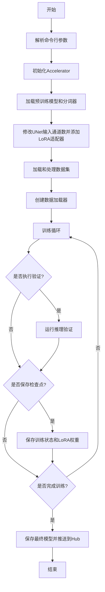
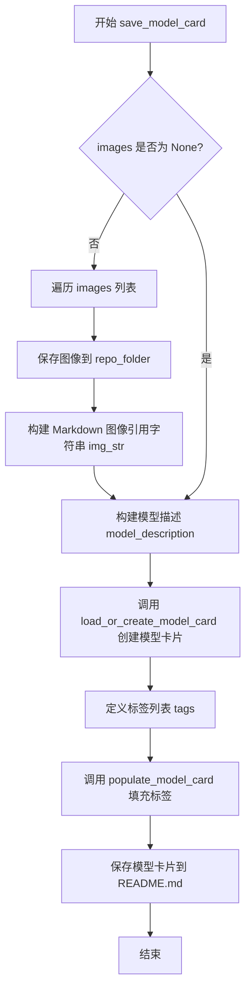
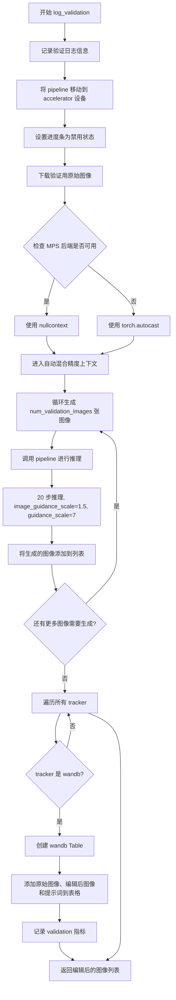
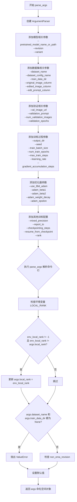
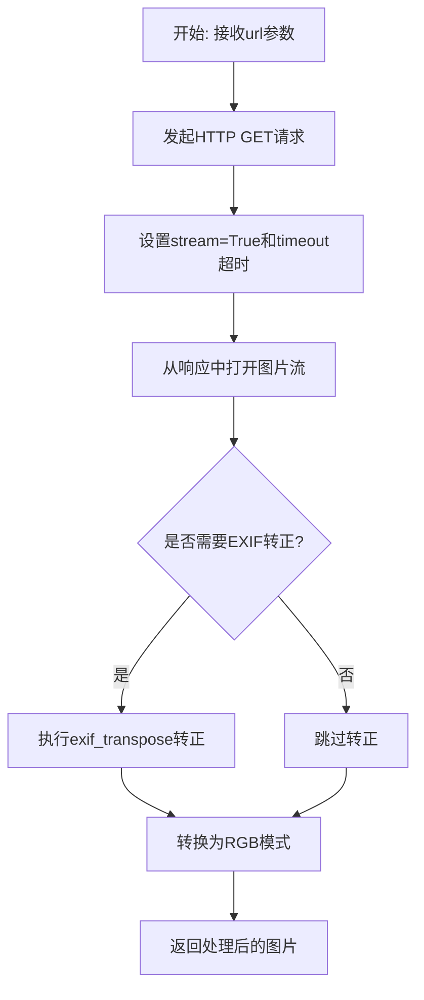

# `diffusers\examples\research_projects\instructpix2pix_lora\train_instruct_pix2pix_lora.py` 详细设计文档

该代码是一个用于微调Stable Diffusion InstructPix2Pix模型的训练脚本，支持LoRA（低秩适配）技术。脚本实现了完整的数据加载、模型初始化、训练循环、验证推理和模型保存流程，能够根据编辑指令对原始图像进行图像编辑任务的微调训练。

## 整体流程



## 类结构

```
Script (训练脚本入口)
├── 全局配置
│   ├── DATASET_NAME_MAPPING
│   ├── WANDB_TABLE_COL_NAMES
│   └── logger
├── 辅助函数
│   ├── save_model_card (保存模型卡片)
│   ├── log_validation (验证推理)
│   ├── parse_args (参数解析)
│   ├── convert_to_np (图像转换)
│   └── download_image (图像下载)
└── 主函数
    └── main (训练主流程)
```

## 全局变量及字段


### `logger`
    
日志记录器对象，用于输出训练过程中的信息和调试信息

类型：`Logger`
    


### `DATASET_NAME_MAPPING`
    
数据集名称到列名的映射字典，用于指定 InstructPix2Pix 数据集的列名

类型：`Dict[str, Tuple[str, str, str]]`
    


### `WANDB_TABLE_COL_NAMES`
    
WandB 表格列名列表，用于记录验证过程中的原始图像、编辑图像和编辑提示

类型：`List[str]`
    


    

## 全局函数及方法


### `save_model_card`

该函数用于在模型训练完成后，生成并保存模型卡片（Model Card），包括模型描述、示例图像以及相关标签信息，并将卡片保存为README.md文件到指定目录。

参数：

- `repo_id`：`str`，HuggingFace Hub上的模型仓库ID
- `images`：`list`，可选，要保存到模型卡片中的示例图像列表
- `base_model`：`str`，可选，用于微调的基础模型名称或路径
- `dataset_name`：`str`，可选，用于训练的数据集名称
- `repo_folder`：`str`，可选，本地仓库文件夹路径，用于保存图像和README文件

返回值：`None`，该函数无返回值，直接将模型卡片写入文件系统

#### 流程图



#### 带注释源码

```python
def save_model_card(
    repo_id: str,
    images: list = None,
    base_model: str = None,
    dataset_name: str = None,
    repo_folder: str = None,
):
    """
    生成并保存模型卡片到指定文件夹
    
    参数:
        repo_id: HuggingFace Hub 上的模型仓库 ID
        images: 示例图像列表，如果提供会将图像保存到本地
        base_model: 基础模型名称/路径
        dataset_name: 训练数据集名称
        repo_folder: 本地仓库文件夹路径
    """
    img_str = ""
    
    # 如果提供了图像列表，则保存图像并生成 Markdown 引用
    if images is not None:
        for i, image in enumerate(images):
            # 将每张图像保存为 PNG 文件
            image.save(os.path.join(repo_folder, f"image_{i}.png"))
            # 构建 Markdown 格式的图像引用字符串
            img_str += f"\n"

    # 构建模型描述信息，包含基础模型和数据集信息
    model_description = f"""
# LoRA text2image fine-tuning - {repo_id}
These are LoRA adaption weights for {base_model}. The weights were fine-tuned on the {dataset_name} dataset. You can find some example images in the following. \n
{img_str}
"""

    # 加载或创建模型卡片，包含训练信息和基础模型信息
    model_card = load_or_create_model_card(
        repo_id_or_path=repo_id,
        from_training=True,
        license="creativeml-openrail-m",
        base_model=base_model,
        model_description=model_description,
        inference=True,
    )

    # 定义模型标签，用于分类和搜索
    tags = [
        "stable-diffusion",
        "stable-diffusion-diffusers",
        "text-to-image",
        "instruct-pix2pix",
        "diffusers",
        "diffusers-training",
        "lora",
    ]
    
    # 将标签填充到模型卡片中
    model_card = populate_model_card(model_card, tags=tags)

    # 将模型卡片保存为 README.md 文件
    model_card.save(os.path.join(repo_folder, "README.md"))
```


### `log_validation`

该函数用于在训练过程中执行验证任务，通过加载预训练的 Stable Diffusion InstructPix2Pix pipeline 并使用指定的验证提示符和原始图像生成编辑后的图像，同时将结果记录到 wandb（如果启用）以供可视化分析。

参数：

-  `pipeline`：`StableDiffusionInstructPix2PixPipeline`，用于图像编辑推理的扩散 pipeline 对象
-  `args`：包含验证配置的命名空间对象，包含 `num_validation_images`（验证图像数量）、`validation_prompt`（验证提示词）、`val_image_url`（原始图像 URL）等属性
-  `accelerator`：`Accelerator`，Hugging Face Accelerate 库提供的分布式训练加速器，用于设备管理和日志记录
-  `generator`：`torch.Generator`，PyTorch 随机数生成器，用于确保推理过程的可重复性

返回值：`List[PIL.Image]`，生成的编辑后图像列表

#### 流程图



#### 带注释源码

```python
def log_validation(
    pipeline,      # StableDiffusionInstructPix2PixPipeline: 用于图像编辑的扩散模型 pipeline
    args,          # Namespace: 包含验证相关配置参数的命令行参数对象
    accelerator,  # Accelerator: Hugging Face Accelerate 加速器对象
    generator,     # torch.Generator: 随机数生成器，确保可重复性
):
    # 记录验证开始的日志信息，包括要生成的图像数量和验证提示词
    logger.info(
        f"Running validation... \n Generating {args.num_validation_images} images with prompt:"
        f" {args.validation_prompt}."
    )
    
    # 将 pipeline 移动到当前设备（CPU/GPU）
    pipeline = pipeline.to(accelerator.device)
    
    # 禁用推理过程中的进度条显示
    pipeline.set_progress_bar_config(disable=True)

    # 下载用于验证的原始图像
    original_image = download_image(args.val_image_url)
    
    # 初始化存储生成图像的列表
    edited_images = []
    
    # MPS (Apple Silicon) 设备特殊处理：不使用自动混合精度
    if torch.backends.mps.is_available():
        autocast_ctx = nullcontext()  # 空上下文，不进行自动混合精度转换
    else:
        # 对于 CUDA 设备，使用自动混合精度进行推理加速
        autocast_ctx = torch.autocast(accelerator.device.type)

    # 使用自动混合精度上下文进行推理
    with autocast_ctx:
        # 循环生成指定数量的验证图像
        for _ in range(args.num_validation_images):
            edited_images.append(
                pipeline(
                    args.validation_prompt,         # 编辑指令提示词
                    image=original_image,           # 原始输入图像
                    num_inference_steps=20,         # 推理步数
                    image_guidance_scale=1.5,       # 图像引导强度
                    guidance_scale=7,              # 文本引导强度 (CFG)
                    generator=generator,           # 随机数生成器
                ).images[0]  # 取第一张生成的图像
            )

    # 遍历所有注册的 tracker（日志记录器）
    for tracker in accelerator.trackers:
        # 如果是 wandb tracker，将生成的图像记录到表格
        if tracker.name == "wandb":
            # 创建 wandb 表格，指定列名
            wandb_table = wandb.Table(columns=WANDB_TABLE_COL_NAMES)
            # 逐个添加图像数据到表格
            for edited_image in edited_images:
                wandb_table.add_data(
                    wandb.Image(original_image),    # 原始图像列
                    wandb.Image(edited_image),     # 编辑后图像列
                    args.validation_prompt         # 编辑提示词列
                )
            # 记录验证结果到 wandb
            tracker.log({"validation": wandb_table})

    # 返回生成的编辑后图像列表
    return edited_images
```


### `parse_args`

该函数是训练脚本的命令行参数解析器，通过 `argparse` 模块定义并收集所有用于微调 InstructPix2Pix 模型的训练参数，包括模型路径、数据集配置、训练超参数、优化器设置、分布式训练选项等，并返回包含所有参数值的命名空间对象。

参数：

- 该函数无显式输入参数，通过 `argparse.ArgumentParser` 在函数内部定义并解析命令行参数。

返回值：`args` (`argparse.Namespace`)，包含所有命令行参数值的命名空间对象，用于后续训练流程的配置。

#### 流程图



#### 带注释源码

```python
def parse_args():
    """
    解析命令行参数，返回包含所有训练配置的命名空间对象。
    
    该函数定义了 InstructPix2Pix 模型微调所需的所有命令行参数，
    包括模型路径、数据集配置、训练超参数、优化器设置等。
    """
    # 创建 ArgumentParser 实例，description 用于命令行帮助信息
    parser = argparse.ArgumentParser(description="Simple example of a training script for InstructPix2Pix.")
    
    # ========================================
    # 模型相关参数
    # ========================================
    parser.add_argument(
        "--pretrained_model_name_or_path",
        type=str,
        default=None,
        required=True,  # 必须指定预训练模型路径
        help="Path to pretrained model or model identifier from huggingface.co/models.",
    )
    parser.add_argument(
        "--revision",
        type=str,
        default=None,
        required=False,
        help="Revision of pretrained model identifier from huggingface.co/models.",
    )
    parser.add_argument(
        "--variant",
        type=str,
        default=None,
        help="Variant of the model files of the pretrained model identifier from huggingface.co/models, 'e.g.' fp16",
    )
    
    # ========================================
    # 数据集相关参数
    # ========================================
    parser.add_argument(
        "--dataset_name",
        type=str,
        default=None,
        help=(
            "The name of the Dataset (from the HuggingFace hub) to train on (could be your own, possibly private,"
            " dataset). It can also be a path pointing to a local copy of a dataset in your filesystem,"
            " or to a folder containing files that 🤗 Datasets can understand."
        ),
    )
    parser.add_argument(
        "--dataset_config_name",
        type=str,
        default=None,
        help="The config of the Dataset, leave as None if there's only one config.",
    )
    parser.add_argument(
        "--train_data_dir",
        type=str,
        default=None,
        help=(
            "A folder containing the training data. Folder contents must follow the structure described in"
            " https://huggingface.co/docs/datasets/image_dataset#imagefolder. In particular, a `metadata.jsonl` file"
            " must exist to provide the captions for the images. Ignored if `dataset_name` is specified."
        ),
    )
    parser.add_argument(
        "--original_image_column",
        type=str,
        default="input_image",
        help="The column of the dataset containing the original image on which edits where made.",
    )
    parser.add_argument(
        "--edited_image_column",
        type=str,
        default="edited_image",
        help="The column of the dataset containing the edited image.",
    )
    parser.add_argument(
        "--edit_prompt_column",
        type=str,
        default="edit_prompt",
        help="The column of the dataset containing the edit instruction.",
    )
    
    # ========================================
    # 验证相关参数
    # ========================================
    parser.add_argument(
        "--val_image_url",
        type=str,
        default=None,
        help="URL to the original image that you would like to edit (used during inference for debugging purposes).",
    )
    parser.add_argument(
        "--validation_prompt", type=str, default=None, help="A prompt that is sampled during training for inference."
    )
    parser.add_argument(
        "--num_validation_images",
        type=int,
        default=4,
        help="Number of images that should be generated during validation with `validation_prompt`.",
    )
    parser.add_argument(
        "--validation_epochs",
        type=int,
        default=1,
        help=(
            "Run fine-tuning validation every X epochs. The validation process consists of running the prompt"
            " `args.validation_prompt` multiple times: `args.num_validation_images`."
        ),
    )
    parser.add_argument(
        "--max_train_samples",
        type=int,
        default=None,
        help=(
            "For debugging purposes or quicker training, truncate the number of training examples to this "
            "value if set."
        ),
    )
    
    # ========================================
    # 输出和存储相关参数
    # ========================================
    parser.add_argument(
        "--output_dir",
        type=str,
        default="instruct-pix2pix-model",
        help="The output directory where the model predictions and checkpoints will be written.",
    )
    parser.add_argument(
        "--cache_dir",
        type=str,
        default=None,
        help="The directory where the downloaded models and datasets will be stored.",
    )
    parser.add_argument("--seed", type=int, default=None, help="A seed for reproducible training.")
    parser.add_argument(
        "--resolution",
        type=int,
        default=256,
        help=(
            "The resolution for input images, all the images in the train/validation dataset will be resized to this"
            " resolution"
        ),
    )
    parser.add_argument(
        "--center_crop",
        default=False,
        action="store_true",
        help=(
            "Whether to center crop the input images to the resolution. If not set, the images will be randomly"
            " cropped. The images will be resized to the resolution first before cropping."
        ),
    )
    parser.add_argument(
        "--random_flip",
        action="store_true",
        help="whether to randomly flip images horizontally",
    )
    
    # ========================================
    # 训练超参数
    # ========================================
    parser.add_argument(
        "--train_batch_size", type=int, default=16, help="Batch size (per device) for the training dataloader."
    )
    parser.add_argument("--num_train_epochs", type=int, default=100)
    parser.add_argument(
        "--max_train_steps",
        type=int,
        default=None,
        help="Total number of training steps to perform.  If provided, overrides num_train_epochs.",
    )
    parser.add_argument(
        "--gradient_accumulation_steps",
        type=int,
        default=1,
        help="Number of updates steps to accumulate before performing a backward/update pass.",
    )
    parser.add_argument(
        "--gradient_checkpointing",
        action="store_true",
        help="Whether or not to use gradient checkpointing to save memory at the expense of slower backward pass.",
    )
    parser.add_argument(
        "--learning_rate",
        type=float,
        default=1e-4,
        help="Initial learning rate (after the potential warmup period) to use.",
    )
    parser.add_argument(
        "--scale_lr",
        action="store_true",
        default=False,
        help="Scale the learning rate by the number of GPUs, gradient accumulation steps, and batch size.",
    )
    parser.add_argument(
        "--lr_scheduler",
        type=str,
        default="constant",
        help=(
            'The scheduler type to use. Choose between ["linear", "cosine", "cosine_with_restarts", "polynomial",'
            ' "constant", "constant_with_warmup"]'
        ),
    )
    parser.add_argument(
        "--lr_warmup_steps", type=int, default=500, help="Number of steps for the warmup in the lr scheduler."
    )
    parser.add_argument(
        "--conditioning_dropout_prob",
        type=float,
        default=None,
        help="Conditioning dropout probability. Drops out the conditionings (image and edit prompt) used in training InstructPix2Pix. See section 3.2.1 in the paper: https://huggingface.co/papers/2211.09800.",
    )
    
    # ========================================
    # 优化器相关参数
    # ========================================
    parser.add_argument(
        "--use_8bit_adam", action="store_true", help="Whether or not to use 8-bit Adam from bitsandbytes."
    )
    parser.add_argument(
        "--allow_tf32",
        action="store_true",
        help=(
            "Whether or not to allow TF32 on Ampere GPUs. Can be used to speed up training. For more information, see"
            " https://pytorch.org/docs/stable/notes/cuda.html#tensorfloat-32-tf32-on-ampere-devices"
        ),
    )
    parser.add_argument("--use_ema", action="store_true", help="Whether to use EMA model.")
    parser.add_argument(
        "--non_ema_revision",
        type=str,
        default=None,
        required=False,
        help=(
            "Revision of pretrained non-ema model identifier. Must be a branch, tag or git identifier of the local or"
            " remote repository specified with --pretrained_model_name_or_path."
        ),
    )
    parser.add_argument(
        "--dataloader_num_workers",
        type=int,
        default=0,
        help=(
            "Number of subprocesses to use for data loading. 0 means that the data will be loaded in the main process."
        ),
    )
    parser.add_argument("--adam_beta1", type=float, default=0.9, help="The beta1 parameter for the Adam optimizer.")
    parser.add_argument("--adam_beta2", type=float, default=0.999, help="The beta2 parameter for the Adam optimizer.")
    parser.add_argument("--adam_weight_decay", type=float, default=1e-2, help="Weight decay to use.")
    parser.add_argument("--adam_epsilon", type=float, default=1e-08, help="Epsilon value for the Adam optimizer")
    parser.add_argument("--max_grad_norm", default=1.0, type=float, help="Max gradient norm.")
    
    # ========================================
    # Hub 相关参数
    # ========================================
    parser.add_argument("--push_to_hub", action="store_true", help="Whether or not to push the model to the Hub.")
    parser.add_argument("--hub_token", type=str, default=None, help="The token to use to push to the Model Hub.")
    parser.add_argument(
        "--hub_model_id",
        type=str,
        default=None,
        help="The name of the repository to keep in sync with the local `output_dir`.",
    )
    parser.add_argument(
        "--logging_dir",
        type=str,
        default="logs",
        help=(
            "[TensorBoard](https://www.tensorflow.org/tensorboard) log directory. Will default to"
            " *output_dir/runs/**CURRENT_DATETIME_HOSTNAME***."
        ),
    )
    
    # ========================================
    # 混合精度和分布式训练参数
    # ========================================
    parser.add_argument(
        "--mixed_precision",
        type=str,
        default=None,
        choices=["no", "fp16", "bf16"],
        help=(
            "Whether to use mixed precision. Choose between fp16 and bf16 (bfloat16). Bf16 requires PyTorch >="
            " 1.10.and an Nvidia Ampere GPU.  Default to the value of accelerate config of the current system or the"
            " flag passed with the `accelerate.launch` command. Use this argument to override the accelerate config."
        ),
    )
    parser.add_argument(
        "--report_to",
        type=str,
        default="tensorboard",
        help=(
            'The integration to report the results and logs to. Supported platforms are `"tensorboard"`'
            ' (default), `"wandb"` and `"comet_ml"`. Use `"all"` to report to all integrations.'
        ),
    )
    parser.add_argument("--local_rank", type=int, default=-1, help="For distributed training: local_rank")
    parser.add_argument(
        "--checkpointing_steps",
        type=int,
        default=500,
        help=(
            "Save a checkpoint of the training state every X updates. These checkpoints are only suitable for resuming"
            " training using `--resume_from_checkpoint`."
        ),
    )
    parser.add_argument(
        "--checkpoints_total_limit",
        type=int,
        default=None,
        help=("Max number of checkpoints to store."),
    )
    parser.add_argument(
        "--resume_from_checkpoint",
        type=str,
        default=None,
        help=(
            "Whether training should be resumed from a previous checkpoint. Use a path saved by"
            ' `--checkpointing_steps`, or `"latest"` to automatically select the last available checkpoint.'
        ),
    )
    parser.add_argument(
        "--enable_xformers_memory_efficient_attention", action="store_true", help="Whether or not to use xformers."
    )
    parser.add_argument(
        "--rank",
        type=int,
        default=4,
        help=("The dimension of the LoRA update matrices."),
    )

    # ========================================
    # 解析命令行参数
    # ========================================
    args = parser.parse_args()
    
    # ========================================
    # 环境变量检查 - 支持分布式训练
    # ========================================
    env_local_rank = int(os.environ.get("LOCAL_RANK", -1))
    if env_local_rank != -1 and env_local_rank != args.local_rank:
        args.local_rank = env_local_rank

    # ========================================
    # 合法性检查 (Sanity Checks)
    # ========================================
    # 必须指定数据集名称或训练数据目录之一
    if args.dataset_name is None and args.train_data_dir is None:
        raise ValueError("Need either a dataset name or a training folder.")

    # 如果未指定 non_ema_revision，默认使用与主模型相同的 revision
    if args.non_ema_revision is None:
        args.non_ema_revision = args.revision

    # 返回包含所有解析参数的命名空间对象
    return args
```


### `convert_to_np`

这是一个工具函数，用于将输入的 PIL 图像对象转换为符合 PyTorch 模型输入要求的 NumPy 数组格式（通道前置）。

参数：

- `image`：`PIL.Image.Image`，输入的 PIL 图像对象（通常来自数据集）。
- `resolution`：`int`，目标分辨率，图像将被resize至此尺寸（宽高相等）。

返回值：`np.ndarray`，转换后的 NumPy 数组，形状为 `(C, H, W)`，即通道数放在最前面，以适配后续的 PyTorch 张量转换。

#### 流程图

```mermaid
flowchart TD
    A([开始: 输入 PIL Image & resolution]) --> B[转换为 RGB 模式]
    B --> C[Resize 到 (resolution, resolution)]
    C --> D[转换为 NumPy 数组]
    D --> E[转置维度 (2, 0, 1)]
    E --> F([返回 NumPy Array (C, H, W)])
```

#### 带注释源码

```python
def convert_to_np(image, resolution):
    # 将图像转换为 RGB 模式，确保图像有 3 个通道
    # (例如将 RGBA 转为 RGB，或将灰度图转为 RGB)
    image = image.convert("RGB")
    
    # 将图像 Resize 到指定的分辨率 (width, height)
    image = image.resize((resolution, resolution))
    
    # 将 PIL Image 转换为 NumPy 数组，得到的形状为 (H, W, C) [Height, Width, Channel]
    # 使用 transpose(2, 0, 1) 将维度顺序变为 (C, H, W)，以符合 PyTorch 张量的要求
    return np.array(image).transpose(2, 0, 1)
```


### `download_image`

该函数用于从指定的URL下载图片，并进行EXIF方向校正和RGB格式转换，返回处理后的PIL Image对象。

参数：

- `url`：`str`，需要下载的图片的URL地址

返回值：`PIL.Image.Image`，下载并转换后的图片对象

#### 流程图



#### 带注释源码

```python
def download_image(url):
    """
    从指定URL下载图片并进行基本处理
    
    参数:
        url: 图片的URL地址
        
    返回:
        处理后的PIL Image对象 (RGB格式)
    """
    # 使用requests库发起GET请求，stream=True用于大文件流式下载
    # timeout=DIFFUSERS_REQUEST_TIMEOUT 防止请求无限等待
    image = PIL.Image.open(requests.get(url, stream=True, timeout=DIFFUSERS_REQUEST_TIMEOUT).raw)
    
    # EXIF转正：有些图片在拍摄时带有EXIF方向信息
    # exif_transpose会根据EXIF Orientation标签自动旋转/翻转图片到正确方向
    image = PIL.ImageOps.exif_transpose(image)
    
    # 确保图片为RGB模式（去除Alpha通道等），兼容后续处理
    image = image.convert("RGB")
    
    return image
```


### `main`

这是微调 Stable Diffusion InstructPix2Pix 模型的核心入口函数。它负责整个训练流程的编排：解析配置参数、初始化分布式训练环境（Accelerator）、加载并修改预训练模型（调整 UNet 以支持双图像输入）、配置 LoRA 适配器与 EMA、加载并预处理数据集、执行包含前向传播、损失计算、反向传播及参数更新的训练循环、管理模型检查点与验证、并在训练完成后保存 LoRA 权重或推送至 Hub。

参数：
-  `无`：`main` 函数本身不接收外部显式参数，运行时所需的超参数通过内部调用 `parse_args()` 从命令行获取。

返回值：
-  `None`：该函数执行完成后不返回任何值，主要通过副作用（如生成模型文件、日志）完成工作。

#### 流程图

```mermaid
graph TD
    subgraph 初始化阶段 [Initialization]
        A[开始] --> B[parse_args: 解析命令行参数]
        B --> C[检查 wandb/hub_token 安全性与版本废弃]
        C --> D[初始化 Accelerator: 混合精度、分布式、日志]
        D --> E[设置随机种子与日志级别]
    end

    subgraph 模型加载与修改 [Model Setup]
        F[加载 Scheduler, Tokenizer, TextEncoder, VAE, UNet]
        F --> G[修改 UNet: 扩展首层卷积为 8 通道以适配原图]
        G --> H[冻结 VAE, TextEncoder, UNet 原始参数]
        I[配置 LoRA: LoraConfig, add_adapter]
        I --> J[配置 EMA: EMAModel (可选)]
        J --> K[设置优化器: Adam/AdamW8bit]
    end

    subgraph 数据准备 [Data Preparation]
        L[加载数据集: load_dataset]
        M[预处理: 图像转换、Tokenize 文本]
        N[创建 DataLoader: 批处理、数据增强]
    end

    subgraph 训练循环 [Training Loop]
        O{遍历 Epochs}
        O -->|每个 Epoch| P{遍历 Batch}
        P --> Q[VAE 编码: 编辑图 -> Latent, 原图 -> Embedding]
        Q --> R[添加噪声: Sample Noise, Timesteps]
        R --> S[Text Encoder: 文本 -> Embedding]
        S --> T[ Conditioning Dropout (可选)]
        T --> U[UNet 预测: Noise Residual]
        U --> V[计算损失: MSE Loss]
        V --> W[反向传播: accelerator.backward]
        W --> X[参数更新: Optimizer Step & LR Schedule]
        X --> Y{检查点与日志: sync_gradients}
        Y -->|是| Z[保存 Checkpoint / Validation]
        Y -->|否| P
    end

    subgraph 最终保存 [Final Saving]
        AA[accelerator.wait_for_everyone]
        AA --> BB[保存 LoRA 权重]
        BB --> CC[构建 Pipeline 并加载权重]
        CC --> DD{是否 Push to Hub}
        DD -->|是| EE[upload_folder: 推送模型]
        DD -->|否| FF[结束]
        EE --> FF
    end

    C --> F
    K --> L
    N --> O
    Z --> O
    P -- 训练完成 --> AA
```
#### 带注释源码

```python
def main():
    """主训练函数，执行模型微调的完整流程。"""
    # 1. 参数解析
    args = parse_args()

    # 2. 环境与安全检查
    if args.report_to == "wandb" and args.hub_token is not None:
        raise ValueError("Use `hf auth login` to authenticate with the Hub.")
    
    # 废弃警告处理
    if args.non_ema_revision is not None:
        deprecate("non_ema_revision!=None", "0.15.0", "--variant=non_ema")

    # 3. 初始化 Accelerator (分布式训练核心)
    logging_dir = os.path.join(args.output_dir, args.logging_dir)
    accelerator_project_config = ProjectConfiguration(project_dir=args.output_dir, logging_dir=logging_dir)
    accelerator = Accelerator(
        gradient_accumulation_steps=args.gradient_accumulation_steps,
        mixed_precision=args.mixed_precision,
        log_with=args.report_to,
        project_config=accelerator_project_config,
    )

    # MPS 设备特殊处理：禁用原生 AMP
    if torch.backends.mps.is_available():
        accelerator.native_amp = False

    # 设置随机种子以保证可复现性
    generator = torch.Generator(device=accelerator.device).manual_seed(args.seed)
    if args.seed is not None:
        set_seed(args.seed)

    # 4. 日志配置
    logging.basicConfig(...)
    logger.info(accelerator.state, main_process_only=False)
    # 设置第三方库的日志级别
    if accelerator.is_local_main_process:
        datasets.utils.logging.set_verbosity_warning()
        # ... (transformers, diffusers 设置)

    # 5. 输出目录与仓库创建 (如果是主进程)
    if accelerator.is_main_process:
        if args.output_dir is not None:
            os.makedirs(args.output_dir, exist_ok=True)
        if args.push_to_hub:
            repo_id = create_repo(...).repo_id

    # 6. 加载预训练模型与组件
    noise_scheduler = DDPMScheduler.from_pretrained(...)
    tokenizer = CLIPTokenizer.from_pretrained(...)
    text_encoder = CLIPTextModel.from_pretrained(...)
    vae = AutoencoderKL.from_pretrained(...)
    unet = UNet2DConditionModel.from_pretrained(...)

    # 7. 核心修改：InstructPix2Pix UNet 适配
    # InstructPix2Pix 需要额外 Conditioning Image (原图)，因此输入通道变为 8 (4 noise + 4 image)
    logger.info("Initializing the InstructPix2Pix UNet from the pretrained UNet.")
    in_channels = 8
    out_channels = unet.conv_in.out_channels
    unet.register_to_config(in_channels=in_channels)
    
    with torch.no_grad():
        new_conv_in = nn.Conv2d(in_channels, out_channels, unet.conv_in.kernel_size, ...)
        # 初始化新权重：复制原有权重，多的通道置零
        new_conv_in.weight.zero_()
        new_conv_in.weight[:, :in_channels, :, :].copy_(unet.conv_in.weight)
        unet.conv_in = new_conv_in

    # 8. 冻结参数与混合精度设置
    vae.requires_grad_(False)
    text_encoder.requires_grad_(False)
    unet.requires_grad_(False)
    # 设置权重精度 (fp16/bf16/fp32)
    weight_dtype = torch.float32
    if accelerator.mixed_precision == "fp16":
        weight_dtype = torch.float16
    elif accelerator.mixed_precision == "bf16":
        weight_dtype = torch.bfloat16

    # 9. 配置 LoRA (低秩适配)
    unet_lora_config = LoraConfig(...)
    unet.add_adapter(unet_lora_config)
    # 确保 LoRA 可训练参数为 fp32
    if args.mixed_precision == "fp16":
        cast_training_params(unet, dtype=torch.float32)

    # 10. 配置 EMA (指数移动平均)
    if args.use_ema:
        ema_unet = EMAModel(unet.parameters(), ...)

    # 11. 优化器设置
    if args.use_8bit_adam:
        optimizer_cls = bnb.optim.AdamW8bit
    else:
        optimizer_cls = torch.optim.AdamW
    
    # 获取需要训练的参数 (LoRA layers)
    trainable_params = filter(lambda p: p.requires_grad, unet.parameters())
    optimizer = optimizer_cls(trainable_params, ...)

    # 12. 数据集加载与预处理
    if args.dataset_name is not None:
        dataset = load_dataset(...)
    else:
        # 加载本地图像文件夹
        dataset = load_dataset("imagefolder", ...)
    
    # 定义预处理函数 (图像转换、Tokenize)
    def preprocess_train(examples):
        # 图像编码为 Latent，原图编码为 Embedding
        # 文本 Tokenize
        ...
    
    # 13. 创建 DataLoader
    train_dataloader = torch.utils.data.DataLoader(
        train_dataset, shuffle=True, collate_fn=collate_fn, ...
    )

    # 14. 学习率调度器
    lr_scheduler = get_scheduler(...)

    # 15. 准备模型 (Accelerator 包装)
    unet, optimizer, train_dataloader, lr_scheduler = accelerator.prepare(
        unet, optimizer, train_dataloader, lr_scheduler
    )

    # 16. 训练循环
    for epoch in range(first_epoch, args.num_train_epochs):
        unet.train()
        for step, batch in enumerate(train_dataloader):
            # 跳过恢复训练的步数
            if args.resume_from_checkpoint and ...: continue

            with accelerator.accumulate(unet):
                # --- 前向传播 ---
                # 1. 图像 -> Latent Space
                latents = vae.encode(batch["edited_pixel_values"].to(weight_dtype)).latent_dist.sample()
                latents = latents * vae.config.scaling_factor

                # 2. 加噪 (Forward Diffusion)
                noise = torch.randn_like(latents)
                timesteps = torch.randint(...)
                noisy_latents = noise_scheduler.add_noise(latents, noise, timesteps)

                # 3. 文本编码
                encoder_hidden_states = text_encoder(batch["input_ids"])[0]

                # 4. 原图编码 (Conditioning)
                original_image_embeds = vae.encode(batch["original_pixel_values"].to(weight_dtype)).latent_dist.mode()

                # 5. 条件丢失 (Classifier-free guidance 训练支持)
                if args.conditioning_dropout_prob is not None:
                    # 随机丢弃文本或图像条件
                    ...

                # 6. 拼接 Latents 和 原图 Embedding (关键：8通道)
                concatenated_noisy_latents = torch.cat([noisy_latents, original_image_embeds], dim=1)

                # 7. 预测噪声
                model_pred = unet(concatenated_noisy_latents, timesteps, encoder_hidden_states)[0]

                # 8. 计算损失
                loss = F.mse_loss(model_pred.float(), target.float(), ...)

                # --- 反向传播 ---
                accelerator.backward(loss)
                # 梯度裁剪
                accelerator.clip_grad_norm_(trainable_params, args.max_grad_norm)
                optimizer.step()
                lr_scheduler.step()
                optimizer.zero_grad()

            # --- 日志与保存 ---
            if accelerator.sync_gradients:
                if args.use_ema: ema_unet.step(...)
                progress_bar.update(1)
                global_step += 1
                
                # Checkpoint 保存逻辑
                if global_step % args.checkpointing_steps == 0:
                    accelerator.save_state(...)
                    # 保存 LoRA 权重
                    ...

        # --- 验证循环 ---
        if accelerator.is_main_process and (epoch % args.validation_epochs == 0):
            # 加载 EMA 模型 (如果使用) 进行推理
            # 生成验证图像
            log_validation(...)

    # 17. 训练结束：保存最终模型
    accelerator.wait_for_everyone()
    if accelerator.is_main_process:
        # 合并 LoRA 权重到模型
        # 保存 Pipeline
        if args.push_to_hub:
            # 推送
            ...
```


## 关键组件


### 张量索引与惰性加载

代码中使用 `torch.no_grad()` 上下文管理器来禁用梯度计算，实现惰性加载以节省内存。例如在初始化 InstructPix2Pix UNet 时使用 `with torch.no_grad():` 来执行权重复制操作，避免不必要的梯度记录。

### 反量化支持

代码支持混合精度训练，通过 `weight_dtype` 变量控制权重精度（fp16/bf16/fp32），在推理时将非训练参数（如VAE、text_encoder）转换为半精度以提升性能，同时保持LoRA参数为FP32以保证训练稳定性。

### 量化策略

采用LoRA（Low-Rank Adaptation）进行参数高效微调，通过 `LoraConfig` 配置秩（rank）和目标模块（to_k, to_q, to_v, to_out.0），仅训练少量低秩矩阵而非整个模型。同时提供8-bit Adam优化器选项（`use_8bit_adam`）进一步减少显存占用。

### 数据预处理管道

包含图像转换（`convert_to_np`、`preprocess_images`、`preprocess_train`）和文本tokenization（`tokenize_captions`），支持原始图像与编辑图像的配对处理，并应用数据增强（中心裁剪、随机翻转）。

### 条件丢弃机制

实现 `conditioning_dropout_prob` 参数，支持分类器自由引导（Classifier-Free Guidance），在训练时随机丢弃文本提示或原始图像条件，增强模型推理泛化能力，参见论文section 3.2.1。

### EMA模型管理

通过 `EMAModel` 维护指数移动平均的UNet权重，提供 `ema_unet.step()` 更新和 `store`/`copy_to`/`restore` 方法用于验证时切换权重。

### 分布式训练钩子

使用 `accelerator.register_save_state_pre_hook` 和 `register_load_state_pre_hook` 自定义检查点保存/加载逻辑，确保LoRA权重和EMA状态正确序列化。

### 验证推理流程

`log_validation` 函数执行推理验证，支持MPS设备自动切换到 `nullcontext()` 避免AMP问题，并使用WandB记录生成的图像对比表格。

### 检查点管理

实现检查点总数限制（`checkpoints_total_limit`），自动清理旧检查点防止磁盘空间耗尽，支持从任意检查点恢复训练。


## 问题及建议


### 已知问题

- **冗余代码**：变量 `weight_dtype` 在代码中被重复定义两次（第434-440行和第460-466行），违反了 DRY 原则
- **变量未定义错误**：在 `main()` 函数末尾调用 `save_model_card(repo_id, ...)` 时，`repo_id` 变量未在函数内定义，仅在 `if args.push_to_hub:` 分支内定义
- **缺失的错误处理**：网络请求下载验证图像时缺乏异常捕获，若 `download_image` 失败会导致整个训练中断
- **隐式魔法数字**：验证推理步数（20）、图像引导比例（1.5）、guidance_scale（7）等硬编码在 `log_validation` 函数中，无法通过命令行配置
- **数据预处理低效**：原始图像和编辑图像分别转换为 NumPy 数组后再拼接，然后一起做数据增强，这可能导致不必要的内存复制
- **EMA 模型加载潜在错误**：`load_model_hook` 中加载 EMA 模型时，若文件不存在会导致程序崩溃
- **数据类型转换风险**：在训练循环中将 `model_pred` 和 `target` 显式转换为 float 后计算损失，但未检查是否会导致精度损失
- **日志记录不完整**：训练过程中仅记录训练损失（train_loss），未记录验证损失，无法全面评估模型性能

### 优化建议

- 将重复的 `weight_dtype` 计算提取为单独的函数或配置模块
- 修复 `save_model_card` 调用，传递正确的 `repo_id` 或在函数内部获取
- 为 `download_image` 添加重试机制和异常处理，使用 try-except 包装
- 将硬编码的推理参数提取为命令行可配置参数
- 优化图像预处理流程，使用共享的转换管道处理原始和编辑图像
- 为 EMA 模型加载添加文件存在性检查和优雅降级
- 添加验证损失计算逻辑，在验证阶段评估模型性能
- 考虑使用 `dataclass` 或 `TypedDict` 整理命令行参数，提升代码可维护性
- 为关键函数添加类型注解和文档字符串，提升代码可读性

## 其它


### 设计目标与约束

本脚本旨在通过LoRA（Low-Rank Adaptation）技术对Stable Diffusion模型进行微调，使其具备根据编辑指令修改原始图像的能力。核心约束包括：1）仅支持InstructPix2Pix架构（UNet需要修改为8通道输入）；2）仅训练LoRA参数，其他模型组件保持冻结；3）支持单GPU和多GPU分布式训练；4）需遵循HuggingFace Diffusers库的设计规范；5）训练数据必须包含原始图像、编辑指令和编辑后图像三个字段。

### 错误处理与异常设计

代码在以下关键点进行错误处理：1）数据集验证：当未指定dataset_name或train_data_dir时抛出ValueError；2）依赖检查：xformers、bitsandbytes等可选库缺失时给出明确安装指引；3）模型加载失败时使用deprecate函数提示版本兼容问题；4）MPS设备自动禁用AMP以避免兼容性问题；5）TF32兼容性检查仅在Ampere架构GPU上启用；6）Hub token安全性检查防止同时使用wandb和hub_token；7）checkpoint恢复时验证路径有效性。

### 数据流与状态机

训练数据流如下：原始数据加载 → 图像预处理（resize、crop、flip）→ 转换为numpy数组 → 归一化到[-1,1] → tokenize编辑指令 → DataLoader批处理 → VAE编码到潜空间 → 添加噪声（前向扩散）→ 文本编码器处理指令 → 原始图像编码 → 条件dropout处理 → UNet预测噪声 → MSE损失计算 → 反向传播 → 参数更新。状态机包括：训练前（模型加载、配置初始化）、训练中（epoch循环→step循环→accumulate→前向→损失计算→反向→优化器更新）、训练后（模型保存、Pipeline构建、Hub推送）。

### 外部依赖与接口契约

核心依赖包括：diffusers>=0.32.0.dev0（模型与管线）、transformers（CLIP文本编码器）、accelerate（分布式训练加速）、peft（LoRA适配）、bitsandbytes（可选8位Adam优化器）、xformers（可选高效注意力）、wandb/tensorboard（监控）、datasets（数据加载）。接口契约：数据集必须包含original_image_column、edit_prompt_column、edited_image_column指定的列；预训练模型需包含scheduler、tokenizer、text_encoder、vae、unet子文件夹；输出目录结构需遵循checkpoint-{step}格式。

### 性能优化与资源管理

性能优化措施包括：1）混合精度训练（fp16/bf16）降低显存占用；2）梯度累积实现大有效batch；3）xformers内存高效注意力机制；4）梯度checkpointing以时间换显存；5）TF32矩阵运算加速（ Ampere GPU）；6）LoRA仅训练低秩矩阵，大幅减少可训练参数量；7）EMA模型提升推理稳定性；8）CUDA缓存管理（empty_cache）；9）MPS设备特殊处理（禁用AMP）。资源管理：checkpoint数量限制（checkpoints_total_limit）、训练样本数限制（max_train_samples）、dataloader多进程配置（dataloader_num_workers）。

### 并行与分布式训练设计

采用Accelerator实现的分布式训练支持：1）多GPU数据并行（DataParallel/DDP自动选择）；2）主进程控制（is_main_process）仅执行一次的操作：创建输出目录、初始化trackers、Hub仓库创建、验证推理；3）所有进程同步等待（wait_for_everyone）；4）梯度同步检查（sync_gradients）确保一致性；5）分布式采样器自动处理数据分片；6）state_dict保存与加载支持跨节点恢复。通信优化：使用gather同步损失值进行日志记录。

### 模型保存与加载策略

保存策略：1）定期checkpoint保存checkpointing_steps，支持resume_from_checkpoint恢复；2）EMA模型单独保存到unet_ema子目录；3）LoRA权重使用save_lora_weights保存为Diffusers格式；4）完整训练完成后保存完整Pipeline；5）Hub推送时生成模型卡片（README.md）。加载策略：1）支持从checkpoint恢复训练（指定路径或latest）；2）EMA权重动态切换用于验证；3）Pipeline加载时支持variant指定（fp16/non_ema）；4）LoRA权重通过load_lora_weights动态加载。

### 超参数配置与调优

关键超参数及推荐值：learning_rate=1e-4（LoRA典型值）、rank=4（LoRA维度）、train_batch_size=16（根据显存调整）、gradient_accumulation_steps=1、num_train_epochs=100、lr_scheduler=constant、lr_warmup_steps=500。高级选项：conditioning_dropout_prob支持无分类器引导训练、max_grad_norm=1.0防止梯度爆炸、adam_weight_decay=1e-2正则化。自动调节：scale_lr根据GPU数量和batch size自动缩放学习率。

### 训练监控与日志记录

监控机制：1）Accelerate集成多种tracker（tensorboard/wandb/comet_ml）；2）记录指标：train_loss、step_loss、learning_rate；3）验证阶段生成图像并记录到wandb table；4）进度条显示当前step和loss；5）每个epoch后可选验证（validation_epochs）。日志输出：INFO级别记录关键节点（初始化、验证、保存），WARNING提示兼容性风险，ERROR标识致命错误。输出目录结构：output_dir/{logging_dir}/runs/用于TensorBoard，checkpoint-{global_step}/用于中间检查点。

### 环境要求与兼容性

硬件要求：NVIDIA Ampere+GPU（支持TF32和bf16）或任意支持CUDA的GPU、MPS设备（自动禁用AMP）；软件要求：Python 3.8+、PyTorch 2.0+、CUDA 11.8+；版本约束：diffusers>=0.32.0.dev0、accelerate>=0.16.0（自定义hooks）、peft；兼容性说明：xformers 0.0.16存在训练问题建议升级、bitsandbytes可选（8位优化）、MPS后端限制（无AMP）。环境变量：LOCAL_RANK用于分布式训练节点标识。

### 关键组件信息

1. **DDPMScheduler**：负责前向扩散（添加噪声）和噪声调度
2. **CLIPTokenizer/CLIPTextModel**：将编辑指令转换为文本嵌入
3. **AutoencoderKL**：图像与潜空间之间的转换
4. **UNet2DConditionModel**：8通道输入的修改版UNet，执行去噪预测
5. **LoraConfig + peft**：LoRA适配器配置与参数管理
6. **EMAModel**：指数移动平均，提升模型稳定性
7. **StableDiffusionInstructPix2PixPipeline**：推理管线，整合所有组件
8. **Accelerator**：统一分布式训练、混合精度、内存管理的抽象层

### 潜在技术债务与优化空间

1. **硬编码参数**：验证图像数量(num_validation_images=4)、推理步数(num_inference_steps=20)、guidance_scale(7)应可配置
2. **重复代码**：weight_dtype设置在两处出现，可提取为函数
3. **异常处理不足**：网络下载图片失败时缺乏重试机制
4. **内存优化**：VAE切片解码（tile-based decoding）未实现，大图像可能OOM
5. **训练效率**：未实现分布式验证，验证阶段为单进程瓶颈
6. **代码复用**：与train_text_to_image_lora.py存在大量重复，可抽象基类
7. **类型注解**：部分函数缺少完整的类型注解，影响IDE支持
8. **文档缺失**：关键步骤（如UNet通道修改）缺乏代码内注释说明
9. **验证逻辑**：checkpoint清理逻辑在保存前执行，存在边界条件风险
10. **可扩展性**：当前仅支持LoRA，可扩展支持其他适配方法（如Textual Inversion）

    