# `diffusers\examples\research_projects\intel_opts\inference_bf16.py` 详细设计文档

这是一个使用Intel Extension for Pyytorch (IPEX)优化的Stable Diffusion图像生成推理脚本，通过命令行参数控制推理步数和调度器选择，将模型转换为channels_last内存格式并使用IPEX进行bfloat16精度优化，最终生成指定提示词的图像并保存到本地。

## 整体流程

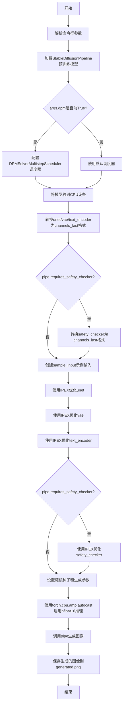

## 类结构

```
此脚本为单文件程序，无自定义类层次结构
主要依赖第三方库:
├── argparse (命令行参数解析)
├── torch (张量计算)
├── intel_extension_for_pytorch (IPEX优化)
└── diffusers (StableDiffusionPipeline)
```

## 全局变量及字段


### `device`
    
目标计算设备，此处固定为'cpu'

类型：`str`
    


### `prompt`
    
生成图像的文本提示词

类型：`str`
    


### `model_id`
    
预训练模型的路径或Hub模型ID

类型：`str`
    


### `seed`
    
随机种子，用于生成可复现的结果

类型：`int`
    


### `generator`
    
基于种子的随机数生成器

类型：`torch.Generator`
    


### `generate_kwargs`
    
图像生成的可选参数字典

类型：`dict`
    


### `sample`
    
用于IPEX优化的示例输入张量

类型：`torch.Tensor`
    


### `timestep`
    
用于IPEX优化的示例时间步

类型：`torch.Tensor`
    


### `encoder_hidden_status`
    
用于IPEX优化的示例编码器隐藏状态

类型：`torch.Tensor`
    


### `input_example`
    
包含示例输入的元组

类型：`tuple`
    


    

## 全局函数及方法


### `parser`

`parser` 是 `argparse.ArgumentParser` 的实例，用于解析命令行参数，支持 `--dpm`（启用 DPMSolver）和 `--steps`（推理步数）两个选项。

参数：

- `parser` 本身不是函数，而是全局变量。其配置的命令行参数如下：
  - `--dpm`：`bool`，布尔标志参数，启用 DPMSolver 多步求解器
  - `--steps`：`int`，可选参数，指定推理步数

返回值：`args`（`Namespace`），包含解析后的命令行参数对象，属性 `args.dpm`（布尔）和 `args.steps`（整数或 `None`）

#### 流程图

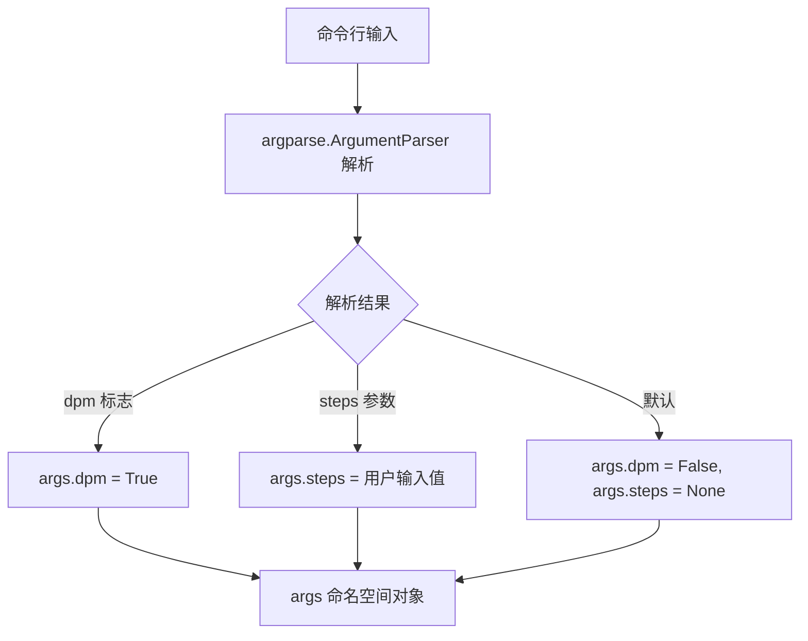

#### 带注释源码

```python
# 创建 ArgumentParser 实例，添加程序描述和禁用默认 help
parser = argparse.ArgumentParser(
    "Stable Diffusion script with intel optimization",  # 程序描述
    add_help=False  # 禁用默认 help，避免与自定义参数冲突
)

# 添加 --dpm 参数：布尔标志，启用 DPMSolver 多步求解器
parser.add_argument(
    "--dpm",                      # 命令行参数名
    action="store_true",          # 设为布尔标志
    help="Enable DPMSolver or not"  # 帮助文本
)

# 添加 --steps 参数：可选整数，指定推理步数
parser.add_argument(
    "--steps",                    # 命令行参数名
    default=None,                 # 默认值为 None
    type=int,                     # 类型转换为整数
    help="Num inference steps"    # 帮助文本
)

# 解析命令行参数，生成 Namespace 对象
args = parser.parse_args()

# 后续使用：
# - args.dpm: bool 类型，表示是否启用 DPMSolver
# - args.steps: int 或 None 类型，表示推理步数
```


### `args.dpm`

该参数是命令行解析后的布尔值标志，用于控制是否启用DPMSolver多步调度器（DPMSolverMultistepScheduler）来替代默认的调度器，从而影响扩散模型的采样过程和生成速度。

参数：

-  `dpm`：`bool`，通过 `--dpm` 命令行标志传递，当存在该标志时值为 `True`，否则为 `False`。用于判断是否启用 DPMSolver 调度器。

返回值：`bool`，返回该布尔参数的当前值（True 表示启用，False 表示不启用）。

#### 流程图

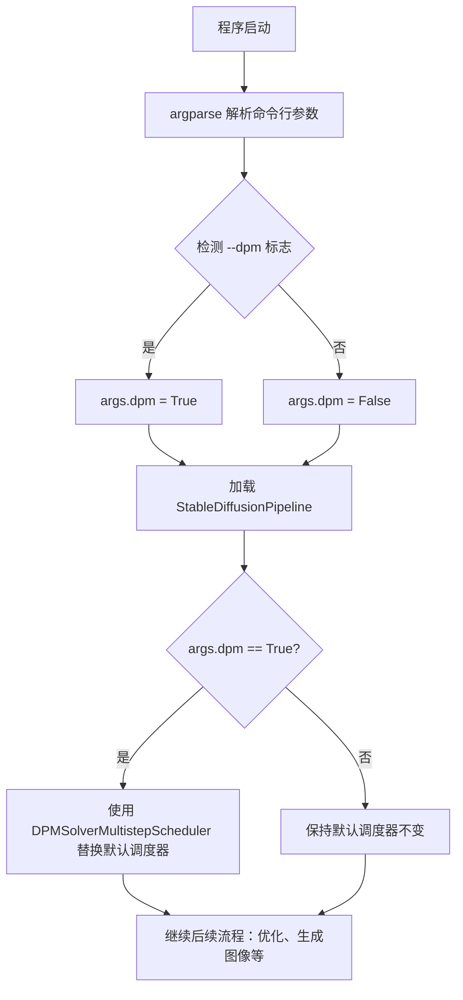

#### 带注释源码

```python
# 命令行参数解析部分
parser = argparse.ArgumentParser("Stable Diffusion script with intel optimization", add_help=False)
parser.add_argument("--dpm", action="store_true", help="Enable DPMSolver or not")
# 当用户传入 --dpm 标志时，args.dpm 被设置为 True；否则为 False
args = parser.parse_args()

# ... 模型加载代码 ...

# 根据 args.dpm 的值决定是否替换调度器
if args.dpm:
    # 如果启用了 DPM 调度器，则使用 DPMSolverMultistepScheduler 替换默认调度器
    # DPMSolver 是一种高效的求解器，可以在更少的推理步骤下生成高质量图像
    pipe.scheduler = DPMSolverMultistepScheduler.from_config(pipe.scheduler.config)
# 如果未启用（args.dpm == False），则保持原有的调度器配置不变
pipe = pipe.to(device)

# ... 后续优化和生成代码 ...
```


### `args.steps`

`args.steps` 是通过命令行参数 `--steps` 传入的全局变量，用于控制 Stable Diffusion 模型的推理步数。若未在命令行指定，则为 `None`。

参数：

- （无参数，这是全局变量而非函数）

返回值：`Optional[int]`，返回推理步数，若未指定则为 None

#### 流程图

```mermaid
graph TD
    A[命令行参数输入] --> B[argparse 解析 --steps 参数]
    B --> C{steps 是否指定?}
    C -->|是| D[args.steps = int 值]
    C -->|否| E[args.steps = None]
    D --> F[设置 generate_kwargs['num_inference_steps']]
    E --> F
    F --> G[传入 pipe 进行图像生成]
```

#### 带注释源码

```python
# 在 argparse 中定义
parser.add_argument("--steps", default=None, type=int, help="Num inference steps")

# 解析命令行参数
args = parser.parse_args()

# 使用 args.steps 控制推理步数
if args.steps is not None:
    generate_kwargs["num_inference_steps"] = args.steps

# 最终传入管道生成图像
with torch.cpu.amp.autocast(enabled=True, dtype=torch.bfloat16):
    image = pipe(prompt, **generate_kwargs).images[0]
```

#### 详细说明

- **变量名称**：`args.steps`
- **类型**：`Optional[int]`（Python 中为 `int | None`）
- **默认值**：`None`
- **来源**：通过 `argparse` 命令行参数解析
- **用途**：控制 Stable Diffusion 模型的推理步数，影响生成图像的质量和细节
- **约束**：必须是正整数，否则可能引发异常或被忽略

#### 技术债务与优化空间

1. **缺乏输入验证**：未对 `args.steps` 进行有效性验证（如负数、超大数值检查）
2. **硬编码提示词**：prompt 和 seed 被硬编码，应考虑外部配置
3. **错误处理**：IPEX 优化失败时的 fallback 逻辑可以更优雅
4. **设备硬编码**：device 固定为 "cpu"，缺乏灵活性


### `pipe (StableDiffusionPipeline)`

该函数实例化了一个 Stable Diffusion 推理管道，加载预训练模型后可将文本提示转换为图像。代码中通过 IPEX 库对管道的各个组件（UNet、VAE、Text Encoder、Safety Checker）进行了 CPU 上的 bf16 格式优化，以提升推理性能。

参数：

- `model_id`：`str`，模型路径或 Hugging Face Hub 上的模型 ID，用于加载预训练权重
- `prompt`：`str`，文本提示，描述想要生成的图像内容
- `**generate_kwargs`：可变关键字参数，包括 `generator`（torch.Generator，控制随机性）、`num_inference_steps`（int，推理步数）等

返回值：`PipelineOutput` 或类似结构，包含生成图像列表，通过 `.images[0]` 访问第一张生成的图像

#### 流程图

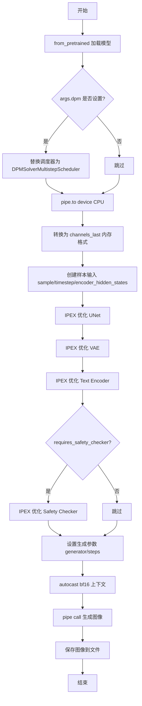

#### 带注释源码

```python
# 导入必要的库
import argparse
import intel_extension_for_pytorch as ipex  # Intel 优化的 PyTorch 扩展
import torch
from diffusers import DPMSolverMultistepScheduler, StableDiffusionPipeline

# ==================== 1. 命令行参数解析 ====================
parser = argparse.ArgumentParser("Stable Diffusion script with intel optimization", add_help=False)
parser.add_argument("--dpm", action="store_true", help="Enable DPMSolver or not")
parser.add_argument("--steps", default=None, type=int, help="Num inference steps")
args = parser.parse_args()

# ==================== 2. 基础配置 ====================
device = "cpu"  # 目标设备为 CPU
# 待生成的文本提示词，支持特殊占位符如 <dicoo>
prompt = "a lovely <dicoo> in red dress and hat, in the snowly and brightly night, with many brightly buildings"
model_id = "path-to-your-trained-model"  # 预训练模型路径

# ==================== 3. 创建 StableDiffusionPipeline 实例 ====================
# 从预训练模型加载完整的 diffusion pipeline
# 包含: text_encoder, vae, unet, scheduler, safety_checker
pipe = StableDiffusionPipeline.from_pretrained(model_id)

# 可选：启用 DPM (Diffusion Probabilistic Models) 求解器调度器
# DPM 通常能以更少的步骤获得更好的生成效果
if args.dpm:
    pipe.scheduler = DPMSolverMultistepScheduler.from_config(pipe.scheduler.config)

# 将整个 pipeline 移动到目标设备 (CPU)
pipe = pipe.to(device)

# ==================== 4. 内存格式转换 ====================
# 转换为 channels_last 内存格式
# 这种格式更适合卷积神经网络，可以提升 CPU 上的推理性能
pipe.unet = pipe.unet.to(memory_format=torch.channels_last)
pipe.vae = pipe.vae.to(memory_format=torch.channels_last)
pipe.text_encoder = pipe.text_encoder.to(memory_format=torch.channels_last)
# 安全检查器为可选组件
if pipe.requires_safety_checker:
    pipe.safety_checker = pipe.safety_checker.to(memory_format=torch.channels_last)

# ==================== 5. IPEX 优化 ====================
# 创建示例输入用于 IPEX 优化器的 trace 和优化
# sample: 随机噪声输入 (batch=2, channels=4, height=64, width=64)
# timestep: 时间步 (用于扩散过程)
# encoder_hidden_status: 文本编码器的隐藏状态 (batch=2, seq_len=77, hidden=768)
sample = torch.randn(2, 4, 64, 64)
timestep = torch.rand(1) * 999
encoder_hidden_status = torch.randn(2, 77, 768)
input_example = (sample, timestep, encoder_hidden_status)

# 使用 Intel IPEX 优化 UNet 模型
# dtype=torch.bfloat16: 使用 Brain Float 16 格式，提升性能且保持精度
# inplace=True: 原地修改模型，节省内存
try:
    # 尝试使用 sample_input 进行更好的优化 (JIT trace)
    pipe.unet = ipex.optimize(pipe.unet.eval(), dtype=torch.bfloat16, inplace=True, sample_input=input_example)
except Exception:
    # 如果失败 (如某些版本不支持)，回退到不带 sample_input 的优化
    pipe.unet = ipex.optimize(pipe.unet.eval(), dtype=torch.bfloat16, inplace=True)

# 优化 VAE (Variational Autoencoder) - 负责图像编码/解码
pipe.vae = ipex.optimize(pipe.vae.eval(), dtype=torch.bfloat16, inplace=True)

# 优化 Text Encoder - 负责将文本提示编码为向量
pipe.text_encoder = ipex.optimize(pipe.text_encoder.eval(), dtype=torch.bfloat16, inplace=True)

# 优化 Safety Checker (如果存在) - 负责过滤不适当内容
if pipe.requires_safety_checker:
    pipe.safety_checker = ipex.optimize(pipe.safety_checker.eval(), dtype=torch.bfloat16, inplace=True)

# ==================== 6. 图像生成 ====================
seed = 666  # 随机种子，确保可复现性
generator = torch.Generator(device).manual_seed(seed)

# 构建生成参数字典
generate_kwargs = {"generator": generator}
if args.steps is not None:
    # 如果用户指定了推理步数，则使用
    generate_kwargs["num_inference_steps"] = args.steps

# 使用自动混合精度 (AMP) 进行推理
# enabled=True: 启用混合精度
# dtype=torch.bfloat16: 使用 bf16 格式
with torch.cpu.amp.autocast(enabled=True, dtype=torch.bfloat16):
    # 调用 pipeline 进行图像生成
    # 返回 PipelineOutput 对象，包含 generated_images, nsfw_content_detected 等
    image = pipe(prompt, **generate_kwargs).images[0]

# ==================== 7. 保存结果 ====================
# 将生成的图像保存为 PNG 文件
image.save("generated.png")
```


### `pipe.scheduler`

该代码中的`pipe.scheduler`是`StableDiffusionPipeline`的一个属性，用于管理图像生成过程中的噪声调度策略。在默认情况下使用`PNDMScheduler`，当用户通过`--dpm`参数启用DPM（DPMSolverMultistepScheduler）时，会动态替换为更高效的`DPMSolverMultistepScheduler`以提升推理速度。

参数：

- 无直接参数（为类属性访问）

返回值：`Scheduler`对象，返回一个调度器实例，用于控制去噪过程中的噪声调度

#### 流程图

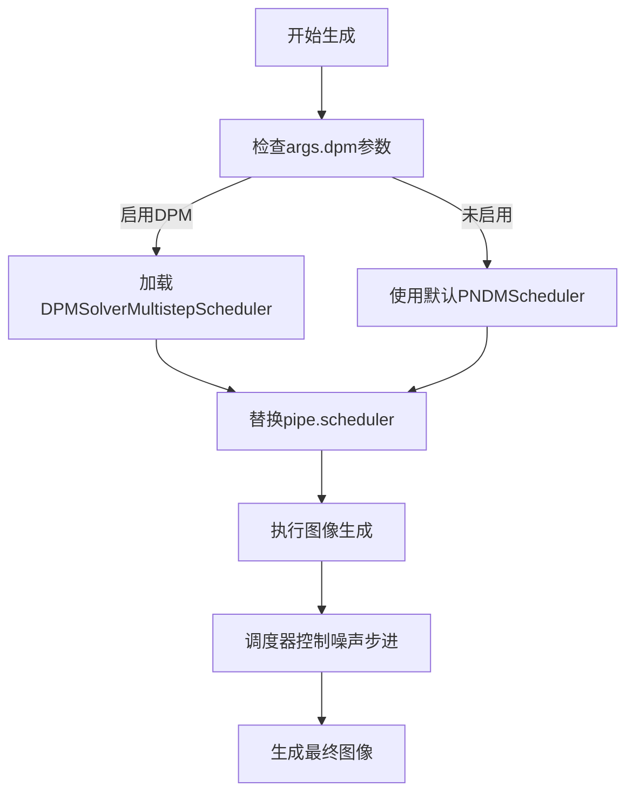

#### 带注释源码

```python
# 从预训练模型加载Stable Diffusion管道
pipe = StableDiffusionPipeline.from_pretrained(model_id)

# 检查是否启用DPM调度器
if args.dpm:
    # 使用DPMSolverMultistepScheduler替换默认调度器
    # DPMSolver是一种更快的求解器，用于加速扩散模型的采样过程
    pipe.scheduler = DPMSolverMultistepScheduler.from_config(pipe.scheduler.config)

# 后续在生成图像时，调度器会控制噪声的添加和去除过程
# 通过pipe.scheduler.config可以访问当前调度器的配置参数
```


### `pipe.unet`

对Stable Diffusion Pipeline 中的UNet模型组件进行内存格式转换和Intel Extension for PyTorch (IPEX)优化，以提升推理性能。

参数：

- `pipe`：[`StableDiffusionPipeline`]，Stable Diffusion pipeline对象，包含unet、vae、text_encoder等组件
- `memory_format`：`torch.memory_format`，目标内存格式，此处为`torch.channels_last`（通道最后），用于优化CPU上的张量运算效率
- `dtype`：`torch.dtype`，优化后的数据类型，此处为`torch.bfloat16`（Brain Float16），Intel CPU上可加速计算且减少内存占用
- `sample_input`：`tuple`，可选的示例输入，用于IPEX优化器的图优化，包含(sample, timestep, encoder_hidden_status)元组
- `inplace`：`bool`，是否原地操作，此处为`True`，节省内存

返回值：`torch.nn.Module`，返回优化后的UNet模型组件，已转换为指定的内存格式和数据类型，可直接在pipeline中使用进行推理。

#### 流程图

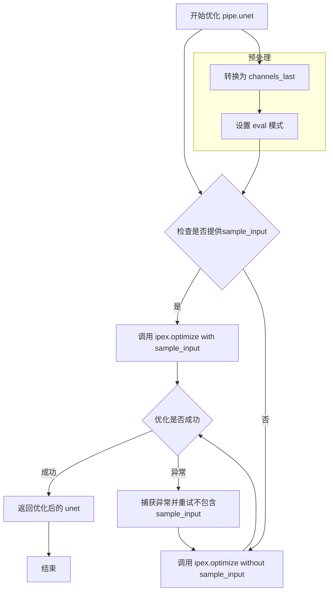

#### 带注释源码

```python
# 获取 pipeline 中的 UNet 模型组件
# pipe 是 StableDiffusionPipeline 实例，unet 是其成员变量，类型为 UNet2DConditionModel
pipe.unet = pipe.unet.to(memory_format=torch.channels_last)

# 将 UNet 设置为评估模式，禁用 dropout 和 batch normalization 的训练行为
# 这是 IPEX 优化的前提条件
pipe.unet = pipe.unet.eval()

# 准备示例输入，用于 IPEX 的图优化 (JIT compilation)
# sample: (batch_size, channels, height, width) = (2, 4, 64, 64) - 噪声潜在向量
# timestep: (batch_size,) = (1,) - 扩散时间步
# encoder_hidden_status: (batch_size, sequence_length, hidden_size) = (2, 77, 768) - 文本编码
sample = torch.randn(2, 4, 64, 64)
timestep = torch.rand(1) * 999
encoder_hidden_status = torch.randn(2, 77, 768)
input_example = (sample, timestep, encoder_hidden_status)

# 尝试使用 IPEX 优化 UNet
# dtype=torch.bfloat16: 使用 bfloat16 精度，在 Intel CPU 上可获得更好的性能
# inplace=True: 原地修改模型，节省内存
# sample_input: 可选，提供示例输入以便 IPEX 进行图优化
try:
    pipe.unet = ipex.optimize(
        pipe.unet.eval(),          # 评估模式
        dtype=torch.bfloat16,       # 数据类型
        inplace=True,               # 原地操作
        sample_input=input_example   # 示例输入，用于图优化
    )
except Exception:
    # 如果提供 sample_input 导致异常，则重试不带 sample_input 的优化
    # 这可能是由于输入格式不兼容导致
    pipe.unet = ipex.optimize(
        pipe.unet.eval(),
        dtype=torch.bfloat16,
        inplace=True
    )
```


### `StableDiffusionPipeline.vae`

变分自编码器（VAE）模型组件，是 StableDiffusionPipeline 的核心组成部分之一，负责将潜在空间（latent space）的表示解码（decode）为最终的图像。在 Stable Diffusion 架构中，VAE 扮演着图像生成的关键角色，将经过 UNet 处理后的潜在特征转换为可视化的图像输出。

参数：
- 此方法为属性访问，无独立函数参数。VAE 组件本身接受以下输入：
  - `latents`：`torch.Tensor`，潜在空间张量，通常维度为 `[batch_size, 4, height/8, width/8]`，由 UNet 生成
  - 返回值：`torch.Tensor`，解码后的图像张量，维度为 `[batch_size, 3, height, width]`

返回值：`torch.nn.Module`，返回优化后的 VAE 模型对象，支持 `torch.bfloat16` 精度和 `channels_last` 内存格式，用于高效 CPU 推理。

#### 流程图

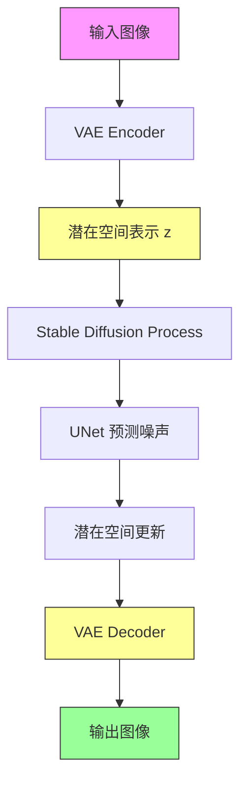

#### 带注释源码

```python
# 定义设备为 CPU
device = "cpu"

# 提示词，用于生成图像的文本描述
prompt = "a lovely <dicoo> in red dress and hat, in the snowly and brightly night, with many brightly buildings"

# 模型路径（需用户替换为实际训练模型路径）
model_id = "path-to-your-trained-model"

# 从预训练模型加载 Stable Diffusion Pipeline
pipe = StableDiffusionPipeline.from_pretrained(model_id)

# 可选：启用 DPMSolver 多步调度器以改善生成质量
if args.dpm:
    pipe.scheduler = DPMSolverMultistepScheduler.from_config(pipe.scheduler.config)

# 将整个 Pipeline 移动到 CPU 设备
pipe = pipe.to(device)

# ========== VAE 组件优化开始 ==========

# 1. 将 VAE 模型转换为 channels_last 内存格式
#    channels_last 比 default (contiguous) 格式在某些 CPU 指令上更高效
pipe.vae = pipe.vae.to(memory_format=torch.channels_last)

# 2. 使用 Intel Extension for PyTorch (IPEX) 优化 VAE
#    - eval(): 切换到推理模式，禁用 dropout 和 batch normalization 的训练行为
#    - dtype=torch.bfloat16: 使用 bfloat16 精度，平衡精度与性能
#    - inplace=True: 直接修改原模型，节省内存
pipe.vae = ipex.optimize(pipe.vae.eval(), dtype=torch.bfloat16, inplace=True)

# ========== VAE 组件优化结束 ==========

# VAE 在推理时的调用流程（当执行 pipe(prompt) 时）:
# 1. text_encoder: 将 prompt 编码为文本嵌入
# 2. UNet: 在潜在空间中根据文本嵌入去噪
# 3. VAE decoder: 将去噪后的潜在表示解码为最终图像
#    - VAE 解码器接收 UNet 输出的 latents
#    - 输出标准 RGB 图像张量

# 自动混合精度上下文，使用 bfloat16 进行推理
with torch.cpu.amp.autocast(enabled=True, dtype=torch.bfloat16):
    # 调用 pipeline 生成图像，VAE 在内部被调用执行解码
    image = pipe(prompt, **generate_kwargs).images[0]

# 保存生成的图像
image.save("generated.png")
```


### `pipe.text_encoder`

`pipe.text_encoder` 是 Stable Diffusion 管道中的文本编码器模型组件，负责将文本提示（prompt）转换为高维向量表示（encoder hidden states），供 UNet 在潜在空间中用于条件图像生成。该组件在加载后被转换为通道最后（channels last）内存格式以优化缓存局部性，并使用 Intel Extension for PyTorch (IPEX) 进行 bf16 精度优化以提升推理性能。

参数：

- 无直接参数（作为管道属性访问）

返回值：

- `torch.nn.Module`，经过 IPEX 优化后的文本编码器模型，可接受文本嵌入输入并输出隐藏状态

#### 流程图

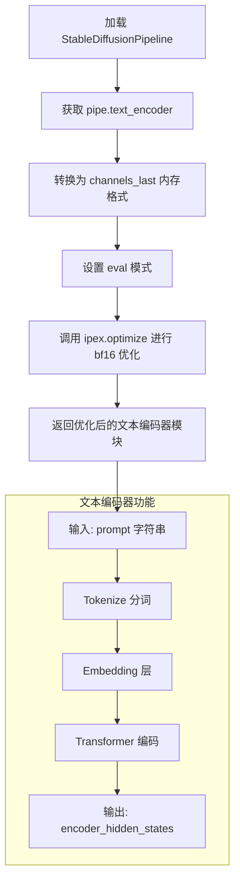

#### 带注释源码

```python
# === 文本编码器模型组件 ===
# 来源: StableDiffusionPipeline.from_pretrained(model_id)
# 组件类型: torch.nn.Module (CLIPTextModel)

# 1. 基础转换 - 转换为通道最后格式以优化内存访问
pipe.text_encoder = pipe.text_encoder.to(memory_format=torch.channels_last)

# 2. IPEX 优化 - 使用 Intel Extension for PyTorch 进行性能优化
# 参数说明:
#   - eval(): 切换到推理模式，禁用 dropout 和 batch norm 更新
#   - dtype=torch.bfloat16: 使用脑浮点16位精度，减少内存占用并加速计算
#   - inplace=True: 原地修改模型，节省内存
#   - sample_input: 可选的示例输入，用于 JIT 编译优化
pipe.text_encoder = ipex.optimize(
    pipe.text_encoder.eval(),  # 推理模式
    dtype=torch.bfloat16,      # bf16 精度优化
    inplace=True               # 原地操作
)

# 3. 文本编码器的主要用途（在推理时内部调用）
# 输入: tokenized_ids (shape: [batch_size, seq_len=77])
# 输出: encoder_hidden_states (shape: [batch_size, seq_len=77, hidden_dim=768])
# 这些隐藏状态随后被传递给 UNet 用于条件生成
```


### `pipe.requires_safety_checker`

`pipe.requires_safety_checker` 是 StableDiffusionPipeline 对象的一个布尔属性，用于指示当前管道配置是否需要启用安全检查器组件。在模型加载后，通过检查此标志来决定是否将安全检查器模型移动到目标设备（如 CPU）并进行 Intel 扩展优化。

参数：

- （无参数，这是一个属性访问而非方法调用）

返回值：`bool`，返回一个布尔值，True 表示管道需要安全检查器，False 表示不需要。

#### 流程图

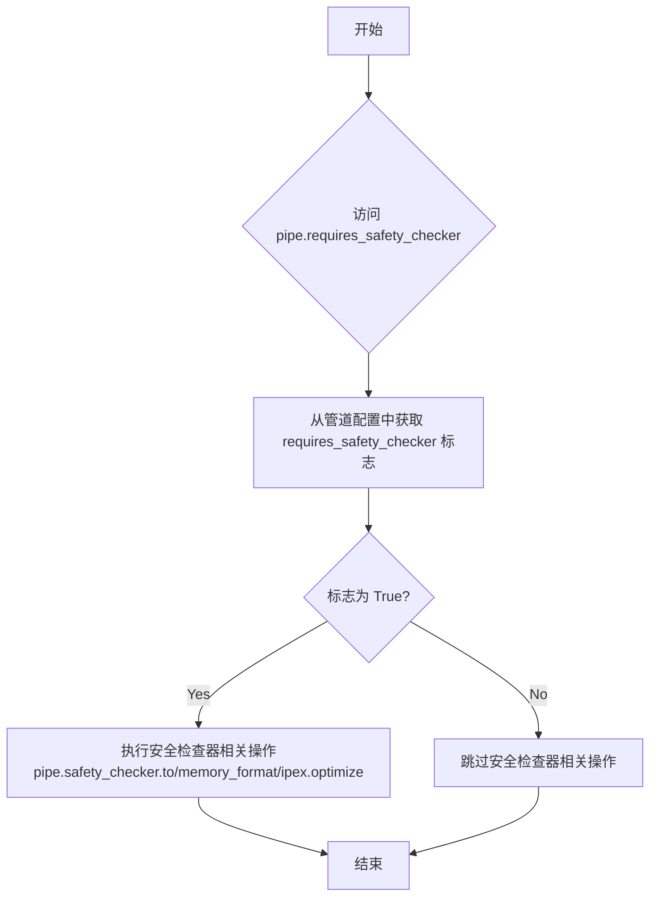

#### 带注释源码

```python
# 在代码中的使用方式：
if pipe.requires_safety_checker:
    # 将安全检查器模型转换为 channels_last 内存格式
    # 以优化推理性能（适用于 Transformer 和 CNN 模型）
    pipe.safety_checker = pipe.safety_checker.to(memory_format=torch.channels_last)

# ... 后续代码中再次使用 ...

if pipe.requires_safety_checker:
    # 使用 Intel Extension for PyTorch 优化安全检查器
    # dtype=torch.bfloat16 用于混合精度推理，提升性能
    pipe.safety_checker = ipex.optimize(
        pipe.safety_checker.eval(),  # 设置为评估模式
        dtype=torch.bfloat16,         # 使用 bfloat16 精度
        inplace=True                  # 原地优化，节省内存
    )
```

#### 技术说明

`requires_safety_checker` 属性来源于 StableDiffusionPipeline 的配置，通常在模型加载时从 `safety_checker` 参数推断。在较新版本的 diffusers 库中，此属性已被标记为弃用，转而使用显式的 `safety_checker is not None` 检查方式。该属性体现了管道的可配置性，允许用户在不需要安全过滤功能时跳过相关计算和内存占用。


### `pipe.safety_checker`

安全检查器组件是StableDiffusionPipeline的内置功能模块，用于检测和过滤生成图像中的不当内容（如暴力、色情、敏感信息等），确保模型输出的图像符合安全和道德标准。该组件通过分析图像特征向量来判断内容安全性，并在检测到违规内容时返回安全的替代图像或对原图进行模糊处理。

参数：

- 此方法为Pipeline组件属性，无直接调用参数
- 间接访问通过 `pipe.requires_safety_checker` 属性判断是否存在

返回值：`torch.nn.Module` 或 `None`，返回安全检查器模型实例，若未配置则返回None

#### 流程图

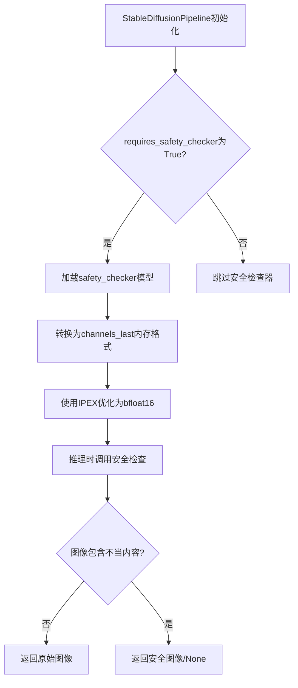

#### 带注释源码

```python
# ============================================================
# 安全检查器组件相关代码片段
# ============================================================

# 1. 检查pipeline是否配置了安全检查器
# pipe.requires_safety_checker 是StableDiffusionPipeline的属性
# 用于判断当前模型是否包含安全检查功能
if pipe.requires_safety_checker:
    # 将安全检查器模型转换为channels_last内存格式
    # channels_last格式通常能提升CPU上的推理性能
    # 适用于4D张量（batch, channel, height, width）
    pipe.safety_checker = pipe.safety_checker.to(memory_format=torch.channels_last)

# 2. 使用Intel Extension for PyTorch (IPEX)优化安全检查器
if pipe.requires_safety_checker:
    # eval()将模型设置为评估模式，禁用dropout和batch normalization训练行为
    # dtype=torch.bfloat16使用半精度浮点数，减少内存占用并提升推理速度
    # inplace=True表示原地修改模型，节省内存
    pipe.safety_checker = ipex.optimize(
        pipe.safety_checker.eval(),    # 评估模式
        dtype=torch.bfloat16,          # 低精度数据类型
        inplace=True                   # 原地优化
    )

# ============================================================
# 安全检查器工作原理（Pipeline内部调用）
# ============================================================
# 在生成图像后，pipeline会自动调用safety_checker:
# 1. safety_checker接受生成的图像和条件向量
# 2. 返回:(filtered_images, has_nsfw_concepts)
#    - filtered_images: 处理后的安全图像
#    - has_nsfw_concepts: 布尔张量，标识是否有不当内容
# ============================================================
```

#### 关键组件信息

| 组件名称 | 描述 |
|---------|------|
| `pipe.requires_safety_checker` | 布尔属性，判断pipeline是否配置了安全检查器 |
| `pipe.safety_checker` | 安全检查器模型实例，负责图像内容审核 |
| `ipex.optimize()` | Intel扩展优化函数，将模型转换为优化格式 |

#### 潜在技术债务与优化空间

1. **优化缺失**: 代码中未对safety_checker使用`sample_input`参数进行输入shape预热，可能导致首次推理性能下降
2. **错误处理不足**: 缺少对safety_checker加载失败或优化失败的异常捕获
3. **条件分支重复**: `if pipe.requires_safety_checker` 判断逻辑出现两次，可提取为单一检查
4. **内存格式转换**: 未对safety_checker的输入张量进行显式内存格式转换

#### 外部依赖与接口契约

- **依赖库**: `intel_extension_for_pytorch (ipex)`, `torch`, `diffusers`
- **接口契约**: 
  - 输入: 生成的图像张量 (batch, channel, height, width)
  - 输出: (filtered_images, has_nsfw_concepts) 元组
  - 内存格式: channels_last
  - 数据类型: bfloat16


### `pipe` (StableDiffusionPipeline.__call__)

执行图像生成的管道调用方法，该方法接收文本提示和生成参数，通过去噪过程将文本描述转换为对应的图像。

参数：

- `prompt`：`str`，要生成的文本描述，如"a lovely in red dress and hat, in the snowly and brightly night, with many brightly buildings"
- `**generate_kwargs`：可变关键字参数，支持以下常用参数：
  - `generator`：`torch.Generator`，随机数生成器，用于控制生成过程的可重复性
  - `num_inference_steps`：`int`，推理步数，决定去噪过程的迭代次数
  - `height`/`width`：生成的图像高度和宽度
  - `guidance_scale`：CFG引导系数

返回值：`PIL.Image`，生成的图像对象

#### 流程图

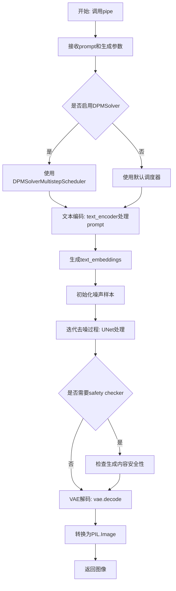

#### 带注释源码

```python
# 导入必要的模块
import argparse
import intel_extension_for_pytorch as ipex
import torch
from diffusers import DPMSolverMultistepScheduler, StableDiffusionPipeline

# 命令行参数解析
parser = argparse.ArgumentParser("Stable Diffusion script with intel optimization", add_help=False)
parser.add_argument("--dpm", action="store_true", help="Enable DPMSolver or not")
parser.add_argument("--steps", default=None, type=int, help="Num inference steps")
args = parser.parse_args()

# 设置设备为CPU
device = "cpu"
# 定义生成图像的文本提示
prompt = "a lovely <dicoo> in red dress and hat, in the snowly and brightly night, with many brightly buildings"

# 从预训练模型加载Stable Diffusion管道
model_id = "path-to-your-trained-model"
pipe = StableDiffusionPipeline.from_pretrained(model_id)

# 根据命令行参数决定是否启用DPMSolver调度器
if args.dpm:
    pipe.scheduler = DPMSolverMultistepScheduler.from_config(pipe.scheduler.config)

# 将管道移至指定设备(CPU)
pipe = pipe.to(device)

# 转换为通道最后内存格式以优化性能
pipe.unet = pipe.unet.to(memory_format=torch.channels_last)
pipe.vae = pipe.vae.to(memory_format=torch.channels_last)
pipe.text_encoder = pipe.text_encoder.to(memory_format=torch.channels_last)
if pipe.requires_safety_checker:
    pipe.safety_checker = pipe.safety_checker.to(memory_format=torch.channels_last)

# 使用Intel Extension for PyTorch优化模型(使用bfloat16精度)
sample = torch.randn(2, 4, 64, 64)
timestep = torch.rand(1) * 999
encoder_hidden_status = torch.randn(2, 77, 768)
input_example = (sample, timestep, encoder_hidden_status)
try:
    # 尝试使用sample_input进行优化
    pipe.unet = ipex.optimize(pipe.unet.eval(), dtype=torch.bfloat16, inplace=True, sample_input=input_example)
except Exception:
    # 如果失败则不使用sample_input
    pipe.unet = ipex.optimize(pipe.unet.eval(), dtype=torch.bfloat16, inplace=True)
pipe.vae = ipex.optimize(pipe.vae.eval(), dtype=torch.bfloat16, inplace=True)
pipe.text_encoder = ipex.optimize(pipe.text_encoder.eval(), dtype=torch.bfloat16, inplace=True)
if pipe.requires_safety_checker:
    pipe.safety_checker = ipex.optimize(pipe.safety_checker.eval(), dtype=torch.bfloat16, inplace=True)

# 设置随机种子以确保可重复性
seed = 666
generator = torch.Generator(device).manual_seed(seed)
# 构建生成参数字典
generate_kwargs = {"generator": generator}
# 如果命令行指定了推理步数，则添加到生成参数
if args.steps is not None:
    generate_kwargs["num_inference_steps"] = args.steps

# 使用自动混合精度(AMP)执行推理，启用bfloat16
with torch.cpu.amp.autocast(enabled=True, dtype=torch.bfloat16):
    # 调用管道生成图像 - 核心的pipe()调用
    # 参数: prompt - 文本提示, **generate_kwargs - 生成参数(如generator, num_inference_steps等)
    # 返回: 包含生成图像的PipelineOutput对象，通过.images[0]获取第一张图像
    image = pipe(prompt, **generate_kwargs).images[0]

# 保存生成的图像到文件
image.save("generated.png")
```


### `PIL.Image.Image.save`

该方法是 PIL 图像库的 `Image` 类中用于将图像保存到磁盘的成员函数。在本代码中，用于将 Stable Diffusion 生成的图像保存为 PNG 格式文件。

参数：

-  `fp`：`str`，文件路径，指定保存图像的目标文件名及路径，此处为 `"generated.png"`
-  `format`：`Optional[str]`，图像格式，可省略，系统会根据文件扩展名自动推断，此处为 PNG 格式
-  `**params`：可变关键字参数，其他传递给图像编码器的参数

返回值：`None`，无返回值，该方法直接写入文件到磁盘

#### 流程图

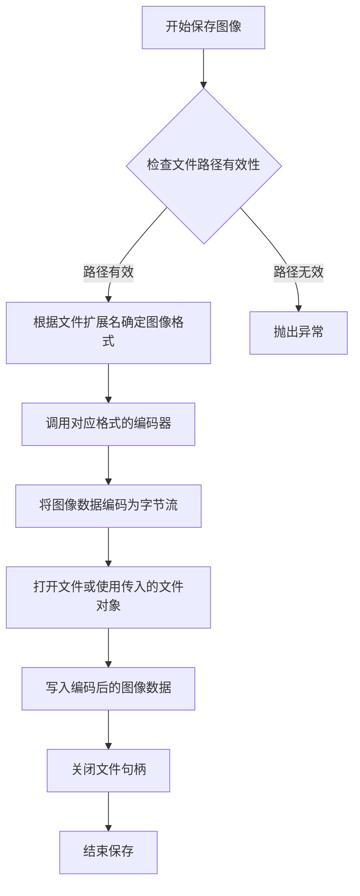

#### 带注释源码

```python
# image 是 StableDiffusionPipeline 调用后返回的 PIL.Image.Image 对象
# 其类型为 <class 'PIL.PngImagePlugin.PngImageFile'> 或其他 PIL 支持的图像格式

# 调用 save 方法将图像保存到磁盘
# 参数 "generated.png" 指定了目标文件路径
# Pillow 会自动根据文件扩展名 .png 识别需要使用 PNG 编码器
image.save("generated.png")

# 内部实现逻辑（简化版）：
# 1. 如果 fp 是字符串路径，则自动打开文件
# 2. 根据格式或文件扩展名选择对应的图像编码器（PNG 编码器）
# 3. 将 PIL 图像对象转换为 PNG 字节流
# 4. 将字节流写入文件
# 5. 关闭文件句柄
# 返回 None
```


## 关键组件


### 张量索引与惰性加载

通过`pipe.requires_safety_checker`属性判断是否需要加载safety_checker模块，实现条件性加载，避免不必要的模型组件初始化。

### 反量化支持

使用IPEX的`optimize`函数配合`dtype=torch.bfloat16`参数，将模型从默认精度转换为bfloat16进行推理，在保持模型质量的同时提升推理性能。

### 量化策略

采用Intel Extension for PyTorch (IPEX)的bfloat16量化策略，通过`ipex.optimize`对UNet、VAE、Text Encoder和Safety Checker进行批量优化，并利用CPU的自动混合精度(AMP)进行推理加速。

### 内存格式优化

通过`.to(memory_format=torch.channels_last)`将模型参数转换为NHWC内存布局，适配Intel架构的优化计算核，提升张量运算效率。

### 调度器配置

支持通过命令行参数`--dpm`动态切换调度器，可选择使用DPMSolverMultistepScheduler替代默认调度器，提供更灵活的推理策略配置。

### 输入示例构造

在优化前构造示例输入`(sample, timestep, encoder_hidden_status)`用于IPEX的图优化和内核编译，提高首次推理的性能。


## 问题及建议


### 已知问题

-   **硬编码配置值**：模型路径(`model_id`)、提示词(`prompt`)、随机种子(`seed`)和输出文件名(`generated.png`)均被硬编码，缺乏灵活性，难以适应不同场景。
-   **异常处理不完善**：`try-except` 块捕获异常后仅打印堆栈信息后继续执行，可能导致后续推理使用未经优化的模型，性能下降。
-   **缺少推理模式控制**：未使用 `torch.inference_mode()` 或 `torch.no_grad()`，会导致推理时保留不必要的计算图，增加内存占用。
-   **临时张量未清理**：用于优化的临时输入张量 `sample`、`timestep`、`encoder_hidden_status` 在优化后未被显式释放，可能造成内存浪费。
-   **安全检查器判断不可靠**：使用 `pipe.requires_safety_checker` 属性判断是否需要优化安全检查器，但该属性可能在不同版本的 diffusers 中表现不一致。
-   **缺乏日志和进度提示**：推理过程中没有任何日志输出或进度指示，用户无法了解程序执行状态。
-   **输出路径未验证**：保存图像前未检查目录是否存在或可写，可能导致写入失败。

### 优化建议

-   **配置外部化**：使用配置文件或环境变量管理模型路径、提示词、输出路径等参数，增加脚本的通用性。
-   **改进错误处理**：在 `try-except` 块中添加日志记录，明确区分优化失败的原因（是API变更还是其他问题），并考虑降级策略。
-   **启用推理模式**：在推理代码块外添加 `with torch.inference_mode():` 或 `with torch.no_grad():` 上下文管理器。
-   **优化内存管理**：将临时张量放入 `with` 块中或在使用完毕后显式删除，释放内存供后续推理使用。
-   **增强安全检查器处理**：使用 `hasattr(pipe, 'safety_checker') and pipe.safety_checker is not None` 进行更可靠的判断。
-   **添加日志和进度条**：使用 `logging` 模块记录关键步骤，配合 `tqdm` 或 `diffusers` 内部的进度回调显示推理进度。
-   **验证输出路径**：在保存图像前使用 `os.makedirs()` 确保输出目录存在，或使用 `pathlib` 进行更安全的路径处理。
-   **考虑批处理优化**：当前仅生成单张图像，可考虑添加批处理参数以提高推理吞吐量。


## 其它


### 设计目标与约束

本代码的设计目标是在Intel CPU平台上高效运行Stable Diffusion图像生成模型，利用Intel Extension for PyTorch (IPEX)进行性能优化，实现BF16混合精度推理加速。约束条件包括：1) 依赖Intel CPU和IPEX库，不支持GPU；2) 模型路径必须预先准备好；3) 内存格式必须转换为channels_last以优化CPU性能；4) 生成的图像默认保存为PNG格式。

### 错误处理与异常设计

代码中的错误处理设计如下：1) IPEX优化部分使用try-except块捕获异常，当sample_input参数导致错误时回退到不带该参数的优化方式；2) 缺乏对模型加载失败的错误处理（如模型路径不存在）；3) 缺乏对图像生成失败的处理；4) 缺乏对图像保存失败的错误处理。建议增加更完善的异常捕获机制，包括模型文件验证、磁盘空间检查、内存不足处理等。

### 数据流与状态机

数据流如下：1) 输入阶段：解析命令行参数（--dpm, --steps），定义提示词和随机种子；2) 模型加载阶段：从pretrained模型加载StableDiffusionPipeline，包括unet、vae、text_encoder和可选的safety_checker；3. 优化阶段：将模型转换为channels_last内存格式，使用IPEX进行BF16优化；4) 生成阶段：配置生成参数（generator、num_inference_steps），执行推理；5) 输出阶段：保存生成的图像到文件。状态机转换：初始化 → 模型加载 → 模型优化 → 图像生成 → 图像保存。

### 外部依赖与接口契约

主要外部依赖包括：1) argparse：命令行参数解析；2) intel_extension_for_pytorch (ipex)：Intel CPU优化库，版本需兼容PyTorch；3) torch：PyTorch基础库，需支持BF16和CPU amp；4) diffusers：Hugging Face的扩散模型库，提供StableDiffusionPipeline、DPMSolverMultistepScheduler。接口契约：pipe对象需包含unet、vae、text_encoder属性；pipe.scheduler需支持from_config方法；pipe.requires_safety_checker属性用于条件判断；pipe()方法接受prompt和生成参数，返回包含images属性的对象。

### 性能优化策略

性能优化策略包括：1) 内存格式优化：将模型转换为channels_last格式以提高CPU缓存效率；2) 数值精度优化：使用BF16进行混合精度推理，减少内存占用并加速计算；3) 调度器优化：可选使用DPM-Solver多步调度器以加速收敛；4) IPEX优化：通过ipex.optimize()对各模型组件进行Intel特定优化；5) 自动混合精度：使用torch.cpu.amp.autocast启用BF16自动计算。

### 配置与参数管理

可配置参数包括：1) --dpm：布尔标志，启用DPM-Solver调度器替代默认调度器；2) --steps：整型，指定推理步数，默认为None（使用调度器默认步数）；3) prompt：字符串，输入的文本提示词，当前硬编码为特定内容；4) seed：整型(666)，随机种子用于生成可复现的结果；5) device：字符串("cpu")，指定运行设备；6) model_id：字符串，指向预训练模型的路径。这些参数缺乏从配置文件或环境变量读取的机制。

### 模型组件架构

主要模型组件：1) unet：U-Net模型，负责噪声预测，是扩散模型的核心组件；2) vae：变分自编码器，负责将潜在表示解码为图像；3) text_encoder：文本编码器，将输入文本转换为嵌入向量；4. safety_checker：可选的安全检查器，用于过滤不当内容；5) scheduler：调度器，控制去噪过程的步进策略。各组件均通过IPEX优化并转换为BF16和channels_last格式。

### 资源需求与限制

资源需求：1) 内存：模型加载和推理需要较大CPU内存，建议至少16GB；2) 磁盘：需要足够的磁盘空间存储模型文件（通常数GB）；3) CPU：Intel处理器支持BF16指令集（如AVX-512 BF16或AMX）可获得更好性能。限制：1) 不支持GPU加速；2) 生成的图像分辨率固定为模型默认尺寸（通常512x512或768x768）；3) 单次仅生成一张图像（尽管sample为batch_size=2但只取第一张）。


    