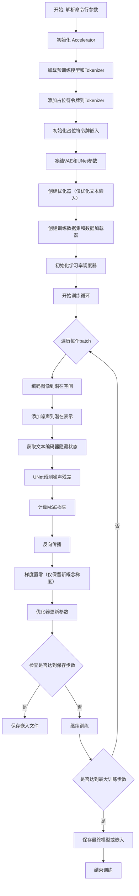
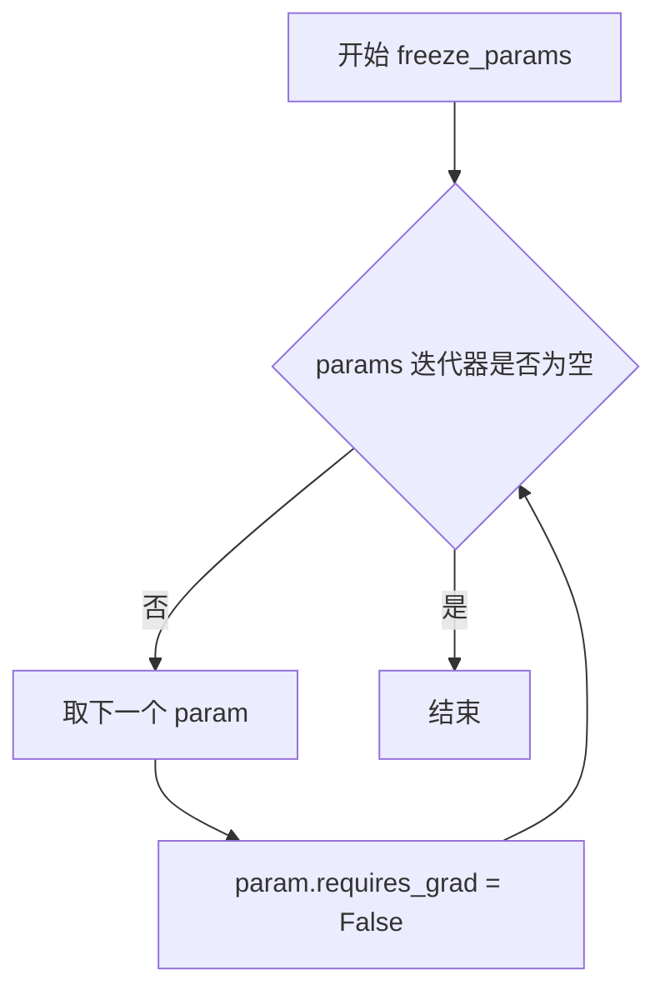
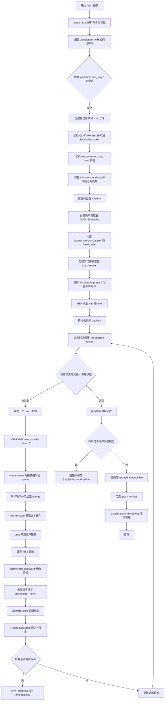
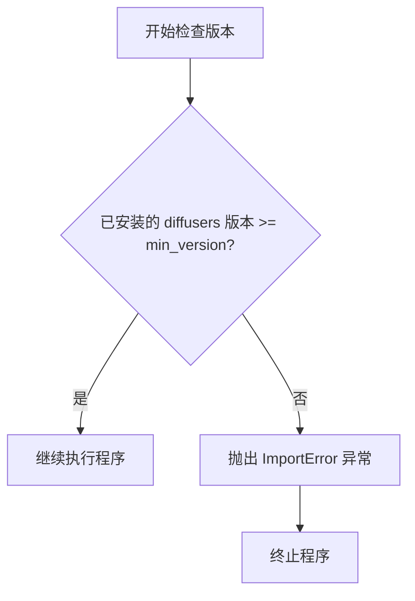
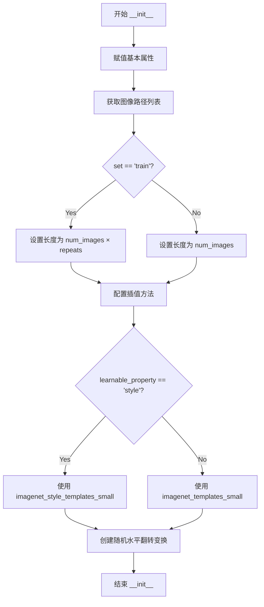
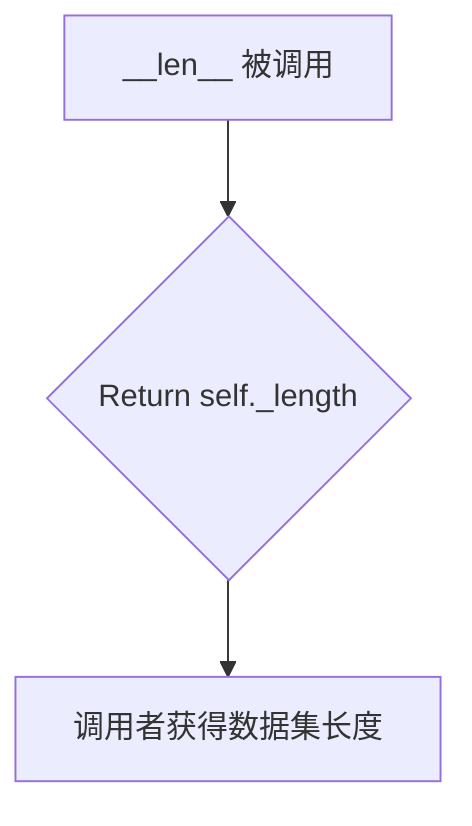
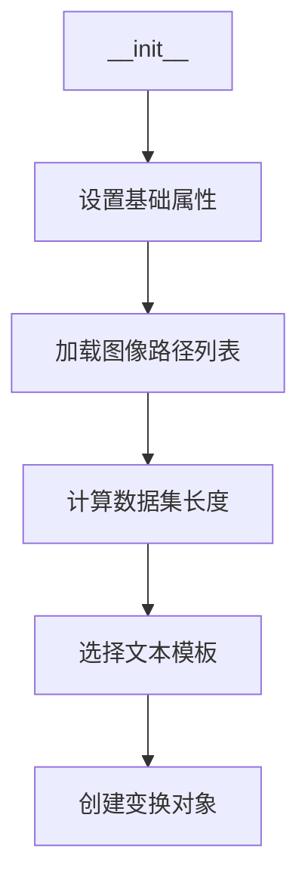
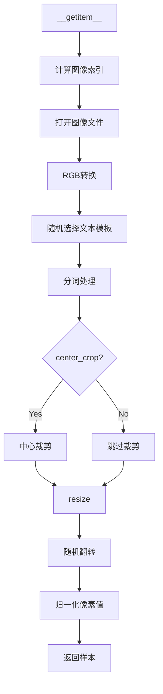
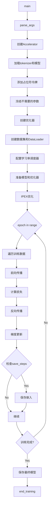

```mermaid
flowchart TD
    A[开始 parse_args] --> B[创建 argparse.ArgumentParser]
    B --> C[添加 --save_steps 参数]
    C --> D[添加 --only_save_embeds 参数]
    D --> E[添加 --pretrained_model_name_or_path 参数]
    E --> F[添加 --revision 参数]
    F --> G[添加 --tokenizer_name 参数]
    G --> H[添加 --train_data_dir 参数]
    H --> I[添加 --placeholder_token 参数]
    I --> J[添加 --initializer_token 参数]
    J --> K[添加 --learnable_property 参数]
    K --> L[添加 --repeats 参数]
    L --> M[添加 --output_dir 参数]
    M --> N[添加 --seed 参数]
    N --> O[添加 --resolution 参数]
    O --> P[添加 --center_crop 参数]
    P --> Q[添加 --train_batch_size 参数]
    Q --> R[添加 --num_train_epochs 参数]
    R --> S[添加 --max_train_steps 参数]
    S --> T[添加 --gradient_accumulation_steps 参数]
    T --> U[添加 --learning_rate 参数]
    U --> V[添加 --scale_lr 参数]
    V --> W[添加 --lr_scheduler 参数]
    W --> X[添加 --lr_warmup_steps 参数]
    X --> Y[添加 --adam_beta1 参数]
    Y --> Z[添加 --adam_beta2 参数]
    Z --> AA[添加 --adam_weight_decay 参数]
    AA --> AB[添加 --adam_epsilon 参数]
    AB --> AC[添加 --push_to_hub 参数]
    AC --> AD[添加 --hub_token 参数]
    AD --> AE[添加 --hub_model_id 参数]
    AE --> AF[添加 --logging_dir 参数]
    AF --> AG[添加 --mixed_precision 参数]
    AG --> AH[添加 --local_rank 参数]
    AH --> AI[调用 parser.parse_args 解析参数]
    AI --> AJ{检查环境变量 LOCAL_RANK}
    AJ -->|env_local_rank != -1| AK[用环境变量覆盖 local_rank]
    AJ -->|env_local_rank == -1| AL{检查 train_data_dir}
    AK --> AL
    AL -->|train_data_dir 为 None| AM[抛出 ValueError]
    AL -->|train_data_dir 存在| AN[返回 args 对象]
    AM --> AN
```

# `diffusers\examples\research_projects\intel_opts\textual_inversion\textual_inversion_bf16.py` 详细设计文档

这是一个Textual Inversion（文本倒置）训练脚本，用于向Stable Diffusion模型添加新的概念（物体或风格）。通过学习一个特殊的占位符令牌（placeholder token）的嵌入向量，使模型能够根据文本提示生成特定的概念图像。脚本支持分布式训练、混合精度训练、Intel Extension for PyTorch优化，并可将训练结果保存到本地或推送至HuggingFace Hub。

## 整体流程



## 类结构

```
模块层级结构:
├── 导入依赖 (标准库 + 第三方库)
├── 全局配置 (PIL_INTERPOLATION, logger)
├── 全局函数
│   ├── save_progress() - 保存训练嵌入
│   ├── parse_args() - 解析命令行参数
│   └── freeze_params() - 冻结模型参数
├── 数据类
│   └── TextualInversionDataset (继承Dataset)
│       ├── __init__() - 初始化数据集
│       ├── __len__() - 返回数据集长度
│       └── __getitem__() - 获取单个样本
└── 主函数
    └── main() - 训练主流程
```

## 全局变量及字段


### `PIL_INTERPOLATION`
    
PIL图像插值方法映射，根据PIL版本选择对应的重采样模式

类型：`dict`
    


### `logger`
    
Accelerate日志记录器，用于输出训练过程中的日志信息

类型：`Logger`
    


### `imagenet_templates_small`
    
物体类别文本模板列表，用于生成描述物体的提示词

类型：`list`
    


### `imagenet_style_templates_small`
    
风格类别文本模板列表，用于生成描述风格的提示词

类型：`list`
    


### `args`
    
命令行参数命名空间，包含所有训练配置参数

类型：`Namespace`
    


### `tokenizer`
    
CLIP分词器，用于文本编码和特殊令牌添加

类型：`CLIPTokenizer`
    


### `text_encoder`
    
CLIP文本编码器模型，用于将文本提示转换为嵌入向量

类型：`CLIPTextModel`
    


### `vae`
    
变分自编码器，用于将图像编码到潜在空间和解码回图像

类型：`AutoencoderKL`
    


### `unet`
    
UNet条件模型，用于在潜在空间中执行去噪操作

类型：`UNet2DConditionModel`
    


### `optimizer`
    
AdamW优化器，用于更新文本嵌入参数

类型：`AdamW`
    


### `noise_scheduler`
    
DDPM噪声调度器，用于在训练过程中添加和移除噪声

类型：`DDPMScheduler`
    


### `train_dataset`
    
文本倒置训练数据集，包含图像和文本配对样本

类型：`TextualInversionDataset`
    


### `train_dataloader`
    
训练数据加载器，用于批量加载训练数据

类型：`DataLoader`
    


### `lr_scheduler`
    
学习率调度器，用于动态调整学习率

类型：`_LRScheduler`
    


### `accelerator`
    
分布式训练加速器，管理设备分配和混合精度

类型：`Accelerator`
    


### `placeholder_token_id`
    
占位符令牌在分词器中的ID，用于标识新学习的概念

类型：`int`
    


### `initializer_token_id`
    
初始化令牌在分词器中的ID，用于初始化新令牌的嵌入

类型：`int`
    


### `num_added_tokens`
    
添加到分词器的令牌数量，用于验证令牌是否成功添加

类型：`int`
    


### `overrode_max_train_steps`
    
标志位，指示是否通过计算覆盖了最大训练步数

类型：`bool`
    


### `num_update_steps_per_epoch`
    
每个训练 epoch 中的更新步数

类型：`int`
    


### `total_batch_size`
    
总批处理大小，考虑了分布式和梯度累积

类型：`int`
    


### `global_step`
    
全局训练步数计数器，记录已执行的优化步骤

类型：`int`
    


### `progress_bar`
    
训练进度条，用于显示训练进度

类型：`tqdm`
    


### `repo_id`
    
Hugging Face Hub仓库ID，用于模型推送

类型：`str`
    


### `save_full_model`
    
标志位，指示是否保存完整的模型权重

类型：`bool`
    


### `TextualInversionDataset.data_root`
    
训练数据根目录路径

类型：`str`
    


### `TextualInversionDataset.tokenizer`
    
分词器实例，用于文本编码

类型：`CLIPTokenizer`
    


### `TextualInversionDataset.learnable_property`
    
可学习属性类型，object或style

类型：`str`
    


### `TextualInversionDataset.size`
    
图像分辨率，目标图像的尺寸

类型：`int`
    


### `TextualInversionDataset.placeholder_token`
    
占位符令牌，用于替代要学习的概念

类型：`str`
    


### `TextualInversionDataset.center_crop`
    
是否进行中心裁剪

类型：`bool`
    


### `TextualInversionDataset.flip_p`
    
水平翻转概率

类型：`float`
    


### `TextualInversionDataset.image_paths`
    
训练图像文件路径列表

类型：`list`
    


### `TextualInversionDataset.num_images`
    
原始训练图像数量

类型：`int`
    


### `TextualInversionDataset._length`
    
数据集长度，考虑重复次数后的总样本数

类型：`int`
    


### `TextualInversionDataset.interpolation`
    
图像插值方式，PIL重采样模式

类型：`int`
    


### `TextualInversionDataset.templates`
    
文本提示模板列表

类型：`list`
    


### `TextualInversionDataset.flip_transform`
    
随机水平翻转变换

类型：`RandomHorizontalFlip`
    
    

## 全局函数及方法


### `parse_args`

该函数用于解析命令行参数，创建一个`argparse.ArgumentParser`实例，定义了一系列训练所需的参数（如模型路径、数据目录、学习率、批次大小等），然后通过`parser.parse_args()`解析这些参数，并对部分参数进行环境变量覆盖处理，最后返回包含所有参数的`Namespace`对象。

参数： 无（该函数没有输入参数，通过命令行或环境变量获取参数）

返回值：`argparse.Namespace`，包含所有解析后的命令行参数及其值的对象

#### 流程图



#### 带注释源码

```python
def parse_args():
    """
    解析命令行参数并返回包含所有参数的 Namespace 对象。
    
    该函数定义了一系列训练脚本所需的命令行参数，包括：
    - 模型相关参数（预训练模型路径、分支版本、分词器等）
    - 数据相关参数（训练数据目录、图像分辨率、重复次数等）
    - 训练相关参数（学习率、批次大小、训练轮数等）
    - 优化器相关参数（Adam 参数、学习率调度器等）
    - 分布式训练相关参数（local_rank、混合精度等）
    - Hub 相关参数（推送到 Hub、token 等）
    """
    # 创建 ArgumentParser 实例，设置脚本描述
    parser = argparse.ArgumentParser(description="Simple example of a training script.")
    
    # ============ 模型相关参数 ============
    
    # 保存嵌入的步数间隔
    parser.add_argument(
        "--save_steps",
        type=int,
        default=500,
        help="Save learned_embeds.bin every X updates steps.",
    )
    
    # 是否只保存嵌入向量（不保存完整模型）
    parser.add_argument(
        "--only_save_embeds",
        action="store_true",
        default=False,
        help="Save only the embeddings for the new concept.",
    )
    
    # 预训练模型名称或路径（必需）
    parser.add_argument(
        "--pretrained_model_name_or_path",
        type=str,
        default=None,
        required=True,
        help="Path to pretrained model or model identifier from huggingface.co/models.",
    )
    
    # 预训练模型的版本分支
    parser.add_argument(
        "--revision",
        type=str,
        default=None,
        required=False,
        help="Revision of pretrained model identifier from huggingface.co/models.",
    )
    
    # 预训练分词器名称或路径（默认为模型路径）
    parser.add_argument(
        "--tokenizer_name",
        type=str,
        default=None,
        help="Pretrained tokenizer name or path if not the same as model_name",
    )
    
    # ============ 数据相关参数 ============
    
    # 训练数据目录（必需）
    parser.add_argument(
        "--train_data_dir", type=str, default=None, required=True, help="A folder containing the training data."
    )
    
    # 占位符 token，用于表示要学习的概念
    parser.add_argument(
        "--placeholder_token",
        type=str,
        default=None,
        required=True,
        help="A token to use as a placeholder for the concept.",
    )
    
    # 初始化 token，用于初始化占位符的嵌入
    parser.add_argument(
        "--initializer_token", type=str, default=None, required=True, help="A token to use as initializer word."
    )
    
    # 可学习的属性类型（对象或风格）
    parser.add_argument("--learnable_property", type=str, default="object", help="Choose between 'object' and 'style'")
    
    # 训练数据重复次数
    parser.add_argument("--repeats", type=int, default=100, help="How many times to repeat the training data.")
    
    # 输出目录
    parser.add_argument(
        "--output_dir",
        type=str,
        default="text-inversion-model",
        help="The output directory where the model predictions and checkpoints will be written.",
    )
    
    # 随机种子，用于可重复训练
    parser.add_argument("--seed", type=int, default=None, help="A seed for reproducible training.")
    
    # 输入图像分辨率
    parser.add_argument(
        "--resolution",
        type=int,
        default=512,
        help=(
            "The resolution for input images, all the images in the train/validation dataset will be resized to this"
            " resolution"
        ),
    )
    
    # 是否居中裁剪图像
    parser.add_argument(
        "--center_crop", action="store_true", help="Whether to center crop images before resizing to resolution."
    )
    
    # ============ 训练相关参数 ============
    
    # 训练批次大小（每设备）
    parser.add_argument(
        "--train_batch_size", type=int, default=16, help="Batch size (per device) for the training dataloader."
    )
    
    # 训练轮数
    parser.add_argument("--num_train_epochs", type=int, default=100)
    
    # 最大训练步数（如果提供，将覆盖 num_train_epochs）
    parser.add_argument(
        "--max_train_steps",
        type=int,
        default=5000,
        help="Total number of training steps to perform.  If provided, overrides num_train_epochs.",
    )
    
    # 梯度累积步数
    parser.add_argument(
        "--gradient_accumulation_steps",
        type=int,
        default=1,
        help="Number of updates steps to accumulate before performing a backward/update pass.",
    )
    
    # 学习率
    parser.add_argument(
        "--learning_rate",
        type=float,
        default=1e-4,
        help="Initial learning rate (after the potential warmup period) to use.",
    )
    
    # 是否根据 GPU 数量、梯度累积步数和批次大小缩放学习率
    parser.add_argument(
        "--scale_lr",
        action="store_true",
        default=True,
        help="Scale the learning rate by the number of GPUs, gradient accumulation steps, and batch size.",
    )
    
    # 学习率调度器类型
    parser.add_argument(
        "--lr_scheduler",
        type=str,
        default="constant",
        help=(
            'The scheduler type to use. Choose between ["linear", "cosine", "cosine_with_restarts", "polynomial",'
            ' "constant", "constant_with_warmup"]'
        ),
    )
    
    # 学习率预热步数
    parser.add_argument(
        "--lr_warmup_steps", type=int, default=500, help="Number of steps for the warmup in the lr scheduler."
    )
    
    # ============ 优化器参数 ============
    
    # Adam 优化器的 beta1 参数
    parser.add_argument("--adam_beta1", type=float, default=0.9, help="The beta1 parameter for the Adam optimizer.")
    
    # Adam 优化器的 beta2 参数
    parser.add_argument("--adam_beta2", type=float, default=0.999, help="The beta2 parameter for the Adam optimizer.")
    
    # 权重衰减
    parser.add_argument("--adam_weight_decay", type=float, default=1e-2, help="Weight decay to use.")
    
    # Adam 优化器的 epsilon 参数
    parser.add_argument("--adam_epsilon", type=float, default=1e-08, help="Epsilon value for the Adam optimizer")
    
    # ============ Hub 相关参数 ============
    
    # 是否推送到 Hub
    parser.add_argument("--push_to_hub", action="store_true", help="Whether or not to push the model to the Hub.")
    
    # Hub token
    parser.add_argument("--hub_token", type=str, default=None, help="The token to use to push to the Model Hub.")
    
    # Hub 模型 ID
    parser.add_argument(
        "--hub_model_id",
        type=str,
        default=None,
        help="The name of the repository to keep in sync with the local `output_dir`.",
    )
    
    # ============ 日志和监控参数 ============
    
    # 日志目录（TensorBoard）
    parser.add_argument(
        "--logging_dir",
        type=str,
        default="logs",
        help=(
            "[TensorBoard](https://www.tensorflow.org/tensorboard) log directory. Will default to"
            " *output_dir/runs/**CURRENT_DATETIME_HOSTNAME***."
        ),
    )
    
    # 混合精度训练类型
    parser.add_argument(
        "--mixed_precision",
        type=str,
        default="no",
        choices=["no", "fp16", "bf16"],
        help=(
            "Whether to use mixed precision. Choose"
            "between fp16 and bf16 (bfloat16). Bf16 requires PyTorch >= 1.10."
            "and an Nvidia Ampere GPU."
        ),
    )
    
    # ============ 分布式训练参数 ============
    
    # 本地排名（用于分布式训练）
    parser.add_argument("--local_rank", type=int, default=-1, help="For distributed training: local_rank")
    
    # 解析命令行参数
    args = parser.parse_args()
    
    # 检查环境变量 LOCAL_RANK，如果存在则覆盖 args.local_rank
    # 这允许通过环境变量指定分布式训练的本地排名
    env_local_rank = int(os.environ.get("LOCAL_RANK", -1))
    if env_local_rank != -1 and env_local_rank != args.local_rank:
        args.local_rank = env_local_rank
    
    # 验证必需参数
    if args.train_data_dir is None:
        raise ValueError("You must specify a train data directory.")
    
    # 返回解析后的参数对象
    return args
```


### `save_progress`

保存训练好的文本嵌入（embeddings）到指定的 `.bin` 文件中，用于文本反转（Textual Inversion）训练过程的模型保存。

参数：

- `text_encoder`：`CLIPTextModel`，用于文本编码的 CLIP 文本编码器模型，包含训练好的嵌入向量
- `placeholder_token_id`：`int`，占位符 token 在词表中的 ID，用于索引对应的嵌入向量
- `accelerator`：`Accelerator`，Hugging Face Accelerate 库提供的分布式训练加速器，用于模型 unwrap 和状态管理
- `args`：命令行参数对象，包含占位符 token 名称（`placeholder_token`）等配置信息
- `save_path`：`str` 或 `Path`，要保存的 `.bin` 文件路径

返回值：`None`，该函数无返回值，仅执行文件保存操作

#### 流程图

```mermaid
flowchart TD
    A[开始 save_progress] --> B[记录日志: Saving embeddings]
    B --> C[使用 accelerator.unwrap_model 解包 text_encoder]
    C --> D[获取 text_encoder 的输入嵌入层权重]
    D --> E[根据 placeholder_token_id 索引对应的嵌入向量 learned_embeds]
    E --> F[调用 .detach() 分离计算图, 调用 .cpu() 移至 CPU]
    F --> G[构建字典 learned_embeds_dict, key 为 args.placeholder_token]
    G --> H[使用 torch.save 保存到 save_path 路径]
    H --> I[结束]
```

#### 带注释源码

```python
def save_progress(text_encoder, placeholder_token_id, accelerator, args, save_path):
    """
    保存训练好的文本嵌入到 .bin 文件
    
    参数:
        text_encoder: CLIPTextModel, 训练好的文本编码器
        placeholder_token_id: int, 占位符 token 的 ID
        accelerator: Accelerator, 分布式训练加速器
        args: argparse.Namespace, 命令行参数
        save_path: str, 保存路径
    """
    # 记录日志，提示开始保存嵌入
    logger.info("Saving embeddings")
    
    # 1. 使用 accelerator.unwrap_model 从分布式训练中解包原始模型
    #    在多 GPU 或混合精度训练时，模型会被 accelerator 包装
    unwrapped_model = accelerator.unwrap_model(text_encoder)
    
    # 2. 获取文本编码器的输入嵌入层（embedding layer）的权重矩阵
    #    shape: [vocab_size, hidden_dim]，例如 [49408, 768]
    embedding_weight = unwrapped_model.get_input_embeddings().weight
    
    # 3. 根据 placeholder_token_id 索引获取该特定 token 学习到的嵌入向量
    #    这是一个单独的向量，shape: [hidden_dim]
    learned_embeds = embedding_weight[placeholder_token_id]
    
    # 4. 构建保存用的字典
    #    key: 占位符 token 字符串（如 "*"）
    #    value: 学习到的嵌入向量（.detach() 分离计算图，.cpu() 移至 CPU）
    learned_embeds_dict = {args.placeholder_token: learned_embeds.detach().cpu()}
    
    # 5. 使用 PyTorch 的序列化方式保存到二进制文件
    #    保存格式为 pickle，文件后缀通常为 .bin
    torch.save(learned_embeds_dict, save_path)
```


### `freeze_params`

冻结模型参数使其不可训练。该函数遍历传入的参数迭代器，将每个参数的 `requires_grad` 属性设置为 `False`，从而在训练过程中防止这些参数被更新。

参数：

- `params`：`Iterator[torch.nn.Parameter]`，需要冻结的模型参数迭代器（如模型.parameters()）

返回值：`None`，无返回值，函数直接修改参数对象的 `requires_grad` 属性

#### 流程图



#### 带注释源码

```
def freeze_params(params):
    """
    冻结模型参数，使其在训练过程中不可更新。
    
    Args:
        params: 模型参数的迭代器（通常是 torch.nn.Module.parameters() 的返回值）
    
    Returns:
        None: 直接修改传入的参数对象，不返回新值
    """
    # 遍历参数迭代器中的每个参数
    for param in params:
        # 将参数的 requires_grad 属性设为 False
        # 这样在反向传播时不会计算该参数的梯度
        param.requires_grad = False
```


### `main()`

`main()` 函数是 Textual Inversion 训练的主入口函数，负责协调整个训练流程，包括参数解析、模型加载与配置、数据集准备、训练循环执行、模型保存等关键步骤，实现对 Stable Diffusion 文本编码器的概念嵌入学习。

#### 参数

- `无显式参数`：函数依赖全局变量 `args`（由 `parse_args()` 函数返回的命令行参数 Namespace 对象）

#### 返回值

- `None`：函数执行完成后直接结束，不返回任何值

#### 流程图



#### 带注释源码

```python
def main():
    """
    Textual Inversion 训练主函数
    包含完整的训练流程：参数解析、模型加载、训练循环、模型保存
    """
    # 1. 解析命令行参数
    args = parse_args()

    # 2. 安全检查：不允许同时使用 wandb 和 hub_token
    if args.report_to == "wandb" and args.hub_token is not None:
        raise ValueError(
            "You cannot use both --report_to=wandb and --hub_token due to a security risk of exposing your token."
            " Please use `hf auth login` to authenticate with the Hub."
        )

    # 3. 配置日志目录和 Accelerator 项目配置
    logging_dir = os.path.join(args.output_dir, args.logging_dir)
    accelerator_project_config = ProjectConfiguration(project_dir=args.output_dir, logging_dir=logging_dir)
    
    # 4. 初始化 Accelerator（分布式训练、混合精度、logging）
    accelerator = Accelerator(
        gradient_accumulation_steps=args.gradient_accumulation_steps,
        mixed_precision=args.mixed_precision,
        log_with=args.report_to,
        project_config=accelerator_project_config,
    )

    # 5. 禁用 Apple Silicon (MPS) 的 AMP
    if torch.backends.mps.is_available():
        accelerator.native_amp = False

    # 6. 设置随机种子确保可复现性
    if args.seed is not None:
        set_seed(args.seed)

    # 7. 处理仓库创建（主进程执行）
    if accelerator.is_main_process:
        if args.output_dir is not None:
            os.makedirs(args.output_dir, exist_ok=True)

        if args.push_to_hub:
            repo_id = create_repo(
                repo_id=args.hub_model_id or Path(args.output_dir).name, exist_ok=True, token=args.hub_token
            ).repo_id

    # 8. 加载 tokenizer
    if args.tokenizer_name:
        tokenizer = CLIPTokenizer.from_pretrained(args.tokenizer_name)
    elif args.pretrained_model_name_or_path:
        tokenizer = CLIPTokenizer.from_pretrained(args.pretrained_model_name_or_path, subfolder="tokenizer")

    # 9. 添加 placeholder_token 作为特殊 token
    num_added_tokens = tokenizer.add_tokens(args.placeholder_token)
    if num_added_tokens == 0:
        raise ValueError(
            f"The tokenizer already contains the token {args.placeholder_token}. Please pass a different"
            " `placeholder_token` that is not already in the tokenizer."
        )

    # 10. 获取 initializer_token 和 placeholder_token 的 id
    token_ids = tokenizer.encode(args.initializer_token, add_special_tokens=False)
    if len(token_ids) > 1:
        raise ValueError("The initializer token must be a single token.")

    initializer_token_id = token_ids[0]
    placeholder_token_id = tokenizer.convert_tokens_to_ids(args.placeholder_token)

    # 11. 加载预训练模型：text_encoder, vae, unet
    text_encoder = CLIPTextModel.from_pretrained(
        args.pretrained_model_name_or_path,
        subfolder="text_encoder",
        revision=args.revision,
    )
    vae = AutoencoderKL.from_pretrained(
        args.pretrained_model_name_or_path,
        subfolder="vae",
        revision=args.revision,
    )
    unet = UNet2DConditionModel.from_pretrained(
        args.pretrained_model_name_or_path,
        subfolder="unet",
        revision=args.revision,
    )

    # 12. 扩展 token embeddings 维度以容纳新 token
    text_encoder.resize_token_embeddings(len(tokenizer))

    # 13. 用 initializer_token 的 embeddings 初始化 placeholder_token
    token_embeds = text_encoder.get_input_embeddings().weight.data
    token_embeds[placeholder_token_id] = token_embeds[initializer_token_id]

    # 14. 冻结 vae 和 unet 参数（只训练 text_encoder）
    freeze_params(vae.parameters())
    freeze_params(unet.parameters())
    
    # 15. 冻结 text_encoder 中除 embedding 外的所有参数
    params_to_freeze = itertools.chain(
        text_encoder.text_model.encoder.parameters(),
        text_encoder.text_model.final_layer_norm.parameters(),
        text_encoder.text_model.embeddings.position_embedding.parameters(),
    )
    freeze_params(params_to_freeze)

    # 16. 根据 GPU 数量、梯度累积步数、batch size 缩放学习率
    if args.scale_lr:
        args.learning_rate = (
            args.learning_rate * args.gradient_accumulation_steps * args.train_batch_size * accelerator.num_processes
        )

    # 17. 初始化 AdamW 优化器（只优化 text_encoder 的 embeddings）
    optimizer = torch.optim.AdamW(
        text_encoder.get_input_embeddings().parameters(),
        lr=args.learning_rate,
        betas=(args.adam_beta1, args.adam_beta2),
        weight_decay=args.adam_weight_decay,
        eps=args.adam_epsilon,
    )

    # 18. 加载噪声调度器
    noise_scheduler = DDPMScheduler.from_pretrained(args.pretrained_model_name_or_path, subfolder="scheduler")

    # 19. 创建训练数据集和 DataLoader
    train_dataset = TextualInversionDataset(
        data_root=args.train_data_dir,
        tokenizer=tokenizer,
        size=args.resolution,
        placeholder_token=args.placeholder_token,
        repeats=args.repeats,
        learnable_property=args.learnable_property,
        center_crop=args.center_crop,
        set="train",
    )
    train_dataloader = torch.utils.data.DataLoader(train_dataset, batch_size=args.train_batch_size, shuffle=True)

    # 20. 计算训练步数和 epoch 数
    overrode_max_train_steps = False
    num_update_steps_per_epoch = math.ceil(len(train_dataloader) / args.gradient_accumulation_steps)
    if args.max_train_steps is None:
        args.max_train_steps = args.num_train_epochs * num_update_steps_per_epoch
        overrode_max_train_steps = True

    # 21. 配置学习率调度器
    lr_scheduler = get_scheduler(
        args.lr_scheduler,
        optimizer=optimizer,
        num_warmup_steps=args.lr_warmup_steps * accelerator.num_processes,
        num_training_steps=args.max_train_steps * accelerator.num_processes,
    )

    # 22. 使用 Accelerator 准备所有组件（分布式训练支持）
    text_encoder, optimizer, train_dataloader, lr_scheduler = accelerator.prepare(
        text_encoder, optimizer, train_dataloader, lr_scheduler
    )

    # 23. 将 vae 和 unet 移动到设备并设置为 eval 模式
    vae.to(accelerator.device)
    unet.to(accelerator.device)
    vae.eval()
    unet.eval()

    # 24. 使用 IPEX 优化 vae 和 unet（bfloat16 推理加速）
    unet = ipex.optimize(unet, dtype=torch.bfloat16, inplace=True)
    vae = ipex.optimize(vae, dtype=torch.bfloat16, inplace=True)

    # 25. 重新计算训练步数（可能因 DataLoader 变化）
    num_update_steps_per_epoch = math.ceil(len(train_dataloader) / args.gradient_accumulation_steps)
    if overrode_max_train_steps:
        args.max_train_steps = args.num_train_epochs * num_update_steps_per_epoch
    args.num_train_epochs = math.ceil(args.max_train_steps / num_update_steps_per_epoch)

    # 26. 初始化训练 trackers（TensorBoard/WandB 等）
    if accelerator.is_main_process:
        accelerator.init_trackers("textual_inversion", config=vars(args))

    # 27. 计算总 batch size 并打印训练信息
    total_batch_size = args.train_batch_size * accelerator.num_processes * args.gradient_accumulation_steps
    logger.info("***** Running training *****")
    logger.info(f"  Num examples = {len(train_dataset)}")
    logger.info(f"  Num Epochs = {args.num_train_epochs}")
    logger.info(f"  Instantaneous batch size per device = {args.train_batch_size}")
    logger.info(f"  Total train batch size (w. parallel, distributed & accumulation) = {total_batch_size}")
    logger.info(f"  Gradient Accumulation steps = {args.gradient_accumulation_steps}")
    logger.info(f"  Total optimization steps = {args.max_train_steps}")

    # 28. 初始化进度条和训练状态
    progress_bar = tqdm(range(args.max_train_steps), disable=not accelerator.is_local_main_process)
    progress_bar.set_description("Steps")
    global_step = 0

    # 29. 设置 text_encoder 为训练模式并用 IPEX 优化
    text_encoder.train()
    text_encoder, optimizer = ipex.optimize(text_encoder, optimizer=optimizer, dtype=torch.bfloat16)

    # 30. ========== 训练主循环 ==========
    for epoch in range(args.num_train_epochs):
        for step, batch in enumerate(train_dataloader):
            # 30.1 使用 CPU AMP 自动混合精度（bfloat16）
            with torch.cpu.amp.autocast(enabled=True, dtype=torch.bfloat16):
                with accelerator.accumulate(text_encoder):
                    # 30.2 将图像编码为 latent 空间
                    latents = vae.encode(batch["pixel_values"]).latent_dist.sample().detach()
                    latents = latents * vae.config.scaling_factor

                    # 30.3 采样噪声并随机生成 timestep
                    noise = torch.randn(latents.shape).to(latents.device)
                    bsz = latents.shape[0]
                    timesteps = torch.randint(
                        0, noise_scheduler.config.num_train_timesteps, (bsz,), device=latents.device
                    ).long()

                    # 30.4 前向扩散：添加噪声到 latents
                    noisy_latents = noise_scheduler.add_noise(latents, noise, timesteps)

                    # 30.5 获取文本嵌入作为条件
                    encoder_hidden_states = text_encoder(batch["input_ids"])[0]

                    # 30.6 UNet 预测噪声残差
                    model_pred = unet(noisy_latents, timesteps, encoder_hidden_states).sample

                    # 30.7 根据预测类型确定目标（epsilon 或 v_prediction）
                    if noise_scheduler.config.prediction_type == "epsilon":
                        target = noise
                    elif noise_scheduler.config.prediction_type == "v_prediction":
                        target = noise_scheduler.get_velocity(latents, noise, timesteps)
                    else:
                        raise ValueError(f"Unknown prediction type {noise_scheduler.config.prediction_type}")

                    # 30.8 计算 MSE 损失
                    loss = F.mse_loss(model_pred, target, reduction="none").mean([1, 2, 3]).mean()
                    
                    # 30.9 反向传播
                    accelerator.backward(loss)

                    # 30.10 梯度清零：只保留 placeholder_token 的梯度
                    if accelerator.num_processes > 1:
                        grads = text_encoder.module.get_input_embeddings().weight.grad
                    else:
                        grads = text_encoder.get_input_embeddings().weight.grad
                    index_grads_to_zero = torch.arange(len(tokenizer)) != placeholder_token_id
                    grads.data[index_grads_to_zero, :] = grads.data[index_grads_to_zero, :].fill_(0)

                    # 30.11 更新参数和学习率
                    optimizer.step()
                    lr_scheduler.step()
                    optimizer.zero_grad()

            # 31. 同步检查点：保存进度
            if accelerator.sync_gradients:
                progress_bar.update(1)
                global_step += 1
                if global_step % args.save_steps == 0:
                    save_path = os.path.join(args.output_dir, f"learned_embeds-steps-{global_step}.bin")
                    save_progress(text_encoder, placeholder_token_id, accelerator, args, save_path)

            # 32. 记录训练日志
            logs = {"loss": loss.detach().item(), "lr": lr_scheduler.get_last_lr()[0]}
            progress_bar.set_postfix(**logs)
            accelerator.log(logs, step=global_step)

            # 33. 检查是否达到最大训练步数
            if global_step >= args.max_train_steps:
                break

        # 34. 等待所有进程完成当前 epoch
        accelerator.wait_for_everyone()

    # 35. ========== 模型保存阶段 ==========
    if accelerator.is_main_process:
        # 35.1 确定是否保存完整模型
        if args.push_to_hub and args.only_save_embeds:
            logger.warning("Enabling full model saving because --push_to_hub=True was specified.")
            save_full_model = True
        else:
            save_full_model = not args.only_save_embeds

        # 35.2 保存完整 pipeline
        if save_full_model:
            pipeline = StableDiffusionPipeline(
                text_encoder=accelerator.unwrap_model(text_encoder),
                vae=vae,
                unet=unet,
                tokenizer=tokenizer,
                scheduler=PNDMScheduler.from_pretrained(args.pretrained_model_name_or_path, subfolder="scheduler"),
                safety_checker=StableDiffusionSafetyChecker.from_pretrained("CompVis/stable-diffusion-safety-checker"),
                feature_extractor=CLIPImageProcessor.from_pretrained("openai/clip-vit-base-patch32"),
            )
            pipeline.save_pretrained(args.output_dir)

        # 35.3 保存训练的 embeddings
        save_path = os.path.join(args.output_dir, "learned_embeds.bin")
        save_progress(text_encoder, placeholder_token_id, accelerator, args, save_path)

        # 35.4 可选：推送到 Hugging Face Hub
        if args.push_to_hub:
            upload_folder(
                repo_id=repo_id,
                folder_path=args.output_dir,
                commit_message="End of training",
                ignore_patterns=["step_*", "epoch_*"],
            )

    # 36. 结束训练
    accelerator.end_training()
```

#### 全局变量和全局函数

**全局变量：**
- `logger`：Accelerate 库的日志记录器，用于输出训练信息
- `PIL_INTERPOLATION`：PIL 图像插值方法映射字典，根据 PIL 版本选择正确的插值枚举
- `imagenet_templates_small`：物体类别文本 prompt 模板列表
- `imagenet_style_templates_small`：风格类别文本 prompt 模板列表

**全局函数：**
- `parse_args()`：解析命令行参数，返回 Namespace 对象，包含所有训练超参数
- `save_progress()`：保存训练得到的文本嵌入到指定路径
- `freeze_params()`：冻结模型参数以避免梯度更新
- `TextualInversionDataset`：自定义数据集类，继承自 Dataset

#### 关键组件信息

| 组件名称 | 一句话描述 |
|---------|-----------|
| Accelerator | Hugging Face 分布式训练加速库，统一管理混合精度、梯度累积、多 GPU 训练 |
| TextualInversionDataset | Textual Inversion 训练数据集类，负责加载图像、生成带 placeholder 的文本 prompt |
| CLIPTokenizer | 用于分词和添加特殊 placeholder_token |
| CLIPTextModel | 文本编码器，是 Textual Inversion 训练的主要目标 |
| AutoencoderKL | VAE 编码器，将图像转换为 latent 空间表示 |
| UNet2DConditionModel | UNet 模型，用于预测噪声残差 |
| DDPMScheduler | DDPM 噪声调度器，负责前向加噪和反向去噪过程 |
| AdamW | 权重衰减优化器，用于更新 placeholder_token 的 embeddings |
| IPEX | Intel Extension for PyTorch，提供 bfloat16 推理加速优化 |

#### 潜在的技术债务或优化空间

1. **错误处理不足**：缺少对模型加载失败、数据集为空、GPU 内存不足等常见错误的处理
2. **硬编码的安全检查器**：在保存 pipeline 时硬编码了 `"CompVis/stable-diffusion-safety-checker"`，应允许通过参数配置
3. **梯度掩码效率低**：使用循环遍历所有 token 设置梯度为零，复杂度和显存占用可优化
4. **缺少断点续训**：训练中断后无法从保存的检查点恢复，只能从头开始训练
5. **IPEX 依赖**：代码强依赖 Intel Extension for PyTorch，在非 Intel GPU 上可能出现问题
6. **混合精度配置不灵活**：训练强制使用 CPU AMP（bfloat16），未考虑用户可能需要 FP32 或 FP16
7. **数据集验证缺失**：未检查数据集图像格式、是否损坏或数量是否充足

#### 其它项目

**设计目标与约束：**
- 目标：学习新的文本概念（通过 Textual Inversion 技术），使模型能够用指定的 placeholder_token 生成特定概念
- 约束：只训练 text_encoder 的 embedding 层，vae 和 unet 保持冻结以节省显存和计算资源

**错误处理与异常设计：**
- 参数验证：检查 placeholder_token 是否已存在、initializer_token 是否为单 token
- 安全检查：防止同时使用 wandb 和 hub_token 导致 token 泄露风险
- 分布式兼容性：使用 `accelerator.unwrap_model()` 包装模型以兼容分布式训练

**数据流与状态机：**
- 数据流：图像 → VAE 编码 → Latent → 加噪 → UNet 预测 → 损失计算 → 反向传播
- 训练状态：text_encoder 在 train/eval 模式间切换，vae/unet 保持 eval 模式
- 梯度累积：通过 `accumulate()` 上下文管理器实现梯度累积，支持大 batch 训练

**外部依赖与接口契约：**
- 依赖库：diffusers, transformers, accelerate, huggingface_hub, intel_extension_for_pytorch
- 模型输入：预训练模型路径（--pretrained_model_name_or_path）、训练数据目录（--train_data_dir）
- 模型输出：learned_embeds.bin（嵌入向量）或完整 pipeline（包含 text_encoder, vae, unet）


### `check_min_version`

该函数由 `diffusers` 库提供，用于在模块导入时检查已安装的 `diffusers` 版本是否满足最低版本要求。如果版本不满足要求，则抛出 `ImportError` 异常并终止程序运行。

**注意**：此函数的源码位于 `diffusers` 库中（`diffusers.utils`），当前代码文件通过导入语句引用了该函数。以下信息基于代码中的调用方式和注释推断。

参数：

- `min_version`：`str`，需要检查的最低版本号，格式为版本字符串（如 "0.13.0.dev0"）

返回值：`None`（无返回值），若版本检查失败则抛出 `ImportError` 异常

#### 流程图



#### 带注释源码

```python
# 从 diffusers.utils 模块导入 check_min_version 函数
from diffusers.utils import check_min_version

# 在模块加载时立即执行版本检查，确保 diffusers 版本满足最低要求
# 如果不满足，将抛出 ImportError 异常并终止程序
# 移除此检查需自行承担版本不兼容的风险
check_min_version("0.13.0.dev0")
```

#### 补充说明

- **调用位置**：位于文件顶部的导入区域，在所有业务逻辑之前执行
- **设计目的**：确保运行环境的 `diffusers` 版本与代码兼容，避免因版本差异导致的潜在错误
- **异常处理**：该函数内部会抛出 `ImportError`，调用方无法捕获和处理（除非在更外层捕获）
- **版本格式**：`"0.13.0.dev0"` 表示开发版本，`.dev0` 为开发版本标识


### `TextualInversionDataset.__init__`

该方法用于初始化TextualInversionDataset数据集类，配置数据路径、分词器、图像处理参数及数据增强策略，为Textual Inversion训练提供数据准备。

参数：

- `data_root`：`str`，数据集根目录路径，包含训练图像文件
- `tokenizer`：`CLIPTokenizer`，CLIP分词器实例，用于将文本编码为token ID
- `learnable_property`：`str`，可选学习属性类型，默认为"object"，支持"object"或"style"
- `size`：`int`，图像目标尺寸，默认为512，用于将图像调整为此分辨率
- `repeats`：`int`，数据集重复次数，默认为100，用于增加训练数据量
- `interpolation`：`str`，图像插值方法，默认为"bicubic"，支持"linear"、"bilinear"、"bicubic"、"lanczos"
- `flip_p`：`float`，随机水平翻转概率，默认为0.5，用于数据增强
- `set`：`str`，数据集类型，默认为"train"，当前仅支持训练集
- `placeholder_token`：`str`，占位符token，默认为"*"用于在文本模板中替换概念
- `center_crop`：`bool`，是否进行中心裁剪，默认为False，裁剪至最小边长

返回值：`None`，该方法为构造函数，不返回任何值，仅初始化实例属性

#### 流程图



#### 带注释源码

```python
def __init__(
    self,
    data_root,                          # 数据集根目录路径
    tokenizer,                          # CLIP分词器对象
    learnable_property="object",        # 学习属性类型：'object' 或 'style'
    size=512,                           # 目标图像尺寸
    repeats=100,                        # 训练集重复次数
    interpolation="bicubic",            # 图像插值方式
    flip_p=0.5,                        # 随机翻转概率
    set="train",                       # 数据集类型
    placeholder_token="*",             # 占位符token
    center_crop=False,                 # 是否中心裁剪
):
    # 1. 存储数据根目录路径
    self.data_root = data_root
    # 2. 存储分词器对象，用于文本编码
    self.tokenizer = tokenizer
    # 3. 存储学习属性类型
    self.learnable_property = learnable_property
    # 4. 存储目标图像尺寸
    self.size = size
    # 5. 存储占位符token
    self.placeholder_token = placeholder_token
    # 6. 存储是否中心裁剪标志
    self.center_crop = center_crop
    # 7. 存储翻转概率
    self.flip_p = flip_p

    # 8. 获取数据目录下所有图像文件的完整路径列表
    self.image_paths = [os.path.join(self.data_root, file_path) for file_path in os.listdir(self.data_root)]

    # 9. 计算实际图像数量
    self.num_images = len(self.image_paths)
    # 10. 初始化数据集长度为基础图像数量
    self._length = self.num_images

    # 11. 如果是训练集，根据repeats参数扩展数据集长度
    if set == "train":
        self._length = self.num_images * repeats

    # 12. 根据interpolation参数设置PIL插值方法
    self.interpolation = {
        "linear": PIL_INTERPOLATION["linear"],
        "bilinear": PIL_INTERPOLATION["bilinear"],
        "bicubic": PIL_INTERPOLATION["bicubic"],
        "lanczos": PIL_INTERPOLATION["lanczos"],
    }[interpolation]

    # 13. 根据学习属性类型选择对应的文本模板列表
    self.templates = imagenet_style_templates_small if learnable_property == "style" else imagenet_templates_small
    # 14. 创建随机水平翻转变换对象
    self.flip_transform = transforms.RandomHorizontalFlip(p=self.flip_p)
```


### `TextualInversionDataset.__len__`

该方法是 `TextualInversionDataset` 类的魔术方法，用于返回数据集的长度（即训练时需要遍历的样本总数）。该长度在初始化时根据数据集中的图像数量和 `repeats` 参数计算得出。

参数： 无

返回值：`int`，返回数据集的样本总数，用于 DataLoader 确定遍历的批次数。

#### 流程图



#### 带注释源码

```python
def __len__(self):
    """
    返回数据集的长度。

    该方法实现了 Dataset 类的 __len__ 魔术方法，
    用于告知 DataLoader 数据集包含多少个样本。
    在 TextualInversionDataset 中，样本数量等于
    图像数量乘以重复次数（repeats）。

    Returns:
        int: 数据集的总样本数，用于训练时的迭代次数。
    """
    return self._length
```


### `TextualInversionDataset.__getitem__`

获取训练数据集中的单个样本，包括图像处理和文本编码

参数：

- `self`：`TextualInversionDataset`，数据集实例本身
- `i`：`int`，样本索引

返回值：`Dict[str, torch.Tensor]`，包含处理后的图像像素值和文本输入ID的字典

#### 流程图

```mermaid
flowchart TD
    A[__getitem__ 接收索引 i] --> B[计算图像路径索引: i % self.num_images]
    B --> C[使用 PIL 打开图像]
    C --> D{图像模式是否为 RGB?}
    D -->|否| E[将图像转换为 RGB 模式]
    D -->|是| F
    E --> F
    F[随机选择文本模板] --> G[使用 placeholder_token 格式化文本]
    G --> H[使用 tokenizer 编码文本]
    H --> I[将图像转为 numpy uint8 数组]
    I --> J{是否需要中心裁剪?}
    J -->|是| K[计算裁剪区域并裁剪图像]
    J -->|否| L
    K --> L[调整图像大小到指定尺寸]
    L --> M[应用随机水平翻转]
    M --> N[归一化图像到 [-1, 1] 范围]
    N --> O[转换为 PyTorch 张量并调整维度顺序]
    O --> P[返回包含 input_ids 和 pixel_values 的字典]
```

#### 带注释源码

```python
def __getitem__(self, i):
    """
    获取训练数据集中指定索引的样本
    
    参数:
        i: int - 样本索引，用于从数据集中获取对应的图像和生成对应的文本提示
    
    返回:
        dict: 包含以下键的字典:
            - "input_ids": torch.Tensor - token化后的文本输入ID
            - "pixel_values": torch.Tensor - 处理后的图像像素值
    """
    # 初始化返回字典
    example = {}
    
    # 根据索引计算实际图像路径（支持重复训练时的循环访问）
    image = Image.open(self.image_paths[i % self.num_images])
    
    # 确保图像为RGB模式（处理灰度或RGBA图像）
    if not image.mode == "RGB":
        image = image.convert("RGB")
    
    # 获取占位符令牌并随机选择文本模板进行格式化
    placeholder_string = self.placeholder_token
    text = random.choice(self.templates).format(placeholder_string)
    
    # 使用tokenizer对文本进行编码，返回pytorch张量
    example["input_ids"] = self.tokenizer(
        text,
        padding="max_length",           # 填充到最大长度
        truncation=True,                # 截断超过最大长度的文本
        max_length=self.tokenizer.model_max_length,  # 使用tokenizer的最大长度限制
        return_tensors="pt",            # 返回PyTorch张量
    ).input_ids[0]                      # 获取第一个batch的input_ids
    
    # 将PIL图像转换为numpy数组（uint8类型）
    img = np.array(image).astype(np.uint8)
    
    # 可选：中心裁剪图像
    if self.center_crop:
        # 计算裁剪边长（取宽高中较小者）
        crop = min(img.shape[0], img.shape[1])
        h, w = img.shape[0], img.shape[1]
        # 计算裁剪区域并执行裁剪
        img = img[(h - crop) // 2 : (h + crop) // 2, (w - crop) // 2 : (w + crop) // 2]
    
    # 将裁剪后的图像转回PIL Image并进行大小调整
    image = Image.fromarray(img)
    image = image.resize((self.size, self.size), resample=self.interpolation)
    
    # 应用随机水平翻转（数据增强）
    image = self.flip_transform(image)
    
    # 再次转换为numpy数组并进行归一化
    # 将像素值从 [0, 255] 映射到 [-1, 1]
    image = np.array(image).astype(np.uint8)
    image = (image / 127.5 - 1.0).astype(np.float32)
    
    # 转换为PyTorch张量并调整维度顺序 (H, W, C) -> (C, H, W)
    example["pixel_values"] = torch.from_numpy(image).permute(2, 0, 1)
    
    return example
```

## 关键组件


### 核心功能概述

该代码是一个基于Textual Inversion技术对Stable Diffusion模型进行微调的训练脚本，通过仅训练文本编码器中的特定令牌嵌入来实现对新概念的定制化学习。

### 整体运行流程

1. **参数解析阶段**：通过`parse_args()`解析命令行参数
2. **模型加载阶段**：加载预训练的CLIP分词器、文本编码器、VAE和UNet模型
3. **数据准备阶段**：创建TextualInversionDataset数据集和DataLoader
4. **训练准备阶段**：配置Accelerator、优化器、学习率调度器，应用IPEX优化
5. **训练循环阶段**：执行多轮epoch训练，包含前向传播、噪声添加、损失计算、梯度更新
6. **模型保存阶段**：保存训练好的嵌入向量和完整Pipeline

### 关键组件信息

### TextualInversionDataset

自定义数据集类，负责加载和处理训练图像数据，支持占位符令牌替换和图像增强

### parse_args()

命令行参数解析函数，定义所有训练相关配置参数

### save_progress()

保存训练过程中学习到的文本嵌入向量到指定路径

### freeze_params()

冻结模型参数以防止在训练过程中被更新

### main()

主训练函数，包含完整的训练流程逻辑

### 类与函数详细信息

### TextualInversionDataset

**类字段：**

| 名称 | 类型 | 描述 |
|------|------|------|
| data_root | str | 训练数据根目录路径 |
| tokenizer | CLIPTokenizer | CLIP分词器实例 |
| learnable_property | str | 可学习属性类型（object/style） |
| size | int | 图像目标尺寸 |
| placeholder_token | str | 占位符令牌 |
| center_crop | bool | 是否执行中心裁剪 |
| flip_p | float | 水平翻转概率 |
| image_paths | List[str] | 图像文件路径列表 |
| num_images | int | 原始图像数量 |
| _length | int | 数据集长度（考虑重复次数） |
| interpolation | Resampling | 图像插值方式 |
| templates | List[str] | 文本模板列表 |
| flip_transform | RandomHorizontalFlip | 翻转变换 |

**类方法：**

#### __init__

```python
def __init__(
    self,
    data_root,
    tokenizer,
    learnable_property="object",
    size=512,
    repeats=100,
    interpolation="bicubic",
    flip_p=0.5,
    set="train",
    placeholder_token="*",
    center_crop=False,
)
```

**参数：**
- `data_root`: str - 训练数据目录路径
- `tokenizer`: CLIPTokenizer - 分词器对象
- `learnable_property`: str - 学习属性类型（"object"或"style"）
- `size`: int - 输出图像尺寸
- `repeats`: int - 数据重复次数
- `interpolation`: str - 插值方法
- `flip_p`: float - 翻转概率
- `set`: str - 数据集类型
- `placeholder_token`: str - 占位符令牌
- `center_crop`: bool - 是否中心裁剪

**返回值：** 无

**描述：** 初始化数据集对象，加载图像路径并配置变换参数

**Mermaid流程图：**


#### __len__

```python
def __len__(self):
    return self._length
```

**返回值：** int - 数据集总长度

**描述：** 返回数据集的总样本数量

#### __getitem__

```python
def __getitem__(self, i):
    example = {}
    image = Image.open(self.image_paths[i % self.num_images])
    # ... 图像处理逻辑
    example["input_ids"] = self.tokenizer(...)
    example["pixel_values"] = torch.from_numpy(image).permute(2, 0, 1)
    return example
```

**参数：**
- `i`: int - 样本索引

**返回值：** Dict[str, Tensor] - 包含input_ids和pixel_values的字典

**描述：** 根据索引加载并处理单个训练样本，支持惰性加载和循环索引

**Mermaid流程图：**


### 全局函数详细信息

### parse_args

```python
def parse_args():
    parser = argparse.ArgumentParser(description="Simple example of a training script.")
    # ... 添加大量参数
    args = parser.parse_args()
    # ... 环境变量处理
    return args
```

**返回值：** Namespace - 包含所有命令行参数的命名空间对象

**描述：** 解析命令行参数，支持分布式训练、混合精度、模型保存等多种配置

### save_progress

```python
def save_progress(text_encoder, placeholder_token_id, accelerator, args, save_path):
    learned_embeds = accelerator.unwrap_model(text_encoder).get_input_embeddings().weight[placeholder_token_id]
    learned_embeds_dict = {args.placeholder_token: learned_embeds.detach().cpu()}
    torch.save(learned_embeds_dict, save_path)
```

**参数：**
- `text_encoder`: CLIPTextModel - 文本编码器模型
- `placeholder_token_id`: int - 占位符令牌的ID
- `accelerator`: Accelerator - 加速器对象
- `args`: Namespace - 命令行参数
- `save_path`: str - 保存路径

**返回值：** 无

**描述：** 保存训练学到的文本嵌入向量，支持分布式训练环境

### freeze_params

```python
def freeze_params(params):
    for param in params:
        param.requires_grad = False
```

**参数：**
- `params`: Iterator[Parameter] - 模型参数迭代器

**返回值：** 无

**描述：** 冻结模型参数以防止梯度更新

### main

**Mermaid流程图：**


### 量化策略与IPEX优化

代码中使用了Intel Extension for PyTorch (IPEX)进行模型优化：

```python
# VAE和UNet使用bfloat16优化
unet = ipex.optimize(unet, dtype=torch.bfloat16, inplace=True)
vae = ipex.optimize(vae, dtype=torch.bfloat16, inplace=True)

# 文本编码器使用带优化器的优化
text_encoder, optimizer = ipex.optimize(text_encoder, optimizer=optimizer, dtype=torch.bfloat16)

# 训练阶段使用CPU自动混合精度
with torch.cpu.amp.autocast(enabled=True, dtype=torch.bfloat16):
```

**量化策略说明：**
- 使用bfloat16数据类型进行量化，减少内存占用
- 对VAE和UNet使用inplace优化减少内存分配
- 训练时启用CPU AMP自动混合精度加速

### 潜在技术债务与优化空间

1. **错误处理不足**：缺少对损坏图像的异常处理，可能导致训练中断
2. **硬编码配置**：图像插值方法、降噪调度器等硬编码，缺乏灵活性
3. **内存优化**：未使用gradient checkpointing，大模型训练时可能OOM
4. **分布式支持**：多进程梯度零化逻辑可简化
5. **指标监控**：缺少训练损失以外的其他评估指标

### 设计目标与约束

- **设计目标**：通过Textual Inversion技术实现Stable Diffusion的定制化概念学习
- **约束条件**：仅训练文本编码器嵌入，保持VAE和UNet冻结以减少计算资源需求

### 外部依赖与接口契约

- **diffusers**：StableDiffusionPipeline、DDPMScheduler、PNDMScheduler
- **transformers**：CLIPTextModel、CLIPTokenizer、CLIPImageProcessor
- **accelerate**：分布式训练加速和混合精度支持
- **ipex**：Intel CPU优化支持


## 问题及建议


### 已知问题

- **缺失参数定义**：在`parse_args()`函数中未定义`--report_to`参数，但在`main()`函数中使用了`args.report_to`，会导致`AttributeError`。
- **IPEX优化位置不当**：`text_encoder`的`ipex.optimize`调用放在了训练循环内部（每个epoch开始时），应该放在模型初始化阶段统一优化。
- **梯度掩码效率低**：使用`torch.arange(len(tokenizer)) != placeholder_token_id`创建布尔索引来zero梯度，在tokenizer很大时效率较低，应使用直接索引。
- **数据加载无错误处理**：`TextualInversionDataset`的`__getitem__`中直接使用`os.listdir`结果，如果目录为空或文件损坏会导致异常。
- **缺失模型加载验证**：对`pretrained_model_name_or_path`未进行有效性验证，加载失败时错误信息不够友好。
- **AMP自动转换覆盖**：在训练循环中使用了`torch.cpu.amp.autocast`，但未考虑GPU的AMP支持情况，可能导致性能损失或精度问题。

### 优化建议

- **添加缺失参数**：在`parse_args()`中添加`parser.add_argument("--report_to", ...)`定义。
- **重构IPEX优化**：将`text_encoder`的优化移至模型初始化阶段，与`vae`、`unet`统一处理。
- **优化梯度掩码**：使用更高效的索引方式，如预先计算需要zero的token索引。
- **添加数据验证**：在数据集初始化时验证文件存在性和图像可用性，添加异常处理。
- **增强错误处理**：为模型加载、目录创建等关键操作添加try-except和详细错误信息。
- **统一混合精度**：根据`accelerator`状态统一管理AMP，避免重复设置。
- **添加梯度检查点**：对内存敏感场景可使用`torch.utils.checkpoint`节省显存。

## 其它


### 设计目标与约束

本脚本的设计目标是实现Textual Inversion（文本反转）技术，用于向Stable Diffusion模型添加新的概念（object或style）。核心约束包括：1）仅训练text_encoder的embedding层，冻结VAE和UNet；2）支持分布式训练和混合精度；3）支持将训练好的embeddings推送至HuggingFace Hub。

### 错误处理与异常设计

代码包含以下错误处理机制：
- **参数验证**：parse_args()中检查train_data_dir为空时抛出ValueError
- **Tokenizer验证**：添加placeholder_token时检查是否已存在，若存在则抛出ValueError
- **initializer_token验证**：检查是否为单一token，不支持多token初始化
- **分布式训练安全**：检测到同时使用wandb和hub_token时抛出安全警告
- **版本检查**：check_min_version确保diffusers版本不低于0.13.0.dev0

### 数据流与状态机

训练数据流：Dataset → DataLoader → VAE encode → 加噪 → UNet预测噪声 → 计算MSE loss → 反向传播 → 更新embedding
状态转换：初始化 → 训练循环(epoch→step) → 保存模型 → 结束

### 外部依赖与接口契约

主要依赖：
- diffusers库：StableDiffusionPipeline, AutoencoderKL, UNet2DConditionModel, DDPMScheduler, PNDMScheduler
- transformers库：CLIPTextModel, CLIPTokenizer
- accelerate库： Accelerator, set_seed, ProjectConfiguration
- intel_extension_for_pytorch：用于CPU端优化
- huggingface_hub：create_repo, upload_folder

接口契约：
- 输入：训练图片目录、placeholder_token、initializer_token、预训练模型路径
- 输出：learned_embeds.bin或完整pipeline模型

### 性能考虑与基准测试

性能优化点：
- 使用Intel Extension for PyTorch (ipex)优化：文本编码器使用bf16训练，VAE/UNet使用bf16推理
- 梯度累积：减少通信开销
- mixed_precision支持：fp16/bf16
- 仅训练embedding层，大幅减少需更新参数数量

基准参数：
- 默认resolution: 512
- 默认train_batch_size: 16
- 默认max_train_steps: 5000
- 默认learning_rate: 1e-4

### 安全性考虑

- hub_token安全：禁止同时使用--report_to=wandb和--hub_token，防止token泄露
- 梯度掩码：仅更新placeholder_token对应的embedding，保持其他token不变
- 本地训练：支持local_rank进行分布式训练，数据不离开本地

### 可扩展性设计

- 支持添加新概念：只需指定placeholder_token和initializer_token
- 支持多种学习属性：learnable_property支持"object"或"style"
- 支持多种采样器：可更换noise_scheduler类型
- 支持push_to_hub：方便模型共享

### 配置参数详细说明

| 参数名 | 类型 | 默认值 | 说明 |
|--------|------|--------|------|
| placeholder_token | str | None(required) | 用作新概念占位符的token |
| initializer_token | str | None(required) | 用于初始化embedding的token |
| learnable_property | str | "object" | 学习对象类型：object或style |
| train_batch_size | int | 16 | 训练批次大小 |
| max_train_steps | int | 5000 | 最大训练步数 |
| learning_rate | float | 1e-4 | 学习率 |
| mixed_precision | str | "no" | 混合精度训练：no/fp16/bf16 |
| push_to_hub | bool | False | 是否推送至Hub |
| save_steps | int | 500 | 保存间隔步数 |

### 训练监控与日志

- 使用accelerator.init_trackers初始化监控
- 记录loss和learning_rate
- 支持TensorBoard日志（logging_dir）
- 进度条显示训练进度

### 环境要求

- Python版本：需支持Python 3.8+
- PyTorch版本：≥1.10（支持bf16）
- 硬件要求：支持MPS/CUDA/CPU，bf16需要Nvidia Ampere GPU
- 依赖库：diffusers≥0.13.0.dev0, transformers, accelerate, intel_extension_for_pytorch

    