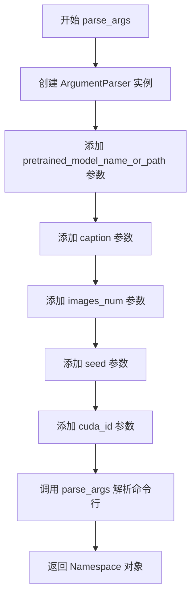
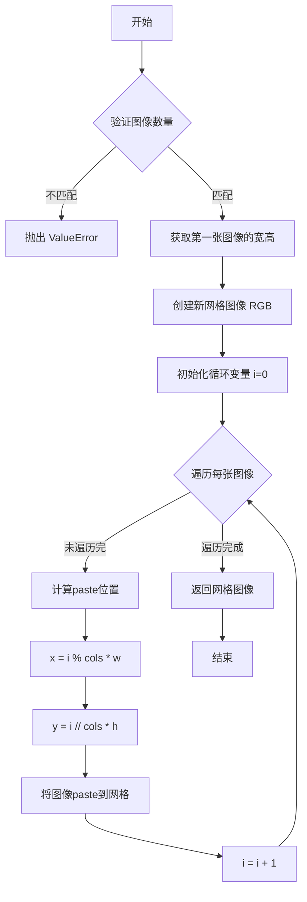

# `diffusers\examples\research_projects\intel_opts\textual_inversion_dfq\text2images.py` 详细设计文档

A Stable Diffusion图像生成脚本，通过命令行指定预训练模型路径、文本提示词、生成数量和随机种子，加载Hugging Face的diffusers模型库（CLIPTokenizer、CLIPTextModel、AutoencoderKL、UNet2DConditionModel），创建StableDiffusionPipeline管道，生成对应文本描述的图像，并支持Intel Neural Compressor模型优化，最后将生成的图像保存为网格图和单独的图片文件。

## 整体流程

```mermaid
graph TD
    A[开始] --> B[parse_args 解析命令行参数]
    B --> C[加载 CLIPTokenizer]
    C --> D[加载 CLIPTextModel]
    D --> E[加载 AutoencoderKL (VAE)]
    E --> F[加载 UNet2DConditionModel]
    F --> G[创建 StableDiffusionPipeline]
    G --> H[设置 safety_checker 为空函数]
    H --> I{检查 best_model.pt 是否存在?}
    I -- 是 --> J[使用 Neural Compressor 加载优化模型]
    I -- 否 --> K[将 UNet 移到 CUDA 设备]
    J --> L[设置 pipeline.unet 为优化模型]
    K --> L
    L --> M[将 pipeline 移到设备]
    M --> N[调用 generate_images 生成图像]
    N --> O[保存网格图到模型目录]
    O --> P[创建以提示词命名的子目录]
    P --> Q[保存每张单独图像]
```

## 类结构

```
模块级函数
├── parse_args (命令行参数解析)
├── image_grid (图像网格拼接)
└── generate_images (图像生成核心逻辑)
```

## 全局变量及字段


### `args`
    
解析后的命令行参数对象，包含 pretrained_model_name_or_path、caption、images_num、seed、cuda_id 等属性

类型：`argparse.Namespace`
    


### `tokenizer`
    
从预训练模型加载的CLIP分词器，用于将文本转换为token

类型：`CLIPTokenizer`
    


### `text_encoder`
    
从预训练模型加载的CLIP文本编码器，用于将文本token编码为嵌入向量

类型：`CLIPTextModel`
    


### `vae`
    
从预训练模型加载的变分自编码器，用于图像的编码和解码

类型：`AutoencoderKL`
    


### `unet`
    
从预训练模型加载的UNet条件扩散模型，用于去噪生成图像

类型：`UNet2DConditionModel`
    


### `pipeline`
    
整合了tokenizer、text_encoder、vae和unet的完整Stable Diffusion推理管道

类型：`StableDiffusionPipeline`
    


### `grid`
    
生成的图像网格，将多张图像排列成网格形式

类型：`PIL.Image.Image`
    


### `images`
    
由Stable Diffusion生成的图像列表

类型：`list[PIL.Image.Image]`
    


    

## 全局函数及方法


### parse_args()

该函数使用 argparse 模块解析命令行参数，返回一个包含模型路径、提示词、图像数量、种子和 CUDA ID 的命名空间对象，供后续的模型加载和图像生成流程使用。

参数：
- 无

返回值：`Namespace`，包含以下属性：
- `pretrained_model_name_or_path`：字符串，预训练模型路径或模型标识符（来自 huggingface.co/models）
- `caption`：字符串，用于生成图像的文本提示词
- `images_num`：整数，要生成的图像数量
- `seed`：整数，随机过程的种子值
- `cuda_id`：整数，CUDA 设备 ID

#### 流程图



#### 带注释源码

```python
def parse_args():
    """
    解析命令行参数，返回包含模型路径、提示词、图像数量、种子和 CUDA ID 的命名空间。
    
    Returns:
        argparse.Namespace: 包含所有命令行参数的命名空间对象
    """
    # 创建 ArgumentParser 实例，用于解析命令行参数
    parser = argparse.ArgumentParser()
    
    # 添加预训练模型路径或模型标识符参数
    # 可通过 -m 或 --pretrained_model_name_or_path 指定
    parser.add_argument(
        "-m",
        "--pretrained_model_name_or_path",
        type=str,
        default=None,
        required=True,
        help="Path to pretrained model or model identifier from huggingface.co/models.",
    )
    
    # 添加图像描述文本参数
    # 可通过 -c 或 --caption 指定，默认值为 "robotic cat with wings"
    parser.add_argument(
        "-c",
        "--caption",
        type=str,
        default="robotic cat with wings",
        help="Text used to generate images.",
    )
    
    # 添加生成图像数量参数
    # 可通过 -n 或 --images_num 指定，默认值为 4
    parser.add_argument(
        "-n",
        "--images_num",
        type=int,
        default=4,
        help="How much images to generate.",
    )
    
    # 添加随机种子参数
    # 可通过 -s 或 --seed 指定，默认值为 42
    parser.add_argument(
        "-s",
        "--seed",
        type=int,
        default=42,
        help="Seed for random process.",
    )
    
    # 添加 CUDA 设备 ID 参数
    # 可通过 -ci 或 --cuda_id 指定，默认值为 0
    parser.add_argument(
        "-ci",
        "--cuda_id",
        type=int,
        default=0,
        help="cuda_id.",
    )
    
    # 解析命令行参数并返回 Namespace 对象
    args = parser.parse_args()
    return args
```

### 文件整体运行流程

本脚本是一个 Stable Diffusion 图像生成工具，整体运行流程如下：

1. **参数解析阶段**：调用 `parse_args()` 解析命令行参数，获取模型路径、提示词、图像数量等配置
2. **模型加载阶段**：从指定路径加载 CLIPTokenizer、CLIPTextModel、AutoencoderKL 和 UNet2DConditionModel
3. **Pipeline 构建阶段**：使用 `StableDiffusionPipeline.from_pretrained()` 组装完整的推理 pipeline
4. **模型优化阶段**：检查是否存在量化模型文件（best_model.pt），如有则加载并替换 UNet
5. **设备配置阶段**：将 pipeline 移动到指定的 CUDA 设备
6. **图像生成阶段**：调用 `generate_images()` 生成图像网格和单独图像
7. **图像保存阶段**：将生成的图像保存到指定目录

### 全局变量和全局函数详细信息

#### 全局变量

| 名称 | 类型 | 描述 |
|------|------|------|
| `args` | Namespace | 命令行参数解析后的命名空间对象，包含模型路径、提示词、图像数量、种子和 CUDA ID |

#### 全局函数

| 名称 | 参数 | 返回值 | 描述 |
|------|------|--------|------|
| `parse_args()` | 无 | Namespace | 解析命令行参数，返回包含模型路径、提示词、图像数量、种子和 CUDA ID 的命名空间 |
| `image_grid(imgs, rows, cols)` | imgs: list, rows: int, cols: int | Image | 将多张图像拼接成网格布局 |
| `generate_images(pipeline, prompt, guidance_scale, num_inference_steps, num_images_per_prompt, seed)` | pipeline: StableDiffusionPipeline, prompt: str, guidance_scale: float, num_inference_steps: int, num_images_per_prompt: int, seed: int | tuple(grid, images) | 使用 Stable Diffusion pipeline 生成图像并返回网格和单独图像 |

### 关键组件信息

| 组件名称 | 一句话描述 |
|----------|------------|
| `argparse` | Python 标准库命令行参数解析模块 |
| `torch` | PyTorch 深度学习框架 |
| `CLIPTextModel` | CLIP 文本编码器模型 |
| `CLIPTokenizer` | CLIP 分词器 |
| `AutoencoderKL` | VAE 自编码器模型 |
| `UNet2DConditionModel` | UNet 条件图像生成模型 |
| `StableDiffusionPipeline` | Stable Diffusion 完整推理 pipeline |

### 潜在的技术债务或优化空间

1. **错误处理不足**：缺少对模型路径不存在、CUDA 不可用等异常情况的处理
2. **硬编码默认值**：图像生成的部分参数（如 guidance_scale、num_inference_steps）被硬编码，应考虑作为命令行参数暴露
3. **设备检测逻辑**：CUDA ID 没有验证设备是否存在，可能导致运行时错误
4. **安全性隐患**：safety_checker 被直接设置为 lambda 返回 False，绕过了内容安全检查
5. **路径处理**：保存图像时直接使用提示词作为目录名，可能包含非法字符导致路径错误

### 其它项目

#### 设计目标与约束
- **设计目标**：提供一个简洁的命令行工具，使用预训练的 Stable Diffusion 模型生成指定提示词的图像
- **约束条件**：
  - 必须提供有效的模型路径（required=True）
  - CUDA 设备必须可用
  - 生成的图像数量应与网格布局匹配

#### 错误处理与异常设计
- `image_grid()` 函数检查行×列是否等于图像数量，不匹配时抛出 ValueError
- 缺少对以下场景的错误处理：
  - 模型路径无效或模型加载失败
  - CUDA 设备不可用
  - 磁盘空间不足导致图像保存失败

#### 数据流与状态机
```
命令行输入 → parse_args() → Namespace 对象
                                      ↓
                              模型加载 (tokenizer, text_encoder, vae, unet)
                                      ↓
                              StableDiffusionPipeline 组装
                                      ↓
                              generate_images() → 图像生成
                                      ↓
                              图像保存到磁盘
```

#### 外部依赖与接口契约
- **依赖库**：argparse, math, os, torch, PIL, transformers, diffusers, neural_compressor
- **接口契约**：
  - `parse_args()` 无输入，返回 Namespace
  - `image_grid()` 接受图像列表和行列数，返回拼接后的图像
  - `generate_images()` 接受 pipeline 和生成参数，返回图像网格和图像列表


### `image_grid`

将多张 PIL 图像按照指定的行列数拼接成网格布局，返回合并后的图像。

参数：

- `imgs`：`list[PIL.Image.Image]`，需要拼接的图像列表
- `rows`：`int`，网格的行数
- `cols`：`int`，网格的列数

返回值：`PIL.Image.Image`，合并后的网格图像

#### 流程图



#### 带注释源码

```python
def image_grid(imgs, rows, cols):
    """
    将多张图像拼接成网格布局
    
    参数:
        imgs: 需要拼接的图像列表 (PIL.Image 列表)
        rows: 网格的行数
        cols: 网格的列数
    
    返回:
        合并后的网格图像 (PIL.Image)
    """
    # 验证: 确保图像数量与行列数相匹配
    if not len(imgs) == rows * cols:
        raise ValueError("The specified number of rows and columns are not correct.")

    # 获取第一张图像的尺寸作为基准
    w, h = imgs[0].size
    
    # 创建新的空白网格图像 (RGB 模式)
    grid = Image.new("RGB", size=(cols * w, rows * h))
    
    # 遍历每张图像，计算并粘贴到网格对应位置
    for i, img in enumerate(imgs):
        # 计算粘贴位置: 列位置 = i % 列数，行位置 = i // 列数
        grid.paste(img, box=(i % cols * w, i // cols * h))
    
    # 返回拼接完成的网格图像
    return grid
```


### `generate_images`

该函数是 Stable Diffusion 图像生成的核心封装，通过接收预配置的 StableDiffusionPipeline 实例、文本提示词及生成参数，利用 PyTorch 随机数生成器确保可重复性地调用 pipeline 生成指定数量的图像，并计算最优网格布局将结果图像排列为网格返回。

参数：

- `pipeline`：`StableDiffusionPipeline`，由 Diffusers 库提供的 Stable Diffusion 推理管道对象，包含 tokenizer、text_encoder、vae、unet 等模型组件
- `prompt`：`str`，生成图像所使用的文本提示词，默认为 "robotic cat with wings"
- `guidance_scale`：`float`，引导系数，控制文本提示对生成图像的影响程度，值越大越倾向于遵循文本提示，默认为 7.5
- `num_inference_steps`：`int`，推理步数，决定生成过程的迭代次数，步数越多生成质量越高但耗时越长，默认为 50
- `num_images_per_prompt`：`int`，每个提示词生成的图像数量，默认为 1
- `seed`：`int`，随机种子，用于初始化 PyTorch 随机数生成器以确保结果可复现，默认为 42

返回值：`Tuple[Image.Image, List[Image.Image]]`，返回两个元素——第一个是所有生成的图像按网格排列组成的拼贴图像（Image.Grid），第二个是原始图像列表

#### 流程图

```mermaid
flowchart TD
    A[开始 generate_images] --> B[创建 PyTorch 随机数生成器]
    B --> C[使用 manual_seed 设置随机种子]
    C --> D[调用 pipeline 生成图像]
    D --> E[从返回结果中提取 images 列表]
    E --> F[计算网格行数: sqrt(num_images_per_prompt)]
    F --> G[调用 image_grid 函数]
    G --> H[返回 grid 和 images 元组]
    
    D -.->|包含| D1[文本编码]
    D -.->|包含| D2[潜在空间采样]
    D -.->|包含| D3[VAE 解码]
```

#### 带注释源码

```python
def generate_images(
    pipeline,                          # StableDiffusionPipeline: 预加载的推理管道
    prompt="robotic cat with wings",   # str: 文本提示词
    guidance_scale=7.5,                # float: CFG 引导强度
    num_inference_steps=50,            # int: 扩散模型推理步数
    num_images_per_prompt=1,          # int: 每次提示生成的图像数
    seed=42,                          # int: 随机种子用于结果复现
):
    # 创建 PyTorch 随机数生成器并设置种子，确保生成过程可复现
    generator = torch.Generator(pipeline.device).manual_seed(seed)
    
    # 调用 Stable Diffusion pipeline 执行图像生成
    # 参数包括: 提示词、引导系数、推理步数、随机生成器、生成数量
    images = pipeline(
        prompt,
        guidance_scale=guidance_scale,
        num_inference_steps=num_inference_steps,
        generator=generator,
        num_images_per_prompt=num_images_per_prompt,
    ).images  # 从返回结果中提取图像列表
    
    # 计算网格行数: 取 num_images_per_prompt 的平方根作为行数
    _rows = int(math.sqrt(num_images_per_prompt))
    
    # 计算网格列数: 总图像数除以行数
    # 调用 image_grid 函数将多张图像拼接成网格
    grid = image_grid(images, rows=_rows, cols=num_images_per_prompt // _rows)
    
    # 返回网格图像和原始图像列表的元组
    return grid, images
```

#### 关键组件信息

| 组件名称 | 描述 |
|---------|------|
| `torch.Generator` | PyTorch 随机数生成器，用于控制图像生成的随机性 |
| `StableDiffusionPipeline` | Hugging Face Diffusers 库提供的 Stable Diffusion 推理封装类 |
| `image_grid` | 自定义图像网格拼接函数，将多张图像组合为拼贴图 |
| `math.sqrt` | 数学平方根函数，用于计算网格布局的最优行数 |

#### 潜在的技术债务或优化空间

1. **网格计算逻辑缺陷**：当前使用 `num_images_per_prompt // _rows` 计算列数，当 `num_images_per_prompt` 不是完全平方数时（如 3、5、7），列数计算会产生无效布局导致 `image_grid` 抛出异常，应先计算行列乘积是否等于图像数量，不等时需要向上取整或调整布局

2. **缺少参数校验**：函数未对 `guidance_scale`、`num_inference_steps`、`num_images_per_prompt` 等关键参数进行有效性校验，负值或零值可能导致运行时错误

3. **硬编码默认值**：提示词默认值 "robotic cat with wings" 硬编码在函数签名中，降低了函数的通用性，应考虑移除或设为 None

4. **设备兼容性考虑不足**：直接使用 `pipeline.device` 获取设备，未考虑多 GPU 场景下的设备分配策略

5. **错误处理缺失**：pipeline 调用可能因模型加载失败、CUDA 内存不足等原因抛出异常，缺少 try-except 包装和明确的错误信息

#### 其它项目

**设计目标与约束：**
- 核心目标是提供简洁的图像生成接口，封装 Stable Diffusion 的底层调用细节
- 设计遵循函数式编程风格，无状态副作用
- 受限于 Diffusers 库的 API 设计和 Stable Diffusion 模型的计算资源需求

**错误处理与异常设计：**
- 当前实现依赖 `image_grid` 函数的 ValueError 抛出机制
- 建议增加对 pipeline 返回值为空的检查
- 建议捕获 CUDA out of memory 异常并给出友好提示

**数据流与状态机：**
- 数据流：prompt → text_encoder → UNet2DConditionModel → VAE decode → PIL Image
- 随机状态通过 Generator 对象在调用前设定，生成后不影响全局随机状态
- 无显式状态机设计

**外部依赖与接口契约：**
- 依赖 `torch` (PyTorch) 用于随机数生成和设备管理
- 依赖 `diffusers` 库的 `StableDiffusionPipeline` 类
- 依赖 `PIL` (Pillow) 用于图像处理
- 调用方需保证 pipeline 已正确加载模型权重并置于可用设备

## 关键组件


### 命令行参数解析模块
负责解析用户通过命令行输入的参数，包括预训练模型路径、生成图像的描述、图像数量、随机种子和CUDA设备ID，为整个流程提供配置信息。

### 图像网格生成模块
将多个生成的图像按照指定的行列数组合成一张网格图，便于直观查看批量生成的结果，同时提供图像尺寸验证和网格拼接功能。

### 图像生成模块
封装了Stable Diffusion扩散管道的调用逻辑，通过设置引导尺度、推理步数和随机生成器，生成与文本提示相关的图像，并调用网格生成模块返回结果。

### 模型加载与量化策略模块
根据预训练模型路径检查是否存在量化模型文件（best_model.pt），若存在则使用Intel Neural Compressor加载量化后的UNet模型以提升推理性能，否则加载标准预训练模型，体现了量化策略的应用。

### 管道配置与安全检查模块
构建Stable DiffusionPipeline并组装tokenizer、text_encoder、vae和unet等组件，同时覆盖默认的安全检查器为始终返回安全的 lambda 函数，以满足自定义生成需求。

### 图像保存与输出模块
将生成的网格图像和单张图像分别保存到预训练模型目录下的指定文件中，并创建以提示词命名的子目录进行分类存储。


## 问题及建议


### 已知问题

- **图像网格计算逻辑缺陷**：`generate_images` 函数中 `_rows = int(math.sqrt(num_images_per_prompt))` 和 `cols=num_images_per_prompt // _rows` 的计算方式存在缺陷，当 `num_images_per_prompt` 不是完全平方数时（如 5、7 等），计算出的行列无法完全容纳所有图像，会导致图像丢失或布局错误
- **Safety Checker 实现不当**：使用 lambda 匿名函数 `lambda images, clip_input: (images, False)` 替换 safety_checker，虽然禁用了安全过滤，但这种写法不够清晰，且未提供任何配置选项
- **CUDA 设备检查缺失**：代码直接使用 `torch.device("cuda", args.cuda_id)` 而未检查 CUDA 是否可用，当环境无 GPU 时会导致运行时错误
- **模型加载错误处理缺失**：所有 `from_pretrained` 调用均未捕获可能的异常（如模型路径不存在、权限问题、网络问题等），程序会以不友好的方式崩溃
- **命令行参数验证不足**：`parse_args` 中未对 `images_num` 等参数做合理性检查（如 images_num > 0），可能导致后续逻辑错误
- **硬编码的生成参数**：guidance_scale=7.5 和 num_inference_steps=50 硬编码在 `generate_images` 函数中，用户无法通过命令行自定义这些关键参数
- **文件名安全风险**：直接使用用户输入的 caption 作为文件名的一部分（如 `"{}.png".format("_".join(args.caption.split()))`），可能因特殊字符导致文件系统错误
- **设备管理不一致**：量化模型加载后使用 `setattr(pipeline, "unet", unet)` 更新 unet，但后续又使用 `pipeline.to(unet.device)`，设备管理逻辑不够清晰
- **代码可测试性差**：核心逻辑（模型加载、图像生成）主要在全局作用域执行，未封装为可独立调用的函数，难以进行单元测试

### 优化建议

- **修复图像网格布局逻辑**：使用更健壮的行列计算方式，如 `_rows = math.ceil(math.sqrt(num_images_per_prompt))` 并确保 cols >= rows，或根据实际图像数量动态计算
- **添加 CUDA 可用性检查**：在使用 CUDA 前检查 `torch.cuda.is_available()`，当不可用时自动回退到 CPU 或给出明确错误提示
- **增加模型加载错误处理**：为所有模型加载操作添加 try-except 块，捕获并妥善处理 HuggingFace 库可能抛出的异常
- **命令行参数验证**：在 `parse_args` 后添加参数校验逻辑，如检查 images_num 为正整数、caption 不为空等
- **暴露生成参数到命令行**：将 guidance_scale 和 num_inference_steps 添加为可配置的命令行参数，提升脚本灵活性
- **清理文件名中的特殊字符**：在将 caption 用于文件名前，进行安全处理（如使用正则表达式过滤或哈希处理）
- **重构代码结构**：将模型加载和图像生成逻辑封装为独立函数或类，提高代码的可测试性和可维护性
- **添加进度日志**：使用 logging 模块记录关键步骤（如模型加载进度、图像生成进度），提升用户体验
- **优化设备管理逻辑**：统一使用 pipeline.device 或显式传递设备参数，避免设备不一致问题


## 其它


### 设计目标与约束

本代码旨在实现一个基于Stable Diffusion模型的图像生成工具，通过命令行参数接收预训练模型路径、文本提示、生成图像数量和随机种子，生成相应的图像并保存到指定目录。设计约束包括：必须提供有效的预训练模型路径；生成的图像数量需为完全平方数以便排列成网格；需要CUDA设备支持以加速推理。

### 错误处理与异常设计

代码在图像网格生成函数中进行了参数校验，当指定的行数与列数乘积不等于图像数量时，会抛出ValueError异常并给出明确的错误信息。模型加载部分使用os.path.exists检查优化模型文件是否存在，避免文件缺失导致的异常。Parser部分通过required=True确保预训练模型路径为必填参数。

### 数据流与状态机

程序启动后首先解析命令行参数获取配置，随后依次加载tokenizer、text_encoder、vae、unet四个预训练模型组件，构建StableDiffusionPipeline。若存在优化模型文件则加载Neural Compressor优化后的模型，否则直接将unet移至CUDA设备。生成阶段调用pipeline的__call__方法生成图像列表，通过image_grid组合成网格，最终将网格和单张图像分别保存到指定目录。

### 外部依赖与接口契约

主要依赖包括：torch（张量计算与CUDA管理）、diffusers库（StableDiffusionPipeline、AutoencoderKL、UNet2DConditionModel）、transformers（CLIPTextModel、CLIPTokenizer）、neural_compressor（模型量化优化）、PIL（图像处理）、argparse（命令行解析）、math和os（基础工具）。所有模型均通过from_pretrained方法从Hugging Face Hub或本地路径加载，pipeline接受prompt、guidance_scale、num_inference_steps、generator、num_images_per_prompt等标准参数。

### 性能考量

代码使用CUDA加速推理，通过torch.Generator设置随机种子确保可复现性。图像网格计算采用int(math.sqrt(num_images_per_prompt))确定行列数，当num_images_per_prompt为非完全平方数时行列数计算可能不优。Neural Compressor加载优化模型时可提升推理效率，但当前实现仅检查单一best_model.pt文件。

### 安全性考虑

pipeline的safety_checker被Lambda函数覆盖，强制返回False以禁用内容过滤，这是潜在的安全风险。代码直接执行从外部加载的模型，存在模型投毒风险。生成的图像保存在指定目录，需注意访问权限控制。

### 配置与参数管理

所有配置通过命令行参数传入，包括pretrained_model_name_or_path（模型路径）、caption（生成提示词）、images_num（图像数量）、seed（随机种子）、cuda_id（CUDA设备ID）。 Guidance Scale默认为7.5，num_inference_steps默认为50，这些超参数对生成质量有直接影响但无命令行暴露。

### 资源管理

模型加载时vae、text_encoder、unet均会占用大量显存，pipeline.to()将整个pipeline移至指定CUDA设备。未显式管理推理过程中的显存释放，大批量生成可能导致OOM。生成的图像列表在内存中保留直至保存完成。

### 测试考量

建议测试场景包括：无效模型路径的异常处理、非完全平方数images_num的网格生成、CUDA不可用时的降级处理、生成图像的尺寸一致性验证、优化模型文件损坏时的容错能力。

### 部署与运维

代码为命令行工具，部署时需确保Python环境包含所有依赖库。模型文件较大首次运行需下载。生成的图像按提示词创建目录存储，便于管理和检索。建议添加日志记录生成过程和性能指标，便于运维监控。
    