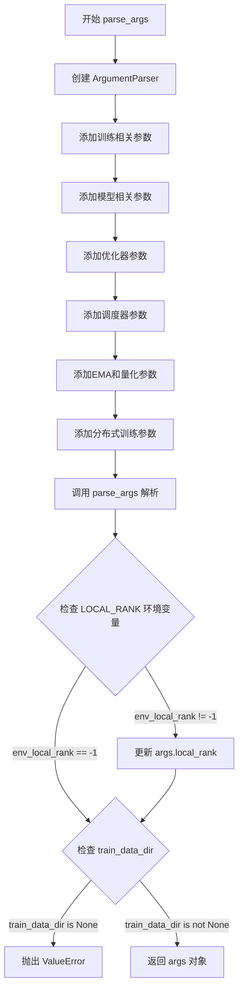
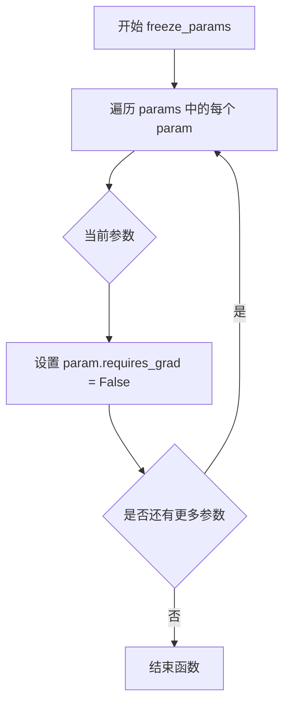
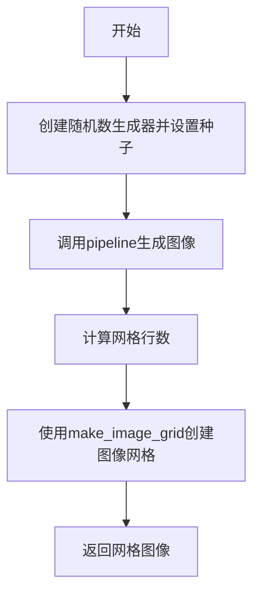
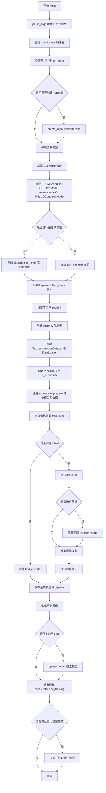
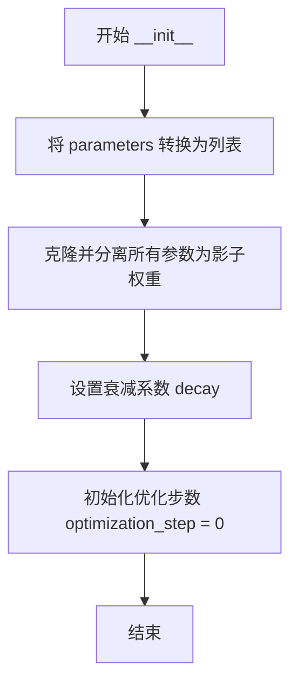
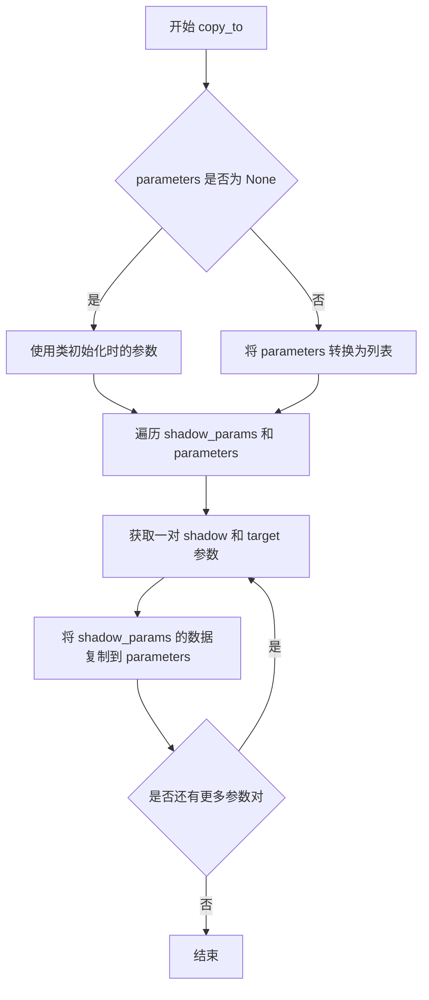
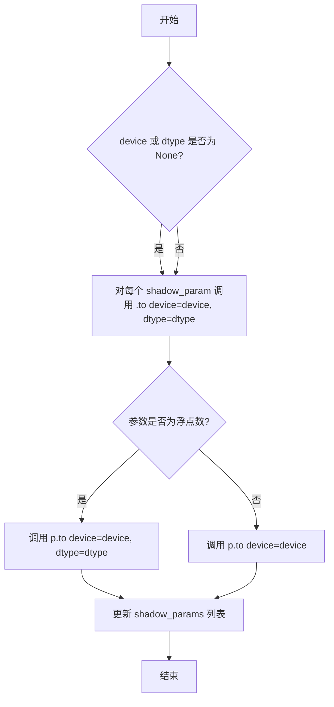
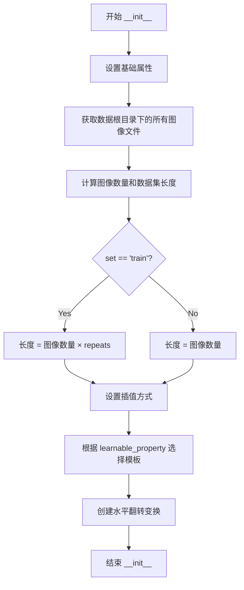
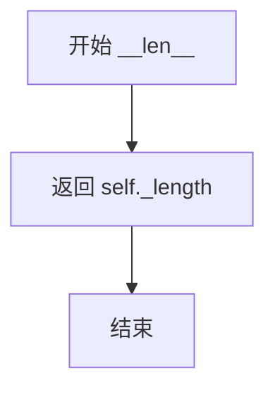

# `diffusers\examples\research_projects\intel_opts\textual_inversion_dfq\textual_inversion.py` 详细设计文档

这是一个用于Stable Diffusion模型的Textual Inversion（文本倒置）训练脚本。核心功能是通过冻结UNet和VAE，仅微调Text Encoder的embedding来学习一个新的概念（占位符）。同时，该脚本集成了Intel Neural Compressor，支持可选的量化（Quantization）和知识蒸馏（Distillation）训练模式，以优化模型性能或体积。

## 整体流程

```mermaid
graph TD
    A[开始: parse_args] --> B[初始化 Accelerator]
    B --> C[加载模型: Tokenizer, VAE, UNet, TextEncoder, Scheduler]
    C --> D{判断训练模式}
    D -- Text Inversion (默认) --> E[冻结 UNet/VAE, 添加 Placeholder Token]
    D -- Quantization/Distillation --> F[解冻 UNet, 冻结 TextEncoder, 初始化 CompressionManager]
    E --> G[初始化 TextualInversionDataset 和 DataLoader]
    F --> G
    G --> H[开始训练循环 (for epoch, for step)]
    H --> I[图像编码为 Latents + 加噪]
    I --> J[Text Encoder 获取 embedding]
    J --> K[UNet 预测噪声残差]
    K --> L[计算 MSE Loss]
    L --> M{是否启用 Compression?}
    M -- 是 --> N[调用 compression_manager.callbacks.on_after_compute_loss]
    M -- 否 --> O[Accelerator backward]
    N --> O
    O --> P[Optimizer Step & LR Schedule]
    P --> Q{Sync Gradients?}
    Q -- 是 --> R[保存 Checkpoint / EMA / Embeddings]
    Q -- 否 --> S[继续下一个 Step]
    R --> S
    S --> T{Loop 结束?}
    T -- 否 --> H
    T -- 是 --> U[生成推理 Pipeline]
    U --> V[保存模型和示例图片]
```

## 类结构

```
main (主程序入口)
├── 全局配置与工具
│   ├── imagenet_templates_small (数据增强模板)
│   ├── imagenet_style_templates_small (风格增强模板)
,
        
TextualInversionDataset (数据集类)
│   ├── __init__
│   ├── __len__
│   └── __getitem__
│   
├── EMAModel (指数移动平均类)
│   ├── __init__
│   ├── get_decay
│   ├── step
│   ├── copy_to
│   └── to
│   
└── 辅助函数
    ├── parse_args
    ├── save_progress
    ├── freeze_params
    └── generate_images
```

## 全局变量及字段


### `imagenet_templates_small`
    
List of small ImageNet prompt templates for object concepts used in textual inversion training.

类型：`List[str]`
    


### `imagenet_style_templates_small`
    
List of small ImageNet prompt templates for style concepts used in textual inversion training.

类型：`List[str]`
    


### `PIL_INTERPOLATION`
    
Dictionary mapping interpolation method names to PIL Image Resampling modes.

类型：`Dict[str, Resampling]`
    


### `args`
    
Namespace object containing all command‑line arguments parsed by argparse.

类型：`argparse.Namespace`
    


### `EMAModel.shadow_params`
    
List of shadow (EMA) parameters stored as tensors.

类型：`List[Tensor]`
    


### `EMAModel.decay`
    
Decay factor used for exponential moving average.

类型：`float`
    


### `EMAModel.optimization_step`
    
Number of optimization steps performed so far.

类型：`int`
    


### `TextualInversionDataset.data_root`
    
Root directory path containing the training images.

类型：`str`
    


### `TextualInversionDataset.tokenizer`
    
Tokenizer used to encode text prompts.

类型：`CLIPTokenizer`
    


### `TextualInversionDataset.learnable_property`
    
Property to learn, either 'object' or 'style'.

类型：`str`
    


### `TextualInversionDataset.size`
    
Target resolution size for input images.

类型：`int`
    


### `TextualInversionDataset.placeholder_token`
    
Token used as a placeholder for the concept being learned.

类型：`str`
    


### `TextualInversionDataset.center_crop`
    
Whether to apply center cropping to images before resizing.

类型：`bool`
    


### `TextualInversionDataset.flip_p`
    
Probability of randomly flipping images horizontally.

类型：`float`
    


### `TextualInversionDataset.image_paths`
    
List of file paths to the training images.

类型：`List[str]`
    


### `TextualInversionDataset.num_images`
    
Number of unique images in the dataset.

类型：`int`
    


### `TextualInversionDataset._length`
    
Total length of the dataset after repeating the images.

类型：`int`
    


### `TextualInversionDataset.interpolation`
    
PIL interpolation method used for resizing images.

类型：`Resampling`
    


### `TextualInversionDataset.templates`
    
List of text prompt templates used for generating training inputs.

类型：`List[str]`
    


### `TextualInversionDataset.flip_transform`
    
Transform that randomly flips images horizontally with a given probability.

类型：`RandomHorizontalFlip`
    
    

## 全局函数及方法


### `parse_args`

该函数是命令行参数解析器，用于配置Textual Inversion模型训练的所有超参数，包括模型路径、训练数据目录、学习率、批大小、优化器参数、EMA配置、量化与蒸馏选项等，并进行环境变量和必要参数的校验。

参数：  
无

返回值：`argparse.Namespace`，包含所有命令行参数的对象，如`pretrained_model_name_or_path`、`train_data_dir`、`output_dir`、`learning_rate`、`train_batch_size`等，用于后续训练流程的配置。

#### 流程图



#### 带注释源码

```
def parse_args():
    """
    解析命令行参数，返回包含所有训练配置的Namespace对象。
    无输入参数，通过argparse从命令行获取配置。
    """
    # 创建参数解析器，添加描述信息
    parser = argparse.ArgumentParser(description="Example of distillation for quantization on Textual Inversion.")
    
    # -------- 模型路径与版本相关参数 --------
    parser.add_argument(
        "--save_steps",
        type=int,
        default=500,
        help="Save learned_embeds.bin every X updates steps.",
    )
    parser.add_argument(
        "--pretrained_model_name_or_path",
        type=str,
        default=None,
        required=True,
        help="Path to pretrained model or model identifier from huggingface.co/models.",
    )
    parser.add_argument(
        "--revision",
        type=str,
        default=None,
        required=False,
        help="Revision of pretrained model identifier from huggingface.co/models.",
    )
    parser.add_argument(
        "--tokenizer_name",
        type=str,
        default=None,
        help="Pretrained tokenizer name or path if not the same as model_name",
    )
    
    # -------- 训练数据相关参数 --------
    parser.add_argument(
        "--train_data_dir", 
        type=str, 
        default=None, 
        required=True, 
        help="A folder containing the training data."
    )
    parser.add_argument(
        "--placeholder_token",
        type=str,
        default=None,
        required=True,
        help="A token to use as a placeholder for the concept.",
    )
    parser.add_argument(
        "--initializer_token", 
        type=str, 
        default=None, 
        required=True, 
        help="A token to use as initializer word."
    )
    parser.add_argument(
        "--learnable_property", 
        type=str, 
        default="object", 
        help="Choose between 'object' and 'style'"
    )
    parser.add_argument(
        "--repeats", 
        type=int, 
        default=100, 
        help="How many times to repeat the training data."
    )
    
    # -------- 输出与存储相关参数 --------
    parser.add_argument(
        "--output_dir",
        type=str,
        default="text-inversion-model",
        help="The output directory where the model predictions and checkpoints will be written.",
    )
    parser.add_argument(
        "--cache_dir",
        type=str,
        default=None,
        help="The directory where the downloaded models and datasets will be stored.",
    )
    parser.add_argument(
        "--logging_dir",
        type=str,
        default="logs",
        help="TensorBoard log directory. Will default to output_dir/runs/**CURRENT_DATETIME_HOSTNAME***.",
    )
    parser.add_argument(
        "--push_to_hub", 
        action="store_true", 
        help="Whether or not to push the model to the Hub."
    )
    parser.add_argument(
        "--hub_token", 
        type=str, 
        default=None, 
        help="The token to use to push to the Model Hub."
    )
    parser.add_argument(
        "--hub_model_id",
        type=str,
        default=None,
        help="The name of the repository to keep in sync with the local output_dir.",
    )
    
    # -------- 随机性与图像处理参数 --------
    parser.add_argument(
        "--seed", 
        type=int, 
        default=42, 
        help="A seed for reproducible training."
    )
    parser.add_argument(
        "--resolution",
        type=int,
        default=512,
        help="The resolution for input images, all the images will be resized to this resolution",
    )
    parser.add_argument(
        "--center_crop", 
        action="store_true", 
        help="Whether to center crop images before resizing to resolution"
    )
    
    # -------- 训练超参数 --------
    parser.add_argument(
        "--train_batch_size", 
        type=int, 
        default=16, 
        help="Batch size (per device) for the training dataloader."
    )
    parser.add_argument(
        "--num_train_epochs", 
        type=int, 
        default=100
    )
    parser.add_argument(
        "--max_train_steps",
        type=int,
        default=5000,
        help="Total number of training steps to perform. If provided, overrides num_train_epochs.",
    )
    parser.add_argument(
        "--gradient_accumulation_steps",
        type=int,
        default=1,
        help="Number of updates steps to accumulate before performing a backward/update pass.",
    )
    
    # -------- 学习率与优化器参数 --------
    parser.add_argument(
        "--learning_rate",
        type=float,
        default=1e-4,
        help="Initial learning rate (after the potential warmup period) to use.",
    )
    parser.add_argument(
        "--scale_lr",
        action="store_true",
        default=False,
        help="Scale the learning rate by the number of GPUs, gradient accumulation steps, and batch size.",
    )
    parser.add_argument(
        "--lr_scheduler",
        type=str,
        default="constant",
        help='The scheduler type to use. Choose between ["linear", "cosine", "cosine_with_restarts", "polynomial", "constant", "constant_with_warmup"]',
    )
    parser.add_argument(
        "--lr_warmup_steps", 
        type=int, 
        default=500, 
        help="Number of steps for the warmup in the lr scheduler."
    )
    parser.add_argument(
        "--adam_beta1", 
        type=float, 
        default=0.9, 
        help="The beta1 parameter for the Adam optimizer."
    )
    parser.add_argument(
        "--adam_beta2", 
        type=float, 
        default=0.999, 
        help="The beta2 parameter for the Adam optimizer."
    )
    parser.add_argument(
        "--adam_weight_decay", 
        type=float, 
        default=1e-2, 
        help="Weight decay to use."
    )
    parser.add_argument(
        "--adam_epsilon", 
        type=float, 
        default=1e-08, 
        help="Epsilon value for the Adam optimizer"
    )
    
    # -------- 混合精度与EMA参数 --------
    parser.add_argument(
        "--mixed_precision",
        type=str,
        default="no",
        choices=["no", "fp16", "bf16"],
        help="Whether to use mixed precision. Choose between fp16 and bf16 (bfloat16).",
    )
    parser.add_argument(
        "--use_ema", 
        action="store_true", 
        help="Whether to use EMA model."
    )
    parser.add_argument(
        "--max_grad_norm", 
        default=1.0, 
        type=float, 
        help="Max gradient norm."
    )
    
    # -------- 量化与蒸馏参数 --------
    parser.add_argument(
        "--do_quantization", 
        action="store_true", 
        help="Whether or not to do quantization."
    )
    parser.add_argument(
        "--do_distillation", 
        action="store_true", 
        help="Whether or not to do distillation."
    )
    parser.add_argument(
        "--verify_loading", 
        action="store_true", 
        help="Whether or not to verify the loading of the quantized model."
    )
    
    # -------- 分布式训练参数 --------
    parser.add_argument(
        "--local_rank", 
        type=int, 
        default=-1, 
        help="For distributed training: local_rank"
    )

    # 解析命令行参数
    args = parser.parse_args()
    
    # 检查环境变量LOCAL_RANK，如果存在则覆盖命令行参数
    env_local_rank = int(os.environ.get("LOCAL_RANK", -1))
    if env_local_rank != -1 and env_local_rank != args.local_rank:
        args.local_rank = env_local_rank

    # 校验必需参数：训练数据目录
    if args.train_data_dir is None:
        raise ValueError("You must specify a train data directory.")

    # 返回包含所有配置参数的Namespace对象
    return args
```


### `save_progress`

该函数用于在文本倒演（Textual Inversion）训练过程中保存学习到的文本嵌入（embeddings）。它从文本编码器中提取特定令牌的嵌入向量，并将其保存到指定的文件路径，以便后续加载和使用。

参数：

- `text_encoder`：`CLIPTextModel`，训练过程中的文本编码器模型，从中提取学习到的嵌入
- `placeholder_token_id`：`int`，占位符令牌的ID，用于索引需要保存的嵌入向量
- `accelerator`：`Accelerator`，HuggingFace Accelerate 库提供的分布式训练加速器，用于解包模型
- `args`：`argparse.Namespace`，命令行参数对象，包含 `placeholder_token` 等配置信息
- `save_path`：`str` 或 `Path`，保存嵌入向量的目标文件路径

返回值：`None`，该函数不返回任何值，仅执行保存操作

#### 流程图

```mermaid
flowchart TD
    A[开始] --> B[记录日志: Saving embeddings]
    B --> C[通过 accelerator.unwrap_model 解包 text_encoder]
    C --> D[获取文本嵌入矩阵]
    D --> E[根据 placeholder_token_id 索引获取对应的嵌入向量]
    E --> F[调用 .detach() 脱离计算图]
    F --> G[调用 .cpu() 转移到 CPU]
    G --> H[构建字典: {args.placeholder_token: learned_embeds}]
    H --> I[使用 torch.save 保存到 save_path]
    I --> J[结束]
```

#### 带注释源码

```python
def save_progress(text_encoder, placeholder_token_id, accelerator, args, save_path):
    """
    保存训练过程中学习到的文本嵌入
    
    参数:
        text_encoder: CLIPTextModel, 文本编码器模型
        placeholder_token_id: int, 占位符令牌的ID
        accelerator: Accelerator, 分布式训练加速器
        args: argparse.Namespace, 命令行参数
        save_path: str, 保存路径
    """
    # 记录保存操作的信息
    logger.info("Saving embeddings")
    
    # 使用 accelerator 解包模型（处理分布式训练情况）
    # unwrap_model 会移除 Accelerator 包装的模型
    unwrapped_encoder = accelerator.unwrap_model(text_encoder)
    
    # 获取文本嵌入层（input_embeddings）的权重矩阵
    # weight 形状为 [vocab_size, embedding_dim]
    embedding_weight = unwrapped_encoder.get_input_embeddings().weight
    
    # 根据占位符令牌的 ID 索引获取对应的学习嵌入向量
    learned_embeds = embedding_weight[placeholder_token_id]
    
    # 构建嵌入字典，以占位符令牌字符串为键
    # 使用 .detach() 脱离计算图，避免保存后仍参与梯度计算
    # 使用 .cpu() 将张量从 GPU 转移到 CPU（因为保存通常在 CPU 进行）
    learned_embeds_dict = {args.placeholder_token: learned_embeds.detach().cpu()}
    
    # 使用 PyTorch 的 torch.save 将嵌入字典保存到指定路径
    # 保存格式为 .bin 文件，内部使用 pickle 序列化
    torch.save(learned_embeds_dict, save_path)
```


### `freeze_params`

该函数用于冻结模型参数，通过将参数的可训练属性设置为 `False`，使其在训练过程中不参与梯度计算，从而节省计算资源并固定模型的特定部分。

参数：

- `params`：`Iterable[torch.nn.Parameter]`，一个包含模型参数的可迭代对象（例如 `model.parameters()` 返回的参数列表）

返回值：`None`，该函数没有返回值

#### 流程图



#### 带注释源码

```python
def freeze_params(params):
    """
    冻结传入的模型参数，使其不可训练。
    该函数通常用于固定预训练模型的部分参数，如 VAE、UNet 等，
    以减少训练时的计算开销并保持这些部分的能力。
    
    Args:
        params: 一个包含 torch.nn.Parameter 的可迭代对象，
                通常通过 model.parameters() 获取。
    
    Returns:
        None
    """
    # 遍历所有传入的参数
    for param in params:
        # 将每个参数的 requires_grad 属性设置为 False
        # 这样在反向传播时不会计算这些参数的梯度
        param.requires_grad = False
```


### `generate_images`

该函数用于调用Stable Diffusion pipeline生成图像，并根据生成的图像数量将其排列成网格形式返回。

参数：

- `pipeline`：`StableDiffusionPipeline`，Diffusion模型管道，用于生成图像
- `prompt`：`str`，生成图像的文本提示词，默认为空字符串
- `guidance_scale`：`float`，引导比例，控制生成图像与提示词的相关性，默认为7.5
- `num_inference_steps`：`int`，推理步数，生成图像的扩散步数，默认为50
- `num_images_per_prompt`：`int`，每个提示词生成的图像数量，默认为1
- `seed`：`int`，随机种子，用于确保生成结果的可重复性，默认为42

返回值：`PIL.Image.Image`，返回包含所有生成图像的网格图片对象

#### 流程图



#### 带注释源码

```python
def generate_images(pipeline, prompt="", guidance_scale=7.5, num_inference_steps=50, num_images_per_prompt=1, seed=42):
    """
    使用Stable Diffusion pipeline生成图像并将结果排列成网格
    
    参数:
        pipeline: StableDiffusionPipeline实例
        prompt: 文本提示词
        guidance_scale: classifier-free guidance的权重
        num_inference_steps: 扩散模型推理步数
        num_images_per_prompt: 每个prompt生成的图像数量
        seed: 随机种子
    
    返回:
        图像网格的PIL Image对象
    """
    # 创建PyTorch随机数生成器并设置种子，确保可重复性
    generator = torch.Generator(pipeline.device).manual_seed(seed)
    
    # 调用pipeline的__call__方法生成图像
    images = pipeline(
        prompt,
        guidance_scale=guidance_scale,
        num_inference_steps=num_inference_steps,
        generator=generator,
        num_images_per_prompt=num_images_per_prompt,
    ).images
    
    # 计算网格的行数（取平方根向下取整）
    _rows = int(math.sqrt(num_images_per_prompt))
    
    # 将生成的图像组合成网格形式
    # 行数 = sqrt(num_images_per_prompt)
    # 列数 = num_images_per_prompt / 行数
    grid = make_image_grid(images, rows=_rows, cols=num_images_per_prompt // _rows)
    
    return grid
```


### `main`

主函数是整个Textual Inversion训练脚本的入口点，负责协调模型加载、数据准备、训练循环、量化与蒸馏（可选）以及模型保存的完整流程。

参数：

- 无直接参数（通过`parse_args()`从命令行获取配置）

返回值：`None`，函数执行训练并保存模型，不返回任何值

#### 流程图



#### 带注释源码

```python
def main():
    """
    主训练函数，执行Textual Inversion训练的完整流程：
    1. 解析命令行参数
    2. 初始化分布式训练加速器
    3. 加载预训练模型（tokenizer, text_encoder, vae, unet）
    4. 配置placeholder_token并初始化嵌入
    5. 构建数据集和数据加载器
    6. 执行训练循环（支持纯训练、量化、蒸馏模式）
    7. 保存训练好的模型并生成示例图像
    """
    # 步骤1: 解析命令行参数
    args = parse_args()
    
    # 步骤2: 构建日志目录和项目配置
    logging_dir = os.path.join(args.output_dir, args.logging_dir)
    accelerator_project_config = ProjectConfiguration(
        project_dir=args.output_dir, 
        logging_dir=logging_dir
    )

    # 步骤3: 初始化Accelerator分布式训练加速器
    # 支持混合精度训练、梯度累积、TensorBoard日志
    accelerator = Accelerator(
        gradient_accumulation_steps=args.gradient_accumulation_steps,
        mixed_precision=args.mixed_precision,
        log_with="tensorboard",
        project_config=accelerator_project_config,
    )

    # 步骤4: 设置随机种子以确保可重复性
    if args.seed is not None:
        set_seed(args.seed)

    # 步骤5: 处理Hub仓库创建（仅主进程）
    if accelerator.is_main_process:
        if args.output_dir is not None:
            os.makedirs(args.output_dir, exist_ok=True)

        if args.push_to_hub:
            repo_id = create_repo(
                repo_id=args.hub_model_id or Path(args.output_dir).name, 
                exist_ok=True, 
                token=args.hub_token
            ).repo_id

    # 步骤6: 加载Tokenizer
    if args.tokenizer_name:
        tokenizer = CLIPTokenizer.from_pretrained(args.tokenizer_name)
    elif args.pretrained_model_name_or_path:
        tokenizer = CLIPTokenizer.from_pretrained(
            args.pretrained_model_name_or_path, 
            subfolder="tokenizer"
        )

    # 步骤7: 加载所有预训练模型
    noise_scheduler = DDPMScheduler.from_config(
        args.pretrained_model_name_or_path, 
        subfolder="scheduler"
    )
    text_encoder = CLIPTextModel.from_pretrained(
        args.pretrained_model_name_or_path,
        subfolder="text_encoder",
        revision=args.revision,
    )
    vae = AutoencoderKL.from_pretrained(
        args.pretrained_model_name_or_path,
        subfolder="vae",
        revision=args.revision,
    )
    unet = UNet2DConditionModel.from_pretrained(
        args.pretrained_model_name_or_path,
        subfolder="unet",
        revision=args.revision,
    )

    # 步骤8: 判断训练模式并冻结相应参数
    train_unet = False
    freeze_params(vae.parameters())  # 始终冻结VAE
    
    if not args.do_quantization and not args.do_distillation:
        # Textual Inversion模式：只训练text_encoder的嵌入
        num_added_tokens = tokenizer.add_tokens(args.placeholder_token)
        if num_added_tokens == 0:
            raise ValueError(
                f"The tokenizer already contains the token {args.placeholder_token}. Please pass a different"
                " `placeholder_token` that is not already in the tokenizer."
            )

        # 将initializer_token转换为ID并初始化placeholder_token嵌入
        token_ids = tokenizer.encode(args.initializer_token, add_special_tokens=False)
        if len(token_ids) > 1:
            raise ValueError("The initializer token must be a single token.")

        initializer_token_id = token_ids[0]
        placeholder_token_id = tokenizer.convert_tokens_to_ids(args.placeholder_token)
        
        # 扩展token嵌入矩阵
        text_encoder.resize_token_embeddings(len(tokenizer))

        # 用initializer_token的嵌入初始化placeholder_token
        token_embeds = text_encoder.get_input_embeddings().weight.data
        token_embeds[placeholder_token_id] = token_embeds[initializer_token_id]

        # 冻结UNet和text_encoder的非嵌入参数
        freeze_params(unet.parameters())
        params_to_freeze = itertools.chain(
            text_encoder.text_model.encoder.parameters(),
            text_encoder.text_model.final_layer_norm.parameters(),
            text_encoder.text_model.embeddings.position_embedding.parameters(),
        )
        freeze_params(params_to_freeze)
    else:
        # 量化或蒸馏模式：训练UNet
        train_unet = True
        freeze_params(text_encoder.parameters())

    # 步骤9: 调整学习率（如果启用scale_lr）
    if args.scale_lr:
        args.learning_rate = (
            args.learning_rate 
            * args.gradient_accumulation_steps 
            * args.train_batch_size 
            * accelerator.num_processes
        )

    # 步骤10: 初始化优化器
    optimizer = torch.optim.AdamW(
        # 只优化UNet或text_encoder的嵌入
        unet.parameters() if train_unet else text_encoder.get_input_embeddings().parameters(),
        lr=args.learning_rate,
        betas=(args.adam_beta1, args.adam_beta2),
        weight_decay=args.adam_weight_decay,
        eps=args.adam_epsilon,
    )

    # 步骤11: 创建训练数据集和DataLoader
    train_dataset = TextualInversionDataset(
        data_root=args.train_data_dir,
        tokenizer=tokenizer,
        size=args.resolution,
        placeholder_token=args.placeholder_token,
        repeats=args.repeats,
        learnable_property=args.learnable_property,
        center_crop=args.center_crop,
        set="train",
    )
    train_dataloader = torch.utils.data.DataLoader(
        train_dataset, 
        batch_size=args.train_batch_size, 
        shuffle=True
    )

    # 步骤12: 计算训练步数并创建学习率调度器
    overrode_max_train_steps = False
    num_update_steps_per_epoch = math.ceil(
        len(train_dataloader) / args.gradient_accumulation_steps
    )
    if args.max_train_steps is None:
        args.max_train_steps = args.num_train_epochs * num_update_steps_per_epoch
        overrode_max_max_train_steps = True

    lr_scheduler = get_scheduler(
        args.lr_scheduler,
        optimizer=optimizer,
        num_warmup_steps=args.lr_warmup_steps * accelerator.num_processes,
        num_training_steps=args.max_train_steps * accelerator.num_processes,
    )

    # 步骤13: 使用Accelerator准备模型和数据进行分布式训练
    if not train_unet:
        text_encoder = accelerator.prepare(text_encoder)
        unet.to(accelerator.device)
        unet.eval()
    else:
        unet = accelerator.prepare(unet)
        text_encoder.to(accelerator.device)
        text_encoder.eval()
    optimizer, train_dataloader, lr_scheduler = accelerator.prepare(
        optimizer, 
        train_dataloader, 
        lr_scheduler
    )

    # 步骤14: 将VAE移至设备并设置为评估模式
    vae.to(accelerator.device)
    vae.eval()

    compression_manager = None  # 压缩管理器初始化为None

    # 步骤15: 定义训练函数
    def train_func(model):
        """
        内部训练函数，根据训练模式执行具体的训练逻辑
        
        参数:
            model: 要训练的模型（text_encoder或unet）
        """
        if train_unet:
            unet_ = model
            text_encoder_ = text_encoder
        else:
            unet_ = unet
            text_encoder_ = model
            
        # 重新计算训练步数（DataLoader大小可能改变）
        num_update_steps_per_epoch = math.ceil(
            len(train_dataloader) / args.gradient_accumulation_steps
        )
        if overrode_max_train_steps:
            args.max_train_steps = args.num_train_epochs * num_update_steps_per_epoch
        args.num_train_epochs = math.ceil(
            args.max_train_steps / num_update_steps_per_epoch
        )

        # 初始化训练追踪器
        if accelerator.is_main_process:
            accelerator.init_trackers("textual_inversion", config=vars(args))

        # 打印训练信息
        total_batch_size = (
            args.train_batch_size 
            * accelerator.num_processes 
            * args.gradient_accumulation_steps
        )

        logger.info("***** Running training *****")
        logger.info(f"  Num examples = {len(train_dataset)}")
        logger.info(f"  Num Epochs = {args.num_train_epochs}")
        logger.info(f"  Instantaneous batch size per device = {args.train_batch_size}")
        logger.info(f"  Total train batch size = {total_batch_size}")
        logger.info(f"  Gradient Accumulation steps = {args.gradient_accumulation_steps}")
        logger.info(f"  Total optimization steps = {args.max_train_steps}")

        # 创建进度条
        progress_bar = tqdm(
            range(args.max_train_steps), 
            disable=not accelerator.is_local_main_process
        )
        progress_bar.set_description("Steps")
        global_step = 0

        # 可选：创建EMA模型
        if train_unet and args.use_ema:
            ema_unet = EMAModel(unet_.parameters())

        # 步骤16: 训练循环
        for epoch in range(args.num_train_epochs):
            model.train()
            train_loss = 0.0
            
            for step, batch in enumerate(train_dataloader):
                with accelerator.accumulate(model):
                    # 16.1: 将图像编码为潜在空间
                    latents = vae.encode(
                        batch["pixel_values"]
                    ).latent_dist.sample().detach()
                    latents = latents * 0.18215

                    # 16.2: 采样噪声
                    noise = torch.randn(latents.shape).to(latents.device)
                    bsz = latents.shape[0]
                    
                    # 16.3: 随机采样时间步
                    timesteps = torch.randint(
                        0, 
                        noise_scheduler.config.num_train_timesteps, 
                        (bsz,), 
                        device=latents.device
                    ).long()

                    # 16.4: 前向扩散过程
                    noisy_latents = noise_scheduler.add_noise(latents, noise, timesteps)

                    # 16.5: 获取文本嵌入
                    encoder_hidden_states = text_encoder_(batch["input_ids"])[0]

                    # 16.6: 预测噪声残差
                    model_pred = unet_(
                        noisy_latents, 
                        timesteps, 
                        encoder_hidden_states
                    ).sample

                    # 16.7: 计算MSE损失
                    loss = F.mse_loss(
                        model_pred, 
                        noise, 
                        reduction="none"
                    ).mean([1, 2, 3]).mean()

                    # 16.8: 可选的量化回调
                    if train_unet and compression_manager:
                        unet_inputs = {
                            "sample": noisy_latents,
                            "timestep": timesteps,
                            "encoder_hidden_states": encoder_hidden_states,
                        }
                        loss = compression_manager.callbacks.on_after_compute_loss(
                            unet_inputs, 
                            model_pred, 
                            loss
                        )

                    # 16.9: 收集所有进程的损失用于日志记录
                    avg_loss = accelerator.gather(
                        loss.repeat(args.train_batch_size)
                    ).mean()
                    train_loss += avg_loss.item() / args.gradient_accumulation_steps

                    # 16.10: 反向传播
                    accelerator.backward(loss)

                    # 16.11: 梯度裁剪或梯度置零
                    if train_unet:
                        if accelerator.sync_gradients:
                            accelerator.clip_grad_norm_(
                                unet_.parameters(), 
                                args.max_grad_norm
                            )
                    else:
                        # 对于text_encoder，只对新增的placeholder_token嵌入更新梯度
                        if accelerator.num_processes > 1:
                            grads = text_encoder_.module.get_input_embeddings().weight.grad
                        else:
                            grads = text_encoder_.get_input_embeddings().weight.grad
                        
                        # 将非placeholder_token的梯度置零
                        index_grads_to_zero = torch.arange(len(tokenizer)) != placeholder_token_id
                        grads.data[index_grads_to_zero, :] = grads.data[
                            index_grads_to_zero, :
                        ].fill_(0)

                    # 16.12: 优化器更新
                    optimizer.step()
                    lr_scheduler.step()
                    optimizer.zero_grad()

                # 步骤17: 同步检查点和保存
                if accelerator.sync_gradients:
                    if train_unet and args.use_ema:
                        ema_unet.step(unet_.parameters())
                    
                    progress_bar.update(1)
                    global_step += 1
                    accelerator.log({"train_loss": train_loss}, step=global_step)
                    train_loss = 0.0
                    
                    # 定期保存embedding
                    if not train_unet and global_step % args.save_steps == 0:
                        save_path = os.path.join(
                            args.output_dir, 
                            f"learned_embeds-steps-{global_step}.bin"
                        )
                        save_progress(
                            text_encoder_, 
                            placeholder_token_id, 
                            accelerator, 
                            args, 
                            save_path
                        )

                # 步骤18: 记录日志
                logs = {
                    "step_loss": loss.detach().item(), 
                    "lr": lr_scheduler.get_last_lr()[0]
                }
                progress_bar.set_postfix(**logs)
                accelerator.log(logs, step=global_step)

                if global_step >= args.max_train_steps:
                    break
                    
            accelerator.wait_for_everyone()

        # 步骤19: EMA模型复制
        if train_unet and args.use_ema:
            ema_unet.copy_to(unet_.parameters())

        if not train_unet:
            return text_encoder_

    # 步骤20: 根据模式执行训练
    if not train_unet:
        text_encoder = train_func(text_encoder)
    else:
        # UNet训练模式：支持量化和蒸馏
        import copy

        model = copy.deepcopy(unet)
        confs = []

        # 20.1: 量化配置
        if args.do_quantization:
            from neural_compressor import QuantizationAwareTrainingConfig

            q_conf = QuantizationAwareTrainingConfig()
            confs.append(q_conf)

        # 20.2: 蒸馏配置
        if args.do_distillation:
            teacher_model = copy.deepcopy(model)

            def attention_fetcher(x):
                return x.sample

            # 定义层映射用于知识蒸馏
            layer_mappings = [
                [["conv_in"]],
                [["time_embedding"]],
                [["down_blocks.0.attentions.0", attention_fetcher]],
                # ... 更多层映射（完整的layer_mappings在原代码中）
            ]
            
            # 验证模型层名称兼容性
            layer_names = [layer_mapping[0][0] for layer_mapping in layer_mappings]
            if not set(layer_names).issubset([n[0] for n in model.named_modules()]):
                raise ValueError(
                    "Provided model is not compatible with the default layer_mappings..."
                )

            from neural_compressor.config import (
                DistillationConfig, 
                IntermediateLayersKnowledgeDistillationLossConfig
            )

            distillation_criterion = IntermediateLayersKnowledgeDistillationLossConfig(
                layer_mappings=layer_mappings,
                loss_types=["MSE"] * len(layer_mappings),
                loss_weights=[1.0 / len(layer_mappings)] * len(layer_mappings),
                add_origin_loss=True,
            )
            d_conf = DistillationConfig(
                teacher_model=teacher_model, 
                criterion=distillation_criterion
            )
            confs.append(d_conf)

        # 20.3: 准备压缩模型
        from neural_compressor.training import prepare_compression

        compression_manager = prepare_compression(model, confs)
        compression_manager.callbacks.on_train_begin()
        model = compression_manager.model
        train_func(model)
        compression_manager.callbacks.on_train_end()

        # 20.4: 保存优化后的模型
        model.save(args.output_dir)
        logger.info(f"Optimized model saved to: {args.output_dir}.")
        
        # 获取框架模型
        model = model.model

    # 步骤21: 创建Pipeline并保存
    templates = (
        imagenet_style_templates_small 
        if args.learnable_property == "style" 
        else imagenet_templates_small
    )
    prompt = templates[0].format(args.placeholder_token)
    
    if accelerator.is_main_process:
        # 构建Pipeline
        pipeline = StableDiffusionPipeline.from_pretrained(
            args.pretrained_model_name_or_path,
            text_encoder=accelerator.unwrap_model(text_encoder),
            vae=vae,
            unet=accelerator.unwrap_model(unet),
            tokenizer=tokenizer,
        )
        pipeline.save_pretrained(args.output_dir)
        
        # 步骤22: 生成基准模型图像
        pipeline = pipeline.to(unet.device)
        baseline_model_images = generate_images(pipeline, prompt=prompt, seed=args.seed)
        baseline_model_images.save(
            os.path.join(
                args.output_dir, 
                "{}_baseline_model.png".format("_".join(prompt.split()))
            )
        )

        # 步骤23: 保存训练好的embeddings或优化模型
        if not train_unet:
            save_path = os.path.join(args.output_dir, "learned_embeds.bin")
            save_progress(
                text_encoder, 
                placeholder_token_id, 
                accelerator, 
                args, 
                save_path
            )
        else:
            setattr(pipeline, "unet", accelerator.unwrap_model(model))
            if args.do_quantization:
                pipeline = pipeline.to(torch.device("cpu"))

            optimized_model_images = generate_images(pipeline, prompt=prompt, seed=args.seed)
            optimized_model_images.save(
                os.path.join(
                    args.output_dir, 
                    "{}_optimized_model.png".format("_".join(prompt.split()))
                )
            )

        # 步骤24: 可选推送到Hub
        if args.push_to_hub:
            upload_folder(
                repo_id=repo_id,
                folder_path=args.output_dir,
                commit_message="End of training",
                ignore_patterns=["step_*", "epoch_*"],
            )

    accelerator.end_training()

    # 步骤25: 验证量化模型加载（可选）
    if args.do_quantization and args.verify_loading:
        from neural_compressor.utils.pytorch import load

        loaded_model = load(args.output_dir, model=unet)
        loaded_model.eval()

        setattr(pipeline, "unet", loaded_model)
        if args.do_quantization:
            pipeline = pipeline.to(torch.device("cpu"))

        loaded_model_images = generate_images(pipeline, prompt=prompt, seed=args.seed)
        if loaded_model_images != optimized_model_images:
            logger.info("The quantized model was not successfully loaded.")
        else:
            logger.info("The quantized model was successfully loaded.")
```


### EMAModel.__init__

这是 `EMAModel` 类的构造函数，用于初始化指数移动平均（EMA）模型。该方法接受模型参数和一个衰减系数，克隆参数作为影子权重，并初始化优化步数计数器。

参数：

- `parameters`：`Iterable[torch.nn.Parameter]`，要追踪的模型参数的可迭代对象
- `decay`：float，指数移动平均的衰减系数，默认为 0.9999

返回值：`None`，构造函数无返回值

#### 流程图



#### 带注释源码

```python
def __init__(self, parameters: Iterable[torch.nn.Parameter], decay=0.9999):
    """
    初始化 EMA 模型
    Args:
        parameters: 模型参数的可迭代对象
        decay: 衰减系数，默认值为 0.9999
    """
    # 将可迭代参数转换为列表，以便多次迭代
    parameters = list(parameters)
    
    # 创建影子参数的副本，detach() 脱离计算图，clone() 复制数据
    self.shadow_params = [p.clone().detach() for p in parameters]
    
    # 存储衰减系数，用于后续计算指数移动平均
    self.decay = decay
    
    # 初始化优化步数计数器，用于动态调整衰减
    self.optimization_step = 0
```


### `EMAModel.get_decay`

计算指数移动平均（EMA）的衰减因子，根据当前优化步骤动态调整衰减率。

#### 参数

- `optimization_step`：`int`，当前优化步骤的序号，用于计算衰减因子。

#### 返回值

`float`，返回衰减因子，范围在(0,1)之间。该值用于在EMA更新时对历史参数进行加权。

#### 流程图

```mermaid
flowchart TD
    A[开始 get_decay] --> B[输入: optimization_step]
    B --> C[计算: value = (1 + optimization_step) / (10 + optimization_step)]
    C --> D[返回: 1 - min(self.decay, value)]
    D --> E[结束]
    
    subgraph 衰减因子计算逻辑
    C -.-> C1[当optimization_step=0时: value = 1/10 = 0.1]
    C -.-> C2[当optimization_step很大时: value趋近于1]
    end
```

#### 带注释源码

```python
def get_decay(self, optimization_step):
    """
    Compute the decay factor for the exponential moving average.
    
    该方法根据当前的优化步骤计算衰减因子。
    在训练早期使用较小的衰减以快速适应数据，
    随着训练步数增加，衰减因子逐渐增大并趋近于self.decay（默认0.9999），
    从而使EMA更加稳定。
    
    参数:
        optimization_step: int, 当前的优化步骤编号，从0开始
        
    返回值:
        float: 衰减因子，用于EMA参数更新
    """
    # 计算中间值：随着步数增加，该值从0.1逐渐增加到1
    # 公式设计确保在早期有较小的衰减，使EMA能够快速跟踪参数变化
    value = (1 + optimization_step) / (10 + optimization_step)
    
    # 返回衰减因子：取self.decay和计算值的较小者
    # 这样确保衰减因子不会超过预设的decay上限
    # 在训练早期返回 1 - value（较小值），训练稳定后返回 1 - self.decay
    return 1 - min(self.decay, value)
```


### `EMAModel.step`

该方法执行一次指数移动平均（EMA）更新，根据当前优化步骤动态计算衰减系数，并将模型参数的移动平均值更新到 shadow_params 中。

参数：

- `parameters`：`Iterable[torch.nn.Parameter]`需要更新 EMA 的模型参数迭代器

返回值：`None`，该方法直接在原地更新 EMA 的内部状态，不返回任何值

#### 流程图

```mermaid
flowchart TD
    A[开始 step] --> B[将 parameters 转换为列表]
    B --> C[optimization_step 加 1]
    C --> D[调用 get_decay 计算当前衰减系数]
    D --> E{遍历 shadow_params 和 parameters}
    E --> F{param.requires_grad?}
    F -->|Yes| G[tmp = decay * (s_param - param)]
    F -->|No| H[s_param.copy_(param)]
    G --> I[s_param.sub_(tmp)]
    H --> J{继续遍历?}
    I --> J
    J -->|Yes| E
    J -->|No| K[torch.cuda.empty_cache]
    K --> L[结束]
```

#### 带注释源码

```python
@torch.no_grad()
def step(self, parameters):
    """
    执行一次指数移动平均更新
    Args:
        parameters: Iterable of torch.nn.Parameter; the parameters to update the EMA from.
    """
    # 将参数迭代器转换为列表，以便多次使用
    parameters = list(parameters)

    # 记录优化步数，用于动态计算衰减系数
    self.optimization_step += 1
    # 根据当前优化步数计算衰减系数，初期衰减较快，后期趋于稳定
    self.decay = self.get_decay(self.optimization_step)

    # 遍历 shadow 参数和当前模型参数
    for s_param, param in zip(self.shadow_params, parameters):
        if param.requires_grad:
            # 如果参数需要梯度，执行 EMA 更新公式:
            # s_param = s_param - decay * (s_param - param)
            # 即 s_param = (1 - decay) * param + decay * s_param
            tmp = self.decay * (s_param - param)
            s_param.sub_(tmp)
        else:
            # 如果参数不需要梯度（如冻结层），直接复制
            s_param.copy_(param)

    # 清理 CUDA 缓存，释放不必要的显存
    torch.cuda.empty_cache()
```


### `EMAModel.copy_to`

将 EMA（指数移动平均）的当前平均参数复制到指定的参数集合中。

参数：

- `parameters`：`Iterable[torch.nn.Parameter]`，要更新的参数集合，将被 EMA 存储的移动平均值替换。如果为 `None`，则使用初始化时传入的参数。

返回值：`None`，无返回值。

#### 流程图



#### 带注释源码

```python
def copy_to(self, parameters: Iterable[torch.nn.Parameter]) -> None:
    """
    Copy current averaged parameters into given collection of parameters.
    Args:
        parameters: Iterable of `torch.nn.Parameter`; the parameters to be
            updated with the stored moving averages. If `None`, the
            parameters with which this `ExponentialMovingAverage` was
            initialized will be used.
    """
    # 将输入的 parameters 转换为列表，以便进行迭代操作
    parameters = list(parameters)
    # 使用 zip 将 shadow_params（EMA 存储的移动平均参数）与目标 parameters 配对
    for s_param, param in zip(self.shadow_params, parameters):
        # 使用 copy_ 方法将 shadow 参数的数据复制到目标参数的数据中
        param.data.copy_(s_param.data)
```


### `EMAModel.to`

将 EMA 模型的内部缓冲区（shadow parameters）移动到指定的设备，并可选地转换数据类型。

参数：

- `device`：`torch.device` 或 `str` 或 `None`，目标设备（如 'cuda', 'cpu'）。如果为 `None`，则不改变设备。
- `dtype`：`torch.dtype` 或 `None`，目标数据类型（如 `torch.float32`）。如果为 `None`，则不改变数据类型。

返回值：`None`，该方法为 in-place 操作，无返回值。

#### 流程图



#### 带注释源码

```python
def to(self, device=None, dtype=None) -> None:
    r"""Move internal buffers of the ExponentialMovingAverage to `device`.
    Args:
        device: like `device` argument to `torch.Tensor.to`
    """
    # .to() on the tensors handles None correctly
    # PyTorch 的 .to() 方法可以正确处理 None 值
    self.shadow_params = [
        # 如果参数是浮点数，则同时转换设备和数据类型
        # 否则只转换设备（非浮点数参数如整数索引不需要 dtype 转换）
        p.to(device=device, dtype=dtype) if p.is_floating_point() else p.to(device=device)
        for p in self.shadow_params
    ]
```


### `TextualInversionDataset.__init__`

该方法是 `TextualInversionDataset` 类的构造函数，用于初始化文本反转数据集。它设置了数据集的根路径、分词器、图像处理参数（尺寸、插值方式、中心裁剪、水平翻转概率）、占位符模板等，并根据训练或验证模式设置数据集长度。

参数：

- `data_root`：`str`，数据集的根目录路径，包含用于训练的图像文件
- `tokenizer`：`CLIPTokenizer`，用于将文本编码为输入ID的分词器
- `learnable_property`：`str`，可学习的属性类型，默认为"object"，可选"style"
- `size`：`int`，图像的目标尺寸，默认为512
- `repeats`：`int`，训练数据重复次数，默认为100
- `interpolation`：`str`，图像插值方式，默认为"bicubic"，可选"linear"、"bilinear"、"lanczos"、"nearest"
- `flip_p`：`float`，水平翻转的概率，默认为0.5
- `set`：`str`，数据集模式，默认为"train"
- `placeholder_token`：`str`，用于文本反转的占位符 token，默认为"*"
- `center_crop`：`bool`，是否进行中心裁剪，默认为False

返回值：`None`，该方法为构造函数，不返回任何值

#### 流程图



#### 带注释源码

```python
def __init__(
    self,
    data_root,
    tokenizer,
    learnable_property="object",  # [object, style]
    size=512,
    repeats=100,
    interpolation="bicubic",
    flip_p=0.5,
    set="train",
    placeholder_token="*",
    center_crop=False,
):
    # 存储数据根目录路径
    self.data_root = data_root
    # 存储分词器对象，用于后续编码文本
    self.tokenizer = tokenizer
    # 存储可学习属性类型（对象或风格）
    self.learnable_property = learnable_property
    # 存储目标图像尺寸
    self.size = size
    # 存储占位符 token
    self.placeholder_token = placeholder_token
    # 存储是否进行中心裁剪的标志
    self.center_crop = center_crop
    # 存储水平翻转的概率
    self.flip_p = flip_p

    # 获取数据目录下的所有图像文件路径列表
    self.image_paths = [os.path.join(self.data_root, file_path) for file_path in os.listdir(self.data_root)]

    # 计算图像总数
    self.num_images = len(self.image_paths)
    # 初始化数据集长度
    self._length = self.num_images

    # 如果是训练模式，根据 repeats 参数扩展数据集长度
    if set == "train":
        self._length = self.num_images * repeats

    # 根据 interpolation 参数选择对应的 PIL 插值方法
    self.interpolation = {
        "linear": PIL_INTERPOLATION["linear"],
        "bilinear": PIL_INTERPOLATION["bilinear"],
        "bicubic": PIL_INTERPOLATION["bicubic"],
        "lanczos": PIL_INTERPOLATION["lanczos"],
    }[interpolation]

    # 根据 learnable_property 选择对应的文本模板
    # 如果是风格学习，使用风格模板；否则使用对象模板
    self.templates = imagenet_style_templates_small if learnable_property == "style" else imagenet_templates_small
    
    # 创建水平随机翻转变换对象
    self.flip_transform = transforms.RandomHorizontalFlip(p=self.flip_p)
```


### `TextualInversionDataset.__len__`

该方法返回TextualInversionDataset数据集的总长度，考虑了训练集中图像的重复次数。

参数：

- `self`：`TextualInversionDataset`，指向当前数据集实例的引用

返回值：`int`，返回数据集的总样本数（原始图像数量乘以重复次数）

#### 流程图



#### 带注释源码

```python
def __len__(self):
    """
    返回数据集的长度。
    
    该方法实现了 Python 的特殊方法 __len__，使得数据集可以被 len() 函数调用。
    返回值考虑了训练时的重复次数 (repeats)，即原始图像数量乘以重复次数。
    
    Returns:
        int: 数据集的总样本数
    """
    return self._length
```


### `TextualInversionDataset.__getitem__`

该方法是`TextualInversionDataset`类的核心实例方法，负责根据给定的索引返回一个训练样本。它通过索引加载图像、应用图像预处理（包含中心裁剪、缩放、随机翻转和归一化），并结合文本模板生成对应的文本输入，最后将处理后的图像像素值和文本token id封装为字典返回，供模型训练使用。

参数：

- `i`：`int`，数据集索引，指定要获取的样本位置

返回值：`Dict`，包含以下键值对的字典：
  - `input_ids`：`torch.Tensor`，文本经过tokenizer编码后的输入ID序列，形状为`(tokenizer.model_max_length,)`
  - `pixel_values`：`torch.Tensor`，预处理后的图像像素值，形状为`(C, H, W)`，值域为`[-1, 1]`

#### 流程图

```mermaid
flowchart TD
    A[开始 __getitem__] --> B[创建空字典 example]
    B --> C[使用索引访问图像路径<br/>image_paths[i % num_images]]
    C --> D{PIL.Image.open 加载图像}
    D --> E{检查图像模式是否为RGB}
    E -->|否| F[image.convert RGB]
    E -->|是| G[跳过转换]
    F --> G
    G --> H[随机选择文本模板并格式化<br/>random.choice templates]
    H --> I[tokenizer 处理文本<br/>padding max_length truncation]
    I --> J[提取 input_ids 存入 example]
    J --> K[将图像转为numpy数组<br/>np.uint8]
    K --> L{是否中心裁剪 center_crop}
    L -->|是| M[计算裁剪区域<br/>crop = min h, w]
    L -->|否| N[跳过裁剪]
    M --> O[执行中心裁剪]
    O --> N
    N --> P[图像resize到目标尺寸<br/>size x size]
    P --> Q[应用随机水平翻转<br/>flip_transform]
    Q --> R[归一化像素值<br/>image / 127.5 - 1.0]
    R --> S[转为torch.Tensor<br/>并permute通道顺序 HWC -> CHW]
    S --> T[存储pixel_values到example]
    T --> U[返回example字典]
```

#### 带注释源码

```python
def __getitem__(self, i):
    """
    获取指定索引的训练样本。
    
    Args:
        i: int，数据集中的样本索引
        
    Returns:
        dict: 包含 'input_ids' 和 'pixel_values' 的字典
    """
    # 初始化用于返回的字典
    example = {}
    
    # ---------------------------------------------------------
    # 1. 图像加载与模式转换
    # ---------------------------------------------------------
    # 通过取模运算处理索引越界情况，实现数据循环
    image = Image.open(self.image_paths[i % self.num_images])
    
    # 确保图像为RGB模式（处理灰度或RGBA图像）
    if not image.mode == "RGB":
        image = image.convert("RGB")
    
    # ---------------------------------------------------------
    # 2. 文本处理
    # ---------------------------------------------------------
    # 使用占位符token生成文本描述
    # 从预定义的模板列表中随机选择一个进行格式化
    placeholder_string = self.placeholder_token
    text = random.choice(self.templates).format(placeholder_string)
    
    # 使用tokenizer将文本编码为模型输入ID
    # padding="max_length": 填充到最大长度
    # truncation=True: 截断超长文本
    # max_length: 使用tokenizer的最大长度限制
    # return_tensors="pt": 返回PyTorch张量
    example["input_ids"] = self.tokenizer(
        text,
        padding="max_length",
        truncation=True,
        max_length=self.tokenizer.model_max_length,
        return_tensors="pt",
    ).input_ids[0]  # 取batch维度的第一个样本
    
    # ---------------------------------------------------------
    # 3. 图像预处理（参考score-sde预处理方式）
    # ---------------------------------------------------------
    # 将PIL图像转换为numpy数组，uint8类型
    img = np.array(image).astype(np.uint8)
    
    # 3.1 可选的中心裁剪
    if self.center_crop:
        # 计算裁剪边长（取宽高的较小值）
        crop = min(img.shape[0], img.shape[1])
        h, w = img.shape[0], img.shape[1]
        
        # 计算中心裁剪区域坐标
        img = img[(h - crop) // 2 : (h + crop) // 2, (w - crop) // 2 : (w + crop) // 2]
    
    # 3.2 图像缩放到目标分辨率
    # 将裁剪后的图像resize到self.size指定的大小
    image = Image.fromarray(img)
    image = image.resize((self.size, self.size), resample=self.interpolation)
    
    # 3.3 随机水平翻转（数据增强）
    image = self.flip_transform(image)
    
    # 3.4 像素值归一化
    # 将[0, 255]范围的uint8像素值转换为[-1, 1]范围的float32
    # 这是因为Stable Diffusion的VAE期望输入在[-1, 1]范围
    image = np.array(image).astype(np.uint8)
    image = (image / 127.5 - 1.0).astype(np.float32)
    
    # ---------------------------------------------------------
    # 4. 转换为PyTorch张量并调整维度顺序
    # ---------------------------------------------------------
    # numpy数组形状为 (H, W, C)，需要转换为 (C, H, W)
    example["pixel_values"] = torch.from_numpy(image).permute(2, 0, 1)
    
    # 返回包含input_ids和pixel_values的字典
    return example
```

## 关键组件


### 张量索引与惰性加载

代码中使用索引来访问和操作张量，例如 `token_embeds[placeholder_token_id] = token_embeds[initializer_token_id]` 用于初始化占位符令牌嵌入，以及 `grads.data[index_grads_to_zero, :]` 用于将特定令牌的梯度置零。

### 反量化支持

通过 `QuantizationAwareTrainingConfig` 类实现量化感知训练，使用 `neural_compressor` 库进行模型量化，并提供 `load` 函数加载量化后的模型进行验证。

### 量化策略

使用 Intel Neural Compressor 的 `QuantizationAwareTrainingConfig` 进行训练时量化，支持 FP16 和 BF16 混合精度训练，通过 `compression_manager` 管理量化过程。

### 蒸馏配置

使用 `DistillationConfig` 和 `IntermediateLayersKnowledgeDistillationLossConfig` 配置知识蒸馏，通过 `layer_mappings` 定义教师模型和学生模型之间的层对应关系，实现中间层知识迁移。

### EMA 模型

`EMAModel` 类实现指数移动平均，用于在训练过程中维护模型参数的滑动平均值，提升模型的稳定性和最终性能。

### 数据集处理

`TextualInversionDataset` 类负责加载和处理训练图像，支持中心裁剪、随机翻转、图像插值等数据增强操作，并将图像转换为适合模型输入的格式。

### 文本编码器微调

支持两种训练模式：仅微调文本嵌入（Textual Inversion）或微调整个 UNet，通过 `train_unet` 标志切换，用于学习新的概念或风格。

### 噪声调度

使用 `DDPMScheduler` 实现前向扩散过程，通过 `add_noise` 函数向潜在表示添加噪声，并预测噪声残差进行训练。

### 加速器配置

使用 `Accelerator` 封装训练过程，支持分布式训练、混合精度、梯度累积等优化技术，简化多 GPU 训练逻辑。

### 检查点保存

`save_progress` 函数用于保存训练过程中学习到的文本嵌入，支持定期保存和最终保存，便于模型复用和继续训练。


## 问题及建议


### 已知问题

-   **main()函数过长**: `main()`函数包含超过600行代码，混合了配置解析、模型加载、训练循环和模型保存等逻辑，缺乏模块化设计，影响可读性和可维护性。
-   **硬编码的魔数**: `latents = latents * 0.18215`中的0.18215没有任何注释说明来源和用途，这是一个Stable Diffusion VAE的缩放因子，但缺乏明确的常量定义。
-   **训练函数嵌套定义**: `train_func`定义在`main()`内部，导致作用域混乱，应提取为模块级函数。
- **导入语句位置不当**: `neural_compressor`相关的导入语句位于`main()`函数内部的条件分支中，应统一放置在文件顶部。
- **magic number和缺乏文档**: EMA模型中的`decay=0.9999`默认值未说明来源，类方法如`get_decay`的计算公式缺乏数学解释。
- **重复的图像处理逻辑**: `TextualInversionDataset.__getitem__`中包含大量图像预处理代码，可抽取为独立的辅助方法。
- **配置参数缺乏分组**: 超过40个命令行参数全部堆叠在`parse_args()`中，缺乏参数组分类（如训练参数、优化器参数、模型参数等）。
- **潜在的空引用风险**: `TextualInversionDataset`中`self.image_paths`可能为空列表时，`__getitem__`会触发除零或索引错误。
- **资源未显式释放**: GPU显存和CUDA缓存仅在EMA的`step()`方法中部分处理，整体缺乏显式的资源清理逻辑。
- **模型保存路径未验证**: `save_progress`和最终保存逻辑中未检查输出目录是否有效，可能导致权限错误被延迟发现。

### 优化建议

-   **重构main函数**: 将`main()`拆分为独立函数，如`load_models()`, `setup_dataset()`, `train_textual_inversion()`, `save_pipeline()`等，每个函数负责单一职责。
-   **提取常量定义**: 将`0.18215`等魔数定义为模块级常量（如`VAE_LATENT_SCALE = 0.18215`），并添加详细注释说明其物理意义。
-   **重新组织导入**: 将所有`import`语句移至文件顶部，遵循Python PEP8规范。
-   **添加类型注解**: 为关键函数添加完整的类型注解，提升代码可读性和IDE支持。
-   **增强错误处理**: 为文件读取、模型加载、目录创建等操作添加try-except块和具体的错误信息。
-   **优化配置管理**: 使用argparse的`add_argument_group()`对参数进行分组，或考虑使用配置文件（YAML/JSON）管理复杂参数。
-   **抽取工具函数**: 将图像预处理逻辑、数据增强策略等抽取为独立函数或类。
-   **添加单元测试**: 为核心类（如`EMAModel`, `TextualInversionDataset`）添加单元测试，确保逻辑正确性。
-   **改进文档**: 为每个类和关键方法添加docstring，说明参数含义、返回值和注意事项。
-   **考虑使用torch.cuda.empty_cache()**: 在训练循环的适当位置添加显式显存清理，特别是在处理大批次数据时。


## 其它


### 设计目标与约束

本项目的核心设计目标是通过Textual Inversion技术实现自定义概念（物体或风格）的嵌入学习，使得Stable Diffusion模型能够理解和生成用户指定的新概念。约束条件包括：1）仅支持单GPU或多GPU分布式训练，不支持纯CPU训练（因依赖CUDA）；2）训练过程中冻结VAE和UNet参数，仅微调Text Embeddings或UNet（取决于是否启用量化/蒸馏）；3）最大支持512x512分辨率输入；4）必须提供预训练模型路径、训练数据目录、占位符令牌和初始化令牌。

### 错误处理与异常设计

代码包含以下关键错误处理机制：1）parse_args函数中检查train_data_dir是否为None，若为空则抛出ValueError；2）添加占位符令牌时检查是否已存在，若存在则抛出ValueError；3）验证initializer_token是否为单个Token，若为序列则抛出ValueError；4）蒸馏配置中验证layer_names是否为模型的子集，若不匹配则抛出ValueError；5）量化模型加载验证通过比较生成的图像是否一致来判断加载是否成功。

### 数据流与状态机

训练数据流：训练图像 -> TextualInversionDataset -> Tokenizer编码 -> DataLoader批处理 -> VAE编码为Latent -> 加噪（DDPM Scheduler）-> UNet预测噪声 -> MSE Loss计算 -> 反向传播 -> 参数更新。模型状态机包含：初始化状态（模型加载、Token添加）、训练状态（Train模式）、评估状态（Eval模式）、保存状态（Checkpoint保存）、推理状态（图像生成）。当启用EMA时，UNet参数会在优化步骤同步更新到EMA副本。

### 外部依赖与接口契约

核心依赖包括：transformers（CLIPTextModel、CLIPTokenizer）、diffusers（StableDiffusionPipeline、AutoencoderKL、UNet2DConditionModel、DDPMScheduler）、accelerate（分布式训练支持）、neural-compressor（量化与蒸馏）、torch、PIL、numpy。接口契约：1）TextualInversionDataset必须实现__len__和__getitem__方法以符合Dataset协议；2）EMAModel必须实现step、copy_to、to方法；3）train_func必须接收model参数并返回训练后的模型；4）compression_manager必须实现callbacks.on_train_begin/on_after_compute_loss/on_train_end接口。

### 配置管理

所有超参数通过argparse统一管理，分为以下类别：1）模型路径配置（pretrained_model_name_or_path、tokenizer_name、revision）；2）训练数据配置（train_data_dir、placeholder_token、initializer_token、repeats）；3）训练参数配置（train_batch_size、num_train_epochs、max_train_steps、learning_rate、lr_scheduler）；4）优化器配置（adam_beta1/2、adam_weight_decay、adam_epsilon）；5）输出配置（output_dir、save_steps、push_to_hub、hub_token）；6）特性开关配置（do_quantization、do_distillation、use_ema、verify_loading）。

### 版本兼容性要求

代码对以下版本有明确要求：1）Pillow版本需>=9.1.0以使用新的Resampling枚举，否则使用旧版Image.*常量；2）mixed_precision支持fp16和bf16，其中bf16需要PyTorch>=1.10和Nvidia Ampere GPU；3）依赖packaging.version进行版本解析。代码通过version.parse兼容新旧API。

### 安全性考量

1）hub_token处理：仅在push_to_hub为True时使用，需确保token安全性；2）本地文件路径：train_data_dir和output_dir需防范路径遍历攻击；3）模型加载：from_pretrained需指定revision以防止加载恶意版本；4）梯度裁剪：max_grad_norm默认为1.0防止梯度爆炸；5）分布式训练：local_rank从环境变量读取时需验证类型为整数。

### 性能优化空间

当前实现存在以下优化点：1）VAE在训练过程中始终保持eval模式但每批次都执行encode，建议缓存部分Latent；2）Text Encoder的forward在每步训练中重复执行，可考虑梯度缓存；3）EMA模型每步同步Shadow Parameters，对于大模型有同步开销；4）蒸馏配置中layer_mappings包含大量层，若使用更细粒度的层映射可提升效果但增加计算开销；5）图像预处理在Dataset的__getitem__中执行，建议使用多进程DataLoader时预处理到内存；6）量化验证时将pipeline移至CPU，建议在验证后重新移回GPU以加速后续训练。

    