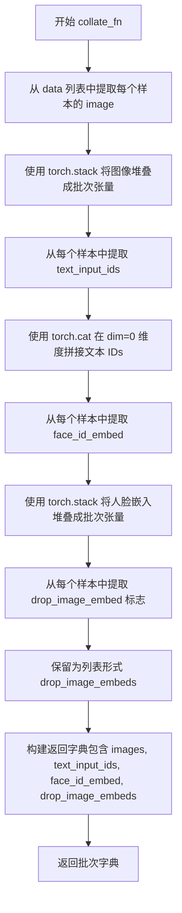
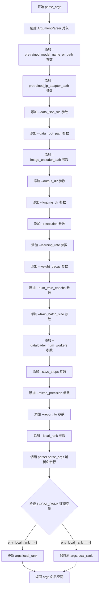
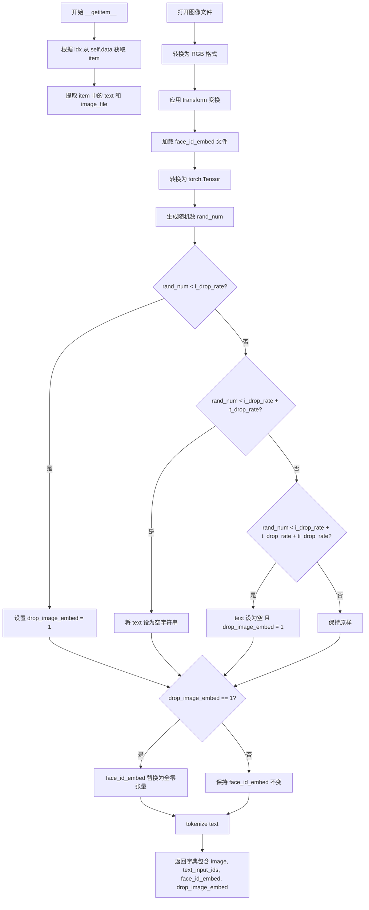
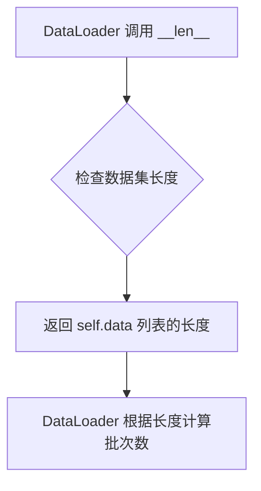
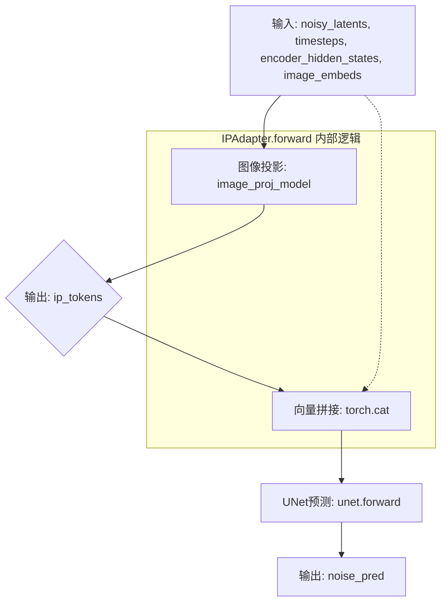
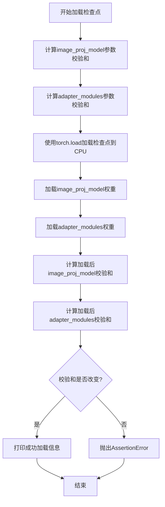

# `diffusers\examples\research_projects\ip_adapter\tutorial_train_faceid.py` 详细设计文档

这是一个用于训练 IP-Adapter (Image Prompt Adapter) 的 PyTorch 训练脚本，专注于通过人脸嵌入 (FaceID) 条件化 Stable Diffusion 模型的生成能力，实现基于人脸特征的文本到图像生成。

## 整体流程

```mermaid
graph TD
    A[开始: main()] --> B[解析参数: parse_args()]
    B --> C[初始化 Accelerator]
    C --> D[加载基础模型: UNet, VAE, CLIPTextModel, Scheduler]
    D --> E[初始化 IP-Adapter 组件]
    E --> E1[MLPProjModel (图像投影)]
    E --> E2[LoRAIPAttnProcessor (注意力处理器)]
    E --> E3[IPAdapter (组合 wrapper)]
    F[加载数据集: MyDataset (JSON)] --> G[数据加载循环]
    G --> H{遍历 Epoch}
    H --> I{遍历 Batch}
    I --> J[VAE 编码图像到 Latent 空间]
    J --> K[采样噪声并添加到 Latent (前向扩散)]
    K --> L[CLIP 编码文本 token]
    L --> M[IPAdapter 前向传播: concat(文本特征, 图像嵌入特征)]
    M --> N[UNet 预测噪声]
    N --> O[计算 MSE Loss]
    O --> P[Accelerator 反向传播与优化]
    P --> Q{检查是否保存模型}
    Q -- 是 --> R[保存 Checkpoint]
    Q -- 否 --> I
    I --> H
    H --> S[结束]
```

## 类结构

```
torch.utils.data.Dataset
└── MyDataset (自定义数据集，处理图像和FaceID嵌入)
torch.nn.Module
└── IPAdapter (IP适配器 wrapper 类)
    ├── MLPProjModel (图像投影模型 - 外部导入)
    ├── UNet2DConditionModel (Unet - 外部导入)
    └── LoRAIPAttnProcessor (LoRA处理器 - 外部导入)
```

## 全局变量及字段


### `args`
    
命令行参数集合，包含所有训练配置

类型：`argparse.Namespace`
    


### `weight_dtype`
    
模型权重的数据类型，根据混合精度设置决定

类型：`torch.dtype`
    


### `global_step`
    
训练过程中的全局步数计数器

类型：`int`
    


### `noise_scheduler`
    
DDPM噪声调度器，用于在扩散模型中添加和去除噪声

类型：`DDPMScheduler`
    


### `tokenizer`
    
CLIP文本分词器，用于将文本转换为token ID序列

类型：`CLIPTokenizer`
    


### `text_encoder`
    
CLIP文本编码器模型，将文本token编码为文本嵌入

类型：`CLIPTextModel`
    


### `vae`
    
变分自编码器，用于将图像编码到潜在空间并从潜在空间解码

类型：`AutoencoderKL`
    


### `unet`
    
Stable Diffusion UNet模型，根据噪声和条件预测噪声残差

类型：`UNet2DConditionModel`
    


### `image_proj_model`
    
MLP投影模型，将FaceID嵌入映射到UNet的交叉注意力空间

类型：`MLPProjModel`
    


### `adapter_modules`
    
IP-Adapter的LoRA适配器模块列表，用于微调UNet的注意力层

类型：`torch.nn.ModuleList`
    


### `ip_adapter`
    
IP-Adapter模型，整合UNet、投影模型和适配器进行条件图像生成

类型：`IPAdapter`
    


### `optimizer`
    
AdamW优化器，用于更新IP-Adapter的可训练参数

类型：`torch.optim.AdamW`
    


### `train_dataloader`
    
训练数据加载器，按批次提供图像、文本嵌入和FaceID嵌入

类型：`torch.utils.data.DataLoader`
    


### `MyDataset.tokenizer`
    
用于文本编码

类型：`CLIPTokenizer`
    


### `MyDataset.size`
    
图像分辨率

类型：`int`
    


### `MyDataset.i_drop_rate`
    
图像嵌入丢弃率

类型：`float`
    


### `MyDataset.t_drop_rate`
    
文本嵌入丢弃率

类型：`float`
    


### `MyDataset.ti_drop_rate`
    
图像和文本同时丢弃率

类型：`float`
    


### `MyDataset.image_root_path`
    
图像根目录

类型：`str`
    


### `MyDataset.data`
    
JSON加载的数据列表

类型：`list`
    


### `MyDataset.transform`
    
图像预处理流程

类型：`torchvision.transforms`
    


### `IPAdapter.unet`
    
Stable Diffusion UNet

类型：`UNet2DConditionModel`
    


### `IPAdapter.image_proj_model`
    
将FaceID嵌入映射到UNet空间

类型：`MLPProjModel`
    


### `IPAdapter.adapter_modules`
    
LoRA 适配器模块列表

类型：`nn.ModuleList`
    
    

## 全局函数及方法


### `collate_fn`

该函数是 PyTorch DataLoader 的 collate 函数，用于将数据集中多个样本整理成一个批次。它从每个样本中提取图像、文本输入 IDs、人脸 ID 嵌入和图像嵌入丢弃标志，然后使用 `torch.stack` 或 `torch.cat` 将它们合并为批次张量，最后返回包含所有批次数据的字典。

参数：

- `data`：`List[Dict]`，从 `MyDataset` 返回的样本列表，每个样本包含 "image"、"text_input_ids"、"face_id_embed" 和 "drop_image_embed" 键

返回值：`Dict`，包含以下键的字典：

- `images`：`torch.Tensor`，形状为 (batch_size, C, H, W) 的图像张量
- `text_input_ids`：`torch.Tensor`，形状为 (batch_size, max_length) 的文本输入 IDs
- `face_id_embed`：`torch.Tensor`，形状为 (batch_size, embed_dim) 的人脸 ID 嵌入张量
- `drop_image_embeds`：`List[int]`，表示每个样本是否丢弃图像嵌入的标志列表

#### 流程图



#### 带注释源码

```python
def collate_fn(data):
    """
    DataLoader 的 collate 函数，将多个样本整理成一个批次
    
    参数:
        data: 样本列表，每个样本是包含以下键的字典:
            - image: torch.Tensor, 单张图像张量 (C, H, W)
            - text_input_ids: torch.Tensor, 文本输入 IDs (seq_len,)
            - face_id_embed: torch.Tensor, 人脸 ID 嵌入向量 (embed_dim,)
            - drop_image_embed: int, 是否丢弃图像嵌入的标志 (0 或 1)
    
    返回:
        包含批次数据的字典:
            - images: 堆叠后的图像张量 (batch_size, C, H, W)
            - text_input_ids: 拼接后的文本 IDs (batch_size, seq_len)
            - face_id_embed: 堆叠后的人脸嵌入 (batch_size, embed_dim)
            - drop_image_embeds: 丢弃标志列表 List[int]
    """
    # 从每个样本中提取图像，然后使用 torch.stack 在第 0 维堆叠
    # 结果形状: (batch_size, C, H, W)
    images = torch.stack([example["image"] for example in data])
    
    # 从每个样本中提取文本输入 IDs，然后使用 torch.cat 在第 0 维拼接
    # 结果形状: (batch_size, max_length)
    # 使用 cat 而不是 stack，因为 text_input_ids 已经是拼接好的长张量
    text_input_ids = torch.cat([example["text_input_ids"] for example in data], dim=0)
    
    # 从每个样本中提取人脸 ID 嵌入，然后使用 torch.stack 堆叠
    # 结果形状: (batch_size, embed_dim)
    face_id_embed = torch.stack([example["face_id_embed"] for example in data])
    
    # 从每个样本中提取图像嵌入丢弃标志，保留为列表
    # 不使用 torch.stack，因为后续可能需要作为列表处理
    drop_image_embeds = [example["drop_image_embed"] for example in data]

    # 返回包含所有批次数据的字典，供模型训练使用
    return {
        "images": images,
        "text_input_ids": text_input_ids,
        "face_id_embed": face_id_embed,
        "drop_image_embeds": drop_image_embeds,
    }
```


### `parse_args`

该函数是命令行参数解析器，使用 Python 的 `argparse` 模块定义并收集训练脚本所需的各种配置参数，包括模型路径、数据路径、训练超参数等，并返回包含所有参数的命名空间对象。

参数：**无**（该函数不接受任何输入参数）

返回值：`argparse.Namespace`，包含所有命令行参数的解析结果对象

#### 流程图



#### 带注释源码

```python
def parse_args():
    """
    解析命令行参数并返回包含所有配置选项的命名空间对象。
    
    该函数使用 argparse 定义训练脚本所需的各种参数，包括模型路径、
    数据路径、训练超参数、分布式训练配置等。
    
    Returns:
        argparse.Namespace: 包含所有解析后命令行参数的命名空间对象
    """
    # 创建参数解析器，description 用于描述脚本用途
    parser = argparse.ArgumentParser(description="Simple example of a training script.")
    
    # ==================== 模型相关参数 ====================
    # 预训练模型名称或路径（HuggingFace 模型 ID 或本地路径）
    parser.add_argument(
        "--pretrained_model_name_or_path",
        type=str,
        default=None,
        required=True,
        help="Path to pretrained model or model identifier from huggingface.co/models.",
    )
    
    # 预训练 IP-Adapter 权重路径（可选，未指定则随机初始化）
    parser.add_argument(
        "--pretrained_ip_adapter_path",
        type=str,
        default=None,
        help="Path to pretrained ip adapter model. If not specified weights are initialized randomly.",
    )
    
    # CLIP 图像编码器路径
    parser.add_argument(
        "--image_encoder_path",
        type=str,
        default=None,
        required=True,
        help="Path to CLIP image encoder",
    )
    
    # ==================== 数据相关参数 ====================
    # 训练数据 JSON 文件路径（包含图像文件和对应嵌入的文件列表）
    parser.add_argument(
        "--data_json_file",
        type=str,
        default=None,
        required=True,
        help="Training data",
    )
    
    # 训练数据根目录路径
    parser.add_argument(
        "--data_root_path",
        type=str,
        default="",
        required=True,
        help="Training data root path",
    )
    
    # ==================== 输出相关参数 ====================
    # 输出目录（模型预测和检查点保存路径）
    parser.add_argument(
        "--output_dir",
        type=str,
        default="sd-ip_adapter",
        help="The output directory where the model predictions and checkpoints will be written.",
    )
    
    # 日志目录（TensorBoard 日志存储路径）
    parser.add_argument(
        "--logging_dir",
        type=str,
        default="logs",
        help=(
            "[TensorBoard](https://www.tensorflow.org/tensorboard) log directory. Will default to"
            " *output_dir/runs/**CURRENT_DATETIME_HOSTNAME***."
        ),
    )
    
    # ==================== 训练超参数 ====================
    # 输入图像分辨率
    parser.add_argument(
        "--resolution",
        type=int,
        default=512,
        help=("The resolution for input images"),
    )
    
    # 学习率
    parser.add_argument(
        "--learning_rate",
        type=float,
        default=1e-4,
        help="Learning rate to use.",
    )
    
    # 权重衰减（正则化参数）
    parser.add_argument("--weight_decay", type=float, default=1e-2, help="Weight decay to use.")
    
    # 训练轮数
    parser.add_argument("--num_train_epochs", type=int, default=100)
    
    # 训练批次大小（每个设备）
    parser.add_argument(
        "--train_batch_size", type=int, default=8, help="Batch size (per device) for the training dataloader."
    )
    
    # 数据加载器工作进程数
    parser.add_argument(
        "--dataloader_num_workers",
        type=int,
        default=0,
        help=(
            "Number of subprocesses to use for data loading. 0 means that the data will be loaded in the main process."
        ),
    )
    
    # 检查点保存间隔（步数）
    parser.add_argument(
        "--save_steps",
        type=int,
        default=2000,
        help=("Save a checkpoint of the training state every X updates"),
    )
    
    # ==================== 混合精度与日志相关 ====================
    # 混合精度训练选项（no/fp16/bf16）
    parser.add_argument(
        "--mixed_precision",
        type=str,
        default=None,
        choices=["no", "fp16", "bf16"],
        help=(
            "Whether to use mixed precision. Choose between fp16 and bf16 (bfloat16). Bf16 requires PyTorch >="
            " 1.10.and an Nvidia Ampere GPU.  Default to the value of accelerate config of the current system or the"
            " flag passed with the `accelerate.launch` command. Use this argument to override the accelerate config."
        ),
    )
    
    # 日志报告工具（tensorboard/wandb/comet_ml）
    parser.add_argument(
        "--report_to",
        type=str,
        default="tensorboard",
        help=(
            'The integration to report the results and logs to. Supported platforms are `"tensorboard"`'
            ' (default), `"wandb"` and `"comet_ml"`. Use `"all"` to report to all integrations.'
        ),
    )
    
    # ==================== 分布式训练参数 ====================
    # 本地排名（用于分布式训练，-1 表示非分布式）
    parser.add_argument("--local_rank", type=int, default=-1, help="For distributed training: local_rank")
    
    # ==================== 解析与环境变量处理 ====================
    # 解析命令行传入的参数
    args = parser.parse_args()
    
    # 检查 LOCAL_RANK 环境变量，用于支持分布式训练的自动化配置
    # 如果环境变量存在且与命令行参数不同，则以环境变量为准
    env_local_rank = int(os.environ.get("LOCAL_RANK", -1))
    if env_local_rank != -1 and env_local_rank != args.local_rank:
        args.local_rank = env_local_rank
    
    # 返回包含所有参数的命名空间对象
    return args
```


### `main`

这是训练IP-Adapter模型的主函数，负责解析命令行参数、初始化加速器、加载预训练模型和数据集、构建IP-Adapter架构，并执行完整的训练循环（包括前向传播、损失计算、反向传播和模型保存）。

参数：该函数无显式参数（通过`parse_args()`从命令行获取参数）

返回值：`None`，无返回值

#### 流程图

```mermaid
flowchart TD
    A[开始 main] --> B[调用 parse_args 获取命令行参数]
    B --> C[创建 logging_dir 路径]
    C --> D[创建 Accelerator 加速器实例]
    D --> E{是否是主进程}
    E -->|是| F[创建输出目录]
    E -->|否| G[跳过目录创建]
    F --> G
    G --> H[加载 DDPMScheduler 调度器]
    H --> I[加载 CLIPTokenizer 分词器]
    I --> J[加载 CLIPTextModel 文本编码器]
    J --> K[加载 AutoencoderKL VAE模型]
    K --> L[加载 UNet2DConditionModel UNet模型]
    L --> M[冻结 unet, vae, text_encoder 的梯度]
    M --> N[创建 MLPProjModel 图像投影模型]
    N --> O[初始化 LoRA 注意力处理器]
    O --> P[创建 adapter_modules 模块列表]
    P --> Q[创建 IPAdapter 实例]
    Q --> R[设置权重数据类型 weight_dtype]
    R --> S[创建 AdamW 优化器]
    S --> T[创建 MyDataset 数据集]
    T --> U[创建 DataLoader 数据加载器]
    U --> V[使用 accelerator 准备模型、优化器、数据]
    V --> W[进入训练循环: for epoch in range(num_train_epochs)]
    W --> X[遍历每个 batch]
    X --> Y[将图像编码为 latent]
    Y --> Z[采样噪声并添加到 latent]
    Z --> AA[获取文本 encoder_hidden_states]
    AA --> AB[调用 ip_adapter 前向传播]
    AB --> AC[计算 MSE 损失]
    AC --> AD[执行反向传播]
    AD --> AE[更新优化器参数]
    AE --> AF{global_step % save_steps == 0?}
    AF -->|是| AG[保存检查点]
    AF -->|否| AH[继续训练]
    AG --> AH
    AH --> AI{是否还有更多 batch?}
    AI -->|是| X
    AI -->|否| AJ[进入下一 epoch]
    AJ --> W
    AK[训练完成]
    W -->|所有 epoch 完成| AK
```

#### 带注释源码

```python
def main():
    """
    主训练函数，负责：
    1. 解析命令行参数
    2. 初始化分布式训练加速器
    3. 加载预训练模型（Stable Diffusion组件）
    4. 构建IP-Adapter架构
    5. 执行训练循环
    """
    # 步骤1: 解析命令行参数
    args = parse_args()
    
    # 步骤2: 创建日志目录路径
    logging_dir = Path(args.output_dir, args.logging_dir)

    # 步骤3: 创建Accelerator配置
    # ProjectConfiguration用于配置项目目录和日志目录
    accelerator_project_config = ProjectConfiguration(project_dir=args.output_dir, logging_dir=logging_dir)

    # 步骤4: 初始化Accelerator分布式训练环境
    accelerator = Accelerator(
        mixed_precision=args.mixed_precision,          # 混合精度训练设置
        log_with=args.report_to,                        # 日志报告工具
        project_config=accelerator_project_config       # 项目配置
    )

    # 步骤5: 主进程创建输出目录
    if accelerator.is_main_process:
        if args.output_dir is not None:
            os.makedirs(args.output_dir, exist_ok=True)

    # ========== 加载预训练模型 ==========
    
    # 步骤6: 加载DDPMScheduler（扩散模型噪声调度器）
    noise_scheduler = DDPMScheduler.from_pretrained(args.pretrained_model_name_or_path, subfolder="scheduler")
    
    # 步骤7: 加载CLIPTokenizer用于文本分词
    tokenizer = CLIPTokenizer.from_pretrained(args.pretrained_model_name_or_path, subfolder="tokenizer")
    
    # 步骤8: 加载CLIPTextModel文本编码器
    text_encoder = CLIPTextModel.from_pretrained(args.pretrained_model_name_or_path, subfolder="text_encoder")
    
    # 步骤9: 加载VAE变分自编码器
    vae = AutoencoderKL.from_pretrained(args.pretrained_model_name_or_path, subfolder="vae")
    
    # 步骤10: 加载UNet2DConditionModel条件UNet
    unet = UNet2DConditionModel.from_pretrained(args.pretrained_model_name_or_path, subfolder="unet")

    # 步骤11: 冻结模型参数以节省显存（只训练IP-Adapter部分）
    unet.requires_grad_(False)
    vae.requires_grad_(False)
    text_encoder.requires_grad_(False)

    # ========== 构建IP-Adapter架构 ==========
    
    # 步骤12: 创建图像投影模型(MLP)
    # 将face_id嵌入转换为与UNet兼容的token表示
    image_proj_model = MLPProjModel(
        cross_attention_dim=unet.config.cross_attention_dim,  # UNet交叉注意力维度
        id_embeddings_dim=512,                                 # 人脸ID嵌入维度
        num_tokens=4,                                          # 生成的token数量
    )
    
    # 步骤13: 初始化LoRA注意力处理器
    lora_rank = 128                                           # LoRA秩
    attn_procs = {}                                           # 注意力处理器字典
    unet_sd = unet.state_dict()                               # 获取UNet状态字典
    
    # 遍历UNet的所有注意力处理器
    for name in unet.attn_processors.keys():
        # 判断是否为交叉注意力（attn1是自注意力）
        cross_attention_dim = None if name.endswith("attn1.processor") else unet.config.cross_attention_dim
        
        # 根据模块名称确定隐藏层大小
        if name.startswith("mid_block"):
            hidden_size = unet.config.block_out_channels[-1]
        elif name.startswith("up_blocks"):
            block_id = int(name[len("up_blocks.")])
            hidden_size = list(reversed(unet.config.block_out_channels))[block_id]
        elif name.startswith("down_blocks"):
            block_id = int(name[len("down_blocks.")])
            hidden_size = unet.config.block_out_channels[block_id]
        
        # 为自注意力创建LoRA处理器，为交叉注意力创建IP-Adapter处理器
        if cross_attention_dim is None:
            attn_procs[name] = LoRAAttnProcessor(
                hidden_size=hidden_size, 
                cross_attention_dim=cross_attention_dim, 
                rank=lora_rank
            )
        else:
            layer_name = name.split(".processor")[0]
            # 加载预训练的k、v权重
            weights = {
                "to_k_ip.weight": unet_sd[layer_name + ".to_k.weight"],
                "to_v_ip.weight": unet_sd[layer_name + ".to_v.weight"],
            }
            attn_procs[name] = LoRAIPAttnProcessor(
                hidden_size=hidden_size, 
                cross_attention_dim=cross_attention_dim, 
                rank=lora_rank
            )
            attn_procs[name].load_state_dict(weights, strict=False)
    
    # 步骤14: 设置UNet的注意力处理器
    unet.set_attn_processor(attn_procs)
    
    # 步骤15: 将所有注意力处理器转为ModuleList
    adapter_modules = torch.nn.ModuleList(unet.attn_processors.values())

    # 步骤16: 创建IPAdapter实例
    ip_adapter = IPAdapter(unet, image_proj_model, adapter_modules, args.pretrained_ip_adapter_path)

    # ========== 设置优化器 ==========
    
    # 步骤17: 确定权重数据类型（根据混合精度设置）
    weight_dtype = torch.float32
    if accelerator.mixed_precision == "fp16":
        weight_dtype = torch.float16
    elif accelerator.mixed_precision == "bf16":
        weight_dtype = torch.bfloat16
    
    # 步骤18: 将模型移到指定设备
    vae.to(accelerator.device, dtype=weight_dtype)
    text_encoder.to(accelerator.device, dtype=weight_dtype)

    # 步骤19: 创建AdamW优化器，只优化IP-Adapter相关参数
    params_to_opt = itertools.chain(
        ip_adapter.image_proj_model.parameters(),  # 图像投影模型参数
        ip_adapter.adapter_modules.parameters()    # Adapter模块参数
    )
    optimizer = torch.optim.AdamW(params_to_opt, lr=args.learning_rate, weight_decay=args.weight_decay)

    # ========== 创建数据加载器 ==========
    
    # 步骤20: 创建训练数据集
    train_dataset = MyDataset(
        args.data_json_file, 
        tokenizer=tokenizer, 
        size=args.resolution, 
        image_root_path=args.data_root_path
    )
    
    # 步骤21: 创建DataLoader
    train_dataloader = torch.utils.data.DataLoader(
        train_dataset,
        shuffle=True,
        collate_fn=collate_fn,
        batch_size=args.train_batch_size,
        num_workers=args.dataloader_num_workers,
    )

    # 步骤22: 使用accelerator准备所有组件
    ip_adapter, optimizer, train_dataloader = accelerator.prepare(
        ip_adapter, optimizer, train_dataloader
    )

    # ========== 训练循环 ==========
    
    global_step = 0  # 全局训练步数
    
    # 遍历所有训练轮次
    for epoch in range(0, args.num_train_epochs):
        begin = time.perf_counter()  # 记录epoch开始时间
        
        # 遍历每个batch
        for step, batch in enumerate(train_dataloader):
            load_data_time = time.perf_counter() - begin  # 数据加载时间
            
            # 使用accumulate进行梯度累积
            with accelerator.accumulate(ip_adapter):
                # 步骤23: 将图像编码为latent空间
                with torch.no_grad():  # 不计算梯度
                    latents = vae.encode(
                        batch["images"].to(accelerator.device, dtype=weight_dtype)
                    ).latent_dist.sample()
                    latents = latents * vae.config.scaling_factor  # 缩放因子

                # 步骤24: 采样噪声
                noise = torch.randn_like(latents)
                bsz = latents.shape[0]
                
                # 步骤25: 为每个图像随机采样时间步
                timesteps = torch.randint(
                    0, 
                    noise_scheduler.num_train_timesteps, 
                    (bsz,), 
                    device=latents.device
                )
                timesteps = timesteps.long()

                # 步骤26: 前向扩散过程：添加噪声到latent
                noisy_latents = noise_scheduler.add_noise(latents, noise, timesteps)

                # 步骤27: 获取图像嵌入（face_id嵌入）
                image_embeds = batch["face_id_embed"].to(accelerator.device, dtype=weight_dtype)

                # 步骤28: 获取文本编码器隐藏状态
                with torch.no_grad():
                    encoder_hidden_states = text_encoder(
                        batch["text_input_ids"].to(accelerator.device)
                    )[0]

                # 步骤29: IP-Adapter前向传播预测噪声
                noise_pred = ip_adapter(
                    noisy_latents, 
                    timesteps, 
                    encoder_hidden_states, 
                    image_embeds
                )

                # 步骤30: 计算MSE损失
                loss = F.mse_loss(noise_pred.float(), noise.float(), reduction="mean")

                # 步骤31: 收集所有进程的损失用于日志
                avg_loss = accelerator.gather(
                    loss.repeat(args.train_batch_size)
                ).mean().item()

                # 步骤32: 反向传播
                accelerator.backward(loss)
                
                # 步骤33: 更新参数
                optimizer.step()
                optimizer.zero_grad()

                # 步骤34: 主进程打印日志
                if accelerator.is_main_process:
                    print(
                        "Epoch {}, step {}, data_time: {}, time: {}, step_loss: {}".format(
                            epoch, 
                            step, 
                            load_data_time, 
                            time.perf_counter() - begin, 
                            avg_loss
                        )
                    )

            # 更新全局步数
            global_step += 1

            # 步骤35: 定期保存检查点
            if global_step % args.save_steps == 0:
                save_path = os.path.join(args.output_dir, f"checkpoint-{global_step}")
                accelerator.save_state(save_path)

            # 重置计时器
            begin = time.perf_counter()
```


### `MyDataset.__init__`

该方法是 `MyDataset` 类的构造函数，负责初始化数据集的各项配置参数、加载训练数据JSON文件、设置图像预处理变换管道，以及配置文本和图像嵌入的丢弃率。

参数：

- `self`：隐式参数，表示数据集实例本身
- `json_file`：`str`，JSON文件路径，包含训练数据列表，格式为 `[{"image_file": "1.png", "id_embed_file": "faceid.bin", "text": "..."}]`
- `tokenizer`：`CLIPTokenizer`，HuggingFace CLIP分词器，用于对文本进行tokenize处理
- `size`：`int`，默认值 512，输出图像的尺寸（宽高）
- `t_drop_rate`：`float`，默认值 0.05，文本丢弃率（text drop rate），用于随机将文本置空
- `i_drop_rate`：`float`，默认值 0.05，图像丢弃率（image drop rate），用于随机将图像嵌入置零
- `ti_drop_rate`：`float`，默认值 0.05，文本和图像同时丢弃率（text-image drop rate），用于随机同时丢弃文本和图像嵌入
- `image_root_path`：`str`，默认值 ""，图像文件的根目录路径，用于与JSON中的image_file拼接成完整路径

返回值：`None`，该方法为构造函数，不返回任何值

#### 流程图

```mermaid
flowchart TD
    A[开始 __init__] --> B[调用父类构造函数 super().__init__]
    B --> C[保存 tokenizer 到实例变量]
    C --> D[保存 size 到实例变量]
    D --> E[保存 i_drop_rate, t_drop_rate, ti_drop_rate 到实例变量]
    E --> F[保存 image_root_path 到实例变量]
    F --> G[打开并解析 JSON 文件]
    G --> H[将 JSON 数据保存到 self.data]
    H --> I[创建图像变换管道 transform]
    I --> J[结束]
```

#### 带注释源码

```python
def __init__(
    self, json_file, tokenizer, size=512, t_drop_rate=0.05, i_drop_rate=0.05, ti_drop_rate=0.05, image_root_path=""
):
    """
    初始化MyDataset数据集
    
    参数:
        json_file: 包含训练数据信息的JSON文件路径
        tokenizer: CLIP分词器用于文本处理
        size: 输出图像尺寸
        t_drop_rate: 文本丢弃概率
        i_drop_rate: 图像嵌入丢弃概率
        ti_drop_rate: 文本和图像同时丢弃概率
        image_root_path: 图像文件根目录
    """
    # 调用父类torch.utils.data.Dataset的初始化方法
    super().__init__()

    # 保存分词器引用，用于后续__getitem__中对文本进行tokenize
    self.tokenizer = tokenizer
    # 保存目标图像尺寸
    self.size = size
    # 保存三种drop rate，用于训练时随机丢弃文本/图像/同时丢弃
    self.i_drop_rate = i_drop_rate
    self.t_drop_rate = t_drop_rate
    self.ti_drop_rate = ti_drop_rate
    # 保存图像根目录路径，用于拼接完整图像路径
    self.image_root_path = image_root_path

    # 打开并解析JSON文件，获取训练数据列表
    # 数据格式: [{"image_file": "1.png", "id_embed_file": "faceid.bin", "text": "描述文本"}]
    self.data = json.load(
        open(json_file)
    )  # list of dict: [{"image_file": "1.png", "id_embed_file": "faceid.bin"}]

    # 创建图像预处理变换管道:
    # 1. Resize: 将图像调整到指定尺寸，使用双线性插值
    # 2. CenterCrop: 从中心裁剪到指定尺寸
    # 3. ToTensor: 转换为PyTorch张量，像素值归一化到[0,1]
    # 4. Normalize: 标准化到[-1,1]范围
    self.transform = transforms.Compose(
        [
            transforms.Resize(self.size, interpolation=transforms.InterpolationMode.BILINEAR),
            transforms.CenterCrop(self.size),
            transforms.ToTensor(),
            transforms.Normalize([0.5], [0.5]),
        ]
    )
```


### `MyDataset.__getitem__`

获取数据集中指定索引的样本，包含图像加载、文本tokenization、人脸嵌入处理以及随机drop策略的应用。

参数：

- `idx`：`int`，要获取的样本索引

返回值：`Dict`，包含以下键值对：
- `image`：`torch.Tensor`，预处理后的图像张量，形状为 (C, H, W)，已归一化到 [-1, 1]
- `text_input_ids`：`torch.Tensor`，文本token序列，形状为 (max_length,)
- `face_id_embed`：`torch.Tensor`，人脸ID嵌入向量，形状为 (512,) 或根据模型配置
- `drop_image_embed`：`int`，是否丢弃图像嵌入的标志，0 表示保留，1 表示丢弃

#### 流程图



#### 带注释源码

```python
def __getitem__(self, idx):
    # 根据索引从数据列表中获取对应的数据项
    item = self.data[idx]
    # 从数据项中提取文本描述和图像文件名
    text = item["text"]
    image_file = item["image_file"]

    # 读取图像文件
    raw_image = Image.open(os.path.join(self.image_root_path, image_file))
    # 将图像转换为 RGB 格式（确保通道一致）
    # 应用预处理变换：Resize、CenterCrop、ToTensor、Normalize
    image = self.transform(raw_image.convert("RGB"))

    # 加载人脸ID嵌入文件（从磁盘读取为numpy数组）
    face_id_embed = torch.load(item["id_embed_file"], map_location="cpu")
    # 将numpy数组转换为PyTorch张量
    face_id_embed = torch.from_numpy(face_id_embed)

    # drop策略：随机丢弃图像嵌入、文本或两者
    drop_image_embed = 0  # 默认不丢弃
    rand_num = random.random()  # 生成 [0, 1) 的随机数
    
    # 根据随机数决定是否丢弃图像嵌入
    if rand_num < self.i_drop_rate:
        drop_image_embed = 1
    # 根据随机数决定是否丢弃文本（只保留图像）
    elif rand_num < (self.i_drop_rate + self.t_drop_rate):
        text = ""
    # 根据随机数决定是否同时丢弃文本和图像嵌入
    elif rand_num < (self.i_drop_rate + self.t_drop_rate + self.ti_drop_rate):
        text = ""
        drop_image_embed = 1
    
    # 如果需要丢弃图像嵌入，将其替换为全零张量
    if drop_image_embed:
        face_id_embed = torch.zeros_like(face_id_embed)
    
    # 对文本进行tokenization
    # 填充到最大长度，截断超长文本，返回PyTorch张量
    text_input_ids = self.tokenizer(
        text,
        max_length=self.tokenizer.model_max_length,
        padding="max_length",
        truncation=True,
        return_tensors="pt",
    ).input_ids

    # 返回包含所有必要数据的字典
    return {
        "image": image,  # 预处理后的图像张量
        "text_input_ids": text_input_ids,  # token化后的文本ID
        "face_id_embed": face_id_embed,  # 人脸ID嵌入（可能被替换为零张量）
        "drop_image_embed": drop_image_embed,  # 丢弃标志，供训练时使用
    }
```


### `MyDataset.__len__`

返回数据集中样本的数量，使 DataLoader 能够确定数据集的大小以便进行批量迭代。

参数：

- `self`：`MyDataset`，表示数据集对象本身

返回值：`int`，表示数据集中数据条目的数量

#### 流程图



#### 带注释源码

```python
def __len__(self):
    """
    返回数据集中样本的数量。

    此方法是 PyTorch Dataset 类的标准接口之一，DataLoader 会调用此方法
    来确定数据集的大小，从而计算总批次数并进行迭代。

    返回值:
        int: 加载的 JSON 数据列表的长度，即数据集中样本的总数
    """
    return len(self.data)  # 返回存储在 self.data 中的数据条目数量
```


### `IPAdapter.__init__`

该方法是 `IPAdapter` 类的构造函数，用于初始化 IP-Adapter 模型的核心组件，包括 UNet、图像投影模型和适配器模块，并在提供检查点路径时自动加载预训练权重。

参数：

- `self`：隐式参数，IPAdapter 实例本身
- `unet`：`UNet2DConditionModel`，Stable Diffusion 的 UNet 模型，用于根据文本和图像条件预测噪声
- `image_proj_model`：`MLPProjModel`，图像嵌入投影模型，将图像特征映射到与文本嵌入兼容的空间
- `adapter_modules`：`torch.nn.ModuleList`，IP-Adapter 的注意力处理器模块集合，添加到 UNet 的交叉注意力层
- `ckpt_path`：`str | None`，预训练检查点路径，如果提供则从该路径加载模型权重（可选，默认 `None`）

返回值：`None`，构造函数不返回任何值，仅初始化对象状态

#### 流程图

```mermaid
flowchart TD
    A[开始 __init__] --> B[调用 super().__init__ 初始化 nn.Module]
    B --> C[赋值 self.unet = unet]
    C --> D[赋值 self.image_proj_model = image_proj_model]
    D --> E[赋值 self.adapter_modules = adapter_modules]
    E --> F{ckpt_path is not None?}
    F -->|是| G[调用 load_from_checkpoint 加载权重]
    F -->|否| H[结束 __init__]
    G --> H
```

#### 带注释源码

```python
def __init__(self, unet, image_proj_model, adapter_modules, ckpt_path=None):
    """
    初始化 IP-Adapter 模型
    
    参数:
        unet: UNet2DConditionModel, Stable Diffusion 的 UNet 去噪模型
        image_proj_model: MLPProjModel, 图像嵌入投影模型
        adapter_modules: torch.nn.ModuleList, IP-Adapter 的适配器模块列表
        ckpt_path: str, 预训练权重路径，可选
    """
    # 调用父类 torch.nn.Module 的初始化方法
    # 注册子模块并初始化 PyTorch 模型的基本结构
    super().__init__()
    
    # 保存 UNet 模型引用，用于前向传播时执行去噪预测
    self.unet = unet
    
    # 保存图像投影模型，用于将图像嵌入转换为 UNet 兼容的表示
    self.image_proj_model = image_proj_model
    
    # 保存适配器模块集合，这些模块被添加到 UNet 的注意力层
    self.adapter_modules = adapter_modules

    # 如果提供了检查点路径，则从预训练权重加载
    # 这允许使用已训练的 IP-Adapter 权重进行推理或微调
    if ckpt_path is not None:
        self.load_from_checkpoint(ckpt_path)
```


### `IPAdapter.forward`

该方法实现了 IP-Adapter 的前向传播逻辑。其核心目的是将图像（尤其是人脸）的条件信息注入到扩散模型的去噪过程中。具体而言，它首先将输入的图像嵌入（FaceID Embeddings）通过投影模型转换为适配器令牌（IP Tokens），然后将这些令牌与文本编码器的隐藏状态在序列维度上进行拼接，最后将拼接后的条件输入 UNet 模型以预测噪声残差。

#### 类的详细信息

- **类名**: `IPAdapter`
- **父类**: `torch.nn.Module`
- **类描述**: 这是一个整合了 UNet、图像投影模型和适配器模块的组合模型，用于实现基于图像提示的扩散模型推理/训练。
- **类字段**:
    - `self.unet`: `UNet2DConditionModel`，主干扩散模型。
    - `self.image_proj_model`: `MLPProjModel`，负责将图像嵌入投影到与文本嵌入相同维度的空间。
    - `self.adapter_modules`: `torch.nn.ModuleList`，存储在 UNet 中的 LoRA 适配器权重。

#### 参数

- `noisy_latents`：`torch.Tensor`，噪声潜向量，表示当前去噪阶段的图像潜在表示（通常来自 VAE 编码或上一步的预测）。
- `timesteps`：`torch.Tensor` (Long)，当前扩散过程的时间步长，用于调度噪声的添加和移除。
- `encoder_hidden_states`：`torch.Tensor`，来自 CLIP 文本编码器的文本嵌入向量，包含了文本提示的语义信息。
- `image_embeds`：`torch.Tensor`，来自 FaceID 模型或数据集的图像嵌入向量，包含输入图像的身份特征信息。

#### 返回值

- `noise_pred`：`torch.Tensor`，UNet 预测的噪声残差值。后续通常使用该值与真实噪声计算损失（训练阶段）或根据该值更新潜向量（推理阶段）。

#### 流程图



#### 带注释源码

```python
def forward(self, noisy_latents, timesteps, encoder_hidden_states, image_embeds):
    """
    IP-Adapter 的前向传播函数。
    
    参数:
        noisy_latents (torch.Tensor): 含有噪声的潜在表示 (Batch, Channel, Height, Width)。
        timesteps (torch.Tensor): 当前的时间步长 (Batch,)。
        encoder_hidden_states (torch.Tensor): 文本编码器的输出 (Batch, Seq_Len, Hidden_Dim)。
        image_embeds (torch.Tensor): 图像的嵌入向量 (Batch, Embed_Dim)。
    
    返回:
        torch.Tensor: 预测的噪声残差 (Batch, Channel, Height, Width)。
    """
    # 1. 将图像嵌入投影为 IP Tokens
    # 使用 MLPProjModel 将原始的 FaceID 嵌入转换为 Cross-Attention 维度的令牌
    ip_tokens = self.image_proj_model(image_embeds)
    
    # 2. 融合文本与图像条件
    # 将文本隐藏状态与图像投影后的 IP Tokens 在序列维度(dim=1)上进行拼接
    # 拼接后的顺序通常是: [Text Tokens, Image Tokens]
    encoder_hidden_states = torch.cat([encoder_hidden_states, ip_tokens], dim=1)
    
    # 3. 通过 UNet 预测噪声
    # 将拼接后的条件信息传入 UNet，UNet 会根据这些条件预测当前噪声
    # 注意：diffusers 库中的 UNet 返回一个包含 sample 属性的对象
    noise_pred = self.unet(noisy_latents, timesteps, encoder_hidden_states).sample
    
    return noise_pred
```

#### 关键组件信息

- **MLPProjModel (image_proj_model)**: 负责将高维度的身份嵌入（如 512 维）转换为低维度、可学习的令牌序列（如 4 个 token，维度与 Cross-Attention 匹配）。
- **UNet2DConditionModel (unet)**: 接收拼接后的条件向量（文本+图像），执行去噪预测。
- **LoRA/IP-Adapter Modules**: 虽然在此方法中未直接出现，但它们通过修改 UNet 的注意力机制来生效，此处是调用入口。

#### 潜在的技术债务或优化空间

1.  **维度硬编码**: 代码中直接使用 `dim=1` 进行拼接，假设 batch 维度的位置是标准的。虽然 PyTorch 约定如此，但如果输入 tensor 形状不匹配（如缺少 batch 维度的 squeeze 操作），调试信息会较为隐晦。
2.  **投影模块的耦合**: `image_proj_model` 的调用是硬编码在 `forward` 内的。如果需要支持动态切换投影模型（如不同的 MLP 架构），或者需要对 `ip_tokens` 进行缓存以提高推理速度，目前的实现重构成本较高。
3.  **状态管理**: `IPAdapter` 组合了多个模型组件。在保存和加载检查点时，需要注意 `image_proj_model` 和 `adapter_modules` 的权重处理（代码中 `load_from_checkpoint` 已有体现），但缺少对 `unet` 本身是否处于训练/推理模式的显式切换逻辑管理。

#### 其它项目

- **设计目标**: 实现文本到图像扩散模型对图像提示（Image Prompt）的支持，特别是通过 FaceID 保留人物身份特征。
- **接口契约**: 调用此方法时，`image_embeds` 必须与 `image_proj_model` 训练时的输入维度一致；`encoder_hidden_states` 的维度必须与 UNet 的 `cross_attention_dim` 匹配。
- **错误处理**: 缺少显式的形状验证。如果 `image_embeds` 的维度与 `MLPProjModel` 期望的 `id_embeddings_dim` 不符，将抛出 RuntimeError。


### `IPAdapter.load_from_checkpoint`

该方法用于从指定的检查点文件加载 IP-Adapter 的预训练权重，包括图像投影模型（image_proj_model）和适配器模块（adapter_modules），并通过校验和验证权重是否成功加载。

参数：

- `ckpt_path`：`str`，检查点文件的路径，指向包含模型权重的 `.bin` 或 `.pt` 文件

返回值：`None`，该方法无返回值，主要通过内部状态更新模型参数

#### 流程图



#### 带注释源码

```python
def load_from_checkpoint(self, ckpt_path: str):
    # 计算加载前image_proj_model所有参数的总和，用于后续验证权重是否改变
    orig_ip_proj_sum = torch.sum(torch.stack([torch.sum(p) for p in self.image_proj_model.parameters()]))
    
    # 计算加载前adapter_modules所有参数的总和，用于后续验证权重是否改变
    orig_adapter_sum = torch.sum(torch.stack([torch.sum(p) for p in self.adapter_modules.parameters()]))

    # 从指定路径加载检查点文件，返回包含'image_proj'和'ip_adapter'键的字典
    state_dict = torch.load(ckpt_path, map_location="cpu")

    # 严格模式加载图像投影模型的权重（strict=True要求键完全匹配）
    self.image_proj_model.load_state_dict(state_dict["image_proj"], strict=True)
    
    # 严格模式加载适配器模块的权重
    self.adapter_modules.load_state_dict(state_dict["ip_adapter"], strict=True)

    # 计算加载后image_proj_model的新校验和
    new_ip_proj_sum = torch.sum(torch.stack([torch.sum(p) for p in self.image_proj_model.parameters()]))
    
    # 计算加载后adapter_modules的新校验和
    new_adapter_sum = torch.sum(torch.stack([torch.sum(p) for p in self.adapter_modules.parameters()]))

    # 验证权重确实发生了改变（即成功加载了新权重）
    assert orig_ip_proj_sum != new_ip_proj_sum, "Weights of image_proj_model did not change!"
    assert orig_adapter_sum != new_adapter_sum, "Weights of adapter_modules did not change!"

    # 打印成功加载信息
    print(f"Successfully loaded weights from checkpoint {ckpt_path}")
```

## 关键组件


### MyDataset

训练数据集类，负责从JSON文件加载图像、文本和Face ID嵌入，支持图像/文本/IP Token的随机丢弃策略。

### collate_fn

数据批处理整理函数，将多个样本数据堆叠为批次数据。

### IPAdapter

IP-Adapter模型类，集成UNet、图像投影模型和适配器模块，实现图像提示的条件扩散推理。

### MLPProjModel

图像嵌入投影模型，将Face ID嵌入投影到与UNet交叉注意力维度兼容的token空间。

### LoRAAttnProcessor & LoRAIPAttnProcessor

LoRA注意力处理器，用于在UNet中注入可学习的图像提示适配器权重。

### parse_args

命令行参数解析函数，定义训练所需的所有超参数和路径配置。

### main

主训练函数，包含模型加载、训练循环、梯度更新和检查点保存的完整流程。

### 训练流程关键组件

噪声调度器(DDPMScheduler)、VAE编码器、文本编码器(CLIPTextModel)、UNet2DConditionModel的集成与配置。

### 优化器配置

AdamW优化器配置，仅对image_proj_model和adapter_modules参数进行更新，其他模型参数冻结。

### 加速器配置

Accelerator配置，支持混合精度训练(fp16/bf16)、分布式训练和梯度累积。


## 问题及建议


### 已知问题

-   **数据集文件句柄未正确关闭**：`json.load(open(json_file))` 未使用上下文管理器，导致文件句柄泄漏。
-   **重复加载face_id_embed**：每个batch都重新从磁盘加载`face_id_embed`文件，I/O效率极低，应在数据集初始化时预加载或缓存。
-   **图像未缓存**：每次`__getitem__`调用都从磁盘读取图像，应考虑使用内存缓存或预加载机制。
-   **drop_image_embeds类型不一致**：`collate_fn`返回Python list而非torch.Tensor，与其他返回tensor的字段不一致，可能导致后续处理错误。
-   **checkpoint加载逻辑缺陷**：`load_from_checkpoint`中使用`torch.sum`检查权重是否变化不可靠，如果初始化权重与加载权重相同会导致断言失败。
-   **未使用的代码**：`image_encoder`相关代码被注释但参数仍存在，可能导致混淆；注释掉的`unet.to()`和`image_encoder.to()`调用使代码不一致。
-   **数据加载时间计算错误**：`load_data_time`在每个step开始时重新计算为`time.perf_counter() - begin`，但`begin`在step结束时被重置，导致该值实际表示上一轮迭代的总时间而非数据加载时间。
-   **缺少学习率调度器**：optimizer配置了学习率但未使用学习率调度器（lr_scheduler），训练曲线可能不最优。
-   **缺少梯度累积支持**：虽然使用了`accelerator.accumulate`，但未检查是否满足累积步数后再执行优化器步骤和保存checkpoint。
-   **checkpoint保存逻辑错误**：在每个step内部检查`global_step % args.save_steps == 0`，但应在optimizer步骤完成后保存以确保状态完整。
-   **未验证必要路径**：未检查`pretrained_model_name_or_path`、`data_json_file`等关键路径是否存在就开始执行。
-   **device/dtype传递冗余**：多次调用`.to(accelerator.device, dtype=weight_dtype)`，代码重复且可封装。

### 优化建议

-   **预加载数据到内存**：在`MyDataset.__init__`中预加载所有face_id_embed和图像路径，避免重复I/O。
-   **使用缓存机制**：添加`functools.lru_cache`或自定义缓存层存储已加载的嵌入和图像。
-   **统一tensor类型**：将`collate_fn`中的`drop_image_embeds`转换为torch.Tensor以保持一致性。
-   **修复权重检查逻辑**：使用更可靠的方法验证checkpoint加载，如比较state_dict的键或直接移除该检查。
-   **移除或启用image_encoder**：若不使用CLIP图像编码器相关功能，应完全移除代码；若需要则取消注释。
-   **修正时间计算**：将`load_data_time`的计算移至正确的位置，或使用专门的计时器类。
-   **添加学习率调度器**：引入`torch.optim.lr_scheduler`或accelerator的调度器以改善训练过程。
-   **添加路径验证**：在main函数开始时检查所有必要路径是否存在，必要时抛出清晰错误。
-   **优化保存逻辑**：将checkpoint保存移至accumulate周期完成后，确保训练状态一致性。
-   **添加错误处理**：为文件操作、模型加载等可能失败的操作添加try-except和详细错误信息。

## 其它


### 设计目标与约束

本代码旨在实现IP-Adapter（Identity-Preserving Adapter）的训练流程，通过将人脸ID嵌入（face ID embedding）注入到Stable Diffusion模型的UNet中，实现基于文本提示和参考人脸图像的个性化图像生成。设计约束包括：1）必须使用预训练的Stable Diffusion模型作为基础；2）采用LoRA技术进行轻量级微调；3）支持分布式训练（Accelerator）；4）混合精度训练支持fp16/bf16；5）模型参数大部分冻结以节省显存。

### 错误处理与异常设计

代码中的错误处理主要包括：1）checkpoint加载时的权重变化校验（assert检查），确保IP-Adapter权重被正确加载；2）分布式训练中LOCAL_RANK环境变量与参数的自动同步；3）文件路径存在性检查由os.makedirs的exist_ok=True参数处理；4）数据加载使用try-except块（代码中未显式实现，建议添加）；5）torch.no_grad()上下文管理器用于推理步骤以节省显存。

### 数据流与状态机

训练数据流：JSON配置文件 → MyDataset.__getitem__() → 图像加载与预处理 → 人脸ID嵌入加载 → 文本tokenization → Drop策略应用 → DataLoader.collate_fn() → 训练循环。状态机转换：初始化 → 数据加载 → VAE编码 → 加噪过程（DDPM）→ 文本编码 → IP-Adapter前向传播 → 噪声预测 → 损失计算 → 反向传播 → 参数更新 → 检查点保存（每save_steps）。

### 外部依赖与接口契约

核心依赖包括：1）diffusers库（AutoencoderKL, DDPMScheduler, UNet2DConditionModel）；2）transformers库（CLIPTextModel, CLIPTokenizer）；3）accelerate库（分布式训练与混合精度）；4）ip_adapter模块（attention_processor_faceid, MLPProjModel）；5）torch和PIL。接口契约：1）数据JSON格式必须包含image_file、text、id_embed_file字段；2）人脸ID嵌入文件为numpy序列化的.bin文件；3）预训练模型路径需符合HuggingFace Hub格式或本地路径。

### 配置参数详细说明

关键训练参数：1）learning_rate默认1e-4，weight_decay默认0.01；2）train_batch_size默认8；3）num_train_epochs默认100；4）save_steps默认2000；5）resolution默认512x512；6）lora_rank默认128；7）drop rates：i_drop_rate=0.05（图像嵌入丢弃）, t_drop_rate=0.05（文本丢弃）, ti_drop_rate=0.05（两者同时丢弃）。

### 模型架构细节

IP-Adapter架构：1）MLPProjModel：投影模型，将512维人脸ID嵌入映射到4个token，cross_attention_dim与UNet匹配；2）LoRAIPAttnProcessor：带LoRA的注意力处理器，注入到UNet的cross-attention层；3）UNet保持冻结，仅训练image_proj_model和adapter_modules；4）VAE和text_encoder在推理时使用torch.no_grad()。

### 内存与性能优化

优化策略：1）混合精度训练（fp16/bf16）降低显存占用；2）gradient accumulation通过accelerator.accumulate实现；3）模型参数冻结（requires_grad_(False)）避免存储梯度；4）weight_dtype控制模型精度；5）数据加载使用多进程（dataloader_num_workers）；6）图像encoder未加载以节省显存（代码中注释掉）。

### 分布式训练支持

通过Accelerator实现：1）自动处理多GPU分布式训练；2）梯度同步与平均；3）主进程控制（is_main_process）；4）检查点保存仅在主进程执行；5）支持local_rank参数；6）日志记录通过TensorBoard/Wandb/CometML。

### 检查点与保存策略

保存机制：1）每save_steps（默认2000）保存完整训练状态；2）使用accelerator.save_state()保存包括优化器状态、随机状态、模型参数；3）保存路径格式：output_dir/checkpoint-{global_step}；4）加载checkpoint通过IPAdapter.load_from_checkpoint()实现。

### 数据增强策略

MyDataset中的增强：1）图像resize到指定尺寸（512）使用BILINEAR插值；2）CenterCrop保持正方形；3）ToTensor转换为张量；4）Normalize到[-1,1]范围。Drop策略：随机丢弃图像嵌入（i_drop_rate）、文本（t_drop_rate）或两者（ti_drop_rate），用于增强模型鲁棒性。
    